# 强化训练

1. (2025·全国Ⅱ卷·★)

已知集合 $A = \{-4,0,1,2,8\}$ ， $B = \{x\mid x^3 = x\}$ ，则 $A\cap B =$ （

A. $\{0,1,2\}$

B. $\{1,2,8\}$

C. $\{2,8\}$

D. $\{0,1\}$

1. D

解析： $x^{3} = x\Leftrightarrow x^{3} - x = x(x^{2} - 1) = x(x + 1)(x - 1) = 0$

解得： $x = 0$ ，-1或1，所以 $B = \{0, - 1,1\}$

又 $A = \{-4,0,1,2,8\}$ ，所以 $A\cap B = \{0,1\}$

2. (2024·江西模拟·★)

已知集合 $A = \{-1, a^2 - 2a + 1, a - 4\}$ ，若 $4 \in A$ ，则 $a$ 的值可能为（）

A. -1, 3

B. -1

C. -1, 3, 8

D. -1, 8

2. D

解析：因为 $4 \in A$ ，所以 $a^2 - 2a + 1 = 4$ 或 $a - 4 = 4$

解得： $a = -1$ 或3或8，经检验，当 $a = 3$ 时，

$a - 4 = -1$ ，集合 $A$ 不满足元素互异，

当 $a = -1$ 或8时，集合 $A$ 满足元素互异，故 $a = -1$ 或8.

3. (2025·四川内江模拟·★★)

已知实数集合 $A = \{1, a, b\}$ ， $B = \{a^2, a, ab\}$ ，若

$A = B$ ，则 $a^{2025} + b^{2025} =$ （

A. -1

B. 0

C. 1

D. 2

3. A

解析：观察发现两个集合中都有元素 $a$ ，故就看 1， $b$ 怎样与 $a^2$ ， $ab$ 对应了，有两种可能的情况，故讨论，

由题意， $A = B$ ，所以 $\left\{ \begin{array}{l}1 = a^2\\ b = ab \end{array} \right.$ 或 $\left\{ \begin{array}{l}1 = ab\\ b = a^2 \end{array} \right.,$

若 $\left\{ \begin{array}{l} 1 = a^2 \\ b = ab \end{array} \right.$ ，则 $\left\{ \begin{array}{l} a = 1 \\ b \in \mathbf{R} \end{array} \right.$ 或 $\left\{ \begin{array}{l} a = -1 \\ b = 0 \end{array} \right.$ ，

当 $a = 1$ 时，集合 $A$ ， $B$ 都不满足元素互异，舍去；

当 $\left\{ \begin{array}{l} a = -1 \\ b = 0 \end{array} \right.$ 时， $A = \{1, -1, 0\}$ ， $B = \{1, -1, 0\}$ ，满足题意；

若 $\left\{ \begin{array}{l} 1 = ab \\ b = a^2 \end{array} \right.$ ，则 $\left\{ \begin{array}{l} a = 1 \\ b = 1 \end{array} \right.$ ，集合 $A$ ， $B$ 都不满足元素互异，舍去；

综上所述， $a = -1$ ， $b = 0$ ，所以 $a^{2025} + b^{2025} = -1$

4. (2024·九省联考·★)

已知集合 $A = \{-2,0,2,4\}$ ， $B = \{x\mid |x - 3|\leq m\}$ ，若

$A \cap B = A$ ，则 m 的最小值为 \_\_\_\_.

4.5

解析：由 $|x - 3|\leq m$ 可得 $-m\leq x - 3\leq m$

所以 $3 - m \leq x \leq 3 + m$ ，故 $B = [3 - m, 3 + m]$

因为 $A \cap B = A$ ，所以 $A \subseteq B$ ，如图，要使 $A \subseteq B$ ，

应有 $\left\{ \begin{array}{l}3 - m\leq -2\\ 3 + m\geq 4 \end{array} \right.$ ，解得 $m\geq 5$ ，所以 $m$ 的最小值为5.

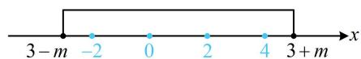

【反思】 $A \cup B = A \Leftrightarrow B \subseteq A$ ， $A \cap B = A \Leftrightarrow A \subseteq B$

5.（2024·重庆模拟·★☆）（多选）

已知全集 $U = \mathbf{Z}$ ，集合 $A = \{1,2,3\}$ ， $B = \{a + b$

$|a, b \in A\}$ ，则下列结论正确的是（）

A. 集合 $B$ 中有 6 个元素  
B. $A \cup B = \{1, 2, 3, 4, 5, 6\}$   
C. $(\complement_{U}A)\cap B = \{4,5,6\}$   
D. $A \cap B$ 的真子集个数是 3

5. BCD

解析：观察发现 $B$ 中的元素用 $a + b$ 代表，而 $a, b$ 又来自集合 $A$ ，故可将 $a + b$ 可能的值直接全部罗列出来，再分析，因为 $a, b \in A$ ，所以 $a, b$ 可能的组合如下表：

<table><tr><td>a</td><td>1</td><td>1</td><td>1</td><td>2</td><td>2</td><td>2</td><td>3</td><td>3</td><td>3</td></tr><tr><td>b</td><td>1</td><td>2</td><td>3</td><td>1</td><td>2</td><td>3</td><td>1</td><td>2</td><td>3</td></tr><tr><td>a+b</td><td>2</td><td>3</td><td>4</td><td>3</td><td>4</td><td>5</td><td>4</td><td>5</td><td>6</td></tr></table>

由上表可知 $a + b$ 可能的取值有2，3，4，5，6，

所以 $B = \{2,3,4,5,6\}$ ，集合 $B$ 中有5个元素，故A项错误；

又 $A = \{1,2,3\}$ ，所以 $A\cup B = \{1,2,3,4,5,6\}$ ，故B项正确；

由题意， $U = \mathbf{Z}$ ，所以 $\complement_U A = \{\dots, -3, -2, -1, 0, 4, 5, 6, \dots\}$

从而 $(\complement_U A) \cap B = \{4, 5, 6\}$ ，故C项正确；

D 项， $A \cap B = \{2, 3\}$ ，有 2 个元素，所以 $A \cap B$ 的真子集个数是 $2^{2} - 1 = 3$ ，故 D 项正确.

6. (2024·浙江绍兴模拟·★★)

若集合 $A = \{x\mid x^2 +mx\leq 0\}$ ， $B = \left\{-\frac{1}{3},m - 1\right\}$ ，且 $A\cap B$ 有4个子集，则实数 $m$ 的最小值是

6. $\frac{1}{2}$

解析：设 $A \cap B$ 中有 $n$ 个元素，则 $A \cap B$ 有 $2^{n}$ 个子集，

由题意， $2^{n} = 4$ ，所以 $n = 2$ ，又因为集合 $B$ 中只有2个元素，所以这2个元素都在 $A$ 中，

怎样翻译 $B$ 的2个元素都在 $A$ 中？只需 $x = -\frac{1}{3}$ 和 $x = m - 1$ 都满足不等式 $x^{2} + mx \leq 0$

所以 $\left\{ \begin{array}{l} \left(-\frac{1}{3}\right)^2 + m \cdot \left(-\frac{1}{3}\right) \leq 0 \\ (m - 1)^2 + m(m - 1) \leq 0 \end{array} \right.$ ，解得： $\frac{1}{2} \leq m \leq 1$ ，

结束了吗？还没有，别忘考虑集合 $B$ 中的元素互异，

由 $m - 1 \neq -\frac{1}{3}$ 可得 $m \neq \frac{2}{3}$ ，所以实数 $m$ 的取值范围是

$\left[\frac{1}{2}, \frac{2}{3}\right) \cup \left(\frac{2}{3}, 1\right)$ ，故 $m$ 的最小值是 $\frac{1}{2}$ .

7. (2024·新课标Ⅰ卷·★)

已知集合 $A = \{x\mid -5 <   x^3 <  5\}$ ， $B = \{-3, - 1,0,2,3\}$ ，则 $A\cap B =$ （

A. $\{-1,0\}$

B. $\{2,3\}$

C. $\{-3, -1, 0\}$

D. $\{-1,0,2\}$

7. A

解析：由 $-5 < x^{3} < 5$ 可得 $-\sqrt[3]{5} < x < \sqrt[3]{5}$

所以 $A = \{x\mid -\sqrt[3]{5} < x <   \sqrt[3]{5}\}$

因为 $1 < \sqrt[3]{5} < \sqrt[3]{8} = 2$ ，所以集合 $B$ 中的元素-1，0也在集合 $A$ 中，其余元素不在 $A$ 中，故 $A \cap B = \{-1, 0\}$

8. (2021·全国乙卷·★☆)

已知集合 $S = \{s\mid s = 2n + 1,n\in \mathbf{Z}\}$ ， $T = \{t\mid t = 4n + 1,$

$n\in \mathbf{Z}\}$ ，则 $S\cap T =$ （

A. $\varnothing$

B. $S$

C. $T$

D. Z

8. C

解法 1：若看不出两个集合的公共部分，可列出部分元素来找规律，集合 S 中的元素为…, -7, -5, -3, -1, 1, 3, 5, 7, …

集合 T 中的元素为 $\cdots, -7, -3, 1, 5, 9, \cdots$ ,

对比可发现 $T$ 中的元素 $S$ 中全部都有，

所以 $T \subseteq S$ ，故 $S \cap T = T$ ：

解法2：观察发现 $T$ 中的元素可化为 $S$ 中元素的形式，故能由此得出 $S, T$ 的关系，

对任意的 $t \in T$ ，可设 $t = 4m + 1 (m \in \mathbf{Z})$ ，则 $t = 2 \times 2m + 1$ ，

记 $2m = n$ ，于是 $t = 2n + 1$ ，由 $m\in \mathbf{Z}$ 可得 $n = 2m\in \mathbf{Z}$

所以 $t \in S$ ，从而 $T \subseteq S$ ，故 $S \cap T = T$ ：

9. (2023·福建模拟·★★)

已知全集 $U = \mathbf{R}$ ，集合 $A = \{x\mid |x - 1|\leq 1\}$

$B = \left\{x\left|\frac{x - 4}{x - 1} >0\right.\right\}$ ，则 $A\cap (\mathbb{C}_U B) =$ （）

A. [1,2]

B. (1,2)

C. $[0,1)$

D. (1,2]

9. A

解析： $|x - 1|\leq 1\Leftrightarrow -1\leq x - 1\leq 1\Leftrightarrow 0\leq x\leq 2$ ，故 $A = [0,2]$

$\frac{x-4}{x-1}>0\Leftrightarrow(x-1)(x-4)>0\Leftrightarrow x<1$ 或 x>4，

所以 $B = (-\infty, 1) \cup (4, +\infty)$ ，故 $\complement_U B = [1, 4]$ ；

如图， $A\cap (\mathbb{C}_U B) = [1,2]$

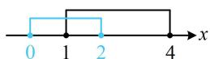

10. (2024·全国甲卷·★★)

集合 $A = \{1,2,3,4,5,9\}$ ， $B = \{x\mid \sqrt{x}\in A\}$ ，则 $\complement_A(A\cap$

$B) = (\quad)$

A. $\{1,4,9\}$

B. $\{3,4,9\}$

C. $\{1,2,3\}$

D. $\{2,3,5\}$

10. D

解析：由题意，要使 $\sqrt{x} \in A$ ，则 $\sqrt{x} = 1,2,3,4,5,9$

所以 $x = 1,4,9,16,25,81$ ，故 $B = \{1,4,9,16,25,81\}$

所以 $A \cap B = \{1, 4, 9\}$ ，故 $\complement_A(A \cap B) = \{2, 3, 5\}$ .

11. (2023·江苏苏州模拟·★★☆)

已知 $f(x) = \sqrt{x^2 - 1}$ 的定义域为 $A$ ，集合 $B = \{x \in \mathbf{R}\}$

$|1 < ax < 2$ ，若 $B \subseteq A$ ，则实数 $a$ 的取值范围是

( )

A. $[-2, 1]$

B. $[-1, 1]$

C. $(- \infty, -2] \cup [1, +\infty)$

D. $(- \infty, -1] \cup [1, +\infty)$

11. B

解析： $x^{2} - 1\geq 0\Rightarrow x^{2}\geq 1\Rightarrow x\leq -1$ 或 $x\geq 1$

所以 $A = (-\infty, -1] \cup [1, +\infty)$ ，

再求 $B$ ，要解 $1 < ax < 2$ ，同除以 $a$ 即可，但需讨论 $a$ 的正负，当 $a = 0$ 时， $\forall x\in \mathbf{R}$ ， $1 < ax < 2$ 都不成立，

所以 $B = \emptyset$ ，满足 $B\subseteq A$ ；

当 $a > 0$ 时，由 $1 < ax < 2$ 可得 $\frac{1}{a} < x < \frac{2}{a}$ ，所以 $B = \left(\frac{1}{a}, \frac{2}{a}\right)$ ，

注意到此时 $\frac{1}{a} > 0$ ，从而 $B \subseteq A$ 的情况如图1，

故 $\frac{1}{a} \geq 1$ ，解得： $0 < a \leq 1$ ；

当 $a < 0$ 时，由 $1 < ax < 2$ 可得 $\frac{2}{a} < x < \frac{1}{a}$ ，所以 $B = \left(\frac{2}{a}, \frac{1}{a}\right)$ ，

注意到此时 $\frac{1}{a} < 0$ ，从而 $B\subseteq A$ 的情况如图2，

故 $\frac{1}{a} \leq -1$ ，解得： $-1 \leq a < 0$ ；

综上所述，实数 $a$ 的取值范围是[-1,1].

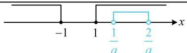

text_image

-1
1
1/a
2/a
x

图1

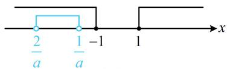

text_image

2/a
1/a -1
1
x

图2

12. (2023·江苏扬州期末·★★★)

已知集合 $A = \left\{x\left|\frac{4 - x}{x + 1}\geq 0\right.\right\} ,B = \{x\mid x^2 -(a + 1)^2 x +$

$2a(a^{2} + 1) < 0\}$ ，若 $A \cap B = \varnothing$ ，则实数 $a$ 的取值范围是（）

A. $(2, +\infty)$

B. $\{1\} \cup (2, +\infty)$

C. $\{1\} \cup [2, +\infty)$

D. $[2, +\infty)$

12. C

解析： $\frac{4 - x}{x + 1}\geq 0\Leftrightarrow \left\{ \begin{array}{l}(4 - x)(x + 1)\geq 0\\ x + 1\neq 0 \end{array} \right.$ ，解得： $-1 <   x\leq 4$

所以 $A = (-1,4]$ ；再解集合 $B$ 中的不等式，看着麻烦，其实可以因式分解。若将常数项 $2a(a^2 + 1)$ 拆成 $-2a$ 和 $-(a^2 + 1)$ ，即可产生 $-(a + 1)^2$ ，故能分解因式，

$$
x ^ {2} - (a + 1) ^ {2} x + 2 a \left(a ^ {2} + 1\right) <   0 \Leftrightarrow (x - 2 a) \left(x - a ^ {2} - 1\right) <   0 \quad ①,
$$

要解此不等式，需比较 $2a$ 和 $a^2 + 1$ 的大小，

因为 $a^2 + 1 - 2a = (a - 1)^2 \geq 0$ ，所以 $a^2 + 1 \geq 2a$ ，

其中 $a^2 + 1 = 2a$ 和 $a^2 + 1 > 2a$ 对应①的解集不同，又得讨论，

当 $a = 1$ 时，不等式①即为 $(x - 2)^{2} < 0$ ，无解，

所以 $B = \emptyset$ ，满足 $A\cap B = \emptyset$

当 $a \neq 1$ 时，由①可得 $2a < x < a^2 + 1$ ，所以 $B = (2a, a^2 + 1)$ ，

要看 $A$ 与 $B$ 何时交集为空集，可画数轴分析，

如图，要使 $A \cap B = \emptyset$ ，注意到 $a^2 + 1 > 0 > -1$

所以不会出现图1所示的情形，只可能是图2的情形，

且端点 $2a$ 与4可以重合，重合时端点处也不是公共元素，

所以 $2a \geq 4$ ，解得： $a \geq 2$

综上所述，实数 $a$ 的取值范围是 $\{1\} \cup [2, +\infty)$

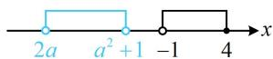  
图1

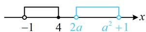  
图2

13. (2024·江苏南通模拟·★★)

已知 $M$ ， $N$ 为集合 $I$ 的非空真子集，且 $M$ ， $N$ 不相等，若 $N\cap (\complement_I M) = \emptyset$ ，则 $M\cup N =$ （）

A. $M$

B. $N$

C. $I$

D. $\varnothing$

13. A

解法1：由 $N\cap (\mathbb{C}_I M) = \emptyset$ 可知 $N$ 与 $M$ 外的部分没有公共元素，如图，结合 $M$ ， $N$ 不相等可知应有 $N\subsetneq M$ ，所以 $M\bigcup N = M$

解法2：已知条件较为抽象，若没有思路，可尝试举具体的集合来分析选项，

设 $I = \{1,2,3,4,5\}$ ， $M = \{1,2,3\}$ ，则 $\complement_{J}M = \{4,5\}$

要使 $N\cap (\complement_I M) = \emptyset$ ，则 $N$ 中的元素只能在1，2，3中取，

又因为 $M \neq N$ ，所以 $N$ 可取 $\{1\}$

经检验，满足题意，此时 $M \cup N = \{1, 2, 3\} = M$ 。

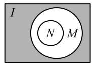

14. (2023·广东广州一模·★★)

已知集合 $M = \{x \mid x(x - 2) < 0\}$ ， $N = \{x \mid x - 1 < 0\}$ ，则下列Venn图中，阴影部分可以表示集合 $\{x \mid 1 \leq x < 2\}$ 的是（）

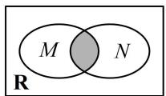  
A

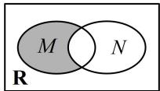  
B

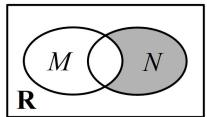  
C

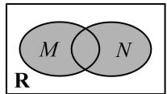  
D

14. B

解析： $x(x - 2) <   0\Leftrightarrow 0 <   x <   2$ ，所以 $M = \{x\mid 0 <   x <   2\}$

又 $x - 1 < 0 \Leftrightarrow x < 1$ ，所以 $N = \{x \mid x < 1\}$ ，

直接把 $\{x\mid 1\leq x < 2\}$ 表示成 $M$ ， $N$ 的运算结果较抽象，故考虑逐个验证选项，

A 项，阴影部分表示 $M \cap N = \{x \mid 0 < x < 1\}$ ，故 A 项错误；

B项，阴影部分表示在 $M$ 中把 $M \cap N$ 去掉后余下的部分，

为 $\{x\mid 1\leq x <   2\}$ ，故B项正确；

C项，阴影部分表示在 $N$ 中把 $M\cap N$ 去掉后余下的部分，

为 $\{x\mid x\leq 0\}$ ，故C项错误；

D 项，阴影部分表示 $M \cup N = \{x \mid x < 2\}$ ，故 D 项错误.

15. (2023·重庆模拟·★★)

某班有 40 名同学参加数学、物理、化学课外研究小组，每名同学至多参加两个小组。已知参加数学、物理、化学小组的人数分别为 26、15、13，同时参加数学和化学小组的有 6 人，同时参加物理和化学小组的有 4 人，则同时参加数学和物理小组的人数为 \_\_\_\_.

15.4

解析：涉及三个小组，且彼此的人员有重叠，关系较复杂，可考虑画图分析，

如图，设同时参加数学和物理小组的人数为 $x$ ，则只参加数学、物理小组的分别有 $20 - x$ 人， $11 - x$ 人，

要求 $x$ ，可由总人数为40来建立方程并求解，

由题意， $(20 - x) + (11 - x) + x + 6 + 4 + 3 = 40$ ，解得： $x = 4$

text_image

数学
20 - x
化学
3
6
4
物理
11 - x
x

16. (2024·江苏泰州2月调研·★★☆)

已知集合 $A = \{(x,y) | x + y = 2\}$ ， $B = \{(x,y) | (x - 1)^2$

$+y^{2}=1\}$ ，则 $A \cap B$ 中元素的个数为 \_\_\_\_.

16. 2

解析：观察发现集合 $A, B$ 都是点集，故它们所代表的图形的交点个数即为 $A \cap B$ 中元素的个数，

集合 A 表示直线 $l: x + y = 2$ 上的点，

集合 B 表示圆 $C:(x-1)^{2}+y^{2}=1$ 上的点，

于是问题即为判断直线 $l$ 与圆 $C$ 的位置关系，可通过将圆心到直线 $l$ 的距离与半径比较来判断，

直线 $l$ 的方程可化为 $x + y - 2 = 0$ ，圆 $C$ 的圆心为 $C(1,0)$

半径 $r = 1$ ，圆心 $C$ 到直线 $l$ 的距离 $d = \frac{|1 + 0 - 2|}{\sqrt{1^2 + 1^2}} = \frac{\sqrt{2}}{2} < r$

所以直线 l 与圆 C 有 2 个交点，故 $A \cap B$ 中有 2 个元素.

17. (2025·陕西模拟·★★★)

给定数集 $M$ ，若对于任意 $a, b \in M$ ，有 $a + b \in M$ ，且 $a - b \in M$ ，则称集合 $M$ 为闭集合，则下列说法中正确的是（）

A. 自然数集是闭集合

B. 无理数集是闭集合

C. 集合 $M = \{x \mid x = 3k, k \in \mathbf{Z}\}$ 为闭集合

D. 若集合 $M_{1}$ , $M_{2}$ 为闭集合, 则 $M_{1} \cup M_{2}$ 为闭集合

17. C

解析：A项，由题意， $1\in \mathbf{N}$ ， $2\in \mathbf{N}$ ，但 $1 - 2 = -1\notin \mathbf{N}$

所以自然数集不是闭集合，故A项错误；

B 项，记无理数集为 P，设 $a = b = \sqrt{2}$ ，则 $a, b \in P$ ，

但 $a - b = 0 \notin P$ ，所以无理数集不是闭集合，故B项错误；

C 项，因为 $M = \{x \mid x = 3k, k \in \mathbf{Z}\}$ ，所以 $M$ 是全体 3 的整数倍构成的集合，对 $M$ 中的任意两个数 $a, b, a \pm b$ 仍是 3 的整数倍，所以 $a \pm b \in M$ ，从而集合 $M$ 是闭集合，故 C 项正确；

D 项，C 项的集合 M 可看成所有能被 3 整除的整数构成的集合，受此启发，可以想象，所有能被 2, 4, 5, 6, … 整除的数各自也都能构成闭集合，但从中取两个求并集后就不一定是闭集合了，下面我们举个例子，

设 $M_{1} = \{x\mid x = 2k,k\in \mathbf{Z}\}$ ， $M_2 = \{x\mid x = 3k,k\in \mathbf{Z}\}$ ，则 $M_{1}$ ， $M_2$ 都是闭集合， $M_{1}\bigcup M_{2} = \{x\mid x = 2k$ 或 $x = 3k,k\in \mathbf{Z}\}$

元素2和3在 $M_{1}\cup M_{2}$ 中，但 $2 + 3 = 5$ 不在 $M_{1}\cup M_{2}$ 中，

所以 $M_{1} \cup M_{2}$ 不是闭集合，故 D 项错误.

18. (2022·江苏南京模拟·★★★☆)

对于集合 $A$ ， $B$ ，我们把集合 $\{(a,b)\mid a\in A,b\in B\}$ 记作 $A\times B$ ．例如， $A = \{1,2\}$ ， $B = \{3,4\}$ ， $C = \{1,3\}$ ，则 $A\times B = \{(1,3),(1,4),(2,3),(2,4)\}$ ， $A\times C = \{(1,1),$

(1,3),(2,1),(2,3)}. 现已知 $M = \{0,1,2,3,4,5,6,7,8,9\}$ , 集合 $A, B$ 是 $M$ 的子集, 且当 $(a,b) \in A \times B$ 时, $(b,a) \notin A \times B$ , 则 $A \times B$ 内的元素最多有（）个.

A. 20

B. 25

C. 50

D. 75

18. B

解析：条件“当 $(a, b) \in A \times B$ 时， $(b, a) \notin A \times B$ ”比较难懂，可结合题干举的例子来分析，观察发现 $A$ 和 $C$ 中都有元素1，于是 $A \times C$ 中有元素(1,1)，取 $a = b = 1$ 即可发现这与上述条件矛盾；而 $A$ 和 $B$ 没有相同的元素，可以看到它能满足上述条件；

设 $A$ 中有 $m$ 个元素， $B$ 中有 $n$ 个元素，由“当 $(a, b) \in A \times$

B 时， $(b,a)\notin A\times B$ ”可得 A 和 B 无相同元素，

A, B 都是 M 的子集且 M 有 10 个元素 $\Rightarrow m + n \leq 10$ ,

要分析 $A \times B$ 中元素最多几个，需先把 $A \times B$ 元素个数用 $m$ 和 $n$ 表示，

设 A 中的元素为 $x_{1}, x_{2}, \cdots, x_{m}$ ，B 中的元素为 $y_{1}, y_{2}, \cdots, y_{n}$ ，将 $A \times B$ 中的元素列表如下：

<table><tr><td></td><td> ${x}_{1}$ </td><td> ${x}_{2}$ </td><td>...</td><td> ${x}_{m}$ </td></tr><tr><td> ${y}_{1}$ </td><td> $\left( {{x}_{1},{y}_{1}}\right)$ </td><td> $\left( {{x}_{2},{y}_{1}}\right)$ </td><td>...</td><td> $\left( {{x}_{m},{y}_{1}}\right)$ </td></tr><tr><td> ${y}_{2}$ </td><td> $\left( {{x}_{1},{y}_{2}}\right)$ </td><td> $\left( {{x}_{2},{y}_{2}}\right)$ </td><td>...</td><td> $\left( {{x}_{m},{y}_{2}}\right)$ </td></tr><tr><td>...</td><td>...</td><td>...</td><td>...</td><td>...</td></tr><tr><td> ${y}_{n}$ </td><td> $\left( {{x}_{1},{y}_{n}}\right)$ </td><td> $\left( {{x}_{2},{y}_{n}}\right)$ </td><td>...</td><td> $\left( {{x}_{m},{y}_{n}}\right)$ </td></tr></table>

由表可知 $A \times B$ 有 $mn$ 个元素，因为 $mn \leq \left(\frac{m + n}{2}\right)^2 \leq 25$

取等条件是 m=n=5，所以 $A \times B$ 内最多 25 个元素.

