# 第 2 节 函数的单调性与奇偶性（★★☆）

# 内容提要

本节主要归纳函数的单调性、奇偶性相关考题，涉及的考点较多，先进行梳理.

1. 单调性的运算结论：若函数 $f(x)$ 和 $g(x)$ 在区间 $D$ 上具有单调性，则

①在区间 $D$ 上，若 $a > 0$ ，则 $af(x)$ 与 $f(x)$ 单调性相同；若 $a < 0$ ，则 $af(x)$ 与 $f(x)$ 单调性相反.  
② 若 $f(x)$ 和 $g(x)$ 单调性相同，则 $f(x) + g(x)$ 的单调性与它们也相同.  
③ $f(x) > 0$ , $g(x) > 0$ ，且 $f(x)$ 和 $g(x)$ 单调性相同，则 $f(x)g(x)$ 的单调性与它们也相同.

2. 复合函数的单调性判断准则：同增异减.

3. 奇函数的性质：① $f(-x) = -f(x)$ ；②图象关于原点对称；若 $x = 0$ 处有定义，则 $f(0) = 0$ .

4. 偶函数的性质：①满足 $f(-x) = f(x)$ ；②图象关于 $y$ 轴对称.

5. 常见的几个奇函数：

① $f(x)=\log_{a}\frac{m+x}{m-x}$ ; ② $f(x)=\log_{a}\frac{m-x}{m+x}$ ; ③ $f(x)=\log_{a}(\sqrt{m^{2}x^{2}+1}+mx)$ ;

④ $f(x) = \log_a(\sqrt{m^2x^2 + 1} - mx)$ ; ⑤ $f(x) = a^x - a^{-x}$ ; ⑥ $f(x) = \frac{a^x + 1}{a^x - 1}$ .

6. 奇偶性加减法结论：奇±奇=奇；偶±偶=偶；奇±偶=非奇非偶.

7. 奇偶性乘除法结论:

①奇×奇=偶；奇×偶=奇；偶×偶=偶；②奇÷奇=偶；奇÷偶=奇；偶÷偶=偶.

8. 无论 $y = f(x)$ 是什么函数，函数 $y = f(|x|)$ 和 $y = f(-|x|)$ 都是偶函数.

9. 若 $y = f(x)$ 是奇函数或偶函数，则函数 $y = |f(x)|$ 是偶函数.

10. 多项式函数 $f(x)=a_{0}+a_{1}x+a_{2}x^{2}+\cdots+a_{n}x^{n}$ 的奇偶性：

①当且仅当 $a_0 = a_2 = a_4 = \cdots = 0$ 时， $f(x)$ 为奇函数；

②当且仅当 $a_1 = a_3 = a_5 = \cdots = 0$ 时， $f(x)$ 为偶函数.

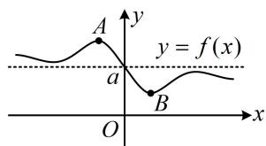

text_image

y
y = f(x)
A
a
B
O
x

11. 奇函数+常数小结论：若 $g(x)$ 为奇函数，则 $g(-x) + g(x) = 0$ 对定义域内的任意实数 $x$ 恒成立，那么设 $f(x) = g(x) + a$ ，则 $f(-x) + f(x) = g(-x) + a + g(x) + a = 2a$ ；特别地，如图，因为 $g(x)$ 的图象关于原点对称，所以 $f(x)$ 的图象关于点 $(0, a)$ 对称，它必在关于 $(0, a)$ 对称的两个点处取得最大值和最小值，所以 $f(x)_{\max} + f(x)_{\min} = 2a$ .

12. 函数值不等式的解法：题干给出函数 $f(x)$ 的解析式或 $f(x)$ 满足的一些性质，让我们求解像 $f(2x - 1) < f(x^2)$ 这样的不等式，这类题有两个常用解法：

①画草图，由图解不等式；②利用单调性，转化为自变量的不等式来解.

13. 本节会多次用到指数、对数的一些运算性质，先复习一下：

①指数的运算性质： $a^r\cdot a^s = a^{r + s}$ ； $(a^r)^s = a^{rs}$ ； $(ab)^{r} = a^{r}b^{r}$   
②对数的运算性质： $\log_a M + \log_a N = \log_a(MN)$ ； $\log_a M - \log_a N = \log_a\frac{M}{N}$ ；

$$
\log_ {a} M ^ {n} = n \log_ {a} M; \log_ {a ^ {m}} b ^ {n} = \frac {n}{m} \log_ {a} b; \log_ {a} b = \frac {\log_ {c} b}{\log_ {c} a}; \log_ {a} b = \frac {1}{\log_ {b} a}; a ^ {\log_ {a} N} = N.
$$

类型 I：单调性奇偶性判断小题

【例1】（2021·全国甲卷）下列函数中是增函数的是（）

A. $f(x) = -x$ B. $f(x) = \left(\frac{2}{3}\right)^x$ C. $f(x) = x^2$ D. $f(x) = \sqrt[3]{x}$

解析：给的都是简单函数，想象其图象即可判断单调性，如图，只有 $f(x) = \sqrt[3]{x}$ 为增函数，故选D. 答案：D

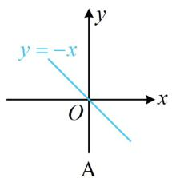

text_image

y = -x
O
A

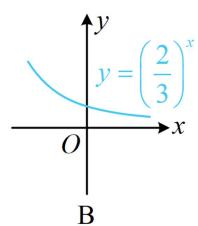

text_image

y
y = (2/3) x
O
x
B

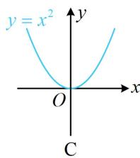

text_image

y = x²
O
x
C

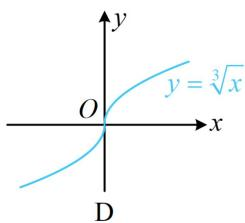

text_image

y
y = \u221a x
O
x
D

【例 2】（多选）下列函数中是奇函数的是（）

A. $f(x) = \ln (\mathrm{e}^{2x} + 1) - x$ B. $f(x) = 2^{x} - 2^{-x}$   
C. $f(x) = \ln \frac{x + 1}{x - 1}$ D. $f(x) = \left\{ \begin{array}{ll}x - 1,x > 0\\ x + 1,x <   0 \end{array} \right.$

解析：A项， $f(-x) = \ln (\mathrm{e}^{-2x} + 1) + x = \ln \left(\frac{1}{\mathrm{e}^{2x}} +1\right) + x = \ln \frac{1 + \mathrm{e}^{2x}}{\mathrm{e}^{2x}} +x = \ln (1 + \mathrm{e}^{2x}) - \ln \mathrm{e}^{2x} + x$

$= \ln (1 + \mathrm{e}^{2x}) - 2x + x = \ln (1 + \mathrm{e}^{2x}) - x = f(x)$ ，所以 $f(x)$ 为偶函数，故A项错误；

B 项， $f(-x)=2^{-x}-2^{x}=-(2^{x}-2^{-x})=-f(x)$ ，所以 $f(x)$ 为奇函数，故 B 项正确；

C项，由 $\frac{x + 1}{x - 1} >0$ 可得 $(x + 1)(x - 1) > 0$ ，解得： $x <   - 1$ 或 $x > 1$ ，定义域关于原点对称，

又 $f(-x) = \ln \frac{-x + 1}{-x - 1} = \ln \frac{x - 1}{x + 1} = \ln \left(\frac{x + 1}{x - 1}\right)^{-1} = -\ln \frac{x + 1}{x - 1} = -f(x)$ ，所以 $f(x)$ 为奇函数，故C项正确；

D项，分段函数常用定义判断奇偶性， $f(x)$ 的解析式按 $x > 0$ 和 $x < 0$ 分段，我们先看 $x > 0$ 的情况，当 $x > 0$ 时，- $x < 0$ ，将它们代入解析式得 $f(x) = x - 1$ ， $f(-x) = -x + 1$ ，满足 $f(-x) = -f(x)$ ，

还要再看 $x < 0$ 的情况吗？不用了，有了 $x > 0$ 时， $f(-x) = -f(x)$ ，这意味着当自变量取相反数时，函数值也总是相反数，所以到此已可得出 $f(x)$ 为奇函数，无需再讨论 $x < 0$ 的情况，

所以 $f(x)$ 为奇函数，故D项正确；另外，也可通过画图来判断此选项，如图为 $f(x)$ 的大致图象，该图象关于原点对称，故 $f(x)$ 为奇函数.

答案: BCD

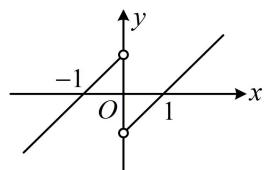

text_image

-1
O
1
x
y

【变式】（2020·新课标Ⅱ卷）设函数 $f(x) = \ln |2x + 1| - \ln |2x - 1|$ ，则 $f(x)$ （）

A. 是偶函数，且在 $\left(\frac{1}{2}, +\infty\right)$ 单调递增  
B. 是奇函数，且在 $\left(-\frac{1}{2}, \frac{1}{2}\right)$ 单调递减  
C. 是偶函数，且在 $\left(-\infty, -\frac{1}{2}\right)$ 单调递增  
D. 是奇函数，且在 $\left(-\infty, -\frac{1}{2}\right)$ 单调递减

解法 1: 先看奇偶性, 可将解析式合并, 用定义判断, 由题意, $f(x) = \ln |2x + 1| - \ln |2x - 1| = \ln \left|\frac{2x + 1}{2x - 1}\right|$ ①,

所以 $f(-x) = \ln \left|\frac{-2x + 1}{-2x - 1}\right| = \ln \left|\frac{2x - 1}{2x + 1}\right| = \ln \left|\frac{2x + 1}{2x - 1}\right|^{-1} = -\ln \left|\frac{2x + 1}{2x - 1}\right| = -f(x)$ ，故 $f(x)$ 为奇函数，排除A、C；

再判断单调性，B、D两个选项判断一个即可，不妨看选项B，可先结合 $x$ 的范围将解析式化简，

当 $x \in \left(-\frac{1}{2}, \frac{1}{2}\right)$ 时， $\frac{2x + 1}{2x - 1} < 0$ ，结合①可得 $f(x) = \ln \left(-\frac{2x + 1}{2x - 1}\right) = \ln \left(-\frac{2x - 1 + 2}{2x - 1}\right) = \ln \left(-1 - \frac{2}{2x - 1}\right)$ ，

此函数由 $y = \ln t$ 和 $t = -1 - \frac{2}{2x - 1}$ 复合而成，可用同增异减准则判断其单调性，

当 $x \in \left(-\frac{1}{2}, \frac{1}{2}\right)$ 时， $t = -1 - \frac{2}{2x - 1}$ 单调递增， $y = \ln t$ 单调递增，所以 $f(x)$ 单调递增，故B项错误，选D.

解法2：也可取特值快速得到 $f(x)$ 的奇偶性，由题意， $f(-1) = -\ln 3$ ， $f(1) = \ln 3$ ，所以 $f(-1) = -f(1)$ ，故 $f(x)$ 只可能为奇函数，排除选项A、C，单调性的判断方法同解法1.

答案: D

# 类型 II：根据奇偶性求参数的值

【例 3】若函数 $f(x)=\log_{2}(16^{x}+1)-ax$ 是偶函数，则 $\log_{a}2=$ \_\_\_\_.

解法1：偶函数抓住 $f(-x) = f(x)$ 来分析即可，由题意， $f(-x) = f(x)$ 对任意的 $x\in \mathbf{R}$ 恒成立，

所以 $\log_2(16^{-x} + 1) + ax = \log_2(16^x + 1) - ax$ ，此式要进一步变形，可将同类型的项合并，

所以 $2ax = \log_2(16^x + 1) - \log_2(16^{-x} + 1) = \log_2\frac{16^x + 1}{16^{-x} + 1} = \log_2\frac{(16^x + 1)16^x}{1 + 16^x} = \log_216^x = \log_2(2^4)^x = \log_22^{4x} = 4x$

上式要对任意的 $x \in \mathbf{R}$ 恒成立，只能 $a = 2$ ，所以 $\log_a 2 = \log_2 2 = 1$ .

解法 2：根据奇偶性求参，也可考虑通过取特值来快速求解，

因为 $f(x)$ 为偶函数，且定义域为 $\mathbf{R}$ ，所以 $f(-1) = f(1)$ ，

即 $\log_2(16^{-1} + 1) + a = \log_2(16^1 + 1) - a$ ，所以 $\log_2\frac{17}{16} + a = \log_217 - a$

从而 $a = \frac{1}{2} \times \left( \log_2 17 - \log_2 \frac{17}{16} \right) = \frac{1}{2} \times [\log_2 17 - (\log_2 17 - \log_2 16)] = \frac{1}{2} \log_2 16 = 2$ ，故 $\log_a 2 = 1$ .

答案: 1

【变式1】设函数 $f(x) = x^{2}(\mathrm{e}^{x} + ae^{-x})(x \in \mathbf{R})$ 是奇函数，则实数 $a =$ \_\_\_\_.

解法1：根据奇偶性求参，用定义是通法，因为 $f(x)$ 是奇函数，所以 $f(-x) = -f(x)$ ，

从而 $(-x)^2 (\mathrm{e}^{-x} + ae^x) = -x^2 (\mathrm{e}^x + ae^{-x})$ ，故 $x^{2}(\mathrm{e}^{-x} + ae^{x}) + x^{2}(\mathrm{e}^{x} + ae^{-x}) = 0$

$x^{2}$ 不恒为0，将其约去可得 $\mathrm{e}^{-x} + ae^x +\mathrm{e}^x +ae^{-x} = 0$ ，整理得： $(a + 1)\mathrm{e}^{x} + (a + 1)\mathrm{e}^{-x} = 0$

所以 $(a + 1)(\mathrm{e}^{x} + \mathrm{e}^{-x}) = 0$ ，因为 $\mathbf{e}^x +\mathbf{e}^{-x} > 0$ ，所以 $a + 1 = 0$ ，解得： $a = -1$

解法2：观察发现 $x^{2}$ 是偶函数，故也可只考虑后半部分，用结论（偶 $\times$ 奇 $=$ 奇）快速求得 $a$ 的值，

因为 $f(x)$ 是奇函数，且 $y = x^2$ 是偶函数，所以 $y = \mathrm{e}^{x} + ae^{-x}$ 是奇函数，

在内容提要第5点中，我们归纳了形如 $y = a^{x} - a^{-x}$ 的函数是奇函数，与 $y = e^{x} + ae^{-x}$ 对比可得 $a = -1$ .

答案: -1

【变式2】（2022·全国乙卷）若 $f(x) = \ln \left|a + \frac{1}{1 - x}\right| + b$ 是奇函数，则 $a =$ \_\_\_\_， $b =$ \_\_\_\_.

解法1： $f(x)$ 的解析式较复杂，不易发现该用奇偶性的哪个结论来求参，故考虑用定义处理，

由题意， $f(-x) + f(x) = \ln \left|a + \frac{1}{1 + x}\right| + \ln \left|a + \frac{1}{1 - x}\right| + 2b = \ln \left|a^2 +\frac{a}{1 - x} +\frac{a}{1 + x} +\frac{1}{1 - x^2}\right| + 2b = \ln \left|a^2 +\frac{2a + 1}{1 - x^2}\right| + 2b = 0,$ 注意到上式需对定义域内所有的 $x$ 恒成立，所以 $a^2 +\frac{2a + 1}{1 - x^2}$ 必定不随 $x$ 的变化而改变，

所以 $\left\{ \begin{array}{l} 2a + 1 = 0 \\ \ln \left| a^{2} \right| + 2b = 0 \end{array} \right.$ ，解得： $a = -\frac{1}{2}$ ， $b = \ln 2$ 。

解法2：涉及奇偶性，不妨先考虑定义域，要使 $f(x)$ 有定义，则 $\left\{ \begin{array}{l}1 - x\neq 0\\ a + \frac{1}{1 - x}\neq 0 \end{array} \right.$ ①，由①可得 $x\neq 1$

奇函数的定义域关于原点对称，故-1必定也不在 $f(x)$ 的定义域内，于是由②解出的必为 $x \neq -1$ ，

所以 $a + \frac{1}{1 - (-1)} = 0$ ，解得： $a = -\frac{1}{2}$ ，此时 $f(x)$ 的定义域为 $(- \infty, -1) \cup (-1, 1) \cup (1, +\infty)$

所以0在 $f(x)$ 的定义域内，从而 $f(0) = \ln \frac{1}{2} + b = -\ln 2 + b = 0$ ，故 $b = \ln 2$

答案： $-\frac{1}{2}$ ， $\ln 2$

【总结】根据奇偶性求参，定义是基本方法，但有的题目需要较强的计算能力才能顺利求解，若熟悉奇偶性的相关结论和一些常见的奇函数、偶函数，也可考虑用它们来快速求出参数的值.

# 类型III：奇函数+常数结论的应用

【例 4】已知 $g(x)$ 为奇函数， $f(x)=g(x)+1$ ，且 $f(-2)=3$ ，则 $f(2)=$ \_\_\_\_.

解析：由题意， $f(-x) + f(x) = g(-x) + 1 + g(x) + 1 = 2$ ，所以 $f(-2) + f(2) = 2$ ，故 $f(2) = 2 - f(-2) = 2 - 3 = -1$ .

答案: -1

【反思】当涉及“ $f(x)=$ 奇函数 $g(x)+$ 常数a”时，要想到内容提要第11点的结论， $f(-x)+f(x)=2a$ ，且若 $f(x)$ 存在最值，则 $f(x)_{\max}+f(x)_{\min}=2a$ 。

【变式1】（2018·新课标III卷）已知函数 $f(x) = \ln (\sqrt{1 + x^2} - x) + 1$ ， $f(a) = 4$ ，则 $f(-a) =$ \_\_\_\_.

解析：涉及 $f(a)$ 和 $f(-a)$ ，想到奇偶性。观察发现 $y = \ln (\sqrt{1 + x^2} - x)$ 是奇函数，故可按例4的方法处理，设 $g(x) = \ln (\sqrt{1 + x^2} - x)(x \in \mathbf{R})$ ，则 $g(-x) + g(x) = \ln (\sqrt{1 + (-x)^2} + x) + \ln (\sqrt{1 + x^2} - x)$

$= \ln [(\sqrt{1 + x^2} +x)(\sqrt{1 + x^2} -x)] = \ln (1 + x^2 -x^2) = \ln 1 = 0$ ，所以 $g(x)$ 为奇函数，

而 $f(x) = g(x) + 1$ ，所以 $f(a) + f(-a) = g(a) + 1 + g(-a) + 1 = 2$ ，故 $f(-a) = 2 - f(a) = -2$

答案：-2

【反思】①本题的“奇函数+常数”结构隐含在解析式中；② $y=\log_{a}(\sqrt{m^{2}x^{2}+1}\pm mx)$ 是较常见的奇函数.

【变式2】已知函数 $f(x) = \ln (\sqrt{1 + x^2} + x) + ax + 4 (a \in \mathbf{R})$ ， $f(\ln (\log_2 e)) = 5$ ，则 $f(\ln (\ln 2)) =$ （）

A. -5 B. -1 C. 3 D. 4

解析：将已知的 $f(\ln (\log_2 e))$ 和所求的 $f(\ln (\ln 2))$ 代入解析式显然较复杂，故尝试分析 $f(x)$ 的性质。观察发现 $\ln (\sqrt{1 + x^2} + x) + ax$ 这部分为奇函数，于是有可能用上例4的方法，下面先证明该函数为奇函数，

设 $g(x) = \ln (\sqrt{1 + x^2} +x) + ax$ ，则 $g(-x) + g(x) = \ln (\sqrt{1 + x^2} -x) - ax + \ln (\sqrt{1 + x^2} +x) + ax$

$= \ln [(\sqrt{1 + x^2} -x)(\sqrt{1 + x^2} +x)] = \ln (1 + x^2 -x^2) = 0$ ，所以 $g(x)$ 是奇函数，

又 $f(x) = g(x) + 4$ ，所以 $f(x) + f(-x) = g(x) + 4 + g(-x) + 4 = 8$ ①，

有了这一结论，如果自变量 $\ln (\log_2 e)$ 与 $\ln (\ln 2)$ 也恰好相反就好了，我们来看看是不是这样，

因为 $\ln (\log_2\mathsf{e}) = \ln \left(\frac{1}{\ln 2}\right) = \ln (\ln 2)^{-1} = -\ln (\ln 2)$ ，所以结合①可得 $f(\ln (\log_2\mathsf{e})) + f(\ln (\ln 2)) = 8$

又 $f(\ln (\log_2\mathsf{e})) = 5$ ，所以 $f(\ln (\ln 2)) = 8 - f(\ln (\log_2\mathsf{e})) = 3$

答案: C

【变式3】已知函数 $f(x) = \frac{|x| - \sin x + 1}{|x| + 1}$ 的最大值为 $M$ ，最小值为 $m$ ，则 $M + m =$ \_\_\_\_.

解析：直观想象可发现 $f(x)$ 的最值不好求，所以不去求最值，那怎么办？注意到 $f(x)$ 的分子分母有相同的部分，故先拆项，化为 $f(x) = 1 - \frac{\sin x}{|x| + 1}$ ，而 $y = -\frac{\sin x}{|x| + 1}$ 为奇函数，于是可利用对称性来求 $M + m$ ，

由题意， $f(x) = \frac{|x| - \sin x + 1}{|x| + 1} = 1 - \frac{\sin x}{|x| + 1}$

因为 $y = -\frac{\sin x}{|x| + 1}$ 是奇函数，所以 $f(x)$ 的图象关于点(0,1)对称，

故 $f(x)$ 的图象上的最大值和最小值的两个点 $A$ 和 $B$ 也关于(0,1)对称（如图），由图可知 $M + m = 2$ ：

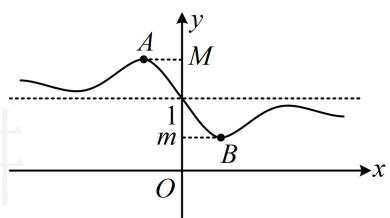

text_image

A
M
1
m
B
O
x
y

答案: 2

【反思】若 $f(x)$ 为奇函数， $g(x) = f(x) + a$ ，且 $g(x)$ 存在最大值 $M$ 和最小值 $m$ ，则 $M + m = 2a$ 。

# 类型IV：函数值不等式的解法

【例5】定义在[-2,2]上的函数 $f(x)$ 满足 $(x_{1} - x_{2})[f(x_{1}) - f(x_{2})] > 0(x_{1} \neq x_{2})$ ，且 $f(x) > f(2x - 1)$ ，则实数 $x$ 的取值范围为（）

A. $(- \infty, 1)$ B. $\left[-\frac{1}{2}, 1\right]$ C. $\left[-\frac{1}{2}, 1\right)$ D. $[-1, 1)$

解析：由题意， $f(x)$ 在 $[-2,2]$ 上 $\nearrow$ ，结合定义域， $f(x)>f(2x-1)\Leftrightarrow\left\{\begin{aligned}-2\leq x\leq2\\ -2\leq2x-1\leq2\\ x>2x-1\end{aligned}\right.$ ，解得： $-\frac{1}{2}\leq x<1$ .

答案: C

【变式1】已知函数 $f(x) = \begin{cases} x^3, & x \leq 1 \\ \ln (x^2 - 2x + 4), & x > 1 \end{cases}$ ，若 $f(x) > f(2x - 1)$ ，则 $x$ 的取值范围为（）

A. $(- \infty, 1)$ B. $(- \infty, -1)$ C. $(-1, 1)$ D. $(-1, +\infty)$

解析：本题没有直接给单调性，但给了分段形式的解析式，若将 $f(x)$ 和 $f(2x - 1)$ 代入解析式，则需讨论的情况较多，所以试试判断单调性，看能否用单调性来解不等式，

由题意， $f(x)$ 在 $(-\infty ,1]$ 上 $\nearrow$ ，在 $(1, + \infty)$ 上， $u = x^{2} - 2x + 4$ 和 $y = \ln u$ 都 $\nearrow$

所以 $f(x) = \ln (x^2 - 2x + 4)$ 也 $\nearrow$

在间断点 $x = 1$ 处，左侧函数值 $f(1) = 1$ ，右侧极限值 $\lim_{x\to 1^{+}}f(x) = \ln 3 > 1$

所以 $f(x)$ 的大致图象如图，由图可知 $f(x)$ 在 $\mathbf{R}$ 上 $\nearrow$

所以 $f(x) > f(2x - 1) \Leftrightarrow x > 2x - 1 \Leftrightarrow x < 1$ .

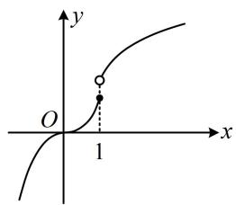

text_image

y
O
1
x

答案: A

【反思】无论题干是否给出 $f(x)$ 的解析式，在求解与 $f(x)$ 有关的函数值不等式时，都应首先考虑单调性，这是比较优越的解法.

【变式2】已知函数 $f(x) = \begin{cases} \ln x, & x > 1 \\ 0, & 0 \leq x \leq 1 \\ x, & x < 0 \end{cases}$ ，若 $f(2a - 1) < f(a)$ ，则实数 $a$ 的取值范围是 \_\_\_\_.

解析：涉及分段函数的函数值不等式，先画图看单调性。如图， $f(x)$ 在 $\mathbf{R}$ 上不严格 $\nearrow$ ， $f(2a - 1) < f(a)$ 不再等价于 $2a - 1 < a$ ，怎么办？观察图形可发现，只需 $2a - 1 < a$ 且 $2a - 1$ 和 $a$ 不同在中间水平的那段，因为 $f(2a - 1) < f(a)$ ，所以首先应有 $2a - 1 < a$ ，解得： $a < 1$ ①，另一方面， $2a - 1$ 和 $a$ 不同时在[0,1]上，若由此直接求 $a$ 的范围，则需讨论较多情况，而它的反面只有一种情况，故可先考虑反面，再取补集，

当 $2a - 1$ 和 $a$ 同时在 $[0,1]$ 上时， $\left\{ \begin{array}{l} 0 \leq 2a - 1 \leq 1 \\ 0 \leq a \leq 1 \end{array} \right.$ ，解得： $\frac{1}{2} \leq a \leq 1$

所以当 $2a - 1$ 和 $a$ 不同时在 $[0,1]$ 上时， $a < \frac{1}{2}$ 或 $a > 1$ ，结合①可得 $a < \frac{1}{2}$ .

答案： $\left(-\infty ,\frac{1}{2}\right)$

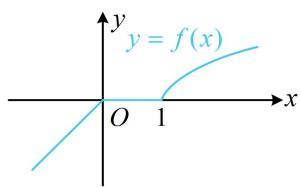

text_image

y
y = f(x)
O 1 x

【反思】相较于上一题，若分段函数不严格单调，在单调性上再补充自变量不同时位于水平的那段即可.

【变式3】已知函数 $f(x) = x^3 - 2x + \mathrm{e}^x - \frac{1}{\mathrm{e}^x}$ ，若 $f(x) > f(2x - 1)$ ，则实数 $x$ 的取值范围为 \_\_\_\_.

解析：看到 $f(x) > f(2x - 1)$ ，考虑用 $f(x)$ 的单调性来解，此处解析式较复杂，不易看出单调性，考虑求导判断，由题意， $f'(x) = 3x^2 - 2 + \mathrm{e}^x + \frac{1}{\mathrm{e}^x} \geq 3x^2 - 2 + 2\sqrt{\mathrm{e}^x \cdot \frac{1}{\mathrm{e}^x}} = 3x^2 \geq 0$ ，所以 $f(x)$ 在 $\mathbf{R}$ 上 $\nearrow$

从而 $f(x) > f(2x - 1)$ 等价于 $x > 2x - 1$ ，解得： $x <   1$

答案： $(-\infty ,1)$

【例 6】已知函数 $f(x)=x^{3}-2x+\mathrm{e}^{x}-\frac{1}{\mathrm{e}^{x}}$ ，若 $f(x)+f(2x-1)>0$ ，则实数 x 的取值范围为 \_\_\_\_.

解析: $f(x) + f(2x - 1) > 0 \Leftrightarrow f(x) > -f(2x - 1)$ , 与上题相比, 右侧有个负号, 不能直接用单调性求解, 怎么办呢? 观察发现 $f(x)$ 为奇函数, 所以负号可以拿到括号里面, 下面先证明 $f(x)$ 为奇函数,

由题意， $f(-x) = (-x)^{3} - 2(-x) + \mathrm{e}^{-x} - \frac{1}{\mathrm{e}^{-x}} = -x^{3} + 2x + \frac{1}{\mathrm{e}^{x}} -\mathrm{e}^{x} = -f(x)$

所以 $f(x)$ 是奇函数，从而 $f(x) > -f(2x - 1) \Leftrightarrow f(x) > f(1 - 2x)$ ，

因为 $f'(x) = 3x^2 - 2 + \mathrm{e}^x + \frac{1}{\mathrm{e}^x} \geq 3x^2 - 2 + 2\sqrt{\mathrm{e}^x \cdot \frac{1}{\mathrm{e}^x}} = 3x^2 \geq 0$ ，所以 $f(x)$ 在 $\mathbf{R}$ 上 $\nearrow$ ，

故 $f(x) > f(1 - 2x)$ 等价于 $x > 1 - 2x$ ，解得： $x > \frac{1}{3}$

答案： $\left(\frac{1}{3}, + \infty\right)$

【总结】当我们看到 $f(\cdots) + f(\cdots) > 0$ 这种结构的函数值不等式时，一定要看看 $f(x)$ 是否为奇函数，若是，则可以移项结合奇函数转化为 $f(\cdots) > f(\cdots)$ 这种结构，再借助单调性来求解.

【例7】函数 $f(x)$ 是定义在 $\mathbf{R}$ 上的偶函数，且 $f(x)$ 在 $[0, +\infty)$ 上单调递增，若 $f(x) > f(2x - 1)$ ，则实数 $x$ 的取值范围为（）

A. $\left(\frac{1}{3}, 1\right)$

B. $(-1, 1)$

C. $(- \infty, 1)$

D. $(1, +\infty)$

解析：给了偶函数在 $y$ 轴一侧的单调性，可画出草图，并用来分析不等式 $f(x) > f(2x - 1)$ ，

由题意， $f(x)$ 的草图如图，可以看到，图象上离 $y$ 轴越远的点，对应的函数值越大，

观察不等式 $f(x) > f(2x - 1)$ ，其中 $x$ 与 $y$ 轴的距离即为 $\left|x - 0\right|$ ，

$2x - 1$ 与 $y$ 轴的距离即为 $\left|2x - 1 - 0\right|$

所以 $f(x) > f(2x - 1) \Leftrightarrow |x| > |2x - 1|$ ，故 $x^{2} > (2x - 1)^{2}$ ，解得： $\frac{1}{3} < x < 1$ 。

答案: A

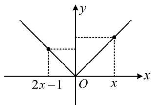

text_image

2x-1
O
x
y

【总结】当我们看到 $f(\cdots) > f(\cdots)$ 这种结构的函数值不等式时，若发现 $f(x)$ 为偶函数，则常画出 $f(x)$ 的草图，将函数值的大小关系转化为图象上对应的点离 y 轴距离的大小关系来求解.

【变式】设函数 $f(x) = \frac{x\sqrt{4 - x^2}}{|x - 3| - 3}$ ，则使得 $f(\log_2 x) > f(-1)$ 成立的 $x$ 的取值范围是 \_\_\_\_.

解析： $f(x)$ 的解析式较复杂，考虑从研究 $f(x)$ 的性质入手，奇偶性、单调性不易看出，故先求定义域，分子应满足 $4 - x^{2} \geq 0$ ，故 $-2 \leq x \leq 2$ ，此时分母可化为 3 - x - 3 = -x，所以 $x \neq 0$ ，

从而 $f(x)$ 的定义域为 $[-2,0)\cup (0,2]$ ，且 $f(x) = \frac{x\sqrt{4 - x^2}}{-x} = -\sqrt{4 - x^2}$ ，

到此 $f(x)$ 的解析式已被化简, 可通过画图判断单调性、奇偶性, 并用于解所给的不等式,

$y = -\sqrt{4 - x^2}\Rightarrow y^2 = 4 - x^2\Rightarrow x^2 +y^2 = 4(y\leq 0)$ ，所以函数 $f(x)$ 的草图如图，

可以看到，图象上离 $y$ 轴越远的点，函数值越大，

故 $f(\log_2 x) > f(-1)$ 等价于 $\log_2 x$ 在蓝色的两段，

所以 $1 < \log_2 x \leq 2$ 或 $-2 \leq \log_2 x < -1$ ，解得： $\frac{1}{4} \leq x < \frac{1}{2}$ 或 $2 < x \leq 4$ 。

答案： $\left[\frac{1}{4},\frac{1}{2}\right)\cup (2,4]$

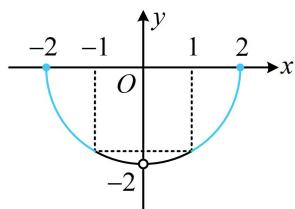

text_image

-2 -1 1 2
O
-2

# 强化训练

类型Ⅰ：单调性、奇偶性判断与求参

1. (2025·全国Ⅰ卷·★★)

设 $f(x)$ 是定义在 $\mathbf{R}$ 上且周期为2的偶函数，当 $2 \leq x \leq 3$ 时， $f(x) = 5 - 2x$ ，则 $f\left(-\frac{3}{4}\right) = (\quad)$

A. $-\frac{1}{2}$

B. $- \frac{1}{4}$

C. $\frac{1}{4}$

D. $\frac{1}{2}$

2. (2022·河南模拟·★★)

若函数 $f(x) = \ln (\sqrt{x^2 + a} - x)$ 为奇函数，则 $a =$ （）

A. $\frac{1}{4}$

B. $\frac{1}{2}$

C. 1

D. 2

3. (2024·天津卷·★★)

下列函数是偶函数的是（）

A. $y = \frac{\mathrm{e}^x - x^2}{x^2 + 1}$

B. $y = \frac{\cos x + x^2}{x^2 + 1}$

C. $y = \frac{\mathrm{e}^x - x}{x + 1}$

D. $y = \frac{\sin x + 4x}{\mathrm{e}^{|x|}}$

4. (2023·新课标Ⅰ卷·★★)

设函数 $f(x) = 2^{x(x - a)}$ 在区间(0,1)单调递减，则 $a$ 的取值范围是（）

A. $(- \infty, -2]$

B. $[-2,0)$

C. $(0,2]$

D. $[2, +\infty)$

5. (2023·广东模拟·★★)

函数 $f(x) = 2|x - a| + 3$ 在区间 $[1, +\infty)$ 上不单调，则 $a$ 的取值范围是（）

A. $[1, +\infty)$

B. $(1, +\infty)$

C. $(- \infty, 1)$

D. $(- \infty, 1]$

6. (2024·河南模拟·★★★) (多选)

若定义在 $\mathbf{R}$ 上的偶函数 $y = f(x)$ ，对任意两个不相等的实数 $x_{1}, x_{2} \in (0, +\infty)$ ，都有 $x_{1}f(x_{1}) + x_{2}f(x_{2}) < x_{1}f(x_{2}) + x_{2}f(x_{1})$ ，则称 $y = f(x)$ 为“A函数”，下列函数为“A函数”的是（）

A. $f(x) = 4 - x^{2}$

B. $f(x) = \ln (4 + x^{2})$

C. $f(x) = 1 - 2|x|$

D. $f(x) = \left\{ \begin{array}{ll}\mathrm{e}^{-x} - \mathrm{e}^{x},x > 0\\ \mathrm{e}^{x} - \mathrm{e}^{-x},x\leq 0 \end{array} \right.$

# 类型II：奇函数+常数结论的应用

7. (★★)

设 $f(x)$ 为定义在 $\mathbf{R}$ 上的奇函数， $g(x) = f(x) - 1$ ， $g(1) = -2$ ，则 $g(-1) = \underline{\quad}$ .

8. (2022·四川乐山模拟·★★)

设 $f(x) = |x|\sin x + 1$ ，若 $f(a) = 2$ ，则 $f(-a) =$ \_\_\_\_.

9. (★★★)

若函数 $f(x) = \frac{(x + 1)^2 + \sin x}{x^2 + 1}$ 的最大值为 $M$ ，最小值为 $m$ ，则 $M + m =$ \_\_\_\_.

# 类型III：函数值不等式的解法

10. (2017·新课标Ⅰ卷·★★)

奇函数 $f(x)$ 在 $\mathbf{R}$ 上单调递减，若 $f(1) = -1$ ，则满足 $-1 \leq f(x - 2) \leq 1$ 的 $x$ 的取值范围是（）

A. $[-2, 2]$

B. $[-1, 1]$

C. $[0,4]$

D. [1,3]

11. (2022·湖北五校联考·★★★)

已知函数 $f(x) = \begin{cases} \mathrm{e}^x, & x \leq 0 \\ x^2 + 2, & x > 0 \end{cases}$ ，若 $f(|x|) > f(x^2 - 2)$ ，则实数 $x$ 的取值范围为 \_\_\_\_.

12. (2022·福建漳州模拟·★★★)

已知函数 $f(x) = \begin{cases} 2^x - 1, & x > 0 \\ -1, & x \leq 0 \end{cases}$ ，若 $f(3a - 2) < f(a)$ ，则 $a$ 的取值范围为 \_\_\_\_.

13. (★★)

已知偶函数 $f(x)$ 在 $[0, +\infty)$ 上单调递减，则满足 $f(x^2 - 1) < f(3)$ 的 $x$ 的取值范围是 \_\_\_\_.

14. (★★★)

设 $f(x) = \ln (1 + |x|) - \frac{1}{1 + x^2}$ ，则使 $f(x^{2} - x) > f(2x)$

-2) 成立的 $x$ 的取值范围是（）

A. $(- \infty, -2) \cup (2, +\infty)$   
B. $(- \infty, -2) \cup (0, 2)$   
C. $(-2, 2)$   
D. $(- \infty, -2) \cup (1, +\infty)$

15. (★★★)

定义在 $\mathbf{R}$ 上的函数 $f(x)$ 在 $[-2, +\infty)$ 上单调递增，且 $f(x - 2)$ 是偶函数，则 $f(x + 2) > f(x)$ 的解集是

16. (2024·广西模拟·★★★)

定义在 $\mathbf{R}$ 上的奇函数 $f(x)$ 在 $(0, +\infty)$ 上单调递增，且 $f\left(\frac{1}{3}\right) = 0$ ，则不等式 $\frac{f(x)}{x^2 - 2} \leq 0$ 的解集为（）

A. $\left(-\sqrt{2}, -\frac{1}{3}\right] \cup (\sqrt{2}, +\infty)$   
B. $(- \infty, -\sqrt{2}) \cup \left[-\frac{1}{3}, 0\right) \cup \left[\frac{1}{3}, \sqrt{2}\right)$   
C. $\left(-\sqrt{2}, -\frac{1}{3}\right] \cup \{0\} \cup (\sqrt{2}, +\infty)$   
D. $(- \infty, -\sqrt{2}) \cup \left[-\frac{1}{3}, 0\right] \cup \left[\frac{1}{3}, \sqrt{2}\right)$

17. (2022·江苏盐城模拟·★★★)

若函数 $f(x) = \mathrm{e}^{x} - \mathrm{e}^{-x} + \ln (\sqrt{x^2 + 1} + x)$ ，则不等式 $f(x) + f(2x - 1) > 0$ 的解集是（）

A. $(1, + \infty)$

B. $\left(\frac{1}{3},+\infty\right)$

C. $\left(-\infty, \frac{1}{3}\right)$

D. $(- \infty, 1)$

18. (2023·江苏模拟·★★★)

已知 $f(x)$ 是定义在 $\mathbf{R}$ 上的偶函数，当 $x \geq 0$ 时， $f(x) = \mathrm{e}^x + \sin x$ ，则不等式 $f(2x - 1) < \mathrm{e}^\pi$ 的解集是（）

A. $\left(\frac{1 + \pi}{2}, +\infty\right)$

B. $\left(0, \frac{1 + \pi}{2}\right)$

C. $\left(0, \frac{1 + \mathrm{e}^{\pi}}{2}\right)$

D. $\left(\frac{1 - \pi}{2},\frac{1 + \pi}{2}\right)$

19. (2023·四省联考·★★★) (多选)

已知 $f(x)$ 是定义在 $\mathbf{R}$ 上的偶函数， $g(x)$ 是定义在 $\mathbf{R}$ 上的奇函数，且 $f(x), g(x)$ 在 $(- \infty, 0]$ 单调递减，则（）

A. $f(f(1)) <   f(f(2))$

B. $f(g(1)) < f(g(2))$

C. $g(f(1)) < g(f(2))$

D. $g(g(1)) < g(g(2))$

