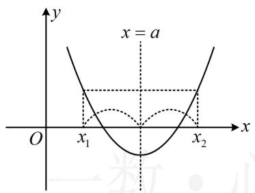
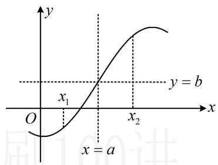
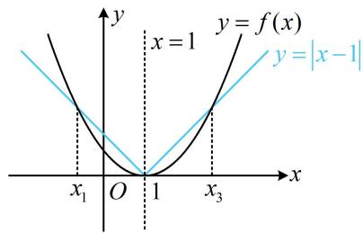
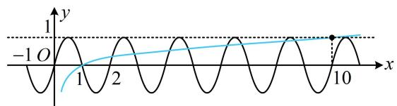
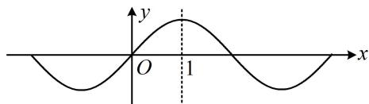

# 第3节 抽象函数问题（★★★☆）

# 内容提要

本节涉及抽象函数各类问题，下面的1\~6（对应类型I、类型II和类型III）为核心常规内容，第7点（对应类型IV）较难，常出现在压轴小题位置.

1. 轴对称：如果函数 $y = f(x)$ 满足若 $\frac{x_1 + x_2}{2} = a$ ，就有 $f(x_1) = f(x_2)$ ，则 $f(x)$ 的图象关于直线 $x = a$ 对称.

记法：自变量关于 $a$ 对称，函数值相等，如图1.

2. 中心对称：若函数 $y = f(x)$ 满足若 $\frac{x_1 + x_2}{2} = a$ ，就有 $\frac{f(x_1) + f(x_2)}{2} = b$ ，则 $f(x)$ 关于点 $(a, b)$ 对称.

记法：自变量关于 $a$ 对称，函数值关于 $b$ 对称，如图2.

text_image

x = a
O
x₁
x₂
y

图1

text_image

y
x₁
O
x = a
x₂
y = b

图2

3. 函数图象的对称轴和对称中心结论（规律： $x$ 系数相反是对称， $x$ 系数相同是周期）

<table><tr><td> $f(x+a)=f(a-x)$ 或  $f(2a+x)=f(-x)$ </td><td> $f(x)$ 关于直线  $x=a$  对称(当  $a=0$  时, $f(x)$  即为偶函数,关于  $y$  轴对称)</td></tr><tr><td> $f(a+x)=f(b-x)$ </td><td> $f(x)$ 关于直线  $x=\frac{a+b}{2}$  对称</td></tr><tr><td> $f(a+x)+f(a-x)=0$ </td><td> $f(x)$ 关于  $(a,0)$  对称(当  $a=0$  时, $f(x)$  即为奇函数,关于原点对称)</td></tr><tr><td> $f(a+x)+f(b-x)=c$ </td><td> $f(x)$ 关于点  $\left(\frac{a+b}{2},\frac{c}{2}\right)$  对称</td></tr></table>

注意：若将上述表格中结论里的 $x$ 全部换成 $2x$ （或 $3x$ 等等），结论不变.

例如，若 $f(2x + a) = f(a - 2x)$ ，则仍可得到 $f(x)$ 关于直线 $x = a$ 对称.

4. 常见的周期结论：由 $f(x + a) = -f(x)$ ， $f(x + a) = \frac{1}{f(x)}$ ， $f(x + a) + f(x) = t$ 均可得出 $f(x)$ 周期为 $2a$ ，其共同的特征是括号内 $x$ 的系数相同，所以像 $f(2x + a) = -f(2x)$ 这种条件，也可得出 $f(x)$ 周期为 $2a$ .

5. 双对称的周期结论（可借助三角函数辅助理解）：

①如果函数 $f(x)$ 有两条对称轴，则 $f(x)$ 一定是周期函数，周期为对称轴距离的2倍.

②如果函数 $f(x)$ 有一条对称轴，一个对称中心，则 $f(x)$ 一定是周期函数，周期为对称中心与对称轴之间距离的4倍.  
③如果函数 $f(x)$ 有在同一水平线上的两个对称中心，则 $f(x)$ 一定是周期函数，周期为对称中心之间距离的2倍.

6. 赋值法: 题干给出诸如 $f(xy) = f(x)f(y)$ 这类关系式, 让我们求一些函数值, 或判断奇偶性. 这类题常采用赋值法处理, 具体怎样赋值, 可参考本节例 4.

7. 原函数与导函数的对称结论：设 $f(x)$ 存在导函数 $f'(x)$ ，则二者的对称性有下述结论.

①若 $f(x)$ 有对称轴 $x = a$ ，则 $f'(x)$ 有对称中心 $(a,0)$ .

证明： $f(x)$ 有对称轴 $x = a \Rightarrow f(a + x) = f(a - x)$ ，两端求导可得 $f'(a + x) = -f'(a - x)$ ，

所以 $f'(a+x)+f'(a-x)=0$ ，故 $f'(x)$ 关于点 $(a,0)$ 对称.

②若 $f(x)$ 有对称中心 $(a, b)$ ，则 $f'(x)$ 有对称轴 $x = a$ .

证明： $f(x)$ 有对称中心 $(a,b)\Rightarrow f(a+x)+f(a-x)=2b$ ，两端求导得 $f'(a+x)-f'(a-x)=0$ ，
所以 $f'(a+x)=f'(a-x)$ ，故 $f'(x)$ 关于直线 x=a 对称.

③若 $f'(x)$ 有对称轴 $x = a$ ，则 $f(x)$ 有对称中心 $(a, b)$ .

证明： $f'(x)$ 有对称轴 $x = a \Rightarrow f'(a + x) - f'(a - x) = 0$ ，我们把此式看成由某式求导得出，

则该式为 $f(a + x) + f(a - x) = C$ ，令 $C = 2b$ 得 $f(a + x) + f(a - x) = 2b \Rightarrow f(x)$ 关于 $(a, b)$ 对称；

特别地，当 $a = 0$ 时， $f'(x)$ 为偶函数，只能得出 $f(x)$ 关于点 $(0, b)$ 对称，不一定是奇函数.

④当 $f'(x)$ 有对称中心 $(a, b)$ 时，若 $b \neq 0$ ，则 $f(x)$ 不一定有对称轴；若 $b = 0$ ，则 $f(x)$ 有对称轴 $x = a$ .

证明： $f'(x)$ 有对称中心 $(a,b)\Rightarrow f'(a+x)+f'(a-x)-2b=0$

我们把上式看成由某式求导得出，则该式应为 $f(a + x) - f(a - x) - 2bx = C$ ， $C$ 为常数，

在上式中令 $x = 0$ 可得 $C = 0$ ，代入上式整理得： $f(a + x) = f(a - x) + 2bx$

当 $b = 0$ 时，上式即为 $f(a + x) = f(a - x) \Rightarrow f(x)$ 有对称轴 $x = a$

而当 $b \neq 0$ 时，无法得出 $f(x)$ 有对称轴；

特别地，若 $a = b = 0$ ，即 $f^{\prime}(x)$ 为奇函数，我们发现此时 $f(x)$ 关于 $x = 0$ 对称，为偶函数.

# 类型 I：单对称问题

【例1】已知函数 $y = f(x)$ 满足 $f(x) - f(2 - x) = 0 (x \in \mathbf{R})$ ，且在 $[1, +\infty)$ 上为增函数，则（）

A. $f(-1) > f(1) > f(2)$

B. $f(1) > f(2) > f(-1)$

C. $f(-1) > f(2) > f(1)$

D. $f(2) > f(-1) > f(1)$

解析： $f(x)-f(2-x)=0\Rightarrow f(x)=f(2-x)\Rightarrow f(x)$ 的图象关于直线 x=1 对称，所以 $f(-1)=f(3)$ ，因为 3>2>1，且 $f(x)$ 在 $[1,+\infty)$ 上为增函数，所以 $f(3)>f(2)>f(1)$ ，故 $f(-1)>f(2)>f(1)$ .

答案: C

【反思】本题的关键是由 $f(x)-f(2-x)=0$ 识别出 $f(x)$ 的对称性.

【变式1】设函数 $f(x)$ 满足 $f(x) = f(2 - x)(x \in \mathbf{R})$ ，若函数 $y = |x - 1| - f(x)$ 有3个不同的零点 $x_1$ ， $x_2, x_3$ ，则 $x_1 + x_2 + x_3 =$ \_\_\_\_.

解析：看到 $f(x) = f(2 - x)$ ，马上想到 $f(x)$ 的图象关于 $x = 1$ 对称，

要研究 $y = |x - 1| - f(x)$ 的零点，可将 $|x - 1|$ 和 $f(x)$ 分离，作图看交点， $|x - 1| - f(x) = 0 \Leftrightarrow |x - 1| = f(x)$ ，函数 $f(x)$ 没给解析式，联系前面的对称条件，考虑从图象对称的角度来分析交点的情况，

由于 $y = f(x)$ 和 $y = |x - 1|$ 的图象都关于直线 $x = 1$ 对称，

故它们的交点关于直线 $x = 1$ 对称，如图，

设 $x_{1} < x_{2} < x_{3}$ ，则必有 $\frac{x_1 + x_3}{2} = 1$ 且 $x_{2} = 1$ ，所以 $x_{1} + x_{2} + x_{3} = 3$ 。

答案: 3

text_image

y
x = 1
y = f(x)
y = |x - 1|
x₁ O 1 x₃
x

【变式2】函数 $f(x)$ 满足 $f(2 - x) = 2 - f(x)(x \in \mathbf{R})$ ，若 $f(-1) + f(0) = 4$ ，则 $f(2) + f(3) =$ \_\_\_\_.

解析： $f(2 - x) = 2 - f(x) \Rightarrow f(2 - x) + f(x) = 2$ ，所以 $f(x)$ 的图象关于点(1,1)对称，

而 $f(-1)$ , $f(0)$ , $f(2)$ , $f(3)$ 这几个函数值中, -1 和 3 关于 1 对称, 0 和 2 关于 1 对称, 所以 $f(-1)$ 和 $f(3)$ 有关系, $f(0)$ 和 $f(2)$ 有关系, 抓住这点就可以求 $f(2) + f(3)$ 了,

在 $f(2 - x) + f(x) = 2$ 中取 $x = 3$ 可得 $f(-1) + f(3) = 2$ ，所以 $f(3) = 2 - f(-1)$

取 $x = 2$ 可得 $f(0) + f(2) = 2$ ，所以 $f(2) = 2 - f(0)$ ，故 $f(2) + f(3) = 4 - f(-1) - f(0)$

又 $f(-1) + f(0) = 4$ ，所以 $f(2) + f(3) = 0$

答案: 0

【总结】给出 $f(x)$ 满足 $f(a+x)=f(b-x)$ ， $f(a+x)+f(b-x)=c$ 这类条件，一定要识别出它们分别表示 $f(x)$ 有对称轴 $x=\frac{a+b}{2}$ ，对称中心 $\left(\frac{a+b}{2},\frac{c}{2}\right)$ ，进而运用对称性分析问题.

【例 2】(2024·新课标 I 卷（节选）) 已知函数 $f(x)=\ln\frac{x}{2-x}+ax+b(x-1)^{3}$ 。证明：曲线 $y=f(x)$ 是中心对称图形。

证明: (没给对称中心, 需要自己找到对称中心, 再证明, 怎么找? 由于对称函数定义域必定也对称, 故不妨先求定义域, 从定义域出发寻找对称中心) 由 $\frac{x}{2 - x} > 0$ 可得 $x(2 - x) > 0$ , 所以 $x(x - 2) < 0$ ,

解得: $0 < x < 2$ , 故 $f(x)$ 的定义域是 $(0,2)$ , (定义域关于 $x = 1$ 对称, 那么曲线 $y = f(x)$ 的对称中心横坐标只能是 1 , 故要证结论成立, 接下来只需计算 $f(2 - x) + f(x)$ , 得出其为与 $x$ 无关的常数)

$$
\begin{array}{l} f (2 - x) + f (x) = \ln \frac {2 - x}{2 - (2 - x)} + a (2 - x) + b (2 - x - 1) ^ {3} + \ln \frac {x}{2 - x} + a x + b (x - 1) ^ {3} \\ = \ln \frac {2 - x}{x} + a (2 - x) + b (1 - x) ^ {3} + \ln \frac {x}{2 - x} + a x + b (x - 1) ^ {3} = \ln \left(\frac {2 - x}{x} \cdot \frac {x}{2 - x}\right) + 2 a = \ln 1 + 2 a = 2 a, \\ \end{array}
$$

所以曲线 $y = f(x)$ 关于点 $(1, a)$ 对称.

【反思】可以看到，这题反着考对称性，要我们猜测出对称情况，然后证明。此类题一般可从定义域出发寻找对称中心（或对称轴）。另外，本题也可从局部的 $b(x - 1)^3$ 具有对称中心(1,0)，去猜测对称中心横坐标为1。

# 类型 II：双对称推周期问题

【例 3】偶函数 $y = f(x)$ 的图象关于直线 x = 2 对称， $f(3) = 3$ ，则 $f(-1) = \_\_\_$ .

解析：由题意， $f(x)$ 有对称轴 $x = 0$ 和 $x = 2$ ，所以 $f(x)$ 的周期为4，故 $f(-1) = f(3) = 3$ .

答案: 3

【反思】有两条对称轴的函数必为周期函数，周期为对称轴之间距离的2倍.

【变式1】偶函数 $f(x)$ 满足 $f(2 - x) + f(x) = 2$ ，且 $f(4) = -1$ ，则 $f(0) + f(1) =$ \_\_\_\_.

解析：由题意， $f(2 - x) + f(x) = 2$ ，所以 $f(x)$ 关于点(1,1)对称，

又 $f(x)$ 为偶函数，所以 $f(x)$ 关于 $y$ 轴对称，从而 $f(x)$ 的周期为4，故 $f(0) = f(4) = -1$

在 $f(2 - x) + f(x) = 2$ 取 $x = 1$ 可求得 $f(1) = 1$ ，所以 $f(0) + f(1) = 0$

答案: 0

【反思】既有对称轴又有对称中心的函数必为周期函数，周期为二者之间距离的4倍.

【变式2】(2018·新课标Ⅱ卷) 若 $f(x)$ 是定义域为 $(-∞,+∞)$ 的奇函数，满足 $f(1-x)=f(1+x)$ ，若 $f(1)=2$ ，则 $f(1)+f(2)+\cdots+f(50)=(\quad)$

A. -50

B. 0

C. 2

D. 50

解法1：首先由双对称，推出周期，下面给出结论的推导方法， $f(x)$ 是奇函数 $\Rightarrow f(1-x)=-f(x-1)$ ，代入题干的 $f(1-x)=f(1+x)$ 可得 $f(x+1)=-f(x-1)$ ，所以 $f(x+2)=-f(x)$ ，

从而 $f(x + 4) = -f(x + 2) = f(x)$ ，故 $f(x)$ 是以4为周期的周期函数，所以 $f(3) = f(-1) = -f(1) = -2$ ，接下来还需计算 $f(2)$ 和 $f(4)$ ，不能只由周期来求，要结合奇函数满足 $f(0) = 0$ 这个隐含条件，

在 $f(1 - x) = f(1 + x)$ 中取 $x = -1$ 知 $f(2) = f(0) = 0$

又 $f(4) = f(0) = 0$ ，所以 $f(1) + f(2) + f(3) + f(4) = 2 + 0 + (-2) + 0 = 0$

$$
\begin{array}{l} \text {故} f (1) + f (2) + \dots + f (5 0) = [ f (1) + \dots + f (4) ] + [ f (5) + \dots + f (8) ] + \dots + [ f (4 5) + \dots + f (4 8) ] + f (4 9) + f (5 0) \\ = f (4 9) + f (5 0) = f (1) + f (2) = 2. \\ \end{array}
$$

解法2：所给条件都能清晰地反映 $f(x)$ 的性质，故可分析已知条件，举一个具体的函数来求解答案，

$f(x)$ 为奇函数 $\Rightarrow f(x)$ 有对称中心坐标原点， $f(1 - x) = f(1 + x)\Rightarrow f(x)$ 有对称轴 $x = 1$

既有对称轴又有对称中心, 考虑取三角函数. 由 $f(x)$ 为奇函数和 $f(1)=2$ 想到 $y=2\sin \omega x$ , 再由 $x=1$ 是对称轴想到可取 $\omega=\frac{\pi}{2}$ , 这样 $f(x)$ 就有了,

取 $f(x) = 2\sin \frac{\pi}{2} x$ ，经检验，满足题干所有条件，此时 $f(x)$ 周期为4， $f(2) = 0$ ， $f(3) = -2$ ， $f(4) = 0$

$$
\begin{array}{l} \text {所以} f (1) + f (2) + \dots + f (5 0) = [ f (1) + \dots + f (4) ] + [ f (5) + \dots + f (8) ] + \dots + [ f (4 5) + \dots + f (4 8) ] + f (4 9) + f (5 0) \\ = f (4 9) + f (5 0) = f (1) + f (2) = 2. \\ \end{array}
$$

答案: C

【变式 3】(2021·新高考 II 卷) 已知函数 $f(x)$ 的定义域为 R，且 $f(x+2)$ 是偶函数， $f(2x+1)$ 是奇函数，则下列选项中值一定为 0 的是（）

A. $f\left(-\frac{1}{2}\right)$

B. $f(-1)$

C. $f(2)$

D. $f(4)$

解析： $f(x + 2)$ 是偶函数 $\Rightarrow f(x)$ 向左平移2个单位是偶函数 $\Rightarrow f(x)$ 关于直线 $x = 2$ 对称①，

怎样翻译“ $f(2x+1)$ 是奇函数”？实际上，它和 $f(x+1)$ 为奇函数效果一样，都能得出 $f(x)$ 关于点(1,0)对称，理由如下，设 $\varphi(x)=f(2x+1)$ ，则 $\varphi(x)$ 是奇函数，所以 $\varphi(-x)=-\varphi(x)$ ，即 $f(2(-x)+1)=-f(2x+1)$ ，

从而 $f(-2x + 1) = -f(2x + 1)$ ，将 $x$ 换成 $\frac{x}{2}$ 可得 $f(-x + 1) + f(x + 1) = 0$ ，所以 $f(x)$ 关于点 $(1,0)$ 对称 ②，

由①②可得 $f(x)$ 周期为4，且 $f(1) = 0$ ，又 $f(x)$ 的图象关于 $x = 2$ 对称，1，3关于2对称，

所以 $f(3) = f(1) = 0$ ，结合 $f(x)$ 周期为4可得 $f(-1) = f(3) = 0$ ，故选B.

答案: B

【反思】若 $f(x)$ 的图象关于点 $(a, b)$ 对称，且 $f(x)$ 在 $x = a$ 处有定义，则必有 $f(a) = b$ 。

【变式4】奇函数 $f(x)$ 满足 $f(2 + x) + f(-x) = 0 (x \in \mathbf{R})$ ，若当 $0 \leq x \leq 1$ 时， $f(x) = 4x - 4x^2$ ，则函数 $y = f(x) - \lg x$ 的零点个数为 \_\_\_\_.

解析: $y = f (x) - \lg x$ 的零点无法直接求, 可变形后画图看交点,

由题意， $f(x) - \lg x = 0\Leftrightarrow f(x) = \lg x$ ， $f(2 + x) + f(-x) = 0\Rightarrow f(x)$ 的图象关于点(1,0)对称①，

又 $f(x)$ 为奇函数，所以 $f(x)$ 的图象关于原点对称，结合①可得 $f(x)$ 的周期为2，

到此已可得出 $f(x)$ 的大致图象如图，由于 $f(x)$ 在直线 $y = 1$ 上方没有图象，故作图时应重点关注 $y = \lg x$ 穿

出该直线的位置，

因为 $\lg 10 = 1$ ，所以如图， $y = \lg x$ 与 $y = f(x)$ 的图象共有9

个交点，故函数 $y = f(x) - \lg x$ 有9个零点.

答案: 9

text_image

-1 O
1 2 10 x

# 类型III：抽象函数赋值法

【例 4】(2023·新课标 I 卷) (多选) 已知函数 $f(x)$ 的定义域为 R, $f(xy) = y^{2}f(x) + x^{2}f(y)$ , 则 ( )

A. $f(0) = 0$

B. $f(1) = 0$

C. $f(x)$ 是偶函数

D. $x = 0$ 为 $f(x)$ 的极小值点

解析：A项，给出 $f(xy) = y^{2}f(x) + x^{2}f(y)$ 这类性质，让求一些具体的函数值，常用赋值法，

令 $x = y = 0$ 可得 $f(0 \times 0) = 0^2 f(0) + 0^2 f(0)$ ，所以 $f(0) = 0$ ，故A项正确；

B 项，令 x=y=1 可得 $f(1\times1)=1^{2}f(1)+1^{2}f(1)$ ，所以 $f(1)=0$ ，故 B 项正确；

C 项, 要判断奇偶性, 就看 $f(-x)$ 与 $f(x)$ 的关系, 为了产生 $f(-x)$ , 可将 $y$ 取成 $-1$ ,

令 $y = -1$ 可得 $f(-x) = f(x) + x^2 f(-1)$ ①，所以还得算 $f(-1)$ ，继续赋值，

令 $x = y = -1$ 可得 $f((-1)^2) = (-1)^2 f(-1) + (-1)^2 f(-1)$ ，所以 $f(1) = 2f(-1)$ ，结合 $f(1) = 0$ 可得 $f(-1) = 0$ ，

代入①得 $f(-x) = f(x)$ ，所以 $f(x)$ 是偶函数，故C项正确；

D 项, ABC 都对, 可大胆猜测 D 项错误, 正面推理判断此选项较困难, 可尝试举个反例, 观察发现常值函数 $f(x)=0$ 满足所给等式, 故可用它来判断选项,

令 $f(x) = 0$ ，经检验，满足 $f(xy) = y^2 f(x) + x^2 f(y)$ ，但此时 $x = 0$ 不是 $f(x)$ 的极小值点，故 D 项错误.

答案: ABC

【反思】对于这种只给了函数满足的关系式的问题,一般用赋值法. 常见的赋值有 $x = 0$ , $x = \pm 1$ , $y = \pm x$ , $y = \pm \frac{1}{x}$ 等, 具体怎么赋值, 得由所给关系式决定, 没有确定的规律, 所以更多的我们通过练习题来体会.

【例5】函数 $f(x)$ 的定义域为 $\mathbf{R}$ ，且 $f(2x + 1)$ 为偶函数， $f(x) = f(x + 1) - f(x + 2)$ ，若 $f(1) = 2$

则 $f(18)=$ （）

A. 1

B. 2

C. -1

D. -2

解析： $f(18)$ 离 $f(1)$ 较远，猜想 $f(x)$ 有周期，故先尝试推周期，结合条件知应从 $f(x)=f(x+1)-f(x+2)$ 入手，此式有 3 项，不妨将 x 换成 $x+1$ ，再构造一个式子，看能否消去一些项，

因为 $f(x) = f(x + 1) - f(x + 2)$ ，所以将 $x$ 换成 $x + 1$ 可得 $f(x + 1) = f(x + 2) - f(x + 3)$ ，

两式相加得： $f(x) + f(x + 1) = f(x + 1) - f(x + 3)$ ，化简得： $f(x + 3) = -f(x)$ ①，

式①可看成自变量加3，函数值相反，若自变量再加3，则函数值再反一次，变回去了，周期就有了，在式①中将 $x$ 换成 $x + 3$ 可得 $f(x + 6) = -f(x + 3)$ ，结合式①得 $f(x + 6) = f(x)$ ，

所以 $f(x)$ 的周期为 6，故 $f(18)=f(0)$ ②，

给的是 $f(1)$ ，不是 $f(0)$ ，怎么办呢？再看 $f(2x + 1)$ 为偶函数这个条件，不妨用偶函数定义来翻译它，

因为 $f(2x + 1)$ 为偶函数，所以 $f(2(-x) + 1) = f(2x + 1)$ ，故 $f(1 - 2x) = f(1 + 2x)$ ③，

为了产生目标 $f(0)$ ，可两端同时取 $x = \frac{1}{2}$ ，在③中取 $x = \frac{1}{2}$ 可得 $f(0) = f(2)$ ④，

已知 $f(1)$ ，只需建立一个关于 $f(0)$ ， $f(1)$ ， $f(2)$ 的方程，就能结合式④求出 $f(0)$ 。注意到三者的自变量刚好依次加 1，故对 $f(x)=f(x+1)-f(x+2)$ 赋值，即可得到 $f(0)$ ， $f(1)$ ， $f(2)$ 的方程，

在 $f(x) = f(x + 1) - f(x + 2)$ 中取 $x = 0$ 可得 $f(0) = f(1) - f(2)$ ，结合④得 $f(0) = \frac{f(1)}{2} = 1$ ，代入②得 $f(18) = 1$ 。

答案: A

【反思】①由 $f(x) = f(x + a) - f(x + 2a) (a \neq 0)$ 能推周期，推导的方法与上述解析类似，可以得到 $f(x)$ 的周期为 $6a$ ；②在综合了对称性、关系式的抽象函数求值问题中，赋值的常用思路是构造出已知和所求.

【例6】函数 $f(x)$ ， $g(x)$ 定义域均为 $\mathbf{R}$ ，且 $f(x) + g(1 - x) = 4$ ， $g(x) - f(3 - x) = 2$ 。若 $g(0) = 2$ 则 $\sum_{i=1}^{13} f(i) = (\quad)$

A. 10

B. 13

C. 14

D. 39

解析：所求为 $f(x)$ 的部分函数值之和，故考虑消去已知条件中与 $g(x)$ 有关的部分，得到 $f(x)$ 的性质，在 $g(x) - f(3 - x) = 2$ 中将 $x$ 换成 $1 - x$ 可得 $g(1 - x) - f(x + 2) = 2$ ，所以 $g(1 - x) = f(x + 2) + 2$ ，

代入 $f(x) + g(1 - x) = 4$ 可得 $f(x) + f(x + 2) + 2 = 4$ ，所以 $f(x) + f(x + 2) = 2$ ①，

有了式①，我们发现可将 $\sum_{i=1}^{13} f(i)$ 按自变量相差 2 的两项组合，共 13 项，会剩下一项，怎么办呢？注意到条件中还有 $g(0)=2$ ，故尝试用它单独求出 $f(x)$ 的一项，可在所给等式中将 $g(0)$ 构造出来再看，

在 $f(x) + g(1 - x) = 4$ 中取 $x = 1$ 可得 $f(1) + g(0) = 4$ ，所以 $f(1) = 4 - g(0) = 4 - 2 = 2$ ②，

故 $\sum_{i=1}^{13} f(i) = f(1) + [f(2) + f(4)] + [f(3) + f(5)] + [f(6) + f(8)] + [f(7) + f(9)] + [f(10) + f(12)] + [f(11) + f(13)]$ ,

结合①②可得 $\sum_{i=1}^{13} f(i) = 2 + 2 + 2 + 2 + 2 + 2 + 2 = 14$ .

答案: C

【反思】当条件给出 $f(x)$ ， $g(x)$ 混合的关系式时，往往先消去一个函数，再进行分析.

# 类型IV（此类型较难）：涉及导数的抽象函数问题

【例 7】（多选）已知函数 $f(x)(x \in \mathbf{R})$ 是奇函数， $f(x+2)=f(-x)$ 且 $f(1)=2$ ， $f'(x)$ 是 $f(x)$ 的导函数，则（）

A. $f(2023) = 2$

B. $f'(x)$ 的周期是 4

C. $f^{\prime}(x)$ 是偶函数

D. $f^{\prime}(1) = 1$

解析：奇函数和 $f(x + 2) = f(-x)$ 都涉及对称性，故 $f(x)$ 有两种对称性，可先由此找 $f(x)$ 的周期，

$f(x)$ 为奇函数 $\Rightarrow f(x)$ 有对称中心 $(0,0)$ ， $f(x + 2) = f(-x) \Rightarrow f(x)$ 有对称轴 $x = 1$ ，

由双对称的周期结论可知， $f(x)$ 是周期为4的周期函数，

A 项， $f(2023) = f(506 \times 4 - 1) = f(-1)$ ，又 $f(x)$ 为奇函数，所以 $f(-1) = -f(1) = -2$ ，

从而 $f(2023) = -2$ ，故A项错误；

B项，可以想象， $f'(x)$ 与 $f(x)$ 应有相同的周期，下面我们也给出证明过程，

因为 $f(x)$ 周期为4，所以 $f(x + 4) = f(x)$ ，两端求导可得 $f'(x + 4) = f'(x)$ ，

所以 $f'(x)$ 的周期也为 4，故 B 项正确；

C 项，奇函数的导函数为偶函数，我们可仿照 B 项的过程来做个推导，

因为 $f(x)$ 为奇函数，所以 $f(-x) = -f(x)$ ①，

要论证的是 $f'(x)$ 的奇偶性，故考虑两端求导， $f(-x)$ 这部分要用复合函数求导准则，可将其看成 $y = f(u)$ 与 u = -x 的复合，所以 $[f(-x)]' = f'(u) \cdot u' = f'(-x) \cdot (-1) = -f'(-x)$ ，

将①两端求导得 $-f'(-x) = -f'(x)$ ，所以 $f'(-x) = f'(x)$ ，从而 $f'(x)$ 为偶函数，故C项正确；

D项，如图，可以想象， $f(x)$ 的图象关于直线x=1对称，那么 $f(x)$ 必在x=1处取得极值，所以 $f'(1)=0$ ，

下面我们也给出这一结论的严格推导过程，

由题意， $f(x + 2) = f(-x)$ ，两端求导可得 $f'(x + 2) = -f'(-x)$ ，

取 x = -1 可得 $f'(1) = -f'(1)$ ，所以 $f'(1) = 0$ ，故 D 项错误.

text_image

y
O 1 x

答案: BC

【变式】(2022·新高考Ⅰ卷)(多选)已知函数 $f(x)$ 及其导函数 $f'(x)$ 的定义域均为 R，记 $g(x) = f'(x)$ ，若 $f\left(\frac{3}{2} - 2x\right)$ ， $g(2 + x)$ 均为偶函数，则（）

A. $f(0) = 0$

B. $g\left(-\frac{1}{2}\right) = 0$

C. $f(-1) = f(4)$

D. $g(-1) = g(2)$

解析：结论与条件的联系不直观，推理的方向不明，不妨先翻译已知条件，看能得到什么，

$f\left(\frac{3}{2} - 2x\right)$ 为偶函数 $\Rightarrow f\left(\frac{3}{2} + 2x\right) = f\left(\frac{3}{2} - 2x\right)$ ，将 $x$ 换成 $\frac{x}{2}$ 得 $f\left(\frac{3}{2} + x\right) = f\left(\frac{3}{2} - x\right) \Rightarrow f(x)$ 关于 $x = \frac{3}{2}$ 对称，

将 $g(x)$ 左移2个单位，得到的 $g(2 + x)$ 为偶函数，其图象关于 $y$ 轴对称 $\Rightarrow g(x)$ 关于 $x = 2$ 对称，

结合内容提要7中的③可知， $f(x)$ 的图象关于点 $(2,f(2))$ 对称，

所以 $f(x)$ 是以2为周期的周期函数（双对称周期结论），故 $g(x)$ 也是以2为周期的周期函数，

A 项，由 $f(x)$ 的周期为 2 可知 $f(0) = f(2)$ ，而 $f(2)$ 的值无法确定，故 A 项错误；

B 项， $g(x)$ 周期为 $2 \Rightarrow g\left(-\frac{1}{2}\right) = g\left(\frac{3}{2}\right)$ ，因为 $f(x)$ 的图象关于直线 $x = \frac{3}{2}$ 对称，所以 $f\left(\frac{3}{2}\right)$ 必是 $f(x)$ 的极值，

从而 $f^{\prime}\left(\frac{3}{2}\right) = 0$ ，故 $g\left(\frac{3}{2}\right) = 0$ ，所以 $g\left(-\frac{1}{2}\right) = 0$ ，故B项正确；

C 项， $f(x)$ 的图象关于直线 $x=\frac{3}{2}$ 对称 $\Rightarrow f(-1)=f(4)$ ，故 C 项正确；

D 项， $g(x)$ 周期为 $2 \Rightarrow g(-1) = g(1)$ ，又 $f(x)$ 的图象关于直线 $x = \frac{3}{2}$ 对称，所以 $f(x)$ 的图象在 $x = 1$ 和 $x = 2$ 处的切线斜率互为相反数，从而 $g(1) = -g(2)$ ，所以 $g(-1) = -g(2)$ ，故 D 项错误.

答案: BC

# 强化训练

1. (2022·四川成都模拟·★★★)

已知函数 $y = f(x)$ 满足 $f(4 + x) - f(-x) = 0 (x \in \mathbf{R})$ ，且 $f(x)$ 在 $[2, +\infty)$ 上为减函数，则（）

A. $f(\log_23) > f(\log_25) > f(3)$   
B. $f(\log_25) > f(\log_23) > f(3)$   
C. $f(\log_25) > f(3) > f(\log_23)$   
D. $f(\log_23) > f(3) > f(\log_25)$

2. (2023·山东潍坊三模·★★★)

已知函数 $f(x)$ 的定义域为 $\mathbf{R}$ ， $f(x + 1)$ 为偶函数，

$f(x + 4) = f(-x)$ ，则（）

A. 函数 $f(x)$ 为偶函数

B. $f(3) = 0$

C. $f\left(\frac{1}{2}\right) = -f\left(\frac{5}{2}\right)$

D. $f(2023) = 0$

3. (★★★) (多选)

设 $f(x)$ 是定义在 $\mathbf{R}$ 上的偶函数，且对 $\forall x\in \mathbf{R}$ ， $f(x + 2) = f(2 - x)$ ，当 $x\in [0,2]$ 时， $f(x) = \left(\frac{1}{2}\right)^{2 - x}$ ，则（）

A. $f(x)$ 是周期函数，且周期为2  
B. $f(x)$ 的最大值是1，最小值是 $\frac{1}{4}$   
C. $f(x)$ 在[2,4]上单调递减，在[4,6]上单调递增  
D. 当 $x \in [2,4]$ 时， $f(x) = \left(\frac{1}{2}\right)^{2 - x}$

4. (★★★)

已知函数 $f(x)=\ln(\sqrt{x^{2}+1}-x)+1$ ，定义域为 R 的函数 $g(x)$ 满足 $g(-x)+g(x)=2$ ，若函数 $y=f(x)$ 与 $y=g(x)$ 的图象的交点为 $(x_{1},y_{1})$ ， $(x_{2},y_{2})$ ，…， $(x_{5},y_{5})$ ，则 $\sum_{i=1}^{5}(x_{i}+y_{i})=(\quad)$

A. 0 B. 5 C. 10 D. 15

5. (2022·江苏模拟·★★★)

偶函数 $f(x)$ 满足 $f(x) = f(2 - x)(x \in \mathbf{R})$ ，当 $x \in$

[0,1]时， $f(x) = 2 - 2x^{2}$ ，则函数 $g(x) = f(x) -$

$2\log_{4}|x - 1|$ 的所有零点之和为（）

A. 4 B. 6 C. 8 D. 10

6. (2023·山东青岛模拟·★★★☆)

设 $f(x)$ 为定义在整数集上的函数， $f(1) = 1$ ， $f(2) = 0$ ， $f(-1) < 0$ ，对任意的整数 $x$ ， $y$ 均有 $f(x + y) = f(x)f(1 - y) + f(1 - x)f(y)$ ，则 $f(55) =$ \_\_\_\_.

7. (★★★★)

已知 $f'(x)$ 是函数 $f(x)$ 的导函数，若 $f(x+2)$ 和 $f'(x)$ 均为奇函数，且 $f(0)=2$ ，则 $f(2)+f(4)+\cdots$

$$
+ f (2 0 2 4) = \underline {{{\quad}}}.
$$

8.（2024·新课标Ⅱ卷·★★★★）（多选）

设函数 $f(x)=2x^{3}-3ax^{2}+1$ ，则（）

A. 当 $a > 1$ 时， $f(x)$ 有三个零点  
B. 当 $a < 0$ 时， $x = 0$ 是 $f(x)$ 的极大值点  
C. 存在 $a, b$ , 使得 $x = b$ 为曲线 $y = f(x)$ 的对称轴  
D. 存在 $a$ ，使得点 $(1, f(1))$ 为曲线 $y = f(x)$ 的对称中心

9. (2022·全国乙卷·★★★★)

已知函数 $f(x)$ ， $g(x)$ 的定义域均为 $\mathbf{R}$ ，且 $f(x)+$

$g(2 - x) = 5$ ， $g(x) - f(x - 4) = 7$ .若 $y = g(x)$ 的图象关于直线 $x = 2$ 对称， $g(2) = 4$ ，则 $\sum_{k = 1}^{22}f(k) =$ （）

A. -21

B. -22

C. -23

D. -24

10. (2022·新课标Ⅱ卷·★★★★)

若函数 $f(x)$ 的定义域为 $\mathbf{R}$ ，且 $f(x + y) + f(x - y)$

$= f(x)f(y),\quad f(1) = 1$ ，则 $\sum_{k = 1}^{22}f(k) =$ （

A. -3

B. -2

C. 0

D. 1

