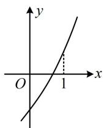

# 强化训练

1. (2025·天津卷·★)

函数 $f(x) = 0.3^{x} - \sqrt{x}$ 的零点所在区间是（）

A. $(0,0.3)$

B. (0.3, 0.5)

C. (0.5,1)

D. (1,2)

1. B

解析：因为 $y = 0.3^{x}$ 和 $y = -\sqrt{x}$ 都在 $[0, +\infty)$ 上 $\searrow$

所以 $f(x)$ 在 $[0, +\infty)$ 上 $\searrow$

所以要判断零点所在区间，只需看哪个区间端点函数值异号，下面逐个分析选项涉及的端点处函数值的正负，

$$
f (0) = 0. 3 ^ {0} - \sqrt {0} = 1 > 0, f (0. 3) = 0. 3 ^ {0. 3} - \sqrt {0 . 3}
$$

$= 0.3^{0.3} - 0.3^{0.5} > 0$ ，所以 $f(x)$ 在 $(0,0.3)$ 上无零点；

又 $f(0.5) = 0.3^{0.5} - \sqrt{0.5} = \sqrt{0.3} -\sqrt{0.5} < 0$

所以 $f(0.3)f(0.5)<0$ ，故 $f(x)$ 的零点在 $(0.3,0.5)$ 上.

2. (★☆)

若函数 $f(x) = 2^{x} + 3x + a$ 在(0,1)内存在零点，则实数 $a$ 的取值范围是（）

A. $(- \infty, -5)$

B. $(-5, - 1)$

C. $(0,5)$

D. $(1, +\infty)$

2. B

解析：因为 $y = 2^{x}$ 和 $y = 3x + a$ 都在 $\mathbf{R}$ 上 $\nearrow$

所以 $f(x)=2^{x}+3x+a$ 在 R 上 $\nearrow$ ,

如图， $f(x)$ 在 $(0,1)$ 上存在零点等价于 $\left\{ \begin{array}{l}f(0) <   0\\ f(1) > 0 \end{array} \right.$

即 $\left\{ \begin{array}{l} 1 + a < 0 \\ 5 + a > 0 \end{array} \right.$ ，解得： $-5 < a < -1$ 。

3.（2022·湖南临湘期末·★☆）

函数 $f(x) = x + \cos x$ 的零点所在的区间为（）

A. $\left(-1,-\frac{1}{2}\right)$

B. $\left(-\frac{1}{2},0\right)$

C. $\left(0, \frac{1}{2}\right)$

D. $\left(\frac{1}{2}, 1\right)$

3. A

解析：先判断单调性，这里需要求导来判断，

由题意， $f'(x)=1-\sin x\geq0$ ，所以 $f(x)$ 在R上 $\nearrow$ ，

从而 $f(x)$ 最多一个零点，要判断零点所在区间，只需看哪个区间端点函数值异号，下面逐个验证选项，

由题意， $f(-1) = -1 + \cos (-1) < 0$ ， $f\left(-\frac{1}{2}\right) = -\frac{1}{2} +\cos \left(-\frac{1}{2}\right)$

$$
= - \cos \frac {\pi}{3} + \cos \frac {1}{2} = \cos \frac {1}{2} - \cos \frac {\pi}{3},
$$

要判断上式的正负，可结合 $y = \cos x$ 在 $(0, \pi)$ 上的单调性来比较 $\cos \frac{1}{2}$ 和 $\cos \frac{\pi}{3}$ 的大小，

注意到 $y = \cos x$ 在 $(0, \pi)$ 上 $\searrow$ ，且 $0 < \frac{1}{2} < \frac{\pi}{3} < \pi$ ，

所以 $\cos \frac{1}{2} >\cos \frac{\pi}{3}$ ，从而 $f\left(-\frac{1}{2}\right) > 0$

故 $f(x)$ 的零点所在的区间是 $\left(-1, -\frac{1}{2}\right)$ .

【反思】像这种单选题，也可不判断单调性，直接看端点值，解析为了严谨，仍然判断了单调性.

4. (2022·辽宁沈阳模拟·★★)

设函数 $f(x) = \frac{1}{3} x - \ln x$ ，则 $f(x)$ （）

A. 在区间 $\left(\frac{1}{\mathrm{e}}, 1\right)$ , (1, e) 内均有零点

B. 在区间 $\left(\frac{1}{\mathrm{e}}, 1\right)$ , (1, e) 内均没有零点

C. 在区间 $\left(\frac{1}{\mathrm{e}}, 1\right)$ 内有零点，在 $(1, \mathrm{e})$ 内没有零点

D. 在区间 $\left(\frac{1}{\mathrm{e}}, 1\right)$ 内没有零点，在 $(1, \mathrm{e})$ 内有零点

4. D

解析：由题意， $f^{\prime}(x) = \frac{1}{3} -\frac{1}{x} = \frac{x - 3}{3x}$

所以 $f^{\prime}(x) > 0\Leftrightarrow x > 3$ ， $f^{\prime}(x) <   0\Leftrightarrow 0 <   x <   3$

从而 $f(x)$ 在 $(0,3)$ 上 $\searrow$ ，在 $(3, +\infty)$ 上 $\nearrow$

又 $f\left(\frac{1}{\mathrm{e}}\right) = \frac{1}{3\mathrm{e}} + 1 > 0$ ， $f(1) = \frac{1}{3} >0$ ， $f(\mathrm{e}) = \frac{\mathrm{e}}{3} -1 <   0$

所以 $f(x)$ 在 $\left(\frac{1}{\mathrm{e}}, 1\right)$ 上没有零点，在 $(1, \mathrm{e})$ 上有零点.

5. (★★)

若 $f(x) = \mathrm{e}^{-x} - 2x - 5$ 的零点位于区间 $(m,m + 1)$ ， $m \in \mathbf{Z}$ ，则 $2^{m} + \log_{4}|m| = (\quad)$

A. $-\frac{1}{4}$ B. $\frac{1}{4}$

C. $\frac{1}{2}$ D. $\frac{3}{4}$

5. D

解析：因为 $y = \mathrm{e}^{-x}$ 和 $y = -2x - 5$ 都在 $\mathbf{R}$ 上 $\searrow$

所以 $f(x)$ 在 $\mathbf{R}$ 上 $\searrow$ ，故 $f(x)$ 最多一个零点，

欲求 $2^{m} + \log_{4}|m|$ ，得先求 $m$ ，我们需要把 $f(x)$ 的零点估计在两个相邻的整数之间，

通过计算可得 $f(-2) = \mathrm{e}^2 - 1 > 0$ ， $f(-1) = \mathrm{e} - 3 < 0$

所以 $f(x)$ 的零点 $x_0 \in (-2, -1)$ ，

由题意， $x_0\in (m,m + 1)$ 且 $m\in \mathbf{Z}$ ，所以 $m = -2$

故 $2^{m} + \log_{4}\left|m\right| = 2^{-2} + \log_{4}\left|-2\right| = \frac{1}{4} +\frac{1}{2} = \frac{3}{4}.$

