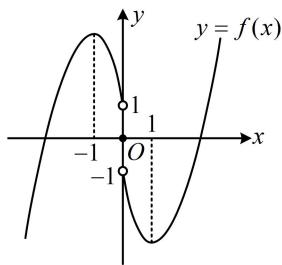
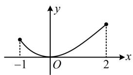
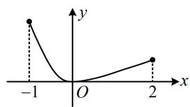

# 强化训练

1. (2024·湖北黄冈模拟·★★☆)(多选)

已知函数 $f(x) = \frac{\mathrm{e}^x(2x - 1)}{x - 1}$ ，则（）

A. 当 $x < 0$ 时， $f(x) > 0$   
B. $f(x)$ 在 $(1, +\infty)$ 上单调递增  
C. $f(x)$ 的极大值为 1  
D. $f(x)$ 的极大值为 $4\mathrm{e}^{\frac{3}{2}}$

1. AC

解析：A项，当 $x < 0$ 时， $2x - 1 < 0$ ， $x - 1 < 0$ ， $\mathrm{e}^x > 0$ ，

所以 $f(x) = \frac{\mathrm{e}^x(2x - 1)}{x - 1} >0$ ，故A项正确；

B、C、D三个选项涉及单调性和极值，可统一分析，

$$
\begin{array}{l} f ^ {\prime} (x) = \frac {[ \mathrm{e} ^ {x} (2 x - 1) + 2 \mathrm{e} ^ {x} ] (x - 1) - \mathrm{e} ^ {x} (2 x - 1)}{(x - 1) ^ {2}} \\ = \frac {\mathrm{e} ^ {x} (2 x ^ {2} - 3 x)}{(x - 1) ^ {2}} = \frac {x (2 x - 3) \mathrm{e} ^ {x}}{(x - 1) ^ {2}}, \quad x \neq 1, \\ \end{array}
$$

所以 $f^{\prime}(x) > 0\Leftrightarrow x <   0$ 或 $x > \frac{3}{2}$ ， $f^{\prime}(x) <   0\Leftrightarrow 0 <   x <   1$ 或

$1 < x < \frac{3}{2}$ ，故 $f(x)$ 在 $(- \infty, 0)$ 上 $\nearrow$ ，在 $(0,1)$ 上 $\searrow$ ，

在 $\left(1, \frac{3}{2}\right)$ 上 $\searrow$ ，在 $\left(\frac{3}{2}, +\infty\right)$ 上 $\nearrow$ ，故 B 项错误，

且 $f(x)$ 有极大值 $f(0) = 1$ ，故C项正确，D项错误

2. (2025·全国Ⅱ卷·★★★) (多选)

已知 $f(x)$ 是定义在 $\mathbf{R}$ 上的奇函数，且当 $x > 0$

时， $f(x) = (x^{2} - 3)\mathrm{e}^{x} + 2$ ，则（）

A. $f(0) = 0$   
B. 当 $x < 0$ 时, $f(x) = -(x^2 - 3)e^{-x} - 2$   
C. $f(x)\geq 2$ ，当且仅当 $x\geq \sqrt{3}$   
D. $x = -1$ 是 $f(x)$ 的极大值点

2. ABD

解析：A项，因为 $f(x)$ 是定义在 $\mathbf{R}$ 上的奇函数，

所以 $f(0)=0$ ，故 A 项正确；

B 项，给的是 $x > 0$ 的解析式，怎样求 $x < 0$ 的解析式？注意到当 $x < 0$ 时， $-x > 0$ ，而 $f(x) = -f(-x)$ ，且 $f(-x)$ 能代所给解析式计算，故由此可求得当 $x < 0$ 时的 $f(x)$ ，

当 $x < 0$ 时， $-x > 0$ ，所以 $f(-x) = [(-x)^2 -3]\mathrm{e}^{-x} + 2$

$= (x^{2} - 3)\mathrm{e}^{-x} + 2$ ，从而 $f(x) = -f(-x) = -(x^2 -3)\mathrm{e}^{-x} - 2$

故B项正确；

C 项，要解不等式 $f(x) \geq 2$ ，可以分 $x > 0$ ， $x < 0$ 讨论，但偏麻烦，不妨直接研究 $f(x)$ ，画出草图来看。考虑到 $f(x)$ 的图象

关于原点对称，故只需研究当 $x > 0$ 时的图象，下面我们求导分析，

当 $x > 0$ 时， $f'(x) = 2xe^x + (x^2 - 3)e^x = (x^2 + 2x - 3)e^x$

$$
= (x + 3) (x - 1) \mathrm{e} ^ {x},
$$

所以 $f^{\prime}(x) < 0 \Leftrightarrow 0 < x < 1$ ， $f^{\prime}(x) > 0 \Leftrightarrow x > 1$

故 $f(x)$ 在 $(0,1)$ 上 $\searrow$ ，在 $(1, +\infty)$ 上 $\nearrow$

又 $f(1) = 2 - 2\mathrm{e}$ ， $\lim_{x\to 0^{+}}f(x) = -1$ ， $\lim_{x\to +\infty}f(x) = +\infty$

所以 $f(x)$ 的大致图象如图，

由所给解析式容易得到当 $x > 0$ 时， $f(x) \geq 2 \Leftrightarrow x \geq \sqrt{3}$ ，那在 $x < 0$ 那边 $f(x) \geq 2$ 是否有解呢？结合图形可知只需看看 $f(-1) \geq 2$ 是否成立，若成立，则有解；否则没有解，

因为 $f(-1) = -f(1) = 2\mathrm{e} - 2 > 2$ ，所以在 $(- \infty, 0)$ 上也存在 $x$ 使 $f(x) \geq 2$ ，故 C 项错误；

D 项，由图可知 x = -1 是 $f(x)$ 的极大值点，故 D 项正确.

text_image

y
y = f(x)
-1
O
-1
x
y

3. (2024·广东广州一模（节选）·★★)

已知函数 $f(x) = \cos x + x\sin x$ ， $x \in (-\pi, \pi)$ ，求 $f(x)$ 的单调区间和极小值.

3. 解：由题意， $f'(x) = -\sin x + \sin x + x \cos x = x \cos x$ ，

$f'(x)$ 的正负由 x， $\cos x$ 共同决定，在 $(-π, π)$ 上， $\cos x$ 的正负可分四段考虑，故据此讨论，判断 $f'(x)$ 的正负

当 $x \in \left(-\pi, -\frac{\pi}{2}\right)$ 时， $x < 0$ ， $\cos x < 0$ ，所以 $f'(x) > 0$ ；

当 $x \in \left(-\frac{\pi}{2}, 0\right)$ 时， $x < 0$ ， $\cos x > 0$ ，所以 $f'(x) < 0$ ；

当 $x \in \left(0, \frac{\pi}{2}\right)$ 时， $x > 0$ ， $\cos x > 0$ ，所以 $f'(x) > 0$ ；

当 $x \in \left(\frac{\pi}{2}, \pi\right)$ 时， $x > 0$ ， $\cos x < 0$ ，所以 $f'(x) < 0$ ；

从而 $f(x)$ 的单调递增区间为 $\left(-\pi, -\frac{\pi}{2}\right), \left(0, \frac{\pi}{2}\right)$ ,

单调递减区间为 $\left(-\frac{\pi}{2},0\right)$ ， $\left(\frac{\pi}{2},\pi\right)$ ,

故 $f(x)$ 有极小值 $f(0)=1$ .

4. (2024·陕西模拟·★★)

已知函数 $f(x) = \frac{x^2}{\mathrm{e}^x}$

(1) 求函数 $f(x)$ 的单调区间;

(2) 求函数 $f(x)$ 在 $[-1,2]$ 上的值域.

4. 解：（1）由题意， $f'(x)=\frac{2x\cdot\mathrm{e}^{x}-x^{2}\cdot\mathrm{e}^{x}}{(\mathrm{e}^{x})^{2}}=\frac{x(2-x)}{\mathrm{e}^{x}}$ ， $x\in R$

所以 $f^{\prime}(x) > 0\Leftrightarrow 0 <   x <   2$ ， $f^{\prime}(x) <   0\Leftrightarrow x <   0$ 或 $x > 2$

故 $f(x)$ 的单调增区间为 $(0,2)$ ，单调减区间为 $(- \infty, 0)$ 和

$(2,+\infty)$ .

（2）由（1）可知当 $x \in [-1, 2]$ 时， $f(x)$ 在 $[-1, 0]$ 上单调递减，在 $[0, 2]$ 上单调递增，

所以 $f(x)$ 在 $[-1,2]$ 上的最小值为 $f(0) = \frac{0^2}{\mathrm{e}^0} = 0$

(最大值在哪里取？如图，有两种可能性，先 $\searrow$ 后 $\nearrow$ 的函数，左右两个端点谁的函数值更大，最大值就是谁)

又因为 $f(-1) = \frac{(-1)^2}{\mathrm{e}^{-1}} = \mathrm{e}$ ， $f(2) = \frac{2^2}{\mathrm{e}^2} = \frac{4}{\mathrm{e}^2}$

所以 $f(-1) > f(2)$ ,

从而 $f(x)$ 在 $[-1,2]$ 上的最大值为 $f(-1) = \mathrm{e}$ ，

故 $f(x)$ 在 $[-1,2]$ 上的值域为 $[0,\mathrm{e}]$ .

line

| x | y |
|---|---|
| -1 | 0 |
| 2 | 1 |

line

| x | y |
|---|---|
| -1 | 1 |
| 0 | 0 |
| 2 | 1 |

5. (2024·全国甲卷(节选)·★★☆)

已知函数 $f(x) = (1 - ax)\ln (1 + x) - x$ ，若 $a = -2$ ，求 $f(x)$ 的极值.

5. 解法1：当 $a = -2$ 时， $f(x) = (1 + 2x)\ln (1 + x) - x$ ， $x > -1$

故 $f'(x) = 2\ln(1 + x) + (1 + 2x) \cdot \frac{1}{1 + x} - 1 = 2\ln(1 + x) + \frac{x}{1 + x}$ ,

（注意到 $f^{\prime}(0) = 0$ ，故可尝试直接分析 $f^{\prime}(x)$ 在 $x = 0$ 两侧的正负）当 $-1 < x < 0$ 时， $0 < x + 1 < 1$

所以 $2\ln(1+x)<0$ ， $\frac{x}{1+x}<0$ ，故 $f'(x)<0$ ，

当 $x > 0$ 时， $x + 1 > 1$ ，所以 $2\ln (1 + x) > 0$ ， $\frac{x}{1 + x} > 0$ ，

故 $f'(x) > 0$ ，所以 $f(x)$ 在 $(-1,0)$ 上单调递减，在 $(0, +\infty)$ 上单调递增，故 $f(x)$ 有极小值 $f(0) = 0$ ，无极大值.

解法2: (按解法1求得 $f'(x)$ 后, 若没想到能直接判断它在 $x = 0$ 两侧的正负, 也可二次求导)

$$
f ^ {\prime \prime} (x) = \frac {2}{1 + x} + \frac {1 + x - x}{(1 + x) ^ {2}} = \frac {3 + 2 x}{(1 + x) ^ {2}} > 0,
$$

所以 $f'(x)$ 在 $(-1, +\infty)$ 上单调递增，

又因为 $f^{\prime}(0) = 0$ ，所以当 $-1 < x < 0$ 时， $f^{\prime}(x) < 0$

当 $x > 0$ 时， $f'(x) > 0$ ，接下来同解法1.

6. (2023·浙江温州二模（节选）·★★☆)

已知函数 $f(x) = \frac{a}{2} x^2 - x - x\ln x (a \in \mathbf{R})$ ，若 $a = 2$ ，求方程 $f(x) = 0$ 的解.

6. 解：若 $a = 2$ ，则 $f(x) = x^{2} - x - x\ln x = x(x - 1 - \ln x)$

其中 $x > 0$ ，所以 $f(x) = 0 \Leftrightarrow x - 1 - \ln x = 0$ ①，

(对于超越方程, 没有求根公式, 需猜根, 并求导研究. 观察发现 $x = 1$ 是方程①的解, 下面分析该方程是否有其他解)

设 $g(x) = x - 1 - \ln x$ ， $x > 0$ ，则 $g^{\prime}(x) = 1 - \frac{1}{x} = \frac{x - 1}{x}$

所以 $g'(x) < 0 \Leftrightarrow 0 < x < 1$ ， $g'(x) > 0 \Leftrightarrow x > 1$ ，

从而 $g(x)$ 在 $(0,1)$ 上单调递减，在 $(1, +\infty)$ 上单调递增，

故 $g(x)_{\min} = g(1) = 0$ ，所以 $g(x)$ 有且仅有 $x = 1$ 这一个零点，

从而方程①的解为 $x = 1$ ，故方程 $f(x) = 0$ 的解为 $x = 1$ ：

【反思】判断含超越结构的 $f'(x)$ 的正负，一般有两种处理思路：①如本题这种可以猜出根的，就猜出根，再结合解析式研究 $f'(x)$ 的正负；②对于求不出根的，如练习2中的 $\frac{1}{x} - \ln x$ ，常设其根为 $x_0$ ，再画图分析 $f'(x)$ 在 $x_0$ 两侧的正负。放在练习题是希望做不出来的同学可以深刻认识到这两种思路，后面小节还会遇到。

7. (2023·全国甲卷(节选)·★★★)

已知 $f(x) = ax - \frac{\sin x}{\cos^3 x}$ ， $x \in \left(0, \frac{\pi}{2}\right)$ ，若 $a = 8$ ，讨论 $f(x)$ 的单调性.

7. 解：若 $a = 8$ ，则 $f(x) = 8x - \frac{\sin x}{\cos^3 x}$

所以 $f'(x)=8-\frac{\cos x\cdot\cos^{3}x-3\cos^{2}x(-\sin x)\sin x}{\cos^{6}x}$

$$
= 8 - \frac {\cos^ {2} x + 3 \sin^ {2} x}{\cos^ {4} x} = \frac {8 \cos^ {4} x - \cos^ {2} x - 3 \sin^ {2} x}{\cos^ {4} x},
$$

(要判断正负，可将 $\sin^{2}x$ 换成 $1-\cos^{2}x$ ，统一函数名)

故 $f'(x)=\frac{8\cos^{4}x-\cos^{2}x-3(1-\cos^{2}x)}{\cos^{4}x}$

$$
= \frac {8 \cos^ {4} x + 2 \cos^ {2} x - 3}{\cos^ {4} x} = \frac {(2 \cos^ {2} x - 1) (4 \cos^ {2} x + 3)}{\cos^ {4} x},
$$

（此式的正负与 $2\cos^2 x - 1$ 相同，故只需考虑它在 $\left(0, \frac{\pi}{2}\right)$ 上的正负，其零点为 $\frac{\pi}{4}$ ，故以 $\frac{\pi}{4}$ 为分界点讨论）

当 $0 < x < \frac{\pi}{4}$ 时， $\frac{\sqrt{2}}{2} < \cos x < 1$

所以 $2\cos^{2}x-1>0$ ，故 $f'(x)>0$ ；

当 $\frac{\pi}{4} < x < \frac{\pi}{2}$ 时， $0 < \cos x < \frac{\sqrt{2}}{2}$ ，

所以 $2\cos^{2}x-1<0$ ，故 $f'(x)<0$ ；

所以 $f(x)$ 在 $\left(0, \frac{\pi}{4}\right)$ 上单调递增，在 $\left(\frac{\pi}{4}, \frac{\pi}{2}\right)$ 上单调递减.

8.（2023·浙江温州三模（节选）·★★★☆）

已知函数 $f(x) = \frac{\cos x - x}{x^2}$ ， $x \in (0, +\infty)$ .

（1）证明： $f(x)$ 在 $(0,+\infty)$ 上有且只有一个零点；

(2) 当 $x \in (0, \pi)$ 时，求函数 $f(x)$ 的最小值.

8. 解: (1) (直接对 $f(x)$ 求导分析单调性较麻烦, 而研究分式

函数的零点，可只看分子，故把分子单独拿出来分析）

由题意， $f(x) = 0\Leftrightarrow \frac{\cos x - x}{x^2} = 0\Leftrightarrow \cos x - x = 0$

令 $h(x) = \cos x - x$ ， $x > 0$ ，则 $h^{\prime}(x) = -\sin x - 1\leq 0$

所以 $h(x)$ 在 $(0, +\infty)$ 上单调递减，

又 $h(0) = 1 > 0$ ， $h(1) = \cos 1 - 1 < 0$ ，所以 $h(x)$ 在 $(0, + \infty)$ 上有唯一的零点，故 $f(x)$ 在 $(0, + \infty)$ 上有且只有一个零点.

（2）由题意， $f^{\prime}(x) = \frac{(-\sin x - 1)x^{2} - 2x(\cos x - x)}{x^{4}}$

$= \frac{x - x\sin x - 2\cos x}{x^3}$ ，（不易判断正负，考虑继续求导，直接求显然结果很复杂，可把分子单独拿出来求导分析）

令 $p(x) = x - x\sin x - 2\cos x$ ， $0 <   x <   \pi$

则 $p^{\prime}(x) = 1 - (\sin x + x\cos x) + 2\sin x = 1 + \sin x - x\cos x$

(仍不易判断 $p'(x)$ 的正负，故再求导)

所以 $p''(x) = \cos x - (\cos x - x\sin x) = x\sin x > 0$

故 $p^{\prime}(x)$ 在 $(0,\pi)$ 上单调递增，又 $p^{\prime}(0) = 1 > 0$

所以 $p^{\prime}(x) > 0$ 恒成立，故 $p(x)$ 在 $(0,\pi)$ 上单调递增，

又 $p\left(\frac{\pi}{2}\right) = 0$ ，所以当 $0 < x < \frac{\pi}{2}$ 时， $p(x) < 0$ ，故 $f'(x) < 0$

当 $\frac{\pi}{2}<x<\pi$ 时， $p(x)>0$ ，所以 $f'(x)>0$ ，

从而 $f(x)$ 在 $\left(0, \frac{\pi}{2}\right)$ 上单调递减，在 $\left(\frac{\pi}{2}, \pi\right)$ 上单调递增，

故 $f(x)_{\min} = f\left(\frac{\pi}{2}\right) = -\frac{2}{\pi}$ .

