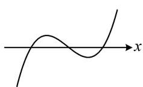
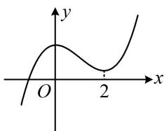
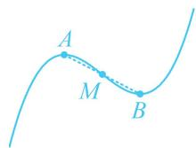
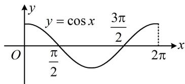

# 第 2 节 分析无参函数的单调区间、极值、最值（★★）

内容提要

分析单调区间、极值、最值是高考导数问题的常考题型，这一节先研究不含参的情况，难度不高，我们求出导函数后，若能直接判断正负，则直接判断；否则，可考虑继续求导.

# 类型 I：只需求一次导

【例1】（多选）已知函数 $f(x) = x^{3} - 3x^{2} + 5$ ，则（）

A. $f(x)$ 有2个极值点  
B. $f(x)$ 有3个零点  
C. 点(1,3)是曲线 $y = f(x)$ 的对称中心  
D. 直线 $y = -3x + 6$ 是曲线 $y = f(x)$ 的切线

解析：A 项，由题意， $f'(x)=3x^{2}-6x=3x(x-2)$ ，所以 $f'(x)>0\Leftrightarrow x<0$ 或 x>2， $f'(x)<0\Leftrightarrow0<x<2$ ，故 $f(x)$ 在 $(-∞,0)$ 上 $\nearrow$ ，在 $(0,2)$ 上 $\searrow$ ，在 $(2,+∞)$ 上 $\nearrow$ ，所以 $f(x)$ 有 2 个极值点，故 A 项正确；

B 项，三次函数有 3 个零点的充要条件是两个极值异号，如图 1，故可通过计算极值来判断零点个数，因为 $f(0) = 5 > 0$ ， $f(2) = 2^3 - 3 \times 2^2 + 5 = 1 > 0$ ，所以本题实际的情况如图 2，

由图可知 $f(x)$ 有且仅有 1 个零点，故 B 项错误；

C 项, 要看 (1,3) 是不是对称中心, 就看 $f(2 - x) + f(x) = 6$ 是否成立 (相关结论见模块一的第 3 节),

因为 $f(2 - x) + f(x) = (2 - x)^3 - 3(2 - x)^2 + 5 + x^3 - 3x^2 + 5 = [(2 - x)^3 + x^3] - 3(4 - 4x + x^2) - 3x^2 + 10$

$$
= (2 - x + x) \left[ (2 - x) ^ {2} - (2 - x) x + x ^ {2} \right] - 6 x ^ {2} + 1 2 x - 2 = 2 \left(4 - 4 x + x ^ {2} - 2 x + x ^ {2} + x ^ {2}\right) - 6 x ^ {2} + 1 2 x - 2 = 6,
$$

所以点(1,3)是曲线 $y=f(x)$ 的对称中心，故C项正确；

D项，直线 $y = -3x + 6$ 的斜率为-3，故只需求出 $f(x)$ 的斜率为-3的切线，与 $y = -3x + 6$ 对比即可，

令 $f'(x) = -3$ 可得： $3x^{2} - 6x = -3$ ，解得： $x = 1$ ，

又 $f(1) = 3$ ，所以 $f(x)$ 的斜率为-3的切线方程为 $y - 3 = -3(x - 1)$

整理得： $y = -3x + 6$ ，故D项正确.

  
图1

text_image

y
O
2
x

图2

答案: ACD

【反思】三次函数 $f(x) = ax^3 + bx^2 + cx + d (a \neq 0)$ 必有对称中心 $\left(-\frac{b}{3a}, f\left(-\frac{b}{3a}\right)\right)$ ，特别地，若 $f(x)$ 有极值点，则对称中心恰为图象上极值点处的两个点的中点，如图，熟悉此结论，选项 C 可直接判断.

【例2】已知函数 $f(x) = \frac{x^2 + x - 1}{\mathrm{e}^x}$ ，求 $f(x)$ 的单调区间与极值.

解：由题意， $f'(x) = -\frac{(x + 1)(x - 2)}{\mathrm{e}^x}$ ，所以 $f'(x) > 0 \Leftrightarrow -1 < x < 2$ ， $f'(x) < 0 \Leftrightarrow x < -1$ 或 $x > 2$ ，从而 $f(x)$ 的单调递增区间为 $(-1, 2)$ ，单调减区间为 $(- \infty, -1)$ ， $(2, +\infty)$ ，

故 $f(x)$ 有极小值 $f(-1) = -\mathrm{e}$ ，极大值 $f(2) = \frac{5}{\mathrm{e}^2}$ .

【反思】当函数有多个单调递增区间（或递减区间）时，不要用并集符号连接，用逗号隔开即可.

【变式】已知函数 $f(x) = x^{2} - x$ ， $g(x) = \ln x$ ，若 $f(x) > g(x)$ 在区间 $(0, t)$ 上恒成立，求实数 $t$ 的取值范围.

解：由题意， $f(x) > g(x)$ 即为 $x^{2} - x > \ln x$ ，也即 $x^{2} - x - \ln x > 0$ ①，

(不等式①不易直接解，可构造函数求导分析)

设 $h(x) = x^{2} - x - \ln x(x > 0)$ ，则 $h^{\prime}(x) = 2x - 1 - \frac{1}{x} = \frac{(2x + 1)(x - 1)}{x}$

所以 $h'(x) > 0 \Leftrightarrow x > 1$ ， $h'(x) < 0 \Leftrightarrow 0 < x < 1$ ，从而 $h(x)$ 在 $(0,1)$ 上单调递减，在 $(1, +\infty)$ 上单调递增，

故 $h(x)\geq h(1) = 0$ ，即 $x^{2} - x - \ln x\geq 0$ ，所以 $x^{2} - x\geq \ln x$ ，当且仅当 $x = 1$ 时取等号，

(与①对比可知只要取等号的位置不在 $(0,t)$ 上，就能满足①恒成立)

所以要使①在 $(0, t)$ 上恒成立，应有 $0 < t \leq 1$ .

【例 3】(2022·全国乙卷) 函数 $f(x)=\cos x+(x+1)\sin x+1$ 在区间 $[0,2\pi]$ 的最小值，最大值分别为（）

A. $-\frac{\pi}{2}, \frac{\pi}{2}$

B. $-\frac{3\pi}{2}, \frac{\pi}{2}$

C. $-\frac{\pi}{2}, \frac{\pi}{2} + 2$

D. $-\frac{3\pi}{2}, \frac{\pi}{2} + 2$

解析：函数最值显然不易直接看出，式子也不好化简，只能考虑求导分析单调性，

由题意， $f^{\prime}(x) = -\sin x + \sin x + (x + 1)\cos x = (x + 1)\cos x,$

当 $x \in [0, 2\pi]$ 时， $x + 1 > 0$ ，所以 $f'(x)$ 的正负与 $\cos x$ 相同，可画出 $y = \cos x$ 在 $[0, 2\pi]$ 上的图象来看，

如图， $f^{\prime}(x) > 0\Leftrightarrow \cos x > 0\Leftrightarrow 0\leq x <   \frac{\pi}{2}$ 或 $\frac{3\pi}{2} <  x\leq 2\pi$ ， $f^{\prime}(x) <   0\Leftrightarrow \cos x <   0\Leftrightarrow \frac{\pi}{2} <  x <   \frac{3\pi}{2},$

所以 $f(x)$ 在 $\left[0, \frac{\pi}{2}\right)$ 上 $\nearrow$ ，在 $\left(\frac{\pi}{2}, \frac{3\pi}{2}\right)$ 上 $\searrow$ ，在 $\left(\frac{3\pi}{2}, 2\pi\right)$ 上 $\nearrow$

因为 $f(0) = 2 > f\left(\frac{3\pi}{2}\right) = -\frac{3\pi}{2}$ ，所以 $f(x)_{\min} = -\frac{3\pi}{2}$ ，

又 $f\left(\frac{\pi}{2}\right) = \frac{\pi}{2} + 2 > f(2\pi) = 2$ ，所以 $f(x)_{\max} = \frac{\pi}{2} + 2$

答案: D

text_image

y = cos x
3π/2
O
π/2
2π
x

# 类型Ⅱ：需二次求导

【例 4】(2023·新课标Ⅱ卷（节选）)证明：当0<x<1时， $x-x^{2}<\sin x$ .

证明：（观察发现要证的不等式各部分都不复杂，故直接移项构造函数，通过求导分析单调性）

设 $\varphi(x) = x - x^2 - \sin x (0 < x < 1)$ ，则 $\varphi'(x) = 1 - 2x - \cos x$ ，（不易直接判断 $\varphi'(x)$ 的正负，故二次求导）

$\varphi''(x) = -2 + \sin x < 0$ ，所以 $\varphi'(x)$ 在 $(0,1)$ 上单调递减，又 $\varphi'(0) = 0$ ，所以 $\varphi'(x) < 0$ ，

故 $\varphi(x)$ 在(0,1)上单调递减，因为 $\varphi(0)=0$ ，所以 $\varphi(x)<0$ ，即 $x-x^{2}-\sin x<0$ ，故 $x-x^{2}<\sin x$ ：

【变式】已知函数 $f(x) = \frac{\ln x}{x - 1}$ ，求 $f(x)$ 在 $[2, \mathrm{e}^2]$ 上的最大值.

解：由题意， $f'(x)=\frac{\frac{1}{x}(x-1)-\ln x}{(x-1)^2}=\frac{1-\frac{1}{x}-\ln x}{(x-1)^2}$ ，（看不出 $f'(x)$ 的正负，可以想象，直接二次求导又会变得更复杂，所以把分子拿出来单独求导分析）设 $g(x)=1-\frac{1}{x}-\ln x(2\leq x\leq e^{2})$ ，则 $g'(x)=\frac{1}{x^{2}}-\frac{1}{x}=\frac{1-x}{x^{2}}<0$ ，

所以 $g(x)$ 在 $[2, \mathrm{e}^2]$ 上单调递减，又 $g(2) = 1 - \frac{1}{2} - \ln 2 = \frac{1}{2} - \ln 2 = \ln \sqrt{\mathrm{e}} - \ln 2 < 0$ ，所以 $g(x) < 0$

从而 $f^{\prime}(x) < 0$ ，故 $f(x)$ 在 $[2, \mathrm{e}^{2}]$ 上单调递减，所以 $f(x)_{\max} = f(2) = \frac{\ln 2}{2 - 1} = \ln 2.$

【总结】求出 $f'(x)$ 后，若无法直接判断其正负，可考虑二次求导，若为分式结构，有时为了避免再次求导结果变得更复杂，常把分子单独拿出来求导分析.

# 强化训练

1. (2024·湖北黄冈模拟·★★☆)(多选)

已知函数 $f(x) = \frac{\mathrm{e}^x(2x - 1)}{x - 1}$ ，则（）

A. 当 $x < 0$ 时， $f(x) > 0$   
B. $f(x)$ 在 $(1, +\infty)$ 上单调递增  
C. $f(x)$ 的极大值为 1  
D. $f(x)$ 的极大值为 $4\mathrm{e}^{\frac{3}{2}}$

2. (2025·全国Ⅱ卷·★★★) (多选)

已知 $f(x)$ 是定义在 $\mathbf{R}$ 上的奇函数，且当 $x > 0$

时， $f(x) = (x^{2} - 3)\mathrm{e}^{x} + 2$ ，则（）

A. $f(0) = 0$   
B. 当 $x < 0$ 时， $f(x) = -(x^2 - 3)\mathrm{e}^{-x} - 2$   
C. $f(x)\geq 2$ ，当且仅当 $x\geq \sqrt{3}$   
D. $x = -1$ 是 $f(x)$ 的极大值点

3. (2024·广东广州一模（节选）·★★)

已知函数 $f(x) = \cos x + x\sin x, \quad x \in (-\pi, \pi)$ ，求 $f(x)$ 的单调区间和极小值.

4. (2024·陕西模拟·★★)

已知函数 $f(x) = \frac{x^2}{\mathrm{e}^x}$

(1) 求函数 $f(x)$ 的单调区间;  
(2) 求函数 $f(x)$ 在 $[-1,2]$ 上的值域.

5. (2024·全国甲卷(节选)·★★☆)

已知函数 $f(x) = (1 - ax)\ln (1 + x) - x$ ，若 $a = -2$ ，求 $f(x)$ 的极值.

6. (2023·浙江温州二模（节选）·★★☆)

已知函数 $f(x) = \frac{a}{2} x^2 - x - x\ln x (a \in \mathbf{R})$ ，若 $a = 2$ ，求方程 $f(x) = 0$ 的解.

7. (2023·全国甲卷(节选)·★★★)

已知 $f(x) = ax - \frac{\sin x}{\cos^3 x}$ ， $x \in \left(0, \frac{\pi}{2}\right)$ ，若 $a = 8$ ，讨论 $f(x)$ 的单调性.

8.（2023·浙江温州三模（节选）·★★★☆）

已知函数 $f(x) = \frac{\cos x - x}{x^2}$ , $x \in (0, +\infty)$ .

（1）证明： $f(x)$ 在 $(0, + \infty)$ 上有且只有一个零点；  
(2) 当 $x \in (0, \pi)$ 时，求函数 $f(x)$ 的最小值.

