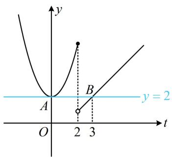
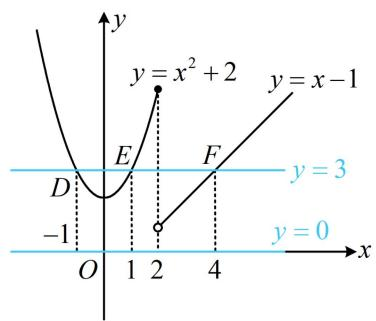

# 模块四 分段函数问题

# 第1节 分段函数基础题型（★★☆）

# 内容提要

本节主要归纳两类常见的分段函数基础题型.

1. 分段函数求值：包括给自变量求函数值，给函数值求自变量。我们将从求 $f(f(x_0))$ 出发，到给 $f(x_0)$ ，让求 $x_0$ ，以及给 $f(f(x_0))$ ，求 $x_0$ 等一系列问题，通过解决这些问题，我们可以逐步感悟分类讨论、数形结合的数学思想在解决分段函数问题中的广泛应用。

2. 根据分段函数的单调性求参数范围：这类题考虑下面两点即可.

①每一段的单调性；②分段点左右两侧的大小.

# 类型 I：分段函数求值

【例1】已知函数 $f(x) = \begin{cases} x - 1, & x > 2 \\ x^2 + 2, & x \leq 2 \end{cases}$ ，则 $f(f(1)) =$ \_\_\_\_.

解析：求双层的函数值，先计算里面那一层，由题意， $f(1) = 1^{2} + 2 = 3$ ，所以 $f(f(1)) = f(3) = 3 - 1 = 2$ .

答案: 2

【变式1】已知函数 $f(x) = \begin{cases} x - 1, & x > 2 \\ x^2 + 2, & x \leq 2 \end{cases}$ ，若 $f(a) = 3$ ，则 $f(a - 1) =$ \_\_\_\_.

解析：想解方程 $f(a) = 3$ ，但 $f(a)$ 该代哪个解析式？这是由 $a$ 与2的大小关系决定的，所以分类讨论，当 $a > 2$ 时，则 $f(a) = a - 1 = 3$ ，解得： $a = 4$ ，所以 $f(a - 1) = f(3) = 3 - 1 = 2$ ；

当 $a \leq 2$ 时，则 $f(a) = a^2 + 2 = 3$ ，解得： $a = \pm 1$ ，

若 $a = -1$ ，则 $f(a - 1) = f(-2) = (-2)^{2} + 2 = 6$ ；若 $a = 1$ ，则 $f(a - 1) = f(0) = 0^2 + 2 = 2$

综上所述， $f(a-1)=6$ 或 2.

答案: 6 或 2

【反思】分段函数问题中，不确定自变量处于哪一段时，可以分类讨论，但各类情况下求得的结果，必须检验是否满足讨论的前提.

【变式2】已知函数 $f(x) = \begin{cases} x - 1, & x > 2 \\ x^2 + 2, & x \leq 2 \end{cases}$ ，若 $f(f(x)) = 2$ ，则 $x =$ \_\_\_\_.

解析：看到复合结构的方程，常考虑将内层的 $f(x)$ 换元，化整为零，

令 $t = f(x)$ ，则 $f(f(x)) = 2$ 即为 $f(t) = 2$

下面先由此解 $t$ ，因为 $f(x)$ 的解析式较为简单，容易画图，所以可结合图象来解方程 $f(t) = 2$ ，

函数 $y = f(t)$ 的图象如图1，由图可知直线 $y = 2$ 与该图象有 $A, B$ 两个交点，横坐标分别为0和3，所以方程 $f(t) = 2$ 的解为 $t = 0$ 或3，故 $f(x) = 0$ 或 $f(x) = 3$ ，

接下来又可通过观察直线 $y = 0$ 和 $y = 3$ 与 $f(x)$ 图象的交点, 来解这两个方程,

如图2，直线 $y = 0$ 与 $y = f(x)$ 的图象没有交点，直线 $y = 3$ 与 $y = f(x)$ 的图象有 $D$ ， $E$ ， $F$ 三个交点，

它们的横坐标分别为-1，1，4，所以 $x=\pm1$ 或4.

答案: 4 或 $\pm 1$

text_image

y
A
B
y = 2
O
2 3
t

图1

line

| Point | x-coordinate | y-coordinate |
|---|---|---|
| A | 0 | -1 |
| B | 1 | -1 |
| C | 2 | -1 |
| D | 3 | -1 |
| E | 4 | -1 |
| F | 5 | -1 |
| G | 6 | -1 |
| H | 7 | -1 |
| I | 8 | -1 |
| J | 9 | -1 |
| K | 10 | -1 |
| L | 11 | -1 |
| M | 12 | -1 |
| N | 13 | -1 |
| O | 14 | -1 |
| P | 15 | -1 |
| Q | 16 | -1 |
| R | 17 | -1 |
| S | 18 | -1 |
| T | 19 | -1 |
| U | 20 | -1 |
| V | 21 | -1 |
| W | 22 | -1 |
| X | 23 | -1 |
| Y | 24 | -1 |
| Z | 25 | -1 |
| AA | 26 | -1 |
| AB | 27 | -1 |
| AC | 28 | -1 |
| AD | 29 | -1 |
| AE | 30 | -1 |
| AF | 31 | -1 |
| AG | 32 | -1 |
| AH | 33 | -1 |
| AI | 34 | -1 |
| AJ | 35 | -1 |
| AK | 36 | -1 |
| AL | 37 | -1 |
| AM | 38 | -1 |
| AN | 39 | -1 |
| AO | 40 | -1 |
| AP | 41 | -1 |
| AQ | 42 | -1 |
| AR | 43 | -1 |
| AS | 44 | -1 |
| AT | 45 | -1 |
| AU | 46 | -1 |
| AV | 47 | -1 |
| AW | 48 | -1 |
| AXA | 49 | -1 |
| AYA | 50 | -1 |
| AZA | 51 | -1 |
| BAZBZH | 52 | -1 |
| BBZBZH | 53 | -1 |
| BCZBZH | 54 | -1 |
| BDZBZH | 55 | -1 |
| BEZBZH | 56 | -1 |
| BFZBZH | 57 | -1 |
| BGZBZH | 58 | -1 |
| BHZBZH | 59 | -1 |
| BIZBZH | 60 | -1 |
| BJZBZH | 61 | -1 |
| BKZBZH | 62 | -1 |
| BLZBZH | 63 | -1 |
| BMZBZH | 64 | -1 |
| BNZBZH | 65 | -1 |
| BOZBZH | 66 | -1 |
| BPZBZH | 67 | -1 |
| BPZBZH (L) = x^2 + x^2 + x^2 + x^2 + x^2 + x^2 + x^2 + x^2 + x^2 + x^2 + x^2 + x^2 + x^2 + x^2 + x^2 + x^2 + x^2 + x^2 + x^2 + x^2 + x^2 + x^2 + x^2 + x^2 + x^2 + x^2 / x^2 + x^2 + x^2 + x^2 + x^2 + x^2 + x^2 + x^2 + x^2 + x^2 + x^2 + x^2 + x^2 + x^2 + x^2 + x^2 + x^2 + x^2 + x^2 + x^2 + x^2 + x^2 + x^2 + x^2 + x^2 < x^2 < x^2 < x^2 < x^2 < x^2 < x^2 < x^2 < x^2 < x^2 < x^2 < x^2 < x^2 < x^2 < x^2 < x^2 < x^2 < x^2 < x^2 < x^2 < x^2 < x^2 < x^2 < x^2 < x^2 < x^2

图2

【反思】对于 $f(f(a))$ 这种复合结构，常先令内层 $f(a)=t$ ，通过 $f(t)$ 分析 t 的性质，再由 $t=f(a)$ 分析 a 的性质，在后面 “复合函数综合” 模块我们会更加深刻地学习该思想.

# 类型 II：根据分段函数的单调性求参数范围

【例2】已知函数 $f(x) = \begin{cases} a^x, & x > 1 \\ \left(4 - \frac{a}{2}\right)x + 2, & x \leq 1 \end{cases}$ 是 $\mathbf{R}$ 上的单调递增函数，则实数 $a$ 的取值范围为（）

A. $(1, +\infty)$

B. [4,8)

C. (4,8)

D. (1,8)

解析：分段函数整体单调，分别考虑每一段的单调性，以及间断点处的拼接情况即可，

首先， $f(x)$ 在两段上均 $\nearrow$ ，所以 $\left\{\begin{aligned}a&>1\\ 4-\frac{a}{2}&>0\end{aligned}\right.$ ，解得：1<a<8；

其次，间断点处，应有 $4 - \frac{a}{2} + 2 \leq a$ ，解得： $a \geq 4$ ，故实数 $a$ 的取值范围为[4,8).

答案: B

【变式】已知函数 $f(x) = \begin{cases} (4 - a)x - 5, & x \leq 8 \\ a^{x - 8}, & x > 8 \end{cases}$ ，数列 $\{a_n\}$ 满足 $a_{n} = f(n)(n \in \mathbf{N}^{*})$ ，且 $\{a_{n}\}$ 是递增数列，则实数 $a$ 的取值范围为 \_\_\_\_.

解析： $\{a_{n}\}$ 是递增数列 $\Rightarrow a_{n} < a_{n + 1}$ 对任意的 $n\in \mathbf{N}^*$ 恒成立 $\Rightarrow f(n) < f(n + 1)$ 恒成立，

除了 $f(x)$ 在两段上要分别 $\nearrow$ 外，此处由于是数列 $\{f(n)\} \nearrow$ ，所以间断点处只需 $f(8) < f(9)$ 即可，

所以应有 $\left\{\begin{aligned}4-a&>0\\ a&>1\\ 8(4-a)&-5<a\end{aligned}\right.$ ，解得：3<a<4.

答案：(3,4)

【总结】给出分段函数的单调性，让求参数范围，这类题除了考虑各段的单调性外，还需注意间断点处的拼接情况，若为增函数，则间断点右侧不能在下方，若为减函数，则间断点右侧不能在上方.

# 强化训练

1. (2021·浙江卷·★)

已知 $a \in \mathbf{R}$ ，函数 $f(x) = \begin{cases} x^2 - 4, & x > 2 \\ |x - 3| + a, & x \leq 2 \end{cases}$ ，若

$f(f(\sqrt{6})) = 3$ ，则 $a =$

2. (2024·江苏南通三模·★☆)

已知函数 $f(x) = \begin{cases} 2^x, & x < 0 \\ \sin \left(2x + \frac{\pi}{6}\right), & x \geq 0 \end{cases}$ ，则 $f\left(f\left(\frac{\pi}{2}\right)\right) =$ \_\_\_\_.

3. (2022·河北模拟·★★)

已知函数 $f(x) = \begin{cases} 2^{x - 1} - 2, & x \leq 1 \\ -\log_2(x + 1), & x > 1 \end{cases}$ ，且 $f(a) = -3$ ，则 $f(6 - a) = (\quad)$

A. $-\frac{7}{4}$

B. $-\frac{5}{4}$

C. $-\frac{3}{4}$

D. $-\frac{1}{4}$

4. (★★★)

已知 $f(x)$ 是定义在 $\mathbf{R}$ 上的奇函数，当 $x > 0$ 时， $f(x) = x - 1$ ，若 $f(f(x)) = 1$ ，则 $x = \underline{\quad}$ .

5. (2017·山东卷·★★★)

设函数 $f(x) = \begin{cases} \sqrt{x}, 0 < x < 1 \\ 2(x - 1), x \geq 1 \end{cases}$ ，若 $f(a) = f(a + 1)$ ，则 $f\left(\frac{1}{a}\right) = (\quad)$

A. 2 B. 4   
C. 6 D. 8

6. (2024·新课标Ⅰ卷·★★)

已知函数 $f(x) = \begin{cases} -x^2 - 2ax - a, & x < 0 \\ \mathrm{e}^x + \ln (x + 1), & x \geq 0 \end{cases}$ 在 $\mathbf{R}$ 上单调递增，则 $a$ 的取值范围是（）

A. $(- \infty, 0]$   
B. $[-1,0]$   
C. $[-1, 1]$   
D. $[0, +\infty)$

7. (★★★)

已知函数 $f(x) = \begin{cases} ax - 1, & x \leq 1 \\ \ln (2x^2 - ax), & x > 1 \end{cases}$ 在 $\mathbf{R}$ 上为增函数，则实数 $a$ 的取值范围是 \_\_\_\_.

8. (2022·四川达州二诊·★★★)

已知单调递增的数列 $\{a_{n}\}$ 满足 $a_{n} = \left\{ \begin{array}{l}m^{n - 9},n\geq 10\\ \left(\frac{2m}{9} +1\right)n - 21,n <   10 \end{array} \right.$ ，则实数 $m$ 的取值范围是（）

A. $[12, +\infty)$ B. (1,12)   
C. (1,9) D. $[9, +\infty)$

9. (2024·安徽合肥二模·★★★☆)

已知函数 $f(x) = \begin{cases} x^2 - 2x, & x \leq 1 \\ 1 - |x - 3|, & x > 1 \end{cases}$ ，若关于 $x$ 的方程 $f(x) - f(1 - a) = 0$ 至少有两个不同的实数根，则 $a$ 的取值范围是（）

A. $(- \infty, -4] \cup [\sqrt{2}, +\infty)$

B. $[-1, 1]$

C. $(-4, \sqrt{2})$

D. $[-4, \sqrt{2}]$

一数·必刷100讲

