# 强化训练

1. (★★☆)

设函数 $f(x) = \begin{cases} x^2, & x \leq a \\ \sqrt{x}, & x > a \end{cases}$ ，其中 $a > 0$ ，若存在实数 $b$ ，使得函数 $g(x) = f(x) - b$ 有 3 个零点，则实数 $a$ 的取值范围为 \_\_\_\_.

1. $(1, +\infty)$

解析： $g(x)=0\Leftrightarrow f(x)=b$ ，所以问题等价于存在水平直线y=b和 $f(x)$ 的图象有3个交点，

注意到函数 $y = x^2$ 和 $y = \sqrt{x}$ 的交点是(1,1)，所以分 $0 < a <$

1, a=1, a>1 三种情况画图分析,

如图，由图可知，只有当 $a > 1$ 时，才能画出水平直线 $y = b$ 与 $f(x)$ 的图象有3个交点，所以 $a > 1$

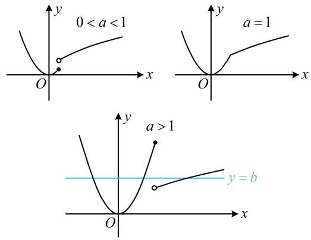

2. (2022·北京模拟·★★★)

设函数 $f(x) = \begin{cases} x^2, & x \leq a \\ x^2 - 2ax + a, & x > a \end{cases}$ ，若存在实数 $b$ ，使得函数 $g(x) = f(x) - b$ 有 3 个零点，则 $a$ 的取值范围为 \_\_\_\_.

2. $\left(\frac{1}{2}, +\infty\right)$

解析： $g(x)=0\Leftrightarrow f(x)=b$ ，故 $g(x)$ 有3个零点 $\Leftrightarrow$ 直线y=b与 $f(x)$ 的图象有3个交点，

两段上 $f(x)$ 都是二次函数，对称轴分别为 $x = 0$ 和 $x = a$ ，可以讨论 $a$ 与0的大小来作图分析，

①当 $a < 0$ 时， $f(x)$ 的图象如图1所示，

由于 $f(x)$ 在 $(- \infty, a]$ 上 $\searrow$ ，在 $(a, +\infty)$ 上 $\nearrow$

所以直线 $y = b$ 与 $f(x)$ 的图象至多2个交点，不合题意；

②当 a=0 时， $f(x)=x^{2}$ ，不合题意；

③当 $a > 0$ 时，如图2，要使存在直线 $y = b$ 与 $f(x)$ 的图象有3个交点，应有间断点处左侧的点位于右侧的上方，

所以 $a^2 > a - a^2$ ，故 $a > \frac{1}{2}$ ；

综上所述， $a$ 的取值范围为 $\left(\frac{1}{2}, +\infty\right)$

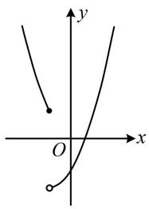

text_image

Mathematical graph showing a parabola and a line intersecting in the Cartesian coordinate system, with labeled axes and origin.

图1

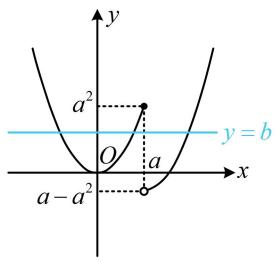

text_image

y
a²
O
a
y = b
x
a - a²

图2

3. (2024·江苏南通模拟·★★★☆)

设函数 $f(x) = \begin{cases} x^3 - 3x, & x \leq a \\ -2x, & x > a \end{cases}$ ，若 $f(x)$ 无最大值，则实数 $a$ 的取值范围是（）

A. $(- \infty, -1)$

B. $(- \infty, -1]$

C. $(- \infty, 2]$

D. $(-1,2]$

3. A

解析：观察发现 $f(x)$ 两段的解析式都不复杂，故可考虑画出两段解析式完整的图象，再看分段点在何处能满足题设条件， $y = x^3 - 3x \Rightarrow y' = 3x^2 - 3 = 3(x + 1)(x - 1)$ ，

所以 $y' > 0 \Leftrightarrow x < -1$ 或 x > 1， $y' < 0 \Leftrightarrow -1 < x < 1$ ，

故 $y = x^{3} - 3x$ 在 $(-∞, -1)$ 上↗，在 $(-1, 1)$ 上↘，

在 $(1, +\infty)$ 上 $\nearrow$ ，又当 $x = -1$ 时， $y = 2$

当 $x = 1$ 时， $y = -2$ ，记 $A(-1,2)$ ，所以 $y = x^3 - 3x$ 的大致图象如图1（图1中把 $y = -2x$ 也画出来了，二者的交点恰好在 $y = x^3 - 3x$ 极值点处），

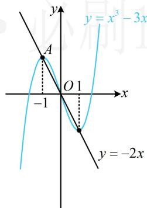

text_image

y
y = x³ - 3x
A
O 1
-1
x
y = -2x

图1

分段点 $a$ 在哪里能使 $f(x)$ 没有最大值？直观想象可发现只能一次函数那段图象的左端点比三次函数那段图象都高，故 $a$ 只能在图2所示的位置（点 $A$ 的左边），我们擦掉干扰部分，把此时 $f(x)$ 的图象画出来，如图3.若 $a$ 在 $A$ 的右侧，则 $f(x)$ 显然存在最大值（在 $x = -1$ 或 $x = a$ 处取得，分别如图4，图5)，不合题意.到此就分析清楚了，只需 $a$ 在 $A$ 左侧即可满足题意，要使 $f(x)$ 没有最大值，只能是图3的情况，应有 $a < -1$ .

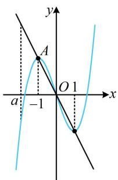

text_image

y
A
O 1
a -1 x

图2

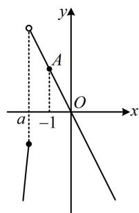

text_image

y
A
O
x
a
-1

图3

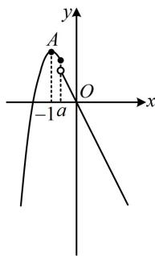

text_image

y
A
-1a
O
x

图4

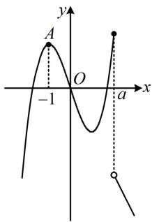

text_image

y
A
O
-1
a
x

图5

4. (2023·福建厦门第四次质检·★★★★)

函数 $f(x) = \begin{cases} \cos \pi x, & 0 < x < a \\ x^2 - 4ax + 8, & x \geq a \end{cases}$ ，当 $a = 1$ 时， $f(x)$ 的零点个数为 \_\_\_\_；若 $f(x)$ 恰有 4 个零点，则 $a$ 的取值范围是 \_\_\_\_.

4. 1; $\left(\frac{3}{2}, \frac{2\sqrt{6}}{3}\right] \cup \left(\frac{5}{2}, \frac{7}{2}\right]$

解析：当 $a = 1$ 时， $f(x) = \begin{cases} \cos \pi x, & 0 < x < 1 \\ x^2 - 4x + 8, & x \geq 1 \end{cases}$ ，

求分段函数的零点个数，可分段考虑，

在 $(0,1)$ 上， $f(x)=\cos\pi x$ ，

令 $f(x) = 0$ 可得 $\cos \pi x = 0$ ，解得： $x = \frac{1}{2}$

在 $[1, +\infty)$ 上， $f(x) = x^2 - 4x + 8 = (x - 2)^2 + 4 \geq 4 > 0$

所以 $f(x)$ 在 $[1, +\infty)$ 上没有零点；

综上所述， $f(x)$ 只有 $x = \frac{1}{2}$ 这1个零点；

再看第二空， $f(x)$ 一共4个零点，那么两段上的零点个数如何分配？注意到在 $[a,+\infty)$ 上， $f(x)$ 为二次函数，其零点个数只可能是0，1，2，故可据此分三类讨论．为了找到讨论的分界点，不妨画二次函数的图象来看，

①当 $f(x)$ 在 $[a, +\infty)$ 无零点时，如图1， $\Delta = 16a^2 -32 <   0$

所以 $0 < a < \sqrt{2}$ ，此时 $f(x)$ 在 $(0, a)$ 上应有4个零点，

所以 $f(x)$ 在 $(0,a)$ 上的情形如图2，需满足 $\frac{7}{2} < a \leq \frac{9}{2}$ ，

这与 $0 < a < \sqrt{2}$ 无交集，所以不可能出现这种情况；

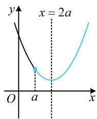

text_image

x = 2a
O a x

图1

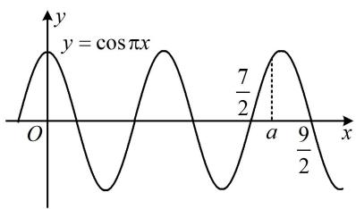

text_image

y = cos πx
O
7/2
a
9/2
x

图2

②当 $f(x)$ 在 $[a, +\infty)$ 上有1个零点时，如图3或图4，

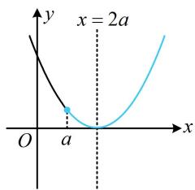

text_image

x = 2a
O a x

图3

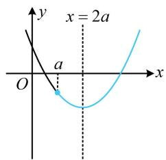

text_image

x = 2a
O
a
y
x

图4

$\Delta=16a^{2}-32=0$ 或 $f(a)=8-3a^{2}<0$

所以 $a = \sqrt{2}$ 或 $a > \frac{2\sqrt{6}}{3}$ (i),

此时 $f(x)$ 在 $(0,a)$ 上应有3个零点，如图5，

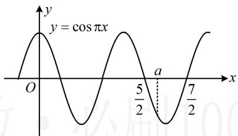

text_image

y = cos πx
O
5/2
a
7/2
x

图5

需满足 $\frac{5}{2} < a \leq \frac{7}{2}$ ，与(i)取公共部分仍为 $\frac{5}{2} < a \leq \frac{7}{2}$ ；

③当 $f(x)$ 在 $[a, +\infty)$ 上有2个零点时，如图6，

$\left\{ \begin{array}{l} \Delta = 16a^{2} - 32 > 0 \\ f(a) = 8 - 3a^{2} \geq 0 \end{array} \right.$ ，所以 $\sqrt{2} < a \leq \frac{2\sqrt{6}}{3}$ (ii),

此时 $f(x)$ 在 $(0, a)$ 上应有2个零点，如图7，

需满足 $\frac{3}{2} < a \leq \frac{5}{2}$ ，与(ii)取公共部分可得 $\frac{3}{2} < a \leq \frac{2\sqrt{6}}{3}$ ；

综上所述， $a$ 的取值范围是 $\left(\frac{3}{2},\frac{2\sqrt{6}}{3}\right]\cup \left(\frac{5}{2},\frac{7}{2}\right].$

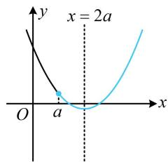

text_image

x = 2a
y
O a x

图6

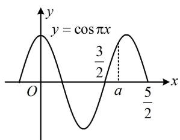

text_image

y = cos πx
3/2
a
5/2

图7

