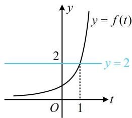
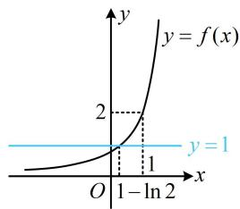
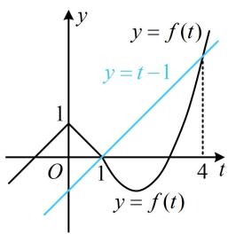
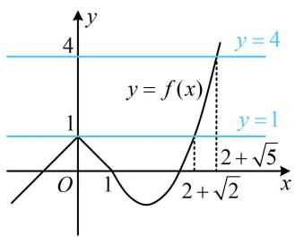
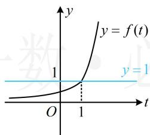
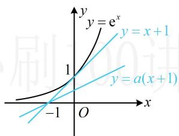

# 强化训练

# 1. (★★☆)

已知函数 $f(x) = \begin{cases} 2\mathrm{e}^{x - 1}, & x < 1 \\ x^3 + x, & x \geq 1 \end{cases}$ ，则不等式 $f(f(x)) < 2$ 的解集为 \_\_\_\_.

# 1. $(- \infty, 1 - \ln 2)$

解析： $f(f(x)) < 2$ 为双层复合结构的不等式，可考虑通过将 $f(x)$ 换元，化整为零，来简化该不等式，

设 $t = f(x)$ ，则 $f(f(x)) < 2$ 即为 $f(t) < 2$

函数 $f(t)$ 的图象好画，故画图来看不等式 $f(t) < 2$ 的解，

如图1，由图可知 $f(t) < 2 \Leftrightarrow t < 1$ ，所以 $f(x) < 1$

同样的方法，再结合图象来看不等式 $f(x) < 1$ 的解，

如图2，联立 $\left\{ \begin{array}{l} y = 1 \\ y = 2\mathrm{e}^{x - 1} \end{array} \right.$ 解得： $x = 1 - \ln 2$

由图2可知不等式 $f(x) < 1$ 的解集为 $(- \infty, 1 - \ln 2)$ .

text_image

y
y = f(t)
2
y = 2
O
1
t

图1

text_image

y
y = f(x)
2
y = 1
O 1 - ln 2 x

图2

# 2. (★★★)

设函数 $f(x) = \begin{cases} 1 - |x|, & x \leq 1 \\ x^2 - 4x + 3, & x > 1 \end{cases}$ ，则不等式 $f(f(x)) - f(x) + 1 \leq 0$ 的解集为 \_\_\_\_.

# 2. $\{0\} \cup [2 + \sqrt{2}, 2 + \sqrt{5}]$

解析： $f(f(x)) - f(x) + 1$ 是复合结构，它由 $y = f(t) - t + 1$ 和 $t = f(x)$ 复合而成，所以先将 $f(x)$ 换元，化整为零，设 $t = f(x)$ ，则 $f(f(x)) - f(x) + 1 \leq 0$ 即为 $f(t) - t + 1 \leq 0$ ，

也即 $f(t) \leq t - 1$ ，通过讨论 $t$ 代解析式求解可行，但画出 $y = f(t)$ 和 $y = t - 1$ 的图象来看更简单，

如图1， $\left\{ \begin{array}{l}y = t - 1\\ y = t^2 -4t + 3 \end{array} \right.\Rightarrow t = 1$ 或4，

由图可知 $f(t)\leq t - 1\Leftrightarrow 1\leq t\leq 4$ ，所以 $1\leq f(x)\leq 4$

如图2， $\left\{ \begin{array}{l}y = 1\\ y = x^2 -4x + 3 \end{array} \right.\Rightarrow x = 2 + \sqrt{2}$ 或 $2 - \sqrt{2}$

$$
\left\{ \begin{array}{l l} { y = 4} \\ { y = x ^ {2} - 4 x + 3} \end{array} \right. \Rightarrow x = 2 + \sqrt {5}   \text {或}   2 - \sqrt {5}  ,
$$

由图可知， $1\leq f(x)\leq 4$ 的解集为 $\{0\} \bigcup [2 + \sqrt{2},2 + \sqrt{5} ]$

line

| t | y = f(t) |
|---|---|
| 0 | 1 |
| 1 | 0 |
| 2 | -1 |
| 3 | -2 |
| 4 | -3 |

图1

line

| x | y = f(x) |
|---|---|
| 0 | 1 |
| 1 | 0 |
| 2 + √2 | 4 |
The chart is a line graph with two horizontal reference lines labeled y = 1 and y = 4. The curve starts at (0,1), peaks at (1,1), then descends to (2+√2), and ends at (3,4). The vertical dashed line at x = 2 + √2 intersects the curve at this point on the x-axis. The chart is labeled with mathematical expressions: 'y = f(x)' and 'y = 4'.

图2

# 3. (★★★☆)

设 $f(x) = \begin{cases} \mathrm{e}^{x - 1}, & x < 1 \\ x^3 + x - 1, & x \geq 1 \end{cases}$ ， $g(x) = \mathrm{e}^x - a(x + 1) + 1$ ，若 $f(g(x)) \geq 1$ 恒成立，则 $a$ 的取值范围为 \_\_\_\_.

# 3. [0,1]

解析：先将 $f(g(x)) \geq 1$ 内层的 $g(x)$ 换元，化整为零，

设 $t = g(x)$ ，则 $f(g(x))\geq 1$ 即为 $f(t)\geq 1$

函数 $y = f(t)$ 的图象好画，可画图来解不等式 $f(t) \geq 1$

如图1，由图可知 $f(t)\geq 1\Leftrightarrow t\geq 1$ ，所以 $g(x)\geq 1$

即 $\mathrm{e}^x - a(x + 1) + 1 \geq 1$ ，所以 $\mathrm{e}^x \geq a(x + 1)$

如图2，注意到曲线 $y = \mathrm{e}^{x}$ 和直线 $y = x + 1$ 相切，

故当且仅当 $0 \leq a \leq 1$ 时， $\mathrm{e}^{x} \geq a(x + 1)$ 恒成立.

line

| t    | y = f(t) |
| ---- | -------- |
| 0    | 0        |
| 1    | 1        |

图1

text_image

y = e^x
y = x + 1
1
y = a(x + 1)
-1 O

图2

