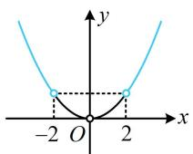

# 强化训练

1. (2023·陕西西安模拟·★★)

已知定义在 $\mathbf{R}$ 上的函数 $f(x)$ 满足 $f(1) = 3$ ，且 $f(x)$ 的导函数 $f'(x)$ 恒有 $f'(x) < 2 (x \in \mathbf{R})$ ，则不等式 $f(x) < 2x + 1$ 的解集为（）

A. $(1, +\infty)$

B. $(- \infty, -1)$

C. $(-1, 1)$

D. $(- \infty, -1) \cup (1, +\infty)$

1. A

解析：所给的含 $f'(x)$ 的不等式的各部分都容易看出原函数，直接移项构造即可，

因为 $f^{\prime}(x) < 2$ ，所以 $f^{\prime}(x) - 2 < 0$ ，设 $g(x) = f(x) - 2x$

则 $g'(x)=f'(x)-2<0$ ，所以 $g(x)$ 在 R 上 $\searrow$

给了 $f(1)$ ，我们算一下 $g(1)$ ，看能否与要解的不等式

联系起来，又 $f(1) = 3$ ，所以 $g(1) = f(1) - 2 = 1$

故 $f(x) < 2x + 1$ 即为 $f(x) - 2x < 1$ ，也即 $g(x) < g(1)$

结合 $g(x)$ 在 R 上 $\searrow$ 可得 x > 1.

2. (2023·广东广州一模·★★★)

已知函数 $f(x)$ 的定义域为 $(0, +\infty)$ ，其导函数为 $f'(x)$ ，若 $xf'(x) - 1 < 0$ ， $f(e) = 2$ ，则关于 $x$ 的不等式 $f(e^x) < x + 1$ 的解集为 \_\_\_\_.

2. $(1, + \infty)$

解析：所给不等式中只有 $f'(x)$ ，没有 $f(x)$ ，故同除以 x，把 $f'(x)$ 孤立出来，即可看出原函数，

由题意， $xf'(x)-1<0(x>0)$ ，所以 $f'(x)-\frac{1}{x}<0$ ，

设 $g(x) = f(x) - \ln x(x > 0)$ ，则 $g^{\prime}(x) = f^{\prime}(x) - \frac{1}{x} < 0$

故 $g(x)$ 在 $(0, +\infty)$ 上 $\searrow$

要解不等式 $f(\mathrm{e}^{x}) < x + 1$ ，肯定要往 $g(x)$ 的形式去化，

不等式 $f(\mathbf{e}^x) < x + 1 \Leftrightarrow f(\mathbf{e}^x) - x < 1$

$$
\Leftrightarrow f (\mathrm{e} ^ {x}) - \ln \mathrm{e} ^ {x} <   1 \Leftrightarrow g (\mathrm{e} ^ {x}) <   1 \quad ①,
$$

又 $f(\mathrm{e}) = 2$ ，所以 $g(\mathrm{e}) = f(\mathrm{e}) - \ln \mathrm{e} = 1$

故不等式①即为 $g(\mathrm{e}^x) < g(\mathrm{e})$ ，所以 $\mathrm{e}^x >\mathrm{e}$ ，解得： $x > 1$

3. (2022·湖南怀化模拟·★★★)

已知定义在 $\mathbf{R}$ 上的函数 $f(x)$ 的导函数为 $f'(x)$ ，当 $x > 0$ 时， $f'(x) - \frac{f(x)}{x} < 0$ ，若 $a = 2f(1)$ ， $b = f(2)$ ， $c = 4f\left(\frac{1}{2}\right)$ ，则 $a, b, c$ 的大小关系为（）

A. $c < b < a$

B. $c < a < b$

C. $a < b < c$

D. $b < a < c$

3. D

解析：因为当 $x > 0$ 时， $f'(x) - \frac{f(x)}{x} < 0$

所以 $\frac{xf'(x) - f(x)}{x} < 0$ ，结合 $x > 0$ 可得 $xf'(x) - f(x) < 0$

看到 $xf'(x) - f(x)$ ，想到构造函数 $\frac{f(x)}{x}$ ，

设 $g(x) = \frac{f(x)}{x} (x > 0)$ ，则 $g'(x) = \frac{xf'(x) - f(x)}{x^2} < 0$ ，

所以 $g(x)$ 在 $(0, +\infty)$ 上 $\searrow$ ，要比较的 $a, b, c$ 涉及 $f(1)$ ，

$f(2), f\left(\frac{1}{2}\right)$ ，故先看看 $g(1), g(2), g\left(\frac{1}{2}\right)$ 的大小，

因为 $0 < \frac{1}{2} < 1 < 2$ ，所以 $g\left(\frac{1}{2}\right) > g(1) > g(2)$

故 $\frac{f\left(\frac{1}{2}\right)}{\frac{1}{2}} >\frac{f(1)}{1} >\frac{f(2)}{2}$ ，各项同乘以2可得

$4f\left(\frac{1}{2}\right)>2f(1)>f(2)$ ，即c>a>b，也即b<a<c.

4. (2023·天津模拟·★★★☆)

已知 $f(x)$ 是定义在 $(- \infty, 0) \cup (0, +\infty)$ 上的偶函数，若对任意的 $x \in (0, +\infty)$ ，都有 $2f(x) + xf'(x) > 0$ 成立，且 $f(2) = \frac{1}{2}$ ，则不等式 $f(x) - \frac{2}{x^2} > 0$ 的解集为（）

A. $(2, +\infty)$

B. $(-2,0)\cup (0,2)$

C. $(0,2)$

D. $(- \infty, -2) \cup (2, +\infty)$

4. D

解析： $2f(x)+xf'(x)$ 中 $f(x)$ 的系数多了个2，不能构造 $xf(x)$ ，可乘以x化为 $2xf(x)+x^{2}f'(x)$ ，构造 $x^{2}f(x)$ ，

设 $g(x) = x^{2}f(x)$ ，因为 $f(x)$ 为偶函数，所以 $g(x)$ 也为

偶函数，且 $g^{\prime}(x) = 2xf(x) + x^{2}f^{\prime}(x) = x[2f(x) + xf^{\prime}(x)]$

由题意，当 $x \in (0, +\infty)$ 时， $2f(x) + xf'(x) > 0$

所以 $g'(x)>0$ ，故 $g(x)$ 在 $(0,+\infty)$ 上 $\nearrow$

有了 $g(x)$ 的单调性, 故将目标不等式往 $g(x)$ 化,

$$
f (x) - \frac {2}{x ^ {2}} > 0 \Leftrightarrow x ^ {2} f (x) - 2 > 0
$$

$$
\Leftrightarrow x ^ {2} f (x) > 2 \Leftrightarrow g (x) > 2 \quad ①,
$$

又因为 $f(2) = \frac{1}{2}$ ，所以 $g(2) = 4f(2) = 2$ ，

故不等式①等价于 $g(x) > g(2)$ ，

要解此不等式，不妨画出 $g(x)$ 的草图来看，

由 $g(x)$ 为偶函数且在 $(0, +\infty)$ 上 $\nearrow$ 可得 $g(x)$ 的草图如图，

由图可知 $g(x) > g(2) \Leftrightarrow x \in (-\infty, -2) \cup (2, +\infty)$ .

5. (2023·河南郑州模拟·★★★☆)

已知定义在 $\mathbf{R}$ 上的函数 $f(x)$ 的导函数为 $f'(x)$ ，满足 $f'(x) < f(x)$ ，且 $f(-x) = f(2 + x)$ ， $f(2) = 1$ ，则不等式 $f(x) < \mathrm{e}^x$ 的解集为（）

A. $(-2, +\infty)$

B. $(0, +\infty)$

C. $(1, + \infty)$

D. $(2, +\infty)$

5. B

解析：因为 $f^{\prime}(x) < f(x)$ ，所以 $f^{\prime}(x) - f(x) < 0$

上式中 $f^{\prime}(x)$ 和 $f(x)$ 只有系数的差别，可用 $\mathrm{e}^{x}$ 来调节，由于是差，故应构造商的结构，

设 $g(x) = \frac{f(x)}{\mathrm{e}^x}$ ，则 $g^{\prime}(x) = \frac{f^{\prime}(x)\mathrm{e}^{x} - \mathrm{e}^{x}f(x)}{(\mathrm{e}^{x})^{2}}$

$= \frac{f'(x) - f(x)}{\mathrm{e}^x} < 0$ ，所以 $g(x)$ 在 $\mathbf{R}$ 上 $\searrow$

要解的不等式可化为 $\frac{f(x)}{\mathrm{e}^x} < 1$ ，即 $g(x) < 1$ ，故必须找到右侧的 1 是 $g(x)$ 哪里的函数值，才能用单调性求解，给出了 $f(2) = 1$ ，但 $g(2) = \frac{f(2)}{\mathrm{e}^2} \neq 1$ ，所以利用 $f(-x) = f(2 + x)$ 把 $f(2)$ 转移到另一点的函数值上来看，

在 $f(-x) = f(2 + x)$ 中取 $x = 0$ 可得 $f(0) = f(2) = 1$

所以 $g(0) = \frac{f(0)}{\mathrm{e}^0} = 1$ ，故 $f(x) <   \mathrm{e}^{x}\Leftrightarrow \frac{f(x)}{\mathrm{e}^{x}} <  1$

$\Leftrightarrow g(x) < g(0)$ ，结合 $g(x)$ 在 $\mathbf{R}$ 上 $\searrow$ 可得 $x > 0$ 。

6. (2023·云、吉、黑、皖四省联考·★★★)

设函数 $f(x)$ ， $g(x)$ 在 $\mathbf{R}$ 上的导函数存在，且 $f'(x) < g'(x)$ ，则当 $x \in (a, b)$ 时，有（）

A. $f(x) <   g(x)$

B. $f(x) > g(x)$

C. $f(x) + g(a) <   g(x) + f(a)$

D. $f(x) + g(b) <   g(x) + f(b)$

6. C

解析： $f'(x) < g'(x)$ 的左右两侧的原函数都容易看出来，故直接移项即可构造原函数，

因为 $f^{\prime}(x) < g^{\prime}(x)$ ，所以 $f^{\prime}(x) - g^{\prime}(x) < 0$

设 $F(x)=f(x)-g(x)$ ，则 $F'(x)=f'(x)-g'(x)<0$ ，

所以 $F(x)$ 在 $\mathbf{R}$ 上 $\searrow$ ，从而当 $x\in (a,b)$ 时， $a <   x <   b$

故 $F(a)>F(x)>F(b)$ ,

即 $f(a) - g(a) > f(x) - g(x) > f(b) - g(b)$

由 $f(a) - g(a) > f(x) - g(x)$ 可得 $f(x) + g(a) < g(x) + f(a)$ .

# 7. (2022·重庆模拟·★★★★)

已知 $f'(x)$ 是 $f(x)$ 的导函数， $f(x) = f(-x)$ ，且对任意的 $x \in \left(0, \frac{\pi}{2}\right)$ ， $f'(x) \cos x > f(-x) \sin (-x)$ ，则下列不等式成立的是（）

A. $\frac{\sqrt{3}}{2} f\left(-\frac{1}{2}\right) < f\left(-\frac{\pi}{6}\right)\cos \frac{1}{2}$   
B. $f\left(-\frac{\pi}{6}\right) > \frac{\sqrt{6}}{2} f\left(-\frac{\pi}{4}\right)$   
C. $f(-1) < \sqrt{2} f\left(\frac{\pi}{4}\right)\cos 1$   
D. $\frac{\sqrt{2}}{2} f\left(\frac{\pi}{4}\right) > f\left(-\frac{\pi}{3}\right)$

7. A

解析：因为 $f(x) = f(-x)$ ， $\sin (-x) = -\sin x$

所以 $f'(x)\cos x > f(-x)\sin(-x)$ 即为 $f'(x)\cos x > -f(x)\sin x$

也即 $f^{\prime}(x)\cos x + f(x)\sin x > 0\left(0 <   x <   \frac{\pi}{2}\right)$ ①，

看到 $f'(x)\cos x + f(x)\sin x$ 这一结构，想到构造 $y = \frac{f(x)}{\cos x}$ ,

设 $g(x) = \frac{f(x)}{\cos x}\left(0 <   x <   \frac{\pi}{2}\right)$ ，则 $g^{\prime}(x) =$

$$
\frac {f ^ {\prime} (x) \cos x - (- \sin x) f (x)}{\cos^ {2} x} = \frac {f ^ {\prime} (x) \cos x + f (x) \sin x}{\cos^ {2} x},
$$

结合①可得 $g'(x) > 0$ ，所以 $g(x)$ 在 $\left(0, \frac{\pi}{2}\right)$ 上 $\nearrow$

选项中涉及的自变量有正有负，可用 $f(x)$ 的奇偶性全部化负为正来分析，

由 $f(x) = f(-x)$ 可得A项等价于 $\frac{\sqrt{3}}{2} f\left(\frac{1}{2}\right) <   f\left(\frac{\pi}{6}\right)\cos \frac{1}{2},$

因为 $\frac{1}{2} < \frac{\pi}{6}$ ，所以 $g\left(\frac{1}{2}\right) < g\left(\frac{\pi}{6}\right)$ ，即 $\frac{f\left(\frac{1}{2}\right)}{\cos\frac{1}{2}} < \frac{f\left(\frac{\pi}{6}\right)}{\cos\frac{\pi}{6}} = \frac{f\left(\frac{\pi}{6}\right)}{\frac{\sqrt{3}}{2}}$

化简得： $\frac{\sqrt{3}}{2} f\left(\frac{1}{2}\right) <   f\left(\frac{\pi}{6}\right)\cos \frac{1}{2}$ ，故A项正确；

单选题做到此已可结束，我们把选项B也分析一下，C、D两项的分析方法与之相同，不再赘述，

B 项等价于 $f\left(\frac{\pi}{6}\right) > \frac{\sqrt{6}}{2} f\left(\frac{\pi}{4}\right)$ ,

因为 $\frac{\pi}{6} < \frac{\pi}{4}$ ，所以 $g\left(\frac{\pi}{6}\right) < g\left(\frac{\pi}{4}\right)$ ，从而 $\frac{f\left(\frac{\pi}{6}\right)}{\cos\frac{\pi}{6}} < \frac{f\left(\frac{\pi}{4}\right)}{\cos\frac{\pi}{4}}$

故 $\frac{f\left(\frac{\pi}{6}\right)}{\frac{\sqrt{3}}{2}} < \frac{f\left(\frac{\pi}{4}\right)}{\frac{\sqrt{2}}{2}}$ ，所以 $f\left(\frac{\pi}{6}\right) < \frac{\sqrt{6}}{2} f\left(\frac{\pi}{4}\right)$ ，故B项错误.

