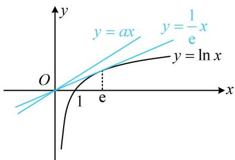
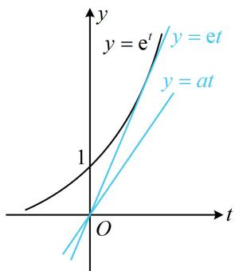
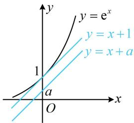
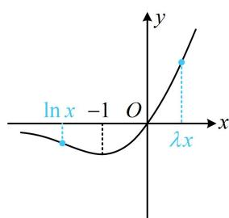
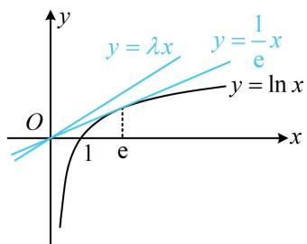

# 内容提要

在某些方程、不等式问题中，可以通过等价变形，使方程、不等式左右两端结构一致，进而构造函数来解决问题，这类解题方法一般叫做同构。同构常出现在小题与大题压轴位置，是较难掌握的方法，需要敏锐的观察能力和一定的解题经验才能灵活运用，下面为大家归纳几类常见的同构题型。

1. 以例1及其后的变式为代表的不同变量在两边，简单变形即可同构；或者分别给出关于两个变量的等式，通过换元、变形将一个等式化为与另一等式同构；又或者将含参的和不含参的分离到不等号两侧，简单变形即可同构.  
2. 以例2为代表的利用恒等式 $x = \mathrm{e}^{\ln x} (x > 0)$ 将指数部分调整为与所给不等式其余含 $x$ 的部分一致的结构，整体换元简化不等式的同构.  
3. 以例3及其变式为代表的指对共生式同构：（以下底数e也可换成其它底数，方法类似）

① $m(x) = \mathrm{e}^{x}\pm x$ 与 $n(x) = x\pm \ln x$ 的同构： $m(x) = \mathrm{e}^x\pm x = \mathrm{e}^x\pm \ln \mathrm{e}^x = n(\mathrm{e}^x)$ ， $n(x) = x\pm \ln x =$ $\mathrm{e}^{\ln x}\pm \ln x = m(\ln x)$ ，所以这两个结构可以相互转化.  
② $f(x) = x\mathrm{e}^{x}$ 与 $g(x) = x\ln x$ 的同构： $f(x) = x\mathrm{e}^{x} = \mathrm{e}^{x}\cdot \ln \mathrm{e}^{x} = g(\mathrm{e}^{x})$ ， $g(x) = x\ln x = \mathrm{e}^{\ln x}\cdot \ln x = f(\ln x)$ ，所以这两个结构可以相互转化.  
③ $u(x) = \frac{\mathrm{e}^x}{x}$ 与 $v(x) = \frac{x}{\ln x}$ 的同构： $u(x) = \frac{\mathrm{e}^x}{x} = \frac{\mathrm{e}^x}{\ln \mathrm{e}^x} = v(\mathrm{e}^x)$ ， $v(x) = \frac{x}{\ln x} = \frac{\mathrm{e}^{\ln x}}{\ln x} = u(\ln x)$ ，所以这两个结构可以相互转化.

# 类型I：简单变形化同构

【例 1】已知正实数 a，b 满足 $\frac{8}{(b+1)^{3}}+\frac{10}{b+1}\leq a^{3}+5a$ ，则 $ab+a$ 的最小值是 \_\_\_\_.

解析：右边有 $a^3$ ，左边可变形出 $\left(\frac{2}{b + 1}\right)^3$ ，故考虑看看左右是否同构，稍作变形就会发现是的，

$\frac{8}{(b + 1)^3} + \frac{10}{b + 1} \leq a^3 + 5a\left(\frac{2}{b + 1}\right)^3 + 5 \cdot \frac{2}{b + 1} \leq a^3 + 5a$ ①，这样左右两侧结构就一致了，可构造函数分析，

设 $f(x) = x^3 + 5x (x \in \mathbf{R})$ ，则 $f'(x) = 3x^2 + 5 > 0$ ，所以 $f(x)$ 在 $\mathbf{R}$ 上 $\nearrow$ ，

而不等式①即为 $f\left(\frac{2}{b + 1}\right)\leq f(a)$ ，所以 $\frac{2}{b + 1}\leq a$

又 $a, b$ 均为正实数，所以 $b + 1 > 0$ ，从而 $a(b + 1) \geq 2$ ，故 $ab + a \geq 2$ ，所以 $ab + a$ 的最小值为2.

答案: 2

【反思】①对不好研究，但形式相近的不等式，一般会先思考能否变为同构形式；②本题原题其实是求 $a+b$ 的最小值，你会做吗？可在 $a(b+1)\geq2$ 的基础上，进一步得出 $a+b=a+(b+1)-1\geq2\sqrt{a(b+1)}-1\geq2\sqrt{2}-1$ ，并验证取等条件，求得 $a+b$ 的最小值为 $2\sqrt{2}-1$ 。

【变式1】已知实数 $a$ ， $b$ 满足 $a = \mathrm{e}^{5 - a}$ ， $2 + \ln b = \mathrm{e}^{3 - \ln b}$ ，则 $ab =$

解析：所给的两个等式都无法直接求出 $a$ 和 $b$ ，但形式相近，故考虑同构，其中 $a = \mathrm{e}^{5 - a}$ 这个式子已经很简单了，所以将 $2 + \ln b = \mathrm{e}^{3 - \ln b}$ 朝 $a = \mathrm{e}^{5 - a}$ 变形，对比此两式发现可将 $2 + \ln b$ 整体换元成 $t$ ，

令 $2 + \ln b = t$ ，则 $\ln b = t - 2$ ，代入 $2 + \ln b = \mathrm{e}^{3 - \ln b}$ 可得 $t = \mathrm{e}^{5 - t}$ ，这就与 $a = \mathrm{e}^{5 - a}$ 同构了，可构造函数分析，

设 $f(x) = x - \mathrm{e}^{5 - x}(x\in \mathbf{R})$ ，则 $\left\{ \begin{array}{l}f(a) = a - \mathrm{e}^{5 - a} = 0\\ f(t) = t - \mathrm{e}^{5 - t} = 0 \end{array} \right.$ ，所以 $a$ 和 $t$ 都是 $f(x)$ 的零点，

又 $f'(x) = 1 + \mathrm{e}^{5 - x} > 0$ ，所以 $f(x)$ 在 $\mathbf{R}$ 上 $\nearrow$ ，从而 $a = t$ ，故 $a = 2 + \ln b$ ①，

要想求出 $ab$ ，只靠式①不够，可结合已知的等式 $2 + \ln b = e^{3 - \ln b}$ ，因为该式的左边就是 $2 + \ln b$ ，

将 $a = 2 + \ln b$ 代入 $2 + \ln b = \mathrm{e}^{3 - \ln b}$ 左侧可得 $a = \mathrm{e}^{3 - \ln b}$ ，所以 $a = \frac{\mathrm{e}^3}{\mathrm{e}^{\ln b}} = \frac{\mathrm{e}^3}{b}$ ，故 $ab = \mathrm{e}^3$

答案: $e^{3}$

【变式 2】若关于 x 的不等式 $e^{ax} + e^{-\ln x} - \sin(\ln x) > e^{-ax} + e^{\ln x} - \sin(ax)$ 在区间 $(0, +\infty)$ 上恒成立，则实数 a 的取值范围是（）

A. $\left(\frac{2}{\mathrm{e}}, +\infty\right)$

B. $\left(\frac{1}{\mathrm{e}}, +\infty\right)$

C. $\left(-\infty, \frac{1}{\mathrm{e}}\right)$

D. $\left(-\infty, \frac{2}{\mathrm{e}}\right)$

解析：不等式两端有些相似，考虑通过同构将其化简，要同构，先把含 $a$ 的和不含 $a$ 的分离到两端， $\mathrm{e}^{ax} + \mathrm{e}^{-\ln x} - \sin (\ln x) > \mathrm{e}^{-ax} + \mathrm{e}^{\ln x} - \sin (ax) \Leftrightarrow \mathrm{e}^{ax} - \mathrm{e}^{-ax} + \sin (ax) > \mathrm{e}^{\ln x} - \mathrm{e}^{-\ln x} + \sin (\ln x)$ ①，

此时左右两侧已同构，可构造函数分析，设 $f(x) = \mathrm{e}^{x} - \mathrm{e}^{-x} + \sin x (x \in \mathbf{R})$ ，则式①即为 $f(ax) > f(\ln x)$ ，因为 $f'(x) = \mathrm{e}^{x} + \mathrm{e}^{-x} + \cos x \geq 2\sqrt{\mathrm{e}^{x} \cdot \mathrm{e}^{-x}} + \cos x = 2 + \cos x > 0$ ，所以 $f(x)$ 在 $\mathbf{R}$ 上↗，故 $ax > \ln x$ ，怎样由 $ax > \ln x$ 求 $a$ 的范围？先分离出 $a$ ，再研究最值可行，但画图结合经典切线分析更方便，

如图，注意到 $y = \ln x$ 过原点的切线方程为 $y = \frac{1}{\mathrm{e}}x$ ，

所以当且仅当 $a > \frac{1}{\mathrm{e}}$ 时， $ax > \ln x$ 恒成立.

答案: B

【反思】同构需要较强的观察能力和代数变形的基本功，操作的方法之一是将参数集中到等式或不等式的一侧，再调整结构.

text_image

y
y = ax
y = 1/e x
y = ln x
O
1 e
x

类型 II：利用 $x = \mathrm{e}^{\ln x}$ 化局部统一结构换元处理

【例2】设函数 $f(x) = x\mathrm{e}^{x} - a(x + \ln x)$ ，若 $f(x) \geq 0$ 恒成立，则实数 $a$ 的取值范围是（）

A. $[0, \mathrm{e}]$

B. $[0,1]$

C. $(- \infty, e]$

D. $[\mathrm{e}, + \infty)$

解析：若将 $x \mathrm{e}^{x}$ 调整为 $\mathrm{e}^{\ln x + x}$ ，则含 $x$ 的部分都以 $x + \ln x$ 这一整体结构出现，可换元简化不等式，

由题意， $f(x) = x\mathrm{e}^{x} - a(x + \ln x) = \mathrm{e}^{\ln x}\cdot \mathrm{e}^{x} - a(x + \ln x) = \mathrm{e}^{\ln x + x} - a(x + \ln x),$

设 $t = x + \ln x$ ，则 $t\in \mathbf{R}$ ，且 $f(x) = \mathrm{e}^t -at$ ，所以 $f(x)\geq 0$ 即为 $\mathrm{e}^t -at\geq 0$ ，故 $\mathrm{e}^t\geq at$

若要由 $\mathrm{e}^t\geq at$ 分离出 $a$ ，则需讨论 $t$ 的正负，比较麻烦，画图结合经典切线来分析更简单，

如图，函数 $y=e^{t}$ 过原点的切线为 y=et，

所以当且仅当 $0 \leq a \leq e$ 时， $e^t \geq at$ 恒成立.

答案: A

text_image

y
y = e^t
y = et
y = at
1
O
t

【反思】①从例2可以看出，通过恒等式 $x = \mathrm{e}^{\ln x}(x > 0)$ 可将 $u(x)\mathrm{e}^{v(x)}(u(x) > 0)$ 化为 $\mathrm{e}^{\ln u(x) + v(x)}$ ，若某等式或不等式的其余部分恰好也是 $\ln u(x) + v(x)$ 这种整体结构，就能换元简化处理；②若将本题的函数解析式改为 $f(x) = x^{2}\mathrm{e}^{x} - a(x + 2\ln x)$ ，其余不变，你会做吗？一样地，将 $x^{2}\mathrm{e}^{x}$ 化为 $\mathrm{e}^{x + 2\ln x}$ 即可.

# 类型III：指对共生式同构

【例 3】若 $\mathrm{e}^{x} \geq \ln(x + a) + a$ 恒成立，则 a 的最大值为 \_\_\_\_.

解析：观察发现参数 $a$ 不易分离，也无法像例2那样化整体结构换元，怎么办呢？注意到有 $\ln (x + a)$ ，故先两端同时加 $x$ ，将右侧统一成 $x + a$ ，就会发现可按 $\mathrm{e}^x + x$ 与 $x + \ln x$ 的同构方法来处理，

$$
\mathrm{e} ^ {x} \geq \ln (x + a) + a \Leftrightarrow \mathrm{e} ^ {x} + x \geq \ln (x + a) + (x + a) \Leftrightarrow \mathrm{e} ^ {x} + \ln \mathrm{e} ^ {x} \geq \ln (x + a) + (x + a) \quad ①,
$$

设 $f(x) = \ln x + x(x > 0)$ ，则 $f^{\prime}(x) = \frac{1}{x} +1 > 0$ ，所以 $f(x)$ 在 $(0, + \infty)$ 上 $\nearrow$

不等式①即为 $f(\mathbf{e}^x)\geq f(x + a)$ ，所以 $\mathbf{e}^x\geq x + a$

接下来化为 $a \leq e^{x} - x$ ，再研究右侧的最小值可行，但画图分析更简单，

如图， $y=e^{x}$ 的斜率为1的切线是 $y=x+1$ ，

所以要使 $\mathrm{e}^x\geq x + a$ 恒成立，应有 $a\leq 1$ ，故 $a$ 的最大值为1.

text_image

y = e^x
y = x + 1
y = x + a
1
a
O
x

答案: 1

【反思】①基础模型 $\mathrm{e}^x\pm x$ 与 $x\pm \ln x$ 之间的同构务必熟悉；②本题对 $\mathrm{e}^x +x\geq \ln (x + a) + (x + a)$ 的同构，也可化为左边的形式，即变形成 $\mathrm{e}^x +x\geq \ln (x + a) + \mathrm{e}^{\ln (x + a)}$ ，构造函数 $g(x) = \mathrm{e}^x +x$ 来分析.

【变式1】设 $\lambda > 0$ ，若对任意的 $x \in (0, +\infty)$ ，不等式 $\lambda e^{\lambda x} - \ln x \geq 0$ 恒成立，则 $\lambda$ 的最小值为 \_\_\_\_.

解析：看到 $\lambda \mathrm{e}^{\lambda x}$ 这一结构，想到乘以 $x$ 将前面的系数 $\lambda$ 调整为与指数部分一致，

$\lambda \mathrm{e}^{\lambda x} - \ln x\geq 0\Leftrightarrow \lambda \mathrm{e}^{\lambda x}\geq \ln x\Leftrightarrow \lambda x\mathrm{e}^{\lambda x}\geq x\ln x$ ，这样问题就转化成了 $x\mathrm{e}^x$ 与 $x\ln x$ 的基本同构模型，

$\lambda x\mathrm{e}^{\lambda x}\geq x\ln x\Leftrightarrow \lambda x\mathrm{e}^{\lambda x}\geq \mathrm{e}^{\ln x}\cdot \ln x$ ①，同构完成了，接下来可构造函数分析，

设 $f(x) = x\mathrm{e}^{x}(x\in \mathbf{R})$ ，则 $f^{\prime}(x) = (x + 1)\mathrm{e}^{x}$ ，所以 $f^{\prime}(x) > 0\Leftrightarrow x > - 1$ ， $f^{\prime}(x) <   0\Leftrightarrow x <   - 1$

故 $f(x)$ 在 $(- \infty, -1)$ 上 $\searrow$ ，在 $(-1, +\infty)$ 上 $\nearrow$

又 $\lim_{x\to -\infty}f(x) = 0$ ， $f(-1) = -\frac{1}{\mathrm{e}}$ ， $\lim_{x\to +\infty}f(x) = +\infty$ ， $f(0) = 0$ ，所以 $f(x)$ 的大致图象如图1，

不等式①即为 $f(\lambda x) \geq f(\ln x)$ ，由题意， $\lambda x > 0$ ，所以 $f(\lambda x) \geq f(\ln x) \Leftrightarrow \lambda x \geq \ln x$ ，

这一不等式的处理可以全分离成 $\lambda \geq \frac{\ln x}{x}$ ，对右侧求导研究最值，但更简单的做法是画图分析，

如图2，注意到 $y = \ln x$ 过原点的切线为 $y = \frac{1}{\mathrm{e}} x$ ，

所以要使 $\lambda x\geq \ln x$ 恒成立，应有 $\lambda \geq \frac{1}{\mathrm{e}}$ ，故 $\lambda_{\min} = \frac{1}{\mathrm{e}}.$

答案： $\frac{1}{\mathrm{e}}$

text_image

ln x -1 O λx
x
y

图1

text_image

y
y = λx
y = 1/e x
y = ln x
O
1 e
x

图2

【反思】例 3 和变式 1 凑同构的操作不同，一个是加 x，一个是乘以 x，但在原不等式中都有线索，比如例 3 的 $\ln(x+a)+a$ ，变式 1 的 $\lambda e^{\lambda x}$ ，这些都提示了我们应该如何去凑出像 $\ln x+x$ ， $xe^{x}$ 这些基本结构.

【变式2】(2020·新高考Ⅰ卷（节选）)已知函数 $f(x) = ae^{x - 1} - \ln x + \ln a$ ，若 $f(x) \geq 1$ ，求 $a$ 的取值范围.

解: (直接求导分析较麻烦, 注意到 $f(x)$ 的解析式中指对共生, 故同构是值得尝试的方向. 若要同构, 我们心中应有基本同构模型，如 $x + \mathrm{e}^x$ 与 $x + \ln x$ 的同构， $x\mathrm{e}^x$ 与 $x\ln x$ 的同构等。若按 $x + \mathrm{e}^x$ 与 $x + \ln x$ 的同构来处理，应先把 $f(x) \geq 1$ 调整为对应的形式，例如 $a\mathrm{e}^{x - 1}$ 这部分， $a$ 应调整到指数上，化为 $\mathrm{e}^{\ln a + x - 1}$ ，且应凑出 $\mathrm{e}^{\ln a + x - 1} + (\ln a + x - 1)$ 这种结构，从而变形的方向就有了）

由题意， $f(x)\geq 1\Leftrightarrow ae^{x - 1} - \ln x + \ln a\geq 1\Leftrightarrow e^{\ln a + x - 1} - \ln x + \ln a\geq 1\Leftrightarrow e^{\ln a + x - 1} + (\ln a + x - 1)\geq x + \ln x,$

(这样就化为了 $x + \mathrm{e}^{x}$ 与 $x + \ln x$ 的同构模型, 右侧比较简单, 可将右侧调整为左侧的形式)

所以 $\mathrm{e}^{\ln a + x - 1} + (\ln a + x - 1) \geq \mathrm{e}^{\ln x} + \ln x$ ①，（左右两侧同构了，可构造函数分析）

设 $h(x) = \mathrm{e}^{x} + x(x\in \mathbf{R})$ ，则 $h^{\prime}(x) = \mathrm{e}^{x} + 1 > 0$ ，所以 $h(x)$ 在 $\mathbf{R}$ 上单调递增，

不等式①即为 $h(\ln a + x - 1) \geq h(\ln x)$ ，所以 $\ln a + x - 1 \geq \ln x$ ，故 $\ln a \geq \ln x - x + 1$ ，

设 $u(x) = \ln x - x + 1 (x > 0)$ ，则 $u'(x) = \frac{1}{x} - 1 = \frac{1 - x}{x}$ ， $u'(x) > 0 \Leftrightarrow 0 < x < 1$ ， $u'(x) < 0 \Leftrightarrow x > 1$

所以 $u(x)$ 在 $(0,1)$ 上单调递增，在 $(1, +\infty)$ 上单调递减，故 $u(x)_{\max} = u(1) = 0$

因为 $\ln a \geq u(x)$ 恒成立，所以 $\ln a \geq 0$ ，从而 $a \geq 1$ ，故实数 $a$ 的取值范围为 $[1, +\infty)$ .

【总结】常见的指对同构模型要熟悉，例如 $e^{x} \pm x$ 与 $x \pm \ln x$ ， $xe^{x}$ 与 $x \ln x$ ， $\frac{e^{x}}{x}$ 与 $\frac{x}{\ln x}$ 等.

# 强化训练

1. (★★★)

已知 $x, y \in \mathbf{R}$ ，若 $x + y > \cos x - \cos y$ ，则下面式子一定成立的是（）

A. $x + y <   0$ B. $x + y > 0$   
C. $x - y > 0$ D. $x - y <   0$

2. (2022·福建南平模拟·★★★☆)

对 $\forall x_{1},x_{2}\in (1,3]$ ，当 $x_{1} <   x_{2}$ 时， $x_{1} - x_{2} - \frac{a}{3}\ln \frac{x_1}{x_2} >0$ 恒成立，则实数 $a$ 的取值范围是（）

A. $[3, +\infty)$ B. $(3, +\infty)$   
C. $[9, +\infty)$ D. $(9, +\infty)$

3. (★★★★)

已知实数 $a$ ， $b$ 满足 $3^a + a = 7$ ， $\log_3 \sqrt[3]{3b + 1} + b = 2$ ，则 $a + 3b =$ \_\_\_\_.

4. (★★★★)

已知函数 $f(x) = x\mathrm{e}^{x + 1}$ ， $g(x) = k(\ln x + x + 1)$ ，其中 $k > 0$ ，设 $h(x) = f(x) - g(x)$ ，若 $h(x) \geq 0$ 恒成立，则 $k$ 的取值范围是 \_\_\_\_.

5. (2022·广东广州三模·★★★★)

若对任意的 $x > 0$ ，都有 $x^{x} - ax\ln x \geq 0$ ，则 $a$ 的取值范围为（）

A. $[0,\mathrm{e}]$ B. $\left[-\mathrm{e}^{1 - \frac{1}{\mathrm{e}}},\mathrm{e}\right]$

C. $\left(-\infty, -\mathrm{e}^{1 - \frac{1}{\mathrm{e}}}\right]\bigcup [\mathrm{e}, +\infty)$ D. $(- \infty, \mathrm{e}]$

6. (2022·广东广州模拟·★★★★)

若不等式 $\ln (mx + 1) - x - 1 > mx - e^x$ 在 $(0, +\infty)$ 上恒成立，则正实数 $m$ 的最大值为

7. (★★★★)

已知 $\ln m - \frac{1}{\mathrm{e}^m} + 2m = 0$ ，则 $m\mathrm{e}^m =$ \_\_\_\_.

8. (2022·T8联考·★★★★)

设 $a, b$ 都为正数，e 为自然对数的底数，若 $a\mathrm{e}^{a + 1} + b < b\ln b$ ，则（）

A. $ab > \mathrm{e}$

B. $b > \mathrm{e}^{a + 1}$

C. $ab < \mathrm{e}$

D. $b <   \mathbf{e}^{a + 1}$

9. (2022·四川成都模拟·★★★★)

若不等式 $\log_2 x - m \cdot 2^{mx} \leq 0$ 对任意的 $x > 0$ 都成立，则正实数 $m$ 的取值范围为 \_\_\_\_.

