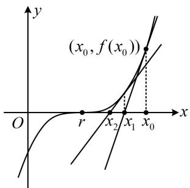
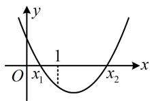
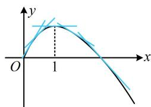
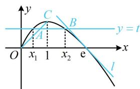
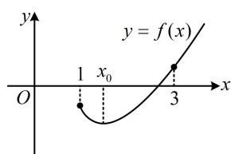
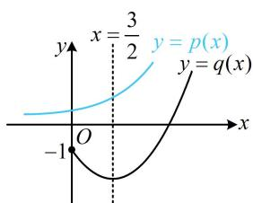
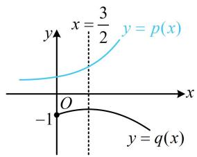
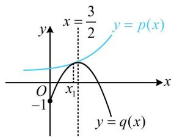

# 强化训练

1. (2024·贵州贵阳模拟·★★★★)

牛顿迭代法是牛顿在 17 世纪提出的一种在实数域和复数域上近似求解方程的方法. 比如, 我们可以先猜想某个方程 $f(x) = 0$ 的其中一个根 $r$ 在 $x = x_0$ 的附近, 如图所示, 然后在点 $(x_0, f(x_0))$ 处作 $f(x)$ 的切线, 切线与 $x$ 轴交点的横坐标就是 $x_1$ , 用 $x_1$ 代替 $x_0$ 重复上面的过程得到 $x_2$ ; 一直继续下去, 得到 $x_0, x_1, x_2, \cdots, x_n$ . 从图形上我们可以看到 $x_1$ 较 $x_0$ 接近 $r$ , $x_2$ 较 $x_1$ 接近 $r$ , 等等. 显然, 它们会越来越逼近 $r$ . 于是求 $r$ 近似解的过程转化为求 $x_n$ , 若设精度为 $\varepsilon$ , 则把首次满足 $\left|x_n - x_{n-1}\right| < \varepsilon$ 的 $x_n$ 称为 $r$ 的近似解.

已知函数 $f(x) = x^{3} + (a - 2)x + a$ ， $a\in \mathbf{R}$

（1）当 $a = 1$ 时，试用牛顿迭代法求方程 $f(x) = 0$ 满足精度 $\varepsilon = 0.5$ 的近似解（取 $x_0 = -1$ ，且结果保留小数点后第二位）；

（2）若 $f(x) - x^{3} + x^{2}\ln x\geq 0$ ，求 $\pmb{a}$ 的取值范围.

text_image

(x₀, f(x₀))
O
r
x₂
x₁
x₀
y

1. 解：（1）当 $a = 1$ 时， $f(x) = x^3 - x + 1$

(用牛顿迭代法求近似解, 依次求切线及其与 $x$ 轴的交点, 直到满足精度要求即可)

因为 $f'(x)=3x^{2}-1$ ，所以 $f'(x_{0})=f'(-1)=2$ ，

又 $f(x_0) = f(-1) = 1$ ，所以 $f(x)$ 在 $(x_0, f(x_0))$ 处的切线方程为 $y - 1 = 2(x + 1)$ ，

令 $y = 0$ 得 $x = -\frac{3}{2}$ ，即 $x_{1} = -\frac{3}{2}$ ，因为 $\left|x_{1} - x_{0}\right| = 0.5$

不满足精度要求，故继续求下一条切线，

因为 $f^{\prime}(x_{1}) = f^{\prime}\left(-\frac{3}{2}\right) = \frac{23}{4},\quad f(x_{1}) = f\left(-\frac{3}{2}\right) = -\frac{7}{8},$

所以 $f(x)$ 在 $(x_{1}, f(x_{1}))$ 处的切线方程为 $y + \frac{7}{8} = \frac{23}{4} \left( x + \frac{3}{2} \right)$ ,

令 $y = 0$ 得 $x = -\frac{31}{23}$ ，所以 $x_{2} = -\frac{31}{23}$

因为 $\left|x_{2}-x_{1}\right|=\left|-\frac{31}{23}+\frac{3}{2}\right|=\frac{7}{46}<0.5$ ，满足精度要求，

所以方程 $f(x) = 0$ 的近似解为 $-\frac{31}{23}$

保留到小数点后第二位约为-1.35.

(2) 解法 1: $f(x)-x^{3}+x^{2}\ln x\geq0\Leftrightarrow x^{3}+(a-2)x+$

$a - x^{3} + x^{2}\ln x\geq 0\Leftrightarrow (a - 2)x + a + x^{2}\ln x\geq 0$ ①，（观察发现①中的参数 $a$ 容易分离出来，故可尝试用参变分离处理）

不等式① $\Leftrightarrow a(x + 1) - 2x + x^2\ln x\geq 0\Leftrightarrow a\geq \frac{2x - x^2\ln x}{x + 1}$ ②，

令 $g(x)=\frac{2x-x^{2}\ln x}{x+1}(x>0)$ ,

则 $g^{\prime}(x) = \frac{\left[2 - \left(2x\ln x + x^{2} \cdot \frac{1}{x}\right)\right](x + 1) - (2x - x^{2}\ln x)}{(x + 1)^{2}}$

$$
\begin{array}{l} = \frac {- x ^ {2} - x + 2 - (x ^ {2} + 2 x) \ln x}{(x + 1) ^ {2}} = \frac {(1 - x) (x + 2) - x (x + 2) \ln x}{(x + 1) ^ {2}} \\ = \frac {(x + 2) (1 - x - x \ln x)}{(x + 1) ^ {2}}, \\ \end{array}
$$

(只有 $1-x-x\ln x$ 这部分正负不易看出，故对它进行分析. 观察发现该式有零点1，故可尝试分析它在1两侧的符号)

当 $0 < x < 1$ 时， $1 - x > 0$ ， $x \ln x < 0$ ，

所以 $1 - x - x\ln x > 0$ ，故 $g^{\prime}(x) > 0$

当 $x > 1$ 时， $1 - x < 0$ ， $x \ln x > 0$

所以 $1 - x - x\ln x < 0$ ，故 $g^{\prime}(x) < 0$

所以 $g(x)$ 在 $(0,1)$ 上单调递增，在 $(1, +\infty)$ 上单调递减，

故 $g(x)_{\max} = g(1) = 1$ ，由②知 $a \geq g(x)$ 恒成立，所以 $a \geq 1$

故 $a$ 的取值范围是 $[1, +\infty)$ .

解法2：（按解法1得到不等式①后，由于有 $x^{2}\ln x$ ，故也可考虑同除以 $x^{2}$ ，将 $\ln x$ 孤立出来，再构造函数求导分析）

不等式①等价于 $\frac{a - 2}{x} +\frac{a}{x^2} +\ln x\geq 0$ ，设 $h(x) =$

$\frac{a - 2}{x} + \frac{a}{x^2} + \ln x (x > 0)$ ，则 $h(x) \geq 0$ 恒成立，且 $h'(x) =$

$$
- \frac {a - 2}{x ^ {2}} - \frac {2 a}{x ^ {3}} + \frac {1}{x} = \frac {x ^ {2} - (a - 2) x - 2 a}{x ^ {3}} = \frac {(x - a) (x + 2)}{x ^ {3}},
$$

(影响 $h^{\prime}(x)$ 正负的只有 $x - a$ 这一项, 它有零点 $a$ , 但 $a$ 不一定在定义域内, 故据此讨论)

当 $a \leq 0$ 时，（此时 $h'(x) > 0$ ， $h(x)$ 在 $(0, +\infty)$ 上 $\nearrow$ ， $h(x) \geq 0$ 能否恒成立呢？可尝试分析解析式各部分的正负情况，观察发现 $\frac{a - 2}{x} < 0$ ， $\frac{a}{x^2} \leq 0$ ，故若 $\ln x \leq 0$ ，就有 $h(x) < 0$ ，于是 $h(x) \geq 0$ 不恒成立，我们取个点来否定结论即可，不妨就取1）

因为 $h(1) = 2a - 2 < 0$ ，所以 $h(x)\geq 0$ 不恒成立，不合题意；

当 $a > 0$ 时， $h'(x) > 0 \Leftrightarrow x > a$ ， $h'(x) < 0 \Leftrightarrow 0 < x < a$

所以 $h(x)$ 在 $(0,a)$ 上单调递减，在 $(a, + \infty)$ 上单调递增，

从而 $h(x)_{\min} = h(a) = \frac{a - 2}{a} +\frac{a}{a^2} +\ln a = 1 - \frac{1}{a} +\ln a$

故 $h(x)\geq 0$ 恒成立等价于 $1 - \frac{1}{a} +\ln a\geq 0$ ③，

(注意到当 a=1 时， $1-\frac{1}{a}+\ln a=0$ ，故可尝试通过分析 1 左右两侧 $1-\frac{1}{a}+\ln a$ 的正负情况来求解不等式③)

若 $0 < a < 1$ ，则 $1 - \frac{1}{a} = \frac{a - 1}{a} < 0$ ， $\ln a < 0$

所以 $1 - \frac{1}{a} +\ln a <   0$ ，不等式③不成立，

若 $a \geq 1$ ，则 $1 - \frac{1}{a} = \frac{a - 1}{a} \geq 0$ ， $\ln a \geq 0$ ，

所以 $1-\frac{1}{a}+\ln a\geq0$ ，不等式③成立，

综上所述，实数 $a$ 的取值范围是 $[1, +\infty)$

2. (2024·江苏苏北七市二调·★★★★)

已知函数 $f(x) = ax - \ln x - \frac{a}{x}$ .

（1）若 $x > 1$ ， $f(x) > 0$ ，求实数 $a$ 的取值范围；  
（2）设 $x_{1}$ ， $x_{2}$ 是函数 $f(x)$ 的两个极值点，证明： $\left|f(x_1) - f(x_2)\right| <   \frac{\sqrt{1 - 4a^2}}{a}.$

2. 解：（1）由题意， $f'(x)=a-\frac{1}{x}+\frac{a}{x^{2}}=\frac{ax^{2}-x+a}{x^{2}}$

（接下来应讨论 $f(x)$ 的单调性，分界点怎么找呢？注意到 $f(1) = 0$ ，有端点效应，所以要使当 $x > 1$ 时， $f(x) > 0$ ，必须满足 $f'(1) = 2a - 1 \geq 0$ ，由此可找到讨论的分界点）

当 $a \geq \frac{1}{2}$ 时， $ax^2 - x + a \geq \frac{1}{2} x^2 - x + \frac{1}{2} = \frac{1}{2}(x - 1)^2 > 0$

所以 $f^{\prime}(x) > 0$ ，故 $f(x)$ 在 $(1, + \infty)$ 上单调递增，

又 $f(1) = 0$ ，所以当 $x > 1$ 时， $f(x) > 0$ ，满足题意；

（再看 $a < \frac{1}{2}$ 的情况，由于 $a$ 的正负会影响开口，所以又将0作为讨论的分界点，分两种情况讨论）

当 $a \leq 0$ 时， $ax^2 - x + a \leq -x < 0$ ，所以 $f'(x) < 0$ ，

故 $f(x)$ 在 $(1, +\infty)$ 上单调递减，

结合 $f(1) = 0$ 可得当 $x > 1$ 时， $f(x) < 0$ ，不合题意；

当 $0 < a < \frac{1}{2}$ 时，（要找 $f'(x)$ 的正负情况，可先分析二次函数 $y = ax^2 - x + a$ 的图象，注意到当 $x = 1$ 时， $y = 2a - 1 < 0$ ，所以该二次函数必定在1的左右两侧各有1个零点，如图）

令 $f'(x)=0$ 可得 $x_{1}=\frac{1-\sqrt{1-4a^{2}}}{2a}$ ， $x_{2}=\frac{1+\sqrt{1-4a^{2}}}{2a}$

当 $1 < x < x_{2}$ 时， $f'(x) < 0$ ，故 $f(x)$ 在 $(1, x_{2})$ 上单调递减，

结合 $f(1) = 0$ 可得当 $1 < x < x_{2}$ 时， $f(x) < 0$ ，不合题意；

综上所述，实数 $a$ 的取值范围是 $\left[\frac{1}{2}, +\infty\right)$

（2）由（1）可知当且仅当 $0 < a < \frac{1}{2}$ 时， $f'(x)$ 有两个零点 $x_{1}, x_{2}$ ，不妨设 $x_{1} < x_{2}$ ，则 $0 < x_{1} < 1 < x_{2}$ ，

且 $f^{\prime}(x) > 0\Leftrightarrow 0 <   x <   x_{1}$ 或 $x > x_{2}$ ， $f^{\prime}(x) <   0\Leftrightarrow x_{1} <   x <   x_{2}$

所以 $f(x)$ 在 $(0,x_1)$ 和 $(x_{2}, + \infty)$ 上单调递增，在 $(x_{1},x_{2})$ 上单调递减，故 $f(x_{1}) > f(x_{2})$

所以 $\left|f(x_1) - f(x_2)\right| = f(x_1) - f(x_2) = ax_1 - \ln x_1 - \frac{a}{x_1} -$

$$
a x _ {2} + \ln x _ {2} + \frac {a}{x _ {2}} = a (x _ {1} - x _ {2}) + \frac {a (x _ {1} - x _ {2})}{x _ {1} x _ {2}} + \ln \frac {x _ {2}}{x _ {1}} \quad ①,
$$

(式①有3个变量, 应考虑消元, $x_{1}$ , $x_{2}$ 和 $a$ 之间可由韦达定理建立联系, 故先写出韦达定理, 将式①化简)

因为 $x_{1}$ ， $x_{2}$ 是方程 $ax^{2} - x + a = 0$ 的两根，

所以 $x_{1} + x_{2} = \frac{1}{a}$ ， $x_{1}x_{2} = 1$

代入①得 $\left|f(x_1) - f(x_2)\right| = 2a(x_1 - x_2) + \ln \frac{x_2}{x_1}$

由（1）知 $x_{1} = \frac{1 - \sqrt{1 - 4a^{2}}}{2a}$ ， $x_{2} = \frac{1 + \sqrt{1 - 4a^{2}}}{2a}$

所以 $x_{2} - x_{1} = \frac{\sqrt{1 - 4a^{2}}}{a}$

故要证的不等式即为 $2a(x_{1} - x_{2}) + \ln \frac{x_{2}}{x_{1}} < x_{2} - x_{1}$ ②，

（此式仍有3个变量，继续消元，由于 $a$ 只出现一次，故消去 $a$ ， $x_{1}$ 和 $x_{2}$ 则随便保留一个，不妨保留 $x_{2}$ ）

因为 $x_{1}x_{2} = 1$ ，所以 $x_{1} = \frac{1}{x_{2}}$

代入 $x_{1} + x_{2} = \frac{1}{a}$ 可得 $\frac{1}{x_2} +x_2 = \frac{1}{a}$ ，所以 $a = \frac{x_2}{1 + x_2^2}$

代入②知要证 $\left|f(x_1) - f(x_2)\right| <   \frac{\sqrt{1 - 4a^2}}{a}$

只需证 $\frac{2x_2}{1 + x_2^2}\left(\frac{1}{x_2} -x_2\right) + \ln x_2^2 <  x_2 - \frac{1}{x_2},$

即证 $\frac{2(1 - x_2^2)}{1 + x_2^2} + 2\ln x_2 - x_2 + \frac{1}{x_2} < 0$ ③，（只含 $x_2$ 了，接下来只需将 $x_2$ 看成变量，构造函数求导分析即可）

设 $g(x) = \frac{2(1 - x^2)}{1 + x^2} + 2\ln x - x + \frac{1}{x}$ , $x > 1$ ,

则 $g^{\prime}(x) = \frac{-4x(1 + x^{2}) - 2x\cdot 2(1 - x^{2})}{(1 + x^{2})^{2}} +\frac{2}{x} -1 - \frac{1}{x^{2}}$

$$
= - \frac {8 x}{(1 + x ^ {2}) ^ {2}} - \frac {(x - 1) ^ {2}}{x ^ {2}} <   0,
$$

所以 $g(x)$ 在 $(1, +\infty)$ 上单调递减，

又 $g(1) = 0$ ，所以 $g(x) <   0$

故 $g(x_{2}) = \frac{2(1 - x_{2}^{2})}{1 + x_{2}^{2}} + 2\ln x_{2} - x_{2} + \frac{1}{x_{2}} < 0$

即不等式③成立，所以 $\left|f(x_1) - f(x_2)\right| < \frac{\sqrt{1 - 4a^2}}{a}$ 成立.

# 3. (2022·全国甲卷·★★★★)

已知函数 $f(x) = \frac{\mathrm{e}^x}{x} -\ln x + x - a$

（1）若 $f(x)\geq 0$ ，求实数 $a$ 的取值范围；  
(2) 证明: 若 $f(x)$ 有两个零点 $x_{1}, x_{2}$ , 则 $x_{1} x_{2} < 1$ .

3. 解法1：（1）（观察发现 $f(x)$ 解析式中参数 $a$ 是孤立的，求

导后不含参，故可直接求导，研究 $f(x)$ 的最小值，将条件翻译成 $f(x)_{\min} \geq 0$ ，求出 $a$ 的范围）

由题意， $f(x)$ 的定义域为 $(0, + \infty)$

且 $f^{\prime}(x) = \frac{(x - 1)\mathrm{e}^{x}}{x^{2}} -\frac{1}{x} +1 = \frac{(x - 1)(\mathrm{e}^{x} + x)}{x^{2}},$

所以 $f'(x)>0\Leftrightarrow x>1,\quad f'(x)<0\Leftrightarrow0<x<1,$

从而 $f(x)$ 在 $(0,1)$ 上单调递减，在 $(1, +\infty)$ 上单调递增，

故 $f(x)_{\min}=f(1)=\mathrm{e}+1-a$ ，

因为 $f(x)\geq 0$ ，所以 $\mathrm{e} + 1 - a\geq 0$ ，解得： $a\leq \mathrm{e} + 1$

故实数 a 的取值范围是 $(-∞, e+1]$ .

(2) (条件给出 $f(x)$ 有 2 个零点, 应先研究 $a$ 的范围和这两个零点的分布情况)

由（1）知当 $f(x)$ 有两个零点时， $f(1) = \mathrm{e} + 1 - a < 0$

所以 $a > \mathrm{e} + 1$ ，不妨设 $x_{1} <   x_{2}$ ，则 $0 <   x_{1} <   1 <   x_{2}$

（怎样证 $x_{1}x_{2} < 1$ ？与本节例5的变式类似，可仿照极值点偏移问题的处理方法，将要证的关于自变量的不等式转化为函数值

不等式来证明）要证 $x_{1}x_{2} < 1$ ，只需证 $x_{2} < \frac{1}{x_{1}}$

注意到 $f(x)$ 在 $(1, +\infty)$ 上单调递增，且 $x_{2} > 1$ ， $\frac{1}{x_1} >1$

所以要证 $x_{2} < \frac{1}{x_{1}}$ ，又只需证 $f(x_{2}) < f\left(\frac{1}{x_{1}}\right)$

(上述不等式涉及两个变量, 考虑消元, 可用 $f(x_{1}) = f(x_{2})$ 将 $f(x_{2})$ 替换成 $f(x_{1})$ , 实现消元)

因为 $f(x_{2}) = f(x_{1}) = 0$ ，所以只需证 $f(x_{1}) <   f\left(\frac{1}{x_{1}}\right),$

即证 $f(x_{1}) - f\left(\frac{1}{x_{1}}\right) < 0$ ①,

设 $F(x) = f(x) - f\left(\frac{1}{x}\right)$ ， $0 < x < 1$

则 $F^{\prime}(x) = f^{\prime}(x) - f^{\prime}\left(\frac{1}{x}\right)\cdot \left(-\frac{1}{x^{2}}\right) = f^{\prime}(x) + \frac{1}{x^{2}} f^{\prime}\left(\frac{1}{x}\right)$

$$
= \frac {(x - 1) (\mathrm{e} ^ {x} + x)}{x ^ {2}} + \frac {1}{x ^ {2}} \cdot \frac {\left(\frac {1}{x} - 1\right) \left(\mathrm{e} ^ {\frac {1}{x}} + \frac {1}{x}\right)}{\frac {1}{x ^ {2}}}
$$

$$
= \frac {(x - 1) \left(\mathrm{e} ^ {x} + x - x \mathrm{e} ^ {\frac {1}{x}} - 1\right)}{x ^ {2}},
$$

（上式中 $\mathrm{e}^x + x - x\mathrm{e}^{\frac{1}{x}} - 1$ 的正负不易看出，于是把它拿出来单独求导分析）设 $r(x) = \mathrm{e}^x + x - x\mathrm{e}^{\frac{1}{x}} - 1$ ， $0 < x < 1$

则 $r'(x) = \mathrm{e}^x + 1 - \left[\mathrm{e}^{\frac{1}{x}} + x\mathrm{e}^{\frac{1}{x}} \cdot \left(-\frac{1}{x^2}\right)\right] = \mathrm{e}^x + 1 + \left(\frac{1}{x} - 1\right)\mathrm{e}^{\frac{1}{x}} > 0$

所以 $r(x)$ 在 $(0,1)$ 上单调递增，又 $r(1) = 0$ ，所以 $r(x) < 0$

从而 $F'(x)=\frac{(x-1)r(x)}{x^{2}}>0$ ，故 $F(x)$ 在 $(0,1)$ 上单调递增，

又 $F(1) = 0$ ，所以 $F(x) < 0$ ，故 $F(x_{1}) = f(x_{1}) - f\left(\frac{1}{x_{1}}\right) < 0$

所以不等式①成立，故 $x_{1}x_{2} < 1$ 成立.

解法2: (1) (仔细观察会发现, $\frac{\mathrm{e}^{x}}{x}$ 可调整为 $\mathrm{e}^{x - \ln x}$ , 于是 $f(x)$ 的解析式中, 含 $x$ 的部分以 $x - \ln x$ 这一结构整体出现, 故也可考虑将其换元, 化简解析式后, 再分析其最小值)

由题意， $f(x)$ 的定义域为 $(0, +\infty)$ ，

且 $f(x) = \frac{\mathrm{e}^x}{x} -\ln x + x - a = \mathrm{e}^{x - \ln x} + x - \ln x - a,$

令 $u = x - \ln x$ ，则 $f(x) = \mathrm{e}^{u} + u - a$

设 $\varphi(x) = x - \ln x$ ， $x > 0$ ，则 $\varphi'(x) = 1 - \frac{1}{x} = \frac{x - 1}{x}$

所以 $\varphi'(x) > 0 \Leftrightarrow x > 1$ ， $\varphi'(x) < 0 \Leftrightarrow 0 < x < 1$

从而 $\varphi (x)$ 在(0,1)上单调递减，在 $(1, + \infty)$ 上单调递增，

故 $\varphi (x)_{\min} = \varphi (1) = 1$ ，所以 $u\geq 1$

显然函数 $y = \mathrm{e}^{u} + u - a$ 在 $[1, +\infty)$ 上为增函数，

所以当 u=1 时， $f(x)$ 取得最小值 $e+1-a$ ，

因为 $f(x)\geq 0$ ，所以 $\mathbf{e} + 1 - a\geq 0$ ，解得： $a\leq \mathbf{e} + 1$

故实数 a 的取值范围是 $(-∞, e+1]$ .

(2) (条件给出 $x_{1}$ , $x_{2}$ 是 $f(x)$ 的两个零点, 应先在第 (1) 问的基础上研究 $x_{1}$ , $x_{2}$ 满足的条件)

$f(x) = 0 \Leftrightarrow \mathrm{e}^{u} + u - a = 0$ ，其中 $u = x - \ln x$

由（1）知要使 $f(x)$ 有两个零点 $x_{1}$ ， $x_{2}$ ，应有 $u > 1$ ，

此时 $a > \mathrm{e} + 1$ ，且 $x_{1}$ ， $x_{2}$ 是方程 $u = x - \ln x$ 的两根，

不妨设 $x_{1} < x_{2}$ ，则 $0 < x_{1} < 1 < x_{2}$ ，且 $\left\{ \begin{array}{l}x_{1} - \ln x_{1} = u\\ x_{2} - \ln x_{2} = u \end{array} \right.$

(怎样证明 $x_{1} x_{2} < 1$ ? 由于此不等式中不含 $u$ , 故考虑消去 $u$ , 观察发现作差即可)

将上述两式作差得： $x_{1} - x_{2} - \ln \frac{x_{1}}{x_{2}} = 0$ ②，

(怎样把式②与目标式 $x_{1} x_{2} < 1$ 联系起来？若能由式②反解出 $x_{1}$ 或 $x_{2}$ ，就能代入 $x_{1} x_{2}$ 中，将要证的不等式消元，但可以想象，由式②不易反解出 $x_{1}$ 或 $x_{2}$ ，怎么办呢？可考虑比值代换，设 $t = \frac{x_{1}}{x_{2}}$ ，结合式②将 $x_{1}$ ， $x_{2}$ 都用 $t$ 表示，由此可将 $x_{1} x_{2}$ 统一成 $t$ ，也实现了消元）

设 $t = \frac{x_1}{x_2}$ ，则 $0 < t < 1$ ，且 $x_{1} = tx_{2}$

代入②得 $tx_{2}-x_{2}-\ln t=0$ ，故 $x_{2}=\frac{\ln t}{t-1}$ ， $x_{1}=tx_{2}=\frac{t\ln t}{t-1}$ ，

所以 $x_{1}x_{2} = \frac{t\ln^{2}t}{(t - 1)^{2}}$ ，故要证 $x_{1}x_{2} < 1$ ，只需证 $\frac{t\ln^2t}{(t - 1)^2} < 1$

即证 $\ln^2 t < \frac{(t - 1)^2}{t}$ ，也即证 $-\ln t < \frac{1 - t}{\sqrt{t}}$

故只需证 $-2\ln \sqrt{t} < \frac{1}{\sqrt{t}} - \sqrt{t}$ ，即证 $2\ln \sqrt{t} + \frac{1}{\sqrt{t}} - \sqrt{t} > 0$

令 $m = \sqrt{t}$ ，则 $0 < m < 1$

且 $2\ln \sqrt{t} +\frac{1}{\sqrt{t}} -\sqrt{t} >0$ 即为 $2\ln m + \frac{1}{m} -m > 0$

设 $p(m) = 2\ln m + \frac{1}{m} - m$ ， $0 <   m <   1$

则 $p'(m) = -\frac{(m-1)^{2}}{m^{2}} < 0$ ，所以 $p(m)$ 在 $(0,1)$ 上单调递减，

又 $p(1) = 0$ ，所以 $p(m) > 0$ ，即 $2\ln m + \frac{1}{m} - m > 0$

故 $x_{1}x_{2} < 1$ 成立.

# 4. (2021·新高考Ⅰ卷·★★★★☆)

已知函数 $f(x) = x(1 - \ln x)$ .

(1) 讨论 $f(x)$ 的单调性;

（2）设 $a, b$ 为两个不相等的正数，且 $b \ln a - a \ln b = a - b$ ，证明： $2 < \frac{1}{a} + \frac{1}{b} < e$ .

4. 解：（1）由题意， $f'(x)=1-\ln x+x\left(-\frac{1}{x}\right)=-\ln x(x>0)$

所以 $f^{\prime}(x) > 0\Leftrightarrow 0 <   x <   1$ ， $f^{\prime}(x) <   0\Leftrightarrow x > 1$

故 $f(x)$ 在 $(0,1)$ 上单调递增，在 $(1, +\infty)$ 上单调递减.

(2) (观察发现所给等式 $a, b$ 的结构非常对称, 可考虑把 $a, b$ 分离到等号两侧再看)

$$
b \ln a - a \ln b = a - b \Leftrightarrow \frac {\ln a}{a} - \frac {\ln b}{b} = \frac {1}{b} - \frac {1}{a}
$$

$\Leftrightarrow \frac{1 + \ln a}{a} = \frac{1 + \ln b}{b}$ ①，（注意到要证的结论是 $\frac{1}{a}$ ， $\frac{1}{b}$ 这种结构，故把式①中的 $a, b$ 都化为 $\frac{1}{a}$ 和 $\frac{1}{b}$ ）

式①等价于 $\frac{1}{a}\left(1 - \ln \frac{1}{a}\right) = \frac{1}{b}\left(1 - \ln \frac{1}{b}\right)$ ，所以 $f\left(\frac{1}{a}\right) = f\left(\frac{1}{b}\right)$ ，

设 $x_{1} = \frac{1}{a}$ ， $x_{2} = \frac{1}{b}$ ，则 $f(x_{1}) = f(x_{2})$

（问题即为在 $f(x_{1}) = f(x_{2})$ 的条件下证 $2 < x_{1} + x_{2} < e$ ，由（1）问可知 $x = 1$ 是 $f(x)$ 的极值点，故该不等式左半边是极值点偏移问题。 $x_{1} + x_{2} > 2$ 涉及的是自变量的大小，可考虑用单调性来证，为了将它们化到 $f(x)$ 的同一个单调区间上，我们移个项）

不妨设 $0 < x_{1} < 1 < x_{2}$ ，要证 $x_{1} + x_{2} > 2$ ，即证 $x_{2} > 2 - x_{1}$

因为 $x_{2}$ 和 $2 - x_{1}$ 都在 $(1, + \infty)$ 上，所以结合 $f(x)$ 在 $(1, + \infty)$ 上单调递减知只需证 $f(x_{2}) < f(2 - x_{1})$

（上式有两个变量，由于满足 $f(x_{1}) = f(x_{2})$ ，故可将 $f(x_{2})$ 换成 $f(x_{1})$ ，从而统一变量，构造函数分析）

又 $f(x_{1}) = f(x_{2})$ ，故只需证 $f(x_{1}) <   f(2 - x_{1})$

即证 $f(x_{1}) - f(2 - x_{1}) < 0$

设 $g(x) = f(x) - f(2 - x)$ ， $0 <   x <   1$ ，则 $g^{\prime}(x) =$

$$
f ^ {\prime} (x) + f ^ {\prime} (2 - x) = - \ln x - \ln (2 - x) = - \ln [ 1 - (x - 1) ^ {2} ] > 0,
$$

所以 $g(x)$ 在 $(0,1)$ 上单调递增，从而 $g(x_{1}) < g(1) = 0$

即 $f(x_{1}) - f(2 - x_{1}) < 0$ ，故 $x_{1} + x_{2} > 2$ 成立；

（再证 $x_{1} + x_{2} <   \mathrm{e}$ ，能仿照上述做法，按 $x_{1} + x_{2} <   \mathrm{e}\Leftrightarrow$

$e-x_{1}>x_{2}\Leftrightarrow f(e-x_{1})<f(x_{2})=f(x_{1})$ 变形，进而构造 $h(x)$

$= f(\mathrm{e} - x) - f(x)$ 来证吗？经尝试，这样做行得通，但要回避分析 $h(x)$ 在 $x = 0$ 处的极限，以及判断 $h(1)$ 的正负都较难，怎么办呢？我们不妨画图看看，注意到 $f''(x) = -\frac{1}{x} < 0$ ，所以 $f'(x)$ 递减，故 $f(x)$ 的切线斜率递减， $f(x)$ 的弯曲方向只能是图1所示的情形，该图象的割线段都在图象的下方，切线都在图象的上方。此时若画一条水平直线 $y = t$ 与该图象交于两点，如图2，则 $x_{1} < x_{A}$ ， $x_{2} < x_{B}$ ，于是 $x_{1} + x_{2} <$

$x_{A}+x_{B}$ ，此不等式与目标不等式右侧的方向一致，可以尝试。这种放缩的方法叫做“切割线放缩”，是本题最难想到的地方。下面先证明切割线的位置不等式，易求得割线 OC 的方程是 y=x，故需证 $f(x)>x$ ）

当 $0 < x < 1$ 时， $f(x) = x(1 - \ln x) = x - x\ln x > x$

设 $f(x_{1}) = f(x_{2}) = t$ ，则 $t = f(x_{1}) > x_{1}$ ，所以 $x_{1} <   t$ ①

(再证切线在图象上方, 易求得 $f(x)$ 在 $x = \mathrm{e}$ 处的切线是 $y = -x + \mathrm{e}$ , 故需证 $f(x) < -x + \mathrm{e}$ , 移项构造即可)

在 $(0,\mathbf{e})$ 上， $f(x) > 0$ ，在 $[\mathbf{e}, + \infty)$ 上， $f(x)\leq 0$

所以满足 $f(x_{1}) = f(x_{2})$ 的 $x_{2}$ 必在(1,e)上，

设 $r(x) = f(x) + x - \mathrm{e} = x(1 - \ln x) + x - \mathrm{e}$ ， $1 <   x <   \mathrm{e}$

则 $r'(x) = 1 - \ln x > 0$ ，所以 $r(x)$ 在(1,e)上单调递增，

结合 $r(\mathbf{e}) = 0$ 知 $r(x) < 0$ 恒成立，即 $f(x) + x - \mathbf{e} < 0$

所以 $f(x) < -x + \mathrm{e}$ 在 $(1, \mathrm{e})$ 上恒成立，故 $f(x_{2}) < -x_{2} + \mathrm{e}$ ，

又 $f(x_{2}) = t$ ，所以 $t <   - x_{2} + \mathbf{e}$ ，故 $x_{2} <   \mathbf{e} - t$ ②，

由①②知 $x_{1} + x_{2} < t + (\mathbf{e} - t) = \mathbf{e}$ ，所以 $2 < x_{1} + x_{2} < \mathbf{e}$ ，

故 $2 < \frac{1}{a} + \frac{1}{b} < e$ 成立.

text_image

y
O
1
x

图1

text_image

y
C
B
y = t
A
O
x₁ 1 x₂ e
l

图2

# 5. (2024·浙江绍兴模拟·★★★★☆)

已知函数 $f(x) = \frac{x^2}{2} - x + a\sin x$

（1）当 $a = 2$ 时，求曲线 $y = f(x)$ 在点 $(0, f(0))$ 处的切线方程；  
（2）当 $x \in (0, \pi)$ 时， $f(x) > 0$ ，求实数 $a$ 的取值范围.

5. 解：（1）当 $a = 2$ 时， $f(x) = \frac{x^2}{2} - x + 2\sin x$

$f'(x)=x-1+2\cos x$ ，所以 $f'(0)=1$ ，

又 $f(0) = 0$ ，所以曲线 $y = f(x)$ 在 $(0, f(0))$ 处的切线方程是 $y - 0 = 1 \times (x - 0)$ ，即 $y = x$

（2）（观察发现 $f(0) = 0$ ，有端点效应，要使 $f(x) > 0$ 在 $(0, \pi)$ 上恒成立，则 $f(x)$ 从 $x = 0$ 出发不能 $\searrow$ ，否则在 $x = 0$ 右侧附近必有使 $f(x) < 0$ 的点，于是应有 $f'(0) \geq 0$ ，由此可求得 $a \geq 1$ ，讨论的分界点就找到了）

(i)当 $a \geq 1$ 时，（怎样分析此时 $f(x) > 0$ 是否恒成立？已有 $a \geq 1$ ，可用它将 $f(x)$ 的解析式放缩成不含参的形式，再求导分析）因为 $x \in (0, \pi)$ ，所以 $\sin x > 0$ ，

故 $f(x) = \frac{x^2}{2} - x + a\sin x \geq \frac{x^2}{2} - x + \sin x$ ①,

记 $g(x) = \frac{x^2}{2} - x + \sin x$ ， $0 <   x <   \pi$ ，则 $g^{\prime}(x) = x - 1 + \cos x$

(不易判断正负，考虑继续求导)

$g''(x) = 1 - \sin x \geq 0$ ，所以 $g'(x)$ 在 $(0, \pi)$ 上单调递增，

从而 $g^{\prime}(x) > g^{\prime}(0) = 0$ ，故 $g(x)$ 在 $(0,\pi)$ 上单调递增，

所以 $g(x) > g(0) = 0$ ，由①可知 $f(x)\geq g(x)$

所以 $f(x)>0$ ，满足题意；

(ii)当 $a < 1$ 时， $f'(x) = x - 1 + a\cos x$ ， $f''(x) = 1 - a\sin x$

（注意到在 $x = 0$ 附近， $x - 1 < 0$ ，于是若 $a \leq 0$ ，则 $x - 1 + a \cos x < 0$ ，故又细分为 $a \leq 0$ 和 $0 < a < 1$ 两种情况来考虑）

若 $a \leq 0$ ，则当 $0 < x < 1$ 时， $x - 1 < 0$ ， $a \cos x \leq 0$

所以 $f'(x)<0$ ，故 $f(x)$ 在 $(0,1)$ 上单调递减，

又 $f(0) = 0$ ，所以当 $x\in (0,1)$ 时， $f(x) <   0$ ，不合题意；

若 $0 < a < 1$ ，因为当 $x \in (0, \pi)$ 时， $0 < \sin x \leq 1$

所以 $0 < a \sin x < 1$ ，从而 $f''(x) = 1 - a \sin x > 0$ ，

故 $f'(x)$ 在 $(0,\pi)$ 上单调递增，

又 $f^{\prime}(0) = a - 1 <   0$ ， $f^{\prime}\left(\frac{\pi}{2}\right) = \frac{\pi}{2} -1 + a\cos \frac{\pi}{2} = \frac{\pi}{2} -1 > 0$

所以存在 $x_0 \in \left(0, \frac{\pi}{2}\right)$ ，使得 $f'(x_0) = 0$ ，且当 $x \in (0, x_0)$ 时，

$f'(x)<0$ ，所以 $f(x)$ 在区间 $(0,x_{0})$ 上单调递减，

结合 $f(0) = 0$ 可得在 $(0,x_0)$ 上， $f(x_0) < 0$ ，不合题意；

综上所述，实数 $a$ 的取值范围为 $[1, +\infty)$ 。

6. (2024·浙江模拟·★★★★☆)

设 $0 < x < \frac{\pi}{2}$ .

（1）若 $\tan x = \frac{1}{2}$ ，求 $\frac{\cos 4x - 4\cos 2x + 3}{\cos 4x + 4\cos 2x + 3}$

（2）证明： $\frac{\tan x - x}{x - \sin x} > 2$

（3）若 $\tan x + 2\sin x - ax > 0$ ，求实数 $a$ 的取值范围.

6. 解: (1) 解法 1: (所求式较复杂, 先化简, 可对 $\cos 4x$ 用倍角公式统一角度, 由于余下的为 $\cos 2x$ , 故用 $\cos 4x = 2\cos^{2} 2x - 1$ )

$$
\begin{array}{l} \frac {\cos 4 x - 4 \cos 2 x + 3}{\cos 4 x + 4 \cos 2 x + 3} = \frac {2 \cos^ {2} 2 x - 1 - 4 \cos 2 x + 3}{2 \cos^ {2} 2 x - 1 + 4 \cos 2 x + 3} \\ = \frac {\cos^ {2} 2 x - 2 \cos 2 x + 1}{\cos^ {2} 2 x + 2 \cos 2 x + 1} = \left(\frac {1 - \cos 2 x}{1 + \cos 2 x}\right) ^ {2}, \\ \end{array}
$$

(看到 $1 - \cos 2x$ 和 $1 + \cos 2x$ ，想到升次公式 $\frac{1 - \cos 2x}{2} =$

$\sin^2 x$ 和 $\frac{1 + \cos 2x}{2} = \cos^2 x$

所以 $\frac{\cos 4x - 4\cos 2x + 3}{\cos 4x + 4\cos 2x + 3} = \left(\frac{2\sin^2x}{2\cos^2x}\right)^2 = \tan^4 x$

又 $\tan x = \frac{1}{2}$ ，所以 $\frac{\cos 4x - 4\cos 2x + 3}{\cos 4x + 4\cos 2x + 3} = \left(\frac{1}{2}\right)^4 = \frac{1}{16}$

解法2：（注意到目标式分子分母结构很像，故对其化简时，也可将分子凑成分母的形式，再拆项）

$$
\begin{array}{l} \frac {\cos 4 x - 4 \cos 2 x + 3}{\cos 4 x + 4 \cos 2 x + 3} = \frac {(\cos 4 x + 4 \cos 2 x + 3) - 8 \cos 2 x}{\cos 4 x + 4 \cos 2 x + 3} \\ = 1 - \frac {8 \cos 2 x}{\cos 4 x + 4 \cos 2 x + 3}, \\ \end{array}
$$

（接下来为了统一角度，可对 $\cos 4x$ 用二倍角公式，考虑到余下的皆为 $\cos 2x$ ，故选择 $\cos 4x = 2\cos^2 2x - 1$ ）

所以 $\frac{\cos 4x - 4\cos 2x + 3}{\cos 4x + 4\cos 2x + 3} = 1 - \frac{8\cos 2x}{2\cos^2 2x - 1 + 4\cos 2x + 3}$

$$
= 1 - \frac {4 \cos 2 x}{(\cos 2 x + 1) ^ {2}} = 1 - \frac {4 (\cos^ {2} x - \sin^ {2} x)}{(2 \cos^ {2} x) ^ {2}} = 1 - \frac {\cos^ {2} x - \sin^ {2} x}{\cos^ {4} x},
$$

(分子分母次数不统一, 但观察发现, 可将分子乘以 1 , 再把 1 代换成 $\cos^2 x + \sin^2 x$ , 从而统一次数)

故 $\frac{\cos 4x - 4\cos 2x + 3}{\cos 4x + 4\cos 2x + 3} = 1 - \frac{(\cos^2 x - \sin^2 x)(\cos^2 x + \sin^2 x)}{\cos^4 x}$

$$
= 1 - \frac {\cos^ {4} x - \sin^ {4} x}{\cos^ {4} x} = 1 - 1 + \frac {\sin^ {4} x}{\cos^ {4} x} = \tan^ {4} x = \left(\frac {1}{2}\right) ^ {4} = \frac {1}{1 6}.
$$

(2) 证法1: (直接对 $\frac{\tan x - x}{x - \sin x}$ 求导分析显然较复杂, 可考虑将 $x - \sin x$ 乘过去, 下面先分析其正负)

设 $f(x) = x - \sin x\left(0 <   x <   \frac{\pi}{2}\right)$ ，则 $f^{\prime}(x) = 1 - \cos x > 0$

所以 $f(x)$ 在 $\left(0, \frac{\pi}{2}\right)$ 上单调递增，

又 $f(0) = 0$ ，所以 $f(x) > 0$ ，故 $x - \sin x > 0$

所以 $\frac{\tan x - x}{x - \sin x} > 2 \Leftrightarrow \tan x - x > 2 (x - \sin x)$

$$
\Leftrightarrow \tan x + 2 \sin x - 3 x > 0,
$$

(故要证原不等式，只需证 $\tan x + 2\sin x - 3x > 0$ ，现在构造函数求导分析就容易一些了)

设 $g(x) = \tan x + 2\sin x - 3x\left(0 <   x <   \frac{\pi}{2}\right),$

因为 $(\tan x)' = \left(\frac{\sin x}{\cos x}\right)' = \frac{\cos x\cos x - (-\sin x)\sin x}{\cos^2 x} = \frac{1}{\cos^2 x}$

所以 $g'(x)=\frac{1}{\cos^{2}x}+2\cos x-3=\frac{2\cos^{3}x-3\cos^{2}x+1}{\cos^{2}x}$ ,

(此为关于 $\cos x$ 的三次结构，尝试分解因式. 观察发现当

$\cos x = 1$ 时，分子为0，所以分子必可化为 $(\cos x - 1)(\dots)$ 这种结构，因式分解的方向就有了）

所以 $g'(x)=\frac{2\cos^{3}x-2\cos^{2}x-\cos^{2}x+1}{\cos^{2}x}$

$$
= \frac {2 \cos^ {2} x (\cos x - 1) - (\cos x - 1) (\cos x + 1)}{\cos^ {2} x}
$$

$$
= \frac {(\cos x - 1) (2 \cos^ {2} x - \cos x - 1)}{\cos^ {2} x} = \frac {(\cos x - 1) ^ {2} (2 \cos x + 1)}{\cos^ {2} x},
$$

因为 $0 < x < \frac{\pi}{2}$ ，所以 $0 < \cos x < 1$ ，从而 $g'(x) > 0$ ，

故 $g(x)$ 在 $\left(0, \frac{\pi}{2}\right)$ 上单调递增，又 $g(0) = 0$ ，所以 $g(x) > 0$

从而 $\tan x + 2\sin x - 3x > 0$ ，故 $\frac{\tan x - x}{x - \sin x} > 2$ 成立.

证法 2: (按证法 1 求得 $g'(x) = \frac{1}{\cos^2 x} + 2 \cos x - 3$ 后, 观察发现可将 $2 \cos x$ 拆分成 $\cos x + \cos x$ , 与 $\frac{1}{\cos^2 x}$ 凑出 “积定”, 从而用三元均值不等式来快速论证 $g'(x) > 0$ )

因为 $0 < x < \frac{\pi}{2}$ ，所以 $0 < \cos x < 1$

故 $g^{\prime}(x) = \frac{1}{\cos^{2}x} + 2\cos x - 3 = \frac{1}{\cos^{2}x} + \cos x + \cos x - 3$

$\geq 3\sqrt[3]{\frac{1}{\cos^2x} \cdot \cos x \cdot \cos x} - 3 = 0$

取等条件是 $\frac{1}{\cos^2 x} = \cos x$ ，即 $\cos x = 1$

因为 $0 < \cos x < 1$ ，所以等号取不到，故 $g'(x) > 0$

接下来同解法1.

（3）（这里 $\tan x + 2\sin x - ax > 0$ 与前面已证的 $\tan x + 2\sin x - 3x > 0$ 很像，所以猜想 $a = 3$ 就是临界状态，故据此讨论）

当 $a \leq 3$ 时， $\tan x + 2\sin x - ax \geq \tan x + 2\sin x - 3x$

由（2）可知 $\tan x + 2\sin x - 3x > 0$ 在 $\left(0, \frac{\pi}{2}\right)$ 上恒成立，

所以 $\tan x + 2\sin x - ax > 0$ ，满足题意；

当 $a > 3$ 时，设 $h(x) = \tan x + 2\sin x - ax$ ， $0 <   x <   \frac{\pi}{2}$

则 $h'(x)=\frac{1}{\cos^{2}x}+2\cos x-a$ ，（此时可发现 $h'(0)=3-a<0$ ，所以 $h(x)$ 从 x=0 出发必定有一段单调递减，结合 $h(0)=0$ 可知这段上 $h(x)<0$ ，所以上面的猜想是正确的，那怎样严格论证呢？可对 $h'(x)$ 再求导，通过分析 $h''(x)$ 的正负来判断 $h'(x)$ 的单调性，得到 $h'(x)$ 的正负情况）

因为 $h''(x) = -2\cdot \frac{1}{\cos^3x}\cdot (-\sin x) - 2\sin x = 2\sin x\left(\frac{1}{\cos^3x} -1\right)$

>0，所以 $h^{\prime}(x)$ 在 $\left(0,\frac{\pi}{2}\right)$ 上单调递增，

（观察发现当 $x \to \frac{\pi}{2}$ 时， $h'(x) \to +\infty$ ，所以 $h'(x)$ 必有零点，若要严格论证，则需取点，怎么取呢？注意到 $2\cos x > 0$ ，故只要让 $\frac{1}{\cos^2 x} - a = 0$ ，就能使 $h'(x) > 0$ ，点就取出来了）

因为 $a > 3$ ，所以 $h^{\prime}(0) = 3 - a < 0$ ，且 $\frac{1}{\sqrt{a}}\in (0,1)$

故存在 $\beta \in \left(0, \frac{\pi}{2}\right)$ ，使 $\cos \beta = \frac{1}{\sqrt{a}}$

此时 $h^{\prime}(\beta) = \frac{1}{\cos^{2}\beta} + 2\cos \beta - a = 2\cos \beta > 0$

所以 $h'(x)$ 在 $(0,\beta)$ 上存在零点 $x_{0}$ ，且当 $0<x<x_{0}$ 时，

$h'(x)<0$ ，所以 $h(x)$ 在 $(0,x_{0})$ 上单调递减，

又 $h(0) = 0$ ，所以当 $x\in (0,x_0)$ 时， $h(x) <   0$

即 $\tan x + 2\sin x - ax < 0$ ，不合题意；

综上所述，实数 $a$ 的取值范围是 $(- \infty, 3]$ .

# 7.（2025·江苏南京模拟·★★★★☆）

已知函数 $f(x) = \mathrm{e}^{x - a} + ax^2 -3ax + 1$ ， $a\in \mathbf{R}$

（1）当 $a = 1$ 时，求曲线 $y = f(x)$ 在 $x = 1$ 处切线的方程；  
（2）当 $a > 1$ 时，试判断 $f(x)$ 在 $[1, +\infty)$ 上的零点的个数，并说明理由；  
（3）当 $x \geq 0$ 时， $f(x) \geq 0$ 恒成立，求 $a$ 的取值范围.

7. 解：（1）当 $a = 1$ 时， $f(x) = \mathrm{e}^{x - 1} + x^2 - 3x + 1$

所以 $f'(x)=\mathrm{e}^{x-1}+2x-3$ ，故 $f'(1)=0$ ，

又 $f(1) = 0$ ，所以曲线 $y = f(x)$ 在 $x = 1$ 处的切线方程是

$y-0=0\cdot(x-1)$ ，整理得：y=0。

(2) (研究 $f(x)$ 的零点, 常先求导分析 $f(x)$ 的单调性)

由题意， $f'(x) = \mathrm{e}^{x - a} + 2ax - 3a$ ，（不好判断正负，考虑继续求导） $f''(x) = \mathrm{e}^{x - a} + 2a$ ，

当 $a > 1$ 时， $f''(x) > 0$ 在 $[1, +\infty)$ 上恒成立，

所以 $f'(x)$ 在 $[1,+\infty)$ 上单调递增，因为 $f'(1)=\mathrm{e}^{1-a}-a$ ，

且 $a > 1$ ，所以 $\mathrm{e}^{1 - a} <   \mathrm{e}^0 = 1$ ，故 $f^{\prime}(1) <   0$

（可以想象，当 $x \to +\infty$ 时， $f'(x) \to +\infty$ ，所以 $f'(x)$ 有且仅有一个零点，若要严格论证，需要取出满足 $f'(x) > 0$ 的点，怎么取？观察发现 $f'(x)$ 的解析式中只有 $-3a$ 这部分为负，于是我们让 $2ax$ 与之抵消，就能满足 $f'(x) > 0$ ，故取 $x = \frac{3}{2}$ 即可）又因为 $f'\left(\frac{3}{2}\right) = \mathrm{e}^{\frac{3}{2} - a} + 2a \cdot \frac{3}{2} - 3a = \mathrm{e}^{\frac{3}{2} - a} > 0$ ，

所以 $f'(x)$ 在 $\left(1,\frac{3}{2}\right)$ 上有唯一的零点 $x_{0}$ ,

且当 $x \in [1, x_0)$ 时， $f'(x) < 0$ ， $f(x)$ 单调递减，

当 $x \in (x_0, +\infty)$ 时， $f'(x) > 0$ ， $f(x)$ 单调递增，

因为 $f(1) = \mathrm{e}^{1 - a} - 2a + 1$ ，由 $a > 1$ 可知 $\mathbf{e}^{1 - a} <   1$

所以 $f(1) < 1 - 2a + 1 = 2(1 - a) < 0$ ，故 $f(x_0) < 0$

(可以想象, 当 $x \to +\infty$ 时, $f(x) \to +\infty$ , 所以 $f(x)$ 有且仅有一个零点, 若要严格论证, 又需取出使 $f(x) > 0$ 的点, 怎么取? 注意到 $f(x)$ 的解析式中只有 $-3ax$ 这部分为负, 故只需让 $ax^2$ 与之抵消, 就能使 $f(x) > 0$ , 故取 $x = 3$ 即可)

又因为 $f(3) = \mathrm{e}^{3 - a} + a\cdot 3^2 -3a\cdot 3 + 1 = \mathrm{e}^{3 - a} + 1 > 0$

所以如图1， $f(x)$ 在 $[1, + \infty)$ 上有且仅有1个零点.

line

| x | y = f(x) |
|---|----------|
| 1 | 1        |
| x₀ | 0        |
| 3 | 3        |

图1

text_image

x = \frac{3}{2} y = p(x)
y = q(x)
-1 O x

图2

（3）（显然不方便由 $f(x) \geq 0$ 分离出参数 $a$ ，若直接求导讨论，则讨论的分界点也不好找，怎么办呢？可考虑画图找思路，为了便于画图，我们先把 $f(x) \geq 0$ 等价变形成 $\mathrm{e}^{x - a} \geq -ax^2 + 3ax - 1$ ，记 $p(x) = \mathrm{e}^{x - a}$ ， $q(x) = -ax^2 + 3ax - 1$ ，则 $p(x) \geq q(x)$ 在 $[0, +\infty)$ 上恒成立，由于 $a$ 的正负会影响 $q(x)$ 的开口，故讨论.

若 $a < 0$ ，如图2， $q(x)$ 开口向上，对称轴为 $x = \frac{3}{2}$ ，过定点 $(0, -1)$ ，随着参数 $a$ 的减小， $p(x)$ 会向左移，而 $q(x)$ 的顶点 $\left(\frac{3}{2}, \frac{9a}{4} - 1\right)$ 会下移，但指数型函数的图象比二次函数更陡峭，故可猜测 $p(x) \geq q(x)$ 在 $[0, +\infty)$ 上恒成立；

若 $a = 0$ ，则 $f(x)\geq 0$ 即为 $\mathrm{e}^x +1\geq 0$ ，显然恒成立；

若 $a > 0$ ，则 $q(x)$ 开口向下，对称轴为 $x = \frac{3}{2}$ ，过定点 $(0, - 1)$ ，当 $a$ 接近0时，大致的情况如图3，随着 $a$ 增大， $p(x)$ 会右移，

$q(x)$ 的顶点 $\left(\frac{3}{2},\frac{9a}{4} -1\right)$ 会上移， $p(x)\geq q(x)$ 的临界状态如图4，只要求出这一临界状态， $a$ 的范围就有了，怎么求？

临界状态下两图象在唯一交点处应有公切线，故若设交点的横坐标为 $x_{1}$ ，则 $\left\{ \begin{array}{l}p(x_1) = q(x_1)\\ p'(x_1) = q'(x_1) \end{array} \right.$

即 $\left\{ \begin{array}{l} \mathrm{e}^{x_1 - a} = -ax_1^2 + 3ax_1 - 1 \\ \mathrm{e}^{x_1 - a} = -2ax_1 + 3a \end{array} \right.$ ，所以 $-ax_1^2 + 3ax_1 - 1 = -2ax_1 + 3a$ ，故 $ax_1^2 - 5ax_1 + 3a + 1 = 0$ ，正面求解此方程的结果较复杂，考虑猜根，观察发现 $a = x_1 = 1$ 满足此方程，代回检验可发现方程组 $\left\{ \begin{array}{l} \mathrm{e}^{x_1 - a} = -ax_1^2 + 3ax_1 - 1 \\ \mathrm{e}^{x_1 - a} = -2ax_1 + 3a \end{array} \right.$ 也成立，临界状态就求出来了.

通过上面的分析, 我们发现要使 $p(x) \geq q(x)$ 在 $[0, +\infty)$ 上恒成立, 只需抓住 $x = 1$ 这个关键位置, 于是作答时, 可取 $x = 1$ 来限定参数 $a$ 的范围, 得到 $f(x) \geq 0$ 成立的必要条件, 再论证充分性)

text_image

x = \frac{3}{2} y = p(x)
-1 O x
y = q(x)

图3

text_image

x = \frac{3}{2} y = p(x)
O x₁ y = q(x)

图4

由题意，当 $x \geq 0$ 时， $f(x) \geq 0$ 恒成立，

所以 $f(1) = \mathrm{e}^{1 - a} - 2a + 1\geq 0$ ，（上述不等式不方便直接解，可将 $a$ 看成变量，构造函数求导分析）

设 $g(a) = \mathrm{e}^{1 - a} - 2a + 1$ ，则 $g^{\prime}(a) = -\mathrm{e}^{1 - a} - 2 <   0$

所以 $g(a)$ 在 $\mathbf{R}$ 上单调递减，又 $g(1) = \mathrm{e}^{1 - 1} - 2\times 1 + 1 = 0$

所以 $g(a)\geq 0\Leftrightarrow \mathrm{e}^{1 - a} - 2a + 1\geq 0\Leftrightarrow a\leq 1$

(通过前面的分析, 我们已经知道 $a \leq 1$ 就是最终答案, 所以下面再证明充分性, 怎么证? 从前面的图形分析我们知道, $a \leq 0$ 与 $0 < a \leq 1$ 时的图形特征不同, 于是分两种情况讨论)

当 $a \leq 0$ 时， $f'(x) = \mathrm{e}^{x - a} + 2ax - 3a$ ， $f''(x) = \mathrm{e}^{x - a} + 2a$

$f'''(x)=\mathrm{e}^{x-a}>0$ ，所以 $f''(x)$ 在 $[0,+\infty)$ 上单调递增，

又 $f''(0) = \mathrm{e}^{-a} + 2a$ ，设 $h(a) = \mathrm{e}^{-a} + 2a$ ， $a\leq 0$

则 $h^{\prime}(a) = -\mathrm{e}^{-a} + 2$ ，所以 $h^{\prime}(a) <   0\Leftrightarrow a <   - \ln 2$

$h^{\prime}(a) > 0\Leftrightarrow -\ln 2 < a\leq 0$ ，从而 $h(a)$ 在 $(-\infty , - \ln 2)$ 上单调递

减，在 $(-ln2,0]$ 上单调递增，

故 $h(a)\geq h(-\ln 2) = \mathrm{e}^{-(-\ln 2)} + 2(-\ln 2) = 2(1 - \ln 2) > 0$

即 $f''(0) > 0$ ，结合 $f''(x)$ 在 $[0, +\infty)$ 上单调递增可得

$f''(x)>0$ 在 $[0,+\infty)$ 上恒成立，

所以 $f'(x)$ 在 $[0,+\infty)$ 上单调递增，

又 $f^{\prime}(0) = \mathrm{e}^{-a} - 3a > 0$ ，所以 $f^{\prime}(x) > 0$ 在 $[0, + \infty)$ 上恒成立，

故 $f(x)$ 在 $[0, +\infty)$ 上单调递增，结合 $f(0) = \mathrm{e}^{-a} + 1 > 0$ 可得

$f(x) > 0$ 在 $[0, +\infty)$ 上恒成立，满足题意；

（再看 $0 < a \leq 1$ 时的情况，由图4可以想象，此时 $f(x)$ 的最小值不在 $x = 0$ 处取得，所以不能像 $a \leq 0$ 时那样论证，怎么办呢？容易求得图4中 $p(x)$ 和 $q(x)$ 在 $x = 1$ 处的公切线为 $y = x$ ，且观察发现 $p(x)$ 在 $y = x$ 上方， $q(x)$ 则在 $y = x$ 下方，故可利用此公切线来放缩，达到证明 $p(x) \geq q(x)$ ，即 $f(x) \geq 0$ 的目的）

当 $0 < a \leq 1$ 时， $\mathrm{e}^{x - a} \geq \mathrm{e}^{x - 1}$ ，设 $u(x) = \mathrm{e}^{x - 1} - x$ ， $x \geq 0$ ，

则 $u'(x)=\mathrm{e}^{x-1}-1$ ，所以 $u'(x)<0\Leftrightarrow0\leq x<1$

$u^{\prime}(x) > 0\Leftrightarrow x > 1$ ，从而 $u(x)$ 在[0,1)上单调递减，在

$(1, + \infty)$ 上单调递增，故 $u(x)\geq u(1) = 0$ ，即 $\mathrm{e}^{x - 1} - x\geq 0$

所以 $\mathrm{e}^{x - 1}\geq x$ ，结合 $\mathrm{e}^{x - a}\geq \mathrm{e}^{x - 1}$ 得 $\mathrm{e}^{x - a}\geq x$ ①，

记 $v(x) = x - (-ax^2 + 3ax - 1) = a(x^2 - 3x) + x + 1$ ， $x \geq 0$ ，

当 $0 \leq x \leq 3$ 时， $x^{2} - 3x \leq 0$

在 $a \leq 1$ 两端同时乘以 $x^{2} - 3x$ 得 $a(x^{2} - 3x) \geq x^{2} - 3x$

所以 $v(x) = a(x^{2} - 3x) + x + 1\geq x^{2} - 3x + x + 1 = (x - 1)^{2}\geq 0$

当 x > 3 时， $x^{2} - 3x > 0$ ，

又因为 $a > 0$ ，所以 $\nu (x) = a(x^{2} - 3x) + x + 1 > x + 1 > 0$

所以 $v(x)=x-(-ax^{2}+3ax-1)\geq0$ 恒成立，

故 $x \geq -ax^2 + 3ax - 1$ ，结合①得 $\mathrm{e}^{x - a} \geq x \geq -ax^2 + 3ax - 1$

所以 $\mathrm{e}^{x - a}\geq -ax^2 +3ax - 1$ ，故 $\mathrm{e}^{x - a} + ax^2 -3ax + 1\geq 0$

即 $f(x)\geq 0$ ；综上所述，实数 $\pmb{a}$ 的取值范围是 $(- \infty ,1]$

# 8. (2025·江苏南通三模·★★★★☆)

已知函数 $f(x) = \mathrm{e}^{x} - ax - \cos x$ ，且 $f(x)$ 在 $[0, +\infty)$ 上的最小值为 0.

(1) 求实数 a 的取值范围;

（2）设函数 $y = \varphi(x)$ 在区间 $D$ 上的导函数为 $y = \varphi'(x)$ ，若 $\frac{x \cdot \varphi'(x)}{\varphi(x)} > 1$ 对任意实数 $x \in D$ 恒成立，则称函数 $y = \varphi(x)$ 在区间 $D$ 上具有性质 $S$ .

①求证：函数 $f(x)$ 在 $(0, +\infty)$ 上具有性质 $S$   
②记 $\prod_{i=1}^{n} p(i) = p(1)p(2) \cdots p(n)$ ，其中 $n \in \mathbf{N}^*$ ，求证： $\prod_{i=1}^{n} i \sin \frac{1}{i} > \frac{1}{n(n+1)}$ 。

8. 解: (1) (观察发现 $f(0)=0$ , 所以要使 $f(x)$ 在 $[0, +\infty)$ 上最

小值为 0，那么 $f(x)$ 在 x=0 右侧附近不能 $\searrow$ ，只能 $\nearrow$ ，

从而应有 $f^{\prime}(0)\geq 0$ ，由此可找到讨论的分界点）

由题意， $f^{\prime}(x) = \mathrm{e}^{x} - a + \sin x$ ， $f''(x) = \mathrm{e}^x +\cos x$

当 $x \geq 0$ 时， $f''(x) \geq 1 + \cos x \geq 0$

所以 $f'(x)$ 在 $[0,+\infty)$ 上单调递增，

当 $a \leq 1$ 时， $f'(0) = 1 - a \geq 0$ ，所以 $f'(x) \geq 0$ 在 $[0, +\infty)$ 上恒成立，故 $f(x)$ 在 $[0, +\infty)$ 上单调递增，

又因为 $f(0) = 0$ ，所以 $f(x)_{\min} = f(0) = 0$ ，满足题意；

当 $a > 1$ 时， $f'(0) = 1 - a < 0$ ，（此时不难发现当 $x \to +\infty$ 时， $f'(x) \to +\infty$ ，所以 $f'(x)$ 在 $(0, +\infty)$ 上有 1 个零点，要严格论证，则需取出满足 $f'(x) > 0$ 的点，怎么取？由于当 $x \to +\infty$ 时， $\sin x$ 这部分对 $f'(x)$ 取值的影响几乎可以忽略，故可将其放缩，得到 $f'(x) \geq e^x - a - 1$ ，那么只需让 $e^x - a - 1 > 0$ ，就有 $f'(x) > 0$ ，满足条件的点就取出来了）

又因为当 $x > \ln (a + 1)$ 时， $f'(x) = \mathrm{e}^x - a + \sin x$

$$
> \mathrm{e} ^ {\ln (a + 1)} - a - \sin x = a + 1 - a - \sin x = 1 - \sin x \geq 0,
$$

所以 $f^{\prime}(x)$ 在 $(0, + \infty)$ 上有且仅有1个零点 $x_0$

且当 $x \in [0, x_0)$ 时， $f'(x) < 0$ ，所以 $f(x)$ 单调递减，

结合 $f(0) = 0$ 可得当 $x\in (0,x_0)$ 时， $f(x) <   0$

不满足 $f(x)$ 在 $[0, +\infty)$ 上的最小值为 0;

综上所述，实数 a 的取值范围是 $(-∞,1]$ .

(2) ① (结论即为 $\frac{x \cdot f'(x)}{f(x)} > 1$ 在 $(0, +\infty)$ 恒成立, 直接对左边求导显然较麻烦, 可考虑把 $f(x)$ 乘到右边, 再观察形式)由 (1) 可得当 $x > 0$ 时, $f(x) > 0$ ,

所以要证 $f(x)$ 在 $(0, +\infty)$ 上具有性质 $S$ ，只需证 $\frac{x \cdot f'(x)}{f(x)} > 1$

在 $(0, +\infty)$ 上恒成立，即证 $x \cdot f'(x) > f(x)$ ，

也即证 $x(\mathrm{e}^x - a + \sin x) > \mathrm{e}^x - ax - \cos x$

所以只需证 $(x - 1)\mathrm{e}^{x} + x\sin x + \cos x > 0$ (i),

(上式结构不算太复杂, 可尝试直接构造函数求导分析)

令 $g(x) = (x - 1)\mathrm{e}^{x} + x\sin x + \cos x$ ， $x > 0$

则 $g^{\prime}(x) = \mathrm{e}^{x} + (x - 1)\mathrm{e}^{x} + \sin x + x\cos x - \sin x = xe^{x} + x\cos x$

$= x(\mathrm{e}^{x} + \cos x)$ ，因为 $x > 0$ ，所以 $\mathrm{e}^x +\cos x > 1 + \cos x\geq 0$

从而 $g^{\prime}(x) > 0$ ，故 $g(x)$ 在 $(0, + \infty)$ 上单调递增，

又因为 $g(0) = 0$ ，所以 $g(x) > 0$

即 $(x - 1)\mathrm{e}^{x} + x\sin x + \cos x > 0$ ，从而不等式(i)成立，

故要证的结论成立.

②证法1: (目标不等式左边是 $n \sin \frac{1}{n}$ 的前 $n$ 项积, 若能把右边也写成某个数列的前 $n$ 项积的形式, 也许就能通过比较左右两边的通项, 来证出目标不等式. 经尝试, $\frac{1}{3} \times \frac{2}{4} \times \frac{3}{5} \times \cdots \times \frac{n - 1}{n + 1} = \frac{2}{n(n + 1)}$ , 所以 $\frac{1}{n(n + 1)} = \frac{1}{2} \times \frac{1}{3} \times \frac{2}{4} \times \frac{3}{5}$

$\times\cdots\times\frac{n-1}{n+1}=\frac{1}{2}\prod_{i=2}^{n}\frac{i-1}{i+1}$ ，故要证结论成立，只需证 $\prod_{i=1}^{n}i\sin\frac{1}{i}$

$>\frac{1}{2}\prod_{i=2}^{n}\frac{i-1}{i+1}$ ，此时可发现求积符号内的部分，左边比右边多一项，于是把左边拆一项出来，与右边完全对应，即只需证 $\sin1\times\prod_{i=2}^{n}i\sin\frac{1}{i}>\frac{1}{2}\prod_{i=2}^{n}\frac{i-1}{i+1}$ ，不难发现 $\sin1>\frac{1}{2}$ 是成立的，故若能证出 $i\sin\frac{1}{i}>\frac{i-1}{i+1}(i\geq2)$ ，问题就解决了，怎么证？为了便于观察，我们把 $\frac{1}{i}$ 换成x，那么要证 $i\sin\frac{1}{i}>\frac{i-1}{i+1}$ ，只需证 $\frac{\sin x}{x}>\frac{\frac{1}{x}-1}{\frac{1}{x}+1}=\frac{1-x}{1+x}$ ，由于当 $i\geq2$ 时， $0<x\leq\frac{1}{2}$ ，所以又只需证 $\sin x>\frac{x(1-x)}{1+x}\left(0<x\leq\frac{1}{2}\right)$ ，此不等式结构不算太复杂，可考虑构造函数求导分析）

令 $h(x) = \sin x - \frac{x(1 - x)}{1 + x} = \sin x - \frac{-x(x + 1) + (2x + 2) - 2}{1 + x}$

$$
= \sin x + x + \frac {2}{1 + x} - 2, \quad 0 <   x \leq \frac {1}{2},
$$

则 $h'(x) = \cos x + 1 - \frac{2}{(x + 1)^2}$ ，（不易直接看出正负，考虑继续求导）所以 $h''(x) = -\sin x + \frac{4}{(x + 1)^3}$ ，

(仍不易直接看出正负，考虑继续求导)

故 $h''(x) = -\cos x - \frac{12}{(x + 1)^4} < 0$ ，所以 $h''(x)$ 在 $\left(0, \frac{1}{2}\right]$ 上单调递减，又因为 $h''\left(\frac{1}{2}\right) = -\sin \frac{1}{2} + \frac{32}{27} > 0$ ，所以 $h''(x) > 0$

故 $h'(x)$ 在 $\left(0, \frac{1}{2}\right]$ 上单调递增，结合 $h'(0) = 0$ 得 $h'(x) > 0$

所以 $h(x)$ 在 $\left(0, \frac{1}{2}\right]$ 上单调递增，故 $h(x) > h(0) = 0$

所以 $\sin x - \frac{x(1 - x)}{1 + x} > 0$ ，从而 $\sin x > \frac{x(1 - x)}{1 + x}$ ，

故 $\frac{\sin x}{x} >\frac{1 - x}{1 + x}$ ，其中 $0 <   x\leq \frac{1}{2}$

因为当 $i \geq 2$ 时， $0 < \frac{1}{i} \leq \frac{1}{2}$ ，所以在上述不等式中取 $x = \frac{1}{i}$

可得 $i\sin\frac{1}{i}>\frac{1-\frac{1}{i}}{1+\frac{1}{i}}=\frac{i-1}{i+1}$ (ii)，（下面用不等式(ii)来证明目标不等式，由前面的分析可知，应分 n=1 和 $n\geq2$ 讨论）

当 $n = 1$ 时，因为 $0 < \frac{\pi}{6} < 1 < \frac{\pi}{2}$ ，所以 $\sin \frac{\pi}{6} < \sin 1$

故 $\sin 1 > \frac{1}{2}$ ，目标不等式 $\prod_{i=1}^{n} i \sin \frac{1}{i} > \frac{1}{n(n+1)}$ 成立；

当 $n \geq 2$ 时，由(ii)得 $\prod_{i=1}^{n} i \sin \frac{1}{i} = \sin 1 \times \prod_{i=2}^{n} i \sin \frac{1}{i} > \frac{1}{2} \prod_{i=2}^{n} \frac{i-1}{i+1}$

$$
= \frac {1}{2} \times \frac {1}{3} \times \frac {2}{4} \times \frac {3}{5} \times \dots \times \frac {n - 1}{n + 1} = \frac {1}{2} \times \frac {2}{n (n + 1)} = \frac {1}{n (n + 1)};
$$

综上所述，对任意的 $n \in \mathbf{N}^*$ ，都有 $\prod_{i=1}^{n} i \sin \frac{1}{i} > \frac{1}{n(n+1)}$ .

证法2：（分析出问题的核心是证明 $\frac{\sin x}{x} >\frac{1 - x}{1 + x}\left(0 <   x\leq \frac{1}{2}\right)$ 的过程同解法1，对于该不等式的证明，注意到三角结构在第①问中出现过，能否用第①问的结论来证该不等式呢？我们也来试试）

由①可知当 $x > 0$ 时， $g(x) = (x - 1)\mathrm{e}^x + x\sin x + \cos x > 0$

所以 $x\sin x > (1 - x)e^{x} - \cos x$ (iii),

（有 $\mathrm{e}^x$ 和 $\cos x$ ，目标不等式中没有它们，故考虑把它们放缩掉，如何放缩？其中 $\mathrm{e}^x$ 可考虑用 $\mathrm{e}^x > x + 1$ 来放缩，那 $\cos x$ 呢？由式(iii)左边的 $x\sin x$ 联想到由 $\tan x > x$ 可变形成 $\frac{\sin x}{\cos x} > x$ ，于是 $\cos x < \frac{\sin x}{x}$ ，从而产生与 $x\sin x$ 类似的结构，故按此尝试）设 $p(x) = \mathrm{e}^x - x - 1$ ， $0 < x \leq \frac{1}{2}$ ，则 $p'(x) = \mathrm{e}^x - 1 > 0$

所以 $p(x)$ 在 $\left(0, \frac{1}{2}\right]$ 上单调递增，故 $p(x) > p(0) = 0$

所以 $\mathrm{e}^x - x - 1 > 0$ ，故 $\mathrm{e}^x > x + 1$ (iv),

设 $q(x) = \tan x - x$ ， $0 <   x\leq \frac{1}{2}$ ，则 $q^{\prime}(x) = \left(\frac{\sin x}{\cos x}\right)^{\prime} - 1$

$$
= \frac {\cos x \cos x - (- \sin x) \sin x}{\cos^ {2} x} - 1 = \frac {1}{\cos^ {2} x} - 1
$$

$= \frac{1 - \cos^2x}{\cos^2x} = \frac{\sin^2x}{\cos^2x} >0$ ，所以 $q(x)$ 在 $\left(0,\frac{1}{2}\right]$ 上单调递增，

从而 $q(x) > q(0) = 0$ ，即 $\tan x - x > 0$ ，故 $\tan x > x$

所以 $\frac{\sin x}{\cos x} > x$ ，故 $\cos x < \frac{\sin x}{x}$ (v),

由(iii)结合(iv)(v)可得 $x\sin x > (1 - x)(x + 1) - \frac{\sin x}{x}$ ,

所以 $\left(x + \frac{1}{x}\right)\sin x > 1 - x^2$

故 $\frac{\sin x}{x} >\frac{1 - x^2}{1 + x^2} >\frac{1 - x^2}{1 + x^2 + 2x} = \frac{(1 + x)(1 - x)}{(1 + x)^2} = \frac{1 - x}{1 + x}$

接下来同证法1.

