内容提要

这一节我们归纳三个重要的导数综合题型：含参不等式恒成立问题模型、多变量问题、求和不等式的证明，它们各自的解题思路和演变方法是怎样的呢？请大家跟着例题的蓝字引导和题后的反思去学习吧.

类型Ⅰ：含参不等式恒成立问题模型——参变分离、端点效应、临界相切

【例1】已知函数 $f(x) = \frac{x^2}{\mathrm{e}^x}$

(1) 求 $f(x)$ 的单调区间;  
（2）当 $x > 1$ 时， $f(x) + k(1 + \ln x) \leq 0$ ，求实数 $k$ 的取值范围.

解：（1）由题意， $f'(x)=\frac{2xe^{x}-e^{x}\cdot x^{2}}{(e^{x})^{2}}=\frac{(2-x)x}{e^{x}}$ ， $x\in R$ ，所以 $f'(x)>0\Leftrightarrow0<x<2$ ，

$f^{\prime}(x) < 0 \Leftrightarrow x < 0$ 或 $x > 2$ ，故 $f(x)$ 的单调递增区间是 $(0,2)$ ，单调递减区间是 $(- \infty, 0)$ ， $(2, +\infty)$ .

(2) (参数 $k$ 只出现一次, 且当 $x > 1$ 时, $1 + \ln x > 0$ , 容易从所给不等式中分离出 $k$ , 故可尝试将 $k$ 分离出来再看) 由题意, $f(x) + k(1 + \ln x) \leq 0 \Leftrightarrow \frac{x^2}{\mathrm{e}^x} + k(1 + \ln x) \leq 0 \Leftrightarrow k(1 + \ln x) \leq -\frac{x^2}{\mathrm{e}^x} \Leftrightarrow k \leq -\frac{x^2}{\mathrm{e}^x(1 + \ln x)}$ ①,

(要由①求 k 的范围，应寻找 $-\frac{x^{2}}{\mathrm{e}^{x}(1+\ln x)}$ 的值域下限，此结构较复杂，可尝试构造函数求导分析)

设 $g(x) = -\frac{x^2}{\mathrm{e}^x(1 + \ln x)}$ ， $x > 1$ ，则 $g^{\prime}(x) = -\frac{2x\mathrm{e}^{x}(1 + \ln x) - x^{2}\left[\mathrm{e}^{x}(1 + \ln x) + \frac{1}{x}\cdot\mathrm{e}^{x}\right]}{[\mathrm{e}^{x}(1 + \ln x)]^{2}} = -\frac{x[2(1 + \ln x) - x(1 + \ln x) - 1]}{\mathrm{e}^{x}(1 + \ln x)^{2}}$ （不易判断正负，考虑继续求导，直接求导显然很复杂，注意到 $-\frac{x}{\mathrm{e}^x(1 + \ln x)^2}$ 恒为负，所以只需研究分子的 $2(1 + \ln x) - x(1 + \ln x) - 1$ ，故把它单独拿出来求导分析）

设 $h(x) = 2(1 + \ln x) - x(1 + \ln x) - 1$ ， $x > 1$ ，则 $h^{\prime}(x) = \frac{2}{x} -\left[(1 + \ln x) + x\cdot \frac{1}{x}\right] = \frac{2}{x} -2 - \ln x = \frac{2(1 - x)}{x} -\ln x <   0$

所以 $h(x)$ 在 $(1, +\infty)$ 上单调递减，又 $h(1) = 0$ ，所以 $h(x) < 0$ ，因为 $g'(x) = -\frac{xh(x)}{\mathrm{e}^x(1 + \ln x)^2}$ ，所以 $g'(x) > 0$

从而 $g(x)$ 在 $(1, +\infty)$ 上单调递增，故 $g(x) > g(1) = -\frac{1}{\mathrm{e}}$

由①知 $k \leq g(x)$ 恒成立，所以 $k \leq -\frac{1}{\mathbf{e}}$ ，故 $k$ 的取值范围是 $\left(-\infty, -\frac{1}{\mathbf{e}}\right]$ .

【反思】在含参不等式恒成立问题中，若容易通过等价变形将参数分离到不等号的一侧，且分离后不含参的一侧容易分析最值，则可考虑用参变分离的方法处理。那如果参数不容易分离，或分离后的函数比较复杂，不方便研究呢？此时还有另外两种常用的模型，我们来看下面的三道题。

【例2】已知 $\mathbf{e}$ 为自然对数的底数， $a$ 为常数，函数 $f(x) = \mathrm{e}^{ax} - 2x$

(1) 求函数 $f(x)$ 的极值:  
(2) 若在 $y$ 轴的右侧函数 $f(x)$ 的图象总在函数 $y = ax^{2} + 1$ 的图象上方, 求实数 $a$ 的取值范围.

解：（1）由题意，函数 $f(x)$ 的定义域为 $\mathbf{R}$ ，且 $f'(x) = ae^{ax} - 2$ ，

(观察发现 $f'(x)=0 \Rightarrow e^{ax}=\frac{2}{a} \Rightarrow x=\frac{1}{a} \ln \frac{2}{a}$ ，但只有 a>0 时 $\frac{1}{a} \ln \frac{2}{a}$ 才有意义，故讨论 a 的正负)

当 $a \leq 0$ 时， $a\mathrm{e}^{ax} \leq 0$ ，所以 $f'(x) = a\mathrm{e}^{ax} - 2 < 0$ ，从而 $f(x)$ 在 $\mathbf{R}$ 上单调递减，故 $f(x)$ 没有极值；

当 $a > 0$ 时， $f'(x) > 0 \Leftrightarrow \mathrm{e}^{ax} > \frac{2}{a} \Leftrightarrow ax > \ln \frac{2}{a} \Leftrightarrow x > \frac{1}{a} \ln \frac{2}{a}$ ， $f'(x) < 0 \Leftrightarrow x < \frac{1}{a} \ln \frac{2}{a}$ ，

所以 $f(x)$ 在 $\left(-\infty, \frac{1}{a} \ln \frac{2}{a}\right)$ 上单调递减，在 $\left(\frac{1}{a} \ln \frac{2}{a}, +\infty\right)$ 上单调递增，

故 $f(x)$ 有极小值 $f\left(\frac{1}{a}\ln \frac{2}{a}\right) = \mathrm{e}^{a\cdot \frac{1}{a}\ln \frac{2}{a}} - \frac{2}{a}\ln \frac{2}{a} = \frac{2}{a} -\frac{2}{a}\ln \frac{2}{a}$ ，无极大值.

（2）要证的结论即为当 $x > 0$ 时， $f(x) > ax^2 + 1$ 恒成立，即 $\mathrm{e}^{ax} - 2x > ax^2 + 1$ ，也即 $\mathrm{e}^{ax} - ax^2 - 2x - 1 > 0$

（参数 $a$ 出现两次，不易分离，考虑直接讨论，讨论的依据怎么找？设 $g(x) = \mathrm{e}^{ax} - ax^2 - 2x - 1$ ，则可发现 $g(0)$ 恰好为 0，故要使 $g(x) > 0$ 在 $x > 0$ 时恒成立， $g(x)$ 从 $x = 0$ 出发不能先 $\searrow$ ，否则在 $x = 0$ 右侧附近必有 $g(x) < 0$ ，故 $g'(0) \geq 0$ ，由此可得 $a \geq 2$ ，讨论的依据就有了）

令 $g(x) = \mathrm{e}^{ax} - ax^2 - 2x - 1$ ， $x > 0$ ，则 $g'(x) = ae^{ax} - 2ax - 2$ ，所以 $g'(0) = a - 2$ ，

当 $a \geq 2$ 时， $g'(0) \geq 0$ ，且 $g''(x) = a^2 \mathrm{e}^{ax} - 2a = a(a \mathrm{e}^{ax} - 2)$ ，

因为 $a \geq 2$ ， $x > 0$ ，所以 $\mathrm{e}^{ax} > 1$ ， $ae^{ax} - 2 > 0$ ，从而 $g''(x) > 0$ ，故 $g'(x)$ 在 $(0, +\infty)$ 上单调递增，

结合 $g'(0) \geq 0$ 可得 $g'(x) > 0$ 在 $(0, +\infty)$ 上恒成立，所以 $g(x)$ 在 $(0, +\infty)$ 上单调递增，

又 $g(0)=0$ ，所以 $g(x)>0$ ，即 $e^{ax}-ax^{2}-2x-1>0$ ，故 $f(x)>ax^{2}+1$ 成立；

（再看 $a < 2$ 的情形，观察发现 $g''(x)$ 在 $(0, +\infty)$ 上的正负情况受 $a$ 的正负影响，故又分为 $0 < a < 2$ ， $a = 0$ 和 $a < 0$ 来讨论）当 $0 < a < 2$ 时， $g''(x) < 0 \Leftrightarrow 0 < x < \frac{1}{a} \ln \frac{2}{a}$ ，所以 $g'(x)$ 在 $\left(0, \frac{1}{a} \ln \frac{2}{a}\right)$ 上单调递减，

结合 $g'(0) = a - 2 < 0$ 可得 $g'(x) < 0$ 在 $\left(0, \frac{1}{a} \ln \frac{2}{a}\right)$ 上恒成立，所以 $g(x)$ 在 $\left(0, \frac{1}{a} \ln \frac{2}{a}\right)$ 上单调递减，

又 $g(0) = 0$ ，所以当 $x\in \left(0,\frac{1}{a}\ln \frac{2}{a}\right)$ 时， $g(x) <   0$ ，即 $\mathrm{e}^{ax} - ax^2 -2x - 1 <   0$

所以 $e^{ax}-2x<ax^{2}+1$ ，故 $f(x)<ax^{2}+1$ ，不合题意；

当 $a = 0$ 时， $f(x) = -2x$ ， $ax^2 + 1 = 1$ ，当 $x > 0$ 时， $-2x < 1$ ，所以 $f(x) < ax^2 + 1$ ，不合题意；

当 $a < 0$ 时， $g''(x) > 0$ 在 $(0, +\infty)$ 上恒成立，所以 $g'(x)$ 在 $(0, +\infty)$ 上单调递增，且 $g'(0) = a - 2 < 0$

(此时观察 $g'(x)$ 的解析式可发现当 $x \to +\infty$ 时, $g'(x) \to +\infty$ , 所以 $g'(x)$ 有一个零点, 要严格论证, 需取出满足 $g'(x) > 0$ 的点, 怎么取呢? 注意到 $g'(x)$ 中 $-2ax$ 是主要部分, 故为了便于判断正负, 可考虑将次要部分 $ae^{ax}$ 进行放缩, 直接放缩成常数即可)

又因为 $ax < 0$ ，所以 $\mathrm{e}^{ax} < 1$ ，从而 $a\mathrm{e}^{ax} > a$ ，故 $g'(x) = ae^{ax} - 2ax - 2 > a - 2ax - 2 = -2ax + a - 2$

取 $x = \frac{a - 2}{2a}$ 可得 $g^{\prime}\left(\frac{a - 2}{2a}\right) > -2a\cdot \frac{a - 2}{2a} +a - 2 = 0$ ，所以 $g^{\prime}(x)$ 在 $\left(0,\frac{a - 2}{2a}\right)$ 上有一个零点 $x_0$

且当 $0 < x < x_0$ 时， $g'(x) < 0$ ，所以 $g(x)$ 在 $(0, x_0)$ 上单调递减，结合 $g(0) = 0$ 可得 $g(x) < 0$ 在 $(0, x_0)$ 上恒成立，即 $\mathrm{e}^{ax} - ax^2 - 2x - 1 < 0$ ，所以 $\mathrm{e}^{ax} - 2x < ax^2 + 1$ ，故 $f(x) < ax^2 + 1$ ，不合题意；

综上所述，实数 $a$ 的取值范围是 $[2, +\infty)$ 。

【反思】对于含参不等式在某区间上恒成立且在端点处恰好成立时，我们称该不等式有端点效应，由端点效应来寻找讨论的分界点是解决这类题常用的方法。以本题为例，条件的实质是 $f(x) > 0$ 在 $x > 0$ 时恒成立，而在端点 $x = 0$ 处，恰有 $f(0) = 0$ ，这就是端点效应，于是应有 $f'(0) \geq 0$ ，我们就是由此求出 $a$ 的范围，找到讨论分界点的。有时也会遇到 $f'(0)$ 也恒为 0 的情况，此时又可再考虑 $f''(0) \geq 0$ ，我们来看下面的变式。

【变式】（2024·全国甲卷）已知函数 $f(x) = (1 - ax)\ln (1 + x) - x$ .

（1）若 $a = -2$ ，求 $f(x)$ 的极值；

(2) 当 $x \geq 0$ 时, $f(x) \geq 0$ , 求 $a$ 的取值范围.

解：（1）解法1：当 $a = -2$ 时， $f(x) = (1 + 2x)\ln (1 + x) - x$ ， $x > -1$ ，所以 $f'(x) = 2\ln (1 + x) + (1 + 2x)\cdot \frac{1}{1 + x} - 1 = 2\ln (1 + x) + \frac{x}{1 + x}$ ，（观察发现 $f'(0) = 0$ ，故可尝试直接分析 $f'(x)$ 在 $x = 0$ 两侧的正负）

当 $-1 < x < 0$ 时， $0 < x + 1 < 1$ ，所以 $2\ln (1 + x) < 0$ ， $\frac{x}{1 + x} < 0$ ，故 $f'(x) < 0$ ，

当 $x > 0$ 时， $x + 1 > 1$ ，所以 $2\ln (1 + x) > 0$ ， $\frac{x}{1 + x} > 0$ ，故 $f'(x) > 0$

所以 $f(x)$ 在 $(-1,0)$ 上单调递减，在 $(0, +\infty)$ 上单调递增，故 $f(x)$ 有极小值 $f(0) = 0$ ，无极大值.

解法2：（按解法1求得 $f'(x)$ 后，若没想到能直接判断它在 $x = 0$ 两侧的正负，也可考虑二次求导）

因为 $f''(x) = \frac{2}{1 + x} + \frac{1 + x - x}{(1 + x)^2} = \frac{3 + 2x}{(1 + x)^2} > 0$ ，所以 $f'(x)$ 在 $(-1, +\infty)$ 上单调递增，

又因为 $f'(0) = 0$ ，所以当 $-1 < x < 0$ 时， $f'(x) < 0$ ，当 $x > 0$ 时， $f'(x) > 0$ ，接下来同解法1.

(2) (可以尝试, 这里的参数 $a$ 虽然容易分离出来, 但分离后不含参的一侧较复杂, 不易求最值, 怎么办呢? 观察发现 $f(0)$ 恰好为 0 , 有端点效应, 故考虑由 $f'(0) \geq 0$ 找讨论的分界点, 但遗憾的是, 这里 $f'(0)$ 恒为 0 , 怎么办呢? 此时常看 $f''(0)$ , 可以想象, 若 $f''(0) < 0$ , 则 $f'(x)$ 在 $x = 0$ 右侧附近会先 $\searrow$ , 结合 $f'(0) = 0$ 可知在 $x = 0$ 右侧附近 $f'(x) < 0$ , 所以 $f(x) \searrow$ , 不可能满足 $f(x) > 0$ 在 $x > 0$ 时恒成立, 故应有 $f''(0) \geq 0$ , 由此可求得 $a \leq -\frac{1}{2}$ , 讨论的分界点就有了)

由题意， $f^{\prime}(x) = -a\ln (1 + x) + \frac{1 - ax}{1 + x} -1$ ， $f''(x) = -\frac{a}{1 + x} -\frac{a + 1}{(1 + x)^2} = -\frac{ax + 2a + 1}{(1 + x)^2},$

当 $a \leq -\frac{1}{2}$ 时，对 $\forall x \geq 0$ ， $ax + 2a + 1 \leq -\frac{1}{2}x + 2 \times \left(-\frac{1}{2}\right) + 1 = -\frac{1}{2}x \leq 0$ ，所以 $f''(x) = -\frac{ax + 2a + 1}{(1 + x)^2} \geq 0$

故 $f'(x)$ 在 $[0,+\infty)$ 上单调递增，又 $f'(0)=0$ ，所以 $f'(x)\geq0$ ，故 $f(x)$ 在 $[0,+\infty)$ 上单调递增，结合 $f(0)=0$ 可得 $f(x)\geq0$ 在 $[0,+\infty)$ 上恒成立，满足题意；

(再看 $a > -\frac{1}{2}$ 的情况, 可以想象此时 $f(x) \geq 0$ 在 $x \geq 0$ 时不能恒成立的原因是 $f''(x)$ 在 $x = 0$ 右侧附近有一段为负, 故抓住这一点来论证即可, 如何论证? 观察发现分析 $f''(x)$ 的正负, 核心是看分子的 $ax + 2a + 1$ , 它在 $[0, +\infty)$ 上的正负情况又受 $a$ 的正负的影响, 故再细分为 $-\frac{1}{2} < a < 0$ 和 $a \geq 0$ 两种情况分别考虑)

当 $-\frac{1}{2} < a < 0$ 时，令 $f''(x) = 0$ 得 $ax + 2a + 1 = 0$ ，解得： $x = -\frac{2a + 1}{a}$

且 $-\frac{2a + 1}{a} = -2 - \frac{1}{a} >0$ ，所以如图，当 $0\leq x <   - \frac{2a + 1}{a}$ 时， $f''(x) <   0$

所以 $f^{\prime}(x)$ 在 $\left[0, -\frac{2a + 1}{a}\right)$ 上单调递减，

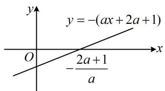

text_image

y
y = -(ax + 2a + 1)
O
-2a + 1/a
x

又因为 $f'(0) = 0$ ，所以当 $x \in \left[0, -\frac{2a + 1}{a}\right)$ 时， $f'(x) < 0$ ，故 $f(x)$ 在 $\left[0, -\frac{2a + 1}{a}\right)$ 上也单调递减，

结合 $f(0) = 0$ 可得当 $x \in \left(0, -\frac{2a + 1}{a}\right)$ 时， $f(x) < 0$ ，所以 $f(x) \geq 0$ 在 $[0, +\infty)$ 上不能恒成立，不合题意；

当 $a \geq 0$ 时， $ax + 2a + 1 \geq 1 > 0$ ，所以 $f''(x) < 0$ 在 $[0, +\infty)$ 上恒成立，故 $f'(x)$ 在 $[0, +\infty)$ 上单调递减，又因为 $f'(0) = 0$ ，所以 $f'(x) \leq 0$ ，故 $f(x)$ 在 $f'(x)$ 在 $[0, +\infty)$ 上单调递减，

结合 $f(0) = 0$ 可得 $x > 0$ 时， $f(x) < 0$ ，所以 $f(x) \geq 0$ 在 $[0, +\infty)$ 上不能恒成立，不合题意；

综上所述，实数 $a$ 的取值范围是 $\left(-\infty, -\frac{1}{2}\right]$ .

【例3】已知函数 $f(x) = \ln x + ax^2 - x + a + 1$ .

（1）证明曲线 $y = f(x)$ 在 $x = 1$ 处的切线过原点；  
(2) 讨论 $f(x)$ 的单调性;  
(3) 若 $f(x) \leq \mathrm{e}^{x}$ , 求实数 $a$ 的取值范围.

解：（1）由题意， $f(1)=2a$ ， $f'(x)=\frac{1}{x}+2ax-1$ ，x>0，所以 $f'(1)=2a$ ，

故 $f(x)$ 在 $x = 1$ 处的切线方程为 $y - 2a = 2a(x - 1)$ ，化简得： $y = 2ax$ ，

该直线过原点，所以曲线 $y = f(x)$ 在 x = 1 处的切线过原点.

（2）由（1）可知 $f'(x)=\frac{1}{x}+2ax+1=\frac{2ax^{2}-x+1}{x}$ ，x>0，

（分母 $x > 0$ ，只需看分子， $a$ 是否为0决定分子为一次函数还是二次函数，二者处理方法不同，故讨论）(i)当 $a = 0$ 时， $f^{\prime}(x) = \frac{-x + 1}{x}$ ，所以 $f^{\prime}(x) > 0\Leftrightarrow 0 <   x <   1$ ， $f^{\prime}(x) <   0\Leftrightarrow x > 1$

故 $f(x)$ 在 $(0,1)$ 上单调递增，在 $(1, +\infty)$ 上单调递减；

（当 $a \neq 0$ 时，分子为二次函数，可结合二次函数的图象来看， $a$ 的正负影响开口方向，先讨论 $a$ 的正负）
(ii) 当 $a < 0$ 时，二次函数 $\varphi(x) = 2ax^2 - x + 1$ 的对称轴为 $x = \frac{1}{4a} < 0$ ， $\varphi(0) = 1 > 0$ ，所以其大致图象如图1，令 $\varphi(x) = 0$ 可得 $x = \frac{1 \pm \sqrt{1 - 8a}}{4a}$ ，因为 $a < 0$ ，所以 $\frac{1 + \sqrt{1 - 8a}}{4a} < 0 < \frac{1 - \sqrt{1 - 8a}}{4a}$ ，

结合图1可知 $f^{\prime}(x) > 0\Leftrightarrow \varphi (x) > 0\Leftrightarrow 0 <   x <   \frac{1 - \sqrt{1 - 8a}}{4a},\quad f^{\prime}(x) <   0\Leftrightarrow x > \frac{1 - \sqrt{1 - 8a}}{4a},$

所以 $f(x)$ 在 $\left(0, \frac{1 - \sqrt{1 - 8a}}{4a}\right)$ 上单调递增，在 $\left(\frac{1 - \sqrt{1 - 8a}}{4a}, +\infty\right)$ 上单调递减；

(当 $a > 0$ 时, $\varphi(x)$ 开口向上, 对称轴 $x = \frac{1}{4a} > 0$ , 判别式 $\Delta = 1 - 8a$ 正负不同, $\varphi(x)$ 的图象与 $x$ 轴的交点个数也就不同, $\varphi(x)$ 的正负情况随之而改变, 有图2,3,4三种情况, 故又讨论判别式)

(iii)当 $0 < a < \frac{1}{8}$ 时， $\Delta = 1 - 8a > 0$ ，令 $\varphi(x) = 0$ 可得 $x = \frac{1 \pm \sqrt{1 - 8a}}{4a}$ ，且 $0 < \frac{1 - \sqrt{1 - 8a}}{4a} < \frac{1 + \sqrt{1 - 8a}}{4a}$ ，

所以 $f^{\prime}(x) > 0\Leftrightarrow 0 <   x <   \frac{1 - \sqrt{1 - 8a}}{4a}$ 或 $x > \frac{1 + \sqrt{1 - 8a}}{4a},\quad f^{\prime}(x) <   0\Leftrightarrow \frac{1 - \sqrt{1 - 8a}}{4a} <  x <   \frac{1 + \sqrt{1 - 8a}}{4a},$

故 $f(x)$ 在 $\left(0, \frac{1 - \sqrt{1 - 8a}}{4a}\right)$ 上单调递增，在 $\left(\frac{1 - \sqrt{1 - 8a}}{4a}, \frac{1 + \sqrt{1 - 8a}}{4a}\right)$ 上单调递减，

在 $\left(\frac{1+\sqrt{1-8a}}{4a},+\infty\right)$ 上单调递增；

(iv) 当 $a \geq \frac{1}{8}$ 时， $\varphi(x) = 2ax^2 - x + 1 \geq 2 \times \frac{1}{8}x^2 - x + 1 = \left(\frac{1}{2}x - 1\right)^2 \geq 0$ ，所以 $f'(x) \geq 0$ ，

故 $f(x)$ 在 $(0, +\infty)$ 上单调递增.

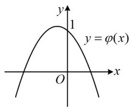

text_image

y
1
y = φ(x)
O
x

图1

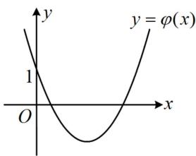

text_image

y
y = φ(x)
1
O
x

图2

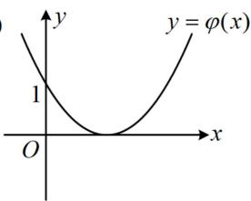

text_image

y
y = φ(x)
1
O
x

图3

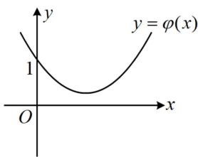

text_image

y
y = φ(x)
1
O
x

图4

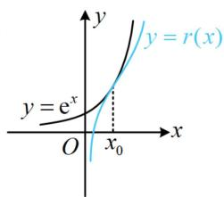

text_image

y
y = r(x)
y = e^x
O
x_0
x

图5

(3) 解法1: $(f(x) \leq e^{x} \Leftrightarrow \ln x + ax^{2} - x + a + 1 \leq e^{x} \Leftrightarrow \ln x + a(x^{2} + 1) - x + 1 \leq e^{x}$ , 观察发现参数 $a$ 容易分离出来, 但经尝试, 分离后得到的函数不易研究, 而且这里也没有端点效应, 怎么办呢? 此时还可尝试画图找思路, $r(x) = \ln x + a(x^{2} + 1) - x + 1$ 的图象怎么画? 因为 $a$ 在变, 所以我们无法画出它准确的图象, 但可以想象, 由于 $x^{2} + 1 > 0$ , 所以当 $a$ 增大时, $r(x)$ 图象的运动趋势是往上的, 故要使 $r(x) \leq e^{x}$ , 则 $a$ 不能太大, 其临界状态大致如图5, $y = r(x)$ 与 $y = e^{x}$ 的图象应相切. 下面我们先非正式地求出这一临界状态, 以便于做到心中有数. 可设切点的横坐标为 $x_0$ ，则 $\left\{ \begin{array}{l} \ln x_0 + a(x_0^2 + 1) - x_0 + 1 = \mathrm{e}^{x_0} \\ \frac{1}{x_0} + 2ax_0 - 1 = \mathrm{e}^{x_0} \end{array} \right.$ ① ( $x_0$ 处是交点)，由②反解出 $a$ 可得 $a = \frac{x_0\mathrm{e}^{x_0} + x_0 - 1}{2x_0^2}$ ，代入①得 $\ln x_0 + \frac{x_0\mathrm{e}^{x_0} + x_0 - 1}{2x_0^2} (x_0^2 +1) - x_0 + 1 = \mathrm{e}^{x_0}$ ，此式很复杂，只能猜根，为了让 $\ln x_0$ ， $\mathrm{e}^{x_0}$ 的值简单，可先试试 $x_0 = 1$ ，经尝试，它就是该方程的根，临界状态就求出来了．正式作答时，可先抓住这个 $x_0 = 1$ 的关键位置来限定参数 $a$ 的范围）

设 $g(x) = f(x) - \mathrm{e}^{x} = \ln x + a(x^{2} + 1) - x + 1 - \mathrm{e}^{x}$ ， $x > 0$ ，则由题意， $g(x) \leq 0$ ，所以 $g(1) = 2a - \mathrm{e} \leq 0$ ，故 $a \leq \frac{\mathrm{e}}{2}$ ，（经过前面大量的分析，我们可猜测 $a \leq \frac{\mathrm{e}}{2}$ 很可能就是最终答案，所以接下来尝试证明当 $a \leq \frac{\mathrm{e}}{2}$ 时， $g(x) \leq 0$ 恒成立。既然已有参数的范围，那不妨先用它对 $g(x)$ 进行放缩，转化为不含参的不等式来证）

所以 $g(x) = \ln x + a(x^2 + 1) - x + 1 - \mathrm{e}^x \leq \ln x + \frac{\mathrm{e}}{2}(x^2 + 1) - x + 1 - \mathrm{e}^x$ ③，

设 $h(x) = \ln x + \frac{\mathrm{e}}{2} (x^2 + 1) - x + 1 - \mathrm{e}^x$ ， $x > 0$ ，则 $h'(x) = \frac{1}{x} + \mathrm{e}x - 1 - \mathrm{e}^x$ ，（不易直接判断正负，考虑继续求导）所以 $h''(x) = -\frac{1}{x^2} + \mathrm{e} - \mathrm{e}^x$ ， $h'''(x) = \frac{2}{x^3} - \mathrm{e}^x$ ，

由 $y=\frac{2}{x^{3}}$ 和 $y=-e^{x}$ 在 $(0,+\infty)$ 上都单调递减可得 $h''(x)$ 在 $(0,+\infty)$ 上单调递减，

又 $h'''\left(\frac{1}{2}\right)=16-\sqrt{\mathrm{e}}>0$ ， $h'''(1)=2-\mathrm{e}<0$ ，所以 $h'''(x)$ 在 $\left(\frac{1}{2},1\right)$ 上有唯一的零点，设该零点为 $x_1$ ，

则当 $x \in (0, x_1)$ 时， $h'''(x) > 0$ ，所以 $h''(x)$ 单调递增，当 $x \in (x_1, +\infty)$ 时， $h'''(x) < 0$ ，所以 $h''(x)$ 单调递减，

故 $h''(x)_{\max} = h''(x_1) = -\frac{1}{x_1^2} + \mathrm{e} - \mathrm{e}^{x_1}$ ④， $(h''(x_1)$ 的正负显然不好直接判断，怎么办呢？注意到 $x_1$ 是 $h'''(x)$ 的零点，故可考虑用 $h'''(x_1) = 0$ 来化简式④再看）

因为 $h'''(x_1) = \frac{2}{x_1^3} -\mathrm{e}^{x_1} = 0$ ，所以 $\mathrm{e}^{x_1} = \frac{2}{x_1^3}$ ，代入④得 $h''(x_1) = -\frac{1}{x_1^2} +\mathrm{e} - \frac{2}{x_1^3} = \mathrm{e} - \frac{1}{x_1^2} -\frac{2}{x_1^3},$

因为 $\frac{1}{2} < x_{1} < 1$ ，所以 $\frac{1}{x_1^2} + \frac{2}{x_1^3} > 3$ ，从而 $h''(x_1) = e - \frac{1}{x_1^2} - \frac{2}{x_1^3} < e - 3 < 0$ ，故 $h''(x) < 0$ 恒成立，

所以 $h'(x)$ 在 $(0, +\infty)$ 上单调递减，注意到 $h'(1) = 0$ ，所以当 $x \in (0,1)$ 时， $h'(x) > 0$ ， $h(x)$ 单调递增，当 $x \in (1, +\infty)$ 时， $h'(x) < 0$ ， $h(x)$ 单调递减，故 $h(x)_{\max} = h(1)$ ，又 $h(1) = 0$ ，所以 $h(x) \leq 0$ 恒成立，由③可知 $g(x) \leq h(x)$ ，所以 $g(x) \leq 0$ ，即 $f(x) - e^x \leq 0$ ，故 $f(x) \leq e^x$

综上所述，若 $f(x)\leq \mathsf{e}^x$ ，则实数 $a$ 的取值范围是 $\left(-\infty ,\frac{\mathrm{e}}{2}\right]$

解法2: (解法1得到 $h''(x) = -\frac{1}{x^2} + e - e^x$ 后, 采取的是再求三阶导数来证明 $h''(x) < 0$ 恒成立, 这一过程较为繁琐, 若熟悉次级放缩不等式 $e^x > x^2 + 1 (x > 0)$ , 则可用它来快速证明 $h''(x) < 0$ 这一结果)

设 $p(x) = \frac{x^2 + 1}{\mathrm{e}^x}$ ， $x \geq 0$ ，则 $p'(x) = \frac{2xe^x - (x^2 + 1)\mathrm{e}^x}{(\mathrm{e}^x)^2} = -\frac{(x - 1)^2}{\mathrm{e}^x} \leq 0$ ，所以 $p(x)$ 在 $[0, +\infty)$ 上单调递减，

又 $p(0) = 1$ ，所以当 $x > 0$ 时， $p(x) <   1$ ，即 $\frac{x^2 + 1}{\mathrm{e}^x} <  1$ ，故 $\mathrm{e}^x >x^2 +1$

所以 $h''(x) = -\frac{1}{x^2} + \mathrm{e} - \mathrm{e}^x < -\frac{1}{x^2} + \mathrm{e} - (x^2 + 1) = \mathrm{e} - 1 - \left(\frac{1}{x^2} + x^2\right) \leq \mathrm{e} - 1 - 2\sqrt{\frac{1}{x^2} \cdot x^2} = \mathrm{e} - 3 < 0$ ，接下来同解法1.

【反思】在含参不等式恒成立问题中，当参变分离、端点效应都失效时，还可以考虑将原不等式进行适当的拆分，再画图寻找思路。若通过画图分析发现使 $f(x) \geq g(x)$ 恒成立的临界状态恰好是两个函数图象相切（两图象在公共点处有公切线）的情形，如图，则可先在草稿纸上按 $\left\{\begin{aligned}f(x_{0})&=g(x_{0})\\ f'(x_{0})&=g'(x_{0})\end{aligned}\right.$ 求出临界状态，做到心中有数。正式作答时，可先用 $f(x_{0}) \geq g(x_{0})$ 来得出 $f(x) \geq g(x)$ 成立的必要条件，再证明充分性。

text_image

y = f(x)
y = g(x)
x₀

# 类型Ⅱ：多变量问题

【例4】已知 $f(x) = \frac{1}{2} x^2 - x - a\ln (x - a)$ ， $a \in \mathbf{R}$ .

(1) 判断函数 $f(x)$ 的单调性;  
（2）若 $x_{1}$ ， $x_{2}(x_{1} < x_{2})$ 是 $g(x) = f(x + a) - a\left(x + \frac{1}{2} a - 1\right)$ 的两个极值点，求证： $0 < f(x_{1}) - f(x_{2}) < \frac{1}{2}$ .

解：（1）由题意， $f(x)$ 的定义域为 $(a,+\infty)$ ， $f'(x)=x-1-\frac{a}{x-a}=\frac{(x-1)(x-a)-a}{x-a}=\frac{x(x-a-1)}{x-a}$ ，

(观察发现 $f'(x)$ 有 0 和 $a+1$ 两个零点，其中 $a+1$ 一定在定义域内，但 0 不一定，故据此讨论)

当 $a \geq 0$ 时，在 $(a, +\infty)$ 上， $x > 0$ 恒成立，所以 $f'(x) > 0 \Leftrightarrow x - a - 1 > 0 \Leftrightarrow x > a + 1$ ， $f'(x) < 0 \Leftrightarrow a < x < a + 1$ 故 $f(x)$ 在 $(a, a + 1)$ 上单调递减，在 $(a + 1, +\infty)$ 上单调递增；

(再看 a<0 的情况，此时 0 也在定义域内，但 0 和 $a+1$ 的大小不定，故又讨论它们的大小)

当 -1 < a < 0 时， $a + 1 > 0$ ，如图 1， $f'(x) > 0 \Leftrightarrow x(x - a - 1) > 0 \Leftrightarrow a < x < 0$ 或 $x > a + 1$ ， $f'(x) < 0 \Leftrightarrow 0 < x < a + 1$ ，所以 $f(x)$ 在 $(a, 0)$ 上单调递增，在 $(0, a + 1)$ 上单调递减，在 $(a + 1, +\infty)$ 上单调递增；

当 $a = -1$ 时， $a + 1 = 0$ ，如图2， $f'(x) \geq 0$ 在定义域 $(-1, +\infty)$ 上恒成立，所以 $f(x)$ 在 $(-1, +\infty)$ 上单调递增；

当 $a < -1$ 时， $a + 1 < 0$ ，如图3， $f'(x) > 0 \Leftrightarrow x(x - a - 1) > 0 \Leftrightarrow a < x < a + 1$ 或 $x > 0$ ， $f'(x) < 0 \Leftrightarrow a + 1 < x < 0$ ，所以 $f(x)$ 在 $(a, a + 1)$ 上单调递增，在 $(a + 1, 0)$ 上单调递减，在 $(0, +\infty)$ 上单调递增.

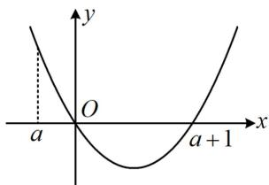

text_image

y
O
a
x
a + 1

图1

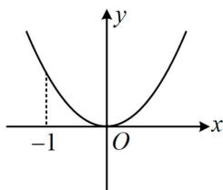

text_image

-1
O
x
y

图2

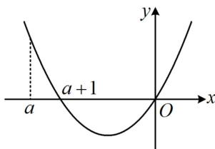

text_image

a
a + 1
y
O
x

图3

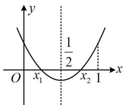

line

| x | y |
|---|---|
| x₁ | 1/2 |
| x₂ | 1 |

图4

(2) (题干说 $g(x)$ 有两个极值点, 应先分析怎样能使 $g(x)$ 有两个极值点, 以及两个极值点的分布情况)由题意, $g(x) = f(x + a) - a\left(x + \frac{1}{2} a - 1\right) = \frac{1}{2}(x + a)^{2} - (x + a) - a\ln (x + a - a) - ax - \frac{1}{2} a^{2} + a = \frac{1}{2} x^{2} - x - a\ln x$ ,

其中 $x > 0$ ，所以 $g^{\prime}(x) = x - 1 - \frac{a}{x} = \frac{x^{2} - x - a}{x}$

因为 $x_{1}$ ， $x_{2}(x_{1} <   x_{2})$ 是 $g(x)$ 的两个极值点，所以它们也是方程 $x^{2} - x - a = 0$ 的两个实根，

且由于 $x_{1}$ ， $x_{2}$ 都在 $(0, + \infty)$ 上，所以 $\left\{ \begin{array}{l} \Delta = 1 + 4a > 0 \\ x_1 + x_2 = 1 > 0 \\ x_1x_2 = -a > 0 \end{array} \right.$ ，解得： $-\frac{1}{4} < a < 0$

注意到二次函数 $y = x^{2} - x - a$ 的对称轴为 $x = \frac{1}{2}$ ，如图4，应有 $0 < x_{1} < \frac{1}{2} < x_{2} < 1$ ，

（要证 $0 < f(x_{1}) - f(x_{2}) < \frac{1}{2}$ ，应先计算 $f(x_{1}) - f(x_{2})$ ，并化简）

由题意， $f(x_{1}) - f(x_{2}) = \frac{1}{2} x_{1}^{2} - x_{1} - a\ln (x_{1} - a) - \frac{1}{2} x_{2}^{2} + x_{2} + a\ln (x_{2} - a)$

$$
= \frac {1}{2} (x _ {1} + x _ {2}) (x _ {1} - x _ {2}) + (x _ {2} - x _ {1}) + a \ln \frac {x _ {2} - a}{x _ {1} - a} \quad ①,
$$

将 $x_{1} + x_{2} = 1$ 代入①可得 $f(x_{1}) - f(x_{2}) = \frac{1}{2} (x_{2} - x_{1}) + a\ln \frac{x_{2} - a}{x_{1} - a}$ ②，

（式②变量个数较多，考虑消元，观察发现若将 $x_{1}$ ， $x_{2}$ 用 $a$ 表示，则较复杂，故考虑保留 $x_{1}$ ， $x_{2}$ ，消去 $a$ ）由 $-a = x_{1}x_{2}$ 可得 $a = -x_{1}x_{2}$ ，代入②可得 $f(x_{1}) - f(x_{2}) = \frac{1}{2} (x_{2} - x_{1}) - x_{1}x_{2}\ln \frac{x_{2} + x_{1}x_{2}}{x_{1} + x_{1}x_{2}}$ ③，

(下面先证 $f(x_{1})-f(x_{2})>0$ ，注意到式③关于 $x_{1}$ 和 $x_{2}$ 的结构有对称性，故可尝试将 $x_{1}$ 和 $x_{2}$ 分离到两侧)

$$
f \left(x _ {1}\right) - f \left(x _ {2}\right) > 0 \Leftrightarrow \frac {1}{2} \left(x _ {2} - x _ {1}\right) - x _ {1} x _ {2} \ln \frac {x _ {2} + x _ {1} x _ {2}}{x _ {1} + x _ {1} x _ {2}} > 0 \Leftrightarrow \frac {1}{2} \cdot \frac {x _ {2} - x _ {1}}{x _ {1} x _ {2}} - \left[ \ln x _ {2} + \ln \left(1 + x _ {1}\right) - \ln x _ {1} - \ln \left(1 + x _ {2}\right) \right] > 0
$$

$\Leftrightarrow \frac{1}{2}\left(\frac{1}{x_1} -\frac{1}{x_2}\right) + \ln \frac{1 + x_2}{x_2} -\ln \frac{1 + x_1}{x_1} >0\Leftrightarrow \frac{1}{2x_1} -\ln \left(\frac{1}{x_1} +1\right) >\frac{1}{2x_2} -\ln \left(\frac{1}{x_2} +1\right)$ ④，（故要证 $f(x_{1}) - f(x_{2}) > 0$ ，只需证不等式④成立，我们发现④的左右两侧结构相同，故可构造函数，用单调性来证）

设 $h(x) = \frac{x}{2} -\ln (x + 1)$ ，其中 $x > 1$ ，则 $h^{\prime}(x) = \frac{1}{2} -\frac{1}{x + 1} = \frac{x - 1}{2(x + 1)} >0$ ，所以 $h(x)$ 在 $(1, + \infty)$ 上单调递增，

又 $0 < x_{1} < \frac{1}{2} < x_{2} < 1$ ，所以 $\frac{1}{x_1} >\frac{1}{x_2} >1$ ，从而 $h\left(\frac{1}{x_1}\right) > h\left(\frac{1}{x_2}\right)$ ，故 $\frac{1}{2x_1} -\ln \left(\frac{1}{x_1} +1\right) > \frac{1}{2x_2} -\ln \left(\frac{1}{x_2} +1\right)$

所以不等式④成立，故 $f(x_{1})-f(x_{2})>0$ 成立；

（再证 $f(x_{1}) - f(x_{2}) < \frac{1}{2}$ ，式③中有 $x_{1}$ 和 $x_{2}$ 两个变量，可用 $x_{1} + x_{2} = 1$ 来消元）

由 $x_{1} + x_{2} = 1$ 可得 $x_{2} = 1 - x_{1}$ ，代入③得 $f(x_{1}) - f(x_{2}) = \frac{1}{2} (1 - 2x_{1}) - x_{1}(1 - x_{1})\ln \frac{1 - x_{1} + x_{1}(1 - x_{1})}{x_{1} + x_{1}(1 - x_{1})}$

$$
= \frac {1}{2} - x _ {1} - x _ {1} (1 - x _ {1}) \ln \frac {1 - x _ {1} ^ {2}}{2 x _ {1} - x _ {1} ^ {2}}, \text {所以} f (x _ {1}) - f (x _ {2}) <   \frac {1}{2} \Leftrightarrow \frac {1}{2} - x _ {1} - x _ {1} (1 - x _ {1}) \ln \frac {1 - x _ {1} ^ {2}}{2 x _ {1} - x _ {1} ^ {2}} <   \frac {1}{2}
$$

$$
\Leftrightarrow - x _ {1} - x _ {1} (1 - x _ {1}) \ln \frac {1 - x _ {1} ^ {2}}{2 x _ {1} - x _ {1} ^ {2}} <   0 \Leftrightarrow 1 + (1 - x _ {1}) \ln \frac {1 - x _ {1} ^ {2}}{2 x _ {1} - x _ {1} ^ {2}} > 0 \quad ⑤,
$$

(故只需证⑤成立, 经尝试, 若将 $x_{1}$ 看成变量, 构造函数求导分析较麻烦, 怎么办呢? 由于已知 $0 < x_{1} < \frac{1}{2}$ , 所以不妨先尝试直接分析 $1 + (1 - x_{1}) \ln \frac{1 - x_{1}^{2}}{2x_{1} - x_{1}^{2}}$ 各部分的正负情况)

因为 $0 < x_{1} < \frac{1}{2}$ ，所以 $2x_{1} < 1$ ，从而 $1 - x_{1}^{2} > 2x_{1} - x_{1}^{2} > 0$ ，故 $\frac{1 - x_1^2}{2x_1 - x_1^2} > 1$

所以 $\ln \frac{1 - x_1^2}{2x_1 - x_1^2} >0$ ，从而 $1 + (1 - x_{1})\ln \frac{1 - x_{1}^{2}}{2x_{1} - x_{1}^{2}} >0$ ，故不等式⑤成立，所以 $f(x_{1}) - f(x_{2}) <   \frac{1}{2}$ 成立；

综上所述， $0 < f(x_{1}) - f(x_{2}) < \frac{1}{2}$

【反思】处理多变量问题的核心思路是消元，本题中涉及到的变量 $x_{1}$ ， $x_{2}$ 恰好是一元二次方程 $x^{2} - x - a = 0$ 的两个实根，所以可结合韦达定理来消元，化单变量式子研究。除了韦达消元外，也还有其它常用的消元方法，我们来看下面的例5及其变式和例6。

【例5】已知函数 $f(x) = x^{2} + ax - \mathrm{e}^{x}(a\in \mathbf{R})$ 有两个极值点 $x_{1}, x_{2}$ .

(1) 求实数 a 的取值范围;  
(2) 证明: $x_{1} + x_{2} < \ln 4$ .

解：（1）由题意， $f'(x)=2x+a-e^{x}$ ， $f(x)$ 有两个极值点等价于 $f'(x)$ 有两个变号零点，

(分析 $f'(x)$ 的零点，可考虑再求导，研究 $f'(x)$ 的单调性)

$f''(x) = 2 - \mathrm{e}^x$ ，所以 $f''(x) > 0\Leftrightarrow x <   \ln 2$ ， $f''(x) <   0\Leftrightarrow x > \ln 2$

故 $f'(x)$ 在 $(-\infty, \ln 2)$ 上单调递增，在 $(\ln 2, +\infty)$ 上单调递减，

要使 $f'(x)$ 有2个变号零点，应有 $f'(\ln 2) = 2\ln 2 + a - 2 > 0$ ，解得： $a > 2 - 2\ln 2$ ，（需注意， $f'(\ln 2) > 0$ 只是 $f'(x)$ 有2个变号零点的必要条件，要论证充分性，还需取点说明 $\ln 2$ 的两侧确实均有零点。先看左边的点怎么取，注意到 $-\mathrm{e}^x < 0$ ，所以只需让余下的 $2x + a = 0$ ，就能使 $f'(x) < 0$ ，左边的点就取出来了）

因为 $f^{\prime}\left(-\frac{a}{2}\right) = -\mathrm{e}^{-\frac{a}{2}} < 0$ ，且 $-\frac{a}{2} < \ln 2$ ，所以 $f^{\prime}(x)$ 在 $\left(-\frac{a}{2},\ln 2\right)$ 上有一个零点，

（右边的点怎么取？为了便于判断 $f'(x)$ 的正负，考虑放缩。若能通过放缩把 $2x$ 和 $e^x$ 变成同类结构，那么判断正负就方便了，于是想到用切线放缩不等式 $e^x \geq ex$ 来放缩，可以想象，这样放缩后，仍满足当 $x \to +\infty$ 时， $f'(x) \to -\infty$ ，所以可行，下面先证明 $e^x \geq ex$ 这个不等式）

设 $h(x) = \mathrm{e}^{x} - \mathrm{e}x$ ， $x\in \mathbf{R}$ ，则 $h^\prime (x) = \mathrm{e}^x -\mathrm{e}$ ，所以 $h^\prime (x) > 0\Leftrightarrow x > 1$ ， $h^\prime (x) <   0\Leftrightarrow x <   1$

从而 $h(x)$ 在 $(- \infty, 1)$ 上单调递减，在 $(1, +\infty)$ 上单调递增，故 $h(x) \geq h(1) = 0$ ，所以 $\mathrm{e}^x - \mathrm{e}x \geq 0$ ，故 $\mathrm{e}^x \geq \mathrm{e}x$

所以 $f^{\prime}(x) = 2x + a - \mathrm{e}^{x}\leq 2x + a - \mathrm{e}x = a - (\mathrm{e} - 2)x$ ，故当 $x > \frac{a}{\mathrm{e} - 2}$ 时， $f^{\prime}(x)\leq a - (\mathrm{e} - 2)x <   a - (\mathrm{e} - 2)\cdot \frac{a}{\mathrm{e} - 2} = 0$

所以 $f'(x)$ 在 $(\ln 2, +\infty)$ 上有一个零点，故 $f'(x)$ 共有两个零点，且它们都是 $f'(x)$ 的变号零点，

此时 $f(x)$ 有2个极值点，故 $\pmb{a}$ 的取值范围是 $(2 - 2\ln 2, + \infty)$

(2) 证法1: (目标不等式涉及 $x_{1}$ , $x_{2}$ 两个变量, 显然它们彼此不独立, 故考虑消元, 怎么消? $x_{1}$ 与 $x_{2}$ 的内在联系是 $f'(x_{1}) = f'(x_{2}) = 0$ , 故考虑用它消元, 怎样将要证的关于自变量的不等式与函数值联系起来?

当然想到单调性，于是先把目标不等式左右两边化到 $f'(x)$ 的同一个单调区间上，观察发现移项即可）

不妨设 $x_{1} < x_{2}$ ，则由（1）可得 $x_{1} < \ln 2 < x_{2}$ ，要证 $x_{1} + x_{2} < \ln 4$ ，只需证 $x_{2} < \ln 4 - x_{1}$ ①，

由 $x_{1} < \ln 2$ 可得 $\ln 4 - x_{1} > \ln 4 - \ln 2 = \ln 2$

结合 $f'(x)$ 在 $(\ln 2, +\infty)$ 上单调递减可知要证①成立，只需证 $f'(x_2) > f'(\ln 4 - x_1)$ ，

(我们发现产生了 $f'(x_{2})$ , 只要把它替换成 $f'(x_{1})$ , 就实现了消元)

因为 $f'(x_{2})=f'(x_{1})=0$ ，所以 $f'(x_{2})>f'(\ln4-x_{1})\Leftrightarrow f'(x_{1})>f'(\ln4-x_{1})\Leftrightarrow f'(x_{1})-f'(\ln4-x_{1})>0$ ②，

(于是要证 $x_{1} + x_{2} < \ln 4$ ，只需证②成立，此时变量已经统一为 $x_{1}$ 了，可构造函数求导分析）

设 $F(x) = f'(x) - f'(\ln 4 - x)$ ， $x < \ln 2$ ，则 $F'(x) = f''(x) + f''(\ln 4 - x) = 2 - \mathrm{e}^x + 2 - \mathrm{e}^{\ln 4 - x}$

$= 4 - \left(\mathrm{e}^{x} + \frac{4}{\mathrm{e}^{x}}\right)\leq 4 - 2\sqrt{\mathrm{e}^{x}\cdot\frac{4}{\mathrm{e}^{x}}} = 0$ ，取等条件是 $\mathrm{e}^x = \frac{4}{\mathrm{e}^x}$ ，即 $x = \ln 2$

因为 $x < \ln 2$ ，所以等号取不到，从而 $F'(x) < 0$ ，故 $F(x)$ 在 $(- \infty, \ln 2)$ 上单调递减，

又 $F(\ln 2) = f'(\ln 2) - f'(\ln 4 - \ln 2) = f'(\ln 2) - f'(\ln 2) = 0$ ，所以 $F(x) > 0$ 恒成立，

因为 $x_{1}<\ln2$ ，所以 $F(x_{1})=f'(x_{1})-f'(\ln4-x_{1})>0$ ，从而不等式②成立，故 $x_{1}+x_{2}<\ln4$ 成立.

证法2: (既然 $x_{1}$ , $x_{2}$ 是 $f'(x)$ 的零点, 我们也可以先把这一条件翻译出来, 再看它与要证的不等式的联系)

因为 $x_{1}$ ， $x_{2}$ 是 $f^{\prime}(x)$ 的零点，所以 $\left\{ \begin{array}{l}f^{\prime}(x_{1}) = 2x_{1} + a - \mathrm{e}^{x_{1}} = 0\\ f^{\prime}(x_{2}) = 2x_{2} + a - \mathrm{e}^{x_{2}} = 0 \end{array} \right.$ ③

(要证的不等式中不含 $a$ , 故考虑先把 $a$ 消掉, 观察发现将两式作差, 即可把 $a$ 消掉)

由③-④可得 $2x_{1} - 2x_{2} - \mathrm{e}^{x_{1}} + \mathrm{e}^{x_{2}} = 0$ ，所以 $\frac{\mathrm{e}^{x_1} - \mathrm{e}^{x_2}}{x_1 - x_2} = 2$ ⑤，

（怎样将式⑤与要证的 $x_{1} + x_{2} < \ln 4$ 联系起来？观察发现无法由⑤反解出 $x_{1}$ 或 $x_{2}$ ，再代入 $x_{1} + x_{2} < \ln 4$ 消元，怎么办呢？注意到式⑤含指数结构，故考虑将 $x_{1} + x_{2} < \ln 4$ 也化指数结构。本题 $\ln 2$ 是 $f'(x)$ 的极值点，与问题的关联较强，故考虑先化出 $\ln 2$ ）要证 $x_{1} + x_{2} < \ln 4$ ，只需证 $\frac{x_{1} + x_{2}}{2} < \ln 2$ ，即证 $\mathrm{e}^{\frac{x_1 + x_2}{2}} < 2$ ，

(与⑤对比可发现都有2, 于是代换掉2, 建立目标与条件的联系)

结合式⑤知又只需证 $\mathrm{e}^{\frac{x_1 + x_2}{2}} < \frac{\mathrm{e}^{x_1} - \mathrm{e}^{x_2}}{x_1 - x_2}$ ，即证 $1 < \frac{\mathrm{e}^{\frac{x_1 - x_2}{2}} - \mathrm{e}^{\frac{x_2 - x_1}{2}}}{x_1 - x_2}$ ⑥，

不妨设 $x_{1} < x_{2}$ ，则 $x_{1} - x_{2} < 0$ ，所以要证⑥成立，只需证 $\mathrm{e}^{\frac{x_1 - x_2}{2}} - \mathrm{e}^{\frac{x_2 - x_1}{2}} < x_1 - x_2$

即证 $\mathrm{e}^{\frac{x_1 - x_2}{2}} - \mathrm{e}^{\frac{x_2 - x_1}{2}} - (x_1 - x_2) < 0$ ⑦，（此时可发现变量以 $x_{1} - x_{2}$ 整体出现，可考虑将其换元，化单变量函数分析．为了进一步简化指数部分，将 $\frac{x_1 - x_2}{2}$ 换元）设 $t = \frac{x_1 - x_2}{2}$ ，则 $t < 0$ ，且不等式⑦即为 $\mathrm{e}^t -\mathrm{e}^{-t} - 2t < 0$ 设 $p(t) = \mathrm{e}^t -\mathrm{e}^{-t} - 2t$ ，其中 $t < 0$ ，则 $p^{\prime}(t) = \mathrm{e}^{t} + \mathrm{e}^{-t} - 2 > 2\sqrt{\mathrm{e}^{t}\cdot\mathrm{e}^{-t}} -2 = 0$

所以 $p(t)$ 在 $(- \infty, 0)$ 上单调递增，从而 $p(t) < p(0) = 0$ ，故 $\mathrm{e}^t - \mathrm{e}^{-t} - 2t < 0$ 成立，所以 $x_1 + x_2 < \ln 4$ 成立.

【反思】本题第（2）问是典型的极值点偏移问题，有深刻的图形背景. $x_{1} + x_{2} < \ln 4 \Leftrightarrow \frac{x_{1} + x_{2}}{2} < \ln 2$ ，反映到图象上即 $f'(x)$ 在极值点 $x = \ln 2$ 左侧上升缓慢，右侧下降迅速，造成 $f'(x)$ 在极值点两侧的图象不对称，而是向右偏移的，如图，这样的图象与 $x$ 轴的两个交点的中点必定在极值点左侧，所以 $\frac{x_{1} + x_{2}}{2} < \ln 2$ .

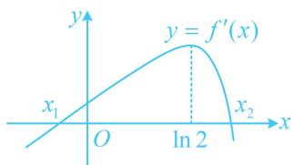

text_image

y
y = f'(x)
x₁ O ln 2 x₂
x₂

极值点偏移问题常有两种解法，一是像证法1那样利用单调性将自变量不等式转化为函数值不等式来证明，再消元构造对称差函数求导分析；二是像证法2那样通过代数变形，再换元化单变量不等式求导证明.有些问题虽然看似不是极值点偏移问题，但其处理方法与极值点偏移问题类似，我们来看一个变式

【变式】已知函数 $f(x) = \frac{a}{x^2} +\frac{\ln x}{x}$

（1）若 $f(x)$ 在 $\left[\frac{1}{\mathrm{e}},\mathrm{e}\right]$ 上单调递增，求实数 $a$ 的取值范围；

（2）若 $g(x) = xf(x)$ ，且 $g(x_{1}) = g(x_{2}) = 3(x_{1} \neq x_{2})$ ，证明： $a^{2} < x_{1}x_{2} < ae^{2}$ .

解：（1）由题意， $f^{\prime}(x) = -\frac{2a}{x^{3}} +\frac{\frac{1}{x}\cdot x - \ln x}{x^{2}} = -\frac{2a}{x^{3}} +\frac{1 - \ln x}{x^{2}},\quad x > 0,$

因为 $f(x)$ 在 $\left[\frac{1}{\mathrm{e}},\mathrm{e}\right]$ 上单调递增，所以 $f^{\prime}(x)\geq 0$ 在 $\left[\frac{1}{\mathrm{e}},\mathrm{e}\right]$ 上恒成立，故 $-\frac{2a}{x^3} +\frac{1 - \ln x}{x^2}\geq 0$

（观察发现参数 $a$ 容易分离出来，故可尝试先将其分离出来）所以 $\frac{2a}{x^3} \leq \frac{1 - \ln x}{x^2}$ ，故 $2a \leq x (1 - \ln x)$ ①，设 $h(x) = x (1 - \ln x)$ ， $\frac{1}{e} \leq x \leq e$ ，则 $h'(x) = 1 - \ln x + x \cdot \left(-\frac{1}{x}\right) = -\ln x$ ，

所以 $h'(x) > 0 \Leftrightarrow \frac{1}{\mathrm{e}} \leq x < 1$ ， $h'(x) < 0 \Leftrightarrow 1 < x \leq \mathrm{e}$ ，故 $h(x)$ 在 $\left[\frac{1}{\mathrm{e}}, 1\right)$ 上单调递增，在 $(1, \mathrm{e}]$ 上单调递减，又 $h\left(\frac{1}{\mathrm{e}}\right) = \frac{2}{\mathrm{e}}$ ， $h(\mathrm{e}) = 0$ ，所以 $h(\mathrm{e}) < h\left(\frac{1}{\mathrm{e}}\right)$ ，故 $h(x)_{\min} = 0$ ，

由①知 $2a \leq h(x)$ 恒成立，所以 $2a \leq 0$ ，从而 $a \leq 0$ ，故实数 $a$ 的取值范围是 $(- \infty, 0]$ .

(2)（条件给出 $g(x_{1}) = g(x_{2}) = 3$ ，应先对 $g(x)$ 求导，讨论 $g(x)$ 的单调性，看看满足 $g(x_{1}) = g(x_{2}) = 3$ 的 $x_{1}$ ， $x_{2}$ 的分布情况）由题意， $g(x) = xf(x) = \frac{a}{x} + \ln x$ ， $x > 0$ ， $g'(x) = -\frac{a}{x^{2}} + \frac{1}{x} = \frac{x - a}{x^{2}}$ ，

$(g'(x)$ 有零点a，但a不一定在定义域内，故据此讨论)

当 $a \leq 0$ 时, $g'(x) > 0$ , 所以 $g(x)$ 在 $(0, +\infty)$ 上单调递增, $g(x_1) = g(x_2) = 3(x_1 \neq x_2)$ 不可能成立, 不合题意; 当 $a > 0$ 时, $g'(x) < 0 \Leftrightarrow 0 < x < a$ , $g'(x) > 0 \Leftrightarrow x > a$ , 所以 $g(x)$ 在 $(0, a)$ 上单调递减, 在 $(a, +\infty)$ 上单调递增, 要使 $g(x_1) = g(x_2) = 3(x_1 \neq x_2)$ , 应有 $g(a) = 1 + \ln a < 3$ , 所以 $0 < a < e^2$ , 不妨设 $x_1 < x_2$ , 则 $0 < x_1 < a < x_2$ , (下面先证左半部分 $x_1 x_2 > a^2$ , 注意到 $a$ 是 $g(x)$ 的极值点, 若是让证 $\frac{x_1 + x_2}{2} > a$ , 则是标准的极值点偏移问题, 可通过将其变形成 $x_2 > 2a - x_1$ , 从而化到 $g(x)$ 的同一单调区间上, 用单调性来证. 而这里要证的是 $x_1 x_2 > a^2 \Leftrightarrow \sqrt{x_1 x_2} > a$ , 无非是把算术平均数换成了几何平均数, 仍可类似处理, 只需将 $x_1$ 或 $x_2$ 除到不等号的另一侧, 就能化到 $g(x)$ 的同一单调区间上)

要证 $x_{1}x_{2} > a^{2}$ ，只需证 $x_{2} > \frac{a^{2}}{x_{1}}$ ，因为 $0 < x_{1} < a$ ，所以 $\frac{a^2}{x_1} = a\cdot \frac{a}{x_1} >a$

又因为 $g(x)$ 在 $(a, +\infty)$ 上单调递增，所以要证 $x_{2} > \frac{a^{2}}{x_{1}}$ ，只需证 $g(x_{2}) > g\left(\frac{a^{2}}{x_{1}}\right)$ ②，

(接下来按照极值点偏移问题的处理方法, 可由 $g(x_{1}) = g(x_{2}) = 3$ 将 $g(x_{2})$ 换成 $g(x_{1})$ , 达到消元的目的)

又因为 $g(x_{1}) = g(x_{2}) = 3$ ，所以要证不等式②成立，即证 $g(x_{1}) > g\left(\frac{a^{2}}{x_{1}}\right)$ ，也即证 $g(x_{1}) - g\left(\frac{a^{2}}{x_{1}}\right) > 0$ ③，

设 $G(x) = g(x) - g\left(\frac{a^2}{x}\right)$ ， $0 < x < a$ ，则 $G'(x) = g'(x) - g'\left(\frac{a^2}{x}\right) \cdot \left(-\frac{a^2}{x^2}\right) = -\frac{a}{x^2} + \frac{1}{x} + \frac{a^2}{x^2}\left(-\frac{x^2}{a^3} + \frac{x}{a^2}\right) = -\frac{(x - a)^2}{ax^2} < 0$

所以 $G(x)$ 在 $(0, a)$ 上单调递减，又因为 $G(a) = g(a) - g\left(\frac{a^2}{a}\right) = g(a) - g(a) = 0$ ，所以 $G(x) > 0$ ，

从而 $G(x_{1}) = g(x_{1}) - g\left(\frac{a^{2}}{x_{1}}\right) > 0$ ，故不等式③成立，所以 $x_{1}x_{2} > a^{2}$ 成立；

(再证 $x_{1} x_{2} < a \mathrm{e}^{2}$ , 仿照上述过程证明就行了, 可变形成 $x_{2} < \frac{a \mathrm{e}^{2}}{x_{1}}$ , 这样 $x_{2}, \frac{a \mathrm{e}^{2}}{x_{1}}$ 都在 $g(x)$ 的增区间 $(a, +\infty)$ 上, 故可转化为证 $g(x_{2}) < g \left(\frac{a \mathrm{e}^{2}}{x_{1}}\right)$ , 若再通过将 $g(x_{2})$ 换成 $g(x_{1})$ 来消元, 则尝试后会发现构造的函数比较复杂, 不易研究单调性, 怎么办呢? 到目前我们还没有用过 $g(x_{1}) = 3$ 或 $g(x_{2}) = 3$ , 所以这里变通一下, 考虑将 $g(x_{2})$ 换成 3, 转化为证 $3 < g \left(\frac{a \mathrm{e}^{2}}{x_{1}}\right)$ , 也达到消元的目的)

要证 $x_{1}x_{2} < a\mathrm{e}^{2}$ ，即证 $x_{2} < \frac{a\mathrm{e}^{2}}{x_{1}}$ ，因为 $0 < x_{1} < a < \mathrm{e}^{2}$ ，所以 $\frac{a\mathrm{e}^2}{x_1} > a$

结合 $g(x)$ 在 $(a, +\infty)$ 上单调递增知要证 $x_{2} < \frac{a\mathrm{e}^{2}}{x_{1}}$ ，即证 $g(x_{2}) < g\left(\frac{a\mathrm{e}^{2}}{x_{1}}\right)$

又 $g(x_{2}) = 3$ ，所以只需证 $g\left(\frac{ae^2}{x_1}\right) > 3$ ，因为 $g\left(\frac{ae^2}{x_1}\right) = \frac{a}{\frac{ae^2}{x_1}} + \ln \frac{ae^2}{x_1} = \frac{x_1}{e^2} - \ln x_1 + \ln a + 2$

所以又只需证 $\frac{x_1}{\mathrm{e}^2} -\ln x_1 + \ln a + 2 > 3$ ，即证 $\frac{x_1}{\mathrm{e}^2} -\ln x_1 + \ln a - 1 > 0$ ④，

（此不等式中仍有两个变量，考虑消元，注意到 $a$ 和 $x_{1}$ 满足 $g(x_{1}) = 3$ ，故可由此消元）

由 $g(x_{1}) = \frac{a}{x_{1}} +\ln x_{1} = 3$ 可得 $a = (3 - \ln x_1)x_1$ ，代入④知只需证 $\frac{x_1}{\mathfrak{e}^2} -\ln x_1 + \ln [(3 - \ln x_1)x_1] - 1 > 0$

即证 $\frac{x_1}{\mathrm{e}^2} + \ln (3 - \ln x_1) - 1 > 0$ ⑤，（此不等式不算复杂，可尝试将 $x_1$ 看成变量，构造函数求导分析）

设 $q(x) = \frac{x}{\mathrm{e}^2} +\ln (3 - \ln x) - 1$ ， $0 <   x <   \mathrm{e}^2$ ，则 $q^{\prime}(x) = \frac{1}{\mathrm{e}^{2}} +\frac{1}{3 - \ln x}\cdot \left(-\frac{1}{x}\right) = \frac{1}{\mathrm{e}^2} -\frac{1}{x(3 - \ln x)} = \frac{x(3 - \ln x) - \mathrm{e}^2}{\mathrm{e}^2x(3 - \ln x)}$

(不易直接判断 $q'(x)$ 的正负, 考虑二次求导, 直接求导显然会变得更复杂, 注意到分母始终为正数, 所以只需看分子, 故将分子单独拿出来求导分析)

设 $r(x) = x(3 - \ln x) - \mathrm{e}^2$ ， $0 < x < \mathrm{e}^2$ ，则 $r'(x) = 3 - \ln x + x\cdot \left(-\frac{1}{x}\right) = 2 - \ln x > 0$ ，所以 $r(x)$ 在 $(0,\mathrm{e}^2)$ 上单调递增，结合 $r(\mathrm{e}^2) = 0$ 可得 $r(x) < 0$ ，所以 $q'(x) < 0$ ，故 $q(x)$ 在 $(0,\mathrm{e}^2)$ 上单调递减，

又 $q(\mathrm{e}^2) = \frac{\mathrm{e}^2}{\mathrm{e}^2} +\ln (3 - \ln \mathrm{e}^2) - 1 = 0$ ，所以 $q(x) > 0$ ，取 $x = x_{1}$ 可得 $q(x_{1}) = \frac{x_{1}}{\mathrm{e}^{2}} +\ln (3 - \ln x_{1}) - 1 > 0$

所以不等式⑤成立，故 $x_{1}x_{2} < ae^{2}$ 成立；综上所述， $a^{2} < x_{1}x_{2} < ae^{2}$ .

【例 6】已知函数 $f(x)=x\ln x-ax^{2}(a\in\mathbf{R})$ .

(1) 若 $f(x)$ 存在单调递增区间，求 a 的取值范围；  
（2）若 $x_{1}$ ， $x_{2}$ 是 $f(x)$ 的两个不同的极值点，证明： $3\ln x_{1} + \ln x_{2} > - 1$

解: (1) (函数 $f(x)$ 存在单调递增区间, 可能的情况很多, 无法一一考虑, 怎么办呢? 注意到其反面是 $f(x)$ 不存在单调递增区间 (即 $f(x)$ 单调递减), 显然更易研究, 故先按此求 $a$ 的范围, 再取补集)

由题意， $f'(x) = \ln x + 1 - 2ax$ ， $x > 0$ ，若 $f(x)$ 在 $(0, +\infty)$ 上单调递减，则 $f'(x) \leq 0$ 恒成立，

即 $\ln x + 1 - 2ax\leq 0$ ，所以 $a\geq \frac{\ln x + 1}{2x}$ ，设 $g(x) = \frac{\ln x + 1}{2x}$ ， $x > 0$ ，则 $g^{\prime}(x) = -\frac{\ln x}{2x^{2}}$

所以 $g'(x) > 0 \Leftrightarrow 0 < x < 1$ ， $g'(x) < 0 \Leftrightarrow x > 1$ ，从而 $g(x)$ 在 $(0,1)$ 上单调递增，在 $(1, +\infty)$ 上单调递减，

故 $g(x)_{\max} = g(1) = \frac{1}{2}$ ，因为 $a \geq g(x)$ 恒成立，所以 $a \geq \frac{1}{2}$ ，故当 $f(x)$ 在 $(0, +\infty)$ 上单调递减时， $a \geq \frac{1}{2}$ ，

(这是 $f(x)$ 不存在单调递增区间时 a 的范围, 可以想象, 若 $f(x)$ 存在单调递增区间, 则应取该范围在实数集范围内的补集) 因为 $f(x)$ 存在单调递增区间, 所以 $a < \frac{1}{2}$ , 故 a 的取值范围为 $\left(-\infty, \frac{1}{2}\right)$ .

(2) (目标不等式有 $x_{1}$ , $x_{2}$ 两个变量, 考虑消元, 怎么消? 我们先把已知条件翻译出来, 再作观察)

由题意， $x_{1}$ ， $x_{2}$ 是 $f'(x)$ 的两个零点，所以 $\left\{\begin{aligned}\ln x_{1}+1-2ax_{1}&=0\\ \ln x_{2}+1-2ax_{2}&=0\end{aligned}\right.$ ①，

(观察发现由上述两式容易凑出目标不等式中的 $3 \ln x_{1} + \ln x_{2}$ 这一结构, 故先凑出来, 向目标靠拢)

由 $3 \times ① + ②$ 可得： $3(\ln x_1 + 1 - 2ax_1) + (\ln x_2 + 1 - 2ax_2) = 0$ ，整理得： $3\ln x_1 + \ln x_2 = 2a(3x_1 + x_2) - 4$ ，

所以要证 $3\ln x_{1} + \ln x_{2} > - 1$ ，只需证 $2a(3x_{1} + x_{2}) - 4 > - 1$ ，即证 $2a(3x_{1} + x_{2}) - 3 > 0$ ③，

(这样又引入了变量 $a$ , 应将其消掉, 于是用①②反解出 $a$ , 代入③消元)

由①-②可得 $\ln x_{1} - \ln x_{2} - 2a(x_{1} - x_{2}) = 0$ ，所以 $2a = \frac{\ln x_1 - \ln x_2}{x_1 - x_2}$

代入式③得只需证 $\frac{\ln x_1 - \ln x_2}{x_1 - x_2} \cdot (3x_1 + x_2) - 3 > 0$ ，即证 $\frac{3 \cdot \frac{x_1}{x_2} + 1}{\frac{x_1}{x_2} - 1} \cdot \ln \frac{x_1}{x_2} - 3 > 0$ ④，

(观察发现 $x_{1}$ , $x_{2}$ 以 $\frac{x_{1}}{x_{2}}$ 这种结构整体出现, 故将其换元成 $t$ , 即可实现消元)

设 $t = \frac{x_1}{x_2}$ ，则 $t > 0$ 且 $t\neq 1$ ，且不等式④即为 $\frac{3t + 1}{t - 1}\ln t - 3 > 0$ ⑤，

(可以想象, 直接构造函数求导分析比较复杂, 注意到有 $\ln t$ , 若将其孤立出来, 则会更好研究, 如何孤立 $\ln t$ ? 可考虑将 $\frac{3t + 1}{t - 1}$ 提出来, 再将余下部分构造函数求导分析)

要证不等式⑤成立，即证 $\frac{3t + 1}{t - 1}\left[\ln t - \frac{3(t - 1)}{3t + 1}\right] > 0$ ⑥，

设 $h(t) = \ln t - \frac{3(t - 1)}{3t + 1}$ ， $t > 0$ ，则 $h'(t) = \frac{1}{t} - \frac{3(3t + 1) - 3 \times 3(t - 1)}{(3t + 1)^2} = \frac{(3t - 1)^2}{t(3t + 1)^2} \geq 0$ ，所以 $h(t)$ 在 $(0, +\infty)$ 上单调递增，又 $h(1) = 0$ ，所以当 $0 < t < 1$ 时， $h(t) = \ln t - \frac{3(t - 1)}{3t + 1} < 0$ ，又 $\frac{3t + 1}{t - 1} < 0$ ，所以 $\frac{3t + 1}{t - 1} \left[\ln t - \frac{3(t - 1)}{3t + 1}\right] > 0$ ，

当 $t > 1$ 时， $h(t) = \ln t - \frac{3(t - 1)}{3t + 1} > 0$ ，又 $\frac{3t + 1}{t - 1} > 0$ ，所以 $\frac{3t + 1}{t - 1}\left[\ln t - \frac{3(t - 1)}{3t + 1}\right] > 0$ ，

所以不等式⑥对任意的 $t > 0$ 且 $t \neq 1$ 都成立，故 $3\ln x_{1} + \ln x_{2} > -1$ 成立.

【反思】在多变量问题中, 很多时候不易通过消元将目标式化为关于 $x_{1}$ 或 $x_{2}$ 的式子, 此时可考虑通过代数变形将含 $x_{1}, x_{2}$ 的部分化为 $\frac{x_{1}}{x_{2}}$ (或例 5 证法 2 中的 $x_{1} - x_{2}$ ) 这种整体结构, 通过换元来实现变量的统一.

# 类型III：求和不等式证明

【例7】已知函数 $g(x) = 2\ln (-x - 1) + \cos (-x - 2)$

（1）函数 $f(x)$ 与 $g(x)$ 的图象关于直线 $x = -1$ 对称，求 $f(x)$ 的解析式；  
(2) $f(x) - 1 \leq ax$ 在定义域内恒成立, 求 $a$ 的值;  
（3）求证： $\sum_{k = n + 1}^{2n}f\left(\frac{1}{k} -\frac{1}{2}\right) <   \ln 4,\quad n\in \mathbf{N}^{*}.$

解: (1) (怎样理解并应用 $f(x)$ 与 $g(x)$ 的图象关于直线 $x = -1$ 对称这一条件? 涉及对称, 若无思路, 不妨画图来看看)

如图，因为 $f(x)$ ， $g(x)$ 的图象关于直线 $x = -1$ 对称，

所以 $f(x)$ 图象上任意的点 $P$ 关于 $x = -1$ 的对称点 $P'$ 在 $g(x)$ 的图象上，（所求为 $f(x)$ 的解析式，故可设 $P$ 的坐标为 $(x, y)$ ，并用 $x, y$ 表示出 $P'$ 的坐标，代入 $g(x)$ 的解析式建立起 $x, y$ 的关系）

设 $P(x,y)$ 为 $f(x)$ 图象上任意一点，则 $P$ 关于 $x = -1$ 对称的点为 $P'(-2 - x,y)$ ，

代入 $g(x)$ 的解析式 $y = 2\ln (-x - 1) + \cos (-x - 2)$ 得 $y = 2\ln [-(-2 - x) - 1] + \cos [-(-2 - x) - 2]$ ，

化简得: $y = 2 \ln (x + 1) + \cos x$ , (这就是 $f(x)$ 的解析式, 但还需给出 $x$ 的范围, 两函数关于 $x = -1$ 对称, 故可先求 $g(x)$ 的定义域, 再把它按 $x = -1$ 对称)

在 $g(x)$ 的解析式中， $-x - 1 > 0$ ，所以 $x < -1$ ，从而 $g(x)$ 的定义域为 $(- \infty, -1)$ ，故 $f(x)$ 的定义域是 $(-1, +\infty)$ ，所以 $f(x) = 2 \ln (x + 1) + \cos x$ ， $x > -1$ 。

(2) $f(x) - 1 \leq ax \Leftrightarrow f(x) - 1 - ax \leq 0$ ，设 $h(x) = f(x) - 1 - ax = 2\ln (x + 1) + \cos x - 1 - ax$ ， $x > -1$ ，则 $h(x) \leq 0$ ，

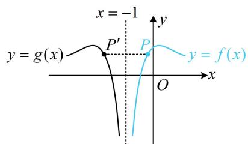

text_image

x = -1
y = g(x)
P'
P
y = f(x)
O
x

（接下来直接求导分析？可以想象，有对数，有三角，又含参，直接求导不好处理，怎么办呢？仔细观察会发现这里刚好有 $h(0) = 0$ ，这意味着 $h(0)$ 是函数 $h(x)$ 的最大值，区间内部的最大值，必定也是极大值，于是有 $h'(0) = 0$ ， $a$ 就求出来了）注意到 $h(0) = 0$ ，所以 $h(0)$ 是 $h(x)$ 的最大值，也是极大值，故 $h'(0) = 0$ 又 $h'(x) = \frac{2}{x + 1} - \sin x - a$ ，所以 $h'(0) = 2 - a = 0$ ，解得： $a = 2$

(结束了吗？务必注意， $h'(0) = 0$ 只是 $h(0)$ 为最大值的必要条件，不是充分条件，故还需检验)

当 $a = 2$ 时， $h(x) = 2 \ln (x + 1) + \cos x - 1 - 2x$ ，（下面证明 $h(x) \leq 0$ ，经尝试，直接求导不好处理，考虑放缩，如何放缩？观察形式，稍作变形有 $h(x) = 2[\ln (x + 1) - x] + (\cos x - 1)$ ，思路就来了，由经典切线放缩不等式可知 $\ln (x + 1) - x \leq 0$ ，显然 $\cos x - 1 \leq 0$ ，所以 $h(x) \leq 0$ 成立，下面给出详细过程）

令 $\varphi(x) = 2[\ln (x + 1) - x]$ , $x > -1$ , 则 $\varphi'(x) = 2\left(\frac{1}{x + 1} - 1\right) = -\frac{2x}{x + 1}$ , 故 $\varphi'(x) > 0 \Leftrightarrow -1 < x < 0$ , $\varphi'(x) < 0 \Leftrightarrow x > 0$ , 所以 $\varphi(x)$ 在 $(-1,0)$ 上单调递增, 在 $(0, +\infty)$ 上单调递减, 故 $\varphi(x) \leq \varphi(0) = 0$ , 即 $2[\ln (x + 1) - x] \leq 0$ ,

又 $\cos x - 1 \leq 0$ ，所以 $h(x) = 2[\ln (x + 1) - x] + (\cos x - 1) \leq 0 + 0 = 0$ ，满足题意，所以 $a = 2$ .

(3) (函数 $f(x)$ 的解析式较复杂, 代解析式计算 $\sum_{k=n+1}^{2n} f\left(\frac{1}{k}-\frac{1}{2}\right)$ , 再证目标不等式显然不可取, 考虑放缩, 如何放缩? 这种题一般都会联系前面的小问, 第 (2) 问的结论表明 $f(x)-1 \leq 2x$ , 所以 $f(x) \leq 1 + 2x$ , 故可尝试用它来放缩)

由（2）可知， $f(x) - 1\leq 2x$ ，所以 $f(x)\leq 1 + 2x$ ，故 $f\left(\frac{1}{k} -\frac{1}{2}\right)\leq 1 + 2\left(\frac{1}{k} -\frac{1}{2}\right) = \frac{2}{k},$

所以 $\sum_{k=n+1}^{2n}f\left(\frac{1}{k}-\frac{1}{2}\right)\leq\sum_{k=n+1}^{2n}\frac{2}{k}=2\left(\frac{1}{n+1}+\frac{1}{n+2}+\cdots+\frac{1}{2n}\right)$ ①，（所以只需证 $2\left(\frac{1}{n+1}+\frac{1}{n+2}+\cdots+\frac{1}{2n}\right)<\ln4$ ，观察发现左边的和无法求出，故又考虑放缩成可以求和的结构。注意到右边有对数，于是又联想到第（2）问用过的经典切线放缩不等式 $\ln(x+1)\leq x$ ，可以完成对数与分式的转换，故又尝试用它放缩）

又由（2）可知， $\varphi (x) = 2\ln (x + 1) - 2x\leq 0$ 在 $(-1, + \infty)$ 上恒成立，所以 $x\geq \ln (x + 1)$ ②，

（我们要证的是 $2\left(\frac{1}{n + 1} + \frac{1}{n + 2} + \dots + \frac{1}{2n}\right) < \ln 4$ ，所以需要对数那边更大才对，不等式②的方向好像与此不符，故需调整，怎样调整？两端乘以-1即可）

由②可得 $-x \leq -\ln (x + 1)$ 在 $(-1, +\infty)$ 上恒成立，当且仅当 $x = 0$ 时取等号，

（为了获得 $\frac{1}{n + 1} +\frac{1}{n + 2} +\dots +\frac{1}{2n}$ 这一结构，我们让上述不等式中的 $-x$ 分别等于 $\frac{1}{n + 1},\frac{1}{n + 2},\dots ,\frac{1}{2n}$ ，即让 $x$ 分别等于 $-\frac{1}{n + 1}, - \frac{1}{n + 2},\dots , - \frac{1}{2n})$

在 $-x \leq -\ln(x+1)$ 中分别取 $x = -\frac{1}{n+1}$ ， $-\frac{1}{n+2}$ ，…， $-\frac{1}{2n}$ 可得 $\left\{\begin{aligned}\frac{1}{n+1} &<-\ln\left(-\frac{1}{n+1}+1\right)=\ln\frac{n+1}{n}\\ \frac{1}{n+2} &<-\ln\left(-\frac{1}{n+2}+1\right)=\ln\frac{n+2}{n+1},\\ \cdots \\ \frac{1}{2n} &<-\ln\left(-\frac{1}{2n}+1\right)=\ln\frac{2n}{2n-1}\end{aligned}\right.$

以上各式相加得 $\frac{1}{n + 1} +\frac{1}{n + 2} +\dots +\frac{1}{2n} <  \ln \frac{n + 1}{n} +\ln \frac{n + 2}{n + 1} +\dots +\ln \frac{2n}{2n - 1} = \ln \left(\frac{n + 1}{n}\cdot \frac{n + 2}{n + 1}\dots \frac{2n}{2n - 1}\right) = \ln 2$

结合①可知 $\sum_{k=n+1}^{2n}f\left(\frac{1}{k}-\frac{1}{2}\right)\leq2\left(\frac{1}{n+1}+\frac{1}{n+2}+\cdots+\frac{1}{2n}\right)<2\ln2=\ln4$

【反思】证明 $\sum_{k=n+1}^{2n} f\left(\frac{1}{k}-\frac{1}{2}\right)<\ln 4$ 这种左侧无法求出和的求和不等式时，可考虑通过放缩将左侧化为可求和的形式，再进行证明。有时也会遇到右边不是常数的情况，此时又怎么办呢？我们来看下面的变式。

【变式】(2022·新课标Ⅱ卷)已知函数 $f(x) = x\mathrm{e}^{ax} - \mathrm{e}^x$ .

（1）当 $a = 1$ 时，讨论 $f(x)$ 的单调性；  
(2) 当 $x > 0$ 时, $f(x) < -1$ , 求 $a$ 的取值范围;  
（3）设 $n \in \mathbf{N}^*$ ，证明： $\frac{1}{\sqrt{1^2 + 1}} + \frac{1}{\sqrt{2^2 + 2}} + \dots + \frac{1}{\sqrt{n^2 + n}} > \ln (n + 1)$ .

解：（1）当 $a = 1$ 时， $f(x) = (x - 1)\mathrm{e}^x (x\in \mathbf{R})$ ，所以 $f^{\prime}(x) = x\mathrm{e}^{x}$ ，从而 $f^{\prime}(x) > 0\Leftrightarrow x > 0$ ， $f^{\prime}(x) < 0\Leftrightarrow x < 0$ 故 $f(x)$ 在 $(- \infty ,0)$ 上单调递减，在 $(0, + \infty)$ 上单调递增.

（2）因为当 $x > 0$ 时， $f(x) < -1$ ，所以 $x\mathrm{e}^{ax} - \mathrm{e}^x + 1 < 0$ ①，

(经尝试, 直接构造函数求导分析较困难, 且造成困难的原因主要是无论求多少次导, 式子中总会同时有 $\mathrm{e}^{ax}$ 和 $\mathrm{e}^x$ , 于是可考虑将 $\mathrm{e}^x$ 换元成 $t$ , 这样求两次导后就不再含有 $t$ 这一项了)

令 $t = \mathrm{e}^{x}$ ，则 $t > 1$ ，且 $x = \ln t$ ，不等式①即为 $t^a\ln t - t + 1 <   0$

设 $g(t) = t^{a}\ln t - t + 1(t > 1)$ ，则 $g(t) < 0$ ，且 $g'(t) = at^{a - 1}\ln t + t^{a - 1} - 1$ ， $g''(t) = t^{a - 2}[a(a - 1)\ln t + 2a - 1]$ ，

(到此可发现只要有 a 的范围, 就能判断 $g''(t)$ 的正负, 故不用再求导了, 接下来对参数进行讨论, 讨论的分界点怎么找呢? 观察可得 $g(1) = g'(1) = 0$ , 有端点效应, 故要使 $g(t) < 0$ , 应有 $g''(1) = 2a - 1 \leq 0$ , 据此可找到讨论的分界点) 当 $a \leq \frac{1}{2}$ 时, $g(t) \leq \sqrt{t} \ln t - t + 1 = \sqrt{t} \left( \ln t - \sqrt{t} + \frac{1}{\sqrt{t}} \right) = \sqrt{t} \left( 2 \ln \sqrt{t} - \sqrt{t} + \frac{1}{\sqrt{t}} \right)$ ,

设 $\varphi(u) = 2\ln u - u + \frac{1}{u} (u > 1)$ ，则 $\varphi'(u) = \frac{2}{u} - 1 - \frac{1}{u^2} = -\frac{(u - 1)^2}{u^2} < 0$ ，所以 $\varphi(u)$ 在 $(1, +\infty)$ 上单调递减，

又 $\varphi(1) = 0$ ，所以 $\varphi(u) < 0$ ，取 $u = \sqrt{t}$ 得 $2\ln \sqrt{t} -\sqrt{t} +\frac{1}{\sqrt{t}} < 0$ ，故 $g(t)\leq \sqrt{t}\left(2\ln \sqrt{t} -\sqrt{t} +\frac{1}{\sqrt{t}}\right) < 0$ ，满足题意；

(还需论证当 $a > \frac{1}{2}$ 时, $g(t) < 0$ 不能恒成立, 观察 $g'(t)$ 的解析式可发现在 $a \geq 1$ 时, 容易得出 $g'(t) > 0$ , 故接下来先考虑这种简单的情况)

当 $a \geq 1$ 时， $g'(t) = at^{a-1} \ln t + t^{a-1} - 1 > t^{a-1} - 1 \geq 0$ ，故 $g(t)$ 在 $(1, +\infty)$ 单调递增，

又 $g(1) = 0$ ，所以 $g(t) > 0$ 恒成立，不合题意；

(最后再看 $\frac{1}{2} < a < 1$ 时的情形, 此时 $g'(t)$ 不易直接判断正负, 但 $g''(t)$ 可以, 故先判断 $g''(t)$ 的正负)

当 $\frac{1}{2} < a < 1$ 时， $g''(t) > 0 \Leftrightarrow a(a - 1)\ln t + 2a - 1 > 0 \Leftrightarrow a(1 - a)\ln t < 2a - 1 \Leftrightarrow \ln t < \frac{2a - 1}{a(1 - a)} \Leftrightarrow 1 < t < \mathrm{e}^{\frac{2a - 1}{a(1 - a)}}$

所以 $g^{\prime}(t)$ 在 $\left(1,\mathrm{e}^{\frac{2a - 1}{a(1 - a)}}\right)$ 上单调递增，又 $g^{\prime}(1) = 0$ ，所以 $g^{\prime}(t) > 0$ 在 $\left(1,\mathrm{e}^{\frac{2a - 1}{a(1 - a)}}\right)$ 上恒成立，

故 $g(t)$ 在 $\left(1, \mathrm{e}^{\frac{2a - 1}{a(1 - a)}}\right)$ 上单调递增，因为 $g(1) = 0$ ，所以当 $t \in \left(1, \mathrm{e}^{\frac{2a - 1}{a(1 - a)}}\right)$ 时， $g(t) > 0$ ，不合题意；

综上所述，实数 $a$ 的取值范围是 $\left(-\infty, \frac{1}{2}\right]$ .

(3) (目标不等式左侧为无法求出和的求和结构, 且右侧不是常数, 此时常考虑将右侧也化为求和结构,通过比较左右两侧的通项来证明目标不等式, 怎么化? 可按 $\ln (n + 1) = [\ln (n + 1) - \ln n] + [\ln n - \ln (n - 1)] + \cdots + (\ln 3 - \ln 2) + (\ln 2 - \ln 1)$ 来化, 此式右侧可写成 $\sum_{k=1}^{n}[\ln (k + 1) - \ln k]$ , 即 $\sum_{k=1}^{n}\ln \frac{k+1}{k}$ , 目标不等式左侧为 $\sum_{k=1}^{n}\frac{1}{\sqrt{k^2 + k}}$ , 故只需证 $\frac{1}{\sqrt{k^2 + k}} > \ln \frac{k+1}{k}$ , 直接构造函数求导可行, 但第 (2) 问我们得到了不等式 $2\ln u - u + \frac{1}{u} < 0 (u > 1)$ ,

所以先试试看能否由它直接变出 $\frac{1}{\sqrt{k^2 + k}} >\ln \frac{k + 1}{k}$ ，为了产生 $\ln \frac{k + 1}{k}$ ，可取 $u = \sqrt{\frac{k + 1}{k}}$

由（2）可得当 $u > 1$ 时， $2\ln u - u + \frac{1}{u} < 0$ ，取 $u = \sqrt{\frac{k + 1}{k}} (k \in \mathbb{N}^*)$ 可得 $2\ln \sqrt{\frac{k + 1}{k}} - \sqrt{\frac{k + 1}{k}} + \frac{1}{\sqrt{\frac{k + 1}{k}}} < 0$ ，

所以 $\sqrt{\frac{k + 1}{k}} -\frac{1}{\sqrt{\frac{k + 1}{k}}} >\ln \frac{k + 1}{k}$ ，又 $\sqrt{\frac{k + 1}{k}} -\frac{1}{\sqrt{\frac{k + 1}{k}}} = \frac{\sqrt{k + 1}}{\sqrt{k}} -\frac{\sqrt{k}}{\sqrt{k + 1}} = \frac{1}{\sqrt{k^2 + k}}$ ，所以 $\frac{1}{\sqrt{k^2 + k}} >\ln \frac{k + 1}{k}$

分别取 $k=1,2,\cdots,n$ 可得 $\frac{1}{\sqrt{1^{2}+1}}>\ln\frac{2}{1}$ ， $\frac{1}{\sqrt{2^{2}+2}}>\ln\frac{3}{2}$ ， $\cdots$ ， $\frac{1}{\sqrt{n^{2}+n}}>\ln\frac{n+1}{n}$ ，

以上各式相加得 $\frac{1}{\sqrt{1^2 + 1}} +\frac{1}{\sqrt{2^2 + 2}} +\dots +\frac{1}{\sqrt{n^2 + n}} >\ln \frac{2}{1} +\ln \frac{3}{2} +\dots +\ln \frac{n + 1}{n} = \ln \left(\frac{2}{1}\times \frac{3}{2}\times \dots \times \frac{n + 1}{n}\right) = \ln (n + 1).$

【总结】证明一侧为求和结构（和无法求出）的不等式时，若该不等式另一侧为常数，则可考虑将求和的一侧放缩成可求和的结构，如上面的例7；若另一侧不为常数，则可考虑将这一侧也化为求和形式，通过比较两侧求和的通项来证明目标不等式，如上面的变式.

# 强化训练

1. (2024·贵州贵阳模拟·★★★★)

牛顿迭代法是牛顿在 17 世纪提出的一种在实数域和复数域上近似求解方程的方法. 比如, 我们可以先猜想某个方程 $f(x) = 0$ 的其中一个根 $r$ 在 $x = x_0$ 的附近, 如图所示, 然后在点 $(x_0, f(x_0))$ 处作 $f(x)$ 的切线, 切线与 $x$ 轴交点的横坐标就是 $x_1$ , 用 $x_1$ 代替 $x_0$ 重复上面的过程得到 $x_2$ ; 一直继续下去, 得到 $x_0, x_1, x_2, \cdots, x_n$ . 从图形上我们可以看到 $x_1$ 较 $x_0$ 接近 $r$ , $x_2$ 较 $x_1$ 接近 $r$ , 等等. 显然, 它们会越来越逼近 $r$ . 于是求 $r$ 近似解的过程转化为求 $x_n$ , 若设精度为 $\varepsilon$ , 则把首次满足 $\left|x_n - x_{n-1}\right| < \varepsilon$ 的 $x_n$ 称为 $r$ 的近似解.

已知函数 $f(x) = x^{3} + (a - 2)x + a$ ， $a\in \mathbf{R}$

（1）当 $a = 1$ 时，试用牛顿迭代法求方程 $f(x) = 0$ 满足精度 $\varepsilon = 0.5$ 的近似解（取 $x_0 = -1$ ，且结果保留小数点后第二位）；

（2）若 $f(x) - x^{3} + x^{2}\ln x\geq 0$ ，求 $\pmb{a}$ 的取值范围.

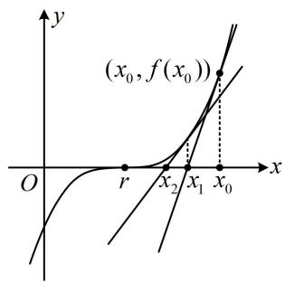

text_image

(x₀, f(x₀))
O
r
x₂
x₁
x₀
y

2. (2024·江苏苏北七市二调·★★★★)

已知函数 $f(x) = ax - \ln x - \frac{a}{x}$ .

(1) 若 x > 1， $f(x) > 0$ ，求实数 a 的取值范围；  
（2）设 $x_{1}$ ， $x_{2}$ 是函数 $f(x)$ 的两个极值点，证明： $\left|f(x_1) - f(x_2)\right| <   \frac{\sqrt{1 - 4a^2}}{a}.$

3. (2022·全国甲卷·★★★★)

已知函数 $f(x) = \frac{\mathrm{e}^x}{x} -\ln x + x - a$

（1）若 $f(x)\geq 0$ ，求实数 $\pmb{a}$ 的取值范围；  
(2) 证明: 若 $f(x)$ 有两个零点 $x_{1}, x_{2}$ , 则 $x_{1} x_{2} < 1$ .

4. (2021·新高考Ⅰ卷·★★★★☆)

已知函数 $f(x) = x(1 - \ln x)$ .

(1) 讨论 $f(x)$ 的单调性;  
（2）设 $a, b$ 为两个不相等的正数，且 $b \ln a - a \ln b = a - b$ ，证明： $2 < \frac{1}{a} + \frac{1}{b} < e$ .

5. (2024·浙江绍兴模拟·★★★★☆)

已知函数 $f(x) = \frac{x^2}{2} - x + a\sin x$

（1）当 $a = 2$ 时，求曲线 $y = f(x)$ 在点 $(0, f(0))$ 处的切线方程；  
（2）当 $x \in (0, \pi)$ 时， $f(x) > 0$ ，求实数 $a$ 的取值范围.

6. (2024·浙江模拟·★★★★☆)

设 $0 < x < \frac{\pi}{2}$ .

（1）若 $\tan x = \frac{1}{2}$ ，求 $\frac{\cos 4x - 4\cos 2x + 3}{\cos 4x + 4\cos 2x + 3}$   
（2）证明： $\frac{\tan x - x}{x - \sin x} > 2$   
(3) 若 $\tan x + 2 \sin x - ax > 0$ ，求实数 $a$ 的取值范围.

7. (2025·江苏南京模拟·★★★★☆)

已知函数 $f(x)=\mathrm{e}^{x-a}+ax^{2}-3ax+1,\quad a\in\mathbf{R}$ .

（1）当 $a = 1$ 时，求曲线 $y = f(x)$ 在 $x = 1$ 处切线的方程；  
(2) 当 $a > 1$ 时, 试判断 $f(x)$ 在 $[1, +\infty)$ 上的零点的个数, 并说明理由;  
（3）当 $x \geq 0$ 时， $f(x) \geq 0$ 恒成立，求 $a$ 的取值范围.

8. (2025·江苏南通三模·★★★★☆)

已知函数 $f(x) = \mathrm{e}^{x} - ax - \cos x$ ，且 $f(x)$ 在 $[0, +\infty)$ 上的最小值为 0.

（1）求实数 $a$ 的取值范围；

（2）设函数 $y = \varphi(x)$ 在区间 $D$ 上的导函数为 $y = \varphi'(x)$ ，若 $\frac{x \cdot \varphi'(x)}{\varphi(x)} > 1$ 对任意实数 $x \in D$ 恒成立，则称函数 $y = \varphi(x)$ 在区间 $D$ 上具有性质 $S$ .

①求证：函数 $f(x)$ 在 $(0, +\infty)$ 上具有性质 $S$

②记 $\prod_{i=1}^{n} p(i) = p(1)p(2)\cdots p(n)$ ，其中 $n \in \mathbf{N}^*$ ，求证： $\prod_{i=1}^{n} i \sin \frac{1}{i} > \frac{1}{n(n+1)}$ 。

一数·必刷100讲

