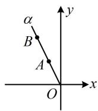
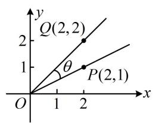
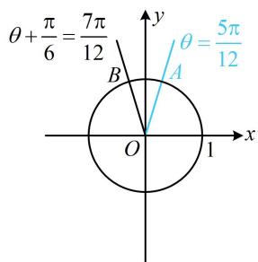
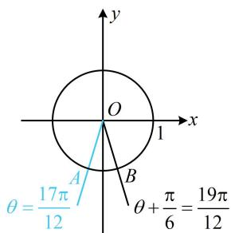
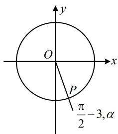

# 强化训练

1. (2025·江苏盐城模拟·★)

已知角 $\alpha$ 的顶点在坐标原点，始边与 $x$ 轴的非负半轴重合， $\cos \alpha = \frac{\sqrt{5}}{5}$ ， $P(m,2)$ 为其终边上一点，则 $\tan \alpha = \_$ .

1. 2

解析：给出 $\alpha$ 终边上点 $P$ 的坐标，可由三角函数定义求出 $\cos \alpha$ ，从而建立方程解 $m$ ，再求 $\tan \alpha$

由题意， $r = OP = \sqrt{m^2 + 2^2} = \sqrt{m^2 + 4}$

所以由三角函数定义， $\cos \alpha = \frac{x}{r} = \frac{m}{\sqrt{m^2 + 4}}$

又因为 $\cos\alpha=\frac{\sqrt{5}}{5}$ ，所以 $\frac{m}{\sqrt{m^{2}+4}}=\frac{\sqrt{5}}{5}$ ①，

从而 $\frac{m^2}{m^2 + 4} = \frac{1}{5}$ ，故 $5m^{2} = m^{2} + 4$ ，解得： $m = \pm 1$ ，

由①可知 $m > 0$ ，所以 $m = 1$ ，故 $\tan \alpha = \frac{2}{m} = 2$

2. (★)

已知 $\tan \alpha = k$ ，且 $\alpha$ 在第三象限，则 $\sin \alpha = \_$ （用 $k$ 表示）

2. $-\frac{k}{\sqrt{1 + k^2}}$

解析：要求 $\sin \alpha$ ，可考虑结合已知的 $\tan \alpha$ ，在 $\alpha$ 的终边上求一个点，用三角函数定义算 $\sin \alpha$ ，

因为 $\alpha$ 在第三象限，不妨设 $P(-1, y_0)$ ，

则 $\tan \alpha = \frac{y_0}{-1} = k$ ，所以 $y_{0} = -k$ ，故 $P(-1, - k)$

由三角函数定义， $\sin \alpha = \frac{-k}{\sqrt{(-1)^2 + (-k)^2}} = -\frac{k}{\sqrt{1 + k^2}}.$

3.（2023·广东南粤名校联盟9月联考·★★）

已知角 $\alpha$ 的顶点在原点, 始边与 $x$ 轴非负半轴重合, 终边经过点 $P(2, -1)$ , 则 $\cos^2\left(\alpha - \frac{\pi}{4}\right) = (\quad)$

A. $\frac{1}{10}$

B. $\frac{9}{10}$

C. $\frac{1}{5}$

D. $\frac{4}{5}$

3. A

解析：给出角的终边上的点的坐标，考虑用定义求该角的三角函数值，

由题意， $\left|OP\right|=\sqrt{2^{2}+(-1)^{2}}=\sqrt{5}$ ，由三角函数定义，

$$
\cos \alpha = \frac {x _ {P}}{| O P |} = \frac {2}{\sqrt {5}}, \sin \alpha = \frac {y _ {P}}{| O P |} = \frac {- 1}{\sqrt {5}},
$$

所以 $\cos^2\left(\alpha -\frac{\pi}{4}\right) = \left(\cos \alpha \cos \frac{\pi}{4} +\sin \alpha \sin \frac{\pi}{4}\right)^2$

$$
= \frac {1}{2} (\cos \alpha + \sin \alpha) ^ {2} = \frac {1}{2} \times \left(\frac {2}{\sqrt {5}} + \frac {- 1}{\sqrt {5}}\right) ^ {2} = \frac {1}{1 0}.
$$

4. (2022·山东潍坊二模·★★☆)

已知角 $\alpha$ 的顶点为坐标原点，始边与 $x$ 轴的非负半轴重合，点 $A(x_{1},2)$ ， $B(x_{2},4)$ 在 $\alpha$ 的终边上，且 $x_{1} - x_{2} = 1$ ，则 $\tan \alpha = (\quad)$

A. 2 B. $\frac{1}{2}$ C. -2 D. $-\frac{1}{2}$

4. C

解法1: 只要求出 $x_{1}$ 或 $x_{2}$ , 就能用三角函数定义求 $\tan \alpha$ . 条件中已经有 $x_{1} - x_{2} = 1$ , 可用 $A, B$ 的坐标把 $\tan \alpha$ 表示出来, 再建立一个 $x_{1}$ 和 $x_{2}$ 的方程, 求解 $x_{1}$ 或 $x_{2}$ ,

由题意， $\tan \alpha = \frac{2}{x_1}$ ， $\tan \alpha = \frac{4}{x_2}$ ，所以 $\frac{2}{x_1} = \frac{4}{x_2}$ ，故 $x_{2} = 2x_{1}$ ，代入 $x_{1} - x_{2} = 1$ 可得 $x_{1} = -1$ ，故 $\tan \alpha = \frac{2}{x_1} = -2$ ：

解法2：题干给出 $A, B$ 两点的坐标，以及 $x_{1} - x_{2} = 1$ ，想到两点连线的斜率公式，于是先画图看看，

如图， $\tan \alpha$ 等于直线 $AB$ 的斜率，所以 $\tan \alpha =$

$\frac{2 - 4}{x_1 - x_2} = \frac{-2}{x_1 - x_2}$ ，又 $x_{1} - x_{2} = 1$ ，所以 $\tan \alpha = -2$

5. (2023·福建厦门第二次质检·★★★)

如图， $\cos \left(\theta +\frac{3\pi}{4}\right) = (\quad)$

A. $-\frac{2\sqrt{5}}{5}$

B. $-\frac{\sqrt{5}}{5}$

C. $-\frac{4}{5}$

D. $\frac{2\sqrt{5}}{5}$

line

| Point | x | y |
|---|---|---|
| P(2,1) | 2 | 1 |
| Q(2,2) | 2 | 2 |

5. A

解法1：图中有 $P$ ， $Q$ 的坐标，这是把 $OP$ ， $OQ$ 看成角的终边，用定义求三角函数值的标志，先找 $\theta$ 与此二角的关系，不妨设 $OP$ ， $OQ$ 分别为锐角 $\alpha$ 和 $\beta$ 的终边，注意到直线 $OQ$ 的方程为 $y = x$ ，是第一象限的平分线，故 $\beta = \frac{\pi}{4}$

由图可知， $\theta = \beta -\alpha = \frac{\pi}{4} -\alpha$ ，所以 $\cos \left(\theta +\frac{3\pi}{4}\right) =$

$\cos \left( \frac{\pi}{4} - \alpha + \frac{3\pi}{4} \right) = \cos (\pi - \alpha) = -\cos \alpha$ ①,

由三角函数定义， $\cos \alpha = \frac{x_p}{|OP|} = \frac{2}{\sqrt{2^2 + 1^2}} = \frac{2\sqrt{5}}{5}$

代入①得 $\cos \left( \theta + \frac{3\pi}{4} \right) = -\frac{2\sqrt{5}}{5}$ .

解法2：观察图形发现 $\theta$ 可看成 $\overrightarrow{OP}$ 与 $\overrightarrow{OQ}$ 的夹角，故也可先由夹角余弦公式求 $\cos \theta$

由图可知， $\theta$ 为锐角，且 $\overrightarrow{OP} = (2,1)$ ， $\overrightarrow{OQ} = (2,2)$

所以 $\cos \theta = \frac{\overrightarrow{OP} \cdot \overrightarrow{OQ}}{|\overrightarrow{OP}| \cdot |\overrightarrow{OQ}|} = \frac{2 \times 2 + 1 \times 2}{\sqrt{2^2 + 1^2} \times \sqrt{2^2 + 2^2}} = \frac{3\sqrt{10}}{10}$

$\sin \theta = \sqrt{1 - \cos^2\theta} = \frac{\sqrt{10}}{10}$ 故 $\cos \left(\theta +\frac{3\pi}{4}\right) = \cos \theta \cos \frac{3\pi}{4} -$

$$
\sin \theta \sin \frac {3 \pi}{4} = \frac {3 \sqrt {1 0}}{1 0} \times \left(- \frac {\sqrt {2}}{2}\right) - \frac {\sqrt {1 0}}{1 0} \times \frac {\sqrt {2}}{2} = - \frac {2 \sqrt {5}}{5}.
$$

6. (2021·北京卷·★★★)

若点 $A(\cos \theta, \sin \theta)$ 关于 $y$ 轴的对称点为 $B\left(\cos \left(\theta + \frac{\pi}{6}\right), \sin \left(\theta + \frac{\pi}{6}\right)\right)$ ，写出 $\theta$ 的一个取值为 \_\_\_\_.

6. $\frac{5\pi}{12}$ （答案不唯一，详见解析）

解法1：由三角函数定义， $A$ ， $B$ 两点分别是 $\theta$ 和 $\theta +\frac{\pi}{6}$ 的终边与单位圆的交点，

由于只需填一个值，所以不妨直接画图看，

如图1，当 $\theta$ 与 $\theta +\frac{\pi}{6}$ 互补时，它们的终边关于 $y$ 轴对称，所以令 $\theta +\left(\theta +\frac{\pi}{6}\right) = \pi$ ，解得： $\theta = \frac{5\pi}{12}$

解法2：由三角函数定义， $A$ ， $B$ 两点分别是 $\theta$ 和 $\theta +\frac{\pi}{6}$ 的终边与单位圆的交点，

接下来我们也给一个完备的寻找 $\theta$ 与 $\theta + \frac{\pi}{6}$ 的关系的方法，先画图看看这两个角可能的位置，

因为 A, B 两点关于 y 轴对称, 所以 $\theta$ 和 $\theta + \frac{\pi}{6}$ 的终边也关于 y 轴对称, 如图 1 和图 2,

在 $[0,2\pi)$ 这个范围内， $\theta$ 可取 $\frac{5\pi}{12}$ 或 $\frac{17\pi}{12}$ ，

在这两个值上加 $2\pi$ 的整数倍，不改变终边的位置，

所以 $\theta = \frac{5\pi}{12} + 2k\pi$ 或 $\frac{17\pi}{12} + 2k\pi$ ，注意到 $\frac{17\pi}{12} = \frac{5\pi}{12} + \pi$

所以这两种结果也可以统一写成 $\theta = \frac{5\pi}{12} + k\pi (k\in \mathbf{Z})$

text_image

θ + \frac{π}{6} = \frac{7\pi}{12}
θ = \frac{5\pi}{12}
B
A
O
1
x
y

图1

text_image

y
O
1
x
A
B
θ = 17π/12
θ + π/6 = 19π/12

图2

7. (2022·湖北武汉模拟·★★★)

已知角 $\alpha$ 的始边与 $x$ 轴非负半轴重合，终边上一点 $P(\sin 3, \cos 3)$ ，若 $0 \leq \alpha \leq 2\pi$ ，则 $\alpha = (\quad)$

A. 3

B. $\frac{\pi}{2} - 3$

C. $\frac{5\pi}{2} - 3$

D. $3 - \frac{\pi}{2}$

7. C

解析：给出终边上一点，先把三角函数的定义式写出来，

因为 $\sin^2 3 + \cos^2 3 = 1$ ，所以点 $P$ 在单位圆上，

故 $\cos \alpha = \sin 3$ ， $\sin \alpha = \cos 3$

要求的是 $\alpha$ ，可考虑把右侧的函数名化为与左侧一致，从而找到 $\alpha$ 的终边，再化到 $[0,2\pi]$ 上即可选答案，

因为 $\sin 3 = \cos \left(\frac{\pi}{2} - 3\right)$ ， $\cos 3 = \sin \left(\frac{\pi}{2} - 3\right)$ ，

所以 $\cos \alpha = \cos \left(\frac{\pi}{2} - 3\right)$ ， $\sin \alpha = \sin \left(\frac{\pi}{2} - 3\right)$ ，

故 $\alpha$ 与 $\frac{\pi}{2} - 3$ 有相同的终边，如图，所以 $\alpha = \frac{\pi}{2} - 3 + 2k\pi$

其中 $k \in \mathbf{Z}$ ，因为 $0 \leq \alpha \leq 2\pi$ ，所以 $k = 1$ ， $\alpha = \frac{5\pi}{2} - 3$ 。

text_image

y
O
x
P
π/2-3,α

