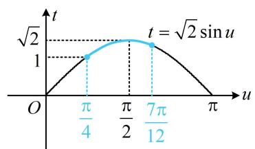

# 第 2 节 同角三角函数基本关系（★★）

# 内容提要

1. 同角三角函数基本关系 $\left\{\begin{aligned}\sin^{2}\alpha+\cos^{2}\alpha&=1\\ \tan\alpha=\frac{\sin\alpha}{\cos\alpha}\end{aligned}\right.$ 主要用于 $\sin\alpha,\cos\alpha,\tan\alpha$ 三者的知一求二，

特别注意由 $\sin^2\alpha = 1 - \cos^2\alpha$ 或 $\cos^2\alpha = 1 - \sin^2\alpha$ 求 $\sin \alpha$ ， $\cos \alpha$ ，开平方时需根据角 $\alpha$ 所在的象限决定取正还是取负.

2. $\sin \alpha, \cos \alpha$ 的和、差、积的转化:

① $(\sin \alpha + \cos \alpha)^2 = \sin^2 \alpha + \cos^2 \alpha + 2\sin \alpha \cos \alpha = 1 + 2\sin \alpha \cos \alpha = 1 + \sin 2\alpha$   
② $(\sin \alpha - \cos \alpha)^2 = \sin^2 \alpha + \cos^2 \alpha - 2\sin \alpha \cos \alpha = 1 - 2\sin \alpha \cos \alpha = 1 - \sin 2\alpha$   
③ $(\sin \alpha + \cos \alpha)^2 + (\sin \alpha - \cos \alpha)^2 = 2$

3. $\sin \alpha$ , $\cos \alpha$ 的齐次分式化正切:

① 计算 $\frac{A\sin\alpha + B\cos\alpha}{C\sin\alpha + D\cos\alpha}$ ，可上下同除以 $\cos\alpha$ ，化为 $\frac{A\tan\alpha + B}{C\tan\alpha + D}$ ；

②计算 $A\sin^2\alpha + B\sin \alpha \cos \alpha + C\cos^2\alpha$ ，可先凑分母，化为 $\frac{A\sin^2\alpha + B\sin \alpha \cos \alpha + C\cos^2\alpha}{\sin^2\alpha + \cos^2\alpha}$ ，再上下同除以 $\cos^2\alpha$ ，化为 $\frac{A\tan^2\alpha + B\tan\alpha + C}{\tan^2\alpha + 1}$ .

类型I： $\sin \alpha$ ， $\cos \alpha$ ， $\tan \alpha$ 的相互转换

【例 1】设 $\cos\alpha=k(k\in\mathbf{R})$ ， $\alpha\in\left(\pi,\frac{3\pi}{2}\right)$ ，则 $\sin\alpha=$ \_\_\_\_。（用 k 表示）

解析：由题意， $\sin^2\alpha = 1 - \cos^2\alpha = 1 - k^2$ ，又 $\alpha \in \left(\pi ,\frac{3\pi}{2}\right)$ ，所以 $\sin \alpha < 0$ ，故 $\sin \alpha = -\sqrt{1 - k^2}$

答案： $-\sqrt{1 - k^2}$

【变式】已知 $\frac{\pi}{2} < \theta < \frac{3\pi}{2}$ ， $2\sin \theta = 1 - \cos \theta$ ，则 $\tan \theta = (\quad)$

A. 0 或 $-\frac{4}{3}$

B. $-\frac{4}{3}$

C. $- \frac{\sqrt{7}}{4}$

D. $-\frac{\sqrt{7}}{4}$ 或 0

解析：给了一个 $\sin \theta$ 和 $\cos \theta$ 的方程，可结合 $\sin^2\theta +\cos^2\theta = 1$ 求出 $\sin \theta$ 和 $\cos \theta$ ，再求 $\tan \theta$

$$
\left\{ \begin{array}{l l} {2 \sin \theta = 1 - \cos \theta} \\ {\sin^ {2} \theta + \cos^ {2} \theta = 1} \end{array} \right. \Rightarrow \sin \theta = 0  , \quad \cos \theta = 1   \text {或}   \sin \theta = \frac {4}{5}  , \quad \cos \theta = - \frac {3}{5}  ,
$$

又 $\frac{\pi}{2} < \theta < \frac{3\pi}{2}$ ，所以 $\cos \theta < 0$ ，从而 $\sin \theta = \frac{4}{5}$ ， $\cos \theta = -\frac{3}{5}$ ，故 $\tan \theta = \frac{\sin \theta}{\cos \theta} = -\frac{4}{3}$ .

答案: B

【例 2】若 $\tan\alpha=\cos\alpha$ ，则 $\frac{1}{\sin\alpha}+\cos^{4}\alpha=$ \_\_\_\_.

解析：题目既有切 $(\tan \alpha)$ ，又有弦 $(\sin \alpha, \cos \alpha)$ ，考虑统一。所给等式弦化切较难，故切化弦分析，$\tan \alpha = \cos \alpha \Rightarrow \frac{\sin \alpha}{\cos \alpha} = \cos \alpha \Rightarrow \sin \alpha = \cos^2 \alpha$ ①，再把余弦转化为正弦，即可求出 $\sin \alpha$

又 $\cos^2\alpha = 1 - \sin^2\alpha$ ，代入①可得 $\sin \alpha = 1 - \sin^2\alpha$ ，解得： $\sin \alpha = \frac{\sqrt{5} - 1}{2}$ 或 $-\frac{\sqrt{5} + 1}{2}$ （舍去），

既然有了 $\sin \alpha$ ，那么可将 $\frac{1}{\sin \alpha} +\cos^4\alpha$ 中的 $\cos^4\alpha$ 也化为 $\sin \alpha$ ，可用式①来化，

$$
\frac {1}{\sin \alpha} + \cos^ {4} \alpha = \frac {1}{\sin \alpha} + \sin^ {2} \alpha = \frac {2}{\sqrt {5} - 1} + \left(\frac {\sqrt {5} - 1}{2}\right) ^ {2} = \frac {\sqrt {5} + 1}{2} + \frac {3 - \sqrt {5}}{2} = 2.
$$

答案: 2

【总结】等式 $\sin^2\alpha +\cos^2\alpha = 1$ 沟通了正余弦， $\tan \alpha = \frac{\sin\alpha}{\cos\alpha}$ 沟通了弦与切.

类型II： $\sin \alpha +\cos \alpha$ ， $\sin \alpha -\cos \alpha$ 与 $\sin \alpha \cos \alpha$

【例 3】已知 $\alpha \in (0, \pi)$ ， $\sin \alpha + \cos \alpha = \frac{\sqrt{3}}{3}$ ，则 $\sin 2\alpha =$ \_\_\_\_ ； $\cos 2\alpha =$ \_\_\_\_ .

解析：若像例 1 的变式那样处理，则计算较复杂，观察发现已知和所求涉及 $\sin \alpha \pm \cos \alpha$ 和 $\sin \alpha \cos \alpha$ ，故可按内容提要 2 的式子来沟通它们，

由内容提要2， $(\sin \alpha +\cos \alpha)^{2} = 1 + \sin 2\alpha$ ，所以 $\sin 2\alpha = (\sin \alpha +\cos \alpha)^{2} - 1 = -\frac{2}{3}$ ①

接下来若用 $\cos^2 2\alpha = 1 - \sin^2 2\alpha$ 求 $\cos 2\alpha$ ，则会发现开根时正负不好判断，考虑到已知 $\sin \alpha + \cos \alpha$ 的值，这时常用 $\cos 2\alpha = (\cos \alpha - \sin \alpha)(\cos \alpha + \sin \alpha)$ 来算 $\cos 2\alpha$ ，下面先求 $\cos \alpha - \sin \alpha$ ，需判断其正负，

由①知 $\sin 2\alpha = 2\sin \alpha \cos \alpha < 0$ ，结合 $\alpha \in (0,\pi)$ 可得 $\sin \alpha > 0$ ， $\cos \alpha < 0$ ，所以 $\cos \alpha - \sin \alpha < 0$

又 $(\cos \alpha - \sin \alpha)^2 = 1 - \sin 2\alpha = 1 - \left(-\frac{2}{3}\right) = \frac{5}{3}$ ，所以 $\cos \alpha - \sin \alpha = -\frac{\sqrt{15}}{3}$ ，

故 $\cos 2\alpha = (\cos \alpha -\sin \alpha)(\cos \alpha +\sin \alpha) = -\frac{\sqrt{15}}{3}\times \frac{\sqrt{3}}{3} = -\frac{\sqrt{5}}{3}.$

答案： $-\frac{2}{3}$ ； $-\frac{\sqrt{5}}{3}$

【反思】已知 $\sin \alpha \pm \cos \alpha$ 的值，可将其平方，求得 $\sin 2\alpha$ 的值，并由该值的正负来分析 $\alpha$ 的范围.

【变式】若 $x \in \left[0, \frac{\pi}{3}\right]$ ，则函数 $y = \sin x + \cos x - 2\sin x\cos x$ 的最大值为（）

A. 1

B. $\sqrt{2}$

C. 2

D. $\sqrt{2} + 1$

解析：由于 $(\sin x + \cos x)^2 = 1 + 2\sin x\cos x$ ，所以可将 $\sin x + \cos x$ 换元，转化为二次函数求区间最值，

设 $t = \sin x + \cos x$ ，则 $t = \sqrt{2}\sin \left(x + \frac{\pi}{4}\right)$ ，换元后，应研究新元的取值范围，

设 $u = x + \frac{\pi}{4}$ ，则 $t = \sqrt{2}\sin u$ ，当 $x\in \left[0,\frac{\pi}{3}\right]$ 时， $u = x + \frac{\pi}{4}\in \left[\frac{\pi}{4},\frac{7\pi}{12}\right],$

函数 $t = \sqrt{2}\sin u$ 的部分图象如图所示，由图可知 $t\in [1,\sqrt{2} ]$

line

| u | t |
|---|---|
| 0 | 0 |
| π/4 | √2 |
| π/2 | 1 |
| 7π/12 | √2 |
| π | 0 |

又 $t^2 = (\sin x + \cos x)^2 = 1 + 2\sin x\cos x$ ，所以 $2\sin x\cos x = t^2 -1$

故 $y = t - (t^2 - 1) = -t^2 + t + 1$ ，因为二次函数 $y = -t^2 + t + 1$ 在 $[1, \sqrt{2}]$ 上 $\searrow$ ，

所以当 t=1 时，y 取得最大值 1.

答案: A

【反思】看到 $\sin x \pm \cos x$ 和 $\sin x \cos x$ 出现在一个式子中，想到将 $\sin x \pm \cos x$ 换元成 $t$ ，并通过将其平方来把 $\sin x \cos x$ 也用 $t$ 表示.

类型III: $\sin \alpha$ 和 $\cos \alpha$ 的齐次分式化正切

【例 4】已知 $\tan\alpha=2$ ，则 $\frac{\sin\alpha-4\cos\alpha}{5\sin\alpha+2\cos\alpha}=$ \_\_\_\_.

解析：已知正切，若先求 $\sin \alpha$ 和 $\cos \alpha$ ，则需讨论 $\alpha$ 在第一象限还是第三象限，较为繁琐。注意到要求值的式子是关于 $\sin \alpha$ 和 $\cos \alpha$ 的一次齐次分式，故可上下同除以 $\cos \alpha$ 直接化正切来计算，

由题意， $\frac{\sin\alpha - 4\cos\alpha}{5\sin\alpha + 2\cos\alpha} = \frac{\tan\alpha - 4}{5\tan\alpha + 2} = \frac{2 - 4}{5\times 2 + 2} = -\frac{1}{6}$

答案： $-\frac{1}{6}$

【反思】关于 $\sin \alpha$ 和 $\cos \alpha$ 的一次齐次分式，可上下同除以 $\cos \alpha$ 化正切；从后面的几道题我们还会看到，只要是关于 $\sin \alpha$ 和 $\cos \alpha$ 齐次分式，都可以化正切.

【变式1】已知 $\sin \alpha + 2\cos \alpha = 0$ ，则 $2\sin \alpha \cos \alpha - \cos^2 \alpha$ 的值是 \_\_\_\_.

解析：要求值的式子不是分式，但我们可以把它看成分母为1的分式 $\frac{2\sin\alpha\cos\alpha-\cos^2\alpha}{1}$ ，并将1代换成 $\sin^2\alpha + \cos^2\alpha$ ，这样就转化成了二次齐次分式，上下同除以 $\cos^2\alpha$ 即可化正切，

$\sin \alpha + 2\cos \alpha = 0 \Rightarrow \tan \alpha = -2$ ，所以 $2\sin \alpha \cos \alpha - \cos^2 \alpha = \frac{2\sin \alpha \cos \alpha - \cos^2 \alpha}{\sin^2 \alpha + \cos^2 \alpha} = \frac{2\tan \alpha - 1}{\tan^2 \alpha + 1} = -1.$

答案: -1

【变式2】已知 $\tan \theta = \frac{1}{2}$ ，则 $\frac{\sin^3\theta + \sin\theta}{\cos^3\theta + \sin\theta\cos^2\theta} = (\quad)$

A. 6 B. $\frac{1}{6}$ C. $\frac{1}{2}$ D. 2

解析: 要求的式子的分子和分母表面上看不齐次, 但只要把分子的一次项 $\sin \theta$ 看成 $\sin \theta \cdot 1$ , 再把 1 变成 $\sin^2 \theta + \cos^2 \theta$ , 就能转化为三次齐次分式, 上下同除以 $\cos^3 \theta$ 即可化正切计算,

$$
\frac {\sin^ {3} \theta + \sin \theta}{\cos^ {3} \theta + \sin \theta \cos^ {2} \theta} = \frac {\sin^ {3} \theta + \sin \theta (\sin^ {2} \theta + \cos^ {2} \theta)}{\cos^ {3} \theta + \sin \theta \cos^ {2} \theta} = \frac {2 \sin^ {3} \theta + \sin \theta \cos^ {2} \theta}{\cos^ {3} \theta + \sin \theta \cos^ {2} \theta} = \frac {2 \tan^ {3} \theta + \tan \theta}{1 + \tan \theta} = \frac {2 \times \left(\frac {1}{2}\right) ^ {3} + \frac {1}{2}}{1 + \frac {1}{2}} = \frac {1}{2}.
$$

答案: C

【反思】关于 $\sin \theta$ 和 $\cos \theta$ 的齐次分式才可以化正切，有的分式表面上看不是齐次的，但可以通过将1代换成 $\sin^2\theta +\cos^2\theta$ 来调整为齐次的.

【变式3】若 $\alpha \in \left(\frac{\pi}{2},\pi\right)$ ， $2\sin \alpha +\cos \alpha = \frac{3\sqrt{5}}{5}$ ，则 $\tan \alpha =$ （

A. -2 B. 2 C. $\frac{2}{11}$ D. $-\frac{2}{11}$

解法1：给出了 $\sin \alpha$ 和 $\cos \alpha$ 的一个方程，可结合 $\sin^2\alpha +\cos^2\alpha = 1$ 求出 $\sin \alpha$ 和 $\cos \alpha$ ，再求 $\tan \alpha$

由 $2\sin \alpha + \cos \alpha = \frac{3\sqrt{5}}{5}$ 可得 $\cos \alpha = \frac{3\sqrt{5}}{5} - 2\sin \alpha$ ，代入 $\sin^2 \alpha + \cos^2 \alpha = 1$ 得： $\sin^2 \alpha + \left(\frac{3\sqrt{5}}{5} - 2\sin \alpha\right)^2 = 1$ ，

整理得： $25\sin^2\alpha - 12\sqrt{5}\sin \alpha + 4 = 0$ ，解得： $\sin \alpha = \frac{2\sqrt{5}}{25}$ 或 $\frac{2\sqrt{5}}{5}$ ，

当 $\sin \alpha = \frac{2\sqrt{5}}{25}$ 时， $\cos \alpha = \frac{3\sqrt{5}}{5} - 2\sin \alpha = \frac{11\sqrt{5}}{25}$ ，因为 $\alpha \in \left(\frac{\pi}{2}, \pi\right)$ ，所以 $\cos \alpha < 0$ ，矛盾；

当 $\sin \alpha = \frac{2\sqrt{5}}{5}$ 时， $\cos \alpha = \frac{3\sqrt{5}}{5} - 2\sin \alpha = -\frac{\sqrt{5}}{5}$ ，所以 $\tan \alpha = \frac{\sin \alpha}{\cos \alpha} = -2$ 。

解法2：将已知的式子平方，左侧可化为关于 $\sin \alpha$ 和 $\cos \alpha$ 的二次齐次式，这种式子可直接化正切，

因为 $2\sin \alpha + \cos \alpha = \frac{3\sqrt{5}}{5}$ ，所以 $(2\sin \alpha + \cos \alpha)^2 = 4\sin^2 \alpha + 4\sin \alpha \cos \alpha + \cos^2 \alpha = \frac{9}{5}$

又 $4\sin^2\alpha + 4\sin \alpha \cos \alpha + \cos^2\alpha = \frac{4\sin^2\alpha + 4\sin\alpha\cos\alpha + \cos^2\alpha}{\sin^2\alpha + \cos^2\alpha} = \frac{4\tan^2\alpha + 4\tan\alpha + 1}{\tan^2\alpha + 1}$

所以 $\frac{4\tan^2\alpha + 4\tan\alpha + 1}{\tan^2\alpha + 1} = \frac{9}{5}$ ，解得： $\tan \alpha = \frac{2}{11}$ 或 $-2$ ，又 $\alpha \in \left(\frac{\pi}{2}, \pi\right)$ ，所以 $\tan \alpha < 0$ ，故 $\tan \alpha = -2$ 。

答案: A

【反思】已知 $A \sin \alpha + B \cos \alpha = C$ 这类式子，尽管可以和 $\sin^2 \alpha + \cos^2 \alpha = 1$ 联立求解 $\sin \alpha$ 和 $\cos \alpha$ ，但若数字较复杂，则计算量大（如解法1）；通过平方，再化正切也是一个可以考虑的方向.

【变式4】（2019·江苏卷）已知 $\frac{\tan\alpha}{\tan\left(\alpha + \frac{\pi}{4}\right)} = -\frac{2}{3}$ ，则 $\sin \left(2\alpha + \frac{\pi}{4}\right)$ 的值是 \_\_\_\_.

解法1: 注意到 $\left(\alpha + \frac{\pi}{4}\right) - \alpha = \frac{\pi}{4}$ 为特殊角, $\left(\alpha + \frac{\pi}{4}\right) + \alpha = 2\alpha + \frac{\pi}{4}$ 为欲求值的角, 故可将 $\alpha + \frac{\pi}{4}$ 整体处理,

设 $\alpha = x$ ， $\alpha +\frac{\pi}{4} = y$ ，则 $y - x = \frac{\pi}{4}$ ，所以 $\sin (y - x) = \sin y\cos x - \cos y\sin x = \frac{\sqrt{2}}{2}$ ①，

由题意， $\frac{\tan x}{\tan y} = -\frac{2}{3}$ ，所以 $\frac{\sin x\cos y}{\cos x\sin y} = -\frac{2}{3}$ ②，

联立①②解得： $\sin x\cos y = -\frac{\sqrt{2}}{5}$ ， $\cos x\sin y = \frac{3\sqrt{2}}{10}$

所以 $\sin \left(2\alpha +\frac{\pi}{4}\right) = \sin (x + y) = \sin x\cos y + \cos x\sin y = -\frac{\sqrt{2}}{5} +\frac{3\sqrt{2}}{10} = \frac{\sqrt{2}}{10}.$

解法 2: 观察发现将 $\tan \left(\alpha + \frac{\pi}{4}\right)$ 展开, 由已知条件可求出 $\tan \alpha$ , 故将 $\sin \left(2 \alpha + \frac{\pi}{4}\right)$ 展开, 化正切计算,

因为 $\tan \left(\alpha +\frac{\pi}{4}\right) = \frac{\tan\alpha + \tan\frac{\pi}{4}}{1 - \tan\alpha\tan\frac{\pi}{4}} = \frac{\tan\alpha + 1}{1 - \tan\alpha}$ 所以 $\frac{\tan\alpha}{\tan\left(\alpha + \frac{\pi}{4}\right)} = \frac{\tan\alpha}{\frac{\tan\alpha + 1}{1 - \tan\alpha}} = \frac{\tan\alpha(1 - \tan\alpha)}{\tan\alpha + 1} = -\frac{2}{3},$

解得： $\tan \alpha = -\frac{1}{3}$ 或2，而 $\sin \left(2\alpha +\frac{\pi}{4}\right) = \sin 2\alpha \cos \frac{\pi}{4} +\cos 2\alpha \sin \frac{\pi}{4} = \frac{\sqrt{2}}{2} (\sin 2\alpha +\cos 2\alpha)$ ③，

又 $\sin 2\alpha = 2\sin \alpha \cos \alpha = \frac{2\sin\alpha\cos\alpha}{\cos^2\alpha + \sin^2\alpha} = \frac{2\tan\alpha}{1 + \tan^2\alpha},$ $\cos 2\alpha = \cos^2\alpha -\sin^2\alpha = \frac{\cos^2\alpha - \sin^2\alpha}{\cos^2\alpha + \sin^2\alpha} = \frac{1 - \tan^2\alpha}{1 + \tan^2\alpha},$

代入式③可得 $\sin \left(2\alpha +\frac{\pi}{4}\right) = \frac{\sqrt{2}}{2}\left(\frac{2\tan\alpha}{1 + \tan^2\alpha} +\frac{1 - \tan^2\alpha}{1 + \tan^2\alpha}\right)$ ④，

将 $\tan \alpha = -\frac{1}{3}$ 或2代入式④可得 $\sin \left(2\alpha +\frac{\pi}{4}\right)$ 的值均为 $\frac{\sqrt{2}}{10}$ ，所以 $\sin \left(2\alpha +\frac{\pi}{4}\right) = \frac{\sqrt{2}}{10}.$

答案： $\frac{\sqrt{2}}{10}$

【反思】本题解法 1 的技巧性偏强，解法 2 则是常规思路，但解出 $\tan \alpha$ 有两个值，计算量稍大，解法 2 中证明了万能公式： $\sin \alpha = \frac{2 \tan \frac{\alpha}{2}}{1 + \tan^2 \frac{\alpha}{2}}$ ， $\cos \alpha = \frac{1 - \tan^2 \frac{\alpha}{2}}{1 + \tan^2 \frac{\alpha}{2}}$ .

# 强化训练

1. (2025·贵州模拟·★)

已知 $\cos \theta = -\frac{4}{5}$ ，且 $\theta \in \left(\frac{\pi}{2}, \pi\right)$ ，则 $\tan \theta = (\quad)$

A. $\frac{4}{3}$

B. $-\frac{4}{3}$

C. $\frac{3}{4}$

D. $-\frac{3}{4}$

2. (2025·全国模拟·★★)

若 $2\sin \alpha +\cos \alpha = \sqrt{5}$ ，则 $\tan \alpha =$ （

A. $\frac{1}{2}$

B. 2

C. 2 或 $\frac{1}{2}$

D. -2

3. (2025·四川绵阳三模·★★)

已知 $\tan \alpha \sin \alpha = 3$ ，则 $\tan^2\alpha -\sin^2\alpha$ 的值为（）

A. $\sqrt{3}$

B. 3

C. 9

D. 81

4. (2022·上海模拟·★★)

若 $\sin \theta = k\cos \theta$ ，则 $\sin \theta \cos \theta =$ （用 $k$ 表示）

5. (2024·全国甲卷·★★☆)

已知 $\frac{\cos\alpha}{\cos\alpha - \sin\alpha} = \sqrt{3}$ ，则 $\tan \left(\alpha + \frac{\pi}{4}\right) = (\quad)$

A. $2 \sqrt{3} + 1$

B. $2 \sqrt{3} - 1$

C. $\frac{\sqrt{3}}{2}$

D. $1 - \sqrt{3}$

6. (2022·湖南模拟·★★★)

已知 $\sin \alpha + 2\cos \alpha = 0$ ，则 $\frac{\cos 2\alpha}{1 - \sin 2\alpha} =$ \_\_\_\_.

7. (2018·新课标II卷·★★★)

已知 $\sin \alpha +\cos \beta = 1$ ， $\cos \alpha +\sin \beta = 0$ ，则

$$
\sin (\alpha + \beta) = \underline {{\quad}}.
$$

8. (★★★) (多选)

已知 $\alpha \in (0,\pi)$ ， $\sin \alpha +\cos \alpha = \frac{1}{5}$ ，以下选项正确的是（）

A. $\sin 2\alpha = \frac{24}{25}$   
B. $\sin \alpha -\cos \alpha = \frac{7}{5}$   
C. $\cos 2\alpha = -\frac{7}{25}$   
D. $\sin^4\alpha -\cos^4\alpha = -\frac{7}{25}$

9. (2022·湖北四校联考·★★★☆)

若 $a(\sin x + \cos x) \leq 2 + \sin x \cos x$ 对 $\forall x \in \left(0, \frac{\pi}{2}\right)$ 恒成立，则实数 $a$ 的最大值为 \_\_\_\_.

