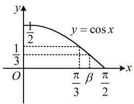

# 强化训练

# 类型 I：三大思想的应用

1. (2021·北京卷·★★)

已知函数 $f(x) = \cos x - \cos 2x$ ，则该函数是（）

A. 奇函数，最大值为 2  
B. 偶函数，最大值为 2  
C. 奇函数，最大值为 $\frac{9}{8}$   
D. 偶函数，最大值为 $\frac{9}{8}$

1. D

解析： $f(-x) = \cos (-x) - \cos 2(-x) = \cos x - \cos 2x = f(x)$

所以 $f(x)$ 为偶函数，

为了研究 $f(x)$ 的最值，可用二倍角公式统一角度，且为了使函数名也统一，选择 $\cos 2x = 2\cos^2 x - 1$

$$
\begin{array}{l} f (x) = \cos x - \cos 2 x = \cos x - (2 \cos^ {2} x - 1) \\ = - 2 \cos^ {2} x + \cos x + 1 = - 2 \left(\cos x - \frac {1}{4}\right) ^ {2} + \frac {9}{8}, \\ \end{array}
$$

所以当 $\cos x = \frac{1}{4}$ 时， $f(x)$ 取得最大值 $\frac{9}{8}$ .

2. (2022·湖南模拟·★★)

函数 $f(x)=\sin x\sin 2x-2\cos x$ 的最大值为 \_\_\_\_.

2.2

解析：观察发现对 $\sin 2x$ 用二倍角公式，可统一角度，

$$
\begin{array}{l} f (x) = \sin x \sin 2 x - 2 \cos x = \sin x \cdot 2 \sin x \cos x - 2 \cos x \\ = 2 \cos x (\sin^ {2} x - 1), \\ \end{array}
$$

将 $\sin^2 x$ 换成 $1 - \cos^2 x$ ，又能统一函数名，

所以 $f(x)=2\cos x(1-\cos^{2}x-1)=-2\cos^{3}x$

又 $-1 \leq \cos x \leq 1$ ，所以当 $\cos x = -1$ 时， $f(x)$ 取得最大值2.

3. (2022·甘肃兰州模拟·★★)

已知 $\cos\left(\frac{\theta}{2}-\frac{\pi}{5}\right)=\frac{\sqrt{3}}{3}$ ，则 $\sin\left(\theta+\frac{\pi}{10}\right)=$ \_\_\_\_.

3. $-\frac{1}{3}$

解析：经尝试，展开不易处理，故观察角的联系，将求值的角统一成已知的角，可将 $\frac{\theta}{2} -\frac{\pi}{5}$ 换元成 $t$

设 $\frac{\theta}{2} -\frac{\pi}{5} = t$ ，则 $\theta = 2t + \frac{2\pi}{5}$ ，且 $\cos t = \frac{\sqrt{3}}{3}$

所以 $\theta +\frac{\pi}{10} = \left(2t + \frac{2\pi}{5}\right) + \frac{\pi}{10} = 2t + \frac{\pi}{2},$

故 $\sin \left( \theta + \frac{\pi}{10} \right) = \sin \left( 2t + \frac{\pi}{2} \right) = \cos 2t = 2\cos^2 t - 1 = -\frac{1}{3}$ .

4. (2024·福建3月质检·★★★)

若 $\sqrt{6}\tan \left(\alpha +\frac{\pi}{4}\right)\cos \left(\alpha -\frac{\pi}{4}\right) = 1$ ，则 $\sin 2\alpha =$ （

A. $-\frac{2}{3}$

B. $-\frac{1}{3}$

C. $\frac{1}{3}$

D. $\frac{2}{3}$

4. B

解析：所给等式较复杂，考虑先化简，再观察与所求的联系，怎么化？需注意两点：一是该式中有切有弦，考虑到所求为弦，故切化弦；二是涉及的角满足 $\alpha + \frac{\pi}{4} - \left( \alpha - \frac{\pi}{4} \right)$

$= \frac{\pi}{2}$ ，故可通过换元，把角统一起来；

令 $x = \alpha -\frac{\pi}{4}$ ，则 $\alpha = x + \frac{\pi}{4}$

所以 $\alpha +\frac{\pi}{4} = x + \frac{\pi}{4} +\frac{\pi}{4} = x + \frac{\pi}{2},$ $2\alpha = 2\left(x + \frac{\pi}{4}\right) = 2x + \frac{\pi}{2},$

故 $\sqrt{6}\tan \left(\alpha +\frac{\pi}{4}\right)\cos \left(\alpha -\frac{\pi}{4}\right) = \sqrt{6}\tan \left(x + \frac{\pi}{2}\right)\cos x$

$$
= \sqrt {6} \cdot \frac {\sin \left(x + \frac {\pi}{2}\right)}{\cos \left(x + \frac {\pi}{2}\right)} \cdot \cos x = \sqrt {6} \cdot \frac {\cos x}{- \sin x} \cdot \cos x = - \frac {\sqrt {6} \cos^ {2} x}{\sin x},
$$

由题意， $-\frac{\sqrt{6}\cos^2x}{\sin x} = 1$ ，所以 $\sqrt{6}\cos^2 x + \sin x = 0$

函数名不同，可用 $\cos^2 x = 1 - \sin^2 x$ 将函数名统一成正弦，求出 $\sin x$

所以 $\sqrt{6} (1 - \sin^2 x) + \sin x = 0$ ，故 $\sqrt{6}\sin^2 x - \sin x - \sqrt{6} = 0$ ，解得： $\sin x = \frac{\sqrt{6}}{2}$ 或 $\sin x = -\frac{\sqrt{6}}{3}$

因为 $\sin x\in [-1,1]$ ，所以 $\sin x = -\frac{\sqrt{6}}{3}$

故 $\sin 2\alpha = \sin \left(2x + \frac{\pi}{2}\right) = \cos 2x = 1 - 2\sin^2 x$

$$
= 1 - 2 \times \left(- \frac {\sqrt {6}}{3}\right) ^ {2} = - \frac {1}{3}.
$$

5. (★★★)

若 $\tan \frac{\theta}{2} = 2$ ，则 $\frac{1 + \sin\theta + \cos\theta}{1 + \sin\theta - \cos\theta} = \underline{\quad}$

5. $\frac{1}{2}$

解法 1: 目标式中有 1, 联想到升次公式, 统一次数. 那 1 该与 $\sin \theta$ 组合, 还是 $\cos \theta$ 呢? 与 $\cos \theta$ 组合计算量要小一些. 为统一角度成 $\frac{\theta}{2}$ , 将剩余的 $\sin \theta$ 也打开,

由题意， $\frac{1 + \sin\theta + \cos\theta}{1 + \sin\theta - \cos\theta} = \frac{(1 + \cos\theta) + \sin\theta}{(1 - \cos\theta) + \sin\theta}$

$$
= \frac {2 \cos^ {2} \frac {\theta}{2} + 2 \sin \frac {\theta}{2} \cos \frac {\theta}{2}}{2 \sin^ {2} \frac {\theta}{2} + 2 \sin \frac {\theta}{2} \cos \frac {\theta}{2}} = \frac {1 + \tan \frac {\theta}{2}}{\tan^ {2} \frac {\theta}{2} + \tan \frac {\theta}{2}} = \frac {1}{\tan \frac {\theta}{2}} = \frac {1}{2}.
$$

解法 2: 有 $\tan \frac{\theta}{2}$ , 也可直接用万能公式求得 $\sin \theta$ 和 $\cos \theta$ , 再代入所求式子,

由万能公式， $\sin \theta = \frac{2\tan\frac{\theta}{2}}{1 + \tan^2\frac{\theta}{2}} = \frac{4}{5},\quad \cos \theta = \frac{1 - \tan^2\frac{\theta}{2}}{1 + \tan^2\frac{\theta}{2}} = -\frac{3}{5},$

所以 $\frac{1 + \sin\theta + \cos\theta}{1 + \sin\theta - \cos\theta} = \frac{1 + \frac{4}{5} - \frac{3}{5}}{1 + \frac{4}{5} - \left(-\frac{3}{5}\right)} = \frac{1}{2}$ .

【反思】当 1 既可与 $\sin \theta$ 组合降次，又可与 $\cos \theta$ 组合时，一般首先尝试与 $\cos \theta$ 组合.

6. (2023·东北三省三校四模·★★★)

已知锐角 $\alpha$ ， $\beta$ 满足 $\frac{\cos\alpha - \sin\alpha}{\cos\alpha + \sin\alpha} = \frac{\sin 2\beta}{1 - \cos 2\beta}$ ，则 $\tan (\alpha - \beta)$ 的值为（）

A. 1 B. $\frac{\sqrt{3}}{3}$ C. -1 D. $-\sqrt{3}$

6. C

解析：观察分母有 $1 - \cos 2\beta$ ，这是升次的标志，为将角度统一为 $\beta$ ，分子也用二倍角公式升次，

因为 $\frac{\sin 2\beta}{1 - \cos 2\beta} = \frac{2\sin\beta\cos\beta}{2\sin^2\beta} = \frac{1}{\tan\beta}$

所以代入条件等式可得 $\frac{\cos\alpha - \sin\alpha}{\cos\alpha + \sin\alpha} = \frac{1}{\tan\beta}$ ①，

所求为 $\tan (\alpha -\beta)$ ，故将左侧上下同除以 $\cos \alpha$ ，弦化切，

又 $\frac{\cos\alpha - \sin\alpha}{\cos\alpha + \sin\alpha} = \frac{1 - \tan\alpha}{1 + \tan\alpha}$ ，代入①可得 $\frac{1 - \tan\alpha}{1 + \tan\alpha} = \frac{1}{\tan\beta}$ ，

所以 $\tan \beta - \tan \alpha \tan \beta = 1 + \tan \alpha$ ，从而 $1 + \tan \alpha \tan \beta =$

$\tan \beta - \tan \alpha$ ，故 $\frac{\tan \alpha - \tan \beta}{1 + \tan \alpha \tan \beta} = -1$ ，即 $\tan (\alpha - \beta) = -1$ 。

7. (2024·九省联考·★★★)

已知 $\theta \in \left(\frac{3\pi}{4},\pi\right)$ ， $\tan 2\theta = -4\tan \left(\theta +\frac{\pi}{4}\right)$ ，则

$$
\frac {1 + \sin 2 \theta}{2 \cos^ {2} \theta + \sin 2 \theta} = (\quad)
$$

A. $\frac{1}{4}$

B. $\frac{3}{4}$

C. 1

D. $\frac{3}{2}$

7. A

解析：观察发现目标式中有 $1+\sin2\theta$ ，这是按 $1+\sin2\theta=$

$(\sin\theta+\cos\theta)^{2}$ 升次的标志，同时为了统一角度，对分母的 $\sin2\theta$ 也用二倍角公式，我们先按此将目标式化简，再观察它与已知条件的联系，

$$
\begin{array}{l} \frac {1 + \sin 2 \theta}{2 \cos^ {2} \theta + \sin 2 \theta} = \frac {(\sin \theta + \cos \theta) ^ {2}}{2 \cos^ {2} \theta + 2 \sin \theta \cos \theta} \\ = \frac {(\sin \theta + \cos \theta) ^ {2}}{2 \cos \theta (\cos \theta + \sin \theta)} = \frac {\sin \theta + \cos \theta}{2 \cos \theta} = \frac {1}{2} (\tan \theta + 1) \quad ①, \\ \end{array}
$$

故只需求 $\tan \theta$ ，观察所给等式发现，左边用正切的二倍角公式，右边展开，即可建立关于 $\tan \theta$ 的方程，

因为 $\tan 2\theta = -4\tan \left(\theta +\frac{\pi}{4}\right)$ ，所以 $\frac{2\tan\theta}{1 - \tan^2\theta} = -4\cdot \frac{\tan\theta + 1}{1 - \tan\theta}$ ，解得： $\tan \theta = -\frac{1}{2}$ 或-2，

又 $\theta \in \left(\frac{3\pi}{4},\pi\right)$ ，所以 $-1 < \tan \theta < 0$ ，故 $\tan \theta = -\frac{1}{2}$

代入式①得 $\frac{1 + \sin 2\theta}{2\cos^2\theta + \sin 2\theta} = \frac{1}{2}\times \left(-\frac{1}{2} + 1\right) = \frac{1}{4}$ .

8. (2023·河北石家庄一模·★★★☆)

已知函数 $f(x) = \frac{\sin x}{1 + \cos x} + \frac{8}{1 - \cos x} (0 < x < \pi)$ ，则 $f(x)$ 的最小值是 \_\_\_\_.

8.7

解析：注意到解析式中有 $1 + \cos x$ 和 $1 - \cos x$ ，这是升次标志，可考虑先将它们分别化为 $2\cos^2\frac{x}{2}$ 和 $2\sin^2\frac{x}{2}$ ，升次后再看能否进一步化简解析式，

由题意， $f(x) = \frac{\sin x}{2\cos^2\frac{x}{2}} +\frac{8}{2\sin^2\frac{x}{2}}$

观察发现可将 $\sin x$ 和8分别化为 $2\sin \frac{x}{2}\cos \frac{x}{2}, 8\sin^2\frac{x}{2}+$

$8\cos^{2}\frac{x}{2}$ ，从而统一角度为 $\frac{x}{2}$ ，并化正切，

$$
f (x) = \frac {2 \sin \frac {x}{2} \cos \frac {x}{2}}{2 \cos^ {2} \frac {x}{2}} + \frac {8 \sin^ {2} \frac {x}{2} + 8 \cos^ {2} \frac {x}{2}}{2 \sin^ {2} \frac {x}{2}} = \tan \frac {x}{2} + 4 + \frac {4}{\tan^ {2} \frac {x}{2}},
$$

含 x 的部分以 $\tan\frac{x}{2}$ 整体出现，故可先换元，再求导分析，

令 $t = \tan \frac{x}{2}$ ，则 $f(x) = t + 4 + \frac{4}{t^2}$

因为 $0 < x < \pi$ ，所以 $0 < \frac{x}{2} < \frac{\pi}{2}$ ，故 $t = \tan \frac{x}{2} > 0$

设 $g(t)=t+4+\frac{4}{t^{2}}$ ，t>0，则 $g'(t)=1+4\times(-2t^{-3})=\frac{t^{3}-8}{t^{3}}$ ，

所以 $g'(t) < 0 \Leftrightarrow 0 < t < 2$ ， $g'(t) > 0 \Leftrightarrow t > 2$ ，

从而 $g(t)$ 在 $(0,2)$ 上 $\searrow$ ，在 $(2, +\infty)$ 上 $\nearrow$

故 $g(t)_{\min} = g(2) = 7$ ，所以 $f(x)_{\min} = 7$

# 类型II：给值求值问题中角度范围的限定

9. (2022·福建福州模拟·★★)

已知 $\sin \left(\alpha -\frac{\pi}{4}\right) = \frac{2\sqrt{5}}{5},\quad \alpha \in \left(\frac{\pi}{2},\frac{3\pi}{4}\right)$ ，则 $\sin \alpha =$

9. $\frac{3\sqrt{10}}{10}$

解析：给值求值问题，先将求值的角统一成已知的角，为了便于观察，可将 $\alpha -\frac{\pi}{4}$ 换元，

令 $t = \alpha -\frac{\pi}{4}$ ，则 $\alpha = t + \frac{\pi}{4}$ ，且 $\sin t = \frac{2\sqrt{5}}{5}$ ，所以 $\sin \alpha =$

$\sin\left(t+\frac{\pi}{4}\right)=\sin t\cos\frac{\pi}{4}+\cos t\sin\frac{\pi}{4}=\frac{\sqrt{2}}{2}(\sin t+\cos t)$ ①,

要求 $\sin \alpha$ ，需根据 $\sin t = \frac{2\sqrt{5}}{5}$ 求 $\cos t$ ，先研究 $t$ 的范围，决定开平方取正还是取负，

因为 $\alpha \in \left(\frac{\pi}{2},\frac{3\pi}{4}\right)$ ，所以 $t\in \left(\frac{\pi}{4},\frac{\pi}{2}\right)$ ，从而 $\cos t > 0$

故 $\cos t = \sqrt{1 - \sin^2 t} = \frac{\sqrt{5}}{5}$

代入式①得： $\sin \alpha = \frac{\sqrt{2}}{2}\times \left(\frac{2\sqrt{5}}{5} +\frac{\sqrt{5}}{5}\right) = \frac{3\sqrt{10}}{10}.$

10. (2024·江苏南通三模·★★☆)

已知 $0 < \beta < \alpha < \frac{\pi}{2}$ , $\sin (\alpha - \beta) = \frac{4}{5}$ , $\tan \alpha - \tan \beta$

$= 2$ ，则 $\sin \alpha \sin \beta = (\quad)$

A. $\frac{1}{2}$

B. $\frac{1}{5}$

C. $\frac{2}{5}$

D. $\frac{\sqrt{2}}{2}$

10. B

解析：目标式与已知条件 $\sin (\alpha -\beta) = \frac{4}{5}$ 均为弦，而 $\tan \alpha -$

$\tan \beta = 2$ 为切，故考虑先切化弦，将函数名统一成弦，

因为 $\tan \alpha - \tan \beta = 2$ ，所以 $\frac{\sin \alpha}{\cos \alpha} - \frac{\sin \beta}{\cos \beta} = 2$ ，

从而 $\sin \alpha \cos \beta -\sin \beta \cos \alpha = 2\cos \alpha \cos \beta$

故 $\sin (\alpha -\beta) = 2\cos \alpha \cos \beta$ ①，

由题意， $\sin (\alpha -\beta) = \frac{4}{5}$ ，代入 $①$ 中可得 $\frac{4}{5} = 2\cos \alpha \cos \beta$

所以 $\cos \alpha \cos \beta = \frac{2}{5}$ ，已知的 $\cos \alpha \cos \beta$ 和要求的 $\sin \alpha \sin \beta$ 是 $\cos (\alpha \pm \beta)$ 展开后的结构，故想到先由 $\sin (\alpha -\beta)$ 求 $\cos (\alpha -\beta)$ ，

会涉及开平方根，其正负由 $\alpha -\beta$ 所在的象限决定，于是又先分析 $\alpha -\beta$ 的范围，

因为 $0 < \beta < \alpha < \frac{\pi}{2}$ ，所以 $0 < \alpha - \beta < \frac{\pi}{2}$ ，

故 $\cos (\alpha -\beta) = \sqrt{1 - \sin^2(\alpha - \beta)} = \sqrt{1 - \left(\frac{4}{5}\right)^2} = \frac{3}{5},$

所以 $\cos (\alpha -\beta) = \cos \alpha \cos \beta +\sin \alpha \sin \beta = \frac{3}{5},$

故 $\sin \alpha \sin \beta = \cos (\alpha -\beta) - \cos \alpha \cos \beta = \frac{3}{5} -\frac{2}{5} = \frac{1}{5}.$

11. (2024·新课标Ⅱ卷·★★★)

已知 $\alpha$ 为第一象限角， $\beta$ 为第三象限角，

$\tan \alpha + \tan \beta = 4$ ， $\tan \alpha \tan \beta = \sqrt{2} + 1$ ，则

$$
\sin (\alpha + \beta) = \underline {{{\quad}}}.
$$

11. $-\frac{2\sqrt{2}}{3}$

解析：条件涉及 $\tan \alpha +\tan \beta$ 和 $\tan \alpha \tan \beta$ ，联想到正切的和角公式，故先求 $\tan (\alpha +\beta)$

由题意， $\tan (\alpha +\beta) = \frac{\tan\alpha + \tan\beta}{1 - \tan\alpha\tan\beta} = \frac{4}{1 - (\sqrt{2} + 1)} = -2\sqrt{2}$

所以 $\frac{\sin(\alpha + \beta)}{\cos(\alpha + \beta)} = -2\sqrt{2}$ ，故 $\cos (\alpha + \beta) = -\frac{\sin(\alpha + \beta)}{2\sqrt{2}}$

代入 $\cos^2 (\alpha +\beta) + \sin^2 (\alpha +\beta) = 1$ 可得 $\frac{\sin^2(\alpha + \beta)}{8} +$

$\sin^2 (\alpha +\beta) = 1$ ，所以 $\sin (\alpha +\beta) = \pm \frac{2\sqrt{2}}{3}$

取正还是取负？由 $\alpha + \beta$ 的象限决定，题干给了 $\alpha$ 和 $\beta$ 的象限，可翻译成 $\alpha$ ， $\beta$ 各自的范围，再研究 $\alpha + \beta$ 的范围，

因为 $\alpha$ ， $\beta$ 分别为第一象限角、第三象限角，

所以 $\left\{ \begin{array}{l} 2m\pi < \alpha < 2m\pi + \frac{\pi}{2} \\ 2n\pi + \pi < \beta < 2n\pi + \frac{3\pi}{2} \end{array} \right.$ ，其中 $m, n \in \mathbf{Z}$ ，

两式相加得： $2(m + n)\pi +\pi <  \alpha +\beta <  2(m + n)\pi +2\pi$

记 $k = m + n$ ，则 $k\in \mathbf{Z}$ ，且 $2k\pi +\pi <  \alpha +\beta <  2k\pi +2\pi$

所以 $\alpha +\beta$ 在第三象限或 $y$ 轴负半轴或第四象限，

故 $\sin (\alpha +\beta) = -\frac{2\sqrt{2}}{3}$

12. (2022·山东郯城月考·★★★★)

已知 $\alpha$ ， $\beta$ 为锐角， $\sin (\alpha +2\beta) = \frac{1}{5}$ ， $\cos \beta = \frac{1}{3}$ ，则 $\sin (\alpha +\beta) =$ （）

A. $\frac{1 + 8\sqrt{3}}{15}$

B. $\frac{1 \pm 8\sqrt{3}}{15}$

C. $\frac{2\sqrt{6} + 2\sqrt{2}}{15}$

D. $\frac{1 - 8\sqrt{3}}{15}$

12. A

解析：给值求值问题，先将求值的角统一成已知的角，为了便于观察，将 $\alpha + 2\beta$ 换元成 $\gamma$

令 $\gamma = \alpha + 2\beta$ ，则 $\alpha = \gamma - 2\beta$ ，所以 $\alpha + \beta = \gamma - \beta$ ，

且 $\sin \gamma = \frac{1}{5}$ ， $\cos \beta = \frac{1}{3}$

而 $\sin (\alpha +\beta) = \sin (\gamma -\beta) = \sin \gamma \cos \beta -\cos \gamma \sin \beta$

$$
= \frac {1}{5} \times \frac {1}{3} - \cos \gamma \sin \beta = \frac {1}{1 5} - \cos \gamma \sin \beta \quad ①,
$$

还差 $\cos \gamma$ 和 $\sin \beta$ ，需先研究角的范围，才能判断其正负，

因为 $\alpha$ ， $\beta$ 为锐角，所以 $\sin \beta = \sqrt{1 - \cos^2\beta} = \frac{2\sqrt{2}}{3}$

且 $\gamma = \alpha + 2\beta \in \left(0, \frac{3\pi}{2}\right)$ ，又 $\sin \gamma = \frac{1}{5} > 0$ ，故 $\gamma \in (0, \pi)$ ②，

此范围仍无法确定 $\cos \gamma$ 的正负，需更精确地分析 $\gamma$ 的范围， $\gamma$ 的范围由 $\alpha$ 和 $\beta$ 决定，可结合 $\cos \beta = \frac{1}{3}$ 给出 $\beta$ 更准确的范围，从而将 $\gamma$ 范围精确化，

因为 $\cos \beta = \frac{1}{3} < \frac{1}{2} = \cos \frac{\pi}{3}$ ，且函数 $y = \cos x$ 在 $\left(0, \frac{\pi}{2}\right) \searrow$ ，

如图，所以 $\frac{\pi}{3} < \beta < \frac{\pi}{2}$ ，故 $\frac{2\pi}{3} < 2\beta < \pi$

又 $0 < \alpha < \frac{\pi}{2}$ ，所以 $\frac{2\pi}{3} < \gamma = \alpha + 2\beta < \frac{3\pi}{2}$ ，结合②可得

$\gamma \in \left(\frac{2\pi}{3},\pi\right)$ ，所以 $\cos \gamma = -\sqrt{1 - \sin^2\gamma} = -\frac{2\sqrt{6}}{5}$

代入式①得 $\sin (\alpha +\beta) = \frac{1}{15} -\left(-\frac{2\sqrt{6}}{5}\right)\times \frac{2\sqrt{2}}{3} = \frac{1 + 8\sqrt{3}}{15}.$

text_image

y
1/2
y = cos x
1/3
O
π/3 β π/2
x

【反思】类型Ⅱ的四道题对角的范围限定越来越严格，当粗略分析得出某角 $\gamma$ 所在的象限不足以判断 $\sin \gamma$ 或 $\cos \gamma$ 的正负时，应结合有关的三角函数值进一步将范围估计得更准确.

# 类型III：具体角三角函数式化简求值

13. (2022·北京模拟·★★)

$$
\frac {\sin 7 ^ {\circ} + \cos 1 5 ^ {\circ} \sin 8 ^ {\circ}}{\cos 7 ^ {\circ} - \sin 1 5 ^ {\circ} \sin 8 ^ {\circ}} = \underline {{{\quad}}}.
$$

13. $2 - \sqrt{3}$

解析：注意到 $7^{\circ} = 15^{\circ} - 8^{\circ}$ ，故可将角度统一为 $15^{\circ}$ 和 $8^{\circ}$ ，

原式 $= \frac{\sin(15^{\circ} - 8^{\circ}) + \cos 15^{\circ}\sin 8^{\circ}}{\cos(15^{\circ} - 8^{\circ}) - \sin 15^{\circ}\sin 8^{\circ}}$

$$
\begin{array}{l} = \frac {\sin 1 5 ^ {\circ} \cos 8 ^ {\circ} - \cos 1 5 ^ {\circ} \sin 8 ^ {\circ} + \cos 1 5 ^ {\circ} \sin 8 ^ {\circ}}{\cos 1 5 ^ {\circ} \cos 8 ^ {\circ} + \sin 1 5 ^ {\circ} \sin 8 ^ {\circ} - \sin 1 5 ^ {\circ} \sin 8 ^ {\circ}} = \frac {\sin 1 5 ^ {\circ} \cos 8 ^ {\circ}}{\cos 1 5 ^ {\circ} \cos 8 ^ {\circ}} \\ = \tan 1 5 ^ {\circ} = \tan (6 0 ^ {\circ} - 4 5 ^ {\circ}) \\ = \frac {\tan 6 0 ^ {\circ} - \tan 4 5 ^ {\circ}}{1 + \tan 6 0 ^ {\circ} \tan 4 5 ^ {\circ}} = \frac {\sqrt {3} - 1}{1 + \sqrt {3}} = 2 - \sqrt {3}. \\ \end{array}
$$

14. (2022·山西太原一模·★★☆)

$$
\sin 2 0 ^ {\circ} + \sin 4 0 ^ {\circ} = (\quad)
$$

A. $\sin 50^{\circ}$

B. $\sin 60^{\circ}$

C. $\sin 70^{\circ}$

D. $\sin 80^{\circ}$

14. D

解析：本题涉及 $40^{\circ}$ 和 $20^{\circ}$ 这两个角，应将其统一，有两个方向， $40^{\circ} = 2 \times 20^{\circ}$ 和 $40^{\circ} + 20^{\circ} = 60^{\circ}$ ，若用二倍角公式把 $\sin 40^{\circ}$ 化掉，则接下来不好推进，故选 $40^{\circ} + 20^{\circ} = 60^{\circ}$ ，

$$
\begin{array}{l} \sin 2 0 ^ {\circ} + \sin 4 0 ^ {\circ} = \sin 2 0 ^ {\circ} + \sin (6 0 ^ {\circ} - 2 0 ^ {\circ}) \\ = \sin 2 0 ^ {\circ} + \sin 6 0 ^ {\circ} \cos 2 0 ^ {\circ} - \cos 6 0 ^ {\circ} \sin 2 0 ^ {\circ} \\ = \sin 2 0 ^ {\circ} + \sin 6 0 ^ {\circ} \cos 2 0 ^ {\circ} - \frac {1}{2} \sin 2 0 ^ {\circ} \\ = \sin 6 0 ^ {\circ} \cos 2 0 ^ {\circ} + \frac {1}{2} \sin 2 0 ^ {\circ} \\ = \sin 6 0 ^ {\circ} \cos 2 0 ^ {\circ} + \cos 6 0 ^ {\circ} \sin 2 0 ^ {\circ} = \sin (6 0 ^ {\circ} + 2 0 ^ {\circ}) = \sin 8 0 ^ {\circ}. \\ \end{array}
$$

15. (★★★☆)

已知 $\sqrt{3}\tan 20^{\circ} + \lambda \cos 70^{\circ} = 3$ ，则 $\lambda$ 的值为（）

A. $\sqrt{3}$

B. $2 \sqrt{3}$

C. $3 \sqrt{3}$

D. $4 \sqrt{3}$

15. D

解析：要求 $\lambda$ ，先由所给的式子把 $\lambda$ 反解出来，

因为 $\sqrt{3}\tan 20^{\circ} + \lambda \cos 70^{\circ} = 3$ ，所以 $\lambda = \frac{3 - \sqrt{3}\tan 20^{\circ}}{\cos 70^{\circ}}$

观察形式,接下来可以切化弦统一函数名,也可以 ${70}^{ \circ  }$ 换 ${20}^{ \circ  }$ ,统一角度,不妨先尝试切化弦,

故 $\lambda = \frac{3 - \sqrt{3} \cdot \frac{\sin 20^{\circ}}{\cos 20^{\circ}}}{\cos 70^{\circ}} = \frac{3 \cos 20^{\circ} - \sqrt{3} \sin 20^{\circ}}{\cos 70^{\circ} \cos 20^{\circ}}$

分子的两项显然可以合并，只需提 $2 \sqrt{3}$ 到外面，

$$
\begin{array}{l} \lambda = \frac {2 \sqrt {3} \left(\frac {\sqrt {3}}{2} \cos 2 0 ^ {\circ} - \frac {1}{2} \sin 2 0 ^ {\circ}\right)}{\cos 7 0 ^ {\circ} \cos 2 0 ^ {\circ}} \\ = \frac {2 \sqrt {3} (\sin 6 0 ^ {\circ} \cos 2 0 ^ {\circ} - \cos 6 0 ^ {\circ} \sin 2 0 ^ {\circ})}{\cos 7 0 ^ {\circ} \cos 2 0 ^ {\circ}} \\ = \frac {2 \sqrt {3} \sin (6 0 ^ {\circ} - 2 0 ^ {\circ})}{\cos 7 0 ^ {\circ} \cos 2 0 ^ {\circ}} = \frac {2 \sqrt {3} \sin 4 0 ^ {\circ}}{\cos 7 0 ^ {\circ} \cos 2 0 ^ {\circ}}, \\ \end{array}
$$

上式中有 3 个角，可将 $70^{\circ}$ 换成 $90^{\circ} - 20^{\circ}$ ，分母恰好可用正弦倍角公式将角度统一成 $40^{\circ}$ ，

所以 $\lambda = \frac{2\sqrt{3}\sin 40^{\circ}}{\cos(90^{\circ} - 20^{\circ})\cos 20^{\circ}} = \frac{2\sqrt{3}\sin 40^{\circ}}{\sin 20^{\circ}\cos 20^{\circ}}$

$$
= \frac {2 \sqrt {3} \sin 4 0 ^ {\circ}}{\frac {1}{2} \sin 4 0 ^ {\circ}} = 4 \sqrt {3}.
$$

一数·必刷100讲

