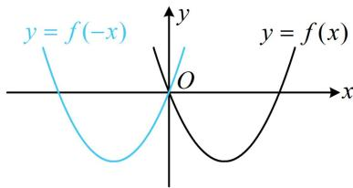
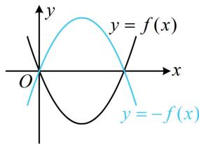
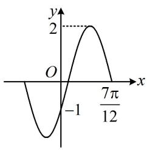

# 内容提要

本节归纳三角函数图象的平移、伸缩变换有关考题，先回顾一下平移、伸缩的规则.

1. 平移（口诀：左加右减，上加下减）

$$
\left\{\begin{array}{l l}{y = f (x)   \frac {\text {向左平移} a \text {个单位}}{\text {将} x \text {替换成} x + a} \rightarrow y = f (x + a)}\\{y = f (x)   \frac {\text {向右平移} a \text {个单位}}{\text {将} x \text {替换成} x - a} \rightarrow y = f (x - a)}\end{array}\right.
$$

$$
\left\{ \begin{array}{l l} { y = f (x)   \xrightarrow [ \text {解析式整体加} a ]{\text {向上平移} a \text {个单位}}   y = f (x) + a} \\ { y = f (x)   \xrightarrow [ \text {解析式整体减} a ]{\text {向下平移} a \text {个单位}}   y = f (x) - a} \end{array} \right.
$$

注意：左右平移的量是加在 $x$ 上的，不是加在整个括号里的。例如，将函数 $y = \sin \left(2x + \frac{\pi}{3}\right)$ 右移 $\frac{\pi}{6}$ 个单位得到的是 $y = \sin \left[2\left(x - \frac{\pi}{6}\right) + \frac{\pi}{3}\right]$ ，而不是 $y = \sin \left(2x + \frac{\pi}{3} - \frac{\pi}{6}\right)$ ；上下平移的量是加在整个解析式后面的。

2. 伸缩

$$
\left\{ \begin{array}{l l} {y = f (x)   \xrightarrow [ \text {将} x \text {替换成} \frac {x}{2} ]{\text {横坐标变为原来的} 2 \text {倍}} y = f \left(\frac {x}{2}\right)} \\ {y = f (x)   \xrightarrow [ \text {将} x \text {替换成} 2 x ]{\text {横坐标变为原来的} \frac {1}{2} \text {倍}} y = f (2 x)} \end{array} \right.
$$

$$
\left\{ \begin{array}{l l} y = f (x) \xrightarrow [ f (x) \text {前乘以} 2 ]{\text {纵坐标变为原来的} 2 \text {倍}} y = 2 f (x) \\ y = f (x) \xrightarrow [ f (x) \text {前乘以} \frac {1}{2} ]{\text {纵坐标变为原来的} \frac {1}{2} \text {倍}} y = \frac {1}{2} f (x) \end{array} \right.
$$

3. 求解三角函数图象变换题，需要注意两点：

①化同名：当两个函数的函数名不同时，应先用诱导公式化同名，且化完后应保证 $x$ 的系数正负一致.  
②系数化“1”: 例如求 $y = \sin \left(2x + \frac{\pi}{3}\right)$ 和 $y = \sin \left(2x - \frac{\pi}{4}\right)$ 之间的平移关系时, 应把 $x$ 前的系数 2 提出去, 将 $x$ 的系数化 1 , 即化为 $y = \sin 2 \left(x + \frac{\pi}{6}\right)$ 和 $y = \sin 2 \left(x - \frac{\pi}{8}\right)$ , 再观察平移量.

# 类型I：平移变换问题

【例1】要得到函数 $y = \sin \left(2x + \frac{\pi}{4}\right)$ 的图象，只需要将函数 $y = \sin 2x$ 的图象（）

A. 向左平移 $\frac{\pi}{8}$

B. 向右平移 $\frac{\pi}{8}$

C. 向左平移 $\frac{\pi}{4}$

D. 向右平移 $\frac{\pi}{4}$

解析：为了观察出平移的量，先把 $x$ 的系数化1， $y = \sin \left(2x + \frac{\pi}{4}\right) = \sin 2\left(x + \frac{\pi}{8}\right)$ ，

所以在 $y = \sin 2x$ 中将 $x$ 变成 $x + \frac{\pi}{8}$ ，即把 $y = \sin 2x$ 向左平移 $\frac{\pi}{8}$ 个单位，可得到 $y = \sin \left(2x + \frac{\pi}{4}\right)$ 的图象.

答案: A

【变式】为了得到函数 $y = \cos \left(2x + \frac{\pi}{4}\right)$ 的图象，需把 $y = \sin \left(\frac{\pi}{8} - 2x\right)$ 的图象上所有点至少向右平移 \_\_\_\_ 个单位长度.

解析：函数名不同，x 的系数符号也不同，先化为相同，可用 $\sin\alpha=\cos\left(\frac{\pi}{2}-\alpha\right)$ 来实现，

$$
y = \sin \left(\frac {\pi}{8} - 2 x\right) = \cos \left[ \frac {\pi}{2} - \left(\frac {\pi}{8} - 2 x\right) \right] = \cos \left(2 x + \frac {3 \pi}{8}\right) = \cos 2 \left(x + \frac {3 \pi}{1 6}\right), \quad y = \cos \left(2 x + \frac {\pi}{4}\right) = \cos 2 \left(x + \frac {\pi}{8}\right),
$$

观察发现在 $y = \cos 2\left(x + \frac{3\pi}{16}\right)$ 中将 $x$ 换成 $x - \frac{\pi}{16}$ 可得到 $y = \cos 2\left(x + \frac{\pi}{8}\right)$ ,

所以将 $y = \sin \left( \frac{\pi}{8} - 2x \right)$ 的图象至少右移 $\frac{\pi}{16}$ 个单位，可得到 $y = \cos \left( 2x + \frac{\pi}{4} \right)$ 的图象.

答案： $\frac{\pi}{16}$

【反思】解决平移问题，先将前后式的 $x$ 系数符号、三角函数名化为相同，再观察系数化1后平移的量.

# 类型 II：伸缩和平移综合变换

【例 2】将 $y = \sin\left(\frac{x}{2} + \frac{\pi}{3}\right)$ 的图象向右平移 $\frac{\pi}{6}$ 个单位，再把所得图象所有点的横坐标变为原来的一半，最后将所得图象向上平移 2 个单位，则得到的函数的解析式为 \_\_\_\_.

解析：右移 $\frac{\pi}{6}$ 个单位，在解析式中将 $x$ 换成 $x - \frac{\pi}{6}$ 即可，这一步得到 $y = \sin \left[\frac{1}{2} \left(x - \frac{\pi}{6}\right) + \frac{\pi}{3}\right] = \sin \left(\frac{x}{2} + \frac{\pi}{4}\right)$ ;

再将横坐标变为一半，需把 $x$ 换成 $2x$ ，得到 $y = \sin \left(x + \frac{\pi}{4}\right)$ ；最后上移2个单位，得到 $y = \sin \left(x + \frac{\pi}{4}\right) + 2$

答案： $y = \sin \left(x + \frac{\pi}{4}\right) + 2$

【变式1】为了得到 $y = \sin \left(2x - \frac{\pi}{3}\right)$ 的图象，需将 $y = \sin x$ 的图象进行怎样的变换？

解法 1: 由 $y = \sin x$ 到 $y = \sin \left(2x - \frac{\pi}{3}\right)$ ，既要平移，又要伸缩，下面考虑先平移，再伸缩的方法，

将 $y = \sin x$ 的图象向右平移 $\frac{\pi}{3}$ 个单位，得到 $y = \sin \left(x - \frac{\pi}{3}\right)$ 的图象；

再将所得图象上所有点的横坐标变为原来的 $\frac{1}{2}$ 倍，即可得到 $y = \sin \left(2x - \frac{\pi}{3}\right)$ 的图象.

解法2: 也可先伸缩, 再平移, 将 $y = \sin x$ 的图象所有点的横坐标变为原来的 $\frac{1}{2}$ 倍, 得到 $y = \sin 2x$ 的图象; 再将所得图象向右平移 $\frac{\pi}{6}$ 个单位, 得到 $y = \sin 2\left(x - \frac{\pi}{6}\right)$ , 即 $y = \sin \left(2x - \frac{\pi}{3}\right)$ 的图象.

【变式2】为了得到 $y = \tan \left(2x - \frac{\pi}{3}\right)$ 的图象，需将 $y = \tan x$ 的图象进行怎样的变换？

解法1：先平移，再伸缩，将 $y = \tan x$ 的图象向右平移 $\frac{\pi}{3}$ 个单位，得到 $y = \tan \left( x - \frac{\pi}{3} \right)$ 的图象；

再将所得图象上所有点的横坐标变为原来的 $\frac{1}{2}$ 倍，即可得到 $y = \tan \left(2x - \frac{\pi}{3}\right)$ 的图象.

解法2：先伸缩，再平移，将 $y = \tan x$ 的图象所有点的横坐标变为原来的 $\frac{1}{2}$ 倍，得到 $y = \tan 2x$ 的图象；

再将所得图象向右平移 $\frac{\pi}{6}$ 个单位，得到 $y = \tan 2\left(x - \frac{\pi}{6}\right)$ ，即 $y = \tan \left(2x - \frac{\pi}{3}\right)$ 的图象.

# 类型III：翻折变换

【例 3】将函数 $f(x)=\sin(3x+\varphi)\left(\left|\varphi\right|<\frac{\pi}{2}\right)$ 的图象向左平移 $\frac{2\pi}{9}$ 个单位长度后得到函数 $g(x)$ 的图象，若 $f(x)$ 与 $g(x)$ 的图象关于 y 轴对称，则 $\varphi=$ （）

A. $\frac{\pi}{3}$

B. $\frac{\pi}{6}$

C. $\frac{\pi}{9}$

D. $\frac{\pi}{12}$

解析：先求出 $g(x)$ 的解析式，由题意， $g(x) = f\left(x + \frac{2\pi}{9}\right) = \sin \left[3\left(x + \frac{2\pi}{9}\right) + \varphi\right] = \sin \left(3x + \frac{2\pi}{3} + \varphi\right)$ ，

因为 $f(x)$ 与 $g(x)$ 的图象关于 y 轴对称，所以 $g(x)=f(-x)$ ，故 $\sin\left(3x+\frac{2\pi}{3}+\varphi\right)=\sin(-3x+\varphi)$ ①，

上式中 $x$ 的系数相反，先把系数化为相同，且保持函数名不变，可用诱导公式 $\sin \alpha = \sin (\pi -\alpha)$ 实现，

因为 $\sin (-3x + \varphi) = \sin [\pi -(-3x + \varphi)] = \sin (3x + \pi -\varphi)$ ，所以代入①得 $\sin \left(3x + \frac{2\pi}{3} +\varphi\right) = \sin (3x + \pi -\varphi),$

像 $\sin (\omega x + \varphi_{1}) = \sin (\omega x + \varphi_{2})(\omega \neq 0)$ 这种等式要恒成立， $\varphi_{1}$ 和 $\varphi_{2}$ 之间一定相差的是 $2\pi$ 的整数倍，

所以 $\left(\frac{2\pi}{3} +\varphi\right) - (\pi -\varphi) = 2k\pi$ ，故 $\varphi = k\pi +\frac{\pi}{6} (k\in \mathbf{Z})$ ，又 $|\varphi | <   \frac{\pi}{2}$ ，所以 $\varphi = \frac{\pi}{6}$

答案: B

【总结】①将 $f(x)$ 的图象沿 y 轴翻折，得到的是 $f(-x)$ 图象，故 $f(x)$ 和 $f(-x)$ 关于 y 轴对称，如图 1；②将 $f(x)$ 的图象沿 x 轴翻折，得到的是 $-f(x)$ 的图象，所以 $f(x)$ 和 $-f(x)$ 关于 x 轴对称，如图 2.

text_image

y = f(-x)
y = f(x)
O

图1

text_image

y
y = f(x)
O
x
y = -f(x)

图2

# 强化训练

1. (2022·四川成都模拟·★)

要得到函数 $y = \cos \left(2x - \frac{\pi}{4}\right)$ 的图象，只需要将函数 $y = \cos 2x$ 的图象（）

A. 向左平移 $\frac{\pi}{8}$ 个单位  
B. 向右平移 $\frac{\pi}{8}$ 个单位  
C. 向左平移 $\frac{\pi}{4}$ 个单位  
D. 向右平移 $\frac{\pi}{4}$ 个单位

2. (2022·山西模拟·★★)

为了得到函数 $y = \cos\left(2x - \frac{\pi}{6}\right)$ 的图象，需把函数 $y = \sin 2x$ 的图象上的所有点至少向左平移 \_\_\_\_ 个单位.

3. (2022·山东潍坊模拟·★★)

为了得到函数 $y=\sin\left(2x+\frac{\pi}{3}\right)$ 的图象，需把 $y=\sin\left(\frac{\pi}{4}-2x\right)$ 的图象上所有点至少向右平移 \_\_\_\_ 个单位.

4. (2022·河南模拟·★★★)

已知函数 $f(x) = \sin (\omega x + \varphi)\left(\omega > 0, 0 < \varphi < \frac{\pi}{2}\right)$ 的最小正周期为 $\pi$ ，且满足 $f(x + \varphi) = f(\varphi - x)$ ，则要得到函数 $f(x)$ 的图象，可将 $g(x) = \cos \omega x$ 的图象（）

A. 向左平移 $\frac{\pi}{3}$ 个单位长度  
B. 向右平移 $\frac{\pi}{3}$ 个单位长度  
C. 向左平移 $\frac{\pi}{6}$ 个单位长度  
D. 向右平移 $\frac{\pi}{6}$ 个单位长度

5. (2022·福建厦门模拟·★★)

将 $y = \sin \left(2x + \frac{\pi}{3}\right)$ 的图象向左平移 $\frac{\pi}{6}$ 个单位，再向上平移两个单位，最后将所有点的横坐标缩短为原来的 $\frac{1}{2}$ 倍，则所得的函数图象的解析式为（）

A. $y = \sin \left(x + \frac{2\pi}{3}\right) + 2$   
B. $y = \sin \left(4x - \frac{2\pi}{3}\right) + 2$   
C. $y = \cos 4x + 2$   
D. $y = \sin \left(4x + \frac{2\pi}{3}\right) + 2$

6. (2025·全国Ⅰ卷·★★)

若点 $(a,0)(a > 0)$ 是函数 $y = 2\tan \left(x - \frac{\pi}{3}\right)$ 的图象的一个对称中心，则 $a$ 的最小值为（）

A. $\frac{\pi}{6}$

B. $\frac{\pi}{3}$

C. $\frac{\pi}{2}$

D. $\frac{5\pi}{6}$

7.（2022·安徽模拟·★★★）（多选）

为了得到函数 $y = 2\tan \left(2x - \frac{\pi}{3}\right)$ 的图象，只需把 $y = 2\tan \left(\frac{\pi}{4} -2x\right)$ 的图象（）

A. 先沿 $x$ 轴翻折, 再向右平移 $\frac{\pi}{12}$ 个单位  
B. 先沿 $x$ 轴翻折, 再向右平移 $\frac{\pi}{24}$ 个单位  
C. 先沿 $y$ 轴翻折，再向右平移 $\frac{7\pi}{24}$ 个单位  
D. 先沿 $y$ 轴翻折, 再向右平移 $\frac{\pi}{24}$ 个单位

8. (2023·福建厦门四模·★★★)

已知 $f(x) = \sin (2x + \varphi)\left(-\frac{\pi}{2} < \varphi < \frac{\pi}{2}\right)$ ，将 $f(x)$ 的图象向左平移 $\frac{\pi}{6}$ 个单位后得到 $g(x)$ 的图象，若 $f(x)$ 与 $g(x)$ 的图象关于 $y$ 轴对称，则 $\varphi =$ \_\_\_\_.

9. (2024·广东惠州二调·★★★☆)(多选)

函数 $f(x) = A \sin (\omega x + \varphi) \left( A > 0, \omega > 0, |\varphi| < \frac{\pi}{2} \right)$ 的部分图象如图所示，现将 $f(x)$ 的图象向左平移 $\frac{\pi}{6}$ 个单位长度，得到函数 $g(x)$ 的图象，则下列结论正确的是（）

line

| x | y |
|---|---|
| -1 | -∞ |
| 0 | 0 |
| π/12 | 2 |

A. $\varphi = -\frac{\pi}{6}$   
B. $\omega = 2$   
C. 函数 $y = xf\left(x + \frac{\pi}{12}\right)$ 是奇函数  
D. $g(x) = 2\cos \left(2x - \frac{\pi}{3}\right)$

