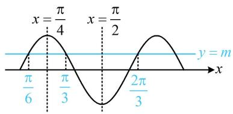
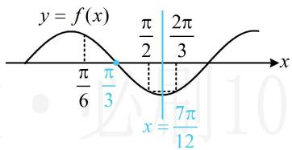
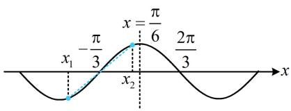

# 强化训练

1. (2022·四川绵阳模拟·★★)

若 $f(x) = \sin (\omega x + \varphi)(\omega > 0)$ 的图象与直线 $y = m$ 的三个相邻交点的横坐标分别是 $\frac{\pi}{6}$ , $\frac{\pi}{3}$ , $\frac{2\pi}{3}$ , 则 $\omega =$ \_\_\_\_.

1.4

解析：水平线与 $f(x)$ 图象的相邻两个交点的中间必为对称轴，故由已知可得到2条对称轴，从而推断出周期，求出 $\omega$

如图，由题意， $x = \frac{\pi}{4}$ 和 $x = \frac{\pi}{2}$ 是相邻的两条对称轴，

所以 $\frac{T}{2} = \frac{\pi}{2} -\frac{\pi}{4} = \frac{\pi}{4}\Rightarrow T = \frac{\pi}{2}\Rightarrow \omega = \frac{2\pi}{T} = 4.$

text_image

x = \frac{\pi}{4} \quad x = \frac{\pi}{2}
\frac{\pi}{6} \quad \frac{\pi}{3} \quad \frac{2\pi}{3} \quad y = m
x

2. (2023·安徽模拟·★★★)

已知 $f(x) = \sin (\omega x + \varphi)(\omega$ 为正整数， $0 < \varphi < \pi)$ 在区间 $\left(\frac{\pi}{4}, \pi\right)$ 上单调，且 $f(\pi) = f\left(\frac{3\pi}{2}\right)$ ，则 $\varphi = (\quad)$

A. $\frac{\pi}{6}$

B. $\frac{\pi}{4}$

C. $\frac{\pi}{3}$

D. $\frac{2\pi}{3}$

2. B

解析： $f(x)$ 在 $\left(\frac{\pi}{4},\pi\right)$ 上单调怎样翻译？可由内容提要1来推周期的范围，进而得到 $\omega$ 的范围，

$f(x)$ 在 $\left(\frac{\pi}{4},\pi\right)$ 上单调 $\Rightarrow \frac{T}{2}\geq \pi -\frac{\pi}{4} = \frac{3\pi}{4}\Rightarrow T\geq \frac{3\pi}{2},$

所以 $\omega = \frac{2\pi}{T} \leq \frac{4}{3}$ ，又 $\omega \in \mathbf{N}^*$ ，所以 $\omega = 1$ ，故 $T = 2\pi$ ，

且 $f(x) = \sin (x + \varphi)$ ，有了周期，可看看 $\pi$ 与 $\frac{3\pi}{2}$ 之间是否小于一个周期。若是，则可由 $f(\pi) = f\left(\frac{3\pi}{2}\right)$ 来推断对称轴，

由 $T = 2\pi$ 可知 $\pi$ 和 $\frac{3\pi}{2}$ 之间小于一个周期，

又 $f(\pi) = f\left(\frac{3\pi}{2}\right)$ ，所以 $x = \frac{5\pi}{4}$ 是 $f(x)$ 的对称轴，

从而 $\frac{5\pi}{4} +\varphi = k\pi +\frac{\pi}{2}$ ，故 $\varphi = k\pi -\frac{3\pi}{4} (k\in \mathbf{Z})$

结合 $0 < \varphi < \pi$ 可得 $\varphi = \frac{\pi}{4}$ .

3. (★★★☆)

设函数 $f(x) = 2\sin (\omega x + \varphi)\left(\omega >0,|\varphi| < \frac{\pi}{2}\right)$ 在 $\left[\frac{\pi}{6},\frac{\pi}{2}\right]$ 上单调递减， $f\left(\frac{\pi}{2}\right) = f\left(\frac{2\pi}{3}\right) = -f\left(\frac{\pi}{6}\right)$ ，若将函数 $f(x)$ 图象上各点的横坐标伸长为原来的 2 倍得到函数 $g(x)$ 的图象，则 $g(x) =$ \_\_\_\_.

3. $2\sin \left(x + \frac{\pi}{3}\right)$

解析：由内容提要1，因为 $f(x)$ 在 $\left[\frac{\pi}{6},\frac{\pi}{2}\right]$ 上单调递减，

所以 $\frac{T}{2} \geq \frac{\pi}{2} - \frac{\pi}{6}$ ，故 $T \geq \frac{2\pi}{3}$ ，条件中有 $f\left(\frac{\pi}{2}\right) = -f\left(\frac{\pi}{6}\right)$ ，且

给了 $f(x)$ 在 $\left[\frac{\pi}{6},\frac{\pi}{2}\right]$ 上单调，可由此推断对称中心，

如图， $\left(\frac{\pi}{3},0\right)$ 必为函数 $f(x)$ 图象的一个对称中心，

还剩 $f\left(\frac{\pi}{2}\right)=f\left(\frac{2\pi}{3}\right)$ 这个条件，可由它推断对称轴，

如图， $\left[\frac{\pi}{2},\frac{2\pi}{3}\right]$ 的宽度小于一个周期，

所以 $x = \frac{7\pi}{12}$ 为 $f(x)$ 图象的一条对称轴，

由图可知 $\frac{T}{4} = \frac{7\pi}{12} -\frac{\pi}{3}$ ，所以 $T = \pi$ ， $\omega = \frac{2\pi}{T} = 2$

故 $f(x)=2\sin(2x+\varphi)$ ，还需求 $\varphi$ ，可代最小值点 $x=\frac{7\pi}{12}$ ，

$f\left(\frac{7\pi}{12}\right) = 2\sin \left(2\times \frac{7\pi}{12} +\varphi\right) = -2$ ，所以 $\sin \left(\frac{7\pi}{6} +\varphi\right) = -1$

又 $|\varphi| < \frac{\pi}{2}$ ，所以 $-\frac{\pi}{2} < \varphi < \frac{\pi}{2}$ ，从而 $\frac{2\pi}{3} < \frac{7\pi}{6} + \varphi < \frac{5\pi}{3}$ ，

故 $\frac{7\pi}{6} + \varphi = \frac{3\pi}{2}$ ，解得： $\varphi = \frac{\pi}{3}$ ，所以 $f(x) = 2\sin \left(2x + \frac{\pi}{3}\right)$ ，

由题意， $g(x) = f\left(\frac{x}{2}\right) = 2\sin \left(x + \frac{\pi}{3}\right).$

text_image

y = f(x)
π/6 π/3
π/2 2π/3
x = 7π/12

4. (2022·上海模拟·★★★★)

已知函数 $f(x) = \sin x + a\cos x$ 满足 $f(x) \leq f\left(\frac{\pi}{6}\right)$ ，若 $f(x)$ 在 $[x_1, x_2]$ 上单调，且 $f(x_1) + f(x_2) = 0$ ，则 $|x_1 + x_2|$ 的最小值为（）

A. $\frac{\pi}{6}$

B. $\frac{\pi}{3}$

C. $\frac{2\pi}{3}$

D. $\frac{4\pi}{3}$

4. C

解析： $f(x)\leq f\left(\frac{\pi}{6}\right)\Rightarrow x = \frac{\pi}{6}$ 是 $f(x)$ 的最大值点，

又 $f(x) = \sin x + a\cos x = \sqrt{1 + a^2}\sin (x + \varphi)$ ，所以 $f(x)$ 的最小正周期为 $2\pi$ ，有了这两点，就可以推断 $f(x)$ 图象上的对称轴、对称中心这些关键信息了。例如， $x = \frac{\pi}{6}$ 左侧的第一个对称中心是 $\left(-\frac{\pi}{3}, 0\right)$ ，右侧的第一个对称中心是 $\left(\frac{2\pi}{3}, 0\right)$ ，如图，因为 $f(x)$ 在 $[x_1, x_2]$ 上单调，

且 $f(x_{1}) + f(x_{2}) = 0$ ，所以 $x = \frac{x_1 + x_2}{2}$ 处必为对称中心，

当 $\left|x_{1}+x_{2}\right|$ 最小时， $\left|\frac{x_{1}+x_{2}}{2}\right|$ 也最小，所以只需找到横坐标绝对值最小的那个对称中心，

由图可知， $\left(-\frac{\pi}{3},0\right)$ 这个对称中心的横坐标的绝对值最小，

所以 $\left|\frac{x_1 + x_2}{2}\right|_{\min} = \frac{\pi}{3}$ ，故 $\left|x_1 + x_2\right|_{\min} = \frac{2\pi}{3}$ .

text_image

x = \frac{\pi}{6} \n -\frac{\pi}{3} \n x_1 \n x_2 \n \frac{2\pi}{3}

一数·必刷100讲

