# 强化训练

# 类型I：三角函数的基本性质

1. (2024·天津卷·★★)

已知函数 $f(x) = 3\sin \left(\omega x + \frac{\pi}{3}\right)(\omega > 0)$ 的最小正周期为 $\pi$ ，则函数 $f(x)$ 在 $\left[-\frac{\pi}{12}, \frac{\pi}{6}\right]$ 的最小值为（）

A. $-\frac{\sqrt{3}}{2}$

B. $-\frac{3}{2}$

C. 0

D. $\frac{3}{2}$

1. D

解析：由题意， $f(x)$ 的最小正周期 $T = \frac{2\pi}{\omega} = \pi \Rightarrow \omega = 2$

所以 $f(x) = 3\sin \left(2x + \frac{\pi}{3}\right)$ ，令 $t = 2x + \frac{\pi}{3}$ ，则 $f(x) = 3\sin t$ ，

当 $x \in \left[-\frac{\pi}{12}, \frac{\pi}{6}\right]$ 时， $t \in \left[\frac{\pi}{6}, \frac{2\pi}{3}\right]$ ，如图， $f(x)_{\min} = 3\sin \frac{\pi}{6} = \frac{3}{2}$ .

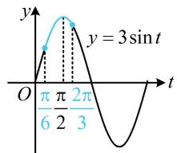

line

| t         | y          |
| --------- | ---------- |
| 0         | 0          |
| π/6       | π/6        |
| 2π/2      | π/2        |
| 3π/2      | 0          |
| π/3       | -π/3       |
| π/6       | -π/6       |

2. (2022·陕西宝鸡模拟·★★)

函数 $y = \sin \left(\frac{\pi}{4} - 2x\right)$ 的单调递减区间是（）

A. $\left[k\pi -\frac{\pi}{8},k\pi +\frac{3\pi}{8}\right](k\in \mathbf{Z})$

B. $\left[2k\pi -\frac{\pi}{8},2k\pi +\frac{3\pi}{8}\right](k\in \mathbf{Z})$

C. $\left[2k\pi + \frac{3\pi}{8}, 2k\pi + \frac{7\pi}{8}\right](k \in \mathbf{Z})$

D. $\left[k\pi + \frac{3\pi}{8}, k\pi + \frac{7\pi}{8}\right](k \in \mathbf{Z})$

2. A

解法1：解析式中 $x$ 的系数为负，习惯上一般先用诱导公式化负为正，可用 $\sin (-\alpha) = -\sin \alpha$ 来化，

由题意， $f(x) = \sin \left(\frac{\pi}{4} -2x\right) = -\sin \left(2x - \frac{\pi}{4}\right),$

要求 $f(x)$ 的减区间，只需求 $y=\sin\left(2x-\frac{\pi}{4}\right)$ 的增区间，

令 $2k\pi - \frac{\pi}{2} \leq 2x - \frac{\pi}{4} \leq 2k\pi + \frac{\pi}{2}$ 得： $k\pi - \frac{\pi}{8} \leq x \leq k\pi + \frac{3\pi}{8}$ ，

所以 $f(x)$ 的减区间是 $\left[k\pi -\frac{\pi}{8},k\pi +\frac{3\pi}{8}\right](k\in \mathbf{Z})$

解法2：也可用 $\sin \alpha = \sin (\pi -\alpha)$ 来将 $x$ 的系数化负为正，

$$
f (x) = \sin \left(\frac {\pi}{4} - 2 x\right) = \sin \left[ \pi - \left(\frac {\pi}{4} - 2 x\right) \right] = \sin \left(2 x + \frac {3 \pi}{4}\right),
$$

令 $2k\pi + \frac{\pi}{2} \leq 2x + \frac{3\pi}{4} \leq 2k\pi + \frac{3\pi}{2}$ 得 $k\pi - \frac{\pi}{8} \leq x \leq k\pi + \frac{3\pi}{8}$ ,

所以 $f(x)$ 的减区间是 $\left[k\pi -\frac{\pi}{8},k\pi +\frac{3\pi}{8}\right](k\in \mathbf{Z})$

3. (2022·宁夏银川模拟·★★☆)

已知函数 $g(x) = \cos x + \sin x$ ， $h(x) = \sin \left(x + \frac{\pi}{2}\right) + \sin (x + \pi)$ ，设 $f(x) = g\left(x - \frac{\pi}{6}\right)h\left(x - \frac{\pi}{6}\right)$ ，则 $f(x)$ 的单调递增区间是（）

A. $\left[k\pi -\frac{\pi}{3},k\pi +\frac{\pi}{6}\right](k\in \mathbf{Z})$   
B. $\left[k\pi + \frac{5\pi}{12}, k\pi + \frac{11\pi}{12}\right](k \in \mathbf{Z})$   
C. $\left[k\pi -\frac{\pi}{12},k\pi +\frac{5\pi}{12}\right](k\in \mathbf{Z})$   
D. $\left[k\pi + \frac{\pi}{6}, k\pi + \frac{2\pi}{3}\right](k \in \mathbf{Z})$

3. A

解析：先写出 $f(x)$ 的解析式并化简，

由题意， $h(x) = \sin \left(x + \frac{\pi}{2}\right) + \sin (x + \pi) = \cos x - \sin x$

$$
\begin{array}{l} f (x) = g \left(x - \frac {\pi}{6}\right) h \left(x - \frac {\pi}{6}\right) \\ = \left[ \cos \left(x - \frac {\pi}{6}\right) + \sin \left(x - \frac {\pi}{6}\right) \right] \left[ \cos \left(x - \frac {\pi}{6}\right) - \sin \left(x - \frac {\pi}{6}\right) \right] \\ = \cos^ {2} \left(x - \frac {\pi}{6}\right) - \sin^ {2} \left(x - \frac {\pi}{6}\right) = \cos \left(2 x - \frac {\pi}{3}\right), \\ \end{array}
$$

要求 $f(x)$ 的单调递增区间，可将 $2x - \frac{\pi}{3}$ 换元成 $t$ ，借助复合函数同增异减准则来分析，

令 $t = 2x - \frac{\pi}{3}$ ，则 $f(x) = \cos t$ ， $y = f(x)$ 是由外层的 $y =$

$\cos t$ 和内层的 $t = 2x - \frac{\pi}{3}$ 复合而成，内层显然 $\nearrow$ ，故要求 $f(x)$ 的增区间，应先求外层 $y = \cos t$ 的增区间，

因为 $y = \cos t$ 的增区间是 $[2k\pi - \pi, 2k\pi]$ ，

所以令 $2k\pi - \pi \leq 2x - \frac{\pi}{3} \leq 2k\pi$ 可得 $k\pi - \frac{\pi}{3} \leq x \leq k\pi + \frac{\pi}{6}$ ,

故 $f(x)$ 的单调递增区间是 $\left[k\pi -\frac{\pi}{3},k\pi +\frac{\pi}{6}\right](k\in \mathbf{Z})$

【反思】函数 $y = \cos (\omega x + \varphi)(\omega > 0)$ 的单调递增区间应由不等式 $2k\pi - \pi \leq \omega x + \varphi \leq 2k\pi$ 来求，单调递减区间应由不等式 $2k\pi \leq \omega x + \varphi \leq 2k\pi + \pi$ 来求.

4. (★★★) (多选)

已知函数 $f(x) = \tan \left(2x - \frac{\pi}{3}\right)$ ，则下列说法正确的是（）

A. 函数 $f(x)$ 的最小正周期为 $\frac{\pi}{2}$   
B. 函数 $f(x)$ 的定义域为 $\left\{x \mid x \neq \frac{k\pi}{2} + \frac{5\pi}{12}, k \in \mathbf{Z}\right\}$   
C. 点 $\left(\frac{5\pi}{12}, 0\right)$ 是函数 $f(x)$ 图象的一个对称中心  
D. $f(x)$ 的单调增区间是 $\left(\frac{k\pi}{2} -\frac{\pi}{6},\frac{k\pi}{2} +\frac{\pi}{3}\right)(k\in \mathbf{Z})$

4. ABC

解析：A项，函数 $y = \tan (\omega x + \varphi)$ 的最小正周期为 $\frac{\pi}{|\omega|}$ ，所以 $f(x)$ 的最小正周期 $T = \frac{\pi}{2}$ ，故A项正确；

B项，求正切的角不能是 $\frac{\pi}{2}$ 的奇数倍，可由此求定义域，由 $2x - \frac{\pi}{3} \neq k\pi + \frac{\pi}{2}$ 可得 $x \neq \frac{k\pi}{2} + \frac{5\pi}{12}$ ，所以 $f(x)$ 的定义域为 $\left\{x \mid x \neq \frac{k\pi}{2} + \frac{5\pi}{12}, k \in \mathbf{Z}\right\}$ ，故B项正确；

C项，要判断 $\left(\frac{5\pi}{12},0\right)$ 是否为对称中心，就看当 $x=\frac{5\pi}{12}$ 时， $2x-\frac{\pi}{3}$ 是否为 $\frac{\pi}{2}$ 的整数倍，

当 $x = \frac{5\pi}{12}$ 时， $2x - \frac{\pi}{3} = 2 \times \frac{5\pi}{12} - \frac{\pi}{3} = \frac{\pi}{2}$ ，故C项正确；

D 项， $k\pi - \frac{\pi}{2} < 2x - \frac{\pi}{3} < k\pi + \frac{\pi}{2} \Rightarrow \frac{k\pi}{2} - \frac{\pi}{12} < x < \frac{k\pi}{2} + \frac{5\pi}{12}$

所以 $f(x)$ 的单调递增区间是 $\left(\frac{k\pi}{2}-\frac{\pi}{12},\frac{k\pi}{2}+\frac{5\pi}{12}\right)(k\in\mathbf{Z})$ ，故 D 项错误.

5. (2024·湖北武汉模拟·★★★) (多选)

已知 $f(x) = A\sin (\omega x + \varphi)\left(A > 0,\omega >0,0 <   \varphi <  \frac{\pi}{2}\right)$ 的部分图象如图所示，则（）

A. $A = 2$   
B. $f(x)$ 的最小正周期为 $\pi$   
C. $f(x)$ 在 $\left(-\frac{5\pi}{12}, \frac{5\pi}{6}\right)$ 内有 3 个极值点  
D. $f(x)$ 在区间 $\left[\frac{11\pi}{6}, 2\pi\right]$ 上的最大值为 $\sqrt{3}$

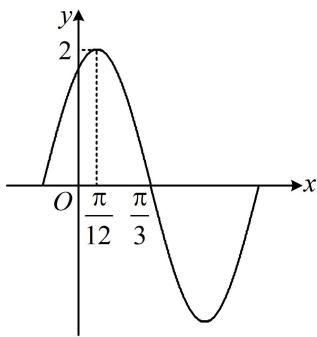

line

| x | y |
|---|---|
| 0 | 0 |
| π/12 | 2 |
| π/3 | -2 |

5. ABD

解法1：A项，由所给图象可知 $f(x)$ 的最大值为2，

所以 $|A|=2$ ，结合A>0可得A=2，故A项正确；

B项，所给图象中有相邻的最大值点和零点，由此可推断周期，

由所给图象可知， $\frac{\pi}{3}-\frac{\pi}{12}=\frac{1}{4}T\Rightarrow T=\pi$ ，故B项正确；

C项，研究 $f(x)$ 的区间极值点个数，可先求其解析式，还差 $\omega$ 和 $\varphi$ ，其中 $\omega$ 可由 $T$ 求得， $\varphi$ 可通过代最值点来求，$T = \frac{2\pi}{\omega} = \pi \Rightarrow \omega = 2$ ，结合 $A = 2$ 得 $f(x) = 2\sin (2x + \varphi)$

由所给图象可知， $f\left(\frac{\pi}{12}\right) = 2\sin \left(2\times \frac{\pi}{12} +\varphi\right)$

$= 2\sin \left(\frac{\pi}{6} +\varphi\right) = 2$ ，所以 $\sin \left(\frac{\pi}{6} +\varphi\right) = 1$

从而 $\varphi = \frac{\pi}{3} + 2k\pi (k \in \mathbf{Z})$ ，结合 $0 < \varphi < \frac{\pi}{2}$ 可得 $k$ 只能取 0，此时 $\varphi = \frac{\pi}{3}$ ，故 $f(x) = 2\sin \left(2x + \frac{\pi}{3}\right)$ ，

要由此分析 $f(x)$ 在 $\left(-\frac{5\pi}{12},\frac{5\pi}{6}\right)$ 上的极值点个数，可将 $2x + \frac{\pi}{3}$ 换元成 $t$ ，借助 $y = 2\sin t$ 的图象来分析，

设 $t = 2x + \frac{\pi}{3}$ ，则 $f(x) = 2\sin t$ ，当 $x\in \left(-\frac{5\pi}{12},\frac{5\pi}{6}\right)$ 时， $t\in \left(-\frac{\pi}{2},2\pi\right)$ ，所以如图1中蓝色那段，

$y=2\sin t$ 在 $\left(-\frac{\pi}{2},2\pi\right)$ 上有 2 个极值点，所以 $f(x)$ 在 $\left(-\frac{5\pi}{12},\frac{5\pi}{6}\right)$ 上也有 2 个极值点，故 C 项错误；

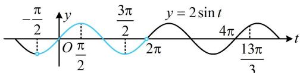

text_image

-π/2
y = 2 sin t
3π/2
4π
13π/3
t
O π/2
2π

图1

D项，研究 $f(x)$ 在 $\left[\frac{11\pi}{6}, 2\pi\right]$ 上的最大值，也可沿用前面的换元，借助 $y = 2\sin t$ 的图象来分析，

当 $x\in \left[\frac{11\pi}{6},2\pi \right]$ 时， $t\in \left[4\pi ,\frac{13\pi}{3}\right],$

由图1可知当 $t = \frac{13\pi}{3}$ 时， $y$ 取得最大值，

所以 $f(x)_{\max} = 2\sin \frac{13\pi}{3} = 2\sin \left(4\pi +\frac{\pi}{3}\right) = 2\sin \frac{\pi}{3}$

$= 2 \times \frac{\sqrt{3}}{2} = \sqrt{3}$ ，故D项正确.

解法2：A、B两项的分析同解法1，对于C项，能否不求

$f(x)$ 的解析式, 直接判断呢? 可以, 注意到已有周期 $T$ , 而相邻极值点之间的距离为 $\frac{T}{2}$ , 故可直接结合所给图象中 $\frac{\pi}{12}$ 为极值点去推断它两边的其它极值点,

由 $T=\pi$ 得 $\frac{T}{2}=\frac{\pi}{2}$ ，所以 $\frac{\pi}{12}$ 左边的极值点依次为 $-\frac{5\pi}{12}$ ， $-\frac{11\pi}{12}$ ，…，

同理， $\frac{\pi}{12}$ 右边的极值点依次为 $\frac{7\pi}{12}$ ， $\frac{13\pi}{12}$ ，…，

因为 $\frac{7\pi}{12} < \frac{5\pi}{6} < \frac{13\pi}{12}$ ，所以 $f(x)$ 在 $\left(-\frac{5\pi}{12}, \frac{5\pi}{6}\right)$ 上的极值点只有 $\frac{\pi}{12}$ ， $\frac{7\pi}{12}$ 两个，故 C 项错误；

对于 D 项，也可借助 $f(x)$ 的周期为 $\pi$ ，把 $\left[\frac{11\pi}{6},2\pi\right]$ 上的最大值转化到所给的那段图象上来分析，

因为 $f(x)$ 的周期为 $\pi$ ，所以 $f(x)$ 在 $\left[\frac{11\pi}{6}, 2\pi\right]$ 上的最大值与 $f(x)$ 在 $\left[-\frac{\pi}{6}, 0\right]$ 上的最大值相同，

因为极大值点 $\frac{\pi}{12}$ 左边的相邻零点为 $\frac{\pi}{12} -\frac{T}{4} = \frac{\pi}{12} -\frac{\pi}{4} = -\frac{\pi}{6}$ ，所以如图2， $f(x)$ 在 $\left[-\frac{\pi}{6},0\right]$ 上 $\nearrow$

从而 $f(x)_{\max} = f(0) = 2\sin \frac{\pi}{3} = 2\times \frac{\sqrt{3}}{2} = \sqrt{3}$ ，故D项正确.

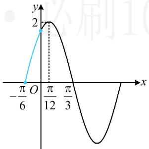

line

| x | y |
|---|---|
| -π/6 | 0 |
| π/12 | 2 |
| π/3 | 0 |

图2

6. (2014·湖北卷·★★★)

某实验室一天的温度（单位：°C）随时间 $t$ （单位： $h$ ）的变化近似满足函数关系 $f(t) = 10 - \sqrt{3}\cos \frac{\pi}{12} t - \sin \frac{\pi}{12} t,$ $t\in [0,24)$ ：

(1) 求实验室这一天的最大温差;  
(2) 若要求实验室温度不高于 $11^{\circ} \mathrm{C}$ , 则在哪段时间实验室需要降温?

6. 解：（1） $f(t)=10-\sqrt{3}\cos\frac{\pi}{12}t-\sin\frac{\pi}{12}t=10-2\sin\left(\frac{\pi}{12}t+\frac{\pi}{3}\right)$

所以 $f(t)$ 的最小正周期为 $T = \frac{2\pi}{\frac{\pi}{12}} = 24$ ，实验室这一天的最大温差为 $f(t)_{\mathrm{max}} - f(t)_{\mathrm{min}} = 12 - 8 = 4^{\circ}\mathrm{C}$

(2) (高于 $11^{\circ} \mathrm{C}$ 就需要降温, 故令 $f(t) > 11$ 求 $t$ 的范围)

由 $f(t) = 10 - 2\sin \left(\frac{\pi}{12} t + \frac{\pi}{3}\right) > 11$ 得 $\sin \left(\frac{\pi}{12} t + \frac{\pi}{3}\right) < -\frac{1}{2}$ ①，(要由此求 t 的范围，可将 $\frac{\pi}{12}t + \frac{\pi}{3}$ 换元来看)

令 $u = \frac{\pi}{12} t + \frac{\pi}{3}$ ，则不等式①即为 $\sin u < -\frac{1}{2}$

且当 $t \in [0,24)$ 时， $u = \frac{\pi}{12} t + \frac{\pi}{3} \in \left[\frac{\pi}{3}, \frac{7\pi}{3}\right)$ ，

如图，当且仅当 $\frac{7\pi}{6} < u < \frac{11\pi}{6}$ 时， $\sin u < -\frac{1}{2}$ ，

所以 $\frac{7\pi}{6} < \frac{\pi}{12} t + \frac{\pi}{3} < \frac{11\pi}{6}$ ，解得： $10 < t < 18$ ，

故在 10 时到 18 时，实验室需要降温.

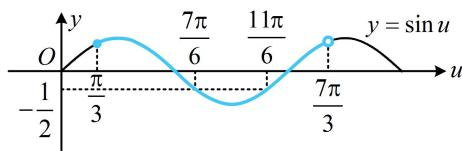

line

| Point | x | y |
|---|---|---|
| 1 | -π/3 | π/3 |
| 2 | 0 | 0 |
| 3 | π/3 | 7π/6 |
| 4 | 0 | -π/3 |
| 5 | 0 | 11π/6 |
| 6 | π/3 | 7π/3 |
| 7 | 0 | sin u (y = sin u) |

# 类型 II：含参的单调性相关问题

# 7. (★★☆)

函数 $f(x) = \cos \left(\omega x + \frac{3\pi}{4}\right)(\omega >0)$ 在区间(0,1)上不可能（）

A. 有最大值

B. 有最小值

C. 单调递增

D. 单调递减

7. C

解析：直接用 $f(x)$ 的图象来分析不方便，可将 $\omega x + \frac{3\pi}{4}$ 换元成 $t$ ，转化为用 $y = \cos t$ 的图象来看，

令 $t = \omega x + \frac{3\pi}{4}$ ，则 $f(x) = \cos t$ ，当 $x\in (0,1)$ 时，

$t \in \left( \frac{3\pi}{4}, \omega + \frac{3\pi}{4} \right)$ ，函数 $y = \cos t$ 的部分图象如图所示，

由图可知 $y = \cos t$ 从 $t = \frac{3\pi}{4}$ 开始必定先 $\searrow$

从而 $f(x)$ 在 $(0,1)$ 上必定也要先 $\searrow$ ，故C项错误.

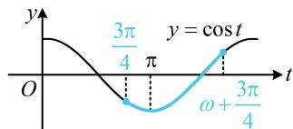

line

| Point | x-axis (t) | y-axis (cos t) |
|---|---|---|
| 1 | -3π/4 | -3π/4 |
| 2 | 0 | -3π/4 |
| 3 | π | -3π/4 |
| 4 | 3π/4 | 0 |
| 5 | 0 | cos t |
| 6 | ω + 3π/4 | ω + 3π/4 |

# 8. (★★★)

若 $f(x) = \sin \left(\omega x - \frac{\pi}{6}\right)(\omega >0)$ 在 $\left(-\frac{\pi}{3},\frac{\pi}{6}\right)$ 上单调，则 $\omega$ 的取值范围为

8. (0,1]

解析：为了便于分析，先将 $\omega x - \frac{\pi}{6}$ 换元成 $t$ ，用 $y = \sin t$ 的图象来研究问题，设 $t = \omega x - \frac{\pi}{6}$ ，则 $f(x) = \sin t$

当 $x\in \left(-\frac{\pi}{3},\frac{\pi}{6}\right)$ 时， $t\in \left(-\frac{\pi}{3}\omega -\frac{\pi}{6},\frac{\pi}{6}\omega -\frac{\pi}{6}\right),$

问题等价于函数 $y = \sin t$ 在 $\left(-\frac{\pi}{3}\omega - \frac{\pi}{6}, \frac{\pi}{6}\omega - \frac{\pi}{6}\right)$ 上单调，

该区间中必有 $-\frac{\pi}{6}$ ，如图，要使 $y = \sin t$ 在该区间单调，则该区间的左端点不能越过 $-\frac{\pi}{2}$ ，右端点不能越过 $\frac{\pi}{2}$ ，

所以 $\left\{ \begin{array}{l} -\frac{\pi}{3}\omega -\frac{\pi}{6}\geq -\frac{\pi}{2}\\  \frac{\pi}{6}\omega -\frac{\pi}{6}\leq \frac{\pi}{2} \end{array} \right.$ ，结合 $\omega >0$ 解得： $0 <   \omega \leq 1$

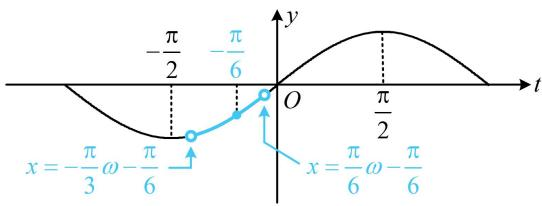

line

| t         | y          |
| --------- | ---------- |
| -π/2      | -π/6       |
| 0         | 0          |
| π/2       | π/6        |

9. (2023·湖北省十一校联考·★★★★)

已知 $\omega > 0$ ，函数 $f(x) = 3\sin \left( \omega x + \frac{\pi}{4} \right) - 2$ 在 $\left[ \frac{\pi}{2}, \pi \right]$ 上单调递减，则 $\omega$ 的取值范围是（）

A. $\left(0,\frac{1}{2}\right]$

B. $(0,2]$

C. $\left[\frac{1}{2},\frac{3}{4}\right]$

D. $\left[\frac{1}{2},\frac{5}{4}\right]$

9. D

解析: 可发现换元后的两边端点值均不固定且不过定值, 故考虑用例 3 变式 4 解法 2 的通法, 先求 $f(x)$ 的减区间, 再由 $\left[\frac{\pi}{2}, \pi\right]$ 包含于该减区间建立不等式求 $\omega$ 的范围,

令 $2k\pi + \frac{\pi}{2} \leq \omega x + \frac{\pi}{4} \leq 2k\pi + \frac{3\pi}{2}$ 可得

$$
\frac {1}{\omega} \left(2 k \pi + \frac {\pi}{4}\right) \leq x \leq \frac {1}{\omega} \left(2 k \pi + \frac {5 \pi}{4}\right),
$$

所以 $f(x)$ 的减区间是 $\left[\frac{1}{\omega}\left(2k\pi +\frac{\pi}{4}\right),\frac{1}{\omega}\left(2k\pi +\frac{5\pi}{4}\right)\right], k\in \mathbf{Z},$

因为 $f(x)$ 在 $\left[\frac{\pi}{2},\pi\right]$ 上 $\searrow$

所以 $\left[\frac{\pi}{2},\pi\right]\subseteq\left[\frac{1}{\omega}\left(2k\pi+\frac{\pi}{4}\right),\frac{1}{\omega}\left(2k\pi+\frac{5\pi}{4}\right)\right],$

从而 $\left\{ \begin{array}{l} \frac{1}{\omega}\left(2k\pi + \frac{\pi}{4}\right) \leq \frac{\pi}{2}\\  \frac{1}{\omega}\left(2k\pi + \frac{5\pi}{4}\right) \geq \pi \end{array} \right.$ ，故 $4k + \frac{1}{2}\leq \omega \leq 2k + \frac{5}{4}$ ①，

怎样筛选 $k$ 的取值？一方面，①的左端点不超过右端点，否则范围无效；另一方面，右端点必须为正，否则与 $\omega > 0$ 矛盾，由 $\left\{ \begin{array}{l} 4k + \frac{1}{2} \leq 2k + \frac{5}{4} \\ 2k + \frac{5}{4} > 0 \end{array} \right.$ 可得 $-\frac{5}{8} < k \leq \frac{3}{8}$ ，

所以 $k$ 只能取0，代入①得 $\frac{1}{2} \leq \omega \leq \frac{5}{4}$ .

# 类型III：零点与极值点问题

10. (2022·江西南昌模拟·★★☆)

若 $f(x) = \sin \left(\omega x - \frac{\pi}{6}\right)(\omega > 0)$ 在 $(0, \pi)$ 上恰有1个极大值点，无极小值点，则 $\omega$ 的取值范围为 \_\_\_\_.

10. $\left(\frac{2}{3},\frac{5}{3}\right]$

解析：直接画 $f(x)$ 的图象来分析不便，可先将 $\omega x - \frac{\pi}{6}$ 换元成 $t$ ，用 $y = \sin t$ 的图象来分析问题，

设 $t = \omega x - \frac{\pi}{6}$ ，则 $f(x) = \sin t$ ，当 $x\in (0,\pi)$ 时，

$t\in \left(-\frac{\pi}{6},\pi \omega -\frac{\pi}{6}\right)$ ，所以问题等价于 $y = \sin t$ 在

$\left(-\frac{\pi}{6},\pi\omega-\frac{\pi}{6}\right)$ 上有 1 个极大值点，无极小值点，

如图，右端点 $\pi \omega -\frac{\pi}{6}$ 应在 $\frac{\pi}{2}$ (不可取)和 $\frac{3\pi}{2}$ (可取)之间，

所以 $\frac{\pi}{2} < \pi \omega - \frac{\pi}{6} \leq \frac{3\pi}{2}$ ，解得： $\frac{2}{3} < \omega \leq \frac{5}{3}$ .

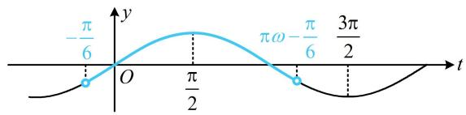

line

| Point | Time (t) |
|---|---|
| -π/6 | 0 |
| π/2 | 0 |
| πω | 0 |

11. (2022·全国甲卷·★★★)

设函数 $f(x) = \sin \left( \omega x + \frac{\pi}{3} \right)$ 在区间 $(0, \pi)$ 恰有三个极值点、两个零点，则实数 $\omega$ 的取值范围是（）

A. $\left[\frac{5}{3},\frac{13}{6}\right)$

B. $\left[\frac{5}{3},\frac{19}{6}\right)$

C. $\left(\frac{13}{6},\frac{8}{3}\right]$

D. $\left(\frac{13}{6},\frac{19}{6}\right]$

11. C

解析：本题没有规定 $\omega$ 的正负，但结合选项，可以只考虑 $\omega > 0$ 的情形，但这里我们把 $\omega \leq 0$ 的情况也来做个分析，弄明白为什么 $\omega \leq 0$ 不满足题意，

当 $\omega = 0$ 时， $f(x) = \sin \frac{\pi}{3} = \frac{\sqrt{3}}{2}$ ，显然不合题意；

当 $\omega < 0$ 时，方便起见，先将 $\omega x + \frac{\pi}{3}$ 换元成 $t$ ，利用 $y =$

$\sin t$ 的图象来分析问题，设 $t = \omega x + \frac{\pi}{3}$ ，则 $f(x) = \sin t$

当 $x \in (0, \pi)$ 时， $t \in \left(\pi \omega + \frac{\pi}{3}, \frac{\pi}{3}\right)$ ，如图1，

在 $y = \sin t$ 在 $\left(\pi \omega +\frac{\pi}{3},\frac{\pi}{3}\right)$ 上有2个零点的条件下，则极值点最多也只有2个，不可能满足题意；

当 $\omega > 0$ 时，因为 $x \in (0, \pi)$ ，所以 $t \in \left(\frac{\pi}{3}, \pi \omega + \frac{\pi}{3}\right)$ ，

函数 $f(x)$ 在 $(0, \pi)$ 恰有三个极值点、两个零点等价于 $y = \sin t$ 在 $\left(\frac{\pi}{3}, \pi \omega + \frac{\pi}{3}\right)$ 恰有三个极值点、两个零点，

如图2，右端点 $\pi \omega +\frac{\pi}{3}$ 应在 $\frac{5\pi}{2}$ （不可取）和 $3\pi$ （可取）之间，

所以 $\frac{5\pi}{2} < \pi \omega + \frac{\pi}{3} \leq 3\pi$ ，解得： $\frac{13}{6} < \omega \leq \frac{8}{3}$ ，

故实数 $\omega$ 的取值范围是 $\left(\frac{13}{6},\frac{8}{3}\right]$

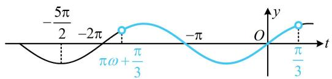

line

| t         | y       |
| --------- | ------- |
| -2π       | -5π/2   |
| -π        | 0       |
| 0         | π/3     |

图1

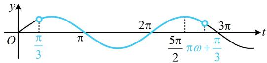

line

| t | y |
|---|---|
| 0 | 0 |
| π/3 | π/3 |
| π | π |
| 2π | 2π |
| 5π/2 | 5π/2 |
| πω + π/3 | 3π |
The chart is a line graph (line graph) with x-axis labeled 't' and y-axis labeled 'y'. The function is defined by the given mathematical expressions: π/3, π, 2π, and 3π.

图2

12. (2023·浙江温州三模·★★★☆)

已知函数 $f(x) = \sin \left(\omega x - \frac{\pi}{4}\right)$ 在区间 $\left[0, \frac{3\pi}{2}\right]$ 上恰有 3 个零点，其中 $\omega$ 为正整数.

(1) 求函数 $f(x)$ 的解析式;  
（2）将函数 $f(x)$ 的图象向左平移 $\frac{\pi}{4}$ 个单位得到函数 $g(x)$ 的图象，求函数 $F(x) = \frac{g(x)}{f(x)}$ 的单调区间.

12. 解：（1）（研究 $f(x)$ 在 $\left[0, \frac{3\pi}{2}\right]$ 上的零点个数，可考虑将

$\omega x - \frac{\pi}{4}$ 换元成 t，借助 $y = \sin t$ 的图象来分析）

令 $t = \omega x - \frac{\pi}{4}$ ，则 $f(x) = \sin t$ ，当 $x\in \left[0,\frac{3\pi}{2}\right]$ 时，

$t \in \left[-\frac{\pi}{4}, \frac{3\pi\omega}{2} - \frac{\pi}{4}\right]$ ，所以 $f(x)$ 在 $\left[0, \frac{3\pi}{2}\right]$ 上有 3 个零点等价于 $y = \sin t$ 在 $\left[-\frac{\pi}{4}, \frac{3\pi\omega}{2} - \frac{\pi}{4}\right]$ 上有 3 个零点，

如图，应有 $2\pi \leq \frac{3\pi\omega}{2} -\frac{\pi}{4} < 3\pi$ ，解得： $\frac{3}{2}\leq \omega <  \frac{13}{6}$

又因为 $\omega$ 为正整数，所以 $\omega = 2$ ，故 $f(x) = \sin \left(2x - \frac{\pi}{4}\right)$

（2）由题意， $g(x) = f\left(x + \frac{\pi}{4}\right) = \sin \left[2\left(x + \frac{\pi}{4}\right) - \frac{\pi}{4}\right]$

$= \sin \left(2x + \frac{\pi}{4}\right)$ ，所以 $F(x) = \frac{g(x)}{f(x)} = \frac{\sin\left(2x + \frac{\pi}{4}\right)}{\sin\left(2x - \frac{\pi}{4}\right)}$ ①，

(角不统一, 不易求单调区间, 怎么办呢? 观察发现 $2 x -$

$\frac{\pi}{4} = \left(2x + \frac{\pi}{4}\right) - \frac{\pi}{2}$ ，故按此配凑，用诱导公式化简，即可统一角度） $\sin \left(2x - \frac{\pi}{4}\right) = \sin \left[\left(2x + \frac{\pi}{4}\right) - \frac{\pi}{2}\right] = -\cos \left(2x + \frac{\pi}{4}\right)$ ，

代入①得 $F(x) = \frac{\sin\left(2x + \frac{\pi}{4}\right)}{-\cos\left(2x + \frac{\pi}{4}\right)} = -\tan \left(2x + \frac{\pi}{4}\right)$

由 $k\pi - \frac{\pi}{2} < 2x + \frac{\pi}{4} < k\pi + \frac{\pi}{2}$ 可得 $\frac{k\pi}{2} - \frac{3\pi}{8} < x < \frac{k\pi}{2} + \frac{\pi}{8}$ ,

故 $F(x)$ 的减区间是 $\left(\frac{k\pi}{2} -\frac{3\pi}{8},\frac{k\pi}{2} +\frac{\pi}{8}\right),k\in \mathbf{Z}$ ，无增区间.

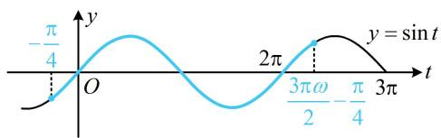

line

| t         | y          |
| --------- | ---------- |
| -π/4      | 0          |
| 0         | 0          |
| π/2       | 2π         |
| 3π/4      | 0          |
| 3π        | -π/4       |

# 类型IV：代值与条件综合翻译

13. (2022·全国乙卷·★★☆)

记函数 $f(x) = \cos (\omega x + \varphi)(\omega > 0, 0 < \varphi < \pi)$ 的最小正周期为 $T$ ，若 $f(T) = \frac{\sqrt{3}}{2}$ ， $x = \frac{\pi}{9}$ 为 $f(x)$ 的零点，则 $\omega$ 的最小值为 \_\_\_\_.

13. 3

解析：由题意， $T=\frac{2\pi}{\omega}$ ， $f(T)=\cos\left(\omega\cdot\frac{2\pi}{\omega}+\varphi\right)$

$= \cos \varphi = \frac{\sqrt{3}}{2}$ ，结合 $0 <   \varphi <  \pi$ 可得 $\varphi = \frac{\pi}{6}$

所以 $f(x)=\cos\left(\omega x+\frac{\pi}{6}\right)$ ,

又 $x = \frac{\pi}{9}$ 为 $f(x)$ 的零点，所以 $f\left(\frac{\pi}{9}\right) = \cos \left(\omega \cdot \frac{\pi}{9} +\frac{\pi}{6}\right) = 0$

从而 $\omega \cdot \frac{\pi}{9} +\frac{\pi}{6} = k\pi +\frac{\pi}{2}$ ，故 $\omega = 9k + 3(k\in \mathbf{Z})$

又 $\omega > 0$ ，所以 $\omega$ 的最小值为3.

14. (2022·新课标Ⅰ卷·★★★)

记函数 $f(x) = \sin \left( \omega x + \frac{\pi}{4} \right) + b(\omega > 0)$ 的最小正周期为 $T$ ，若 $\frac{2\pi}{3} < T < \pi$ ，且 $y = f(x)$ 的图象关于点 $\left( \frac{3\pi}{2}, 2 \right)$ 中心对称，则 $f\left( \frac{\pi}{2} \right) = (\quad)$

A. 1

B. $\frac{3}{2}$

C. $\frac{5}{2}$

D. 3

14. A

解析：要求 $f\left(\frac{\pi}{2}\right)$ ，应先求 $\omega$ 和 $b$ ，题干给出了 $T$ 的范围，可由此找到 $\omega$ 的范围，

因为 $\frac{2\pi}{3} < T < \pi$ ，所以 $\frac{2\pi}{3} < \frac{2\pi}{\omega} < \pi$ ，故 $2 < \omega < 3$

函数 $y = A\sin (\omega x + \varphi) + B$ 的对称中心纵坐标是 $B$ ，故由题设所给的对称中心可直接得到 $b$ ，

函数 $y = f(x)$ 的图象关于点 $\left(\frac{3\pi}{2}, 2\right)$ 中心对称 $\Rightarrow b = 2$ ，

且 $\omega \cdot \frac{3\pi}{2} +\frac{\pi}{4} = k\pi$ ，所以 $\omega = \frac{2}{3} k - \frac{1}{6} (k\in \mathbf{Z})$ ，结合

$2 < \omega < 3$ 可得 $k = 4$ ， $\omega = \frac{5}{2}$ ，故 $f(x) = \sin \left(\frac{5}{2} x + \frac{\pi}{4}\right) + 2$

所以 $f\left(\frac{\pi}{2}\right) = \sin \left(\frac{5}{2} \times \frac{\pi}{2} + \frac{\pi}{4}\right) + 2 = \sin \frac{3\pi}{2} + 2 = 1$

【反思】如图, 函数 $y = A \sin (\omega x + \varphi) + B$ 的对称中心就是图象上能使 $\sin (\omega x + \varphi) = 0$ 的那些点, 其横坐标可由 $\omega x + \varphi = k\pi (k \in \mathbf{Z})$ 来求, 纵坐标即为 $B$ .

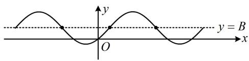

text_image

y
O
x
y = B

15. (2023·四川成都模拟·★★★☆)

函数 $f(x) = \cos (\omega x + \varphi)(\omega > 0, 0 < \varphi < \pi)$ 的最小正周期 $T = \frac{2\pi}{3}$ ，其图象关于 $\left(\frac{\pi}{18}, 0\right)$ 对称，且当 $x \in \left[\frac{\pi}{6}, m\right]$ 时， $f(x)$ 的值域为 $\left[-1, -\frac{\sqrt{3}}{2}\right]$ ，则 $m$ 的取值范围为（）

A. $\left[\frac{\pi}{9},\frac{7\pi}{18}\right]$

B. $\left[\frac{2\pi}{9}, \frac{7\pi}{18}\right]$

C. $\left[\frac{\pi}{9},\frac{5\pi}{18}\right]$

D. $\left[\frac{2\pi}{9}, \frac{5\pi}{18}\right]$

15. D

解析： $T=\frac{2\pi}{3}\Rightarrow\omega=\frac{2\pi}{T}=3$ ，所以 $f(x)=\cos(3x+\varphi)$ ，

又 $f(x)$ 关于 $\left(\frac{\pi}{18},0\right)$ 对称，所以 $3\times \frac{\pi}{18} +\varphi = k\pi +\frac{\pi}{2}$

故 $\varphi = k\pi +\frac{\pi}{3} (k\in \mathbf{Z})$ ，结合 $0 <   \varphi <  \pi$ 可得 $\varphi = \frac{\pi}{3}$

所以 $f(x) = \cos \left(3x + \frac{\pi}{3}\right)$ ，要分析 $f(x)$ 在 $\left[\frac{\pi}{6}, m\right]$ 上的值域，可将 $3x + \frac{\pi}{3}$ 换元成 $t$ ，借助 $y = \cos t$ 的图象来研究，

设 $t = 3x + \frac{\pi}{3}$ ，则 $f(x) = \cos t$ ，且当 $x\in \left[\frac{\pi}{6},m\right]$ 时，

$t \in \left[\frac{5\pi}{6}, 3m + \frac{\pi}{3}\right]$ ，函数 $y = \cos t$ 的大致图象如图，

注意到 $\cos \frac{5\pi}{6} = \cos \frac{7\pi}{6} = -\frac{\sqrt{3}}{2}$

所以要使 $y = \cos t$ 在 $\left[\frac{5\pi}{6}, 3m + \frac{\pi}{3}\right]$ 上的值域为 $\left[-1, -\frac{\sqrt{3}}{2}\right]$ ,

应有右端点 $3m + \frac{\pi}{3}$ 只能在 $\pi$ 和 $\frac{7\pi}{6}$ 之间，

即 $\pi \leq 3m + \frac{\pi}{3} \leq \frac{7\pi}{6}$ ，解得： $\frac{2\pi}{9} \leq m \leq \frac{5\pi}{18}$ .

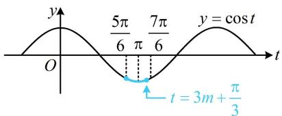

text_image

y
O
5π/6 π 7π/6
y = cos t
t = 3m + π/3

16. (2023·山东济南二模·★★★☆)

已知函数 $f(x) = a\sin 2x + b\cos 2x (ab \neq 0)$ 的图象关于直线 $x = \frac{\pi}{6}$ 对称，则下列说法正确的是（）

A. $f\left(x - \frac{\pi}{6}\right)$ 是偶函数  
B. $f(x)$ 的最小正周期为 $2 \pi$   
C. $f(x)$ 在区间 $\left[-\frac{\pi}{3},\frac{\pi}{6}\right]$ 上单调递增  
D. 方程 $f(x) = 2b$ 在区间 $[0, 2\pi]$ 上有 2 个实根

16. D

解法1：怎样翻译题设的对称条件？注意到 $f(x)$ 可合并成 $\sqrt{a^2 + b^2}\sin (2x + \varphi)$ ，故 $f(x)$ 关于 $x = \frac{\pi}{6}$ 对称意味着 $f(x)$ 在 $x = \frac{\pi}{6}$ 处取得最值 $\pm \sqrt{a^2 + b^2}$ ，由此可得到 $a, b$ 的关系，

由题意， $f\left(\frac{\pi}{6}\right) = a\sin \frac{\pi}{3} +b\cos \frac{\pi}{3} = \frac{\sqrt{3}a}{2} +\frac{b}{2} = \pm \sqrt{a^2 + b^2},$

化简得： $(a - \sqrt{3} b)^2 = 0$ ，所以 $a = \sqrt{3} b$

故 $f(x) = \sqrt{3} b\sin 2x + b\cos 2x = 2b\sin \left(2x + \frac{\pi}{6}\right)$

A 项， $f\left(x-\frac{\pi}{6}\right)=2b\sin\left[2\left(x-\frac{\pi}{6}\right)+\frac{\pi}{6}\right]=2b\sin\left(2x-\frac{\pi}{6}\right)$   
所以 $f\left(x - \frac{\pi}{6}\right)$ 不是偶函数，故A项错误；  
B 项， $f(x)$ 的最小正周期 $T = \frac{2\pi}{2} = \pi$ ，故 B 项错误；  
C 项，b 可正可负，且当 b > 0 时， $f(x)$ 的单调性与 b < 0 时相反，故 $f(x)$ 在 $\left[-\frac{\pi}{3}, \frac{\pi}{6}\right]$ 上单调性不确定，故 C 项错误；  
D 项，选项 A、B、C 均错，答案肯定选 D，如何论证？可将 $2x + \frac{\pi}{6}$ 整体换元来看，

$$
f (x) = 2 b \Leftrightarrow 2 b \sin \left(2 x + \frac {\pi}{6}\right) = 2 b \Leftrightarrow \sin \left(2 x + \frac {\pi}{6}\right) = 1,
$$

令 $t = 2x + \frac{\pi}{6}$ ，则 $\sin t = 1$ ①，

当 $x \in [0, 2\pi]$ 时， $t \in \left[\frac{\pi}{6}, \frac{25\pi}{6}\right]$ ，结合①可得 $t = \frac{\pi}{2}$ 或 $\frac{5\pi}{2}$ ，

故方程 $f(x) = 2b$ 在 $[0, 2\pi]$ 上总有 2 个实根，故 D 项正确.

解法2：题设的对称条件还有其它翻译方法吗？有对称，也可考虑直接利用对称赋值，找到 $a, b$ 的关系，

因为 $f(x)$ 关于直线 $x = \frac{\pi}{6}$ 对称，所以 $f(0) = f\left(\frac{\pi}{3}\right)$ ①，

又 $f(0) = a\sin 0 + b\cos 0 = b$ ， $f\left(\frac{\pi}{3}\right) = a\sin \frac{2\pi}{3} +b\cos \frac{2\pi}{3}$

$= \frac{\sqrt{3}}{2} a - \frac{1}{2} b$ ，代入①得 $b = \frac{\sqrt{3}}{2} a - \frac{1}{2} b$ ，所以 $a = \sqrt{3} b$

接下来同解法1.

17. (2023·四省联考·★★★★)

已知函数 $f(x) = \sin (\omega x + \varphi)$ 在 $\left(\frac{\pi}{6},\frac{\pi}{2}\right)$ 单调，其中 $\omega$ 为正整数， $|\varphi | < \frac{\pi}{2}$ ，且 $f\left(\frac{\pi}{2}\right) = f\left(\frac{2\pi}{3}\right)$ .

(1) 求 $y = f(x)$ 图象的一条对称轴;

(2) 若 $f\left(\frac{\pi}{6}\right)=\frac{\sqrt{3}}{2}$ ，求 $\varphi$ .

17. 解：（1）（由函数值相等条件联想到它们的中间可能为对

称轴，故先看看它们是否在一个周期内）

因为 $f(x)$ 在 $\left(\frac{\pi}{6},\frac{\pi}{2}\right)$ 上单调，所以 $\frac{\pi}{2} -\frac{\pi}{6}\leq \frac{T}{2}$ ，故 $T\geq \frac{2\pi}{3}$

(这就说明 $\frac{\pi}{2}$ 和 $\frac{2\pi}{3}$ 在一个周期内)

又 $f\left(\frac{\pi}{2}\right) = f\left(\frac{2\pi}{3}\right)$ ，所以 $x = \frac{1}{2} \times \left(\frac{\pi}{2} + \frac{2\pi}{3}\right) = \frac{7\pi}{12}$ 为 $y = f(x)$ 图象的一条对称轴.

（2）由（1）知 $T \geq \frac{2\pi}{3}$ ，所以 $\omega = \frac{2\pi}{T} \leq 3$ ，结合 $\omega \in \mathbf{N}^*$ 知 $\omega$ 只可能取 1，2，3，（ $\omega$ 的值已可通过讨论确定，求 $\varphi$ 只需再来一个方程，现在有两个构造方程的方向：（1）中的对称轴结论、（2）中的 $f\left(\frac{\pi}{6}\right) = \frac{\sqrt{3}}{2}$ ，用哪个呢？都行，但前者得到的方程更简单，故由前者求 $\varphi$ ，再用后者来验证此时的 $\omega$ 与 $\varphi$ 是否可取）

因为 $x = \frac{7\pi}{12}$ 是 $y = f(x)$ 图象的一条对称轴，

所以 $\omega \cdot \frac{7\pi}{12} +\varphi = \frac{\pi}{2} +k\pi (k\in \mathbf{Z})$ ①，

若 $\omega = 1$ ，则由①得 $\varphi = k\pi -\frac{\pi}{12}$ ，结合 $|\varphi | <   \frac{\pi}{2}$ 得 $\varphi = -\frac{\pi}{12}$

所以 $f(x) = \sin \left(x - \frac{\pi}{12}\right), f\left(\frac{\pi}{6}\right) = \sin \frac{\pi}{12} \neq \frac{\sqrt{3}}{2}$ ，不合题意；

若 $\omega = 2$ ，则由①可得 $\varphi = k\pi -\frac{2\pi}{3}$ ，结合 $|\varphi | <   \frac{\pi}{2}$ 得 $\varphi = \frac{\pi}{3}$

所以 $f(x) = \sin \left(2x + \frac{\pi}{3}\right),\quad f\left(\frac{\pi}{6}\right) = \sin \frac{2\pi}{3} = \frac{\sqrt{3}}{2},$

（由对称轴 $x = \frac{7\pi}{12}$ 求出的 $\varphi$ 不一定满足 $f(x)$ 在 $\left(\frac{\pi}{6},\frac{\pi}{2}\right)$ 上单调，故需检验，可结合周期找 $x = \frac{7\pi}{12}$ 左侧的对称轴来看）

因为 $T = \pi$ ，所以对称轴 $x = \frac{7\pi}{12}$ 左侧相邻的对称轴为 $x =$

$\frac{7\pi}{12}-\frac{\pi}{2}=\frac{\pi}{12}$ ，故 $f(x)$ 在 $\left(\frac{\pi}{12},\frac{7\pi}{12}\right)$ 上单调，

如图，因为 $\left(\frac{\pi}{6},\frac{\pi}{2}\right)\subseteq \left(\frac{\pi}{12},\frac{7\pi}{12}\right)$ ，所以 $f(x)$ 在 $\left(\frac{\pi}{6},\frac{\pi}{2}\right)$ 上单

调，满足题意；

若 $\omega = 3$ ，则由①得 $\varphi = k\pi -\frac{5\pi}{4}$ ，结合 $|\varphi | <   \frac{\pi}{2}$ 得 $\varphi = -\frac{\pi}{4}$

所以 $f(x) = \sin \left(3x - \frac{\pi}{4}\right)$ ， $f\left(\frac{\pi}{6}\right) = \sin \frac{\pi}{4} \neq \frac{\sqrt{3}}{2}$ ，不合题意；

综上所述， $\varphi$ 的值为 $\frac{\pi}{3}$ .

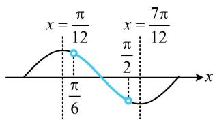

text_image

x = \frac{\pi}{12} \quad x = \frac{7\pi}{12}
\frac{\pi}{6} \quad \frac{\pi}{2}

【反思】本题的核心也是翻译每一个条件，例如在某区间单调、对称轴、特定点的函数值等，这些条件可以翻译成关于 $\omega$ 或 $\varphi$ 的方程或不等式。回顾本节练习可发现，诸多三角函数图象性质的考题，都是通过翻译条件得到思路。

一数·必刷100讲

