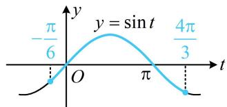
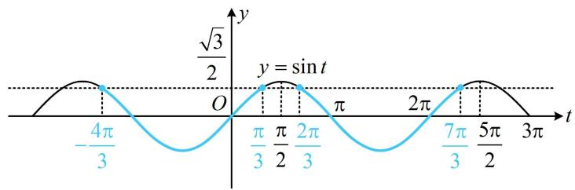
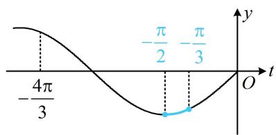
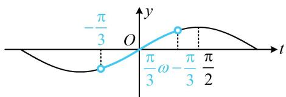
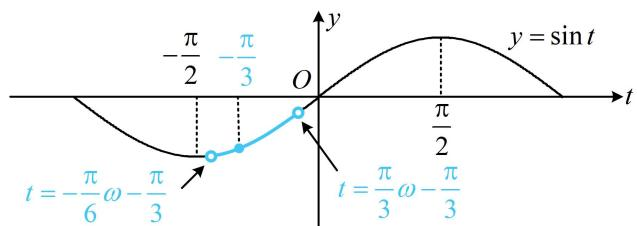
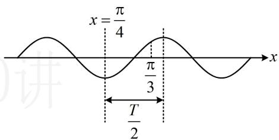
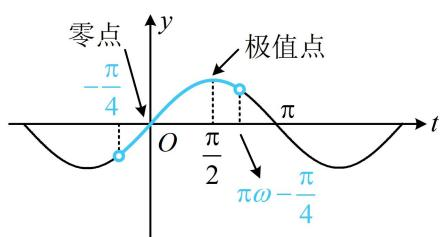
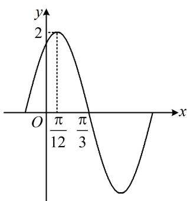

内容提要

整体换元法是三角函数的核心方法之一，在处理函数 $y = A\sin (\omega x + \varphi) + B$ 的图象性质问题时，常将 $\omega x + \varphi$ 换元成 $t$ ，借助 $y = \sin t$ 的图象性质来解决问题，这种方法在求值域、单调区间、对称轴、对称中心、解不等式等诸多问题中有着广泛的应用，它可以将复杂函数问题转化为简单函数问题.

# 类型Ⅰ：整体换元求最值、解不等式

【例1】函数 $f(x) = \sin \left(\frac{\pi}{2} - x\right)\sin x - \sqrt{3}\cos^2 x\left(\frac{\pi}{12}\leq x\leq \frac{5\pi}{6}\right)$ 的最小值为

解析：由题意， $f(x) = \sin \left(\frac{\pi}{2} -x\right)\sin x - \sqrt{3}\cos^2 x = \cos x\sin x - \sqrt{3}\cos^2 x = \frac{1}{2}\sin 2x - \sqrt{3}\cdot \frac{1 + \cos 2x}{2}$

$$
= \frac {1}{2} \sin 2 x - \frac {\sqrt {3}}{2} \cos 2 x - \frac {\sqrt {3}}{2} = \sin \left(2 x - \frac {\pi}{3}\right) - \frac {\sqrt {3}}{2},
$$

要求 $f(x)$ 的最小值，直接对 $f(x)$ 作图较麻烦，可将 $2x - \frac{\pi}{3}$ 换元成 t，用 $y = \sin t$ 的图象来分析，

令 $t = 2x - \frac{\pi}{3}$ ，则 $f(x) = \sin t - \frac{\sqrt{3}}{2}$ ，因为 $\frac{\pi}{12} \leq x \leq \frac{5\pi}{6}$ ，所以 $-\frac{\pi}{6} \leq t \leq \frac{4\pi}{3}$

当 $\sin t$ 最小时， $f(x)$ 也最小，故要求 $f(x)$ 的最小值，可先求 $y = \sin t$ 在 $\left[-\frac{\pi}{6}, \frac{4\pi}{3}\right]$ 上的最小值，

函数 $y = \sin t$ 的部分图象如图所示，由图可知，

$$
f (x) _ {\min} = \sin \frac {4 \pi}{3} - \frac {\sqrt {3}}{2} = - \sin \frac {\pi}{3} - \frac {\sqrt {3}}{2} = - \sqrt {3}.
$$

答案: $- \sqrt{3}$

line

| x | y |
|---|---|
| -π/6 | 0 |
| O | 0 |
| π | sin t (peak) |
| π/3 | sin t (trough) |

【例 2】若 $f(x)=2\sqrt{3}\sin\left(2x+\frac{\pi}{3}\right)+2\sqrt{3}\sin x\cos x-2\cos^{2}x+1$ ，则 $f(x)\leq2\sqrt{3}$ 的解集为 \_\_\_\_.

解析：由题意， $f(x) = 2\sqrt{3}\left(\sin 2x\cos \frac{\pi}{3} +\cos 2x\sin \frac{\pi}{3}\right) + \sqrt{3}\sin 2x - \cos 2x = 2\sqrt{3}\sin 2x + 2\cos 2x = 4\sin \left(2x + \frac{\pi}{6}\right),$ 所以 $f(x)\leq 2\sqrt{3}$ 即为 $4\sin \left(2x + \frac{\pi}{6}\right)\leq 2\sqrt{3}$ ，也即 $\sin \left(2x + \frac{\pi}{6}\right)\leq \frac{\sqrt{3}}{2}$

三角不等式常画图来解，画 $y = \sin \left(2x + \frac{\pi}{6}\right)$ 的图象较麻烦，故将 $2x + \frac{\pi}{6}$ 换元成 $t$ ，用 $y = \sin t$ 的图象来解，令 $t = 2x + \frac{\pi}{6}$ ，则 $\sin t \leq \frac{\sqrt{3}}{2}$ ，函数 $y = \sin t$ 的部分图象如图，

由图可知不等式 $\sin t \leq \frac{\sqrt{3}}{2}$ 的解也呈现出周期特征，可先取一个周期内的解，再加上周期的整数倍，

在 $\left[\frac{\pi}{2},\frac{5\pi}{2}\right)$ 这个周期上， $\sin t \leq \frac{\sqrt{3}}{2}$ 的解集为 $\left[\frac{2\pi}{3},\frac{7\pi}{3}\right]$ ，所以 $\sin t \leq \frac{\sqrt{3}}{2}$ 的完整解集为 $\left[2k\pi + \frac{2\pi}{3}, 2k\pi + \frac{7\pi}{3}\right]$ ，上面得到的是 $t$ 的范围，将 $t$ 换回 $2x + \frac{\pi}{6}$ ，即可求解 $x$ 的范围，

由 $2k\pi + \frac{2\pi}{3} \leq 2x + \frac{\pi}{6} \leq 2k\pi + \frac{7\pi}{3}$ 得 $k\pi + \frac{\pi}{4} \leq x \leq k\pi + \frac{13\pi}{12}$ ，故原不等式的解集为 $\left[k\pi + \frac{\pi}{4}, k\pi + \frac{13\pi}{12}\right](k \in \mathbf{Z})$ 。

答案： $\left[k\pi +\frac{\pi}{4},k\pi +\frac{13\pi}{12}\right](k\in \mathbf{Z})$

line

| t         | y          |
| --------- | ---------- |
| -4π/3     | √3/2       |
| π/3       | √3/2       |
| π/2       | √3/2       |
| 2π/3      | √3/2       |
| 7π/3      | √3/2       |
| 5π/2      | √3/2       |
| 3π        | √3/2       |

【总结】解有关 $y = A \sin (\omega x + \varphi) + B$ 的函数值问题，可令 $t = \omega x + \varphi$ ，用 $y = \sin t$ 的图象来分析更简单.

# 类型 II：整体换元研究单调区间

【例 3】函数 $f(x)=\sin\left(2x-\frac{\pi}{3}\right)$ 的单调递增区间是 \_\_\_\_，单调递减区间是 \_\_\_\_.

解析: 函数 $f(x) = \sin \left(2 x - \frac {\pi}{3}\right)$ 是由 $y = \sin t$ 和 $t = 2 x - \frac {\pi}{3}$ 复合而成, 复合函数遵循同增异减的单调性准则, 内层的 $t = 2 x - \frac {\pi}{3}$ 显然 $\nearrow$ , 所以要求 $f(x)$ 的增区间, 只需求 $y = \sin t$ 的增区间,

函数 $y = \sin t$ 的增区间是 $\left[2k\pi -\frac{\pi}{2},2k\pi +\frac{\pi}{2}\right]$ ，其中 $k\in \mathbf{Z}$ ，令 $2k\pi -\frac{\pi}{2}\leq 2x - \frac{\pi}{3}\leq 2k\pi +\frac{\pi}{2}$

解得： $k\pi - \frac{\pi}{12} \leq x \leq k\pi + \frac{5\pi}{12}$ ，所以 $f(x)$ 的增区间是 $\left[k\pi - \frac{\pi}{12}, k\pi + \frac{5\pi}{12}\right]$ ;

与求增区间同理，由复合函数的同增异减准则，要求 $f(x)$ 的减区间，只需求 $y = \sin t$ 的减区间，

函数 $y = \sin t$ 的减区间是 $\left[2k\pi +\frac{\pi}{2},2k\pi +\frac{3\pi}{2}\right]$ ，其中 $k\in \mathbf{Z}$

令 $2k\pi + \frac{\pi}{2} \leq 2x - \frac{\pi}{3} \leq 2k\pi + \frac{3\pi}{2}$ 得： $k\pi + \frac{5\pi}{12} \leq x \leq k\pi + \frac{11\pi}{12}$ ，所以 $f(x)$ 单调递减区间是 $\left[k\pi + \frac{5\pi}{12}, k\pi + \frac{11\pi}{12}\right]$ .

答案： $\left[k\pi -\frac{\pi}{12},k\pi +\frac{5\pi}{12}\right](k\in \mathbf{Z})$ ， $\left[k\pi +\frac{5\pi}{12},k\pi +\frac{11\pi}{12}\right](k\in \mathbf{Z})$

【反思】函数 $y = \sin(\omega x + \varphi)(\omega > 0)$ 的增区间可由不等式 $2k\pi - \frac{\pi}{2} \leq \omega x + \varphi \leq 2k\pi + \frac{\pi}{2}(k \in \mathbf{Z})$ 来求，减区间可由不等式 $2k\pi + \frac{\pi}{2} \leq \omega x + \varphi \leq 2k\pi + \frac{3\pi}{2}$ 来求.

【变式1】函数 $f(x) = \sin \left(\frac{\pi}{3} - 2x\right)$ 的单调递增区间是 \_\_\_\_.

解法1: 解析式中 $x$ 的系数为负, 习惯上一般先用诱导公式化负为正, 可用公式 $\sin (-\alpha) = -\sin \alpha$ 实现, $f(x) = \sin \left(\frac{\pi}{3} - 2x\right) = -\sin \left(2x - \frac{\pi}{3}\right)$ , 要求 $f(x)$ 的增区间, 只需求 $y = \sin \left(2x - \frac{\pi}{3}\right)$ 的减区间,

令 $2k\pi + \frac{\pi}{2} \leq 2x - \frac{\pi}{3} \leq 2k\pi + \frac{3\pi}{2}$ 得： $k\pi + \frac{5\pi}{12} \leq x \leq k\pi + \frac{11\pi}{12}$ ，故 $f(x)$ 的增区间是 $\left[k\pi + \frac{5\pi}{12}, k\pi + \frac{11\pi}{12}\right](k \in \mathbf{Z})$ 。

解法2：也可用 $\sin \alpha = \sin (\pi -\alpha)$ 将 $x$ 的系数化负为正， $f(x) = \sin \left(\frac{\pi}{3} -2x\right) = \sin \left[\pi -\left(\frac{\pi}{3} -2x\right)\right] = \sin \left(2x + \frac{2\pi}{3}\right),$

令 $2k\pi - \frac{\pi}{2} \leq 2x + \frac{2\pi}{3} \leq 2k\pi + \frac{\pi}{2}$ 得： $k\pi - \frac{7\pi}{12} \leq x \leq k\pi - \frac{\pi}{12}$ ，故 $f(x)$ 的增区间是 $\left[k\pi - \frac{7\pi}{12}, k\pi - \frac{\pi}{12}\right](k \in \mathbf{Z})$ ；

这个结果好像和解法1的不同，但实际上它们是一样的，代几个 $k$ 进去写出来看看便知.

答案： $\left[k\pi +\frac{5\pi}{12},k\pi +\frac{11\pi}{12}\right](k\in \mathbf{Z})$

【变式2】函数 $f(x) = \sin \left( 2x - \frac{\pi}{3} \right)$ 在 $\left[ -\frac{\pi}{2}, 0 \right]$ 上的单调递增区间是 \_\_\_\_.

解析：设 $t = 2x - \frac{\pi}{3}$ ，则 $f(x) = \sin t$ ，当 $x\in \left[-\frac{\pi}{2},0\right]$ 时， $t\in \left[-\frac{4\pi}{3}, - \frac{\pi}{3}\right]$

要求 $f(x)$ 的增区间，只需寻找函数 $y = \sin t$ 在 $\left[-\frac{4\pi}{3}, -\frac{\pi}{3}\right]$ 上的增区间，

如图，由图可知，函数 $y = \sin t$ 在 $\left[-\frac{4\pi}{3}, -\frac{\pi}{2}\right]$ 上 $\searrow$ ，在 $\left[-\frac{\pi}{2}, -\frac{\pi}{3}\right]$ 上 $\nearrow$

所以令 $-\frac{\pi}{2} \leq 2x - \frac{\pi}{3} \leq -\frac{\pi}{3}$ 可得： $-\frac{\pi}{12} \leq x \leq 0$

故 $f(x)$ 在 $\left[-\frac{\pi}{2},0\right]$ 上的单调递增区间是 $\left[-\frac{\pi}{12},0\right]$ .

答案： $\left[-\frac{\pi}{12},0\right]$

line

| t | y |
|---|---|
| -4π/3 | 0 |
| -π/2 | -π/3 |
| O | 0 |

【变式3】若函数 $f(x) = \sin \left( \omega x - \frac{\pi}{3} \right) (\omega > 0)$ 在 $\left( 0, \frac{\pi}{3} \right)$ 上是单调函数，则 $\omega$ 的取值范围为 \_\_\_\_.

解析：先求 $f(x)$ 的单调区间再分析较麻烦，可考虑将 $\omega x - \frac{\pi}{3}$ 换元成 $t$ ，借助 $y = \sin t$ 的图象来研究问题，

设 $t = \omega x - \frac{\pi}{3}$ ，则 $f(x) = \sin t$ ，当 $x\in \left(0,\frac{\pi}{3}\right)$ 时， $t\in \left(-\frac{\pi}{3},\frac{\pi}{3}\omega -\frac{\pi}{3}\right),$

所以 $f(x)$ 在 $\left(0, \frac{\pi}{3}\right)$ 上是单调函数等价于 $y = \sin t$ 在 $\left(-\frac{\pi}{3}, \frac{\pi}{3} \omega - \frac{\pi}{3}\right)$ 上是单调函数，

如图，由图可知应有 $\frac{\pi}{3}\omega -\frac{\pi}{3}\leq \frac{\pi}{2}$ ，结合 $\omega >0$ 可得 $0 <   \omega \leq \frac{5}{2}$

答案： $\left(0,\frac{5}{2}\right]$

line

| t         | y     |
| --------- | ----- |
| -π/3      | 0     |
| π/3       | 0     |
| -π/3      | π/2   |
| π/2       | 0     |

【变式4】若函数 $f(x) = \sin \left( \omega x - \frac{\pi}{3} \right) (\omega > 0)$ 在 $\left(-\frac{\pi}{6}, \frac{\pi}{3}\right)$ 上单调递增，则 $\omega$ 的取值范围为 \_\_\_\_.

解法 1: 为了简化问题, 可先将 $\omega x - \frac{\pi}{3}$ 换元成 $t$ , 转化为 $y = \sin t$ 来研究单调性,

设 $t = \omega x - \frac{\pi}{3}$ ，则 $f(x) = \sin t$ ，当 $x\in \left(-\frac{\pi}{6},\frac{\pi}{3}\right)$ 时， $t\in \left(-\frac{\pi}{6}\omega -\frac{\pi}{3},\frac{\pi}{3}\omega -\frac{\pi}{3}\right),$

所以 $f(x)$ 在 $\left(-\frac{\pi}{6},\frac{\pi}{3}\right)$ 上 $\nearrow$ 等价于 $y = \sin t$ 在

$$
\left(- \frac {\pi}{6} \omega - \frac {\pi}{3}, \frac {\pi}{3} \omega - \frac {\pi}{3}\right) \text {上} \nearrow ,
$$

此区间左右端点都在变，怎么办呢？注意到 $-\frac{\pi}{3}$ 在该

text_image

y = sin t
-π/2 -π/3
O
t = -π/6 ω - π/3
t = π/3 ω - π/3

区间内，要保证单调，该区间只能包含于 $\left[-\frac{\pi}{2},\frac{\pi}{2}\right]$ ，

所以 $\left\{ \begin{array}{l} -\frac{\pi}{6}\omega -\frac{\pi}{3}\geq -\frac{\pi}{2}\\ \frac{\pi}{3}\omega -\frac{\pi}{3}\leq \frac{\pi}{2} \end{array} \right.$ ，结合 $\omega >0$ 可得 $0 <   \omega \leq 1$

解法2: 我们也可先求出 $f(x)$ 全部的 $\nearrow$ 区间, 根据 $\left(-\frac{\pi}{6}, \frac{\pi}{3}\right)$ 包含于该 $\nearrow$ 区间, 求得 $\omega$ 的范围,

$$
2 k \pi - \frac {\pi}{2} \leq \omega x - \frac {\pi}{3} \leq 2 k \pi + \frac {\pi}{2} \Rightarrow \frac {1}{\omega} \left(2 k \pi - \frac {\pi}{6}\right) \leq x \leq \frac {1}{\omega} \left(2 k \pi + \frac {5 \pi}{6}\right),
$$

所以 $f(x)$ 的增区间是 $\left[\frac{1}{\omega}\left(2k\pi -\frac{\pi}{6}\right),\frac{1}{\omega}\left(2k\pi +\frac{5\pi}{6}\right)\right]$ ，其中 $k\in \mathbf{Z}$

因为 $f(x)$ 在 $\left(-\frac{\pi}{6},\frac{\pi}{3}\right)$ 上 $\nearrow$ ，所以 $\left(-\frac{\pi}{6},\frac{\pi}{3}\right)\subseteq \left[\frac{1}{\omega}\left(2k\pi -\frac{\pi}{6}\right),\frac{1}{\omega}\left(2k\pi +\frac{5\pi}{6}\right)\right]$

注意到 $\left(-\frac{\pi}{6}, \frac{\pi}{3}\right)$ 这个区间含 0，那么它必定包含于 $\left[\frac{1}{\omega} \left(2k\pi - \frac{\pi}{6}\right), \frac{1}{\omega} \left(2k\pi + \frac{5\pi}{6}\right)\right]$ 含 0 的那段，即 $k = 0$ 那段，

当 $k = 0$ 时， $\left[\frac{1}{\omega}\left(2k\pi -\frac{\pi}{6}\right),\frac{1}{\omega}\left(2k\pi +\frac{5\pi}{6}\right)\right]$ 即为 $\left[-\frac{\pi}{6\omega},\frac{5\pi}{6\omega}\right],$

所以 $\left(-\frac{\pi}{6},\frac{\pi}{3}\right)\subseteq \left[-\frac{\pi}{6\omega},\frac{5\pi}{6\omega}\right]$ ，从而 $\left\{ \begin{array}{l} - \frac{\pi}{6}\geq -\frac{\pi}{6\omega}\\ \frac{\pi}{3}\leq \frac{5\pi}{6\omega} \end{array} \right.$ ，故 $0 <   \omega \leq 1$

答案: (0,1]

【反思】解法 2 虽计算量稍大, 但更具一般性. 若 $t$ 的取值区间没有定值 $-\frac{\pi}{3}$ , 则只能用解法 2.

【变式 5】已知函数 $f(x)=a\sin x+2\cos x$ 在 $\left[-\frac{\pi}{3},-\frac{\pi}{4}\right]$ 上单调递减，则实数 a 的取值范围是 \_\_\_\_.

解析：本题若用辅助角公式合并成 $\sqrt{a^2 + 4}\sin (x + \varphi)$ ，由于 $\varphi$ 与 $a$ 有关，将 $x + \varphi$ 整体换元作用不大，不易分析单调性，所以不合并，那如何研究单调性呢？可求导分析，

由题意， $f^{\prime}(x) = a\cos x - 2\sin x\leq 0$ 在 $\left[-\frac{\pi}{3}, - \frac{\pi}{4}\right]$ 上恒成立，所以 $a\cos x\leq 2\sin x$

观察发现上述不等式中参数 $a$ 容易分离出来，故考虑全分离，先判断 $\cos x$ 的正负，

因为当 $x \in \left[-\frac{\pi}{3}, -\frac{\pi}{4}\right]$ 时， $\cos x > 0$ ，所以 $a \leq \frac{2\sin x}{\cos x} = 2\tan x$

函数 $y = 2\tan x$ 在 $\left[-\frac{\pi}{3}, - \frac{\pi}{4}\right]$ 上，所以 $(2\tan x)_{\min} = 2\tan \left(-\frac{\pi}{3}\right) = -2\sqrt{3}$ ，故 $a\leq -2\sqrt{3}$

答案： $(- \infty, -2 \sqrt{3} ]$

【反思】并不是每一道题都宜采用整体换元法，换元前应先评估接下来的计算复杂度如何，有的题目不整体换元，直接对所给函数进行分析可能更简单.

类型III：对称轴、对称中心、单调区间综合

【例 4】函数 $f(x)=\sin\left(2x+\frac{\pi}{4}\right)$ 的对称轴方程是 \_\_\_\_，对称中心是 \_\_\_\_.

解析： $f(x) = \sin \left(2x + \frac{\pi}{4}\right)$ 的对称轴处函数值为 $\pm 1$ ，即 $\sin \left(2x + \frac{\pi}{4}\right) = \pm 1$ ，令 $t = 2x + \frac{\pi}{4}$ ，则 $\sin t = \pm 1$

所以 $t = k\pi + \frac{\pi}{2} (k \in \mathbf{Z})$ ，即 $2x + \frac{\pi}{4} = k\pi + \frac{\pi}{2}$ ，解得： $x = \frac{k\pi}{2} + \frac{\pi}{8}$ ，

所以 $f(x)$ 的对称轴方程是 $x = \frac{k\pi}{2} +\frac{\pi}{8} (k\in \mathbf{Z})$

又 $f(x) = \sin \left(2x + \frac{\pi}{4}\right)$ 的对称中心处函数值为0，即 $\sin \left(2x + \frac{\pi}{4}\right) = 0$ ，也即 $\sin t = 0$ ，所以 $t = k\pi (k\in \mathbf{Z})$

从而 $2x + \frac{\pi}{4} = k\pi$ ，故 $x = \frac{k\pi}{2} -\frac{\pi}{8}$ ，所以 $f(x)$ 的对称中心是 $\left(\frac{k\pi}{2} -\frac{\pi}{8},0\right)(k\in \mathbf{Z})$

答案： $x = \frac{k\pi}{2} +\frac{\pi}{8} (k\in \mathbf{Z})$ ， $\left(\frac{k\pi}{2} -\frac{\pi}{8},0\right)(k\in \mathbf{Z})$

【反思】① $f(x)=A\sin(\omega x+\varphi)$ 图象上的零点处即为对称中心，最值点处即为对称轴；特别地，若 $f(x)$ 是奇函数，则 x=0 处函数值为 0，若 $f(x)$ 为偶函数，则 x=0 为对称轴， $f(0)$ 为最大值或最小值；②本题求解过程用到了整体换元法，将 $\omega x+\varphi$ 换成了 t，在熟悉以后，可不用换元，故在后续题目中我们将省略换元的步骤，直接将 $\omega x+\varphi$ 看作整体处理.

【变式1】（多选）已知奇函数 $f(x) = 2\cos (\omega x + \varphi)(\omega > 0, 0 < \varphi < \pi)$ 的最小正周期为 $4\pi$ ，将 $f(x)$ 的图象向右平移 $\frac{\pi}{3}$ 个单位得到函数 $g(x)$ 的图象，则 $g(x)$ 的图象（）

A. 关于点 $\left(-\frac{5\pi}{3}, 0\right)$ 对称 B. 关于点 $\left(\frac{\pi}{2}, 0\right)$ 对称

C. 关于直线 $x = -\frac{2\pi}{3}$ 对称 D. 关于直线 $x = \frac{\pi}{2}$ 对称

解析：要判断选项，需求出 $g(x)$ 的解析式， $g(x)$ 是由 $f(x)$ 平移得来的，所以先求 $f(x)$ 的解析式，

$f(x)$ 的最小正周期为 $4\pi \Rightarrow \frac{2\pi}{\omega} = 4\pi \Rightarrow \omega = \frac{1}{2}$ ，所以 $f(x) = 2\cos \left(\frac{x}{2} + \varphi\right)$ ，

又 $f(x)$ 为奇函数，所以 $f(0) = 2\cos \varphi = 0$ ，从而 $\cos \varphi = 0$ ，故 $\varphi = k\pi +\frac{\pi}{2} (k\in \mathbf{Z})$

又 $0 < \varphi < \pi$ ，所以 $\varphi = \frac{\pi}{2}$ ， $f(x) = 2\cos \left(\frac{x}{2} + \frac{\pi}{2}\right) = -2\sin \frac{x}{2}$ ，故 $g(x) = f\left(x - \frac{\pi}{3}\right) = -2\sin \frac{1}{2}\left(x - \frac{\pi}{3}\right) = -2\sin \left(\frac{x}{2} - \frac{\pi}{6}\right)$ ，

A 项， $g\left(-\frac{5\pi}{3}\right)=-2\sin\left[\frac{1}{2}\times\left(-\frac{5\pi}{3}\right)-\frac{\pi}{6}\right]=-2\sin(-\pi)=0\Rightarrow g(x)$ 关于点 $\left(-\frac{5\pi}{3},0\right)$ 对称，故 A 项正确；

B 项， $g\left(\frac{\pi}{2}\right)=-2\sin\left(\frac{1}{2}\times\frac{\pi}{2}-\frac{\pi}{6}\right)=-2\sin\frac{\pi}{12}\neq0\Rightarrow g(x)$ 不关于点 $\left(\frac{\pi}{2},0\right)$ 对称，故 B 项错误；

C 项， $g\left(-\frac{2\pi}{3}\right)=-2\sin\left[\frac{1}{2}\times\left(-\frac{2\pi}{3}\right)-\frac{\pi}{6}\right]=-2\sin\left(-\frac{\pi}{2}\right)=2\Rightarrow g(x)$ 关于直线 $x=-\frac{2\pi}{3}$ 对称，故 C 项正确；

D 项， $g\left(\frac{\pi}{2}\right)=-2\sin\left(\frac{1}{2}\times\frac{\pi}{2}-\frac{\pi}{6}\right)=-2\sin\frac{\pi}{12}\neq\pm2\Rightarrow g(x)$ 不关于直线 $x=\frac{\pi}{2}$ 对称，故 D 项错误.

答案: AC

【变式2】已知函数 $f(x) = \sin (\omega x + \varphi)\left(\omega > 0, |\varphi| \leq \frac{\pi}{2}\right)$ ， $x = -\frac{\pi}{4}$ 为 $f(x)$ 的零点， $x = \frac{\pi}{4}$ 为 $y = f(x)$ 图象的对称轴，且 $f(x)$ 在 $\left(\frac{\pi}{4}, \frac{\pi}{3}\right)$ 上单调，则 $\omega$ 的最大值是（）

A. 12 B. 11 C. 10 D. 9

解析：先把题干所给的零点和对称轴这两个条件翻译出来，建立关于 $\omega$ 的方程组，

$x = -\frac{\pi}{4}$ 是 $f(x)$ 的零点 $\Rightarrow -\frac{\pi}{4}\omega + \varphi = k_1\pi (k_1 \in \mathbf{Z})$ ， $x = \frac{\pi}{4}$ 是 $f(x)$ 图象的对称轴 $\Rightarrow \frac{\pi}{4}\omega + \varphi = k_2\pi + \frac{\pi}{2} (k_2 \in \mathbf{Z})$

我们要求 $\omega$ 的最大值，应消去 $\varphi$ ，两式作差得： $-\frac{\pi}{4}\omega -\frac{\pi}{4}\omega = (k_1 - k_2)\pi -\frac{\pi}{2}$ ，整理得： $\omega = 2(k_{2} - k_{1}) + 1$

注意到 $k_{1}$ 、 $k_{2}$ 均为任意整数，所以 $k_{2} - k_{1}$ 也为任意整数，记 $k = k_{2} - k_{1}$ ，则 $\omega = 2k + 1 (k \in \mathbf{Z})$

接下来可由 $f(x)$ 在 $\left(\frac{\pi}{4},\frac{\pi}{3}\right)$ 上单调, 来约束 $\omega$ 的范围, 如图, 注意到 $x=\frac{\pi}{4}$ 处是最值点, 所以 $f(x)$ 在区间 $\left(\frac{\pi}{4},\frac{\pi}{3}\right)$ 上单调的充要条件是区间宽度不超过半个周期 $\frac{T}{2}$ ,

所以 $\frac{\pi}{3} -\frac{\pi}{4}\leq \frac{T}{2}$ ，从而 $T\geq \frac{\pi}{6}$ ，故 $\frac{2\pi}{\omega}\geq \frac{\pi}{6}$ ，解得： $\omega \leq 12$

结合 $\omega = 2k + 1(k\in \mathbf{Z})$ 可得 $\omega_{\mathrm{max}} = 11$

答案: B

text_image

x = \frac{\pi}{4}
\frac{\pi}{3}
T/2
讲

【反思】当题目直接给出某些点的坐标时（例如对称轴、对称中心或其它点），可考虑用代数形式翻译这些条件，找到 $\omega$ 的通解（例如上面的 $\omega = 2(k_{2} - k_{1}) + 1$ ），再来确定整数 $k_{1}$ ， $k_{2}$ 的取值.

【例5】已知将函数 $f(x) = \sin \omega x - \sqrt{3} \cos \omega x (\omega > 0)$ 的图象向左平移 $\frac{\pi}{6}$ 个单位长度后得到的函数 $g(x)$ 的图象关于 $y$ 轴对称，则 $\omega$ 的最小值为（）

A. 1 B. 2 C. $\frac{2}{3}$ D. 5

解法1: 先把 $f(x)$ 的解析式化简, 并求出平移后的函数 $g(x)$ 的解析式,

由题意， $f(x) = 2\sin \left(\omega x - \frac{\pi}{3}\right)$ ，所以 $g(x) = f\left(x + \frac{\pi}{6}\right) = 2\sin \left[\omega \left(x + \frac{\pi}{6}\right) - \frac{\pi}{3}\right] = 2\sin \left(\omega x + \frac{\pi\omega}{6} -\frac{\pi}{3}\right),$

因为 $g(x)$ 的图象关于 $y$ 轴对称，则 $x = 0$ 是 $g(x)$ 的一条对称轴，所以 $g(0) = 2\sin \left(\frac{\pi\omega}{6} -\frac{\pi}{3}\right) = \pm 2$ ，从而 $\sin \left(\frac{\pi\omega}{6} -\frac{\pi}{3}\right) = \pm 1$ ，故 $\frac{\pi\omega}{6} -\frac{\pi}{3} = k\pi +\frac{\pi}{2}$ ，所以 $\omega = 6k + 5(k\in \mathbf{Z})$ ，又 $\omega >0$ ，所以 $\omega_{\min} = 5$ ：

解法2: 本题也可不求 $g(x)$ 的解析式, 根据平移关系由 $g(x)$ 的对称性推断出 $f(x)$ 的对称性, 因为 $g(x)$ 关于 $y$ 轴对称, 且 $g(x)$ 由 $f(x)$ 左移 $\frac{\pi}{6}$ 得来, 所以 $f(x)$ 关于 $x = \frac{\pi}{6}$ 对称,

由题意， $f(x) = 2\sin \left(\omega x - \frac{\pi}{3}\right)$ ，所以 $\frac{\pi\omega}{6} -\frac{\pi}{3} = k\pi +\frac{\pi}{2}$ ，故 $\omega = 6k + 5(k\in \mathbf{Z})$ ，又 $\omega >0$ ，所以 $\omega_{\mathrm{min}} = 5$

答案: D

类型IV：整体换元法分析零点与极值点

【例 6】若函数 $f(x)=\sin\left(\omega x-\frac{\pi}{4}\right)(\omega>0)$ 在 $(0,\pi)$ 上有且仅有 1 个零点和 1 个极值点，则 $\omega$ 的取值范围为 \_\_\_\_.

解析：为了便于分析，先将 $\omega x - \frac{\pi}{4}$ 换元成 $t$ ，利用 $y = \sin t$ 的图象来研究零点和极值点，

设 $t = \omega x - \frac{\pi}{4}$ ，则 $f(x) = \sin t$ ，当 $x\in (0,\pi)$ 时， $t\in \left(-\frac{\pi}{4},\pi \omega -\frac{\pi}{4}\right),$

故问题等价于 $y = \sin t$ 在 $\left(-\frac{\pi}{4}, \pi \omega - \frac{\pi}{4}\right)$ 上有 1 个零点和 1 个极值点，

如图，由图可知应有 $\frac{\pi}{2} < \pi \omega - \frac{\pi}{4} \leq \pi$ ，解得： $\frac{3}{4} < \omega \leq \frac{5}{4}$ .

答案： $\left(\frac{3}{4},\frac{5}{4}\right]$

text_image

零点
-π/4
极值点
O
π/2
πω-π/4
y
t

# 强化训练

# 类型 I：三角函数的基本性质

1. (2024·天津卷·★★)

已知函数 $f(x) = 3\sin \left(\omega x + \frac{\pi}{3}\right)(\omega > 0)$ 的最小正周期为 $\pi$ ，则函数 $f(x)$ 在 $\left[-\frac{\pi}{12}, \frac{\pi}{6}\right]$ 的最小值为（）

A. $-\frac{\sqrt{3}}{2}$

B. $-\frac{3}{2}$

C. 0

D. $\frac{3}{2}$

2. (2022·陕西宝鸡模拟·★★)

函数 $y = \sin \left( \frac{\pi}{4} - 2x \right)$ 的单调递减区间是（）

A. $\left[k\pi -\frac{\pi}{8},k\pi +\frac{3\pi}{8}\right](k\in \mathbf{Z})$   
B. $\left[2k\pi -\frac{\pi}{8},2k\pi +\frac{3\pi}{8}\right](k\in \mathbf{Z})$   
C. $\left[2k\pi + \frac{3\pi}{8}, 2k\pi + \frac{7\pi}{8}\right](k \in \mathbf{Z})$   
D. $\left[k\pi + \frac{3\pi}{8}, k\pi + \frac{7\pi}{8}\right](k \in \mathbf{Z})$

3. (2022·宁夏银川模拟·★★☆)

已知函数 $g(x) = \cos x + \sin x$ ， $h(x) = \sin \left(x + \frac{\pi}{2}\right) + \sin (x + \pi)$ ，设 $f(x) = g\left(x - \frac{\pi}{6}\right) h\left(x - \frac{\pi}{6}\right)$ ，则 $f(x)$ 的单调递增区间是（）

A. $\left[k\pi -\frac{\pi}{3},k\pi +\frac{\pi}{6}\right](k\in \mathbf{Z})$   
B. $\left[k\pi + \frac{5\pi}{12}, k\pi + \frac{11\pi}{12}\right](k \in \mathbf{Z})$   
C. $\left[k\pi -\frac{\pi}{12},k\pi +\frac{5\pi}{12}\right](k\in \mathbf{Z})$   
D. $\left[k\pi + \frac{\pi}{6}, k\pi + \frac{2\pi}{3}\right](k \in \mathbf{Z})$

4. (★★★) (多选)

已知函数 $f(x) = \tan \left(2x - \frac{\pi}{3}\right)$ ，则下列说法正确的是（）

A. 函数 $f(x)$ 的最小正周期为 $\frac{\pi}{2}$   
B. 函数 $f(x)$ 的定义域为 $\left\{x \mid x \neq \frac{k\pi}{2} + \frac{5\pi}{12}, k \in \mathbf{Z}\right\}$   
C. 点 $\left(\frac{5\pi}{12}, 0\right)$ 是函数 $f(x)$ 图象的一个对称中心  
D. $f(x)$ 的单调增区间是 $\left(\frac{k\pi}{2} -\frac{\pi}{6},\frac{k\pi}{2} +\frac{\pi}{3}\right)(k\in \mathbf{Z})$

5.（2024·湖北武汉模拟·★★★）（多选）

已知 $f(x) = A\sin (\omega x + \varphi)\left(A > 0,\omega >0,0 <   \varphi <  \frac{\pi}{2}\right)$ 的部分图象如图所示，则（）

A. $A = 2$   
B. $f(x)$ 的最小正周期为 $\pi$

C. $f(x)$ 在 $\left(-\frac{5\pi}{12}, \frac{5\pi}{6}\right)$ 内有3个极值点

D. $f(x)$ 在区间 $\left[\frac{11\pi}{6}, 2\pi\right]$ 上的最大值为 $\sqrt{3}$

line

| x | y |
|---|---|
| 0 | 0 |
| π/12 | 2 |
| π/3 | 0 |

6. (2014·湖北卷·★★★)

某实验室一天的温度（单位：°C）随时间 $t$ （单位： $h$ ）的变化近似满足函数关系 $f(t) = 10 - \sqrt{3}\cos \frac{\pi}{12} t - \sin \frac{\pi}{12} t,$ $t\in [0,24)$

(1) 求实验室这一天的最大温差;  
(2) 若要求实验室温度不高于 $11^{\circ} \mathrm{C}$ , 则在哪段时间实验室需要降温?

# 类型 II：含参的单调性相关问题

7. (★★☆)

函数 $f(x) = \cos \left(\omega x + \frac{3\pi}{4}\right)(\omega >0)$ 在区间 $(0,1)$ 上不可能（）

A. 有最大值  
B. 有最小值  
C. 单调递增  
D. 单调递减

8. (★★★)

若 $f(x) = \sin \left(\omega x - \frac{\pi}{6}\right)(\omega >0)$ 在 $\left(-\frac{\pi}{3},\frac{\pi}{6}\right)$ 上单调，则 $\omega$ 的取值范围为

9. (2023·湖北省十一校联考·★★★★)

已知 $\omega > 0$ ，函数 $f(x) = 3\sin \left( \omega x + \frac{\pi}{4} \right) - 2$ 在 $\left[ \frac{\pi}{2}, \pi \right]$ 上单调递减，则 $\omega$ 的取值范围是（）

A. $\left(0,\frac{1}{2}\right]$

B. $(0,2]$

C. $\left[\frac{1}{2},\frac{3}{4}\right]$

D. $\left[\frac{1}{2},\frac{5}{4}\right]$

# 类型III：零点与极值点问题

10. (2022·江西南昌模拟·★★☆)

若 $f(x) = \sin \left(\omega x - \frac{\pi}{6}\right)(\omega > 0)$ 在 $(0, \pi)$ 上恰有1个极大值点，无极小值点，则 $\omega$ 的取值范围为 \_\_\_\_.

11. (2022·全国甲卷·★★★)

设函数 $f(x) = \sin \left(\omega x + \frac{\pi}{3}\right)$ 在区间 $(0, \pi)$ 恰有三个极值点、两个零点，则实数 $\omega$ 的取值范围是（）

A. $\left[\frac{5}{3},\frac{13}{6}\right)$

B. $\left[\frac{5}{3},\frac{19}{6}\right)$

C. $\left(\frac{13}{6},\frac{8}{3}\right]$

D. $\left(\frac{13}{6},\frac{19}{6}\right]$

12. (2023·浙江温州三模·★★★☆)

已知函数 $f(x) = \sin \left( \omega x - \frac{\pi}{4} \right)$ 在区间 $\left[0, \frac{3\pi}{2}\right]$ 上恰有 3 个零点，其中 $\omega$ 为正整数.

（1）求函数 $f(x)$ 的解析式；

（2）将函数 $f(x)$ 的图象向左平移 $\frac{\pi}{4}$ 个单位得到函数 $g(x)$ 的图象，求函数 $F(x) = \frac{g(x)}{f(x)}$ 的单调区间.

# 类型IV：代值与条件综合翻译

13. (2022·全国乙卷·★★☆)

记函数 $f(x) = \cos (\omega x + \varphi)(\omega > 0, 0 < \varphi < \pi)$ 的最小正周期为 $T$ ，若 $f(T) = \frac{\sqrt{3}}{2}$ ， $x = \frac{\pi}{9}$ 为 $f(x)$ 的零点，则 $\omega$ 的最小值为 \_\_\_\_.

14. (2022·新课标Ⅰ卷·★★★)

记函数 $f(x) = \sin \left( \omega x + \frac{\pi}{4} \right) + b(\omega > 0)$ 的最小正周期为 $T$ ，若 $\frac{2\pi}{3} < T < \pi$ ，且 $y = f(x)$ 的图象关于点 $\left( \frac{3\pi}{2}, 2 \right)$ 中心对称，则 $f\left( \frac{\pi}{2} \right) = (\quad)$

A. 1

B. $\frac{3}{2}$

C. $\frac{5}{2}$

D. 3

15. (2023·四川成都模拟·★★★☆)

函数 $f(x) = \cos (\omega x + \varphi)(\omega > 0, 0 < \varphi < \pi)$ 的最小正周期 $T = \frac{2\pi}{3}$ ，其图象关于 $\left(\frac{\pi}{18}, 0\right)$ 对称，且当 $x \in \left[\frac{\pi}{6}, m\right]$ 时， $f(x)$ 的值域为 $\left[-1, -\frac{\sqrt{3}}{2}\right]$ ，则 $m$ 的取值范围为（）

A. $\left[\frac{\pi}{9},\frac{7\pi}{18}\right]$

B. $\left[\frac{2\pi}{9}, \frac{7\pi}{18}\right]$

C. $\left[\frac{\pi}{9},\frac{5\pi}{18}\right]$

D. $\left[\frac{2\pi}{9}, \frac{5\pi}{18}\right]$

16. (2023·山东济南二模·★★★☆)

已知函数 $f(x) = a\sin 2x + b\cos 2x (ab \neq 0)$ 的图象关于直线 $x = \frac{\pi}{6}$ 对称，则下列说法正确的是（）

A. $f\left(x - \frac{\pi}{6}\right)$ 是偶函数  
B. $f(x)$ 的最小正周期为 $2 \pi$   
C. $f(x)$ 在区间 $\left[-\frac{\pi}{3},\frac{\pi}{6}\right]$ 上单调递增  
D. 方程 $f(x) = 2b$ 在区间 $[0, 2\pi]$ 上有 2 个实根

17. (2023·四省联考·★★★★)

已知函数 $f(x) = \sin (\omega x + \varphi)$ 在 $\left(\frac{\pi}{6},\frac{\pi}{2}\right)$ 单调，其中 $\omega$ 为正整数， $|\varphi | < \frac{\pi}{2}$ ，且 $f\left(\frac{\pi}{2}\right) = f\left(\frac{2\pi}{3}\right)$ .

（1）求 $y = f(x)$ 图象的一条对称轴；  
(2) 若 $f\left(\frac{\pi}{6}\right)=\frac{\sqrt{3}}{2}$ ，求 $\varphi$ .

