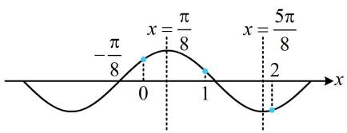
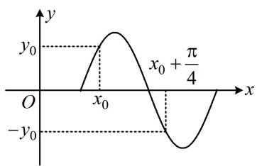
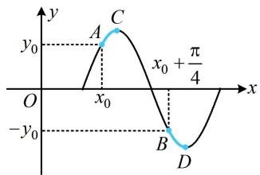
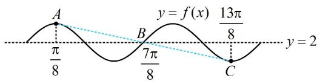
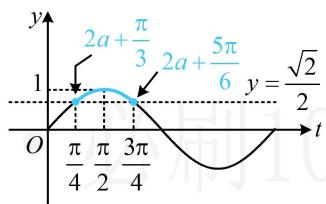
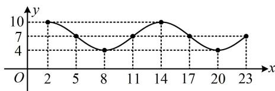
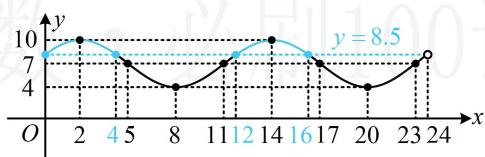
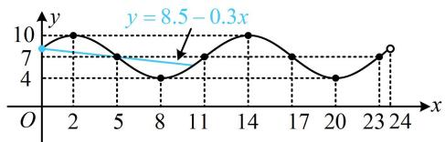
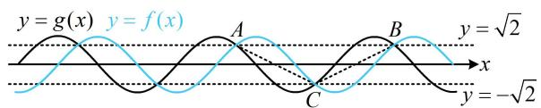

# 强化训练

1. (★★★)

已知 $f(x) = \sin (\omega x + \varphi)\left(\omega >0,0 <   \varphi <  \frac{\pi}{2}\right)$ 的最小正周期为 $\pi$ ，且关于 $\left(-\frac{\pi}{8},0\right)$ 对称，则（）

A. $f(0) <   f(2) <   f(1)$   
B. $f(2) <   f(1) <   f(0)$   
C. $f(2) < f(0) < f(1)$   
D. $f(1) < f(0) < f(2)$

1. B

解析： $f(x)$ 的最小正周期 $T = \pi \Rightarrow \omega = \frac{2\pi}{T} = 2$

又 $f(x)$ 关于 $\left(-\frac{\pi}{8},0\right)$ 对称，

所以 $f\left(-\frac{\pi}{8}\right) = \sin \left[2\times \left(-\frac{\pi}{8}\right) + \varphi \right] = 0$ ，故 $\sin \left(\varphi -\frac{\pi}{4}\right) = 0$

结合 $0 < \varphi < \frac{\pi}{2}$ 可得 $\varphi = \frac{\pi}{4}$ ，所以 $f(x) = \sin \left(2x + \frac{\pi}{4}\right)$ ，

要比较 $f(0)$ , $f(1)$ , $f(2)$ , 可作出 $f(x)$ 的草图, 将它们在图中标出来看. $-\frac{\pi}{8}$ 是零点, 结合周期为 $\pi$ 可得 $x = \frac{\pi}{8}$ 必为最值点, $f\left(\frac{\pi}{8}\right) = \sin \left(2 \times \frac{\pi}{8} + \frac{\pi}{4}\right) = 1 \Rightarrow x = \frac{\pi}{8}$ 是最大值点,

如图， $f(2) < 0$ ， $f(0) > 0$ ， $f(1) > 0$ ，所以 $f(2)$ 最小，

再比较 $f(0)$ 和 $f(1)$ ，只需看0和1离对称轴 $x = \frac{\pi}{8}$ 的距离，距离越小，函数值越大，

又 $\frac{\pi}{8} - 0 < 1 - \frac{\pi}{8}$ ，所以 $f(0) > f(1)$ ，故 $f(2) < f(1) < f(0)$ .

text_image

-π/8
x=π/8
x=5π/8
0
1
2
x

2. (2013·大纲卷·★★★)

若函数 $y = \sin (\omega x + \varphi)(\omega > 0)$ 的部分图象如图，则 $\omega =$ （）

A. 5

B. 4

C. 3

D. 2

text_image

y
y₀
x₀ + π/4
O
x₀
-y₀

2. B

解析：图中没有任何零点、最值点这些关键点，如何求周期？注意到图上给出函数值相反的两个点，故分析这两点之间的距离与周期的关系，

如图，由对称性，两段蓝色的曲线是相同的（将任何一段沿 $x$ 轴翻折，就和另一段相同了），所以从点 $A$ 到点 $B$ 的横向距离，

与从点 $C$ 到点 $D$ 的横向距离相等，都等于 $\frac{T}{2}$ ，

故 $\frac{T}{2} = \left(x_0 + \frac{\pi}{4}\right) - x_0 = \frac{\pi}{4} \Rightarrow T = \frac{\pi}{2} \Rightarrow \omega = \frac{2\pi}{T} = 4$

text_image

y
y₀
A
C
x₀ + π/4
O
x₀
-y₀
B
D
x

# 3. (★★★)

已知函数 $f(x) = \sqrt{2}\sin \left(2x + \frac{\pi}{4}\right) + 2$ ，则 $f\left(\frac{\pi}{8}\right) +$

$$
f \left(\frac {2 \pi}{8}\right) + \dots + f \left(\frac {1 3 \pi}{8}\right) = (\quad)
$$

A. 0

B. 10

C. 16

D. 26

3. D

解析：逐个代入计算较麻烦，但可发现 $\frac{\pi}{8}$ 和 $\frac{13\pi}{8}$ ， $\frac{2\pi}{8}$ 和 $\frac{12\pi}{8}$ ，…， $\frac{6\pi}{8}$ 和 $\frac{8\pi}{8}$ 两两关于 $\frac{7\pi}{8}$ 对称，故猜想 $\frac{7\pi}{8}$ 可能与 $f(x)$ 的对称性有关，下面先验证这一猜想，

因为 $f\left(\frac{7\pi}{8}\right) = \sqrt{2}\sin \left(2\times \frac{7\pi}{8} +\frac{\pi}{4}\right) + 2 = \sqrt{2}\sin 2\pi +2 = 2$

所以 $f(x)$ 的图象关于点 $B\left(\frac{7\pi}{8},2\right)$ 对称，

既然 $B$ 是对称中心, 那么其它点必定也两两关于该点对称,

如图， $A\left(\frac{\pi}{8},f\left(\frac{\pi}{8}\right)\right)$ 和 $C\left(\frac{13\pi}{8},f\left(\frac{13\pi}{8}\right)\right)$ 关于 $B$ 对称，

故 $\frac{f\left(\frac{\pi}{8}\right) + f\left(\frac{13\pi}{8}\right)}{2} = f\left(\frac{7\pi}{8}\right) \Rightarrow f\left(\frac{\pi}{8}\right) + f\left(\frac{13\pi}{8}\right) = 2f\left(\frac{7\pi}{8}\right) = 4$

同理， $f\left(\frac{2\pi}{8}\right) + f\left(\frac{12\pi}{8}\right) = f\left(\frac{3\pi}{8}\right) + f\left(\frac{11\pi}{8}\right) = \dots$

$$
= f \left(\frac {6 \pi}{8}\right) + f \left(\frac {8 \pi}{8}\right) = 4,
$$

所以 $f\left(\frac{\pi}{8}\right)+f\left(\frac{2\pi}{8}\right)+\cdots+f\left(\frac{13\pi}{8}\right)=4\times6+2=26$ .

text_image

A
π/8
B
7π/8
C
y = f(x)
13π/8
y = 2

4. (2022·山东潍坊一模·★★★)

设函数 $f(x) = \sin \left(2x + \frac{\pi}{3}\right)$ 在 $\left[a, a + \frac{\pi}{4}\right]$ 的最大值为 $g_1(a)$ ，最小值为 $g_2(a)$ ，则 $g_1(a) - g_2(a)$ 的最小值为（）

A. 1 B. $\frac{\sqrt{2}}{2}$

C. $\frac{\sqrt{2} - 1}{2}$ D. $1 - \frac{\sqrt{2}}{2}$

4. D

解析：要研究 $f(x)$ 的区间最值，可将 $2x + \frac{\pi}{3}$ 换元成 $t$ ，转化为研究 $y = \sin t$ 的区间最值，

令 $t = 2x + \frac{\pi}{3}$ ，则 $f(x) = \sin t$

当 $x \in \left[a, a + \frac{\pi}{4}\right]$ 时， $t \in \left[2a + \frac{\pi}{3}, 2a + \frac{5\pi}{6}\right]$ ，

下面画图分析，区间 $\left[2a + \frac{\pi}{3}, 2a + \frac{5\pi}{6}\right]$ 的位置会随 $a$ 的变化而改变，但其宽度保持 $\frac{\pi}{2}$ 不变，始终为 $y = \sin t$ 的四分之一个周期，可结合图象想象运动过程，

如图所示的情形即为 $g_{1}(a) - g_{2}(a)$ 最小的情形，

由图可知 $g_{1}(a) - g_{2}(a)$ 的最小值为 $1 - \frac{\sqrt{2}}{2}$ .

line

| t | y |
|---|---|
| 0 | 0 |
| π/4 | 1 |
| π/2 | 1.57 |
| 3π/4 | 1.57 |
| 2a + π/3 | 1.57 |
| 2a + 5π/6 | 1.57 |
| y = √2/2 | 1 |

5.（2025·天津卷·★★★☆）

已知函数 $f(x) = \sin (\omega x + \varphi)(\omega > 0, -\pi < \varphi < \pi)$ 在 $\left[-\frac{5\pi}{12}, \frac{\pi}{12}\right]$ 上单调递增，且 $x = \frac{\pi}{12}$ 是它的一条对称轴， $\left(\frac{\pi}{3}, 0\right)$ 是它的一个对称中心，则当 $x \in \left[0, \frac{\pi}{2}\right]$ 时， $f(x)$ 的最小值为（）

A. $-\frac{\sqrt{3}}{2}$

B. $-\frac{1}{2}$

C. 1

D. 0

5. A

解析： $f(x)$ 在 $\left[-\frac{5\pi}{12},\frac{\pi}{12}\right]$ 上 $\nearrow$ 怎样翻译？单调意味着区间宽度不超过半个周期，可由它限定周期的范围，再得到 $\omega$ 的范围，由 $f(x)$ 在 $\left[-\frac{5\pi}{12},\frac{\pi}{12}\right]$ 上 $\nearrow$ 得 $\frac{T}{2} \geq \frac{\pi}{12} - \left(-\frac{5\pi}{12}\right) \Rightarrow T \geq \pi$

又 $T = \frac{2\pi}{\omega}$ ，所以 $\frac{2\pi}{\omega} \geq \pi$ ，故 $0 < \omega \leq 2$ ①，

若能再求出 $\omega$ 的通解, 就能结合①得到 $\omega$ 的值, 怎么求? 条件中还有一个对称轴和一个对称中心, 它们之间的距离必为 $\frac{T}{4}$ 的奇数倍 (理由同本节例 5 的变式), 可由此找 $\omega$ 的通解,

因为 $x = \frac{\pi}{12}$ 和 $\left(\frac{\pi}{3},0\right)$ 分别是 $f(x)$ 的对称轴和对称中心，

所以 $\frac{\pi}{3} -\frac{\pi}{12} = (2n + 1)\frac{T}{4}\Rightarrow T = \frac{\pi}{2n + 1}\Rightarrow \frac{2\pi}{\omega} = \frac{\pi}{2n + 1}$

$\Rightarrow \omega = 4n + 2(n \in \mathbf{N})$ ，结合①得 $n$ 只能取0，所以 $\omega = 2$

再求 $\varphi$ ，怎么求？由 $f(x)$ 在 $\left[-\frac{5\pi}{12}, \frac{\pi}{12}\right]$ 上 $\nearrow$ 和 $x = \frac{\pi}{12}$ 是对称轴可知 $x = \frac{\pi}{12}$ 是 $f(x)$ 的最大值点，故代此点求 $\varphi$ ，

由题意， $f\left(\frac{\pi}{12}\right) = \sin \left(2\times \frac{\pi}{12} +\varphi\right) = 1$

所以 $\frac{\pi}{6} +\varphi = 2k\pi +\frac{\pi}{2} (k\in \mathbf{Z})$ ，故 $\varphi = 2k\pi +\frac{\pi}{3}$

结合 $-\pi < \varphi < \pi$ 可得 $k$ 只能取0，此时 $\varphi = \frac{\pi}{3}$

所以 $f(x) = \sin \left(2x + \frac{\pi}{3}\right)$ ，当 $x \in \left[0, \frac{\pi}{2}\right]$ 时，

$2x + \frac{\pi}{3}\in \left[\frac{\pi}{3},\frac{4\pi}{3}\right]$ ，所以 $f(x)_{\min} = \sin \frac{4\pi}{3} = -\frac{\sqrt{3}}{2}$

6. (2024·湖北模拟·★★★★) (多选)

受潮汐影响，某港口5月份每一天水深 $y$ （单位：米）与时间 $x$ （单位：时）的关系都符合函数 $y =$

$$
A \sin (\omega x + \varphi) + h \left(A > 0, \omega > 0, - \frac {\pi}{2} <   \varphi <   \frac {\pi}{2}, h \in \mathbf {R}\right),
$$

根据该港口的安全条例，要求船底与水底的距离必须不小于 2.5 米，否则该船必须立即离港，一艘船满载货物，吃水（即船底到水面的距离）6 米，计划于 5 月 10 日进港卸货（该船进港立即可以开始卸货），已知卸货时吃水深度以每小时 0.3 米的速度匀速减少，卸完货后空船吃水 3 米（不计船停靠码头和驶离码头所需时间）。下表为该港口 5 月某天的时刻与水深关系：

<table><tr><td>时刻</td><td>2</td><td>5</td><td>8</td><td>11</td><td>14</td><td>17</td><td>20</td><td>23</td></tr><tr><td>水深/米</td><td>10</td><td>7</td><td>4</td><td>7</td><td>10</td><td>7</td><td>4</td><td>7</td></tr></table>

以下选项正确的有（）

A. 水深 $y$ （单位：米）与时间 $x$ （单位：时）的函数关系为 $y = 3\sin \left(\frac{\pi}{6} x + \frac{\pi}{6}\right) + 7$ ， $x \in [0,24)$

B. 该船满载货物时可以在 0:00 到 4:00 之间以及 12:00 到 16:00 之间进入港口

C. 该船卸完货物后可以在 $19:00$ 离开港口

D. 该船5月10日完成卸货任务的最早时间为16:00

6. ABD

解析：A项，为了便于求 $A$ ， $\omega$ ， $\varphi$ ， $h$ ，我们先把所给表格中的数据画成图象，再作观察，

如图1，函数在 $x = 8$ 处取得最小值4，在 $x = 14$ 处取得最大值10，所以 $\frac{T}{2} = 14 - 8 = 6\Rightarrow T = 12\Rightarrow \omega = \frac{2\pi}{T} = \frac{\pi}{6}$

line

| x | y |
|---|---|
| 2 | 10 |
| 5 | 7 |
| 8 | 4 |
| 11 | 7 |
| 14 | 10 |
| 17 | 7 |
| 20 | 4 |
| 23 | 7 |

图1

又 $\left\{ \begin{array}{l} y_{\max} = A + h = 10 \\ y_{\min} = -A + h = 4 \end{array} \right.$ ，所以 $A = 3$ ， $h = 7$ ，

故 $y = 3\sin \left(\frac{\pi}{6} x + \varphi\right) + 7$

因为函数 $y = 3\sin \left(\frac{\pi}{6} x + \varphi\right) + 7$ 的图象过点(2,10)，

所以 $3\sin \left(\frac{\pi}{6} \times 2 + \varphi\right) + 7 = 10$ ，故 $\sin \left(\frac{\pi}{3} + \varphi\right) = 1$ ①，

又 $-\frac{\pi}{2} < \varphi < \frac{\pi}{2}$ ，所以 $-\frac{\pi}{6} < \frac{\pi}{3} + \varphi < \frac{5\pi}{6}$ ，

结合①可得 $\frac{\pi}{3} +\varphi = \frac{\pi}{2}$ ，故 $\varphi = \frac{\pi}{6}$

所以函数表达式为 $y = 3\sin \left(\frac{\pi}{6} x + \frac{\pi}{6}\right) + 7$ ， $x \in [0,24)$ ，

故A项正确；

B 项, 满载货物时, 船的吃水深度为 6 米, 所以用水深 $y$ 减去吃水深度 6 , 即为船底到水底的距离, 该距离应不小于 2.5 米,由此即可建立不等式求 $x$ 的范围,

由题意， $y - 6\geq 2.5$ ，所以 $y\geq 8.5$

故 $3\sin \left(\frac{\pi}{6} x + \frac{\pi}{6}\right) + 7 \geq 8.5$ ，其中 $0 \leq x < 24$

解三角不等式，考虑画图，这里由于已有 $y = 3\sin \left(\frac{\pi}{6} x + \frac{\pi}{6}\right) + 7$ 的部分图象，故考虑直接用它来分析，

函数 $y = 3\sin \left(\frac{\pi}{6} x + \frac{\pi}{6}\right) + 7$ 在[0,24)上的图象如图2，

注意到当 $x = 0,4,12,16,24$ 时， $y = 8.5$ ，所以结合图2可知 $3\sin \left(\frac{\pi}{6} x + \frac{\pi}{6}\right) + 7 \geq 8.5 \Leftrightarrow 0 \leq x \leq 4$ 或 $12 \leq x \leq 16$ ，

故 B 项正确;

line

| x | y |
|---|---|
| 2 | 10 |
| 4 | 8 |
| 5 | 7 |
| 8 | 4 |
| 11 | 7 |
| 12 | 8 |
| 14 | 10 |
| 16 | 9 |
| 17 | 7 |
| 20 | 4 |
| 23 | 8 |
| 24 | 9 |

图2

C项，当 $x = 19$ 时，水深 $y = 3\sin \left(\frac{\pi}{6}\times 19 + \frac{\pi}{6}\right) + 7$

$= -\frac{3\sqrt{3}}{2} + 7$ ，卸完货物后船的吃水深度为3米，

所以此时船底离水底的距离为 $-\frac{3\sqrt{3}}{2} + 7 - 3 = 4 - \frac{3\sqrt{3}}{2} < 2.5$ ，所以该船卸完货物后，不能在19时离港，故C项错误；

D 项, 要最早完成卸货, 那就从 0 点开始进港卸货, 水深在变, 船的吃水深度也会变, 应综合考虑二者. 若卸货中途不满足港口的停靠条件, 则需暂时离港, 这种情况会发生吗? 会, 比如看上午 8 点时, 此时卸货未完成, 船吃水深度大于 3 米, 但水深只有 4 米, 所以船底离水底小于 1 米, 这个时刻是不允许船停在港口的, 于是我们需要先分析船暂时离港的时刻,

由题意，该船0点进港即可开始卸货，船的吃水深度随时间 $x$ 变化的函数关系为 $y = 6 - 0.3x$ ， $0\leq x\leq 10$

所以时刻 $x$ ，船底离水底的深度为

$$
d = 3 \sin \left(\frac {\pi}{6} x + \frac {\pi}{6}\right) + 7 - (6 - 0. 3 x),
$$

令 $d \geq 2.5$ 得 $3\sin \left(\frac{\pi}{6} x + \frac{\pi}{6}\right) + 7 - (6 - 0.3x) \geq 2.5$

所以 $3\sin \left(\frac{\pi}{6} x + \frac{\pi}{6}\right) + 7 \geq 8.5 - 0.3x$ ②，

不等式②不易严格求解，但这里我们也无需完全解出不等式②，只需找到首次不满足②的位置，可考虑直接画图看，

如图3, 经尝试, $y = 3 \sin \left(\frac{\pi}{6} x + \frac{\pi}{6}\right) + 7$ 和 $y = 8.5 - 0.3x$ 都过点(5,7), 所以卸货5小时后, 在5点该船必须暂时驶离港口, 此时该船的吃水深度为4.5米, 下次何时返回继续卸货? $4.5 + 2.5 = 7$ , 所以需要水深再次达到7米才能返回,

由图3可知下次水深为7米的时刻是11点，故该船在11点可返回港口继续卸货，5小时后完成卸货（期间水深一直不低于7米，不会再次触发离港条件），此时为16点，

综上所述，该船在0点进港开始卸货，5点暂时驶离港口，11点返回港口继续卸货，16点完成卸货任务，故D项正确.

line

| x | y |
|---|---|
| 2 | 10 |
| 5 | 7 |
| 8 | 4 |
| 11 | 7 |
| 14 | 10 |
| 17 | 7 |
| 20 | 4 |
| 23 | 7 |
| 24 | 9 |

图3

# 7. (★★★★)

已知函数 $f(x) = 2\sin (\omega x + \varphi)\left(\omega > 0, |\varphi| < \frac{\pi}{2}\right)$ 的图象与 $x$ 轴相邻的两个交点的横坐标分别为 $\frac{\pi}{6}$ 和 $\frac{2\pi}{3}$ ，将 $f(x)$ 的图象向左平移 $\frac{\pi}{4}$ 个单位得到 $g(x)$ 的图象，若 $A, B, C$ 为两个函数图象的不共线的交点，则 $\triangle ABC$ 面积的最小值为 \_\_\_\_.

7. $\sqrt{2}\pi$

解析：设 $f(x)$ 的最小正周期为 $T$ ，由题意，

$\frac{T}{2}=\frac{2\pi}{3}-\frac{\pi}{6}=\frac{\pi}{2}$ ，所以 $T=\pi$ ，故 $\omega=\frac{2\pi}{T}=2$ ，

$$
f \left(\frac {\pi}{6}\right) = 2 \sin \left(2 \times \frac {\pi}{6} + \varphi\right) = 0 \Rightarrow \sin \left(\frac {\pi}{3} + \varphi\right) = 0,
$$

又 $\left|\varphi\right|<\frac{\pi}{2}$ ，所以 $\varphi=-\frac{\pi}{3}$ ，故 $f(x)=2\sin\left(2x-\frac{\pi}{3}\right)$ ，

由题意， $g(x) = f\left(x + \frac{\pi}{4}\right) = 2\sin \left[2\left(x + \frac{\pi}{4}\right) - \frac{\pi}{3}\right]$

$$
= 2 \sin \left[ \left(2 x - \frac {\pi}{3}\right) + \frac {\pi}{2} \right] = 2 \cos \left(2 x - \frac {\pi}{3}\right),
$$

既然涉及 $f(x)$ 和 $g(x)$ 图象的交点，就令 $f(x) = g(x)$ ，求解交点的坐标，便于作图，

$$
f (x) = g (x) \Leftrightarrow \sin \left(2 x - \frac {\pi}{3}\right) = \cos \left(2 x - \frac {\pi}{3}\right),
$$

把 $2x - \frac{\pi}{3}$ 看作整体，有 $\sin^2\left(2x - \frac{\pi}{3}\right) + \cos^2\left(2x - \frac{\pi}{3}\right) = 1$

所以 $\sin \left(2x - \frac{\pi}{3}\right) = \cos \left(2x - \frac{\pi}{3}\right) = \pm \frac{\sqrt{2}}{2}$

这说明 $f(x)$ 和 $g(x)$ 的交点都在直线 $y = \sqrt{2}$ 和 $y = -\sqrt{2}$ 上，

不妨假设 $A$ ， $B$ 两点在直线 $y = \sqrt{2}$ 上，点 $C$ 在直线 $y = -\sqrt{2}$ 上，则 $AB$ 边上的高 $h = 2\sqrt{2}$ 要使面积最小，只需底边 $AB$ 的长最小，那么 $A, B$ 就是直线 $y = \sqrt{2}$ 上相邻的两个交点，从而 $\triangle ABC$ 的面积最小的情形如图所示，由图可知，

$\left|AB\right| = T = \pi$ ，所以 $(S_{\triangle ABC})_{\min} = \frac{1}{2}\times \pi \times 2\sqrt{2} = \sqrt{2}\pi .$

text_image

y = g(x) y = f(x)
A
B
y = \u221a2
x
C
y = -\u221a2

