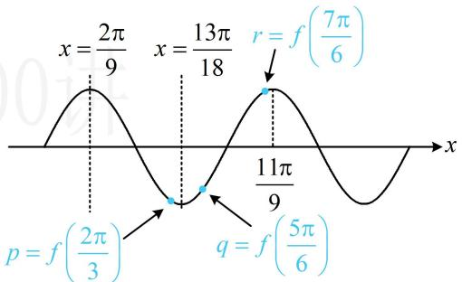
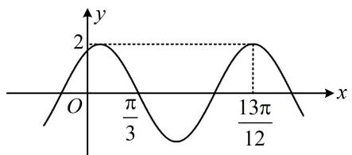
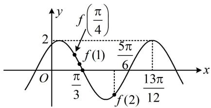
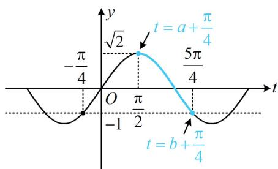
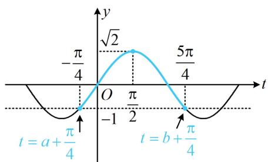
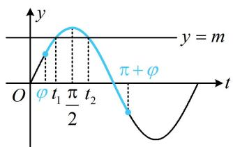
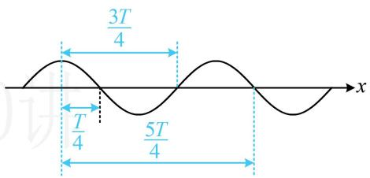
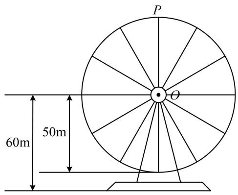
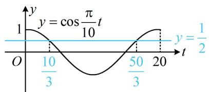
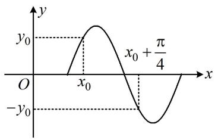

# 模块四 三角函数提高篇

# 第1节 三角函数图象性质综合问题（★★★☆）

内容提要

三角函数 $y = A\sin (\omega x + \varphi)$ 图象性质的综合应用考题有时难度较大，本节专门归纳一些有创新性的考题，解题的关键是抓住图象上的一些特征来综合分析问题.

类型I：利用图象比较函数值大小

【例1】设 $f(x) = \sin (2x + \varphi)$ ，且 $f(x) \leq f\left(\frac{2\pi}{9}\right)$ 对任意的 $x \in \mathbf{R}$ 恒成立，记 $p = f\left(\frac{2\pi}{3}\right)$ ， $q = f\left(\frac{5\pi}{6}\right)$ ， $r = f\left(\frac{7\pi}{6}\right)$ ，则 $p, q, r$ 的大小关系是（）

A. $r <   p <   q$

B. $q < r < p$

C. $p < q < r$

D. $q <   p <   r$

解析：由题意， $f(x)$ 的最小正周期 $T = \frac{2\pi}{2} = \pi$ ， $f(x) \leq f\left(\frac{2\pi}{9}\right) \Rightarrow f(x)$ 在 $x = \frac{2\pi}{9}$ 处取得最大值，

最大值处即为对称轴, 知道一个最大值点和周期, 可作出函数的草图, 推断其它最值点. 例如 $x = \frac{2 \pi}{9}$ 右侧

的两条对称轴依次为 $x = \frac{2\pi}{9} +\frac{\pi}{2} = \frac{13\pi}{18}$ ， $x = \frac{2\pi}{9} +\pi = \frac{11\pi}{9}$ ，于是可直接在图中标注 $p,q,r$ 的位置，就能比较大小，如图， $p,q$ 都在 $x = \frac{13\pi}{18}$ 这个最小值点附近，可以看谁的自变量离 $x = \frac{13\pi}{18}$ 更远，谁就更大，因为 $\frac{5\pi}{6} -\frac{13\pi}{18} = \frac{\pi}{9} >\frac{13\pi}{18} -\frac{2\pi}{3} = \frac{\pi}{18}$ ，所以 $p < q$ 由图可知 $q < r$ ，故 $p < q < r$

text_image

x = \frac{2\pi}{9} \quad x = \frac{13\pi}{18} \quad r = f(\frac{7\pi}{6}) \n p = f(\frac{2\pi}{3}) \quad q = f(\frac{5\pi}{6})

答案: C

【反思】本题当然可以将最值点代入解析式求出 $\varphi$ ，再代值比较大小，但显然没有画图分析简便.

【例 2】(2021·全国甲卷) 已知函数 $f(x)=2\cos(\omega x+\varphi)$ 的部分图象如图所示，则满足条件 $\left(f(x)-f\left(-\frac{7\pi}{4}\right)\right)\left(f(x)-f\left(\frac{4\pi}{3}\right)\right)>0$ 的最小正整数 x 为 \_\_\_\_.

line

| x | y |
|---|---|
| 0 | -∞ |
| π/3 | 2 |
| 13π/12 | 2 |

解析：由图可知， $\frac{13\pi}{12}-\frac{\pi}{3}=\frac{3}{4}T$ ，所以 $T=\pi$ ，于是可将 $f\left(-\frac{7\pi}{4}\right)$ 和 $f\left(\frac{4\pi}{3}\right)$ 化为 $f\left(\frac{\pi}{4}\right)$ 和 $f\left(\frac{\pi}{3}\right)$ ，便于标注，所以 $\left(f(x)-f\left(-\frac{7\pi}{4}\right)\right)\left(f(x)-f\left(\frac{4\pi}{3}\right)\right)>0$ 即为 $\left(f(x)-f\left(\frac{\pi}{4}\right)\right)\left(f(x)-f\left(\frac{\pi}{3}\right)\right)>0$ ①，

我们直接把 $f\left(\frac{\pi}{4}\right)$ 和 $f\left(\frac{\pi}{3}\right)$ 在图中标出来，就能分析不等式①的最小正整数解了，

如图， $f(1)$ 介于 $f\left(\frac{\pi}{4}\right)$ 和 $f\left(\frac{\pi}{3}\right)$ 之间，所以 $x = 1$ 不满足不等式①，

$f(2)$ 比 $f\left(\frac{\pi}{4}\right)$ 和 $f\left(\frac{\pi}{3}\right)$ 都小，所以 $x = 2$ 满足不等式①，

故满足原不等式的最小正整数 $x$ 为2.

答案: 2

line

| Point | x     | y     |
|-------|-------|-------|
| f(1)  | π/3   | 5π/6  |
| f(2)  | 13π/12| -     |

【反思】本题也可根据图象求出 $f(x)$ 解析式，再分析所给不等式，但显然没有数形结合来得清晰快捷.

# 类型 II：数形结合综合分析

【例3】函数 $f(x) = \sin x + \cos x$ 的定义域为 $[a, b]$ ，值域为 $[-1, \sqrt{2}]$ ，则 $b - a$ 的取值范围是（）

A. $\left[\frac{3\pi}{8}, \frac{\pi}{2}\right]$

B. $\left[\frac{\pi}{2},\frac{3\pi}{4}\right]$

C. $\left[\frac{\pi}{2},\frac{3\pi}{2}\right]$

D. $\left[\frac{3\pi}{4}, \frac{3\pi}{2}\right]$

解析：由题意， $f(x)=\sqrt{2}\sin\left(x+\frac{\pi}{4}\right)$ ，给了值域，考虑画图分析，为了便于作图，先将 $x+\frac{\pi}{4}$ 换元成t，
令 $t = x + \frac{\pi}{4}$ ，则 $f(x) = \sqrt{2} \sin t$ ，当 $x \in [a, b]$ 时， $t \in \left[a + \frac{\pi}{4}, b + \frac{\pi}{4}\right]$ ,

问题等价于 $y = \sqrt{2}\sin t$ 在 $\left[a + \frac{\pi}{4}, b + \frac{\pi}{4}\right]$ 上的值域为 $[-1, \sqrt{2}]$ ，

怎样能使值域为 $[-1, \sqrt{2}]$ ，不妨结合值域的两个端点-1和 $\sqrt{2}$ 在图象上的位置来分析，

首先， $\left[a + \frac{\pi}{4}, b + \frac{\pi}{4}\right]$ 肯定不足一个周期，否则值域必为 $[- \sqrt{2}, \sqrt{2}]$ ；其次， $\left[a + \frac{\pi}{4}, b + \frac{\pi}{4}\right]$ 内必有最大值点，如图，不妨假设区间 $\left[a + \frac{\pi}{4}, b + \frac{\pi}{4}\right]$ 内的最大值点为 $t = \frac{\pi}{2}$ ，则区间的左、右端点不能越过 $-\frac{\pi}{4}$ 和 $\frac{5\pi}{4}$ ，否则值域中必有小于-1的数，且左、右端点至少有一个与 $-\frac{\pi}{4}$ ， $\frac{5\pi}{4}$ 重合，否则函数的最小值大于-1，

所以区间 $\left[a + \frac{\pi}{4}, b + \frac{\pi}{4}\right]$ 最窄的情形如图1，最宽的情形如图2，

由图可知 $\left[\left(b + \frac{\pi}{4}\right) - \left(a + \frac{\pi}{4}\right)\right]_{\min} = \frac{3\pi}{4},$ $\left[\left(b + \frac{\pi}{4}\right) - \left(a + \frac{\pi}{4}\right)\right]_{\max} = \frac{3\pi}{2},$

即 $(b - a)_{\min} = \frac{3\pi}{4}$ ， $(b - a)_{\max} = \frac{3\pi}{2}$ ，故 $b - a$ 的取值范围是 $\left[\frac{3\pi}{4},\frac{3\pi}{2}\right]$

答案: D

line

| t | y |
|---|---|
| -a + π/4 | √2 |
| 5π/4 | 5π/4 |
| -b + π/4 | -b + π/4 |

图1

line

| t | y |
|---|---|
| -a/a | -π/4 |
| 0 | √2 |
| -1/a | -π/2 |
| 0 | 5π/4 |
| a/b | π/4 |
| -b/a | -π/4 |

图2

【例 4】已知函数 $f(x)=2\sin\left(2x+\frac{\pi}{3}\right)-2\sin^{2}\left(x+\frac{\pi}{6}\right)+1$ ，把 $f(x)$ 的图象向右平移 $\frac{\pi}{6}$ 个单位，得到函数 $g(x)$ 的图象，若 $x_{1}, x_{2}$ 是 $g(x)=m$ 在 $\left[0,\frac{\pi}{2}\right]$ 内的两根，则 $\sin(x_{1}+x_{2})$ 的值为（）

A. $\frac{2\sqrt{5}}{5}$

B. $\frac{\sqrt{5}}{5}$

C. $-\frac{\sqrt{5}}{5}$

D. $-\frac{2 \sqrt{5}}{5}$

解析：由题意， $f(x) = 2\sin \left(2x + \frac{\pi}{3}\right) + \cos \left(2x + \frac{\pi}{3}\right) = \sqrt{5}\sin \left(2x + \frac{\pi}{3} +\varphi\right),$

其中 $\cos \varphi = \frac{2\sqrt{5}}{5}$ ， $\sin \varphi = \frac{\sqrt{5}}{5}$ ，且 $\varphi \in \left(0, \frac{\pi}{2}\right)$ ，注意此处 $\varphi$ 不是变量，而是一个确定的非特殊锐角，

由题意， $g(x) = f\left(x - \frac{\pi}{6}\right) = \sqrt{5}\sin \left[2\left(x - \frac{\pi}{6}\right) + \frac{\pi}{3} +\varphi \right] = \sqrt{5}\sin (2x + \varphi)$

要研究方程 $g(x) = m$ 根的情况，考虑画图分析，为了便于作图，将 $2x + \varphi$ 换元成 $t$

令 $t = 2x + \varphi$ ，则 $g(x) = \sqrt{5}\sin t$ ，当 $x\in \left[0,\frac{\pi}{2}\right]$ 时， $t\in [\varphi ,\pi +\varphi ]$ ，函数 $y = \sqrt{5}\sin t$ 的部分图象如图所示，

$g(x) = m \Leftrightarrow \sqrt{5} \sin t = m$ ，因为 $g(x) = m$ 有两根 $x_{1}$ ， $x_{2}$ ，所以方程 $\sqrt{5} \sin t = m$ 有两根 $t_{1}$ ， $t_{2}$ ，

如图，直线 $y = m$ 与 $y = \sqrt{5}\sin t$ 在 $[\varphi ,\pi +\varphi ]$ 上的图象的两个交点的横坐标就是 $t_1$ ， $t_2$

由图可知，两个交点关于直线 $t = \frac{\pi}{2}$ 对称，所以 $\frac{t_1 + t_2}{2} = \frac{\pi}{2}$ ，

找到了 $t_1$ 和 $t_2$ 的关系，将变量 $t$ 换回成 $x$ ，就能转换成 $x_1$ 与 $x_2$ 的关系，

又 $\left\{ \begin{array}{l} t_{1} = 2x_{1} + \varphi \\ t_{2} = 2x_{2} + \varphi \end{array} \right.$ ，两式相加整理得： $x_{1} + x_{2} = \frac{t_{1} + t_{2}}{2} -\varphi = \frac{\pi}{2} -\varphi$

故 $\sin (x_{1} + x_{2}) = \sin \left(\frac{\pi}{2} -\varphi\right) = \cos \varphi = \frac{2\sqrt{5}}{5}$

text_image

y
y = m
O
φ t₁ π/2 t₂
π + φ
t

答案: A

【反思】例 3 和例 4 的条件用代数的方法翻译较难，但我们结合图象来翻译，就会变得更直观.

# 类型III：零点、最值点推周期

【例 5】已知 $x=\frac{\pi}{3}$ 是函数 $f(x)=2\sin(\omega x+\varphi)\left(\omega>0,-\frac{\pi}{2}<\varphi<\frac{\pi}{2}\right)$ 图象的一条对称轴，且 $x=\frac{\pi}{12}$ 是 $f(x)$ 的与该对称轴相邻的零点，则 $f\left(\frac{\pi}{4}\right)=$ \_\_\_\_.

解析：条件中有相邻的对称轴和零点，它们之间的距离为 $\frac{T}{4}$ ，故可由此求出周期，再得到 $\omega$ ，

由题意， $\frac{\pi}{3} -\frac{\pi}{12} = \frac{T}{4}$ ，所以 $T = \pi$ ，从而 $\omega = \frac{2\pi}{T} = 2$ ，故 $f(x) = 2\sin (2x + \varphi)$

再求 $\varphi$ ，代对称轴或零点都行，不妨代对称轴，因为 $x = \frac{\pi}{3}$ 是对称轴，所以 $2\times \frac{\pi}{3} +\varphi = k\pi +\frac{\pi}{2}$

故 $\varphi = k\pi -\frac{\pi}{6} (k\in \mathbf{Z})$ ，结合 $-\frac{\pi}{2} <  \varphi <  \frac{\pi}{2}$ 可得 $\varphi = -\frac{\pi}{6}$

所以 $f(x) = 2\sin \left(2x - \frac{\pi}{6}\right)$ ，故 $f\left(\frac{\pi}{4}\right) = 2\sin \left(2\times \frac{\pi}{4} -\frac{\pi}{6}\right) = 2\sin \frac{\pi}{3} = \sqrt{3}$ .

答案: $\sqrt{3}$

【变式】设函数 $f(x) = \frac{1}{2}\sin (\omega x + \varphi)(\omega > 0, |\varphi| < \pi)$ ，若 $f\left(\frac{5\pi}{8}\right) = \frac{1}{2}$ ， $f\left(\frac{11\pi}{8}\right) = 0$ ，且相邻两个零点之间的距离大于 $\pi$ ，则（）

A. $\omega = \frac{1}{3},\varphi = -\frac{11\pi}{24}$

B. $\omega = \frac{2}{3}, \varphi = \frac{\pi}{12}$

C. $\omega = \frac{1}{3},\varphi = \frac{7\pi}{24}$

D. $\omega = \frac{2}{3}, \varphi = -\frac{11\pi}{12}$

解析： $f\left(\frac{5\pi}{8}\right) = \frac{1}{2} \Rightarrow x = \frac{5\pi}{8}$ 是 $f(x)$ 的最大值点， $f\left(\frac{11\pi}{8}\right) = 0 \Rightarrow x = \frac{11\pi}{8}$ 是 $f(x)$ 的零点，

注意, 与上题相比, 本题所给的零点与最值点不一定相邻. 这样虽然不能直接得到周期 $T$ , 求出 $\omega$ , 但它们之间的距离必为 $\frac{T}{4}$ 的正奇数倍, 理由如图所示, 可以比较直观理解, 所以仍可由此找到 $\omega$ 的通解,

所以 $\frac{11\pi}{8} -\frac{5\pi}{8} = (2n - 1)\cdot \frac{T}{4} (n\in \mathbf{N}^{*})$ ，从而 $\frac{3\pi}{4} = (2n - 1)\cdot \frac{\pi}{2\omega}$ ，故 $\omega = \frac{2(2n - 1)}{3}$

又 $f(x)$ 相邻两个零点之间的距离大于 $\pi$ ，相邻的零点之间的距离为 $\frac{T}{2}$ ，所以 $\frac{T}{2} >\pi$ ，故 $T = \frac{2\pi}{\omega} >2\pi$ 从而 $0 <   \omega <  1$ ，结合 $\omega = \frac{2(2n - 1)}{3}$ 可得 $n$ 只能取1，所以 $\omega = \frac{2}{3}$ ，故 $f(x) = \frac{1}{2}\sin \left(\frac{2}{3} x + \varphi\right)$

再来求 $\varphi$ ，可代最值点，因为 $f\left(\frac{5\pi}{8}\right) = \frac{1}{2}$ ，所以 $\frac{1}{2}\sin \left(\frac{2}{3} \times \frac{5\pi}{8} + \varphi\right) = \frac{1}{2}$ ，故 $\sin \left(\frac{5\pi}{12} + \varphi\right) = 1$

又 $|\varphi| < \pi$ ，所以 $-\pi < \varphi < \pi$ ，从而 $-\frac{7\pi}{12} < \frac{5\pi}{12} + \varphi < \frac{17\pi}{12}$

故 $\frac{5\pi}{12}+\varphi=\frac{\pi}{2}$ ，所以 $\varphi=\frac{\pi}{12}$ .

text_image

3T/4
T/4
5T/4
x

答案: B

【总结】对于函数 $y = A\sin (\omega x + \varphi)$ ，当给出多个对称轴、零点这类关

键点时, 若它们相邻, 则可直接求周期, 得到 $\omega$ ; 若没说相邻, 则只能先建立 $\omega$ 的通解, 再由其它条件筛选 $\omega$ . 具体来说, 对称轴与对称中心之间的距离是 $\frac{T}{4}$ 的正奇数倍, 可表示为 $(2n - 1) \cdot \frac{T}{4}$ , 对称轴与对称轴、对称中心与对称中心的距离都是 $\frac{T}{2}$ 的正整数倍, 可表示为 $n \cdot \frac{T}{2}$ , 其中 $n \in \mathbf{N}^{*}$ .

# 类型IV：三角函数的实际应用

【例 6】如图, 摩天轮的半径为 $50 \mathrm{~m}$ , 其中心 $O$ 距离地面的高度为 $60 \mathrm{~m}$ , 摩天轮按逆时针方向匀速转动, 且 $20 \mathrm{~min}$ 转一圈, 若摩天轮上点 $P$ 的初始位置为最高点, 则摩天轮转动过程中下列说法正确的是 ( )

A. 转动 $10 \mathrm{~min}$ 后点 $P$ 距离地面 $8 \mathrm{~m}$   
B. 若摩天轮转速减半, 则转动一圈所需的时间变为原来的 $\frac{1}{2}$   
C. 第 $17 \mathrm{~min}$ 和第 $42 \mathrm{~min}$ 点 $P$ 距离地面的高度相同  
D. 摩天轮转动一圈, 点 $P$ 距离地面的高度不低于 $85 \mathrm{~m}$ 的时间长为 $\frac{20}{3} \mathrm{~min}$

text_image

P
O
60m 50m

解析: 诸多选项涉及点 $P$ 距离地面高度和时间, 故先建立二者的函数关系, 可设该高度为 $f(t) = A \sin (\omega t + \varphi) + B$ , 其中 $A > 0$ , $\omega > 0$ . 只要求出 $A, B, \omega, \varphi$ , 解析式就有了, 先由最大、最小值求 $A$ 和 $B$ ,由题意，点 $P$ 最高为 $110\mathrm{m}$ ，最低为 $10\mathrm{m}$ ，所以 $\left\{ \begin{array}{l} A + B = 110 \\ -A + B = 10 \end{array} \right.$ ，解得： $A = 50$ ， $B = 60$ ，再由初始位置求 $\varphi$ ，初始位置在最高点，所以 $f(0) = 50\sin \varphi +60 = 110$ ，从而 $\sin \varphi = 1$ ，故 $\varphi = \frac{\pi}{2}$ 最后由周期求 $\omega$ ，由题意， $20\mathrm{min}$ 转一圈，所以 $T = 20$ ，故 $\omega = \frac{2\pi}{T} = \frac{\pi}{10}$

所以 $f(t) = 50\sin \left(\frac{\pi}{10} t + \frac{\pi}{2}\right) + 60 = 50\cos \frac{\pi}{10} t + 60$

A 项， $f(10)=50\cos\left(\frac{\pi}{10}\times10\right)+60=50\cos\pi+60=10$ ，故 A 项错误；

B项，若摩天轮转速减半，则转动一周的时间加倍，故B项错误；

C 项， $f(17)=50\cos\left(\frac{\pi}{10}\times17\right)+60=50\cos\frac{17\pi}{10}+60$ ， $f(42)=50\cos\left(\frac{\pi}{10}\times42\right)+60=50\cos\frac{21\pi}{5}+60$

要判断 C 项是否正确，只需看 $\cos\frac{17\pi}{10}$ 和 $\cos\frac{21\pi}{5}$ 是否相等，可用诱导公式化为锐角三角函数来看，

$$
\cos \frac {1 7 \pi}{1 0} = \cos \left(\frac {1 7 \pi}{1 0} - 2 \pi\right) = \cos \left(- \frac {3 \pi}{1 0}\right) = \cos \frac {3 \pi}{1 0}, \quad \cos \frac {2 1 \pi}{5} = \cos \left(4 \pi + \frac {\pi}{5}\right) = \cos \frac {\pi}{5},
$$

因为 $\cos \frac{3\pi}{10} \neq \cos \frac{\pi}{5}$ ，所以 $f(17) \neq f(42)$ ，故C项错误；

D 项，点 P 距离地面的高度不低于 85m 即 $f(t) \geq 85$ ，也即 $50 \cos \frac{\pi}{10} t + 60 \geq 85$ ，所以 $\cos \frac{\pi}{10} t \geq \frac{1}{2}$ ，我们可以作图分析在一个周期内，该不等式解的情况，不妨就考虑[0,20)这个周期，

当 $0 \leq t < 20$ 时， $0 \leq \frac{\pi}{10} t < 2\pi$ ，令 $\cos \frac{\pi}{10} t = \frac{1}{2}$ 可得 $\frac{\pi}{10} t = \frac{\pi}{3}$ 或 $\frac{5\pi}{3}$ ，所以 $t = \frac{10}{3}$ 或 $\frac{50}{3}$ ，

如图，在[0,20)这个周期内， $\cos \frac{\pi}{10} t\geq \frac{1}{2}$ 的解集为 $\left[0,\frac{10}{3}\right]\cup \left[\frac{50}{3},20\right)$

故点 $P$ 距离地面的高度不低于 $85 \mathrm{~m}$ 的时间长为

$\frac{10}{3} + \left(20 - \frac{50}{3}\right) = \frac{20}{3} \mathrm{~min}$ , 故 D 项正确.

line

| t | y |
|---|---|
| 0 | 1 |
| 10/3 | cos(π/10)t |
| 50/3 | 1 |
| 20 | 1/2 |

答案: D

# 强化训练

1. (★★★)

已知 $f(x) = \sin (\omega x + \varphi)\left(\omega >0,0 <   \varphi <  \frac{\pi}{2}\right)$ 的最小正周期为 $\pi$ ，且关于 $\left(-\frac{\pi}{8},0\right)$ 对称，则（）

A. $f(0) <   f(2) <   f(1)$   
B. $f(2) < f(1) < f(0)$   
C. $f(2) < f(0) < f(1)$   
D. $f(1) < f(0) < f(2)$

2. (2013·大纲卷·★★★)

若函数 $y = \sin (\omega x + \varphi)(\omega > 0)$ 的部分图象如图，则 $\omega =$ （）

A. 5

B. 4

C. 3

D. 2

text_image

y
y₀
x₀ + π/4
O
x₀
-y₀

3. (★★★)

已知函数 $f(x) = \sqrt{2}\sin \left(2x + \frac{\pi}{4}\right) + 2$ ，则 $f\left(\frac{\pi}{8}\right) +$

$$
f \left(\frac {2 \pi}{8}\right) + \dots + f \left(\frac {1 3 \pi}{8}\right) = (\quad)
$$

A. 0

B. 10

C. 16

D. 26

4. (2022·山东潍坊一模·★★★)

设函数 $f(x) = \sin \left(2x + \frac{\pi}{3}\right)$ 在 $\left[a, a + \frac{\pi}{4}\right]$ 的最大值为 $g_1(a)$ ，最小值为 $g_2(a)$ ，则 $g_1(a) - g_2(a)$ 的最小值为（）

A. 1

B. $\frac{\sqrt{2}}{2}$

C. $\frac{\sqrt{2} - 1}{2}$

D. $1 - \frac{\sqrt{2}}{2}$

5. (2025·天津卷·★★★☆)

已知函数 $f(x) = \sin (\omega x + \varphi)(\omega > 0, -\pi < \varphi < \pi)$ 在 $\left[-\frac{5\pi}{12}, \frac{\pi}{12}\right]$ 上单调递增，且 $x = \frac{\pi}{12}$ 是它的一条对称轴， $\left(\frac{\pi}{3}, 0\right)$ 是它的一个对称中心，则当 $x \in \left[0, \frac{\pi}{2}\right]$ 时， $f(x)$ 的最小值为（）

A. $-\frac{\sqrt{3}}{2}$

B. $-\frac{1}{2}$

C. 1

D. 0

6.（2024·湖北模拟·★★★★）（多选）

受潮汐影响，某港口5月份每一天水深 $y$ （单位：米）与时间 $x$ （单位：时）的关系都符合函数 $y =$

$$
A \sin (\omega x + \varphi) + h \left(A > 0, \omega > 0, - \frac {\pi}{2} <   \varphi <   \frac {\pi}{2}, h \in \mathbf {R}\right),
$$

根据该港口的安全条例，要求船底与水底的距离必须不小于2.5米，否则该船必须立即离港，一艘船满载货物，吃水（即船底到水面的距离）6米，计划于5月10日进港卸货（该船进港立即可以开始卸货），已知卸货时吃水深度以每小时0.3米的速度匀速减少，卸完货后空船吃水3米（不计船停靠码头和驶离码头所需时间）。下表为该港口5月某天的时刻与水深关系：

<table><tr><td>时刻</td><td>2</td><td>5</td><td>8</td><td>11</td><td>14</td><td>17</td><td>20</td><td>23</td></tr><tr><td>水深/米</td><td>10</td><td>7</td><td>4</td><td>7</td><td>10</td><td>7</td><td>4</td><td>7</td></tr></table>

以下选项正确的有（）

A. 水深 $y$ （单位：米）与时间 $x$ （单位：时）的函数关系为 $y = 3\sin \left(\frac{\pi}{6} x + \frac{\pi}{6}\right) + 7$ ， $x \in [0,24)$   
B. 该船满载货物时可以在0:00到4:00之间以及12:00到16:00之间进入港口  
C. 该船卸完货物后可以在 19:00 离开港口  
D. 该船5月10日完成卸货任务的最早时间为16:00

# 7. (★★★★)

已知函数 $f(x) = 2\sin (\omega x + \varphi)\left(\omega > 0, |\varphi| < \frac{\pi}{2}\right)$ 的图象与 $x$ 轴相邻的两个交点的横坐标分别为 $\frac{\pi}{6}$ 和 $\frac{2\pi}{3}$ ，将 $f(x)$ 的图象向左平移 $\frac{\pi}{4}$ 个单位得到 $g(x)$ 的图象，若 $A, B, C$ 为两个函数图象的不共线的交点，则 $\triangle ABC$ 面积的最小值为 \_\_\_\_.

