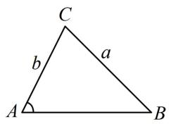
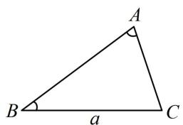
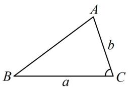
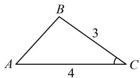
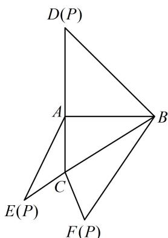
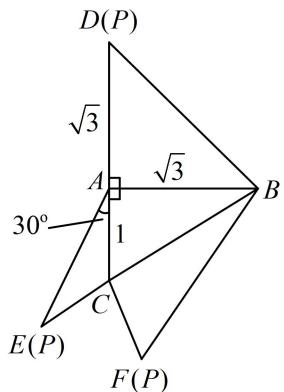
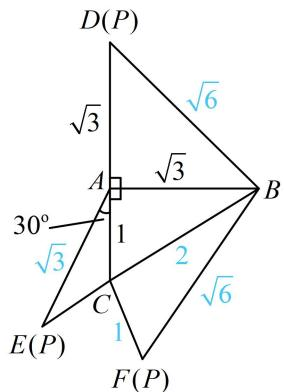

# 模块一 相关定理的基本应用

# 第1节 正弦定理、余弦定理基础模型（★★）

# 内容提要

解三角形主要用正弦定理和余弦定理，若涉及面积，还需用到面积公式，下面先梳理有关的基础知识和基本方法。（如无特别说明，本章的 $a, b, c$ 均指 $\triangle ABC$ 的内角 $A, B, C$ 的对边）

1. 基础知识

①正弦定理： $\frac{a}{\sin A} = \frac{b}{\sin B} = \frac{c}{\sin C} = 2R$ ，其中 $R$ 为 $\triangle ABC$ 的外接圆半径.  
②余弦定理： $a^2 = b^2 +c^2 -2bc\cos A$ ， $b^{2} = a^{2} + c^{2} - 2ac\cos B$ ， $c^2 = a^2 +b^2 -2ab\cos C$   
③余弦定理推论： $\cos A = \frac{b^2 + c^2 - a^2}{2bc}$ ， $\cos B = \frac{a^2 + c^2 - b^2}{2ac}$ ， $\cos C = \frac{a^2 + b^2 - c^2}{2ab}$   
④ $\triangle ABC$ 的面积 $S = \frac{1}{2} ab\sin C = \frac{1}{2} ac\sin B = \frac{1}{2} bc\sin A.$

2. 基本方法

①根据 $A + B + C = \pi$ ，已知任意两角，可求出第三个角；已知一个角，就意味着已知另外两角的关系.  
②正弦定理: $\frac{a}{\sin A} = \frac{b}{\sin B} = \frac{c}{\sin C}$ , 任取其中两项相等, 都可以得到一个边与所对角正弦值的关系, 所以涉及两边及其对角的解三角形问题都可以考虑正弦定理, 常见的有以下两种情况:

(i) 已知两边一对角，求角：不妨假设已知 $a, b$ 和 $A$ ，求 $C$ ，如图1，可按下述步骤求解.

第1步：由正弦定理 $\frac{a}{\sin A} = \frac{b}{\sin B}$ 解出 $\sin B = \frac{b\sin A}{a}$

第2步：根据求得的 $\sin B$ 计算角 $B$ ;

第 3 步: 由 $C = \pi - (A + B)$ 计算出 $C$ .

(ii) 已知两角及一边, 求其余边: 不妨设已知角 $A$ , $B$ 和边 $a$ , 如图 2, 可按下述步骤求解.

第1步：根据 $A + B + C = \pi$ 求出第三个内角 $C$ ;

第2步：根据正弦定理 $\frac{a}{\sin A} = \frac{b}{\sin B} = \frac{c}{\sin C}$ 求出边 $b$ 和 $c$ .

③余弦定理： $\left\{ \begin{array}{l}a^2 = b^2 +c^2 -2bc\cos A\\ b^2 = a^2 +c^2 -2ac\cos B\\ c^2 = a^2 +b^2 -2ab\cos C \end{array} \right.$ ，反映的是三边与内角余弦值的关系，所以涉及三边一角

的问题，都可以考虑使用余弦定理，常见的有以下两种情况：

(i) 已知两边及一角, 求第三边: 可直接对已知的角用余弦定理, 求出第三边. 例如, 若已知 $a$ , $b$ 和 $C$ , 如图3, 则可直接由 $c^{2} = a^{2} + b^{2} - 2ab\cos C$ 求出 $c$ .

(ii) 已知三边求角：不妨设求角 $A$ ，可直接由 $\cos A = \frac{b^2 + c^2 - a^2}{2bc}$ 求出 $\cos A$ ，再求出角 $A$ .

text_image

C
a
b
A
B

图1

text_image

A
B a C

图2

text_image

A
b
B
a
C

图3

类型Ⅰ：用正弦定理解三角形

【例 1】在 $\triangle ABC$ 中， $A=60^{\circ}$ ， $B=45^{\circ}$ ， $a=\sqrt{6}$ ，则 c= \_\_\_\_.

解析：已知 $A, B$ ，可求 $C$ ，则题干的 $a, c, A, C$ 即为两边两对角，可用正弦定理求 $c$

$\left\{ \begin{array}{l} A = 60^{\circ} \\ B = 45^{\circ} \end{array} \right. \Rightarrow C = 180^{\circ} - A - B = 75^{\circ}$ ；现在已知三角一边了，可用正弦定理求其余边，

$$
\sin C = \sin 7 5 ^ {\circ} = \sin (4 5 ^ {\circ} + 3 0 ^ {\circ}) = \sin 4 5 ^ {\circ} \cos 3 0 ^ {\circ} + \cos 4 5 ^ {\circ} \sin 3 0 ^ {\circ} = \frac {\sqrt {6} + \sqrt {2}}{4},
$$

由正弦定理， $\frac{a}{\sin A} = \frac{c}{\sin C}$ ，所以 $c = \frac{a\sin C}{\sin A} = \sqrt{3} +1$

答案： $\sqrt{3} + 1$

【变式 1】(2022·浙江卷（节选）) 在 $\triangle ABC$ 中，角 A, B, C 的对边分别为 a, b, c，已知 $4a = \sqrt{5}c$ ， $\cos C = \frac{3}{5}$ ，求 $\sin A$ 的值.

解：（题干涉及两边一对角，求的是另一边对角正弦，所以是两边两对角问题，用正弦定理解）

因为 $\cos C = \frac{3}{5}$ ，且 $0 < C < \pi$ ，所以 $\sin C > 0$ ，故 $\sin C = \sqrt{1 - \cos^2 C} = \frac{4}{5}$ ，

由正弦定理， $\frac{a}{\sin A} = \frac{c}{\sin C}$ ，所以 $\sin A = \frac{a\sin C}{c}$ ，又 $4a = \sqrt{5} c$ ，所以 $\frac{a}{c} = \frac{\sqrt{5}}{4}$ ，故 $\sin A = \frac{\sqrt{5}}{4}\times \frac{4}{5} = \frac{\sqrt{5}}{5}$

【变式2】在 $\triangle ABC$ 中， $A=\frac{\pi}{4}$ ， $\cos B=\frac{3}{5}$ ， $a=2$ ，则 $\triangle ABC$ 的面积为\_\_\_\_。

解析：已知两角一边，求面积还需要一边，结合已知的是 $a, A, B$ ，所以求 $b$ 是两边两对角问题，可由正弦定理计算，故选择 $S = \frac{1}{2} ab \sin C$ 来求面积，因为 $\cos B = \frac{3}{5}$ ，且 $0 < B < \pi$ ，所以 $\sin B = \frac{4}{5}$ ，

由正弦定理， $\frac{a}{\sin A} = \frac{b}{\sin B}$ ，所以 $b = \frac{a\sin B}{\sin A} = \frac{8\sqrt{2}}{5}$ ，求面积还需要 $\sin C$ ，可由内角和为 $\pi$ 来求，

又 $A = \frac{\pi}{4}$ ，所以 $C = \pi - A - B = \frac{3\pi}{4} - B$ ，从而 $\sin C = \sin \left(\frac{3\pi}{4} - B\right) = \sin \frac{3\pi}{4}\cos B - \cos \frac{3\pi}{4}\sin B$

$= \frac{\sqrt{2}}{2}\cos B + \frac{\sqrt{2}}{2}\sin B = \frac{7\sqrt{2}}{10}$ 故 $S_{\triangle ABC} = \frac{1}{2} ab\sin C = \frac{1}{2}\times 2\times \frac{8\sqrt{2}}{5}\times \frac{7\sqrt{2}}{10} = \frac{56}{25}.$

答案： $\frac{56}{25}$

【总结】从例 1 及变式 1 和变式 2 可以看出，涉及两边两对角，可用正弦定理解三角形.

# 类型II：用余弦定理解三角形

【例 2】(2022·天津卷（节选）) 在 $\triangle ABC$ 中，角 A, B, C 的对边分别为 a, b, c，已知 $a = \sqrt{6}$ ，b = 2c， $\cos A = -\frac{1}{4}$ ，求 c 的值.

解：（将已知的和要求的结合起来，涉及的是三边一角，可用余弦定理建立方程求解）

由余弦定理， $a^2 = b^2 + c^2 - 2bc\cos A$ ，又 $a = \sqrt{6}$ ， $\cos A = -\frac{1}{4}$ ，所以 $b^2 + c^2 + \frac{bc}{2} = 6$ ①，

又 $b = 2c$ ，代入式①整理得： $c^2 = 1$ ，所以 $c = 1$

【变式1】(2020·新课标III卷) 在 $\triangle ABC$ 中, $\cos C = \frac{2}{3}$ , $AC = 4$ , $BC = 3$ , 则 $\cos B = (\quad)$

A. $\frac{1}{9}$

B. $\frac{1}{3}$

C. $\frac{1}{2}$

D. $\frac{2}{3}$

解析：已知两边及夹角，不便使用正弦定理，故先由余弦定理求第三边，

由余弦定理， $AB^{2} = AC^{2} + BC^{2} - 2AC\cdot BC\cdot \cos C = 16 + 9 - 2\times 4\times 3\times \frac{2}{3} = 9$ ，所以 $AB = 3$

已知三边了，可由余弦定理推论求 $\cos B$ ，

如图， $\cos B = \frac{AB^2 + BC^2 - AC^2}{2AB\cdot BC} = \frac{9 + 9 - 16}{2\times 3\times 3} = \frac{1}{9}.$

答案: A

text_image

B
3
A
4
C

【变式2】若 $\triangle ABC$ 的内角 $A, B, C$ 满足 $2\sin A=3\sin B=4\sin C$ ，则 $\cos A=$ \_\_\_\_.

解析：已知三个内角正弦值的比例，可转换成三边的比例关系，

由正弦定理， $\frac{a}{\sin A} = \frac{b}{\sin B} = \frac{c}{\sin C} = 2R$ ，所以 $\sin A = \frac{a}{2R}$ ， $\sin B = \frac{b}{2R}$ ， $\sin C = \frac{c}{2R}$

因为 $2\sin A = 3\sin B = 4\sin C$ ，所以 $2\cdot \frac{a}{2R} = 3\cdot \frac{b}{2R} = 4\cdot \frac{c}{2R}$ ，故 $2a = 3b = 4c$

像这种连等式，可通过设 $k$ ，将 $a, b, c$ 统一成 $k$ ，相当于就是已知三边，可由余弦定理推论求 $\cos A$ ；

设 $2a = 3b = 4c = 12k (k > 0)$ ，则 $a = 6k$ ， $b = 4k$ ， $c = 3k$ ，

由余弦定理推论， $\cos A = \frac{b^2 + c^2 - a^2}{2bc} = \frac{16k^2 + 9k^2 - 36k^2}{2\times 4k\times 3k} = -\frac{11}{24}.$

答案： $-\frac{11}{24}$

【反思】从例 2 和后面的 2 个变式可以看出，已知两边一角求第三边，已知两边及夹角求其余边或角，已知三边（或三边比例关系）求角，都可使用余弦定理及其推论求解.

【例3】（2020·新课标I卷）如图，在三棱锥 $P - ABC$ 的平面展开图中，

$$
A C = 1, \quad A B = A D = \sqrt {3}, \quad A B \perp A C, \quad A B \perp A D, \quad \angle C A E = 3 0 ^ {\circ},
$$

text_image

D(P)
A
B
C
E(P)
F(P)

则 $\cos\angle FCB=$ \_\_\_\_.

解析：先将已知条件标注在图形上，如图1，要求的是 $\cos \angle FCB$ ，所以尽量把条件往 $\triangle FCB$ 上化， $BC$ 可直接在 $\triangle ABC$ 中由勾股定理求得，因为 $AB = \sqrt{3}$ ， $AC = 1$ ， $AB\bot AC$ ，所以 $BC = \sqrt{AB^2 + AC^2} = 2$ ，由折叠过程可知 $FB = BD$ ，而 $BD$ 可在 $\triangle ABD$ 中由勾股定理求，

在 $\triangle ABD$ 中， $BD = \sqrt{AB^2 + AD^2} = \sqrt{6}$ ，所以 $FB = \sqrt{6}$

只要再求出 $CF$ ， $\triangle FCB$ 就已知三边，可由余弦定理推论求 $\cos \angle FCB$ ，根据折叠过程， $CF = CE$ ，我们发

现 $\triangle ACE$ 已知两边及夹角, 刚好可以用余弦定理求 $CE$ ,

在 $\triangle ACE$ 中，由折叠过程知 $AE = AD = \sqrt{3}$

由余弦定理， $CE^2 = AC^2 +AE^2 -2AC\cdot AE\cdot \cos \angle CAE = 1$

所以 $CE = 1$ ，故 $CF = CE = 1$

在 $\triangle FCB$ 中，由余弦定理推论，

$$
\cos \angle F C B = \frac {C F ^ {2} + B C ^ {2} - F B ^ {2}}{2 C F \cdot B C} = \frac {1 + 4 - 6}{2 \times 1 \times 2} = - \frac {1}{4}.
$$

答案： $-\frac{1}{4}$

text_image

D(P)
√3
A
√3
30°
1
B
C
E(P)
F(P)

图1

text_image

D(P)
√3
√6
A
√3
30°
√3
1
2
B
√6
C
1
E(P)
F(P)

图2

# 强化训练

1. (★★)

在 $\triangle ABC$ 中， $A = 30^{\circ}$ ， $B = 45^{\circ}$ ， $a = 2$ ，则 $c = \_$ .

2. (2025·全国Ⅱ卷·★★)

在 $\triangle ABC$ 中， $BC = 2$ ， $AC = 1 + \sqrt{3}$ ， $AB = \sqrt{6}$ ，则 $A =$ （

A. $45^{\circ}$

B. $60^{\circ}$

C. ${120}^{ \circ  }$

D. ${135}^{ \circ  }$

3. (★★)

在 $\triangle ABC$ 中，内角 $A, B, C$ 所对的边长分别为 $a, b, c$ ，若 $A = \frac{\pi}{3}$ ， $b = 4$ ， $\triangle ABC$ 的面积为 $3\sqrt{3}$ ，则 $\sin B = (\quad)$

A. $\frac{2\sqrt{39}}{13}$

B. $\frac{\sqrt{39}}{13}$

C. $\frac{5\sqrt{2}}{13}$

D. $\frac{3\sqrt{13}}{13}$

4. (2023·全国乙卷·★★★)

在 $\triangle ABC$ 中，已知 $\angle BAC = 120^{\circ}$ ， $AB = 2$ ， $AC = 1$

(1) 求 $\sin \angle ABC$ ;   
(2) 若 D 为 BC 上一点，且 $\angle BAD = 90^{\circ}$ ，求 $\triangle ADC$ 的面积.

5. (2023·新课标Ⅰ卷·★★★)

已知在 $\triangle ABC$ 中， $A + B = 3C$ ， $2\sin (A - C) = \sin B$

(1) 求 $\sin A$ ;   
(2) 设 AB = 5，求 AB 边上的高.

6. (2023·浙江杭州二模·★★★☆)

在 $\triangle ABC$ 中，内角 $A, B, C$ 的对边分别为 $a, b, c$ ，且 $\cos B + \sin \frac{A + C}{2} = 0$ .

(1) 求角 B 的大小;  
（2）若 $a:c = 3:5$ ，且 $AC$ 边上的高为 $\frac{15\sqrt{3}}{14}$ ，求 $\triangle ABC$ 的周长.

