# 强化训练

# 1. (★★)

在 $\triangle ABC$ 中， $a = 4$ ， $b = 3\sqrt{3}$ ， $c = 5$ ，则 $BC$ 边上的中线 $AD$ 的长为

1. $\sqrt{22}$

解法 1: 已知三边, 可先在 $\triangle ABC$ 中算 $\cos B$ , 再到 $\triangle ABD$ 中由余弦定理算 $AD$ ,

由题意， $\cos B = \frac{a^2 + c^2 - b^2}{2ac} = \frac{7}{20}$ ，在 $\triangle ABD$ 中， $AD^{2} =$

$AB^{2} + BD^{2} - 2AB\cdot BD\cdot \cos B = 22$ ，所以 $AD = \sqrt{22}$

解法2：如图，所有线段中只有 $AD$ 未知，可利用 $\angle ADB$ 与 $\angle ADC$ 互补，建立方程求 $AD$

设 $AD = x$ ，由图可知 $\angle ADC = \pi -\angle ADB$

所以 $\cos \angle ADC = \cos (\pi -\angle ADB) = -\cos \angle ADB$

故 $\frac{x^2 + 4 - 27}{2 \times x \times 2} = -\frac{x^2 + 4 - 25}{2 \times x \times 2}$ ，解得： $x = \sqrt{22}$ 。

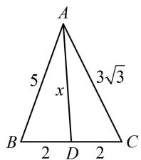

text_image

A
5
x
3√3
B 2 D 2 C

2. (2022·福建厦门模拟·★★★)

在 $\triangle ABC$ 中，内角 $A, B, C$ 的对边分别为 $a, b, c$ ，若 $b\sin C + a\sin A = b\sin B + c\sin C$ ，则内角 $A =$ \_\_\_\_；

若 D 是边 BC 的中点，c=2， $AD=\sqrt{13}$ ，则 a= \_\_\_\_.

2. $\frac{\pi}{3}$ ; $2\sqrt{7}$

解法1：因为 $b \sin C + a \sin A = b \sin B + c \sin C$

所以 $bc + a^2 = b^2 +c^2$ ，从而 $b^{2} + c^{2} - a^{2} = bc$

故 $\cos A = \frac{b^2 + c^2 - a^2}{2bc} = \frac{bc}{2bc} = \frac{1}{2}$ ，结合 $0 < A < \pi$ 得 $A = \frac{\pi}{3}$ ；

如图1，有 $a, b$ 两个未知数，需建立两个方程求解，首先对 $A$ 用余弦定理建立一个方程，

由余弦定理， $a^2 = b^2 +c^2 -2bc\cos A$

将 c=2 和 $A=\frac{\pi}{3}$ 代入整理得： $a^{2}=b^{2}+4-2b$ ①，

由 $\angle ADB$ 与 $\angle ADC$ 互补可建立第二个方程,

又 $\angle ADB = \pi -\angle ADC$ ，所以 $\cos \angle ADB = \cos (\pi -\angle ADC)$

$$
= - \cos \angle A D C, \text {故} \frac {\frac {a ^ {2}}{4} + 1 3 - 4}{2 \cdot \frac {a}{2} \cdot \sqrt {1 3}} = - \frac {\frac {a ^ {2}}{4} + 1 3 - b ^ {2}}{2 \cdot \frac {a}{2} \cdot \sqrt {1 3}},
$$

化简得： $a^2 = 2b^2 -44$ ，代入①整理得： $b^{2} + 2b - 48 = 0$

解得： $b = 6$ 或-8（舍去），代入式①可求得 $a = 2\sqrt{7}$

解法2: 求 $A$ 的过程同解法1, 接下来由于 $D$ 是 $B C$ 中点, 故也可将 $\overrightarrow{A D}$ 用 $\overrightarrow{A B}$ 和 $\overrightarrow{A C}$ 表示, 借助向量的运算来求 $b$ ,因为 D 是 BC 中点，所以 $\overrightarrow{AD} = \frac{1}{2} (\overrightarrow{AC} + \overrightarrow{AB})$ ，

从而 $\left|\overrightarrow{AD}\right|^{2}=\frac{1}{4}\left(\left|\overrightarrow{AC}\right|^{2}+\left|\overrightarrow{AB}\right|^{2}+2\overrightarrow{AC}\cdot\overrightarrow{AB}\right)$ ,

故 $13 = \frac{1}{4}\left(b^{2} + 4 + 2b\cdot 2\cos \frac{\pi}{3}\right)$ ，解得： $b = 6$ 或-8（舍去），

已知两边及夹角了，可由余弦定理求第三边 $a$

所以 $a^2 = b^2 + c^2 - 2bc\cos A = 36 + 4 - 2\times 6\times 2\times \cos \frac{\pi}{3}$

$= 28$ ，故 $a = 2\sqrt{7}$

解法3：求 $A$ 的过程同解法1，接下来也可将 $\triangle ABC$ 补全为如图2所示的平行四边形ABEC，先在 $\triangle ABE$ 中算 $b$

如图2， $BE = AC = b$ ， $AE = 2AD = 2\sqrt{13}$

$\angle ABE = \pi - A = \frac{2\pi}{3}$ ，在 $\triangle ABE$ 中，由余弦定理，

$$
A E ^ {2} = A B ^ {2} + B E ^ {2} - 2 A B \cdot B E \cdot \cos \angle A B E,
$$

所以 $52 = 4 + b^{2} - 2 \times 2 \times b \times \cos \frac{2\pi}{3}$ ,

解得： $b = 6$ 或-8（舍去），接下来求 $a$ 的过程同解法2.

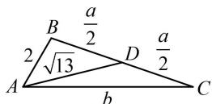  
图1

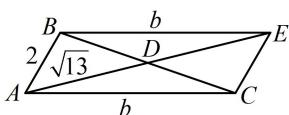  
图2

【反思】后续多道题都有多种解法，为了篇幅简洁，我们以双余弦法（解法1）为主.

# 3. (★★★)

在 $\triangle ABC$ 中， $b = 4$ ， $c = 2$ ，则 $BC$ 边上的中线 $AD$ 的长的取值范围是 \_\_\_\_.

3. (1,3)

解法1：可选择 $a$ 作为变量，利用 $\angle ADB$ 与 $\angle ADC$ 互补建立等量关系，把中线 $AD$ 用 $a$ 表示，再求范围，

如图， $\angle ADB = \pi -\angle ADC$ ，所以 $\cos \angle ADB =$

$$
\cos (\pi - \angle A D C) = - \cos \angle A D C,
$$

从而 $\frac{AD^2 + BD^2 - AB^2}{2AD\cdot BD} = -\frac{AD^2 + CD^2 - AC^2}{2AD\cdot CD}$

故 $\frac{AD^2 + \frac{a^2}{4} - 4}{2AD\cdot\frac{a}{2}} = -\frac{AD^2 + \frac{a^2}{4} - 16}{2AD\cdot\frac{a}{2}}$ ，故 $AD = \sqrt{10 - \frac{a^2}{4}}$ ①，

下面先由三角形两边之和大于第三边来求 $a$ 的范围，

因为 $\left\{\begin{aligned}a+b&>c\\ a+c&>b\\ b+c&>a\end{aligned}\right.$ ，所以 $\left\{\begin{aligned}a+4&>2\\ a+2&>4\\ 2+4&>a\end{aligned}\right.$ ，故2<a<6，

结合式①可得 $1 < AD < 3$

解法2: $\triangle ABC$ 已知两边, 可引入夹角为变量, 那么 $\overrightarrow{AB}$ 和 $\overrightarrow{AC}$ 就知道长度和夹角, 用向量求 $AD$ 很方便,

设 $\angle BAC = \theta (0 < \theta < \pi)$ ，由题意， $\overrightarrow{AD} = \frac{1}{2} (\overrightarrow{AB} + \overrightarrow{AC})$

所以 $\overrightarrow{AD}^2 = \frac{1}{4} (\overrightarrow{AB}^2 +\overrightarrow{AC}^2 +2\overrightarrow{AB}\cdot \overrightarrow{AC})$

$$
= \frac {1}{4} (2 ^ {2} + 4 ^ {2} + 2 \times 2 \times 4 \times \cos \theta) = 5 + 4 \cos \theta ,
$$

因为 $0 < \theta < \pi$ ，所以 $-1 < \cos \theta < 1$

从而 $1 < \overrightarrow{AD}^2 = 5 + 4\cos \theta < 9$ ，故 $1 < |\overrightarrow{AD}| < 3$

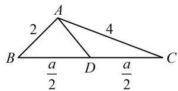

text_image

A
2
4
B
a/2
D
a/2
C

4. (★★☆)

在 $\triangle ABC$ 中，内角 $A, B, C$ 的对边分别为 $a, b, c$ ，已知 $b = 4$ ， $c = \sqrt{10}$ ， $D$ 为 $BC$ 边上一点， $CD = 2BD$ ，若 $AD = 2$ ，则 $a =$ \_\_\_\_.

4.6

解析：如图，所有线段中，只有 $BD$ 和 $CD$ 未知，可设它们为未知数，用双余弦法建立方程求解，

设 $BD = x$ ，则 $CD = 2x$ ，因为 $\angle ADC = \pi -\angle ADB$

所以 $\cos \angle ADC = \cos (\pi -\angle ADB) = -\cos \angle ADB$ ，

故 $\frac{4 + 4x^2 - 16}{2\times 2\times 2x} = -\frac{4 + x^2 - 10}{2\times 2\times x}$ ，所以 $x = 2$ ，故 $a = 3x = 6$

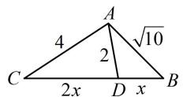

5. (2023·全国甲卷·★★☆)

$\triangle ABC$ 中， $\angle BAC = 60^{\circ}$ ， $AB = 2$ ， $BC = \sqrt{6}$ ， $AD$ 平分 $\angle BAC$ 交 $BC$ 于点 $D$ ，则 $AD = \_$ .

5.2

解析：如图，只要求出 $AC$ ，就能利用等面积法建立方程求 $AD$ ，已知两边一角，可用余弦定理求第三边，

由余弦定理， $BC^{2} = AB^{2} + AC^{2} - 2AB\cdot AC\cdot \cos \angle BAC$

将已知条件代入可得 $6 = 4 + AC^{2} - 2 \times 2 \times AC \times \cos 60^{\circ}$

解得： $AC = 1 + \sqrt{3}$ 或 $1 - \sqrt{3}$ （舍去），

因为 $S_{\triangle ABD} + S_{\triangle ACD} = S_{\triangle ABC}$ ，所以 $\frac{1}{2} \times 2 \times AD \times \sin 30^{\circ} +$

$$
\frac {1}{2} \times (1 + \sqrt {3}) \times A D \times \sin 3 0 ^ {\circ} = \frac {1}{2} \times 2 \times (1 + \sqrt {3}) \times \sin 6 0 ^ {\circ},
$$

解得： $AD = 2$

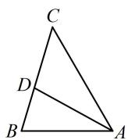

6. (2023·江苏省苏锡常镇四市一模·★★★)

在 $\triangle ABC$ 中， $\angle BAC = \frac{2\pi}{3}$ ， $\angle BAC$ 的角平分线 $AD$ 交 $BC$ 于点 $D$ ， $\triangle ABD$ 的面积是 $\triangle ADC$ 面积的 3 倍，则 $\tan B = (\quad)$

A. $\frac{\sqrt{3}}{7}$

B. $\frac{\sqrt{3}}{5}$

C. $\frac{3\sqrt{3}}{5}$

D. $\frac{6 - \sqrt{3}}{33}$

6. A

解法1：角平分线条件怎么翻译？别慌用等面积法，因为 $S_{\triangle ABD} = 3S_{\triangle ADC}$ 意味着 $BD = 3DC$ ，结合角平分线性质定理就可以得到 $c$ 与 $b$ 的比例关系，思路就有了，

由角平分线性质定理， $\frac{b}{c} = \frac{AC}{AB} = \frac{CD}{BD} = \frac{1}{3}\Rightarrow c = 3b$

只要有三边比值，就能由余弦定理推论求 $B$ ，故考虑再找 $a$ 与 $b$ ， $c$ 的关系，可对已知的 $\angle BAC$ 用余弦定理建立方程，

由余弦定理， $a^2 = b^2 +c^2 -2bc\cos \angle BAC = b^2 +c^2 +bc$

结合 $c = 3b$ 可得 $a^2 = 13b^2$ ，所以 $a = \sqrt{13} b$

故 $\cos B = \frac{a^2 + c^2 - b^2}{2ac} = \frac{13b^2 + 9b^2 - b^2}{2\times\sqrt{13}b\times 3b} = \frac{7}{2\sqrt{13}}$

所以 $\sin B = \sqrt{1 - \cos^2B} = \frac{\sqrt{3}}{2\sqrt{13}}$ ，故 $\tan B = \frac{\sin B}{\cos B} = \frac{\sqrt{3}}{7}$

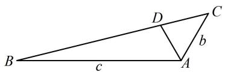

text_image

B
c
D
b
A
C

图1

解法 2: 得到 $c = 3b$ 的过程同解法 1, 接下来求 $\tan B$ 也可考虑构造一个以 $B$ 为其中一个内角的 $\mathrm{Rt}\triangle$ 来简化运算，

如图2，作 $CE \perp BA$ 于点 $E$ ， $\angle BAC = \frac{2\pi}{3} \Rightarrow \angle CAE = \frac{\pi}{3}$

故 $AE = AC \cdot \cos \angle CAE = \frac{b}{2}$ , $CE = AC \cdot \sin \angle CAE = \frac{\sqrt{3} b}{2}$ ,

所以 $\tan B = \frac{CE}{BE} = \frac{CE}{AB + AE} = \frac{\frac{\sqrt{3}b}{2}}{3b + \frac{b}{2}} = \frac{\sqrt{3}}{7}$ .

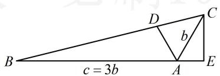

text_image

B
c = 3b
D
b
A
E
C

图2

7. (2021·新高考Ⅰ卷·★★★)

记 $\triangle ABC$ 的内角 $A, B, C$ 的对边分别为 $a, b, c$ . 已知 $b^{2} = ac$ ，点 $D$ 在边 $AC$ 上， $BD\sin \angle ABC = a\sin C$ .

(1) 证明: $BD = b$ ;   
(2) 若 AD = 2DC，求 $\cos \angle ABC$ .

7. 解：（1）因为 $BD\sin \angle ABC = a\sin C$ ，所以 $BD \cdot b = ac$

又 $b^{2} = ac$ ，所以 $BD\cdot b = b^2$ ，故 $BD = b$ ：

(2) (如图, 根据 $\angle ADB$ 与 $\angle CDB$ 互补, 利用双余弦法可建立一个边的方程, 结合题干的 $b^{2} = ac$ , 能找到三边的比例关系,由余弦定理推论求 $\cos \angle ABC$ )

因为 AD = 2DC，所以 $AD = \frac{2b}{3}$ ， $CD = \frac{b}{3}$ ，

由（1）知 $BD = b$ ，在 $\triangle ABD$ 中，由余弦定理推论，

$$
\cos \angle A D B = \frac {A D ^ {2} + B D ^ {2} - A B ^ {2}}{2 A D \cdot B D} = \frac {\frac {4 b ^ {2}}{9} + b ^ {2} - c ^ {2}}{2 \cdot \frac {2 b}{3} \cdot b} = \frac {1 3 b ^ {2} - 9 c ^ {2}}{1 2 b ^ {2}},
$$

同理，在 $\triangle CBD$ 中， $\cos \angle CDB = \frac{CD^2 + BD^2 - BC^2}{2CD \cdot BD}$

$$
= \frac {\frac {b ^ {2}}{9} + b ^ {2} - a ^ {2}}{2 \cdot \frac {b}{3} \cdot b} = \frac {1 0 b ^ {2} - 9 a ^ {2}}{6 b ^ {2}}, \text {因为} \angle A D B = \pi - \angle C D B,
$$

所以 $\cos \angle ADB = \cos (\pi -\angle CDB) = -\cos \angle CDB$

故 $\frac{13b^2 - 9c^2}{12b^2} = -\frac{10b^2 - 9a^2}{6b^2}$ ，化简得： $6a^{2} - 11b^{2} + 3c^{2} = 0$

将 $b^{2} = ac$ 代入上式整理得： $6a^{2} - 11ac + 3c^{2} = 0$

故 $(3a - c)(2a - 3c) = 0$ ，所以 $a = \frac{c}{3}$ 或 $a = \frac{3}{2} c$

(需检验上述两种情况是否都满足题意, 可用较小的两边之和大于最长边来检验)

若 $a = \frac{c}{3}$ ，则 $b = \sqrt{ac} = \frac{\sqrt{3}}{3} c$ ，此时 $a + b = \frac{1 + \sqrt{3}}{3} c < c$

无法构成三角形，舍去，所以 $a = \frac{3}{2} c$ ， $b = \sqrt{ac} = \frac{\sqrt{6}}{2} c$

故 $\cos \angle ABC = \frac{a^2 + c^2 - b^2}{2ac} = \frac{\frac{9}{4}c^2 + c^2 - \frac{3}{2}c^2}{2\cdot\frac{3}{2}c\cdot c} = \frac{7}{12}$ .

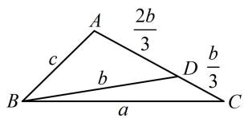

text_image

A
2b/3
c
b
D b/3
B
a
C

【反思】上面第（2）问由 $\cos \angle ADB = -\cos \angle CDB$ 得到边的关系的过程，也可改为分别在 $\triangle ABC$ 和 $\triangle CBD$ 中求 $\cos C$ ，从而建立等量关系，计算量会稍小一些，不妨试试.

8. (2024·福建漳州一模·★★★☆)

在 $\triangle ABC$ 中， $A, B, C$ 的对边分别为 $a, b, c$ ，且满足\_\_\_\_。

请在① $(a - b)\sin (A + C) = (a - c)(\sin A + \sin C)$

② $\sin \left(\frac{\pi}{6} - C\right) \cos \left(C + \frac{\pi}{3}\right) = \frac{1}{4}$ ，这两个中任选一个作为条件，补充在横线上，并解答问题.

(1) 求 C;

（2）若 $\triangle ABC$ 的面积为 $5\sqrt{3}$ ， $D$ 为 $AC$ 的中点，求 $BD$ 的最小值.

8. 解：（1）解法1：选择条件①，则 $(a - b)\sin (A + C) =$

$(a - c)(\sin A + \sin C)$ (i)，（注意到左边的 $\sin (A + C)$ 可化为 $\sin B$ ，所以上式等号两侧既有齐次的边，也有齐次的内角正弦值，所以既能边化角，又能角化边，选谁呢？经尝试，若边化角，则下一步按角化简不易，故考虑角化边分析）

在 $\triangle ABC$ 中， $\sin (A + C) = \sin (\pi - B) = \sin B$

代入(i)得 $(a - b)\sin B = (a - c)(\sin A + \sin C)$

由正弦定理， $(a - b)b = (a - c)(a + c)$

化简得： $a^2 + b^2 - c^2 = ab$

(看到 $a^{2}+b^{2}-c^{2}$ ，想到用余弦定理推论求 $\cos C$ )

由余弦定理推论， $\cos C = \frac{a^2 + b^2 - c^2}{2ab} = \frac{ab}{2ab} = \frac{1}{2}$

结合 $C\in (0,\pi)$ 可得 $C = \frac{\pi}{3}$

解法2：选择条件②，则 $\sin \left(\frac{\pi}{6} - C\right)\cos \left(C + \frac{\pi}{3}\right) = \frac{1}{4}$ (ii)，

(上式怎么处理？要展开吗？展开再化简可行，但比较麻烦，注意到涉及的两个角相加为 $\frac{\pi}{2}$ ，故可用诱导公式快速化简)

$$
\sin \left(\frac {\pi}{6} - C\right) \cos \left(C + \frac {\pi}{3}\right) =
$$

$$
\sin \left[ \frac {\pi}{2} - \left(C + \frac {\pi}{3}\right) \right] \cos \left(C + \frac {\pi}{3}\right) = \cos^ {2} \left(C + \frac {\pi}{3}\right),
$$

代入(ii)得 $\cos^2\left(C + \frac{\pi}{3}\right) = \frac{1}{4}$ ，故 $\cos \left(C + \frac{\pi}{3}\right) = \pm \frac{1}{2}$ (iii)，

又 $0 < C < \pi$ ，所以 $\frac{\pi}{3} < C + \frac{\pi}{3} < \frac{4\pi}{3}$

故 $-1 \leq \cos \left( C + \frac{\pi}{3} \right) < \frac{1}{2}$ ，结合(iii)得 $\cos \left( C + \frac{\pi}{3} \right) = -\frac{1}{2}$ ，

此时 $C + \frac{\pi}{3} = \frac{2\pi}{3}$ ，所以 $C = \frac{\pi}{3}$

（2）（条件给出了 $\triangle ABC$ 的面积，已知 $C$ ，我们先用 $C$ 表示面积）由（1）得 $S_{\triangle ABC} = \frac{1}{2} ab\sin C = \frac{1}{2} ab\sin \frac{\pi}{3} = \frac{\sqrt{3}}{4} ab$ 又由题意， $S_{\triangle ABC} = 5\sqrt{3}$ ，所以 $\frac{\sqrt{3}}{4} ab = 5\sqrt{3}$ ，故 $ab = 20$

（有了 $a, b$ 的关系，要求 $BD$ 的范围，考虑把 $BD$ 用 $a, b$ 表示，如图，观察发现在 $\triangle BCD$ 中用余弦定理即可）在 $\triangle BCD$ 中，由余弦定理，

$$
B D ^ {2} = B C ^ {2} + C D ^ {2} - 2 B C \cdot C D \cdot \cos C = a ^ {2} + \frac {1}{4} b ^ {2} - \frac {1}{2} a b \geq 2 a \cdot \frac {1}{2} b - \frac {1}{2} a b = \frac {1}{2} a b = 1 0,
$$

所以 $BD \geq \sqrt{10}$ ，当且仅当 $a = \frac{1}{2} b$ 时取等号，

结合 $ab = 20$ 可得 $a = \sqrt{10}$ ， $b = 2\sqrt{10}$

所以 $BD$ 的最小值为 $\sqrt{10}$

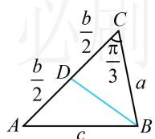

9. (2022·湖南岳阳模拟·★★★)

在 $\triangle ABC$ 中，角 $A, B, C$ 的对边分别为 $a, b, c$ ，且 $\sqrt{3} a - 2b\sin A = 0$ .

(1) 求 B;

(2) 若 $B$ 为钝角, 且角 $B$ 的平分线与 $AC$ 交于点 $D$ , $BD = \sqrt{2}$ , 求 $\triangle ABC$ 的面积的最小值.

9. 解：（1）因为 $\sqrt{3}a - 2b\sin A = 0$ ，

所以 $\sqrt{3}\sin A-2\sin B\sin A=0$ ①,

又 $0 < A < \pi$ ，所以 $\sin A > 0$ ，故在式①中约去 $\sin A$ 可得

$\sqrt{3} - 2\sin B = 0$ ，所以 $\sin B = \frac{\sqrt{3}}{2}$ ，

结合 $0 < B < \pi$ 可得 $B = \frac{\pi}{3}$ 或 $\frac{2\pi}{3}$ .

（2）由（1）知若 $B$ 为钝角，则 $B = \frac{2\pi}{3}$

所以 $S_{\triangle ABC} = \frac{1}{2} ac\sin B = \frac{\sqrt{3}}{4} ac$

(要求上式的最小值, 需寻找 $a, c$ 的关系, 这是已知顶角的角平分线问题, 可用等面积法建立方程)

因为 $BD$ 是角 $B$ 的平分线，所以 $\angle ABD = \angle CBD = \frac{\pi}{3}$

由 $S_{\triangle ABD} + S_{\triangle CBD} = S_{\triangle ABC}$ 得 $\frac{1}{2} c\cdot \sqrt{2}\cdot \sin \frac{\pi}{3} +\frac{1}{2} a\cdot \sqrt{2}\cdot \sin \frac{\pi}{3}$

$= \frac{\sqrt{3}}{4} ac$ ，整理得： $\sqrt{2} (a + c) = ac$

(为了求 $ac$ 的最小值, 可将上式中的 $a + c$ 变成 $ac$ )

所以 $ac = \sqrt{2} (a + c)\geq \sqrt{2}\times 2\sqrt{ac}$ ，故 $ac\geq 8$

当且仅当 $a = c = 2\sqrt{2}$ 时取等号，

所以 $S_{\triangle ABC} = \frac{\sqrt{3}}{4} ac \geq \frac{\sqrt{3}}{4} \times 8 = 2\sqrt{3}$ ，故 $(S_{\triangle ABC})_{\min} = 2\sqrt{3}$ 。

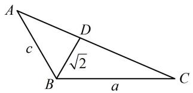

text_image

A
c
D
√2
B
a
C

