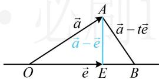

# 强化训练

1. (★) (多选)

设 $a, b$ 是两个向量，则下列命题正确的是（）

A. 若 $a \parallel b$ ，则存在唯一实数 $\lambda$ ，使 $a = \lambda b$

B. 若向量 $a, b$ 所在的直线是异面直线，则 $a, b$ 一定不共面

C. 若 $a$ 是非零向量，则 $\frac{a}{|a|}$ 是与 $a$ 同向的单位向量

D. 若 $a, b$ 都是非零向量，则 “ $\frac{a}{|a|} + \frac{b}{|b|} = 0$ ” 是 “ $a$ 与 $b$ 共线”的充分不必要条件

1. CD

解析：A项，当 $b = 0$ ， $a\neq 0$ 时，满足 $a / / b$ ，但不存在实数 $\lambda$ ，使 $a = \lambda b$ ，故A项错误；

B项，向量可以平移，所以任意两个向量都是共面的，故B项错误；

C项，首先， $\frac{a}{|a|} = \frac{1}{|a|} a$ ，因为 $\frac{1}{|a|} >0$ ，所以 $\frac{a}{|a|}$ 与 $a$ 同向；

其次， $\left|\frac{a}{|a|}\right| = \left|\frac{1}{|a|} a\right| = \frac{1}{|a|}\cdot |a| = 1$ ；故C项正确；

D项，若 $\frac{a}{|a|} +\frac{b}{|b|} = 0$ ，则 $b = -\frac{|b|}{|a|} a$ ，所以 $\pmb{a}$ 与 $\pmb{b}$ 共线，充分性成立；

若 $a$ 与 $b$ 共线，我们知道 $\frac{a}{|a|}$ 和 $\frac{b}{|b|}$ 分别表示与 $a$ 和 $b$ 同向的单位向量，所以当 $a$ 和 $b$ 同向时， $\frac{a}{|a|} + \frac{b}{|b|}$ 是方向与 $a, b$ 相同，且长度为2的向量，从而 $\frac{a}{|a|} + \frac{b}{|b|} \neq 0$ ，必要性不成立；故D项正确.

2. (2024·浙江模拟·★)

已知向量 $\vec{e}_1$ ， $\vec{e}_2$ 是平面上两个不共线的单位向量，且 $\overrightarrow{AB} = \vec{e}_1 + 2\vec{e}_2$ ， $\overrightarrow{BC} = -3\vec{e}_1 + 2\vec{e}_2$ ， $\overrightarrow{DA} = 3\vec{e}_1 - 6\vec{e}_2$ ，则（）

A. $A, B, C$ 三点共线

B. $A, B, D$ 三点共线

C. $A, C, D$ 三点共线

D. B, C, D 三点共线

2. C

解析：题干给出了与 $A, B, C, D$ 四点有关的向量，故考虑用向量共线来判断三点共线，

A项，若 $A$ ， $B$ ， $C$ 三点共线，则 $\overrightarrow{AB}$ 与 $\overrightarrow{BC}$ 共线，

所以存在唯一的实数 $\lambda$ ，使 $\overrightarrow{AB} = \lambda \overrightarrow{BC}$ ，

即 $\vec{e}_1 + 2\vec{e}_2 = \lambda (-3\vec{e}_1 + 2\vec{e}_2)$ ，所以 $\vec{e}_1 + 2\vec{e}_2 = -3\lambda \vec{e}_1 + 2\lambda \vec{e}_2$

从而 $\left\{ \begin{array}{l} -3\lambda = 1 \\ 2\lambda = 2 \end{array} \right.$ ，无解，故 $A, B, C$ 三点不共线，

故A项错误，同理可得B、D两项错误；

C 项，要判断 $A$ ， $C$ ， $D$ 是否共线，已知条件中的向量只有 $\overrightarrow{DA}$ 是现成的，另一个需要算，观察发现 $\overrightarrow{AC} = \overrightarrow{AB} +\overrightarrow{BC}$ ，故算 $\overrightarrow{AC}$ 比较方便，

由题意， $\overrightarrow{AC} = \overrightarrow{AB} +\overrightarrow{BC} = \vec{e}_1 + 2\vec{e}_2 - 3\vec{e}_1 + 2\vec{e}_2 = -2\vec{e}_1 + 4\vec{e}_2$

若 $A, C, D$ 三点共线，则 $\overrightarrow{AC}$ 与 $\overrightarrow{DA}$ 共线，所以存在唯一的实数 $\lambda$ ，使得 $\overrightarrow{AC} = \lambda \overrightarrow{DA}$ ，即 $-2\vec{e}_1 + 4\vec{e}_2 = \lambda (3\vec{e}_1 - 6\vec{e}_2)$

故 $-2\vec{e}_1 + 4\vec{e}_2 = 3\lambda \vec{e}_1 - 6\lambda \vec{e}_2$ ，所以 $\left\{ \begin{array}{l}3\lambda = -2\\ -6\lambda = 4 \end{array} \right.$

解得： $\lambda = -\frac{2}{3}$ ，从而 $A$ ， $C$ ， $D$ 三点共线，故C项正确.

3. (2023·新课标Ⅱ卷·★★)

已知向量 a，b 满足 $\left|a-b\right|=\sqrt{3}$ ， $\left|a+b\right|=\left|2a-b\right|$ ，则 $\left|b\right|=$ \_\_\_\_.

3. $\sqrt{3}$

解析：条件有两个模的等式，想到把它们平方，观察联系，

由题意， $\left|a-b\right|^{2}=a^{2}+b^{2}-2a\cdot b=3$ ①,

又 $\left|a+b\right|=\left|2a-b\right|$ ，所以 $\left|a+b\right|^{2}=\left|2a-b\right|^{2}$ ，

故 $a^{2}+b^{2}+2a\cdot b=4a^{2}+b^{2}-4a\cdot b$ ，

整理得： $a^{2}-2a\cdot b=0$ ，代入①可得 $b^{2}=3$ ，

即 $\left|b\right|^{2}=3$ ，所以 $\left|b\right|=\sqrt{3}$ .

4. (★★☆) (多选)

下列命题正确的是（）

A. $\left\| \pmb {a}\right| - \left|\pmb {b}\right|\leq \left|\pmb {a} + \pmb {b}\right|\leq \left|\pmb {a}\right| + \left|\pmb {b}\right|$

B. 若 $a, b$ 为非零向量，且 $\vert a + b\vert = \vert a - b\vert$ ，则 $a \perp b$

C. $|\pmb{a}| - |\pmb{b}| = |\pmb{a} + \pmb{b}|$ 是 $\pmb{a}$ , $\pmb{b}$ 共线的充要条件

D. 若 $a, b$ 为非零向量，且 $\|a| - |b\| = |a - b|$ ，则 $a$ 与 $b$ 同向

4. ABD

解析：涉及模的问题，考虑将其平方来看，

A 项， $\left|\left|a\right|-\left|b\right|\right|\leq\left|a+b\right|\leq\left|a\right|+\left|b\right|\Leftrightarrow$

$$
\left| \left| \boldsymbol {a} \right| - \left| \boldsymbol {b} \right| \right| ^ {2} \leq \left| \boldsymbol {a} + \boldsymbol {b} \right| ^ {2} \leq (\left| \boldsymbol {a} \right| + \left| \boldsymbol {b} \right|) ^ {2}
$$

$$
\Leftrightarrow \left| \boldsymbol {a} \right| ^ {2} + \left| \boldsymbol {b} \right| ^ {2} - 2 \left| \boldsymbol {a} \right| \cdot \left| \boldsymbol {b} \right| \leq \left| \boldsymbol {a} \right| ^ {2} + \left| \boldsymbol {b} \right| ^ {2} + 2 \boldsymbol {a} \cdot \boldsymbol {b} \leq \left| \boldsymbol {a} \right| ^ {2} + \left| \boldsymbol {b} \right| ^ {2} + 2 \left| \boldsymbol {a} \right| \cdot \left| \boldsymbol {b} \right|
$$

$$
\Leftrightarrow - | \boldsymbol {a} | \cdot | \boldsymbol {b} | \leq \boldsymbol {a} \cdot \boldsymbol {b} = | \boldsymbol {a} | \cdot | \boldsymbol {b} | \cdot \cos \theta \leq | \boldsymbol {a} | \cdot | \boldsymbol {b} | \quad ①,
$$

其中 $\theta$ 为 $\pmb{a}$ 和 $\pmb{b}$ 的夹角，因为 $-1 \leq \cos \theta \leq 1$ ， $|\pmb{a}| \cdot |\pmb{b}| \geq 0$

所以式①成立，故A项正确；

B 项，因为 $\left|a+b\right|=\left|a-b\right|$ ，所以 $\left|a+b\right|^{2}=\left|a-b\right|^{2}$

从而 $a^2 + b^2 + 2a \cdot b = a^2 + b^2 - 2a \cdot b$ ，故 $a \cdot b = 0$ ，

又 $a, b$ 为非零向量，所以 $a \perp b$ ，故B项正确；

C 项，若 $\left|a\right|-\left|b\right|=\left|a+b\right|$ ，则 $\left(\left|a\right|-\left|b\right|\right)^{2}=\left|a+b\right|^{2}$

所以 $\left|a\right|^{2}+\left|b\right|^{2}-2\left|a\right|\cdot\left|b\right|=\left|a\right|^{2}+\left|b\right|^{2}+2a\cdot b$

整理得： $a\cdot b = -|a|\cdot |b|$ ，即 $\left|a\right|\cdot \left|b\right|\cdot \cos \theta = -\left|a\right|\cdot \left|b\right|$

此时 a, b 中至少有一个为零向量或 $\theta = \pi$ ,

均满足 $a, b$ 共线，充分性成立，

若 $a, b$ 共线，当它们同向且都为非零向量时，

$\left|a+b\right|=\left|a\right|+\left|b\right|\neq\left|a\right|-\left|b\right|$ ，必要性不成立，故C项错误；

D 项，将 $\left|\left|a\right|-\left|b\right|\right|=\left|a-b\right|$ 平方可得 $\left|a\right|^{2}+\left|b\right|^{2}-2\left|a\right|\cdot\left|b\right|=$

$\left|\boldsymbol{a}\right|^{2}+\left|\boldsymbol{b}\right|^{2}-2\left|\boldsymbol{a}\right|\cdot\left|\boldsymbol{b}\right|\cdot\cos\theta$ ，所以 $\cos\theta=1$ ，故 $\theta=0^{\circ}$ ，

所以 a 与 b 同向，故 D 项正确.

5. (2023·广东深圳模拟·★★)

已知向量 $a$ ， $b$ 满足 $a \perp (a + 4b)$ ， $b \perp (a + 3b)$ ，则向量 $a$ ， $b$ 的夹角为（）

A. $\frac{\pi}{6}$

B. $\frac{\pi}{3}$

C. $\frac{2\pi}{3}$

D. $\frac{5\pi}{6}$

5. D

解析：算向量夹角，考虑夹角余弦公式 $\cos < a, b > = \frac{a \cdot b}{|a| \cdot |b|}$ 。用数量积翻译两个垂直条件，可建立 $a \cdot b$ 和 $|a|$ ， $|b|$ 的关系， $\left\{ \begin{array}{l} a \perp (a + 4b) \\ b \perp (a + 3b) \end{array} \right. \Rightarrow \left\{ \begin{array}{l} a \cdot (a + 4b) = a^2 + 4a \cdot b = |a|^2 + 4a \cdot b = 0 \\ b \cdot (a + 3b) = a \cdot b + 3b^2 = a \cdot b + 3|b|^2 = 0 \end{array} \right.$ ，观察发现①②都有 $a \cdot b$ ，消去 $a \cdot b$ ，即可得到 $|a|$ 与 $|b|$ 的关系，由②得 $a \cdot b = -3|b|^2$ ，代入①得 $|a|^2 + 4 \times (-3|b|^2) = 0$ ，

所以 $\left|\pmb{a}\right|^2 = 12\left|\pmb{b}\right|^2$ ，故 $\left|\pmb {a}\right| = 2\sqrt{3}\left|\pmb {b}\right|$ ，不妨设 $\left|\pmb {b}\right| = k(k > 0)$

则 $|\pmb{a}| = 2\sqrt{3} k$ ，将 $\left|\pmb {b}\right| = k$ 代入②可得 $\pmb {a}\cdot \pmb {b} = -3\pmb{b}^2 = -3k^2$

故 $\cos <  a,b > = \frac{a\cdot b}{|a|\cdot|b|} = \frac{-3k^2}{2\sqrt{3}k\cdot k} = -\frac{\sqrt{3}}{2}$ ，故 $<  a,b > = \frac{5\pi}{6}$

6. (★★☆)

若向量 a, b, c 满足 $3a + 4b + 5c = 0$ ， $|a| = |b| = |c| = 1$ ，则 $a \cdot (b + c) =$ \_\_\_\_.

6. $-\frac{3}{5}$

解析：所求式可化为 $a \cdot b + a \cdot c$ ，怎样计算它们？观察发现将所给的向量等式移项，平方即可产生 $a \cdot b$ 和 $a \cdot c$

因为 $3a + 4b + 5c = 0$ ，所以 $-5c = 3a + 4b$

两端同时平方得： $25\left|c\right|^2 = 9\left|a\right|^2 +16\left|b\right|^2 +24a\cdot b$

结合 $|\pmb{a}| = |\pmb{b}| = |\pmb{c}| = 1$ 可得 $25 = 25 + 24\pmb{a}\cdot \pmb{b}$ ，所以 $\pmb {a}\cdot \pmb {b} = 0$

同理，由 $3a + 4b + 5c = 0$ 可得 $-4b = 3a + 5c$ ，同时平方可求

得 $a \cdot c = -\frac{3}{5}$ ，所以 $a \cdot (b + c) = a \cdot b + a \cdot c = -\frac{3}{5}$ .

7. (2024·江苏南通模拟·★★★)

已知向量 $\vec{a} \neq \vec{e}$ ， $|\vec{e}| = 1$ ，对任意实数 $t$ ，恒有

$\left|\vec{a} - t\vec{e}\right| \geq \left|\vec{a} - \vec{e}\right|$ ，则（）

A. $\vec{a} \perp \vec{e}$

B. $\vec{e} \perp (\vec{a} - \vec{e})$

C. $\vec{a} \perp (\vec{a} - \vec{e})$

D. $(\vec{a} +\vec{e})\perp (\vec{a} -\vec{e})$

7. B

解法1：已知条件涉及向量模的不等式，可考虑将其平方去掉模，转化为数量积来处理，

因为 $\left|\vec{a}-t\vec{e}\right|\geq\left|\vec{a}-\vec{e}\right|$ ，所以 $\left|\vec{a}-t\vec{e}\right|^{2}\geq\left|\vec{a}-\vec{e}\right|^{2}$

从而 $\vec{a}^2 - 2t\vec{a} \cdot \vec{e} + t^2\vec{e}^2 \geq \vec{a}^2 - 2\vec{a} \cdot \vec{e} + \vec{e}^2$

故 $-2t\vec{a}\cdot \vec{e} +t^{2}\vec{e}^{2}\geq -2\vec{a}\cdot \vec{e} +\vec{e}^{2},$

结合 $|\vec{e}| = 1$ 可得 $-2t\vec{a}\cdot \vec{e} +t^2\geq -2\vec{a}\cdot \vec{e} +1$

所以 $t^{2}-(2\vec{a}\cdot\vec{e})t+2\vec{a}\cdot\vec{e}-1\geq0$ ①,

怎样能使不等式①对任意的 $t \in \mathbb{R}$ 都成立？将它看成关于 $t$ 的一元二次不等式，开口向上，只需 $\Delta \leq 0$

所以 $\Delta = (-2\vec{a}\cdot \vec{e})^2 -4(2\vec{a}\cdot \vec{e} -1) = 4(\vec{a}\cdot \vec{e} -1)^2\leq 0$

故只能 $\vec{a} \cdot \vec{e} - 1 = 0$ ，即 $\vec{a} \cdot \vec{e} = 1$

条件翻译完了，下面我们用它来判断选项，选项都涉及向量垂直，于是计算它们的数量积，看是否为0，

A项，因为 $\vec{a}\cdot \vec{e} = 1\neq 0$ ，所以 $\vec{a}$ 与 $\vec{e}$ 不垂直，故A项错误；

B项，因为 $\vec{e}\cdot (\vec{a} -\vec{e}) = \vec{e}\cdot \vec{a} -\vec{e}^{2} = 1 - 1^{2} = 0$

所以 $\vec{e} \perp (\vec{a} - \vec{e})$ ，故B项正确；

此为单选题，到此已可结束，我们把余下选项也做个分析，

C 项， $\vec{a}\cdot(\vec{a}-\vec{e})=\vec{a}^{2}-\vec{a}\cdot\vec{e}=\vec{a}^{2}-1$ ，没给 $\left|\vec{a}\right|$ ，所以 $\vec{a}^{2}-1$ 不一定为 0，从而 $\vec{a}$ 与 $\vec{a}-\vec{e}$ 不一定垂直，故 C 项错误；

D 项， $(\vec{a}+\vec{e})\cdot(\vec{a}-\vec{e})=\vec{a}^{2}-\vec{e}^{2}=\vec{a}^{2}-1$

接下来的分析同 C 项.

解法 2: 不等式 $|\vec{a} - t\vec{e}| \geq |\vec{a} - \vec{e}|$ 左右都涉及向量减法的模, 且结构相近, 有明显的几何特征, 故也可考虑画图分析,

如图，设 $\overrightarrow{OA} = \vec{a}$ ， $\overrightarrow{OE} = \vec{e}$ ， $\overrightarrow{OB} = t\vec{e}$

则 $\vec{a} - t\vec{e} = \overrightarrow{OA} -\overrightarrow{OB} = \overrightarrow{BA}$ ， $\vec{a} -\vec{e} = \overrightarrow{OA} -\overrightarrow{OE} = \overrightarrow{EA}$

当 $t$ 在 $\mathbf{R}$ 上变化时，点 $B$ 在直线 $OE$ 上运动，

由题意， $|\vec{a} - t\vec{e}| \geq |\vec{a} - \vec{e}|$ 对任意的 $t \in \mathbf{R}$ 恒成立，

所以当 $B$ 在直线 $OE$ 上运动时， $\left|\overrightarrow{BA}\right| \geq \left|\overrightarrow{EA}\right|$ 恒成立，

故 $\left|\overrightarrow{EA}\right|$ 是 $\left|\overrightarrow{BA}\right|$ 的最小值，应有 $AE\perp OE$ ，即 $\vec{e}\perp(\vec{a}-\vec{e})$ .

8. (2022·天津卷·★★★☆)

在 $\triangle ABC$ 中， $\overrightarrow{CA} = a$ ， $\overrightarrow{CB} = b$ ， $D$ 是 $AC$ 中点， $\overrightarrow{CB} = 2\overrightarrow{BE}$ ，试用 $a$ ， $b$ 表示 $\overrightarrow{DE}$ 为 \_\_\_\_；若 $\overrightarrow{AB} \perp \overrightarrow{DE}$ ，则 $\angle ACB$ 的最大值为 \_\_\_\_.

8. $-\frac{1}{2} a + \frac{3}{2} b;$ $\frac{\pi}{6}$

解析：如图， $\overrightarrow{DE} = \overrightarrow{DC} +\overrightarrow{CE} = -\frac{1}{2}\overrightarrow{CA} +\frac{3}{2}\overrightarrow{CB} = -\frac{1}{2}\pmb {a} + \frac{3}{2}\pmb {b}$

text_image

Geometric diagram of triangle ABC with points D and E on sides AC and BC respectively, and line segment DE drawn

可发现 $\angle ACB$ 是 $a$ 与 $b$ 的夹角，可用 $a \cdot b$ 产生 $\cos \angle ACB$

而 $\angle ACB$ 最大即 $\cos \angle ACB$ 最小，故把 $\overrightarrow{AB}$ 也用 $a$ 和 $b$ 表

示，再用数量积翻译 $\overrightarrow{AB} \perp \overrightarrow{DE}$ ，解出 $\cos \angle ACB$ ，

$\overrightarrow{AB} = \overrightarrow{CB} -\overrightarrow{CA} = \pmb {b} - \pmb{a}$ ，因为 $\overrightarrow{AB}\bot \overrightarrow{DE}$ ，所以 $\overrightarrow{AB}\cdot \overrightarrow{DE} =$

$$
(\pmb {b} - \pmb {a}) \cdot \left(- \frac {1}{2} \pmb {a} + \frac {3}{2} \pmb {b}\right) = \frac {1}{2} \pmb {a} ^ {2} + \frac {3}{2} \pmb {b} ^ {2} - 2 \pmb {a} \cdot \pmb {b}
$$

$$
= \frac {1}{2} | \pmb {a} | ^ {2} + \frac {3}{2} | \pmb {b} | ^ {2} - 2 | \pmb {a} | \cdot | \pmb {b} | \cdot \cos \angle A C B = 0,
$$

故 $\cos \angle ACB = \frac{|a|^2 + 3|b|^2}{4|a|\cdot|b|} = \frac{1}{4}\left(\frac{|a|}{|b|} +\frac{3|b|}{|a|}\right)\geq \frac{1}{4}\times 2\sqrt{\frac{|a|}{|b|}\cdot\frac{3|b|}{|a|}}$

$= \frac{\sqrt{3}}{2}$ ，取等条件是 $\frac{|a|}{|b|} = \frac{3|b|}{|a|}$ ，即 $|\pmb {a}| = \sqrt{3} |\pmb {b}|$

所以 $(\cos \angle ACB)_{\min} = \frac{\sqrt{3}}{2}$ ，故 $\angle ACB$ 的最大值为 $\frac{\pi}{6}$ .

