# 第 2 节 数量积的常见几何方法（★★★）

# 内容提要

用定义计算向量的数量积是基本方法，但有一定的局限性，本节我们归纳几种数量积的几何计算方法.

1. 极化恒等式: 如图 1, 设 $D$ 为 $B C$ 中点, 则 $\overrightarrow {A B} \cdot \overrightarrow {A C} = (\overrightarrow {A D} + \overrightarrow {D B}) \cdot (\overrightarrow {A D} + \overrightarrow {D C})$ , 因为 $\overrightarrow {D C} = -\overrightarrow {D B}$ , 所以 $\overrightarrow {A B} \cdot \overrightarrow {A C} = (\overrightarrow {A D} + \overrightarrow {D B}) \cdot (\overrightarrow {A D} - \overrightarrow {D B}) = | A D | ^ {2} - | B D | ^ {2}$ , 这一结论叫做极化恒等式, 它常用于计算共起点、底边长已知的两个向量的数量积, 其好处是把本来需要夹角才能计算的数量积转化成只需长度即可计算的量.

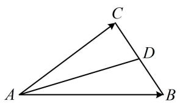

text_image

C
D
A
B

图1

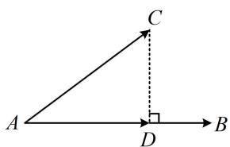

text_image

A
C
D
B

图2

2. 投影法：如图2， $CD \perp AB$ ，则 $\overrightarrow{AB} \cdot \overrightarrow{AC} = \overrightarrow{AB} \cdot (\overrightarrow{AD} + \overrightarrow{DC}) = \overrightarrow{AB} \cdot \overrightarrow{AD} + \overrightarrow{AB} \cdot \overrightarrow{DC} = \overrightarrow{AB} \cdot \overrightarrow{AD}$ 我们把 $\overrightarrow{AD}$ 叫做 $\overrightarrow{AC}$ 在 $\overrightarrow{AB}$ 上的投影向量，上述求数量积的方法叫做投影法。当两个向量中一个不变，另一个在该向量上的投影向量容易分析时，用投影法求数量积很方便。3. 拆解法：若图形中有两个不共线的向量既知道长度，又知道夹角，不妨选择它们作为基底，把求数量积的向量都用这组基底表示，从而转化为基向量的数量积来算。

# 类型 I：极化恒等式

【例 1】如图，在四边形 ABCD 中， $\angle B = 60^{\circ}$ ，AD // BC，AB = 4，若 M，N 是直线 BC 上的动点，且 $\left|\overrightarrow{MN}\right| = 2$ ，则 $\overrightarrow{DM} \cdot \overrightarrow{DN}$ 的最小值为 \_\_\_\_.

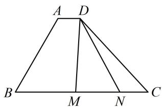

text_image

A D
B M N C

解析： $\overrightarrow{DM}$ 与 $\overrightarrow{DN}$ 共起点，且底边长已知，符合极化恒等式的使用场景，先取中点，如图，设 $MN$ 的中点为 $P$ ，由极化恒等式， $\overrightarrow{DM}\cdot \overrightarrow{DN} = |\overrightarrow{DP}|^2 -|\overrightarrow{MP}|^2 = |\overrightarrow{DP}|^2 -1,$ 故只需求 $\left|\overrightarrow{DP}\right|$ 的最小值，由图可知，当 $DP\bot BC$ 时， $\left|\overrightarrow{DP}\right|$ 最小，所以 $\left|\overrightarrow{DP}\right|$ 的最小值即为平行线 $AD$ 和 $BC$ 之间的距离 $d$ 而 $d = |AB|\sin \angle B = 4\sin 60^{\circ} = 2\sqrt{3}$ ，所以 $(\overrightarrow{DM}\cdot \overrightarrow{DN})_{\min} = (2\sqrt{3})^2 -1 = 11.$

text_image

A D
d
B M P N C

答案: 11

【变式】如图，在 $\triangle ABC$ 中， $D$ 是 $BC$ 中点， $E$ ， $F$ 是 $AD$ 上两个三等分点， $\overrightarrow{BA} \cdot \overrightarrow{CA} = 4$ ， $\overrightarrow{BF} \cdot \overrightarrow{CF} = -1$ ，则 $\overrightarrow{BE} \cdot \overrightarrow{CE}$ 的值是 \_\_\_\_.

解析：题目中的三个数量积共起点，底边均为 $BC$ ，相当于底边不变，可用极化恒等式算这些数量积，

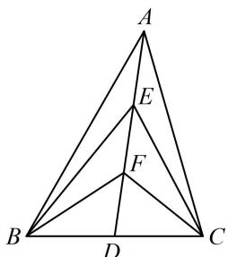

text_image

A
E
F
B
D
C

设 $|AE| = |EF| = |FD| = x$ ， $|BD| = |CD| = y$ ，则由极化恒等式，

$\left\{ \begin{array}{l} \overrightarrow{BA} \cdot \overrightarrow{CA} = |AD|^2 - |BD|^2 = 9x^2 - y^2 = 4 \\ \overrightarrow{BF} \cdot \overrightarrow{CF} = |FD|^2 - |BD|^2 = x^2 - y^2 = -1 \end{array} \right. \Rightarrow x^2 = \frac{5}{8}, \quad y^2 = \frac{13}{8}$ , 所以 $\overrightarrow{BE} \cdot \overrightarrow{CE} = |ED|^2 - |BD|^2 = 4x^2 - y^2 = \frac{7}{8}$ .

答案: $\frac{7}{8}$

【总结】用极化恒等式求数量积常有两个特征：①共起点；②底边长已知，或中线、底边易求.

# 类型Ⅱ：投影法

【例 2】如图, P 为半径为 2 的圆 O 上的动点, AB 为与圆 O 相切的单位向量, 则 $\overrightarrow{AB} \cdot \overrightarrow{AP}$ 的取值范围是 \_\_\_\_.

解析：数量积中的 $\overrightarrow{AB}$ 不变，符合投影法的使用场景，如图，只需分析 $\overrightarrow{AP}$ 在 $\overrightarrow{AB}$ 上的投影向量 $\overrightarrow{AQ}$ ，如图，当 $P$ 与 $P_{1}$ 重合时， $\overrightarrow{AP}$ 在 $\overrightarrow{AB}$ 上的投影向量为 $\overrightarrow{AQ_{1}}$ ，此时投影向量与 $\overrightarrow{AB}$ 同向且长度最大，

所以 $(\overrightarrow{AB} \cdot \overrightarrow{AP})_{\max} = \overrightarrow{AB} \cdot \overrightarrow{AQ_1} = |\overrightarrow{AB}| \cdot |\overrightarrow{AQ_1}| = 1 \times 2 = 2$

当 $P$ 与 $P_{2}$ 重合时， $\overrightarrow{AP}$ 在 $\overrightarrow{AB}$ 上的投影向量为 $\overrightarrow{AQ_2}$ ，

此时投影向量与 $\overrightarrow{AB}$ 反向且长度最大，

所以 $(\overrightarrow{AB} \cdot \overrightarrow{AP})_{\min} = \overrightarrow{AB} \cdot \overrightarrow{AQ_2} = |\overrightarrow{AB}| \cdot |\overrightarrow{AQ_2}| \cdot \cos \pi = 1 \times 2 \times (-1) = -2$

故 $\overrightarrow{AB} \cdot \overrightarrow{AP}$ 的取值范围是 $[-2, 2]$ .

答案：[-2,2]

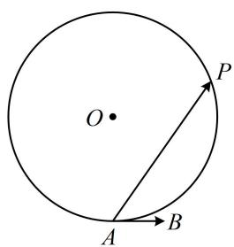

text_image

O
P
A
B

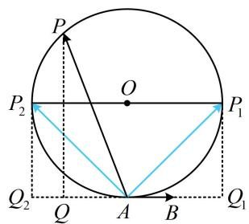

text_image

P
O
P₂
P₁
Q₂
Q
A
B
Q₁

【变式】如图，三个边长为2的等边三角形有一条边在同一条直线上，边 $B_{3}C_{3}$ 上有10个不同的点 $P_{1},P_{2},\cdots,P_{10}$ ，记 $m_{i}=\overrightarrow{AB_{2}}\cdot\overrightarrow{AP_{i}}(i=1,2,\cdots,10)$ ，则 $m_{1}+m_{2}+\cdots+m_{10}$ 的值为（）

A. 180

B. $60 \sqrt{3}$

C. 45

D. ${15}\sqrt{3}$

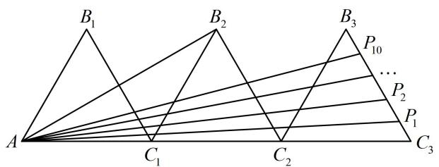

text_image

B₁
B₂
B₃
P₁₀
...
P₂
P₁
A
C₁
C₂
C₃

解析： $\overrightarrow{AB_{2}}\cdot\overrightarrow{AP_{i}}$ 中 $\overrightarrow{AB_{2}}$ 固定不变，故考虑用投影法求 $\overrightarrow{AB_{2}}\cdot\overrightarrow{AP_{i}}$ 的值，先看 $\overrightarrow{AP_{i}}$ 在 $\overrightarrow{AB_{2}}$ 上的投影向量，如图，延长 $AB_{2}$ 和 $C_{3}B_{3}$ 交于点 D， $\angle B_{2}C_{1}C_{2}=60^{\circ}\Rightarrow\angle B_{2}C_{1}A=120^{\circ}$ ，结合 $\left|AC_{1}\right|=\left|C_{1}B_{2}\right|$ 可得 $\angle C_{1}AB_{2}=30^{\circ}$ ，又 $\angle DC_{3}A=60^{\circ}$ ，所以 $\angle ADC_{3}=90^{\circ}$ ，故 $\overrightarrow{AP_{i}}(i=1,2,\cdots,10)$ 在 $\overrightarrow{AB_{2}}$ 上的投影向量都是 $\overrightarrow{AD}$ ，只需求 $\overrightarrow{AB_{2}}\cdot\overrightarrow{AD}$ ， $\angle B_{2}C_{2}A=\angle DC_{3}A=60^{\circ}\Rightarrow B_{2}C_{2}//C_{3}D$ ，所以 $AB_{2}\perp B_{2}C_{2}$ ，故 $\left|AB_{2}\right|=\sqrt{\left|AC_{2}\right|^{2}-\left|B_{2}C_{2}\right|^{2}}=2\sqrt{3}$ ，

因为 $\left|AC_{3}\right|=6$ ，所以 $\left|\overrightarrow{AD}\right|=\left|AC_{3}\right|\cos\angle DAC_{3}=6\cos30^{\circ}=3\sqrt{3}$ ，故 $\overrightarrow{AB_{2}}\cdot\overrightarrow{AD}=\left|\overrightarrow{AB_{2}}\right|\cdot\left|\overrightarrow{AD}\right|=2\sqrt{3}\times3\sqrt{3}=18$ ，
所以 $m_{1} + m_{2} + \cdots + m_{10} = 10 \times 18 = 180$ .

答案: A

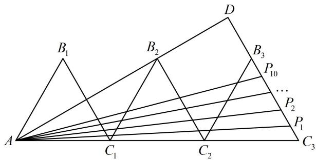

text_image

B₁
B₂
D
B₃
P₁₀
...
P₂
A
C₁
C₂
P₁
C₃

【总结】当两个向量一个不变，另一个在该向量上的投影向量容易分析时，可用投影法求数量积.

# 类型III：拆解法

【例 3】 $\triangle ABC$ 是边长为 2 的等边三角形， $Q$ 为 $AC$ 中点， $P$ 为 $AB$ 上靠近 $A$ 的三等分点，则 $\overrightarrow{CP} \cdot \overrightarrow{BQ} = \_$ .

解析： $\overrightarrow{AB}$ 和 $\overrightarrow{AC}$ 知道长度和夹角，可尝试拆解法，选它们为基底来表示 $\overrightarrow{CP}$ 和 $\overrightarrow{BQ}$ ，

由题意， $\overrightarrow{CP} = \overrightarrow{CA} +\overrightarrow{AP} = -\overrightarrow{AC} +\frac{1}{3}\overrightarrow{AB}$ ， $\overrightarrow{BQ} = \overrightarrow{BA} +\overrightarrow{AQ} = -\overrightarrow{AB} +\frac{1}{2}\overrightarrow{AC}$

所以 $\overrightarrow{CP} \cdot \overrightarrow{BQ} = \left(-\overrightarrow{AC} + \frac{1}{3}\overrightarrow{AB}\right) \cdot \left(-\overrightarrow{AB} + \frac{1}{2}\overrightarrow{AC}\right) = -\frac{1}{3}\overrightarrow{AB}^2 + \frac{7}{6}\overrightarrow{AB} \cdot \overrightarrow{AC} - \frac{1}{2}\overrightarrow{AC}^2$

$$
= - \frac {1}{3} \times 2 ^ {2} + \frac {7}{6} \times 2 \times 2 \times \cos 6 0 ^ {\circ} - \frac {1}{2} \times 2 ^ {2} = - 1.
$$

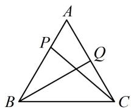

答案: -1

【反思】拆解法的核心是选择两个既知道长度又知道夹角的向量作为基底，一般会往特殊图形的边上进行拆解（注意，不是绝对）.

【变式】在 $\triangle ABC$ 中， $AB = \sqrt{2}$ ， $\angle ACB = \frac{\pi}{4}$ ， $O$ 是 $\triangle ABC$ 的外心，则 $\overrightarrow{OC} \cdot \overrightarrow{AB} + \overrightarrow{CA} \cdot \overrightarrow{CB}$ 的最大值为（）

A. 0 B. 1 C. 3 D. 5

解析： $\triangle ABC$ 已知一角及对边，其外接圆半径可求，故把涉及的向量全部往 $\overrightarrow{OA}$ ， $\overrightarrow{OB}$ ， $\overrightarrow{OC}$ 转化，

如图，设 $\triangle ABC$ 外接圆半径为 $r$ ，由正弦定理， $\frac{AB}{\sin\angle ACB} = 2 = 2r\Rightarrow r = 1$ ，所以 $\left|\overrightarrow{OA}\right| = \left|\overrightarrow{OB}\right| = \left|\overrightarrow{OC}\right| = 1$

$$
\overrightarrow {O C} \cdot \overrightarrow {A B} + \overrightarrow {C A} \cdot \overrightarrow {C B} = \overrightarrow {O C} \cdot (\overrightarrow {O B} - \overrightarrow {O A}) + (\overrightarrow {O A} - \overrightarrow {O C}) \cdot (\overrightarrow {O B} - \overrightarrow {O C})
$$

$$
= \overrightarrow {O C} \cdot \overrightarrow {O B} - \overrightarrow {O C} \cdot \overrightarrow {O A} + \overrightarrow {O A} \cdot \overrightarrow {O B} - \overrightarrow {O A} \cdot \overrightarrow {O C} - \overrightarrow {O C} \cdot \overrightarrow {O B} + \overrightarrow {O C} ^ {2}
$$

$$
= - 2 \overrightarrow {O C} \cdot \overrightarrow {O A} + \overrightarrow {O A} \cdot \overrightarrow {O B} + \overrightarrow {O C} ^ {2} = - 2 \cos \angle A O C + \cos \angle A O B + 1 \quad ①,
$$

因为 $\angle ACB = \frac{\pi}{4}$ ，所以 $\angle AOB = 2\angle ACB = \frac{\pi}{2}$ ，故 $\cos \angle AOB = \cos \frac{\pi}{2} = 0$

代入①得： $\overrightarrow{OC}\cdot \overrightarrow{AB} +\overrightarrow{CA}\cdot \overrightarrow{CB} = 1 - 2\cos \angle AOC$

所以当 $\angle AOC = \pi$ 时， $\overrightarrow{OC} \cdot \overrightarrow{AB} + \overrightarrow{CA} \cdot \overrightarrow{CB}$ 取得最大值3.

答案: C

【反思】圆中求数量积，如考虑拆解法，常选择分解为半径对应向量.

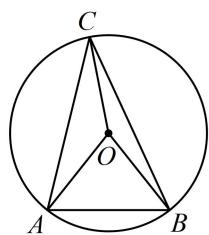

text_image

C
O
A
B

# 强化训练

1. (★★★)

如图，扇形 AOB 的圆心角为 $120^{\circ}$ ，半径为 2，P 是圆弧 AB 上的动点，则 $\overrightarrow{PA} \cdot \overrightarrow{PB}$ 的最小值是 \_\_\_\_.

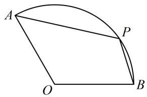

text_image

A
P
O
B

2. (2024·湖北武汉四调·★★★)

点 $P$ 是边长为 1 的正六边形 $A B C D E F$ 边上的动点, 则 $\overrightarrow{PA} \cdot \overrightarrow{PB}$ 的最大值为 ( )

A. 2

B. $\frac{11}{4}$

C. 3

D. $\frac{13}{4}$

3. (2020·新高考Ⅰ卷·★★★)

已知 $P$ 是边长为2的正六边形ABCDEF内一点，则 $\overrightarrow{AP} \cdot \overrightarrow{AB}$ 的取值范围是（）

A. $(-2,6)$

B. $(-6, 2)$

C. $(-2,4)$

D. $(-4,6)$

4. (2023·全国乙卷·★★★☆)

已知 $\odot O$ 半径为1，直线 $PA$ 与 $\odot O$ 相切于点 $A$ ，直线 $PB$ 与 $\odot O$ 交于 $B,C$ 两点， $D$ 为 $BC$ 的中点，若 $\left|PO\right| = \sqrt{2}$ 则 $\overrightarrow{PA} \cdot \overrightarrow{PD}$ 的最大值为（）

A. $\frac{1 + \sqrt{2}}{2}$

B. $\frac{1 + 2\sqrt{2}}{2}$

C. $1 + \sqrt{2}$

D. $2 + \sqrt{2}$

5. (2022·天津模拟·★★★)

如图，在等腰 $\triangle ABC$ 中， $AB = AC = 3$ ， $D$ ， $E$ 与 $M$ ， $N$ 分别是 $AB$ ， $AC$ 的三等分点，且 $\overrightarrow{DN} \cdot \overrightarrow{ME} = -1$ ，则 $\tan A = \_\_\_\_,$ ， $\overrightarrow{AB} \cdot \overrightarrow{BC} = \_\_\_\_.$

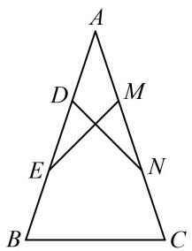

text_image

A
D
M
E
N
B
C

6. (2023·湖南九校联考·★★★☆)

如图，O 是平行四边形 ABCD 所在平面内的一点，且满足 $\angle AOB = \frac{1}{2} \angle BOC = \frac{\pi}{6}$ ， $2\sqrt{3}\left|\overrightarrow{OA}\right| = 2\left|\overrightarrow{OB}\right| = 3\left|\overrightarrow{OC}\right| = 6$ ，则 $\left|\overrightarrow{OD}\right| = (\quad)$

A. 2

B. $\sqrt{3}$

C. $\sqrt{2}$

D. 1

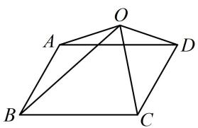

text_image

Geometric diagram of a quadrilateral ABCD with diagonals intersecting at O and point B on side BC, forming triangles.

7. (2021·天津卷·★★★★)

在边长为1的等边三角形ABC中，D为线段BC上的动点， $DE\perp AB$ 且交AB于点E， $DF / / AB$ 且交AC于点F，则 $\left|2\overrightarrow{BE} +\overrightarrow{DF}\right|$ 的值为\_\_\_\_； $(\overrightarrow{DE} +\overrightarrow{DF})\cdot \overrightarrow{DA}$ 的最小值为\_\_\_\_.

