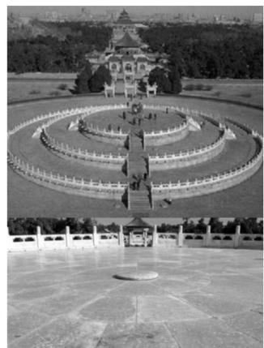

# 第 2 节 等差、等比数列的基本性质（★★）

# 内容提要

诸多等差、等比数列问题，除了直接套用通项公式和前 $n$ 项和公式解题外，若能灵活运用相关性质，往往可以降低计算量，下面总结了一些常用的性质.

1. 等差数列的常用性质：（设 $\{a_{n}\}$ 是公差为 $d$ 的等差数列，其前 $n$ 项和为 $S_{n}$ ）

①下标和性质：若 $m + n = r + s$ ，则 $a_{m} + a_{n} = a_{r} + a_{s}$ ，其中 $m,n,r,s\in \mathbf{N}^{*}$ ；特别地，若 $m + n = 2r$ ，则 $a_{m} + a_{n} = 2a_{r}$

推论： $S_{2n - 1} = \frac{(2n - 1)(a_1 + a_{2n - 1})}{2} = (2n - 1)a_n(n\in \mathbf{N}^*)$ .例如， $S_{7} = 7a_{4}$ ， $S_{9} = 9a_{5}$ 等.

②前 $n$ 项和性质： $\left\{\frac{S_n}{n}\right\}$ 为等差数列，公差为 $\frac{d}{2}$ （通过 $\frac{S_n}{n} = a_1 + \frac{n - 1}{2} d$ 易证）.  
③片段和性质： $S_{m}$ ， $S_{2m} - S_m$ ， $S_{3m} - S_{2m}$ ，…也构成等差数列，公差为 $m^2 d$

2. 等比数列的常用性质：（设 $\{a_{n}\}$ 是公比为 $q$ 的等比数列，其前 $n$ 项和为 $S_{n}$ ）

①下标和性质：若 $m + n = r + s$ ，则 $a_{m} \cdot a_{n} = a_{r} \cdot a_{s}$ ，其中 $m, n, r, s \in \mathbf{N}^{*}$ ；特别地，若 $m + n = 2r$ 则 $a_{m} \cdot a_{n} = a_{r}^{2}$ .  
②片段和性质：若 $q \neq -1$ 或 $m$ 为奇数，则 $S_{m}$ ， $S_{2m} - S_{m}$ ， $S_{3m} - S_{2m}$ ，…也构成等比数列，公比为 $q^{m}$ .

注：上述等差数列与等比数列的片段和性质，代入前 $n$ 项和公式即可证明，此处不再赘述.

# 类型 I：等差数列性质的应用

【例1】已知等差数列 $\{a_{n}\}$ 满足 $a_2 + a_3 + a_6 + a_7 = 2$ ，则 $a_4 + a_5 = (\quad)$

A. $\frac{1}{2}$

B. 1

C. $\frac{3}{2}$

D. 2

解析：条件中的 $a_2$ 和 $a_7$ ， $a_3$ 和 $a_6$ ，以及要求的 $a_4 + a_5$ 下标之和都为9，故可用下标和性质处理，由题意， $a_2 + a_3 + a_6 + a_7 = (a_2 + a_7) + (a_3 + a_6) = 2(a_4 + a_5) = 2$ ，所以 $a_4 + a_5 = 1$

答案: B

【例2】已知 $S_{n}$ 是等差数列 $\{a_{n}\}$ 的前 $n$ 项和，若 $a_3 + a_7 = 8$ ，则 $S_{9} =$ （

A. 24

B. 36

C. 48

D. 72

解析：观察下标可发现，由 $a_3 + a_7 = 8$ 可快速求出 $a_5$ ，利用 $S_{2n - 1} = (2n - 1)a_n$ 恰好可用 $a_5$ 表示 $S_{9}$ 由题意， $a_3 + a_7 = 2a_5 = 8$ ，所以 $a_5 = 4$ ，故 $S_{9} = 9a_{5} = 36$

答案: B

【变式1】设等差数列 $\{a_{n}\}$ 和 $\{b_{n}\}$ 的前 $n$ 项和分别为 $S_{n}$ , $T_{n}$ , 若 $\frac{S_{n}}{T_{n}} = \frac{3n + 5}{4n - 2}$ , 则 $\frac{a_8}{b_8} = \_$ .

解析：给出 $S_{n}$ 与 $T_{n}$ 的比值，结合所求发现，可用 $S_{2n - 1} = (2n - 1)a_{n}$ ， $T_{2n - 1} = (2n - 1)b_{n}$ 转换成 $a_{n}$ 与 $b_{n}$ 的比值， $\frac{S_n}{T_n} = \frac{3n + 5}{4n - 2} \Rightarrow \frac{S_{2n - 1}}{T_{2n - 1}} = \frac{3(2n - 1) + 5}{4(2n - 1) - 2} = \frac{3n + 1}{4n - 3}$ ，又 $\frac{S_{2n - 1}}{T_{2n - 1}} = \frac{(2n - 1)a_n}{(2n - 1)b_n} = \frac{a_n}{b_n}$ ，所以 $\frac{a_n}{b_n} = \frac{3n + 1}{4n - 3} \Rightarrow \frac{a_8}{b_8} = \frac{3 \times 8 + 1}{4 \times 8 - 3} = \frac{25}{29}$ .

答案: $\frac{25}{29}$

【变式2】设等差数列 $\{a_{n}\}$ 的前 $n$ 项和为 $S_{n}$ ，且 $S_{4047} > 0$ ， $S_{4046} < 0$ ，则当 $n =$ \_\_\_\_时， $S_{n}$ 最小.

解析：等差数列中判断何时 $S_{n}$ 最小，只需找到 $\{a_{n}\}$ 中哪些项为正，哪些项为负。条件给的是 $S_{4047}$ 和 $S_{4046}$ 的正负，考虑将它们转换成 $\{a_{n}\}$ 中的项的正负，由题意， $S_{4047} = 4047a_{2024} > 0$ ，所以 $a_{2024} > 0$ ①，

又 $S_{4046} = \frac{4046(a_1 + a_{4046})}{2} < 0$ ，所以 $a_1 + a_{4046} < 0$ ，为了把式①用起来，将 $a_1 + a_{4046}$ 换成 $a_{2023} + a_{2024}$

因为 $a_1 + a_{4046} = a_{2023} + a_{2024}$ ，所以 $a_{2023} + a_{2024} < 0$ ，又 $a_{2024} > 0$ ，所以 $a_{2023} < 0$ ，故 $d = a_{2024} - a_{2023} > 0$

所以 $\{a_{n}\}$ 是递增数列，故 $a_{1}<a_{2}<\cdots<a_{2023}<0<a_{2024}<a_{2025}<\cdots$ ，所以当 n=2023 时， $S_{n}$ 最小.

答案: 2023

【反思】下标和性质（例1）及其推论（例2及其变式）是等差数列最常用的一条性质，当出现等差数列中几项相加，或涉及 $S_{n}$ 时，可考虑用下标和性质及其推论.

【例 3】在等差数列 $\{a_{n}\}$ 中， $a_{1}=1$ ，其前 n 项和为 $S_{n}$ ，若 $\frac{S_{10}}{10}-\frac{S_{8}}{8}=2$ ，则 $S_{40}=$ \_\_\_\_.

解法1：可将 $\frac{S_{10}}{10} -\frac{S_8}{8} = 2$ 翻译成 $a_1$ 和 $d$ ，求出公差 $d$ ，进而代公式求 $S_{40}$

设 $\{a_{n}\}$ 的公差为 $d$ ，因为 $\frac{S_{10}}{10} -\frac{S_8}{8} = 2$ ，所以 $\frac{10a_1 + 45d}{10} -\frac{8a_1 + 28d}{8} = 2$ ，结合 $a_1 = 1$ 解得： $d = 2$

故 $S_{40} = 40a_{1} + \frac{40\times 39}{2} d = 40 + 1560 = 1600$

解法2：从 $\frac{S_{10}}{10} -\frac{S_8}{8} = 2$ 的结构特征联想到 $\left\{\frac{S_n}{n}\right\}$ 是等差数列，于是可先求出 $\frac{S_n}{n}$

因为 $\{a_{n}\}$ 是等差数列，所以 $\left\{\frac{S_n}{n}\right\}$ 也是等差数列，设 $\left\{\frac{S_n}{n}\right\}$ 的公差为 $d'$ ，则 $\frac{S_{10}}{10} - \frac{S_8}{8} = 2d' = 2$ ，所以 $d' = 1$ ，又 $\frac{S_1}{1} = a_1 = 1$ ，所以 $\frac{S_n}{n} = 1 + (n - 1) \times 1 = n$ ，从而 $S_n = n^2$ ，故 $S_{40} = 40^2 = 1600$ 。

答案: 1600

【反思】可以看到，相比之下解法2的计算量更小。在等差数列问题中，若涉及到 $\frac{S_{n}}{n}$ 这种结构的条件，可考虑用性质 “ $\left\{\frac{S_{n}}{n}\right\}$ 也是等差数列” 来求解。

【例 4】已知 $S_{n}$ 是等差数列 $\{a_{n}\}$ 的前 n 项和，若 $S_{20}=5$ ， $S_{60}=45$ ，则 $S_{40}=$ \_\_\_\_.

解析：观察发现 $S_{20}$ ， $S_{60}$ ， $S_{40}$ 的下标都是 20 的整数倍，于是联想到等差数列的片段和性质，因为 $\{a_n\}$ 是等差数列，所以 $S_{20}$ ， $S_{40} - S_{20}$ ， $S_{60} - S_{40}$ 成等差数列，故 $2(S_{40} - S_{20}) = S_{20} + S_{60} - S_{40}$ ，将 $S_{20} = 5$ 和 $S_{60} = 45$ 代入可得： $2(S_{40} - 5) = 5 + 45 - S_{40}$ ，解得： $S_{40} = 20$ 。

答案: 20

【变式1】等差数列 $\{a_{n}\}$ 的前 $n$ 项和为 $S_{n}$ ，若 $S_{n} = 1$ ， $S_{3n} - S_{n} = 5$ ，则 $S_{4n} = (\quad)$

A. 10

B. 20

C. 30

D. 15

解析：观察发现所给条件的下标都是 $n$ 的整数倍，联想到等差数列的片段和性质，

因为 $\{a_{n}\}$ 是等差数列，所以 $S_{n}$ ， $S_{2n} - S_{n}$ ， $S_{3n} - S_{2n}$ ， $S_{4n} - S_{3n}$ 也是等差数列，设其公差为 $d$ ，由题意， $S_{3n} - S_{n} = (S_{3n} - S_{2n}) + (S_{2n} - S_{n}) = (S_{n} + 2d) + (S_{n} + d) = 2S_{n} + 3d = 2 + 3d = 5$ ，所以 $d = 1$ ，到此等差数列 $S_{n}$ ， $S_{2n} - S_{n}$ ， $S_{3n} - S_{2n}$ ， $S_{4n} - S_{3n}$ 的首项和公差就都知道了，求和即为 $S_{4n}$ ，

故 $S_{4n} = (S_{4n} - S_{3n}) + (S_{3n} - S_{2n}) + (S_{2n} - S_n) + S_n = 4S_n + \frac{4\times 3}{2} d = 4\times 1 + 6\times 1 = 10$

答案: A

【反思】等差数列中，若涉及若干与 $S_{n}$ 有关的条件，且下标都是某正整数的倍数，则可考虑用片段和性质.

【变式2】（2020·新课标II卷）北京天坛的圜丘坛为古代祭天的场所，分上、中、下三层．上层中心有一块圆形石板（称为天心石）．环绕天心石砌9块扇面形石板构成第一环，向外每环依次增加9块，下一层的第一环比上一层的最后一环多9块，向外每环依次也增加9块，已知每层环数相同，且下层比中层多729块，则三层共有扇面形石板（不含天心石）（）

A. 3699 块

B. 3474 块

C. 3402 块

D. 3339 块

natural_image

Aerial view of a large circular architectural structure with a central pavilion, surrounded by trees and a paved plaza (no visible text or symbols)

解析：先把文字信息翻译成数列问题，建立数学模型，

由题意，可设上层从内到外每一环的扇形石板块数分别为 $a_1, a_2, \cdots, a_m$ ，中层分别为 $a_{m+1}, a_{m+2}, \cdots, a_{2m}$ ，下层分别为 $a_{2m+1}, a_{2m+2}, \cdots, a_{3m}$ ，则 $a_1, a_2, \cdots, a_{3m}$ 构成首项 $a_1 = 9$ ，公差 $d = 9$ 的等差数列，设 $\{a_n\}$ 的前 $n$ 项和为 $S_n$ ，注意到上、中、下三层扇形石板块数之和分别为 $S_m$ ， $S_{2m} - S_m$ ， $S_{3m} - S_{2m}$ ，故想到等差数列片段和性质，因为 $\{a_n\}$ 是等差数列，所以 $S_m$ ， $S_{2m} - S_m$ ， $S_{3m} - S_{2m}$ 构成公差为 $m^2 d$ 的等差数列，因为下层比中层多729块，所以 $(S_{3m} - S_{2m}) - (S_{2m} - S_m) = m^2 \times 9 = 729$ ，故 $m = 9$ ，于是每层有9环，三层共有27环，代等差数列前 $n$ 项和公式即可求得问题答案，所以三层共有扇面形石板的块数为 $S_{27} = 27 \times 9 + \frac{27 \times 26}{2} \times 9 = 3402$ 。

答案: C

【总结】等差数列问题除了用通项、前 $n$ 项和公式处理外，若能灵活运用有关性质，可降低计算量.

# 类型 II：等比数列性质的应用

【例 5】等比数列 $\{a_{n}\}$ 的各项均为正数， $a_{5}a_{6}+a_{4}a_{7}=16$ ，则 $\log_{2}a_{1}+\log_{2}a_{2}+\cdots+\log_{2}a_{10}=$ （）

A. 20

B. 15

C. 8

D. $3 + \log_{2} 5$

解析：看到 $a_{5} a_{6}$ 和 $a_{4} a_{7}$ ，想到等比数列的下标和性质，

由题意， $a_{5}a_{6}+a_{4}a_{7}=2a_{5}a_{6}=16$ ，所以 $a_{5}a_{6}=8$ ，故 $\log_{2}a_{1}+\log_{2}a_{2}+\cdots+\log_{2}a_{10}=\log_{2}(a_{1}a_{2}\cdots a_{10})$

$$
= \log_ {2} \left[ \left(a _ {1} a _ {1 0}\right) \cdot \left(a _ {2} a _ {9}\right) \cdot \left(a _ {3} a _ {8}\right) \cdot \left(a _ {4} a _ {7}\right) \cdot \left(a _ {5} a _ {6}\right) \right] = \log_ {2} \left(a _ {5} a _ {6}\right) ^ {5} = 5 \log_ {2} \left(a _ {5} a _ {6}\right) = 5 \log_ {2} 8 = 1 5.
$$

答案: B

【变式】在各项均为正数的等比数列 $\{a_{n}\}$ 中， $a_{1}a_{5} + 2a_{4}a_{6} + a_{5}a_{9} = 8$ ，则 $a_{3} + a_{7} = (\quad)$

A. 1

B. $\sqrt{2}$

C. 4

D. $2 \sqrt{2}$

解析：要算的是 $a_{3} + a_{7}$ ，观察所给等式发现可用下标和性质把它们都化为 $a_{3}$ 和 $a_{7}$ ，

由题意， $a_1a_5 + 2a_4a_6 + a_5a_9 = a_3^2 +2a_3a_7 + a_7^2 = (a_3 + a_7)^2 = 8$ ，结合 $\{a_n\}$ 各项均为正数可得 $a_3 + a_7 = 2\sqrt{2}$

答案: D

【例 6】(2021·全国甲卷) 记 $S_{n}$ 为等比数列 $\{a_{n}\}$ 的前 $n$ 项和, 若 $S_{2} = 4$ , $S_{4} = 6$ , 则 $S_{6} = (\quad)$

A. 7

B. 8

C. 9

D. 10

解析：问题涉及的 $S_{2}$ ， $S_{4}$ ， $S_{6}$ 下标都是 2 的倍数，故联想到等比数列的片段和性质，

由题意， $\{a_{n}\}$ 为等比数列，且公比 $q\neq -1$ ，否则 $S_{2} = S_{4} = 0$ ，与题设矛盾，

所以 $S_{2}$ ， $S_{4} - S_{2}$ ， $S_{6} - S_{4}$ 成等比数列，故 $(S_4 - S_2)^2 = S_2(S_6 - S_4)$ ，将 $S_{2} = 4$ 和 $S_{4} = 6$ 代入可求得 $S_{6} = 7$

答案: A

# 强化训练

# 类型Ⅰ：等差数列的性质应用

1. (2025·全国Ⅱ卷·★★)

记 $S_{n}$ 为等差数列 $\{a_n\}$ 的前 $n$ 项和，若 $S_{3} = 6$ ， $S_{5} = -5$ ，则 $S_{6} =$ （）

A. -20

B. -15

C. -10

D. -5

2. (2024·九省联考·★★)

记等差数列 $\{a_{n}\}$ 的前 $n$ 项和为 $S_{n}$ ， $a_{3} + a_{7} = 6$ ，

$a_{12}=17$ ，则 $S_{16}=$ （）

A. 120

B. 140

C. 160

D. 180

3. (2024·河北邯郸一模·★★☆)

已知 $S_{n}$ 为等差数列 $\{a_{n}\}$ 的前 $n$ 项和，且 $\frac{S_{13}}{S_9} = \frac{26}{9}$ ，则 $\frac{a_7}{a_5} = (\quad)$

A. 3

B. 2

C. $\frac{4}{3}$

D. $\frac{2}{3}$

4. (2024·湖南长沙模拟·★★☆)

若等差数列 $\{a_{n}\}$ 的前 $n$ 项和 $S_{n}$ 满足 $S_{10} = S_{20} = 100$ ，则 $S_{40} =$ （）

A. -200

B. -100

C. 200

D. 100

5. (★★★)

等差数列 $\{a_{n}\}$ 的前 $n$ 项和为 $S_{n}$ ，若 $\frac{S_3}{S_6} = \frac{1}{4}$ ，则 $\frac{S_{15}}{S_9} = \underline{\quad}$ .

6. (2022·江苏海安模拟·★★★)

已知等差数列 $\{a_{n}\}$ 的前 $n$ 项和为 $S_{n}$ ，若 $S_{10} = 110$ ， $S_{110} = 10$ ，则 $S_{120} = (\quad)$

A. -10

B. -20

C. -120

D. -110

# 类型 II：等比数列的性质应用

7. (2023·河北石家庄一模·★★)

已知数列 $\{a_{n}\}$ 是各项均为正数的等比数列， $a_1 = 4$ ， $S_{3} = 84$ ，则 $\log_2(a_1a_2a_3\dots a_8)$ 的值为（）

A. 70

B. 72

C. 74

D. 76

8. (2023·黑龙江鹤岗模拟·★★★)

各项均为正数的等比数列 $\{a_{n}\}$ 中， $a_6^2 + a_5a_9 + a_8^2 = 25$ ，则 $a_1a_{13}$ 的最大值为（）

A. $\frac{25}{3}$

B. $\frac{25}{4}$

C. $\frac{25}{2}$

D. 5

9. (2024·湖北武汉四调·★★★)

记等比数列 $\{a_{n}\}$ 的前 $n$ 项和为 $S_{n}$ ，若 $S_{8} = 8$ ， $S_{12}$

$= 26$ ，则 $S_{4} =$ （）

A. 1

B. 2

C. 3

D. 4

10. (2023·新课标Ⅱ卷·★★★)

记 $S_{n}$ 为等比数列 $\{a_n\}$ 的前 $n$ 项和，若 $S_{4} = -5$ ， $S_{6} = 21S_{2}$ ，则 $S_{8} =$ （

A. 120

B. 85

C. -85

D. -120

