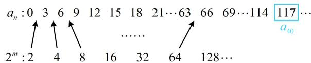

# 强化训练

1. (2022·北京模拟·★★★)

已知数列 $\{a_{n}\}$ 为等差数列，各项均为正数的等比数列 $\{b_{n}\}$ 的前 $n$ 项和为 $S_{n}$ ，且 $a_{1} = 1$ ， $b_{1} = 2$ ， $a_{2} + a_{8} = 10$ ，\_\_\_\_。

现有条件：① $\lambda S_{n} = b_{n} - 1(\lambda \in \mathbf{R})$

$$
② a _ {4} = S _ {3} - 2 S _ {2} + S _ {1}; \quad ③ b _ {n} = 2 \lambda a _ {n} (\lambda \in \mathbf {R}).
$$

(1) 求数列 $\{a_{n}\}$ 的通项公式;  
(2) 条件①②③中有一个不符合题干要求, 请直接指出; (无需证明)  
（3）从剩余的两个条件中选一个填到上面的横线上，求数列 $\{a_{n} + b_{n}\}$ 的前 $n$ 项和 $T_{n}$

1. 解：（1）设 $\{a_{n}\}$ 的公差为 $d$ ，则 $a_{2} + a_{8} = a_{1} + d + a_{1} + 7d$

=10，结合 $a_{1}=1$ 可得d=1，所以 $a_{n}=1+(n-1)\cdot1=n$ .

（2）③不符合题干要求，因为 $a_{n} = n$ ，所以③即为 $b_{n} =$

$2\lambda n$ ，对任意的 $\lambda \in \mathbf{R}$ ， $\{b_n\}$ 都不是等比数列.

（3）若选①，则 $\lambda S_{n} = b_{n} - 1$

(已知 $b_{1}$ , 可先在此式中取 $n = 1$ 求出 $\lambda$ )

所以 $\lambda S_{1} = \lambda b_{1} = b_{1} - 1$ ，又 $b_{1} = 2$ ，所以 $\lambda = \frac{1}{2}$

故 $\frac{1}{2} S_{n} = b_{n} - 1$ ，（题干已经给出了 $\{b_n\}$ 为等比数列，故此处无需退 $n$ 相减，直接再取 $n = 2$ 求出 $b_{2}$ 即可求得公比）

所以 $\frac{1}{2} S_2 = b_2 - 1$ ，故 $\frac{1}{2}(2 + b_2) = b_2 - 1$ ，解得： $b_{2} = 4$

所以 $\{b_n\}$ 的公比 $q = \frac{b_2}{b_1} = 2$ ，故 $b_{n} = 2\times 2^{n - 1} = 2^{n}$

（再求 $\{a_{n} + b_{n}\}$ 的前 $n$ 项和，此为两数列相加，分别求和再相加即可）所以 $T_{n} = a_{1} + b_{1} + a_{2} + b_{2} + \dots +a_{n} + b_{n}$

$$
\begin{array}{l} = \left(a _ {1} + a _ {2} + \dots + a _ {n}\right) + \left(b _ {1} + b _ {2} + \dots + b _ {n}\right) \\ = (1 + 2 + \dots + n) + (2 ^ {1} + 2 ^ {2} + \dots + 2 ^ {n}) \\ = \frac {n (1 + n)}{2} + \frac {2 (1 - 2 ^ {n})}{1 - 2} = \frac {n (1 + n)}{2} + 2 ^ {n + 1} - 2. \\ \end{array}
$$

若选②，则 $a_4 = S_3 - 2S_2 + S_1$

所以 $4 = b_{1} + b_{2} + b_{3} - 2(b_{1} + b_{2}) + b_{1} = b_{3} - b_{2}$

设 $\{b_{n}\}$ 的公比为 $q$ ，因为 $\{b_n\}$ 各项均为正数，所以 $q > 0$

又 $b_{1} = 2$ ，所以 $b_{3} - b_{2} = 4$ 即为 $2q^{2} - 2q = 4$ ，解得： $q = 2$

或-1（舍去），所以 $b_{n}=2\times2^{n-1}=2^{n}$ ，接下来同选①.

2. (2023·四川绵阳二诊·★★★)

已知等比数列 $\{b_{n}\}$ 的各项都为正数， $b_{1} = \frac{2}{3}$ ， $b_{3} = \frac{8}{27}$ ，数列 $\{a_{n}\}$ 的首项为 1，前 $n$ 项和为 $S_{n}$ ，请从下面①②

③中选一个作为条件，判断是否存在 $m \in \mathbf{N}^*$ ，使得对 $\forall n \in \mathbf{N}^*$ ， $a_n b_n \leq a_m b_m$ 恒成立？若存在，求出 $m$ 的值；若不存在，说明理由.

① $2a_{n} - S_{n} = 1(n\in \mathbf{N}^{*})$ ；② $a_2 = \frac{1}{4}$ 且 $a_{n + 1}a_{n - 1} = a_n^2 (n\geq 2)$ ；③ $a_{n} - 1 = a_{n - 1}(n\geq 2)$

2. 解: (分析后续问题都要用 $b_{n}$ , 故先求 $b_{n}$ ) 设 $\{b_{n}\}$ 的公比

为 $q$ ，因为 $\{b_n\}$ 各项均为正数，所以 $q > 0$

由题意， $\frac{b_3}{b_1} = q^2 = \frac{4}{9}$ ，结合 $q > 0$ 可得 $q = \frac{2}{3}$

所以 $b_{n} = b_{1}q^{n - 1} = \left(\frac{2}{3}\right)^{n}$ ，（接下来分别分析三种选法）

若选①作为条件，则 $2a_{n} - S_{n} = 1$ ，（此为 $a_{n}$ 与 $S_{n}$ 混搭的关系式，要求 $a_{n}$ ，可尝试退 $n$ 相减，消去 $S_{n}$ ）

所以当 $n \geq 2$ 时， $2a_{n-1} - S_{n-1} = 1$

从而 $2a_{n} - S_{n} - (2a_{n - 1} - S_{n - 1}) = 0$ ，故 $2a_{n} - 2a_{n - 1} - (S_{n} - S_{n - 1})$

$= 2a_{n} - 2a_{n - 1} - a_{n} = 0$ ，整理得： $a_{n} = 2a_{n - 1}$

又 $a_1 = 1$ ，所以 $\{a_n\}$ 是首项为1，公比为2的等比数列，

故 $a_{n} = 2^{n - 1}$ ，所以 $a_{n}b_{n} = 2^{n - 1}\cdot \left(\frac{2}{3}\right)^{n} = \frac{1}{2}\cdot 2^{n}\cdot \frac{2^{n}}{3^{n}} = \frac{1}{2}\cdot \left(\frac{4}{3}\right)^{n},$

(“存在 $m \in \mathbf{N}^*$ , 使得 $\forall n \in \mathbf{N}^*$ , $a_n b_n \leq a_m b_m$ ”的意思是 $a_m b_m$ 是 $\{a_n b_n\}$ 的最大项, 故应分析 $\{a_n b_n\}$ 有无最大项)

因为 $y = \frac{1}{2} \cdot \left( \frac{4}{3} \right)^x$ 在 $\mathbf{R}$ 上单调递增，所以 $\{a_n b_n\}$ 是递增数列，没有最大项，

故不存在 $m \in \mathbf{N}^*$ ，使得对 $\forall n \in \mathbf{N}^*$ ， $a_n b_n \leq a_m b_m$ 恒成立.

若选②作为条件，则 $a_2 = \frac{1}{4}$ ，且 $a_{n + 1}a_{n - 1} = a_n^2 (n\geq 2)$

所以 $\frac{a_{n + 1}}{a_n} = \frac{a_n}{a_{n - 1}}$ ，故 $\{a_{n}\}$ 是等比数列，公比 $q = \frac{a_2}{a_1} = \frac{1}{4}$

所以 $a_{n} = \left(\frac{1}{4}\right)^{n - 1}$ ，故 $a_{n}b_{n} = \left(\frac{1}{4}\right)^{n - 1}\cdot \left(\frac{2}{3}\right)^{n} = 4\cdot \frac{1}{4^{n}}\cdot \frac{2^{n}}{3^{n}} = 4\cdot \left(\frac{1}{6}\right)^{n},$

因为 $y = 4\cdot \left(\frac{1}{6}\right)^x$ 在 $\mathbf{R}$ 上单调递减，所以 $\{a_{n}b_{n}\}$ 为递减数列，

故对 $\forall n\in N^{*}$ ， $a_{n}b_{n}\leq a_{1}b_{1}$ 恒成立，所以 m=1。

若选③作为条件，则 $a_{n} - 1 = a_{n - 1}$ ，所以 $a_{n} - a_{n - 1} = 1$

故 $\{a_{n}\}$ 是公差为1的等差数列，

又 $a_1 = 1$ ，所以 $a_{n} = 1 + (n - 1)\times 1 = n$ ，故 $a_{n}b_{n} = n\cdot \left(\frac{2}{3}\right)^{n}$

（要分析 $\{a_{n}b_{n}\}$ 有无最大项，考虑到函数 $y = x\cdot \left(\frac{2}{3}\right)^{x}$ 的单调性不易判断，故用作差法来分析 $\{a_{n}b_{n}\}$ 的单调性）

记 $c_{n} = n\cdot \left(\frac{2}{3}\right)^{n}$ ，则 $c_{n + 1} - c_n = (n + 1)\cdot \left(\frac{2}{3}\right)^{n + 1} - n\cdot \left(\frac{2}{3}\right)^n$

$$
= \left(\frac {2}{3}\right) ^ {n} \cdot \left[ \frac {2 (n + 1)}{3} - n \right] = \left(\frac {2}{3}\right) ^ {n} \cdot \frac {2 - n}{3},
$$

所以当 $n = 1$ 时， $c_{n + 1} - c_n > 0$ ，故 $c_{1} <   c_{2}$

当 n=2 时， $c_{n+1}-c_{n}=0$ ，所以 $c_{2}=c_{3}$ ；

当 $n \geq 3$ 时， $c_{n+1} - c_n < 0$ ，所以 $c_n > c_{n+1}$ ；

综上所述， $c_{1}<c_{2}=c_{3}>c_{4}>c_{5}>\cdots$

所以 $\{c_{n}\}$ 有最大项，最大项为 $c_{2}$ 和 $c_{3}$ ，故当 $m = 2$ 或3

时，就有 $a_{n}b_{n}\leq a_{m}b_{m}$ 对任意的 $n\in \mathbf{N}^*$ 恒成立.

# 3. (2023·安徽阜阳模拟·★★★)

已知数列 $\{a_{n}\}$ 的通项公式为 $a_{n} = 2n + 1$ ，等比数列 $\{b_n\}$ 满足 $b_{2} = a_{1} - 1$ ， $b_{3} = a_{2} - 1$

（1）求数列 $\{b_n\}$ 的通项公式；

（2）记 $\{a_{n}\}$ ， $\{b_n\}$ 的前 $n$ 项和分别为 $S_{n}$ ， $T_{n}$ ，求满足 $T_{n} = S_{m}(4 < n\leq 10)$ 的所有数对 $(n,m)$

3. 解：（1）由题意， $b_{2}=a_{1}-1=2,\quad b_{3}=a_{2}-1=4$

所以 $\{b_n\}$ 的公比 $q = \frac{b_3}{b_2} = 2$ ，故 $b_{n} = b_{2}q^{n - 2} = 2^{n - 1}$

（2）由（1）可得 $S_{n} = \frac{n(3 + 2n + 1)}{2} = n(n + 2)$

$T_{n} = \frac{1\times(1 - 2^{n})}{1 - 2} = 2^{n} - 1$ ，故 $T_{n} = S_{m}$ 即为 $2^{n} - 1 = m(m + 2)$

整理得： $2^{n}=(m+1)^{2}$ ①，

(因为 $4 < n \leq 10$ ，所以 n 的取值只有 6 个，逐一代入能求出 m，但注意到右侧是正整数的完全平方，故由此对 n 分析奇偶可以缩小搜索的范围，更简单)

由①可得 $2^{n}$ 只能为正整数的平方，所以 $n$ 只能取偶数，

结合 $4 < n \leq 10$ 可得 $n$ 的取值只能为6，8，10，

当 n=6 时， $m=2^{3}-1=7$ ;

当 n=8 时， $m=2^{4}-1=15$ ;

当 n=10 时， $m=2^{5}-1=31$ ;

综上，满足条件的数对 $(n,m)$ 有(6,7)，(8,15)，(10,31).

# 4. (2023·江苏盐城模拟·★★★☆)

已知等差数列 $\{a_{n}\}$ 和等比数列 $\{b_{n}\}$ 满足 $a_1 = 1$ ， $b_{3} = 8$ ， $a_{n} = \log_{2}b_{n}$

（1）求数列 $\{a_{n}\}$ 和 $\{b_{n}\}$ 的通项公式；  
（2）设数列 $\{a_{n}\}$ 中不在数列 $\{b_{n}\}$ 中的项按从小到大的顺序构成数列 $\{c_{n}\}$ ，记 $\{c_{n}\}$ 的前 $n$ 项和为 $S_{n}$ ，求 $S_{50}$ .

4. 解: (1) 设 $\{a_{n}\}$ 的公差为 $d$ , $\{b_{n}\}$ 的公比为 $q$ ,

因为 $a_{n} = \log_{2}b_{n}$ ，所以 $b_{n} > 0$ ，故 $q > 0$

在 $a_{n} = \log_{2}b_{n}$ 中取 $n = 1$ 得 $a_1 = \log_2b_1$ ，所以 $b_{1} = 2^{a_{1}} = 2$

又 $b_{3} = 8$ ，所以 $\frac{b_3}{b_1} = q^2 = 4$ ，结合 $q > 0$ 可得 $q = 2$

所以 $b_{n} = b_{1}q^{n - 1} = 2^{n}$ ，故 $a_{n} = \log_{2}b_{n} = \log_{2}2^{n} = n$

(2) (先分析 $\{a_{n}\}$ 的前50项中有几项也在 $\{b_{n}\}$ 中)

由（1）可得 $a_{50} = 50$ ，因为 $b_{5} = 32 < 50$ ， $b_{6} = 64 > 50$

所以 $\{a_{n}\}$ 的前50项中有5项在 $\{b_{n}\}$ 中，把它们去掉，还

剩 45 项，（故再看 $a_{51}, a_{52}, a_{53}, a_{54}, a_{55}$ 中还有没有 $\{b_{n}\}$ 中的

项，若没有，那么直接补上去，总共就50项了）

又 $a_{55} = 55 < b_6$ ，所以 $\{c_n\}$ 的前50项即为 $\{a_n\}$ 的前55项

去掉 $\{b_n\}$ 的前5项后余下的，

故 $S_{50} = (a_1 + a_2 + \dots + a_{55}) - (b_1 + b_2 + \dots + b_5)$

$$
= \frac {5 5 \times (1 + 5 5)}{2} - \frac {2 \times (1 - 2 ^ {5})}{1 - 2} = 1 4 7 8.
$$

5. (2023·湖北武汉二调·★★★★)

记数列 $\{a_{n}\}$ 的前 $n$ 项和为 $S_{n}$ ，对任意的正整数 $n$ ，有 $2S_{n} = na_{n}$ ，且 $a_{2} = 3$ 。

(1) 求数列 $\{a_{n}\}$ 的通项公式;  
（2）对所有正整数 $m$ ，若 $a_{k} < 2^{m} < a_{k + 1}$ ，则在 $a_{k}$ 和 $a_{k + 1}$ 两项中插入 $2^{m}$ ，由此得到一个新的数列 $\{b_n\}$ ，求 $\{b_n\}$ 的前40项和.

5. 解: (1) (给出 $S_{n}$ 与 $a_{n}$ 混搭的关系式, 要求 $a_{n}$ , 考虑退 $n$

相减消去 $S_{n}$ ）因为 $2S_{n} = na_{n}$ ，所以当 $n \geq 2$ 时，

$2S_{n - 1} = (n - 1)a_{n - 1}$ ，从而 $2S_{n} - 2S_{n - 1} = na_{n} - (n - 1)a_{n - 1}$

故 $2a_{n} = na_{n} - (n - 1)a_{n - 1}$ ，所以 $(n - 2)a_{n} = (n - 1)a_{n - 1}$ ①，

（此式若再化为 $\frac{a_n}{a_{n - 1}} = \frac{n - 1}{n - 2}$ ，则可用累乘法求 $a_{n}$ ，但 $n = 2$ 时分母为0，故需单独考虑）

在①中令 $n = 2$ 可得 $a_1 = 0$

当 $n \geq 3$ 时，式①可变形成 $\frac{a_n}{a_{n-1}} = \frac{n - 1}{n - 2}$ ，

所以 $a_{n} = \frac{a_{n}}{a_{n - 1}}\cdot \frac{a_{n - 1}}{a_{n - 2}}\cdot \frac{a_{n - 2}}{a_{n - 3}}\dots \frac{a_4}{a_3}\cdot \frac{a_3}{a_2}\cdot a_2$

$$
= \frac {n - 1}{n - 2} \cdot \frac {n - 2}{n - 3} \cdot \frac {n - 3}{n - 4} \dots \frac {3}{2} \cdot \frac {2}{1} \cdot 3 = 3 (n - 1),
$$

又 $a_1 = 0$ ， $a_2 = 3$ 也满足上式，故对 $\forall n\in \mathbf{N}^*$ ， $a_{n} = 3(n - 1)$

(2) (需先分析 $\{b_{n}\}$ 的前40项哪些是原来 $\{a_{n}\}$ 的, 哪些是新插入的, 可列出若干项来观察, 如图)

由（1）可得 $a_{40} = 3 \times (40 - 1) = 117$

因为 $2^{6} < a_{40} < 2^{7}$ ，所以插入后 $2^{7}$ 不在 $\{b_n\}$ 的前40项中，

(还需说明 64 (即 $2^{6}$ ) 在 $\{b_{n}\}$ 的前 40 项)

又 $2^{6} < a_{34} = 99$ ，所以 $2^{6}$ 在 $\{b_n\}$ 的前40项中，

故 $\{b_{n}\}$ 的前 40 项中，有 34 项是原数列 $\{a_{n}\}$ 的，有 6 项是新插入的，分别是 $2^{1}$ ， $2^{2}$ ，…， $2^{6}$ ，

所以 $\{b_{n}\}$ 的前 40 项和为 $a_{1}+a_{2}+\cdots+a_{34}+2^{1}+2^{2}+\cdots+2^{6}$

$$
= \frac {3 4 \times (0 + 9 9)}{2} + \frac {2 \times (1 - 2 ^ {6})}{1 - 2} = 1 8 0 9.
$$

text_image

aₙ:0 3 6 9 12 15 18 21…63 66 69…114 117…
↑ ↑ ↑ ...... ↑
2ᵐ:2 4 8 16 32 64 128… a₄₀

6. (2023·新课标Ⅰ卷·★★★★)

设等差数列 $\{a_{n}\}$ 的公差为 $d$ ，且 $d > 1$ ，令 $b_{n} = \frac{n^{2} + n}{a_{n}}$ ，记 $S_{n}$ ， $T_{n}$ 分别为数列 $\{a_{n}\}$ ， $\{b_{n}\}$ 的前 $n$ 项和.

（1）若 $3a_{2} = 3a_{1} + a_{3}$ ， $S_{3} + T_{3} = 21$ ，求 $\{a_n\}$ 的通项公式；  
(2) 若 $\{b_{n}\}$ 为等差数列，且 $S_{99}-T_{99}=99$ ，求 d.

6. 解: (1) (所给条件容易用公式翻译, 故直接代公式, 建立

关于 $a_{1}$ 和 $d$ 的方程组并求解）因为 $3a_{2} = 3a_{1} + a_{3}$ ，

所以 $3(a_{1} + d) = 3a_{1} + (a_{1} + 2d)$ ，整理得： $a_1 = d$ ①，

又 $S_{3} = 3a_{1} + \frac{3\times 2}{2} d = 3a_{1} + 3d$ ， $T_{3} = b_{1} + b_{2} + b_{3}$

$$
= \frac {2}{a _ {1}} + \frac {6}{a _ {2}} + \frac {1 2}{a _ {3}} = \frac {2}{a _ {1}} + \frac {6}{a _ {1} + d} + \frac {1 2}{a _ {1} + 2 d},
$$

代入 $S_{3} + T_{3} = 21$ 得 $3a_{1} + 3d + \frac{2}{a_{1}} +\frac{6}{a_{1} + d} +\frac{12}{a_{1} + 2d} = 21$ ②，

将①代入②整理得： $2d+\frac{3}{d}=7$ ，解得：d=3 或 $\frac{1}{2}$ ，

又由题意， $d > 1$ ，所以 $d = 3$ ，结合①可得 $a_1 = 3$

所以 $a_{n} = a_{1} + (n - 1)d = 3n$

(2) (条件 $\{b_{n}\}$ 为等差数列怎样翻译？可先由 $b_{1}, b_{2}, b_{3}$ 为等差数列建立方程找 $a_{1}$ 和 $d$ 的关系)

由题意， $b_{1}=\frac{2}{a_{1}}$ ， $b_{2}=\frac{6}{a_{1}+d}$ ， $b_{3}=\frac{12}{a_{1}+2d}$ ，

因为 $\{b_n\}$ 为等差数列，所以 $2b_{2} = b_{1} + b_{3}$ ，故 $\frac{12}{a_1 + d} =$

$\frac{2}{a_1} + \frac{12}{a_1 + 2d}$ ，（上式要化简，同乘以3个分母即可）

所以 $12a_{1}(a_{1} + 2d) = 2(a_{1} + d)(a_{1} + 2d) + 12a_{1}(a_{1} + d)$

整理得： $(a_{1} - d)(a_{1} - 2d) = 0$ ，所以 $a_1 = d$ 或 $a_1 = 2d$

(求 d 肯定要由 $S_{99}-T_{99}=99$ 来建立方程，故讨论上述两种情况，分别求出 $S_{n}$ 和 $T_{n}$ )

若 $a_1 = d$ ，则 $a_{n} = a_{1} + (n - 1)d = nd$ ， $S_{n} = \frac{n(a_{1} + a_{n})}{2}$

$$
= \frac {n (d + n d)}{2} = \frac {n (n + 1)}{2} d, b _ {n} = \frac {n ^ {2} + n}{n d} = \frac {n + 1}{d},
$$

所以 $T_{n} = \frac{n(b_{1} + b_{n})}{2} = \frac{n\left(\frac{2}{d} + \frac{n + 1}{d}\right)}{2} = \frac{n(n + 3)}{2d}$

故 $S_{99} - T_{99} = 99$ 即为 $99\times 50d - \frac{99\times 51}{d} = 99$

解得： $d = \frac{51}{50}$ 或-1（舍去）；

若 $a_1 = 2d$ ，则 $a_{n} = a_{1} + (n - 1)d = (n + 1)d$ ， $S_{n} = \frac{n(a_{1} + a_{n})}{2}$

$$
= \frac {n [ 2 d + (n + 1) d ]}{2} = \frac {n (n + 3)}{2} d, b _ {n} = \frac {n ^ {2} + n}{(n + 1) d} = \frac {n}{d},
$$

所以 $T_{n} = \frac{n(b_{1} + b_{n})}{2} = \frac{n\left(\frac{1}{d} + \frac{n}{d}\right)}{2} = \frac{n(n + 1)}{2d}$

故 $S_{99} - T_{99} = 99$ 即为 $99\times 51d - \frac{99\times 50}{d} = 99$

解得： $d = -\frac{50}{51}$ 或1，均不满足 $d > 1$ ，舍去；

综上所述， $d$ 的值为 $\frac{51}{50}$

【反思】本题第（2）问也可直接设 $\{a_{n}\}$ 和 $\{b_{n}\}$ 的通项公式分别为 $a_{n}=pn+q$ ， $b_{n}=rn+s$ ，利用两个已知条件建立关于系数 p，q，r，s 的方程组，进而求出答案。只是这一解法稍显麻烦，可自行尝试。

# 7. (2023·湖北八市联考·★★★★)

已知各项均为正数的数列 $\{a_{n}\}$ 的前 $n$ 项和为 $S_{n}$ ，且 $a_{n}$ ， $S_{n}$ ， $a_{n}^{2}$ 成等差数列.

(1) 求数列 $\{a_{n}\}$ 的通项公式;

（2）若 $m$ 为正整数，记集合 $\left\{a_{n}\left|\frac{a_{n}}{2} +\frac{2}{a_{n}}\leq m\right.\right\}$ 的元素个数为 $b_{m}$ ，求数列 $\{b_n\}$ 的前50项和.

7. 解：（1）因为 $a_{n}$ ， $S_{n}$ ， $a_{n}^{2}$ 成等差数列，所以 $2S_{n} = a_{n} + a_{n}^{2}$ ，

(由于要求的是 $a_{n}$ , 所以可考虑退 $n$ 相减, 消去 $S_{n}$ )

当 $n \geq 2$ 时， $2S_{n-1} = a_{n-1} + a_{n-1}^2$

所以 $2S_{n} - 2S_{n - 1} = a_{n} + a_{n}^{2} - a_{n - 1} - a_{n - 1}^{2}$ ，故 $2a_{n} =$

$a_{n} + a_{n}^{2} - a_{n - 1} - a_{n - 1}^{2}$ ，化简得： $a_{n}^{2} - a_{n - 1}^{2} - a_{n} - a_{n - 1} = 0$

所以 $(a_{n} + a_{n - 1})(a_{n} - a_{n - 1}) - (a_{n} + a_{n - 1}) = 0$

故 $(a_{n} + a_{n - 1})(a_{n} - a_{n - 1} - 1) = 0$ ①，

又 $\{a_{n}\}$ 的各项都为正数，所以 $a_{n} + a_{n - 1} > 0$

从而式①可化为 $a_{n} - a_{n - 1} - 1 = 0$ ，故 $a_{n} - a_{n - 1} = 1$

所以 $\{a_{n}\}$ 是公差为1的等差数列，

(求 $a_{n}$ 还差首项，可在 $2S_{n} = a_{n} + a_{n}^{2}$ 中取 $n = 1$ 来求它)

因为 $2S_{n} = a_{n} + a_{n}^{2}$ ，所以 $2S_{1} = a_{1} + a_{1}^{2}$ ，故 $2a_{1} = a_{1} + a_{1}^{2}$

结合 $a_1 > 0$ 解得： $a_1 = 1$

所以 $a_{n} = 1 + (n - 1)\times 1 = n$

（2）（已有 $a_{n}$ ，不妨先代入 $\frac{a_n}{2} +\frac{2}{a_n}\leq m$ ，看看得到什么）由（1）知 $a_{n} = n$ ，所以 $\frac{a_n}{2} +\frac{2}{a_n}\leq m$ 即为 $\frac{n}{2} +\frac{2}{n}\leq m$ ②，

因为集合中 $\left\{a_{n}\left|\frac{a_{n}}{2} +\frac{2}{a_{n}}\leq m\right.\right\}$ 的元素个数为 $b_{m}$ ，而关于 $n$ 的不等式②有几个正整数解，该集合中就有几个元素，

所以 $b_{m}$ 的值即为不等式②的正整数解的个数，

（怎样分析不等式②？若无思路，可代几个 $m$ 进去，尝试寻找规律. 将 $m = 1, 2, 3, 4, 5$ 分别代入②并求解，可得到该不等式正整数解的个数分别为0，1，5，7，9，我们发现 $\{b_n\}$ 从第3项起构成等差数列，规律就出来了，下面先单独算 $b_1$ 和 $b_2$ ）

当 $m = 1$ 时，不等式②即为 $\frac{n}{2} +\frac{2}{n}\leq 1$

所以 $n^2 - 2n + 4 \leq 0$ ，无解，

从而集合 $\left\{a_{n}\left|\frac{a_{n}}{2} +\frac{2}{a_{n}}\leq m\right.\right\}$ 中没有元素，故 $b_{1} = 0$

当 $m = 2$ 时，不等式②即为 $\frac{n}{2} +\frac{2}{n}\leq 2$

所以 $(n - 2)^{2}\leq 0$ ，解得： $n = 2$

从而集合 $\left\{a_{n}\middle |\frac{a_{n}}{2} +\frac{2}{a_{n}}\leq m\right\}$ 中有1个元素，故 $b_{2} = 1$

(怎样论证当 $m \geq 3$ 时的情形? 由前述规律可总结出此时不等式②的正整数解有 $2m - 1$ 个, 且不难发现, 当 $n \geq 2$ 时, $\frac{n}{2} + \frac{2}{n}$ 随 $n$ 的增大而增大, 故②的解是 $n = 1, 2, \cdots, 2m - 1$ , 故我们只需论证当 $n \leq 2m - 1$ 时, ②成立; 当 $n \geq 2m$ 时, ②不成立即可)

当 $m \geq 3$ 时，对任意的 $n \leq 2m - 1$ ，都有 $\frac{n}{2} + \frac{2}{n} \leq \frac{2m - 1}{2} +$

$$
\frac {2}{2 m - 1} = m - \frac {1}{2} + \frac {2}{2 m - 1} = m - \frac {2 m - 5}{2 (2 m - 1)} <   m,
$$

不等式②成立，对任意的 $n \geq 2m$ ，

$\frac{n}{2}+\frac{2}{n}\geq\frac{2m}{2}+\frac{2}{2m}=m+\frac{1}{m}>m$ ，不等式②不成立，

所以不等式②的解为 $n = 1,2,\dots ,2m - 1$ ，共有 $2m - 1$ 个解，从而集合 $\left\{a_n\Bigg|\frac{a_n}{2} +\frac{2}{a_n}\leq m\right\}$ 中有 $2m - 1$ 个元素，

故 $b_{m}=2m-1$ ;

综上所述，数列 $\{b_{n}\}$ 的前50项和为

$$
0 + 1 + 5 + 7 + \dots + 9 9 = 1 + \frac {4 8 \times (5 + 9 9)}{2} = 2 4 9 7.
$$

