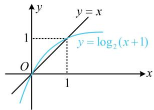
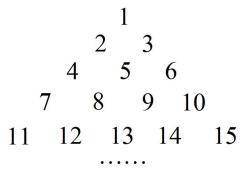
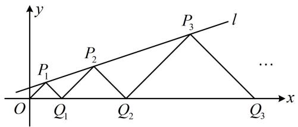

# 强化训练

提醒：本节包含诸多压轴小题，难度较高，请同学们做好心理准备。

1. (2023·全国模拟·★★★)

已知数列 $\{a_{n}\}$ 的通项公式为 $a_{n} = (20 - n)\cdot \left(\frac{3}{2}\right)^{n}$ ，则 $a_{n}$ 取得最大值时， $n = \_$ .

1. 17 或 18

解析：要分析 $a_{n}$ 的最大值，可先作差判断 $\{a_{n}\}$ 的单调性，

由题意， $a_{n + 1} - a_n = (19 - n)\cdot \left(\frac{3}{2}\right)^{n + 1} - (20 - n)\cdot \left(\frac{3}{2}\right)^n$

$$
= \left(\frac {3}{2}\right) ^ {n} \cdot \left[ \frac {3}{2} (1 9 - n) - 2 0 + n \right] = \left(\frac {3}{2}\right) ^ {n} \cdot \frac {1 7 - n}{2},
$$

当 $1 \leq n \leq 16$ 时， $a_{n+1} - a_n > 0$ ，所以 $a_{n+1} > a_n$ ；

当 $n = 17$ 时， $a_{n + 1} - a_n = 0$ ，所以 $a_{17} = a_{18}$

当 $n \geq 18$ 时， $a_{n+1} - a_n < 0$ ，所以 $a_{n+1} < a_n$ ；

故 $a_1 < a_2 < \cdots < a_{17} = a_{18} > a_{19} > a_{20} > \cdots$

所以当 $a_{n}$ 取得最大值时， $n$ 的值为17或18.

2. (2023·湖北武汉四调·★★★)

“中国剩余定理”又称“孙子定理”，1852年英国来华传教士伟烈亚力将《孙子算经》中“物不知数”问题的解法传至欧洲。1874年英国数学家马西森指出此法符合1801年由高斯得出的关于同余式解法的一般性定理，因而西方称之为“中国剩余定理”，“中国剩余定理”讲的是一个关于同余的问题。现有这样一个问题：将正整数中能被3除余1且被2除余1的数按由小到大的顺序排成一列，构成数列 $\{a_{n}\}$ ，则 $a_{10} = (\quad)$

A. 55

B. 49

C. 43

D. 37

2. A

解析：问题可看成找两个数列的公共项，逐一尝试较麻烦，不妨先写出两个数列的通项再看，

设被3除余1的正整数构成数列 $\{b_n\}$ ，被2除余1的正整数构成数列 $\{c_n\}$ ，则 $b_{n} = 3n - 2$ ， $c_{n} = 2n - 1$ ，其中 $n \in \mathbf{N}^{*}$ ，要找 $\{b_n\}$ 和 $\{c_n\}$ 的公共项，可令 $b_{n} = c_{m}$ ，并由此分析 $m, n$ 的取值规律，令 $b_{n} = c_{m}$ 得 $3n - 2 = 2m - 1$ ，故 $m = \frac{3n - 1}{2}$ ，

因为 $m$ 只能取正整数，所以 $n$ 只能取正奇数，

从而两个数列的公共项即为 $b_{1}$ ， $b_{3}$ ， $b_{5}$ ，…，此数列即为 $\{a_{n}\}$ ，它的第10项为 $b_{19}$ ，故 $a_{10}=b_{19}=3\times19-2=55$ 。

3. (2023·浙江温州三模·★★★)

已知数列 $\{a_{n}\}$ 各项为正数， $\{b_{n}\}$ 满足 $a_{n}^{2} = b_{n}b_{n + 1}$ ， $a_{n} + a_{n + 1} = 2b_{n + 1}$ ，则（）

A. $\{b_{n}\}$ 是等差数列

B. $\{b_{n}\}$ 是等比数列

C. $\{\sqrt{b_n}\}$ 是等差数列

D. $\{\sqrt{b_n}\}$ 是等比数列

3. C

解析：观察发现选项均与 $\{b_{n}\}$ 有关，故考虑由所给的两个关系式消去与 $\{a_{n}\}$ 有关的项再看，

因为 $\{a_{n}\}$ 各项都为正数，且 $a_{n}^{2} = b_{n}b_{n + 1}$

所以 $a_{n} = \sqrt{b_{n}b_{n + 1}}$ ，故 $a_{n + 1} = \sqrt{b_{n + 1}b_{n + 2}}$

代入 $a_{n} + a_{n + 1} = 2b_{n + 1}$ 可得 $\sqrt{b_n b_{n + 1}} +\sqrt{b_{n + 1}b_{n + 2}} = 2b_{n + 1},$

所以 $\sqrt{b_n} +\sqrt{b_{n + 2}} = 2\sqrt{b_{n + 1}}$ ，故 $\{\sqrt{b_n}\}$ 是等差数列.

# 4. (2024·新课标Ⅰ卷·★★★☆)

已知函数 $f(x)$ 的定义域为 $\mathbf{R}$ ， $f(x) > f(x - 1) + f(x - 2)$ ，且当 $x < 3$ 时， $f(x) = x$ ，则下列结论中一定正确的是（）

A. $f(10) > 100$

B. $f(20) > 1000$

C. $f(10) < 1000$

D. $f(20) < 10000$

4. B

解法1：由题干的信息不难发现当 $k < 3$ 时， $f(k)$ 能代解析式求出，于是我们从 $f(3)$ 开始，按 $f(x) > f(x - 1) + f(x - 2)$ 逐步往后递推，观察规律，

由题意， $f(3) > f(2) + f(1) = 2 + 1 = 3$

$$
f (4) > f (3) + f (2) = f (3) + 2 > 3 + 2 = 5,
$$

$$
f (5) > f (4) + f (3) > 5 + 3 = 8,
$$

$$
f (6) > f (5) + f (4) > 8 + 5 = 1 3,
$$

$$
f (7) > f (6) + f (5) > 1 3 + 8 = 2 1,
$$

$$
f (8) > f (7) + f (6) > 2 1 + 1 3 = 3 4,
$$

$$
f (9) > f (8) + f (7) > 3 4 + 2 1 = 5 5,
$$

$$
f (1 0) > f (9) + f (8) > 5 5 + 3 4 = 8 9,
$$

我们只得到了 $f(10) > 89$ ，没有得到 $f(10) > 100$ ，于是可猜想A项错误。另一方面，由题干所给不等式的方向不难感觉出无法确定 $f(10)$ 和 $f(20)$ 的上界，那么C、D两项均错误，答案很可能是B，故尝试继续推证，一个一个继续往下推当然可行，但上述结果明显有规律，我们把上面这些不等式右边的数字拿到一起来看看，

对于数列 3，5，8，13，21，34，55，89，…，可发现该数列满足从第 3 项起，每一项都等于前两项之和，

有了这一规律，我们再往后计算10项，就可以得到 $f(20)$ 应大于多少了，

$$
f (1 1) > 5 5 + 8 9 = 1 4 4, \quad f (1 2) > 8 9 + 1 4 4 = 2 3 3,
$$

$$
f (1 3) > 1 4 4 + 2 3 3 = 3 7 7, \quad f (1 4) > 2 3 3 + 3 7 7 = 6 1 0,
$$

$f(15) > 377 + 610 = 987$ ， $f(16) > 610 + 987 = 1597$ ，到此已可得出 $f(20) > 1000$ ，后面的我们就不再算了，选B.

解法2：像解法1那样逐个递推计算有点繁琐，能否简化过程？我们可以尝试将 $f(x) > f(x - 1) + f(x - 2)$ 这一前后三项的大小关系放缩成两项的大小，

由题意， $f(1) = 1$ ， $f(2) = 2$ ， $f(3) > f(2) + f(1) = 2 + 1 = 3$ ， $f(4) > f(3) + f(2) = f(3) + 2 > 3 + 2 = 5$

$f(5)>f(4)+f(3)>5+3=8,\cdots$ ，以此类推，不难发现对任意的 $k\in N^{*}$ ，都有 $f(k)>0$ ，

所以当 $k \geq 4$ 时， $f(k) > f(k - 1) + f(k - 2)$

$$
> [ f (k - 2) + f (k - 3) ] + f (k - 2)
$$

$$
= 2 f (k - 2) + f (k - 3) > 2 f (k - 2)  ,    \text {从而}    f (k) > 2 f (k - 2)  ,
$$

故 $f(20)>2f(18)>2^{2}f(16)>2^{3}f(14)>\cdots$

$>2^{9}f(2)=2^{9}\times2=2^{10}=1024>1000$ ，所以选B.

5. (2023·全国模拟·★★★☆)

已知数列 $\{a_{n}\}$ 满足 $a_{n + 1} = \log_2(a_n + 1)$ ，若 $\{a_{n}\}$ 是递增数列，则 $a_1$ 的取值范围是（）

A. (0,1)

B. $(0, \sqrt{2})$

C. $(-1,0)$

D. $(1, + \infty)$

5. A

解析： $\{a_{n}\}$ 是递增数列 $\Leftrightarrow a_{n + 1} > a_n$ 恒成立，

又 $a_{n + 1} = \log_2(a_n + 1)$ ，所以 $\log_2(a_n + 1) > a_n$ ①，

可先由①求出 $a_{n}$ 的范围，这是超越不等式，可画图来看，

函数 $y = \log_2(x + 1)$ 和 $y = x$ 的大致图象如图，由图可知不等式①的解集为 $0 < a_n < 1$ ；

故问题转化成求当 $0 < a_{n} < 1$ 恒成立时， $a_{1}$ 应满足的范围，

首先， $0 < a_{1} < 1$ ，因为 $a_2 = \log_2(a_1 + 1)$ ，所以 $0 < a_{2} < 1$

同理， $a_{3}=\log_{2}(a_{2}+1)$ ，所以 $0<a_{3}<1,\cdots,$

以此类推， $\forall n\in \mathbf{N}^*$ ，都有 $0 < a_{n} < 1$

所以 $a_1$ 的取值范围是 $(0,1)$

text_image

y
y = x
1
y = log₂(x+1)
O
1
x

6. (2023·福建厦门第二次质检·★★★)

数列 $\{a_{n}\}$ 满足 $a_{n+1}=\frac{1+a_{n}}{1-a_{n}}$ ， $a_{1}=2$ ，若 $T_{n}=a_{1}a_{2}a_{3}\cdots a_{n}$ ，则 $T_{10}=$ \_\_\_\_.

6. -6

解析：由所给递推公式不易通过简单变形，构造出新数列来求通项，若无思路，可考虑写几项观察规律，

由题意， $a_1 = 2$ ， $a_2 = \frac{1 + a_1}{1 - a_1} = -3$ ， $a_3 = \frac{1 + a_2}{1 - a_2} = -\frac{1}{2}$ ， $a_4 = \frac{1 + a_3}{1 - a_3} = \frac{1}{3}$ ， $a_5 = \frac{1 + a_4}{1 - a_4} = 2$ ， $a_6 = \frac{1 + a_5}{1 - a_5} = -3$ ，…

所以数列 $\{a_{n}\}$ 是以4为周期的周期数列，且 $a_1a_2a_3a_4 = 1$ ，故 $T_{10} = (a_1a_2a_3a_4)(a_5a_6a_7a_8)a_9a_{10} = a_9a_{10} = a_1a_2 = -6.$

7. (2024·江苏南通模拟·★★★☆)

将正整数数列 1, 2, 3, 4, 5, … 的各项按照上小下大、左小右大的原则写成如下的三角形数表:

$$
\begin{array}{c c c c} & 1 \\ & 2 & 3 \\ 4 & 5 & 6 \\ & \dots \end{array}
$$

将每行的第一个数与每行的最后一个数依次相加，前 $n$ 行的和为

7. $\frac{2n^3 + 3n^2 + 7n - 6}{6}$

解析：所给的三角形数表列得太少，不便于观察规律，我们再写两行，看看每行的第一个数和每行的最后一个数有什么规律，如图，每行的第一个数构成的数列是1，2，4，7，11，…，它的规律是后一项与前一项的差1，2，3，4，…为等差数列，设每行的第一个数构成数列 $\{a_{n}\}$ ，则数列 $\{a_{n}\}$ 的递推公式为 $a_{n} - a_{n-1} = n - 1$ ， $n \geq 2$ ，

text_image

1
2 3
4 5 6
7 8 9 10
11 12 13 14 15
......

要求每行第一个数的和，可先求其通项公式，看到 $a_{n} - a_{n - 1} = f(n)$ 这种结构，想到用累加法求通项，

所以当 $n \geq 2$ 时， $a_{n} = (a_{n} - a_{n-1}) + (a_{n-1} - a_{n-2}) + \cdots$

$$
+ \left(a _ {3} - a _ {2}\right) + \left(a _ {2} - a _ {1}\right) + a _ {1} = (n - 1) + (n - 2) + \dots + 2 + 1 + 1
$$

$= \frac{(n - 1)(n - 1 + 1)}{2} + 1 = \frac{(n - 1)n}{2} + 1$ ，又 $a_1 = 1$ 也满足上式，所以对任意的 $n \in \mathbf{N}^*$ ，都有 $a_n = \frac{(n - 1)n}{2} + 1$ ；

再看每一行最后一个数的情况，观察发现规律相同，也是后一项与前一项的差成等差数列，故类似处理即可，

设每行最后一个数构成数列 $\{b_n\}$ ，则数列 $\{b_n\}$ 的递推公式为 $b_{n} - b_{n - 1} = n$ ， $n \geq 2$ ，所以当 $n \geq 2$ 时，

$$
b _ {n} = \left(b _ {n} - b _ {n - 1}\right) + \left(b _ {n - 1} - b _ {n - 2}\right) + \dots + \left(b _ {3} - b _ {2}\right) + \left(b _ {2} - b _ {1}\right) + b _ {1}
$$

$$
= n + (n - 1) + \dots + 3 + 2 + 1 = \frac {n (n + 1)}{2},
$$

又因为 $b_{1} = 1$ 也满足上式，所以对任意的 $n\in \mathbf{N}^*$ ，都有 $b_{n} =$

$\frac{n(n+1)}{2}$ ; 故 $a_{n} + b_{n} = \frac{(n-1)n}{2} + 1 + \frac{n(n+1)}{2} = n^{2} + 1$ ,

所求是 $\{a_{n} + b_{n}\}$ 的前 $n$ 项和吗？不是，第一行的第一个数和最后一个数是同一个数1，这个1多加了一次，所以要减一次，故所求的前 n 行的和 $S_{n}=(1^{2}+1)+(2^{2}+1)+\cdots+(n^{2}+1)-1$

$$
= (1 ^ {2} + 2 ^ {2} + \dots + n ^ {2}) + n - 1 \quad ①,
$$

又 $1^{2}+2^{2}+\cdots+n^{2}=\frac{n(n+1)(2n+1)}{6}$ ,

代入①得 $S_{n} = \frac{n(n + 1)(2n + 1)}{6} + n - 1 = \frac{2n^{3} + 3n^{2} + 7n - 6}{6}$ .

# 8. (2023·四川模拟·★★★★)

如图，直线 $l: y = \frac{1}{3}x + 1$ 上的点 $P_i (i = 1, 2, \cdots, n)$ 与 x 轴正半轴上的点 $Q_i (i = 1, 2, \cdots, n)$ 及原点 O 构成一系列等腰直角 $\triangle OP_1Q_1$ ， $\triangle Q_1P_2Q_2$ ， $\triangle Q_2P_3Q_3$ ，…， $\triangle Q_{n-1}P_nQ_n$ ，且 $\angle P_i = 90^\circ (i = 1, 2, \cdots, n)$ ，记点 $Q_n$ 的横坐标为 $a_n$ ，则 $a_1 =$ \_\_\_\_ ； $a_n =$ \_\_\_\_ .

text_image

y
P₁
P₂
P₃
l
O
Q₁
Q₂
Q₃
x
...

8. 3; $3 \times 2^{n} - 3$

解法 1: 求 $a_{1}$ , 可先联立直线 $OP_{1}$ 和 $l$ 的方程求 $P_{1}$ 的坐标,

因为 $\triangle OP_{1}Q_{1}$ 为等腰直角三角形，且 $\angle OP_{1}Q_{1} = 90^{\circ}$ ，所以

$\angle P_{1}OQ_{1} = 45^{\circ}$ ，故直线 $OP_{1}$ 的斜率为1，其方程为 $y = x$

联立 $\left\{ \begin{array}{l} y = x \\ y = \frac{1}{3} x + 1 \end{array} \right.$ 解得： $\left\{ \begin{array}{l} x = \frac{3}{2} \\ y = \frac{3}{2} \end{array} \right.$ ，所以 $P_{1}\left(\frac{3}{2}, \frac{3}{2}\right)$ ，从而 $|OQ_{1}|$

$= \sqrt{2}\left|OP_{1}\right| = \sqrt{2}\times \frac{3\sqrt{2}}{2} = 3$ ，故 $Q_{1}(3,0)$ ，即 $a_1 = 3$

要求 $a_{n}$ ，应先建立递推关系式，从图形来看，可由 $Q_{n - 1}$ 和 $Q_{n}$ 的坐标求出 $P_{n}$ 的坐标，代入直线 $l$ 的方程，

因为 $\triangle Q_{n - 1}P_nQ_n$ 是等腰直角三角形，所以 $P_{n}$ 的横坐标为

$\frac{a_{n - 1} + a_n}{2}$ ，纵坐标等于 $\frac{1}{2}|Q_{n - 1}Q_n|$ ，即 $\frac{a_n - a_{n - 1}}{2}$

故 $P_{n}\left(\frac{a_{n - 1} + a_{n}}{2},\frac{a_{n} - a_{n - 1}}{2}\right)$ ，代入 $y = \frac{1}{3} x + 1$ 可得

$\frac{a_{n}-a_{n-1}}{2}=\frac{1}{3}\cdot\frac{a_{n-1}+a_{n}}{2}+1$ ，整理得： $a_{n}=2a_{n-1}+3$ ①，

要由式①求 $a_{n}$ ，可变形后用累加法，

由①得 $a_{n} - 2a_{n - 1} = 3$ ，两端同除以 $2^{n}$ 得 $\frac{a_n}{2^n} -\frac{a_{n - 1}}{2^{n - 1}} = \frac{3}{2^n}$

所以当 $n \geq 2$ 时， $\frac{a_n}{2^n} - \frac{a_{n-1}}{2^{n-1}} = \frac{3}{2^n}$ ， $\frac{a_{n-1}}{2^{n-1}} - \frac{a_{n-2}}{2^{n-2}} = \frac{3}{2^{n-1}}$

$$
\frac {a _ {n - 2}}{2 ^ {n - 2}} - \frac {a _ {n - 3}}{2 ^ {n - 3}} = \frac {3}{2 ^ {n - 2}}, \dots , \frac {a _ {3}}{2 ^ {3}} - \frac {a _ {2}}{2 ^ {2}} = \frac {3}{2 ^ {3}}, \frac {a _ {2}}{2 ^ {2}} - \frac {a _ {1}}{2 ^ {1}} = \frac {3}{2 ^ {2}},
$$

以上各式累加可得 $\frac{a_n}{2^n} -\frac{a_1}{2^1} = \frac{3}{2^n} +\frac{3}{2^{n - 1}} +\frac{3}{2^{n - 2}} +\dots +\frac{3}{2^3} +\frac{3}{2^2}$

$$
= \frac {\frac {3}{4} \left[ 1 - \left(\frac {1}{2}\right) ^ {n - 1} \right]}{1 - \frac {1}{2}} = \frac {3}{2} \left[ 1 - \left(\frac {1}{2}\right) ^ {n - 1} \right],
$$

所以 $\frac{a_n}{2^n} = \frac{a_1}{2} +\frac{3}{2}\left[1 - \left(\frac{1}{2}\right)^{n - 1}\right] = 3 - 3\times \left(\frac{1}{2}\right)^n$ ，故 $a_{n} = 3\times 2^{n} - 3$

又 $a_1 = 3$ 也满足上式，所以 $a_{n} = 3\times 2^{n} - 3(n\in \mathbf{N}^{*})$

解法2：求 $a_{1}$ 和得到 $a_{n} = 2a_{n - 1} + 3$ 的过程同解法1，接下来求 $a_{n}$ 也可用待定系数法来构造，递推式中除 $a_{n}$ 和 $a_{n - 1}$ 外，其余部分为常数项，于是可设 $a_{n} + \lambda = 2(a_{n - 1} + \lambda)$ ，即 $a_{n} = 2a_{n - 1} + \lambda$ ，与 $a_{n} = 2a_{n - 1} + 3$ 对比知 $\lambda = 3$ ，

因为 $a_{n} = 2a_{n - 1} + 3$ ，所以 $a_{n} + 3 = 2(a_{n - 1} + 3)$ ，又 $a_1 + 3 = 6$

所以 $\{a_{n} + 3\}$ 是首项为6，公比为2的等比数列，

从而 $a_{n} + 3 = 6 \times 2^{n - 1}$ ，故 $a_{n} = 6 \times 2^{n - 1} - 3 = 3 \times 2^{n} - 3$ 。

9.（2023·重庆模拟·★★★★）

记 $[x]$ 表示不超过 $x$ 的最大整数，例如， $[2.3] = 2$ ， $[-1.2] = -2$ 。已知数列 $\{a_n\}$ 满足 $a_1 = \frac{7}{3}$ ，且 $a_{n+1} = a_n^2 - a_n + 1$ ，

则 $\left[\frac{1}{a_{1}}+\frac{1}{a_{2}}+\cdots+\frac{1}{a_{2023}}\right]=$ \_\_\_\_.

9.0

解析：要求的式子涉及数列 $\left\{\frac{1}{a_n}\right\}$ 的前2023项和，故先由所给递推式把 $\frac{1}{a_n}$ 变出来，

因为 $a_{n + 1} = a_n^2 -a_n + 1$ ，所以 $a_{n + 1} - 1 = a_n(a_n - 1)$ ①，

接下来只需两端取倒数，即可裂项产生 $\frac{1}{a_n}$ ，先判断两边是否可能为0，由题意， $a_{n+1} = a_n^2 - a_n + 1 = \left(a_n - \frac{1}{2}\right)^2 + \frac{3}{4} > 0$ ，

且 $a_1 = \frac{7}{3} > 0$ ，所以 $a_n > 0$ 恒成立，

因为 $a_1 > 0$ 且 $a_1 \neq 1$ ，所以 $a_2 = a_1^2 - a_1 + 1 \neq 1$

同理，由 $a_{2}>0$ 且 $a_{2}\neq1$ 可得 $a_{3}=a_{2}^{2}-a_{2}+1\neq1,\cdots,$

以此类推，数列 $\{a_{n}\}$ 中所有项均为大于0且不等于1，

故式①可化为 $\frac{1}{a_{n + 1} - 1} = \frac{1}{a_n(a_n - 1)} = \frac{1}{a_n - 1} -\frac{1}{a_n}$

所以 $\frac{1}{a_n} = \frac{1}{a_n - 1} -\frac{1}{a_{n + 1} - 1}$ ，故 $\frac{1}{a_1} +\frac{1}{a_2} +\dots +\frac{1}{a_{2023}} =$

$$
\begin{array}{l} \frac {1}{a _ {1} - 1} - \frac {1}{a _ {2} - 1} + \frac {1}{a _ {2} - 1} - \frac {1}{a _ {3} - 1} + \dots + \frac {1}{a _ {2 0 2 3} - 1} - \frac {1}{a _ {2 0 2 4} - 1} \\ = \frac {1}{a _ {1} - 1} - \frac {1}{a _ {2 0 2 4} - 1} = \frac {3}{4} - \frac {1}{a _ {2 0 2 4} - 1} \quad ②, \\ \end{array}
$$

还需估计 $a_{2024}$ 的范围，才能得出 $\frac{3}{4} -\frac{1}{a_{2024} - 1}$ 的范围，可先判断数列 $\{a_n\}$ 的单调性，

由 $a_{n + 1} = a_n^2 -a_n + 1$ 可得 $a_{n + 1} - a_n = (a_n - 1)^2 >0$

所以 $a_{n + 1} > a_n$ ，从而 $a_{2024} > a_1 = \frac{7}{3}$ ，故 $0 < \frac{3}{4} -\frac{1}{a_{2024} - 1} < \frac{3}{4}$

结合式②可得 $0 < \frac{1}{a_{1}} + \frac{1}{a_{2}} + \cdots + \frac{1}{a_{2023}} < \frac{3}{4}$ ,

所以 $\left[\frac{1}{a_{1}}+\frac{1}{a_{2}}+\cdots+\frac{1}{a_{2023}}\right]=0.$

# 10.（2023·黑龙江牡丹江模拟·★★★★）

数列 $\{a_{n}\}$ 满足 $0 < a_{1} < 1$ ， $\mathrm{e}^{a_{n + 1}} = (3 - a_n)\mathrm{e}^{a_n}$ ，则下列说法正确的是（）

A. 数列 $\{a_{n}\}$ 为递减数列  
B. 存在 $n \in \mathbf{N}^*$ , 使得 $a_{n} < 0$   
C. 存在 $n \in \mathbf{N}^*$ , 使得 $a_{n} > 2$   
D. 存在 $n \in \mathbf{N}^*$ ，使得 $a_{n} > \frac{4}{3}$

10. D

解析：所给递推式左右都有指数结构，不好处理，可两端取对数，先分析两侧是否均大于0，

由 $\mathrm{e}^{a_{n + 1}} = (3 - a_n)\mathrm{e}^{a_n}$ 可知 $3 - a_{n} > 0$ ，所以 $a_{n} < 3$

将 $\mathrm{e}^{a_{n + 1}} = (3 - a_n)\mathrm{e}^{a_n}$ 两端取对数得 $a_{n + 1} = \ln (3 - a_n) + a_n$ ①，

此递推式右侧为超越结构，直接变形处理不易，尝试把 $a_{n}$ 看成自变量，构造函数分析，

设 $f(x) = \ln (3 - x) + x(x < 3)$ ，则 $a_{n + 1} = f(a_n)$

且 $f^{\prime}(x) = \frac{1}{3 - x}\cdot (-1) + 1 = \frac{2 - x}{3 - x},$

所以 $f^{\prime}(x) > 0\Leftrightarrow x <   2$ ， $f^{\prime}(x) <   0\Leftrightarrow 2 <   x <   3$

故 $f(x)$ 在 $(-\infty,2)$ 上 $\nearrow$ ，在(2,3)上 $\searrow$

题干给出了 $a_{1}$ 的范围，可先由①研究 $a_{2}$ 的范围，寻找规律，

因为 $0 < a_{1} < 1$ ，所以 $f(0) < a_{2} = f(a_{1}) < f(1)$

即 $\ln 3 < a_{2} < \ln 2 + 1$ ②，选项B、C让判断 $a_{n} < 0$ ， $a_{n} > 2$ 能否成立，故考虑 $a_{n}$ 与区间(0,2)的关系，

注意到 $(\ln 3, \ln 2 + 1) \subseteq (0, 2)$ ，所以 $0 < a_{2} < 2$ ，故 $f(0) < a_{3}$

$= f(a_{2}) <   f(2)$ ，即 $\ln 3 <   a_3 <   2$ ，所以 $a_3\in (0,2)$

以此类推，数列 $\{a_{n}\}$ 中所有项都在(0,2)上，

即 $0 < a_{n} < 2$ 恒成立，故选项B、C均错误；

有了 $0 < a_{n} < 2$ ，可结合式①判断 $\{a_{n}\}$ 的单调性，

由①可得 $a_{n + 1} - a_n = \ln (3 - a_n) > 0$ ，所以 $a_{n} <   a_{n + 1}$

从而 $\{a_{n}\}$ 是递增数列，故A项错误，到此已可得出选D，若要论证D选项，可估算前几项的范围，

由②可得 $a_2 \in (1,2)$ ，所以 $a_3 = f(a_2) > f(1)$

$= \ln 2 + 1 > \frac{3}{2} > \frac{4}{3}$ ，故D项正确.

11. (2022·辽宁模拟·★★★★)

设 $[x]$ 表示不超过 $x$ 的最大整数，正项数列 $\{a_{n}\}$ 的前 $n$ 项和为 $S_{n}$ ， $a_{1} = 1$ ，且 $a_{n} + 2S_{n-1} = \frac{1}{a_{n}} (n \geq 2)$ ，则

$$
\left[ \frac {1}{S _ {1}} + \frac {1}{S _ {2}} + \dots + \frac {1}{S _ {8 0}} \right] = \underline {{{\quad}}}.
$$

11. 16

解析：给出 $a_{n}$ 与 $S_{n}$ 混搭的关系式，要分析的是 $\left\{\frac{1}{S_n}\right\}$ 的前80项和，故考虑将 $a_{n}$ 换成 $S_{n} - S_{n - 1}$ ，消去 $a_{n}$ ，

因为 $a_{n} + 2S_{n - 1} = \frac{1}{a_{n}}$ ，所以 $S_{n} - S_{n - 1} + 2S_{n - 1} = \frac{1}{S_n - S_{n - 1}}$

从而 $S_{n}^{2} - S_{n - 1}^{2} = 1(n\geq 2)$ ，故 $\{S_n^2\}$ 是公差为1的等差数列，

又 $a_1 = 1$ ，所以 $S_1^2 = a_1^2 = 1$ ，故 $S_{n}^{2} = 1 + (n - 1)\times 1 = n$

因为 $\{a_{n}\}$ 是正项数列，所以 $S_{n} > 0$ ，从而 $S_{n} = \sqrt{n}$

故 $\frac{1}{S_n} = \frac{1}{\sqrt{n}}$ ；观察发现 $\left\{\frac{1}{S_n}\right\}$ 无法求和，故考虑放缩，由 $\frac{1}{\sqrt{n}}$ 联想到可裂项的结构 $\frac{1}{\sqrt{n} + \sqrt{n + 1}}$ 和 $\frac{1}{\sqrt{n} + \sqrt{n - 1}}$

一方面， $\frac{1}{S_n} = \frac{1}{\sqrt{n}} = \frac{2}{\sqrt{n} + \sqrt{n}} >\frac{2}{\sqrt{n} + \sqrt{n + 1}}$

$$
= \frac {2 (\sqrt {n + 1} - \sqrt {n})}{(\sqrt {n} + \sqrt {n + 1}) (\sqrt {n + 1} - \sqrt {n})} = 2 (- \sqrt {n} + \sqrt {n + 1}),
$$

所以 $\frac{1}{S_1} +\frac{1}{S_2} +\dots +\frac{1}{S_{80}} >2(-\sqrt{1} +\sqrt{2} -\sqrt{2} +\sqrt{3} -\sqrt{3} +\sqrt{4}$

$$
- \dots - \sqrt {8 0} + \sqrt {8 1}) = 2 (- 1 + \sqrt {8 1}) = 1 6;
$$

另一方面， $\frac{1}{S_n} = \frac{1}{\sqrt{n}} = \frac{2}{\sqrt{n} + \sqrt{n}} <  \frac{2}{\sqrt{n} + \sqrt{n - 1}}$

$$
= \frac {2 (\sqrt {n} - \sqrt {n - 1})}{(\sqrt {n} + \sqrt {n - 1}) (\sqrt {n} - \sqrt {n - 1})} = 2 (- \sqrt {n - 1} + \sqrt {n}),
$$

所以 $\frac{1}{S_1} +\frac{1}{S_2} +\dots +\frac{1}{S_{80}} < 2(-\sqrt{0} +\sqrt{1} -\sqrt{1} +\sqrt{2} -\sqrt{2} +\sqrt{3}$

$$
- \dots - \sqrt {7 9} + \sqrt {8 0}) = 2 \sqrt {8 0} = 8 \sqrt {5};
$$

由于 $17 < 8\sqrt{5} < 18$ ，所以 $8\sqrt{5}$ 这部分可能放缩过度了，为了提高精度，可尝试从第二项起开始放缩，

$$
\frac {1}{S _ {1}} + \frac {1}{S _ {2}} + \dots + \frac {1}{S _ {8 0}} = 1 + \frac {1}{S _ {2}} + \dots + \frac {1}{S _ {8 0}}
$$

$$
<   1 + 2 (- \sqrt {1} + \sqrt {2} - \sqrt {2} + \sqrt {3} - \dots - \sqrt {7 9} + \sqrt {8 0})
$$

$$
= 1 + 2 (- 1 + 4 \sqrt {5}) = 8 \sqrt {5} - 1,
$$

所以 $16 < \frac{1}{S_1} + \frac{1}{S_2} + \cdots + \frac{1}{S_{80}} < 8\sqrt{5} - 1 < 17$

故 $\left[\frac{1}{S_{1}}+\frac{1}{S_{2}}+\cdots+\frac{1}{S_{80}}\right]=16$ .

【反思】在对通项进行放缩后，若发现求和的精度不够，可尝试少放缩几项，例如从第二项或从第三项开始放缩，以提高精度.

