# 第 2 节 规则几何体的结构计算（★★★）

# 内容提要

本节归纳涉及球、正棱锥、正棱台、圆锥、圆台等规则几何体结构的空间计算问题，先解释几个名词.

1. 正棱锥：底面为正多边形，顶点在底面的投影为正多边形的中心的棱锥.  
2. 正四面体: 侧棱和底面边长相等的正三棱锥, 它的所有棱长都相等, 四个面都是正三角形.  
3. 正棱台: 正棱锥被平行于底面的平面所截, 截面与底面之间的部分叫做正棱台.  
4. 圆台：圆锥被平行于底面的平面所截，截面与底面之间的部分叫做圆台.

涉及上述几何体的空间计算, 核心往往都是抓住某个截面, 把空间计算问题向平面转化, 尤其是经过高的截面. 例如, 在正三棱台中, 如图 1 的截面 $A_{1}DEA$ 可沟通高、侧棱长、上下底面边长, 如图 2 的截面 $DGHE$ 可沟通高、斜高 (GH)、上下底面边长.

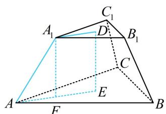

text_image

A₁
C₁
D
B₁
C
E
F
A
B

图1

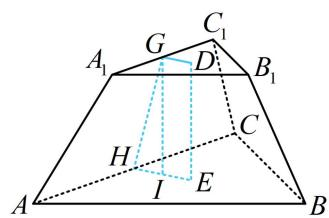

text_image

A₁
G
C₁
D
B₁
H
C
I
E
A
B

图2

对于其它规则几何体，处理方法也类似，按照题目条件，选取适当的截面研究即可.

5. 对于内切球问题，也是选取适当的截面研究，一般会选取切点和轴（或高）所在的截面来分析.

# 类型 I：球的截面研究

【例 1】(2020·新课标Ⅱ卷) 已知 $\triangle ABC$ 是面积为 $\frac{9\sqrt{3}}{4}$ 的等边三角形, 且其顶点都在球 $O$ 的球面上, 若球 $O$ 的表面积为 $16 \pi$ , 则 $O$ 到平面 $ABC$ 的距离为 ( )

A. $\sqrt{3}$ B. $\frac{3}{2}$ C. 1 D. $\frac{\sqrt{3}}{2}$

解析：球心到截面的距离即为球心和截面圆圆心之间的线段长，故连接球心 O 和 $\triangle ABC$ 的外心 $O_{1}$ ，如图， $\triangle ABC$ 是面积为 $\frac{9\sqrt{3}}{4}$ 的等边三角形，设边长为 x，则 $\frac{1}{2}x^{2}\sin60^{\circ}=\frac{\sqrt{3}}{4}x^{2}=\frac{9\sqrt{3}}{4}\Rightarrow x=3$ ，

由正弦定理， $\frac{3}{\sin 60^{\circ}} = 2r\Rightarrow r = \sqrt{3}$

由球的性质， $OO_{1}\perp$ 平面ABC，所以 $OO_{1}\perp O_{1}A$ ，

球 O 的表面积 $S = 4\pi R^{2} = 16\pi \Rightarrow R = 2$ ,

故 $O$ 到平面 $ABC$ 的距离 $d = \sqrt{OA^2 - O_1A^2} = \sqrt{R^2 - r^2} = 1$ .

答案: C

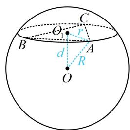

text_image

C
O₁ r
B A
d R
O

【反思】有关球的计算问题，常连接球心和截面圆圆心（该连线必垂直于截面圆所在的平面），在如图所示直角 $\triangle OO_{1}A$ 中用勾股定理 $r^2 + d^2 = R^2$ 沟通 $r, d, R$ .

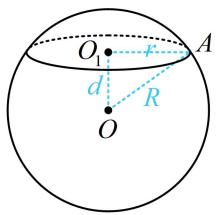

text_image

O
d
R
A

【变式】已知球 $O$ 的半径为1，正四棱锥的顶点为 $O$ ，底面的四个顶点在球 $O$ 的球面上，则当该四棱锥的体积最大时，其高为（）

A. $\frac{1}{3}$

B. $\frac{1}{2}$

C. $\frac{\sqrt{3}}{3}$

D. $\frac{\sqrt{2}}{2}$

解析：有关球的计算，先设出截面圆圆心 $O_{1}$ ，连接 $OO_{1}$ ，再分析思路。想算正四棱锥的体积，需要底面边长和高，可设一个为变量，在如图所示的直角 $\triangle OO_{1}A$ 中求另一个，

不妨设 $OO_{1} = d$ ，则 $O_{1}A = \sqrt{OA^{2} - OO_{1}^{2}} = \sqrt{1 - d^{2}}$ ，所以 $AB = \sqrt{2} O_1A = \sqrt{2(1 - d^2)}$

故 $V_{O - ABCD} = \frac{1}{3}\times 2(1 - d^2)\cdot d = \frac{2}{3} (d - d^3)$ ，设 $f(d) = \frac{2}{3} (d - d^3)(0 <   d <   1)$ ，则 $f^{\prime}(d) = \frac{2}{3} (1 - 3d^{2})$

所以 $f^{\prime}(d) > 0 \Leftrightarrow 0 < d < \frac{\sqrt{3}}{3}$ , $f^{\prime}(d) < 0 \Leftrightarrow \frac{\sqrt{3}}{3} < d < 1$ ,

从而 $f(d)$ 在 $\left(0, \frac{\sqrt{3}}{3}\right)$ 上 $\nearrow$ ，在 $\left(\frac{\sqrt{3}}{3}, 1\right)$ 上 $\searrow$ ，故 $f(d)_{\max} = f\left(\frac{\sqrt{3}}{3}\right)$ ，

所以当该四棱锥的体积最大时，其高为 $\frac{\sqrt{3}}{3}$ .

答案: C

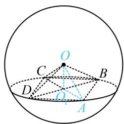

text_image

Geometric diagram showing a circle with inscribed points and lines, labeled with letters O, A, B, C, D.

# 类型Ⅱ：锥体的“定海神针”一高

【例2】已知四棱锥的底面是边长为 $\sqrt{2}$ 的正方形，侧棱长均为 $\sqrt{5}$ 。若圆柱的一个底面圆经过四棱锥四条侧棱的中点，另一个底面的圆心为四棱锥底面的中心，则该圆柱的体积为 \_\_\_\_.

解析：由条件可知四棱锥为正四棱锥，故先作高. 已知侧棱长，所以分析侧棱与高构成的截面 $SAO$

如图1，由题意， $AB = \sqrt{2}$ ， $SA = \sqrt{5}$ ，所以 $OA = \frac{\sqrt{2}}{2} AB = 1$

$SO=\sqrt{SA^{2}-OA^{2}}=2$ ，故圆柱的高h=1，

圆柱的一个底面圆为正方形 $A_{1}B_{1}C_{1}D_{1}$ 的外接圆，如图2，

因为 $A_{1}B_{1} = \frac{1}{2} AB = \frac{\sqrt{2}}{2}$ ，所以圆柱的底面半径

$r = O_{1}A_{1} = \frac{\sqrt{2}}{2} A_{1}B_{1} = \frac{1}{2}$ ，故圆柱的体积 $V = \pi r^2 h = \frac{\pi}{4}$

答案: $\frac{\pi}{4}$

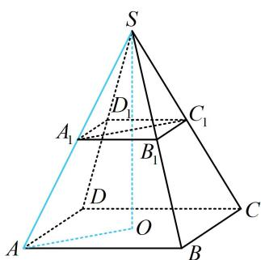

text_image

S
A₁
D₁
C₁
B₁
D
O
A
B
C

图1

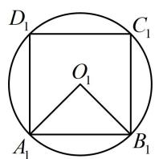  
图2

【变式 1】(2020·新课标Ⅰ卷) 埃及胡夫金字塔是古代世界建筑奇迹之一, 它的形状可视为一个正四棱锥, 以该四棱锥的高为边长的正方形面积等于该四棱锥一个侧面三角形的面积, 则其侧面三角形底边上的高与底面正方形的边长的比值为 ( )

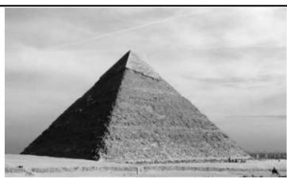

natural_image

Black-and-white exterior view of the Great Pyramid of Giza under a cloudy sky (no text or symbols visible)

A. $\frac{\sqrt{5} - 1}{4}$

B. $\frac{\sqrt{5} - 1}{2}$

C. $\frac{\sqrt{5} + 1}{4}$

D. $\frac{\sqrt{5} + 1}{2}$

解析：涉及正四棱锥，先作高。由于要求的是斜高（侧面三角形底边上的高）与底面边长的比值，故设出这两个量，通过分析过高和斜高的截面 $POE$ 来研究它们的关系，

如图，设正四棱锥 $P - ABCD$ 底面边长为 $a$ ，斜高 $PE = h$ ，其中 $E$ 为 $AB$ 中点，则 $S_{\triangle PAB} = \frac{1}{2} AB\cdot PE = \frac{1}{2} ah$

在 $\triangle POE$ 中， $OE = \frac{1}{2} AD = \frac{a}{2}$ ，所以四棱锥的高 $OP = \sqrt{PE^2 - OE^2} = \sqrt{h^2 - \frac{a^2}{4}}$

由题意，以 $OP$ 为边长的正方形面积与 $\triangle PAB$ 的面积相等，

所以 $h^2 -\frac{a^2}{4} = \frac{1}{2} ah$ ，整理得： $4h^{2} - 2ah - a^{2} = 0$

所以 $4\left(\frac{h}{a}\right)^2 - 2 \cdot \frac{h}{a} - 1 = 0$ ，解得： $\frac{h}{a} = \frac{1 + \sqrt{5}}{4}$ 或 $\frac{1 - \sqrt{5}}{4}$ （舍去）.

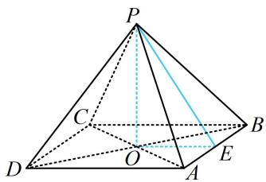

text_image

Geometric diagram of a pyramid with labeled vertices and internal points, used for spatial geometry problems.

答案: C

【反思】通过上两题可以发现，截面选取的动机非常明确，结合条件与要求的即可判断所需截面.

【变式 2】如图，将半径为 4 的半圆围成一个圆锥，在圆锥内接一个圆柱，当圆柱的侧面面积最大时，圆柱的底面半径是（）

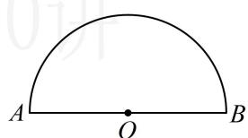

text_image

A
O
B

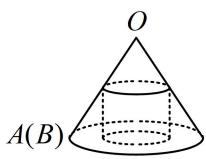

A. $\frac{4\sqrt{5}}{5}$

B. $4 \sqrt{3} - 6$

C. 1

D. $2 \sqrt{3} \pi$

解析：涉及圆锥的计算，常在轴截面中进行，如图，由题意，圆锥的母线长 $OA = OD = 4$

圆锥的底面周长等于半圆的弧长，所以 $2\pi \cdot GD = 4\pi$ ，从而 $GD = 2$ ，故 $OG = \sqrt{OD^2 - GD^2} = 2\sqrt{3}$ 要分析圆柱的侧面积何时最大，可设其底面半径，并求出高，把侧面积表示出来再看，

设圆柱的底面半径为 $r$ ，即 $CE = r$ ，由 $\triangle OEC \sim \triangle OGD$ 可得 $\frac{CE}{GD} = \frac{OE}{OG}$ ，

所以 $\frac{r}{2} = \frac{OE}{2\sqrt{3}}$ ，故 $OE = \sqrt{3} r$ ，所以 $GE = OG - OE = 2\sqrt{3} -\sqrt{3} r$

故圆柱的侧面积 $S = 2\pi r\cdot GE = 2\pi r(2\sqrt{3} -\sqrt{3} r) = 2\sqrt{3}\pi r(2 - r)$

$\leq 2\sqrt{3}\pi \cdot \left(\frac{r + 2 - r}{2}\right)^2 = 2\sqrt{3}\pi$ ，当且仅当 $r = 2 - r$ ，即 $r = 1$ 时取等号，

所以当圆柱的侧面积最大时，其底面半径为1.

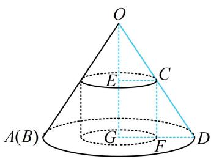

text_image

O
E
C
A(B)
G
F
D

答案: C

【总结】不管是正棱锥或圆锥，不管图形是否固定，核心总是根据条件选取适当的截面进行研究.

# 类型III：台体的截面研究

【例 3】如图， $ABC-A_{1}B_{1}C_{1}$ 是一个正三棱台，而且下底面边长为6，上底面边长和侧棱长都为3，则棱台的高为（）

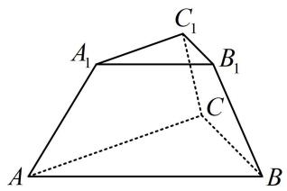

text_image

A₁
C₁
B₁
C
A
B

A. $\frac{\sqrt{6}}{3}$

B. $\frac{2\sqrt{3}}{3}$

C. $\sqrt{6}$

D. $\sqrt{3}$

解析：涉及正三棱台，先画图作高，给了侧棱长，故分析高与侧棱构成的截面，如图， $D$ ， $E$ 分别为上、下底面的中心，也是重心， $A_{1}F\bot AE$ 于 $F$ ， $T$ 是 $BC$ 中点，

则 $A, E, T$ 共线且 $AE = \frac{2}{3} AT = \frac{2}{3} \times \frac{\sqrt{3}}{2} AB = 2\sqrt{3}$ ,

同理， $A_{1}D = \frac{2}{3}\times \frac{\sqrt{3}}{2} A_{1}B_{1} = \sqrt{3}$ ，所以 $EF = A_{1}D = \sqrt{3}$ ， $AF = AE - EF = \sqrt{3}$ 故 $A_{1}F = \sqrt{AA_{1}^{2} - AF^{2}} = \sqrt{3^{2} - (\sqrt{3})^{2}} = \sqrt{6}$

答案: C

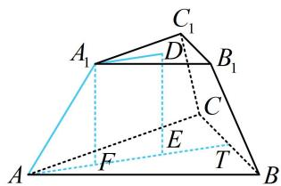

text_image

Geometric diagram of a triangular prism with labeled vertices and internal points, including dashed lines for hidden edges.

# 类型IV：情境题探究

【例 4】(2020·新高考Ⅰ卷) 日晷是中国古代用来测定时间的仪器, 利用与晷面垂直的晷针投射到晷面的影子来测定时间. 把地球看成一个球 (球心记为 $O$ ), 地球上一点 $A$ 的纬度是指 $OA$ 与地球赤道所在平面所成角, 点 $A$ 处的水平面是指过点 $A$ 且与 $OA$ 垂直的平面, 在点 $A$ 处放置一个日晷, 若晷面与赤道所在平面平行, 点 $A$ 处的纬度为北纬 $40^{\circ}$ , 则晷针与点 $A$ 处的水平面所成角为 ( )

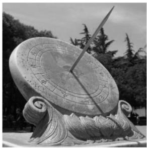

natural_image

Black-and-white photo of a weathered sandar with a central blade and ornate base, surrounded by trees (no visible text or symbols)

A. $20^{\circ}$

B. ${40}^{ \circ  }$

C. ${50}^{ \circ  }$

D. $90^{\circ}$

解析：本题信息较复杂，完整的图形不好画，可通过直观想象画剖面图来看，如图，晷针为 AB（晷面与赤道所在平面平行 $\Rightarrow$ 晨针与赤道平面垂直），A 处的纬度为北纬 $40^{\circ} \Rightarrow \angle AOE = 40^{\circ} \Rightarrow \angle OAC = 40^{\circ}$

$$
\Rightarrow \angle C A D = 9 0 ^ {\circ} - \angle O A C = 5 0 ^ {\circ} \Rightarrow \angle B A D = 9 0 ^ {\circ} - \angle C A D = 4 0 ^ {\circ},
$$

即晷针与点 A 处的水平面所成角为 $40^{\circ}$ .

答案: B

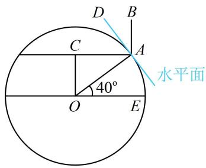

text_image

D
B
C
A
水平面
40°
O
E

【反思】情境题并无通法，但涉及图形长度、角度的计算，时常会选取合适的截面研究.

# 类型 V：内切球问题

【例 5】(2020·新课标III卷) 已知圆锥的底面半径为 1，母线长为 3，则该圆锥内半径最大的球的体积为 \_\_\_\_.

解析：显然球最大时，球内切于圆锥。对于内切球问题，抓住切点与轴构成的截面来分析，由于二者都是旋转体，分析过轴的任意截面都行，不妨到如图所示的截面 $PGA$ 中考虑，

该圆锥内半径最大的球即圆锥的内切球，设球心为 $O$ ，半径为 $R$ ，则 $OB = OG = R$ 由切线长相等可知， $AB = AG = 1$

由题意， $PG = \sqrt{PA^2 - AG^2} = 2\sqrt{2}$ ，所以 $OP = 2\sqrt{2} - R$ ， $PB = PA - AB = 2$ ，

在 $\triangle POB$ 中，由 $OB^{2} + PB^{2} = OP^{2}$ 可得 $R^2 + 4 = (2\sqrt{2} - R)^2$ ，解得： $R = \frac{\sqrt{2}}{2}$

所以球的体积 $V = \frac{4}{3}\pi R^3 = \frac{\sqrt{2}\pi}{3}$

答案： $\frac{\sqrt{2}\pi}{3}$

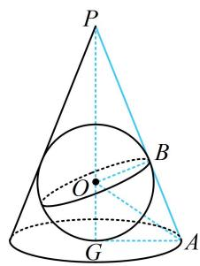

text_image

P
O
B
G
A

【变式1】已知正四棱锥 $P - ABCD$ 的底面边长为2，侧棱长为 $\sqrt{5}$ ，则该正四棱锥的内切球的表面积为\_\_\_\_。

解析：内切球问题中，切点是关键位置，故应分析切点与正四棱锥的高构成的截面，

如图1，设 $E$ 是 $AB$ 的中点， $H$ 是 $CD$ 中点， $G$ 是底面中心， $F$ 是球面与侧面 $PAB$ 的切点，

由对称性，F 在 PE 上，球心 O 在 PG 上，把截面 PHE 单独画出来如图 2,

因为 $AB = 2$ ， $PA = \sqrt{5}$ ，所以 $PE = \sqrt{PA^2 - AE^2} = 2$ ， $GE = 1$ ， $PG = \sqrt{PE^2 - GE^2} = \sqrt{3}$

要求内切球半径, 可到 $\triangle P O F$ 中用勾股定理建立方程求解, 先求出该三角形的三边长,

设内切球 O 的半径为 R，则 $OP = PG - OG = \sqrt{3} - R$ ，OF = R，

由切线长相等知 $EF = GE = 1$ ，所以 $PF = PE - EF = 1$

在 $\triangle POF$ 中， $PF^{2} + OF^{2} = OP^{2}$

所以 $1^{2} + R^{2} = (\sqrt{3} -R)^{2}$ ，解得： $R = \frac{\sqrt{3}}{3}$

所以该正四棱锥的内切球的表面积 $S = 4\pi R^2 = \frac{4\pi}{3}$

答案： $\frac{4\pi}{3}$

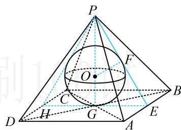

text_image

P
O
F
C
H
G
D
A
E
B

图1

text_image

P
R
F
O
R
H
G
E

图2

【反思】求出 $PE = 2$ 后，若注意到了 $\triangle PHE$ 是正三角形，则也可按 $R = OG = \frac{1}{3} PG = \frac{\sqrt{3}}{3}$ 来速求 $R$ .

【变式2】已知圆台上底面半径为1，下底面半径为2，球与圆台的两个底面和侧面均相切，则该圆台的侧面积与球的表面积之比为\_\_\_\_。

解析：球与圆台都是旋转体，取过轴的任意一个截面来分析均可，

如图， $AD\bot O_2B$ 于 $D$ ，则 $O_{2}D = O_{1}A = 1$ ， $BD = O_2B - O_2D = 1$

由切线长相等可知， $AC = AO_{1} = 1$ ， $BC = BO_{2} = 2$ ，所以 $AB = AC + BC = 3$

故圆台侧面积 $S_{1} = \pi (r_{1} + r_{2})l = \pi \times (1 + 2)\times 3 = 9\pi$ ，再算球的半径，在 $\triangle ABD$ 中由勾股定理求解即可，

设球的半径为 R，则 $AD = O_{1}O_{2} = 2R$ ，

在 $\triangle ABD$ 中， $AD^{2} + BD^{2} = AB^{2}$ ，即 $4R^{2} + 1 = 9\Rightarrow R = \sqrt{2}$

所以球的表面积 $S_{2} = 4\pi R^{2} = 8\pi$

故该圆台的侧面积与球的表面积之比为 $\frac{S_1}{S_2} = \frac{9}{8}$ .

答案： $\frac{9}{8}$

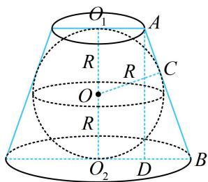

text_image

O₁
A
R
R
C
O
R
O₂
D
B

【总结】涉及内切球半径的计算，往往在高（或轴）和切点构成的截面中来分析.

【例 6】已知正三棱锥 V-ABC 中，侧面与底面所成的二面角的正切值为 $\sqrt{2}$ ，AB=6，则这个三棱锥的内切球半径为 \_\_\_\_.

解法1: 因为是正三棱锥的内切球, 所以关键是分析包含切点和高的截面, 如图1中的截面 $VCD$ ,

在图1中，D为AB中点，E为球面与侧面VAB的切点，F是球面与底面的切点，则 $AB\perp VD$ ， $AB\perp CD$ ，所以 $\angle VDC$ 是侧面与底面所成的二面角的平面角，由题意， $\tan\angle VDC=\frac{VF}{DF}=\sqrt{2}$ ①，

因为 AB=6，所以 $DF=\frac{1}{3}CD=\frac{1}{3}\times6\times\frac{\sqrt{3}}{2}=\sqrt{3}$ ，代入①得： $VF=\sqrt{6}$ ，所以 $VD=\sqrt{DF^{2}+VF^{2}}=3$ ，把截面 VCD 单独画出来，如图 2，设球 O 的半径为 R，则 OE=OF=R， $VO=VF-OF=\sqrt{6}-R$ ，由 $\triangle VEO\sim\triangle VFD$ 可得 $\frac{OE}{DF}=\frac{VO}{VD}$ ，即 $\frac{R}{\sqrt{3}}=\frac{\sqrt{6}-R}{3}$ ，解得： $R=\frac{3\sqrt{2}-\sqrt{6}}{2}$ .

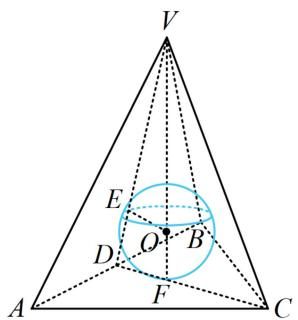

text_image

V
E
O
B
D
F
A
C

图1

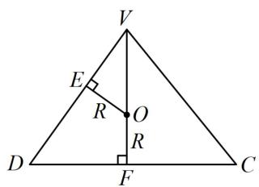

text_image

V
E
R
O
R
D
F
C

图2

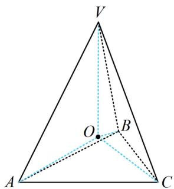

text_image

V
O
B
A
C

图3

解法2：注意到球心 $O$ 到正三棱锥 $V - ABC$ 四个面的距离相等，都等于内切球的半径，而该距离可与三棱锥的体积联系起来，故可考虑用等体积法建立方程求解内切球的半径，

如图3，设正三棱锥 $V - ABC$ 的内切球半径为 $R$ ，则球心 $O$ 到正三棱锥四个面的距离均为 $R$

所以 $V_{V - ABC} = V_{O - VAB} + V_{O - VAC} + V_{O - VBC} + V_{O - ABC} = \frac{1}{3} S_{\triangle VAB}\cdot R + \frac{1}{3} S_{\triangle VAC}\cdot R + \frac{1}{3} S_{\triangle VBC}\cdot R + \frac{1}{3} S_{\triangle ABC}\cdot R$

$$
= \frac {1}{3} (S _ {\triangle V A B} + S _ {\triangle V A C} + S _ {\triangle V B C} + S _ {\triangle A B C}) R \quad ②,
$$

求 $VD, VF$ 的过程同解法 1, 这里不再赘述. 有了 $VD$ 和 $VF$ , 结合正 $\triangle ABC$ 边长已知, 式②中的 $V_{V-ABC}$ 和 $S_{\triangle VAB}$ , $S_{\triangle VAC}$ , $S_{\triangle VBC}$ , $S_{\triangle ABC}$ 都能算, 故而能求出 $R$ ,

由题意， $S_{\triangle ABC} = \frac{1}{2}\times 6^2\times \sin 60^\circ = 9\sqrt{3}$ ， $V_{V - ABC} = \frac{1}{3} S_{\triangle ABC}\cdot VF = \frac{1}{3}\times 9\sqrt{3}\times \sqrt{6} = 9\sqrt{2}$

又 $V - ABC$ 为正三棱锥，所以 $S_{\triangle VAB} = S_{\triangle VAC} = S_{\triangle VBC} = \frac{1}{2} AB\cdot VD = \frac{1}{2}\times 6\times 3 = 9$

将上述结果代入式②得 $9\sqrt{2}=\frac{1}{3}\times(9+9+9+9\sqrt{3})R$ ，解得： $R=\frac{3\sqrt{2}-\sqrt{6}}{2}$ .

答案： $\frac{3\sqrt{2} - \sqrt{6}}{2}$

【反思】对任意的三棱锥 V-ABC，设其体积为 V，表面积为 S，内切球半径为 R，都有 $R=\frac{3V}{S}$ ，其推导方法就是本题解法 2 所用的等体积法，这是一个计算体积和表面积好求的三棱锥的内切球半径的通法。但可发现，此方法的弊端是有时计算量会偏大。

# 强化训练

# 类型 I：规则几何体计算

1. (2023·天津模拟·★★)

如图，半球内有一内接正四棱锥 $S - ABCD$ ，该四棱锥的体积为 $\frac{4\sqrt{2}}{3}$ ，则该半球的体积为（）

A. $\frac{\sqrt{2}}{3}\pi$

B. $\frac{4\sqrt{2}}{9}\pi$

C. $\frac{4\sqrt{2}}{3}\pi$

D. $\frac{8\sqrt{2}}{3}\pi$

text_image

S
D
C
A
B

2. (2023·天津模拟·★★☆)

侧棱长为2的正三棱锥，若其底面周长为9，则该正三棱锥的体积是（）

A. $\frac{9\sqrt{3}}{2}$

B. $\frac{3\sqrt{3}}{4}$

C. $\frac{3\sqrt{3}}{2}$

D. $\frac{9\sqrt{3}}{4}$

3. (2023·重庆模拟·★★★)

圆台上、下底面圆的圆周都在一个半径为5的球面上，其上、下底面圆的周长分别为 $8\pi$ 和 $10\pi$ ，则该圆台的侧面积为（）

A. $8 \sqrt{10} \pi$

B. $8 \sqrt{11} \pi$

C. $9 \sqrt{10} \pi$

D. $9 \sqrt{11} \pi$

4. (2021·新高考II卷·★★★)

北斗三号全球卫星导航系统是我国航天事业的重要成果。卫星导航系统中，地球静止同步轨道卫星的轨道位于地球赤道所在平面，轨道高度为 $36000 \mathrm{~km}$ （轨道高度指卫星到地球表面的最短距离），把地球看成一个球心为 $O$ ，半径 $r$ 为 $6400 \mathrm{~km}$ 的球，其上点 $A$ 的纬度是指 $OA$ 与赤道所在平面所成角的度数，地球表面能直接观测到一颗地球静止同步轨道卫星的点的纬度的最大值记为 $\alpha$ ，该卫星信号覆盖的地球表面面积 $S = 2 \pi r^{2} (1 - \cos \alpha)$ ，（单位： $\mathrm{km}^{2}$ ），则 $S$ 占地球表面积的百分比为（）

A. $26\%$

B. $34\%$

C. $42\%$

D. $50\%$

5. (2023·全国乙卷·★★★)

已知圆锥 $PO$ 的底面半径为 $\sqrt{3}$ , $O$ 为底面圆心, $PA$ , $PB$ 为圆锥的母线, $\angle AOB = 120^{\circ}$ , 若 $\triangle PAB$ 的面积等于 $\frac{9\sqrt{3}}{4}$ , 则该圆锥的体积为 ( )

A. $\pi$

B. $\sqrt{6} \pi$

C. $3\pi$

D. $3 \sqrt{6} \pi$

6. (2024·新课标II卷·★★★)

已知正三棱台 $ABC - A_{1}B_{1}C_{1}$ 的体积为 $\frac{52}{3}$ ， $AB = 6$ ， $A_{1}B_{1} = 2$ ，则 $A_{1}A$ 与平面 $ABC$ 所成角的正切值为（）

A. $\frac{1}{2}$

B. 1

C. 2

D. 3

7. (2023·云南红河州一模·★★★)

如图所示是一块边长为 $10\mathrm{cm}$ 的正方形铝片，其中阴影部分由四个全等的等腰梯形和一个正方形组成，将阴影部分裁剪下来，并将其拼接成一个无上盖的容器（铝片厚度不计），则该容器的容积为（）

A. $\frac{80\sqrt{3}}{3}\mathrm{cm}^3$

B. $\frac{104\sqrt{3}}{3}\mathrm{cm}^3$

C. $80 \sqrt{3} \mathrm{~cm}^{3}$

D. ${104}\sqrt{3}{\mathrm{\;{cm}}}^{3}$

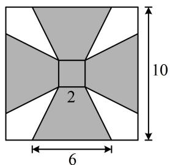

text_image

10
2
6

8. (★★★★)

如图, 圆形纸片的圆心为 $O$ , 半径为 $5 \mathrm{~cm}$ , 该纸片上的等边三角形 $ABC$ 的中心为 $O, D, E, F$ 为圆 $O$ 上的点, $\triangle DBC$ , $\triangle ECA$ , $\triangle FAB$ 分别是以 $BC$ , $CA$ , $AB$ 为底边的等腰三角形. 沿虚线剪开后, 分别以 $BC$ , $CA$ , $AB$ 为折痕折起 $\triangle DBC$ , $\triangle ECA$ , $\triangle FAB$ , 使得 $D, E, F$ 重合, 得到三棱锥. 当 $\triangle ABC$ 的边长变化时, 所得三棱锥体积 (单位: $\mathrm{cm}^{3}$ ) 的最大值为 \_\_\_\_.

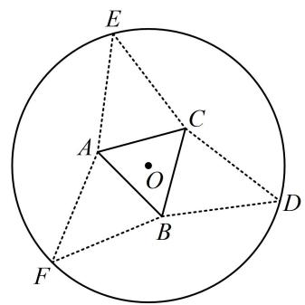

text_image

E
A
C
O
B
D
F

类型 II：内切球问题

9. (2024·广东深圳二模·★★★)

已知圆锥的内切球半径为 1，底面半径为 $\sqrt{2}$ ，则该圆锥的表面积为\_\_\_\_。（注：在圆锥内部，且与底面和各母线均有且只有一个公共点的球，称为圆锥的内切球）

10. (2025·全国Ⅱ卷·★★★☆)

一个底面半径为 $4 \mathrm{~cm}$ , 高为 $9 \mathrm{~cm}$ 的封闭圆柱形容器 (容器厚度忽略不计) 内有两个半径相等的铁球, 则铁球半径的最大值为 \_\_\_\_ cm.

11.（2023·江苏苏锡常镇四市一模·★★★☆）

已知正四面体 $P - ABC$ 的棱长为 1，点 $O$ 为底面 $ABC$ 的中心，球 $O$ 与该正四面体的其余三个面都有且只有一个公共点，且公共点非该正四面体的顶点，则球 $O$ 的半径为（）

A. $\frac{\sqrt{6}}{12}$

B. $\frac{\sqrt{6}}{9}$

C. $\frac{\sqrt{2}}{9}$

D. $\frac{\sqrt{2}}{3}$

12.（2024·湖北武汉模拟·★★★★）

已知正四棱台的上底面与下底面的边长之比为1:2，其内切球的半径为1，则该正四棱台的体积为\_\_\_\_。

