# 强化训练

1. (2023·湖南长沙模拟·★★)

如图, 边长为 2 的正方形 $ABCD$ 中, 点 $E$ , $F$ 分别是边 $AB$ , $BC$ 的中点, 将 $\triangle AED$ , $\triangle EBF$ , $\triangle FCD$ 分别沿 $DE$ , $EF$ , $FD$ 折起, 使 $A$ , $B$ , $C$ 三点重合于 $A'$ , 若四面体 $A'EFD$ 的四个顶点在同一个球面上, 则该球的半径为 \_\_\_\_.

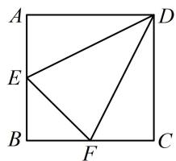

text_image

A
E
B
F
C
D

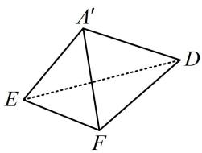

text_image

A'
E
F
D

1. $\frac{\sqrt{6}}{2}$

解析：由折叠过程可知折叠后的四面体中， $A^{\prime}E$ ， $A^{\prime}F$ ， $A^{\prime}D$ 两两垂直，外接球属于长方体模型，

如图，由题意， $A^{\prime}E = A^{\prime}F = 1$ ， $A^{\prime}D = 2$ ，所以四面体

$A^{\prime}EFD$ 的外接球半径 $R = \frac{1}{2}\sqrt{A'E^2 + A'F^2 + A'D^2} = \frac{\sqrt{6}}{2}$ .

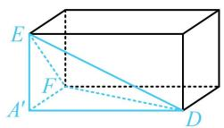

2. (★★☆)

已知 $A$ ， $B$ ， $C$ ， $D$ 在同一球面上， $AB \perp$ 平面 $BCD$ ， $BC \perp CD$ ，若 $AB = 3$ ， $AC = \sqrt{13}$ ， $BD = \sqrt{7}$ ，则该球的体积是\_\_\_\_.

2. $\frac{32\pi}{3}$

解析：由 $\left\{ \begin{array}{l}BC\perp CD\\ AB\perp \text{平面} BCD \end{array} \right.$ 可发现有直角三角形和过其顶点的垂线段，故可按长方体模型处理，

如图， $BC = \sqrt{AC^2 - AB^2} = 2$ ， $CD = \sqrt{BD^2 - BC^2} = \sqrt{3}$

所以外接球的半径 $R=\frac{1}{2}\sqrt{AB^{2}+BC^{2}+CD^{2}}=2$ ，

体积 $V=\frac{4}{3}\pi R^{3}=\frac{32\pi}{3}$ .

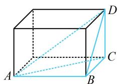

natural_image

3D geometric diagram of a cube with labeled vertices A, B, C, D and diagonal lines (no text or symbols)

3. (2022·安徽模拟·★★★)

在正三棱锥 $S - ABC$ 中， $AB = BC = CA = 6$ ， $D$ 是 $SA$ 的中点，若 $SB \perp CD$ ，则该三棱锥的外接球的表面积是 \_\_\_\_.

3. $54\pi$

解析： $SB \perp CD$ 怎么翻译？若知道正三棱锥对棱垂直的性质，则可结合它推出线面垂直，下面先证明一下，

如图1，取 $AC$ 中点 $E$ ，连接 $SE$ ，BE，则 $SE\bot AC$

$BE \perp AC$ ，所以 $AC \perp$ 平面 SBE，故 $SB \perp AC$ ，

又 $SB \perp CD$ ，所以 $SB \perp$ 平面 $SAC$ ，故 $SB \perp SA$

而正三棱锥三个侧面全等，所以 $SA$ ，SB，SC两两垂直，

有共顶点的两两垂直的棱，可按长方体模型处理，

因为 $AB = BC = CA = 6$ ，所以 $SA = SB = SC = 3\sqrt{2}$

如图2，外接球半径 $R = \frac{1}{2}\sqrt{SA^2 + SB^2 + SC^2} = \frac{3\sqrt{6}}{2}$

所以外接球的表面积 $S = 4\pi R^2 = 54\pi$

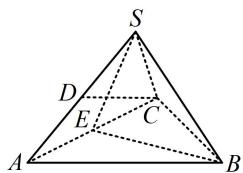

text_image

S
D
E
C
A
B

图1

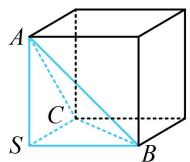  
图2

【反思】本题放在这里，是希望没做出来的同学记住正三棱锥的性质. ①正三棱锥的对棱垂直，值得熟悉；②有时模型会隐藏在条件中，需要我们用所给条件作出一些推理才能发现模型特征.

4. (2023·全国乙卷·★★☆)

已知点 S, A, B, C 均在半径为 2 的球面上， $\triangle ABC$ 是边长为 3 的等边三角形， $SA \perp$ 平面 ABC，则 SA = \_\_\_\_.

4.2

解析：有线面垂直，且 $\triangle ABC$ 是等边三角形，属外接球的圆柱模型，核心方程是 $r^2 +\left(\frac{h}{2}\right)^2 = R^2$

如图，圆柱的高 $h = SA$ ，底面半径 $r$ 即为 $\triangle ABC$ 的外接圆半径，所以 $r = 3 \times \frac{\sqrt{3}}{2} \times \frac{2}{3} = \sqrt{3}$ ，

由题意，球的半径 R=2 ，因为 $r^{2}+\left(\frac{h}{2}\right)^{2}=R^{2}$

所以 $3 + \left(\frac{h}{2}\right)^2 = 4$ ，解得： $h = 2$ ，故 $SA = 2$ ：

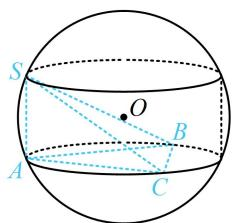

text_image

S
O
A
B
C

5. (2023·河南模拟·★★★)

在直三棱柱 $ABC - A_{1}B_{1}C_{1}$ 中， $\triangle ABC$ 是边长为 6 的等边三角形， $D$ 是 $AB$ 的中点， $DC_{1}$ 与平面 $ABC$ 所成角的正切值为 1，则三棱柱 $ABC - A_{1}B_{1}C_{1}$ 的外接球的表面积为（）

A. $75 \pi$

B. $68 \pi$

C. $60 \pi$

D. $48 \pi$

5. A

解析：直三棱柱只有底面边长，没有高，但高可求，故先由已知条件求高，

如图1，因为 $\triangle ABC$ 是边长为6的正三角形，所以 $CD = 6 \times \frac{\sqrt{3}}{2} = 3\sqrt{3}$ ，

又 $ABC - A_{1}B_{1}C_{1}$ 是直三棱柱，所以 $CC_{1} \perp$ 平面 $ABC$

故 $\angle CDC_{1}$ 即为直线 $DC_{1}$ 与平面 $ABC$ 所成的角，

由题意， $\tan \angle CDC_{1} = \frac{CC_{1}}{CD} = 1$ ，所以 $CC_{1} = CD = 3\sqrt{3}$

直三棱柱外接球问题可按内容提要第2点②的圆柱模型处理，如图2，模型的核心方程是 $r^2 +\left(\frac{h}{2}\right)^2 = R^2$

由题意， $\triangle ABC$ 的外接圆半径 $r = 6 \times \frac{\sqrt{3}}{2} \times \frac{2}{3} = 2\sqrt{3}$ ，

圆柱的高 $h = CC_{1} = 3\sqrt{3}$ ，所以 $R = \sqrt{r^2 + \left(\frac{h}{2}\right)^2} = \frac{5\sqrt{3}}{2}$

故外接球的表面积 $S = 4\pi R^2 = 75\pi$

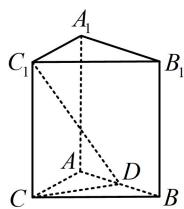  
图1

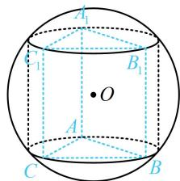

text_image

A₁
B₁
O
A
C
B

图2

6. (2018·新课标III卷·★★★)

设 A, B, C, D 是同一个半径为 4 的球的球面上四点， $\triangle ABC$ 为等边三角形且其面积为 $9\sqrt{3}$ ，则三棱锥 D-ABC 体积的最大值为（）

A. $12 \sqrt{3}$

B. $18 \sqrt{3}$

C. $24\sqrt{3}$

D. $54 \sqrt{3}$

6. B

解析：三棱锥的底面 $\triangle ABC$ 不变，故高最大时体积就最

大，此时三棱锥 $D - ABC$ 应为如图所示的正三棱锥，

正三棱锥可按圆锥模型处理，核心是到 $\triangle AOG$ 中用勾股定理计算有关量，下面先算 $\triangle ABC$ 的外接圆半径 $r$

设 $\triangle ABC$ 边长为 $a$ ，则 $\frac{1}{2} \cdot a^2 \cdot \frac{\sqrt{3}}{2} = 9\sqrt{3} \Rightarrow a = 6$ ，

由正弦定理， $\frac{6}{\sin 60^{\circ}} = 2r\Rightarrow r = 2\sqrt{3}\Rightarrow AG = 2\sqrt{3}$

又由题意， $OA = OD = 4$ ，所以 $OG = \sqrt{OA^2 - AG^2} = 2$

故 $(V_{D - ABC})_{\mathrm{max}} = \frac{1}{3}\times 9\sqrt{3}\times (2 + 4) = 18\sqrt{3}$

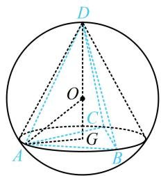

text_image

Geometric diagram of a tetrahedron inscribed in a circle with labeled vertices and internal points

7. (2023·江苏扬州考前调研·★★★☆)

已知正四棱锥的侧面是边长为 3 的正三角形，它的侧棱的所有三等分点都在同一个球面上，则该球的表面积为 \_\_\_\_.

7. $10\pi$

解析：如图1，侧棱所有三等分点构成的图形为正四棱台，后续计算必会用到正四棱台的有关数据，故先计算它们，

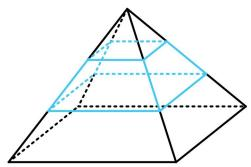

natural_image

Geometric diagram of a triangular pyramid with internal lines and shaded faces (no text or symbols)

图1

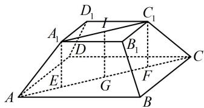

text_image

Geometric diagram of a polyhedron with labeled vertices and internal points, used for spatial geometry problems.

图2

因为原正四棱锥所有棱长都为3，正四棱台的顶点都是侧棱的三等分点，所以其上、下底面边长分别为1和2，侧棱长为1，如图2，作 $A_{1}E\perp AC$ 于 $E$ ， $C_1F\perp AC$ 于 $F$

则 $A_{1}E$ 和 $C_1F$ 都等于正四棱台的高，

且 $AE = CF = \frac{1}{2} (AC - A_1C_1) = \frac{1}{2}\times (2\sqrt{2} -\sqrt{2}) = \frac{\sqrt{2}}{2},$

$A_{1}E = \sqrt{AA_{1}^{2} - AE^{2}} = \frac{\sqrt{2}}{2}$ ，所以 $IG = \frac{\sqrt{2}}{2}$ ，其中 $I$ ， $G$ 分别为上下底面中心，问题的球即为正四棱台的外接球，不清楚球心在台体外还是台体内，需分别考虑，

设正四棱台的外接球半径为 $R$ ，若为图3，则 $IG = OI - OG$

$$
= \sqrt {O A _ {1} ^ {2} - A _ {1} I ^ {2}} - \sqrt {O A ^ {2} - A G ^ {2}} = \sqrt {R ^ {2} - \frac {1}{2}} - \sqrt {R ^ {2} - 2},
$$

又 $IG = \frac{\sqrt{2}}{2}$ ，所以 $\sqrt{R^2 - \frac{1}{2}} -\sqrt{R^2 - 2} = \frac{\sqrt{2}}{2},$

故 $\sqrt{R^2 - \frac{1}{2}} = \frac{\sqrt{2}}{2} +\sqrt{R^2 - 2}$

两端平方得： $R^2 -\frac{1}{2} = \frac{1}{2} +\sqrt{2(R^2 - 2)} +R^2 -2$

化简得： $\sqrt{2(R^2 - 2)} = 1$ ，所以 $2(R^{2} - 2) = 1$

解得： $R = \frac{\sqrt{10}}{2}$ ，故球 $O$ 的表面积为 $S = 4\pi R^2 = 10\pi$

若为图 4，则球心 O 在线段 IG 上，

所以 $OA = \sqrt{AG^2 + OG^2} = \sqrt{2 + OG^2}\geq \sqrt{2}$

$$
O A _ {1} = \sqrt {A _ {1} I ^ {2} + O I ^ {2}} = \sqrt {\frac {1}{2} + O I ^ {2}} \leq \sqrt {\frac {1}{2} + I G ^ {2}} = 1,
$$

从而 $OA > OA_{1}$ ，故球心 $O$ 不可能在台体内；

综上所述，只可能是图3的情形，且正四棱台的外接球的表面积 $S = 10\pi$

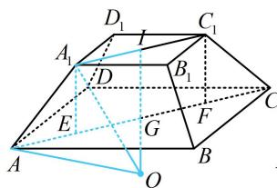

text_image

Geometric diagram of a polyhedron with labeled vertices and internal points, used in spatial geometry problems.

图3

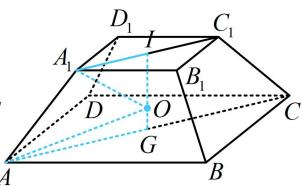

text_image

D₁
I
C₁
A₁
B₁
D
O
G
A
B
C

图4

8. (2023·贵州贵阳模拟·★★★)

如图，在三棱锥 $A - BCD$ 中，平面 $ABD \perp$ 平面 $BCD$ ， $\triangle BCD$ 是边长为 6 的等边三角形， $AB = AD = 3\sqrt{3}$ ，则该几何体的外接球表面积为 \_\_\_\_.

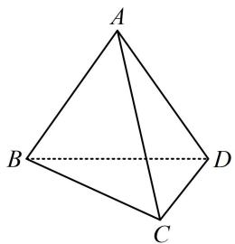

natural_image

Geometric diagram of a tetrahedron with vertices labeled A, B, C, D (no text or symbols beyond labels)

8. $\frac{105\pi}{2}$

解析：没有线面垂直、侧棱长相等，不便套用模型，注意到 $\triangle BCD$ 的外心好找，故考虑内容提要中的通法，

如图，过 $\triangle BCD$ 的外心 $G$ 作垂直于平面 $BCD$ 的直线，

则球心 $O$ 在该直线上，取 $BD$ 中点 $I$ ，连接 $AI$

因为 $AB = AD = 3\sqrt{3}$ ， $BI = 3$ ，所以 $AI \perp BD$

且 $AI = \sqrt{AB^2 - BI^2} = 3\sqrt{2}$ ，结合平面 $ABD\perp$ 平面BCD

可得 $AI \perp$ 平面 $BCD$ ，所以 $AI \parallel OG$

作 $OH \perp AI$ 于 $H$ ，则 $OH = IG = \frac{1}{3} \times 6 \times \frac{\sqrt{3}}{2} = \sqrt{3}$ ，

要求外接球半径，可先设 $OG$ ，利用 $OA = OB$ 来建立方程， $OA$ ， $OB$ 分别在 $\triangle AHO$ 和 $\triangle BGO$ 中计算，

设 $OG = x$ ，则 $HI = x$ ， $AH = AI - HI = 3\sqrt{2} -x$

所以 $OA=\sqrt{AH^{2}+OH^{2}}=\sqrt{(3\sqrt{2}-x)^{2}+3}$

又 $BG = \frac{2}{3}\times 6\times \frac{\sqrt{3}}{2} = 2\sqrt{3}$

所以 $OB = \sqrt{BG^2 + OG^2} = \sqrt{12 + x^2}$ ，由 $OA = OB$ 可得

$\sqrt{(3\sqrt{2}-x)^{2}+3}=\sqrt{12+x^{2}}$ ，解得： $x=\frac{3}{2\sqrt{2}}$

所以球 $O$ 的半径 $R = OB = \sqrt{12 + x^2} = \sqrt{\frac{105}{8}}$

故球 O 的表面积 $S = 4\pi R^{2} = \frac{105\pi}{2}$ .

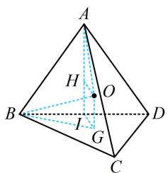

text_image

A
H
O
B
I
G
D
C

【反思】涉及面面垂直的外接球问题，其实也算一类模型，但由于此类问题用通法计算比较方便（因为过外心的垂线容易作出与分析），故本节没有单独归类.

9. (2023·山东模拟·★★★★)

若三棱锥 $S - ABC$ 的所有顶点都在球 $O$ 的球面上， $\triangle ABC$ 是等腰三角形， $\angle BAC = 120^{\circ}$ ， $BC = \sqrt{3}$ ，球 $O$ 的直径 $SA = 4$ ，则该三棱锥的体积为（）

A. $\frac{\sqrt{2}}{6}$

B. $\frac{\sqrt{3}}{6}$

C. $\frac{1}{2}$

D. $\frac{\sqrt{3}}{2}$

9. C

解析：本题不能套用模型，考虑通法. 直径为 $SA$ ，球心 $O$ 即 $SA$ 中点，连接 $O$ 与 $\triangle ABC$ 的外心即得面 $ABC$ 的垂线，

如图1，设 $\triangle ABC$ 的外心为 $O_{1}$ ，外接圆半径为 $r$

则 $\left\{ \begin{array}{l} \angle BAC = 120^{\circ} \\ BC = \sqrt{3} \end{array} \right. \Rightarrow \frac{BC}{\sin \angle BAC} = 2 = 2r \Rightarrow r = 1,$

球 $O$ 的直径 $SA = 4 \Rightarrow$ 半径 $R = 2$ ，所以球心 $O$ 到平面 $ABC$ 的距离 $OO_{1} = \sqrt{R^{2} - r^{2}} = \sqrt{3}$

又 $O$ 是 $SA$ 的中点，所以点 $S$ 到平面 $ABC$ 的距离

$d=2OO_{1}=2\sqrt{3}$ ，算体积还差 $\triangle ABC$ 的面积，

如图2，设 $D$ 为 $BC$ 中点，则 $AD \perp BC$ ，且 $\angle ABD = 30^{\circ}$

所以 $AD = BD \cdot \tan 30^{\circ} = \frac{\sqrt{3}}{2} \times \frac{\sqrt{3}}{3} = \frac{1}{2}$ ,

从而 $S_{\triangle ABC} = \frac{1}{2} BC\cdot AD = \frac{1}{2}\times \sqrt{3}\times \frac{1}{2} = \frac{\sqrt{3}}{4},$

故 $V_{S - ABC} = \frac{1}{3} S_{\triangle ABC}\cdot d = \frac{1}{3}\times \frac{\sqrt{3}}{4}\times 2\sqrt{3} = \frac{1}{2}.$

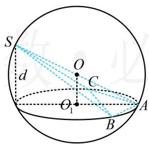

text_image

S
O
C
d
O₁
A
B

图1

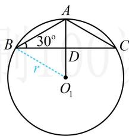

text_image

A
30°
B
r
D
O₁
C

图2

10. (2023·山东烟台一模·★★★★)

《九章算术》是我国古代的一部数学名著，书中记载了一类名为“羡除”的五面体。如图，在羡除 $ABCDEF$ 中，底面 $ABCD$ 为矩形， $AB = 2AD = 2$ ， $\triangle ADE$ 和 $\triangle BCF$ 均为正三角形， $EF //$ 平面 $ABCD$ ， $EF = 3$ ，则该羡除的外接球的表面积为（）

A. $\frac{13\pi}{2}$

B. $\frac{15\pi}{2}$

C. $\frac{17\pi}{2}$

D. $\frac{19\pi}{2}$

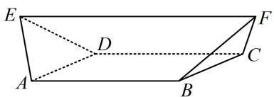

text_image

E
D
A
B
C
F

10. D

解析：所给图形没有常见的外接球模型可套，故考虑通法，即通过分析几何关系来找球心。可选一个面，过其外心作该面的垂线，则球心在该垂线上，选哪个面呢？观察发现若选择矩形ABCD来作该垂线，则图形相对比较简单，

如图，设 $AC \cap BD = I$ ，过 $I$ 作平面ABCD的垂线 $l$ ，则空间中到 $A, B, C, D$ 四点距离相等的点必在 $l$ 上，

所以羡除 $ABCDEF$ 的外接球球心 $O$ 只能在 $l$ 上，由羡除的对称性， $l$ 与 $EF$ 相交，且交点 $M$ 为 $EF$ 的中点，

怎样确定 $O$ 的具体位置？注意到 $O$ 应满足 $OA = OE$ ，故可设 $OM = x$ ，由 $OA = OE$ 建立方程求出 $x$ ，找到 $O$ 的位置，

设 $OM = x$ ，则 $OE = \sqrt{OM^2 + EM^2} = \sqrt{OM^2 + \frac{1}{4} EF^2}$

$$
\begin{array}{l} = \sqrt {x ^ {2} + \frac {9}{4}}, O A = \sqrt {O I ^ {2} + I A ^ {2}} = \sqrt {(x + M I) ^ {2} + \frac {1}{4} A C ^ {2}} \\ = \sqrt {(x + M I) ^ {2} + \frac {5}{4}} \quad ①, \\ \end{array}
$$

故还需算 $MI$ ，可到如图所示的等腰梯形EFQP中来算，

设 $P$ ， $Q$ 分别为 $AD$ ， $BC$ 中点，则 $PQ = AB = 2$

$PE = QF = \frac{\sqrt{3}}{2}$ ，作 $QH\perp EF$ 于点 $H$

则 $HF = \frac{1}{2} (EF - PQ) = \frac{1}{2} \times (3 - 2) = \frac{1}{2}$ ,

所以 $QH = \sqrt{QF^{2} - HF^{2}} = \frac{\sqrt{2}}{2}$ ，故 $MI = QH = \frac{\sqrt{2}}{2}$ ，

代入①得 $OA = \sqrt{\left(x + \frac{\sqrt{2}}{2}\right)^2 + \frac{5}{4}}$ ，因为 $OA = OE$

所以 $\sqrt{\left(x + \frac{\sqrt{2}}{2}\right)^2 + \frac{5}{4}} = \sqrt{x^2 + \frac{9}{4}}$ ，解得： $x = \frac{1}{2\sqrt{2}}$

故羡除的外接球半径 $R = OE = \sqrt{x^2 + \frac{9}{4}} = \sqrt{\frac{19}{8}}$

表面积 $S = 4\pi R^2 = \frac{19\pi}{2}$

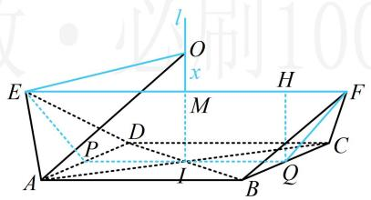

text_image

l
O
x
E
M
H
F
P
D
A
I
B
Q
C

