# 内容提要

本节归纳外接球问题，有四大模型，下面分别分析.

1. 长方体模型: 如图 1, 长、宽、高分别为 $a, b, c$ 的长方体外接球半径 $R = \frac{1}{2} \sqrt{a^2 + b^2 + c^2}$ , 除了标准的长方体 (包括正方体) 之外, 还有下面的两个三棱锥模型, 也常通过补形转化为长方体模型来处理.

①垂直模型: 如图 2 和图 3, 其共同特征是过直角 $\triangle ABC$ 的一个顶点 (图 2 是直角顶点, 图 3 是斜边端点) 作垂直于平面 $ABC$ 的线段, 这一特征可作为解题时识别模型的依据.  
②对棱相等模型: 如图 4, 三棱锥 $S - ABC$ 满足三组相对棱相等, 即 $AB = SC$ , $AC = SB$ , $BC = SA$ , 则该三棱锥也可补形为长方体处理.

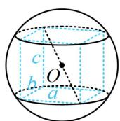  
图1

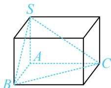

text_image

S
A
B
C

图2

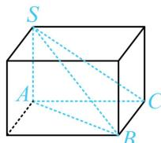  
图3

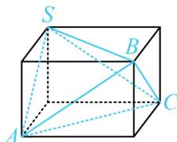

text_image

S
B
A
C

图4

2. 圆柱模型: 如图 5, 圆柱的底面半径 $r$ , 高 $h$ 和球的半径 $R$ 满足 $r^2 + \left(\frac{h}{2}\right)^2 = R^2$ . 除了标准的圆柱模型外, 还有一些模型也可转化为圆柱模型处理.

①线面垂直的三棱锥：如图6， $SA \perp$ 平面 $ABC$ ，若 $\triangle ABC$ 是直角三角形，则按上面1中的长方体模型处理最方便，若不是直角三角形，则可先将三棱锥 $S - ABC$ 放入圆柱，按圆柱模型处理.  
②直三棱柱：如图7所示的直三棱柱也可按圆柱模型处理，本质上和图6的模型相同.

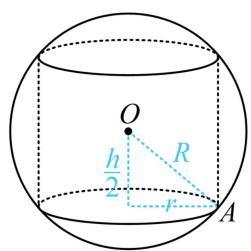

text_image

O
h/2
R
r
A

图5

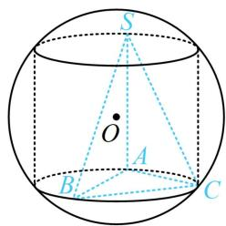

text_image

S
O
A
B
C

图6

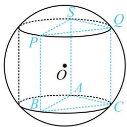

text_image

S
Q
P
O
A
B
C

图7

3. 圆锥模型: 如图8和图9, 圆锥的高 $PO_{1} = h$ , 底面半径 $AO_{1} = r$ , 球的半径为 $R$ , 则 $OO_{1} = |h - R|$ , 在 $\triangle AOO_{1}$ 中, 有 $|h - R|^{2} + r^{2} = R^{2}$ , 故圆锥的外接球相关计算抓住 $\triangle AOO_{1}$ 即可. 除了标准的圆锥模型, 对于侧棱相等的棱锥, 也可放到圆锥中考虑, 如图10的三棱锥 $P - ABC$ .

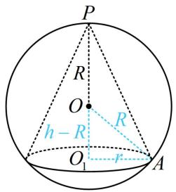

text_image

P
R
O
h - R
R
O₁
r
A

图8

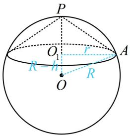

text_image

P
O₁
r
R
h
A
O
R

图9

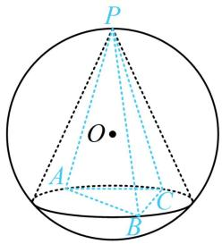

text_image

P
O
A
C
B

图10

4. 台体模型：如图11，圆台的上、下底面半径分别为 $r_1$ ， $r_2$ ，高 $O_{1}O_{2} = h$ ，球 $O$ 的半径为 $R$ 则它们满足方程 $\sqrt{R^2 - r_1^2} +\sqrt{R^2 - r_2^2} = h$ ；若为图12，则满足的方程是 $\sqrt{R^2 - r_1^2} -\sqrt{R^2 - r_2^2} = h$ ．除了这两种标准的圆台模型外，棱台模型也可转化为圆台模型处理，如图13，这种情况只需求出棱台的上、下底面外接圆半径，即可放入圆台分析.

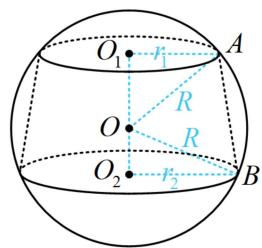

text_image

O₁
r₁
A
R
O
R
O₂
r₂
B

图11

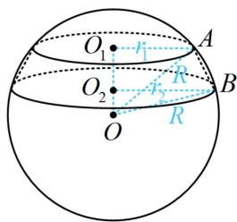

text_image

O₁
r₁
A
O₂
r₂
R
B
O
R

图12

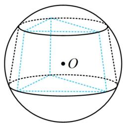

natural_image

Geometric diagram of a sphere with a icosahedron and internal dashed lines, no text or symbols present.

图13

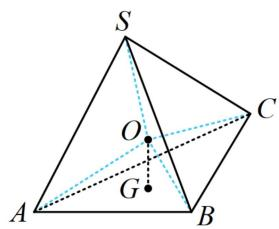

text_image

S
O
C
A
G
B

图14

在外接球问题中，若看不出来是什么模型，则可以尝试用通法：先找到某个面的外接圆圆心，过圆心作该面的垂线，则球心必定在该垂线上，再利用球心到各顶点距离相等构造方程。如上图14，过 $\triangle ABC$ 的外心 $G$ 作平面 $ABC$ 的垂线，则球心 $O$ 必在该垂线上，再由 $OS = OA$ 建立方程求三棱锥 $S - ABC$ 的外接球半径。仔细思考便可发现，其实上述2，3，4模型本质上都是利用的该方法，只是将几何体的结构类型进行了细分，更方便大家理解而已。注意：虽然此通法理论上适用于所有外接球问题，但只有圆心好找且垂线易作时才方便使用。

# 类型 I：外接球的长方体模型

【例 1】若正三棱锥的三个侧面两两垂直，且侧棱长均为 $\sqrt{3}$ ，则其外接球的表面积是 \_\_\_\_.

解析：如图，正三棱锥的三个侧面两两垂直 $\Rightarrow$ 该正三棱锥的三条侧棱两两垂直，由此可看出属于内容提要第1点①中的长方体模型，

$SA = SB = SC = \sqrt{3} \Rightarrow$ 外接球半径 $R = \frac{1}{2}\sqrt{SA^2 + SB^2 + SC^2} = \frac{3}{2}$ ，表面积 $S = 4\pi R^2 = 9\pi$ 。

答案： $9 \pi$

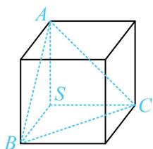

text_image

A
S
B
C

【反思】有三条共顶点且两两垂直的棱的三棱锥是最基础且好发现的墙角模型，该模型可补形为长方体，按长方体算外接球半径.

【变式】已知球 O 的球面上四点 A, B, C, D 满足 $DA \perp$ 平面 ABC, $AB \perp BC$ , $DA = AB = BC = \sqrt{3}$ ，则球 O 的体积为 \_\_\_\_.

解析：由 $AB \perp BC$ 和 $DA \perp$ 平面 $ABC$ 识别出几何体属于内容提要1中的①，可补形为长方体模型处理，

如图，三棱锥 $D - ABC$ 的外接球半径 $R = \frac{1}{2}\sqrt{DA^2 + AB^2 + BC^2} = \frac{3}{2}$

所以球 O 的体积 $V=\frac{4}{3}\pi R^{3}=\frac{9\pi}{2}$ .

答案： $\frac{9\pi}{2}$

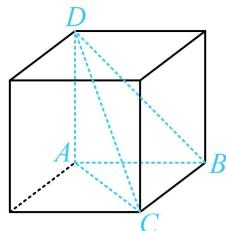

text_image

Geometric diagram of a cube with labeled vertices A, B, C, D and internal diagonals

【反思】过直角三角形顶点作三角形所在平面的垂线段，这样构成的三棱锥可补形为长方体模型，若把这里面的直角三角形改为非直角三角形呢？此时可按后面类型Ⅱ的圆柱模型处理.

【例 2】如图，在三棱锥 A-BCD 中，AB=AC=BD=CD=3，AD=BC=2，则三棱锥 A-BCD 的外接球的表面积为 \_\_\_\_.

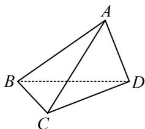

natural_image

Geometric diagram of a tetrahedron with vertices labeled A, B, C, D (no text or symbols beyond labels)

解析：由所给数据可发现三组对棱长度分别相等，属内容提要第1点中的②，可放入长方体考虑，

如图，设长方体的长、宽、高分别为 $a, b, c$ ，则 $\left\{ \begin{array}{l} AB = CD = \sqrt{a^2 + c^2} = 3 \\ AD = BC = \sqrt{b^2 + c^2} = 2 \\ AC = BD = \sqrt{a^2 + b^2} = 3 \end{array} \right.$ ，

三式平方相加得 $a^2 + b^2 + c^2 = 11$ ，所以外接球半径 $R = \frac{\sqrt{a^2 + b^2 + c^2}}{2} = \frac{\sqrt{11}}{2}$ ，故三棱锥 $A - BCD$ 的外接球的表面积 $S = 4\pi R^2 = 11\pi$ 。

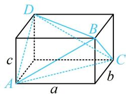

text_image

D
B
c
A
a
b
C

答案: $11 \pi$

# 类型 II：外接球的圆柱模型

【例 3】已知在三棱锥 P-ABC 中，PA=4， $BC=2\sqrt{6}$ ， $PB=PC=3$ ， $PA\perp$ 平面 PBC，则三棱锥 P-ABC 的外接球的表面积是 \_\_\_\_.

解析: 条件中有 $PA \perp$ 面 $PBC$ , 且 $\triangle PBC$ 不是直角三角形, 如图 1, 这是内容提要第 2 点中①的三棱锥转圆柱模型, 如图 2, 模型的核心方程是 $r^{2} + \left(\frac{h}{2}\right)^{2} = R^{2}$ , 故先求 $r$ , 可用正弦定理求,

设 $\triangle PBC$ 的外接圆半径为 $r$ ， $\cos \angle BPC = \frac{PB^2 + PC^2 - BC^2}{2PB \cdot PC} = -\frac{1}{3} \Rightarrow \sin \angle BPC = \sqrt{1 - \left(-\frac{1}{3}\right)^2} = \frac{2\sqrt{2}}{3}$ ，

由正弦定理， $\frac{BC}{\sin\angle BPC} = \frac{2\sqrt{6}}{\frac{2\sqrt{2}}{3}} = 3\sqrt{3} = 2r$ ，所以 $r = \frac{3\sqrt{3}}{2}$

又 $\frac{h}{2} = OO_{1} = \frac{1}{2} PA = 2$ ，所以 $R = \sqrt{r^2 + \left(\frac{h}{2}\right)^2} = \sqrt{\left(\frac{3\sqrt{3}}{2}\right)^2 + 2^2} = \frac{\sqrt{43}}{2},$

故球 O 表面积 $S = 4\pi R^{2} = 43\pi$ .

答案: $43 \pi$

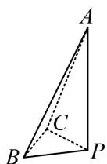  
图1

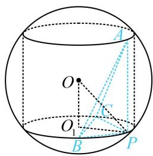

text_image

Geometric diagram of a sphere with labeled points and lines, including O, A, B, C, P, and center O₁.

图2

【变式】如图，四棱锥 $S - ABCD$ 的底面 $ABCD$ 为矩形， $SA \perp AB$ ， $SB = SC = 2$ ， $SA = AD = 1$ ，则四棱锥 $S - ABCD$ 的外接球的表面积为（）

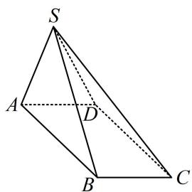

text_image

S
A
D
B
C

A. $\frac{13\pi}{3}$

B. $4 \pi$

C. $\frac{10\pi}{3}$

D. $3 \pi$

解法1：涉及四棱锥的外接球，先分析其结构特征，重点看是否有线面垂直，

底面 ABCD 为矩形 $\Rightarrow AB \perp AD$ ，又 $SA \perp AB$ ，所以 $AB \perp$ 平面 SAD ①，

有线面垂直，故四棱锥可补全为直三棱柱，按内容提要第2点②的圆柱模型处理，

补形过程如图1，2，3， $\left\{ \begin{array}{ll}SA\bot AB\\ SA = 1\quad \Rightarrow AB = \sqrt{SB^2 - SA^2} = \sqrt{3}\Rightarrow CD = \sqrt{3},\\ SB = 2 \end{array} \right.$

由①可得 $AB \perp SD$ ，又 $CD \parallel AB$ ，所以 $CD \perp SD$ ，故 $SD = \sqrt{SC^2 - CD^2} = 1$

结合 $SA = AD = 1$ 可得 $\triangle SAD$ 是边长为1的正三角形，其外接圆半径 $r = 1\times \frac{\sqrt{3}}{2}\times \frac{2}{3} = \frac{\sqrt{3}}{3}$

又 $\frac{h}{2} = \frac{1}{2} AB = \frac{\sqrt{3}}{2}$ ，所以 $R = \sqrt{r^2 + \left(\frac{h}{2}\right)^2} = \sqrt{\frac{1}{3} + \frac{3}{4}} = \sqrt{\frac{13}{12}}$ ，故外接球的表面积 $S = 4\pi R^2 = \frac{13\pi}{3}$ .

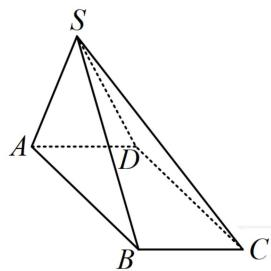

text_image

S
A
D
B
C

图1

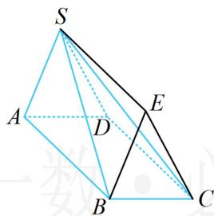

text_image

S
A
D
E
B
C

图2

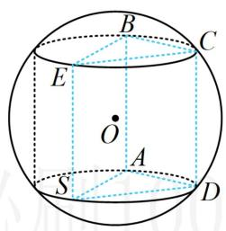

text_image

B
C
E
O
A
S
D

图3

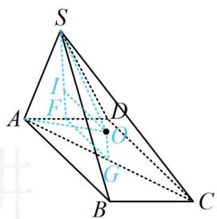

text_image

S
I
F
A
D
O
G
B
C

图4

解法2：分析 $\triangle SAD$ 为正三角形、 $AB\perp$ 平面 $SAD$ 等过程同解法1．若没想到上述补形的方法，由于底面矩形的外心好找，也可用内容提要最后提及的通法来处理，

如图4，设 $G$ 为矩形ABCD的中心，过 $G$ 作平面ABCD的垂线，则球心 $O$ 在该垂线上，

要求外接圆半径，可利用图中 $OS = OA$ 来建立等量关系，

设 $F$ 是 $AD$ 中点， $OI \perp SF$ 于 $I$ ，则 $SF \perp AD$ ，又 $AB \perp$ 面 $SAD$ ，所以 $SF \perp AB$ ，故 $SF \perp$ 面 $ABCD$

所以 $SF \parallel OG$ ，故 $IF = OG$ ，设 $IF = OG = x$ ，则 $IS = SF - IF = \frac{\sqrt{3}}{2} - x$ ， $OI = FG = \frac{1}{2} CD = \frac{\sqrt{3}}{2}$ ，

设 $OS = OA = R$ ，在 $\triangle SOI$ 中， $IS^2 +OI^2 = OS^2$ ，所以 $\left(\frac{\sqrt{3}}{2} -x\right)^2 +\frac{3}{4} = R^2$ ②，

在 $\triangle OAG$ 中， $OG^{2} + AG^{2} = OA^{2}$ ，所以 $x^{2} + 1 = R^{2}$ ③，

联立②③可解得： $R^{2}=\frac{13}{12}$ ，所以外接球的表面积 $S=4\pi R^{2}=\frac{13\pi}{3}$ .

答案: A

【反思】圆柱模型的标志性条件是线面垂直，若没有观察出模型，也可考虑通法思路。当涉及面面垂直时，用通法思路常较简单，如本题的面 $SAD \perp$ 面ABCD。（因此时作垂线，垂足在两面交线上，如SF）

# 类型III：外接球的圆锥模型

【例 4】已知圆柱的轴截面是边长为 2 的正方形，P 为上底面圆的圆心，AB 为下底面圆的直径，E 为下底面圆周上一点，则三棱锥 P-ABE 外接球的表面积为 \_\_\_\_.

解析：如图1，由题意， $AB = 2$ ，所以 $\triangle ABE$ 的外接圆半径 $r = 1$ ，三棱锥 $P - ABE$ 的高为2，可发现 $PA = PB = PE$ ，这是侧棱相等的圆锥模型.把圆锥 $PO_{1}$ 放入球 $O$ ，如图2，再到 $\triangle OO_1A$ 中分析，

设外接球的半径为 R，则 OA = OP = R，

$$
O O _ {1} = P O _ {1} - O P = 2 - R, \quad O _ {1} A = 1,
$$

因为 $OO_{1}^{2} + O_{1}A^{2} = OA^{2}$ ，所以 $(2 - R)^{2} + 1 = R^{2}$ ，解得： $R = \frac{5}{4}$

故外接球的表面积 $S = 4\pi R^2 = \frac{25\pi}{4}$

答案： $\frac{25\pi}{4}$

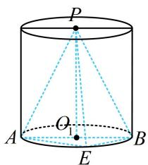

text_image

P
A
O₁
E
B

图1

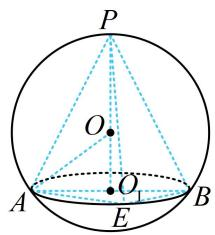

text_image

P
O
A
E
B

图2

【变式】(2022·新课标Ⅰ卷)已知正四棱锥的侧棱长为 $l$ ，其各顶点都在同一球面上，若该球的体积为 $36\pi$ ，且 $3 \leq l \leq 3\sqrt{3}$ ，则该正四棱锥的体积的取值范围是（）

A. $\left[18, \frac{81}{4}\right]$

B. $\left[\frac{27}{4},\frac{81}{4}\right]$

C. $\left[\frac{27}{4},\frac{64}{3}\right]$

D. [18,27]

解析：设球的半径为 $R$ ，由题意， $\frac{4}{3}\pi R^3 = 36\pi$ ，所以 $R = 3$ ①，

正四棱锥的侧棱相等，可按圆锥模型处理，先列两个核心方程，

如图，设 $PE = h$ ，底面外接圆半径为 $r$ ，则 $\left\{ \begin{array}{l} (h - R)^2 + r^2 = R^2 \\ h^2 + r^2 = l^2 \end{array} \right.$ ，将①代入可得 $\left\{ \begin{array}{l} (h - 3)^2 + r^2 = 9 \\ h^2 + r^2 = l^2 \end{array} \right.$ ②，

题干给了 $l$ 的范围, 所以消去 $r$ 和 $h$ , 都用 $l$ 表示,

由②可得 $h = \frac{l^2}{6}$ ， $r^2 = l^2 - \frac{l^4}{36}$ ，所以正方形ABCD的面积 $S_{ABCD} = \frac{1}{2} \times (2r)^2 = 2r^2 = 2\left(l^2 - \frac{l^4}{36}\right)$ ，

故四棱锥 $P - ABCD$ 的体积 $V = \frac{1}{3} \times 2\left(l^2 - \frac{l^4}{36}\right) \times \frac{l^2}{6} = \frac{2}{3} \times \left(l^2 - \frac{l^4}{36}\right) \times \frac{l^2}{6}$ ,

观察发现若将 $\frac{l^2}{6}$ 换元，上式可以化简，故先换元再分析，

设 $t = \frac{l^2}{6}$ ，则 $V = \frac{2}{3} (6t - t^2)t = \frac{2}{3} (6t^2 -t^3)$ ，因为 $3\leq l\leq 3\sqrt{3}$ ，所以 $\frac{3}{2}\leq t\leq \frac{9}{2}$

令 $f(t) = \frac{2}{3} (6t^2 - t^3)$ ， $\frac{3}{2} \leq t \leq \frac{9}{2}$ ，则 $f'(t) = \frac{2}{3} (12t - 3t^2) = 2t(4 - t)$ ，

所以 $f^{\prime}(t) > 0\Leftrightarrow \frac{3}{2}\leq t <   4$ ， $f^{\prime}(t) <   0\Leftrightarrow 4 <   t\leq \frac{9}{2}$ ，从而 $f(t)$ 在 $\left[\frac{3}{2},4\right)$ 上 $\nearrow$ ，在 $\left(4,\frac{9}{2}\right]$ 上 $\searrow$

故 $f(t)_{\max} = f(4) = \frac{64}{3}$ ，又 $f\left(\frac{3}{2}\right) = \frac{27}{4}$ ， $f\left(\frac{9}{2}\right) = \frac{81}{4}$ ，所以 $f(t)_{\min} = \frac{27}{4}$ ，故 $V \in \left[\frac{27}{4}, \frac{64}{3}\right]$ .

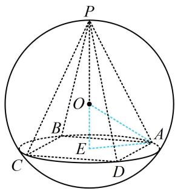

text_image

P
O
B
E
C
D
A

答案: C

【反思】侧棱相等的棱锥都可以按圆锥模型处理，列出核心方程求解；正棱锥的所有侧棱都相等.

# 类型IV：外接球的台体模型

【例 5】(2022·新课标Ⅱ卷) 已知正三棱台的高为 1，上下底面的边长分别为 $3 \sqrt{3}$ 和 $4 \sqrt{3}$ ，其顶点都在同一球面上，则该球的表面积为（）

A. $100 \pi$

B. $128 \pi$

C. $144 \pi$

D. $192 \pi$

解析：棱台的上、下底面半径分别为 $KA_{1} = 3\sqrt{3}\times \frac{\sqrt{3}}{2}\times \frac{2}{3} = 3$ ， $GA = 4\sqrt{3}\times \frac{\sqrt{3}}{2}\times \frac{2}{3} = 4$ ，高 $KG = 1$

我们发现棱台的高相对于上、下底的半径较小，故可猜想外接球是图1所示的情形，先按图1计算，

如图1，应有 $OK - OG = \sqrt{OA_1^2 - KA_1^2} -\sqrt{OA^2 - AG^2} = \sqrt{R^2 - 9} -\sqrt{R^2 - 16} = 1,$

所以 $\sqrt{R^2 - 9} = \sqrt{R^2 - 16} + 1$ ，同时平方可得 $R^2 - 9 = R^2 - 16 + 2\sqrt{R^2 - 16} + 1$

化简得： $\sqrt{R^2 - 16} = 3$ ，解得： $R = 5$ ，所以球 $O$ 的表面积 $S = 4\pi R^2 = 100\pi$ ，故选A；

再来分析图2的情形，其实这种情况是不可能的，我们可以到截面 $AA_{1}KG$ 中来分析，

若为图2，则 $OA_{1} = \sqrt{A_{1}K^{2} + OK^{2}} = \sqrt{9 + OK^{2}}\leq \sqrt{9 + KG^{2}} = \sqrt{10}$

而 $OA = \sqrt{AG^2 + OG^2} = \sqrt{16 + OG^2} \geq 4$ ，所以 $OA > OA_1$ ，与 $OA = OA_1$ 矛盾，故不可能是图2的情形.

答案: A

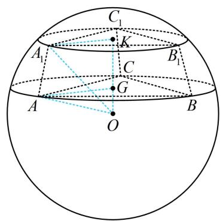

text_image

C₁
K
A₁
B₁
C
G
A
O
B

图1

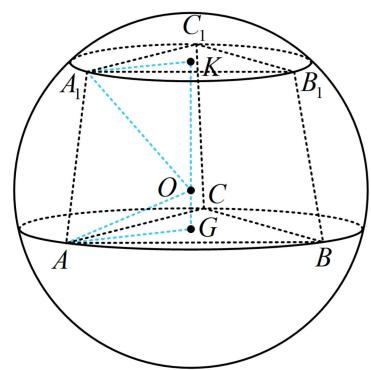

text_image

C₁
A₁ K B₁
O C
G
A B

图2

【反思】设圆台的上、下底面半径分别为 $r_1$ ， $r_2$ ，高为 $h$ ，当 $r_1^2 + h^2 = r_2^2$ 时，外接球球心恰为下底面圆心；当 $r_1^2 + h^2 < r_2^2$ 时，球心在台体外；当 $r_1^2 + h^2 > r_2^2$ 时，球心在台体内。本题即为 $r_1^2 + h^2 < r_2^2$ 的情形。

# 强化训练

1. (2023·湖南长沙模拟·★★)

如图，边长为2的正方形ABCD中，点E，F分别是边AB，BC的中点，将△AED，△EBF，△FCD分别沿DE，EF，FD折起，使A，B，C三点重合于A'，若四面体A'EFD的四个顶点在同一个球面上，则该球的半径为\_\_\_\_。

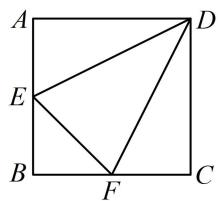

text_image

A
E
B
F
C
D

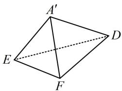

text_image

A'
E
F
D

2. (★★☆)

已知 A, B, C, D 在同一球面上， $AB \perp$ 平面 BCD， $BC \perp CD$ ，若 AB = 3， $AC = \sqrt{13}$ ， $BD = \sqrt{7}$ ，则该球的体积是 \_\_\_\_.

3. (2022·安徽模拟·★★★)

在正三棱锥 $S - ABC$ 中， $AB = BC = CA = 6$ ， $D$ 是 $SA$ 的中点，若 $SB \perp CD$ ，则该三棱锥的外接球的表面积是 \_\_\_\_.

4. (2023·全国乙卷·★★☆)

已知点 S, A, B, C 均在半径为 2 的球面上， $\triangle ABC$ 是边长为 3 的等边三角形， $SA \perp$ 平面 ABC，则 SA = \_\_\_\_.

5. (2023·河南模拟·★★★)

在直三棱柱 $ABC - A_{1}B_{1}C_{1}$ 中， $\triangle ABC$ 是边长为 6 的等边三角形， $D$ 是 $AB$ 的中点， $DC_{1}$ 与平面 $ABC$ 所成角的正切值为 1，则三棱柱 $ABC - A_{1}B_{1}C_{1}$ 的外接球的表面积为（）

A. $75 \pi$

B. $68 \pi$

C. $60 \pi$

D. $48 \pi$

6. (2018·新课标III卷·★★★)

设 $A, B, C, D$ 是同一个半径为 4 的球的球面上四点, $\triangle ABC$ 为等边三角形且其面积为 $9\sqrt{3}$ , 则三棱锥 $D - ABC$ 体积的最大值为 ( )

A. $12 \sqrt{3}$

B. $18 \sqrt{3}$

C. $24 \sqrt{3}$

D. $54 \sqrt{3}$

7. (2023·江苏扬州考前调研·★★★☆)

已知正四棱锥的侧面是边长为3的正三角形，它的侧棱的所有三等分点都在同一个球面上，则该球的表面积为\_\_\_\_。

8. (2023·贵州贵阳模拟·★★★)

如图，在三棱锥 $A - BCD$ 中，平面 $ABD \perp$ 平面 $BCD$ ， $\triangle BCD$ 是边长为 6 的等边三角形， $AB = AD = 3\sqrt{3}$ ，则该几何体的外接球表面积为 \_\_\_\_.

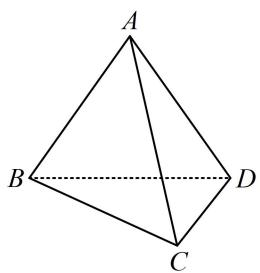

natural_image

Geometric diagram of a tetrahedron with vertices labeled A, B, C, D (no text or symbols beyond labels)

9.（2023·山东模拟·★★★★）

若三棱锥 $S - ABC$ 的所有顶点都在球 $O$ 的球面上， $\triangle ABC$ 是等腰三角形， $\angle BAC = 120^{\circ}$ ， $BC = \sqrt{3}$ ，球 $O$ 的直径 $SA = 4$ ，则该三棱锥的体积为（）

A. $\frac{\sqrt{2}}{6}$

B. $\frac{\sqrt{3}}{6}$

C. $\frac{1}{2}$

D. $\frac{\sqrt{3}}{2}$

10.（2023·山东烟台一模·★★★★）

《九章算术》是我国古代的一部数学名著，书中记载了一类名为“羡除”的五面体。如图，在羡除 $ABCDEF$ 中，底面 $ABCD$ 为矩形， $AB = 2AD = 2$ ， $\triangle ADE$ 和 $\triangle BCF$ 均为正三角形， $EF //$ 平面 $ABCD$ ， $EF = 3$ ，则该羡除的外接球的表面积为（）

A. $\frac{13\pi}{2}$

B. $\frac{15\pi}{2}$

C. $\frac{17\pi}{2}$

D. $\frac{19\pi}{2}$

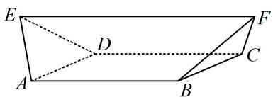

text_image

E
D
A
B
C
F

