# 强化训练

1. (2024·江苏南京模拟（节选）·★★)

如图，在四面体 $ABCD$ 中， $\triangle ACD$ 是边长为 3 的正三角形， $\triangle ABC$ 是以 $AB$ 为斜边的等腰直角三角形， $E$ ， $F$ 分别为线段 $AB$ ， $BC$ 的中点， $\overrightarrow{AM} = 2\overrightarrow{MD}$ ， $\overrightarrow{CN} = 2\overrightarrow{ND}$ ，求证： $EF//$ 平面 $MNB$ .

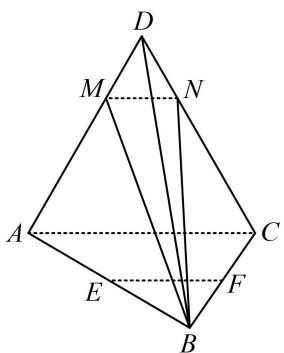

text_image

D
M N
A C
E F
B

1. 证明：（证线面平行，先找线线平行。观察图形可发现 $EF$

//MN，故尝试通过证此线线平行来证 $EF$ //平面MNB)

因为 E, F 分别是 AB, BC 的中点，所以 $EF \parallel AC$ ①,

又因为 $\overrightarrow{AM} = 2\overrightarrow{MD}$ ， $\overrightarrow{CN} = 2\overrightarrow{ND}$ ，所以 $\frac{DM}{AM} = \frac{DN}{NC} = \frac{1}{2}$

故 $MN \parallel AC$ ，结合①可得 $EF \parallel MN$

又 $EF \not\subset$ 平面 $MNB, MN \subset$ 平面 $MNB,$

所以 $EF \parallel$ 平面 MNB.

2. (2024·广东广州一模（节选）·★★)

如图，在四棱锥 $P - ABCD$ 中，底面 $ABCD$ 是边长为2的菱形， $\triangle DCP$ 是等边三角形， $\angle DCB = \angle PCB = \frac{\pi}{4}$ ，点 $M, N$ 分别为 $DP$ 和 $AB$ 的中点，求证： $MN \parallel$ 平面 $PBC$ .

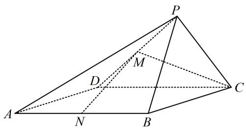

text_image

P
M
D
C
A
N
B

2. 证明：(证线面平行, 先找线线平行. 观察发现若过面 $PBC$

内的点 $B$ 作 $MN$ 的平行线，则作出来 $BQMN$ 像平行四边形，且 $Q$ 为 $PC$ 中点（如图），思路就有了）

如图，取 $PC$ 的中点 $Q$ ，连接 $MQ$ ， $BQ$ ，因为点 $M$ ， $Q$ 分别是 $PD$ ， $PC$ 的中点，所以 $MQ \parallel CD$ 且 $MQ = \frac{1}{2} CD$ ，

又因为 $ABCD$ 是菱形，点 $N$ 是 $AB$ 的中点，所以 $BN \parallel CD$ 且 $BN = \frac{1}{2} CD$ ，故 $MQ \parallel BN$ 且 $MQ = BN$ ，

所以四边形 $MNBQ$ 是平行四边形，故 $MN \parallel BQ$

又因为 $BQ \subset$ 平面 $PBC, MN \notin$ 平面 $PBC$ ,

所以 $MN \parallel$ 平面 $PBC$ .

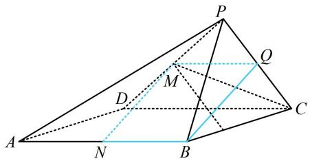

text_image

Geometric diagram of a pyramid with labeled vertices and internal points, showing solid and dashed lines for edges and diagonals.

3.（2024·广东模拟（节选）·★★）

如图，在直三棱柱 $ABC - A_{1}B_{1}C_{1}$ 中， $D$ 为 $A_{1}B_{1}$ 的中点，证明： $B_{1}C // \text{平面 } AC_{1}D$ .

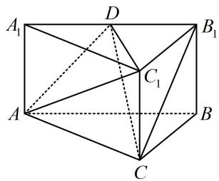

text_image

A₁
D
B₁
C₁
A
B
C

3. 证明：（观察发现 $B_{1} C$ 和 $A_{1}$ 位于面 $A C_{1} D$ 两侧，由内容提要）

2的①可知只需连接 $A_{1}C$ ，证明 $B_{1}C / / DG$ 即可）

如图，取 $AC_{1}$ 中点 $G$ ，连接 $DG$ ， $A_{1}C$ ，因为 $ABC - A_{1}B_{1}C_{1}$ 是直三棱柱，所以四边形 $ACC_{1}A_{1}$ 是矩形，

从而 $A_{1}$ ， $G$ ， $C$ 三点共线，且 $G$ 为 $A_{1}C$ 的中点，

又因为 D 为 $A_{1}B_{1}$ 的中点，所以 $DG \parallel B_{1}C$ ，

因为 $B_{1}C \not\subset$ 平面 $AC_{1}D$ ， $DG \subset$ 平面 $AC_{1}D$

所以 $B_{1}C$ //平面 $AC_{1}D$ .

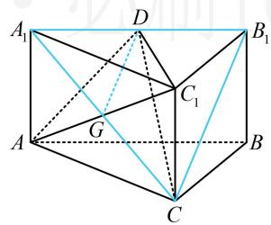

text_image

Geometric diagram of a cube with labeled vertices and internal points, used for spatial geometry problems.

4.（2023·山东潍坊三模（节选）·★★☆）

如图， $P$ 为圆锥的顶点， $O$ 是圆锥底面的圆心， $AC$ 为底面直径， $\triangle ABD$ 为底面圆 $O$ 的内接正三角形，且边长为 $\sqrt{3}$ ，点 $E$ 在母线 $PC$ 上，且 $AE = \sqrt{3}$ ， $CE = 1$ ，求证：直线 $PO \parallel$ 平面 $BDE$ .

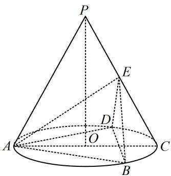

text_image

P
E
D
A
O
C
B

4. 证明：（观察发现 $PO$ 和 $C$ 位于面 $BDE$ 两侧，由内容提要2

的①可知只需证 $PO / /$ 面 $POC$ 与面 $BDE$ 的交线 $EF$ , 可尝试通过分析 $E, F$ 在 $PC, OC$ 上的位置来证明)

设 $AC \cap BD = F$ ，连接 $EF$ ，由题意， $\triangle ABD$ 是边长为 $\sqrt{3}$ 的正三角形， $O$ 是其外心，所以 $F$ 是 $BD$ 的中点，

且 $OA = \frac{2}{3} AF = \frac{2}{3}\times \frac{\sqrt{3}}{2}\times \sqrt{3} = 1$ ， $OF = \frac{1}{2} OA = \frac{1}{2},$

所以 $OC = 1$ ， $AC = 2$ ，且 $F$ 是 $OC$ 的中点，

又 $AE = \sqrt{3}$ ， $CE = 1$ ，所以 $AE^2 +CE^2 = 4 = AC^2$

故 $AE \perp PC$ ，且 $\cos\angle ACE=\frac{CE}{AC}=\frac{1}{2}$ ，

所以 $\angle ACE = 60^{\circ}$ ，结合 $PA = PC$ 得 $\triangle PAC$ 是正三角形，

又因为 $AE \perp PC$ ，所以 $E$ 为 $PC$ 中点，

结合 F 为 OC 中点可得 $EF \parallel PO$ ，因为 $PO \not\subset$ 平面 BDE，

$EF \subset$ 平面 $BDE$ ，所以 $PO \parallel$ 平面 $BDE$ .

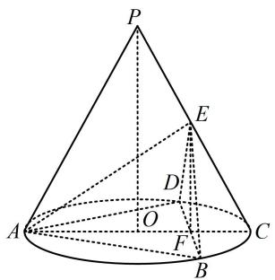

text_image

P
E
D
O
A
F
C
B

5. (2023·广东六校联考(节选)·★★☆)

如图, 在四棱锥 $P - ABCD$ 中, 侧面 $\triangle PAD$ 是正三角形, 且与底面 $ABCD$ 垂直, $BC \parallel$ 平面 $PAD$ , $BC = \frac{1}{2} AD = 1$ , $E$ 是棱 $PD$ 上的动点, 当 $E$ 是棱 $PD$ 的中点时, 求证: $CE \parallel$ 平面 $PAB$ .

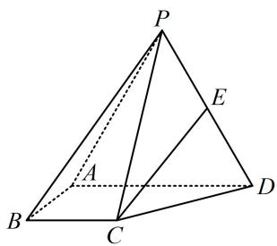

text_image

Geometric diagram of a pyramid with labeled vertices and internal points, used for spatial geometry problems.

5. 证明：（要证线面平行，先找线线平行。可过 $B$ 作 $CE$ 的平

行线，作好就发现 BCEF 像平行四边形，如下图，故尝试证明）如图，取 PA 中点 F，连接 BF，EF，

因为 E 是 PD 中点，所以 $EF \parallel AD$ 且 $EF = \frac{1}{2} AD$ ①，

（还需再证 $BC$ 也平行且等于 $AD$ 的一半，条件并未给出 $BC \parallel AD$ ，给的是 $BC \parallel$ 平面 $PAD$ ，故考虑线面平行的性质定理）因为 $BC \parallel$ 平面 $PAD$ ， $BC \subset$ 平面 $ABCD$ ，平面 $ABCD$

∩平面 PAD = AD，所以 BC // AD，

又 $BC = \frac{1}{2} AD = 1$ ，结合①可得 $BC / / EF$ 且 $BC = EF$

所以四边形 BCEF 是平行四边形，故 CE // BF，

因为 $CE \not\subset$ 平面 $PAB, BF \subset$ 平面 $PAB,$

所以 $CE \parallel$ 平面 $PAB$ .

text_image

Geometric diagram of a tetrahedron with labeled vertices and internal points, used for spatial geometry problems.

6. (2023·湖北模拟（节选）·★★)

如图， $AE \perp$ 平面ABCD， $BF / /$ 平面ADE， $CF / / AE$ ， $AD \perp AB$ ， $AB = AD = 2$ ， $AE = BC = 4$ ，证明： $AD / / BC.$

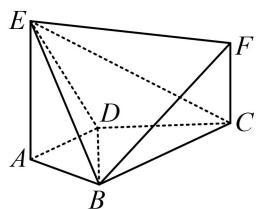

text_image

Geometric diagram of a polyhedron with labeled vertices A, B, C, D, E, F and solid/dashed edges indicating hidden edges.

6. 证明：（条件中有线面平行，要证的是线线平行，这些都提

示了我们该考虑性质定理，结合图形知可先证面 $BCF / / \text{面 } ADE$ ，再用面面平行的性质定理证结论）

因为 $CF \parallel AE$ ， $CF \not\subset$ 平面 $ADE$ ， $AE \subset$ 平面 $ADE$

所以 $CF \parallel$ 平面 $ADE$ ,

又由题意， $BF \parallel$ 平面 ADE，且 CF， $BF \subset$ 平面 BCF，

$CF \cap BF = F$ ，所以平面 $BCF \parallel$ 平面 ADE，

因为平面 $ABCD \cap$ 平面 BCF = BC ，

平面 $ABCD \cap$ 平面 $ADE = AD$ ，所以 $AD \parallel BC$ .

7. (★★☆)

如图，三棱柱 $ABC - A_{1}B_{1}C_{1}$ 的所有棱长均为2， $\angle BAC = \angle BAA_{1} = \angle CAA_{1} = 60^{\circ}$ ， $P$ ， $Q$ 分别在 $AB$ ， $A_{1}C_{1}$ 上（不包括端点）， $AP = A_{1}Q$ ，证明： $PQ / /$ 平面 $BCC_{1}B_{1}$

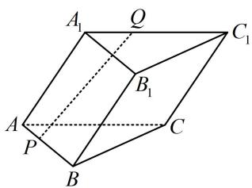

text_image

A₁
Q
C₁
B₁
A
P
C
B

7. 证法1: (先过 $C_{1}$ 作 $PQ$ 的平行线, 观察发现 $PQC_{1}D$ 像平行)

四边形，思路就有了）

如图1，作 $PD \parallel AC$ 交 $BC$ 于 $D$ ，则 $\triangle BPD$ 是正三角形，

设 $AP = A_{1}Q = x(0 < x < 2)$ ，则 $BP = 2 - x$ ，故 $PD = 2 - x$

又 $C_1Q = A_1C_1 - A_1Q = 2 - x$ ，所以 $PD = C_1Q$

因为 $C_1Q \parallel AC$ ， $PD \parallel AC$ ，所以 $C_1Q \parallel PD$

从而四边形 $PQC_{1}D$ 是平行四边形，故 $PQ \parallel C_{1}D$

因为 $PQ \not\subset$ 平面 $BCC_{1}B_{1}$ ， $C_{1}D \subset BCC_{1}B_{1}$ ，

所以 $PQ \parallel$ 平面 $BCC_{1}B_{1}$ .

证法2：（若没想到构造平行四边形，也可尝试造面，不妨先过 $P$ 作面 $BCC_{1}B_{1}$ 的平行线）

如图2，作 $PE \parallel BC$ 交 $AC$ 于 $E$ ，连接 $QE$

因为 $PE \not\subset$ 平面 $BCC_{1}B_{1}$ ， $BC \subset$ 平面 $BCC_{1}B_{1}$ ，

所以 $PE \parallel$ 平面 $BCC_{1}B_{1}$ ①,

由题意， $\triangle ABC$ 是正三角形，所以 $\triangle APE$ 也是正三角形，

故 $AE = AP$ ，又 $AP = A_{1}Q$ ，所以 $AE = A_{1}Q$

结合 $AE \parallel A_{1}Q$ 可得四边形 $AA_{1}QE$ 是平行四边形，

所以 $QE \parallel AA_{1}$ ，又 $AA_{1} \parallel CC_{1}$ ，所以 $QE \parallel CC_{1}$ ，

因为 $QE \not\subset$ 平面 $BCC_{1}B_{1}$ ， $CC_{1} \subset$ 平面 $BCC_{1}B_{1}$ ，

所以 $QE \parallel$ 平面 $BCC_{1}B_{1}$ ②，

因为 $QE$ ， $PE\subset$ 平面 $PQE$ ， $QE\cap PE = E$

结合①②可得平面 $PQE \parallel$ 平面 $BCC_{1}B_{1}$

因为 $PQ \subset$ 平面 PQE，所以 $PQ \parallel$ 平面 $BCC_{1}B_{1}$ .

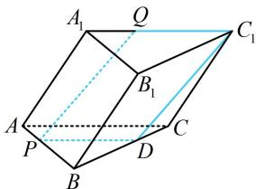

text_image

A₁
Q
C₁
B₁
A
P
D
C
B

图1

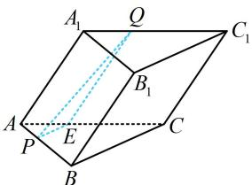

text_image

A₁
Q
C₁
B₁
A
E
P
C
B

图2

8. (2022·新课标Ⅱ卷（节选）·★★★)

如图， $PO$ 是三棱锥 $P - ABC$ 的高， $PA = PB$ ， $AB \perp AC$ ， $E$ 为 $PB$ 的中点，证明： $OE //$ 平面 $PAC$ .

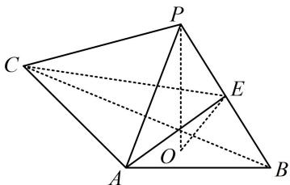

text_image

Geometric diagram of a tetrahedron with labeled vertices and internal points, showing solid and dashed edges.

8. 证法1：（观察发现 $OE$ 和 $B$ 在面PAC的同侧，符合内容提

要 2 中②的情况，故可通过延长 BO 找平行线)

连接 $OA$ ，延长 $BO$ 交 $AC$ 于点 $G$ ，连接 $PG$ ，如图1，

(要证 $OE \parallel PG$ , 结合 $E$ 为 $PB$ 中点知只需证 $O$ 为 $BG$ 中点, 注意到 $\angle BAG = 90^{\circ}$ , 故又只需证 $AO = OB$ )

因为 $PO$ 是三棱锥 $P - ABC$ 的高，所以 $PO \perp$ 平面 $ABC$

又 $OA$ ， $OB\subset$ 平面ABC，故 $PO\bot OA$ ， $PO\bot OB$

结合 $PA = PB$ ， $PO = PO$ 可得 $\triangle POA\cong \triangle POB$

所以 $OA = OB$ ，又 $AB \perp AC$ ，所以 $O$ 为 $BG$ 中点，

因为 E 为 PB 中点，所以 $OE \parallel PG$ ，因为 $OE \not\subset$ 平面 PAC，

$PG \subset$ 平面 PAC，所以 $OE \parallel$ 平面 PAC.

证法2：（若没想到证法1的方法，也可通过造面来证结论，不妨先过点 $E$ 作 $PA$ 的平行线交 $AB$ 于 $F$ ， $F$ 应为 $AB$ 的中点，观察发现构造的面即为EOF，思路就有了）

取 $AB$ 中点 $F$ ，连接 $EF$ ，OF，PF，如图2，

因为 E 是 PB 中点，所以 $EF \parallel PA$ ，又 $EF \not\subset$ 平面 PAC，

$PA \subset$ 平面 PAC，所以 $EF \parallel$ 平面 PAC ①;

(再证 $OF \parallel$ 平面 $PAC$ , 只需证 $OF \parallel AC$ , 结合 $AC \perp AB$ 知又只需证 $OF \perp AB$ )

因为 $PO$ 是三棱锥 $P - ABC$ 的高，所以 $PO \perp$ 平面 $ABC$

又 $AB \subset$ 平面 $ABC$ ，所以 $AB \perp PO$ ，

因为 $PA = PB$ ，所以 $AB \perp PF$ ，而 $PO, PF \subset$ 平面 $POF$

$PO \cap PF = P$ ，所以 $AB \perp$ 平面 POF，

因为 $OF \subset$ 平面 $POF$ ，所以 $OF \perp AB$ ，又 $AC \perp AB$ ，

且 $AC$ ，OF，AB都在平面ABC内，所以 $OF / / AC$

因为 $OF \not\subset$ 平面 $PAC, AC \subset$ 平面 $PAC,$

所以 $OF \parallel$ 平面 $PAC ②$ ;

因为 $OF$ ， $EF\subset$ 平面 $OEF$ ， $OF\cap EF = F$

结合①②可得平面 OEF// 平面 PAC,

又 $OE \subset$ 平面 $OEF$ , 所以 $OE \parallel$ 平面 $PAC$ .

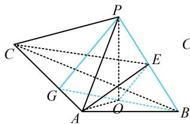

text_image

Geometric diagram of a tetrahedron with labeled vertices and internal points, showing solid and dashed edges for edges and diagonals.

图1

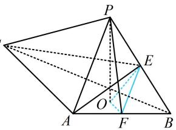

text_image

Geometric diagram of a pyramid with labeled vertices and internal points, including dashed lines for hidden edges.

图2

【反思】证线面平行时，很多题目内容提要里涉及的三种思路常常都可以做，但复杂度可能有差异.

