# 第2节 垂直关系证明思路大全（★★☆）

# 内容提要

本节主要归纳立体几何大题第一问常见的证明垂直关系的思路，先梳理需要用到的一些定理.

1. 线面垂直的判定定理：如图1，若 $l \perp a$ ， $l \perp b$ ， $a, b \subset \alpha$ ， $a \cap b = P$ ，则 $l \perp \alpha$ 。

2. 面面垂直的判定定理：如图2，若 $a \perp \beta$ ， $a \subset \alpha$ ，则 $\alpha \perp \beta$

3. 面面垂直的性质定理：如图3，若 $\alpha \perp \beta$ ， $\alpha \cap \beta = AB$ ， $a\subset \alpha$ 且 $a\perp AB$ ，则 $a\perp \beta$

4. 三垂线定理：如图4， $a \subset \alpha$ ， $l$ 在 $\alpha$ 内的射影是 $b$ ，若 $a \perp b$ ，则 $a \perp l$ ，此结论反过来也成立.

①作用：如图4，想证明 $l$ 垂直于面 $\alpha$ 内的 $a$ ，只需证 $l$ 在面 $\alpha$ 内的射影与 $a$ 垂直，这就将异面垂直问题转化为了共面垂直问题.注意，三垂线定理在大题中要给出证明过程，再使用.

②定理的证明：因为 $\left\{ \begin{array}{l} c \perp \alpha \\ a \subset \alpha \end{array} \right.$ ，所以 $a \perp c$ ，故 $a \perp b \Leftrightarrow a \perp$ 图中的三角形所在平面 $\Leftrightarrow a \perp l$ .

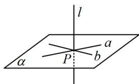

text_image

l
α
P
a
b

图1

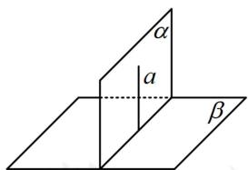

text_image

α
a
β

图2

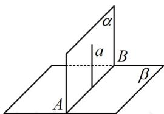

text_image

α
a
B
A
β

图3

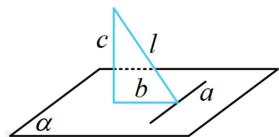  
图4

空间中证明垂直关系的常见思路：

1. 证线面垂直: 证明直线垂直于平面内的两条相交直线即可.

2. 证线线垂直: 若线与线是共面的, 则考虑用平面几何的方法来证; 若异面, 如图5, 要证异面直线 $l$ 和 $a$ 垂直, 可证明 $l$ 垂直于 $a$ 所在的某个平面 $\alpha$ , 找到 $\alpha$ 是解决问题的关键, 常用两种方法来找:

①逆推法：把我们要证的结论与给出的某垂直条件结合，看能得出什么样的线面垂直，这样我们就找到了面 $\alpha$ ，再来分析怎么证 $l \perp \alpha$ ，问题就回到前面1的证线面垂直了.

②三垂线定理法: 如图6, 若 $l$ 在平面 $\beta$ 内, $a$ 在 $\beta$ 内的射影 $b$ 很好找, 由三垂线定理, $l \perp b \Leftrightarrow l \perp a$ , 所以 $a$ 和射影 $b$ 构成的平面 (图中三角形所在平面) 即为我们要找的 $\alpha$ .

3. 证面面垂直: 核心是证线面垂直, 若不会找线, 可通过在其中一个面内找与交线垂直的直线, 如上面图 3 中的 $a$ , 找到这条直线, 问题就回到前面 1 的证线面垂直了.

4. 已知面面垂直：常过一个面内的点作交线的垂线，得到线面垂直，再得到我们需要的线线垂直.

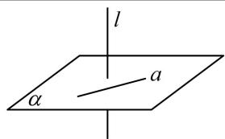

text_image

l
α
a

图5

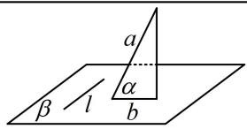

text_image

a
α
β / l
b

图6

提醒：本节题目只节选了原题中的1个小问，所给条件可能有多余.

# 类型 I：线面垂直的逆推思路

【例 1】如图，四棱锥 P-ABCD 中，底面 ABCD 是矩形，PD=CD=1， $PC=BC=\sqrt{2}$ ，M 为 BC 上的点，且 $AM \perp$ 平面 PBD，证明： $PD \perp$ 平面 ABCD.

证明: (要证结论, 只需证 $PD \perp$ 面 $ABCD$ 内的两条相交直线, 结合已知的线面垂直可知其中一条选 $AM$ )

因为 $AM \perp$ 平面 PBD， $PD \subset$ 平面 PBD，所以 $AM \perp PD$ ①，

(另一条选谁呢？剩余条件都是长度，用长度证垂直，想到勾股定理， $\triangle PCD$ 就满足勾股定理)

因为 $PD = CD = 1$ ， $PC = \sqrt{2}$ ，所以 $PD^2 +CD^2 = 2 = PC^2$ ，故 $PD\bot CD$ ②，

因为 $AM$ ， $CD\subset$ 平面ABCD， $AM$ 与 $CD$ 是相交直线，结合①②可得 $PD\bot$ 平面ABCD.

【反思】证线面垂直的核心是找线，这个线一定（隐藏）在条件里，尝试翻译即可.

【变式】(2020·新高考Ⅰ卷（节选）) 如图，四棱锥 P-ABCD 的底面为正方形， $PD \perp$ 底面 ABCD，设平面 PAD 与平面 PBC 的交线为 l，证明： $l \perp$ 平面 PDC.

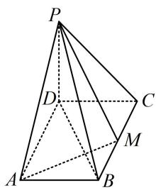

text_image

Geometric diagram of a pyramid with labeled vertices and internal points, used in spatial geometry problems.

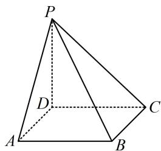

text_image

P
D
A
B
C

证明: (图中没给交线 $l$ , 需先把它画出来, 注意到 $BC \parallel AD$ , 故画交线可用线面平行的性质定理)由 $ABCD$ 是正方形知 $BC \parallel AD$ , 又 $BC \not\subset$ 平面 $PAD$ , $AD \subset$ 平面 $PAD$ , 所以 $BC \parallel$ 平面 $PAD$ ,

而 $BC \subset$ 平面 $PBC$ , 平面 $PBC \cap$ 平面 $PAD = l$ , 所以 $BC // l$ , 如图,

(在面 PDC 内直接找两条与 l 垂直的直线不易, 故考虑用 BC // l 来转化为证 BC ⊥ 平面 PDC)

因为 $PD \perp$ 底面ABCD， $BC \subset$ 底面ABCD，所以 $BC \perp PD$ ，

又 $BC \perp CD$ ，且 $PD, CD \subset$ 平面 $PCD, PD \cap CD = D$ ，

所以 $BC \perp$ 平面 $PCD$ , 结合 $BC // l$ 可得 $l \perp$ 平面 $PCD$ .

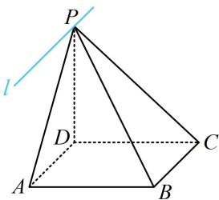

text_image

P
l
D
A
B
C

【反思】若发现直线 l 与平面 $\alpha$ 内的直线的垂直条件少，则可考虑转化为证 l 的某平行线与 $\alpha$ 垂直.

# 类型Ⅱ：线线垂直的逆推思路

【例 2】(2021·全国甲卷（节选）) 已知直三棱柱 $ABC-A_{1}B_{1}C_{1}$ 中，侧面 $AA_{1}B_{1}B$ 为正方形，AB=BC=2，E，F 分别为 AC 和 $CC_{1}$ 的中点，D 为棱 $A_{1}B_{1}$ 上的点， $BF\perp A_{1}B_{1}$ ，证明： $BF\perp DE$ 。

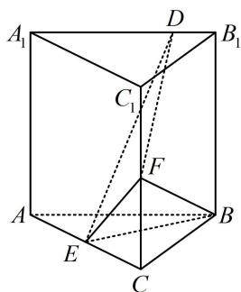

text_image

A₁
D
B₁
C₁
F
A
E
C
B

证明: (有两个切入点, 我们都给出来, 切入点 1: 要证 $BF \perp DE$ , 考虑证明 $BF \perp DE$ 所在的某平面. 要找到这个平面, 尝试逆推法, 假设 $BF \perp DE$ 了, 结合条件中还有 $BF \perp A_{1}B_{1}$ , 于是 $BF$ 应 $\perp A_{1}B_{1}$ 和 $DE$ 构成的平面, 此面可扩展为下图中的面 $B_{1}DEG$ , 故考虑证 $BF \perp$ 面 $B_{1}DEG$ .

切入点2：证异面垂直也可用三垂线定理来思考. 观察发现 $BF$ 在右侧面内，而 $DE$ 在右侧面的投影容易找

到，过 E 作右侧面的垂线即得到投影 $B_{1}G$ ，故只需证 $BF \perp$ 平面 $B_{1}DEG$ ）

如图，取 $BC$ 中点 $G$ ，连接 $EG$ ， $B_{1}G$ ，因为 $E$ 为 $AC$ 中点，所以 $EG \parallel AB$

又 $AB \parallel B_{1}D$ ，所以 $EG \parallel B_{1}D$ ，故 $B_{1}, D, E, G$ 四点共面，（下面证 $BF \perp B_{1}G$ ，可在面 $BCC_{1}B_{1}$ 中考虑）

由题意， $CF = 1$ ， $BC = 2$ ，所以 $\tan \angle CBF = \frac{CF}{BC} = \frac{1}{2}$

又 $BG = 1$ ， $BB_{1} = AB = 2$ ，所以 $\tan \angle BB_1G = \frac{BG}{BB_1} = \frac{1}{2}$

所以 $\tan \angle CBF = \tan \angle BB_{1}G$ ，故 $\angle CBF = \angle BB_{1}G$

因为 $\angle BB_{1}G + \angle BGB_{1} = 90^{\circ}$ ，所以 $\angle CBF + \angle BGB_{1} = 90^{\circ}$

设 $B_{1}G \cap BF = H$ ，则 $\angle GHB = 90^{\circ}$ ，所以 $BF \perp B_{1}G$ ，

由题意， $BF \perp A_{1}B_{1}$ ，所以 $BF \perp B_{1}D$ ，

因为 $B_{1}D$ ， $B_{1}G\subset$ 平面 $B_{1}DEG$ ， $B_{1}D\cap B_{1}G = B_{1}$ ，所以 $BF\bot$ 平面 $B_{1}DEG$

因为 $DE \subset$ 平面 $B_{1}DEG$ ，所以 $BF \perp DE$ .

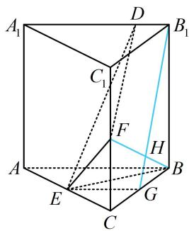

text_image

A₁
D
B₁
C₁
F
H
A
E
G
C

【变式1】(2021·浙江卷（节选）)如图，在四棱锥 $P - ABCD$ 中，底面ABCD是平行四边形， $\angle ABC = 120^{\circ}$ ， $AB = 1$ ， $BC = 4$ ， $PA = \sqrt{15}$ ， $M$ ， $N$ 分别是 $BC$ ， $PC$ 的中点， $PD\bot DC$ ， $PM\bot MD$ ，证明： $AB\bot PM$ ：

证明: (PM 在底面的射影不好找, 故不用三垂线定理找思路, 尝试逆推, 有两条路径: ①假设 $AB \perp PM$ 成立, 结合条件 $PM \perp MD$ 可得 $PM \perp$ 面 $ABCD$ , 故可通过证此线面垂直来证 $AB \perp PM$ ;

②假设 $AB \perp PM$ 成立, 结合条件 $PD \perp DC$ (即 $PD \perp AB$ ) 可得 $AB \perp$ 面 $PDM$ ,

故可通过证这一线面垂直来证明 $AB \perp PM$ 。对比发现 $AB \perp$ 面 $PDM$ 更好证，可转化为证 $DC \perp$ 面 $PDM$ ，只需在 $\triangle CDM$ 中证 $DC \perp DM$ ）

因为 $ABCD$ 是平行四边形， $\angle ABC = 120^{\circ}$ ，所以 $\angle MCD = 60^{\circ}$ ， $CD = AB = 1$

又 $BC = 4$ ， $M$ 为 $BC$ 中点，所以 $CM = 2$ ，在 $\triangle CDM$ 中，由余弦定理，

$DM^{2} = CD^{2} + CM^{2} - 2CD\cdot CM\cdot \cos \angle MCD = 3$ ，从而 $DM^2 +CD^2 = 4 = CM^2$ ，故 $DC\bot DM$

又 $PD \perp DC$ ，且 $PD, DM \subset$ 平面 $PDM, PD \cap DM = D$ ，所以 $DC \perp$ 平面 $PDM,$

因为 $AB \parallel DC$ ，所以 $AB \perp$ 平面 $PDM$ ，又 $PM \subset$ 平面 $PDM$ ，所以 $AB \perp PM$ 。

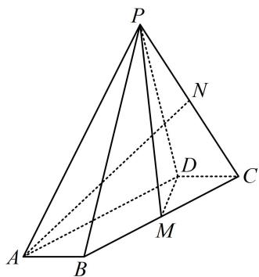

text_image

Geometric diagram of a pyramid with labeled vertices and internal points, including dashed lines indicating hidden edges.

【反思】用逆推法寻找上一步的线面垂直，若遇到多种可能性，则可通过对比，选择一条简单可行的路径.

【变式 2】(2022·浙江卷（节选）) 如图，已知 ABCD 和 CDEF 都是直角梯形， $AB \parallel DC$ ， $DC \parallel EF$ ，AB = 5，DC = 3，EF = 1， $\angle BAD = \angle CDE = 60^{\circ}$ ，二面角 F - DC - B 的平面角为 $60^{\circ}$ ，设 M，N 分别为 AE，BC 的中点，证明： $FN \perp AD$ .

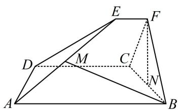

text_image

Geometric diagram of a quadrilateral with labeled vertices and internal points, including dashed lines indicating hidden edges.

证明：（逆推发现题目没有垂直条件，找不到面，怎么办？其实题目的数据隐藏着 $\triangle CFB$ 为等边三角形，于是 $FN \perp BC$ ，故若假设 $FN \perp AD$ ，则 $FN \perp$ 面ABCD，这样面就找到了）

因为 $ABCD$ 和 $CDEF$ 都是直角梯形， $AB \parallel DC$ ， $DC \parallel EF$ ， $\angle BAD = \angle CDE = 60^{\circ}$ ，

所以 $\angle FCD = \angle BCD = 90^{\circ}$ ，故 $\left\{ \begin{array}{l}CD\perp CF\\ CD\perp CB \end{array} \right.$ ①，

所以 $\angle F C B$ 是二面角 $F - D C - B$ 的平面角, 由题意, $\angle F C B = 60^{\circ}$ ,

如图，作 $EP \perp CD$ 于 $P$ ，则 $PC = EF = 1$ ， $PD = DC - PC = 2$ ， $PE = PD \cdot \tan \angle EDP = 2\sqrt{3}$ ，所以 $CF = 2\sqrt{3}$

同理，在直角梯形ABCD中可求得 $BC = 2\sqrt{3}$ ，所以 $BC = CF$ ，故 $\triangle BCF$ 是正三角形，

又 N 为 BC 的中点，所以 $FN \perp BC$ ②，

由①结合 $CF$ ， $CB\subset$ 平面 $BCF$ ， $CF\cap CB = C$ 可得 $CD\bot$ 平面 $BCF,$

因为 $FN \subset$ 平面 $BCF$ , 所以 $FN \perp CD$ ,

结合②以及 BC， $CD \subset$ 平面 ABCD， $BC \cap CD = C$ 可得 $FN \perp$ 平面 ABCD，

又 $AD \subset$ 平面ABCD，所以 $FN \perp AD$ .

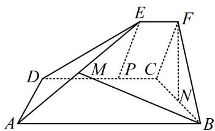

text_image

Geometric diagram of a quadrilateral with labeled vertices and internal points, used for spatial geometry problems.

【总结】①三垂线定理是证异面直线垂直的好方法，但当投影不易找时会失效；②逆推法是通法，但有时题干没有其它线线垂直，不易直接逆推线面垂直，此时往往题目数据隐藏着垂直条件，需要仔细挖掘.

# 类型III：面面垂直判定的逆推思路

【例 3】(2022·全国乙卷（节选）) 如图，四面体 ABCD 中， $AD \perp CD$ ，AD = CD， $\angle ADB = \angle BDC$ ，E 为 AC 中点，证明：平面 BED ⊥ 平面 ACD.

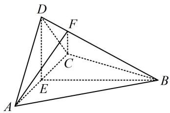

text_image

Geometric diagram of a tetrahedron with labeled vertices A, B, C, D, E, F and solid/dashed edges indicating 3D perspective.

证明: (要证面面垂直, 先找线面垂直, 观察图形发现不外乎证 $BE \perp$ 面 $ACD$ , 或证 $AC \perp$ 面 $BED$ , 若选 $BE \perp$ 面 $ACD$ , 则由所给条件只能证出 $BE \perp AC$ , 不够, 故选 $AC \perp$ 面 $BED$ )

因为 $AD = CD$ ， $E$ 为 $AC$ 中点，所以 $AC \perp DE$ ①，

又 $\angle ADB = \angle BDC$ ， $AD = CD$ ， $BD = BD$ ，所以 $\triangle ADB\cong \triangle CDB$ ，从而 $AB = BC$ ，故 $AC\bot BE$ ②，

由①②结合 $DE$ ，BE是平面BED内的相交直线可得 $AC \perp$ 平面BED，

又 $AC \subset$ 平面 $ACD$ , 所以平面 $BED \perp$ 平面 $ACD$ .

【总结】从类型 I 到类型 III，我们发现最终都回归到线面垂直上，只要掌握了逆推思路这一通法，学会结合条件分析，即可无往不胜.

# 类型IV：已知面面垂直的常用辅助线作法

【例 4】如图，在四棱锥 P-ABCD 中，底面 ABCD 为平行四边形， $\triangle PCD$ 为正三角形，平面 $PAC \perp$ 平面 PCD， $PA \perp CD$ ，CD = 2，AD = 3，证明： $PA \perp$ 平面 PCD.

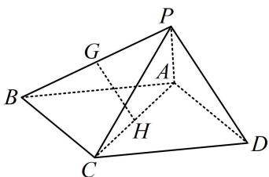

text_image

Geometric diagram of a tetrahedron with labeled vertices and internal points, used for spatial geometry problems.

证明: (要证线面垂直, 需在面内找两条相交直线与 $PA$ 垂直, 只给了 $PA \perp CD$ , 另一条怎么找? 看到面面垂直的条件, 想到过 $A$ 或 $D$ 作两个面交线 $PC$ 的垂线, 思路就有了)

如图，取 $PC$ 中点 $T$ ，连接 $DT$ ，因为 $\triangle PCD$ 为正三角形，所以 $DT \perp PC$ 又平面 $PAC \perp$ 平面 $PCD$ ，平面 $PAC \cap$ 平面 $PCD = PC$ ， $DT \subset$ 平面 $PCD$ 所以 $DT \perp$ 平面 $PAC$ ，因为 $PA \subset$ 平面 $PAC$ ，所以 $PA \perp DT$ ，

又 $PA \perp CD$ ，且DT，CD是平面PCD内的相交直线，所以 $PA \perp$ 平面PCD.

【总结】若题目出现面面垂直条件，则过某面内顶点作交线的垂线，寻找想要的线面垂直，是最常见的思路.

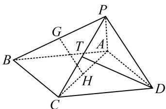

text_image

Geometric diagram of a tetrahedron with labeled vertices and internal points, used for spatial geometry problems.

# 强化训练

1. (2023·四川成都模拟（节选）·★★)

如图，在三棱锥 $P - ABC$ 中， $AB$ 是 $\triangle ABC$ 的外接圆直径， $PC$ 垂直于圆所在的平面， $D$ ， $E$ 分别是棱 $PB$ ， $PC$ 的中点，证明： $DE \perp$ 平面 $PAC$ .

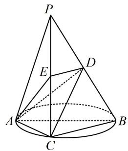

text_image

P
E
D
A
C
B

2. (2023·陕西榆林一模（节选）·★★)

如图，在四棱锥 $P - ABCD$ 中，平面 $PAD \perp$ 平面 $ABCD, AB \parallel CD, \angle DAB = 60^{\circ}, PA \perp PD$ ，且 $PA = PD = \sqrt{2}$ ， $AB = 2CD = 2$ ，证明： $AD \perp PB$ .

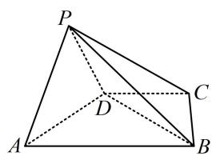

text_image

P
D
A
B
C

3. (2020·新课标Ⅰ卷（节选）·★★☆)

如图， $D$ 为圆锥的顶点， $O$ 是圆锥底面的圆心， $\triangle ABC$ 是底面的内接正三角形， $P$ 为 $DO$ 上一点， $\angle APC = 90^{\circ}$ ，证明：平面 $PAB\bot$ 平面 $PAC$

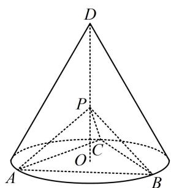

text_image

D
P
O C
A B

4. (2023·湖南模拟（节选）·★★☆)

如图, 在四棱锥 $P - ABCD$ 中, 平面 $PAD \perp$ 平面 $ABCD$ , 底面 $ABCD$ 是菱形, $\triangle PAD$ 是正三角形, $\angle ABC = \frac{2\pi}{3}$ , $E$ 是 $AB$ 的中点, 证明: $AC \perp PE$ .

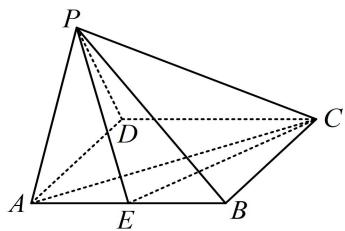

text_image

Geometric diagram of a pyramid with labeled vertices and internal points, used for spatial geometry problems.

5. (2024·河南模拟（节选）·★★★)

如图，在三棱柱 $ABC - A_{1}B_{1}C_{1}$ 中， $AA_{1} \perp$ 平面 $ABC$ ， $AB_{1} \perp A_{1}C$ ， $AB \perp BC$ ， $AB = BC = 2$ ，求证： $AB_{1} \perp$ 平面 $A_{1}BC$ 。

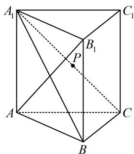

text_image

A₁
C₁
B₁
P
A
C
B

6. (2024·湖北武汉四调(节选)·★★★☆)

如图，三棱柱 $ABC - A_{1}B_{1}C_{1}$ 中，侧面 $ABB_{1}A_{1}\perp$ 底面 $ABC$ ， $AB = BB_{1} = 2$ ， $AC = 2\sqrt{3}$ ， $\angle B_1BA = 60^\circ$ ，点 $D$ 是棱 $A_{1}B_{1}$ 的中点， $\overrightarrow{BC} = 4\overrightarrow{BE}$ ， $DE\perp BC$ ，证明： $AC\perp BB_{1}$

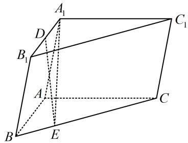

text_image

A₁
D
B₁
A
B
E
C₁
C

