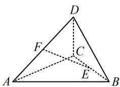

# 强化训练

1. (2023·四川乐山模拟·★)

在四面体 $ABCD$ 中， $E, F$ 分别为 $BC, AD$ 的中点，若 $\overrightarrow{AB} = a$ ， $\overrightarrow{AC} = b$ ， $\overrightarrow{AD} = c$ ，则 $\overrightarrow{EF} = (\quad)$

A. $\frac{1}{2} (c - a - b)$

B. $\frac{1}{2} (\pmb {c} + \pmb {a} + \pmb{b})$

C. $\frac{1}{2} (\pmb {a} + \pmb {b} - \pmb{c})$

D. $-\frac{1}{2} (\pmb {c} + \pmb {a} - \pmb {b})$

1. A

解析：空间基底表示和平面基底表示方法类似，往与基向量关联较强的向量上化即可，

如图， $\overrightarrow{EF} = \overrightarrow{EB} +\overrightarrow{BA} +\overrightarrow{AF} = \frac{1}{2}\overrightarrow{CB} -\overrightarrow{AB} +\frac{1}{2}\overrightarrow{AD} = \frac{1}{2} (\overrightarrow{AB} -$

$\overrightarrow{AC}) - \overrightarrow{AB} + \frac{1}{2}\overrightarrow{AD} = -\frac{1}{2}\overrightarrow{AB} - \frac{1}{2}\overrightarrow{AC} + \frac{1}{2}\overrightarrow{AD} = \frac{1}{2} (\pmb {c} - \pmb {a} - \pmb {b})$

text_image

Geometric diagram of a tetrahedron with labeled vertices and internal points, including dashed lines indicating hidden edges.

2. (2023·河南模拟·★)

已知空间向量 $\boldsymbol{a} = (2, -1, 2)$ ， $\boldsymbol{b} = (1, -2, 1)$ ，则 $a \cdot b =$ \_\_\_\_ ；向量 b 在向量 a 上的投影向量是 \_\_\_\_.

2. 6; $\left(\frac{4}{3}, -\frac{2}{3}, \frac{4}{3}\right)$

解析：由题意， $a\cdot b = 2\times 1 + (-1)\times (-2) + 2\times 1 = 6$

所以向量 $\pmb{b}$ 在向量 $\pmb{a}$ 上的投影向量是

$$
\frac {\boldsymbol {a} \cdot \boldsymbol {b}}{\left| \boldsymbol {a} \right| ^ {2}} \boldsymbol {a} = \frac {6}{2 ^ {2} + (- 1) ^ {2} + 2 ^ {2}} \boldsymbol {a} = \frac {2}{3} \boldsymbol {a} = \left(\frac {4}{3}, - \frac {2}{3}, \frac {4}{3}\right).
$$

3. (2023·广东信宜模拟·★★)

已知向量 $a = (1, - 1,3)$ ， $\pmb {b} = (-1,4, - 2)$ ， $c = (1,5,x)$ ，若 $\pmb {a},\pmb {b},\pmb{c}$ 共面，则实数 $x =$ （

A. 3

B. 2

C. 15

D. 5

3. D

解析：注意到 $a, b$ 不共线，所以 $a, b, c$ 共面等价于 $c$ 能用 $a, b$ 表示，可由此建立方程组求 $x$

由题意，存在实数 $\lambda$ 和 $\mu$ ，使 $c = \lambda a + \mu b$ ，即 $(1,5,x) =$

$$
\lambda (1, - 1, 3) + \mu (- 1, 4, - 2) = (\lambda - \mu , - \lambda + 4 \mu , 3 \lambda - 2 \mu),
$$

所以 $\left\{ \begin{array}{l} \lambda - \mu = 1 \\ -\lambda + 4\mu = 5 \\ 3\lambda - 2\mu = x \end{array} \right.$ ，解得： $x = 5$

4. (2023·四川绵阳模拟·★★)

已知 $\{a, b, c\}$ 是空间的一组基底，则下列各项中能构成基底的一组向量是（）

A. $a, a + b, a - b$

B. $b, a + b, a - b$

C. $c, a + b, a - b$

D. $a + 2b, a + b, a - b$

4. C

解析：要判断三个向量是否构成基底，就看它们是否不共面。观察发现选项中 $a + b$ 和 $a - b$ 不共线，故通过判断能否用它们表示另一向量来看它们是否共面，

A 项， $\boldsymbol{a}=\frac{1}{2}(\boldsymbol{a}+\boldsymbol{b})+\frac{1}{2}(\boldsymbol{a}-\boldsymbol{b})$ ，所以 $a,\quad a+b,\quad a-b$ 共面，不能构成基底，故 A 项错误；

B 项， $\boldsymbol{b}=\frac{1}{2}(\boldsymbol{a}+\boldsymbol{b})-\frac{1}{2}(\boldsymbol{a}-\boldsymbol{b})$ ，所以 b， $a+b$ ，a-b 共面，不能构成基底，故 B 项错误；

C 项， $a + b$ 和 $a - b$ 都没有 $c$ ，所以 $c$ 不能用它们表示，

故 $c, a + b, a - b$ 不共面，能构成基底，故C项正确；

D 项，假设 $a + 2b = x(a + b) + y(a - b)$ ,

则 $\boldsymbol{a}+2\boldsymbol{b}=(x+y)\boldsymbol{a}+(x-y)\boldsymbol{b}$ ，所以 $\left\{\begin{aligned}x+y=1\\ x-y=2\end{aligned}\right.$

解得： $x = \frac{3}{2}$ ， $y = -\frac{1}{2}$ ，从而 $\pmb {a} + 2\pmb{b}$ 能用 $\pmb {a} + \pmb{b}$ 和 $\pmb {a} - \pmb{b}$ 表示，它们共面，故D项错误.

5.（2023·广东饶平模拟·★★）（多选）

已知空间中三点 $A(0,1,0)$ ， $B(2,2,0)$ ， $C(-1,3,1)$ ，则下列说法正确的是（）

A. $AB \perp AC$

B. 与 $\overrightarrow{AB}$ 同向的单位向量是 $\left(\frac{2\sqrt{5}}{5}, \frac{\sqrt{5}}{5}, 0\right)$

C. $\overrightarrow{AB}$ 和 $\overrightarrow{BC}$ 的夹角余弦值是 $\frac{\sqrt{55}}{11}$

D. 平面 $ABC$ 的一个法向量是 $(1, -2, 5)$

5. ABD

解析：A项， $\overrightarrow{AB} = (2,1,0)$ ， $\overrightarrow{AC} = (-1,2,1)$ ， $\overrightarrow{AB}\cdot \overrightarrow{AC} =$

$2 \times (-1) + 1 \times 2 + 0 \times 1 = 0 \Rightarrow AB \perp AC$ ，故 A 项正确；

B 项，与 $\overrightarrow{AB}$ 同向的单位向量是 $\frac{\overrightarrow{AB}}{|\overrightarrow{AB}|} = \frac{1}{\sqrt{5}}\overrightarrow{AB}$

$= \left(\frac{2\sqrt{5}}{5},\frac{\sqrt{5}}{5},0\right)$ ，故B项正确；

C 项， $\overrightarrow{BC} = (-3,1,1)$ ，所以 $\cos < \overrightarrow{AB},\overrightarrow{BC} > = \frac{\overrightarrow{AB}\cdot\overrightarrow{BC}}{|\overrightarrow{AB}|\cdot|\overrightarrow{BC}|}$

$= \frac{2\times(-3)+1\times1+0\times1}{\sqrt{2^2 + 1^2}\times\sqrt{(-3)^2 + 1^2 + 1^2}} = -\frac{\sqrt{55}}{11}$ ，故C项错误；

D 项，设平面 ABC 的法向量为 $\boldsymbol{n}=(x,y,z)$ ，

则 $\left\{ \begin{array}{l} \boldsymbol{n} \cdot \overrightarrow{AB} = 2x + y = 0 \\ \boldsymbol{n} \cdot \overrightarrow{AC} = -x + 2y + z = 0 \end{array} \right.$ ，令 $x = 1$ 可得 $\left\{ \begin{array}{l} y = -2 \\ z = 5 \end{array} \right.$ ，

所以 $\boldsymbol{n}=(1,-2,5)$ 是平面 ABC 的一个法向量，故 D 项正确.

