# 内容提要

用空间向量求解立体几何问题的步骤比较流程化，常分四步：

①建立空间直角坐标系，写出点的坐标；  
②计算直线的方向向量、平面的法向量；  
③根据问题，选择合适的公式计算；  
④把向量运算的结果翻译成几何问题的答案.

下面归纳一些常见立体几何问题的向量求解方法:

1. 证线线平行: 如图 1, 设 $l_{1}, l_{2}$ 是空间中不重合的两条直线, 它们的方向向量分别为 $\mathbf{a}$ 和 $\mathbf{b}$ , 则 $l_{1} \parallel l_{2}$ 的充要条件是 $\mathbf{a} \parallel \mathbf{b}$ .  
2. 证线面平行: 如图2, 直线 $l$ 不在平面 $\alpha$ 内, 直线 $l$ 的方向向量为 $\pmb{a}$ , 平面 $\alpha$ 的法向量为 $\pmb{n}$ , 则 $l / / \alpha$ 的充要条件是 $\pmb{a} \cdot \pmb{n} = 0$ .  
3. 证面面平行: 如图 3, $\alpha$ , $\beta$ 是两个不重合的平面, 它们的法向量分别为 $n$ , $m$ , 则 $\alpha // \beta$ 的充要条件是 $n // m$ .

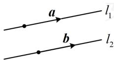  
图1

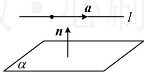

text_image

a
l
n
α

图2

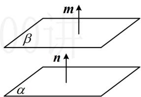

text_image

m
β
n
α

图3

4. 证线线垂直：如图4，设直线 $l_{1}$ ， $l_{2}$ 的方向向量分别为m，n，则 $l_{1}\perp l_{2}\Leftrightarrow m\perp n\Leftrightarrow m\cdot n=0$ .  
5. 证线面垂直: 如图 5, 设 $m$ 为直线 $l$ 的方向向量, $\boldsymbol{u}$ , $\boldsymbol{v}$ 为平面 $\alpha$ 内两个不共线的向量, 则 $l \perp \alpha \Leftrightarrow m \cdot u = 0$ 且 $m \cdot v = 0$ .  
6. 证面面垂直: 如图 6, 设 $n$ , $m$ 分别为平面 $\alpha$ , $\beta$ 的法向量, 则 $\alpha \perp \beta \Leftrightarrow m \perp n \Leftrightarrow m \cdot n = 0$ .

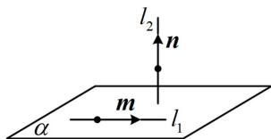

text_image

l₂
n
m
l₁
α

图4

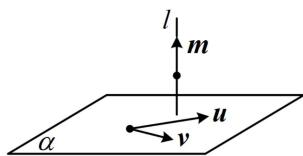

text_image

l
m
u
v
α

图5

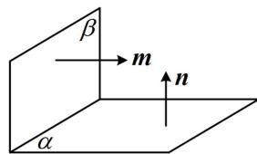

text_image

β
m
n
α

图6

7. 求线线角：设空间直线 $l_{1}$ ， $l_{2}$ 的夹角为 $\theta$ ，方向向量分别为 $\pmb{u}$ ， $\pmb{v}$ ，则 $\cos \theta = \frac{|\pmb{u} \cdot \pmb{v}|}{|\pmb{u}| \cdot |\pmb{v}|}$ .  
8. 求线面角: 如图 7, 设直线 $l$ 的方向向量为 $\pmb{s}$ , 平面 $\alpha$ 的法向量为 $\pmb{n}$ , $l$ 与 $\alpha$ 所成角为 $\theta$ , 则 $\sin \theta = |\cos < s, n>| = \frac{|s \cdot n|}{|s| \cdot |n|}$ .

9. 求二面角: 如图8, 设平面 $\alpha$ , $\beta$ 的法向量分别为 $m$ , $n$ , 则二面角 $\alpha - l - \beta$ 的余弦值 $\cos \theta = \pm \cos < m, n > = \pm \frac{m \cdot n}{|m| \cdot |n|}$ , 若是求 $\sin \theta$ , 可由 $\sin \theta = \sqrt{1 - \cos^2 \theta}$ 来算, $\cos \theta$ 取正取负不影响结果; 若是求 $\cos \theta$ , 最终结果取正还是取负, 则需考虑二面角的钝锐, 一般可通过观察图形, 直观想象来判断; 若图形不易判断, 则求法向量时, 让一个朝内, 一个朝外, 它们的夹角即为二面角, 如图9.

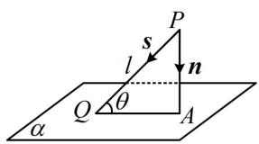

text_image

P
s
l
n
Q
θ
A
α

图7

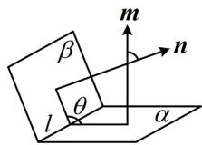  
图8

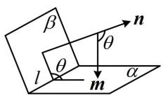  
图9

# 类型I：用空间向量证平行、垂直

【例1】（多选）如图，正方体 $ABCD - A_{1}B_{1}C_{1}D_{1}$ 中， $E$ 为 $AA_{1}$ 的中点，则以下四个结论中，正确的有（）

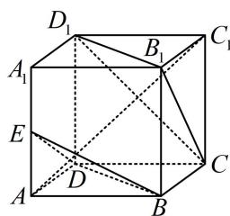

text_image

D₁
A₁
B₁
C₁
E
D
A
B
C

A. $DB \parallel$ 平面 $CB_{1}D_{1}$

B. 平面 $BDE \parallel$ 平面 $CB_{1}D_{1}$

C. $AC_{1} \perp$ 平面 $CB_{1}D_{1}$

D. 平面 $CB_{1}D_{1}\perp$ 平面 $A_{1}BC_{1}$

解析：A项，判断线面是否平行，就看直线的方向向量与平面的法向量是否垂直，

如图建系，设正方体的棱长为2，则 $D(0,0,0)$ ， $B(2,2,0)$ ， $C(0,2,0)$ ， $B_{1}(2,2,2)$ ， $D_{1}(0,0,2)$ ，所以 $\overrightarrow{DB}=(2,2,0)$ ， $\overrightarrow{CB_{1}}=(2,0,2)$ ， $\overrightarrow{CD_{1}}=(0,-2,2)$ ，设平面 $CB_{1}D_{1}$ 的法向量为 $n=(x,y,z)$ ，

则 $\left\{ \begin{array}{l} \boldsymbol{n} \cdot \overrightarrow{CB_1} = 2x + 2z = 0 \\ \boldsymbol{n} \cdot \overrightarrow{CD_1} = -2y + 2z = 0 \end{array} \right.$ ，令 $x = 1$ 可得 $\left\{ \begin{array}{l} y = -1 \\ z = -1 \end{array} \right.$ ，所以平面 $CB_1D_1$ 的一个法向量为 $\boldsymbol{n} = (1, -1, -1)$ ，

因为 $\overrightarrow{DB} \cdot \boldsymbol{n} = 2 \times 1 + 2 \times (-1) + 0 \times (-1) = 0$ ，所以 $\overrightarrow{DB} \perp \boldsymbol{n}$ ，从而 $DB //$ 平面 $CB_1D_1$ ，故 A 项正确；

B 项，判断面面是否平行，就看它们的法向量是否平行，

由图可知， $E(2,0,1)$ ，所以 $\overrightarrow{DE} = (2,0,1)$ ，设平面 $BDE$ 的法向量为 $\pmb {m} = (x^{\prime},y^{\prime},z^{\prime})$

则 $\left\{ \begin{array}{l} \boldsymbol{m} \cdot \overrightarrow{DB} = 2x' + 2y' = 0 \\ \boldsymbol{m} \cdot \overrightarrow{DE} = 2x' + z' = 0 \end{array} \right.$ ，令 $x' = 1$ ，则 $\left\{ \begin{array}{l} y' = -1 \\ z' = -2 \end{array} \right.$ ，所以 $\boldsymbol{m} = (1, -1, -2)$ 是平面 $BDE$ 的一个法向量，

观察发现 m 与 n 不平行，所以平面 BDE 与平面 $CB_{1}D_{1}$ 不平行，故 B 项错误；

C 项，判断线面是否垂直，就看直线的方向向量与平面的法向量是否平行，由图知， $A(2,0,0)$ ， $C_{1}(0,2,2)$ ，所以 $\overrightarrow{AC_{1}}=(-2,2,2)=-2n$ ，故 $\overrightarrow{AC_{1}}\parallel n$ ，所以 $AC_{1}\perp$ 平面 $CB_{1}D_{1}$ ，故 C 项正确；

D项，判断面面是否垂直，就看两平面的法向量是否垂直，

由图可知， $A_{1}(2,0,2)$ ， $B(2,2,0)$ ， $C_1(0,2,2)$ ，所以 $\overrightarrow{A_1B} = (0,2, - 2)$ ， $\overrightarrow{A_1C_1} = (-2,2,0)$

设平面 $A_{1}BC_{1}$ 的法向量为 $\pmb {p} = (x^{\prime \prime},y^{\prime \prime},z^{\prime \prime})$ ，则 $\left\{ \begin{array}{l}\pmb {p}\cdot \overrightarrow{A_1B} = 2y'' - 2z'' = 0\\ \pmb {p}\cdot \overrightarrow{A_1C_1} = -2x'' + 2y'' = 0 \end{array} \right.$

令 $x'' = 1$ ，则 $\left\{ \begin{array}{l} y'' = 1 \\ z'' = 1 \end{array} \right.$ ，所以 $\pmb {p} = (1,1,1)$ 是平面 $A_{1}BC_{1}$ 的一个法向量，

因为 $p \cdot n = 1 \times 1 + 1 \times (-1) + 1 \times (-1) = -1 \neq 0$ ,

所以平面 $A_{1} B C_{1}$ 与平面 $C B_{1} D_{1}$ 不垂直, 故 $\mathrm{D}$ 项错误.

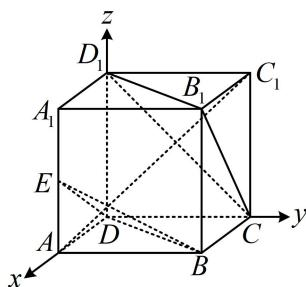

text_image

z
D₁
A₁
B₁
C₁
E
A
D
C
y
x
B

答案: AC

【反思】当图形方便建系时, 我们常建立空间直角坐标系, 将几何问题转化为向量问题来求解; 建系证平行、垂直一般作为想不到几何法时的备选方案, 故只举 1 道例题, 帮大家熟悉有关问题的向量方法.

# 类型II：用空间向量求线面角

【例 2】如图，在四棱锥 P-ABCD 中，底面 ABCD 是梯形， $AB \parallel CD$ ， $AD \perp CD$ ，CD = 2AB = 4，

$\triangle PAD$ 是正三角形， $E$ 是棱 $PC$ 的中点.

(1) 证明: $BE \parallel$ 平面 $PAD$ ;

（2）若 $AD = 2\sqrt{3}$ ，平面 $PAD \perp$ 平面 $ABCD$ ，求直线 $AB$ 与平面 $PBC$ 所成角的正弦值.

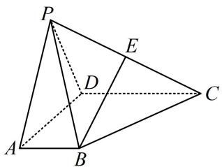

text_image

Geometric diagram of a tetrahedron with labeled vertices and internal points, used for spatial geometry problems.

解：（1）（先在面 $PAD$ 内过 $A$ 作 $BE$ 的平行线，作出来就发现构成的图形像平行四边形）

如图，取 $PD$ 中点 $F$ ，连接 $AF$ ， $EF$ ，因为 $E$ 为 $PC$ 的中点，所以 $EF \parallel CD$ 且 $EF = \frac{1}{2} CD$

又由题意， $AB \parallel CD$ 且 $CD = 2AB$ ，所以 $AB = \frac{1}{2} CD$ ，故 $EF \parallel AB$ 且 $EF = AB$ ，

所以 $ABEF$ 是平行四边形，故 $BE \parallel AF$ ，因为 $BE \not\subset$ 平面 $PAD$ ， $AF \subset$ 平面 $PAD$ ，所以 $BE \parallel$ 平面 $PAD$ .

(2) (条件中有面面垂直, 可通过作交线的垂线找到线面垂直, 再建系处理)

如图，取 $AD$ 中点 $G$ ，连接 $PG$ ，因为 $\triangle PAD$ 是正三角形，所以 $PG \perp AD$

又平面 $PAD \perp$ 平面 $ABCD$ ，平面 $PAD \cap$ 平面 $ABCD = AD$ ， $PG \subset$ 平面 $PAD$ ，所以 $PG \perp$ 平面 $ABCD$ ，

以 G 为原点建立如图所示的空间直角坐标系，因为 $AD = 2\sqrt{3}$ ，所以 $PG = 2\sqrt{3} \times \frac{\sqrt{3}}{2} = 3$ ，

(要算线面角, 可代内容提要第 8 点的公式, 先求直线的方向向量和平面的法向量)

$A(\sqrt{3},0,0)$ ， $B(\sqrt{3},2,0)$ ， $P(0,0,3)$ ， $C(-\sqrt{3},4,0)$ ，所以 $\overrightarrow{AB} = (0,2,0)$ ， $\overrightarrow{PB} = (\sqrt{3},2, - 3)$ ， $\overrightarrow{BC} = (-2\sqrt{3},2,0)$ 设平面 $PBC$ 的法向量为 $\pmb {n} = (x,y,z)$ ，则 $\left\{ \begin{array}{l}\pmb {n}\cdot \overrightarrow{PB} = \sqrt{3} x + 2y - 3z = 0\\ \pmb {n}\cdot \overrightarrow{BC} = -2\sqrt{3} x + 2y = 0 \end{array} \right.$

令 $x = 1$ ，则 $\left\{ \begin{array}{l} y = \sqrt{3} \\ z = \sqrt{3} \end{array} \right.$ ，所以 $\pmb{n} = (1, \sqrt{3}, \sqrt{3})$ 是平面 $PBC$ 的一个法向量，

因为 $\left|\cos<\overrightarrow{AB},n>\right|=\frac{\left|\overrightarrow{AB}\cdot n\right|}{\left|\overrightarrow{AB}\right|\cdot\left|n\right|}=\frac{2\sqrt{3}}{2\times\sqrt{7}}=\frac{\sqrt{21}}{7}$

所以直线 $AB$ 与平面 $PBC$ 所成角的正弦值为 $\frac{\sqrt{21}}{7}$ .

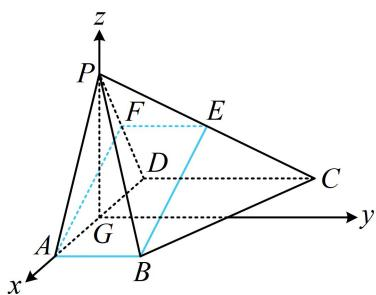

text_image

z
P
F
E
D
C
A
G
B
x
y

【反思】算线面角 $\theta$ 时, 由于 $0^{\circ} \leq \theta \leq 90^{\circ}$ , 所以 $\sin \theta \geq 0$ , 故别忘了在夹角余弦公式上加绝对值.

# 类型III：用空间向量求二面角

【例 3】(2022·新课标 I 卷) 如图, 直三棱柱 $ABC-A_{1}B_{1}C_{1}$ 的体积为 4, $\triangle A_{1}BC$ 的面积为 $2\sqrt{2}$ .

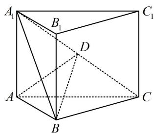

text_image

A₁
B₁
C₁
D
A
B
C

(1) 求点 $A$ 到平面 $A_{1} B C$ 的距离;

（2）设 $D$ 为 $A_{1}C$ 的中点， $AA_{1} = AB$ ，平面 $A_{1}BC \perp$ 平面 $ABB_{1}A_{1}$ ，求二面角 $A - BD - C$ 的正弦值.

解: (1) (△ABC 的数据没给, 不便建系, 而条件中有 $\triangle A_{1}BC$ 的面积, 与所求距离合在一起可算三棱锥 $A - A_{1}BC$ 的体积, 该三棱锥的体积又可由给出的三棱柱体积求出, 故可建立方程求得目标)

记 $\triangle ABC$ 的面积为 $S$ ，点 $A_{1}$ 到平面 $ABC$ 的距离为 $h$ ，则三棱柱 $ABC - A_{1}B_{1}C_{1}$ 的体积 $V = Sh = 4$

所以三棱锥 $A_{1} - ABC$ 的体积 $V_{A_1 - ABC} = \frac{1}{3} S_{\triangle ABC}\cdot h = \frac{1}{3} Sh = \frac{4}{3},$

另一方面，设所求距离为 $d$ ，则 $V_{A - A_1BC} = \frac{1}{3} S_{\triangle A_1BC}\cdot d = \frac{1}{3}\times 2\sqrt{2}\times d = \frac{2\sqrt{2}}{3} d$

因为 $V_{A_1 - ABC} = V_{A - A_1BC}$ ，所以 $\frac{2\sqrt{2}}{3} d = \frac{4}{3}$ ，解得： $d = \sqrt{2}$ ，故点 $A$ 到平面 $A_{1}BC$ 的距离为 $\sqrt{2}$

(2) (看图可猜想 $AB \perp BC$ , 若能证出它, 即可建系, 故尝试找理由. 条件中有面面垂直, 故想到作交线的垂线, 构造线面垂直, 由 $AA_{1} = AB$ 知 $ABB_{1}A_{1}$ 是正方形, $AB_{1}$ 就与交线 $A_{1}B$ 垂直, 思路浮现)

如图，连接 $AB_{1}$ 交 $A_{1}B$ 于 $O$ ，由 $AA_{1} = AB$ 和 $ABC - A_{1}B_{1}C_{1}$ 为直三棱柱知 $ABB_{1}A_{1}$ 是正方形，故 $AO \perp A_{1}B$ 又平面 $A_{1}BC \perp$ 平面 $ABB_{1}A_{1}$ ，平面 $A_{1}BC \cap$ 平面 $ABB_{1}A_{1} = A_{1}B$ ， $AO \subset$ 平面 $ABB_{1}A_{1}$ ，所以 $AO \perp$ 平面 $A_{1}BC$ 因为 $BC \subset$ 平面 $A_{1}BC$ ，所以 $BC \perp AO$ ，又 $ABC - A_{1}B_{1}C_{1}$ 是直三棱柱，所以 $BB_{1} \perp$ 平面 $ABC$

而 $BC \subset$ 平面 $ABC$ ，所以 $BC \perp BB_{1}$ ，因为 $AO$ ， $BB_{1} \subset$ 平面 $ABB_{1}A_{1}$ ， $AO \cap BB_{1} = B_{1}$ ，所以 $BC \perp$ 平面 $ABB_{1}A_{1}$ ，又 $A_{1}B$ ， $AB \subset$ 平面 $ABB_{1}A_{1}$ ，所以 $BC \perp A_{1}B$ ， $BC \perp AB$ ，故 $AB$ ， $BC$ ， $BB_{1}$ 两两垂直，

(题干没给棱长, 需先求出棱长, 才能建系写坐标. 可设出棱长, 用题干的体积、面积来建立方程)

设 $AB = a$ ， $BC = b$ ，则 $AA_{1} = a$ ， $A_{1}B = \sqrt{2} a$ ，由题意，三棱柱 $ABC - A_{1}B_{1}C_{1}$ 的体积 $V = \frac{1}{2} a^{2}b = 4$

$S_{\triangle A_1BC} = \frac{1}{2} A_1B\cdot BC = \frac{1}{2}\times \sqrt{2} a\times b = 2\sqrt{2}$ ，解得： $a = b = 2$

以 $B$ 为原点建立如图所示的空间直角坐标系，则 $A(0,2,0)$ ， $B(0,0,0)$ ， $C(2,0,0)$ ， $D(1,1,1)$ ，

所以 $\overrightarrow{BA}=(0,2,0)$ ， $\overrightarrow{BD}=(1,1,1)$ ， $\overrightarrow{BC}=(2,0,0)$ ，

设平面 ABD 和平面 BCD 的法向量分别为 $\boldsymbol{m}=(x_{1},y_{1},z_{1})$ ， $\boldsymbol{n}=(x_{2},y_{2},z_{2})$ ，

则 $\left\{ \begin{array}{l} \boldsymbol{m} \cdot \overrightarrow{BA} = 2y_1 = 0 \\ \boldsymbol{m} \cdot \overrightarrow{BD} = x_1 + y_1 + z_1 = 0 \end{array} \right.$ ，令 $x_1 = 1$ ，则 $\left\{ \begin{array}{l} y_1 = 0 \\ z_1 = -1 \end{array} \right.$ ，所以 $\boldsymbol{m} = (1,0,-1)$ 是平面 $ABD$ 的一个法向量，

$\left\{ \begin{array}{l} \boldsymbol{n} \cdot \overrightarrow{BD} = x_{2} + y_{2} + z_{2} = 0 \\ \boldsymbol{n} \cdot \overrightarrow{BC} = 2x_{2} = 0 \end{array} \right.$ ，令 $y_{2} = 1$ ，则 $\left\{ \begin{array}{l} x_{2} = 0 \\ z_{2} = -1 \end{array} \right.$ ，

所以 $\boldsymbol{n}=(0,1,-1)$ 是平面 BCD 的一个法向量，

从而 $\left|\cos<m,n>\right|=\frac{\left|m\cdot n\right|}{\left|m\right|\cdot\left|n\right|}=\frac{1}{2}$ ,

故二面角 $A - BD - C$ 的正弦值为 $\sqrt{1 - \left(\frac{1}{2}\right)^2} = \frac{\sqrt{3}}{2}$ .

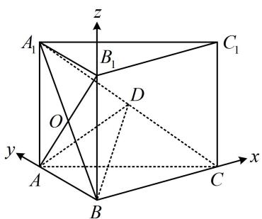

text_image

A₁
B₁
C₁
O
D
y
A
B
C
x
z

【反思】①本题几何部分用到了多种技巧，综合性较强，所以前面的几何法要学扎实，一旦顺利建系，后续求二面角则是流程化的操作；②若是求二面角的正弦值，则无需考虑二面角的钝锐，正弦都为正.

【例4】如图，在多面体 $ABCDEF$ 中，四边形ABCD是菱形， $\angle ABC = 60^{\circ}$

平面 $ADE \perp$ 平面

$$
A B C D, A E \parallel B F, A D = A E = 2, D E = 2 \sqrt {2}.
$$

(1) 证明: $BD \perp$ 平面 $ACE$ ;

（2）若平面 $CEF$ 与平面 $ABFE$ 的夹角的余弦值为 $\frac{\sqrt{10}}{4}$ ，求 $BF$ 的长.

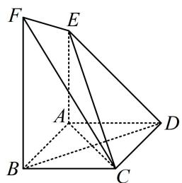

text_image

Geometric diagram of a triangular pyramid with labeled vertices and internal points

解：（1）（证线面垂直，需在面内找线， $BD \perp AC$ 容易看出，而由图可猜想 $AE \perp$ 平面 ABCD，故另一条选 AE）由题意， $AE^{2} + AD^{2} = 8 = DE^{2}$ ，所以 $AE \perp AD$ ，

又平面 $ADE \perp$ 平面 $ABCD$ ，平面 $ADE \cap$ 平面 $ABCD = AD$ ， $AE \subset$ 平面 $ADE$ ，所以 $AE \perp$ 平面 $ABCD$

因为 $BD \subset$ 平面ABCD，所以 $BD \perp AE$ ，又四边形ABCD是菱形，所以 $BD \perp AC$

因为 $AE$ ， $AC\subset$ 平面 $ACE$ ， $AE\cap AC = A$ ，所以 $BD\bot$ 平面 $ACE.$

(2) (第1问已证出了 $AE \perp$ 平面ABCD, 第2问可直接建系) 取 $CD$ 中点 $G$ , 连接 $AG$ ,

因为四边形 $ABCD$ 是菱形， $\angle ABC = 60^{\circ}$ ，所以 $\triangle ABC$ 和 $\triangle ACD$ 都是正三角形，故 $AG\bot CD$

又 $AB \parallel CD$ ，所以 $AG \perp AB$ ，结合 $AE \perp$ 平面 $ABCD$ 可得 $AE$ ， $AB$ ， $AG$ 两两垂直，

以 $A$ 为原点建立如图所示的空间直角坐标系，设 $BF = a(a > 0)$ ，则 $C(1, \sqrt{3}, 0)$ ， $E(0, 0, 2)$ ， $F(2, 0, a)$ ，

所以 $\overrightarrow{CE} = (-1, -\sqrt{3}, 2)$ ， $\overrightarrow{CF} = (1, -\sqrt{3}, a)$ ，设平面 $CEF$ 的法向量为 $\pmb{n} = (x, y, z)$ ，

则 $\left\{ \begin{array}{l} \pmb{n} \cdot \overrightarrow{CE} = -x - \sqrt{3}y + 2z = 0 \\ \pmb{n} \cdot \overrightarrow{CF} = x - \sqrt{3}y + az = 0 \end{array} \right.$ ，两式相减得： $-2x + (2 - a)z = 0$ ，令 $x = 2 - a$ ，则 $z = 2$ ，

代入原方程组可得 $y = \frac{2 + a}{\sqrt{3}}$ ，（为了便于后续计算，我们把求得的 $x, y, z$ 同乘以 $\sqrt{3}$ 去分母）

所以 $\pmb {n} = (\sqrt{3}(2 - a),2 + a,2\sqrt{3})$ 是平面CEF的一个法向量，

由图可知 $AG \perp$ 平面 $ABFE$ ，所以 $\overrightarrow{AG} = (0, \sqrt{3}, 0)$ 是平面 $ABFE$ 的一个法向量，因为平面 $CEF$ 与平面 $ABFE$ 的夹角余弦值为 $\frac{\sqrt{10}}{4}$

所以 $\left|\cos < \overrightarrow{AG},\pmb {n} > \right| = \frac{\left|\overrightarrow{AG}\cdot\pmb{n}\right|}{\left|\overrightarrow{AG}\right|\cdot\left|\pmb{n}\right|} = \frac{\sqrt{3}(2 + a)}{\sqrt{3(2 - a)^2 + (2 + a)^2 + 12}\cdot\sqrt{3}} = \frac{\sqrt{10}}{4},$

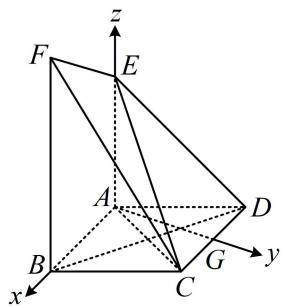

text_image

F
E
z
A
B
C
G
y
x

解得： $a = 3$ ，故 $BF = 3$

【反思】两个平面（不考虑平行和垂直的情况）的夹角一定是锐角，所以计算面面的夹角余弦，直接在法向量的夹角余弦上取绝对值.

【变式】(2023·全国乙卷) 在三棱锥 $P - ABC$ 中, $AB \perp BC$ , $AB = 2$ , $BC = 2\sqrt{2}$ , $PB = PC = \sqrt{6}$ , $BP$ , $AP$ , $BC$ 的中点分别为 $D$ , $E$ , $O$ , $AD = \sqrt{5}DO$ , 点 $F$ 在 $AC$ 上, $BF \perp AO$ .

(1) 证明: $EF \parallel$ 平面 $ADO$ ;  
(2) 证明: 平面 $ADO \perp$ 平面 $BEF$ ;  
(3) 求二面角 D-AO-C 的大小.

解: (1) (由图可猜想 DEFO 是平行四边形, 故尝试证 DE 平行且等于 OF. 注意到 D, E, O 都是所在棱的中点, 故若能证出 F 是中点, 则 DE, OF 都平行且等于 AB 的一半, 问题就解决了. 那 F 的位置由哪个条件决定呢? 显然是 $BF \perp AO$ , 于是我们到 $\triangle ABC$ 中来进行分析)

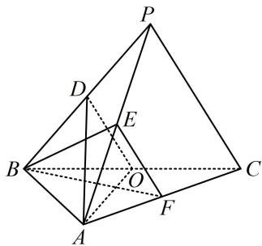

text_image

Geometric diagram of a pyramid with labeled vertices and internal points, used for spatial geometry problems.

如图1，在 $\triangle ABC$ 中，因为 $BF\perp AO$ ， $AB\perp BC$ ，所以 $\angle 2 + \angle AOB = \angle 1 + \angle AOB = 90^{\circ}$ ，故 $\angle 1 = \angle 2$ ①，又 $AB = 2$ ， $BC = 2\sqrt{2}$ ， $O$ 为 $BC$ 中点，所以 $BO = \sqrt{2}$ ，故 $\tan \angle 1 = \frac{BO}{AB} = \frac{\sqrt{2}}{2}$ ， $\tan \angle 3 = \frac{AB}{BC} = \frac{\sqrt{2}}{2}$ 所以 $\tan \angle 1 = \tan \angle 3$ ，故 $\angle 1 = \angle 3$ ，结合①可得 $\angle 2 = \angle 3$ ，所以 $BF = CF$ 连接 $OF$ ，因为 $O$ 是 $BC$ 中点，所以 $OF \perp BC$ ，又 $AB \perp BC$ ，所以 $OF \parallel AB$ 结合 $O$ 为 $BC$ 中点可得 $F$ 为 $AC$ 的中点，又 $D, E, O$ 分别是 $BP, AP, BC$ 的中点，所以 $DE$ 和 $OF$ 都平行且等于 $AB$ 的一半, 故 $DE$ 平行且等于 $OF$ ,所以四边形 DOFE 是平行四边形，故 $EF \parallel DO$ ，

因为 $EF \not\subset$ 平面 $ADO, DO \subset$ 平面 $ADO$ , 所以 $EF \parallel$ 平面 $ADO$ .

(2) (要证面面垂直, 先找线面垂直, 条件中有 $AO \perp BF$ , 于是不外乎考虑证 $AO \perp$ 面 $BEF$ 或证 $BF \perp$ 面 $AOD$ , 怎样选择呢? 此时我们再看其他条件, 还没用过的条件就是一些长度, 长度类条件用于证垂直, 想到勾股定理, 我们先分析有关线段的长度)

由题意， $DO = \frac{1}{2} PC = \frac{\sqrt{6}}{2}$ ， $AD = \sqrt{5} DO = \frac{\sqrt{30}}{2}$ ， $AO = \sqrt{AB^2 + OB^2} = \sqrt{6}$

所以 $AO^2 + DO^2 = \frac{15}{2} = AD^2$ ，故 $AO \perp OD$ （此时结合 $OD // EF$ 我们发现可以证明 $AO \perp$ 面 $BEF$ ）

由（1）可得 $EF \parallel OD$ ，所以 $AO \perp EF$ ，又 $AO \perp BF$ ，且 $BF$ ， $EF$ 是平面 $BEF$ 内的相交直线，

所以 $AO \perp$ 平面 BEF，因为 $AO \subset$ 平面 ADO，所以平面 $ADO \perp$ 平面 BEF.

(3) (此图让我们感觉面 $PBC \perp$ 面 $ABC$ , 若这一感觉正确, 那建系处理就很方便. 我们先分析看是不是这样的. 假设面 $PBC \perp$ 面 $ABC$ , 由于 $AB \perp BC$ , 于是 $AB \perp$ 面 $PBC$ , 故 $AB \perp BD$ , 但我们只要稍加计算, 就会发现 $AB^{2} + BD^{2} \neq AD^{2}$ , 矛盾, 所以我们的感觉是不对的, 那么 $P$ 的坐标就不好找, 怎么办呢? 此时我们可以设 $P$ 的坐标, 用已知的长度条件来建立方程组, 直接求解 $P$ 的坐标)

以 $B$ 为原点建立如图2所示的空间直角坐标系，则 $B(0,0,0)$ ， $A(2,0,0)$ ， $C(0,2\sqrt{2},0)$ ， $O(0,\sqrt{2},0)$ ，

设 $P(x,y,z)(z > 0)$ ，则 $D\left(\frac{x}{2},\frac{y}{2},\frac{z}{2}\right)$ ，由 $\left\{ \begin{array}{l}PB = \sqrt{6}\\ PC = \sqrt{6} \end{array} \right.$ 可得 $\left\{ \begin{array}{l}x^{2} + y^{2} + z^{2} = 6\\ x^{2} + (y - 2\sqrt{2})^{2} + z^{2} = 6 \end{array} \right.$ ，解得： $y = \sqrt{2}$

代回两方程中的任意一个可得 $x^{2} + z^{2} = 4$ ②，（此时发现还有 $AD = \sqrt{5} DO$ 这个条件没用，故翻译它）

又 $AD = \sqrt{5} DO$ ，所以 $\left(\frac{x}{2} - 2\right)^2 + \frac{y^2}{4} + \frac{z^2}{4} = 5\left[\frac{x^2}{4} + \left(\frac{y}{2} - \sqrt{2}\right)^2 + \frac{z^2}{4}\right]$

将 $y=\sqrt{2}$ 代入整理得： $x^{2}+z^{2}+2x-2=0$ ③，

联立②③结合 $z > 0$ 解得： $x = -1, z = \sqrt{3}$ ，（到此本题的主要难点就攻克了，接下来是流程化的计算）

所以 $D\left(-\frac{1}{2}, \frac{\sqrt{2}}{2}, \frac{\sqrt{3}}{2}\right)$ ，故 $\overrightarrow{DO} = \left(\frac{1}{2}, \frac{\sqrt{2}}{2}, -\frac{\sqrt{3}}{2}\right)$ ， $\overrightarrow{AO} = (-2, \sqrt{2}, 0)$ ，

设平面 AOD 的法向量为 $\boldsymbol{m}=(x,y,z)$ ，则 $\left\{\begin{aligned}\boldsymbol{m}\cdot\overrightarrow{DO}&=\frac{1}{2}x+\frac{\sqrt{2}}{2}y-\frac{\sqrt{3}}{2}z=0\\ \boldsymbol{m}\cdot\overrightarrow{AO}&=-2x+\sqrt{2}y=0\end{aligned}\right.$

令 $x = 1$ ，则 $\left\{ \begin{array}{l} y = \sqrt{2} \\ z = \sqrt{3} \end{array} \right.$ ，所以 $\pmb {m} = (1, \sqrt{2}, \sqrt{3})$ 是平面 $AOD$ 的一个法向量，

由图可知 $n = (0,0,1)$ 是平面 $AOC$ 的一个法向量，所以 $\cos < m, n > = \frac{m \cdot n}{|m| \cdot |n|} = \frac{\sqrt{2}}{2}$ ，

由图可知二面角 $D - AO - C$ 为钝角，故其大小为 $135^{\circ}$ 。

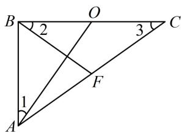

text_image

B
2
O
3
C
1
A
F

图1

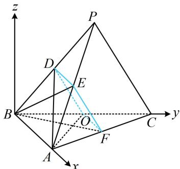

text_image

z
P
D
E
B
O
C
y
A
F
x

图2

【反思】①若由图能看出二面角的钝锐，则直接看图决定怎样取值；否则可将法向量取成一个朝内，一个朝外，它们的夹角即为二面角；②通过本题我们给出了一种额外的找坐标思路，即当建系后有点的坐标不好找时，可直接设其坐标，翻译已知的各种条件（本题是长度）建立方程组，求解该坐标.

# 强化训练

1. (2025·天津卷·★★★)

正方体 $ABCD - A_{1}B_{1}C_{1}D_{1}$ 的棱长为4， $E$ ， $F$ 分别为 $A_{1}D_{1}$ ， $B_{1}C_{1}$ 的中点， $G$ 在棱 $CC_{1}$ 上，且 $CG = 3C_1G$ ：

(1) 求证: $GF \perp$ 平面 $EBF$ ;  
（2）求平面 EBF 与平面 EBG 夹角的余弦值；  
(3) 求三棱锥 D-BEF 的体积.

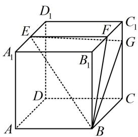

text_image

D₁
E
F
C₁
A₁
B₁
G
D
C
A
B

注：由于空间向量计算比较无脑，所以以下题目选取均具有一定灵活性.

2. (2024·广西模拟·★★★)

在六面体 $ABCD - A_{1}B_{1}C_{1}D_{1}$ 中， $AA_{1} \perp$ 平面 $ABCD$ ， $AA_{1} // BB_{1} // CC_{1} // DD_{1}$ ，且底面 $ABCD$ 为菱形.

(1) 证明: $BD \perp$ 平面 $ACC_{1}A_{1}$ ;  
（2）若 $AA_{1} = CC_{1} = \frac{7}{2}$ ， $\angle BAD = 60^{\circ}$ ， $AB = BB_{1} =$

2，求平面 $A_{1}B_{1}C_{1}D_{1}$ 与平面ABCD所成二面角的正弦值.

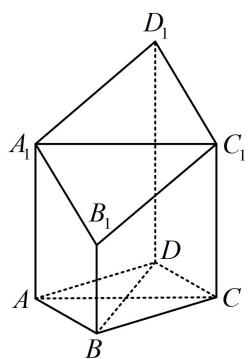

text_image

D₁
A₁ C₁
B₁
D
A B C

3. (2022·山东模拟·★★★)

如图，在四棱锥 $P - ABCD$ 中，底面ABCD为正方形， $AB = 2$ ， $AP = 3$ ，直线 $PA \perp$ 平面ABCD， $E$ ， $F$ 分别为 $PA$ ， $AB$ 的中点，直线 $AC$ 与 $DF$ 相交于点 $O$ .

(1) 证明: $OE$ 与 $CD$ 不垂直;  
(2) 求二面角 B - PC - D 的余弦值.

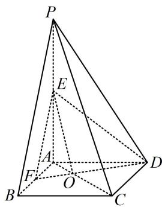

text_image

P
E
A
F
O
B
C
D

4. (2024·新课标Ⅰ卷·★★★)

如图，四棱锥 $P - ABCD$ 中， $PA \perp$ 底面 $ABCD$ ， $PA = AC = 2$ ， $BC = 1$ ， $AB = \sqrt{3}$ 。

（1）若 $AD \perp PB$ ，证明：AD // 平面 PBC；  
（2）若 $AD \perp DC$ ，且二面角 $A - CP - D$ 的正弦值为 $\frac{\sqrt{42}}{7}$ ，求 $AD$ .

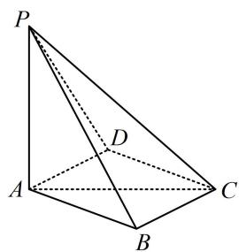

text_image

P
D
A
B
C

5. (2023·新课标II卷·★★★)

如图，三棱锥 A-BCD 中，DA=DB=DC， $BD\perp CD$ ， $\angle ADB=\angle ADC=60^{\circ}$ ，E 为 BC 的中点.

(1) 证明: $BC \perp DA$ ;   
(2) 点 F 满足 $\overrightarrow{EF} = \overrightarrow{DA}$ ，求二面角 D - AB - F 的正弦值.

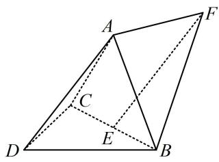

text_image

Geometric diagram of a quadrilateral with labeled vertices A, B, C, D, E, F and solid/dashed edges

6. (2024·全国甲卷·★★★☆)

如图，在以 $A, B, C, D, E, F$ 为顶点的五面体中，四边形ABCD与四边形ADEF均为等腰梯形， $EF \parallel AD$ ， $BC \parallel AD$ ， $AD = 4$ ， $AB = BC = EF = 2$ ， $ED = \sqrt{10}$ ， $FB = 2\sqrt{3}$ ， $M$ 为 $AD$ 的中点.

(1) 证明: $BM \parallel$ 平面 $CDE$ ;  
(2) 求二面角 $F - BM - E$ 的正弦值.

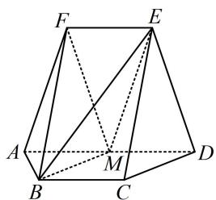

text_image

Geometric diagram of a polyhedron with labeled vertices A, B, C, D, E, F and internal points M and dashed lines indicating hidden edges.

7. (2025·全国Ⅰ卷·★★★☆)

如图所示的四棱锥 $P - ABCD$ 中， $PA \perp$ 平面 $ABCD$ ， $BC \parallel AD$ ， $AB \perp AD$ .

(1) 证明: 平面 $PAB \perp$ 平面 $PAD$ ;  
（2）若 $PA = AB = \sqrt{2}$ ， $AD = \sqrt{3} +1$ ， $BC = 2$ ， $P$ ， $B$ ， $C$ ， $D$ 在同一个球面上，设该球面的球心为 $O$   
(i) 证明: $O$ 在平面 $ABCD$ 上;  
(ii) 求直线 $AC$ 与直线 $PO$ 所成角的余弦值.

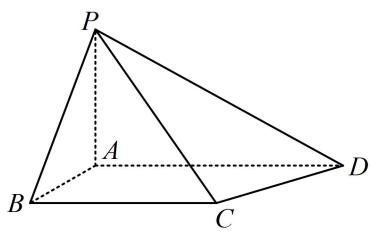

text_image

P
A
B
C
D

8. (2023·广东深圳模拟·★★★★)

在四棱柱 $ABCD - A_{1}B_{1}C_{1}D_{1}$ 中，底面 $ABCD$ 为正方形，侧面 $ADD_{1}A_{1}$ 为菱形，且平面 $ADD_{1}A_{1} \perp$ 平面 $ABCD$ .

(1) 证明: $AD_{1} \perp A_{1} C$ ;   
(2) 设点 $P$ 在棱 $A_{1}B_{1}$ 上运动, 若 $\angle A_{1}AD = \frac{\pi}{3}$ , 且 $AB = 2$ , 记直线 $AD_{1}$ 与平面 $PBC$ 所成的角为 $\theta$ , 当 $\sin \theta = \frac{1}{4}$ 时, 求 $A_{1}P$ 的长度.

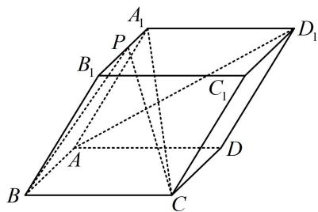

text_image

A₁
P
B₁
C₁
D₁
A
B
C
D

