# 强化训练

1. (2021·上海卷·★★☆)

已知圆柱的底面半径为 1，高为 2，AB 是上底面圆的一条直径，C 是下底面圆周上的一个动点，则 $\triangle ABC$ 的面积的取值范围是 \_\_\_\_.

1. $[2, \sqrt{5}]$

解析：由于 $AB$ 的长不变，所以分析 $S_{\triangle ABC}$ 的取值范围时，以 $AB$ 为底，研究高的范围即可，

如图，作 $CI \perp AB$ 于 $I$ ，由题意， $OO_{1} = 2$ ， $O_{1}C = 1$

所以 $OC = \sqrt{OO_1^2 + O_1C^2} = \sqrt{5}$

因为 $IC = \sqrt{OC^2 - OI^2} = \sqrt{5 - OI^2}$ ，且 $0\leq OI\leq 1$

所以 $2 \leq IC \leq \sqrt{5}$

又 $S_{\triangle ABC} = \frac{1}{2} AB\cdot IC = \frac{1}{2}\times 2IC = IC$ ，所以 $2\leq S_{\triangle ABC}\leq \sqrt{5}$

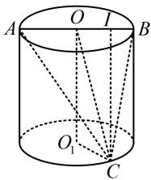

text_image

A
O
I
B
O₁
C

2. (2022·北京模拟·★★★)

若正四棱锥 $P - ABCD$ 的高为 4，棱 $AB$ 的长为 2，点 $H$ 为侧棱 $PC$ 上一动点，则 $\triangle HBD$ 的面积的最小值为（）

A. $\sqrt{2}$

B. $\frac{\sqrt{3}}{2}$

C. $\frac{\sqrt{2}}{3}$

D. $\frac{4 \sqrt{2}}{3}$

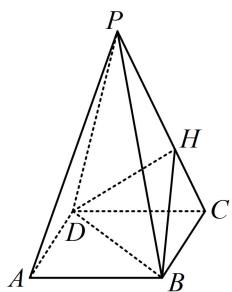

text_image

Geometric diagram of a pyramid with labeled vertices and internal points, used for spatial geometry problems.

2. D

解析：如图， $PO \perp$ 平面 $ABCD \Rightarrow PO \perp BD$ ，

又 $BD \perp AC$ ，所以 $BD \perp$ 平面 $PAC$ ，故 $BD \perp OH$ ，

由于 $BD$ 的长不变，所以当 $OH$ 最小时 $S_{\triangle HBD}$ 最小，此时 $OH \perp PC$ ，算直角三角形斜边上的高，可用等面积法，

由题意， $OP = 4$ ， $OC = \frac{1}{2} AC = \frac{1}{2}\times 2\sqrt{2} = \sqrt{2}$

$PC = \sqrt{OP^2 + OC^2} = 3\sqrt{2}$ ，所以 $S_{\triangle POC} = \frac{1}{2} PC\cdot OH$

$= \frac{1}{2} OP\cdot OC$ ，故 $OH = \frac{OP\cdot OC}{PC} = \frac{4}{3}$

所以 $(S_{\triangle HBD})_{\mathrm{min}} = \frac{1}{2}\times 2\sqrt{2}\times \frac{4}{3} = \frac{4\sqrt{2}}{3}.$

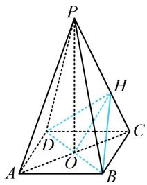

text_image

Geometric diagram of a pyramid with labeled vertices and internal points, including dashed lines for hidden edges.

【反思】分析三角形面积的最值, 常抓住不变的特征. 例如第 1 题的底边 $AB$ , 第 2 题的底边 $BD$ , 故只需分析它们高的最值. 本类型一般不难, 故方法册没单独讲.

3. (2023·云南昆明模拟·★★★☆)

正方体 $ABCD - A_{1}B_{1}C_{1}D_{1}$ 的棱长为3，点 $P$ 在正方形ABCD的边界及其内部运动，若 $3 \leq A_{1}P \leq \sqrt{11}$ ，则三棱锥 $P - A_{1}BD$ 的体积的最小值是（）

A. 1 B. $\frac{3}{2}$ C. 3 D. $\frac{9}{2}$

3. B

解析: 条件中有 $A_{1} P$ 的范围, $A_{1}$ 为定点, 故分析点 $P$ 的轨迹, 如图 1, 由于点 $P$ 在正方形 $A B C D$ 内, 所以把 $A_{1} P$ 向平面 $A B C D$ 投影, 到平面 $A B C D$ 上来分析,

因为 $AA_{1} \perp$ 平面ABCD，所以 $AA_{1} \perp AP$ ，

故 $A_{1}P = \sqrt{AA_{1}^{2} + AP^{2}} = \sqrt{9 + AP^{2}}$

所以 $3 \leq A_{1}P \leq \sqrt{11} \Rightarrow 3 \leq \sqrt{9 + AP^{2}} \leq \sqrt{11} \Rightarrow 0 \leq AP \leq \sqrt{2}$

所以点 $P$ 的轨迹是正方形ABCD内的以 $A$ 为圆心， $\sqrt{2}$ 为半径的圆内（含边界），如图2，

由图1可知， $V_{P - A_1BD} = V_{A_1 - PBD} = \frac{1}{3} S_{\triangle PBD}\cdot AA_1 = S_{\triangle PBD},$

所以问题等价于求 $\triangle PBD$ 的面积的最小值，

当 $P$ 在如图2所示的位置时， $\triangle PBD$ 的 $BD$ 边上的高最

小，而 $BD = 3\sqrt{2}$ 不变，所以此时 $S_{\triangle PBD}$ 最小，

故 $(V_{P - A_1BD})_{\mathrm{min}} = (S_{\triangle PBD})_{\mathrm{min}} = \frac{1}{2}\times 3\sqrt{2}\times \left(\frac{3\sqrt{2}}{2} -\sqrt{2}\right) = \frac{3}{2}.$

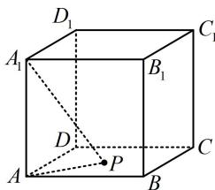

text_image

D₁
A₁
B₁
C₁
D
P
A
B
C

图1

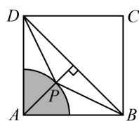  
图2

4. (2022·福建模拟·★★★☆)(多选)

如图，直角梯形 $ABCD$ 中， $AB \parallel CD$ ， $AB \perp BC$ ， $BC = CD = \frac{1}{2} AB = 1$ ， $E$ 为 $AB$ 中点，以 $DE$ 为折痕把 $\triangle ADE$ 折起，使点 $A$ 到达点 $P$ 的位置，使 $PC = \sqrt{3}$ ，则（）

A. 平面 $PED \perp$ 平面 $PCD$   
B. $PC \perp BD$   
C. 二面角 $P - DC - B$ 的大小为 $60^{\circ}$   
D. $PC$ 与平面 $PED$ 所成角为 $45^{\circ}$

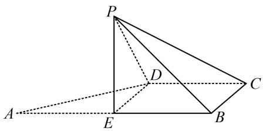

text_image

Geometric diagram of a pyramid with labeled vertices and auxiliary lines, likely for a math problem or proof.

4. AB

解析：A项，要分析面面垂直，先找线面垂直，观察图形可猜想 $CD \perp$ 面PED，故尝试找理由，

如图，由题设可分析出 $BCDE$ 是边长为1的正方形，

连接 $EC$ ，则 $PE = 1$ ， $EC = \sqrt{2}$ ，翻折后 $PC = \sqrt{3}$

所以 $PE^{2} + EC^{2} = PC^{2}$ ，故 $PE \perp EC$ ①，

因为翻折前 $AE \perp ED$ ，所以翻折后 $PE \perp ED$ ，

结合①可得 $PE \perp$ 平面 $BCDE$ ，所以 $PE \perp CD$ ，

又因为 $CD \perp DE$ ，所以 $CD \perp$ 平面PED，

从而平面 $PED \perp$ 平面 $PCD$ ，故A项正确；

B 项，PC 在平面 BCDE 内的射影好找，故用三垂线定理判断，PE⊥平面 BCDE⇒PC 在该面内的射影为 EC，

因为 $BD \perp EC$ ，所以 $BD \perp PC$ ，故B项正确；

C 项，前面已证 $CD \perp$ 面 $PED$ ，所以 $CD \perp PD$

又 $CD \perp DE$ ，所以 $\angle PDE$ 是二面角 $P - DC - B$ 的平面角，

$\tan \angle PDE = \frac{PE}{DE} = 1 \Rightarrow \angle PDE = 45^{\circ}$ ，故C项错误；

D 项，因为 $CD \perp$ 平面 $PED$ ，所以 $\angle CPD$ 即为 $PC$ 与平面 $PED$ 所成角， $CD = 1$ ，又 $PD = AD = \sqrt{2}$ ，所以 $\tan \angle CPD = \frac{CD}{PD} = \frac{\sqrt{2}}{2}$ ，从而 $\angle CPD \neq 45^{\circ}$ ，故 D 项错误.

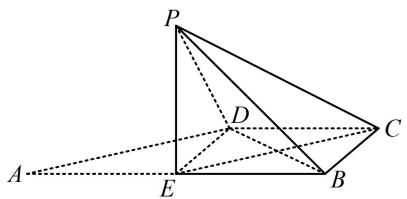

text_image

Geometric diagram of a pyramid with labeled vertices and internal points, showing solid and dashed edges for spatial relationships.

5. (2023·山东济南二模·★★★★★) (多选)

如图, 菱形 $ABCD$ 中, $\angle BAD = \frac{\pi}{3}$ , $E$ , $F$ , $G$ 分别是 $AD$ , $CD$ , $BC$ 的中点, 将 $\triangle ABD$ 沿直线 $BD$ 折起得到三棱锥 $A - BCD$ , 则在该三棱锥中, 下列说法正确的是 ( )

A. 直线 $EF \parallel$ 平面 $ABC$   
B. 直线 $BE$ 与 $DG$ 是异面直线  
C. 直线 $BE$ 与 $DG$ 可能垂直  
D. 若 $EG = \frac{\sqrt{7}}{4} AB$ ，则二面角 $A - BD - C$ 的大小为 $\frac{\pi}{3}$

text_image

A
E
D
F
C
B
G

5. ABD

解析：A项，如图，折起后的三棱锥中， $E$ ， $F$ 仍为 $AD$ ， $CD$ 的中点，所以 $EF / / AC$ ，从而 $EF / /$ 平面 $ABC$ ，故A项正确；

B项，如图，直线 $BE$ 与 $DG$ 是异面直线，故B项正确，

C 项，判断垂直可用数量积，C、D 选项都容易通过坐标翻译，不妨直接建系。可将翻折角 A-BD-C 设为变量，表示各点，取 BD 中点 O，则 $OC \perp BD$ ， $OA \perp BD$ ，所以 $BD \perp$ 平面 AOC，以 O 为原点建立如图所示的空间直角坐标系，

设二面角 $A - BD - C$ 的大小为 $\theta$ ，则 $\angle AOC = \theta (0 <   \theta <$

$\pi)$ ，不妨设 $BD = 4$ ，由题意， $\triangle ABD$ 和 $\triangle BCD$ 都是边长为 4 的正三角形，所以 $OA = OC = 2\sqrt{3}$ ，故 $B(2,0,0)$ ， $D(-2,0,0)$ ， $C(0,2\sqrt{3},0)$ ， $G(1,\sqrt{3},0)$ ，还要写出点 $E$ 的坐标， $E$ 为 $AD$ 中点，所以先写点 $A$ 的坐标，需找到 $A$ 在面 $BCD$ 内的射影，不妨先看 $\angle AOC$ 为锐角的情形，

当 $\angle AOC$ 为锐角时，如图，作 $AI\perp OC$ 于点 $I$

由 $BD \perp$ 平面 $AOC$ 可知 $AI \perp BD$ ，所以 $AI \perp$ 平面 $BCD$

且 $OI = OA\cdot \cos \angle AOC = 2\sqrt{3}\cos \theta ,\quad AI = OA\cdot \sin \angle AOC$

$= 2\sqrt{3}\sin \theta$ ，故 $A(0,2\sqrt{3}\cos \theta ,2\sqrt{3}\sin \theta)$

图中所画的 $\theta$ 为锐角，但可以想象，即使 $\theta$ 为钝角或直角，点 $A$ 的坐标仍为上述结果，

因为 E 为 AD 的中点，所以 $E(-1, \sqrt{3} \cos \theta, \sqrt{3} \sin \theta)$ ,

从而 $\overrightarrow{BE} = (-3, \sqrt{3}\cos \theta, \sqrt{3}\sin \theta)$ ， $\overrightarrow{DG} = (3, \sqrt{3}, 0)$ ，

故 $\overrightarrow{BE} \cdot \overrightarrow{DG} = -3 \times 3 + \sqrt{3}\cos \theta \times \sqrt{3} + \sqrt{3}\sin \theta \times 0 = 3\cos \theta - 9$

≠0，所以 BE 与 DG 不可能垂直，故 C 项错误；

D项，若 $EG = \frac{\sqrt{7}}{4} AB$ ，则

$$
\sqrt {(- 1 - 1) ^ {2} + (\sqrt {3} \cos \theta - \sqrt {3}) ^ {2} + (\sqrt {3} \sin \theta - 0) ^ {2}} = \frac {\sqrt {7}}{4} \times 4,
$$

化简得： $2\cos\theta-1=0$ ，所以 $\cos\theta=\frac{1}{2}$ ，

结合 $0 < \theta < \pi$ 可得 $\theta = \frac{\pi}{3}$ ，故D项正确.

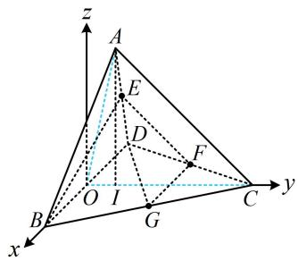

text_image

z
A
E
D
F
O I
B
G
C
y
x

6. (2024·江苏模拟·★★★★) (多选)

在正方体 $ABCD - A_{1}B_{1}C_{1}D_{1}$ 中， $P$ 为 $DD_{1}$ 的中点， $M$ 是底面 $ABCD$ 上一点，则（）

A. $M$ 为 $AC$ 中点时， $PM \perp AC_{1}$   
B. $M$ 为 $AD$ 中点时， $PM \parallel$ 平面 $A_{1}BC_{1}$   
C. 满足 $2PM = \sqrt{3} DD_{1}$ 的点 $M$ 在圆上  
D. 满足直线 $PM$ 与直线 $AD$ 成 $30^{\circ}$ 角的点 $M$ 在双曲线上

6. BCD

解析：A项，如图1，当 $M$ 为 $AC$ 中点时，结合 $P$ 为 $DD_{1}$ 中点可得 $PM \parallel BD_{1}$ ，由正方体的结构特征可知 $AB \neq BC_{1}$ ，所以四边形 $ABC_{1}D_{1}$ 不是菱形，从而 $BD_{1}$ 与 $AC_{1}$ 不垂直，

故 $PM$ 与 $AC_{1}$ 也不垂直，故A项错误；

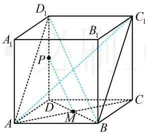

text_image

D₁
A₁
B₁
C₁
P
D
M
A
B
C

图1

B项，如图2，当 $M$ 为 $AD$ 中点时， $PM \parallel AD_{1}$ ，

因为 $AD_{1} \parallel BC_{1}$ ，所以 $PM \parallel BC_{1}$ ，

由图2可知 $BC_{1}\subset$ 平面 $A_{1}BC_{1}$ ， $PM\not\subset$ 平面 $A_{1}BC_{1}$

所以 $PM / /$ 平面 $A_{1}BC_{1}$ ，故B项正确；

C 项，由于点 M 在面 ABCD 内，故考虑把条件 $2PM = \sqrt{3}DD_{1}$ 中的 PM 转化到面 ABCD 内来考虑，

不妨设正方体棱长为2，因为 $2PM=\sqrt{3}DD_{1}$ ，

所以 $PM = \frac{\sqrt{3}}{2} DD_{1} = \sqrt{3}$ ，又 $DD_{1}\perp$ 平面ABCD，

所以 $PD \perp DM$ ，故 $DM = \sqrt{PM^2 - PD^2} = \sqrt{(\sqrt{3})^2 - 1^2} = \sqrt{2}$

为定值，所以 $M$ 在面ABCD内以 $D$ 为圆心， $\sqrt{2}$ 为半径的圆上，故C项正确；

D 项，直线 $PM$ 与 $AD$ 所成的角用几何方法分析略显麻烦，正方体中可直接建系，用夹角余弦公式处理角度更方便，如图3建系，则 $A(2,0,0)$ ， $D(0,0,0)$ ，

因为 $P$ 为 $DD_{1}$ 的中点，所以 $P(0,0,1)$ ，设 $M(x,y,0)$ ，

则 $\overrightarrow{PM} = (x,y, - 1)$ ， $\overrightarrow{AD} = (-2,0,0)$

由题意， $\left|\cos<\overrightarrow{PM},\overrightarrow{AD}>\right|=\frac{\left|\overrightarrow{PM}\cdot\overrightarrow{AD}\right|}{\left|\overrightarrow{PM}\right|\cdot\left|\overrightarrow{AD}\right|}=\frac{\left|-2x\right|}{\sqrt{x^{2}+y^{2}+1}\times2}$

$= \cos 30^{\circ} = \frac{\sqrt{3}}{2}$ ，化简得： $\frac{x^2}{3} -y^2 = 1$

这是双曲线的方程，所以点 $M$ 在双曲线上，故D项正确.

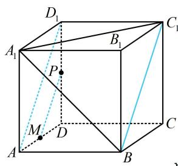

text_image

D₁
A₁
B₁
C₁
P
M
D
A
B
C
y

图2

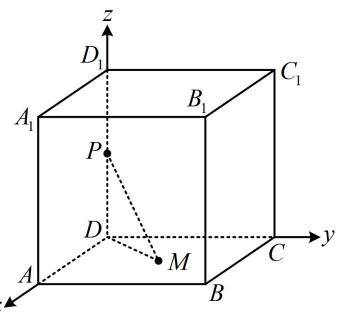

text_image

z
D₁
A₁
B₁
C₁
P
D
M
A
B
C
y

图3

7. (2020·新高考Ⅰ卷·★★★★)

已知直四棱柱 $ABCD - A_{1}B_{1}C_{1}D_{1}$ 的棱长均为 2， $\angle BAD = 60^{\circ}$ ，以 $D_{1}$ 为球心， $\sqrt{5}$ 为半径的球面与侧面 $BCC_{1}B_{1}$ 的交线长为 \_\_\_\_.

7. $\frac{\sqrt{2}\pi}{2}$

解析：研究球面与侧面 $BCC_{1}B_{1}$ 的交线属球的截面问题，故过球心作截面的垂线，找到截面圆圆心，

取 $B_{1}C_{1}$ 的中点 $O$ ，连接 $OD_{1}$ ，由题设可知 $\triangle B_1C_1D_1$ 是正三角形，所以 $OD_{1} \perp B_{1}C_{1}$

又 $ABCD - A_{1}B_{1}C_{1}D_{1}$ 是直四棱柱，所以 $BB_{1} \perp$ 面 $A_{1}B_{1}C_{1}D_{1}$ ，

从而 $OD_{1} \perp BB_{1}$ ，故 $OD_{1} \perp$ 面 $BB_{1}C_{1}C$ ，

所以点 O 就是截面圆的圆心，且 $OD_{1}=\sqrt{3}$ ，

故球心到截面的距离为 $\sqrt{3}$ ，因为球的半径 $R = \sqrt{5}$ ，

所以截面圆半径 $r=\sqrt{R^{2}-OD_{1}^{2}}=\sqrt{2}$ ，

到此问题就转化成在正方形 $BB_{1}C_{1}C$ 内，以 $O$ 为圆心， $\sqrt{2}$ 为半径作圆弧，求该圆弧弧长的问题，

设该圆与 $BB_{1}$ 和 $CC_{1}$ 分别交于 $P, Q$ 两点，

因为 $OB_{1} = 1$ ， $OP = \sqrt{2}$ ，所以 $B_{1}P = 1$ ， $\angle POB_{1} = 45^{\circ}$

由对称性可知 $\angle QOC_{1} = 45^{\circ}$ ，所以 $\angle POQ = 90^{\circ}$

故该球面与侧面 $BCC_{1}B_{1}$ 的交线长为 $\frac{1}{4}\times 2\pi \times \sqrt{2} = \frac{\sqrt{2}\pi}{2}$

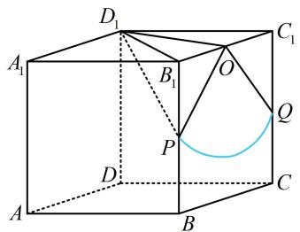

text_image

Geometric diagram of a cube with labeled vertices and internal points, including a highlighted arc and dashed lines for hidden edges.

