# 模块四 综合提升篇

# 第1节 动态问题探究（★★★☆）

# 内容提要

动点、动线、动面问题是立体几何小题中的难点问题，本节归纳几种常见的动态问题的解题方法.

1. 动态平行、垂直的判断:

①过定点 $P$ 和动点 $Q$ 的直线 $PQ \parallel$ 平面 $\alpha$ ，要找 $Q$ 的轨迹，可过 $P$ 作与 $\alpha$ 平行的平面 $\beta$ ，则点 $Q$ 在 $\beta$ 上。若规定 $Q$ 也在另一平面 $\gamma$ 上，则 $Q$ 的轨迹是 $\beta$ 与 $\gamma$ 的交线，如图1中的蓝线。  
②过定点 $P$ 和动点 $Q$ 的直线 $PQ \perp$ 定直线 $l$ , 要找 $Q$ 的轨迹, 可过 $P$ 作与 $l$ 垂直的平面 $\alpha$ , 则 $Q$ 在 $\alpha$ 上, 若规定 $Q$ 也在另一个平面 $\beta$ 上, 则 $Q$ 的轨迹是 $\alpha$ 与 $\beta$ 的交线, 如图2中的蓝线.

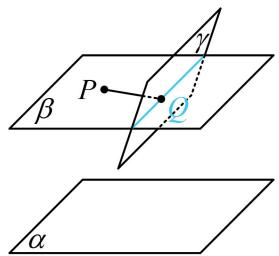

text_image

β
P
γ
θ
α

图1

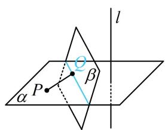

text_image

P
α
β
l

图2

2. 空间轨迹为球:

①空间中满足到定点 $P$ 的距离等于定长 $R$ 的点 $A$ 的轨迹是以 $P$ 为球心， $R$ 为半径的球面；  
②设 P, Q 为空间两定点，点 A 满足 $AP \perp AQ$ ，则点 A 的轨迹是以 PQ 为直径的球面.  
若在上述情况的基础上，增加限制动点 $A$ 在某平面上，则点 $A$ 只能在球的截面圆上运动.

3. 直线上的动点问题: 例如, $P$ 为定直线 $AB$ 上的动点, 这类问题除了几何法分析之外, 还可考虑建系, 借助 $\overrightarrow{AP} = \lambda \overrightarrow{AB}$ 将动点 $P$ 的坐标表示成 $\lambda$ , 用向量法分析问题.  
4. 翻折问题：解决翻折问题的核心有两点.

①分析翻折前后未发生变化的几何关系，得出翻折后空间图形的几何特征，将问题明朗化.

②在翻折前后的图形中，抓住与折痕线垂直的直线，将空间的计算问题转换到平面上来进行.

# 类型I：通过位置关系判断轨迹的基本方法

【例1】在棱长为2的正方体 $ABCD - A_{1}B_{1}C_{1}D_{1}$ 中， $E$ 为棱 $BC$ 的中点， $F$ 是侧面 $BB_{1}C_{1}C$ 内的动点，若 $A_{1}F \parallel$ 平面 $AD_{1}E$ ，则点 $F$ 轨迹的长度为（）

A. $\frac{\sqrt{2}}{2}$

B. $\sqrt{2}$

C. $\frac{3 \sqrt{2}}{2}$

D. $2 \sqrt{2}$

解析：由 $A_{1} F \parallel$ 面 $A D_{1} E$ 找 $F$ 的轨迹，可过 $A_{1}$ 作与面 $A D_{1} E$ 平行的面，找该面与面 $B B_{1} C_{1} C$ 的交线，

如图，取 $B_{1}C_{1}$ 中点 $G$ ，连接 $A_{1}G$ ，则 $A_{1}G \parallel AE$

取 $BB_{1}$ 中点 $H$ ，连接 $GH$ ， $A_{1}H$ ，则 $GH \parallel BC_{1} \parallel AD_{1}$

所以面 $A_{1}GH \parallel$ 面 $AD_{1}E$ ，因为面 $A_{1}GH \cap$ 面 $BB_{1}C_{1}C = GH$ ，

所以点 $F$ 的轨迹为线段 $GH$ ，其长度为 $\sqrt{2}$ .

答案: B

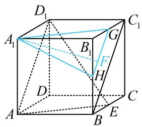

text_image

D₁
A₁
B₁
G
C₁
F
H
D
A
B
E
C

【例 2】如图，正方体 $ABCD-A_{1}B_{1}C_{1}D_{1}$ 的棱长为 2，点 O 为底面 ABCD 的中心，点 P 在侧面 $BCC_{1}B_{1}$ 的边界及其内部运动，若 $D_{1}O \perp OP$ ，则 $\triangle D_{1}C_{1}P$ 的面积的最大值为（）

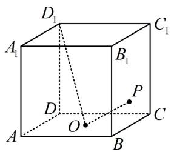

text_image

D₁
A₁
B₁
C₁
D
P
O
A
B
C

A. $\frac{2 \sqrt{5}}{5}$

B. $\frac{4 \sqrt{5}}{5}$

C. $\sqrt{5}$

D. $2 \sqrt{5}$

解析：要求 $S_{\triangle D_1C_1P}$ 的最大值，需先由 $D_{1}O \perp OP$ 分析 $P$ 的轨迹，可过 $O$ 作与 $D_{1}O$ 垂直的平面来看，于是又只需过 $O$ 作两条与 $D_{1}O$ 垂直的直线，

如图1，由正方体的结构特征， $\left\{ \begin{array}{l}CO\bot BD\\ CO\bot BB_{1} \end{array} \right.\Rightarrow CO\bot$ 平面 $BB_{1}D_{1}D\Rightarrow CO\bot D_{1}O$ ①

有一条了，另一条不妨在 $D_{1} O$ 所在的面 $B B_{1} D_{1} D$ 内来作，

在面 $BB_{1}D_{1}D$ 内作 $OQ \perp D_{1}O$ 交 $BB_{1}$ 于 $Q$ ，连接 $CQ$ ，则 $\triangle D_{1}DO \sim \triangle OBQ$ ，所以 $\frac{BQ}{OD} = \frac{OB}{DD_{1}} = \frac{\sqrt{2}}{2}$ ，

从而 $BQ = \frac{\sqrt{2}}{2} OD = 1$ ，故 $Q$ 为 $BB_{1}$ 中点，由 $OQ\perp D_1O$ 和①可得 $D_{1}O\perp$ 面 $COQ,$

所以当 $P$ 在面 $COQ$ 内时, 总有 $OP \perp D_{1}O$ , 又 $P$ 在侧面 $BCC_{1}B_{1}$ 内, 所以 $P$ 的轨迹是线段 $CQ$ ,

现在就能分析 $S_{\triangle D_1C_1P}$ 何时最大了，由图1可知 $D_{1}C_{1} \perp C_{1}P$

所以 $C_1P$ 最大时， $S_{\triangle D_1C_1P}$ 就最大，

如图2，当 $P$ 与 $Q$ 重合时， $C_1P$ 最大，

所以 $(S_{\triangle D_1C_1P})_{\max} = \frac{1}{2} D_1C_1\cdot C_1Q = \sqrt{5}$

答案: C

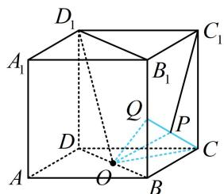

text_image

D₁
A₁
B₁
C₁
Q
P
D
O
A
B
C

图1

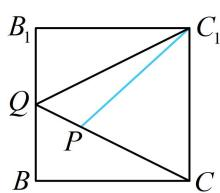

text_image

B₁
Q
P
B
C₁
C

图2

# 类型 II: 空间轨迹由球到圆

【例 3】（2022·北京卷）已知正三棱锥 P-ABC 的六条棱长均为 6，S 是 $\triangle ABC$ 及其内部的点构成的集合，设集合 $T = \{Q \in S \mid PQ \leq 5\}$ ，则 T 表示的区域的面积为（）

A. $\frac{3\pi}{4}$

B. $\pi$

C. $2 \pi$

D. $3 \pi$

解析: $Q$ 在 $\triangle ABC$ 内, 故考虑把 $PQ \leq 5$ 转换成 $Q$ 与面 $ABC$ 内某点的关系, 由正棱锥想到选底面中心, 如图, 设 $O$ 为 $\triangle ABC$ 的中心, 则 $PO \perp$ 平面 $ABC$ , 当 $Q$ 在 $\triangle ABC$ 内部运动时, 总有 $OQ \perp PO$ ,

所以 $PQ = \sqrt{PO^2 + OQ^2}$ ，故 $PQ\leq 5$ 即为 $\sqrt{PO^2 + OQ^2}\leq 5$ ①，

又 $AO = 6 \times \frac{\sqrt{3}}{2} \times \frac{2}{3} = 2\sqrt{3}$ ，所以 $PO = \sqrt{PA^2 - AO^2} = 2\sqrt{6}$ ，代入①得： $OQ \leq 1$ ，

所以集合 $T$ 表示的区域是 $\triangle ABC$ 内以 $O$ 为圆心，1为半径的圆及其内部，

故 $T$ 表示的区域的面积 $S = \pi \times 1^{2} = \pi$ .

答案: B

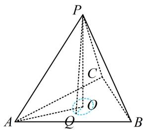

text_image

P
C
O
A
Q
B

【反思】空间中到某定点距离为定值的点的轨迹是球面，若该点还在空间的某个平面上，则轨迹就是圆.

【变式】如图，四棱锥 $P - ABCD$ 中，底面 $ABCD$ 是边长为4的正方形， $\angle PBA = \angle PBC$ ， $PD \perp AD$ ， $Q$ 为正方形 $ABCD$ 内一动点，且满足 $QA \perp QP$ ，若 $PD = 2$ ，则三棱锥 $Q - PBC$ 的体积的最小值为（）

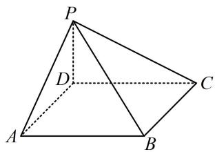

text_image

P
D
C
A
B

A. 3 B. $\frac{8}{3}$ C. $\frac{4}{3}$ D. 2

解析：从图形结合 $PD \perp AD$ 可猜想 $PD \perp$ 平面ABCD，先对此分析，再找一条垂直于 $PD$ 的线即可，因为ABCD是正方形，所以 $AB = BC$ ，又 $\angle PBA = \angle PBC$ ， $PB = PB$ ，所以 $\triangle PAB \cong \triangle PCB$ ，

故 $PA = PC$ ，又 $AD = CD$ ， $PD = PD$ ，所以 $\triangle PAD\cong \triangle PCD$ ，结合 $PD\bot AD$ 可得 $PD\bot CD$

所以 $PD \perp$ 平面ABCD，再来翻译 $QA \perp QP$ ，类比圆上，我们有球的直径所对的“球周角”为直角，

由 $QA \perp QP$ 可知点 $Q$ 在以 $PA$ 为直径的球面上，其球心为 $PA$ 中点 $O$ ，且 $OQ = \frac{1}{2} PA = \sqrt{5}$

但点 $Q$ 只能在正方形ABCD内，故应考虑面ABCD与球面相交的截面圆．涉及球的截面，过球心作截面的垂线，可找到截面圆圆心，故只需过 $O$ 作面ABCD的垂线，

取 $AD$ 中点 $I$ , 连接 $OI$ , 则 $OI = \frac{1}{2} PD = 1$ 且 $OI \parallel PD$ , 所以 $OI \perp$ 平面 $ABCD$ , 故 $I$ 即为截面圆圆心,

且 $IQ = \sqrt{OQ^2 - OI^2} = 2$ ，所以点 $Q$ 在以 $I$ 为圆心，2为半径的圆上，把底面单独画出来如图2，

因为 $V_{Q - PBC} = V_{P - QBC}$ ，而点 $P$ 到平面 $QBC$ 的距离恒为2，

故要使三棱锥 $P - QBC$ 的体积最小，只需 $S_{\triangle QBC}$ 最小，

此时点 $Q$ 应为圆弧中点，故 $(V_{Q - PBC})_{\mathrm{min}} = \frac{1}{3}\times \frac{1}{2}\times 4\times 2\times 2 = \frac{8}{3}.$

答案: B

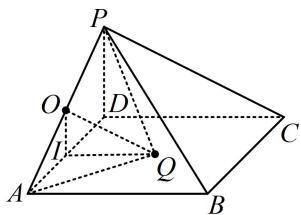

text_image

Geometric diagram of a pyramid with labeled vertices and internal points, used for spatial geometry problems.

图1

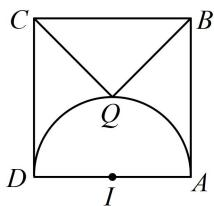

text_image

C
B
Q
D
I
A

图2

# 类型III：翻折问题

【例 4】如图，平面四边形 ABCD 中， $\triangle BCD$ 是边长为 2 的正三角形， $AB \perp AD$ ，AB = 1，现沿对角线 BD 将 $\triangle ABD$ 折起到 $\triangle A'BD$ ，使 $A'$ 在平面 BCD 内的射影 I 落在 $\triangle BCD$ 的中线 BE 上，则 BI = \_\_\_\_.

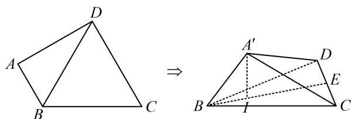

text_image

D
A
B
C
⇒
A'
D
E
B
I
C

解析：若直接在 $\triangle A^{\prime}BI$ 中用勾股定理求 $BI$ ，会发现 $A^{\prime}I$ 不好算，但若将翻折后空间图形中的 $I$ 对应到翻折前的平面图形中去，算 $BI$ 就成了初中问题，

如图2，作 $A'O \perp BD$ 于 $O$ ， $A'I \perp$ 平面 $BCD \Rightarrow BD \perp A'I$ ，所以 $BD \perp$ 平面 $A'OI$ ，故 $BD \perp OI$

注意到翻折前后 $\triangle BCD$ 和 $\triangle A'BD$ 内部点线的位置关系未变, 故翻折前也有 $BD \perp AO$ , $BD \perp OI$ , 于是 $I$ ,O 在原图中的位置如图 1，接下来的计算可在图 1 中进行，

$$
A B = 1 \Rightarrow O B = A B \cdot \cos \angle A B O = A B \cdot \frac {A B}{B D} = \frac {1}{2},
$$

由题意， $\angle OBI = 30^{\circ}$ ，所以 $BI = \frac{OB}{\cos\angle OBI} = \frac{\sqrt{3}}{3}$

答案： $\frac{\sqrt{3}}{3}$

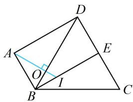

text_image

Geometric diagram of a quadrilateral ABCD with diagonals and an interior point O, labeled with vertices and angle markers.

图1

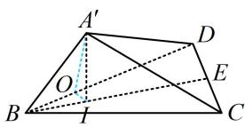

text_image

A'
D
O
E
B
I
C

图2

【反思】求解翻折问题的核心有两点：①分析翻折前后未发生变化的几何关系（如本题的 $\triangle ABD$ 和 $\triangle BCD$ 及其内部的线不随折叠而改变）；②抓住与折痕线垂直的直线（如本题的 $AI \perp BD$ ），将空间的计算问题转换到平面上来处理.

【变式】如图，矩形 ABCD 中，AB = 4， $AD = \sqrt{3}$ ，E 为 CD 中点，F 为线段 EC 上（端点除外）一动点，现将 $\triangle AFD$ 沿 AF 折起，使平面 $ABD \perp$ 平面 ABC，在平面 ABD 内过点 D 作 $DG \perp AB$ 于 G，则 AG 长度的取值范围为 \_\_\_\_.

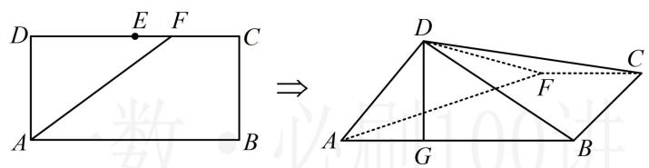

text_image

D E F C
A B
⇒
D C
F
A G B

解析：先把翻折后空间图形的点 $G$ 对应到翻折前的平面图形中去，再分析 $AG$ 怎么算，

由题意，平面 $ABD \perp$ 平面 $ABC$ ，且 $DG \perp AB$ ，所以 $DG \perp$ 平面 $ABC$ ，故 $AF \perp DG$ ，

如图2，作 $DM\perp AF$ 于 $M$ ，连接 $GM$ ，结合 $AF\perp DG$ 可得 $AF\perp$ 平面 $DGM$ ，所以 $AF\perp MG$

注意到翻折前后 $\triangle ADF$ 和梯形 $ABCF$ 内部的点线位置关系未变, 故翻折前也应有 $AF \perp DM$ , $AF \perp GM$ , 于是 $G$ , $M$ 在原图中的位置如图 1, 要求 $AG$ 的范围, 可设 $DF$ 为变量, 表示 $AG$ ,

设 $DF = x(2 < x < 4)$ ，因为 $\triangle AGM \sim \triangle FDM$ ，所以 $\frac{AG}{DF} = \frac{AM}{FM}$ ①，

由图可知， $AF = \sqrt{AD^2 + DF^2} = \sqrt{3 + x^2}$ ， $AM = AD\cdot \cos \angle DAF = AD\cdot \frac{AD}{AF} = \frac{3}{\sqrt{3 + x^2}}$

$$
F M = D F \cdot \cos \angle D F A = D F \cdot \frac {D F}{A F} = \frac {x ^ {2}}{\sqrt {3 + x ^ {2}}},
$$

结合①可得 $AG = \frac{DF \cdot AM}{FM} = \frac{3}{x}$ ,

因为 $2 < x < 4$ ，所以 $\frac{3}{4} < AG < \frac{3}{2}$

答案： $\left(\frac{3}{4},\frac{3}{2}\right)$

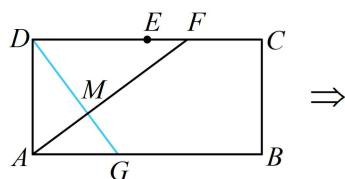

text_image

D
E F
C
M
A G B
⇒

图1

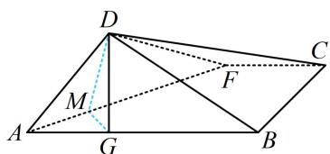

text_image

Geometric diagram of a parallelogram with labeled points and auxiliary lines, including triangle DFC and auxiliary points A, B, C, G, M, F.

图2

# 类型IV：直线上的动点问题处理思路

【例 5】（多选）如图，在棱长为 1 的正方体 $ABCD-A_{1}B_{1}C_{1}D_{1}$ 中，点 M 是线段 $AC_{1}$ 上的动点（M 与 A, $C_{1}$ 不重合），则下列结论正确的是（）

A. 存在点 $M$ , 使 $A_{1} M \perp$ 平面 $B C_{1} D$   
B. 存在点 $M$ , 使 $DM \parallel$ 平面 $B_{1}CD_{1}$   
C. $\triangle A_{1}DM$ 的面积不可能等于 $\frac{\sqrt{3}}{6}$   
D. 若 $S_{1}$ , $S_{2}$ 分别是 $\triangle A_{1}DM$ 在面 $A_{1}B_{1}C_{1}D_{1}$ 和面 $BB_{1}C_{1}C$ 的正投影面积, 则存在点 $M$ , 使 $S_{1} = S_{2}$

解法1: 点 $M$ 是唯一动点, 且在线段 $A C_{1}$ 上, 故可建系, 设出 $M$ 的坐标, 用向量法判断选项,

如图1建系，设 $\overrightarrow{AM} = \lambda \overrightarrow{AC_1}(0 < \lambda < 1)$ ， $D_{1}(0,0,0)$ ， $A(1,0,1)$ ， $C_1(0,1,0)$ ，所以 $\overrightarrow{AC_1} = (-1,1,-1)$ ，

故 $\overrightarrow{D_1M} = \overrightarrow{D_1A} +\overrightarrow{AM} = \overrightarrow{D_1A} +\lambda \overrightarrow{AC_1} = (1,0,1) + (-\lambda ,\lambda , - \lambda) = (1 - \lambda ,\lambda ,1 - \lambda)$ ，所以 $M(1 - \lambda ,\lambda ,1 - \lambda)$

A项，判断线面垂直，只需看 $A_{1}M$ 能否与面 $BC_{1}D$ 内的两条相交直线垂直（无需求法向量），

$A_{1}(1,0,0)$ ， $B(1,1,1)$ ， $D(0,0,1)$ ，所以 $\overrightarrow{A_1M} = (-\lambda ,\lambda ,1 - \lambda)$ ， $\overrightarrow{DB} = (1,1,0)$ ， $\overrightarrow{C_1B} = (1,0,1)$

令 $\left\{ \begin{array}{l} \overrightarrow{A_1M} \cdot \overrightarrow{DB} = -\lambda + \lambda = 0 \\ \overrightarrow{A_1M} \cdot \overrightarrow{C_1B} = -\lambda + 1 - \lambda = 0 \end{array} \right.$ 可得 $\lambda = \frac{1}{2}$ ，所以当 $M$ 为 $AC_1$ 中点时， $A_1M \perp$ 面 $BC_1D$ ，故 A 项正确；

B项，要判断线面能否平行，只需看直线的方向向量与平面的法向量能否垂直，

可求得平面 $B_{1}CD_{1}$ 的一个法向量为 $\pmb {n} = (-1,1, - 1)$ ， $\overrightarrow{DM} = (1 - \lambda ,\lambda , - \lambda)$

令 $\overrightarrow{DM} \cdot \boldsymbol{n} = \lambda - 1 + \lambda + \lambda = 0$ 可得 $\lambda = \frac{1}{3}$ ，所以存在点 $M$ ，使 $DM \parallel$ 平面 $B_{1}CD_{1}$ ，故 B 项正确；

C项，要求 $\triangle A,DM$ 的面积，关键是求点 $M$ 到直线 $A, D$ 的距离，可用向量法来求，

因为 $\overrightarrow{A_1D} = (-1,0,1)$ ，所以直线 $A_{1}D$ 的一个单位方向向量为 $\pmb {u} = \frac{\overrightarrow{A_1D}}{|\overrightarrow{A_1D}|} = \left(-\frac{\sqrt{2}}{2},0,\frac{\sqrt{2}}{2}\right)$ ，

又 $\overrightarrow{A_1M} = (-\lambda, \lambda, 1 - \lambda)$ ，所以点 $M$ 到直线 $A_1D$ 的距离 $d = \sqrt{\overrightarrow{A_1M}^2 - (\overrightarrow{A_1M} \cdot u)^2} = \sqrt{3\lambda^2 - 2\lambda + \frac{1}{2}}$

因为 $A_{1}D = \sqrt{2}$ ，所以 $S_{\triangle A_1DM} = \frac{1}{2}\times \sqrt{2}\times \sqrt{3\lambda^2 - 2\lambda + \frac{1}{2}}$ ，令 $S_{\triangle A_1DM} = \frac{\sqrt{3}}{6}$ 解得： $\lambda = \frac{1}{3}$

所以 $\triangle A_{1}DM$ 的面积可以等于 $\frac{\sqrt{3}}{6}$ ，故C项错误；

D项，如图1，由 $M(1 - \lambda ,\lambda ,1 - \lambda)$ 可知 $M$ 在面 $A_{1}B_{1}C_{1}D_{1}$ 内的射影为 $M_{1}(1 - \lambda ,\lambda ,0)$

所以 $S_{1} = S_{\triangle A_{1}D_{1}M_{1}} = \frac{1}{2}\times 1\times \lambda = \frac{\lambda}{2}$ ， $M$ 在面 $BB_{1}C_{1}C$ 内的射影为 $M_2(1 - \lambda ,1,1 - \lambda)$ ，所以 $S_{2} = S_{\triangle B_{1}CM_{2}}$

在图1中，由 $\overrightarrow{AM} = \lambda \overrightarrow{AC_1}$ 可得 $BM_{2} = \lambda BC_{1} = \sqrt{2}\lambda$ ，为了便于计算面积，我们把右侧面单独画出来，

如图2， $IM_{2} = |IB - BM_{2}| = \left|\frac{\sqrt{2}}{2} -\sqrt{2}\lambda \right|$

加绝对值是因为 $M_{2}$ 可能在线段 $IC_{1}$ 上,

故 $S_{2} = S_{\triangle B_{1}CM_{2}} = \frac{1}{2} B_{1}C\cdot IM_{2} = \frac{1}{2}\cdot \sqrt{2}\cdot \left|\frac{\sqrt{2}}{2} -\sqrt{2}\lambda \right| = \left|\frac{1}{2} -\lambda \right|$

令 $S_{1} = S_{2}$ 可得 $\frac{\lambda}{2} = \left|\frac{1}{2} -\lambda \right|$ ，解得： $\lambda = \frac{1}{3}$ 或1（舍去），

所以存在点 M，使 $S_{1}=S_{2}$ ，故 D 项正确.

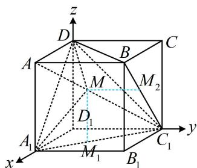

text_image

z
D
A
B
C
M
M₂
D₁
A₁
M₁
B₁
C₁
y
x

图1

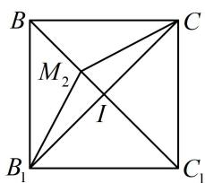

text_image

B
M₂
I
B₁
C
C₁

图2

解法2：A项，如图3， $A_{1}C\perp$ 面 $BC_{1}D$ ，当 $M$ 为 $A_{1}C$ 与 $AC_{1}$ 交点时， $A_{1}M\perp$ 面 $BC_{1}D$ ，故A项正确；

B项，要寻找满足 $DM / /$ 面 $B_{1}CD_{1}$ 的点 $M$ ，可过 $D$ 作面 $B_{1}CD_{1}$ 的平行平面，

如图4的面 $A_{1}BD$ ，当 $M$ 为该面与 $AC_{1}$ 的交点时，就满足 $DM \parallel$ 平面 $B_{1}CD_{1}$ ，故B项正确；

C项，若以 $A_{1}D$ 为底求 $S_{\triangle ADM}$ ，则底 $A_{1}D = \sqrt{2}$ 不变，可通过分析高的最值来求面积的范围，

如图5，由对称性可知 $A_{1}M = DM$ ，取 $AD_{1}$ 中点 $N$ ，连接 $MN$ ，则 $MN \perp A_{1}D$

MN 就是高，N 是定点，可到 $\triangle AC_{1}D_{1}$ 中来分析，把它单独画出来，如图 6,

当 $MN \perp AC_{1}$ 时， $MN$ 最小，作 $D_{1}T \perp AC_{1}$ 于 $T$

则 $MN_{\min} = \frac{1}{2} D_1T = \frac{1}{2}\cdot C_1D_1\cdot \sin \angle D_1C_1T = \frac{1}{2}\cdot C_1D_1\cdot \frac{AD_1}{AC_1} = \frac{\sqrt{6}}{6},$ 所以 $(S_{\triangle A_1DM})_{\min} = \frac{1}{2}\times \sqrt{2}\times \frac{\sqrt{6}}{6} = \frac{\sqrt{3}}{6},$

所以 $\triangle A_{1}DM$ 的面积可以为 $\frac{\sqrt{3}}{6}$ ，故C项错误；

D 项，此选项几何法与向量法判断的本质相同，不再赘述.

答案: ABD

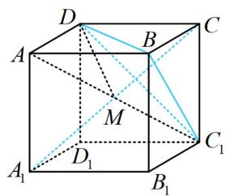

text_image

D
A
B
C
M
A₁
D₁
B₁
C₁

图3

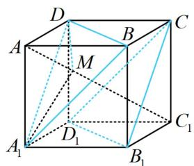

text_image

D
A
B
C
M
A₁
D₁
B₁
C₁

图4

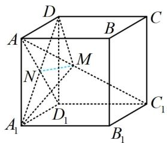

text_image

D
A
B
C
M
N
D₁
A₁
B₁
C₁

图5

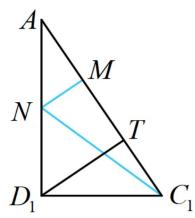

text_image

A
M
N
T
D₁
C₁

图6

【反思】①可发现, 几何法简单但需技巧, 向量法无脑但计算麻烦, 两种方法都要学好, 在几何法没思路时, 还可使用向量法 “兜底”; ②用向量法设直线上动点时, 像本题这样设 $\overrightarrow{AM} = \lambda \overrightarrow{AC_1}$ , 即可用 $\lambda$ 表示 $M$ 的坐标.

# 强化训练

1. (2021·上海卷·★★☆)

已知圆柱的底面半径为 1，高为 2，AB 是上底面圆的一条直径，C 是下底面圆周上的一个动点，则 $\triangle ABC$ 的面积的取值范围是 \_\_\_\_.

2. (2022·北京模拟·★★★)

若正四棱锥 $P - ABCD$ 的高为4，棱 $AB$ 的长为2，点 $H$ 为侧棱 $PC$ 上一动点，则 $\triangle HBD$ 的面积的最小值为（）

A. $\sqrt{2}$

B. $\frac{\sqrt{3}}{2}$

C. $\frac{\sqrt{2}}{3}$

D. $\frac{4 \sqrt{2}}{3}$

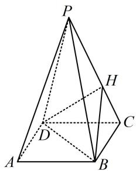

text_image

Geometric diagram of a pyramid with labeled vertices and internal points, used for spatial geometry problems.

3. (2023·云南昆明模拟·★★★☆)

正方体 $ABCD - A_{1}B_{1}C_{1}D_{1}$ 的棱长为3，点 $P$ 在正方形ABCD的边界及其内部运动，若 $3 \leq A_{1}P \leq \sqrt{11}$ ，则三棱锥 $P - A_{1}BD$ 的体积的最小值是（）

A. 1 B. $\frac{3}{2}$ C. 3 D. $\frac{9}{2}$

4.（2022·福建模拟·★★★☆）（多选）

如图，直角梯形 $ABCD$ 中， $AB \parallel CD$ ， $AB \perp BC$ ， $BC = CD = \frac{1}{2} AB = 1$ ， $E$ 为 $AB$ 中点，以 $DE$ 为折痕把 $\triangle ADE$ 折起，使点 $A$ 到达点 $P$ 的位置，使 $PC = \sqrt{3}$ ，则（）

A. 平面 $PED \perp$ 平面 $PCD$

B. $PC \perp BD$

C. 二面角 $P - DC - B$ 的大小为 $60^{\circ}$

D. $PC$ 与平面 $PED$ 所成角为 $45^{\circ}$

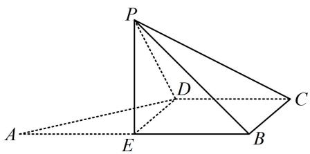

text_image

Geometric diagram of a pyramid with labeled vertices and internal points, including dashed lines indicating hidden edges.

5. (2023·山东济南二模·★★★★★) (多选)

如图，菱形ABCD中， $\angle BAD = \frac{\pi}{3}$ ， $E, F, G$ 分别是AD，CD，BC的中点，将 $\triangle ABD$ 沿直线BD折起得到三棱锥 $A - BCD$ ，则在该三棱锥中，下列说法正确的是（）

A. 直线 $EF \parallel$ 平面 $ABC$   
B. 直线 $BE$ 与 $DG$ 是异面直线  
C. 直线 $BE$ 与 $DG$ 可能垂直  
D. 若 $EG = \frac{\sqrt{7}}{4} AB$ ，则二面角 $A - BD - C$ 的大小为 $\frac{\pi}{3}$

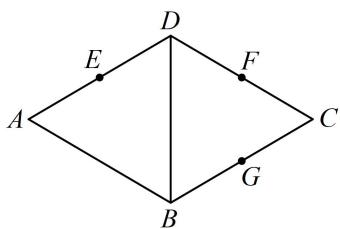

text_image

A
E
D
F
C
B
G

6. (2024·江苏模拟·★★★★★) (多选)

在正方体 $ABCD - A_{1}B_{1}C_{1}D_{1}$ 中， $P$ 为 $DD_{1}$ 的中点， $M$ 是底面 $ABCD$ 上一点，则（）

A. $M$ 为 $AC$ 中点时, $PM \perp AC_{1}$   
B. M 为 AD 中点时， $PM \parallel$ 平面 $A_{1}BC_{1}$   
C. 满足 $2PM = \sqrt{3} DD_{1}$ 的点 $M$ 在圆上  
D. 满足直线 $PM$ 与直线 $AD$ 成 $30^{\circ}$ 角的点 $M$ 在双曲线上

7.（2020·新高考Ⅰ卷·★★★★）

已知直四棱柱 $ABCD - A_{1}B_{1}C_{1}D_{1}$ 的棱长均为 2， $\angle BAD = 60^{\circ}$ ，以 $D_{1}$ 为球心， $\sqrt{5}$ 为半径的球面与侧面 $BCC_{1}B_{1}$ 的交线长为 \_\_\_\_.

