# 第2节 综合小题（★★★★）

# 内容提要

本节主要涉及偏压轴难度的立体几何综合多选题，小伙伴们根据自身的实际情况来选择性学习。在此之前，先学习空间角度的计算方法，作为铺垫，这一块（类型Ⅰ）难度不高。

1. 线线角的计算：核心是通过平移使其相交，到三角形中来算.   
2. 线面角的计算：有两种几何的方法.

①作垂线：如图1，要求直线 $PA$ 与平面 $\alpha$ 所成的角，只需过 $P$ 作 $\alpha$ 的垂线，找到垂足 $O$ ，求 $\angle PAO$   
②算距离: 如图2, 若不方便过 $P$ 作平面 $\alpha$ 的垂线, 也可用等体积法或其它方法求出点 $P$ 到平面 $\alpha$ 的距离 $d$ , 再按 $\sin \theta = \frac{d}{PA}$ 来求线面角.

3. 二面角的计算: 核心是作平面角, 若与棱垂直的射线好找, 则直接作, 否则如图3, 可先过 $\alpha$ 内的点 $P$ 作 $\beta$ 的垂线, 找到垂足 $A$ , 再过 $P$ 作 $l$ 的垂线 $PO$ , 垂足为 $O$ , 则由三垂线定理可知 $l \perp OA$ , 所以 $\angle POA$ 即为二面角 $\alpha - l - \beta$ 的平面角, 这种找二面角的方法叫做三垂线法, 其中 $PO$ 和 $OA$ 的作法可交换.

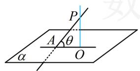

text_image

P
A θ
α O

图1

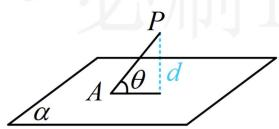  
图2

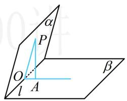

text_image

α
P
O
l
A
β

图3

4. 综合多选题：这类题往往难度大，几何法、向量法都是考虑的方向，具体问题具体分析.

# 类型 I：空间角的计算综合小题

【例 1】在平行六面体 $ABCD-A_{1}B_{1}C_{1}D_{1}$ 中，底面 ABCD 是边长为 1 的正方形， $\angle A_{1}AD=\angle A_{1}AB=60^{\circ}$ ， $AA_{1}=2$ ，则异面直线 AC 与 $DC_{1}$ 所成角的余弦值为（）

A. $\frac{\sqrt{14}}{7}$

B. $\frac{\sqrt{6}}{3}$

C. $\frac{\sqrt{6}}{4}$

D. $\frac{3 \sqrt{14}}{14}$

解析：求异面直线所成的角，可通过平移使其相交，到三角形内来分析. 只需将 $DC_{1}$ 移到点 $A$ 处，

如图， $AB_{1} / / DC_{1}$ ，由题设可求得 $AC = \sqrt{2}$ ， $A_{1}D^{2} = AA_{1}^{2} + AD^{2} - 2AA_{1}\cdot AD\cdot \cos \angle A_{1}AD = 3$

所以 $A_{1}D = \sqrt{3}$ ，故 $B_{1}C = \sqrt{3}$ ， $\angle A_{1}AB = 60^{\circ}\Rightarrow \angle AA_{1}B_{1} = 120^{\circ}$

所以 $AB_{1}^{2} = AA_{1}^{2} + A_{1}B_{1}^{2} - 2AA_{1}\cdot A_{1}B_{1}\cdot \cos \angle AA_{1}B_{1} = 7$ ，故 $AB_{1} = \sqrt{7}$

在 $\triangle AB_{1}C$ 中，由余弦定理， $\cos \angle B_{1}AC = \frac{AB_{1}^{2} + AC^{2} - B_{1}C^{2}}{2AB_{1}\cdot AC} = \frac{3\sqrt{14}}{14}$ ，

故异面直线 $AC$ 与 $DC_{1}$ 所成角的余弦值为 $\frac{3\sqrt{14}}{14}$ .

答案: D

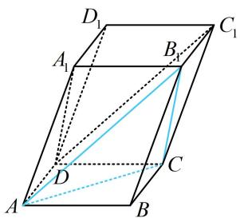

text_image

D₁
A₁
B₁
C₁
D
C
A
B

【反思】在求异面直线所成的角的小题中，常通过平移使它们成为相交直线，到三角形内进行分析.

【例 2】长方体 $ABCD-A_{1}B_{1}C_{1}D_{1}$ 中，已知 $B_{1}D$ 与平面 ABCD 和平面 $AA_{1}B_{1}B$ 所成的角均为 $30^{\circ}$ ，则（）

A. ${AB} = {2AD}$   
B. $AC = B_{1}C$   
C. $B_{1} D$ 与平面 $B B_{1} C_{1} C$ 所成的角为 $45^{\circ}$   
D. $AB$ 与平面 $AB_{1}C_{1}D$ 所成的角为 $30^{\circ}$

解析：长方体中有较多的线面垂直，故先分析题干所给的线面角，找到长、宽、高的关系， $BB_{1} \perp$ 平面 $ABCD \Rightarrow B_{1}D$ 与平面 $ABCD$ 所成的角为 $\angle B_{1}DB$ ，

$AD \perp$ 平面 $AA_{1}B_{1}B \Rightarrow B_{1}D$ 与平面 $AA_{1}B_{1}B$ 所成的角为 $\angle AB_{1}D$ ，由题意， $\angle B_{1}DB = \angle AB_{1}D = 30^{\circ}$ ，不妨设 $AA_{1} = 1$ ，则 $\tan \angle B_{1}DB = \frac{BB_{1}}{BD} = \frac{\sqrt{3}}{3} \Rightarrow BD = \sqrt{3}$ ，设 $AB = a$ ， $AD = b$ ，则 $a^{2} + b^{2} = 3$ ①，

$\tan \angle AB_{1}D = \frac{AD}{AB_{1}} = \frac{\sqrt{3}}{3}\Rightarrow \frac{b}{\sqrt{a^{2} + 1}} = \frac{\sqrt{3}}{3}$ ②，联立 $①②$ 解得： $a = \sqrt{2}$ ， $b = 1$

A项，由前面的计算可知， $AB = \sqrt{2}$ ， $AD = 1$ ，所以 $AB = \sqrt{2} AD$ ，故A项错误；

B 项， $AC=\sqrt{AB^{2}+BC^{2}}=\sqrt{3}$ ， $B_{1}C=\sqrt{BB_{1}^{2}+BC^{2}}=\sqrt{2}$ ，所以 $AC\neq B_{1}C$ ，故 B 项错误；

C 项， $DC \perp$ 平面 $BB_{1}C_{1}C \Rightarrow B_{1}D$ 与平面 $BB_{1}C_{1}C$ 所成的角为 $\angle DB_{1}C$ ，

因为 $\tan \angle DB_{1}C = \frac{CD}{B_{1}C} = \frac{\sqrt{2}}{\sqrt{2}} = 1$ ，所以 $\angle DB_{1}C = 45^{\circ}$ ，故C项正确；

D项，作 $BG\perp AB_{1}$ 于 $G$ ，因为 $AD\perp$ 面 $ABB_{1}A_{1}$ ，所以 $BG\perp AD$

从而 $BG \perp$ 平面 $AB_{1}C_{1}D$ ，故 $\angle BAG$ 是 $AB$ 与平面 $AB_{1}C_{1}D$ 所成的角，

$\tan \angle BAG = \frac{BB_1}{AB} = \frac{\sqrt{2}}{2} \Rightarrow \angle BAG \neq 30^\circ$ ，故D项错误.

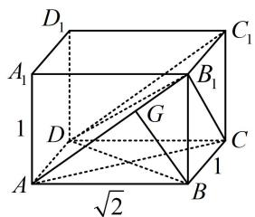

text_image

D₁
A₁
1
D
G
B₁
C₁
1
√2
A
B
C

答案: C

【反思】找线面角的核心是过直线上的点作面的垂线，找到垂足，也就找到了线面角.

【例 3】如图，已知 $\triangle ABC$ 和 $\triangle DBC$ 所在的平面互相垂直，AB = BC = BD， $\angle ABC = \angle DBC = 120^{\circ}$ ，则二面角 A - BD - C 的正切值等于 \_\_\_\_.

解析：条件有面面垂直，可方便地作交线的垂线找到线面垂直，故用“三垂线法”作二面角的平面角，

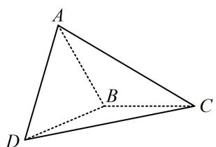

text_image

A
B
C
D

如图, 作 $AH \perp CB$ 的延长线于 $H$ , 因为平面 $ABC \perp$ 平面 $DBC$ , 所以 $AH \perp$ 平面 $DBC①$ ,

作 $HI \perp BD$ 于点 $I$ 交 $CD$ 于点 $G$ ，又由①可得 $BD \perp AH$ ，所以 $BD \perp$ 平面 $AHI$ ，故 $BD \perp AI$ ，

所以 $\angle AIG$ 即为二面角 $A - BD - C$ 的平面角，且 $\angle AIG = \pi -\angle AIH$

故 $\tan \angle AIG = \tan (\pi -\angle AIH) = -\tan \angle AIH$ ②，要算 $\tan \angle AIH$ ，只需到 Rt△AHI 中计算 $AH$ 和 $HI$

由 $\angle ABC = \angle DBC = 120^{\circ}$ 知 $\angle ABH = \angle DBH = 60^{\circ}$ ，设 $AB = BC = BD = 2$ ，则 $AH = AB\cdot \sin \angle ABH = \sqrt{3}$ ，

$BH = AB \cdot \cos \angle ABH = 1$ ，在 $\triangle HBI$ 中， $HI = BH \cdot \sin \angle HBI = 1 \times \sin 60^{\circ} = \frac{\sqrt{3}}{2}$

所以 $\tan \angle AIH = \frac{AH}{HI} = 2$ ，代入②得 $\tan \angle AIG = -2$

故二面角 $A - BD - C$ 的正切值为-2.

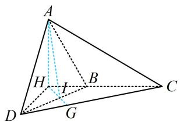

text_image

A
H
B
D
G
C

答案: -2

【反思】作二面角的平面角常用 “三垂线法”，只需过一个面内的点向另一个面作垂线，找到垂足，再过垂足作二面角棱的垂线，即可找到二面角的平面角.

# 类型II：综合多选题

【例 4】(多选) 正方体 $ABCD-A_{1}B_{1}C_{1}D_{1}$ 中，点 P 在线段 $B_{1}C$ 上运动，则下列结论正确的有（）

A. 直线 $AC_{1} \perp$ 平面 $A_{1}BD$   
B. 三棱锥 $P - A_{1}BD$ 的体积为定值  
C. 异面直线 $AP$ 与 $A_{1}D$ 所成角的取值范围是 $\left[\frac{\pi}{6}, \frac{\pi}{2}\right]$   
D. 直线 $C_1P$ 与平面 $A_{1}C_{1}D$ 所成角的正弦值的最大值为 $\frac{\sqrt{6}}{3}$

解析: A 项, 判断线面垂直, 需找线线垂直, 正方体中, 线在表面的射影好找, 故考虑三垂线定理法, 如图 1, $A C _ { 1 }$ 在面 $A B B _ { 1 } A _ { 1 }$ 内的射影为 $A B _ { 1 }$ , 由三垂线定理, $A _ { 1 } B \perp A B _ { 1 } \Rightarrow A _ { 1 } B \perp A C _ { 1 }$ ,

同理， $BD \perp AC_{1}$ ，所以 $AC_{1} \perp$ 平面 $A_{1}BD$ ，故 A 项正确；

B 项，如图 2，注意到 $B_{1}C \parallel A_{1}D$ ，所以 $B_{1}C \parallel$ 平面 $A_{1}BD$ ，故点 P 到平面 $A_{1}BD$ 的距离为定值，又 $\triangle A_{1}BD$ 的面积不变，所以三棱锥 $P-A_{1}BD$ 的体积为定值，故 B 项正确；

C 项，注意到 $B_{1} C \parallel A_{1} D$ ，所以只需分析 $A P$ 与 $B_{1} C$ 所成的角，可到 $\triangle A B_{1} C$ 中来看，

如图2， $\triangle AB_{1}C$ 为正三角形，当 $P$ 在 $B_{1}C$ 上运动时， $AP$ 与 $B_{1}C$ 所成的角的最小值为 $\angle AB_{1}C = \frac{\pi}{3}$ ，最大值为 $\frac{\pi}{2}$ （ $AP \perp B_{1}C$ 时取得），故 C 项错误；

D 项，P 是动点，不易过 P 作面 $A_{1}C_{1}D$ 的垂线，建系处理也麻烦，故考虑公式 $\sin\theta=\frac{d}{PC_{1}}$ ，先求 d，如图 3， $B_{1}C \parallel A_{1}D \Rightarrow B_{1}C \parallel$ 面 $A_{1}C_{1}D$ ，所以运动过程中，点 P 到面 $A_{1}C_{1}D$ 的距离 d 是定值，可按点 C 到面 $A_{1}C_{1}D$ 的距离求 d，用等体积法，

$V_{A_1 - CC_1D} = V_{C - A_1C_1D}\Rightarrow \frac{1}{3}\times \frac{1}{2}\times 2\times 2\times 2 = \frac{1}{3}\times \frac{1}{2}\times 2\sqrt{2}\times 2\sqrt{2}\times \frac{\sqrt{3}}{2}\times d$ ，解得： $d = \frac{2\sqrt{3}}{3},$

当 $PC_{1} \perp B_{1}C$ 时， $PC_{1}$ 最小，所以 $(PC_{1})_{\min} = \sqrt{2}$ ，从而 $(\sin \theta)_{\max} = \frac{\frac{2\sqrt{3}}{3}}{\sqrt{2}} = \frac{\sqrt{6}}{3}$ ，故D项正确.

答案: ABD

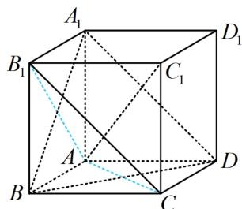

text_image

A₁
B₁
C₁
D₁
A
B
C
D

图1

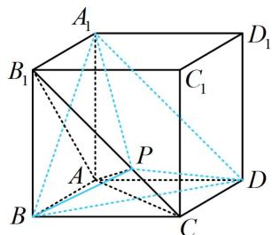

text_image

A₁
B₁
C₁
D₁
P
A
B
C
D

图2

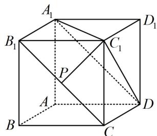

text_image

A₁
B₁
P
C₁
D₁
A
B
C
D

图3

【例 5】（多选）如图，棱长为 2 的正方体 $ABCD-A_{1}B_{1}C_{1}D_{1}$ 中，E，F 分别为棱 $A_{1}D_{1}$ ， $AA_{1}$ 的中点，G 为面对角线 $B_{1}C$ 上一个动点，则（）

A. 三棱锥 $A_{1} - EFG$ 的体积为定值  
B. 线段 $B_{1} C$ 上存在点 $G$ , 使平面 $E F G / / \text{平面 } B D C_{1}$   
C. 设直线 $FG$ 与平面 $BCC_{1}B_{1}$ 所成角为 $\theta$ , 则 $\cos \theta$ 的最小值为 $\frac{1}{3}$   
D. 三棱锥 $A_{1} - EFG$ 的外接球半径的最大值为 $\frac{3\sqrt{2}}{2}$

解析：A 项，因为 $B_{1}C$ // 面 $A_{1}EF$ ，所以点 $G$ 到面 $A_{1}EF$ 的距离不变，

又 $\triangle A_{1}EF$ 的面积也不变，所以三棱锥 $A_{1} - EFG$ 的体积为定值，故A项正确；

B 项，如图 1，注意到 $EF \parallel BC_{1}$ ，所以面 $EFG \parallel$ 面 $BDC_{1} \Leftrightarrow EG \parallel$ 面 $BDC_{1}$ ，

直接观察不易看出上述平行关系能否成立，可建系处理，如图建系，设 $\overrightarrow{B_1G} = \lambda \overrightarrow{B_1C} (0\leq \lambda \leq 1)$

由图可知， $D(0,0,0)$ ， $E(1,0,2)$ ， $B_{1}(2,2,2)$ ， $C(0,2,0)$ ， $B(2,2,0)$ ， $C_1(0,2,2)$

所以 $\overrightarrow{DB} = (2,2,0)$ ， $\overrightarrow{DC_1} = (0,2,2)$ ，设平面 $BDC_{1}$ 的法向量为 $\pmb {n} = (x,y,z)$ ，则 $\left\{ \begin{array}{l}\pmb {n}\cdot \overrightarrow{DB} = 2x + 2y = 0\\ \pmb {n}\cdot \overrightarrow{DC_1} = 2y + 2z = 0 \end{array} \right.$ 令 $x = 1$ ，则 $\left\{ \begin{array}{l}y = -1\\ z = 1 \end{array} \right.$ ，所以 $\pmb {n} = (1, - 1,1)$ 是平面 $BDC_{1}$ 的一个法向量，

$$
\overrightarrow {E G} = \overrightarrow {E B _ {1}} + \overrightarrow {B _ {1} G} = \overrightarrow {E B _ {1}} + \lambda \overrightarrow {B _ {1} C} = (1, 2, 0) + \lambda (- 2, 0, - 2) = (1 - 2 \lambda , 2, - 2 \lambda),
$$

令 $\overrightarrow{EG} \cdot \pmb{n} = 1 - 2\lambda - 2 - 2\lambda = 0$ 得： $\lambda = -\frac{1}{4}$ ，不满足 $0 \leq \lambda \leq 1$

所以不存在点 $G$ ，使平面 $EFG \parallel$ 平面 $BDC_{1}$ ，故 B 项错误；

C 项, 可以用几何法作出线面角来分析, 但平面 $BCC_{1}B_{1}$ 的法向量能直接看出, 故用向量法也好做, 下面我们用向量法来求解. 由于 $\cos \theta = \sqrt{1 - \sin^2 \theta}$ , 所以当 $\sin \theta$ 最大时, $\cos \theta$ 最小,

因为 $F(2,0,1)$ ，所以 $\overrightarrow{FG} = \overrightarrow{FB_1} +\overrightarrow{B_1G} = \overrightarrow{FB_1} +\lambda \overrightarrow{B_1C} = (0,2,1) + \lambda (-2,0, - 2) = (-2\lambda ,2,1 - 2\lambda)$

如图1， $\pmb {m} = (0,1,0)$ 是面 $BCC_{1}B_{1}$ 的一个法向量，故 $\sin \theta = |\cos < \overrightarrow{FG},\pmb {m} > | = \frac{|\overrightarrow{FG}\cdot\pmb{m}|}{|\overrightarrow{FG}|\cdot|\pmb{m}|} = \frac{2}{\sqrt{8\lambda^2 - 4\lambda + 5}}$

当 $\lambda = \frac{1}{4}$ 时， $\sin \theta$ 取得最大值 $\frac{2\sqrt{2}}{3}$ ，所以 $(\cos \theta)_{\min} = \sqrt{1 - \left(\frac{2\sqrt{2}}{3}\right)^2} = \frac{1}{3}$ ，故C项正确；

D 项, 如图 2, 观察发现三棱锥 $A_{1}-GEF$ 的外接球没有模型可套用, 但 $\triangle A_{1}EF$ 为直角三角形, 其外心比较好找, 故过外心作面 $A_{1}EF$ 的垂线, 则球心必在该垂线上,

如图2，取 $EF$ 中点 $H$ ，过 $H$ 作面 $A_{1}EF$ 的垂线，因为 $H\left(\frac{3}{2},0,\frac{3}{2}\right)$ ，所以可设球心为 $O\left(\frac{3}{2},m,\frac{3}{2}\right)$

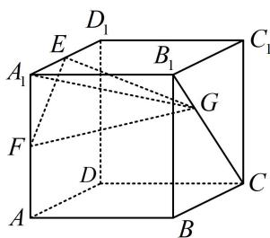

text_image

D₁
E
A₁
B₁
C₁
G
F
D
C
A
B

要求 $m$ ，需建立方程，可根据 $OE = OG$ ，用空间两点距离公式来建立，

$$
\overrightarrow {O G} = \overrightarrow {O B _ {1}} + \overrightarrow {B _ {1} G} = \overrightarrow {O B _ {1}} + \lambda \overrightarrow {B _ {1} C} = \left(\frac {1}{2}, 2 - m, \frac {1}{2}\right) + \lambda (- 2, 0, - 2) = \left(\frac {1}{2} - 2 \lambda , 2 - m, \frac {1}{2} - 2 \lambda\right),
$$

由 $OE = OG$ 可得 $\sqrt{\left(\frac{3}{2} - 1\right)^2 + (m - 0)^2 + \left(\frac{3}{2} - 2\right)^2} = \sqrt{\left(\frac{1}{2} - 2\lambda\right)^2 + (2 - m)^2 + \left(\frac{1}{2} - 2\lambda\right)^2}$ ，整理得： $m = 2\lambda^2 - \lambda + 1$ ，所以 $OE = \sqrt{m^2 + \frac{1}{2}} = \sqrt{(2\lambda^2 - \lambda + 1)^2 + \frac{1}{2}} = \sqrt{\left[2\left(\lambda - \frac{1}{4}\right)^2 + \frac{7}{8}\right]^2 + \frac{1}{2}}$ ，

故当 $\lambda = 1$ 时， $OE$ 取得最大值 $\frac{3\sqrt{2}}{2}$ ，即所求外接球半径的最大值为 $\frac{3\sqrt{2}}{2}$ ，故D项正确.

答案: ACD

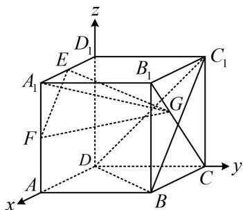

text_image

z
D₁
E
A₁
B₁
C₁
G
F
D
A
B
C
y
x

图1

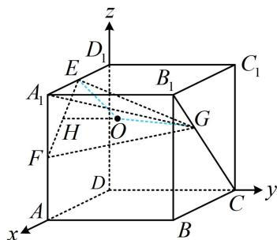

text_image

z
D₁
E
A₁
B₁
C₁
H
O
G
F
D
A
B
C
y
x

图2

【总结】立体几何综合题变化多且难度大，一般优先考虑几何法，如无思路再尝试建系，建系前应评估计算量，以免计算过于复杂。立体几何综合题类型繁杂，本节练习题部分有更多类型供大家训练。

# 强化训练

# 类型 I：空间角的计算

1. (2024·东北三省三校第一次联考·★★★)

如图，四边形ABCD是正方形， $PA\bot$ 平面ABCD，且 $PA = AB = 2$ ， $M$ 是线段PB的中点，则异面直线DM与PA所成角的正切值为\_\_\_\_.

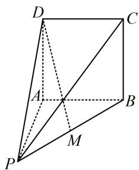

text_image

Geometric diagram of a quadrilateral with labeled vertices and internal points, used for spatial geometry problems.

2. (2023·全国乙卷·★★★)

已知 $\triangle ABC$ 为等腰直角三角形， $AB$ 为斜边， $\triangle ABD$ 为等边三角形，若二面角 $C - AB - D$ 为 $150^{\circ}$ ，则直线 $CD$ 与平面 $ABC$ 所成角的正切值为（）

A. $\frac{1}{5}$

B. $\frac{\sqrt{2}}{5}$

C. $\frac{\sqrt{3}}{5}$

D. $\frac{2}{5}$

3. (2022·浙江期中·★★★)

如图，圆锥 $AO$ 中， $B$ ， $C$ 是圆 $O$ 上的不同两点，若 $\angle OAB = 30^{\circ}$ ，且二面角 $B - AO - C$ 为 $60^{\circ}$ ，动点 $P$ 在线段 $AB$ 上，则 $CP$ 与平面 $AOB$ 所成角的正切值的最大值为（）

A. 2

B. $\sqrt{3}$

C. $\sqrt{2}$

D. 1

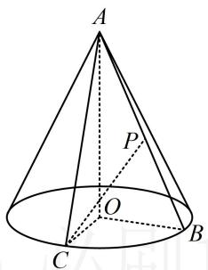

text_image

A
P
O
C
B

# 类型Ⅱ：压轴综合多选题

4.（2023·广东六校联考·★★★☆）（多选）

如图，正方体 $ABCD - A_{1}B_{1}C_{1}D_{1}$ 的棱长为2，若点 $M$ 在线段 $BC_{1}$ 上运动，则下列结论正确的是（）

A. 直线 $A_{1} M$ 可能与平面 $A C D_{1}$ 相交

B. 三棱锥 $A - MCD$ 与三棱锥 $D_{1} - MCD$ 的体积之和为 $\frac{4}{3}$

C. $\triangle AMC$ 的周长的最小值为 $8 + 4\sqrt{2}$

D. 当点 $M$ 是 $BC_{1}$ 的中点时, $CM$ 与平面 $AD_{1}C_{1}$ 所成角最大

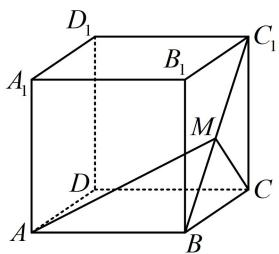

text_image

D₁
A₁
B₁
C₁
M
D
A
B
C

5.（2024·湖北武汉二调·★★★☆）（多选）

将两个各棱长均为1的正三棱锥 $D - ABC$ 和 $E - ABC$ 的底面重合，得到如图所示的六面体，则（）

A. 该几何体的表面积为 $\frac{3\sqrt{3}}{2}$

B. 该几何体的体积为 $\frac{\sqrt{3}}{6}$

C. 过该多面体任意三个顶点的截面中存在两个平面互相垂直

D. 直线 $AD \parallel$ 平面 $BCE$

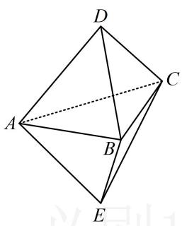

text_image

Geometric diagram of a tetrahedron with labeled vertices A, B, C, D, E and dashed internal lines

6.（2024·新疆乌鲁木齐一模·★★★☆）（多选）

某广场设置了一些石凳供大家休息，这些石凳是由棱长为 $40\mathrm{cm}$ 的正方体截去八个一样的四面体得到的，则（）

A. 该几何体的顶点数为12

B. 该几何体的棱数为24

C. 该几何体的表面积为 $(4800 + 800\sqrt{3})\mathrm{cm}^2$

D. 该几何体外接球的表面积是原正方体内切球、外接球表面积的等差中项

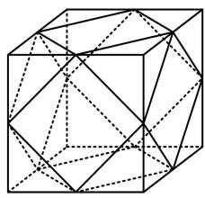

natural_image

Geometric wireframe diagram of a cube with internal diagonals and dashed lines indicating hidden edges (no text or symbols)

7. (2024·江西模拟·★★★★★) (多选)

正方体 $ABCD - A_{1}B_{1}C_{1}D_{1}$ 的体积为8，线段 $CC_{1}$ ， $BC$ 的中点分别为 $E$ ， $F$ ，动点 $G$ 在下底面 $A_{1}B_{1}C_{1}D_{1}$ 内（含边界），动点 $H$ 在直线 $AD_{1}$ 上， $GE = AA_{1}$ ，则（）

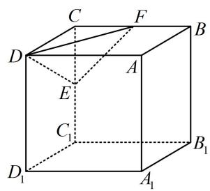

text_image

Geometric diagram of a cube with labeled vertices and internal points, used for spatial geometry problems.

A. 三棱锥 $H - DEF$ 的体积为定值  
B. 动点 $G$ 的轨迹长度为 $\frac{\sqrt{5}\pi}{2}$   
C. 不存在点 $G$ , 使得 $EG \perp$ 平面 $DEF$   
D. 四面体 $DEFG$ 体积的最大值为 $\frac{\sqrt{15} + 2}{6}$

8. (2023·湖北统考·★★★★) (多选)

折纸是一种高雅的艺术活动，已知正方形纸片 $ABCD$ 的边长为2，现将 $\triangle ACD$ 沿对角线 $AC$ 旋转 $180^{\circ}$ ，记旋转过程中点 $D$ 的位置为点 $P$ （不含起始位置和与 $B$ 重合的情形）， $AC$ ， $AP$ ， $BC$ 的中点分别为 $O$ ， $E$ ， $F$ ，则（）

A. $AC \perp BP$   
B. $PB + PD$ 的最大值为 $4 \sqrt{2}$   
C. 旋转过程中，EF 与平面 BOP 所成角的正弦值的取值范围是 $\left(\frac{\sqrt{2}}{2},1\right)$   
D. $\triangle ACD$ 旋转形成的几何体的体积是 $\frac{2\sqrt{2}\pi}{3}$

9. (2024·广东模拟·★★★★★) (多选)

若 $S, T$ 为某空间几何体表面上的任意两点，则这两点的距离的最大值称为该几何体的线长度。已知圆锥 $PO$ 的底面直径与线长度分别为 2, 4，正四棱台 $ABCD - A_{1}B_{1}C_{1}D_{1}$ 的线长度为 6，且 $AB = 2$ ， $A_{1}B_{1} = 4$ ，则（）

A. 圆锥 $PO$ 的体积为 $\frac{8\sqrt{3}\pi}{3}$   
B. $AA_{1}$ 与底面 $A_{1}B_{1}C_{1}D_{1}$ 所成角的正切值为3  
C. 圆锥 $PO$ 内切球的线长度为 $\frac{2\sqrt{15}}{5}$   
D. 正四棱台 $ABCD - A_{1}B_{1}C_{1}D_{1}$ 外接球的表面积为 $42\pi$

