# 第一章 集合与常用逻辑用语

命题点1 集合及其关系 001

命题点 2 集合的基本运算 …… 002

命题点3 常用逻辑用语 003

# 第二章 函数及其性质

命题点 4 函数的定义域、值域及其表示 …… 005

命题点 5 函数的单调性、周期性 …… 006

命题点 6 函数的奇偶性以及函数性质的综合应用

008

命题点 7 二次函数、幂函数的图象与性质……009

命题点8 指数函数与对数函数的图象与性质 …… 011

命题点 9 函数图象的识别与应用 …… 012

命题点 10 函数零点问题 …… 014

命题点 11 函数模型及其应用 …… 015

# 第三章 导数及其应用

命题点 12 导数的运算及几何意义 …… 016

命题点 13 利用导数处理函数的单调性问题 …… 017

命题点 14 利用导数解决函数的极值、最值问题

019

命题点 15 利用导数研究函数的零点问题…… 021

命题点 16 极值点偏移问题 022

命题点 17 利用导数研究不等式恒成立(或存在性)

问题 024

# 第四章 三角函数与解三角形

命题点 18 三角函数的定义及应用 …… 026

命题点 19 三角函数的化简、求值问题 …… 027

命题点 20 三角函数的图象及其变换 …… 029

命题点21 三角函数的性质及综合应用 …… 030

命题点 22 利用正、余弦定理解三角形 …… 032

# 第五章 平面向量

命题点 23 平面向量的概念及线性运算 …… 034

命题点 24 平面向量的基本定理及坐标表示 …… 035

命题点 25 平面向量的数量积运算 …… 036

命题点 26 平面向量的综合应用 …… 038

# 第六章 数列

命题点 27 数列的概念及表示方法 …… 039

命题点28 等差数列及其前 $n$ 项和 040

命题点29 等比数列及其前 $n$ 项和 042命题点 30 数列的求和问题 …… 043

命题点 31 数列的综合应用 …… 045

# 第七章 不等式

命题点 32 不等式的性质及常见不等式的解法 … 047

命题点 33 利用基本不等式求最值 …… 049

# 第八章 立体几何

命题点 34 空间几何体的结构特征、表面积与体积

050

命题点 35 与球有关的切、接问题 …… 051

命题点 36 空间点、线、面的位置关系 …… 053

命题点 37 线面、面面平行的判定与性质 …… 054

命题点 38 线面、面面垂直的判定与性质 …… 055

命题点 39 空间角与距离、空间向量及其应用 …… 057

# 第九章 直线与圆的方程

命题点 40 直线方程与圆的方程 …… 061

命题点 41 直线、圆的位置关系…… 062

# 第十章 圆锥曲线

命题点 42 椭圆的标准方程及几何性质 …… 065

命题点 43 双曲线的标准方程及几何性质…… 066

命题点 44 抛物线的标准方程及几何性质…… 068

命题点 45 直线与圆锥曲线的位置关系 …… 069

命题点 46 求轨迹方程 …… 071

命题点 47 圆锥曲线的最值、范围问题 …… 072

命题点 48 圆锥曲线的定点、定值及存在性问题
073

# 第十一章 计数原理

命题点 49 排列与组合 076

命题点 50 二项式定理 …… 077

# 第十二章 概率与统计

命题点 51 随机事件与概率 …… 078

命题点 52 抽样方法与总体分布的估计 …… 079

命题点 53 变量间的相关关系与统计案例…… 081

命题点 54 离散型随机变量的分布列、期望与方差
084

命题点 55 二项分布与正态分布 …… 086

# 第十三章 复数

命题点 56 复数的概念与运算 …… 088

# 第一章 集合与常用逻辑用语

# 命题点 1 集合及其关系


# 学 | 必备知识

# 1. 集合的含义与表示

(1)元素与集合的关系有属于和不属于两种,分别用符号 $\in$ 和 $\notin$ 表示.  
(2) 集合中元素的三个特性: 确定性、互异性、无序性.  
(3)集合的表示法:列举法、描述法、图示法.  
(4) 常见数集及其表示符号

<table><tr><td>名称</td><td>非负整数集 (或自然数集)</td><td>正整数集</td><td>整数集</td><td>有理数集</td><td>实数集</td></tr><tr><td>符号</td><td>N</td><td>N*或N+</td><td>Z</td><td>Q</td><td>R</td></tr></table>

# 2. 集合间的基本关系

<table><tr><td>关系</td><td>自然语言</td><td>符号语言</td><td>Venn图</td></tr><tr><td>子集</td><td>集合A中所有元素都在集合B中(即若x∈A,则x∈B)</td><td>A⊆B(或B⊃A)</td><td>A B 或 A(B)</td></tr></table>

续表

<table><tr><td>关系</td><td>自然语言</td><td>符号语言</td><td>Venn图</td></tr><tr><td>真子集</td><td>集合A是集合B的子集,且集合B中至少有一个元素不在集合A中</td><td>A∉B(或B∉A)</td><td>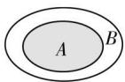</td></tr><tr><td>集合相等</td><td>集合A,B中的元素相同或集合A,B互为子集</td><td>A=B</td><td>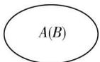</td></tr></table>

# 归纳总结

1. 空集是任何集合的子集, 在涉及集合关系时, 必须优先考虑空集的情况, 否则容易漏解.  
2. 若有限集 A 中有 n 个元素, 则 A 的子集个数为 $2^{n}$ , 非空子集个数为 $2^{n}-1$ , 真子集个数为 $2^{n}-1$ , 非空真子集个数为 $2^{n}-2$ .


# 思 | 命题探究

# 命题角度 1 集合中的代表元素问题

典例1已知集合 $M = \{(x,y)\mid \lg (x - y) = \lg (2x)\} ,N = \{(x,$ $y)\mid (x - 1)^{2} + y^{2} = 1\}$ ，则 $M\cap N$ 中元素的个数为 （）

A. 0

B. 1

C. 2

D. 3

解析 通解 由 $\lg (x - y) = \lg (2x)$ ，得 $\left\{ \begin{array}{l} x - y = 2x, \\ x - y > 0, \\ 2x > 0, \end{array} \right.$ 即

$\left\{\begin{aligned}y&=-x,\\ x&>0,\end{aligned}\right.$ 由 $\left\{\begin{aligned}y&=-x,\\ (x-1)^{2}+y^{2}&=1,\end{aligned}\right.$ 得 $\left\{\begin{aligned}x&=1,\\ y&=-1,\end{aligned}\right.$ 所以 $M\cap N=$

$\{(1,-1)\}$ , 故选 B. (易错提醒: 易忽视对数函数的定义域,

产生增根 $\left\{\begin{aligned}x&=0,\\ y&=0,\end{aligned}\right.$ 从而错选C)

优解 由 $\lg (x - y) = \lg (2x)$ ，得

$\left\{\begin{aligned}x-y=2x,\\ x-y>0,\end{aligned}\right.$ 得 $\left\{\begin{aligned}y&=-x,\\ x&>0,\end{aligned}\right.$ 即 $M=\{(x,y)\mid y=$ $2x>0,$

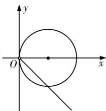

<details>
<summary>text_image</summary>

y
O
x
</details>

$-x$ ，且 $x > 0$ ，在同一直角坐标系中画出 $y = -x (x > 0)$ 的图象和圆 $(x - 1)^2 + y^2 = 1$ ，如图所示，由图可知，只有一个交点，即集合 $M$ 与集合 $N$ 只有一个相同元素，故选 B.

▶ 答案 B


# 用 | 素养解题

# 与集合中的元素有关的问题的求解策略

(1) 确定集合的元素, 即集合是数集、点集, 还是其他集合;  
(2)查看集合的元素满足的限制条件,选择适当的方法化简集合;  
(3)根据限制条件列式求参数的值或确定集合中元素的个数,但要注意检验集合中的元素是否满足互异性.

变式1 已知集合 $A = \{x \mid x \in Z, \text{且} \frac{3}{2 - x} \in Z\}$ ，则集合 A 中的元素个数为（）

A. 2

B. 3

C. 4

D. 5

变式2 已知集合 $A = \{x \in \mathbf{N} | x^2 + 2x - 3 \leqslant 0\}$ , $B = \{C | C \subseteq A\}$ , 则集合 $B$ 中元素的个数为 （）

A. 2

B. 3

C. 4

D. 5

# 命题角度 2 集合间的基本关系

典例2 若集合 $A = \{y \mid y = 2^x, x \in \mathbf{R}\}, B = \{y \mid y = x^2, x \in \mathbf{R}\}$ ，则 （）

A. $A \subseteq B$

B. $A \supseteq B$

C. $A = B$

D. $A \cap B = \varnothing$

解析 集合 $A = \{y \mid y = 2^x, x \in \mathbf{R}\} = \{y \mid y > 0\}, B = \{y \mid y = x^2, x \in \mathbf{R}\} = \{y \mid y \geqslant 0\}, \therefore A \subseteq B.$   
▶ 答案 A

# 用 素养解题

# 判断集合之间关系的三种常用方法

(1)列举法:根据题中限定条件把集合中的元素列举出来,然后比较集合元素的异同,从而找出集合之间的关系.  
(2)变形法:从元素的结构特点入手,结合通分、化简、变形等技巧,从元素结构上找差异进行判断.  
(3) 数轴法: 在同一个数轴上表示出两个集合, 比较端点之间的大小关系, 从而确定集合与集合之间的关系.

# 命题角度 3 利用集合之间的关系求参数

典例3已知集合 $A = \{x\mid x^2 +x - 6\leqslant 0\}$ ， $B = \{x\mid 2m - 2\leqslant x\leqslant$ $m + 2\}$ ，若 $B\subseteq A$ ，则实数 $m$ 的取值范围是

A. $\left[-\frac{1}{2},0\right]\cup[4,+\infty)$   
B. $\left[-1,0\right]\cup\left(\overline{3},+\infty\right)$

C. $[-1,0] \cup (4, +\infty)$   
D. $\left[-\frac{1}{2},0\right]\cup (4, + \infty)$

思路分析 先解不等式求出集合 A, 根据两个集合之间的子集关系分 $B = \varnothing$ 和 $B \neq \varnothing$ 两种情况讨论, 即可求解.  
解析 由题意,集合 $A=\{x\mid x^{2}+x-6\leqslant0\}=\{x\mid-3\leqslant x\leqslant2\}$ ，因为集合 $B=\{x\mid2m-2\leqslant x\leqslant m+2\}$ ，且 $B\subseteq A$ ，所以当 $B=\varnothing$ ，即 $2m-2>m+2$ 时，解得 m>4，此时满足 $B\subseteq A$ ；（易错警示：不要遗漏 B 为 $\varnothing$ 的情况）

当 $B \neq \emptyset$ 时，要使 $B \subseteq A$ ，则需满足 $\left\{ \begin{array}{l} 2m - 2 \leqslant m + 2, \\ 2m - 2 \geqslant -3, \\ m + 2 \leqslant 2, \end{array} \right.$ 解得 $-\frac{1}{2} \leqslant m \leqslant 0.$

经验证, 当 $m = -\frac{1}{2}$ 和 m = 0 时, 满足 $B \subseteq A$ , 故实数 m 的取值范围是 $\left[-\frac{1}{2}, 0\right] \cup (4, +\infty)$ .

▶ 答案 D

变式3 已知集合 $A = \{x \mid x^2 + 2ax - 3a^2 = 0\}$ , $B = \{x \mid x^2 - 3x > 0\}$ , 若 $A \subseteq B$ , 则实数 $a$ 的取值范围为 ( )

A. $\{0\}$   
B.-1,3   
C. $(-∞,0)∪(3,+∞)$   
D. $(-∞, -1) ∪ (3, +∞)$

# 命题点2 集合的基本运算


# 学

# 必备知识

# 1. 集合的基本运算

<table><tr><td></td><td>符号语言</td><td>Venn 图</td></tr><tr><td>交集</td><td> $A \cap B = \{ x \mid x \in A \text{ 且 } x \in B\}$ </td><td>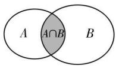</td></tr><tr><td>并集</td><td> $A \cup B = \{ x \mid x \in A \text{ 或 } x \in B\}$ </td><td>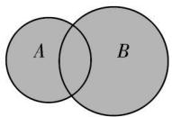 $A \cup B$ </td></tr><tr><td>补集</td><td> $C_U A = \{ x \mid x \in U \text{ 且 } x \notin A\}$ </td><td>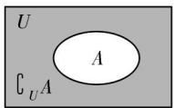</td></tr></table>

# 2. 集合的运算性质

(1) 并集的性质: $A \cup \varnothing = A; A \cup A = A; A \cup B = B \cup A; A \cup B = A \Leftrightarrow B \subseteq A.$   
(2) 交集的性质: $A \cap \emptyset = \emptyset; A \cap A = A; A \cap B = B \cap A; A \cap B = A \Leftrightarrow A \subseteq B$ .  
(3) 补集的性质: $A \cup (\complement_{U} A) = U; A \cap (\complement_{U} A) = \varnothing; \complement_{U} (\complement_{U} A) = A; \complement_{U}(A \cup B) = (\complement_{U} A) \cap (\complement_{U} B); \complement_{U}(A \cap B) = (\complement_{U} A) \cup (\complement_{U} B).$   
(4) 集合 $A \cap B, (\complement_U A) \cap B, A \cap (\complement_U B), (\complement_U A) \cap (\complement_U B)$ 将全集 $U$ 分为四个部分，如图所示：

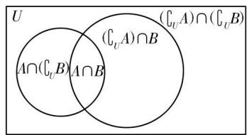

<details>
<summary>text_image</summary>

U
(A∩(C_U,B))A∩B
(C_U^A)∩(C_U^B)
</details>


# 思 | 命题探究

# 命题角度 1 集合的基本运算

典例1设集合 $A = \{x\mid x^2 -5x + 6 > 0\} ,B = \{x\mid x - 1 <   0\}$ ，则 $A\cap B =$ （

A. $(-\infty, 1)$

B. $(-2,1)$

C. $(-3,-1)$

D. $(3, +\infty)$

解析 因为 $A = \{x \mid x^2 - 5x + 6 > 0\} = \{x \mid x > 3$ 或 $x < 2\}$ , $B = \{x \mid x - 1 < 0\} = \{x \mid x < 1\}$ , 所以 $A \cap B = \{x \mid x < 1\}$ , 故选 A.

▶ 答案 A

变式1 已知集合 $A = \{x \mid x^2 + ax \leqslant 0\}$ , $B = \{x \mid -\frac{1}{2} < x < 5\}$ , 若 $A \cup B = \{x \mid -3 \leqslant x < 5\}$ , 则 $\complement_{\mathbb{R}} A =$ ( )

A. $(-∞,-3)∪(0,+∞)$

B. $(0,3)$

C. $(-\infty, -\frac{1}{2}) \cup (0, +\infty)$

D. $(-\infty, 0] \cup [5, +\infty)$

# 用 素养解题

# 集合的基本运算的求解策略

(1)求解思路:先化简集合,再根据交、并、补的定义求解.   
(2) 求解原则: 先算括号里面的, 再按运算顺序求解.  
(3)求解思想:注重数形结合思想的运用,利用数轴、Venn图等.

# 命题角度 2 集合的新定义问题

典例2 设 $A$ 是整数集的一个非空子集, $k \in A$ , 若 $k - 1 \notin A$ , 且 $k + 1 \notin A$ , 则称 $k$ 是 $A$ 的一个孤立元. 已知集合 $T = \{1, 2, 3, 5\}$ , 则集合 $T$ 的孤立元是 \_\_\_\_; 对给定集合 $S = \{1, 2, 3, 4, 5, 6\}$ , 由 $S$ 中的 3 个元素构成的所有集合中, 含孤立元的集合有 \_\_\_\_ 个.

思路分析 依次判断每个元素是否为孤立元,得到答案;首先确定3个元素构成的所有集合,排除不满足的情况,得到答案.  
解析 依次判断每个元素是否为集合 T 的孤立元: 易知 1, 2, 3 不是集合 T 的孤立元, 对于 5, 因为 $4 \notin T, 6 \notin T$ , 所以 5 是 T 的孤立元.

S 中的 3 个元素构成的所有集合为 $\{1,2,3\}$ , $\{1,2,4\}$ , $\{1,2,5\}$ , $\{1,2,6\}$ , $\{1,3,4\}$ , $\{1,3,5\}$ , $\{1,3,6\}$ , $\{1,4,5\}$ , $\{1,4,6\}$ , $\{1,5,6\}$ , $\{2,3,4\}$ , $\{2,3,5\}$ , $\{2,3,6\}$ , $\{2,4,5\}$ , $\{2,4,6\}$ , $\{2,5,6\}$ , $\{3,4,5\}$ , $\{3,4,6\}$ , $\{3,5,6\}$ , $\{4,5,6\}$ , 共 20 个，不含孤立元的集合有 $\{1,2,3\}$ , $\{2,3,4\}$ , $\{3,4,5\}$ , $\{4,5,6\}$ ，共 4 个，故舍孤立元的集合有 16 个.

▶ 答案 5 16

# 用 素养解题

# 解决集合新定义问题的步骤

(1) 对新定义进行信息提取, 确定化归与转化的方向;  
(2) 对所提取的信息进行加工, 探求解决方法;  
(3)对新定义中的信息进行转换,有效地输出.

其中对新定义信息的提取和化归与转化是解题的关键,也是解题的难点.

变式2 如图所示的Venn图中，A, B是两个非空集合，定义集合 $A \otimes B$ 为阴影部分表示的集合。若 $x, y \in R, A = \{x \mid y = \sqrt{2x - x^2}\}$ ， $B = \{y \mid y = 3^x, x > 0\}$ ，则 $A \otimes B$ 为（）

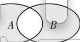

A. $\{x\mid0<x<2\}$   
C. $x \mid 0 \leqslant x \leqslant 1$ 或 $x \geqslant 2$

B. $\{x\mid1<x\leq2\}$   
D. $\{x\mid0\leqslant x\leqslant1 或 x>2\}$

# 命题点 3 常用逻辑用语


# 学 | 必备知识

# 1. 充要条件

# (1)集合与充要条件

设集合 $A = \{x\mid x$ 满足条件 $p\}$ ， $B = \{x\mid x$ 满足条件 $q\}$ ，则有

<table><tr><td>从逻辑观点看</td><td>从集合观点看</td></tr><tr><td>p是q的充分不必要条件(p⇒q,q≠p)</td><td>A∉B</td></tr><tr><td>p是q的必要不充分条件(q⇒p,p≠q)</td><td>B∉A</td></tr><tr><td>p是q的充要条件(p⇔q)</td><td>A=B</td></tr><tr><td>p是q的既不充分也不必要条件(p≠q,q≠p)</td><td>A与B互不包含</td></tr></table>

# (2) 充分条件与必要条件的两个特征

①对称性:若 p 是 q 的充分条件,则 q 是 p 的必要条件.  
②传递性:若 p 是 q 的充分(或必要)条件,q 是 r 的充分(或必要)条件,则 p 是 r 的充分(或必要)条件.

# 2. 全称量词与存在量词

# (1) 全称量词和存在量词

<table><tr><td>量词名称</td><td>常见量词</td><td>表示符号</td></tr><tr><td>全称量词</td><td>所有、一切、任意、全部、每一个等</td><td>∀</td></tr></table>

续表

<table><tr><td>量词名称</td><td>常见量词</td><td>表示符号</td></tr><tr><td>存在量词</td><td>存在一个、至少有一个、有一个、某个、有些、某些等</td><td>ヨ</td></tr></table>

# (2) 全称量词命题与存在量词命题

<table><tr><td>命题名称</td><td>命题结构</td><td>命题简记</td></tr><tr><td>全称量词命题</td><td>对M中的任意一个x,都有p(x)成立</td><td>∀x∈M,p(x)</td></tr><tr><td>存在量词命题</td><td>存在M中的x0,使p(x0)成立</td><td>∃x0∈M,p(x0)</td></tr></table>

# (3) 含有一个量词的命题的否定

<table><tr><td>命题</td><td>命题的否定</td></tr><tr><td>∀x∈M,p(x)</td><td>∃x0∈M,¬p(x0)</td></tr><tr><td>∃x0∈M,p(x0)</td><td>∀x∈M,¬p(x)</td></tr></table>


# 思 | 命题探究

# 命题角度 1 命题及其真假判断

典例 1 设有下列三个命题：

①过空间中任意三点有且仅有一个平面.  
②若空间两条直线不相交,则这两条直线平行.   
③若直线 $l \subset$ 平面 $\alpha$ ，直线 $m \perp$ 平面 $\alpha$ ，则 $m \perp l$ 。

则上述命题中所有真命题的序号是\_\_\_\_。

解析 对于①, 当 A, B, C 三点不共线时, 过 A, B, C 三点有且仅有一个平面; 当 A, B, C 三点共线时, 过 A, B, C 的平面有无数个, 所以①是假命题. 对于②, 若空间两条直线不相交, 则这两条直线可能平行, 也可能异面, 所以②是假命题. 对于③, 若直线 $l \subset$ 平面 $\alpha$ , 直线 $m \perp$ 平面 $\alpha$ , 则 $m \perp l$ , 所以③是真命题. 综上可知, 真命题的序号是③.

▶ 答案 ③

# 命题角度 2 充分条件、必要条件的判断

典例 2 “ $x=2k\pi+\frac{\pi}{4}(k\in\mathbf{Z})$ ” 是“ $\tan x=1$ ” 成立的 （）

A. 充分不必要条件

B. 必要不充分条件

C. 充要条件

D.既不充分也不必要条件

解析 当 $x = 2k\pi + \frac{\pi}{4} (k \in \mathbf{Z})$ 时, $\tan x = 1$ , 即充分性成立; 当 $\tan x = 1$ 时, $x = k\pi + \frac{\pi}{4} (k \in \mathbf{Z})$ , 即必要性不成立. 综上可得, “ $x = 2k\pi + \frac{\pi}{4} (k \in \mathbf{Z})$ ” 是“ $\tan x = 1$ ” 成立的充分不必要条件.

▶ 答案 A

典例3 若定义在 $\mathbf{R}$ 上的奇函数 $f(x)$ 满足当 $x \in [0, +\infty)$ 时， $f(x) = \log_2(x + 2) + x + b$ ，则不等式 $f(x) \geqslant 3$ 成立的一个充分不必要条件是（）

A. $x \geqslant 2$

B. $x \geqslant 3$

C. $x \geqslant 1$

D. x < 3

思路分析 $f(x)$ 为奇函数 $\rightarrow b\rightarrow f(2) = 3\frac{f(x)\geqslant 3}{f(x)\text{单调递增}}\rightarrow x\geqslant$ $2\xrightarrow{\text{结合选项}}$ 得解

解析 由题意, $f(0)=1+b=0$ ,所以b=-1,所以当 $x\in[0,+\infty)$ 时, $f(x)=\log_{2}(x+2)+x-1$ ,所以 $f(2)=2+2-1=3$ ,所以不等式 $f(x)\geqslant3$ 等价于 $f(x)\geqslant f(2)$ .易得函数 $f(x)$ 在R上单调递增,所以由 $f(x)\geqslant f(2)$ 得 $x\geqslant2$ ,所以不等式 $f(x)\geqslant3$ 的解集为 $[2,+\infty)$ ,不等式 $f(x)\geqslant3$ 成立的一个充分不必要条件是 $[2,+\infty)$ 的真子集,结合选项知 $x\geqslant3$ 满足条件.

▶ 答案 B


# 用 | 素养解题

# 充分条件和必要条件的三种判断方法

(1) 定义法: 可按照以下三个步骤进行

①确定条件p,结论q;   
②尝试由条件 p 推结论 q，由结论 q 推条件 p；  
③确定条件 p 和结论 q 的关系.

(2) 等价转化法: 对于含否定形式的命题, 可以利用原命题与逆否命题的等价性进行判断.  
(3) 集合法: 根据 p, q 成立时对应的集合之间的包含关系进行判断.

变式1 设 $x \in R$ ，若“ $1 \leqslant x \leqslant 3$ ”是“ $|x - a| < 2$ ”的充分而不必要条件，则实数 a 的取值范围是（）

A. $(1,3)$   
B. $\left\lceil1,3\right)$   
C. $(1,3]$   
D. [1,3]

# 命题角度 3 全称量词与存在量词

典例 4 命题 $p: \forall x \in (0, \frac{\pi}{2}), \sin x < \tan x$ 的否定 $\neg p$ 为
()

A. $\forall x\in (0,\frac{\pi}{2}),\sin x\geqslant \tan x$   
B. $\forall x\in (0,\frac{\pi}{2}),\sin x > \tan x$   
C. $\exists x_0\in (0,\frac{\pi}{2}),\sin x_0\geqslant \tan x_0$   
D. $\exists x_{0} \notin (0, \frac{\pi}{2}), \sin x_{0} \geqslant \tan x_{0}$

解析 由题意知, $\neg p$ 为 $\exists x_{0}\in(0,\frac{\pi}{2}),\sin x_{0}\geq\tan x_{0}$ ,选C.  
答案 C

典例 5 已知命题“ $\exists x_{0}>2,ax_{0}^{2}-ax_{0}-4<0$ ”是假命题，则 a 的取值范围是 \_\_\_\_（）

A. $[2,+\infty)$   
B. $(2, +\infty)$   
C. $(-∞,2]$   
D. $(-∞,2)$

解析 因为命题“ $\exists x_{0}>2,ax_{0}^{2}-ax_{0}-4<0$ ”是假命题，所以 $ax^{2}-ax-4\geqslant0$ 对 $x>2$ 恒成立，所以 $a\geqslant\frac{4}{x^{2}-x}(x>2)$ 恒成立.

当 $x > 2$ 时， $x^2 - x > 2$ ，则 $\frac{4}{x^2 - x} < 2$ ，故 $a \geqslant 2$ .

▶ 答案 A


# 用 | 素养解题

全、特称命题真假的判断方法

<table><tr><td></td><td colspan="2">全称量词命题</td><td colspan="2">存在量词命题</td></tr><tr><td>真假</td><td>真</td><td>假</td><td>真</td><td>假</td></tr><tr><td>方法一</td><td>证明所有对象使命题为真</td><td>存在一个对象使命题为假</td><td>存在一个对象使命题为真</td><td>证明所有对象使命题为假</td></tr><tr><td>方法二</td><td>否定为假</td><td>否定为真</td><td>否定为假</td><td>否定为真</td></tr></table>

变式2 若 $m \in R$ ，则“ $\exists x \in R, m \cos x + 2 < 0$ 是真命题”是“m < -2”的（）

A. 充分不必要条件

B. 必要不充分条件

C. 充要条件

D. 既不充分也不必要条件

# 第二章 函数及其性质

# 命题点 4 函数的定义域、值域及其表示


# 学

# 必备知识

# 1. 函数的有关概念

# (1) 函数的定义域、值域

在函数 $y=f(x)$ , $x \in A$ 中, 所有 x 组成的集合 A 叫做函数 $y=f(x)$ 的定义域; 所有 y 组成的集合叫做函数 $y=f(x)$ 的值域.

# (2) 函数的三要素

定义域、对应关系和值域.

# (3) 函数的表示法

表示函数的常用方法有解析法、图象法和列表法.

# 2. 相同的函数

如果两个函数的定义域和对应关系完全一致,那么这两个函数相同,这是判断两函数相同的依据.


# 思

# 命题探究

# 命题角度 1 求函数的定义域

典例 1 已知函数 $f(x)$ 的定义域为 $[-2,1]$ ，则函数 $y = \frac{f(3x - 2)}{\lg(1 - x)}$ 的定义域为 ( )

A. $[0,1]$

B. $[0,1)$

C. $(0,1]$

D. $(0,1)$

思路分析 根据函数 $f(x)$ 的定义域以及对数的真数为正数、分母不为零可得出关于实数 $x$ 的不等式组, 由此可解得函数的定义域.

解析 函数 $f(x)$ 的定义域为 $[-2,1]$ ,

则对于函数 $y=\frac{f(3x-2)}{\lg(1-x)}$ ，有 $\left\{\begin{aligned}&2\leqslant3x-2\leqslant1,\\ &1-x>0,\\ &\lg(1-x)\neq0,\end{aligned}\right.$ （解题指导：

①用换元思想定3x-2的范围；②真数大于0；③分母不为0）

即 $\left\{\begin{aligned}-2&\leqslant3x-2\leqslant1,\\ 1-x&>0,\\ 1-x&\neq1,\end{aligned}\right.$ 得0<x<1.因此，函数 $y=\frac{f(3x-2)}{\lg(1-x)}$ 的定义域为 $(0,1)$ .

▶ 答案 D

# 用 素养解题

1. 确定不同类型函数定义域的依据

<table><tr><td>类型</td><td>表达式</td><td>依据</td></tr><tr><td>分式型</td><td> $y = \frac{1}{f\left( x\right) }$ </td><td> $f\left( x\right)  \neq  0$ </td></tr><tr><td>二次根式型</td><td> $y = \sqrt{f\left( x\right) }$ </td><td> $f\left( x\right)  \geq  0$ </td></tr><tr><td>零或负整数指数幂型</td><td> $y = {\left\lbrack  f\left( x\right) \right\rbrack  }^{n}\left( {n \in  \mathbf{Z}}\right. ,$   $n \leq  0)$ </td><td> $f\left( x\right)  \neq  0$ </td></tr><tr><td>对数型</td><td> $y = {\log }_{u\left( x\right) }f\left( x\right)$ </td><td> $f\left( x\right)  > 0$  ,且  $u\left( x\right)  > 0$  ,  $u\left( x\right)  \neq  1$ </td></tr><tr><td>正切型</td><td> $y = \tan f\left( x\right)$ </td><td> $f\left( x\right)  \neq  \frac{\pi }{2} + k\pi \left( {k \in  \mathbf{Z}}\right)$ </td></tr></table>

# 2. 求抽象函数或复合函数的定义域

(1) 若已知函数 $f(x)$ 的定义域为 A，则复合函数 $f[g(x)]$ 的定义域由 $g(x) \in A$ 求出；

(2) 若已知复合函数 $f[g(x)]$ 的定义域为 $A$ ，则函数 $f(x)$ 的定

义域为 $x \in A$ 时函数 $g(x)$ 的值域.

# 3. 求函数定义域的注意事项

(1) 不要对解析式进行化简变形, 以免定义域发生变化;
(2) 当一个函数由有限个基本初等函数的和、差、积、商的形式构成时, 其定义域一般是各个基本初等函数定义域的交集;
(3) 定义域是一个集合, 要用集合或区间表示, 若用区间表示, 不能用“或”连接, 而应该用并集符号“∪”连接;
(4) 对应法则只对定义域中的数起作用, 定义域限制法则的应用范围.

变式1设函数 $f(x) = \ln \frac{1 + x}{1 - x}$ ，则函数 $g(x) = \frac{f(\frac{x}{2})}{x} + f(\frac{1}{x})$ 的定义域为

# 命题角度 2 分段函数问题

典例2 已知函数 $f(x)=\left\{\begin{aligned}x^{2}+1,x&\leqslant0,\\ 2-\ln x,x&>0,\end{aligned}\right.$ 则 $f(f(0))=$ \_\_\_\_；若 $f(x_{0})=2$ ，则 $x_{0}=$ \_\_\_\_.

解析 由题意, 函数 $f(x)=\left\{\begin{aligned}x^{2}+1,x&\leqslant0,\\ 2-\ln x,x&>0,\end{aligned}\right.$ 则 $f(0)=0+1=1$ , 所以 $f(f(0))=f(1)=2-\ln 1=2$ . (逐层代入求值)
当 $x_{0} \leqslant 0$ 时, 可得 $f(x_{0}) = x_{0}^{2} + 1 = 2$ , 解得 $x_{0} = -1$ ; (根据分段函数的解析式对 $x_{0}$ 的取值进行分类讨论)

当 $x_0 > 0$ 时，可得 $f(x_0) = 2 - \ln x_0 = 2$ ，解得 $x_0 = 1$ 故 $x_0 = 1$ 或-1.

▶ 答案 2 1 或 -1

# 用 素养解题

# 分段函数问题的常见类型及解题策略

(1)求函数值.弄清自变量所在区间,然后代入对应的解析式.求“层层套”的函数值,要从最内层逐层往外计算.
(2)求参数.分段处理,采用代入法列出各区间上的方程或不等式.
(3)解不等式.根据分段函数中自变量取值范围的界定,代入相应的解析式求解,但要注意取值范围这一大前提.
(4)数形结合法也是解决分段函数问题的重要方法,在选择、填空题中经常使用.

变式2 已知函数 $f(x)=\left\{\begin{aligned}&2^{x},&x>0,\\ &x+1,x\leqslant0.\end{aligned}\right.$ 若 $f(a)+f(1)=0$ ，则实数 a= \_\_\_\_.

# 命题角度 3 求函数的值域

典例3 高斯是德国著名的数学家,近代数学奠基者之一,享有“数学王子”的称号,用其名字命名的“高斯函数”为 $y = [x]$ ,其中 $x \in \mathbf{R}$ , $[x]$ 表示不超过 $x$ 的最大整数,例如: $[-3.7] = -4$ , $[2.3] = 2$ . 已知 $f(x) = \frac{\mathrm{e}^x - 1}{\mathrm{e}^x + 1} - \frac{1}{2}$ ,则函数 $y = [f(x)]$ 的值域为 ( )

A. $\{0\}$

B. $\{-1,0\}$

C. $\{-2,-1,0\}$

D. $\{-1,0,1\}$

思路分析 先将原函数的解析式化为 $f(x) = -\frac{2}{\mathrm{e}^{x} + 1} + \frac{1}{2}$ ，然后分析函数 $f(x)$ 的值域，再根据高斯函数的定义确定 $y = [f(x)]$ 的值域.

解析 $f(x)=\frac{\mathrm{e}^{x}-1}{\mathrm{e}^{x}+1}-\frac{1}{2}=\frac{\mathrm{e}^{x}+1-2}{\mathrm{e}^{x}+1}-\frac{1}{2}=-\frac{2}{\mathrm{e}^{x}+1}+\frac{1}{2}$ (对 $f(x)$ 的解析式进行变形)

当 $x \geqslant 0$ 时， $\mathrm{e}^x \geqslant 1$ ，则 $-1 \leqslant -\frac{2}{\mathrm{e}^x + 1} < 0$ ，故 $f(x) = -\frac{2}{\mathrm{e}^x + 1} + \frac{1}{2} \in \left[-\frac{1}{2}, \frac{1}{2}\right)$ ，故 $[f(x)] \in \{-1, 0\}$ ；当 $x < 0$ 时， $0 < \mathrm{e}^x < 1$ ，则 $-2 < -\frac{2}{\mathrm{e}^x + 1} < -1$ ，故 $f(x) = -\frac{2}{\mathrm{e}^x + 1} + \frac{1}{2} \in \left(-\frac{3}{2}, -\frac{1}{2}\right), [f(x)] \in \{-2, -1\}$ .（根据高斯函数的定义及 $f(x)$

的取值,分类讨论)

综上所述，函数 $y = [f(x)]$ 的值域为 $\{-2, -1, 0\}$ . 故选 C

▶ 答案 C

变式3 函数 $f(x) = \sqrt{(a - x)(x - 1)}$ 的定义域为 $D$ ，值域为 $A$ ，点集 $\{(x, y) | x \in D, y \in A\}$ 构成的图形面积等于2，则实数 $a =$ \_\_\_\_.

# 命题角度 4 求函数的解析式

典例 4 (1) 已知 $f(x + \frac{1}{x}) = x^{2} + \frac{1}{x^{2}}$ ，则 $f(x)$ 的解析式为 \_\_\_\_.

(2) 已知 $f(\frac{2}{x} + 1) = \lg x$ ，则 $f(x)$ 的解析式为 \_\_\_\_.

(3) 若 $f(x)$ 为二次函数且 $f(0)=3, f(x+2)-f(x)=4x+2$ ，则 $f(x)$ 的解析式为 \_\_\_\_.

(4) 若函数 $f(x)$ 满足方程 $2f(x) + f\left(\frac{1}{x}\right) = 2x, x \in \mathbb{R}$ 且 $x \neq 0$ ，则 $f(x) =$ \_\_\_\_ .

解析 (1) 由于 $f(x + \frac{1}{x}) = x^2 + \frac{1}{x^2} = (x + \frac{1}{x})^2 - 2$ ，所以

$f(x) = x^{2} - 2, x \geqslant 2$ 或 $x \leqslant -2$ , 故 $f(x)$ 的解析式是 $f(x) = x^{2} - 2 (x \geqslant 2$ 或 $x \leqslant -2)$ .

(2) 令 $\frac{2}{x} + 1 = t$ ，结合 $x > 0$ ，得 $t > 1$ 且 $x = \frac{2}{t - 1}$ ，所以 $f(t) = \lg \frac{2}{t - 1}$ ，即 $f(x) = \lg \frac{2}{x - 1}(x > 1)$ .

(3) 设 $f(x) = ax^{2} + bx + c (a \neq 0)$ ，则 $f(0) = c = 3, f(x) = ax^{2} + bx + 3$ ，所以 $f(x + 2) - f(x) = a(x + 2)^{2} + b(x + 2) + 3 - (ax^{2} + bx + 3) = 4ax + 4a + 2b = 4x + 2$ ，所以 $\left\{\begin{aligned}&4a=4,\\ &4a+2b=2,\end{aligned}\right.$ 解得 $\left\{\begin{aligned}a=1,\\ b=-1,\end{aligned}\right.$ 所以所求函数的解析式为 $f(x)=x^{2}-x+3$ .

(4) 由 $2f(x) + f\left(\frac{1}{x}\right) = 2x$ ①, 将 $x$ 换成 $\frac{1}{x}$ , 得 $2f\left(\frac{1}{x}\right) + f(x) = \frac{2}{x}$ ②. 由①②消去 $f\left(\frac{1}{x}\right)$ , 得 $3f(x) = 4x - \frac{2}{x}$ , 所以 $f(x) = \frac{4}{3} x - \frac{2}{3x} (x \in \mathbf{R}$ 且 $x \neq 0)$ .

▶ 答案 (1) $f(x)=x^{2}-2(x\geqslant2$ 或 $x\leqslant-2)$

(2) $f(x)=\lg\frac{2}{x-1}(x>1)$

(3) $f(x)=x^{2}-x+3$

(4) $\frac{4}{3}x-\frac{2}{3x}(x\in\mathbf{R}$ 且 $x\neq0)$

# 用 素养解题

求函数解析式的常用方法

<table><tr><td>方法</td><td>适用条件</td><td>解法指导</td><td>注意事项</td></tr><tr><td>待定系数法</td><td>已知函数模型</td><td>首先设出解析式,然后根据已知条件求参数</td><td></td></tr><tr><td>换元法</td><td>已知复合函数f(g(x))的解析式</td><td>令t=g(x),用t表示出x,代入复合函数的解析式即可求得f(x)</td><td>注意确定新元的取值范围</td></tr><tr><td>构造法</td><td>已知关于f(x),f(1/x)或f(-x)的和差等式</td><td>变换变量,构造一个新的等式,与已知等式构成一个方程组,消元可求得f(x)</td><td>f(x)的定义域是 $\frac{1}{x}$ 或-x中x的取值范围与使f(x)的解析式有意义的自变量x的取值范围的交集</td></tr><tr><td>配凑法</td><td>已知复合函数f(g(x))=F(x)</td><td>将函数F(x)改写为关于g(x)的表达式,然后将g(x)换为x,即可求得f(x)</td><td>注意确定g(x)的取值范围</td></tr></table>

# 命题点 5 函数的单调性、周期性


# 学

# 必备知识

# 1. 函数的单调性

(1) 单调函数的定义

<table><tr><td></td><td>增函数</td><td>减函数</td></tr><tr><td rowspan="2">定义</td><td colspan="2">一般地,设函数 $f(x)$ 的定义域为 $I$ .如果对于定义域 $I$ 内某个区间 $D$ 上的任意两个自变量的值 $x_1,x_2$ </td></tr><tr><td>当 $x_1 < x_2$ 时,都有 $f(x_1) < f(x_2)$ ,那么就说函数 $f(x)$ 在区间 $D$ 上是增函数</td><td>当 $x_1 < x_2$ 时,都有 $f(x_1) > f(x_2)$ ,那么就说函数 $f(x)$ 在区间 $D$ 上是减函数</td></tr></table>

续表

<table><tr><td></td><td>增函数</td><td>减函数</td></tr><tr><td>图象描述</td><td>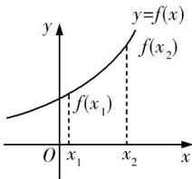自左向右看图象是上升的</td><td>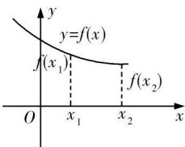自左向右看图象是下降的</td></tr></table>

# 特别提醒

①单调性与“区间”紧密相关,一个函数在不同的区间上,可以有不同的单调性.  
②函数的单调性只能在函数的定义域内讨论,所以求函数的单调区间,必须先求函数的定义域.  
③函数的单调性是对某个区间而言的,所以要受到区间的限制.例如函数 $y=\frac{1}{x}$ 分别在 $(-∞,0),(0,+∞)$ 上单调递减,但不能说它在整个定义域,即 $(-∞,0)∪(0,+∞)$ 上单调递减,只能分开写,即写成该函数的单调递减区间为 $(-∞,0)$ 和 $(0,+∞)$ .

# (2) 函数单调性的几种等价形式

设任意 $x_{1}, x_{2} \in [a, b]$ ，且 $x_{1} \neq x_{2}$ ，那么

① $\frac{f(x_{1})-f(x_{2})}{x_{1}-x_{2}}>0\Leftrightarrow f(x)$ 在 $[a,b]$ 上是增函数； $\frac{f(x_{1})-f(x_{2})}{x_{1}-x_{2}}<0\Leftrightarrow f(x)$ 在 $[a,b]$ 上是减函数.  
② $(x_{1}-x_{2})\left[f(x_{1})-f(x_{2})\right]>0\Leftrightarrow f(x)$ 在 $[a,b]$ 上是增函数； $(x_{1}-x_{2})\left[f(x_{1})-f(x_{2})\right]<0\Leftrightarrow f(x)$ 在 $[a,b]$ 上是减函数.

# 2. 关于函数周期的常见结论

设函数 $y=f(x)$ , $x \in R$ , a > 0.

(1) 若 $f(x + a) = f(x - a)$ ，则函数 $f(x)$ 的周期为 2a；  
(2) 若 $f(x + a) = -f(x)$ ，则函数 $f(x)$ 的周期为 2a；  
(3) 若 $f(x+a)=\frac{1}{f(x)}$ 或 $f(x+a)=-\frac{1}{f(x)}$ ，则函数 $f(x)$ 的周期为 2a；  
(4) 若函数 $f(x)$ 的图象关于直线 x = a 与 x = b 对称，则函数 $f(x)$ 的周期为 $2|b - a|$ ;  
(5) 若函数 $f(x)$ 的图象关于点 $(a,0)$ 对称，又关于点 $(b,0)$ 对称，则函数 $f(x)$ 的周期是 $2|b-a|$ ;  
(6) 若函数 $f(x)$ 的图象关于直线 x = a 对称, 又关于点 $(b, 0)$ 对称, 则函数 $f(x)$ 的周期是 $4|b - a|$ ;  
(7) 若函数 $f(x)$ 是偶函数, 其图象关于直线 x = a 对称, 则 $f(x)$ 的周期为 2a;  
(8) 若函数 $f(x)$ 是奇函数, 其图象关于直线 x = a 对称, 则 $f(x)$ 的周期为 4a.


# 思 | 命题探究

# 命题角度 1 函数的单调性

典例1 函数 $f(x) = \log \frac{1}{2}(1 - x) + \log \frac{1}{2}(x + 3)$ 的单调递增区间为

解析 由题意得 $\left\{\begin{aligned}1-x&>0,\\ x+3&>0,\end{aligned}\right.$ 解得-3<x<1，所以函数的定义域为 $(-3,1)$ .（定义域优先）

$$
\begin{array}{l} f (x) = \log_ {\frac {1}{2}} (\text {主} - x) + \log_ {\frac {1}{2}} (x + 3) = \log_ {\frac {1}{2}} (- x ^ {2} - 2 x + 3) \\ (- 3 <   x <   1), \end{array}
$$

令 $t = -x^{2} - 2x + 3 (-3 < x < 1)$ ，则 $y = \log \frac{1}{2} t$ ，(换元)
因为 $t = -x^{2} - 2x + 3$ 在 $(-3, -1)$ 上单调递增，在 $(-1, 1)$ 上单调递减， $y = \log \frac{1}{2} m$ 在 $(0, +\infty)$ 上单调递减，
所以 $f(x)=\log\frac{1}{2}(1-x)+\log\frac{1}{2}(x+3)$ 在 $(-3,-1)$ 上单调递减，在 $(-1,1)$ 上单调递增，故答案为 $[-1,1)$ （或 $(-1,1)$ ）.

▶ 答案 $[-1,1)$ (或 $(-1,1)$ )

# 用 素养解题

# 1. 确定已知解析式的函数单调区间的三种方法

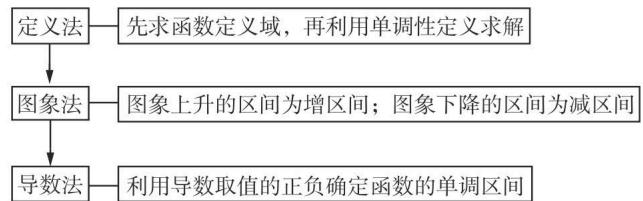

<details>
<summary>flowchart</summary>

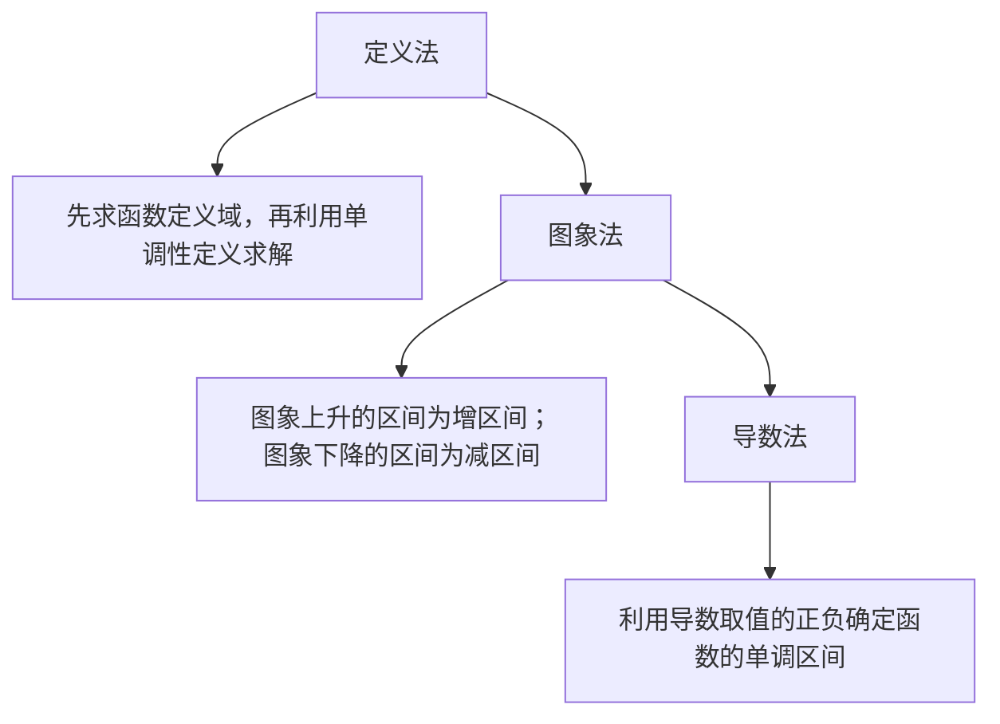
</details>

# 2. 复合函数单调性的判断方法

法则是“同增异减”，即若两个函数的单调性相同（相反），则这两个函数所构成的复合函数是增(减)函数.

变式1 函数 $f(x) = |x - 2|x$ 的单调递减区间是 （）

A. $[1,2]$

B. $[-1,0]$

C. $[0,2]$

D. $[2, +\infty)$

# 命题角度 2 函数单调性的应用

# 考向 1 利用单调性比较大小

典例2 已知函数 $f(x)$ 是定义在 $\mathbf{R}$ 上的偶函数, 函数 $f(x)$ 满足 $\forall x_1, x_2 \in (-\infty, 0)$ , 且 $x_1 \neq x_2, \frac{f(x_1) - f(x_2)}{x_1 - x_2} < 0$ . 若 $a = f(3^\pi), b = f(\log_2 \frac{1}{4}), c = f(-5)$ , 则 $a, b, c$ 三者的大小关

系为 （）

A. $a < c < b$

B. $c < b < a$

C. $b < c < a$

D. $c < a < b$

思路分析 已知 $\rightarrow f(x)$ 在 $(0, +\infty)$ 上单调递增 $f(x)$ 是偶函数 $\rightarrow b = f(2), c = f(5) \rightarrow 2 < 5 < 3^{\pi} \rightarrow b < c < a$

解析 由于函数 $f(x)$ 满足 $\forall x_1, x_2 \in (-\infty, 0)$ ，且 $x_1 \neq x_2$ ， $\frac{f(x_1) - f(x_2)}{x_1 - x_2} < 0, f(x)$ 是定义在 $\mathbf{R}$ 上的偶函数，所以函数 $f(x)$ 在 $(0, +\infty)$ 上单调递增， $b = f(\log_2 2^{-2}) = f(-2) = f(2), c = f(-5) = f(5)$ ，因为 $2 < 5 < 3^\pi$ ，所以 $f(2) < f(5) < f(3^\pi)$ ，即 $b < c < a$ .

答案 C

# 考向2 利用单调性求参数

典例3 已知函数 $f(x) = \begin{cases} x^2 + \frac{1}{2}a - 2, & x \leqslant 1, \\ a^x - a, & x > 1, \end{cases}$ 若 $f(x)$ 在(0, +∞)上单调递增，则实数 $a$ 的取值范围为 \_\_\_\_.

解析 因为 $f(x)$ 在 $(0, +\infty)$ 上单调递增, 所以当 $x > 1$ 时, $f(x) = a^x - a$ 单调递增, 所以 $a > 1$ . 易知函数 $f(x) = x^2 + \frac{1}{2}a - 2$ 在 $(0, 1]$ 上单调递增, 所以若 $f(x)$ 在 $(0, +\infty)$ 上单调递增, 则需满足 $1^2 + \frac{1}{2}a - 2 \leqslant a^1 - a$ (注意比较端点值处函数值的大小关系), 得 $a \leqslant 2$ . 综上, 实数 $a$ 的取值范围为 $(1, 2]$ .

▶ 答案 (1,2]

# 考向3 与函数单调性有关的不等式问题

典例 4 设奇函数 $f(x)$ 在 $(0, +\infty)$ 上是增函数，且 $f(1) = 0$ ，则不等式 $x[f(x) - f(-x)] < 0$ 的解集为（）

A. $\{x\mid -1 <   x <   0$ 或 $x > 1\}$

B. $\{x\mid x <   - 1$ 或 $0 <   x <   1\}$

C. $\{x \mid x < -1 \text{ 或 } x > 1\}$

D. $\{x\mid -1 <   x <   0$ 或 $0 <   x <   1\}$

解析 ∵ 函数 $f(x)$ 是奇函数, 函数 $f(x)$ 在 $(0, +\infty)$ 上是增函数, ∴ 它在 $(-∞, 0)$ 上也是增函数. ∵ $f(-x) = -f(x)$ , ∴ $f(-1) = -f(1) = 0$ . 不等式 $x[f(x) - f(-x)] < 0$ 可化为 $2xf(x) < 0$ , 即 $xf(x) < 0$ , ∴ 当 x < 0 时, 可得 $f(x) > 0 = f(-1)$ , ∴ -1 < x < 0; 当 x > 0 时, 可得 $f(x) < 0 = f(1)$ , ∴ 0 < x < 1. 综上, 不等式 $x[f(x) - f(-x)] < 0$ 的解集为 $\{x | -1 < x < 0 \text{ 或 } 0 < x < 1\}$ .

▶ 答案 D


# 用 | 素养解题

# 函数单调性应用问题的常见类型及解题策略

(1) 比较函数值的大小, 应将自变量转化到同一个单调区间内, 然后利用函数的单调性解决.  
(2) 在求解与抽象函数有关的不等式时, 往往是利用函数的单调性将“f”脱掉, 将原不等式转化为具体的不等式求解. 此时, 应特别注意函数的定义域.  
(3) 利用单调性求解最值问题, 应先确定函数的单调性, 然后由单调性求解.  
(4) 利用单调性求参数时, 通常要把参数视为已知数, 依据函数的图象或单调性定义, 确定函数的单调区间, 再求参数的值.

变式2 已知 $f(x)$ 是定义在 R 上的奇函数，对任意两个不相等的正数 $x_{1}, x_{2}$ ，都有 $\frac{x_{2}f(x_{1}) - x_{1}f(x_{2})}{x_{2} - x_{1}} > 0$ ，记 $a = \frac{f(0.2^{3})}{0.2^{3}}$ ， $b=\frac{f(\sin1)}{\sin1},c=-\frac{f(\ln\frac{1}{3})}{\ln3}$ ，则a,b,c的大小关系为（）

A. $a < b < c$

B. $b < a < c$

C. c < a < b

D. $c < b < a$

变式3 已知函数 $f(x) = \begin{cases} 2^{2 - x}, & x < 2, \\ \frac{3}{4} x^2 - 3x + 4, & x \geqslant 2, \end{cases}$ 若不等式 $a \leqslant f(x) \leqslant b$ 的解集恰好为 $[a, b]$ ，则 $b - a =$ \_\_\_\_.

# 命题角度 3 函数的周期性及其应用

典例5已知函数 $f(x)$ 的定义域为 $\mathbf{R}$ 且满足 $f(-x) = -f(x)$ ， $f(x) = f(2 - x)$ ，若 $f(1) = 4$ ，则 $f(6) + f(7) =$ （）

A.-8

B.-4

C. 0

D. 4

解析 由 $f(-x) = -f(x)$ 知函数 $f(x)$ 为R上的奇函数，所以 $f(0) = 0$ . 由 $f(x) = f(2 - x)$ ，得 $f(x) = -f(x - 2)$ ，所以 $f(x + 2) = -f(x)$ ，所以 $f(x) = f(x + 4)$ ，所以函数 $f(x)$ 是以4为周期的周期函数，所以 $f(6) + f(7) = f(4 + 2) + f(4 \times 2 - 1) = f(2) + f(-1) = f(2 - 2) - f(1) = f(0) - 4 = -4$ ，故选B.

▶ 答案 B


# 用 | 素养解题

# 函数周期性的判定与应用

(1) 判定: 判断函数的周期性, 只需证明 $f(x + T) = f(x)$ ( $T \neq 0$ ), 便可证明函数是周期函数.  
(2)应用:根据函数的周期性,可以由函数局部的性质得到函数的整体性质,在解决具体问题时,要注意结论:若 T 是函数的周期,则 $kT(k \in \mathbf{Z} \text{ 且 } k \neq 0)$ 也是函数的周期.

# 命题点6 函数的奇偶性以及函数性质的综合应用


# 学必备知识

# 1. 奇、偶函数的性质

(1) 图象特点: 奇函数的图象关于坐标原点对称; 偶函数的图象关于 y 轴对称.  
(2) 若奇函数在关于坐标原点对称的区间上有单调性, 则其单调性相同; 若偶函数在关于坐标原点对称的区间上有单调性, 则其单调性相反.  
(3)奇偶性的两个重要特性:

①若奇函数 $f(x)$ 在x=0处有意义,则 $f(0)=0$ ;  
②若函数 $f(x)$ 为偶函数,则 $f(-x)=f(x)=f(|x|)$ .

# 2. 一些重要的奇、偶函数的类型

(1) 函数 $f(x)=a^{x}+a^{-x}(a>0$ 且 $a\neq1$ 为偶函数，函数 $f(x)=a^{y}-a^{-x}(a>0$ 且 $a\neq1$ 为奇函数；  
(2) 函数 $f(x)=\frac{a-a}{a^{x}+a^{-x}}=\frac{a^{2x}-1}{a^{2x}+1}$ (a>0 且 $a\neq1$ ) 为奇函数；  
(3) 函数 $f(x)=\log_{a}\frac{m-nx}{m+nx}(a>0,a\neq1)$ 为奇函数；  
(4) 函数 $f(x) = \log_{a}(x + \sqrt{x^{2} + 1})$ (a > 0 且 $a \neq 1$ ) 为奇函数.


# 思 | 命题探究

# 命题角度 1 函数的奇偶性及其应用

典例 1 已知 $f(x)$ 是奇函数, 且当 x < 0 时, $f(x) = -\mathrm{e}^{ax}$ . 若 $f(\ln 2) = 8$ , 则 a = \_\_\_\_.

解析 设 x > 0，则 -x < 0，所以 $f(-x) = -\mathrm{e}^{-ax}$ 。因为函数 $f(x)$ 为奇函数，所以 $f(x) = -f(-x) = \mathrm{e}^{-ax}$ ，所以 $f(\ln 2) = \mathrm{e}^{-a\ln 2} = (\frac{1}{2})^a = 8$ ，所以 a = -3。

▶ 答案 -3

典例2 已知函数 $f(x) = \frac{\sin x}{(x + 1)(x - a)}$ 为奇函数, 则 $a = (\quad)$

A. -1

B. $\frac{1}{2}$

C. $-\frac{1}{2}$

D. 1

解析 函数的定义域为 $\{x \mid x \neq -1 \text{ 且 } x \neq a\}$ ,

因为 $f(x)=\frac{\sin x}{(x+1)(x-a)}$ 为奇函数,所以定义域关于原点对

称,所以 a=1,(奇(偶)函数的定义域关于原点对称是隐含条件)

所以 $f(x)=\frac{\sin x}{(x+1)(x-1)}=\frac{\sin x}{x^{2}-1}$ ,

则 $f(-x)=\frac{\sin(-x)}{(-x)^{2}-1}=\frac{-\sin x}{x^{2}-1}=-f(x)$ ，满足 $f(x)$ 为奇函数，故a=1，选D.

▶ 答案 D


# 用 | 素养解题

# 1. 判断函数奇偶性的方法

(1) 定义法: 利用奇、偶函数的定义或定义的等价形式 $(f(-x) \pm f(x) = 0)$ 判断函数的奇偶性.  
(2) 图象法: 函数是奇(偶)函数的充要条件是它的图象关于原点(y 轴)对称.  
(3) 性质法: 设 $f(x)$ , $g(x)$ 的定义域分别是 $D_{1}$ , $D_{2}$ , 那么在它

们的公共定义域上,有下面结论:

<table><tr><td> $f\left( x\right)$ </td><td> $g\left( x\right)$ </td><td> $f\left( x\right) + g\left( x\right)$ </td><td> $f\left( x\right) - g\left( x\right)$ </td><td> $f\left( x\right) g\left( x\right)$ </td><td> $f\left\lbrack  {g\left( x\right) }\right\rbrack$ </td></tr><tr><td>偶函数</td><td>偶函数</td><td>偶函数</td><td>偶函数</td><td>偶函数</td><td>偶函数</td></tr><tr><td>偶函数</td><td>奇函数</td><td>不能确定</td><td>不能确定</td><td>奇函数</td><td>偶函数</td></tr><tr><td>奇函数</td><td>偶函数</td><td>不能确定</td><td>不能确定</td><td>奇函数</td><td>偶函数</td></tr><tr><td>奇函数</td><td>奇函数</td><td>奇函数</td><td>奇函数</td><td>偶函数</td><td>奇函数</td></tr></table>

# 2. 函数奇偶性的应用

(1) 求函数值(函数解析式), 利用奇偶性将所求函数值(函数解析式)转化到已知函数解析式上求解.  
(2) 求参数值, 已知函数是奇(偶)函数, 利用 $f(x) + f(-x) = 0 (f(x) - f(-x) = 0)$ 得到关于参数的恒等式, 比较系数得参数的值.

变式1 某位喜欢思考的同学在学习函数的性质时提出了如下两个命题：

已知函数 $y=f(x)$ 的定义域为 $D, x_{1}, x_{2} \in D$ .

①若对 $f(x_{1}) + f(x_{2}) = 0$ ，都有 $x_{1} + x_{2} = 0$ ，则函数 $y = f(x)$ 是 D 上的奇函数；  
②若对 $f(x_{1})<f(x_{2})$ ，都有 $x_{1}<x_{2}$ ，则函数 $y=f(x)$ 是D上的奇函数.

下列判断正确的是 （）

A. ①和②都是真命题  
B. ①是真命题, ②是假命题  
C. ①和②都是假命题  
D.①是假命题，②是真命题

变式2（多选）设函数 $f(x)=\ln\frac{mx+1}{1-2x}$ 是定义在区间 $(-n,n)$ 上的奇函数 $(m>0,n>0)$ ，则下列结论正确的是()

A. $m = 2$   
B. $m = \frac{1}{2}$   
C. $n \in (0, \frac{1}{2}]$   
D. $n \in (\frac{1}{2}, +\infty)$

# 命题角度 2 函数性质的综合运用

典例3 定义在 $\mathbf{R}$ 上的函数 $y = f(x)$ 满足以下三个条件: ① 对于任意 $x \in \mathbf{R}$ , 都有 $f(x + 1) = f(x - 1)$ , ② 函数 $y = f(x + 1)$ 的图象关于 $y$ 轴对称, ③ 对任意 $x_1, x_2 \in [0, 1]$ , 都有 $\frac{f(x_1) - f(x_2)}{x_1 - x_2} > 0$ , 则 $f\left(\frac{3}{2}\right), f(2), f(3)$ 的大小关系为 ( )

$$
\begin{array}{l} \mathrm{A.} f (\frac {3}{2}) > f (2) > f (3) \\ \mathrm{B.} f (2) > f (3) > f (\frac {3}{2}) \\ \mathrm{C.} f (\frac {3}{2}) > f (3) > f (2) \\ \mathrm{D.} f (3) > f (\frac {3}{2}) > f (2) \\ \end{array}
$$

解析 ①对于任意 $x \in \mathbf{R}$ , 都有 $f(x + 1) = f(x - 1)$ , 则 $f(x + 2) = f(x)$ , 所以函数 $f(x)$ 的周期为 2, 可得 $f(3) = f(1)$ , $f(2) = f(0)$ ; ②函数 $y = f(x + 1)$ 的图象关于 $y$ 轴对称, 所以 $y = f(x)$ 的图象关于直线 $x = 1$ 对称, 可得 $f\left(\frac{3}{2}\right) = f\left(\frac{1}{2}\right)$ ;  
③对任意 $x_{1}, x_{2} \in [0, 1]$ , 都有 $\frac{f(x_1) - f(x_2)}{x_1 - x_2} > 0$ , 可得 $y = f(x)$ 在区间 $[0, 1]$ 上单调递增. 因为 $1 > \frac{1}{2} > 0$ , 所以 $f(1) > f(\frac{1}{2}) > f(0)$ , 即 $f(3) > f(\frac{3}{2}) > f(2)$ , 故选 D.

▶ 答案 D


# 用 | 素养解题

# 函数性质综合应用问题的常见类型及解题策略

(1)单调性与奇偶性结合. 解题时要注意函数单调性及奇偶性的定义, 以及奇、偶函数图象的对称性.

理解并熟记:奇函数在对称区间上的单调性相同,偶函数在对称区间上的单调性相反.

(2) 周期性与奇偶性结合. 此类问题多考查求值问题, 常利用奇偶性及周期性进行变换, 将所求函数值的自变量转化到已知解析式的区间内求解.  
(3) 周期性、奇偶性与单调性结合. 解决此类问题通常先利用周期性转化自变量所在的区间, 然后利用奇偶性和单调性求解.

变式3 已知定义在 $\mathbf{R}$ 上的奇函数 $f(x)$ 满足 $f(x - 4) = -f(x)$ ，且在区间[0,2]上是增函数，则 （）

A. $f(-25) < f(11) < f(80)$   
B. $f(80) < f(11) < f(-25)$   
C. $f(11) < f(80) < f(-25)$   
D. $f(-25) < f(80) < f(11)$

# 命题点 7 二次函数、幂函数的图象与性质


# 学 | 必备知识

# 1. 二次函数的图象与性质

<table><tr><td>解析式</td><td> $f\left( x\right) = a{x}^{2} + {bx} + c\left( {a >0}\right)$ </td><td> $f\left( x\right) = a{x}^{2} + {bx} + c\left( {a < 0}\right)$ </td></tr><tr><td>图象</td><td>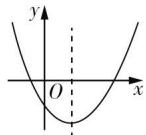</td><td>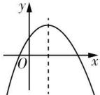</td></tr><tr><td>定义域</td><td> $\left( {-\infty , + \infty }\right)$ </td><td> $\left( {-\infty , + \infty }\right)$ </td></tr><tr><td>值域</td><td>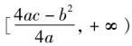</td><td>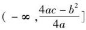</td></tr></table>

续表

<table><tr><td>单调性</td><td>在(-∞,-b/2a]上单调递减; 在[ -b/2a,+∞ )上单调递增</td><td>在(-∞,-b/2a]上单调递增; 在[ -b/2a,+∞ )上单调递减</td></tr><tr><td>对称性</td><td colspan="2">函数的图象关于直线x=-b/2a对称</td></tr></table>

# 特别提醒

对于函数 $y = ax^{2} + bx + c$ ，要使它是二次函数，就必须满足 $a \neq 0$ 。当题中条件未说明 $a \neq 0$ 时，要讨论 $a = 0$ 和 $a \neq 0$ 两种情况。

# 2. 幂函数的图象与性质

(1)5种常见的幂函数的图象

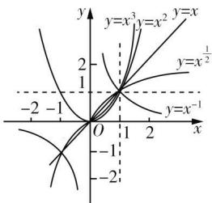

<details>
<summary>text_image</summary>

y
y=x³ y=x² y=x
2
y=x¹/²
-2 -1
O 1 2
x
-2
</details>

(2)5种常见的幂函数的性质

<table><tr><td>函数</td><td> $y = x$ </td><td> $y = {x}^{2}$ </td><td> $y = {x}^{3}$ </td><td> $y = {x}^{\frac{1}{2}}$ </td><td> $y = {x}^{-1}$ </td></tr><tr><td>定义域</td><td>R</td><td>R</td><td>R</td><td> $\left\lbrack  {0, + \infty }\right)$ </td><td> $\{ x \mid x \in \mathbf{R},$  且  $x \neq 0\}$ </td></tr><tr><td>值域</td><td>R</td><td> $\left\lbrack  {0, + \infty }\right)$ </td><td>R</td><td> $\left\lbrack  {0, + \infty }\right)$ </td><td> $\{ y \mid  y \in  \mathbf{R},$  且  $y \neq 0\}$ </td></tr><tr><td>奇偶性</td><td>奇</td><td>偶</td><td>奇</td><td>非奇非偶</td><td>奇</td></tr></table>


# 思

# 命题探究

# 命题角度 1 二次函数的图象与性质

典例1已知函数 $f(x) = ax^{2} + (a - 3)x + 1$ ，若 $f(x)$ 在区间 $[-1, +\infty)$ 上单调递减，则实数 $a$ 的取值范围是 \_\_\_\_；若函数 $f(x)$ 在[1,2]上的最小值为2，则 $a$ 的值为 \_\_\_\_.

解析 函数 $f(x) = ax^{2} + (a - 3)x + 1$ 在区间 $[-1, +\infty)$ 上单调递减，当 $a = 0$ 时， $f(x) = -3x + 1$ ，函数在 $\mathbf{R}$ 上单调递减，所以满足题意，（参数的取值影响了函数的单调性，所以需要对参数的取值进行分类讨论）

当 $a < 0$ 时，函数图象开口向下，若函数在区间 $[-1, +\infty)$ 上单调递减，需满足 $-\frac{a - 3}{2a} \leqslant -1$ ，得 $-3 \leqslant a < 0$ ，当 $a > 0$ 时，图象开口向上，在对称轴右侧，函数单调递增，不满足题意。综上可知，实数 $a$ 的取值范围是 $[-3, 0]$ 当 $a = 0$ 时，函数 $f(x) = -3x + 1$ 单调递减，在 $[1, 2]$ 上，函数的最小值为 $f(2) = -5 \neq 2$ ，所以不满足题意。当 $a < 0$ 时 $x = -\frac{a - 3}{2a} < 0$ ，函数在区间 $[1, 2]$ 上单调递减，函数的最小值是

$f(2) = 4a + 2a - 6 + 1 = 2$ ，得 $a = \frac{7}{6}$ 不成立.当 $a > 0$ 时，若 $x = -\frac{a - 3}{2a}\leqslant 1$ ，即 $a\geqslant 1$ ，此时函数在区间[1,2]上单调递增，函数的最小值是 $f(1) = a + a - 3 + 1 = 2$ ，得 $a = 2$ ，成立，若 $x =$ $-\frac{a - 3}{2a}\geqslant 2$ ，即 $0 <   a\leqslant \frac{3}{5}$ ，此时函数在区间[1,2]上单调递减，函数的最小值是 $f(2) = 2$ ，得 $a = \frac{7}{6}$ ，不成立，若 $1<$ $-\frac{a - 3}{2a} <  2$ ，即 $\frac{3}{5} <  a <   1$ ，此时函数的最小值是 $f(-\frac{a - 3}{2a})=$ $\frac{4a - (a - 3)^2}{4a} = 2$ ，得 $a^2 -2a + 9 = 0$ ，方程无解.

综上可知，a=2.

▶ 答案 [ -3,0] 2


# 用 | 素养解题

# 二次函数在闭区间上的最值问题的类型及求解策略

(1)类型:①对称轴、区间都是给定的;②对称轴动,区间固定;③对称轴定,区间变动.

(2)求解策略:抓住“三点一轴”,数形结合,三点是指顶点和区间的两个端点,一轴指的是对称轴,结合配方法,根据函数的单调性及分类讨论思想求解即可.

变式1 已知函数 $f(x) = x^{2} - 2x + 3$ 在区间 $[m, m + 2]$ 上的最大值为6，则 $m$ 的取值集合为 （）

A. $\{-1,3\}$

B. $\{-1,1\}$

C. $\{-3,1\}$

D. $\{-3,3\}$

# 命题角度 2 一元二次方程的实根分布

典例2(1)已知二次函数 $y=f(x)$ 的顶点坐标为 $(- \frac{3}{2}, 49)$ ，且方程 $f(x)=0$ 的两个实根之差的绝对值等于7，则此二次函数的解析式是 \_\_\_\_.

(2)定义在区间(0,2)上的函数 $f(x)=x^{2}-x+t-1$ 恰有1个零点,则实数t的取值范围是\_\_\_\_.

解析 (1) 设 $f(x) = a(x + \frac{3}{2})^2 + 49 (a \neq 0)$ ，方程 $a(x + \frac{3}{2})^2 + 49 = 0$ 的两个根分别为 $x_1, x_2$ ，则 $x_1 + x_2 = -3, x_1x_2 = \frac{9}{4} + \frac{49}{a}$ ，则 $|x_1 - x_2| = \sqrt{(x_1 + x_2)^2 - 4x_1x_2} = 2\sqrt{-\frac{49}{a}} = 7$ ，得 $a = -4$ ，所以 $f(x) = -4x^2 - 12x + 40$ .

(2) 若函数 $y = x^{2} - x + t - 1$ 只有 1 个零点，则对于方程 $x^{2} - x + t - 1 = 0, \Delta = 1 - 4(t - 1) = 0$ ，即 $t = \frac{5}{4}$ ，此时 $f(x) = x^{2} - x + \frac{1}{4} = (x - \frac{1}{2})^{2}$ ，函数只有 1 个零点 $\frac{1}{2}$ ，符合题意.

若函数 $y = x^{2} - x + t - 1$ 有2个零点，且在区间(0,2)上恰有1个零点，

则 $f(0)f(2) < 0$ 或 $\left\{ \begin{array}{l} f(0) = 0, \\ f(2) > 0 \end{array} \right.$ 或 $\left\{ \begin{array}{l} f(0) > 0, \\ f(2) = 0. \end{array} \right.$

由 $f(0)f(2)<0$ 得 $(t-1)(1+t)<0$ , 解得 -1<t<1.

由 $\left\{\begin{aligned}f(0)&=0,\\ f(2)&>0\end{aligned}\right.$ 得 $\left\{\begin{aligned}t-1&=0,\\ 1+t&>0,\end{aligned}\right.$ 解得t=1.

由 $\left\{\begin{aligned}f(0)&>0,\\ f(2)&=0\end{aligned}\right.$ 得 $\left\{\begin{aligned}t-1&>0,\\ 1+t&=0,\end{aligned}\right.$ 无解.

所以当 $-1 < t \leqslant 1$ 时，函数 $y = x^{2} - x + t - 1$ 有 2 个零点，且在区间 $(0, 2)$ 上恰有 1 个零点.

综上所述,实数 t 的取值范围是 $(-1,1]\cup\left\{\frac{5}{4}\right\}$ .

▶ 答案 (1) $f(x) = -4x^{2} - 12x + 40$

(2) $(-1,1]\cup\left\{\frac{5}{4}\right\}$

变式2 已知函数 $f(x) = mx^{2} + (m - 3)x + 1$ 的图象与 $x$ 轴的交点中至少有一个在原点右侧，则实数 $m$ 的取值范围是（）

A. $[0,1]$

B. $(0,1)$

C. $(-∞,1)$

D. $(-∞,1]$

# 命题角度 3 幂函数的图象与性质

典例 3 若幂函数 $y = (m^{2} - 4m + 4)x^{m^{2} - 6m + 8}$ 在 $(0, +\infty)$ 上为增函数，则实数 m 的值为（）

A. 1 或 3

B. 3

C. 2

D. 1

解析 $\because y=(m^{2}-4m+4)x^{m^{2}-6m+8}$ 为幂函数, $\therefore m^{2}-4m+$

4=1, 即 $(m-1)(m-3)=0$ , ∴ m=1 或 m=3. 当 m=1 时, $m^{2}-6m+8=3$ , 则 $y=x^{3}$ , 在 $(0,+\infty)$ 上为增函数, 满足题意; 当 m=3 时, $m^{2}-6m+8=-1$ , 则 $y=x^{-1}$ , 在 $(0,+\infty)$ 上为减函数, 不满足题意, ∴ m=3 应舍去. 综上可知, m=1.

▶ 答案 D

# 命题点 8 指数函数与对数函数的图象与性质


# 学 | 必备知识

# 1. 指数的运算性质

<table><tr><td> ${\left( \sqrt[n]{a}\right) }^{n}$ 与 $\sqrt[n]{a^n}$ 的运算性质</td><td>对于 ${\left( \sqrt[n]{a}\right) }^{n} : {\left( \sqrt[n]{a}\right) }^{n} = a$ .对于 $\sqrt[n]{a^n}$ :当n为奇数时, $\sqrt[n]{a^n} = a$ ;当n为偶数时, $\sqrt[n]{a^n} = |a|$ </td></tr><tr><td>分数指数幂与根式的互化</td><td> ${a}^{\frac{m}{n}} = \sqrt[n]{a^{m}}\left( {a >0,m,n \in \mathbf{N}^{ * },n >1}\right) ;$  ${a}^{-\frac{m}{n}} = \frac{1}{{a}^{\frac{m}{n}}} = \frac{1}{\sqrt[n]{a^{m}}}\left( {a >0,m,n \in \mathbf{N}^{ * },n >1}\right)$ </td></tr><tr><td>有理数指数幂的运算性质</td><td> ${a}^{r} \cdot {a}^{s} = {a}^{r + s}\left( {a >0,r,s \in \mathbf{Q}}\right),\left( {a}^{r}\right) ^{s} = {a}^{rs}\left( {a >0,r,s \in \mathbf{Q}}\right),$  ${\left( a \cdot b\right) }^{r} = {a}^{r} \cdot {b}^{r}\left( {a >0,b >0,r \in \mathbf{Q}}\right)$ </td></tr></table>

# 2. 指数函数的图象与性质

<table><tr><td></td><td> $y = {a}^{x}\left( {a >1}\right)$ </td><td> $y = {a}^{x}\left( {0 < a < 1}\right)$ </td></tr><tr><td>图象</td><td></td><td></td></tr><tr><td>定义域</td><td colspan="2">R</td></tr><tr><td>值域</td><td colspan="2"> $(0, + \infty )$ </td></tr><tr><td rowspan="2">性质</td><td colspan="2">图象过定点(0,1),即当x=0时,y=1</td></tr><tr><td>在R上是增函数</td><td>在R上是减函数</td></tr></table>

# 3. 对数的性质、运算法则与重要公式

<table><tr><td rowspan="2">性质</td><td colspan="2"> $\log_a 1 = 0, \log_a a = 1$ ,其中  $a > 0$  且  $a \neq 1$ </td></tr><tr><td colspan="2"> $a^{\log_N} = N, \log_a a^N = N$ ,其中  $a > 0$  且  $a \neq 1, N > 0$ </td></tr><tr><td rowspan="3">运算法则</td><td> $\log_a (M \cdot N) = \log_a M + \log_a N$ </td><td rowspan="3"> $a > 0$  且  $a \neq 1$ , $M > 0, N > 0$ </td></tr><tr><td> $\log_a \frac{M}{N} = \log_a M - \log_a N$ </td></tr><tr><td> $\log_a M^n = n \log_a M (n \in \mathbf{R})$ </td></tr><tr><td rowspan="2">重要公式</td><td colspan="2">换底公式: $\log_a b = \frac{\log_c b}{\log_c a} (a > 0$  且  $a \neq 1, c > 0$  且  $c \neq 1, b > 0)$ </td></tr><tr><td colspan="2">推论: $\log_{a^n} b^n = \frac{n}{m} \log_a b, \log_a b = \frac{1}{\log_b a}$ ,其中  $a > 0$  且  $a \neq 1$ , $b > 0$  且  $b \neq 1, m \neq 0$ </td></tr></table>

# 4. 对数函数的图象与性质

<table><tr><td></td><td>y=logax(a&gt;1)</td><td>y=logax(0</td></tr><tr><td>图象</td><td>x=1</td><td>x=1</td></tr><tr><td>定义域</td><td>(1,0)</td><td>(1,0)</td></tr><tr><td>值域</td><td colspan="2">(0,+∞)R</td></tr><tr><td rowspan="2">性质</td><td colspan="2">图象过定点(1,0),即x=1时,y=0</td></tr><tr><td>在区间(0,+∞)上是增函数</td><td>在区间(0,+∞)上是减函数</td></tr></table>

# 特别提醒

指数函数 $y = a^{x} (a > 0 \text{ 且 } a \neq 1)$ 与对数函数 $y = \log_{a} x (a > 0 \text{ 且 } a \neq 1)$ 互为反函数.

(1) 反函数的定义域、值域分别是原函数的值域、定义域.  
(2) 互为反函数的两个函数的图象关于直线 $y = x$ 对称, 两个函数的单调性、奇偶性一致.


# 思 | 命题探究

# 命题角度 1 指数、对数的运算

典例1(1)已知 $4^{a} = 8,2^{m} = 9^{n} = 6$ ，且 $\frac{1}{m} +\frac{1}{2n} = b$ ，则 $a + b =$ （

A. $\frac{5}{2}$

B. $\frac{1}{8}$

C. $\frac{1}{16}$

D. 2

(2) 若 0 < a < 1, b > 0，且 $a^{b} + a^{-b} = 2\sqrt{2}$ ，则 $a^{b} - a^{-b} = (\quad)$

A. $\sqrt{6}$

B. 2 或 -2

C. -2

D. 2

解析 (1) $4^{a}=8,2^{m}=9^{n}=6$ ,

$$
\begin{array}{r l} & {\therefore a = \log_ {4} 8 = \frac {\log_ {2} 8}{\log_ {2} 4} = \frac {3}{2}, m = \log_ {2} 6, n = \log_ {9} 6, \therefore \frac {1}{m} = \log_ {6} 2,} \\ & {\frac {1}{n} = \log_ {6} 9, \therefore b = \log_ {6} 2 + \frac {1}{2} \log_ {6} 9 = 1, \therefore a + b = \frac {5}{2}, \text {故选A}.} \end{array}
$$

(2) $\because a^{b}+a^{-b}=2\sqrt{2},\therefore(a^{b}+a^{-b})^{2}=8,\therefore a^{2b}+a^{-2b}=8-2=6,\therefore(a^{b}-a^{-b})^{2}=a^{2b}+a^{-2b}-2=4.\because0<a<1,b>0,\therefore a^{b}<a^{-b},\therefore a^{b}-a^{-b}=-2.$

▶ 答案 (1) A (2) C

# 命题角度 2 指数、对数函数的性质的应用

# 考向 1 指数式与对数式的大小比较

典例2 (1) 设 $a = \log_3 2, b = \log_5 3, c = \frac{2}{3}$ , 则 ( )

A. $a < c < b$

B. $a < b < c$

C. b < c < a

D. $c < a < b$

(2)已知 $a = \log_20.2, b = 2^{0.2}, c = 0.2^{0.3}$ , 则 ( )

A. $a < b < c$

B. $a < c < b$

C. $c < a < b$

D. $b < c < a$

解析 （1）因为 $a=\frac{1}{3}\log_{3}2^{3}<\frac{1}{3}\log_{3}9=\frac{2}{3}=c, b=\frac{1}{3}\log_{5}3^{3}>\frac{1}{3}\log_{5}25=\frac{2}{3}=c$ ，所以 a<c<b。故选 A.

(2) 因为 $a = \log_{2}0.2 < \log_{2}1 = 0, b = 2^{0.2} > 2^{0} = 1, 0 < c = 0.2^{0.3} < 0.2^{0} = 1$ ，所以 a < c < b.

▶ 答案 (1) A (2) B

# 方法点拨

比较两个指数幂或对数值大小的方法:①分清是底数相同还是指数(真数)相同;②利用指数、对数函数的单调性或图象比较大小;③当底数、指数(真数)均不相同时,可通过中间量过渡处理.多个指数幂或对数值比较大小时,可先对它们进行0,1分类,再在每一类中比较大小.

# 考向 2 解不等式或方程

典例3 (1) 已知函数 $f(x) = 2^{x} - \frac{1}{2^{x}}$ ，若实数 $m$ 满足 $f(\log_3 m) - f(\log_{\frac{1}{3}} m) \geqslant 2f(1)$ ，则实数 $m$ 的取值范围是 （）

A. $(0,\frac{1}{3}]$

B. $\left[\frac{1}{3},3\right]$

C. $[1,3]$

D. $\left[3,+\infty\right)$

(2)已知 a, b 是方程 $\log_{3x}3 + \log_{27}3x = -\frac{4}{3}$ 的两个根，则 $a \neq b =$ \_\_\_\_ .

解析 （1）因为函数的定义域为 R，且 $f(-x)=2^{-x}-\frac{1}{2^{-x}}=\frac{1}{2^{x}}-2^{x}=-f(x)$ ,

所以 $f(x)$ 为奇函数，（先判断 $f(x)$ 是否存在奇偶性）

易知 $f(x)$ 为 R 上的增函数, 所以由 $f(\log_{3}m) - f(\log_{\frac{1}{3}}m) = f(\log_{3}m) - f(-\log_{3}m) = 2f(\log_{3}m) \geqslant 2f(1)$ , 得 $\log_{3}m \geqslant 1$ , 得 $m \geqslant 3$ , 所以实数 $m$ 的取值范围是 $[3, +\infty)$ . 故选 D.

(2)根据换底公式,有 $\frac{\log_{3}3}{\log_{3}3x}+\frac{\log_{3}3x}{\log_{3}27}=-\frac{4}{3}$ ，即 $\frac{1}{1+\log_{3}x}+\frac{1+\log_{3}x}{3}=-\frac{4}{3}$ . 令 $1+\log_{3}x=t$ ，则 $\frac{1}{t}+\frac{t}{3}=-\frac{4}{3}$ ，解得t=-1或t=-3. 所以 $1+\log_{3}x=-1$ 或 $1+\log_{3}x=-3$ ，解得 $x=\frac{1}{9}$ 或 $x=\frac{1}{81}$ . 经检验， $x=\frac{1}{9}$ 或 $x=\frac{1}{81}$ 都是原方程的解. 故 $a+b=\frac{10}{81}$ .

▶ 答案 (1) D (2) $\frac{10}{81}$

变式1 已知 e 是自然对数的底数, 若 $x \in (\mathrm{e}^{-1}, 1)$ , $a = \ln x$ , $b=\left(\frac{1}{2}\right)^{x},c=e^{x}$ ，则()

A. $b > c > a$

B. $a > b > c$

C. $c > b > a$

D. $c > a > b$

变式2 已知函数 $f(x) = |\lg x|$ ，若 $f(a) = f(b)$ 且 $a < b$ ，则不等式 $\log_a x + \log_b (2x - 1) > 0$ 的解集为 （）

A. $(1,+\infty)$

C. $\left(\frac{1}{2},+\infty\right)$

B. $(0,1)$

D. $\left(\frac{1}{2},1\right)$

# 命题点9 函数图象的识别与应用


# 学

# 必备知识

# 1. 利用描点法作函数图象的流程

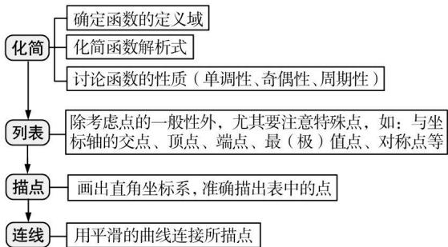

<details>
<summary>flowchart</summary>

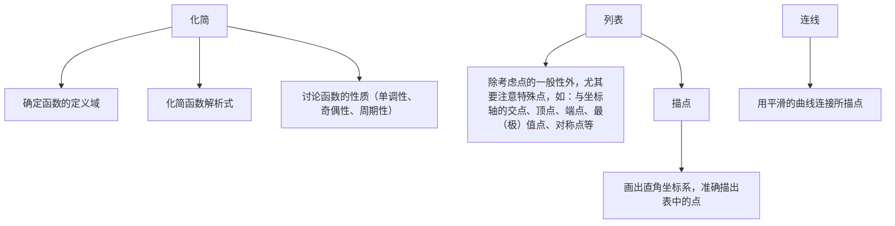
</details>

# 2. 变换法作图

# (1) 平移变换

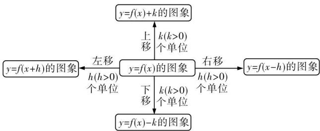

<details>
<summary>flowchart</summary>

```mermaid
graph TD
    A["y=f(x+h)的图象"] -->|左移 h(h>0) 个单位| B["y=f(x)的图象"]
    B -->|上移 k(k>0) 个单位| C["y=f(x)+k的图象"]
    B -->|下移 k(k>0) 个单位| D["y=f(x)-k的图象"]
    C -->|右移 h(h>0) 个单位| E["y=f(x-h)的图象"]
```
</details>

# (2) 对称变换

① $y=f(x)$ 的图象 $\xrightarrow{关于x轴对称}y=-f(x)$ 的图象；

② $y=f(x)$ 的图象 $\xrightarrow{关于y轴对称}y=f(-x)$ 的图象；  
③ $y=f(x)$ 的图象 $\xrightarrow{关于原点对称}y=-f(-x)$ 的图象；  
④ $y=a^{x}(a>0$ 且 $a\neq1)$ 的图象 $\xrightarrow{关于直线y=x}$ 对称 $y=\log_{a}x(a>0$ 且 $a\neq1)$ 的图象.

# (3) 翻折变换

① $y=f(x)$ 的图象 $\xrightarrow[将x轴下方图象翻折上去]{保留x轴上方图象}y=|f(x)|$ 的图象；  
② $y=f(x)$ 的图象 $\xrightarrow[关于y轴对称的图象]{保留y轴右边图象,并作其}y=f(|x|)$ 的图象.

# (4) 伸缩变换

① $y = f(x)$ 的图象 $a > 1$ , 横坐标缩小为原来的 $\frac{1}{a}$ , 纵坐标不变 $y = f(ax)$ 的 $0 < a < 1$ , 横坐标扩大为原来的 $\frac{1}{a}$ 倍, 纵坐标不变

图象；

② $y = f(x)$ 的图象 $\frac{a > 1\text{，纵坐标扩大为原来的} a\text{倍，横坐标不变}}{0 < a < 1\text{，纵坐标缩小为原来的} a\text{，横坐标不变}} y = af(x)$ 的

图象.

# 3. 有关对称性的常用结论

若 $y=f(x)$ 的定义域为 R，则(1) 函数 $y=f(a+x)$ 与 $y=f(b-x)$ 的图象关于直线 $x=\frac{b-a}{2}$ 对称；

(2) 函数 $y = f(x)$ 与 $y = f(2a - x)$ 的图象关于直线 x = a 对称；  
(3) 函数 $y = f(x)$ 与 $y = 2b - f(x)$ 的图象关于直线 y = b 对称；  
(4) 函数 $y = f(x)$ 与 $y = 2b - f(2a - x)$ 的图象关于点 $(a, b)$ 对称.


# 思 | 命题探究

# 命题角度 1 识图与辨图

典例1 函数 $f(x) = \frac{x\cos x}{\mathrm{e}^x + \mathrm{e}^{-x}}$ 在 $[- \pi, \pi]$ 上的图象大致是（）

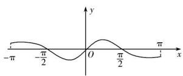

<details>
<summary>text_image</summary>

-π
-π/2
O
π/2
x
y
</details>

A

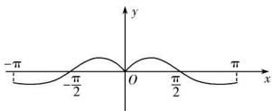  
B

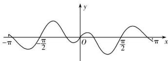

<details>
<summary>text_image</summary>

-π
π/2
O
π/2
-2π x
</details>

C

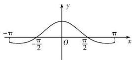  
D

解析 因为 $f(-x) = \frac{-x\cos(-x)}{\mathrm{e}^{-x} + \mathrm{e}^x} = \frac{-x\cos x}{\mathrm{e}^x + \mathrm{e}^{-x}} = -f(x)$ ，所

以函数 $f(x)$ 为奇函数, 故排除 B, D; 又当 $x \in (\frac{\pi}{2}, \pi)$ 时, $\cos x < 0, f(x) < 0$ , 故排除 C. 选 A.

▶ 答案 A


# 用 | 素养解题

# 辨识函数图象的常见类型及求解策略

(1) 由图象确定解析式或解析式中参数满足的数量关系：求解关键是将从图象中得到的以下信息点转化为参数满足的数量关系.

①图象与 x 轴、y 轴的交点位置；②某一区间内函数值的正负；③定义域；④函数的单调性；⑤函数的极值、最值；⑥函数图象的变化趋势.

# (2) 由解析式确定函数图象的技巧:

①由函数的定义域判断图象的左右位置,由函数的值域判断图象的上下位置;  
②由函数的单调性判断图象的变化趋势；  
③由函数的奇偶性判断图象的对称性；  
④由函数的周期性判断图象的循环往复.

# (3)由实际情境探究函数图象:

关键是将问题转化为熟悉的数学模型进行求解,要注意实际问题中函数的定义域.

变式1 如图, 长方形 ABCD 的边 AB = 2, BC = 1, O 是 AB 的中点. 点 P 沿着边 BC, CD 与 DA 运动, 记 $\angle BOP = x$ . 将动点 P 到 A, B 两点的距离之和表示为 x 的函数 $f(x)$ , 则 $y = f(x)$ 的图象大致为 ( )

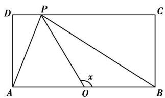

<details>
<summary>text_image</summary>

D
P
C
A
O
x
B
</details>

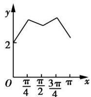  
A

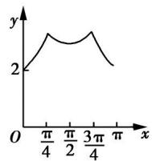

<details>
<summary>line</summary>

| x | y |
|---|---|
| 0 | 2 |
| π/4 | ~3.5 |
| π/2 | ~3.2 |
| 3π/4 | ~3.6 |
| π | ~2.8 |
</details>

B

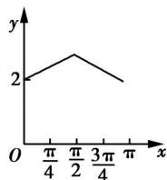  
C

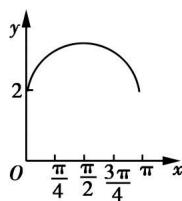  
D

# 命题角度 2 函数图象的应用

典例2 用 $\min \{a, b, c\}$ 表示 $a, b, c$ 中的最小值. 设 $f(x) = \min \{2^x, x + 2, 10 - x\} (x \geqslant 0)$ , 则 $f(x)$ 的最大值为 \_\_\_\_.

解析 $f(x) = \min \{2^{x}, x + 2, 10 - x\}$ ( $x \geqslant 0$ ) 的图象如图中实线所示. 令 $x +$

2=10-x, 得 x=4. 故当 x=4 时, $f(x)$ 取最大值, 又 $f(4)=6$ , 所以 $f(x)$ 的最大值为 6.

▶ 答案 6

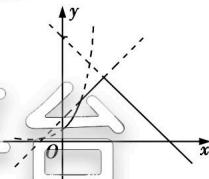

<details>
<summary>text_image</summary>

Mathematical diagram showing a coordinate system with x and y axes, a line intersecting the x-axis at point O, and a dashed line forming a triangle.
</details>


# 用 | 素养解题

# 函数图象应用的常见题型及求解策略

# (1) 利用函数图象研究参数的取值范围:

将构造的函数的图象在同一坐标系内作出,利用数形结合思想,动态地思考问题,求解参数的取值范围.

# (2) 利用函数的图象研究不等式:

当不等式问题不能用代数法求解,但其与函数有关时,常将不等式问题转化为两函数图象的上、下位置关系问题,数形结合求解.

# (3) 利用函数的图象研究方程根的个数:

当方程与函数有关时,可以通过函数图象来研究方程的根,方程 $f(x)=0$ 的根就是函数 $f(x)$ 的图象与x轴交点的横坐标,方程 $f(x)=g(x)$ 的根就是函数 $f(x)$ 与 $g(x)$ 图象交点的横坐标.

变式2 对于函数 $y=\frac{1}{|x|-1}$ ，因其图象类似于汉字中的“囧”字，故我们把其称为“囧函数”。若函数 $f(x)=\log_{a}(x^{2}+x+1)$ $(a>0,a\neq1)$ 有最小值，则“囧函数” $y=\frac{1}{|x|-1}$ 与函数 $y=\log_{a}|x|$ 的图象的交点个数为（）

A. 1

B. 2

C. 4

D. 6

# 命题点 10 函数零点问题


# 学

# 必备知识

# 1. 函数的零点

# (1) 三个等价关系

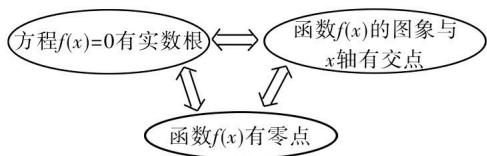

<details>
<summary>flowchart</summary>

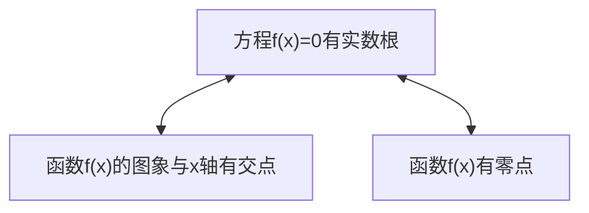
</details>

# (2)零点存在性定理

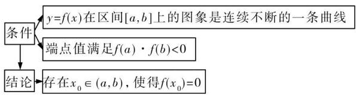

<details>
<summary>flowchart</summary>

```mermaid
graph TD
    A["条件"] --> B["y=f(x)在区间[a,b"]上的图象是连续不断的一条曲线]
    A --> C["端点值满足f(a)·f(b)<0"]
    D["结论"] --> E["存在x₀∈(a,b)，使得f(x₀)=0"]
```
</details>

# 2. 用二分法求函数零点近似值的步骤

(1) 确定区间 $[a, b]$ ，验证 $f(a) \cdot f(b) < 0$ ，给定精确度 $\varepsilon$ .  
(2) 求区间 $(a, b)$ 的中点 c.  
(3) 计算 $f(c)$ .

a. 若 $f(c) = 0$ ，则 $c$ 就是函数的零点；  
b. 若 $f(a) \cdot f(c) < 0$ ，则令 b = c（此时零点 $x_{0} \in (a, c)$ ）；  
c. 若 $f(c) \cdot f(b) < 0$ ，则令 $a = c$ （此时零点 $x_0 \in (c, b)$ ）.  
(4) 判断是否达到精确度 $\varepsilon$ : 若 $|a - b| < \varepsilon$ , 则得到零点近似值 a (或 b), 否则重复 (2)(3)(4).


# 思

# 命题探究

# 命题角度 1 函数零点所在区间的判断

典例 1 已知函数 $f(x)=\ln x-\left(\frac{1}{2}\right)^{x-2}$ 的零点为 $x_{0}$ ，则 $x_{0}$ 所在的区间是

A. $(0,1)$

B. $(1,2)$

C. $(2,3)$

D. $(3,4)$

解析 解法 $f(x)=\ln x-\left(\frac{1}{2}\right)^{x-2}$ 在 $(0,+\infty)$ 上是增函

数, 又 $f(1)=\ln 1-\left(\frac{1}{2}\right)^{-1}=-2<0$ , $f(2)=\ln 2-\left(\frac{1}{2}\right)^{0}=$ $\ln 2-1<0$ , $f(3)=\ln 3-\frac{1}{2}>0$ , 所以 $f(x)$ 的零点 $x_{0}\in(2,3)$ .

解法二 由 $f(x) = 0$ 得 $\ln x = (\frac{1}{2})^{x - 2}$ . 作 $h(x) = \ln x$ , $g(x) = (\frac{1}{2})^{x - 2}$ 的图象, 如图. 由图象可知 $x_0 \in (2,3)$ .

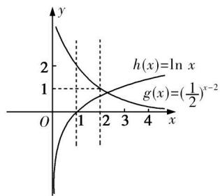

<details>
<summary>text_image</summary>

h(x)=ln x
g(x)=(1/2)^{x-2}
</details>

▶ 答案 C


# 用 | 素养解题

# 判断函数零点所在区间的三种方法

(1) 解方程法: 当对应方程 $f(x)=0$ 易解时, 可先解方程, 再看求得的根所在的区间.  
(2) 定理法: 利用函数零点的存在性定理, 首先看函数 $y = f(x)$ 在区间 $[a, b]$ 上的图象是否连续, 再看是否有 $f(a) \cdot f(b) < 0$ , 若有, 则函数 $y = f(x)$ 在区间 $(a, b)$ 内必有零点.  
(3) 图象法: 画出函数图象, 观察图象与 x 轴是否有交点.

变式1 已知函数 $f(x) = \ln x + 2x - 6$ 的零点在区间 $\left(\frac{k}{2}, \frac{k+1}{2}\right) (k \in \mathbf{Z})$ 内, 那么 k = \_\_\_\_.

# 命题角度 2 函数零点个数的判断

典例2 已知函数 $f(x) = x^{2019} + a - 1 - 3\sin x$ 是 $\mathbf{R}$ 上的奇函数, 则 $f(x)$ 的零点的个数为 ( )

A.4 B.3 C.2 D.1   
思路分析 $f(x)$ 是奇函数 $\rightarrow f(0) = 0 \rightarrow a = 1 \rightarrow f(x) = x^{2019} - 3\sin x \rightarrow$ 作出函数 $y = x^{2019}$ 与 $y = 3\sin x$ 的大致图象数形结合得解  
解析 因为函数 $f(x)=x^{2019}+a-1-3\sin x$ 是 R 上的奇函数, 所以 $f(0)=a-1=0$ , 即 a=1, 所以 $f(x)=x^{2019}-3\sin x$ . 作出函数 $y=x^{2019}$ 与 $y=3\sin x$ 的大致图象, 如图所示, 由图可知, $f(x)$ 的零点的个数为 3.

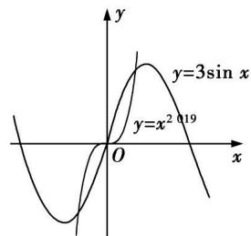

<details>
<summary>text_image</summary>

y
y=3sin x
y=x² ∵19
O
x
</details>

▶ 答案 B


# 用 | 素养解题

# 函数零点个数的判断方法

(1) 直接求零点, 令 $f(x)=0$ , 有几个不同的解就有几个零点;  
(2) 利用零点存在性定理判断, 要求函数的图象在区间 $[a, b]$ 上是连续不断的曲线, 且 $f(a) \cdot f(b) < 0$ , 再结合函数的图象与性质确定函数零点个数;  
(3) 利用两函数图象的交点个数判断, 构造函数, 作出两函数图象, 观察其交点个数, 即得零点个数.

# 命题角度 3 函数零点的应用

典例 3 已知关于 x 的方程 $\left|2^{x} + a\right| = 1$ 有两个不相等的实数解, 则实数 a 的取值范围是 \_\_\_\_.

解析 由题意,令 $f(x)=|2^{x}+a|$ ,则方程 $|2^{x}+a|=1$ 有两个不相等的实数解等价于 $f(x)=|2^{x}+a|$ 的图象与直线y=1有两个交点,若 $a\geqslant0$ ,则 $f(x)=2^{x}+a$ ,此时函数 $f(x)$ 为R上的增函数,显然 $f(x)$ 的图象与直线y=1不可能有两个交点.若a<0,则 $f(x)=|2^{x}+a|$ ,当x趋于 $+\infty$ 时, $f(x)=|2^{x}+a|$ 的值趋于 $+\infty$ ,此时 $f(x)$ 的图象与直线y=1有一个交点;当x趋于 $-\infty$ 时, $f(x)=|2^{x}+a|$ 的值趋于-a,所以当-a>1时, $f(x)$ 的图象与直线y=1有另一个交点,即a<-1,故实数a的取值范围是 $(-∞,-1)$ .

▶ 答案 $(-∞, -1)$

# 用 素养解题

# 已知函数有零点(方程有根)求参数的取值范围的常用方法

(1) 直接法: 直接求解方程, 得到方程的根, 通过解不等式确定参数范围;  
(2) 分离参数法: 将参数分离, 将问题转化成求函数的值域问题;
(3) 数形结合法: 对解析式变形, 在平面直角坐标系中画出相关函数的图象, 数形结合求解.

变式2（多选）已知函数 $f(x)=\left\{\begin{aligned}-x^{2}-2x,x&\leqslant0,\\|\log_{2}x|,x&>0,\end{aligned}\right.$ 若 $f(x_{1})=f(x_{2})=f(x_{3})=f(x_{4})$ ，且 $x_{1}<x_{2}<x_{3}<x_{4}$ ，则下列结论正确的是()

$$
\begin{array}{l} \mathrm{A.} x _ {1} + x _ {2} = 2 \\ \mathrm{B.} x _ {3} x _ {4} = 1 \\ \mathrm{C.} 0 <   x _ {1} + x _ {2} + x _ {3} + x _ {4} <   1 \\ \mathrm{D.} 0 <   x _ {1} x _ {2} x _ {3} x _ {4} <   1 \\ \end{array}
$$

# 命题点 11 函数模型及其应用


# 学 | 必备知识

# 1. 几种常见的函数模型

<table><tr><td>函数模型</td><td>函数解析式</td><td></td><td></td><td> $y = a^{x} (a > 1)$ </td><td> $y = \log_{a} x (a > 1)$ </td><td> $y = x^{\alpha} (\alpha > 0)$ </td></tr><tr><td>一次函数</td><td> $f(x) = ax + b (a, b \text{为常数}, a \neq 0)$ </td><td rowspan="2">在(0, +∞)上的单调性</td><td rowspan="2" colspan="2">单调递增</td><td rowspan="2">单调递增</td><td rowspan="2">单调递增</td></tr><tr><td>二次函数</td><td> $f(x) = ax^{2} + bx + c (a, b, c \text{为常数}, a \neq 0)$ </td></tr><tr><td>指数型函数</td><td> $f(x) = ba^{x} + c (a, b, c \text{为常数}, a > 0 \text{且} a \neq 1, b \neq 0)$ </td><td>增长速度</td><td colspan="2">越来越快</td><td>越来越慢</td><td>随α值的变化而各有不同</td></tr><tr><td>对数型函数</td><td> $f(x) = b \log_{a} x + c (a, b, c \text{为常数}, a > 0 \text{且} a \neq 1, b \neq 0)$ </td><td rowspan="2">图象的变化</td><td rowspan="2" colspan="2">随x的增大逐渐表现为与y轴平行</td><td rowspan="2">随x的增大逐渐表现为与x轴平行</td><td rowspan="2">随α值的变化而各有不同</td></tr><tr><td>幂型函数</td><td> $f(x) = ax^{8} + b (a, b, \alpha \text{为常数}, a \neq 0, \alpha \neq 1)$ </td></tr><tr><td></td><td></td><td>联系</td><td colspan="4">存在一个 $x_{0}$ ,当 $x > x_{0}$ 时,有 $\log_{a} x < x^{\alpha} < a^{x}$ </td></tr></table>


# 思 | 命题探究

# 命题角度 利用函数模型解决实际问题

典例 中国的5G技术处于领先地位,5G技术的数学原理之一便是著名的香农公式: $C=W\log_{2}(1+\frac{S}{N})$ . 它表示:在受噪声干扰的信道中,最大信息传递速度C取决于信道带宽W,信道内信号的平均功率S,信道内部的高斯噪声功率N的大小,其中 $\frac{S}{N}$ 叫做信噪比.当信噪比比较大时,公式中真数中的1可以忽略不计.按照香农公式,若不改变带宽W,而将信噪比 $\frac{S}{N}$ 从1000提升至4000,则C大约增加了(附: $\lg2\approx0.3010$ )

A. $10\%$

B. $20\%$

C. 50%

D. $100\%$

解析 将信噪比 $\frac{S}{N}$ 从1000提升至4000时， $C$ 增加了 $\frac{W\log_2(1 + 4000) - W\log_2(1 + 1000)}{W\log_2(1 + 1000)}\approx \frac{\log_24000 - \log_21000}{\log_21000} =$

$\frac{2}{3\log_{2}10}=\frac{2}{3}\lg2\approx\frac{2}{3}\times0.3010\approx0.2=20\%$ , 故 C 大约增加了 20%, 选 B.

▶ 答案 B

# 2. 指数函数、对数函数、幂函数模型的性质比较

# 用 素养解题

# 解函数应用题的步骤

(1) 审题: 弄清题意, 分清条件和结论, 厘清数量关系, 初步选择数学模型;  
(2) 建模: 将自然语言转化为数学语言, 将文字语言转化为符号语言, 利用数学知识, 建立相应的数学模型;  
(3) 解模: 求解数学模型, 得出数学结论;  
(4) 还原: 将数学问题还原为实际问题.

变式 2020 年 12 月 17 日凌晨, 嫦娥五号返回器携带月球样品, 在预定区域安全着陆, 嫦娥五号是使用长征五号火箭发射成功的. 在不考虑空气阻力的情况下, 火箭的最大速度 v(单位: m/s) 和燃料的质量 M(单位: kg)、火箭(除燃料外) 的质量 m(单位: kg) 的函数关系式为 $v = 2000 \ln \left(1 + \frac{M}{m}\right)$ . 如果火箭的最大速度达到 12 km/s, 则燃料的质量与火箭的质量的关系是 ( )

A. $M = \mathrm{e}^{6}m$

B. $Mm = \mathrm{e}^{6} - 1$

C. $\ln M + \ln m = 6$

D. $\frac{M}{m} = \mathrm{e}^{6} - 1$

# 第三章 导数及其应用

# 命题点 12 导数的运算及几何意义


# 学

# 必备知识

# 1. 导数的几何意义

函数 $y=f(x)$ 在 $x=x_{0}$ 处的导数的几何意义, 就是曲线 $y=f(x)$ 在点 $P(x_{0},f(x_{0}))$ 处的切线的斜率. 也就是说, 曲线 $y=f(x)$ 在点 $P(x_{0},f(x_{0}))$ 处的切线的斜率是 $f'(x_{0})$ .

# 2. 导数的运算

# (1) 常用导数公式

① $c' = 0$ (c 为常数).  
② $(x^{n})' = nx^{n-1} (n \in \mathbf{Q}^{*})$ .   
③ $(\sin x)'=\cos x,(\cos x)'=-\sin x.$   
④ $(\ln x)'=\frac{1}{x}(x>0),(\log_{a}x)'=\frac{1}{x\ln a}(x>0,a>0,$ 且   
$a \neq 1$ .   
⑤ $\left(\mathrm{e}^{x}\right)^{\prime}=\mathrm{e}^{x},\left(a^{x}\right)^{\prime}=a^{x}\ln a(a>0,\text{且}a\neq1).$

# 误区警示

$$
① (\frac {1}{x}) ^ {\prime} = - \frac {1}{x ^ {2}}, (\ln | x |) ^ {\prime} = \frac {1}{x}, (\sqrt {x}) ^ {\prime} = \frac {4}{2 \sqrt {x}} (x > 0)
$$

②对于可导函数,奇函数的导函数是偶函数,偶函数的导函数是奇函数,周期函数的导函数还是周期函数.  
③注意公式不能用错, 如 $(a^{x})' = a^{x} \ln a (a > 0, \text{且 } a \neq 1)$ , 而不是 $(a^{x})' = xa^{x-1} (a > 0, \text{且 } a \neq 1)$ .

# (2) 导数运算法则

$$
[ f (x) \pm g (x) ] ^ {\prime} = f ^ {\prime} (x) \pm g ^ {\prime} (x)
$$

$$
\left[ f (x) \cdot g (x) \right] ^ {\prime} = f ^ {\prime} (x) g (x) + f (x) g ^ {\prime} (x)
$$

$$
\begin{array}{l} \left[ \frac {f (x)}{g (x)} \right] ^ {\prime} = \frac {f ^ {\prime} (x) g (x) - f (x) g ^ {\prime} (x)}{\left[ g (x) \right] ^ {2}} (g (x) \neq 0) \\ [ c f (x) ] ^ {\prime} = c f ^ {\prime} (x) \\ \end{array}
$$

# (3) 复合函数的导数

复合函数 $y=f(g(x))$ 的导数和函数 $y=f(u)$ , $u=g(x)$ 的导数间的关系为 $y_{x}^{\prime}=y_{u}^{\prime}\cdot u_{x}^{\prime}$ ，即 y 对 x 的导数等于 y 对 u 的导数与 u 对 x 的导数的乘积，即 $[f(g(x))]^{\prime}=\underline{f}^{\prime}(g(x))\cdot g^{\prime}(x)$ .


# 思

# 命题探究

# 命题角度 1 利用导数求曲线的切线方程

典例 1 若函数 $f(x) = \ln x - ax + 1$ 的图象在 x = 2 处的切线与 y 轴垂直，则函数 $f(x)$ 的图象在 x = 1 处的切线方程为（）

A. $x + y = 0$

B. $x - 2y = 0$

C. $2x - y + 1 = 0$

D. $x - 2y - 2 = 0$

解析 因为 $f(x) = \ln x - ax + 1$ ，所以 $f'(x) = \frac{1}{x} - a$ ，由函数 $f(x) = \ln x - ax + 1$ 的图象在 $x = 2$ 处的切线与 $y$ 轴垂直，可得 $f'(2) = \frac{1}{2} - a = 0$ ，得 $a = \frac{1}{2}$ ，所以 $f(x) = \ln x - \frac{1}{2}x + 1$ ，所以 $f(1) = \frac{1}{2}$ ， $f'(1) = \frac{1}{2}$ ，所以函数 $f(x)$ 的图象在 $x = 1$ 处的切线方程为 $y - \frac{1}{2} = \frac{1}{2}(x - 1)$ ，即 $x - 2y = 0$ ，故选 B.

▶ 答案 B


# 用

# 素养解题

与导数的几何意义有关的问题的常见类型及解题策略

<table><tr><td>题型</td><td>解题策略</td></tr><tr><td>求过曲线  $y = f\left( x\right)$  上 一点  $P\left( {{x}_{0},{y}_{0}}\right)$  处的切 线方程</td><td>首先求导函数  ${f}^{\prime }\left( x\right)$  ,确定出切线斜率  ${f}^{\prime }\left( {x}_{0}\right)$  , 然后利用点斜式写出切线方程,为  $y - {y}_{0} =$   ${f}^{\prime }\left( {x}_{0}\right) \left( {x - {x}_{0}}\right)$ </td></tr><tr><td>求过曲线外一点  $P\left( {{x}_{1},{y}_{1}}\right)$  且与曲线  $y = f\left( x\right)$  相切的切线 方程</td><td>首先设出切点  $A\left( {{x}_{0},{y}_{0}}\right)$  ,然后表示出切线斜率  ${f}^{\prime }\left( {x}_{0}\right)$  ,得到切线方程,为  $y - {y}_{0} = {f}^{\prime }\left( {x}_{0}\right) \left( {x - }\right.$   ${x}_{0})$  ,把  $\left( {{x}_{1},{y}_{1}}\right)$  代入切线方程,结合  ${y}_{0} = f\left( {x}_{0}\right)$  求 得切点坐标,最后根据切点坐标求出切线方程</td></tr><tr><td>已知切线方程 (或斜 率)求切点的坐标</td><td>首先求导函数  ${f}^{\prime }\left( x\right)$  ,并由切点处的导数值等 于切线的斜率求出切点的横坐标,然后将横坐 标代入函数解析式求出纵坐标,即可得解</td></tr><tr><td>根据导数的几何意义 求参数的值</td><td>利用切点  $P\left( {{x}_{0},{y}_{0}}\right)$  既在曲线上,又在切线上及  ${f}^{\prime }\left( {x}_{0}\right)$  等于切线斜率,构造出方程组,求解即可</td></tr></table>

# 特别提醒

求曲线 $y = f(x)$ 过点 $P(x_0, y_0)$ 的切线方程时，点 $P(x_0, y_0)$ 不一定是切点.

变式1 已知函数 $f(x)=x^{3}-ax^{2}-8x$ 的导函数为偶函数，则 $f(x)$ 的图象在点 $(2,f(2))$ 处的切线方程为（）

A. $4x - y - 16 = 0$

B. $x - 4y - 16 = 0$

C. $2x - y - 8 = 0$

D. $4x - y + 4 = 0$

变式2 已知函数 $f(x)=x\ln x, g(x)=x^{2}+ax(a\in\mathbf{R})$ ，若经过点 A(1,0) 存在一条直线 l 与 $f(x)$ 和 $g(x)$ 的图象都相切，则 a=

A. 0

B. -1

C. 3

D. -1 或 3

# 命题角度 2 导数几何意义的应用

典例 2 若对任意 $x \in [0, +\infty)$ ，不等式 $2ax \leqslant e^{x} - 1$ 恒成立，则实数 a 的最大值是（）

A. $\frac{1}{2}$

B. $\frac{1}{4}$

C. 1

D. 2

解析 解法一 设 $y = 2ax, y = \mathrm{e}^x - 1$ ，其中 $x \geqslant 0$ 。在同一坐标系中画出函数 $y = 2ax$ 和 $y = \mathrm{e}^x - 1$ 的图象，如图所示。 $y = \mathrm{e}^x - 1$ 的导数为 $y' = \mathrm{e}^x$ ，令 $x = 0$ ，得 $\mathrm{e}^0 = 1$ ，∴ 曲线 $y = \mathrm{e}^x - 1$ 在点 $O(0,0)$ 处的切线斜率为 1。根据题意得 $2a \leqslant 1$ ，解值为 $\frac{1}{2}$ 。

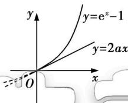

<details>
<summary>text_image</summary>

y=e^x-1
y=2ax
O
</details>

解法二 当 x=0 时, 不等式为 $0 \leqslant 1 - 1 = 0$ , 显然成立. 当 $x \neq 0$ 时, 不等式可化为 $a \leqslant \frac{e^{x} - 1}{2x}$ . 设 $g(x) = \frac{e^{x} - 1}{2x} (x > 0)$ , 则 $g'(x) =$

$\frac{2xe^{x}-2(e^{x}-1)}{(2x)^{2}}=\frac{(x-1)e^{x}+1}{2x^{2}}.$ 设 $p(x)=(x-1)e^{x}+1(x>0)$ 则 $p'(x)=xe^{x}$ ，因为x>0，所以 $p'(x)>0$ ，即函数 $p(x)$ 在 $(0,+\infty)$ 上单调递增，所以 $p(x)>-1+1=0$ ，所以 $g'(x)>0$ ，所以函数 $g(x)$ 在 $(0,+\infty)$ 上单调递增，当 $x\to0$ 时， $e^{x}-1\to0$ ，由洛必达法则可知， $\lim_{x\to0}\frac{e^{x}-1}{2x}=\lim_{x\to0}\frac{(e^{x}-1)^{\prime}}{(2x)^{\prime}}=\lim_{x\to0}\frac{e^{x}}{2}=\frac{1}{2}$ ，所以 $g(x)>\frac{1}{2}$ ，故 $a\leqslant\frac{1}{2}$ . 综上， $a\leqslant\frac{1}{2}$ .

▶ 答案 A

典例3 已知实数 $a, b, c, d$ 满足 $\frac{a - 2\mathrm{e}^a}{b} = \frac{1 - c}{d - 3} = 1$ (e 是自然对数的底数), 则 $(a - c)^2 + (b - d)^2$ 的最小值为 ( )

A. 10

B. 18

C. 8

D. 12

思路分析 已知 $\rightarrow b = a - 2\mathrm{e}^{a}, d = 4 - c \xrightarrow[\text{构造函数}]{\text{转化}} y = x - 2\mathrm{e}^{x}, y = 4 - x \xrightarrow{\text{导数的几何意义}}$ 曲线 $y = x - 2\mathrm{e}^{x}$ 的切线和直线 $y = 4 - x$ 平行时的切点坐标 $\xrightarrow{\text{点到直线的距离公式}}$ 切点到直线 $y = 4 - x$ 的距离 $h \to$ 得解

解析 由题意知 $b = a - 2\mathrm{e}^a, d = 4 - c$ ，该题相当于求曲线 $y = x - 2\mathrm{e}^x$ 上的点与直线 $y = 4 - x$ 上的点之间距离的平方的最小值。易知最小值是曲线 $y = x - 2\mathrm{e}^x$ 的切线与直线 $y = 4 - x$ 平行时，切点到直线 $y = 4 - x$ 的距离的平方。对 $y = x - 2\mathrm{e}^x$ 求导，得 $y' = 1 - 2\mathrm{e}^x$ ，令 $1 - 2\mathrm{e}^x = -1$ ，解得 $x = 0$ ，所以切点坐标为 $(0, -2)$ 。点 $(0, -2)$ 到直线 $y = 4 - x$ 的距离 $h = \frac{6}{\sqrt{2}} = 3\sqrt{2}$ ，所以所求的最小值为 18，故选 B.

答案 B

# 命题点 13 利用导数处理函数的单调性问题


# 学 | 必备知识

函数的单调性与导数的关系

<table><tr><td rowspan="2">导数到 单调性</td><td>单调递增</td><td>在区间(a,b)上,若 ${f}^{\prime }\left( x\right) >0$ ,则 $f\left( x\right)$ 在这个区间 上单调递增</td></tr><tr><td>单调递减</td><td>在区间(a,b)上,若 ${f}^{\prime }\left( x\right) < 0$ ,则 $f\left( x\right)$ 在这个区间 上单调递减</td></tr><tr><td>单调性 到导数</td><td>单调递增</td><td>若函数 $y = f\left( x\right)$ 在区间(a,b)上单调递增,则  ${f}^{\prime }\left( x\right) \geqslant 0$ </td></tr></table>

续表

<table><tr><td>单调性到导数</td><td>单调递减</td><td>若函数y=f(x)在区间(a,b)上单调递减,则f&#x27;(x)≤0</td></tr></table>

# 特别提醒

1. “函数 $y=f(x)$ 在区间 $(a,b)$ 上的导数大(小)于0”是“ $y=f(x)$ 在区间 $(a,b)$ 上单调递增(减)”的充分不必要条件.

2. $f^{\prime}(x)\geqslant 0(\leqslant 0)$ 是 $f(x)$ 在区间 $(a,b)$ 上单调递增（减）的必要不充分条件.


# 思 | 命题探究

# 命题角度 1 利用导数判断函数的单调性

典例 1 已知函数 $f(x)=(x^{2}-2ax)\ln x-x^{2}+3ax$ ，求函数 $f(x)$ 的单调递增区间.

解析 $f^{\prime}(x) = 2(x - a)\ln x + x - 2a - 2x + 3a = 2(x - a)\cdot$ $(\ln x - \frac{1}{2}),x > 0,$

当 $a \leqslant 0$ 时，令 $f'(x) > 0$ ，因为 $x - a > 0$ ，所以 $\ln x - \frac{1}{2} > 0$ ，得

$x > \sqrt{\mathrm{e}}$

所以 $f(x)$ 的单调递增区间为 $(\sqrt{\mathrm{e}}, +\infty)$ .

当 $0 < a < \sqrt{e}$ 时，令 $f'(x) > 0$ ，得 $0 < x < a$ 或 $x > \sqrt{e}$ ，

所以 $f(x)$ 的单调递增区间为 $(0,a)$ 和 $(\sqrt{\mathrm{e}},+\infty)$ .

当 $a=\sqrt{e}$ 时, $f'(x)\geqslant0$ 恒成立, 所以 $f(x)$ 的单调递增区间为 $(0,+\infty)$ .

当 $a > \sqrt{e}$ 时，令 $f'(x) > 0$ ，得 $0 < x < \sqrt{e}$ 或 x > a，

所以 $f(x)$ 的单调递增区间为 $(0, \sqrt{\mathrm{e}})$ 和 $(a, +\infty)$ .

综上, 当 $a \leqslant 0$ 时, $f(x)$ 的单调递增区间为 $(\sqrt{\mathrm{e}}, +\infty)$ ;

当 $0 < a < \sqrt{e}$ 时， $f(x)$ 的单调递增区间为 $(0, a)$ 和 $(\sqrt{e}, +\infty)$ ;

当 $a=\sqrt{e}$ 时， $f(x)$ 的单调递增区间为 $(0,+\infty)$ ;

当 $a > \sqrt{e}$ 时， $f(x)$ 的单调递增区间为 $(0, \sqrt{e})$ 和 $(a, +\infty)$ .


# 用 | 素养解题

# 利用导数讨论(证明)函数 $f(x)$ 在 $(a,b)$ 内单调性的步骤

(1) 求 $f'(x)$ .   
(2)确认 $f'(x)$ 在 $(a,b)$ 内的符号.  
(3)得出结论: $f'(x)>0$ 时, $f(x)$ 单调递增, $f'(x)<0$ 时, $f(x)$ 单调递减.

# 特别提醒

研究含参函数的单调性时,需注意依据参数取值对不等式解集的影响进行分类讨论.

变式1 已知函数 $f(x)=\frac{m}{x}-\ln x-mx(m\in\mathbf{R})$ . 讨论函数 $f(x)$ 的单调性;

# 命题角度 2 已知函数单调性求参数的取值范围

典例2 (1)已知函数 $f(x)=\left\{\begin{aligned}x^{3}-ax^{2}+a,x&\leqslant0,\\ \left(\frac{1}{2}\right)^{(a-2)x}&+\frac{1}{4},x>0,\end{aligned}\right.$ 若函数 $f(x)$ 在R上单调递增，则实数a的取值范围为（）

A. $\left[0,\frac{3}{4}\right]$

B. $\left[0,\frac{1}{4}\right]$

C. $[0,2)$

D. $\left[0,\frac{5}{4}\right]$

(2) 设 $f(x) = -\frac{1}{3}x^{3} + \frac{1}{2}x^{2} + 2ax.$ 若 $f(x)$ 在 $(\frac{2}{3}, +\infty)$ 上存在单调递增区间，则 a 的取值范围是 \_\_\_\_.

解析 （1）因为函数 $f(x)$ 在 R 上单调递增，所以 $y = \left(\frac{1}{2}\right)^{(a-2)x} + \frac{1}{4}$ 在 $(0, +\infty)$ 上单调递增，故 a - 2 < 0，则 a < 2 ①. 其次， $y = x^{3} - ax^{2} + a$ 在 $(-∞, 0]$ 上单调递增，则 $y' = 3x^{2} - 2ax ≥ 0$ 在 $(-∞, 0]$ 上恒成立，当 x = 0 时， $a ∈ R$ ; 当 x < 0 时， $2a ≥ 3x$ 恒成立，所以 $a ≥ 0$ . 所以 $a ≥ 0$ ②. 最后，当 x = 0 时，

$a \leqslant \left( \frac{1}{2} \right)^{0} + \frac{1}{4} = \frac{5}{4}$ ③. 综合①②③, 得实数 a 的取值范围为 $\left[0, \frac{5}{4}\right]$ , 故选 D.

(2)由题意知 $f'(x)=-x^{2}+x+2a\geqslant0$ 在 $\left(\frac{2}{3},+\infty\right)$ 上有解，
令 $g(x)=x^{2}-x$ ，可知当 $x>\frac{2}{3}$ 时， $g(x)>g\left(\frac{2}{3}\right)=-\frac{2}{9}$ ，所以 $a>-\frac{1}{9}$ ，所以 a 的取值范围为 $\left(-\frac{1}{9},+\infty\right)$ .

▶ 答案 (1) D (2) $(- \frac{1}{9}, +\infty)$


# 用 | 素养解题

# 利用函数的单调性求参数的取值范围的解题思路

(1)由函数在区间 $[a,b]$ 上单调递增(或递减)可知 $f^{\prime}(x)\geqslant 0$ （或 $f^{\prime}(x)\leqslant 0$ )在区间 $[a,b]$ 上恒成立.

(2) 利用分离参数法或函数的性质求解恒成立问题.

(3) 对等号单独检验, 检验参数的取值能否使 $f'(x)$ 在整个区间恒等于 0, 若 $f'(x)$ 恒等于 0, 则参数的这个值应舍去; 若只是在个别点处有 $f'(x) = 0$ , 则参数可取这个值.

变式2 已知函数 $f(x)=x^{3}-ax-1$ . 若 $f(x)$ 在 R 上为增函数, 求实数 a 的取值范围.

[条件探究1] 函数 $f(x)$ 不变, 若 $f(x)$ 在区间 $(1, +\infty)$ 上为增函数, 求 a 的取值范围.

[条件探究2] 函数 $f(x)$ 不变, 若 $f(x)$ 在区间 $(-1,1)$ 上为减函数, 求 a 的取值范围.

[条件探究3] 函数 $f(x)$ 不变, 若 $f(x)$ 的单调递减区间为 $(-1, 1)$ , 求 $a$ 的值.

[条件探究4] 函数 $f(x)$ 不变, 若 $f(x)$ 在区间 $(-1,1)$ 上不单调, 求 a 的取值范围.

变式3 已知函数 $f(x)=\frac{1}{2}x^{2}+2a\ln x-(a+2)x.$

(1) 当 a=1 时, 求函数 $f(x)$ 的单调区间.

(2) 是否存在实数 a，使得函数 $g(x)=f(x)+ax+\frac{4}{9}x^{3}$ 在 $(0,+\infty)$ 上单调递增？若存在，求出 a 的取值范围；若不存在，请说明理由.

# 命题点14 利用导数解决函数的极值、最值问题


# 学

# 必备知识

# 1. 函数的极值

<table><tr><td></td><td>极小值</td><td>极大值</td></tr><tr><td>定义</td><td>设函数 $f(x)$ 在点 $x_0$ 处连续,如果在 $x_0$ 附近的左侧 $f'(x)<0$ ,右侧 $f'(x)>0$ ,那么 $f(x_0)$ 是极小值</td><td>设函数 $f(x)$ 在点 $x_0$ 处连续,如果在 $x_0$ 附近的左侧 $f'(x)>0$ ,右侧 $f'(x)<0$ ,那么 $f(x_0)$ 是极大值</td></tr><tr><td>图象</td><td>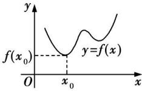</td><td>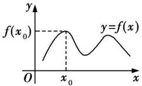</td></tr></table>

# 2. 函数的最值

(1) 在闭区间 $[a, b]$ 上图象连续不断的函数 $f(x)$ 在 $[a, b]$ 上必有最大值与最小值.
(2) 若函数 $f(x)$ 在 $[a, b]$ 上单调递增，则 $f(a)$ 为函数在 $[a, b]$ 上的最小值， $f(b)$ 为函数在 $[a, b]$ 上的最大值；若函数 $f(x)$ 在 $[a, b]$ 上单调递减，则 $f(a)$ 为函数在 $[a, b]$ 上的最大值， $f(b)$ 为函数在 $[a, b]$ 上的最小值.

# 特别提醒

(1) 当连续函数在开区间内的极值点只有一个时, 相应的极值点必为函数在这个开区间内的最值点;
(2) 极值有可能是最值, 但最值只要不在区间端点处取得, 其必定是极值.


# 思 | 命题探究

# 命题角度 1 已知函数解析式求极值

典例 1 已知函数 $f(x)=ae^{x}(x-2)(a\neq0)$ .

(1) 求 $f(x)$ 的单调区间；
(2) 当 a = -1 时, 求函数 $g(x) = f(x) + x^{2} - 2x$ 的极值.

解析 (1) 由题意, 可得 $f'(x) = ae^x(x - 1)$ , 若 $a > 0$ , 由 $f'(\overline{x}) < 0$ , 可得 $x < 1$ , 由 $f'(x) > 0$ , 可得 $x > 1$ , 所以 $f(x)$ 的递减区间为 $(- \infty, 1)$ , 递增区间为 $(1, +\infty)$ ; 若 $a < 0$ , 由 $f'(x) < 0$ , 可得 $x > 1$ , 由 $f''(x) > 0$ , 可得 $x < 1$ , 所以 $f(x)$ 的递减区间为 $(1, +\infty)$ , 递增区间为 $(- \infty, 1)$ . (2) 当 $a = -1$ 时, 可得 $g(x) = f(x) + x^2 - 2x = -e^x(x - 2) + x^2 - 2x$ ,

则 $g'(x) = -\mathrm{e}^{x}(x-1) + 2x - 2 = -(x-1)(\mathrm{e}^{x}-2)$ ,
由 $g'(x)=0$ , 得 $(x-1)(\mathrm{e}^{x}-2)=0$ , 解得 x=1 或 $x=\ln2$ ,
当 x 变化时, $g'(x)$ 与 $g(x)$ 的变化情况如下表:

<table><tr><td>x</td><td> $(-\infty,\ln 2)$ </td><td> $\ln 2$ </td><td> $(\ln 2,1)$ </td><td>1</td><td> $(1,+\infty)$ </td></tr><tr><td> $g'(x)$ </td><td>-</td><td>0</td><td>+</td><td>0</td><td>-</td></tr><tr><td> $g(x)$ </td><td>递减</td><td>极小值</td><td>递增</td><td>极大值</td><td>递减</td></tr></table>

所以当 $x = \ln 2$ 时，函数 $g(x)$ 取得极小值，为 $g(\ln 2) = (\ln 2)^{2} - 4\ln 2 + 4$

当 x=1 时, 函数 $g(x)$ 取得极大值, 为 $g(1)=\mathrm{e}-1$ .


# 用 | 素养解题

# 利用导数研究函数极值问题的一般流程

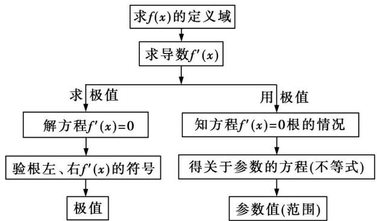

<details>
<summary>flowchart</summary>

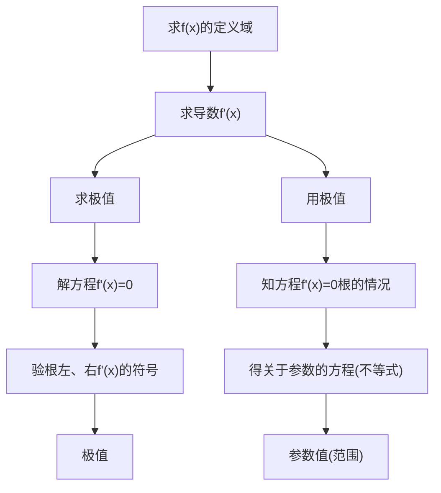
</details>

变式1 已知函数 $f(x)=\ln x+kx$ , $g(x)=x^{2}$ , $k\in R$ .

(1) 求函数 $f(x)$ 的极值点；
(2) 若 $f(x) \leqslant g(x)$ 恒成立, 求 k 的取值范围.

# 命题角度 2 已知极值求参数的值或取值范围

典例2 (1) 若函数 $f(x) = (x^2 - ax - 1)e^x$ 的极小值点是 $x = 1$ ，则 $f(x)$ 的极大值为 （）

A. -e

B. $-2e^{2}$

C. $5 \mathrm{e}^{-2}$

D. -2

(2)已知函数 $f(x)=\ln x+ax^{2}-x$ 有极值,则实数a的取值范围是()

A. $(-∞, \frac{1}{8})$

B. $(-∞,0]$

C. $[0, \frac{1}{8})$

D. $(-\infty, \frac{1}{4})$

解析（1）由题意，函数 $f(x) = (x^2 - ax - 1)\mathrm{e}^x$ ，可得 $f'(x) = \mathrm{e}^x [x^2 + (2 - a)x - 1 - a]$ ，

所以 $f'(1)=(2-2a)e=0$ ，解得a=1，故 $f(x)=(x^{2}-x-1)e^{x}$ ，

可得 $f'(x) = \mathrm{e}^{x}(x + 2)(x - 1)$ ,

则 $f(x)$ 在 $(-∞,-2)$ 上单调递增，在 $(-2,1)$ 上单调递减，

在 $(1, +\infty)$ 上单调递增，

所以 $f(x)$ 的极大值为 $f(-2)=5e^{-2}$ . 故选 C.

(2)通解 由题意知 $f(x)$ 的定义域是 $(0, +\infty), f'(x) = \frac{1}{x} + 2ax - 1 = \frac{2ax^2 - x + 1}{x}$ ，记 $g(x) = 2ax^2 - x + 1$ ，当 $a = 0$ 时， $g(x) = -x + 1$ ，当 $0 < x < 1$ 时， $f'(x) > 0$ ，当 $x > 1$ 时， $f'(x) < 0$ ，所以 $f(x)$ 在 $(0, 1)$ 上单调递增，在 $(1, +\infty)$ 上单调递减，所以 $f(x)$ 有极值。当 $a > 0$ 时，对于 $2ax^2 - x + 1 = 0$ ，若 $\Delta = 1 - 8a \leqslant 0$ ，即 $a \geqslant \frac{1}{8}$ ，则 $g(x) \geqslant 0$ ，即 $f'(x) \geqslant 0$ ，则 $f(x)$ 单调递增， $f(x)$ 无极值；若 $\Delta = 1 - 8a > 0$ ，即 $0 < a < \frac{1}{8}$ ，则 $g(x) = 0$ 有两个不同的正根 $x_1, x_2$ ，不妨令 $x_1 < x_2$ ，则易得 $f(x)$ 在 $(0, x_1)$ 上单调递增，在 $(x_1, x_2)$ 上单调递减，在 $(x_2, +\infty)$ 上单调递增，所以 $f(x)$ 有极值。当 $a < 0$ 时，对于 $2ax^2 - x + 1 = 0, \Delta = 1 - 8a > 0$ ，且 $g(0) = 1 > 0$ ，则 $a < 0$ 时， $g(x) = 0$ 在 $(0, +\infty)$ 上有一个实数根，记为 $x_0$ ，则易得 $f(x)$ 在 $(0, x_0)$ 上单调递增，在 $(x_0, +\infty)$ 上单调递减，所以 $f(x)$ 有极值。因此实数 $a$ 的取值范围是 $(-\infty, \frac{1}{8})$ ，故选 A.

优解 由题意知 $f(x)$ 的定义域是 $(0, +\infty)$ , $f'(x) = \frac{1}{x} + 2ax - 1 = \frac{2ax^2 - x + 1}{x}$ , 记 $g(x) = 2ax^2 - x + 1$ , 由于 $f(x)$ 有极值, 所以函数 $g(x)$ 有零点, 即 $2ax^2 - x + 1 = 0$ 有根, 即 $2a = -\frac{1}{x^2} + \frac{1}{x}$ 有根, 即 $y = 2a$ 与 $y = -\frac{1}{x^2} + \frac{1}{x}$ 的图象有交点. 由于 $y = -\frac{1}{x^2} + \frac{1}{x} = -\left(\frac{1}{x} - \frac{1}{2}\right)^2 + \frac{1}{4} \leqslant \frac{1}{4}$ , 所以 $2a \leqslant \frac{1}{4}$ , 但是当 $2a = \frac{1}{4}$ 时, $g(x) = \frac{1}{4}x^2 - x + 1 = (\frac{1}{2}x - 1)^2 \geqslant 0$ , 不合题意, 因此 $2a < \frac{1}{4}$ , 得 $a < \frac{1}{8}$ , 因此实数 $a$ 的取值范围是 $(-\infty, \frac{1}{8})$ , 故选 A.

▶ 答案 (1)C (2)A


# 用 | 素养解题

# 已知函数极值点或极值求参数的两个要领

(1) 列式: 根据极值点处导数为 0 和极值这两个条件列方程组, 利用待定系数法求解.

(2) 验证: 因为导数值等于 0 不是此点为极值点的充要条件, 所以利用待定系数法求解后必须验证 (1) 中解的合理性.

# 命题角度 3 利用导数研究函数的最值

典例 3 已知函数 $f(x)=12-x^{2}$ .

(1) 求曲线 $y = f(x)$ 的斜率等于 -2 的切线方程；
(2) 设曲线 $y = f(x)$ 在点 $(t, f(t))$ 处的切线与坐标轴围成的三角形的面积为 $S(t)$ ，求 $S(t)$ 的最小值.

解析 （1）函数 $f(x)=12-x^{2}$ 的定义域为 R, $f'(x)=-2x$ , 令 $f'(x)=-2x=-2$ , 得 x=1, $\therefore f'(1)=-2$ , 又 $f(1)=11$ ,

∴ 曲线 $y = f(x)$ 的斜率等于 -2 的切线方程为 $y - 11 = -2(x - 1)$ ，即 $2x + y - 13 = 0$ .

(2) 由(1)知 $f'(x) = -2x$ ，则 $f'(t) = -2t$ ，又 $f(t) = 12 - t^2$ ，∴ 曲线 $y = f(x)$ 在点 $(t, f(t))$ 处的切线方程为 $y - (12 - t^2) = -2t(x - t)$ ，即 $y = -2tx + t^2 + 12$ . 若 $t = 0$ ，则围不成三角形，故 $t \neq 0$ .

令 x=0，得 $y=t^{2}+12$ ，记 $A(0,t^{2}+12)$ ，O 为坐标原点，则 $|OA|=t^{2}+12$ ，令 y=0，得 $x=\frac{t^{2}+12}{2t}$ ，记 $B(\frac{t^{2}+12}{2t},0)$ ，则 $|OB|=\frac{t^{2}+12}{2|t|}$ ，

$\therefore S(t) = \frac{1}{2} |OA||OB| = \frac{(t^2 + 12)^2}{4|t|}, \because S(t)$ 为偶函数， $\therefore$ 仅考虑 $t > 0$ 即可.

当 t > 0 时, $S(t) = \frac{1}{4}(t^{3} + 24t + \frac{144}{t})$ ,

则 $S'(t)=\frac{1}{4}(3t^{2}+24-\frac{144}{t^{2}})=\frac{3}{4t^{2}}(t^{2}-4)(t^{2}+12)$ ,

令 $S'(t)=0$ , 得 t=2 ,

∴ 当 t 变化时, $S'(t)$ 与 $S(t)$ 的变化情况如表:

<table><tr><td>t</td><td>(0,2)</td><td>2</td><td>(2,+∞)</td></tr><tr><td>S&#x27;(t)</td><td>-</td><td>0</td><td>+</td></tr><tr><td>S(t)</td><td></td><td>极小值</td><td></td></tr></table>

$\therefore S(t)_{\min} = S(2) = 32.$


# 用 素养解题

# 求函数 $f(x)$ 在区间 $[a, b]$ 上最值的方法

(1) 若函数 $f(x)$ 在区间 $[a, b]$ 上单调，则 $f(a)$ 与 $f(b)$ 一个为最大值，一个为最小值.  
(2) 若函数 $f(x)$ 在闭区间 $[a, b]$ 内有极值，要先求出函数在 $[a, b]$ 上的极值，与 $f(a), f(b)$ 比较，最大的是最大值，最小的是最小值，可列表求解.  
(3) 若函数 $f(x)$ 在闭区间 $[a, b]$ 上有唯一一个极值点, 这个极值点就是最大 (小) 值点.

变式2 已知函数 $f(x)=x^{2}-ax+\ln x(a\in\mathbf{R})$ .

(1) 若 a=3，求函数 $f(x)$ 的单调递增区间；  
(2) 令 $g(x)=f(x)-x^{2}+\frac{1}{2}ax$ ，若 $g(x)$ 的最大值为 -1，求 a 的值.

# 命题点 15 利用导数研究函数的零点问题


# 思 | 命题探究

# 命题角度 1 判断函数零点的个数

典例 1 若 a > 2，则函数 $f(x) = \frac{1}{3}x^{3} - ax^{2} + 1$ 在区间 $(0, 2)$ 上恰好有（）

A. 0 个零点

B. 1 个零点

C. 2 个零点

D. 3 个零点

解析 $\because f(x) = \frac{1}{3} x^3 - ax^2 + 1, \therefore f'(x) = x^2 - 2ax = x(x - 2a)$ ，又 $a > 2, \therefore$ 当 $x \in (0, 2)$ 时， $f'(x) < 0$ ，函数 $f(x)$ 单调递减。又 $f(0) = 1 > 0, f(2) = \frac{11}{3} - 4a < 0, \therefore f(x)$ 在 $(0, 2)$ 上恰好有 1 个零点。

▶ 答案 B

典例2 已知函数 $f(x) = \frac{1}{3} x^3 + \frac{a}{2} x^2 + \frac{a}{2} x + 2\ln x, g(x) = \frac{2 - a}{x} + a.$

(1) 若 a = -2，求 $f(x)$ 的极值；

(2) 设 $h(x)=f'(x)-g(x)$ ，讨论 $h(x)$ 的零点个数.

解析 (1) $f'(x)=x^{2}+ax+\frac{a}{2}+\frac{2}{x}=\frac{x^{3}+ax^{2}+\frac{a}{2}x+2}{x}$

$$
x \in (0, + \infty)
$$

若 $a = -2$ ，则 $f^{\prime}(x) = \frac{x^{3} - 2x^{2} - x + 2}{x} = \frac{(x^{2} - 1)(x - 2)}{x} =$

$$
\frac {(x + 1) (x - 1) (x - 2)}{x},
$$

当 $x \in (0,1) \cup (2, +\infty)$ 时， $f'(x) > 0$ ；当 $x \in (1,2)$ 时， $f'(x) < 0$ .

$\therefore f(x)$ 在 $(0,1)$ 和 $(2, +\infty)$ 上单调递增，在 $(1,2)$ 上单调递减.

$$
\therefore f (x) _ {\text {极大值}} = f (1) = - \frac {5}{3}, f (x) _ {\text {极小值}} = f (2) = 2 \ln 2 - \frac {1 0}{3}.
$$

(2) $h(x) = f'(x) - g(x) = x^2 + ax + \frac{a}{2} + \frac{2}{x} - \frac{2 - a}{x} -$

$$
a = \frac {x ^ {3} + a x ^ {2} - \frac {a}{2} x + a}{x},
$$

令 $h(x) = 0$ ，即 $x^{3} + ax^{2} - \frac{a}{2} x + a = 0$ ，得 $a = \frac{-x^3}{x^2 - \frac{1}{2}x + 1},$

故 $h(x)$ 的零点个数即直线 $y = a$ 与 $y = \frac{-x^3}{x^2 - \frac{1}{2}x + 1} (x > 0)$ 的图象的交点个数.

令 $t(x) = \frac{-x^3}{x^2 - \frac{1}{2}x + 1} (x > 0)$ ，显然 $t(x) < 0$ ， $\therefore$ 当 $a \geqslant 0$ 时，函数 $h(x)$ 无零点，

当 $a < 0$ 时， $t'(x) = \frac{-3x^2(x^2 - \frac{1}{2}x + 1) + x^3(2x - \frac{1}{2})}{(x^2 - \frac{1}{2}x + 1)^2} = \frac{-x^2(x^2 - x + 3)}{(x^2 - \frac{1}{2}x + 1)^2} < 0$ 恒成立，

故 $t(x)$ 在 $(0, +\infty)$ 上单调递减，此时直线 $y = a$ 与 $y = t(x)$ 的图象只有一个交点，即 $h(x)$ 只有一个零点.

综上, 当 $a \geqslant 0$ 时, 函数 $h(x)$ 无零点, 当 a < 0 时, 函数 $h(x)$ 只有一个零点.


# 用 | 素养解题

# 利用导数研究方程根(函数零点)的技巧

(1) 研究方程根的情况, 可以通过导数研究函数的单调性、最大值、最小值、变化趋势等;  
(2)根据题目要求,画出函数图象的走势规律,标明函数极(最)值的位置;  
(3) 利用数形结合思想去分析问题, 可以使问题的求解有一个清晰、直观的整体展现.


# 度 2 根据函数的零点个数研究参数的取值范围

例3 已知函数 $f(x) = \begin{cases} \frac{\mathrm{e}^{x - 1}}{x}, & x > 0, \\ ax + 3, & x \leqslant 0, \end{cases}$ 若函数 $g(x) =$

$f(f(x))-2$ 恰有5个零点,且最小的零点小于-4,则a的取值范围是()

A. $(-∞,-1)$

B. $(0,+\infty)$

C. $(0,1)$

D. $(1,+\infty)$

解析 当 x > 0 时, $f(x) = \frac{\mathrm{e}^{x-1}}{x}$ , $f'(x) = \frac{\mathrm{e}^{x-1}(x-1)}{x^2}$ , 当 0 < x < 1 时, $f'(x) < 0$ , $f(x)$ 单调递减, 当 x > 1 时, $f'(x) > 0$ , $f(x)$ 单调递增, 故 $f(x)_{\min} = f(1) = 1$ . 当 $x \leqslant 0$ 时, $f(x) = ax + 3$ 的图象恒过点 (0,3). 当 $a \leqslant 0$ , $x \leqslant 0$ 时, $f(x) \geqslant f(0) = 3$ ; 当 a > 0, $x \leqslant 0$ 时, $f(x) \leqslant f(0) = 3$ . $f(x)$ 的大致图象如图所示.

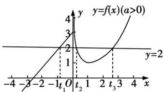

<details>
<summary>line</summary>

| x | y |
|---|---|
| -4 | -3 |
| -3 | -2 |
| -2 | -1 |
| -1 | 0 |
| t₁ | 1 |
| t₂ | 2 |
| 1 | 1 |
| 2 | 2 |
| t₃ | 3 |
| 4 | >4 |

The chart is a line graph representing the function y=f(x)(a>0). The x-axis is labeled as 'x', and the y-axis is labeled as 'y'. The curve is symmetric around the origin, indicating that for any given x value, there is no y-value in this case. The function increases linearly from (t₁, 0) to (t₂, 2), then decreases linearly back to (t₃, 3). The function is bounded by the lines at y=2 and y=-2. The label 'y' appears twice: 'y = f(x) (a > 0)'.
</details>

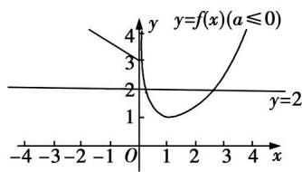

<details>
<summary>line</summary>

| x | y |
|---|---|
| -4 | 4 |
| -3 | 3 |
| -2 | 2 |
| -1 | 1 |
| 0 | 0 |
| 1 | 1 |
| 2 | 2 |
| 3 | 3 |
| 4 | 4 |
</details>

$g(x)=f(f(x))-2$ 有5个零点, 即方程 $f(f(x))=2$ 有5个解, 设 $t=f(x)$ , 则 $f(t)=2$ . 结合图象可知, 当a>0时, 方程$f(t)=2$ 有 3 个根 $t_{1}\in(-\infty,0)$ , $t_{2}\in(0,1)$ , $t_{3}\in(1,3)$ $(\because f(3)=\frac{\mathrm{e}^{2}}{3}>2,\therefore1<t_{3}<3)$ ，于是 $f(x)=t_{1}$ 有 1 个解， $f(x)=t_{2}$ 有 1 个解， $f(x)=t_{3}$ 有 3 个解，共有 5 个解。由 $ax+3=2$ ，得 $x=-\frac{1}{a}$ ，再由 $ax+3=-\frac{1}{a}$ ，得 $x=-\frac{3}{a}-\frac{1}{a^{2}}<-4,\because a>0,\therefore0<a<1$ 。而当 $a\leqslant0$ 时，结合图象可知，方程 $f(f(x))=2$ 不可能有 5 个解。

▶ 答案 C

典例 4 已知函数 $f(x)=\ln x-\frac{1}{2}ax^{2}$ .

(1) 讨论 $f(x)$ 的单调性；  
(2) 若 $f(x)$ 有两个零点, 求 a 的取值范围.

思路分析（1）求得 $f'(x) = \frac{1 - ax^2}{x} \rightarrow$ 讨论 $1 - ax^2$ 在 $(0, +\infty)$ 的子区间上的正负 $\rightarrow$ 函数 $f(x)$ 的单调性

(2) $a\leqslant0$ 时, $f(x)$ 至多有一个零点,不符合题意 $\rightarrow a>0\rightarrow$ 利用(1)的结论得到 $f(x)$ 的单调性 $\rightarrow f(x)$ 的最大值 $\rightarrow$ 对 $f(x)$ 的最大值分情况讨论 $\rightarrow a$ 的取值范围  
解析 (1) $f(x)$ 的定义域为 $(0, +\infty)$ ，且 $f'(x) = \frac{1 - ax^2}{x}$ ，(求导之后通分)

当 $a \leqslant 0$ 时, $f'(x) > 0$ , 此时, $f(x)$ 在 $(0, +\infty)$ 上单调递增,

当 a > 0 时, $f'(x) > 0 \Rightarrow 0 < x < \frac{\sqrt{a}}{a}$ , $f'(x) < 0 \Rightarrow x > \frac{\sqrt{a}}{a}$ ,

即 $f(x)$ 在 $(0, \frac{\sqrt{a}}{a})$ 上单调递增，在 $(\frac{\sqrt{a}}{a}, +\infty)$ 上单调递减.

综上可知，当 $a \leqslant 0$ 时， $f(x)$ 在 $(0, +\infty)$ 上单调递增；当

$a > 0$ 时， $f(x)$ 在 $(0,\frac{\sqrt{a}}{a})$ 上单调递增，在 $(\frac{\sqrt{a}}{a}, + \infty)$ 上单调递减.

(2)由(1)知当 $a\leqslant0$ 时, $f(x)$ 在 $(0,+\infty)$ 上单调递增,函数 $f(x)$ 至多有一个零点,不符合题意.

当 $a > 0$ 时， $f(x)$ 在 $(0, \frac{\sqrt{a}}{a})$ 上单调递增，在 $(\frac{\sqrt{a}}{a}, +\infty)$ 上单调递减，

$$
f (x) _ {\max} = f (\frac {1}{\sqrt {a}}) = \ln \frac {1}{\sqrt {a}} - \frac {1}{2} a (\frac {1}{\sqrt {a}}) ^ {2} = - \frac {1}{2} (\ln a + 1),
$$

当 $a \geqslant \frac{1}{\mathrm{e}}$ 时, $f(x)_{\max} = f(\frac{1}{\sqrt{a}}) = -\frac{1}{2} (\ln a + 1) \leqslant 0$ , 函数 $f(x)$ 至多有一个零点, 不符合题意.

当 $0 < a < \frac{1}{e}$ 时， $f(x)_{\max} = f(\frac{1}{\sqrt{a}}) = -\frac{1}{2} (\ln a + 1) > 0$ ，（根据函数最值的符号进行讨论）

由于 $1 \in (0, \frac{1}{\sqrt{a}})$ ，且 $f(1) = \ln 1 - \frac{1}{2} \cdot a \cdot 1^2 = -\frac{1}{2} a < 0$

因此由零点存在定理知, $f(x)$ 在 $(0,\frac{1}{\sqrt{a}})$ 上存在唯一零点,

由于 $\frac{2}{a} >\frac{1}{\sqrt{a}}$ ，且 $f(\frac{2}{a}) = \ln \frac{2}{a} -\frac{1}{2} a(\frac{2}{a})^2 = \ln \frac{2}{a} -\frac{2}{a} <$

$\frac{2}{a}-\frac{2}{a}=0$ ，(利用结论 $\ln x<x$ )

因此由零点存在定理知， $f(x)$ 在 $(\frac{1}{\sqrt{a}}, +\infty)$ 上存在唯一零点.

所以实数 a 的取值范围是 $(0, \frac{1}{e})$ .

# 命题点 16 极值点偏移问题


# 学 | 必备知识

# 极值点偏移的特点

(1)已知函数 $f(x)$ 的图象的顶点的横坐标就是极值点 $x_{0}$ ，若 $f(x)=c$ 的两根 $x_{1},x_{2}$ 的中点刚好满足 $\frac{x_{1}+x_{2}}{2}=x_{0}$ ，即极值点在两根的正中间，则极值点没有偏移，此时函数 $f(x)$ 在 $x=x_{0}$ 两侧，函数值变化快慢相同，如图.

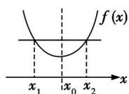

(无偏移，左右对称)若 $f(x_{1})=f(x_{2})$ ，则 $x_{1}+x_{2}=2x$

(2) 若 $\frac{x_{1} + x_{2}}{2} \neq x_{0}$ ，则极值点偏移，此时函数 $f(x)$ 在极值点两侧，函数值变化快慢不同。如图。

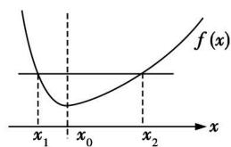

<details>
<summary>text_image</summary>

f(x)
x₁ x₀ x₂
x
</details>

(左陡右缓，极值点向左偏移)
若 $f(x_{1})=f(x_{2})$ ，则 $x_{1}+x_{2}>2x_{0}$

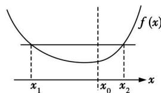

<details>
<summary>text_image</summary>

f(x)
x₁	x₀	x₂
x
</details>

(左缓右陡，极值点向右偏移)
若 $f(x_{1})=f(x_{2})$ ，则 $x_{1}+x_{2}<2x_{0}$


# 思 | 命题探究

# 命题角度 解析式含参数的极值点偏移问题

典例 已知函数 $f(x)=(x-2)\mathrm{e}^{x}+a(x-1)^{2}$ 有两个零点.

(1) 求 a 的取值范围;  
(2) 设 $x_{1}, x_{2}$ 是 $f(x)$ 的两个零点, 证明: $x_{1} + x_{2} < 2$ .

解析 (1) $f'(x)=(x-1)e^{x}+2a(x-1)=(x-1)(e^{x}+2a)$ .

(i) 设 $a = 0$ ，则 $f(x) = (x - 2)\mathrm{e}^x, f(x)$ 只有一个零点.  
(ii) 设 $a > 0$ ，则当 $x \in (-\infty, 1)$ 时， $f'(x) < 0$ ，当 $x \in (1, +\infty)$ 时， $f'(x) > 0$ ，所以 $f(x)$ 在 $(- \infty, 1)$ 上单调递减，在 $(1, +\infty)$ 上单调递增.

又 $f(1) = -\mathrm{e}, f(2) = a$ ，取 $b$ 满足 $b < 0$ 且 $b < \ln \frac{a}{2}$ ，则

$$
f (b) > \frac {a}{2} (b - 2) + a (b - 1) ^ {2} = a (b ^ {2} - \frac {3}{2} b) > 0,
$$

故 $f(x)$ 存在两个零点.

(iii) 设 $a < 0$ , 由 $f'(x) = 0$ 得 $x = 1$ 或 $x = \ln(-2a)$ .

若 $a \geqslant -\frac{\mathrm{e}}{2}$ , 则 $\ln (-2a) \leqslant 1$ , 故当 $x \in (1, +\infty)$ 时, $f'(x) > 0$ , 因此 $f(x)$ 在 $(1, +\infty)$ 上单调递增. 又当 $x \leqslant 1$ 时 $f(x) < 0$ , 所以 $f(x)$ 不存在两个零点.

若 $a < -\frac{\mathrm{e}}{2}$ , 则 $\ln (-2a) > 1$ , 故当 $x \in (1, \ln (-2a))$ 时, $f'(x) < 0$ ; 当 $x \in (\ln (-2a), +\infty)$ 时, $f'(x) > 0$ . 因此 $f(x)$ 在 $(1, \ln (-2a))$ 上单调递减, 在 $(\ln (-2a), +\infty)$ 上单调递增. 又当 $x \leqslant 1$ 时 $f(x) < 0$ , 所以 $f(x)$ 不存在两个零点.

综上, $a$ 的取值范围为 $(0, +\infty)$ .

# (2) 解法一 构造部分对称函数

不妨设 $x_{1} < x_{2}$ . 由单调性知, $x_{1} \in (-\infty, 1)$ , $x_{2} \in (1, +\infty)$ , $2 - x_{2} \in (-\infty, 1)$ , 又 $f(x)$ 在 $(- \infty, 1)$ 上单调递减, 所以 $x_{1} + x_{2} < 2$ 等价于 $f(x_{1}) > f(2 - x_{2})$ , 即 $f(2 - x_{2}) < 0$ .

由于 $f(2-x_{2})=-x_{2}\mathrm{e}^{2-x_{2}}+a(x_{2}-1)^{2}$ ，而 $f(x_{2})=(x_{2}-2)\mathrm{e}^{x_{2}}+a(x_{2}-1)^{2}=0$ ，所以 $f(2-x_{2})=-x_{2}\mathrm{e}^{2-x_{2}}-(x_{2}-2)\mathrm{e}^{x_{2}}$ .

设 $g(x) = -x e^{2-x} - (x-2)e^{x}$ ，则 $g'(x) = (x-1)(e^{2-x} - e^{x})$ .

所以当 x > 1 时， $g'(x) < 0$ ，而 $g(1) = 0$ ，故当 x > 1 时， $g(x) < 0$ .

从而 $g(x_{2})=f(2-x_{2})<0$ , 故 $x_{1}+x_{2}<2$

# 解法二 参变分离

由已知得: $f(x_{1})=f(x_{2})=0$ , 不难发现 $x_{1}\neq1,x_{2}\neq1$ ,

故可整理得： $-a=\frac{(x_{1}-2)e^{x_{1}}}{(x_{1}-1)^{2}}=\frac{(x_{2}-2)e^{x_{2}}}{(x_{2}-1)^{2}}$

设 $g(x)=\frac{(x-2)\mathrm{e}^{x}}{(x-1)^{2}}$ ，则 $g(x_{1})=g(x_{2})$ ，

那么 $g'(x)=\frac{(x-2)^{2}+1}{(x-1)^{3}}\mathrm{e}^{x}$ ,

当 x<1 时, $g'(x)<0$ , $g(x)$ 单调递减;

当 x > 1 时, $g'(x) > 0$ , $g(x)$ 单调递增.

思路1(构造差量函数) 设 m > 0, 构造代数式:

$$
g (1 + m) - g (1 - m) = \frac {m - 1}{m ^ {2}} \mathrm{e} ^ {1 + m} - \frac {- m - 1}{m ^ {2}} \mathrm{e} ^ {1 - m} =
$$

$$
\frac {1 + m}{m ^ {2}} \mathrm{e} ^ {1 - m} \left(\frac {m - 1}{m + 1} \mathrm{e} ^ {2 m} + 1\right).
$$

设 $h(m)=\frac{m-1}{m+1}e^{2m}+1$ ,

则 $h'(m)=\frac{2m^{2}}{(m+1)^{2}}e^{2m}>0$ , 故 $h(m)$ 单调递增, 当 m>0 时,
有 $h(m)>h(0)=0.$

因此,对于任意的 m>0, $g(1+m)>g(1-m)$ .

由 $g(x_{1}) = g(x_{2})$ 可知 $x_{1}, x_{2}$ 不可能在 $g(x)$ 的同一个单调区间上，不妨设 $x_{1} < x_{2}$ ，则必有 $x_{1} < 1 < x_{2}$ .

令 $m = 1 - x_{1} > 0$ ，则有 $g[1 + (1 - x_1)] > g[1 - (1 - x_1)] \Leftrightarrow g(2 - x_1) > g(x_1) = g(x_2)$

而 $2 - x_{1} > 1, x_{2} > 1, g(x)$ 在 $(1, +\infty)$ 上单调递增，因此 $g(2 - x_{1}) > g(x_{2}) \Leftrightarrow 2 - x_{1} > x_{2}$ ，

整理得: $x_{1}+x_{2}<2.$

思路2(构造对称函数) 由解法二, 得 $g(x)=\frac{(x-2)\mathrm{e}^{x}}{(x-1)^{2}}$ , 构造 $G(x)=g(x)-g(2-x)(x\in(-\infty,1))$ , 利用单调性可证, 此处略.

# 解法三 利用对数平均不等式

参变分离得: $a=\frac{(2-x_{1})\mathrm{e}^{x_{1}}}{(x_{1}-1)^{2}}=\frac{(2-x_{2})\mathrm{e}^{x_{2}}}{(x_{2}-1)^{2}}$ ，由a>0，可令 $x_{1}<1<x_{2}<2$ ，

将上述等式两边取以 e 为底的对数, 得: $\ln \frac{2 - x_{1}}{(x_{1} - 1)^{2}} + x_{1} = \ln \frac{2 - x_{2}}{(x_{2} - 1)^{2}} + x_{2}$ ,

化简得： $\left[\ln (x_1 - 1)^2 -\ln (x_2 - 1)^2\right] - \left[\ln (2 - x_1) - \ln (2-\right.$ $x_{2})\biggr ] = x_{1} - x_{2}$

故 $1 = \frac{\ln(x_1 - 1)^2 - \ln(x_2 - 1)^2}{x_1 - x_2} -\frac{\ln(2 - x_1) - \ln(2 - x_2)}{x_1 - x_2} = [(x_1 -$

$1) + (x_{2} - 1)]\frac{\ln(x_{1} - 1)^{2} - \ln(x_{2} - 1)^{2}}{(x_{1} - 1)^{2} - (x_{2} - 1)^{2}} + \frac{\ln(2 - x_{1}) - \ln(2 - x_{2})}{(2 - x_{1}) - (2 - x_{2})}$ .

由对数平均不等式得:

$$
\frac {\ln (x _ {1} - 1) ^ {2} - \ln (x _ {2} - 1) ^ {2}}{(x _ {1} - 1) ^ {2} - (x _ {2} - 1) ^ {2}} > \frac {2}{(x _ {2} - 1) ^ {2} + (x _ {2} - 1) ^ {2}},
$$

$$
\frac {\ln (2 - x _ {1}) - \ln (2 - x _ {2})}{(2 - x _ {1}) - (2 - x _ {2})} > \frac {2}{(2 - x _ {1}) + (2 - x _ {2})},
$$

$$
\text {从而} 1 > \frac {2 (x _ {1} + x _ {2} - 2)}{(x _ {1} - 1) ^ {2} + (x _ {2} - 1) ^ {2}} + \frac {2}{(2 - x _ {1}) + (2 - x _ {2})}
$$

$$
= \frac {2 \left(x _ {1} + x _ {2} - 2\right)}{\left(x _ {1} - 1\right) ^ {2} + \left(x _ {2} - 1\right) ^ {2}} + \frac {\left[ 4 - \left(x _ {1} + x _ {2}\right) \right] + x _ {1} + x _ {2} - 2}{4 - \left(x _ {1} + x _ {2}\right)}
$$

$$
= \frac {2 \left(x _ {1} + x _ {2} - 2\right)}{\left(x _ {1} - 1\right) ^ {2} + \left(x _ {2} - 1\right) ^ {2}} + 1 + \frac {x _ {1} + x _ {2} - 2}{4 - \left(x _ {1} + x _ {2}\right)},
$$

等价于 $0 > \frac{2(x_1 + x_2 - 2)}{(x_1 - 1)^2 + (x_2 - 1)^2} + \frac{x_1 + x_2 - 2}{4 + (x_1 + x_2)} = (x_1 + x_2 -$

2） $\cdot \left[\frac{2}{(x_{1}-1)^{2}+(x_{2}-1)^{2}}+\frac{1}{4-(x_{1}+x_{2})}\right]$ .

由 $(x_{1}-1)^{2}+(x_{2}-1)^{2}>0,4-(x_{1}+x_{2})>0$ ，故 $x_{1}+x_{2}<2$ ，证毕.

# 用 素养解题

# 极值点偏移问题的常用解法

(1) 对称构造: 对称变换, 主要用来解决与两个极值点之和、积相关的不等式的证明问题.

(2) 消参减元: 消参减元的主要目的就是减元, 进而建立与所求解问题相关的函数. 主要是利用函数极值点乘积所满足的条件进行消参减元.

(3) 对数平均不等式: 两个正数 a, b 的对数平均 $L(a, b) = \left\{\begin{aligned} & \frac{a - b}{\ln a - \ln b} (a \neq b), \\ & a (a = b), \end{aligned}\right.$ 有如下关系 $\sqrt{ab} \leqslant L(a, b) \leqslant \frac{a + b}{2}.$

变式 已知函数 $f(x) = \ln x - ax$ .

(1) 讨论 $f(x)$ 的单调性.

(2) 若 $x_{1}, x_{2} (x_{1} < x_{2})$ 是 $f(x)$ 的两个零点.

证明：(i) $x_{1}+x_{2}>\frac{2}{a}$ ; (ii) $x_{2}-x_{1}>\frac{2\sqrt{1-\mathrm{e}a}}{a}$ .

# 命题点 17 利用导数研究不等式恒成立（或存在性）问题


# 思 | 命题探究

# 命题角度 1 证明不等式恒成立

典例 1 已知函数 $f(x)=x\ln x-\frac{1}{2}a(x+1)^{2}, a \in \mathbb{R}$ 恰好有两个极值点 $x_{1}, x_{2}(x_{1}<x_{2})$ .

(1) 求证: 存在实数 $m \in (\frac{1}{2}, 1)$ ，使得 0 < a < m；  
(2) 求证: $-\frac{5}{4}<f(x_{1})<-\frac{1}{e}.$

解析 (1) $f'(x)=\ln x+1-a(x+1),x>0.$

根据题意可知, $\ln x+1-a(x+1)=0$ ,即 $\ln x+1=a(x+1)$ 存在两个不同的正根.

考虑直线 $y=a(x+1)$ 与曲线 $y=\ln x+1$ 恰好相切, 如图, 记切点的横坐标为 $x_{0}$ ,

则 $\left\{\begin{aligned}a(x_{0}+1)&=\ln x_{0}+1,\\ a\frac{1}{x_{0}}&\end{aligned}\right.$

$\left\{\begin{aligned}ax_{0}&=1,\\ x_{0}\ln x_{0}&=1,\end{aligned}\right.$ (根据特殊位置,结合图象

建立方程组是解决问题的重要方法)

设 $g(x)=x\ln x-1,x>0$ , 则 $g'(x)=1+\ln x$

令 $g'(x)=0$ , 得 $x=\frac{1}{e}$

故 $g(x)$ 在 $(0, \frac{1}{\mathrm{e}})$ 上单调递减，在 $(\frac{1}{\mathrm{e}}, +\infty)$ 上单调递增，

(利用导数求函数的单调性时,要注意单调区间在定义域内)

又当 $x \to 0$ 时, $g(x) < 0$ , $g(1) = -1 < 0$ , $g(2) = \ln 4 - 1 > 0$ ,

故存在唯一 $x_0 \in (1,2)$ , 使得 $x_0 \ln x_0 = 1$ 成立.

取 $m = \frac{1}{x_0} \in \left(\frac{1}{2}, 1\right)$ , 则当 $0 < a < m$ 时, $f(x)$ 恰好有两个极值点,

故存在实数 $m \in (\frac{1}{2}, 1)$ ，使得 0 < a < m.

(2) 由(1)知, $f'(x_{1})=\ln x_{1}+1-a(x_{1}+1)=0$ ,且 $\frac{1}{e}<x_{1}<x_{0}<2.$

所以 $a = \frac{\ln x_1 + 1}{x_1 + 1}$ , 代入 $f(x_1)$ , 得 $f(x_1) = \frac{1}{2} (x_1 \ln x_1 - x_1 - \ln x_1 - 1)$ .

设 $h(x)=\frac{1}{2}(x\ln x-x-\ln x-1)$ ，(构造函数是常用的手段)

则 $h'(x)=\frac{1}{2}(\ln x-\frac{1}{x})$ , $h'(x_{0})=0$ ,

所以当 $x \in (\frac{1}{\mathrm{e}}, x_0)$ 时, $h'(x) < 0$ , 当 $x \in (x_0, 2)$ 时, $h'(x) > 0$ ,

故当 $x \in (\frac{1}{\mathrm{e}}, x_0)$ 时, $h(x)$ 单调递减, 当 $x \in (x_0, 2)$ 时, $h(x)$ 单

调递增.

所以当 $x \in (\frac{1}{\mathrm{e}}, 2)$ 时， $h(x_0) \leqslant h(x) < \max \left\{h(\frac{1}{\mathrm{e}}), h(2)\right\}$ ，

且 $\max \{h\left(\frac{1}{\mathrm{e}}\right), h(2)\} = \max \{-\frac{1}{\mathrm{e}}, \frac{\ln 2 - 3}{2}\} = -\frac{1}{\mathrm{e}},$

由 $x_{0}\ln x_{0}=1$ ，且 $x_{0}\in(1,2)$ ，得 $h(x_{0})=-\frac{1}{2}(x_{0}+\frac{1}{x_{0}})>-\frac{5}{4}$ ，（注意利用范围进行放缩）

所以当 $x \in (\frac{1}{\mathrm{e}}, 2)$ 时， $-\frac{5}{4} < h(x) < -\frac{1}{\mathrm{e}}$

所以 $-\frac{5}{4}<f(x_{1})<-\frac{1}{e}.$


# 用 | 素养解题

# 利用导数证明不等式恒成立的方法

(1)依据函数在固定区间的单调性,直接求得函数的最值(或取值的范围),从而可证得不等式.  
(2) 当不等式左、右两边都含有自变量时, 可以移项后构造函数, 证明所构造函数的最值 (或取值的范围) 与 0 的大小关系. 常见的方法是: 若证明 $f(x) > g(x)$ 在区间 $D$ 上恒成立, 则构造函数 $h(x) = f(x) - g(x) (x \in D)$ , 再根据函数单调性研究函数的取值的范围, 证明 $h(x) > 0$ .  
(3) 在证明的不等式中, 若无法将不等式问题转化为一个函数的最值问题, 可以借助两个函数的最值进行证明.

# 命题角度 2 已知不等式恒成立求参数的范围问题

典例 2 (1) $e^{x} \geqslant k + x$ 在 R 上恒成立, 则实数 k 的取值范围为 ( )

A. $k \leqslant 1$

B. $k \geqslant 1$

C. $k \leqslant -1$

D. $k \geqslant -1$

(2)已知函数 $f(x)=ax^{2}-(a+2)x+\ln x$ ，其中 $a\in R$ 。若 $\forall x_{1},x_{2}\in(0,+\infty)$ ，且 $x_{1}<x_{2},f(x_{1})+2x_{1}<f(x_{2})+2x_{2}$ 恒成立，则a的取值范围是\_\_\_\_。

解析 (1) 由 $\mathrm{e}^x \geqslant k + x$ ，得 $k \leqslant \mathrm{e}^x - x$ . 令 $f(x) = \mathrm{e}^x - x$ ，所以 $f'(x) = \mathrm{e}^x - 1$ . 令 $f'(x) = 0$ ，解得 $x = 0$ . $x < 0$ 时， $f'(x) < 0$ ， $x > 0$ 时， $f'(x) > 0$ . 所以 $f(x)$ 在 $(- \infty, 0)$ 上是减函数，在 $(0, +\infty)$ 上是增函数. 所以 $f(x)_{\min} = f(0) = 1$ . 所以 $k$ 的取值范围为 $k \leqslant 1$ .

(2) 设 $g(x)=f(x)+2x$ ，则 $g(x)=ax^{2}-ax+\ln x$ ，要使原不等式成立，只需 $g(x)$ 在 $(0,+\infty)$ 上单调递增，从而只需 $g'(x)\geqslant0$ 在 $(0,+\infty)$ 上恒成立。 $g'(x)=2ax-a+\frac{1}{x}=\frac{2ax^{2}-ax+1}{x}(x>0)$ 。①当 a=0 时， $g'(x)=\frac{1}{x}>0$ ，此时 $g(x)$

在 $(0, +\infty)$ 上单调递增；

②当 $a \neq 0$ 时, 因为 $x > 0$ , 所以依题意知, 需 $2ax^{2} - ax + 1 \geqslant 0$ 在 $(0, +\infty)$ 上恒成立. 记 $h(x) = 2ax^{2} - ax + 1$ , 则 $h(x)$ 的图象过定点 $(0, 1)$ , 对称轴为直线 $x = \frac{1}{4}$ . 故 $\left\{ \begin{array}{l} a > 0, \\ \Delta = a^{2} - 8a \leqslant 0, \end{array} \right.$ 即 $0 < a \leqslant 8$ . 综上可得, $a$ 的取值范围为 $[0, 8]$ .

▶ 答案 (1) A (2) [0,8]

典例 3 已知函数 $f(x) = \mathrm{e}^{x} - mx, g(x) = -x^{2} - m (m \in \mathbf{R})$ .

(1) 讨论函数 $f(x)$ 的单调性；

(2) 若 $x \geqslant 0$ 时, $f(x) > g(x)$ 恒成立, 求 m 的取值范围.

解析 (1) $f'(x) = \mathrm{e}^x - m$ , (根据 $f'(x) = 0$ 是否有根进行分类讨论)

①若 $m \leqslant 0$ ，则 $f'(x) > 0, \therefore f(x)$ 在 R 上单调递增.

②若 m > 0，令 $f'(x) = 0$ ，得 $x = \ln m$ ，

当 $x \in (-\infty, \ln m)$ 时， $f'(x) < 0$ ，当 $x \in (\ln m, +\infty)$ 时， $f'(x) > 0$

∴ $f(x)$ 在 $(-∞, \ln m)$ 上单调递减，在 $(\ln m, +∞)$ 上单调递增.

综上, 当 $m \leqslant 0$ 时, $f(x)$ 在 R 上单调递增; 当 m > 0 时, $f(x)$ 在 $(-\infty, \ln m)$ 上单调递减, 在 $(\ln m, +\infty)$ 上单调递增.

(2)由题意知 $f(x) > g(x)$ 对任意的 $x \in [0, +\infty)$ 恒成立即 $\mathrm{e}^x - mx + x^2 + m > 0$ 对任意的 $x \in [0, +\infty)$ 恒成立.

令 $h(x)=\mathrm{e}^{x}-m x+(x^{2}+m,x\in[0,+\infty)$ ，则 $h'(x)=\mathrm{e}^{x}+2x-m$

易知 $h'(x)$ 在 $(0, +\infty)$ 上单调递增，且 $h'(0) = 1 - m$ ，若 $m \leqslant 1$ ，则 $h'(x) \geqslant 0$ ，∴ $h(x)$ 在 $(0, +\infty)$ 上单调递增。

∵ $h(x) > 0$ 对任意的 $x \in [0, +\infty)$ 恒成立，

∴ $h(0)=1+m>0$ , 即 $-1<m\leqslant1$ .

∴ 当 $-1 < m \leqslant 1$ 时, $f(x) > g(x)$ 对任意的 $x \in [0, +\infty)$ 恒成立.

若 m > 1，则 $h'(0) = 1 - m < 0$ ， $h'(\ln m) = 2\ln m > 0$ .

∴ 存在 $x_{0} \in (0, \ln m)$ ，使 $h'(x_{0}) = 0$ ，即 $e^{x_{0}} + 2x_{0} = m$ 。（在无法求出根时常用“设而不求法”）

当 $x \in (0, x_0)$ 时， $h'(x) < 0$ ，当 $x \in (x_0, +\infty)$ 时， $h'(x) > 0$

∴ $h(x)$ 在 $(0, x_{0})$ 上单调递减，在 $(x_{0}, +\infty)$ 上单调递增，

$$
\therefore h (x) _ {\min} = h \left(x _ {0}\right) = \mathrm{e} ^ {x _ {0}} - m x _ {0} + x _ {0} ^ {2} + m.
$$

把 $m = e^{x_{0}} + 2x_{0}$ 代入上式，可得 $h(x)_{\min} = h(x_{0}) = (2 - x_{0}) \cdot (e^{x_{0}} + x_{0})$ .

∵ $h(x) > 0$ 对任意的 $x \in [0, +\infty)$ 恒成立，∴ $0 < x_{0} < 2$ .

又 $m = e^{x_{0}} + 2x_{0}, \therefore 1 < m < e^{2} + 4.$

综上, 当 $-1 < m < e^{2} + 4$ 时, $f(x) > g(x)$ 对任意的 $x \in [0, +\infty)$ 恒成立, 即 m 的取值范围是 $(-1, e^{2} + 4)$ .

# 用 素养解题

# 利用导数解决不等式恒成立中参数范围问题的策略

(1) 直接利用导数研究函数的单调性, 表示出最值, 从而得出相应的含参不等式, 解不等式求出参数的取值范围.

(2) 分离变量, 构造函数, 把问题转化为函数的最值问题进行求解.

# 命题角度 3 与“存在性”相结合的不等式恒成立问题

典例 4 已知函数 $f(x)=x-a\mathrm{e}^{x}+b$ ，其中 $a,b\in R$ .

(1) 讨论函数 $f(x)$ 的单调性；

(2) 设 $a = 1, k \in \mathbf{R}$ , 若存在 $b \in [0,2]$ , 对任意的 $x \in [0,1]$ , 恒有 $f(x) \geqslant k\mathrm{e}^{x} - x\mathrm{e}^{x} - 1$ 成立, 求 $k$ 的最大值.

解析 (1) 由题意可得, $f'(x)=1-a\mathrm{e}^{x}$ ,

①当 $a \leqslant 0$ 时, $f'(x) = 1 - ae^{x} > 0$ 恒成立, 即 $f(x)$ 在 R 上单调递增.  
②当 $a > 0$ 时，由 $f'(x) = 1 - ae^x > 0$ 得 $x \in (-\infty, -\ln a)$ .

由 $f'(x)=1-a\mathrm{e}^{x}<0$ 得 $x\in(-\ln a,+\infty)$ ,

则 $f(x)$ 在 $(-∞, -ln a)$ 上单调递增，在 $(-ln a, +∞)$ 上单调递减.

(2) 由 $f(x) = x - \mathrm{e}^{x} + b \geqslant k\mathrm{e}^{x} - x\mathrm{e}^{x} - 1$ 得 $k \leqslant x + \frac{1 + x + b}{\mathrm{e}^x} - 1$ ,

则由题意得存在 $b \in [0,2]$ ，对任意的 $x \in [0,1]$ ，满足 $k \leqslant x + \frac{1 + x + b}{\mathrm{e}^x} - 1$ ，所以对任意的 $x \in [0,1]$ ， $k \leqslant x + \frac{3 + x}{\mathrm{e}^x} - 1$ 恒成立.

令 $g(x) = x + \frac{3 + x}{\mathrm{e}^x} - 1, x \in [0,1]$ ，则 $g'(x) = 1 - \frac{x + 2}{\mathrm{e}^x} =$

$$
\mathrm{e} ^ {x} - \left[ \begin{array}{c} x + 2 \\ \mathrm{e} ^ {x} \end{array} \right]
$$

易知函数 $h(x) = \mathrm{e}^{x} - (x + 2)$ 在[0,1]上单调递增.

又 $g'(0) < 0, g'(1) < 0$ ，所以 $g'(x) < 0$ 在 $[0,1]$ 上恒成立，即 $g(x)$ 在 $[0,1]$ 上单调递减，

所以 $g(x)_{\min}=g(1)=\frac{4}{e}$ ，所以 $k\leqslant\frac{4}{e}$ ，

故 k 的最大值为 $\frac{4}{e}$ .

# 用 素养解题

# 任意性与存在性的转化方法

(1) $\forall x_{1} \in [a, b], \forall x_{2} \in [c, d], f(x_{1}) > g(x_{2}) \Rightarrow$ 在相应区间上， $f(x)_{\min} > g(x)_{\max}$ .  
(2) $\exists x_{1} \in [a, b], \exists x_{2} \in [c, d], f(x_{1}) > g(x_{2}) \Rightarrow$ 在相应区间上， $f(x)_{\max} > g(x)_{\min}$ .  
(3) $\forall x_{1} \in [a, b], \exists x_{2} \in [c, d], f(x_{1}) > g(x_{2}) \Rightarrow$ 在相应区间上， $f(x)_{\min} > g(x)_{\min}$ .  
(4) $\exists x_{1} \in [a, b], \forall x_{2} \in [c, d], f(x_{1}) > g(x_{2}) \Rightarrow$ 在相应区间上， $f(x)_{\max} > g(x)_{\max}$ .  
(5) $\exists x_{1} \in [a, b], x_{2} \in [c, d], f(x_{1}) = g(x_{2}) \Rightarrow$ 在相应区间上， $f(x)$ 的值域与 $g(x)$ 的值域的交集不为 $\varnothing$ .

# 第四章 三角函数与解三角形

# 命题点 18 三角函数的定义及应用


# 学

# 必备知识

# 1. 任意角的概念

(1) 角的分类: ①正角、零角、负角; ②象限角和非象限角.  
(2) 终边相同的角: 所有与角 $\alpha$ 终边相同的角, 连同角 $\alpha$ 在内, 可构成一个集合: $S = \{\beta | \beta = \alpha + 2k\pi, k \in Z\}$ .

(3) 象限角

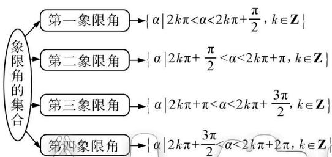

<details>
<summary>flowchart</summary>

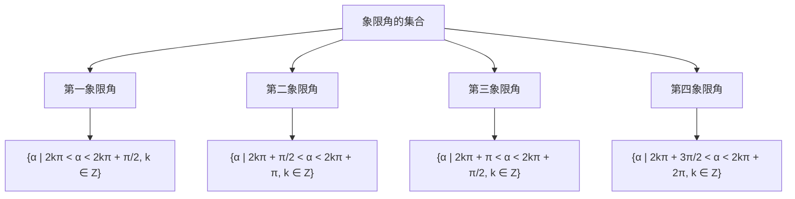
</details>

# 2. 弧长及扇形的面积公式

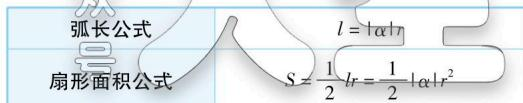

<details>
<summary>text_image</summary>

弧长公式
l = |α|r
扇形面积公式
S = (1/2) lr = (1/2) |α|r²
</details>

# 3. 任意角的三角函数

<table><tr><td colspan="2"></td><td>正弦</td><td>余弦</td><td>正切</td></tr><tr><td rowspan="2" colspan="2">定义</td><td colspan="3">设 $\alpha$ 是一个任意角,它的终边与单位圆交于点 $P(x,y)$ ,那么</td></tr><tr><td> $y$ 叫做 $\alpha$ 的正弦,记作 $\sin \alpha$ </td><td> $x$ 叫做 $\alpha$ 的余弦,记作 $\cos \alpha$ </td><td> $\frac{y}{x}$ 叫做 $\alpha$ 的正切,记作 $\tan \alpha$ </td></tr><tr><td rowspan="4">各象限符号</td><td>一</td><td>+</td><td>+</td><td>+</td></tr><tr><td>二</td><td>+</td><td>-</td><td>-</td></tr><tr><td>三</td><td>-</td><td>-</td><td>+</td></tr><tr><td>四</td><td>-</td><td>+</td><td>-</td></tr></table>


# 思

# 命题探究

# 命题角度 三角函数的定义及应用

典例 已知角 $\alpha$ 的顶点在坐标原点, 始边与 x 轴非负半轴重合, 终边与直线 $y = \frac{1}{3}x$ 重合, 则 $\frac{1 + \cos 2\alpha}{2} + \sin 2\alpha$ 的值为 ( )

A. $\frac{3}{2}$

B. $\frac{1}{5}$

C. $\pm \frac{3}{2}$

D. $\pm \frac{1}{5}$

解析 解法一（特值法，分类讨论）在角 $\alpha$ 的终边上任取一点 $P$ ，记 $r = |OP|$ ，当 $P$ 在第一象限时（依据题意对角的终边所在象限进行分类讨论），不妨取 $P(3,1)$ （取特殊点），则 $r = |OP| = \sqrt{3^2 + 1^2} = \sqrt{10}$ ，根据三角函数的定义得， $\sin \alpha =$ $\frac{y}{r} = \frac{1}{\sqrt{10}},\cos \alpha = \frac{x}{r} = \frac{3}{\sqrt{10}}$ ，由二倍角公式得 $\sin 2\alpha =$ $2\sin \alpha \cos \alpha = 2\times \frac{1}{\sqrt{10}}\times \frac{3}{\sqrt{10}} = \frac{3}{5},\cos 2\alpha = 2\cos^2\alpha -1 = 2\times$

$(\frac{3}{\sqrt{10}})^2 - 1 = \frac{4}{5}$ . 所以 $\frac{1 + \cos 2\alpha}{2} + \sin 2\alpha = \frac{1 + \frac{4}{5}}{2} + \frac{3}{5} = \frac{15}{10} = \frac{3}{2}$ . 当 $P$ 在第三象限时, 不妨取 $P(-3, -1)$ , 则 $r = |OP| = \sqrt{3^2 + 1^2} = \sqrt{10}$ , 根据三角函数的定义得, $\sin \alpha = \frac{y}{r} = \frac{-1}{\sqrt{10}}$ , $\cos \alpha = \frac{x}{r} = \frac{-3}{\sqrt{10}}$ , 由二倍角公式得, $\sin 2\alpha =$

$$
2 \sin \alpha \cos \alpha = 2 \times (- \frac {1}{\sqrt {1 0}}) \times (- \frac {3}{\sqrt {1 0}}) = \frac {3}{5}, \cos 2 \alpha = 2 \cos^ {2} \alpha -
$$

$1=2\times\left(-\frac{3}{\sqrt{10}}\right)^{2}-1=\frac{4}{5}$ . 所以 $\frac{1+\cos2\alpha}{2}+\sin2\alpha=\frac{1+\frac{4}{5}}{2}+\frac{3}{5}=\frac{15}{10}=\frac{3}{2}$ .

综上所述， $\frac{1 + \cos 2\alpha}{2} +\sin 2\alpha = \frac{3}{2}.$

解法二（定义法）设角 $\alpha$ 的终边上除原点外任取一点 $P(x, y)$ ，由已知可得 $y = \frac{1}{3} x$ . 记 $r = |OP| = \sqrt{x^2 + (\frac{1}{3}x)^2} = \frac{\sqrt{10}}{3} |x|$ ，

由三角函数的定义可得 $\sin \alpha = \frac{y}{r} = \frac{\frac{1}{3}x}{\frac{\sqrt{10}}{3}|x|} = \frac{x}{\sqrt{10}|x|},$

$$
\cos \alpha = \frac {x}{r} = \frac {x}{\frac {\sqrt {1 0}}{3} | x |} = \frac {3 x}{\sqrt {1 0} | x |}, \text {所以} \frac {1 + \cos 2 \alpha}{2} + \sin 2 \alpha =
$$

$$
\cos^ {2} \alpha + 2 \sin \alpha \cos \alpha = (\frac {3 x}{\sqrt {1 0} | x |}) ^ {2} + 2 \times \frac {x}{\sqrt {1 0} | x |} \times \frac {3 x}{\sqrt {1 0} | x |} =
$$

$$
\frac {9 x ^ {2}}{1 0 | x | ^ {2}} + \frac {6 x ^ {2}}{1 0 | x | ^ {2}} = \frac {1 5}{1 0} = \frac {3}{2}.
$$

▶ 答案 A


# 素养解题

1. 由三角函数的定义求三角函数值的题型与方法

<table><tr><td>题型</td><td>方法</td></tr><tr><td>已知角α的终边上一点P(异于原点)的坐标,求三角函数值</td><td>首先求出r=|OP|,然后利用三角函数的定义求解</td></tr><tr><td>已知角α的终边所在直线的方程,求三角函数值</td><td>首先在终边所在直线上原点的两侧各取一点,分别求得所取的点到原点的距离r,然后利用三角函数的定义求解</td></tr></table>

# 2. 求角 $\alpha$ 的终边上点的坐标的类型及方法

(1)已知角 $\alpha$ 的某三角函数值,求角 $\alpha$ 的终边上一点 P 的坐标中的参数值,可根据三角函数的定义列方程求参数值.  
(2)已知角 $\alpha$ 的终边所在的直线方程或角 $\alpha$ 的大小,根据三角函数的定义可求角 $\alpha$ 的终边上某特定点的坐标.

变式1 已知 $\alpha$ 是第二象限角, $P(x, \sqrt{5})$ 为其终边上一点, 且 $\cos \alpha = \frac{\sqrt{2}}{4} x$ , 则 $\tan \alpha =$ ( )

A. $\frac{\sqrt{15}}{3}$   
B. $-\frac{\sqrt{15}}{3}$   
C. $\frac{\sqrt{5}}{3}$   
D. $-\frac{\sqrt{5}}{3}$

变式2（多选）下列结论中正确的是 （）

A. 若 $0 < \alpha < \frac{\pi}{2}$ ，则 $\sin \alpha < \tan \alpha$   
B. 若 $\alpha$ 是第二象限角, 则 $\frac{\alpha}{2}$ 为第一象限角或第三象限角  
C. 若角 $\alpha$ 的终边过点 $P(3k,4k)$ ( $k \neq 0$ )，则 $\sin \alpha = \frac{4}{5}$   
D. 若扇形的周长为6, 半径为2, 则其圆心角的大小为1弧度

# 命题点 19 三角函数的化简、求值问题


# 学 | 必备知识

# 1. 同角三角函数的基本关系

(1) 平方关系: $\sin^{2}\alpha + \cos^{2}\alpha = 1$ .  
(2) 商数关系: $\frac{\sin \alpha}{\cos \alpha} = \tan \alpha (\alpha \neq \frac{\pi}{2} + k\pi, k \in \mathbf{Z})$ .

2. 三角函数的诱导公式

<table><tr><td>角</td><td>2kπ+α(k∈Z)</td><td>π+α</td><td>-α</td><td>π-α</td><td>π/2-α</td><td>π/2+α</td></tr><tr><td>正弦</td><td>sin α</td><td>-sin α</td><td>-sin α</td><td>sin α</td><td>cos α</td><td>cos α</td></tr><tr><td>余弦</td><td>cos α</td><td>-cos α</td><td>cos α</td><td>-cos α</td><td>sin α</td><td>-sin α</td></tr><tr><td>正切</td><td>tan α</td><td>tan α</td><td>-tan α</td><td>-tan α</td><td></td><td></td></tr><tr><td>口诀</td><td colspan="4">函数名不变,符号看象限</td><td colspan="2">函数名改变,符号看象限</td></tr></table>

# 3. 两角和与差的三角函数公式

(1) $S_{(\alpha\pm\beta)}:\sin(\alpha\pm\beta)=\sin\alpha\cos\beta\pm\cos\alpha\sin\beta.$   
(2) $\mathrm{C}_{(\alpha \mp \beta)}:\cos (\alpha \mp \beta) = \cos \alpha \cos \beta \pm \sin \alpha \sin \beta .$   
(3) $\mathrm{T}_{(\alpha \pm \beta)}: \tan (\alpha \pm \beta) = \frac{\tan \alpha \pm \tan \beta}{1 \mp \tan \alpha \tan \beta} (\alpha, \beta, \alpha \pm \beta \neq \frac{\pi}{2} +$

$$
k \pi , k \in \mathbf {Z}).
$$

# 4. 二倍角公式

(1) $S_{2\alpha}:\sin 2\alpha=2\sin\alpha\cos\alpha.$   
(2) $C_{2\alpha}:\cos 2\alpha=\cos^{2}\alpha-\sin^{2}\alpha=2\cos^{2}\alpha-1=1-2\sin^{2}\alpha.$   
(3) $\mathrm{T}_{2\alpha}:\tan 2\alpha = \frac{2\tan\alpha}{1 - \tan^2\alpha} (\alpha \neq \pm \frac{\pi}{4} +k\pi ,$ 且 $\alpha \neq k\pi +\frac{\pi}{2},$

$$
k \in \mathbf {Z}).
$$

# 5. 公式的常用变形

(1) $\tan \alpha \pm \tan \beta = \tan (\alpha \pm \beta) (1 \mp \tan \alpha \tan \beta) (\alpha, \beta, \alpha \pm \beta \neq \frac{\pi}{2} + k\pi, k \in \mathbf{Z})$ .   
(2) $\cos^2\alpha = \frac{1 + \cos 2\alpha}{2}, \sin^2\alpha = \frac{1 - \cos 2\alpha}{2}$ .   
(3) $1 \pm \sin 2\alpha = (\sin \alpha \pm \cos \alpha)^{2}, \sin \alpha \pm \cos \alpha = \sqrt{2} \sin (\alpha \pm \frac{\pi}{4})$ .   
(4) $a\sin\alpha+b\cos\alpha=\sqrt{a^{2}+b^{2}}\sin(\alpha+\varphi)$ ，其中 $\cos\varphi=\frac{a}{\sqrt{a^{2}+b^{2}}}$ ， $\sin\varphi=\frac{b}{\sqrt{a^{2}+b^{2}}}$ ， $\tan\varphi=\frac{b}{a}(a\neq0)$ .


# 思 | 命题探究

# 命题角度 1 三角函数式的化简

典例 1 化简: $\frac{\sin(\pi - \alpha) + \sin \alpha \cos \alpha}{[1 + \sin(\frac{\pi}{2} + \alpha)] \tan \alpha} =$ \_\_\_\_.

解析 $\frac{\sin(\pi - \alpha) + \sin\alpha\cos\alpha}{[1 + \sin(\frac{\pi}{2} + \alpha)]\tan\alpha} = \frac{\sin\alpha + \sin\alpha\cos\alpha}{(1 + \cos\alpha)\tan\alpha} = \cos\alpha.$   
▶ 答案 $\cos \alpha$


# 用 | 素养解题

# 化简三角函数式遵循的三个原则

(1)一看“角”,这是最重要的一环,通过看角之间的差别与联系,把角进行合理拆分(和、差、倍、互余、互补等),从而正确使用公式;  
(2)二看“名”,通过看函数名称之间的差异,确定要使用的公式,常见的有“切化弦”;

(3)三看“结构”,通过分析结构特征,找到变形的方向.

变式1 已知 $3\cos^2\alpha + 4\sin \alpha \cos \alpha + 1 = 0$ ，则 $\frac{\sin^4\alpha - \cos^4\alpha}{\sin^2\alpha - \sin \alpha \cos \alpha} =$ （）

A. -2

B. 2

C. $-\frac{1}{2}$

D. $\frac{1}{2}$

# 命题角度 2 三角函数式的求值

# 考向 1 给角求值

典例 2 计算 $\sin 133^{\circ}\cos 197^{\circ} + \cos 47^{\circ}\cos 73^{\circ}$ 的结果为（）

A. $\frac{1}{2}$

B. $-\frac{1}{2}$

C. $\frac{\sqrt{2}}{2}$

D. $\frac{\sqrt{3}}{2}$

解析 $\sin 133^{\circ}\cos 197^{\circ} + \cos 47^{\circ}\cos 73^{\circ} = -\sin 47^{\circ}\cos 17^{\circ} + \cos 47^{\circ}\cos 73^{\circ} = -\sin 47^{\circ}\sin 73^{\circ} + \cos 47^{\circ}\cos 73^{\circ} = \cos (47^{\circ} + 73^{\circ}) = \cos 120^{\circ} = -\frac{1}{2}$ , 故选 B.

▶ 答案 B

# 考向 2 给值求值

典例3 已知 $\tan (\alpha + \frac{\pi}{4}) = -\frac{4}{3}$ , 则 $\cos 2\alpha =$ ( )

A. $-\frac{24}{25}$

B. $-\frac{12}{25}$

C. $\frac{24}{25}$

D. $\frac{12}{25}$

解析 解法一

因为 $\tan\alpha=\tan\left[(\alpha+\frac{\pi}{4})-\frac{\pi}{4}\right]$

$$
\tan \left(\alpha + \frac {\pi}{4}\right) - \tan \frac {\pi}{4} = - \frac {4}{3} - 1 = 7.
$$

$1 + \tan(\alpha + \frac{\pi}{4}) \tan \frac{\pi}{4} - 1 + (-\frac{4}{3}) \times 1$

所以 $\cos2\alpha=\cos^{2}\alpha-\sin^{2}\alpha=\frac{\cos^{2}\alpha-\sin^{2}\alpha}{\sin^{2}\alpha+\cos^{2}\alpha}=\frac{1-\tan^{2}\alpha}{\tan^{2}\alpha+1}=\frac{1-7^{2}}{7^{2}+1}$

$-\frac{24}{25}$ ，(方法点拨:根据正切值求关于正弦或余弦的值,通常利用弦化切,同时注意以式换数的应用,如本题 $1=\sin^{2}\alpha+\cos^{2}\alpha$ )

故选A.

解法二 $\tan\left(\alpha+\frac{\pi}{4}\right)=\frac{\tan\alpha+1}{1-\tan\alpha}=-\frac{4}{3}$ ，解得 $\tan\alpha=7$ ，

则 $\cos2\alpha=\cos^{2}\alpha-\sin^{2}\alpha=\frac{\cos^{2}\alpha-\sin^{2}\alpha}{\sin^{2}\alpha+\cos^{2}\alpha}=\frac{1-\tan^{2}\alpha}{\tan^{2}\alpha+1}=\frac{1-7^{2}}{7^{2}+1}=$ $-\frac{24}{25}$ ，故选 A.

解法三 $\cos 2\alpha = \sin (2\alpha + \frac{\pi}{2}) = \sin 2(\alpha + \frac{\pi}{4}) = 2\sin (\alpha +$

$$
\left. \frac {\pi}{4}\right) \cdot \cos (\alpha + \frac {\pi}{4}) = \frac {2 \sin (\alpha + \frac {\pi}{4}) \cos (\alpha + \frac {\pi}{4})}{\sin^ {2} (\alpha + \frac {\pi}{4}) + \cos^ {2} (\alpha + \frac {\pi}{4})} =
$$

$\frac{2\tan(\alpha+\frac{\pi}{4})}{\tan^{2}(\alpha+\frac{\pi}{4})+1}=\frac{2\times(-\frac{4}{3})}{(-\frac{4}{3})^{2}+1}=-\frac{24}{25}.$ （技巧点拨：诱导公式

可实现正弦与余弦之间的相互转化)

▶ 答案 A

# 考向 3 给值求角

典例4已知 $\alpha, \beta \in (0, \pi)$ ，且 $\tan (\alpha - \beta) = \frac{1}{3}, \tan \beta = \frac{1}{7}$ ，则 $2\alpha - \beta$ 的值是 （）

A. $\frac{\pi}{4}$

B. $\frac{3\pi}{4}$

C. $\frac{5\pi}{4}$

D. $\frac{7\pi}{4}$

解析 $\because \tan (\alpha -\beta) = \frac{1}{3},\tan \beta = \frac{1}{7},\therefore \tan \alpha = \tan (\alpha -\beta +$ $\beta) = \frac{\tan(\alpha - \beta) + \tan\beta}{1 - \tan(\alpha - \beta)\tan\beta} = \frac{1}{2},\therefore \tan (2\alpha -\beta) = \tan (\alpha -\beta +$ $\alpha) = \frac{\tan(\alpha - \beta) + \tan\alpha}{1 - \tan(\alpha - \beta)\tan\alpha} = 1.$

$\because \tan \alpha = \frac{1}{2} < \frac{\sqrt{3}}{3}, \tan \beta = \frac{1}{7} < \frac{\sqrt{3}}{3}, \alpha, \beta \in (0, \pi), \therefore 0 < \alpha < \frac{\pi}{6}, 0 < \beta < \frac{\pi}{6}$ ，(根据函数值及正切函数的单调性缩小角的范围)

$$
\therefore - \frac {\pi}{6} <   2 \alpha - \beta <   \frac {\pi}{3}, \therefore 2 \alpha - \beta = \frac {\pi}{4}.
$$

▶ 答案 A


# 用 | 素养解题

# 三角函数求值技巧

(1) 给角求值,一般所给出的角都是非特殊角,需要仔细观察非特殊角与特殊角之间的关系,并结合公式将问题转化为特殊角的三角函数值问题进行求解.

(2)给值求值,给出某些角的三角函数式的值,求另一些角的三角函数值,解题的关键在于“变角”,使角相同或具有某种关系.
常见变换技巧: $2\alpha=(\alpha+\beta)+(\alpha-\beta),\alpha=(\alpha+\beta)-\beta,\beta=\frac{\alpha+\beta}{2}-\frac{\alpha-\beta}{2}=(\alpha+2\beta)-(\alpha+\beta),\alpha-\beta=(\alpha-\gamma)+(\gamma-\beta),\frac{\pi}{4}+\alpha=\frac{\pi}{2}-(\frac{\pi}{4}-\alpha).$

(3) 给值求角, 实质上是将问题转化为给值求值, 先求角的某一三角函数值, 再求角的范围, 最后求得角.

变式2 数学家华罗庚倡导的“0.618 优选法”在各领域都应用广泛,0.618 就是黄金分割比 $m=\frac{\sqrt{5}-1}{2}$ 的近似值, 黄金分割比还可以表示成 $2\sin18^{\circ}$ , 则 $\frac{m\sqrt{4-m^{2}}}{2\cos^{2}27^{\circ}-1}=$ ( )

A. 4

B. $\sqrt{5} + 1$

C. 2

D. $\sqrt{5} - 1$

变式3 已知 $\alpha$ 为第二象限角，且 $\sin \alpha + \cos \alpha = \frac{1}{5}$ ，则 $\cos \alpha - \sin \alpha =$ （）

A. $\frac{7}{5}$

B. $-\frac{7}{5}$

C. $\pm\frac{7}{5}$

D. $-\frac{1}{5}$

# 命题点 20 三角函数的图象及其变换


# 学

# 必备知识

# 1. 五点法作图

用五点法作 $y = A \sin(\omega x + \varphi) (A > 0, \omega > 0)$ 在一个周期内的简图时，要找出如下表所示的五个关键点.

<table><tr><td> $x$ </td><td> $- \frac{\varphi }{\omega }$ </td><td> $\frac{\frac{\pi }{2} - \varphi }{\omega }$ </td><td> $\frac{\pi  - \varphi }{\omega }$ </td><td> $\frac{\frac{3\pi }{2} - \varphi }{\omega }$ </td><td> $\frac{2\pi  - \varphi }{\omega }$ </td></tr><tr><td> ${\omega x} + \varphi$ </td><td>0</td><td> $\frac{\pi }{2}$ </td><td> $\pi$ </td><td> $\frac{3\pi }{2}$ </td><td> ${2\pi }$ </td></tr><tr><td> $A\sin \left( {{\omega x} + \varphi }\right)$ </td><td>0</td><td> $A$ </td><td>0</td><td>-A</td><td>0</td></tr></table>

# 2. 三角函数的图象变换

函数 $y = A \sin(\omega x + \varphi) + k (A > 0, \omega > 0)$ 中，参数 $A, \omega, \varphi, k$ 的变化引起图象的变换：

(1) A 的变化引起图象中振幅的变换, 即纵向伸缩变换;  
(2) $\omega$ 的变化引起周期的变换,即横向伸缩变换;  
(3) $\varphi$ 的变化引起左右平移变换；  
(4) k 的变化引起上下平移变换.

# 特别提醒

图象平移遵循的规律为“左加右减，上加下减”.


# 思

# 命题探究

# 命题角度 1 三角函数的图象与图象变换

典例 1 已知函数 $f(x)=\sqrt{3}\cos(2x-\frac{\pi}{2})+1-2\sin^{2}x.$

(1)用“五点作图法”在给定的直角坐标系中,画出函数 $f(x)$ 在 $[0,\pi]$ 上的图象;  
(2) 先将函数 $y = f(x)$ 的图象向右平移 $\frac{\pi}{6}$ 个单位长度，再将得到的图象上各点的横坐标伸长为原来的 4 倍，纵坐标不变，得到函数 $y = g(x)$ 的图象，求 $g(x)$ 图象的对称中心.

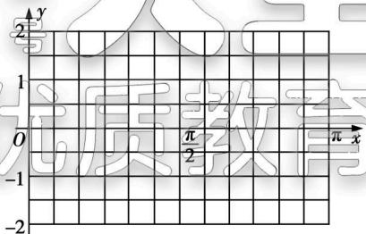

<details>
<summary>text_image</summary>

y
2
1
O
π/2
π x
-1
-2
</details>

思路分析（1）先利用二倍角公式以及两角和的正弦公式化简函数 $f(x)$ 的解析式，再列表、描点、作图即可；（2）先根据三角函数图象的平移变换规律得到函数 $g(x)$ 的图象的解析式，再求得 $g(x)$ 图象的对称中心.  
解析 (1) $f(x)=\sqrt{3}\cos(2x-\frac{\pi}{2})+1-2\sin^{2}x=\sqrt{3}\sin 2x+\cos 2x=2\sin(2x+\frac{\pi}{6})$ ，在区间 $[0,\pi]$ 上， $2x+\frac{\pi}{6}\in[\frac{\pi}{6},\frac{13\pi}{6}]$ ，列表如下：

<table><tr><td> $2x + \frac{\pi}{6}$ </td><td> $\frac{\pi}{6}$ </td><td> $\frac{\pi}{2}$ </td><td> $\pi$ </td><td> $\frac{3\pi}{2}$ </td><td> $2\pi$ </td><td> $\frac{13\pi}{6}$ </td></tr><tr><td> $x$ </td><td>0</td><td> $\frac{\pi}{6}$ </td><td> $\frac{5\pi}{12}$ </td><td> $\frac{2\pi}{3}$ </td><td> $\frac{11\pi}{12}$ </td><td> $\pi$ </td></tr><tr><td> $y$ </td><td>1</td><td>2</td><td>0</td><td>-2</td><td>0</td><td>1</td></tr></table>

函数 $f(x)$ 在区间 $[0,\pi]$ 上的图象如下：

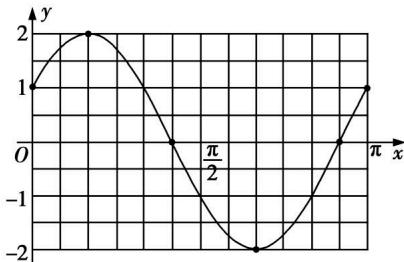

<details>
<summary>line</summary>

| x | y |
|---|---|
| 0 | 1 |
| π/2 | -1 |
| π | 1 |
</details>

(2) 将函数 $f(x)=2\sin\left(2x+\frac{\pi}{6}\right)$ 的图象向右平移 $\frac{\pi}{6}$ 个单位长度后得到 $y=2\sin\left[2\left(x-\frac{\pi}{6}\right)+\frac{\pi}{6}\right]=2\sin\left(2x-\frac{\pi}{6}\right)$ 的图象，再将得到的图象上各点的横坐标伸长为原来的 4 倍，纵坐标不变，得到函数 $g(x)=2\sin\left(\frac{x}{2}-\frac{\pi}{6}\right)$ 的图象。由 $\frac{x}{2}-\frac{\pi}{6}=\frac{k\pi}{k}\left(k\in\mathbf{Z}\right)$ 得 $x=2k\pi+\frac{\pi}{3}(k\in\mathbf{Z})$ ，故 $g(x)$ 图象的对称中心为点 $(2k\pi+\frac{\pi}{3},0)(k\in\mathbf{Z})$ 。


# 用 | 素养解题

函数 $y = A\sin (\omega x + \varphi)(A > 0, \omega > 0)$ 图象的作法

(1)五点法:用“五点法”作 $y = A \sin(\omega x + \varphi)$ 的简图.  
(2) 图象变换法: 由函数 $y = \sin x$ 的图象通过变换得到 $y = A \sin (\omega x + \varphi)$ 的图象, 有“先平移后伸缩”与“先伸缩后平移”两种途径.

函数 $y = \sin x$ 的图象经变换得到 $y = A \sin (\omega x + \varphi) (A > 0, \omega > 0)$ 的图象的步骤如下：


<details>
<summary>flowchart</summary>


</details>

变式1 函数 $f(x)=2\sin(\omega x+\frac{\pi}{3})(\omega>0)$ 的图象与 x 轴交点的横坐标构成一个公差为 $\frac{\pi}{2}$ 的等差数列, 要得到函数 $g(x)=2\sin(\omega x-\frac{\pi}{2})$ 的图象, 只需将函数 $f(x)$ 的图象 ( )

A. 向右平移 $\frac{5\pi}{12}$ 个单位长度

B. 向右平移 $\frac{5\pi}{6}$ 个单位长度

C. 向左平移 $\frac{5\pi}{6}$ 个单位长度

D. 向左平移 $\frac{5\pi}{12}$ 个单位长度

# 命题角度 2 根据函数图象求函数解析式

典例2 函数 $f(x) = A\sin (\omega x + \varphi) (A > 0, \omega > 0, |\varphi| < \pi)$ 的部分图象如图所示，则 （）

A. $f(x) = 2\sin \left(4x + \frac{\pi}{3}\right)$   
B. $f(x) = 2\sin \left(4x - \frac{\pi}{3}\right)$   
C. $f(x) = 2\sin \left(\frac{4}{3} x - \frac{8\pi}{9}\right)$   
D. $f(x) = 2\sin \left(\frac{4}{3} x + \frac{8\pi}{9}\right)$


<details>
<summary>line</summary>

| x | y |
|---|---|
| 0 | -2 |
| 2π/3 | -1 |
| 7π/24 | 0 |
</details>

思路分析 首先根据 $f(x)$ 的图

象的最低点确定 A 的值, 然后根据图象中的两个横坐标确定最小正周期 T, 进而确定 $\omega$ 的值, 最后由最低点 $\left(\frac{7\pi}{24}, -2\right)$ 及 $|\varphi| < \pi$ 求出 $\varphi$ 的值, 从而得到 $f(x)$ 的解析式.

解析 由图知, $A=2,\frac{3}{4}T=\frac{2\pi}{3}-\frac{7\pi}{24}=\frac{3}{8}\pi$ (T为最小正周期), $\therefore T=\frac{\pi}{2}$ ,又 $\omega>0,\therefore T=\frac{2\pi}{\omega}=\frac{\pi}{2},\therefore\omega=4$ ,又 $f(x)$ 的图象经过点( $\frac{7\pi}{24},-2$ ),

$$
\therefore 4 \times \frac {7 \pi}{2 4} + \varphi = 2 k \pi + \frac {3 \pi}{2}, k \in \mathbf {Z}, \therefore \varphi = 2 k \pi + \frac {\pi}{3}, k \in \mathbf {Z}.
$$

又 $|\varphi|<\pi,\therefore\varphi=\frac{\pi}{3},\therefore f(x)=2\sin(4x+\frac{\pi}{3})$

▶ 答案 A


# 用 | 素养解题

求函数 $y = A\sin (\omega x + \varphi) + k (A > 0, \omega > 0)$ 解析式的方法与步骤

(1) 求 A, k, 已知函数的最大值 M 和最小值 m, 则 $A = \frac{M - m}{2}$ , $k = \frac{M + m}{2}$ .

(2) 求 $\omega$ , 已知函数的最小正周期 T, 则 $\omega = \frac{2\pi}{T}$ .

(3) 求 $\varphi$ , 常用方法有:

①代入法,把图象上的一个已知点的坐标代入(此时,A, $\omega$ ,k已求出),或代入图象与直线y=k的交点的坐标(此时要注意交点在上升区间还是下降区间),结合 $\varphi$ 的范围求解;

②五点法,确定 $\varphi$ 的值时,往往以“五点法”中的第一个零点 $(- \frac{\varphi}{\omega}, 0)$ 为突破口.

变式2 如图,某地一天6\~14时的温度(单位:℃)变化曲线近似满足函数 $y = A \sin(\omega x + \varphi) + b$ 的图象,则这段曲线的函数解析式可以为()

A. $y = 10\sin\left(\frac{\pi}{8}x + \frac{3\pi}{4}\right) + 20, x \in [6, 14]$

B. $y = 10 \sin \left( \frac{\pi}{8} x + \frac{5\pi}{4} \right) + 20, x \in [6, 14]$

C. $y = 10\sin \left(\frac{\pi}{8} x - \frac{3\pi}{4}\right) + 20, x \in [6, 14]$

D. $y = 10 \sin \left( \frac{\pi}{8} x + \frac{5\pi}{8} \right) + 20, x \in [6, 14]$


<details>
<summary>line</summary>

| x/时 | y/℃ |
| ---- | ---- |
| 0    | 10   |
| 6    | 10   |
| 10   | 20   |
| 14   | 30   |
</details>

# 命题点 21 三角函数的性质及综合应用

三角函数的图象与性质

<table><tr><td>函数</td><td> $y = \sin x$ </td><td> $y = \cos x$ </td><td> $y = \tan x$ </td></tr><tr><td>定义域</td><td>R</td><td>R</td><td> $\{x \mid x \neq k\pi + \frac{\pi}{2}, k \in \mathbf{Z}\}$ </td></tr><tr><td>一个周期内的图象</td><td></td><td></td><td></td></tr><tr><td>值域</td><td>[-1,1]</td><td>[-1,1]</td><td>R</td></tr><tr><td>对称性</td><td>对称轴方程是 $x = k\pi + \frac{\pi}{2}(k \in \mathbf{Z})$ ;对称中心是 $(k\pi, 0)(k \in \mathbf{Z})$ </td><td>对称轴方程是 $x = k\pi (k \in \mathbf{Z})$ ;对称中心是 $(k\pi + \frac{\pi}{2}, 0)(k \in \mathbf{Z})$ </td><td>无对称轴;对称中心是 $(\frac{k\pi}{2}, 0)(k \in \mathbf{Z})$ </td></tr></table>


# 学 必备知识

<table><tr><td>函数</td><td> $y = \sin x$ </td><td> $y = \cos x$ </td><td> $y = \tan x$ </td></tr><tr><td>最小正周期</td><td>2π</td><td>2π</td><td>π</td></tr><tr><td>单调性</td><td>单调递增区间是 $\left\lbrack {{2k\pi } - \frac{\pi }{2},2k\pi + }\right.$  $\left.\frac{\pi }{2}\right\rbrack \left( {k \in \mathbf{Z}}\right)$ ;单调递减区间是 $\left\lbrack {{2k\pi } + \frac{\pi }{2},}\right.$  $\left. {{2k\pi } + \frac{3\pi }{2}}\right\rbrack \left( {k \in \mathbf{Z}}\right)$ </td><td>单调递增区间是 $\left\lbrack {{2k\pi } - \pi ,{2k\pi }}\right\rbrack$ ( $k \in \mathbf{Z}$ );单调递减区间是 $\left\lbrack {{2k\pi },\right.$  $\left. {{2k\pi } + \pi }\right\rbrack \left( {k \in \mathbf{Z}}\right)$ </td><td>单调递增区间是 $\left( {{k\pi } - \frac{\pi }{2},k\pi + }\right.$  $\left.\frac{\pi }{2}\right) \left( {k \in \mathbf{Z}}\right)$ ;无单调递减区间</td></tr><tr><td>奇偶性</td><td>奇函数</td><td>偶函数</td><td>奇函数</td></tr></table>

续表


# 思 | 命题探究

# 命题角度 1 三角函数的性质

典例1 函数 $y = \sin \left(2x + \frac{\pi}{2}\right)$ 是 ( )

A. 最小正周期为 $2\pi$ 的奇函数  
B. 最小正周期为 $2\pi$ 的偶函数  
C. 最小正周期为 $\pi$ 的奇函数  
D. 最小正周期为 $\pi$ 的偶函数

解析 因为 $y = \sin \left(2x + \frac{\pi}{2}\right) = \cos 2x$ ，所以 $y = \sin \left(2x + \frac{\pi}{2}\right)$

是最小正周期为 $\pi$ 的偶函数, 故选 D.

▶ 答案 D

典例2 函数 $f(x) = \sqrt{3}\sin 2x + 2\cos^2 x + 3$ 在区间 $[0, \frac{\pi}{2}]$ 上的最小值是 （）

A. $4 - \sqrt{3}$

B. 3

C. 5

D. 6

解析 $f(x) = \sqrt{3}\sin 2x + 2\cos^2 x + 3 = \sqrt{3}\sin 2x + \cos 2x + 4 = 2\sin (2x + \frac{\pi}{6}) + 4$ ，因为 $0 \leqslant x \leqslant \frac{\pi}{2}$ ，所以 $\frac{\pi}{6} \leqslant 2x + \frac{\pi}{6} \leqslant \frac{7\pi}{6}$ ，所

以，当 $2x + \frac{\pi}{6} = \frac{7\pi}{6}$ 时，函数 $f(x)$ 取得最小值，即 $f(x)_{\min} = 2\sin \frac{7\pi}{6} +4 = 2\times (-\frac{1}{2}) + 4 = 3.$

▶ 答案 B

典例 3 已知函数 $f(x)=\sin x|\cos x|$ , $x\in\left[-\frac{\pi}{2},\frac{3\pi}{2}\right]$ ，有以下结论：

① $f(x)$ 的图象关于y轴对称；  
② $f(x)$ 在区间 $\left[\frac{3\pi}{4},\frac{5\pi}{4}\right]$ 上单调递减；  
③ $f(x)$ 的图象的一个对称中心是点 $(\frac{\pi}{2},0)$ ;  
④ $f(x)$ 的最大值为 $\frac{1}{2}$ .

则上述正确结论的序号为\_\_\_\_。

解析 $f(x) = \sin x|\cos x| = \left\{ \begin{array}{l} \frac{1}{2}\sin 2x, x \in \left[-\frac{\pi}{2}, \frac{\pi}{2}\right), \\ -\frac{1}{2}\sin 2x, x \in \left[\frac{\pi}{2}, \frac{3\pi}{2}\right]. \end{array} \right.$ 作

出其大致图象如图所示.


<details>
<summary>line</summary>

| x       | y     |
| ------- | ----- |
| -π/2    | 0     |
| -1/2    | -1/2  |
| 0       | 1/2   |
| π/2     | 0     |
| π       | 1/2   |
| 3π/2    | 0     |
</details>

根据图象知：

① $f(x)$ 的图象关于y轴对称,错误;  
② $f(x)$ 在区间 $\left[\frac{3\pi}{4},\frac{5\pi}{4}\right]$ 上单调递减,正确;  
③ $f(x)$ 的图象的一个对称中心是点 $(\frac{\pi}{2},0)$ ，错误；  
④ $f(x)$ 的最大值为 $\frac{1}{2}$ ，正确.

▶ 答案 ②④


# 素养解题

# 1. 三角函数周期的求解策略

(1) 求三角函数的周期, 通常将函数式化为只有一个函数名, 且命题角度唯一, 最高次数为一次的形式, 然后借助常见三角函数的周期来求解.  
(2) 带绝对值的三角函数的周期是否减半, 可用图象法判定, 如 $y = \left| \cos x \right|$ 的图象是将 $y = \cos x$ 的图象在 x 轴下方的部分翻折到 x 轴的上方得到的, 所以周期减半.

# 2. 三角函数值域或最值的三种求法

(1) 直接法: 直接利用 $\sin x, \cos x$ 的值域求出.  
(2)化一法:化为 $y = A \sin(\omega x + \varphi) + k$ 的形式,确定 $\omega x + \varphi$ 的范围,根据正弦函数的单调性写出函数的值域或最值.  
(3) 换元法: 把 $\sin x$ 或 $\cos x$ 看作一个整体, 转化为二次函数, 求在给定区间上的值域或最值.

# 3. 三角函数单调区间的求法

(1)代换法

所谓代换法, 就是先将比较复杂的三角函数, 通过恒等变换转化为 $y = A \sin (\omega x + \varphi) + B$ (或 $y = A \cos (\omega x + \varphi) + B$ 或 $y = A \tan (\omega x + \varphi) + B$ ) 的形式, 再把 $\omega x + \varphi$ 当作一个角 u, 最后利用基本三角函数的单调性求三角函数的单调区间.

(2) 图象法

三角函数的单调性表现在图象上是从左到右, 图象呈上升趋势的区间为单调递增区间, 图象呈下降趋势的区间为单调递减区间.

# 特别提醒

求解三角函数的单调区间时, 若 x 的系数为负, 应先化为正, 同时切莫漏掉考虑三角函数自身的定义域.

# 命题角度 2 三角函数的图象与性质的综合应用

典例 4 (多选) 将函数 $f(x) = \cos\left(\omega x - \frac{\pi}{2}\right) (\omega > 0)$ 的图象向右平移 $\frac{\pi}{2}$ 个单位长度后得到函数 $g(x)$ 的图象, 且 $g(0) = -1$ , 则下列说法正确的是 ()

A. $g(x)$ 为奇函数  
B. $g(-\frac{\pi}{2}) = 0$   
C. 当 $\omega = 5$ 时, $g(x)$ 在 $(0, \pi)$ 上有 4 个零点  
D. 若 $g(x)$ 在 $[0, \frac{\pi}{5}]$ 上单调递增，则 $\omega$ 的最大值为 5

解析 由题意得 $f(x) = \cos (\omega x - \frac{\pi}{2}) = \sin \omega x$ ，则 $g(x) = \sin \omega (x - \frac{\pi}{2})$ , $g(0) = \sin (-\frac{\pi}{2}\omega) = -1$ ，即 $\sin \frac{\pi}{2}\omega = 1$ , $\cos \frac{\pi}{2}\omega = 0$ .

对于 A 项, $g(x)=\sin(\omega x-\frac{\pi}{2}\omega)=\sin\omega x\cos\frac{\pi}{2}\omega-\cos\omega x\cdot$ $\sin\frac{\pi}{2}\omega=-\cos\omega x$ , 又 $g(x)$ 的定义域为 R, 故 $g(x)$ 为偶函数,
A 错误.

对于B项, $g(-\frac{\pi}{2})=-\cos\frac{\pi}{2}\omega=0$ ,B正确.

对于 C 项, 当 $\omega=5$ 时, $g(x)=-\cos 5x$ , 由 $5x=\frac{\pi}{2}+k\pi, k\in Z$ , 得 $x=\frac{\pi}{10}+\frac{k\pi}{5}, k\in Z$ , 因为 $x\in(0,\pi)$ , 所以 x 可以取 $\frac{\pi}{10}$ , $\frac{3\pi}{10}, \frac{\pi}{2}, \frac{7\pi}{10}, \frac{9\pi}{10}$ , 即当 $\omega=5$ 时, $g(x)$ 在 $(0,\pi)$ 上有 5 个零点, C 错误.

对于 D 项, 由 $2k\pi \leqslant \omega x \leqslant 2k\pi + \pi, k \in Z$ , 得 $\frac{2k\pi}{\omega} \leqslant x \leqslant \frac{2k\pi}{\omega} + \frac{\pi}{\omega}, k \in Z$ , 则函数 $g(x)$ 在区间 $\left[\frac{2k\pi}{\omega}, \frac{2k\pi}{\omega} + \frac{\pi}{\omega}\right] (k \in \mathbf{Z})$ 上单调递增, 因为 $g(x)$ 在 $[0, \frac{\pi}{5}]$ 上单调递增, 所以 $\frac{\pi}{5} \leqslant \frac{\pi}{\omega}$ , 解得 $0 < \omega \leqslant 5$ , 即 $\omega$ 的最大值为 5, 故 D 正确.

综上所述,正确的说法为 BD.

▶ 答案 BD

变式（多选）函数 $f(x) = A\sin (\omega x + \varphi)(A > 0, \omega > 0, 0 < \varphi < \pi)$ 的部分图象如图中实线所示，图中圆 $C$ 与 $f(x)$ 的图象交于 $M, N$ 两点，且 $M$ 在 $y$ 轴上，则下列说法正确的是（）

A. 函数 $f(x)$ 在 $(- \frac{3\pi}{2}, -\pi)$ 上单调递增  
B. 函数 $f(x)$ 的图象关于点 $(- \frac{2\pi}{3}, 0)$ 成中心对称  
C. 函数 $f(x)$ 的图象向右平移 $\frac{5\pi}{12}$ 个单位长度后关于直线 x = $\frac{5\pi}{6}$ 成轴对称  
D. 若圆的半径为 $\frac{5\pi}{12}$ , 则函数 $f(x)$ 的解析式为 $f(x) = \frac{\sqrt{3}\pi}{6}\sin (2x + \frac{\pi}{3})$


<details>
<summary>text_image</summary>

-\frac{\pi}{6}\nM\nO\nC\n2\pi/3\nN\nx\ny
</details>

# 命题点 22 利用正、余弦定理解三角形


# 学 | 必备知识

# 1. 正弦定理、余弦定理

在 $\triangle ABC$ 中,设角A,B,C所对的边分别是a,b,c,R为 $\triangle ABC$ 的外接圆半径.

<table><tr><td>定理</td><td>正弦定理</td><td>余弦定理</td></tr><tr><td>内容</td><td> $\frac{a}{\sin A} = \frac{b}{\sin B} = \frac{c}{\sin C} = {2R}$ </td><td> ${a}^{2} = {b}^{2} + {c}^{2} - {2bc}\cos A$ ; ${b}^{2} = {c}^{2} + {a}^{2} - {2cac}\cos B$ ; ${c}^{2} = {a}^{2} + {b}^{2} - {2ab}\cos C$ </td></tr><tr><td>变形</td><td>(1) $a = {2R}\sin A,b = {2R}\sin B,c = 2R\sin C$ ;(2) $\sin A = \frac{a}{2R},\sin B = \frac{b}{2R},\sin C = \frac{c}{2R}$ ;(3) $a:b:c=\sin A:\sin B:\sin C$ ;(4) $a\sin B=b\sin A,b\sin C=c\sin B,a\sin C=c\sin A$ ;(5) $\frac{a+b+c}{\sin A+\sin B+\sin C}=\frac{a}{\sin A}=2R$ </td><td></td></tr><tr><td>解决的问题</td><td>(1)已知两角和任一边,求其余两边和一角;(2)已知两边和其中一边的对角,求另一边和其余两角</td><td></td></tr></table>

# 2. 三角形的面积公式

$$
S _ {\triangle A B C} = \frac {1}{2} a b \sin C = \frac {1}{2} b c \sin A = \frac {1}{2} a c \sin B = \frac {a b c}{4 R} = \frac {1}{2} (a +
$$

$b+c)r=\sqrt{p(p-a)(p-b)(p-c)}$ ，其中R,r分别为三角形外接圆、内切圆的半径，p为周长的一半.

# 3. 解三角形

(1) 利用余弦定理求边长的实质是解一元二次方程, 解出后可根据已知条件对方程的根进行取舍.  
(2) 在 $\triangle ABC$ 中, 已知两边 $a, b$ 和 $A$ , 利用正弦定理解三角形时, 会出现解不确定的情况, 一般可根据“大边对大角”和“三角形内角和定理”来取舍. 在 $\triangle ABC$ 中, 已知两边 $a, b$ 和 $A$ , 具体解的情况如下表:

<table><tr><td></td><td colspan="3">A为锐角</td><td>A为钝角或直角</td></tr><tr><td>图形</td><td></td><td></td><td></td><td></td></tr><tr><td>关系式</td><td></td><td></td><td></td><td></td></tr><tr><td>解的个数</td><td></td><td></td><td></td><td>一解</td></tr></table>

上表中, 若 A 为锐角, 则当 $a < b \sin A$ 时无解; 若 A 为钝角, 则当 $a \leqslant b$ 时无解.


# 思命题探究

# 命题角度 1 利用正、余弦定理解三角形

典例 1 设 $\triangle ABC$ 的内角 A, B, C 所对的边分别为 a, b, c, 已知 $2c\cos B - b\cos A = a\cos B$ , 则角 B =

A. $\frac{\pi}{6}$

B. $\frac{\pi}{3}$

C. $\frac{5\pi}{6}$

D. $\frac{2\pi}{3}$

解析 解法一 因为 $2c\cos B - b\cos A = a\cos B$ ,

所以由正弦定理得 $2\sin C\cos B - \sin B\cos A = \sin A\cos B$ ，所以 $2\sin C\cos B = \sin B\cos A + \sin A\cos B = \sin (A + B) = \sin (\pi -C) =$ $\sin C$ ，因为 $C\in (0,\pi)$ ，所以 $\sin C\neq 0$ ，所以 $\cos B = \frac{1}{2}$ 因为 $B\in (0,\pi)$ ，所以 $B = \frac{\pi}{3}$ 故选B.

解法二 因为 $2c\cos B - b\cos A = a\cos B$ ,

所以由余弦定理得 $2c \cdot \frac{a^2 + c^2 - b^2}{2ac} - b \cdot \frac{b^2 + c^2 - a^2}{2bc} = a \cdot \frac{a^2 + c^2 - b^2}{2ac}$ , 整理得 $a^2 + c^2 - b^2 = ac$ , 所以 $\cos B = \frac{a^2 + c^2 - b^2}{2ac} = \frac{ac}{2ac} = \frac{1}{2}$ , 因为 $B \in (0, \pi)$ , 所以 $B = \frac{\pi}{3}$ , 故选 B.

解法三 因为 $2c\cos B - b\cos A = a\cos B$ ,

所以 $2c\cos B = a\cos B + b\cos A = c$ ，所以 $\cos B = \frac{1}{2}$ ，因为 $B\in$

$(0, \pi)$ , 所以 $B = \frac{\pi}{3}$ , 故选 B. (知识拓展: 若 $\triangle ABC$ 的三个内角 $A, B, C$ 所对的边分别为 $a, b, c$ , 则 $a = b \cos C + c \cos B, b = a \cos C + c \cos A, c = a \cos B + b \cos A$ , 即三角形中的射影定理)

# ▶ 答案 B

典例 2 $\triangle ABC$ 的内角 A, B, C 的对边分别为 a, b, c. 已知角 A, B, C 成等差数列，且 $b = \sqrt{3}$ .

(1) 求 $\triangle ABC$ 的外接圆直径；  
(2) 若 $\triangle ABC$ 的面积为 $\frac{\sqrt{3}}{2}$ ，求 $\triangle ABC$ 的周长.

思路分析 第(1)问,由角 A,B,C 成等差数列和三角形内角和定理得到 $B=\frac{\pi}{3}$ ，再利用正弦定理可得结果;第(2)问,根据三角形面积公式求得 ac 的值,再由余弦定理得到 $a+c$ 的值,进而求得 $\triangle ABC$ 的周长.

解析 (1) 由角 $A, B, C$ 成等差数列, 得 $2B = A + C$ ,

又 $A + B + C = \pi$ ，所以 $B = \frac{\pi}{3}$ .

设 $\triangle ABC$ 的外接圆半径为 $R$ ，由 $b = \sqrt{3}$ ，得 $2R = \frac{b}{\sin B} = \frac{\sqrt{3}}{\frac{\sqrt{3}}{2}} =$

2, 所以 $\triangle ABC$ 的外接圆直径为 2.

(2) 因为 $S_{\triangle ABC} = \frac{1}{2} a c \sin B = \frac{\sqrt{3}}{4} a c = \frac{\sqrt{3}}{2}$ ，所以 ac = 2，

又 $b^{2} = a^{2} + c^{2} - 2ac\cos B$ ，即 $3 = (a + c)^{2} - 3ac$ ，所以 $a + c = 3$ 所以 $\triangle ABC$ 的周长为 $a + b + c = 3 + \sqrt{3}$

变式1 从①a=3，② $S_{\triangle ABC}=\frac{3\sqrt{5}}{2}$ ，③ $3\sin B=2\sin A$ 这三个条件中任选一个，补充在下面的问题中，若问题中的三角形存在，求出b的值；若问题中的三角形不存在，说明理由.

问题:是否存在 $\triangle ABC$ ,内角A,B,C所对的边分别为a,b,c,且 $c=\sqrt{21}$ , $3c\cos B=3a+2b$ ,\_\_\_\_?

注:如果选择多个条件分别解答,按第一个解答计分.

# 命题角度 2 判断三角形的形状

典例 3 在 $\triangle ABC$ 中, 若 $\sin(A-B)=1+2\cos(B+C)\sin(A+C)$ , 则 $\triangle ABC$ 的形状一定是 ( )

A. 等边三角形

B. 不含 $60^{\circ}$ 角的等腰三角形

C. 钝角三角形

D. 直角三角形

解析 由题意,利用三角恒等变换公式,化简得 $\sin A\cos B-\cos A\sin B=1+2(-\cos A)\sin B$ ,即 $\sin A\cos B-\cos A\sin B=1-2\cos A\sin B$ ,即 $\sin A\cos B+\cos A\sin B=1$ ,得 $\sin(A+B)=1$ ,即 $\sin C=1$ ,所以 $C=90^{\circ}$ ,所以 $\triangle ABC$ 为直角三角形.

▶ 答案 D

# 用 素养解题

# 判断三角形形状的两种常用途径


<details>
<summary>flowchart</summary>


</details>

# 命题角度 3 与三角形的面积、范围有关的问题

典例 4 在 $\triangle ABC$ 中, 内角 A, B, C 所对的边分别为 a, b, c, 且 b = 5, $\cos B = \frac{3}{5}$ ,

(1) 求 $\triangle ABC$ 的面积的最大值；  
(2) 若 $\sqrt{2}c\sin\frac{B+C}{2}=a\sin C$ ，求 $\triangle ABC$ 的周长.

解析 (1) $\because \cos B = \frac{3}{5}, \therefore \sin B = \frac{4}{5}$ ,

由余弦定理 $b^{2} = a^{2} + c^{2} - 2ac\cos B$ ，得 $25 = a^{2} + c^{2} - \frac{6}{5}ac \geqslant 2ac - \frac{6}{5}ac = \frac{4}{5}ac$ ，当且仅当 $a = c$ 时取等号， $\therefore ae \leqslant \frac{125}{4}$ .

$$
\therefore S = \frac {1}{2} a c \sin B \leqslant \frac {1}{2} \times \frac {1 2 5}{4} \times \frac {4}{5} = \frac {2 5}{2},
$$

故 $\triangle ABC$ 的面积的最大值为 $\frac{25}{2}$ .

(2)由正弦定理得 $\sqrt{2}\sin C\cdot\sin\frac{\pi-A}{2}=\sin A\cdot\sin C,$

$\because \sin C \neq 0, \therefore \sqrt{2} \sin \frac{\pi - A}{2} = \sin A, \text{即} \sqrt{2} \cos \frac{A}{2} = 2 \sin \frac{A}{2} \cdot \cos \frac{A}{2},$

$$
\because \cos \frac {A}{2} \neq 0, \therefore \sin \frac {A}{2} = \frac {\sqrt {2}}{2},
$$

$\therefore A=\frac{\pi}{2}$ . (由 $\sin\frac{A}{2}=\frac{\sqrt{2}}{2}$ ，可得 $\frac{A}{2}=\frac{\pi}{4}$ 或 $\frac{A}{2}=\frac{3\pi}{4}$ ，舍去后者)

$$
\because \sin B = \frac {4}{5} = \frac {b}{a}, \therefore a = \frac {2 5}{4},
$$

$$
\therefore c = a \cdot \cos B = \frac {2 5}{4} \times \frac {3}{5} = \frac {1 5}{4},
$$

∴ $\triangle ABC$ 的周长为 $a + b + c = \frac{25}{4} + 5 + \frac{15}{4} = 15$ .

变式2在 $\triangle ABC$ 中，a,b,c分别是角A,B,C的对边，若 $(a+b-c)(a+b+c)=ab,c=\sqrt{3}$ ，当ab取得最大值时， $S_{\triangle ABC}=$ \_\_\_\_.

变式3 在 $\triangle ABC$ 中, $a, b, c$ 分别为角 $A, B, C$ 的对边, 设 $f(x) = a^2 x^2 - (a^2 - b^2)x - 4c^2$ .

(1) 若 $f(1)=0$ ，且 $B-C=\frac{\pi}{3}$ ，求角 C 的大小；  
(2) 若 $f(2)=0$ ，求角 C 的取值范围.

# 命题角度 4 解三角形的实际应用

典例 5 已知在河岸 A 处看到河对岸两个帐篷 C, D 分别在北偏东 $45^{\circ}$ 和北偏东 $30^{\circ}$ 方向，若向东走 30 米到达 B 处后再次观察帐篷 C, D，此时 C, D 分别在北偏西 $15^{\circ}$ 和北偏西 $60^{\circ}$ 方向，则帐篷 C, D 之间的距离为（）


<details>
<summary>text_image</summary>

北
C
D
A
B
</details>

A. $10 \sqrt{15}$ 米

B. $10 \sqrt{6}$ 米

C. $5\sqrt{15}$ 米

D. $5\sqrt{6}$ 米

解析 由题意可得 $\angle DAB = 60^{\circ}, \angle CAB = 45^{\circ}, \angle CBA = 75^{\circ}, \angle DBA = 30^{\circ}$ . 在 $\triangle ABD$ 中, $\angle DAB = 60^{\circ}, \angle DBA = 30^{\circ}, AB = 30$ , 所以 $\angle ADB = 90^{\circ}, \sin \angle DAB = \sin 60^{\circ} = \frac{BD}{BA}$ , 解得 $BD = 15\sqrt{3}$ . 在 $\triangle ABC$ 中, $\angle CAB = 45^{\circ}, \angle CBA = 75^{\circ}$ , 所以 $\angle ACB = 60^{\circ}, \frac{AB}{\sin 60^{\circ}} = \frac{BC}{\sin 45^{\circ}}$ , 解得 $BC = 10\sqrt{6}$ . 在 $\triangle BCD$ 中, $\angle CBD = \angle CBA - \angle DBA = 45^{\circ}$ , 则由余弦定理得 $\cos \angle CBD = \cos 45^{\circ} = \frac{BC^{2} + BD^{2} - CD^{2}}{2BC \cdot BD}$ , 即 $\frac{\sqrt{2}}{2} = \frac{(10\sqrt{6})^{2} + (15\sqrt{3})^{2} - CD^{2}}{2 \times 10\sqrt{6} \times 15\sqrt{3}}$ , 得 $CD =$

$5\sqrt{15}$ . 故选 C.

▶ 答案 C

典例6 如图, 某人在垂直于水平地面 ABC 的墙面前的点 A 处进行射击训练. 已知点 A 到墙面的距离为 AB, 某目标点 P 沿墙面上的射线 CM 移动, 此人为了准确瞄准目标点 P, 需计算由点 A 观察点 P 的仰角 $\theta$ 的大小. 若 AB =


<details>
<summary>text_image</summary>

M
P
B7
C
</details>

15 m, AC = 25 m, $\angle BCM = 30^{\circ}$ ,
则 $\tan\theta$ 的最大值是 \_\_\_\_。（仰角所成角）

解析 过点 $P$ 作 $PH \perp BC$ , 垂足为 $H$ , 连接 $AH$ . 设 $PH = x$ , 则 $CH = \sqrt{3}x$ . $\because AB \perp BC, AB = 15\mathrm{m}, AC = 25\mathrm{m}$ , $\therefore BC = 20\mathrm{m}, \cos \angle ACH = \frac{4}{5}$ . 在 $\triangle AHC$ 中, 由余弦定理得 $AH = \sqrt{625 + 3x^2 - 40\sqrt{3}x}$ , $\tan \theta = \tan \angle PAH = \frac{PH}{AH} = \frac{x}{\sqrt{625 + 3x^2 - 40\sqrt{3}x}} = \frac{1}{\sqrt{\frac{625}{x^2} - \frac{40\sqrt{3}}{x} + 3}} =$

$\frac{1}{\sqrt{625\left(\frac{1}{x}-\frac{4\sqrt{3}}{125}\right)^2+\frac{27}{25}}}\left(\frac{1}{x}>0\right)$ , 故当 $\frac{1}{x}=\frac{4\sqrt{3}}{125}$ 时, $\tan \theta$ 取得

最大值,最大值为 $\frac{5\sqrt{3}}{9}$ .

▶ 答案 $\frac{5\sqrt{3}}{9}$

# 用 素养解题

# 解三角形实际应用题的一般步骤


<details>
<summary>flowchart</summary>


</details>

# 命题点 23 平面向量的概念及线性运算


学

必备知识

# 1. 向量的线性运算

<table><tr><td>向量运算</td><td>定义</td><td>法则(或几何意义)</td><td>运算律</td></tr><tr><td>加法</td><td>求两个向量和的运算</td><td>三角形法则平行四边形法则</td><td>(1)交换律: $a + b = b + a$ ;(2)结合律: $(a + b) + c = a + (b + c)$ </td></tr><tr><td>减法</td><td>求 $a$ 与 $b$ 的相反向量- $b$ 的和的运算</td><td>三角形法则</td><td> $a - b = a + (-b)$ </td></tr></table>

续表

<table><tr><td>向量运算</td><td>定义</td><td>法则(或几何意义)</td><td>运算律</td></tr><tr><td>数乘</td><td>求实数λ与向量a的积的运算</td><td>(1)|λa|=|λ||a|;(2)当λ&gt;0时,λa的方向与a的方向相同;当λ&lt;0时,λa的方向与a的方向相反;当λ=0时,λa=0</td><td>(1)λ(μa)=(λμ)a;(2)(λ+μ)a=λa+μa;(3)λ(a+b)=λa+λb.(λ,μ为实数)</td></tr></table>

# 2. 共线向量定理

向量 $a(a \neq 0)$ 与 b 共线, 当且仅当有唯一的一个实数 $\lambda$ , 使得 $b = \lambda a$ .

# 特别提醒

(1)限定 $a \neq 0$ 的目的是保证实数 $\lambda$ 的存在性和唯一性；  
(2)零向量与任何向量共线；  
(3)平行向量与起点无关；  
(4) 若存在非零实数 $\lambda$ ，使得 $AB = \lambda \overrightarrow{AC}$ 或 $AB = \lambda \overrightarrow{BC}$ 或 $\overrightarrow{AC} = \lambda \overrightarrow{BC}$ ，则 A, B, C 三点共线.


思

命题探究

# 命题角度 1 平面向量的线性运算

典例 1 平行四边形 ABCD 中, 点 E 是 DC 的中点, 点 F 是 BC 的一个三等分点 (靠近 B), 则 $\overrightarrow{EF} =$ （）

A. $\frac{1}{2}\overrightarrow{AB} -\frac{1}{3}\overrightarrow{AD}$   
B. $\frac{1}{4}\overrightarrow{AB} +\frac{1}{2}\overrightarrow{AD}$   
C. $\frac{1}{3}\overrightarrow{AB} +\frac{1}{2}\overrightarrow{AD}$   
D. $\frac{1}{2}\overrightarrow{AB} -\frac{2}{3}\overrightarrow{AD}$

解析 解法一 $\overrightarrow{EF} = \overrightarrow{EC} +\overrightarrow{CF} = \frac{1}{2}\overrightarrow{DC} +\frac{2}{3}\overrightarrow{CB} = \frac{1}{2}\overrightarrow{AB} +$

$\frac{2}{3}\overrightarrow{DA}=\frac{1}{2}\overrightarrow{AB}-\frac{2}{3}\overrightarrow{AD}.$ （解题关键：解决平面向量线性运算问题的关键在于熟练找出图形中的相等向量）

解法二 $\overrightarrow{EF} = \overrightarrow{CF} -\overrightarrow{CE} = \frac{2}{3}\overrightarrow{CB} -\frac{1}{2}\overrightarrow{CD} = \frac{2}{3}\overrightarrow{DA} -\frac{1}{2}\overrightarrow{BA} =$ $-\frac{2}{3}\overrightarrow{AD} +\frac{1}{2}\overrightarrow{AB},$ 故选D.

▶ 答案 D


用

素养解题

# 平面向量线性运算问题的求解策略与解题技巧

(1) 进行向量运算时, 要尽可能地将它们转化到三角形或平行四边形中, 充分利用相等向量、相反向量、三角形中位线定理及相似三角形对应边成比例等, 把未知向量用已知向量表示出来.  
(2) 向量的线性运算类似于代数多项式的运算, 实数运算中的去括号、移项、合并同类项、提取公因式等变形手段在线性运算中同样适用.  
(3)用已知向量表示某个向量问题的基本技巧:①观察各向量的位置;②寻找相应的三角形或多边形;③运用法则找关系;④化简结果.

变式1（多选）在 $\triangle ABC$ 中， $D,E,F$ 分别是边 $BC,CA,AB$ 的中点， $AD,BE,CF$ 交于点 $G$ ，则 （）

A. $\overrightarrow{EF} = \frac{1}{2}\overrightarrow{CA} -\frac{1}{2}\overrightarrow{BC}$

B. $\overrightarrow{BE} = -\frac{1}{2}\overrightarrow{AB} +\frac{1}{2}\overrightarrow{BC}$

C. $\overrightarrow{AD} +\overrightarrow{BE} = \overrightarrow{FC}$

D. $\overrightarrow{GA} +\overrightarrow{GB} +\overrightarrow{GC} = 0$

# 命题角度 2 共线向量定理及其应用

典例2（1）设 $e_{1}$ 与 $e_{2}$ 是两个不共线向量， $\overrightarrow{AB}=3e_{1}+2e_{2}$ ， $\overrightarrow{CB}=ke_{1}+e_{2}$ ， $\overrightarrow{CD}=3e_{1}-2ke_{2}$ ，若A,B,D三点共线，则k的值为()

A. $-\frac{9}{4}$

B. $-\frac{4}{9}$

C. $-\frac{3}{8}$

D. 不存在

(2)如图,在 $\triangle ABC$ 中,M为边BC上任意一点,N为AM的中点.若 $\overrightarrow{AN}=\lambda\overrightarrow{AB}+\mu\overrightarrow{AC}$ ,则 $\lambda+\mu$ 的值为()

A. $\frac{1}{2}$

B. $\frac{1}{3}$


C. $\frac{1}{4}$

D. 1

解析 （1）由题意，若 A, B, D 三点共线，则必存在一个实数 $\lambda$ ，使得 $\overrightarrow{AB} = \lambda \overrightarrow{BD}$ 。又 $\overrightarrow{AB} = 3e_{1} + 2e_{2}, \overrightarrow{CB} = ke_{1} + e_{2}, \overrightarrow{CD} = 3e_{1} - 2ke_{2}$ ，所以 $\overrightarrow{BD} = \overrightarrow{CD} - \overrightarrow{CB} = 3e_{1} - 2ke_{2} - (ke_{1} + e_{2}) = (3 - k)e_{1} - (2k + 1)e_{2}$ ，所以 $3e_{1} + 2e_{2} = \lambda (3 - k)e_{1} - \lambda (2k + 1)e_{2}$ ，所以 $\left\{\begin{aligned}&3 = \lambda(3 - k),\\ &2 = -\lambda(2k + 1),\end{aligned}\right.$ 解得 $k = -\frac{9}{4}$ .

(2)由 $N$ 为 $AM$ 的中点，可得 $\overrightarrow{AN} = \frac{1}{2}\overrightarrow{AM} = \lambda \overrightarrow{AB} +\mu \overrightarrow{AC}$ ，整理得 $\overrightarrow{AM} = 2\lambda \overrightarrow{AB} +2\mu \overrightarrow{AC}$ ，由 $B,M,C$ 三点共线可得 $2\lambda +2\mu = 1$ 即 $\lambda +\mu = \frac{1}{2}$

答案 (1) A (2) A

# 用 | 素养解题

# 求解与向量共线有关问题的策略

(1)三点共线问题可用向量共线来解决,但应注意向量共线与三点共线的区别与联系,当两向量共线且有公共点时,才能得出三点共线,根据A,B,C三点共线求参数问题,需先由A,B,C三点共线得 $\overrightarrow{AC}=\lambda\overrightarrow{AB}$ ( $\lambda$ 为实数),再利用对应系数相等列出方程(组),解方程(组)即可.

(2) 理解并熟记一个常用结论: A, B, C 三点共线 $\Leftrightarrow$ 存在实数 $\lambda, \mu$ ，对任意一点 O (O 不在直线 BC 上)， $\overrightarrow{OA} = \lambda \overrightarrow{OB} + \mu \overrightarrow{OC} (\lambda + \mu = 1$ ，当 $\lambda = \mu$ 时，A 为 BC 的中点).

变式2如图,在 $\triangle ABC$ 中,D为BC的中点, $\overrightarrow{AE}=2\overrightarrow{EC},AD$ 与BE相交于点G,若 $\overrightarrow{AG}=x\overrightarrow{GD},\overrightarrow{BG}=y\overrightarrow{GE}$ ,则 $x+y=$ ( )

A. 4

B. $\frac{14}{3}$

C. $\frac{9}{2}$

D. $\frac{11}{2}$


<details>
<summary>text_image</summary>

A
B
D
C
E
G
</details>

# 命题角度 3 共线向量定理与三角形的面积

典例 3 在 $\triangle ABC$ 中, $O$ 为其内部一点,且满足 $\overrightarrow{OA}+\overrightarrow{OC}+3\overrightarrow{OB}=$ 0,则 $\triangle AOB$ 和 $\triangle AOC$ 的面积比是()

A. $3 : 4$

B. $3 : 2$

C. 1:1

D. 1:3

解析 如图, 在 $\triangle ABC$ 中, 设 M 为 AC 的中点, 则 $\overrightarrow{OA} + \overrightarrow{OC} = 2\overrightarrow{OM}$ , 又由 $\overrightarrow{OA} + \overrightarrow{OC} + 3\overrightarrow{OB} = 0$ , 得 $2\overrightarrow{OM} = -3\overrightarrow{OB}$ , 从而可得 B, O, M 三点共线, 且 2OM = 3BO. 由 2OM = 3BO 可得, $\frac{S_{\triangle AOC}}{S_{\triangle ABC}} = \frac{OM}{BM} = \frac{3}{5}$ , $S_{\triangle AOB} + S_{\triangle BOC} =$


$\frac{2}{5} S_{\triangle ABC}$ 易知 $S_{\triangle AOB} = S_{\triangle BOC}, S_{\triangle AOB} = \frac{1}{5} S_{\triangle ABC}$ ，则 $\frac{S_{\triangle AOB}}{S_{\triangle AOC}} = \frac{1}{3}$ .

答案 D

变式3 过 $\triangle ABC$ 的重心 $G$ 作直线 $l$ , 已知 $l$ 与 $AB, AC$ 的交点分别为 $M, N, \frac{S_{\triangle ABC}}{S_{\triangle AMA}} = \frac{20}{9}$ , 若 $\overrightarrow{AM} = \lambda \overrightarrow{AB}$ , 则实数 $\lambda$ 的值为 ( )

A. $\frac{2}{3}$ 或 $\frac{2}{5}$

B. $\frac{3}{4}$ 或 $\frac{3}{5}$

C. $\frac{3}{4}$ 或 $\frac{2}{5}$

D. $\frac{2}{3}$ 或 $\frac{3}{5}$

# 命题点 24 平面向量的基本定理及坐标表示


# 学 | 必备知识

# 1. 平面向量基本定理

如果 $e_{1}, e_{2}$ 是同一平面内的两个不共线向量, 那么对于这一平面内的任意向量 a, 有且只有一对实数 $\lambda_{1}, \lambda_{2}$ , 使 $a = \lambda_{1}e_{1} + \lambda_{2}e_{2}$ . 其中, 不共线的向量 $e_{1}, e_{2}$ 叫做表示这一平面内所有向量的一组基底.

# 2. 平面向量的坐标运算

<table><tr><td>向量</td><td> $a$ </td><td> $b$ </td><td> $a + b$ </td><td> $a - b$ </td><td> ${\lambda a}$ </td></tr><tr><td>坐标</td><td> $\left( {{x}_{1},{y}_{1}}\right)$ </td><td> $\left( {{x}_{2},{y}_{2}}\right)$ </td><td> $\left( {{x}_{1} + {x}_{2},{y}_{1} + {y}_{2}}\right)$ </td><td> $\left( {{x}_{1} - {x}_{2},{y}_{1} - {y}_{2}}\right)$ </td><td> $\left( {{\lambda }{x}_{1},{\lambda }{y}_{1}}\right)$ </td></tr></table>

# 3. 平面向量共线的坐标表示

设 $\boldsymbol{a} = (x_{1}, y_{1})$ , $\boldsymbol{b} = (x_{2}, y_{2})$ , $b \neq 0$ ，则 $a \parallel b \Leftrightarrow x_{1} y_{2} - x_{2} y_{1} = 0$ .


# 思 | 命题探究

# 命题角度 1 平面向量的坐标运算

典例 1 在 $\triangle ABC$ 中,点 $P$ 在 $BC$ 上,且 $\overrightarrow{BP}=2\overrightarrow{PC}$ ,点 $Q$ 是 $AC$ 的中点,若 $\overrightarrow{PA}=(4,3),\overrightarrow{PQ}=(1,5)$ ,则 $\overrightarrow{BC}$ 等于()

A. $(-2,7)$

B. $(-6,21)$

C. $(2,-7)$

D. $(6,-21)$

解析 $\because$ 点 $Q$ 是 $AC$ 的中点, $\therefore \overrightarrow{PQ} = \frac{1}{2} (\overrightarrow{PA} +\overrightarrow{PC}),\therefore \overrightarrow{PC} = 2\overrightarrow{PQ} -\overrightarrow{PA}.\because \overrightarrow{PA} = (4,3),\overrightarrow{PQ} = (1,5),\therefore \overrightarrow{PC} = (-2,7).$ $\because \overrightarrow{BP} = 2\overrightarrow{PC},\therefore \overrightarrow{BC} = 3\overrightarrow{PC} = (-6,21).$ 故选B.

▶ 答案 B

# 命题角度 2 平面向量基本定理及其应用

典例 2 在 $\triangle OAB$ 中，点 C 满足 $\overrightarrow{AC} = -4\overrightarrow{CB}, \overrightarrow{OC} = x\overrightarrow{OA} + y\overrightarrow{OB}$ ，则 y - x = \_\_\_\_.

解析 根据向量加法的三角形法则得到 $\overrightarrow{OC} = \overrightarrow{OB} +\overrightarrow{BC} = \overrightarrow{OB} +$ $\frac{1}{4}\overrightarrow{AC} = \overrightarrow{OB} +\frac{1}{4} (\overrightarrow{OC} -\overrightarrow{OA})$ ，化简得到 $\overrightarrow{OC} = -\frac{1}{3}\overrightarrow{OA} +\frac{4}{3}\overrightarrow{OB},$ 所以 $x = -\frac{1}{3},y = \frac{4}{3}$ ，则 $y - x = \frac{4}{3} +\frac{1}{3} = \frac{5}{3}.$

▶ 答案 $\frac{5}{3}$


# 用 | 素养解题

# 对平面向量基本定理的理解与应用的一般思路

(1)应用平面向量基本定理表示向量,实质是利用平行四边形法则或三角形法则进行向量的加、减或数乘运算;
(2)用平面向量基本定理解决问题,应先选择一组基底,并运用该基底将条件和结论表示成向量的形式,再通过向量的运算来解决问题.

变式1（1）如图，在 $\triangle ABC$ 中， $\overrightarrow{AN}=\frac{1}{3}\overrightarrow{NC},P$ 是 $BN$ 上的一点，若 $\overrightarrow{AP}=m\overrightarrow{AB}+\frac{2}{11}\overrightarrow{AC}$ ，则实数 $m$ 的值为\_\_\_\_。


<details>
<summary>text_image</summary>

A
N
P
B
C
</details>

(2)如图,在同一个平面内,向量 $\overrightarrow{OA},\overrightarrow{OB},\overrightarrow{OC}$ 的模分别为1,1, $2\sqrt{3},\overrightarrow{OA}$ 与 $\overrightarrow{OC}$ 的夹角为 $30^{\circ},\overrightarrow{OA}$ 与 $\overrightarrow{OB}$ 的夹角为 $120^{\circ}$ .若 $\overrightarrow{OC}=m\overrightarrow{OA}+n\overrightarrow{OB}(m,n\in\mathbf{R})$ ,则m=\_\_\_\_,n=\_\_\_\_.


# 命题角度 3 平面向量坐标运算的应用

典例 3 在 Rt△ABC 中, $\angle A = 90^{\circ}$ , 点 D 是边 BC 上的动点, 且 $|\overrightarrow{AB}| = 3$ , $|\overrightarrow{AC}| = 4$ , $\overrightarrow{AD} = \lambda \overrightarrow{AB} + \mu \overrightarrow{AC} (\lambda > 0, \mu > 0)$ , 则当 $\lambda \mu$ 取得最大值时, $|\overrightarrow{AD}|$ 的值为 ( )

A. $\frac{7}{2}$

B. 3

C. $\frac{12}{5}$

D. $\frac{5}{2}$

解析 由 $\angle A = 90^{\circ}$ 考虑将三角形放入平面直角坐标系中，建立如图所示的坐标系，其中 $A(0,0), B(3,0), C(0,4)$ .


<details>
<summary>text_image</summary>

y
5
4
C
3
2
1
D
A 1 2 3 4 x
-2 -1 -2
</details>

$$
\because \overrightarrow {A D} = \lambda \overrightarrow {A B} + \mu \overrightarrow {A C} (\lambda > 0, \mu > 0),
$$

$$
\therefore \lambda + \mu = 1.
$$

$\because \lambda + \mu \geqslant 2\sqrt{\lambda\mu}$ , 即 $\lambda\mu \leqslant \frac{1}{4}$ , 当且仅当 $\lambda = \mu = \frac{1}{2}$ 时取等号,

$$
\therefore \overrightarrow {A D} = \lambda \overrightarrow {A B} + \mu \overrightarrow {A C} = \frac {1}{2} \overrightarrow {A B} + \frac {1}{2} \overrightarrow {A C} = \frac {1}{2} (3, 0) + \frac {1}{2} (0, 4) =
$$

$$
\left(\frac {3}{2}, 2\right), \text {此时,} | \overrightarrow {A D} | = \sqrt {\left(\frac {3}{2}\right) ^ {2} + 2 ^ {2}} = \frac {5}{2}.
$$

答案

变式2 在 $\triangle ABC$ 中， $AC \perp AB, AB = 2, AC = 1$ ，点 $P, M$ 是 $\triangle ABC$ 所在平面内一点， $\overrightarrow{AP} = \frac{\overrightarrow{AB}}{|\overrightarrow{AB}|} + \frac{2\overrightarrow{AC}}{|\overrightarrow{AC}|}$ ，且满足 $|\overrightarrow{PM}| = 1$ ，若 $\overrightarrow{AM} = \lambda \overrightarrow{AB} + \mu \overrightarrow{AC}$ ，则 $2\lambda + \mu$ 的最小值是 （）

A. $3 + \sqrt{2}$

B. 5

C. 1

D. $3 - \sqrt{2}$

# 命题点 25 平面向量的数量积运算


# 学 | 必备知识

# 1. 平面向量的数量积

定义:设两个非零向量 a, b 的夹角为 $\theta$ , 则数量 $|a||b| \cdot \cos \theta$ 叫做 a 与 b 的数量积, 记作 $a \cdot b$ .

# 2. 平面向量数量积的性质

设 a, b 都是非零向量, e 是与 b 方向相同的单位向量, $\theta$ 为 a 与 e 的夹角. 则

(1) $e \cdot a = a \cdot e = |a| \cos \theta.$

(2) $a \perp b \Leftrightarrow a \cdot b = 0.$

(3) 当 a 与 b 同向时, $a \cdot b = |a||b|$ ; 当 a 与 b 反向时, $a \cdot b = -|a||b|$ . 特别地, $a \cdot a = |a|^2$ 或 $|a| = \sqrt{a \cdot a}$ .

(4) $\cos \theta = \frac{\pmb{a} \cdot \pmb{b}}{|\pmb{a}| |\pmb{b}|}$ .

(5) b 在 a 方向上的投影为 $|b| \cos \theta = \frac{a \cdot b}{|a|}$ .

(6) $|a \cdot b| \leqslant |a||b|$ .

# 3. 平面向量数量积满足的运算律

<table><tr><td>运算律</td><td>运算公式</td></tr><tr><td>交换律</td><td> $a \cdot b = b \cdot a$ </td></tr><tr><td>结合律</td><td> $(\lambda a) \cdot b = \lambda (a \cdot b) = a \cdot (\lambda b) (\lambda \in \mathbf{R})$ </td></tr><tr><td>分配律</td><td> $(a + b) \cdot c = a \cdot c + b \cdot c$ </td></tr></table>

# 4. 平面向量数量积及有关性质的坐标表示

(1) 设向量 $\boldsymbol{a} = (x_{1}, y_{1})$ , $\boldsymbol{b} = (x_{2}, y_{2})$ ，则 $a \cdot b = x_{1}x_{2} + y_{1}y_{2}$ .

(2) 若 $\boldsymbol{a} = (x, y)$ ，则 $\left|\boldsymbol{a}\right|^{2} = x^{2} + y^{2}$ 或 $\left|\boldsymbol{a}\right| = \sqrt{x^{2} + y^{2}}$ .

(3) 设 $A(x_{1}, y_{1}), B(x_{2}, y_{2})$ ，则 $A, B$ 两点间的距离 $|AB| = |\overrightarrow{AB}| = \sqrt{(x_{2} - x_{1})^{2} + (y_{2} - y_{1})^{2}}$ .

(4) 设两个非零向量 $\boldsymbol{a} = (x_{1}, y_{1})$ , $\boldsymbol{b} = (x_{2}, y_{2})$ ，则 $a \perp b \Leftrightarrow x_{1}x_{2} + y_{1}y_{2} = 0$ .

(5) 若 a, b 都是非零向量, $\theta$ 是 a 与 b 的夹角, $\boldsymbol{a} = (x_{1}, y_{1}), \boldsymbol{b} = (x_{2}, y_{2})$ , 则 $\cos \theta = \frac{\boldsymbol{a} \cdot \boldsymbol{b}}{|\boldsymbol{a}| | \boldsymbol{b}|} = \frac{x_{1} x_{2} + y_{1} y_{2}}{\sqrt{x_{1}^{2} + y_{1}^{2}} \sqrt{x_{2}^{2} + y_{2}^{2}}}$ .


# 思 | 命题探究

# 命题角度 1 平面向量的数量积运算

典例 1 给出下列命题: ① $\overrightarrow{AB} + \overrightarrow{BA} = 0$ ; ② $0 \cdot \overrightarrow{AB} = 0$ ; ③ 若 a 与 b 共线, 则 $a \cdot b = |a||b|$ ; ④ $(a \cdot b) \cdot c = a \cdot (b \cdot c)$ . 其中正确命题的个数是 ()

A. 1

B. 2

C. 3

D. 4

解析 ①∵ $\overrightarrow{AB}=-\overrightarrow{BA},\therefore\overrightarrow{AB}+\overrightarrow{BA}=-\overrightarrow{BA}+\overrightarrow{BA}=0,\therefore$ 该命题正确；②∵数量积是一个实数，不是向量，∴该命题错误；③∵ $a$ 与 $b$ 共线，当方向相反时， $a\cdot b=-|a||b|$ ，∴该命题错误；④当 $c$ 与 $a$ 不共线，且 $a\cdot b\neq0,b\cdot c\neq0$ 时， $(a\cdot b)\cdot c\neq a\cdot(b\cdot c),\therefore$ 该命题错误.故正确命题的个数为1.故选A.

▶ 答案 A

典例2 已知四边形 ABCD 是边长为 2 的菱形, $\angle ABC = 60^{\circ}$ , M, N 分别是 BC, CD 上的点 (不含端点), 且 $MN \parallel BD$ , 则 $\overrightarrow{AM} \cdot \overrightarrow{AN}$ 的取值范围是

A. $(-2,4)$

B. $(-2,2)$

C. $(1,2)$

D. $(2,4)$

解析 因为 $\angle ABC = 60^{\circ}$ , 所以 $\angle BAD = 120^{\circ}$ , 所以 $\overrightarrow{AB} \cdot \overrightarrow{AD} = \overrightarrow{BC} \cdot \overrightarrow{DC} = 2 \times 2\cos 120^{\circ} = -2, \overrightarrow{AB} \cdot \overrightarrow{DC} = \overrightarrow{BC} \cdot \overrightarrow{AD} = 2 \times 2\cos 0^{\circ} = 4$ . 设 $\overrightarrow{BM} = \lambda \overrightarrow{BC} (0 < \lambda < 1)$ , 则 $\overrightarrow{DN} = \lambda \overrightarrow{DC}$ , 所以 $\overrightarrow{AM} \cdot \overrightarrow{AN} = (\overrightarrow{AB} + \overrightarrow{BM}) \cdot (\overrightarrow{AD} + \overrightarrow{DN}) = (\overrightarrow{AB} + \lambda \overrightarrow{BC}) \cdot (\overrightarrow{AD} + \lambda \overrightarrow{DC}) = \overrightarrow{AB} \cdot \overrightarrow{AD} + \lambda (\overrightarrow{AB} \cdot \overrightarrow{DC} + \overrightarrow{BC} \cdot \overrightarrow{AD}) + \lambda^{2} \overrightarrow{BC} \cdot \overrightarrow{DC} = -2\lambda^{2} + 8\lambda - 2$ , 因为 $0 < \lambda < 1$ , 所以 $\overrightarrow{AM} \cdot \overrightarrow{AN} \in (-2,4)$ , 故选 A.

▶ 答案 A

变式1 已知△ABC 是边长为 2 的等边三角形, P 为平面 ABC 内一点, 则 $\overrightarrow{PA} \cdot (\overrightarrow{PB} + \overrightarrow{PC})$ 的最小值是 ( )

A. -2

B. $-\frac{3}{2}$

C. $-\frac{4}{3}$

D. -1

# 命题角度 2 平面向量的夹角问题

典例 3 若 $e_{1}, e_{2}$ 是夹角为 $60^{\circ}$ 的两个单位向量，则 $a = e_{1} + e_{2}$ ， $b = -e_{1} + 2e_{2}$ 的夹角为 ( )

A. ${30}^{ \circ  }$

B. ${60}^{ \circ  }$

C. $90^{\circ}$

D. $120^{\circ}$

解析 根据题意, 设 a, b 的夹角为 $\theta$ , 因为 $e_{1}, e_{2}$ 是夹角为 $60^{\circ}$ 的两个单位向量, 且 $a = e_{1} + e_{2}, b = -e_{1} + 2e_{2}$ , 所以 $a \cdot b = (e_{1} + e_{2}) \cdot (-e_{1} + 2e_{2}) = -e_{1}^{2} + 2e_{2}^{2} + e_{1} \cdot e_{2} = \frac{3}{2}, |a| = |e_{1} + e_{2}| = \sqrt{1 + 1 + 1} = \sqrt{3}, |b| = |-e_{1} + 2e_{2}| = \sqrt{1 + 4 - 2} = \sqrt{3}$ , 所以 $\cos\theta = \frac{a \cdot b}{|a| \cdot |b|} = \frac{1}{2}$ , 又 $0^{\circ} \leqslant \theta \leqslant 180^{\circ}$ , 所以 $\theta = 60^{\circ}$ .

▶ 答案 B


# 用 | 素养解题

# 1. 夹角问题总结

(1)两个向量夹角的取值范围是 $[0,\pi]$ ;
(2) 数量积大于 0 说明不共线的两向量的夹角为锐角, 数量积小于 0 说明不共线的两向量的夹角为钝角.

# 2. 垂直问题总结

(1) 若两个非零向量 $\boldsymbol{a} = (x_{1}, y_{1})$ , $\boldsymbol{b} = (x_{2}, y_{2})$ ，则 $a \perp b \Leftrightarrow x_{1}x_{2} + y_{1}y_{2} = 0$ .
(2) $a\cdot b=0\Leftrightarrow a\perp b$ 是对非零向量而言的,若a=0,虽然有 $a\cdot b=0$ ,但不能说 $a\perp b$ .

变式2 已知向量 a, b 满足 $\left|a\right|=1, (a-b) \perp (3a-b)$ ，则 a 与 b 的夹角的最大值为（）

A. $\frac{\pi}{6}$

B. $\frac{\pi}{3}$

C. $\frac{2\pi}{3}$

D. $\frac{5\pi}{6}$

# 命题角度 3 平面向量的模

典例4 已知 $\left|\overrightarrow{OA}\right|=6,\left|\overrightarrow{OB}\right|=2\sqrt{3},\angle AOB=30^{\circ}$ ，若 $t\in R$ ，则 $\left|\overrightarrow{OA}+t\overrightarrow{AB}\right|$ 的最小值为（）

A.6

B. $2\sqrt{3}$

C.3

解析 解法 一 依题意得 $|\overrightarrow{OA} + t\overrightarrow{AB}|^2 =$

$(1-t)\overrightarrow{OA}+t\overrightarrow{OB}|^{2}=36(1-t)^{2}+12t^{2}+36(1-t)t=12t^{2}-36t+36=12(t-\frac{3}{2})^{2}+9\geqslant9$ ，当且仅当 $t=\frac{3}{2}$ 时取等号，因此 $|\overrightarrow{OA}+t\overrightarrow{AB}|$ 的最小值是3，选C.

解法二 作 $\overrightarrow{AC} = t\overrightarrow{AB}$ , 连接 $OC$ , 则点 $C$ 在直线 $AB$ 上, $|\overrightarrow{OA} + t\overrightarrow{AB}| = |\overrightarrow{OA} + \overrightarrow{AC}| = |\overrightarrow{OC}|$ , $|\overrightarrow{OC}|$ 的最小值即 $O$ 到直线 $AB$ 的距离. 在 $\triangle OAB$ 中, $AB = \sqrt{OA^2 + OB^2 - 2OA \cdot OB \cdot \cos 30^\circ} = 2\sqrt{3} = OB$ , $\angle BAO = 30^\circ$ , $AB$ 边上的高为 $OB \cdot \sin 60^\circ = 3$ , 即 $|\overrightarrow{OC}|$ 的最小值为 $3$ , $|\overrightarrow{OA} + t\overrightarrow{AB}|$ 的最小值是 $3$ , 选 C.

▶ 答案 C


# 用 | 素养解题

# 求向量模的最值(或取值范围)的方法

(1)代数法,把所求的模表示成某个变量的函数,再用求最值的方法求解.
(2) 几何法(数形结合法),弄清所求的模表示的几何意义,结合图形求解.
(3) 利用绝对值三角不等式 $\left|\left|a\right|-\left|b\right|\right|\leqslant\left|a\pm b\right|\leqslant\left|a\right|+\left|b\right|$ 求模的最值(或取值范围).

变式3 已知向量 a, b, c，满足 $\left|a\right|=2,\left|b\right|=a\cdot b=3$ ，若 $(c-2a)\cdot(c-\frac{2}{3}b)=0$ ，则 $\left|b-c\right|$ 的最小值是（）

A. $2 - \sqrt{3}$

B. $2 + \sqrt{3}$

C. 1

D. 2

# 命题点 26 平面向量的综合应用


# 思 | 命题探究

# 命题角度 1 平面向量与解三角形的综合问题

典例 1 在 $\triangle ABC$ 中,角 $A,B,C$ 的对边分别为 $a,b,c$ ,向量 $m=(\cos(A-B),\sin(A-B)),n=(\cos B,-\sin B)$ ,且 $m\cdot n=-\frac{3}{5}$ .

(1) 求 $\sin A$ 的值;  
(2) 若 $a = 4\sqrt{2}$ , b = 5, 求角 B 的大小及向量 $\overrightarrow{BA}$ 在 $\overrightarrow{BC}$ 方向上的投影.

解析 (1) 由 $\pmb{m} \cdot \pmb{n} = -\frac{3}{5}$ , 得 $\cos(A - B) \cos B - \sin(A - B) \sin B = \cos(A - B + B) = -\frac{3}{5}$ ,

所以 $\cos A = -\frac{3}{5}$ .

因为 $0 < A < \pi$

所以 $\sin A = \sqrt{1 - \cos^{2}A} = \sqrt{1 - \left(-\frac{3}{5}\right)^{2}} = \frac{4}{5}$ .

(2)由正弦定理,得 $\frac{a}{\sin A}=\frac{b}{\sin B}$ ，则 $\sin B=\frac{b\sin A}{a}=\frac{5\times\frac{4}{5}}{4\sqrt{2}}=\frac{\sqrt{2}}{2}$ 因为 a > b，所以 A > B，且 B 是 $\triangle ABC$ 一内角，则 $B = \frac{\pi}{4}$ .

由余弦定理得 $(4\sqrt{2})^{2}=5^{2}+c^{2}-2\times5c\times(-\frac{3}{5})$ ,
解得 c=1 或 $c=-7$ （舍去），

故向量 $\overrightarrow{BA}$ 在 $\overrightarrow{BC}$ 方向上的投影为 $|\overrightarrow{BA}| \cos B = c \cos B = 1 \times \frac{\sqrt{2}}{2} = \frac{\sqrt{2}}{2}$ .

变式1 已知 $\triangle ABC$ 中, 长为 2 的线段 $AQ$ 为 $BC$ 边上的高, $\overrightarrow{AB} \cdot \sin B + \overrightarrow{AC} \sin C = \overrightarrow{AQ}$ , $H$ 为 $AC$ 上一点且 $\overrightarrow{AH} = \frac{1}{2} \overrightarrow{AC}$ , 则 $BH =$ \_\_\_\_.

# 命题角度 2 平面向量与三角函数的综合问题

典例2 已知 $\alpha$ 是锐角三角形的最小内角, 向量 $\boldsymbol{a} = (\sin \alpha, 1)$ , $\boldsymbol{b} = (1, \cos \alpha)$ , 则 $a \cdot b$ 的取值范围是 \_\_\_\_.

解析 由题意知 $0 < \alpha \leqslant \frac{\pi}{3}, a \cdot b = \sin \alpha + \cos \alpha = \sqrt{2} \sin (\alpha + \frac{\pi}{4})$ ，由 $\frac{\pi}{4} < \alpha + \frac{\pi}{4} \leqslant \frac{7\pi}{12}$ ，得 $\frac{\sqrt{2}}{2} < \sin (\alpha + \frac{\pi}{4}) \leqslant 1$ ，所以 $a \cdot b \in (1, \sqrt{2}]$ .  
▶ 答案 $(1,\sqrt{2}]$

# 用 素养解题

# 平面向量与三角函数的综合问题的解题思路

(1)题目条件给出向量的坐标中含有三角函数的形式,运用向量共线、垂直或等式成立等,得到三角函数的关系式,然后求解.

(2)给出用三角函数表示的向量坐标,要求向量的模或者向量的数量积,解题思路是先通过向量的运算,然后利用三角函数在定义域内的有界性,求得值域,然后求解.

变式2 已知 $\boldsymbol{a} = (1, 2\sin \alpha)$ , $\boldsymbol{b} = (\cos \alpha, \sin \alpha)$ , $\alpha \in (\frac{\pi}{2}, \frac{3\pi}{2})$ , 若 $a // b$ , 则 $\alpha =$ ( )

A. $\frac{2\pi}{3}$

B. $\frac{5\pi}{6}$

C. $\pi$

D. $\frac{4\pi}{3}$

# 命题角度 3 平面向量与解析几何的综合问题

典例3 已知动直线 $l$ 与圆 $O: x^{2} + y^{2} = 4$ 相交于 $A, B$ 两点，且满足 $|AB| = 2$ ，点 $C$ 为直线 $l$ 上一点，且满足 $\overrightarrow{CB} = \frac{5}{2}\overrightarrow{CA}$ ，若 $M$ 是线段 $AB$ 的中点，则 $\overrightarrow{OC} \cdot \overrightarrow{OM}$ 的值为 （）

A. 3

B. $2\sqrt{3}$

C. 2

D. -3

解析 如图, 动直线 l 与圆 $O: x^{2} + y^{2} = 4$ 相交于 A, B 两点, 且满足 $|AB| = 2$ , 则 $\triangle OAB$ 为等边三角形, 于是可设动直线 l 为 $y = \sqrt{3}(x + 2)$ , 根据题意可得 $B(-2, 0), A(-1, \sqrt{3})$ ,


<details>
<summary>text_image</summary>

y
4
C
3
A
2
M
-1
-2
-3
B
-1
1
2
3
4
x
-1
</details>

∵M是线段AB的中点，∴ $M(-\frac{3}{2})$ $\sqrt{\frac{3}{2}}$ . 设 $C(x,y)$ , ∵ $\overrightarrow{CB} = \frac{5}{2}\overrightarrow{CA}$ , ∴ (-2

$\sqrt{3}-y),\therefore\left\{\begin{aligned}-2-x&=\frac{5}{2}(-1-x),\\-y&=\frac{5}{2}(\sqrt{3}-y),\end{aligned}\right.$ 解得 $\left\{\begin{aligned}x&=-\frac{1}{3},\\ y&=\frac{5\sqrt{3}}{3},\end{aligned}\right.$ $\therefore C(-\frac{1}{3},$

$$
\frac {5 \sqrt {3}}{3}), \therefore \overrightarrow {O C} \cdot \overrightarrow {O M} = (- \frac {1}{3}, \frac {5 \sqrt {3}}{3}) \cdot (- \frac {3}{2}, \frac {\sqrt {3}}{2}) = \frac {1}{2} + \frac {5}{2} = 3.
$$

▶ 答案 A

# 用 素养解题

# 平面向量在解析几何中的作用

(1)载体作用:向量在解析几何问题中出现,多用于“包装”,解决此类问题时关键是利用向量的意义、运算脱去“向量外衣”,导出曲线上点的坐标之间的关系,从而解决有关距离、斜率、夹角、轨迹、最值等问题.  
(2) 工具作用: 利用 $a \perp b \Leftrightarrow a \cdot b = 0 (a, b$ 为非零向量); $a \parallel b \Leftrightarrow a = \lambda b (b \neq 0)$ , 可解决垂直、平行问题, 特别是向量垂直、平行的坐标表示在解决解析几何中的垂直、平行问题时经常用到.

变式3 已知 $F_{1}, F_{2}$ 分别是椭圆 $E: \frac{x^{2}}{a^{2}} + \frac{y^{2}}{b^{2}} = 1 (a > b > 0)$ 的左、右焦点，M 是椭圆短轴的端点，点 N 在椭圆上，若 $\overrightarrow{MF_{1}} = 3 \overrightarrow{NF_{2}}$ ，则椭圆 E 的离心率为（）

A. $\frac{1}{3}$

B. $\frac{1}{2}$

C. $\frac{\sqrt{2}}{2}$

D. $\frac{\sqrt{6}}{3}$

# 命题点 27 数列的概念及表示方法


# 学

# 必备知识

# 1. 数列的通项公式、递推公式、函数特征

<table><tr><td>通项公式</td><td>数列 $\left\{ {a}_{n}\right\}$ 的第n项 ${a}_{n}$ 与序号n之间的关系可以用式 子 ${a}_{n} = f\left( n\right)$ 来表示,这个式子叫做数列 $\left\{ {a}_{n}\right\}$ 的通项 公式</td></tr><tr><td>递推公式</td><td>已知数列 $\left\{ {a}_{n}\right\}$ 的第1项(或前几项)及相邻两项(或几 项)间的关系可以用一个式子来表示,这个式子叫做数 列 $\left\{ {a}_{n}\right\}$ 的递推公式</td></tr></table>

续表

函数特征

数列可以看成是以正整数集 $N^{*}$ （或它的有限子集 $\{1, 2, \cdots, n\}$ ）为定义域的函数 $a_{n} = f(n)$

# 2. 数列 $\{a_{n}\}$ 的通项 $a_{n}$ 与前 $n$ 项和 $S_{n}$ 的关系

(1) $S_{n}=a_{1}+a_{2}+\cdots+a_{n}.$   
(2) $a_{n}=\left\{\begin{aligned}&S_{1},n=1,\\&S_{n}-S_{n-1},n\geqslant2.\end{aligned}\right.$


# 思 命题探究

# 命题角度 1 由 $a_{n}$ 与 $S_{n}$ 的关系求通项公式

典例 1 在数列 $\{a_{n}\}$ 中， $S_{n}$ 是其前 n 项和，且 $a_{n} + 2S_{n}S_{n-1} = 0 (n \geqslant 2, n \in \mathbf{N}^{*})$ ， $a_{1} = \frac{1}{2}$ ，则 $\{a_{n}\}$ 的通项公式为 \_\_\_\_.

解析 $\because$ 当 $n\geqslant 2,n\in \mathbf{N}^{*}$ 时， $\underline{a_n^{\prime}} = S_n - S_{n - 1},\therefore S_n - S_{n - 1}+$ $2S_{n}\cdot S_{n - 1} = 0$ ，易知 $S_{n}S_{n - 1}\neq 0,\therefore \frac{1}{S_n} -\frac{1}{S_{n - 1}} = 2.$ 又 $S_{1} = a_{1} =$ $\frac{1}{2},\therefore \frac{1}{S_1} = 2,\therefore$ 数列 $\{\frac{1}{S_n}\}$ 是以2为首项，2为公差的等差数列， $\therefore \frac{1}{S_n} = 2 + (n - 1)\times 2 = 2n,\therefore S_n = \frac{1}{2n}.$ 故当 $n\geqslant 2,n\in \mathbf{N}^{*}$ 时， $a_{n} = -2S_{n}S_{n - 1} = -2\times \frac{1}{2n}\times \frac{1}{2(n - 1)} = -\frac{1}{2n(n - 1)}.$   
▶ 答案 $a_{n}=\left\{\begin{aligned}&\frac{1}{2}(n=1),\\&-\frac{1}{2n(n-1)}(n\geqslant2,n\in\mathbf{N}^{*})\end{aligned}\right.$

典例 2 设数列 $\{a_{n}\}$ 的前 n 项和为 $S_{n}$ ，若 $S_{n}=2a_{n}-n$ ，则 $a_{6}=$ \_\_\_\_.

解析 解法一 由 $S_{1} = a_{1} = 2a_{1} - 1$ 可得 $a_1 = 1$ ，同理由 $S_{2} = a_{1} + a_{2} = 2a_{2} - 2$ 可得 $a_2 = 3$ ，由 $4 + a_{3} = 2a_{3} - 3$ 可得 $a_3 =$ 7，由 $11 + a_4 = 2a_4 - 4$ 可得 $a_4 = 15$ ，由 $26 + a_5 = 2a_5 - 5$ 可得 $a_5 = 31$ ，由 $57 + a_6 = 2a_6 - 6$ 可得 $a_6 = 63.$

解法二 由 $S_{1} = a_{1} = 2a_{1} - 1$ 可得 $a_1 = 1$ ，当 $n\geqslant 2$ 时， $a_{n} = S_{n} - S_{n - 1} = 2a_{n} - n - 2a_{n - 1} + (n - 1) = 2a_{n} - 2a_{n - 1} - 1$ ，所以 $a_{n} = 2a_{n - 1} + 1$ ，所以 $a_{n} + 1 = 2(a_{n - 1} + 1)$ ，所以数列 $\{a_n + 1\}$ 是以2为首项，2为公比的等比数列，所以 $a_{n} + 1 = 2\times 2^{n - 1} = 2^{n}$ 所以 $a_{n} = 2^{n} - 1$ ，故 $a_6 = 2^6 -1 = 63.$

▶ 答案 63


# 用 素养解题

1. 已知 $S_{n}$ 与 $a_{n}$ 的关系求 $a_{n}$ 的步骤

(1) 先利用 $a_{1}=S_{1}$ 求出 $a_{1}$ .

(2) 用 $n - 1$ 替换 $S_{n}$ 中的 $n$ 得到一个新的关系, 利用 $a_{n} = S_{n} - S_{n - 1}(n \geqslant 2)$ 便可求出当 $n \geqslant 2$ 时 $a_{n}$ 的表达式.  
(3) 对 n=1 时的结果进行检验, 看是否符合 $n \geqslant 2$ 时 $a_{n}$ 的表达式, 如果符合, 则可以把数列的通项公式合写; 如果不符合, 则应该分 n=1 与 $n \geqslant 2$ 两段来写.

# 2. $S_{n}$ 与 $a_{n}$ 关系问题的求解思路

根据所求结果的不同要求,将问题向不同的两个方向转化.

(1) 利用 $a_{n}=S_{n}-S_{n-1}(n\geqslant2)$ 转化为只含 $S_{n}, S_{n-1}$ 的关系式.  
(2) 利用 $S_{n} - S_{n-1} = a_{n} (n \geqslant 2)$ 转化为只含 $a_{n}, a_{n-1}$ 的关系式.

变式1 已知数列 $\{a_{n}\}$ 的前 n 项和为 $S_{n}, a_{1} = -\frac{2}{3}, S_{n} + \frac{1}{S_{n}} + 2 = a_{n} (n \geqslant 2)$ ，通过计算 $S_{1}, S_{2}, S_{3}, S_{4}$ ，可以猜想 $S_{n} =$ \_\_\_\_ .

# 命题角度 2 由递推关系求通项公式

考向1 形如 $a_{n + 1} = a_n + f(n)$ ，求 $a_{n}$

典例 3 在数列 $\{a_{n}\}$ 中, $a_{1}=0, a_{n+1}=a_{n}+\ln\left(1+\frac{1}{n}\right)$ , 则 $\{a_{n}\}$ 的通项公式为 ( )

A. $a_{n} = \ln n$

B. $a_{n} = (n - 1)\ln (n + 1)$

C. $a_{n} = n\ln n$

D. $a_{n} = \ln n + n - 2$

思路分析 首先将数列的递推公式转化为 $a_{n+1}-a_{n}=\ln\frac{n+1}{n}=\ln(n+1)-\ln n$ ，然后利用累加法求解即可.

解析 由已知得 $a_{n+1} - a_n = \ln \frac{n+1}{n} = \ln (n+1) - \ln n$ ，则 $a_n - a_{n-1} = \ln n - \ln (n-1), a_{n-1} - a_{n-2} = \ln (n-1) - \ln (n-2), \cdots, a_3 - a_2 = \ln 3 - \ln 2, a_2 - a_1 = \ln 2 - \ln 1$ ，将上述 $(n-1)$ 个式子相加，整理得 $a_n - a_1 = \ln n - \ln 1 = \ln n$ . 又 $a_1 = 0$ ，所以 $a_n = \ln n$ .

▶ 答案 A

考向2 形如 $a_{n + 1} = a_n f(n)$ ，求 $a_{n}$

典例 4 已知数列 $\{a_{n}\}$ 满足 $a_{1}=\frac{2}{3}, a_{n+1}=\frac{n}{n+2}a_{n}$ ，则 $\{a_{n}\}$ 的通项公式为 $a_{n}=$ \_\_\_\_.

解析 由已知得 $\frac{a_{n+1}}{a_{n}}=\frac{n}{n+2}$ ，分别令 $n=1,2,3,\cdots,n-1$ ，然后将得到的 $(n-1)$ 个等式累乘，得 $\frac{a_{2}}{a_{1}}\cdot\frac{a_{3}}{a_{2}}\cdot\frac{a_{4}}{a_{3}}\cdot\cdots\cdot\frac{a_{n}}{a_{n-1}}=\frac{1}{3}\times\frac{2}{4}\times\frac{3}{5}\times\frac{4}{6}\times\cdots\times\frac{n-2}{n}\times\frac{n-1}{n+1}$ ，所以 $\frac{a_{n}}{a_{1}}=\frac{2}{n(n+1)}$ ， $a_{n}=\frac{4}{3n(n+1)}$ 。又 $a_{1}=\frac{2}{3}$ 也满足该式，所以 $a_{n}=\frac{4}{3n(n+1)}$ 。

▶ 答案 $\frac{4}{3n(n+1)}$

考向 3 形如 $a_{n+1}=pa_{n}+q$ ，求 $a_{n}$

典例 5 已知数列 $\{a_{n}\}$ 满足 $a_{1}=1, a_{n+1}=3a_{n}+2$ ，则数列 $\{a_{n}\}$ 的通项公式为 \_\_\_\_.

解析 因为数列 $\{a_{n}\}$ 满足 $a_{n + 1} = 3a_{n} + 2$ ，所以 $a_{n + 1} + \lambda = 3(a_n + \lambda)$ ，即 $a_{n + 1} = 3a_{n} + 2\lambda$ ，得到 $\lambda = 1$ ，所以 $a_{n + 1} + 1 = 3(a_n + 1)$ .又 $a_1 + 1 = 2$ ，所以 $\{a_{n} + 1\}$ 是以2为首项，3为公比的等比数列，所以 $a_{n} + 1 = 2\times 3^{n - 1}$ ，故 $a_{n} = 2\times 3^{n - 1} - 1.$

▶ 答案 $a_{n}=2\times3^{n-1}-1$


# 用 | 素养解题

# 已知数列的递推公式求通项公式的常见类型及解法

(1)形如 $a_{n + 1} = a_n f(n)$ ，常用累乘法.  
(2)形如 $a_{n+1}=a_{n}+f(n)$ ，常用累加法.  
(3)形如 $a_{n + 1} = pa_n + q$ （其中 $p,q$ 为常数， $p\neq 0,1,q\neq 0,$ $n\in \mathbf{N}^*$ )，常用构造法.  
(4)形如 $a_{n + 1} = \frac{pa_n}{qa_n + r} (p,q,r$ 是常数），将其变形为 $\frac{1}{a_{n + 1}} = \frac{r}{p}\cdot \frac{1}{a_n} +\frac{q}{p}.$

①若 p = r，则 $\left\{\frac{1}{a_{n}}\right\}$ 是等差数列，且公差为 $\frac{q}{p}$ ，可用公式求通项；  
②若 $p \neq r$ ，则采用(3)的方法来求.

变式2 已知数列 $\{a_{n}\}$ 满足 $a_{1}=1,a_{n+1}=\frac{a_{n}}{a_{n}+2}(n\in\mathbf{N}^{*})$ . 若 $b_{n+1}=(n-2\lambda)\cdot(\frac{1}{a_{n}}+1)(n\in\mathbf{N}^{*}),b_{1}=-\frac{3}{2}\lambda$ ，且数列 $\{b_{n}\}$ 是递增数列，则实数 $\lambda$ 的取值范围是（）

A. $\lambda < \frac{4}{5}$

B. $\lambda < 1$

C. $\lambda < \frac{3}{2}$

D. $\lambda < \frac{2}{3}$

变式3 已知定义在 $\mathbf{R}$ 上的函数 $f(x)$ 是奇函数，且满足 $f(3 - x) = f(x), f(-1) = 3$ ，数列 $\{a_n\}$ 满足 $a_1 = 1$ 且 $a_n = n(a_{n+1} - a_n)(n \in \mathbf{N}^*)$ ，则 $f(a_{36}) + f(a_{37}) =$ \_\_\_\_.

# 命题点 28 等差数列及其前 n 项和


# 必备知识

# 1. 等差数列的通项公式与前 $n$ 项和公式

(1) 若等差数列 $\{a_{n}\}$ 的首项是 $a_{1}$ ，公差是 d，则其通项公式为 $a_{n}=a_{1}+(n-1)d$ ，可推广为 $a_{n}=a_{m}+(n-m)d(n,m\in\mathbf{N}^{*})$ .  
(2) 等差数列的前 $n$ 项和公式 $S_{n} = \frac{n(a_{1} + a_{n})}{2} = na_{1} + \frac{n(n - 1)}{2} d.$

# 2. 等差数列的相关性质

已知 $\{a_{n}\}$ 为等差数列,d为公差, $S_{n}$ 为该数列的前n项和.

(1) 等差数列 $\{a_{n}\}$ 中, 当 $m + n = p + q$ 时, $a_{m} + a_{n} = a_{p} + a_{q}(m, n, p, q \in \mathbf{N}^{*})$ . 特别地, 若 $m + n = 2p$ , 则 $2a_{p} = a_{m} + a_{n}(m, n, p \in \mathbf{N}^{*})$ .  
(2)相隔等距离的项组成的数列是等差数列,即 $a_{k}, a_{k+m}, a_{k+2m}, \cdots$ 仍是等差数列,公差为 $md(k, m \in \mathbf{N}^{*})$ .   
(3) 若 $\{a_{n}\}$ , $\{b_{n}\}$ 是等差数列, 则 $\{pa_{n} + qb_{n}\}(p, q \in \mathbf{N}^{*})$ 也是等差数列.  
(4) $S_{n},S_{2n}-S_{n},S_{3n}-S_{2n},\cdots$ 成等差数列,公差为 $n^{2}d$ .  
(5) $\left\{\frac{S_{n}}{n}\right\}$ 成等差数列,其首项与 $\left\{a_{n}\right\}$ 首项相同,公差是

$\{a_{n}\}$ 的公差的 $\frac{1}{2}$ .

(6) $S_{2n}=n(a_{1}+a_{2n})=\cdots=n(a_{n}+a_{n+1})$ .   
(7) $S_{2n - 1} = (2n - 1)a_{n}$   
(8) 当项数为偶数 2n 时, $S_{偶} - S_{奇} = nd$ ; 项数为奇数 2n - 1 时, $S_{奇} - S_{偶} = a_{n}$ , $S_{奇}: S_{偶} = n: (n - 1)$ .

# 3. 等差数列与函数的关系

(1) 等差数列与一次函数的关系

$a_{n} = a_{1} + (n - 1)d$ 可化为 $a_{n} = dn + a_{1} - d$ 的形式.当 $d\neq 0$ 时， $a_{n}$ 是关于 $n$ 的一次函数；当 $d > 0$ 时，数列 $\{a_n\}$ 为递增数列；当 $d <   0$ 时，数列 $\{a_n\}$ 为递减数列.

(2) 等差数列前 $n$ 项和公式可变形为 $S_{n} = \frac{d}{2} n^{2} + (a_{1} - \frac{d}{2})n$ . 当 $d \neq 0$ 时, 它是关于 $n$ 的二次函数.

# 4. 等差数列的前 $n$ 项和的最值

在等差数列 $\{a_{n}\}$ 中，若 $a_1 > 0, d < 0$ ，则 $S_{n}$ 存在最大值；若 $a_1 < 0, d > 0$ ，则 $S_{n}$ 存在最小值.

# 思 命题探究

# 命题角度 1 等差数列基本量的运算

典例 1 设公差为 d 的等差数列 $\{a_{n}\}$ 的前 n 项和为 $S_{n}$ ，若 $S_{4}=2S_{2}+8$ ，则 d=()

A. 1

B. 2

C. 3

D. 4

解析 解法一 因为 $S_{4}=2S_{2}+8$ ，所以 $4a_{1}+\frac{4\times3}{2}d=2(2a_{1}+d)+8$ ，解得 d=2，故选 B.

解法二 因为 $S_{4}=2S_{2}+8$ ，所以 $S_{4}-2S_{2}=(a_{3}+a_{4})-(a_{1}+a_{2})=4d=8$ ，解得 d=2，故选 B.

▶ 答案 B

变式1 已知等差数列 $\left\{a_{n}\right\}, a_{1}=m, a_{3}=6, a_{5}=m+8$ ，若 $\left\{a_{n}\right\}$ 的前 n 项和为 $S_{n}$ ，且 $S_{n}=132$ ，则 n 的值为（）

A. 9

B. 10

C. 11

D. 12

变式2 已知数列 $\{a_{n}\}$ 的通项公式为 $a_{n}=|n-13|$ ，那么满足 $a_{k}+a_{k+1}+\cdots+a_{k+19}=102$ 的整数 k 的个数为 \_\_\_\_.

# 命题角度 2 等差数列的判定与证明

典例2 已知数列 $\{a_{n}\}$ 中, $a_{1} = 1$ , 当 $n \geqslant 2$ 时, $a_{n-1} - a_{n} = a_{n-1} \cdot a_{n}$ .

(1) 求证: 数列 $\frac{1}{a_{n}}$ 是等差数列;

(2) 设 $b_{n} = a_{2n+1} \cdot a_{2n+1}$ ，数列 $\{b_{n}\}$ 的前 n 项和为 $T_{n}$ ，求证： $T_{n} < \frac{1}{2}$ .

解析 (1) 当 $n \geqslant 2$ 时, $a_{n-1} - a_n = a_{n-1} \cdot a_n$ ,

两边同时除以 $a_{n-1} \cdot a_{n}$ , 得 $\frac{1}{a_n} - \frac{1}{a_{n-1}} = 1$ ,

由 $a_{1}=1$ , 得 $\frac{1}{a_{1}}=1$ ,

故数列 $\left\{\frac{1}{a_{n}}\right\}$ 是以1为首项,1为公差的等差数列.

(2) 由(1)知 $a_{n} = \frac{1}{n}$ ,

所以 $b_{n}=\frac{1}{2n-1}\cdot\frac{1}{2n+1}=\frac{(2n+1)-(2n-1)}{2(2n-1)(2n+1)}=\frac{1}{2}\left(\frac{1}{2n-1}-\frac{1}{2n+1}\right)$ ,

所以 $T_{n}=\frac{1}{2}\left[(1-\frac{1}{3})+\left(\frac{1}{3}-\frac{1}{5}\right)+\cdots+\left(\frac{1}{2n-1}-\frac{1}{2n+1}\right)\right]=\frac{1}{2}(1-\frac{1}{2n+1}).$

因为 $\frac{1}{2n+1}>0$ ,所以 $T_{n}<\frac{1}{2}$ .

# 用 素养解题

判定数列 $\{a_{n}\}$ 是等差数列的常用方法

(1) 定义法: 对任意 $n \in N^{*}$ , $a_{n+1} - a_{n}$ 是同一个常数.

(2) 等差中项法: 对任意 $n \geqslant 2, n \in N^{*}$ ，满足 $2a_{n} = a_{n+1} + a_{n-1}$ .

(3) 通项公式法: 数列 $\{a_{n}\}$ 的通项公式是关于 n 的一次函数.

(4) 前 n 项和公式法: 数列 $\{a_{n}\}$ 的前 n 项和公式是关于 n 的二次函数, 且常数项为 0.

变式3 已知数列 $\{a_{n}\}$ 的前 n 项和为 $S_{n}$ ，且 $a_{1}=1,2S_{n}=$

$a_{n + 1}a_n$ ，则 $S_{10} =$ （

A. 100

B. 110

C. 50

D. 55

# 命题角度 3 等差数列的前 n 项和及性质的应用

# 考向1 等差数列前 $n$ 项和的最值问题

典例 3 已知等差数列 $\{a_{n}\}$ 的前 n 项和为 $S_{n}$ ，若 $a_{2} + a_{5} = 24$ ， $S_{3} = S_{9}$ ，则 $S_{n}$ 的最大值为 \_\_\_\_.

解析 由 $S_{3} = S_{9}$ ，得 $a_4 + a_5 + a_6 + a_7 + a_8 + a_9 = 0$ ，结合等差数列的性质可得 $a_6 + a_7 = 0$ ，又 $a_2 + a_5 = 24 > 0$ ，所以数列 $\{a_n\}$ 的前6项为正数，从第7项开始为负数，所以当 $n = 6$ 时， $S_{n}$ 取得最大值， $S_{6} = 3(a_{1} + a_{6}) = 3(a_{2} + a_{5}) = 72.$

▶ 答案 72

# 考向 2 等差数列的性质的应用

典例 4 (1) 等差数列 $\{a_{n}\}$ 中, $a_{1} + 3a_{8} + a_{15} = 120$ , 则 $2a_{9} - a_{10}$ 的值是 ( )

A. 20

B. 22

C. 24

D.-8

(2)等差数列 $\{a_{n}\}$ 中,前m项的和为30,前2m项的和为100,则前3m项的和为\_\_\_\_.

解析 (1) 因为 $a_1 + 3a_8 + a_{15} = 5a_8 = 120$ ，所以 $a_8 = 24$ ，所以 $2a_9 - a_{10} = a_{10} + a_8 - a_{10} = a_8 = 24$ .

(2) 记数列 $\{a_{n}\}$ 的前 n 项和为 $S_{n}$ ，由等差数列前 n 项和的性质知 $S_{m}, S_{2m} - S_{m}, S_{3m} - S_{2m}$ 成等差数列，则 $2(S_{2m} - S_{m}) = S_{m} + (S_{3m} - S_{2m})$ ，又 $S_{m} = 30, S_{2m} = 100$ ，所以 $S_{3m} - S_{2m} = 2(S_{2m} - S_{m}) - S_{m} = 110$ ，所以 $S_{3m} = 110 + 100 = 210$ .

答案 (1)C (2)210

# 用 素养解题

# 求等差数列前 $n$ 项和 $S_{n}$ 最值的两种方法

(1)二次函数法:当公差 $d \neq 0$ 时, 将 $S_{n}$ 看作关于 n 的二次函数, 运用配方法, 借助函数的单调性及数形结合求最值.

(2)邻项变号法

①当 $a_{1}>0, d<0$ 时，满足 $\left\{\begin{aligned}a_{m}&\geqslant0,\\ a_{m+1}&\leqslant0\end{aligned}\right.$ 的项数 m 使得 $S_{n}$ 取得最大值 $S_{m}$ ;

②当 $a_1 < 0, d > 0$ 时，满足 $\left\{ \begin{array}{l} a_m \leqslant 0, \\ a_{m+1} \geqslant 0 \end{array} \right.$ 的项数 $m$ 使得 $S_n$ 取得最小值 $S_m$ .

变式4 已知等差数列 $\{a_{n}\}$ 的前 n 项和为 $S_{n}$ ，若 $a_{2020} > 0$ ，且 $a_{2019} + a_{2020} < 0$ ，则满足 $S_{n} > 0$ 的最小正整数 n 的值为（）

A. 2019

B. 2 020

C. 4 039

D. 4 040

变式5 已知等差数列 $\{a_{n}\}$ 的公差 $d \neq 0$ ，若 $a_{3} + a_{9} = 22$ ，且 $a_{5}, a_{8}, a_{13}$ 成等比数列.

(1) 求数列 $\{a_{n}\}$ 的通项公式；

(2) 设 $b_n = \frac{(a_n + 1)^2}{a_na_{n+1}}$ ，求数列 $\{b_n\}$ 的前 $n$ 项和 $S_n$ .

# 命题点 29 等比数列及其前 n 项和


# 学

# 必备知识

# 1. 等比数列的通项公式及前 $n$ 项和公式

(1) 若等比数列 $\{a_{n}\}$ 的首项为 $a_{1}$ ，公比是 $q(q \neq 0)$ ，则其通项公式为 $a_{n} = a_{1} q^{n-1}$ ，可推广为 $a_{n} = a_{m} q^{n-m} (n, m \in \mathbf{N}^{*})$ .

（2）等比数列的前 n 项和公式： $S_{n}=$ $\left\{\begin{aligned}\frac{a_{1}(1-q^{n})}{1-q}&=\frac{a_{1}-a_{n}q}{1-q},q\neq1,\\na_{1},q=1.\end{aligned}\right.$

# 2. 等比数列的相关性质

设数列 $\{a_{n}\}$ 是等比数列, $S_{n}$ 是其前n项和.

(1) 若 $m + n = p + q$ ，则 $a_{m}a_{n} = a_{p}a_{q}$ ，其中 $m, n, p, q \in \mathbf{N}^{*}$ . 特

别地，若 $2s = p + r$ ，则 $a_{p}a_{r} = a_{s}^{2}$ ，其中 $p,s,r\in \mathbf{N}^{*}$

(2)相隔等距离的项组成的数列仍是等比数列,即 $a_{k}$ , $a_{k+m}, a_{k+2m}, \cdots$ 仍是等比数列,公比为 $q^{m}(k,m\in\mathbf{N}^{*})$ .

(3) 若数列 $\{a_{n}\},\{b_{n}\}$ 是两个项数相同的等比数列，则数列 $\{\lambda a_{n}\},\{pa_{n}\cdot qb_{n}\}$ 和 $\{\frac{pa_{n}}{qb_{n}}\}$ （其中 $\lambda,p,q$ 是非零常数）也是等比数列.

(4) 当公比不为 -1 时, $S_{k}, S_{2k} - S_{k}, S_{3k} - S_{2k}, \cdots$ 是等比数列, 其公比为 $q^{k}$ . 当公比为 -1 时, $S_{k}, S_{2k} - S_{k}, S_{3k} - S_{2k}, \cdots$ 不一定是等比数列.


# 思

# 命题探究

# 命题角度 1 等比数列基本量的运算

典例 1 在各项均为正数的等比数列 $\{a_{n}\}$ 中, $a_{2}=2, a_{3}a_{5}=64$ , 则数列 $\{a_{n}\}$ 的前 10 项和等于 ( )

A. 511

B. 512

C. 1 023

D. 1 024

解析 设 $\{a_{n}\}$ 的公比为 $q, q > 0$ ，由 $a_{2} = 2$ ，得 $a_{3}a_{5} = a_{2}q \cdot a_{2}q^{3} = 2^{2} - q^{4} = 4q^{4}$ ，又 $a_{3}a_{5} = 64$ ，所以 $4q^{4} = 64, q^{4} = 16$ 所以 $q = 2, a_{n} = a_{2}q^{n-2} = 2 \times 2^{n-2} = 2^{n-1}$ . 所以其前10项和 $S_{10} = \frac{a_{1} - a_{10}q}{1 - q} = \frac{1 - 2^{9} \times 2}{1 - 2} = 2^{10} - 1 = 1.023$ ，故选C.

▶ 答案 C

典例 2 在等比数列 $\{a_{n}\}$ 中, 已知 $a_{n}a_{n+1}=9^{n}$ , 则该数列的公比是 ( )

A.-3

B. 3

C. $\pm3$

D. 9

解析 设 $\{a_{n}\}$ 的公比为 $q$ ，根据题意知 $a_{1}a_{2} = 9, a_{2}a_{3} = 9^{2}$ ，所以 $9 = \frac{a_{2}a_{3}}{a_{1}a_{2}} = \frac{a_{3}}{a_{1}} = q^{2} \Rightarrow q = \pm 3$ . 又 $a_{1}a_{2} = a_{1}^{2}q = 9 > 0 \Rightarrow q > 0$ ，所以 $q = 3$ .

▶ 答案 B

变式1 已知等比数列 $\{a_{n}\}$ 的各项均为正数, 公比为 q, 前 n 项和为 $S_{n}$ , 若 $\forall n \in N^{*}$ , 有 $S_{2n} < 3S_{n}$ , 则 q 的取值范围是 \_\_\_\_.

# 命题角度 2 等比数列的判定与证明

典例 3（多选）已知数列 $\{a_{n}\}$ 为等比数列，则（）

A. $\{a_{n} + a_{n + 1}\}$ 为等比数列

B. $\{a_{n}a_{n + 1}\}$ 为等比数列

C. $\{a_{n}^{2} + a_{n + 1}^{2}\}$ 为等比数列

D. $\{S_{n}\}$ 不为等比数列 $(S_{n}$ 为数列 $\{a_{n}\}$ 的前 $n$ 项和）

解析 因为数列 $\{a_{n}\}$ 为等比数列，所以设其公比为 $q(q\neq 0)$ ，则数列 $\{a_{n}\}$ 的通项公式为 $a_{n} = a_{1}q^{n - 1}(n\in \mathbf{N}^{*})$ 。对于A， $a_{n} + a_{n + 1} = a_{1}q^{n - 1} + a_{1}q^{n} = a_{1}(1 + q)q^{n - 1}(n\in \mathbf{N}^{*})$ ，当 $q = -1$

时， $a_{n} + a_{n + 1} = 0(n\in \mathbf{N}^{*})$ ，故 $\{a_{n} + a_{n + 1}\}$ 不一定为等比数列，所以A不正确；对于B， $a_{n}a_{n + 1} = a_{1}q^{n - 1}\cdot a_{1}q^{n} = a_{1}^{2}q^{2n - 1}(n\in$ $\mathbf{N}^{\ast})$ ，所以 $\frac{a_{n + 1}a_{n + 2}}{a_n a_{n + 1}} = \frac{a_1^2q^{2(n + 1) - 1}}{a_1^2q^{2n - 1}} = q^2$ （常数）对一切 $n\in \mathbf{N}^*$ 都成立，故 $\{a_n a_{n + 1}\}$ 为等比数列，所以B正确；对于C， $a_{n}^{2}+$ $\boxed{a_{n + 1}^{2}} = (a_{1}q^{n - 1})^{2} + (a_{1}q^{n})^{2} = \boxed{a_{1}^{2}q^{2n - 2} + a_{1}^{2}q^{2n}} = a_{1}^{2}(1 + q^{2})q^{2n - 2}$ （ $n\in \mathbf{N}^*$ )，所以 $\frac{a_{n + 1}^2 + a_{n + 2}^2}{a_n^2 + a_{n + 1}^2} = \frac{a_1^2(1 + q^2)q^{2(n + 1) - 2}}{a_1^2(1 + q^2)q^{2n - 2}} = q^2$ （常数）

$(n\in\mathbf{N}^{*})$ ，故 $\left\{a_{n}^{2}+a_{n+1}^{2}\right\}$ 为等比数列，所以C正确；对于D，因为数列 $\left\{a_{n}\right\}$ 的前n项和为 $S_{n}$ ，所以当q=-1时， $S_{n}=\frac{a_{1}[1-(-1)^{n}]}{1-(-1)}=\left\{\begin{aligned}&a_{1}(n=2k-1),\\ &0(n=2k)\end{aligned}\right.$ （其中 $k\in N^{*}$ ），此时 $\left\{S_{n}\right\}$

不为等比数列,故 D 正确.故选 BCD.

▶ 答案 BCD


# 用 | 素养解题

# 等比数列的判定方法

(1) 定义法: 若 $\frac{a_{n+1}}{a_{n}} = q$ (q 为非零常数, $n \in N^{*}$ ) 或 $\frac{a_{n}}{a_{n-1}} = q$ (q 为非零常数且 $n \geqslant 2, n \in N^{*}$ ), 则 $\{a_{n}\}$ 是等比数列.  
(2) 等比中项法: 若数列 $\{a_{n}\}$ 中, $a_{n} \neq 0$ 且 $a_{n+1}^{2} = a_{n} \cdot a_{n+2} (n \in N^{*})$ , 则数列 $\{a_{n}\}$ 是等比数列.  
(3) 通项公式法: 若数列通项公式可写成 $a_{n} = c \cdot q^{n}$ ( $c, q$ 均是不为 0 的常数, $n \in \mathbf{N}^{*}$ ), 则 $\{a_{n}\}$ 是等比数列.  
(4) 前 $n$ 项和公式法: 若数列 $\{a_{n}\}$ 的前 $n$ 项和 $S_{n} = k \cdot q^{n} - k$ ( $k$ 为常数且 $k \neq 0, q \neq 0, 1$ ), 则 $\{a_{n}\}$ 是等比数列.

# 特别提醒

(1) 前两种方法是判定等比数列的常用方法; 后两种方法常用于选择题、填空题中.  
(2) 若要判定一个数列不是等比数列, 则只需判定存在连续三项不成等比数列即可.

变式2 已知数列 $\{a_{n}\}$ 的首项 $a_{1}=1$ ，其前 n 项和为 $S_{n}$ ，且满足 $S_{n+1}=2S_{n}+n+1$ .

(1) 求证: 数列 $\{a_{n}+1\}$ 是等比数列;  
(2) 令 $b_{n} = n(a_{n} + 1)$ ，求数列 $\{b_{n}\}$ 的前 $n$ 项和 $T_{n}$ .

# 命题角度 3 等比数列的性质及应用

典例 4 正项等比数列 $\{a_{n}\}$ 满足 $a_{2}a_{4}=1, S_{3}=13$ ，则其公比 q= \_\_\_\_.

解析 因为 $a_{2}a_{4}=1$ ，且 $a_{2}a_{4}=a_{3}^{2}$ ，所以 $a_{3}^{2}=1$ ，易知 q>0，所以 $a_{3}=1$ 。由 $S_{3}=1+\frac{1}{q}+\frac{1}{q^{2}}=13$ 得 $13q^{2}=1+q+q^{2}$ ，即 $12q^{2}-q-1=0$ ，得 $q=\frac{1}{3}$ 。

▶ 答案 $\frac{1}{3}$

# 命题点 30 数列的求和问题


# 学 | 必备知识

# 数列求和的常用方法

(1) 公式法: 利用等差、等比数列的前 n 项和公式直接求解.  
(2) 错位相减法: 主要用于一个等差数列与一个等比数列对应项相乘所得的数列的求和, 即等比数列求和公式的推导过程的推广.  
(3) 裂项相消法: 把数列的每一项拆成两项之差, 求和时有些部分可以相互抵消, 剩下首尾若干项.

(4) 倒序相加法: 把数列分别正着写和倒着写再相加, 即等差数列求和公式的推导过程的推广.  
(5) 分组转化法: 把数列的每一项分成两项或几项, 使其转化为几个等差、等比数列, 再求和.  
(6) 并项求和法: 一个数列的前 n 项和中, 可两两结合求解, 称之为并项求和. 形如 $\alpha_{n} = (-1)^{n} f(n)$ 类型, 可采用并项求和法.


# 思命题探究

# 命题角度1 错位相减法求和

典例 1 已知数列 $\{a_{n}\}$ 的前 n 项和为 $S_{n}, a_{1}=1,$ \_\_\_\_，给出下列两个条件：

条件①: $a_{n+1}=a_{n}+2^{n-1}$ ;条件②: $S_{n}+1=a_{n+1}$ .

请在上面的两个条件中任选一个,补充在上面的横线上,并完成下列解答:

(1) 求数列 $\{a_{n}\}$ 的通项公式；  
(2) 设 $b_n = \log_2 a_{2n} + 1$ ，记数列 $\{a_n b_n\}$ 的前 $n$ 项和为 $T_n$ ，求 $T_n$ .  
解析 (1) 若选择条件①, 解答过程如下:

因为 $a_{n+1}=a_{n}+2^{n-1}$ ，所以 $a_{n}-a_{n-1}=2^{n-2}, a_{n-1}-a_{n-2}=2^{n-3}, \cdots, a_{3}-a_{2}=2^{1}, a_{2}-a_{1}=2^{0}$ ，

累加得 $a_{n}-a_{1}=2^{n-2}+2^{n-3}+\cdots+2^{1}+2^{0}=2^{n-1}-1$ ，(用累加法求数列的通项公式)

所以 $a_{n}=2^{n-1}(n\geqslant2)$ .

当 n=1 时, $a_{1}=1$ 也满足上式,所以 $a_{n}=2^{n-1}$ .

若选条件②,解答过程如下:

因为 $S_{n} + 1 = a_{n+1}$ ，所以当 $n \geqslant 2$ 时， $S_{n-1} + 1 = a_{n}$ ，

相减得 $a_{n} = a_{n + 1} - a_{n}(n\geqslant 2)$ ，即 $a_{n + 1} = 2a_n(n\geqslant 2)$

当 n=1 时, $a_{2}=S_{1}+1=2$ ,故 $a_{2}=2a_{1}$ .

所以 $a_{n + 1} = 2a_n$ ，又 $a_{n}\neq 0$ ，所以 $\frac{a_{n + 1}}{a_n} = 2$

所以数列 $\{a_{n}\}$ 是等比数列,所以 $a_{n}=2^{n-1}$ .

(2) $b_{n}=\log_{2}2^{2n-1}+1=2n-1+1=2n,$ 记 $c_{n}=a_{n}b_{n}$ ，则 $c_{n}=n\cdot2^{n}$ 所以 $T_{n}=1\times2^{1}+2\times2^{2}+3\times2^{3}+\cdots+(n-1)\times2^{n-1}+$ $n\times2^{n}$

$2T_{n}=1\times2^{2}+2\times2^{3}+3\times2^{4}+\cdots+(n-1)\times2^{n}+n\times2^{n+1}$ .（数列 $\{a_{n}b_{n}\}$ 的通项是“等差×等比”的结构，因此对等式两边同时乘上数列 $\{a_{n}\}$ 的公比2，利用错位相减法求和）

两式相减得 $-T_{n}=1\times2^{1}+1\times2^{2}+1\times2^{3}+\cdots+1\times2^{n}-n\times2^{n+1}=2^{n+1}-2-n\times2^{n+1}$ 所以 $T_{n}=(n-1)\times2^{n+1}+2.$


# 用 | 素养解题

# 利用错位相减法求和的一般类型及思路

(1) 适用的数列类型: $\{a_{n}b_{n}\}$ , 其中数列 $\{a_{n}\}$ 是公差为 $d$ 的等差数列, $\{b_{n}\}$ 是公比为 $q$ 的等比数列.  
(2) 思路: 设 $S_{n}=a_{1}b_{1}+a_{2}b_{2}+\cdots+a_{n}b_{n}, (*)$

则 $qS_{n}=a_{1}b_{2}+a_{2}b_{3}+\cdots+a_{n-1}b_{n}+a_{n}b_{n+1},$ ( \* \*)

$(*)-(\ast\ast)$ 得 $(1-q)S_{n}=a_{1}b_{1}+d(b_{2}+b_{3}+\cdots+b_{n})-a_{n}b_{n+1}$ ，然后计算求解.

# 特别提醒

用错位相减法求和时容易出现以下两点错误，

①两式相减时最后一项因为没有对应项而忘记变号；  
②对相减后的和式的结构认识模糊,错把中间的 n-1 项和当作 n 项和.

变式1 已知 $\{a_{n}\}$ 是各项均为正数的等比数列，且 $a_{1} + a_{2} = 6$ ， $a_{1}a_{2}=a_{3}.$

(1)求数列 $\{a_{n}\}$ 的通项公式；  
(2) $\{b_{n}\}$ 为各项非零的等差数列，其前 $n$ 项和为 $S_{n}$ . 已知 $S_{2n + 1} = b_{n}b_{n + 1}$ ，求数列 $\{\frac{b_n}{a_n}\}$ 的前 $n$ 项和 $T_{n}$ .

# 命题角度 2 裂项相消法求和

典例2 已知数列 $\{a_{n}\}$ 的前 $n$ 项和为 $S_{n}$ ，且 $a_{2} = 16, 3S_{n} = a_{n + 1} - 4$ .

(1) 求数列 $\{a_{n}\}$ 的通项公式；  
(2) 若 $b_{n} = \log_{2} a_{n}$ ，求数列 $\left\{\frac{1}{b_{n} b_{n+1}}\right\}$ 的前 2020 项和 $T_{2020}$ .

解析 (1) 由题知, $a_{2} = 16$ , $\therefore a_{1} = S_{1} = \frac{a_{2} - 4}{3} = 4$ .

$$
\because 3 S _ {n} = a _ {n + 1} - 4 \therefore S _ {n} = \frac {1}{3} a _ {n + 1} - \frac {4}{3}.
$$

当 $n \geqslant 2$ 时, $S_{n-1} = \frac{1}{3} a_n - \frac{4}{3}$ , (限定条件 $n \geqslant 2$ 不可省略)两式相减可得 $\overline{a_n} = \frac{1}{3} a_{n+1} - \frac{1}{3} a_n$ , 即 $a_{n+1} = 4a_n (n \geqslant 2)$ .

$\because \frac{a_2}{a_1} = 4, \therefore$ 数列 $\{a_n\}$ 为等比数列，首项为 4，公比为 4，…数列 $\{a_n\}$ 的通项公式为 $a_n = 4^n$   
(2) $b_{n}=\log_{2}a_{n}=\log_{2}4^{n}=2n,$

$$
\therefore \frac {1}{b _ {n} b _ {n + 1}} = \frac {1}{2 n \times 2 (n + 1)} = \frac {1}{4} (\frac {1}{n} - \frac {1}{n + 1}),
$$

∴ 数列 $\left\{\frac{1}{b_{n}b_{n+1}}\right\}$ 的前 n 项和 $T_{n}=\frac{1}{4}(1-\frac{1}{2}+\frac{1}{2}-\frac{1}{3}+\cdots+\frac{1}{n}-\frac{1}{n+1})=\frac{1}{4}(1-\frac{1}{n+1})=\frac{n}{4(n+1)}$ ,

$$
\therefore T _ {2 0 2 0} = \frac {5 0 5}{2 0 2 1}.
$$

# 用 素养解题

# 几种常见的裂项方法及运用裂项相消法的注意事项

(1) 常见的裂项方法(其中 n 为正整数)

<table><tr><td>数列</td><td>裂项方法</td></tr><tr><td> $\left\{ \frac{1}{n(n+k)}\right\}$ (k为非零常数)</td><td> $\frac{1}{n(n+k)}=\frac{1}{k}\left(\frac{1}{n}-\frac{1}{n+k}\right)$ </td></tr><tr><td> $\left\{ \frac{1}{4n^2-1}\right\}$ </td><td> $\frac{1}{4n^2-1}=\frac{1}{2}\left(\frac{1}{2n-1}-\frac{1}{2n+1}\right)$ </td></tr><tr><td> $\left\{ \frac{1}{\sqrt{n}+\sqrt{n+k}}\right\}$ </td><td> $\frac{1}{\sqrt{n}+\sqrt{n+k}}=\frac{1}{k}\left(\sqrt{n+k}-\sqrt{n}\right)$ </td></tr><tr><td> $\left\{ \log_a(1+\frac{1}{n})\right\}(a>0,a\neq 1)$ </td><td> $\log_a(1+\frac{1}{n})=\log_a(n+1)-\log_a n$ </td></tr><tr><td> $\left\{ \frac{1}{a_n\cdot a_{n+1}}\right\}$ ,其中 $\left\{ a_n \right\}$ 为等差数列,公差为d(d≠0)</td><td> $\frac{1}{a_n\cdot a_{n+1}}=\frac{1}{d}\left(\frac{1}{a_n}-\frac{1}{a_{n+1}}\right)$ </td></tr></table>

(2) 利用裂项相消法求和时, 应注意抵消后不一定只剩下第一项和最后一项, 也有可能前面剩两项, 后面也剩两项; 另外将通项公式裂项后, 有时候需要调整前面的系数, 使裂开后的两项之差和系数之积与原项相等.

变式2 已知数列 $\{a_{n}\}$ 满足: $a_{n}>0, a_{1}=1, a_{n}=a_{n+1}(2a_{n}+1)$ $(n\in\mathbf{N}^{*})$ .

(1) 求证: $\left\{\frac{1}{a_{n}}\right\}$ 为等差数列, 并求出数列 $\left\{a_{n}\right\}$ 的通项公式;  
(2) 设 $b_n = \frac{1}{a_{n+1}(n^2 + n)^2} (n \in \mathbf{N}^*)$ ，数列 $\{b_n\}$ 的前 $n$ 项和为 $S_n$ ，若不等式 $S_n \geqslant \frac{999}{1000}$ 成立，求正整数 $n$ 的最小值.

# 命题角度 3 其他求和方法

典例3已知 $S_{n}$ 是等差数列 $\{a_{n}\}$ 的前 $n$ 项和， $S_{3} = 15, a_{1}$ · $\boxed{a_{2}=a_{7}}$ (1) 求 $a_{n}$ ;

(2) 若 $b_{n} = 2^{a_{n}} + (-1)^{n} \cdot a_{n}$ ，求数列 $\{b_{n}\}$ 的前 $n$ 项和 $T_{n}$ .

解析 (1) 设等差数列 $\{a_{n}\}$ 的公差为 d，
由 $S_{3}=a_{1}+a_{2}+a_{3}=3a_{2}=15$ ，得 a\_{2}=5，
又 $a_{1} \cdot a_{2} = a_{7}, \therefore (a_{2} - d) \cdot a_{2} = a_{2} + 5d,$

即 $5(5-d)=5+5d$ ,

解得 d = 2.

$$
\therefore a _ {n} = a _ {2} + (n - 2) \times 2 = 2 n + 1.
$$

(2)由题意得 $b_{n}=2^{2n+1}+(-1)^{n}\cdot(2n+1)=2\times4^{n}+(-1)^{n}\cdot(2n+1)$ ,

$$
\therefore T _ {n} = 2 \times \left(4 ^ {1} + 4 ^ {2} + \dots + 4 ^ {n}\right) + [ - 3 + 5 - 7 + 9 - \dots + (- 1) ^ {n} \cdot
$$

$$
\begin{array}{l} (2 n + 1) ] = \frac {8 (4 ^ {n} - 1)}{3} + [ - 3 + 5 - 7 + 9 - \dots + (- 1) ^ {n} (2 n + \\ 1) ]. \end{array}
$$

令 $G_{n} = -3 + 5 - 7 + 9 - \cdots + (-1)^{n}(2n + 1)$ , $n \in N^{*}$ ，(由于含有 $(-1)^{n}$ ，需分 n 为偶数和 n 为奇数求解)

则当 $n = 2k(k \in \mathbf{N}^*)$ 时， $G_n = 2 \times \frac{n}{2} = n$

此时 $T_{n}=\frac{8(4^{n}-1)}{3}+n;$

当 $n = 2k - 1 (k \in \mathbf{N}^*)$ 时, $G_{n} = 2 \times \frac{n - 1}{2} - (2n + 1) = -n - 2$ ,

此时 $T_{n}=\frac{8(4^{n}-1)}{3}-n-2.$

$$
\therefore T _ {n} = \left\{ \begin{array}{l} \frac {8 (4 ^ {n} - 1)}{3} + n (n = 2 k, k \in \mathbf {N} ^ {*}), \\ \frac {8 (4 ^ {n} - 1)}{3} - n - 2 (n = 2 k - 1, k \in \mathbf {N} ^ {*}). \end{array} \right.
$$

典例 4 已知 $\{a_{n}\}$ 是各项都为正数的数列, 其前 n 项和为 $S_{n}$ , 且 $S_{n}$ 为 $a_{n}$ 与 $\frac{1}{a_{n}}$ 的等差中项.

(1) 求数列 $\{a_{n}\}$ 的通项公式；

(2) 设 $b_n = \frac{(-1)^n}{a_n}$ , 求 $\{b_n\}$ 的前 $n$ 项和 $T_n$ .

解析 (1) 由题意知, $2S_{n} = a_{n} + \frac{1}{a_{n}}$ , 即 $2S_{n}a_{n} - a_{n}^{2} = 1$ , ①

当 n=1 时,由①式可得 $S_{1}=1$ ;

当 $n \geqslant 2$ 时, $a_{n} = S_{n} - S_{n-1}$ , 代入①式, 得 $2S_{n}(S_{n} - S_{n-1}) - (S_{n} - S_{n-1})^{2} = 1$ ,

整理得 $S_{n}^{2}-S_{n-1}^{2}=1$ .

所以 $\{S_n^2\}$ 是首项为1，公差为1的等差数列，所以 $S_{n}^{2} = 1 + n - 1 = n.$

因为 $\{a_{n}\}$ 的各项都为正数，所以 $S_{n} = \sqrt{n}$

所以 $a_{n}=S_{n}-S_{n-1}=\sqrt{n}-\sqrt{n-1}(n\geqslant2)$ ,

又 $a_1 = S_1 = 1$ ，所以 $a_{n} = \sqrt{n} -\sqrt{n - 1}(n\geqslant 2)$

(2) $b_{n}=\frac{(-1)^{n}}{a_{n}}=\frac{(-1)^{n}}{\sqrt{n}-\sqrt{n-1}}=(-1)^{n}\left(\sqrt{n}+\sqrt{n-1}\right)$ ,

当 $n$ 为奇数时，

$$
\begin{array}{l} T _ {n} = - 1 + (\sqrt {2} + 1) - (\sqrt {3} + \sqrt {2}) + \dots + (\sqrt {n - 1} + \sqrt {n - 2}) - \\ (\sqrt {n} + \sqrt {n - 1}) = - \sqrt {n}; \end{array}
$$

当 $n$ 为偶数时，

$$
\begin{array}{l} T _ {n} = - 1 + (\sqrt {2} + 1) - (\sqrt {3} + \sqrt {2}) + \dots - (\sqrt {n - 1} + \sqrt {n - 2}) + \\ (\sqrt {n} + \sqrt {n - 1}) = \sqrt {n}. \\ \end{array}
$$

所以 $\{b_n\}$ 的前 $n$ 项和 $T_{n} = (-1)^{n}\sqrt{n}$ .

# 命题点 31 数列的综合应用


# 思 | 命题探究

# 命题角度 1 数列与函数的综合

典例 1 设 $f_{n}(x)$ 是等比数列 $1, x, x^{2}, \cdots, x^{n}$ 的各项和，其中 $x > 0, n \in N, n \geqslant 2.$

(1) 证明: 函数 $F_{n}(x)=f_{n}(x)-2$ 在 $(\frac{1}{2},1)$ 内有且仅有一个零点 (记为 $x_{n}$ )，且 $x_{n}=\frac{1}{2}+\frac{1}{2}x_{n}^{n+1}$ ;

(2)设有一个与上述等比数列的首项、末项、项数分别相同的等差数列,其各项和为 $g_{n}(x)$ ,比较 $f_{n}(x)$ 和 $g_{n}(x)$ 的大小,并加以证明.

解析 (1) $F_{n}(x)=f_{n}(x)-2=1+x+x^{2}+\cdots+x^{n}-2$ 则 $F_{n}(1)=n-1>0$ ,

$$
\begin{array}{l} F _ {n} \left(\frac {1}{2}\right) = 1 + \frac {1}{2} + \left(\frac {1}{2}\right) ^ {2} + \dots + \left(\frac {1}{2}\right) ^ {n} - 2 = \frac {1 - \left(\frac {1}{2}\right) ^ {n + 1}}{1 - \frac {1}{2}} - \\ 2 = - \frac {1}{2 ^ {n}} <   0, \end{array}
$$

所以 $F_{n}(x)$ 在 $(\frac{1}{2},1)$ 内至少存在一个零点.

又 $F_{n}^{\prime}(x)=1+2x+\cdots+nx^{n-1}>0,$

故 $F_{n}(x)$ 在 $(\frac{1}{2},1)$ 内单调递增，

所以 $F_{n}(x)$ 在 $(\frac{1}{2},1)$ 内有且仅有一个零点 $x_{n}$ .

因为 $x_{n}$ 是 $F_{n}(x)$ 的零点, 所以 $F_{n}(x_{n})=0$ ,

即 $\frac{1 - x_n^{n + 1}}{1 - x_n} -2 = 0$ ，故 $x_{n} = \frac{1}{2} +\frac{1}{2} x_{n}^{n + 1}$

(2) 由题设, $g_{n}(x)=\frac{(n+1)(1+x^{n})}{2}$ .

设 $h(x) = f_{n}(x) - g_{n}(x) = 1 + x + x^{2} + \cdots + x^{n} - \frac{(n+1)(1+x^{n})}{2}, x > 0.$

当 x=1 时， $f_{n}(x)=g_{n}(x)$ .

当 $x \neq 1$ 时， $h'(x) = 1 + 2x + \cdots + nx^{n-1} - \frac{n(n+1)x^{n-1}}{2}$ .

若 $0 < x < 1, h'(x) > x^{n-1} + 2x^{n-1} + \cdots + nx^{n-1} - \frac{n(n+1)}{2}x^{n-1} =$

$\frac{n(n+1)}{2}x^{n-1}-\frac{n(n+1)}{2}x^{n-1}=0.$

若 $x > 1, h'(x) < x^{n-1} + 2x^{n-1} + \cdots + nx^{n-1} - \frac{n(n+1)}{2}x^{n-1} =$ $\frac{n(n+1)}{2}x^{n-1} - \frac{n(n+1)}{2}x^{n-1} = 0.$

所以 $h(x)$ 在 $(0,1)$ 上递增，在 $(1,+\infty)$ 上递减，

所以 $h(x) < h(1) = 0$ ，即 $f_{n}(x) < g_{n}(x)$ .

综上所述，当 $x = 1$ 时， $f_{n}(x) = g_{n}(x)$ ；当 $x \neq 1$ 时， $f_{n}(x) < g_{n}(x)$ .

变式1 设直线 $l: nx + (n + 1)y = \sqrt{2} (n \in \mathbf{N}^{*})$ 与两坐标轴围成的三角形面积为 $S_{n}$ ，则 $S_{1} + S_{2} + \cdots + S_{2019}$ 的值为（）

A. $\frac{2016}{2017}$

B. $\frac{2017}{2018}$

C. $\frac{2018}{2019}$

D. $\frac{2019}{2020}$

变式2 已知定义在 R 上的函数 $f(x)$ 的图象的对称中心为 (1010,2). 数列 $\{a_{n}\}$ 的前 n 项和为 $S_{n}$ ，且满足 $a_{n}=f(n), n\in N^{*}$ ，则 $S_{2019}=$ \_\_\_\_.

# 命题角度 2 数列与不等式的综合

典例2 已知首项为 $\frac{3}{2}$ 的等比数列 $\{a_{n}\}$ 的前 n 项和为 $S_{n}(n \in \mathbf{N}^{*})$ ，且 $-2S_{2}, S_{3}, 4S_{4}$ 成等差数列.

(1) 求数列 $\{a_{n}\}$ 的通项公式；

(2) 证明 $S_{n} + \frac{1}{S_{n}} \leqslant \frac{13}{6} (n \in \mathbf{N}^{*})$ .

解析 (1) 设等比数列 $\{a_{n}\}$ 的公比为 $q$ ,

因为 $-2S_{2}, S_{3}, 4S_{4}$ 成等差数列，

所以 $S_{3} + 2S_{2} = 4S_{4} - S_{3}$ ，即 $S_{4} - S_{3} = S_{2} - S_{4}$ ，可得 $2a_{4} = -a_{3}$ ，

于是 $q=\frac{a_{4}}{a_{3}}=-\frac{1}{2}.$

又 $a_1 = \frac{3}{2}$ , 所以等比数列 $\{a_n\}$ 的通项公式为 $a_n = \frac{3}{2} \times (-\frac{1}{2})^{n-1} = (-1)^{n-1} \cdot \frac{3}{2^n}$ .

(2) $S_{n}=1-(-\frac{1}{2})^{n},S_{n}+\frac{1}{S_{n}}=1-(-\frac{1}{2})^{n}+\frac{1}{1-(-\frac{1}{2})^{n}}=$ $\left\{\begin{aligned}&2+\frac{1}{2^{n}(2^{n}+1)},n\text{为奇数,}\\ &2+\frac{1}{2^{n}(2^{n}-1)},n\text{为偶数.}\end{aligned}\right.$

当 n 为奇数时, $S_{n}+\frac{1}{S_{n}}$ 随 n 的增大而减小,所以 $S_{n}+\frac{1}{S_{n}}\leqslant S_{1}+\frac{1}{S_{1}}=\frac{13}{6};$

当 n 为偶数时, $S_{n}+\frac{1}{S_{n}}$ 随 n 的增大而减小,所以 $S_{n}+\frac{1}{S_{n}}\leqslant S_{2}+\frac{1}{S_{2}}=\frac{25}{12}.$

故对于 $n \in \mathbf{N}^*$ , 有 $S_n + \frac{1}{S_n} \leqslant \frac{13}{6}$ .

变式3 已知 $S_{n}$ 是数列 $\{a_{n}\}$ 的前 $n$ 项和, $a_{1} = 1, 2S_{n} = na_{n + 1}$ , $n \in \mathbf{N}^{*}$ .

(1)求数列 $\{a_{n}\}$ 的通项公式;  
(2) 设 $b_{n}=(-1)^{n}\cdot\frac{a_{2n+1}}{a_{n}a_{n+1}}$ ，数列 $\{b_{n}\}$ 的前 n 项和为 $T_{n}$ ，若 $|T_{n}+1|<\frac{1}{2019}$ ，求正整数 n 的最小值.

差数列的前 n 项和公式即可得解.

解析 （1）由题意知函数 $f(x)=\boldsymbol{a}\cdot\boldsymbol{b}=-\sin2x+\sqrt{3}\cos2x=2\sin(2x+\frac{2\pi}{3})$ ,

由 $2k\pi - \frac{\pi}{2} \leqslant 2x + \frac{2\pi}{3} \leqslant 2k\pi + \frac{\pi}{2}, k \in \mathbf{Z}$ , 可得 $k\pi - \frac{7\pi}{12} \leqslant x \leqslant k\pi - \frac{\pi}{12}, k \in \mathbf{Z}$ ,

由 $2k\pi + \frac{\pi}{2} \leqslant 2x + \frac{2\pi}{3} \leqslant 2k\pi + \frac{3\pi}{2}, k \in \mathbf{Z}$ , 可得 $k\pi - \frac{\pi}{12} \leqslant x \leqslant k\pi + \frac{5\pi}{12}, k \in \mathbf{Z}$ ,

所以 $f(x)$ 的单调递增区间为 $\left[k\pi-\frac{7\pi}{12},k\pi-\frac{\pi}{12}\right],k\in\mathbf{Z}$

单调递减区间为 $\left[k\pi-\frac{\pi}{12},k\pi+\frac{5\pi}{12}\right],k\in\mathbf{Z}.$

(2) 因为 $a_{n}=n^{2}f\left(\frac{n\pi}{2}-\frac{11\pi}{24}\right)=2n^{2}\sin\left(n\pi-\frac{\pi}{4}\right)$ ,

所以 $S_{2n}=\sqrt{2}\left[1^{2}-2^{2}+3^{2}-4^{2}+\cdots+(2n-1)^{2}-(2n)^{2}\right]$ .

又 $(2n - 1)^{2} - (2n)^{2} = -4n + 1$

所以 $S_{2n}=\sqrt{2}\left(-4-4\times2-4\times3-\cdots-4n+n\right)=\sqrt{2}\times\left[\frac{-4(1+n)n}{2}+n\right]=-\sqrt{2}(2n^{2}+n)$ .

变式4 设函数 $f(x)=\sin x-1$ 的正零点从小到大依次为 $x_{1}$ ， $x_{2},\cdots,x_{n},\cdots$ ，构成数列 $\{x_{n}\}$ .

(1) 写出数列 $\{x_{n}\}$ 的通项公式, 并求出数列 $\{x_{n}\}$ 的前 n 项和 $S_{n}$ ;  
(2) 设 $a_{n}=\frac{S_{n}}{n}-\frac{\pi}{4}$ ，求 $\sin a_{n}$ 的值.

# 命题角度 3 数列与其他知识的综合

典例3 已知向量 $\pmb{a},\pmb{b}$ 满足 $a = (-2\sin x,\sqrt{6}\sin (x + \frac{\pi}{4}))$ ， $\pmb {b} = (\cos x,\sqrt{2}\cos (x + \frac{\pi}{4}))$ ，函数 $f(x) = a\cdot b.$

(1) 求 $f(x)$ 的单调区间；  
(2) 已知数列 $a_{n} = n^{2} f \left( \frac{n \pi}{2} - \frac{11 \pi}{24} \right) (n \in \mathbf{N}^{*})$ ，求 $\{a_{n}\}$ 的前 $2n$ 项和 $S_{2n}$ .  
思路分析（1）由向量数量积可得 $f(x)$ 的解析式，然后利用三角函数单调区间的求法即可得解；(2)先求出 $a_{n}$ ，再利用等

# 命题点 32 不等式的性质及常见不等式的解法


# 学 | 必备知识

# 1. 两个实数比较大小的方法

<table><tr><td>类型</td><td>理论依据</td></tr><tr><td>作差法</td><td> $a >b \Leftrightarrow a - b >0; a = b \Leftrightarrow a - b = 0; a < b \Leftrightarrow a - b < 0$ </td></tr><tr><td>作商法</td><td> $a >b >0 \Leftrightarrow \frac{a}{b} >1 \text{且 } a >0, b >0; a = b \Leftrightarrow \frac{a}{b} = 1 \text{且 } b \neq 0;$  $0 < a < b \Leftrightarrow \frac{a}{b} < 1 \text{且 } a >0, b >0$ </td></tr></table>

# 2. 不等式的基本性质及推论

<table><tr><td>性质</td><td>内容</td><td>特别提醒</td></tr><tr><td>对称性</td><td> $a > b \Leftrightarrow b < a$ </td><td> $\Leftrightarrow$ </td></tr><tr><td>传递性</td><td> $a > b, b > c \Rightarrow a > c$ </td><td> $\Rightarrow$ </td></tr><tr><td>可加性</td><td> $a > b \Leftrightarrow a + c > b + c$ </td><td> $\Leftrightarrow$ </td></tr><tr><td>可乘性</td><td colspan="2"> $\begin{cases}a > b, & \Rightarrow ac > bc \\c > 0 & \Rightarrow ac < bc\end{cases}$ 注意c的符号</td></tr><tr><td>同向可加性</td><td> $a > b, c > d \Rightarrow a + c > b + d$ </td><td> $\Rightarrow$ </td></tr><tr><td>同向同正可乘性</td><td> $\begin{cases}a > b > 0, & \Rightarrow ac > bd \\c > d > 0 & \end{cases}$ </td><td> $\Rightarrow$ </td></tr><tr><td>可乘方性</td><td> $a > b > 0 \Rightarrow a^{n} > b^{n} (n \in \mathbf{N}^{*})$ </td><td rowspan="2">a,b同为正数</td></tr><tr><td>可开方性</td><td> $a > b > 0 \Rightarrow \sqrt[n]{a} > \sqrt[n]{b} (n \in \mathbf{N}^{*}, n \geqslant 2)$ </td></tr></table>

# 3. 不等式的常用性质

# (1) 有关倒数的性质

$$
① a > b, a b > 0 \Rightarrow \frac {1}{a} <   \frac {1}{b};
$$

$$
② a <   0 <   b \Rightarrow \frac {1}{a} <   \frac {1}{b};
$$

$$
\begin{array}{l} ③ a > b > 0, d > c > 0 \Rightarrow \frac {a}{c} > \frac {b}{d}; \\ ④ 0 <   a <   x <   b \text {或} a <   x <   b <   0 \Rightarrow \frac {1}{b} <   \frac {1}{x} <   \frac {1}{a}. \\ \end{array}
$$

# (2) 有关分数的性质

若 $a > b > m > 0$ ，则

$$
① \frac {b}{a} <   \frac {b + m}{a + m}, \frac {b}{a} > \frac {b - m}{a - m};
$$

$$
② \frac {a}{b} > \frac {a + m}{b + m}, \frac {a}{b} <   \frac {a - m}{b - m}.
$$

# 4. 一元二次不等式与相应的二次函数及一元二次方程间的关系

<table><tr><td>判别式 $\Delta = {b}^{2} - {4ac}$ </td><td> $\Delta >0$ </td><td> $\Delta = 0$ </td><td> $\Delta < 0$ </td></tr><tr><td>二次函数 $y = a{x}^{2} + {bx} + c$  $\left( {a >0}\right)$ 的图象</td><td></td><td></td><td></td></tr><tr><td>一元二次方程 $a{x}^{2} + {bx} + c = 0$  $\left( {a >0}\right)$ 的根</td><td>有两个相异实数根  ${x}_{1},{x}_{2}$  $\left( {{x}_{1} < {x}_{2}}\right)$ </td><td>有两个相等实数根  ${x}_{1} = {x}_{2} =$  $- \frac{b}{2a}$ </td><td>没有实数根</td></tr><tr><td> $a{x}^{2} + {bx} + c >0$  $\left( {a >0}\right)$ 的解集</td><td> $\{ x \mid x < {x}_{1} \text{或}$  $x >{x}_{2}\}$ </td><td> $\{ x \mid x \in \mathbf{R} \text{且}$  $x \neq - \frac{b}{2a}\}$ </td><td> $\mathbf{R}$ </td></tr><tr><td> $a{x}^{2} + {bx} + c < 0$  $\left( {a >0}\right)$ 的解集</td><td> $\{ x \mid {x}_{1} < x <$  ${x}_{2}\}$ </td><td>∅</td><td>∅</td></tr></table>


# 思 | 命题探究

# 命题角度 1 不等式的性质及比较大小

典例 1 (1) 若 0 < a < 1, b > c > 1, 则 ( )

$$
\mathrm{A.} \left(\frac {b}{c}\right) ^ {a} <   1
$$

$$
\mathrm{B.} \frac {c - a}{b - a} > \frac {c}{b}
$$

$$
\mathrm{C.} c ^ {a - 1} <   b ^ {a - 1}
$$

$$
\mathrm{D.} \log_ {c} a <   \log_ {b} a
$$

(2) 若 $a = \frac{\ln 3}{3}, b = \frac{\ln 4}{4}, c = \frac{\ln 5}{5}$ , 则 ( )

$$
\mathrm{A.} a <   b <   c
$$

$$
\mathrm{B.} c <   b <   a
$$

$$
\mathrm{C.} c <   a <   b
$$

$$
\mathrm{D.} b <   a <   c
$$

解析 (1) 解法一 取 $a = \frac{1}{2}, b = 3, c = 2$ 逐个检验各选项.

对于 A, $\left(\frac{b}{c}\right)^{a}=\left(\frac{3}{2}\right)^{\frac{1}{2}}>1$ , 故 A 错; 对于 B, $\frac{c-a}{b-a}=\frac{2-\frac{1}{2}}{3-\frac{1}{2}}=$ $\frac{3}{5}<\frac{2}{3}=\frac{c}{b}$ ，故B错；对于C, $c^{a-1}=2^{-\frac{1}{2}}>3^{-\frac{1}{2}}=b^{a-1}$ ，故C错.选D.

解法二 对于 A, $\frac{b}{c} > 1$ , 因为 a > 0, 所以 $\left(\frac{b}{c}\right)^{a} > 1$ , 故 A 错; 对于 B, 可用作差比较法, $\frac{c}{b} - \frac{c - a}{b - a} = \frac{a(b - c)}{b(b - a)} > 0$ , 所以 $\frac{c}{b} > \frac{c - a}{b - a}$ , 故 B 错; 对于 C, 因为 a - 1 < 0, 所以函数 $y = x^{a - 1}$ 在 $(0, +\infty)$ 上单调递减, 又 b > c > 1, 所以 $c^{a - 1} > b^{a - 1}$ , 故 C 错. 选 D.

(2) 易知 a, b, c 都是正数, $\frac{b}{a} = \frac{3 \ln 4}{4 \ln 3} = \log_{81} 64 < 1$ , 所以 a > b; $\frac{b}{c}=\frac{5\ln4}{4\ln5}=\log_{0.25}1024>1$ ,所以b>c.所以c<b<a.

▶ 答案 (1)D (2)B


# 素养解题

# 涉及数或式的大小比较问题的求解策略

(1)作差法

一般步骤:①作差;②变形;③定号;④结论.

(2)作商法

一般步骤: ①作商; ②变形; ③判断商与1的大小关系; ④结论.

(3) 构造函数法

将要比较的两个数作为一个函数的两个函数值,根据函数单调性得出大小关系.

(4) 中间值法

将要比较的两个数分别与 0,1, $\frac{1}{2}$ 等中间值进行大小比较,然后利用不等式的性质得到结论.

(5) 特殊值验证法

含变量的式子的大小比较,还可以通过取特殊值,快速判断大小.

# 命题角度 2 一元二次不等式的解法及恒成立问题

典例2 若对任意的 $x \in [1,5]$ ，存在实数 a，使 $2x \leqslant x^{2} + ax + b \leqslant 6x (a \in R, b > 0)$ 恒成立，则实数 b 的最大值为（）

A. 9

B. 10

C. 11

D. 12

解析 由 $x \in [1,5]$ 时， $2x \leqslant x^2 + ax + b \leqslant 6x$ 恒成立可得 $-x^2 + 2x \leqslant ax + b \leqslant -x^2 + 6x$ . 令 $f(x) = -x^2 + 2x (1 \leqslant x \leqslant 5)$ ， $g(x) = -x^2 + 6x (1 \leqslant x \leqslant 5)$ ，可得 $f(x), g(x)$ 的大致图象如图所示. 要使 $b$ 最大，则直线 $y = ax + b$ 必过点 $A(1,5)$ ，且与 $y = f(x)$ 的图象相切，则此时 $b = 5 - a$ ，即直线方程为 $y = ax + 5 - a$ ，与 $y = f(x)$ 联立，得 $\left\{ \begin{array}{l} y = ax + 5 - a, \\ y = -x^2 + 2x, \end{array} \right.$ 化简、整理得 $x^2 + (a - 2)x + 5 - a = 0, \therefore \Delta = (a - 2)^2 - 4(5 - a) = 0$ ，解得 $a^2 = 16$ . 由图象可知 $a < 0, \therefore a = -4, \therefore b_{\max} = 5 - (-4) = 9$ ，故选 A.


<details>
<summary>text_image</summary>

y=ax+b
5
A
y=g(x)
O
1
x
B
y=f(x)
</details>

答案 A


# 素养解题

一元二次不等式恒成立问题的求解策略

<table><tr><td>类型</td><td>策略</td></tr><tr><td> $ax^2 + bx + c > 0 (a \neq 0)$ 在  $x \in \mathbf{R}$ 上恒成立</td><td> $a > 0$ ,且 $\Delta < 0$ </td></tr><tr><td> $ax^2 + bx + c < 0 (a \neq 0)$ 在  $x \in \mathbf{R}$ 上恒成立</td><td> $a < 0$ ,且 $\Delta < 0$ </td></tr><tr><td> $ax^2 + bx + c > 0 (a \neq 0)$ 或  $ax^2 + bx + c < 0 (a \neq 0)$ 在闭区间上恒成立</td><td>(1)设 $f(x) = ax^2 + bx + c$ ,利用二次函数的图象建立不等式(组)求解;(2)分离参数,转化为求一个函数的最值问题</td></tr></table>

变式 当 $x \in (1,2)$ 时, 不等式 $x^{2} + mx + 2 > 0$ 恒成立, 则 m 的取值范围是 \_\_\_\_.

# 命题点 33 利用基本不等式求最值


# 学

# 必备知识

# 1. 基本不等式

<table><tr><td>基本不等式</td><td>不等式成立的条件</td><td>等号成立的条件</td></tr><tr><td> $\sqrt{ab} \leqslant \frac{a + b}{2}$ </td><td>a&gt;0,b&gt;0</td><td>a=b</td></tr></table>

其中，a, b 的算术平均数为 $\frac{a + b}{2}$ ，几何平均数为 $\sqrt{ab}$ ，基本不等式可叙述为两个正数的算术平均数不小于它们的几何平均数.

# 2. 利用基本不等式求最值

已知 $x > 0, y > 0$ ，则

<table><tr><td>定值类型</td><td>最值</td><td>取最值条件</td><td>简记</td></tr><tr><td>积xy为定值p</td><td>x+y有最小值2√p</td><td>当且仅当x=y</td><td>积定和最小</td></tr><tr><td>和x+y为定值p</td><td>xy有最大值 $\frac{p^2}{4}$ </td><td>当且仅当x=y</td><td>和定积最大</td></tr></table>

# 特别提醒

应用基本不等式求最值时，必须注意“一正、二定、三相等”，忽略任意一个条件，都可能出现错误.

# 知识拓展

几个重要的不等式

(1) $a^{2}+b^{2}\geqslant2ab(a,b\in\mathbf{R})$ .

(2) $\frac{b}{a}+\frac{a}{b}\geqslant2(a,b$ 同号 $)$ .

(3) $ab \leqslant \left(\frac{a + b}{2}\right)^2 (a, b \in \mathbf{R})$ .

(4) $\sqrt{\frac{a^2 + b^2}{2}} \geqslant \frac{a + b}{2} \geqslant \sqrt{ab} \geqslant \frac{2}{\frac{1}{a} + \frac{1}{b}} (a > 0, b > 0)$ .


# 思

# 命题探究

命题角度 利用基本不等式求最值

典例 若 $x > 0, y > -1$ 且 $2x + y = 1$ ，则 $\frac{2x^2 + 1}{x} + \frac{y^2}{y + 1}$ 的最小

值是 （）

A. 3

B. $\frac{3}{2} + \sqrt{2}$

C. $2\sqrt{2}$

D. $\frac{1}{2} + \sqrt{2}$

解析 $\frac{2x^2 + 1}{x} +\frac{y^2}{y + 1} = 2x + \frac{1}{x} +y + \frac{1}{y + 1} -1 = \frac{1}{x} +\frac{1}{y + 1}.$

因为 $2x+y+1=2$ ，所以 $\frac{1}{2}(2x+y+1)\left(\frac{1}{x}+\frac{1}{y+1}\right)=\frac{1}{2}(3+\frac{y+1}{x}+\frac{2x}{y+1})\geqslant\frac{1}{2}(3+2\sqrt{2})$ ，当且仅当 $\frac{y+1}{x}=\frac{2x}{y+1}$ 且 $2x+y=1$ ，即 $x=2-\sqrt{2},y=2\sqrt{2}-3$ 时取等号，故选B.

▶ 答案 B


# 用 | 素养解题

利用基本不等式求最值的方法

(1)知和求积的最值:“和为定值,积有最大值”.但应注意以下两点:①正数;②验证能否取到等号.  
(2) 知积求和的最值: “积为定值, 和有最小值”, 直接应用基本不等式求解, 但要注意利用基本不等式求最值的条件.  
(3) 构造不等式求最值: 在求解含有两个变量的代数式的最值问题时, 通常采用“变量替换”或“常数 1”的替换, 构造不等式求解.

变式1 正数 $a, b$ 满足 $\frac{1}{a} + \frac{9}{b} = 1$ ，若不等式 $a + b \geqslant -x^2 + 4x + 18 - m$ 对任意实数 $x$ 恒成立，则实数 $m$ 的取值范围是 （）

A. $\left[3,+\infty\right)$

B. $(-∞,3]$

C. $(-∞,6]$

D. $[6, +\infty)$

变式2 已知 x > 0, y > 0，则 $\frac{2xy}{x^{2} + 8y^{2}} + \frac{xy}{x^{2} + 2y^{2}}$ 的最大值是 \_\_\_\_.

# 第八章 立体几何

# 命题点 34 空间几何体的结构特征、表面积与体积


学

必备知识

# 1. 空间几何体的结构特征

# (1) 多面体的结构特征

<table><tr><td>名称</td><td>棱柱</td><td>棱锥</td><td>棱台</td></tr><tr><td>结构特征</td><td>(1)有两个面互相平行,其余各面都是四边形;(2)每相邻两个四边形的公共边都互相平行</td><td>有一个面是多边形,其余各面都是有一个公共顶点的三角形</td><td>用一个平行于棱锥底面的平面去截棱锥,底面和截面之间的部分为棱台,其上、下底面是平行且相似的多边形</td></tr><tr><td>侧棱</td><td></td><td>相交于一点,但不一定相等</td><td></td></tr><tr><td>侧面形状</td><td></td><td>三角形</td><td></td></tr><tr><td>底面</td><td>互相平行且全等</td><td></td><td>互相平行且相似</td></tr></table>

# (2) 旋转体的结构特征

<table><tr><td>名称</td><td>圆柱</td><td>圆锥</td><td>圆台</td><td>球</td></tr><tr><td>旋转图形</td><td>矩形</td><td>直角三角形</td><td>直角梯形</td><td>半圆</td></tr><tr><td>旋转轴</td><td>任一边所在直线</td><td>任一直角边所在直线</td><td>直角腰所在直线</td><td>直径所在直线</td></tr><tr><td>母线</td><td>平行、相等且垂直于底面</td><td>相交于一点</td><td>延长线交于一点</td><td>无</td></tr></table>

续表

<table><tr><td>名称</td><td>圆柱</td><td>圆锥</td><td>圆台</td><td>球</td></tr><tr><td>轴截面</td><td>全等的矩形</td><td>全等的等腰三角形</td><td>全等的等腰梯形</td><td>任一大圆</td></tr><tr><td>侧面展开图</td><td>矩形</td><td>扇形</td><td>扇环</td><td>无</td></tr></table>

# 2. 空间几何体的表面积和体积

$$
S _ {\text { 表 }} = S _ {\text { 侧 }} + S _ {\text { 底 }}.
$$

<table><tr><td></td><td>面积</td><td>体积</td></tr><tr><td>圆柱</td><td> $S_{侧}=2\pi rh$ </td><td> $V=Sh=\pi r^{2}h$ </td></tr><tr><td>圆锥</td><td> $S_{侧}=\pi rl$ </td><td> $V=\frac{1}{3}Sh=\frac{1}{3}\pi r^{2}h=\frac{1}{3}\pi r^{2}\sqrt{l^{2}-r^{2}}$ </td></tr><tr><td>圆台</td><td> $S_{侧}=\pi(r_{1}+r_{2})l$ </td><td> $V=\frac{1}{3}(S_{上}+S_{下}+\sqrt{S_{上}S_{下}})h=$ </td></tr><tr><td>直棱柱</td><td> $S_{侧}=Ch$ </td><td> $V=Sh-$ </td></tr><tr><td>正棱锥</td><td> $S_{侧}=\frac{1}{2}Ch'$ </td><td> $V=\frac{1}{3}Sh$ </td></tr><tr><td>正棱台</td><td> $S_{侧}=\frac{1}{2}(C+C')h'$ </td><td> $V=\frac{1}{3}(S_{上}+S_{下}+\sqrt{S_{上}S_{下}})h$ </td></tr><tr><td>球</td><td> $S_{球}=4\pi R^{2}$ </td><td> $V=\frac{4}{3}\pi R^{3}$ </td></tr></table>


思

命题探究

# 命题角度 1 空间几何体的表面积

典例 1 如图所示的某粮仓(粮仓的底部位于地面上)是由圆柱和圆锥构成的,若圆柱的高是圆锥高的2倍,且圆锥的母线长是4,侧面积是 $4\pi$ ,则制作这样一个粮仓的用料面积为()


A. $(\sqrt{15} + 4)\pi$

B. $(2\sqrt{15} + 4)\pi$

C. $(3\sqrt{15} + 4)\pi$

D. $(4\sqrt{15} + 4)\pi$

解析 设圆锥的底面半径为 r，高为 h，则 $4\pi r = 4\pi$ ，解得 r = 1，所以 $h = \sqrt{4^{2} - 1} = \sqrt{15}$ ，圆柱的侧面积为 $2\pi r \cdot 2h = 4\sqrt{15}\pi$ ，

故制作这样一个粮仓的用料面积为 $(4\sqrt{15}+4)\pi$ .

▶ 答案 D


用

素养解题

# 空间几何体表面积的求法

# (1) 规则几何体的表面积

若所给的几何体是规则的柱体、锥体或台体,则可直接利用公式进行求解.

# (2) 不规则几何体的表面积

求不规则几何体的表面积时,通常将几何体分割成基本的柱体、锥体或台体等,通过求和或求差得到该几何体的表面积.

# 特别提醒

求组合体的表面积时,要注意衔接部分的处理,防止漏算或多算.

# 命题角度 2 空间几何体的体积

典例 2 学生到工厂劳动实践, 利用 3D 打印技术制作模型. 如图, 该模型为长方体 $ABCD - A_{1}B_{1}C_{1}D_{1}$ 挖去四棱锥 O - EFGH 后所得的几何体, 其中 O 为长方体的中心, E, F, G, H 分别为所在棱的中点, $AB = BC = 6 \, cm$ , $AA_{1} = 4 \, cm$ . 3D 打印所用原料密度为 $0.9 \, g/cm^{3}$ . 不考虑打印损耗, 制作该模型所需原料的质量为 \_\_\_\_ g.


<details>
<summary>text_image</summary>

D₁
A₁
G
C₁
B
O
H
F
D
C
E
A
B
</details>

解析 由题易得长方体 $ABCD - A_{1}B_{1}C_{1}D_{1}$ 的体积为 $6 \times 6 \times 4 = 144(\mathrm{~cm}^{3})$ ，四边形 $EFGH$ 为平行四边形，易知四边形 $EFGH$ 的面积为矩形 $BCC_{1}B_{1}$ 面积的一半，即 $\frac{1}{2} \times 6 \times 4 = 12(\mathrm{~cm}^{2})$ ，所以 $V_{\text {四棱锥} O-EFGH} = \frac{1}{3} \times 3 \times 12 = 12(\mathrm{~cm}^{3})$ ，所以该模型的体积为 $144 - 12 = 132(\mathrm{~cm}^{3})$ ，所以制作该模型所需原料的质量为 $132 \times 0.9 = 118.8(\mathrm{g})$ 。

▶ 答案 118.8

# 用 素养解题

# 空间几何体体积问题的常见类型及解题策略

(1) 若以三视图的形式给出几何体, 则应先根据三视图得到几何体的直观图, 然后根据条件求解.  
(2) 若所给定的几何体是可直接用公式求解的柱体、锥体或台体, 则可直接利用公式进行求解.  
(3) 若所给定的几何体的体积不能直接利用公式得出, 则常用转换法、分割法、补形法等方法进行求解.

变式 中国古代数学名著《九章算术》中记载：“今有羡除”. 刘徽注：“羡除，隧道也. 其所穿地，上平下邪.” 现有一个羡除如图所示，四边形 ABCD, ABFE, CDEF 均为等腰梯形, AB // CD // EF, AB = 6, CD = 8, EF = 10, EF 到平面 ABCD 的距离为 3, CD 与 AB 间的距离为 10，则这个羡除的体积是 （）


<details>
<summary>text_image</summary>

D
C
A
B
E
F
</details>

A. 110

B. 116

C. 118

D. 120

# 命题点 35 与球有关的切、接问题

# 学 必备知识

空间几何体与球的切、接性质

<table><tr><td></td><td>球心</td><td>半径</td></tr><tr><td>长方体的外接球</td><td>体对角线的交点</td><td> $r = \frac{1}{2}\sqrt{{a}^{2} + {b}^{2} + {c}^{2}}\left( {a,b,c\text{ 分别为长方体的长、宽、高 }}\right)$ </td></tr><tr><td>正方体的外接球</td><td>正方体的中心</td><td> $r = \frac{\sqrt{3}}{2}a\left( {a\text{ 为正方体的棱长 }}\right)$ </td></tr><tr><td>正方体的内切球</td><td>正方体的中心</td><td> $r = \frac{1}{2}a\left( {a\text{ 为正方体的棱长 }}\right)$ </td></tr></table>

续表

<table><tr><td></td><td>球心</td><td>半径</td></tr><tr><td>与正方体各棱 相切的球</td><td>正方体的中心</td><td> $r = \frac{\sqrt{2}}{2}a\left( {a\text{为正方体的棱长}}\right)$ </td></tr><tr><td>正四面体的外接球</td><td>正四面体的中心</td><td> $r = \frac{\sqrt{6}}{4}a\left( {a\text{为正四面体的棱长}}\right)$ </td></tr><tr><td>正四面体的内切球</td><td>正四面体的中心</td><td> $r = \frac{\sqrt{6}}{12}a\left( {a\text{为正四面体的棱长}}\right)$ </td></tr></table>

# 思 命题探究

# 命题角度 1 柱体的外接球和内切球

典例 1 已知各棱长都相等的直三棱柱的所有顶点都在球 O 表面上. 若球 O 的表面积为 $28\pi$ , 则该三棱柱的侧面积为 \_\_\_\_.

解析 根据题意作出直三棱柱 $ABC - A_{1}B_{1}C_{1}$ ，如图所示.

因为直三棱柱 $ABC-A_{1}B_{1}C_{1}$ 的所有棱长都相等,所以三棱柱各侧面均为正方形,上、下底面均为正三角形.设 $\triangle ABC$ , $\triangle A_{1}B_{1}C_{1}$ 的中心分别为M,N,(先确定


<details>
<summary>text_image</summary>

A₁
B₁
N
C₁
O
A
M
B
C
</details>

# 棱柱上、下底面的中心)

连接 $MN, MN$ 的中点 $O$ 即为三棱柱外接球的球心。（再确定棱柱外接球的球心的位置）

设球 O 的半径为 R，因为球 O 的表面积为 $28\pi$ ，所以 $4\pi R^{2} = 28\pi$ ，解得 $R = \sqrt{7}$ 。设三棱柱的棱长为 a，则 $OM = \frac{1}{2}a$ ，可计算得 $\triangle ABC$ 外接圆的半径 $r = \frac{\sqrt{3}}{3}a$ 。（正三角形的外接圆半径是

边长的 $\frac{\sqrt{3}}{3}$ 倍）

连接 $OA, AM$ ，在 Rt $\triangle OMA$ 中，由 $R^2 = 7 = \left(\frac{1}{2} a\right)^2 + \left(\frac{\sqrt{3}}{3} a\right)^2$ ，解得 $a = 2\sqrt{3}$ . 所以该三棱柱的侧面积为 $S = 3a^2 = 36$ .

▶ 答案 36

典例 2 某同学在参加《通用技术》实践课时,制作了一个工艺品,如图所示,该工艺品可以看成是一个球被一个棱长为 $4\sqrt{3}$ 的正方体的六个面所截后剩余的部分(球心与正方体的中心重合),若其中一个截面圆的周长为 $4\pi$ ,则该球的半径是()


<details>
<summary>natural_image</summary>

Simple line drawing of a 3D sphere with circular cutouts and dashed lines indicating hidden edges (no text or symbols)
</details>

A.2

B. 4

C. $2\sqrt{6}$

D. $4\sqrt{6}$

解析 作出轴截面,如图.设球的半径是R,截面圆半径为r.因为截面圆的周长为4π,所以 $2\pi r=4\pi$ ,解得r=2.因为正方体的棱长为 $4\sqrt{3}$ ,所以球心到截面圆的圆心的距离为 $2\sqrt{3}$ .所以该球的半径 $R=\sqrt{(2\sqrt{3})^{2}}$ 故选B.

▶ 答案 B

# 方法点津

本题中,球心与截面圆的圆心的连线垂直于截面圆,可转化为平面几何问题,利用勾股定理计算.

# 命题角度 2 锥体的外接球和内切球

典例 3 四棱锥 P-ABCD 各顶点都在球心为 O 的球面上，且 PA⊥平面 ABCD，底面 ABCD 为矩形，PA=AB=2,AD=4，则球 O 的体积是\_\_\_\_；设 E,F 分别是 PB,BC 的中点，则平面 AEF 被球 O 所截得的截面圆面积为\_\_\_\_。

解析 由题意知球心 O 为 PC 的中点，

∴ 球 O 的直径 $2R = \sqrt{2^{2} + 2^{2} + 4^{2}} = 2\sqrt{6} \Rightarrow R = \sqrt{6}$ ，(关键点拨：外接球的直径是补成长方体后长方体的体对角线)

$$
\therefore V _ {\text {球}} = \frac {4}{3} \pi \times (\sqrt {6}) ^ {3} = 8 \sqrt {6} \pi .
$$

设球心 O 到平面 AEF 的距离为 d，截面圆半径为 r，由题设知

球心 O 到平面 AEF 的距离等于点 B 到平面 AEF 的距离, 如图, 连接 OA, OE, OF, 由等体积法得, $V_{O-AEF} = V_{E-ABF}$ , 易知 $AE = \sqrt{2}$ , $AF = 2\sqrt{2}$ , $EF = \sqrt{6}$ , 则 $AE^{2} + EF^{2} = AF^{2}$ , $AE \perp EF$ , $\therefore \frac{1}{3} \times \frac{1}{2} \times \sqrt{2} \times \sqrt{6} \times d = \frac{1}{3} \times \frac{1}{2} \times 2 \times 2 \times 1$ , 得 $d = \frac{2\sqrt{3}}{3}$ , (关键点拨: 利用等体积法求得球心 O 到平面 AEF 的距离 d)


<details>
<summary>text_image</summary>

Geometric diagram of a pyramid with labeled vertices and internal points, including dashed lines indicating hidden edges.
</details>

$\therefore r^{2}=R^{2}-d^{2}=6-\frac{4}{3}=\frac{14}{3}$ ，故截面圆面积为 $\pi r^{2}=\frac{14\pi}{3}$ .（关键点拨：利用勾股定理求得截面圆的半径，从而求得截面圆面积）

▶ 答案 $8\sqrt{6}\pi$ $\frac{14\pi}{3}$

# 用 素养解题

# 解与球有关的切、接问题的常见方法

<table><tr><td>方法</td><td>适合类型</td><td>要点</td></tr><tr><td>截面法</td><td>球内切于多面体或旋转体</td><td>(1)找准切点,通过作截面来解决;(2)内切的是多面体,作截面时主要抓住多面体过球心的对角面</td></tr><tr><td>构造直角三角形法</td><td>正棱锥、正棱柱的外接球</td><td>(1)确定球心位置,借助外接的性质——球心到多面体的顶点的距离等于球的半径;(2)球心到底面中心的距离、半径、顶点到底面中心的距离构成直角三角形,利用勾股定理求半径</td></tr><tr><td>补形法</td><td>三条侧棱两两垂直的三棱锥,从正方体或长方体的八个顶点中选取点作为顶点组成的三棱锥、四棱锥等</td><td>将一些特殊的几何体补形为正方体或长方体,便可借助外接球为同一个的特点求解</td></tr></table>

变式 已知球 O 与各棱长均为 4 的四面体的各棱都相切, 则球 O 的表面积为 ( )

A. $8 \pi$

B. $\frac{8\sqrt{2}}{3}\pi$

C. $32 \pi$

D. ${24\pi }$

# 命题点 36 空间点、线、面的位置关系


# 学

# 必备知识

# 1. 平面的基本性质及其推论

# (1) 平面的基本性质

<table><tr><td></td><td>图形</td><td>文字语言</td><td>符号语言</td></tr><tr><td>公理1</td><td></td><td>如果一条直线上的两点在一个平面内,那么这条直线在此平面内</td><td> $A \in l,$  $B \in l,$  $A \in \alpha,$  $B \in \alpha$   $\Rightarrow l \subset \alpha$ </td></tr><tr><td>公理2</td><td></td><td>过不在同一条直线上的三点,有且只有一个平面</td><td> $A,B,C$ 三点不共线 $\Rightarrow$ 有且只有一个平面 $\alpha$ ,使 $A \in \alpha$ , $B \in \alpha,C \in \alpha$ </td></tr><tr><td>公理3</td><td></td><td>如果两个不重合的平面有一个公共点,那么它们有且只有一条过该点的公共直线</td><td>若 $P \in \alpha$ 且 $P \in \beta$ ,则 $\alpha \cap \beta = a$ ,且 $P \in a$ </td></tr></table>

# (2) 公理 2 的 3 个推论

<table><tr><td></td><td>文字语言</td><td>图形语言</td><td>符号语言</td></tr><tr><td>推论1</td><td>经过一条直线和这条直线外点,有且仅有一个平面</td><td></td><td>直线 $a$ ,点 $A \neq a$ ⇒存在唯一的平面 $\alpha$ ,使 $A \in \alpha$ , $a \subset \alpha$ </td></tr><tr><td>推论2</td><td>经过两条相交直线,有且仅有一个平面</td><td></td><td>直线 $a$ ,直线 $b$ , $a \cap b = A$ ⇒存在唯一的平面 $\alpha$ ,使 $a \subset \alpha$ , $b \subset \alpha$ </td></tr></table>


续表

<table><tr><td></td><td>文字语言</td><td>图形语言</td><td>符号语言</td></tr><tr><td>推论3</td><td>经过两条平行直线,有且仅有一个平面</td><td></td><td>直线a,直线b,a//b\$\Rightarrow存在唯一的平面α,使a⊂α,b⊂α</td></tr></table>

# 2. 空间两条直线的位置关系

位置
关系
{
    共面
    {相交直线:同一平面内,有且只有一个公共点.
    直线
    平行直线:同一平面内,没有公共点.
    异面直线:不同在任何一个平面内,没有公共点.
}

# 3. 空间直线与平面、平面与平面的位置关系

<table><tr><td colspan="2"></td><td>图形语言</td><td>符号语言</td><td>公共点</td></tr><tr><td rowspan="4">直线与平面</td><td>相交</td><td></td><td> $a \cap \alpha = A$ </td><td>1个</td></tr><tr><td>平行</td><td></td><td> $a // \alpha$ </td><td>0个</td></tr><tr><td rowspan="2">在平面内平行</td><td></td><td> $a \subset \alpha$ </td><td>无数个</td></tr><tr><td></td><td> $\alpha // \beta$ </td><td>0个</td></tr><tr><td>平面与平面</td><td>相交</td><td></td><td> $\alpha \cap \beta = l$ </td><td>无数个</td></tr></table>

# 命题角度 空间点、线、面的位置关系

典例 1 已知 a, b, c 是三条不同的直线, $\beta$ 是一个平面, 给出下列命题: ① 若 $a \perp b, b \parallel c$ , 则 $a \perp c$ ; ② 若 $a \perp b, b \perp c$ , 则 $a \parallel c$ ; ③ 若 $a \perp b, b \parallel \beta$ , 则 $a \perp \beta$ ; ④ 若 $a \perp \beta, b \parallel \beta$ , 则 $a \perp b$ . 其中为真命题的是 ( )

A. ①③

B.①④

C. ②④

D.①③④

解析 对于①, 因为 $a \perp b, b // c$ , 所以 $a \perp c$ , 故①是真命题; 对于②, 若 $a \perp b, b \perp c$ , 则 $a, c$ 可能平行、相交, 也可能异面, 故②是假命题; 对于③, 若 $a \perp b, b // \beta$ , 直线 $a$ 与平面 $\beta$ 可能相交, 也可能平行, 故③是假命题; 对于④, 若 $b // \beta$ , 则存在 $l \subset \beta$ , 使得 $b // l$ , 又 $a \perp \beta$ , 所以 $a \perp l$ , 所以 $a \perp b$ , 故④是真命题. 故选 B.

▶ 答案 B

典例 2 已知 $\alpha, \beta$ 是空间两个不同的平面, m, n 是空间两条不同的直线, 则给出的下列说法中正确的是 ( )

① $m \parallel \alpha, n \parallel \beta$ , 且 $m \parallel n$ , 则 $\alpha \parallel \beta$   
② $m \parallel \alpha, n \parallel \beta$ , 且 $m \perp n$ , 则 $\alpha \perp \beta$   
③ $m \perp \alpha, n \perp \beta$ , 且 $m \parallel n$ , 则 $\alpha \parallel \beta$   
④ $m \perp \alpha, n \perp \beta$ , 且 $m \perp n$ , 则 $\alpha \perp \beta$

A.①②③

B.①③④

C. ②④

D. ③④

解析 如图所示,在正方体ABCD-A₁B₁C₁D₁中,令平面ADD₁A₁为α,平面ABCD为β,BC为直线m,B₁C₁为直线n,满足m//α,n//β,且m//n,但α与β不平行,故①错误,故排除选项A,B.若点E,F,G分别为AA₁,BB₁,CC₁的中点,令EF为直线m,FG为直


<details>
<summary>text_image</summary>

D₁
A₁ B₁ C₁
E F G
D C
A B
</details>

线 n，令平面 $A_{1}B_{1}C_{1}D_{1}$ 为 $\alpha$ ，平面 ABCD 为 $\beta$ ，满足 $m \parallel \alpha, n \parallel \beta$ ，且 $m \perp n$ ，但 $\alpha$ 与 $\beta$ 不垂直，故②错误，故排除选项 C，故选 D.

▶ 答案 D

# 方法总结

由于长方体和正方体中包含了线线平行、线面平行、线线垂直、线面垂直及面面垂直等各种位置关系，故可用构造法构造长方体或正方体来判断空间直线、平面间的位置关系，这样减少了抽象性，避免了因考虑不全面而导致解题错误的情况出现。构造时要考虑各种情况，反复验证。


# 用 | 素养解题

# 必记结论

(1) 过直线外一点有且只有一条直线与已知直线平行.

(2) 过一点有且只有一个平面与已知直线垂直.

(3) 过平面外一点有且只有一个平面与已知平面平行.  
(4) 过一点有且只有一条直线与已知平面垂直.

变式 已知 m, n 为两条不同的直线, $\alpha, \beta$ 为两个不同的平面, 对于下列四个说法:

① $m\subset\alpha,n\subset\alpha,m\parallel\beta,n\parallel\beta\Rightarrow\alpha\parallel\beta;$   
② $n \parallel m, n \subset \alpha \Rightarrow m \parallel \alpha;$   
③ $\alpha\parallel\beta,m\subset\alpha,n\subset\beta\Rightarrow m\parallel n;$   
④ $m \parallel \alpha, n \subset \alpha \Rightarrow m \parallel n.$

其中正确说法的个数为

A. 0

B. 1

C. 2

D. 3

# 命题点 37 线面、面面平行的判定与性质


# 学

# 必备知识

# 1. 直线与平面平行的判定定理与性质定理

<table><tr><td></td><td>文字语言</td><td>图形语言</td><td>符号语言</td><td rowspan="3"></td><td>文字语言</td><td>图形语言</td><td>符号语言</td></tr><tr><td>判定定理</td><td>如果平面外的一条直线和这个平面内的一条直线平行,那么这条直线和这个平面平行(简记为线线平行⇒线面平行)</td><td></td><td> $\left.\begin{matrix}l\not\subset\alpha,\\a\subset\alpha,\end{matrix}\right\}\Rightarrow l//α \\a//l$ </td><td>判定定理</td><td>如果一个平面内有两条相交的直线都平行于另一个平面,那么这两个平面平行(简记为线面平行⇒面面平行)</td><td> $\left.\begin{matrix}a\subset\alpha,\\b\subset\alpha,\\a\cap b=P,\\a//β,\\b//β\end{matrix}\right\}\Rightarrow α//β$ </td></tr><tr><td>性质定理</td><td>如果一条直线和一个平面平行,经过这条直线的平面和这个平面相交,那么这条直线就和交线平行(简记为线面平行⇒线线平行)</td><td></td><td> $\left.\begin{matrix}a//α,\\a\subset\beta,\\α\cap\beta=b\end{matrix}\right\}\Rightarrow a//b$ </td><td>性质定理</td><td>如果两平行平面同时和第三个平面相交,那么它们的交线平行(简记为面面平行⇒线线平行)</td><td> $\left.\begin{matrix}α//β,\\α\cap\gamma=a,\\β\cap\gamma=b\end{matrix}\right\}\Rightarrow a//b$ </td></tr></table>

# 判定定理


# 思

# 命题探究

# 命题角度 1 直线与平面平行的判定与性质

典例 1 如图, 四棱锥 P-ABCD 中, 四边形 ABCD 为正方形, E, F 分别为 DC, PB 的中点. 证明 CF// 平面 PAE.


解析 解法一 （线线平行法）如图，取 PA 的中点 M，连接 ME, MF.

因为 F 为 PB 的中点, 所以 $FM \parallel AB$ , 且 $FM = \frac{1}{2} AB$ , 又 E 为 DC 的中点, 所以 $EC \parallel AB$ 且 $EC = \frac{1}{2} AB$ , 所以 $FM \parallel CE$ 且


<details>
<summary>text_image</summary>

Geometric diagram of a triangular pyramid with labeled vertices and internal points
</details>

$FM = CE$ ，所以四边形EMFC为平行四边形，所以 $CF / / EM.$ 又 $CF\not\subset$ 平面PAE, $EM\subset$ 平面PAE, 所以 $CF / /$ 平面PAE.

解法二 （面面平行法）如图，取 AB 的中点 G，连接 CG, FG.
因为 F 为 PB 的中点，所以 $FG \parallel PA$ ，

又 $FG \not\subset$ 平面 $PAE, PA \subset$ 平面 $PAE$ , 所以 $FG \parallel$ 平面 $PAE$ .

因为 E 为 DC 中点, 所以 $EC \parallel AG$ 且 EC = AG, 所以四边形 AGCE 为平行四边形, 所以 $CG \parallel EA$ .

因为 $CG \not\subset$ 平面 PAE, $EA \subset$ 平面 PAE, 所以 $CG \parallel$ 平面 PAE.

又 $CG \cap FG = G$ , 所以平面 $CFG \parallel$ 平面 $PAE$ .

因为 $CF \subset$ 平面 CFG, 所以 $CF \parallel$ 平面 PAE. (把握好线线、线面、面面关系的转化)


<details>
<summary>text_image</summary>

Geometric diagram of a triangular pyramid with labeled vertices and internal points
</details>


# 素养解题

# 判断或证明线面平行的方法

①线面平行的定义(反证法);  
②线面平行的判定定理；  
③面面平行的性质定理.

变式 在底面是菱形的四棱锥 P-ABCD 中, 点 E 在 PD 上, 且 PE: ED = 2:1, 平面 $PAB \cap$ 平面 PCD = l.

(1) 证明: $l \parallel CD$ .   
(2) 在棱 PC 上是否存在一点 F, 使 $BF \parallel$ 平面 AEC? 证明你的结论.


<details>
<summary>text_image</summary>

Geometric diagram of a pyramid with labeled vertices and internal points, used for spatial geometry problems.
</details>

# 命题角度


# 平面与平面平行的判定与性质

典例 2 如图, 在四棱锥 P-ABCD 中, 平面 PAD 上平面 ABCD, AB = AD, $AD \perp CD$ , $\angle BAD = 60^{\circ}$ , M, N 分别为 AD, PA 的中点. 证明: 平面 BMN // 平面 PCD.


<details>
<summary>text_image</summary>

Geometric diagram of a polyhedron with labeled vertices and internal points, used for spatial geometry problems.
</details>

解析 连接 $BD, \because AB = AD, \angle BAD = 60^{\circ}, \therefore \triangle ABD$ 为正三角形. 又 $M$ 为 $AD$ 的中点, $\therefore BM \perp AD$ .

∵ $AD \perp CD, CD, BM \subset$ 平面 ABCD, ∴ $BM \parallel CD.$

又 $BM \not\subset$ 平面 $PCD, CD \subset$ 平面 $PCD, \therefore BM \parallel$ 平面 $PCD$ .

∵ M, N 分别为 AD, PA 的中点, ∴ $MN \parallel PD$ .

又 $MN \not\subset$ 平面 $PCD, PD \subset$ 平面 $PCD, \therefore MN \parallel$ 平面 $PCD$ .

又 $BM, MN \subset$ 平面 $BMN, BM \cap MN = M$ ,

∴ 平面 BMN// 平面 PCD.


# 用

# 素养解题

# 1. 平面与平面平行的主要判定方法

(1) 面面平行的判定定理；  
(2) 证明两个平面都垂直于同一条直线；  
(3) 证明两个平面同时平行于第三个平面.

# 2. 线线、线面、面面平行间的转化

性质
线线平行 $\xrightarrow{判定}$ 线面平行 $\xleftarrow{判定}$ 面面平行
性质

# 特别提醒

要证面面平行需证线面平行,要证线面平行需证线线平行,因此“面
面平行”问题最终转化为“线线平行”问题来解决.

# 3. 必记结论

(1) 两个平面平行, 其中一个平面内的任意一条直线平行于另一个平面.  
(2)夹在两个平行平面间的平行线段长度相等.   
(3) 经过平面外一点有且只有一个平面与已知平面平行.  
(4)两条直线被三个平行平面所截,截得的对应线段成比例.   
(5)如果两个平面分别和第三个平面平行,那么这两个平面互相平行.

# 命题点 38 线面、面面垂直的判定与性质


# 学

# 必备知识

# 1. 直线与平面垂直的判定定理与性质定理

<table><tr><td></td><td>文字语言</td><td>图形语言</td><td>符号语言</td></tr><tr><td>判定定理</td><td>一条直线与一个平面内的两相交直线都垂直,则该直线与此平面垂直</td><td></td><td> $\left.\begin{matrix}a,b\subset\alpha,\\a\cap b=O,\\l\perp a,\\l\perp b\end{matrix}\right\}\Rightarrow l\perp\alpha$ </td></tr><tr><td>性质定理</td><td>垂直于同一个平面的两条直线平行</td><td></td><td> $\left.\begin{matrix}a\perp\alpha,\\b\perp\alpha\end{matrix}\right\}\Rightarrow a//b$ </td></tr></table>

# 2. 平面与平面垂直的判定定理与性质定理

<table><tr><td></td><td>文字语言</td><td>图形语言</td><td>符号语言</td></tr><tr><td>判定定理</td><td>一个平面过另一个 平面的垂线,则这两 个平面垂直</td><td></td><td> $\left. \begin{array}{l} l\subset \beta , \\ l\bot \alpha \end{array}\right\} \Rightarrow \alpha \bot \beta$ </td></tr><tr><td>性质定理</td><td>两个平面垂直,则一 个平面内垂直于交 线的直线与另一个 平面垂直</td><td></td><td> $\left. \begin{array}{l} \alpha \bot \beta , \\ l\subset \beta , \\ \alpha \cap \beta = a, \\ l\bot a \end{array}\right\} \Rightarrow l\bot \alpha$ </td></tr></table>


# 思 | 命题探究

# 命题角度 1 直线与平面垂直的判定与性质

典例 1 如图, 正方形 ABCD 和直角梯形 ACEF 所在的平面互相垂直, $FA \perp AC$ , $EF \parallel AC$ , $AB = \sqrt{2}$ , EF = FA = 1.


<details>
<summary>text_image</summary>

Geometric diagram of a polyhedron with labeled vertices A, B, C, D, E, F and solid/dashed edges indicating 3D spatial relationships.
</details>

(1) 求证: $CE \parallel$ 平面 BDF;

(2) 求证: $BE \perp$ 平面 DEF.

解析 (1) 如图, 设正方形 ABCD 的对角线 AC 与 BD 交于点 O, 连接 FO, 由题知 EF = OC = 1.

因为 $EF \parallel AC$

所以四边形 CEFO 为平行四边形，


<details>
<summary>text_image</summary>

Geometric diagram of a tetrahedron with labeled vertices and internal points, used in spatial geometry problems.
</details>

所以 $CE \parallel OF$ .

又 $CE \not\subset$ 平面 $BDF, OF \subset$ 平面 $BDF,$

所以 $CE \parallel$ 平面BDF.

(2) 因为平面 $ABCD \perp$ 平面 ACEF, 平面 $ABCD \cap$ 平面 $ACEF = AC, FA \perp AC, FA \subset$ 平面 ACEF,

所以 $FA \perp$ 平面ABCD.

连接 EO, 易知四边形 AOEF 为边长为 1 的正方形,

所以 $EO \perp$ 平面 ABCD,

所以 $EO \perp BD,$

所以 $\triangle BDE$ 为等腰三角形, BD = 2BO = 2OC = 2,

$$
B E = D E = \sqrt {B O ^ {2} + E O ^ {2}} = \sqrt {2}.
$$

因为 $BD^{2}=BE^{2}+DE^{2}$ ,

所以 $BE \perp DE$ .

同理,在 $\triangle BEF$ 中, $BE\perp EF$ .

因为 $DE \cap EF = E$ ,

所以 $BE \perp$ 平面DEF.

# 用 素养解题

# 证明直线与平面垂直的常用方法

(1) 利用线面垂直的判定定理证明, 这是主要的证明方法.  
(2) 利用“两平行线中的一条与平面垂直, 则另一条也与这个平面垂直”证明.  
(3) 利用“一条直线垂直于两个平行平面中的一个, 则与另一个平面也垂直”证明.  
(4) 利用面面垂直的性质定理证明.

变式1 如图, 在三棱柱 $ABC-A_{1}B_{1}C_{1}$ 中, 侧面 $AA_{1}C_{1}C \perp$ 底面 $ABC, \angle C_{1}CA = 60^{\circ}, AB \perp AC, AC = AB = AA_{1} = 2.$

(1) 求证: $CA_{1} \perp BC_{1}$ ;   
(2) 求三棱柱 $ABC - A_{1}B_{1}C_{1}$ 的侧面积.


<details>
<summary>text_image</summary>

B₁
A₁
C₁
B
A
C
</details>

# 命题角度 2 平面与平面垂直的判定与性质

典例 2 如图, 四面体 ABCD 中, 平面 $ABC \perp$ 平面 BCD, $\triangle ABC$ 是边长为 1 的等边三角形, $DC \perp BC$ , 且 DC 的长为 $\sqrt{3}$ , 设 DC 的中点为 M, B 关于 M 的对称点为 E, 且 F, G 分别为 CE, AD 的中点.


<details>
<summary>text_image</summary>

A
G
D
B
M
C
F
E
</details>

(1) 证明: 平面 $FGM \perp$ 平面 BCD;  
(2) 求四面体 BGMF 的体积.

解析 （1）因为平面 $ABC \perp$ 平面 BCD，平面 $ABC \cap$ 平面 $BCD = BC, CD \perp BC$ ，

所以 $CD \perp$ 平面 ABC.（面面垂直与线面垂直之间，常通过判定定理与性质定理进行转化）

因为 $AC \subset$ 平面 ABC, 所以 $CD \perp AC$ ,

又 G, M 分别为 AD, CD 的中点, 所以 $GM \parallel AC$ , 所以 $GM \perp CD$ , 同理可得 $MF \perp CD$ .

因为 $MF \cap GM = M$ ，所以 $CD \perp$ 平面 $FGM$ ，（平面与平面垂直的判定定理需证明直线与平面垂直，体现了转化思想的应用）

因为 $CD \subset$ 平面 BCD, 所以平面 $FGM \perp$ 平面 BCD.

(2)由(1)可知, $MF \parallel BC$ ,因为 $BC \not\subset$ 平面FGM, $MF \subset$ 平面FGM,所以 $BC \parallel$ 平面FGM,故B到平面FGM的距离即C到平面FGM的距离。(点到平面的距离问题,通常借助直线与平面的平行关系,转换为易求的点到平面的距离)

由(1)可知 $CM = \frac{1}{2}CD = \frac{\sqrt{3}}{2}$ ，即 C 到平面 FGM 的距离为 $\frac{\sqrt{3}}{2}$ ，如图，取 BD 的中点 N，则 F, M, N 三点共线，连接 GN, MN,


<details>
<summary>text_image</summary>

A
G
N
D
B
C
M
F
E
</details>

则 $MN = \frac{1}{2} BC = \frac{1}{2}, GN = \frac{1}{2} AB = \frac{1}{2}, GM = \frac{1}{2} AC = \frac{1}{2}$ ,

所以 $S_{\triangle GMN}=\frac{\sqrt{3}}{4}\times\left(\frac{1}{2}\right)^{2}=\frac{\sqrt{3}}{16}$ ,

因为 M 为 FN 的中点, 所以 $S_{\triangle GMF} = S_{\triangle GMN} = \frac{\sqrt{3}}{16}$ , 故 $V_{四面体BGMF} = \frac{1}{3} \cdot S_{\triangle GMF} \cdot CM = \frac{1}{32}$ .

# 用 素养解题

# 1. 判断面面垂直的方法

(1) 面面垂直的定义；  
(2) 面面垂直的判定定理.

# 2. 证明面面垂直的解题思路

面面垂直问题可转化为线面垂直问题,进而转化为线线垂直问题.

(1) 当题干中给出的几何体是不规则的, 且数据型条件较多时, 比如线段长度、三角形的内角度数等, 一般要通过计算, 证明几何图形中隐含的垂直关系.

(2)若给出的几何体是比较规则的,如正方体、正四棱锥等,一般要用几何体的性质找出其中的垂直关系.

# 3. 必记结论

(1)若两条平行线中一条垂直于一个平面,则另一条也垂直于这个平面.  
(2) 若一条直线垂直于一个平面, 则这条直线垂直于这个平面内任何一条直线.  
(3) 若两个相交平面同时垂直于第三个平面, 则它们的交线也垂直于第三个平面.

变式2 如图, 三棱柱 $ABC-A_{1}B_{1}C_{1}$ 中, 侧棱垂直底面, $\angle ACB=90^{\circ}, AC=BC=\frac{1}{2}AA_{1}, D$ 是棱 $AA_{1}$ 的中点.


<details>
<summary>text_image</summary>

Geometric diagram of a cube with labeled vertices and internal diagonals, used for spatial geometry problems.
</details>

(1) 证明: 平面 $BDC_{1} \perp$ 平面 BDC;  
(2) 平面 $BDC_{1}$ 分此棱柱为两部分, 求这两部分体积的比.

  
图1


<details>
<summary>text_image</summary>

Geometric diagram of a tetrahedron with labeled vertices and internal points, used for spatial geometry problems.
</details>

图 2

(1) 求证: 平面 $ABE \perp$ 平面 DOE;  
(2) 若 BC = 1, 求点 C 到平面 ADE 的距离.

解析 （1）由题意 AB = 2CD, O 是线段 AB 的中点, 则 OB = CD,

又 $CD \parallel AB$ , 所以四边形 $OBCD$ 为平行四边形,

又 $BC \perp CD$ , 所以 $AB \perp OD$ .

因为 AE = BE, OB = OA, 所以 $EO \perp AB$ ,

又 $EO \cap DO = O, EO \subset$ 平面 DOE, $DO \subset$ 平面 DOE, (线面垂直的判定定理中必须保证是“同一平面内的两条相交直线”这一条件)

所以 $AB \perp$ 平面 DOE, 又 $AB \subset$ 平面 ABE,

所以平面 $ABE \perp$ 平面 DOE.（证明空间中的垂直关系时,要注意三种垂直关系间的转化）

(2)由(1)及平面 $ABE \perp$ 平面ABCD得 $EO \perp$ 平面ABCD,  
连接 AC, 所以 $V_{三棱锥E-ACD} = \frac{1}{3} S_{\triangle ACD} \cdot EO = \frac{1}{3} \times \frac{1}{2} \times 1 \times 1 \times$

$$
1 = \frac {1}{6}
$$

由(1)可得 $AE = ED = AD = \sqrt{1^2 + 1^2} = \sqrt{2}$ ,  
所以 $S_{\triangle ADE}=\frac{\sqrt{3}}{4}\times(\sqrt{2})^{2}=\frac{\sqrt{3}}{2}.$

设点 $C$ 到平面 $ADE$ 的距离为 $d$ ，则 $V_{\text{三棱锥} C - ADE} = \frac{1}{3} \cdot S_{\triangle ADE}$

d, 所以 $\frac{1}{3} \times \frac{\sqrt{3}}{2} d = \frac{1}{6}$ ，所以 $d = \frac{\sqrt{3}}{3}$ ，即点 C 到平面 ADE 的距

离为 $\frac{\sqrt{3}}{3}$ . (求点到平面的距离通常利用等体积法求解)

# 命题角度 3 空间中的折叠问题

典例 3 在五边形 AEBCD 中, $BC \perp CD, CD \parallel AB, AB = 2CD = 2BC, AE \perp BE, AE = BE$ (如图 1), 将 $\triangle ABE$ 沿 $AB$ 折起, 使得平面 $ABE \perp$ 平面 ABCD, 线段 $AB$ 的中点为 O (如图 2).

# 命题点 39 空间角与距离、空间向量及其应用


# 学 | 必备知识

# 1. 各种空间角的取值范围

(1) 异面直线所成角的范围: $(0, \frac{\pi}{2}]$ ;   
(2)线面角的范围: $\left[0,\frac{\pi}{2}\right]$ ;   
(3)二面角的范围: $[0,\pi]$ .

# 2. 空间角的计算

(1) 异面直线所成的角: 设 a, b 分别为异面直线 $l_{1}, l_{2}$ 的方向向量, $\theta$ 为 $l_{1}, l_{2}$ 所成的角, 则 $\cos \theta = |\cos \langle a, b \rangle| = \frac{|a \cdot b|}{|a||b|}$ .  
(2)线面角:设 l 为平面 $\alpha$ 的斜线, a 为 l 的方向向量, n 为平面 $\alpha$ 的法向量, $\theta$ 为 l 与 $\alpha$ 所成的角, 则 $\sin \theta = |\cos \langle a, n \rangle| = \frac{|a \cdot n|}{|a||n|}$ .

(3)二面角:设 $n_{1}, n_{2}$ 分别为平面 $\alpha, \beta$ 的法向量,二面角为 $\theta$ ,则 $\theta = \langle n_{1}, n_{2} \rangle$ 或 $\theta = \pi - \langle n_{1}, n_{2} \rangle$ (需要根据具体情况判断二面角与法向量的夹角是相等还是互补),其中 $\cos\langle n_{1}, n_{2} \rangle$

$$
\left. \boldsymbol {n} _ {2} \right\rangle = \frac {\boldsymbol {n} _ {1} \cdot \boldsymbol {n} _ {2}}{\left| \boldsymbol {n} _ {1} \right| \left| \boldsymbol {n} _ {2} \right|}.
$$

# 3. 点到平面的距离公式

设 P 为平面 $\alpha$ 外一点, a, n 分别为平面 $\alpha$ 过 P 点的斜向量、法向量, d 为 P 到平面 $\alpha$ 的距离, 则 $d = |a| \cdot |\cos\langle a, n\rangle| = \frac{|a \cdot n|}{|n|}$ .

# 特别提醒

线面、面面距离均可转化为点到平面的距离,用点到平面的距离公式求解.


# 思 | 命题探究

# 命题角度 1 异面直线所成的角

典例 1 已知直三棱柱 $ABC - A_{1}B_{1}C_{1}$ 中， $\angle ABC = 120^{\circ}$ ，AB = 2， $BC = CC_{1} = 1$ ，则异面直线 $AB_{1}$ 与 $BC_{1}$ 所成角的余弦值为（）

A. $\frac{\sqrt{3}}{2}$

B. $\frac{\sqrt{15}}{5}$

C. $\frac{\sqrt{10}}{5}$

D. $\frac{\sqrt{3}}{3}$

解析 解法一 如图所示, 将直三棱柱 $ABC - A_{1}B_{1}C_{1}$ 补成直四棱柱 $ABCD - A_{1}B_{1}C_{1}D_{1}$ , 连接 $AD_{1}, B_{1}D_{1}$ ,

则 $AD_{1} / / BC_{1}$ ，所以 $\angle B_{1}AD_{1}$ 或其补角为异面直线 $AB_{1}$ 与 $BC_{1}$ 所成的角.

因为 $\angle ABC = 120^{\circ}, AB = 2, BC = CC_{1} = 1$ ,

所以 $AB_{1}=\sqrt{5}$ ， $AD_{1}=\sqrt{2}$ .

在 $\triangle B_{1}D_{1}C_{1}$ 中， $\angle B_{1}C_{1}D_{1} = 60^{\circ}, B_{1}C_{1} = 1, D_{1}C_{1} = 2,$

所以 $B_{1}D_{1}=\sqrt{1^{2}+2^{2}-2\times1\times2\times\cos60^{\circ}}=\sqrt{3}$

所以 $\cos \angle B_{1}AD_{1} = \frac{5 + 2 - 3}{2\times\sqrt{5}\times\sqrt{2}} = \frac{\sqrt{10}}{5}.$


<details>
<summary>text_image</summary>

A₁
D₁
B₁
C₁
A
D
B
C
</details>

解法二 如图, 设 M, N, P 分别为 $AB, BB_{1}, B_{1}C_{1}$ 的中点, 连接 MN, NP, MP,

则 $MN \parallel AB_{1}, NP \parallel BC_{1}$ ,

所以 $\angle PNM$ 或其补角为异面直线 $AB_{1}$ 与 $BC_{1}$ 所成的角

易知 $MN = \frac{1}{2} AB_{1} = \frac{\sqrt{5}}{2}, NP = \frac{1}{2} BC_{1} = \frac{\sqrt{2}}{2}.$

取 BC 的中点 Q, 连接 PQ, MQ,

可知 $\triangle PQM$ 为直角三角形, $PQ=1,MQ=\frac{1}{2}AC.$

在 $\triangle ABC$ 中， $AC^2 = AB^2 + BC^2 - 2AB \cdot BC \cdot \cos \angle ABC = 4 +$

$$
1 - 2 \times 2 \times 1 \times (- \frac {1}{2}) = 7,
$$

所以 $AC = \sqrt{7}$ , $MQ = \frac{\sqrt{7}}{2}$ .

在 $\triangle MQP$ 中， $PM = \sqrt{MQ^2 + PQ^2} = \frac{\sqrt{11}}{2}$ ，

则在 $\triangle PMN$ 中， $\cos \angle PNM = \frac{MN^2 + NP^2 - PM^2}{2 \cdot MN \cdot NP} =$

$$
\frac {(\frac {\sqrt {5}}{2}) ^ {2} + (\frac {\sqrt {2}}{2}) ^ {2} - (\frac {\sqrt {1 1}}{2}) ^ {2}}{2 \times \frac {\sqrt {5}}{2} \times \frac {\sqrt {2}}{2}} = - \frac {\sqrt {1 0}}{5},
$$

所以异面直线 $AB_{1}$ 与 $BC_{1}$ 所成角的余弦值为 $\frac{\sqrt{10}}{5}$ .


<details>
<summary>text_image</summary>

A₁
B₁
P
C₁
A
N
M
B
Q
C
</details>

▶ 答案 C


# 用 | 素养解题

# 1. 求异面直线所成角的方法

(1) 平移法: 即平移其中一条或两条直线使其转化为平面角问题, 这是求异面直线所成角的常用方法.  
(2) 补形法: 即采用补形法作出平面角.   
(3) 向量法: 设异面直线 a, b 的方向向量分别为 a, b, 则其所成角的余弦值为 $\left|\cos\langle a, b\rangle\right|$ .

# 2. 平移法的步骤

(1) 作: 根据定义作平行线, 作出异面直线所成的角或其补角;  
(2)证:即证明作出的角是异面直线所成的角或其补角;   
(3) 求: 解三角形, 求出作出的角, 如果求出的角是锐角或直角, 则它就是要求的角, 如果求出的角是钝角, 则它的补角才是要求的角.

变式1 如图，正方体 $ABCD - A_{1}B_{1}C_{1}D_{1}$ 的棱长为6，点 $F$ 是棱 $AA_{1}$ 的中点， $AC$ 与 $BD$ 的交点为 $O$ ，点 $M$ 在棱 $BC$ 上，且 $BM = 2MC$ ，动点 $T$ （不同于点 $M$ )在四边形ABCD内部及其边界上运动，且 $TM \perp OF$ ，则直线 $B_{1}F$ 与 $TM$ 所成角的余弦值为（）


<details>
<summary>text_image</summary>

Geometric diagram of a cube with labeled vertices and internal points, used for spatial geometry problems.
</details>

A. $\frac{\sqrt{10}}{4}$

B. $\frac{\sqrt{10}}{5}$

C. $\frac{\sqrt{5}}{4}$

D. $\frac{\sqrt{5}}{5}$

# 命题角度 2 直线与平面所成的角

典例2 如图，直三棱柱 $ABC - A_{1}B_{1}C$ 中， $AC \perp BC, BC = 3$ ， $AC = 4, CC_{1} = 3$ ，点 $P$ 在棱 $AA_{1}$ 上，且三棱锥 $A - PBC$ 的体积为 $4$ ，则直线 $BC_{1}$ 与平面 $PBC$ 所成角的正弦值等于（）


<details>
<summary>text_image</summary>

C₁
B₁
P
C
A
B
A₁
</details>

A. $\frac{\sqrt{10}}{4}$

B. $\frac{\sqrt{6}}{4}$

C. $\frac{\sqrt{10}}{5}$

D. $\frac{\sqrt{15}}{5}$

解析 解法一 由已知可得 $AA_{1} \perp$ 底面 $ABC$ ，且 $AC \perp BC$ ，所以 $V_{\text{三棱锥}A - PBC} = V_{\text{三棱锥}P - ABC} = \frac{1}{3} \times S_{\triangle ABC} \times PA = \frac{1}{3} \times \frac{1}{2} \times 3 \times 4 \times PA = 4$ ，解得 $PA = 2$ 。在平面 $ACC_{1}A_{1}$ 内，过点 $C_{1}$ 作 $C_{1}H \perp PC$ ，垂足为 $H$ ，如图。由 $CC_{1} \perp$ 底面 $ABC$ ，可得 $CC_{1} \perp BC$ ，又 $AC \perp BC, AC \cap$


<details>
<summary>text_image</summary>

Geometric diagram of a cube with labeled vertices and internal points, used for spatial geometry problems.
</details>

$CC_{1}=C$ ，所以 $BC\perp$ 平面 $ACC_{1}A_{1}$ ，所以 $BC\perp C_{1}H$ ，又 $C_{1}H\perp PC$ ， $PC\cap BC=C$ ，所以 $C_{1}H\perp$ 平面 PBC，连接 BH，故 $\angle C_{1}BH$ 就是直线 $BC_{1}$ 与平面 PBC 所成的角。在矩形 $ACC_{1}A_{1}$ 中， $CP=\sqrt{CA^{2}+AP^{2}}=\sqrt{4^{2}+2^{2}}=2\sqrt{5}$ ， $\sin\angle C_{1}CH=\cos\angle PCA=\frac{AC}{CP}=\frac{4}{2\sqrt{5}}=\frac{2}{\sqrt{5}}$ ，故 $C_{1}H=CC_{1}\sin\angle C_{1}CH=3\times\frac{2}{\sqrt{5}}=\frac{6}{\sqrt{5}}$ 。在 Rt△ $BC_{1}H$

中， $\sin \angle C_1BH = \frac{C_1H}{BC_1} = \frac{\frac{6}{\sqrt{5}}}{3\sqrt{2}} = \frac{\sqrt{10}}{5}$ ，所以直线 $BC_1$ 与平面 $PBC$

所成角的正弦值等于 $\frac{\sqrt{10}}{5}$ . 故选 C.

解法二 由已知可得 $AA_{1} \perp$ 底面 $ABC$ , 且 $AC \perp BC$ , 所以 $V_{\text{三棱锥}A - PBC} = V_{\text{三棱锥}P - ABC} = \frac{1}{3} \times S_{\triangle ABC} \times PA = \frac{1}{3} \times \frac{1}{2} \times 3 \times 4 \times PA = 4$ , 解得 $PA = 2$ . 如图, 以 $C$ 为坐标原点, 分别以 $\overrightarrow{CB}, \overrightarrow{CA}, \overrightarrow{CC_1}$ 的方向为 $x$ , $y, z$ 轴的正方向建立空间直角坐标系, 则 $C(0,0,0), P(0,4,2), B(3,0,0)$ ,$C_{1}(0,0,3)$ , 则 $\overrightarrow{CB} = (3,0,0), \overrightarrow{CP} = (0,4,2), \overrightarrow{BC_{1}} = (-3,0,3)$ . 设平面 $PBC$ 的法向量为 $\pmb{n} = (x,y,z)$ , 则 $\left\{ \begin{array}{l} \pmb{n} \perp \overrightarrow{CB}, \\ \pmb{n} \perp \overrightarrow{CP}, \end{array} \right.$ 可得 $\left\{ \begin{array}{l} \pmb{n} \cdot \overrightarrow{CB} = 3x = 0, \\ \pmb{n} \cdot \overrightarrow{CP} = 4y + 2z = 0, \end{array} \right.$ 即 $\left\{ \begin{array}{l} x = 0, \\ 2y + z = 0, \end{array} \right.$ 令 $y = 1$ , 得 $z = -2$ , 所以 $\pmb{n} = (0,1,-2)$ 为平面 $PBC$ 的一个法向量. 设直线 $BC_{1}$ 与平面 $PBC$ 所成的角为 $\theta$ , 则 $\sin \theta = |\cos \langle \pmb{n}, \overrightarrow{BC_{1}} \rangle| = \frac{|\pmb{n} \cdot \overrightarrow{BC_{1}}|}{|\pmb{n}| \cdot |\overrightarrow{BC_{1}}|} = \frac{|-6|}{\sqrt{(-3)^{2} + 3^{2}} \times \sqrt{1^{2} + (-2)^{2}}} = \frac{\sqrt{10}}{5}$ . 故选 C.


<details>
<summary>text_image</summary>

z
C₁
A₁
B₁
P
C
A y
B
x
</details>

▶ 答案 C


# 用 | 素养解题

# 求线面角的常用方法

1. 传统方法: $\sin\theta=\frac{d}{AB}$ , 如图(1).

(1)难点: O 点的位置不易确定.
(2)突破点:无需确定 O 点的位置,只需求出 A 到平面 $\alpha$ 的距离 d.

2. 空间向量法: $\sin\theta=|\cos\langle\overrightarrow{AB},n\rangle|=\frac{|\overrightarrow{AB}\cdot n|}{|\overrightarrow{AB}|\cdot|\overrightarrow{n}|}$ ，如图(2).


<details>
<summary>text_image</summary>

A
d
B
θ
O
α
</details>

图(1)


<details>
<summary>text_image</summary>

α
B
θ
O
A
d
n
</details>

图(2)

变式2在 $\triangle ABC$ 中， $\angle CAB = 90^{\circ}, AC = 1, AB = \sqrt{3}$ . 将 $\triangle ABC$ 绕 $BC$ 旋转，使得点 $A$ 转到点 $P$ ，如图. 若 $D$ 为 $BC$ 的中点， $E$ 为 $PC$ 的中点， $AE = \frac{\sqrt{3}}{2}$ ，则 $AB$ 与平面 $ADE$ 所成角的正弦值是（）


<details>
<summary>text_image</summary>

Geometric diagram of a triangular pyramid with labeled vertices and internal points
</details>

A. $\frac{\sqrt{3}}{8}$

B. $\frac{\sqrt{3}}{6}$

C. $\frac{\sqrt{3}}{4}$

D. $\frac{\sqrt{3}}{3}$

# 命题角度 3 二面角

典例 3 如图, 在三棱柱 $ABC - A_{1}B_{1}C_{1}$ 中, 侧面 $BB_{1}C_{1}C$ 为菱形, $AC = AB_{1}, B_{1}C \cap BC_{1} = O$ .


<details>
<summary>text_image</summary>

Geometric diagram of a parallelepiped with labeled vertices and internal points, used for spatial geometry problems.
</details>

(1) 求证: $B_{1}C \perp AB$ ;
(2) 若 $\angle CBB_{1}=60^{\circ}, AC=BC$ ，且点 A 在侧面 $BB_{1}C_{1}C$ 上的投影为点 O，求二面角 $B-AA_{1}-C$ 的余弦值.

解析 （1）如图，连接 AO，因为侧面 $BB_{1}C_{1}C$ 为菱形，所以 $B_{1}C \perp BC_{1}$ ，且 O 为 $BC_{1}$ 和 $B_{1}C$ 的中点。因为 $AC = AB_{1}$ ，所以 $AO \perp B_{1}C$ 。因为 $AO \cap BC_{1} = O$ ，所以 $B_{1}C \perp$ 平面 ABO。


<details>
<summary>text_image</summary>

Geometric diagram of a triangular prism with labeled vertices and internal points, used for spatial geometry problems.
</details>

因为 $AB \subset$ 平面 ABO, 所以 $B_{1}C \perp AB$ .

(2) 解法一 因为点 A 在侧面 $BB_{1}C_{1}C$ 上的投影为点 O,

所以 $AO \perp$ 平面 $BB_{1}C_{1}C$ .

因为 $B_{1}C \perp BC_{1}$ ，所以 AO, OB, $OB_{1}$ 两两垂直.

如图,以 O 为坐标原点,以 $\overrightarrow{OB}$ , $\overrightarrow{OB_{1}}$ , $\overrightarrow{OA}$ 的方向分别为 x 轴,y 轴,z 轴的正方向,建立空间直角坐标系.


<details>
<summary>text_image</summary>

z
A
A₁
C₁
C
O
B₁
B
x
y
</details>

设 $AC = BC = AB_{1} = 2a$ ，因为 $\angle CBB_{1} = 60^{\circ}$ ，

四边形 $BB_{1}C_{1}C$ 为菱形，所以 $B_{1}C = 2a, AO = BO = \sqrt{3} a.$

所以 $A(0,0,\sqrt{3}a)$ , $B(\sqrt{3}a,0,0)$ , $B_{1}(0,a,0)$ , $C(0,-a,0)$ .

所以 $\overrightarrow{AB} = (\sqrt{3} a, 0, -\sqrt{3} a), \overrightarrow{CA} = (0, a, \sqrt{3} a), \overrightarrow{AA_1} = \overrightarrow{BB_1} = (-\sqrt{3} a, a, 0)$ .

设平面 $BAA_{1}B_{1}$ 的法向量为 $\boldsymbol{m}=(x_{1},y_{1},z_{1})$ ,

则 $\left\{\begin{aligned}&m\cdot\overrightarrow{AB}=\sqrt{3}ax_{1}-\sqrt{3}az_{1}\underbrace{=0}_{取}x_{1}=1,\\ &m\cdot\overrightarrow{AA_{1}}=-\sqrt{3}ax_{1}+ay_{1}=0,\end{aligned}\right.$

设平面 $CAA_{1}C_{1}$ 的法向量为 $\boldsymbol{n}=(x_{2},y_{2},z_{2})$ ,

则 $\left\{\begin{aligned}\boldsymbol{n}\cdot\overrightarrow{CA}&=ay_{2}+\sqrt{3}az_{2}=0,\\ \boldsymbol{n}\cdot\overrightarrow{AA_{1}}&=-\sqrt{3}ax_{2}+ay_{2}=0,\end{aligned}\right.$ 取 $x_{2}=1$ ，则 $n=(1,$ $\sqrt{3},(-1).$

设二面角 $B-AA_{1}-C$ 的平面角为 $\theta$ ，由图知， $\theta$ 为锐角，

则 $\cos \theta = \frac{|m\cdot n|}{|m||n|} = \frac{|1 + 3 - 1|}{\sqrt{5}\times\sqrt{5}} = \frac{3}{5}.$

所以二面角 $B - AA_{1} - C$ 的余弦值为 $\frac{3}{5}$ .

解法二 因为点 A 在侧面 $BB_{1}C_{1}C$ 上的投影为点 O，所以 $AO \perp$ 平面 $BB_{1}C_{1}C$ .

因为 $B_{1}C \perp BC_{1}$ ，所以 AO, OB, $OB_{1}$ 两两垂直.

过点 O 作 $OE \perp CC_{1}$ ，则 E 为 $CC_{1}$ 的一个四等分点，连接 AE。延长 EO 交 $BB_{1}$ 于点 F，连接 AF。

设 $AC = BC = AB_{1} = 2a$ ，因为 $\angle CBB_{1} = 60^{\circ}$ ，四边形 $BB_{1}C_{1}C$ 为菱形，所以 $B_{1}C = 2a$ ，

$$
A O = B O = \sqrt {3} a.
$$


<details>
<summary>text_image</summary>

Geometric diagram of a triangular prism with labeled vertices and internal points, used for spatial geometry problems.
</details>

所以 $OE = OF = \frac{\sqrt{3}}{2} a, EF =$

$\sqrt{3}a.$

(或作 $B_{1}H \perp CC_{1}$ ，则 $OE = \frac{1}{2}B_{1}H = \frac{\sqrt{3}}{2}a$ )

因为 $CC_{1} \perp EF, CC_{1} \perp OA, OA \cap EF = O,$

所以 $CC_{1} \perp$ 平面 AEF.

因为 $CC_{1} \parallel AA_{1}$ ，所以 $AA_{1} \perp$ 平面 AEF.

所以 $\angle FAE$ 为所求二面角 $B - AA_{1} - C$ 的平面角.

因为 $AE = AF = \sqrt{(\sqrt{3}a)^2 + (\frac{\sqrt{3}}{2}a)^2} = \frac{\sqrt{15}}{2} a,$

所以 $\cos \angle EAF = \frac{AE^2 + AF^2 - EF^2}{2AE\times AF} = \frac{3}{5}.$

所以二面角 $B - AA_{1} - C$ 的余弦值为 $\frac{3}{5}$ .


# 用 | 素养解题

# 求二面角的常用方法

(1) 传统方法

①定义法: $\cos\theta=\frac{AB}{PB}.$


②三垂线定理法: 点 P 到平面 $\alpha$ 的距离 PA = d, 点 P 到交线 l 的距离 $PB = d_{1}$ , 则 $\sin \theta = \frac{d}{d_{1}}$ .

关键: 求出点 P 到平面 $\alpha$ 的距离 d.

(2) 空间向量法

① $\cos \theta = |\cos \langle n_{1}, n_{2} \rangle|$ .

公众
② $\cos\theta=-|\cos n|$


注意: 判断二面角是锐角还是钝角.

变式3 如图, 在四棱锥 P-ABCD 中, $AB \parallel CD$ , 且 $\angle BAP = \angle CDP = 90^{\circ}$ .

(1) 证明: 平面 $PAB \perp$ 平面 PAD;

(2) 若 PA = PD = AB = DC, $\angle APD = 90^{\circ}$ , 求二面角 A - PB - C 的余弦值.


# 命题角度 4 空间距离

典例 4 (1) 在底面为直角梯形的四棱锥 P-ABCD 中, 侧棱 PA⊥底面 ABCD, BC∥AD, ∠ABC = 90°, PA = AB = BC = 2, AD = 1, 则点 D 到平面 PBC 的距离是 \_\_\_\_.

(2)已知底面为矩形的四棱锥 $P - ABCD$ 的每个顶点都在球 $O$ 的球面上， $PA\bot AD,PA = AB,PB = \sqrt{2} AB$ ，且 $BC = 2\sqrt{2}$ .若球

O 的体积为 $\frac{32\pi}{3}$ ，则 AB = \_\_\_\_，棱 PB 的中点 E 到平面 PCD 的距离为 \_\_\_\_.

解析 （1）分别以 AB, AD, AP 所在直线为 x 轴, y 轴, z 轴建立空间直角坐标系如图，

则 $A(0,0,0)$ , $P(0,0,2)$ , $B(2,0,0)$ , $C(2,2,0)$ , $D(0,1,0)$ ,

$\therefore \overrightarrow{PC} = (2,2, - 2),\overrightarrow{BC} = (0,2,0).$

设 $n = (x,y,z)$ 为平面PBC的法向量，

则 $\left\{\begin{aligned}\boldsymbol{n} & \cdot \overrightarrow{PC}=0,\\ \boldsymbol{n} & \cdot \overrightarrow{BC}=0,\end{aligned}\right.$ 即 $\left\{\begin{aligned}x+y-z=0,\\ y=0,\end{aligned}\right.$

取 x=1，则 $\boldsymbol{n}=(1,0,1)$ .

又 $\overrightarrow{BD}=(-2,1,0)$ ,

∴ 点 D 到平面 PBC 的距离为 $\frac{|\overrightarrow{BD} \cdot n|}{|n|} = \sqrt{2}$ .

(2) 因为 PA = AB, $PB = \sqrt{2} AB$ , 所以 $PA^{2} + AB^{2} = PB^{2}$ , 所以 $PA \perp AB$ , 又 $PA \perp AD, AB \cap AD = A$ , 所以 $PA \perp$ 平面 ABCD. 设 PA = AB = a, 将此四棱锥补成长方体, 其中 AB, AD, AP 是长方体


<details>
<summary>text_image</summary>

Geometric diagram of a pyramid with labeled vertices and internal points, used for spatial geometry problems.
</details>

一个顶点处的三条棱,平面ABCD是长方体的一个面,则四棱锥P-ABCD的外接球即此长方体的外接球,所以外接球的半径

$R = \frac{\sqrt{a^2 + a^2 + (2\sqrt{2})^2}}{2} = \frac{\sqrt{2a^2 + 8}}{2}$ , 又外接球的体积为 $\frac{32\pi}{3}$ , 所以 $\frac{32\pi}{3} = \frac{4}{3}\pi R^3$ , 所以 $R = 2$ , 所以 $\frac{\sqrt{2a^2 + 8}}{2} = 2$ , 得 $a = 2$ , 所以

AB=2.如图,取BC的中点为F,连接EF,因为E为PB的中点,所以EF//PC,又EF∉平面PCD,PC⊂平面PCD,所以EF//平面PCD,即点E和F到平面PCD的距离相等,又F为BC的中点,所以B到平面PCD的距离是点F到平面PCD的距离的2倍,又AB//CD,AB∉平面PCD,CD⊂平面PCD,所以AB//平面PCD,即点A和B到平面PCD的距离相等,过点A作AG⊥PD,垂足为G.因为CD⊥AD,CD⊥PA,PA∩AD=A,所以CD⊥平面PAD,因为AG⊂平面PAD,所以AG⊥CD,又AG⊥PD,PD∩CD=D,所以AG⊥平面PCD,即AG为点A到平面PCD的距离,因为PA=2,AD=2√2,所以PD=2√3,由等积法得PD·AG=PA·AD,解得AG= $\frac{2\sqrt{6}}{3}$ ,所以点E到平面PCD的距离为 $\frac{\sqrt{6}}{3}$ .

▶ 答案 (1) $\sqrt{2}$ (2)2 $\frac{\sqrt{6}}{3}$

# 用 素养解题

# 求点到平面的距离的常用方法

(1) 等体积法: 将所求距离作为一个三棱锥的高, 通过两种不同的方法求三棱锥的体积, 然后求得这个高.

(2)根据一条直线和一个平面平行,那么这条直线上任意两个不同的点到这个平面的距离相等求解.

(3) 利用空间向量法求解, 如: 求点 P 到平面 $\alpha$ 的距离, 先在平面 $\alpha$ 内取一点 A, 确定向量 $\overrightarrow{PA}$ 的坐标, 再确定平面 $\alpha$ 的法向量 n, 最后代入公式 $d = \frac{|\overrightarrow{PA} \cdot n|}{|n|}$ 求解.

# 第九章 直线与圆的方程

# 命题点 40 直线方程与圆的方程


# 学 | 必备知识

# 1. 直线的倾斜角与斜率

(1) 当直线 l 垂直于 x 轴时, 直线 l 的倾斜角是 $\frac{\pi}{2}$ ; 倾斜角的取值范围为 $[0, \pi)$ .  
(2) 当直线 l 垂直于 x 轴时, 直线 l 的斜率不存在; 斜率 k 的取值范围为 R.  
(3) 当直线不垂直于 x 轴时, 直线的倾斜角 $\theta$ 与斜率 k 的关系为 $k = \tan \theta$ .

注意:所有的直线都有倾斜角,但不是所有的直线都有斜率.

# 2. 求直线斜率的其他方法

(1) 已知直线上不同的两点 $A(x_{1}, y_{1}), B(x_{2}, y_{2})$ ，当 $x_{1} \neq x_{2}$ 时， $k_{AB} = \frac{y_{1} - y_{2}}{x_{1} - x_{2}}$ ，当 $x_{1} = x_{2}$ 时，直线的斜率不存在.  
(2)已知直线的方程为 $Ax + By + C = 0$ ，当 $B \neq 0$ 时，该直线的斜率 $k = \frac{A}{B}$ ，当 $B = 0$ 时，斜率不存在.

# 3. 直线方程的五种形式及局限性

<table><tr><td>方程名称</td><td>条件及方程形式</td><td>局限性</td></tr><tr><td>点斜式</td><td>过点(x0,y0),斜率为k的直线方程 为y-y0=k(x-x0)</td><td>不含垂直于x轴的直线</td></tr><tr><td>斜截式</td><td>斜率为k,纵截距为b的直线方程为 y=kx+b</td><td>不含垂直于x轴的直线</td></tr></table>


# 思 | 命题探究

续表

<table><tr><td>方程名称</td><td>条件及方程形式</td><td>局限性</td></tr><tr><td>两点式</td><td>过两点 $(x_1,y_1),(x_2,y_2)(x_1\neq x_2,y_1\neq y_2)$ 的直线方程为 $\frac{y-y_1}{y_2-y_1}=\frac{x-x_1}{x_2-x_1}$ </td><td>不含垂直于坐标轴的直线</td></tr><tr><td>截距式</td><td>在x轴,y轴上的截距分别为a,b(a≠0,b≠0)的直线方程为 $\frac{x}{a}+\frac{y}{b}=1$ </td><td>不含垂直于坐标轴和过原点的直线</td></tr><tr><td>一般式</td><td>Ax+By+C=0( $A^2+B^2\neq 0$ )</td><td></td></tr></table>

# 特别提醒

当直线与 x 轴不垂直时, 可设直线方程为 $y = kx + b$ ; 当不确定直线的斜率是否存在时, 可设直线的方程为 $ky + x + b = 0$ .

# 4. 圆的标准方程与一般方程

<table><tr><td>名称</td><td>圆的标准方程</td><td>圆的一般方程</td></tr><tr><td>方程</td><td> $(x-a)^{2}+(y-b)^{2}=r^{2}(r>0)$ </td><td> $x^{2}+y^{2}+D\bar{x}+Ey+F=0$  $(D^{2}+E^{2}-4F>0)$ </td></tr><tr><td>圆心坐标</td><td>(a,b)</td><td> $(-\frac{D}{2},-\frac{E}{2})$ </td></tr><tr><td>半径</td><td>r</td><td> $\frac{1}{2}\sqrt{D^{2}+E^{2}-4F}$ </td></tr></table>

注意: 方程 $x^{2} + y^{2} + Dx + Ey + F = 0$ 表示的图形不一定是圆.

# 命题角度 1 求直线方程

典例 1 经过圆 $x^{2} + 2x + y^{2} = 0$ 的圆心 C，且与直线 $x + y = 0$ 垂直的直线方程是 \_\_\_\_.

解析 由于 $x^{2}+2x+y^{2}=0$ 的圆心坐标为 $(-1,0)$ ，于是过 $(-1,0)$ 且垂直于直线 $x+y=0$ 的直线方程为 $y=x+1$ .  
▶ 答案 $y = x + 1$

# 用 素养解题

# 求直线方程的两种常用方法

(1) 直接法: 根据已知条件, 选择适当的直线方程的形式, 直接写出直线方程, 选择时, 应注意各种形式的方程的适用范围, 必要时要分类讨论.  
(2)待定系数法:①设出直线方程的恰当形式(点斜式、斜截式、截距式或一般式);②根据题设条件列出关于待定系数的方程或方程组;③解方程或方程组得到待定系数;④写出直线方程;⑤验证所得直线方程即为所求直线方程.

变式1 数学家欧拉在 1765 年提出定理:三角形的外心、重心、垂心(外心是三角形三条边的垂直平分线的交点,重心是三角形三条中线的交点,垂心是三角形三条高线的交点)依次位于同一直线上,这条直线被称为三角形的欧拉线,且重心到外心的距离是重心到垂心距离的一半.已知△ABC 的顶点 $B(-1,0)$ , $C(0,2)$ , $|AB| = |AC|$ , 则△ABC 的欧拉线方程为 ( )

$$
\begin{array}{l} \mathrm{A.} 2 x - 4 y - 3 = 0 \quad \mathrm{B.} 2 x + 4 y + 3 = 0 \\ \mathrm{C.} 4 x - 2 y - 3 = 0 \quad \mathrm{D.} 2 x + 4 y - 3 = 0 \\ \end{array}
$$

# 命题角度 2 求圆的方程

典例2 已知圆 C 过点 $(4,1)$ ， $(0,1)$ ， $(2,3)$ ，则圆 C 的标准方程为 \_\_\_\_.

思路分析 设圆的一般方程为 $x^{2} + y^{2} + Dx + Ey + F = 0 \rightarrow$ 列出关于 D, E, F 的方程组解方程组圆的标准方程  
解析 设圆 $C: x^{2} + y^{2} + Dx + Ey + F = 0$ ，因为点 $(4,1)$ ， $(0,1)$ ， $(2,3)$ 在圆上，

所以 $\left\{\begin{aligned}17+4D+E+F=0,\\ 1+E+F=0,\\ 13+2D+3E+F=0,\end{aligned}\right.$

解得 D = -4, E = -2, F = 1.

所以圆 $C: x^{2} + y^{2} - 4x - 2y + 1 = 0$ ,

即圆 $C:(x-2)^{2}+(y-1)^{2}=4.$

▶ 答案 $(x-2)^{2}+(y-1)^{2}=4$

# 用 素养解题

# 1. 用待定系数法确定圆的方程的基本步骤

(1) 根据题意, 选择标准方程或一般方程;  
(2)根据条件列出关于a,b,r或D,E,F的方程组;  
(3) 解出 a, b, r 或 D, E, F, 代入标准方程或一般方程.

# 2. 确定圆的方程时, 常用到的三个结论

(1) 圆心在过切点且与切线垂直的直线上；  
(2) 圆心在任一弦的垂直平分线上；  
(3)两圆内切或外切时,切点与两圆圆心三点共线.

变式2 已知圆 C 的圆心在直线 x-2y-1=0 上, 且圆 C 经过点 A(0,4), B(2,2), 则圆 C 的标准方程为 \_\_\_\_.

# 命题角度 3 与圆有关的最值问题

典例3 圆 $x^{2} + y^{2} - 4x - 4y - 10 = 0$ 上的点到直线 $x + y - 14 = 0$ 的最大距离与最小距离的差是 （）

A.36 B.18 C. $6\sqrt{2}$ D. $5\sqrt{2}$

解析 $x^{2} + y^{2} - 4x - 4y - 10 = 0$ 即 $(x - 2)^{2} + (y - 2)^{2} = 18,$ 圆 $(x - 2)^{2} + (y - 2)^{2} = 18$ 的圆心坐标为(2,2)，半径 $r = 3\sqrt{2}$

# 命题点41 直线、圆的位置关系


# 1. 两条直线的位置关系

<table><tr><td rowspan="2">方程</td><td>斜截式</td><td>一般式</td></tr><tr><td> $y = {k}_{1}x + {b}_{1},$   $y = {k}_{2}x + {b}_{2}$ </td><td> ${A}_{1}x + {B}_{1}y + {C}_{1} = 0\left( {{A}_{1},{B}_{1}\text{不全为 }0}\right) ,$   ${A}_{2}x + {B}_{2}y + {C}_{2} = 0\left( {{A}_{2},{B}_{2}\text{不全为 }0}\right)$ </td></tr><tr><td>相交</td><td> ${k}_{1} \neq {k}_{2}$ </td><td> ${A}_{1}{B}_{2} - {A}_{2}{B}_{1} \neq 0$ </td></tr><tr><td>垂直</td><td> ${k}_{1}{k}_{2} = - 1$ </td><td> ${A}_{1}{A}_{2} + {B}_{1}{B}_{2} = 0$ </td></tr><tr><td>平行</td><td> ${k}_{1} = {k}_{2}$ 且 ${b}_{1} \neq {b}_{2}$ </td><td> $\left\{  \begin{array}{l} {A}_{1}{B}_{2} - {A}_{2}{B}_{1} = 0, \\  {B}_{1}{C}_{2} - {B}_{2}{C}_{1} \neq 0 \end{array}\right.$ 或 $\left\{  \begin{array}{l} {A}_{1}{B}_{2} - {A}_{2}{B}_{1} = 0, \\  {A}_{1}{C}_{2} - {A}_{2}{C}_{1} \neq 0 \end{array}\right.$ </td></tr></table>

# 2. 距离公式

<table><tr><td>距离类型</td><td>公式</td></tr><tr><td>点  ${P}_{1}\left( {{x}_{1},{y}_{1}}\right) ,{P}_{2}\left( {{x}_{2},{y}_{2}}\right)$  之间 的距离</td><td> $\left| {{P}_{1}{P}_{2}}\right|  = \sqrt{{\left( {x}_{1} - {x}_{2}\right) }^{2} + {\left( {y}_{1} - {y}_{2}\right) }^{2}}$ </td></tr><tr><td>点  ${P}_{0}\left( {{x}_{0},{y}_{0}}\right)$  到直线  $l : {Ax} +$   ${By} + C = 0$  的距离</td><td> $d = \frac{\left| A{x}_{0} + B{y}_{0} + C\right| }{\sqrt{{A}^{2} + {B}^{2}}}$ </td></tr><tr><td>两条平行直线  ${Ax} + {By} + {C}_{1} = 0$  与  ${Ax} + {By} + {C}_{2} = 0$  间的距离</td><td> $d = \frac{\left| {C}_{1} - {C}_{2}\right| }{\sqrt{{A}^{2} + {B}^{2}}}$ </td></tr></table>

# 特别提醒

(1) 利用点到直线的距离公式时, 需要先将直线方程化为一般式;  
(2)利用平行线间的距离公式时,需要先将两条平行线的方程化为x,y的系数对应相等的一般式.

因为圆心到直线的距离 $d=\frac{|2+2-14|}{\sqrt{2}}=5\sqrt{2}>3\sqrt{2}$ ，所以可知直线与圆相离，所以该圆上的点到直线的最大距离为 $d+r$ ，最小距离为 d-r，最大距离与最小距离的差是 $2r=6\sqrt{2}$ .

▶ 答案 C

# 用 素养解题

# 1. 解决与圆的方程有关的最值问题的步骤

(1)定圆,确定已知圆的圆心和半径;   
(2)定距,确定动点、动直线、定点、定直线间的距离,以及相互间的等量关系,必要时数形结合;  
(3) 寻转化, 一般将动点与动点、动点与动直线间的距离问题转化为动点与定点 (如圆心) 间的距离问题, 或者表示为函数形式, 结合圆上的点 $(x, y)$ 满足的条件求解;  
(4)下结论,把所求问题与上述距离问题相联系,求出结果.

# 2. 与圆的几何性质有关的最值

(1) 记 O 为圆心, r 为半径, 则圆外一点 A 到圆上的点的距离的最小值为 $\left|AO\right| - r$ , 最大值为 $\left|AO\right| + r$ ;  
(2) 过圆内一点的最长弦为圆的直径, 最短弦为以该点为中点的弦;  
(3) 若直线与圆相离, 记圆心到直线的距离为 d, 圆的半径为 r, 则圆上的点到直线的最大距离为 $d + r$ , 最小距离为 d - r;  
(4) 过两定点的所有圆中, 面积最小的是以这两个定点为直径端点的圆.  
(1) 记 O 为圆心, r 为半径, 则圆外一点 A 到圆上的点的距离的最小值为 $\left|AO\right| - r$ , 最大值为 $\left|AO\right| + r$ ;
(2) 过圆内一点的最长弦为圆的直径, 最短弦为以该点为中点的弦;
(3) 若直线与圆相离, 记圆心到直线的距离为 d, 圆的半径为 r, 则圆上的点到直线的最大距离为 $d + r$ , 最小距离为 d - r;
(4) 过两定点的所有圆中, 面积最小的是以这两个定点为直径端点的圆.

# 3. 直线与圆的位置关系

设圆 $C: (x - a)^2 + (y - b)^2 = r^2$ ，直线 $l: Ax + By + C = 0$ ( $A^2 + B^2 \neq 0$ )，圆心 $C(a, b)$ 到直线 $l$ 的距离为 $d$ ，由 $\left\{ \begin{array}{l} (x - a)^2 + (y - b)^2 = r^2, \\ Ax + By + C = 0, \end{array} \right.$ 消元得到关于 $x$ （或 $y$ ）的一元二次方程，其判别式为 $\Delta$ 。则直线与圆的位置关系如表所示：

<table><tr><td></td><td>几何法</td><td>代数法</td></tr><tr><td>相交</td><td> $d < r$ </td><td> $\Delta >0$ </td></tr><tr><td>相切</td><td> $d = r$ </td><td> $\Delta = 0$ </td></tr><tr><td>相离</td><td> $d >r$ </td><td> $\Delta < 0$ </td></tr></table>

# 4. 圆与圆的位置关系

设两圆的半径分别为 R, r, R > r，圆心距为 d，则圆与圆的位置关系如表所示：

<table><tr><td>位置关系</td><td>外离</td><td>外切</td><td>相交</td><td>内切</td><td>内含</td></tr><tr><td>几何特征</td><td> $d >R + r$ </td><td> $d = R + r$ </td><td> $R - r < d < R + r$ </td><td> $d = R - r$ </td><td> $d < R - r$ </td></tr><tr><td>公切线条数</td><td>4</td><td>3</td><td>2</td><td>1</td><td>0</td></tr></table>


# 思 | 命题探究

# 命题角度 1 两条直线的位置关系

典例 1 若直线 $ax + 2y + 6 = 0$ 与直线 $x + (a - 1)y + a^{2} - 1 = 0$ 平行，则两直线间的距离为 \_\_\_\_.

思路分析 由两直线平行求出 a 的值
两条平行线间的距离公式 → 得解

解析 因为两直线平行,所以 $a(a-1)-2=0$ , 解得 a=2 或 a=-1.

当 a=2 时,两直线的方程均为 $x+y+3=0$ ,两直线重合,所以 $a\neq2$ .

当 $a = -1$ 时，两直线的方程分别为 $-x + 2y + 6 = 0$ 与 $x - 2y = 0$ ，所以两直线间的距离 $d = \frac{|6|}{\sqrt{1 + (-2)^2}} = \frac{6\sqrt{5}}{5}.$

▶ 答案 $\frac{6\sqrt{5}}{5}$


# 用 | 素养解题

# 研究两直线平行与垂直关系的注意事项

当含参数的直线方程为一般式时,若要表示出直线的斜率,不仅要考虑到斜率存在的情况,也要考虑到斜率不存在的情况,同时还要注意x,y的系数不能同时为零这一隐含条件.

# 命题角度 2 对称问题

典例 2 直线 $3x - 4y + 5 = 0$ 关于直线 $x + y = 0$ 对称的直线方程为

$$
A. 4 x - 3 y - 5 = 0
$$

$$
4 x + 3 y + 5 = 0
$$

$$
C. 4 x + 3 y - 5 = 0
$$

$$
4 x - 3 y + 5 = 0
$$

解析 由 $\left\{ \begin{array}{l}3x - 4y + 5 = 0,\\ x + y = 0 \end{array} \right.$ 得直线 $3x - 4y + 5 = 0$ 与直线 $x+$ $y = 0$ 的交点坐标为 $(-\frac{5}{7},\frac{5}{7})$ 设所求直线的方程为 $y-$ $\frac{5}{7} = k(x + \frac{5}{7})$ ，由直线 $x + y = 0$ 上的点(0,0)到直线 $3x - 4y+$ $5 = 0$ 与 $y - \frac{5}{7} = k(x + \frac{5}{7})$ 的距离相等，得 $\frac{|5|}{\sqrt{3^2 + (-4)^2}} =$ $\frac{|\frac{5}{7}k + \frac{5}{7}|}{\sqrt{k^2 + 1}}$ 解得 $k = \frac{3}{4}$ （舍去）或 $k = \frac{4}{3}$ 所以所求直线方程为 $y - \frac{5}{7} = \frac{4}{3} (x + \frac{5}{7})$ ，即 $4x - 3y + 5 = 0.$

▶ 答案 D


# 用 | 素养解题

# 对称问题的常见类型及求解方法

# (1) 点关于点对称

若点 $M(x_{1},y_{1})$ 与 $N(x,y)$ 关于点 $P(a,b)$ 对称，则由中点坐标公式得 $\left\{\begin{aligned}x=2a-x_{1},\\ y=2b-y_{1},\end{aligned}\right.$ 进而求解.

# (2) 点关于直线对称

若两点 $P_{1}(x_{1},y_{1})$ 与 $P_{2}(x_{2},y_{2})$ 关于直线 $l:Ax + By + C = 0$ 对称，由方程组 $\left\{ \begin{array}{l}A(\frac{x_1 + x_2}{2}) + B(\frac{y_1 + y_2}{2}) + C = 0,\\ A(y_1 - y_2) = B(x_1 - x_2) \end{array} \right.$ 可得到点 $P_{1}$

关于 l 对称的点 $P_{2}$ 的坐标.

# (3) 直线关于直线对称

若直线 $l_{1}, l_{2}$ 关于直线 l 对称，已知直线 $l_{1}: A_{1}x + B_{1}y + C_{1} = 0$ 与 $l: Ax + By + C = 0$ 。设点 $P(x, y)$ 是直线 $l_{2}$ 上任意一点，其关

于直线 l 的对称点为 $P_{1}(x_{1}, y_{1})$ ，则 $P_{1}$ 在直线 $l_{1}$ 上，则有 $\left\{\begin{aligned}\frac{y-y_{1}}{x-x_{1}}\cdot\left(-\frac{A}{B}\right)&=-1,\\ A\cdot\frac{x+x_{1}}{2}+B\cdot\frac{y+y_{1}}{2}+C&=0,\end{aligned}\right.$ 解得的 x,y 的关系式即为直线

$l_{2}$ 的方程.

# 命题角度 3 直线与圆的位置关系

典例3 直线 $l: mx - y + 1 - m = 0$ 与圆 $C: x^2 + (y - 1)^2 = 5$ 的位置关系是 （）

A. 相交

B. 相切

C. 相离

D. 不确定

解析 解法一(几何法) 圆心 $C(0,1)$ 到直线 l 的距离 $d=\frac{|m|}{\sqrt{m^{2}+1}}=\sqrt{\frac{m^{2}}{m^{2}+1}}<1<\sqrt{5}$ ，所以可知该直线与圆相交.

解法二（代数法）由 $\left\{ \begin{array}{l}mx - y + 1 - m = 0,\\ x^2 +(y - 1)^2 = 5 \end{array} \right.$ 消去 $y$ ，整理得 $(1+$ $m^2)x^2 -2m^2x + m^2 -5 = 0$ ，则 $\Delta = 4m^4 -4(1 + m^2)(m^2 -5) =$ $16m^{2} + 20 > 0$ ，所以直线 $l$ 与圆 $C$ 相交.

解法三(点与圆的位置关系法) 因为直线 l 过定点 $(1,1)$ ，且 $1^{2}+(1-1)^{2}=1<5$ ，所以可知该定点在圆内，所以过该点的直线与圆恒相交.

▶ 答案 A

# 用 素养解题

1. 判断直线与圆的位置关系的常见方法

(1) 几何法: 利用圆心到直线的距离 d 与圆的半径 r 的关系判断, 该方法最常用.

(2)代数法:联立方程,消元之后利用判别式 $\Delta$ 判断.

(3) 点与圆的位置关系法: 若直线恒过定点且定点在圆内, 可判断直线与圆相交, 此方法适用于动直线问题.

# 2. 常见的圆系方程

(1) 过直线 $Ax + By + C = 0$ 与圆 $x^{2} + y^{2} + Dx + Ey + F = 0$ 交点的圆系方程为 $x^{2} + y^{2} + Dx + Ey + F + \lambda (Ax + By + C) = 0 (\lambda \in \mathbf{R})$ ;
(2) 过圆 $C_{1}: x^{2} + y^{2} + D_{1}x + E_{1}y + F_{1} = 0$ 和圆 $C_{2}: x^{2} + y^{2} + D_{2}x + E_{2}y + F_{2} = 0$ 交点的圆系方程为 $x^{2} + y^{2} + D_{1}x + E_{1}y + F_{1} + \lambda (x^{2} + y^{2} + D_{2}x + E_{2}y + F_{2}) = 0 (\lambda \neq -1)$ （其中不含圆 $C_{2}$ ，因此要注意检验圆 $C_{2}$ 是否满足题意，以防漏解）.

# 命题角度 4 圆与圆的位置关系

典例 4 圆 $O_{1}: x^{2} + y^{2} - 2x = 0$ 和圆 $O_{2}: x^{2} + y^{2} - 4y = 0$ 的位置关系是 （）

A. 相离

B. 相交

C. 外切

D. 内切

解析 由题知, 圆 $O_{1}$ 的圆心为 $O_{1}(1,0)$ , 半径 $r_{1}=1$ , 圆 $O_{2}$ 的圆心为 $O_{2}(0,2)$ , 半径 $r_{2}=2$ , 故两圆圆心距 $\left|O_{1}O_{2}\right|=\sqrt{5}$ , 而 $r_{2}-r_{1}=1, r_{1}+r_{2}=3$ , 则有 $r_{2}-r_{1}<\left|O_{1}O_{2}\right|<r_{1}+r_{2}$ , 故两圆相交.

▶ 答案 B

# 用 素养解题

# 几何法判断圆与圆的位置关系的步骤

(1) 确定两圆的圆心坐标和半径；
(2) 利用平面内两点间的距离公式求出圆心距 d，求出 $r_{1} + r_{2}, |r_{1} - r_{2}|$ ;
(3) 比较 $d, r_{1} + r_{2}, |r_{1} - r_{2}|$ 的大小，得出结论.

# 命题角度 5 与圆有关的切线问题

典例 5 若点 $P(1,2)$ 在以坐标原点为圆心的圆上，则该圆在点 P 处的切线方程为 \_\_\_\_.

解析 通解 由题意, 得 $k_{OP}=\frac{2-0}{1-0}=2$ ,

则该圆在点 P 处的切线方程的斜率为 $-\frac{1}{2}$ ,

所以所求切线方程为 $y-2=-\frac{1}{2}(x-1)$ ,

即 $x + 2y - 5 = 0$ .

优解 由题可知圆的半径为 $\sqrt{5}$ , 由圆的切线方程公式 $x_0 x + y_0 y = r^2$ , 可得所求切线方程为 $x + 2y - 5 = 0$ .

▶ 答案 $x + 2y - 5 = 0$

典例 6 已知圆 C 的圆心在直线 $x + y + 1 = 0$ 上, 半径为 5, 且圆 C 经过点 $P(-2,0)$ 和点 $Q(5,1)$ .

(1) 求圆 C 的标准方程;

(2) 求过点 A(-3,0) 且与圆 C 相切的切线 l 的方程.

解析 （1）由题意可设圆 $C:(x-a)^{2}+(y-b)^{2}=25$ ，由点 C 在直线 $x+y+1=0$ 上，得 $a+b+1=0$ 。由圆 C 经过点 $P(-2,0)$ 和点 Q（5，1），得 $\left\{\begin{aligned}&(-2-a)^{2}+(0-b)^{2}=25,\\ &(5-a)^{2}+(1-b)^{2}=25,\end{aligned}\right.$ 得 $\left\{\begin{aligned}a=2,\\ b=-3.\end{aligned}\right.$ 所以圆 C 的标准方程为 $(x-2)^{2}+(y+3)^{2}=25.$

(2)①若直线 l 的斜率不存在,则直线 l 的方程为 x = -3,与圆相切,符合题意.

②若直线 l 的斜率存在, 设直线 l 的方程为 $y = k(x + 3)$ , 即 $kx - y + 3k = 0$ . 由题意知, 圆心 $C(2, -3)$ 到直线 l 的距离等于 5, 即 $\frac{|2k + 3 + 3k|}{\sqrt{k^{2} + 1}} = 5$ , 解得 $k = \frac{8}{15}$ , 所以切线 l 的方程是 $y = \frac{8}{15}(x + 3)$ , 故所求切线 l 的方程是 x = -3 或 $y = \frac{8}{15}(x + 3)$ .

# 用 素养解题

1. 过圆上一点 $(x_{0}, y_{0})$ 的圆的切线方程的求法

(1) 若切线斜率存在且不为零, 先求切点与圆心连线的斜率 k, 由垂直关系知切线斜率为 $-\frac{I}{k}$ , 由点斜式方程可求切线方程;

(2) 若切线斜率不存在或为零, 则由图形写出切线方程 $x = x_{0}$ 或 $y = y_{0}$ .

2. 过圆外一点 $(x_{0}, y_{0})$ 的圆的切线方程的求法

(1) 几何法

①当斜率存在时,设为 k, 切线方程为 $y - y_{0} = k(x - x_{0})$ , 即 $kx - y + y_{0} - kx_{0} = 0$ , 由圆心到切线的距离等于半径, 列出关于 k 的方程, 解方程即可得到 k 的值, 从而得出切线方程;

②当斜率不存在时,切线方程为 $x = x_{0}$ .

(2) 代数法

①当斜率存在时,设为 k, 切线方程为 $y - y_{0} = k(x - x_{0})$ , 即 $y = kx - kx_{0} + y_{0}$ , 代入圆的方程, 得到一个关于 x 的一元二次方程, 由 $\Delta = 0$ , 求得 k 的值, 从而得到切线方程;

②当斜率不存在时,切线方程为 $x = x_{0}$ .

3. 与圆的切线有关的结论

(1) 过圆 $x^{2} + y^{2} = r^{2}$ 上一点 $P(x_{0}, y_{0})$ 的切线方程为 $x_{0}x + y_{0}y = r^{2}$ ;

(2) 过圆 $(x-a)^{2}+(y-b)^{2}=r^{2}$ 上一点 $P(x_{0},y_{0})$ 的切线方程为 $(x_{0}-a)(x-a)+(y_{0}-b)(y-b)=r^{2}$ ;

(3) 过圆 $x^{2} + y^{2} = r^{2}$ 外一点 $P(x_{0}, y_{0})$ 作圆的两条切线，切点为 A, B，则过 A, B 两点的直线方程为 $x_{0}x + y_{0}y = r^{2}$ .

变式1 已知点 P 是直线 $kx + y + 4 = 0 (k > 0)$ 上一动点, PA 是圆 $C: x^{2} + y^{2} - 2y = 0$ 的一条切线, A 为切点, 若 PA 长度的最小值为 2, 则 k 的值为 ( )

A. 3

B. $\frac{\sqrt{21}}{2}$

C. $\sqrt{2}$

D. 2

# 命题角度 6 与圆有关的弦长问题

典例 7 2020 年是中国传统的农历“鼠年”，有人用 3 个圆构成“卡通鼠”的形象，如图， $Q(0, -3)$ 是圆 Q 的圆心，圆 Q 过坐标原点 O；点 L, S 均在 x 轴上，圆 L 与圆 S 的半径都等于 2，圆 S、圆 L 均与圆 Q 外切。已知直线 l 过点 O。


<details>
<summary>text_image</summary>

L
O
S
x
y
Q
</details>

(1)若直线 l 与圆 L、圆 S 均相切, 则 l 截圆 Q 所得弦长为 \_\_\_\_;  
(2) 若直线 l 截圆 L、圆 S、圆 Q 所得弦长均等于 d，则 d =

解析 (1) 连接 $QL, \because$ 圆 $Q$ 与圆 $L$ 相切, $\therefore |QL| = 3 + 2 = 5$ , $\because |LO|^2 + |OQ|^2 = |QL|^2, \therefore |LO| = 4$ , 即点 $L$ 的坐标为 $(-4,0)$ , 连接 $QS$ , 同理可得点 $S$ 的坐标为 $(4,0)$ , 由题意知直线 $l$ 的斜率存在, 设直线 $l$ 的方程为 $y = kx$ , 由直线 $l$ 与圆 $S$ 相切, 得 $\frac{|4k|}{\sqrt{1 + k^2}} = 2$ , 解得 $k = \pm \frac{\sqrt{3}}{3}, \therefore$ 圆心 $Q$ 到直线 $l$ 的距离

为 $\frac{3}{\sqrt{1 + \frac{1}{3}}} = \frac{3\sqrt{3}}{2}$ ，∴ 直线 $l$ 截圆 $Q$ 所得弦长为

$2\sqrt{3^{2} - \left(\frac{3\sqrt{3}}{2}\right)^{2}} = 3.$

(2)由题意知直线 l 的斜率存在, 设直线 l 的方程为 $y = k'x$ , 则点 S 到直线 l 的距离为 $\frac{|4k'|}{\sqrt{1 + k'^2}}$ , 点 Q 到直线 l 的距离为 $\frac{3}{\sqrt{1 + k'^2}}$ , 由题意可知 $2^2 - \left(\frac{|4k'|}{\sqrt{1 + k'^2}}\right)^2 = 3^2 - \left(\frac{-3}{\sqrt{1 + k'^2}}\right)^2$ , 解得 $k'^2 = \frac{4}{21}$ , 所以 $d = 2\sqrt{3^2 - \left(\frac{3}{\sqrt{1 + k'^2}}\right)^2} = \frac{12}{5}$ .

▶ 答案 (1)3 (2) $\frac{12}{5}$

# 用 素养解题

1. 弦长的两种求法

(1) 几何法: 设直线被圆截得的弦长为 l, 弦心距为 d, 圆的半径为 r, 则 $r^{2} = \left(\frac{l}{2}\right)^{2} + d^{2}$ .  
(2)代数法:设直线与圆交于 $A(x_{1},y_{1})$ 和 $B(x_{2},y_{2})(x_{1}\neq x_{2})$ 两点,联立直线方程和圆的方程,消元转化为关于x的一元二次方程,由根与系数的关系即可求得弦长 $|AB|=\sqrt{1+k^{2}}|x_{1}-x_{2}|=\sqrt{1+k^{2}}\sqrt{(x_{1}+x_{2})^{2}-4x_{1}x_{2}}$ (k为直线的斜率).

2. 两圆相交时公共弦所在直线的方程

设圆 $C_{1}:x^{2}+y^{2}+D_{1}x+E_{1}y+F_{1}=0$ ，①

圆 $C_{2}:x^{2}+y^{2}+D_{2}x+E_{2}y+F_{2}=0,$ ②

若两圆相交,则有一条公共弦,其公共弦所在直线方程由①-②所得,即 $(D_{1}-D_{2})x+(E_{1}-E_{2})y+F_{1}-F_{2}=0.$

此外,也可联立两圆方程,通过解方程组求出两交点坐标,再利用两点式求出公共弦所在直线的方程.

变式2 已知圆 $C_{1}: x^{2} + y^{2} - 2x + 10y - 24 = 0$ 和圆 $C_{2}: x^{2} + y^{2} + 2x + 2y - 8 = 0$ ，则两圆的公共弦长为 \_\_\_\_.

# 第十章 圆锥曲线

# 命题点 42 椭圆的标准方程及几何性质


学

必备知识

椭圆的标准方程与几何性质

<table><tr><td></td><td>焦点在x轴上</td><td>焦点在y轴上</td></tr><tr><td>标准方程</td><td> $\frac{{x}^{2}}{{a}^{2}} + \frac{{y}^{2}}{{b}^{2}} = 1\left( {a > b >0}\right)$ </td><td> $\frac{{y}^{2}}{{a}^{2}} + \frac{{x}^{2}}{{b}^{2}} = 1\left( {a > b >0}\right)$ </td></tr><tr><td>图形</td><td></td><td></td></tr><tr><td>范围</td><td> $- a \leqslant x \leqslant a, - b \leqslant y \leqslant b$ </td><td> $- b \leqslant x \leqslant b, - a \leqslant y \leqslant a$ </td></tr><tr><td>对称性</td><td colspan="2">对称轴:x轴,y轴;对称中心:原点</td></tr></table>

续表

<table><tr><td></td><td>焦点在x轴上</td><td>焦点在y轴上</td></tr><tr><td>焦点</td><td> $F_1(-c,0),F_2(c,0)$ </td><td> $F_1(0,-c),F_2(0,c)$ </td></tr><tr><td>顶点</td><td> $A_1(-a,0),A_2(a,0);$  $B_1(0,-b),B_2(0,b)$ </td><td> $A_1(0,-a),A_2(0,a);$  $B_1(-b,0),B_2(b,0)$ </td></tr><tr><td>长轴长</td><td colspan="2"> $|A_1A_2|=2a$ </td></tr><tr><td>短轴长</td><td colspan="2"> $|B_1B_2|=2b$ </td></tr><tr><td>焦距</td><td colspan="2"> $|F_1F_2|=2c$ </td></tr><tr><td>离心率</td><td colspan="2"> $e=\frac{c}{a}=\sqrt{1-\frac{b^2}{a^2}}(0</td></tr><tr><td>\( a,b,c$ 的关系</td><td colspan="2"> $c^2=a^2-b^2$ </td></tr></table>


思 命题探究

# 命题角度 1 椭圆的定义及标准方程

考向 1 椭圆定义的运用

典例 1 已知椭圆 $C: \frac{x^{2}}{64} + \frac{y^{2}}{39} = 1$ 的左、右焦点分别为 $F_{1}, F_{2}$ ，点 P 在椭圆 C 上，若 $\left|PF_{1}\right| = 6$ ，则 $\angle PF_{1}F_{2}$ 的余弦值为（）

A. $\frac{3}{10}$

B. $\frac{7}{10}$

C. $\frac{2}{5}$

D. $\frac{3}{5}$

解析 由椭圆 C 的方程可知 $a^{2}=64, b^{2}=39$ ，所以 $c^{2}=a^{2}-b^{2}=64-39=25$ ，所以 $\left|F_{1}F_{2}\right|=2c=10$ .

连接 $PF_{2}$ ，由椭圆的定义可知， $\vert PF_1\vert +\vert PF_2\vert = 2a = 16$ ，因为 $|PF_{1}| = 6$ ，所以 $|PF_2| = 10 = |F_1F_2|$ ，所以 $\triangle PF_1F_2$ 是等腰三

角形, $\cos\angle PF_{1}F_{2}=\frac{\frac{1}{2}|PF_{1}|}{|F_{1}F_{2}|}=\frac{3}{10}.$

▶ 答案 A

考向 2 椭圆的标准方程

典例2 已知椭圆 $\frac{x^2}{a^2} + \frac{y^2}{b^2} = 1 (a > b > 0), F_1, F_2$ 分别为椭圆的左、右焦点，且焦距为 $2\sqrt{3}, O$ 为坐标原点，若点 $P$ 为椭圆上一点， $|OP| = \frac{\sqrt{2}}{4} a$ ，且 $|PF_1|, |F_1F_2|, |PF_2|$ 成等比数列，则椭圆的标准方程为 \_\_\_\_.

解析 设 $P(x,y)$ ，则 $\left|OP\right|^{2}=x^{2}+y^{2}=\frac{a^{2}}{8}$ .

由椭圆定义知， $\left|PF_{1}\right|+\left|PF_{2}\right|=2a$ ，得 $\left|PF_{1}\right|^{2}+2\left|PF_{1}\right|\cdot\left|PF_{2}\right|+\left|PF_{2}\right|^{2}=4a^{2}$ .

又 $\left|PF_{1}\right|,\left|F_{1}F_{2}\right|,\left|PF_{2}\right|$ 成等比数列，

$$
\therefore \left| P F _ {1} \right| \cdot \left| P F _ {2} \right| = \left| F _ {1} F _ {2} \right| ^ {2} = 4 c ^ {2},
$$

$$
\therefore \left| P F _ {1} \right| ^ {2} + \left| P F _ {2} \right| ^ {2} + 8 c ^ {2} = 4 a ^ {2},
$$

$$
\therefore (x + c) ^ {2} + y ^ {2} + (x - c) ^ {2} + y ^ {2} + 8 c ^ {2} = 4 a ^ {2},
$$

$$
\text {整理得} x ^ {2} + y ^ {2} + 5 c ^ {2} = 2 a ^ {2}, \text {又} x ^ {2} + y ^ {2} = \frac {a ^ {2}}{8}, \therefore \frac {a ^ {2}}{8} + 5 c ^ {2} = 2 a ^ {2}, \text {整理得} \frac {c ^ {2}}{a ^ {2}} = \frac {3}{8}.
$$

又 $2c = 2\sqrt{3}, \therefore c = \sqrt{3}$

$$
\therefore a ^ {2} = 8, b ^ {2} = 5.
$$

∴ 椭圆的标准方程为 $\frac{x^{2}}{8} + \frac{y^{2}}{5} = 1$ .

▶ 答案 $\frac{x^{2}}{8}+\frac{y^{2}}{5}=1$


用 | 素养解题

1. 椭圆定义的应用

椭圆定义的应用主要体现在两个方面:一是判定平面内动点的轨迹是否为椭圆;二是利用定义解决与焦点三角形相关的周长、面积及最值问题.

2. 求椭圆标准方程的常用方法

(1) 定义法: 根据椭圆的定义确定 a, c, 然后确定 $a^{2}, b^{2}$ 的值, 再结合焦点位置确定椭圆的标准方程.  
(2)待定系数法:根据椭圆焦点的位置设出椭圆的标准方程,然后根据已知条件,建立方程(组)求解,从而确定椭圆的标准方程.

# 特别提醒

当椭圆焦点位置不明确时，方程可设为 $\frac{x^2}{m} +\frac{y^2}{n} = 1(m > 0,n > 0,$ $m\neq n)$ ，也可设为 $Ax^{2} + By^{2} = 1(A > 0,B > 0$ ，且 $A\neq B)$

变式1 2020年11月24日,中国长征五号遥五运载火箭成功将嫦娥五号月球探测器送入预定轨道.11月28日,嫦娥五号进入了以月球球心为一个焦点的椭圆形轨道,如图中轨道③所示,其近月点与月球表面距离为100千米,远月点与月球表面距离为400千米,已知月球的直径约为3476千米,下列关于该椭圆的四个结论一定正确的是 （）

A. 焦距约为 150 千米

B. 长轴长约为 3 988 千米

C. 两焦点坐标约为(±150,0)

D. 离心率约为 $\frac{75}{994}$


<details>
<summary>text_image</summary>

环月降轨
③绕月飞行
④近月制动
</details>

变式2 已知椭圆 $C: \frac{x^2}{a^2} + \frac{y^2}{b^2} = 1 (a > b > 0)$ 的左、右焦点分别为 $F_1, F_2$ ，短轴长为 $2, O$ 为坐标原点，点 $P$ 在 $C$ 上且 $|OP| = c$ （ $c$ 为椭圆 $C$ 的半焦距），直线 $PF_2$ 与 $C$ 交于另一个点 $Q$ ，若 $\tan \angle F_1 QF_2 = \frac{3}{4}$ ，则 $C$ 的标准方程为 （）

A. $\frac{x^2}{2} + y^2 = 1$

B. $\frac{x^2}{3} + y^2 = 1$

C. $\frac{x^2}{4} + y^2 = 1$

D. $\frac{x^{2}}{5}+\frac{y^{2}}{4}=1$

# 命题角度 2 椭圆的几何性质

# 考向 1 椭圆的离心率

典例 3 已知椭圆 $\frac{x^{2}}{a^{2}} + \frac{y^{2}}{b^{2}} = 1 (a > b > 0)$ 的左、右焦点分别是 $F_{1}, F_{2}$ ，点 P 在椭圆上，O 是坐标原点， $\angle F_{1}PF_{2} = \angle F_{1}OP = \frac{2\pi}{3}$ ，则椭圆的离心率是 \_\_\_\_。

解析 根据 $\angle F_{1}PF_{2} = \angle F_{1}OP = \frac{2\pi}{3}$ 以及 $\angle PF_{1}F_{2} = \angle PF_{1}O$ ，得 $\triangle PF_{1}O\sim \triangle F_{2}F_{1}P$ ，于是 $\frac{|PF_1|}{|F_1F_2|} = \frac{|F_1O|}{|PF_1|}$ ，所以 $|PF_1| = \sqrt{2} c$ ，又 $|PF_1| + |PF_2| = 2a$ ，所以 $|PF_2| = 2a - \sqrt{2} c.$ 在 $\triangle F_2F_1P$ 中，由余弦定理，得 $4c^{2} = (\sqrt{2} c)^{2} + (2a - \sqrt{2} c)^{2} - 2\times$ $\sqrt{2} c(2a - \sqrt{2} c)\times (-\frac{1}{2})$ 即 $c^2 +\sqrt{2} ae - 2a^2 = 0$ ，所以 $e^2+$ $\sqrt{2} e - 2 = 0$ ，解得 $e = \frac{-\sqrt{2}\pm\sqrt{10}}{2}$ 因为 $0 <   e <   1$ ，所以椭圆的离心率 $e = \frac{\sqrt{10} - \sqrt{2}}{2}$ 答案 $\frac{\sqrt{10} - \sqrt{2}}{2}$

# 考向 2 焦点三角形问题

典例4 已知 $F_{1}, F_{2}$ 是椭圆 $C: \frac{x^{2}}{a^{2}} + \frac{y^{2}}{b^{2}} = 1 (a > b > 0)$ 的两个焦点，P 为椭圆 C 上的一点，且 $\overrightarrow{PF_{1}} \perp \overrightarrow{PF_{2}}$ ，若 $\triangle PF_{1}F_{2}$ 的面积为 9，则 b =

解析 解法一 因为 $\triangle PF_{1}F_{2}$ 的面积为9，

所以由题意可得 $\frac{1}{2}|PF_{1}|\cdot|PF_{2}|=9\Rightarrow|PF_{1}|\cdot|PF_{2}|=18.$ 因为 $|PF_{1}|+|PF_{2}|=2a,|PF_{1}|^{2}+|PF_{2}|^{2}=4c^{2}$

所以 $b^{2}=a^{2}-c^{2}=\frac{(|PF_{1}|+|PF_{2}|)^{2}-(|PF_{1}|^{2}+|PF_{2}|^{2})}{4}=$ $\frac{1}{2}|PF_{1}|\cdot|PF_{2}|=9.$ 所以 b=3.

解法二 直接借助结论 $S_{\triangle PF_{1}F_{2}} = b^{2} \tan \frac{\theta}{2}$ ，其中 $\angle F_{1}PF_{2} = \theta$ ，可得 b = 3.

答案 3

# 用 | 素养解题

# 1. 求椭圆离心率(或其取值范围)的两种常用方法

(1) 若给定椭圆的方程, 则根据椭圆方程确定 $a^{2}, b^{2}$ , 进而求出 a, c 的值, 利用离心率公式直接求解.
(2) 若椭圆的方程未知, 则根据条件及几何图形列出含有 a, b, c 的齐次方程(或不等式), 借助 $b^{2}=a^{2}-c^{2}$ 消去 b, 转化为含有 e 的方程(或不等式)求解.

# 2. 椭圆中的拓展结论

(1) $a+c$ 与a-c分别为椭圆上的点到焦点距离的最大值和最小值.
(2) 椭圆的通径(过焦点且垂直于长轴的弦)长为 $\frac{2b^{2}}{a}$ ，是过椭圆焦点的直线被椭圆所截得的弦长的最小值.
(3) 设 P 为椭圆上不同于长轴两端点的点， $F_{1}, F_{2}$ 为椭圆的两个焦点，且 $\angle F_{1}PF_{2} = \theta$ ，则 $S_{\triangle PF_{1}F_{2}} = b^{2} \cdot \tan \frac{\theta}{2}$ .
(4) 设 P, A, B 是椭圆上不同的三点，其中 A, B 关于原点对称，且直线 PA, PB 的斜率都存在，则直线 PA 与 PB 的斜率之积为定值 $-\frac{b^{2}}{a^{2}}$ .

# 命题点 43 双曲线的标准方程及几何性质


# 学 | 必备知识

# 1. 双曲线的定义

(1) 双曲线的定义用符号表示为 $\left|\left|MF_{1}\right|-\left|MF_{2}\right|\right|=2a$ ，其中 $\left|F_{1}F_{2}\right|>2a$ .  
(2)①当 $\left|MF_{1}\right|-\left|MF_{2}\right|=2a$ 或 $\left|MF_{2}\right|-\left|MF_{1}\right|=2a$ 时，点M的轨迹为双曲线的一支；  
②当 $|F_{1}F_{2}|=2a$ 时，点M的轨迹为分别以 $F_{1},F_{2}$ 为端点的两条射线；  
③当 $|F_{1}F_{2}|<2a$ 时,点M的轨迹不存在.

# 2. 双曲线的标准方程与几何性质

<table><tr><td></td><td>焦点在x轴上</td><td>焦点在y轴上</td></tr><tr><td>标准方程</td><td> $\frac{{x}^{2}}{{a}^{2}} - \frac{{y}^{2}}{{b}^{2}} = 1\left( {a >0,b >0}\right)$ </td><td> $\frac{{y}^{2}}{{a}^{2}} - \frac{{x}^{2}}{{b}^{2}} = 1\left( {a >0,b >0}\right)$ </td></tr><tr><td>图形</td><td></td><td></td></tr></table>

续表

<table><tr><td></td><td>焦点在x轴上</td><td>焦点在y轴上</td></tr><tr><td>范围</td><td> $x \geqslant a$ 或 $x \leqslant -a,y \in \mathbf{R}$ </td><td> $x \in \mathbf{R},y \leqslant -a$ 或 $y \geqslant a$ </td></tr><tr><td>对称性</td><td colspan="2">对称轴:x轴,y轴;对称中心:原点</td></tr><tr><td>顶点</td><td> ${A}_{1}\left( {-a,0}\right) ,{A}_{2}\left( {a,0}\right)$ </td><td> ${A}_{1}\left( {0, - a}\right) ,{A}_{2}\left( {0,a}\right)$ </td></tr><tr><td>焦点</td><td> ${F}_{1}\left( {-c,0}\right) ,{F}_{2}\left( {c,0}\right)$ </td><td> ${F}_{1}\left( {0, - c}\right) ,{F}_{2}\left( {0,c}\right)$ </td></tr><tr><td>渐近线方程</td><td> $y = \pm \frac{b}{a}x$ </td><td> $y = \pm \frac{a}{b}x$ </td></tr><tr><td>离心率</td><td colspan="2"> $e = \frac{c}{a},e \in \left( {1, + \infty }\right)$ </td></tr><tr><td>实、虚轴</td><td colspan="2">实轴: $\left| {{A}_{1}{A}_{2}}\right| = {2a}$ ;虚轴: $\left| {{B}_{1}{B}_{2}}\right| = {2b}$ </td></tr><tr><td>a,b,c的关系</td><td colspan="2"> ${c}^{2} = {a}^{2} + {b}^{2}$ </td></tr></table>


# 思 命题探究

# 命题角度 1 双曲线的定义及标准方程

典例1 已知双曲线 $C$ 过点 $(3, \sqrt{2})$ 且渐近线方程为 $y = \pm \frac{\sqrt{3}}{3} x$ , 则双曲线 $C$ 的标准方程为 \_\_\_\_.

解析 根据题意,双曲线的渐近线方程为 $y = \pm \frac{\sqrt{3}}{3}x$ , 可化为 $x \pm \sqrt{3}y = 0$ , 则可设双曲线方程为 $x^{2} - 3y^{2} = \lambda (\lambda \neq 0)$ , 将点 $(3, \sqrt{2})$ 代入 $x^{2} - 3y^{2} = \lambda (\lambda \neq 0)$ , 得 $3^{2} - 3(\sqrt{2})^{2} = \lambda (\lambda \neq 0)$ , 即 $\lambda = 3$ , 故双曲线 C 的标准方程为 $\frac{x^{2}}{3} - y^{2} = 1$ .

▶ 答案 $\frac{x^{2}}{3}-y^{2}=1$


# 用 | 素养解题

# 1. 双曲线定义的运用

(1) 判断平面内的动点的轨迹是否是双曲线；  
(2) 解决与双曲线的焦点有关的问题, 如最值问题、距离问题.

# 2. 求双曲线标准方程的常用方法

(1) 定义法: 由条件判断出动点的轨迹是双曲线, 根据双曲线的定义确定 a, c, 然后确定 $a^{2}, b^{2}$ 的值, 再结合焦点位置确定双曲线的标准方程.  
(2)待定系数法:根据双曲线焦点的位置设出标准方程,然后根据已知条件,建立方程(组)求解,从而确定双曲线的标准方程.

# 特别提醒

利用待定系数法求双曲线标准方程的关键是设出双曲线方程的标准形式,与双曲线 $\frac{x^{2}}{a^{2}}-\frac{y^{2}}{b^{2}}=1(a>0,b>0)$ 有相同渐近线时可设所求双曲线方程为 $\frac{x^{2}}{a^{2}}-\frac{y^{2}}{b^{2}}=\lambda(\lambda\neq0)$ .

变式1 设点 $F_{1}, F_{2}$ 分别是双曲线 $\frac{x^{2}}{a^{2}} - \frac{y^{2}}{b^{2}} = 1 (a > 0, b > 0)$ 的左、右焦点，若双曲线右支上存在点 P 满足 $\left|PF_{2}\right| = \left|F_{1}F_{2}\right|$ ，且点 $F_{2}$ 到直线 $PF_{1}$ 的距离等于 2a，则该双曲线的渐近线方程为（）

A. $3x \pm 4y = 0$

B. $4x \pm 3y = 0$

C. $3x \pm 5y = 0$

D. $5x \pm 4y = 0$

# 命题角度 2 双曲线的几何性质

# 考向 1 求双曲线的渐近线

典例2 已知双曲线 $\frac{x^2}{a^2} - \frac{y^2}{b^2} = 1 (a > 0, b > 0)$ 的离心率为 $\sqrt{3}$ , 则该双曲线的两条渐近线的夹角的余弦值为 （）

A. $\frac{\sqrt{3}}{3}$

B. $\frac{1}{3}$

C. $\frac{2}{3}$

D. $\frac{\sqrt{6}}{3}$

解析 因为双曲线的离心率为 $\sqrt{3}$ , 所以 $\frac{c}{a} = \sqrt{3}$ , 所以 $c^2 = 3a^2 = a^2 + b^2$ , 即 $2a^2 = b^2$ , 所以 $\frac{b}{a} = \sqrt{2}$ . 设双曲线的斜率大于 0 的渐近线的倾斜角为 $\theta$ , 则 $\tan \theta = \sqrt{2}$ . 所以两条渐近线的夹

角的余弦值为 $|\cos 2\theta| = |\frac{1 - \tan^2\theta}{1 + \tan^2\theta}| = \frac{1}{3}$ .

▶ 答案 B

# 考向 2 与双曲线离心率有关的问题

典例3 已知 $F$ 是双曲线 $C: \frac{x^2}{a^2} - \frac{y^2}{b^2} = 1 (a > 0, b > 0)$ 的右焦点，过点 $F$ 作双曲线 $C$ 的一条渐近线的垂线 $FD$ ，垂足为 $D$ ，若 $|FD| = \frac{1}{2} |OF|$ （ $O$ 为坐标原点），则双曲线的离心率为（）

A. $\frac{2\sqrt{3}}{3}$

B. 2

C. 3

D. $\frac{\sqrt{10}}{3}$

解析 过点 F 作双曲线 C 的一条渐近线的垂线 FD，垂足为 D，则 $\left|FD\right|=\frac{\left|bc\right|}{\sqrt{a^{2}+b^{2}}}=b.$ 又 $\left|FD\right|=\frac{1}{2}\left|OF\right|$ ，所以 $b=\frac{1}{2}c$ ，
所以 $4b^{2}=c^{2}=4\left(c^{2}-a^{2}\right)$ ，故 $e^{2}=\frac{c^{2}}{a^{2}}=\frac{4}{3}$ ，得 $e=\frac{2\sqrt{3}}{3}$ .

▶ 答案 A


# 用 | 素养解题

1. 求双曲线离心率(或离心率范围)的常见方法

(1) 直接求出 a, b, c 的值, 利用离心率公式求解.  
(2) 列出含有 a, b, c 的齐次方程(或不等式), 借助 $b^{2} = c^{2} - a^{2}$ 消去 b, 转化为关于 e 的方程(或不等式)求解.

# 2. 双曲线中的拓展结论

(1) 双曲线的焦点到渐近线的距离是 b;  
(2) 双曲线的顶点到渐近线的距离是 $\frac{ab}{a}$ ;

(3) 过双曲线的一个焦点且与实轴垂直的弦的长为 $\frac{2b^{2}}{a}$ ;

(4)与双曲线 $\frac{x^{2}}{a^{2}}-\frac{y^{2}}{b^{2}}=1(a>0,b>0)$ 共渐近线的双曲线方程为 $\frac{x^{2}}{a^{2}}-\frac{y^{2}}{b^{2}}=\lambda(\lambda\neq0)$ ;  
(5) $\frac{x^{2}}{a^{2}}-\frac{y^{2}}{b^{2}}=1(a>0,b>0)$ 与 $\frac{y^{2}}{b^{2}}-\frac{x^{2}}{a^{2}}=1(a>0,b>0)$ 互为共轭双曲线,它们有相同的渐近线、相等的焦距.

变式2 已知双曲线 $\frac{x^2}{a^2} -\frac{y^2}{b^2} = 1(a > 0,b > 0)$ 的离心率为 $\frac{\sqrt{5}}{2}$ $A,B$ 是双曲线上关于原点对称的两点， $M$ 是双曲线上异于 $A$ ， $B$ 的动点，直线 $MA,MB$ 的斜率分别为 $k_{1},k_{2}$ ，若 $k_{1}\in [1,2]$ ，则 $k_{2}$ 的取值范围为 （）

A. $\left[\frac{1}{8}, \frac{1}{4}\right]$   
B. $\left[\frac{1}{4},\frac{1}{2}\right]$   
C. $\left[-\frac{1}{4}, -\frac{1}{8}\right]$   
D. $\left[-\frac{1}{2}, -\frac{1}{4}\right]$

变式3 已知双曲线 $C: \frac{x^2}{a^2} - \frac{y^2}{b^2} = 1 (a > 0, b > 0)$ 的左、右焦点分别为 $F_1, F_2$ ，离心率为 $\sqrt{3}$ ，点 $P$ 为双曲线上一点， $\angle F_1PF_2 = 120^\circ$ ，则双曲线的渐近线方程为 \_\_\_\_；若双曲线 $C$ 的实轴长为 4，则 $\triangle F_1PF_2$ 的面积为 \_\_\_\_.

# 命题点 44 抛物线的标准方程及几何性质


# 学

# 必备知识

抛物线的标准方程与几何性质

<table><tr><td>标准 方程</td><td> ${y}^{2} = {2px}$   $\left( {p >0}\right)$ </td><td> ${y}^{2} =  - {2px}$   $\left( {p >0}\right)$ </td><td> ${x}^{2} = {2py}$   $\left( {p >0}\right)$ </td><td> ${x}^{2} =  - {2py}$   $\left( {p >0}\right)$ </td></tr><tr><td>图形</td><td></td><td></td><td></td><td></td></tr><tr><td>焦点</td><td> $F\left( {\frac{p}{2},0}\right)$ </td><td> $F\left( {-\frac{p}{2},0}\right)$ </td><td> $F\left( {0,\frac{p}{2}}\right)$ </td><td> $F\left( {0, - \frac{p}{2}}\right)$ </td></tr></table>

续表

<table><tr><td>准线</td><td> $x = - \frac{p}{2}$ </td><td> $x = \frac{p}{2}$ </td><td> $y = - \frac{p}{2}$ </td><td> $y = \frac{p}{2}$ </td></tr><tr><td>范围</td><td> $x \geqslant 0,y \in \mathbf{R}$ </td><td> $x \leqslant 0,y \in \mathbf{R}$ </td><td> $y \geqslant 0,x \in \mathbf{R}$ </td><td> $y \leqslant 0,x \in \mathbf{R}$ </td></tr><tr><td>开口方向</td><td>向右</td><td>向左</td><td>向上</td><td>向下</td></tr><tr><td>对称性</td><td colspan="2">关于x轴对称</td><td colspan="2">关于y轴对称</td></tr><tr><td>顶点</td><td colspan="4">O(0,0)</td></tr><tr><td>离心率</td><td colspan="4">e=1</td></tr></table>


# 思

# 命题探究

# 命题角度 1 抛物线的定义及应用

典例1 已知抛物线 $y^{2} = 4x$ 的焦点为 $F, M, N$ 是抛物线上两个不同的点，若 $|MF| + |NF| = 5$ ，则线段 $MN$ 的中点到 $y$ 轴的距离为

A. 3

B. $\frac{3}{2}$

C. 5

D. $\frac{3}{2}$

解析 由题意得 $F(1,0)$ ，抛物线的准线方程为 $x = -1$ 。设 $M(x_{1},y_{1}), N(x_{2},y_{2})$ ，则由抛物线的定义可知， $|MF| + |NF| = x_{1} + 1 + x_{2} + 1 = 5$ ，即 $x_{1} + x_{2} = 3$ ，所以线段 $MN$ 的中点的横坐标为 $\frac{3}{2}$ ，所以线段 $MN$ 的中点到 $y$ 轴的距离为 $\frac{3}{2}$ 。

▶ 答案 B


# 用 | 素养解题

# 利用抛物线的定义可解决的常见问题

(1) 轨迹问题: 用抛物线的定义可以确定动点与定点、定直线距离有关的轨迹是否为抛物线.  
(2) 距离问题: 涉及抛物线上的点到焦点的距离和点到准线的距离问题时, 注意在解题中利用两者之间的关系进行相互转化.

变式1 已知抛物线 $C: y^{2} = 4x$ 与圆 $E: (x - 1)^{2} + y^{2} = 9$ 相交于 A, B 两点，点 M 为劣弧 $\widehat{AB}$ 上不同于 A, B 的一个动点，平行于 x 轴的直线 MN 交抛物线于点 N，则 $\triangle MNE$ 的周长的取值范围为 \_\_\_\_.

# 命题角度 2 抛物线的标准方程

典例 2 已知点 $P(-1,4)$ ，过点 P 恰存在两条直线与抛物线 C 有且只有一个公共点，则抛物线的标准方程为（）

A. $x^{2} = \frac{1}{4} y$

B. $x^{2} = 4y$ 或 $y^{2} = -16x$

C. $y^{2} = -16x$

D. $x^{2} = \frac{1}{4} y$ 或 $y^{2} = -16x$

解析 因为过点 P 恰存在两条直线与抛物线 C 有且只有一个公共点, 所以可知点 P 一定在抛物线上, 且两条直线中一条为抛物线的切线, 另一条则与抛物线的对称轴平行. 若抛物线的焦点在 x 轴上, 则设该抛物线的标准方程为 $y^{2} = mx$ , 则 $4^{2} = -m$ , 解得 m = -16, 所以该抛物线的标准方程为 $y^{2} =$

-16x; 若抛物线的焦点在 y 轴上, 则设该抛物线的标准方程为 $x^{2}=ny$ , 则 $(-1)^{2}=4n$ , 解得 $n=\frac{1}{4}$ , 所以该抛物线的标准方程为 $x^{2}=\frac{1}{4}y$ .

答案 D


# 用 | 素养解题

# 求抛物线标准方程的方法

(1) 定义法: 由条件判断出动点的轨迹是抛物线, 然后确定 p 的值, 得到抛物线的标准方程.  
(2)待定系数法:根据抛物线焦点的位置设出标准方程,然后确定p的值.抛物线的标准方程有4种形式.通常,焦点在x轴上的,可设为 $y^{2}=ax(a\neq0)$ ;焦点在y轴上的,可设为 $x^{2}=ay(a\neq0)$ .

变式2 已知抛物线 $y^{2}=2px(p>0)$ 的焦点为 F，准线为 l，过点 F 且斜率为 $\sqrt{3}$ 的直线交抛物线于点 M（M 在第一象限）， $MN \perp l$ ，垂足为 N，直线 NF 交 y 轴于点 D，若 $|MD|=2\sqrt{3}$ ，则抛物线的方程是（）

A. $y^{2} = x$

B. $y^{2}=2x$

C. $y^{2}=4x$

D. $y^{2}=8x$

# 命题角度 3 焦点弦问题

典例 3 已知抛物线 $y^{2}=2x$ 的焦点为 F，准线为 l, P 是 l 上一点，直线 PF 与抛物线交于 M, N 两点，若 $\overrightarrow{PF}=3\overrightarrow{MF}$ ，则 $|MN|=$ （）

A. $\frac{16}{3}$

B. $\frac{8}{3}$

C. 2

D. $\frac{8\sqrt{3}}{3}$

解析 分析知 P 不可能在 x 轴上. 根据对称性, 不妨设 P 在 x 轴下方, 如图, 抛物线 $C: y^{2} = 2x$ 的焦点为 $F(\frac{1}{2}, 0)$ , 准线为 $l: x = -\frac{1}{2}$ , 设 $M(x_{1}, y_{1}), N(x_{2}, y_{2}), M, N$


<details>
<summary>text_image</summary>

l
y
3
2
N
O
F
O
M
Q
P
-2
-1
x
</details>

到准线的距离分别为 $d_{M}, d_{N}$ ，由抛物线的定义可知 $\left|MF\right| =$ $d_{M}=x_{1}+\frac{1}{2},\mid NF\mid=d_{N}=x_{2}+\frac{1}{2},$ 于是 $\left|MN\right|=\left|MF\right|+\left|NF\right|=x_{1}+x_{2}+1.$ 过点 M 作 $MQ\perp l,$ 垂足为 Q. $\because \overrightarrow{PF}=3\overrightarrow{MF},$ $\therefore |PM|=2|MF|=2|QM|\therefore\angle QPM=\frac{\pi}{6},\therefore\angle NFx=\frac{\pi}{3}.$

解法一 直线 $MN$ 的斜率为 $\sqrt{3}, \because F\left(\frac{1}{2}, 0\right), \therefore$ 直线 $PF$ 的方程为 $y = \sqrt{3}\left(x - \frac{1}{2}\right)$ ，将 $y = \sqrt{3}\left(x - \frac{1}{2}\right)$ 代入方程 $y^2 = 2x$ 中，得 $3\left(x - \frac{1}{2}\right)^2 = 2x$ ，化简得 $12x^2 - 20x + 3 = 0, \therefore x_1 + x_2 = \frac{5}{3}$ ，于是 $|MN| = x_1 + x_2 + 1 = \frac{5}{3} + 1 = \frac{8}{3}$ . 故选 B.

解法二 直线 $MN$ 的倾斜角为 $\frac{\pi}{3}$ , 由抛物线焦点弦的性质可知, $|MN| = \frac{2p}{\sin^2 \frac{\pi}{3}} = \frac{2}{\left(\frac{\sqrt{3}}{2}\right)^2} = \frac{8}{3}$ . 故选 B. (二级结论: 抛物线 $y^2 = 2px (p > 0)$ 的焦点弦长为 $\frac{2p}{\sin^2 \theta}, \theta$ 为直线的倾斜角)

▶ 答案 B


# 用 | 素养解题

# 焦点弦的性质

设直线 AB 过抛物线 $y^{2}=2px(p>0)$ 的焦点 F，并交抛物线于 $A(x_{1},y_{1}), B(x_{2},y_{2})$ 两点，过 A, B 向抛物线的准线作垂线，垂足分别为 C, D，如图. 则


<details>
<summary>text_image</summary>

y
C
A
O
F
x
D
B
</details>

(1) $y_{1}y_{2}=-p^{2},x_{1}x_{2}=\frac{p^{2}}{4};$   
(2) 若直线 $AB$ 的倾斜角为 $\alpha$ , 则 $|AF| = \frac{p}{1 - \cos \alpha}, |BF| = \frac{p}{1 + \cos \alpha}$ ;  
(3) $|AB|=x_{1}+x_{2}+p,x_{1}+x_{2}\geqslant2\sqrt{x_{1}x_{2}}=p$ ，即当 $x_{1}=x_{2}$ 时，弦长最短，为2p；  
(4) $\frac{1}{|AF|}+\frac{1}{|BF|}$ 为定值 $\frac{2}{p}$ ;  
(5) 弦长 $\left|AB\right|=\frac{2p}{\sin^{2}\alpha}$ ( $\alpha$ 为直线 AB 的倾斜角);  
(6)以 AB 为直径的圆与准线相切；  
(7) 以 AF(或 BF) 为直径的圆与 y 轴相切.

变式3 已知 F 是抛物线 $C: y^{2} = 4x$ 的焦点, 过点 F 且倾斜角为 $\frac{\pi}{3}$ 的直线与抛物线 C 相交于 P, Q 两点, 若 M(-1,0), 则 $\sin \angle PMQ =$ ( )

A. $\frac{2\sqrt{3}}{5}$ B. $\frac{3\sqrt{2}}{8}$ C. $\frac{2\sqrt{2}}{9}$ D. $\frac{4\sqrt{3}}{7}$

# 命题点 45 直线与圆锥曲线的位置关系

# 思 命题探究

# 命题角度1 直线与圆锥曲线的位置关系

典例 1 如图, 设椭圆 $\frac{x^{2}}{a^{2}} + y^{2} = 1 (a > 1)$ .

(1) 求直线 $y = kx + 1$ 被椭圆截得的线段长（用 a, k 表示）；  
(2) 若任意以点 A(0,1) 为圆心的圆与椭圆至多有 3 个公共点，求椭圆离心率的取值范围.

思路分析（1）联立直线与椭圆的方程 $\xrightarrow{\text{弦长公式}}$ 所求线段长


<details>
<summary>text_image</summary>

y
A
O
x
</details>

(2)假设圆与椭圆的公共点有4个,可设y轴左侧的椭圆上有两个不同的点P,Q,满足 $|AP|=|AQ|\rightarrow a$ 的取值范围 $\rightarrow$ 满足题目要求的a的取值范围 $\rightarrow$ 椭圆离心率的取值范围  
解析 (1) 设直线 $y = kx + 1$ 被椭圆截得的线段为 $AP$ , 由

$$
\left\{ \begin{array}{l l} y = k x + 1, \\ \frac {x ^ {2}}{a ^ {2}} + y ^ {2} = 1 \end{array} \right. \text {得}
$$

$$
\left(1 + a ^ {2} k ^ {2}\right) x ^ {2} + 2 a ^ {2} k x = 0,
$$

故 $x_{1} = 0, x_{2} = -\frac{2a^{2}k}{1 + a^{2}k^{2}}.$

因此 $|AP| = \sqrt{1 + k^2} |x_1 - x_2| = \frac{2a^2|k|}{1 + a^2k^2} \cdot \sqrt{1 + k^2}$ .

(2) 假设圆与椭圆的公共点有 4 个, 由对称性可设 y 轴左侧的椭圆上有两个不同的点 P, Q, 满足 $\left|AP\right| = \left|AQ\right|$ .

记直线 $AP, AQ$ 的斜率分别为 $k_{1}, k_{2}$ , 且 $k_{1}, k_{2} > 0, k_{1} \neq k_{2}$ . 由(1)知，

$$
\vert A P \vert = \frac {2 a ^ {2} \left| k _ {1} \right| \sqrt {1 + k _ {1} ^ {2}}}{1 + a ^ {2} k _ {1} ^ {2}}, \vert A Q \vert = \frac {2 a ^ {2} \left| k _ {2} \right| \sqrt {1 + k _ {2} ^ {2}}}{1 + a ^ {2} k _ {2} ^ {2}},
$$

故 $\frac{2a^{2}\mid k_{1}\mid\sqrt{1+k_{1}^{2}}}{1+a^{2}k_{1}^{2}}=\frac{2a^{2}\mid k_{2}\mid\sqrt{1+k_{2}^{2}}}{1+a^{2}k_{2}^{2}}$

所以 $(k_{1}^{2} - k_{2}^{2})[1 + k_{1}^{2} + k_{2}^{2} + a^{2}(2 - a^{2})k_{1}^{2}k_{2}^{2}] = 0.$

由 $k_{1} \neq k_{2}, k_{1}, k_{2} > 0$ 得

$$
1 + k _ {1} ^ {2} + k _ {2} ^ {2} + a ^ {2} (2 - a ^ {2}) k _ {1} ^ {2} k _ {2} ^ {2} = 0,
$$

因此 $\left(\frac{1}{k_1^2} + 1\right)\left(\frac{1}{k_2^2} + 1\right) = 1 + a^2 (a^2 - 2)$ ，①

因为①式关于 $k_{1}, k_{2}$ 的方程有解的充要条件是

$$
1 + a ^ {2} (a ^ {2} - 2) > 1,
$$

所以 $a > \sqrt{2}$ .

因此,任意以点 $A(0,1)$ 为圆心的圆与椭圆至多有3个公共点的充要条件为 $1<a\leqslant\sqrt{2}$ ,

由 $e=\frac{c}{a}=\frac{\sqrt{a^{2}-1}}{a}$ 得, 所求离心率的取值范围为 $0<e\leqslant\frac{\sqrt{2}}{2}$ .

# 高考新动向

解析几何重点考查圆锥曲线的方程、几何性质, 直线与圆锥曲线的位置关系以及与圆的综合问题等. 一般地, 第(1)问多考查圆锥曲线的标准方程的求解, 属于送分题; 第(2)问多考查数学思想方法的应用, 如设而不求思想、数形结合思想等, 运算量较大, 基本思路是将几何问题转化为代数问题来解决.


# 用 | 素养解题

# 判断直线与圆锥曲线公共点的个数或求交点问题有两种常用方法

(1)代数法:即联立直线与圆锥曲线方程可得到一个关于x,y的方程组,消去y(或x)得一元二次方程,此方程根的个数即为交点个数,方程组的解即为交点坐标;  
(2) 几何法: 即画出直线与圆锥曲线, 数形结合判断公共点个数.

# 特别提醒

(1) 直线与双曲线交于一点时, 不一定相切, 例如: 当直线与双曲线的渐近线平行时, 直线与双曲线相交于一点, 但不是相切; 反之, 当直线与双曲线相切时, 直线与双曲线仅有一个公共点.  
(2) 过抛物线外一点总有三条直线和抛物线有且只有一个公共点: 两条切线和一条平行于对称轴的直线.

# 命题角度

# 弦长问题

典例 2 已知椭圆 $E: \frac{x^{2}}{a^{2}} + y^{2} = 1 (a > 1)$ 的离心率为 $\frac{\sqrt{3}}{2}$ ，右顶点为 $P(a,0)$ ，P 是抛物线 $C: y^{2} = 2px (p > 0)$ 的焦点.

(1) 求抛物线 C 的标准方程;  
(2) 若 C 上存在两动点 A, B (A, B 在 x 轴两侧) 满足 $\overrightarrow{OA} \cdot \overrightarrow{OB} = 20$ (O 为坐标原点), 且 $\triangle PAB$ 的周长为 $2|AB| + 4$ , 求 $|AB|$ .

思路分析 (1) 根据椭圆的离心率可得 $a = 2$ ，根据椭圆的右顶点是抛物线 $C$ 的焦点得 $p = 4$ ，从而得抛物线的标准方程；  
(2) 设直线 $AB:xy = my + n (n \neq 2)$ ，代入 $y^{2} = 8x$ 得关于 y 的一元二次方程，从而得 A, B 两点纵坐标之间的关系，再结合 $\overrightarrow{OA} \cdot \overrightarrow{OB} = 20$ 可得 n = 10，根据三角形的周长为 $2|AB| + 4$ 求得 $m = \pm \frac{\sqrt{5}}{2}$ ，进而求得 $|AB|$ .

解析 （1）因为椭圆 $E: \frac{x^{2}}{a^{2}} + y^{2} = 1$ 的离心率为 $\frac{\sqrt{3}}{2}$ ，所以 $\frac{a^{2} - 1}{a^{2}} = \frac{3}{4}$ ，解得 $a^{2} = 4$ ，所以 a = 2，

所以 $\frac{p}{2}=2$ ，所以p=4，

从而抛物线 C 的标准方程为 $y^{2}=8x$ .

(2)由题意知直线 AB 的斜率不为零, 设直线 $AB: x = my + n (n \neq 2)$ ,

代入 $y^{2}=8x$ 得 $y^{2}-8my-8n=0,\Delta=64m^{2}+32n>0.$

设 $A(x_{1},y_{1}),B(x_{2},y_{2})$ ，其中 $y_{1}y_{2}<0$ ，

所以 $y_{1} + y_{2} = 8m, y_{1} \cdot y_{2} = -8n$ ，则 n > 0 且 $n \neq 2$ .

因为 $\overrightarrow{OA} \cdot \overrightarrow{OB} = 20$ ，所以 $\overrightarrow{OA} \cdot \overrightarrow{OB} = x_1x_2 + y_1y_2 = \frac{y_1^2y_2^2}{64} + y_1y_2 = 20$

即 $n^{2}-8n=20$ ，所以 $(n-10)(n+2)=0$ ，故 n=10 或 $n=-2$ （舍去），

则直线 AB: x = my + 10.

因为 $\triangle PAB$ 的周长为 $2|AB|+4$ ，

所以 $\left|PA\right| + \left|PB\right| + \left|AB\right| = 2\left|AB\right| + 4$ ,

即 $\left|PA\right| + \left|PB\right| = \left|AB\right| + 4$ ,

因为 $|PA| + |PB| = x_{1} + x_{2} + 4 = m(y_{1} + y_{2}) + 24 = 8m^{2} + 24$ ，

$$
\vert A B \vert = \sqrt {1 + m ^ {2}} \left| y _ {1} - y _ {2} \right| = \sqrt {1 + m ^ {2}} \cdot \sqrt {(8 m) ^ {2} + 3 2 0},
$$

所以 $8m^{2} + 20 = \sqrt{(1 + m^{2})(64m^{2} + 320)}$ ,

解得 $m = \pm \frac{\sqrt{5}}{2}$ ,

所以 $|AB|=\sqrt{(1+m^{2})(64m^{2}+320)}=30.$


# 用 | 素养解题

# 弦长的求解方法

(1) 当弦的两端点坐标易求时, 可直接利用两点间的距离公式求解.  
(2)若斜率为 $k(k\neq 0)$ 的直线 $l$ 与圆锥曲线 $C$ 的两个交点为 $A(x_{1},y_{1}),B(x_{2},y_{2})$ ，则弦长 $\vert AB\vert = \sqrt{1 + k^2}\cdot \vert x_1 - x_2\vert =$

$$
\sqrt {(1 + k ^ {2}) [ (x _ {1} + x _ {2}) ^ {2} - 4 x _ {1} x _ {2} ]} = \sqrt {1 + \frac {1}{k ^ {2}}} \cdot | y _ {1} - y _ {2} | =
$$

$\sqrt{(1+\frac{1}{k^{2}})\left[(y_{1}+y_{2})^{2}-4y_{1}y_{2}\right]}$ ; 直线的斜率不存在时, $|AB| = |y_{1} - y_{2}|$ .

(3) 当直线过抛物线的焦点时, 可利用抛物线的焦点弦长公式求解.

# 命题角度

# 3 中点弦问题

典例 3 已知抛物线 $C: y^{2} = 2px (p > 0)$ ，倾斜角为 $\frac{\pi}{6}$ 的直线交抛物线 C 于 A, B 两点，若线段 AB 的中点的纵坐标为 $2\sqrt{3}$ ，则 p 的值为（）

A. $\frac{1}{2}$

B.1

C.2

D. 4

解析 解法一 根据题意,设直线AB的方程为 $y=\frac{\sqrt{3}}{3}x+m$ .
由 $\left\{\begin{aligned}&y=\frac{\sqrt{3}}{3}x+m,\\ &y^{2}=2px,\end{aligned}\right.$ 得 $x^{2}+(2\sqrt{3}m-6p)x+3m^{2}=0$ ，易知 $\Delta>0$

(将直线方程与抛物线方程联立,得到关于x的一元二次方程)

设 $A(x_{1},y_{1}),B(x_{2},y_{2})$ ，则 $x_{1} + x_{2} = 6p - 2\sqrt{3} m,y_{1} + y_{2} = \frac{\sqrt{3}}{3} (x_{1}+$ $x_{2}) + 2m = 2\sqrt{3} p,$

所以 $\frac{y_1 + y_2}{2} = \sqrt{3} p = 2\sqrt{3}$ ，得 $p = 2$ .故选C.

解法二 根据题意,设直线 AB 的方程为 $x=\sqrt{3}y+t$ .

由 $\left\{\begin{aligned}x&=\sqrt{3}y+t,\\ y^{2}&=2px,\end{aligned}\right.$ 得 $y^{2}-2\sqrt{3}py-2pt=0$ ，易知 $\Delta>0$ 。（将直线方

程与抛物线方程联立,得到关于 y 的一元二次方程)

设 $A(x_{1},y_{1}),B(x_{2},y_{2})$ ，则 $y_{1} + y_{2} = 2\sqrt{3} p$ ，所以 $\frac{y_1 + y_2}{2} = \sqrt{3} p = 2\sqrt{3}$ 得 $p = 2$

故选C.

先速解 设 $A(x_{1},y_{1}),B(x_{2},y_{2})$ ，则 $k_{AB} = \frac{y_1 - y_2}{x_1 - x_2} =$ $\frac{y_1^2 - y_2^2}{(x_1 - x_2)(y_1 + y_2)} = \frac{2p}{y_1 + y_2}$ （由点差法得到 $k_{AB}$ ）

由已知得 $y_{1} + y_{2} = 4\sqrt{3}$ ，所以 $\tan \frac{\pi}{6} = \frac{\sqrt{3}}{3} = \frac{2p}{4\sqrt{3}}$ 得 $p = 2.$

故选 C.

▶ 答案 C

# 用 素养解题

# 1. 中点弦问题的解法

(1) 设而不求法: 利用根与系数的关系, 将直线方程代入圆锥曲线的方程, 消元后得到一个一元二次方程, 利用根与系数的关系和中点坐标公式建立等式求解, 注意不能忽视对判别式的讨论.  
(2) 点差法: 若直线 l 与圆锥曲线 C 有两个不同的交点 A, B, 一般地, 首先设出 $A(x_{1}, y_{1})$ , $B(x_{2}, y_{2})$ , 代入曲线方程, 通过作差, 构造出 $x_{1} + x_{2}$ , $y_{1} + y_{2}$ , $x_{1} - x_{2}$ , $y_{1} - y_{2}$ , 从而建立中点坐标和斜率的关系.

# 2. 点差法的常用结论

设圆锥曲线中以 $M(x_{0},y_{0})(y_{0}\neq0)$ 为中点的弦所在的直线的

斜率为 $k$ . 则

(1) 若圆锥曲线为椭圆 $\frac{x^{2}}{a^{2}} + \frac{y^{2}}{b^{2}} = 1 (a > b > 0)$ ，则 $k = -\frac{b^{2}x_{0}}{a^{2}y_{0}}$ ;  
(2)若圆锥曲线为双曲线 $\frac{x^2}{a^2} -\frac{y^2}{b^2} = 1(a > 0,b > 0)$ ，则 $k =$ $\frac{b^2x_0}{a^2y_0};$   
(3) 若圆锥曲线为抛物线 $y^{2}=2px(p>0)$ ，则 $k=\frac{p}{y_{0}}$ .

变式 过抛物线 $y^{2}=2px(p>0)$ 的焦点 F，且倾斜角为 $\frac{\pi}{4}$ 的直线与抛物线交于 A, B 两点，若弦 AB 的垂直平分线经过点 (0, 2)，则 p= \_\_\_\_, $|AB|=$ \_\_\_\_.

# 命题点 46 求轨迹方程


# 思 | 命题探究

# 命题角度 1 相关点法（代入法）求轨迹方程

典例1 在平面直角坐标系 $xOy$ 中，点 $M(-2,0), N$ 是曲线 $x = \frac{1}{4} y^2 + 2$ 上的任意一点，动点 $C$ 满足 $\overrightarrow{MC} + \overrightarrow{NC} = 0$ .

(1) 求动点 C 的轨迹方程.

(2)经过点 $P(1,0)$ 的动直线 $l$ 与动点 $C$ 的轨迹交于 $A, B$ 两点，在 $x$ 轴上是否存在定点 $D$ （异于点 $P$ ），使得 $\angle ADP = \angle BDP$ ？若存在，求出 $D$ 的坐标；若不存在，请说明理由.

思路分析 (1) 设出动点 $C$ 的坐标, 通过点 $N$ 在曲线 $x = \frac{1}{4} y^2 + 2$ 上, 由向量关系 $\overrightarrow{MC} + \overrightarrow{NC} = 0$ 即可求出动点 $C$ 的轨迹方程. (2) 设点 $D$ 的坐标为 $(t, 0)$ , $\angle ADP = \angle BDP$ 即 $k_{DB} + k_{DB} = 0$ , 由此建立关于 $t$ 的方程, 若能求出 $t$ 的值, 即得定点 $D$ 存在.

解析 （1）由题意，设 $C(x,y)$ ， $N(x_{0},y_{0})$ ，则 $\overrightarrow{MC}=(x+2,y)$ ， $\overrightarrow{NC}=(x-x_{0},y-y_{0})$ ，

$$
\overrightarrow {M C} + \overrightarrow {N C} = (2 x - x _ {0} + 2, 2 y - y _ {0}).
$$

由 $\overrightarrow{MC}+\overrightarrow{NC}=0$ ，知 $\left\{\begin{aligned}&2x-x_{0}+2=0,\\ &2y-y_{0}=0,\end{aligned}\right.$ 即 $\left\{\begin{aligned}&x_{0}=2x+2,\\ &y_{0}=2y.\end{aligned}\right.$ （利用向量间的关系找到相关点的坐标关系）

因为点 N 是曲线 $x=\frac{1}{4}y^{2}+2$ 上的任意一点, 所以 $x_{0}=\frac{1}{4}y_{0}^{2}+2$ , 所以 $2x+2=\frac{1}{4}(2y)^{2}+2$ , 整理得 $y^{2}=2x$ . (用相关点法求轨迹方程)

所以动点 C 的轨迹方程为 $y^{2}=2x$ .

(2) 假设存在点 $D(t,0) (t \neq 1)$ , 使得 $\angle ADP = \angle BDP$ , 则 $k_{DA} + k_{DB} = 0$ . (将几何条件转化成代数关系)

根据题意,易知直线 l 的倾斜角不为 0, 则可设直线 l 的方程为 $x = my + 1$ ,

由 $\left\{\begin{aligned}x&=my+1,\\ y^{2}&=2x,\end{aligned}\right.$ 消去x并整理，得 $y^{2}-2my-2=0$ ，易得 $\Delta>0.$ 设 $A(x_{1},y_{1}), B(x_{2},y_{2})$ ，则 $y_{1} + y_{2} = 2m, y_{1}y_{2} = -2.$

因为 $k_{DA} + k_{DB} = \frac{y_1}{x_1 - t} +\frac{y_2}{x_2 - t} = \frac{y_1}{my_1 + 1 - t} +\frac{y_2}{my_2 + 1 - t} = 0,$

(利用斜率之和等于零建立方程)

所以 $2my_{1}y_{2}+(1-t)(y_{1}+y_{2})=0$ ，(注意此等式对于 $m\in R$ )

恒成立）

解得 t = -1.

于是存在点 $D(-1,0)$ ，使得 $\angle ADP = \angle BDP$ .

# 命题角度 2 直接法求轨迹方程

典例2 已知圆 $C_{1}:(x+1)^{2}+y^{2}=\frac{1}{8}$ ，圆 $C_{2}:(x-1)^{2}+y^{2}=$ $\frac{49}{8}$ ，动圆 M 与圆 $C_{1}$ 外切并且与圆 $C_{2}$ 内切，圆心 M 的轨迹为曲线 E.

(1) 求曲线 E 的方程;

(2) 过点 $A(-2,0)$ 的直线 $l$ 与曲线 $E$ 的交点为 $P_{1}, P_{2}$ , 线段 $P_{1}P_{2}$ 的中点为 $P$ , 设直线 $l$ 的斜率为 $k_{1}(k_{1} \neq 0)$ , 直线 $OP(O$ 为坐标原点)的斜率为 $k_{2}$ , 试证明: $k_{1} \cdot k_{2}$ 为定值, 并求出定值.

思路分析（1）利用动圆与两定圆的内、外切关系列式，再将两式相加即可判断出点 M 的轨迹是椭圆，进而求出曲线 E 的方程；(2) 设出直线方程，与椭圆方程联立，通过消元、根与系数的关系得出 $x_{1} + x_{2}, y_{1} + y_{2}$ ，然后用 $k_{1}$ 表示出 $k_{2}$ ，即可求解.

解析 (1) 由题意知, 圆 $C_{1}$ 的圆心是 $C_{1}(-1,0)$ , 半径是 $\frac{\sqrt{2}}{4}$ , 圆 $C_{2}$ 的圆心是 $C_{2}(1,0)$ , 半径是 $\frac{7\sqrt{2}}{4}$ . 设动圆 $M$ 的半径为 $r$ , 则由动圆 $M$ 与圆 $C_{1}$ 外切, 得 $|MC_{1}| = \frac{\sqrt{2}}{4} + r$ . (两圆外切时圆心距等于两半径之和)

由动圆 M 与圆 $C_{2}$ 内切, 得 $\left|MC_{2}\right|=\frac{7\sqrt{2}}{4}-r.$ (两圆内切时圆心距等于大圆半径与小圆半径之差)

两式相加, 得 $\left|MC_{1}\right| + \left|MC_{2}\right| = 2\sqrt{2}$ .

由椭圆定义知,点 M 的轨迹是以 $C_{1}, C_{2}$ 为焦点的椭圆,所以 $a = \sqrt{2}, c = 1, b = 1$ , 所以曲线 E 的方程为 $\frac{x^{2}}{2} + y^{2} = 1$ . (椭圆的定义: 到两定点 $F_{1}, F_{2}$ 的距离的和等于常数 (大于 $|F_{1}F_{2}|$ ) 的点的轨迹)

(2)由题意知直线 l 的方程为 $y = k_{1}(x + 2)$ ，设 $P_{1}(x_{1}, y_{1})$ ， $P_{2}(x_{2}, y_{2})$ 。联立方程得 $\left\{\begin{aligned}y &= k_{1}(x + 2), \\ \frac{x^{2}}{2} + y^{2} &= 1,\end{aligned}\right.$ 消去 y 得 $(2k_{1}^{2} + 1)x^{2} +$

$8k_{1}^{2}x + 8k_{1}^{2} - 2 = 0.$ 由根与系数的关系，得 $x_{1} + x_{2} = -\frac{8k_{1}^{2}}{2k_{1}^{2} + 1},$

$x_{1}x_{2}=\frac{8k_{1}^{2}-2}{2k_{1}^{2}+1}$ ，所以 $y_{1}+y_{2}=k_{1}(x_{1}+2)+k_{1}(x_{2}+2)=k_{1}\cdot(-\frac{8k_{1}^{2}}{2k_{1}^{2}+1})+4k_{1}=\frac{4k_{1}}{2k_{1}^{2}+1}$ . $(P_{1},P_{2}$ 这两点的坐标满足直线方程）因为线段 $P_{1}P_{2}$ 的中点 $P(\frac{x_{1}+x_{2}}{2},\frac{y_{1}+y_{2}}{2})$ ，所以 $k_{2}=\frac{y_{1}+y_{2}}{x_{1}+x_{2}}=-\frac{4k_{1}}{2k_{1}^{2}+1}\cdot\frac{2k_{1}^{2}+1}{8k_{1}^{2}}=-\frac{1}{2k_{1}}$ ，所以 $k_{1}\cdot k_{2}=-\frac{1}{2}$ ，即 $k_{1}\cdot k_{2}$ 为定值.


# 用 | 素养解题

# 1. 求曲线的方程的两类常用方法：

(1)一类是曲线形状明确,方程形式已知(如直线、圆、圆锥曲线的标准方程等),常用待定系数法或定义法求方程.  
(2)另一类是曲线形状不明确或不便于用标准形式表示,一般采用以下方法:  
①直接法:将原题中由文字语言明确给出动点所满足的等量关系直接翻译成由动点坐标表示的等量关系式.

②相关点法(代入法):所求动点与已知动点有着相互关系,可用所求动点坐标 $(x,y)$ 表示出已知动点的坐标,然后代入已知的曲线方程.  
③参数法:通过一个(或多个)中间变量的引入,使所求点的坐标之间的关系更容易确立,消去参数得坐标的直接关系便是普通方程.  
④交轨法:动点是两条动曲线的交点构成的,由 x,y 满足的两个动曲线方程中消去参数,可得所求方程,故交轨法也属于参数法.

# 2. 求动点的轨迹方程的一般步骤

(1) 建系: 建立适当的坐标系;  
(2)设点:设轨迹上的任意一点 $P(x,y)$ ;  
(3)列式:列出动点P所满足的关系式;

(4)代换:依据条件式的特点,选用距离公式、斜率公式等将其转化为关于x,y的方程,并化简;

(5) 检验: 求动点的轨迹方程时要注意检验.

# 命题点 47 圆锥曲线的最值、范围问题


# 思 | 命题探究

# 命题角度 1 与圆锥曲线有关的最值问题

典例 1 如图, 已知点 $F(1,0)$ 为抛物线 $y^{2}=2px(p>0)$ 的焦点. 过点 F 的直线交抛物线于 A, B 两点, 点 C 在抛物线上, 使得 $\triangle ABC$ 的重心 G 在 x 轴上, 直线 AC 交 x 轴于点 Q, 且 Q 在点 F 的右侧. 记 $\triangle AFG, \triangle CQG$ 的面积分别为 $S_{1}, S_{2}$ .

(1) 求 p 的值及抛物线的准线方程;

(2) 求 $\frac{S_{1}}{S_{2}}$ 的最小值及此时点 G 的坐标.


<details>
<summary>text_image</summary>

y
A
O F G Q x
B
C
</details>

思路分析（1）由题意得 $\frac{p}{2}=1\rightarrow p$ 的值→抛物线的准线方程

(2) 设 $A(x_{A}, y_{A})$ , $B(x_{B}, y_{B})$ , $C(x_{C}, y_{C})$ , $G(x_{G}, y_{G})$ 令 $y_{A}=2t, t\neq0$ 直线 AB 的方程 $\xrightarrow{代入抛物线方程}$ 点 B 的坐标
重心的位置 → 点 C 的坐标，点 Q 的坐标 → $\frac{S_{1}}{S_{2}}$ 的表达式
换元
基本不等式 → 面积比值的最小值以及此时点 G 的坐标

解析 （1）由题意得 $\frac{p}{2}=1$ ，即 p=2。

所以,抛物线的准线方程为 x = -1.

(2) 设 $A(x_{A}, y_{A})$ , $B(x_{B}, y_{B})$ , $C(x_{C}, y_{C})$ ，重心 $G(x_{G}, y_{G})$ . 令 $y_{A} = 2t, t \neq 0$ ，则 $x_{A} = t^{2}$ . 由于直线 AB 过点 F，故直线 AB 的方程为 $x = \frac{t^{2} - 1}{2t}y + 1$ ，代入 $y^{2} = 4x$ ，得

$y^{2}-\frac{2(t^{2}-1)}{t}y-4=0,$ 故 $2ty_{B}=-4$ ，即 $y_{B}=-\frac{2}{t}$ ，所以 $B(\frac{1}{t^{2}},-\frac{2}{t})$ .
又由于 $x_{G}=\frac{1}{3}(x_{A}+x_{B}+x_{C}),y_{G}=\frac{1}{3}(y_{A}+y_{B}+y_{C})$ 及重心G
在x轴上，故 $2t-\frac{2}{t}+y_{G}=0,$ 得 $C(\frac{1}{t}-t)^{2},2(\frac{1}{t}-t),G(\frac{2t^{4}-2t^{2}+2}{3t^{2}},0).$

所以, 直线 AC 的方程为 $y - 2t = 2t(x - t^{2})$ , 得 $Q(t^{2} - 1, 0)$ .
由于 Q 在焦点 F 的右侧, 故 $t^{2} > 2$ . 从而

$$
\frac {S _ {1}}{S _ {2}} = \frac {\frac {1}{2} | F G | \cdot | y _ {A} |}{\frac {1}{2} | Q G | \cdot | y _ {C} |} = \frac {| \frac {2 t ^ {4} - 2 t ^ {2} + 2}{3 t ^ {2}} - 1 | \cdot | 2 t |}{| t ^ {2} - 1 - \frac {2 t ^ {4} - 2 t ^ {2} + 2}{3 t ^ {2}} | \cdot | \frac {2}{t} - 2 t |} =
$$

$$
\frac {2 t ^ {4} - t ^ {2}}{t ^ {4} - 1} = 2 - \frac {t ^ {2} - 2}{t ^ {4} - 1}.
$$

令 $m = t^{2} - 2$ ，则 m > 0，

$$
\frac {S _ {1}}{S _ {2}} = 2 - \frac {m}{m ^ {2} + 4 m + 3} = 2 - \frac {1}{m + \frac {3}{m} + 4} \geqslant 2 - \frac {1}{2 \sqrt {m \cdot \frac {3}{m}} + 4} =
$$

$$
1 + \frac {\sqrt {3}}{2}.
$$

当 $m=\sqrt{3}$ 时， $\frac{S_{1}}{S_{2}}$ 取得最小值 $1+\frac{\sqrt{3}}{2}$ ，此时 $G(2,0)$ .


# 用 | 素养解题

# 圆锥曲线中的常见最值问题及解法

(1) 圆锥曲线中的最值问题类型较多,大致分为两类:  
①涉及距离、面积的最值以及与之相关的一些问题；  
②求直线或圆锥曲线中几何元素的最值,以及当这些元素存在最值时,求解与之有关的一些问题.  
(2)圆锥曲线中的最值问题的解法灵活多变,但总体上主要有两种方法:

①几何法,即利用圆锥曲线的定义、几何性质以及平面几何中的定理、性质等进行求解;

②代数法,即把所求最值的几何量或代数表达式表示为某个(些)变量的函数(解析式),然后利用函数方法、不等式方法等进行求解.

变式 已知抛物线 $y^{2}=4x$ ，过该抛物线的焦点 F 的直线与抛物线交于 A, B 两点，过 A, B 分别作 x 轴、y 轴的垂线，垂足分别为 C, D，则 $|AC|+|BD|$ 的最小值为 \_\_\_\_.

# 命题角度 2 与圆锥曲线有关的范围问题

典例 2 如图, 已知直线 $l: y = x + m$ 与圆 $x^{2} + y^{2} = 2$ 交于 A, B 两点, 若椭圆 $\frac{x^{2}}{2} + y^{2} = 1$ 上有两个不同的点 C, D 关于直线 l 对称.

(1) 求实数 m 的取值范围;  
(2) 求四边形 ACBD 的面积的取值范围.


<details>
<summary>text_image</summary>

y
C
A
l
O
x
B
D
</details>

解析 （1）连接 CD，则可设直线 $CD: y = -x + n$ ，与 $x^{2} + 2y^{2} = 2$ 联立，

得 $3x^{2}-4nx+2(n^{2}-1)=0$ ,

由 $\Delta = 16n^{2} - 24(n^{2} - 1) > 0$ ，得 $-\sqrt{3} < n < \sqrt{3}$ .

设 $C(x_{1},y_{1}), D(x_{2},y_{2}), CD$ 的中点为 $M(x_{0},y_{0})$ ,

则 $x_{1} + x_{2} = \frac{4n}{3}, x_{1}x_{2} = \frac{2(n^{2} - 1)}{3}$ ，所以 $x_{0} = \frac{2n}{3}, y_{0} = \frac{n}{3}$ .

将 $\left(\frac{2n}{3},\frac{n}{3}\right)$ 代入y=x+m,

得 $m = -\frac{n}{3}$

所以 $-\frac{\sqrt{3}}{3}<m<\frac{\sqrt{3}}{3}$

故 m 的取值范围为 $\left\{m\mid-\frac{\sqrt{3}}{3}<m<\frac{\sqrt{3}}{3}\right\}$ .

(2) 由 (1) 得 $|CD| = \sqrt{2[(x_1 + x_2)^2 - 4x_1x_2]} = \frac{4}{3}\sqrt{3 - n^2} = \frac{4}{3}\sqrt{3 - 9m^2}$ .

点 $O$ 到直线 $AB$ 的距离 $d = \frac{|m|}{\sqrt{2}}, |AB| = 2\sqrt{2 - \frac{m^2}{2}}$

于是 $S_{\text{四边形}ACBD} = \frac{1}{2} |AB| \cdot |CD| = \frac{4}{3}\sqrt{2 - \frac{m^2}{2}} \cdot \sqrt{3 - 9m^2} = \frac{2\sqrt{6}}{3}\sqrt{3m^4 - 13m^2 + 4}$ .

因为 $0 \leqslant m^{2} < \frac{1}{3}$ ,

所以 $S_{四边形ACBD} \in (0, \frac{4\sqrt{6}}{3}]$ .

# 用 素养解题

# 1. 求解参数范围问题的常见思路

(1) 利用一元二次方程的根的判别式来构造不等关系, 从而确定参数的取值范围;  
(2) 利用已知参数的范围, 求新参数的范围, 解这类问题的核心是在两个参数之间建立等量关系;  
(3) 利用隐含或已知的不等关系建立不等式, 从而求出参数的取值范围;  
(4) 利用函数的值域, 确定参数的取值范围, 其关键是建立关于某个变量的目标函数, 通过求这个函数的值域确定目标变量的范围, 在建立函数的过程中, 要根据题目的其他已知条件把要求的量都用已知变量表示出来, 同时要注意变量的取值范围.

# 2. 圆锥曲线中的最值、范围问题解题模板

设方程搞联立— 设出相关直线的方程,确定参数,如斜率、截距等,联立方程,消元,得一元二次方程

抓条件促转化 — 抓住已知条件,把问题转化为关于参数的方程或不等式,确定参数的范围

针对所求问题构建关于参数的函数式,利用函数或基本不等式知识求最值或范围,有时应用换元法简化运算

查关键写规范—反思回顾,查看关键点、易错点,强化解题的规范性

# 命题点48 圆锥曲线的定点、定值及存在性问题


# 思 | 命题探究

# 命题角度 1 与圆锥曲线有关的定点问题

典例1 已知椭圆 E 的焦点为 $F_{1}(-1,0)$ 和 $F_{2}(1,0)$ ，过 $F_{2}$ 的直线交 E 于 A, B 两点，过 A 作与 y 轴垂直的直线交直线 x=3 于点 C. 设 $\overrightarrow{AF_{2}}=\lambda\overrightarrow{F_{2}B}$ ，已知当 $\lambda=2$ 时， $|AB|=|BF_{1}|$ .

(1) 求椭圆 E 的标准方程.  
(2) 求证: 无论 $\lambda$ 如何变化, 直线 BC 恒过定点.

解析 (1) 设椭圆 $E$ 的方程为 $\frac{x^2}{a^2} + \frac{y^2}{b^2} = 1 (a > b > 0)$ , 其中 $b^2 = a^2 - 1$ .

当 $\lambda=2$ 时, 设 $\left|BF_{2}\right|=m$ , 则 $\left|AF_{2}\right|=2m$ .

因为此时 $|AB|=|BF_{1}|$ ，所以 $|BF_{1}|=3m$ 。（利用题设条件求出相关几何量）

连接 $AF_{1}$ ，由椭圆的定义，得 $\left|BF_{1}\right|+\left|BF_{2}\right|=\left|AF_{1}\right|+\left|AF_{2}\right|=2a=4m$ ，从而 $\left|AF_{1}\right|=\left|AF_{2}\right|=2m$ ，

则此时点 A 在 y 轴上, 不妨设 $A(0, -b)$ , 则 $B(\frac{3}{2}, \frac{b}{2})$ . (求出点 B 的坐标)

将 $\left(\frac{3}{2},\frac{b}{2}\right)$ 代入椭圆E的方程,得 $\frac{9}{4a^{2}}+\frac{b^{2}}{4b^{2}}=1$ ,求得 $a^{2}=3$ ,所以 $b^{2}=a^{2}-1=2$ .(将点B的坐标代入椭圆方程,求出 $a^{2}$ , $b^{2}$ 的值)

于是椭圆 E 的标准方程为 $\frac{x^{2}}{3} + \frac{y^{2}}{2} = 1$ .

(2) 直线 BC 恒过定点 $(2,0)$ ，证明如下.

解法一 当直线 AB 的斜率不为 0 时, 设直线 AB 的方程为 $x = my + 1$ . (讨论直线 AB 的斜率不为 0 时的情形)

由 $\left\{\begin{aligned}x&=my+1,\\ \frac{x^{2}}{3}&+\frac{y^{2}}{2}=1,\end{aligned}\right.$ 消去x并整理，得 $(2m^{2}+3)y^{2}+4my-4=0,$

易知 $\Delta > 0$ .

设 $A(x_{1},y_{1}),B(x_{2},y_{2})$ ，则 $y_{1} + y_{2} = \frac{-4m}{2m^{2} + 3},y_{1}y_{2} = \frac{-4}{2m^{2} + 3},$

所以 $m=\frac{y_{1}+y_{2}}{y_{1}y_{2}}$ .

由题意知 $C(3, y_1)$ ，直线 $BC$ 的斜率 $k_{BC} = \frac{y_2 - y_1}{x_2 - 3} = \frac{y_2 - y_1}{my_2 - 2} = \frac{y_2 - y_1}{\frac{y_1 + y_2}{y_1} - 2} = y_1$ ，

所以直线 BC 的方程为 $y - y_{1} = y_{1}(x - 3)$ ，即 $y = y_{1}(x - 2)$ ，可知直线 BC 恒过定点 $(2,0)$ .

当直线 AB 的斜率为 0 时, 显然直线 BC 恒过定点 $(2,0)$ . (验证直线 AB 的斜率为 0 时的情形是否满足题意)

综上,无论 $\lambda$ 如何变化,直线 BC 恒过定点(2,0).

解法二 先从特殊位置探求：

当直线 AB 垂直于 x 轴时, 得其方程为 x = 1,

由 $\left\{\begin{aligned}x&=1,\\ \frac{x^{2}}{3}&=\frac{y^{2}}{2}=1,\end{aligned}\right.$ 不妨设 $A(1,\frac{2\sqrt{3}}{3}),B(1,-\frac{2\sqrt{3}}{3})$ ，由此可得C $(3,\frac{2\sqrt{3}}{3}).$

所以直线 $BC$ 的方程为 $\frac{y - (-\frac{2\sqrt{3}}{3})}{\frac{2\sqrt{3}}{3} - (-\frac{2\sqrt{3}}{3})} = \frac{x - 1}{3 - 1}$ ，整理得 $y =$

$$
\frac {2 \sqrt {3}}{3} (x - 2).
$$

由此推测直线 $BC$ 过定点 $H(2,0)$ . (从特殊情形推测直线 $BC$ 过定点 $H(2,0)$ )

下面给出一般情况的证明：

设 $A(x_{1},y_{1})$ , $B(x_{2},y_{2})$ , 代入椭圆 E 的方程, 得

$$
2 x _ {1} ^ {2} + 3 y _ {1} ^ {2} = 6, \tag {①}
$$

$$
2 x _ {2} ^ {2} + 3 y _ {2} ^ {2} = 6, \quad ②
$$

②两边同乘以 $\lambda^{2}$ ，得 $2\lambda^{2}x_{2}^{2}+3\lambda^{2}y_{2}^{2}=6\lambda^{2}$ ，③

①-③得 $2(x_{1} - \lambda x_{2})(x_{1} + \lambda x_{2}) + 3(y_{1} - \lambda y_{2})(y_{1} + \lambda y_{2}) = 6(1 - \lambda^{2}).$ ④

由 $\overrightarrow{AF_{2}}=\lambda\overrightarrow{F_{2}B}$ ，可得 $x_{1}+\lambda x_{2}=1+\lambda,y_{1}+\lambda y_{2}=0.$

将 $x_{1} + \lambda x_{2} = 1 + \lambda ,y_{1} + \lambda y_{2} = 0$ 代入④，化简得 $x_{1} - \lambda x_{2} = 3(1 - \lambda)$ . ⑤

由题意得 $C(3, y_{1})$ ，由 $H(2, 0)$ 得 $\overrightarrow{CH} = (-1, -y_{1}), \overrightarrow{HB} = (x_{2} - 2, y_{2})$ ，

结合 $x_{1} + \lambda x_{2} = 1 + \lambda$ 与⑤，可得 $x_{1} = 2 - \lambda, \lambda x_{2} = -1 + 2\lambda$ ，即 $\lambda (x_{2} - 2) = -1$

又 $-y_{1}=\lambda y_{2}$ ，（注意这些等式的恒等变换是为了证明 C, H, B 三点共线）

所以 $\overrightarrow{CH}=\lambda\overrightarrow{HB}$ ，即C,H,B三点共线.

因此无论 $\lambda$ 如何变化, 直线 BC 恒过定点 $H(2,0)$ .


# 用 | 素养解题

# 定点问题的常见解法

(1) 假设定点坐标, 根据题意选择参数, 建立一个直线系或曲线系方程, 而该方程与参数无关, 故得到一个关于定点坐标的方程组, 以这个方程组的解为坐标的点即所求定点;

(2)从特殊位置入手,找出定点,再证明该点适合题意.

由直线方程确定定点,若得到了直线方程的点斜式: $y-y_{0}=k(x-x_{0})$ ,则直线必过定点 $(x_{0},y_{0})$ ;若得到了直线方程的斜截式: $y=kx+m$ ,则直线必过定点 $(0,m)$ .

# 命题角度 2 与圆锥曲线有关的定值问题

典例 2 已知椭圆 $C: \frac{x^{2}}{a^{2}} + \frac{y^{2}}{b^{2}} = 1 (a > b > 0)$ 的离心率为 $\frac{\sqrt{2}}{2}$ ，点 $Q(b, \frac{a}{b})$ 在椭圆上，O 为坐标原点.

(1) 求椭圆 C 的标准方程;  
(2) 已知点 P, M, N 为椭圆 C 上的三点, 若四边形 OPMN 为平行四边形, 证明四边形 OPMN 的面积 S 为定值, 并求该定值.

解析 （1）因为椭圆 $\frac{x^{2}}{a^{2}} + \frac{y^{2}}{b^{2}} = 1 (a > b > 0)$ 的离心率为 $\frac{\sqrt{2}}{2}$ ，所以 $e^{2} = \frac{c^{2}}{a^{2}} = \frac{a^{2} - b^{2}}{a^{2}} = \frac{1}{2}$ ，得 $a^{2} = 2b^{2}$ . ①

因为 $Q(b, \frac{a}{b})$ 在椭圆 $C$ 上，

所以 $\frac{b^{2}}{a^{2}}+\frac{a^{2}}{b^{4}}=1$ ，②

联立①②并求解, 得 $a^{2}=8, b^{2}=4$ .

所以椭圆 C 的标准方程为 $\frac{x^{2}}{8} + \frac{y^{2}}{4} = 1$ .

(2) 连接 $PN, OM$ , 当直线 $PN$ 的斜率不存在时, $PN$ 的方程为 $x = \sqrt{2}$ 或 $x = -\sqrt{2}$ , 从而有 $|PN| = 2\sqrt{3}$ ,

所以 $S=\frac{1}{2}|PN|\cdot|OM|=\frac{1}{2}\times2\sqrt{3}\times2\sqrt{2}=2\sqrt{6}.$

当直线 PN 的斜率存在时，

设直线 $PN$ 的方程为 $y = kx + m (m \neq 0), P(x_1, y_1), N(x_2, y_2)$ ，将 $PN$ 的方程代入椭圆 $C$ 的方程，

整理得 $(1+2k^{2})x^{2}+4kmx+2m^{2}-8=0$

所以 $x_{1} + x_{2} = \frac{-4km}{1 + 2k^{2}}, x_{1} \cdot x_{2} = \frac{2m^{2} - 8}{1 + 2k^{2}}$

$y_{1} + y_{2} = k(x_{1} + x_{2}) + 2m = \frac{2m}{1 + 2k^{2}}.$

由题意知 $\overrightarrow{OM} = \overrightarrow{OP} +\overrightarrow{ON}$ ，得 $M(\frac{-4km}{1 + 2k^2},\frac{2m}{1 + 2k^2})$

将点 $M$ 的坐标代入椭圆 $C$ 的方程，得 $m^2 = 1 + 2k^2$

又点 O 到直线 PN 的距离 $d=\frac{|m|}{\sqrt{1+k^{2}}}$ ,

$$
\left| P N \right| = \sqrt {1 + k ^ {2}} \left| x _ {1} - x _ {2} \right|,
$$

所以 $S = d \cdot |PN| = |m| \cdot |x_1 - x_2| = \sqrt{1 + 2k^2} \cdot$

$$
\sqrt {\left(x _ {1} + x _ {2}\right) ^ {2} - 4 x _ {1} x _ {2}} = \sqrt {\frac {4 8 k ^ {2} + 2 4}{2 k ^ {2} + 1}} = 2 \sqrt {6}.
$$

综上,平行四边形 OPMN 的面积 S 为定值 $2\sqrt{6}$ .


# 用 | 素养解题

# 1. 圆锥曲线中定点、定值问题的解题策略

(1) 证明直线过定点, 应根据已知条件建立直线方程中斜率 k 或截距 b 的关系式, 此类问题中的定点多在坐标轴上.  
(2) 解决定值问题应以坐标运算为主, 需建立相应的目标函数, 然后代入相应的坐标运算即可得到结果.  
(3) 定点或定值问题,一般情况下可先用特殊值法求出,然后再验证即可,这样可确定方向和目标.

# 2. 解决圆锥曲线中定点、定值问题的答题模板


<details>
<summary>flowchart</summary>


</details>

# 命题角度 3 与圆锥曲线有关的存在性问题

典例 3 已知点 A, B 关于坐标原点 O 对称, $\left|AB\right|=4$ , $\odot M$ 过点 A, B 且与直线 $x+2=0$ 相切.

(1) 若 A 在直线 $x + y = 0$ 上, 求 $\odot M$ 的半径;  
(2) 是否存在定点 P, 使得当 A 运动时, $\left|MA\right| - \left|MP\right|$ 为定值? 并说明理由.

思路分析（1）分析可得点 $M$ 在直线 $y = x$ 上 $\odot M$ 与直线 $x + 2 = 0$ 相切 $\rightarrow \odot M$ 的半径 $r$ 的表达式 $\rightarrow \odot M$ 的半径

(2)由(1)得 $M$ 的轨迹方程 $\xrightarrow{\text{抛物线的定义及已知}}$ 结果

解析 (1) 因为 $\odot M$ 过点 $A, B$ , 所以圆心 $M$ 在 $AB$ 的垂直平分线上.

由已知 A 在直线 $x + y = 0$ 上，且 A, B 关于坐标原点 O 对称，所以 M 在直线 y = x 上，故可设 $M(a, a)$ .

因为 $\odot M$ 与直线 $x + 2 = 0$ 相切，所以 $\odot M$ 的半径为 $r = |a + 2|$ 连接 $MA$ ，由已知得 $|AO| = 2$ ，又 $\overrightarrow{MO} \perp \overrightarrow{AO}$ 故可得 $2a^2 + 4 = (a + 2)^2$ ，解得 $a = 0$ 或 $a = 4$

故 $\odot M$ 的半径r=2或r=6.

(2) 存在定点 $P(1,0)$ ，使得 $|MA| - |MP|$ 为定值.

理由如下：

设 $M(x,y)$ ，由已知得 $\odot M$ 的半径为 $r=|x+2|$ ， $|AO|=2$ 。

由于 $\overrightarrow{MO}\perp\overrightarrow{AO}$ ，故可得 $x^{2}+y^{2}+4=(x+2)^{2}$ ，化简得M的轨迹方程为 $y^{2}=4x$ .

因为曲线 $C: y^{2} = 4x$ 是以点 $P(1,0)$ 为焦点，以直线 x = -1 为准线的抛物线，所以 $|MP| = x + 1$ .

因为 $|MA| - |MP| = r - |MP| = x + 2 - (x + 1) = 1$ ，所以存在满足条件的定点 $P$ .

典例 4 如图, 已知抛物线 $C: y^{2} = 2x$ 的焦点为 F, 直线 l 与 C 交于 A, B 两点, 且与 x 轴交于点 $P(a, 0)$ .

(1) 若直线 l 的斜率 $k = \frac{3}{2}$ ，且 $\left|\overrightarrow{FP}\right| = \frac{3}{2}$ ，求 $\left|AF\right| + \left|BF\right|$ 的值.  
(2) 若 $a > 0$ , 则 $x$ 轴上是否存在点 $M$ , 使得总有 $\angle OMA = \angle OMB$ ? 若存在, 求出点 $M$ 的坐标; 若不存在, 请说明理由.


<details>
<summary>text_image</summary>

y
O F P x
A
B
</details>

解析 (1) 解法一 依题意, 设 l 的方程为 $y=\frac{3}{2}(x-a)$ , 将其代入 $y^{2}=2x$ 中, 整理得 $9x^{2}-(18a+8)x+9a^{2}=0$ , ① 由 $\Delta>0$ , 得 $a>-\frac{2}{9}$ ,

又 $\overrightarrow{FP} = (a - \frac{1}{2}, 0)$ 且 $|\overrightarrow{FP}| = \frac{3}{2}$ , $\therefore a = 2$ 或 $a = -1$ (舍去).

∴ ①式可化为 $9x^{2}-44x+36=0$ .

设 $A(x_{1},y_{1}),B(x_{2},y_{2})$ ，则 $x_{1} + x_{2} = \frac{44}{9}$

$$
\therefore | A F | + | B F | = x _ {1} + x _ {2} + 1 = \frac {4 4}{9} + 1 = \frac {5 3}{9}.
$$

解法二 依题意, 设 l 的方程为 $y=\frac{3}{2}(x-a)$ ,

将其代入 $y^{2}=2x$ 中, 整理得 $3y^{2}-4y-6a=0$ , ①

由 $\Delta = 16 + 72a > 0$ , 得 $a > -\frac{2}{9}$ ,

又 $\overrightarrow{FP} = (a - \frac{1}{2}, 0)$ 且 $|\overrightarrow{FP}| = \frac{3}{2}$ , $\therefore a = 2$ 或 $a = -1$ (舍去).

∴ ①式可化为 $3y^{2}-4y-12=0$ ，设 $A(x_{1},y_{1})$ ， $B(x_{2},y_{2})$ ，

则 $\left\{ \begin{array}{l} y_{1} + y_{2} = \frac{4}{3}, \\ y_{1} \cdot y_{2} = -4, \end{array} \right.$

$$
\therefore | A F | + | B F | = x _ {1} + x _ {2} + 1 = \frac {y _ {1} ^ {2} + y _ {2} ^ {2}}{2} + 1 =
$$

$$
\frac {\left(y _ {1} + y _ {2}\right) ^ {2} - 2 y _ {1} \cdot y _ {2}}{2} + 1 = \frac {5 3}{9}.
$$

(2) 当直线 l 的斜率不存在时, 由对称性知, 存在点 M 满足 $\angle OMA = \angle OMB$ , 且 M 为 x 轴上除原点 O 外的任意一点.

若直线 l 的斜率存在, 设为 $k(k \neq 0)$ , 则 l 的方程为 $y = k(x - a)$ , 将其代入 $y^{2} = 2x$ 中,

整理得 $ky^{2}-2y-2ka=0$ ,

$$
\Delta = 4 + 8 k ^ {2} a > 0, \therefore \left\{ \begin{array}{l} y _ {1} + y _ {2} = \frac {2}{k}, \\ y _ {1} \cdot y _ {2} = - 2 a. \end{array} \right.
$$

设 $M(m,0)$ ，由 $\angle OMA = \angle OMB$ ，易知 $k_{MA} = -k_{MB}$ ，即 $\frac{y_1}{x_1 - m} +$

$$
\begin{array}{l} \frac {y _ {2}}{-} = 0, \\ \therefore y _ {1} \cdot x _ {2} + y _ {2} \cdot x _ {1} - m \left(y _ {1} + y _ {2}\right) = 0, \text {即} y _ {1} \cdot \frac {y _ {2} ^ {2}}{2} + y _ {2} \cdot \frac {y _ {1} ^ {2}}{2} = \\ m \left(y _ {1} + y _ {2}\right), \\ \frac {\therefore \frac {y _ {1} \cdot y _ {2}}{2} \cdot \left(y _ {1} + y _ {2}\right) = m \left(y _ {1} + y _ {2}\right) , \because y _ {1} + y _ {2} \neq 0 , \therefore m \approx \frac {y _ {1} \cdot y _ {2}}{2} =}{\frac {- 2 a}{2} = - a}, \\ \end{array}
$$

$$
\therefore M (- a, 0).
$$

∴ 当 a > 0 时，x 轴上存在点 $M(-a, 0)$ ，总有 $\angle OMA = \angle OMB$ 。综上，当 l 的斜率不存在时，存在点 M 满足 $\angle OMA = \angle OMB$ ，且 M 为 x 轴上除原点 O 外的任意一点；当 l 的斜率存在时，存在点 M，使得总有 $\angle OMA = \angle OMB$ ，且点 M 坐标为 $M(-a, 0)$ 。

# 题型风向

高考对解析几何问题的考查一般以直线和圆锥曲线的位置关系为载体，以参数处理为核心，考查范围、最值、定点、定值及存在性问题。试题的解答往往要综合运用数形结合、化归与转化思想等多种思想方法，对计算能力也有较高要求，难度较大。

# 用 素养解题

# 圆锥曲线中存在性问题的答题模板


<details>
<summary>flowchart</summary>


</details>

# 第十一章 计数原理

# 命题点 49 排列与组合


# 学

# 必备知识

# 1. 两个计数原理的区别与联系

<table><tr><td></td><td>分类加法计数原理</td><td>分步乘法计数原理</td></tr><tr><td>相同点</td><td colspan="2">用来计算完成一件事的方法种数</td></tr><tr><td rowspan="2">不同点</td><td>分类、相加</td><td>分步、相乘</td></tr><tr><td>每类方案中的每一种方法都能独立完成这件事</td><td>每步依次完成才算完成这件事情(每步中的每一种方法不能独立完成这件事)</td></tr><tr><td>注意点</td><td>类类独立 不重不漏</td><td>步步相依 缺一不可</td></tr></table>

# 2. 排列数、组合数的公式及性质

<table><tr><td>公式</td><td>(1) $A_{n}^{m}=n(n-1)(n-2)\cdots(n-m+1)=\frac{n!}{(n-m)!}$ (2) $C_{n}^{m}=\frac{A_{n}^{m}}{A_{m}^{m}}=\frac{n(n-1)(n-2)\cdots(n-m+1)}{m!}=\frac{n!}{m!(n-m)!}$ </td></tr><tr><td>性质</td><td>(1) $0!=1;A_{n}^{n}=n!$ (2) $C_{n}^{m}=C_{n}^{n-m};C_{n+1}^{m}=C_{n}^{m}+C_{n}^{m-1}$ </td></tr></table>


# 思

# 命题探究

# 命题角度 1 排列、组合问题

典例 1 某地区甲、乙、丙三家公司进行招聘,其中甲公司招聘2名,乙公司招聘2名,丙公司招聘1名,并且甲公司至少要招聘1名男生,现有3男3女参加三家公司的招聘(这6人全部被录取),则不同的录取方案种数为\_\_\_\_( )

A. 36

B.72

C. 108

D. 144

解析 根据题意,分3步进行分析:

①甲公司在6人中任选2人，要求至少招聘1名男生，有 $C_{6}^{2}-C_{3}^{2}=12$ （种）情况，  
②乙公司在剩下的4人中任选2人，有 $C_{4}^{2}=6$ （种）情况，  
③丙公司在剩下的2人中任选1人,有 $C_{2}^{1}=2$ (种)情况.则不同的录取方案有 $12\times6\times2=144$ (种).  
▶ 答案 D

典例 27 人并排站成一行,如果甲、乙两人必须不相邻,那么不同的排法种数是 ( )

A. 3 600

B. 1 440

C. 4 820

D. 4 800

解析 通解 由题意,分两步:第一步,先安排甲、乙以外的5人,不同的排法有 $A_{5}^{5}=120$ (种);第二步,在6个空中任选2个空排甲、乙,不同的排法有 $A_{6}^{2}=30$ (种).由分步乘法计数原理得,满足条件的不同排法有 $120\times30=3600$ (种).选A.

优解 7 人并排站成一行的不同排法有 $A_{7}^{7}=5\ 040$ （种），其中甲、乙两人相邻的不同排法有 $2A_{6}^{6}=1\ 440$ （种），所以甲、乙两人必须不相邻的不同排法有 $5\ 040-1\ 440=3\ 600$ （种），故选 A.

▶ 答案 A


# 用

# 素养解题

# 1. 求解排列问题的主要方法

<table><tr><td>直接法</td><td>把符合条件的排列数直接列式计算</td></tr><tr><td>优先法</td><td>优先安排特殊元素或特殊位置</td></tr><tr><td>捆绑法</td><td>相邻问题捆绑处理,即可以把相邻元素看作一个整体与其他元素进行排列,同时注意捆绑元素的内部排列</td></tr><tr><td>插空法</td><td>不相邻问题插空处理,即先考虑不受限制的元素的排列,再将不相邻的元素插在前面元素排列的空中</td></tr><tr><td>除法</td><td>对于定序问题,可先不考虑顺序限制,排列后,再除以定元素的全排列</td></tr><tr><td>间接法</td><td>正难则反,等价转化的方法</td></tr></table>

# 2. 排列、组合综合题的解题策略

对于排列、组合综合题,通常先选后排,先组合后排列.当有多个限制条件时,应以其中一个限制条件为标准分类,且此时多考虑用间接法.

变式1 由0,1,2,3,4,5,6,7,8,9组成没有重复数字的五位数,且是奇数,其中恰有两个数字是偶数,则这样的五位数的个数为()

A.7 200

B.6 480

C.4 320

D. 5 040

# 2

# 分组、分配问题

典例3 2020年是脱贫攻坚决战决胜之年,为顺利完成“一收入、两不愁、三保障”,即贫困人口的收入要超过现行扶贫标准,贫困人口不愁吃、不愁穿,贫困人口义务教育、基本医疗、住房安全有保障,某市拟派出6人组成三个帮扶队,每队两人,对脱贫任务较重的甲、乙、丙三县进行帮扶,则不同的派出方法种数为()

A. 15

B. 60

C. 90

D. 540

解析 依题意,首先将6人平均分成3队,再将3队进行全排列,所以不同的派出方法种数为 $\frac{C_{6}^{2}C_{4}^{2}C_{2}^{2}}{A_{3}^{3}}\cdot A_{3}^{3}=90.$

▶ 答案 C


# 用 | 素养解题

# 1. 分组、分配问题的求解策略

分组、分配问题是排列组合的综合问题,解决此类问题的思想是先分组后分配.

(1) 常见的分组问题有三种:

①完全均匀分组,解题时要注意分组后一定要除以组数的阶乘数,避免重复;

②部分均匀分组,解题时要注意分组后一定要除以均匀分组的阶乘数;  
③不等分组,只需先分组,后排列.

(2) 常见的分配方法有三种：

①相同元素的分配问题,常用“挡板法”;  
②不同元素的分配问题,常用分步乘法计数原理,先分组,后分配;  
③有限制条件的分配问题,常用分类法求解.

# 2. 两类带有附加条件的组合问题的解法

(1)“含有”或“不含有”某些元素的题型:若“含有”,则先将这些元素取出,再由另外元素补足;若“不含有”,则先将这些元素剔除,再从剩下的元素中去选取.

(2)“至少”或“最多”含有几个元素的题型:解这类题目要重视“至少”与“最多”这两个关键词的含义,谨防重复与漏解.用直接法或间接法都可以求解,通常用直接法分类复杂时,用间接法求解.

变式2 将 5 名志愿者分配到 3 个不同的奥运场馆参加接待工作, 每个场馆至少分配一名志愿者的方案种数为 （）

A. 540 B. 300 C. 180 D. 150

# 命题点 50 二项式定理


# 必备知识

# 1. 二项式定理

$(a+b)^{n}=\mathrm{C}_{n}^{0}a^{n}+\mathrm{C}_{n}^{1}a^{n-1}b+\cdots+\mathrm{C}_{n}^{k}a^{n-k}b^{k}+\cdots+\mathrm{C}_{n}^{n}b^{n}(n\in\mathbf{N}^{*})$ . 这个公式叫做二项式定理, 右边的多项式叫做 $(a+b)^{n}$ 的二项展开式, 其中的系数 $\mathrm{C}_{n}^{k}(k=0,1,2,\cdots,n)$ 叫做二项式系数, 式中的 $C_{n}^{k}a^{n-k}b^{k}$ 叫做二项展开式的通项, 用 $T_{k+1}$ 表示, 即通项为展开式的第 $k+1$ 项: $T_{k+1}=\mathrm{C}_{n}^{k}a^{n-k}b^{k}$ .

# 2. 二项展开式的特点

(1) 项数为 $n + 1$ .   
(2) 各项的次数都等于二项式的幂指数 n，即 a 与 b 的次数和为 n.  
(3) 字母 a 按降幂排列, 从第一项开始, 次数由 n 逐项减小 1 直到 0; 字母 b 按升幂排列, 从第一项起, 次数由 0 逐项增加 1 直到 n.

# 3. 二项式系数的性质

<table><tr><td>性质</td><td>性质描述</td></tr><tr><td>对称性</td><td>与首末两端“等距离”的两个二项式系数相等,即  ${\mathrm{C}}_{n}^{m} = {\mathrm{C}}_{n}^{n - m}$ </td></tr><tr><td>增减性</td><td>对于二项式系数  ${\mathrm{C}}_{n}^{k}$  ,当  $k < \frac{n + 1}{2}\left( {n \in  {\mathbf{N}}^{ * }}\right)$  时,二项式 系数是递增的; 当  $k > \frac{n + 1}{2}\left( {n \in  {\mathbf{N}}^{ * }}\right)$  时,二项式系数是递减的</td></tr><tr><td rowspan="2">最大值</td><td>当  $n$  为偶数时,中间的一项  ${\mathrm{C}}_{n}^{\frac{n}{2}}$  取得最大值</td></tr><tr><td>当  $n$  为奇数时,中间的两项  ${\mathrm{C}}_{n}^{\frac{n - 1}{2}}$  和  ${\mathrm{C}}_{n}^{\frac{n + 1}{2}}$  取得最大值</td></tr><tr><td>二项式的和</td><td> ${\mathrm{C}}_{n}^{0} + {\mathrm{C}}_{n}^{1} + {\mathrm{C}}_{n}^{2} + \cdots  + {\mathrm{C}}_{n}^{n} = {2}^{n},$   ${\mathrm{C}}_{n}^{0} + {\mathrm{C}}_{n}^{2} + {\mathrm{C}}_{n}^{4} + \cdots  = {\mathrm{C}}_{n}^{1} + {\mathrm{C}}_{n}^{3} + {\mathrm{C}}_{n}^{5} + \cdots  = {2}^{n - 1}$ </td></tr></table>


# 思 命题探究

# 命题角度 1 二项展开式中的特定项或特定项的系数

典例 1 $(1 - x)(x + \frac{1}{x} + 2)^{4}$ 的展开式中 x 的系数是

A. 10

B.2

C. -14

D. 34

解析 $(1 - x)(x + \frac{1}{x} + 2)^4 = (1 - x)(\frac{x + 1 + 2x}{x})^4 = \frac{(1 - x)(x + 1)^8}{x^4} = \frac{(x + 1)^8}{x^4} - \frac{(x + 1)^8}{x^3}$ , 又 $(x + 1)^8$ 的展开式的通项公式为 $T_{r+1} = C_8^r x^{8-r}$ , 所以 $\frac{(x + 1)^8}{x^4}$ 的展开式中含 $x$ 的项为 $\frac{C_8^3 x^5}{x^4} = C_8^3 x, -\frac{(x + 1)^8}{x^3}$ 的展开式中含 $x$ 的项为 $-\frac{C_8^4 x^4}{x^3} = -C_8^4 x$ , 所以 $(1 - x)(x + \frac{1}{x} + 2)^4$ 的展开式中 $x$ 的系数是 $C_8^3 - C_8^4 = -14$ . 故选 C.

▶ 答案 C


# 用 | 素养解题

# 1. 求二项展开式中的特定项或特定项的系数的思路

(1) 利用通项公式将 $T_{k+1}$ 项写出并化简.  
(2)令字母的指数符合要求(求常数项时,指数为零;求有理项时,指数为整数等),解出k.   
(3)代入通项得所求.

# 2. 求多项式展开式中的特定项或特定项的系数的方法

(1)对于三项式问题,一般先变形为二项式,再用通项公式求解,或用组合知识求解.  
(2)对于几个多项式积的展开式中的特定项问题,一般对某个因式用通项公式,再结合与其他因式相乘情况求解特定项,或根据因式连乘的规律,结合组合知识求解,但要注意适当地运用分类思想,以免重复或遗漏.

# 3. 解决二项式定理问题的注意事项

(1) $(a+b)^{n}(n\in\mathbf{N}^{*})$ 的二项展开式的通项 $T_{r+1}=\mathrm{C}_{n}^{r}a^{n-r}b^{r}$ $(r=0,1,2,\cdots,n)$ 为展开式的第 $r+1$ 项，利用它可求展开式中的特定项.  
(2)二项式系数与二项展开式中项的系数不同,前者指 $C_{n}^{r}$ ,后

者指除字母外的系数,项的系数问题常用赋值法求解.

(3) 要熟知二项式定理的原理及推导过程, 对于一些非二项展开式中项的系数问题, 可转化为二项式定理问题.

# 命题角度 2 二项式系数的性质与各项系数的和

典例 2（多选）关于 $(2x-1)^{8}$ 的展开式，下列说法正确的有

A. 展开式中所有项的系数和为 $2^{8}$   
B. 展开式中所有奇数项的二项式系数和为 128  
C. 展开式中二项式系数最大的项为第五项  
D. 展开式中含 $x^{3}$ 项的系数为 -448

解析 对于 A, 令 x=1, 可得展开式中所有项的系数和为 1, 故 A 错误; 对于 B, 展开式中所有奇数项的二项式系数和为 $2^{8-1}=128$ , 故 B 正确; 对于 C, 易知展开式中二项式系数最大的项为第五项, 故 C 正确; 对于 D, 展开式中含 $x^{3}$ 的项为 $\mathrm{C}_{8}^{5}(2x)^{3}(-1)^{5}=-448x^{3}$ , 故 $(2x-1)^{8}$ 的展开式中含 $x^{3}$ 项的系数为 -448, 故 D 正确. 故选 BCD.

▶ 答案 BCD


# 用 | 素养解题

# 1. 赋值法的应用

二项式定理给出的是一个恒等式,对于a,b的一切值都成立.因此,可将a,b设定为一些特殊的值.在使用赋值法时,令a,b等于多少时,应视具体情况而定,一般取1,-1或0,有时也取其他值.如:

(1)形如 $(ax+b)^{n},(ax^{2}+bx+c)^{m}(a,b\in\mathbf{R})$ 的式子,求其展开式的各项系数之和,只需令x=1即可;  
(2)形如 $(ax+by)^{n},(ax^{2}+bx+c)^{m}(a,b\in\mathbf{R})$ 的式子,求其展开式各项系数之和,只需令x=y=1即可.

# 2. 二项展开式各项系数和、奇数项系数和与偶数项系数和的求法一般地，对于 $(a + bx)^{n} = a_{0} + a_{1}x + a_{2}x^{2} + \cdots + a_{n}x^{n}$ （ $a, b \in R$ ），令 $f(x) = (a + bx)^{n}$ ，则 $(a + bx)^{n}$ 的展开式中，

(1) 各项系数之和为 $f(1)$ ;  
(2)奇数项系数之和为 $\frac{f(1)+f(-1)}{2}$ ;   
(3) 偶数项系数之和为 $\frac{f(1)-f(-1)}{2}$ .

# 第十二章 概率与统计

# 命题点 51 随机事件与概率


# 学

# 必备知识

# 1. 随机事件的频率和概率

(1) 在相同的条件 S 下进行 n 次试验, 观察某一事件 A 是否出现, 称 n 次试验中事件 A 出现的次数 $n_{A}$ 为事件 A 出现的频数, 称事件 A 出现的比例 $f_{n}(A)=\frac{n_{A}}{n}$ 为事件 A 出现的频率.  
(2)对于给定的随机事件 $A$ ，如果随着试验次数的增加，事件 $A$ 发生的频率 $f_{n}(A)$ 稳定在某个常数上，把这个常数记作 $P(A)$ ，称为事件 $A$ 的概率.

# 2. 古典概型

(1) 古典概型的两个特点

有限性

试验中所有可能出现的基本事件只有有限个

可能性

每个基本事件出现的可能性相等


# 思

# 命题探究

# 命题角度

# 1 随机事件的概率

典例 1 改革开放以来,人们的支付方式发生了巨大转变. 近年来,移动支付已成为主要支付方式之一. 为了解某校学生上个月 A,B 两种移动支付方式的使用情况,从全校学生中随机抽取了 100 人,发现样本中 A,B 两种支付方式都不使用的有 5 人,样本中仅使用 A 和仅使用 B 的学生的支付金额分布情况如下:

<table><tr><td>支付方式\支付金额(元)</td><td>(0,1000]</td><td>(1000,2000]</td><td>大于2000</td></tr><tr><td>仅使用A</td><td>18人</td><td>9人</td><td>3人</td></tr><tr><td>仅使用B</td><td>10人</td><td>14人</td><td>1人</td></tr></table>

从全校学生中随机抽取 1 人,估计该学生上个月 A,B 两种支付方式都使用的概率.

解析 由题意知,样本中仅使用 A 的学生有 $18 + 9 + 3 = 30$ (人),仅使用 B 的学生有 $10 + 14 + 1 = 25$ (人),A,B 两种支付方式都不使用的学生有 5 人.

故样本中 A, B 两种支付方式都使用的学生有 100 - 30 - 25 - 5 = 40 (人).

所以从全校学生中随机抽取1人,该学生上个月A,B两种支付方式都使用的概率估计为 $\frac{40}{100}=0.4$ .

(2) 古典概型的概率计算公式

$$
P (A) = \frac {A \text {包含的基本事件的个数}}{\text {基本事件的总数}}.
$$

# 3. 互斥事件和对立事件的概率

(1) 概率的加法公式

若事件 A 与事件 B 互斥，则 $P(A \cup B) = P(A) + P(B)$ .

(2) 对立事件的概率

若事件 A 与事件 B 互为对立事件, 则 $A \cup B$ 为必然事件, $P(A \cup B)=1, P(A)=1-P(B).$

# 2

# 互斥事件与对立事件的概率

典例2（多选）某篮球职业联赛中，运动员甲在最近几次参加的比赛中的投篮情况如下表(不包含罚球)：

<table><tr><td>投篮次数</td><td>投中两分球的次数</td><td>投中三分球的次数</td></tr><tr><td>100</td><td>55</td><td>18</td></tr></table>

记该运动员在一次投篮中，“投中两分球”为事件 A，“投中三分球”为事件 B，“没投中”为事件 C，用频率估计概率，则下述结论中，正确的是（）

A. $P(A) = 0.55$

B. $P(B) = 0.18$

C. $P(C) = 0.27$

D. $P(B + C) = 0.55$

解析 由题意可知, $P(A)=\frac{55}{100}=0.55$ , $P(B)=\frac{18}{100}=0.18$ ,
事件“A+B”与事件 C 为对立事件，且事件 A, B, C 互斥，所以 $P(C)=1-P(A+B)=1-P(A)-P(B)=0.27$ ，所以 $P(B+C)=P(B)+P(C)=0.45$ 。故选 ABC。

▶ 答案 ABC


# 用 | 素养解题

# 求复杂的互斥事件的概率的两种方法

# (1) 直接法

将所求事件的概率分解为一些彼此互斥的事件的概率的和，运用互斥事件的概率求和公式计算.

# (2) 间接法

先求此事件的对立事件的概率,再用公式 $P(A)=1-P(\overline{A})$ , 即运用逆向思维(正难则反). “至多”“至少”型题目,用间接法求解较简便.

# 命题角度 3 古典概型概率的求解

典例 3 两位男同学和两位女同学随机排成一列,则两位女同学相邻的概率是 ( )

A. $\frac{1}{6}$

B. $\frac{1}{4}$

C. $\frac{1}{3}$

D. $\frac{1}{2}$

解析 解法一(树状图法) 设两位男同学分别为 A, B, 两位女同学分别为 a, b, 则用“树状图”表示四位同学排成一列所有可能的结果如图所示.


由图知,共有24种等可能的结果,其中两位女同学相邻的结果(画“√”的情况)共有12种,故所求概率为 $\frac{12}{24}=\frac{1}{2}$ .

解法二 两位男同学和两位女同学随机排成一列，共有 $A_{4}^{4} = 24$ （种）排法，其中两位女同学相邻的排法有 $A_{2}^{2}A_{3}^{3} = 12$ （种），故所求概率为 $\frac{12}{24} = \frac{1}{2}$

▶ 答案 D


# 用 | 素养解题

# 1. 古典概型概率的求解步骤

(1) 分别求出基本事件的总数 n 与所求事件 A 中所包含的基本事件个数 m；  
(2) 利用公式 $P(A)=\frac{m}{n}$ ，求出事件 A 的概率.

# 2. 确定基本事件个数的方法

# (1) 列举法

适合基本事件个数较少且易一一列举的问题.

# (2) 列表法(在多个元素中选取两个元素时使用)

通过列表把复杂的题目简单化、抽象的题目具体化,将基本事件以表格的形式展现,如

<table><tr><td></td><td>a</td><td>b</td></tr><tr><td>c</td><td>a,c</td><td>b,c</td></tr><tr><td>d</td><td>a,d</td><td>b,d</td></tr></table>

# (3)树状图法

适合于较为复杂的问题中的基本事件的探求. 对于基本事件有“有序”与“无序”区别的题目, 常采用树状图法.


# (4) 利用排列、组合知识计算

变式 从只读过《论语》的3名同学和只读过《红楼梦》的3名同学中任选2人在班内进行读后分享,则选中的2人都读过《红楼梦》的概率为 ( )

A. $\frac{1}{5}$

B. $\frac{3}{10}$

C. $\frac{2}{5}$

D. $\frac{1}{2}$

# 命题点 52 抽样方法与总体分布的估计


# 学 | 必备知识

# 1. 随机抽样

<table><tr><td>类别</td><td>共同点</td><td>各自特点</td><td>相互联系</td><td>适用范围</td></tr><tr><td>简单随机抽样</td><td rowspan="2">都是不放回抽样,抽样过程中,每个个体被抽到的机会(概率)相等</td><td>从总体中逐个抽取</td><td></td><td>总体中的个数较少</td></tr><tr><td>分层抽样</td><td>将总体分成几层,分层进行抽取</td><td>各层抽样时,采用简单随机抽样或者系统抽样</td><td>总体由差异明显的几部分组成</td></tr></table>

# 2. 用样本估计总体

# (1) 频率分布直方图的特征

①小长方形的高 $= \frac{\text{频率}}{\text{组距}}$

②小长方形的面积 = 组距 × $\frac{频率}{组距}$ = 频率；  
③各个小长方形的面积之和为1；  
④样本平均数的估计值等于每个小矩形的面积乘矩形底边中点横坐标之和.

# (2) 众数、中位数、平均数

<table><tr><td>数字特征</td><td>样本数据</td><td>频率分布直方图</td><td>优点与缺点</td></tr><tr><td>众数</td><td>出现次数最多的数据</td><td>取最高的小长方形底边中点的横坐标</td><td>通常用于描述变量的值出现次数最多的数,但显然它对其他数据信息的忽视使得其无法客观地反映总体特征</td></tr><tr><td>中位数</td><td>将数据按大小依次排列,处在最中间位置的一个数据(或是最中间两个数据的平均数)</td><td>把频率分布直方图划分为左右两个面积相等的部分,分界线与x轴交点的横坐标</td><td>是样本数据所占频率的等分线,它不受少数几个极端值的影响,这在某些情况下是优点,但它对极端值的不敏感有时也会成为缺点</td></tr><tr><td>平均数</td><td>样本数据的算术平均数</td><td>每个小矩形的面积乘小矩形底边中点的横坐标之和</td><td>平均数和每一个数据有关,可以反映样本数据全体的信息,但平均数受数据中极端值的影响较大,使平均数在估计总体时可靠性降低</td></tr></table>

# (3) 方差和标准差

方差和标准差反映了数据波动程度的大小.

设一组数据 $x_{1}, x_{2}, \cdots, x_{n}$ 的平均数为 x，则

①方差： $s^2 = \frac{1}{n}\big[(x_1 - \overline{x})^2 + (x_2 - \overline{x})^2 + \dots + (x_n - \overline{x})^2\big]$   
②标准差： $s = \sqrt{\frac{1}{n}\left[(x_1 - \overline{x})^2 + (x_2 - \overline{x})^2 + \cdots + (x_n - \overline{x})^2\right]}$

# (4) 平均数、方差的有关性质

①若 $x_{1}, x_{2}, \cdots, x_{n}$ 的平均数为 $\bar{x}$ ，那么 $mx_{1} + a, mx_{2} + a, \cdots, mx_{n} + a$ 的平均数为 $m\bar{x} + a$ .  
②数据 $x_{1}, x_{2}, \cdots, x_{n}$ 与数据 $x_{1} + a, x_{2} + a, \cdots, x_{n} + a$ 的方差相等，即数据经过平移后方差不变.  
③若 $x_{1}, x_{2}, \cdots, x_{n}$ 的方差为 $s^{2}$ ，标准差为 s，则 $ax_{1} + b, ax_{2} + b, \cdots, ax_{n} + b$ 的方差为 $a^{2}s^{2}$ ，标准差为 as.


# 思 | 命题探究

# 命题角度 1 抽样方法

典例 1 某高中各年级男、女生人数统计如下表：

<table><tr><td></td><td>高一</td><td>高二</td><td>高三</td></tr><tr><td>男生</td><td>592</td><td>563</td><td>520</td></tr><tr><td>女生</td><td>528</td><td>517</td><td>a</td></tr></table>

按年级分层抽样,若抽取该校学生80人中,高三学生有27人,则上表中a=

解析 因为高一共有1120人,高二共有1080人,按年级分层抽样,若抽取该校学生80人中,高二学生有27人,则抽样比为 $\frac{27}{1080}=\frac{1}{40}$ ,所以抽取的80人中,高一学生有 $1120\times\frac{1}{40}=28$ (人),抽取高三学生80-27-28=25(人),由题意知 $\frac{25}{520+a}=\frac{1}{40}$ ,解得a=480.

▶ 答案 480

# 用 素养解题

# 分层抽样问题类型及解题思路

(1) 求某层应抽个体数量: 按该层所占总体的比例计算.   
(2)已知某层个体数量求总体容量或已知总体容量求某层个体数量:根据分层抽样就是按比例抽样,列比例式进行计算.   
(3) 分层抽样的计算应根据抽样比构造方程求解, 其中,

抽样比 $= \frac{\text{样本容量}}{\text{总体容量}} = \frac{\text{各层样本容量}}{\text{各层个体总量}}.$

# 命题角度 2 频率分布直方图及其应用

典例 2 手机运动计步已成为一种时尚,某学校统计了该校教职工一天行走步数(单位:百步). 根据数据得到如下直方图:


<details>
<summary>bar</summary>

| 步数/百步 | 频率/组距 |
| --------- | --------- |
| 50        | 0.002     |
| 70        | 0.006     |
| 90        | 0.012     |
| 110       | 0.010     |
| 130       | 0.008     |
| 150       | 0.006     |
| 170       | 0.004     |
| 190       | 0.002     |
| 210       | 0.002     |
</details>

(1) 求频率分布直方图中 a 的值, 并由频率分布直方图估计该校教职工一天行走步数的中位数 m;  
(2)若该校有教职工175人,试估计一天行走步数小于130百步的人数.

思路分析（1）由频率分布直方图中小矩形的面积之和为1列出方程，求出a，由中位数的定义估计该校教职工一天行走步数的中位数m；(2)由一天行走步数小于130百步的频率估计相应的人数即可.

解析 （1）由题意得 $(0.002+0.006+a+0.012+0.010+a+0.002+0.002)\times20=1$ ，（频率分布直方图中小矩形的面积之和为1）

解得 a = 0.008.

设中位数 $m = 110 + x$ ，则 $0.002 \times 20 + 0.006 \times 20 + 0.008 \times 20 + 0.012 \times x = 0.5$ ，（中位数左边和右边的小矩形的面积和是相等的）

解得 x = 15，

所以估计该校教职工一天行走步数的中位数 $m = 110 + 15 = 125$ .

(2) 因为 $175 \times (0.002 \times 20 + 0.006 \times 20 + 0.008 \times 20 + 0.012 \times 20) = 98$ ,

所以估计一天行走步数小于130百步的人数为98.

# 用 素养解题

# 1. 频率分布直方图中需要注意的几点

(1)频率分布直方图与条形图不同,频率分布直方图中的纵坐标是 $\frac{频率}{组距}$ ,每个小矩形的面积为频率;条形图的纵坐标为频数或频率.  
(2) 各组频率之和为 1, 即所有小矩形的面积之和为 1.  
(3) 直方图中各小矩形的高度比 = 各组频率比 = 各组频数比.

# 2. 与频率分布直方图相关问题的解题模板

第一步:根据频率分布直方图计算出相应的频率;

第二步:运用样本频率估计总体的频率;

第三步:得出结论.

变式1 全国文明城市是反映城市整体文明水平的综合性荣誉称号,是目前国内城市综合类评比中的最高荣誉,也是最具价值的城市品牌,作为普通市民,是文明城市的最大受益者,更是文明城市的主要创造者,皖北某市为提高市民对文明城市创建的认识,举办了“创建文明城市”的知识竞赛,从所有答卷中随机抽取400份试卷作为样本,将样本的成绩(单位:分,满分100分,成绩均为不低于40分的整数)分成六段:[40,50),[50,60),⋯,[90,100]后得到如图所示的频率分布直方图.

(1) 求样本成绩的平均数；  
(2) 现从该样本成绩在 $[40, 50)$ 与 $[90, 100]$ 两个分数段内的市民中按分层抽样选取 6 人，求从这 6 人中随机选取 2 人，且 2 人的成绩之差的绝对值大于 20 的概率.


<details>
<summary>histogram</summary>

| 成绩/分 | 频率/组距 |
|---|---|
| 40-50 | 0.005 |
| 50-60 | 0.010 |
| 60-70 | 0.020 |
| 70-80 | 0.025 |
| 80-90 | 0.010 |
| 90-100 | 0.010 |
</details>

# 命题角度 3 样本的数字特征

典例 3 某企业有甲、乙两个研发小组,为了比较他们的研发水平,现随机抽取这两个小组往年研发新产品的结果如下:

$$
\begin{array}{l} (a, b), (a, \overline {{b}}), (a, b), (\overline {{a}}, b), (\overline {{a}}, \overline {{b}}), (a, b), (a, b), (a, \overline {{b}}), \\ (\overline {{a}}, b), (a, \overline {{b}}), (\overline {{a}}, \overline {{b}}), (a, b), (a, \overline {{b}}), (\overline {{a}}, b), (a, b), \end{array}
$$

其中 a, a 分别表示甲组研发成功和失败; b, b 分别表示乙组研发成功和失败.

(1) 若某组成功研发一种新产品, 则给该组记 1 分, 否则记 0 分. 试计算甲、乙两组研发新产品的成绩的平均数和方差, 并比较甲、乙两组的研发水平;  
(2) 若该企业安排甲、乙两组各自研发一种新产品, 试估计恰有一组研发成功的概率.

解析 （1）甲组研发新产品的成绩依次为 1,1,1,0,0,1,1,1,0,1,0,1,1,0,1,

其平均数为 $\overline{x}_{甲}=\frac{10}{15}=\frac{2}{3}$ ;

方差为 $s_{\text{甲}}^{2} = \frac{1}{15}\left[(1 - \frac{2}{3})^{2} \times 10 + (0 - \frac{2}{3})^{2} \times 5\right] = \frac{2}{9}$ .

乙组研发新产品的成绩依次为 1,0,1,1,0,1,1,0,1,0,0,1,0,1,1,

其平均数为 $\overline{x}_{乙}=\frac{9}{15}=\frac{3}{5}$ ;

方差为 $s_{\text{乙}}^{2} = \frac{1}{15}\left[(1 - \frac{3}{5})^{2} \times 9 + (0 - \frac{3}{5})^{2} \times 6\right] = \frac{6}{25}$ .

因为 $x_{甲}>x_{乙},s_{甲}^{2}<s_{乙}^{2}$ ，所以甲组的研发水平优于乙组.

(2) 记 $E = \{ 恰有一组研发成功\}$ .

在所抽得的15个结果中，恰有一组研发成功的结果是 $(a, b), (a, b), (a, b), (a, b), (a, b), (a, b)$ ，共7个，故事件 $E$ 发生的频率为 $\frac{7}{15}$ ，将频率视为概率，即得所求概率为 $P(E) = \frac{7}{15}$ .

# 用 素养解题

# 样本数字特征的意义及常用结论

平均数与方差都是重要的数字特征,是对总体的一种简明的描述,它们所反映的情况有着重要的实际意义.平均数、中位数、众数描述其集中趋势,方差和标准差描述波动大小.标准差、方差越大,数据的离散程度越大,越波动;标准差、方差越小,数据的离散程度越小,越稳定.

变式2 对全班 45 名同学的数学成绩进行统计, 得到平均数为 80, 方差为 25, 现发现数据收集时有两个错误, 其中一个 95 分记录成了 75 分, 另一个 60 分记录成了 80 分. 纠正数据后重新计算, 得到平均数为 $\bar{x}$ , 方差为 $s^{2}$ , 则 ( )

A. $\bar{x}=80, s^{2}<25$

B. $\bar{x}=80,s^{2}=25$

C. $x = 80, s^{2} > 25$

D. $x <   80,s^2 >25$

# 命题点 53 变量间的相关关系与统计案例


# 学 | 必备知识

# 1. 变量间的相关关系及回归分析

# (1) 变量间的相关关系

①常见的两变量之间的关系有两类:一类是函数关系,另一类是相关关系.函数关系是一种确定关系,而相关关系

是一种非确定关系.

②从散点图上看,点散布在从左下角到右上角的区域内,则两变量呈正相关关系;点散布在从左上角到右下角的区域内,则两变量呈负相关关系.

# (2) 回归分析

①回归直线

如果散点图中点的分布从整体上看大致在一条直线附近，就称这两个变量之间具有线性相关关系，这条直线叫做回归直线.

②回归方程

设具有线性相关关系的两个变量 x, y 的一组观察值为 $(x_{i}, y_{i}) (i = 1, 2, \cdots, n)$ ，则回归方程 $\hat{y} = \hat{b}x + \hat{a}$ 的系数为

$$
\left\{ \begin{array}{l l} {\hat {b} = \frac {\sum_ {i = 1} ^ {n} (x _ {i} - \overline {{{x}}}) (y _ {i} - \overline {{{y}}})}{\sum_ {i = 1} ^ {n} (x _ {i} - \overline {{{x}}}) ^ {2}} = \frac {\sum_ {i = 1} ^ {n} x _ {i} y _ {i} - n   \overline {{{x}}}   \overline {{{y}}}}{\sum_ {i = 1} ^ {n} x _ {i} ^ {2} - n   \overline {{{x}}} ^ {2}},} \\ {\hat {a} = \overline {{{y}}} - \hat {b} \overline {{{x}}},} \end{array} \right. \text {其中}   \overline {{{x}}} = \frac {1}{n} \sum_ {i = 1} ^ {n} x _ {i},
$$

$\bar{y}=\frac{1}{n}\sum_{i=1}^{n}y_{i},(\bar{x},\bar{y})$ 称为样本点的中心,回归直线一定过此点.

③相关系数

相关系数 $r = \frac{\sum_{i=1}^{n}(x_i - \overline{x})(y_i - \overline{y})}{\sqrt{\sum_{i=1}^{n}(x_i - \overline{x})^2\sum_{i=1}^{n}(y_i - \overline{y})^2}}.$

当 r>0 时, 表明两个变量正相关; 当 r<0 时, 表明两个变量负相关.

# 命题角度 1 回归方程及其应用

典例 1 某地随着经济的发展, 居民收入逐年增长, 表 1 是该地一建设银行连续五年的储蓄存款(年底余额),

表1

<table><tr><td>年份x</td><td>2013</td><td>2014</td><td>2015</td><td>2016</td><td>2017</td></tr><tr><td>储蓄存款y/千亿元</td><td>5</td><td>6</td><td>7</td><td>8</td><td>10</td></tr></table>

为了研究时计算方便,工作人员将上表的数据进行了处理,
令 t = x - 2012, z = y - 5, 得到表 2:

表 2

<table><tr><td>t</td><td>1</td><td>2</td><td>3</td><td>4</td><td>5</td></tr><tr><td>z</td><td>0</td><td>1</td><td>2</td><td>3</td><td>5</td></tr></table>

(1) 求 z 关于 t 的线性回归方程;

(2)通过(1)中的方程,求出y关于x的回归方程;

(3)用所求回归方程预测到2022年年底,该地储蓄存款额可达多少?

(附:对于线性回归方程 $\hat{y}=\hat{b}x+\hat{a}$ ，其中 $\hat{b}=\frac{\sum_{i=1}^{n}x_{i}y_{i}-n\overline{x}\overline{y}}{\sum_{i=1}^{n}x_{i}^{2}-n\overline{x}^{2}}$ ， $\hat{a}=$ $\overline{y}-\hat{b}\overline{x}$

解析 (1) $\overline{t} = 3, \overline{z} = 2.2, \sum_{i=1}^{5} t_i z_i = 45, \sum_{i=1}^{5} t_i^2 = 55$ ,

$$
\hat {b} = \frac {4 5 - 5 \times 3 \times 2 . 2}{5 5 - 5 \times 9} = 1. 2,
$$

$$
\hat {a} = \bar {z} - \hat {b t} = 2. 2 - 1. 2 \times 3 = - 1. 4,
$$

r 的绝对值越接近于 1, 表明两个变量的线性相关性越强; r 的绝对值越接近于 0, 表明两个变量之间几乎不存在线性相关关系.

通常 $|r|\geqslant0.75$ 时,认为两个变量有很强的线性相关关系.

# 2. 独立性检验

# (1) 分类变量

变量的不同“值”表示个体所属的不同类别,像这样的变量称为分类变量.

# (2) 列联表

列出的两个分类变量的频数表,称为列联表.

设两个分类变量 X, Y，它们的可能取值分别为 $\{x_{1}, x_{2}\}$ ， $\{y_{1}, y_{2}\}$ ，则 $2 \times 2$ 列联表如下：

<table><tr><td></td><td>y1</td><td>y2</td><td>总计</td></tr><tr><td>x1</td><td>a</td><td>b</td><td>a+b</td></tr><tr><td>x2</td><td>c</td><td>d</td><td>c+d</td></tr><tr><td>总计</td><td>a+c</td><td>b+d</td><td>a+b+c+d</td></tr></table>

(3) $\chi^{2}$ 的计算公式

$\chi^{2}=\frac{n(ad-bc)^{2}}{(a+b)(c+d)(a+c)(b+d)}$ （其中 $n=a+b+c+d$ 为样本容量）


# 思命题探究

所以 $\hat{z}=1.2t-1.4.$

(2) 将 t = x - 2012, z = y - 5, 代入 $\hat{z} = 1.2t - 1.4$ ,

得 $y=5=1.2(x-2012)-1.4$ ，即 $\hat{y}=1.2x-2410.8$

(3) 因为 $\hat{y}=1.2\times2022-2410.8=15.6$

所以预测到 2022 年年底,该地储蓄存款额可达 15.6 千亿元.


# 用 | 素养解题

# 1. 利用线性回归方程时的关注点

在分析两个变量的相关关系时,可根据样本数据作出散点图来确定两个变量之间是否具有相关关系,若具有线性相关关系,则可通过线性回归方程来估计和预测.

# 2. 求线性回归方程的步骤

(1)用散点图或进行相关性检验判断两个变量具有线性相关关系；

(2) 利用公式 $\left\{\begin{aligned}\hat{b}&=\frac{\sum_{i=1}^{n}(x_{i}-\bar{x})(y_{i}-\bar{y})}{\sum_{i=1}^{n}(x_{i}-\bar{x})^{2}}=\frac{\sum_{i=1}^{n}x_{i}y_{i}-n\bar{x}\bar{y}}{\sum_{i=1}^{n}x_{i}^{2}-n\bar{x}^{2}},\\ \hat{a}&=\bar{y}-\hat{b}\bar{x}\end{aligned}\right.$ 求得回

归方程中的参数；

(3) 写出线性回归方程.

# 3. 求非线性回归方程的步骤

(1) 根据原始数据作出散点图；

(2) 根据散点图, 选择恰当的拟合函数;

(3)作恰当变换,将其转化成线性函数,求线性回归方程;

(4)在(3)的基础上,通过相应变换,即可得非线性回归方程.

变式1 配速是马拉松运动中常使用的一个概念, 是速度的一种, 是指每千米所需要的时间, 相比配速, 把心率控制在一个合理水平是安全理性跑马拉松的一个重要策略. 图1是一个马拉松跑者的心率 y (单位: 次/分钟) 和配速 x (单位: 分钟/千米) 的散点图, 图2是一次马拉松比赛(全程约42千米) 前3 000名跑者成绩(单位: 分钟)的频率分布直方图.


<details>
<summary>line</summary>

| 配速x (分钟) | 心率y (次/分钟) |
| ------------ | --------------- |
| 4.5          | 171             |
| 5            | 165             |
| 6            | 130             |
| 7.5          | 109             |
</details>

图 1


<details>
<summary>histogram</summary>

| 成绩/分钟 | 频率/组距 |
|---|---|
| 150-200 | 0.0008 |
| 200-250 | 0.0024 |
| 250-300 | 0.0060 |
| 300-350 | 0.0054 |
| 350-400 | 0.0032 |
| 400-450 | 0.0016 |
</details>

图 2

(1)由散点图看出,可用线性回归模型拟合 y 与 x 的关系,求 y 与 x 的线性回归方程;  
(2)该跑者如果参加本次比赛,将心率控制在160左右跑完全程,估计他跑完全程花费的时间,并估计他能获得的名次.

参考公式：线性回归方程 $\hat{y} = \hat{b} x + \hat{a}$ 中， $\hat{b} =$

$$
\frac {\sum_ {i = 1} ^ {n} \left(x _ {i} - \bar {x}\right) \left(y _ {i} - \bar {y}\right)}{\sum_ {i = 1} ^ {n} \left(x _ {i} - \bar {x}\right) ^ {2}}, \hat {a} = \bar {y} - \hat {b} \bar {x}.
$$

参考数据: $\bar{y}=135.$

# 命题角度 2 独立性检验的应用

典例 2 某商场为提高服务质量,随机调查了 50 名男顾客和 50 名女顾客,每位顾客对该商场的服务给出满意或不满意的评价,得到下面列联表:

<table><tr><td></td><td>满意</td><td>不满意</td></tr><tr><td>男顾客</td><td>40</td><td>10</td></tr><tr><td>女顾客</td><td>30</td><td>20</td></tr></table>

(1) 分别估计男、女顾客对该商场服务满意的概率;  
(2)能否有95%的把握认为男、女顾客对该商场服务的评价有差异?

附： $\chi^{2}=\frac{n(ad-bc)^{2}}{(a+b)(c+d)(a+c)(b+d)}$ .

<table><tr><td> $P\left( {{\chi }^{2} \geq  k}\right)$ </td><td>0.050</td><td>0.010</td><td>0.001</td></tr><tr><td> $k$ </td><td>3.841</td><td>6.635</td><td>10.828</td></tr></table>

解析 （1）由调查数据知，男顾客中对该商场服务满意的频率为 $\frac{40}{50}=0.8$ ，因此男顾客对该商场服务满意的概率的估计值为0.8。

女顾客中对该商场服务满意的频率为 $\frac{30}{50}=0.6$ ，因此女顾客对该商场服务满意的概率的估计值为0.6。

(2) $\chi^2 = \frac{100 \times (40 \times 20 - 30 \times 10)^2}{50 \times 50 \times 70 \times 30} \approx 4.762.$

由于 4.762 > 3.841, 故有 95% 的把握认为男、女顾客对该商场服务的评价有差异.

# 用 素养解题

# 独立性检验的一般步骤

(1) 根据样本数据列出 $2 \times 2$ 列联表；  
(2) 计算随机变量 $K^{2}$ 的观测值 k, 查表确定临界值 $k_{0}$ ;  
(3) 如果 $k \geqslant k_{0}$ ，就推断“X 与 Y 有关系”，这种推断犯错误的概率不超过 $P(K^{2} \geqslant k_{0})$ ，否则，就认为在犯错误的概率不超过 $P(K^{2} \geqslant k_{0})$ 的前提下不能推断“X 与 Y 有关系”.

变式2 某高科技公司为了了解亚健康与性别的关系,对本公司部分员工进行了不记名问卷调查,该公司处于正常工作状态的员工(包括管理人员)共有8 000人,其中男性员工有6 000人,女性员工有2 000人,从8 000人中用分层抽样的方法随机抽取了400人作为样本进行健康状况的调查.

(1)求男性员工、女性员工各抽取多少人?   
(2)通过调查得到如图所示的统计图，


<details>
<summary>text_image</summary>

健康指数
1
a
b
0 男员工 女员工 性别
健康
亚健康
</details>

其中 $a = 0.2, b = 0.1$ . 根据统计图，完成下面 $2 \times 2$ 列联表，

<table><tr><td></td><td>健康</td><td>亚健康</td><td>总计</td></tr><tr><td>男员工</td><td></td><td></td><td></td></tr><tr><td>女员工</td><td></td><td></td><td></td></tr><tr><td>总计</td><td></td><td></td><td>400</td></tr></table>

问是否有 $97.5\%$ 的把握认为人处于亚健康状态与性别有关?

参考公式: $K^{2}=\frac{n(ad-bc)^{2}}{(a+b)(c+d)(a+c)(b+d)},n=a+b+c+d.$ 参考数据：

<table><tr><td> $P\left( {K \geq {k}_{0}}\right)$ </td><td>0.05</td><td>0.025</td><td>0.010</td><td>0.005</td></tr><tr><td> ${k}_{0}$ </td><td>3.841</td><td>5.024</td><td>6.635</td><td>7.879</td></tr></table>

# 命题点54 离散型随机变量的分布列、期望与方差


学

必备知识

# 1. 期望与方差

(1)一般地,若离散型随机变量 $\xi$ 的概率分布列为

<table><tr><td> $\xi$ </td><td> ${x}_{1}$ </td><td> ${x}_{2}$ </td><td> ${x}_{3}$ </td><td>...</td><td> ${x}_{i}$ </td><td>...</td><td> ${x}_{n}$ </td></tr><tr><td>P</td><td> ${p}_{1}$ </td><td> ${p}_{2}$ </td><td> ${p}_{3}$ </td><td>...</td><td> ${p}_{i}$ </td><td>...</td><td> ${p}_{n}$ </td></tr></table>

则称 $E\xi = x_{1}p_{1} + x_{2}p_{2} + \cdots + x_{n}p_{n}$ 为 $\xi$ 的数学期望、平均数或均值.

$D\xi=(x_{1}-E\xi)^{2}p_{1}+(x_{2}-E\xi)^{2}p_{2}+\cdots+(x_{n}-E\xi)^{2}p_{n}$ 为 $\xi$ 的方差.

(2) 性质: ① $E(a\xi + b) = aE\xi + b, D(a\xi + b) = a^2D\xi$ ;

②X 服从两点分布,则 EX = p, DX = p(1 - p).

# 2. 两点分布

若随机变量 $X$ 的分布列为

<table><tr><td>X</td><td>0</td><td>1</td></tr><tr><td>P</td><td>1-p</td><td>p</td></tr></table>

则称 X 的分布列为两点分布列.

# 3. 超几何分布

一般地，在含有 M 件次品的 N 件产品中，任取 n 件，其中恰有 X 件次品，则事件 X = k 发生的概率为 $P(X = k) = \frac{C_{M}^{k} C_{N-M}^{n-k}}{C_{N}^{n}} (k = 0, 1, 2, \cdots, m)$ ，其中 $m = \min\{M, n\}$ ，且 $n \leqslant N$ ， $M \leqslant N, n, M, N \in N^{*}$ ，则称随机变量 X 的分布列为超几何分布列，且称随机变量 X 服从超几何分布.

注意:(1)超几何分布的模型是不放回抽样;

(2)超几何分布中的参数是M,N,n.


思

命题探究

# 命题角度 1 离散型随机变量的分布列、期望与方差

典例 1 一台设备由三个部件构成, 假设在一天的运转中, 部件 1,2,3 需要调整的概率分别为 0.1,0.2,0.3, 各部件的状态相互独立.

(1) 求设备在一天的运转中, 部件 1, 2 中至少有 1 个需要调整的概率;  
(2) 记设备在一天的运转中需要调整的部件个数为 X，求 X 的分布列及数学期望.

解析 用 A 表示事件“设备在一天的运转中,部件 i 需要调整”, i = 1, 2, 3.

(1) 用 A 表示事件“设备在一天的运转中,部件 1,2 中至少有 1 个需要调整”,

则 $\overline{A}=\overline{A_{1}}\overline{A_{2}}$ ，且 $\overline{A_{1}},\overline{A_{2}}$ 相互独立.

$$
\begin{array}{l} {{ \text { 从而 }   P (\overline {{{A}}}) = P (\overline {{{A _ {1}}}}   \overline {{{A _ {2}}}}) = P (\overline {{{A _ {1}}}})   P (\overline {{{A _ {2}}}}) = (1 - 0. 1) \times (1 - 0. 2) = 0. 7 2  ,}} \end{array}
$$

$P(A)=1-P(\overline{A})=0.28$ (在解决与至多、至少的有关问题时,常考虑应用对立事件的概率公式)

所以部件 1,2 中至少有 1 个需要调整的概率为 0.28.

(2) X 的所有可能取值为 0, 1, 2, 3.

$$
\begin{array}{l} P (X = 0) = P (\overline {{A _ {1}}} \overline {{A _ {2}}} \overline {{A _ {3}}}) = P (\overline {{A _ {1}}}) P (\overline {{A _ {2}}}) P (\overline {{A _ {3}}}) = (1 - 0. 1) \times \\ (1 - 0. 2) \times (1 - 0. 3) = 0. 5 0 4, \end{array}
$$

$$
\begin{array}{l} P (X = 1) = P \left(A _ {1} \overline {{A _ {2}}} \overline {{A _ {3}}} + \overline {{A _ {1}}} A _ {2} \overline {{A _ {3}}} + \overline {{A _ {1}}} \overline {{A _ {2}}} A _ {3}\right) \\ = P \left(A _ {1} \overline {{A _ {2}}} \overline {{A _ {3}}}\right) + P \left(\overline {{A _ {1}}} A _ {2} \overline {{A _ {3}}}\right) + P \left(\overline {{A _ {1}}} \overline {{A _ {2}}} A _ {3}\right) \\ \begin{array}{r l} & = P (A _ {1}) P (\overline {{A _ {2}}}) P (\overline {{A _ {3}}}) + P (\overline {{A _ {1}}}) P (A _ {2}) P (\overline {{A _ {3}}}) + \\ & \quad P (\overline {{A _ {1}}}) P (\overline {{A _ {2}}}) P (A _ {3}) \end{array} \\ \begin{array}{r l} & = 0. 1 \times 0. 8 \times 0. 7 + 0. 9 \times 0. 2 \times 0. 7 + 0. 9 \times 0. 8 \times \\ & \quad 0. 3 \end{array} \\ = 0. 3 9 8, \\ \end{array}
$$

$$
\begin{array}{r l} P (X = 3) & = P (A _ {1} A _ {2} A _ {3}) = P (A _ {1}) P (A _ {2}) P (A _ {3}) = 0. 1 \times 0. 2 \times \\ & 0. 3 = 0. 0 0 6, \end{array}
$$

$$
\begin{array}{l} P (X = 2) = 1 - \left[ P (X = 0) + P (X = 1) + P (X = 3) \right] \\ = 1 - (0. 5 0 4 + 0. 3 9 8 + 0. 0 0 6) \\ = 0. 0 9 2. \\ \end{array}
$$

所以 $X$ 的分布列为

<table><tr><td>X</td><td>0</td><td>1</td><td>2</td><td>3</td></tr><tr><td>P</td><td>0.504</td><td>0.398</td><td>0.092</td><td>0.006</td></tr></table>

$$
\begin{array}{l} \text {所以} E (X) = 0 \times P (X = 0) + 1 \times P (X = 1) + 2 \times P (X = 2) + \\ 3 \times P (X = 3) \\ = 0 \times 0. 5 0 4 + 1 \times 0. 3 9 8 + 2 \times 0. 0 9 2 + 3 \times 0. 0 0 6 \\ = 0. 6. \\ \end{array}
$$

# 用 素养解题

求离散型随机变量 $X$ 的分布列与期望、方差的步骤

(1) 理解 X 的意义, 写出 X 的所有可能取值;  
(2) 求 X 取每个值的概率;   
(3) 写出 X 的分布列；  
(4) 运用期望、方差公式求解.

变式1 为推动乒乓球运动的发展,某乒乓球比赛允许不同协会的运动员组队参加. 现有来自甲协会的运动员3名,其中种子选手2名;乙协会的运动员5名,其中种子选手3名. 从这8名运动员中随机选择4人参加比赛.

(1) 设 A 为事件“选出的 4 人中恰有 2 名种子选手, 且这 2 名种子选手来自同一个协会”, 求事件 A 发生的概率;  
(2) 设 X 为选出的 4 人中种子选手的人数, 求随机变量 X 的分布列和数学期望.

# 命题角度 2 期望与方差的实际应用

典例 2 已知 6 名某疾病病毒密切接触者中有 1 名感染病毒，其余 5 名健康，需要通过化验血液来确定感染者。血液化验结果呈阳性的为感染者，呈阴性的为健康。

(1) 若从这 6 名密切接触者中随机抽取 3 名, 求抽到感染者的概率.  
(2)血液化验确定感染者的方法有:①逐一化验;②平均分组混合化验,先将血液样本平均分成若干组,对组内血液混合化验,若化验结果呈阴性,则该组血液不含病毒,若化验结果呈阳性,则对该组的备份血液逐一化验,直至确定感染者.  
(i)采取逐一化验,求所需化验次数 $\xi$ 的分布列及数学期望;  
(ii)采取平均分组混合化验(每组血液份数相同),求不同分组方法所需化验次数的数学期望.

你认为选择哪种化验方法更合理？请说明理由.

解析 （1）从这6名密切接触者中随机抽取3名的情况共有 $C_{6}^{3}=20$ （种），

抽取的3名中有感染者的情况共有 $C_{1}^{1}\cdot C_{5}^{2}=10$ （种），

所以抽到感染者的概率 $P=\frac{10}{20}=\frac{1}{2}$ .

(2)(i)采取逐一化验, $\xi$ 的可能取值是1,2,3,4,5,( $\xi$ 不可能取6,因为6份血样中确定有且只有1名感染者,若化验了5个人的血样,则第6个人的结果也随之确定,不需要再化验第6份血样)

$$
P (\xi = 1) = \frac {\mathrm{C} _ {1} ^ {1}}{\mathrm{C} _ {6} ^ {1}} = \frac {1}{6}, P (\xi = 2) = \frac {\mathrm{C} _ {5} ^ {1} \mathrm{C} _ {1} ^ {1}}{\mathrm{A} _ {6} ^ {2}} = \frac {1}{6}, P (\xi = 3) = \frac {\mathrm{A} _ {5} ^ {2} \mathrm{C} _ {1} ^ {1}}{\mathrm{A} _ {6} ^ {3}} = \frac {1}{6},
$$

$$
P (\xi = 4) = \frac {\mathrm{A} _ {5} ^ {3} \mathrm{C} _ {1} ^ {1}}{\mathrm{A} _ {6} ^ {4}} = \frac {1}{6}, P (\xi = 5) = \frac {\mathrm{A} _ {5} ^ {4} \mathrm{C} _ {1} ^ {1}}{\mathrm{A} _ {6} ^ {5}} + \frac {\mathrm{A} _ {5} ^ {5}}{\mathrm{A} _ {6} ^ {5}} = \frac {1}{6} + \frac {1}{6} = \frac {1}{3}.
$$

ξ的分布列如下：

<table><tr><td>ξ</td><td>1</td><td>2</td><td>3</td><td>4</td><td>5</td></tr><tr><td>P</td><td> $\frac{1}{6}$ </td><td> $\frac{1}{6}$ </td><td> $\frac{1}{6}$ </td><td> $\frac{1}{6}$ </td><td> $\frac{1}{3}$ </td></tr></table>

所以 $E(\xi)=1\times\frac{1}{6}+2\times\frac{1}{6}+3\times\frac{1}{6}+4\times\frac{1}{6}+5\times\frac{1}{3}=\frac{10}{3}.$

(ii) 平均分组混合化验, 6 个样本可平均分成 2 组, 或者平均分成 3 组.

如果平均分2组,设所需化验次数为 $\eta$ ,则 $\eta$ 的可能取值是2,3,

$$
P (\eta = 2) = \frac {\mathrm{C} _ {1} ^ {1}}{\mathrm{C} _ {2} ^ {1}} \times \frac {\mathrm{C} _ {1} ^ {1}}{\mathrm{C} _ {3} ^ {1}} + \frac {\mathrm{C} _ {1} ^ {1}}{\mathrm{C} _ {2} ^ {1}} \times \frac {\mathrm{C} _ {1} ^ {1}}{\mathrm{C} _ {3} ^ {1}} = \frac {1}{3}, P (\eta = 3) = \left(\frac {\mathrm{C} _ {1} ^ {1}}{\mathrm{C} _ {2} ^ {1}} \times \frac {\mathrm{C} _ {2} ^ {1} \mathrm{C} _ {1} ^ {1}}{\mathrm{A} _ {3} ^ {2}} + \right.
$$

$$
\frac {\mathrm{C} _ {1} ^ {1}}{\mathrm{C} _ {2} ^ {1}} \times \frac {\mathrm{C} _ {2} ^ {1} \mathrm{C} _ {1} ^ {1}}{\mathrm{A} _ {2} ^ {2}}) \times 2 = \frac {2}{3},
$$

$\eta$ 的分布列如下：

<table><tr><td>η</td><td>2</td><td>3</td></tr><tr><td>P</td><td> $\frac{1}{3}$ </td><td> $\frac{2}{3}$ </td></tr></table>

$$
E (\eta) = 2 \times \frac {1}{3} + 3 \times \frac {2}{3} = \frac {8}{3}.
$$

如果平均分 3 组, 设所需化验次数为 $\delta$ , 则 $\delta$ 的可能取值是 2, 3,

$$
P (\delta = 2) = \frac {\mathrm{C} _ {1} ^ {1}}{\mathrm{C} _ {3} ^ {1}} \times \frac {\mathrm{C} _ {1} ^ {1}}{\mathrm{C} _ {2} ^ {1}} + \frac {\mathrm{C} _ {1} ^ {1}}{\mathrm{C} _ {3} ^ {1}} \times \frac {\mathrm{C} _ {1} ^ {1}}{\mathrm{C} _ {2} ^ {1}} = \frac {1}{3}, P (\delta = 3) = \frac {\mathrm{C} _ {2} ^ {1}}{\mathrm{C} _ {3} ^ {1}} \times \frac {\mathrm{C} _ {1} ^ {1}}{\mathrm{C} _ {2} ^ {1}} \times 1 +
$$

$$
\frac {\mathrm{C} _ {2} ^ {1}}{\mathrm{C} _ {3} ^ {1}} \times \frac {\mathrm{C} _ {1} ^ {1}}{\mathrm{C} _ {2} ^ {1}} \times 1 = \frac {2}{3},
$$

$\delta$ 的分布列如下：

<table><tr><td>δ</td><td>2</td><td>3</td></tr><tr><td>P</td><td>1/3</td><td>2/3</td></tr></table>

$$
E (\delta) = 2 \times \frac {1}{3} + 3 \times \frac {2}{3} = \frac {8}{3}.
$$

因为 $E(\xi) > E(\eta) = E(\delta)$ ,

所以我认为平均分组混合化验法较好,平均分成2组或平均分成3组均可.(以上仅为参考答案,能作出合理判断并给出理由就可给分)

# 用 素养解题

# 期望与方差的实际应用

均值能够反映随机变量取值的平均水平,因此,当均值不同时,根据均值的大小可对实际问题作出决策;方差反映了随机变量与其均值的平均偏离程度,若两个随机变量的均值相同或相差不大,则可通过分析两个变量的方差来研究随机变量的离散程度或者稳定程度,进而进行决策.

变式2 某公司培训员工的某项技能,有如下两种培训方式:方式一,周一到周五每天培训1小时,周日测试;方式二,周六一天培训4小时,周日测试.并规定,本周测试达标后,下周不再培训,否则继续培训,直到测试达标.公司有多个班组,每个班组60人,现任选两个班组(记为甲组、乙组)先培训,甲组选方式一,乙组选方式二,并记录每周培训后测试达标的人数如下表.

<table><tr><td></td><td>第一周</td><td>第二周</td><td>第三周</td><td>第四周</td></tr><tr><td>甲组</td><td>20</td><td>25</td><td>10</td><td>5</td></tr><tr><td>乙组</td><td>8</td><td>16</td><td>20</td><td>16</td></tr></table>

其中第一、二周达标的员工成绩为优秀.

(1) 在甲组内任选 2 人, 求恰有一人优秀的概率.

(2) 若每个员工测试是否达标相互独立, 以频率作为概率, 以样本估计总体.

(i) 设公司员工在方式一、方式二下的受训时间(单位: 时)分别为 $\xi_{1}, \xi_{2}$ ，求 $\xi_{1}, \xi_{2}$ 的分布列，若选平均受训时间少的，则员工应选哪种培训方式？

(ii) 按(i)中所选方式从公司任选2人,求恰有一人优秀的概率.

# 命题点 55 二项分布与正态分布


# 学

# 必备知识

# 1. 条件概率及其性质

(1)对于任何两个事件 A 和 B, 在已知事件 A 发生的条件下, 事件 B 发生的概率叫做条件概率, 用符号 $P(B|A)$ 来表示, 其公式为 $P(B|A)=\frac{P(AB)}{P(A)}$ .

(2) 条件概率具有的性质

① $0 \leqslant P(B|A) \leqslant 1$ ;

②如果 B 和 C 是两个互斥事件, 则 $P(B \cup C | A) = P(B | A) + P(C | A)$ .

# 2. 相互独立事件

(1)对于事件 A, B, 若 A 的发生与 B 的发生互不影响, 则称 A, B 是相互独立事件.

(2) 若 A 与 B 相互独立, 则 $P(B \mid A) = P(B)$ , $P(AB) = P(B \mid A)P(A) = P(A)P(B)$ .

(3) 若 A 与 B 相互独立, 则 A 与 $\overline{B}, \overline{A}$ 与 B, $\overline{A}$ 与 $\overline{B}$ 也都相互独立.

(4) 若 $P(AB)=P(A)P(B)$ ，则 A 与 B 相互独立.

# 3. 独立重复试验与二项分布

# (1) 独立重复试验

在相同条件下重复做的 n 次试验称为 n 次独立重复试验.

# (2)二项分布

①一般地，在 n 次独立重复试验中，用 X 表示事件 A 发生的次数，设每次试验中事件 A 发生的概率是 p，则事件 A 恰好发生 k 次的概率为 $P(X=k)=C_{n}^{k}p^{k}(1-p)^{n-k}(k=0,1,2,\cdots,n)$ ，此时称随机变量 X 服从二项分布，记作 $X\sim B(n,p)$ .

②二项分布的期望与方差

若 $X \sim B(n, p)$ , 则 $EX = np, DX = np(1 - p)$ .

# 4. 正态曲线及其特点

(1) 函数 $\varphi_{\mu,\sigma}(x)=\frac{1}{\sqrt{2\pi}\cdot\sigma}\mathrm{e}^{-\frac{(x-\mu)^{2}}{2\sigma^{2}}}, x\in(-\infty,+\infty)$ （其中实数 $\mu$ 和 $\sigma(\sigma>0)$ 为参数）的图象称为正态分布密度曲线，简称正态曲线.

(2) 正态曲线的特点

①曲线位于x轴上方,与x轴不相交;

②曲线是单峰的,关于直线 $x=\mu$ 对称;

③曲线在 $x=\mu$ 处达到峰值(最大值) $\frac{1}{\sigma\sqrt{2\pi}}$ ;

④曲线与x轴之间的面积为1；

⑤当 $\sigma$ 一定时, 曲线的位置由 $\mu$ 确定, 曲线随着 $\mu$ 的变化沿 x 轴平移;

⑥当 $\mu$ 一定时,曲线的形状由 $\sigma$ 确定, $\sigma$ 越小,曲线越“瘦高”,表示总体的分布越集中; $\sigma$ 越大,曲线越“矮胖”,表示总体的分布越分散.

# 5. 正态分布

(1) 正态分布的定义及表示

如果对于任何实数 $a, b (a < b)$ , 随机变量 $X$ 满足 $P(a < X \leqslant b) = \int_{a}^{b} \varphi_{\mu, \sigma}(x) \mathrm{d}x$ (即直线 $x = a$ , 直线 $x = b$ , 正态曲线及 $x$ 轴围成的曲边梯形的面积), 则称 $X$ 服从正态分布, 记作 $X \sim N(\mu, \sigma^2)$ .

(2) 正态分布的三个常用数据

① $P(\mu - \sigma < X \leqslant \mu + \sigma) = 0.6827$ ;

② $P(\mu - 2\sigma < X \leqslant \mu + 2\sigma) = 0.9545;$

③ $P(\mu - 3\sigma < X \leqslant \mu + 3\sigma) = 0.9973.$


# 思

# 命题探究

# 命题角度 1 条件概率

典例 1 已知盒中装有 3 只螺口灯泡与 7 只卡口灯泡, 这些灯泡的外形都相同且灯口向下放着, 现需要安装一只卡口灯泡, 电工师傅每次从盒中任取一只并且不放回, 则在他第 1 次抽到的是螺口灯泡的条件下, 第 2 次抽到的是卡口灯泡的概率为

解析 通解 记“电工师傅第1次抽到的是螺口灯泡”为事件A，“电工师傅第2次抽到的是卡口灯泡”为事件B，则 $P(A)=\frac{3}{10},P(AB)=\frac{C_{3}^{1}C_{7}^{1}}{C_{10}^{1}C_{9}^{1}}=\frac{21}{90}=\frac{7}{30}$ ，所以 $P(B|A)=\frac{P(AB)}{P(A)}=\frac{7}{9}$ .

优解 记“电工师傅第1次抽到的是螺口灯泡”为事件A，“电工师傅第2次抽到的是卡口灯泡”为事件B，则 $P(B|A)=\frac{n(AB)}{n(A)}=\frac{C_{3}^{1}C_{7}^{1}}{C_{3}^{1}C_{9}^{1}}=\frac{7}{9}.$

▶ 答案 $\frac{7}{9}$


# 用 | 素养解题

# 条件概率的两种求解方法

(1) 分别求出 $P(A)$ 和 $P(AB)$ ，利用公式 $P(B|A)=\frac{P(AB)}{P(A)}$ 求解，这是求条件概率的通法.  
(2)借助古典概型的概率计算公式,先求事件 A 包含的基本事件数 $n(A)$ , 再求事件 A 与事件 B 的交事件包含的基本事件数 $n(AB)$ , 利用公式 $P(B|A)=\frac{n(AB)}{n(A)}$ 求解.

变式1 从分别标有 1,2,3,4,5 的 5 张卡片中, 依次抽出 2 张, 则在第一次抽到奇数的情况下, 第二次抽到偶数的概率为 ( )

A. $\frac{1}{4}$

B. $\frac{1}{2}$

C. $\frac{1}{3}$

D. $\frac{2}{3}$

# 命题角度 2 独立重复试验与二项分布

典例 2 某校从高三年级中选拔一个班级代表学校参加“学习强国知识大赛”，经过层层选拔，甲、乙两个班级进入最后决赛,规定回答1个相关问题做最后的评判选择由哪个班级代表学校参加大赛.每个班级4名选手,现从每个班级4名选手中随机抽取2人回答这个问题.已知甲班级这4人中有3人可以正确回答这个问题,而乙班级这4人中每人能正确回答这个问题的概率均为 $\frac{3}{4}$ ,甲、乙两个班级每个人对问题的回答都是相互独立、互不影响的.

(1) 求甲、乙两个班级各抽取的 2 人都能正确回答问题的概率；  
(2)设甲、乙两个班级被抽取的选手中能正确回答问题的人数分别为X,Y,求随机变量X,Y的期望 $E(X)$ , $E(Y)$ 和方差 $D(X)$ , $D(Y)$ ,并由此分析由哪个班级代表学校参加大赛更好?

解析 （1）甲、乙两个班级各抽取的2人都能正确回答问题的概率 $P=\frac{C_{3}^{2}}{C_{4}^{2}}\times\left(\frac{3}{4}\right)^{2}=\frac{9}{32}$ .

(2)甲班级能正确回答问题的人数为 $X, X$ 的所有可能取值为1,2,

$$
P (X = 1) = \frac {\mathrm{C} _ {3} ^ {1} \mathrm{C} _ {1} ^ {1}}{\mathrm{C} _ {4} ^ {2}} = \frac {1}{2}, P (X = 2) = \frac {\mathrm{C} _ {3} ^ {2}}{\mathrm{C} _ {4} ^ {2}} = \frac {1}{2},
$$

则 $E(X) = 1 \times \frac{1}{2} + 2 \times \frac{1}{2} = \frac{3}{2}, D(X) = (1 - \frac{3}{2})^2 \times \frac{1}{2} +$

$(2 - \frac{3}{2})^2 \times \frac{1}{2} = \frac{1}{4}$ .

乙班级能正确回答问题的人数为 Y, Y 的所有可能取值为 0, 1, 2, 且 $Y \sim B(2, \frac{3}{4})$ ,

$\therefore E(Y) = 2 \times \frac{3}{4} = \frac{3}{2}, D(Y) = 2 \times \frac{3}{4} \times \frac{1}{4} = \frac{3}{8}$ . （求随机变量 $\xi$ 的期望和方差时，可首先分析 $\xi$ 是否服从二项分布，若 $\xi \sim B(n, p)$ ，则用公式 $E(\xi) = np, D(\xi) = np(1 - p)$ 求解）由 $E(X) = E(Y), D(X) < D(Y)$ 知，由甲班级代表学校参加大赛更好。（方差大说明随机变量取值较分散，方差小说明取值分散性小或者取值比较集中、稳定）

# 用 素养解题

# 1. 相互独立事件的概率的求法

(1) 直接法: 利用相互独立事件的概率乘法公式直接求解.  
(2) 间接法: 正面计算较繁(如求用“至少”表述的事件的概率)或难以入手时, 可从其对立事件入手计算.

# 2. 一个随机变量服从二项分布的条件

(1) 在一次试验中某事件 A 发生的概率是一个常数 p;  
(2)n 次试验不仅是在完全相同的情况下进行的重复试验,而且每次试验的结果是相互独立的;  
(3)随机变量为某事件在这 n 次独立重复试验中发生的次数.

# 3.二项分布与超几何分布的区别与联系

(1) 超几何分布需要知道总体的容量, 而二项分布不需要;  
(2) 超几何分布是不放回抽取, 而二项分布是放回抽取(独立重复);  
(3) 当总体的容量非常大时, 超几何分布近似于二项分布.

变式2 已知随机变量 X, Y 满足 $X + Y = 8$ , 若 $X \sim B(10, 0.6)$ ,
则 $E(Y), D(Y)$ 分别是 ( )

A. 6 和 2.4

B. 2 和 2.4

C. 2 和 5.6

D. 6 和 5.6

# 命题角度 3 正态分布及其应用

典例 3 某公司开发了一种产品,有一项质量指标为“长度”(记为 l, 单位: cm),从某批产品中随机抽取 100 件,测量发现长度全部介于 85 cm 和 155 cm 之间(包含 85 cm 和 155 cm),得到如下频数分布表:

<table><tr><td>分组</td><td>[85,95)</td><td>[95,105)</td><td>[105,115)</td><td>[115,125)</td><td>[125,135)</td><td>[135,145)</td><td>[145,155]</td></tr><tr><td>频数</td><td>2</td><td>9</td><td>22</td><td>33</td><td>24</td><td>8</td><td>2</td></tr></table>

已知该批产品的该项质量指标值服从正态分布 $N(\mu, \sigma^{2})$ ，其中 $\mu$ 近似为样本平均数 $\bar{x}, \sigma^{2}$ 近似为样本方差 $s^{2}$ （同一组中的数据用该组区间的中点值作代表）.

(1) 求 $P(132.2 < l \leqslant 144.4)$ .   
(2)公司规定:当 $l \geqslant 115$ 时,产品为正品;当 l < 115 时,产品为次品.公司每生产一件这种产品,若是正品,则盈利 90 元;若是次品,则亏损 30 元.记 $\xi$ 为生产一件这种产品的利润,求随机变量 $\xi$ 的分布列和数学期望.

参考数据： $\sqrt{150}\approx12.2.$

若 $X \sim N(\mu, \sigma^2)$ , 则 $P(\mu - \sigma < X \leqslant \mu + \sigma) \approx 0.6827$ , $P(\mu - 2\sigma < X \leqslant \mu + 2\sigma) \approx 0.9545$ , $P(\mu - 3\sigma < X \leqslant \mu + 3\sigma) \approx 0.9973$ .

解析 (1) 样本平均数 $\bar{x} = 90 \times 0.02 + 100 \times 0.09 + 110 \times 0.22 + 120 \times 0.33 + 130 \times 0.24 + 140 \times 0.08 + 150 \times 0.02 = 120$

样本方差 $s^2 = 900 \times 0.02 + 400 \times 0.09 + 100 \times 0.22 + 0 \times 0.33 + 100 \times 0.24 + 400 \times 0.08 + 900 \times 0.02 = 150.$

所以 $l \sim N(120, 150)$ ，又 $\sigma = \sqrt{150} \approx 12.2$

所以 $P(\mu < l \leqslant \mu + \sigma) = P(120 < l \leqslant 132.2) \approx \frac{1}{2} \times 0.6827 \approx 0.3414,$

$P(\mu < l \leqslant \mu + 2\sigma) = P(120 < l \leqslant 144.4) \approx \frac{1}{2} \times 0.9545 \approx 0.4773,$

所以 $P(132.2 < l \leqslant 144.4) = P(120 < l \leqslant 144.4) - P(120 < l \leqslant 132.2) \approx 0.1359.$

(2)由频数分布表得, $P(l<115)=0.02+0.09+0.22=0.33$ , $P(l\geqslant115)=1-0.33=0.67$ .

随机变量 $\xi$ 的所有可能取值为 90, -30, 且 $P(\xi = 90) = 0.67$ , $P(\xi=-30)=0.33.$

则随机变量 $\xi$ 的分布列为

<table><tr><td>ξ</td><td>90</td><td>-30</td></tr><tr><td>P</td><td>0.67</td><td>0.33</td></tr></table>

所以 $E(\xi)=90\times0.67-30\times0.33=50.4.$

# 用 素养解题

服从正态分布的随机变量 $X$ 在某个区间内取值的概率的求法

(1) 利用 $P(\mu - \sigma < X \leqslant \mu + \sigma)$ , $P(\mu - 2\sigma < X \leqslant \mu + 2\sigma)$ , $P(\mu - 3\sigma < X \leqslant \mu + 3\sigma)$ 的值直接求.  
(2) 充分利用正态曲线的对称性和曲线与 x 轴之间的面积为 1 这些特殊性质求解.

# 第十三章 复数

# 命题点56 复数的概念与运算


# 学

# 必备知识

1. 复数的有关概念

(1) 复数相等: $a + bi = c + di \Leftrightarrow a = c$ 且 $b = d (a, b, c, d \in \mathbf{R})$ .   
(2) 共轭复数: $a + bi$ 与 $c + di$ 共轭 $\Leftrightarrow a = c, b = -d (a, b, c, d \in \mathbb{R})$ .  
(3) 复数的模: 设向量 $\overrightarrow{OZ}$ 对应的复数为 $z = a + bi (a, b \in \mathbb{R})$ ，则 $\overrightarrow{OZ}$ 的长度叫做复数 $z = a + bi$ 的模，即 $|z| = |a + bi| = \sqrt{a^{2} + b^{2}}$ .

2. 复数的几何意义


<details>
<summary>flowchart</summary>


</details>

3. 复数的运算

(1) 复数的加、减、乘、除运算法则

设 $z_{1} = a + bi, z_{2} = c + di(a, b, c, d \in \mathbf{R})$ ，则

①加法： $z_{1} + z_{2} = (a + bi) + (c + di) = (a + c) + (b + d)i;$   
②减法： $z_{1}-z_{2}=(a+bi)-(c+di)=(a-c)+(b-d)i;$   
③乘法: $z_{1}\cdot z_{2}=(a+bi)\cdot(c+di)=(ac-bd)+(ad+bc)i;$   
④除法： $\frac{z_{1}}{z_{2}}=\frac{a+bi}{c+di}=\frac{(ac+bd)+(bc-ad)i}{c^{2}+d^{2}}(c+di\neq0)$ .

(2) 复数的加法运算律

复数的加法满足交换律、结合律，即对任何 $z_{1}, z_{2}, z_{3} \in \mathbf{C}$ ，有

$$
① z _ {1} + z _ {2} = z _ {2} + z _ {1}; ② (z _ {1} + z _ {2}) + z _ {3} = z _ {1} + (z _ {2} + z _ {3}).
$$

(3) 复数的乘法运算律

复数的乘法满足交换律、结合律、分配律,即对于任意 $z_{1}$ , $z_{2}, z_{3} \in C$ , 有

$$
\begin{array}{l} ① z _ {1} \cdot z _ {2} = z _ {2} \cdot z _ {1}; \\ ② \left(z _ {1} \cdot z _ {2}\right) \cdot z _ {3} = z _ {1} \cdot \left(z _ {2} \cdot z _ {3}\right); \\ ③ z _ {1} \left(z _ {2} + z _ {3}\right) = z _ {1} z _ {2} + z _ {1} z _ {3}. \\ \end{array}
$$


# 思

# 命题探究

# 命题角度 1 复数的有关概念与几何意义

典例1 设复数 $z = \frac{3 - \mathrm{i}}{1 + \mathrm{i}}$ ，则复数 $\bar{z}$ 的虚部为 （）

A. -2i

B.-2

C. 2i

D. 2

解析 解法一 $z=\frac{3-i}{1+i}=\frac{(3-i)(1-i)}{(1+i)(1-i)}=1-2i$ ，所以 $\bar{z}=1+2i,\bar{z}$ 的虚部为 2，故选 D.

解法二 设 $z = x + yi(x \in \mathbf{R}, y \in \mathbf{R})$ ，则 $x + yi = \frac{3 - i}{1 + i}$ ，所以 $(x + yi) \cdot (1 + i) = 3 - i$ ，即 $(x - y) + (x + y)i = 3 - i$ ，所以 $\left\{ \begin{array}{l} x - y = 3, \\ x + y = -1, \end{array} \right.$ 解得 $\left\{ \begin{array}{l} x = 1, \\ y = -2, \end{array} \right.$ 所以 $z = 1 - 2i$ ，所以 $\bar{z} = 1 + 2i$

$\bar{z}$ 的虚部为 2, 故选 D.

▶ 答案 D

典例2 复数 $z = \frac{2\mathrm{i}}{2 - \mathrm{i}}$ (i为虚数单位)在复平面内对应的点位于 （）

A. 第一象限

B. 第二象限

C. 第三象限

D. 第四象限

解析 $z = \frac{2\mathrm{i}}{2 - \mathrm{i}} = \frac{2\mathrm{i}(2 + \mathrm{i})}{(2 - \mathrm{i})(2 + \mathrm{i})} = \frac{-2 + 4\mathrm{i}}{5}$ 则复数 $z$ 在复平面内对应的点为 $(- \frac{2}{5}, \frac{4}{5})$ ，位于第二象限.

▶ 答案 B

典例 3 (多选) 设复数 $z = x + yi (x, y \in \mathbf{R})$ ，下列说法正确的是 ()

A. $z$ 的虚部是 $y$

B. $z^2 = |z|^2$

C. 若 $x = 0$ ，则 $z$ 为纯虚数

D. 若 $z$ 满足 $|z - \mathrm{i}| = 1$ ，则 $x^{2} + (y - 1)^{2} = 1$

解析 对于 A, 复数 $z = x + yi$ 的虚部是 y, 故 A 正确; 对于 B, 因为 $z^{2} = (x + yi)^{2} = x^{2} + 2xyi - y^{2}, |z|^{2} = x^{2} + y^{2}$ , 所以 $z^{2} \neq |z|^{2}$ , 故 B 不正确; 对于 C, 若 x = y = 0, 则复数 $z = x + yi$ 是实数, 故 C 不正确; 对于 D, $|z - i| = |x + (y - 1)i| = \sqrt{x^{2} + (y - 1)^{2}} = 1$ , 即 $x^{2} + (y - 1)^{2} = 1$ , 故 D 正确. 故选 AD.

▶ 答案 AD


# 用 | 素养解题

# 1. 求解与复数概念有关问题的技巧

复数的分类、复数相等、复数的模、共轭复数都与复数的实部与虚部有关,所以解答与复数概念有关的问题时,需要先把所给复数化为 $a + bi (a, b \in \mathbb{R})$ 的形式,再根据题意列方程(组)求解.

# 2. 复数的模的运算性质

设 $z = a + bi(a, b \in \mathbf{R})$ ，则

(1) $|z| = |\bar{z}|$ ;   
(2) $|z_{1} \cdot z_{2}| = |z_{1}| \cdot |z_{2}|$ ;   
(3) $\left|\frac{z_{1}}{z_{2}}\right|=\frac{\left|z_{1}\right|}{\left|z_{2}\right|}(z_{2}\neq0)$ ;   
(4) $|z^n| = |z|^n$ ;   
(5) $|z|=1 \Rightarrow z \cdot z=1$ ;   
(6) $|z|^{2} = |\overline{z}|^{2} = |z^{2}| = |z^{2}| = z \cdot \overline{z}.$

# 3. 与复数几何意义相关的问题的一般解法

(1) 进行简单的复数计算, 把复数化为标准的代数形式;  
(2) 把复数问题转化为复平面内的点之间的关系, 依据复数 $a + b\mathrm{i}(a, b \in \mathbf{R})$ 与复平面上的点 $(a, b)$ 一一对应解题.

变式1 欧拉公式 $e^{ix} = \cos x + i\sin x$ (e 是自然对数的底数, i 为虚数单位) 是由瑞士著名数学家欧拉发现的, 它将指数函数的定义域扩大到复数集, 建立了三角函数和指数函数的关系, 它在复变函数论里占有非常重要的地位. 特点是当 $x = \pi$ 时, $e^{i\pi} + 1 = 0$ 被认为是数学上最优美的公式, 数学家们评价它是“上帝创造的公式”. 根据欧拉公式可知, $e^{2i}$ 表示的复数在复平面内对应的点位于 ( )

A. 第一象限

B. 第二象限

C. 第三象限

D. 第四象限

变式2 已知 $z(1+i)=1+ai$ , i 为虚数单位, 若 z 为纯虚数, 则

实数 a = \_\_\_\_.

# 命题角度 2 复数的四则运算

典例4 $(1 + \mathrm{i})(2 - \mathrm{i}) =$ （

A. -3 - i

B. $-3 + \mathrm{i}$

C. $3 - \mathrm{i}$

D. $3 + \mathrm{i}$

解析 $(1 + \mathrm{i})(2 - \mathrm{i}) = 2 - \mathrm{i} + 2\mathrm{i} - \mathrm{i}^{2} = 3 + \mathrm{i}$ . 故选 D.

▶ 答案 D

典例5 $\frac{1 + 2\mathrm{i}}{(1 - \mathrm{i})^2} =$ （

A. $-1 - \frac{1}{2}\mathrm{i}$

B. $-1 + \frac{1}{2}i$

C. $1 + \frac{1}{2}\mathrm{i}$

D. $1 - \frac{1}{2}\mathrm{i}$

解析 $\frac{1 + 2\mathrm{i}}{(1 - \mathrm{i})^2} = \frac{1 + 2\mathrm{i}}{-2\mathrm{i}} = \frac{(1 + 2\mathrm{i})\mathrm{i}}{2} = \frac{-2 + \mathrm{i}}{2} = -1 + \frac{1}{2}\mathrm{i}.$

▶ 答案 B


# 用 | 素养解题

1. 复数的加法、减法、乘法运算可以类比多项式运算,除法运算的关键是分子、分母同乘分母的共轭复数,注意要把 i 的幂写成最简形式.  
2. 复数运算中的常用结论

(1) $(1 \pm i)^{2} = \pm 2i$ ;   
(2) $\frac{1 + i}{1 - i} = i$ ;   
(3) $\frac{1-i}{1+i}=-i;$   
(4) $\frac{a+bi}{i}=b-ai;$   
(5) $\mathrm{i}^{4n + 1} = \mathrm{i},\mathrm{i}^{4n + 2} = -1,\mathrm{i}^{4n + 3} = -\mathrm{i},\mathrm{i}^{4n + 4} = 1(n\in \mathbf{N}).$

变式3 i 是虚数单位, 若复数 z 满足 $\frac{z}{1-\sqrt{3}i}=\frac{2}{\sqrt{3}+i}$ , $\bar{z}$ 是 z 的共轭复数, 则 $z\cdot\bar{z}=$ ( )

A. 1

B. 2

C. 4

D. 8

变式4 若复数 $z = \frac{1 + \mathrm{i}}{1 - \mathrm{i}},\bar{z}$ 为 $z$ 的共轭复数，则 $(\bar{z})^{2019} =$ （

A.i

B. -i

C. $-2^{2017}\mathrm{i}$

D. $2^{2017}\mathrm{i}$

# 变式题答案

# 第一章 集合与常用逻辑用语

# 命题点 1 集合及其关系

1. C 解析 $\because \frac{3}{2 - x} \in \mathbf{Z}, \therefore 2 - x$ 的取值有 $-3, -1, 1, 3$ , 又 $\because x \in \mathbf{Z}, \therefore x$ 的取值有 $5, 3, 1, -1$ , 故集合 $A$ 中的元素个数为 $4$ , 故选 C.  
2. C 解析由题知, $A=\{x\in\mathbf{N}|x^{2}+2x-3\leqslant0\}=\{0,1\}$ , $B=\{C|C\subseteq A\}$ 中的元素为集合A的子集,所以集合B中元素的个数为 $2^{2}=4$ ,故选C.  
3. D 解析由不等式 $x^{2}-3x=x(x-3)>0$ ，解得 x<0 或 x>3，故 $B=(-\infty,0)\cup(3,+\infty)$ 。由 $x^{2}+2ax-3a^{2}=(x+3a)(x-a)=0$ ，解得 x=a 或 x=-3a，(运用十字相乘法求得方程的根)

当 $a = 0$ 时，可得集合 $A = \{0\}$ ，此时不满足 $A \subseteq B$

当 $a \neq 0$ 时, 可得集合 $A = \{a, -3a\}$ ,

若 $a > 0$ ，要使得 $A \subseteq B$ ，则需满足 $\left\{ \begin{array}{l} -3a < 0, \\ a > 3, \end{array} \right.$ 解得 $a > 3$

若 a<0，要使得 $A \subseteq B$ ，则需满足 $\left\{\begin{aligned}a<0,\\ -3a>3,\end{aligned}\right.$ 解得 a<-1.

综上可得,实数 a 的取值范围是 $(-∞,-1)∪(3,+∞)$ .

# 命题点 2 集合的基本运算

1. A 解析由 $A \cup B = \{x \mid -3 \leqslant x < 5\}$ , $A = \{x \mid x^{2} + ax \leqslant 0\}$ , $B = \{x \mid -\frac{1}{2} < x < 5\}$ , 得 $A = \{x \mid -3 \leqslant x \leqslant 0\}$ , 所以 $\mathbb{O}_{\mathbf{R}} A = (-\infty, -3) \cup (0, +\infty)$ .  
2. D 解析由题知, $A=\{x\mid0\leqslant x\leqslant2\}$ , $B=\{y\mid y>1\}$ , $A\cup B=\{x\mid x\geqslant0\}$ , $A \cap B = \{x \mid 1 < x \leqslant 2\}, A \otimes B = \complement_{A \cup B}(A \cap B) = \{x \mid 0 \leqslant x \leqslant 1 \text{ 或 } x > 2\}.$

# 命题点 3 常用逻辑用语

1. A 解析由 $|x - a| < 2$ ，解得 $a - 2 < x < a + 2$ . $\because$ “ $1 \leqslant x \leqslant 3$ ”是“ $|x - a| < 2$ ”的充分而不必要条件， $\therefore [1,3] \subsetneq (a - 2, a + 2)$ ， $\therefore \left\{ \begin{array}{l} a - 2 < 1, \\ a + 2 > 3, \end{array} \right.$ 解得 $1 < a < 3$ ， $\therefore$ 实数 $a$ 的取值范围是(1,3). 选 A.  
2.B 解析“ $\exists x \in \mathbf{R}, m \cos x + 2 < 0$ 是真命题”时，令 $f(x) = m \cos x + 2$ ，当 $m \geqslant 0$ 时， $f(x) \in [2 - m, 2 + m]$ ， $\therefore 2 - m < 0$ ，得 $m > 2$ ；当 $m < 0$ 时， $f(x) \in [2 + m, 2 - m]$ ， $\therefore 2 + m < 0$ ，得 $m < -2$ 。 $\therefore m > 2$ 或 $m < -2$ ， $\therefore$ “ $\exists x \in \mathbf{R}, m \cos x + 2 < 0$ 是真命题”是“ $m < -2$ ”的必要不充分条件。

# 第二章 函数及其性质

# 命题点4 函数的定义域、值域及其表示

1. $(-2,-1)\cup(1,2)$ 解析要使函数 $f(x)$ 有意义，需 $\frac{1+x}{1-x}>0$ ，解得

-1<x<1, 于是要使函数 $g(x)$ 有意义, 需 $\left\{\begin{aligned}-1&<\frac{x}{2}<1,\\ -1&<\frac{1}{x}<1,\\ x&\neq0,\end{aligned}\right.$ 解得 -2 <

x<-1 或 1<x<2，则所求定义域为 $(-2,-1)\cup(1,2)$ .

2. -3 解析当 a > 0 时，由 $f(a) + f(1) = 0$ 得 $2^{a} + 2 = 0$ ，此时无实数解；当 $a \leqslant 0$ 时，由 $f(a) + f(1) = 0$ 得 $a + 1 + 2 = 0$ ，解得 a = -3，满足题意。所以 a = -3。  
3. -1 或 3 解析①当 $a = 1$ 时不符合题意, 舍去. ②当 $a > 1$ 时, 由 $(a - x) \cdot (x - 1) \geqslant 0$ , 解得 $1 \leqslant x \leqslant a$ , 可得定义域 $D = [1, a]$ . 由 $(a - x)(x - 1) = -(x - \frac{a + 1}{2})^2 + \frac{(a - 1)^2}{4}$ , 可得值域 $A = [0, \frac{a - 1}{2}]$ . ∵ 点集 $\{(x, y) | x \in D, y \in A\}$ 构成的图形面积等于 2, ∴ $(a - 1) \cdot \frac{a - 1}{2} = 2$ , 得 $a = 3$ . ③当 $a < 1$ 时, 由 $(a - x)(x - 1) \geqslant 0$ , 解得 $a \leqslant x \leqslant 1$ , 可得定义域 $D = [a, 1]$ . 由 $(a - x)(x - 1) = -(x - \frac{a + 1}{2})^2 + \frac{(a - 1)^2}{4}$ , 可得值域 $A = [0, \frac{1 - a}{2}]$ . ∵ 点集 $\{(x, y) | x \in D, y \in A\}$ 构成的图形面积等于 2, ∴ $(1 - a) \cdot \frac{1 - a}{2} = 2$ , 得 $a = -1$ . 综上可得 $a = -1$ 或 3.

# 命题点 5 函数的单调性、周期性

1. A 解析 $\because f(x)=\left\{\begin{aligned}x(x-2),&x\geqslant2,\\ x(2-x),&x<2,\end{aligned}\right.$ ∴ 结合二次函数的图象与性质，得 $f(x)$ 在 $(-∞,1),(2,+∞)$ 上单调递增，在 $[1,2]$ 上单调递减，故选 A.  
2.D 解析设 $x_{1} < x_{2} \in (0, +\infty)$ ，则 $x_{2} - x_{1} > 0$ ，则由 $\frac{x_2f(x_1) - x_1f(x_2)}{x_2 - x_1} > 0$ 得 $x_{2}f(x_{1}) - x_{1}f(x_{2}) > 0$ ，化简得 $\frac{f(x_1)}{x_1} > \frac{f(x_2)}{x_2}$ ，令函数 $g(x) = \frac{f(x)}{x}$ ，

得 $g(x_1) > g(x_2)$ ，则得函数 $\frac{g(x)}{x} = \frac{f(x)}{x}$ 在 $(0, +\infty)$ 上单调递减，因为 $f(x)$ 是定义在 $\mathbf{R}$ 上的奇函数，所以 $c = -\frac{f(\ln \frac{1}{3})}{\ln 3} = -\frac{f(-\ln 3)}{\ln 3} = \frac{f(\ln 3)}{\ln 3}$ . 因为 $0 < 0.2^3 = \frac{1}{5^3} < \frac{1}{2} < \sin 1 < 1, 1 = \ln e < \ln 3$ ，即 $0.2^3 < \sin 1 < \ln 3$ ，所以 $g(0.2^3) > g(\sin 1) > g(\ln 3)$ ，即 $c < b < a$ .

3.4 解析由函数 $f(x)$ 的解析式易知，函数 $f(x)$ 在 $(-∞,2)$ 上单调递减，在 $[2,+∞)$ 上单调递增，所以 $f(x)_{\min}=f(2)=1$ 。若a>1，则不等式 $a≤f(x)≤b$ 的解集为 $[x_1,x_2]\cup[x_3,x_4]$ 的形式，不符合题意，所以 $a≤1$ ，此时因为 $2^{2-1}=2$ ，所以 $b≥2$ 。令 $\frac{3}{4}b^{2}-3b+4=b$ ，解得 $b=\frac{4}{3}$ （舍去）或b=4，令 $2^{2-x}=4$ ，求得x=0，所以a=0。于是b-a=4。

# 命题点 6 函数的奇偶性以及函数性质的综合应用

1. B 解析函数 $y = f(x)$ 的定义域为 $D, x_{1}, x_{2} \in D$ . ① 若对 $f(x_{1}) + f(x_{2}) = 0$ , 都有 $x_{1} + x_{2} = 0$ , 可得 D 关于原点对称, 由奇函数的定义可得函数 $y = f(x)$ 是 D 上的奇函数, 故① 是真命题; ② 若对 $f(x_{1}) < f(x_{2})$ , 都有 $x_{1} < x_{2}$ , 则函数 $y = f(x)$ 是 D 上的增函数, 奇偶性不确定. 故选 B.  
2. AC 解析根据题意, 函数 $f(x)=\ln\frac{mx+1}{1-2x}$ 是定义在区间 $(-n,n)$ 上的奇函数, 则 $f(x)+f(-x)=0$ , 即 $\ln\frac{mx+1}{1-2x}+\ln\frac{-mx+1}{1+2x}=\ln\frac{1-m^{2}x^{2}}{1-4x^{2}}=0$ , 则 $\frac{1-m^{2}x^{2}}{1-4x^{2}}=1$ , 可得 m=2 或 m=-2 (舍), 即 $f(x)=\ln\frac{1+2x}{1-2x}$ , 则 $\frac{1+2x}{1-2x}>0$ , 可得 $-\frac{1}{2}<x<\frac{1}{2}$ , 故 $0<n\leqslant\frac{1}{2}$ , 即 n 的取值范围为 $(0,\frac{1}{2}]$ , 故选 AC.  
3. D 解析因为 $f(x)$ 满足 $f(x - 4) = -f(x)$ ，所以 $f(x - 8) = f(x)$ ，所以函数 $f(x)$ 是以8为周期的周期函数，则 $f(-25) = f(-1), f(80) = f(0), f(11) = f(3)$ . 又 $f(x)$ 是定义在 $\mathbf{R}$ 上的奇函数，所以 $f(11) = f(3) =$

$-f(-1)=f(1)$ . 因为 $f(x)$ 在区间 $[0,2]$ 上是增函数， $f(x)$ 在 R 上是奇函数，所以 $f(x)$ 在区间 $[-2,2]$ 上是增函数，所以 $f(-1)<f(0)<f(1)$ ，即 $f(-25)<f(80)<f(11)$ . 故选 D.

# 命题点 7 二次函数、幂函数的图象与性质

1.B 解析 $f(x) = x^{2} - 2x + 3 = (x - 1)^{2} + 2$ ，①当 $|m - 1| \geqslant |m + 2 - 1|$ ，即 $m \leqslant 0$ 时，在 $[m, m + 2]$ 上， $f(x)_{\max} = f(m)$ . 又 $f(x)_{\max} = 6$ ，所以 $m^2 - 2m + 3 = 6$ ，得 $m = -1$ . ②当 $|m - 1| < |m + 2 - 1|$ ，即 $m > 0$ 时，在 $[m, m + 2]$ 上， $f(x)_{\max} = f(m + 2)$ ，又 $f(x)_{\max} = 6$ ，所以 $(m + 2)^2 - 2(m + 2) + 3 = 6$ ，得 $m = 1$ . 综上，可得 $m = -1$ 或 $m = 1$ .

2. D 解析当 m=0 时，令 $f(x)=0$ ，得 $-3x+1=0$ ，得 $x=\frac{1}{3}$ ，符合题意；当 m>0 时，由 $f(0)=1$ 可知，要满足题意，需 $\left\{\begin{aligned}(m-3)^{2}-4m&\geqslant0,\\-\frac{m-3}{2m}&>0,\end{aligned}\right.$ 得 $0<m\leqslant1$ ；当 m<0 时，由 $f(0)=1$ 可知，函数 $f(x)$ 的图象恒与 x 轴的正半轴有一个交点。综上可知，m 的取值范围是 $(-∞,1]$ 。故选 D.

# 命题点8 指数函数与对数函数的图象与性质

1. C 解析∵对数函数 $y=\ln x$ 在 $(\mathrm{e}^{-1},1)$ 上单调递增，∴ $a=\ln x<\ln 1=0$ . ∵指数函数 $y=(\frac{1}{2})^{x}$ 在 $(\mathrm{e}^{-1},1)$ 上单调递减，∴ $\frac{1}{2}<b<(\frac{1}{2})^{\mathrm{e}^{-1}}$ . ∵指数函数 $y=e^{x}$ 在 $(\mathrm{e}^{-1},1)$ 上单调递增，∴ $e^{e^{-1}}<c<e$ . 由幂函数的性质可知 $(\frac{1}{2})^{\mathrm{e}^{-1}}<\mathrm{e}^{\mathrm{e}^{-1}}$ , ∴ a<b<c, 故选 C.

2. A 解析 $f(a)=f(b)\Rightarrow|\lg a|=|\lg b|\Rightarrow\lg a=\pm\lg b\Rightarrow a=b$ 或 $a=\frac{1}{b}$ ，因为 a<b，所以 $0<a=\frac{1}{b}<1$ ，所以 $\log_{a}x+\log_{b}(2x-1)=\log_{a}x-\log_{a}(2x-1)=\log_{a}\frac{x}{2x-1}>0\Rightarrow\left\{\begin{aligned}&x>0,\\ &2x-1>0,\\ &\frac{x}{2x-1}<1\end{aligned}\right.\Rightarrow x>1.$ （易错警示：不要忽略对数中真数大于0）

# 命题点9 函数图象的识别与应用

1.B 解析如图1, $\frac{4}{3}0\leqslant x\leqslant\frac{\pi}{4}$ 时, $BP=\tan x$ , $AP=\sqrt{AB^{2}+BP^{2}}=\sqrt{4+\tan^{2}x}$ ,此时 $f(x)=\sqrt{4+\tan^{2}x}+\tan x(0\leqslant x\leqslant\frac{\pi}{4})$ ,单调递增.

  
图1

  
图2

当 $\frac{\pi}{4}<x\leqslant\frac{3\pi}{4}$ 且 $x\neq\frac{\pi}{2}$ 时，过点P作 $PQ\perp AB$ 于点Q，如图2所示， $\tan(\pi-\angle POQ)=\tan x=-\tan\angle POQ=-\frac{PQ}{OQ}=-\frac{1}{OQ}$ ，所以 $OQ=-\frac{1}{\tan x}$ ，所以 $PD=AO-OQ=1+\frac{1}{\tan x},PC=BO+OQ=1-\frac{1}{\tan x}$ ，所以 $PB + PA = \sqrt{(1 - \frac{1}{\tan x})^2 + 1} + \sqrt{(1 + \frac{1}{\tan x})^2 + 1}.$

当 $x = \frac{\pi}{2}$ 时， $PA + PB = 2\sqrt{2}$ . 当 $P$ 在 $DA$ 边上运动时， $\frac{3\pi}{4} \leqslant x \leqslant \pi, PA + PB = \sqrt{4 + \tan^2 x} - \tan x$ .

易知函数 $f(x)$ 的图象关于直线 $x = \frac{\pi}{2}$ 对称，且为非线型， $f(\frac{\pi}{4}) > f(\frac{\pi}{2})$ ，所以排除A,C,D，选B.

2.C 解析令 $u = x^{2} + x + 1$ ，则函数 $y = \log_a u (a > 0, a \neq 1)$ 有最小值. $\because u = (x + \frac{1}{2})^2 + \frac{3}{4} \geqslant \frac{3}{4}, \therefore$ 当函数 $y = \log_a u$ 是增函数时， $y = \log_a u$

在 $u \in \left[\frac{3}{4}, +\infty\right)$ 上有最小值，当函数 $y = \log_a u$ 是减函数时， $y = \log_a u$ 在 $u \in \left[\frac{3}{4}, +\infty\right)$ 上无最小值， $\therefore a > 1$ 。此时“囧函数” $y = \frac{1}{|x| - 1}$ 与函数 $y = \log_a |x|$ 在同一坐标系内的大致图象如图所示，由图象可知，它们的图


<details>
<summary>text_image</summary>

Graph of a hyperbola with asymptotes and vertical dashed lines at x = -1 and x = 1, showing function behavior in Cartesian coordinates.
</details>

# 命题点 10 函数零点问题

1.5 解析因为函数 $f(x) = \ln x + 2x - 6$ 在 $(0, +\infty)$ 上单调递增， $f(\frac{5}{2}) = n\frac{5}{2} - 1l < 0, f(3) = \ln 3 > 0$ ，所以函数零点在区间 $(\frac{5}{2}, 3)$ 内。又零点在区间 $(\frac{k}{2}, \frac{k + 1}{2})(k \in \mathbf{Z})$ 内，所以 $k = 5$ .

2. BCD 解析作出函数 $f(x) = \left\{ \begin{array}{l} -x^2 - 2x, x \leqslant 0, \\ |\log_2x|, x > 0 \end{array} \right.$ 的图象如图所示，


<details>
<summary>text_image</summary>

分享平台
</details>

设 $f(x_{1})=f(x_{2})=f(x_{3})=f(x_{4})=t$ ，则0<t<1，

直线 y = t 与函数 $y = f(x)$ 的图象的 4 个交点的横坐标分别为 $x_{1}, x_{2}, x_{3}, x_{4}$ .

对于选项 A, 结合图象知, $x_{1} + x_{2} = -2$ , 故选项 A 不正确;

对于选项 B, 由图象可知 $\left|\log_{2}x_{3}\right|=\left|\log_{2}x_{4}\right|$ ，且 $0<x_{3}<1<x_{4}$ ，所以 $-\log_{2}x_{3}=\log_{2}x_{4}$ ，

即 $\log_{2}(x_{3}x_{4})=0$ ，所以 $x_{3}x_{4}=1$ ，故选项B正确；

由图象可知， $\left|\log_{2}x_{3}\right|\in(0,1)$ ，则 $0<-\log_{2}x_{3}<1$ ，可得 $\frac{1}{2}<x_{3}<1$ ，所以 $x_{1}+x_{2}+x_{3}+x_{4}=x_{3}+\frac{1}{x_{3}}-2\in(0,\frac{1}{2})$ ，C正确；

由图象可知 $-2 < x_{1} < -1$ ，所以 $x_{1}x_{2}x_{3}x_{4} = x_{1} \cdot (-2 - x_{1}) = -x_{1}^{2} - 2x_{1} \in (0,1)$ ，D 正确。故选 BCD.

# 命题点 11 函数模型及其应用

D 解析 $12\mathrm{km / s} = 12000\mathrm{m / s}$ ，所以 $12000 = 2000\ln (1 + \frac{M}{m})$ ，所以 $\ln (1 + \frac{M}{m}) = 6$ ，则 $1 + \frac{M}{m} = \mathrm{e}^{6}$ ，所以 $\frac{M}{m} = \mathrm{e}^{6} - 1$ ，故选D.

# 第三章 导数及其应用

# 命题点 12 导数的运算及几何意义

1. A 解析由题得, $f'(x)=3x^{2}-2ax-8$ , 由 $f'(x)$ 为偶函数, 得 a=0, 所以 $f'(x)=3x^{2}-8$ , 所以 $f(x)$ 的图象在点 $(2, f(2))$ 处的切线的斜率为 $f'(2)=4, f(2)=-8$ , 故所求的切线方程为 $y+8=4(x-2)$ , 即 $4x-y-$

16 = 0. 故选 A.

2. D 解析因为 $f(x)=x\ln x$ ，所以 $f'(x)=1+\ln x$ ，则 $f'(1)=1+\ln 1=1$ ，所以切线的斜率为 1.

所以函数 $f(x)$ 的图象在 $A(1,0)$ 处的切线方程为 $y = x - 1$ ，由$\left\{ \begin{array}{l} y = x - 1, \\ y = x^2 + ax, \end{array} \right.$ 得 $x^{2} + (a - 1)x + 1 = 0$ ，由 $\Delta = (a - 1)^{2} - 4 = 0$ ，得 $a = 3$ 或 $a = -1$ ，故选D

# 命题点 13 利用导数处理函数的单调性问题

1. 解析 $f'(x) = -\frac{m}{x^2} - \frac{1}{x} - m = -\frac{mx^2 + x + m}{x^2}, x > 0$ ,

若 m=0，则 $f'(x)=-\frac{1}{x}<0$ ，函数 $f(x)$ 在 $(0,+\infty)$ 上单调递减.

若 $m \neq 0$ ，则二次方程 $mx^2 + x + m = 0$ 的根的判别式 $\Delta = 1 - 4m^2$

当 $\Delta \leqslant 0$ ，即 $m\leqslant -\frac{1}{2}$ 或 $m\geqslant \frac{1}{2}$ 时，

若 $m \leqslant -\frac{1}{2}$ ，则 $f'(x) \geqslant 0$ ，等号不恒成立，函数 $f(x)$ 在 $(0, +\infty)$ 上单调递增；

若 $m \geqslant \frac{1}{2}$ ，则 $f'(x) \leqslant 0$ ，等号不恒成立，函数 $f(x)$ 在 $(0, +\infty)$ 上单调递减.

当 $\Delta > 0$ ，即 $-\frac{1}{2} < m < \frac{1}{2}$ 且 $m \neq 0$ 时，

令 $f'(x)=0$ , 得 $mx^{2}+x+m=0$ ,

此时方程的两根为 $x_{1} = \frac{-1 - \sqrt{1 - 4m^{2}}}{2m}, x_{2} = \frac{-1 + \sqrt{1 - 4m^{2}}}{2m}, x_{1} + x_{2} = -\frac{1}{m}, x_{1}x_{2} = 1,$

若 $0 < m < \frac{1}{2}$ ，则 $x_{1} < 0, x_{2} < 0$ ，此时 $f'(x) < 0$ 恒成立，函数 $f(x)$ 在 $(0, +\infty)$ 上单调递减；

若 $-\frac{1}{2} < m < 0$ ，则 $0 < x_{2} < x_{1}$ ，当 $x \in (0, x_{2})$ 时， $f'(x) > 0$

当 $x \in (x_2, x_1)$ 时， $f'(x) < 0$ ，当 $x \in (x_1, +\infty)$ 时， $f'(x) > 0$

即函数 $f(x)$ 在 $(0, x_2)$ 和 $(x_1, +\infty)$ 上单调递增，在 $(x_2, x_1)$ 上单调递减。综上，当 $m \geqslant 0$ 时，函数 $f(x)$ 在 $(0, +\infty)$ 上单调递减；

当 $m \leqslant -\frac{1}{2}$ 时，函数 $f(x)$ 在 $(0, +\infty)$ 上单调递增；

当 $-\frac{1}{2}<m<0$ 时，函数 $f(x)$ 在 $(0,\frac{-1+\sqrt{1-4m^{2}}}{2m})$ 和

$(\frac{-1 - \sqrt{1 - 4m^2}}{2m}, +\infty)$ 上单调递增，在 $(\frac{-1 + \sqrt{1 - 4m^2}}{2m},$ $\frac{-1 - \sqrt{1 - 4m^2}}{2m})$ 上单调递减.

2. 解析因为 $f(x)$ 在 R 上是增函数，

所以 $f'(x)=3x^{2}-a\geqslant0$ 在R上恒成立，

即 $a \leqslant 3x^{2}$ 对任意 $x \in \mathbf{R}$ 恒成立.

因为 $3x^{2} \geqslant 0$ ，所以 $a \leqslant 0$ 。

又 a=0 时, $f'(x)=3x^{2}\geqslant0,f(x)=x^{3}-1$ 在 R 上是增函数,

所以 $a \leqslant 0$ ，即实数 a 的取值范围为 $(-∞, 0]$ .

[条件探究1] 因为 $f'(x) = 3x^{2} - a$ ，且 $f(x)$ 在区间 $(1, +\infty)$ 上为增函数，所以 $f'(x) \geqslant 0$ 在 $(1, +\infty)$ 上恒成立，即 $3x^{2} - a \geqslant 0$ 在 $(1, +\infty)$ 上恒成立，所以 $a \leqslant 3x^{2}$ 在 $(1, +\infty)$ 上恒成立，所以 $a \leqslant 3$ ，即 $a$ 的取值范围为 $(- \infty, 3]$ .

[条件探究2] 由 $f'(x)=3x^{2}-a\leqslant0$ 在 $(-1,1)$ 上恒成立，得 $a\geqslant3x^{2}$ 在 $(-1,1)$ 上恒成立.因为-1<x<1，所以 $3x^{2}<3$ ，所以 $a\geqslant3$ ，即当a的取值范围为 $[3,+\infty)$ 时， $f(x)$ 在 $(-1,1)$ 上为减函数.

[条件探究3] 由题可知, $f(x)$ 的单调递减区间为 $\left(-\frac{\sqrt{3a}}{3},\frac{\sqrt{3a}}{3}\right)$ ，所以 $\frac{\sqrt{3a}}{3}=1$ ，即a=3.

[条件探究4] 易知 $f'(x) = 3x^{2} - a, a > 0$ . 由 $f'(x) = 0$ , 得 $x = \pm \frac{\sqrt{3a}}{3}$ . 因为 $f(x)$ 在区间 $(-1, 1)$ 上不单调, 所以 $\frac{\sqrt{3a}}{3} < 1$ , 得 $a < 3$ , 故 $a$ 的取值范围为 $(0, 3)$ .

3. 解析(1)当 a=1 时, $f(x)=\frac{1}{2}x^{2}+2\ln x-3x(x>0)$ ,

所以 $f'(x) = x + \frac{2}{x} - 3 = \frac{x^2 - 3x + 2}{x} = \frac{(x - 2)(x - 1)}{x}$ .

令 $f'(x) \geqslant 0$ ，得 $0 < x \leqslant 1$ 或 $x \geqslant 2$ ，令 $f'(x) < 0$ ，得 $1 < x < 2$ ，所以 $f(x)$ 的单调递增区间为 $(0,1]$ 和 $[2, +\infty)$ ，单调递减区间为 $(1,2)$ .

(2) 当 $a \in \left[\frac{7}{24}, +\infty\right)$ 时, 满足题设.

因为函数 $g(x) = f(x) + ax + \frac{4}{9} x^3 = \frac{1}{2} x^2 + 2a\ln x - 2x + \frac{4}{9} x^3,$

所以 $g'(x) = x + \frac{2a}{x} - 2 + \frac{4}{3}x^{2}$ .

要使函数 $g(x)$ 在 $(0, +\infty)$ 上单调递增，

则 $x \in (0, +\infty)$ 时， $g'(x) = x + \frac{2a}{x} - 2 + \frac{4}{3}x^2 \geqslant 0$

即 $4x^{3} + 3x^{2} - 6x + 6a \geqslant 0, x \in (0, +\infty)$ , 即 $a \geqslant -\frac{4x^{3} + 3x^{2} - 6x}{6}, x \in (0, +\infty)$ .

令 $h(x)=\frac{4x^{3}+3x^{2}-6x}{6}, x \in (0,+\infty)$ ,

则 $h'(x)=2x^{2}+x-1=(2x-1)(x+1)$ ,

所以当 $x \in (0, \frac{1}{2})$ 时， $h'(x) < 0, h(x)$ 在 $(0, \frac{1}{2})$ 上单调递减，

当 $x \in (\frac{1}{2}, +\infty)$ 时， $h'(x) > 0, h(x)$ 在 $(\frac{1}{2}, +\infty)$ 上单调递增，

所以 $x=\frac{1}{2}$ 是 $h(x)$ 的极小值点,也是最小值点.

又 $h(\frac{1}{2}) = -\frac{7}{24}$ ,

所以 $y = -\frac{4x^{3} + 3x^{2} - 6x}{6}$ 在 $(0, +\infty)$ 上的最大值为 $\frac{7}{24}$ .

所以 a 的取值范围为 $\left[\frac{7}{24}, +\infty\right)$ .

# 命题点 14 利用导数解决函数的极值、最值问题

1. 解析(1) $f(x)=\ln x+kx$ 的定义域为 $(0,+\infty)$ ,

$f^{\prime}(x) = \frac{1}{x} + k.$

当 $k \geq 0$ 时, $f'(x) = \frac{1}{x} + k > 0$ , 所以 $f(x)$ 在 $(0, +\infty)$ 上单调递增, 无极值点.

当 $k < 0$ 时，由 $f'(x) = \frac{1}{x} + k > 0$ ，得 $0 < x < -\frac{1}{k}$ ，由 $f'(x) = \frac{1}{x} + k < 0$ ，得 $x > -\frac{1}{k}$

所以 $f(x)$ 在 $(0, -\frac{1}{k})$ 上单调递增，在 $(- \frac{1}{k}, +\infty)$ 上单调递减，

所以函数 $f(x)$ 有极大值点 $-\frac{1}{k}$ ，无极小值点.

(2)由题意可得 $\ln x - x^{2} + kx \leqslant 0 (x > 0)$ 恒成立，即 $k \leqslant x - \frac{\ln x}{x} (x > 0)$ 恒成立.

令 $h(x)=x-\frac{\ln x}{x}(x>0)$ ，则 $h'(x)=\frac{x^{2}-1+\ln x}{x^{2}}$ .

令 $t(x)=x^{2}-1+\ln x(x>0)$ ，则 $t'(x)=2x+\frac{1}{x}>0$ ，所以 $t(x)$ 在 $(0,+\infty)$ 上单调递增.

又 $t(1)=0$ ，所以在 $(0,1)$ 上， $h'(x)<0$ ，在 $(1,+\infty)$ 上， $h'(x)>0$ ，

所以 $h(x)$ 在 $(0,1)$ 上单调递减，在 $(1,+\infty)$ 上单调递增，

所以 $h(x)_{\min}=h(1)=1$ ，所以 $k\leqslant1$ ，

故 k 的取值范围是 $(-∞,1]$ .

2. 解析(1)当 $a = 3$ 时， $f(x) = x^2 - 3x + \ln x$ ，定义域为 $(0, +\infty), f'(x) = 2x - 3 + \frac{1}{x} = \frac{2x^2 - 3x + 1}{x} = \frac{(2x - 1)(x - 1)}{x}$ ，

令 $f'(x)>0$ , 得 $(2x-1)(x-1)>0$ , 解得 $x<\frac{1}{2}$ 或 x>1,

又 $f(x)$ 的定义域为 $(0, +\infty)$ ,

所以函数 $f(x)$ 的单调递增区间为 $(0, \frac{1}{2})$ 和 $(1, +\infty)$ .

(2) 因为 $g(x)=f(x)-x^{2}+\frac{1}{2}ax, f(x)=x^{2}-ax+\ln x (a \in \mathbf{R})$ ,

所以 $g(x)=x^{2}-ax+\ln x-x^{2}+\frac{1}{2}ax=\ln x-\frac{1}{2}ax,x>0,$

所以 $g'(x)=\frac{1}{x}-\frac{a}{2}=\frac{2-ax}{2x}(x>0)$ ,

当 $a \leqslant 0$ 时, 2 - ax > 0, 则 $g'(x) > 0$ 恒成立,

$g(x)$ 在 $(0, +\infty)$ 上单调递增，所以 $g(x)$ 无最大值.

当 a > 0 时，令 $g'(x) = 0$ ，得 2 - ax = 0，得 $x = \frac{2}{a} > 0$ ，

令 $g'(x)>0$ , 得 $x<\frac{2}{a}$

令 $g'(x) < 0$ , 得 $x > \frac{2}{a}$ ,

又 x > 0，所以 $g(x)$ 在区间 $(0, \frac{2}{a})$ 上单调递增，在区间 $(\frac{2}{a}, +\infty)$ 上 $g(x)$ 单调递减，

所以当 $x=\frac{2}{a}$ 时, $g(x)$ 取得最大值.

又 $g(x)$ 的最大值为 -1，

所以 $g(x)_{\max}=g(\frac{2}{a})=\ln\frac{2}{a}-\frac{1}{2}a\cdot\frac{2}{a}=\ln\frac{2}{a}-1=-1$

则 $\ln\frac{2}{a}=0$ , 故 $\frac{2}{a}=1$ , 得 a=2.

# 命题点 16 极值点偏移问题

解析（1） $f(x)$ 的定义域为 $(0, +\infty)$ ， $f'(x) = \frac{1}{x} - a = \frac{1 - ax}{x}$

则当 $a \leqslant 0$ 时, $f'(x) > 0$ , $f(x)$ 在 $(0, +\infty)$ 上单调递增; (按照 $f'(x) = 0$ 在 $(0, +\infty)$ 上是否有根进行讨论)

当 a > 0 时，令 $f'(x) > 0$ ，得 $0 < x < \frac{1}{a}$ ，令 $f'(x) < 0$ ，得 $x > \frac{1}{a}$ ， $f(x)$ 在

$(0,\frac{1}{a})$ 上单调递增,在 $(\frac{1}{a},+\infty)$ 上单调递减.

(2)(i)原不等式等价于 $\frac{x_{1}+x_{2}}{2}>\frac{1}{a}$ ,

因为 $ax_{1}=\ln x_{1}$ ①, $ax_{2}=\ln x_{2}$ ②,

②-①得， $a(x_{2}-x_{1})=\ln x_{2}-\ln x_{1}$ ，所以 $a=\frac{\ln x_{2}-\ln x_{1}}{x_{2}-x_{1}}$

则 $\frac{x_1 + x_2}{2} >\frac{1}{a}$ 等价于 $\frac{x_1 + x_2}{2} >\frac{x_2 - x_1}{\ln x_2 - \ln x_1}$

因为 $x_{2}>x_{1}>0$ , 所以 $\ln x_{2}-\ln x_{1}>0$

即证 $\ln x_{2}-\ln x_{1}>\frac{2(x_{2}-x_{1})}{x_{1}+x_{2}}$ ,

等价于 $\ln\frac{x_{2}}{x_{1}}-\frac{2(\frac{x_{2}}{x_{1}}-1)}{1+\frac{x_{2}}{x_{1}}}>0$ ③.

设 $t = \frac{x_2}{x_1} (t > 1), g(t) = \ln t - \frac{2(t - 1)}{1 + t} (t > 1)$ ，（二元换一元，构造函数）

则③等价于 $g(t)>0$ ,

因为 $g'(t)=\frac{1}{t}-\frac{4}{(1+t)^{2}}=\frac{(t-1)^{2}}{t(t+1)^{2}}>0,$

所以 $g(t)$ 在 $(1, +\infty)$ 上单调递增，

所以 $g(t)>0$ , 即 $\ln\frac{x_{2}}{x_{1}}-\frac{2(\frac{x_{2}}{x_{1}}-1)}{1+\frac{x_{2}}{x_{1}}}>0$ , 即 $x_{1}+x_{2}>\frac{2}{a}$

(ii) 设 $h(x)=\frac{\ln x}{x}$ ，则 $h'(x)=\frac{1-\ln x}{x^{2}}$ ,

所以 $h(x)$ 在 $(0, e]$ 上单调递增，在 $(e, +\infty)$ 上单调递减.

因为 $a = h(x)$ 有两个不相等的实根， $h(1) = 0, h(\mathrm{e}) = \frac{1}{\mathrm{e}}, x > \mathrm{e}$ 时 $h(x) > 0$ ，所以 $0 < a < \frac{1}{\mathrm{e}}$ 且 $1 < x_1 < \mathrm{e} < x_2$

易知 $\ln x < x - 1$ 对 $x \in (0,1) \cup (1, +\infty)$ 恒成立，

则 $\ln\frac{1}{x}>1-x$ 对 $x\in(0,1)\cup(1,+\infty)$ 恒成立，（这两个结论要熟练记忆）

所以 $ax_{1}-1=\ln x_{1}-1=\ln\frac{x_{1}}{e}>1-\frac{e}{x_{1}}$ ，因为 $x_{1}>0$ ，所以 $ax_{1}^{2}-2x_{1}+$

e > 0,

又 $a > 0, \Delta = 4 - 4ae > 0$ ，所以 $x_{1} < \frac{1}{a} - \frac{\sqrt{1 - ea}}{a}$ 或 $x_{1} > \frac{1}{a} + \frac{\sqrt{1 - ea}}{a}$ ，

因为 $1 < x_{1} < \mathrm{e}$ 且 $0 < a < \frac{1}{\mathrm{e}}$ 所以 $x_{1} < \frac{1}{a} - \frac{\sqrt{1 - \mathrm{e}a}}{a}$

因为 $\frac{x_1 + x_2}{2} >\frac{1}{a}$ 所以 $\frac{x_1 + x_2}{2} -x_1 >\frac{1}{a} (\frac{1}{a} -\frac{\sqrt{1 - e a}}{a}),$

即 $x_{2}-x_{1}>\frac{2\sqrt{1-\mathrm{e}a}}{a}.$

# 第四章 三角函数与解三角形

# 命题点 18 三角函数的定义及应用

1.B 解析由三角函数的定义得 $\cos \alpha = \frac{\sqrt{2}x}{4} = \frac{x}{\sqrt{x^2 + 5}}$ ，解得 $x = \pm \sqrt{3}$ 或 $x = 0$ . 因为点 $P(x, \sqrt{5})$ 在第二象限内，所以 $x = -\sqrt{3}$ ，故 $\tan \alpha = \frac{\sqrt{5}}{x} = \frac{\sqrt{5}}{-\sqrt{3}} = -\frac{\sqrt{15}}{3}$ . 故选 B.

2. ABD 解析若 $0 < \alpha < \frac{\pi}{2}$ , 则 $\sin \alpha < \tan \alpha = \frac{\sin \alpha}{\cos \alpha}$ , 故 A 正确; 若 $\alpha$ 是第二象限角, 即 $\alpha \in (2k\pi + \frac{\pi}{2}, 2k\pi + \pi), k \in \mathbf{Z}$ , 则 $\frac{\alpha}{2} \in (k\pi + \frac{\pi}{4}, k\pi + \frac{\pi}{2}), k \in \mathbf{Z}$ , 所以 $\frac{\alpha}{2}$ 为第一象限角或第三象限角, 故 B 正确; 若角 $\alpha$ 的终边过点 $P(3k, 4k) (k \neq 0)$ , 则 $\sin \alpha = \frac{4k}{\sqrt{9k^2 + 16k^2}} = \frac{4k}{|5k|}$ , 不一定等于 $\frac{4}{5}$ , 故 C 错误; 若扇形的周长为 6, 半径为 2, 则弧长为 $6 - 2 \times 2 = 2$ , 圆心角的大小为 $\frac{2}{2} = 1$ 弧度, 故 D 正确. 故选 ABD.

# 命题点 19 三角函数的化简、求值问题

1. D 解析 $\because 3\cos^2\alpha + 4\sin \alpha \cos \alpha + 1 = 0, \therefore 4\cos^2\alpha + 4\sin \alpha \cos \alpha + \sin^2\alpha =$

$0, \therefore (\sin \alpha + 2\cos \alpha)^{2} = 0, \therefore \tan \alpha = -2, \therefore \frac{\sin^{4}\alpha - \cos^{4}\alpha}{\sin^{2}\alpha - \sin \alpha\cos \alpha} = \frac{\sin^{2}\alpha - \cos^{2}\alpha}{\sin \alpha(\sin \alpha - \cos \alpha)} = \frac{\sin \alpha + \cos \alpha}{\sin \alpha} = 1 + \frac{1}{\tan \alpha} = \frac{1}{2}$ . 故选 D.

2. C 解析 因为 $m = \frac{\sqrt{5} - 1}{2} = 2\sin 18^{\circ}$ ，所以 $\frac{m\sqrt{4 - m^{2}}}{2\cos^{2} 27^{\circ} - 1} = \frac{2\sin 18^{\circ}\sqrt{4 - 4\sin^{2} 18^{\circ}}}{\cos 54^{\circ}} = \frac{2\sin 18^{\circ} \times 2\cos 18^{\circ}}{\cos 54^{\circ}} = \frac{2\sin 36^{\circ}}{\cos 54^{\circ}} = 2$ ，故选 C.

3.B 解析解法一 （整体代入法）将 $\sin \alpha +\cos \alpha = \frac{1}{5}$ 两边同时平方，得 $1 + 2\sin \alpha \cos \alpha = \frac{1}{25}$ ，则 $2\sin \alpha \cos \alpha = -\frac{24}{25}$ 所以 $(\cos \alpha -\sin \alpha)^2 =$ $1 - 2\sin \alpha \cos \alpha = 1 + \frac{24}{25} = \frac{49}{25}.$ 因为 $\alpha$ 为第二象限角，所以 $\cos \alpha -$ $\sin \alpha = -\frac{7}{5}.$ 故选B.

解法二 （换元法） $\sin\alpha+\cos\alpha=\frac{1}{5}$ ①, 令 $\cos\alpha-\sin\alpha=t$ ②, 由 $①^{2}+②^{2}$ , 得 $2\sin^{2}\alpha+2\cos^{2}\alpha=\frac{1}{25}+t^{2}$ , 即 $2=\frac{1}{25}+t^{2}$ , 整理得 $t^{2}=2-\frac{1}{25}=\frac{49}{25}$ , 解得 $t=\pm\frac{7}{5}$ . 因为 $\alpha$ 为第二象限角, 所以 $\cos\alpha-\sin\alpha<0$ , 故 $\cos\alpha-\sin\alpha=-\frac{7}{5}$ . 故选 B.

解法三（列方程法）将 $\sin \alpha + \cos \alpha = \frac{1}{5}$ 两边同时平方，得 $1 + 2\sin \alpha \cos \alpha = \frac{1}{25}$ ，则 $2\sin \alpha \cos \alpha = -\frac{24}{25}$ ，即 $\sin \alpha \cos \alpha = -\frac{12}{25}$ . 所以 $\sin \alpha, \cos \alpha$ 是方程 $x^2 - \frac{1}{5} x - \frac{12}{25} = 0$ 的两根，解方程得 $x_1 = -\frac{3}{5}, x_2 = \frac{4}{5}$ . 因为 $\alpha$ 是第二象限角，所以 $\sin \alpha = \frac{4}{5}, \cos \alpha = -\frac{3}{5}$ ，所以 $\cos \alpha - \sin \alpha = -\frac{7}{5}$ . 故选 B.

# 命题点 20 三角函数的图象及其变换

1. A 解析由题意知函数 $f(x)$ 的最小正周期 $T = \frac{\pi}{2} \times 2 = \pi, \therefore \omega = \frac{2\pi}{T} = \frac{2\pi}{\pi} = 2, \therefore f(x) = 2\sin \left(2x + \frac{\pi}{3}\right)$ ，而 $g(x) = 2\sin \left(2x - \frac{\pi}{2}\right) = 2\sin \left[2\left(x - \frac{5\pi}{12}\right) + \frac{\pi}{3}\right]$ ，因此将 $f(x)$ 的图象向右平移 $\frac{5\pi}{12}$ 个单位长度，可得函数 $g(x)$ 的图象。故选 A.

2. A 解析设函数的最小正周期为 T，由三角函数的图象可知， $b = \frac{10 + 30}{2} = 20, A = \frac{30 - 10}{2} = 10, \frac{T}{2} = 14 - 6 = 8 \Rightarrow T = 16 = \frac{2\pi}{\omega} \Rightarrow \omega = \frac{\pi}{8}$ ，则 $y = 10 \sin \left( \frac{\pi}{8} x + \varphi \right) + 20.$ 将 (6,10) 代入，得 $10 \sin \left( \frac{6\pi}{8} + \varphi \right) + 20 = 10 \Rightarrow \sin \left( \frac{3\pi}{4} + \varphi \right) = -1 \Rightarrow \varphi = \frac{3\pi}{4} + 2k\pi (k \in \mathbf{Z})$ ，取 k = 0，得 $\varphi = \frac{3\pi}{4}$ ，故选 A.

# 命题点 21 三角函数的性质及综合应用

BD 解析由题图可知，C 为函数 $f(x)$ 图象的对称中心，且点 C 的横坐标为 $\frac{\pi}{3}$ ，所以 $f(x)$ 的最小正周期 $T = \pi$ ，即 $\frac{2\pi}{\omega} = \pi$ ，所以 $\omega = 2$ ，由 $f(-\frac{\pi}{6}) = 0$ 及 $0 < \varphi < \pi$ ，解得 $\varphi = \frac{\pi}{3}$ ，所以 $f(x) = A \sin(2x + \frac{\pi}{3})$ 。当 $x \in (-\frac{3\pi}{2}, -\pi)$ 时， $2x + \frac{\pi}{3} \in (-\frac{8\pi}{3}, -\frac{5\pi}{3})$ ，显然 $f(x)$ 不单调，所以 A 选项错误； $f(-\frac{2\pi}{3}) = A \sin(-\pi) \in 0$ ，所以函数 $f(x)$ 的图象关于点 $(- \frac{2\pi}{3}, 0)$ 成中心对称，所以 B 选项正确；将直线 $x = \frac{5\pi}{6}$ 向左平移 $\frac{5\pi}{12}$ 个单位长度后得到直线 $x = \frac{5\pi}{12}$ ， $\sin(2 \times \frac{5\pi}{12} + \frac{\pi}{3}) = \sin \frac{7\pi}{6} = -\frac{1}{2}$ ，所以 C 选项错误；若圆的半径为 $\frac{5\pi}{12}$ ，则 $\frac{\sqrt{3}}{2} A = \sqrt{(\frac{5\pi}{12})^2 - (\frac{1}{2} \times \frac{2\pi}{3})^2}$ ，解得 $A = \frac{\sqrt{3}}{6}\pi$ ，故 D 选项正确。故选 BD.

# 命题点 22 利用正、余弦定理解三角形

1. 解析解法一 由正弦定理及 $A = \pi - (B + C)$ , 得 $3\sin C\cos B = 3\sin [\pi - (B + C)] + 2\sin B$ ,

整理得 $3\sin B\cos C + 2\sin B = 0$ .

因为 $B \in (0, \pi)$ , 所以 $\sin B \neq 0$ ,

所以 $\cos C = -\frac{2}{3}$ .

解法二 由 $3c\cos B = 3a + 2b$ ，得 $3ac\cos B = 3a^2 + 2ab$

由余弦定理得, $3(a^{2}+c^{2}-b^{2})=6a^{2}+4ab$ ,

整理得 $3(-a^{2}+c^{2}-b^{2})=4ab$ ，即 $3ab\cos C+2ab=0$ ，

因为 $ab \neq 0$

所以 $\cos C = -\frac{2}{3}$ .

选①a=3，

由余弦定理 $c^{2}=a^{2}+b^{2}-2ab\cos C$ 得， $21=9+b^{2}-6\times b\times(-\frac{2}{3})$ ，所以 $b^{2}+4b-12=0$ ，

解得 b=2 或 b=-6（舍去），

所以问题中的三角形存在,且 b=2.

选② $S_{\triangle ABC}=\frac{3\sqrt{5}}{2}$ ,

因为 $C \in (0, \pi)$ , 所以 $\sin C = \sqrt{1 - \cos^2 C} = \frac{\sqrt{5}}{3}$ ,

$$
S _ {\triangle A B C} = \frac {1}{2} a b \sin C = \frac {1}{2} a b \times \frac {\sqrt {5}}{3} = \frac {3 \sqrt {5}}{2},
$$

故 ab = 9.

由余弦定理 $c^{2}=a^{2}+b^{2}-2ab\cos C$ 得, $21=a^{2}+b^{2}+\frac{4}{3}ab$ ,

又 $a^{2} + b^{2} \geqslant 2ab$ ,

所以 $21 = a^{2} + b^{2} + \frac{4}{3}ab \geqslant \frac{10}{3}ab$ ，得 $ab \leqslant 6.3$ ，与 ab = 9 矛盾，

所以问题中的三角形不存在.

选③ $3\sin B=2\sin A$ ,

由正弦定理得,3b=2a,

由余弦定理 $c^2 = a^2 + b^2 - 2ab\cos C$ 得， $21 = \frac{21}{4} b^2$

所以 b=2 或 b=-2（舍去），

所以问题中的三角形存在,且 b=2.

2. $\frac{\sqrt{3}}{4}$ 解析因为 $(a + b - c)(a + b + c) = ab$ ，所以 $a^2 + b^2 - c^2 = -ab$ ，所以 $\cos C = -\frac{1}{2}$ ，所以 $\sin C = \frac{\sqrt{3}}{2}$ . 又 $(\sqrt{3})^2 = a^2 + b^2 + ab \geqslant 3ab$ ，即 $ab \leqslant 1$ ，当且仅当 $a = b = 1$ 时等号成立，所以此时 $S_{\triangle ABC} = \frac{1}{2} ab \sin C = \frac{1}{2} \times 1 \times \frac{\sqrt{3}}{2} = \frac{\sqrt{3}}{4}$ .

3. 解析(1)由 $f(1)=0$ , 得 $a^{2}-a^{2}+b^{2}-4c^{2}=0$ ,

$\therefore b=2c,$

由正弦定理, 得 $\sin B = 2\sin C$ ,

$$
\because B - C = \frac {\pi}{3}, \therefore \sin (\frac {\pi}{3} + C) = 2 \sin C,
$$

整理得 $\sqrt{3}\sin C=\cos C,\therefore\tan C=\frac{\sqrt{3}}{3}.$

∵角 C 是三角形的内角, ∴ $C = \frac{\pi}{6}$ .

(2) $\because f(2)=0,\therefore4a^{2}-2a^{2}+2b^{2}-4c^{2}=0$ ,即 $a^{2}+b^{2}-2c^{2}=0$ ,

∴ $\cos C=\frac{a^{2}+b^{2}-c^{2}}{2ab}=\frac{a^{2}+b^{2}}{4ab}\geqslant\frac{2ab}{4ab}=\frac{1}{2}$ (当且仅当 a=b 时取等号).

又 C 是锐角, $\therefore 0 < C \leqslant \frac{\pi}{3}$ .

# 第五章 平面向量

# 命题点 23 平面向量的概念及线性运算

1. BCD 解析如图, 因为点 D, E, F 分别是边 BC, CA, AB 的中点, 所以

$$
\overrightarrow {E F} = \frac {1}{2} \overrightarrow {C B} = - \frac {1}{2} \overrightarrow {B C}, \text {   故   } A \text {   不正确;   } \overrightarrow {B E} =
$$

$$
\overrightarrow {B C} + \overrightarrow {C E} = \overrightarrow {B C} + \frac {1}{2} \overrightarrow {C A} = \overrightarrow {B C} + \frac {1}{2} (\overrightarrow {C B} +
$$

$$
\overrightarrow {B A}) = \overrightarrow {B C} - \frac {1}{2} \overrightarrow {B C} - \frac {1}{2} \overrightarrow {A B} = - \frac {1}{2} \overrightarrow {A B} +
$$


$\frac{1}{2}\overrightarrow{BC}$ ，故B正确； $\overrightarrow{FC} = \overrightarrow{AC} -\overrightarrow{AF} = \overrightarrow{AD} +\overrightarrow{DC} +\overrightarrow{FA} = \overrightarrow{AD} +\frac{1}{2}\overrightarrow{BC} +\overrightarrow{FA} =$ $\overrightarrow{AD} +\overrightarrow{FE} +\overrightarrow{FA} = \overrightarrow{AD} +\overrightarrow{FB} +\overrightarrow{BE} +\overrightarrow{FA} = \overrightarrow{AD} +\overrightarrow{BE},$ 故C正确；由题意知，点 $G$ 为△ABC的重心，所以 $\overrightarrow{AG} +\overrightarrow{BG} +\overrightarrow{CG} = \frac{2}{3}\overrightarrow{AD} +\frac{2}{3}\overrightarrow{BE} +\frac{2}{3}\overrightarrow{CF} = \frac{2}{3}\times$ $\frac{1}{2} (\overrightarrow{AB} +\overrightarrow{AC}) + \frac{2}{3}\times \frac{1}{2} (\overrightarrow{BA} +\overrightarrow{BC}) + \frac{2}{3}\times \frac{1}{2} (\overrightarrow{CB} +\overrightarrow{CA}) = 0,$ 即 $\overrightarrow{GA}+$ $\overrightarrow{GB} +\overrightarrow{GC} = 0,$ 故D正确.故选BCD.

2. D 解析由题意得向量 $\overrightarrow{AG} = x \overrightarrow{GD}$ ，D 为 BC 的中点，且 $\overrightarrow{AE} = 2 \overrightarrow{EC}$ ，可得

$\overrightarrow{AG} = \frac{x}{1 + x}\cdot \overrightarrow{AD} = \frac{x}{2(1 + x)}\cdot \overrightarrow{AB} +\frac{x}{2(1 + x)}\cdot \overrightarrow{AC} = \frac{x}{2(1 + x)}\cdot \overrightarrow{AB} +\frac{3x}{4(1 + x)}\cdot$ $\overrightarrow{AE}$ 因为 $B,G,E$ 三点共线，所以 $\frac{x}{2(1 + x)} +\frac{3x}{4(1 + x)} = 1$ ，解得 $x = 4.$ 由 $\overrightarrow{BG} = y\overrightarrow{GE},D$ 为 $BC$ 的中点，且 $\overrightarrow{AE} = 2\overrightarrow{EC}$ ，可得 $\overrightarrow{BG} = \frac{y}{1 + y}\cdot \overrightarrow{BE} = \frac{y}{1 + y}\cdot$ $(\frac{1}{3}\overrightarrow{BA} +\frac{2}{3}\overrightarrow{BC}) = \frac{y}{1 + y}\cdot (\frac{1}{3}\overrightarrow{BA} +\frac{4}{3}\overrightarrow{BD}) = \frac{y}{3(1 + y)}\cdot \overrightarrow{BA}+$ $\frac{4y}{3(1 + y)}\cdot \overrightarrow{BD}.$ 因为 $A,G,D$ 三点共线，所以 $\frac{y}{3(1 + y)} +\frac{4y}{3(1 + y)} = 1$ ，解得 $y = \frac{3}{2}$ 所以 $x + y = \frac{11}{2}$ 故选D.

3.B 解析设 $\overrightarrow{AN} = x\overrightarrow{AC}$ ，由 $G$ 为 $\triangle ABC$ 的重心，知 $\overrightarrow{AB} +\overrightarrow{AC} = 3\overrightarrow{AG}$ ，即 $\frac{1}{3\lambda}\overrightarrow{AM} +\frac{1}{3x}\overrightarrow{AN} = \overrightarrow{AG},$ 因为 $M,N,G$ 三点共线，所以 $\frac{1}{3\lambda} +\frac{1}{3x} = 1$ ，即 $x=$ $\frac{\lambda}{3\lambda - 1}$ .因为 $\frac{S_{\triangle ABC}}{S_{\triangle AMN}} = \frac{20}{9},S_{\triangle ABC} = \frac{1}{2} |\overrightarrow{AB} ||\overrightarrow{AC} |\cdot \sin \angle BAC,S_{\triangle AMN} =$ $\frac{1}{2} |\overrightarrow{AM} ||\overrightarrow{AN} |\sin \angle BAC,$ 所以 $\frac{|AB||\overrightarrow{AC}|}{|\overrightarrow{AM}||\overrightarrow{AN}|} = \frac{|AB||\overrightarrow{AC}|}{\lambda x|\overrightarrow{AB}||\overrightarrow{AC}|} = \frac{1}{\lambda x} = \frac{20}{9},$ 所以 $\frac{20\lambda^2}{3\lambda - 1} = 9,$ 解得 $\lambda = \frac{3}{4}$ 或 $\frac{3}{5}$ ，故选B.

# 命题点 24 平面向量的基本定理及坐标表示

1. (1) $\frac{3}{11}$ (2)4 2 解析 (1) 设 $\overrightarrow{BP} = k\overrightarrow{BN}, k \in \mathbb{R}$ . 因为 $\overrightarrow{AP} = \overrightarrow{AB} + \overrightarrow{BP} = \overrightarrow{AB} + k\overrightarrow{BN} = \overrightarrow{AB} + k(\overrightarrow{AN} - \overrightarrow{AB}) = \overrightarrow{AB} + k(\frac{1}{4}\overrightarrow{AC} - \overrightarrow{AB}) = (1 - k)\overrightarrow{AB} + \frac{k}{4}\overrightarrow{AC}$ , 又 $\overrightarrow{AP} = m\overrightarrow{AB} + \frac{2}{11}\overrightarrow{AC}$ , 所以 $1 - k = m, \frac{k}{4} = \frac{2}{11}$ , 得 $k = \frac{8}{11}$ , $m = \frac{3}{11}$ .

(2) 解法一（两边同时内积法）由 $\overrightarrow{OC} = m \overrightarrow{OA} + n \overrightarrow{OB}$ ，得 $\left\{\begin{aligned}\overrightarrow{OC}\cdot\overrightarrow{OA}&=m^{\frac{1}{2}}\overrightarrow{OA}^{2}+n\overrightarrow{OB}\cdot\overrightarrow{OA},\\\overrightarrow{OC}\cdot\overrightarrow{OB}&=m\overrightarrow{OA}\cdot\overrightarrow{OB}+n\overrightarrow{OB}^{2},\end{aligned}\right.$ 即 $\left\{\begin{aligned}2\sqrt{3}\times\frac{\sqrt{3}}{2}&=m+(-\frac{1}{2})n,\\0&=-\frac{1}{2}-m+n,\end{aligned}\right.$ 解
得 $\left\{\begin{aligned}m=4,\\ n=2.\end{aligned}\right.$

解法二（建系法）以 $O$ 为原点， $\overrightarrow{OA}$ 所在直线为 $x$ 轴，垂直于 $\overrightarrow{OA}$ 的直线为 $y$ 轴，建立如图所示的平面直角坐标系，则 $A(1,0)$ ， $B(-\frac{1}{2},\frac{\sqrt{3}}{2}), C(3,\sqrt{3})$ 。由 $\overrightarrow{OC} = m\overrightarrow{OA} + n\overrightarrow{OB}$ ，得 $(3,\sqrt{3}) = m(1,0) + n(-\frac{1}{2},$


<details>
<summary>text_image</summary>

y
B
O
A
x
C
</details>

$\frac{\sqrt{3}}{2}$ ，所以 $\left\{\begin{aligned}&3=m+(-\frac{1}{2})n,\\&\sqrt{3}=\frac{\sqrt{3}}{2}n,\end{aligned}\right.$ （利用向量相等的充要条件列方程组）

解得 $\left\{\begin{aligned}m=4,\\n=2.\end{aligned}\right.$ 解法三 （平方法）由 $\overrightarrow{OC}=m\overrightarrow{OA}+n\overrightarrow{OB}$ 得 $m\overrightarrow{OA}=\overrightarrow{OC}-n\overrightarrow{OB},n\overrightarrow{OB}=\overrightarrow{OC}-m\overrightarrow{OA}$ ，两个等式两边各自平方得 $\left\{\begin{aligned}m^{2}&=12+n^{2}-2n\cdot0,\\ n^{2}&=12+m^{2}-2m\cdot3,\end{aligned}\right.$ 解得 $\left\{\begin{aligned}m=4,\\n=2.\end{aligned}\right.$

解法四（几何法）如图，作平行四边形 $OB_{1}CA_{1}$ ，则 $\overrightarrow{OC} = \overrightarrow{OB_1} +\overrightarrow{OA_1}$ ，因为 $\overrightarrow{OA}$ 与 $\overrightarrow{OB}$ 的夹角为 $120^{\circ},\overrightarrow{OA}$ 与 $\overrightarrow{OC}$ 的夹角为 $30^{\circ}$ ，所以 $\angle B_{1}OC = 90^{\circ}$ .在Rt△ $OB_{1}C$ 中，∠ $OCB_{1} = 30^{\circ},|\overrightarrow{OC}| = 2\sqrt{3}$ ，所以 $|\overrightarrow{OB_1}| = 2,|\overrightarrow{B_1C}| = 4$ ，所以 $|\overrightarrow{OA_1}| = |\overrightarrow{B_1C}| = 4$ ，所以 $\overrightarrow{OC} = 4\overrightarrow{OA} +2\overrightarrow{OB}$ ，（利用平面向量基本定理）又 $\overrightarrow{OC} = m\overrightarrow{OA} +n\overrightarrow{OB}$ ，所以 $m = 4,n = 2.$

2.D 解析以 $A$ 为原点， $AB, AC$ 所在直线分别为 $x$ 轴、 $y$ 轴建立平面直角坐标系，则 $A(0,0), B(2,0), C(0,1), \frac{\overrightarrow{AB}}{|\overrightarrow{AB}|} = (1,0), \frac{\overrightarrow{AC}}{|\overrightarrow{AC}|} = (0,1)$ ，所

以 $\overrightarrow{AP} = (1,2)$ ，则 $P(1,2)$ .又 $|\overrightarrow{PM}| = 1$ ，所以点 $M$ 在圆 $(x - 1)^2 +$ $(y - 2)^2 = 1$ 上.设 $M(1 + \cos \theta ,2 + \sin \theta)$ ，则由 $\overrightarrow{AM} = \lambda \overrightarrow{AB} +\mu \overrightarrow{AC}$ 得（ $1+$ $\cos \theta ,2 + \sin \theta ) = (2\lambda ,\mu)$ ，所以 $2\lambda +\mu = 3 + \sin \theta +\cos \theta = 3 + \sqrt{2}\sin (\theta +$ $\frac{\pi}{4})\geqslant 3 - \sqrt{2}$ ，所以 $2\lambda +\mu$ 的最小值是 $3 - \sqrt{2}$ 故选D.

# 命题点 25 平面向量的数量积运算

1.B 解析如图,以等边三角形 ABC 的底边 BC 所在直线为 x 轴,BC 的垂直平分线为 y 轴,建立平面直角坐标系 xOy,则 $A(0,\sqrt{3})$ , $B(-1,0)$ , $C(1,0)$ . 设 $P(x,y)$ , 则 $\overrightarrow{PA}=(-x,\sqrt{3}-y)$ , $\overrightarrow{PB}=(-1-x,-y)$ , $\overrightarrow{PC}=(1-x,-y)$ , 所以 $\overrightarrow{PA}\cdot(\overrightarrow{PB}+\overrightarrow{PC})=2x^{2}-2\sqrt{3}y+2y^{2}=2\left[x^{2}+(y-\frac{\sqrt{3}}{2})^{2}-\frac{3}{4}\right]$ , 当 $x=0,y=\frac{\sqrt{3}}{2}$ 时, $\overrightarrow{PA}\cdot(\overrightarrow{PB}+\overrightarrow{PC})$ 取得最小值


<details>
<summary>text_image</summary>

y
A
P
B O C x
</details>

2. A 解析设 a 与 b 的夹角为 $\theta, \theta \in [0, \pi]$ . 因为 $(a - b) \perp (3a - b)$ ，所以 $(a - b) \cdot (3a - b) = 0$ . 整理可得 $3a^{2} - 4a \cdot b + b^{2} = 0$ ，即 $3|a|^{2} - 4a \cdot b + |b|^{2} = 0$ . 将 $|a| = 1$ 代入 $3|a|^{2} - 4a \cdot b + |b|^{2} = 0$ ，可得 $3 - 4|b|\cos\theta + |b|^{2} = 0$ ，整理可得 $\cos\theta = \frac{3}{4|b|} + \frac{|b|}{4} \geqslant 2\sqrt{\frac{3}{4|b|} \times \frac{|b|}{4}} = \frac{\sqrt{3}}{2}$ ，当且仅当 $\frac{3}{4|b|} = \frac{|b|}{4}$ ，即 $|b| = \sqrt{3}$ 时取等号，故 $\cos\theta \geqslant \frac{\sqrt{3}}{2}$ ，结合 $\theta \in [0, \pi]$ ，可知 $\theta$ 的最大值为 $\frac{\pi}{6}$ ，故选 A.

3.A 解析根据条件,可设 $\boldsymbol{a}=(1,\sqrt{3}),\boldsymbol{b}=(3,0),\boldsymbol{c}=(x,y)$ , 则 $(\boldsymbol{c}-2\boldsymbol{a})\cdot(\boldsymbol{c}-\frac{2}{3}\boldsymbol{b})=(x-2,y-2\sqrt{3})\cdot(x-2,y)=0,\therefore(x-2)^{2}+(y-\sqrt{3})^{2}=3,\therefore c$ 的终点在以 $(2,\sqrt{3})$ 为圆心, $\sqrt{3}$ 为半径的圆上, 如图所示. $\therefore|b-c|$ 的最小值为 $\sqrt{(2-3)^{2}+(\sqrt{3}-0)^{2}}-\sqrt{3}=2-\sqrt{3}$ . 故选 A.

# 命题点 26 平面向量的综合应用

1.2√7 解析分别在 $AB, AC$ 上取 $E, F$ , 使得 $AE = AF = AQ = 2$ , 连接 $QE, QF, BF$ , 如图所示. 因为线段 $AQ$ 为 $BC$ 边上的高, 所以 $AB \sin \angle ABC = AC \sin C = AQ, \overrightarrow{AB} \sin \angle ABC = \overrightarrow{AE}, \overrightarrow{AC} \sin C = \overrightarrow{AF}$ , 所以 $\overrightarrow{AE} + \overrightarrow{AF} = \overrightarrow{AQ}$ , 由平面向量加法的平行四边形法则可得 $AE \parallel QF, AF \parallel QE$ , 所以四边形 $AEQF$ 为菱形, 所以 $AQ$ 平分 $\angle BAC, \angle BAF = 120^\circ$ , (利用菱形的性质) 所以 $AB = AC, Q$ 为 $BC$ 的中点, $E, F$ 分别为 $AB, AC$ 的中点. 所以 $AB = 2AF = 2AQ = 4$ , 又 $\overrightarrow{AH} = \frac{1}{2}\overrightarrow{AC}$ , 所以点 $H$ 为 $AC$ 的中点, 即与点 $F$ 重合, 在 $\triangle BAF$ 中, $BF^2 = AB^2 + AF^2 - 2AB \cdot AF \cos \angle BAF = 16 + 4 + 8 = 28$ . 所以 $BH^2 = 28, BH = 2\sqrt{7}$ .


<details>
<summary>text_image</summary>

Geometric diagram of triangle ABC with internal points E, F, Q and dashed lines indicating segments and intersections
</details>

2.C 解析因为 $a = (1, 2\sin \alpha), b = (\cos \alpha, \sin \alpha), \alpha \in (\frac{\pi}{2}, \frac{3\pi}{2})$ ，且 $a // b$ ，所以 $1 \times \sin \alpha = \cos \alpha \times 2\sin \alpha.$ 当 $\alpha = \pi$ 时， $\sin \alpha = 0$ ，此时 $a = (1, 0), b = (-1, 0)$ ，满足 $a // b$ ；当 $\alpha \neq \pi$ 时， $\sin \alpha \neq 0$ ，要使 $a // b$ ，只需 $\cos \alpha = \frac{1}{2}$ ，因为 $\alpha \in (\frac{\pi}{2}, \frac{3\pi}{2})$ ，所以方程无解。综上， $\alpha = \pi$ 。故选 C.

3. C 解析由题设, $F_{1}(-c,0)$ , $F_{2}(c,0)$ ,若 $M(0,b)$ , $N(x,y)$ ,则 $\overrightarrow{MF_{1}}=(-c,-b)$ , $\overrightarrow{NF_{2}}=(c-x,-y)$ ,因为 $\overrightarrow{MF_{1}}=3\overrightarrow{NF_{2}}$ ,

所以 $\left\{\begin{aligned}-c=3c-3x,\\ -b=-3y,\end{aligned}\right.$ 即 $\left\{\begin{aligned}x=\frac{4c}{3},\\ y=\frac{b}{3},\end{aligned}\right.$ 又N在椭圆上，

所以 $\frac{16c^{2}}{9a^{2}}+\frac{b^{2}}{9b^{2}}=1$ ，可得 $e=\frac{\sqrt{2}}{2}$ .

# 第六章 数列

# 命题点 27 数列的概念及表示方法

1. $-\frac{n + 1}{n + 2}$ 解析 $S_{n} + \frac{1}{S_{n}} + 2 = a_{n} = S_{n} - S_{n - 1}(n\geqslant 2)$ ，则 $\frac{1}{S_n} + S_{n - 1} + 2 = 0(n\geqslant 2)$ ，又 $S_{1} = a_{1} = -\frac{2}{3}$ 则 $\frac{1}{S_2} = -2 - S_1 = -\frac{4}{3},S_2 = -\frac{3}{4}$ ，同理 $S_{3} = -\frac{4}{5},S_{4} = -\frac{5}{6}$ 故猜想 $S_{n} = -\frac{n + 1}{n + 2}.$

2. A 解析∵数列 $\{a_{n}\}$ 满足 $a_{1}=1, a_{n+1}=\frac{a_{n}}{a_{n}+2}(n\in\mathbf{N}^{*}), \therefore a_{n}>0,$ $\frac{1}{a_{n+1}}=\frac{2}{a_{n}}+1$ ，则 $\frac{1}{a_{n+1}}+1=2(\frac{1}{a_{n}}+1),$ ∴数列 $\{\frac{1}{a_{n}}+1\}$ 是等比数列，且首项为 $\frac{1}{a_{1}}+1=2$ ，公比为 $2, \therefore \frac{1}{a_{n}}+1=2^{n}, \therefore b_{n+1}=(n-2\lambda)(\frac{1}{a_{n}}+1)=(n-2\lambda)\cdot2^{n}(n\in\mathbf{N}^{*}), \therefore b_{n}=(n-1-2\lambda)\cdot2^{n-1}(n\geqslant2),$ ∵数列 $\{b_{n}\}$ 是递增数列，∴ $b_{n+1}>b_{n}, \therefore (n-2\lambda)\cdot2^{n}>(n-1-2\lambda)\cdot2^{n-1}(n\geqslant2)$ ，可得 $\lambda<\frac{n+1}{2}(n\geqslant2), \therefore \lambda<\frac{3}{2}$ ，又 $b_{2}>b_{1}, \therefore (1-2\lambda)\cdot2>-\frac{3}{2}\lambda$ ，解得 $\lambda<\frac{4}{5}$ 。综上， $\lambda$ 的取值范围是 $\lambda<\frac{4}{5}$ 。故选 A.

3. -3 解析由题意知 $f(-x) = -f(x)$ ，且 $f(3 - x) = f(x)$ ，所以 $f(3 - x) = -f(-x)$ ，所以 $f(3 + x) = -f(x)$ ，所以 $f(x + 6) = -f(x + 3) = f(x)$ ，所以 $f(x)$ 是以6为周期的周期函数。由 $a_{n} = n(a_{n + 1} - a_{n})$ ，得 $\frac{a_{n + 1}}{a_n} = \frac{n + 1}{n}$ ，则 $n \geqslant 2$ 时， $a_{n} = \frac{a_{n}}{a_{n - 1}} \cdot \frac{a_{n - 1}}{a_{n - 2}} \cdot \frac{a_{n - 2}}{a_{n - 3}} \cdot \dots \cdot \frac{a_2}{a_1} \cdot a_1 = \frac{n}{n - 1} \times \frac{n - 1}{n - 2} \times \frac{n - 2}{n - 3} \times \dots \times \frac{2}{1} \times 1 = n$ ，又 $n = 1$ 时， $a_1 = 1$ 也适合上式，所以 $a_n = n$ ，所以 $a_{36} = 36$ ， $a_{37} = 37$ 。又 $f(\text{一}) = 3, f(0) = 0$ ，所以 $f(a_{36}) + f(a_{37}) = f(6 \times 6 + 0) + f(6 \times 6 + 1) = f(0) + f(1) = 0 - f(-1) = -3$ 。

# 命题点 28 等差数列及其前 n 项和

1.C 解析: $\because a_{n}=$ 是等差数列, $\therefore 2a_{3}=a_{4}+a_{5}$ , 即 $2\times6=m+m+8$ , 解得 $m=2,\therefore a_{1}=2,a_{5}=10$ , $\therefore$ 公差 $d=2,\therefore S_{n}=ma_{1}+\frac{n(n-1)}{2}d=2n+n(n-1)=n^{2}+n$ . 令 $S_{n}=n^{2}+n=132$ , 结合 $n\in\mathbf{N}^{*}$ , 解得 $n=11$ , 故选 C.

2.2 解析 $\because a_{n}=|n-13|=\left\{\begin{aligned}n-13,n&\geqslant13,\\ 13-n,1&\leqslant n<13,\end{aligned}\right.$ 当 $k\geqslant13$ 时， $a_{k}=k-13,a_{k}+a_{k+1}+\cdots+a_{k+19}=\frac{k-13+k-13+19}{2}\times20=102$ ，得 $k=\frac{43}{5}$ ，与 $k\in N^{*}$ 矛盾。当 $1\leqslant k<13$ 时， $a_{k}+a_{k+1}+\cdots+a_{k+19}=(13-k)+(12-k)+\cdots+0+1+\cdots+(k+6)=\frac{13-k}{2}\times(14-k)+\frac{7+k}{2}\times(k+6)=102$ ，解得 k=2 或 k=5，∴ 满足 $a_{k}+a_{k+1}+\cdots+a_{k+19}=102$ 的整数 k=2,5，即整数 k 的个数为 2。

3. D 解析 $2S_{n}=a_{n+1}\cdot a_{n}$ ①, $a_{1}=1$ , 则当 n=1 时, $2a_{1}=a_{2}\cdot a_{1}$ , 得 $a_{2}=2$ . 当 $n\geqslant2$ 时, $2S_{n-1}=a_{n}\cdot a_{n-1}$ ②. ①-②得, $2a_{n}=a_{n}(a_{n+1}-a_{n-1})$ , 易知 $a_{n}\neq0$ , 所以 $a_{n+1}-a_{n-1}=2$ , 可得 $\{a_{n}\}$ 的奇数项构成以 1 为首项, 2 为公差的等差数列, $a_{2n-1}=2n-1$ ; $\{a_{n}\}$ 的偶数项构成以 2 为首项, 2 为公差的等差数列, $a_{2n}=2n$ . 所以当 n 为正整数时, $a_{n}=n$ , 则 $S_{10}=1+2+3+\cdots+10=\frac{10\times(1+10)}{2}=55$ , 故选 D.

4. C 解析 $\because a_{2020} > 0, a_{2019} + a_{2020} < 0, \therefore S_{4039} = \frac{4039(a_1 + a_{4039})}{2} = 4039a_{2020} > 0, S_{4038} = \frac{4038(a_1 + a_{4038})}{2} = 2019(a_{2019} + a_{2020}) < 0, \therefore$ 满足 $S_n > 0$ 的最小正整数 $n$ 的值为4039. 故选C.

5. 解析(1)设数列 $\{a_{n}\}$ 的首项为 $a_{1}$ ，依题意，

$$
\left\{ \begin{array}{l} 2 a _ {1} + 1 0 d = 2 2, \\ (a _ {1} + 7 d) ^ {2} = (a _ {1} + 4 d) (a _ {1} + 1 2 d), \end{array} \right.
$$

解得 $a_{1}=1, d=2$ ,

∴ 数列 $\{a_{n}\}$ 的通项公式为 $a_{n}=2n-1$ .

(2) $b_{n}=\frac{(a_{n}+1)^{2}}{a_{n}a_{n+1}}=\frac{4n^{2}}{(2n-1)(2n+1)}=\frac{4n^{2}}{4n^{2}-1}=1+\frac{1}{(2n-1)(2n+1)}=1+\frac{1}{2}\left(\frac{1}{2n-1}-\frac{1}{2n+1}\right),$

$$
\begin{array}{l} \therefore S _ {n} = 1 + \frac {1}{2} \times (1 - \frac {1}{3}) + 1 + \frac {1}{2} \times (\frac {1}{3} - \frac {1}{5}) + \dots + 1 + \frac {1}{2} (\frac {1}{2 n - 1} - \\ \frac {1}{2 n + 1}) = n + \frac {1}{2} (1 - \frac {1}{2 n + 1}) = \frac {2 n ^ {2} + 2 n}{2 n + 1}. \end{array}
$$

# 命题点 29 等比数列及其前 n 项和

1. (0,1] 解析①当 $q = 1$ 时， $S_{2n} - 3S_n = 2na_1 - 3na_1 = -na_1$ ，因为 $a_1 > 0$ ，所以 $-na_1 < 0, S_{2n} < 3S_n$ 恒成立.

②当 $q \neq 1$ 时，由 $S_{2n} < 3S_n$ ，得 $\frac{a_1(1 - q^{2n})}{1 - q} < \frac{3a_1(1 - q^n)}{1 - q}$

若 0 < q < 1，则上式转化为 $q^{2n} - 3q^{n} + 2 > 0$ ，解得 $q^{n} < 1$ 或 $q^{n} > 2$ （舍去），故 0 < q < 1；

若 q > 1，则上式转化为 $q^{2n} - 3q^{n} + 2 < 0$ ，即 $1 < q^{n} < 2$ 对任意的 $n \in N^{*}$ 恒成立，但当 $n > \log_{a} 2$ 时， $q^{n} > 2$ ，故 q > 1 舍去.

综上所述，q 的取值范围是 $(0,1]$ .

2. 解析(1) $\because S_{n+1}=2S_{n}+n+1,①$

∴ 当 $n \geqslant 2$ 时, $S_{n} = 2S_{n-1} + n$ , ②(注意 n 的范围)

①-②得, $a_{n+1}=2a_{n}+1,n\geqslant2$ ,

$$
\therefore a _ {n + 1} + 1 = 2 a _ {n} + 1 + 1, n \geqslant 2,
$$

即 $a_{n+1} + 1 = 2(a_n + 1), n \geqslant 2.$ （注意 n 的范围，现在还不能下结论说数列 $-a_n + 1$ 是等比数列）

又 $a_{1} + a_{2} = 2a_{1} + 2, \therefore a_{2} = 3$

则 $a_{2}+1=2(a_{1}+1)$ . (这一步必不可少,一定要验证)

数列 $\{a_{n} + 1\}$ 是以 $a_1 + 1 = 2$ 为首项，2为公比的等比数列.

(2)由(1)知 $a_{n}+1=2^{n}$ .

$\therefore \boxed{b_{n} = 1}\cdot 2^{n},$ $T_{n} = 1\times 2^{1} + 2\times 2^{2} + 3\times 2^{3} + 4\times 2^{5} + \dots +(n - 1)\cdot 2^{n - 1} + n\cdot 2^{n},$ ③ $2T_{n} = 1\times 2^{2} + 2\times 2^{3} + 3\times 2^{4} + 4\times 2^{5} + \dots +(n - 1)\cdot 2^{1} + n\cdot 2^{n + 1},$ ④

③-④,得 $-T_{n}=2+1\times2^{2}+1\times2^{3}+\cdots+1\times2^{n}-n\cdot2^{n+1}=(1-n)\cdot$

$2^{n+1}-2$ . (错位相减时,一定要弄清剩余的项数和符号)

$$
\therefore T _ {n} = (n - 1) \cdot 2 ^ {n + 1} + 2.
$$

# 命题点 30 数列的求和问题

1. 解析(1)设 $\{a_{n}\}$ 的公比为q,

由题意知 $a_{1}(1+q)=6, a_{1}^{2}q=a_{1}q^{2}$ .

又 $a_{n}>0$ ,

解得 $a_{1}=2, q=2$ ,

所以 $a_{n}=2^{n}$ .

(2)由题意知 $S_{2n + 1} = \frac{(2n + 1)(b_1 + b_{2n + 1})}{2} = (2n + 1)b_{n + 1}$

又 $S_{2n + 1} = b_n b_{n + 1}, b_{n + 1} \neq 0,$

所以 $b_{n}=2n+1$ .

令 $c_{n}=\frac{b_{n}}{a_{n}}$ ，则 $c_{n}=\frac{2n+1}{2^{n}}$ ，

因此 $T_{n}=c_{1}+c_{2}+\cdots+c_{n}=\frac{3}{2}+\frac{5}{2^{2}}+\frac{7}{2^{3}}+\cdots+\frac{2n-1}{2^{n-1}}+\frac{2n+1}{2^{n}}$

又 $\frac{1}{2}T_{n}=\frac{3}{2^{2}}+\frac{5}{2^{3}}+\frac{7}{2^{4}}+\cdots+\frac{2n-1}{2^{n}}+\frac{2n+1}{2^{n+1}}$

两式相减得 $\frac{1}{2}T_{n}=\frac{3}{2}+\left(\frac{1}{2}+\frac{1}{2^{2}}+\cdots+\frac{1}{2^{n-1}}\right)-\frac{2n+1}{2^{n+1}}$

所以 $T_{n}=5-\frac{2n+5}{2^{n}}$ .

2. 解析(1)因为 $a_{n}=a_{n+1}(2a_{n}+1)$ ，即 $a_{n+1}=\frac{a_{n}}{2a_{n}+1}$ ,

所以 $\frac{1}{a_{n + 1}} = \frac{2a_n + 1}{a_n} = \frac{1}{a_n} +2$ ，即 $\frac{1}{a_{n + 1}} -\frac{1}{a_n} = 2,$

故 $\left\{\frac{1}{a_{n}}\right\}$ 是以1为首项,2为公差的等差数列,

所以 $\frac{1}{a_{n}}=1+2(n-1)=2n-1$ ,

所以数列 $\{a_{n}\}$ 的通项公式为 $a_{n} = \frac{1}{2n - 1}$ .

(2) 因为 $a_{n}=\frac{1}{2n-1}$ ，所以 $a_{n+1}=\frac{1}{2n+1}$ ，

因为 $b_{n} = \frac{1}{a_{n + 1}(n^{2} + n)^{2}} (n\in \mathbf{N}^{*})$

所以 $b_{n} = \frac{1}{a_{n + 1}n^{2}\cdot(n + 1)^{2}} = \frac{2n + 1}{n^{2}\cdot(n + 1)^{2}} = \frac{1}{n^{2}} -\frac{1}{(n + 1)^{2}},$

因为数列 $\{b_{n}\}$ 的前 $n$ 项和为 $S_{n}$

所以 $S_{n} = \left(1 - \frac{1}{2^{2}}\right) + \left(\frac{1}{2^{2}} - \frac{1}{3^{2}}\right) + \cdots + \left[\frac{1}{n^{2}} - \frac{1}{(n+1)^{2}}\right] =$

$$
1 - \frac {1}{(n + 1) ^ {2}}.
$$

令 $1 - \frac{1}{(n + 1)^2} \geqslant \frac{999}{1000}$ , 即 $\frac{1}{(n + 1)^2} \leqslant \frac{1}{1000}$ , 可得 $(n + 1)^2 \geqslant 1000$ ,

当 n=30 时, $31^{2}=961<1\ 000$ ;

当 n=31 时, $32^{2}=1\ 024>1\ 000$ ,

故当 $n \geqslant 31$ 时，不等式 $S_{n} \geqslant \frac{999}{1000}$ 成立，

所以使不等式 $S_{n} \geqslant \frac{999}{1000}$ 成立的正整数 $n$ 的最小值为31.

# 命题点 31 数列的综合应用

1.D 解析直线 $l$ 与 $x$ 轴交于点 $(\frac{\sqrt{2}}{n},0)$ ，与 $y$ 轴交于点 $(0,\frac{\sqrt{2}}{n + 1}),S_{n} =$

$\frac{1}{2} \cdot \frac{\sqrt{2}}{n} \cdot \frac{\sqrt{2}}{n + 1} = \frac{1}{n(n + 1)} = \frac{1}{n} - \frac{1}{n + 1}.\therefore S_1 + S_2 + \dots +S_{2019} = (1)$

$\frac{1}{2}+\left(\frac{1}{2}-\frac{1}{3}\right)+\cdots+\left(\frac{1}{2019}-\frac{1}{2020}\right)=1-\frac{1}{2020}=\frac{2019}{2020}.$ 故选 D.

2.4038 解析由条件得 $f(2 \times 1010 - x) + f(x) = 2 \times 2$ ,

即 $f(2020-x)+f(x)=4.$

于是有 $a_{2020-n} + a_{n} \geq 4 (n \in N^{*})$ .

又 $S_{2019} = a_1 + a_2 + a_3 + \cdots + a_{2018} + a_{2019}$

$S_{2019}=a_{2019}+a_{2018}+\cdots+a_{2}+a_{1}$ ，两式相加得

$$
2 S _ {2 0 1 9} = \left(a _ {1} + a _ {2 0 1 9}\right) + \left(a _ {2} + a _ {2 0 1 8}\right) + \dots + \left(a _ {2 0 1 8} + a _ {2}\right) + \left(a _ {2 0 1 9} + a _ {1}\right) =
$$

$2019(a_{1} + a_{2019}) = 2019 \times 4.$ 故 $S_{2019} = 2019 \times 2 = 4038.$

3. 解析(1)因为 $2S_{n}=na_{n+1}$ ①,

所以 $2S_{n-1}=(n-1)a_{n}, n \geqslant 2$ ②,

①-②得, $2a_{n}=na_{n+1}-(n-1)a_{n},n\geqslant2$

所以 $\frac{a_{n + 1}}{n + 1} = \frac{a_n}{n}$ ，则 $\{\frac{a_n}{n}\} (n\geqslant 2)$ 为常数列.

又 $a_2 = 2S_1 = 2$ ，所以 $\frac{a_n}{n} = \frac{a_2}{2} = 1$ ，所以 $a_{n} = n(n\geqslant 2)$

$a_{1}=1$ 也满足上式,所以 $a_{n}=n(n\in\mathbf{N}^{*})$ .

(2) $b_{n} = (-1)^{n}\frac{a_{2n + 1}}{a_{n}a_{n + 1}} = (-1)^{n}\frac{2n + 1}{n(n + 1)} = (-1)^{n}\left(\frac{1}{n} +\frac{1}{n + 1}\right).$

当 n 为偶数时, $T_{n} = -(1 + \frac{1}{2}) + (\frac{1}{2} + \frac{1}{3}) - (\frac{1}{3} + \frac{1}{4}) + \cdots +$

$$
\left(\frac {1}{n} + \frac {1}{n + 1}\right) = - \frac {n}{n + 1},
$$

当 n 为奇数时, $T_{n}=-\left(1+\frac{1}{2}\right)+\left(\frac{1}{2}+\frac{1}{3}\right)-\left(\frac{1}{3}+\frac{1}{4}\right)+\cdots-$

$$
(\frac {1}{n} + \frac {1}{n + 1}) = - \frac {n + 2}{n + 1}.
$$

综上, $1+T_{n}=\left\{\begin{aligned}&\frac{1}{n+1},n\text{为偶数},\\&-\frac{1}{n+1},n\text{为奇数},\end{aligned}\right.$ 则 $|1+T_{n}|=\frac{1}{n+1}.$

由 $\frac{1}{n+1}<\frac{1}{2019}$ ，得 $n+1>2019$ ，所以n>2018，

故 n 的最小值为 2019.

4. 解析(1)数列 $\{x_{n}\}$ 的通项公式为 $x_{n}=2(n-1)\pi+\frac{\pi}{2},n\in N^{*}$ .

$$
S _ {n} = \frac {\pi}{2} + (2 \pi + \frac {\pi}{2}) + (4 \pi + \frac {\pi}{2}) + \dots + [ 2 (n - 1) \pi + \frac {\pi}{2} ]
$$

$$
= 2 \pi [ 1 + 2 + 3 + \dots + (n - 1) ] + \frac {n \pi}{2}
$$

$$
= n (n - 1) \pi + \frac {n \pi}{2}.
$$

$$
(2) a _ {n} = \frac {S _ {n}}{n} - \frac {\pi}{4} = (n - 1) \pi + \frac {\pi}{4}.
$$

当 $n = 2k - 1, k \in \mathbf{N}^*$ 时， $\sin a_n = \sin [(2k - 2)\pi + \frac{\pi}{4}] = \sin [2(k - 1)\pi +$

$$
\left. \frac {\pi}{4} \right] = \sin \frac {\pi}{4} = \frac {\sqrt {2}}{2}.
$$

当 $n = 2k, k \in \mathbf{N}^*$ 时， $\sin a_n = \sin[(2k - 1)\pi + \frac{\pi}{4}] = \sin(2k\pi - \pi + \frac{\pi}{4}) =$

$$
\sin \left(- \frac {3 \pi}{4}\right) = - \frac {\sqrt {2}}{2}.
$$

综上, $\sin a_{n}=\left\{\begin{aligned}\frac{\sqrt{2}}{2},&n\text{为奇数,}\\-\frac{\sqrt{2}}{2},&n\text{为偶数.}\end{aligned}\right.$

# 第七章 不等式

# 命题点 32 不等式的性质及常见不等式的解法

$(-2\sqrt{2}, + \infty)$ 解析解法一（分离参数法）当 $x \in (1, 2)$ 时，不等式 $x^{2} + mx + 2 > 0$ 恒成立等价于 $m > -\left(x + \frac{2}{x}\right)$ 在 $x \in (1, 2)$ 上恒成立，即等价于 $m > \left[-\left(x + \frac{2}{x}\right)\right]_{\max}$ . 因为 $x \in (1, 2)$ ，所以 $-\left(x + \frac{2}{x}\right) \leqslant -2\sqrt{x \cdot \frac{2}{x}} = -2\sqrt{2}$ ，当且仅当 $x = \frac{2}{x}$ ，即 $x = \sqrt{2}$ 时取等号. 故 $m > -2\sqrt{2}$ ，所以实数 $m$ 的取值范围为 $(-2\sqrt{2}, + \infty)$ .

解法二（最值法）记函数 $g(x) = x^2 + mx + 2$ 。显然该函数的图象的对称轴为直线 $x = -\frac{m}{2}$ 。①当 $-\frac{m}{2} \leqslant 1$ ，即 $m \geqslant -2$ 时，函数 $g(x)$ 在 $(1,2)$

上单调递增,所以当 $x\in(1,2)$ 时, $g(x)>1^{2}+m\times1+2=3+m$ .要使原不等式恒成立,则须 $3+m\geqslant0$ ,解得 $m\geqslant-3$ .显然 $-2\geqslant-3$ 成立,所以实数m的取值范围为 $[-2,+\infty)$ .

②当 $-\frac{m}{2} \geqslant 2$ ，即 $m \leqslant -4$ 时，函数 $g(x)$ 在 $(1,2)$ 上单调递减，所以当 $x \in (1,2)$ 时， $g(x) > 2^2 + m \times 2 + 2 = 2m + 6$ 。要使原不等式恒成立，则须 $2m + 6 \geqslant 0$ ，解得 $m \geqslant -3$ 。因为 $-4 < -3$ ，所以实数 $m$ 的取值范围为 $\varnothing$ 。

③当 $1 < -\frac{m}{2} < 2$ ，即 $-4 < m < -2$ 时，函数 $g(x)$ 在 $(1, -\frac{m}{2})$ 上单调递减，在 $(- \frac{m}{2}, 2)$ 上单调递增，所以 $g(x) \geqslant g(-\frac{m}{2}) = (- \frac{m}{2})^2 + m \times (- \frac{m}{2}) + 2 = 2 - \frac{m^2}{4}$ . 要使原不等式恒成立，则须 $2 - \frac{m^2}{4} > 0$ ，解得 $-2\sqrt{2} < m < 2\sqrt{2}$ . 又 $-4 < m < -2$ ，所以实数 $m$ 的取值范围为 $(-2\sqrt{2}, -2)$ . 综上，实数 $m$ 的取值范围为 $(-2\sqrt{2}, +\infty)$ .

# 命题点 33 利用基本不等式求最值

1. D 解析 $a + b = (a + b)\left(\frac{1}{a} + \frac{9}{b}\right) = 10 + \frac{b}{a} + \frac{9a}{b} \geqslant 16$ （当且仅当 $\left\{\begin{aligned}a &= 4,\\ b &= 12\end{aligned}\right.$ 时取“=”），故只需 $-x^{2} + 4x + 18 - m \leqslant 16$ ，即 $x^{2} - 4x + m - 2 \geqslant 0$ 恒成立，即 $\Delta = 16 - 4(m - 2) \leqslant 0$ ，解得 $m \geqslant 6$ 。故选 D.

2. $\frac{2}{3}$ 解析由题意， $\frac{2xy}{x^2 + 8y^2} + \frac{xy}{x^2 + 2y^2} = \frac{3x^3y + 12xy^3}{x^4 + 10x^2y^2 + 16y^4} = \frac{3(\frac{x}{y} + \frac{4y}{x})}{(\frac{x}{y})^2 + 16(\frac{y}{x})^2 + 10} = \frac{3(\frac{x}{y} + \frac{4y}{x})}{(\frac{x}{y} + \frac{4y}{x})^2 + 2} = \frac{3}{(\frac{x}{y} + \frac{4y}{x}) + \frac{2}{\frac{x}{y} + \frac{4y}{x}}}.$ 设 $t =$

$\frac{x}{y}+\frac{4y}{x}$ ，则 $t=\frac{x}{y}+\frac{4y}{x}\geqslant2\sqrt{\frac{x}{y}\cdot\frac{4y}{x}}=4$ ，当且仅当 $\frac{x}{y}=\frac{4y}{x}$ ，即x=2y
取等号. 易知 $y=t+\frac{2}{t}$ 在 $[4,+\infty)$ 上单调递增，所以 $y=t+\frac{2}{t}$ 的最小值为

$\frac{9}{2}$ , 即 $t + \frac{2}{t} \geqslant \frac{9}{2}$ , 所以 $\frac{3}{\left(\frac{x}{y} + \frac{4y}{x}\right) + \frac{2}{\frac{x}{y} + \frac{4y}{x}}} = \frac{3}{t + \frac{2}{t}} \leqslant \frac{2}{3}$ , 所以

$\frac{2xy}{x^{2}+8y^{2}}+\frac{xy}{x^{2}+2y^{2}}$ 的最大值是 $\frac{2}{3}$ .

# 第八章 立体几何

# 命题点34 空间几何体的结构特征、表面积与体积

D 解析如图, 过点 A 作 $AP \perp CD, AM \perp EF$ , 过点 B 作 $BQ \perp CD, BN \perp EF$ , 垂足分别为 P, M, Q, N, 连接 PM, QN, 将一侧的几何体补到另一侧, 组成一个直三棱柱, 棱柱的底面积为 $\frac{1}{2} \times 10 \times 3 = 15$ , 高为 8, 体积 $V = 15 \times 8 = 120$ .


<details>
<summary>text_image</summary>

D
P
Q
C
A
B
E
M
N
F
</details>

# 命题点 35 与球有关的切、接问题

A 解析将该四面体补成正方体, 则四面体的棱为正方体的面上的对角线. 因为四面体的各棱长均为 4 , 所以正方体的棱长为 $2\sqrt{2}$ , 又球 $O$ 与四面体的各棱都相切, 所以球 $O$ 的直径为正方体的棱长, 则球 $O$ 的半径为 $\sqrt{2}$ , 则其表面积 $S = 4\pi \times 2 = 8\pi$ .

# 命题点36 空间点、线、面的位置关系

A 解析 $\{m\subset\alpha,n\subset\alpha,m//\beta,n//\beta,$ 则 $\alpha$ 与 $\beta$ 可能相交，①错；② $n//m,n\subset\alpha,$ 则 m 可能在平面 $\alpha$ 内，②错；③ $\alpha//\beta,m\subset\alpha,n\subset\beta,$ 则 m 与 n 可能异面，③错；④ $m//\alpha,n\subset\alpha,$ 则 m 与 n 可能异面，④错。故所有说法均不正确，故选 A.

# 命题点37 线面、面面平行的判定与性质

解析(1)因为四边形 ABCD 是菱形,

所以 $AB \parallel CD$ ，又 $AB \not\subset$ 平面 PCD， $CD \subset$ 平面 PCD，

所以 $AB \parallel$ 平面 PCD，又 $AB \subset$ 平面 PAB，平面 $PAB \cap$ 平面 PCD = l，

所以 $AB \parallel l$ ，因为 $AB \parallel CD$ ，所以 $l \parallel CD$ 。

(2) 当 F 是棱 PC 的中点时, $BF \parallel$ 平面 AEC.

证明如下：

如图,取 PC 的中点 F, PE 的中点 M, 连接 FM,


<details>
<summary>text_image</summary>

Geometric diagram of a pyramid with labeled vertices and internal points, used for spatial geometry problems.
</details>

由于 M 为 PE 的中点, F 为 PC 的中点, 所以 FM // CE.

由 M 为 PE 的中点, PE: ED = 2:1, 得 $EM = \frac{1}{2}PE = ED$ ,

故 E 是 MD 的中点，

连接 BF, BM, BD, 设 $BD \cap AC = O$ , 连接 OE,

因为四边形 ABCD 是菱形, 所以 O 为 BD 的中点.

由于 E 是 MD 的中点, O 是 BD 的中点,

所以 $BM \parallel OE$ .

由 $FM \parallel CE, BM \parallel OE$ 知，平面 $BFM \parallel$ 平面 $AEC$

又 $BF \subset$ 平面 BFM,

所以 $BF \parallel$ 平面 AEC.

# 命题点 38 线面、面面垂直的判定与性质

1. 解析(1)如图, 连接 $AC_{1}$ , $\because AC = AA_{1}$ ,


<details>
<summary>text_image</summary>

B₁
A₁
C₁
B
A
D
C
</details>

∴ 侧面 $ACC_{1}A_{1}$ 是菱形, ∴ $AC_{1} \perp CA_{1}$ .

∵ 侧面 $AA_{1}C_{1}C \perp$ 底面 ABC，且平面 $ABC \cap$ 平面 $AA_{1}C_{1}C = AC$ ，

$AB \perp AC, \therefore AB \perp$ 平面 $AA_{1}C_{1}C.$

又 $CA_{1} \subset$ 平面 $AA_{1}C_{1}C, \therefore CA_{1} \perp AB.$

又 $AC_{1} \cap AB = A, \therefore CA_{1} \perp$ 平面 $C_{1}AB.$

又 $BC_{1} \subset$ 平面 $C_{1}AB, \therefore CA_{1} \perp BC_{1}$ .

(2)设棱AC的中点为D,连接 $C_{1}D,BD$ ,则 $C_{1}D\perp AC$ ,

$\therefore C_{1}D\perp$ 底面 ABC, $\therefore C_{1}D\perp BD.$

由 $\angle C_{1}CA=60^{\circ}, AC=AB=AA_{1}=2,$

得 $AD = 1, C_{1}D = \sqrt{3}$ ,

$\therefore BC_{1}^{2} = BD^{2} + DC_{1}^{2} = BA^{2} + AD^{2} + DC_{1}^{2} = 8.$

在 $\triangle BCC_{1}$ 中，由余弦定理得 $\cos \angle BCC_{1} = \frac{\sqrt{2}}{4}$ ，从而 $\sin \angle BCC_{1} = \frac{\sqrt{14}}{4}$ .

$\therefore S_{\square BCC_{1}B_{1}} = CB \cdot CC_{1}\sin \angle BCC_{1} = 2\sqrt{7}.$

由(1)知 $AB \perp$ 平面 $AA_{1}C_{1}C,\therefore AA_{1} \perp AB,S_{\text{矩形}BAA_{1}B_{1}} = AB \cdot AA_{1} = 4,$

又 $S_{\square ACC,A_1} = CA \cdot C_1D = 2\sqrt{3}$

∴三棱柱 $ABC-A_{1}B_{1}C_{1}$ 的侧面积为 $4+2\sqrt{7}+2\sqrt{3}$ .

2. 解析(1)由题设知 $BC \perp CC_{1}, BC \perp AC, CC_{1} \cap AC = C$ ,

所以 $BC \perp$ 平面 $ACC_{1}A_{1}$

又 $DC_{1}\subset$ 平面 $\widetilde{ACC}_1A_1$ ，所以 $DC_{1}\bot BC.$

由题设知 $\angle A_{1}DC_{1} = \angle ADC = 45^{\circ}$ ，所以 $\angle CDC_{1} = 90^{\circ}$ ，即 $DC_{1}\bot DC.$

又 $DC \cap BC = C$ ，所以 $DC_{1} \perp$ 平面 BDC.

又 $DC_{1} \subset$ 平面 $BDC_{1}$ ，故平面 $BDC_{1} \perp$ 平面 BDC.

(2) 设四棱锥 $B - DACC_{1}$ 的体积为 $V_{1}, AC = 1$ . 由题意得

$$
V _ {1} = \frac {1}{3} \times \frac {1 + 2}{2} \times 1 \times 1 = \frac {1}{2}.
$$

又三棱柱 $ABC-A_{1}B_{1}C_{1}$ 的体积 V=1，所以 $(V-V_{1}):V_{1}=1:1$ .

故平面 $BDC_{1}$ 分此棱柱所得两部分体积的比为 1:1.

# 命题点 39 空间角与距离、空间向量及其应用

1.B 解析解法一 易知 $BD \perp AC$ . 因为 $AF \perp$ 平面 $ABCD$ , 所以 $AF \perp BD$ , 所以 $BD \perp$ 平面 $AFO$ , 又 $OF \subset$ 平面 $AFO$ , 所以 $BD \perp OF$ , 在棱 $DC$ 上取一点 $N$ , 且 $DN = 2NC$ , 连接 $NM$ , 则 $NM \parallel BD$ , 所以 $NM \perp OF$ , 所以动点 $T$ 的轨迹为线段 $MN$ (不包括 $M$ ). 取棱 $CC_1$ 的中点 $H$ , 连接 $DH$ , 易知 $DH \parallel FB_1$ , 则 $\angle HDB$ 即异面直线 $B_1F$ 与 $TM$ 所成的角. 连接 $BH$ , 因为 $DH = \sqrt{6^2 + 3^2} = 3\sqrt{5}$ , $BD = 6\sqrt{2}$ , $BH = 3\sqrt{5}$ , 所以 $\cos \angle HDB = \frac{DH^2 + BD^2 - BH^2}{2DH \times BD} = \frac{\sqrt{10}}{5}$ , 故选 B.

解法二 以 $A$ 为坐标原点，直线 $AD, AB, AA_1$ 分别为 $x, y, z$ 轴建立如图所示的空间直角坐标系，易知 $B_1(0,6,6), F(0,0,3), M(4,6,0), O(3,3,0)$ ，设 $T(x,y,0)$ ，则 $\overrightarrow{TM} = (4 - x,6 - y,0), \overrightarrow{B_1F} = (0, -6, -3), \overrightarrow{OF} = (-3, -3,3)$ . 由题意知 $\overrightarrow{TM} \cdot \overrightarrow{OF} = -3(4 - x) - 3(6 - y) = 0$ ，得 $y = 10 - x$ ，所以 $\overrightarrow{TM} = (4 - x, x - 4, 0)$ ，则 $|\cos\langle \overrightarrow{B_1F}, \overrightarrow{TM} \rangle| = |\frac{-6(x - 4)}{\sqrt{36 + 9} \times \sqrt{(4 - x)^2 + (x - 4)^2}}|$ ，又 $T$ 不与点 $M$ 重合，所以 $x - 4 \neq 0$ ，所以 $|\cos\langle \overrightarrow{B_1F}, \overrightarrow{TM} \rangle| = \frac{\sqrt{10}}{5}$ ，所以直线 $B_1F$ 与 $TM$ 所成角的余弦值为

$\frac{\sqrt{10}}{5}$ , 选 B.


<details>
<summary>text_image</summary>

A₁
z
B₁
D₁
F
C₁
A
O
B
y
x
D
C
M
</details>

2.B 解析通解 因为 $D, E$ 分别是 $BC$ 和 $PC$ 的中点，所以 $DE \parallel PB$ ，又 $\angle CAB = 90^{\circ}$ ，所以 $DE \perp PC$ ，又 $AC = 1, CE = \frac{1}{2}, AE = \frac{\sqrt{3}}{2}$ ，所以 $AE \perp PC$ ，所以 $PC \perp$ 平面 $ADE$ ，在平面 $ADE$ 内设 $EF \perp ED$ ，以 $EF, ED, EP$ 所在的直线分别为 $x, y, z$ 轴建立空间直角坐标系，可得平面 $ADE$ 的法向量为 $\pmb{n} = (0, 0, 1)$ ，因为 $AE = \frac{\sqrt{3}}{2}, AD = 1, DE = \frac{\sqrt{3}}{2}$ ，由余弦定理可得， $\cos \angle AED = \frac{\frac{3}{4} + \frac{3}{4} - 1}{2 \times \frac{3}{4}} = \frac{1}{3}$ ，所以 $A(\frac{\sqrt{6}}{3}, \frac{\sqrt{3}}{6}, 0), B(0, \sqrt{3}, \frac{1}{2})$ ，所以 $\overrightarrow{AB} = (-\frac{\sqrt{6}}{3}, \frac{5\sqrt{3}}{6}, \frac{1}{2})$ ，所以 $AB$ 与平面 $ADE$ 所成角的正弦值为 $|\frac{n \cdot \overrightarrow{AB}}{|n| \cdot |\overrightarrow{AB}|}| = \frac{\frac{1}{2}}{\sqrt{3}} = \frac{\sqrt{3}}{6}$ ，故选B.

优解 因为 D, E 分别是 BC 和 PC 的中点, 所以 $DE \parallel PB$ , 又 $\angle CAB = 90^{\circ}$ , 所以 $DE \perp PC$ , 又 AC = 1, $CE = \frac{1}{2}$ , $AE = \frac{\sqrt{3}}{2}$ , 所以 $AE \perp PC$ , 所以 $PC \perp$ 平面 ADE, 延长 ED 至 F, 使得 EF = PB, 连接 BF, 所以 BF ⊥ 平面 AED, 连接 AF, 所以 $\angle BAF$ 为 AB 与平面 ADE 所成的角, 所以 $\sin \angle BAF = \frac{BF}{AB} = \frac{\frac{1}{2}}{\sqrt{3}} = \frac{\sqrt{3}}{6}$ .

3. 解析(1)由已知 $\angle BAP = \angle CDP = 90^{\circ}$ ，得 $AB \perp AP, CD \perp PD.$

由于 $AB \parallel CD$ ，故 $AB \perp PD$ ，

从而 $AB \perp$ 平面 PAD.

又 $AB \subset$ 平面 PAB,

所以平面 $PAB \perp$ 平面 PAD.

(2)如图,在平面 PAD 内作 $PF \perp AD$ ,垂足为 F.

由(1)可知, $AB\perp$ 平面PAD,故 $AB\perp PF$ ,可得 $PF\perp$ 平面ABCD.

以 F 为坐标原点, $\overrightarrow{FA}$ 的方向为 x 轴正方向, $|\overrightarrow{AB}|$ 为单位长, 建立如图所示的空间直角坐标系 F - xyz.


<details>
<summary>text_image</summary>

z
P
D
C
A
F
B
y
x
</details>

由(1)及已知可得 $A(\frac{\sqrt{2}}{2},0,0),P(0,0,\frac{\sqrt{2}}{2}),B(\frac{\sqrt{2}}{2},1,0),C(-\frac{\sqrt{2}}{2},1,0).$

所以 $\overrightarrow{PC} = (-\frac{\sqrt{2}}{2}, 1, -\frac{\sqrt{2}}{2}), \overrightarrow{CB} = (\sqrt{2}, 0, 0), \overrightarrow{PA} = (\frac{\sqrt{2}}{2}, 0, -\frac{\sqrt{2}}{2}), \overrightarrow{AB} = (0, 1, 0)$ .

设 $\boldsymbol{n}=(x_{1},y_{1},z_{1})$ 是平面 PCB 的法向量, 则

$$
\left\{ \begin{array}{l l} {\pmb {n} \cdot \overrightarrow {P C} = 0,} \\ {\pmb {n} \cdot \overrightarrow {C B} = 0,} \end{array} \right. \text {即} \left\{ \begin{array}{l l} {- \frac {\sqrt {2}}{2} x _ {1} + y _ {1} - \frac {\sqrt {2}}{2} z _ {1} = 0,} \\ {\sqrt {2} x _ {1} = 0.} \end{array} \right.
$$

可取 $\boldsymbol{n}=(0,-1,-\sqrt{2})$ .

设 $\boldsymbol{m}=(x_{2},y_{2},z_{2})$ 是平面 PAB 的法向量，则

$$
\left\{ \begin{array}{l} {\pmb {m} \cdot \overrightarrow {P A} = 0,} \\ {\pmb {m} \cdot \overrightarrow {A B} = 0,} \end{array} \text {即} \left\{ \begin{array}{l} {\frac {\sqrt {2}}{2} x _ {2} - \frac {\sqrt {2}}{2} z _ {2} = 0,} \\ {y _ {2} = 0.} \end{array} \right. \right.
$$

可取 $\boldsymbol{m}=(1,0,1)$ .

则 $\cos\langle n,m\rangle=\frac{n\cdot m}{|n||m|}=-\frac{\sqrt{3}}{3}.$

所以二面角 A - PB - C 的余弦值为 $-\frac{\sqrt{3}}{3}$ .

# 第九章 直线与圆的方程

# 命题点 40 直线方程与圆的方程

1. D 解析因为 $B(-1,0), C(0,2)$ ，所以线段 $BC$ 的中点坐标为 $(- \frac{1}{2}, 1)$ ，线段 $BC$ 所在直线的斜率 $k_{BC} = \frac{2 - 0}{0 - (-1)} = 2$ ，则线段 $BC$ 的垂直平分线的方程为 $y - 1 = -\frac{1}{2}(x + \frac{1}{2})$ ，即 $2x + 4y - 3 = 0$ 。因为 $|AB| = |AC|$ ，所以 $\triangle ABC$ 的外心、重心、垂心都在线段 $BC$ 的垂直平分线上，即 $\triangle ABC$ 的欧拉线方程为 $2x + 4y - 3 = 0$ 。故选 D.

2. \( (x+5)^{2}+(y+3)^{2}=74 \)  解析解法一 因为圆 C 的圆心在直线 x-2y-1=0 上，所以设圆  \( C:(x-2t-1)^{2}+(y-t)^{2}=r^{2} \) ，因为圆 C 经过点  \( A(0,4), B(2,2) \) ，所以  \( \left\{\begin{aligned}(2t+1)^{2}+(4-t)^{2}&=r^{2},\\(1-2t)^{2}+(2-t)^{2}&=r^{2},\end{aligned}\right. \)  得 t=-3,  \( r^{2}=74 \) .

所以圆 C 的标准方程为 $(x+5)^{2}+(y+3)^{2}=74$ .

解法二 连接 AB，由题可得，线段 AB 的垂直平分线的方程为 $y = x + 2$ ，
则由 $\left\{\begin{aligned}x-2y-1&=0,\\ y&=x+2\end{aligned}\right.$ 得 $C(-5,-3)$ ,

则圆 C 的半径 $r = \sqrt{5^{2} + (4 + 3)^{2}} = \sqrt{74}$ ,

所以圆 C 的标准方程为 $(x+5)^{2}+(y+3)^{2}=74$ .

# 命题点 41 直线、圆的位置关系

1. D 解析易知点 $P$ 在圆外，圆 $C: x^2 + y^2 - 2y = 0$ 的圆心为 $C(0,1)$ ，半径 $r = 1$ . 连接 $PC, AC$ ，当 $PC$ 所在直线与直线 $kx + y + 4 = 0 (k > 0)$ 垂直时， $|PA|$ 最小. 此时在 Rt $\triangle PAC$ 中， $|PC| = \sqrt{|PA|^2 + |AC|^2} = \sqrt{5}$ ，即点 $C$ 到直线 $kx + y + 4 = 0 (k > 0)$ 的距离为 $\sqrt{5}$ ，所以 $\frac{5}{\sqrt{k^2 + 1}} = \sqrt{5}$ ，解得 $k = \pm 2$ . 又 $k > 0$ ，所以 $k = 2$ . 故选 D.

2. $2\sqrt{5}$ 解析 $x^{2}+y^{2}-2x+10y-24=0$ 与 $x^{2}+y^{2}+2x+2y-8=0$ 作差，得圆 $C_{1},C_{2}$ 的公共弦所在直线的方程为 $x-2y+4=0$ .

圆 $C_{1}$ 的圆心 $(1, -5)$ 到公共弦所在直线的距离 $d = \frac{|1 + 10 + 4|}{\sqrt{5}} = 3\sqrt{5}$ ，所以公共弦长为 $2\sqrt{(5\sqrt{2})^{2} - (3\sqrt{5})^{2}} = 2\sqrt{5}$ .

# 第十章 圆锥曲线

# 命题点 42 椭圆的标准方程及几何性质

1.D 解析设该椭圆的长半轴长为 $a$ ，半焦距为 $c$ .依题意可得月球半径约为 $\frac{1}{2}\times 3476 = 1738$ （千米），则 $a - c = 100 + 1738 = 1838$ ①， $a+$ $c = 400 + 1738 = 2138$ ②，联立①②，解得 $a = 1988,c = 150$ ，椭圆的离

心率约为 $e=\frac{c}{a}=\frac{150}{1988}=\frac{75}{994}$ ，可得 D 正确，A，B 错误。因为没有给坐标系，焦点坐标不确定，所以 C 不一定正确。故选 D。

2. A 解析由题意知 $|OP| = |OF_1| = |OF_2|$ ，所以点 $P, F_1, F_2$ 在以 $O$ 为圆心， $|F_1F_2|$ 为直径的圆上，连接 $PF_1$ ，则 $\angle F_1PF_2 = 90^\circ$ . 设 $|PQ| = 4m$ ，因为 $\tan\angle F_{1}QF_{2}=\frac{3}{4}$ ，所以 $|PF_{1}|=3m,\left|F_{1}Q\right|=5m$ ，根据椭圆的定义可知， $\left|F_{1}Q\right|+\left|PF_{1}\right|+\left|PQ\right|=5m+3m+4m=4a$ ，所以 $m=\frac{a}{3}$ ，所以 $\left|PF_{1}\right|=3m=a$ ，则 $\left|PF_{2}\right|=a$ 。又 $\angle F_{1}PF_{2}=90^{\circ}$ ，所以 $\triangle PF_{1}F_{2}$ 为等腰直角三角形，可得b=c。由题意知b=1，又 $b^{2}+c^{2}=a^{2}$ ，所以 $a^{2}=1^{2}+1^{2}=2$ ，所以C的标准方程为 $\frac{x^{2}}{2}+y^{2}=1$ 。

# 命题点 43 双曲线的标准方程及几何性质

1.B 解析由题可得， $\left|PF_{2}\right|=\left|F_{1}F_{2}\right|=2c$ ，因为点P在双曲线的右支上，所以 $\left|PF_{1}\right|=2a+2c$ 。因为点 $F_{2}$ 到直线 $PF_{1}$ 的距离等于2a，所以 $\left|PF_{1}\right|=2\sqrt{4c^{2}-4a^{2}}=4b$ ，所以 $4b=2a+2c$ ，所以c=2b-a，即 $c^{2}=(2b-a)^{2}=a^{2}+b^{2}$ ，解得 $\frac{b}{a}=\frac{4}{3}$ 。所以双曲线的渐近线方程为 $y=\pm\frac{4}{3}x$ ，即 $4x\pm3y=0$ 。

2. A 解析设 $A(x_{1},y_{1}),M(x,y)$ ，则 $B(-x_1, - y_1)$ .因为 $A,M$ 均在双曲线上，所以 $\frac{x_1^2}{a^2} -\frac{y_1^2}{b^2} = 1$ ①， $\frac{x^2}{a^2} -\frac{y^2}{b^2} = 1$ ②，所以 $\frac{x_1^2 - x^2}{a^2} = \frac{y_1^2 - y^2}{b^2}$ 即 $\frac{y^2 - y_1^2}{x^2 - x_1^2} = \frac{b^2}{a^2}$ 因为双曲线的离心率 $e = \frac{c}{a} = \frac{\sqrt{5}}{2}$ 所以 $\frac{a^2 + b^2}{a^2} = 1 + \frac{b^2}{a^2} =$ $\frac{5}{4}$ ，所以 $\frac{b^2}{a^2} = \frac{1}{4}$ ，所以 $k_{1}\cdot k_{2} = \frac{y_{1} - y}{x_{1} - x}\cdot \frac{-y_{1} - y}{-x_{1} - x} = \frac{y^{2} - y_{1}^{2}}{x^{2} - x_{1}^{2}} = \frac{b^{2}}{a^{2}} = \frac{1}{4},$ 所以 $k_{2} = \frac{1}{4k_{1}}$ ，因为 $k_{1}\in [1,2]$ ，所以 $k_{2}\in [\frac{1}{8},\frac{1}{4} ]$

3. $y = \pm \sqrt{2} x \frac{8\sqrt{3}}{3}$ 解析因为双曲线的离心率 $e = \sqrt{3} = \frac{c}{a}$ ，所以 $c^2 = 3a^2 = a^2 + b^2$ ，得 $\frac{b}{a} = \sqrt{2}$ ，所以双曲线的渐近线方程为 $y = \pm \sqrt{2} x$ . 因为双曲线的实轴长为 4，所以 $a = 2$ ，所以 $b = 2\sqrt{2}$ ， $c = 2\sqrt{3}$ ，设 $|PF_1| = m$ ， $|PF_2| = n$ ，则 $|m - n| = 4$ ，即 $m^2 + n^2 - 2mn = 16$ ①，依题意， $|F_1PF_2| = 120^\circ$ ，由余弦定理可得 $4c^2 = 48 = m^2 + n^2 + mn$ ②，则由①②可得 $mn = \frac{32}{3}$ ，所以 $S_{\triangle F,PF_2} = \frac{1}{2} mn\sin 120^\circ = \frac{8\sqrt{3}}{3}$ .

# 命题点 44 抛物线的标准方程及几何性质

1.(6,8) 解析画出图形如图所示,圆 E 的圆心为 $E(1,0)$ , 半径为 3, 抛物线 C 的焦点为 $(1,0)$ , 准线为 x = -1.


<details>
<summary>text_image</summary>

y
A
y²=4x
D 2 N
M
E
-3 -2 -1 O 1 2 3 4 5 6 7 x
-2 -
x=-1
B
</details>

由 $\left\{ \begin{array}{l} y^{2} = 4x, \\ (x - 1)^{2} + y^{2} = 9, \end{array} \right.$ 得 $(x - 1)^{2} + 4x = 9$ ，得 $x = 2$ 或 $x = -4$ （舍去），不妨设 $A(2,2\sqrt{2}), B(2, -2\sqrt{2})$ ，所以 $2 < x_{M} < 4.$ 设平行于 $x$ 轴的直线 $MN$ 交抛物线的准线 $x = -1$ 于 $D$ ，根据抛物线的定义可知 $|NE| = |ND|$ ，所以 $\triangle MNE$ 的周长为 $|ME| + |NE| + |MN| = 3 + |ND| + |MN| = 3 + |MD|$ ，而 $|MD| = x_{M} +$

$1 \in (3,5)$ , 所以 $3 + |MD| \in (6,8)$ , 即 $\triangle MNE$ 周长的取值范围是 $(6,8)$ .

2. C 解析解法一 由题意知 $F\left(\frac{p}{2},0\right)$ ，过点 $F$ 且斜率为 $\sqrt{3}$ 的直线方程为 $y = \sqrt{3}\left(x - \frac{p}{2}\right)$ ，联立得 $\left\{ \begin{array}{l} y = \sqrt{3}\left(x - \frac{p}{2}\right), \\ y^2 = 2px, \end{array} \right.$ 消去 $y$ 整理得 $3x^{2} - 5px + \frac{3}{4} p^{2} = 0$ ，所以 $x_{M} = \frac{3}{2} p$ ，所以 $M\left(\frac{3}{2} p,\sqrt{3} p\right),N\left(-\frac{p}{2},\sqrt{3} p\right)$ ，所以 $l_{NF}: y = -\sqrt{3}\left(x - \frac{p}{2}\right)$ ，令 $x = 0$ ，解得 $y = \frac{\sqrt{3}}{2} p$ ，所以 $D(0,\frac{\sqrt{3}}{2} p)$ . 又 $|MD| = 2\sqrt{3}$ ，所以 $\sqrt{\left(\frac{3}{2} p\right)^2 + \left(\frac{\sqrt{3}}{2} p\right)^2} = 2\sqrt{3}$ ，得 $p = 2$ ，所以抛物线的方程为 $y^{2} = 4x$ ，故选C.

解法二 由抛物线的定义可知 $|MN| = |MF|$ ，因为直线 $MF$ 的斜率为 $\sqrt{3}, MN // OF (O$ 为坐标原点），所以 $\angle NMF = 60^\circ$ ，所以 $\triangle MNF$ 为等边三角形。易知点 $D$ 为 $NF$ 的中点，由焦半径公式得 $|MF| = \frac{p}{1 - \cos 60^\circ} = 2p$ ，所以 $|MD| = \sqrt{3} p = 2\sqrt{3}$ ，解得 $p = 2$ ，所以抛物线的方程为 $y^2 = 4x$ ，故选 C.

3.D 解析由题可得 $F(1,0)$ ，则直线 $PQ$ 的方程为 $y = \sqrt{3}(x - 1)$ ，与 $y^2 = 4x$ 联立，消元并化简可得 $3x^2 - 10x + 3 = 0$ ，解得 $x = 3$ 或 $x = \frac{1}{3}$ 。不妨令 $P(3,2\sqrt{3}), Q(\frac{1}{3}, -\frac{2\sqrt{3}}{3})$ ，所以 $|PM| = 2\sqrt{7}, |QM| = \frac{2\sqrt{7}}{3}, |PQ| = 3 + \frac{1}{3} + 2 = \frac{16}{3}$ ，由余弦定理得 $\cos \angle PMQ = \frac{|PM|^2 + |QM|^2 - |PQ|^2}{2|PM||QM|} =$

$28 + \frac{28}{9} - \frac{256}{9} = \frac{1}{7}$ , 所以 $\sin \angle PMQ = \frac{4\sqrt{3}}{7}$ .

# 命题点 45 直线与圆锥曲线的位置关系

$\frac{4}{5}$ $\frac{16}{5}$ 解析由题意知直线 AB 的方程为 $y = x - \frac{p}{2}$ ,

则线段 $AB$ 的垂直平分线的方程为 $y = -x + 2$ .

联立上面两直线方程并求解，得 $AB$ 的中点坐标为 $(1 + \frac{p}{4}, 1 - \frac{p}{4})$

设 $A\left(\frac{y_1^2}{2p},y_1\right),B\left(\frac{y_2^2}{2p},y_2\right)$ ，则 $\frac{y_2 - y_1}{\frac{y_2^2}{2p} - \frac{y_1^2}{2p}} = \frac{2p}{y_1 + y_2} = 1,$

所以 $\frac{y_1 + y_2}{2} = p$ . 所以 $1 - \frac{p}{4} = p$ , 解得 $p = \frac{4}{5}$ .

所以 $|AB|=2(1+\frac{p}{4})+p=\frac{16}{5}$ .

# 命题点 47 圆锥曲线的最值、范围问题

3 解析不妨设 $A(x_{1},y_{1})(y_{1}>0)$ , $B(x_{2},y_{2})(y_{2}<0)$ .

则 $|AC| + |BD| = y_{1} + x_{2} = y_{1} + \frac{y_{2}^{2}}{4}.$

因为 $y_{1}y_{2} = -p^{2} = -4$ ，所以 $|AC| + |BD| = \frac{y_{2}^{2}}{4} - \frac{4}{y_{2}} (y_{2} < 0)$ .

设 $g(x)=\frac{x^{2}}{4}-\frac{4}{x}$ ，则 $g'(x)=\frac{x^{3}+8}{2x^{2}}$

所以 $g(x)$ 在 $(-∞, -2)$ 上单调递减，在 $(-2, 0)$ 上单调递增.
所以当 $y_{2} = -2$ 时， $|AC| + |BD|$ 取得最小值，为3.

# 第十一章 计数原理

# 命题点49 排列与组合

1. B 解析当两个偶数数字中不含0时，共有 $C_{4}^{2}C_{5}^{3}C_{3}^{1}A_{4}^{4}=4\ 320$ （个）；当两个偶数数字中有一个为0时，共有 $C_{3}^{1}C_{4}^{1}C_{5}^{3}C_{3}^{1}A_{3}^{3}=2\ 160$ （个）。因此共有 $4\ 320+2\ 160=6\ 480$ （个），故选B.

2. D 解析将 5 个人分成 3 组, 有 1,1,3 与 2,2,1 两种情况, 分成 1,1,3 时, 有 $C_{5}^{3}$ 种分法, 分成 2,2,1 时, 有 $\frac{C_{5}^{2}C_{3}^{2}}{A_{2}^{2}}$ 种分法, 所以满足题意的分配方案共有 $C_{5}^{3}A_{3}^{3} + \frac{C_{5}^{2}C_{3}^{2}}{A_{2}^{2}}A_{3}^{3} = 150$ (种), 故选 D.

# 第十二章 概率与统计

# 命题点 51 随机事件与概率

A 解析解法一 将只读过《论语》的3名同学分别记为 $x, y, z$ ，只读过《红楼梦》的3名同学分别记为 $a, b, c$ 。设“选中的2人都读过《红楼梦》”为事件 $A$ ，则从6名同学中任选2人的所有可能情况有 $(x, y), (x, z), (x, a), (x, b), (x, c), (y, z), (y, a), (y, b), (y, c), (z, a), (z, b), (z, c), (a, b), (a, c), (b, c)$ ，共15种，其中事件 $A$ 包含的可能情况有 $(a, b), (a, c), (b, c)$ ，共3种，故 $P(A) = \frac{3}{15} = \frac{1}{5}$ 。

解法二 所求概率为 $\frac{C_{3}^{2}}{C_{6}^{2}}=\frac{3}{15}=\frac{1}{5}.$

# 命题点 52 抽样方法与总体分布的估计

1. 解析(1)因为 $(0.005+0.010+0.020+a+0.025+0.010)\times10=1$ ，所以a=0.030，从而样本成绩的平均数为

$(45 \times 0.005 + 55 \times 0.010 + 65 \times 0.020 + 75 \times 0.030 + 85 \times 0.025 + 95 \times 0.010) \times 10 = 74.$   
(2)根据分层抽样,在[40,50)内选取2人,分别记为A,B,在[90,100]内选取4人,分别记为a,b,c,d,

从这6人中选取2人的所有选取方法有

AB, Aa, Ab, Ac, Ad, Ba, Bb, Bc, Bd, ab, ac, ad, bc, bd, cd, 共 15 种.

2 人成绩之差的绝对值大于 20 的选取方法有 Aa, Ab, Ac, Ad, Ba, Bb, Bc, Bd, 共 8 种.

所以所求概率为 $\frac{8}{15}$ .

2.C 解析因为 $95 + 60 = 75 + 80$ ，所以两次的平均数没有变化，即 $\overline{x} = 80$ 由于记录错误的两个数据均比较靠近平均数，而原始数据均偏离平均数较远，故 $s^2 > 25$ ，故选C.

# 命题点 53 变量间的相关关系与统计案例

1. 解析(1)由散点图中数据和参考数据得 $\bar{x} = \frac{4.5 + 5 + 6 + 7 + 7.5}{5} = 6$ ,

$$
\bar {y} = 1 3 5,
$$

$$
\begin{array}{l} b = \frac {\sum_ {i = 1} ^ {5} \left(x _ {i} - \bar {x}\right) \left(y _ {i} - \bar {y}\right)}{\sum_ {i = 1} ^ {5} \left(x _ {i} - \bar {x}\right) ^ {2}} \\ = \frac {- 1 . 5 \times 3 6 + (- 1) \times 3 0 + 0 \times (- 5) + 1 \times (- 2 6) + 1 . 5 \times (- 3 5)}{(- 1 . 5) ^ {2} + (- 1) ^ {2} + 0 ^ {2} + 1 ^ {2} + 1 . 5 ^ {2}} \\ = - 2 5, \\ \end{array}
$$

$$
\hat {a} = \bar {y} - \hat {b} \bar {x} = 1 3 5 - (- 2 5) \times 6 = 2 8 5,
$$

所以 y 与 x 的线性回归方程为 $\hat{y} = -25x + 285$ .

(2) 将 y=160 代入回归方程得 x=5,

所以该跑者跑完马拉松全程所花的时间为 $42 \times 5 = 210$ (分钟).

从马拉松比赛前 3 000 名跑者成绩的频率分布直方图可知成绩好于 210 分钟的累计频率为 $0.0008 \times 50 + 0.0024 \times (210 - 200) = 0.064$ ，有 6.4% 的跑者成绩超过该跑者，

则该跑者在本次比赛获得的名次大约是 $0.064 \times 3000 = 192$ .

2. 解析(1)由题意知样本容量与总体的比值为 $\frac{400}{8000}=\frac{1}{20}$ ,

∴ 男性员工抽取了 $6000 \times \frac{1}{20} = 300$ （人），

女性员工抽取了 $2000 \times \frac{1}{20} = 100$ (人).

(2)由统计图可知,样本中男员工处于亚健康状态的人数为 $300 \times 0.2 = 60$ ,

样本中女员工处于亚健康状态的人数为 $100 \times 0.1 = 10$ ， $2 \times 2$ 列联表为

<table><tr><td></td><td>健康</td><td>亚健康</td><td>总计</td></tr><tr><td>男员工</td><td>240</td><td>60</td><td>300</td></tr><tr><td>女员工</td><td>90</td><td>10</td><td>100</td></tr><tr><td>总计</td><td>330</td><td>70</td><td>400</td></tr></table>

则 $K^{2}=\frac{400\times(240\times10-60\times90)^{2}}{300\times100\times330\times70}\approx5.195>5.024,$

∴有97.5%的把握认为人处于亚健康状态与性别有关.

# 命题点 54 离散型随机变量的分布列、期望与方差

1. 解析(1)由已知,有 $P(A)=\frac{C_{2}^{2}C_{3}^{2}+C_{3}^{2}C_{3}^{2}}{C_{8}^{4}}=\frac{6}{35}.$

所以事件 A 发生的概率为 $\frac{6}{35}$ .

(2)由题意可得随机变量 $X$ 的所有可能取值为1,2,3,4，则

$$
P (X = k) = \frac {\mathrm{C} _ {5} ^ {k} \mathrm{C} _ {3} ^ {4 - k}}{\mathrm{C} _ {8} ^ {4}} (k = 1, 2, 3, 4).
$$

所以随机变量 $X$ 的分布列为

<table><tr><td>X</td><td>1</td><td>2</td><td>3</td><td>4</td></tr><tr><td>P</td><td> $\frac{1}{14}$ </td><td> $\frac{3}{7}$ </td><td> $\frac{3}{7}$ </td><td> $\frac{1}{14}$ </td></tr></table>

随机变量 X 的数学期望 $EX = 1 \times \frac{1}{14} + 2 \times \frac{3}{7} + 3 \times \frac{3}{7} + 4 \times \frac{1}{14} = \frac{5}{2}$ .

2. 解析(1)因为甲组60人中有45人优秀,所以从中任选2人,恰有一人优秀的概率为 $\frac{G_{45}^{1}G_{15}^{1}}{G_{60}^{2}}=\frac{45\times15}{30\times59}=\frac{45}{118}.$

(2)(i) $\xi_{1}$ 的分布列为

<table><tr><td> $\xi_1$ </td><td>5</td><td>10</td><td>15</td><td>20</td></tr><tr><td>P</td><td> $\frac{1}{3}$ </td><td> $\frac{5}{12}$ </td><td> $\frac{1}{6}$ </td><td> $\frac{1}{12}$ </td></tr></table>

$$
E \left(\xi_ {1}\right) = 5 \times \frac {1}{3} + 1 0 \times \frac {5}{1 2} + 1 5 \times \frac {1}{6} + 2 0 \times \frac {1}{1 2} = 1 0.
$$

$\xi_{2}$ 的分布列为

<table><tr><td> $\xi_{2}$ </td><td>4</td><td>8</td><td>12</td><td>16</td></tr><tr><td>P</td><td> $\frac{2}{15}$ </td><td> $\frac{4}{15}$ </td><td> $\frac{1}{3}$ </td><td> $\frac{4}{15}$ </td></tr></table>

$E(\xi_{2}) = 4 \times \frac{2}{15} + 8 \times \frac{4}{15} + 12 \times \frac{1}{3} + 16 \times \frac{4}{15} = 4 \times \frac{41}{15} = \frac{164}{15}$ ,

因为 $E(\xi_{1})<E(\xi_{2})$ ，所以员工应选方式一培训。

(ii) 按方式一培训, 从公司任选一人, 其优秀的概率为 $\frac{1}{3} + \frac{5}{12} = \frac{3}{4}$ , 则从公司任选 2 人, 恰有一人优秀的概率为 $C_2^1 \times \frac{3}{4} \times (1 - \frac{3}{4}) = \frac{3}{8}$ .

# 命题点 55 二项分布与正态分布

1.B 解析设事件 $B$ 为“第二次抽到偶数”，事件 $A$ 为“第一次抽到奇数”，则 $P(AB) = \frac{\mathrm{C}_3^1\cdot\mathrm{C}_2^1}{\mathrm{A}_5^2} = \frac{3}{10}, P(A) = \frac{\mathrm{C}_3^1}{\mathrm{C}_5^1} = \frac{3}{5}$ ，所以 $P(B|A) = \frac{P(AB)}{P(A)} = \frac{1}{2}$ ，故选B.

2.B 解析∵随机变量X,Y满足 $X+Y=8,X\sim B(10,0.6),\therefore E(X)=10\times0.6=6,D(X)=10\times0.6\times0.4=2.4$ ，则 $E(Y)=E(8-X)=8-E(X)=8-6=2,D(Y)=D(8-X)=D(X)=2.4$ 。故选B.

# 第十三章 复数

# 命题点 56 复数的概念与运算

1. B 解析因为 $e^{ix} = \cos x + i \sin x$ (e 是自然对数的底数, i 为虚数单位), 所以 $e^{2i} = \cos 2 + i \sin 2$ . 因为 $2 \in (\frac{\pi}{2}, \pi)$ , 所以 $\cos 2 < 0, \sin 2 > 0$ , 所以 $e^{2i}$ 表示的复数在复平面内对应的点位于第二象限.

2. -1 解析因为 $z(1 + \mathrm{i}) = 1 + a\mathrm{i}$ , 所以 $z = \frac{1 + a\mathrm{i}}{1 + \mathrm{i}} = \frac{(1 + a\mathrm{i})(1 - \mathrm{i})}{(1 + \mathrm{i})(1 - \mathrm{i})} =$

$\frac{(1+a)+(a-1)i}{2}$ ，因为z为纯虚数，所以 $\frac{1+a}{2}=0$ 且 $\frac{a-1}{2}\neq0$ ，解得a=-1.

3. C 解析通解 由题意, 得 $z=\frac{2(1-\sqrt{3}i)}{\sqrt{3}+i}=\frac{2(1-\sqrt{3}i)(\sqrt{3}-i)}{(\sqrt{3}+i)(\sqrt{3}-i)}=-2i$ , 所以 $\bar{z}=2i$ , 所以 $z\cdot\bar{z}=4$ , 故选 C.

优解 $z \cdot \bar{z} = |z|^2 = |\frac{2(1 - \sqrt{3}\mathrm{i})}{\sqrt{3} + \mathrm{i}}|^2 = (\frac{2|1 - \sqrt{3}\mathrm{i}|}{|\sqrt{3} + \mathrm{i}|})^2 = 4$ ，故选C.

4. A 解析因为 $z = \frac{1 + i}{1 - i} = \frac{(1 + i)^{2}}{2} = i$ ，所以 $\bar{z} = -i$ ，所以 $(\bar{z})^{2019} = (-i)^{2019} = i$ .

