# 2025 高分必刷千题册—创新拔高册（下）

# 直线与圆....1

题型一：与圆相关的数形结合问题……1

题型二：过直线上一点做圆的两条切线模型....2

题型三：圆内中点的轨迹问题....5

题型四：圆上到直线距离为定值的点类问题....7

题型五：直线与圆的综合题……8

题型六：角分线的考察....11

题型七：动直线定圆问题....13

题型八：区域问题....13

# 圆锥曲线选填....16

题型一：曲线上点距离最值问题....16

题型二：解交点型题目 …… 19

题型三：旋转后的椭圆和双曲 21

题型四：抛物线综合题....22

题型五：三角函数转化的思想....28

题型六：双曲线上点到两渐近线距离之积为定值....29

题型七：与圆的结合....31

题型八：存在类问题....33

题型九：降维的思想在圆锥曲线中的应用 39

题型十：三角形内切圆的线段关系....41

题型十一：圆锥曲线的新颖给法....44题型十二：圆锥曲线与立体几何 47

题型十三：圆锥曲线的光学性质....52

题型十四：圆锥曲线与天体运动....55

题型十五：考察画图能力....56

题型十六：多曲线综合考察....58

模型一：同焦点的椭圆双曲线问题....58

模型二：同焦点抛物线椭圆....59

模型三：同渐近线不同焦点的双曲线……61

题型十七：角的最值问题（米勒定理） 61

题型十八：椭圆内接正方形类问题....63

圆锥曲线大题....64

题型一：圆一般式在圆锥曲线大题中的应用....64

题型二：直线和双曲线两条渐近线联立....67

题型三：圆锥曲线中的同构....70

题型四：等边/等腰三角形的翻译方法....75

题型五：到角公式的应用 78

题型六：三次比四次式的处理方式....80

题型七： $\overrightarrow{OM}=\lambda\overrightarrow{OA}+\mu\overrightarrow{OB}$ 类问题.....82

题型八：一个椭圆大题常考的小结论....83

题型九：涉及解三角形的条件翻译（不需要具体做，只需翻译出条件即可）……85

题型十：无韦达圆锥曲线大题....88

题型十一：几何关系简化计算....92题型十二：调和点列问题....95

题型十三：非经典角分线的翻译方法....98

题型十四：一些巧妙的处理....100

题型十五：万能韦达....110

题型十六：面积比的非降维处理办法.... 111

题型十七：参数方程的思想求轨迹.... 113

题型十八：求角的最值....115

题型十九：无直线圆锥曲线大题……116

题型二十：多曲线结合考察难题....118

计数原理....120

题型一：排列数组合数运算的深入考察....120

题型二：含组合数函数的增减性判断 ..... 121

题型三：略有难度的二项式定理题目 …… 121

模型一：整除问题....121

模型二：某项系数类....122

模型三：展开类....124

模型四：组合数的计算....125

模型五：其他....126

题型四：排列组合综合题....127

概率统计选填....129

题型一：数据特征的深入考察....129

题型二：分层抽样的均值方差....139题型三：相关系数与回归直线斜率的关系....143

题型四：贝叶斯公式为背景....145

题型五：概率综合题新题难题....146

题型六：数学文化与概率统计 …… 151

题型七：摸到停模型....153

概率统计大题....154

题型一：复杂的回归……154

模型一：非线性回归....154

模型二：抠点换点加点后的回归....161

模型三：残差、相关指数、相对误差……166

模型四：分段回归....168

题型二：概率统计与函数导数结合....170

题型三：高尔顿板模型....175

题型四：混血测病问题....177

题型五：概率与数列（含马尔科夫链）....179

题型六：二项分布/超几何分布中的最大概率项....186

题型七：最大似然估计....189

题型八：超几何分布的深入考察....191

题型九：正态分布标准化....192

题型十：敏感问题的问卷设计....194

题型十一：切比雪夫不等式的应用....195

题型十二：多选选几个合适？……197题型十三：利用概率证明数列类不等式....198

题型十四：安排出场顺序问题....199

题型十五：条件期望....200

题型十六：二维离散型随机变量联合分布列....201

题型十七：chatGPT 202

题型十八：读题学知识能力的考察....204

备战 19 题.....209

题型一：北京数列一二问训练（只做一二问）……209

题型二：数列19题 219

题型三：概率/组合数 19 题.....231

题型四：立体几何 19 题.....247

题型五：圆锥曲线 19 题.....252

题型六：导数 19 题.....259

# 直线与圆

# 题型一：与圆相关的数形结合问题

等级（R）

2024 新疆第一次适应性检测

001. 已知直线 l 的方程为 $x \cos \theta + y \sin \theta = m (0 \leq \theta < 2\pi, m$ 为常数)，曲线 C 的方程为 $y = \sqrt{1 - x^{2}}$ ，则“|m| ≤ 1”是“直线 l 与曲线 C 有公共点”的（）

A. 充分而不必要条件

B. 必要而不充分条件

C. 充分必要条件

D.既不充分也不必要条件

等级 (R)

002. 若直线 $kx - y - 2 = 0$ 与曲线 $\sqrt{1 - (y - 1)^2} = x - 1$ 有两个不同的交点, 则实数 $k$ 的取值范围是 ( )

A. $\left(\frac{4}{3},2\right]$

B. $\left(\frac{4}{3},4\right]$

C. $\left[-2, -\frac{4}{3}\right) \cup \left(\frac{4}{3}, 2\right]$

D. $\left(\frac{4}{3},-\infty\right)$

等级 (R)

003. 曲线 $y = -\sqrt{1 - x^2}$ 与曲线 $y + |ax| = 0 (a \in R)$ 的交点个数是（）

A. 2

B. 4

C. 0

D. 与 $a$ 的值有关

# 题型二：过直线上一点做圆的两条切线模型

等级 (N)

2023 新高考一卷数学

004. 过点 $(0, -2)$ 与圆 $x^{2} + y^{2} - 4x - 1 = 0$ 相切的两条直线的夹角为 $\alpha$ ，则 $\sin \alpha = (\quad)$

A. 1

B. $\frac{\sqrt{15}}{4}$

C. $\frac{\sqrt{10}}{4}$

D. $\frac{\sqrt{6}}{4}$ 等级 (R)

005. 已知 $\odot 0: x^{2} + y^{2} - 4y + 3 = 0$ , 直线 $L: y = x$ , 若过直线 $L$ 上的点 $P$ 所作的 $\odot 0$ 的两条切线互相垂直, 则点 $P$ 的坐标是 ( )

A. $\left(\frac{1}{2}, \frac{1}{2}\right)$

B. (0, 0) 或 (2, 2)

C. (1, 1)

D. $\left(\frac{2}{3},\frac{2}{3}\right)$ 或 $\left(\frac{4}{3},\frac{4}{3}\right)$

等级 (R)

006. 已知点 P 是直线 L. $3x + 4y - 7 = 0$ 上的动点，过点 P 引圆 C: $(x + 1)^{2} + y^{2} = r^{2} (r > 0)$ 的两条切线 PM, PN, M, N 为切点，当 $\angle MPN$ 的最大值为 $\frac{\pi}{3}$ 时，则 r 的值为（）

A. 4

B. 3

C. 2

D. 1

等级 (R)

007. 已知 $\odot M: x^{2} + y^{2} - 2x - 2y - 2 = 0$ , 直线 $l: 2x + y + 2 = 0$ , $P$ 为 $l$ 上的动点, 过点 $P$ 作 $\odot M$ 的切线 $PA, PB$ , 切点为 $A, B$ , 当 $|PM| \cdot |AB|$ 最小时, 直线 $AB$ 的方程为 ( )

A. $2 x - y - 1 = 0$

B. $2x + y - 1 = 0$

C. $2x - y + 1 = 0$

D. $2x + y + 1 = 0$

等级（SR）

008. 过直线 $x + y = 0$ 上一点 $\mathrm{P}$ 作圆 $(x + 1)^2 + (y - 5)^2 = 2$ 的两条切线 $\mathrm{I}_1, \mathrm{I}_2$ ,

A, B 为切点，当直线 $\mathrm{I}_1, \mathrm{I}_2$ 关于直线 $x + y = 0$ 对称时， $\angle APB = (\quad)$

A. ${30}^{ \circ  }$

B. ${45}^{ \circ  }$

C. ${60}^{ \circ  }$

D. ${90}^{ \circ  }$

等级（SR）

009. 过直线 $x + y - 2\sqrt{2} = 0$ 上的点 $P$ 作圆 $x^{2} + y^{2} = 1$ 的两条切线, 若两切线的夹角为 $60^{\circ}$ , 则点 $P$ 的坐标为 ( )

A. $(0, 2\sqrt{2})$

B. $(2\sqrt{2},0)$

C. $(\sqrt{2},\sqrt{2})$

D. $\left(\frac{3}{2}\sqrt{2},\frac{\sqrt{2}}{2}\right)$ 或 $\left(\frac{\sqrt{2}}{2},\frac{3}{2}\sqrt{2}\right)$

# 题型三：圆内中点的轨迹问题

等级 (R)

010. 已知直线 $l: y = k(x + 4)$ 与圆 $(x + 2)^{2} + y^{2} = 4$ 相交于 $A, B$ 两点, $M$ 是线段 $AB$ 的中点, 则点 $M$ 到直线 $3x - 4y - 6 = 0$ 的距离的最大值为 ( )

A. 2

B. 3

C. 4

D. 5

等级 (R)

2022 湖南高三三月联考

011. 线段 AB 是圆 0: $x^{2} + y^{2} = 4$ 的一条动弦，且 $|AB| = 2\sqrt{3}$ ，直线 $1: x + my - 4 - 3m = 0$ 恒过定点 P，则 $\left|\overrightarrow{PA} + \overrightarrow{PB}\right|$ 的最小值为 \_\_\_\_

等级（SR）

012. A, B 是圆 $O: x^{2} + y^{2} = 1$ 上两个动点，且 $\angle AOB = 120^{\circ}$ ，A, B 到直线 1: $3x + 4y - 10 = 0$ 的距离分别为 $d_{1}, d_{2}$ ，则 $d_{1} + d_{2}$ 的最大值是（）

A. 3

B. 4

C. 5

D. 6

等级（SR）

2021 南昌三模

013. 已知直线 $l: x - y + 4 = 0$ 与 $x$ 轴相交于点 $A$ , 过直线 $l$ 上的动点 $P$ 作圆 $x^{2} + y^{2} = 4$ 的两条切线, 切点分别为 $C$ , $D$ 两点, 记 $M$ 是 $CD$ 的中点, 则 $|AM|$ 的最小值为 ( )

A. $2\sqrt{2}$

B. $3\sqrt{2}$

C. $\sqrt{17}$

D. 3

等级（SR）

2021 江西重点中学协作体第二次联考

014. 已知 $A(x_{1}, y_{1}), B(x_{2}, y_{2})$ 是圆 $x^{2} + y^{2} = 4$ 上两个不同的点，且满足 $x_{1} x_{2} + y_{1} y_{2} = 2$ ，则 $\left|x_{1} + y_{1} - 8\right| + \left|x_{2} + y_{2} - 8\right|$ 的最大值为（）

A. $2\sqrt{3}+8\sqrt{2}$

B. $8 + \sqrt{6}$

C. $4\sqrt{3}+16\sqrt{2}$

D. ${16} + 2\sqrt{6}$

# 题型四：圆上到直线距离为定值的点类问题

等级 (R)

2021 重庆巴蜀中学第八次月考

015. 已知直线 $3x + 4y - 10 = 0$ 与圆 $\mathrm{C}: x^2 + y^2 - 2x + 4y - 20 = 0$ 相交于 $\mathrm{A}$ , $\mathrm{B}$ 两点, 点 $\mathrm{P}$ 在圆 $\mathrm{C}$ 上, 且满足 $S_{\Delta \mathrm{PAB}} = 4$ , 则满足条件的 $\mathrm{P}$ 点个数为 ( )

A. 1

B. 2

C. 3

D. 4

等级 (R)

016. 若直线 L: $ax + y - 4a = 0$ 上存在相距为 2 的两个动点 A, B, 圆 0: $x^{2} + y^{2} = 1$ 上存在点 C, 使得 $\triangle ABC$ 为等腰直角三角形 (C 为直角顶点), 则实数 a 的取值范围为 \_\_\_\_.

# 题型五：直线与圆的综合题

等级 (R)

2023 南京盐城二模

017.（多选）已知点 A（-1，0），B（1，0），点 P 为圆 C: $x^{2} + y^{2} - 6x - 8y + 17 = 0$ 上的动点，则

A. $\triangle PAB$ 面积的最小值为 $8 - 4 \sqrt{2}$   
B. AP 的最小值为 $2 \sqrt{2}$   
C. $\angle PAB$ 的最大值为 $\frac{5\pi}{12}$   
D. $\overrightarrow{AB} \cdot \overrightarrow{AP}$ 的最大值为 $8 + 4\sqrt{2}$

等级（SR）

2024 河南济洛平许三测

018. 直线 $l_{1}: mx - y - 5m + 1 = 0$ 与 $l_{2}: x + my - 5m - 1 = 0$ 交于点 $\mathrm{P}$ , 圆 $C: (x + 2)^{2} + (y + 2)^{2} = 4$ 上有两动点 $\mathrm{A}, \mathrm{B}$ , 且 $|AB| = 2\sqrt{2}$ , 则 $|\vec{PA} + \vec{PB}|$ 的最小值为 ( )

A. $2 \sqrt{2}$

B. $4\sqrt{2}$

C. $6\sqrt{2}$

D. ${10}\sqrt{2}$

等级（SR）

2022 潍坊一模

019. (多选) 已知圆 $C: x^{2} + y^{2} - 4y + 3 = 0$ , 一条光线从点 $\mathrm{P}(2, 1)$ 射出经 $\mathrm{x}$ 轴反射, 下列结论正确的是 ( )

A. 圆 $C$ 关于 $\mathrm{x}$ 轴的对称圆的方程为 $x^{2} + y^{2} + 4y + 3 = 0$   
B. 若反射光线平分圆 $C$ 的周长, 则入射光线所在直线方程为 $3 x - 2 y - 4 = 0$   
C. 若反射光线与圆 $C$ 相切于点 A, 与 x 轴相交于点 B, $\left|PB\right| + \left|BA\right| = 2$   
D. 若反射光线与圆 $C$ 交于 $\mathrm{M} 、 \mathrm{N}$ 两点, 则 $\triangle C N M$ 面积的最大值为 $\frac {1}{2}$

等级（SR）

2024 重庆二诊

020. 已知圆 $O: x^{2} + y^{2} = 3$ , P 是圆 O 外一点, 过点 P 作圆 O 的两条切线, 切点分别为 A, B, 若 $\overrightarrow{PA} \cdot \overrightarrow{PB} = \frac{9}{2}$ , 则 $|\mathrm{OP}| = (\quad)$

A. $\sqrt{6}$

B.3

C. $2\sqrt{3}$

D. $\sqrt{15}$

等级（SR）

2022 池州二模

021. 已知 $P(-1,0), N(2,1)$ , 过点 $\mathrm{P}$ 作直线 $l: ax + by + c = 0$ 的垂线, 垂足为 $\mathbb{M}$ , 若 $a, b, c$ 成等差数列, 则下列说法不正确的是 ( )

A. $l$ 过定点

B. P 到 l 的最大距离为 $2\sqrt{2}$

C. 存在定点 C，使 $\left|MC\right|$ 为定值

D. M 与 N 可能重合

等级（SR）

2022 武汉二调

022. (多选) 在平面直角坐标系中, 已知圆 $K: (x - k)^{2} + (y - k)^{2} = \frac{k^{2}}{2}$ , 其中 $k \neq 0$ 则 ( )

A. 圆 K 过定点

B. 圆 K 的圆心在定直线上

C. 圆 K 与定直线相切

D. 圆 K 与定圆相切

# 题型六：角分线的考察

等级 (R)

2023 南昌一模

023. 已知一簇圆 $C_{n}: (x - a_{n})^{2} + (y - 2a_{n})^{2} = a_{n}^{2}(a_{n} \neq 0)$ , 直线 $l: y = kx + b$ 是它们的一条公切线, 则 $k + b = (\quad)$

A. $\frac{3}{4}$

B. 1

C. $\frac{5}{4}$

D. 2

等级 (R)

2023 汕头一模

024. (多选)已知直线 $l_{1}: 2x - y - 3 = 0, l_{2}: x - 2y + 3 = 0$ ，圆 $C: (x - a)^{2} + (y - b)^{2} = r^{2}$ ，若圆 $C$ 与直线 $l_{1}, l_{2}$ 都相切，则下列选项一定正确的是（）

A. $l_{1}$ 与 $l_{2}$ 关于直线 $y = x$ 对称

B. 若圆 $C$ 的圆心在 $x$ 轴上, 则圆 $C$ 的半径为 3 或 9

C. 圆 $C$ 的圆心在直线 $x + y - 6 = 0$ 或直线 $x - y = 0$ 上

D. 与两坐标轴都相切的圆 $C$ 有且只有 2 个

等级（SR）

025. 已知三角形 ABC 的三个顶点 $A\left(\frac{1}{3},3\right)$ , $B(-1,2)$ , $C(4,3)$ ，求：∠A 的平分线所在的直线方程.

等级（SR）

026. 等腰三角形两腰所在直线的方程分别为 $x + y - 2 = 0$ 和 $x - 7y - 4 = 0$ , 原点在等腰三角形的底边上, 则底边所在直线的斜率为 ( )

A. 3

B. 2

C. $- \frac{1}{3}$

D. $-\frac{1}{2}$

# 题型七：动直线定圆问题

等级（SR）

2023 湖北四月调考

027. 已知动直线 $l$ 的方程为 $(1 - a^2)x + 2ay - 3a^2 - 3 = 0, a \in R, P(\sqrt{3}, 1)$ , 0 为坐标原点, 过点 0 作直线 $l$ 的垂线, 垂足为 Q, 则线段 PQ 长度的取值范围为

A. (0, 5]

B. $[1, 5]$

C. $[5, +\infty)$

D. (0, 3]

# 题型八：区域问题

等级（SR）

2021 上海虹口区二模

028. 在平面上, 已知定点 $A(2, 0)$ , 动点 $P(\sin \alpha, \cos \alpha)$ , 当 $\alpha$ 在区间 $\left[-\frac{\pi}{4}, \frac{\pi}{4}\right]$ 上变化时, 动线段 $AP$ 所形成图形的面积为 ( )

A. $\sqrt{2} - \frac{\pi}{4}$

B. $\sqrt{3} - \frac{\pi}{3}$

C. $\frac{\pi}{6}$

等级（SR）

2022 北京东城一模

029. 在平面直角坐标系中, 直线 $y = kx + m (k \neq 0)$ 与 $x$ 轴和 $y$ 轴分别交于 $A, B$ 两点, $|AB| = 2\sqrt{2}$ , 若 $CA \perp CB$ , 则当 $k, m$ 变化时, 点 $C$ 到点 (1, 1) 的距离最大值为 ( )

A. $4\sqrt{2}$

B. $3\sqrt{2}$

C. $2\sqrt{2}$

D. $\sqrt{2}$

等级（SR）

030. 若点集 $A = \{(x, y) | x^2 + y^2 \leq 1\}$ , $\mathrm{B} = \{(x, y) | -2 \leq x \leq 2, -1 \leq y \leq 1\}$ , 则点集

$Q=\left\{(x,y)\mid x=x_{1}+x_{2},y=y_{1}+y_{2},(x_{1},y_{1})\in A,(x_{2},y_{2})\in B\right\}$ ，所表示的区域的面积是\_\_\_\_

等级（SR）

031. 如果把一个平面区域内两点间的距离的最大值称为此区域的直径, 那么曲线 $x^{4} + y^{2} = 2$ 围成的平面区域的直径为 ( )

A. $4\sqrt{32}$

B. 3

C. $2\sqrt{2}$

D. 4

# 圆锥曲线选填

# 题型一：曲线上点距离最值问题

等级 (R)

001. 2021 年乙卷文科

设 B 是椭圆 $C: \frac{x^{2}}{5} + y^{2} = 1$ 的上顶点，点 P 在 C 上，则 $\left|PB\right|$ 的最大值为（）

A. $\frac{5}{2}$

B. $\sqrt{6}$

C. $\sqrt{5}$

D. 2

等级 (R)

2023 上饶六校第二次联考

002. 已知 $a+b-7=0$ ， $c+d-5=0$ ，则 $\sqrt{(a+c)^{2}+(b+d)^{2}}$ 的最小值等于（）

A. $\sqrt{3}$

B. 6

C. $4\sqrt{2}$

D. $6\sqrt{2}$

等级（SR）

003. 已知 $S = (x - a)^2 + (\ln x - a)^2 (a \in R)$ ，则 S 的最小值为（）

A. $\frac{\sqrt{2}}{2}$

B. $\frac{1}{2}$

C. $\sqrt{2}$

D. 2

等级（SR）

004. 若点 $P(a, b)$ 在函数 $y = -x^{2} + 3 \ln x$ 的图象上，点 $Q(c, d)$ 在函数 $y = x + 2$ 的图象上，则 $(a - c)^{2} + (b - d)^{2}$ 的最小值为（）

A. $\sqrt{2}$

B. 8

C. $2\sqrt{2}$

D. 2

等级（SR）

005. 已知函数 $f(x)=(x-m)^{2}+(ae^{x}-3m)^{2}(m\in\mathbb{R})$ 的最小值为 $\frac{9}{10}$ ，则正实数 a=（）

A. 3

B. $3 \mathrm{e}^{- 2}$

C. $3{\mathrm{e}}^{2}$

D. 3 或 $3 \mathrm{e}^{-2}$

等级（SR）

006. 设 P 点在圆 $x^{2}+(y-2)^{2}=1$ 上移动，点 Q 在椭圆 $\frac{x^{2}}{9}+y^{2}=1$ 上移动，则 PQ 的最大值是 \_\_\_\_.

等级（SR）

2021年乙卷理科

007. 设 $B$ 是椭圆 $C: \frac{x^{2}}{a^{2}} + \frac{y^{2}}{b^{2}} = 1 (a > b > 0)$ 的上顶点, 若 $C$ 上的任意一点 $P$ 都满足 $|PB| \leq 2b$ , 则 $C$ 的离心率的取值范围是 ( )

A. $\left[\frac{\sqrt{2}}{2}, 1\right)$

B. $\left[\frac{1}{2}, 1\right)$

C. $\left(0,\frac{\sqrt{2}}{2}\right]$

D. $\left(0, \frac{1}{2}\right]$

等级（SR）

008. 设点 P 在曲线 $y = \ln x$ 上，点 Q 在曲线 $y = 1 - \frac{1}{x} (x > 0)$ 上，点 R 在直线 $y = x$ 上，则 $|\mathrm{PR}| + |\mathrm{RQ}|$ 的最小值为（）

A. $\frac{\sqrt{2}}{2} (e - 1)$

B. $\sqrt{2} (e - 1)$

C. $\frac{\sqrt{2}}{2}$

D. $\sqrt{2}$

等级（SR）

009. 设 $P$ 是抛物线 $C: y^{2} = 4x$ 上的动点, $Q$ 是 $C$ 的准线上的动点, 直线 $l$ 过 $Q$ 且与 $OQ$ ( $O$ 为坐标原点) 垂直, 则 $P$ 到 $l$ 的距离的最小值的取值范围是 ( )

A. (0,1)

B. $(0,1]$

C. $[0,1]$

D. $(0,2]$

# 题型二：解交点型题目

等级 (R)

2022 池州二模

010. 已知双曲线 $C_{1}: \frac{x^{2}}{a^{2}} - y^{2} = 1 (a > 0)$ 的右焦点为 $F(c, 0) (c > 0)$ , 曲线 $C_{2}: y = a | x - c|$ 与 $C_{1}$ 的一条渐近线交于 A, B 两点。若点 A 恰好是线段 OB 的中点, 则 $C_{1}$ 的离心率是

等级（SR）

2022 东北三省三校三模

011. 已知点 $F_{1}, F_{2}$ 分别为双曲线 C: $\frac{x^{2}}{a^{2}} - \frac{y^{2}}{b^{2}} = 1 (a > 0, b > 0)$ 的左、右焦点，双曲线 C 的离心率为 $\frac{3\sqrt{5}}{5}$ ，点 P 为双曲线 C 右支上一点，且 $PF_{2} \perp F_{1}F_{2}, PF_{1}$ 与双曲线 C 的两条渐近线分别交于点 A, B，与 y 轴交于点 Q（点 A 在点 Q 和 $F_{1}$ 之间），若 $\overrightarrow{BQ} = \lambda \overrightarrow{QA}$ ，则 $\lambda$ 的值为 \_\_\_\_

等级（SR）

012. 已知 $F_{1}$ , $F_{2}$ 分别为双曲线 $\frac{x^{2}}{a^{2}} - \frac{y^{2}}{b^{2}} = 1 (a > 0, b > 0)$ 的左、右焦点, 过点 $F_{1}$ 与双曲线的一条渐近线平行的直线交双曲线的另一条渐近线于点 M, 若 $\overrightarrow{MF_{1}} \cdot \overrightarrow{MF_{2}} > 0$ , 则该双曲线离心率的取值范围是 ( )

A. (1, $\sqrt{2}$ )

B. $\left( {\sqrt{3}, + \infty }\right)$

C. (1, 2)

D. $(2, +\infty)$

等级（SR）

013. 设双曲线 $C: \frac{x^2}{a^2} - \frac{y^2}{b^2} = 1 (a > 0, b > 0)$ 的左焦点为 F，过 F 且倾斜角为 $45^\circ$ 的直线与双曲线 C 的两条渐近线顺次交于 A, B 两点，若 $\overrightarrow{FB} = 3\overrightarrow{FA}$ ，则 C 的离心率为 \_\_\_\_.

# 题型三：旋转后的椭圆和双曲

等级(R)

014. $y=\frac{\sqrt{3}}{3}x+\frac{\sqrt{3}}{x}$ 为双曲线，则离心率为\_\_\_\_，实轴长为\_\_\_\_

等级(R)

015. $y=\frac{1}{x}$ 为双曲线，则离心率为\_\_\_\_，实轴长为\_\_\_\_

等级（SR）

016.人教A版必修第一册第92页上“探究与发现”的学习内容是“探究函数 $y = x + \frac{1}{x}$ 的图象与性质”，经探究它的图象实际上是双曲线。现将函数 $y = 2x + \frac{1}{x}$ 的图象绕原点顺时针旋转得到焦点位于 $x$ 轴上的双曲线 $C$ ，则该双曲线 $C$ 的离心率是（）

A. $\frac{\sqrt{10 - 2\sqrt{5}}}{2}$

B. $\frac{5 - \sqrt{5}}{2}$

C. ${10} - 4\sqrt{5}$

D. $\sqrt{10 - 4\sqrt{5}}$

等级(SR)

2024 南昌三模

017.（多选）将椭圆 $C_{1}: \frac{x^{2}}{a^{2}} + \frac{y^{2}}{b^{2}} = 1 (a > b > 0)$ 上所有的点绕原点旋转 $\theta \left(0 < \theta < \frac{\pi}{2}\right)$ 角，得到椭圆 $C_{2}$ 的方程： $x^{2} + y^{2} - xy = 6$ ，则下列说法中正确的是（）

A. $a = 2 \sqrt{3}$

B.椭圆 $C_2$ 的离心率为 $\frac{\sqrt{3}}{3}$

C.(2,2)是椭圆 $C_{2}$ 的一个焦点

D. $\theta = \frac{\pi}{4}$

# 题型四：抛物线综合题

等级（SR）

2022 年新高考 1 卷

018.（多选）已知 $O$ 为坐标原点，点 $A(1,1)$ 在抛物线 $C: x^{2} = 2py (p > 0)$ 上，过点 $B(0, -1)$ 的直线交 $C$ 于 $P, Q$ 两点，则（）

A. $C$ 的准线为 $y = - 1$

B. 直线 ${AB}$ 与 $C$ 相切

C. $|OP|\cdot |OQ| > |OA|^2$

D. $|BP|\cdot |BQ| > |BA|^2$

等级（SR）

2022 年新高考 2 卷

019. (多选) 已知 $O$ 为坐标原点, 过抛物线 $C: y^{2} = 2px (p > 0)$ 焦点 $F$ 的直线与 $C$ 交于 $A$ , $B$ 两点, 其中 $A$ 在第一象限, 点 $M(p,0)$ , 若 $|AF| = |AM|$ , 则 ( )

A. 直线 ${AB}$ 的斜率为 $2\sqrt{6}$

B. $|OB| = |OF|$

C. $|AB| > 4|OF|$

D. $\angle OAM + \angle OBM < 180^{\circ}$

等级（SR）

2021 漳州二检

020. (多选) 已知抛物线 $F$ 为抛物线 $C: y^{2} = 2px (p > 0)$ 的焦点, $K$ 为 $C$ 的准线与 $x$ 轴的交点, 点 $P$ 在抛物线 $C$ 上。设 $\angle KPF = \alpha, \angle PKF = \beta, \angle PFK = \theta$ , 则下列结论正确的是 ( )

A. 抛物线C在点 $\left(\frac{p}{2}, p\right)$ 处切线过点K

B. $\beta$ 的最大值为 $\frac{\pi}{3}$

C. $\tan \beta = \sin \theta$

D. 存在点 $P$ , 使得 $\alpha = \frac{3}{2} \beta$

等级（SR）

2022 深圳一模

021. (多选) 已知定圆 A 的半径为 1, 圆心 A 到定直线 1 的距离为 d, 动圆 C 与圆 A 和直线 1 都相切。圆心 C 的轨迹为如图所示的两条抛物线, 记这两抛物线的焦点到对应准线的距离分别为 $p_{1}, p_{2}$

则（ ）

A. $d > 1$

B. $p_{1} + p_{2} = 2d$

C. $p_{1} p_{2} = d^{2}$

D. $\frac{1}{p_1} +\frac{1}{p_2} >\frac{2}{d}$

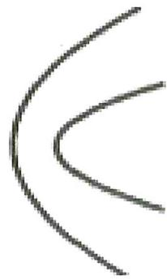

natural_image

Abstract curved line drawing with no text or symbols

等级（SR）

2023 佛山二模

022. (多选) 如图抛物线 $\Gamma_{1}$ 的顶点为 A, 焦点为 F, 准线为 $l_{1}$ , 焦准距为 4; 抛物线 $\Gamma_{2}$ 的顶点为 B, 焦点也为 F, 准线为 $l_{2}$ , 焦准距为 6. $\Gamma_{1}$ 和 $\Gamma_{2}$ 交于 P、Q 两点, 分别过 P、Q 作直线与两准线垂直, 垂足分别为 M、N、S、T, 过 F 的直线与封闭曲线 APBQ 交于 C、D 两点, 则 ( )

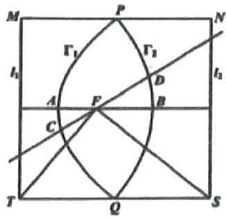

text_image

M
P
N
Γ₁
Γ₂
A
F
B
C
T
Q
S
I₁
I₂

A. $|\mathrm{AB}| = 5$

B. 四边形 MNST 的面积为 100

C. $\overrightarrow{FS} \cdot \overrightarrow{FT} = 0$

D. $|\mathrm{CD}|$ 的取值范围为 $[5, \frac{25}{3}]$

等级（SR）

2023 广东一模

023. (多选) 已知抛物线 E: $y^{2} = 8x$ 的焦点为 F, 点 F 与点 C 关于原点对称, 过点 C 的直线 $l$ 与抛物线 E 交于 A, B 两点 (点 A 和点 C 在点 B 的两侧), 则下列命题正确的是

A. 若 $\mathrm{BF}$ 为 $\triangle \mathrm{ACF}$ 的中线, 则 $| \mathrm{AF} | = 2 | \mathrm{BF}|$   
B. 若 BF 为 $\angle AFC$ 的角平分线，则 $|AF|=6$   
C. 存在直线 $l$ ，使得 $\left| \mathrm{AC} \right| = \sqrt{2} \left| \mathrm{AF} \right|$   
D. 对于任意直线 $l$ ，都有 $|AF| + |BF| > 2|CF|$

等级（SR）

024. 已知抛物线 $C: \mathrm{y}^{2} = 4 \mathrm{x}$ 和点 D (2, 0), 直线 $\mathrm{x} = \mathrm{ty} - 2$ 与抛物线 C 交与不同两点 A, B, 直线 BD 与抛物线 C 交于另一点 E, 给出一下判断

①以 BE 为直径的圆与抛物线准线相切;   
②直线 $OB$ 与直线 $OE$ 的斜率乘积为 $-2$ ;  
③设过点 A, B, E 的圆的圆心坐标为 (a, b)，半径为 r，则 $a^{2}-r^{2}=4$ ；

其中，所有正确的序号是（）

A. ①②

B. ①③

C. ②③

D. ①②③

等级（SR）

2023 宁德五校三月联考

025. (多选)已知抛物线 $C: y^{2} = 4x$ , 过焦点 $\mathrm{F}$ 的直线 $l$ 与 $\mathrm{C}$ 交于 $A(x_{1}, y_{1}), \mathrm{B}(x_{2}, y_{2})$ 两点, $y_{1} > 2$ , $E$ 与 $F$ 关于原点对称, 直线 $AB$ 与直线 $AE$ 的倾斜角分别是 $\alpha$ 与 $\beta$ , 则 ( )

A. $\sin \alpha > \tan \beta$

B. $\angle AEF = \angle BEF$

C. $\angle AEB < 90^{\circ}$

D. $\alpha < 2\beta$

等级（SR）

2024 杭州二模

026. (多选) 过点 $P(2,0)$ 的直线与抛物线 $C: y^{2} = 4x$ 交于 $A, B$ 两点. 抛物线 $C$ 在点 $A$ 处的切线与直线 $x = -2$ 交于点 $N$ , 作 $NM \perp AP$ 交 $AB$ 于点 $M$ , 则 ( )

A. 直线 $NB$ 与抛物线 $C$ 有 2 个公共点

B. 直线 $MN$ 恒过定点

C. 点 $M$ 的轨迹方程是 $(x - 1)^2 + y^2 = 1 (x \neq 0)$

D. $\frac{MN^3}{AB}$ 的最小值为 $8\sqrt{2}$

等级（SR）

2024 南京盐城二模

027. (多选) 已知抛物线 $E: x^{2} = 4y$ 的焦点为 $\mathrm{F}$ , 过 $\mathrm{F}$ 的直线 $l_{1}$ 交 $\mathrm{E}$ 于点 $A(x_{1}, y_{1}), B(x_{2}, y_{2})$ , $\mathrm{E}$ 在 $\mathrm{B}$ 处的线为 $l_{2}$ , 过 $\mathrm{A}$ 作与 $l_{2}$ 平行的直线 $l_{3}$ , 交 $\mathrm{E}$ 于另一点 $C(x_{3}, y_{3})$ , 记 $l_{3}$ 与 $\mathrm{y}$ 轴的交点为 $\mathrm{D}$ , 则 ( )

A. ${y}_{1}{y}_{2} = 1$

B. $x_{1} + x_{3} = 3x_{2}$

C.AF=DF

D. $\triangle ABC$ 面积的最小值为 16

等级（SR）

2024 嘉兴二模

028. (多选) 抛物线有如下光学性质: 由其焦点射出的光线经抛物线反射后, 沿平行于抛物线对称轴的方向射出; 反之, 平行于抛物线对称轴的入射光线经抛物线反射后必过抛物线的焦点. 如图, 已知抛物线 $\Omega: y^{2} = 2px (p > 0)$ 的准线为 $l, O$ 为坐标原点, 在 $\mathbf{x}$ 轴上方有两束平行于 $\mathbf{x}$ 轴的入射光线 $l_{1}$ 和 $l_{2}$ , 分别经 $\Omega$ 上的点 $A(x_{1}, y_{1})$ 和点 $B(x_{2}, y_{2})$ 反射后, 再经 $\Omega$ 上相应的点 $\mathbf{C}$ 和点 $\mathbf{D}$ 反射, 最后沿直线 $l_{3}$ 和 $l_{4}$ 射出, 且 $l_{1}$ 与 $l_{2}$ 之间的距离等于 $l_{3}$ 与 $l_{4}$ 之间的距离. 则下列说法中正确的是

A. 若直线 $l_{3}$ 与准线 $l$ 相交于点 $\mathrm{P}$ , 则 $\mathrm{A}, \mathrm{O}, \mathrm{P}$ 三点共线

B. 若直线 $l_{3}$ 与准线 $l$ 相交于点 $\mathrm{P}$ , 则 $\mathrm{PF}$ 平分 $\angle \mathrm{APC}$

C. $y_{1}y_{2} = p^{2}$

D. 若直线 $l_{1}$ 的方程为 $y = 2p$ , 则 $\cos \angle AFB = \frac{7}{25}$

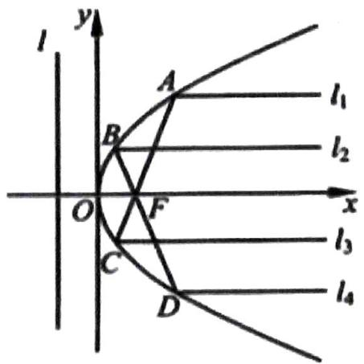

text_image

l
y
A
l₁
B
l₂
O
F
x
C
D
l₃
l₄

等级（SR）

2023 锦州四月质量检测

029. (多选) 已知抛物线 C: $y^{2} = 4x$ 的焦点为 F, 准线为 l, 过点 F 且斜率大于 0 的直线交抛物线 C 于 A, B 两点 (其中 A 在 B 的上方), O 为坐标原点, 过线段 AB 的中点 M 且与 x 轴平行的直线依次交直线 OA, OB, l 于点 P, Q, N, 则 ( )

A. 若 $|AF|=2|FB|$ ，则直线 AB 的斜率为 $2\sqrt{2}$   
B. $|PM| = |NQ|$   
C. 若 P, Q 是线段 MN 的三等分点, 则直线 AB 的斜率为 $2 \sqrt{2}$   
D. 若 P, Q 不是线段 MN 的三等分点, 则 $\left|PQ\right|\succ\left|OQ\right|$ .

# 题型五：三角函数转化的思想

等级（SR）

030. 知抛物线 $y^{2}=4x$ 的焦点为 F，准线与 x 轴的交点为 K，点 P 为抛物线上任意一点，若 $\angle KPF$ 的平分线与 x 轴交于 $(m,0)$ ，则 m 的最大值为（）

A. $3 - 2 \sqrt{2}$

B. $2\sqrt{3} - 3$

C. $2 - \sqrt{3}$

D. $2 - \sqrt{2}$

等级（SR）

031. 抛物线 C: $y^{2}=4x$ 的焦点为 F，动点 P 在抛物线 C 上，点 A (-1, 0)，当 $\frac{|PF|}{|PA|}$ 取得最小值时，直线 AP 的方程为 \_\_\_\_.

# 题型六：双曲线上点到两渐近线距离之积为定值.

等级 (R)

032. 已知点 P 是双曲线: $\frac{x^{2}}{3}-\frac{y^{2}}{1}=1$ 上的一点, 则点 P 到双曲线的两条渐近线的距离之积为()

A $\frac{1}{4}$

B. $\frac{1}{3}$

C. $\frac{2}{3}$

D. $\frac{3}{4}$

等级 (R)

033. 已知点 P 是双曲线 $C: \frac{x^{2}}{a^{2}} - \frac{y^{2}}{b^{2}} = 1 (a > 0, b > 0, c = \sqrt{a^{2} + b^{2}})$ 上一点，若点 P 到双曲线 C 的两条渐近线的距离之积为 $\frac{1}{4}c^{2}$ ，则双曲线 C 离心率为（）

A. $\sqrt{2}$

B. $\frac{\sqrt{5}}{2}$

C. $\sqrt{3}$

D. 2

等级 (R)

034. 已知一族双曲线，且 $E_{n}: x^{2} - y^{2} = \frac{n}{2019}(n \in N^{*}, \text{且} n \leq 2019)$ ，设直线 $x = 2$ 与 $E_{n}$ 在第一象限内的交点为 $A_{n}$ ，点 $A_{n}$ 在 $E_{n}$ 的两条渐近线上的射影分别为 $B_{n}, C_{n}$ . 记 $\Delta A_{n} B_{n} C_{n}$ 的面积为 $a_{n}$ ，则 $a_{1} + a_{2} + a_{3} + \ldots + a_{2019} =$ \_\_\_\_.

# 题型七：与圆的结合

等级 (R)

035. 已知椭圆 $\frac{x^{2}}{a^{2}} + \frac{y^{2}}{b^{2}} = 1 (a > b > 0)$ 的左右焦点分别为 $F_{1}, F_{2}$ , 右顶点为 A, 上顶点为 B, 以线段 $F_{1}A$ 为直径的圆交线段 $F_{1}B$ 的延长线于点 P, 若 $F_{2}B // AP$ , 则该椭圆的离心率是 ( )

A. $\frac{\sqrt{3}}{3}$

B. $\frac{\sqrt{2}}{3}$

C. $\frac{\sqrt{3}}{2}$

. $\frac{\sqrt{2}}{2}$

等级（SR）

2021 广州一模

036. 已知圆 $(x - 1)^{2} + y^{2} = 4$ 与双曲线 C: $\frac{x^{2}}{a^{2}} - \frac{y^{2}}{b^{2}} = 1$ 的两条渐近线相交于四个点，按顺时针排序依次记为 M, N, P, Q，且 $|MN| = 2|PQ|$ ，则 C 的离心率为 \_\_\_\_.

等级（SR）

037. 已知抛物线 C: $y^{2}=4x$ 的焦点为 F，点 P 在 C 上，以 PF 为半径的圆 P 与 y 轴交于点 A, B 两点，O 为坐标原点，若 $\overrightarrow{OB}=7\overrightarrow{OA}$ ，则圆 P 的半径 r = ( )

A. 2

B. 3

C. 4

D. 5

等级（SR）

2022 九江二模

038. 已知点 $M$ 为抛物线 $C: y^{2} = 8x$ 上的动点, 过点 $M$ 向圆 $O_{1}: (x - 2)^{2} + y^{2} = 1$ 引切线, 切点分别为 $\mathrm{P}, \mathrm{Q}$ , 则 $|PQ|$ 的最小值为 ( )

A. $\sqrt{3}$

B. $\frac{\sqrt{3}}{2}$

C. $\sqrt{2}$

D. 1

等级（SR）

2024T8 第二次联考

039. 已知抛物线 C 的方程为 $y = \frac{1}{4} x^{2}$ ，F 为其焦点，点 N 坐标为 $(0, -4)$ ，过点 F 作直线交抛物线 C 于 A, B 两点，D 是 x 轴上一点，且满足 $|DA| = |DB| = |DN|$ ，则直线 AB 的斜率为（）

A. $\pm \frac{\sqrt{15}}{2}$

B.± $\frac{\sqrt{11}}{2}$

C. ±√2

D. $\pm  \sqrt{3}$

# 题型八：存在类问题

等级 (R)

040. 已知椭圆 $\frac{x^2}{a^2} + \frac{y^2}{b^2} = 1 (a > b > 0)$ 的左右焦点是 $F_1$ 、 $F_2$ ， $P$ 是椭圆上一点，若 $\left|PF_1\right| = 2 \left|PF_2\right|$ ，则椭圆的离心率的取值范围是（）

A. $\left(0, \frac{1}{2}\right)$

B. $\left(\frac{1}{3},\frac{1}{2}\right)$

C. $\left[\frac{1}{3},1\right)$

D. $\left[\frac{1}{2},1\right)$

等级(R)

041. 设 A、B 是椭圆 $C: \frac{x^{2}}{3} + \frac{y^{2}}{m} = 1$ 长轴的两个端点，若 C 上存在点 M 满足 $\angle AMB = 120^{\circ}$ ，则 m 的取值范围是

A. $(0,1] \cup [9, +\infty)$

B. $(0,\sqrt{3}]\cup[9,+\infty)$

C. $(0,1] \cup [4, +\infty)$

D. $(0,\sqrt{3}]\cup[4,+\infty)$

等级 (R)

2022 巴蜀中学第八次月考

042. 已知点 A $(- \sqrt{3}, 0)$ , B $(\sqrt{3}, 0)$ ，若曲线 $\left(\frac{x}{a} + \frac{y}{b}\right)\left(\frac{x}{a} - \frac{y}{b}\right) = 0 (a > 0, b > 0)$ 上存在点 P 满足 $|PA| - |PB| = 2$ ，则下列选项一定正确的是（）

A. $b < a + 1$

B. $b > \sqrt{2}a$

C. $b > a + 1$

D. $b < \sqrt{2} a$

等级 (R)

2024 浙江五校联考

043. 已知双曲线 $\frac{x^{2}}{a^{2}} - \frac{y^{2}}{b^{2}} = 1 (a, b > 0)$ 上存在关于原点中心对称的两点 $A, B$ , 以及双曲线上的另一点 $C$ , 使得 $\Delta ABC$ 为正三角形, 则该双曲线离心率的取值范围是 ( )

A. $(\sqrt{2}, +\infty)$

B. $(\sqrt{3},+\infty)$

C. $(2, +\infty)$

D. $\left(\frac{2\sqrt{3}}{3},+\infty\right)$

等级（SR）

044. 已知离心率为 $e$ ，交点为 $F_{1}, F_{2}$ 的双曲线 $C$ 上一点 $P$ 满足 $\sin \angle PF_{1}F_{2} = e \cdot \sin \angle PF_{2}F_{1} \neq 0$ ，则双曲线的离心率 $e$ 的取值范围为（）

A. $(1, \sqrt{2}]$

B. $(1, \sqrt{3}]$

C. (1, 2]

D. $(1,1+\sqrt{2})$

等级（SR）

2021 长春四模

045. 已知 $F$ 是椭圆 $\frac{x^2}{a^2} + \frac{y^2}{b^2} = 1 (a > b > 0)$ 的一个焦点, 若直线 $y = kx$ 与椭圆相交于 $A, B$ 两点, 且 $\angle AFB$ 等于 $60^\circ$ , 则椭圆离心率的取值范围是 ( )

A. $\left(0,\ \frac{\sqrt{3}}{2}\right)$

B. $\left(\frac{\sqrt{3}}{2},1\right)$

C. $\left(0,\ \frac{1}{2}\right)$

D. $\left(\frac{1}{2},1\right)$

等级（SR）

2024 南昌三模

046. 已知双曲线 $C: \frac{x^{2}}{a^{2}} - \frac{y^{2}}{b^{2}} = 1 (a > 0, b > 0)$ 的左、右焦点分别为 $F_{1}, F_{2}$ , 过 $F_{2}$ 作直线 $l$ 与双曲线 $C$ 的右支交于 $A, B$ 两点, 若 $\Delta F_{1} A B$ 的周长为 $10 b$ , 则双曲线 $C$ 的离心率的取值范围是 ( )

A. $\left[\frac{\sqrt{5}}{2},\sqrt{5}\right]$

B. $\left[\frac{\sqrt{3}}{2},\sqrt{3}\right]$

C. $\left[\frac{1}{2}, 2\right]$

D. $[2, +\infty)$

等级（SR）

2021 九江二模

047. 已知抛物线 $E: y^{2} = 2px (p > 0)$ , 斜率为 1 的直线 $l$ 过抛物线 $E$ 的焦点, 若抛物线 $E$ 上有且只有三点到直线 1 的距离为 $\sqrt{2}$ , 则 $p = (\quad)$

A. 4

B. 2

C. 1

D. $\frac{1}{2}$

等级（SR）

2021 南充二诊

048. 已知双曲线 E: $\frac{x^{2}}{a^{2}} - \frac{y^{2}}{b^{2}} = 1 (a > 0, b > 0)$ 的右顶点为 A, 抛物线 C: $y^{2} = 12ax$ 的焦点为 F, 若在双曲线的渐进线上存在一点 P, 使得 $\overrightarrow{PA} \cdot \overrightarrow{PF} = 0$ , 则双曲线 E 的离心率的取值范围是 ( )

A. (1,2)

B. (1. $\frac{2\sqrt{3}}{3}$ ]

C. $(2, +\infty)$

D. $\left[\frac{2\sqrt{3}}{3}, +\infty\right)$

等级（SR）

049. 已知椭圆 $C: \frac{x^{2}}{a^{2}} + \frac{y^{2}}{b^{2}} = 1 (a > b > 0)$ 的右焦点为 $F(c, 0)$ , 上顶点为 $A(0, b)$ , 直线 $x = \frac{a^{2}}{c}$ 上存在一点 $P$ 满足 $(\overrightarrow{FP} + \overrightarrow{FA}) \cdot \overrightarrow{AP} = 0$ , 则椭圆的离心率取值范围为 ( )

$$
A. [ \frac {1}{2}, 1)
$$

$$
B. [ \frac {\sqrt {2}}{2}, 1)
$$

$$
C. [ \frac {\sqrt {5} - 1}{2}, 1)
$$

$$
D. (0, \frac {\sqrt {2}}{2} ]
$$

等级（SR）

050. 已知双曲线 $M: \frac{x^{2}}{a^{2}} - \frac{y^{2}}{b^{2}} = 1 (b > a > 0)$ 的焦距为 $2c$ , 若 $M$ 的渐近线上存在点 $T$ , 使得经过点 $T$ 所作的圆 $C: (x - c)^{2} + y^{2} = a^{2}$ 的两条切线互相垂直, 则双曲线 $M$ 的离心率的取值范围是 ( )

$$
A. (1, \sqrt {2} ]
$$

$$
B. (\sqrt {2}, \sqrt {3} ]
$$

$$
C. (\sqrt {2}, \sqrt {5} ]
$$

$$
D. (\sqrt {3}, \sqrt {5} ]
$$

等级（SR）

051. 已知 $F_{1}, F_{2}$ 分别是双曲线 $\frac{x^{2}}{a^{2}} - \frac{y^{2}}{b^{2}} = 1 (a > 0, b > 0)$ 的左右焦点，若在右支上存在一点 $P$ ，使 $PF_{1}$ 与圆 $x^{2} + y^{2} = 4a^{2}$ 相切，则该双曲线的离心率的范围是（）

A. $(2, \sqrt{5})$

B. $(\sqrt{5},+\infty)$

C. $(5, +\infty)$

D. $(\sqrt{5},5)$

# 题型九：降维的思想在圆锥曲线中的应用

等级 (R)

052. 在平面直角坐标系 x0y 中，已知双曲线 C: $\frac{x^{2}}{a^{2}} + \frac{y^{2}}{b^{2}} = 1$ (b > 0, a > 0)

的左焦点为 F，点 B 的坐标为 $(0, b)$ ，若直线 BF 与双曲线 C 的两条渐近线分别交于 P，Q 两点，且 $\overrightarrow{PB} = 5\overrightarrow{BQ}$ ，则双曲线 C 的离心率为（）

A. $\frac{2}{3}$

B. $\frac{3}{2}$

C. $\sqrt{3}$

D. 2

等级（SR）

053. 如图, 已知抛物线 $E: y^{2} = 4x$ 的焦点为 $F$ , 准线 1 与 $x$ 轴交于 $K$ 点, 过点 $K$ 的直线 $m$ 与抛物线 $E$ 相交于不同两点 $A, B$ , 且 $|AF| = \frac{3}{2}$ , 连接 $BF$ 并延长 1 于 $C$ 点, 记 $\triangle ACF$ 于 $\triangle ABC$ 的面积分别为 $S_{1}$ , $S_{2}$ , 则 $\frac{S_{1}}{S_{2}} = (\quad)$

A. $\frac{4}{7}$

B. $\frac{4}{5}$

C. $\frac{2}{3}$

D. $\frac{7}{10}$

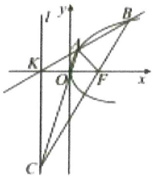

text_image

I
y
B
K
O
F
x
C

等级（SR）

054. 设过抛物线 $y^{2} = 2px (p > 0)$ 上住意一点 $P$ (异于原点 $O$ ) 的直线与抛物线 $y^{2} = 8px (p > 0)$ 交于 A, B 两点，直线 $OP$ 与抛物线 $y^{2} = 8px (p > 0)$ 的另一个交点为 $Q$ . 则

$$
\frac {S _ {\triangle A B Q}}{S _ {\triangle A B O}} = \underline {{\quad}}.
$$

等级（SR）

055. 设抛物线 $y^{2}=2x$ 的焦点为 F 过点 M ( $\sqrt{3}$ , 0) 的直线与抛物线相交于 A, B 两点，与抛物线的准线相交于点 C， $|BF|=2$ ，则 $\triangle BCF$ 与 $\triangle ACF$ 的面积之比 $\frac{S_{\triangle BCF}}{S_{\triangle ACF}}=$ \_\_\_\_

# 题型十：三角形内切圆的线段关系

等级 (R)

2024 太原三模

056. 已知点 $F_{1}, F_{2}$ 分别是椭圆 $C$ 的左、右焦点, $P(4,3)$ 是 $C$ 上一点, $\Delta PF_{1}F_{2}$ 的内切圆的圆心为 $I(m,1)$ , 则椭圆 $C$ 的标准方程是 ( )

A. $\frac{x^{2}}{24} + \frac{y^{2}}{27} = 1$

B. $\frac{x^{2}}{28} +\frac{y^{2}}{21} = 1$

C. $\frac{x^{2}}{52} +\frac{y^{2}}{13} = 1$

D. $\frac{x^{2}}{64} +\frac{y^{2}}{12} = 1$

等级(R)

2024 南京二模

057. 已知椭圆 $C$ 的左、右焦点分别为 $F_{1}, F_{2}$ , 下顶点为 A, 直线 $AF_{1}$ 交 $C$ 于另一点 $B$ , $\triangle ABF_{2}$ 的内切圆与 $BF_{2}$ 相切于点 $P$ . 若 $BP = F_{1}F_{2}$ , 则 $C$ 的离心率为 ( )

A. $\frac{1}{3}$

B. $\frac{1}{2}$

C. $\frac{2}{3}$

D. $\frac{3}{4}$

等级（SR）

058. 已知双曲线 $E: \frac{x^2}{a^2} - \frac{y^2}{b^2} = 1 (a > 0, b > 0)$ 的左、右焦点分别为 $F_1, F_2$ , 半焦距为 4, $P$ 是 $E$ 左支上的一点, $PF_2$ 与 $y$ 轴交于点 $A$ , $\triangle PAF_1$ 的内切圆与边 $AF_1$ 切于点 $Q$ , 若 $|AQ| = 2$ , 则 $E$ 的离心率是 ( )

A. $\sqrt{2}$

B. $\sqrt{3}$

C. 2

D. $\sqrt{5}$

等级（SR）

2021 宁波二模

059. 已知点 $F$ 为双曲线 $\frac{x^{2}}{a^{2}} - \frac{y^{2}}{b^{2}} = 1 (a > 0, b > 0)$ 的左焦点，A 为该双曲线渐近线在第一象限内的点，过原点 $O$ 作 $OA$ 的垂线交 $FA$ 于点 $B$ ，若 B 恰为线段 $AF$ 的中点，且 $\triangle ABO$ 的内切圆半径为 $\frac{b-a}{4} (b > a)$ ，则该双曲线的离心率为 \_\_\_\_

等级（SR）

060. 已知椭圆 $\frac{x^{2}}{2} + y^{2} = 1$ 的左右焦点分别为 $F_{1}, F_{2}$ ，M 为椭圆上异于长轴端点的动点， $\Delta MF_{1}F_{2}$ 的内心为 I 则 $\frac{\overrightarrow{MI} \cdot \overrightarrow{MF_{2}}}{\left|\overrightarrow{MF_{2}}\right|} =$ \_\_\_\_

# 题型十一：圆锥曲线的新颖给法

等级 (R)

2022 皖南八校第三次联考

061. 古希腊亚历山大时期最后一位重要的几何学家帕普斯(Pappus, 公元 3 世纪末)在其代表作《数学汇编》中研究了“三线轨迹”问题: 即到两条已知直线距离的乘积与到第三条直线距离的平方之比等于常数的动点轨迹为圆锥曲线。今有平面内三条给定的直线 $l_{1}, l_{2}, l_{3}$ , 且 $l_{2}, l_{3}$ 均与 $l_{1}$ 垂直。若动点 $\mathbb{M}$ 到 $l_{2}, l_{3}$ 的距离的乘积与到 $l_{1}$ 的距离的平方相等, 则动点 $\mathbb{M}$ 在直线 $l_{2}, l_{3}$ 之间的轨迹是( )

A. 圆

B. 椭圆

C. 双曲线

D. 抛物线

等级 (R)

2021 温州二模

062. 已知定点 $P(m, 0)$ ，动点Q在圆 $x^{2} + y^{2} = 16$ 上，PQ的垂直平分线交直线OQ于M，若动点M的轨迹是双曲线，则m的值可以是（）

A. 5

B. 4

C. 3

D. 2

等级（SR）

2022 桂林一模

063. 平面直角坐标系中有两点 $O_{1}(-1,0)$ 和 $O_{2}(1,0)$ , 以 $O_{1}$ 为圆心, 正整数 $i$ 为半径的圆记为 $A_{i}$ . 以 $O_{2}$ 为圆心, 正整数 $j$ 为半径的圆记为 $B_{j}$ , 对于正整数 $k(1 \leq k \leq 5)$ , 点 $P_{k}$ 是圆 $A_{k}$ 与圆 $B_{k+1}$ 交点,且 $P_{1}, P_{2}, P_{3}, P_{4}, P_{5}$ 都位于第二象限, 则这 5 个点都在同一 ( )

A. 直线上

B. 椭圆上

C. 抛物线上

D. 双曲线上

等级（SR）

2021 惠州一模

064. 古希腊数学家欧几里得在《几何原本》中描述了圆锥曲线的共性, 并给出了圆锥曲线的统一定义, 只可惜对这一定义欧几里得没有给出证明。经过了 500 年, 到了 3 世纪, 希腊数学家帕普斯在他的著作《数学汇篇》中, 完善了欧几里得关于圆锥曲线的统一定义, 并对这一定义进行了证明。他指出, 到定点的距离与到定直线的距离的比是常数 $e$ 的点的轨迹叫做圆锥曲线: 当 $0 < e < 1$ 时, 轨迹为椭圆; 当 $e = 1$ 时, 轨迹为抛物线; 当 $e > 1$ 时, 轨迹为双曲线。现有方程

$m(x^{2}+y^{2}+2y+1)=(x-2y+3)^{2}$ 表示的曲线是双曲线，则m的取值范围为()

A.(0,1)

B. $(1, +\infty)$

C.(0,5)

D. $(5, +\infty)$

等级（SR）

2022 汉中二测

065. 已知点 A (-1, 0)、B (1, 0)，若过 A、B 两点的动抛物线的准线始终与圆 $x^{2} + y^{2} = 8$ 相切，该抛物线焦点的轨迹是某圆锥曲线的一部分，则该圆锥曲线是（）

A. 圆

B. 双曲线

C. 椭圆

D. 抛物线

等级（SR）

2022 南昌三模

066. 已知两条直线 $l_1: 2x - 3y + 2 = 0$ , $l_2: 3x - 2y + 3 = 0$ ，有一动圆（圆心和半径都在变动）与 $l_1, l_2$ 都相交，并且 $l_1, l_2$ 被截在圆内的两条线段的长度分别是定值 26, 24，则动圆圆心的轨迹是（）

A. 圆   
B. 椭圆   
C. 双曲线  
D. 直线

# 题型十二：圆锥曲线与立体几何

等级 (R)

2022 江苏基地三月联考

067 某同学画 “切面圆柱体” （用与圆柱底面不平行的平面切圆柱，底面与切面之间的部分叫做切面圆柱体），发现切面与圆柱侧面的交线是一个椭圆（如图所示）。若该同学所画的椭圆的离心率为 $\frac{1}{2}$ ，则 “切面” 所在平面与底面所成的角为（）

A. $\frac{\pi}{12}$

B. $\frac{\pi}{6}$

C. $\frac{\pi}{4}$

D. $\frac{\pi}{3}$

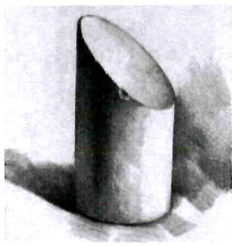

natural_image

Pencil sketch of a cylindrical object with shading, no text or symbols present

等级（SR）

2022 湖南高三三月联考

068. 如图, 圆锥底圆 O 的直径长为 $4 \sqrt{2}, \angle A P B = 90^{\circ}$ , AB, CD 是底圆的两条直径, 且 AB⊥CD, E 是母线 PB 的中点, 已知过 CD 与 E 的平面与圆锥侧面的交线是以 E 为顶点的抛物线的一部分, 则该抛物线的焦点到圆锥顶点 P 的距离等于

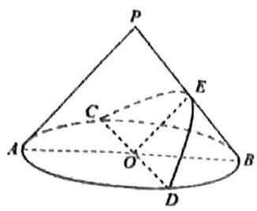

text_image

P
C
A
O
D
E
B

等级（SR）

2022 甘肃一诊

069 直线 $y = kx (k \in \mathbb{R})$ 与椭圆 $\frac{x^2}{6} + \frac{y^2}{2} = 1$ 相交于 A, B 两点, 若将 $x$ 轴下方半平面沿着 $x$ 轴翻折, 使之与上半平面成直二面角, 则 $|AB|$ 的取值范围是 ( )

A. $\left[\sqrt{2}, \sqrt{6}\right)$

B. $[2, 2\sqrt{6}]$

C. $(2, 2\sqrt{6}]$

D. $(2,6]$

等级（SR）

070. 古希腊数学家阿波罗尼斯在他的著作《圆锥曲线论》中记载了用平面切割圆锥得到圆锥曲线的方法, 如图, 将两个完全相同的圆锥对顶位置 (两圆锥的轴重合), 已知两个圆锥的底面半径均为 1 , 母线长均为 3 , 记过圆锥轴的平面 $A B C D$ 为平面 $\alpha$ ( $\alpha$ 与两个圆锥侧面的交线为 $A C$ , $B D$ ) 用平行于 $\alpha$ 的平面截圆锥, 该平面与两个圆锥侧面的交线即双曲线 $\Gamma$ 的两条渐近线分别平行于 $A C$ , $B D$ , 则双曲线 $\Gamma$ 的离心率为 ( )

A. $\frac{3\sqrt{2}}{4}$

B. $\frac{2 \sqrt{3}}{3}$

C. $\sqrt{2}$

$D.2\sqrt{2}$

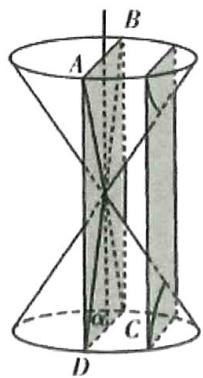

text_image

Geometric diagram of a double cone with labeled points A, B, C, D and intersecting planes

等级（SR）

2021 南昌二模

071. 通过研究发现: 点光源 $\mathrm{P}$ 斜照射球, 在底面上形成的投影是椭圆, 且球与底面相切于椭圆的一个焦点 $\mathrm{F}_{1}$ (如图所示), 下图是底面边长为 2 , 高为 3 的正四棱柱, 一实心小球与正四棱柱的下底面以及四个侧面均相切, 若点光源 $\mathrm{P}$ 位于 AD 的中点处时, 则在平面 $\mathrm{A}_{1} \mathrm{~B}_{1} \mathrm{C}_{1} \mathrm{~D}_{1}$ 上的投影形成的椭圆的离心率是 \_\_\_\_.

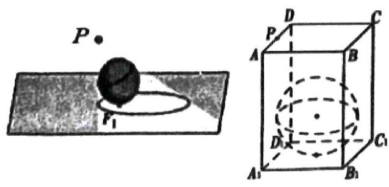

text_image

P
P₁
A
D
C
P
A
B
D
C₁
A₁
B₁

等级（SR）

2023 毕节三诊

072. 油纸伞是中国传统工艺品, 至今已有 1000 多年的历史, 为宣传和推广这一传统工艺, 北京市文化宫于春分时节开展油纸伞文化艺术节. 活动中将油纸伞撑开后摆放在户外展览场地上, 如图所示, 该伞的伞沿是一个半径为 $\sqrt{2}$ 的圆, 圆心到伞柄底端距离为 $\sqrt{2}$ , 阳光照射油纸伞在地面形成了一个椭圆形影子 (春分时, 北京的阳光与地面夹角为 $60^{\circ}$ ), 若伞柄底端正好位于该椭圆的焦点位置, 则该椭圆的离心率为 ( )

A. $2 - \sqrt{3}$

B. $\sqrt{2} - 1$

C. $\sqrt{3} - 1$

D. $\frac{\sqrt{2}}{2}$

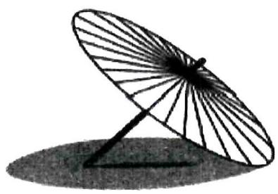

natural_image

Simple line drawing of a traditional umbrella with a curved blade and stand, casting a shadow (no text or symbols)

等级(SR)

2024 重庆八中第六次月考

073（多选）古希腊数学家阿波罗尼斯发现：用平面截圆锥，可以得到不同的截口曲线。如图,当平面垂直于圆锥的轴时,截口曲线是一个圆。当平面不垂直于圆锥的轴时,若得到“封闭曲线”,则是椭圆;若平面与圆锥的一条母线平行,得到抛物线(部分);若平面平行于圆锥的轴,得到双曲线(部分)。已知以 $P$ 为顶点的圆锥 $PO$ ,底面半径为1,高为 $\sqrt{3}$ ,点 $A$ 为底面圆周上一定点,圆锥侧面上有一动点 $T$ 满足 TA = TP , 则下列结论正确的是()

A. 点 $T$ 的轨迹为椭圆  
B. 点 $T$ 可能在以 $O$ 为球心, 1 为半径的球外部  
C. $TP$ 可能与 $TA$ 垂直  
D.三棱锥 $P - ATO$ 的体积最大值为 $\frac{\sqrt{6}}{12}$

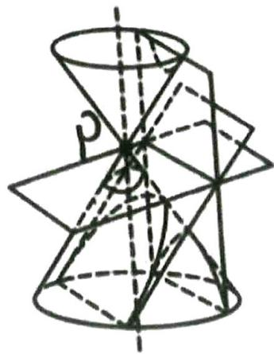

natural_image

Geometric diagram of a double cone intersecting with planes and a sphere, no text or symbols present

等级(SR)

2024 湖北十一校第二次联考

074.（多选）用平面 $\alpha$ 截圆柱面，圆柱的轴与平面 $\alpha$ 所成角记为 $\theta$ ，当 $\theta$ 为锐角时，圆柱面的截线是一个椭圆。著名数学家 Dandelin 创立的双球实验证明了上述结论。如图所示，将两个大小相同的球嵌入圆柱内，使它们分别位于 $\alpha$ 的上方和下方，并且与圆柱面和 $\alpha$ 均相切。下列结论中正确的有（）

A.椭圆的短轴长与嵌入圆柱的球的直径相等  
B.椭圆的长轴长与嵌入圆柱的两球的球心距 $O_{1}O_{2}$ 相等  
C. 所得椭圆的离心率 $e = \cos \theta$   
D. 其中 $G_{1} G_{2}$ 为椭圆长轴, $R$ 为球 $O_{1}$ 半径, 有 $R = A G_{1} \cdot \tan \frac{\theta}{2}$

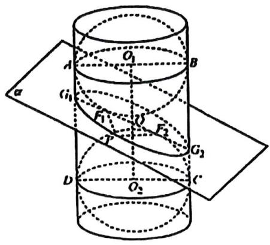

text_image

A
O₁
B
α
i₁
F₁
U
F₂
T
G₂
D
O₂
c

等级（SSR）

2022 新余二模

075. 如图是数学家 Germinal Dandelin 用来证明一个平面截圆锥得到的截口曲线是椭圆的模型（称为 “Dandelin 双球”）: 在圆锥内放两个大小不同的小球, 使得它们分别与圆锥的侧面、截面相切, 设图中球 $O_{1}$ , 球 $O_{2}$ 的半径分别为 3 和 1 , 球心距离 $|O_{1}O_{2}| = 8$ , 截面分别与球 $O_{1}$ , 球 $O_{2}$ 切于点 E, F, (E, F 是截口椭圆的焦点), 则此椭圆的离心率等于

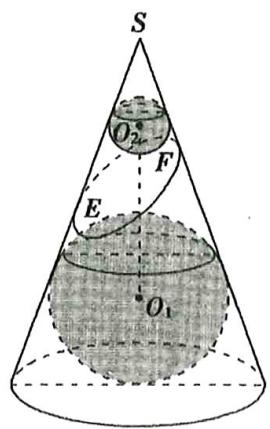

text_image

S
O₂
F
E
O₁

# 题型十三：圆锥曲线的光学性质

等级 (R)

076. 抛物线有如下光学性质, 从焦点发出的光线, 经过抛物线上的一点反射后, 反射光线平行于抛物线的对称轴, 已知抛物线 $C: y^{2} = 4x$ , 如图, 一条平行于 $x$ 轴的光线从点 $A(4, y_{1}) (1 < y_{1} < 4)$ 发出, 射向抛物线上的点 $P$ , 反射后经过抛物线 $C$ 的焦点 $F$ 射向抛物线上的点 $Q$ , 再反射后又沿平行于 $x$ 轴的方向射出至点 $B(4, y_{2})$ , 下列说法中正确的是 ( )

A. 光路 APQB 长度的最小值为 10  
B. 光路 APQB 长度的最大值为 10  
C. 光路 APQB 的长度恒等于为 10  
D. 以上说法均不正确

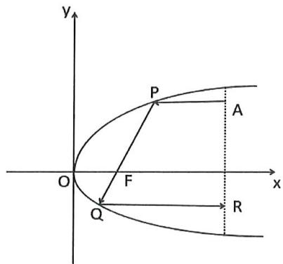

text_image

y
P
A
O
F
x
Q
R

等级 (R)

2021 临沂一模

077. 双曲线的光学性质为: 如图①, 从双曲线右焦点 $F_{2}$ , 发出的光线经双曲线镜面反射, 反射光线的反向延长线经过左焦点 $F_{1}$ . 我国首先研制成功的 “双曲线新闻灯”, 就是利用了双曲线的这个光学性质. 某 “双曲线新闻灯” 的轴截面是双曲线一部分, 如图②, 其方程为 $\frac{x^{2}}{a^{2}} - \frac{y^{2}}{b^{2}} = 1$ , $F_{1}$ , $F_{2}$ 为其左、右焦点, 若从右焦点 $F_{2}$ 发出的光线经双曲线上的点 A 和点 B 反射后, 满足 $\angle BAD = 90^{\circ}$ , $\tan \angle ABC = -\frac{3}{4}$ , 则该双曲线的离心率为 ( )

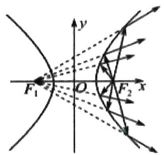

text_image

F₁
O
F₂
x
y

图①

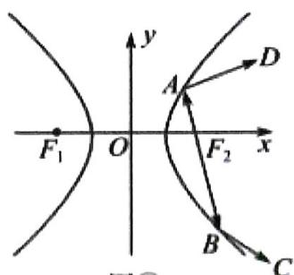

text_image

F₁ O
y
A
D
F₂ x
B
C

图②

A. $\frac{\sqrt{5}}{2}$

B. $\sqrt{5}$

C. $\frac{\sqrt{10}}{2}$

D. $\sqrt{10}$

等级（SR）

2021 泉州一检

078. 圆锥曲线光学性质（如图 1 所示）在建筑，通讯，精密仪器制造等领域有着广泛的应用，如图 2，一个光学装置由有公共焦点 $F_{1} F_{2}$ 的椭圆 C 与双曲线 C' 构成，一光线从左焦点 $F_{1}$ 发出，依次经过 C' 与 C 的反射，又回到 $F_{1}$ 历时 m 秒；若将装置中的 C' 去掉，则该光线从点 $F_{1}$ 发出，经过 C 两次反射后又回到点 $F_{1}$ 历时 n 秒，若 C 与 C' 的离心率之比为 $\frac{1}{3}$ ，则 $\frac{m}{n} =$ \_\_\_\_.

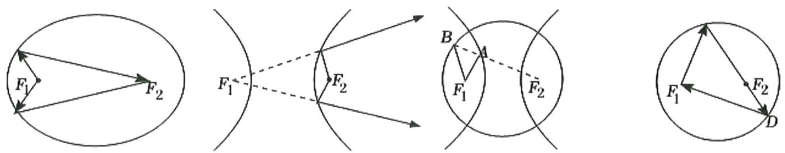  
图2  
图1

等级(SR)

2024 皖北协作区高三联考

079. 已知抛物线 $C: y^{2} = 4x$ 的焦点为 $F$ . 过 $F$ 的直线 $l$ 与 $C$ 交于 $A, B$ 两点. 过 $A$ 作 $C$ 的切线 $m$ 及平行于 $x$ 轴的直线 $m'$ , 过 $F$ 作平行于 $m$ 的直线交 $m'$ 于 $M$ , 过 $B$ 作 $C$ 的切线 $n$ 及平行于 $x$ 轴的直线 $n'$ , 过 $F$ 作平行于 $n$ 的直线交 $n'$ 于 $N$ , 若 $|AM| - |BN| = \frac{8}{3}$ , 则点 $A$ 的横坐标为 \_\_\_\_.

# 题型十四：圆锥曲线与天体运动

等级（SR）

080. 某人造地球卫星的运行轨道是以地心为一个焦点的椭圆, 其轨道的离心率为 $\mathrm{e}$ , 设地球半径为 $R$ , 该卫星近地点离地面的距离为 $r$ , 则该卫星远地点离地面的距离为 ( )

$$
\mathrm{A} \frac {1 + \mathrm{e}}{1 - \mathrm{e}} \mathrm{r} + \frac {2 \mathrm{e}}{1 - \mathrm{e}} R
$$

$$
\mathrm{B.} \frac {1 + \mathrm{e}}{1 - \mathrm{e}} \mathrm{r} + \frac {\mathrm{e}}{1 - \mathrm{e}} R
$$

$$
\mathrm{C.} \frac {1 - \mathrm{e}}{1 + \mathrm{e}} \mathrm{r} + \frac {2 \mathrm{e}}{1 + \mathrm{e}} R
$$

$$
\mathrm{D.} \frac {1 - \mathrm{e}}{1 + \mathrm{e}} \mathrm{r} + \frac {\mathrm{e}}{1 + \mathrm{e}} R
$$

等级（SR）

2021 南昌三模

081. 如图所示, “嫦娥五号” 月球探测器飞行到月球附近时, 首先在以月球球心 $F$ 为圆心的圆形轨道 I 上绕月球飞行, 然后在 $P$ 点处变轨进入以 $F$ 为一个焦点的椭圆轨道 II 绕月球飞行, 最后在 $Q$ 点处变轨进入以 $F$ 为圆心的圆形轨道 III 绕月球飞行, 设圆形轨道 I 的半径为 $R$ , 圆形轨道 III 的半径为 $r$ , 则下列结论中正确的序号为 ( )

①轨道 II 的焦距为 R-r;

②若 R 不变，r 越大，轨道 II 的短轴长越

小；

③轨道 II 的长轴长为 R+r;

④若 r 不变，R 越大，轨道 II 的离心率越

大；

A. ①②③

B. ①②④

C. ①③④

D. ②③④

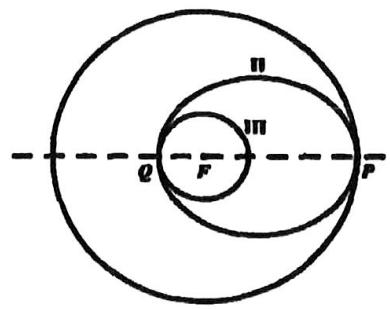

text_image

Π
ΠΠ
Q F P

# 题型十五：考察画图能力

等级 (R)

082. 点 P 在焦点为 $F_{1}(-c,0)$ 、 $F_{2}(c,0)$ 的椭圆 C 上， $PF_{1}$ 交 y 轴于点 Q，且 $\triangle PQF_{2}$ 为正三角形，若 $|OQ|=1$ ，椭圆 C 的标准方程为 \_\_\_\_

等级（SR）

083. 设 $F_{1}$ 、 $F_{2}$ 分别为椭圆 C: $\frac{x^{2}}{a^{2}} + \frac{y^{2}}{b^{2}} = 1$ 的左右焦点，点 A、B 分别为椭圆 C 的右顶点和下顶点，且点 $F_{1}$ 关于直线 AB 的对称点为 M，若 $MF_{2} \perp F_{1}F_{2}$ ，则椭圆 C 的离心率为（）

A. $\frac{\sqrt{3} - 1}{2}$

B. $\frac{\sqrt{3} - 1}{3}$

C. $\frac{\sqrt{5} - 1}{2}$

D. $\frac{\sqrt{2}}{2}$ 等级（SR）

084. 已知抛物线 $y^{2} = 4x$ 的焦点为 $F$ ，抛物线上的动点 $P$ （不在原点）在 $y$ 轴上的投影为 $E$ ，点 $E$ 关于直线 $PF$ 的对称轴为 $E'$ ，点 $F$ 关于直线 $PE$ 的对称点为 $F'$ 当 $|E'F'|$ 最小时，三角形 $PEF$ 的面积为 \_\_\_\_

等级（SR）

085. 已知双曲线 C 的中心为 0，左、右顶点分别为 $A_{1}, A_{2}$ ，左、右焦点分别为 $F_{1}, F_{2}$ ，过 $F_{1}$ 的直线与 C 的两条渐近线分别交于 P.，Q 两点，若 PO//QF₂，QA₁⊥ QA₂，则 C 的离心率等于 \_\_\_\_

# 题型十六：多曲线综合考察

# 模型一：同焦点的椭圆双曲线问题

等级（SR）.

086. 已知有公共焦点的椭圆 $C_{1}$ 与双曲线 $C_{2}$ 的四个公共点构成一个正方形, 若 $\mathrm{e}_{1}, \mathrm{e}_{2}$ 分别是 $C_{1}, C_{2}$ 的离心率, 且 $\mathrm{e}_{1} = \frac{\sqrt{2}}{2}$ , 则 $\mathrm{e}_{2} = (\quad)$

A. $\sqrt{2}$

B. $\sqrt{3}$

C. $\sqrt{6}$

D. 3

等级（SR）.

087. 设椭圆 $\frac{x^{2}}{m^{2}} + \frac{y^{2}}{4} = 1$ 与双曲线 $\frac{x^{2}}{a^{2}} - \frac{y^{2}}{4} = 1$ 在第一象限的交点为 T, $F_{1}, F_{2}$ 为其共同的左右焦点，且 $|T F_{1}| < 4$ ，若椭圆和双曲线的离心率分别为 $e_{1}, e_{2}$ ，则 $e_{1}^{2} + e_{2}^{2}$ 的取值范围为（）。

A. $\left(2, \frac{26}{9}\right)$

B. $\left(7,\frac{52}{9}\right)$

C. $\left(1,\frac{26}{9}\right)$

D. $\left(\frac{50}{9},+\infty\right)$

等级（SR）

088. 已知椭圆 $C_{1}: \frac{x^{2}}{a_{1}^{2}} + \frac{y^{2}}{b_{1}^{2}} = 1 (a_{1} > b_{1} > 1)$ 与双曲线 $C_{2^{2}} \frac{x^{2}}{a_{2}^{2}} - \frac{y^{2}}{b_{2}^{2}} = 1 (a_{2} > 0, b_{2} > 0)$ 有相同的焦点 $F_{1}, F_{2}$ , 若点 $P$ 是 $C_{1}$ 与 $C_{2}$ 在第一象限内的焦点, 且 $\left|F_{1}F_{2}\right| = 2 \left|PF_{2}\right|$ 设 $C_{1}$ 与 $C_{2}$ 的离心率分别为 $e_{1}, e_{2}$ . 则 $e_{2} - e_{1}$ 的取值范围是 ( )

A. $\left[\frac{1}{3}, +\infty\right]$

B. $\left(\frac{1}{3},+\infty\right)$

C. $\left[\frac{1}{2}, +\infty\right]$

D. $\left(\frac{1}{2},+\infty\right)$

# 模型二：同焦点抛物线椭圆

等级（SR）

2021 泰州南通二模

089. 已知椭圆 $C_{1}: \frac{x^{2}}{a^{2}} + \frac{y^{2}}{b^{2}} = 1 (a > b > 0)$ 的右顶点为 $P$ , 右焦点 $F$ 与抛物线 $C_{2}$ 的焦点重合, $C_{2}$ 的顶点与 $C_{1}$ 的中心 $O$ 重合。若 $C_{1}$ 与 $C_{2}$ 相交于点 $A, B$ , 且四边形 $OAPB$ 为菱形, 则 $C_{1}$ 的离心率为 \_\_\_\_.

等级（SR）

090. 已知曲线 $C_1$ 是以原点 0 为中心, $F_1$ , $F_2$ 为焦点的椭圆, 曲线 $C_2$ 是以 0 为顶点、 $F_2$ 为焦点的抛物线, A 是曲线 $C_1$ 与 $C_2$ 的交点, 且 $\angle AF_2F_1$ 为钝角, 若 $\left|AF_1\right| = \frac{7}{2}$ , $\left|AF_2\right| = \frac{5}{2}$ 则 $\triangle AF_1F_2$ 的面积是 ( )

A. $\sqrt{3}$

B. $\sqrt{6}$

C. 2

D. 4

等级（SR）

091. 已知椭圆 $C: \frac{x^2}{a^2} + \frac{y^2}{b^2} = 1 (a > b > 0)$ 的左、右焦点分别为 $F_1, F_2$ . 且 $F_2$ 也是抛物线 $E: y^2 = 2px (p > 0)$ 的焦点，点 $A$ 为 $C$ 与 $E$ 的一个交点，且直线 $AF_1$ 的倾斜角为 $45^\circ$ ，则 $C$ 的离心率为

# 模型三：同渐近线不同焦点的双曲线

等级（SR）

092. 已知双曲线 $C_1, C_2$ 的焦点分别在 $x$ 轴 $y$ 轴上，渐近线方程为 $y = \pm \frac{1}{a} x$ 离心率分别为 $e_1, e_2$ 则 $e_1 + e_2$ 的最小值为 \_\_\_\_.

# 题型十七：角的最值问题（米勒定理）

等级（SR）

2023 佛山二模

093. 已知 $F_{1}, F_{2}$ 分别为椭圆 $\frac{x^{2}}{4} + \frac{y^{2}}{3} = 1$ 的左、右焦点, P 是过椭圆右顶点且与长轴垂直的直线上
的动点, 则 $\sin \angle F_{1}PF_{2}$ 的最大值为 \_\_\_\_.

等级（SR）

2021 成都二诊

094. 已知 $F$ 为抛物线 $y^{2} = 2x$ 的焦点, $A$ 为抛物线上的动点, 点 $B(-1, 0)$ , 则当 $\frac{2|AB|}{2|AF| + 1}$ 取最大值时, $|AB|$ 的值为 ( )

A. 2

B. $\sqrt{5}$

C. $\sqrt{6}$

D. $2\sqrt{2}$

等级（SR）

095. 已知双曲线 $\frac{x^{2}}{a^{2}} - \frac{y^{2}}{b^{2}} = 1 (a, b > 0)$ 的左、右顶点分别为 A, B, 右焦点为 F, 过点 F 且垂直于 x 轴的直线 L 交双曲线于 M, N 两点, P 为直线 L 上一点, 当 $\triangle APB$ 的外接圆面积达到最小时, 点 P 恰好在 M (或 N) 处, 则双曲线的离心率为 ( )

A. $\sqrt{2}$

B. $\sqrt{3}$

C. 2

D. $\sqrt{5}$

# 题型十八：椭圆内接正方形类问题

等级（SR）

2022 江西重点中学联盟一联

096. 正方形 ABCD 的四个顶点都在椭圆 $\frac{x^{2}}{a^{2}} + \frac{y^{2}}{b^{2}} = 1 (a > b > 0)$ 上，若椭圆的焦点在正方形的内部，则椭圆的离心率的取值范围是（）

A. $\left(\frac{\sqrt{5}-1}{2},1\right)$

B. $(0, \frac{\sqrt{5} - 1}{2})$

C. $(\frac{\sqrt{3} - 1}{2}, 1)$

D. $(0, \frac{\sqrt{3} - 1}{2})$

等级（SR）

2022 眉山三诊

097. 广场内有一椭圆形区域，其边沿与椭圆 $\frac{9x^{2}}{200^{2}} + \frac{y^{2}}{50^{2}} = 1$ 完全重合（单位：m），现拟在该椭圆区域内用黑白磁砖贴一个完整的正方形图案（如图），每块黑白磁砖规格为 $50 \times 50$ （单位：cm），所贴磁砖最里面的的黑色磁砖中心与椭圆中心重合，磁砖边沿与椭圆的对称轴平行。该椭圆区域需要的黑色磁砖块数最多是（）

A. 12481

B. 12480

C. 12801

D, 12800

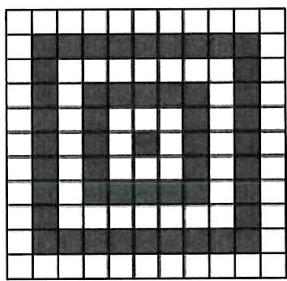

text_image

Grid pattern with a large black-and-white pixelated symbol resembling a stylized letter '回' (return)

图例

# 圆锥曲线大题

# 题型一：圆一般式在圆锥曲线大题中的应用

等级 (R)

001 在直角坐标系 $xQy$ 中, 曲线 $y = x^{2} + mx - 2$ 与 $x$ 轴交于 $A$ , $B$ 两点, 点 $C$ 的坐标为 (0,1) 当 $m$ 变化时, 解答下列问题:

(1) 能否出现 $AC \perp BC$ 的情况? 说明理由;  
(2) 证明过 $A, B, C$ 三点的圆在 $y$ 轴上截得的弦长为定值.

等级 (R)

2024 绵阳三诊

002. 已知椭圆 $C: \frac{x^2}{a^2} + \frac{y^2}{b^2} = 1 (a > 1 > b > 0)$ 的离心率为 $\frac{\sqrt{3}}{2}$ , 过点 $M(1,0)$ 的直线 $l$ 交椭圆 $C$ 于点 $A, B$ , 且当 $l \perp x$ 轴时, $|AB| = \sqrt{3}$ .

(1) 求椭圆 $C$ 的方程;  
(2) 记椭圆 $C$ 的左焦点为 $F$ , 若过 $F, A, B$ 三点的圆的圆心恰好在 $y$ 轴上, 求直线 $AB$ 的方程.

等级（SR）

2022 南京盐城二模

003. 双曲线 $C: \frac{x^2}{a^2} - \frac{y^2}{b^2} = 1 (a > 0, b > 0)$ 经过点 $(\sqrt{3}, 1)$ , 且渐近线方程为 $y = \pm x$

(1) 求 $a, b$ 的值;

(2) 点 $A, B, D$ 是双曲线 $\mathrm{C}$ 上不同的三点, 且 $\mathrm{B}, \mathrm{D}$ 两点关于 $\mathrm{y}$ 轴对称, $\triangle ABD$ 的外接圆经过原点 0 , 求证: 直线 AB 与圆 $x^{2} + y^{2} = 1$ 相切;

等级（SR）

2022 南昌一模

004. 已知面积为 $12 \sqrt{3}$ 的等边 $\triangle ABO$ ( $O$ 是坐标原点) 的三个顶点都在抛物线 $E: y^{2} = 2px (p > 0)$ 上, 过点 $P(-p, 2)$ 作抛物线 $\mathrm{E}$ 的两条切线分别交 $\mathrm{y}$ 轴于 $\mathrm{M}, \mathrm{N}$ 两点

(1) 求 $p$ 的值  
(2) 求 $\triangle PMN$ 的外接圆的方程

# 题型二：直线和双曲线两条渐近线联立

等级（SR）

2021 岳阳二模

005. 已知双曲线 $C$ 的焦点到其渐近线 $y = \pm 2x$ 的距离为 2

(1) 求双曲线 $C$ 的标准方程  
(2) 设双曲线 $C$ 的焦点在 $x$ 轴上, 过点 $P(0, 2)$ 的直线 $l$ 交 $C$ 双曲线的左右两支分别于 $A, B$ , 交渐近线分别于 $M, N$ , 证明: $AM = BN$

等级（SR）

2022 湖南新高考教研联盟二联

006. 已知双曲线 $C: \frac{x^2}{a^2} - \frac{y^2}{b^2} = 1 (a > 0, b > 0)$ 的左右焦点分别为 $F_1$ 、 $F_2$ ，双曲线 C 的右顶点 A 在圆 $O: x^2 + y^2 = 3$ 上，且 $\overrightarrow{AF_1} \cdot \overrightarrow{AF_2} = -1$

(1) 求双曲线 C 的标准方程;  
(2) 动直线 $l$ 与双曲线 $\mathrm{C}$ 恰有 1 个公共点, 且与双曲线 $\mathrm{C}$ 的两条渐近线分别交于点 $\mathrm{M}, \mathrm{N}$ , 设 0 为坐标原点, 求 $\triangle O M N$ 周长的最小值;

等级（SSR）

2022年新高考2卷

007. 已知双曲线 $C: \frac{x^2}{a^2} - \frac{y^2}{b^2} = 1 (a > 0, b > 0)$ 的右焦点为 $F(2,0)$ ，渐近线方程为 $y = \pm \sqrt{3} x$ .

(1) 求 $C$ 的方程;  
(2)过 $F$ 的直线与 $C$ 的两条渐近线分别交于 $A, B$ 两点, 点 $P(x_{1}, y_{1}), Q(x_{2}, y_{2})$ 在 $C$ 上, 且 $x_{1} > x_{2} > 0, y_{1} > 0$ . 过 $P$ 且斜率为 $-\sqrt{3}$ 的直线与过 $Q$ 且斜率为 $\sqrt{3}$ 的直线交于点 $M$ . 从下面①②③中选取两个作为条件, 证明另外一个成立:

①M在AB上；②PQ∥AB；③|MA|=|MB|.

注：若选择不同的组合分别解答，则按第一个解答计分.

# 题型三：圆锥曲线中的同构

等级（SR）

2024 青岛一模

008. 已知 O 为坐标原点，点 W 为 $\odot O: x^{2} + y^{2} = 4$ 和 $\odot M$ 的公共点， $\overline{OM} \cdot \overline{OW} = 0, \odot M$ 与直线 $x + 2 = 0$ 相切，记动点 M 的轨迹为 C，

(1)求 $C$ 的方程;

(2)若 $n > m > 0$ , 直线 $l_{1}: x - y - m = 0$ 与 $C$ 交于点 $A, B$ , 直线 $l_{2}: x - y - n = 0$ 与 $C$ 交于点 $A', B'$ , 点 $A, A'$ 在第一象限, 记直线 $AA'$ 与 $BB'$ 的交点为 $G$ , 直线 $AB'$ 与 $BA'$ 的交点为 $H$ , 线段 $AB$ 的中点为 $E$ .

(I)证明：G, E, H 三点共线；

(II)若 $(m+1)^{2}+n=7$ ，过点H作 $l_{1}$ 的平行线，分别交线段 $AA', BB'$ 于点 $T, T'$ ，求四边形 $GTET'$ 面积的最大值.

等级（SR）

2021 宜春四月统测

009. 直线 $l$ 与抛物线 $y^{2} = 2px (p > 0)$ 相交于 $A, B$ 两点，线段 $AB$ 中点为 $M$ ，点 $P$ 是 $y$ 轴左侧一点，若线段 $PA, PB$ 的中点都在抛物线上，则

A. ${PM}$ 必与 $y$ 轴垂直

B. ${PM}$ 的中点在抛物线上

C. ${PM}$ 必过原点

D.PA与PB垂直

等级（SR）

2023 江西五校九市四月联考

010. 过坐标原点 $O$ 作圆 $C: (x + 2)^{2} + y^{2} = 3$ 的两条切线, 设切点为 $P, Q$ , 直线 $PQ$ 恰为抛物线 $E: y^{2} = 2px (p > 0)$ 的准线.

(1) 求抛物线 E 的标准方程;  
(2) 设 $T$ 是圆 $C$ 的动点, 抛物线 $E$ 上四点 $A, B, M, N$ 满足: $\overrightarrow{TA} = 2\overrightarrow{TM}, \overrightarrow{TB} = 2\overrightarrow{TN}$ , 设 $AB$ 中点为 $D$ .  
(i) 证明: $TD$ 垂直于 $y$ 轴;  
(ii) 设 $\triangle TAB$ 面积为 S，求 S 的最大值.

等级（SR）

011. 已知点 $A\left(1, \frac{\sqrt{2}}{2}\right)$ 在椭圆 $E: \frac{x^2}{a^2} + \frac{y^2}{b^2} = 1 (a > b > 0)$ 上， $A$ 到 $E$ 的两焦点的距离之和为 $2\sqrt{2}$ .

(1) 求 E 的方程;  
(2)过抛物线 $C: y = x^{2} - m (m > 1)$ 上一动点 $P$ ，作 $E$ 的两条切线分别交 $C$ 于另外两点 $Q, R$ .  
(i) 当 $P$ 为 $C$ 的顶点时, 求直线 $QR$ 在 $y$ 轴上的截距 (结果用含有 $m$ 的式子表示);  
(ii) 是否存在 $m$ , 使得直线 $QR$ 总与 $E$ 相切. 若存在, 求 $m$ 的值; 若不存在, 说明理由.

等级（SR）

2024 绍兴二模

012. 已知抛物线 $C: y^{2} = 2px (p > 0)$ 的焦点到准线的距离为 2, 过点 $A(2, 2)$ 作直线交 $C$ 于 $M, N$ 两点, 点 $B(-1, 1)$ , 记直线 $BM, BN$ 的斜率分别为 $k_{1}, k_{2}$ .

(1)求 $C$ 的方程;  
(2)求 $3k_{1}k_{2} - 2(k_{1} + k_{2})$ 的值；  
(3)设直线 BM 交 C 于另一点 Q, 求点 B 到直线 QN 距离的最大值.

# 题型四：等边/等腰三角形的翻译方法

等级 (R)

2023 云南 $3 + 3 + 3$ 联考

013. 已知椭圆 $\Gamma: \frac{x^2}{a^2} + \frac{y^2}{b^2} = 1 (a > b > 0)$ 的左焦点为 $F(-2,0)$ , 直线 $l$ 过点 $F$ 交椭圆 $\Gamma$ 于 $A, B$ 两点, 当直线 $l$ 垂直于 $x$ 轴时, $\triangle OAB$ 的面积为 $\frac{2\sqrt{6}}{3}$ .

(1) 求椭圆 $\Gamma$ 的方程;  
(2) 直线 $l_{1}: x = -3$ 上是否存在点 $C$ , 使得 $\triangle ABC$ 为正三角形? 若存在, 求出点 $C$ 的坐标及直线 $l$ 的方程; 若不存在, 请说明理由.

等级（SR）

2022 辽宁六校三月联考

014. 在平面直角坐标系 $xOy$ 中, 已知抛物线 $C: y^{2} = 2px (p > 0)$ 的焦点与椭圆: $\frac{x^{2}}{2} + y^{2} = 1$ 的右焦点重合。

(1) 求抛物线 C 的方程以及其准线方程;  
(2) 记 $P(4,0)$ , 若抛物线 $\mathrm{C}$ 上存在两点 $\mathrm{B}, \mathrm{D}$ , 使 $\triangle PBD$ 为以 $\mathrm{P}$ 为顶点的等腰三角形, 求直线 $\mathrm{BD}$ 的斜率的取值范围。

等级（SR）

2022 绵阳三诊

015. 已知椭圆 $E: \frac{x^2}{a^2} + \frac{y^2}{b^2} = 1$ (其中 $a > b > 0$ ) 的离心率为 $\frac{\sqrt{2}}{2}$ , 直线 $y = x + m$ 与 $E$ 交于 $A(x_1, y_1)$ , $B(x_2, y_2)$ 两点, 且 $x_1 > x_2$ , 当 $m = 0$ 时, $|AB| = \frac{2a^2}{b^2}$ .

(1) 求椭圆 E 的方程;  
(2) 在直线 $x = \frac{14}{3}$ 上是否存在点 $P$ , 使得 $|AP| = |AB|$ , $AP \perp AB$ , 若存在, 求出 $m$ 的值; 若不存在, 请说明理由。

# 题型五：到角公式的应用

等级（SR）

2024 南京盐城二模

016. 已知椭圆 $C: \frac{x^2}{a^2} + \frac{y^2}{b^2} = 1 (a > b > 0)$ 的右焦点为 $F(1,0)$ ，右顶点为 $A$ ，直线 $l: x = 4$ 与 $x$ 轴交于点 $M$ ，且 $|AM| = a |AF|$ .

(1) 求 C 的方程;  
(2) $B$ 为 $l$ 上的动点, 过 $B$ 作 $C$ 的两条切线, 分别交 $y$ 轴于点 $P, Q$ .

①证明：直线 $BP, BF, BQ$ 的斜率成等差数列；  
② $\odot N$ 经过B,P,Q三点，是否存在点B，使得 $\angle PNQ=90^{\circ}$ ？若存在，求 $|BM|$ ，若不存在，请说明理由.

等级（SR）

2023 沈阳三模

017. 已知椭圆 $C: \frac{x^2}{a^2} + \frac{y^2}{b^2} = 1 (a > b > 0)$ 的离心率为 $\frac{\sqrt{2}}{2}$ , 其左焦点为 $F_1(-2,0)$

(1)求椭圆 $C$ 的方程;  
(2)如图, 过椭圆 $C$ 的上顶点 $P$ , 作以 $F_{1}$ 为圆心的动圆 $D$ 的切线, 两条切线分别交椭圆于 $M, N$ 两点, 请判断是否存在圆 $D$ 使得 $\triangle PMN$ 是以 $PN$ 为斜边的直角三角形? 若存在, 求出圆 $D$ 的半径; 若不存在, 请说明理由.

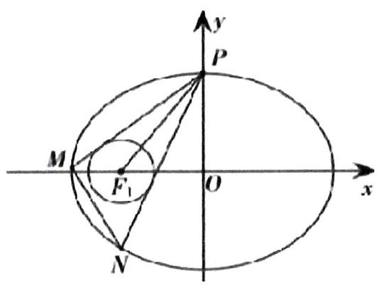

text_image

y
P
M
F₁
O
x
N

# 题型六：三次比四次式的处理方式

等级（SR）

2023 四川九市二诊

018. 已知椭圆 $E: \frac{x^2}{a^2} + \frac{y^2}{b^2} = 1 (a > b > 0)$ 经过点 $A(0,1), T\left(-\frac{8}{5}, -\frac{3}{5}\right)$ 两点, $M, N$ 是椭圆 $E$ 上异于 $T$ 的两动点, 且 $\angle MAT = \angle NAT$ , 若直线 $AM, AN$ 的斜率均存在, 并分别记为 $k_1, k_2$ .

(1) 求证: $k_{1} k_{2}$ 为常数;   
(2) 求 $\triangle AMN$ 面积的最大值.

等级（SR）

2023 吉林三调

019. 已知点 $F(0,1)$ , 动点 $M$ 在直线 $l: y = -1$ 上, 过点 $M$ 且垂直于 $x$ 轴的直线与线段 $MF$ 的垂直平分线交于点 $P$ , 记点 $P$ 的轨迹为曲线 $C$ .

(1) 求曲线 C 的方程;  
(2)已知圆 $x^{2} + (y + 2)^{2} = 4$ 的一条直径为 $AB$ , 延长 $AO, BO$ 分别交曲线 $C$ 于 $S, T$ 两点, 求四边形 $ABST$ 面积的最小值.

题型七: $\overrightarrow{OM} = \lambda \overrightarrow{OA} + \mu \overrightarrow{OB}$ 类问题

等级（SR）

2022 南开中学第七次质检

020. 已知椭圆 $C: \frac{x^2}{a^2} + \frac{y^2}{b^2} = 1 (a > b > 0)$ 的焦点 $F(1,0)$ , 且椭圆 $C$ 的离心率为 $\frac{\sqrt{5}}{5}$

(1) 求椭圆 C 的方程

(2)若A,B,为C上不同的两点,动点M,N满足: $\overrightarrow{OM} = \lambda \overrightarrow{OA} + (2 - \lambda)\overrightarrow{OB}$ $\overrightarrow{ON} = (2 - \lambda)\overrightarrow{OA} + \lambda \overrightarrow{OB}$ , 且M在C上

(i) 求证: 点 $\mathrm{N}$ 在 $\mathrm{C}$ 上

(ii) 若 AB 过焦点 F，求实数 $\lambda$ 的取值范围

等级（SR）

021. 在平面内，点 A 是定点，动点 B，C 满足 $\left|\overrightarrow{AB}\right|=\left|\overrightarrow{AC}\right|=1$ ， $\overrightarrow{AB} \cdot \overrightarrow{AC}=0$ ，则集合 $\{P \mid \overrightarrow{AP} = \lambda \overrightarrow{AB} + \overrightarrow{AC}, 1 \leq \lambda \leq 2\}$ 所表示的区域的面积是

# 题型八：一个椭圆大题常考的小结论

等级 (R)

022. 已知椭圆 $C: \frac{x^2}{4} + \frac{y^2}{3} = 1$ 的左焦点为 $F$ , 已知 $M(-4,0)$ , 过 $M$ 作斜率不为 0 的直线 $I$ , 与椭圆 $C$ 交于 $A, B$ 两点, 点 $B$ 关于 $x$ 轴的对称点为 $B'$ . 求证: 动直线 $AB'$ 恒过定点 $F$ (椭圆的左焦点);

等级（SR）

2022 三明三检

023. 如图, 在平面直角坐标系中, 0 为原点, $F(1,0)$ , 过直线 $l: x = 4$ 左侧且不在 $\mathrm{x}$ 轴上的动点 $\mathrm{P}$ , 作 $PH \perp l$ 于点 $\mathrm{H}$ , $\angle HPF$ 的角平分线交 $\mathrm{x}$ 轴于点 $\mathrm{M}$ , 且 $|PH| = 2|MF|$ , 记动点 $\mathrm{P}$ 的轨迹为曲线 $\mathrm{C}$ .

(1) 求曲线 C 的方程

(2)已知曲线 $C$ 与 $\mathrm{x}$ 轴正半轴交于点 $A_{1}$ , 过点 $S(-4,0)$ 的直线 $l_{1}$ 交 $C$ 于 $A, B$ 两点, $\overrightarrow{AS} = \lambda \overrightarrow{BS}$ , 点 $\mathrm{T}$ 满足 $\overrightarrow{AT} = \lambda \overrightarrow{TB}$ , 其中 $\lambda < 1$ , 证明: $\angle A_{1} TB = 2 \angle TSO$

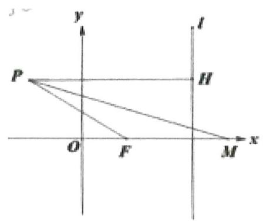

text_image

y
l
P
H
O
F
M
x

题型九：涉及解三角形的条件翻译（不需要具体做，只需翻译出条件即可）

等级 (R)

024. 已知 $F$ 是椭圆 $\frac{x^2}{6} + \frac{y^2}{2} = 1$ 的右焦点，过 $F$ 的直线 $I$ 与椭圆相交于 $A(x_1, y_1), B(x_2, y_2)$

(1) 若 $x_{1} + x_{2} = 3$ , 求 $AB$ 弦长  
(2) $O$ 为坐标原点, $\angle AOB = \theta$ , 满足 $3\overrightarrow{OA} \cdot \overrightarrow{OB}\tan \theta = 4\sqrt{6}$ , 求直线 $l$ 的方程

等级（SR）

145. 设椭圆 $\frac{x^{2}}{a^{2}} + \frac{y^{2}}{b^{2}} = 1 (a > b > 0)$ 的左焦点为 F，上顶点为 B，已知椭圆的离心率为 $\frac{\sqrt{5}}{3}$ ，点 A 的坐标为 $(b, 0)$ ，且 $|FB| \cdot |AB| = 6\sqrt{2}$ .

(1) 求椭圆的方程;   
(2) 设直线 $l: y = kx (k > 0)$ 与椭圆在第一象限的交点为 $P$ , 且 $l$ 与直线 $AB$ 交于点 $Q$ , 若 $\frac{|AQ|}{|PQ|} = \frac{5\sqrt{2}}{4}\sin \angle AOQ$ ( $O$ 为原点), 求 $k$ 的值.

等级（SR）

025. 设以 $\triangle ABC$ 的边 $AB$ 为长轴且过点 $C$ 的椭圆 $r$ 的方程为 $\frac{x^2}{a^2} + \frac{y^2}{b^2} = 1 (a > b > 0)$ , 椭圆的离心率为 $\frac{1}{2}$ , $\triangle ABC$ 面积的最大值为 $2\sqrt{3}$ , AC 和 BC 所在的直线分别与直线 $l: x = 4$ 相交于 $M, N$

(1) 求椭圆的方程  
(2) 设 $\triangle ABC$ 和 $\triangle CMN$ 的外接圆的面积分别是 $S_{1}, S_{2}$ , 求 $\frac{S_{2}}{S_{1}}$ 的最小值

# 题型十：无韦达圆锥曲线大题

等级（SR）

026. 已知椭圆 C: $\frac{x^{2}}{4} + \frac{y^{2}}{b} = 1 (0 < b < 4)$ 的左顶点为 A, 右顶点为 B, M 为椭圆 C 上异于 A、B 的任意一点, 平面内的点 P 满足 $\overrightarrow{AM} = \overrightarrow{MP}$

(I) 若点 P 的坐标为 $(4, 3)$ ，求 b 的值；  
（II）若存在点 P 满足 OP⊥BM（O 为坐标原点），求 b 的取值范围。

等级（SR）

2021 乌鲁木齐二模

027. 已知抛物线 $y^{2} = 2px$ ( $0 < p < 4$ ) 的焦点为 F，点 P 在抛物线上，点 P 的纵坐标为 6，且 $|PF| = 10$ .

(1) 求抛物线的标准方程  
(2) 若 A, B 为抛物线上的两个动点 (异于 P 点) 且 AP⊥AB, 求点 B 纵坐标的取值范围

等级（SR）

2021 北京丰台一模

028. 已知椭圆 $C: \frac{x^2}{a^2} + \frac{y^2}{b^2} = 1 (a > b > 0)$ 长轴的两个端点分别为 $A(-2,0), B(2,0)$ , 离心率为 $\frac{\sqrt{3}}{2}$ .

(1) 求椭圆 $C$ 的方程;  
(2) $P$ 为椭圆 $C$ 上异于 $A, B$ 的动点, 直线 $A P, P B$ 分别交直线 $x = -6$ 于 $M, N$ 两点, 连接 $\mathrm{NA}$ 并延长交椭圆 $C$ 于点 $Q$   
(i) 求证: 直线 $A P, A N$ 的斜率之和为定值;  
(ii) 判断 $M, B, Q$ 三点是否共线，并说明理由.

等级（SR）

2021 燕博园综合测试

029. 已知椭圆 $C: \frac{x^{2}}{a^{2}} + \frac{y^{2}}{b^{2}} = 1 (a > b > 0)$ 的右顶点为 B, 直线 m: $x - y - 1 = 0$ 过椭圆 $C$ 的右焦点 $F$ , 点 $B$ 到直线 $m$ 的距离为 $\frac{\sqrt{2}}{2}$ .

(I)求椭圆C的方程;

(Ⅱ)椭圆C的左顶点为A，M是椭圆位于x轴上方部分的一个动点，以点F为圆心，过点M的圆与x轴的右交点为T，过点B作x轴的垂线l交直线AM于点N，过点F作直线FE⊥MT，交直线l于点E，求 $\frac{|BE|}{|EN|}$ 的值.

# 题型十一：几何关系简化计算

等级 (R)

030. 已知椭圆 $E: \frac{x^{2}}{a^{2}} + \frac{y^{2}}{b^{2}} = 1 (a > b > 0)$ 的离心率为 $\frac{\sqrt{3}}{2}$ , 且过点 $(\frac{\sqrt{7}}{2}, \frac{3}{4})$ , 点 $P$ 在第一象限, $A$ 为左顶点, $B$ 为下顶点, $PA$ 交 $y$ 轴于点 $C$ , $PB$ 交 $x$ 轴于点 $D$ .

(1) 求椭圆 $E$ 的标准方程;  
(2) 若 $CD \parallel AB$ , 求点 $P$ 的坐标.

等级 (R)

031. 已知椭圆 $C: \frac{x^2}{25} + \frac{y^2}{m^2} = 1 (0 < m < 5)$ 的离心率为 $\frac{\sqrt{15}}{4}$ , $A$ , $B$ 分别为 $C$ 的左、右顶点.

(1) 求 C 的方程;  
(2) 若点 $P$ 在 $C$ 上, 点 $Q$ 在直线 $x = 6$ 上, 且 $|BP| = |BQ|$ , $BP \perp BQ$ , 求 $\triangle APQ$ 的面积.

等级（SR）

2021 唐山二模

032. 已知 A, B 分别为椭圆 E: $\frac{x^{2}}{a^{2}} + y^{2} = 1 (a > 1)$ 的左顶点和下顶点，P 为直线 x = 3 上的动点， $\overrightarrow{AP} \cdot \overrightarrow{BP}$ 的最小值为 $\frac{59}{4}$ .

(1) 求 E 的方程;  
(2) 设 PA 与 E 的另一交点为 D, PB 与 E 的另一交点为 C, 问: 是否存在点 P, 使得四边形 ABCD 为梯形, 若存在, 求 P 点坐标; 若不存在, 请说明理由.

等级（SR）

2021 杭州二模

033. 如图, 已知抛物线 $C_{1}: x^{2} = y$ 在点 A 处的切线 $l$ 与椭圆 $C_{2}: \frac{x^{2}}{2} + y^{2} = 1$ 相交, 过 A 作 $l$ 的垂线交抛物线 $C_{1}$ 于另一点 B, 直线 OB (0 为直角坐标系原点) 与 $l$ 相交于点 D, 记 $A(x_{1}, y_{1}), B(x_{2}, y_{2})$ , 且 $x_{1} > 0$ .

(1) 求 $x_{1} - x_{2}$ 的最小值:  
(II) 求 $\frac{|DO|}{|DB|}$ 的取值范围

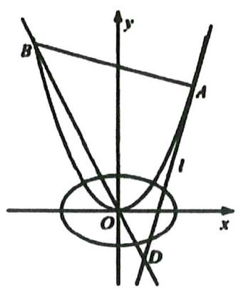

text_image

B
y
A
l
O
x
D

# 题型十二：调和点列问题

等级（SR）

2024 新疆第二次适应性检测

034. 已知椭圆 $C: \frac{x^2}{a^2} + \frac{y^2}{b^2} = 1 (a > b > 0)$ 的左焦点为 $F$ , $C$ 上任意一点到 $F$ 的距离的最大值和最小值之积为 1, 离心率为 $\frac{\sqrt{6}}{3}$ .

(1)求 $C$ 的方程;  
(2)设过点 $R(1, \frac{1}{3})$ 的直线 $l$ 与 $C$ 交于 $M, N$ 两点，若动点 $P$ 满足 $\overrightarrow{PM} = \lambda \overrightarrow{MR}, \overrightarrow{PN} = -\lambda \overrightarrow{NR}$ ，动点 $Q$ 在椭圆 $C$ 上，求 $|PQ|$ 的最小值.

等级（SR）

2023 梅州二模

035. 已知双曲线 $E: \frac{x^2}{a^2} - \frac{y^2}{b^2} = 1 (a > 0, b > 0)$ 的左，右焦点分别为 $F_1, F_2$ ， $\left|F_1F_2\right| = 2\sqrt{3}$ ，且双曲线 $E$ 经过点 $A(\sqrt{3}, 2)$ .

(1) 求双曲线 E 的方程;  
(2) 过点 $P(2,1)$ 作动直线 $l$ , 与双曲线的左、右支分别交于点 $M, N$ , 在线段 $MN$ 上  
取异于点 $M, N$ 的点 $H$ ，满足 $\frac{|PM|}{|PN|} = \frac{|MH|}{|HN|}$ ，求证：点 $H$ 恒在一条定直线上.

等级（SR）

2023 重庆二诊

036. 已知椭圆 $C: \frac{x^2}{a^2} + \frac{y^2}{b^2} = 1 (a > 0, b > 0)$ 的离心率为 $\frac{1}{2}$ , 左, 右焦点分别为 $F_1, F_2$ , 过 $F_1$ 的直线 $y = t(x + 1)$ 交椭圆于 $M, N$ 两点, 交 $y$ 轴于 $P$ 点, $\overrightarrow{PM} = \lambda \overrightarrow{MF_1}, \overrightarrow{PN} = \mu \overrightarrow{NF_1}$ , 记 $\triangle OMN, \triangle OMF_2$ , $\triangle ONF_2$ 的面积分别为 $S_1, S_2, S_3$ .

(1) 求椭圆 C 的标准方程;  
(2) 若 $S_{1} = m S_{2} - \lambda S_{3}, -3 \leq \mu \leq -\frac{4}{3}$ , 求 $m$ 的取值范围.

# 题型十三：非经典角分线的翻译方法

等级（SR）

2021 滁州马鞍山二模

037. 已知双曲线 $x^{2} - \frac{y^{2}}{b^{2}} = 1 (b \neq 1)$ 的左焦点为 F，右顶点为 A，过点 F 向双曲线的一条渐近线作垂线，垂足为 P，直线 AP 与双曲线的左支交于点 B

(I) 设 0 为坐标原点，求线段 OP 的长度；  
(Ⅱ) 求证: PF 平分 $\angle$ BFA

等级（SR）

2022 广州一模

038. 在平面直角坐标系 $xOy$ 中, 已知点 $A(-2, 0), B(2, 0)$ , 点 $\mathbf{M}$ 满足直线 $\mathrm{AM}$ 与直线 $\mathrm{BM}$ 的斜率之积为 $-\frac{3}{4}$ , 点 $\mathbf{M}$ 的轨迹为曲线 $\mathbf{C}$

(1) 求 C 的方程;  
(2) 已知点 $F(1,0)$ , 直线 $l: x = 4$ 与 $\mathrm{x}$ 轴交于点 $\mathrm{D}$ , 直线 AM 与 $l$ 交于点 $\mathrm{N}$ , 是否存在常数 $\lambda$ , 使得 $\angle MFD = \lambda \angle NFD$ ? 若存在, 求 $\lambda$ 的值; 若不存在, 说明理由。

# 题型十四：一些巧妙的处理

等级（SR）

2022 宁波四月模拟

039. 已知点 A 是椭圆 C: $\frac{x^{2}}{a^{2}} + \frac{y^{2}}{b^{2}} = 1 (a > b > 0)$ 的左顶点，过点 A 且斜率为 $\frac{1}{2}$ 的直线 1 与椭圆 C 交于另一点 P（点 P 在第一象限），以原点 O 为圆心，|OP| 为半径的圆在点 P 处的切线与 x 轴交于点 Q. 若 $|PA| \geqslant |PQ|$ ，求椭圆 C 离心率的取值范围.

等级（SR）

2023 广西五市联考

040. 已知动圆 $M$ 经过点 $N(2,0)$ , 且动圆 $M$ 被 $y$ 轴截得的弦长为 4 , 记圆心 $M$ 的轨迹为曲线 $C$ .

(1) 求曲线 C 的标准方程;

(2) 设点 $M$ 的横坐标为 $x_{0}, A, B$ 为圆 $M$ 与曲线 $C$ 的公共点, 若直线 $AB$ 的斜率 $k = 1$ , 且 $x_{0} \in [0,4]$ , 求 $x_{0}$ 的值.

等级（SR）

2024 台州二模

041. 已知椭圆 $C: 9x^{2} + 8y^{2} = 81$ , 直线 $l: x = -1$ 交椭圆于 $M, N$ 两点, $T$ 为椭圆的右顶点, $\triangle TMN$ 的内切圆为圆 $Q$ .

(1)求椭圆 C 的焦点坐标;  
(2)求圆 $Q$ 的方程;  
(3)设点 $P(1,3)$ , 过 $P$ 作圆 $Q$ 的两条切线分别交椭圆 $C$ 于点 $A, B$ , 求 $\triangle PAB$ 的周长.

等级（SR）

2022 重庆二诊

042. 椭圆 $C: \frac{x^{2}}{a^{2}} + \frac{y^{2}}{b^{2}} = 1 (a > b > 0)$ 的左顶点为 A, 上顶点为 B, 点 P 在椭圆 C 的内部 (不包含边界) 运动, 且与 A, B 两点不共线, 直线 PA, PB 与椭圆 C 分别交于 D, E 两点, 当 P 为坐标原点时, 直线 DE 的斜率为 $\frac{1}{2}$ , 四边形 ABDE 的面积为 4.

(1) 求椭圆 C 的方程;  
(2) 若直线 DE 的斜率恒为 $\frac{1}{2}$ , 求动点 P 的轨迹方程;

等级（SR）

2022 柳州三模

043. 已知点 $A(2, \sqrt{3})$ ，点 $B(-2, -\sqrt{3})$ ，点 M 与 y 轴的距离记为 d，且点 M 满足： $\overrightarrow{MA} \cdot \overrightarrow{MB} = \frac{d^{2}}{4} - 1$ 记点 M 的轨迹为曲线 W

(1) 求曲线 W 的方程;

(2) 设点 $\mathrm{P}$ 为 $\mathrm{x}$ 轴上除原点 $\mathrm{O}$ 外的一点, 过点 $\mathrm{P}$ 作直线 $l_{1}, l_{2}, l_{1}$ 交曲线 $\mathrm{W}$ 于点 $\mathrm{C}, \mathrm{D}, l_{2}$ 交曲线 $\mathrm{W}$ 于点 $\mathrm{E} 、 \mathrm{F}, \mathrm{G} 、 \mathrm{H}$ 分别为 $\mathrm{CD}, \mathrm{EF}$ 的中点, 过点 $\mathrm{P}$ 作 $\mathrm{x}$ 轴的垂线交 $\mathrm{GH}$ 于点 $\mathrm{N}$ , 设 $\mathrm{CD}, \mathrm{EF}, \mathrm{ON}$ 的斜率分别为 $k_{1}, k_{2}, k_{3}$ , 求证: $k_{3}(k_{1} + k_{2})$ 为定值;

等级（SR）

2022 南昌二模

044. 已知椭圆 $E: \frac{x^{2}}{a^{2}} + \frac{y^{2}}{b^{2}} = 1 (a > b > 0)$ 的左、右顶点分别为 $A(-2,0), B(2,0)$ , 点 H 是直线 $l: x = 1$ 上的动点, 以点 H 为圆心且过原点的圆与直线 1 交于 M, N 两点, 当点 H 在椭圆 E 上时, 圆 H 的半径为 $\frac{\sqrt{13}}{2}$

(1) 求椭圆 $\mathrm{E}$ 的方程  
(2) 若直线 AM, AN 与椭圆 E 的另一个交点分别为 P, Q, 记直线 PQ, OH 的斜率为别为 $k_{1}, k_{2}$ , 判断 $k_{1} k_{2}$ 是否为定值? 若是, 请求出这个定值, 若不是, 请说明理由。

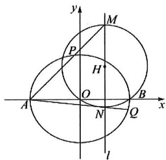

text_image

y
M
P
H
O
A
N
Q
B
x
l

等级（SR）

2022 唐山一模

045. 已知椭圆 $C: \frac{x^2}{a^2} + \frac{y^2}{b^2} = 1 (a > b > 0)$ 经过点 $(1, \frac{3}{2})$ ，离心率为 $\frac{1}{2}$

(1) 求椭圆 C 的方程

(2) 如图, 椭圆 $C$ 的左、右顶点为 $A_{1}, A_{2}$ , 不与坐标轴垂直且不过原点的直线 1 与 $C$ 交于 $M, N$ 两点 (异于 $A_{1}, A_{2}$ ), 点 $M$ 关于原点 0 的对称点为点 $P$ , 直线 $A_{1} P$ 与直线 $A_{2} N$ 交于点 $Q$ , 直线 $O Q$ 与直线

1 交于点 R

证明：点 R 在定直线上

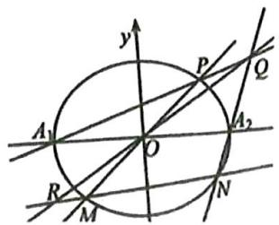

text_image

y
P
Q
A₁
O
A₂
R
M
N

等级（SR）

2024 临汾二模

046. 已知椭圆 $C: \frac{x^{2}}{a^{2}} + \frac{y^{2}}{b^{2}} = 1 (a > b > 0)$ 的离心率为 $\frac{\sqrt{3}}{2}$ , 点 $A(-2,0)$ 在 $C$ 上.

(1) 求 C 的方程;

(2 过点 $B(-2,1)$ 的直线交 $C$ 于 $P, Q$ 两点, 过点 $P$ 作垂直于 $x$ 轴的直线与直线 $AQ$ 相交于点 $M$ , 证明: 线段 $PM$ 的中点在定直线上.

等级（SR）

047. 已知椭圆 $M: \frac{x^{2}}{a^{2}} + \frac{y^{2}}{b^{2}} = 1 (a > b > 0)$ 经过 $A(0, -2)$ , 离心率为 $\frac{\sqrt{3}}{3}$ .

(1) 求椭圆 $M$ 的方程;

(2)经过点 $E(0,1)$ 且斜率存在的直线 $l$ 交椭圆于 $Q, N$ 两点, 点 $B$ 与点 $Q$ 关于坐标原点对称, 连接 $AB, AN$ , 求证: 存在实数 $\lambda$ , 使得 $k_{AN} = \lambda k_{AB}$ 成立.

等级（SR）

048. 已知椭圆 $\Gamma: \frac{x^{2}}{a^{2}} + \frac{y^{2}}{b^{2}} = 1 (a > b > 0)$ 的离心率为 $\frac{\sqrt{2}}{2}$ 左右焦点分别为 $F_{1}, F_{2}$ , 且 $A, B$ 分别是其左右顶点, P 是椭圆上任意一点, $\triangle PF_{1}F_{2}$ 面积的最大值为 4

(1) 求椭圆 $\Gamma$ 的方程;  
(2) 如图, 四边形ABCD为矩形, 设 $\mathbb{M}$ 为椭圆 $\Gamma$ 上任意一点, 直线MC, MD分别交 $\mathrm{x}$ 轴于E、F, 且满足 $AE^{2} + BF^{2} = AB^{2}$ , 求证: $AB = 2AD$

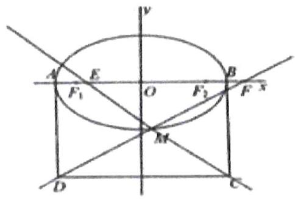

text_image

A
E
F₁
O
F₂
B
F s
M
D
C
y

# 题型十五：万能韦达

等级（SR）

2022 福州一检

049. 平面直角坐标系 $xOy$ 中, 双曲线 $C: \frac{x^2}{3} - \frac{y^2}{6} = 1$ 的右焦点为 $\mathrm{F}$ , $\mathrm{T}$ 为直线 $l: x = 1$ 上一点, 过 $\mathrm{F}$ 作 $\mathrm{TF}$ 的垂线分别交 $\mathrm{C}$ 的左、右支于 $\mathrm{P}, \mathrm{Q}$ 两点, 交 $l$ 于点 $\mathrm{A}$

(1) 证明: 直线 OT 平分线段 PQ;  
(2) 若 $\left|PA\right|=3\left|QF\right|$ ，求 $\left|TF\right|^{2}$ 的值

# 题型十六：面积比的非降维处理办法

等级（SR）

050. 已知一动点 $P$ 为圆心的 $\odot P$ 与直线 $l: x = -\frac{1}{2}$ 相切，与定圆 $\odot F: (x - 1)^2 + y^2 = \frac{1}{4}$ 相外切.

(1)求动圆圆心 $P$ 的轨迹方程 $C$ ;  
(2)过曲线C上位于x轴两侧的点M，N(MN不与x轴垂直)分别作直线l的垂线，垂足记为 $M_{1}, N_{1}$ ，直线l交x轴于点A，记 $\Delta AMM_{1}, \Delta AMN, \Delta ANN_{1}$ 的面积分别为 $S_{1}, S_{2}, S_{3}$ ，且 $S_{2}^{2} = 4S_{1}S_{3}$ ，证明：直线MN过定点.

等级（SR）

2022 广西第三次教学质量检测

051. 已知椭圆 $C: \frac{x^{2}}{4} + \frac{y^{2}}{3} = 1 (a > b > 0)$ 的右焦点为 F，过点 F 且不垂直于 x 轴的直线交 C 于 A, B 两点，分别过 A, B 作平行于 x 轴的两条直线 $l_{1}, l_{2}$ ，设 $l_{1}, l_{2}$ 分别与直线 x = 4，交于点 M, N，点 R 是 MN 的中点

(1) 求证: $AR // FN$   
(2) 若 AR 与 x 轴交于点 D（异于点 R）求 $\frac{S_{\triangle ADM}}{S_{\triangle FDN}}$ 的取值范围。

# 题型十七：参数方程的思想求轨迹

等级（SR）

2021 长春二模

052. 已知椭圆 $C: \frac{x^{2}}{a^{2}} + \frac{y^{2}}{b^{2}} = 1 (a > b > 0)$ 的离心率为 $\frac{1}{2}, P\left(1, \frac{3}{2}\right)$ 为椭圆上一点， $A$ 、 $B$ 为椭圆上不同的两点， $O$ 为坐标原点。

(I)求椭圆C的方程;

(Ⅱ)线段AB的中点为M，当 $\Delta AOB$ 面积取最大值时，是否存在两定点G,H使 $|GM|+|HM|$ 为定值?若存在，求出这个定值；若不存在，请说明理由.

等级（SR）

2024 金丽衢十二校联考

053. 已知椭圆 $L: \frac{x^{2}}{a^{2}} + \frac{y^{2}}{b^{2}} = 1 (a > b > 0)$ 的左顶点 $A(-3, 0)$ 和下顶点 $B$ , 焦距为 $4 \sqrt{2}$ , 直线 $l$ 交椭圆 $L$ 于 $C, D$ (不同于椭圆的顶点) 两点, 直线 $AD$ 交 $y$ 轴于 $M$ , 直线 $BC$ 交 $x$ 轴于 $N$ . 且直线 $MN$ 交 $l$ 于点 $P$ .

(1) 求椭圆 $L$ 的标准方程:  
(2) 若直线 $AD, BC$ 的斜率相等, 证明: 点 $P$ 在一条定直线上运动.

# 题型十八：求角的最值

等级（SR）

2021 青岛一模

054. 在平面直角坐标系中, 已知椭圆 $C: \frac{x^{2}}{a^{2}} + \frac{y^{2}}{b^{2}} = 1 (a > b > 0)$ 的离心率为 $\frac{\sqrt{3}}{2}$ , 右焦点为 $F_{2}$ , 上顶点为 $A_{2}$ , 点 $P(a, b)$ 到直线 $F_{2} A_{2}$ 的距离等于 1.

(I) 求椭圆C的标准方程;

(Ⅱ) 若直线 $l: y = kx + m (m > 0)$ 与椭圆 $C$ 相交于 $A, B$ 两点, $D$ 为 $AB$ 中点, 直线 $DE$ , $DF$ 分别与圆 $W: x^{2} + (y - 3m)^{2} = m^{2}$ 相切于点 $E, F$ , 求 $\angle EWF$ 的最小值.

# 题型十九：无直线圆锥曲线大题

等级（SR）

055. 已知抛物线 $y^{2} = 4x$ 的焦点为 $F$ , $\triangle ABC$ 的三个顶点都在抛物线上, 且 $\overrightarrow{FB} + \overrightarrow{FC} = \overrightarrow{FA}$ .

(1) 证明: B, C 两点的纵坐标之积为定值:   
(2) 设 $\lambda = \overrightarrow{AB} \cdot \overrightarrow{AC}$ ，求 $\lambda$ 的取值范围。

等级（SR）

056. 已知抛物线 $x^{2} = 2py (p > 0)$ 上一点 $R(m, 2)$ 到它的准线的距离为 3，若点 $A, B, C$ 分别在抛物线上，且点 $A$ ， $C$ 在 $y$ 轴右侧，点 $B$ 在 $y$ 轴的左侧， $\Delta ABC$ 的重心 $G$ 在 $y$ 轴上，直线 $AB$ 交 $y$ 轴于点 $M$ 且满足 $3|AM| < 2|BM|$ ，直线 $BC$ 交 $y$ 轴于点 $N$ ，记 $\Delta ABC$ ， $\Delta AMG$ ， $\Delta CNG$ 的面积分别为 $S_{1}, S_{2}, S_{3}$ .

(1) 求 $p$ 的值及抛物线的准线方程;  
(2) 求 $\frac{S_{1}}{S_{2} + S_{3}}$ 的取值范围.

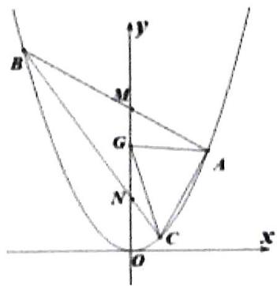

text_image

B
y
M
G
A
N
C
O
x

# 题型二十：多曲线结合考察难题

等级（SR）

057. 如图, 已知椭圆 $C_{1}: \frac{x ^{2}}{2} + y ^{2} = 1$ , 抛物线 $C_{2}: y ^{2} = 2 p x (p > 0)$ , 点 $A$ 是椭圆 $C_{1}$ 与抛物线 $C_{2}$ 的交点, 过点 $A$ 的直线 $I$ 交椭圆 $C_{1}$ 于点 $B$ , 交抛物线 $C_{2}$ 于点 $M (B, M$ 不同于 $A)$ .

（I）若 $p = \frac{1}{16}$ ，求抛物线 $C_2$ 的焦点坐标；  
（Ⅱ）若存在不过原点的直线 $l$ 使 $M$ 为线段 $AB$ 的中点，求 $p$ 的最大值.

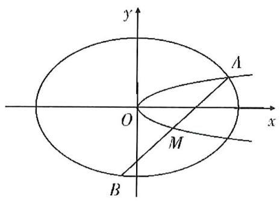

text_image

y
A
O
x
M
B

等级（SR）

2024 湖北八市联考

058. 已知双曲线 $C_{1}: x^{2} - \frac{y^{2}}{b^{2}} = 1$ 经过椭圆 $C_{2}: \frac{x^{2}}{a^{2}} + y^{2} = 1$ 的左、右焦点 $F_{1}, F_{2}$ , 设 $C_{1}, C_{2}$ 的离心率分别为 $e_{1}, e_{2}$ , 且 $e_{1} \cdot e_{2} = \frac{\sqrt{6}}{2}$

(1)求 $C_{1}, C_{2}$ 的方程  
(2)设 $P$ 为 $C_{1}$ 上一点, 且在第一象限内, 若直线 $PF_{1}$ 与 $C_{2}$ 交于 $A, B$ 两点, 直线 $PF_{2}$ 与 $C_{2}$ 交于 $C, D$ 两点, 设 $AB, CD$ 的中点分别为 $M, N$ , 记直线 $MN$ 的斜率为 $k$ , 当 $k$ 取最小值时, 求点 $P$ 的坐标.

# 计数原理

# 题型一：排列数组合数运算的深入考察

等级 (R)

001.（多选）下列等式正确的是（ ）

A. $C_{n}^{m} = C_{n}^{n - m}$

$$
C _ {n} ^ {m} = \frac {A _ {n} ^ {m}}{n !}
$$

C. $(n + 2)(n + 1)A_{n}^{m} = A_{n + 2}^{m + 2}$

D. $C_{n}^{r} = C_{n - 1}^{r - 1} + C_{n - 1}^{r}$

等级(SR)

2024济南一模

002.（多选）下列等式中正确的是（）

A. $\sum_{k=1}^{8} C_8^k = 2^8$

B. $\sum_{k = 2}^{8}C_k^2 = C_9^3$

C. $\sum_{k=2}^{8} \frac{k-1}{k!}=1-\frac{1}{8!}$

D. $\sum_{k = 0}^{8}(C_8^k)^2 = C_{16}^{8}$

# 题型二：含组合数函数的增减性判断

等级(R)

2024 巴蜀中学第九次月考

003. 使用二项式定理, 可以解决很多数学问题, 已知 $1.8^{20}$ 可以写成: $(1 + 0.8)^{20}$ , 将它展开式的第 $k + 1$ 项令为 $f(k) = C_{20}^{k} \times 0.8^{k}$ , $k \in \mathbb{N}$ , $0 \leq k \leq 20$ , 则 $f(k)$ 取最大值时, $k = \_$ .

# 题型三：略有难度的二项式定理题目

# 模型一：整除问题

等级 (R)

2021 苏北四市 4 月测试

004. 今天是星期三，经过7天后还是星期三，那么经过8 $^{2021}$ 天后是（）

A. 星期二

B. 星期三

C. 星期四

D. 星期五

等级 (R)

2022 湖北十一校三月联考

005. $8^{11}$ 除以 9 的余数是

# 模型二：某项系数类

等级 (R)

006. $\left(x^{2} - \frac{1}{x}\right)^{n}$ 展开式中，常数项为 15，则 $n =$ （）

A. 3

B. 4

C. 5

D. 6

等级（SR）

007. 若 $\left(2\sqrt{x} - \frac{1}{x}\right)^n$ 展开式中含 x 项的系数为 -80，则 n 等于（）

(A) 5

(B) 6

(C) 7

(D) 8

等级（SR）

2022 皖南八校第三次联考

008. 若 $(x + \frac{1}{2x} - \sqrt{2})^{n}$ 展开式的常数项为 $\frac{35}{2}$ ，则正整数 n 的值为 \_\_\_\_

等级(R)

2024 益阳 4 月调研

009. 已知 $(1+62x)^{99}+(62-x)^{99}=a_{0}+a_{1}x+a_{2}x^{2}+\cdots+a_{99}x^{99}$ ，且 $a_{0}, a_{1}, a_{2}, \cdots, a_{99} \in R$ ，则满足 $a_{k}<0$ （ $k\in N$ 且 $0\leq k\leq99$ ）的 k 的最大值为 \_\_\_\_.

等级(SR)

2024 皖江名校联盟 4 月联考

010. 已知 $\left(x - \frac{2}{x}\right)^n$ 的展开式二项式系数和为 256, 则展开式中系数最大的项为 ( )

A. 第 5 项

B. 第6项

C. 第7项

D. 第8项

# 模型三：展开类

等级 (R)

2023 广东二模

011. 已知 $(1 - x)^{2023} = a_0 + a_1x + a_2x^2 + \dots + a_{2023}x^{2023}$ ，则 $\frac{1}{a_1} + \frac{1}{a_2} + \dots + \frac{1}{a_{2023}} = (\quad)$

A. -1

B. 0

C. 1

D. $\frac{2023}{1012}$

等级 (R)

2023 苏锡常镇二模

012. 已知 $\left(2 - \frac{1}{x}\right)^{23} = a_0 + \frac{a_1}{x} + \frac{a_2}{x^2} + \cdots + \frac{a_{22}}{x^{22}} + \frac{a_{23}}{x^{23}}$ ，则 $\frac{a_0}{2^{22}} + \frac{a_1}{2^{21}} + \cdots + \frac{a_{21}}{2} + a_{22} = (\quad)$

A.-1

B. 0

C. 1

D. 2

等级 (R)

2024 江门一模

013. 已知 $(1+x)^{4}+(1+x)^{5}+\cdots+(1+x)^{11}=a_{0}+a_{1}(2+x)+a_{2}(2+x)^{2}+\cdots+a_{11}(2+x)^{11}$

则 $a_{0} + a_{2} + a_{4} + \cdots + a_{10}$ 的值是（）

A. 680

B. -680

C. 1360

D. -1360

等级 (R)

2024 安康三模

014. 已知 $(1 - 2x)^{7} = a_{0} + a_{1}x + a_{2}x^{2} + a_{3}x^{3} + a_{4}x^{4} + a_{5}x^{5} + a_{6}x^{6} + a_{7}x^{7}$ ，则

$$
a _ {0} + 2 a _ {1} + 3 a _ {2} + 4 a _ {3} + 5 a _ {4} + 6 a _ {5} + 7 a _ {6} + 8 a _ {7} = \quad (\quad)
$$

A. -15

B.-6

C. 6

D. 15

等级（SR）

015. 设 $\left(2x + \frac{1}{x}\right)(4x - 1)^9 = \frac{b}{x} + a_0 + a_1x + a_2x^2 + \ldots + a_{10}x^{10}$ ，则 $a_0 + \frac{a_1}{2} + \frac{a_2}{2^2} + \ldots + \frac{a_{10}}{2^{10}} =$ \_\_\_\_.

# 模型四：组合数的计算

等级(R)

2024 大连三校 3 月联考

016. $\frac{C_6^0}{3^0} -\frac{C_6^1}{3^1} +\frac{C_6^2}{3^2} -\frac{C_6^3}{3^3} +\frac{C_6^4}{3^4} -\frac{C_6^5}{3^5} +\frac{C_6^6}{3^6} =$ （）

A. $- \frac{64}{729}$

B. $\frac{64}{729}$

C. $-\frac{1}{729}$

D. $\frac{1}{729}$ 等级 (R)

2021 毕节三诊

017. $C_{10}^{1} - C_{10}^{2} + C_{10}^{3} - C_{10}^{4} + \dots +C_{10}^{9} - C_{10}^{10} =$

等级 (R)

2021 自贡三诊

018. 已知 $(x+1)^{n}$ 的展开式二项式系数和为 128，则 $C_{n}^{o}-C_{n}^{1}2+C_{n}^{2}4+\ldots+C_{n}^{n}(-2)^{n}=$

# 模型五：其他

等级（SR）

2022 苏州大学考前指导卷（多选）

019. 若二项式 $\left(x - \frac{1}{2}\right)^n$ 展开式中所有项的系数之和为 $a_{n}$ , 所有项的系数绝对值之和为 $b_{n}$ , 二项式系数之和为 $c_{n}$ , 则 ( )

A. $a_{n} < b_{n} < c_{n}$

B. $\frac{b_n}{a_n} + \frac{a_n}{b_n} \geq \frac{10}{3}$

C. 对任意 $\mathbf{n} \in \mathbb{N}^{*}$ 均有 $a_{n} + b_{n} \leq c_{n}$

D. 存在 $n \in \mathbb{N}^*$ 使得 $a_{n} + b_{n} > c_{n}$

# 题型四：排列组合综合题

等级(R)

2024 甘肃二诊

020. 如果集合 U 存在一组两两不交（两个集合交集为空集时，称为不交）的非空子集 $A_{1}, A_{2}, \cdots, A_{k} (k \in \mathbb{N}^{*})$ ，且满足 $A_{1} \cup A_{2} \cup \cdots \cup A_{k} = U$ ，那么称子集组 $A_{1}, A_{2}, \cdots, A_{k}$ 构成集合 U 的一个 k 划分。若集合 I 中含有 4 个元素，则集合 I 的所有划分的个数为（）

A. 7 个

B. 9 个

C. 10 个

D. 14 个

等级(SR)

021. 数列 $\left\{a_{n}\right\}$ 共有 11 项， $a_{1}=0,\quad a_{11}=4$ ，且 $\left|a_{k+1}-a_{k}\right|=1,k=1,2,\cdots,10$ ，满足这种条件的不同数列的个数为（）

A. 100

B. 120

C. 140

D. 160

等级（SR）

022. 已知数列 $\{a_{n}\}$ 共 16 项，且 $a_{1} = 1$ ， $a_{8} = 4$ 。记关于 $x$ 的函数 $f_{n}(x) = \frac{1}{3} x^{3} - a_{n} x^{2} + (a_{n}^{2} - 1)x, n \in N^{*}$ 。若 $x = a_{n+1} (1 \leq n \leq 15)$ 是函数 $f_{n}(x)$ 的极值点，且曲线 $y = f_{8}(x)$ 在点 $(a_{16}, f_{8}(a_{16}))$ 处的切线的斜率为 15，则满足条件的数列 $\{a_{n}\}$ 的个数为 \_\_\_\_.

等级（SSR）

2024 临沂一模

023. 将 1 到 30 这 30 个正整数分成甲、乙两组, 每组各 15 个数, 使得甲组的中位数比乙组的中位数小 2. 则不同的分组方法数是 ( )

A. $2(C_{13}^{7})^{2}$

B. $2C_{13}^{7}C_{14}^{7}$

C. $2C_{14}^{6}C_{14}^{7}$

D. $2(C_{14}^{7})^{2}$

# 概率统计选填

# 题型一：数据特征的深入考察

等级 (R)

2023 济南二模

001. 某射击运动员连续射击 5 次, 命中的环数 (环数为整数) 形成的一组数据中, 中位数为 8 , 唯一的众数为 9 , 极差为 3 , 则该组数据的平均数为

A. 7.6

B. 7.8

C. 8

D. 8.2

等级 (R)

002. 某人 5 次上班途中所花的时间（单位：分钟）分别为 x, y, 9, 10, 11，已知这组数据的平均数为 10，方差为 2，则 $\left|x - y\right| = (\quad)$

A. 4

B. 3

C. 2

D. 1

等级 (R)

003. 已知某样本的容量为 50，平均数为 70，方差为 75。现发现在收集这些数据时，其中的两个数据记录有误，一个错将 80 记录为 60，另一个错将 70 记录为 90。在对错误的数据进行更正后，重新求得样本的平均数为 $\overline{x}$ ，方差为 $s^2$ ，则（）

A. $\overline{x} = 70, s^2 < 75$

B. $\overline{x} = 70, s^2 > 75$

C. $\overline{x} > 70, s^{2} < 75$

D. $\overline{x} < 70, s^2 > 75$

等级 (R)

2021 武汉四调

004. 一组数据由 10 个数组成, 将其中一个数由 4 改为 1 , 另一个数由 6 改为 9 , 其余数不变, 得到新的 10 个数, 则新的一组数的方差相比原来一组数的方差的增加值为 ( )

A. 2

B. 3

C. 4

D. 5

等级 (R)

2021 南昌三模

005. 已知某6个数据的平均数为4, 方差为8, 现加入2和6两个新数据, 此时8个数据的方差为 ( )

A.8

B.7

C. 6

D. 5

等级 (R)

2022 重庆八中冲刺卷

006. 已知 1, $x_{1}, x_{2}, x_{3}, x_{4}$ 这 5 个数的平均数为 3 , 方差为 2 , 则 $x_{1}, x_{2}, x_{3}, x_{4}$ 这 4 个数的方差为 ( )

A. 1

B. $\frac{5}{4}$

C. $\frac{7}{4}$

D. 2

等级 (R)

2022 大连一模

007. (多选) 甲、乙两人进行飞镖游戏, 甲的 10 次成绩分别为 8, 6, 7, 7, 8, 10, 10, 9, 7, 8, 乙的 10 次成绩平均数为 8, 方差为 0.4, 则 ( )

A. 甲的 10 次成绩的极差为 4

B. 甲的 10 次成绩的 $75 \%$ 分位数为 8

C. 甲和乙的 20 次成绩的平均数为 8

D. 甲和乙的 20 次成绩的方差为 1

等级 (R)

2024 河南四市联考

008.（多选）在一次数学测试中，老师将班级 60 位同学的成绩按照从小到大的顺序进行排列后得到的原始数据为 $a_{1}, a_{2}, a_{3}, \cdots, a_{60}$ （数据互不相同），其极差为 $m$ ，平均数为 $a$ ，则下列结论中正确的是（）

A. $4a_{1} - 3,4a_{2} - 3,4a_{3} - 3,\dots ,4a_{60} - 3$ 的平均数为 $4a - 3$

B. $a_{1}+2,a_{2}+2,a_{3}+2,\cdots,a_{60}+2$ 的第25百分位数与原始数据的相同

C. 若 $\frac{a_{1}+a_{2}}{2}, \frac{a_{2}+a_{3}}{2}, \frac{a_{3}+a_{4}}{2}, \cdots, \frac{a_{59}+a_{60}}{2}, \frac{a_{60}+a_{1}}{2}$ 的极差为 $m'$ ，则 $m' < m$

D. $\frac{a_1 + a_2}{2}, \frac{a_2 + a_3}{2}, \frac{a_3 + a_4}{2}, \dots, \frac{a_{59} + a_{60}}{2}, \frac{a_{60} + a_1}{2}$ 的平均数大于 $a$

等级(R)

009. 2020 年初, 新冠肺炎疫情袭击全国, 口罩成为重要的抗疫物资, 为了确保口罩供应, 某工厂口罩生产线高速运转, 工人加班加点生产, 设该工厂连续 5 天生产的口罩数依次为 $x_{1}, x_{2}, x_{3}, x_{4}, x_{5}$ (单位: 十万只), 若这组数据 $x_{1}, x_{2}, x_{3}, x_{4}, x_{5}$ 的方差为 1.44, 且 $x_{1}^{2}, x_{2}^{2}, x_{3}^{2}, x_{4}^{2}, x_{5}^{2}$ 的平均数为 4 , 则该工厂这 5 天平均每天生产口罩\_\_\_\_十万只.

等级 (R)

2024 顶尖联盟第三次考试

010.某中学开展“爱眼行动”主题体检活动, 随机检查学生的视力情况, 某班抽测了 10 名同学的视力, 得到样本数据 $x_{1}, x_{2}, \cdots, x_{10}$ , 若 $\sum_{i=1}^{10} x_{i} = 40$ , $\sum_{i=1}^{10} x_{i}^{2} = 170$ , 则这 10 名同学视力的方差为 \_\_\_\_.

等级 (R)

011. 中医药, 是包括汉族和少数民族医药在内的我国各民族医药的统称, 反映了中华民族对生命、健康和疾病的认识, 具有悠久历史传统和独特理论及技术方法的医药学体系, 是中华民族的瑰宝。某科研机构研究发现, 某品种中医药的药物成分甲的含量 $x$ (单位: 克) 与药物功效 $y$ (单位: 药物单位) 之间满足 $y = 15 x - 2 x^{2}$ , 检测这种药品一个批次的 6 个样本, 得到成分甲的含量的平均值为 5 克, 标准差为 $\sqrt{5}$ 克, 则估计这批中医药的药物功效的平均值为 ( )

A. 14 药物单位

B. 15 药物单位

C. 15.5 药物单位

D. 16 药物单位

等级 (R)

2021 长春三模

012. 某同学掷骰子 5 次, 并记录了每次骰子出现的点数, 得出平均数为 2, 方差为 2.4 的统计结果, 则下列点数中一定不出现的是 ( )

A. 1

B. 2

C. 5

D. 6

等级 (R)

2024 燕博园 3 月综合能力测试

013. 已知 $a, b, c$ 是正整数，且 $a \in [10, 20], b \in (20, 30], c \in (30, 40]$ ，当 $a, b, c$ 方差最小时，写出满足条件的一组 $a, b, c$ 的值

等级（R）

2024 张家界二模

014.2023 年 10 月 3 日第 19 届杭州亚运会跳水女子 10 米跳台迎来决赛,中国“梦之队”包揽了该项目的冠亚军,已知某次跳水比赛中运动员五轮的成绩互不相等,记为 $x_{i}(i=1,2,3,4,5)$ ,平均数为 $\overline{x}$ ,若随机删去其任一轮的成绩,得到一组新数据,记为 $y_{i}(i=1,2,3,4)$ ,平均数为 $\overline{y}$ ,下面说法正确的是()

A. 新数据的极差不可能等于原数据的极差

B 新数据的中位数不可能等于原数据的中位数

C 若 $\overline{x} = \overline{y}$ ，则新数据的方差不可能等于原数据方差

D. 若 $\overline{x} = \overline{y}$ , 则新数据的第 60 百分位数可能等于原数据的第 60 百分位数

等级 (R)

2023 晋中三模

015. (多选) ChatGPT 是 OpenAI 公司推出的一种人工智能聊天机器人, 不仅能流畅对话, 还能写诗、撰文、编码等. 一经推出, 便受到广泛关注, 并产生了丰富的社会应用. 某调查机构为了解美国大学生用 ChatGPT 代写作业的学生比例, 对 8 所高校进行了调查, 其中 6 所学校给出了代写作业的学生占比, 将数据从小到大依次排列为: $71 \%$ 、 $75 \%$ 、 $77 \%$ 、 $80 \%$ 、 $82 \%$ 、 $85 \%$ , 另外两所学校以侵犯隐私为由拒绝给出调查数据, 那么这 8 所学校使用 ChatGPT 代写作业的学生比例的中位数可能是 ( )

A. $76\%$

B. $77.5\%$

C. $80\%$

D. 81.5%

等级 (R)

2023渭南二模

016. 在测量某物理量的过程中, 因仪器和观察的误差, 使得 n 次测量分别得到 $x_{1}, x_{2}, \ldots, x_{n}$ 共 n 个数据. 我们规定所测量物理量的 “最佳近似值” $a$ 应该满足与所有测量数据的差的平方和最小. 由此规定, 从这些数据得出的 “最佳近似值” $a$ 应是

A. $\frac{\sum_{i = 1}^{n}x_i}{n}$

B. $\frac{\sqrt{\sum_{i=1}^{n}x_i^2}}{n}$

C. $\sqrt{\frac{\sum_{i=1}^{n}x_i^2}{n}}$

D. $\frac{\sum_{i=1}^{n}\frac{1}{x_i}}{n}$ 等级（SR）

017. 在发生某公共卫生事件期间, 有专业机构认为该事件在一段时间内没有发生大规模群体感染的标志为 “连续十天, 每天新增疑似病例不超过 7 人”, 根据过去 10 天甲、乙、丙、丁四地新增疑似病例数据, 一定符合该标志的是 ( )

A. 甲地：总体均值为 3，中位数为 4

B. 乙地：总体均值为 1，总体方差大于 0

C. 丙地：中位数为 2，众数为 3

D. 丁地：总体均值为2，总体方差为3

等级（SR）

2022 泸州二诊

018. 气象意义上从春季进入夏季的标志为“连续 5 天的日平均温度均不低于 $22^{\circ} \mathrm{C}$ ”，现有甲、乙、丙三地连续 5 天的日平均温度的记录数据（记录数据都是正整数，单位：°C）:

①甲地：5个数据的中位数为24，众数为22；  
②乙地：5个数据的中位数为27，总体均值为24；  
(3)丙地：5 个数据中有 1 个数据是 32，总体均值为 26，总体方差为 10.8。

其中能够确定进入夏季地区的有（）

A. ①②

B. ②③

C. ①③

D. ①②③

等级（SR）

019. 下面定义一个同学数学成绩优秀的标志为: “连续 5 次考试成绩均不低于 120 分”。现有甲、乙、丙三位同学连续 5 次数学考试成绩的记录数据（记录数据都是正整数）：

①甲同学：5个数据的中位数为127，众数为120；  
②乙同学：5个数据的中位数为125，总体均值为127；  
③丙同学：5 个数据的中位数为 135，总体均值为 128，总体方差为 19.8；

则可以判定数学成绩优秀同学为（）

A. 甲、丙

B. 乙、丙

C. 甲、乙

D. 甲乙丙

等级（SR）

2024 赣州一模

020.若一组样本数据 $x_{1}, x_{2}, \cdots, x_{8}$ 的方差为 2， $\sum_{i=1}^{8}(-1)^{i}x_{i} = -2, y_{i} = x_{i} + (-1)^{i}(i = 1, 2, \cdots, 8)$ ，则样本数据 $y_{1}, y_{2}, \cdots, y_{8}$ 的方差为（）

A.1

B.2

C.2.5

D.2.75

等级（SR）

2021 丰台一模

021. 某电影制片厂从 2011 年至 2020 年生产的科教影片、动画影片、纪录影片的时长（单位：分钟）如下图所示：

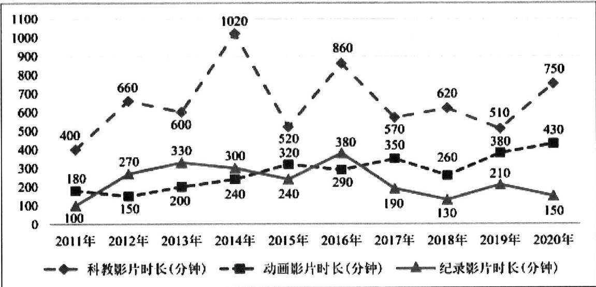

line

| 年份 | 科教影片时长(分钟) | 动画影片时长(分钟) | 纪录影片时长(分钟) |
|---|---|---|---|
| 2011年 | 400 | 180 | 100 |
| 2012年 | 660 | 150 | 270 |
| 2013年 | 600 | 200 | 330 |
| 2014年 | 1020 | 240 | 300 |
| 2015年 | 520 | 320 | 240 |
| 2016年 | 860 | 290 | 380 |
| 2017年 | 570 | 350 | 190 |
| 2018年 | 620 | 260 | 130 |
| 2019年 | 510 | 380 | 210 |
| 2020年 | 750 | 430 | 150 |

将 2011 年至 2020 年生产的科教影片、动画影片、纪录影片的时长的方差分别记为 $S_{1}^{2}, S_{2}^{2}, S_{3}^{2}$ , 试比较 $S_{1}^{2}, S_{2}^{2}, S_{3}^{2}$ 的大小。(只需写出结论)

# 题型二：分层抽样的均值方差

等级 (R)

2024 安庆师范高中 4 月联考

022. 已知一组数据 $x_{1}, x_{2}, \cdots, x_{m}$ 的平均数为 $\overline{x}$ ，另一组数据 $y_{1}, y_{2}, \cdots, y_{n}$ 的平均数为 $\overline{y} (\overline{x} \neq \overline{y})$ . 若数据 $x_{1}, x_{2}, \cdots, x_{m}, y_{1}, y_{2}, \cdots, y_{n}$ 的平均数为 $\overline{z} = a\overline{x} + (1 - a)\overline{y}$ ，其中 $\frac{1}{2} < a < 1$ ，则 m, n 的大小关系为（）

A. $m <   n$

B. $m > n$

C. $m = n$

D. $m, n$ 的大小关系不确定

等级（SR）

2024 合肥二模

023.树人中学高三（1）班某次数学质量检测（满分150分）的统计数据如下表：

<table><tr><td>性别</td><td>参加考试人数</td><td>平均成绩</td><td>标准差</td></tr><tr><td>男</td><td>30</td><td>100</td><td>16</td></tr><tr><td>女</td><td>20</td><td>90</td><td>19</td></tr></table>

在按比例分配分层随机抽样中，已知总体划分为2层，把第一层样本记为 $x_{1},x_{2},x_{3},\cdots,x_{n}$ ，其平均数记为 $\overline{x}$ ，方差记为 $s_{1}^{2}$ ；把第二层样本记为 $y_{1},y_{2},y_{3},\cdots,y_{m}$ ，其平均数记为 $\overline{y}$ ，方差记为 $s_{2}^{2}$ ；把总样本数据的平均数记为 $\overline{z}$ ，方差记为 $s^{2}$ 。

（1）证明： $s^2 = \frac{1}{m + n}\left\{n\left[s_1^2 +(\overline{x} -\overline{z})^2\right] + m\left[s_2^2 +(\overline{y} -\overline{z})^2\right]\right\} ;$   
(2) 求该班参加考试学生成绩的平均数和标准差（精确到 1）;  
(3) 假设全年级学生的考试成绩服从正态分布 $N(\mu, \sigma^2)$ , 以该班参加考试学生成绩的平均数和标准差分别作为 $\mu$ 和 $\sigma$ 的估计值, 如果按照 $16\%$ , $34\%$ , $34\%$ , $16\%$ 的比例将考试成绩从高分到低分依次划分为 $A, B, C, D$ 四个等级, 试确定各等级的分数线 (精确到 1).

附： $P(\mu -\sigma \leq X\leq \mu +\sigma)\approx 0.68$ ， $\sqrt{302}\approx 17$ ， $\sqrt{322}\approx 18$ ， $\sqrt{352}\approx 19$

等级(SR)

2023 黄山二模

024.为了深入学习领会党的二十大精神, 某高级中学全体学生参加了《二十大知识竞赛》.试卷满分为 100 分, 所有学生成绩均在区间[40,100]分内, 已知该校高一、高二、高三年级的学生人数分别为 800、1000、1200, 现用分层抽样的方法抽取了 300 名学生的答题成绩, 绘制了如下样本频率分布直方图.

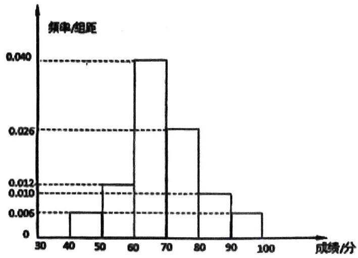

histogram

| 成绩/分 | 频率/组距 |
| :--- | :--- |
| 30-40 | 0.006 |
| 40-50 | 0.012 |
| 50-60 | 0.040 |
| 60-70 | 0.026 |
| 70-80 | 0.010 |
| 80-90 | 0.006 |
| 90-100 | 0.006 |

(1) 根据样本频率分布直方图估计该校全体学生成绩的众数、平均数、第 71 百分位数;  
(2)已知所抽取各年级答题成绩的平均数、方差的数据如下表,且根据频率分布直方图估计出总成绩的方差为 140 ,求高三年级学生成绩的平均数 $\overline{x_{3}}$ 和高二年级学生成绩的方差 $s_{2}^{2}$ .

<table><tr><td>年级</td><td>样本平均数</td><td>样本方差</td></tr><tr><td>高一</td><td>60</td><td>75</td></tr><tr><td>高二</td><td>63</td><td> $s_2^2$ </td></tr><tr><td>高三</td><td> $\overline{x_3}$ </td><td>55</td></tr></table>

等级（SR）

2023 天河区三模

025. 已知总体划分为若干层, 通过分层随机抽样, 其中某一层抽取的样本数据为 $x_{1}, x_{2}, \ldots, x_{n}$ , 其平均数和方差分别为 $\overline{x}, s^{2}$ , 记总的样本平均数为 $\overline{w}$ , 则 $\sum_{i=1}^{n} (x_{i} - \overline{w})^{2} = (\quad)$

A. $s^{2} + (\overline{x} -\overline{w})^{2}$

B. $n s^{2} + (\overline{x} -\overline{w})^{2}$

C. $s^2 + n(\overline{x} - \overline{w})^2$

D. $n s^{2} + n(\overline{x} -\overline{w})^{2}$

等级（SR）

2024 海口一模

026.（多选）已知甲、乙两组样本各有 10 个数据，甲、乙两组数据合并后得到一组新数据，下列说法正确的是（）

A. 若甲、乙两组数据的平均数都为 $a$ ，则新数据的平均数等于 $a$   
B. 若甲、乙两组数据的极差都为 $b$ ，则新数据的极差可能大于 $b$   
C. 若甲、乙两组数据的方差都为 $c$ ，则新数据的方差可能小于 $c$   
D. 若甲、乙两组数据的中位数都为 $d$ ，则新数据的中位数等于 $d$

# 题型三：相关系数与回归直线斜率的关系

等级（SR）

2024 南通 2.5 模

027.（多选）某农科所针对耕种深度 $x$ （单位：cm）与水稻每公顷产量（单位：t）的关系进行研究，所得部分数据如下表：

<table><tr><td>耕种深度x/cm</td><td>8</td><td>10</td><td>12</td><td>14</td><td>16</td><td>18</td></tr><tr><td>每公顷产量y/t</td><td>6</td><td>8</td><td>m</td><td>n</td><td>11</td><td>12</td></tr></table>

已知 m < n，用最小二乘法求出 y 关于 x 的经验回归方程： $\hat{y} = \hat{b}x + \hat{a}$ ， $\sum_{i=1}^{6} y_i^2 = 510$ ， $\sum_{i=1}^{6}\left(y_{i}-\overline{y}\right)^{2}=24$ ，数据在样本(12,m)，(14,n)的残差分别为 $\varepsilon_{1},\varepsilon_{2}$

(参考数据: 两个变量 $x, y$ 之间的相关系数 $r$ 为 $\sqrt{\frac{20}{21}}$ , 参考公式: $\hat{b} = \frac{\sum_{i=1}^{n}\left(x_i - \overline{x}\right)\left(y_i - \overline{y}\right)}{\sum_{i=1}^{n}\left(x_i - \overline{x}\right)^2}$ ,

$\hat{a} = \overline{y} -\hat{b}\cdot \overline{x},r = \frac{\sum_{i = 1}^{n}(x_{i} - \overline{x})(y_{i} - \overline{y})}{\sqrt{\sum_{i = 1}^{n}(x_{i} - \overline{x})^{2}}\cdot\sqrt{\sum_{i = 1}^{n}(y_{i} - \overline{y})^{2}}},$ 则（）

A. $m + n = 17$

B. $\hat{b} = \frac{4}{7}$

C. $\hat{a} = \frac{10}{7}$

D. $\varepsilon_{1} + \varepsilon_{2} = -1$

等级（SR）

2022 许昌平顶山济源二模

028. 为了解某一地区电动汽车销售情况, 一机构根据统计数据, 用最小二乘法得到电动汽车销售 $y$ (单位: 万台) 关于 $x$ (年份) 的线性回归方程为 $\hat{y} = 4.7 x - 9459.2$ , 且销售 $y$ 的方差为 $s_y^2 = 50$ , 年份 $x$ 的方差为 $s_x^2 = 2$ .

(1) 裘 y 与 x 的相关系数 r，并据此判断电动汽车销量 y 与年份 x 的相关性强弱；  
(2) 该机构还调查了该地区 100 位购车车主性别与购车种类情况, 得到的数据如下表:

<table><tr><td></td><td>购买非电动汽车</td><td>购买电动汽车</td><td>总计</td></tr><tr><td>男性</td><td>30</td><td>20</td><td>50</td></tr><tr><td>女性</td><td>15</td><td>35</td><td>50</td></tr><tr><td>总计</td><td>45</td><td>55</td><td>100</td></tr></table>

能否有 $99.5\%$ 的人把握认为购买电动车与性别有关？

附：（i）线性回归方程： $\hat{y} = \hat{b} x + \hat{a}$ ，其中 $\hat{b} = \frac{\sum_{i=1}^{n}(x_i - \bar{x})(y_i - \bar{y})}{\sum_{i=1}^{n}(x_i - \bar{x})^2},\hat{a} = \bar{y} -\hat{b}\bar{x};$

(ii) 相关系数: $r = \frac{\sum_{i=1}^{n}(x_i - \bar{x})(y_i - \bar{y})}{\sqrt{\sum_{i=1}^{n}(x_i - \bar{x})^2}\sqrt{\sum_{i=1}^{n}(y_i - \bar{y})^2}}$ , 相关系数 $|r| \in [0.75, 1]$ 时相关性较强, $|r| \in (0.25, 0.75)$ 时相关性一般, $|r| \in [0, 0.25]$ 时相关性较弱.

(iii)

<table><tr><td> $P(K^{2} \geq k_{0})$ </td><td>0.10</td><td>0.05</td><td>0.025</td><td>0.010</td><td>0.005</td><td>0.001</td></tr><tr><td> $k_{0}$ </td><td>2.706</td><td>3.841</td><td>5.024</td><td>6.635</td><td>7.879</td><td>10.828</td></tr></table>

$K^2 = \frac{n(ad - bc)^2}{(a + b)(c + d)(a + c)(b + d)}$ ，其中 $n = a + b + c + d$

# 题型四：贝叶斯公式为背景

等级 (R)

2023 梅州二模

029. 有一批同规格的产品, 由甲、乙、丙三家工厂生产, 其中甲、乙、丙工厂分别生产 3000 件、 3000 件、4000 件, 而且甲、乙、丙工厂的次品率依次为 $6 \%$ 、 $5 \%$ 、 $5 \%$ ，现从这批产品中任取一 件, 则

(1) 取到次品的概率为\_\_\_\_；  
(2) 若取到的是次品, 则其来自甲厂的概率为

等级 (R)

2021 宝鸡三检

030. 托马斯·贝叶斯（Thomas Bayes）在研究“逆向概率”问题中得到了一个公式：P（A|B）= $\frac{P(B|A)\times P(A)}{P(B|A)\times P(A)+P(B|A^{c})\times P(A^{c})}$ ，这个公式被称为贝叶斯公式（贝叶斯定理），其中P（B|A）×P（A）+P（B|A^{c})×P（A^{c}）被称为B的全概率。这个定理在实际生活中有着重要的应用价值。假设某种疾病在所有人群中的感染率是0.1%，医院现有的技术对于该疾病检测准确率为99%，即已知患病情况下，99%的可能性可以检查出阳性，正常人99%的可能性检查为正常。如果从人群中随机抽一个人去检测，经计算检测结果为阳性的全概率为0.01098，请你用贝叶斯公式估计在医院给出的检测结果为阳性的条件下这个人得病的概率为（）

0. $1\%$ B. $8 \%$ C. $9 \%$ C. $99 \%$ A.

# 题型五：概率综合题新题难题

等级 (N)

2021 苏锡常镇一模

031. 若随机变量 $X \sim B(3, p)$ , $Y \sim N(2, \delta^2)$ , 若 $P(X \geq 1) = 0.657$ , $P(0 < Y < 2) = p$ , 则 $P(Y > 4) = (\quad)$

A. 0.2

B. 0. 3

C. 0.7

D. 0.8

等级 (N)

2024 泉州三月质检

032.中心极限定理是概率论中的一个重要结论。根据该定理, 若随机变量 $\xi \sim B(n, p)$ , 则当 $np > 5$ 且 $n(1 - p) > 5$ 时, $\xi$ 可以由服从正态分布的随机变量 $\eta$ 近似替代, 且 $\xi$ 的期望与方差分别与 $\eta$ 的均值与方差近似相等. 现投掷一枚质地均匀分布的骰子 2500 次, 利用正态分布估算骰子向上的点数为偶数的次数少于 1300 的概率为 ( )

附:若 $\eta\sim N(\mu,\sigma^{2})$ ，则 $P(\mu-\sigma<\eta<\mu+\sigma)\approx0.6827, P(\mu-2\sigma<\eta<\mu+2\sigma)$

$$
\approx 0. 9 5 4 5, P (\mu - 3 \sigma <   \eta <   \mu + 3 \sigma) \approx 0. 9 9 7 3.
$$

A.0.0027

B.0.5

C.0.8414

D.0.9773

等级 (R)

2022 武汉二调

033. 已知随机变量 $\xi$ 服从正态分布 $N(\mu, \sigma^2)$ , 若函数 $f(x) = P (x \leq \xi \leq x + 1)$ 为偶函数 $\mu = (\quad)$

A. $- \frac{1}{2}$

B. 0

C. $\frac{1}{2}$

D. 1

等级 (R)

2022 南京盐城二模

034. 泊松分布是统计学里常见的离散型概率发布, 由法国数学家泊松首次提出, 泊松分布的概率分布列为 $\mathrm{P} (\mathrm{X} = \mathrm{k}) = \frac{\lambda^k}{k!} e^{-\lambda} (k = 0,1,2,\cdots)$ , 其中 $\mathbf{e}$ 为自然对数的底数, $\lambda$ 是泊松分布的均值。已知某种商品每周销售的件数相互独立, 且服从参数为 $\lambda (\lambda > 0)$ 的泊松分布。若每周销售 1 件该商品与每周销售 2 件该商品的概率相等, 则两周共销售 2 件该商品的概率为 ( )

A. $\frac{2}{e^{4}}$

B. $\frac{4}{e^{4}}$

C. $\frac{6}{e^4}$

D. $\frac{8}{e^{4}}$

等级 (R)

2024 辽宁统一考试二模

035.已知在伯努利试验中, 事件 $A$ 发生的概率为 $p (0 < p < 1)$ , 我们称将试验进行至事件 $A$ 发生 $r$ 次为止, 试验进行的次数 $X$ 服从负二项分布, 记 $X \sim N B(r, p)$ , 若 $X \sim N B\left(5, \frac{1}{3}\right)$ 则 $P(X = 6) = \_$ .

等级（SR）

2024 益阳 4 月调研

036.2023 年的某一天某红酒厂商为了在线出售其红酒产品, 联合小 Y 哥直播间, 邀请某“网红”来现场带货. 在带货期间, 为吸引顾客光临直播间、增加客流量, 发起了这样一个活动: 如果在直播间进来的顾客中, 出现生日相同的顾客, 则奖励生日相同的顾客红酒 1 瓶. 假设每个随机来访的顾客的出生日期都是相互独立的, 并且每个人都等可能地出生在一年 (365 天) 中任何一天 (2023 年共 365 天), 在 $n$ 远小于 365 时, 近似地 $\ln \left[ \prod_{k=0}^{n-1} \left( 1 - \frac{k}{365} \right) \right] \approx \sum_{k=0}^{n-1} \frac{-k}{365}$ , $\ln 2 \approx 0.693$ , 其中 $\prod_{i=1}^{n} a_i = a_1 \times a_2 \times \cdots \times a_n$ . 如果要保证直播间至少两个人的生日在同一天的概率不小于 $\frac{1}{2}$ , 那么来到直播间的人数最少应该为 ( )

A.21

B.22

C.23

D.24

等级（SR）

2022 武汉 4 月调研

037. 某同学在课外阅读时了解到概率统计中的切比雪夫不等式，该不等式可以使人们在随机变量 X 的期望 E（X）和方差 D（X）存在但其分布未知的情况下，对事件 “ $|X - E(X)| \geq \epsilon$ ” 的概率作出上限估计，其中 $\epsilon$ 为任意正实数。比切雪夫不等式的形式为：P（ $|X - E(X)| \geq \epsilon$ ） $\leq f(D(X), \epsilon)$ ，其中 f（D（X）， $\epsilon$ ）是关于 D（X）和 $\epsilon$ 的表达式。由于记忆模糊，该同学只能确定 f（D（X）， $\epsilon$ ）的具体形式是下列四个选项中的某一种。请你根据所学的相关知识，确定该形式是（）

A. $D(X)\cdot \varepsilon^2$

B. $\frac{1}{D(X)\cdot\varepsilon^2}$

C. $\frac{\varepsilon^2}{D(X)}$

D. $\frac{D(X)}{\varepsilon^2}$

等级（SR）

2021 南京盐城二模

038. （多选）已知 $n \in N^{*}, n \geq 2, p, q > 0, p + q = 1$ . 设 $f(k) = C_{2n}^{k} p^{k} q^{2n - k}$ , 其中 $k \in N, k \leq 2n$ , 则（）

A. $\sum_{k=0}^{2n} f(k) = 1$

B. $\sum_{k=0}^{2n} kf(k) = 2npq$

C. 若 ${np} = 4$ ,则 $f\left( k\right)  \leq  f\left( 8\right)$

D. $\sum_{k=0}^{n} f(2k) < \frac{1}{2} < \sum_{k=1}^{n} f(2k - 1)$

等级（SR）

2022 燕博园测试

039. 甲、乙两人进行乒乓球比赛, 比赛打满 $2 \mathrm{k} (\mathrm{k} \in N^{*})$ 局, 且每局甲获胜的概率和乙获胜的概率均为 $\frac{1}{2}$ , 若某人获胜的局数大于 $\mathrm{k}$ , 则此人赢得比赛, 下列说法正确的是 ( )

A. k=1 时，甲、乙比赛结果为平局的概率为 $\frac{1}{4}$   
B. K=2 时，甲赢得比赛与乙赢得比赛的概率均为 $\frac{5}{16}$   
C. 在 $2 \mathrm{~k}$ 局比赛中, 甲获胜的局数的期望为 $\mathrm{k}$   
D. 随着 k 的增大，甲赢得比赛的概率会越来越接近 $\frac{1}{2}$

等级（SR）

2021 武汉四调

040.（多选）在对具有相关关系的两个变量进行回归分析，若两个变量不呈线性相关关系，可以建立含两个待定参数的非线性模型，并引入中间变量将其转化为线性关系，再利用最小二乘法进行线性回归分析，下列选项为四个同学根据自己所得数据的散点图建立的非线性模型，且散点图的样本点均位于第一象限，则其中可以根据上述方法进行回归分析的模型有（）

$$
\mathrm{A.y} = c _ {1} \mathrm{x} ^ {2} + c _ {2} \mathrm{x}
$$

$$
\mathrm{B.} y = \frac {x + c _ {1}}{x + c _ {2}}
$$

$$
C. y = c _ {1} + \ln (x + c _ {2})
$$

$$
\mathrm{D.y} = c _ {1} e ^ {x + c _ {2}}
$$

# 题型六：数学文化与概率统计

等级 (N)

041.. 中国有 5000 多年的灿烂文化, 4000 多年前的夏代有 “甲乙丙丁戊己庚辛壬葵” 十天干纪日法, 商代把十天干和 “子丑寅卯辰己午未申酉戌亥” 十二地支按一个天干在前一个地支在后, 且奇数天干配奇数地支, 偶数天干配偶数地支, 形成循环纪日法, 这种不同的循环纪日个数为 ( )

A. 60

B. 72

C. 108

D. 120

等级 (N)

042. 洛书, 古称龟书, 是阴阳五行术数之源, 在古代传说中有神龟出于洛水, 其甲壳上心有此图象, 结构是戴九履一, 左三右七, 二四为肩, 六八为足, 以五居中, 五方白圈皆阳数, 四角黑点为阴数. 如图, 若从四个阴数和五个阳数中分别随机各选取 1 个数, 则其和等于 9 的概率是 ( )

A. $\frac{1}{5}$

B. $\frac{2}{5}$

C. $\frac{3}{10}$

D. $\frac{1}{4}$

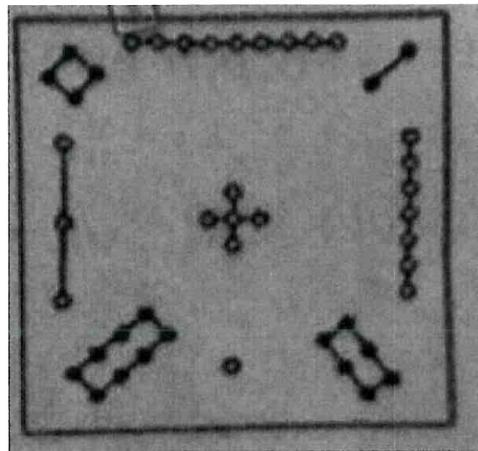

natural_image

Abstract geometric pattern with diamond, cross, and dot shapes arranged in a square (no text or symbols)

等级 (R)

043. 古希腊毕达哥拉斯学派的数学家研究过各种多边形数。如将一定数目的点在等距离的排列下可以形成一个等边三角形，这样的数被称为三角形数。如图所示，三角形数 1, 3, 6, … 在 $1 \sim 100$ 这 100 个自然数中随机取一个数，恰好是三角形数的概率是（）

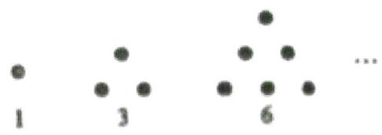

text_image

1
3
6
...

A. $\frac{13}{100}$

B. $\frac{17}{100}$

C. $\frac{1}{4}$

D. $\frac{33}{100}$

等级（SR）

2021 保定二模

044. 算盘是中国传统的计算工具, 是中国人在长期使用算筹的基础上发明的, 是中国古代一项伟大的、重要的发明, 在阿拉伯数字出现前是全世界广为使用的计算工具, “珠算”一词最早见于东汉徐岳所撰的《数术记遗》, 其中有云: “珠算控带四时, 经纬三才.” 北周甄鸾为此作注, 大意是: 把木板刻为 3 部分, 上, 下两部分是停游珠用的, 中间一部分是作定位用的, 下图是一把算盘的初始状态, 自右向左, 分别是个位, 十位, 百位, ……, 上面一粒珠 (简称上珠) 代表 5 , 下面一粒珠 (简称下珠) 是 1 , 即五粒下珠的大小等于同组一粒上珠的大小, 现从个位, 十位, 百位和千位这四组中随机拨动 2 粒珠 (上珠只能往下拨且每位至多拨 1 粒上珠, 下珠只能往上拨), 则算盘表示的整数能够被 3 整除的概率是 ( )

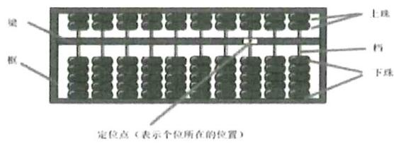

text_image

梁
框
上珠
档
下珠
定位点（表示个位所在的位置）

A. $\frac{3}{8}$

B. $\frac{5}{8}$

C. $\frac{2}{9}$

D. $\frac{1}{2}$

# 题型七：摸到停模型

等级 (R)

2023 辽宁教研联盟一模

045. 口袋中装有大小重量完全相同的 2 个红球 3 个白球, 从口袋中一次摸出一个球, 摸出的球不再放回, 如果 2 个红球全部被摸出, 就停止摸球, 则恰好摸球三次就停止摸球的概率为( )

A. $\frac{1}{5}$

B. $\frac{1}{4}$

C. $\frac{3}{10}$

D. $\frac{2}{5}$

等级（SR）

2023 武汉二调

046. 口袋中共有 7 个质地和大小均相同的小球, 其中 4 个是黑球, 现采用不放回抽取方式每次从口袋中随机抽取一个小球, 直到将 4 个黑球全部取出时停止.

(1)记总的抽取次数为 $X$ ，求 $E(X)$ ；  
(2) 现对方案进行调整: 将这 7 个球分装在甲乙两个口袋中, 甲袋装 3 个小球, 其中 2 个是黑球: 乙袋装 4 个小球, 其中 2 个是黑球. 采用不放回抽取方式先从甲袋每次随机抽取一个小球, 当甲袋的 2 个黑球被全部取出后再用同样方式在乙袋中进行抽取, 直到将乙袋的 2 个黑球也全部取出后停止, 记这种方案的总抽取次数为 Y , 求 $E(\mathrm{Y})$ 并从实际意义解释 $E(\mathrm{Y})$ 与 (1) 中的 $E(X)$ 的大小关系.

# 概率统计大题

# 题型一：复杂的回归

# 模型一：非线性回归

等级 (R)

2022 汕头三模

001. 目前, 新冠病毒引起的疫情仍在全球肆虐。在党中央的正确领导下, 全国人民团结一心, 使我国疫情得到了有效的控制。其中, 各大药物企业积极投身到新药的研发中。汕头某药企为评估一款新药的药效和安全性, 组织一批志愿者进行临床用药实验, 结果显示临床疗效评价指标 A 的数量 y 与连续用药天数 x 具有相关关系。刚开始用药时, 指标 A 的数量 y 变化明显, 随着天数增加, y 的变化趋缓。根据志愿者的临床试验情况, 得到了一组数据 $(x_{i}, y_{i}) (i = 1, 2, 3, 4, 5, \ldots, 10)$ , $x_{i}$ 表示连续用药 i 天, $y_{i}$ 表示相应的临床疗效评价指标 A 的数值。

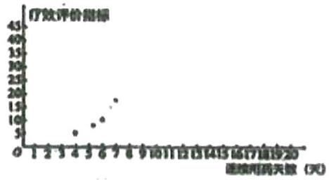

scatter

| 续续用药天数 (天) | 疗效评价指标 |
|---|---|
| 4 | 5 |
| 5 | 8 |
| 6 | 10 |
| 7 | 15 |
| 8 | 20 |

该药企为了进一步研究药物的临床效果，建立了 y 关于 x 的两个回归模型：

模型①:由最小二乘公式可求得 y 与 x 的线性回归方程: $\hat{y}=2.50x-2.50$ ;

模型②:由图中样本点的分布,可以认为样本点集中在曲线: $y = \mathrm{b}\ln x + a$ 的附近,令 $t = \ln x$ ,则有 $\sum_{i=1}^{10} t_i = 22.00$ , $\sum_{i=1}^{10} y_i = 230$ , $\sum_{i}^{10} t_i y_i = 569.00$ , $\sum_{i=1}^{10} t_i^2 = 50.92$ .

（1）根据所给的统计量，求模型②中 y 关于 x 的回归方程；  
(2) 根据下列表格中的数据, 说明哪个模型的预测值精度更高、更可靠。

<table><tr><td>回归模型</td><td>模型1</td><td>模型2</td></tr><tr><td> $\mathop{\sum }\limits_{{i = 1}}^{{10}}{\left( {y}_{i} - {\widehat{y}}_{i}\right) }^{2}$ </td><td>102.28</td><td>36.19</td></tr></table>

(3) 根据 (2) 中精确度更高的模型, 预测用药一个月后, 疗效评价指标相对于用药半个月的变化情况 (一个月以 30 天计, 结果保留两位小数)

附：样本 $(t_i, y_i)$ (i=1, 2, ..., n) 的最小乘估计公式为 $\hat{b} = \frac{\sum_{i=1}^{n}(t_i - \overline{t})(y_i - \overline{y})}{\sum_{i=1}^{n}(t_i - \overline{t})^2}$ $\hat{a} = \overline{y} - \hat{b}\overline{t}$ ；

相关指数 $R^2 = 1 - \frac{\sum_{i=1}^{n}(y_i - \hat{y})^2}{\sum_{i=1}^{n}(y_i - \overline{y})^2}$ 参考数据: $\ln 2 \approx 0.6931$ .

等级（SR）

002. 近年来, 随着我国汽车消费水平的提高, 二手车流通行业得到迅猛发展. 某汽车交易市场对 2017 年成交的二手车交易前的使用时间（以下简称 “使用时间”）进行统计，得到频率分布直方图如图 1.

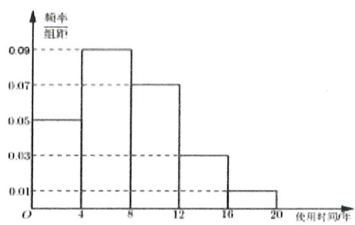

histogram

| 使用时间 (年) | 频率组距 |
| :--- | :--- |
| 4-8 | 0.09 |
| 8-12 | 0.07 |
| 12-16 | 0.03 |
| 16-20 | 0.01 |

图1

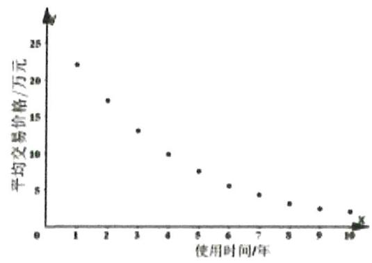

scatter

| 使用时间/年 | 平均交易价格/万元 |
| :--- | :--- |
| 1 | 22 |
| 2 | 17.5 |
| 3 | 13 |
| 4 | 10 |
| 5 | 8 |
| 6 | 6 |
| 7 | 5 |
| 8 | 4 |
| 9 | 3 |
| 10 | 2 |

图2

(1) 记 “在 2017 年成交的二手车中随机选取一辆, 该车的使用年限在 (8, 16]”为事件 $A$ , 试估计 $A$ 的概率:  
(2) 根据该汽车交易市场的历史资料, 得到散点图如图 2, 其中 $x$ (单位: 年) 表示二手车的使用时间, $y$ (单位: 万元) 表示相应的二手车的平均交易价格。

由散点图看出, 可采用 $y = e^{a + bx}$ 作为二手车平均交易价格 $y$ 关于其使用年限 $x$ 的回归方程, 相关数据如下表 (表示 $Y_{i} = \ln y_{i} \overline{Y} = \frac{1}{10} \sum_{i=1}^{10} Y_{i}$ )

<table><tr><td> $\overline{x}$ </td><td> $\overline{y}$ </td><td> $\overline{Y}$ </td><td> $\sum_{i=1}^{10}x_iy_i$ </td><td> $\sum_{i=1}^{10}x_iY_i$ </td><td> $\sum_{i=1}^{10}x_i^2$ </td></tr><tr><td>5.5</td><td>8.7</td><td>1.9</td><td>301.4</td><td>79.75</td><td>385</td></tr></table>

①根据回归方程类型及表中数据, 建立 $y$ 关于 $x$ 的回归方程: ②该汽车交易市场对使用 8 年以内 (含 8 年) 的二手车收取成交价格 $4 \%$ 的佣金, 对使用时间 8 年以上 (不含 8 年) 的二手车收取成交价格 $10 \%$ 的佣金。在图 1 对使用时间的分组中, 以各组的区间中点值代表该组的各个值. 若以 2017 年的数据作为决策依据, 计算该汽车交易市场对成交的每辆车收取的平均佣金。

附注: ①对于一组数据 $\left(u _ { 1 } , v _ { 1 }\right)$ , $\left(u _ { 2 } , v _ { 2 }\right)$ , $\cdots\left(u _ { n } , v _ { n }\right)$ , 其回归直线 $v = \alpha + \beta u$ 的斜率和截距的最

$$
\hat {\beta} = \frac {\sum_ {i = 1} ^ {n} u _ {i} v _ {i} - n \overline {{u v}}}{\sum_ {i = 1} ^ {n} u _ {i} ^ {2} - n \overline {{u}} ^ {- 2}}, \quad \hat {\alpha} = \overline {{v}} - \hat {\beta} \overline {{u}};
$$

小二乘估计分别为

① 参考数据： $e^{2.95} \approx 19.1$ ， $e^{1.75} \approx 5.75$ ， $e^{0.55} \approx 1.73$ ， $e^{-0.65} \approx 0.52$ ， $e^{-1.85} \approx 0.16$ 。

等级（SR）

2023 青岛二模

003. 为了丰富农村儿童的课余文化生活，某基金会在农村儿童聚居地区捐建“悦读小屋”，自2018年以来，某村一直在组织开展“阅读小屋读书活动”下表是对2018年以来近5年该村少年儿童的年借阅的数据统计：

<table><tr><td>年份</td><td>2018</td><td>2019</td><td>2020</td><td>2021</td><td>2022</td></tr><tr><td>年份代码x</td><td>1</td><td>2</td><td>3</td><td>4</td><td>5</td></tr><tr><td>年借阅量y(册)</td><td> $y_1$ </td><td> $y_2$ </td><td>36</td><td>92</td><td>142</td></tr></table>

(参考数据: $\sum_{i=1}^{5} y_i = 290$ )

(2)通过分析散点图的特征后, 计划分别用① $\hat { y } = 35 x - 47$ 和② $\hat {y} = 5 x ^ { 2 } + m$ 两种模型作为年借阅量 $y$ 关于年份代码 $x$ 的回归分析模型, 请根据统计表的数据, 求出模型②的经验回归方程, 并用残差平方和比较哪个模型拟合效果更好。

等级（SR）

004. 某企业生产一种产品，从流水线上随机抽取 100 件产品，统计其质量指标值并得到其频率分布表：

<table><tr><td>质量指标值分组</td><td>[65, 75)</td><td>[75, 85)</td><td>[85, 95)</td><td>[95, 105)</td><td>[105, 115]</td></tr><tr><td>频数</td><td>5</td><td>20</td><td>40</td><td>25</td><td>10</td></tr></table>

销售时质量指标值在[65, 75) 的产品每件亏1元，在[75, 105) 的产品每件盈利3元，在[105, 115]的产品每件盈利5元。

(1) 估计该企业生产的产品平均一件的利润;  
(2) 该企业为了解年营销费用 $x$ (单位: 万元) 对年销售量 $y$ (单位: 万件) 的影响, 对近五年的年营销费用 $x$ , 和年销售量 $y_{i} = (i = 1, 2, 3, 4, 5)$ 数据做了初步处理, 得到如图的散点图及一些统计量的值。

<table><tr><td> $\sum_{i=1}^{5}u_i$ </td><td> $\sum_{i=1}^{5}v_i$ </td><td> $\sum_{i=1}^{5}\left(u_i - \overline{u}\right)\left(v_i - \overline{v}\right)$ </td><td> $\sum_{i=1}^{5}\left(u_i - \overline{u}\right)^2$ </td></tr><tr><td>16.30</td><td>23.20</td><td>0.81</td><td>1.62</td></tr></table>

表中 $u_{i} = \ln x_{i}, v_{i} = \ln y_{i}, \overline{u} = \frac{1}{5}\sum_{i=1}^{5} u_{i}, \overline{v} = \frac{1}{5}\sum_{i=1}^{5} v_{i}$

根据散点图判断， $y = ax^{b}$ 可以作为年销售量 y （万件）

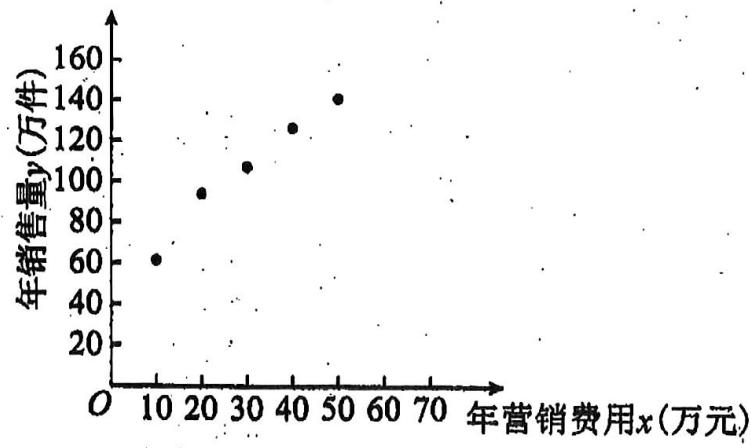

scatter

| 年营销费用x(万元) | 年销售量y(万件) |
| ---------------- | -------------- |
| 10               | 60             |
| 20               | 90             |
| 30               | 105            |
| 40               | 125            |
| 50               | 140            |

年营销费用 $x$ 费用（万元）

(收益=销售利润-营销费用，取 $e^{3.01}=20$ )

附注：①对于一组数据 $(u_{1},v_{1})$ ， $(u_{2},v_{2})$ ， $(u_{n},v_{n})$ ，其回归直线 $v=\alpha+\beta u$ 的斜率和截距的最小

$$
\hat {\beta} = \frac {\sum_ {i = 1} ^ {n} u _ {i} v _ {i} - n \overline {{u v}}}{\sum_ {i = 1} ^ {n} u _ {i} ^ {2} - n \overline {{u}} ^ {- 2}}, \quad \hat {\alpha} = \overline {{v}} - \hat {\beta} \overline {{u}};
$$

② 求 $y$ 关于 $x$ 的回归方程  
②用所求的回归方程估计该企业应投入多少年营销费, 才能使得该企业的年收益的预报值达到最大?

# 模型二：抠点换点加点后的回归

等级（SR）

005. 某新兴环保公司为了确定新开发的产品下一季度的营销计划, 需了解月宣传费 $x$ (单位: 千元) 对月销售量 $y$ (单位: $t$ ) 和月利润 $z$ (单位: 千元) 的影响, 收集了 2019 年 12 月至 2020 年 5 月共 6 个月的月宣传费 $x_{i}$ 和月销售量 $y_{i} \left( i = 1,2,\cdots,6 \right)$ 的数据如下表:

<table><tr><td>月份</td><td>12</td><td>1</td><td>2</td><td>3</td><td>4</td><td>5</td></tr><tr><td>月宣传费x</td><td>1</td><td>3</td><td>5</td><td>7</td><td>9</td><td>11</td></tr><tr><td>月销售量y</td><td>14.21</td><td>20.31</td><td>31.8</td><td>31.18</td><td>37.83</td><td>44.67</td></tr></table>

现分别用两种模型① $y = bx + a$ ，② $y = ae^{bx}$ 分别进行拟合，得到相应的回归方程并进行残差分析，得到如图所示的残差图及一些统计量的值：（注：残差在数理统计中是指实际观察值与估计值（拟合值）之间的差。）

<table><tr><td>x̄</td><td>ȳ</td><td>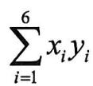</td><td>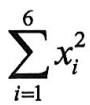</td></tr><tr><td>6</td><td>30</td><td>1284.24</td><td>286</td></tr></table>

(1) 根据残差图, 比较模型①, ②的拟合效果, 应选择哪个模型? 并说明理由;

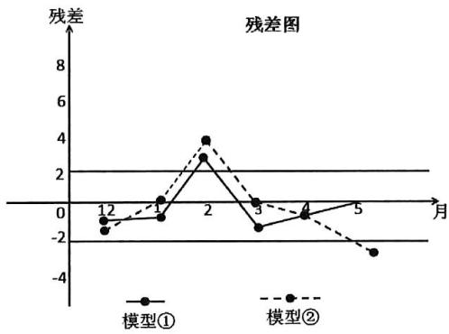

line

| 月 | 模型① | 模型② |
|----|--------|--------|
| 1  | -1.0   | -1.5   |
| 2  | 3.0    | 4.0    |
| 3  | -1.0   | 0.5    |
| 4  | -0.5   | -0.5   |
| 5  | 0.5    | -3.0   |

(2) 残差绝对值大于 2 的数据被认为是异常数据, 需要剔除, 剔除异常数据后求出 (1) 中所选模型的回归方程;

(3)已知该产品的月利润 $z$ 与 $x, y$ 的关系为: $z = \frac{2}{3} (5y - x^2)$ , 根据 (2) 的结果回答下列问题:

(i) 若月宣传费 $x = 15$ 时, 该模型下月销售量 $y$ 的预报值为多少?

（ii）当月宣传费 $x$ 为何值时，月利润 $z$ 的预报值最大？

附：对于一组数据 $(x_{1},y_{1}),(x_{2},y_{2}),\cdots,(x_{n},y_{n})$ ，其回归直线 $\hat{y}=\hat{b}x+\hat{a}$ 的斜率和截距的最小二

乘估计分别为： $\hat{b} = \frac{\sum_{i=1}^{n}\left(x_i - \overline{x}\right)\left(y_i - \overline{y}\right)}{\sum_{i=1}^{n}\left(x_i - \overline{x}\right)^2} = \frac{\sum_{i=1}^{n}x_iy_i - n\overline{xy}}{\sum_{i=1}^{n}x_i^2 - n\overline{x}^2}$ ， $\hat{a} = \overline{y} -\hat{b}\overline{x}$

等级（SR）

2021 河南六市高三一模

006. 近年来, 政府相关部门引导乡村发展旅游的同时, 鼓励农户建设温室大棚种植高品质农作物. 为了解某农作物的大棚种植面积对种植管理成本的影响, 甲, 乙两同学一起收集 6 家农户的数据,进行回归分析, 得到两个回归模型: 模型①: $\hat{y} = -1.65 x + 28.57$ , 模型②: $\hat{y} = \frac{26.67}{x} + 13.50$ ,

对以上两个回归方程进行残差分析，得到下表:

<table><tr><td colspan="2">种植面积 x (亩)</td><td>2</td><td>3</td><td>4</td><td>5</td><td>7</td><td>9</td></tr><tr><td colspan="2">每亩种植管理成本 y (百元)</td><td>25</td><td>24</td><td>21</td><td>22</td><td>16</td><td>14</td></tr><tr><td rowspan="2">模型1</td><td>估计值ŷ(1)</td><td>25.27</td><td>23.62</td><td>21.97</td><td></td><td>17.02</td><td>13.72</td></tr><tr><td>残差值 $\hat{e}_{i}(1)$ </td><td>-0.27</td><td>0.38</td><td>-0.97</td><td></td><td>-1.02</td><td>0.28</td></tr><tr><td rowspan="2">模型2</td><td>估计值ŷ(2)</td><td>26.84</td><td></td><td>20.17</td><td>18.83</td><td>17.31</td><td>16.46</td></tr><tr><td>残差值 $\hat{e}_{i}(2)$ </td><td>-1.84</td><td></td><td>0.83</td><td>3.17</td><td>-1.31</td><td>-2.46</td></tr></table>

(1) 将以上表格补充完整, 并根据残差平方和判断哪个模型拟合效果更好;

(2) 视残差 $\hat{e}_{\mathrm{i}}$ 的绝对值超过 1.5 的数据视为异常数据, 针对 (1) 中拟合效果较好的模型, 剔除异常数据后, 重新求回归方程.

附： $0.27^{2}+0.38^{2}+0.97^{2}+1.02^{2}+0.28^{2}=2.277$

$$
\hat {a} = \overline {{{{y}}}} - \hat {b} x, \quad \hat {b} = \frac {\sum_ {i = 1} ^ {n} (x _ {i} - \overline {{{{x}}}}) (y _ {i} - \overline {{{{y}}}})}{\sum_ {i = 1} ^ {n} (x _ {i} - \overline {{{{x}}}}) ^ {2}}
$$

等级（SR）

007. BMI 指数是用体重公斤数除以身高米数的平方得出的数值, 是国际上常用的衡量人体胖瘦程度以及是否健康的一个标准. 对于高中男体育特长生而言, 当 BMI 数值大于或等于 20.5 时, 我们说体重较重, 当 BMI 数值小于 20.5 时, 我们说体重较轻, 身高大于或等于 $170 \mathrm{~cm}$ 时, 我们说身高较高, 身高小于 $170 \mathrm{~cm}$ 时, 我们说身高较矮. 某中小学生成长与发展机构从某市的 320 名高中男体育特长生中随机选取 8 名, 其身高和体重的数据如表所示:

<table><tr><td>编号</td><td>1</td><td>2</td><td>3</td><td>4</td><td>5</td><td>6</td><td>7</td><td>8</td></tr><tr><td>身高(cm) $x_i$ </td><td>166</td><td>167</td><td>160</td><td>173</td><td>178</td><td>169</td><td>158</td><td>173</td></tr><tr><td>体重(kg) $y_i$ </td><td>57</td><td>58</td><td>53</td><td>61</td><td>66</td><td>57</td><td>50</td><td>66</td></tr></table>

(1)根据最小二乘法的思想与公式求得线性回归方程 $\hat{y} = 0.8x - 75.9$ . 利用已经求得的线性回归方程, 请完善下列残差表, 并求解释变量 (身高) 对于预报变量 (体重) 变化的贡献值 $R^2$ (保留两位有效数字);

<table><tr><td>编号</td><td>1</td><td>2</td><td>3</td><td>4</td><td>5</td><td>6</td><td>7</td><td>8</td></tr><tr><td>身高(cm) $x_{i}$ </td><td>166</td><td>167</td><td>160</td><td>173</td><td>178</td><td>169</td><td>158</td><td>173</td></tr><tr><td>体重(kg) $y_{i}$ </td><td>57</td><td>58</td><td>53</td><td>61</td><td>66</td><td>57</td><td>50</td><td>66</td></tr><tr><td>残差 $\hat{e}$ </td><td>0.1</td><td>0.3</td><td>0.9</td><td>-1.5</td><td>-0.5</td><td></td><td></td><td></td></tr></table>

(2) 通过残差分析, 对于残差的最大 (绝对值) 的那组数据, 需要确认在样本点的采集中是否有人为的错误。已知通过重新采集发现, 该组数据的体重应该为 $58 (\mathrm{kg})$ 。请重新根据最小二乘法的思想与公式, 求出男体育特长生的身高与体重的线性回归方程。

【参考公式】

$$
R ^ {2} = 1 - \frac {\sum_ {i = 1} ^ {n} \left(y _ {i} - \hat {y} _ {i}\right) ^ {2}}{\sum_ {i = 1} ^ {n} \left(y _ {i} - \bar {y}\right) ^ {2}}, \hat {b} = \frac {\sum_ {i = 1} ^ {n} \left(x _ {i} - \bar {x}\right) \left(y _ {i} - \bar {y}\right)}{\sum_ {i = 1} ^ {n} \left(x _ {i} - \bar {x}\right) ^ {2}} = \frac {\sum_ {i = 1} ^ {n} x _ {i} y _ {i} - n \bar {x} \cdot \bar {y}}{\sum_ {i = 1} ^ {n} x _ {i} ^ {2} - n \bar {x} ^ {2}}, \hat {a} = \bar {y} - \hat {b} \bar {x},
$$

$$
\hat {e} _ {i} = y _ {i} - \hat {b} x _ {i} - \hat {a}.
$$

【参考数据】

$$
\sum_ {i = 1} ^ {8} x _ {i} y _ {i} = 7 8 8 8 0, \sum_ {i = 1} ^ {8} x _ {i} ^ {2} = 2 2 6 1 1 2, \overline {{x}} = 1 6 8, \overline {{y}} = 5 8. 5, \sum_ {i = 1} ^ {8} (y _ {i} - \overline {{y}}) ^ {2} = 2 2 6.
$$

等级（SR）

2024 广州三模冲刺三

008.（多选）已知变量 x 和变量 y 的一组成对样本数据 $(x_{i}, y_{i}) (i = 1, 2, \cdots, n)$ 的散点落在一条直线附近， $\overline{x} = \frac{1}{n} \sum_{i=1}^{n} x_{i}$ ， $\overline{y} = \frac{1}{n} \sum_{i=1}^{n} y_{i}$ ，相关系数为 r，线性回归方程为 $\hat{y} = \hat{b}x + \hat{a}$ ，则（）

A. 当 $r$ 越大时, 成对样本数据的线性相关程度越强  
B. 当 $r > 0$ 时, $\hat{b} > 0$   
C. 当 $x_{n+1} = \overline{x}$ ， $y_{n+1} = \overline{y}$ 时，成对样本数据 $(x_{i}, y_{i})(i = 1, 2, \cdots, n, n+1)$ 的相关系数 $r'$ 满足 $r' = r$   
D. 当 $x_{n+1} = \overline{x}, y_{n+1} = \overline{y}$ 时，成对样本数据 $(x_{i}, y_{i})(i = 1, 2, \cdots, n, n+1)$ 的线性回归方程 $\hat{y} = \hat{d}x + \hat{c}$ 满足 $\hat{d} = \hat{b}$

参考公式： $r = \frac{\sum_{i = 1}^{n}(x_i - \overline{x})(y_i - \overline{y})}{\sqrt{\sum_{i = 1}^{n}(x_i - \overline{x})^2}\sqrt{\sum_{i = 1}^{n}(y_i - \overline{y})^2}}$ ， $\hat{b} = \frac{\sum_{i = 1}^{n}(x_i - \overline{x})(y_i - \overline{y})}{\sum_{i = 1}^{n}(x_i - \overline{x})^2}.$

# 模型三：残差、相关指数、相对误差

等级（SR）

009. 某公司为了对某种商品进行合理定价, 需了解该商品的月销售量 $y$ (单位: 万件)与月销售单价 $x$ (单位: 元/件)之间的关系, 对近 6 个月的月销售量 $y_{i}$ 和月销售单价 $x_{i}$ $(i = 1,2,3,\cdots,6)$ 数据进行了统计分析, 得到一组检验数据如图表所示:

<table><tr><td>月销售单价x(元/件)</td><td>4</td><td>5</td><td>6</td><td>7</td><td>8</td><td>9</td></tr><tr><td>月销售量y(万件)</td><td>89</td><td>83</td><td>82</td><td>79</td><td>74</td><td>67</td></tr></table>

(1) 若用线性回归模型拟合 $y$ 和 $x$ 之间的关系, 现有甲、乙、丙三位实习员工求得回归直线方程分别为: $\hat{y} = -4 x + 105, \hat{y} = 4 x + 53$ 和 $\hat{y} = -3 x + 104$ , 其中有且仅有一位实习员工的计算结果是正确的. 请结合统计学的相关知识, 判断哪位实习员工的计算结果是正确的, 并说明理由:

(2) 若用 $y = ax^{2} + bx + c$ 模型拟合 $y$ 和 $x$ 之间的关系, 可得回归方程为 $\hat{y} = -0.375x^{2} + 0.875x + 90.25$ , 经计算该模型和 (1) 中正确的线性回归模型的相关指数 $R^{2}$ 分别为 0.9702 和 0.9524, 请用 $R^{2}$ 说明哪个回归模型的拟合效果更好;  
(3) 已知该商品的月销售额为 $z$ (单位: 万元), 利用 (2) 中的结果回答问题: 当月销售单价为何值时, 商品的月销售额预报值最大? (精确到 0.01)

参考数据： $\sqrt{6547} \approx 80.91$

等级（SR）

010. 某公司生产的某种产品，如果年返修率低于千分之一，则其生产部门当年考核优秀。现获得该公司 2014-2018 年的相关数据如下表所示：

<table><tr><td>年份</td><td>2014</td><td>2015</td><td>2016</td><td>2017</td><td>2018</td></tr><tr><td>年生产台数(万台)</td><td>2</td><td>4</td><td>5</td><td>6</td><td>8</td></tr><tr><td>该产品的年利润(百万台)</td><td>30</td><td>40</td><td>60</td><td>50</td><td>70</td></tr><tr><td>年返修台数(台)</td><td>19</td><td>58</td><td>45</td><td>71</td><td>70</td></tr></table>

年返修率 $= \frac{\text{年返修台数}}{\text{年生产台数}}$ 注：

(1) 从该公司 2014-2018 年的相关数据中任意选取 3 年的数据, 求这 3 年中至少有 2 年生产部门考核优秀的概率

(2) 利用上表中五年的数据求出年利润 $y$ (百万元)关于年生产台数 $x$ (万台)的回归直线方程是 $y = 6.5x + 17.5$ ①现该公司计划从 2019 年开始转型, 并决定 2019 年只生产该产品 1 万台, 且预计 2019 年可获利 32 (百万元): 但生产部门发现, 若用预计的 2019 年的数据与 2014-2018 年中考核优秀年份的数据重新建立回归方程, 只有当重新估算的 $\hat{b}_2$ , $\hat{a}_2$ 的值 (精确到 0.01), 相对于①中 $\hat{b}_1$ , $\hat{a}_1$ 的值得误差的绝对值都不超过 10%时, 2019 年该产品返修率才可低于千分之一, 若生产部门希望 2019 年考核优秀, 能否同意 2019 年只生产该产品 1 万台? 请说明理由:

（参考公式： $\hat{y} = \hat{b} x + \hat{a}$ ， $\hat{b} = \frac{\sum_{i=1}^{n}\left(x_i - \overline{x}\right)\left(y_i - \overline{y}\right)}{\sum_{i=1}^{n}\left(x_i - \overline{x}\right)^2} = \frac{\sum_{i=1}^{n}x_i\cdot y_i - n\overline{xy}}{\sum_{i=1}^{n}x_i^2 - \overline{x}^2},\quad \hat{a} = \hat{y} -\hat{b}\cdot \overline{x},\quad m$ 相对 $n$ 的

误差为 $\frac{|m - n|}{n} \times 100\%$

# 模型四：分段回归

等级（SR）

# 2021 福建四月质检

011. 抗癌药在消灭癌细胞的同时也会使白细胞的数量减少, 一般地, 病人体内白细胞浓度低于 4000 个/ $\mathrm{mm}^{3}$ 时需要使用升血药物进行“升血”治疗, 以刺激骨髓造血, 增加血液中白细胞数量, 为了解病人的最终用药剂量数 y (1 剂量 = $25 \mu \mathrm{g}$ ) 和首次用药时的白细胞浓度 x (单位: 百个/ $\mathrm{mm}^{3}$ ) 的关心, 某校研究性学习小组从医院甲随机抽取了首次用药时白细胞浓度均分布在 $0 \sim 4000$ 个/ $\mathrm{mm}^{3}$ 的 47 个病例, 其首次用药时的白细胞浓度为 xi (单位: 百个/ $\mathrm{mm}^{3}$ ), 最终用药剂量数为 yi (i = 1, 2, $\cdots$ , 47), 得到数据 (xi, yi) (i = 1, 2, $\cdots$ , 47), 数据散点图如图所示. 他们观察发现, 这些点大致分布在一条 L 形折线 (由线段 L1 和 L2 组成) 附近, 其中 $L_{1}$ 所在直线是由 I, II 区的点得到的回归直线, 方程为 $\hat{y} = \hat{b}x + \hat{a}$ , 其中 $\hat{b} = \frac{\sum_{i=1}^{n} (x_i - \bar{x})(y_i - \bar{y})}{\sum_{i=1}^{n} (x_i - \bar{x})^2}, \hat{a} = \bar{y} - \hat{b}\bar{x}; L_2$ 所在直线是由 II, III 区的点得到的回归直线, 方程为 y = 0.02x + 14.64.

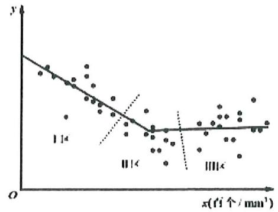

以下是他们在统计中得到

I区： $\sum_{i = 1}^{16}x_iy_i = 4721$ ， $\sum_{i = 1}^{16}x_i^2 = 1706$ ， $\sum_{i = 1}^{16}x_i = 160$ ， $\sum_{i = 1}^{16}y_i = 480$

II 区： $\sum_{i=17}^{30}x_{i}y_{i}=4713,\quad\sum_{i=17}^{30}x_{i}^{2}=5134,\quad\sum_{i=17}^{30}x_{i}=266,\quad\sum_{i=17}^{30}y_{i}=252$

(1) 根据上述数据求 $\hat { a } , \hat { b }$ 的值（结果保留两位小数）  
(2) 根据 L 形折线估计, 首次用药时白细胞浓度 (单位: 个/ $\mathrm{mm}^{3}$ ) 为多少时最终用药剂量最少? (结果保留整数)  
(3) 事实上, 使用该生血药的大量数据表明, 当白细胞浓度在 $0 \sim 4000$ 个 $\mathrm{mm}^{3}$ 时, 首次用药时白细胞浓度越高, 最终用药剂量越少. 请从统计学的角度分析 (2) 的结论与实际情况产生差异的原因. (至少写出两点)

参考数据： $\frac{4721 - 16\times 10\times 30}{1706 - 16\times 10^2}\approx -0.745,\frac{9434 - 30\times 14.5\times 24}{6840 - 30\times 14.5^2}\approx -1.889,\frac{9434 - 30\times 14.2\times 24.4}{6840 - 30\times 14.2^2}\approx -1.214$

$30 + 0.745 \times 10 = 37.45, 24 + 1.889 \times 14.5 \approx 51.39, 24.4 + 1.214 \times 14.2 \approx 41.64$

# 题型二：概率统计与函数导数结合

等级 (R)

012. A, B 两个投资项目的利润率分别为随机变量 $X_{1}$ 和 $X_{2}$ , . 根据市场分析, $X_{1}$ 和 $X_{2}$ 的分布列分比为

<table><tr><td> $X_1$ </td><td>5%</td><td>10%</td></tr><tr><td>P</td><td>0.8</td><td>0.2</td></tr></table>

<table><tr><td> $X_2$ </td><td>2%</td><td>8%</td><td>12%</td></tr><tr><td>P</td><td>0.2</td><td>0.5</td><td>0.3</td></tr></table>

(1) 在 A, B 两个项目上各投资 100 万元, $Y_{1}$ 和 $Y_{2}$ 分别表示投资项目 A 和 B 所获得的利润, 求方差 $DY_{1}, DY_{2}$ ;  
(2) 将 $x (0 \leqslant x \leqslant 100)$ 万元投资 A 项目, $100 - x$ 万元投资 B 项目, $f(x)$ 表示投资 A 项目所得利润的方差与投资 B 项目所得利润的方差的和. 求 $f(x)$ 的最小值, 并指出 $x$ 为何值时, $f(x)$ 取到最小值. (注: $D(aX + b) = a^{2}DX$ )

等级（SR）

013. 某工厂的某种产品成箱包装, 每箱 200 件, 每一箱产品在交付用户之前要对产品作检验, 如检验出不合格品, 则更换为合格品。检验时, 先从这箱产品中任取 20 件作检验, 再根据检验结果决定是否对余下的所有产品作检验。设每件产品为不合格品的概率都为 $p (0 < p < 1)$ , 且各件产品是否为不合格品相互独立.

(1) 记 20 件产品中恰有 2 件不合格品的概率为 $f(p)$ ，求 $f(p)$ 的最大值点 $p_0$ .  
(2) 现对一箱产品检验了 20 件, 结果恰有 2 件不合格品, 以 (1) 中确定的 $p_0$ 作为 $p$ 的值. 已知每件产品的检验费用为 2 元, 若有不合格品进入用户手中, 则工厂要对每件不合格品支付 25 元的赔偿费用.  
(i) 若不对该箱余下的产品作检验, 这一箱产品的检验费用与赔偿费用的和记为 $X$ , 求 $EX$ ;  
(ii) 以检验费用与赔偿费用和的期望值为决策依据, 是否该对这箱余下的所有产品作检验?

等级（SR）

2021 龙岩 5 月质检

014. 甲、乙两人进行对抗比赛, 每场比赛均能分出胜负. 已知本次比赛的主办方提供 8000 元奖金并规定: ①若有人先赢 4 场, 则先赢 4 场者获得全部奖金同时比赛终止; ②若无人先赢 4 场且比赛意外终止, 则甲、乙便按照比赛继续进行各自赢得全部奖金的概率之比分配奖金. 已知每场比赛甲赢的概率为 $p (0 < p < 1)$ , 乙赢的概率为 $1 - p$ , 且每场比赛相互独立.

(1) 设每场比赛甲赢的概率为 $\frac{1}{2}$ , 若比赛进行了 5 场, 主办方决定颁发奖金, 求甲获得奖金的分布列;  
(2) 规定: 若随机事件发生的概率小于 0.05, 则称该随机事件为小概率事件, 我们可以认为该事件不可能发生, 否则认为该事件有可能发生. 若本次比赛 $p \geq \frac{4}{5}$ , 且在已进行的 3 场比赛中甲赢 2 场、乙赢 1 场, 请判断: 比赛继续进行乙赢得全部奖金是否有可能发生, 并说明理由.

等级（SR）

015. 某校高三男生体育课上做投篮球游戏, 两人一组, 每轮游戏中, 每小组两人每人投篮两次, 投篮投进的次数之和不少于 3 次称为 “优秀小组”. 小明与小亮同一小组, 小明、小亮投篮投进的概率分别为 $P_{1}, P_{2}$ .

(1) 若 $P_{1} = \frac{2}{3}$ , $P_{2} = \frac{1}{2}$ , 则在第一轮游戏他们获“优秀小组”的概率;

(2) 若 $P_{1} + P_{2} = \frac{4}{3}$ , 且游戏中小明小亮小组要想获得 “优秀小组” 次数为 16 次, 则理论上至少要进行多少轮游戏才行? 并求此时 $P_{1}, P_{2}$ 的值.

等级（SR）

2021 年新高考 2 卷

016. 一种微生物群体可以经过自身繁殖不断生存下来, 设一个这种微生物为第 0 代, 经过一次繁殖后为第 1 代, 再经过一次繁殖后为第 2 代……, 该微生物每代繁殖的个数是相互独立的且有相同的分布列, 设 $X$ 表示 1 个微生物个体繁殖下一代的个数, $P(X = i) = p_{i} (i = 0,1,2,3)$ .

(1) 已知 $p_{0}=0.4, p_{1}=0.3, p_{2}=0.2, p_{3}=0.1$ ，求 $E(X)$ ;  
(2) 设 $p$ 表示该种微生物经过多代繁殖后临近灭绝的概率, $p$ 是关于 $x$ 的方程:  
$p_{0}+p_{1}x+p_{2}x^{2}+p_{3}x^{3}=x$ 的一个最小正实根，求证：当 $E(X)\leq1$ 时，p=1，当 $E(X)>1$ 时，
p<1;  
(3) 根据你的理解说明 (2) 问结论的实际含义.

# 题型三：高尔顿板模型

等级（SR）

湖北十一校第二次联考

017. 高尔顿板是英国生物统计学家高尔顿设计用来研究随机现象的模型, 在一块木板上钉着若干排相互平行但相互错开的圆柱形小木块, 小木块之间留有适当的空隙作为通道, 前面挡有一块玻璃, 让一个小球从高尔顿板上方的通道口落下, 小球在下落的过程中与层层小木块碰撞, 且等可能向左或向右滚下, 最后掉入高尔顿板下方的某一球槽内. 如图 1 所示的高尔顿板有 7 层小木块, 小球从通道口落下, 第一次与第 2 层中间的小木块碰撞, 以一的概率向左或向右滚下, 依次经过 6 次与小木块碰撞, 最后掉入编号为 $1, 2, \cdots, 7$ 的球槽内. 例如小球要掉入 3 号球槽, 则在 6 次碰撞中有 2 次向右 4 次向左滚下,  
(I)如图1, 进行一次高尔顿板试验, 求小球落入5号球槽的概率;   
(II) 小红、小明同学在研究了高尔顿板后, 利用高尔顿板来到社团文化节上进行盈利性 “抽奖”活动。小红使用图 1 所示的高尔顿板, 付费 6 元可以玩一次游戏, 小球掉入 m 号球槽得到的奖金为 $\xi$ 元, 其中 $\xi = |16 - 4m|$ . 小明改进了高尔顿板 (如图 2), 首先将小木块减少成 5 层, 然后使小球在下落的过程中与小木块碰撞时, 有 $\frac{1}{3}$ 的概率向左, $\frac{2}{3}$ 的概率向右滚下, 最后掉入编号为 $1, 2, \cdots, 5$ 的球槽内, 改进高尔顿板后只需付费 4 元就可以玩一次游戏, 小球掉入 n 号球槽得到的奖金为 $\eta$ 元, 其中 $\eta = (n - 4)^{2}$ . 两位同学的高尔顿板游戏火爆进行, 很多同学参加了游戏, 你觉得小红和小明同学谁的盈利多?请说明理由。

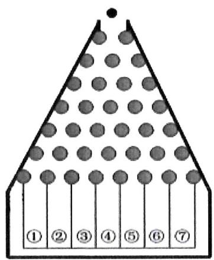

text_image

① ② ③ ④ ⑤ ⑥ ⑦

图1

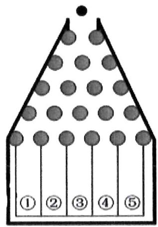

text_image

① ② ③ ④ ⑤

图2

等级（SR）

2022 海南三月联考

018. 如图是游乐场中一款抽奖游戏机的示意图, 玩家投入一枚游戏币后, 机器从上方随机放下一颗半径适当的小球, 小球沿着缝隙下落, 最后落入 $D_{1} \sim D_{6}$ 这六个区域中, 假设小球从最上层 4 个缝隙落下的概率都相同, 且下落过程中遇到障碍物会等可能地从左边或右边继续下落。

(1)分别求小球落入 $D_{1}$ 和 $D_{2}$ 的概率。

(2) 已知游戏币售价为 2 元/枚, 若小球落入 $D_{3}$ 和 $D_{4}$ , 则本次游戏中三等奖, 小球落入 $D_{2}$ 和 $D_{5}$ , 则本次游戏中二等奖, 小球落入 $D_{1}$ 和 $D_{6}$ , 则本次游戏中一等奖, 假设给玩家准备的一、二、三等奖奖品的成本价格之比为 3:2:1, 若要使玩家平均每玩一次该游戏, 商家至少获利 0.7 元, 那么三等奖奖品的成本价格最多为多少元?

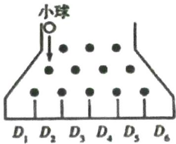

text_image

小球
D₁ D₂ D₃ D₄ D₅ D₆

# 题型四：混血测病问题

等级（SR）

019. 已知 5 只动物中有 1 只患有某种疾病，需要通过化验血液来确定患病的动物。血液化验结果呈阳性的即为患病动物，呈阴性即没患病。下面是两种化验方法：

方案甲：逐个化验，直到能确定患病动物为止.

方案乙: 先任取 3 只, 将它们的血液混在一起化验. 若结果呈阳性则表明患病动物为这 3 只中的 1 只, 然后再逐个化验, 直到能确定患病动物为止; 若结果呈阴性则在另外 2 只中任取 1 只化验.

(1) 求依方案甲所需化验次数不少于依方案乙所需化验次数的概率;   
(2) 表示依方案乙所需化验次数, 求它的期望.

等级（SR）

020. 冠状病毒是一个大型病毒家族, 已知可引起感冒以及中东呼吸综合征 (MERS) 和严重急性呼吸综合征 (SARS) 等较严重疾病. 而今年出现的新型冠状病毒 (COVID-19) 是以前从未在人体中发现的冠状病毒新毒株. 人感染了新型冠状病毒后常见体征有呼吸道症状, 发热. 咳嗽. 气促和呼吸困难等. 在较严重病例中感染可导致肺炎, 严重急性呼吸综合征、肾衰竭, 甚至死亡.

核酸检测是诊断新冠肺炎的重要依据, 首先取病人的唾液或咽拭子的样本, 再提取唾液或咽拭子样本里的遗传物质, 如果有病毒, 样本检测会呈现阳性, 否则为阴性. 根据统计发现, 疑似病例核酸检测呈阳性的概率为 $p (0 < p < 1)$ , 现有 4 例疑似病例, 分别对其取样. 检测, 多个样本检测时, 既可以逐个化验, 也可以将若干个样本混合在一起化验, 混合样本中只要有病毒, 则混合样本化验结果就会呈阳性, 若混合样本呈阳性, 则将该组中各个样本再逐个化验, 若混合样本呈阴性, 则该组各个样本均为阴性.

现有以下三种方案:

方案一：逐个化验；

方案二：四个样本混在一起化验；

方案三：平均分成两组化验.

在新冠肺炎爆发初期，由于检查能力不足，化验次数的期望值越小，则方案越“优”.

(1) 若 $p = \frac{1}{4}$ , 求 2 个疑似病例样本混合化验结果为阳性的概率;  
(2) 若 $p = \frac{1}{4}$ , 现将该 4 例疑似病例样本进行化验, 请问: 方案一、二、三中哪个最 “优” ?  
(3) 若对 4 例疑似病例样本进行化验, 且 “方案二” 比 “方案一” 更 “优”, 求 $p$ 的取值范围.

# 题型五：概率与数列（含马尔科夫链）

等级（SR）

2023 佛山二模

021. 有 $n$ 个编号分别为 $1, 2, \cdots, n$ 的盒子, 第 1 个盒子中有 2 个白球 1 个黑球, 其余盒子中均为 1 个白球 1 个黑球, 现从第 1 个盒子中任取一球放入第 2 个盒子, 再从第 2 个盒子中任取一球放入第 3 个盒子, 以此类推, 则从第 2 个盒子中取到白球的概率是 , 从第 $n$ 个盒子中取到白球的概率是 .

等级(SR)

2024 衡中同卷一模

022.(多选) 投掷一枚质地不均匀的硬币,已知出现正面向上的概率为 $p$ ,记 $A$ 表示事件“在 $n$ 次投掷中,硬币正面向上出现偶数次”则下列结论正确的是 ( )

A. $A_{2}$ 与 $\overline{A_2}$ 是互斥事件

B. $P(A_{2}) = p^{2}$

C. $P(A_{n + 1}) = (1 - 2p)P(A_n) + p$

D. $P(A_{2n}) > P(A_{2n + 2})$

等级(SR)

2024 娄底一模

023.龙年参加了一闯关游戏,该游戏共需挑战通过m个关卡,分别为: $G_{1},G_{2},\cdots,G_{m}$ ,记挑战每一个关卡 $G_{k}(k=1,2,\cdots,m)$ 失败的概率为 $a_{k}$ ,其中 $a_{k}\in(0,1),a_{1}=\frac{1}{3}$ .游戏规则如下:从第一个关卡 $G_{1}$ 开始闯关,成功挑战通过当前关卡之后,就自动进入到下一关卡,直到某个关卡挑战失败或全部通过时游戏结束,各关卡间的挑战互相独立.若m=2,设龙年在闯关结束时进行到了第X关,X的数学期望 $E(X)=$ \_\_\_\_;在龙年未能全部通关的前提下,若游戏结束时他闯到第 $k+1$ 关的概率总等于闯到第k关 $(k=1,2,\cdots,m-1)$ )的概率的一半,则数列 $\left\{a_{n}\right\}$ 的通项公式 $a_{n}=$ \_\_\_\_, $n=1,2,\cdots,m$ .

等级（SR）

2023 杭州二模

024. 马尔科夫链是概率统计中的一个重要模型，也是机器学习和人工智能的基石，在

强化学习、自然语言处理、金融领域、天气预测等方面都有着极其广泛的应用. 其数学定义为: 假设我们的序列状态是..., $X_{t-2}, X_{t-1}, X_t, X_{t+1}, \ldots$ , 那么 $X_{t+1}$ 时刻的状态的条件概率仅依赖前一状态 $X_t$ , 即 $P(X_{t+1} | \ldots, X_{t-2}, X_{t-1}, X_t) = P(X_{t+1} | X_t)$ .

现实生活中也存在着许多马尔科夫链，例如著名的赌徒模型。

假如一名赌徒进入赌场参与一个赌博游戏, 每一局赌徒赌赢的概率为 $50\%$ , 且每局赌赢可以赢得1元, 每一局赌徒赌输的概率为 $50\%$ , 且赌输就要输掉1元. 赌徒会一直玩下去, 直到遇到如下两种情况才会结束赌博游戏: 一种是手中赌金为0元, 即赌徒输光; 一种是赌金达到预期的 $B$ 元, 赌徒停止赌博. 记赌徒的本金为 $A (A \in N^{*}, A < B)$ , 赌博过程如下图的数轴所示.

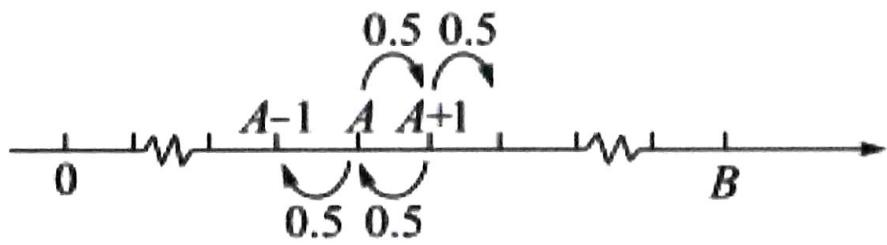

text_image

0
A-1 A A+1
0.5 0.5
0.5 0.5
B

当赌徒手中有 $n$ 元 $(0 \leq n \leq B, n \in \mathbf{N})$ 时，最终输光的概率为 $P(n)$ ，请回答下列问题：（1）请直接写出 $P(0)$ 与 $P(B)$ 的数值.

(2) 证明 $\{P(n)\}$ 是一个等差数列，并写出公差 $d$ .  
(3) 当 $A = 100$ 时, 分别计算 $B = 200, B = 1000$ 时, $P(A)$ 的数值, 并结合实际,  
解释当 $B \to \infty$ 时， $P(A)$ 的统计含义.

等级（SR）

025. 如图, 直角坐标系中, 圆的方程为 $x^{2} + y^{2} = 1$ , $A(1,0)$ , $B(-\frac{1}{2}, \frac{\sqrt{3}}{2})$ , $C(-\frac{1}{2}, -\frac{\sqrt{3}}{2})$ 为圆上三个定点, 某同学从 $A$ 点开始, 用掷骰子的方法移动棋子, 规定: ①每掷一次骰子, 把一枚棋子从一个定点沿圆弧移动到相邻下一个定点; ②棋子移动的方向由掷骰子决定, 若掷出的骰子的点数为偶数, 则按图中箭头方向移动; 若掷出骰子的点数为奇数, 则按图中箭头相反的方向移动, 设掷骰子 $n$ 次时, 棋子移动到 $A, B, C$ 处的概率分别为 $P_{n}(A), P_{n}(B), P_{n}(C)$ . 例如: 掷骰子一次时, 棋子移动到 $A, B, C$ 处的概率分别为 $P_{1}(A) = 0$ , $P_{1}(B) = \frac{1}{2}$ , $P_{1}(C) = \frac{1}{2}$ .

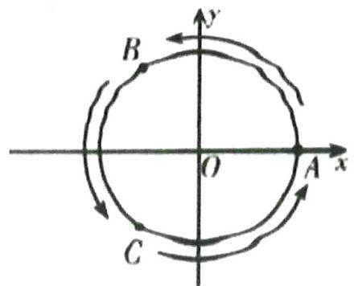

text_image

B
O
A
x
y
C

(1) 分别掷骰子二次, 三次时, 求棋子分别移动到 $A, B, C$ 处的概率;  
(2) 掷骰子 $N$ 次时, 若以 $X$ 轴非负半轴为始边, 以射线 $O A, O B, O C$ 为终边的角的余弦值记为随机变量 $X_{n}$ , 求 $X_{4}$ 的分布列和数学期望;  
(3) 记 $P_{n}(A) = a_{n}, P_{n}(B) = b_{n}, P_{n}(C) = c_{n}$ , 其中 $a_{n} + b_{n} + c_{n} = 1$ , 证明: 数列 $\{b_{n} - \frac{1}{3}\}$ 是等比数列, 并求 $a_{2020}$ .

等级（SR）

026. 某工厂生产零件 $A$ ，工人甲生产一件零件 $A$ ，是一等品、二等品、三等品的概率分别为 $\frac{1}{4}$ ， $\frac{1}{2}$ ， $\frac{1}{4}$ ，工人乙生产一件零件 $A$ ，是一等品、二等品、三等品的概率分别为 $\frac{1}{3}$ ， $\frac{1}{3}$ ， $\frac{1}{3}$ 。已知生产一件一等品、二等品、三等品零件 $A$ 给工厂带来的效益分别为 10 元、5 元、2 元。

(Ⅰ) 试根据生产一件零件 $A$ 给工厂带来的效益的期望值判断甲乙技术的好坏; (Ⅱ) 为鼓励工人提高技术, 工厂进行技术大赛, 最后甲乙两人进入了决赛. 决赛规则是: 每一轮比赛, 甲乙各生产一件零件 $A$ , 如果一方生产的零件 $A$ 品级优于另一方生产的零件, 则该方得分 1 分, 另一方得分 -1 分, 如果两人生产的零件 $A$ 品级一样, 则两方都不得分, 当一方总分为 4 分时, 比赛结束, 该方获胜. $P_{i+4} (i = -4, -3, -2, \cdots 4)$ 表示甲总分为 $i$ 时, 最终甲获胜的概率.

① 写出 $P_{0}$ , $P_{8}$ 的值;  
② 求决赛甲获胜的概率.

等级（SR）

027. 一只蚂蚁在如图所示的棱长为 1 米的正四面体的楼上爬行, 每次当它到达四面体顶点后, 会在过此顶点的三条棱中等可能的选择一条棱继续爬行 (包含来时的棱), 已知蚂蚁每分钟爬行 1 米, $t = 0$ 时蚂蚁位于点 $A$ 处.

(1) 2 分钟末蚂蚁位于哪点的概率最大;  
(2) 记第 $n$ 分钟末蚂蚁位于点 $A, B, C, D$ 的概率分别为 $P_{n}(A), P_{n}(B), P_{n}(C), P_{n}(D)$ .

①求证： $P_{n}(B)=P_{n}(C)=P_{n}(D)$ ;

②辰辰同学认为, 一段时间后蚂蚁位于点 $A, B, C, D$ 的概率应该相差无几, 请你通过计算 10 分钟末蚂蚁位于各点的概率解释辰辰同学观点的合理性.

附： $\left(\frac{1}{3}\right)^9\approx 5\times 10^{-5},\left(\frac{1}{3}\right)^{10} = 1.7\times 10^{-5},\left(\frac{1}{2}\right)^9\approx 1.9\times 10^{-9},\left(\frac{1}{3}\right)^{10}\approx 9.8\times 10^{-4}$

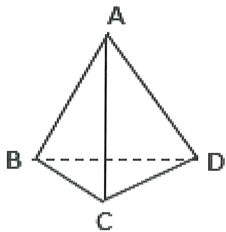

text_image

A
B
C
D

# 等级(SR)

# 2024 河南五市第一次联考

028.某档电视节目举行了关于“中国梦”的知识竞赛,规则如下:选手每两人一组,同一组的两人以抢答的方式答题,抢到并回答正确得1分,答错则对方得1分,比赛进行到一方比另一方净胜2分结束,且多得2分的一方最终胜出.已知甲、乙两名选手分在同一组,两人都参与每一次抢题,且每次抢到题的概率都为 $\frac{1}{2}$ ,甲、乙两人每道题答对的概率分别为 $\frac{3}{5},\frac{1}{2}$ ,并且每道题两人答对与否相互独立,假设准备的竞赛题足够的多.

(1) 求第二题答完比赛结束的概率;  
(2) 求知识竞赛结束时,抢答题目总数 X 的期望 $E(X)$

# 题型六：二项分布/超几何分布中的最大概率项

等级（SR）

029. 在传染病学中, 通常把从致病刺激物侵入机体或者对机体发生作用, 起到机体出现反应或开始呈现该疾病对应的相关症状时止的这一阶段称为潜伏期. 一研究团队统计了某地区 1000 名者的相关信息, 得到如下表格:

<table><tr><td>潜伏期(单位:天)</td><td>[0, 2]</td><td>(2, 4]</td><td>(4, 6]</td><td>(6, 8]</td><td>(8, 10]</td><td>(10, 12]</td><td>(12, 14]</td></tr><tr><td>人数</td><td>85</td><td>205</td><td>310</td><td>250</td><td>130</td><td>15</td><td>5</td></tr></table>

(1)求这 1000 名患者的潜伏期的样本平均数 $\overline{x}$ (同一组中的数据用该组区间的中点值作代表);

(2) 该传染病的潜伏期受诸多因素的影响, 为研究潜伏期与患者年龄的关系, 以潜伏期是否超过 6 天为标准进行分层抽样, 从上述 1000 名患者中抽取 200 人, 得到如下列联表, 请将列联表补充完整, 并根据列联表判断是否有 $95 \%$ 的把握认为潜伏期与患者年龄有关;

<table><tr><td></td><td>潜伏期≤6天</td><td>潜伏期&gt;6天</td><td>总计</td></tr><tr><td>50岁以上(含50岁)</td><td></td><td></td><td>100</td></tr><tr><td>50岁以下</td><td>55</td><td></td><td></td></tr><tr><td>总计</td><td></td><td></td><td>200</td></tr></table>

(3) 以这 1000 名患者的潜伏期超过 6 天的频率, 代替该地区 1 名患者潜伏期超过 6 天发生的概率, 每名患者的潜伏期是否超过 6 天相互独立, 为了深入研究, 该研究团队随机调查了 20 名患者, 其中潜伏期超过 6 天的人数最有可能 (即概率最大) 是多少?

附：

<table><tr><td> $P(K^{2} \geqslant k_{0})$ </td><td>0.05</td><td>0.025</td><td>0.010</td></tr><tr><td> $k_{0}$ </td><td>3.841</td><td>5.024</td><td>6.635</td></tr></table>

$K^{2}=\frac{n(ad-bc)^{2}}{(a+b)(c+d)(a+c)(b+d)}$ ，其中 $n=a+b+c+d$ .

等级（SR）

2023 四省联考

030.一个池塘里的鱼的数目记为 $N$ , 从池塘里捞出 200 尾鱼, 并给鱼作上标识, 然后把鱼放回池塘里, 过一小段时间后再从池塘里捞出 500 尾鱼, $X$ 表示捞出的 500 尾鱼中有标识的鱼的数目.

(1)若 $N = 5000$ ，求 $X$ 的数学期望；

(2)已知捞出的 500 尾鱼中 15 尾有标识, 试给出 $N$ 的估计值 (以使得 $P(X=15)$ 最大的 $N$ 的值作为 $N$ 的估计值).

# 等级（SR）

# 2021 苏锡常镇二模

031. 某中学的一个高二学生社团打算在开学初组织部分同学打扫校园。该社团通知高二同学自愿报名，由于报名的人数多达 50 人，于是该社团采用了在报名同学中用抽签的方式来确定打扫校园的人员名单。抽签方式如下：将 50 名同学编号，通过计算机从这 50 个编号中随机抽取 30 个编号，然后再次通过计算机从这 50 个编号中随机抽取 30 个编号，两次都被抽取到的同学打扫校园。

(1) 设该校高二年级报名打扫校园的甲同学的编号被抽取到的次数为 $Y$ , 求 $Y$ 的数学期望;  
(2) 设两次都被抽到的人数为变量 $X$ , 则 $X$ 的可能取值是哪些? 其中 $X$ 取到哪一个值的可能性最大? 请说明理由。

# 题型七：最大似然估计

等级（SR）

2024 杭州二模

032.在概率统计中, 常常用频率估计概率, 已知袋中有若干个红球和白球, 有放回地随机摸球 $n$ 次, 红球出现 $m$ 次. 假设每次摸出红球的概率为 $p$ , 根据频率估计概率的思想, 则每次摸出红球的概率 $p$ 的估计值为 $\hat{p} = \frac{m}{n}$ .

(1) 若袋中这两种颜色球的个数之比为 1:3, 不知道哪种颜色的球多.有放回地随机摸取 3 个球, 设摸出的球为红球的次数为 $Y$ , 则 $Y \sim B(3, p)$ .

注: $P_{p}(Y = k)$ 表示当每次摸出红球的概率为 $p$ 时, 摸出红球次数为 $k$ 的概率)

(i) 完成下表:

<table><tr><td>k</td><td>0</td><td>1</td><td>2</td><td>3</td></tr><tr><td> $P_{\frac{1}{4}}(Y=k)$ </td><td> $\frac{27}{64}$ </td><td></td><td></td><td> $\frac{1}{64}$ </td></tr><tr><td> $P_{\frac{3}{4}}(Y=k)$ </td><td></td><td> $\frac{9}{64}$ </td><td></td><td> $\frac{27}{64}$ </td></tr></table>

(ii) 在统计理论中, 把使得 $P_{p}(Y = k)$ 的取值达到最大时的 $p$ , 作为 $p$ 的估计值, 记为 $\hat{p}$ , 请写出 $\hat{p}$ 的值.

(2) 把 (1) 中“使得 $P_{p}(Y = k)$ 的取值达到最大时的 $p$ 作为 $p$ 的估计值 $\hat{p}$ ”的思想称为最大似然原理. 基于最大似然原理的最大似然参数估计方法称为最大似然估计.

具体步骤: 先对参数 $\theta$ 构建对数似然函数 $l(\theta)$ , 再对其关于参数 $\theta$ 求导, 得到似然方程 $l'(\theta) = 0$ , 最后求解参数 $\theta$ 的估计值. 已知 $Y \sim B(n, p)$ 的参数 $p$ 的对数似然函数为 $l(p) = \sum_{i=1}^{n} X_i \ln p + \sum_{i=1}^{n} (1 - X_i) \ln(1 - p)$ , 其中 $X_i = \begin{cases} 0, & \text{第 } i \text{ 次摸出白球} \\ 1, & \text{第 } i \text{ 次摸出红球} \end{cases}$ . 求参数 $p$ 的估计值, 并且说明频率估计概率的合理性.

等级（SSR）

2024 天域名校协作体 4 月联考

033.甲、乙两人进行知识问答比赛, 共有 $n$ 道抢答题, 甲、乙抢题的成功率相同, 假设每题甲乙答题正确的概率分别为 $p$ 和 $\frac{1}{3}$ , 各题答题相互独立.规则为: 初始双方均为 0 分, 答对一题得 1 分,答错一题得-1 分, 未抢到题得 0 分, 最后累计总分多的人获胜.

（1）若 $n = 3$ ， $p = \frac{1}{2}$ ，求甲获胜的概率；

(2) 若 $n = 20$ , 设甲第 $i$ 题的得分为随机变量 $X_{i}$ , 一次比赛中得到 $X_{i}$ 的一组观测值 $x_{i} (i = 1, 2, \cdots, 20)$ , 如下表. 现利用统计方法来估计 $p$ 的值:

①设随机变量 $\bar{X}=\frac{1}{n}\sum_{i=1}^{n}X_{i}$ ，若以观测值 $x_{i}(i=1,2,\cdots,20)$ 的均值 $\bar{x}$ 作为 $\bar{X}$ 的数学期望，请以此求出 p 的估计值 $\hat{p}_{1}$ ;

(2) 设随机变量 $X_{i}$ 取到观测值 $x_{i} (i = 1,2,\dots,20)$ 的概率为 $L(p)$ , 即 $L(p) = P \left(X_{1} = x_{1}, X_{2} = x_{2}, \dots, X_{20} = x_{20}\right)$ ; 在一次抽样中获得这一组特殊观测值的概率应该最大, 随着 $p$ 的变化, 用使得 $L(p)$ 达到最大时 $p$ 的取值 $\hat{p}_{2}$ 作为参数 $p$ 的一个估计值. 求 $\hat{p}_{2}$ .

<table><tr><td>题目</td><td>1</td><td>2</td><td>3</td><td>4</td><td>5</td><td>6</td><td>7</td><td>8</td><td>9</td><td>10</td></tr><tr><td>得分</td><td>1</td><td>0</td><td>0</td><td>-1</td><td>1</td><td>1</td><td>-1</td><td>0</td><td>0</td><td>0</td></tr><tr><td>题目</td><td>11</td><td>12</td><td>13</td><td>14</td><td>15</td><td>16</td><td>17</td><td>18</td><td>19</td><td>20</td></tr><tr><td>得分</td><td>-1</td><td>0</td><td>1</td><td>1</td><td>-1</td><td>0</td><td>0</td><td>0</td><td>1</td><td>0</td></tr></table>

表 1: 甲得分的一组观测值

附: 若随机变量 $X, Y$ 的期望 $E(X)$ , $E(Y)$ 都存在, 则 $E(X + Y) = E(X) + E(Y)$ .

# 题型八：超几何分布的深入考察

等级(SR)

2024 辽宁协作体 4 月联考

034.某自然保护区经过几十年的发展, 某种濒临灭绝动物数量有大幅度的增加. 已知这种动物 $P$ 拥有两个亚种 (分别记为 A 种和 B 种). 为了调查该区域中这两个亚种的数目, 某动物研究小组计划在该区域中捕捉 100 个动物 $P$ , 统计其中 A 种的数目后, 将捕获的动物全部放回, 作为一次试验结果. 重复进行这个试验共 20 次, 记第 $i$ 次试验中 A 种的数目为随机变量 $X_{i} (i = 1,2,\cdots,20)$ . 设该区域中 A 种的数目为 $M$ , $B$ 种的数目为 $N(M,N$ 均大于 100), 每一次试验均相互独立.

(1) 求 $X_{1}$ 的分布列;

(2) 记随机变量 $\bar{X} = \frac{1}{20} \sum_{i=1}^{20} X_{i}$ . 已知

$$
E (X _ {i} + X _ {j}) = E (X _ {i}) + E (X _ {j}), D (X _ {i} + X _ {j}) = D (X _ {i}) + D (X _ {j})
$$

(i) 证明: $E(\overline{X}) = E(X_1), D(\overline{X}) = \frac{1}{20} D(X_1)$ ;

(ii) 该小组完成所有试验后, 得到 $X_{i}$ 的实际取值分别为 $x_{i} (i = 1,2,\cdots,20)$ . 数据 $x_{i} (i = 1,2,\cdots,20)$ 的平均值 $\overline{x} = 30$ , 方差 $s^{2} = 1$ . 采用 $\overline{x}$ 和 $s^{2}$ 分别代替 $E(\overline{X})$ 和 $D(\overline{X})$ , 给出 $M, N$ 的估计值.

(已知随机变量 x 服从超几何分布记为: $x \sim H(P, n, Q)$ (其中 P 为总数, Q 为某类元素的个数, n 为抽取的个数), 则 $D(x) = n \frac{Q}{P} \left(1 - \frac{Q}{P}\right) \left(\frac{P - n}{P - 1}\right)$ .

# 题型九：正态分布标准化

# 等级（SR）

035. 某大型国有企业计划招聘 300 名员工, 应聘者必须通过初试和复试两场考试, 每场考试各 400 分, 应聘者通过初试后取成绩排名在前 2000 的人参加复试, 复试成绩在前 300 的应聘者可获得相应岗位, 现将初试成绩统计如下表示.

<table><tr><td>初试成绩(单位:分)</td><td>[0,100)</td><td>[100,200)</td><td>[200,300)</td><td>[300,400]</td></tr><tr><td>频数</td><td>1000</td><td>6000</td><td>2000</td><td>1000</td></tr></table>

(1) 试估计所有应聘者初试的平均成绩（同一组中的数据用该组所在区间的中点值代替）  
(2) 现按照分层抽样从成绩在 $[200, 300)$ 和 $[300, 400]$ 的应聘者中随机抽取 12 人, 再从这 12 人中抽取 3 人, 记其中成绩在 $[300, 400]$ 的人数为 $X$ , 求 $X$ 的分布列及数学期望;  
(3) 假设复试的成绩服从正态分布 $\mathrm{N}(180, \sigma^2)$ , 且 360 分以下 (含 360 分) 的有 1970 人, 若甲的复试成绩为 250 分, 试通过计算说明甲是否能够获得相应岗位。

(计算过程中σ取整数)

参考数据: (1) 当 $X \sim N$ ( $\mu$ , $\sigma^2$ ), 令 $Y = \frac{X - \mu}{\sigma}$ , 则 $Y \sim N$ (0, 1);

(2) 当 $Y^{N}(0,1)$ 时， $P(Y \leqslant 2.17) = 0.985$ ， $P(Y < 1.04) = 0.85$ .

等级（SR）

2021 深圳二模

036. 已知某高校共有 10000 名学生, 其图书馆阅览室共有 994 个座位, 假设学生是否去自习是相互独立的, 且每个学生在每天的晚自习时间去阅览室自习的概率均为 0.1.

(1) 将每天的晚自习时间去阅览室自习的学生人数记为 $X$ , 求 $X$ 的期望和方差:  
(2) 18 世纪 30 年代, 数学家棣莫弗发现, 如果随机变量 $X$ 服从二项分布 $B(n, p)$ , 那么当 $n$ 比较大时, 可视为 $X$ 服从正态分布 $N(\mu, \sigma^2)$ . 任意正态分布都可变换为标准正态分布 ( $\mu = 0$ 且 $\sigma = 1$ 的正态分布), 如果随机变量 $Y \sim N(\mu, \sigma^2)$ , 那么令 $Z = \frac{Y - \mu}{\sigma}$ , 则可以证明 $Z \sim N(0, 1)$ . 当 $Z \sim N(0, 1)$ 时, 对于任意实数 $a$ , 记 $\Phi(a) = P(Z < a)$

已知下表为标准正态分布表(节选), 该表用于查询标准正态分布对应的概率值. 例如当 $a = 0.16$ 时, 由于 $0.16 = 0.1 + 0.06$ , 则先在表的最左列找到数字 0.1 (位于第三行), 然后在表的最上行找到数字 0.06 (位于第八列), 则表中位于第三行第八列的数字 0.5636 便是 $\Phi$ (0.16) 的值.

(i) 求在晚自习时间阅览室座位不够用的概率:  
(i) 若要使在晚自习时间阅览室座位够用的概率高于 0.7, 则至少需要添加多少个座位?

<table><tr><td>a</td><td>0.00</td><td>0.01</td><td>0.02</td><td>0.03</td><td>0.04</td><td>0.05</td><td>0.06</td><td>0.07</td><td>0.08</td><td>0.09</td></tr><tr><td>0.0</td><td>0.5000</td><td>0.5040</td><td>0.5080</td><td>0.5120</td><td>0.5160</td><td>0.5199</td><td>0.5239</td><td>0.5279</td><td>0.5319</td><td>0.5359</td></tr><tr><td>0.1</td><td>0.5398</td><td>0.5438</td><td>0.5478</td><td>0.5517</td><td>0.5557</td><td>0.5596</td><td>0.5636</td><td>0.5675</td><td>0.5714</td><td>0.5753</td></tr><tr><td>0.2</td><td>0.5793</td><td>0.5832</td><td>0.5871</td><td>0.5910</td><td>0.5948</td><td>0.5987</td><td>0.6026</td><td>0.6064</td><td>0.6103</td><td>0.6141</td></tr><tr><td>0.3</td><td>0.6179</td><td>0.6217</td><td>0.6255</td><td>0.6293</td><td>0.6331</td><td>0.6368</td><td>0.6404</td><td>0.6443</td><td>0.6480</td><td>0.6517</td></tr><tr><td>0.4</td><td>0.6554</td><td>0.6591</td><td>0.6628</td><td>0.6664</td><td>0.6700</td><td>0.6736</td><td>0.6772</td><td>0.6808</td><td>0.6884</td><td>0.6879</td></tr><tr><td>0.5</td><td>0.6915</td><td>0.6950</td><td>0.6985</td><td>0.7019</td><td>0.7054</td><td>0.7088</td><td>0.7123</td><td>0.7157</td><td>0.7190</td><td>0.7224</td></tr></table>

# 题型十：敏感问题的问卷设计

等级（SR）

2023 深圳一模

037. 某企业因技术升级, 决定从 2023 年起实现新的绩效方案, 方案起草后, 为了解员工对新绩效方案是否满意, 决定采取如下 “随机化回答技术” 进行问卷调查:

一个袋子中装有三个大小相同的小球, 其中 1 个黑球, 2 个白球, 企业所有员工从袋子中有放回的随机摸两次球, 每次摸出一球, 约定 “若两次摸到的球的颜色不同, 则按方式 I 回答问卷, 否则按方式 II 回答问卷”.

方式 I ：若第一次摸到的是白球，则在问卷中画 “O”，否则画 “×”；

方式 II: 若你对新绩效方案满意, 则在问卷中画 “O”, 否则画 “×”.

当所有员工完成问卷调查后，统计画 O，画 × 的比例。用频率估计概率，由所学概率知识即可求得该企业员工对新绩效方案的满意度的估计值，其中，

$$
\mathrm{满意度} = \frac {\mathrm{企业所有对新绩效方案满意的员工人数}}{\mathrm{企业所有员工人数}} \times 100
$$

(1) 若该企业某部门有 9 名员工, 用 $X$ 表示其中按方式 I 回答问卷的人数, 求 $X$ 的数学期望;  
(2)若该企业的所有调查问卷中, 画 “O” 与画 “×” 的比例为 $4:5$ , 试估计该企业员工对新绩效方案的满意度.

# 题型十一：切比雪夫不等式的应用

等级（SR）

2023渭南二模

038. 在数字通信中, 信号是由数字 “0” 和 “1” 组成的序列. 现连续发射信号 $n$ 次, 每次发射信号 “0” 和 “1” 是等可能的. 记发射信号 “1” 的次数为 $X$ .

（I）当 $n = 6$ 时，求 $P(X \leq 2)$ ；

(II)已知切比雪夫不等式: 对于任一随机变量 $Y$ , 若其数学期望 $E(Y)$ 和方差 $D(Y)$ 均存在, 则对任意正实数 $a$ , 有 $P(\left|Y - E(Y)\right| < a) \geq 1 - \frac{D(Y)}{a^2}$ . 根据该不等式可以对事件

“ $|Y - E(Y)| < a$ ”的概率作出下限估计.为了至少有98%的把握使发射信号“1”的频率在0.4与0.6之间，试估计信号发射次数n的最小值.

等级（SR）

2024 金丽衢十二校联考

039.某工厂生产某种元件, 其质量按测试指标划分为: 指标大于或等于 82 为合格品, 小于 82 为次品, 现抽取这种元件 100 件进行检测, 检测结果统计如下表:

<table><tr><td>测试指标</td><td>[20, 76)</td><td>[76, 82)</td><td>[82, 88)</td><td>[88, 94)</td><td>[94, 100]</td></tr><tr><td>元件数(件)</td><td>12</td><td>18</td><td>36</td><td>30</td><td>4</td></tr></table>

(1) 现从这 100 件样品中随机抽取 2 件, 若其中一件为合格品, 求另一件也为合格品的概率:  
(2) 关于随机变量, 俄国数学家切比雪夫提出切比雪夫不等式:

若随机变量 X 具有数学期望 $E(X)=\mu,$ ，方差 $D(X)=\sigma^{2},$ ，则对任意正数 $\varepsilon$ ，均有 $P(|x-\mu| \geqslant \varepsilon) \leqslant \frac{\sigma^{2}}{\varepsilon^{2}}$ 成立.

(i) 若 $X \sim B\left(100, \frac{1}{2}\right)$ ，证明： $P(0 \leqslant X \leqslant 25) \leqslant \frac{1}{50}$ ;

(ii) 利用该结论表示即使分布未知, 随机变量的取值范围落在期望左右的一定范围内的概率是有界的. 若该工厂声称本厂元件合格率为 $90 \%$ ，那么根据所给样本数据，请结合“切比雪夫不等式”说明该工厂所提供的合格率是否可信? (注: 当随机事件 A 发生的概率小于 0.05 时, 可称事件 A 为小概率事件)

# 题型十二：多选选几个合适？

等级（SR）

2023 武昌区五调

040. 某考生在做高考数学模拟题第 12 题时发现不会做. 已知该题有四个选项, 为多选题, 至少有两项正确, 至多有 3 个选项正确. 评分标准为: 全部选对得 5 分, 部分选对得 2 分, 选到错误选项得 0 分. 设此题正确答案为 2 个选项的概率为 $p_{0} (0 < p_{0} < 1)$ . 已知该考生随机选择若干个 (至少一个).

(1) 若 $p_{0} = \frac{1}{2}$ , 该考生随机选择 2 个选项, 求得分 $X$ 的分布列及数学期望;  
(2)为使他此题得分数学期望最高, 请你帮他从以下三种方案中选一种, 并说明理由.

方案一：随机选择一个选项；

方案二：随机选择两个选项；

方案三：随机选择三个选项.

# 题型十三：利用概率证明数列类不等式

等级（SR）

2022 重庆缙云教育联盟第二次诊断

041. 规定抽球试验规则如下: 盒子中初始装有白球和红球各一个, 每次有放回的任取一个, 连续取两次, 将以上过程记为一轮, 如果每一轮取到的两个球都是白球, 则记该轮为成功, 否则记为失败, 在抽取过程中, 如果某一轮成功, 则停止; 否则, 在盒子中再放入一个红球, 然后接着进行下一轮抽球, 如此不断继续下去, 直至成功。

(1) 某人进行该抽球试验时, 最多进行三轮, 即使第三轮不成功, 也停止抽球, 记其进行抽球试验的轮次数为随机变量 $X$ , 求 $X$ 的分布列和数学期望;  
(2) 为验证抽球试验成功的概率不超过 $\frac{1}{2}$ , 有 1000 名数学爱好者独立的进行该抽球试验, 记 $t$ 表示成功时抽球试验的轮次数, $y$ 表示对应的人数, 部分统计数据如下:

<table><tr><td>t</td><td>1</td><td>2</td><td>3</td><td>4</td><td>5</td></tr><tr><td>y</td><td>232</td><td>98</td><td>60</td><td>40</td><td>20</td></tr></table>

求 y 关于 t 的回归方程 $\hat{y}=\frac{\hat{b}}{t}+\hat{a}$ ，并预测成功的总人数（精确到 1）；

（3）证明 $\frac{1}{2^2} + (1 - \frac{1}{2^2})\frac{1}{3^2} + (1 - \frac{1}{2^2})(1 - \frac{1}{3^2})\frac{1}{4^2} + \dots + (1 - \frac{1}{2^2})(1 - \frac{1}{3^2})\cdot \dots \cdot (1 - \frac{1}{n^2})\frac{1}{(n + 1)^2} < \frac{1}{2}$ 附：经验回归方程系数： $\hat{b} = \frac{\sum_{i=1}^{n} x_i y_i - n\bar{x} \cdot \bar{y}}{\sum_{i=1}^{n} x_i^2 - n\bar{x}^2}, \hat{a} = \hat{y} - \hat{b}\bar{x};$

参考数据： $\sum_{i = 1}^{5}x_{i}^{2} = 1.46$ ， $\bar{x} = 0.46$ ， $\bar{x}^2 = 0.212$ （其中 $x_{i} = \frac{1}{t_{i}}$ ， $\bar{x} = \frac{1}{5}\sum_{i = 1}^{5}x_{i})$

# 题型十四：安排出场顺序问题

等级（SR）

042. 工作人员需进入核电站完成某项具有高辐射危险的任务, 每次只派一人进去, 且每个人只需一次, 工作时间不超过 10 分钟, 如果有一个人 10 分钟内不能完成任务则撤出, 再派下一个人. 现在一共只有甲、乙、丙一人可派, 他们各自能完成任务的概率分别是 $p_{1}, p_{2}, p_{3}$ 互不相等, 且规定各人能否完成任务的事件相互独立.

(1) 如果按甲在先, 乙次之, 丙最后的顺序派人, 求任务能被完成的概率. 若改变三人被派出的先后顺序, 任务能被完成的概率是否发生变化?  
(2) 若按某指定顺序派人, 这三个人各自能完成任务的概率依次为 $q_{1}, q_{2}, q_{3}$ , 其中 $q_{1}, q_{2}, q_{3}$ 是 $p_{1}, p_{2}, p_{3}$ 的一个排列, 求所需要派出人员数目 $X$ 的分布列和均值 (顺序期望) $E X$ ;  
(3) 假定 $1 > p_{1} > p_{2} > p_{3}$ , 试分析以怎样的先后顺序派出人员, 可使所需派出的人员数目的均值 $E X$ 达到最小.

# 题型十五：条件期望

等级（SR）

2022 铁岭六校三月联考

043. 条件概率和条件期望是现代概率体系中的重要概念。近年来，随着人们对随机现象的不段观察和研究，条件概率和条件期望已经被广泛的利用到日常生活中。定义：设 X, Y 是离散型随机变量，则 X 在给定事件 Y=y 条件下的期望为：

$$
E (X \mid Y = y) = \sum_ {i = 1} ^ {n} x _ {i} \cdot P (X = x _ {i} \mid Y = y) = \sum_ {i = 1} ^ {n} x _ {i} \cdot \frac {P (X = x _ {i} , Y = y)}{P (Y = y)}
$$

其中 $\{x_{1}, x_{2}, \cdots, x_{n}\}$ 为 X 的所有可能取值集合。 $P(X = x, Y = y)$ 表示事件“X = x”与事件“Y = y”都发生的概率。

某射击手进行射击训练, 每次射击击中目标的概率均为 $p (0 < p < 1)$ , 射击进行到击中目标两次时停止。设 $\xi$ 表示第一次击中目标时的射击次数, $\eta$ 表示第二次击中目标时的射击次数。

（I）求 $P(\xi = 2,\eta = 5),p(\eta = 5)$   
(II) $E(\xi \mid \eta = 5), E(\xi \mid \eta = n)(n \geq 2)$

# 题型十六：二维离散型随机变量联合分布列

等级（SR）

2022 泰州模拟

044. 设 (X, Y) 是一个二维离散型随机变量，它们的一切可能取的值为 $(a_{i}, b_{j})$ ，其中 $i, j \in N^{*}$ ，令 $P_{ij} = P(X = a_{i}, Y = b_{j})$ ，称 $P_{ij} (i, j \in N^{*})$ 是二维离散型随机变量 (X, Y) 的联合分布列。与一维的情形类似，我们也习惯把二维离散型随机变量的联合分布列写成下表形式：

<table><tr><td>(X, Y)</td><td> $b_1$ </td><td> $b_2$ </td><td> $b_3$ </td><td>...</td></tr><tr><td> $a_1$ </td><td> $P_{1,1}$ </td><td> $P_{1,2}$ </td><td> $P_{1,3}$ </td><td>...</td></tr><tr><td> $a_2$ </td><td> $P_{2,1}$ </td><td> $P_{2,2}$ </td><td> $P_{2,3}$ </td><td>...</td></tr><tr><td> $a_3$ </td><td> $P_{3,1}$ </td><td> $P_{3,2}$ </td><td> $P_{3,3}$ </td><td>...</td></tr><tr><td>...</td><td>...</td><td>...</td><td>...</td><td>...</td></tr></table>

现有 $n (n \in N^{*})$ 个相同的球等可能的放入编号1,2,3,的三个盒子中，记落下第1号盒子中的球的个数为X，落入第2号盒子中的球的个数为Y。

(1) 当 $n = 2$ 时, 求 (X, Y) 的联合分布列;  
（2）设 $P_{k} = \sum_{m = 0}^{n}P$ （ $X = k$ ， $Y = m$ ）， $\mathrm{k}\in \mathbb{N}$ 且 $\mathrm{k}\leqslant \mathrm{n}$ 计算 $\sum_{k = 0}^{n}kP_{k}$

# 题型十七: chatGPT

等级（SR）

2023 郴州三检

045. chatGPT 是由 OpenAI 开发的一款人工智能机器人程序, 一经推出就火遍全球, chatGPT 的开发主要采用 RLHF (人类反馈强化学习) 技术, 训练分为以下三个阶段.

第一阶段: 训练监督策略模型, 对抽取的 prompt 数据, 人工进行高质量的回答, 获取 <prompt, answer> 数据对, 帮助数学模型 GPT-3.5 更好地理解指令.

第二阶段: 训练奖励模型, 用上一阶段训练好的数学模型, 生成 $k$ 个不同的回答, 人工标注排名,通过奖励模型给出不同的数值, 奖励数值越高越好, 奖励数值可以通过最小化下面的交叉熵损失函数得到: $Loss = -\sum_{i=1}^{n} y_i \ln \hat{y}_i$ , 其中 $y_i \in \{0,1\}, \hat{y}_i \in (0,1)$ , 且 $\sum_{i=1}^{n} \hat{y}_i = 1$ .

第三阶段: 实验与强化模型和算法, 通过调整模型的参数, 使模型得到最大的奖励以符合人工的选择取向.

参考数据: $\ln 2 \approx 0.693, \ln 5 \approx 1.609, \ln 7 \approx 1.946$

(I) 若已知某单个样本, 其真实分布 $y = [y_{1}, y_{2}, \cdots, y_{10}] = [0, 0, 0, 0, 1, 0, 0, 0, 0, 0]$ , 其预测近似分布 $\hat{y} = [y_{1}, y_{2}, \cdots, y_{10}] = [0, 0.2, 0, 0, 0.7, 0, 0, 0.1, 0, 0]$ , 计算该单个样本的交叉熵损失函数 Loss 值.

(II) 绝对值误差 $MAE$ 也是一种比较常见的损失函数, 现已知某 $n$ 阶变量的绝对值误差, $MAE = \frac{1}{N} \sum_{i}^{n} | \hat{y}_{i} - y_{i}|$ 其中 $| \hat{y}_{i} - y_{i} | = | \hat{y}_{i1} - y_{i1} | + | \hat{y}_{i2} - y_{i2} | + \ldots + | \hat{y}_{in} - y_{in}|$ , $N$ 表示变量的阶。

若已知某个样本是一个三阶变量的数阵 $y = \begin{bmatrix} y_1 \\ y_2 \\ y_3 \end{bmatrix} = \begin{bmatrix} y_{11}, y_{12}, y_{13} \\ y_{21}, y_{22}, y_{23} \\ y_{31}, y_{32}, y_{33} \end{bmatrix}$ ，其真实分布是 $y = \begin{bmatrix} 0, 0, 1 \\ 0, 1, 0 \\ 1, 0, 0 \end{bmatrix}$ ，现已知其预测分布为 $\hat{y} = \begin{bmatrix} a, b, c \\ c, a, b \\ b, c, a \end{bmatrix}$ , 求证: 该变量的绝对值误差 $MAE$ 为定值.

(III)在测试 chatGPT 时, 如果输入问题没有语法错误, chatGPT 的回答被采纳的概率为 $90\%$ , 当出现语法错误时, chatGPT 的回答被采纳的概率为 $50\%$ 。现已知输入的问题中出现语法错误的概率为 $5\%$ , 现已知 chatGPT 的回答被采纳, 求该问题的输入语法没有错误的概率.

# 题型十八：读题学知识能力的考察

等级 (R)

2022 哈尔滨二模

046. 五常市是黑龙江典型农业大县（市）、国家重要的商品粮食基地，全国粮食生产十大先进县之一，也是全国水稻五强县之一，被誉为张广才岭下的“水稻王国”. 五常大米受产区独特的地理、气候等因素影响，干物质积累多，直链淀粉含量适中，支链淀粉含量较高. 由于水稻成熟期产区昼夜温差大，大米中可速溶的双链糖积累较多，对人体健康非常有益. 五常大米根据颗粒、质地、色泽、香味等评分指标打分，得分在区间(0,25], (25,50], (50,75], (75,100]内分别评定为四级大米、三级大米、二级大米、一级大米. 某经销商从五常市农民手中收购一批大米，共400袋（每袋25kg），并随机抽取20袋分别进行检测评级，得分数据的频率分布直方图如图所示:

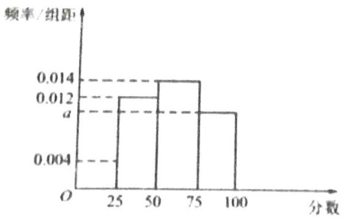

histogram

| 分数 | 频率/组距 |
| ---- | --------- |
| 25   | 0.012     |
| 50   | 0.014     |
| 75   | 0.012     |
| 100  | 0.012     |

(1) 求 $a$ 的值, 并用样本估计, 该经销商采购的这批大米中, 一级大米和二级大米的总量能否达到采购总量一半以上;  
(2) 该经销商计划在下面两个方案中选择一个作为销售方案:

方案 1: 将采购的 400 袋大米不经检测, 统一按每袋 300 元直接售出;

方案 2: 将采购的 400 袋大米逐袋分级, 并将每袋大米重新包装成 5 包 (每袋 $5 \mathrm{~kg}$ ), 检测分级所需费用和人工费共 8000 元, 各等级大米每包的售价和包装材料成本如下表所示:

<table><tr><td>大米等级</td><td>四级</td><td>三级</td><td>二级</td><td>一级</td></tr><tr><td>售价(元/包)</td><td>55</td><td>68</td><td>85</td><td>98</td></tr><tr><td>包装材料成本(元/包)</td><td>2</td><td>2</td><td>4</td><td>5</td></tr></table>

该经销商采用哪种销售方案所得利润更大？通过计算说明理由.

等级 (R)

047. 移动支付极大地方便了我们的生活, 也为整个社会节约了大量的资源与时间成本, 2018 年国家高速公路网, 力推移动支付车辆高速通行费, 推广移动支付之前, 只有两种支付方式: 现金支付或 ETC 支付, 其中使用现金支付车辆比例约为 $60\%$ , 使用 ETC 支付车辆比例约为 $40\%$ 。推广移动支付之后, 越来越多的车主选择非现金支付, 下表是推广移动支付购, 随机抽取的某时间段内所有经由某高速公路收费站驶出高速的车辆的通行费支付方式分布及其他相关数据:

<table><tr><td>支付方式</td><td>是否需要在入口处取卡</td><td>是否需要修车支付</td><td>数量统计(辆)</td><td>平均每辆车驶出耗时(秒)</td></tr><tr><td>现金支付</td><td>是</td><td>是</td><td>135</td><td>30</td></tr><tr><td>扫码支付</td><td>是</td><td>是</td><td>240</td><td>15</td></tr><tr><td>ETC 支付</td><td>否</td><td>否</td><td>750</td><td>4</td></tr><tr><td>车辆识别支付</td><td>否</td><td>否</td><td>375</td><td>4</td></tr></table>

并以此作为样本来估计所有在此高速路上行驶的车辆通行费支付方式的分布。

已知需要取卡的车辆进入高速平均每车耗时为 10 秒，不需要取卡的车辆进入高速平均每车耗时为 4 秒。

（I）若此高速公路的日均车流量为 9080 辆，估计推广移动支付后比推广移动支付前日均可少发卡多少张？

(II) 在此高速公路上, 推广移动支付后平均每辆车进出高速收费站总耗时能否比推广移动支付前大约减少一半? 说明理由。

等级 (R)

048. 随着改革开放的不断深入，祖国不断富强，人民的生活水平逐步提高，为了进一步改善民生，2019年1月1日起我国实施了个人所得税的新政策，其政策的主要内容包括：

(1) 个税起征点为 $5000$ 元;  
(2) 每月应纳税所得额（含税）=收入-个税起征点-专项附加扣除；  
(3) 专项附加扣除包括①赡养老人费用; ②子女教育费用; ③继续教育费用; ④大病医疗费用……等。其中前两项的扣除标准为: ①赡养老人费用: 每月扣除 2000 元; ②子女教育费用, 每个子女每月扣除 1000 元.

\*新个税政策的税率表部分内容如下:

<table><tr><td>级数</td><td>一级</td><td>二级</td><td>三级</td><td>四级</td><td>...</td></tr><tr><td>每月应纳税所得额(含税)</td><td>不超过3000元的部分</td><td>超过3000元至12000元的部分</td><td>超过12000元至25000元的部分</td><td>超过25000元至35000元的部分</td><td>...</td></tr><tr><td>税率(%)</td><td>3</td><td>10</td><td>20</td><td>25</td><td>...</td></tr></table>

(1) 现有李某月收入 19600 元, 膝下有一名子女, 需要赡养老人, (除此之外, 无其他专项附加扣除.) 请问李某应缴纳的个税金额为多少?  
(2) 现收集了某城市 50 名年龄在 40 岁到 50 岁之间的公司白领的相关资料, 通过整理资料可知,有一个孩子的有 40 人, 没有孩子的有 10 人, 有一个孩子的人中有 30 人需要赡养老人, 没有孩子的人中有 5 人需要赡养老人, 并且他们均不符合其他专项附加扣除 (受统计的 50 人中, 任何两人均不在一个家庭). 若他们的月收入均为 20000 元, 试求在新个税政策下这 50 名公司白领的月平均缴纳个税金额为多少?

等级（SR）

049. 某批库存零件在外包装上标有从 1 到 N 的连续自然数序号，总数 N 未知，工作人员随机抽取 n 个零件，它们的序号从小到大依次为： $x_{1}, x_{2}, \cdots, x_{n}$ . 现有两种方法对零件总数 N 进行估计.

方法一: 用样本的数字特征估计总体的数字特征, 可以认为样本零件序号的中位数与总体序号的中位数近似相等, 进而可以得到 $N$ 的估计值.

方法二: 因为零件包装上的序号是连续的, 所以抽出零件的序号 $x_{1}, x_{2}, \cdots, x_{n}$ 相当于从区间 $[0, N + 1]$ 中随机抽取 $n$ 个整数, 这 $n$ 个整数将区间 $[0, N + 1]$ 分为 $(n + 1)$ 个小区间: $(0, x_{1}), (x_{1}, x_{2}), \cdots, (x_{n}, N + 1)$ . 由于这 $n$ 个数是随机抽取的, 所以前 $n$ 个区间的平均长度 $\frac{x_{n}}{n}$ 与所有 $(n + 1)$ 个区间的平均长度 $\frac{N + 1}{n + 1}$ 近似相等, 进而可以得到 $N$ 的估计值.

现工作人员随机抽取了31个零件，序号从小到大依次为：83、135、274、380、668、895、955、964、1113、1174、1210、1344、1387、1414、1502、1546、1689、1756、1865、1874、1880、1936、2005、2006、2065、2157、2220、2224、2396、2543、2791.

(1) 请用上述两种方法分别估计这批零件的总数. (结果四舍五入入保留整数)  
(2) 将第 (1) 问方法二估计的总 $N$ 作为这批零件的总数, 从中随机抽取 100 个零件测量其内径 $y$ (单位: $\mathrm{mm}$ ), 绘制出频率分布直方图 (如右图). 已知标准零件鱼内径为 $200 \mathrm{~mm}$ , 将这 100 个零件的内径落入各组的频率视为这批零件内径分布的概率. 其中内径长度最接近标准的 720 个零件为优等品, 请求出优等品的内径范围 (结果四舍五入保留整数).

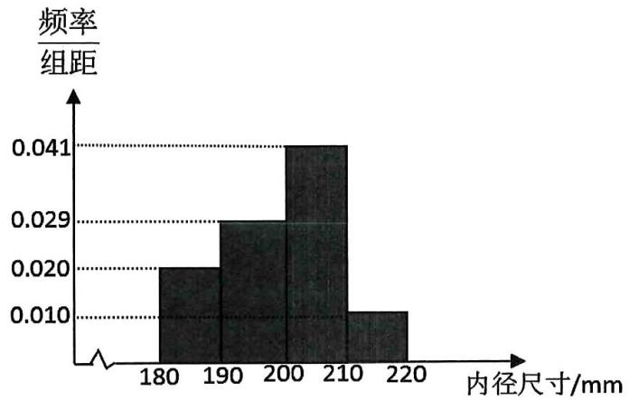

histogram

| 内径尺寸/mm | 频率/组距 |
| :--- | :--- |
| 180-190 | 0.020 |
| 190-200 | 0.029 |
| 200-210 | 0.041 |
| 210-220 | 0.010 |

等级（SR）

050. 定义 int (x) 为不超过 x 的最大整数部分，如 int (2.3) = 2, int (-2.3) = -3.

甲、乙两个学生高二的 6 次数学测试成绩（测试时间为 90 分钟，满分 100 分）如下表所示：

<table><tr><td>高二成绩</td><td>第1次考试</td><td>第2次考试</td><td>第3次考试</td><td>第4次考试</td><td>第5次考试</td><td>第6次考试</td></tr><tr><td>甲</td><td>68</td><td>74</td><td>77</td><td>84</td><td>88</td><td>95</td></tr><tr><td>乙</td><td>71</td><td>75</td><td>82</td><td>84</td><td>86</td><td>94</td></tr></table>

进入高三后, 由于改进了学习方法, 甲、乙这两个学生的数学测试成绩预计有了大的提升, 设甲或乙高二的数学测试成为 $x$ , 若 $10 \mathrm{int}(\sqrt{x}) + x - [\mathrm{int}(\sqrt{x})]^2 \leqslant 100$ , 则甲或乙高三的数学测试成绩预计为 $10 \mathrm{int}(\sqrt{x}) + x - [\mathrm{int}(\sqrt{x})]^2$ ; 若 $10 \mathrm{int}(\sqrt{x}) + x - [\mathrm{int}(\sqrt{x})]^2 > 100$ , 则甲或乙高三的数学测试成绩预计为 100.

(I) 试预测: 在将要进行的高三 6 次数学测试成绩 (测试时间为 90 分钟, 满分 100 分) 中, 甲、乙两个学生的成绩 (填入下列表格内):

<table><tr><td>高二成绩</td><td>第1次考试</td><td>第2次考试</td><td>第3次考试</td><td>第4次考试</td><td>第5次考试</td><td>第6次考试</td></tr><tr><td>甲</td><td></td><td></td><td></td><td></td><td></td><td></td></tr><tr><td>乙</td><td></td><td></td><td></td><td></td><td></td><td></td></tr></table>

(II) 记高三任意一次数学测试成绩估计值为 $t$ , 规定:

$t \in [84, 90]$ ，记为转换分为3分： $t \in [91, 95]$ ，记为转换分为4分： $t \in [96, 100]$ ，记为转换分为5分。现从乙的6次数学测试成绩中任意抽取2次，求这2次成绩的转换分之和为8分的概率。

# 备战 19 题

# 题型一：北京数列一二问训练（只做一二问）

# 001.【2023年北京卷21】

已知数列 $\{a_{n}\},\{b_{n}\}$ 的项数均为 $m(m>2)$ ，且 $a_{n},b_{n}\in\{1,2,\cdots,m\},\{a_{n}\},\{b_{n}\}$ 的前n项和分别为 $A_{n},B_{n}$ ，并规定 $A_{0}=B_{0}=0$ ．对于 $k\in\{0,1,2,\cdots,m\}$ ，定义 $r_{k}=\max\{i\mid B_{i}\leq A_{k},i\in\{0,1,2,\cdots,m\}\}$ ，其中，maxM表示数集M中最大的数.

(1)若 $a_{1}=2,a_{2}=1,a_{3}=3,b_{1}=1,b_{2}=3,b_{3}=3$ ，求 $r_{0},r_{1},r_{2},r_{3}$ 的值；  
(2)若 $a_{1}\geq b_{1}$ ，且 $2r_{j}\leq r_{j+1}+r_{j-1},j=1,2,\cdots,m-1,$ ，求 $r_{n}$ ;  
(3)证明：存在 $p,q,s,t\in\{0,1,2,\cdots,m\}$ ，满足p>q,s>t，使得 $A_{p}+B_{t}=A_{q}+B_{s}$

002.【2022年北京卷21】

已知 $Q: a_{1}, a_{2}, \cdots, a_{k}$ 为有穷整数数列．给定正整数 $m$ ，若对任意的 $n \in \{1, 2, \cdots, m\}$ ，在 $Q$ 中存在 $a_{i}, a_{i+1}, a_{i+2}, \cdots, a_{i+j} (j \geq 0)$ ，使得 $a_{i} + a_{i+1} + a_{i+2} + \cdots + a_{i+j} = n$ ，则称 $Q$ 为 $m-$ 连续可表数列.

(1)判断Q:2,1,4是否为5-连续可表数列？是否为6-连续可表数列？说明理由；  
(2)若 $Q:a_{1},a_{2},\cdots,a_{k}$ 为8一连续可表数列，求证：k的最小值为4；  
(3)若 $Q:a_{1},a_{2},\cdots,a_{k}$ 为20-连续可表数列，且 $a_{1}+a_{2}+\cdots+a_{k}<20$ ，求证： $k\geq7$ .

003.【2021年北京21】

定义 $R_{p}$ 数列 $\{a_{n}\}$ ：对实数p，满足：① $a_{1}+p\geq0,\quad a_{2}+p=0;$ ② $\forall n\in N^{*},a_{4n-1}<a_{4n};$ ③

$$
a _ {m + n} \in \{a _ {m} + a _ {n} + p, a _ {m} + a _ {n} + p + 1 \}, m, n \in N ^ {*}.
$$

(1) 对于前 4 项 2, -2, 0, 1 的数列, 可以是 $R_{2}$ 数列吗? 说明理由;

(2) 若 $\{a_{n}\}$ 是 $R_{0}$ 数列, 求 $a_{5}$ 的值;

(3) 是否存在 $p$ , 使得存在 $R_{p}$ 数列 $\{a_{n}\}$ , 对 $\forall n \in N^{*}, S_{n} \geq S_{10}$ ? 若存在, 求出所有这样的 $p$ ; 若不存在, 说明理由.

004.【2020年北京卷21】

已知 $\{a_{n}\}$ 是无穷数列．给出两个性质：

①对于 $\{a_{n}\}$ 中任意两项 $a_{i},a_{j}(i>j)$ ，在 $\{a_{n}\}$ 中都存在一项 $a_{m}$ ，使 $\frac{a_{i}^{2}}{a_{j}}=a_{m}$ ;  
②对于 $\{a_{n}\}$ 中任意项 $a_{n}(n\geqslant3)$ ，在 $\{a_{n}\}$ 中都存在两项 $a_{k},a_{l}(k>l)$ 。使得 $a_{n}=\frac{a_{k}^{2}}{a_{l}}$ 。

(I)若 $a_{n}=n(n=1,2,\cdots)$ ，判断数列 $\{a_{n}\}$ 是否满足性质①，说明理由；  
(II)若 $a_{n}=2^{n-1}(n=1,2,\cdots)$ ，判断数列 $\{a_{n}\}$ 是否同时满足性质①和性质②，说明理由；  
(III)若 $\{a_{n}\}$ 是递增数列，且同时满足性质①和性质②，证明： $\{a_{n}\}$ 为等比数列.

# 005.【2019年北京理科20】

已知数列 $\{a_{n}\}$ ，从中选取第 $i_{1}$ 项、第 $i_{2}$ 项、…、第 $i_{m}$ 项（ $i_{1}<i_{2}<\ldots<i_{m}$ ），若 $a_{i_{1}}<a_{i_{2}}<\cdots<a_{i_{m}}$ ，则称新数列 $a_{i_{1}}$ ， $a_{i_{2}}$ ，…， $a_{i_{m}}$ 为 $\{a_{n}\}$ 的长度为m的递增子列。规定：数列 $\{a_{n}\}$ 的任意一项都是 $\{a_{n}\}$ 的长度为1的递增子列。

(I) 写出数列 1, 8, 3, 7, 5, 6, 9 的一个长度为 4 的递增子列;  
(II) 已知数列 $\{a_{n}\}$ 的长度为 $p$ 的递增子列的末项的最小值为 $a_{m_{0}}$ , 长度为 $q$ 的递增子列的末项的最小值为 $a_{n_{0}}$ . 若 $p < q$ , 求证: $a_{m_{0}} < a_{n_{0}}$ ;  
（III）设无穷数列 $\{a_{n}\}$ 的各项均为正整数，且任意两项均不相等。若 $\{a_{n}\}$ 的长度为 $s$ 的递增子列末项的最小值为 $2s - 1$ ，且长度为 $s$ 末项为 $2s - 1$ 的递增子列恰有 $2^{s - 1}$ 个（ $s = 1, 2, \ldots$ ），求数列 $\{a_{n}\}$ 的通项公式。

006.【2018年北京理科20】

设 n 为正整数，集合 $A=\{\alpha \mid \alpha=(t_{1},t_{2},\cdots,t_{n}),t_{n}\in\{0,1\},k=1,2,\cdots,n\}$ 。对于集合 A 中的任意元素 $\alpha=(x_{1},x_{2},\cdots,x_{n})$ 和 $\beta=(y_{1},y_{2},\cdots,y_{n})$ ，记

$$
M (\alpha , \beta) = \frac {1}{2} [ (x _ {1} + y _ {1} - | x _ {1} - y _ {1} |) + (x _ {2} + y _ {2} - | x _ {2} - y _ {2} |) + \dots + (x _ {n} + y _ {n} - | x _ {n} - y _ {n} |) ].
$$

(I) 当 $n = 3$ 时, 若 $\alpha = (1,1,0)$ , $\beta = (0,1,1)$ , 求 $M(\alpha, \alpha)$ 和 $M(\alpha, \beta)$ 的值;  
（II）当 $n = 4$ 时，设 $B$ 是 $A$ 的子集，且满足：对于 $B$ 中的任意元素 $\alpha, \beta$ ，当 $\alpha, \beta$ 相同时， $M(\alpha, \beta)$ 是奇数；当 $\alpha, \beta$ 不同时， $M(\alpha, \beta)$ 是偶数。求集合 $B$ 中元素个数的最大值；  
（III）给定不小于 2 的 $n$ ，设 $B$ 是 $A$ 的子集，且满足：对于 $B$ 中的任意两个不同的元素 $\alpha, \beta$ ， $M(\alpha, \beta) = 0$ 。写出一个集合 $B$ ，使其元素个数最多，并说明理由。

007.【2017年北京理科20】

设 $\{a_{n}\}$ 和 $\{b_{n}\}$ 是两个等差数列，记 $c_{n} = \max \{b_{1} - a_{1} n, b_{2} - a_{2} n, \ldots, b_{n} - a_{n} n\} (n = 1, 2, 3, \ldots)$ ，其中 $\max \{x_{1}, x_{2}, \ldots, x_{s}\}$ 表示 $x_{1}, x_{2}, \ldots, x_{s}$ 这 $s$ 个数中最大的数。

(1) 若 $a_{n} = n, b_{n} = 2n - 1$ , 求 $c_{1}, c_{2}, c_{3}$ 的值, 并证明 $\{\mathbf{c}_{\mathrm{n}}\}$ 是等差数列;

(2) 证明: 或者对任意正数 $M$ , 存在正整数 $m$ , 当 $n \geq m$ 时, $\frac{c_n}{n} > M$ ; 或者存在正整数 $m$ , 使得 $c_{m}, c_{m+1}, c_{m+2}, \ldots$ 是等差数列.

008.【2016年北京理科20】

设数列 $A: a_{1}, a_{2}, \ldots, a_{N} (N \geq 2)$ . 如果对小于 $n (2 \leq n \leq N)$ 的每个正整数 $k$ 都有 $a_{k} < a_{n}$ , 则称 $n$ 是数列 $A$ 的一个“ $G$ 时刻”, 记 $G(A)$ 是数列 $A$ 的所有“ $G$ 时刻”组成的集合.

(I) 对数列 $A: -2, 2, -1, 1, 3$ , 写出 $G(A)$ 的所有元素;  
（II）证明：若数列 A 中存在 $a_{n}$ 使得 $a_{n} > a_{1}$ ，则 $G(A) \neq \varnothing$ ;  
（III）证明：若数列 A 满足 $a_{n}-a_{n-1}\leq1$ （ $n=2,3,\ldots,N$ ），则 G（A）的元素个数不小于 $a_{N}-a_{1}$

009.【2015年北京理科20】

已知数列 $\{a_{n}\}$ 满足： $a_{1} \in \mathbb{N}^{*}$ ， $a_{1} \leq 36$ ，且 $a_{n+1} = \begin{cases} 2a_{n}, & a_{n} \leq 18 \\ 2a_{n} - 36, & a_{n > 18} \end{cases}$ （ $n=1, 2, \ldots$ ），记集合 $M = \{a_{n} | n \in \mathbb{N}^{*}\}$ .

(I) 若 $a_{1} = 6$ ，写出集合 $M$ 的所有元素；  
(II) 如集合 $M$ 存在一个元素是 3 的倍数, 证明: $M$ 的所有元素都是 3 的倍数;  
(III) 求集合 M 的元素个数的最大值.

010.【2014年北京理科20】

对于数对序列 $P: (a_{1}, b_{1}), (a_{2}, b_{2}), \ldots, (a_{n}, b_{n})$ , 记 $T_{1}(P) = a_{1} + b_{1}$ , $T_{k}(P) = b_{k} + \max\{T_{k-1}(P), a_{1} + a_{2} + \ldots + a_{k}\}$ ( $2 \leq k \leq n$ ), 其中 $\max\{T_{k-1}(P), a_{1} + a_{2} + \ldots + a_{k}\}$ 表示 $T_{k-1}(P)$ 和 $a_{1} + a_{2} + \ldots + a_{k}$ 两个数中最大的数,

（I）对于数对序列 $P$ ：（2，5），（4，1），求 $T_{1}(P)$ ， $T_{2}(P)$ 的值；  
(II) 记 $m$ 为 $a, b, c, d$ 四个数中最小的数, 对于由两个数对 $(a, b), (c, d)$ 组成的数对序列 $P: (a, b), (c, d)$ 和 $P': (c, d), (a, b)$ , 试分别对 $m = a$ 和 $m = d$ 两种情况比较 $T_{2}(P)$ 和 $T_{2}(P')$ 的大小;

（III）在由五个数对（11，8），（5，2），（16，11），（11，11），（4，6）组成的所有数对序列中，写出一个数对序列 $P$ 使 $T_{5}(P)$ 最小，并写出 $T_{5}(P)$ 的值（只需写出结论）.

# 题型二：数列 19 题

等级（SR）

2024 湖北新高考协作体一模

011.已知 $\sin \alpha +\cos \alpha = k$ ：

(1) 若 $\alpha \in (0, \pi)$ , $k = \frac{1}{3}$ , 求 $\tan \alpha$ ;

(2) 设 $S_{n} = \sin^{n}\alpha + \cos^{n}\alpha, n \in N^{*}$ , 证明: $S_{n} = k S_{n-1} - \frac{k^{2} - 1}{2} S_{n-2}(n \geq 3)$

(3) 在(2)的条件下, 若 $k = \frac{1}{5}$ ,

(i)证明：数列 $\left\{S_{n} - \frac{4}{5} S_{n - 1}\right\}$ 和数列 $\left\{S_{n} + \frac{3}{5} S_{n - 1}\right\}$ 均为等比数列；

(ii)求 $S_{n}$ 的通项公式.

等级（SR）

2024 山东省实验中学一模

012.如果数列 $\left\{a_{n}\right\}$ 满足: $a_{1}+a_{2}+a_{3}+\cdots+a_{n}=0$ ,且 $|a_{1}|+|a_{2}|+|a_{3}|+\cdots+|a_{n}|=1(n\geq3,n\in N^{*})$ ,则称数列 $\left\{a_{n}\right\}$ 为“n阶数列”.

(1) 若某“4阶数列” $\{a_{n}\}$ 是等比数列, 求该数列的各项;  
(2) 若某“11阶数列” $\{a_{n}\}$ 是等差数列, 求该数列的通项公式;  
(3) 若 $\{a_{n}\}$ 为“ $n$ 阶数列”，求证: $a_{1} + \frac{1}{2} a_{2} + \frac{1}{3} a_{3} + \cdots + \frac{1}{n} a_{n} \leqslant \frac{1}{2} - \frac{1}{2n}$ .

等级（SR）

2024 茂名二模

013.有无穷多个首项均为 1 的等差数列，记第 $n(n \in \mathbf{N}^{\star})$ 个等差数列的第 $m(m \in \mathbf{N}^{*}, m \geqslant 2)$ 项为 $a_{m}(n)$ ，公差为 $d_{n}(d_{n} > 0)$ .

(1)若 $a_{2}(2) - a_{2}(1) = 2$ ，求 $d_{2} - d_{1}$ 的值；

(2)若 m 为给定的值，且对任意 n 有 $a_{m}(n+1)=2a_{m}(n)$ ，证明：存在实数 $\lambda,\mu$ ，满足 $\lambda+\mu=1$ ， $d_{100} = \lambda d_{1} + \mu d_{2};$

(3)若 $\{d_n\}$ 为等比数列，证明： $a_{m}(1) + a_{m}(2) + \dots +a_{m}(n)\leqslant \frac{\left[a_{m}(1) + a_{m}(n)\right]n}{2}.$

等级（SR）

2024 梅州二模

014. 已知 $\left\{a_{n}\right\}$ 是由正整数组成的无穷数列，该数列前 n 项的最大值记为 $M_{n}$ ，即 $M_{n} = \max\left\{a_{1}, a_{2}, \cdots, a_{n}\right\}$ ; 前 n 项的最小值记为 $m_{n}$ ，即 $m_{n} = \min\left\{a_{1}, a_{2}, \cdots, a_{n}\right\}$ ，令 $p_{n} = M_{n} - m_{n}$ $(n = 1, 2, 3, \cdots)$ ，并将数列 $\left\{p_{n}\right\}$ 称为 $\left\{a_{n}\right\}$ 的“生成数列”.

(1)若 $a_{n} = 3^{n}$ , 求其生成数列 $\{p_{n}\}$ 的前 $n$ 项和;  
(2)设数列 $\{p_n\}$ 的“生成数列”为 $\{q_n\}$ , 求证: $p_n = q_n$ ;  
(3)若 $\{p_n\}$ 是等差数列，证明：存在正整数 $n_0$ ，当 $n \geq n_0$ 时， $a_n, a_{n+1}, a_{n+2}, \ldots$ 是等差数列.

等级（SR）

2024 惠州一模

015.约数，又称因数.它的定义如下：若整数a除以整数 $m(m\neq0)$ 除得的商正好是整数而没有余数，我们就称a为m的倍数，称m为a的约数.设正整数a共有k个正约数，记为 $a_{1},a_{2},\cdots,a_{k-1}$ ， $a_{k}(a_{1}<a_{2}<\cdots<a_{k})$

(1) 当 $k = 4$ 时, 若正整数 $a$ 的 $k$ 个正约数构成等比数列, 请写出一个 $a$ 的值;  
(2) 当 $k \geq 4$ 时, 若 $a_{2} - a_{1}, a_{3} - a_{2}, \cdots, a_{k} - a_{k - 1}$ 构成等比数列, 求证: $a = a_{2}^{k - 1} (k \geq 4)$ ;  
(3) 记 $A = a_{1}a_{2} + a_{2}a_{3} + \cdots + a_{k-1}a_{k}$ , 求证: $A < a^{2}$ .

等级（SR）

2024 广东二模

016. 已知正项数列 $\{a_{n}\}, \{b_{n}\}$ ，满足 $a_{n+1} = \frac{b_{n} + c}{2}$ ， $b_{n+1} = \frac{a_{n} + c}{2}$ （其中 $c > 0$ ）.

(1) 若 $a_{1} \neq b_{1}$ , 且 $a_{1} + b_{1} \neq 2c$ , 证明: 数列 $\{a_{n} - b_{n}\}$ 和 $\{a_{n} + b_{n} - 2c\}$ 均为等比数列;  
(2) 若 $a_1 > b_1, a_1 + b_1 = 2c$ ，以 $a_n, b_n, c$ 为三角形三边长构造序列 $\Delta A_n B_n C_n$ （其中 $A_n B_n = c$ ， $B_n C_n = a_n$ ， $A_n C_n = b_n$ ），记 $\Delta A_n B_n C_n$ 外接圆的面积为 $S_n$ ，证明： $S_n > \frac{\pi}{3} c^2$ ；  
(3) 在 (2) 的条件下证明: 数列 $\{S_{n}\}$ 是递减数列.

等级（SR）

2024 潍坊二模

017. 数列 $\{a_{n}\}$ 中, 从第二项起, 每一项与其前一项的差组成的数列 $\{a_{n+1} - a_{n}\}$ 称为 $\{a_{n}\}$ 的一阶差数列, 记为 $\{a_{n}^{(1)}\}$ , 依此类推, $\{a_{n}^{(1)}\}$ 的一阶差数列称为 $\{a_{n}\}$ 的二阶差数列, 记为 $\{a_{n}^{(2)}\}$ , ... 如果一个数列 $\{a_{n}\}$ 的 $p$ 阶差数列 $\{a_{n}^{(p)}\}$ 是等比数列, 则称数列 $\{a_{n}\}$ 为 $p$ 阶等比数列 ( $p \in \mathbb{N}^{*}$ ).

(1) 已知数列 $\{a_{n}\}$ 满足 $a_{1} = 1, a_{n+1} = 2a_{n} + 1$ .

(i) 求 $a_1^{(1)}, a_2^{(1)}, a_3^{(1)}$ ;

(ii) 证明: $\{a_{n}\}$ 是一阶等比数列;

(2) 已知数列 $\{b_{n}\}$ 为二阶等比数列, 其前 5 项分别为 $1, \frac{20}{9}, \frac{37}{9}, \frac{78}{9}, \frac{215}{9}$ , 求 $b_{n}$ 及满足 $b_{n}$ 为整数的所有 $n$ 值.

等级（SR）

2024 东北师大附中第五次模拟

018. 对于数列 $\{a_{n}\}$ , 称 $\{\Delta a_{n}\}$ 为数列 $\{a_{n}\}$ 的一阶差分数列, 其中 $\Delta a_{n} = a_{n+1} - a_{n}(n \in \mathbb{N}^{*})$ . 对正整数 $k (k \geq 2)$ , 称 $\{\Delta^{k} a_{n}\}$ 为数列 $\{a_{n}\}$ 的 $k$ 阶差分数列, 其中 $\Delta^{k} a_{n} = \Delta (\Delta^{k-1} a_{n}) = \Delta^{k-1} a_{n+1} - \Delta^{k-1} a_{n}$ . 已知数列 $\{a_{n}\}$ 的首项 $a_{1} = 1$ , 且 $\{\Delta a_{n+1} - a_{n} - 2^{n}\}$ 为 $\{a_{n}\}$ 的二阶差分数列.

(1) 求数列 $\left\{a_{n}\right\}$ 的通项公式;

(2) 设 $b_{n} = \frac{1}{2} (n^{2} - n + 2)$ , $\{x_{n}\}$ 为数列 $\{b_{n}\}$ 的一阶差分数列, 对 $\forall n \in \mathbb{N}^{*}$ , 是否都有 $\sum_{i=1}^{n} x_{i} C_{n}^{i} = a_{n}$ 成立? 并说明理由: (其中 $C_{n}^{i}$ 为组合数)

（3）对于（2）中的数列 $\{x_{n}\}$ ，令 $y_{n} = \frac{t^{x_{n}} + t^{-x_{n}}}{2}$ ，其中 $\frac{1}{2} < t < 2$

证明： $\sum_{i = 1}^{n}y_{i} <   2^{n} - 2^{-\frac{n}{2}}.$

等级（SSR）

2024 五河南平许济洛四测

019.

定义 1

进位制：进位制是人们为了计数和运算方便而约定的记数系统，约定满二进一, 就是二进制; 满十进一, 就是十进制; 满十二进一, 就是十二进制; 满六十进一, 就是六十进制; 等等. 也就是说, “满几进一”就是几进制, 几进制的基数就是几. 一般地, 若 $k$ 是一个大于 1 的整数, 那么以 $k$ 为基数的 $k$ 进制数可以表示为一串数字符号连写在一起的形式

$$
a _ {n} a _ {n - 1} \dots a _ {1} a _ {0 (k)} \left(a _ {n}, a _ {n - 1}, \dots , a _ {1}, a _ {0} \in N, 0 <   a _ {n} <   k, 0 \leq a _ {n - 1}, \dots , a _ {1}, a _ {0} <   k\right).
$$

k 进制的数也可以表示成不同位上数字符号与基数的幂的乘积之和的形式，如

$$
7 3 4 2 _ {(8)} = 7 \times 8 ^ {3} + 3 \times 8 ^ {2} + 4 \times 8 ^ {1} + 2 \times 8 ^ {0}.
$$

定义2 三角形数: 形如 $1 + 2 + 3 + \dots + m$ , 即 $\frac{1}{2} m (m + 1) (m \in N_{+})$ 的数叫做三

角形数.

(1) 若 $\underbrace{aa\cdots a_{(9)}}_{n \text{个} a}$ 是三角形数, 试写出一个满足条件的 $a$ 的值;  
(2) 若 $11111_{(k)}$ 是完全平方数, 求 $k$ 的值;  
(3) 已知 $c_{n} = \underbrace{11 \cdots 1_{(9)}}_{n \text{个} 1}$ , 设数列 $\{c_{n}\}$ 的前 $n$ 项和为 $S_{n}$ , 证明: 当 $n > 3$ 时, $S_{n} > \frac{9 n^{2} - 7 n}{2}$ .

等级（SSR）

2024 嘉兴二模

020. 已知集合 $A = \left\{\sum_{i=1}^{m} 2^{a_i} \mid 0 \leqslant a_1 < a_2 < \cdots < a_m, a_i \in \mathbb{N}\right\}$ , 定义: 当 $m = t$ 时, 把集合 $A$ 中所有的数从小到大排列成数列 $\{b(t)_n\}$ , 数列 $\{b(t)_n\}$ 的前 $n$ 项和为 $S(t)_n$ , 例如: $t = 2$ 时,

$$
b (2) _ {1} = 2 ^ {0} + 2 ^ {1} = 3, b (2) _ {2} = 2 ^ {0} + 2 ^ {2} = 5, b (2) _ {3} = 2 ^ {1} + 2 ^ {2} = 6, b (2) _ {4} = 2 ^ {0} + 2 ^ {3} = 9, \dots ,
$$

$$
S (2) _ {4} = b (2) _ {1} + b (2) _ {2} + b (2) _ {3} + b (2) _ {4} = 2 3.
$$

(1) 写出 $b(2)_5, b(2)_6$ , 并求 $S(2)_{10}$ ;  
(2) 判断 88 是否为数列 $\{b(3)_n\}$ 中的项, 若是, 求出是第几项; 若不是, 请说明理由;  
(3) 判断 2024 是数列 $\left\{b(t)_n\right\}$ 中的某一项 $b(t_0)_{n_0}$ , 求 $t_0, n_0$ 及 $S(t_0)_{n_0}$ 的值.

等级（SSR）

2024 新高考一卷数学

021. 设 m 为正整数，数列 $a_{1}, a_{2}, \cdots, a_{4m+2}$ 是公差不为 0 的等差数列，若从中删去两项 $a_{i}$ 和 $a_{j} (i < j)$ 后剩余的 4m 项可被平均分为 m 组，且每组的 4 个数都能构成等差数列，则称数列 $a_{1}, a_{2}, \cdots, a_{4m+2}$ 是 $(i, j)$ -可分数列.

(1) 写出所有的 $(i, j)$ , $1 \leq i < j \leq 6$ , 使数列 $a_{1}, a_{2}, \cdots, a_{6}$ 是 $(i, j)$ -可分数列;  
（2）当 $m\geqslant3$ 时，证明：数列 $a_{1},a_{2},\cdots,a_{4m+2}$ 是(2,13)--可分数列  
(3) 从 $1, 2, \ldots, 4 m + 2$ 中一次任取两个数 $i$ 和 $j (i < j)$ , 记数列 $a_{1}, a_{2}, \cdots, a_{4 m + 2}$ 是 $(i, j) -$ 可分数列的概率为 $P_{m}$ , 证明 $P_{m} > \frac{1}{8}$ .

等级（SSR）

2024 海淀二模

022. 设正整数 $n \geq 2$ ， $a_i \in \mathbb{N}^*$ ， $d_i \in \mathbb{N}^*$ ， $A_i = \{x | x = a_i + (k-1)d_i, k=1,2,\cdots\}$ ，这里 $i=1,2,\cdots,n$ 。若 $A_1 \cup A_2 \cup \cdots \cup A_n = \mathbb{N}^*$ ，且 $A_i \cap A_j = \emptyset(1 \leq i < j \leq n)$ ，则称 $A_1, A_2, \cdots, A_n$ 具有性质 $P$ 。

(1)当 $n = 3$ 时, 若 $A_{1}, A_{2}, A_{3}$ 具有性质 $P$ , 且 $a_{1} = 1$ , $a_{2} = 2$ , $a_{3} = 3$ , 令 $m = d_{1}d_{2}d_{3}$ , 写出 $m$ 的所有可能值;  
(2)若 $A_{1}, A_{2}, \cdots, A_{n}$ 具有性质 P:   
①求证： $a_{i} \leq d_{i} (i = 1, 2, \cdots, n)$ ;  
②求 $\sum_{i=1}^{n} \frac{a_i}{d_i}$ 的值.

# 题型三：概率/组合数 19 题

等级（SR）

2024 广州一模

023.某校开展科普知识团队接力闯关活动, 该活动共有两关, 每个团队由 $n (n \geqslant 3, n \in \mathbf{N}^{*})$ 位成员组成, 成员按预先安排的顺序依次上场, 具体规则如下: 若某成员第一关闯关成功, 则该成员继续闯第二关, 否则该成员结束闯关并由下一位成员接力去闯第一关; 若某成员第二关闯关成功, 则该团队接力闯关活动结束, 否则该成员结束闯关并由下一位成员接力去闯第二关: 当第二关闯关成功或所有成员全部上场参加了闯关, 该团队接力闯关活动结束.

已知 A 团队每位成员闯过第一关和第二关的概率分别为 $\frac{3}{4}$ 和 $\frac{1}{2}$ ，且每位成员闯关是否成功互不影响，每关结果也互不影响。

(1) 若 $n = 3$ , 用 $X$ 表示 $A$ 团队闯关活动结束时上场闯关的成员人数, 求 $X$ 的均值;  
(2) 记 $A$ 团队第 $k \left(1 \leqslant k \leqslant n - 1, k \in \mathbf{N}^{*}\right)$ 位成员上场且闯过第二关的概率为 $p_{k}$ , 集合 $\left\{k \in \mathbf{N}^{*} \mid p_{k} < \frac{3}{128}\right\}$ 中元素的最小值为 $k_{0}$ , 规定团队人数 $n = k_{0} + 1$ , 求 $n$ .

等级（SR）

2024 辽宁协作体 4 月联考

024.某自然保护区经过几十年的发展, 某种濒临灭绝动物数量有大幅度的增加. 已知这种动物 $P$ 拥有两个亚种 (分别记为 A 种和 B 种). 为了调查该区域中这两个亚种的数目, 某动物研究小组计划在该区域中捕捉 100 个动物 $P$ , 统计其中 A 种的数目后, 将捕获的动物全部放回, 作为一次试验结果. 重复进行这个试验共 20 次, 记第 $i$ 次试验中 A 种的数目为随机变量 $X_{i} (i = 1,2,\cdots,20)$ . 设该区域中 A 种的数目为 $M$ , $B$ 种的数目为 $N(M,N$ 均大于 100), 每一次试验均相互独立.

(1) 求 $X_{1}$ 的分布列;

（2）记随机变量 $\overline{X} = \frac{1}{20}\sum_{i=1}^{20}X_i$ .已知 $E(X_{i} + X_{j}) = E(X_{i}) + E(X_{j})$ ，

$$
D (X _ {i} + X _ {j}) = D (X _ {i}) + D (X _ {j})
$$

(i) 证明： $E(\bar{X}) = E(X_1)$ ， $D(\bar{X}) = \frac{1}{20} D(X_1)$ ;

(ii) 该小组完成所有试验后, 得到 $X_{i}$ 的实际取值分别为 $x_{i} (i = 1,2,\cdots,20)$ . 数据 $x_{i} (i = 1,2,\cdots,20)$ 的平均值 $\overline{x} = 30$ , 方差 $s^{2} = 1$ . 采用 $\overline{x}$ 和 $s^{2}$ 分别代替 $E(\overline{X})$ 和 $D(\overline{X})$ , 给出 $M, N$ 的估计值.

(已知随机变量 x 服从超几何分布记为: $x \sim H(P, n, Q)$ (其中 P 为总数, Q 为某类元素的个数, n 为抽取的个数), 则 $D(x) = n \frac{Q}{P} \left(1 - \frac{Q}{P}\right) \left(\frac{P - n}{P - 1}\right)$ .

等级（SR）

2024 新高考教学教研联盟（长郡十八校联考）

025. 2023 年 10 月 1 日,中国科学技术大学潘建伟团队成功构建 255 个光子的量子计机原型机“九章三号”,求解高斯玻色取样数学问题比目前全球最快的超级计算机快一亿亿倍,相较传统计算机的经典比特只能处于 0 态或 1 态,量子计算机的量子比特（qubit）可同时处于 0 与 1 的叠加态,故每个量子比特处于 0 态或 1 态是基于概率进行计算的,现假设某台量子计算机以每个粒子的自旋状态作为量子比特,且自旋状态只有上旋与下旋两种状态,其中下旋表示“0”,上旋表示“1”,粒子间的自旋状态相互独立,现将两个初始状态均为叠加态的粒子输入第一道逻辑门后,粒子自旋状态等可能的变为上旋或下旋,再输入第二道逻辑门后,粒子的自旋状态有 p 的概率发生改变,记通过第二道逻辑门后的两个粒子中上旋粒子的个数为 X .

(1) 若通过第二道逻辑门后的两个粒子中上旋粒子的个数为 2, 且 $p = \frac{1}{3}$ , 求两个粒子通过第一道逻辑门后上旋粒子个数为 2 的概率:

(2) 若一条信息有 $n (n > 1, n \in \mathbb{N}^{*})$ 种可能的情况且各种情况互斥, 记这些情况发生的概率分别为 $p_{1}, p_{2}, \cdots, p_{n}$ . 则称 $H = f(p_{1}) + f(p_{2}) + \cdots + f(p_{n})$ （其中 $f(x) = -x \log_{2} x$ ）为这条信息的信息熵, 试求两个粒子通过第二道逻辑门后上旋粒子个数为 $X$ 的信息熵 $H$ ;

(3) 将一个下旋粒子输入第二道逻辑门, 当粒子输出后变为上旋粒子时则停止输入, 否则重复输入第二道逻辑门直至其变为上旋粒子, 设停止输入时该粒子通过第二道逻辑门的次数为 $Y (Y = 1, 2, 3, \cdots, n, \cdots)$ . 证明: 当 $n$ 无限增大时, $Y$ 的数学期望趋近于一个常数.

参考公式： $0 < q < 1$ 时， $\lim_{n\to +\infty}q^n = 0,\lim_{n\to +\infty}nq^n = 0.$

等级（SR）

2024 天域名校协作体 4 月联考

026.甲、乙两人进行知识问答比赛, 共有 $n$ 道抢答题, 甲、乙抢题的成功率相同, 假设每题甲乙答题正确的概率分别为 $p$ 和 $\frac{1}{3}$ , 各题答题相互独立.规则为: 初始双方均为 0 分, 答对一题得 1 分,答错一题得 -1 分, 未抢到题得 0 分, 最后累计总分多的人获胜.

（1）若 $n = 3$ ， $p = \frac{1}{2}$ ，求甲获胜的概率；

(2) 若 $n = 20$ , 设甲第 $i$ 题的得分为随机变量 $X_{i}$ , 一次比赛中得到 $X_{i}$ 的一组观测值 $x_{i} (i = 1, 2, \cdots, 20)$ , 如下表.现利用统计方法来估计 $p$ 的值:

①设随机变量 $\overline{X}=\frac{1}{n}\sum_{i=1}^{n}X_{i}$ ，若以观测值 $x_{i}(i=1,2,\cdots,20)$ 的均值 $\overline{x}$ 作为 $\overline{X}$ 的数学期望，请以此求出 p 的估计值 $\hat{p}_{1}$ ;

(2) 设随机变量 $X_{i}$ 取到观测值 $x_{i} (i = 1,2,\dots,20)$ 的概率为 $L(p)$ , 即 $L(p) = P \left(X_{1} = x_{1}, X_{2} = x_{2}, \dots, X_{20} = x_{20}\right)$ ; 在一次抽样中获得这一组特殊观测值的概率应该最大, 随着 $p$ 的变化, 用使得 $L(p)$ 达到最大时 $p$ 的取值 $\hat{p}_{2}$ 作为参数 $p$ 的一个估计值. 求 $\hat{p}_{2}$ .

<table><tr><td>题目</td><td>1</td><td>2</td><td>3</td><td>4</td><td>5</td><td>6</td><td>7</td><td>8</td><td>9</td><td>10</td></tr><tr><td>得分</td><td>1</td><td>0</td><td>0</td><td>-1</td><td>1</td><td>1</td><td>-1</td><td>0</td><td>0</td><td>0</td></tr><tr><td>题目</td><td>11</td><td>12</td><td>13</td><td>14</td><td>15</td><td>16</td><td>17</td><td>18</td><td>19</td><td>20</td></tr><tr><td>得分</td><td>-1</td><td>0</td><td>1</td><td>1</td><td>-1</td><td>0</td><td>0</td><td>0</td><td>1</td><td>0</td></tr></table>

表 1: 甲得分的一组观测值

附: 若随机变量 $X, Y$ 的期望 $E(X)$ , $E(Y)$ 都存在, 则 $E(X + Y) = E(X) + E(Y)$ .

等级（SR）

# 2024 湖丽衢二模

027.为保护森林公园中的珍稀动物, 采用某型号红外相机监测器对指定区域进行监测识别.若该区域有珍稀动物活动, 该型号监测器能正确识别的概率 (即检出概率) 为 $p_{1}$ ; 若该区域没有珍稀动物活动, 但监测器认为有珍稀动物活动的概率 (即虚警概率) 为 $p_{2}$ . 已知该指定区域有珍稀动物活动的概率为 0.2. 现用 2 台该型号的监测器组成监测系统, 每台监测器 (功能一致) 进行独立监测识别, 若任意一台监测器识别到珍稀动物活动, 则该监测系统就判定指定区域有珍稀动物活动.

(1) 若 $p_{1}=0.8$ ， $p_{2}=0.02$ .

(i) 在该区域有珍稀动物活动的条件下, 求该监测系统判定指定区域有珍稀动物活动的概率;

(ii) 在判定指定区域有珍稀动物活动的条件下, 求指定区域实际没有珍稀动物活动的概率 (精确到 0.001);

(2) 若监测系统在监测识别中, 当 $0.8 \leq p_{1} \leq 0.9$ 时, 恒满足以下两个条件: ①若判定有珍稀动物活动时, 该区域确有珍稀动物活动的概率至少为 0.9; ②若判定没有珍稀动物活动时, 该区域确实没有珍稀动物活动的概率至少为 0.9.求 $p_{2}$ 的范围 (精确到 0.001).

(参考数据: $\frac{\sqrt{35.04}}{6} = 0.9866$ , $\frac{\sqrt{35.01}}{6} = 0.9861$ , $0.98^{2} = 0.9604$ )

等级（SR）

028. 在孟德尔遗传理论中, 称遗传性状依赖的特定携带者为遗传因子; 遗传因子总是成对出现. 例如, 豌豆携带这样一对遗传因子: A 使之开红花, a 使之开白花, 两个因子的相互组合可以构成三种不同的遗传性状: AA 为开红花, Aa 和 aA 一样不加区分为开粉色花, aa 为开白色花. 生物在繁衍后代的过程中, 后代的每一对遗传因子都包含一个父系的遗传因子和一个母系的遗传因子, 而因为生殖细胞是由分裂过程产生的, 每一个上一代的遗传因子以 $\frac{1}{2}$ 的概率传给下一代, 而且各代的遗传过程都是相互独立的. 可以把第 $n$ 代的遗传设想为第 $n$ 次实验的结果, 每一次实验就如同抛一枚均匀的硬币, 比如对具有性状 Aa 的父系来说, 如果抛出正面就选择因子 A, 如果抛出反面就选择因子 a, 概率都是 $\frac{1}{2}$ ; 对母系也一样. 父系、母系各自随机选择得到的遗传因子再配对形成子代的遗传性状. 假设三种遗传性状 AA, Aa (或 aA), aa 在父系和母系中以同样的比例 $u: v: w(u + v + w = 1)$ 出现, 则在随机杂交实验中, 遗传因子 A 被选中的概率是 $p = u + \frac{v}{2}$ , 遗传因子 a 被选中的概率是 $q = \omega + \frac{v}{2}$ . 称 $p$ , $q$ 分别为父系和母系中遗传因子 A 和 a 的频率, $p: q$ 实际上是父系和母系中两个遗传因子的个数之比. 基于以上常识回答以下问题:

(1) 如果植物的上一代父系、母系的遗传性状都是 Aa，后代遗传性状为 AA，Aa（或 aA），aa 的概率各是多少？  
(2)对某一植物, 经过实验观察发现遗传性状 aa 具有重大缺陷, 可人工剔除, 从而使得父系和母系中仅有遗传性状为 AA 和 Aa (或 aA) 的个体, 在进行第一代杂交实验时, 假设遗传因子 A 被选中的概率为 $p$ , a 被选中的概率为 q, $p + q = 1$ . 求杂交所得子代的三种遗传性状 AA, Aa (或 aA), aa 所占的比例 $u_{1}, v_{1}, w_{1}$ .  
(3) 继续对 (2) 中的植物进行杂交实验, 每次杂交前都需要剔除性状为 aa 的个体. 假设得到的第 n 代总体中 3 种遗传性状 AA, Aa (或 aA), aa 所占比例分别为 $u_{n}, v_{n}, w_{n}$ ( $u_{n} + v_{n} + w_{n} = 1$ ). 设第 n 代遗传因子 A 和 a 的频率分别为 $p_{n}$ 和 $q_{n}$ , 已知有以下公式 $p_{n} = \frac{u_{n} + v_{n} / 2}{1 - w_{n}}$ , $q_{n} = \frac{v_{n} / 2}{1 - w_{n}}$ ,

$n=1,2,\cdots$ .证明 $\left\{\frac{1}{q_{n}}\right\}$ 是等差数列.

(4) 求 $u_{n}, v_{n}, w_{n}$ 的通项公式, 如果这种剔除某种遗传性状的随机杂交实验长期进行下去, 会有什么现象发生?

等级（SSR）

2024 广东一模

029.某单位进行招聘面试, 已知参加面试的 $N$ 名学生全都来自 $A, B, C$ 三所学校, 其中来自 A 校的学生人数为 $n (n > 1)$ . .该单位要求所有面试人员面试前到场, 并随机给每人安排一个面试号码 $k (k = 1, 2, 3, \cdots, N)$ , 按面试号码 $k$ 由小到大依次进行面试, 每人面试时长 5 分钟, 面试完成后自行离场.

(1) 求面试号码为 2 的学生来自 $A$ 校的概率  
(2) 若 $N = 40, n = 10$ , 且 $B, C$ 两所学校参加面试的学生人数比为 1:2, 求 $A$ 校参加面试的学生先于其他两校学生完成面试 ( $A$ 校所有参加面试的学生完成面试后, $B, C$ 两校都还有学生未完成面试) 的概率;  
(3) 记随机变量 $X$ 表示最后一名 $A$ 校学生完成面试所用的时长 (从第 1 名学生开始面试到最后一名 $A$ 校学生完成面试所用的时间), $E(X)$ 是 $X$ 的数学期望, 证明: $E(X) = \frac{5n(N + 1)}{n + 1}$ .

等级（SR）

030. 现有一批疫苗试剂, 拟进入动物试验阶段, 将 1000 只动物平均分成 100 组, 任选一组进行试验, 第一轮注射, 对该组的每只动物都注射一次, 若检验出该组中有 9 只或 10 只动物生抗体,说明疫苗有效, 试验终止; 否则对没有产生抗体的动物进行第二轮注射, 再次检验, , 如果被二次注射的动物都产生抗体, 说明疫苗有效, 否则需要改进疫苗, 设每只动物是否产生抗体相互独立,两次注射疫苗互不影响, 且产生抗体的概率均为 $p (0 < p < 1)$

(1) 求该组试验只需第一轮注射的概率(用含 $p$ 的多项式表示);  
(2) 记该组动物需要注射次数 $X$ 的数学期望为 $E(X)$ , 求证: $10 < E(X) < 10 (2 - p)$ .

等级（SSR）

2024 济南二模

031.随机游走在空气中的烟雾扩散、股票市场的价格波动等动态随机现象中有重要应用.在平面直角坐标系中, 粒子从原点出发, 每秒向左、向右、向上或向下移动一个单位, 且向四个方向移动的概率均为 $\frac{1}{4}$ .例如在 1 秒末, 粒子会等可能地出现在 (1, 0), (-1, 0), (0, 1), (0, -1) 四点处.

(1) 设粒子在第 2 秒末移动到点 $(x, y)$ , 记 $x + y$ 的取值为随机变量 $X$ , 求 $X$ 的分布列和数学期望 $E(X)$ ;  
(2)记第 $n$ 秒末粒子回到原点的概率为 $p_{n}$ .  
(i) 已知 $\sum_{k=0}^{n} \left( \mathrm{C}_{n}^{k} \right)^{2} = \mathrm{C}_{2n}^{n}$ ，求 $p_{3}, p_{4}$ 以及 $p_{2n}$ ；  
(ii) 令 $b_{n} = p_{2n}$ , 记 $S_{n}$ 为数列 $\{b_{n}\}$ 的前 $n$ 项和, 若对任意实数 $M > 0$ , 存在 $n \in \mathbb{N}^{*}$ , 使得 $S_{n} > M$ , 则称粒子是常返的. 已知 $\sqrt{2\pi n}\left(\frac{n}{e}\right)^{n} < n! < \left(\frac{6}{\pi}\right)^{\frac{1}{4}} \sqrt{2\pi n}\left(\frac{n}{e}\right)^{n}$ , 证明: 该粒子是常返的.

等级（SSR）

2024 南通盐城三模

032. “熵”常用来判断系统中信息含量的多少, 也用来判断概率分布中随机变量的不确定性大小, 一般熵越大表示随机变量的不确定性越明显, 定义: 随机变量 $X$ 对应取值 $x_{i}$ 的概率为 $p_{i} = P(X = x_{i})$ , 其单位为 bit 的熵为 $H(X) = -\sum_{i=1}^{n} p_{i} \log_{2} p_{i}$ , 且 $\sum_{i=1}^{n} p_{i} = 1$ . (当 $p_{i} = 0$ , 规定 $p_{i} \log_{2} p_{i} = 0$ .)

(1) 若抛掷一枚硬币 1 次, 正面向上的概率为 $m (0 < m < 1)$ , 正面向上的次数为 $X$ , 分别比较 $m = \frac{1}{2}$ 与 $m = \frac{1}{4}$ 时对应 $H(X)$ 的大小, 并根据你的理解说明结论的实际含义;

(2) 若抛掷一枚质地均匀的硬币 $n$ 次, 设 $X$ 表示正面向上的总次数, $Y$ 表示第 $n$ 次反面向上的次数 (0 或 1). $p(x_{1}, y_{1})$ 表示正面向上 $x_{1}$ 次且第 $n$ 次反面向上 $y_{1}$ 次的概率.

如 $n = 3$ 时， $p(0,1) = \frac{1}{8}$ . 对于两个离散的随机变量 $X, Y$ ，其单位为 bit 的联合熵记为

$$
H (X, Y) = - \left(\sum_ {i = 1} ^ {n} p \left(x _ {i}, 0\right) \log_ {2} p \left(x _ {i}, 0\right) + \sum_ {i = 1} ^ {n} p \left(x _ {i}, 1\right) \log_ {2} p \left(x _ {i}, 1\right)\right) \quad , \quad \text {且}
$$

$$
\sum_ {i = 1} ^ {n} p \left(x _ {i}, 0\right) + \sum_ {i = 1} ^ {n} p \left(x _ {i}, 1\right) = 1.
$$

(i) 当 $n = 3$ 时, 求 $H(X, Y)$ 的值;

(ii) 求证: $H(X, Y) < n - \frac{1}{2^{n-1}} (n \geq 3)$ .

等级（SSR）

2024 苏锡常镇二模

033.如图所示数阵, 第 $m (m \geq 1)$ 行共有 $m + 1$ 个数, 第 $m$ 行的第 1 个数为 $\mathrm{C}_{m-1}^{0}$ , 第 2 个数为 $\mathrm{C}_{m}^{1}$ , 第 $n (n \geq 3)$ 个数为 $\mathrm{C}_{m+n-2}^{n-1} - \mathrm{C}_{m+n-2}^{n-3}$ . 规定: $\mathrm{C}_{0}^{0} = 1$ .

$$
\begin{array}{l} \mathrm{C} _ {0} ^ {0} \quad \mathrm{C} _ {1} ^ {1} \\ \mathrm{C} _ {1} ^ {0} \quad \mathrm{C} _ {2} ^ {1} \quad \mathrm{C} _ {3} ^ {2} - \mathrm{C} _ {3} ^ {0} \\ \mathrm{C} _ {2} ^ {0} \quad \mathrm{C} _ {3} ^ {1} \quad \mathrm{C} _ {4} ^ {2} - \mathrm{C} _ {4} ^ {0} \quad \mathrm{C} _ {5} ^ {3} - \mathrm{C} _ {5} ^ {1} \\ \mathrm{C} _ {3} ^ {0} \quad \mathrm{C} _ {4} ^ {1} \quad \mathrm{C} _ {5} ^ {2} - \mathrm{C} _ {5} ^ {0} \quad \mathrm{C} _ {6} ^ {3} - \mathrm{C} _ {6} ^ {1} \quad \mathrm{C} _ {7} ^ {4} - \mathrm{C} _ {7} ^ {2} \\ \mathrm{C} _ {4} ^ {0} \quad \mathrm{C} _ {5} ^ {1} \quad \mathrm{C} _ {6} ^ {2} - \mathrm{C} _ {6} ^ {0} \quad \mathrm{C} _ {7} ^ {3} - \mathrm{C} _ {7} ^ {1} \quad \mathrm{C} _ {8} ^ {4} - \mathrm{C} _ {8} ^ {2} \quad \mathrm{C} _ {9} ^ {5} - \mathrm{C} _ {9} ^ {3} \\ \begin{array}{c c c c c c c} \mathrm{C} _ {5} ^ {0} & \mathrm{C} _ {6} ^ {1} & \mathrm{C} _ {7} ^ {2} - \mathrm{C} _ {7} ^ {0} & \mathrm{C} _ {8} ^ {3} - \mathrm{C} _ {8} ^ {1} & \mathrm{C} _ {9} ^ {4} - \mathrm{C} _ {9} ^ {2} & \mathrm{C} _ {1 0} ^ {5} - \mathrm{C} _ {1 0} ^ {3} & \mathrm{C} _ {1 1} ^ {6} - \mathrm{C} _ {1 1} ^ {4} \\ \dots & \dots & \dots & \dots & \dots & \dots & \dots \end{array} \\ \end{array}
$$

(1)试判断每一行的最后两个数的大小关系，并证明你的结论；  
(2)求证: 每一行的所有数之和等于下一行的最后一个数;  
(3)从第1行起, 每一行最后一个数依次构成数列 $\{a_{n}\}$ , 设数列 $\{a_{n}\}$ 的前 $n$ 项和为 $S_{n}$ 是否存在正整数 $k$ , 使得对任意正整数 $n$ , $kS_{n} \leqslant 4^{n} - 1$ 恒成立? 如存在, 请求出 $k$ 的最大值, 如不存在, 请说明理由.

等级（SSR）

2024 山西省适应性考试二

034.用 $n$ 个不同的元素组成 $m$ 个非空集合 ( $1 \leq m \leq n$ , 每个元素只能使用一次), 不同的组成方案数记作 $S_{n}^{m}$ 例如, 用 1, 2, 3, 4 这 4 个元素组成 2 个非空集合共有 7 种方案, 即

$$
\{\{1 \}, \{2, 3, 4 \} \}; \{\{2 \}, \{1, 3, 4 \} \}; \{\{3 \}, \{1, 2, 4 \} \}; \{\{4 \}, \{1, 2, 3 \} \}; \{\{1, 2 \}, \{3, 4 \} \};
$$

$$
\{\{1, 3 \}, \{2, 4 \} \}; \{\{1, 4 \}, \{2, 3 \} \}. \text {于是} S _ {4} ^ {2} = 7.
$$

(1) 求和: $T = S_{2}^{2} + S_{3}^{2} + S_{4}^{2} + \cdots S_{10}^{2}$ ;

(2) 证明: 当 $n > m \geq 2$ 时, ; $S_{n}^{m} = S_{n-1}^{m-1} + mS_{n-1}^{m}$

(3) 某系列手办盲盒共装有 4 种不同款式的手办, 打开其中任何一个盲盒都可以获得 1 个手办 (款式随机, 且获得每种款式的概率都相同)

①求购买该系列盲盒7盒就能集齐全部4种款式的概率 $p$ ；

②设购买该系列盲盒7盒能获得不同手办款式的种类数为随机变量 $X$ ，求 $X$ 的数学期望 $E(X)$ .

等级（SSR）

2021 九江二模

035. 2020 年 12 月 16 日至 18 日，中央经济工作会议在北京召开，会议确定，2021 年要抓好八个重点任务，其中第五点就是：保障粮食安全，关键在于落实藏粮于地、藏粮于技战略，要加强种质资源保护和利用，加强种子库建设。要尊重科学、严格监管，有序推进生物育种产业应用。某 “种子银行” 对某种珍贵植物种子采用 “活态保存” 方法进行保存，即对种子实行定期更换和种植。通过以往的相关数据表明。该植物种子的出芽率为 p（0 < p < 1），每颗种子是否发芽相互独立，现任取该植物种子 2n - 1 颗进行种植，若种子的出芽数 X 超过半数，则可认为种植成功（n ≥ 2）。

(1) $n = 3, p = \frac{1}{2}$ 时, 求种植成功的概率及 $X$ 的数学期望;  
(2) 现拟加种两颗该植物种子, 试分析能否提高种植成功率?

# 等级（SSR）

# 2021 皖北协作区四月联考

036. “博弈”原指下棋, 出自我国《论语·阳货》篇, 现在多指一种决策行为, 即一些个人、团队或组织, 在一定规则约束下, 同时或先后, 一次或多次, 在各自允许选择的策略下进行选择和实施, 并从中各自取得相应结果或收益的过程. 生活中有很多游戏都蕴含着博弈, 比如现在有两个人玩“亮”硬币的游戏, 甲、乙约定若同时亮出正面, 则甲付给乙 3 元. 若同时亮出反面, 则甲付给乙 1 元、若亮出结果是一正一反, 则乙付给甲 2 元.

(I) 若两人各自随机 “亮” 出正反面, 求乙收益的期望.  
(II) 因为各自 “亮” 出正反面, 而不是抛出正反面, 所以可以控制 “亮” 出正面或反面的频率 (假设进行多次游戏. 频率可以代替概率), 因此双方就面临竞争策略的博弈. 甲、乙可以根据对手出正面的概率调整自己出正面的概率, 进而增加自己赢得收益的期望, 以收益的期望为决策依据, 甲, 乙各自应该如何选择 “亮” 出正面的概率, 才能让结果对自己最有利? 并分析游戏规则是否公平.

等级（SSR）

2024 武汉五调

037.某企业生产一种零部件, 其质量指标介于 (49.6, 50.4) 的为优品. 技术改造前, 该企业生产的该种零部件质量指标服从正态分布 $N(50,0.16)$ ; 技术改造后, 该企业生产的同种零部件质量指标服从正态分布 $N(50,0.04)$ .

附: 若 $X \sim N(\mu, \sigma^2)$ , 取 $P(|X - \mu| < \sigma) = 0.6827$ , $P(|X - \mu| < 2\sigma) = 0.9545$ .

(1) 求该企业生产的这种零部件技术改造后的优品率与技术改造前的优品率之差;  
(2) 若该零件生产的控制系统中每个元件正常工作的概率都是 $p (0 < p < 1)$ , 各个元件能否正常工作相互独立, 如果系统中有超过一半的元件正常工作, 系统就能正常工作. 系统正常工作的概率称为系统的可靠性.

①若控制系统原有 4 个元件，计算该系统的可靠性，并判断若给该系统增加一个元件，可靠性是否提高？

②假设该系统配置有 $n (n \geq 3, n \in N)$ 个元件，若再增加一个元件，是否一定会提高系统的可靠性？请给出你的结论并证明.

# 题型四：立体几何 19 题

等级（SR）

038. 如图, 在以 $A$ , $B$ , $C$ , $D$ , $E$ , $F$ 为顶点的五面体中, 底面 ${ABCD}$ 是矩形, ${EF} < {BC}$ .

(1) 证明: $EF//$ 平面 $ABCD$ ;

(2)在中国古代数学经典著作《九章算术》中, 称图中所示的五面体 $ABCDEF$ 为“刍甍”（chú méng）, 书中将刍甍 $ABCDEF$ 的体积求法表述为: 术曰: 倍下 n, 上袤从之, 以广乘之, 又以高乘之, 六而一. 其意思是: 若刍甍 $ABCDEF$ 的 “下袤” $BC$ 的长为 $a$ , “上袤” $EF$ 的长为 $b$ , “广” $AB$ 的长为 $c$ , “高” 即 “点 $F$ 到

平面 ABCD 的距离”为 h，则刍甍 ABCDEF 的体积 V 的计算公式为：

$V=\frac{1}{6}(2a+b)ch$ ，证明该体积公式.

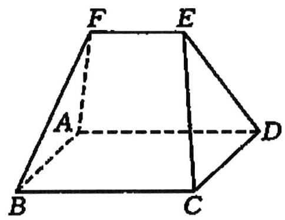

text_image

F
E
A
D
B
C

等级（SR）

2021 新疆第二次适应性检测

039. 设 P 是 $\triangle ABC$ 所在平面外一点，PA，PB，PC 两两垂直，PD⊥AB 于点 D， $\triangle PAB$ ， $\triangle PBC$ ， $\triangle PAC$ ， $\triangle ABC$ 的面积分别是 $S_{1}$ ， $S_{2}$ ， $S_{3}$ ，S.

(1) 证明: 平面 $\mathrm{PDC} \perp$ 平面 $\mathrm{ABC}$ ;  
(2) 若 $S = 10$ , 求 $S_{1}^{2} + S_{2}^{2} + S_{3}^{2}$ 的值

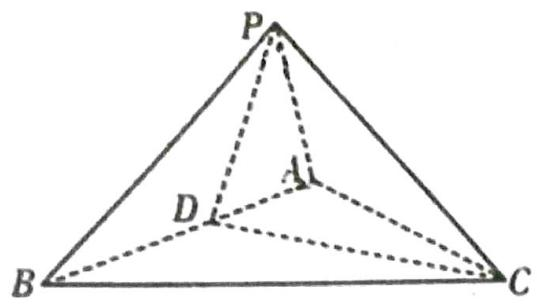

text_image

P
A
D
B
C

等级（SSR）

2024济南一模

040. 在空间直角坐标系 $O - \mathrm{xyz}$ 中, 任一平面的方程都能表示成 $Ax + By + Cz + D = 0$ , 其中 $A, B, C, D \in \mathbb{R}, A^2 + B^2 + C^2 \neq 0$ , 且 $n = (A, B, C)$ 为该平面的法向量.

已知集合:

$$
P = \{(x, y, z) | x | \leqslant 1, | y | \leqslant 1, | z | \leqslant 1 \},
$$

$$
Q = \{(x, y, z) | x | + | y | + | z | \leqslant 2 \},
$$

$$
T = \{(x, y, z) | x | + | y | \leqslant 2, | y | + | z | \leqslant 2, | z | + | x | \leqslant 2 \}.
$$

(1) 设集合 $M = \{(x, y, z) \mid z = 0\}$ , 记 $\mathrm{P} \cap \mathrm{M}$ 中所有点构成的图形的面积为 $S_{1}, Q \cap M$ 中所有点构成的图形的面积为 $S_{2}$ , 求 $S_{1}$ 和 $S_{2}$ 的值;

(2) 记集合 $Q$ 中所有点构成的几何体的体积为 $V_{1}$ , $P \cap Q$ 中所有点构成的几何体的体积为 $V_{2}$ , 求 $V_{1}$ 和 $V_{2}$ 的值;

(3)记集合 $T$ 中所有点构成的几何体为 $W$ .

①求 W 的体积 $V_{3}$ 的值:

③ 求 W 的相邻（有公共棱）两个面所成二面角的大小，并指出 W 的面数和棱数.

等级（SSR）

2024 汕头二模

041..日常生活中, 较多产品的包装盒呈正四棱柱状, 比如月饼盒, 烘焙店在售卖月饼时, 为美观起见, 通常会用彩绳对月饼盒做一个捆扎, 常见的捆扎方式有两种, 如图 (A)、(B) 所示, 并配上花结.

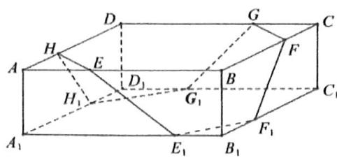

text_image

D
G
C
H
E
F
A
D₁
B
H₁
G₁
C₁
A₁
E₁
B₁
F₁

(A)

text_image

D
A
D₁
B
C₁
A₁
B₁

(B)

图(A)中,正四棱柱 $ABCD-A_{1}B_{1}C_{1}D_{1}$ 的底面 $ABCD$ 是正方形,且 $AB=3$ , $AA_{1}=1$ .

(1) 若 $AH = AE = B_{1}E_{1} = B_{1}F_{1} = CF = CG = D_{1}G_{1} = D_{1}H_{1} = 1$ , 记点 $H$ 关于平面 $F_{1}FGG_{1}$ 的对称点为 $P_{1}$ , 点 $H$ 关于直线 $F_{1}G_{1}$ 的对称点为 $P_{2}$ .

(i) 求线段 $H{P}_{1}$ 的长；  
(ii) 直线 $P_{1} P_{2}$ 与平面ABCD所成角的正弦值.  
(2) 据烘焙店的店员说, 图 (A) 这样的捆扎不仅漂亮, 而且比图 (B) 的十字捆扎更节省彩绳. 你同意这种说法吗? 请给出你的理由 (注意, 时 $A H 、 A E 、 B _ { 1 } E _ { 1 } 、 B _ { 1 } F _ { 1 } 、 C F 、 C G 、 D _ { 1 } G _ { 1 } 、 D _ { 1 } H _ { 1 }$ 这 8 条线段可能长短不一)

等级（SSR）

2024 南昌二模

042.如图所示, 用一个不平行于圆柱底面的平面, 截该圆柱所得的截面为椭圆面, 得到的几何体称之为“斜截圆柱”. 图一与图二是完全相同的“斜截圆柱”, $AB$ 是底面圆 $O$ 的直径, $AB = 2BC = 2$ , 椭圆所在平面垂直于平面 $ABCD$ , 且与底面所成二面角为 $45^{\circ}$ , 图一中, 点 $P$ 是椭圆上的动点, 点 $P$ 在底面上的投影为点 $P_{1}$ , 图二中, 椭圆上的点 $E_{i} (i = 1,2,3,\cdots,n)$ 在底面上的投影分别为 $F_{i}$ , 且 $F_{i}$ 均在直径 $AB$ 的同一侧.

(1) 当 $\angle AOP_{1} = \frac{2\pi}{3}$ 时，求 $PP_{1}$ 的长度；

(2) (i) 当 $n = 6$ 时, 若图二中, 点 $F_{1}, F_{2}, \ldots, F_{6}$ 将半圆均分成 7 等份, 求 $(E_{1} F_{1} - 2) \cdot (E_{2} F_{2} - 2) \cdot (E_{3} F_{3} - 2)$ ;

（ii）证明： $\widehat{AF_1}\cdot E_1F_1 + \widehat{F_1F_2}\cdot E_2F_2 + \dots +\widehat{F_{n - 1}F_n}\cdot E_nF_n + \widehat{F_nB}\cdot BC <   2\pi .$

text_image

D
P
C
O
A
θ
B
P₁

图一

text_image

D
E₁
E₂
Eₙ
C
O
A
F₁
F₂
Fₙ
B

图二

# 题型五：圆锥曲线 19 题

等级（SR）

2024 湖北圆创联盟

043.在平面直角坐标系内，以原点 O 为圆心， $a,b(a>0,b>0,a,b$ 为定值)为半径分别作同心圆 $C_{1},C_{2}$ ，设 A 为圆 $C_{1}$ 上任一点(不在 y 轴上)，作直线 OA，过点 A 作圆 $C_{1}$ 的切线 $AA'$ 与 x 轴交于点 $A'$ ，过圆 $C_{2}$ 与 x 轴的交点 B 作圆 $C_{2}$ 的切线 $BB'$ 与直线 OA 交于点 $B'$ ，过点 $A',B'$ 分别作 x 轴，y 轴的垂线 $A'M,B'M$ 交于点 M。

(1) 求动点 $M$ 的轨迹 $E$ 的方程;  
(2) 设 $c = \sqrt{a^2 + b^2}$ , 点 $F_{1}(-c, 0), F_{2}(c, 0)$ , 过点 $F_{1}$ 的直线与轨迹 $E$ 交于 $A, B$ 两点 (两点均在 $y$ 轴左侧).  
(i) 若 $\angle AF_{2}B = \frac{\pi}{2}, \triangle AF_{2}B$ 的内切圆的圆心的纵坐标为 $\sqrt{3}a$ , 求 $\frac{c}{a}$ 的值;  
(ii) 若点 $P$ 是曲线 $E$ 上 $(y$ 轴左侧) 的点, 过点 $O$ 作直线与曲线 $\mathrm{E}$ 在 $P$ 处的切线平行, 交 $PF_{2}$ 于点 $Q$ , 证明: $PQ$ 的长为定值.

等级（SR）

2024T8 第二次联考

044. 已知双曲线 $\Gamma$ 的方程为 $\frac{x^2}{4} - y^2 = 1, B(-a, 0), C(a, 0)$ , 其中 $a > 2, D(x_0, y_0) (x_0 \geqslant a, y_0 > 0)$ 是双曲线上一点, 直线 $DB$ 与双曲线 $\Gamma$ 的另一个交点为 $E$ , 直线 $DC$ 与双曲线 $\Gamma$ 的另一个交点为 $F$ , 双曲线 $\Gamma$ 在点 $E, F$ 处的两条切线记为 $l_1, l_2, l_1$ 与 $l_2$ 交于点 $P$ , 线段 $DP$ 的中点为 $G$ . 设直线 $DB, DC$ 的斜率分别为 $k_1, k_2$ .

(1) 证明: $4 < \frac{1}{k_{1}} + \frac{1}{k_{2}} \leq \frac{4a}{\sqrt{a^{2} - 4}};$   
(2) 求 $\frac{|GB|}{|GC|}$ 的值.

等级（SR）

2024 福建质检

045. 在 $\Delta ABC$ 中, $\angle ABC = 90^{\circ}, AB = 6, \angle ACB$ 的平分线交 $AB$ 于点 $D$ , $AD = 2DB$ . 平面 $\alpha$ 过直线 $AB$ , 且与 $\Delta ABC$ 所在的平面垂直.

(1) 求直线 $CD$ 与平面 $\alpha$ 所成角的大小;  
(2) 设点 $E \in \alpha$ , 且 $\angle ECD = 30^{\circ}$ , 记 $E$ 的轨迹为曲线 $\Gamma$ .

(i) 判断 $\Gamma$ 是什么曲线，并说明理由；

(ii) 不与直线 $AB$ 重合的直线 $l$ 过点 $D$ 且交 $\Gamma$ 于 $P, Q$ 两点，试问：在平面 $\alpha$ 内是否存在定点 $T$ ，使得无论 $l$ 绕点 $D$ 如何转动，总有 $\angle PTC = \angle QTC$ ? 若存在，指出点 $T$ 的位置；若不存在，说明理由.

等级（SR）

2024 石家庄二模

046. 已知椭圆 $E: \frac{x^2}{a^2} + \frac{y^2}{b^2} = 1 (a > b > 0)$ 的左、右焦点分别 $F_1, F_2$ ，离心率为 $\frac{\sqrt{2}}{2}$ ，过点 $F_1$ 的动直线 $l$ 交 $E$ 于 $A, B$ 两点，点 $A$ 在 $x$ 轴上方，且 $l$ 不与 $x$ 轴垂直， $\triangle ABF_2$ 的周长为 $4\sqrt{2}$ ，直线 $AF_2$ 与 $E$ 交于另一点 $C$ ，直线 $BF_2$ 与 $E$ 交于另一点 $D, P$ 为椭圆 $E$ 的下顶点，如图①.

(1) 当点 $A$ 为椭圆 $E$ 的上顶点时, 将平面 $xOy$ 沿 $x$ 轴折叠如图②, 使平面 $A'F_1F_2 \perp$ 平面 $BF_1F_2$ , 求异面直线 $A'C$ 与 $BF_1$ 所成角的余弦值;

(2) 若过 $F_{2}$ 作 $F_{2} H \perp C D$ , 垂足为 $H$ .

(i)证明：直线 $CD$ 过定点；

(ii)求 $|PH|$ 的最大值.

text_image

y
A
F₁ O F₂ D
B C
x
P

①

text_image

y
A'
F₁
O
B
P
F₂
C
x
D'

②

等级（SR）

2024 宁波二模

047. 已知双曲线 $C: y^{2} - x^{2} = 1$ ，上顶点为 $D$ . 直线 $l$ 与双曲线 $C$ 的两支分别交于 $A, B$ 两点（ $B$ 在第一象限），与 $x$ 轴交于点 $T$ ，设直线 $DA, DB$ 的倾斜角分别为 $\alpha, \beta$ .

(1) 若 $T\left(\frac{\sqrt{3}}{3},0\right)$ ,   
(i) 若 $A(0, -1)$ , 求 $\beta$ ;  
(ii) 求证: $\alpha + \beta$ 为定值;  
(2) 若 $\beta = \frac{\pi}{6}$ , 直线 $DB$ 与 $x$ 轴交于点 $E$ , 求 $\Delta B E T$ 与 $\Delta A D T$ 的外接圆半径之比的最大值.

等级（SSR）

2024 新高考二卷

048. 已知双曲线 $C: x^{2} - y^{2} = m (m > 0)$ , 点 $P_{1}(5,4)$ 在 $C$ 上, $k$ 为常数, $0 < k < 1$ . 按照如下方式依次构造点 $P_{n}(n = 2,3,\ldots)$ : 过 $P_{n-1}$ 作斜率为 $k$ 的直线与 $C$ 的左支交于点 $Q_{n-1}$ , 令 $P_{n}$ 为 $Q_{n-1}$ 关于 $y$ 轴的对称点, 记 $P_{n}$ 的坐标为 $(x_{n}, y_{n})$ .

(1)若 $k = \frac{1}{2}$ ，求 $x_{2},y_{2}$   
(2)证明：数列 $\{x_{n} - y_{n}\}$ 是公比为 $\frac{1 + k}{1 - k}$ 的等比数列；  
(3)设 $S_{n}$ 为 $\Delta P_{n}P_{n + 1}P_{n + 2}$ 的面积，证明：对任意正整数 $n$ ， $S_{n} = S_{n + 1}$

等级（SSR）

2024 江苏七市二模

049.在平面直角坐标系 $xOy$ 中, 已知椭圆 $\Gamma: \frac{x^{2}}{a^{2}} + \frac{y^{2}}{b^{2}} = 1 (a > b > 0)$ 的离心率为 $\frac{\sqrt{6}}{3}$ , 直线 $l$ 与 $\Gamma$ 相切, 与圆 $O: x^{2} + y^{2} = 3a^{2}$ 相交于 $A, B$ 两点。当 $l$ 垂直于 $x$ 轴时, $\left|AB\right| = 2\sqrt{6}$

(1) 求 $\Gamma$ 的方程;  
(2) 对于给定的点集 $M, N$ , 若 $M$ 中的每个点在 $N$ 中都存在距离最小的点, 且所有最小距离的最大值存在, 则记此最大值为 $d(M, N)$ .

(i)若 $M, N$ 分别为线段 $AB$ 与圆 $O, P$ 为圆 $O$ 上一点，当 $\triangle PAB$ 的面积最大时，求 $d(M, N)$ ;

（ii）若 $d(M,N), d(N,M)$ 均存在，记两者中的较大者为 $H(M,N)$ . 已知 $H(X,Y)$ ， $H(Y,Z), H(X,Z)$ . 均存在，证明： $H(X,Z) + H(Y,Z) \geqslant H(X,Y)$ .

# 题型六：导数 19 题

等级（SR）

2024 石家庄一模

050.已知函数 $f(x) = e^{x} - ax^{2}, (a > 0)$

(1) 若函数 $f(x)$ 有 3 个不同的零点, 求 $a$ 的取值范围  
(2)已知 $f^{\prime}(x)$ 为函数 $f(x)$ 的导函数, $f^{\prime}(x)$ 在 $R$ 上有极小值 0 , 对于某点 $P(x_0,f(x_0))$ , $f(x)$ 在 $P$ 点的切线方程为 $y = g(x)$ , 对于 $\forall x\in R$ , 都有 $(x - x_0)\cdot [f(x) - g(x)]\geq 0$ , 则称 $P$ 为好点.  
(i)求 $a$ 的值  
(ii)求所有的好点

等级（SR）

2024 常德一模

051.已知函数 $f(x) = \frac{\sin x}{x}$

(1) 判断函数 $f(x)$ 在区间 $(0,3\pi)$ 上极值点的个数并证明；  
(2)函数 $f(x)$ 在区间 $(0,+\infty)$ 上的极值点从小到大分别为 $x_{1}, x_{2}, x_{3}, \cdots, x_{n}, \cdots$ ，设 $a_{n} = f(x_{n})$ ， $S_{n}$ 为数列 $\left\{a_{n}\right\}$ 的前 n 项和.

①证明： $a_{1}+a_{2}<0;$

②试问是否存在 $n \in N^{*}$ 使得 $S_{n} \geq 0$ 若存在, 求出 $n$ 的取值范围; 若不存在, 请说明理由.

等级（SR）

2024 苏锡常镇一模

052.已知函数 $f(x) = \frac{4\mathrm{e}^{x - 2}}{x} -2x(x > 0)$ ，函数 $g(x) = -x^{2} + 3ax - a^{2} - 3a(a\in \mathbf{R}).$

(1) 若过点 $O(0,0)$ 的直线 $l$ 与曲线 $y = f(x)$ 相切于点 $P$ , 与曲线 $y = g(x)$ 相切于点 $Q$   
①求 $a$ 的值  
②当 $P, Q$ 两点不重合时，求线段 $PQ$ 的长；  
(2) 若 $\exists x_{0} > 1$ , 使得不等式 $f(x_{0}) \leqslant g(x_{0})$ 成立, 求 $a$ 的最小值

等级（SR）

2024 福建质检

053.对于函数 $f(x)$ ，若实数 $x_{0}$ 满足 $f(x_{0})=x_{0}$ ，则称 $x_{0}$ 为 $f(x)$ 的不动点。已知 $a\geq0$ ，且 $f(x)=\frac{1}{2}\ln x+ax^{2}+1-a$ 的不动点的集合为 A。以 $\min M$ 和 $\max M$ 分别表示集合 M 中的最小元素和最大元素。

(1) 若 a = 0，求 A 的元素个数及 $\max A$ ;  
(2) 当 $A$ 恰有一个元素时, $\pmb{a}$ 的取值集合记为 $B$ .

(i)求 $B$

(ii)若 $a = \min B$ ，数列 $\{a_{n}\}$ 满足 $a_1 = 2, a_{n+1} = \frac{f(a_n)}{a_n}$ ，集合 $C_n = \{\sum_{k=1}^{n}|a_k - 1|, \frac{4}{3}\}, n \in \mathbb{N}^*$ .

求证： $\forall n\in \mathbf{N}^{*},\max C_{n} = \frac{4}{3}.$

