# 教辅资料站

电子教辅

试卷练习

知识总结

备课资源

扫码关注获取更多学习资料

创于 2003

# 试题 调研

20年纪念版

®

微信公众号

教辅资料站

小考教辅站

初高教辅站

杜志建◎主编

# 考前抢分必备

抢时间看，抢机会背，多抢一分超万人！

natural_image

Yellow star-shaped mascot wearing a blue patterned outfit with yellow stars, standing on a grid background (no text or symbols)

考前结论速背，稳拿分  
√ 考前误区速纠，避失分  
考前技法速通，抓大分  
考前热点速览，冲高分

考前1分钟都可以看的抢分宝典!

试题调研

专注高考20年

# 第10辑

# 数学理科

# 倒计时30天

# 赶紧背，高考再提50+

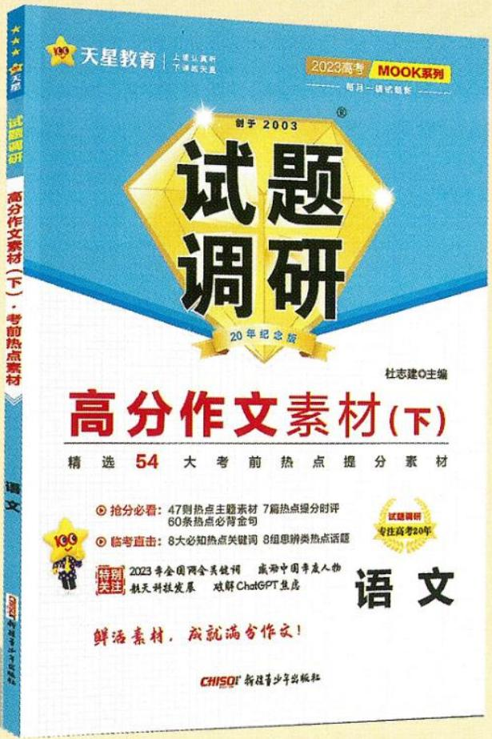

text_image

109 天星教育 | 上播认真听
下潜起失望
2023高考 MOOK系列
—— 每月一课试题版 ———
创于 2003
试题调研
20年纪念版
杜志建◎主编
高分作文素材(下)
精选 54 大考前热点提分素材
抢分必看：47则热点主题素材 7篇热点细分时评
60条热点必背金句
临考直击：8大必知热点关键词 8组思辨类热点话题
2023年全国网会关键词 威源中国亲友人物
航天科技发展 哎解ChatGPT焦虑
语文
鲜活素材，成就满分作文！
CHISO® 新程青少年出版社

高分作文素材（下）

# 考前热点素材

时新素材 最新时评 范文佳作

最后30天,每天背诵10分钟,作文速破50+!

时政热点（下）

2022.4—2023.3国内外重大时事

natural_image

Portrait photo of a man in a dark shirt against a yellow background (no text or symbols)

# 特约主编

# 高考政治马宇轩

政治学科头部UP主，B站粉丝20万+，全网粉丝50万+，视频全网播放量500万+  
B站配套精讲视频课程免费看

text_image

天星教育
上层认证版
下载航天器
2023高考 MOOK系列
每丛一盘汇创新
制于 2003
试题调研
20年纪念版
杜志建◎主编
时政热点（下）
2022年4月至2023年3月国内外重大时事、党和政府重大方针政策全剖析
全方位解读
2023年全国两会 2023年中央一号文件
中国式现代化 “双碳”战略
新型举国体制 推动专精特新企业发展
全面依法治国新征程 中国国家版本馆
“三社”融合助力乡村振兴 推进健康中国建设
CHISOT 新疆青少年出版社
试题调研
专注高考20年
政治

text_image

創于2003
试题
调研

# 考前抢分必备

抢时间看，抢机会背，多抢一分超万人！

主 编 杜志建

特约名师

赵成海 正高级教师，河北省优秀教师，省级骨干教师。中国数学奥林匹克一级教练员，中国数学会会员。

王军 重庆一中数学教师，骨干教师，中国数学奥林匹克一级教练员，曾获“重庆市数学教学论文大赛一等奖”。

本册编委 赵成海 汤小梅 王博渊 王军 杨飞

白东平

第10辑

数学理科

微信公众号教辅资料站小考教辅站初高教辅站

# 图书在版编目(CIP)数据

试题调研. 第10辑 考前抢分必备 数学 理科 / 杜志建主编. -- 乌鲁木齐 : 新疆青少年出版社, 2023.4

ISBN 978-7-5590-9443-8

I. ①试… II. ①杜… III. ①中学数学课 - 高中 - 升学参考资料 IV. ①G634

中国国家版本馆 CIP 数据核字(2023)第 056143 号

出版人:徐江

策划:王启全

责任编辑:多艳萍

封面设计:天星美工室

试题调研·第10辑 考前抢分必备 数学理科

SHITI DIAOYAN · DI 10 JI KAOQIAN QIANGFEN BIBEI SHUXUE LIKE

杜志建 主编

出版:新疆青少年出版社有限公司

社 址:乌鲁木齐市北京北路29号 邮政编码:830012

电话:0991-6239223(编辑部) 0371-68698015(读者服务部)

官网:http://www.qingshao.net 天猫旗舰店:http://xjqss.tmall.com

发行:新疆青少年出版社有限公司

经销:各地新华书店 法律顾问:王冠华 18699089007

印刷:河南新华印刷集团有限公司

开 本:787mm×1092mm 1/16 版 次:2023年4月第1版

印 张:7
印 次:2023年4月第1次印刷

字 数:130 千字

书号:ISBN 978-7-5590-9443-8

定 价:18.90元

CHISO 青少社
SINCE 1956

版权所有，侵权必究。印装问题可随时同印厂退换。

# 声明

基于对知识和创作的尊重,本书向所选文章、图片的作者支付补贴。因条件所限未能及时联系的作者,我们在此深表歉意,当您看到本书时,请与我们联系,以便我们向您支付补贴和赠送样书。联系方式:0371-68698015。

# CONTENTS 目录

第10辑
数学理科

# 攻略 1 必背超级结论

√ 稳拿分

考前必背的 39 个定理 & 结论 …… 001

考前必会的 11 个性质结论 …… 021

考前必会的 24 个高分技法 …… 026

考前必知的 25 个函数图象结论…… 038

考前必用的 25 个高妙二级结论…… 043

# 攻略 2 必纠知识误区

√ 避失分

考前必纠的 24 个易错、易混点 …… 048

# 攻略3 必会套路技法

√ 抓大分

考前必会的 7 个秒杀大招 055

大招 1 投机取 “巧”，实现速算秒杀 …… 055

大招 2 数形结合，一切尽在不言中…… 056

大招 3 巧妙构造，另辟蹊径 059

大招 4 整体讨论，移花接木 063

大招 5 妙用二级结论，站在巨人的肩膀上 …… 065

大招 6 利用高数知识，一览众山小…… 068

大招 7 研究局部，服务整体 072

# 考前必破的 4 大命题套路 …… 073

套路 1 结构不良试题的 3 种命题套路 …… 073

套路 2 含 $e^{x}$ ， $\ln x$ 的函数与不等式交汇问题的命题套路 …… 078

套路 3 圆锥曲线与其他知识模块交汇问题的命题套路 …… 080

套路 4 从方程和函数的视角研究数列问题的命题套路 …… 082

# 攻略 4 必知命题热点

√ 冲高分

# 考前必明的 3 大时效热点 …… 086

热点 1 关注体育赛事，增强运动理念 …… 086

热点 2 聚焦科技创新，培养民族自信 …… 087

热点 3 举办趣味活动，体现学科应用 …… 088

# 考前必会的6个学科创新命题热点 090

热点 1 蕴含数学文化 …… 090

热点 2 强调学科融合 …… 092

热点 3 突出开放探究 …… 095

微信公众号教辅资料站小考教辅站初高教辅站

热点 4 创新知识交汇 …… 097

热点 5 取材高等数学 …… 100

热点6 解法灵活多样 …… 104

# 攻略1 必背超级结论

稳拿分

# 考前必背的 39 个定理 & 结论

# 抢分点1》与集合有关的5条重要结论

<table><tr><td>1</td><td>元素与子集的个数</td><td>若集合A有 $n(n \in \mathbb{N}^*)$ 个元素,则A有 $2^n$ 个子集,有 $(2^n - 1)$ 个真子集,有 $(2^n - 2)$ 个非空真子集.</td></tr><tr><td>2</td><td>摩根定律</td><td> $\complement_U(A \cup B) = (\complement_U A) \cap (\complement_U B), \complement_U(A \cap B) = (\complement_U A) \cup (\complement_U B).$ </td></tr><tr><td>3</td><td>集合间的基本关系</td><td> $A \subseteq B (A \text{是} B \text{的子集}) \begin{cases} A = B (A \text{和} B \text{相等}) \Leftrightarrow A \subseteq B \text{且} A \supseteq B, \\ A \subsetneqq B (A \text{是} B \text{的真子集}) \Leftrightarrow A \subseteq B \text{且} A \neq B. \end{cases}$ </td></tr><tr><td>4</td><td>集合中元素的个数</td><td>一般地,对任意两个有限集合A,B,有card(A∪B)=card(A)+card(B)-card(A∩B)(card(A)表示有限集合A中元素的个数),如图1.拓展:类比两个集合,可以得到三个集合的类似公式. $\operatorname{card}(A \cup B \cup C) = \operatorname{card}(A) + \operatorname{card}(B) + \operatorname{card}(C) - \operatorname{card}(A \cap B) - \operatorname{card}(B \cap C) - \operatorname{card}(A \cap C) + \operatorname{card}(A \cap B \cap C)$ ,如图2.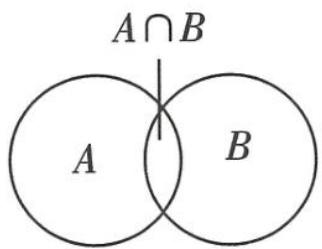 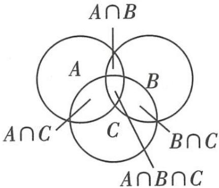图1 图2</td></tr><tr><td>5</td><td>易混的集合与其代表的意义</td><td>集合 $x | f(x) > 0$ 表示不等式 $f(x) > 0$ 的解集;集合 $y | y = f(x)$ 表示函数 $y = f(x)$ 的值域;集合 $x, y | y = f(x)$ 表示函数 $y = f(x)$ 的图象.</td></tr></table>

# 抢分点2 充分、必要条件的6种类型与对应集合的关系

设 $p$ 包含的对象组成集合 $A,q$ 包含的对象组成集合 $B$ .

<table><tr><td>p是q的充分不必要条件</td><td>p⇒q且q⇒p</td><td>A∉B</td></tr><tr><td>p是q的必要不充分条件</td><td>p⇒q且q⇒p</td><td>B∉A</td></tr><tr><td>p是q的充要条件</td><td>p⇔q</td><td>A=B</td></tr><tr><td>p是q的既不充分也不必要条件</td><td>p⇒q且q⇒p</td><td>A,B互不包含</td></tr><tr><td>p是q的充分条件</td><td>p⇒q</td><td>A⊆B</td></tr><tr><td>p是q的必要条件</td><td>q⇒p</td><td>B⊆A</td></tr></table>

注意符号
的区别

小编说:高考前,掌握一些必备的答题策略和技巧,不仅让答题更加高效,对于有效得分也大有裨益.

关注微信公众号“初高教辅站”获取更多初高中教辅资料

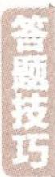

# 抢分点3 常见关键词及其否定

<table><tr><td>关键词</td><td>否定词</td><td>关键词</td><td>否定词</td></tr><tr><td>等于( = )</td><td>不等于( ≠ )</td><td>不是</td><td>是</td></tr><tr><td>大于( &gt; )</td><td>不大于(小于或等于,即“ ≤ ”)</td><td>都是</td><td>不都是(至少有一个不是)</td></tr><tr><td>小于(&lt;)</td><td>不小于(大于或等于,即“ ≥ ”)</td><td>至多有一个</td><td>不止一个</td></tr><tr><td>属于</td><td>不属于</td><td>至少有一个</td><td>一个也没有</td></tr></table>

# 抢分点4》全称量词与存在量词

# 1. 全称量词与存在量词

<table><tr><td>量词名称</td><td>常见量词</td><td>表示符号</td></tr><tr><td>全称量词</td><td>所有、一切、任意、全部、每一个等.</td><td>∀</td></tr><tr><td>存在量词</td><td>存在一个、至少有一个、有一个、某个、某些等.</td><td>∃</td></tr></table>

# 2. 全称命题与特称命题

<table><tr><td>命题名称</td><td>命题结构</td><td>命题简记</td></tr><tr><td>全称命题</td><td>对M中任意一个x,有p(x)成立.</td><td>∀x∈M,p(x)</td></tr><tr><td>特称命题</td><td>存在M中的一个x0,使p(x0)成立.</td><td>∃x0∈M,p(x0)</td></tr></table>

# 3. 全称命题与特称命题的否定

全称命题的否定是特称命题, 特称命题的否定是全称命题, 它们之间的关系如下表所示:

<table><tr><td>命题</td><td>命题的否定</td></tr><tr><td>∀x∈M,p(x)</td><td>∃x0∈M,¬p(x0)</td></tr><tr><td>∃x0∈M,p(x0)</td><td>∀x∈M,¬p(x)</td></tr></table>

由于全称命题经常省略量词,因此,在写这类命题的否定时,应先确定其中的全称量词,再改写量词和否定结论.

# 抢分点5 基本不等式

微信公众号
教辅资料
1.基本不等式

教辅资料站
小考教辅站

初高教辅站

如果 $a > 0, b > 0$ ，那么 $\sqrt{ab} \leqslant \frac{a + b}{2}$ ，当且仅当 $a = b$ 时等号成立。

基本不等式表明,两个正数的算数平均数不小于它们的几何平均数.

# 2. 基本不等式的 4 种形式

<table><tr><td>1</td><td>根式形式</td><td> $a + b \geqslant 2\sqrt{ab} (a >0, b >0)$ ,当且仅当  $a = b$  时,等号成立.【临考谨记】利用基本不等式求最值,一定要注意“一正、二定、三相等”缺一不可</td></tr><tr><td>2</td><td>整式形式</td><td> $ab \leqslant (\frac{a+b}{2})^2 (a, b \in \mathbb{R}), a^2 + b^2 \geqslant 2ab (a, b \in \mathbb{R}), (a+b)^2 \geqslant 4ab (a, b \in \mathbb{R}), (\frac{a+b}{2})^2 \leqslant \frac{a^2 + b^2}{2}(a, b \in \mathbb{R})$ ,以上不等式当且仅当  $a = b$  时,等号成立.</td></tr><tr><td>3</td><td>分式形式</td><td> $\frac{b}{a} + \frac{a}{b} \geqslant 2(ab >0)$ ,当且仅当  $a = b$  时,等号成立.</td></tr><tr><td>4</td><td>倒数形式</td><td> $a + \frac{1}{a} \geqslant 2(a >0)$ ,当且仅当  $a = 1$  时,等号成立;  $a + \frac{1}{a} \leqslant -2(a < 0)$ ,当且仅当  $a = -1$  时,等号成立.</td></tr></table>

# 3. 最值定理

已知 $x, y$ 都是正数, 如果 $xy$ 等于定值 $P$ , 那么当 $x = y$ 时, $x + y$ 取最小值 $2\sqrt{P}$ ; 如果 $x + y$ 等于定值 $S$ , 那么当 $x = y$ 时, $xy$ 取最大值 $\frac{1}{4} S^2$ . 可简记为: 积定和最小, 和定积最大.

# 抢分点6》三个“二次”间的关系

<table><tr><td>设关于x的方程 $ax^{2} + bx + c = 0$ (a&gt;0)的根的判别式 $\Delta = b^{2} - 4ac$ </td><td> $\Delta >0$ </td><td> $\Delta = 0$ </td><td> $\Delta < 0$ </td></tr><tr><td>二次函数 $y = ax^{2} + bx + c$ (a&gt;0)的图象</td><td>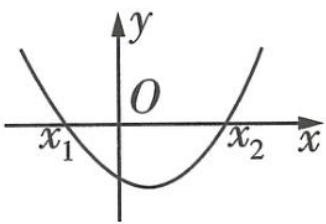</td><td>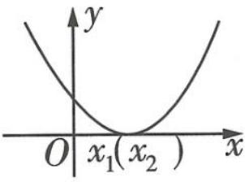</td><td>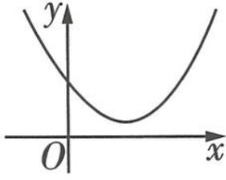</td></tr><tr><td>一元二次方程 $ax^{2} + bx + c = 0$ (a&gt;0)的根</td><td>有两个不相等实根 $x_{1}, x_{2} (x_{1} < x_{2})$ </td><td>有两个相等实根 $x_{1} = x_{2} = -\frac{b}{2a}$ </td><td>没有实数根</td></tr><tr><td> $ax^{2} + bx + c > 0$ (a&gt;0)的解集</td><td> $\{x | x < x_{1} \text{或} x > x_{2}\}$ </td><td> $\{x | x \neq -\frac{b}{2a}\}$ </td><td>R</td></tr><tr><td> $ax^{2} + bx + c < 0$ (a&gt;0)的解集</td><td> $\{x | x_{1} < x < x_{2}\}$ </td><td>∅</td><td>∅</td></tr></table>

解答题的各个小问之间通常有递进关系,后一问往往要使用前一问的结论.如果前一问是证明某个结论,即使不会证明此结论,该结论在后一问中也可以使用.

关注微信公众号“初高教辅站”获取更多初高中教辅资料

微信公众号教辅资料站小考教辅站初高教辅站

# 抢分点7》5组基本初等函数的导数公式

<table><tr><td>1</td><td> $c' = 0$ (c为常数).</td></tr><tr><td>2</td><td> $(x^n)' = nx^{n-1} (n \in \mathbf{Q}^*)$ ,高频使用: $(\frac{1}{x})' = (x^{-1})' = -\frac{1}{x^2}$ .</td></tr><tr><td>3</td><td> $(\sin x)' = \cos x, (\cos x)' = -\sin x.$ </td></tr><tr><td>4</td><td> $(\log_a x)' = \frac{1}{x \ln a} (x > 0, a > 0 \text{且 } a \neq 1), (\ln x)' = \frac{1}{x} (x > 0).$ </td></tr><tr><td>5</td><td> $(a^x)' = a^x \ln a (a > 0 \text{且 } a \neq 1), (e^x)' = e^x.$ </td></tr></table>

# 抢分点8 4个导数的运算法则

<table><tr><td>1</td><td>作和、差后求导</td><td> $[f(x) \pm g(x)]' = f'(x) \pm g'(x).$ 推广: $[f_1(x) \pm f_2(x) \pm \cdots \pm f_n(x)]' = f'_1(x) \pm f'_2(x) \pm \cdots \pm f'_n(x).$ </td></tr><tr><td>2</td><td>作积后求导</td><td> $[f(x)g(x)]' = f'(x)g(x) + f(x)g'(x).$ 特别地, $[cf(x)]' = cf'(x),c$ 为常数.</td></tr><tr><td>3</td><td>作商后求导</td><td> $[\frac{f(x)}{g(x)}]' = \frac{f'(x)g(x) - f(x)g'(x)}{[g(x)]^2} (g(x) \ne 0).$ 特别地, $[\frac{1}{g(x)}]' = -\frac{g'(x)}{[g(x)]^2} (g(x) \ne 0).$ </td></tr><tr><td>4</td><td>复合函数的求导法则</td><td>复合函数  $y = f(g(x))$  的导数为  $y'_x = [f(g(x))]' = f'(u)g'(x)$ ,其中  $u = g(x)$ .【同增导减】进行换元的函数  $u = g(x)$  是内函数, $y = f(u)$  是外函数,若内、外函数单调性相同,则原函数为增函数;若相反,则原函数为减函数</td></tr></table>

# 抢分点9 函数图象的7个代数特征

<table><tr><td>1</td><td>函数 $y=f(x)$ 的图象与其反函数 $y=f^{-1}(x)$ 的图象关于直线 $y=x$ 对称.</td></tr><tr><td rowspan="2">2公众号资料站教辅站教辅站3</td><td>函数 $y=f(x)$ 的图象与函数 $y=f(-x)$ 的图象关于y轴对称,函数 $y=f(x)$ 的图象与函数 $y=-f(x)$ 的图象关于x轴对称.</td></tr><tr><td>函数 $y=f(x)$ 的图象与函数 $y=-f(-x)$ 的图象关于原点对称,函数 $y=f(x)$ 的图象与函数 $y=-f^{-1}(-x)$ 的图象关于直线 $y=-x$ 对称.</td></tr><tr><td>4</td><td>函数 $y=f(x)$ 的图象关于直线x=a对称 $\Leftrightarrow f(a-x)=f(a+x)\Leftrightarrow f(2a-x)=f(x)$ .</td></tr><tr><td>5</td><td>函数 $y=f(x)$ 的图象关于点(a,0)对称 $\Leftrightarrow f(a-x)=-f(a+x)\Leftrightarrow f(2a-x)=-f(x)$ .</td></tr><tr><td>6</td><td>函数 $y=f(x)$ 的图象关于直线 $x=\frac{a+b}{2}$ 对称 $\Leftrightarrow f(a+mx)=f(b-mx)(m\neq0)\Leftrightarrow f(a+b-mx)=f(mx)(m\neq0)$ .</td></tr><tr><td>7</td><td>函数 $y=f(mx-a)(m\neq0)$ 的图象与函数 $y=f(b-mx)$ 的图象关于直线 $x=\frac{a+b}{2m}$ 对称.</td></tr></table>

# 抢分点10 同角三角函数的基本关系式

<table><tr><td>1</td><td>商的关系</td><td> $\frac{\sin \alpha}{\cos \alpha} = \tan \alpha, \frac{\cos \alpha}{\sin \alpha} = \cot \alpha, \tan \alpha = \frac{1}{\cot \alpha}.$ </td></tr><tr><td>2</td><td>平方关系</td><td> $\sin^{2}\alpha + \cos^{2}\alpha = 1.$ </td></tr><tr><td>3</td><td>常见变形</td><td> $\sin^{2}\alpha = 1 - \cos^{2}\alpha, \cos^{2}\alpha = 1 - \sin^{2}\alpha, \sin \alpha = \pm \sqrt{1 - \cos^{2}\alpha}, \cos \alpha = \pm \sqrt{1 - \sin^{2}\alpha}, \sin \alpha = \cos \alpha \tan \alpha, \cos \alpha = \frac{\sin \alpha}{\tan \alpha}, \sin^{2}\alpha = \frac{\sin^{2}\alpha}{\sin^{2}\alpha + \cos^{2}\alpha} = \frac{\tan^{2}\alpha}{\tan^{2}\alpha + 1}, 1 + \tan^{2}\alpha = \frac{1}{\cos^{2}\alpha}.$ 【说明】以上所有关系式中,只要是同一个角,关系就成立,不拘泥于角的形式,如 $\sin^{2}(\alpha + \frac{\pi}{3}) + \cos^{2}(\alpha + \frac{\pi}{3}) = 1, \tan 3\alpha = \frac{\sin 3\alpha}{\cos 3\alpha}$ 等都成立,但 $\sin^{2}(\alpha + \frac{\pi}{3}) + \cos^{2}(\alpha + \frac{\pi}{6}) = 1$ 就不一定成立</td></tr></table>

# 抢分点11 三角函数的诱导公式

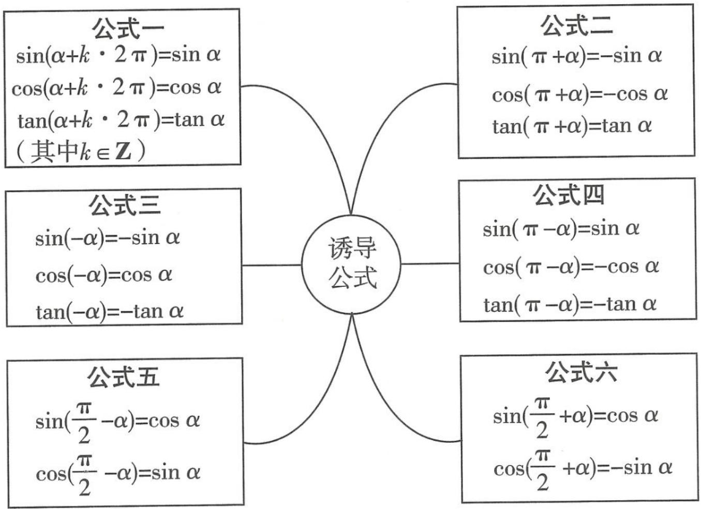

flowchart

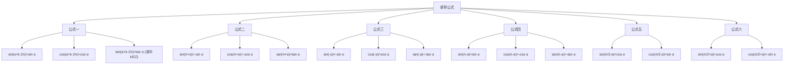

记忆口诀:奇变偶不变,符号看象限.

【口诀解读】公式中除 $\alpha$ 以外的角是 $\frac{\pi}{2}$ 的奇数倍则变，是 $\frac{\pi}{2}$ 的偶数倍则不变，变是指函数名称的变化。等号右边的符号是把 $\alpha$ 看成锐角时等号左边的函数值的符号

答题技巧 数学学科的考试时间是 120 分钟, 而一张试卷的分值是 150 分, 平均一道选填题的答题时间要在 3 分钟左右, 一道解答题的答题时间应该在 12 分钟左右, 因此考场上每 1 分钟都是非常重要的.

关注微信公众号“初高教辅站”获取更多初高中教辅资料

# 抢分点12 三角函数的图象变换

由函数 $y = \sin x$ 的图象变换得到 $y = A \sin (\omega x + \varphi) (A > 0, \omega > 0)$ 的图象的两种方法如下.

方法一

方法二

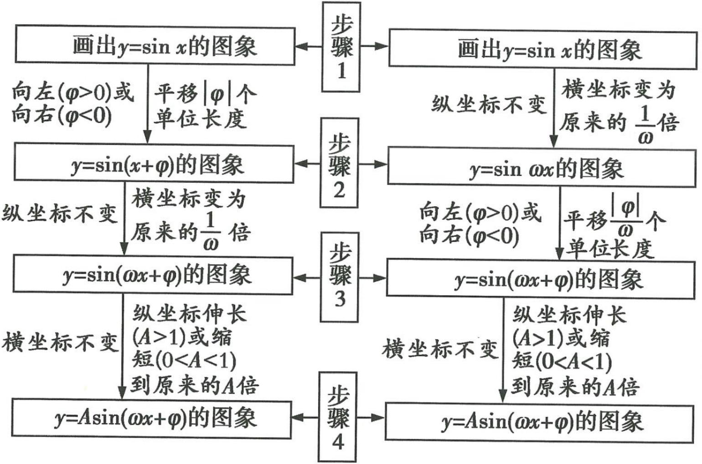

flowchart

```mermaid
graph TD
    A["画出y=sin x的图象"] --> B["向左(φ>0)或向右(φ<0)"]
    A --> C["平移|φ|个单位长度"]
    D["y=sin(x+φ)的图象"] --> E["纵坐标不变"]
    D --> F["横坐标变为原来的1/ω倍"]
    G["y=sin ωx的图象"] --> H["向左(φ>0)或向右(φ<0)"]
    G --> I["平移|φ|个单位长度"]
    J["y=sin(ωx+φ)的图象"] --> K["纵坐标不变"]
    J --> L["纵坐标伸长(A>1)或缩短(0<A<1)到原来的A倍"]
    M["y=Asin(ωx+φ)的图象"] --> N["横坐标不变"]
    M --> O["纵坐标伸长(A>1)或缩短(0<A<1)到原来的A倍"]
    P["步骤1"] --> Q["画出y=sin x的图象"]
    Q --> R["纵坐标不变"]
    Q --> S["横坐标变为原来的1/ω倍"]
    T["步骤2"] --> U["y=sin ωx的图象"]
    U --> V["向左(φ>0)或向右(φ<0)"]
    U --> W["平移|φ|个单位长度"]
    X["步骤3"] --> Y["y=sin(ωx+φ)的图象"]
    Y --> Z["横坐标不变"]
    Y --> AA["纵坐标伸长(A>1)或缩短(0<A<1)到原来的A倍"]
    AB["y=Asin(ωx+φ)的图象"] --> AC["步骤4"]
    AC --> AD["步骤4"]
```

<table><tr><td>A叫作振幅</td></tr><tr><td>T=2π/ω叫作函数的最 小正周期</td></tr><tr><td>f=1/T叫作频率</td></tr><tr><td>ωx+φ叫作相位</td></tr><tr><td>φ叫作初相</td></tr></table>

# 抢分点13 正弦、余弦、正切函数的奇偶性、周期性和图象的对称性

<table><tr><td colspan="2">函数</td><td> $y = \sin x$ </td><td> $y = \cos x$ </td><td> $y = \tan x$ </td></tr><tr><td colspan="2">奇偶性</td><td>奇函数</td><td>偶函数</td><td>奇函数</td></tr><tr><td colspan="2">单调性</td><td>在 $\left[ {-\frac{\pi}{2} + {2k\pi },\frac{\pi }{2} + {2k\pi }}\right]$ 上单调递增;在 $\left\lbrack {\frac{\pi }{2} + {2k\pi },\frac{3\pi }{2} + {2k\pi }}\right\rbrack$ 上单调递减.其中 $k \in \mathbf{Z}$ .</td><td>在 $\left\lbrack {{2k\pi },\pi + {2k\pi }}\right\rbrack$ 上单调递减;在 $\left\lbrack {-\pi + {2k\pi },\right.$   ${2k\pi }$ 上单调递增.其中 $k \in \mathbf{Z}$ .</td><td>在开区间 $\left( {-\frac{\pi }{2} + {k\pi },\frac{\pi }{2} + }\right.$   $k\pi )\left( {k \in  \mathbf{Z}}\right)$ 内单调递增.【敲黑板】元单调递减区间,在整个定义域内不单调</td></tr><tr><td colspan="2">最值</td><td>当 $x =  - \frac{\pi }{2} + {2k\pi }$ 时, ${y}_{\min } = - 1$ ;当 $x = \frac{\pi }{2} + {2k\pi }$ 时, ${y}_{\max } = 1$ .其中 $k \in  \mathbf{Z}$ .</td><td>当 $x = \left( {{2k} + 1}\right) \pi$ 时, ${y}_{\min } = - 1$ ;当 $x =$   ${2k\pi }$ 时, ${y}_{\max } = 1$ .其中 $k \in  \mathbf{Z}$ .</td><td>无</td></tr><tr><td rowspan="2">图象的对称性</td><td>对称中心</td><td> $\left( {{k\pi },{0}}\right) ,k \in  \mathbf{Z}$ </td><td> $\left( {{k\pi } + \frac{\pi }{2},0}\right) ,k \in  \mathbf{Z}$ </td><td> $\left( {\frac{k\pi }{2},0}\right) ,k \in  \mathbf{Z}$ </td></tr><tr><td>对称轴</td><td>直线 $x = {k\pi } + \frac{\pi }{2},k \in  \mathbf{Z}$ </td><td>直线 $x = {k\pi },k \in  \mathbf{Z}$ </td><td>无对称轴</td></tr><tr><td colspan="2">最小正周期</td><td> ${2\pi }$ </td><td> ${2\pi }$ </td><td> $\pi$ </td></tr></table>

# 抢分点14 三角函数中常用的5组公式

<table><tr><td>1</td><td>二倍角公式</td><td> $\sin 2\alpha = 2\sin \alpha \cos \alpha,$ 【诀窍】若记不住二倍角公式,可根据两角和的正弦、余弦、正切公式,从 $\alpha = \beta$ 的特殊情况进行推导 $\cos 2\alpha = \cos^{2}\alpha - \sin^{2}\alpha = 2\cos^{2}\alpha - 1 = 1 - 2\sin^{2}\alpha,$  $\tan 2\alpha = \frac{2\tan \alpha}{1 - \tan^{2}\alpha}.$ 由二倍角公式可以得到: $1 + \sin 2\alpha = (\sin \alpha + \cos \alpha)^{2},$  $1 - \sin 2\alpha = (\sin \alpha - \cos \alpha)^{2}.$ </td></tr><tr><td>2</td><td>半角公式</td><td> $\sin \frac{\alpha}{2} = \pm \sqrt{\frac{1 - \cos \alpha}{2}}, \cos \frac{\alpha}{2} = \pm \sqrt{\frac{1 + \cos \alpha}{2}},$ 【提醒】若已知角 $\alpha$ 的范围,则可光求出 $\frac{\alpha}{2}$ 的范围,然后根据 $\frac{\alpha}{2}$ 的范围来确定三角函数值的符号;若没有给出决定三角函数值的符号的条件,则需保留正、负两个符号 $\tan \frac{\alpha}{2} = \pm \sqrt{\frac{1 - \cos \alpha}{1 + \cos \alpha}} = \frac{\sin \alpha}{1 + \cos \alpha} = \frac{1 - \cos \alpha}{\sin \alpha}.$ </td></tr><tr><td>3</td><td>三倍角公式</td><td> $\sin 3\theta = 3\sin \theta - 4\sin^{3}\theta, \cos 3\theta = 4\cos^{3}\theta - 3\cos \theta, \tan 3\theta = \frac{3\tan \theta - \tan^{3}\theta}{1 - 3\tan^{2}\theta}.$ </td></tr><tr><td>4</td><td>万能公式</td><td> $\sin \theta = \frac{2\tan \frac{\theta}{2}}{1 + \tan^{2} \frac{\theta}{2}}, \cos \theta = \frac{1 - \tan^{2} \frac{\theta}{2}}{1 + \tan^{2} \frac{\theta}{2}}, \tan \theta = \frac{2\tan \frac{\theta}{2}}{1 - \tan^{2} \frac{\theta}{2}}$ ,其中 $\theta \neq 2k\pi + \pi$ ,且 $\theta \neq \frac{\pi}{2} + k\pi, k \in \mathbb{Z}.$ </td></tr><tr><td>5</td><td>辅助角公式</td><td> $y = a\sin x + b\cos x = \sqrt{a^{2} + b^{2}} (\sin x\cos \varphi + \cos x\sin \varphi) = \sqrt{a^{2} + b^{2}}\sin(x + \varphi)$ ,其中角 $\varphi$ 的终边所在象限由 $a, b$ 的符号确定,角 $\varphi$ 的值由 $\tan \varphi = \frac{b}{a} (a \neq 0)$ 确定.常见的辅助角公式: $\sin x \pm \cos x = \sqrt{2}\sin(x \pm \frac{\pi}{4}), \cos x \pm \sin x = \sqrt{2}\cos(x \mp \frac{\pi}{4}), \sin x \pm \sqrt{3}\cos x = 2\sin(x \pm \frac{\pi}{3}), \cos x \pm \sqrt{3}\sin x = 2\cos(x \mp \frac{\pi}{3}), \sqrt{3}\sin x \pm \cos x = 2\sin(x \pm \frac{\pi}{6}), \sqrt{3}\cos x \pm \sin x = 2\cos(x \mp \frac{\pi}{6}).$ </td></tr></table>

# 抢分点15 正、余弦定理及其变形

在 $\triangle ABC$ 中,角 $A,B,C$ 所对的边分别是 $a,b,c,R$ 为 $\triangle ABC$ 的外接圆半径.

<table><tr><td>定理</td><td>正弦定理(已知两角一边或两边及其中一边的对角)</td><td rowspan="3">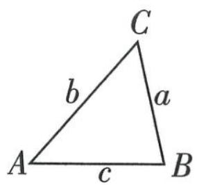</td><td>余弦定理(已知三边或两边及其夹角)</td></tr><tr><td>内容</td><td> $\frac{a}{\sin A} = \frac{b}{\sin B} = \frac{c}{\sin C} = 2R$ 变式:  $\frac{\sin A}{a} = \frac{\sin B}{b} = \frac{\sin C}{c}$ </td><td> $a^{2} = b^{2} + c^{2} - 2bc\cos A$ , $b^{2} = a^{2} + c^{2} - 2ac\cos B$ , $c^{2} = a^{2} + b^{2} - 2ab\cos C$ .</td></tr><tr><td>常见变形</td><td>(1)边化角: $a = 2R\sin A$ , $b = 2R\sin B$ , $c = 2R\sin C$ .(2)角化边: $\sin A = \frac{a}{2R}$ , $\sin B = \frac{b}{2R}$ , $\sin C = \frac{c}{2R}$ .(3)求比值: $a:b:c = \sin A: \sin B: \sin C$ .</td><td>求角或角化边: $\cos A = \frac{b^{2} + c^{2} - a^{2}}{2bc}$ , $\cos B = \frac{a^{2} + c^{2} - b^{2}}{2ac}$ , $\cos C = \frac{a^{2} + b^{2} - c^{2}}{2ab}$ .</td></tr><tr><td>定理整合</td><td colspan="3">正、余弦定理整合:在 $\triangle ABC$ 中, $\sin^{2}A = \sin^{2}B + \sin^{2}C - 2\sin B\sin C\cos A$ .此公式主要用于求值.如: $\sin^{2}21^{\circ} + \sin^{2}39^{\circ} + \sin 21^{\circ}\sin 39^{\circ} = \sin^{2}21^{\circ} + \sin^{2}39^{\circ} - 2\sin 21^{\circ}\sin 39^{\circ}\cos 120^{\circ} = \sin^{2}120^{\circ} = \frac{3}{4}$ .</td></tr><tr><td colspan="4">解三角形的常用方法:边化角、角化边,两角化一角、一角化两角等.</td></tr></table>

# 抢分点16 三角形中的3个恒等式

已知 $\triangle ABC$ 的三个内角 $A, B, C$ .

<table><tr><td>1</td><td>sin A + sin B + sin C = 4cos  $\frac{A}{2}$ cos  $\frac{B}{2}$ cos  $\frac{C}{2}$ .</td></tr><tr><td>2</td><td>cos A + cos B + cos C = 1 + 4sin  $\frac{A}{2}$ sin  $\frac{B}{2}$ sin  $\frac{C}{2}$ .</td></tr><tr><td>3</td><td>tan A + tan B + tan C = tan Atan Btan C(A, B, C均不为直角).</td></tr></table>

# 抢分点17 平面向量数量积的有关结论

已知非零向量 $\boldsymbol{a}=(x_{1},y_{1}),\boldsymbol{b}=(x_{2},y_{2}),\theta$ 为向量 a,b 的夹角.

<table><tr><td>名称</td><td>几何表示</td><td>坐标表示</td></tr><tr><td>模</td><td> $|a| = \sqrt{a \cdot a}$ </td><td> $|a| = \sqrt{x_1^2 + y_1^2}$ </td></tr><tr><td>数量积</td><td> $a \cdot b = |a||b|\cos\theta$ </td><td> $a \cdot b = x_1x_2 + y_1y_2$ </td></tr><tr><td>夹角的余弦值</td><td> $\cos \theta = \frac{a \cdot b}{|a||b|}$ </td><td> $\cos \theta = \frac{x_1x_2 + y_1y_2}{\sqrt{x_1^2 + y_1^2} \cdot \sqrt{x_2^2 + y_2^2}}$ </td></tr><tr><td>a⊥b的充要条件</td><td>a·b=0</td><td> $x_1x_2 + y_1y_2 = 0$ </td></tr><tr><td>|a·b|与|a||b|的关系</td><td>|a·b|≤|a||b|(当且仅当a与b共线时等号成立)</td><td> $|x_1x_2 + y_1y_2| \leqslant \sqrt{x_1^2 + y_1^2} \cdot \sqrt{x_2^2 + y_2^2}$ (当且仅当 $x_1y_2 = x_2y_1$ 时等号成立)</td></tr></table>

# 抢分点18 三角形“四心”的向量表示

已知 $H, G, O, I$ 是 $\triangle ABC$ 所在平面上的任意点, $a, b, c$ 分别为三个内角 $A, B, C$ 所对的边.

<table><tr><td>1</td><td>H为垂心 $\Leftrightarrow \overrightarrow{HA} \cdot \overrightarrow{HB} = \overrightarrow{HB} \cdot \overrightarrow{HC} = \overrightarrow{HC} \cdot \overrightarrow{HA}.$ </td></tr><tr><td>2</td><td>G为重心 $\Leftrightarrow \overrightarrow{GA} + \overrightarrow{GB} + \overrightarrow{GC} = 0.$ </td></tr><tr><td>3</td><td>O为外心 $\Leftrightarrow (\overrightarrow{OA} + \overrightarrow{OB}) \cdot \overrightarrow{AB} = (\overrightarrow{OB} + \overrightarrow{OC}) \cdot \overrightarrow{BC} = (\overrightarrow{OC} + \overrightarrow{OA}) \cdot \overrightarrow{CA} = 0.$ </td></tr><tr><td>4</td><td>I为内心 $\Leftrightarrow a\overrightarrow{IA} + b\overrightarrow{IB} + c\overrightarrow{IC} = 0.$ </td></tr></table>

# 抢分点19 求三角形面积的4个公式

已知 $\triangle ABC$ 的三个内角 $A, B, C$ 所对的边分别为 $a, b, c, \triangle ABC$ 的面积记为 $S_{\triangle ABC}$ .

<table><tr><td>1</td><td> $S_{\triangle ABC} = \frac{1}{2}ah_a = \frac{1}{2}bh_b = \frac{1}{2}ch_c, h_a, h_b, h_c$ 分别表示a,b,c边上的高.</td></tr><tr><td>2</td><td> $S_{\triangle ABC} = \frac{1}{2}absin C = \frac{1}{2}bcsin A = \frac{1}{2}acsin B = \frac{abc}{4R} = \frac{(a + b + c) \cdot r}{2}, R, r$ 分别是 $\triangle ABC$ 外接圆、内切圆的半径.</td></tr><tr><td>3</td><td>海伦公式: $S_{\triangle ABC} = \sqrt{p(p - a)(p - b)(p - c)}$ ,其中 $p = \frac{a + b + c}{2}$ .</td></tr><tr><td>4</td><td> $S_{\triangle ABC} = \frac{1}{2} | \overrightarrow{AB} | | \overrightarrow{AC} | \sin A = \frac{1}{2} \sqrt{(|\overrightarrow{AB}| |\overrightarrow{AC}|)^2 (1 - \cos^2 A)} = \frac{1}{2}\sqrt{(|\overrightarrow{AB}| |\overrightarrow{AC}|)^2 - (\overrightarrow{AB} \cdot \overrightarrow{AC})^2} = \frac{1}{2}\sqrt{(x_1^2 + y_1^2)(x_2^2 + y_2^2) - (x_1 x_2 + y_1 y_2)^2} = \frac{1}{2}\sqrt{(x_1 y_2 - x_2 y_1)^2} = \frac{1}{2}|x_1 y_2 - x_2 y_1|,其中\( \overrightarrow{AB} = (x_1, y_1), \overrightarrow{AC} = (x_2, y_2)$ .</td></tr></table>

做选填题时,若思考1分钟还没有解题思路,则应采取“暂时性放弃”,把自己会做的题目做完再回头解答.

关注微信公众号“初高教辅站”获取更多初高中教辅资料

# 抢分点20》复数的四则运算与几何意义

<table><tr><td>1</td><td>复数的加法法则</td><td>设 $z_1 = a + bi (a, b \in \mathbb{R})$ ,  $z_2 = c + di (c, d \in \mathbb{R})$ ,则 $z_1 + z_2 = (a + bi) + (c + di) = (a + c) + (b + d)i$ .</td></tr><tr><td>2</td><td>复数加法的几何意义</td><td>设 $\overrightarrow{OZ_1}$ ,  $\overrightarrow{OZ_2}$ 分别对应复数 $z_1 = a + bi (a, b \in \mathbb{R})$ ,  $z_2 = c + di (c, d \in \mathbb{R})$ ,且 $\overrightarrow{OZ_1}$ ,  $\overrightarrow{OZ_2}$ 不共线,以这两个向量为两条邻边作平行四边形,则这个平行四边形的对角线对应的向量 $\overrightarrow{OZ}$ 就是与复数 $z_1$ ,  $z_2$ 的和对应的向量,如图. 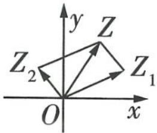</td></tr><tr><td>3</td><td>复数的减法法则</td><td>设 $z_1 = a + bi (a, b \in \mathbb{R})$ ,  $z_2 = c + di (c, d \in \mathbb{R})$ ,则 $z_1 - z_2 = (a + bi) - (c + di) = (a - c) + (b - d)i$ .</td></tr><tr><td>4</td><td>复数减法的几何意义</td><td>两个复数 $z_1$ ,  $z_2$ 的差 $z_1 - z_2$ 对应的向量就是连接它们对应向量 $\overrightarrow{OZ_1}$ ,  $\overrightarrow{OZ_2}$ 的终点,并指向被减向量的向量 $\overrightarrow{Z_2Z_1}$ ,如图. 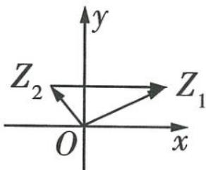</td></tr><tr><td>5</td><td>复数的乘法法则</td><td>设 $z_1 = a + bi (a, b \in \mathbb{R})$ ,  $z_2 = c + di (c, d \in \mathbb{R})$ ,则它们的积 $z_1z_2 = (a + bi)(c + di) = (ac - bd) + (ad + bc)i$ .</td></tr><tr><td>6</td><td>复数的除法法则</td><td> $\frac{a + bi}{c + di} = \frac{ac + bd}{c^2 + d^2} + \frac{bc - ad}{c^2 + d^2}i (a, b, c, d \in \mathbb{R}, \text{且 } c + di \neq 0)$ .</td></tr></table>

# 抢分点21》6组常见柱、锥、台体的表面积与体积公式

<table><tr><td></td><td>面积公式</td><td>体积公式</td><td>字母含义</td></tr><tr><td>圆柱</td><td> $S_{\text{底}} = \pi r^{2}, S_{\text{侧}} = 2\pi rh, S_{\text{表}} = 2\pi r (r + h)$ </td><td> $V = S_{\text{底}} \times \text{高} = \pi r^{2}h$ </td><td>r是底面半径,h是高</td></tr><tr><td>直棱柱</td><td> $S_{\text{侧}} = ch, S_{\text{表}} = S_{\text{侧}} + 2S_{\text{底}}$ </td><td> $V = S_{\text{底}} \times \text{高} = S_{\text{底}} h$ </td><td>c是底面周长,h是侧棱长</td></tr><tr><td>圆锥</td><td> $S_{\text{底}} = \pi r^{2}, S_{\text{侧}} = \pi rl, S_{\text{表}} = \pi r (r + l)$ </td><td> $V = \frac{1}{3}S_{\text{底}} \times \text{高} = \frac{1}{3}\pi r^{2}h$ </td><td>r是底面半径,l是母线长,h是高</td></tr><tr><td>正棱锥</td><td> $S_{\text{侧}} = \frac{1}{2}ch', S_{\text{表}} = S_{\text{侧}} + S_{\text{底}}$ </td><td> $V = \frac{1}{3}S_{\text{底}} \times \text{高} = \frac{1}{3}S_{\text{底}} h$ </td><td>c是底面周长, $h'$ 是斜高,即侧面等腰三角形底边上的高,h是高</td></tr><tr><td>圆台</td><td> $S_{\text{上底}} = \pi r'^2, S_{\text{下底}} = \pi r^2, S_{\text{侧}} = \pi l(r' + r), S_{\text{表}} = \pi (r'^2 + r^2 + r'l + rl)$ </td><td> $V = \frac{1}{3}h(S_{\text{上底}} + S_{\text{下底}} + \sqrt{S_{\text{上底}}S_{\text{下底}}}) = \frac{1}{3}\pi h(r^2 + r'^2 + rr')$ </td><td> $r', r$ 分别是上、下底面半径,l是母线长,h是高</td></tr><tr><td>正棱台</td><td> $S_{\text{侧}} = \frac{1}{2}(c + c')h', S_{\text{表}} = S_{\text{侧}} + S_{\text{上底}} + S_{\text{下底}}$ </td><td> $V = \frac{1}{3}h(S_{\text{上底}} + S_{\text{下底}} + \sqrt{S_{\text{上底}}S_{\text{下底}}})$ </td><td> $c', c$ 分别是上、下底面周长, $h'$ 是斜高,即侧面等腰梯形的高,h是高</td></tr></table>

【巧妙记忆】柱体、锥体、台体的体积公式之间的关系如下：

$$
V _ {\text {柱体}} = S _ {\text {底}} h \xleftarrow {S _ {\text {上底}} = S _ {\text {下底}}} V _ {\text {台体}} = \frac {1}{3} h (S _ {\text {上底}} + S _ {\text {下底}} + \sqrt {S _ {\text {上底}} S _ {\text {下底}}}) \xrightarrow {S _ {\text {上底}} = 0} V _ {\text {锥体}} = \frac {1}{3} S _ {\text {底}} h
$$

# 抢分点22》3个常见数列的通项公式与前 $n$ 项和公式

<table><tr><td>1</td><td>等差数列{an}</td><td>通项公式: an=a1+(n-1)d=dn+a1-d(n∈N*).前n项和公式: Sn=n(a1+an)/2=na1+n(n-1)/2d=d/2n2+(a1-1/2d)n.【拓展】Sn/n=a1+(n-1)·d/2,所以{Sn/n}是公差为d/2的等差数列</td></tr><tr><td>2</td><td>等比数列{an}</td><td>通项公式: an=a1qn-1=a1/qqn(n∈N*,q≠0).前n项和公式: Sn=a1(1-qn)/1-q/1-q, q≠1,na1,q=1.</td></tr><tr><td>3</td><td>等比差数列</td><td>通项公式形如an=(an+b)qn(a,q为非零实数,b为常数,q≠1)的数列为等比差数列.与等比差数列有关的问题,往往是给出通项公式,求前n项和,破解的方法是错位相减法,使用错位相减法的注意事项见本书第51页.</td></tr></table>

盯住选填题中的基础题及中档题,要确保不失分.适度关注选填题最后1题或最后2题,严防“会而放弃”.

关注微信公众号“初高教辅站”获取更多初高中教辅资料

# 抢分点23 等差数列及其前 $n$ 项和的8条性质

已知等差数列 $\{a_{n}\}$ 的公差为 $d$ ，前 $n$ 项和为 $S_{n}$

<table><tr><td>1</td><td>若a,A,b成等差数列,则A叫作a,b的等差中项, $A = \frac{a + b}{2}$ .</td></tr><tr><td>2</td><td>若 $m + n = p + q(m,n,p,q \in \mathbf{N}^{*})$ ,则 $a_{m} + a_{n} = a_{p} + a_{q}$ .</td></tr><tr><td>3</td><td>若m,p,n成等差数列,则 $a_{m},a_{p},a_{n}$ 也成等差数列,即若 $m + n = 2p$ ,则 $a_{m} + a_{n} = 2a_{p}$ .</td></tr><tr><td>4</td><td> $a_{k},a_{k+m},a_{k+2m},\cdots(k,m \in \mathbf{N}^{*})$ 是公差为md的等差数列.</td></tr><tr><td>5</td><td>数列 $S_{m},S_{2m}-S_{m},S_{3m}-S_{2m},\cdots$ 也是等差数列(公差为 $m^{2}d,m \in \mathbf{N}^{*}$ ).</td></tr><tr><td>6</td><td> $S_{2n-1} = (2n - 1)a_{n}$ .</td></tr><tr><td>7</td><td>若项数n为偶数,则 $S_{偶}-S_{奇} = \frac{nd}{2}$ ;若项数n为奇数,则 $S_{奇}-S_{偶} = a_{\frac{n+1}{2}}$ .</td></tr><tr><td>8</td><td>等差数列 $\{a_{n}\}$ 的前m项与后m项的和等于 $m(a_{1} + a_{n})(m \in \mathbf{N}^{*})$ .</td></tr></table>

# 抢分点24》等比数列及其前 $n$ 项和的7条性质

已知等比数列 $\{a_{n}\}$ 的公比为 $q(q \neq 0)$ , 前 $n$ 项和为 $S_{n}$ .

<table><tr><td>1</td><td>若a,G,b成等比数列,则G叫作a,b的等比中项, $G^2 = ab$ .</td></tr><tr><td>2</td><td>若 $m + n = p + q(m,n,p,q \in \mathbb{N}^*)$ ,则 $a_m a_n = a_p a_q$ .</td></tr><tr><td>3</td><td>若m,p,n成等差数列,则 $a_m, a_p, a_n$ 成等比数列,即若 $m + n = 2p$ ,则 $a_m a_n = a_p^2$ .</td></tr><tr><td>4</td><td> $a_k, a_{k+m}, a_{k+2m}, \cdots (k, m \in \mathbb{N}^*)$ 是公比为 $q^m$ 的等比数列.</td></tr><tr><td>5</td><td>当 $q \ne -1$ ,或q=-1且 $m(m \in \mathbb{N}^*)$ 为奇数时,数列 $S_m, S_{2m} - S_m, S_{3m} - S_{2m}, \cdots$ 是公比为 $q^m$ 的等比数列.</td></tr><tr><td>6</td><td>若 $T_n$ 为等比数列 $\{a_n\}$ 的前n项积,则 $T_m, \frac{T_{2m}}{T_m}, \frac{T_{3m}}{T_{2m}}, \cdots$ 是公比为 $(q^m)^m$ 的等比数列.</td></tr><tr><td>7</td><td>当项数为2n时, $\frac{S_{偶}}{S_{奇}} = q$ ;当项数为2n+1时, $\frac{S_{奇} - a_1}{S_{偶}} = q$ .</td></tr></table>

# 抢分点25 空间向量的坐标运算

设 $\boldsymbol{a}=(a_{1},a_{2},a_{3}),\boldsymbol{b}=(b_{1},b_{2},b_{3})$ .

<table><tr><td>1</td><td> $a + b = (a_1 + b_1, a_2 + b_2, a_3 + b_3), a - b = (a_1 - b_1, a_2 - b_2, a_3 - b_3), a \cdot b = a_1b_1 + a_2b_2 + a_3b_3.$ </td></tr><tr><td>2</td><td> $\lambda a = (\lambda a_1, \lambda a_2, \lambda a_3) (\lambda \in \mathbb{R}).$ </td></tr><tr><td>3</td><td> $a // b \Leftrightarrow a_1 = \lambda b_1, a_2 = \lambda b_2, a_3 = \lambda b_3 (b \neq 0, \lambda \in \mathbb{R}), a \perp b \Leftrightarrow a_1b_1 + a_2b_2 + a_3b_3 = 0.$ </td></tr><tr><td>4</td><td> $|a| = \sqrt{a \cdot a} = \sqrt{a_1^2 + a_2^2 + a_3^2}.$ </td></tr><tr><td>5</td><td>点  $A(x_1, y_1, z_1), B(x_2, y_2, z_2)$  间的距离  $d = |\overrightarrow{AB}| = \sqrt{(x_2 - x_1)^2 + (y_2 - y_1)^2 + (z_2 - z_1)^2}.$ </td></tr><tr><td>6</td><td>夹角公式: $\cos\langle a, b \rangle = \frac{a_1b_1 + a_2b_2 + a_3b_3}{\sqrt{a_1^2 + a_2^2 + a_3^2} \cdot \sqrt{b_1^2 + b_2^2 + b_3^2}} (a \neq 0, b \neq 0).$ </td></tr></table>

# 抢分点26 利用空间向量求角和距离

<table><tr><td>1</td><td>异面直线a,b所成的角θ</td><td>cos θ=|cos&lt; a,b&gt;|= |a·b|/|a|·|b|,其中0°&lt;θ≤90°,a,b分别表示异面直线a,b的方向向量.</td></tr><tr><td>2</td><td>直线AB与平面α所成的角θ</td><td>sin θ=|cos&lt; AB,m&gt;|= |AB·m|/|AB|·|m|,其中0°≤θ≤90°,m是平面α的法向量.</td></tr><tr><td>3</td><td>二面角α-l-β的平面角θ</td><td>|cos θ|=|cos&lt; m,n&gt;|=|m·n|/|m|·|n|,其中0°≤θ≤180°,m,n分别是平面α,β的【谨记】处理实际问题时,要根据具体图形确定二面角的平面角的大小:当θ为钝角时,cos θ=-|cos&lt; m,n|;当θ为锐角时,cos θ=|cos&lt; m,n|法向量.</td></tr><tr><td>4</td><td>点B到平面α的距离d</td><td>d=|AB·n|/|n|,其中n为平面α的法向量,A∈α,AB是平面α的一条斜线.</td></tr></table>

# 抢分点27 椭圆的标准方程及其几何性质

<table><tr><td>标准方程</td><td> $\frac{x^2}{a^2}+\frac{y^2}{b^2}=1(a>b>0)$ </td><td> $\frac{y^2}{a^2}+\frac{x^2}{b^2}=1(a>b>0)$ </td></tr><tr><td>图形</td><td>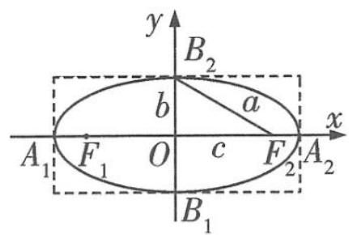</td><td>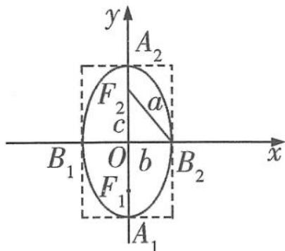</td></tr></table>

题目分析受挫,很可能是某个重要的条件被你忽略了. 在审题的时候慢一点,确认条件无漏后再解答.

关注微信公众号“初高教辅站”获取更多初高中教辅资料

续表

<table><tr><td rowspan="8">几何性质</td><td>范围</td><td> $-a \leqslant x \leqslant a, -b \leqslant y \leqslant b$ </td><td> $-b \leqslant x \leqslant b, -a \leqslant y \leqslant a$ </td></tr><tr><td>对称性</td><td colspan="2">对称轴:x轴,y轴.对称中心:原点</td></tr><tr><td>焦点</td><td> $F_1(-c,0),F_2(c,0)$ </td><td> $F_1(0,-c),F_2(0,c)$ </td></tr><tr><td>顶点</td><td> $A_1(-a,0),A_2(a,0);$  $B_1(0,-b),B_2(0,b)$ </td><td> $A_1(0,-a),A_2(0,a);$  $B_1(-b,0),B_2(b,0)$ </td></tr><tr><td>轴</td><td colspan="2">线段 $A_1A_2,B_1B_2$ 分别是椭圆的长轴和短轴,长轴长为2a,短轴长为2b</td></tr><tr><td>焦距</td><td colspan="2"> $|F_1F_2|=2c$ </td></tr><tr><td>离心率</td><td colspan="2"> $e=\frac{c}{a},e\in(0,1)$ </td></tr><tr><td>a,b,c的关系</td><td colspan="2"> $c^2=a^2-b^2$ </td></tr><tr><td colspan="2">椭圆的焦点三角形</td><td colspan="2">以椭圆 $\frac{x^2}{a^2}+\frac{y^2}{b^2}=1(a>b>0)$ 上一点 $P(x_0,y_0)(y_0\neq0)$ 和焦点 $F_1(-c,0),F_2(c,0)$ 为顶点的 $\triangle PF_1F_2$ (焦点三角形)中,若 $\angle F_1PF_2=\theta$ ,则 $(1)|PF_1|+|PF_2|=2a;$  $(2)4c^2=|PF_1|^2+|PF_2|^2-2|PF_1|\cdot|PF_2|\cdot\cos\theta;$  $(3)S_{\triangle PF_1F_2}=\frac{1}{2}|PF_1|\cdot|PF_2|\cdot\sin\theta=b^2\tan\frac{\theta}{2}.$  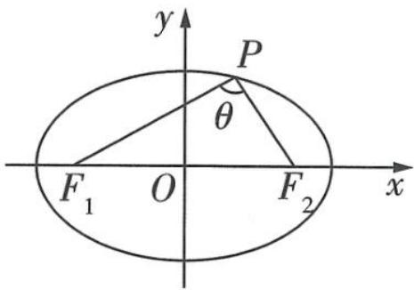</td></tr></table>

# 活学巧记

(1)焦点在 $x$ 轴上 $\Leftrightarrow$ 标准方程中 $x^{2}$ 项的分母较大, 焦点在 $y$ 轴上 $\Leftrightarrow$ 标准方程中 $y^{2}$ 项的分母较大, 因此由椭圆的标准方程判断焦点位置时, 要根据方程中分母的大小来判断, 简记为 “焦点位置看大小, 焦点随着大的跑”.  
(2)椭圆的离心率反映了焦点远离中心的程度, $e$ 的大小决定了椭圆的形状, 反映了椭圆的圆扁程度, $e$ 越大椭圆越扁, $e$ 越小椭圆越圆.

# 抢分点28 双曲线的标准方程及其几何性质

<table><tr><td>标准方程</td><td>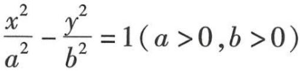</td><td>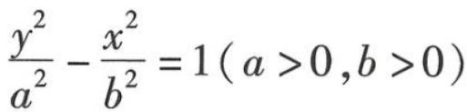</td></tr><tr><td>图形</td><td>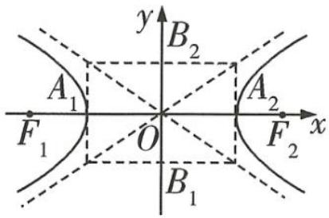</td><td>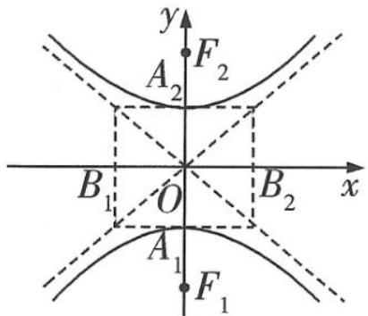</td></tr></table>

续表

<table><tr><td rowspan="9">几何性质</td><td>范围</td><td>|x|≥a,y∈R</td><td>|y|≥a,x∈R</td></tr><tr><td>对称性</td><td colspan="2">对称轴:x轴,y轴.对称中心:原点</td></tr><tr><td>焦点</td><td>F1(-c,0),F2(c,0)</td><td>F1(0,-c),F2(0,c)</td></tr><tr><td>顶点</td><td>A1(-a,0),A2(a,0)</td><td>A1(0,-a),A2(0,a)</td></tr><tr><td>轴</td><td colspan="2">线段A1A2,B1B2分别是双曲线的实轴和虚轴,实轴长为2a,虚轴长为2b</td></tr><tr><td>焦距</td><td colspan="2">|F1F2|=2c</td></tr><tr><td>离心率</td><td colspan="2">e=c/a,e∈(1,+∞)</td></tr><tr><td>渐近线</td><td>直线y=±bx</td><td>直线y=±a/bx</td></tr><tr><td>a,b,c的关系</td><td colspan="2">a2=c2-b2</td></tr><tr><td colspan="2">双曲线的焦点三角形</td><td colspan="2">如图,若点P是双曲线C:x2/a2-y2/b2=1(a&gt;0,b&gt;0)上不同于顶点的任意一点,F1,F2为双曲线C的两焦点,则△PF1F2叫作双曲线的焦点三角形.记∠F1PF2=θ,则S△PF1F2=b2/tanθ/2. 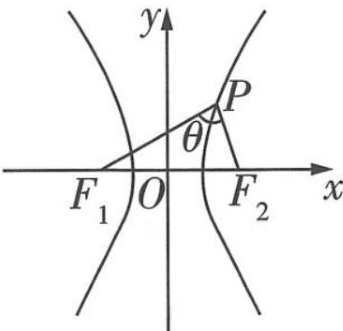</td></tr></table>

# 抢分点29

# 抛物线的标准方程及其几何性质

<table><tr><td colspan="2">标准方程</td><td> $y^{2}=2px(p>0)$ </td><td> $y^{2}=-2px(p>0)$ </td><td> $x^{2}=2py(p>0)$ </td><td> $x^{2}=-2py(p>0)$ </td></tr><tr><td colspan="2">图形</td><td>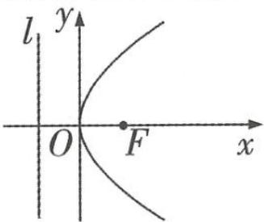</td><td>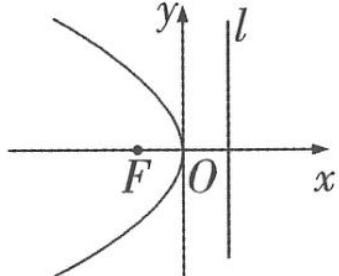</td><td>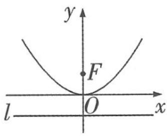</td><td>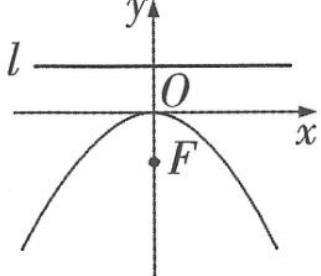</td></tr><tr><td rowspan="6">几何性质</td><td>对称轴</td><td colspan="2">x轴</td><td colspan="2">y轴</td></tr><tr><td>顶点</td><td colspan="4">O(0,0)</td></tr><tr><td>焦点</td><td>F( $\frac{p}{2}$ ,0)</td><td>F(- $\frac{p}{2}$ ,0)</td><td>F(0, $\frac{p}{2}$ )</td><td>F(0,- $\frac{p}{2}$ )</td></tr><tr><td>准线方程</td><td>x=- $\frac{p}{2}$ </td><td>x= $\frac{p}{2}$ </td><td>y=- $\frac{p}{2}$ </td><td>y= $\frac{p}{2}$ </td></tr><tr><td>范围</td><td>x≥0,y∈R</td><td>x≤0,y∈R</td><td>y≥0,x∈R</td><td>y≤0,x∈R</td></tr><tr><td>离心率</td><td colspan="4">e=1</td></tr></table>

计算步骤要规范一些,许多错误常常出现在计算过程中.草稿纸上也要写好步骤,演算过程尽量干净、整齐,便于检查.

关注微信公众号“初高教辅站”获取更多初高中教辅资料

续表

<table><tr><td>p的几何意义</td><td>p的几何意义是抛物线焦点到准线的距离,对于方程 $y^{2} = 2px (p > 0)$ ,当x的值确定时,p值越大, $|y|$ 也越大,则抛物线的开口也越大,如图所示. 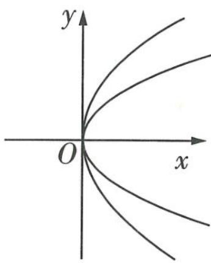</td></tr><tr><td>抛物线的焦点三角形</td><td>如图,过抛物线 $y^{2} = 2px (p > 0)$ 的焦点 $F(\frac{p}{2},0)$ 的直线 $l:y=kx-\frac{kp}{2}$ (其中k为直线l的斜率)交抛物线于A,B两点,那么焦点三角形OAB的面积可以表示为 $S_{\triangle OAB}=\frac{p^{2}}{2}\sqrt{1+\frac{1}{k^{2}}}$ (若抛物线方程为 $x^{2}=2py (p>0)$ ,直线 $l:y=kx+\frac{p}{2}$ ,则 $S_{\triangle OAB}=\frac{p^{2}}{2}\sqrt{1+k^{2}}$ ). 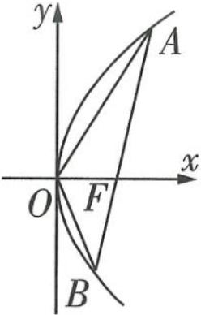</td></tr></table>

p越大,开口越大

# 抢分点30 直线与圆锥曲线相切的有关结论

<table><tr><td>1</td><td>直线与椭圆相切的有关结论</td><td>1椭圆 $\frac{x^{2}}{a^{2}}+\frac{y^{2}}{b^{2}}=1(a>b>0)$ 上任意一点 $P(x_{0},y_{0})$ 处的切线方程是 $\frac{x_{0}x}{a^{2}}+\frac{y_{0}y}{b^{2}}=1$ ,2过椭圆 $\frac{x^{2}}{a^{2}}+\frac{y^{2}}{b^{2}}=1(a>b>0)$ 外一点 $P(x_{0},y_{0})$ 所引两条切线的切点弦方程是 $\frac{x_{0}x}{a^{2}}+\frac{y_{0}y}{b^{2}}=1$ ,3椭圆 $\frac{x^{2}}{a^{2}}+\frac{y^{2}}{b^{2}}=1(a>b>0)$ 与直线 $Ax+By+C=0$ 相切的条件是 $A^{2}a^{2}+B^{2}b^{2}=C^{2}$ .</td></tr><tr><td>2</td><td>直线与双曲线相切的有关结论</td><td>1双曲线 $\frac{x^{2}}{a^{2}}-\frac{y^{2}}{b^{2}}=1(a>0,b>0)$ 上任意一点 $P(x_{0},y_{0})$ 处的切线方程是 $\frac{x_{0}x}{a^{2}}-\frac{y_{0}y}{b^{2}}=1$ ,2过双曲线 $\frac{x^{2}}{a^{2}}-\frac{y^{2}}{b^{2}}=1(a>0,b>0)$ 外一点 $P(x_{0},y_{0})$ 所引两条切线的切点弦方程是 $\frac{x_{0}x}{a^{2}}-\frac{y_{0}y}{b^{2}}=1$ ,3双曲线 $\frac{x^{2}}{a^{2}}-\frac{y^{2}}{b^{2}}=1(a>0,b>0)$ 与直线 $Ax+By+C=0$ 相切的条件是 $A^{2}a^{2}-B^{2}b^{2}=C^{2}$ .</td></tr><tr><td>3</td><td>直线与抛物线相切的有关结论</td><td>1抛物线 $y^{2}=2px(p>0)$ 上任意一点 $P(x_{0},y_{0})$ 处的切线方程是 $y_{0}y=p(x+x_{0})$ ,2过抛物线 $y^{2}=2px(p>0)$ 外一点 $P(x_{0},y_{0})$ 所引两条切线的切点弦方程是 $y_{0}y=p(x+x_{0})$ ,3抛物线 $y^{2}=2px(p>0)$ 与直线 $Ax+By+C=0$ 相切的条件是 $pB^{2}=2AC$ .</td></tr></table>

# 抢分点 31》直线与圆锥曲线相交的 4 个弦长公式

直线 l 与圆锥曲线 $F(x,y)=0$ 相交于 A, B 两点(不重合), 当直线 l 的斜率存在且不为 0 时, 弦长 $|AB|$ 的公式如下:

<table><tr><td>1</td><td>点的坐标的形式</td><td> $|AB| = \sqrt{(x_1 - x_2)^2 + (y_1 - y_2)^2}$ </td><td rowspan="4">弦端点  $A(x_1, y_1), B(x_2, y_2)$ , $l: y = kx + m$ ,由 $\begin{cases} y = kx + m, \\ F(x, y) = 0 \end{cases}$  消去  $y$  得到  $ax^2 + bx + c = 0(a, b, c$  为参数), $\Delta > 0, \alpha$  为直线  $AB$  的倾斜角.</td></tr><tr><td>2</td><td>含斜率和横坐标的形式</td><td> $|AB| = \sqrt{(1 + k^2)(x_1 - x_2)^2}$ </td></tr><tr><td>3</td><td>含横坐标和倾斜角的形式</td><td> $|AB| = |x_1 - x_2| \sqrt{1 + \tan^2 \alpha}$ </td></tr><tr><td>4</td><td>含纵坐标和倾斜角的形式</td><td> $|AB| = |y_1 - y_2| \sqrt{1 + \frac{1}{\tan^2 \alpha}}$ </td></tr></table>

# 抢分点32 排列数与组合数的公式及性质

<table><tr><td>公式</td><td>(1) $A_{n}^{m}=n(n-1)(n-2)\cdots(n-m+1)=\frac{n!}{(n-m)!}(n,m\in\mathbb{N}^{*},m\leqslant n).A_{n}^{n}=n!,规定0!=1.$ (2) $C_{n}^{m}=\frac{A_{n}^{m}}{A_{m}^{m}}=\frac{n(n-1)(n-2)\cdots(n-m+1)}{m!}=\frac{n!}{m!(n-m)!}(n,m\in\mathbb{N}^{*},m\leqslant n).特别地,C_{n}^{0}=1.$ </td></tr><tr><td>性质</td><td>(1)1 $A_{n}^{m}=nA_{n-1}^{m-1},$ 2 $A_{n}^{m}=mA_{n-1}^{m-1}+A_{n-1}^{m}.$ (2)1 $C_{n}^{m}=C_{n}^{n-m},$ 2 $C_{n+1}^{m}=C_{n}^{m}+C_{n}^{m-1}.$ </td></tr></table>

# 抢分点33》二项式定理

<table><tr><td>二项式定理</td><td> $(a+b)^n = C_n^0 a^n + C_n^1 a^{n-1} b + \cdots + C_n^k a^{n-k} b^k + \cdots + C_n^n b^n (n \in \mathbb{N}^*, k \in \mathbb{N} \text{且 } k \leqslant n)$ .</td></tr><tr><td>二项展开式的通项</td><td> $T_{k+1} = C_n^k a^{n-k} b^k$ ,它表示展开式的第  $k+1$  项, $k=0,1,\cdots,n$ .</td></tr><tr><td>二项式系数</td><td>二项展开式中各项的二项式系数分别为  $C_n^0, C_n^1, C_n^2, \cdots, C_n^n$ .</td></tr><tr><td>有关概念</td><td>牢记“常数项”“有理项”“系数最大的项”等概念.</td></tr></table>

# 抢分点 34 正态分布

<table><tr><td>1</td><td>正态曲线的特点</td><td>1曲线位于x轴上方,与x轴不相交.2曲线是单峰的,它关于直线x=μ对称,曲线在x=μ处达到峰值 $\frac{1}{\sigma\sqrt{2\pi}}$ .3曲线与x轴之间的面积为1.4当σ一定时,曲线的位置由μ确定,曲线随着μ的变化而沿x轴平移.5当μ一定时,曲线的形状由σ确定,σ越小,曲线越“瘦高”,表示总体的分布越集中;σ越大,曲线越“矮胖”,表示总体的分布越分散.</td></tr><tr><td>2</td><td>3个常用的数据</td><td>1P(μ-σ≤X≤μ+σ)≈0.6827,2P(μ-2σ≤X≤μ+2σ)≈0.9545,3P(μ-3σ≤X≤μ+3σ)≈0.9973.</td></tr></table>

# 抢分点35》二项分布与超几何分布

<table><tr><td></td><td>二项分布</td><td>超几何分布</td></tr><tr><td>定义</td><td>一般地,在n重伯努利试验中,设每次试验中事件A发生的概率为p(0 &lt; p &lt; 1),用X表示事件A发生的次数,则X的分布列为P(X=k)=Cn^k p^k (1-p)^{n-k},k=0,1,2,...,n.如果随机变量X的分布列具有上述形式,则称随机变量X服从二项分布,记作X~B(n,p).</td><td>一般地,假设一批产品共有N件,其中有M件次品.从N件产品中随机抽取n件(不放回),用X表示抽取的n件产品中的次品数,则X的分布列为P(X=k)= $\frac{C_M^k C_{N-M}^{n-k}}{C_N^n}$ ,k=m,m+1,...,r.其中n,N,M∈N*,M≤N,n≤N,m=max{0,n-N+M},r=min{n,M}.如果随机变量X的分布列具有上述形式,则称随机变量X服从超几何分布.</td></tr><tr><td>期望</td><td>X~B(n,p),则E(X)=np.</td><td>E(X)=np,其中p=M/N,表示N件产品的次品率.</td></tr><tr><td>方差</td><td>X~B(n,p),则D(X)=np(1-p).</td><td>不作要求.</td></tr></table>

# 抢分点 36 用样本的数字特征估计总体的数字特征

<table><tr><td></td><td>给出一组数据  $x_1, x_2, x_3, \cdots, x_n$ </td><td>给出频率分布直方图</td></tr><tr><td>众数</td><td>在一组数据中,出现次数最多的数据叫作这组数据的众数.</td><td>最高矩形所在区间的中点的横坐标即众数.</td></tr><tr><td>中位数</td><td>将一组数据按从大到小或从小到大的顺序排列,把处在最中间的一个数据(或最中间两个数据的平均数)叫作这组数据的中位数.</td><td>中位数左边和右边的直方图的面积相等.</td></tr><tr><td>平均数</td><td> $\bar{x} = \frac{1}{n}(x_1 + x_2 + \cdots + x_n) = \frac{1}{n}\sum_{i=1}^{n}x_i$ .其中  $x_i$  是第  $i$  个样本数据, $n$  是样本容量.</td><td>等于图中每个小矩形的面积乘以小矩形底边中点的横坐标之和.</td></tr><tr><td>方差</td><td>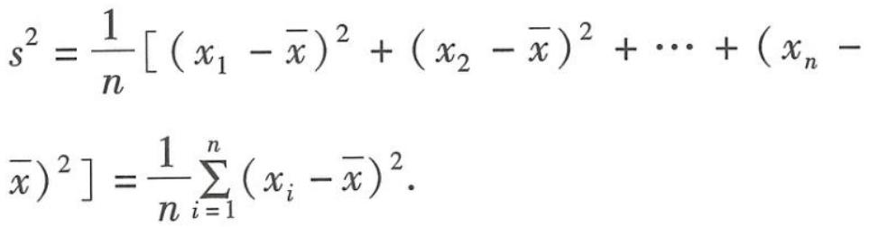</td><td>记频率分布直方图中有  $m$  个区间分组,各区间中点的横坐标分别为  $y_1, y_2, \cdots, y_m$ ,各区间对应的频率分别为  $p_1, p_2, \cdots, p_m, \bar{y}$  为样本数据的平均数,则  $s^2 = \sum_{i=1}^{m} (y_i - \bar{y})^2 p_i$ .</td></tr><tr><td>标准差</td><td>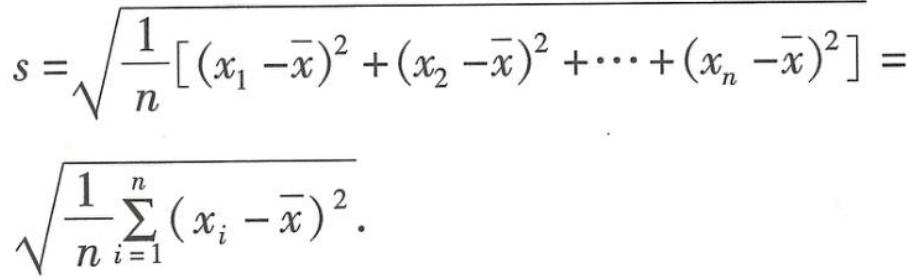</td><td>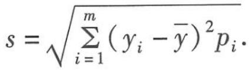</td></tr></table>

# 抢分点37 独立性检验

假设有两个分类变量 $X$ 和 $Y$ , 它们的可能情况分别为 $\{x_{1}, x_{2} \}$ 和 $\{y_{1}, y_{2} \}$ , 其列联表 (称为 $2 \times 2$ 列联表)为 (其中 $a, b, c, d$ 表示对应事件发生的频数)

<table><tr><td>变量X\变量Y</td><td> $y_1$ </td><td> $y_2$ </td><td>总计</td></tr><tr><td> $x_1$ </td><td>a</td><td>b</td><td>a+b</td></tr><tr><td> $x_2$ </td><td>c</td><td>d</td><td>c+d</td></tr><tr><td>总计</td><td>a+c</td><td>b+d</td><td>a+b+c+d</td></tr></table>

利用上表计算出 $K^{2}=\frac{n(ad-bc)^{2}}{(a+b)(c+d)(a+c)(b+d)}$ ，其中 $n=a+b+c+d$ 为样本容量.

根据下述临界值表找到相应的正实数 $k_{0}$ , 当 $K^{2}$ 的观测值 $k \geqslant k_{0}$ 时, 我们就推断 $H_{0}$ (分类变量 $X$ 和 $Y$ 独立) 不成立, 即认为 $X$ 和 $Y$ 不独立; 当 $K^{2}$ 的观测值 $k < k_{0}$ 时, 我们没有充分证据推断 $H_{0}$ 不成立, 可以认为 $X$ 和 $Y$ 独立.

<table><tr><td> $P(K^{2} \geqslant k_{0})$ </td><td>0.1</td><td>0.05</td><td>0.01</td><td>0.005</td><td>0.001</td></tr><tr><td> $k_{0}$ </td><td>2.706</td><td>3.841</td><td>6.635</td><td>7.879</td><td>10.828</td></tr></table>

# 抢分点38》绝对值三角不等式

<table><tr><td>1</td><td>定理1</td><td>如果a,b是实数,则|a+b|≤|a|+|b|,当且仅当ab≥0时,等号成立.</td></tr><tr><td>2</td><td>定理2</td><td>如果a,b,c是实数,那么|a-c|≤|a-b|+|b-c|,当且仅当(a-b)(b-c)≥0时,等号成立.</td></tr><tr><td>3</td><td>推广</td><td>|a1+a2+···+an|≤|a1|+|a2|+···+|an|,||a|-|b||≤|a±b|≤|a|+|b|.</td></tr></table>

# 抢分点 39 2 种形式的柯西不等式

<table><tr><td>1</td><td>二维形式</td><td>若 $a,b,c,d$ 都是实数,则 $(a^{2}+b^{2})(c^{2}+d^{2})\geqslant(ac+bd)^{2}$ ,当且仅当 $ad=bc$ 时,等号成立.</td></tr><tr><td>2</td><td>向量形式</td><td>若 $\alpha,\beta$ 是两个向量,则 $|\alpha\cdot\beta|\leqslant|\alpha||\beta|$ ,当且仅当 $\beta$ 是零向量,或存在实数 $k$ ,使 $\alpha=k\beta$ 时,等号成立.</td></tr></table>

# 考前必会的 11 个性质结论

# 结论1 集合中元素的3个特性

<table><tr><td>1</td><td>确定性</td><td>给定的集合,它的元素必须是确定的.也就是说,给定一个集合,那么一个元素在或不在这个集合中就确定了.</td></tr><tr><td>2</td><td>互异性</td><td>一个给定集合中的元素是互不相同的.</td></tr><tr><td>3</td><td>无序性</td><td>组成集合的元素没有次序.</td></tr></table>

# 结论2 不等式的7个基本性质

<table><tr><td>性质1</td><td>如果a&gt;b,那么b</td></tr><tr><td>性质2</td><td>如果a&gt;b,b&gt;c,那么a&gt;c.即a&gt;b,b&gt;c⇒a&gt;c.</td></tr><tr><td>性质3</td><td>如果a&gt;b,那么a+c&gt;b+c.由性质3可得,a+b&gt;c⇒a+b+(-b)&gt;c+(-b)⇒a&gt;c-b.</td></tr><tr><td>性质4</td><td>如果a&gt;b,c&gt;0,那么ac&gt;bc;如果a&gt;b,c&lt;0,那么ac</td></tr><tr><td>性质5</td><td>如果a&gt;b,c&gt;d,那么a+c&gt;b+d.</td></tr><tr><td>性质6</td><td>如果a&gt;b&gt;0,c&gt;d&gt;0,那么ac&gt;bd.</td></tr><tr><td>性质7</td><td>如果a&gt;b&gt;0,那么an&gt;bn(n∈N,n≥2).</td></tr></table>

【敲黑板】应用不等式的基本性质解题时,需注意以下几点:①同向不等式不能相减；②异向不等式不能相加；③两边同乘或除以一个负数,不等号要变号(在实施参变分离时,移项常常要用到该性质,这是一个很容易出错的地方)

# 结论3 指数函数的图象与性质

<table><tr><td></td><td>0 &lt; a &lt; 1</td><td>a &gt; 1</td></tr><tr><td>图象</td><td>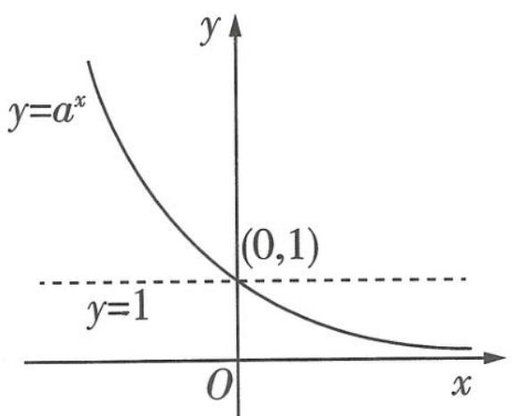</td><td>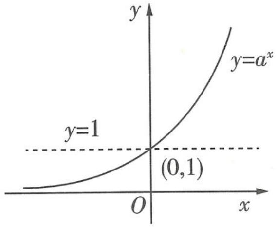</td></tr><tr><td>定义域</td><td colspan="2">R</td></tr><tr><td>值域</td><td colspan="2">(0, +∞)</td></tr></table>

解答题答题策略 注意解答题是按步骤给分的,可以根据题目中的已知条件与问题之间的联系写出可能用到的公式、方法或判断.

关注微信公众号“初高教辅站”获取更多初高中教辅资料

续表

<table><tr><td></td><td>0 &lt; a &lt; 1</td><td>a &gt; 1</td><td></td></tr><tr><td rowspan="3">性质</td><td colspan="2">(1)曲线过定点(0,1),即当x=0时,y=1.</td><td></td></tr><tr><td>(2)是减函数.</td><td>(2)是增函数.</td><td></td></tr><tr><td>(3)在第一象限内,底数a越小,曲线越接近x轴.</td><td>(3)在第一象限内,底数a越大,曲线越接近y轴.</td><td></td></tr><tr><td>应用</td><td colspan="2">如图,其底数的大小关系为d&gt;c&gt;1&gt;b&gt;a&gt;0.【名师点拨】判断时,令x=1,则此时对应的y值就是底数的值</td><td>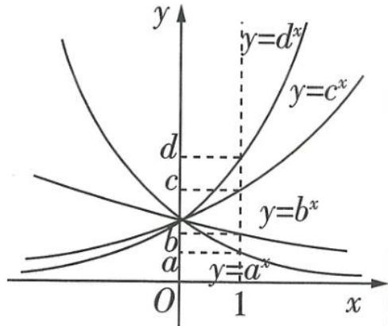</td></tr></table>

结论4 对数函数的图象与性质

<table><tr><td></td><td>0 &lt; a &lt; 1</td><td>a &gt; 1</td></tr><tr><td>图象</td><td>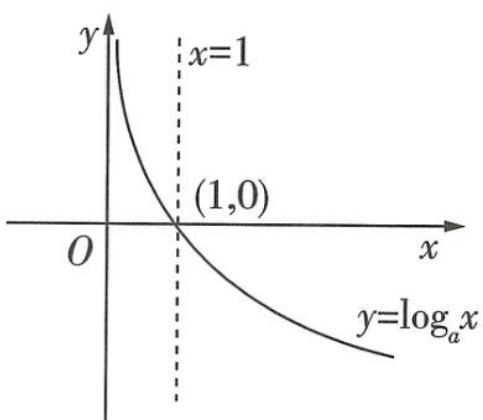</td><td>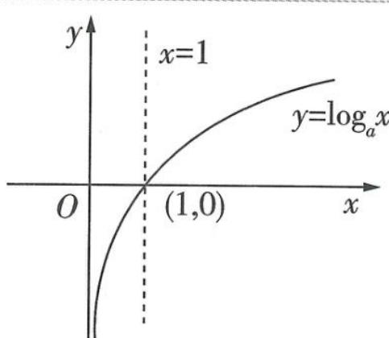</td></tr><tr><td>定义域</td><td colspan="2">(0, +∞)</td></tr><tr><td>值域</td><td colspan="2">R</td></tr><tr><td rowspan="3">性质</td><td colspan="2">(1)曲线过定点(1,0),即当x=1时,y=0.(2)函数 $y = \log_a x (a > 0 \text{且} a \neq 1)$ 的图象与 $y = \log_{\frac{1}{a}} x$ 的图象关于x轴对称,即底数互为倒数的两个对数函数的图象关于x轴对称.</td></tr><tr><td>(3)是减函数.</td><td>(3)是增函数.</td></tr><tr><td>(4)在第一象限内,底数a越小,曲线越接近y轴.</td><td>(4)在第一象限内,底数a越大,曲线越接近x轴.</td></tr><tr><td>应用</td><td colspan="2">如图,其底数的大小关系为 $b > a > 1 > d > c > 0$ .【名师点拨】判断时,令y=1,则此时对应的x值就是底数的值 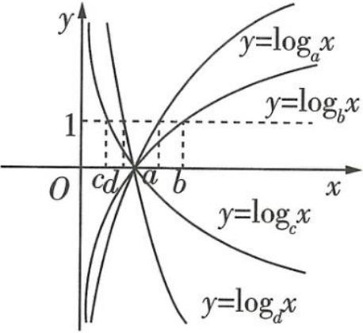</td></tr></table>

# 结论 5 5 种常见幂函数的性质

<table><tr><td></td><td> $y = x$ </td><td> $y = x^{2}$ </td><td> $y = x^{3}$ </td><td> $y = x^{\frac{1}{2}}$ </td><td> $y = x^{-1}$ </td></tr><tr><td>定义域</td><td>R</td><td>R</td><td>R</td><td> $[0, +\infty)$ </td><td> $\{x | x \neq 0\}$ </td></tr><tr><td>值域</td><td>R</td><td> $[0, +\infty)$ </td><td>R</td><td> $[0, +\infty)$ </td><td> $\{y | y \neq 0\}$ </td></tr><tr><td>奇偶性</td><td>奇函数</td><td>偶函数</td><td>奇函数</td><td>非奇非偶函数</td><td>奇函数</td></tr><tr><td>单调性</td><td>增函数</td><td>在 $(-\infty, 0]$ 上单调递减;在 $(0, +\infty)$ 上单调递增</td><td>增函数</td><td>增函数</td><td>在 $(-\infty, 0)$ 上单调递减;在 $(0, +\infty)$ 上单调递减</td></tr><tr><td>图象所过定点</td><td colspan="4">点(0,0),点(1,1)</td><td>点(1,1)</td></tr></table>

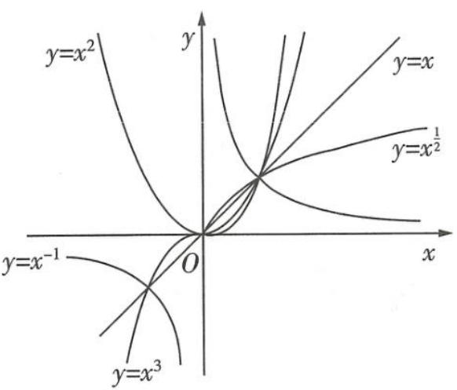

text_image

y=x²
y=x
y=x¹/²
y=x⁻¹
O
x
y=x³

# 结论6 有关函数单调性的5条常用结论

<table><tr><td>1</td><td>加常数变换</td><td>函数f(x)与函数f(x)+c(c为常数)具有相同的单调性.</td></tr><tr><td>2</td><td>乘系数变换</td><td>当k&gt;0(k&lt;0)时,函数f(x)与函数kf(x)单调性相同(相反).</td></tr><tr><td>3</td><td>取倒数变换</td><td>若f(x)恒为正值或恒为负值,则f(x)与 $\frac{1}{f(x)}$ 具有相反的单调性.</td></tr><tr><td>4</td><td>相乘变换</td><td>若f(x),g(x)都是增(减)函数,则当f(x),g(x)都恒大于零时f(x)g(x)是增(减)函数,当两者都恒小于零时f(x)g(x)是减(增)函数.</td></tr><tr><td>5</td><td>相加、减变换</td><td>在公共定义域内,“增+增=增”,“减+减=减”,“增-减=增”,“减-增=减”.</td></tr></table>

# 结论7 有关函数奇偶性的4条常用结论

<table><tr><td>1</td><td> $y = f(x) (x \in A)$ 为奇函数 $\Leftrightarrow$ 定义域A关于原点对称且 $f(x) = -f(-x)$ ; $y = f(x) (x \in A)$ 为偶函数 $\Leftrightarrow$ 定义域A关于原点对称且 $f(x) = f(-x)$ .</td></tr><tr><td>2</td><td>如果奇(偶)函数 $f(x)$ 在区间 $[a,b] (0 \leqslant a < b)$ 上具有单调性,那么 $f(x)$ 在 $[-b,-a]$ 上具有相同(反)的单调性.【提示】 $[a,b]$ ,  $[-b,-a]$ 均含于 $f(x)$ 的定义域有相同(反)的单调性.</td></tr><tr><td>3</td><td>定义在 $\mathbb{R}$ 上的函数 $f(x)$ 总可以表示为一个奇函数 $g(x)$ 与一个偶函数 $h(x)$ 之和,其中 $g(x) = \frac{f(x) - f(-x)}{2}$ , $h(x) = \frac{f(x) + f(-x)}{2}$ .</td></tr></table>

结构不良试题应对策略 一般来说,选择各个条件解答的难易程度、解题思路都差不多.因此,可以果断选择第一个条件,或者选择自己熟悉的条件进行解答,减少分析条件的时间.

关注微信公众号“初高教辅站”获取更多初高中教辅资料

续表

<table><tr><td>4</td><td> $f'(x) >0(<0)$ 是可导函数 $f(x)$ 在区间 $(a,b)$ 内单调递增(减)的充分不必要条件. $f'(x) \geqslant 0(\leqslant 0)$ 是可导函数 $f(x)$ 在区间 $(a,b)$ 内单调递增(减)的必要不充分条件.若 $f'(x)$ 在区间【临考谨记】由可导函数 $f(x)$ 在区间 $(a,b)$ 内单调递增(减)可得 $f'(x) \geqslant 0(\leqslant 0)$ 在该区间内恒成立,这里的“=”不能少,必要时还需对“=”成立的情况进行检验 $(a,b)$ 的任意子区间内都不恒等于零,则 $f'(x) \geqslant 0(\leqslant 0)$ 是可导函数 $f(x)$ 在区间 $(a,b)$ 内单调递增(减)的充要条件.</td></tr></table>

# 结论8 有关函数周期性的8条常用结论

<table><tr><td>1</td><td>设函数f(x)的最小正周期为T,则除±nT(n=1,2,···)以外,函数f(x)无其他周期.</td></tr><tr><td>2</td><td>设周期函数f(x)的最小正周期为T,则f(λx)(λ≠0)的最小正周期为 $\frac{T}{|\lambda|}$ .</td></tr><tr><td>3</td><td>若u=g(x)是周期函数,f(u)是任意函数,则f(g(x))也是周期函数.</td></tr><tr><td>4</td><td>若f(x+a)=f(x+b),则f(x)的周期T=b-a,其中a≠0,b≠0,a≠b.</td></tr><tr><td>5</td><td>若f(x+a)=-f(x),则f(x)的周期T=2a,其中a≠0.</td></tr><tr><td>6</td><td>若f(x+a)=± $\frac{c}{f(x)}$ (c为常数),则f(x)的周期T=2a,其中a≠0,c≠0.</td></tr><tr><td>7</td><td>若f(x+a)= $\frac{1-f(x)}{1+f(x)}$ ,则f(x)的周期T=2a,其中a≠0;若f(x+a)= $\frac{1+f(x)}{1-f(x)}$ ,则f(x)的周期T=4a,其中a≠0.</td></tr><tr><td>8</td><td>函数f(x)满足f(a+x)=±f(a-x),f(b+x)=±f(b-x)(a≠b),若两式同号,则f(x)是以2|b-a|为周期的周期函数;若两式不同号,则f(x)是以4|b-a|为周期的周期函数.</td></tr></table>

# 结论9》二项式系数的3个性质

<table><tr><td>对称性</td><td>当 $0 \leqslant k \leqslant n (n \in \mathbf{N}^{*}, k \in \mathbf{N})$ 时, $C_{n}^{k}$ 与 $C_{n}^{n-k}$ 的关系是: $C_{n}^{k} = C_{n}^{n-k}$ .</td></tr><tr><td>增减性与最大值</td><td>二项式系数先增后减,中间项的二项式系数最大.当 $n$ 为偶数时,第 $\frac{n}{2} + 1$ 项的二项式系数最大,最大值为 $C_{n}^{\frac{n}{2}}$ ;当 $n$ 为奇数时,第 $\frac{n+1}{2}$ 项和第 $\frac{n+3}{2}$ 项的二项式系数最大,最大值为 $C_{n}^{\frac{n-1}{2}}$ (或 $C_{n}^{\frac{n+1}{2}}$ ).</td></tr></table>

续表

<table><tr><td>各二项式系数的和</td><td>各二项式系数的和: $C_{n}^{0} + C_{n}^{1} + C_{n}^{2} + \cdots + C_{n}^{n} = 2^{n}$ .奇数项的二项式系数的和=偶数项的二项式系数的和= $2^{n-1}$ ,即 $C_{n}^{0} + C_{n}^{2} + \cdots = C_{n}^{1} + C_{n}^{3} + \cdots = 2^{n-1}$ .</td></tr></table>

# 结论10 概率的5个基本性质

<table><tr><td>1</td><td>任何事件A的概率都在0与1之间,即 $0 \leqslant P(A) \leqslant 1$ .</td></tr><tr><td>2</td><td>若 $A \subseteq B$ ,则 $P(A) \leqslant P(B)$ .</td></tr><tr><td>3</td><td>必然事件的概率为1,不可能事件的概率为0.</td></tr><tr><td>4</td><td>如果事件A与事件B互斥,则 $P(A \cup B) = P(A) + P(B)$ .【提醒】没有这个条件时,公式不成立</td></tr><tr><td>5</td><td>若事件A与事件B互为对立事件,则 $P(A) + P(B) = 1$ .</td></tr></table>

# 结论 11 离散型随机变量的分布列、期望与方差的性质

<table><tr><td>1</td><td>分布列的性质</td><td> $1p_i \geqslant 0, i=1,2,\cdots,n.$   $2\sum_{i=1}^{n} p_i = p_1 + p_2 + \cdots + p_i + \cdots + p_n = 1.$   $3P(x_i \leqslant X \leqslant x_j) =$ 【用性质】可用来检查所列出的分布列是否有误,还可用来求分布列中的某些参数 $p_i + p_{i+1} + \cdots + p_j (i < j \leqslant n \text{且 } i,j \in \mathbb{N}^*)$ .</td></tr><tr><td>2</td><td>期望的性质</td><td> $1E(k) = k (k \text{为常数}).$   $2E(aX + b) = aE(X) + b (a,b \text{为常数}).$   $3E(X_1 + X_2) = E(X_1) + E(X_2).$   $4$ 若随机变量  $X_1, X_2$  对应的事件相互独立,则  $E(X_1X_2) = E(X_1)E(X_2).$ </td></tr><tr><td>3</td><td>方差的性质</td><td> $1D(k) = 0 (k \text{为常数}).$   $2D(aX + b) = a^2 D(X) (a,b \text{为常数}).$   $3D(X) = E(X^2) - [E(X)]^2.$   $4$ 若随机变量  $X_1, X_2, \cdots, X_n$  对应的事件两两独立,且都存在方差,则  $D(X_1 + X_2 + \cdots + X_n) = D(X_1) + D(X_2) + \cdots + D(X_n).$ </td></tr></table>

# 考前必会的 24 个高分技法

# 技法1》3个充要条件的判断方法

<table><tr><td>定义法</td><td>直接判断“若p,则q”与“若q,则p”的真假.</td></tr><tr><td>等价法</td><td>利用A⇒B与¬B⇒¬A,B⇒A与¬A⇒¬B,A⇔B与¬B⇔¬A的等价关系进行判断.</td></tr><tr><td>集合法</td><td>若A⊆B,则“x∈A”是“x∈B”的充分条件或“x∈B”是“x∈A”的必要条件;若A=B,则“x∈A”是“x∈B”的充要条件.</td></tr></table>

# 技法2 函数图象的变换方法

<table><tr><td rowspan="2">平移变换</td><td> $y=f(x)$ 的图象 $\xrightarrow[\text{左加右减}]{\text{左右平移 }a(a>0)\text{个单位长度}}y=f(x\pm a)$ 的图象</td><td> $y=f(x)$ 的图象 $\xrightarrow[\text{上加下减}]{\text{上下平移 }b(b>0)\text{个单位长度}}y=f(x)\pm b$ 的图象</td></tr><tr><td colspan="2">注意: $y=f(\omega x)$ 的图象 $\xrightarrow[\text{左加右减}]{\text{左右平移 }a(a>0)\text{个单位长度}}y=f(\omega(x\pm a))$ 的图象, $y=f(\omega x)$ 的图象 $\xrightarrow[\text{左加右减}]{\text{左右平移 }\frac{a}{\omega}(a>0,\omega>0)\text{个单位长度}}y=f(\omega x\pm a)$ 的图象</td></tr><tr><td>伸缩变换</td><td> $y=f(x)$ 的图象 $\xrightarrow[\text{沿横轴伸缩到原来的}\omega(\omega>0)\text{倍}]{\text{伸缩变换}}y=f(\frac{x}{\omega})$ 的图象</td><td> $y=f(x)$ 的图象 $\xrightarrow[\text{沿纵轴伸缩到原来的}A(A\neq0)\text{倍}]{\text{伸缩变换}}y=Af(x)$ 的图象</td></tr><tr><td>翻折变换</td><td> $y=f(x)$ 的图象 $\xrightarrow[\text{下往上翻}]{\text{翻折变换}}y=|f(x)|$ 的图象</td><td> $y=f(x)$ 的图象 $\xrightarrow[\text{作右翻左}]{\text{翻折变换}}y=f(|x|)$ 的图象</td></tr><tr><td rowspan="4">对称变换</td><td> $y=f(x)$ 与 $y=f(-x)$ 的图象关于直线 $x=0$ (即 $y$ 轴)对称</td><td> $y=f(x)$ 与 $y=f(2a-x)$ 的图象关于直线 $x=a$ 对称</td></tr><tr><td> $y=f(x)$ 与 $y=-f(x)$ 的图象关于直线 $y=0$ (即 $x$ 轴)对称</td><td> $y=f(a+x)$ 与 $y=f(b-x)$ 的图象关于直线 $x=\frac{b-a}{2}$ 对称</td></tr><tr><td> $y=f(x)$ 与 $y=-f(-x)$ 的图象关于原点对称</td><td rowspan="2"> $y=f(x)$ 与 $y=2b-f(2a-x)$ 的图象关于点 $(a,b)$ 对称</td></tr><tr><td> $y=a^{x}$ 与 $y=\log_{a}x(a>0 \text{且}a\neq1)$ 的图象关于直线 $y=x$ 对称</td></tr></table>

# 技法3 常见抽象函数的性质与对应的特殊函数模型

<table><tr><td>抽象函数的性质</td><td>特殊函数模型</td></tr><tr><td>1 $f(x+y) = f(x) + f(y)$ ,2 $f(x-y) = f(x) - f(y)$ </td><td>正比例函数 $f(x) = kx (k \ne 0)$ </td></tr><tr><td>1 $f(x)f(y) = f(x+y)(x,y \in \mathbb{R})$ ,2 $\frac{f(x)}{f(y)} = f(x-y)(x,y \in \mathbb{R},f(y) \ne 0)$ </td><td>指数函数 $f(x) = a^{x} (a > 0, a \ne 1)$ </td></tr><tr><td>1 $f(xy) = f(x) + f(y) (x > 0,y > 0)$ ,2 $f(\frac{x}{y}) = f(x) - f(y) (x > 0,y > 0)$ </td><td>对数函数 $f(x) = \log_{a} x (a > 0, a \ne 1)$ </td></tr><tr><td>1 $f(xy) = f(x)f(y)$ ,2 $f(\frac{x}{y}) = \frac{f(x)}{f(y)} (y \ne 0,f(y) \ne 0)$ </td><td>幂函数 $f(x) = x^{n}$ </td></tr><tr><td> $f(x+y) = f(x)g(y) + g(x)f(y)$ </td><td>三角函数 $f(x) = \sin x, g(x) = \cos x$ </td></tr><tr><td> $f(x+y) = \frac{f(x) + f(y)}{1 - f(x)f(y)}$ </td><td>正切函数 $f(x) = \tan x$ </td></tr></table>

# 技法 4 5 类含有导函数的不等式构造原函数类型

<table><tr><td>1</td><td>原函数是函数的和差组合</td><td>1对于 $f'(x) > g'(x)$ (&lt; $g'(x)$ ),构造函数 $h(x) = f(x) - g(x)$ .特别地,若 $f'(x) > a$ (&lt; $a$ )(a≠0),即导函数大于某个非零常数,则可以构造函数 $h(x) = f(x) - ax$ .2对于 $f'(x) + g'(x) > 0$ (&lt;0),构造函数 $h(x) = f(x) + g(x)$ .</td></tr><tr><td>2</td><td>原函数是函数的乘除组合</td><td>1对于 $f'(x)g(x) + f(x)g'(x) > 0$ (&lt;0),构造函数 $h(x) = f(x)g(x)$ .2对于 $f'(x)g(x) - f(x)g'(x) > 0$ (&lt;0),构造函数 $h(x) = \frac{f(x)}{g(x)}$ .特别地,对于 $xf'(x) + f(x) > 0$ (&lt;0),构造函数 $h(x) = xf(x)$ ;对于 $xf'(x) - f(x) > 0$ (&lt;0),构造函数 $h(x) = \frac{f(x)}{x}$ .</td></tr><tr><td>3</td><td>原函数是含 $e^x$ 的乘除组合</td><td>1对于 $f'(x) + f(x) > 0$ (&lt;0),构造函数 $h(x) = e^xf(x)$ .2对于 $f'(x) - f(x) > 0$ (&lt;0),构造函数 $h(x) = \frac{f(x)}{e^x}$ .</td></tr><tr><td>4</td><td>原函数是含sinx(cos x)的乘除组合</td><td>1对于f(x)+f'(x)tan x&gt;0(&lt;0),构造函数h(x)=f(x)sin x.2对于f(x)-f'(x)tan x&gt;0(&lt;0),构造函数h(x)= $\frac{f(x)}{\sin x}$ .3对于f'(x)-f(x)tan x&gt;0(&lt;0),构造函数h(x)=f(x)cos x.4对于f'(x)+f(x)tan x&gt;0(&lt;0),构造函数h(x)= $\frac{f(x)}{\cos x}$ .</td></tr><tr><td>5</td><td>原函数是含lnx的乘除组合</td><td>对于 $\frac{f'(x)}{f(x)}>0(<0)$ ,分类讨论如下:1若f(x)&gt;0,构造函数h(x)=ln f(x);2若f(x)&lt;0,构造函数h(x)=ln[-f(x)].</td></tr></table>

# 技法5

# 导数问题的 3 大放缩技巧

<table><tr><td>1</td><td>指数型放缩</td><td> $e^x \geqslant x + 1$ (当且仅当  $x = 0$  时取等号), $e^{x-1} \geqslant x$ (当且仅当  $x = 1$  时取等号), $e^x \leqslant \frac{1}{1-x} (x < 1)$ (当且仅当  $x = 0$  时取等号).</td></tr><tr><td>2</td><td>对数型放缩</td><td> $\ln(x+1) \leqslant x (x > -1)$ (当且仅当  $x = 0$  时取等号), $1 - \frac{1}{x} \leqslant \ln x \leqslant x - 1 (x > 0)$ (当且仅当  $x = 1$  时取等号).</td></tr><tr><td>3</td><td>三角型放缩</td><td> $\sin x \leqslant x \leqslant \tan x (0 \leqslant x < \frac{\pi}{2})$ (当且仅当  $x = 0$  时取等号), $\sin x \geqslant x \geqslant \tan x (-\frac{\pi}{2} < x \leqslant 0)$ (当且仅当  $x = 0$  时取等号).</td></tr></table>

# 技法6

# “恒成立问题”与“有解问题”的求解策略

<table><tr><td>1</td><td>恒成立问题的转化</td><td>1 $f(x) >0$  恒成立 $\Leftrightarrow f(x)_{\min} >0$ ;  $f(x) < 0$  恒成立 $\Leftrightarrow f(x)_{\max} < 0$ .2 $f(x) >a$  恒成立 $\Leftrightarrow f(x)_{\min} >a$ ;  $f(x) < a$  恒成立 $\Leftrightarrow f(x)_{\max} < a$ .3 $f(x) >g(x)$  恒成立 $\Leftrightarrow [f(x) - g(x)]_{\min} >0$ ; $f(x) < g(x)$  恒成立 $\Leftrightarrow [f(x) - g(x)]_{\max} < 0$ .4 $\forall x_1 \in M, \forall x_2 \in N, f(x_1) >g(x_2)(M,N \text{ 分别为函数 } f(x),g(x) \text{ 的定义域}) \Leftrightarrow f(x_1)_{\min} >g(x_2)_{\max}$ .5 $\forall x_1 \in M, \exists x_2 \in N, f(x_1) >g(x_2)(M,N \text{ 分别为函数 } f(x),g(x) \text{ 的定义域}), \text{ 可转化为 } f(x_1)_{\min} >g(x_2)_{\min}$ .</td></tr><tr><td>2</td><td>有解问题的转化</td><td>1 $f(x) >0$ 有解 $\Leftrightarrow f(x)_{\max } >0; f(x) < 0$ 有解 $\Leftrightarrow f(x)_{\min } < 0.$ 2 $f(x) >a$ 有解 $\Leftrightarrow f(x)_{\max } >a; f(x) < a$ 有解 $\Leftrightarrow f(x)_{\min } < a.$ 3 $f(x) >g(x)$ 有解 $\Leftrightarrow [f(x) - g(x)]_{\max } >0;$  $f(x) < g(x)$ 有解 $\Leftrightarrow [f(x) - g(x)]_{\min } < 0.$ 4 $\exists x_1 \in M, \exists x_2 \in N, f(x_1) >g(x_2)(M,N \text{ 分别为函数 } f(x),g(x) \text{ 的定义域}) \Leftrightarrow f(x_1)_{\max } >g(x_2)_{\min}.$ 5 $f(x)$ 和 $g(x)$ 的图象有交点可转化为 $f(x) = g(x)$ 有解或 $f(x) - g(x) = 0$ 有解.</td></tr></table>

# 技法7 值域、最值的6种常见求法

<table><tr><td>1</td><td>换元法</td><td>换元的方法:代数换元法,三角换元法,常规换元法,倒数换元法.1 $y = ax + b + k\sqrt{cx + d}$ ,令 $t = \sqrt{cx + d}$ ,则 $y = f(t)$ (该函数有时可直接判定单调性);2 $y = a^{f(x)}$ ,令 $u = f(x)$ ,则 $y = a^u$ ;3 $y = \log_a f(x)$ ,令 $u = f(x)$ ,则 $y = \log_a u$ ;4 $y = f(a^x)$ ,令 $t = a^x$ ,则 $y = f(t)$ ;5 $y = f(\log_a x)$ ,令 $t = \log_a x$ ,则 $y = f(t)$ ;6令 $a^x + a^{-x} = t$ ,则 $a^{2x} + a^{-2x} = t^2 - 2 (t \geqslant 2)$ ;7令 $\sin x + \cos x = t$ ,则 $\sin x \cos x = \frac{t^2 - 1}{2}$ ;8令 $\sqrt{1 - x} + \sqrt{1 + x} = t$ ,则 $\sqrt{1 - x^2} = \frac{t^2 - 2}{2}$ 或 $t = \sqrt{(\sqrt{1 - x} + \sqrt{1 + x})^2} = \sqrt{2 + 2\sqrt{1 - x^2}}$ ;9 $y = ax + b + k\sqrt{c^2 - x^2}$ ,令 $x = c \sin \alpha, \alpha \in [-\frac{\pi}{2}, \frac{\pi}{2}]$ (或令 $x = c \cos \alpha, \alpha \in [0, \pi]$ );10 $x \in \mathbb{R}$ 时,令 $x = \tan a, a \in (-\frac{\pi}{2}, \frac{\pi}{2})$ ;11 $y = \frac{mx + n}{(ax + b)^2}$ ,令 $t = \frac{1}{ax + b}$ (倒数换元法);12 $y = \frac{\sqrt{mx + n}}{ax + b}$ ,令 $t = \frac{1}{\sqrt{mx + n}}$ (倒数换元法).</td></tr><tr><td>2</td><td>单调性法</td><td>若函数为单调函数,可根据函数的单调性求值域或最值(优先考虑).</td></tr></table>

函数、方程或不等式的题目,可使用“三合一定理”,即利用函数、方程与不等式之间的关系,将问题灵活转化,以便求解.

续表

<table><tr><td>3</td><td>基本(均值)不等式法</td><td>利用 $\frac{a+b}{2} \geqslant \sqrt{ab}$ 或 $\frac{a+b+c}{3} \geqslant \sqrt[3]{abc}$ (一正、二定、三相等)等公式来求值域或最值,对于 $y=x+\frac{k}{x}(k>0)$ 的形式,一定要看等号能否成立,否则用数形结合法(对勾函数)、单调性法求解.</td></tr><tr><td>4</td><td>有界性法</td><td>解析式含 $x^{2},|x|,\sqrt{x},x(x\in(m,n)),a^{x},\sin x,\cos x$ 的函数,若可用y表示它们,则常利用有界性来求值域.</td></tr><tr><td>5</td><td>判别式法</td><td>对于 $y=\frac{a_{1}x^{2}+b_{1}x+c_{1}}{a_{2}x^{2}+b_{2}x+c_{2}}(a_{1}^{2}+a_{2}^{2}\neq0)$ ,先化成 $(a_{2}y-a_{1})x^{2}+(b_{2}y-b_{1})x+(c_{2}y-c_{1})=0$ ,再运用判别式求值域,但要注意先讨论二次项系数为0的情况.</td></tr><tr><td>6</td><td>导数法</td><td>通过求导研究函数的单调性,确定极值与端点值,从而得出值域或最值(万能方法).</td></tr></table>

# 技法8 函数零点个数的3种确定方法

<table><tr><td>1</td><td>直接求零点</td><td>令 $f(x) = 0$ ,如果能求出解,则有几个解就有几个零点.</td></tr><tr><td>2</td><td>利用函数零点存在定理</td><td>根据函数零点存在定理(如下图),再结合函数图象与性质(如单调性、奇偶【敲黑板】利用函数零点存在定理只能判断出零点存在,不能确定零点的个数,还要结合其他因素才能确定个数性等)才能确定函数有几个零点.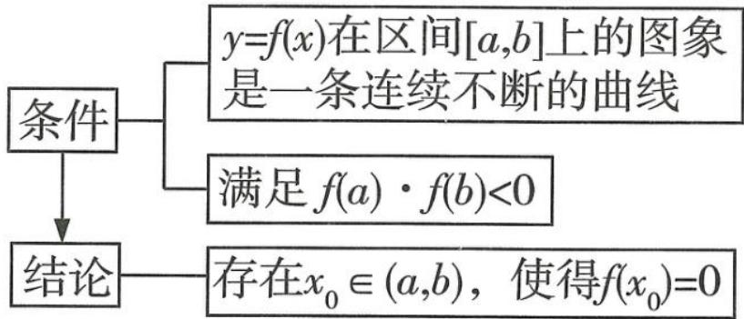</td></tr><tr><td>3</td><td>利用图象交点的个数</td><td>对于 $y=f(x)-g(x)$ 型函数,可先画出两个函数 $y=f(x)$ 和 $y=g(x)$ 的图象,看其交点的个数,有几个交点,原函数就有几个零点.</td></tr></table>

# 技法9 双零点问题的破解

双零点问题,一般是以不等式的证明的“面貌”出现,掌握下列思路和方法,双零点问题就不再是一个让人望而生畏的问题.设 $x_{1}, x_{2}$ 是解析式含一个(或两个)参数的函数 $f(x)$ 的两个零点(或是含参函数 $f(x)$ 的两个极值点(即 $f'(x)$ 的两个零点),或是直线 $y = m$ 与函数 $y = f(x)$ 的图象相交时的两个交点的横坐标(即 $y = f(x) - m$ 的两个零点)).

首先令 $x_{1} < x_{2}$ , 再令 $\frac{x_{2}}{x_{1}} = t$ (或 $x_{2} - x_{1} = t$ ), 则 $x_{2} = tx_{1}$ (或 $x_{2} = t + x_{1}$ ), 再利用 $x_{1}, x_{2}$ 满足的相应的方程 (如 $f(x_{1}) = 0, f(x_{2}) = 0$ , 或根与系数的关系), 通过对式子进行加、减、乘、除或取对数等运算得到新方程, 或用 $t$ 表示出 $x_{1}, x_{2}$ , 然后对目标不等式进行等价变形, 消去参数, 把研究对象直接用 $t$ 表示出来, 问题就容易解决了; 若不能消去参数, 则可能需要结合两个零点的范围分步完成.

$x_{1},x_{2}$ 很多时候是分布在直线 x=a（渐近线、极值点所在直线等）的两侧，证明与 $x_{1},x_{2},a$ 有关的不等式（如： $x_{1}+x_{2}\geqslant2a$ ），通常可以考虑设 $x_{1}<a,x_{2}>a$ ，则 $x_{2}>a\Leftrightarrow2a-x_{2}<a$ ，这样 $x_{1},2a-x_{2}$ 在直线 x=a 的同一侧（这一侧的单调性要确定），然后利用 $f(x_{1})=0,f(x_{2})=0$ 及函数 $f(x)$ 的单调性对目标不等式进行等价变形，消去参数、减少变量，使研究对象只含 $x_{1}$ 或 $x_{2}$ ，问题就容易解决了。

如图, 设 $x_{1}, x_{2}$ 是直线 $y = m$ 与函数 $y = f(x)$ 的图象相交时的两个交点的横坐标, 证明 $\left|x_{2} - x_{1}\right| < a$ 之类的不等式, 先确定 $x_{1}, x_{2}$ 的初始取值范围 $(p, q)$ , 再求出 $y = f(x)$ 的图象在该区间两个端点 $x = p, x = q$ 处的切线方程 $y = h(x), y = g(x)$ , 并证明 $f(x)$ 与 $g(x), h(x)$ 的大小关系之后, 通过令

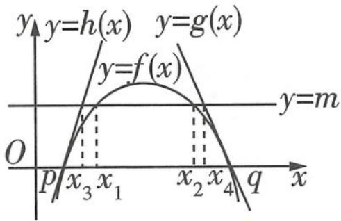

text_image

y=h(x) y=g(x)
y=f(x)
y=m
O
p x₃ x₁ x₂ x₄ q x

$h(x)=m,g(x)=m$ ,求得 $x_{3},x_{4}$ ,数形结合可知 $x_{1},x_{2}$ 与 $x_{3},x_{4}$ 的大小关系,则证明 $|x_{2}-x_{1}|<a$ 就不难完成了.

# 技法10 三角恒等变换的常用技巧

<table><tr><td>1</td><td>常值代换</td><td>1“1”的代换,如 $1 = \sin^{2}\theta + \cos^{2}\theta$ , $1 = 2\sin\frac{\pi}{6} = 2\cos\frac{\pi}{3} = \sqrt{2}\sin\frac{\pi}{4} = \tan\frac{\pi}{4}$ ;2特殊三角函数值的代换.</td></tr><tr><td>2</td><td>角的变换</td><td>利用角与角之间的和、差、倍、互补、互余等关系,常见的拆角、凑角技巧: $\alpha = (\alpha + \beta) - \beta, \alpha = (\alpha - 30^{\circ}) + 30^{\circ}, \alpha = 2 \cdot \frac{\alpha}{2}, 2\alpha = (\alpha + \beta) + (\alpha - \beta), \beta = \frac{\alpha + \beta}{2} - \frac{\alpha - \beta}{2}, \alpha - \beta = 2 \cdot \frac{\alpha - \beta}{2}, \frac{\alpha - \beta}{2} = (\alpha + \frac{\beta}{2}) - (\frac{\alpha}{2} + \beta).$ </td></tr></table>

# 技法11 由部分图象确定函数解析式 $(y = A\sin (\omega x + \varphi) + b)$ 的方法

<table><tr><td>第一步</td><td>定A,b</td><td>结合三角函数的图象确定函数的最大值M和最小值m(M&gt;m),则A=M-m/2, b=M+m/2.</td></tr></table>

续表

<table><tr><td>第二步</td><td>定 ω</td><td>图象相邻的最高点与最低点的横坐标之差的绝对值为 $\frac{T}{2}$ (T 为函数的最小正周期);图象相邻的两个最高点(或最低点)的横坐标之差的绝对值为 T. 再根据  $T = \left| \frac{2\pi}{\omega} \right|$  确定 ω.</td></tr><tr><td rowspan="2">第三步</td><td rowspan="2">定 φ</td><td>1代入法:把图象上的一个已知点的坐标代入解析式(此时 A,ω,b 已知)或代入图象与直线 y=b 的交点求解(此时要注意交点是在增区间上还是在减区间上).</td></tr><tr><td>2五点法:确定 φ 值时,往往以寻找“五点法”中的一个点为突破口.</td></tr></table>

# 技法12 等差数列的4种判断方法

<table><tr><td>1</td><td>定义法</td><td> $a_{n+1}-a_n=d(d \text{为常数},n\in\mathbb{N}^*)\Leftrightarrow\{a_n\}$ 是等差数列.</td></tr><tr><td>2</td><td>通项公式法</td><td> $a_n=pn+q(p,q \text{为常数},n\in\mathbb{N}^*)\Leftrightarrow\{a_n\}$ 是等差数列.</td></tr><tr><td>3</td><td>等差中项法</td><td> $2a_{n+1}=a_n+a_{n+2}(n\in\mathbb{N}^*)\Leftrightarrow\{a_n\}$ 是等差数列.</td></tr><tr><td>4</td><td>前n项和公式法</td><td> $S_n=An^2+Bn(A,B \text{为常数},n\in\mathbb{N}^*)\Leftrightarrow\{a_n\}$ 是等差数列.</td></tr></table>

# 技法13》等比数列的3种判断方法

<table><tr><td>1</td><td>定义法</td><td> $\frac{a_{n+1}}{a_n} = q (q \text{为常数且 } q \ne 0, n \in \mathbb{N}^*) \text{或} \frac{a_n}{a_{n-1}} = q (q \text{为常数且 } q \ne 0, n \in \mathbb{N}^* \text{且 } n \ge 2) \Leftrightarrow \{a_n\} \text{是等比数列.}$ </td></tr><tr><td>2</td><td>通项公式法</td><td> $a_n = a_1 q^{n-1} (a_1, q \text{为非零常数}, n \in \mathbb{N}^*) \Leftrightarrow \{a_n\} \text{是等比数列.}$ </td></tr><tr><td>3</td><td>等比中项法</td><td> $a_{n+1}^2 = a_n \cdot a_{n+2} (a_n \ne 0, n \in \mathbb{N}^*) \Leftrightarrow \{a_n\} \text{是等比数列.}$ </td></tr></table>

# 技法14 求数列的通项公式的8种常用方法

<table><tr><td>1</td><td>公式法</td><td>1等差数列的通项公式;2等比数列的通项公式.</td></tr><tr><td>2</td><td>作差法</td><td>已知 Sn(Sn为数列{an}的前n项和),求an:an={S1(n=1),Sn-Sn-1(n≥2).</td></tr><tr><td>3</td><td>作商法</td><td>已知 $a_1 \cdot a_2 \cdot \cdots \cdot a_n = f(n), a_n \neq 0$ ,求 $a_n: a_n = \begin{cases} f(1)(n=1), \\ \frac{f(n)}{f(n-1)} (n \geqslant 2). \end{cases}$ </td></tr><tr><td>4</td><td>累加法</td><td>已知 $a_{n+1} - a_n = f(n)$ ,求 $a_n: a_n = (a_n - a_{n-1}) + (a_{n-1} - a_{n-2}) + \cdots + (a_2 - a_1) + a_1 = f(n-1) + f(n-2) + \cdots + f(1) + a_1 (n \geqslant 2)$ .</td></tr><tr><td>5</td><td>累乘法</td><td>已知 $\frac{a_{n+1}}{a_n} = f(n)$ ,求 $a_n: a_n = \frac{a_n}{a_{n-1}} \cdot \frac{a_{n-1}}{a_{n-2}} \cdot \cdots \cdot \frac{a_2}{a_1} \cdot a_1 = f(n-1) \cdot f(n-2) \cdot \cdots \cdot f(1) \cdot a_1 (n \geqslant 2)$ .</td></tr><tr><td>6</td><td>构造等比数列法</td><td>若已知数列 $\{a_n\}$ 中, $a_{n+1} = pa_n + q (p \neq 0, p \neq 1, q \neq 0), a_1 \neq \frac{q}{1-p}$ ,设存在非零常数 $\lambda$ ,使得 $a_{n+1} + \lambda = p(a_n + \lambda)$ ,其中 $\lambda = \frac{q}{p-1}$ ,则数列 $\{a_n + \frac{q}{p-1}\}$ 就是以 $a_1 + \frac{q}{p-1}$ 为首项, $p$ 为公比的等比数列,先求出数列 $\{a_n + \frac{q}{p-1}\}$ 的通项公式,再求出数列 $\{a_n\}$ 的通项公式即可.</td></tr><tr><td>7</td><td>倒数法</td><td>若 $a_n = \frac{ma_{n-1}}{k(a_{n-1} + b)} (m \neq kb, mkb \neq 0, n \geqslant 2)$ ,对 $a_n = \frac{ma_{n-1}}{k(a_{n-1} + b)}$ 取倒数,得到 $\frac{1}{a_n} = \frac{k}{m} \cdot (1 + \frac{b}{a_{n-1}})$ ,即 $\frac{1}{a_n} = \frac{kb}{m} \cdot \frac{1}{a_{n-1}} + \frac{k}{m}$ ,令 $b_n = \frac{1}{a_n}$ ,则 $\{b_n\}$ 的递推公式可归纳为 $b_{n+1} = pb_n + q (p \neq 0, p \neq 1, q \neq 0)$ 型.</td></tr><tr><td>8</td><td>猜归法</td><td>先由前 $n$ 项猜出一般项,再进行严格的证明.</td></tr></table>

# 技法15 数列求和的6种常用方法

<table><tr><td>1</td><td>公式法</td><td>等差数列的求和公式为 Sn=n(a1+an)/2=na1+n(n-1)/2d.等比数列的求和公式为 Sn=na1(q=1),a1(1-q^n)/1-q=a1-a_nq/1-q(q≠1).常用的公式有:1+2+3+···+n=1/2n(n+1),n∈N*;1^2+2^2+3^2+···+n^2=1/6n(n+1)(2n+1),n∈N*;1+3+5+···+(2n-1)=n^2,n∈N*.</td></tr></table>

恒成立问题可以转化为最值问题,利用分类讨论的思想解题,分类讨论时应该做到不重复不遗漏.

关注微信公众号“初高教辅站”获取更多初高中教辅资料

续表

<table><tr><td>2</td><td>分组求和法</td><td>当无法直接运用公式法求和时,常将“和式”中的“同类项”先合并在一起,再运用公式法求和.</td></tr><tr><td>3</td><td>并项求和法</td><td>若数列中相邻两项或几项的和是同一个常数(周期数列)或数列是“(-1)^n型”摆动数列等,可先将有规律的项放在一起,再求和.</td></tr><tr><td>4</td><td>倒序相加法</td><td>在数列求和中,若“和式”中分别到首、尾距离相等的两项的和有共性,则常考虑选用倒序相加法进行求和.</td></tr><tr><td>5</td><td>错位相减法</td><td>如果一个数列是由一个等差数列与一个等比数列对应项的乘积构成的,那么常选用错位相减法进行求解.</td></tr><tr><td>6</td><td>裂项相消法</td><td>如果数列的通项可分裂成“两项差”的形式,且相邻项分裂后相关联,那么常选用裂项相消法求和.</td></tr></table>

# 技法16》破解等差数列前 $n$ 项和的最值问题的方法

<table><tr><td>1</td><td>二次函数法</td><td>利用等差数列前n项和的函数表达式 $S_n = an^2 + bn$ (a,b都为常数),通过配方或借助图象,用求二次函数最值的方法求解.</td></tr><tr><td>2</td><td>通项公式法</td><td>1当 $a_1 > 0,d < 0$ 时,满足 $\begin{cases} a_m \geqslant 0, \\ a_{m+1} \leqslant 0 \end{cases}$ 的项数m使得 $S_n$ 取得最大值 $S_m$ ;2当 $a_1 < 0,d > 0$ 时,满足 $\begin{cases} a_m \leqslant 0, \\ a_{m+1} \geqslant 0 \end{cases}$ 的项数m使得 $S_n$ 取得最小值 $S_m$ .</td></tr></table>

# 技法17 常见的裂项方法

<table><tr><td>数列(n为正整数)</td><td>裂项方法</td></tr><tr><td> $\left\{\frac{1}{n(n+k)}\right\}$ (k为非零常数)</td><td> $\frac{1}{n(n+k)}=\frac{1}{k}\left(\frac{1}{n}-\frac{1}{n+k}\right)$ </td></tr><tr><td> $\left\{\frac{1}{4n^2-1}\right\}$ </td><td> $\frac{1}{4n^2-1}=\frac{1}{2}\left(\frac{1}{2n-1}-\frac{1}{2n+1}\right)$ </td></tr><tr><td> $\left\{\frac{1}{\sqrt{n}+\sqrt{n+1}}\right\}$ </td><td> $\frac{1}{\sqrt{n}+\sqrt{n+1}}=\sqrt{n+1}-\sqrt{n}$ </td></tr><tr><td> $\left\{\frac{2^n}{(2^n-1)(2^{n+1}-1)}\right\}$ </td><td> $\frac{2^n}{(2^n-1)(2^{n+1}-1)}=\frac{1}{2^n-1}-\frac{1}{2^{n+1}-1}$ </td></tr><tr><td> $\left\{\log_a(1+\frac{1}{n})\right\}(a>0\text{且}a\neq 1)$ </td><td> $\log_a(1+\frac{1}{n})=\log_a(n+1)-\logavn$ </td></tr></table>

# 技法18 空间几何体的补形策略

<table><tr><td>1</td><td>四面体通过补形可得到平行六面体,平行六面体通过切割可得到四面体.</td></tr><tr><td>2</td><td>正四面体可以补形为正方体.</td></tr><tr><td>3</td><td>四面体中若有同一个顶点处的三条棱两两垂直或三组对棱分别相等,则可把它补形为长方体.</td></tr><tr><td>4</td><td>四面体中若三组对棱分别垂直,则可把它补形为棱长都相等的平行六面体.</td></tr><tr><td>5</td><td>棱台和圆台可以分别补形为棱锥和圆锥.</td></tr></table>

# 技法19》证明空间中6种线面位置关系的思考途径

<table><tr><td rowspan="5">1</td><td rowspan="5">证明线线平行</td><td>转化为判定共面的两直线无交点.</td></tr><tr><td>转化为两直线同时平行于第三条直线.</td></tr><tr><td>转化为线面平行→一条直线与一个平面平行,如果过该直线的平面与此平面相交,那么该直线与交线平行.</td></tr><tr><td>转化为线面垂直→垂直于同一个平面的两条直线平行.</td></tr><tr><td>转化为面面平行→两个平面平行,如果另一个平面与这两个平面相交,那么两条交线平行.</td></tr><tr><td rowspan="3">2</td><td rowspan="3">证明线面平行</td><td>转化为判定直线与平面无公共点.</td></tr><tr><td>转化为线线平行→如果平面外一条直线与此平面内的一条直线平行,那么该直线与此平面平行.</td></tr><tr><td>转化为面面平行→如果两个平面平行,那么一个平面内的直线必平行于另一个平面.</td></tr><tr><td rowspan="3">3</td><td rowspan="3">证明面面平行</td><td>转化为判定两平面无公共点.</td></tr><tr><td>转化为线面平行→如果一个平面内的两条相交直线与另一个平面平行,那么这两个平面平行.</td></tr><tr><td>转化为线面垂直→垂直于同一条直线的两个平面平行.</td></tr><tr><td rowspan="3">4</td><td rowspan="3">证明线线垂直</td><td>转化为相交垂直,利用勾股定理的逆定理或等腰三角形“三线合一”等.</td></tr><tr><td>转化为线面垂直→如果一条直线与一个平面垂直,那么这条直线与这个平面内任意一条直线都垂直.</td></tr><tr><td>转化为平面内的一条直线与另一条直线在这个平面的射影垂直.</td></tr><tr><td rowspan="4">5</td><td rowspan="4">证明线面垂直</td><td>转化为线线垂直→如果一条直线与一个平面内的两条相交直线垂直,那么该直线与此平面垂直.</td></tr><tr><td>转化为直线与平面的一条垂线平行→直线a//直线b,直线a⊥平面α,则b⊥α.</td></tr><tr><td>转化为直线与平面平行的平面垂直→平面α//平面β,直线a⊥平面α,则a⊥β.</td></tr><tr><td>转化为面面垂直→两个平面垂直,如果一个平面内有一直线垂直于这两个平面的交线,那么这条直线与另一个平面垂直.</td></tr><tr><td rowspan="2">6</td><td rowspan="2">证明面面垂直</td><td>转化为判断二面角是直二面角.</td></tr><tr><td>转化为线面垂直→如果一个平面过另一个平面的垂线,那么这两个平面垂直.</td></tr></table>

# 技法20 直线与平面所成角的求法

求直线与平面所成角 $\theta (0\leqslant \theta \leqslant \frac{\pi}{2})$ 可以采用几何法，也可以采用向量法.

①几何法:如图1,利用直线与平面所成角的定义,在直线l上找一点 $A(A\notin\alpha)$ 向平面 $\alpha$ 作垂线,垂足为B,得到直线l在平面 $\alpha$ 内的射影 $l'$ ,从而在直角三角形AOB(O为直线l与平面 $\alpha$ 的交点)内求解角 $\theta$ .

②向量法:记直线 l 的方向向量为 v, 平面 $\alpha$ 的法向量为 n, $\omega$ 为 v 与 n 的夹角, 则有 $\omega = \frac{\pi}{2} - \theta$ (图 2) 或 $\omega = \frac{\pi}{2} + \theta$ (图 3).

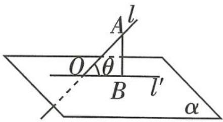

text_image

A l
O θ
B l'
α

图1

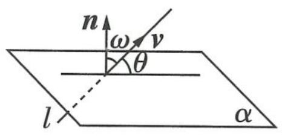

text_image

n
ω
v
θ
l
α

图2

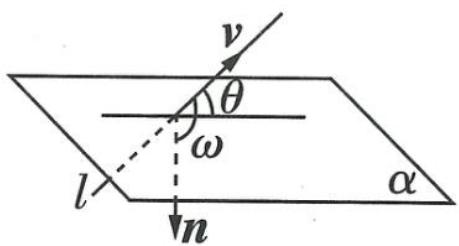

text_image

v
θ
ω
l
n
α

图3

从而 $\sin \theta = |\cos \omega| = |\cos \langle \pmb {v},\pmb{n}\rangle | = \frac{|\pmb{v}\cdot\pmb{n}|}{|\pmb{v}|\cdot|\pmb{n}|}.$

特别地, $\omega=0$ 时, $\theta=\frac{\pi}{2},l\perp\alpha;\omega=\frac{\pi}{2}$ 时, $\theta=0,l\subset\alpha$ 或 $l\parallel\alpha.$

# 技法21 利用空间向量法求二面角

设二面角 $\alpha - l - \beta$ 的平面角为 $\theta (0 \leqslant \theta \leqslant \pi)$ ，设 $n_{1}, n_{2}$ 分别为平面 $\alpha, \beta$ 的法向量，向量 $n_{1}, n_{2}$ 的夹角为 $\omega$ ，则有 $\theta + \omega = \pi$ （图1）或 $\theta = \omega$ （图2），则 $|\cos \theta| = \frac{|\boldsymbol{n}_{1} \cdot \boldsymbol{n}_{2}|}{|\boldsymbol{n}_{1}| \cdot |\boldsymbol{n}_{2}|}$ .

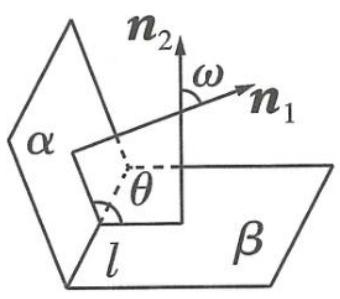

text_image

n₂
ω
n₁
α
θ
l
β

图1

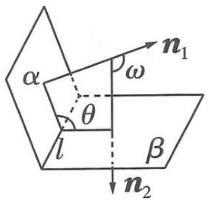

text_image

α
θ
l
β
ω
n₁
n₂

图2

# 技法22 空间距离的求解

<table><tr><td>点线距</td><td>直线l的方向向量为a,则点M到直线l的距离d=|MN|sin{MN,a}(其中N为直线l上的任意一点).</td></tr><tr><td>线线距</td><td>两平行线间的距离可转化为点线距离求解;两异面直线间的距离可转化为点面距离求解,或者直接求公垂线段的长度.</td></tr><tr><td>点面距</td><td>求点M到平面α的距离:1用点到平面距离的定义,直接求由点M向平面α所引垂线段MH的长度,即|MH|;2已知MN为平面α的一条斜线段(N在平面α内),n为平面α的法向量,则点M到平面α的距离d=||MN|·cos{MN,n}|=|MN·n|/|n|.</td></tr></table>

# 技法 23 求解排列组合问题的常用方法

<table><tr><td>优先法</td><td>优先安排特殊元素或特殊位置.</td></tr><tr><td>捆绑法</td><td>相邻问题捆绑处理,即把相邻元素看作一个整体,与其他元素进行排列,同时需要注意捆绑元素的内部排列.</td></tr><tr><td>插空法</td><td>不相邻问题插空处理,即先考虑不受限制的元素的排列,再将不相邻的元素插在前面元素的空位中.</td></tr></table>

# 技法 24 分组问题的求解方法

<table><tr><td>1</td><td>完全均分</td><td>将n个不同元素平均分成m组(n能被m整除),则不同的分法共有 $\frac{{\mathrm{C}}_{n}^{m}{\mathrm{C}}_{n - m}^{m}{\mathrm{C}}_{n - {2m}}^{m}\cdots {\mathrm{C}}_{m}^{m}}{{\mathrm{A}}_{m}^{m}}$ 种.</td></tr><tr><td>2</td><td>部分均分</td><td>通过具体例子说明:将6本不同的书分成3组,1组4本,另外2组每组各1本,找到元素均分的组数是2,则不同的分法共有 $\frac{{\mathrm{C}}_{6}^{4}{\mathrm{C}}_{2}^{1}{\mathrm{C}}_{1}^{1}}{{\mathrm{A}}_{2}^{2}}$ 种.</td></tr><tr><td>3</td><td>不等分组</td><td>将n个不同元素分成m组,各组元素个数分别为 $a_1,a_2,\cdots ,a_m$ ,其中 $a_1,a_2,\cdots ,a_m$ 各不相同且均为正整数, $a_1+a_2+\cdots +a_m=n$ ,则不同的分法共有 ${\mathrm{C}}_{n}^{a_1}{\mathrm{C}}_{n - a_1}^{a_2}{\mathrm{C}}_{n - a_1 - a_2}^{a_3}\cdots {\mathrm{C}}_{a_m}^{a_m}$ 种.</td></tr></table>

合理调整期望值,用积极的心态暗示自己.当自己缺乏信心的时候不妨做做容易题,这样也会增强你的自信心.

关注微信公众号“初高教辅站”获取更多初高中教辅资料

# 考前必知的 25 个函数图象结论

# 图象1 In $x$ 与 $x$ 的组合函数的常用性质结论

<table><tr><td>1</td><td>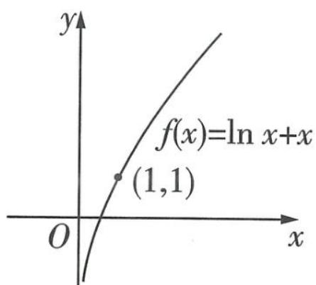</td><td>函数 $f(x) = \ln x + x (x > 0)$ 在定义域上单调递增,无最值,无极值,图象过点(1,1).</td></tr><tr><td>2</td><td>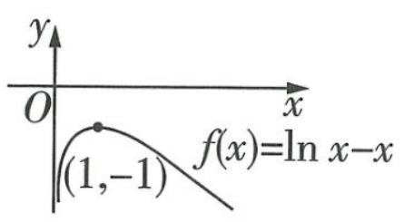</td><td>函数 $f(x) = \ln x - x (x > 0)$ 在(0,1)上单调递增,在(1,+∞)上单调递减,在x=1处取得最(极)大值-1,无最(极)小值.</td></tr><tr><td>3</td><td>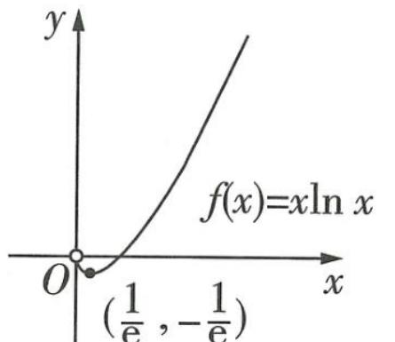</td><td>函数 $f(x) = x \ln x (x > 0)$ 在 $(0,\frac{1}{e})$ 上单调递减,在 $(\frac{1}{e},+\infty)$ 上单调递增,在 $x=\frac{1}{e}$ 处取得最(极)小值- $\frac{1}{e}$ ,无最(极)大值.</td></tr><tr><td>4</td><td>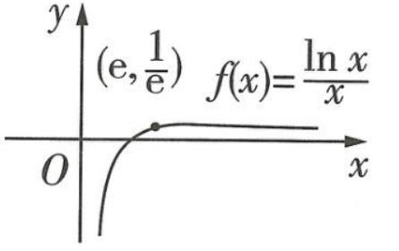</td><td>函数 $f(x) = \frac{\ln x}{x} (x > 0)$ 在(0,e)上单调递增,在(e,+∞)上单调递减,在x=e处取得最(极)大值 $\frac{1}{e}$ ,无最(极)小值.</td></tr><tr><td>5</td><td>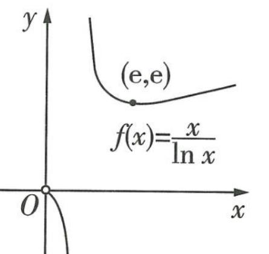</td><td>函数 $f(x) = \frac{x}{\ln x} (x > 0,x \neq 1)$ 在(0,1),(1,e)上单调递减,在(e,+∞)上单调递增,在x=e处取得极小值e,无极大值.</td></tr></table>

# 图象2 $\mathrm{e}^{x}$ 与 $x$ 的组合函数的常用性质结论

<table><tr><td>6</td><td></td><td>函数 $f(x) = e^{x} + x$ 在定义域上单调递增,无最值,无极值,图象过点(0,1).</td></tr><tr><td>7</td><td></td><td>函数 $f(x) = e^{x} - x$ 在 $(-\infty, 0)$ 上单调递减,在 $(0, +\infty)$ 上单调递增,在 $x = 0$ 处取得最(极)小值1,无最(极)大值.</td></tr><tr><td>8</td><td></td><td>函数 $f(x) = xe^{x}$ 在 $(-\infty, -1)$ 上单调递减,在 $(-1, +\infty)$ 上单调递增,在 $x = -1$ 处取得最(极)小值 $-\frac{1}{e}$ ,无最(极)大值.</td></tr><tr><td>9</td><td></td><td>函数 $f(x) = \frac{e^{x}}{x}(x \neq 0)$ 在 $(-\infty, 0)$ , $(0, 1)$ 上单调递减,在 $(1, +\infty)$ 上单调递增,在 $x = 1$ 处取得极小值e,无极大值.</td></tr><tr><td>10</td><td></td><td>函数 $f(x) = \frac{x}{e^{x}}$ 在 $(-\infty, 1)$ 上单调递增,在 $(1, +\infty)$ 上单调递减,在 $x = 1$ 处取得最(极)大值 $\frac{1}{e}$ ,无最(极)小值.</td></tr></table>

# 图象3 $e^{x}$ 与 $\ln x$ 的组合函数的常用性质结论

<table><tr><td>11</td><td></td><td>函数 $f(x) = \ln x + e^{x}$ 在 $(0, +\infty)$ 上单调递增,无最值,无极值.</td></tr><tr><td>12</td><td></td><td>记 $x_0e^{x_0} = 1$ ,则函数 $f(x) = \ln x - e^x$ 在 $(0, x_0)$ 上单调递增,在 $(x_0, +\infty)$ 上单调递减,在 $x = x_0$ 处取得最(极)大值,无最(极)小值.</td></tr><tr><td>13</td><td></td><td>函数 $f(x) = e^x \ln x$ 在 $(0, +\infty)$ 上单调递增,无最值,无极值.</td></tr><tr><td>14</td><td></td><td>记 $x_0 \ln x_0 = 1$ ,则函数 $f(x) = \frac{\ln x}{e^x}$ 在 $(0, x_0)$ 上单调递增,在 $(x_0, +\infty)$ 上单调递减,在 $x = x_0$ 处取得最(极)大值,无最(极)小值.</td></tr><tr><td>15</td><td></td><td>记 $x_0 \ln x_0 = 1$ ,则函数 $f(x) = \frac{e^x}{\ln x} (x > 0 \text{且} x \neq 1)$ 在 $(0, 1)$ 和 $(1, x_0)$ 上单调递减,在 $(x_0, +\infty)$ 上单调递增,在 $x = x_0$ 处取得极小值,无极大值.</td></tr></table>

# 图象4 $e^{x}$ 与 $e^{-x}$ 的组合函数的常用性质结论

<table><tr><td>16</td><td></td><td>函数 $f(x) = e^x + e^{-x}$ 在 $(-∞,0)$ 上单调递减,在 $(0,+\infty)$ 上单调递增,是偶函数,在 $x=0$ 处取得最(极)小值2,无最(极)大值.</td></tr><tr><td>17</td><td></td><td>函数 $f(x) = e^x - e^{-x}$ 在 $(-∞,+\infty)$ 上单调递增,是奇函数,无最值,无极值.</td></tr><tr><td>18</td><td></td><td>函数 $f(x) = \frac{e^x + e^{-x}}{e^x - e^{-x}} (x≠0)$ 在 $(-∞,0),(0,+\infty)$ 上单调递减,无最值,无极值.</td></tr><tr><td>19</td><td></td><td>函数 $f(x) = \frac{e^x - e^{-x}}{e^x + e^{-x}}$ 在 $\mathbb{R}$ 上单调递增,是奇函数,无最值,无极值,图象夹在直线 $y=1$ 和直线 $y=-1$ 之间,与二者均无交点.</td></tr></table>

深呼吸的方法是,先让身体处于舒适的状态,然后进行缓慢的腹式呼吸,即吸气时让腹部自然鼓起,呼气时让腹部缓慢放松,一般5\~10分钟就有很好的减压效果.

关注微信公众号“初高教辅站”获取更多初高中教辅资料

# 图象5 切线不等式

<table><tr><td>20</td><td></td><td> $x - 1 \geqslant \ln x (x > 0)$ ,当  $x = 1$  时等号成立.</td></tr><tr><td>21</td><td></td><td> $e^x \geqslant x + 1$ ,当  $x = 0$  时等号成立.</td></tr><tr><td>22</td><td></td><td> $\frac{x-1}{2} \geqslant \frac{\ln x}{x+1} (x > 0)$ ,也即  $2\ln x \leqslant x^2 - 1 (x > 0)$ ,当  $x = 1$  时等号成立.</td></tr><tr><td>23</td><td></td><td> $x \geqslant \ln (x + 1) \geqslant \frac{x}{x+1} (x > -1)$ ,当  $x = 0$  时等号成立.</td></tr><tr><td>24</td><td></td><td> $\ln x > \frac{2(x-1)}{x+1} (x > 1)$ . $\frac{2(x-1)}{x+1} \geqslant \ln x (0 < x \leqslant 1)$ ,当  $x = 1$  时等号成立.</td></tr><tr><td>25</td><td></td><td> $\tan x \geqslant x \geqslant \sin x, x \in [0, \frac{\pi}{2})$ ,当  $x = 0$  时等号成立.</td></tr></table>

# 考前必用的 25 个高妙二级结论

<table><tr><td colspan="3">平面几何6大二级结论</td></tr><tr><td>1</td><td>奔驰定理及其推论</td><td>奔驰定理:如图所示,已知P是三角形ABC内任意一点,则 $S_{\triangle PBC} \overrightarrow{PA} + S_{\triangle PCA} \overrightarrow{PB} + S_{\triangle PAB} \overrightarrow{PC} = 0.$ 推论:已知P是三角形ABC内任意一点,且 $x \overrightarrow{PA} + y \overrightarrow{PB} + z \overrightarrow{PC} = 0$ ,则 $S_{\triangle PBC}:S_{\triangle PCA}:S_{\triangle PAB} = x:y:z.$ </td></tr><tr><td>2</td><td>平面向量中的极化恒等式</td><td> $a \cdot b = \frac{1}{4}[(a+b)^2 - (a-b)^2]$ 或 $4a \cdot b = (a+b)^2 - (a-b)^2$ .几何意义:向量的数量积可以表示为以向量a,b为邻边的平行四边形的两条对角线的长的平方差的 $\frac{1}{4}$ .</td></tr><tr><td>3</td><td>对角线向量定理</td><td>如图所示,在四边形ABCD中, $\overrightarrow{AC} \cdot \overrightarrow{BD} = \frac{(\overrightarrow{AD^2} + \overrightarrow{BC^2}) - (\overrightarrow{AB^2} + \overrightarrow{CD^2})}{2}.$ 推论1:当 $\overrightarrow{AC} \perp \overrightarrow{BD}$ 时,有 $\overrightarrow{AD^2} + \overrightarrow{BC^2} = \overrightarrow{AB^2} + \overrightarrow{CD^2}$ .推论2: $\cos\langle \overrightarrow{AC}, \overrightarrow{BD} \rangle = \frac{(\overrightarrow{AD^2} + \overrightarrow{BC^2}) - (\overrightarrow{AB^2} + \overrightarrow{CD^2})}{2|\overrightarrow{AC}||\overrightarrow{BD}|}.$ </td></tr><tr><td>4</td><td>平面向量的三点共线定理</td><td>已知平面内一组基底 $\overrightarrow{OA}, \overrightarrow{OB}$ 及任意向量 $\overrightarrow{OP}$ ,若 $\overrightarrow{OP} = \lambda_1 \overrightarrow{OA} + \lambda_2 \overrightarrow{OB}$ ,则A,B,P三点共线的充要条件是 $\lambda_1 + \lambda_2 = 1$ .</td></tr><tr><td>5</td><td>等和线定理</td><td>如图,以 $\overrightarrow{AB}, \overrightarrow{AC}$ 为基底向量,过BC外一点F作BC的平行线l,对l上任意一点E,有 $\overrightarrow{AE} = x \overrightarrow{AB} + y \overrightarrow{AC}$ ,且 $x+y = \frac{AE}{AD}$ (常数),其中D是AE和BC的交点.</td></tr><tr><td>6</td><td>三角形内角平分线定理</td><td>如图,若AD是△ABC中∠BAC的平分线,AD交BC于D,则 $\frac{AB}{BD} = \frac{AC}{CD} = \frac{AI}{ID}$ ,其中I是△ABC的内心.</td></tr><tr><td colspan="3">空间几何9大二级结论</td></tr><tr><td>7</td><td>面积射影定理</td><td>如图,设平面α外的△ABC在平面α内的射影为△ABO,分别记△ABC的面积和△ABO的面积为S和S',记△ABC所在平面和平面α所成锐二面角的平面角为θ,则cos θ=S':S. </td></tr><tr><td>8</td><td>三余弦定理和三正弦定理</td><td>如左图,直线AO是平面α的斜线,AQ是AO在平面α内的射影,直线AP在平面α内(不与AQ重合),设∠OAP=θ,∠OAQ=θ1,∠QAP=θ2,则cos θ=cos θ1·cos θ2.   推论:如中图,PO是平面α的一条斜线,PH⊥α,垂足为H,l为平面α内任意一条直线(与PO的射影OH不重合也不平行),设PO与直线l所成角为θ,PO与平面α所成角为θ1,OH与直线l所成角为θ2,则cos θ=cos θ1·cos θ2.拓展:类似地,还有三正弦定理.如右图,设二面角α-l-β为θ1,A,B在l上,在平面α内有一条射线AC,AC和l所成角为θ2,AC和平面β所成的角为θ,则sin θ=sin θ1·sin θ2.</td></tr><tr><td>9</td><td>两点间的球面距离</td><td>如图,球面上两点的球面距离是指经过这两点的大圆(即过球心的平面截球面所得的圆)在这两点间的劣弧的长度,记其为l,则l=Rθ(R为球的半径,θ为劣弧所对圆心角的弧度数). </td></tr><tr><td>10</td><td>正方体的内切球</td><td>位置关系:正方体的六个面都与同一个球相切,正方体的中心与球心重合,如图.数量关系:设正方体的棱长为a,内切球的半径为r,这时有2r=a. </td></tr><tr><td>11</td><td>正方体的棱切球</td><td>位置关系:正方体的十二条棱都与球面相切,正方体的中心与球心重合,如图.数量关系:设正方体的棱长为a,棱切球的半径为r,这时有2r=√2a.</td></tr><tr><td>12</td><td>正方体的外接球</td><td>位置关系:正方体的八个顶点都在同一个球面上,正方体的中心与球心重合,如图.数量关系:设正方体的棱长为a,外接球的半径为r,这时有2r=√3a.</td></tr><tr><td>13</td><td>长方体的外接球</td><td>位置关系:长方体的八个顶点都在同一个球面上,长方体的中心与球心重合,如图.数量关系:外接球的半径为长方体的体对角线长的一半.</td></tr><tr><td>14</td><td>正四面体的内切球</td><td>位置关系:正四面体的四个面都与同一个球相切,如图.数量关系:设正四面体的棱长为a,高为h,内切球的半径为r,这时有4r=h=√6/3a.</td></tr><tr><td>15</td><td>正四面体的外接球</td><td>位置关系:正四面体的四个顶点都在一个球面上,如图.数量关系:设正四面体的棱长为a,高为h,外接球的半径为r,这时有r=√6/4a.</td></tr><tr><td colspan="3">解析几何10大二级结论</td></tr><tr><td>16</td><td>曲线系方程</td><td>过定点(x0,y0)的直线系方程:λ1(y-y0)+λ2(x-x0)=0(λ1,λ2是参数).共焦点的圆锥曲线系方程:x2/c2+λ+y2/λ=1(c为焦半径,λ为参数).当λ&gt;0时,表示共焦点的椭圆;当-c2&lt;λ&lt;0时,表示共焦点的双曲线;当λ&lt;-c2时,轨迹不存在.共交点的曲线系方程:若曲线C1:f1(x,y)=0与曲线C2:f2(x,y)=0有公共点Pi(i=1,2,···),则λ1f1(x,y)+λ2f2(x,y)=0(λ1,λ2是参数)表示过点Pi的曲线.</td></tr><tr><td>17</td><td>椭圆、双曲线第三定义的应用</td><td>椭圆的第三定义的应用:若M,N是椭圆C:x2/a2+y2/b2=1(a&gt;b&gt;0)上关于原点对称的两个点,点P是椭圆上异于M,N的一点,当直线PM,PN的斜率都存在(分别记为kPM,kPN)时,kPM·kPN=e2-1(或者-b2/a2),e为椭圆C的离心率.双曲线的第三定义的应用:若M,N是双曲线C:x2/a2-y2/b2=1(a&gt;0,b&gt;0)上关于原点对称的两个点,点P是双曲线上异于M,N的一点,当直线PM,PN的斜率都存在(分别记为kPM,kPN)时,kPM·kPN=e2-1(或者b2/a2),e为双曲线C的离心率.</td></tr><tr><td>18</td><td>双曲线的渐近线</td><td>(1)若渐近线的方程为y=±bx(a&gt;0,b&gt;0),即x/a±y/b=0,则双曲线的方程可设为x2/a2-y2/b2=λ(λ∈R,且λ≠0).(2)焦点到渐近线的距离总是b.(3)双曲线x2/a2-y2/b2=1(a&gt;0,b&gt;0)的渐近线y=±bx的斜率k=±b/a与离心率e的关系为e=√(1+(b/a)2)=√(1+k2).</td></tr><tr><td>19</td><td>抛物线的焦点弦</td><td>设AB是过抛物线 $y^{2}=2px(p>0)$ 的焦点F的弦,若 $A(x_{1},y_{1})(y_{1}>0),B(x_{2},y_{2}),\alpha$ 为直线AB的倾斜角,则有以下结论.1焦半径 $|AF|=x_{1}+\frac{p}{2}=\frac{p}{1-\cos\alpha},|BF|=x_{2}+\frac{p}{2}=\frac{p}{1+\cos\alpha},\frac{1}{|AF|}+\frac{1}{|BF|}=\frac{2}{p}.$ 2弦长 $|AB|=x_{1}+x_{2}+p=\frac{2p}{\sin^{2}\alpha}.$ 3 $S_{\triangle OAB}=\frac{p^{2}}{2\sin\alpha}(O$ 为抛物线的顶点).4以弦AB为直径的圆与准线相切.5过点A,B分别向抛物线的准线引垂线,设垂足分别为 $A_{1},B_{1}$ ,则 $\angle A_{1}FB_{1}=90^{\circ}.$ </td></tr><tr><td>20</td><td>抛物线的阿基米德三角形</td><td>抛物线的弦与抛物线交于A,B两点,分别过A,B两点作抛物线的切线 $l_{1},l_{2},l_{1}$ 和 $l_{2}$ 相交于点P,那么 $\triangle PAB$ 称作抛物线的阿基米德三角形.特别地,当AB过焦点F时, $\triangle PAB$ 满足以下特性:1P点必在抛物线的准线上;2 $\triangle PAB$ 为直角三角形,且 $\angle P$ 为直角;3 $PF\perp AB$ .</td></tr><tr><td>21</td><td>相交弦所在直线斜率与弦中点的关系</td><td>(1)已知直线 $y=kx+m(k\neq0)$ 与椭圆 $\frac{x^{2}}{a^{2}}+\frac{y^{2}}{b^{2}}=1(a>b>0)$ 相交于A,B两点,若 $A(x_{1},y_{1}),B(x_{2},y_{2})$ ,弦AB的中点为 $M(x_{0},y_{0})$ ,则直线AB的斜率 $k=\frac{y_{2}-y_{1}}{x_{2}-x_{1}}=-\frac{b^{2}}{a^{2}}\cdot\frac{x_{0}}{y_{0}}$ .(2)已知直线 $y=kx+m(k\neq0)$ 与双曲线 $\frac{x^{2}}{a^{2}}-\frac{y^{2}}{b^{2}}=1(a>0,b>0)$ 相交于A,B两点,若 $A(x_{1},y_{1}),B(x_{2},y_{2})$ ,弦AB的中点为 $M(x_{0},y_{0})$ ,则直线AB的斜率 $k=\frac{y_{2}-y_{1}}{x_{2}-x_{1}}=\frac{b^{2}}{a^{2}}\cdot\frac{x_{0}}{y_{0}}$ .(3)已知直线 $y=kx+m(k\neq0)$ 与抛物线 $y^{2}=2px(p>0)$ 相交于A,B两点,若 $A(x_{1},y_{1}),B(x_{2},y_{2})$ ,弦AB的中点为 $M(x_{0},y_{0})$ ,则直线AB的斜率 $k=\frac{y_{2}-y_{1}}{x_{2}-x_{1}}=\frac{p}{y_{0}}$ .</td></tr><tr><td>22</td><td>抛物线的切线方程</td><td>抛物线 $x^{2}=2py(p>0)$ 在点 $P(x_{0},y_{0})$ 处的切线方程为 $x_{0}x=p(y+y_{0})$ ;抛物线 $y^{2}=2px(p>0)$ 在点 $P(x_{0},y_{0})$ 处的切线方程为 $y_{0}y=p(x+x_{0})$ .</td></tr><tr><td>23</td><td>椭圆的切线方程</td><td>椭圆 $\frac{x^{2}}{a^{2}}+\frac{y^{2}}{b^{2}}=1(a>b>0)$ 在点 $P(x_{0},y_{0})$ 处的切线方程为 $\frac{xx_{0}}{a^{2}}+\frac{yy_{0}}{b^{2}}=1$ .</td></tr><tr><td>24</td><td>双曲线的切线方程</td><td>双曲线 $\frac{x^{2}}{a^{2}}-\frac{y^{2}}{b^{2}}=1(a>0,b>0)$ 在点 $P(x_{0},y_{0})$ 处的切线方程为 $\frac{xx_{0}}{a^{2}}-\frac{yy_{0}}{b^{2}}=1$ .</td></tr><tr><td>25</td><td>圆的切点弦所在直线的方程</td><td>点 $P(x_{0},y_{0})$ 在圆 $(x-a)^{2}+(y-b)^{2}=r^{2}$ 外,过点P作圆的两条切线,切点分别为A,B,则切点弦AB所在直线的方程为 $(x_{0}-a)(x-a)+(y_{0}-b)(y-b)=r^{2}$ .</td></tr></table>

听轻松愉快的音乐、阅读精彩的图书、观赏优美的影视剧，可以唤起愉快的生活体验、释放紧张心情、排解忧郁情绪。

# 攻略2 必针知识误区

避失分

# 考前必纠的 24 个易错、易混点

<table><tr><td>1</td><td>∅, {0}和 {∅}的区别</td><td>∅是集合,不含有任何元素;{0}是集合,含有一个元素0; {∅}是集合,含有一个元素∅.注意:∅∈{∅}和∅⊆{∅}都正确,区别在于,前者表示元素与集合的属于关系,后者表示集合间的包含关系.</td></tr><tr><td>2</td><td>∈,⊆和⊂的区别</td><td>1∈表示元素与集合间的关系,如a∈{a,b,c},特别地,在立体几何中表示点与直线或点与平面间的关系,如点A∈直线l,点A∈平面α.2⊆表示集合间的包含关系,⊂仅在立体几何中使用,表示直线与平面间的关系,如直线l⊂平面α.</td></tr><tr><td>3</td><td>定义域优先意识</td><td>求解函数相关的问题时,常常需要先判断函数的定义域,切入点一般有:分式的分母不为0、根号内的式子大于等于0、对数的真数大于0、对数的底数大于0且不等于1等.在判断函数的奇偶性时,还要注意先判断函数的定义域是否关于原点对称.</td></tr><tr><td>4</td><td>函数的单调性、函数的单调区间与函数在区间上单调的区别</td><td>1函数的单调性是对定义域内的某个区间而言的,函数在某个区间上是单调函数,但在整个定义域上不一定是单调函数.如:如图所示,函数 $y = \frac{1}{x}$ 在区间(-∞, 0)和(0,+∞)上都是减函数,但在整个定义域上不是减函数.2“函数的单调递增(减)区间是M”与“函数在区间N上单调递增(减)”是两个不同的概念,显然N⊆M.如函数 $y = \frac{1}{x} (x>0)$ 的单调递减区间是(0,+∞),但可以说其在(0,+∞)的任意子区间上都单调递减.</td></tr><tr><td>5</td><td>函数的可导与连续的关系</td><td>可导函数一定连续,但连续的函数不一定可导,即函数连续是函数可导的必要条件,但不是充分条件.如函数y=|x|在R上连续,但在x=0处不可导(原因:y=|x|={x,x≥0,-x,x&lt;0,根据导数的定义,记y=f(x)=|x|,在x=0右侧,y′= $\lim_{\Delta x \to 0} \frac{f(x+\Delta x)-f(x)}{\Delta x} = \lim_{\Delta x \to 0} \frac{x+\Delta x-x}{\Delta x} = 1$ ,而在x=0左侧,y′= $\lim_{\Delta x \to 0} \frac{f(x+\Delta x)-f(x)}{\Delta x} = \lim_{\Delta x \to 0} \frac{-x-\Delta x+x}{\Delta x} = -1$ .</td></tr><tr><td>6</td><td>“过某点的切线”与“在某点处的切线”的区别</td><td>1求过点P的切线时,点P不一定在曲线上,应注意检验,若点P在曲线上,应分P是切点和不是切点两种情况讨论.2求在点P处的切线时,点P一定在曲线上,且P是切点.如:曲线 $y=-x^{3}+3x$ 过点P(2,-2)的切线共有2条,方程分别为y=-2和9x+y-16=0,容易忘记讨论P不是切点的情况而漏掉切线y=-2.</td></tr><tr><td>7</td><td>函数的极值与最值的区别</td><td>极值反映了函数在某一点附近的大小情况,刻画的是函数的局部性质;而最值则反映了某区间上函数值中最小或最大的数.图中的d,f,h对应的函数值都是极大值,c,e,g对应的函数值都是极小值,最大(小)值则是极大(小)值与函数的区间端点值中最大(小)的一个.注意:极值不能在区间的端点处取得,即:若求如图所示的函数f(x)在区间[f,h]上的极值情况,此时函数f(x)只有极小值f(g),无极大值,因为f,h为区间端点,此处不能取极值.</td></tr><tr><td>8</td><td>极值与导数的关系</td><td>导数值为0的点不一定是函数取极值的点.如函数 $y=x^{3}$ ,导函数 $y'=3x^{2}$ ,虽然在x=0处有 $y'=0$ ,但函数 $y=x^{3}$ 在R上是单调递增的,所以x=0不是函数的极值点.可导函数在一点的导数值为0是该函数在这点取极值的必要条件,而非充分条件.</td></tr><tr><td>9</td><td>两次使用基本不等式出错</td><td>问题:若x&gt;0,y&gt;0,且 $x+2y=3$ ,则 $\frac{1}{x}+\frac{1}{y}$ 的最小值为____.错解:因为 $x+2y=3$ , $x+2y\geqslant2\sqrt{x\cdot2y}$ ,所以 $xy\leqslant\frac{9}{8}$ ,所以 $\frac{1}{x}+\frac{1}{y}\geqslant2\sqrt{\frac{1}{xy}}\geqslant\frac{4\sqrt{2}}{3}$ ,所以 $\frac{1}{x}+\frac{1}{y}$ 的最小值为 $\frac{4\sqrt{2}}{3}$ .产生错误的原因:解题过程中两次使用基本不等式,第一次( $x+2y\geqslant2\sqrt{x\cdot2y}$ )等号成立的条件是x=2y,第二次( $\frac{1}{x}+\frac{1}{y}\geqslant2\sqrt{\frac{1}{xy}}$ )等号成立的条件是 $\frac{1}{x}=\frac{1}{y}$ ,即x=y,两次等号成立的条件不一致,因此最后求得的最值取不到.事实上,本题可以使用“1”的代换求解,如下. $\frac{1}{x}+\frac{1}{y}=\frac{x+2y}{3}(\frac{1}{x}+\frac{1}{y})=\frac{1}{3}(1+\frac{2y}{x}+\frac{x}{y}+2)\geqslant\frac{1}{3}(3+2\sqrt{\frac{2yx}{xy}})=1+\frac{2\sqrt{2}}{3}$ ,当且仅当 $\frac{2y}{x}=\frac{x}{y}$ 时等号成立.</td></tr><tr><td>10</td><td>使用基本不等式的前提考虑不全</td><td>问题:已知函数 $f(x) = \frac{x^2 - 2x + a}{x}, x \in (0,2]$ ,其中常数a&gt;0,则函数 $f(x)$ 的最小值是多少?错解: $f(x) = \frac{x^2 - 2x + a}{x} = x + \frac{a}{x} - 2 \geqslant 2\sqrt{a} - 2$ ,当且仅当 $x = \sqrt{a}$ 时等号成立,所以 $f(x)$ 的最小值为 $2\sqrt{a} - 2$ .产生错误的原因:虽然考虑了取等的条件,但没有考虑等号是否能取到,正确的解法如下. $f(x) = \frac{x^2 - 2x + a}{x} = x + \frac{a}{x} - 2$ ,当 $0 < \sqrt{a} \leqslant 2$ ,即 $0 < a \leqslant 4$ 时, $x + \frac{a}{x} - 2 \geqslant 2\sqrt{a} - 2$ 中等号可以成立,所以 $f(x)$ 的最小值为 $2\sqrt{a} - 2$ ;当 $\sqrt{a} > 2$ ,即a&gt;4时,函数 $f(x) = x + \frac{a}{x} - 2$ 在 $x \in (0,2]$ 上单调递减,所以 $f(x)$ 的最小值为 $f(2) = \frac{a}{2}$ .综上所述,当 $0 < a \leqslant 4$ 时, $f(x)$ 的最小值为 $2\sqrt{a} - 2$ ;当a&gt;4时, $f(x)$ 的最小值为 $\frac{a}{2}$ .</td></tr><tr><td>11</td><td>向量的坐标表示与点的坐标的区别</td><td>1点的坐标表示点的具体位置,向量的坐标表示可以表示向量的大小和方向,不表示向量的位置.两个相等的向量,起点和终点的坐标可以不相同.2向量的坐标表示和点的坐标的表示形式是不同的,写向量的坐标表示时,先写向量的名称,然后写等号,再写它的坐标;而点的坐标的表示形式,点的名称和它的坐标之间不能写等号.如“向量a的坐标是 $(x,y)$ ”记作 $a = (x,y)$ ,“点A的坐标是 $(x,y)$ ”记作 $A(x,y)$ .</td></tr><tr><td>12</td><td>向量共线与直线共线的区别</td><td>向量共线是指向量所在直线平行或重合,向量共线时,夹角可以是0°或180°.而直线共线是指两条直线重合.注意不要把向量 $\overrightarrow{AB}$ 与向量 $\overrightarrow{CD}$ 共线当作A,B,C,D四点共线.</td></tr><tr><td>13</td><td>进行向量的数量积运算时的3个注意点</td><td>1由a=0可得a·b=0,但由a·b=0不能得到a=0或b=0,原因是a⊥b时,也有a·b=0.2向量的数量积运算不适合结合律,即(a·b)·c=a·(b·c)不一定成立,这是因为(a·b)·c表示一个与c共线的向量,a·(b·c)表示一个与a共线的向量,a与c不一定共线,因此(a·b)·c与a·(b·c)不一定相等.3a·b&gt;0是a,b的夹角为锐角的必要不充分条件,因为由a·b&gt;0还可以得出a,b的夹角为0°;a·b&lt;0是a,b的夹角为钝角的必要不充分条件,因为由a·b&lt;0还可以得出a,b的夹角为180°.</td></tr><tr><td>14</td><td>向量共线与垂直的坐标表示</td><td>向量a,b共线的充要条件有2种形式:若a=(x1,y1),b=(x2,y2),则a//b⇔x1y2=x2y1.若a=(x1,y1),b=(x2,y2),且x2y2≠0,则a//b⇔x1/x2=y1/y2.向量a=(x1,y1),b=(x2,y2)垂直的充要条件是x1x2+y1y2=0.注意:可以利用x1/x2=y1/y2来判断a//b,但反过来不一定成立,因为x2,y2有可能等于0.</td></tr><tr><td>15</td><td>数列问题中2种容易忽略n的取值的情况</td><td>1求解数列{an}的前n项和Sn的最值,无论是利用Sn,还是利用an来求,都要注意n的取值限制,因为数列中可能出现值为零的项,所以在利用不等式(组)求解时,不能漏掉不等式(组)中的等号,避免造成无解或漏解的情况.2已知数列{an}的前n项和Sn求an,易忽视n=1的情形,直接用Sn-Sn-1表示an.作答时,应验证a1是否满足an=Sn-Sn-1(n≥2),若满足,则数列通项公式可合并;否则,要用分段形式表示:an=a1,n=1,Sn-Sn-1,n≥2.</td></tr><tr><td>16</td><td>数列问题中2种容易忽略分类讨论的情况</td><td>1对通项公式中含有(-1)n的一类数列,在求数列的前n项和Sn时,要注意分n是奇数和n是偶数两种情况进行讨论.2在用等比数列的前n项和公式时,一定要分公比q=1和q≠1两种情况进行讨论.如:数列{an}满足an+1+(-1)nan=2n-1,则求数列{an}的前60项和时,先讨论n是奇数的情况,有an+2+an=2;再讨论n是偶数的情况,有an+2+an=4n.所以S60=(a1+a3)+(a5+a7)+⋯+(a57+a59)+(a2+a4)+(a6+a8)+⋯+(a58+a60)=2+2+⋯+2+4×(2+6+⋯+58)=15×2+4×60×15/2=1830.</td></tr><tr><td>17</td><td>用错位相减法求和时项数处理不当</td><td>错位相减法的适用环境是:数列由一个等差数列和一个等比数列的对应项相乘组成,求其前n项和Sn.基本方法是在和式两端同时乘以等比数列的公比,得到另外一个和式,将两个和式错位相减,得到的式子一般可分为三个部分:原来数列的第一项、一个等比数列的前(n-1)项的和、原来数列的第n项乘公比后在作差时出现的式子.在用错位相减法求数列的前n项和Sn时,一定要注意处理好这三个部分,否则容易出错.</td></tr><tr><td>18</td><td>直线方程中的5个易错点</td><td>1在已知直线斜率k的范围求倾斜角α的范围时,若k取正值,则α的范围为(0, $\frac{\pi}{2}$ )的子集;若k取负值,则α的范围为( $\frac{\pi}{2}$ ,π)的子集.2在使用直线方程时,要注意方程表示直线的局限性,例如用斜截式方程y=kx+b时,斜率k必须存在.3截距和距离的区别:截距可为一切实数,距离是一个非负数.如直线l:y=- $\frac{b}{a}x+b(a,b$ 为常数且a≠0)与x轴,y轴分别交于点(a,0),(0,b),其中a叫作直线l在x轴上的截距(横截距),b叫作直线l在y轴上的截距(纵截距).4讨论两条直线的位置关系时,易忽视斜率不存在时的情况导致漏解,如两条直线垂直时,若一条直线的斜率不存在,则另一条直线的斜率为0.5求解两平行直线A1x+B1y+C1=0(A1,B1不同时为0)与A2x+B2y+C2=0(A2,B2不同时为0)之间的距离时,只有当A1=A2,B1=B2时才能代入公式|C1-C2|/√A2+B2(A=A1=A2,B=B1=B2)计算.</td></tr><tr><td>19</td><td>与异面直线有关的3个误区</td><td>1不能把异面直线简单地理解为分别在不同平面内的两条直线.如:在如图所示的长方体中,AB,CD分别是上、下两个底面的对角线,AB//CD,AB,CD不是异面直线.2两条异面直线的夹角的取值范围是(0°,90°],注意该区间左开右闭,避免遗漏区间端点处对应的特殊情况.3异面直线不具有传递性,即若直线a与直线b异面,直线b与直线c异面,则a与c不一定是异面直线.如:在如图所示的长方体中,AB,CE是异面直线,AB,ED是异面直线,但CE,ED不是异面直线.</td></tr><tr><td>20</td><td>3组易混夹角取值范围</td><td>线线角、线面角的取值范围是[0°,90°],向量夹角的取值范围是[0°,180°],二面角的取值范围是[0°,180°].</td></tr><tr><td>21</td><td>应用二项式定理时的4个注意点</td><td>1(a+b)^n与(b+a)^n虽然看上去相同,但具体到它们展开式的某一项时是不相同的,所以公式中的第一个量a与第二个量b的位置不能颠倒.2区别“项的系数”与“二项式系数”,项的系数与a,b有关,可正可负,二项式系数只与n有关,恒为正.3用赋值法求展开式中的系数和或部分系数和时,常赋值为0,±1.如:若f(x)=a0+a1x+a2x2+···+anxn,则a0=f(0),a0+a2+a4+···= f(1)+f(-1)/2,a1+a3+a5+···=f(1)-f(-1)/2.4在化简求值时,注意二项式定理的逆用,要用整体思想看待a,b.如化简(x-1)5+5(x-1)4+10(x-1)3+10(x-1)2+5(x-1),把x-1看作一个整体,原式=C05(x-1)5+C15(x-1)4+C25(x-1)3+C35(x-1)2+C45(x-1)+C55-1=[(x-1)+1]5-1=x5-1.</td></tr><tr><td>22</td><td>“事件A与事件B对立”与“P(A)+P(B)=1”的关系</td><td>“事件A与事件B对立”是“其概率满足P(A)+P(B)=1”的充分不必要条件,而不是充要条件.若事件A与B对立,则A∪B是必然事件,由概率加法公式得P(A)+P(B)=1;反之,不一定成立.如:抛掷一枚质地均匀的硬币3次,用事件A表示“至少一次向上的面是正面”,用事件B表示“3次都是向上的面为正面”,则P(A)=7/8,P(B)=1/8,有P(A)+P(B)=1,但显然事件A与事件B不是对立事件.</td></tr><tr><td>23</td><td>条件概率 $P(B \mid A)$ 与积事件的概率 $P(AB)$ 的辨析</td><td>1 $P(B \mid A)$ 表示在已知事件A发生的条件下,事件B发生的概率, $P(B \mid A) = \frac{P(AB)}{P(A)}$ .2 $P(AB)$ 表示事件A与事件B同时发生的概率, $P(AB) = P(B \mid A) \cdot P(A)$ 或 $P(AB) = P(A \mid B) \cdot P(B)$ .区分条件概率与积事件概率的关键是寻找并理解题中的关键字词,如:问题1 不透明的袋中有6个黄球、4个白球,这10个球除颜色外全部相同,现不放回抽取2次,每次取一球,求第二次才取到黄球的概率.该题中的关键字是“才”,也就是“第一次没有取到黄球,第二次才取到黄球”,即“第一次取到白球,第二次取到黄球”,应该使用积事件的概率公式求解.据此,设“第二次才取到黄球”为事件C,“第一次取到白球”为事件A,“第二次取到黄球”为事件B,则 $P(C) = P(A)P(B)$ ,而不是 $P(C) = P(B \mid A)$ .问题2 不透明的袋中有6个黄球、4个白球,这10个球除颜色外全部相同,现不放回抽取2次,每次取一球,当取出的两球其中之一是黄球时,求另一个也是黄球的概率.该题中的关键词是“当......时”,也就是“在已知某事件发生的条件下,求另一事件发生的概率”,应该使用条件概率公式求解.据此,设“取出的两球其中之一是黄球”为事件D,“另一个也是黄球”为事件E,“当取出的两球其中之一是黄球时,另一个也是黄球”为事件F,则 $P(F) = P(E \mid D) = \frac{P(ED)}{P(D)}$ .</td></tr><tr><td>24</td><td>二项分布与超几何分布的区别</td><td>超几何分布需要知道总体的容量,二项分布不需要知道总体容量,但需要知道“成功概率”;超几何分布中的概率计算实质是古典概型问题;二项分布中的概率计算实质是相互独立事件的概率问题.</td></tr></table>

# 攻略3 必会套路技法

抓大分

# 考前必会的 7 个秒杀大招

# 大招1 投机取“巧”，实现速算秒杀

调研 1 (2023·云南、吉林、黑龙江、安徽四省联考适应性测试)已知 a, b, c 满足 $a = \log_{5}(2^{b} + 3^{b})$ , $c = \log_{3}(5^{b} - 2^{b})$ , 则 ( )

A. $|a - c| \geqslant |b - c|, |a - b| \geqslant |b - c|$

B. $|a - c| \geqslant |b - c|, |a - b| \leqslant |b - c|$

C. $|a - c| \leqslant |b - c|, |a - b| \geqslant |b - c|$

D. $|a - c| \leqslant |b - c|, |a - b| \leqslant |b - c|$

解析 特值法一 若取 b=1, 那么 a=c=1, 说明等号能成立.

【特值引路】由选项的唯一性以及题设条件，对任意满足题意的b，结论都成立，因而，从快速求解角度，考虑取特值

取 b=2，则 $a=\log_{5}13<2$ , $c=\log_{3}21>2$ ，从而 c>b>a，那么 $|a-c|>|b-c|$ ，排除 CD；

【敲黑板】比较 $|a-b|$ 与 $|b-c|$ 的大小，看在数轴上a,c对应点哪个离b对应点近

因为 $b - a = 2 - \log_513 = \log_5\frac{25}{13},c - b = \log_321 - 2 = \log_3\frac{21}{9}$ ，且 $\frac{25}{13} <  2 <   \frac{21}{9}$ 所以 $\log_5\frac{25}{13} <  \log_52 <$ $\log_32 <   \log_3\frac{21}{9}$ ，所以 $|a - b| <   |b - c|$ .故选B.

特值法二 利用极限思想, 当 $b \to 0 (b > 0)$ 时, $a \to \log_{5} 2 > 0$ , 而 $c \to -\infty$ , 此时 $|a - b|$ 会远远小于 $|b - c|$ , 而且 $|a - c| > |b - c|$ , 从而选 B.

【敲黑板】在数轴上，c对应点趋向- $\infty$ ，而a对应点在b对应点右侧，由此得出结果

调研 2 (2023·云南、吉林、黑龙江、安徽四省联考适应性测试/《授时历》) 图1改编自李约瑟所著的《中国科学技术史》，用于说明元代数学家郭守敬在编制《授时历》时所做的天文计算。图中的 $\widehat{AB},\widehat{AC},\widehat{BD},\widehat{CD}$ 都是以O为圆心的圆弧(半径相同)，CMNK是为计算所作的矩形，其中M,N,K分别在线段OD,OB,OA上， $MN\perp OB,KN\perp$ OB, 记 $\alpha = \angle AOB, \beta = \angle AOC, \gamma = \angle BOD, \delta = \angle COD$ , 则下列选项错误的是 ( )

text_image

Geometric diagram with labeled points and lines, likely from a math problem or proof

图 1

A. $\sin \beta = \sin \gamma \cos \delta$

B. $\cos \beta = \cos \gamma \cos \delta$

C. $\sin \alpha = \frac{\sin \delta}{\cos \beta}$

D. $\cos \alpha = \frac{\cos \gamma \cos \delta}{\cos \beta}$

解析 设各圆弧的半径为 $2, \alpha = 45^{\circ}, MC = KN = 1$ , 那么 $ON = 1, OK = \sqrt{2}$ ,

【取特值】通过已知各角的任意性，不妨利用特殊值法，合理取特值

如果考试地点离自己的家比较远,为了方便中午休息,保证充足的睡眠,不影响考试,往往需要在考点附近预订酒店.

关注微信公众号“初高教辅站”获取更多初高中教辅资料

易知 $MN \perp$ 平面 $ONA, OA \subset$ 平面 $ONA$ , 所以 $MN \perp OA$ , 即 $CK \perp OK$ , 又 $OC = 2, OK = \sqrt{2}$ , 所以 $MN = KC = \sqrt{2}, OM = \sqrt{3}$ , 由于 $OC^2 = OM^2 + MC^2$ , 所以 $\angle OMC = 90^\circ$ .

【点透讲透】垂直关系是关键点之一，有了垂直关系，后续才可以求三角函数值；此处也可以这样证明： $KN \perp OB$ ，则 $CM \perp OB$ ，又 $CM \perp MN, OB \cap MN = N, OB, MN \subset$ 平面 OMN，从而 $CM \perp$ 平面 OMN，则 $CM \perp OM$

从而 $\sin \beta = \frac{CK}{OC} = \frac{\sqrt{2}}{2},\cos \beta = \frac{\sqrt{2}}{2},\sin \gamma = \frac{MN}{OM} = \frac{\sqrt{2}}{\sqrt{3}} = \frac{\sqrt{6}}{3},\cos \gamma = \frac{\sqrt{3}}{3},\sin \delta = \frac{CM}{OC} = \frac{1}{2},\cos \delta = \frac{\sqrt{3}}{2}$ 以上各值代入各个选项检验即可，应选B.

调研 3 (2023·湖南师大附中、长沙一中 3 月联考)已知函数 $f(x)$ 的导函数为 $f'(x)$ , 且 $f(x) + f'(x) > 0$ 在 $\mathbf{R}$ 上恒成立, 则不等式 $\mathrm{e}^{2x} f(2x + 1) > \mathrm{e}^{2 - x} f(3 - x)$ 的解集是 \_\_\_\_.

解析 令 $g(x) = \mathrm{e}^{x}f(x)$ , 则 $g'(x) = \mathrm{e}^{x}[f(x) + f'(x)] > 0$ , 所以 $g(x)$ 在 $\mathbb{R}$ 上单调递增,

不等式 $\mathrm{e}^{2x}f(2x + 1) > \mathrm{e}^{2 - x}f(3 - x)$ 等价于 $\mathrm{e}^{2x + 1}f(2x + 1) > \mathrm{e}^{3 - x}f(3 - x)$ ，即 $g(2x + 1) > g(3 - x)$ ，

所以 $2x + 1 > 3 - x$ ，得 $x > \frac{2}{3}$ 所以不等式 $\mathrm{e}^{2x}f(2x + 1) > \mathrm{e}^{2 - x}f(3 - x)$ 的解集是 $(\frac{2}{3}, + \infty)$

秒杀解 设 $f(x) = \mathrm{e}^{x}$ , 则不等式 $\mathrm{e}^{2x}f(2x + 1) > \mathrm{e}^{2 - x}f(3 - x)$ 可化为 $\mathrm{e}^{4x + 1} > \mathrm{e}^{5 - 2x}$ , 即 $4x + 1 > 5 - 2x$ , 得 $x > \frac{2}{3}$ . 故填 $(\frac{2}{3}, +\infty)$ .

【名师叮嘱】题目所想考查的是抽象函数不等式问题,利用同构、单调性等知识求解,但从题目意义上分析,函数满足 $f(x)+f'(x)>0$ ,因而考虑用特殊函数法实现秒杀.事实上,更简单的函数是常函数 $f(x)=1$ ,则不等式等价于 $e^{2x}>e^{2-x}$ ,依然可以得到 $x>\frac{2}{3}$ ,足见投机取“巧”,事半功倍

# 大招2 数形结合，一切尽在不言中

调研 1 (2023·山东日照 3 月一模/分段函数与零点交汇,考查分类讨论与数形结合思想) 函数 $f(x)$ 的定义域为 $\mathbb{R}$ ,且 $f(x)-1$ 是奇函数,当 $0 \leqslant x \leqslant 2$ 时, $f(x)=\sqrt{4x-x^{2}}+1$ ; 当 $x>2$ 时, $f(x)=2^{|x-4|}+1$ . 当 $k$ 变化时,将函数 $g(x)=f(x)-kx-1$ 的所有零点从小到大记为 $x_{1}, x_{2}, \cdots, x_{n}$ ,则 $f(x_{1})+f(x_{2})+\cdots+f(x_{n})$ 的值不能是 ( )

将函数零点转化为方程 $f(x)-kx-1=0$ 的根，进而转化为 $f(x)$ 的图象与直线 $y=kx+1$ 的交点.

A. 3

B. 5

C. 7

D. 9

解析 $\because f(x) - 1$ 为奇函数, $\therefore f(x)$ 的图象关于点(0,1)对称,

前往考场踩点时,最好多准备几条线路,对比各条线路,最终确定哪条线路最快捷、最有保障.

由 $f(x) - kx - 1 = 0$ 得 $f(x) = kx + 1$ , 则关于 $x$ 的方程 $f(x) = kx + 1$ 的根即 $f(x)$ 的图象与直线 $l$ : $y = kx + 1$ 的交点横坐标, 作出 $f(x)$ 的图象如图 1 所示.

【扫清障碍】考查化归转化思想:将函数零点问题转化为方程的根问题,进而转化为函数图象与直线的交点问题,通过数形结合可确定 $k$ 不同取值时交点的个数,因而解题关键是作出函数 $f\left( x\right)$ 的图象. 在 $y$ 轴右侧的第一段函数图象是四分之一圆,第二段函数图象考查图象变换,包括平移与翻折两种变换

①当 $k \geqslant \frac{5 - 1}{2 - 0}$ ，即 $k \geqslant 2$ 时，直线 l 如图中直线 $y = k_{1}x + 1$ 所示， $f(x)$ 的图象与直线 l 有 5 个交点，

$\because f(x)$ 的图象与直线 $y = kx + 1$ 均关于 $(0,1)$ 对称，

$$
\therefore f \left(x _ {1}\right) + f \left(x _ {2}\right) + \dots + f \left(x _ {5}\right) = 5 f (0) = 5;
$$

②当 $\frac{3-1}{2-0}\leqslant k<\frac{5-1}{2-0}$ ，即 $1\leqslant k<2$ 时，直线l如图中直线 $y=k_{2}x+1$ 所示， $f(x)$ 的图象与直线l有7个交点，结合①，由对称性得 $f(x_{1})+f(x_{2})+\cdots+f(x_{7})=7f(0)=7$ ;

③当 $\frac{2-1}{4-0}<k<\frac{3-1}{2-0}$ ，即 $\frac{1}{4}<k<1$ 时，直线l如图中直线 $y=k_{3}x+1$ 所示， $f(x)$ 的图象与直线l有5个交点，

由对称性得 $f(x_{1})+f(x_{2})+\cdots+f(x_{5})=5f(0)=5$ ;

④当 $k=\frac{2-1}{4-0}=\frac{1}{4}$ 时, 直线 l 如图中直线 $y=k_{4}x+1$ 所示, $f(x)$ 的图象与直线 l 有 3 个交点,

由对称性得 $f(x_{1})+f(x_{2})+f(x_{3})=3f(0)=3$ ;

⑤当 $k < \frac{2 - 1}{4 - 0}$ ，即 $k < \frac{1}{4}$ 时，直线 l 如图中直线 $y = k_{5}x + 1$ 和 $y = k_{6}x + 1$ 所示， $f(x)$ 的图象与直线 l

【难点突破】通过观察图象,决定分类讨论的标准,可以将直线从 $y$ 轴开始,顺时针旋转,在这一过程中,观察交点个数的变化

有且仅有一个交点(0,1)，∴ $f(x_{1})=1$ .

综上所述, $f(x_{1})+f(x_{2})+\cdots+f(x_{n})$ 取值的集合为 $\{1,3,5,7\}$ .故选D.

调研 2 (2023·江苏南通海安高级中学 3 月模拟/费马点)17 世纪法国数学家费马在给朋友的一封信中曾提出一个关于三角形的有趣问题: 在三角形所在平面内求一点, 使它到三角形三个顶点的距离之和最小. 现已证明: 在 $\triangle ABC$ 中, 若三个内角均小于 $120^{\circ}$ , 则当点 $P$ 满足 $\angle APB = \angle APC = \angle BPC = 120^{\circ}$ 时, 点 $P$ 到三角形三个顶点的距离之和最小, 点 $P$ 被称为费马点. 根据以上知识, 已知 $a$ 为平面内任意一个向量, $b$ 和 $c$ 是平面内两个互相垂直的向量, 且 $|b| = 2$ , $|c| = 3$ , 则 $|a - b| + |a + b| + |a - c|$ 的最小值是 \_\_\_\_.

  
图 1

解析 以 b, c 的方向分别为 x 轴, y 轴正方向, 建立平面直角坐标系, 如图 2 所示, 则 b =

如果准备打车或坐私家车前往,要看看所经之处是否为单行道,是否有封路情况,万一堵车可采取什么变通措施等.

关注微信公众号“初高教辅站”获取更多初高中教辅资料

$(2,0)$ , $c=(0,3)$ ,

text_image

y
a
O
x

图2

text_image

y
A
P
B O C x

图3

设 $a = (x, y)$ ，则 $|a - c| = \sqrt{x^2 + (y - 3)^2}$ ， $|a - b| = \sqrt{(x - 2)^2 + y^2}$ ， $|a + b| = \sqrt{(x + 2)^2 + y^2}$

∴ $\vert a - c \vert + \vert a - b \vert + \vert a + b$ 即平面内一点 $P(x, y)$ 到 $A(0, 3)$ , $C(2, 0)$ , $B(-2, 0)$ 三点的距离之和, 如图3, 由费马点的定义知, 当点 $P(x, y)$ 为三角形 ABC 的费马点时, $\vert a - c \vert + \vert a - b \vert + \vert a + b \vert$ 最小.

【会分析】读懂题意,建立平面直角坐标系,利用数形结合思想,将向量求模问题转化为费马点问题

现在先证明 $\triangle ABC$ 的三个内角均小于 $120^{\circ}$ :

$$
\vert A B \vert = \vert A C \vert = \sqrt {2 ^ {2} + 3 ^ {2}} = \sqrt {1 3}, \vert B C \vert = 4, \cos \angle B A C = \frac {\vert A B \vert^ {2} + \vert A C \vert^ {2} - \vert B C \vert^ {2}}{2 \vert A B \vert \cdot \vert A C \vert} = \frac {5}{1 3} > 0, \therefore \angle B A C <   9 0 ^ {\circ},
$$

又 $\angle ABC = \angle ACB < 90^{\circ}, \therefore \triangle ABC$ 为锐角三角形.

又 $\triangle ABC$ 是等腰三角形， $\therefore$ 点 $P$ 必定在底边 $BC$ 的垂直平分线上，即 $y$ 轴上， $\because \angle BPC=120^{\circ}$ ， $\therefore \angle PCB=30^{\circ}$ ，

$$
| P O | = | O C | \tan \angle P C B = 2 \times \frac {\sqrt {3}}{3} = \frac {2 \sqrt {3}}{3}, \text {即} P (0, \frac {2 \sqrt {3}}{3}).
$$

现在验证 $\angle BPA = 120^{\circ}$

$$
\vert B P \vert = \sqrt {2 ^ {2} + (\frac {2 \sqrt {3}}{3}) ^ {2}} = \frac {4 \sqrt {3}}{3}, \vert A P \vert = 3 - \frac {2 \sqrt {3}}{3}, \therefore \cos \angle B P A = \frac {\vert B P \vert^ {2} + \vert A P \vert^ {2} - \vert A B \vert^ {2}}{2 \vert B P \vert \cdot \vert A P \vert} = - \frac {1}{2},
$$

$\therefore \angle BPA = 120^{\circ}$ ，同理可证得 $\angle CPA = 120^{\circ}$ .

故点 $P(0, \frac{2\sqrt{3}}{3})$ 是费马点，到三个顶点 $A, B, C$ 的距离之和为 $|BP| + |CP| + |AP| = 2 \times \frac{4\sqrt{3}}{3} + 3 - \frac{2\sqrt{3}}{3} = 3 + 2\sqrt{3}$ ，

所以 $|a-c|+|a-b|+|a+b|$ 的最小值为 $3+2\sqrt{3}$ .

调研 3 (2023·山东临沂 3 月一模) 在 $\triangle ABC$ 中, 角 $A, B, C$ 所对的边分别为 $a$ , $b, c$ , 已知 $a \cos B + b \cos A = 2c \cos C$ .

(1) 求 $C$ .   
(2) 若 $c = 1$ , 求 $\triangle ABC$ 面积的取值范围.

解析 (1) 易知在 $\triangle ABC$ 中, $a\cos B + b\cos A = c$ , 因而 $\cos C = \frac{1}{2}$ ,

【会思考】这里利用了三角形中的射影定理：在 $\triangle ABC$ 中， $a = b\cos C + c\cos B, b = a\cos C + c\cos A, c = a\cos B + b\cos A$

又 $0 < C < \pi$ ，所以 $C = \frac{\pi}{3}$

(2) 在 $\triangle ABC$ 中, 由 $c^2 = a^2 + b^2 - 2ab\cos C$ 得 $1 = a^2 + b^2 - ab$ , 因此 $1 \geqslant 2ab - ab$ , 即 $0 < ab \leqslant 1$ , 当且仅当 $a = b$ 时取等号, 又 $S_{\triangle ABC} = \frac{1}{2} ab\sin C = \frac{1}{2} \times \frac{\sqrt{3}}{2} ab = \frac{\sqrt{3}}{4} ab \in (0, \frac{\sqrt{3}}{4}]$ , 所以 $\triangle ABC$ 面积的取值范围是 $(0, \frac{\sqrt{3}}{4}]$ .

秒杀解 (2)(数形结合思想)由已知 $c = 1$ 及 $C = \frac{\pi}{3}$ , 得点 $C$ 在以 $AB$ 为弦的优弧上, 不含端点, 如图4, 该圆弧对应的半径为 $\frac{c}{2\sin C} = \frac{\sqrt{3}}{3}$ , 易知当 $\triangle ABC$ 为等边三角形时, $S_{\triangle ABC}$ 取最大值, 为 $\frac{1}{2} \times 1 \times \frac{\sqrt{3}}{2} = \frac{\sqrt{3}}{4}$ , 所以 $\triangle ABC$ 面积的取值范围为 $(0, \frac{\sqrt{3}}{4}]$ .

text_image

C
A
B

图4

# 大招3 巧妙构造，另辟蹊径

调研 1 (2023·湖南名校联盟质检/比大小中的构造学问)已知 $a = 2.1^{2.3}, b = 2.2^{2.2}, c = 2.3^{2.1}$ , 则 $a, b, c$ 的大小关系是(参考数据: $\ln 2.5 \approx 0.916$ ) ()

A. $a < c < b$

B. $a < b < c$

C. c < a < b

D. b < a < c

解析 构造函数 $f(x) = \frac{\ln x}{x + 0.1} (x > 0)$ ，则 $f'(x) = \frac{\frac{x + 0.1}{x} - \ln x}{(x + 0.1)^2}$ .

【构造揭秘】比较 a, b 的大小，可通过取对数转化为比较 $2.3 \ln 2.1, 2.2 \ln 2.2$ 的大小，等价于比较 $\frac{\ln 2.1}{2.2}, \frac{\ln 2.2}{2.3}$ 的大小，此时二者具有统一的结构形式，因而构造函数 $f(x) = \frac{\ln x}{x + 0.1}$ ; 同理，比较 a, c 的大小，可通过取对数转化为比较 $2.3 \ln 2.1, 2.1 \ln 2.3$ 的大小，等价于比较 $\frac{\ln 2.1}{2.1}, \frac{\ln 2.3}{2.3}$

的大小，因而构造函数 $g(x)=\frac{\ln x}{x}$ ; 同理，比较 b, c 的大小，可通过取对数转化为比较 $2.2 \ln 2.2$ ,
2.1ln 2.3 的大小, 等价于比较 $\frac{\ln 2.2}{2.1}, \frac{\ln 2.3}{2.2}$ 的大小, 因而构造函数 $h(x)=\frac{\ln x}{x-0.1}$ . 三次构造同宗同源, 通一而通三

令 $m(x) = \frac{x + 0.1}{x} - \ln x (x > 0)$ , 则 $m'(x) = -\frac{0.1}{x^2} - \frac{1}{x} < 0$ 在 $x \in (0, +\infty)$ 上恒成立, 所以 $m(x)$ 在 $x \in (0, +\infty)$ 上单调递减. 又 $m(e) = \frac{0.1}{e} > 0$ , 所以 $f'(x) > 0$ 在 $x \in (0, e)$ 上恒成立, 所以 $f(x)$ 在 $x \in (0, e)$ 上单调递增, 所以 $f(2.1) < f(2.2)$ , 则 $\frac{\ln 2.1}{2.2} < \frac{\ln 2.2}{2.3}$ , 即 $2.3 \ln 2.1 < 2.2 \ln 2.2$ , 即 $2.1^{2.3} < 2.2^{2.2}$ , 所以 $a < b$ .

构造函数 $g(x)=\frac{\ln x}{x}(x>0)$ ，则 $g'(x)=\frac{1-\ln x}{x^{2}}$ ，当 $x\in(0,e)$ 时， $g'(x)>0, g(x)$ 单调递增，所以 $g(2.1)<g(2.3)$ ，则 $\frac{\ln 2.1}{2.1}<\frac{\ln 2.3}{2.3}$ ，即 $2.3\ln 2.1<2.1\ln 2.3$ ，即 $2.1^{2.3}<2.3^{2.1}$ ，所以 a<c。

构造函数 $h(x)=\frac{\ln x}{x-0.1}(x>0.1)$ ，则 $h'(x)=\frac{\frac{x-0.1}{x}-\ln x}{(x-0.1)^2}$ 。令 $p(x)=\frac{x-0.1}{x}-\ln x(x>0.1)$ ，
则 $p'(x)=\frac{0.1}{x^2}-\frac{1}{x}=\frac{1}{x}\left(\frac{0.1}{x}-1\right)$ ，所以 $p'(x)<0$ 在 $x\in(0.1,+\infty)$ 上恒成立，所以 $p(x)$ 在 $x\in(0.1,+\infty)$ 上单调递减。又 $p(2.5)=\frac{2.5-0.1}{2.5}-\ln2.5>0$ ，所以 $h'(x)>0$ 在 $x\in(0.1,2.5)$ 上恒成立，所以 $h(x)$ 在 $x\in(0.1,2.5)$ 上单调递增，所以 $h(2.2)<h(2.3)$ ，则 $\frac{\ln2.2}{2.1}<\frac{\ln2.3}{2.2}$ ，即 $2.2\ln2.2<2.1\ln2.3$ ，即 $2.2^{2.2}<2.3^{2.1}$ ，所以 b<c。综上所述，a<b<c。故选 B。

调研 2 (2023·广东茂名一模/指对同构构造法)已知 e 是自然对数的底数, $m\mathrm{e}^{m}+\ln n>n\ln n+m(m\in\mathbb{R})$ ,则下列结论一定正确的是 ( )

①若 m > 0 ，则 m - n > 0 ；

②若 m > 0, 则 $e^{m} - n > 0$ ;

③若 m<0，则 $m+\ln n<0$ ;

④若 m<0，则 $e^{m}+n>2$ .

A. ①②

B. ②③

C. ①③

D. ②④

解析 原式可变形为 $m\mathrm{e}^{m} - m > n\ln n - \ln n$ ，即 $m\mathrm{e}^{m} - m > \ln n \cdot \mathrm{e}^{\ln n} - \ln n$ ，

因而可构造函数 $f(x)=xe^{x}-x$ ，则 $f(m)>f(\ln n)$ .

【构造揭秘】这是典型的同构构造，此外，本题还可以有另一种同构式，上面的方法是把 $n$ 换成了 $\mathrm{e}^{\ln n}$ ，但我们也可以把 $m$ 换成 $\ln \mathrm{e}^{m}$ ，那么便可以得到 $\mathrm{e}^{m} \ln \mathrm{e}^{m} - \ln \mathrm{e}^{m} > n \ln n - \ln n$ ，进而构造函数 $g(x) = x \ln x - \ln x$ ，即 $g(\mathrm{e}^{m}) > g(n)$ ，同样可以分析研究。要熟练掌握 $n \to \mathrm{e}^{\ln n}, m \to \ln \mathrm{e}^{m}$ 这两种转换方法

$f'(x)=\mathrm{e}^{x}(x+1)-1$ , 当 x>0 时, $\mathrm{e}^{x}>1, x+1>1$ , 则 $\mathrm{e}^{x}(x+1)>1, f'(x)>0$ , 当 x<0 时, $0<\mathrm{e}^{x}<1, x+1<1$ , 则 $\mathrm{e}^{x}(x+1)<1, f'(x)<0$ , 故 $f(x)$ 在 $(-∞,0)$ 上单调递减, 在 $(0,+∞)$ 上单调递增.

对于①, 取 $m = n = \mathrm{e}$ , 则 $\ln n = 1 < m$ , $\because f(x)$ 在 $(0, +\infty)$ 上单调递增, $\therefore f(m) > f(\ln n)$ , 满足题意, 但 $m - n = 0$ , ①错误.

对于②, 若 $m > 0$ , 则当 $\ln n \leqslant 0$ 时, $\mathrm{e}^{m} > 1 \geqslant n$ , 即 $\mathrm{e}^{m} - n > 0$ ; 当 $\ln n > 0$ , 即 $n > 1$ 时, 由 $f(x)$ 在 $(0, +\infty)$ 上单调递增, 且 $f(m) > f(\ln n)$ , 得 $m > \ln n$ , 则 $\mathrm{e}^{m} - n > 0$ . ②正确.

【全面思考】如果学生前面构造的是函数 $g(x) = x \ln x - \ln x$ ，则有如下分析：由 $g'(x) = \ln x + 1 - \frac{1}{x}$ ，知当 $x \in (1, +\infty)$ 时， $g'(x) > 0$ ， $g(x)$ 单调递增，因而若 $m > 0$ ，则 $e^m > 1$ ，如果 $0 < n \leqslant 1$ ，则 $e^m > n$ ，如果 $n > 1$ ，则由 $g(x)$ 单调递增，亦有 $e^m > n$ ，从而②正确。

对于③, 若 $m < 0$ , 则当 $\ln n \leqslant 0$ 时, $m + \ln n < 0$ 显然成立. 当 $\ln n > 0$ , 即 $n > 1$ 时, 令 $h(x) = f(x) - f(-x) = x(e^x + e^{-x} - 2)$ . $\because e^x + e^{-x} - 2 \geqslant 2\sqrt{e^x \cdot e^{-x}} - 2 = 0$ , 当且仅当 $e^x = e^{-x}$ , 即 $x = 0$ 时等号成立,

∴ 当 x<0 时, $h(x)<0$ , 即 $f(x)<f(-x)$ , 由 m<0 可得 $f(m)<f(-m)$ , 则 $f(\ln n)<f(-m)$ , 又 $f(x)$ 在 $(0,+\infty)$ 上单调递增, 且 $\ln n>0, -m>0, \therefore \ln n<-m$ , 即 $\ln n+m<0$ . ③ 正确.

对于④, 取 $m = -2, n = \frac{1}{\mathrm{e}}$ , 则 $\ln n = -1 > m$ , $\because f(x)$ 在 $(- \infty, 0)$ 上单调递减, $\therefore f(m) > f(\ln n)$ , 满足题意, 但 $\mathrm{e}^{m} + n = \frac{1}{\mathrm{e}^{2}} + \frac{1}{\mathrm{e}} < 2$ , ④错误. 故选 B.

# 大招总结

# 指对同构的常用形式

(1)积型: $a \mathrm{e}^{a} \leqslant b \ln b$ . ①变形为 $a \mathrm{e}^{a} \leqslant \mathrm{e}^{\ln b} \ln b$ , 构造函数 $f(x) = x \mathrm{e}^{x}$ ; ②变形为 $\mathrm{e}^{a} \ln \mathrm{e}^{a} \leqslant b \ln b$ , 构造函数 $f(x) = x \ln x$ ; ③变形为 $a + \ln a \leqslant \ln b + \ln (\ln b)$ , 构造函数 $f(x) = x + \ln x$ .

(2) 商型: $\frac{\mathrm{e}^{a}}{a} \leqslant \frac{b}{\ln b}$ . ① 变形为 $\frac{\mathrm{e}^{a}}{a} \leqslant \frac{\mathrm{e}^{\ln b}}{\ln b}$ , 构造函数 $f(x) = \frac{\mathrm{e}^{x}}{x}$ ; ② 变形为 $\frac{\mathrm{e}^{a}}{\ln \mathrm{e}^{a}} \leqslant \frac{b}{\ln b}$ , 构造函数 $f(x) = \frac{x}{\ln x}$ ; ③ 变形为 $a - \ln a \leqslant \ln b - \ln (\ln b)$ , 构造函数 $f(x) = x - \ln x$ .

调研 3 (2023·湖南衡阳八中等校联考/特殊数列的构造)记 $S_{n}$ 为数列 $\{a_{n}\}$ 的前 $n$ 项和,已知 $a_{1} = 2, a_{2} = -1$ ,且 $a_{n+2} + a_{n+1} - 6a_{n} = 0 (n \in \mathbf{N}^{*})$ .

(1) 证明: $\{a_{n+1} + 3a_n\}$ 为等比数列.

除了熟悉自己的座位,也要提前打探清楚卫生间在哪,最大限度地降低陌生感,减轻心理紧张.

关注微信公众号“初高教辅站”获取更多初高中教辅资料

(2)求数列 $\{a_{n}\}$ 的通项公式及前 $n$ 项和 $S_{n}$ .

解析 (1) $a_{n + 2} + a_{n + 1} - 6a_{n} = 0$ 可化为 $a_{n + 2} + 3a_{n + 1} = 2(a_{n + 1} + 3a_n)$

【小妙招】题设中给出了整体结构 “ $a_{n+1} + 3a_{n}$ ”，指出变形目标，使解题难度大大降低

$a_{2}+3a_{1}=5\neq0$ ，则 $\frac{a_{n+2}+3a_{n+1}}{a_{n+1}+3a_{n}}=2(n\in\mathbf{N}^{*})$ ，∴ $\left\{a_{n+1}+3a_{n}\right\}$ 是以5为首项、2为公比的等比数列.

(2) 方法一 由(1)可知 $a_{n+1} + 3a_n = 5 \cdot 2^{n-1}$ , 则 $a_{n+1} - 2^n = -3(a_n - 2^{n-1})$ ,

【构造揭秘】刘用待定系数法构造等比数列，设 $(a_{n+1}-\lambda\cdot2^{n})+3(a_{n}-\lambda\cdot2^{n-1})=0$ ，那么 $a_{n+1}+3a_{n}=\lambda\cdot2^{n}+3\lambda\cdot2^{n-1}=5\lambda\cdot2^{n-1}$ ，已知 $a_{n+1}+3a_{n}=5\cdot2^{n-1}$ ，由系数相等可得 $5\lambda=5$ ，解得 $\lambda=1$

又 $a_{1}-2^{1-1}=1$ ，∴数列 $\left\{a_{n}-2^{n-1}\right\}$ 是首项为1、公比为-3的等比数列.

$$
\begin{array}{r l} & {\therefore a _ {n} - 2 ^ {n - 1} = 1 \times (- 3) ^ {n - 1}, a _ {n} = 2 ^ {n - 1} + (- 3) ^ {n - 1}, S _ {n} = \frac {1 - 2 ^ {n}}{1 - 2} + \frac {1 - (- 3) ^ {n}}{1 - (- 3)} = 2 ^ {n} -} \\ & {\frac {3}{4} - \frac {(- 3) ^ {n}}{4}.} \end{array}
$$

方法二 由(1)可知 $a_{n+1} + 3a_n = 5 \cdot 2^{n-1}$ , 该式两边同时除以 $2^n$ 得 $\frac{a_{n+1}}{2^n} = -\frac{3}{2} \cdot \frac{a_n}{2^{n-1}} + \frac{5}{2}$ , 则 $\frac{a_{n+1}}{2^n} - 1 = -\frac{3}{2} \cdot (\frac{a_n}{2^{n-1}} - 1)$ ,

【方法对比】通过等号两边同时除以 $2^{n}$ , 得到递推公式为 $a_{n+1} = p a_{n} + q (p \neq 0, q \neq 0$ 且 $p \neq 1$ ) 的形式, 虽然仍是构造等比数列, 但与方法一对比该形式更容易观察

又 $\frac{a_1}{2^{1 - 1}} - 1 = 1, \therefore$ 数列 $\left\{\frac{a_n}{2^{n - 1}} - 1\right\}$ 是首项为 1、公比为 $-\frac{3}{2}$ 的等比数列.

$$
\therefore \frac {a _ {n}}{2 ^ {n - 1}} - 1 = (- \frac {3}{2}) ^ {n - 1}, \text {即} a _ {n} = 2 ^ {n - 1} + (- 3) ^ {n - 1},
$$

$$
\therefore S _ {n} = a _ {1} + a _ {2} + \dots + a _ {n} = \frac {1 - 2 ^ {n}}{1 - 2} + \frac {1 - (- 3) ^ {n}}{1 - (- 3)} = 2 ^ {n} - \frac {3}{4} - \frac {(- 3) ^ {n}}{4}.
$$

方法三 $\because a_{n+2} + a_{n+1} - 6a_n = 0, \therefore a_{n+2} - 2a_{n+1} = -3(a_{n+1} - 2a_n)$ , 又 $a_2 - 2a_1 = -5, \therefore \{a_{n+1} - 2a_n\}$ 是以 $-5$ 为首项、 $-3$ 为公比的等比数列, $\therefore a_{n+1} - 2a_n = -5 \cdot (-3)^{n-1}$ . ①. 由(1)可知 $a_{n+1} + 3a_n = 5 \cdot 2^{n-1}$ ②, ②-①可得 $5a_n = 5 \cdot 2^{n-1} + 5 \cdot (-3)^{n-1}$ , 即 $a_n = 2^{n-1} + (-3)^{n-1}$ .

【思维揭密】本方法构造了新的等比数列 $\{a_{n+1}-2a_{n}\}$ ，从而得到了 $a_{n+1}$ 与 $a_{n}$ 的一个关系式，结合第(1)问的结论，便得到 $a_{n}=2^{n-1}+(-3)^{n-1}$ 。是如何想到再次构造等比数列的呢？其实方法三暗合了“特征根”的探究，由特征方程 $x^{2}+x-6=0$ 的两根为2和-3，得数列 $\{a_{n+1}+3a_{n}\}$ 和 $\{a_{n+1}-2a_{n}\}$ 均为等比数列，两次构造等比数列求通项公式，突出构造特点的同时，还能妙解此题

$$
\therefore S _ {n} = a _ {1} + a _ {2} + \dots + a _ {n} = \frac {1 - 2 ^ {n}}{1 - 2} + \frac {1 - (- 3) ^ {n}}{1 - (- 3)} = 2 ^ {n} - \frac {3}{4} - \frac {(- 3) ^ {n}}{4}.
$$

# 大招4》整体讨论，移花接木

调研 1 (2023·武汉华中师大一附中等校模拟)已知函数 $f(x)=|\sin x|+|\cos x|-\sin 2x-1$ ，则下列说法不正确的是 ( )

A. $f(x)$ 是以 $\pi$ 为周期的函数  
B. 直线 $x = \frac{\pi}{2}$ 是曲线 $y = f(x)$ 的对称轴  
C. 函数 $f(x)$ 的最大值为 $\sqrt{2}$ , 最小值为 $\sqrt{2} - 2$   
D. 若函数 $f(x)$ 在 $(0, M\pi)$ 上恰有 2021 个零点，则 $\frac{2021}{2} < M \leqslant 1011$

思维导引 A $\rightarrow$ 验证 $f(x+\pi)$ 与 $f(x)$ 是否相等, 即可判断

B $\rightarrow$ 验证 $f(\pi - x)$ 与 $f(x)$ 是否相等, 即可判断  
C $\rightarrow$ 在 $[0,\pi]$ 上分类讨论 $f(x)$ ，利用 $\sin x \pm \cos x$ 与 $\sin x \cos x$ 的关系换元求得最值  
D→先研究函数在 $(0,\pi]$ 上的零点个数,然后根据周期性得参数范围

解析 对于 $A, f(x + \pi) = |\sin (x + \pi)| + |\cos (x + \pi)| - \sin 2(x + \pi) - 1 = |\sin x| + |\cos x| - \sin 2x - 1 = f(x)$ , 故 $A$ 正确.

对于 B, $f(\pi - x) = |\sin(\pi - x)| + |\cos(\pi - x)| - \sin 2(\pi - x) - 1 = |\sin x| + |\cos x| + \sin 2x - 1 \neq f(x)$ ，故 B 错误.

【方法总结】函数图象对称性的结论：若函数 $f(x)$ 满足 $f(a + x) = f(b - x)$ ，那么函数 $f(x)$ 的图象关于直线 $x = \frac{a + b}{2}$ 对称；若函数 $f(x)$ 满足 $f(a + x) = -f(b - x)$ ，那么函数 $f(x)$ 的图象关于点 $(\frac{a + b}{2}, 0)$ 中心对称

对于 C, 由 A 知 $\pi$ 为 $f(x)$ 的周期, 故只需考虑 $f(x)$ 在 $[0, \pi]$ 上的最值即可. 当 $x \in [0, \frac{\pi}{2}]$ 时, $f(x) = \sin x + \cos x - 2\sin x\cos x - 1$ , 令 $t = \sin x + \cos x = \sqrt{2}\sin\left(x + \frac{\pi}{4}\right)$ , 则 $t \in [1, \sqrt{2}]$ , $1 + 2\sin x\cos x = t^{2}$ ,

【整体换元】当函数表达式中出现 $\sin x \pm \cos x$ 与 $\sin x \cos x$ 时，往往利用整体换元，转化为二次函数值域问题，请注意换元后的取值范围

即 $2\sin x\cos x = t^2 - 1$ . 记 $u(t) = -t^2 + t, t \in [1, \sqrt{2}]$ , 则 $u(t)$ 在 $[1, \sqrt{2}]$ 上单调递减, $u(t)$ 的最大值为 $u(1) = 0$ , 最小值为 $u(\sqrt{2}) = \sqrt{2} - 2$ , 所以 $f(x)$ 在 $[0, \frac{\pi}{2}]$ 上的值域为 $[\sqrt{2} - 2, 0]$ . 当 $x \in (\frac{\pi}{2}, \pi]$ 时, $f(x) = \sin x - \cos x - 2\sin x\cos x - 1$ , 令 $s = \sin x - \cos x = \sqrt{2}\sin (x - \frac{\pi}{4})$ , 则 $s \in [1, \sqrt{2}], 1 - 2\sin x\cos x = s^2$ , 即 $2\sin x\cos x = 1 - s^2$ . 记 $v(s) = s^2 + s - 2, s \in [1, \sqrt{2}]$ , 则 $v(s)$ 在 $[1, \sqrt{2}]$ 上单调递增, $v(s)$ 的最大值为 $v(\sqrt{2}) = \sqrt{2}$ , 最小值为 $v(1) = 0$ , 所以 $f(x)$ 在 $(\frac{\pi}{2}, \pi]$ 上的值域为 $[0, \sqrt{2}]$ . 综上可知, 函数 $f(x)$ 的最大值为 $\sqrt{2}$ , 最小值为 $\sqrt{2} - 2$ , 故 C 正确.

对于 D, 因为 $f(x)$ 是以 $\pi$ 为周期的函数, 所以先研究函数 $f(x)$ 在 $(0, \pi]$ 上的零点个数. $f(x) = |\sin x| + |\cos x| - \sin 2x - 1 = \sqrt{1 + |\sin 2x|} - (1 + \sin 2x)$ , 当且仅当 $\sin 2x = 0$ 时, $f(x) = 0$ , 此时 $x = \frac{\pi}{2}$ 或 $x = \pi$ , 即 $f(x)$ 在 $(0, \pi]$ 上有两个零点, 所以若 $n \in N^{*}$ , 则 $f(x)$ 在 $(0, n\pi]$ 上恰有 2n 个零点. 又函数 $f(x)$ 在 $(0, M\pi)$ 上恰有 2021 个零点, 所以 $\frac{2021}{2} < M \leqslant 1011$ , 故 D 正确.

故选B.

调研 2 (2023·名校联盟全国优质校2月大联考)在平面直角坐标系 $xOy$ 中, $O$ 是坐标原点, 点 $A, B$ 分别是椭圆 $C: \frac{x^2}{a^2} + \frac{y^2}{b^2} = 1 (a > b > 0)$ 的上、下顶点, 直线 $l: x = 2$ 与 $C$ 有且仅有一个公共点, 设点 $D$ 在 $C$ 上运动, 且 $D$ 不在坐标轴上, 当直线 $BD$ 的斜率为 $\sqrt{3}$ 时, $C$ 的右焦点恰好在直线 $BD$ 上.

text_image

y
A
l
D
O
Q
M
P
x
N
B

图1

(1) 求 C 的方程.  
(2)如图1,设直线BD交x轴于P点,直线AD交l于点Q,直线PQ交C于M,N两点.   
(i) 证明: 直线 PQ 的斜率为定值.  
(ii) 求 $\triangle OMN$ 面积的取值范围.

解析 (1) 由已知得 $a = 2, \frac{b}{c} = \sqrt{3}$ , 即 $b = \sqrt{3} c$ .

又 $a^2 = b^2 + c^2$ ，则 $b = \sqrt{3}, c = 1$ ，所以椭圆 $C$ 的方程为 $\frac{x^2}{4} + \frac{y^2}{3} = 1$ .

(2)(i) 设 $Q(2, y_{Q})$ , $P(x_{P}, 0)$ , $D(x_{D}, y_{D})$ ，则 $y_{D}^{2} = 3 - \frac{3}{4} x_{D}^{2}$ ，由(1)知 $A(0, \sqrt{3})$ , $B(0,-\sqrt{3})$ ,

$$
k _ {A D} \cdot k _ {B D} = \frac {y _ {D} - \sqrt {3}}{x _ {D}} \cdot \frac {y _ {D} + \sqrt {3}}{x _ {D}} = \frac {y _ {D} ^ {2} - 3}{x _ {D} ^ {2}} = \frac {3 - \frac {3}{4} x _ {D} ^ {2} - 3}{x _ {D} ^ {2}} = - \frac {3}{4}, \text {则} k _ {A Q} \cdot k _ {B P} = \frac {y _ {Q} - \sqrt {3}}{2} \cdot
$$

【敲黑板】这里其实体现了椭圆的第三定义：平面内到两定点的斜率乘积等于常数 $e^{2}-1$ 的点的轨迹为椭圆。运用结论，可迅速找到解题突破口，降低思维量

$$
\frac {\sqrt {3}}{x _ {P}} = k _ {A D} \cdot k _ {B D} = - \frac {3}{4}, \text {所以} x _ {P} = - \frac {2 \sqrt {3}}{3} y _ {Q} + 2,
$$

从而 $k_{PQ} = \frac{y_Q}{2 - x_P} = \frac{y_Q}{\frac{2\sqrt{3}}{3} y_Q} = \frac{\sqrt{3}}{2}$ , 为定值.

(ii) 设 $M(x_{1}, y_{1}), N(x_{2}, y_{2})$ ，则 $S_{\triangle OMN} = \frac{1}{2} |x_{1}y_{2} - x_{2}y_{1}|$ ，

【会证明】这里直接利用二级结论写出了 $\triangle OMN$ 面积的表达式，证明如下：因为直线 $MN$ 的方程为 $y - y_{1} = \frac{y_{2} - y_{1}}{x_{2} - x_{1}} (x - x_{1})$ ，令 $y = 0$ ，则直线 $MN$ 与 $x$ 轴交点的横坐标 $x = x_{1} - y_{1} \cdot \frac{x_{2} - x_{1}}{y_{2} - y_{1}} = \frac{x_{1}y_{2} - x_{2}y_{1}}{y_{2} - y_{1}}$ ，所以直线 $MN$ 不过原点时， $S_{\triangle OMN} = \frac{1}{2} |\frac{x_1y_2 - x_2y_1}{y_2 - y_1}| \cdot |y_2 - y_1| = \frac{1}{2} |x_1y_2 - x_2y_1|$ 。在解答题规范答题中，需将该证明过程写入解析中

又 $\frac{x_1^2}{4} +\frac{y_1^2}{3} = 1,\frac{x_2^2}{4} +\frac{y_2^2}{3} = 1$ ，所以 $1 = (\frac{x_1^2}{4} +\frac{y_1^2}{3})(\frac{x_2^2}{4} +\frac{y_2^2}{3}) = \frac{1}{12} (x_1y_2 - x_2y_1)^2 +(\frac{x_1x_2}{4} +$ $\frac{y_1y_2}{3})^2,$

【整体思想】这里体现了整体代入,利用 “点积法”,得到了含 “ $x_{1}y_{2}-x_{2}y_{1}$ ” 的式子

所以 $\frac{1}{12} (x_1y_2 - x_2y_1)^2 < 1$ ，从而 $S_{\triangle OMN} = \frac{1}{2}|x_1y_2 - x_2y_1| < \sqrt{3}$

所以 $\triangle OMN$ 面积的取值范围为 $(0, \sqrt{3})$ .

# 大招5》妙用二级结论，站在巨人的肩膀上

调研 1 (2023·安徽六安二中 3 月月考/圆锥曲线与平面向量交汇, 交汇角度创新) 具有公共焦点 $F_{1}, F_{2}$ 的椭圆和双曲线的离心率分别为 $e_{1}, e_{2}, P$ 为两曲线的一个公共点, 且满足 $\overrightarrow{PF_{1}} \cdot \overrightarrow{PF_{2}} = 0$ , 则 $\frac{e_{1}^{2} + e_{2}^{2}}{(e_{1}e_{2})^{2}}$ 的值为 ( )

A. $\frac{1}{2}$

B. 1

C. 2

D. 不确定

解析 设椭圆长半轴长为 $a_1$ , 双曲线实半轴长为 $a_2$ , $\because P$ 为两曲线的一个公共点, $\therefore |PF_1| + |PF_2| = 2a_1, ||PF_1| - |PF_2|| = 2a_2$ , 两式平方并相加得 $|PF_1|^2 + |PF_2|^2 = 2a_1^2 + 2a_2^2$ , 又 $\overrightarrow{PF_1} \cdot \overrightarrow{PF_2} = 0$ , $\therefore PF_1 \perp PF_2, \therefore |PF_1|^2 + |PF_2|^2 = |F_1F_2|^2 = 4c^2, \therefore a_1^2 + a_2^2 = 2c^2, \therefore \frac{a_1^2}{c^2} + \frac{a_2^2}{c^2} = 2$ , 即 $\frac{1}{e_1^2} + \frac{1}{e_2^2} = \frac{e_1^2 + e_2^2}{e_1^2 e_2^2} = 2$ . 故选 C.

秒杀解 设椭圆的短半轴长为 $b_{1}$ , 双曲线的虚半轴长为 $b_{2}, |F_{1}F_{2}| = 2c$ , 由题意知 $b_{1}^{2}\tan 45^{\circ} = \frac{b_{2}^{2}}{\tan 45^{\circ}}$ , 那么 $b_{1}^{2} = b_{2}^{2}, \frac{b_{1}^{2}}{c^{2}} = \frac{b_{2}^{2}}{c^{2}}$ , 即 $\frac{1}{e_{1}^{2}} - 1 = 1 - \frac{1}{e_{2}^{2}}$ , 所以 $\frac{1}{e_{1}^{2}} + \frac{1}{e_{2}^{2}} = 2$ . 故选 C.

【会用结论】这里用到了椭圆与双曲线的焦点三角形面积公式，即 $S = b_{1}^{2} \tan \frac{\theta}{2}, S = \frac{b_{2}^{2}}{\tan \frac{\theta}{2}}$ ，其中 $b_{1}, b_{2}$ 分别是椭圆的短半轴长、双曲线的虚半轴长， $\angle F_{1}PF_{2} = \theta$

调研 2 (2023·湖北襄阳五中、襄阳四中、黄冈中学等校第三次联合测试)设 $a = \frac{1}{21}, b = \ln 1.05, c = e^{0.05} - 1$ , 则下列关系正确的是 ( )

A. $a > b > c$

B. b > a > c

C. $c > b > a$

D. $c > a > b$

解析 由 $\mathrm{e}^x > 1 + x(x > 0), \ln (1 + x) < x(x > 0)$ , 知 $\mathrm{e}^x - 1 > x > \ln (1 + x)(x > 0)$ ,

【点睛】这里的两个不等式是常用的二级结论，而结论可直接利用泰勒展开式 $e^{x}=1+x+\frac{x^{2}}{2!}+\cdots+\frac{x^{n}}{n!}+\cdots,\ln(1+x)=x-\frac{x^{2}}{2}+\frac{x^{3}}{3}-\cdots+(-1)^{n-1}\frac{x^{n}}{n}+\cdots(|x|<1)$ 得出，也可构造函数证明

则 $c = \mathrm{e}^{0.05} - 1 > 0.05 > \ln (1 + 0.05) = \ln 1.05 = b.$ 易知 $\ln x <   x - 1(x > 0$ 且 $x\neq 1)$ ，以 $\frac{1}{x}$ 替换 $x$ 得 $\ln \frac{1}{x} <\frac{1}{x} -1$ ，则 $\ln x > 1 - \frac{1}{x}$ 即 $\ln (1 + x) > 1 - \frac{1}{1 + x} (x > - 1$ 且 $x\neq 0)$ ，那么 $\ln (1 + 0.05) > 1-$ $\frac{1}{1 + 0.05}$ ，即 $b = \ln 1.05 > 1 - \frac{20}{21} = \frac{1}{21} = a.$ 综上， $c > b > a$ ，故选C.

# 拓展提升

常用放缩不等式

<table><tr><td>放缩成一次函数</td><td> $\ln(x+1) \leqslant x, \ln x \leqslant x-1$ </td></tr><tr><td>放缩成双撇函数</td><td>当  $x \geqslant 1$  时, $\ln x \leqslant x - \frac{1}{x}$ ;当  $0 < x < 1$  时, $\ln x >x - \frac{1}{x}$ </td></tr><tr><td>放缩成二次函数</td><td>当  $-1 < x \leqslant 0$  时, $\ln(x+1) \leqslant x - \frac{1}{2}x^{2}$ ;当  $x >0$  时, $\ln(x+1) >x - \frac{1}{2}x^{2}$ </td></tr><tr><td>放缩成反比例函数</td><td>当  $x >0$  时, $\ln x \geqslant 1 - \frac{1}{x}$ </td></tr></table>

调研 3 (2023·河南名校联盟2月联考)在锐角三角形ABC中, $\sin A - \sin C = \frac{\sin^{2}B - \sin^{2}C}{\sin(B + C)}$ ,AB=1,则AB边上的高的取值范围是()

A. $(\frac{\sqrt{3}}{4}, 1)$

B. $(\frac{\sqrt{3}}{4}, \frac{\sqrt{3}}{2})$

C. $(\frac{\sqrt{3}}{2},\sqrt{3})$

D. $(\frac{\sqrt{3}}{4}, \sqrt{3})$

解析 $\sin A - \sin C = \frac{\sin^2 B - \sin^2 C}{\sin(B + C)}$ ，可化为 $\sin A - \sin C = \frac{\sin(B + C) \sin(B - C)}{\sin(B + C)}$ ，易知

【二级结论】三角平方差公式 $\sin^{2}\alpha-\sin^{2}\beta=\sin(\alpha+\beta)\sin(\alpha-\beta)$ ，证明如下： $\sin(\alpha+\beta)\sin(\alpha-\beta)=\sin^{2}\alpha\cos^{2}\beta-\cos^{2}\alpha\sin^{2}\beta=\sin^{2}\alpha(1-\sin^{2}\beta)-\cos^{2}\alpha\sin^{2}\beta=\sin^{2}\alpha-(\sin^{2}\alpha\sin^{2}\beta+\cos^{2}\alpha\sin^{2}\beta)=\sin^{2}\alpha-\sin^{2}\beta.$ 类比有 $\cos^{2}\alpha-\cos^{2}\beta=\sin(\alpha+\beta)\sin(\beta-\alpha)$ ，注意二者的区别 $\sin(B+C)\neq0$ ，所以 $\sin(\pi-B-C)-\sin C=\sin(B-C)$ ，即 $\sin(B+C)-\sin C=\sin(B-C)$ ，整理得 $2\cos B\sin C = \sin C,$

由于 $\sin C \neq 0$ ，从而 $2\cos B = 1, \cos B = \frac{1}{2}$ ，所以 $B = \frac{\pi}{3}$ .

方法一 $C = \frac{2\pi}{3} - A < \frac{\pi}{2}$ , 所以 $\frac{\pi}{6} < A < \frac{\pi}{2}, \tan A > \frac{\sqrt{3}}{3}$ , 设 $AB$ 边上的高为 $h$ , 则 $AB = \frac{h}{\tan A} + \frac{h}{\tan \frac{\pi}{3}} = 1$ ,

【点睛】利用锐角三角形，确定角A的范围，将三角形AB边上的高的表达式表示成以A为变量的三角函数形式，再求函数值域即可

即 $h = \frac{\tan A\tan\frac{\pi}{3}}{\tan A + \tan\frac{\pi}{3}} = \frac{\sqrt{3}\tan A}{\tan A + \sqrt{3}} = \frac{\sqrt{3}}{1 + \frac{\sqrt{3}}{\tan A}}\in (\frac{\sqrt{3}}{4},\sqrt{3})$ ，故选D.

方法二 (数形结合)如图1,在Rt△ABM中,AN⊥BM交BM于N,由△ABC为锐角三角形,知C在线段MN(不含端点)上,作ND⊥AB于D,则AB边上的高h满足ND<h<AM,即 $\frac{\sqrt{3}}{4}<h<\sqrt{3}$ ,从而选D.

【思路点拨】由于 AB 为定值，B 为定角，因而 C 在以 B 为起点，与 BA 所成角为 $\frac{\pi}{3}$ 的射线上， $\triangle ABC$ 为锐角三角形也限制了 C 的范围

text_image

M
C
N
A
D
B

图1

调研 4 (2023·河南商丘 3 月考试/阿波罗尼斯圆) 圆 $M: x^{2} + y^{2} + 2x - 8 = 0$ 与 $x$ 轴交于 $A, B$ 两点 ( $A$ 在 $B$ 的左侧), 点 $N$ 满足 $\frac{|NA|}{|NB|} = 2$ , 直线 $l: y = kx + m (k > 0)$ 与圆 $M$ 和点 $N$ 的轨迹同时相切, 则直线 $l$ 的斜率为 \_\_\_\_.

解析 对于圆 $M: x^{2} + y^{2} + 2x - 8 = 0$ ，令 y = 0，得 $x^{2} + 2x - 8 = 0$ ，解得 x = -4 或 x = 2，则 $A(-4, 0)$ ， $B(2, 0)$ 。由 $\frac{|NA|}{|NB|} = 2$ ，知点 N 轨迹是过点 $(0, 0)$ 和点 $(8, 0)$ 的圆，圆心坐标为 $E(4, 0)$ ，圆的方程为 $(x - 4)^{2} + y^{2} = 16$ ，如图 2。

【指点迷津】这里利用与阿波罗尼斯圆(已知平面上相异两点 $A$ , $B$ , 则所有满足 $\frac{|PA|}{|PB|} = k$ 且 $k$ 不等于 1 的点 $P$ 的轨迹是一个以定比内分

和外分定线段AB的两个分点的连线为直径的圆)相关的结论,通过数形结合,由对称性,直接得出轨迹方程.一般方法:设 $N(x,y)$ ,由 $|NA|=2|NB|$ ,得 $\sqrt{(x+4)^{2}+y^{2}}=2\sqrt{(x-2)^{2}+y^{2}}$ ,整理得 $(x-4)^{2}+y^{2}=16$ ,则点N的轨迹是圆心为 $E(4,0)$ 、半径为4的圆

又圆 M 的方程为 $(x+1)^{2} + y^{2} = 9$ ，则圆 M 的圆心为 $(-1,0)$ ，半径为 3.

∵ 4 - 3 < 4 - (-1) < 4 + 3, ∴ 两圆相交.

方法一 如图3,设直线l与圆M和点N轨迹圆E的切点分别为C,D,连接CM,DE,过M作DE的垂线,垂足为点F,则四边形CDFM为矩形,∵|ME|=5,|EF|=|DE|-|DF|=4-3=1,∴|MF|=2 $\sqrt{6}$ ,则 $\tan\angle FME=\frac{|EF|}{|MF|}=\frac{\sqrt{6}}{12}$ ,则两圆公切线CD的斜率即直线FM的斜率,为 $\frac{\sqrt{6}}{12}$ ,故答案为 $\frac{\sqrt{6}}{12}$ .

方法二 如图4,设直线 $l$ 与两圆分别切于点 $C,D$ ,与 $x$ 轴交于 $Q(x_{Q},0)$ , 连接 $CM,DE$ , 则 $\frac{|QM|}{|QE|} = \frac{|CM|}{|DE|} = \frac{3}{4}$ , 即 $\frac{-1 - x_Q}{4 - x_Q} = \frac{3}{4}$ , 解得 $x_{Q} = -16$ , 因而直线 $l$ 的斜率 $k = \frac{3}{\sqrt{15^2 - 3^2}} = \frac{\sqrt{6}}{12}$ , 故答案为 $\frac{\sqrt{6}}{12}$ .

text_image

y
N
-4 O 2 4 8 x

图2

text_image

C
y
D
M O E x
F

图 3

text_image

Q
C
y
D
M
O
E
x

图4

# 大招6

# 利用高数知识，一览众山小

调研 1 (2023·浙江绍兴 3 月调研/泰勒展开式)已知 $a = \sin 0.1, b = \ln 1.1$ , $c = e^{0.1} - 1.005$ , 则 $a, b, c$ 的大小关系为

A. $a > b > c$

B. $a > c > b$

C. $c > b > a$

D. $c > a > b$

思维导引

利用泰勒展开式放缩可得 $a < 0.1, b < 0.1, c > 0.1$

$a <   c,b <   c$

构造函数 $f(x)=\ln(x+1)-\sin x(0\leqslant x\leqslant\frac{\pi}{6})$

利用导数求其单调性可判断 $a, b$ 的大小 $\rightarrow c > a > b$

解析

由 $\sin x = x - \frac{x^3}{3!} +\frac{x^5}{5!} -\dots +(-1)^n\cdot \frac{x^{2n + 1}}{(2n + 1)!} +\dots ,$ 知当 $0 <   x <   1$ 时 $\sin x <   x$ ，所以

晕车 把早餐一分为二. 适当提早起床, 先在家或者酒店吃“上半顿”, 到了考场附近, 再吃“下半顿”. 这样可以减缓坐车时胃部不适的症状.

$a=\sin0.1<0.1$ , 由 $\ln(1+x)=x-\frac{x^{2}}{2}+\frac{x^{3}}{3}-\cdots+(-1)^{n-1}\cdot\frac{x^{n}}{n}+\cdots$ , 知当0<x<1时, $\ln(1+x)<x$ , 所以 $b=\ln1.1<0.1$ , 由 $e^{x}=1+x+\frac{x^{2}}{2!}+\cdots+\frac{x^{n}}{n!}+\cdots$ , 知当x>0时 $e^{x}>1+x+\frac{x^{2}}{2}$ , 则 $e^{0.1}>1+0.1+$

【链接高数】利用高等数学中的泰勒展开式放缩解决比较大小问题是常见的解题方法 $\frac{0.1^{2}}{2}$ , 即 $c = e^{0.1} - 1.005 > 0.1$ . 则 $a < c, b < c$ , 接下来比较 $a, b$ 即可.

【另解】构造函数 $g(x) = \mathrm{e}^{x} - \frac{1}{2} x^{2} - 1 - x$ ，利用导数即可得到 $c = \mathrm{e}^{0.1} - 1.005 > 0.1$

设 $f(x)=\ln(1+x)-\sin x,x\in[0,\frac{\pi}{6}]$ ，则 $f'(x)=\frac{1}{x+1}-\cos x,f''(x)=-\frac{1}{(x+1)^2}+\sin x,$

【小技巧】二次求导讨论导函数的零点，进而讨论函数的单调性

易知 $f''(x)$ 为增函数, 且 $f''\left(\frac{\pi}{6}\right) = -\frac{1}{\left(\frac{\pi}{6} + 1\right)^2} + \frac{1}{2} > 0, f''(0) = -\frac{1}{(0 + 1)^2} + 0 < 0$ , 所以 $\exists x_0 \in (0, \frac{\pi}{6})$ , 使得 $f''(x_0) = 0$ , 那么当 $x \in (0, x_0)$ 时, $f''(x_0) < 0, f'(x)$ 单调递减, 当 $x \in (x_0, \frac{\pi}{6})$ 时, $f''(x_0) >$ 【点拨】虚设零点, 结合函数零点存在定理得到 $f''(x)$ 的符号, 即可得到导函数 $f'(x)$ 的单调性

0, $f'(x)$ 单调递增, 又 $f'(0) = \frac{1}{0 + 1} - \cos 0 = 0, f'(\frac{\pi}{6}) = \frac{1}{\frac{\pi}{6} + 1} - \cos \frac{\pi}{6} < 0$ , 所以 $f'(x) < 0$ 在 (0, $\frac{\pi}{6}$ ) 上恒成立, 所以 $f(x) = \ln(1 + x) - \sin x$ 在 $(0, \frac{\pi}{6})$ 上单调递减, $f(x) < f(0) = \ln(1 + 0) - \sin 0 = 0$ , 即 $\ln(1 + x) < \sin x$ , 所以 $\ln 1.1 < \sin 0.1$ , 即 b < a. 综上所述, c > a > b. 故选 D.

调研 2 (名师原创/拉格朗日中值定理)已知函数 $f(x)=\ln x-mx+m(m\in\mathbb{R})$ .

(1) 讨论函数 $f(x)$ 的单调性.  
(2) 若 $f(x) \leq 0$ 在 $x \in (0, +\infty)$ 上恒成立, 求实数 $m$ 的取值范围.  
(3)在(2)的条件下,证明:对任意的0<a<b, $\frac{f(b)-f(a)}{b-a}<\frac{1}{a}-1$ .

解析 (1) $f'(x)=\frac{1}{x}-m=\frac{1-mx}{x}(x\in(0,+\infty))$ .

当 $m \leqslant 0$ 时, $f'(x) > 0$ 恒成立, 则函数 $f(x)$ 在 $(0, +\infty)$ 上单调递增;

当 m > 0 时, 令 $f'(x) > 0$ , 得 $0 < x < \frac{1}{m}$ , 令 $f'(x) < 0$ , 得 $x > \frac{1}{m}$ ,

则 $f(x)$ 在 $(0, \frac{1}{m})$ 上单调递增，在 $(\frac{1}{m}, +\infty)$ 上单调递减.

综上, 当 $m \leqslant 0$ 时, $f(x)$ 在 $(0, +\infty)$ 上单调递增; 当 $m > 0$ 时, $f(x)$ 在 $(0, \frac{1}{m})$ 上单调递增, 在 $(\frac{1}{m}, +\infty)$ 上单调递减.

(2) $f(x)\leqslant0$ 在 $x\in(0,+\infty)$ 上恒成立, 即 $f(x)_{\max}\leqslant0$ .

由(1)得,当 $m \leqslant 0$ 时不符合题意.

缺失准考证 如果是考前几天丢失,考生首先要保持冷静,第一时间咨询老师,及时补办.

当 $m > 0$ 时， $f(x)_{\max} = f(\frac{1}{m}) = \ln \frac{1}{m} - 1 + m = m - \ln m - 1$

要满足题意,只需 $m - \ln m - 1 \leqslant 0$ .

令 $g(m) = m - \ln m - 1 (m > 0)$ , 则 $g'(m) = 1 - \frac{1}{m}$ , 从而函数 $g(m)$ 在 $(0,1)$ 上单调递减, 在 $(1, +\infty)$ 上单调递增, 即 $g(m) \geqslant g(1) = 0$ , 所以只有当 $m = 1$ 时, $m - \ln m - 1 \leqslant 0$ , 所以若 $f(x) \leqslant 0$ 在 $x \in (0, +\infty)$ 上恒成立, $m = 1$ .

(3) 在 (2) 的条件下, $f(x) = \ln x - x + 1$ , $\frac{f(b) - f(a)}{b - a} = \frac{\ln b - \ln a - (b - a)}{b - a} = \frac{\ln b - \ln a}{b - a} - 1 = \frac{1}{a} \cdot \frac{\ln \frac{b}{a}}{\frac{b}{a} - 1} - 1$ , 由 (2) 知, $\ln x \leqslant x - 1$ (当 $x = 1$ 时等号成立).

因为 $0 < a < b$ ，所以 $\frac{b}{a} > 1$ ，令 $t = \frac{b}{a}$ ，则 $t > 1, \ln t < t - 1$ ，即 $\frac{\ln t}{t - 1} < 1$ ，所以 $\frac{\ln \frac{b}{a}}{\frac{b}{a} - 1} < 1$ ，

所以 $\frac{1}{a}\cdot\frac{\ln\frac{b}{a}}{\frac{b}{a}-1}-1<\frac{1}{a}-1$ ，从而 $\frac{f(b)-f(a)}{b-a}<\frac{1}{a}-1.$

text_image

f'(\xi)=\frac{f(b)-f(a)}{b-a}
y=f(x)
O
a
ξ
b
x
y
A
B

图1

【链接高数】本题实际上是以高等数学中的拉格朗日中值定理为背景命制的。拉格朗日中值定理：若函数 $f(x)$ 满足①在闭区间 $[a,b]$ 上连读，②在开区间 $(a,b)$ 上可导，那么一定存在 $\xi\in(a,b)$ ，使得 $f'(\xi)=\frac{f(b)-f(a)}{b-a}$ 。其几何意义如图1所示。感兴趣的同学可以自行深入研究

调研 3 (2023·广东广州 3 月模拟/对数均值不等式)已知函数 $f(x)=x^{2}-a-\frac{2\ln x}{x}(a\in\mathbb{R})$ .

(1) 求函数 $f(x)$ 的极值.

(2) 当 $a < 11$ 时, 若函数 $f(x)$ 有两个零点 $x_{1}, x_{2} (x_{1} > x_{2})$ .

①证明: $\ln x_{1}-\ln x_{2}<\frac{x_{1}-x_{2}}{\sqrt{x_{1}x_{2}}}$ .

②证明: $x_{1} x_{2}< 1$ .

解析 (1) 由题意可得 $f'(x) = 2x - \frac{2(1 - \ln x)}{x^2} = \frac{2(x^3 + \ln x - 1)}{x^2}$ ,

$\because$ 函数 $y = x^{3} + \ln x - 1$ 在 $(0, +\infty)$ 上单调递增，且 $1^{3} + \ln 1 - 1 = 0$ ， $\therefore$ 当 $0 < x < 1$ 时， $f'(x) < 0$ ，当 $x > 1$ 时， $f'(x) > 0$ ，故 $f(x)$ 在 $(0, 1)$ 上单调递减，在 $(1, +\infty)$ 上单调递增， $\therefore f(x)$ 有极小值 $f(1) = 1 - a$ ，无极大值.

(2) 若函数 $f(x)$ 有两个零点 $x_{1}, x_{2} (x_{1} > x_{2})$ , 则 $f(1) = 1 - a < 0$ , 解得 $a > 1$ ,

当 $1 < a < 11$ 时， $f(\mathrm{e}^{-2}) = \mathrm{e}^{-4} - a + 4\mathrm{e}^2 > 0, f(\mathrm{e}^2) = \mathrm{e}^4 - a - \frac{4}{\mathrm{e}^2} > 0,$

结合 $f(x)$ 的单调性可知, $f(x)$ 在 $(0,1),(1,+\infty)$ 内均只有一个零点,则 $0<x_{2}<1<x_{1}$ .

①令 $t = \sqrt{\frac{x_{1}}{x_{2}}}$ ，则 t > 1，则 $\ln x_{1} - \ln x_{2} < \frac{x_{1} - x_{2}}{\sqrt{x_{1}x_{2}}}$ 等价于 $\ln \frac{x_{1}}{x_{2}} < \frac{\frac{x_{1}}{x_{2}} - 1}{\sqrt{\frac{x_{1}}{x_{2}}}}$ ，等价于 $\ln t^{2} < \frac{t^{2} - 1}{t}$ ，等价于 $t - 2\ln t - \frac{1}{t} > 0$ .

令 $g(x)=x-2\ln x-\frac{1}{x}$ ，则 $g'(x)=1-\frac{2}{x}+\frac{1}{x^{2}}=\frac{(x-1)^{2}}{x^{2}}\geqslant0$ ，故 $g(x)$ 在 $(0,+\infty)$ 上单调递增，则 $g(t)>g(1)=0$ ，即 $t-2\ln t-\frac{1}{t}>0$ ，故 $\ln x_{1}-\ln x_{2}<\frac{x_{1}-x_{2}}{\sqrt{x_{1}x_{2}}}$ .

【链接高数】此式实际为对数均值不等式。对数均值不等式：若 $a > b > 0$ ，那么 $\frac{a + b}{2} > \frac{a - b}{\ln a - \ln b} > \sqrt{ab}$ 。证明：由于 $a > b > 0$ ，则 $\ln a > \ln b$ ，要证 $\frac{a + b}{2} > \frac{a - b}{\ln a - \ln b}$ ，即证 $\ln a - \ln b > \frac{2(a - b)}{a + b}$ ，即 $\ln \frac{a}{b} > \frac{2(\frac{a}{b} - 1)}{\frac{a}{b} + 1}$ ，令 $t = \frac{a}{b}$ ，则 $t > 1$ ，设 $f(t) = \ln t - \frac{2(t - 1)}{t + 1}$ ，则 $f'(t) = \frac{1}{t} - \frac{4}{(t + 1)^2} = \frac{(t - 1)^2}{t(t + 1)^2} > 0$ ，因此 $f(t)$ 在 $(1, +\infty)$ 上单调递增，则 $f(t) > \ln 1 - \frac{2 \times (1 - 1)}{1 + 1} = 0$ ，所以 $\frac{a + b}{2} > \frac{a - b}{\ln a - \ln b}$ 成立；对于 $\frac{a - b}{\ln a - \ln b} > \sqrt{ab}$ ，可转化为证明 $\frac{a - b}{\sqrt{ab}} > \ln a - \ln b$ ，证明方法即本问解析所给过程。上述证明均运用了整体换元，这也是证明双变量不等式的常用思想方法

②若函数 $f(x)$ 有两个零点 $x_{1},x_{2}(x_{1}>x_{2})$ ，令 $m=\frac{1}{x_{1}}$ ，则 $m\in(0,1),x_{1}=\frac{1}{m}$ ，

则 $f(x_{1}) = f(\frac{1}{m}) = (\frac{1}{m})^{2} - a - \frac{2\ln\frac{1}{m}}{\frac{1}{m}} = \frac{1}{m^{2}} -a + 2m\ln m = 0$ ，可得 $a = \frac{1}{m^2} +2m\ln m,$

故 $f(m)=m^{2}-a-\frac{2\ln m}{m}=m^{2}-\frac{1}{m^{2}}-(2m\ln m+\frac{2\ln m}{m})=(m+\frac{1}{m})(m-2\ln m-\frac{1}{m})$ ，由 $m\in(0,1)$ ，得 $m+\frac{1}{m}>0$ 。∵ $g(x)$ 在 $(0,1)$ 上单调递增，则 $g(m)<g(1)=0$ ，即 $m-2\ln m-\frac{1}{m}<0$ ，∴ $f(m)=(m+\frac{1}{m})(m-2\ln m-\frac{1}{m})<0$ 在 $(0,1)$ 上恒成立，

又 $f(x)$ 在(0,1)上单调递减，且 $f(m)<f(x_{2})=0,\therefore m>x_{2}$ ，即 $\frac{1}{x_{1}}>x_{2}$ ，故 $x_{1}x_{2}<1$ .

# 大招7》研究局部，服务整体

调研 (名师原创)设函数 $f(x)=3\sin2x+2\sin3x\cos x+ax,a\in\mathbb{R}$ .

(1) 若 $f(x)$ 在 $(-∞, +∞)$ 上单调递增, 求 a 的取值范围.  
(2) 证明: $\forall n \in \mathbb{N}^{*}, \cos 2x + \cos 4x + \cdots + \cos 2^{2n-2}x + \cos 2^{2n-1}x + n \geqslant 0$ .

解析 (1) $f'(x) = 6\cos 2x + 6\cos 3x\cos x - 2\sin 3x\sin x + a = 6\cos 2x + 4(\cos 3x\cos x - \sin 3x\sin x) + 2(\cos 3x\cos x + \sin 3x\sin x) + a = 8\cos 2x + 4\cos 4x + a = 8\cos 2x + 8\cos^{2}2x - 4 + a = 2(2\cos 2x + 1)^{2} + (a - 6)$ ,

由 $f(x)$ 在 $(-∞,+∞)$ 上单调递增得 $f'(x)≥0$ 恒成立,所以 $2(2\cos 2x+1)^{2}+(a-6)≥0$ ,即 $a≥-2(2\cos 2x+1)^{2}+6$ 恒成立.

【技法点拨】解决恒成立问题，分离参数法往往是首选，转化为求具体函数的最值问题

因为 $-2(2\cos 2x + 1)^{2} + 6 \leqslant 6$ ，所以 $a \geqslant 6$ ，即 a 的取值范围为 $[6, +\infty)$ .

(2) 由(1)可知, $\forall x \in \mathbb{R}, 8\cos 2x + 4\cos 4x + 6 = 2(2\cos 2x + 1)^{2} \geqslant 0$ , 所以 $4\cos 2x + 2\cos 4x + 3 \geqslant 0$ , 即 $4\cos 2x + 2\cos 4x \geqslant -3$ , 以 $2x, 4x, \cdots, 2^{2n-3}x$ 替换上式中的 $x$ , 可得 $4\cos 4x + 2\cos 8x \geqslant -3, 4\cos 8x + 2\cos 16x \geqslant -3, \cdots, 4\cos 2^{2n-2}x + 2\cos 2^{2n-1}x \geqslant -3$ , 累加各式可得, $4\cos 2x + 6(\cos 4x + \cos 8x + \cdots + \cos 2^{2n-2}x) + 2\cos 2^{2n-1}x \geqslant -3(2n-2) = 6 - 6n$ ,

【由局部到整体】考虑局部性质，然后整体换元，这里类似数列求和中的累加法

又 $\cos 2x \geqslant -1, \cos 2^{2n-1}x \geqslant -1$ , 所以 $6(\cos 2x + \cos 4x + \cos 8x + \cdots + \cos 2^{2n-2}x + \cos 2^{2n-1}x) \geqslant 6 - 6n + 2\cos 2x + 4\cos 2^{2n-1}x \geqslant -6n$ , 即 $\cos 2x + \cos 4x + \cos 8x + \cdots + \cos 2^{2n-2}x + \cos 2^{2n-1}x + n \geqslant 0$ .

# 考前必破的 4 大命题套路

# 套路1 结构不良试题的3种命题套路

# 1. 解三角形中的结构不良试题

调研 1 (2023·山东潍坊一模/三选一) 在① $\tan A\tan C - \sqrt{3}\tan A = 1 + \sqrt{3}\tan C$ , ② $(2c - \sqrt{3}a)\cos B = \sqrt{3}b\cos A$ , ③ $(a - \sqrt{3}c)\sin A + c\sin C = b\sin B$ , 这三个条件中任选一个, 补充在下面问题中并作答.

在 $\triangle ABC$ 中,角 $A,B,C$ 所对的边分别为 $a,b,c$ ,且\_\_\_\_.

(1)求角 B 的大小;  
(2)已知 $c=b+1$ ，且角 A 有两解，求 b 的取值范围.

注:若选择多个条件分别解答,按第一个解答计分.

解析 (1) 若选①, 解答过程如下.

对 $\tan A\tan C - \sqrt{3}\tan A = 1 + \sqrt{3}\tan C$ 整理得 $1 - \tan A\tan C = -\sqrt{3} (\tan A + \tan C)$

因为 $A + B + C = \pi$ ，则 $\tan B = -\tan (A + C) = -\frac{\tan A + \tan C}{1 - \tan A\tan C} = \frac{\sqrt{3}}{3}$

【答疑解惑】等式两边同时除以 $1 - \tan A \tan C$ ，如何确定 $1 - \tan A \tan C$ 不为 0？事实上，题目隐含了此条件。若 $1 - \tan A \tan C = 0$ ，则 $\tan A + \tan C = 0$ ，则 $A, C$ 互补，显然不成立

因为 $B \in (0, \pi)$ , 所以 $B = \frac{\pi}{6}$ .

若选②,解答过程如下.

由 $(2c-\sqrt{3}a)\cos B=\sqrt{3}b\cos A$ 及正弦定理得 $(2\sin C-\sqrt{3}\sin A)\cos B=\sqrt{3}\sin B\cos A$ ,

所以 $2\sin C\cos B = \sqrt{3}\sin (A + B) = \sqrt{3}\sin C$ ，又 $\sin C > 0$ ，所以 $\cos B = \frac{\sqrt{3}}{2}$

因为 $B \in (0, \pi)$ , 所以 $B = \frac{\pi}{6}$ .

若选③,解答过程如下.

由 $(a - \sqrt{3} c)\sin A + c\sin C = b\sin B$ 及正弦定理得 $a^2 + c^2 - b^2 = \sqrt{3} ac$ ，所以 $\frac{a^2 + c^2 - b^2}{2ac} = \frac{\sqrt{3}}{2}$ ，即 $\cos B = \frac{\sqrt{3}}{2}$ .

因为 $B \in (0, \pi)$ , 所以 $B = \frac{\pi}{6}$ .

试卷或答题卡未署名 如果考试结束时发现自己忘记在试卷或答题卡上署名,要立即向监考老师举手报告,在得到同意后立即书写,一定不能擅自动笔,否则容易被老师误会为作弊.

关注微信公众号“初高教辅站”获取更多初高中教辅资料

(2) 由 $c = b + 1$ 及正弦定理得 $\frac{b}{\sin B} = \frac{b + 1}{\sin C}$ , 由 (1) 知, $\sin B = \frac{1}{2}$ , 所以 $\sin C = \frac{b + 1}{2b}$ .

因为 $B=\frac{\pi}{6}$ ，角 A 的解有两个，所以角 C 的解也有两个，所以 $\frac{1}{2}<\sin C<1$ ，

【指点迷津】因为 $B=\frac{\pi}{6}$ ，所以 $0<C<\frac{5\pi}{6}$ ，结合正弦函数 $y=\sin x$ 在 $(0,\frac{5\pi}{6})$ 上的图象，要保证一个三角函数值对应 2 个自变量的值，应满足 $\frac{1}{2}<\sin C<1$

所以 $\frac{1}{2} < \frac{b + 1}{2b} < 1$ ，又 $b > 0$ ，所以 $b < b + 1 < 2b$ ，解得 $b > 1$ .

故 b 的取值范围为 $(1, +\infty)$ .

# 2. 数列中的结构不良试题

调研 2 (2023·山西太原 2 月月考/二选一, 不等式恒成立问题) 已知数列 $\{a_{n}\}$ 的前 $n$ 项和为 $S_{n}$ .

(1)从条件①②中选择一个条件作为已知,求 $\{a_{n}\}$ 的通项公式.

(2) 设 $b_{n} = \frac{1}{\log_{2} a_{2n+1} \cdot \log_{2} a_{2n+3}} (n \in \mathbb{N}^{*})$ ，记 $\{b_{n}\}$ 的前 n 项和为 $T_{n}$ ，若对任意的正整数 n，不等式 $T_{n} < \lambda$ 恒成立，求 $\lambda$ 的最小值。

① $a_{2}=a_{1}+2$ ，且 $2a_{n}=a_{1}+S_{n}$ ;② $\{a_{n}\}$ 为等比数列，且满足 $S_{n}=2^{n+1}+k$ .

注:若选择多个条件分别解答,按第一个解答计分.

解析 (1)选择条件①,解答过程如下.

由 $2a_{n} = a_{1} + S_{n}$ ，可得 $2a_{n + 1} = a_1 + S_{n + 1}$

所以 $2a_{n + 1} - 2a_{n} = S_{n + 1} - S_{n} = a_{n + 1}$ ，即 $a_{n + 1} = 2a_{n}$

又 $a_{2} = a_{1} + 2$ ，则 $2a_{1} = a_{1} + 2$ ，解得 $a_1 = 2$

所以 $\{a_{n}\}$ 的通项公式为 $a_{n} = 2^{n}(n\in \mathbf{N}^{*})$

选择条件②,解答过程如下.

由题意可得 $a_{2} = S_{2} - S_{1} = (8 + k) - (4 + k) = 4, a_{3} = S_{3} - S_{2} = (16 + k) - (8 + k) = 8,$

则数列 $\{a_{n}\}$ 的公比 $q=\frac{a_{3}}{a_{2}}=2$ ，所以 $a_{n}=a_{2}q^{n-2}=2^{n}(n\in\mathbf{N}^{*})$ .

【拓展结论】当数列 $\{a_{n}\}$ 的前 n 项和满足 $S_{n}=ar^{n}+b(ar\neq0,r\neq1)$ 时，数列 $\{a_{n}\}$ 为等比数列的条件为 $a+b=0$

(2)由(1)得 $a_{n}=2^{n}(n\in\mathbf{N}^{*})$ ,

因为 $b_{n} = \frac{1}{\log_{2}a_{2n + 1}\cdot\log_{2}a_{2n + 3}} = \frac{1}{(2n + 1)(2n + 3)} = \frac{1}{2}\left(\frac{1}{2n + 1} -\frac{1}{2n + 3}\right),$

所以 $T_{n}=b_{1}+b_{2}+\cdots+b_{n}=\frac{1}{2}\left[\left(\frac{1}{3}-\frac{1}{5}\right)+\left(\frac{1}{5}-\frac{1}{7}\right)+\cdots+\left(\frac{1}{2n+1}-\frac{1}{2n+3}\right)\right]=$ $\frac{1}{2}\left(\frac{1}{3}-\frac{1}{2n+3}\right).$

因为 $n \in \mathbb{N}^*$ , 所以 $\frac{1}{2n + 3} > 0$ , 则 $\frac{1}{3} - \frac{1}{2n + 3} < \frac{1}{3}$ , 所以 $T_n = \frac{1}{2} (\frac{1}{3} - \frac{1}{2n + 3}) < \frac{1}{6}$ .

所以不等式 $T_{n}<\lambda$ 恒成立时, $\lambda \geqslant \frac{1}{6}$ , 即 $\lambda$ 的最小值为 $\frac{1}{6}$ .

# 3. 解析几何中的结构不良试题

调研 3 (2023·云南师范大学附属中学第七次月考/三选一)在① $\overrightarrow{OA} \cdot \overrightarrow{OB} = -12$ ,② $\frac{1}{|AF|} + \frac{1}{|BF|} = \frac{1}{2}$ ,③△OAB 面积的最小值为8,这三个条件中任选一个,补充在下列问题中的横线上,并解答.

已知抛物线 $x^{2} = 2py (p > 0)$ 的焦点为 $F$ , 过点 $F$ 的直线与该抛物线交于 $A, B$ 两点, $O$ 为坐标原点, \_\_\_\_.

(1) 求抛物线的方程.

(2) 点 C 在抛物线上, $\triangle ABC$ 的重心 G 在 y 轴上, 直线 AC 交 y 轴于点 Q (点 Q 在点 F 上方). 记 $\triangle AFG$ , $\triangle CQG$ 的面积分别为 $S_{\triangle AFG}$ , $S_{\triangle CQG}$ , $T = \frac{S_{\triangle AFG}}{S_{\triangle CQG}}$ , 求 T 的取值范围.

注:若选择多个条件分别解答,按第一个解答计分.

解析 (1)由题意得 $F(0, \frac{p}{2})$ ，且直线 $AB$ 的斜率存在，设直线 $AB$ 的方程为 $y = kx + \frac{p}{2}$ .

【敲黑板】设直线的方程之前要注意直线是否有与坐标轴平行(重合)或垂直等特殊情况

由 $\left\{\begin{aligned}y&=kx+\frac{p}{2},\\ x^{2}&=2py,\end{aligned}\right.$ 消去 y 得关于 x 的方程 $x^{2}-2pkx-p^{2}=0$ , 可知 $\Delta=4p^{2}k^{2}+4p^{2}>0$ 恒

成立，设 $A(x_{A},y_{A}),B(x_{B},y_{B})$ ，则 $x_{A} + x_{B} = 2pk,x_{A}x_{B} = -p^{2},y_{A}y_{B} = \frac{(x_{A}x_{B})^{2}}{4p^{2}} = \frac{p^{2}}{4}.$

若选条件①,则 $\overrightarrow{OA} \cdot \overrightarrow{OB} = x_A x_B + y_A y_B = -p^2 + \frac{p^2}{4} = -\frac{3p^2}{4} = -12$ , 所以 $p = 4$ ,

故抛物线的方程为 $x^{2}=8y$ .

若选条件②，由抛物线定义得 $\frac{1}{|AF|} + \frac{1}{|BF|} = \frac{1}{y_A + \frac{p}{2}} + \frac{1}{y_B + \frac{p}{2}} =$ $\frac{y_A + y_B + p}{y_A y_B + \frac{p}{2}(y_A + y_B) + \frac{p^2}{4}} = \frac{y_A + y_B + p}{\frac{p}{2}(y_A + y_B + p)} = \frac{2}{p} = \frac{1}{2}$ , 所以 $p = 4$

【拓展】若是做小题，可直接利用抛物线焦半径的二级结论 $\frac{1}{|AF|}+\frac{1}{|BF|}=\frac{2}{p}$ ，做大题时不能直接使用二级结论，若确需使用，需要给出证明过程

故抛物线的方程为 $x^{2}=8y$ .

若选条件③,则 $S_{\triangle OAB}=\frac{1}{2}\times\frac{p}{2}\times|x_{A}-x_{B}|=\frac{p}{4}\sqrt{(x_{A}+x_{B})^{2}-4x_{A}x_{B}}=\frac{p}{4}\sqrt{4p^{2}k^{2}+4p^{2}}=\frac{p^{2}}{2}\sqrt{k^{2}+1}$ ，当且仅当 k=0 时， $\triangle OAB$ 的面积取得最小值，为 $\frac{p^{2}}{2}$ ，所以 $\frac{p^{2}}{2}=8$ ，所以 p=4，故抛物

【会观察】△OAB 面积取得最小值时，AB 为抛物线的通径

线的方程为 $x^{2} = 8y$ .

(2)由(1)得抛物线的方程为 $x^{2} = 8y, F(0,2)$ , 故 $x_{A}x_{B} = -16$ .

方法一 如图 1, 连接 BG, 易知 $S_{\triangle ABG} = S_{\triangle ACG}$ ,

【指点迷津1】因为点 $G$ 是 $\triangle ABC$ 的重心, 所以延长 $AG$ , 其延长线与 $BC$ 的交点是 $BC$ 的中点, 所以 $S_{\triangle ABG} = S_{\triangle ACG}$

text_image

y
A
Q
G
F
B
C
O
x

图1

所以 $T = \frac{S_{\triangle AFG}}{S_{\triangle CQG}} = \frac{\frac{|x_A|}{|x_B - x_A|} \cdot S_{\triangle ABG}}{\frac{|x_C|}{|x_C - x_A|} \cdot S_{\triangle ACG}} = \frac{|x_A||x_C - x_A|}{|x_C||x_B - x_A|} = |\frac{x_A(x_A + x_B + x_A)}{(x_B + x_A)(x_B - x_A)}| =$

【指点迷津2】再次利用点 $G$ 的“身份”，因为点 $G$ 是 $\triangle ABC$ 的重心，所以 $x_{G} = \frac{x_{A} + x_{B} + x_{C}}{3} = 0$ ，从而用 $x_{A}, x_{B}$ 表示 $x_{C}$

$$
\left| \frac {2 x _ {A} ^ {2} + x _ {A} x _ {B}}{x _ {B} ^ {2} - x _ {A} ^ {2}} \right| = \left| \frac {2 x _ {A} ^ {2} - 1 6}{\frac {1 6 ^ {2}}{x _ {A} ^ {2}} - x _ {A} ^ {2}} \right| = \left| \frac {2 x _ {A} ^ {4} - 1 6 x _ {A} ^ {2}}{x _ {A} ^ {4} - 1 6 ^ {2}} \right| = | 2 - 1 6 \cdot \frac {x _ {A} ^ {2} - 3 2}{x _ {A} ^ {4} - 2 5 6} |.
$$

又 $k_{AC} = \frac{y_A - y_C}{x_A - x_C} = \frac{\frac{x_A^2}{8} - \frac{x_C^2}{8}}{x_A - x_C} = \frac{x_A + x_C}{8}$ , 所以直线 $AC$ 的方程为 $y - y_A = \frac{x_A + x_C}{8}(x - x_A)$ .

令 $x = 0$ ，得 $y_{Q} = y_{A} + \frac{x_{A} + x_{C}}{8} (-x_{A}) = \frac{x_{A}^{2}}{8} -\frac{x_{A}^{2}}{8} -\frac{x_{A}x_{C}}{8} = -\frac{x_{A}x_{C}}{8} >2,$

则 $x_{A}x_{C} = x_{A}(-x_{A} - x_{B}) = -x_{A}^{2} - x_{A}x_{B} = -x_{A}^{2} + 16 < -16$ ，即 $x_{A}^{2} > 32.$

令 $u = x_A^2 - 32$ ，则 $u > 0, x_A^2 = u + 32$ ，则 $T = |2 - \frac{16u}{(u + 32)^2 - 256} | = |2 - \frac{16u}{(u + 32)^2 - 256} |$ ，

因为 u > 0，所以 $u + \frac{3 \times 16^{2}}{u} \geqslant 32\sqrt{3}$ ，当且仅当 $u = 16\sqrt{3}$ 即 $x_{A}^{2} = 16\sqrt{3} + 32$ 时取等号。

所以 $2 - \frac{16}{u + \frac{3\times 16^2}{u} + 64}\geqslant 1 + \frac{\sqrt{3}}{2}$ ，所以 $2 > T\geqslant 1 + \frac{\sqrt{3}}{2}$ 故 $T\in [1 + \frac{\sqrt{3}}{2},2)$

方法二 $y_{A}y_{B}=\frac{(x_{A}x_{B})^{2}}{64}=4$ ，因为点 A 在抛物线上，不妨设 $A(2\sqrt{2}t,t^{2})(t\neq0)$ ，则 $B(\frac{-4\sqrt{2}}{t},\frac{4}{t^{2}})$ 。因为 G 为 $\triangle ABC$ 重心，所以 $x_{G}=\frac{x_{A}+x_{B}+x_{C}}{3}=0$ ，则 $x_{C}=\frac{4\sqrt{2}}{t}-2\sqrt{2}t$ 。

连接 GB，则 $S_{\triangle AGB} = S_{\triangle AGC}$ ，所以 $S_{\triangle AFG} = \frac{|x_{A}|}{|x_{B} - x_{A}|} \cdot S_{\triangle AGB} = \left|\frac{2\sqrt{2}t}{2\sqrt{2}t - \left(-\frac{4\sqrt{2}}{t}\right)}\right|$ 。

$$
S _ {\triangle A G B} = \left| \frac {t ^ {2}}{t ^ {2} + 2} \right| \cdot S _ {\triangle A G B},
$$

$$
S _ {\triangle C Q G} = \frac {| x _ {C} |}{| x _ {C} - x _ {A} |} \cdot S _ {\triangle A G C} = | \frac {\frac {4 \sqrt {2}}{t} - 2 \sqrt {2} t}{\frac {4 \sqrt {2}}{t} - 2 \sqrt {2} t - 2 \sqrt {2} t} | \cdot S _ {\triangle A G C} = | \frac {2 - t ^ {2}}{2 - 2 t ^ {2}} | \cdot S _ {\triangle A G C},
$$

$$
T = \frac {S _ {\triangle A F G}}{S _ {\triangle C Q G}} = \frac {| \frac {t ^ {2}}{t ^ {2} + 2} |}{| \frac {2 - t ^ {2}}{2 - 2 t ^ {2}} |} = | \frac {t ^ {2} (2 - 2 t ^ {2})}{(t ^ {2} + 2) (2 - t ^ {2})} | = | \frac {2 t ^ {4} - 2 t ^ {2}}{t ^ {4} - 4} | = 2 | 1 - \frac {t ^ {2} - 4}{t ^ {4} - 4} |,
$$

又 $k_{AC} = \frac{y_A - y_C}{x_A - x_C} = \frac{\frac{x_A^2}{8} - \frac{x_C^2}{8}}{x_A - x_C} = \frac{x_A + x_C}{8} = \frac{1}{\sqrt{2}t}$ , 所以直线 $AC$ 的方程为 $y - t^2 = \frac{1}{\sqrt{2}t} (x - 2\sqrt{2}t)$ .

令 x=0 ，得 $Q(0,t^{2}-2)$ ，又点 Q 在点 F 上方，可知 $t^{2}-2>2$ ，即 $t^{2}>4$ 。

令 $m = t^2 - 4$ ，则 $m > 0, T = 2 \mid 1 - \frac{m}{(m + 4)^2 - 4} \mid = 2 \mid 1 - \frac{1}{m + \frac{12}{m} + 8}$ .

因为 m > 0，所以 $m + \frac{12}{m} \geqslant 4\sqrt{3}$ ，当且仅当 $m = 2\sqrt{3}$ 即 $t^{2} = 4 + 2\sqrt{3}$ 时取等号。

所以 $1 > 1 - \frac{1}{m + \frac{12}{m} + 8} \geqslant 1 - \frac{1}{4\sqrt{3} + 8} = \frac{1}{2} + \frac{\sqrt{3}}{4}$ , 所以 $2 > T \geqslant 1 + \frac{\sqrt{3}}{2}$ , 故 $T \in [1 + \frac{\sqrt{3}}{2}, 2)$ .

# 套路2 含 $\mathrm{e}^x, \ln x$ 的函数与不等式交汇问题的命题套路

# 1. 围绕经典 巧妙设置

调研 1 (2023·河南省实验中学 3 月模拟)已知函数 $f(x) = (ax + 1)\ln x (a \in \mathbb{R})$ , $f'(x)$ 为函数 $f(x)$ 的导函数.

(1) 讨论函数 $f'(x)$ 的单调性.  
(2) 若 a = 1 ，证明： $x(e^{x} + 1) > f(x) + 1$ .

解析 (1) 函数定义域为 $(0, +\infty)$ , 由题意, $f'(x) = a \ln x + a + \frac{1}{x}, f''(x) = \frac{a}{x} - \frac{1}{x^2} = \frac{ax - 1}{x^2}$ ,

那么, 当 $a \leqslant 0$ 时, $f''(x) < 0$ , $f'(x)$ 在 $(0, +\infty)$ 上单调递减,

当 $a > 0$ 时，由 $f''(x) = 0$ 得 $x = \frac{1}{a}$ ，所以 $x \in (0, \frac{1}{a})$ 时， $f''(x) < 0, f'(x)$ 单调递减， $x \in (\frac{1}{a}, +\infty)$ 时， $f''(x) > 0, f'(x)$ 单调递增.

综上所述, 当 $a \leqslant 0$ 时, $f'(x)$ 在 $(0, +\infty)$ 上单调递减; 当 $a > 0$ 时, $f'(x)$ 在 $(0, \frac{1}{a})$ 上单调递减, 在 $(\frac{1}{a}, +\infty)$ 上单调递增.

(2) 当 $a = 1$ 时, $f(x) = (x + 1)\ln x$ , 要证明不等式 $x(\mathrm{e}^x + 1) > f(x) + 1$ ,

即证 $x(\mathrm{e}^x + 1) > (x + 1)\ln x + 1$

即证 $x(\mathrm{e}^x + 1) - (x + 1)\ln x - 1 > 0$ ，即证 $x(\mathrm{e}^x - \ln x) + (x - 1 - \ln x) > 0$

【特色分析】 $e^{x}-\ln x>0$ 显然成立，但解题过程需要进行证明，而 $x-1-\ln x>0$ 也是课本上的经典结论，可见要证明的不等式是由两个很经典的结论组合而成的，将原不等式巧妙分解，借助经典，显然更让人心动！不过分解不适当，也可能达不到所要的效果，这样的方法因题而异

设 $g(x) = \mathrm{e}^{x} - \ln x$ ，则 $g^{\prime}(x) = \mathrm{e}^{x} - \frac{1}{x}$ ，令 $g^{\prime}(x) = 0$ ，易知在 $x\in (0,1)$ 上有解，设 $\mathrm{e}^{x_0} = \frac{1}{x_0}$ ，则 $\ln x_0 = -x_0$

当 $x \in (0, x_0)$ 时, $g'(x) < 0$ , $g(x)$ 单调递减, 当 $x \in (x_0, +\infty)$ 时, $g'(x) > 0$ , $g(x)$ 单调递增, 所以 $g(x)$ 的最小值为 $g(x_0) = \mathrm{e}^{x_0} - \ln x_0 = \frac{1}{x_0} + x_0 > 0$ , 所以 $\mathrm{e}^x > \ln x$ .

设 $h(x) = x - 1 - \ln x$ ，则 $h'(x) = 1 - \frac{1}{x}$ ，令 $h'(x) = 0$ ，得 $x = 1$ ，则当 $x \in (0,1)$ 时， $h'(x) < 0, h(x)$ 单调递减，当 $x \in (1, +\infty)$ 时， $h'(x) > 0, h(x)$ 单调递增，所以 $h(x) \geqslant h(1) = 0$ ，所以 $x - 1 - \ln x \geqslant 0$ ，则 $x(\mathrm{e}^x - \ln x) + (x - 1 - \ln x) > 0$ ，原不等式得证。

# 2. 通过构造 实现化归

调研 2 (2023 · 山东潍坊一模) 已知函数 $f(x) = \mathrm{e}^{x - 1}\ln x, g(x) = x^2 - x$ .

(1) 讨论 $f(x)$ 的单调性.  
(2) 证明: 当 $x \in (0,2)$ 时, $f(x) \leqslant g(x)$ .

解析 (1) 函数 $f(x)$ 的定义域为 $(0, +\infty), f'(x) = \mathrm{e}^{x - 1} (\ln x + \frac{1}{x})$ . 下面判断 $\ln x + \frac{1}{x}$ 的符号.

方法一 （二次求导）设 $h(x)=\ln x+\frac{1}{x}$ ，则 $h'(x)=\frac{x-1}{x^{2}}$ 。因而当 $x\in(0,1)$ 时， $h'(x)<0,h(x)$ 单调递减，当 $x\in(1,+\infty)$ 时， $h'(x)>0,h(x)$ 单调递增， $h(x)\geqslant h(1)=1>0$ ，所以 $f'(x)>0,f(x)$ 单调递增。

方法二 （巧妙构造）令 $m(x)=\mathrm{e}^{x}-x$ ，则 $m'(x)=\mathrm{e}^{x}-1$ ，当 $x\in(-\infty,0)$ 时， $m'(x)<0$ ， $m(x)$ 单调递减，当 $x\in(0,+\infty)$ 时， $m'(x)>0$ ， $m(x)$ 单调递增，所以 $m(x)\geqslant m(0)=1>0$ ，所以 $e^{x}>x$ ，所以 x>0 时， $e^{-x}>-x$ ，即 $e^{-x}+x>0$ ，所以 $\ln x+\frac{1}{x}=\ln x+\mathrm{e}^{-\ln x}>0$ 。

【小技巧】可以借助已知不等式 $\mathrm{e}^x > x$ 或 $x > \ln x (x > 0)$ 证明不等式

因为 $e^{x-1}>0$ , 所以 $f'(x)>0$ , $f(x)$ 单调递增.

(2)(指对同构,通法通解) $f(x)\leqslant g(x)$ ，即 $e^{x-1}\ln x\leqslant x^{2}-x=x(x-1)$ .

方法一 变形为 $\frac{\ln x}{x} \leqslant \frac{x - 1}{\mathrm{e}^{x - 1}}$ ，即 $\frac{\ln x}{\mathrm{e}^{\ln x}} \leqslant \frac{x - 1}{\mathrm{e}^{x - 1}}$ 。设函数 $p(x) = \frac{x}{\mathrm{e}^x}$ ，则 $p'(x) = \frac{1 - x}{\mathrm{e}^x}$ ，易知

【会构造】利用同构思想，构造指数形式，借助切线放缩证明不等式。也可以构造对数形式 $p(x)=\frac{x}{e^{x}}$ 在 $(-∞,1)$ 上单调递增，在 $(1,+∞)$ 上单调递减，而当 $x∈(0,2)$ 时， $\ln x\leqslant x-1<1$ ，所以 $p(\ln x)\leqslant p(x-1)$ ，即不等式 $\frac{\ln x}{e^{\ln x}}\leqslant\frac{x-1}{e^{x-1}}$ 成立，原不等式得证。

方法二 将 $\frac{\ln x}{x} \leqslant \frac{x - 1}{\mathrm{e}^{x - 1}}$ 变形为 $\frac{\ln x}{x} \leqslant \frac{\ln \mathrm{e}^{x - 1}}{\mathrm{e}^{x - 1}}$ . 设函数 $q(x) = \frac{\ln x}{x}$ , 则 $q'(x) = \frac{1 - \ln x}{x^2}$ , 易知 $q(x)$ 在 $(0, \mathrm{e})$ 上单调递增, 在 $(\mathrm{e}, +\infty)$ 上单调递减. 而当 $x \in (0, 2)$ 时, $x \leqslant \mathrm{e}^{x - 1} < \mathrm{e}$ , 所以 $h(x) \leqslant h(\mathrm{e}^{x - 1})$ , 即 $\frac{\ln x}{x} \leqslant \frac{\ln \mathrm{e}^{x - 1}}{\mathrm{e}^{x - 1}}$ 成立, 原不等式得证.

复旦大学 简称“复旦”,位于直辖市上海,是中国最早由民间创办的高等学校之一.校名取自《尚书大传》之“日月光华,旦复旦兮”.其A+学科为哲学、理论经济学、政治学、中国史、数学.

关注微信公众号“初高教辅站”获取更多初高中教辅资料

# 套路3 圆锥曲线与其他知识模块交汇问题的命题套路

调研 1 (2023·昆明一中 3 月检测/交汇等差数列)已知抛物线 $y^{2} = 4x$ 的焦点为 $F$ , 直线 $y = kx - 2$ 与抛物线交于两个不同的点 $A, B$ . 如果 $|AF|, 2, |BF|$ 成等差数列, 那么 $k$ 等于 ( )

A. -1

B. 2

C. $1 \pm \sqrt{3}$

D. $1 + \sqrt{3}$

解析

设 $A(x_{1},y_{1}),B(x_{2},y_{2})$ ，由 $\left\{ \begin{array}{l}y = kx - 2,\\ y^2 = 4x, \end{array} \right.$ 消去 $y$ 得关于 $x$ 的方程 $k^2 x^2 -4(k + 1)x + 4 = 0,$

$\Delta = 16(k + 1)^2 - 16k^2 > 0$ ，解得 $k > -\frac{1}{2}$ ，且 $x_1 + x_2 = \frac{4(k + 1)}{k^2}$ ，由 $|AF| = x_1 + \frac{p}{2} = x_1 + 1, |BF| = x_2 + \frac{p}{2} = x_2 + 1, |AF|, 2, |BF|$ 成等差数列，所以 $x_1 + 1 + x_2 + 1 = 4$ ，则 $x_1 + x_2 = 2$ ，

【用结论】抛物线焦半径公式：抛物线 $y^{2}=2px(p>0)$ 上点 $P(x_{p},y_{p})$ 到焦点 $F(\frac{p}{2},0)$ 的距离 $|PF|=x_{p}+\frac{p}{2}$

所以 $\frac{4(k + 1)}{k^2} = 2$ ，解得 $k = 1 + \sqrt{3}$ 或 $k = 1 - \sqrt{3}$ ，因为 $k > -\frac{1}{2}$ ，所以 $k = 1 + \sqrt{3}$ ，故选D.

调研 2 (2023·云南师范大学附属中学 3 月月考/交汇动态立体几何) 正方体 $ABCD - A_{1}B_{1}C_{1}D_{1}$ 的棱长为 3, 点 $P$ 在正方形 $ABCD$ 的边界及其内部运动. 若 $3 \leqslant |A_{1}P| \leqslant \sqrt{11}$ , 则三棱锥 $P - A_{1}BD$ 的体积的最小值是 ( )

A. 1

B. $\frac{3}{2}$

C. 3

D. $\frac{9}{2}$

解析 如图 1 所示, 连接 AP, 因为 $A_{1}A \perp$ 平面 ABCD, $AP \subset$ 平面 ABCD, 所以 $A_{1}A \perp AP$ ,

因为 $|A_{1}A|=3$ ，由 $3\leqslant|A_{1}P|\leqslant\sqrt{11}$ ， $|A_{1}P|=\sqrt{|AP|^{2}+|AA_{1}|^{2}}$ ，则 $0\leqslant|AP|\leqslant\sqrt{2}$ ，所以P在以A为圆心， $\sqrt{2}$ 为半径的 $\frac{1}{4}$ 圆上及内部，

【思维分析】垂线段长一定,由斜线段长求斜线段在平面内射影的长度范围,从而确定动点 $P$ 的平面轨迹

text_image

D₁
C₁
A₁
B₁
D
C
A
P
B

图 1

由题意可知， $V_{P - A_1BD} = V_{A_1 - PBD} = \frac{1}{3}|AA_1|\cdot S_{\triangle PBD}$ ，因为 $P$ 到 $BD$ 的最小距离为 $\frac{3\sqrt{2}}{2} -\sqrt{2} = \frac{\sqrt{2}}{2},$

【会转换】换顶点, 实现求体积的转化, 高一定, 只需要求底面积的最小值, 而底面三角形 $PDB$ 的底边 $BD$ 是定值, 只要三角形的高最小, 即圆心 $A$ 到直线 $BD$ 的距离减圆的半径 (这一过程是立体几何与解析几何的交汇)

所以 $S_{\triangle PBD}$ 的面积的最小值是 $\frac{1}{2} \times \frac{\sqrt{2}}{2} \times 3\sqrt{2} = \frac{3}{2}$ ，所以三棱锥 $P - A_{1}BD$ 的体积的最小值是 $\frac{1}{3} \times$

$3 \times \frac{3}{2} = \frac{3}{2}$ ，故选 B.

调研 3 (2023·安徽合肥一中、安徽师大附中联考/新定义,不等式恒成立和直线与圆交汇)已知函数 $f(x), g(x), h(x)$ 在区间 $I$ 上均有定义,若对任意 $x_0 \in I, f(x_0), g(x_0), h(x_0)$ 成等差数列,则称函数 $f(x), g(x), h(x)$ 在区间 $I$ 上成“等差函数列”. 若 $f(x) = \sqrt{4 - x^2}, g(x) = x + b, h(x)$ 在区间 $[-2, 2]$ 上成等差函数列,且 $h(x) \geqslant f(x)$ 恒成立,则实数 $b$ 的取值范围是 \_\_\_\_.

解析 根据“等差函数列”的定义知: $g(x) = \frac{f(x) + h(x)}{2}$ , 则 $h(x) = 2g(x) - f(x)$ , 由 $x \in$

【点选】显然新定义类比等差数列定义，因而类比等差中项建立关系

$[-2, 2]$ 时, $h(x) \geqslant f(x)$ , 可得 $x \in [-2, 2]$ 时, $g(x) \geqslant f(x)$ 恒成立, 则直线 $y = x + b$ 恒在半圆 $x^{2}+$ $y^{2} = 4(y \geqslant 0)$ 的上方,

【思维转化】将不等式恒成立问题转化为直线与半圆的位置关系。

所以 $\frac{|b|}{\sqrt{2}} \geqslant 2$ ，因为 $b > 0$ ，所以 $b \geqslant 2\sqrt{2}$ . 故填 $[2\sqrt{2}, +\infty)$ .

调研 4 (2023·浙江温州九校第一次联考/伯努利双纽线)2022年卡塔尔世界杯会徽(如图2)正视图近似于伯努利双纽线. 定义:在平面直角坐标系 $xOy$ 中( $O$ 为坐标原点), 把到定点 $F_{1}(-c,0)$ 和 $F_{2}(c,0)$ 距离之积等于 $c^{2}(c>0)$ 的点的轨迹称为双纽线, 记为 $\Gamma$ , 已知 $P(x_{0},y_{0})$ 为双纽线 $\Gamma$ 上任意一点, 有下列命题:

text_image

FIFA WORLD CUP
Qatar2022

图2

①双纽线 $\Gamma$ 的方程为 $(x^{2} + y^{2})^{2} = 2c^{2}(x^{2} - y^{2})$ ; ② $\triangle F_{1}PF_{2}$ 面积的最大值为 $\frac{1}{2}c^{2}$ ; ③ $-\frac{c}{2} \leqslant y_{0} \leqslant \frac{c}{2}$ ; ④ $|PO|$ 的最大值为 $\sqrt{2}c$ .

其中所有正确命题的序号是 （）

A. ①②

B.①②③

C. ②③④

D.①②③④

解析 对于①,由定义得 $|PF_{1}|\cdot|PF_{2}|=c^{2}$ ，即 $\sqrt{(x_{0}+c)^{2}+y_{0}^{2}}\times\sqrt{(x_{0}-c)^{2}+y_{0}^{2}}=c^{2}$ ，
即 $(x_{0}^{2}+y_{0}^{2}+c^{2}+2cx_{0})(x_{0}^{2}+y_{0}^{2}+c^{2}-2cx_{0})=c^{4}$ ，整理可得 $(x_{0}^{2}+y_{0}^{2})^{2}=2c^{2}(x_{0}^{2}-y_{0}^{2})$

所以双纽线 $\Gamma$ 的方程为 $(x^{2}+y^{2})^{2}=2c^{2}(x^{2}-y^{2})$ ，故①正确.

【会类比】利用定义求双纽线方程，类比椭圆定义中距离之和改为距离之积

对于②, $S_{\triangle F_1PF_2} = \frac{1}{2} |PF_1| |PF_2| \sin \angle F_1PF_2 = \frac{1}{2} c^2 \sin \angle F_1PF_2 \leqslant \frac{1}{2} c^2$ , 故②正确.

【会思考】用到双纽线定义以及三角形面积公式，放缩求解

中国科学技术大学 位于安徽省合肥市,是中国科学院直属的一所以前沿科学和高新技术为主,兼有医学、特色管理和人文学科的全国重点大学.其A+学科包括物理学、化学、天文学、地球物理学、科学技术史、核科学与技术、安全科学与工程.

关注微信公众号“初高教辅站”获取更多初高中教辅资料

对于③, 因为 $S_{\triangle F_1PF_2} = \frac{1}{2} |F_1F_2| \times |y_0| = c|y_0| \leqslant \frac{1}{2} c^2$ , 所以 $-\frac{c}{2} \leqslant y_0 \leqslant \frac{c}{2}$ , 故③正确.

【会类比】类比椭圆焦点三角形面积求法，放缩求解

对于④,在 $\triangle F_{1}PF_{2}$ 中,由余弦定理可得 $|F_{1}F_{2}|^{2}=|PF_{1}|^{2}+|PF_{2}|^{2}-2|PF_{1}|\cdot|PF_{2}|\cdot\cos\angle F_{1}PF_{2},$

所以 $|PF_{1}|^{2}+|PF_{2}|^{2}=4c^{2}+2c^{2}\cos\angle F_{1}PF_{2}.$

又 $2\overrightarrow{PO} = \overrightarrow{PF_1} +\overrightarrow{PF_2}$ ，所以 $(2\overrightarrow{PO})^2 = (\overrightarrow{PF_1} +\overrightarrow{PF_2})^2 = |\overrightarrow{PF_1}|^2 +|\overrightarrow{PF_2}|^2 +2|\overrightarrow{PF_1} | \cdot |\overrightarrow{PF_2} |$ ·cos∠F\$\_1\$PF\$\_2\$.

所以 $(2|PO|)^{2} + |F_{1}F_{2}|^{2} = |\overrightarrow{PF_{1}}|^{2} + |\overrightarrow{PF_{2}}|^{2} + 2|\overrightarrow{PF_{1}}|\cdot |\overrightarrow{PF_{2}}|\cos \angle F_{1}PF_{2} + |PF_{1}|^{2} + |PF_{2}|^{2} - 2|PF_{1}|\cdot |PF_{2}|\cdot \cos \angle F_{1}PF_{2} = 2(|PF_{1}|^{2} + |PF_{2}|^{2})$ ，即 $4|PO|^2 +4c^2 = 2\times (4c^2 +2c^2\cos \angle F_1PF_2)$

整理可得 $|PO|^{2}=c^{2}+c^{2}\cos\angle F_{1}PF_{2}\leqslant2c^{2}$ ，所以 $|PO|\leqslant\sqrt{2}c$ ，故④正确。故选D.

# 套路4 从方程和函数的视角研究数列问题的命题套路

调研 1 （名师原创）已知函数 $f(x) = x + \ln (4 - x)$ ，数列 $\{a_n\}$ 满足 $a_1 = 1, a_{n+1} = f(a_n), \{a_n\}$ 的前 $n$ 项和为 $S_n$ ，则下列选项不正确的是 ( )

A. 数列 $\{a_{n}\}$ 是递增数列

B. $a_{19} < 3$

C. $S_{n}< 3 n - 2$

D. 存在正整数 $n$ , 使得 $a_{n} = \frac{7}{2}$

思维导引 利用导数研究函数的单调性,进而可得数列 $\{a_{n}\}$ 的增减性以及数列的最大项,即可一一求解.

解析 由 $f(x)=x+\ln(4-x)$ ，知 $f(x)$ 的定义域为 $(-∞,4)$ ，且 $f'(x)=1+\frac{-1}{4-x}=\frac{3-x}{4-x}$

令 $f'(x)>0$ 得x<3,令 $f'(x)<0$ 得3<x<4,

所以 $f(x)$ 在 $(-∞,3)$ 上单调递增，在 $(3,4)$ 上单调递减，所以 $f(x) \leqslant f(3) = 3 + \ln 1 = 3$ .

由 $a_{n + 1} = f(a_n)$ ，得 $a_2 = 1 + \ln 3,1 < a_2 < 3$ ，又 $a_1 = 1$ ，函数 $f(x)$ 在 $(-\infty ,3)$ 上单调递增，

所以 $f(a_{2}) > f(a_{1})$ ，即 $a_3 = f(a_2) > f(a_1) = a_2$ ，依次传递可得 $a_{n + 1} > a_n$

所以数列 $\{a_{n}\}$ 是递增数列,A正确.

【易错辨析】数列的增减性与函数的单调性不等价，例如函数 $f(x)=(x-\frac{5}{4})^{2}$ 光减后增，但数列 $a_{n}=(n-\frac{5}{4})^{2}$ 是递增数列，注意区别

$f(a_{n})<f(3)=3$ , 则 $a_{19}<3$ , B 正确.

因为 $a_{n}<3$ ，所以 $S_{n}=a_{1}+a_{2}+\cdots+a_{n}<1+3+\cdots+3=3n-2$ ，C 正确.

因为 $a_{n}<3$ ，所以不存在正整数 n，使得 $a_{n}=\frac{7}{2}$ ，D 不正确。故选 D。

调研 2 (2023·浙江慈溪 2 月阶段测试)已知数列 $\{a_{n}\}$ 满足 $a_{1} = 1, a_{n+1} - a_{n} = \ln \frac{1}{1 + a_{n+1}}$ , 若 $k \leqslant a_{n+1}a_{n} - 4a_{n+1} + 2a_{n}(n \in \mathbf{N}^{*})$ 恒成立, 则实数 $k$ 的取值范围是 \_\_\_\_.

思维导引 由递推公式, 构造函数 $f(x) = x^{2} - 2x + (x + 2)\ln (1 + x)(x > -1)$ , 得 $k \leqslant f(a_{n+1})$ 恒成立, 接下来研究 $a_{n}$ 的取值范围. 根据数列 $\{a_{n}\}$ 的递推公式结合函数思想说明 $\{a_{n}\}$ 递减且 $0 < a_{n} \leqslant 1$ . 回到 $k \leqslant f(a_{n+1})$ 恒成立, 通过判断函数单调性即可求出 $k$ 的取值范围.

解析 $k \leqslant a_{n+1}a_n - 4a_{n+1} + 2a_n (n \in \mathbb{N}^*)$ 恒成立, 即 $k \leqslant a_{n+1}a_n - 4a_{n+1} + 2a_n = a_{n+1}(a_{n+1} - \ln \frac{1}{1 + a_{n+1}}) - 4a_{n+1} + 2(a_{n+1} - \ln \frac{1}{1 + a_{n+1}}) = a_{n+1}^2 - 2a_{n+1} + (a_{n+1} + 2)\ln (1 + a_{n+1})$ 恒成立.

令 $f(x) = x^{2} - 2x + (x + 2)\ln (1 + x)(x > -1)$ ，则 $k \leqslant f(a_{n+1})$ 恒成立.

【厘清思路】构造函数，通过研究函数的单调性、最值得出结论。注意此时 $a_{n+1}$ 的取值范围不确定，不能直接研究，要先确定 $a_{n}$ 的取值范围才能继续研究

由 $a_1 = 1, a_{n+1} - a_n = \ln \frac{1}{1 + a_{n+1}}$ , 可得 $a_{n+1} + \ln (1 + a_{n+1}) = a_n, a_2 + \ln (1 + a_2) = 1$ ,

设函数 $F(x) = x + \ln (1 + x)(x > -1)$ , 易知 $F(x) = x + \ln (1 + x)$ 在 $(-1, +\infty)$ 上单调递增, 且 $F(0) = 0, F(1) = 1 + \ln 2$ , 而 $F(a_{2}) = a_{2} + \ln (1 + a_{2}) = 1$ , 即 $F(0) < F(a_{2}) < F(1)$ , 可得 $0 < a_{2} < a_{1} = 1$ ,

同理, $F(0)=0<a_{2}=F(a_{3})=a_{3}+\ln(1+a_{3})<1<F(1)$ ，所以 $0<a_{3}<1\cdots\cdots$ 所以 $0<a_{n}\leqslant1$ .

又 $a_{n + 1} = a_n - \ln (1 + a_{n + 1}) < a_n - \ln (1 + 0) = a_n$ ，即 $a_{n + 1} < a_n$ ，所以 $0 < a_{n + 1} < a_n \leqslant 1$ 成立，即数列 $\{a_n\}$ 递减且 $0 < a_n \leqslant 1$

【知识拓展】这里涉及高等数学中的“收敛”概念以及极限思想，即 $\lim _{n \to +\infty} a_n = 0$ ，感兴趣的同学可以自行了解

由 $f(x) = x^2 - 2x + (x + 2)\ln (1 + x)(x > -1)$ ，知 $f'(x) = 2x - 1 + \frac{1}{x + 1} + \ln (1 + x)$ ，

令 $g(x)=f'(x)=2x-1+\frac{1}{x+1}+\ln(1+x)(x>-1)$ ，则 $g'(x)=\frac{2(1+x)^{2}+x}{(1+x)^{2}}>0$ 在 $(0,1]$ 上恒成立，所以 $f'(x)>f'(0)=0$ 在 $(0,1]$ 上恒成立，所以 $f(x)$ 在 $(0,1]$ 上单调递增，所以由 $k\leqslant f(a_{n+1})$ 恒成立可知 $k\leqslant f(0)=0$ 。故填 $(-∞,0]$ 。

调研 3 (2023·湖南株洲 2 月一模) 数列 $\{a_{n}\}$ 满足 $a_{1} = 3, a_{n+1} - a_{n}^{2} = 2a_{n}, 2^{b_{n}} = a_{n} + 1$ .

(1) 证明: $\{b_{n}\}$ 是等比数列.   
(2) 若 $c_{n}=\frac{n}{b_{n}}+1,\left\{c_{n}\right\}$ 的前 n 项和为 $T_{n}$ ，求满足 $T_{n}<100$ 的最大整数 n.

解析 (1)依题意, $a_{n+1}-a_{n}^{2}=2a_{n}$ ，即 $a_{n+1}=a_{n}^{2}+2a_{n}$

方程两边同时加1,得 $a_{n+1}+1=(a_{n}+1)^{2}$ ,

易知 $a_{n} > 0$ , 方程两边同时取以 2 为底的对数, 得 $\log_ {2} (a _ {n + 1} + 1) = 2 \log_ {2} (a _ {n} + 1)$ ,

【找题眼】题于中 $2^{b_{n}} = a_{n} + 1, b_{n} = \log_{2}(a_{n} + 1)$ ，联想将方程两边同时取对数，达到降幂的目的，构造等比数列

$$
\because \log_ {2} \left(\alpha_ {1} + 1\right) = \log_ {2} (3 + 1) = 2,
$$

∴ 数列 $\{\log_{2}(a_{n}+1)\}$ 是以 2 为首项、2 为公比的等比数列，

$\because b_{n}=\log_{2}(a_{n}+1),\therefore$ 数列 $\{b_{n}\}$ 是以2为首项、2为公比的等比数列.

华中科技大学 简称“华科大”,位于湖北省武汉市,校园内树木葱茏,碧草如茵,环境优雅,景色秀丽,绿化覆盖率72%,被誉为“森林式大学”.其A+学科为机械工程、光学工程、生物医学工程、公共卫生与预防医学.

关注微信公众号“初高教辅站”获取更多初高中教辅资料(2) 由(1)可得 $b_{n} = 2^{n}, \therefore c_{n} = \frac{n}{b_{n}} + 1 = \frac{n}{2^{n}} + 1$ ,

故 $T_{n}=\left(\frac{1}{2^{1}}+1\right)+\left(\frac{2}{2^{2}}+1\right)+\cdots+\left(\frac{n}{2^{n}}+1\right)=\frac{1}{2^{1}}+\frac{2}{2^{2}}+\cdots+\frac{n}{2^{n}}+n.$

令 $M_{n} = \frac{1}{2^{1}} +\frac{2}{2^{2}} +\dots +\frac{n}{2^{n}}$ ，则 $\frac{1}{2} M_n = \frac{1}{2^2} +\frac{2}{2^3} +\dots +\frac{n - 1}{2^n} +\frac{n}{2^{n + 1}},$

两式相减得 $\frac{1}{2} M_n = \frac{1}{2^1} +\frac{1}{2^2} +\dots +\frac{1}{2^n} -\frac{n}{2^{n + 1}} = \frac{\frac{1}{2} - \frac{1}{2^{n + 1}}}{1 - \frac{1}{2}} -\frac{n}{2^{n + 1}} = 1 - \frac{n + 2}{2^{n + 1}},$

【寻方法】用错位相减法求解 $M_{n}$ , 进而求出 $T_{n}$ , 将原不等式转化为关于 $n$ 的不等式

$$
\therefore M _ {n} = 2 - \frac {n + 2}{2 ^ {n}}, T _ {n} = M _ {n} + n = n + 2 - \frac {n + 2}{2 ^ {n}},
$$

要满足 $T_{n} < 100$ ，即使得 $n - \frac{n + 2}{2^n} < 98.$

方法一 （函数思想）设 $f(x) = x - \frac{x + 2}{2^x} (x \geqslant 1)$ ，

则 $f^{\prime}(x) = 1 - \frac{1 - (x + 2)\ln 2}{2^{x}} = \frac{2^{x} + (x + 2)\ln 2 - 1}{2^{x}},$

$f'(x)>0,\therefore$ 函数 $f(x)$ 在 $(1,+\infty)$ 上单调递增.

【点睛】构造函数，求导，通过函数的单调性确定数列的增减性。此处，函数 $f(x)$ 单调递增说明了数列 $\{T_{n}\}$ 递增

$$
f (9 8) = 9 8 - \frac {1 0 0}{2 ^ {9 8}} <   9 8, f (9 9) = 9 9 - \frac {1 0 1}{2 ^ {9 9}} > 9 8,
$$

∴ 满足 $T_{n} < 100$ 的最大整数 n 为 98.

方法二 （作差法）设数列 $\{h_n\}: h_n = n - \frac{n + 2}{2^n}$ ，则 $h_{n+1} = n + 1 - \frac{n + 3}{2^{n+1}}$

$$
\because h _ {n + 1} - h _ {n} = 1 - \frac {n + 3}{2 ^ {n + 1}} + \frac {2 (n + 2)}{2 ^ {n + 1}} = 1 + \frac {n + 1}{2 ^ {n + 1}} > 0,
$$

$\therefore h_{n+1}>h_{n}$ ，数列 $\{h_{n}\}$ 是递增数列.

又 $h_{98}=98-\frac{100}{2^{98}}<98,h_{99}=99-\frac{101}{2^{99}}>98,$

∴ 满足 $T_{n} < 100$ 的最大整数 n 为 98.

调研 4 (2023·重庆一中 3 月月考改编)已知函数 $f(x) = \cos \pi x - \sin \pi x (x \in \mathbb{R})$ 的所有正零点构成递增数列 $\{a_{n}\} (n \in \mathbf{N}^{*})$ .

(1)求数列 $\{a_{n}\}$ 的通项公式;

(2) 设 $b_{n} = \left(\frac{1}{2}\right)^{n}\left(a_{n} + \frac{3}{4}\right)$ ，数列 $\{b_{n}\}$ 的前 $n$ 项和为 $T_{n}$ ，求 $T_{n}$ 的最小值.

解析 (1) $f(x) = \cos \pi x - \sin \pi x = \sqrt{2} \cos (\pi x + \frac{\pi}{4})$

令 $f(x)=0$ , 得 $\sqrt{2}\cos\left(\pi x+\frac{\pi}{4}\right)=0$ , 即 $\pi x+\frac{\pi}{4}=\frac{\pi}{2}+k\pi(k\in\mathbb{Z})$ , 得 $x=\frac{1}{4}+k(k\in\mathbb{Z})$ .

因为 $\{a_{n}\}$ 为函数 $f(x)$ 的所有正零点构成的递增数列，

【仔细读题】做不出题时, 不妨多读几遍题干, 看有没有遗漏的信息, 如本题中的 “正” “递增”等字眼

故 $a_{1} = \frac{1}{4}, a_{n} - a_{n - 1} = 1 (n \geqslant 2)$ , 故 $\{a_{n}\}$ 是以 $\frac{1}{4}$ 为首项、1为公差的等差数列，

所以 $a_{n}=\frac{1}{4}+(n-1)\times1=n-\frac{3}{4}.$

(2) 由(1)知 $a_{n} = n - \frac{3}{4}$ , 所以 $b_{n} = \left(\frac{1}{2}\right)^{n} \left(n - \frac{3}{4} + \frac{3}{4}\right) = n\left(\frac{1}{2}\right)^{n}$ ,

所以 $T_{n}=\left(\frac{1}{2}\right)^{1}+2\left(\frac{1}{2}\right)^{2}+3\left(\frac{1}{2}\right)^{3}+\cdots+(n-1)\left(\frac{1}{2}\right)^{n-1}+n\left(\frac{1}{2}\right)^{n}$ ①,

$$
\frac {1}{2} T _ {n} = \left(\frac {1}{2}\right) ^ {2} + 2 \left(\frac {1}{2}\right) ^ {3} + 3 \left(\frac {1}{2}\right) ^ {4} + \dots + (n - 1) \left(\frac {1}{2}\right) ^ {n} + n \left(\frac {1}{2}\right) ^ {n + 1} \quad ②,
$$

①-②得 $\frac{1}{2} T_n = (\frac{1}{2})^1 + (\frac{1}{2})^2 + (\frac{1}{2})^3 + (\frac{1}{2})^4 + \cdots + (\frac{1}{2})^n - n(\frac{1}{2})^{n+1} = 1 - (n + 2)(\frac{1}{2})^{n+1}$ ,

所以 $T_{n}=2-(n+2)\left(\frac{1}{2}\right)^{n}$ .

方法一 （函数思想）设函数 $g(x) = (x + 2)\left(\frac{1}{2}\right)^x (x \geqslant 1)$ ，则 $T_n = 2 - g(n)$ .

求导得 $g'(x)=(\frac{1}{2})^{x}[1-(x+2)\ln2]$ ，因为当 $x\geqslant1$ 时， $(\frac{1}{2})^{x}>0,1-(x+2)\ln2<1-3\ln2<0,$

所以 $g'(x) < 0$ ，所以函数 $g(x)$ 在 $[1, +\infty)$ 上单调递减， $g(x) \leqslant g(1) = \frac{3}{2}$ ，

所以 $T_{n}$ 的最小值为 $T_{1} = 2 - g(1) = \frac{1}{2}$ .

方法二 (作商法)构造数列 $\{c_{n}\}$ , 使得 $c_{n} = (n + 2)\left(\frac{1}{2}\right)^{n}$ , 则 $T_{n} = 2 - c_{n}$ .

易知 $c_{n} > 0$ ，作商得 $\frac{c_n}{c_{n + 1}} = \frac{(n + 2)(\frac{1}{2})^n}{(n + 3)(\frac{1}{2})^{n + 1}} = \frac{2n + 4}{n + 3} = 1 + \frac{n + 1}{n + 3} >1,$

所以 $c_{n} > c_{n + 1},\{c_{n}\}$ 是递减数列，

所以随着 n 的增大, $T_{n}$ 越来越大, 即 $T_{n+1} > T_{n}$ , 故 $T_{n}$ 的最小值为 $T_{1} = 2 - c_{1} = 2 - \frac{3}{2} = \frac{1}{2}$ .

天津大学 简称“天大”, 坐落于天津市, 其前身为北洋大学, 是中国第一所现代大学, 开中国近代高等教育之先河. 其 A + 学科为化学工程与技术, A 类学科有机械工程、光学工程、仪器科学与技术、管理科学与工程.

关注微信公众号“初高教辅站”获取更多初高中教辅资料

# 攻略4 必知命题热点

冲高分

# 考前必明的 3 大时效热点

# 热点1 关注体育赛事，增强运动理念

调研 1 (2023·重庆八中第六次适应性月考/以体育赛事为情境考查随机事件的概率求解与分布列)2023年3月的体坛是属于冰上运动的,速度滑冰世锦赛、短道速滑世锦赛、花滑世锦赛在荷兰、韩国、日本相继举行.中国队的“冰上飞将”们在北京冬奥会后再度出击,向奖牌发起冲击.若甲、乙、丙三支队伍参加短道速滑男子5000米接力赛,接力赛分为预赛、半决赛和决赛,只有预赛、半决赛都获胜才能进入决赛.已知甲队在预赛和半决赛中获胜的概率分别为 $\frac{2}{3}$ 和 $\frac{3}{4}$ ;乙队在预赛和半决赛中获胜的概率分别为 $\frac{3}{4}$ 和 $\frac{4}{5}$ ;丙队在预赛和半决赛中获胜的概率分别为p和 $\frac{3}{2}-p$ ,其中 $0<p<\frac{3}{4}$ .

(1)甲、乙、丙三队中,谁进入决赛的可能性最大;  
(2)若甲、乙、丙三队中恰有两队进入决赛的概率为 $\frac{37}{90}$ , 求 $p$ 的值;  
(3)在(2)的条件下,设甲、乙、丙三队中进入决赛的队伍数为 $\xi$ ,求 $\xi$ 的分布列.

解析 (1) 由题意知, 甲队进入决赛的概率为 $\frac{2}{3} \times \frac{3}{4} = \frac{1}{2}$ , 乙队进入决赛的概率为 $\frac{3}{4} \times \frac{4}{5} = \frac{3}{5}$ , 丙队进入决赛的概率为 $p\left(\frac{3}{2} - p\right) = -(p - \frac{3}{4})^2 + \frac{9}{16}$ .

因为 $0 < p < \frac{3}{4}$ , 所以 $p(\frac{3}{2} - p) < \frac{9}{16} < \frac{3}{5}$ , 显然乙队进入决赛的概率最大,

所以乙队进入决赛的可能性最大.

(2) 因为甲、乙、丙三队中恰有两队进入决赛的概率为 $\frac{37}{90}$ , 所以 $\frac{1}{2} \times \frac{3}{5} \times [1 - p(\frac{3}{2} - p)] + (1 - \frac{1}{2}) \times \frac{3}{5} \times p(\frac{3}{2} - p) + \frac{1}{2} \times (1 - \frac{3}{5}) \times p(\frac{3}{2} - p) = \frac{37}{90}$ , 即 $18p^{2} - 27p + 10 = 0$ ,

【会分类】根据“恰有两队进入决赛”分“甲、乙两队进入决赛，丙队未进入决赛；甲、丙两队进入决赛，乙队未进入决赛；乙、丙两队进入决赛，甲队未进入决赛”3种情况列式

解得 $p = \frac{2}{3}$ 或 $p = \frac{5}{6}$ , 又 $0 < p < \frac{3}{4}$ , 所以 $p = \frac{2}{3}$ .

(3)由题意可知,甲、乙、丙三队进入决赛的概率分别为 $\frac{1}{2}, \frac{3}{5}, \frac{5}{9}, \xi$ 的所有可能取值为 0,1,2,3.

$$
P (\xi = 0) = (1 - \frac {1}{2}) \times (1 - \frac {3}{5}) \times (1 - \frac {5}{9}) = \frac {4}{4 5}, P (\xi = 2) = \frac {3 7}{9 0}, P (\xi = 3) = \frac {1}{2} \times \frac {3}{5} \times
$$

$$
\frac {5}{9} = \frac {1}{6}, P (\xi = 1) = 1 - P (\xi = 0) - P (\xi = 2) - P (\xi = 3) = 1 - \frac {4}{4 5} - \frac {3 7}{9 0} - \frac {1}{6} = \frac {1}{3}.
$$

所以 $\xi$ 的分布列为

<table><tr><td>ξ</td><td>0</td><td>1</td><td>2</td><td>3</td></tr><tr><td>P</td><td> $\frac{4}{45}$ </td><td> $\frac{1}{3}$ </td><td> $\frac{37}{90}$ </td><td> $\frac{1}{6}$ </td></tr></table>

# 热点2》聚焦科技创新，培养民族自信

调研 2 (2023·衡水中学六调/以芯片生产工艺为情境考查条件概率与独立性检验)芯片是一种集成电路,由大量的晶体管构成. 不同的芯片有不同的集成规模,大到几亿,小到几百、几十个晶体管. 2022 年,全国芯片研发单位相比 2006 年增加 194 家,提交芯片数量增加 299 个,均增长超过 6 倍. 某芯片制造企业使用新技术对某款芯片进行试生产,在试产初期,该款芯片生产有四道工序,前三道工序的生产互不影响,第四道是检测评估工序,包括智能自动检测与人工抽检.

(1) 在试产初期, 该款芯片的批次 M 生产前三道工序的次品率分别为 $P_{1}=\frac{1}{60}, P_{2}=\frac{1}{59}$ , $P_{3}=\frac{1}{58}$ .

①求批次 M 的芯片的次品率 $P_{M}$ .

②第四道工序中智能自动检测为次品的芯片会被自动淘汰,合格的芯片进入流水线并由工人进行抽查检验.已知批次 M 的芯片智能自动检测显示合格率为 98%,求工人在流水线进行人工抽检时,抽检一个芯片恰为合格品的概率.

(2)该企业改进生产工艺后生产了批次 N 的芯片. 某手机生产厂商获得批次 M 与批次 N 的芯片, 并在某款新型手机上使用. 现对使用这款手机的用户回访, 对开机速度进行满意度调查. 据统计, 回访的 100 名用户中, 安装的芯片为批次 M 的有 40 部, 其中对开机速度满意的有 30 人; 安装的芯片为批次 N 的有 60 部, 其中对开机速度满意的有 58 人. 能否有 99.5% 的把握认为芯片批次与用户对开机速度满意度有关?

西安交通大学 称“西安交大”,位于陕西省西安市,是教育部直属的综合性研究型全国重点大学,中国三所开设少年班高校之一. 其 A+ 学科为动力工程及工程热物理、电气工程.

关注微信公众号“初高教辅站”获取更多初高中教辅资料

附: $K^{2}=\frac{n(ad-bc)^{2}}{(a+b)(c+d)(a+c)(b+d)}$ ,其中 $n=a+b+c+d$ .

<table><tr><td> $P(K^{2} \geqslant k_{0})$ </td><td>0.10</td><td>0.05</td><td>0.010</td><td>0.005</td><td>0.001</td></tr><tr><td> $k_{0}$ </td><td>2.706</td><td>3.841</td><td>6.635</td><td>7.879</td><td>10.828</td></tr></table>

解析 (1)①批次 $M$ 的芯片次品率为 $P_{M} = 1 - (1 - P_{1})(1 - P_{2})(1 - P_{3}) = 1 - \frac{59}{60}\times \frac{58}{59}\times \frac{57}{58} = \frac{1}{20}.$

②设批次 M 的芯片智能自动检测合格为事件 A, 人工抽检合格为事件 B,

由已知得 $P(A) = \frac{98}{100}, P(AB) = 1 - P_M = 1 - \frac{1}{20} = \frac{19}{20}$ ,

则工人在流水线进行人工抽检时,抽检一个芯片恰为合格品为事件 $B \mid A$ ,

【识别模型】工人在流水线进行人工抽检时,抽检一个芯片恰为合格品的前提是批次 $M$ 的芯片智能自动检测合格,因为只有合格的芯片才能进入流水线并由工人进行抽检,因此此处是条件概率

$$
P (B \mid A) = \frac {P (A B)}{P (A)} = \frac {1 9}{2 0} \times \frac {1 0 0}{9 8} = \frac {9 5}{9 8}.
$$

(2)零假设为 $H_{0}$ : 芯片批次与用户对开机速度满意度无关联.

由数据可建立 $2 \times 2$ 列联表如下(单位:人).

<table><tr><td>开机速度满意度</td><td>批次M</td><td>批次N</td><td>合计</td></tr><tr><td>不满意</td><td>10</td><td>2</td><td>12</td></tr><tr><td>满意</td><td>30</td><td>58</td><td>88</td></tr><tr><td>合计</td><td>40</td><td>60</td><td>100</td></tr></table>

根据列联表得 $K^{2}=\frac{100\times(10\times58-2\times30)^{2}}{40\times60\times12\times88}\approx10.67>7.879.$

因此,有 $99.5\%$ 的把握认为芯片批次与用户对开机速度满意度有关.

# 热点3 举办趣味活动，体现学科应用

调研 3 (2023·重庆二模/以闯关活动为情境考查正态分布)近期,某网络平台开展了一项有奖闯关活动,并根据难度对每一关进行赋分,闯关活动共五关,规定:上一关不通过则不能进入下一关,本关第一次未通过有再挑战一次的机会,两次均未通过,则闯关失败,且每次闯关相互独立.已知甲、乙、丙三人都参加了该项活动.

(1)若甲第一关、第二关通过的概率分别为 $\frac{3}{4}$ , $\frac{2}{3}$ ,求甲可以进入第三关的概率.

(2)已知该闯关活动累计得分服从正态分布,且满分为450分,现要根据得分给2500名参加者中得分前400名发放奖励.

①假设该闯关活动平均分数为 171 分,351 分以上共有 57 人,已知甲的得分为 270 分,问甲能否获得奖励?并说明理由.  
②丙得知他的分数为 430 分,而乙告诉丙:“这次闯关活动平均分数为 201 分,351 分以上共有 57 人”,请结合统计学知识帮助丙辨别乙所说信息的真伪.

附:若随机变量 $X \sim N(\mu, \sigma^{2})$ ，则 $P(\mu - \sigma \leqslant X \leqslant \mu + \sigma) \approx 0.6827, P(\mu - 2\sigma \leqslant X \leqslant \mu + 2\sigma) \approx 0.9545, P(\mu - 3\sigma \leqslant X \leqslant \mu + 3\sigma) \approx 0.9973.$

解析 (1) 设 $A_{i}$ 为第 $i$ 次通过第一关, $B_{i}$ 为第 $i$ 次通过第二关, 甲可以进入第三关的概率为 $P$ , 其中 $i = 1, 2$ .

由题意知 $P = P(A_{1}B_{1}) + P(\overline{A_{1}} A_{2}B_{1}) + P(A_{1}\overline{B_{1}} B_{2}) + P(\overline{A_{1}} A_{2}\overline{B_{1}} B_{2}) = P(A_{1})P(B_{1})+$

【会分类】甲可以进入第三关的情况包括：①一次性通过第一关和第二关；②第一次未通过第一关，再挑战一次通过第一关，一次性通过第二关；③一次性通过第一关，第一次未通过第二关，再挑战一次通过第二关；④第一关和第二关第一次都未通过，各再挑战一次才通过

$$
\begin{array}{l} P (\overline {{{A _ {1}}}}) P (A _ {2}) P (B _ {1}) + P (A _ {1}) P (\overline {{{B _ {1}}}}) P (B _ {2}) + P (\overline {{{A _ {1}}}}) P (A _ {2}) P (\overline {{{B _ {1}}}}) P (B _ {2}) = \frac {3}{4} \times \frac {2}{3} + (1 - \\ \frac {3}{4}) \times \frac {3}{4} \times \frac {2}{3} + \frac {3}{4} \times (1 - \frac {2}{3}) \times \frac {2}{3} + (1 - \frac {3}{4}) \times \frac {3}{4} \times (1 - \frac {2}{3}) \times \frac {2}{3} = \frac {5}{6}. \end{array}
$$

(2)设此次闯关活动的分数为 $X, X \sim N(\mu, \sigma^2)$ .

①由题意可知 $\mu = 171$ ，因为 $\frac{57}{2500} = 0.0228$ ，且 $P(X > \mu + 2\sigma) = \frac{1 - P(\mu - 2\sigma \leqslant X \leqslant \mu + 2\sigma)}{2} \approx \frac{1 - 0.9545}{2} \approx 0.0228$ ，所以 $\mu + 2\sigma \approx 351$ ，则 $\sigma = \frac{351 - 171}{2} = 90.$

而 $\frac{400}{2500} = 0.16$ ，且 $P(X > 261) = P(X > \mu + \sigma) = \frac{1 - P(\mu - \sigma \leqslant X \leqslant \mu + \sigma)}{2} \approx \frac{1 - 0.6827}{2} \approx 0.1587 < 0.16$ ，所以前400名参赛者的最低得分低于261分，

又甲的得分为 270 分, 所以甲能够获得奖励.

②假设乙所说信息为真,则 $\mu=201, P(X\geqslant\mu+2\sigma)=\frac{1-P(\mu-2\sigma\leqslant X\leqslant\mu+2\sigma)}{2}\approx$ $\frac{1-0.9545}{2}\approx0.0228$ , 而 $\frac{57}{2500}=0.0228$ , 所以 $\sigma=\frac{351-201}{2}=75$ , 从而 $\mu+3\sigma=201+3\times75=426<430$ ,

而 $P(X \geqslant \mu + 3\sigma) = \frac{1 - P(\mu - 3\sigma \leqslant X \leqslant \mu + 3\sigma)}{2} \approx \frac{1 - 0.9973}{2} \approx 0.0014 < 0.005$

所以 $X \geqslant \mu + 3\sigma$ 为小概率事件, 即丙的分数为 430 分是小概率事件, 可认为其不可能发生, 但却发生了, 所以可认为乙所说信息为假.

# 考前必会的 6 个学科创新命题热点

# 热点1 蕴含数学文化

调研 1 (2023·陕西安康 3 月二模改编/以数学名著为背景) 宋代理学家周敦颐的《太极图说》是象数和义理结合的表达. 太极图(如图 1)将平衡美、对称美体现得淋漓尽致. 定义: 对于函数 $f(x)$ , 若存在圆 $C$ , 使得 $f(x)$ 的图象能将圆 $C$ 的周长和面积同时平分, 则称 $f(x)$ 是圆 $C$ 的太极函数. 则下列说法不正确的是 ( )

natural_image

Yin-Yang symbol illustration (no text or symbols present)

图1

A. 对于任意一个圆, 其太极函数有无数个  
B. $f(x)=\log_{\frac{1}{2}}(2^{x}+1)+\frac{1}{2}x$ 不是圆 $x^{2}+(y+1)^{2}=1$ 的太极函数  
C. 太极函数的图象必是中心对称图形  
D. 存在一个圆 $C, f(x) = \sin x + \cos x$ 是它的太极函数

解析 对于 A, 由定义可知过圆心的直线都可以将圆的周长和面积平分, 所以对于任意一个圆, 其太极函数有无数个, A 正确.

对于 B, $f(-x) = \log_{\frac{1}{2}}(2^{-x} + 1) - \frac{1}{2}x = \log_{\frac{1}{2}}\frac{1 + 2^{x}}{2^{x}} - \frac{1}{2}x$ , 则 $f(x) - f(-x) = \log_{\frac{1}{2}}\frac{2^{x} + 1}{\frac{2^{x} + 1}{2^{x}}} + x = -x + x = 0$ , 又 $f(x)$ 的定义域为 R, 所以 $f(x)$ 的图象关于 y 轴对称, 而圆 $x^{2} + (y + 1)^{2} = 1$ 的圆心是 $(0, -1)$ , 该点在函数 $f(x)$ 的图象上, 所以函数 $f(x)$ 不可能是圆 $x^{2} + (y + 1)^{2} = 1$ 的太极函数, B 正确.

【会思考】 $f(x)$ 的图象关于 y 轴对称，并且过点 $(0, -1)$ ，那么想要保证 $f(x)$ 的图象将圆 C 的周长和面积同时平分，只有 $f(x) = -1$ 这种情况（不考虑分段函数的情况），显然 $f(x) = \log_{\frac{1}{2}}(2^{x} + 1) + \frac{1}{2}x$ 不符合要求

对于 C, 过圆心且以圆心为对称中心的中心对称图形必定是圆对应的太极函数的图象, 但太极函数的图象只需平分圆的周长和面积, 不一定是中心对称图形, 故 C 错误.

对于 D, 曲线 $f(x) = \sin x + \cos x = \sqrt{2} \sin \left( x + \frac{\pi}{4} \right)$ 存在对称中心, 所以必是某圆的太极函数, 故 D 正确. 故选 C.

调研 2 (2023·湖北新高考联盟 3 月联考/以天文学家为背景)对数对大数据运算具有独特优势,对数的发现,曾被法国著名天文学家拉普拉斯评价为“用缩短计算时间在实效上让天文学家的寿命延长了许多倍”.现有一大数据 $3^{2000}$ ,用科学记数法可表示为 $m \times 10^{n}$ ,其中 $m \in (1,10), n \in \mathbf{N}^{*}$ ,已知 $0.4771 < \lg 3 < 0.4772$ ,则 $n =$ ()

A. 953

B. 954

C. 955

D. 956

解析

由题意得 $3^{2000} = m \times 10^n$ ，所以 $\lg 3^{2000} = \lg (m \times 10^n)$ ，即 $2000 \lg 3 = n + \lg m$ ，故 $n =$

【小技巧】观察题设条件中所给的 $\lg 3$ 的取值范围, 直接对该等号两边同时取以 10 为底的对数

$$
2 0 0 0 \lg 3 - \lg m.
$$

因为 $0.4771 < \lg 3 < 0.4772$ ，所以 $2000 \lg 3 \in (954.2, 954.4)$ ，因为 $m \in (1, 10)$ ，所以 $\lg m \in (0, 1)$ ，即 $-\lg m \in (-1, 0)$ ，所以 $2000 \lg 3 - \lg m \in (953.2, 954.4)$ ，即 $n \in (953.2, 954.4)$ ，又 $n \in N^{*}$ ，所以 n = 954。故选 B.

调研 3 (2023·浙江宁波十校3月联考/以文物为背景)浑仪(如图2)是中国古代的天文观测仪器,它由一重重的同心圆环构成,整体看起来就像一个圆球.某学校天文兴趣小组的学生根据浑仪制作了一个简单模型,该模型包括两个大小不一的同心球,记同心的小球半径为1,大球半径为R,现要在大球内放入一个由六根等长的铁丝(不计粗细)组成的四面体框架,同时使得小球可以在框架内自由转动,则R的最小值为\_\_\_\_.

natural_image

Illustration of a mechanical armillary sphere with rotating arms and a pointer (no text or symbols)

图2

解析 由题意,翻译成数学语言,可理解为小球与正四面体的各棱相切,且大球为正四面体的外接球时,R 最小,作出正四面体 ABCD,如图 3 所示.

【指点迷津】根据题意,选择恰当的正四面体为切入点,作出空间图形

设正四面体的棱长为 a，两球的球心为 O， $\triangle BCD$ 的中心为 E，连接 AE，CE，OC，则 $AE \perp$ 平面 BCD，又 $CE \subset$ 平面 BCD，所以 $AE \perp CE$ ，且 $CE = \frac{2}{3} \times \frac{\sqrt{3}}{2}a = \frac{\sqrt{3}}{3}a$ .

text_image

A
F
O
D
E
B
C

图 3

当小球与正四面体的各棱相切且大球为正四面体的外接球时, 设 $F$ 为小球与棱 $AC$ 的切点, 连接 $OF$ , 则小球半径为 $OF = 1$ , 大球半径为 $OA = R_{\min}$ , 易知 $\triangle AOF \sim \triangle ACE$ , 则 $\frac{OA}{AC} = \frac{OF}{CE}$ , 即 $\frac{R_{\min}}{a} = \frac{1}{\frac{\sqrt{3}}{3} a}$ ,

【突破瓶颈】利用相似三角形对应边长成比例，即可得关于 $R_{min}$ 的方程可得 $R_{\min}=\sqrt{3}$ ，即 R 的最小值为 $\sqrt{3}$ .

调研 4 (2023·湖北部分重点中学3月检测/以古代哲学为背景)中国古代哲学用五行“金、木、水、火、土”来解释世间万物的形成和联系,如图4,现用3种不同的颜色给“五行”涂色,要求相邻的“两行”不能同色,则不同的涂色方法种数有 ( )

flowchart

图 4

A. 24

B. 36

C. 30

D. 20

中山大学 简称“中大”,位于广东省.中山大学由孙中山先生创办,并亲笔题写校训:“博学、审问、慎思、明辨、笃行”,是教育部、国家国防科技工业局和广东省共建的综合性全国重点大学,其A+等级的学科为生态学和工商管理.

关注微信公众号“初高教辅站”获取更多初高中教辅资料解析 第一步,不妨先涂“火、土”两个位置,则这两个位置有 $3 \times 2 = 6$ (种)不同的涂色方法.

【突破瓶颈】光涂相邻的两个位置，比如光涂“火、土”两个位置，再根据“火”与“金”颜色是否相同分类讨论即可，也就是说，本题需要先分步、再分类

第二步,我们根据“金、火”两个位置颜色是否相同分类讨论,设3种不同的颜色分别为a,b,c,不妨假设“火”位置所涂颜色为a,“土”位置所涂颜色为b.

第一类, 若“金”位置涂色为 $a$ , 则当“水”位置涂色为 $b$ 时, “木”位置涂色只能为 $c$ ; 当“水”位置涂色为 $c$ 时, “木”位置涂色只能为 $b$ . 共 2 种不同的涂色方法.

第二类, 若“金”位置涂色为 $c$ , 则当“水”位置涂色为 $a$ 时, “木”位置涂色为 $b$ 或 $c$ ; 当“水”位置涂色为 $b$ 时, “木”位置涂色只能为 $c$ . 共 3 种不同的涂色方法.

综上所述,共 $6 \times (2 + 3) = 30$ (种)不同的涂色方法.故选C.

# 热点2 强调学科融合

调研 1 (2023·吉林长春 3 月阶段检测/与地理交汇)某地球静止同步轨道卫星的轨道位于地球赤道所在平面,轨道高度为 $h$ (轨道高度是指卫星到地球表面的最短距离). 将地球看作是一个球心为 $O$ , 半径为 $r$ 的球, 其上点 $A$ 的纬度是指 $OA$ 与赤道所在平面所成角的度数. 地球表面上能直接观测到一颗地球静止同步轨道卫星的点的纬度的最大值记为 $\alpha$ , 卫星信号覆盖地球表面面积 $S = 2 \pi r^{2} (1 - \cos \alpha)$ . 若 $h = 2r$ , 则 $S$ 占地球表面积的百分比约为

A. $26\%$

B. $33\%$

C. $42\%$

D. $50\%$

解析 设 C 表示卫星, 连接 OC 并过 CO 作垂直于赤道所在平面的截面, 截地球得大圆 O, 过 C 作圆的切线 CA, CB, 连接 OA, OB, 线段 CO 交圆于点 E, 如图 1, 则 $\angle AOC = \alpha, r = OE, CE = h, OA \perp CA$ , 所以 $\cos \alpha = \frac{OA}{OC} =$

【扫清障碍】准确理解题意,获取有效信息,把地理问题转化为数学问题,并将空间问题转化为平面图形进行分析,画出示意图,示意图起着关键的作用

$$
\frac {r}{r + h} = \frac {1}{1 + \frac {h}{r}}.
$$

text_image

A
C
E
O
B

图1

又 $h = 2r$ ，所以 $\cos \alpha = \frac{1}{3}$ ，易知地球表面积为 $S_{1} = 4\pi r^{2}$ ，所以 $\frac{S}{S_1} = \frac{2\pi r^2(1 - \cos\alpha)}{4\pi r^2} = \frac{1}{3}\approx 33\%$ 故选B.

调研 2 (2023·安徽师范大学附属中学 3 月第一次测评/与物理交汇)已知某物体在平面上作变速直线运动,且位移 s(单位:米)与时间 t(单位:秒)之间的关系可用函数 $s = \ln(t + 1) + t^{2} - t$ 表示,则该物体在 t = 2 秒时的瞬时速度为 ( )

A. $\frac{7}{3}$ 米/秒

B. $\frac{10}{3}$ 米/秒

C. (ln 3 + 2) 米/秒

D. (ln 3 + 4) 米/秒

解析 由题得 $s' = \frac{1}{t + 1} + 2t - 1$ ，当 $t = 2$ 时， $s' = \frac{10}{3}$ ，故所求瞬时速度为 $\frac{10}{3}$ 米/秒，故选 B.

【指点迷津】根据导数的概念,对位移关于时间的函数求一次导是速度(瞬时速度)关于时间的函数,求二次导是加速度关于时间的函数,即对速度关于时间的函数求一次导是加速度关于时间的函数

调研 3 (2023·山西忻州百日冲刺/与化学交汇)溶液酸碱度是通过 pH 衡量的,pH 的计算公式为 pH = -lg [H $^{+}$ ], 其中 [H $^{+}$ ] 表示溶液中氢离子的浓度, 单位是摩/升. 已知某溶液的 pH 为 2.921, 则该溶液中氢离子的浓度约为(lg 2≈0.301, lg 3≈0.477) ()

A. $1.2 \times 10^{-3}$ 摩/升

B. $1.2 \times 10^{-4}$ 摩/升

C. $6 \times 10^{-3}$ 摩/升

D. $6 \times 10^{-4}$ 摩/升

解析 设该溶液中氢离子的浓度约为 t 摩/升, 则 $-\lg t = 2.921$ ,

【盯题眼】利用题设条件 $\mathrm{pH}$ 的计算公式 $\mathrm{pH} = -\lg \left[\mathrm{H}^{+}\right]$ 入手求解

从而 $t=10^{-2.921}=10^{1.079}\times10^{-4}\approx10^{2\lg2+\lg3}\times10^{-4}=10^{\lg12}\times10^{-4}=12\times10^{-4}=1.2\times10^{-3}$ ，即该溶液中氢离子的浓度约为 $1.2\times10^{-3}$ 摩/升。故选 A。

调研 4 (2023·四川西昌 3 月考试/与生物学交汇)古生物体内的碳 14 含量 $C(t)$ 与其死之后所经过的时间 $t$ (单位:年)满足关系式 $C(t)=C_{0}\left(\frac{1}{2}\right)^{\frac{t}{h}}$ ( $C_{0}$ 为碳 14 初始含量, $h$ 为碳 14 半衰期). 现测得一古墓内某生物体内碳 14 剩余含量为初始含量的 40%,据此推算该生物距今约(参考数据: $\lg 2\approx0.301$ ) ( )

A. $1.36 \mathrm{~h}$ 年

B. $1.34 h$ 年

C. 1.32h 年

D. $1.30 \mathrm{~h}$ 年

解析 令 $C_0\left(\frac{1}{2}\right)^{\frac{t}{h}} = 0.4C_0$ ，则 $\lg \left(\frac{1}{2}\right)^{\frac{t}{h}} = \lg 0.4$ ，所以 $\frac{t}{h}\lg \frac{1}{2} = \lg 0.4$

【扫清障碍】读懂题意,适时应用题设中的数学模型,并明晰各个字母的意义

所以 $\frac{t}{h} = \frac{\lg 0.4}{\lg \frac{1}{2}} = \frac{1 - 2\lg 2}{\lg 2}$ , 所以 $t = \frac{1 - 2\lg 2}{\lg 2} \cdot h \approx 1.32h$ . 故选 C.

哈尔滨工业大学 简称“哈工大”,校本部位于黑龙江省哈尔滨市,是工业和信息化部直属的全国重点大学,被誉为“工程师的摇篮”.其环境科学与工程、机械工程、控制科学与工程3个学科位列A+档.

关注微信公众号“初高教辅站”获取更多初高中教辅资料

调研 5 (2023·成都七中 2 月模拟/与音乐交汇)五声音阶按五度的相生顺序,从宫音开始到羽音,依次为宫,商,角,徵,羽,若将其排成一列,且要求宫、羽不相邻,则不同排法的种数为

A. 12

B. 48

C. 72

D. 120

解析 可分两步:第一步,把商,角,徵排成一列,有 $A_{3}^{3}$ 种不同的排法;第二步,在产生的4个空当中插入宫、羽,有 $A_{4}^{2}$ 种不同的排法.

【小妙招】不相邻问题用插空法，相邻问题用捆绑法

根据分步乘法计数原理,不同的排法种数为 $A_{3}^{3}A_{4}^{2}=72$ . 故选 C.

调研 6 (2023·成都树德中学 3 月模拟检测/与体育交汇)如图 2, 足球表面可近似看作由 12 个正五边形和 20 个正六边形组成. 如图 3, 将足球上的一个正六边形和与它相邻的正五边形展开放平, 若正多边形边长为 $a, A, B, C$ 分别为正多边形的顶点, 则 $\overrightarrow{AB} \cdot \overrightarrow{AC} =$

  
图2

natural_image

Geometric diagram showing two overlapping polygons labeled A and B, with point C on the upper edge (no text or symbols beyond labels)

图3

A. $(3 + \sqrt{3}\cos 18^{\circ})a^{2}$

B. $(\sqrt{3} + \cos 18^{\circ}) a^{2}$

C. $(3 + \sqrt{2}\cos 18^{\circ})a^{2}$

D. $(3\sqrt{3} + 3\cos 18^{\circ})a^{2}$

解析 易知正六边形的每个内角为 $120^{\circ}$ , 所以由余弦定理得 $AB = \sqrt{a^{2} + a^{2} - 2a^{2}\cos 120^{\circ}} = \sqrt{3} a$ , 连接 $BC$ , 易知正五边形的每个内角为 $\frac{3 \times 180^{\circ}}{5} = 108^{\circ}$ ,

【指点迷津】细审题、细观图, 认真读懂题意, 并能观察出几何体的结构特征, 盯住正五边形的特征求角

所以 $B{C}^{2} = {a}^{2} + {a}^{2} - 2{a}^{2}\cos {108}^{ \circ  } = 2{a}^{2}\left( {1 - \cos {108}^{ \circ  }}\right)  = 2{a}^{2} \times  2{\sin }^{2}{54}^{ \circ  } = 4{a}^{2}\sin ^{2}{54}^{ \circ  }$ ,所以 ${BC} =$

【易混淆】 $1+\cos2\alpha=2\cos^{2}\alpha,1-\cos2\alpha=2\sin^{2}\alpha$ ，口诀“1加余弦想余弦，1减余弦想正弦” $2a\sin54^{\circ}$ ，所以 $\angle ABC=120^{\circ}-\frac{180^{\circ}-120^{\circ}}{2}+\frac{180^{\circ}-108^{\circ}}{2}=126^{\circ}$ ，由余弦定理得 $AC^{2}=AB^{2}+BC^{2}-2AB\cdot BC\cos126^{\circ}=3a^{2}+4a^{2}\sin^{2}54^{\circ}-2\cdot\sqrt{3}a\cdot2a\sin54^{\circ}\cos(180^{\circ}-54^{\circ})=3a^{2}+4a^{2}\sin^{2}54^{\circ}+4\sqrt{3}a^{2}\sin54^{\circ}\cos54^{\circ}$ ，则 $\overrightarrow{AB}\cdot\overrightarrow{AC}=AB\cdot AC\cdot\cos\angle BAC=AB\cdot AC\cdot\frac{AB^{2}+AC^{2}-BC^{2}}{2AB\cdot AC}=\frac{AB^{2}+AC^{2}-BC^{2}}{2}=3a^{2}+3a^{2}+4a^{2}\sin^{2}54^{\circ}+4\sqrt{3}a^{2}\sin54^{\circ}\cos54^{\circ}-4a^{2}\sin^{2}54^{\circ}}{2}=3a^{2}+\sqrt{3}a^{2}\sin108^{\circ}=3a^{2}+\sqrt{3}a^{2}\sin(90^{\circ}+18^{\circ})=3a^{2}+\sqrt{3}a^{2}\cos18^{\circ}=a^{2}(3+\sqrt{3}\cos18^{\circ})$ ，故选 A.

# 热点3》突出开放探究

# 1. 开放性填空题

调研 1 (2023·浙江台州期末)已知双曲线 C 与双曲线 $x^{2}-y^{2}=1$ 有相同渐近线,但焦点不同,则 C 的方程可以是\_\_\_\_.(写出一个即可)

解析 易知双曲线 $x^{2} - y^{2} = 1$ 的渐近线方程为 $y = \pm x$ , 半焦距为 $\sqrt{2}$ ,

【小妙招】求双曲线 $\frac{x^{2}}{a^{2}}-\frac{y^{2}}{b^{2}}=1(a>0,b>0)$ 的渐近线方程时，可令 $\frac{x^{2}}{a^{2}}-\frac{y^{2}}{b^{2}}=0$ ，即得其渐近线方程为 $\frac{x}{a}\pm\frac{y}{b}=0$

若双曲线 C 的焦点在 x 轴上, 设 C 的方程为 $\frac{x^{2}}{a^{2}} - \frac{y^{2}}{b^{2}} = 1 (a > 0, b > 0)$ , 由题意知 $\frac{b}{a} = 1$ , 即 a = b,
所以 C 的方程为 $x^{2}-y^{2}=a^{2}$ ; 若双曲线 C 的焦点在 y 轴上, 设 C 的方程为 $\frac{y^{2}}{a^{2}} - \frac{x^{2}}{b^{2}} = 1 (a > 0, b > 0)$ ,
由题意知 $\frac{a}{b}=1$ ，即a=b，所以C的方程为 $y^{2}-x^{2}=a^{2}$ 。

因为双曲线 C 与双曲线 $x^{2}-y^{2}=1$ 焦点不同, 所以双曲线 C 的半焦距 $c=\sqrt{a^{2}+b^{2}}\neq\sqrt{2}$ , 所以 $a^{2}\neq1$ .

综上, $C$ 的方程为 $x^{2} - y^{2} = \lambda (\lambda \neq 0$ 且 $\lambda \neq 1)$ , 故可填 $x^{2} - y^{2} = 2$ (答案不唯一).

# 2. 有关数列的存在性探究问题

调研 2 (2023·江苏南通崇川区 3 月适应性考试)已知等差数列 $\{a_{n}\}$ 的首项为 1, 公差 $d > 0$ , 其前 $n$ 项和 $S_{n}$ 满足 $S_{2} S_{3} = 18$ .

(1)求公差 $d$ .

(2) 是否存在正整数 $m, k$ , 使得 $a_{m} + a_{m+2} + a_{m+4} + \cdots + a_{m+2k} = 30$ ? 若存在, 求出 $m, k$ 的值; 若不存在, 请说明理由.

解析 (1) 因为 $S_{2} S_{3} = 18, a_{1} = 1$

所以 $(2a_{1} + d)\times 3(a_{1} + d) = 18$ ，即 $d^2 +3d - 4 = 0$ ，解得 $d = 1$ 或 $d = -4$

因为 d > 0, 所以 d = 1.

(2) 假设存在正整数 $m, k$ , 使得 $a_{m} + a_{m+2} + a_{m+4} + \cdots + a_{m+2k} = 30$ .

【破题有道】求解存在性探究问题的一般思路是，直接假设存在，再看能否推出矛盾，没有矛盾则存在，否则不存在

由(1)得 $a_{n}=a_{1}+(n-1)d=n$ ,

四川大学 简称“川大”,地处中国历史文化名城成都,是国家布局在中国西部重点建设的高水平研究型综合大学.其A+学科为口腔医学,A类学科为中国语言文学.

关注微信公众号“初高教辅站”获取更多初高中教辅资料

所以 $a_{m} + a_{m+2} + a_{m+4} + \cdots + a_{m+2k} = \frac{(k+1)(a_{m} + a_{m+2k})}{2} = \frac{(k+1)(m+m+2k)}{2} =$ $(k+1)(m+k)=30.$

当 k=1 时, m=14; 当 k=2 时, m=8;

当 k=4 时, m=2; 当 k=5 时, m=0 (舍);

当 $k \geqslant 6$ 时, $m < 0$ , $m$ 不存在.

【另解】由 $(k+1)(m+k)=30$ 可得 $m+k=\frac{30}{k+1}$ ，因为m， $k\in N^{*}$ ，所以 $m+k=\frac{30}{k+1}\in N^{*}$ ，
且 $m + k \geqslant k + 1$ ，所以 $k + 1 = 2, 3, 5$ ，据此求解

故满足条件的正整数 $k, m$ 有三组, 分别为 $\left\{ \begin{array}{l} k = 1, \\ m = 14, \end{array} \right.$ $\left\{ \begin{array}{l} k = 2, \\ m = 8, \end{array} \right.$ $\left\{ \begin{array}{l} k = 4, \\ m = 2. \end{array} \right.$

# 3. 有关函数与导数的存在性探究问题

调研 3 (2023·福建南平市四校3月联考)已知 $a \in \mathbb{R}$ , 函数 $f(x) = \ln x + a(1 - x)$ .

(1) 若 $f(x) \leqslant a$ 恒成立, 求 a 的取值范围.

(2) 过原点分别作曲线 $y = f(x)$ 和 $y = e^{x}$ 的切线 $l_{1}$ 和 $l_{2}$ ，是否存在 a > 0，使得切线 $l_{1}$ 和 $l_{2}$ 的斜率互为倒数？请说明理由。

解析 (1) 易知 $f(x)$ 的定义域是 $(0, +\infty)$ .

$f(x) \leqslant a$ 恒成立, 即 $\ln x \leqslant ax$ 恒成立, 即 $\frac{\ln x}{x} \leqslant a$ 恒成立, 即 $\left(\frac{\ln x}{x}\right)_{\max} \leqslant a$ ,

【指点迷津】分离参数，把不等式恒成立问题转化为函数最值问题，构造函数求解

设 $h(x) = \frac{\ln x}{x}, x \in (0, +\infty)$ , 则 $h'(x) = \frac{1 - \ln x}{x^2}$ ,

当 0 < x < e 时, $h'(x) > 0$ , 当 x > e 时, $h'(x) < 0$ ,

所以 $h(x)$ 在 $(0, \mathrm{e})$ 上单调递增，在 $(\mathrm{e}, +\infty)$ 上单调递减，

所以 $h(x)_{\max}=h(e)=\frac{1}{e}$ ，所以 $a\geqslant\frac{1}{e}$ ，故 a 的取值范围是 $\left[\frac{1}{e},+\infty\right)$ .

(2) 存在 a > 0, 使得切线 $l_{1}$ 和 $l_{2}$ 的斜率互为倒数. 理由如下.

设切线 $l_{2}$ 的方程为 $y = kx$ ，切线 $l_{2}$ 与曲线 $y = \mathrm{e}^{x}$ 切于点 $(m,n)$ ，则 $\mathrm{e}^m = k = n, m = \ln k,$

所以切点为 $(\ln k, k)$ , 所以 $\frac{k - 0}{\ln k - 0} = k$ , 得 $k = e$ , 所以切线 $l_2$ 的斜率为 $e$ , 于是切线 $l_1$ 的斜率为 $\frac{1}{e}$ .

设直线 $l_{1}$ 与 $f(x)$ 的图象切于点 $(x_{0}, y_{0})$ ，易知 $f'(x) = \frac{1}{x} - a$ ，则 $\frac{1}{x_{0}} - a = \frac{1}{e}$ ， $x_{0}=\frac{e}{ae+1}$ ,

$$
f (x _ {0}) = \ln {\frac {\mathrm{e}}{a \mathrm{e} + 1}} + a (1 - \frac {\mathrm{e}}{a \mathrm{e} + 1}) = a + \frac {1}{a \mathrm{e} + 1} - \ln (a \mathrm{e} + 1),
$$

又 $\frac{f(x_0) - 0}{x_0 - 0} = \frac{1}{\mathrm{e}}$ ，所以 $a + \frac{1}{ae + 1} -\ln (ae + 1) = \frac{1}{\mathrm{e}}\times \frac{\mathrm{e}}{ae + 1}$ 即 $a = \ln (ae + 1)$

设 $G(x) = \ln (ex + 1) - x, x \geqslant 0$ ，则 $G'(x) = \frac{e}{ex + 1} - 1 = \frac{e - 1 - ex}{ex + 1}$ ，

当 $0 < x < \frac{\mathrm{e} - 1}{\mathrm{e}}$ 时， $G'(x) > 0$ ，当 $x > \frac{\mathrm{e} - 1}{\mathrm{e}}$ 时， $G'(x) < 0$

所以 $G(x)$ 在 $(0,\frac{e-1}{e})$ 上单调递增,在 $(\frac{e-1}{e},+\infty)$ 上单调递减,

又 $G(0) = 0, G(\frac{\mathrm{e} - 1}{\mathrm{e}}) > 0, G(\mathrm{e}^{3}) = \ln (\mathrm{e}^{4} + 1) - \mathrm{e}^{3} < 5 - 8 < 0,$

【突破瓶颈】利用函数零点存在定理时, 既需要说明函数的单调性, 还需估值判断其在某区间两端的函数值的符号异号

所以存在 $x_0' \in (\frac{\mathrm{e} - 1}{\mathrm{e}}, \mathrm{e}^3)$ ，使得 $G(x_0') = 0$

因此关于 $a$ 的方程 $a = \ln (a e + 1)$ 有唯一的正数解，

故存在 $a > 0$ , 使得切线 $l_{1}$ 和 $l_{2}$ 的斜率互为倒数.

# 热点4 创新知识交汇

调研 1 (2023·重庆第七次质量检测/立体几何与解析几何交汇)如图1,已知

抛物线 $C: y^{2} = 4x$ 的焦点为 $F$ , 准线交 $x$ 轴于点 $D$ , 过点 $F$ 作倾斜角为 $\theta (\theta$ 为锐角) 的直线交抛物线于 $A, B$ 两点. 把平面 $ADF$ 沿 $x$ 轴折起, 使平面 $ADF \perp$ 平面 $BDF$ , 则三棱锥 $A - BDF$ 的体积为 \_\_\_\_; 若 $\theta \in \left(\frac{\pi}{6}, \frac{\pi}{3}\right)$ , 则异面直线 $AD, BF$ 所成角余弦值的取值范围为 \_\_\_\_.

text_image

y
A
O
θ
D
F
x
B

图1

东南大学 简称“东大”, 坐落于六朝古都南京, 是一所历史悠久、底蕴深厚的大学, 学校肇始于 1902 年创建的三江师范学堂. 其 A + 学科为建筑学、土木工程、交通运输工程、生物医学工程、艺术学理论.

关注微信公众号“初高教辅站”获取更多初高中教辅资料

# 思维导引

根据抛物线焦点弦的性质可得

$$
\vert A F \vert = \frac {2}{1 - \cos \theta}, \vert B F \vert = \frac {2}{1 + \cos \theta}
$$

根据面面垂直

求三棱锥的高

利用三棱锥的体

积公式即可求解

第一问

建立空间直

角坐标系

利用向量夹角的余弦公式即

可求解第二问

# 解析

如图2, 过 B 作 $BM \perp x$ 轴, $BN \perp$ 准线, 垂足分别为 M, N, 在Rt△BMF 中， $|MF| = |BF|\cos\theta$ ，所以 $|BF| = |BN| = |DF| - |MF| = 2 - |BF|\cos\theta$ ，所以 $|BF| = \frac{2}{1 + \cos\theta}$ ， $|BM| = |BF|\sin\theta = \frac{2\sin\theta}{1 + \cos\theta}$ 。同理可得 $|AF| = \frac{2}{1 - \cos\theta}$ 。

text_image

y
A
O
M
θ
D
F
x
N
B

图2

在翻折后的图形中, 过 A 作 $AH \perp x$ 轴于 H(图略), 由于平面 $ADF \perp$ 平面 BDF, 且交线为 DF, $AH \subset$ 平面 ADF, 所以 $AH \perp$ 平面 BDF, 且 $|AH| =$

$|AF|\sin\theta=\frac{2\sin\theta}{1-\cos\theta}$ ，故所求三棱锥的体积为 $\frac{1}{3}S_{\triangle BDF}|AH|=\frac{1}{3}\times\frac{1}{2}|DF|\times|BM|\times|AH|=\frac{1}{6}\times2\times\frac{2\sin\theta}{1+\cos\theta}\times\frac{2\sin\theta}{1-\cos\theta}=\frac{4}{3}.$

$$
\vert A D \vert = \sqrt {\vert A F \vert^ {2} + \vert A H \vert^ {2}} = \sqrt {\left(\frac {2}{1 - \cos \theta}\right) ^ {2} + \left(\frac {2 \sin \theta}{1 - \cos \theta}\right) ^ {2}} = \frac {2}{1 - \cos \theta}.
$$

$\sqrt{1 + \sin^2\theta}, |BF| = \frac{2}{1 + \cos\theta}$ , 且 $|BM| = \frac{2\sin\theta}{1 + \cos\theta}, |FH| = \frac{2\cos\theta}{1 - \cos\theta}$ , 建立如图3所示的空间直角坐标系, 则 $B(\frac{1 - \cos\theta}{1 + \cos\theta}, -\frac{2\sin\theta}{1 + \cos\theta}, 0), A(\frac{1 + \cos\theta}{1 - \cos\theta},$

$$
0, \frac {2 \sin \theta}{1 - \cos \theta}), D (- 1, 0, 0), F (1, 0, 0), \overrightarrow {D A} = (\frac {2}{1 - \cos \theta}, 0, \frac {2 \sin \theta}{1 - \cos \theta}), \overrightarrow {B F} =
$$

text_image

z
A
y
D
O
F
x
B

图3

$(\frac{2\cos\theta}{1 + \cos\theta},\frac{2\sin\theta}{1 + \cos\theta},0),\overrightarrow{DA}\cdot \overrightarrow{BF} = \frac{2}{1 + \cos\theta}\times \frac{2\cos\theta}{1 - \cos\theta} = \frac{4\cos\theta}{\sin^2\theta}$ 所以 $\cos \langle \overrightarrow{DA},\overrightarrow{BF}\rangle = \frac{\overrightarrow{DA}\cdot\overrightarrow{BF}}{|\overrightarrow{DA}||\overrightarrow{BF}|} =$ $\frac{\frac{4\cos\theta}{\sin^2\theta}}{\frac{2}{1 - \cos\theta}\sqrt{1 + \sin^2\theta}\times\frac{2}{1 + \cos\theta}} = \frac{\cos\theta}{\sqrt{1 + \sin^2\theta}}$ 当 $\theta \in (\frac{\pi}{6},\frac{\pi}{3})$ 时， $\cos \langle \overrightarrow{DA},\overrightarrow{BF}\rangle >0$ ，则 $\langle \overrightarrow{DA},\overrightarrow{BF}\rangle$ 为锐

角,所以异面直线 AD, BF 所成角等于 $\langle\overrightarrow{DA},\overrightarrow{BF}\rangle,\cos\langle\overrightarrow{DA},\overrightarrow{BF}\rangle=\frac{\cos\theta}{\sqrt{1+\sin\theta}}=\frac{\sqrt{1-\sin^{2}\theta}}{\sqrt{1+\sin^{2}\theta}}=\sqrt{-1+\frac{2}{1+\sin^{2}\theta}}$ . 又 $\sin\theta\in(\frac{1}{2},\frac{\sqrt{3}}{2}),\sin^{2}\theta\in(\frac{1}{4},\frac{3}{4}),1+\sin^{2}\theta\in(\frac{5}{4},\frac{7}{4})$ , 所以 $\cos\langle\overrightarrow{DA},\overrightarrow{BF}\rangle=$

$\sqrt{-1+\frac{2}{1+\sin^{2}\theta}}\in(\frac{\sqrt{7}}{7},\frac{\sqrt{15}}{5})$ ，故异面直线AD,BF所成角余弦值的取值范围为 $(\frac{\sqrt{7}}{7},\frac{\sqrt{15}}{5})$ 。故答案为 $\frac{4}{3},(\frac{\sqrt{7}}{7},\frac{\sqrt{15}}{5})$ 。

【反思与感悟】本题是立体几何与解析几何知识交汇考查的典型问题，既要高清翻折前直线与抛物线的位置关系，又要弄清翻折后，哪些量或关系发生了变化，需要有较高的运算求解能力和空间想象能力。另外在解析几何中还要注意向量的应用

调研 2 (2023·云南、吉林、黑龙江、安徽四省联考/圆锥曲线与函数交汇)椭圆曲线加密算法运用于区块链. 椭圆曲线 $C = \{(x, y) | y^2 = x^3 + ax + b, 4a^3 + 27b^2 \neq 0\}$ . $P \in C$ 关于 $x$ 轴的对称点记为 $\tilde{P}$ . $C$ 在点 $P(x, y) (y \neq 0)$ 处的切线是指曲线 $y = \pm \sqrt{x^3 + ax + b}$ 在点 $P$ 处的切线. 定义“⊕”运算满足: ①若 $P \in C, Q \in C$ , 且直线 $PQ$ 与 $C$ 有第三个交点 $R$ , 则 $P \oplus Q = \tilde{R}$ ; ②若 $P \in C, Q \in C$ , 且 $PQ$ 为 $C$ 的切线, 切点为 $P$ , 则 $P \oplus Q = \tilde{P}$ ; ③若 $P \in C$ , 规定 $P \oplus \tilde{P} = 0^*$ , 且 $P \oplus 0^* = 0^* \oplus P = P$ .

(1) 当 $4a^{3} + 27b^{2} = 0$ 时, 讨论函数 $h(x) = x^{3} + ax + b$ 零点的个数.

(2)已知“⊕”运算满足交换律、结合律,若 $P \in C, Q \in C$ ,且 $PQ$ 为 $C$ 的切线,切点为 $P$ ,证明: $P \oplus P = \tilde{Q}$ .

(3)已知 $P(x_{1},y_{1})\in C,Q(x_{2},y_{2})\in C$ ,且直线 PQ 与 C 有第三个交点,求 $P\oplus Q$ 的坐标.

参考公式: $m^{3}-n^{3}=(m-n)(m^{2}+mn+n^{2})$ .

解析 (1) 由题意知 $a \leqslant 0, h'(x) = 3x^2 + a$ .

当 $a < 0$ 时, 令 $h'(x) = 0$ , 得 $x = -\sqrt{-\frac{a}{3}}$ 或 $x = \sqrt{-\frac{a}{3}}$ , 则当 $x < -\sqrt{-\frac{a}{3}}$ 时, $h(x)$ 单调递增; 当 $-\sqrt{-\frac{a}{3}} < x < \sqrt{-\frac{a}{3}}$ 时, $h(x)$ 单调递减; 当 $x > \sqrt{-\frac{a}{3}}$ 时, $h(x)$ 单调递增.

若 $b < 0$ ，则由 $4a^3 + 27b^2 = 0$ 得 $b = -\sqrt{-\frac{4a^3}{27}} = \frac{2a}{3}\sqrt{-\frac{a}{3}}$ ，此时 $h(-\sqrt{-\frac{a}{3}}) = -(-\frac{a}{3})\sqrt{-\frac{a}{3}} - a\sqrt{-\frac{a}{3}} + b = 0, h(\sqrt{-\frac{a}{3}}) = \frac{4a}{3}\sqrt{-\frac{a}{3}} < 0$ ，由三次函数的性质可知，存在 $x_0 \in (\sqrt{-\frac{a}{3}}, +\infty)$ ，使得 $h(x_0) = 0$ ，则 $h(x)$ 有 2 个零点。

若 $b > 0$ ，则由 $4a^{3} + 27b^{2} = 0$ 得 $b = \sqrt{-\frac{4a^3}{27}} = -\frac{2a}{3}\sqrt{-\frac{a}{3}}$ ，此时 $h(\sqrt{-\frac{a}{3}}) =$

【分类讨论】本题函数解析式中含有两个参数，且其均对函数的零点有影响，因此需对这两个参数综合考虑，分类讨论

$(-\frac{a}{3})\sqrt{-\frac{a}{3}} + a\sqrt{-\frac{a}{3}} + b = 0, h(-\sqrt{-\frac{a}{3}}) = -\frac{4a}{3}\sqrt{-\frac{a}{3}} > 0$ ，由三次函数的性质可知，存在 $x_0' \in (-\infty, -\sqrt{-\frac{a}{3}})$ ，使得 $h(x_0') = 0$ ，则 $h(x)$ 有2个零点。

当 a=0 时, b=0, $h(x)=x^{3}$ , 此时 $h(x)$ 仅有 1 个零点.

综上, 当 a < 0 时, $h(x)$ 有 2 个零点; 当 a = 0 时, $h(x)$ 有 1 个零点.

(2) 因为 $PQ$ 为 $C$ 在点 $P$ 处的切线, 且 $Q \in C$ , 所以 $P \oplus Q = \tilde{P}, P \oplus (P \oplus Q) = P \oplus \tilde{P} = 0^{*}$ ,

则 $P \oplus P \oplus Q = 0^{*}$ , 从而 $P \oplus P \oplus Q \oplus \tilde{Q} = 0^{*} \oplus \tilde{Q} = \tilde{Q}$ , 所以 $P \oplus [P \oplus (Q \oplus \tilde{Q})] = \tilde{Q}$ , 故 $P \oplus P = \tilde{Q}$ .

(3) 直线 $PQ$ 的斜率 $\lambda = \frac{y_1 - y_2}{x_1 - x_2}$ , 则其方程为 $y - y_1 = \lambda (x - x_1)$ , 设 $PQ$ 与 $C$ 的第三个交点为 $(x_3, y_3)$ , 则 $y_3 = \lambda (x_3 - x_1) + y_1$ , 代入 $y_3^2 = x_3^3 + ax_3 + b$ , 得 $\lambda^2 (x_3 - x_1)^2 + 2\lambda y_1 (x_3 - x_1) + y_1^2 = x_3^3 + ax_3 + b$ , 代入 $y_1^2 = x_1^3 + ax_1 + b$ , 得 $x_3^2 + (x_1 - \lambda^2)x_3 + x_1^2 + \lambda^2 x_1 - 2\lambda y_1 + a = 0$ , 同理可得 $x_3^2 + (x_2 - \lambda^2)x_3 + x_2^2 + \lambda^2 x_2 - 2\lambda y_2 + a = 0$ , 两式相减得 $x_3 = \lambda^2 - x_1 - x_2$ , 因此 $P \oplus Q$ 的坐标为 $\left(\left(\frac{y_1 - y_2}{x_1 - x_2}\right)^2 - x_1 - x_2, \frac{y_1 - y_2}{x_1 - x_2} [x_2 + 2x_1 - (\frac{y_1 - y_2}{x_1 - x_2})^2] - y_1\right)$ .

# 热点5 取材高等数学

调研 1 (2023·山西晋中 3 月二模/拐点) 对于三次函数 $f(x) = ax^3 + bx^2 + cx + d (a \neq 0)$ ，给出定义: 设 $f'(x)$ 是函数 $y = f(x)$ 的导数, $f''(x)$ 是函数 $f'(x)$ 的导数, 若方程 $f''(x) = 0$ 有实数解 $x_0$ , 则称 $(x_0, f(x_0))$ 为函数 $y = f(x)$ 图象的“拐点”. 某同学经过探究发现: 任何一个三次函数的图象都有“拐点”; 任何一个三次函数的图象都有对称中心, 且“拐点”就是对称中心. 若函数 $f(x) = \frac{1}{3} x^3 - \frac{1}{2} x^2 + x + b (b \in \mathbb{R})$ , 则下列说法不正确的是 ( )

A. $f(x)$ 一定有两个极值点  
B. 函数 $y = f(x)$ 在 $\mathbf{R}$ 上单调递增  
C. 过点 $(0, b)$ 可以作曲线 $y = f(x)$ 的 2 条切线  
D. 当 $b=\frac{7}{12}$ 时， $f(\frac{1}{2023})+f(\frac{2}{2023})+f(\frac{3}{2023})+\cdots+f(\frac{2022}{2023})=2022$

解析 对于 AB, 由题意知 $f'(x) = x^2 - x + 1$ , $f'(x) > 0$ 恒成立, 所以 $f(x)$ 在 R 上单调递增, 没有极值点, 所以 A 选项不正确, B 选项正确.

对于 C, 设切点为 $(m, \frac{1}{3}m^{3} - \frac{1}{2}m^{2} + m + b)$ ，则切线斜率 $k = f'(m) = m^{2} - m + 1$ ，切线方程为 $y - (\frac{1}{3}m^{3} - \frac{1}{2}m^{2} + m + b) = (m^{2} - m + 1)(x - m)$ ，

代入 $(0, b)$ 得 $-\frac{1}{3} m^3 + \frac{1}{2} m^2 - m = -m^3 + m^2 - m$ ，即 $\frac{2}{3} m^3 = \frac{1}{2} m^2$ ，解得 $m = 0$ 或 $m = \frac{3}{4}$ ，

【会转化】将切线的条数问题,转化为切点的个数问题,得到关于切点横坐标的方程,判断方程的根的个数即可

所以切线方程为 $y = x + b$ 或 $y = \frac{13}{16}x + b$ , C 正确.

对于 D, 易知 $f''(x) = 2x - 1$ , 令 $f''(x) = 0$ , 则 $x = \frac{1}{2}$ . 当 $b = \frac{7}{12}$ 时, $f(\frac{1}{2}) = 1$ , 所以点 $(\frac{1}{2}, 1)$ 是 $f(x)$ 图象的对称中心, 所以 $f(\frac{1}{2} - x) + f(\frac{1}{2} + x) = 2$ , 即 $f(x) + f(1 - x) = 2$ .

【扫清障碍】求出三次函数 $f(x)$ 图象的对称中心，为 $(\frac{1}{2},1)$ ，可得 $f(x)+f(1-x)=2$ ，用倒序相加法求出所给的式子的值

令 $S = f\left(\frac{1}{2023}\right) + f\left(\frac{2}{2023}\right) + f\left(\frac{3}{2023}\right) + \cdots + f\left(\frac{2022}{2023}\right)$ ,

则 $S = f\left(\frac{2022}{2023}\right) + f\left(\frac{2021}{2023}\right) + f\left(\frac{2020}{2023}\right) + \cdots + f\left(\frac{1}{2023}\right)$ ,

所以 $2S = \left[f\left(\frac{1}{2023}\right) + f\left(\frac{2022}{2023}\right)\right] + \left[f\left(\frac{2}{2023}\right) + f\left(\frac{2021}{2023}\right)\right] + \cdots + \left[f\left(\frac{2022}{2023}\right) + f\left(\frac{1}{2023}\right)\right] = 2022 \times 2 = 4044$ ，所以 S = 2022，所以 D 选项正确。故选 A.

调研 2 (2023·福建福州二检/欧拉函数) 欧拉函数 $\varphi(n)(n \in \mathbf{N}^{*})$ 的函数值等于所有不超过正整数 $n$ , 且与 $n$ 互质的正整数的个数, 例如: $\varphi(1)=1, \varphi(4)=2$ .

(1) 求 $\varphi(3^2), \varphi(3^3)$ ;

数据科学与大数据技术 该专业要求学生掌握面向大数据应用的数学、统计、计算机等学科基础知识,数据建模、高效分析与处理,统计学推断的基本理论、方法和技能.毕业生就业方向有大数据系统研发类、大数据应用开发类和大数据分析类.

关注微信公众号“初高教辅站”获取更多初高中教辅资料

(2) 令 $a_{n} = \frac{1}{2}\varphi (3^{n})$ ，求数列 $\{\frac{\log_3 a_n}{a_n}\}$ 的前 $n$ 项和.

解析 (1) 不超过 $3^{2}$ , 且与其互质的数即区间 $[1,9]$ 中排除掉 3,6,9 后剩下的正整数, 则 $\varphi(3^{2}) = 3^{2} - 3 = 6$ .

不超过 $3^{3}$ , 且与其互质的数即区间 $[1,27]$ 中排除掉 $3,6,9,12,15,18,21,24,27$ 后剩下的正整数, 则 $\varphi(3^{3}) = 3^{3} - 9 = 18$ .

(2)用 $[3k - 2,3k](k\in \mathbf{N}^{*})$ 表示任意相邻的三个正整数,其中与 $3^n$ 互质的为 $3k - 2$ 与 $3k - 1$ ,共两个,

故分别取 $k=1,2,\cdots,3^{n-1}$ , 可得区间 $[1,3^n]$ 中与 $3^n$ 互质的正整数的个数为 $2 \times 3^{n-1}$ ,

【指点迷津】根据任意相邻的三个正整数均有两个数与 $3^{n}$ 互质可求出 $\varphi(3^{n})$ ，从而求得 $\left\{\frac{\log_{3}a_{n}}{a_{n}}\right\}$ 的通项公式，根据通项公式的特征，采用错位相减法即可求出其前 $n$ 项和

所以 $\varphi(3^n) = 2 \times 3^{n-1}, a_n = \frac{1}{2} \varphi(3^n) = 3^{n-1}$ , 所以 $\frac{\log_3 a_n}{a_n} = \frac{n-1}{3^{n-1}}$ .

设数列 $\left\{\frac{\log_{3}a_{n}}{a_{n}}\right\}$ 的前 n 项和为 $T_{n}$ ，则 $T_{n}=0+\frac{1}{3^{1}}+\frac{2}{3^{2}}+\cdots+\frac{n-1}{3^{n-1}}$

所以 $\frac{1}{3}T_{n}=0+\frac{1}{3^{2}}+\frac{2}{3^{3}}+\cdots+\frac{n-1}{3^{n}}$ ,

两式相减得 $(1 - \frac{1}{3})T_{n} = \frac{1}{3^{1}} +\frac{1}{3^{2}} +\dots +\frac{1}{3^{n - 1}} -\frac{n - 1}{3^{n}} = \frac{\frac{1}{3} - \frac{1}{3^{n - 1}}\times\frac{1}{3}}{1 - \frac{1}{3}} -\frac{n - 1}{3^{n}} = \frac{1}{2} -$ $\frac{1}{2\times 3^{n - 1}} -\frac{n - 1}{3^n} = \frac{1}{2} -\frac{2n + 1}{2\times 3^n},$

则 $T_{n} = \frac{3}{2}\left(\frac{1}{2} -\frac{2n + 1}{2\times 3^{n}}\right) = \frac{3}{4} -\frac{2n + 1}{4\times 3^{n - 1}}.$

调研 3 (2023·河北石家庄 3 月一检/伯努利不等式)伯努利不等式,又称贝努利不等式,由数学家伯努利提出. 对于实数 $x > -1$ 且 $x \neq 0$ , 正整数 $n$ 不小于 2 , 那么 $(1 + x)^{n} \geqslant 1 + nx$ . 研究发现,伯努利不等式可以推广,请证明以下问题.

(1) 证明: 当 $\alpha \in [1, +\infty)$ 时, $(1 + x)^{\alpha} \geqslant 1 + \alpha x$ 对任意 $x > -1$ 恒成立.

(2) 证明: 对任意 $n \in \mathbf{N}^{*}, 1^{n} + 2^{n} + 3^{n} + \cdots + n^{n} < (n + 1)^{n}$ 恒成立.

解析

(1) 令 $f(x) = (1 + x)^{\alpha} - 1 - \alpha x$ ,

【会分析】将不等式恒成立问题转化为函数的最值问题,通过构造函数,求导数,利用导数求出最小值,即证不等式

当 $\alpha=1$ 时, $f(x)=0$ , 原不等式成立.

当 $\alpha > 1$ 时, $f'(x) = \alpha (1 + x)^{\alpha - 1} - \alpha = \alpha [(1 + x)^{\alpha - 1} - 1]$ , 当 $x \in (-1,0)$ 时, $(1 + x)^{\alpha - 1} < 1$ , $f'(x) < 0$ , $f(x)$ 单调递减; 当 $x \in (0, +\infty)$ 时, $(1 + x)^{\alpha - 1} > 1$ , $f'(x) > 0$ , $f(x)$ 单调递增. 所以 $f(x) \geqslant f(0) = 0$ , 即 $(1 + x)^{\alpha} \geqslant 1 + \alpha x$ .

(2) 方法一 要证对任意 $n \in N^{*}$ , $1^{n} + 2^{n} + 3^{n} + \cdots + n^{n} < (n + 1)^{n}$ 恒成立, 只需证 $\left(\frac{1}{n + 1}\right)^{n} + \left(\frac{2}{n + 1}\right)^{n} + \left(\frac{3}{n + 1}\right)^{n} + \cdots + \left(\frac{n}{n + 1}\right)^{n} < 1$ ,

即证 $\left(1-\frac{n}{n+1}\right)^{n}+\left(1-\frac{n-1}{n+1}\right)^{n}+\left(1-\frac{n-2}{n+1}\right)^{n}+\cdots+\left(1-\frac{1}{n+1}\right)^{n}<1.$

由(1)知对于任意 $i \in \{1, 2, 3, \cdots, n\}$ , $1 - \frac{i}{n + 1} \leqslant \left(1 - \frac{1}{n + 1}\right)^{i}$ ,

【敲黑板】通过伯努利不等式放缩,注意限制条件

所以 $(1 - \frac{i}{n + 1})^n\leqslant (1 - \frac{1}{n + 1})^{ni} = [(1 - \frac{1}{n + 1})^n ]^i,$

那么 $(1 - \frac{n}{n + 1})^n + (1 - \frac{n - 1}{n + 1})^n + (1 - \frac{n - 2}{n + 1})^n + \dots + (1 - \frac{1}{n + 1})^n \leqslant (1 - \frac{1}{n + 1})^{nn} +$

$$
\left(1 - \frac {1}{n + 1}\right) ^ {n (n - 1)} + \left(1 - \frac {1}{n + 1}\right) ^ {n (n - 2)} + \dots + \left(1 - \frac {1}{n + 1}\right) ^ {n} = \left[ \left(1 - \frac {1}{n + 1}\right) ^ {n} \right] ^ {n} + [ (1 -
$$

$$
\left. \frac {1}{n + 1}\right) ^ {n} ] ^ {n - 1} + \left[ \left(1 - \frac {1}{n + 1}\right) ^ {n} \right] ^ {n - 2} + \dots + \left[ \left(1 - \frac {1}{n + 1}\right) ^ {n} \right] ^ {1} (*)
$$

下面证明 $(1 - \frac{1}{n + 1})^n \leqslant \frac{1}{2}$ 对任意 $n \in \mathbb{N}^*$ 恒成立. 要证 $(1 - \frac{1}{n + 1})^n \leqslant \frac{1}{2}$ 对任意 $n \in$ $\mathbb{N}^*$ 恒成立, 只需证 $\frac{1}{\frac{1}{n} + 1} \leqslant (\frac{1}{2})^{\frac{1}{n}}$ 对任意 $n \in \mathbb{N}^*$ 恒成立,

令 $\frac{1}{n}=x\in(0,1]$ ，即证明 $2^{x}\leqslant x+1$ 成立.

【会构造】通过构造函数，证明不等式后，再根据和式证明结论成立

令 $g(x) = 2^{x} - 1 - x, x \in (0,1]$ , 则 $g'(x) = 2^{x} \ln 2 - 1$ , 当 $0 < x < \log_{2} \frac{1}{\ln 2}$ 时, $g'(x) <$

0, $g(x)$ 单调递减;当 $\log_{2}\frac{1}{\ln 2}<x\leqslant1$ 时, $g'(x)>0$ , $g(x)$ 单调递增.

又 $g(0) = 0, g(1) = 0$ ，所以当 $x \in (0,1]$ 时， $g(x) \leqslant 0$ ，所以 $(1 - \frac{1}{n + 1})^n \leqslant \frac{1}{2}$ .

所以由上面 $(\ast)$ 式可得到 $(\ast) \leqslant (\frac{1}{2})^n + (\frac{1}{2})^{n-1} + (\frac{1}{2})^{n-2} + \cdots + (\frac{1}{2})^1 = 1 - (\frac{1}{2})^n < 1$ ，所以问题得证。

【拓展与提升】本问求解有三个关键点，第一是目标式的转化，把 $1^{n}+2^{n}+3^{n}+\cdots+n^{n}<(n+1)^{n}$ 转化为 $(1-\frac{n}{n+1})^{n}+(1-\frac{n-1}{n+1})^{n}+(1-\frac{n-2}{n+1})^{n}+\cdots+(1-\frac{1}{n+1})^{n}<1$ ；第二是利用伯努利不等式放缩， $1-\frac{i}{n+1}\leqslant(1-\frac{1}{n+1})^{i}$ ；第三是构造函数证明 $(1-\frac{1}{n+1})^{n}\leqslant\frac{1}{2}$ 成立

方法二 $(n+1)^{n+1}-n^{n+1}=C_{n+1}^{1}n^{n}+C_{n+1}^{2}n^{n-1}+C_{n+1}^{3}n^{n-2}+\cdots+C_{n+1}^{n+1}n^{0},n\in\mathbf{N}^{*}$

$$
n ^ {n + 1} - (n - 1) ^ {n + 1} = \mathrm{C} _ {n + 1} ^ {1} (n - 1) ^ {n} + \mathrm{C} _ {n + 1} ^ {2} (n - 1) ^ {n - 1} + \mathrm{C} _ {n + 1} ^ {3} (n - 1) ^ {n - 2} + \dots + \mathrm{C} _ {n + 1} ^ {n + 1} (n - 1) ^ {0},
$$

$$
(n - 1) ^ {n + 1} - (n - 2) ^ {n + 1} = \mathrm{C} _ {n + 1} ^ {1} (n - 2) ^ {n} + \mathrm{C} _ {n + 1} ^ {2} (n - 2) ^ {n - 1} + \mathrm{C} _ {n + 1} ^ {3} (n - 2) ^ {n - 2} + \dots + \mathrm{C} _ {n + 1} ^ {n + 1} (n - 2) ^ {0},
$$

$$
\bullet \quad \bullet \quad \bullet \quad \bullet \quad \bullet
$$

$$
2 ^ {n + 1} - 1 ^ {n + 1} = \mathrm{C} _ {n + 1} ^ {1} 1 ^ {n} + \mathrm{C} _ {n + 1} ^ {2} 1 ^ {n - 1} + \mathrm{C} _ {n + 1} ^ {3} 1 ^ {n - 2} + \dots + \mathrm{C} _ {n + 1} ^ {n + 1} 1 ^ {0},
$$

以上各式相加可得 $(n+1)^{n+1}-1^{n+1}=C_{n+1}^{1}(1^{n}+2^{n}+\cdots+n^{n})+C_{n+1}^{2}(1^{n-1}+2^{n-1}+\cdots+n^{n-1})+\cdots+C_{n+1}^{n+1}(1^{0}+2^{0}+\cdots+n^{0})$

则 $1^n + 2^n + \cdots + n^n = (n + 1)^n - \frac{1}{n + 1} - \frac{C_{n+1}^2(1^{n-1} + 2^{n-1} + \cdots + n^{n-1}) + \cdots + C_{n+1}^{n+1}(1^0 + 2^0 + \cdots + n^0)}{n + 1} < (n + 1)^n$ , 不等式成立.

# 热点6》解法灵活多样

调研 1 (2023·河北石家庄质检)“ $a \geqslant \frac{\sqrt{2}}{2}$ ”是“圆 $C_{1}: x^{2} + y^{2} = 4$ 与圆 $C_{2}: (x - a)^{2} + (y + a)^{2} = 1$ 有公切线”的()

A. 充分不必要条件

B. 必要不充分条件

C. 充要条件

D. 既不充分也不必要条件

解析 方法一 依题意, 圆 $C_{1}: x^{2} + y^{2} = 4$ 的圆心为 $C_{1}(0,0)$ , 半径 $r_{1} = 2$ , 圆 $C_{2}: (x - a)^{2} + (y + a)^{2} = 1$ 的圆心为 $C_{2}(a, -a)$ , 半径 $r_{2} = 1$ , 若两圆有公切线, 连接 $C_{1} C_{2}$ , 则 $|C_{1} C_{2}| \geqslant |r_{1} - r_{2}| = 1$ ,

【知识筑基】两圆除了有内含的情况, 其他时候都是有公切线的, 条数可能是 1 条 (内切)、2 条 (相交)、3 条 (外切) 或 4 条 (相离)

即 $\sqrt{a^2 + (-a)^2} \geqslant 1$ ，解得 $a \leqslant -\frac{\sqrt{2}}{2}$ 或 $a \geqslant \frac{\sqrt{2}}{2}$ ，所以“ $a \geqslant \frac{\sqrt{2}}{2}$ ”是“圆 $C_1: x^2 + y^2 = 4$ 与圆 $C_2: (x - a)^2 + (y + a)^2 = 1$ 有公切线”的充分不必要条件，故选 A.

方法二 （特殊位置分析法）依题意可知，圆 $C_{1}$ 的半径为 2，圆 $C_{2}$ 的半径为 1，且圆 $C_{2}$ 的圆心在直线 y = -x 上，如图 1 所示，当圆 $C_{1}, C_{2}$ 内切时， $a = \pm \frac{\sqrt{2}}{2}$ ，观察图形可知， $a \geqslant \frac{\sqrt{2}}{2}$ 或 $a \leqslant -\frac{\sqrt{2}}{2}$ 均符合题意，故选 A.

【思维探讨】在解决解析几何问题时, 要时刻注意 “图形” 的特征, 若能抓住 “图形” 特征, 以形助数, 往往能大大减少运算量, 从而节约时间

text_image

y
C₂
C₁
x
y=-x

图 1

调研 2 (2023·辽宁教研联盟一模)若 a > 0, b > 0, a - b = 1, 则 ( )

A. $a^2 - b^2 < 0$

B. $\frac{9}{a} - \frac{1}{b} > 4$

C. $a^2 + b^2 \leqslant \frac{1}{2}$

D. $2^{a} + 2^{-b} > 2^{-a} + 2^{b}$

解析 方法一 对于 A, 易知 $a^{2}-b^{2}=(a+b)(a-b)=a+b>0$ , 所以 A 不正确.

对于 B, $\frac{9}{a}-\frac{1}{b}=\left(\frac{9}{a}+\frac{1}{-b}\right)\left[a+(-b)\right]=10-\left(\frac{9b}{a}+\frac{a}{b}\right)\leqslant10-2\sqrt{\frac{9b}{a}\cdot\frac{a}{b}}=4$ , 当且仅当 $a=\frac{3}{2}$ ,

【敲黑板】根据两正数的“和”与“倒数和”的结构特征, 联想两正数的 “差” 与 “倒数差”, 进而利用基本不等式求解, 同样需要注意等号成立的条件

$b=\frac{1}{2}$ 时取等号,所以B不正确.

对于 C, 因为 $a \neq -b$ , 所以 $\frac{a^{2} + b^{2}}{2} > \left(\frac{a - b}{2}\right)^{2} = \frac{1}{4}$ , 可得 $a^{2} + b^{2} > \frac{1}{2}$ , 所以 C 不正确.

对于 D, 设 $f(x)=2^{x}-2^{-x}$ ，则 $2^{a}-2^{-a}>2^{b}-2^{-b}$ 等价于 $f(a)>f(b)$ ，因为 $f(x)$ 单调递增，a-b=1>0，所以 a>b，所以 $f(a)>f(b)$ ，所以 D 正确。故选 D.

方法二 （特值代入法）因为 $a > 0, b > 0, a - b = 1$ ，所以不妨取 $a = 2, b = 1$ ，则 $a^2 - b^2 = 4 - 1 = 3 > 0, \frac{9}{a} - \frac{1}{b} = \frac{9}{2} - 1 = \frac{7}{2} < 4, a^2 + b^2 = 4 + 1 = 5 > \frac{1}{2}$ ，所以ABC不正确，选D.

机器人工程 本专业要求学生掌握机器人工程所需的基础理论和知识,具备工业机器人系统集成、生产制造、调试维护和创新应用等工程的能力.毕业生主要到机器人产业从事机器人生产、开发、应用设计工作或到钢铁、化工等领域的企业从事机器人应用、设计工作.关注微信公众号“初高教辅站”获取更多初高中教辅资料

调研 3 (2023·山东潍坊 2 月模拟) 单位圆 $O: x^{2} + y^{2} = 1$ 上有两定点 $A(1,0)$ , $B(0,1)$ 及两动点 $C, D$ , 且 $\overrightarrow{OC} \cdot \overrightarrow{OD} = \frac{1}{2}$ , 则 $\overrightarrow{CA} \cdot \overrightarrow{CB} + \overrightarrow{DA} \cdot \overrightarrow{DB}$ 的最大值是 ( )

A. $2 + \sqrt{6}$

B. $2 + 2\sqrt{3}$

C. $\sqrt{6} - 2$

D. $2 \sqrt{3} - 2$

解析 方法一 （代数法）因为 $\overrightarrow{OC} \cdot \overrightarrow{OD} = \frac{1}{2}$ , 所以 $\overrightarrow{OC}, \overrightarrow{OD}$ 的夹角为 $\frac{\pi}{3}$ , 可设 $\overrightarrow{OC} = (\cos \theta, \sin \theta), \overrightarrow{OD} = (\cos (\theta + \frac{\pi}{3}), \sin (\theta + \frac{\pi}{3}))$ , 则 $\overrightarrow{CA} \cdot \overrightarrow{CB} + \overrightarrow{DA} \cdot \overrightarrow{DB} = (\overrightarrow{OA} - \overrightarrow{OC}) \cdot (\overrightarrow{OB} - \overrightarrow{OC}) + (\overrightarrow{OA} - \overrightarrow{OD}) \cdot (\overrightarrow{OB} - \overrightarrow{OD}) = \overrightarrow{OA} \cdot \overrightarrow{OB} - \overrightarrow{OA} \cdot \overrightarrow{OC} + \overrightarrow{OC^2} - \overrightarrow{OC} \cdot \overrightarrow{OB} + \overrightarrow{OA} \cdot \overrightarrow{OB} - \overrightarrow{OA} \cdot \overrightarrow{OD} + \overrightarrow{OD^2} - \overrightarrow{OD} \cdot \overrightarrow{OB} = -\overrightarrow{OA} \cdot \overrightarrow{OC} - \overrightarrow{OC} \cdot \overrightarrow{OB} + 1 - \overrightarrow{OA} \cdot \overrightarrow{OD} - \overrightarrow{OD} \cdot \overrightarrow{OB} + 1 = -(\overrightarrow{OA} + \overrightarrow{OB}) \cdot (\overrightarrow{OC} + \overrightarrow{OD}) + 2 = -(1,1) \cdot (\cos \theta + \cos (\theta + \frac{\pi}{3}), \sin \theta + \sin (\theta + \frac{\pi}{3})) + 2 = -\sqrt{6} \sin (\theta + \varphi) + 2$ , 其中 $\tan \varphi = \frac{3 + \sqrt{3}}{3 - \sqrt{3}}$ .

【会转化】通过向量的坐标表示,借助三角恒等变换将平面向量数量积的最值问题转化为三角函数的最值问题

当 $\sin (\theta +\varphi) = -1$ 时， $-\sqrt{6}\sin (\theta +\varphi) + 2$ 取得最大值，为 $2 + \sqrt{6}$ ，故选A.

方法二 （数形结合法）如图2, 连接 $AB, CD$ , 设 $AB$ 的中点为 $E, CD$ 的中点为 $F$ , 连接 $OE, OF$ , 则 $\overrightarrow{OA} + \overrightarrow{OB} = 2\overrightarrow{OE}, \overrightarrow{OC} + \overrightarrow{OD} = 2\overrightarrow{OF}$ . 由 $\overrightarrow{OC} \cdot \overrightarrow{OD} = \frac{1}{2}$ , 可知 $|\overrightarrow{OC}| \cdot |\overrightarrow{OD}|\cos \angle COD = \cos \angle COD = \frac{1}{2}$ , 所以 $\angle COD = \frac{\pi}{3}$ , 所以 $\triangle OCD$ 为等边三角形, 所以 $OF = \frac{\sqrt{3}}{2}$ . 易知 $OE = \frac{\sqrt{2}}{2}$ .

$$
\begin{array}{l} \overrightarrow {C A} \cdot \overrightarrow {C B} + \overrightarrow {D A} \cdot \overrightarrow {D B} = (\overrightarrow {O A} - \overrightarrow {O C}) \cdot (\overrightarrow {O B} - \overrightarrow {O C}) + (\overrightarrow {O A} - \overrightarrow {O D}) \cdot (\overrightarrow {O B} - \\ \overrightarrow {O D}) = 2 \overrightarrow {O A} \cdot \overrightarrow {O B} + \overrightarrow {O C ^ {2}} + \overrightarrow {O D ^ {2}} - (\overrightarrow {O A} + \overrightarrow {O B}) \cdot (\overrightarrow {O C} + \overrightarrow {O D}) = - 4 \overrightarrow {O E} \cdot \overrightarrow {O F} + 2. \end{array}
$$

text_image

y
B
E
O
A x
C
F
D

图2

【敲黑板】将 $\overrightarrow{CA} \cdot  \overrightarrow{CB} + \overrightarrow{DA} \cdot  \overrightarrow{DB}$ 转化为以点 O 为起点的向量表示形式，然后根据平面向量的运算法则，结合数量积的意义，转化为研究共起点的两个向量数量积的最值问题

观察图形可知, 当 $\overrightarrow{OE}, \overrightarrow{OF}$ 反向共线时, $-4\overrightarrow{OE} \cdot \overrightarrow{OF} + 2$ 有最大值, 为 $-4|\overrightarrow{OE}| \cdot |\overrightarrow{OF}| \cos \pi + 2 = 4 \times \frac{\sqrt{2}}{2} \times \frac{\sqrt{3}}{2} + 2 = 2 + \sqrt{6}$ , 即 $\overrightarrow{CA} \cdot \overrightarrow{CB} + \overrightarrow{DA} \cdot \overrightarrow{DB}$ 的最大值是 $2 + \sqrt{6}$ , 故选 A.

调研 4 (2023·广西南宁适应性测试)已知直线 $l: y = k \left( x - \frac{p}{2} \right)$ 与抛物线 $C$ : $y^{2} = 2px (p > 0)$ 相交于 $A, B$ 两点（其中 $A$ 位于第一象限），点 $F$ 是抛物线 $C$ 的焦点，若 $|BF| = 3|FA|$ ，则 $k =$ （）

A. $- \sqrt{3}$

B. $-\frac{\sqrt{3}}{3}$

C. - 1

D. $- \frac{1}{3}$

解析 方法一 （代数法）由题意可知, 直线 l 过抛物线 C 的焦点 F, 设 $A(x_{1}, y_{1}) (x_{1} > 0$ ,

$y_{1} > 0$ ， $B(x_{2},y_{2})$ ，易知 $k\neq 0$ ，因为 $\vert BF\vert = 3\vert FA\vert$ ，所以 $3y_{1} = -y_{2}$ .令 $\frac{1}{k} = m$ ，则直线 $l$ 的方程可以写为 $x = my + \frac{p}{2}$

【妙设方程】改变直线方程的形式，这样直线方程和抛物线方程 $y^{2}=2px(p>0)$ 联立时，运算会更简便

由 $\left\{\begin{aligned}x&=my+\frac{p}{2},\\ y^{2}&=2px,\end{aligned}\right.$ 消去 x 并整理得关于 y 的方程 $y^{2}-2pmy-p^{2}=0,\Delta>0$ , 则 $\left\{\begin{aligned}y_{1}+y_{2}&=2pm,\\ y_{1}y_{2}&=-p^{2},\end{aligned}\right.$ 结合 $3y_{1}=-y_{2}$ ，可得 $m=-\frac{\sqrt{3}}{3},k=-\sqrt{3}$ ，故选 A.

方法二 （几何法）如图3,分别过A,B作抛物线 $y^{2}=2px(p>0)$ 的准线 $x=-\frac{p}{2}$ 的垂线,垂足分别为M,N,坐标原点为O,设 $|BF|=3|FA|=3t(t>0)$ ,根据抛物线的定义可知, $|AM|=t,|BN|=3t$ ,过A作BN的垂线,垂足为E,则 $|AM|=|EN|=t$ ,所以 $|BE|=2t$ .在Rt△AEB中, $|AB|=4t,|BE|=2t$ ,根据勾股定理可得 $|AE|=2\sqrt{3}t,\tan\angle ABE=\sqrt{3}$ ,因为直线l的倾斜角为 $\pi-\angle ABE$ ,所以直线l的斜率为 $\tan(\pi-\angle ABE)=-\sqrt{3}$ ,即 $k=-\sqrt{3}$ ,故选A.

方法三 （二级结论法）设直线 l 的倾斜角为 $\theta$ ，记 $\lambda = \frac{|FB|}{|FA|} = 3$ ，则 $|\cos \theta| = \frac{\lambda - 1}{\lambda + 1} = \frac{1}{2}$ ，因为 $|BF| = 3|FA|$ ，A 位于第一象限，所以 $\cos \theta = -\frac{1}{2}$ ，

text_image

y
M
A
O
F
x
N
E
B
x=-\frac{p}{2}

图3

【二级结论】在圆锥曲线中，已知点 F 是离心率为 e 的圆锥曲线 C 的焦点，过点 F 的弦 AB 与 C 的焦点所在的坐标轴的夹角为 $\theta\left(\theta < \frac{\pi}{2}\right)$ ，且 $|AF| = \lambda |FB| (\lambda \geqslant 1)$ ，则当焦点 F 内分弦 AB 时，有 $e \cdot \cos \theta = \frac{\lambda - 1}{\lambda + 1}$ ；当焦点 F 外分弦 AB 时（此时曲线为双曲线），有 $e \cdot \cos \theta = \frac{\lambda + 1}{\lambda - 1}$ 。注意，对于抛物线来说，e = 1

又 $\theta \in (0, \pi)$ , 则 $\theta = \frac{2\pi}{3}$ , 则直线 $l$ 的斜率为 $\tan \theta = \tan \frac{2\pi}{3} = -\sqrt{3}$ , 故选 A.

# 有奖征文

想让你的名字出现在《试题调研》上吗？

想让你的作品在学弟学妹之间传阅吗？

# 高分作文有奖征集活动开始啦!

征稿要求 如果你来自市级前五的学校，并且在本市高三模考或联考中写出高分作文（55分及以上），就快快将佳作投递给我们吧！

发送地址及格式 将试卷首页、作文题目页和作文答题卡拍照发送至stdyywz@126.com，所拍照片需有分值且字体清晰可见。

活动时间 即日起至2023年4月30日。

活动奖励 凡投稿且符合条件者，可自选《试题调研》Mook 1本或最新版《随身速记》1本，即投即送。

来信注意事项 邮件请注明姓名+学校+邮寄地址+联系方式+自选图书名（注明书名、辑次、科目等）。

心理学 本专业需要系统掌握心理学基本知识、理论与技能,遵守心理学职业伦理规范. 心理学专业毕业生可在学校、医院、司法、军队和行政企事业单位从事专业心理测评、人力资源管理与培训、EAP 员工帮助、心理咨询与治疗等工作.

关注微信公众号“初高教辅站”获取更多初高中教辅资料

# 《解题秘籍1日课》

# 4大学科72个考场最强得分秘籍

数学学科解题秘籍

<table><tr><td>1</td><td>高能口诀公式,巧缩计算路径秒解选填题</td><td>10</td><td>建模思维妙解空间几何问题</td></tr><tr><td>2</td><td>常识推断,秒解数学文化问题</td><td>11</td><td>平移大法速解函数图象问题</td></tr><tr><td>3</td><td>万能估算,极速搞定指对数混合比大小</td><td>12</td><td>选项对比,无须计算秒寻正确项</td></tr><tr><td>4</td><td>投机取“巧”,特例验证法速解含参问题</td><td>13</td><td>万能模板法速解立体几何空间角问题</td></tr><tr><td>5</td><td>另辟“殊”径法妙析抽象函数性质</td><td>14</td><td>O基础数学解答题上分秘诀</td></tr><tr><td>6</td><td>万能体积公式,摆平一切拟柱体体积计算</td><td>15</td><td>信息整理术妙解新颖背景情境题</td></tr><tr><td>7</td><td>切线逼近法快解函数范围推导问题</td><td>16</td><td>逻辑分析法速排多选题错误项</td></tr><tr><td>8</td><td>图中含解,图形观察法妙解代数运算问题</td><td>17</td><td>“析一寻一验”,三步法秒解开放性填空题</td></tr><tr><td>9</td><td>极限思想破译函数图象&amp;最值、范围问题</td><td>18</td><td>四大模型巧选条件快解结构不良问题</td></tr></table>

物理学科解题秘籍

<table><tr><td>1</td><td>量纲分析法,秒杀物理量表达式</td><td>10</td><td>等效法妙解“场”和电路的问题</td></tr><tr><td>2</td><td>妙用尺规,秒定答案</td><td>11</td><td>巧用“两幅图”破解等量点电荷问题</td></tr><tr><td>3</td><td>逻辑推演法秒解关联矛盾项</td><td>12</td><td>“两个技巧”巧解电场、电磁感应中的图像问题</td></tr><tr><td>4</td><td>巧选特值,快速排除错误项</td><td>13</td><td>“两大观点”速解力学综合计算题</td></tr><tr><td>5</td><td>极限法巧解物理动态和临界问题</td><td>14</td><td>平均值法巧解“变量”问题</td></tr><tr><td>6</td><td>逆向思维法巧解变速运动问题</td><td>15</td><td>“一个方程”破解理想气体问题</td></tr><tr><td>7</td><td>矢量图解法妙解动态平衡问题</td><td>16</td><td>终极放大招,计算题稳拿3~5分</td></tr><tr><td>8</td><td>巧用二级结论法秒杀物理选择题</td><td>17</td><td>“降维法”巧解三维空间情境问题</td></tr><tr><td>9</td><td>图像法巧解运动学、动力学问题</td><td>18</td><td>“异中求同”破解创新实验题</td></tr></table>

化学学科解题秘籍

<table><tr><td>1</td><td>0思路快解化学与STSE、传统文化题</td><td>10</td><td>直击矛盾点光速解复杂信息题</td></tr><tr><td>2</td><td>一套口诀秒破阿伏加德罗常数陷阱</td><td>11</td><td>“反套路”快速定位探究性表格实验题问题选项</td></tr><tr><td>3</td><td>分步筛除法速判离子方程式正误</td><td>12</td><td>抓特点套模型,速析反应速率与平衡图表题</td></tr><tr><td>4</td><td>抓特点速析3类反应历程图</td><td>13</td><td>唯一物质定系数,5s算出反应热</td></tr><tr><td>5</td><td>不饱和度比较法速判分子式正误等</td><td>14</td><td>关系式法速解定量实验计算</td></tr><tr><td>6</td><td>逻辑选择法秒解电化学试题</td><td>15</td><td>原子守恒法速算化学平衡题</td></tr><tr><td>7</td><td>共价键数目法速推元素种类</td><td>16</td><td>背会万能模板——文字描述题一分不丢</td></tr><tr><td>8</td><td>三大守恒速判微粒浓度关系</td><td>17</td><td>五维分析法速解创新图像题</td></tr><tr><td>9</td><td>转化法速解电解质溶液图像题</td><td>18</td><td>思维模型法破解创新探究实验题</td></tr></table>

生物学科解题秘籍

<table><tr><td>1</td><td>借助绝对表述,秒杀生物选择题</td><td>10</td><td>巧建模型,速解生物选择题</td></tr><tr><td>2</td><td>巧用常识判断,秒解送分题</td><td>11</td><td>“三看法”秒解物质运输题</td></tr><tr><td>3</td><td>正反交叉排除,速解组合型选择题</td><td>12</td><td>“两维度”搞定细胞分裂图示题</td></tr><tr><td>4</td><td>巧用关键结论,反套路秒杀陷阱题</td><td>13</td><td>逆推法快解遗传分析题</td></tr><tr><td>5</td><td>依文构图,玩转材料信息题</td><td>14</td><td>“追本溯源法”搞定原因依据类设问</td></tr><tr><td>6</td><td>“三步法”妙解曲线图示题</td><td>15</td><td>“拆分法”妙解自由组合问题</td></tr><tr><td>7</td><td>“比较法”快解表格分析题</td><td>16</td><td>“配子法”速解遗传计算题</td></tr><tr><td>8</td><td>识别特殊词,速判实验错误项</td><td>17</td><td>“四步法”拆解代谢调节实验方案题</td></tr><tr><td>9</td><td>妙用“口诀”,秒杀生物选择题</td><td>18</td><td>设计模板破解遗传变异实验方案题</td></tr></table>

# 向会做的题“抢”时间 向不会做的题“捞”分数

考前7天

开始都还来得及

text_image

解题秘籍18课
解题秘籍18课
解题秘籍18课
解题秘籍18课
一题
书·精
快速读解·
课·秘
清化学前读
测·AI
智能秘籍

text_image

100 天星教育 | 上课认真听
下课练天星
试题调研
多得分
解题
秘籍
18课
数学
杜志建 主编
一题一课一测评 智慧
教辅
书·精编讲义·精选秘籍
极速读解，考场节省时间，也是多得分
课·秘籍大课·易学秒经
清洁学英语标题，视频内容，让多得分发行容易
测·AI智能测评·精准诊断
智能标题超声，多层阅读，多得分超手想象

热销中

# 《解题秘籍18课》

考场没思路，也能多得分

“一题一课一测评”智能学习

书·精讲秘籍，极速快解，多得分

课▶清北大课，易学秒懂，多得分

测 ▶ AI智能测评，精准诊断，多得分

主书讲义试读
秘籍课程试听

学科 数学/物理/化学/生物

想多得分，就用解题秘籍！

全科秘籍详情见内文倒数第一页

# 试题调研

# × 金考卷 $^{TM}$ = 高考提分 好搭档

text_image

天星教育
MOOK系列
2023版
科学 2003
试题
调研
20世纪读数
高考倒计时》
高考前50天50题
第9辑
语文
2023 物理
试题调研
高考题型全练
20世纪读数
高题型全练
练习一个题型，通一类题，一通百题
物理
2023 高考总题文
试题调研
20世纪读数
高题型全练
练习一个题型，通一类题，一通百题
物理
2023 高考总题文
试题调研
20世纪读数
高题型全练
练习一个题型，通一类题，一通百题
物理
2023 高考总题文
试题调研
20世纪读数
高题型全练
练习一个题目，通一类题，一通百题
物理
2023 高考总题文
试题调研
20世纪读数
高题型全练
练习一个题目，通一类题，一通百题
物理
2023 高考总题文
试题调研
20世纪读数
高题型全练
练习一个题目，通一类题，一通百题
物理
2023 �高考总题文
试题调研
20世纪读数
高题型全练
练习一个题目，通一类题，一通百题
物理
2023 高考总题文
试题调研
20世纪读数
高题型全练
练习一个题目，通一类题，一通百题
物理
2023 高考总题文
试题调研
20世纪读数
高题型全程题集
80个校核断题一次练习
解大题、提难度、专供热线提价符、化学

试题新

解法新

观点新

形式新

每月都有

新试题

20年品牌积淀 相见恨晚的提分利器
知乎高中生推崇的好教辅

text_image

新好题，才有好成绩——
金考卷™
特快专递
第1期
2022年新高考
高考试题汇编
练真卷，做新题
八次甲校 原卷星园 笑看高考风云
6D解析 深度解读 尼教高考先机
英语
全国视野练新题
考点经高考复核 大讲考试再读
数学
理科
金考卷™
特快专递
第8期
2023高考 3—4月考场真卷
临考冲刺卷
全国视野练新题
考点经高考复核 大讲考试再读
数学
理科
金考卷™
特快专递
第7期
2023新高考 2—3月考场真卷
考前精选卷
全国视野练新题
考点经高考复核 大讲考试再读
语文
大学号 大讲堂 研究馆

真题卷

模拟卷

每月都有

新试卷

23年品牌积淀 B站、知乎大神力荐与专家名师深度对话的好试卷

一书一卷，天生一对

做更新的题，提更高的分！

电子书免费试读

图书问题读者反馈

《试题调研》总能超出你的预期！

text_image

ISBN 978-7-5590-9443-8
9 787559 094438 >

定价：18.90元

