

text_image

創于2003
试题
调研

# 教辅资料站

电子教辅 试卷练习

知识总结 备课资源

# 高考超重点1 预备知识&函数与导数 —— 扫码关注获取更多学习资料

4 个高考新特色，11 个超重点，4 大创新题型

主 编：杜志建

本册编委：赵成海 岳峻 邵明志 张成凯

杨 飞 伦恒良 刘少平 章礼抗

马艳 廖庆伟 秦爽

# 第1辑

# 新高考数学

# 图书在版编目(CIP)数据

试题调研. 第1辑 高考超重点1新高考数学/杜志建主编. -- 乌鲁木齐：新疆青少年出版社，2022.6

ISBN 978-7-5590-8607-5

I. ①试… II. ①杜… III. ①中学数学课 - 高中 - 升学参考资料 IV. ①G634

中国版本图书馆 CIP 数据核字(2022)第 089793 号

出版人:徐江

策划:王启全

责任编辑:多艳萍

封面设计:天星美工室

# 试题调研·第1辑 高考超重点1 新高考数学

# SHITI DIAOYAN · DI 1 JI GAOKAO CHAOZHONGDIAN 1 XINGAOKAO SHUXUE

# 杜志建 主编

出版:新疆青少年出版社

社址:乌鲁木齐市北京北路29号 邮政编码:830012

电话:0991-6239223(编辑部) 0371-68698015(读者服务部)

官网:http://www.qingshao.net 天猫旗舰店:http://xjqss.tmall.com

发行:新疆青少年出版社

经销:各地新华书店 法律顾问:王冠华 18699089007

印刷:河南骅贞彩色印刷有限公司

开 本:787mm×1092mm 1/16 版 次:2022年6月第1版

印 张:8 印 次:2022年6月第1次印刷

字 数:130 千字

书号:ISBN 978-7-5590-8607-5

定 价:18.90元

CHISO 青少社 版权所有,侵权必究。印装问题可随时同印厂退换。

# 声明

基于对知识和创作的尊重,本书向所选文章、图片的作者支付补贴。因条件所限未能及时联系的作者,我们在此深表歉意,当您看到本书时,请与我们联系,以便我们向您支付补贴和赠送样书。联系方式:0371-68698033。

# 《试题调研》连续19年押中高考题

# 押题只凭实力，押中还要讲会！

# 2022年高考真题

# 【语文·新高考Ⅱ卷·作文】

中国共产主义青年团成立100周年之际……他们选择了自己热爱的行业，也选择了事业创新发展的方向……有位建筑家主张，要改变“千城一面”的模式，必须赋予建筑以理想和精神。他一直努力建造“再过几代人仍然感觉美好”的建筑作品。复兴中学团委将组织以“选择·创造·未来”为主题的征文活动，请结合以上材料写一篇文章，体现你的认识与思考。

# 2022版《试题调研》原型题

【语文·第5辑·P8】

①在青春的路口，曾经有那么一条小路若隐若现，召唤着我。母亲拦住我：“那条路走不得。”我不信……上路后，我发现母亲没有骗我……
②有时，人生的顺利会产生一种惰性……傻傻地热爱，傻傻地坚持……
③……真正的幸福人生……是懂得发现生命中的小美好……

【立意指导】整合材料，可设置分论点一……青春的样子应该是坚持自己的选择；分论点二……青春的样子应该是具有奋斗热情；分论点三……青春的样子应该……升华为新时代青年当不畏曲道穷途，挥斥方遒，策马奔腾。

# 【2022·新高考Ⅰ卷·T17】

记 $S_{n}$ 为数列 $\{a_{n}\}$ 的前n项和，已知 $a_{1}=1,\left\{\frac{S_{n}}{a_{n}}\right\}$ 是公差为 $\frac{1}{3}$ 的等差数列.

(2) 证明: $\frac{1}{a_1} + \frac{1}{a_2} + \cdots + \frac{1}{a_n} < 2$ .

【解析】（2）因为 $\frac{1}{a_{n}}=\frac{2}{n(n+1)}=2\left(\frac{1}{n}-\frac{1}{n+1}\right)$ ，
所以 $\frac{1}{a_{1}}+\frac{1}{a_{2}}+\cdots+\frac{1}{a_{n}}=2\times(1-\frac{1}{2}+\frac{1}{2}-\frac{1}{3}+\cdots+\frac{1}{n}-\frac{1}{n+1})=2-\frac{2}{n+1}<2$ ，问题得证.

【新高考数学·专辑·P60】

已知数列 $\{a_{n}\}$ 的前 $n$ 项和为 $S_{n}$ , $a_{1} = 1$ , $\frac{a_{1}}{1} + \frac{a_{2}}{2} + \cdots + \frac{a_{n-1}}{n} + \frac{a_{n}}{n} = n$ .

(2) 若 $a_{1}$ ， $a_{k}$ ， $S_{k+2}$ 成等比数列， $k \in N^{*}$ ，证明 $\frac{1}{S_{1}} + \frac{1}{S_{2}} + \cdots + \frac{1}{S_{k^{2}}} < 2$ 。

【解析】（2）因为 $\frac{1}{S_{n}}=\frac{2}{n(n+1)}=2\left(\frac{1}{n}-\frac{1}{n+1}\right)$

所以 $\frac{1}{S_{1}}+\frac{1}{S_{2}}+\cdots+\frac{1}{S_{k^{2}}}=\frac{1}{S_{1}}+\frac{1}{S_{2}}+\cdots+\frac{1}{S_{36}}=2\times(1-\frac{1}{2}+\frac{1}{2}-\frac{1}{3}+\cdots+\frac{1}{36}-\frac{1}{37})=2\times(1-\frac{1}{37})=\frac{72}{37}<2$

问题得证.

# 【英语·新高考Ⅰ卷·T64】

Giant pandas also serve 64(as) an umbrella species(物种), bringing protection to a host of plants and animals in the southwestern and northwestern parts of China.

[新高考英语·第7辑·P42]

In Chinese history, writing brushes served 10(as) an essential tool for inheriting(继承) and spreading culture.

# 【理综·全国乙卷·T14】

2022年3月，中国航天员翟志刚、王亚平、叶光富在离地球表面约400 km的“天宫二号”空间站上通过天地连线，为同学们上了一堂精彩的科学情境。通过直播画面可以看到，在近地圆轨道上飞行的“天宫二号”中，航天员可以自由地漂浮，这表明他们……A.所受地球引力的大小近似为零……

【物理·第9辑·P104】

2022年3月23日，“天宫课堂”再次开讲，这是在知识地样约400 km的中国载人空间站“天宫”上进行时第二次太空授课活动。授课期间，航天员与地面课堂的师生进行了实时互动交流，则

A. 在 “天宫” 中航天员由于没有受到地球引力而处于漂浮状态……

# 【理综·全国甲卷·T10】

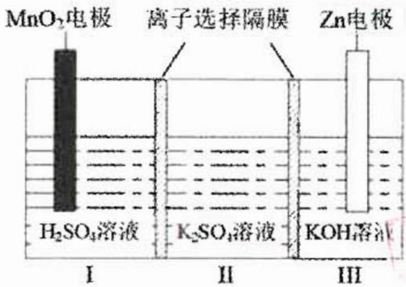

text_image

MnO₂电极 离子选择隔膜 Zn电极
H₂SO₄溶液 K₂SO₄溶液 KOH溶液
I II III

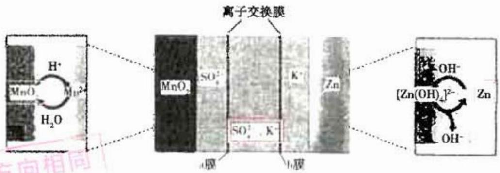

chemical

Chemical reaction diagram showing the formation of a metal-organic compound via ion exchange membrane and [Zn(OH)4]2- radical, with catalysts MnO₂ and H₂O as reagents.

C. 放电时，

C.

# 【理综·全国乙卷·T38】

某人同时进行了新冠病毒……

若

明 （答出1种情况即可）；

，说明

目前最主要的检测新冠病毒的方法是

。下列分析错误的是

• • • • • •

B.重症患者

C. 患者哀哀后会

...

# 【文综·全国乙卷·T40】

习近平总书记强调，要在学生中弘扬劳动精神，教育引导学生崇尚劳动、尊重劳动。

某小学……开启“新劳动教育”试验，先后开发出“农事劳作”“创意劳动”和“美好生活”3个课程群……

材料一 2020年7月，教育部印发《大中小学劳动教育指导纲要(试行)》（以下简称《纲要》）。

《纲要》要求在大中小学设立劳动教育必修课程，开将劳动素养纳入学生综合素质评价体系……

# 【文综·全国乙卷·T32】

据学者研究，古代雅典官员在接受任职资格审查时，需要回答：

崇拜的神祇及其圣所所在地、墓葬方位

等。下列属于成为

古代雅典官员前提条件的是

《雅典政制》记载，抽签选举后，拟任官员在任职前需要填写“考核项目清单”，其内容主要包括：

等。该规定

# 【文综·全国甲卷·T1】

浙江S集团是一家研发和生产空调控制元件和零部件的企业……至2017年，S集团除国内工厂外，还在美国、墨西哥、波兰等国家建有工厂……

1. 影响S集团在

主要区位因素是

A. 技术

C.原材料

D.劳动力

中国F集团成立30多年来，始终专注于汽车玻璃领域的研发、生产与销售……该集团已在中国16个省市及美国、德国、日本等11个国家和地区建立了玻璃生产基地……

(2) 近年来F集团不断在
，除政策外，其考虑的主要原因是

B. 利用当地廉价劳动力

C.建立营销网络

D. 利用当地原料

# 本辑特色

natural_image

Silhouette of four stylized human figures in dynamic poses, no text or symbols present

2022年高考数学新高考Ⅰ卷、Ⅱ卷变化一览表

<table><tr><td>变化类型</td><td>变化内容</td><td>变化说明</td></tr><tr><td colspan="2">举例问题再现</td><td>新高考I卷第14题是举例问题,突出数形结合思想,考查考生灵活应变与作图分析能力.</td></tr><tr><td colspan="2">大计算题和大增</td><td>新高考I卷7,8,11,17,21,22题,II卷第8,10,12,21,22题.</td></tr></table>

# 权威解读

# 2022高考新变化

新变化（P001）

新特点（P006）

# 强调大计算量。凸显选拔功能

调研 5 （2022·新高考Ⅰ卷第7题/则“同构”思维的灵活运用）设 $a=0.1e^{0.1}$ ， $b=\frac{1}{9}$ ， $c=-\ln0.9$ ，则（）

A. a < b < c

B. c < b < a

C. c < a < b

D. a < c < b

# 特别关注高考命题最前沿

# “举例问题”再现，考查力度加大

调研 3 (2022·新高考Ⅰ卷第14题/新题型再现、开放性强)写出与圆 $x^{2}+y^{2}=1$ 和 $(x-3)^{2}+(y-4)^{2}=16$ 都相切的一条直线的方程\_\_\_\_.

# 新背景题

调研 4 （2022·辽宁大连5月二模/出入相补原理）中国科学院院士吴文俊在研究中国古代数学家刘徽著作的基础上，把刘徽常用的方法概括为“出入相补原理”：一个图形不论是平面的还是立体的，都可以切割成有限多块，这有限多块经过移动再组合成另一个图形，则后一图形的面积或体积与初始图形相比保持不变。利用这个原理，解决下面问题：已知函数 $f(x)$ 满足 $f(8 - x) = f(x)$ ，当 $x \in [0,4]$ 时， $f(x) =$

# 新题型（P005）

# 新背景（P010）

# 超重点 4 基于 $x(x^{n})$ ， $\ln x$ ， $e^{x}$ ， $\sin x$ ， $\cos x$ 的组合函数问题

# 基于 $x(x^n)$ 与 $\ln x, e^x$ 的组合函数问题

(2022·浙江省金、丽、衢十二校5月第二次联考)已知函数 $f(x)=$

$\frac{(x-a)^{2}}{\ln x}(a\in\mathbf{R})$ ，则当0<a<1时，函数 $f(x)$

( )

A. 有 1 个极大值点, 2 个极小值点

B. 有 2 个极大值点，1 个极小值点

C. 有 1 个极大值点, 无极小值点

D. 无极大值点,有1个极小值

重难点（P042）

# 重细节（P043）

# 聚焦重难

# 备考障碍一扫除

故 $g(x)$ 的大致图象如图4-1所示.

工事团工事团是指由去年四的大碑：情况由脑的事项经过

一、用绳头写多的大副式()，求出绳头的双侧毛绳之值和三则

四、其他网络渠道提供大类媒体（进一步沟通），来自全国上市水

1. 2017年1月1日，公司与上海浦东发展银行股份有限公司签订了《关于使用部分闲置募集资金进行现金管理的协议》。

$ax \leqslant \sin x + \cos x + 1$ 在 $(0, \pi]$ 上恒成立，等价于

$ax - 1 \leqslant \sin x + \cos x$ 在 $(0, \pi]$ 上恒成立.

1. 2018年2月在十等式中，一则是“重评”，一则是“的评”则

结论，特此简式例证 可按推从与直线三角形的正数关系列期

即在 $(0,\pi]$ 上，直线y=ax-1不能比曲线 $y=\sin x+\cos x=$

$\sqrt{2}\sin(x+\frac{\pi}{4})$ 高.

作出曲线 $y = \sqrt{2}\sin (x + \frac{\pi}{4})$ 在 $(0, \pi]$ 上的一段，如图5-1所示.

使用建议:若使用化曲为直的思想解题,本题能在1\~2分钟之内迅速解决问题,当然,也可以用分离参数法和构造函数法解决,不过耗时较多,在考试中要合理选择解题方法.

# 新解法（P056）

# 创新要理

开放性举例问题/005

多选题/008

双空题/009

新背景题/010

结构不良问题/012

# 创新情报

南水北调工程/004

出入相补原理/010

交通信号灯/093

跳台滑雪/094

碳达峰,碳中和/100

# 创新定义

高斯函数/011

函数的“S点”/012

m 型函数/029

几何上凸函数/085

# 权威解读

2022 年高考数学新高考 | 卷、Ⅱ卷变化一览表 001

难易分明，能力为重，贯彻“低起点、多层次、

高落差”的科学调控策略 002

# 特别关注·命题最前沿

函数与导数问题的创新题型 008

# 突破超重点

# 核心考点篇

超重点1 预备知识中的3大核心命题 015

超重点2 函数的性质及综合应用 022

命题角度 1 函数单调性的判断与应用 022

命题角度 2 函数奇偶性的判断与应用 022

命题角度 3 函数周期性与图象对称性的判断与应用 023

命题角度 4 函数单调性与奇偶性的判断与应用 024

命题角度5 函数性质的综合应用 025

超重点3 函数图象的识别及应用 026

超重点4 函数的零点问题 031

命题角度1 函数零点个数的判断 031

命题角度 2 已知函数零点个数情况确定参数范围 034

命题角度 3 有关函数零点的和、积的值或范围
问题 035

命题角度 4 有关函数零点的综合应用问题 036超重点5 基于 $x(x^n)$ ， $\ln x, e^x$ ， $\sin x, \cos x$ 的组合函数问题 042

超重点6 不等式恒成立与有解问题 054

命题角度1 单变量不等式恒成立问题 054

命题角度 2 单变量不等式能成立或有解问题 058

命题角度 3 双变量不等式恒（能）成立问题 060

超重点7 函数构造思想的应用问题 064

命题角度 1 利用导数运算构造函数 064

命题角度 2 利用同构法构造函数 067

命题角度 3 利用换元构造函数 069

命题角度 4 利用放缩构造函数 071

命题角度 5 双函数构造 072

# 高分技法篇

超重点8 求解函数最值与值域的5大攻略 076

攻略1 函数性质法 076

攻略 2 导数法 077

攻略 3 换元法 078

攻略 4 基本不等式法 080

攻略 5 分类讨论法 080

超重点9 证明不等式的5大方法 084

方法1 作差法 084

方法 2 等价转化法 085

方法 3 变量代换法 087

方法 4 分离参数法 088

方法 5 切线放缩法 089

超重点 10 5 种常见函数模型的应用问题 093

# 欢迎光临

二次函数模型/093

分段函数模型/095

指数函数模型/097

对数函数模型/098

函数模型的选择/099

# 核心方法

二级结论法/007

分离参数法/032

分类讨论法/033

换元法/078

切线放缩法/089

# [Unreadable]

抽象函数的性质运用问题/025

单变量不等式恒成立问题/054

单变量不等式能成立或有解问

题/058

极值点偏移问题/102

# 目录 CONTENTS

# 挑战压轴篇

# 超重点11 高考数学压轴题之极值点偏移问题 102

命题角度1 对称构造 102

命题角度2 比值换元构造 104

命题角度 3 差值换元构造 106

命题角度4 拐点偏移 108

# 速记提分结论

类型1 函数性质类 113

类型 2 函数图象类 114

类型 3 技法类 115

类型4 易错类 116

附表：常见函数的图象与性质 117

# 下辖精彩预告 2022年7月全新上市!

# 《试题调研》第2辑将推出

——高考超重点2·三角函数&平面向量&数列

本辑亮点抢先看：

特别关注·命题最前沿 聚焦2022年高考命题变化、创新导向，深入剖析最新命题趋势.

突破超重点 深度挖掘三角函数的图象变换与性质运用、导数的工具性在三角函数问题中的重要体现、解三角形问题的3类经典考查；深入探讨求解平面向量的数量积问题的3大法宝、三角形“四心”的向量表示与运用；精准研析由递推公式求数列的通项公式的4类情形、数列求和的6种必会技法，等等。以题切入，以点带面，批注式超详解析和超多秒杀解、优美解，助你攻克薄弱点，拿下超重点！

速记提分结论 条目图表化知识清单梳理，快速补短板，驰骋考场少丢分！

# 权威解读

2022 年高考数学新高考Ⅰ卷、Ⅱ卷变化一览表

<table><tr><td>变化类型</td><td>变化内容</td><td>变化说明</td></tr><tr><td colspan="2">举例问题再现</td><td>新高考I卷第14题是举例问题,突出数形结合思想,考查考生灵活应变与作图分析能力.</td></tr><tr><td colspan="2">大计算题量大增</td><td>新高考I卷7,8,11,17,21,22题,II卷第8,10,12,21,22题.</td></tr><tr><td rowspan="2">突出情境命题</td><td>设置优秀传统文化情境</td><td>新高考II卷第3题以中国古代建筑中的举架结构为背景.</td></tr><tr><td>设置社会经济发展情境</td><td>新高考I卷第4题以我国的重大建设成就“南水北调”工程为背景.</td></tr><tr><td rowspan="3">紧扣主干,突出创新</td><td>依据课程标准</td><td>新高考I卷第16题体现了特殊与一般的思想,新高考II卷第19题考查统计与概率的思想.</td></tr><tr><td>加强主干考查</td><td>新高考I卷第20题与II卷第19题都设置了与流行疾病有关的情境,考查2×2列联表、频率分布直方图等主干知识.</td></tr><tr><td>创新试题设计</td><td>新高考II卷第21题给出三个条件,要求选取两个作为已知条件,证明另外一个成立,给考生提供了选择的自由度和发挥空间.</td></tr><tr><td rowspan="3">加强素养考查,发挥选拔功能</td><td>加强思维品质考查,增强思维的灵活性</td><td>新高考II卷第8题对思维的灵活性有较高要求,在抽象的情境中发现函数的周期性是解决问题的关键.</td></tr><tr><td>加强关键能力考查,增强试题的选拔性</td><td>新高考II卷第22题将函数、导数、数列与不等式等知识有机结合,考查灵活应用函数、不等式思想解决复杂问题的能力,对直观想象、逻辑推理能力有较高要求.</td></tr><tr><td>加强基本能力考查,淡化特殊技巧</td><td>新高考I卷第7题是对同构的进一步挖掘与应用,体现对考生的化归与转化能力的考查.</td></tr></table>

# 难易分明，能力为重，贯彻“低起点、多层次、高落差”的科学调控策略

——2022年高考数学新高考Ⅰ卷、Ⅱ卷亮点评析

河北正高级教师、特级教师 赵成海

2022 年高考数学试题落实立德树人的根本任务,引导学生德、智、体、美、劳全面发展,体现高考改革要求. 试题突出数学学科特点,强化基础考查,突出关键能力,加强教考衔接,服务“双减”政策实施,助力基础教育提质增效.

高考数学命题贯彻高考内容改革要求,设计创新试题,展现我国社会主义建设成就,发挥育人功能.试卷加大开放力度,突出理性思维,考查关键能力,发挥选拔功能;倡导理论联系实际,利用真实问题情境,体现数学思想方法在解决实际问题中的价值和作用.

2022 年高考整体难度有所提升,但仍然保持基础性题目起点低的特点,试卷整体的设计在强化基础、发挥选拔功能的同时,综合性、应用性、创新性具有新突破,理性思维的考查、关键能力的考查、数学学科核心素养的考查等展现得淋漓尽致,对中学数学教学具有很强的导向作用.现进行以下几个方面的特色分析.

# 特色1> 热点呈现，科技当先

调研 1 (2022·新高考Ⅰ卷第20题/

一医疗团队为研究某地的一种地方性疾病与当地居民的卫生习惯(卫生习惯分为良好和不够良好两类)的关系,在已患该疾病的病例中随机调查了100例(称为病例组),同时在未患该疾病的人群中随机调查了100人(称为对照组),得到如下数据:

<table><tr><td></td><td>不够良好</td><td>良好</td></tr><tr><td>病例组</td><td>40</td><td>60</td></tr><tr><td>对照组</td><td>10</td><td>90</td></tr></table>

(1)能否有 $99\%$ 的把握认为患该疾病群体与未患该疾病群体的卫生习惯有差异?

(2)从该地的人群中任选一人,A 表示事件“选到的人卫生习惯不够良好”,B 表示事件“选到的人患有该疾病”, $\frac{P(B|A)}{P(B|A)}$ 与 $\frac{P(B|\bar{A})}{P(B|\bar{A})}$ 的比值是卫生习惯不够良好对患该疾病风险程度的一项度量指标,记该指标为R.

(i) 证明: $R = \frac{P(A \mid B)}{P(\overline{A} \mid B)} \cdot \frac{P(\overline{A} \mid \overline{B})}{P(A \mid \overline{B})}$ ;

(ii) 利用该调查数据, 给出 $P(A \mid B), P(A \mid \overline{B})$ 的估计值, 并利用 (i) 的结果给出 $R$ 的估计值.

附: $K^{2}=\frac{n(ad-bc)^{2}}{(a+b)(c+d)(a+c)(b+d)}$ , $P(K^{2}\geqslant k)$ 0.050 0.010 0.001
k 3.841 6.635 10.828

解析 (1)假设患该疾病群体与未患该疾病群体的卫生习惯没有差异,

$K^2$ 的观测值 $k = \frac{200\times(40\times 90 - 60\times 10)^2}{50\times 150\times 100\times 100} = 24 > 6.635,$

所以有 $99\%$ 的把握认为患该疾病群体与未患该疾病群体的卫生习惯有差异.

【敲黑板】此处易因对前面的假设与后面的总结表达不到位而丢失步骤分，平时做这种类型的题目时要养成好习惯，要注重计算的正确性，也要注重表达的严谨性

(2)(i)由题意 $R = \frac{P(B|A)}{P(\overline{B} |A)}\cdot \frac{P(\overline{B} |\overline{A})}{P(B|\overline{A})} = \frac{\frac{P(AB)}{P(A)}}{\frac{P(AB)}{P(A)}}\cdot \frac{\frac{P(\overline{A}\overline{B})}{P(\overline{A})}}{\frac{P(\overline{A} B)}{P(\overline{A})}} = \frac{P(AB)}{P(A\overline{B})}\cdot \frac{P(\overline{A}\overline{B})}{P(\overline{A} B)} =$

$\frac{P(AB)}{P(\overline{A}B)} \cdot \frac{P(\overline{A}\overline{B})}{P(A\overline{B})} = \frac{\frac{P(AB)}{P(B)}}{\frac{P(\overline{A}B)}{P(B)}} \cdot \frac{\frac{P(\overline{A}\overline{B})}{P(\overline{B})}}{\frac{P(A\overline{B})}{P(\overline{B})}} = \frac{P(A|B)}{P(\overline{A}|B)} \cdot \frac{P(\overline{A}|\overline{B})}{P(A|\overline{B})}$ , 原式得证.

【突破口】注意条件概率计算公式 $P(A|B)=\frac{P(AB)}{P(B)}$ 的应用，也可以将 $\frac{P(B|A)}{P(\overline{B}|A)} \cdot \frac{P(\overline{B}|\overline{A})}{P(\overline{B}|\overline{A})}$ 与 $\frac{P(A|B)}{P(\overline{A}|B)} \cdot \frac{P(\overline{A}|\overline{B})}{P(A|\overline{B})}$ 两式相除，再利用条件概率计算公式变形、化简

(ii) 由调查数据得, $P(A|B)=\frac{P(AB)}{P(B)}=\frac{n(AB)}{n(B)}=\frac{40}{100}=\frac{2}{5}$ , 同理, $P(\overline{A}|B)=\frac{60}{100}=$ $\frac{3}{5}, P(A|\overline{B}) = \frac{10}{100} = \frac{1}{10}, P(\overline{A}|\overline{B}) = \frac{90}{100} = \frac{9}{10}$ , 所以 $R = \frac{\frac{2}{5}}{\frac{3}{5}} \times \frac{\frac{9}{10}}{\frac{1}{10}} = 6.$

# 特色2 考查冷点，开放程度加强

调研 2 (2022·新高考Ⅰ卷第4题/以“南水北调”为情境,冷点新考,强调基础)南水北调工程缓解了北方一些地区水资源短缺问题,其中一部分水蓄入某水库.已知该水库水位为海拔148.5m时,相应水面的面积为140.0km²;水位为海拔157.5m时,相应水面的面积为180.0km².将该水库在这两个水位间的形状看作一个棱台,则该水库水位从海拔148.5m本题的求解与棱台底面的形状是无关的，这就使本题具有开放性的特点，若考生纠结形状，则可能无法解答。

上升到 157.5 m 时, 增加的水量约为( $\sqrt{7} \approx 2.65$ ) ()

A. $1.0 \times 10^{9} \mathrm{~m}^{3}$

B. $1.2 \times 10^{9} \mathrm{~m}^{3}$

C. $1.4 \times 10^{9} \mathrm{~m}^{3}$

D. $1.6 \times 10^{9} \mathrm{~m}^{3}$

由已知可得棱台的两个底面的面积分别为 $S_{1}=140.0\ km^{2}=1.4\times10^{8}\ m^{2}$ , $S_{2}=180.0\ km^{2}=1.8\times10^{8}\ m^{2}$ ，棱台的高 h=157.5-148.5=9(m).

因而棱台的体积 $V = \frac{1}{3} (S_{1} + S_{2} + \sqrt{S_{1}S_{2}})h = \frac{1}{3}\times (1.4\times 10^{8} + 1.8\times 10^{8}+$ $\sqrt{1.4\times 10^8\times 1.8\times 10^8})\times 9 = 3\times (0.6\times \sqrt{7} +3.2)\times 10^{8}\approx 1.4\times 10^{9}(m^{3})$ ，故选C.

【易错】求解本题时易将单位搞错，比如按下面的错误计算方法，则求得的结果为 $\frac{1}{3} \times (140.0 + 180.0 + \sqrt{140.0 \times 180.0}) \times 9 \approx 1.4 \times 10^{3}$ ，因而在选项中若给出了扰项 $1.4 \times 10^{3} \mathrm{~m}^{3}$ ，某些粗心的考生就要丢分了

调研 3 (2022·全国乙卷第9题)已知球 O 的半径为1,四棱锥的顶点为O,底面的四个顶点均在球 O 的球面上,则当该四棱锥的体积最大时,其高为()

A. $\frac{1}{3}$

B. $\frac{1}{2}$

C. $\frac{\sqrt{3}}{3}$

D. $\frac{\sqrt{2}}{2}$

根据题意,易知当四棱锥体积最大时,底面四边形为正方形,设正方形的边长为x,则四棱锥的底面积 $S=x^{2}$ ,高 $h=\sqrt{1-\left(\frac{x}{\sqrt{2}}\right)^{2}}=\sqrt{1-\frac{x^{2}}{2}}$ .

所以四棱锥的体积 $V = \frac{1}{3} Sh = \frac{1}{3} \times x^{2} \times \sqrt{1 - \frac{x^{2}}{2}} = \frac{1}{6} \times \sqrt{(4 - 2x^{2})x^{4}} \leqslant \frac{1}{6} \times \sqrt{\left(\frac{4 - 2x^{2} + x^{2} + x^{2}}{3}\right)^{3}} = \frac{4\sqrt{3}}{27}$ ,

当且仅当 $4 - 2x^{2} = x^{2}$ ，即 $x^{2} = \frac{4}{3}$ 时，四棱锥体积取最大值，此时高为 $\frac{\sqrt{3}}{3}$ 故选C.

# 特色3> “举例问题”再现，考查力度加大

调研 4 (2022·新高考Ⅰ卷第14题/新题型再现,开放性强)写出与圆 $x^{2}+y^{2}=1$ 和 $(x-3)^{2}+(y-4)^{2}=16$ 都相切的一条直线的方程 \_\_\_\_.

解析 设圆 $x^{2} + y^{2} = 1$ 和 $(x - 3)^{2} + (y - 4)^{2} = 16$ 的圆心分别为 $O(0,0), M(3,4)$ , 半径分别为 $r_{1} = 1, r_{2} = 4$ , 连接 $OM$ , 则两圆圆心距 $|OM| = r_{1} + r_{2} = 5$ ,

故两圆外切,则两圆有三条公切线,其中一条外公切线的斜率不存在,为直线 $x =  - 1$ ,如图 1 所示.

【秒杀解】准确作图分析, 是可以直接得出这个结果的, 这也说明了在平时复习备考中, 注重基础的同时, 也要注意 “小题小解”, 在高考中往往能够有下大量时间

“举例问题”在2021年全国乙卷首次出现，今年不仅在全国乙卷中出现，在新高考卷中也出现了，特色在于考查考生能否选择最恰当的方式解决问题，彰显能力。

注意到两圆外切,还有一条内公切线,设切点为A,则OA=1,易知 $k_{OA}=k_{OM}=\frac{4}{3}$ ,则
可设两圆内公切线方程为 $3x + 4y + t = 0$ , 点 $O(0,0)$ 到该直线的距离 $\frac{|t|}{5} = 1$ ,

【扫清障碍】内公切线与两圆连心线垂直是设直线方程的关键

解得 t = -5 (正值舍去), 所以内公切线方程为 $3x + 4y - 5 = 0$ .

【极易出错】在求内公切线方程时，由于解得 $t=\pm5$ ，若取舍不当，则易错写为 $3x+4y+5=0$ ，实际上，结合图象即可得t为负值，这进一步印证了解题时运用数形结合思想的重要性

两圆连心线 $OM$ 的方程为 $y = \frac{4}{3} x$ , 与一条外公切线 $x = -1$ 的交点为 $B(-1, -\frac{4}{3})$ ,

易知另一条外公切线的斜率存在,且过点 $B(-1,-\frac{4}{3})$ , 可设其方程为 $y+\frac{4}{3}=k(x+1)$ , 点 $O(0,0)$ 到该直线的距离 $\frac{|k-\frac{4}{3}|}{\sqrt{k^{2}+1}}=$ 1, 解得 $k=\frac{7}{24}$ , 故另一条外公切线的方程为 7x-24y-25=0.

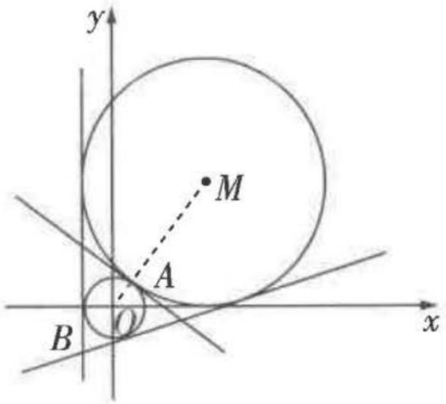

text_image

y
M
A
B
O
x

图1

故填 $x = -1$ （或填 $3x + 4y - 5 = 0$ ，或填 $7x - 24y - 25 = 0$

【敲黑板】审题时要注意看清题目要求，如果因为读题不认真将三个切线方程都写上，这样既浪费时间，又增大出错率

# 特色4 强调大计算量，凸显选拔功能

调研 5 (2022·新高考Ⅰ卷第7题/对“同构”思维的灵活运用)设 $a=0.1e^{0.1}$ ， $b=\frac{1}{9}, c=-\ln0.9,$ 则 ( )

A. a < b < c

B. c < b < a

C. c < a < b

D. a < c < b

解析 由 $a = 0.1 \mathrm{e}^{0.1}, b = \frac{1}{9} = \frac{0.1}{1 - 0.1}, c = -\ln 0.9 = \ln \frac{1}{1 - 0.1}$ , 联想到函数 $y = x \mathrm{e}^{x}$ , 函数 $y = \frac{x}{1 - x}$ , 函数 $y = \ln \frac{1}{1 - x}$ , 其中 $x \in (0, 0.1]$ .

【突破障碍】将三个数值写成与同一个数0.1有关的形式，从而得到更具有一般性的函数解析式，再转化为比较函数值的大小问题

要比较 $x\mathrm{e}^x$ 与 $\frac{x}{1 - x}$ 在 $x\in (0,0.1]$ 上的大小，只需要比较 $\mathrm{e}^x$ 与 $\frac{1}{1 - x}$ 在 $x\in (0,0.1]$ 上的大小，设 $f(x) = (1 - x)\mathrm{e}^x$ （ $0 < x\leqslant 0.1$ ），则 $f'(x) = -x\mathrm{e}^x < 0$ ，所以 $f(x)$ 在(0,0.1]上单调递减，所以 $f(x) < (1 - 0)\times \mathrm{e}^0 = 1$ ，即当 $0 < x\leqslant 0.1$ 时， $(1 - x)\mathrm{e}^x < 1$ ，即 $x\mathrm{e}^x < \frac{x}{1 - x}$ ，所以 $0.1\mathrm{e}^{0.1} < \frac{0.1}{1 - 0.1}$ ，从而 $a < b$ 。

对于 $x\mathrm{e}^x$ 与 $\ln \frac{1}{1 - x} (x\in (0,0.1])$ ，设 $h(x) = x\mathrm{e}^{x} - \ln \frac{1}{1 - x} (0 <   x\leqslant 0.1)$ ，则 $h^{\prime}(x) = (1 + x)\mathrm{e}^{x} - \frac{1}{1 - x} = \frac{(1 - x^{2})\mathrm{e}^{x} - 1}{1 - x},$

设 $g(x) = (1 - x^2)\mathrm{e}^x -1(0 <   x\leqslant 0.1)$ ，则 $g^{\prime}(x) = (1 - x^{2} - 2x)\mathrm{e}^{x} = [2 - (1 + x)^{2}]\mathrm{e}^{x} > 0,$ $g(x)$ 在 $(0,0.1]$ 上单调递增，所以 $g(x) > (1 - 0)\times \mathrm{e}^0 -1 = 0,h'(x) > 0$ ，则 $h(x)$ 在 $(0,$ 0.1]上单调递增，所以 $h(x) > 0\times \mathrm{e}^{0} - \ln \frac{1}{1 - 0} = 0$ ，所以当 $0 <   x\leqslant 0.1$ 时， $x\mathrm{e}^{x} > \ln \frac{1}{1 - x},$ 所以 $0.1\mathrm{e}^{0.1} > \ln \frac{1}{1 - 0.1}$ ，从而 $a > c.$

综上所述，c<a<b，故选C.

# 名师有话

解本题时, 有的考生也可能先比较 $\frac{x}{1 - x}$ 与 $\ln \frac{1}{1 - x}$ 在 (0,0.1] 上的大小, 此时可以转化为比较 $-1 + \frac{1}{1 - x}$ 与 $\ln \frac{1}{1 - x}$ 在 (0,0.1] 上的大小, 设 $t = \frac{1}{1 - x}, t \in (1, \frac{10}{9}]$ , 易知 $\ln t < t - 1$ 成立, 因而 $\frac{x}{1 - x} > \ln \frac{1}{1 - x}$ 在 $x \in (0,0.1]$ 上成立, 从而可得 $b > c$ (也可以利用二级结论 $\ln x > 1 - \frac{1}{x} (x > 0$ 且 $x \neq 1$ ), 得 $\ln 0.9 > 1 - \frac{1}{0.9} = -\frac{1}{9}, -\ln 0.9 < \frac{1}{9}$ , 所以 $c < b$ ).

调研 6 (2022·新高考Ⅰ卷第11题)(多选)已知 O 为坐标原点,点 A(1,1)在抛物线 $C: x^{2} = 2py (p > 0)$ 上,过点 B(0, -1)的直线交 C 于 P, Q 两点,则 ()

A. $C$ 的准线为直线 $y = -1$

B. 直线 $AB$ 与 $C$ 相切

C. $|OP|\cdot |OQ| > |OA|^2$

D. $|BP|\cdot |BQ| > |BA|^2$

解析 由已知得 $p = \frac{1}{2}$ , 则抛物线为直线 $x^{2} = y$ ,

其准线为直线 $y = -\frac{1}{4}$ ，故 A 错误.

抛物线 C 在点 $A(1,1)$ 处的切线方程为 $x=\frac{y+1}{2}$ ，即 y=2x-1，易知切线过点 $B(0,-1)$ ，因而直线 AB 与抛物线 C 相切，故 B 正确。

【二级结论】这里运用了二级结论：抛物线 $x^{2} = 2py (p > 0)$ 上点 $M(x_{0}, y_{0})$ 处的切线方程为 $x_{0}x = p(y + y_{0})$ 。也可以利用导数的几何意义，得到点 $A$ 处的切线方程。还可以利用两点式求出直线 $AB$ 的方程，再证明该直线与抛物线相切

由题意知, 直线 PQ 的斜率存在,

设直线 PQ 的方程为 $y = kx - 1, P(x_{1}, y_{1}), Q(x_{2}, y_{2})$ .

由 $\left\{\begin{aligned}y&=kx-1,\\ x^{2}&=y,\end{aligned}\right.$ 可得 $x^{2}-kx+1=0$ ，则 $\Delta=k^{2}-4>0,x_{1}+x_{2}=k,x_{1}x_{2}=1$ ，

所以 $k^2 > 4, y_1 + y_2 = (x_1 + x_2)^2 - 2x_1x_2 = k^2 - 2, y_1y_2 = (x_1x_2)^2 = 1.$

那么 $\left|OP\right|\cdot\left|OQ\right|=\sqrt{\left(x_{1}^{2}+y_{1}^{2}\right)\left(x_{2}^{2}+y_{2}^{2}\right)}=\sqrt{y_{1}y_{2}\left(y_{1}+y_{2}+y_{1}y_{2}+1\right)}=\sqrt{k^{2}}>2=$ $\left|OA\right|^{2}$ ，故 C 正确.

【数形结合】 $|OP|\cdot|OQ|>\overrightarrow{OP}\cdot\overrightarrow{OQ}=x_{1}x_{2}+y_{1}y_{2}=2=|OA|^{2}$ ，常规解法一般是利用方程的根与系数的关系直接计算，而数形结合，考虑将长度运算转化成向量运算，这是对数学运算能力的升华

$$
\vert B P \vert \cdot \vert B Q \vert = \overrightarrow {B P} \cdot \overrightarrow {B Q} = x _ {1} x _ {2} + (y _ {1} + 1) (y _ {2} + 1) = x _ {1} x _ {2} + y _ {1} + y _ {2} + y _ {1} y _ {2} + 1 = k ^ {2} +
$$

【突破口】由于向量 $\overrightarrow{BP},\overrightarrow{BQ}$ 同向，因而 $|BP|\cdot |BQ| = \overrightarrow{BP}\cdot \overrightarrow{BQ}$ 若采用常规解法，则为： $|BP|\cdot |BQ| = \sqrt{\left[x_1^2 + (y_1 + 1)^2\right]\left[x_2^2 + (y_2 + 1)^2\right]} = \sqrt{(y_1 + y_1^2 + 2y_1 + 1)(y_2 + y_2^2 + 2y_2 + 1)} = y_1 + y_2 + 3 = k^2 +1 > 5 = |BA|^2$

$1 > 5 = |BA|^{2}$ ，故 D 正确。故选 BCD。

# 特别关注·命题最前沿

# 函数与导数问题的创新题型

# 题型1 多选题

调研 1 (2022·湖南怀化5月模考)下列函数中,存在极值点的有 ( )

A. $y = x - \frac{1}{x}$

B. $y = 2^{|x|}$

C. $y = -2x^{3} - x$

D. $y = x\ln x$

解析 由 $y = x - \frac{1}{x} (x \neq 0)$ ，得 $y' = 1 + \frac{1}{x^2} > 0$ ，

所以函数 $y = x - \frac{1}{x}$ 在 $(-∞, 0)$ , $(0, +∞)$ 上单调递增, 没有极值点. 故 A 不符合题意.

函数 $y=2^{|x|}=\left\{\begin{aligned}&2^{x},&x\geqslant0,\\ &2^{-x},&x<0,\end{aligned}\right.$ 根据指数函数的图象与性质可得，当x<0时，函数y=

【会转化】研究会绝对值符号的函数的性质，往往需要先去掉绝对值符号，将函数解析式转化为分段的形式，再在每一段上分别研究

$2^{|x|}$ 单调递减, 当 $x > 0$ 时, 函数 $y = 2^{|x|}$ 单调递增, 所以函数 $y = 2^{|x|}$ 在点 $x = 0$ 的函数值比它在点 $x = 0$ 附近其他点的函数值都小, 即 $x = 0$ 为其极小值点. 故 B 符合题意.

由 $y = -2x^{3} - x$ 得 $y' = -6x^{2} - 1 < 0$ ，所以函数 $y = -2x^{3} - x$ 在 R 上单调递减，没有极值点。故 C 不符合题意。

由 $y = x \ln x (x > 0)$ 得 $y' = \ln x + 1$ ，当 $x \in (0, \frac{1}{\mathrm{e}})$ 时， $y' < 0$ ，函数 $y = x \ln x$ 单调递减，【会思考】可导函数存在极值点，即其导函数存在变号零点。因此此处求导后，可在脑海中勾勒出曲线 $y = \ln x$ ，将其向上平移 1 个单位长度，所得图象穿过 x 轴的正半轴，即 $y' = \ln x + 1$ 存在变号零点（左负、右正）。故原函数存在极小值点

当 $x \in \left( \frac{1}{\mathrm{e}}, +\infty \right)$ 时, $y' > 0$ , 函数 $y = x \ln x$ 单调递增, 所以 $x = \frac{1}{e}$ 为函数 $y = x \ln x$ 的极小值点. 故 D 符合题意.

故选 BD.

调研 2 (2022·北京师范大学第二附属中学5月三模改编)已知函数 $f(x)=$

$e^{x}-a\ln x$ 的定义域是 $(0,+\infty)$ ，关于函数 $f(x)$ ，下列选项中正确的是（）

A. 对于任意的 $a \in (0, +\infty)$ , 函数 $f(x)$ 存在最小值  
B. 对于任意的 $a \in (-\infty, 0)$ , 函数 $f(x)$ 在 $(0, +\infty)$ 上单调递减  
C. 存在 $a \in (-\infty, 0)$ , 使得对于任意的 $x \in (0, +\infty)$ , 都有 $f(x) > 0$ 成立  
D. 存在 $a \in (0, +\infty)$ ，使得函数 $f(x)$ 有 2 个零点

解析 由 $f(x) = \mathrm{e}^{x} - a\ln x (x > 0)$ 得 $f'(x) = \mathrm{e}^{x} - \frac{a}{x} (x > 0)$ .

(i) 当 $a \in (0, +\infty)$ 时, 易知 $f'(x) = \mathrm{e}^x - \frac{a}{x}$ 在 $(0, +\infty)$ 上单调递增, 值域为 $\mathbf{R}$ , 所

【会思考】 $f'(x)=\mathrm{e}^{x}-\frac{a}{x}(x>0)$ 由函数 $y=\mathrm{e}^{x}(x>0)$ 与函数 $y=-\frac{a}{x}(x>0)$ 相加组合而成。

根据“增+增=增”即可判断 $f'(x)$ 的单调性

以存在 $x_0 \in (0, +\infty)$ , 使 $f'(x_0) = 0$ , 所以 $a = x_0 e^{x_0}$ .

当 $0 < x < x_0$ 时, $f'(x) < 0$ , 当 $x > x_0$ 时, $f'(x) > 0$ , 所以 $f(x)$ 在 $(0, x_0)$ 上单调递减, 在 $(x_0, +\infty)$ 上单调递增, 则 $f(x_0)$ 为函数 $f(x)$ 的最小值, 故 A 正确.

因为当 $x > 0$ 且 $x \to 0$ 时, $f(x) > 0$ , 当 $x \to +\infty$ 时, $f(x) > 0$ , 故若 $f(x)$ 的最小值 $f(x_0) < 0$ , 即 $\mathrm{e}^{x_0} - a \ln x_0 < 0$ , 即 $\mathrm{e}^{x_0} - x_0 \mathrm{e}^{x_0} \ln x_0 < 0, 1 - x_0 \ln x_0 < 0$ , 则函数 $f(x)$ 有2个零点.

令 $g(x) = x\ln x(x > 0)$ ，由【调研1】知 $g(x)_{\min} = g(\frac{1}{e}) = -\frac{1}{e}$ ，即 $g(x) \geqslant -\frac{1}{e}$ ，

所以存在 $x_0'$ ，使得 $x_0' \ln x_0' > 1$ ，即存在 $a \in (0, +\infty)$ ，使得函数 $f(x)$ 有2个零点，故D正确.

(ii) 当 $a \in (-\infty, 0)$ 时, $f'(x) = \mathrm{e}^x - \frac{a}{x} > 0$ 对于 $x \in (0, +\infty)$ 恒成立, 故 $f(x)$ 在 $(0, +\infty)$ 上单调递增, 故 B 错误.

当 $x > 0$ 且 $x \to 0$ 时, $\ln x \to -\infty$ , $\mathrm{e}^x \to 1$ , 则 $f(x) = \mathrm{e}^x - a \ln x < 0$ , 所以不存在 $a \in (-\infty, 0)$ , 使得对于任意的 $x \in (0, +\infty)$ , 都有 $f(x) > 0$ 成立, 故 C 错误. 故选 AD.

# 题型2 双空题

调研 3 (2022·河北唐山 5 月二模) 若函数 $f(x) = x^{2} \ln x, g(x) = x e^{2x}$ ，则 $f(x)$ 的最小值为 \_\_\_\_；若 $a > 0, b > 0$ ，且 $f(a) = g(b)$ ，则 $a - 2b$ 的最小值为 \_\_\_\_.

解析 由 $f(x) = x^{2}\ln x (x > 0)$ 得 $f'(x) = x(2\ln x + 1)$ .

当 $0 < x < e^{-\frac{1}{2}}$ 时, $f'(x) < 0$ , 函数 $f(x)$ 单调递减, 当 $x > e^{-\frac{1}{2}}$ 时, $f'(x) > 0$ , 函数 $f(x)$ 单调递增,

故 $x=e^{-\frac{1}{2}}$ 是函数 $f(x)$ 的极小值点,也是最小值点,

故 $f(x)$ 的最小值为 $f(\mathrm{e}^{-\frac{1}{2}})=\mathrm{e}^{-1}\ln\mathrm{e}^{-\frac{1}{2}}=-\frac{1}{2\mathrm{e}}.$

由 $a > 0, b > 0$ ，且 $f(a) = g(b)$ 可得 $a^2 \ln a = b e^{2b}$ ，则 $\ln a > 0, a > 1, \ln a \cdot e^{2 \ln a} = b e^{2b}$ .

【会变形】对等式合理变形，将 $a^2\ln a = b\mathrm{e}^{2b}$ 变形为 $\ln a\cdot \mathrm{e}^{2\ln a} = b\mathrm{e}^{2b}$ ，为后面构造函数创造条件$g(x)=xe^{2x}$ ，则 $g'(x)=\mathrm{e}^{2x}(2x+1)$ ，当x>0时， $g'(x)>0$ ， $g(x)$ 单调递增.

故由 $a > 1, b > 0, \ln a \cdot e^{2\ln a} = be^{2b}$ 可得 $\ln a = b$ ，故 $a - 2b = a - 2\ln a, a > 1$ .

令 $h(x) = x - 2\ln x (x > 1)$ , 则 $h'(x) = 1 - \frac{2}{x} = \frac{x - 2}{x}$ , 当 $1 < x < 2$ 时, $h'(x) < 0$ , $h(x)$ 单调递减, 当 $x > 2$ 时, $h'(x) > 0$ , $h(x)$ 单调递增,

故 $h(x)_{\min} = h(2) = 2 - 2\ln 2$ ，即 $a - 2b$ 的最小值为 $2 - 2\ln 2$

# 题型3 新背景题

调研 4 (2022·辽宁大连5月二模/出入相补原理)中国科学院院士吴文俊在研究中国古代数学家刘徽著作的基础上,把刘徽常用的方法概括为“出入相补原理”:一个图形不论是平面的还是立体的,都可以切割成有限多块,这有限多块经过移动再组合成另一个图形,则后一图形的面积或体积与初始图形相比保持不变.利用这个原理,解决下面问题:已知函数 $f(x)$ 满足 $f(8-x)=f(x)$ ,当 $x\in[0,4]$ 时, $f(x)=\left\{\begin{aligned}&2\log_{2}\left(2-\frac{x}{2}\right),0\leqslant x\leqslant2,\\&2\log_{\frac{1}{2}}\frac{x}{2},2<x\leqslant4,\end{aligned}\right.$ 则函数 $y=f(x)$ 在 $x\in[0,8]$ 上的图象与直线y=2所围成的

封闭图形的面积为

( )

A. 4

B. 8

C. 16

D. 32

解析 由题意知 $f(x)$ 的图象关于直线 $x = 4$ 对称，

【用结论】满足 $f(a + x) = f(b - x)$ 的函数 $f(x)$ 的图象关于直线 $x = \frac{a + b}{2}$ 时称。更多关于函数图象的对称性的结论，参见本书P114类型2中的总结

当 $x \in [0,4]$ 时， $f(x) = \begin{cases} 2\log_2(2 - \frac{x}{2}), & 0 \leqslant x \leqslant 2, \\ 2\log_{\frac{1}{2}}\frac{x}{2}, & 2 < x \leqslant 4, \end{cases}$ 且 $f(x)$ 在 $[0,2)$ 上的图象和在

(2,4]上的图象关于点(2,0)中心对称,f(0)=f(8)=2,f(4)=-2,

所以在 $x \in [0,8]$ 上，函数 $y = f(x)$ 及 $y = 2$ 的大致图象如图1所示.

将所围成的图形在 $x$ 轴下方的阴影区域分成两部分, 对应补到 $x$ 轴上半部分的阴影区域, 则所求面积为由 $x$ 轴、 $y$ 轴、直线 $y = 2$ 、直线 $x = 8$ 所围成的矩形 OABC 的面积.

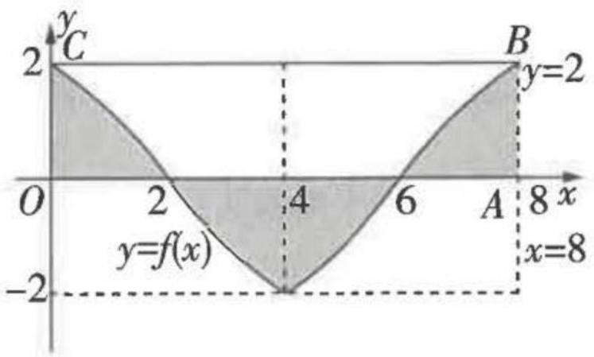

area

| x | y=f(x) |
|---|--------|
| 0 | 2      |
| 2 | -1     |
| 4 | -2     |
| 6 | 0      |
| 8 | 2      |

图1

所以函数 $y = f(x)$ 在 $x \in [0,8]$ 上的图象与直线 $y = 2$ 所围成的封闭图形的面积为 16. 故选 C.

调研 5 (2022·河北石家庄二中等校 5 月联考/新定义函数,与集合、条件的充分必要性交汇)高斯是德国著名的数学家,近代数学奠基者之一,享有“数学王子”的美誉,以其名字命名的“高斯函数”定义如下,设 $x \in \mathbb{R}$ ,用 $[x]$ 表示不超过 $x$ 的最大整数(例如: $[-3.7] = -4$ , [2.3] = 2),则称 $y = [x]$ 为高斯函数,也称取整函数.已知 $f(x) = [x \ln x]$ ,当 $f(x) = 0$ 时, $x$ 的取值集合为 $A$ ,则下列选项为 $x \in A$ 的充分不必要条件的是 ( )

A. $x \in (0,1)$

B. $x \in (1, \sqrt{e})$

C. $x \in (1,2)$

D. $x \in (2, \mathrm{e})$

思维导引 令 $g(x) = x\ln x$ ，根据高斯函数知当 $f(x) = 0$ 时， $0 \leqslant g(x) < 1$ ，利用导数分析不等式的解集，即可得解。

解析 令 $g(x) = x\ln x, x > 0$ ，由题意知当 $f(x) = 0$ 时， $0 \leqslant g(x) < 1$ .

$g'(x) = \ln x + 1$ , 当 $0 < x < \frac{1}{\mathrm{e}}$ 时, $g'(x) < 0$ , 当 $x > \frac{1}{\mathrm{e}}$ 时, $g'(x) > 0$ ,

所以 $g(x)$ 在 $(0, \frac{1}{\mathrm{e}})$ 上单调递减，在 $(\frac{1}{\mathrm{e}}, +\infty)$ 上单调递增.

显然当 $x \in (0, \frac{1}{\mathrm{e}})$ 时， $g(x) < 0$ ，又 $g(1) = 0$ ，所以关于 $x$ 的不等式 $0 \leqslant g(x) < 1$ 的解集为 $[1, x_0)$ ，其中 $g(x_0) = 1$ 。

因为 $g(2)=2\ln2=\ln4>1$ , $g(\sqrt{e})=\sqrt{e}\ln\sqrt{e}=\frac{\sqrt{e}}{2}<1$ , $g(e)=\mathrm{e}\ln e=e>1$ ,

所以只有 $(1, \sqrt{\mathrm{e}}) \subsetneq [1, x_0)$ ，故选B.

调研 6 (2022·哈尔滨九中5月第四次模拟/新定义函数的“S点”)记 $f'(x)$ ， $g'(x)$ 分别为函数 $f(x), g(x)$ 的导函数。若存在 $x_0 \in R$ ，满足 $f(x_0) = g(x_0)$ ，且 $f'(x_0) = g'(x_0)$ ，则称 $x_0$ 为函数 $f(x)$ 与 $g(x)$ 的一个“S点”。已知 $f(x) = \ln x + ax, g(x) = bx^2$ 。

(1) 若 $b = 1, f(x), g(x)$ 存在“ $S$ 点”，求 $a$ 的值.  
(2) 对任意 a > 0，是否存在实数 b > 0，使得 $f(x)$ ， $g(x)$ 存在“S 点”？请说明理由。

解析 (1) 设“S 点”为 $x_0(x_0 > 0)$ . 由题可知 $f(x) = \ln x + ax, g(x) = x^2$ , 则 $f'(x) = \frac{1}{x} + a, g'(x) = 2x$ ,

所以 $\left\{ \begin{array}{l} \ln x_0 + ax_0 = x_0^2, \\ \frac{1}{x_0} + a = 2x_0, \end{array} \right.$ 消去 $a$ 得 $\ln x_0 + x_0^2 = 1$ .

【抓定义】紧扣“S点”的定义——存在 $x_{0}\in\mathbb{R}$ ，满足 $f(x_{0})=g(x_{0})$ ，且 $f'(x_{0})=g'(x_{0})$ 。据此列方程组

记 $h(x) = \ln x + x^2 (x > 0)$ ，显然 $h(x)$ 在 $(0, +\infty)$ 上单调递增，而 $h(1) = 1$

因此 $\ln x_0 + x_0^2 = 1$ 只有一个解，为 $x_0 = 1$ ，所以 $a = 2 - 1 = 1$

(2) 假设对任意的 $a > 0$ , 存在实数 $b > 0$ , 使得 $y = f(x)$ 与 $y = g(x)$ 存在“ $S$ 点”, 设 “ $S$ 点”为 $x_1(x_1 > 0)$ .

因为 $g'(x)=2bx$ ，所以 $\left\{\begin{aligned}\ln x_{1}+ax_{1}&=bx_{1}^{2},\\ \frac{1}{x_{1}}+a&=2bx_{1},\end{aligned}\right.$

消去 b 得 $1 - 2 \ln x_{1} = ax_{1} > 0$ ，所以 $\ln x_{1} < \frac{1}{2}$ ，即 $0 < x_{1} < \sqrt{e}$ .

消去 $a$ 得 $b = \frac{1 - \ln x_1}{x_1^2}$ , 当 $0 < x_1 < \sqrt{\mathrm{e}}$ 时, $b = \frac{1 - \ln x_1}{x_1^2} > 0$ .

下面证明对任意 a > 0，方程 $1 - 2 \ln x_{1} = ax_{1}$ 在 $x_{1} \in (0, \sqrt{e})$ 上有解.

设 $H(x) = 1 - 2\ln x - ax(0 < x \leqslant \sqrt{\mathrm{e}})$ ，显然函数 $H(x)$ 在 $x \in (0, \sqrt{\mathrm{e}})$ 上单调递减，

当 $x \to 0$ 时, $H(x) \to +\infty$ , $H(\sqrt{\mathrm{e}}) = -a\sqrt{\mathrm{e}} < 0$ , 所以存在 $0 < x_{1} < \sqrt{\mathrm{e}}$ , 使得 $H(x_{1}) = 0$ .

所以对任意 a > 0, 存在实数 b > 0, 使得 $f(x)$ 与 $g(x)$ 存在“S 点”.

# 题型4 结构不良问题

调研 7 (2022·山东威海5月二模)已知函数 $f(x)=2\ln x-x+\frac{a}{x}$ .

(1) 当 $a = \frac{3}{4}$ 时, 求 $f(x)$ 的单调区间.  
(2) 若 $f(x)$ 有 2 个极值点 $x_{1}, x_{2}$ ，且 $x_{1} < x_{2}$ ，从下面两个结论中选一个证明.

① $\frac{f(x_{2})-f(x_{1})}{x_{2}-x_{1}}<\frac{2}{\sqrt{a}}-2$ , ② $f(x_{2})<\frac{2}{3}a+2\ln2-2.$

注:如果选择多种情况分别解答,按第一个解答计分.

解析

(1) $f'(x)=\frac{2}{x}-1-\frac{a}{x^{2}}=\frac{-x^{2}+2x-a}{x^{2}}(x>0).$

当 $a = \frac{3}{4}$ 时， $f'(x) = \frac{-x^2 + 2x - \frac{3}{4}}{x^2} = -\frac{4x^2 - 8x + 3}{4x^2} = -\frac{(2x - 1)(2x - 3)}{4x^2}$ .

令 $f'(x)>0$ ，解得 $\frac{1}{2}<x<\frac{3}{2}$ ；令 $f'(x)<0$ ，解得 $0<x<\frac{1}{2}$ 或 $x>\frac{3}{2}$ .

所以 $f(x)$ 的单调递增区间为 $(\frac{1}{2},\frac{3}{2})$ ，单调递减区间为 $(0,\frac{1}{2}),(\frac{3}{2}, + \infty)$

(2) 若选择①, 证明过程如下.

由题意知, $x_{1},x_{2}$ 是方程 $x^{2}-2x+a=0$ 的两根,则 $\left\{\begin{aligned}x_{1}+x_{2}&=2,\\ x_{1}x_{2}&=a,\end{aligned}\right.$

$$
\frac {f \left(x _ {2}\right) - f \left(x _ {1}\right)}{x _ {2} - x _ {1}} = \frac {2 \left(\ln x _ {2} - \ln x _ {1}\right) - \left(x _ {2} - x _ {1}\right) + \frac {a \left(x _ {1} - x _ {2}\right)}{x _ {1} x _ {2}}}{x _ {2} - x _ {1}},
$$

将 $x_{1}x_{2} = a$ 代入得 $\frac{f(x_2) - f(x_1)}{x_2 - x_1} = \frac{2(\ln x_2 - \ln x_1)}{x_2 - x_1} - 2,$

要证明 $\frac{f(x_2) - f(x_1)}{x_2 - x_1} < \frac{2}{\sqrt{a}} - 2$ ，只需证明 $\frac{2(\ln x_2 - \ln x_1)}{x_2 - x_1} - 2 < \frac{2}{\sqrt{a}} - 2$ ，即证 $\frac{\ln x_2 - \ln x_1}{x_2 - x_1} < \frac{1}{\sqrt{a}} = \frac{1}{\sqrt{x_2x_1}}$

因为 $0 < x_{1} < x_{2}$ , 所以 $x_{2} - x_{1} > 0$ , 只需证明 $\ln \frac{x_{2}}{x_{1}} < \frac{x_{2} - x_{1}}{\sqrt{x_{1}x_{2}}} = \sqrt{\frac{x_{2}}{x_{1}}} - \sqrt{\frac{x_{1}}{x_{2}}}$ .

令 $\sqrt{\frac{x_2}{x_1}} = t$ ，则 $t > 1$ ，只需证明 $\ln t^2 < t - \frac{1}{t}$ ，即证 $2\ln t - t + \frac{1}{t} < 0 (t > 1)$ .

令 $h(t) = 2\ln t - t + \frac{1}{t}, t > 1$ ，则 $h'(t) = \frac{2}{t} - 1 - \frac{1}{t^2} = \frac{-(t - 1)^2}{t^2} < 0$

所以 $h(t)$ 在 $(1, +\infty)$ 上单调递减，可得 $h(t) < 2 \times \ln 1 - 1 + \frac{1}{1} = 0$ ，所以 $2 \ln t - t + \frac{1}{t} < 0 (t > 1)$ .

故 $\frac{f(x_{2})-f(x_{1})}{x_{2}-x_{1}}<\frac{2}{\sqrt{a}}-2$ ，得证.

若选择②,证明过程如下.

设 $g(x) = -x^{2} + 2x - a (x \geqslant 0)$ .

因为 $f(x)$ 有2个极值点 $x_{1}, x_{2}$ 且 $x_{1} < x_{2}$ , 所以 $\left\{ \begin{array}{l} 4 - 4a > 0, \\ g(0) < 0, \end{array} \right.$ 解得 $0 < a < 1$ .

因为 $g(2) = -a < 0, g(1) = 1 - a > 0$ ，所以 $0 < x_{1} < 1 < x_{2} < 2$ ，

$$
f (x _ {2}) - \frac {2}{3} a = 2 \ln x _ {2} - x _ {2} + \frac {a}{x _ {2}} - \frac {2}{3} a,
$$

由题意可知 $-x_{2}^{2}+2x_{2}-a=0$ , 可得 $a=-x_{2}^{2}+2x_{2}$

所以 $f(x_{2}) - \frac{2}{3} a = 2\ln x_{2} + \frac{2}{3} x_{2}^{2} - \frac{10}{3} x_{2} + 2,$

令 $h(x) = 2\ln x + \frac{2}{3} x^2 - \frac{10}{3} x + 2 (1 \leqslant x \leqslant 2)$ ，则 $h'(x) = \frac{2}{x} + \frac{4}{3} x - \frac{10}{3} = \frac{2(x - 1)(2x - 3)}{3x} (1 \leqslant x \leqslant 2)$ ，

当 $x \in (1, \frac{3}{2})$ 时, $h'(x) < 0$ , $h(x)$ 单调递减, 当 $x \in (\frac{3}{2}, 2)$ 时, $h'(x) > 0$ , $h(x)$ 单调递增.

由 $h(1) = -\frac{2}{3}, h(2) = 2 \ln 2 - 2$ ，可得 $h(2) - h(1) = \frac{2(\ln 8 - \ln e^2)}{3} > 0$ ，所以 $h(2) > h(1)$ ，又 $1 < x_2 < 2$ ，所以 $h(x_2) < h(2) = 2 \ln 2 - 2$ ，所以 $f(x_2) - \frac{2}{3} a < 2 \ln 2 - 2$ ，

故 $f(x_{2})<\frac{2}{3}a+2\ln2-2$ ，得证.

# 突破超重点

# 核心考点篇

# 超重点 1 预备知识中的 3 大核心命题

# 命题角度1 集合中的创新问题

调研 1 (2022·贵阳一中等校4月联考)对于集合A,B,定义集合 $A-B=\{x\mid x\in A$ 且 $x\notin B\}$ .已知集合 $U=\{x\mid-2<x<6,x\in\mathbf{Z}\},A=\{0,2,4,5\},B=\{-1,0,3\}$ ,则 $C_{U}(A-B)=$

A. $\{-1,0,1\}$

B. $\{-1,0,1,2\}$

C. $\{-1,0,1,3\}$

D. $\{0,1,3\}$

解析 结合新定义可知 $A - B = \{2, 4, 5\}$ ，又 $U = \{-1, 0, 1, 2, 3, 4, 5\}$ ，所以 $\complement_{U}(A - B) = \{-1, 0, 1, 3\}$ ，故选 C.

调研 2 (2022·湖南岳阳一中5月模拟)定义集合A,B的一种运算: $A \otimes B = \{ x \mid x = a^{2} - b, a \in A, b \in B \}$ , 若 $A = \{-1,0\}, B = \{1,2\}$ , 则 $A \otimes B$ 中的元素个数为 ( )

A. 1

B. 2

C. 3

D. 4

解析 结合新定义计算得 $(-1)^{2}-1=0,0^{2}-1=-1,(-1)^{2}-2=-1,0^{2}-2=-2,$

【易错】此处易有如下错误思路：A、B 中各有 2 个元素，所以 A⊗B 中有 4 个元素。这种思路忽略了集合中元素的互异性

所以 $A \otimes B = \{-2, -1, 0\}$ ，故集合 $A \otimes B$ 中的元素个数为 3，故选 C.

# 方法总结

以集合为背景的新定义问题是近几年高考命制创新型试题的一个热点，这类试题只是以集合为依托，更多地考查考生理解问题、解决问题的能力。常见的的命题形式有新概念、新法则、新运算等。解决以集合为背景的新定义问题，要抓住两点：

(1)紧扣新定义,首先分析新定义的特点,把新定义所叙述的问题的本质弄清楚,并能够应用到具体的解题过程中,这是破解新定义集合问题的关键所在;  
(2)用好集合的性质, 解题时要善于从试题中发现可以使用集合性质的一些因素, 在关键之处用好集合的性质.

调研 3 (2022·重庆八中5月调研)已知非空集合A,B满足 $A \cup B = \{1,2,3,4\}$ , $A \cap B = \varnothing$ ,且A的元素个数不是A中的元素,B的元素个数不是B中的元素,则集合A,B的所有可能情况种数为 ( )

A. 1

B. 2

C. 3

D. 4

解析 易知 A 的元素个数不能为 2, 否则 A, B 中必然有一个含有元素 2, 且集合中元素个数为 2, 不合题意.

所以 A 的元素个数为 1 或 3, 所以可能情况有 $A = \{3\}$ , $B = \{1, 2, 4\}$ 或 $A = \{1, 2, 4\}$ , $B = \{3\}$ , 共 2 种, 故选 B.

# 命题角度2 充分条件与必要条件

调研 4 (2022·湖南怀化4月模拟)已知 $a \in \mathbf{R}$ , 且“ $x > a$ ”是“ $x^{2} > 2x$ ”的充分不必要条件, 则 $a$ 的取值范围是 \_\_\_\_.

解析 由 $x^{2} > 2x$ 解得 $x <   0$ 或 $x > 2$

因为“x > a”是“ $x^{2} > 2x$ ”的充分不必要条件,所以 $a \geqslant 2$ .

【警示】求解关于参数的不等式(或不等式组)时, 要特别注意检验区间端点值能否取到故 $a$ 的取值范围是 $\left\lbrack  {2, + \infty }\right)$ .

调研 5 (2022·哈尔滨九中5月模拟)设 m,n 是空间中两条不同直线, $\alpha,\beta$ 是空间中两个不同平面,则下列选项中正确的是 ( )

A. 当 $\alpha // \beta$ 时, “ $n \perp \alpha$ ” 是“ $n \perp \beta$ ” 的充分不必要条件

B. 当 $m \subset \alpha$ 时，“ $m \perp \beta$ ”是“ $\alpha \perp \beta$ ”的充分不必要条件

C. 当 $m \subset \alpha$ 时, “ $n \parallel \alpha$ ” 是“ $m \parallel n$ ” 的必要不充分条件

D. 当 $\alpha \perp \beta$ 时，“ $m \parallel \alpha$ ”是“ $m \parallel \beta$ ”的必要不充分条件

解析 对于 A, 当 $\alpha \parallel \beta$ 时, 若 $n \perp \alpha$ , 则 $n \perp \beta$ , 反之也成立, 故 “ $n \perp \alpha$ ” 是 “ $n \perp \beta$ ” 的充要条件, 故 A 错误.

对于 B, 当 $m \subset \alpha$ 时, 若 $m \perp \beta$ , 由面面垂直的判定定理可得, $\alpha \perp \beta$ , 若 $\alpha \perp \beta$ , 则 $m \parallel \beta$ 或 $m \subset \beta$ 或 $m, \beta$ 相交,

故当 $m \subset \alpha$ 时, “ $m \perp \beta$ ” 是“ $\alpha \perp \beta$ ” 的充分不必要条件, 故 B 正确.

对于 C, 当 $m \subset \alpha$ 时, 若 $n \parallel \alpha$ , 则 m, n 平行或异面, 若 $m \parallel n$ , 则 $n \parallel \alpha$ 或 $n \subset \alpha$ ,

故“ $n \parallel \alpha$ ”是“ $m \parallel n$ ”的既不充分也不必要条件, 故 C 错误.

对于 D, 当 $\alpha \perp \beta$ 时, 若 $m \parallel \alpha$ , 则 $m \parallel \beta$ 或 $m \subset \beta$ 或 $m, \beta$ 相交,

若 $m \parallel \beta$ ，则 $m \parallel \alpha$ 或 $m \subset \alpha$ 或 $m, \alpha$ 相交，

故“ $m \parallel \alpha$ ”是“ $m \parallel \beta$ ”的既不充分也不必要条件,故D错误.故选B.

# 方法总结

# 充分条件与必要条件的判定方法

(1) 定义法: 直接判断 “若 $p$ , 则 $q$ ” “若 $q$ , 则 $p$ ” 的真假.  
(2)集合法: 利用集合间的关系进行判断, 如果条件 $p$ 和结论 $q$ 都可以看作集合, 那么若 $p \subseteq q$ , 则 $p$ 是 $q$ 的充分条件; 若 $q \subseteq p$ , 则 $p$ 是 $q$ 的必要条件; 若 $p = q$ , 则 $p$ 与 $q$ 互为充要条件.

调研 6 (2022·山东泰安5月三模)已知函数 $f(x)=\ln(x+\sqrt{x^{2}+1})+\frac{e^{x}-1}{e^{x}+1}$ ，则对任意实数 $x_{1},x_{2}$ ，“ $x_{1}+x_{2}>0$ ”是“ $f(x_{1})+f(x_{2})>0$ ”的()

A. 充分不必要条件  
B. 必要不充分条件  
C. 充要条件  
D. 既不充分也不必要条件

解析 由 $f(x) = \ln (x + \sqrt{x^2 + 1}) + \frac{\mathrm{e}^x - 1}{\mathrm{e}^x + 1},$

得 $f(-x) = \ln (-x + \sqrt{x^2 + 1}) + \frac{\mathrm{e}^{-x} - 1}{\mathrm{e}^{-x} + 1} = \ln (-x + \sqrt{x^2 + 1}) + \frac{1 - \mathrm{e}^x}{1 + \mathrm{e}^x},$

则 $f(x) + f(-x) = \ln (x + \sqrt{x^2 + 1}) + \frac{\mathrm{e}^x - 1}{\mathrm{e}^x + 1} + \ln (-x + \sqrt{x^2 + 1}) + \frac{1 - \mathrm{e}^x}{1 + \mathrm{e}^x} = \ln 1 + 0 = 0,$

【技巧】涉及指数、对数的函数的奇偶性的判断，可以通过检验 $f(x)+f(-x)$ 或 $f(x)-f(-x)$ 是
否等于0来判断

又函数 $f(x)$ 的定义域是R,

所以函数 $f(x) = \ln (x + \sqrt{x^2 + 1}) + \frac{\mathrm{e}^x - 1}{\mathrm{e}^x + 1}$ 为奇函数.

$$
f (x) = \ln (x + \sqrt {x ^ {2} + 1}) + \frac {\mathrm{e} ^ {x} + 1 - 2}{\mathrm{e} ^ {x} + 1} = \ln (x + \sqrt {x ^ {2} + 1}) + 1 - \frac {2}{\mathrm{e} ^ {x} + 1},
$$

当 $x \geqslant 0$ 时，函数 $y = \ln (x + \sqrt{x^2 + 1})$ 单调递增， $y = 1 - \frac{2}{\mathrm{e}^x + 1}$ 单调递增，

所以函数 $f(x) = \ln (x + \sqrt{x^2 + 1}) + \frac{\mathrm{e}^x - 1}{\mathrm{e}^x + 1}$ 在 $[0, +\infty)$ 上单调递增，

【依据】运用函数单调性的性质：“增+增=增”

所以函数 $f(x) = \ln (x + \sqrt{x^2 + 1}) + \frac{\mathrm{e}^x - 1}{\mathrm{e}^x + 1}$ 在 $\mathbf{R}$ 上单调递增.

由 $x_{1} + x_{2} > 0$ 可得 $x_{1} > -x_{2}$ ，所以 $f(x_{1}) > f(-x_{2}) = -f(x_{2})$ ，故 $f(x_{1}) + f(x_{2}) > 0.$

由 $f(x_{1})+f(x_{2})>0$ 可得 $f(x_{1})>-f(x_{2})=f(-x_{2})$ ，所以 $x_{1}>-x_{2}$ ，所以 $x_{1}+x_{2}>0$ .

所以“ $x_{1}+x_{2}>0$ ”是“ $f(x_{1})+f(x_{2})>0$ ”的充要条件.故选C.

调研 7 (2022·浙江稽山中学、景宁中学等校 5 月联考) 在锐角 $\triangle ABC$ 中, “ $\tan A\tan B = \tan^{2}C$ ” 是“ $C \geqslant 60^{\circ}$ ” 的 ( )

A. 充分不必要条件

B. 必要不充分条件

C. 充要条件

D. 既不充分也不必要条件

由结论“在 $\triangle ABC$ 中, $\tan A + \tan B + \tan C = \tan A\tan B\tan C$ ”结合条件 $\tan A\tan B = \tan^{2}C$ ,得出 $\tan A + \tan B$ 与 $\tan C$ 之间的关系,再利用基本不等式可得 $\tan C$ 的取值范围,从而得出 $C$ 的范围,进而进行判断.

解析 在 $\triangle ABC$ 中, 有 $\tan A + \tan B + \tan C = \tan A \tan B \tan C = \tan^3 C$ ,

所以 $\tan A + \tan B = \tan^{3} C - \tan C,$

又 $\tan A + \tan B \geqslant 2\sqrt{\tan A \cdot \tan B} = 2\sqrt{\tan^2 C} = 2\tan C$ ，当且仅当 $\tan A = \tan B$ 时取等号，

【扫清障碍】根据题目要求，主要是求 C 的范围，所以利用基本不等式得出 $\tan C$ 的范围，利用基本不等式时要注意等号成立的条件

所以 $\tan^3 C - \tan C \geqslant 2\tan C$ , 所以 $\tan^3 C \geqslant 3\tan C$ , 又 $\triangle ABC$ 为锐角三角形, 所以 $\tan C \geqslant \sqrt{3}$ , 所以 $60^\circ \leqslant C < 90^\circ$ .

所以在锐角 $\triangle ABC$ 中, 由 $\tan A \tan B = \tan^2 C$ 能推出 $C \geqslant 60^\circ$ , 但由 $C \geqslant 60^\circ$ 推不出 $\tan A \tan B = \tan^2 C$ , 例如 $C = 60^\circ, B = 75^\circ, A = 45^\circ$ , 满足 $C \geqslant 60^\circ$ , 但 $\tan A \tan B \neq \tan^2 C$ .

所以在锐角 $\triangle ABC$ 中, “ $\tan A \tan B = \tan^{2} C$ ” 是 “ $C \geqslant 60^{\circ}$ ” 的充分不必要条件. 故选 A.

调研 8 (2022·湖南长郡中学5月模拟)若 a > 0, b > 0, 则“ $a + b < 2$ ”的一个必要不充分条件是 ( )

A. $\frac{1}{a}+\frac{1}{b}<1$

B. ${ab} < 1$

C. $a^2 + b^2 < 2$

D. $\sqrt{a} < \sqrt{2 - b}$

解析 对于 A, 当 $a + b < 2$ 时, 不妨取 $a = b = \frac{1}{2}$ , 则 $\frac{1}{a} + \frac{1}{b} < 1$ 不成立, 所以 “ $\frac{1}{a} + \frac{1}{b} < 1$ ” 不是 “ $a + b < 2$ ” 的必要条件, 排除 A.

对于 B, 当 $a + b < 2$ 时, 由 $a + b \geqslant 2\sqrt{ab}$ , 得 $2\sqrt{ab} < 2$ , 即 ab < 1, 当 ab < 1 时, 取 a = 2, $b = \frac{1}{4}$ , 则 $a + b > 2$ , 所以 “ab < 1” 是 “ $a + b < 2$ ” 的必要不充分条件, B 正确.

对于 C, 当 $a + b < 2$ 时, 取 $a = \frac{3}{2}, b = \frac{1}{4}$ , 则 $a^2 + b^2 > 2$ , 所以 “ $a^2 + b^2 < 2$ ” 不是 “ $a + b < 2$ ” 的必要条件, 排除 C.

对于 D, 当 $a + b < 2$ 时, $0 < a < 2 - b$ , 所以 $\sqrt{a} < \sqrt{2 - b}$ , 当 $\sqrt{a} < \sqrt{2 - b}$ 时, 两边同时平方, 得 $0 < a < 2 - b$ , 即 $a + b < 2$ , 所以“ $\sqrt{a} < \sqrt{2 - b}$ ”是“ $a + b < 2$ ”的充要条件, 排除 D. 故选 B.

# 方法总结

# 探求充分条件、必要条件的方法

(1) 寻求 q 的充分条件 p，即求使 q 成立的条件 p.  
(2)寻求q的必要条件p，即求以q为条件可推出的结论p.  
(3) 寻求 q 的充要条件 p 的两种方法.

①等价法: 将 $p$ 进行等价转化, 直至获得使其成立的充要条件 $q$ , 其中探求的过程也是证明的过程, 因为探求过程的每一步都是等价的, 所以不需要将充分性和必要性分开来证.

②非等价法：先寻求充分条件，再找必要条件，即从充分性和必要性两方面说明.

# 命题角度3》全称量词命题与存在量词命题

调研 9 (2022·广西桂林、崇左等市4月联考)若命题 $p: \forall x \geqslant 0, e^{x} + x - 2 \geqslant 0$ , 则命题 $p$ 的否定为 ( )

A. $\exists x<0,e^{x}+x-2<0$   
B. $\exists x\geqslant0,e^{x}+x-2\geqslant0$   
C. $\exists x\geqslant0,e^{x}+x-2<0$   
D. $\exists x < 0, \mathrm{e}^{x} + x - 2 \geqslant 0$

解析 由全称量词命题的否定规则知,命题 p 的否定为 $\exists x \geqslant 0, e^{x} + x - 2 < 0$ , 故

【点拨】在书写全称量词命题与存在量词命题的否定时，一定要抓住决定命题性质的量词，从量词入手书写命题的否定。全称量词命题与存在量词命题的否定都是先将量词改写，再把结论否定选C.

调研 10 (2022·山东青岛 3 月模拟) 若命题“ $\forall x \in R, ax^{2} + 1 \geqslant 0$ ”为真命题, 则实数 a 的取值范围为 ( )

A. a > 0

B. $a \geqslant 0$

C. $a \leqslant 0$

D. $a \leqslant 1$

解析 依题意,命题“ $\forall x\in R,ax^{2}+1\geq0$ ”为真命题,则 $ax^{2}+1\geq0$ 在 $x\in R$ 上恒成立.

当 a=0 时, $1\geqslant0$ 成立,满足题意;

【易遗漏】此处易忽略时二次项系数是否为0的讨论

当 a > 0 时, $ax^{2} + 1 \geqslant 0$ 成立, 满足题意;

当 a<0 时, 曲线 $y=ax^{2}+1$ 开口向下, $ax^{2}+1\geqslant0$ 不恒成立.

综上所述, $a\geqslant0$ .故选B.

调研 11 (2022·华中师大一附中、衡水中学等校 5 月联考) 若命题“ $\exists x \in \mathbf{R}$ , $\sin x - \sqrt{3} \cos x = a$ ”为假命题, 则实数 $a$ 的取值范围是 ( )

A. $[-2, 2]$

B. $(-2,2)$

C. $(-∞,-2]∪[2,+∞)$

D. $(- \infty, -2) \cup (2, +\infty)$

思维导引 由原命题为假命题, 可知该命题的否定为真命题, 设 $f(x) = \sin x - \sqrt{3} \cos x$ , 利用辅助角公式求出 $f(x) \in [-2, 2]$ , 从而求出实数 $a$ 的取值范围.

解析 因为“ $\exists x \in \mathbf{R}, \sin x - \sqrt{3} \cos x = a$ ”为假命题，

所以“ $\forall x \in \mathbf{R}, \sin x - \sqrt{3} \cos x \neq a$ ”为真命题.

【扫清障碍】注意存在量词命题的否定是全称量词命题

设 $f(x)=\sin x-\sqrt{3}\cos x$ ，则 $f(x)=\sin x-\sqrt{3}\cos x=2\sin(x-\frac{\pi}{3})$ ，故 $f(x)\in[-2,2]$ ，

【扫清障碍】利用辅助角公式化简后，借助三角函数的有界性求值域

所以实数 a 的取值范围是 $(-∞, -2) ∪ (2, +∞)$ . 故选 D.

# 方法总结

与全称量词命题或存在量词命题交汇的求参问题，首先要明确命题所属类型，有时候直接入手容易出错，这时可以从其否定形式入手，从而转化为不等式“恒成立”或“有解”问题。

# 新题演练

1. (2022·山东潍坊4月二模/数学文化)十七世纪,数学家费马提出猜想“对任意正整数 $n > 2$ ,关于 $x, y, z$ 的方程 $x^{n} + y^{n} = z^{n}$ 没有正整数解”,三百多年后,1995年数学家安德鲁·怀尔斯发表了完整的证明过程,使它终成费马大定理,则费马大定理的否定为 ( )

A. 对任意正整数 $n > 2$ , 关于 $x, y, z$ 的方程 $x^{n} + y^{n} = z^{n}$ 都没有正整数解  
B. 对任意正整数 $n > 2$ , 关于 $x, y, z$ 的方程 $x^{n} + y^{n} = z^{n}$ 至少存在一组正整数解  
C. 存在正整数 $n \leqslant 2$ , 使得关于 $x, y, z$ 的方程 $x^n + y^n = z^n$ 至少存在一组正整数解  
D. 存在正整数 n > 2，使得关于 x, y, z 的方程 $x^{n} + y^{n} = z^{n}$ 至少存在一组正整数解

2. (2022·豫南九校5月联考)已知 $p:“x^{2}-mx<0”,q:“\lg x<0”$ , 若 $p$ 是 $q$ 的必要不充分条件, 则实数 $m$ 的取值范围是 ( )

A. $[0, +\infty)$

B. $(0,+\infty)$

C. $\left[1,+\infty\right)$

D. $(1,+\infty)$

3. (2022·海南琼海5月三模/新考向, 答案不唯一) 已知 $a > 0, b > 0, a + 2b = 1$ , 请写出使得“ $m < \frac{2}{a} + \frac{1}{b}$ ”恒成立的一个充分不必要条件 \_\_\_\_. (用含 $m$ 的式子作答)

4. (2022·西安5月三模)若命题“ $\exists x \in (-1,3), x^{2} - 2x - a \leqslant 0$ ”为真命题,则实数 $a$ 可取的最小整数值是

A. -1

B.0

C. 1

D. 3

# 参考答案与解析

1. D 根据全称量词命题的否定规则, 先改写量词, 再否定结论, 可得原命题的否定为 “存在正整数 $n > 2$ , 使得关于 $x, y, z$ 的方程 $x^n + y^n = z^n$ 至少存在一组正整数解”, 故选 D.

2. D 设使 p, q 成立的取值集合分别为 A, B,

因为 p 是 q 的必要不充分条件, 所以 $B \subsetneq A$ .

由 $q: \text{lg } x < 0$ 可得 $B = \{x \mid \lg x < 0\} = \{x \mid 0 < x < 1\}$ .

当 m=0 时, $A=\varnothing$ , 不满足题意, 舍去;

【易遗漏】已知集合间关系求参数的范围时，容易忽略集合为空集的情况

当 $m < 0$ 时， $A = \{x \mid x^2 - mx < 0\} = \{x \mid m < x < 0\}$ ， $A \cap B = \emptyset$ ，不满足题意，舍去；

当 m > 0 时, $A = \{x \mid x^{2} - mx < 0\} = \{x \mid 0 < x < m\}$ , 要使 $B \subsetneq A$ , 只需 m > 1.

综上,实数 m 的取值范围是 $(1, +\infty)$ . 故选 D.

3. m < 7 (答案不唯一) 由题意可知 a > 0, b > 0,

故 $\frac{2}{a}+\frac{1}{b}=\left(\frac{2}{a}+\frac{1}{b}\right)(a+2b)=4+\frac{4b}{a}+\frac{a}{b}\geqslant4+2\sqrt{\frac{4b}{a}\cdot\frac{a}{b}}=8$ ，当且仅当a=2b，即 $a=\frac{1}{2},b=\frac{1}{4}$ 时取等号，

所以 $\frac{2}{a} +\frac{1}{b}\geqslant 8$ 恒成立，若 $m <   \frac{2}{a} +\frac{1}{b}$ 恒成立，则 $m <   8$

故使得“ $m < \frac{2}{a} + \frac{1}{b}$ ”恒成立的一个充分不必要条件为 m < 7（答案不唯一，合理即可，

【扫清障碍】要写充分不必要条件，则由待写条件可以推出 m<8，但由 m<8 不能推出待写条件

可以从不等式的角度出发,填写 m<6,m<5 等,也可以直接填写合适的 m 的值,如

$m = 0, m = 1$ 等).

4. A 由题意, $\exists x \in (-1,3), a \geqslant x^2 - 2x$ ,

令 $h(x) = x^2 - 2x$ ，则当 $x \in (-1,3)$ 时， $a \geqslant h(x)$ 有解，即 $a \geqslant h(x)_{\min}(x \in (-1,3))$ 。

因为函数 $h(x)=x^{2}-2x$ 在 $(-1,1)$ 上单调递减，在 $(1,3)$ 上单调递增，

所以 $h(x)$ 在 $(-1,3)$ 上的最小值为 $h(1)=1-2=-1$ ，所以 $a \geqslant -1$ 。

所以实数 a 可取的最小整数值是 -1. 故选 A.

# 超重点 2 函数的性质及综合应用

# 命题角度1> 函数单调性的判断与应用

调研 1 (2022·湖北黄石一中、安陆一中等校4月联考)已知 a > b > 0, 且 $a^{\frac{1}{a}} = b^{\frac{1}{b}}$ , 则 ( )

A. $0 < b < 1$

B. 0 < a < 1

C. $1 < b < \mathrm{e}$

D. $1 < a < \mathrm{e}$

# 思维导引

将 $a^{\frac{1}{a}} = b^{\frac{1}{b}}$ 两边同时取自然对数 等价转化

构造函数 $f(x)=\frac{\ln x}{x}$ 求导

研究函数的性质,得出结论

解析 将 $a^{\frac{1}{a}} = b^{\frac{1}{b}}$ 两边同取自然对数得 $\frac{\ln a}{a} = \frac{\ln b}{b}$ , 设 $f(x) = \frac{\ln x}{x}$ , 则 $f'(x) = \frac{1 - \ln x}{x^2}$ .

令 $f'(x)>0$ ,得0<x<e,令 $f'(x)<0$ ,得x>e,所以 $f(x)$ 在 $(0,e)$ 上单调递增,在 $(e,+\infty)$ 上单调递减,所以 $f(x)$ 的最大值为 $f(e)=\frac{1}{e}$ .

易知当 x<1 时, $f(x)<0$ , 当 x>1 时, $f(x)>0$ , 又 a>b>0 且 $f(a)=f(b)$ , 结合函数的单调性可得 $1<b<e<a$ , 故选 C.

【方法】在对函数的特征把握不准的情况下,作出函数的大致图象,可以帮我们快速理解题意,提高做题的准确率. 注意作草图时要把单调性、周期性等关键的特征画准确

# 命题角度2 函数奇偶性的判断与应用

调研 2 (2022·江苏南通4月月考)若函数 $f(x)=\frac{2^{x}+a}{2^{x}-a}$ 为奇函数,则实数a的值为
()

A. 1

B. 2

C. -1

D. ±1

解析 因为函数 $f(x) = \frac{2^x + a}{2^x - a}$ 为奇函数,所以 $f(-x) = -f(x)$ ,

【另解】也可以将 $x$ 赋值（如 $f(-1) = -f(1)$ ）进行计算，但是求出 $a$ 的值后要验证 $f(-1), f(1)$ 都有意义，且对定义域内的任意 $x, f(-x) = -f(x)$

即 $\frac{2^{-x}+a}{2^{-x}-a}=-\frac{2^{x}+a}{2^{x}-a},\frac{1+a\cdot2^{x}}{1-a\cdot2^{x}}=-\frac{2^{x}+a}{2^{x}-a}$ ，解得a=1或-1，经检验，满足题意。故选D.

【另解】本题也可以直接将选项代入，检验定义域是否关于原点对称， $f(-x)=-f(x)$ 是否恒成立

# 解后反思

知奇偶性反求参数问题, 可以根据奇偶性的定义对自变量取特殊值求解, 也可直接根据定义求解, 但无论采用哪种方法, 都要将所得参数的值代入原函数中, 检验函数表达式是否有意义、定义域是否关于原点对称.

# 命题角度3 函数周期性与图象对称性的判断与应用

调研 3 (2022·江西赣州中学、上饶中学等八校4月联考)定义在R上的函数 $f(x)$ 满足 $y=f(x+1)$ 的图象关于点 $(-1,0)$ 对称,当 $x\geqslant0$ 时, $f(x)=f(x+2)$ ,且当 $x\in(0,1)$ 时, $f(x)=4^{x}+1$ ,则 $f(2022)+f(\log_{4}\frac{1}{32})=$

A. -1

B. -3

C. 1

D. 3

# 思维导引

$y=f(x+1)$ 的图象关于点 $(-1,0)$ 对称

等价转化

$y=f(x)$ 是奇函数

$x \geqslant 0$ 时, 函数 $f(x)$ 的周期为 2 $\frac{\text{周期性}}{\text{奇偶性}}$ 求 $f(2022)$ 和 $f(\log_4 \frac{1}{32})$

解析 因为将函数 $y=f(x+1)$ 的图象向右平移一个单位长度可得到函数 $f(x)$ 的图象, 且 $y=f(x+1)$ 的图象关于点 $(-1,0)$ 对称, 所以函数 $f(x)$ 的图象关于点 $(0,0)$ 对称, 即函数 $f(x)$ 是 R 上的奇函数.

当 $x \geqslant 0$ 时, $f(x) = f(x + 2)$ , 所以 $f(2022) = f(1011 \times 2 + 0) = f(0) = 0$ .

当 $x \in (0,1)$ 时， $f(x) = 4^x + 1$ ，所以 $f(\log_4 \frac{1}{32}) = f(\log_{2^2} 2^{-5}) = f(-\frac{5}{2}) = -f(\frac{5}{2}) = -f(2 + \frac{1}{2}) = -f(\frac{1}{2}) = -(4^{\frac{1}{2}} + 1) = -3.$

所以 $f(2022) + f(\log_4\frac{1}{32}) = -3.$ 故选B.

调研 4 (2022·湖北黄石一中、安陆一中等校4月联考)(多选)若函数 $f(2x+1)$ $(x \in \mathbb{R})$ 是周期为2的奇函数,则下列选项一定正确的是()

A. 函数 $f(x)$ 的图象关于点(1,0)对称

B.2 是函数 $f(x)$ 的一个周期

$$
\mathrm{C.} f (2 0 2 1) = 0
$$

$$
\mathrm{D}. f (2 0 2 2) = 0
$$

解析 因为函数 $f(2x + 1)(x \in \mathbb{R})$ 是奇函数, 所以 $f(2x + 1) = -f(-2x + 1)$ ,

【易混淆】 $f(x)$ 是奇函数 $\Leftrightarrow f(-x) = -f(x)$ , $f(2x+1)$ 是奇函数 $\Leftrightarrow f(-2x+1) = -f(2x+1)$ 所以 $f(2x+1) + f(-2x+1) = 0$ ，所以函数 $f(x)$ 的图象关于点 $(1,0)$ 对称，且 $f(1) = 0$ ，故 A 正确。因为函数 $f(2x+1)(x \in \mathbb{R})$ 的周期为 2，所以 $f(x)$ 的周期为 4，故 B 不一定正

【易混淆】 $f(x)$ 是周期为 T 的函数 $\Leftrightarrow f(x+T)=f(x)$ ， $f(2x+1)$ 是周期为 T 的函数 $\Leftrightarrow f(2(x+T)+1)=f(2x+1+2T)=f(2x+1)$ 。注意二者的区别

确. 因为函数 $f(x)$ 的周期为 4, 所以 $f(2021) = f(4 \times 505 + 1) = f(1) = 0$ , 故 C 正确. $f(2022) = f(4 \times 505 + 2) = f(2)$ , 无法判断 $f(2)$ 的值, 故 D 不一定正确. 故选 AC.

# 命题角度4> 函数单调性与奇偶性的判断与应用

调研 5 (2022·天津市部分区3月质量检测)对其定义域内的任意实数a,b,同时满足条件①当 $a+b=0$ 时,有 $f(a)+f(b)=0$ ,②当 $a+b>0$ 时,有 $f(a)+f(b)<0$ 的函数是

变形可得，条件①即 $f(a)+f(-a)=0$ ，条件②即当a>-b时，有 $f(a)+f(b)=f(a)-[-f(b)]=f(a)-f(-b)<0$ ，即 $f(a)<f(-b)$ 。条件①②分别考查函数的奇偶性、单调性

A. $f(x) = \sin x$

B. $f(x) = -|x + 1|$

C. $f(x) = \frac{1}{2} (\mathrm{e}^{x} - \mathrm{e}^{-x})$

D. $f(x) = \ln \frac{2 - x}{2 + x}$

解析 对 A, 若 $a = b = \frac{\pi}{6}$ ，则 $f(a) + f(b) = 1 > 0$ ，不满足②，故 A 错误；

对 B, 若 a=1, b=-1, 则 $f(a)+f(b)=-2\neq0$ , 不满足①, 故 B 错误;

对 C, 若 a=1, b=1, 则 $f(a)+f(b)=\mathrm{e}-\mathrm{e}^{-1}>0$ , 不满足②, 故 C 错误;

对 D, 当 $a + b = 0$ 时, $f(a) + f(b) = \ln \frac{2 - a}{2 + a} + \ln \frac{2 + a}{2 - a} = \ln 1 = 0$ , 满足①,

易知 $f(x)=\ln\frac{2-x}{2+x}=\ln(\frac{4}{x+2}-1)$ 在定义域内单调递减, 若 $a+b>0$ , 即 $a>-b$ , 则 $f(a)<f(-b)=-f(b)$ , 所以 $f(a)+f(b)<0$ , 满足②, 故 D 正确. 故选 D.

【另解】结合条件①②可知， $f(x)$ 为其定义域上单调递减的奇函数，故可排除ABC，选D

# 命题角度5> 函数性质的综合应用

调研 6 (2022·辽宁抚顺一中等校4月联考)已知函数 $f(x)$ 对任意 $x \in R$ 都有 $f(x+4)=f(x)-f(2)$ ，若 $y=f(x+1)$ 的图象关于直线x=-1对称，且对任意的 $x_{1},x_{2}\in[0,2](x_{1}\neq x_{2})$ ，都有 $\frac{f(x_{1})-f(x_{2})}{x_{2}-x_{1}}<0$ ，则下列结论正确的是()

A. $\frac{1}{f(-3)}<\frac{1}{f(4)}<\frac{1}{f(\frac{11}{2})}$

B. $\frac{1}{f(-3)}<\frac{1}{f(\frac{11}{2})}<\frac{1}{f(4)}$

C. $\frac{1}{f(\frac{11}{2})} < \frac{1}{f(-3)} < \frac{1}{f(4)}$

D. $\frac{1}{f(4)} < \frac{1}{f(\frac{11}{2})} < \frac{1}{f(-3)}$

解析 因为 $y=f(x+1)$ 的图象关于直线 x=-1 对称, 所以 $y=f(x)$ 的图象关于直线 x=0 (y 轴) 对称, 即 $y=f(x)$ 是偶函数, 所以 $f(-2)=f(2)$ , 又 $f(x+4)=f(x)-f(2)$ ,

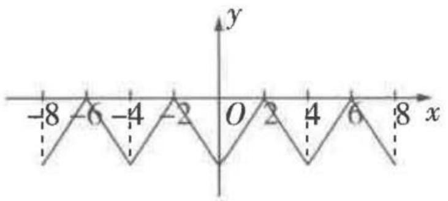

line

| x | y |
|---|---|
| -8 | -2 |
| -6 | 2 |
| -4 | -2 |
| -2 | 2 |
| 0 | -2 |
| 2 | 2 |
| 4 | -2 |
| 6 | 2 |
| 8 | -2 |

图2-1

令 x = -2 ，得 $f(-2 + 4) = f(-2) - f(2) = 0$ ，所以 $f(2) = f(-2) = 0$

所以 $f(x+4)=f(x)$ ，所以 4 是函数 $f(x)$ 的周期.

对任意的 $x_{1}, x_{2} \in [0, 2] (x_{1} \neq x_{2})$ ，都有 $\frac{f(x_{1}) - f(x_{2})}{x_{2} - x_{1}} < 0$ ，即 $\frac{f(x_{1}) - f(x_{2})}{x_{1} - x_{2}} > 0$

所以 $f(x)$ 在[0,2]上单调递增,作出 $f(x)$ 的草图如图2-1所示.

【提示】草图不草，图象的最高(低)点、函数的周期性、单调性等规律要准确画出来由图象可得 $f(-3)=f(3)>f(4)$ 且 $f(\frac{11}{2})>f(5)=f(3)=f(-3)$ ，

所以 $0 > f(\frac{11}{2}) > f(-3) > f(4), \frac{1}{f(\frac{11}{2})} < \frac{1}{f(-3)} < \frac{1}{f(4)}$

所以选项 C 正确. 故选 C.

# 超重点 3 函数图象的识别及应用

# 命题角度1 利用函数图象的变换法则识别图象

调研 1 (2022·浙江富阳中学、浦江中学5月联考)设a>0且 $a\neq1,b\in\mathbb{R}$ ，函数 $f(x)=a^{x-b},g(x)=\log_{a}(x+b)$ ，则函数 $f(x),g(x)$ 在同一平面直角坐标系内的图象可能为（）

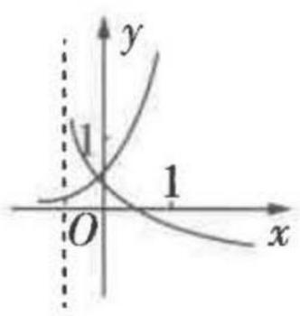

text_image

y
1
O
1
x

A

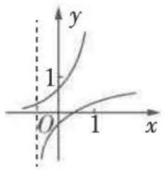

text_image

y
1
O
1
x

B

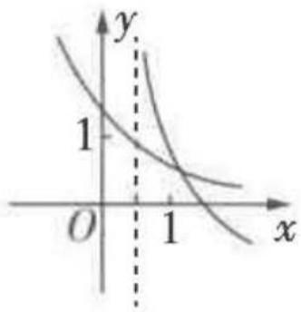

text_image

y
1
O
1
x

C

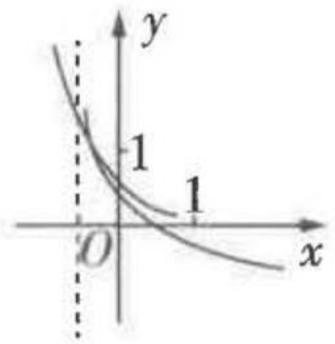

line

| x    | y (Curve 1) | y (Curve 2) |
| ---- | ------------ | ------------ |
| 0    | 1            | 1            |
| >0   | <1           | <1           |

D

解析 函数 $f(x) = a^{x - b}, g(x) = \log_a (x + b)$ 的单调性相同，故 A 错误.

①当 0 < a < 1 时, $f(x) = a^{x - b}$ , $g(x) = \log_{a}(x + b)$ 在定义域内均单调递减, 令

【敲黑板】分类讨论底数 a，根据 a 对指数型与对数型函数单调性的影响，图象的平移规律，以及图象与坐标轴的交点与刻度 1 的关系，即可排除求解 $g(x) = \log_{a}(x + b) = 0$ ，得 x = 1 - b.

对于选项 C, 由图可知 $1 - b > 1$ , 则 $b < 0$ , 且此时曲线 $g(x) = \log_a (x + b)$ 的“渐近线”为直线 $x = -b$ , 由图可知, $0 < -b < 1$ , 解得 $-1 < b < 0$ , 此时 $f(0) = a^{-b} < 1$ . 但这与选项 C 中曲线 $f(x)$ 与 $y$ 轴交点的纵坐标大于 1 矛盾, 故 C 错误.

对于选项 D, 由 $f(0)=a^{-b}<1$ , 解得 b<0, 此时 $g(0)=\log_{a}b$ 无意义, 与图不符, 故 D 错误.

②当 a > 1 时, $f(x) = a^{x - b}$ , $g(x) = \log_{a}(x + b)$ 在定义域内均单调递增. 当 0 < b < 1 时, $f(0) = a^{-b} < 1$ , $g(0) = \log_{a} b < 0$ , 且当 $g(x) = \log_{a}(x + b) = 0$ 时, $x = 1 - b \in (0, 1)$ , 与选项 B 符合. 故选 B.

调研 2 (2022·江西上饶中学、景德镇二中等校5月联考)函数 $f(x)=\log_{2}(|x|-1)$ 的图象为 ( )

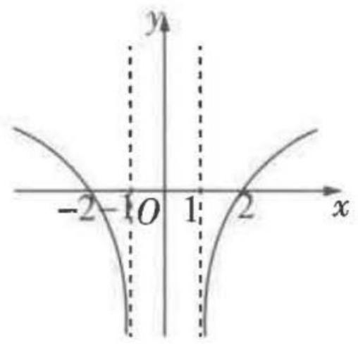

text_image

-2
O
1
2
x
y

A

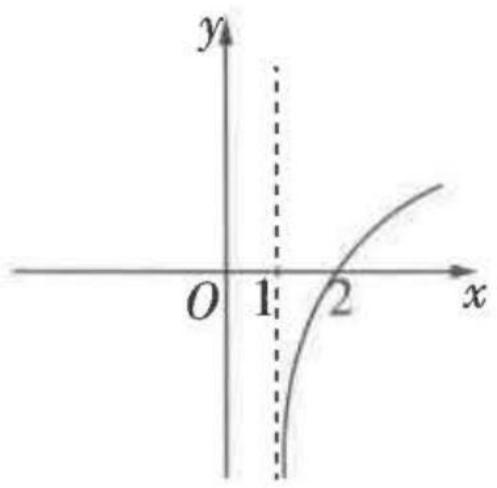

text_image

y
O 1 2 x

B

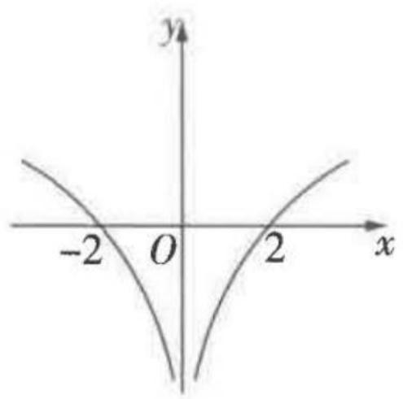

text_image

Graph of a parabola opening to the right, with x-axis ranging from -2 to 2 and y-axis from 0 to 2, showing symmetric upward curvature.

C

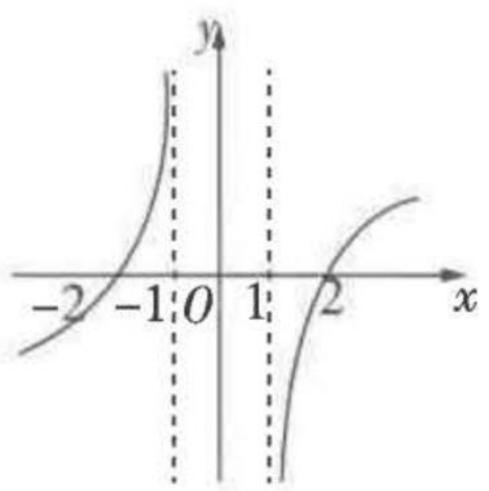

line

| x    | y     |
| ---- | ----- |
| -2   | -2    |
| -1   | 0     |
| 0    | 1     |
| 1    | 0     |
| 2    | 2     |

D

解析 函数 $f(x) = \log_2(|x| - 1)$ 的定义域为 $(-\infty, -1) \cup (1, +\infty)$ ，当 $x > 1$ 时， $f(x)$ 单调递增，由 $f(-x) = \log_2(|-x| - 1) = \log_2(|x| - 1) = f(x)$ ，可知函数 $f(x)$ 为偶函数，其图象关于 $y$ 轴对称。综上，选 A.

# 命题角度2 非基本初等函数图象的识别问题

调研 3 (2022·长沙雅礼中学4月检测)函数 $y = -\cos x \ln |x|$ 的图象可能是()

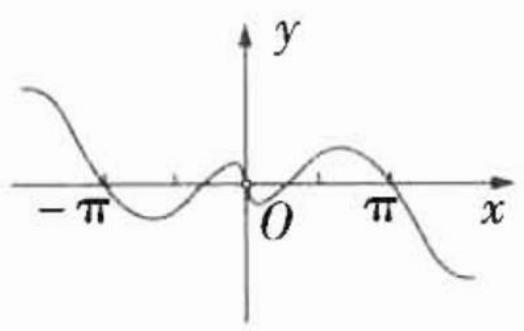

text_image

-π
O
π
x
y

A

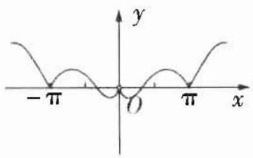

text_image

-π
O
π
x
y

B

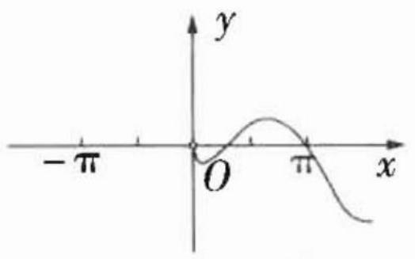

text_image

- π
O
π
x
y

C

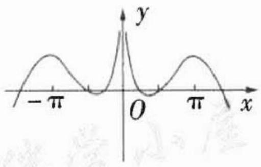

text_image

-π
O
π
x
y

D

解析 函数 $y = -\cos x \ln |x|$ 的定义域为 $\{x \mid x \neq 0\}$ ，又 $-\cos (-x) \ln |-x| = -\cos x \ln |x|$ ，所以函数 $y = -\cos x \ln |x|$ 是偶函数，其图象关于 $y$ 轴对称，可排除 AC 选项.

当 $x \in (0,1)$ 时， $y = -\cos x \ln x > 0$ ，所以 B 选项错误，故选 D.

秒杀解 取特殊值, 当 $x = \pi$ 时, $y = -\cos \pi \ln \pi = \ln \pi > 0$ , 排除 ABC, 选 D.

# 命题角度3> 函数的图象与性质的综合应用

调研 4 (2022·山东潍坊 4 月二模) 已知定义在 $[0, +\infty)$ 上的函数 $f(x)$ 满足 $f(x+2)=f(x)$ , 且当 $x \in [0,2]$ 时, $f(x)=\left\{\begin{aligned}\sqrt{3}x, &0 \leqslant x \leqslant 1, \\ -\sqrt{3}x + 2\sqrt{3}, &1 < x \leqslant 2.\end{aligned}\right.$ $f(x)$ 的图象与 $x$ 轴的

交点从左至右依次为 $O$ (坐标原点), $B_{1}, B_{2}, B_{3}, \cdots, B_{n}, \cdots, f(x)$ 的图象与直线 $y=\sqrt{3}$ 的

交点从左至右依次为 $A_{1}, A_{2}, A_{3}, \cdots, A_{n}, \cdots$ . 若 $C_{1}, C_{2}, C_{3}, \cdots, C_{10}$ 为线段 $A_{8}B_{8}$ 上的 10 个

不同的点, 则 $\sum_{i=1}^{10} (\overrightarrow{OA_{2}} \cdot \overrightarrow{OC_{i}})=$ \_\_\_\_.

因为定义在 $[0, +\infty)$ 上的函数 $f(x)$ 满足 $f(x + 2) = f(x)$ , 所以 $f(x)$ 是在 $[0, +\infty)$ 上的周期为 2 的周期函数, 且当 $x \in [0, 2]$ 时, $f(x) = \begin{cases} \sqrt{3}x, & 0 \leqslant x \leqslant 1, \\ -\sqrt{3}x + 2\sqrt{3}, & 1 < x \leqslant 2. \end{cases}$ .

作出函数 $f(x)$ 的图象及直线 $y=\sqrt{3}$ ，如图3-1所示.

【突破口】正确作出函数 $f(x)$ 的图象非常关键，采用数形结合的方法，虽然线段 $A_{8}B_{8}$ 上10个不同的点为一般点，但经计算数量识均为定值

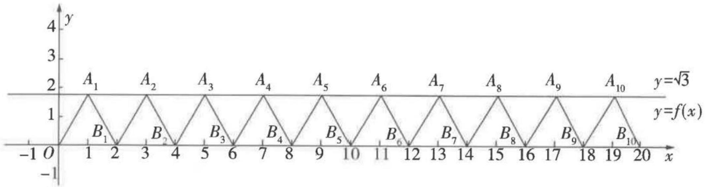

line

| x  | y   |
|----|-----|
| 1  | 1   |
| 2  | 0   |
| 3  | 1   |
| 4  | 0   |
| 5  | 1   |
| 6  | 0   |
| 7  | 1   |
| 8  | 0   |
| 9  | 1   |
| 10 | 0   |
| 11 | 1   |
| 12 | 0   |
| 13 | 1   |
| 14 | 0   |
| 15 | 1   |
| 16 | 0   |
| 17 | 1   |
| 18 | 0   |
| 19 | 1   |
| 20 | 0   |

图3-1

依题意可得 $A_{2}(3,\sqrt{3})$ , $A_{8}(15,\sqrt{3})$ , $B_{8}(16,0)$ ，且直线 $A_{8}B_{8}$ 的方程为 $y=-\sqrt{3}(x-16)=-\sqrt{3}x+16\sqrt{3}$ 。设 $C_{i}(x_{i},-\sqrt{3}x_{i}+16\sqrt{3})$ , $x_{i}\in[15,16]$ , $i=1,2,3,\cdots,10$ 。

所以 $\overrightarrow{OA_2} = (3, \sqrt{3})$ , $\overrightarrow{OC_i} = (x_i, -\sqrt{3} x_i + 16\sqrt{3})$ , 所以 $\overrightarrow{OA_2} \cdot \overrightarrow{OC_i} = 3x_i + \sqrt{3} (-\sqrt{3} x_i + 16\sqrt{3}) = 48$ , 所以 $\sum_{i=1}^{10} (\overrightarrow{OA_2} \cdot \overrightarrow{OC_i}) = 10 \times 48 = 480$ .

# 新题演练

1. (2022·天津南开中学5月统练)函数 $f(x)=\ln|\frac{1-x}{1+x}|$ 的大致图象为 ( )

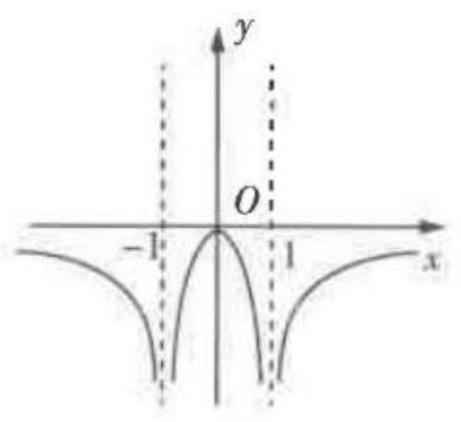

text_image

y
O
-1
1
x

A

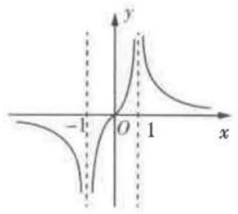

line

| x    | y     |
| ---- | ----- |
| -1   | -1    |
| 0    | 0     |
| 1    | 1     |

B

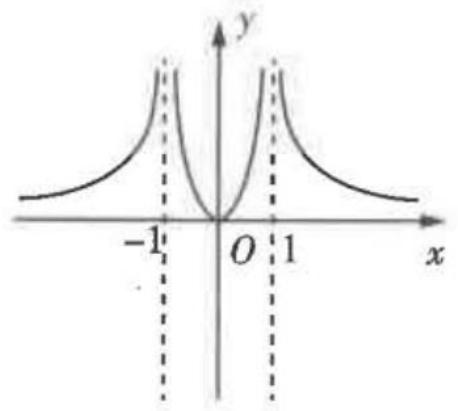

line

| x    | y     |
| ---- | ----- |
| -1   | 0     |
| 0    | 0     |
| 1    | 0     |

C

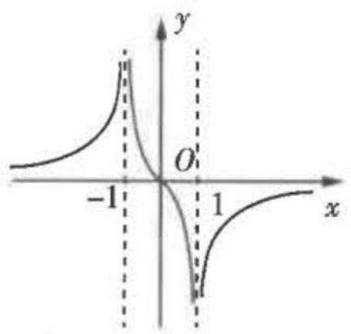

text_image

y
O
-1
1
x

D

2. (2022·天津河西区5月质量调查)函数 $f(x)=\frac{1-x^{2}}{\ln(2+x)-\ln(2-x)}$ 的大致图象是()

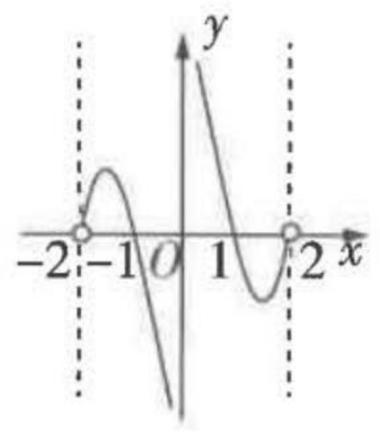

text_image

-2
-1
O
1
2
x
y

A

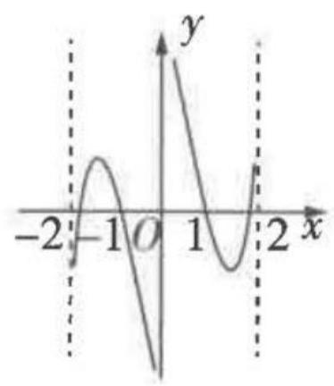

line

| x    | y     |
| ---- | ----- |
| -2   | -1.5  |
| -1   | 0.8   |
| 0    | -1.5  |
| 1    | 0.8   |
| 2    | -1.5  |

B

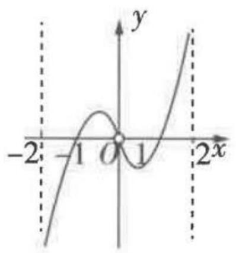

text_image

-2
-1
O
1
2x
y

C

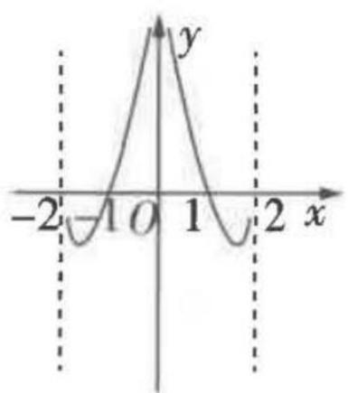

line

| x   | y   |
| --- | --- |
| -2  | -∞  |
| -1  | -∞  |
| 0   | 1   |
| 1   | -∞  |
| 2   | -∞  |

D

3. (2022·安徽宣城二模/数学文化)我国著名数学家华罗庚曾说: “数缺形时少直觉,形少数时难入微,数形结合百般好,隔裂分家万事非.”在数学的学习和研究中,常用函数的图象来研究函数的性质,也常用函数的解析式来研究函数图象的特征. 我们从某个商标中抽象出一个如图 3-2 所示的图象,其对应的函数解析式可能是

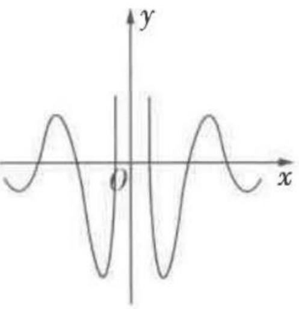

text_image

y
O
x

图3-2

A. $f(x) = \frac{\sin 6x}{2^{-x} - 2^x}$

B. $f(x) = \frac{\cos 6x}{2^x - 2^{-x}}$

C. $f(x) = \frac{\cos 6x}{|2^x - 2^{-x}|}$

D. $f(x) = \frac{\sin 6x}{|2^x - 2^{-x}|}$

4. (2022·天津芦台一中 4 月模拟) 已知函数 $f(x) = \frac{2x^3}{\mathrm{e}^x - 1}$ , 则 $f(x)$ 的大致图象为 ( )

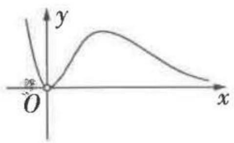

text_image

y
O
x

A

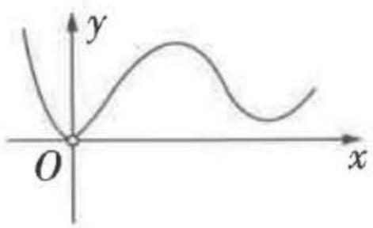

text_image

y
O
x

B

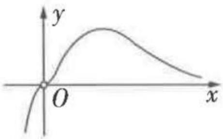

text_image

y
O
x

C

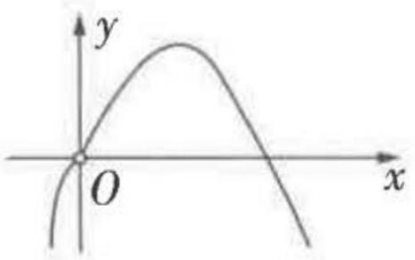

text_image

y
O
x

D

5. (2022·重庆八中 5 月模拟/答案不唯一) 计算机绘图是相对于手工绘图而言的一种高效率、高质量的绘图技术, 利用计算机绘制函数图象时可以得到很多美丽的图形, 我们把图象形似如图 3-3 所示图形的函数称为 $m$ 型函数. 写出一个定义域为 $[-2, 2]$ 且值域为 $[0, 2]$ 的 $m$ 型函数 \_\_\_\_.

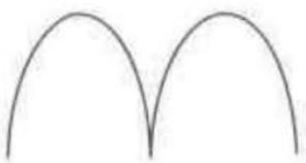  
图3-3

# 参考答案与解析

1. D 函数 $f(x)=\ln|\frac{1-x}{1+x}|$ 的定义域为 $\{x\mid x\neq\pm1\}$ . 当 $x=\frac{1}{2}$ 时, $f(\frac{1}{2})=-\ln3<0$ , 排除 BC; 当 x=-2 时, $f(-2)=\ln3>0$ , 排除 A. 选 D.

【另解】 $f(-x)=\ln|\frac{1+x}{1-x}|=-\ln|\frac{1-x}{1+x}|=-f(x)$ ，故 $f(x)$ 是奇函数，排除A

2. A 由 $\left\{ \begin{array}{l} 2 - x > 0, \\ 2 + x > 0, \\ \ln (2 + x) - \ln (2 - x) \neq 0 \end{array} \right.$ 可得 $-2 < x < 2$ 且 $x \neq 0$ , 故函数 $f(x)$ 的定义域为

$$
(- 2, 0) \cup (0, 2).
$$

$f(-x)=\frac{1-x^{2}}{\ln(2-x)-\ln(2+x)}=-f(x)$ ，所以函数 $f(x)$ 为奇函数，排除D选项.

【点拨】偶函数的图象关于 $y$ 轴对称，奇函数的图象关于原点对称，由此排除错误选项

当 0 < x < 1 时, $1 - x^{2} > 0$ , $2 + x > 2 - x > 0$ , 则 $\ln(2 + x) > \ln(2 - x)$ , 则 $f(x) > 0$ , 排除

【另解】也可以利用当-1<x<0时， $f(x)<0$ ，排除C

C 选项.

当 $x \to 2$ 时, $1 - x^2 \to -3$ , $\ln(2 + x) - \ln(2 - x) \to +\infty$ , 所以 $f(x) \to 0$ 且 $f(x) < 0$ , 排除 B 选项. 故选 A.

3. C 因为函数图象关于 y 轴对称, 所以此函数为偶函数.

对于 A 选项, $f(-x)=\frac{\sin(-6x)}{2^{x}-2^{-x}}=\frac{-\sin6x}{-(2^{-x}-2^{x})}=\frac{\sin6x}{2^{-x}-2^{x}}=f(x)$ , $f(x)$ 是偶函数,
当 x>0 时, 令 $f(x)=0$ , 则 $\sin 6x=0$ , 得 $x=\frac{k\pi}{6}(k\in\mathbf{N}^{*})$ , 则当 x>0 时, 函数的第一个零点为 $x=\frac{\pi}{6}$ , 当 $0<x<\frac{\pi}{6}$ 时, $\sin 6x>0,2^{-x}-2^{x}<0$ , $f(x)<0$ , A 不符合题意.

对于 B 选项, $f(-x)=\frac{\cos(-6x)}{2^{-x}-2^{x}}=\frac{\cos6x}{-(2^{x}-2^{-x})}=-\frac{\cos6x}{2^{x}-2^{-x}}=-f(x)$ , $f(x)$ 是奇函数,不符合题意.

对于 C 选项, $f(-x)=\frac{\cos(-6x)}{|2^{-x}-2^{x}|}=\frac{\cos6x}{|2^{x}-2^{-x}|}=f(x)$ , $f(x)$ 是偶函数,当 x>0 时,令 $f(x)=0$ ,则 $\cos 6x=0$ ,得 $x=\frac{\pi}{12}+\frac{k\pi}{6}(k\in\mathbb{N})$ ,所以当x>0时,函数的第一个零点为 $x=\frac{\pi}{12}$ ,当 $0<x<\frac{\pi}{12}$ 时, $\cos 6x>0,|2^{x}-2^{-x}|>0,f(x)>0$ ,符合题意.

对于 D 选项, $f(-x)=\frac{\sin(-6x)}{|2^{-x}-2^{x}|}=\frac{-\sin6x}{|2^{x}-2^{-x}|}=-\frac{\sin6x}{|2^{x}-2^{-x}|}=-f(x)$ , $f(x)$ 是奇函数,不符合题意.故选 C.

4. A 方法一 $f'(x)=\frac{(2x^{3})'(\mathrm{e}^{x}-1)-2x^{3}(\mathrm{e}^{x}-1)}{(\mathrm{e}^{x}-1)^{2}}=\frac{2x^{2}[3(\mathrm{e}^{x}-1)-xe^{x}]}{(\mathrm{e}^{x}-1)^{2}}$ .

令 $h(x) = 3(\mathrm{e}^x -1) - x\mathrm{e}^x (x\neq 0)$ ，则 $h^\prime (x) = 3\mathrm{e}^x -(\mathrm{e}^x +x\mathrm{e}^x) = (2 - x)\mathrm{e}^x$

当 0 < x < 2 时, $h'(x) > 0$ , $h(x)$ 单调递增, 当 x > 2 时, $h'(x) < 0$ , $h(x)$ 单调递减,

$$
h (2) = \mathrm{e} ^ {2} - 3 > 0, h (3) = 3 (\mathrm{e} ^ {3} - 1) - 3 \mathrm{e} ^ {3} = - 3 <   0,
$$

由函数零点存在定理可得, $\exists x_0 \in (2,3)$ , 使得 $h(x_0) = 0$ , 易知当 $0 < x < 2$ 时, $h(x) > 0$ , 所以当 $x \in (0, x_0)$ 时, $h(x) > 0, f'(x) > 0, f(x)$ 在 $(0, x_0)$ 上单调递增, 当 $x \in (x_0, +\infty)$ 时, $h(x) < 0, f'(x) < 0, f(x)$ 在 $(x_0, +\infty)$ 上单调递减.

当 $x < 0$ 时, $h'(x) > 0$ , 所以 $h(x)$ 单调递增, 所以 $h(x) < 0$ , 所以 $f'(x) < 0$ , 所以 $f(x)$ 在 $(- \infty, 0)$ 上单调递减.

综上,选A.

方法二 因为 $f(x)=\frac{2x^{3}}{\mathrm{e}^{x}-1}$ ，所以 $f(-1)=\frac{-2}{\frac{1}{\mathrm{e}}-1}=\frac{2\mathrm{e}}{\mathrm{e}-1}>0$ ，排除CD；当 $x\to+\infty$ 时， $f(x)\rightarrow0$ 且 $f(x)>0$ ，排除B.选A.

5. $f(x)=2\sqrt{|x|(2-|x|)}$ (答案不唯一) 根据题意,结合对称性,不妨选择二次函数作为基础函数,由题图知,该函数为偶函数,可以认为其有3个零点 $(-2,0)$ , $(0,0)$ ,
【点拨】由题知所求函数的定义域、值域、图象的对称性，由此利用二次函数变换可得所求
(2,0)，且 $x \in [-2,0]$ 时图象的对称轴为直线 $x = -1, f(-1) = 2, x \in [0,2]$ 时图象的对称轴为直线 $x = 1, f(1) = 2$ .

则满足条件的函数可以是 $f(x) = 2|x|(2 - |x|)(-2 \leqslant x \leqslant 2)$ 或 $f(x) = 2\sqrt{|x|(2 - |x|)}$ 或 $f(x) = 2|\sin \frac{\pi}{2} x|(-2 \leqslant x \leqslant 2)$ 等, 答案不唯一.

# 超重点 4 函数的零点问题

# 命题角度1> 函数零点个数的判断

调研 1 (2022 · 成都 5 月三诊) 函数 $f(x) = x \mathrm{e}^{x} - x - \ln x - 1$ 的零点个数为 ( )

A. 0

B. 1

C. 2

D. 3

# 思维导引

确定函数 $f(x)$ 的定义域，求导

确定函数 $f(x)$ 的单调性和最值

判断其零点的个数

解析 依题意可知函数 $f(x)$ 的定义域为 $(0, +\infty)$ .

$$
f ^ {\prime} (x) = \mathrm{e} ^ {x} + x \mathrm{e} ^ {x} - 1 - \frac {1}{x} = \mathrm{e} ^ {x} (x + 1) - \frac {x + 1}{x} = (x + 1) (\mathrm{e} ^ {x} - \frac {1}{x}) = \frac {(x + 1) (x \mathrm{e} ^ {x} - 1)}{x},
$$

令 $h(x) = x\mathrm{e}^{x} - 1, x \in (0, +\infty)$ ，则 $h'(x) = \mathrm{e}^{x} + x\mathrm{e}^{x} > 0$ ，故 $h(x)$ 在 $(0, +\infty)$ 上单【扫清障碍】由于函数 $y = x{\mathrm{e}}^{x} - 1$ 的零点不能直接得出, 因此要构造函数 $h\left( x\right)  = x{\mathrm{e}}^{x} - 1$ , 研究函数 $h\left( x\right)$ 的零点, 进而得出 ${f}^{\prime }\left( x\right)$ 的正负性调递增，

又 $0 \times e^{0} - 1 = -1 < 0, h(1) = e - 1 > 0$

所以存在唯一的 $x_0 \in (0,1)$ ，使得 $h(x_0) = x_0 e^{x_0} - 1 = 0$ ，即 $e^{x_0} = \frac{1}{x_0}, x_0 = -\ln x_0$

【突破口】此处涉及“隐零点”，处理“隐零点”问题的基本思路是“整体代换思想”，即根据题目需要利用 $x_0 = -\ln x_0$ 进行相互转化

所以当 $0 < x < x_0$ 时， $h(x) < 0, f'(x) < 0, f(x)$ 单调递减，当 $x > x_0$ 时， $h(x) > 0, f'(x) > 0, f(x)$ 单调递增，所以 $f(x)_{\min} = f(x_0) = x_0 e^{x_0} - x_0 - \ln x_0 - 1 = 1 - x_0 + x_0 - 1 = 0,$

所以函数 $f(x) = x\mathrm{e}^{x} - x - \ln x - 1$ 的零点个数为1. 故选B.

调研 2 (2022·浙江绍兴上虞区 5 月二模节选)已知函数 $f(x)=\mathrm{e}^{x}-2x-(a+1)$ (其中 $e\approx2.71828$ , 是自然对数的底数), 试讨论函数 $f(x)$ 的零点个数.

解析 方法一 （分离参数法）依题意, 函数 $f(x)$ 的零点个数问题等价于方程 $f(x)=0$ 根的个数问题, 也等价于函数 y=a 和函数 $y=e^{x}-2x-1$ 图象的交点个数问题, 因此可令 $p(x)=\mathrm{e}^{x}-2x-1$ , 其中 $x\in R$ ,

则 $p'(x)=\mathrm{e}^{x}-2$ , 令 $p'(x)=0$ , 得 $x=\ln2$ , 列表如下.

<table><tr><td>x</td><td>(-∞,ln2)</td><td>ln2</td><td>(ln2,+∞)</td></tr><tr><td>p&#x27;(x)</td><td>-</td><td>0</td><td>+</td></tr><tr><td>p(x)</td><td>单调递减</td><td>极小值1-2ln2</td><td>单调递增</td></tr></table>

作出函数 $p(x)$ 的大致图象, 如图 4-1 所示, 结合图象可得当 $a < 1 - 2 \ln 2$ 时, 函数 $f(x)$ 无零点; 当 $a = 1 - 2 \ln 2$ 时, 函数 $f(x)$ 有一个零点; 当 $a > 1 - 2 \ln 2$ 时, 函数 $f(x)$ 有

两个零点.

方法二 (分类讨论法) $f(x)=\mathrm{e}^{x}-2x-(a+1),x\in\mathbb{R},$

则 $f'(x) = \mathrm{e}^x - 2$ ，令 $f'(x) = \mathrm{e}^x - 2 = 0$ ，得 $x = \ln 2$ .

当 $x \in (-\infty, \ln 2)$ 时， $f'(x) < 0$ ，函数 $f(x)$ 在 $(- \infty, \ln 2)$ 上单调递减，

当 $x \in (\ln 2, +\infty)$ 时, $f'(x) > 0$ , 函数 $f(x)$ 在 $(\ln 2, +\infty)$ 上单调递增,

所以当 $x = \ln 2$ 时，函数 $f(x)$ 取得极小值，极小值为 $f(\ln 2) = 2 - 2\ln 2 - (a + 1)$ .

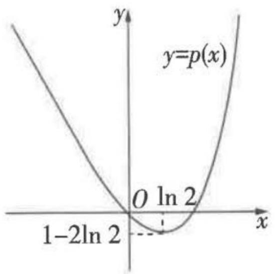

text_image

y=p(x)
O ln 2
1-2ln 2
x
y

图4-1

当 $2 - 2 \ln 2 - (a + 1) = 0$ ，即 $a = 1 - 2 \ln 2$ 时，函数 $f(x)$ 有唯一零点；

当 $2 - 2 \ln 2 - (a + 1) > 0$ ，即 a < 1 - 2 $\ln 2$ 时，函数 $f(x)$ 无零点；

当 $2 - 2\ln 2 - (a + 1) < 0$ ，即 $a > 1 - 2\ln 2$ 时，易知当 $x \to -\infty$ 时， $f(x) \to +\infty$ ，当 $x \to +\infty$ 时， $f(x) \to +\infty$ ，故函数 $f(x)$ 有两个零点。

【警示】务必交待清楚函数 $f(x)$ 图象的变化趋势，有时函数图象存在“渐近线”，不仔细判断可能会导致错误

综上, 当 $a = 1 - 2 \ln 2$ 时, 函数 $f(x)$ 有一个零点; 当 $a < 1 - 2 \ln 2$ 时, 函数 $f(x)$ 无零点; 当 $a > 1 - 2 \ln 2$ 时, 函数 $f(x)$ 有两个零点.

方法三 函数 $f(x)=\mathrm{e}^{x}-2x-(a+1)$ 的零点个数问题等价于函数 $y=e^{x}$ 与 $y=2x+(a+1)$ 的图象的交点个数问题.

易知 $y = {2x} + \left( {a + 1}\right)$ 是斜率为 2 的平行直线系方程,

【点拨】采用半分离参数法，在一般情况下得到的是直线系方程，多为过定点的直线系方程或平行直线系方程

设 $(x_0, y_0)$ 为函数 $y = \mathrm{e}^x$ 图象上任意一点，则过该点的切线方程为 $y - y_0 = \mathrm{e}^{x_0}(x - x_0)$ ，令 $\mathrm{e}^{x_0} = 2$ ，则 $x_0 = \ln 2$ ，此时切线方程为 $y = 2x - 2\ln 2 + 2$ 。

所以当 $2 - 2\ln 2 = a + 1$ ，即 $a = 1 - 2\ln 2$ 时，函数 $f(x)$ 有唯一零点；

当 $2 - 2 \ln 2 > a + 1$ ，即 $a < 1 - 2 \ln 2$ 时，函数 $f(x)$ 无零点；

当 $2 - 2 \ln 2 < a + 1$ ，即 $a > 1 - 2 \ln 2$ 时，函数 $f(x)$ 有两个零点.

综上, 当 $a = 1 - 2 \ln 2$ 时, 函数 $f(x)$ 有一个零点; 当 $a < 1 - 2 \ln 2$ 时, 函数 $f(x)$ 无零点; 当 $a > 1 - 2 \ln 2$ 时, 函数 $f(x)$ 有两个零点.

# 方法提炼

# 有关含参函数的零点问题的求解策略

(1)通常从以下三个方面考虑: 可否带参实施分类讨论、可否分离参数、可否半分离参数. (2)转化为两个新函数的图象交点问题时, 通过作出两个函数的图象(通常转化为已经掌握性质的基本初等函数与另一函数的图象问题, 注意过定点直线系与平行直线系的应用), 结合其图象的特征(如对称性)进行处理.

# 命题角度2 已知函数零点个数情况确定参数范围

调研 3 (2022 · 山东济宁 4 月二模) 已知函数 $f(x) = \begin{cases} x, & x \leqslant 0, \\ a \ln x, & x > 0, \end{cases}$ 若函数 $g(x) = f(x) - f(-x)$ 有 5 个零点, 则实数 $a$ 的取值范围是 ( )

A. $(-e,0)$

B. $(- \frac{1}{\mathrm{e}}, 0)$

C. $(-∞,-e)$

D. $(-∞,-\frac{1}{e})$

# 思维导引

# 思路1

依题意可得 $a < 0$

通过分析得到当 x > 0 时, 方程 $-x = a \ln x$ (a 为参数) 要有 2 个根

参变分离后构造函数 $h(x) = -\frac{x}{\ln x}$

研究其单调性、极值

实数 $a$ 的取值范围

# 思路 2

先作出函数 $f(x)$ 的大致图象

分析得到 $y = -x$ 与 $y = a\ln x$ 的图象有2个交点

研究当 $x > 0$ 时，函数 $y = a\ln x$ 图象的切线

a 的“临界值”→实数 a 的取值范围

解析 方法一 易知 $y=f(-x)$ 与 $y=f(x)$ 的图象关于 y 轴对称, 且 $f(0)=0$ , 则 $a \geqslant 0$ 不符合题意, 所以 a < 0.

【关键】根据函数 $g(x)$ 的特征，初步确定参数a的范围

若函数 $g(x)=f(x)-f(-x)$ 有 5 个零点，则结合对称性可知，当 x>0 时， $g(x)$ 需有 2 个零点，即方程 $-x=a\ln x$ (a 为参数) 要有 2 个根.

当 $x = 1$ 时， $-1\neq 0$ ，所以 $x = 1$ 不是方程 $-x = a\ln x$ 的根，

故当 $x > 0$ 且 $x \neq 1$ 时, $a = -\frac{x}{\ln x}$ ( $a$ 为参数)有2个根.

【警示】欲采用分离参数法确定参数的范围，因此要对于 $\ln x$ 是否为0进行分类讨论

令 $h(x) = -\frac{x}{\ln x}$ , 定义域为 $(0,1) \cup (1, +\infty)$ , 则 $h'(x) = \frac{1 - \ln x}{(\ln x)^2}$ ,

令 $h'(x) > 0$ 得 $0 < x < 1$ 或 $1 < x < \mathrm{e}$ , 令 $h'(x) < 0$ 得 $x > \mathrm{e}$ ,

故 $h(x) = -\frac{x}{\ln x}$ 在 $(0,1),(1,\mathrm{e})$ 上单调递增，在 $(\mathrm{e}, + \infty)$ 上单调递减，且当 $x\in$ (0,1)时， $h(x) = -\frac{x}{\ln x} >0$ 恒成立， $h(x) = -\frac{x}{\ln x}$ 在 $x = \mathrm{e}$ 处取得极大值， $h(\mathrm{e}) = -\mathrm{e}$ ，当 $x\to 1$ 且 $x > 1$ 时， $h(x)\rightarrow -\infty$ ，当 $x\to +\infty$ 时， $h(x)\rightarrow -\infty .$

故 $a \in (-\infty, -\mathrm{e})$ ，此时直线 $y = a$ 与曲线 $h(x) = -\frac{x}{\ln x}$ 有2个交点， $g(x)$ 有5个零点。故选C.

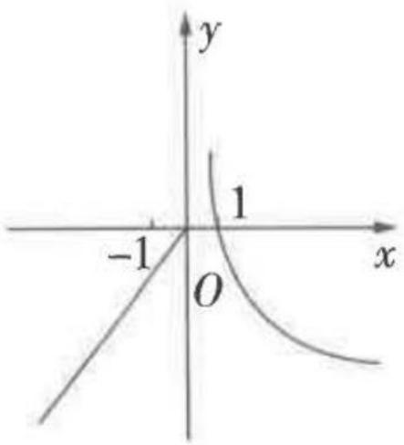

text_image

y
1
-1 O x

图4-2

方法二 由题意分析可知 $a \geqslant 0$ 不符合题意, 所以 $a < 0$ .

如图4-2,作出函数 $f(x)$ 的大致图象,由于函数 $y=f(-x)$ 的图象与函数 $y=f(x)$ 的图象关于y轴对称,

根据对称性可知,要使 $g(x)=f(x)-f(-x)$ 有 5 个零点,

则当 $x > 0$ 时, 函数 $y = -x$ 与 $y = a \ln x$ 的图象必须存在 2 个交点. 设 $(x_0, y_0)$ (其中 $x_0 > 0$ ) 为 $y = a \ln x$ 图象上一点, 则曲线 $y = a \ln x$ 在该点处的切线方程为 $y - y_0 = \frac{a}{x_0} (x - x_0)$ ,

【点拨】由“数形结合”思想,利用 “切线” 和函数图象的特征,确定参数 $a$ 的临界值,再由临界值进而确定参数的范围

即 $y = \frac{a}{x_0} (x - x_0) + y_0$ ，令 $\frac{a}{x_0} = -1$ ，设点(0,0)在切线上，于是有 $0 - y_0 = \frac{a}{x_0} (0 - x_0)$ ，解得 $x_0 = e, a = -e$ ，此时直线 $y = -x$ 与曲线 $y = a\ln x$ 相切，因此当 $a < -e$ 时， $y = -x$ 与 $y = a\ln x$ 的图象有2个交点。故选C.

# 命题角度3 有关函数零点的和、积的值或范围问题

调研 4 （2022 · 福建莆田 5 月三模改编）已知函数 $f(x) = \left\{\begin{aligned} &|3^{x}-1|, x<1, \\ &-4x^{2}+16x-13, x\geqslant1,\end{aligned}\right.$ 函数 $g(x)=f(x)-a$ ，则下列结论不正确的是（）

A. 若 $g(x)$ 有 3 个不同的零点, 则 a 的取值范围是 [1,2)  
B. 若 $g(x)$ 有 4 个不同的零点, 则 a 的取值范围是 $(0,1)$

C. 若 $g(x)$ 有 4 个不同的零点 $x_{1}, x_{2}, x_{3}, x_{4} (x_{1} < x_{2} < x_{3} < x_{4})$ ，则 $x_{3} + x_{4} = 4$

D. 若 $g(x)$ 有 4 个不同的零点 $x_{1}, x_{2}, x_{3}, x_{4} (x_{1} < x_{2} < x_{3} < x_{4})$ ，则 $x_{3}x_{4}$ 的取值范围是 $(\frac{13}{4}, \frac{7}{2})$

解析 令 $g(x) = f(x) - a = 0$ ，得 $f(x) = a$ ，所以 $g(x)$ 的零点个数为函数 $y = f(x)$ 与 $y = a$ 图象的交点个数，作出函数 $y = f(x)$ 与 $y = a$ 的大致图象，如图4-3所示.

由图可知, 若 $g(x)$ 有 3 个不同的零点, 则 a 的取值范围是 [1, 2) $\cup \{0\}$ , 所以 A 选项不正确.

若 $g(x)$ 有 4 个不同的零点, 则 a 的取值范围是 $(0,1)$ , 所以 B 选项正确.

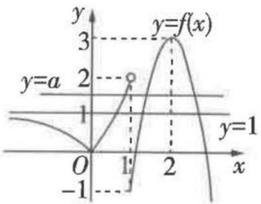

line

| x | y = f(x) |
|---|----------|
| 0 | 0        |
| 1 | 2        |
| 2 | 3        |

图4-3

若 $g(x)$ 有 4 个不同的零点 $x_{1}, x_{2}, x_{3}, x_{4} (x_{1} < x_{2} < x_{3} < x_{4})$ ，此时 $(x_{3}, 0), (x_{4}, 0)$ 关于直线 x = 2 对称，所以 $x_{3} + x_{4} = 4$ ，所以 C 选项正确。

【点拨】两零点满足“对称性”，即两零点之和为其“对称轴”与x轴的交点横坐标的2倍

由 C 选项可知 $x_{3}=4-x_{4}$ ，所以 $x_{3}x_{4}=(4-x_{4})x_{4}=-x_{4}^{2}+4x_{4}$

由于 $g(x)$ 有 4 个不同的零点, a 的取值范围是 $(0,1)$ ,

【易错】一定要注意零点的变化范围，否则会导致错误的结果

故 $0 < -4x_{4}^{2} + 16x_{4} - 13 < 1$ ，所以 $\frac{13}{4} < -x_{4}^{2} + 4x_{4} < \frac{7}{2}$ ，

所以 D 选项正确. 故选 A.

# 方法总结

# 求解有关函数的零点之和(积)问题的3个关键点

(1) 判断两零点是否 “轴对称”, 一旦满足了对称性, 两零点之和为定值; (2) 判断两零点之积是否为定值; (3) 以数形结合的方法确定零点的取值范围.

# 命题角度4 有关函数零点的综合应用问题

调研 5 (2022·河南开封 5 月三模/交汇三角函数)已知函数 $f(x)=\mathrm{e}^{x}-a(x+\cos x)$ ，其中 a>0，且满足 $\forall x\in[0,+\infty)$ ， $f(x)\geqslant0$ 恒成立.

(1) 求实数 a 的取值范围;  
(2) 令 $g(x) = f(x) - \frac{1}{x}$ , 判断 $g(x)$ 在 $(0, +\infty)$ 内的零点个数, 并说明理由.

解析 (1) 因为 $f(0) = 1 - a \geqslant 0$ , 所以 $0 < a \leqslant 1$ .

对 $f(x)$ 求导得 $f'(x)=\mathrm{e}^{x}-a(1-\sin x)=\mathrm{e}^{x}+a\sin x-a.$

令 $\varphi(x)=f'(x)$ ，则 $\varphi'(x)=\mathrm{e}^{x}+a\cos x$ ，

易知当 $x \in [0, +\infty)$ 时， $\varphi'(x) > 0$ ，所以 $f'(x)$ 在 $[0, +\infty)$ 上单调递增.

又 $f'(0)=1-a\geqslant0$ ，所以 $f'(x)\geqslant0(x\geqslant0)$ 恒成立，所以 $f(x)$ 在 $[0,+\infty)$ 上单调递增，所以 $f(x)\geqslant f(0)\geqslant0$ .

故实数 a 的取值范围是 $(0,1]$ .

(2) $g(x)=\mathrm{e}^{x}-a(x+\cos x)-\frac{1}{x}$ ，所以 $g'(x)=\mathrm{e}^{x}+a\sin x-a+\frac{1}{x^{2}}$

由(1)可知当 $0 < a \leqslant 1$ 时，在 $[0, +\infty)$ 上 $f'(x) = e^x + a \sin x - a \geqslant 0$ 恒成立，

所以在 $(0,+\infty)$ 上 $g'(x)>0$ ，所以 $g(x)$ 在 $(0,+\infty)$ 上单调递增.

又 $g(\frac{1}{2}) = \mathrm{e}^{\frac{1}{2}} - a(\frac{1}{2} +\cos \frac{1}{2}) - 2 <   \mathrm{e}^{\frac{1}{2}} - 2 <   0,g(\frac{\pi}{2}) = \mathrm{e}^{\frac{\pi}{2}} - \frac{\pi}{2} a - \frac{2}{\pi} >\mathrm{e}^{\frac{\pi}{2}} - \frac{\pi}{2} -1 > 0,$

所以 $g(x)$ 在 $(0, +\infty)$ 内有且仅有 1 个零点.

调研 6 (2022 · 海南琼海 5 月三模/结构不良试题) 已知 $f(x) = \ln x - x$ , $g(x) = mx + m$ .

(1) 记 $F(x)=f(x)+g(x)$ ，讨论 $F(x)$ 的单调区间.

(2) 记 $G(x) = f(x) + m$ , 若 $G(x)$ 有两个零点 $a, b$ , 且 $a < b$ , 请在①②中选择一个完成.

①求证: $2e^{m-1}>\frac{1}{b}+b.$ ②求证: $2e^{m-1}<\frac{1}{a}+a.$

注:如果选择多种情况分别解答,按第一个解答计分.

解析 (1) 易知函数 $F(x)$ 的定义域为 $(0, +\infty), F'(x) = \frac{1}{x} + m - 1$ .

当 $m \geqslant 1$ 时, $F'(x) > 0$ , 所以 $F(x)$ 在 $(0, +\infty)$ 上单调递增.

【易错】对参数分类讨论要明确讨论的对象和分类标准，分类讨论要做到不重不漏

当 $m < 1$ 时, 令 $F'(x) > 0$ , 解得 $0 < x < \frac{1}{1 - m}$ , 令 $F'(x) < 0$ , 解得 $x > \frac{1}{1 - m}$ ,

所以 $F(x)$ 在 $(0, \frac{1}{1-m})$ 上单调递增，在 $(\frac{1}{1-m}, +\infty)$ 上单调递减.

综上, 当 $m \geqslant 1$ 时, $F(x)$ 的单调递增区间为 $(0, +\infty)$ ; 当 $m < 1$ 时, $F(x)$ 的单调递增区间为 $(0, \frac{1}{1 - m})$ , 单调递减区间为 $(\frac{1}{1 - m}, +\infty)$ .

(2) $G(x)=\ln x-x+m$ , 令 $G(x)=0$ , 得 $m=x-\ln x$ .

设 $t(x) = x - \ln x (x > 0)$ , 则 $t'(x) = 1 - \frac{1}{x} = \frac{x - 1}{x}$ , 令 $t'(x) < 0$ , 解得 $0 < x < 1$ , 令 $t'(x) > 0$ , 解得 $t > 1$ , 所以函数 $t(x)$ 在 $(0,1)$ 上单调递减, 在 $(1, +\infty)$ 上单调递增, 且当 $x \to 0$ 且 $x > 0$ 时, $t(x) \to +\infty$ , 当 $x \to +\infty$ 时, $t(x) \to +\infty$ , $t(x)_{\min} = t(1) = 1$ , 因为 $G(x)$ 有两个零点, 所以 $m > 1$ , 又 $a < b$ , 则 $0 < a < 1 < b$ .

要证① $2e^{m-1}>\frac{1}{b}+b$ ，即证 $\ln2+m-1>\ln\frac{b^{2}+1}{b}=\ln(b^{2}+1)-\ln b$ ，

又 $G(b) = 0$ ，即 $m = b - \ln b$ ，故即证 $\ln 2 + b - \ln b - 1 > \ln (b^2 + 1) - \ln b$ ，即证 $\ln 2 - 1 > \ln (b^2 + 1) - b.$

设 $h(b) = \ln (b^2 + 1) - b, b > 1$ ，则 $h'(b) = -\frac{(b - 1)^2}{b^2 + 1} < 0$

所以 $h(b)$ 在 $(1, +\infty)$ 上单调递减，所以 $h(b) < \ln 2 - 1$ ，所以 $2\mathrm{e}^{m - 1} > \frac{1}{b} + b$ 得证.

要证② $2e^{m-1}<\frac{1}{a}+a$ ，即证 $\ln2+m-1<\ln\frac{a^{2}+1}{a}$ ，即证 $\ln2+m-1<\ln(a^{2}+1)-\ln a.$

又 $G(a) = 0$ ，即 $m = a - \ln a$ ，故即证 $\ln 2 + a - \ln a - 1 < \ln (a^2 + 1) - \ln a$ ，即证 $\ln 2 - 1 < \ln (a^2 + 1) - a.$

设 $\varphi(a) = \ln (a^2 + 1) - a, 0 < a < 1$ ，则 $\varphi'(a) = -\frac{(a - 1)^2}{a^2 + 1} < 0$ ，所以 $\varphi(a)$ 在 $(0,1)$ 上单调递减，故 $\varphi(a) > \ln 2 - 1$ ，所以 $2e^{m - 1} < \frac{1}{a} + a$ 得证.

# 新题演练

1. (2022·长沙雅礼中学5月模拟)已知函数 $f(x)$ 是定义域为R的偶函数,且 $f(x-1)$ 是奇函数,当 $0 \leqslant x \leqslant 1$ 时, $f(x) = \sqrt{1 - x^2}$ ,若函数 $y = f(x) - k(x - 2021)$ 的零点个数为5,则实数k的取值范围是()

A. $\left(\frac{1}{5},\frac{1}{2}\right)$

B. $\left(\frac{1}{6},\frac{1}{3}\right)$

C. $\left(\frac{\sqrt{3}}{12},\frac{\sqrt{2}}{4}\right)\cup\left\{-\frac{\sqrt{6}}{12}\right\}$

D. $\left(-\frac{\sqrt{3}}{3},-\frac{\sqrt{6}}{12}\right)\cup\left(\frac{\sqrt{6}}{12},\frac{\sqrt{3}}{3}\right)$

2. (2022·湖南衡阳 5 月三模)已知函数 $f(x) = \begin{cases} e^{-x} + ax + \frac{a}{2}, & x < 0, \\ e^{x}(x - 1), & x > 0, \end{cases}$ 若函数 $f(x)$ 的极值为 0 , 则实数 $a =$ \_\_\_\_ ; 若函数 $F(x) = f(x) + f(-x)$ 有且仅有 4 个不同的零点 , 则实数 $a$ 的取值范围是 \_\_\_\_.

3. (2022·全国乙卷)已知函数 $f(x) = \ln (1 + x) + ax\mathrm{e}^{-x}$ .

(1) 当 a=1 时, 求曲线 $y=f(x)$ 在点 $(0,f(0))$ 处的切线方程;  
(2) 若 $f(x)$ 在区间 $(-1,0)$ , $(0,+\infty)$ 各恰有一个零点, 求 a 的取值范围.

# 参考答案与解析

1. C 由函数 $f(x)$ 为偶函数, 得 $f(x)$ 的图象关于 $y$ 轴对称, 由 $f(x-1)$ 是奇函数, 得 $f(x)$ 的图象关于(-1,0)对称, 所以 $f(x)$ 的周期为4.

【扫清障碍】函数满足“双重对称性”，可确定函数为周期函数，相邻的两条对称轴之间的距离为半个周期，相邻的两个对称中心的距离为半个周期，相邻的对称轴和对称中心之间的距离为四分之一个周期

$y=f(x)-k(x-2021)$ 的零点个数, 即 $y=f(x)$ 与 $y=k(x-2021)$ 的图象的交点个数, 即 $y=f(x)$ 与 $y=k(x-1)$ 的图象的交点个数.

易知 $f(x)=\sqrt{1-x^{2}}(-1\leqslant x\leqslant1)$ 的图象形状为半圆,作出函数 $y=f(x)$ 和 $y=k(x-1)$ 在R上的大致图象,如图4-4,故由图象可知斜率k应满足 $k_{2}<k<k_{1}$ 或 $k=k_{3}$ ,易

知 $k_{1} = \frac{\sqrt{2}}{4}, k_{2} = \frac{\sqrt{3}}{12}, k_{3} = -\frac{\sqrt{6}}{12}$ , 所以 $\frac{\sqrt{3}}{12} < k < \frac{\sqrt{2}}{4}$ 或 $k = -\frac{\sqrt{6}}{12}$ . 故选 C.

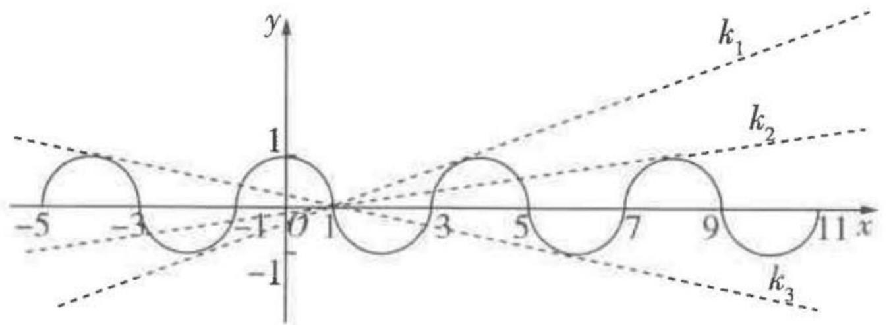

text_image

y
-5 -3 -1 O 1 3 5 7 9 11 x
-1
k₁
k₂
k₃

图4-4

2. $e^{\frac{3}{2}}$ $(2e, +\infty)$ 当 x > 0 时， $f'(x) = xe^{x} > 0$ ， $f(x)$ 单调递增，无极值.

当 $x < 0$ 时, $f'(x) = a - \mathrm{e}^{-x}$ . 若 $a \leqslant 1$ , 则 $f'(x) < 0$ , 即 $f(x)$ 在 $(- \infty, 0)$ 上单调递减, 无极值.

若 $a > 1$ ，则当 $x < -\ln a$ 时， $f'(x) < 0, f(x)$ 单调递减，当 $-\ln a < x < 0$ 时， $f'(x) > 0$ ， $f(x)$ 单调递增，又 $f'(-\ln a) = 0$ ，所以 $f(x)$ 有极小值 $f(-\ln a)$ .

综上, 在 x < 0 且 a > 1 时, $f(-\ln a) = \frac{3a}{2} - a \ln a = 0$ , 可得 $a = e^{\frac{3}{2}}$ .

由题设, $F(x)=\left\{\begin{aligned}&xe^{x}-ax+\frac{a}{2},x>0,\\&-xe^{-x}+ax+\frac{a}{2},x<0,\end{aligned}\right.$ 显然 $F(x)=F(-x)$ ，即 $F(x)$ 为偶函数，

要使 $F(x)$ 有且仅有 4 个不同的零点, 则 $F(x)$ 在 x > 0 上有 2 个不同的零点.

【扫清障碍】根据偶函数图象的对称性,将问题转化为研究 $F(x)$ 在 $(0, +\infty)$ 上有 2 个不同零点时的参数取值范围

当 $x > 0$ 时， $F'(x) = (x + 1)e^x - a$ ，则 $F''(x) = (x + 2)e^x > 0(F''(x))$ 为 $F'(x)$ 的导数），故 $F'(x)$ 在 $(0, +\infty)$ 上单调递增，

当 $x \to +\infty$ 时, $F'(x) \to +\infty$ , 当 $x \to 0$ 且 $x > 0$ 时, $F'(x) \to 1 - a$ 且 $F'(x) > 1 - a$ , 所以 $1 - a < 0$ , 即 $a > 1$ .

又 $F'(\ln a)=a\ln a>0$ , 所以存在 $m\in(0,\ln a)$ , 使得 $F'(m)=(m+1)e^{m}-a=0$ ,
即 $a=(m+1)e^{m}$ ，且 $F(x)$ 在 $(0,m)$ 上单调递减，在 $(m,+\infty)$ 上单调递增.

当 $x \to 0$ 且 $x > 0$ 时, $F(x) \to \frac{a}{2}$ 且 $F(x) > \frac{a}{2} > 0$ , 当 $x \to +\infty$ 时, $F(x) \to +\infty$ ,

所以 $F(m) = m\mathrm{e}^{m} + \left(\frac{1}{2} -m\right)a = \left(\frac{1}{2} +\frac{1}{2} m - m^2\right)\mathrm{e}^m < 0$ ，即 $\frac{1}{2} +\frac{1}{2} m - m^2 < 0,$

所以 m > 1 或 $m < -\frac{1}{2}$ (舍去).

令 $h(m)=(m+1)\mathrm{e}^{m}(m>1)$ ，则 $h'(m)=(m+2)\mathrm{e}^{m}>0$ ，即 $h(m)$ 在 $(1,+\infty)$ 上单调递增，所以 $h(m)=(m+1)\mathrm{e}^{m}>(1+1)\mathrm{e}^{1}=2\mathrm{e}$ ，即 a>2e.

综上，a 的取值范围为 $(2e, +\infty)$ .

3. (1) 当 $a = 1$ 时, $f(x) = \ln(1 + x) + x \cdot e^{-x}$ , $\therefore f'(x) = \frac{1}{x + 1} + e^{-x} + x \cdot e^{-x} \cdot (-1)$ , $\therefore f'(0) = 1 + 1 = 2$ , $\because f(0) = 0$ , $\therefore$ 所求切线方程为 $y - 0 = 2 \cdot (x - 0)$ , 即 $y = 2x$ .

(2) $\because f(x) = \ln (1 + x) + ax \cdot e^{-x} = \ln (x + 1) + \frac{ax}{e^x},$

∴ $1^{\circ}$ 当 $a \geqslant 0$ 时, 若 x > 0, 则 $\ln(x + 1) > 0, \frac{ax}{e^{x}} \geqslant 0, \therefore f(x) > 0, \therefore f(x)$ 在 $(0, +\infty)$ 上无零点, 不符合题意.

$2^{\circ}$ 当 $a < 0$ 时, $f'(x) = \frac{\mathrm{e}^{x} + a(1 - x^{2})}{(x + 1)\mathrm{e}^{x}}$ . 令 $g(x) = \mathrm{e}^{x} + a(1 - x^{2})$ , 则 $g'(x) = \mathrm{e}^{x} - 2ax$ , $g'(x)$ 在 $(-1, +\infty)$ 上单调递增, $g'(-1) = \mathrm{e}^{-1} + 2a, g'(0) = 1$ .

(a) 若 $g'(-1) \geqslant 0$ ，则 $-\frac{1}{2e} \leqslant a < 0, \therefore -\frac{1}{2e} \leqslant a < 0$ 时， $g'(x) > 0$ 在 $(-1, +\infty)$ 上恒成立，∴ $g(x)$ 在 $(-1, +\infty)$ 上单调递增，∵ $g(-1) = e^{-1} > 0, \therefore g(x) > 0$ 在 $(-1, +\infty)$ 上恒成立，∴ $f'(x) > 0$ 在 $(-1, +\infty)$ 上恒成立，∴ $f(x)$ 在 $(-1, +\infty)$ 上单调递增，∵ $f(0) = 0, \therefore f(x)$ 在 $(-1, 0), (0, +\infty)$ 上均无零点，不符合题意.

(b) 若 $g'(-1)<0$ ，则 $a<-\frac{1}{2e},\therefore a<-\frac{1}{2e}$ 时，存在 $x_{0}\in(-1,0)$ ，使得 $g'(x_{0})=0$ .

$\therefore g(x)$ 在 $(-1, x_0)$ 上单调递减，在 $(x_0, +\infty)$ 上单调递增. $g(-1) = e^{-1} > 0, g(0) = 1 + a, g(1) = e > 0.$

(i) 当 $g(0) \geqslant 0$ ，即 $-1 \leqslant a < -\frac{1}{2e}$ 时， $g(x) > 0$ 在 $(0, +\infty)$ 上恒成立，∴ $f'(x) > 0$ 在 $(0, +\infty)$ 上恒成立，∴ $f(x)$ 在 $(0, +\infty)$ 上单调递增。∵ $f(0) = 0$ ，∴ 当 $x \in (0, +\infty)$ 时， $f(x) > 0$ ，∴ $f(x)$ 在 $(0, +\infty)$ 上无零点，不符合题意。

(ii) 当 $g(0) < 0$ ，即 a < -1 时，存在 $x_{1} \in (-1, x_{0})$ ， $x_{2} \in (0, 1)$ ，使得 $g(x_{1}) = g(x_{2}) = 0$ ，∴ $f(x)$ 在 $(-1, x_{1})$ ， $(x_{2}, +\infty)$ 上单调递增，在 $(x_{1}, x_{2})$ 上单调递减.

$\because f(0) = 0, \therefore f(x_{1}) > f(0) = 0$ ，当 $x \to -1$ 时， $f(x) < 0, \therefore f(x)$ 在 $(-1, x_{1})$ 上存在一个零点，即 $f(x)$ 在 $(-1, 0)$ 上存在一个零点， $\because f(0) = 0$ ，当 $x \to +\infty$ 时， $f(x) > 0$ $\therefore f(x)$ 在 $(x_{2}, + \infty)$ 上存在一个零点，即 $f(x)$ 在 $(0, + \infty)$ 上存在一个零点.综上， $a$ 的取值范围是 $(- \infty, - 1)$ .

# 超重点 5 基于 $x(x^{n})$ , $\ln x, e^{x}$ , $\sin x$ , $\cos x$ 的组合函数问题

# 命题角度1>基于 $x(x^{n})$ 与 $\ln x$ , $e^{x}$ 的组合函数问题

调研 1 (2022·浙江省金、丽、衢十二校 5 月第二次联考)已知函数 $f(x) = \frac{(x - a)^2}{\ln x} (a \in \mathbb{R})$ ，则当 $0 < a < 1$ 时，函数 $f(x)$ （）

A. 有 1 个极大值点, 2 个极小值点

B. 有 2 个极大值点, 1 个极小值点

C. 有 1 个极大值点, 无极小值点

D. 无极大值点,有1个极小值点

# 思维导引

求 $f(x)$ 的导数 $f'(x)=\frac{(x-a)(2\ln x+\frac{a}{x}-1)}{(\ln x)^{2}}$

令 $g(x) = 2\ln x +$

$\frac{a}{x}-1$

研究 $g(x)$ 的单调性和最值 → 判断 $f'(x)$ 的正负 → 判断 $f(x)$ 的单调性和极值点情况

解析

$f(x) = \frac{(x - a)^2}{\ln x} (a \in \mathbb{R})$ ，则 $f'(x) = \frac{(x - a)(2\ln x + \frac{a}{x} - 1)}{(\ln x)^2}$ ，

【扫清障碍】研究可导函数的极值点，往往需要研究其导函数的“变号零点”

令 $g(x) = 2\ln x + \frac{a}{x} - 1 (x > 0)$ ，则 $g'(x) = \frac{2}{x} - \frac{a}{x^2} = \frac{2x - a}{x^2} (x > 0)$ ，

【会思考】由于函数 $y = 2\ln x + \frac{a}{x} - 1$ 的零点不能直接得出，因此构造函数进行研究

因为 0 < a < 1，所以 $0 < \frac{a}{2} < \frac{1}{2}$ ，令 $g'(x) < 0$ ，解得 $0 < x < \frac{a}{2}$ ，令 $g'(x) > 0$ ，解得 $x > \frac{a}{2}$ ，

则 $g(x)$ 在 $(0, \frac{a}{2})$ 上单调递减，在 $(\frac{a}{2}, +\infty)$ 上单调递增，所以 $g(x)_{\min} = g(\frac{a}{2}) = 2\ln \frac{a}{2} + 1.$

# 使用贴士

基于 $x$ 与 $\ln x, e^{x}, \sin x, \cos x$ 的组合函数的图象与基本性质的整理, 详见本书 P117 的附表, 熟记这些图象与性质, 解题时往往能够事半功倍.

易知 $\ln \frac{a}{2} < \ln \frac{1}{2} = -\ln 2$ ，所以 $2\ln \frac{a}{2} + 1 < 1 - 2\ln 2 < 0$ ，即 $g\left(\frac{a}{2}\right) < 0$ .

又 $x \to 0$ 时, $g(x) \to +\infty$ , $g(a) = 2 \ln a < 0$ , $g(e^2) = 3 + \frac{a}{e^2} > 0$ ,

所以 $\exists x_{1}\in (0,\frac{a}{2}),x_{2}\in (a,\mathrm{e}^{2})$ ，使得 $g(x_{1}) = g(x_{2}) = 0$

故 $g(x)$ 的大致图象如图 5-1 所示.

【草图不草】准确画出草图的关键：确定函数的单调性（这
一步确定图象的大致走向），求出端点处的取值（若端点值取不到
的，要利用极限法估值）与最值（这一步描点），最后在图上标出
关键数据

所以当 $0 < x < x_{1}$ 时， $g(x) > 0, x - a < 0$ ，则 $f'(x) < 0$ ， $f(x)$ 单调递减；

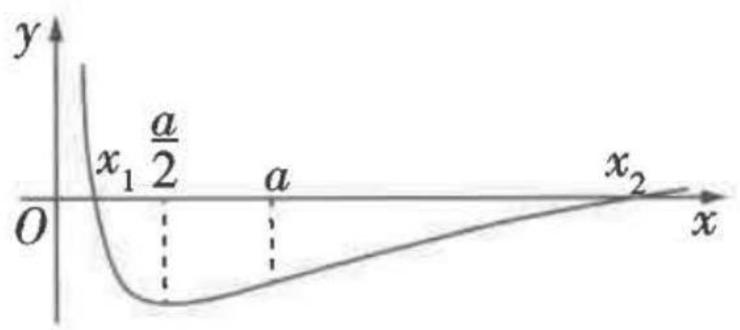

text_image

y
x₁ a/2 a x₂
O
x

图5-1

当 $x_{1}<x<a$ 时， $g(x)<0,x-a<0$ ，则 $f'(x)>0,f(x)$ 单调递增；

当 $a < x < x_{2}$ 时, $g(x) < 0, x - a > 0$ , 则 $f'(x) < 0, f(x)$ 单调递减;

当 $x > x_{2}$ 时, $g(x) > 0, x - a > 0$ , 则 $f'(x) > 0, f(x)$ 单调递增.

所以 $f(x)$ 有 2 个极小值点 $x_{1}, x_{2}, 1$ 个极大值点 a. 故选 A.

调研 2 (2022·四川眉山5月第三次诊断)已知函数 $f(x)=\mathrm{e}^{x}-x^{\mathrm{e}}(x>0)$ .

(1) 求 $f(x)$ 的单调区间.

(2) 若存在正数 $m$ , 使得对任意的 $x \in (0, a] (a \in \mathbf{N}^*)$ , $(m + 20x - x^2)x^e \leqslant e^7x$ 恒成立, 求 $a$ 的最大值 (附: $15 \times 5^e > e^7$ ).

解析 (1) 由 $f(x) = \mathrm{e}^{x} - x^{\mathrm{e}}(x > 0)$ ，得 $f'(x) = \mathrm{e}^{x} - \mathrm{e}x^{\mathrm{e} - 1} = \mathrm{e}^{x}[1 - \mathrm{e}^{1 - x + (\mathrm{e} - 1)\ln x}]$ .

【扫清障碍】 $e^{x}$ 是恒大于0的，因此，研究函数 $y=1-x+(e-1)\ln x$ 的值与0的大小关系，即可确定 $f'(x)$ 的正负，进而得到函数 $f(x)$ 的单调区间

设 $g(x) = 1 - x + (\mathrm{e} - 1)\ln x(x > 0)$ ，则 $g'(x) = -1 + \frac{\mathrm{e} - 1}{x} = \frac{\mathrm{e} - 1 - x}{x}(x > 0)$ ，

当 0 < x < e - 1 时, $g'(x) > 0$ , $g(x)$ 单调递增, 当 x > e - 1 时, $g'(x) < 0$ , $g(x)$ 单调递减,

又 $g(1) = g(\mathrm{e}) = 0$ ，则 $f^{\prime}(1) = f^{\prime}(\mathrm{e}) = 0,$

所以当 0 < x < 1 或 x > e 时, $g(x) < 0$ , 则 $f'(x) > 0$ , $f(x)$ 单调递增, 当 1 < x < e 时, $g(x) > 0$ , 则 $f'(x) < 0$ , $f(x)$ 单调递减.

综上, $f(x)$ 的单调递增区间为(0,1), $(e,+\infty)$ ,单调递减区间为(1,e).

【易错提醒】当函数的单调区间由多个区间组成时，各个区间要用“，”或“和”隔开，不能使用“U”

(2) 当 0 < x < 1 时, $0 < x^{e} < 1$ , $e^{x} > 1$ , 所以 $f(x) = e^{x} - x^{e} > 0$ .

由(1)可知, $f(x)_{\min}=f(e)=0$ ,所以对于x>0, $f(x)=\mathrm{e}^{x}-x^{\mathrm{e}}\geqslant0$ ,即 $e^{x}\geqslant x^{e}$ ,当x=e时等号成立.

先解决存在正数 $m$ , 使得对任意的 $x \in (0, a] (a \in \mathbf{N}^{*})$ , $(m + 20x - x^{2})e^{x} \leqslant e^{7}x$ 恒成立, 求 $a$ 的最大值的问题, 即存在正数 $m$ , 使得对任意的 $x \in (0, a] (a \in \mathbf{N}^{*})$ , $m \leqslant x^{2} + xe^{7 - x} - 20x$ 恒成立, 求 $a$ 的最大值的问题, 即存在正数 $m$ , 使得对任意的 $x \in (0, a] (a \in \mathbf{N}^{*})$ , $x^{2} + xe^{7 - x} - 20x > 0$ 恒成立, 求 $a$ 的最大值的问题,

【关键提醒】分离参数法是解决求参数的范围问题最有效的方法之一，但也要注意不要形成见到参数范围就分离参数的僵化思维

也即对任意的 $x \in (0, a] (a \in \mathbf{N}^{*})$ , $x + e^{7 - x} - 20 > 0$ 恒成立, 求 $a$ 的最大值的问题.

【等价转化】对所研究的问题不断实施转化，使复杂问题成为一个相对简单的问题

令 $h(x) = x + \mathrm{e}^{7 - x} - 20(x > 0)$ ，则 $h'(x) = 1 - \mathrm{e}^{7 - x}$ ，

所以当 0 < x < 7 时, $h'(x) < 0$ , $h(x)$ 单调递减, 当 x > 7 时, $h'(x) > 0$ , $h(x)$ 单调递增,

所以 $h(x)_{\min}=h(7)=-12<0.$

又 $h(6) = \mathrm{e} - 14 <   0,h(5) = \mathrm{e}^{2} - 15 <   0,h(4) = \mathrm{e}^{3} - 16 > 0,$

所以若存在正数 $m$ ，使得对任意的 $x \in (0, a] (a \in \mathbf{N}^*)$ ， $(m + 20x - x^2) e^x \leqslant e^7 x$ 恒成立，则整数 $a$ 的最大值为 4.

提示:关于此类恒成立问题与有解问题的转化策略，详见本书P116表格.

反过来检验：

当 $0 < x < 20$ 时， $m + 20x - x^2 = -(x - 10)^2 + 100 + m > 0$

所以存在正数 $m$ , 使得对任意的 $x \in (0,4]$ , $(m + 20x - x^2)x^e \leqslant e^7x$ 恒成立, 也即存在正数 $m$ , 使得对任意的 $x \in (0,4]$ , $\frac{e^7}{x^e} + x - 20 > 0$ 恒成立. 当 $x = 5$ 时, $\frac{e^7}{5^e} + 5 - 20 = \frac{e^7 - 15 \times 5^e}{5^e} < 0$ , 所以所求的正整数 $a$ 的最大值为 4.

调研 3 (2022·湖南株洲 5 月第三次适应性检测)已知 $f(x) = \mathrm{e}^{x} + \ln x - x$ , $g(x) = a\mathrm{e}^{x} - \frac{1}{2} x^{2} - 1$ .

(1) 讨论 $f(x)$ 的单调性.

(2) 当 $a > 0$ 时, 若 $F(x) = af(x) - g(x)$ 存在两个极值点 $x_{1}, x_{2}$ , 且 $x_{1} \neq x_{2}$ . 求证: $F(x_{1}) + F(x_{2}) < -2$ .

思维导引 (1) 直接求导 由 $f'(x) > 0$ 在 $(0, +\infty)$ 上恒成立得 $f(x)$ 的单调性

(2) $F(x)$ 有两个极值点 $\rightarrow$ 求导, 确定 $a$ 的取值范围 $\rightarrow x_{1} + x_{2} = a, x_{1}x_{2} = a \rightarrow$ 用 $a$ 表示 $F(x_{1}) + F(x_{2}) + 2$ , 转化为关于 $a$ 的函数 $\rightarrow$ 求导, 确定函数的单调性 $\rightarrow$ 得证

解析 (1) 由题意得 $f(x)$ 的定义域为 $(0, +\infty)$ , 则 $\mathrm{e}^{x} > 1$ ,

所以 $f^{\prime}(x) = \mathrm{e}^{x} + \frac{1}{x} - 1 = \frac{x(\mathrm{e}^{x} - 1) + 1}{x} >0$ 在 $(0, + \infty)$ 上恒成立，

故 $f(x)$ 在 $(0, +\infty)$ 上单调递增.

(2) $F(x)=af(x)-g(x)=ae^{x}+a\ln x-ax-ae^{x}+\frac{1}{2}x^{2}+1=a\ln x+\frac{1}{2}x^{2}-ax+1,$ a>0,x>0,则 $F'(x)=\frac{a}{x}+x-a=\frac{x^{2}-ax+a}{x}.$

又 $x_{1}, x_{2}$ 为 $F(x)$ 的两个极值点，且 $x_{1} \neq x_{2}$ ，所以 $x_{1}, x_{2}$ 为关于 $x$ 的方程 $x^{2} - ax + a = 0$ 的相异的两根，则 $\Delta = a^{2} - 4a > 0$ ，即 $a > 4$ ，且 $x_{1} + x_{2} = a, x_{1}x_{2} = a$ ，

所以 $F(x_{1})+F(x_{2})+2=a\ln x_{1}+\frac{1}{2}x_{1}^{2}-ax_{1}+1+a\ln x_{2}+\frac{1}{2}x_{2}^{2}-ax_{2}+1+2=$ $a\ln(x_{1}x_{2})+\frac{1}{2}\left[(x_{1}+x_{2})^{2}-2x_{1}x_{2}\right]-a(x_{1}+x_{2})+4=a\ln a-\frac{1}{2}a^{2}-a+4.$

【扫清障碍】通过 $x_{1},x_{2}$ 的关系，将双变量问题转化为单变量问题

令 $\varphi(a)=a\ln a-\frac{1}{2}a^{2}-a+4(a>4)$ ，则 $\varphi'(a)=\ln a-a.$

令 $h(a) = \ln a - a (a > 4)$ , 则 $h'(a) = \frac{1}{a} - 1 < 0$ , 所以 $h(a)$ 在 $(4, +\infty)$ 上单调递减,

故 $h(a) < \ln 4 - 4 < 0$ ，即 $\varphi'(a) < 0$ 对 $a \in (4, +\infty)$ 恒成立，所以 $\varphi(a)$ 在 $(4, +\infty)$ 上单调递减，

故 $\varphi(a) < 8(\ln 2 - 1) < 0, F(x_1) + F(x_2) + 2 < 0$ , 故 $F(x_1) + F(x_2) < -2$ .

# 命题角度2 基于 $x(x^n)$ 与 $\sin x, \cos x$ 的组合函数问题

调研 4 (2022·山东德州5月二模)已知函数 $f(x)=\cos^{2}x+a(x^{2}-1),g(x)=1-\cos x.$

(1) 当 $a = 0$ 时, 求 $f(x)$ 的图象在 $(\frac{\pi}{4}, f(\frac{\pi}{4}))$ 处的切线方程;  
(2) 当 a > 1 时, 求 $f(x)$ 的极值;  
(3) 若 $x \in (\frac{\pi}{2}, \pi)$ 时, $f'(\frac{x}{2}) \geqslant g(x)$ 恒成立, 求 $a$ 的取值范围.

(1)求导,根据导数的几何意义得出切线方程.(2)求导,判断导函数的零点与取值情况,确定函数的单调性,进而确定极值.(3)将 $f'(\frac{x}{2})\geqslant g(x)(x\in(\frac{\pi}{2},\pi))$ 恒成立转化为 $f'(\frac{x}{2})-g(x)\geqslant0(x\in(\frac{\pi}{2},\pi))$ 恒成立,分离参数,等价于 $a\geqslant\frac{\sin x+1-\cos x}{x}$ 在 $x\in(\frac{\pi}{2},\pi)$ 上恒成立,令 $h(x)=\frac{\sin x+1-\cos x}{x}(x\in(\frac{\pi}{2},\pi))$ ,利用导数求得 $h(x)<\frac{4}{\pi}$ ,即可确定a的取值范围.

解析 (1) 当 $a = 0$ 时, $f(x) = \cos^2 x$ , 则 $f'(x) = -2\cos x\sin x = -\sin 2x$ ,

故 $f'(\frac{\pi}{4})=-1,f(\frac{\pi}{4})=\cos^{2}\frac{\pi}{4}=\frac{1}{2},$

所以所求切线方程为 $y - \frac{1}{2} = -(x - \frac{\pi}{4})$ ，即 $x + y - \frac{1}{2} - \frac{\pi}{4} = 0$ .

(2) $f(x)=\cos^{2}x+a(x^{2}-1)$ ，则 $f'(x)=-2\cos x\sin x+2ax=-\sin 2x+2ax$

令 $\varphi(x) = -\sin 2x + 2ax$ ，则 $\varphi'(x) = -2\cos 2x + 2a = 2(a - \cos 2x)$ .

当 $a > 1$ 时， $\varphi^{\prime}(x) > 0$ 在 $x\in \mathbf{R}$ 上恒成立，

所以 $\varphi(x)=f'(x)=-\sin2x+2ax$ 在 $x\in R$ 上单调递增，且 $f'(0)=0$ 。所以在 $(-∞,0)$ 上 $f'(x)<0$ ，在 $(0,+∞)$ 上 $f'(x)>0$ ，

所以 $f(x)$ 在 $(-∞,0)$ 上单调递减，在 $(0,+∞)$ 上单调递增.

又 $f(0)=1-a$ ，所以函数 $f(x)$ 的极小值为1-a，无极大值.

(3) 易知 $f'(\frac{x}{2}) = -\sin x + ax.$

$f'\left(\frac{x}{2}\right) \geqslant g(x)$ 在 $x \in \left(\frac{\pi}{2}, \pi\right)$ 上恒成立，即 $-\sin x + ax \geqslant 1 - \cos x$ 在 $x \in \left(\frac{\pi}{2}, \pi\right)$ 上恒成立，即 $a \geqslant \frac{\sin x + 1 - \cos x}{x}$ 在 $x \in \left(\frac{\pi}{2}, \pi\right)$ 上恒成立.

设 $h(x) = \frac{\sin x + 1 - \cos x}{x}, x \in (\frac{\pi}{2}, \pi)$ ,

则 $h'(x)=\frac{x(\cos x+\sin x)-(\sin x+1-\cos x)}{x^{2}}$ .

设 $m(x)=x(\cos x+\sin x)-(\sin x+1-\cos x)$ , $x\in(\frac{\pi}{2},\pi)$ ,

则 $m'(x) = \cos x + \sin x - x \sin x + x \cos x - \cos x - \sin x = x (\cos x - \sin x)$ .

由 $x \in (\frac{\pi}{2}, \pi)$ 可得 $\cos x < 0, \sin x > 0$ ，所以 $m'(x) = x(\cos x - \sin x) < 0$

则 $m(x)$ 在 $(\frac{\pi}{2},\pi)$ 上单调递减, 可得 $m(x) < \frac{\pi}{2} - 2 < 0$ ,

所以 $h'(x)=\frac{m(x)}{x^{2}}<0,h(x)$ 在 $(\frac{\pi}{2},\pi)$ 上单调递减, $h(x)<\frac{4}{\pi}$ ,

故 a 的取值范围是 $\left[\frac{4}{\pi}, +\infty\right)$ .

# 命题角度3> 基于 $\mathrm{e}^{x}$ 与 $\sin x$ ， $\cos x$ 的组合函数问题

调研 5 (2022 · 广东茂名 5 月第三次调研) 已知函数 $f(x) = \mathrm{e}^{x} - ax + \sin x - 1$ .

(1) 若函数 $f(x)$ 在 $(0, +\infty)$ 上单调递增, 求实数 a 的取值范围;  
(2) 当 $1 \leqslant a < 2$ 时, 求函数 $g(x) = (x - 2)f(x)$ 零点的个数.

解析 (1) 由 $f(x) = \mathrm{e}^{x} - ax + \sin x - 1$ 得 $f'(x) = \mathrm{e}^{x} - a + \cos x$ .

由函数 $f(x)$ 在 $(0, +\infty)$ 上单调递增，可得 $f'(x) = e^x - a + \cos x \geqslant 0$ 在 $x \in (0, +\infty)$ 上恒成立，

则 $a \leqslant \mathrm{e}^{x} + \cos x$ 在 $x \in (0, +\infty)$ 上恒成立.

【分离参数】将恒成立问题转化为函数的最值问题

令 $h(x) = \mathrm{e}^{x} + \cos x, x \in (0, +\infty)$ , 则 $h'(x) = \mathrm{e}^{x} - \sin x$ .

当 $x > 0$ 时， $\mathrm{e}^x >1$ ，所以 $h^\prime (x) = \mathrm{e}^x -\sin x > 0$ 恒成立.

所以 $h(x)$ 在 $(0, +\infty)$ 上单调递增，所以 $h(x) > 2$ ，所以 $a \leqslant 2$

(2) $g(x)=(x-2)f(x)=(x-2)(e^{x}-ax+\sin x-1)$ ，则 $g(2)=0, g(0)=0$ ，所以
2 与 0 是 $g(x)=(x-2)f(x)$ 的两个零点.

【会观察】根据函数解析式的特征，采用观察法光确定2个零点

当 $x \in (0, +\infty)$ 时，因为 $1 \leqslant a < 2$ ，由(1)知，函数 $f(x)$ 在 $(0, +\infty)$ 上单调递增， $f(x) > f(0) = 0$ ，所以 $f(x)$ 在 $(0, +\infty)$ 上无零点。

当 $x \in (-\infty, -\pi]$ 时，因为 $1 \leqslant a < 2$ ，所以 $-ax \geqslant \pi, f(x) \geqslant e^x + \pi + \sin x - 1 > 0$ ，所以 $f(x)$ 在 $(- \infty, -\pi]$ 上无零点.

当 $x \in (-\pi, 0)$ 时， $\sin x < 0$ ，令 $u(x) = \mathrm{e}^x - a + \cos x, x \in (-\pi, 0)$ ，则 $u'(x) = \mathrm{e}^x - \sin x > 0$ ，

所以 $f'(x)$ 在 $(-π,0)$ 上单调递增，又 $f'(0)=2-a>0$ ， $f'(-π)=\mathrm{e}^{-\pi}-1-a<0$

所以在 $(-π,0)$ 上， $f'(x)$ 存在唯一零点 $x_{0}$ ，使得 $f'(x_{0})=0$ .

当 $x \in (-\pi, x_0)$ 时， $f'(x) < 0$ ， $f(x)$ 单调递减；当 $x \in (x_0, 0)$ 时， $f'(x) > 0$ ， $f(x)$ 单调递增.

又 $f(-\pi)=\mathrm{e}^{-\pi}+a\pi-1>0,f(0)=0$ ，所以函数 $f(x)$ 在 $(-π,0)$ 上有且仅有1个零点.

综上所述, 当 $1 \leqslant a < 2$ 时, 函数 $g(x) = (x - 2)f(x)$ 有且仅有 3 个零点.

# 命题角度4> 基于 $\ln x$ 与 $\sin x$ , $\cos x$ 的组合函数问题

调研 6 (2022·山东临沂5月二模)已知函数 $f(x)=x-\frac{1}{2}\sin x$ .

(1) 若存在 $x \in \left[\frac{\pi}{4}, \frac{\pi}{2}\right]$ , 使 $f(x) \leqslant ax$ 成立, 求 $a$ 的取值范围.

(2) 若 $g(x)=f(x)-m\ln x$ ，存在 $x_{1}, x_{2} \in (0, +\infty)$ ，且当 $x_{1} \neq x_{2}$ 时， $g(x_{1}) = g(x_{2})$ ，求证： $x_{1}x_{2} < 4m^{2}$ .

思维导引 (1) 当 $x \in \left[\frac{\pi}{4}, \frac{\pi}{2}\right]$ 时, 对不等式 $f(x) \leqslant ax$ 参变分离, 得 $a \geqslant 1 - \frac{\sin x}{2x}$ , 令 $h(x) = 1 - \frac{\sin x}{2x}, x \in \left[\frac{\pi}{4}, \frac{\pi}{2}\right]$ , 利用导数求得 $h(x)$ 的最小值, 即得 $a$ 的取值范围.

(2)不妨设 $0 < x_{1} < x_{2}$ , 整理化简 $g(x_{1}) = g(x_{2})$ , 得 $m(\ln x_{2} - \ln x_{1}) = x_{2} - x_{1} - \frac{1}{2} (\sin x_{2} -$ $\sin x_{1}$ , 令 $u(x) = x - \sin x (x > 0)$ 并判断其单调性, 得到 $x_{2} - x_{1} > \sin x_{2} - \sin x_{1}$ , 从而将关系式中的 $\sin x_{2} - \sin x_{1}$ “消去”, 得到 $2m > \frac{x_{2} - x_{1}}{\ln x_{2} - \ln x_{1}} > 0$ , 问题即可转化为证明 $\frac{x_{2} - x_{1}}{\ln x_{2} - \ln x_{1}} > \sqrt{x_{1}x_{2}}$ , 令 $\frac{x_{2}}{x_{1}} = t (t > 1)$ , 证明 $\ln t - \frac{t - 1}{\sqrt{t}} < 0$ 即可.

解析 (1) 当 $x \in \left[\frac{\pi}{4}, \frac{\pi}{2}\right]$ 时, 由 $f(x) \leqslant ax$ , 得 $x - \frac{1}{2} \sin x \leqslant ax$ , 即 $a \geqslant 1 - \frac{\sin x}{2x}$ .

令 $h(x) = 1 - \frac{\sin x}{2x}, x \in \left[\frac{\pi}{4}, \frac{\pi}{2}\right]$ ，则 $h'(x) = \frac{\sin x - x\cos x}{2x^2}$ ，

令 $\varphi(x)=\sin x-x\cos x,x\in\left[\frac{\pi}{4},\frac{\pi}{2}\right]$ ，则 $\varphi'(x)=x\sin x>0$ ，

所以 $\varphi(x)$ 在 $[\frac{\pi}{4},\frac{\pi}{2}]$ 上单调递增, 所以 $\varphi(x) \geqslant \varphi(\frac{\pi}{4}) = \frac{\sqrt{2}}{2} - \frac{\pi}{4} \times \frac{\sqrt{2}}{2} = \frac{\sqrt{2}}{2}(1 - \frac{\pi}{4}) > 0$ ,

所以在 $[\frac{\pi}{4},\frac{\pi}{2} ]$ 上，则 $h^{\prime}(x) > 0$ ，则 $h(x)$ 单调递增，

所以 $h(x)_{\min}=h(\frac{\pi}{4})=1-\frac{\sqrt{2}}{\pi}$ ,

故 a 的取值范围是 $\left[1-\frac{\sqrt{2}}{\pi},+\infty\right)$ .

(2) $g(x)=x-\frac{1}{2}\sin x-m\ln x(x>0)$ ，不妨设 $0<x_{1}<x_{2}$

因为 $g(x_{1}) = g(x_{2})$ ，所以 $x_{1} - \frac{1}{2}\sin x_{1} - m\ln x_{1} = x_{2} - \frac{1}{2}\sin x_{2} - m\ln x_{2},$

所以 $m(\ln x_2 - \ln x_1) = x_2 - x_1 - \frac{1}{2} (\sin x_2 - \sin x_1)$ . (\*)

令 $u(x)=x-\sin x(x>0)$ ，则 $u'(x)=1-\cos x\geqslant0$ ，故函数 $u(x)=x-\sin x$ 在 $(0,$

$+\infty$ ) 上单调递增.

所以 $x_{2} - \sin x_{2} > x_{1} - \sin x_{1}$ ，从而 $x_{2} - x_{1} > \sin x_{2} - \sin x_{1}$

所以由（ $*$ ）得 $m(\ln x_2 - \ln x_1) > (x_2 - x_1) - \frac{1}{2} (x_2 - x_1) = \frac{1}{2} (x_2 - x_1)$ ，

所以 $2m > \frac{x_2 - x_1}{\ln x_2 - \ln x_1} > 0.$ 下面证明 $\frac{x_2 - x_1}{\ln x_2 - \ln x_1} > \sqrt{x_1x_2}$ .

【名师有话说】该式子即对数平均不等式，2018年全国Ⅰ卷压轴题出现对数平均值的形式后，各地模拟题大量涌现类似的题目。对于成绩中等及以上的同学来说，这是必须掌握的内容。此外，一些拓展的结论、定理，乃至高等数学中的知识，都有可能成为高考命题的载体，要引起注意，复习时除了要知道这些内容，更要尝试证明出来，才能理解其本质

令 $\frac{x_2}{x_1} = t$ ，则 $t > 1$ ，即证明 $\frac{t - 1}{\ln t} >\sqrt{t}$ ，即证明 $\ln t - \frac{t - 1}{\sqrt{t}} < 0.$

设 $p(t) = \ln t - \frac{t - 1}{\sqrt{t}} (t > 1)$ ，则 $p'(t) = \frac{-(\sqrt{t} - 1)^2}{2t\sqrt{t}} < 0$ 在 $(1, +\infty)$ 上恒成立，

所以 $p(t)$ 在 $(1, +\infty)$ 上单调递减，故 $p(t) < 0$ ，

所以 $2m > \frac{x_2 - x_1}{\ln x_2 - \ln x_1} > \sqrt{x_1x_2}$ , 所以 $x_1x_2 < 4m^2$ , 得证.

# 新题演练

1. (2022·云南昆明 5 月“三诊一模”/创新题型)对于函数 $f(x)=\mathrm{e}^{x}+a \ln x (a \in \mathbb{R})$ ,有下列四个论断:

① $f(x)$ 是增函数； ② $f(x)$ 是奇函数；  
③ $f(x)$ 有且仅有一个极值点；④ $f(x)$ 的最小值为e.

若其中恰有两个论断正确,则 a = ()

A. -1

B. 1

C. -e

D. e

2. (2022·辽宁东北育才学校5月模拟) 若 $xe^{x}=e^{2}$ , $\frac{e}{y}=\ln(ey)$ , 则 xy= \_\_\_\_.  
3. (2022·郑州5月三模)设函数 $f(x)=x^{2}-x+a\ln x(a>0)$ .

(1) 求函数 $f(x)$ 的单调区间.  
(2) 若 $f(x)$ 存在两个极值点 $x_{1}, x_{2}$ ，证明： $\frac{f(x_{1}) - f(x_{2})}{x_{1} - x_{2}} > 4a - \frac{1}{2}$ .

4. (2022 · 新高考 I 卷) 已知函数 $f(x) = \mathrm{e}^{x} - ax$ 和 $g(x) = ax - \ln x$ 有相同的最小值.

(1) 求 $a$ ;

(2) 证明: 存在直线 y = b, 其与两条曲线 $y = f(x)$ 和 $y = g(x)$ 共有三个不同的交点, 并且从左到右的三个交点的横坐标成等差数列.

# 参考答案与解析

1. C 函数 $f(x)$ 的定义域为 $(0, +\infty)$ , 故函数 $f(x)$ 是既不是奇函数, 也不是偶函数, 即无论 $a$ 为何值, ②一定错误.

【解题秘籍】根据具备奇偶性的函数的必要条件是定义域关于坐标原点对称直接排除②

对函数 $f(x)$ 求导得 $f'(x)=\frac{xe^{x}+a}{x}$ ，当 $a\geqslant0$ 时， $f'(x)$ 恒大于零， $f(x)$ 在 $(0,+\infty)$ 上单调递增，故 $f(x)$ 没有极值点和最小值，此时，②③④错误，不符合题意。故排除选项BD.

当 a<0 时, 函数 $f(x)$ 不是增函数, 故只能有③④正确.

当 $a = -1$ 时, $f(x) = \mathrm{e}^{x} - \ln x$ , $f'(x) = \frac{x\mathrm{e}^{x} - 1}{x}$ , 令 $h(x) = x\mathrm{e}^{x} - 1 (x > 0)$ , 则 $h'(x) = \mathrm{e}^{x}(x + 1) > 0$ , 所以 $h(x)$ 在 $(0, +\infty)$ 上单调递增, 由于 $0 \times \mathrm{e}^{0} - 1 < 0$ , $h(1) = \mathrm{e} - 1 > 0$ , 故 $\exists x_{0} \in (0,1)$ , 使得 $h(x_{0}) = 0$ .

当 $x \in (0, x_0)$ 时, $f'(x) < 0$ , $f(x)$ 单调递减, 当 $x \in (x_0, +\infty)$ 时, $f'(x) > 0$ , $f(x)$ 单调递增, 又 $f'(x_0) = 0$ , 故函数 $f(x)$ 有且仅有一个极值点, $f(x)$ 的最小值 $f(x_0) < f(1) = e$ , 故 $a = -1$ 只满足③, 排除选项 A.

当 $a = -\mathrm{e}$ 时, $f(x) = \mathrm{e}^{x} - \mathrm{e}\ln x, f'(x) = \frac{x\mathrm{e}^{x} - \mathrm{e}}{x}$ , 令 $\varphi(x) = x\mathrm{e}^{x} - \mathrm{e}(x > 0)$ , 则 $\varphi'(x) =$ $\mathrm{e}^{x}(x + 1) > 0$ , 所以 $\varphi(x)$ 在 $(0, +\infty)$ 上单调递增, $\varphi(1) = 0$ , 当 $x \in (0,1)$ 时, $f'(x) < 0, f(x)$ 单调递减, 当 $x \in (1, +\infty)$ 时, $f'(x) > 0, f(x)$ 单调递增, 故 $f(x)$ 有且仅有一个极值点, $f(x)$ 的最小值 $f(1) = \mathrm{e}$ , 故满足③④. 故选 C.

2. e 由 $\frac{\mathrm{e}}{y} = \ln (\mathrm{e}y)$ , 可得 $\mathrm{e}y\ln (\mathrm{e}y) = \mathrm{e}^2$ , 由题意可知, $y > 0$ , 则 $x\mathrm{e}^{x} = \mathrm{e}^{2} = \mathrm{e}y\ln (\mathrm{e}y) =$ $\mathrm{e}^{\ln (\mathrm{e}y)}\ln (\mathrm{e}y)$ , (\*)

当 $x \leqslant 0$ 时, $x \mathrm{e}^{x} \leqslant 0$ , 不合题意, 所以 $x > 0$ , 同理可知 $\ln (\mathrm{e}y) > 0$ , 令 $f(x) = x \mathrm{e}^{x}$ , 其中 $x > 0$ , 则 $f'(x) = (x + 1) \mathrm{e}^{x} > 0$ , 所以函数 $f(x)$ 在 $(0, +\infty)$ 上单调递增,

由（\*）可得 $f(x)=f(\ln(ey))$ ，且x>0， $\ln(ey)>0$ ，所以 $x=\ln(ey)$ ，

因为 $ey\ln(ey)=e^{2}$ ，则 $y\ln(ey)=e=xy$ 。故填 e。

3. (1) $f(x)$ 的定义域为 $(0, +\infty), f'(x) = 2x - 1 + \frac{a}{x} = \frac{2x^2 - x + a}{x}$ ，令 $2x^2 - x + a = 0$ ，

当 $\Delta = 1 - 8a \leqslant 0$ ，即 $a \geqslant \frac{1}{8}$ 时， $f'(x) \geqslant 0$ ，所以 $f(x)$ 在 $(0, +\infty)$ 上单调递增.

当 $\Delta = 1 - 8a > 0$ ，即 $0 < a < \frac{1}{8}$ 时，由 $2x^{2} - x + a = 0$ ，解得 $x_{1} = \frac{1 + \sqrt{1 - 8a}}{4}$ ， $x_{2} = \frac{1 - \sqrt{1 - 8a}}{4}$ ，则 $0 < x_{2} < x_{1}$ .

当 $f'(x)>0$ 时, $0<x<\frac{1-\sqrt{1-8a}}{4}$ 或 $x>\frac{1+\sqrt{1-8a}}{4}$ , 所以函数 $f(x)$ 在(0, $\frac{1-\sqrt{1-8a}}{4}$ ), $(\frac{1+\sqrt{1-8a}}{4},+\infty)$ 上单调递增; 当 $f'(x)<0$ 时, $\frac{1-\sqrt{1-8a}}{4}<x<\frac{1+\sqrt{1-8a}}{4}$ , 所以函数 $f(x)$ 在 $(\frac{1-\sqrt{1-8a}}{4},\frac{1+\sqrt{1-8a}}{4})$ 上单调递减.

综上, 当 $a \geqslant \frac{1}{8}$ 时, 函数 $f(x)$ 的单调递增区间为 $(0, +\infty)$ ; 当 $0 < a < \frac{1}{8}$ 时, 函数 $f(x)$ 的单调递增区间为 $(0, \frac{1 - \sqrt{1 - 8a}}{4})$ , $(\frac{1 + \sqrt{1 - 8a}}{4}, +\infty)$ , 单调递减区间为 $(\frac{1 - \sqrt{1 - 8a}}{4}, \frac{1 + \sqrt{1 - 8a}}{4})$ .

(2)由(1)可知, $f(x)$ 存在两个极值点 $x_{1},x_{2}$ , 即 $0<a<\frac{1}{8},x_{1},x_{2}$ 为方程 $2x^{2}-x+a=0$ 的两个不相等的正实根, $x_{1}+x_{2}=\frac{1}{2},x_{1}x_{2}=\frac{a}{2}$ , 令 $x_{1}>x_{2}>0$ .

$$
\frac {f \left(x _ {1}\right) - f \left(x _ {2}\right)}{x _ {1} - x _ {2}} = \frac {x _ {1} ^ {2} - x _ {1} + a \ln x _ {1} - x _ {2} ^ {2} + x _ {2} - a \ln x _ {2}}{x _ {1} - x _ {2}} = \frac {\left(x _ {1} ^ {2} - x _ {2} ^ {2}\right) - \left(x _ {1} - x _ {2}\right) + a (\ln x _ {1} - \ln x _ {2})}{x _ {1} - x _ {2}} =
$$

$$
\left(x _ {1} + x _ {2}\right) - 1 + \frac {a (\ln x _ {1} - \ln x _ {2})}{x _ {1} - x _ {2}} = - \frac {1}{2} + \frac {a (\ln x _ {1} - \ln x _ {2})}{x _ {1} - x _ {2}},
$$

要证 $\frac{f(x_1) - f(x_2)}{x_1 - x_2} > 4a - \frac{1}{2}$ 成立，只需证 $-\frac{1}{2} + \frac{a(\ln x_1 - \ln x_2)}{x_1 - x_2} > 4a - \frac{1}{2}$ ，即证 $\frac{\ln x_1 - \ln x_2}{x_1 - x_2} > 4$ ，即证 $\frac{\ln x_1 - \ln x_2}{x_1 - x_2} > \frac{2}{x_1 + x_2}$ ，即证 $\ln x_1 - \ln x_2 > \frac{2(x_1 - x_2)}{x_1 + x_2}$ ，即证

$$
\ln \frac {x _ {1}}{x _ {2}} > \frac {2 \left(\frac {x _ {1}}{x _ {2}} - 1\right)}{\frac {x _ {1}}{x _ {2}} + 1}.
$$

令 $t = \frac{x_1}{x_2}$ 则 $t > 1$ ，即证 $\ln t > \frac{2(t - 1)}{t + 1}$

令 $h(t)=\ln t-\frac{2(t-1)}{t+1}(t>1)$ ，则 $h'(t)=\frac{(t-1)^{2}}{t(t+1)^{2}}>0$ ，所以 $h(t)$ 在 $(1,+\infty)$ 上单调递增， $h(t)>\ln 1-\frac{2\times(1-1)}{1+1}=0$ ，所以 $\ln t>\frac{2(t-1)}{t+1}$ ，即 $\frac{f(x_{1})-f(x_{2})}{x_{1}-x_{2}}>4a-\frac{1}{2}$ ，得证.

4. (1) $f'(x) = \mathrm{e}^x - a, g'(x) = a - \frac{1}{x}.$

①若 $a \leqslant 0, f'(x) > 0$ 在 R 上恒成立, $f(x)$ 在 R 上单调递增, 即 $f(x)$ 无最小值;  
②若 a > 0，当 $x \in (-\infty, \ln a)$ 时， $f'(x) < 0, f(x)$ 单调递减，当 $x \in (\ln a, +\infty)$ 时， $f'(x) > 0, f(x)$ 单调递增.

$\therefore f(x)$ 在 $x = \ln a$ 处取得最小值 $f(\ln a) = a - a\ln a.$

当 $x \in (0, \frac{1}{a})$ 时, $g'(x) < 0$ , $g(x)$ 单调递减, 当 $x \in (\frac{1}{a}, +\infty)$ 时, $g'(x) > 0$ , $g(x)$ 单调递增. $\therefore g(x)$ 在 $x = \frac{1}{a}$ 处取得最小值 $g(\frac{1}{a}) = 1 + \ln a$ .

又 $f(x)$ 与 $g(x)$ 有相同的最小值，∴ $a - a\ln a = 1 + \ln a, a > 0$ .

设 $h(a)=a\ln a+\ln a-a+1,a>0$ , 则 $h'(a)=\frac{1}{a}+\ln a$ , 令 $\varphi(a)=h'(a)$ , 则 $\varphi'(a)=-\frac{1}{a^{2}}+\frac{1}{a}=\frac{a-1}{a^{2}},a>0,$ 当 $a\in(0,1)$ 时， $\varphi'(a)<0,h'(a)$ 单调递减，当 $a\in(1,+\infty)$ 时， $\varphi'(a)>0,h'(a)$ 单调递增.

∴ $h'(a)$ 在 a=1 处取得最小值 $h'(1)=1>0$ ，则当 a>0 时， $h'(a)>0$ 恒成立， $h(a)$ 单调递增.

又 $h(1)=0,\therefore a=1.$

(2)由(1)得 $f(x)=\mathrm{e}^{x}-x$ , $g(x)=x-\ln x$ ,且 $f(x)$ 在 $(-∞,0)$ 上单调递减,在 $(0,+∞)$ 上单调递增, $g(x)$ 在 $(0,1)$ 上单调递减,在 $(1,+∞)$ 上单调递增, $f(x)_{\min}=g(x)_{\min}=1$ .
当直线 y=b 与曲线 $y=f(x)$ 和 $y=g(x)$ 共有三个不同交点时,设三个交点的横坐标分别为 $x_{1}, x_{2}, x_{3}$ , 且 $x_{1}<x_{2}<x_{3}$ , 则 $f(x_{1})=f(x_{2})=g(x_{2})=g(x_{3})=b$ .

$\because f(x) = \mathrm{e}^{x} - x, g(x) = x - \ln x = \mathrm{e}^{\ln x} - \ln x = f(\ln x), \therefore f(x_{1}) = f(x_{2}) = f(\ln x_{2}) = f(\ln x_{3}).$ 由于 $x_{2} \neq x_{1}, x_{2} \neq \ln x_{2}$ , 所以 $x_{2} = \ln x_{3}, x_{1} = \ln x_{2}$ , 则 $f(\ln x_{2}) = \mathrm{e}^{\ln x_{2}} - \ln x_{2} = x_{2} - \ln x_{2} = x_{2} - x_{1} = b, f(\ln x_{3}) = \mathrm{e}^{\ln x_{3}} - \ln x_{3} = x_{3} - \ln x_{3} = x_{3} - x_{2} = b$ , 上述两式相减得 $x_{1} + x_{3} = 2x_{2}$ , 即从左到右的三个交点的横坐标成等差数列.

# 超重点 6 不等式恒成立与有解问题

# 命题角度1 单变量不等式恒成立问题

# 1. 分离参数法或构造函数法

调研 1 (2022·重庆西南大学附中 5 月模拟改编)已知函数 $f(x) = \ln x + a$ , 若对任意的 $x \in [1, e^2]$ , $f(x) \leqslant -\frac{2}{x}$ 恒成立, 求实数 $a$ 的取值范围.

解析 方法一 （分离参数法）由 $f(x) \leqslant -\frac{2}{x}$ 在 $x \in [1, \mathrm{e}^2]$ 上恒成立，得 $\frac{2}{x} + \ln x + a \leqslant 0$ 在 $x \in [1, \mathrm{e}^2]$ 上恒成立，即 $a \leqslant -\frac{2}{x} - \ln x$ 在 $x \in [1, \mathrm{e}^2]$ 上恒成立.

【点拨】用分离参数法解决不等式恒成立问题时, 需要把参数移到不等式一侧, 其余部分移到不等式另一侧。不等式另一侧不合参数, 是变量表达式

令 $g(x) = -\frac{2}{x} - \ln x, x \in [1, \mathrm{e}^2]$ ，则 $g'(x) = \frac{2}{x^2} - \frac{1}{x} = \frac{2 - x}{x^2}$ .

【易错】构造函数时需要注意定义域

当 $1 \leqslant x < 2$ 时, $g'(x) > 0$ , 当 $2 < x \leqslant \mathrm{e}^2$ 时, $g'(x) < 0$ ,

所以 $g(x)$ 在 $[1,2)$ 上单调递增，在 $(2,e^{2}]$ 上单调递减，所以 $g(x)_{\min} = \min\{g(1), g(e^{2})\}$ .

【扫清障碍】研究函数在闭区间上的最小(大)值时, 如果函数光增后减 ( 先减后增 ), 必须要比较端点值的大小, 才能得出结论

因为 $g(1) = -2, g(\mathrm{e}^2) = -\frac{2}{\mathrm{e}^2} - \ln \mathrm{e}^2 = -\frac{2}{\mathrm{e}^2} - 2 < -2,$

所以 $g(x)_{\min} = g(\mathrm{e}^2) = -\frac{2}{\mathrm{e}^2} - 2$ ，所以 $a \leqslant -\frac{2}{\mathrm{e}^2} - 2$

即实数 a 的取值范围为 $(-∞, -\frac{2}{e^{2}}-2]$ .

方法二 （构造函数法）由 $f(x) \leqslant -\frac{2}{x}$ 在 $x \in [1, e^2]$ 上恒成立，得 $\frac{2}{x} + \ln x + a \leqslant 0$ 在 $x \in [1, e^2]$ 上恒成立.

令 $g(x) = \frac{2}{x} + \ln x + a, x \in [1, \mathrm{e}^2]$ ，则 $g(x)$ 满足 $g(x)_{\max} \leqslant 0$ 即可.

【点拨】用构造函数法解决不等式恒成立问题时, 一般需要把所有代数式 (包括含参代数式) 移到不等式一侧

易知 $g'(x) = -\frac{2}{x^{2}} + \frac{1}{x} = \frac{x - 2}{x^{2}}$ ,

当 $1 \leqslant x < 2$ 时, $g'(x) < 0$ , 当 $2 < x \leqslant e^2$ 时, $g'(x) > 0$ ,

所以 $g(x)$ 在 $[1,2)$ 上单调递减，在 $(2,e^{2}]$ 上单调递增，所以 $g(x)_{\max} = \max\{g(1), g(e^{2})\}$ .

因为 $g(1)=2+a, g(e^{2})=\frac{2}{e^{2}}+\ln e^{2}+a=\frac{2}{e^{2}}+2+a>2+a,$

所以 $g(x)_{\max}=g(e^{2})=\frac{2}{e^{2}}+2+a\leqslant0$

所以 $a \leqslant -\frac{2}{\mathrm{e}^2} - 2$ ，即实数 $a$ 的取值范围为 $(- \infty, -\frac{2}{\mathrm{e}^2} - 2]$ .

调研 2 (2022 · 成都七中 5 月质检) 已知函数 $f(x) = 2x^{2} - a\ln x (a > 0)$ .

(1) 若 a=1，求函数 $f(x)$ 的单调区间.

(2) 若 $f(x) > 0$ 在 $x \in [1, 2]$ 上恒成立，求 a 的取值范围.

解析 (1) 当 $a = 1$ 时, $f(x) = 2x^{2} - \ln x (x > 0)$ ,

则 $f'(x)=4x-\frac{1}{x}=\frac{(2x-1)(2x+1)}{x}$ ,

由 $f'(x)>0$ , 得 $x>\frac{1}{2}$ , 由 $f'(x)<0$ , 得 $0<x<\frac{1}{2}$ ,

所以 $f(x)$ 在 $(0, \frac{1}{2})$ 上单调递减，在 $(\frac{1}{2}, +\infty)$ 上单调递增，

即函数 $f(x)$ 的单调递减区间为 $(0, \frac{1}{2})$ ，单调递增区间为 $(\frac{1}{2}, +\infty)$ .

(2) $f(x)>0$ 在[1,2]上恒成立可以分以下两类讨论.

①当 $x = 1$ 时, $f(x) = 2x^{2}, f(x) > 0$ 恒成立. ②当 $x \in (1,2]$ 时, $\ln x > 0$ , 则由 $f(x) > 0$ 在 $x \in (1,2]$ 上恒成立可得, $a < \frac{2x^{2}}{\ln x}$ 在 $x \in (1,2]$ 上恒成立.

令 $g(x) = \frac{2x^2}{\ln x} (x\in (1,2])$ ，则 $g^{\prime}(x) = \frac{2x(2\ln x - 1)}{(\ln x)^{2}}$ ，由 $g^{\prime}(x) > 0$ ，得 $2\geqslant x > \sqrt{\mathrm{e}}$ 由 $g^{\prime}(x) <   0$ ，得 $1 <   x <   \sqrt{\mathrm{e}}$

所以 $g(x)$ 在 $(1,\sqrt{\mathrm{e}})$ 上单调递减，在 $(\sqrt{\mathrm{e}},2]$ 上单调递增，

所以 $g(x)_{\min}=g(\sqrt{e})=4e$ ，所以 a<4e.

综上, $a\in(-\infty,4e)$ .

# 方法提炼

求解含参不等式恒成立问题的关键是过“双关”

<table><tr><td>转化关</td><td>通过分离参数法,先转化为 $a \geqslant f(x)$ (或 $a \leqslant f(x)$ )对任意 $x \in D$ (D为定义域)恒成立,再转化为 $a \geqslant f(x)_{\max}$ (或 $a \leqslant f(x)_{\min}$ ).</td></tr><tr><td>最值关</td><td>求函数 $f(x)$ 在区间D上的最大值(或最小值).</td></tr></table>

# 2. 化曲为直思想

调研 3 (2022·山东潍坊4月二模改编)若 $ax \leqslant \sin x + \cos x + 1$ 在 $(0, \pi]$ 上恒成立，则 a 的取值范围为 \_\_\_\_.

解析 $ax \leqslant \sin x + \cos x + 1$ 在 $(0, \pi]$ 上恒成立，等价于 $ax - 1 \leqslant \sin x + \cos x$ 在 $(0, \pi]$ 上恒成立.

【突破口】将原不等式化为一侧是“直线”、一侧是“曲线”的形式，将不等式恒成立问题转化为直线与曲线的位置关系问题

即在 $(0, \pi]$ 上，直线 $y = ax - 1$ 不能比曲线 $y = \sin x + \cos x = \sqrt{2} \sin \left(x + \frac{\pi}{4}\right)$ 高.

作出曲线 $y=\sqrt{2}\sin(x+\frac{\pi}{4})$ 在 $(0,\pi]$ 上的一段, 如图 6-1 所示.

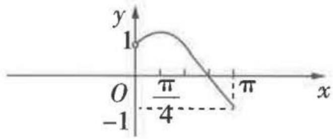  
图6-1

使用建议:若使用化曲为直的思想解题,本题能在1\~2分钟之内迅速解决问题,当然,也可以用分离参数法和构造函数法解决,不过耗时较多,在考试中要合理选择解题方法.

由于直线 y=ax-1 过定点 $(0,-1)$ ，由图可知 $a \leqslant 0$ .

故 a 的取值范围是 $(-∞,0]$ .

# 拓展视野

# 化曲为直思想的应用

在研究不等式问题时, 如果含参数 $a$ 的式子为 $a(x - b)$ ( $b$ 为常数) 的形式, 其余式子不含 $a$ , 可以将原不等式拆为一侧为 “直线”, 一侧为 “曲线” 的形式, 借助数形结合思想, 将原不等式的求解转化为直线与曲线的位置关系 (相交、相切或者相离) 讨论.

# 3. 洛必达法则

知识储备 法则 1 若函数 $f(x)$ 和 $g(x)$ 满足下列条件：

(1) $\lim_{x\to a}f(x)=0$ 及 $\lim_{x\to a}g(x)=0$ ;(2)在点a的某去心邻域内, $f(x)$ 与 $g(x)$ 都可导且 $g'(x)\neq0$ ;(3) $\lim_{x\to a}\frac{f'(x)}{g'(x)}=A(A$ 为有限数或者 $\pm\infty$ ).

那么 $\lim_{x\to a}\frac{f(x)}{g(x)} = \lim_{x\to a}\frac{f'(x)}{g'(x)} = A.$

法则 2 若函数 $f(x)$ 和 $g(x)$ 满足下列条件：

(1) $\lim_{x\to a}f(x)=\infty$ 及 $\lim_{x\to a}g(x)=\infty$ ;(2)在点a的某去心邻域内, $f(x)$ 与 $g(x)$ 都可导且 $g'(x)\neq0$ ;(3) $\lim_{x\to a}\frac{f'(x)}{g'(x)}=A(A$ 为有限数或者 $\pm\infty$ ).

那么 $\lim_{x\to a}\frac{f(x)}{g(x)}=\lim_{x\to a}\frac{f'(x)}{g'(x)}=A.$

注意:①将公式中的 $x \rightarrow a$ 换成 $x \rightarrow +\infty, x \rightarrow -\infty, x \rightarrow a^{+}, x \rightarrow a^{-}$ ，洛必达法则也成立.

②洛必达法则可处理 $\frac{0}{0}, \frac{\infty}{\infty}, 0 \cdot \infty, 1^{\infty}, \infty^{0}, 0^{0}, \infty - \infty$ 型未定式.

③在着手求极限以前,首先要检查是否满足 $\frac{0}{0},\frac{\infty}{\infty},0\cdot\infty,1^{\infty},\infty^{0},0^{0},\infty-\infty$ 型未定式,否则滥用洛必达法则会出错.

调研 4 (2022·江苏淮阴中学5月检测)已知 $f(x)=\mathrm{e}^{x}-ax^{2}-\mathrm{e}+a(a\in\mathbf{R})$ .

(1) 当 a=1 时, 求曲线 $f(x)$ 在 $(1, f(1))$ 处的切线方程;  
(2) 当 $x \geqslant 1$ 时, $f(x) \geqslant 0$ 恒成立, 求 a 的取值范围.

解析 (1) 当 $a = 1$ 时, $f(x) = \mathrm{e}^{x} - x^{2} - \mathrm{e} + 1$ , $f(1) = 0$ , 切点为 $(1,0)$ .

$$
f ^ {\prime} (x) = \mathrm{e} ^ {x} - 2 x, \text {切线斜率} k = f ^ {\prime} (1) = \mathrm{e} - 2,
$$

所以切线方程为 $y=(e-2)(x-1)$ ，即 $y=(e-2)x-e+2$ .

(2)①当 x=1 时, $f(x)=\mathrm{e}-a-\mathrm{e}+a=0$ 恒成立,满足题意.   
②当 $x > 1$ 时， $x^2 - 1 > 0$ ，由 $f(x) \geqslant 0$ ，得 $a \leqslant \frac{\mathrm{e}^x - \mathrm{e}}{x^2 - 1}$ .

【极易出错】在分离参数时，一定要注意分母的正负

令 $g(x) = \frac{\mathrm{e}^x - \mathrm{e}}{x^2 - 1}, x \in (1, +\infty)$ ，则 $g'(x) = \frac{\mathrm{e}^x(x^2 - 1) - 2x(\mathrm{e}^x - \mathrm{e})}{(x^2 - 1)^2} = \frac{\mathrm{e}^x(x^2 - 2x - 1) + 2xe}{(x^2 - 1)^2}$ .

令 $h(x)=\mathrm{e}^{x}(x^{2}-2x-1)+2xe,x\in(1,+\infty)$ ,

则 $h'(x) = \mathrm{e}^{x}(x^{2} - 3) + 2\mathrm{e}, h''(x) = \mathrm{e}^{x}(x^{2} + 2x - 3) = \mathrm{e}^{x}(x - 1)(x + 3) > 0(h''(x))$ 是 $h'(x)$ 的导数），

所以当 $x \in (1, +\infty)$ 时， $h'(x)$ 单调递增，所以 $h'(x) > e^{1} \times (1 - 3) + 2e = -2e + 2e = 0.$

所以 $h(x)$ 在 $(1, +\infty)$ 上单调递增, 所以 $h(x) > e^{1} \times (1 - 2 - 1) + 2e = 0$ .

所以 $g'(x) > 0, g(x)$ 单调递增.

根据洛必达法则可得 $\lim_{x\to 1^{+}}g(x) = \lim_{x\to 1^{+}}\frac{\mathrm{e}^x - \mathrm{e}}{x^2 - 1} = \lim_{x\to 1^{+}}\frac{\mathrm{e}^x}{2x} = \frac{\mathrm{e}}{2}$ .

【规范解答】由于洛必达法则是大学内容，在使用时一定要写上“根据洛必达法则可得”， $1^{+}$ 是指从右侧趋近1， $1^{-}$ 是指从左侧趋近1．由于函数 $g(x)$ 的定义域为 $(1,+\infty)$ ，故采用 $1^{+}$ ，注意此处是“ $\frac{0}{0}$ ”型的代数式，洛必达法则可以连续多次使用，直到求出极限为止

因为 $x \in (1, +\infty)$ 时， $a \leqslant \frac{\mathrm{e}^x - \mathrm{e}}{x^2 - 1}$ 恒成立，所以 $a \leqslant \frac{\mathrm{e}}{2}$ .

【极易出错】由于 $\lim_{x\to 1^{+}}g(x) = \frac{\mathrm{e}}{2}$ 所以当 $x\in (1, + \infty)$ 时， $g(x) > \frac{\mathrm{e}}{2}$ 故 $a\leqslant \frac{\mathrm{e}}{2}$

所以 a 的取值范围是 $(-∞, \frac{e}{2}]$ .

# 命题角度2 单变量不等式能成立或有解问题

调研 5 (2022·江苏天一中学5月模拟)已知函数 $f(x)=\mathrm{e}^{x}-ax-1$ .

(1) 当 a=1 时, 求 $f(x)$ 的单调区间与极值;  
(2) 若 $f(x) \leqslant x^2$ 在 $x \in [0, +\infty)$ 上有解, 求实数 $a$ 的取值范围.

解析 (1) 当 $a = 1$ 时, $f(x) = \mathrm{e}^{x} - x - 1$ , 所以 $f'(x) = \mathrm{e}^{x} - 1$ ,

当 x<0 时, $f'(x)<0$ , 当 x>0 时, $f'(x)>0$ ,

所以 $f(x)$ 的单调递减区间为 $(-∞,0)$ ，单调递增区间为 $(0,+∞)$ ，

并且当 x=0 时函数 $f(x)$ 有极小值 $f(0)=0$ ，无极大值。

(2) 因为 $f(x) \leqslant x^2$ 在 $[0, +\infty)$ 上有解，

所以 $\mathrm{e}^x - x^2 - ax - 1 \leqslant 0$ 在 $[0, +\infty)$ 上有解.

当 x=0 时,该不等式恒成立,此时 $a \in R$ .

当 $x > 0$ 时，原不等式即 $a \geqslant \frac{\mathrm{e}^x}{x} - (x + \frac{1}{x})$ 在 $(0, +\infty)$ 上有解.

令 $g(x) = \frac{\mathrm{e}^x}{x} - (x + \frac{1}{x})(x \in (0, +\infty))$ ，则 $g'(x) = \frac{\mathrm{e}^x(x - 1)}{x^2} - \frac{x^2 - 1}{x^2} = \frac{(x - 1)(\mathrm{e}^x - x - 1)}{x^2}$ ，

【承上启下】没有无缘无故的爱和恨，也没有无缘无故的第一小间。往往第一小间的结论，在第二小间中会起到一定的作用

由(1)知当 x>0 时, $f(x)>0$ , 即 $e^{x}-x-1>0$ ,

所以当 0 < x < 1 时, $g'(x) < 0$ , 当 x > 1 时, $g'(x) > 0$ ,

所以 $g(x)$ 在 $(0,1)$ 上单调递减，在 $(1,+\infty)$ 上单调递增，

所以 $g(x)_{\min}=g(1)=e-2$ ，所以 $a\geqslant e-2$ 。

综上可知,实数 a 的取值范围是 $[e-2, +\infty)$ .

# 反思提升

该题利用分离参数法解决了不等式有解问题，那么构造函数法适用么？若我们用构造函数法，令 $g(x) = \mathrm{e}^{x} - x^{2} - ax - 1 (x \in [0, +\infty))$ ，由于 $g'(x) = \mathrm{e}^{x} - 2x - a$ ， $g''(x) = \mathrm{e}^{x} - 2$ ，所以当 $x \in [0, \ln 2)$ 时， $g''(x) < 0$ ， $g'(x)$ 单调递减，当 $x \in (\ln 2, +\infty)$ 时， $g''(x) > 0$ ， $g'(x)$ 单调递增。所以 $g'(x)_{\min} = g'(\ln 2) = 2 - 2\ln 2 - a$ 。显然 $g'(x)_{\min}$ 与 0 比较大小时，需要分类讨论，故用此法研究甚是烦琐。

调研 6 (2022·长春外国语学校4月模拟)已知函数 $f(x) = -a\ln x - \frac{e^x}{x} + ax, a \in \mathbb{R}$ .

(1) 当 a < 0 时, 讨论 $f(x)$ 的单调性;

(2) 设 $g(x)=f(x)+xf'(x)$ ，若关于 x 的不等式 $g(x)\leqslant-\mathrm{e}^{x}+\frac{x^{2}}{2}+(a-1)x$ 在 [1, 2] 上有解，求 a 的取值范围.

解析 (1) 由题意知, $f'(x) = -\frac{a}{x} - \frac{x e^x - e^x}{x^2} + a = \frac{(ax - e^x)(x - 1)}{x^2}$ ,

令 $m(x) = (ax - \mathrm{e}^x)(x - 1)(x > 0)$ ，当 $a < 0$ 时， $ax - \mathrm{e}^x < 0$ 恒成立，

所以当 $x > 1$ 时， $m(x) < 0$ ，即 $f'(x) < 0$ ，当 $0 < x < 1$ 时， $m(x) > 0$ ，即 $f'(x) > 0$ .

所以函数 $f(x)$ 在(0,1)上单调递增，在 $(1,+\infty)$ 上单调递减.

(2) $g(x)=f(x)+xf'(x)=-a\ln x-\frac{e^{x}}{x}+ax+x(-\frac{a}{x}-\frac{xe^{x}-e^{x}}{x^{2}}+a)=-a\ln x-$ $e^{x}+2ax-a,$

由题意知, 存在 $x_{0} \in [1,2]$ , 使得 $g(x_{0}) \leqslant -\mathrm{e}^{x_{0}} + \frac{x_{0}^{2}}{2} + (a-1)x_{0}$ 成立,即存在 $x_0 \in [1,2]$ , 使得 $-a \ln x_0 + (a + 1)x_0 - \frac{x_0^2}{2} - a \leqslant 0$ 成立.

令 $h(x) = -a\ln x + (a + 1)x - \frac{x^2}{2} - a, x \in [1,2]$ ,

则 $h^{\prime}(x) = \frac{-a}{x} + a + 1 - x = -\frac{(x - a)(x - 1)}{x}, x \in [1,2]$ .

【扫消障碍】在分类讨论时,需要思考 “使导函数值为 0 的点是否在定义域中”, 因此分 $a \leqslant 1$ , $1 < a < 2$ , $a \geqslant 2$ 三种情况, 分别判定函数的单调性, 求最值

①当 $a \leqslant 1$ 时, 对任意 $x \in [1,2]$ , 都有 $h'(x) \leqslant 0$ , 所以函数 $h(x)$ 在 $[1,2]$ 上单调递减, 所以 $h(x)_{\min} = h(2) = -a \ln 2 + a \leqslant 0$ 恒成立, 解得 $a \leqslant 0$ , 所以 $a \leqslant 0$ .

②当 1 < a < 2 时, 令 $h'(x) > 0$ , 得 1 < x < a, 令 $h'(x) < 0$ , 得 a < x < 2, 所以函数 $h(x)$ 在 $[1, a)$ 上单调递增, 在 $(a, 2]$ 上单调递减,

又 $h(1) = \frac{1}{2} > 0$ ，所以只能 $h(2) = -a\ln 2 + a \leqslant 0$

解得 $a \leqslant 0$ ，结合 1 < a < 2 知 a 无解。

③当 $a \geqslant 2$ 时, 对任意的 $x \in [1,2]$ , 都有 $h'(x) \geqslant 0$ , 所以函数 $h(x)$ 在 $[1,2]$ 上单调递增, 所以 $h(x)_{\min} = h(1) = \frac{1}{2} > 0$ , 不符合题意, $a$ 无解.

综上所述，a 的取值范围为 $(-∞,0]$ .

# 方法提炼

不等式恒成立与有解(能成立)问题的区别与联系

<table><tr><td rowspan="2"></td><td colspan="2">区别</td><td rowspan="2">联系</td></tr><tr><td>不等式问题</td><td>等价转化方式</td></tr><tr><td rowspan="2">不等式恒成立问题</td><td>a≥f(x)在x∈D上恒成立</td><td>a≥f(x)max,x∈D</td><td rowspan="4">对于单变量不等式,无论是恒成立问题还是有解(能成立)问题,都需要用分离参数法或者构造函数法,转化为最值问题进行解决.</td></tr><tr><td>a≤f(x)在x∈D上恒成立</td><td>a≤f(x)min,x∈D</td></tr><tr><td rowspan="2">不等式有解(能成立)问题</td><td>a≥f(x)在x∈D上能成立</td><td>a≥f(x)min,x∈D</td></tr><tr><td>a≤f(x)在x∈D上能成立</td><td>a≤f(x)max,x∈D</td></tr></table>

# 命题角度3 双变量不等式恒(能)成立问题

调研 7 (2022 · 重庆市朝阳中学 5 月诊断) 已知函数 $f(x) = 2x + \frac{1}{x^2} - 4$ , 函数$g(x)=\frac{\ln x}{x}-m$ , 若对任意的 $x_{1}\in[1,2]$ ，存在 $x_{2}\in[\frac{1}{e},e^{2}]$ ，使得 $f(x_{1})\leqslant g(x_{2})$ ，则实数 m 的取值范围为 \_\_\_\_.

由题意得 $f(x_{1})_{\max}\leqslant g(x_{2})_{\max}$ .

$f'(x)=2-\frac{2}{x^{3}}$ , 当 $x\in[1,2]$ 时, $f'(x)\geqslant0$ , 故 $f(x)$ 在 $[1,2]$ 上单调递增, $f(x_{1})_{\max}=$ $f(2)=\frac{1}{4}.$

$g^{\prime}(x) = \frac{1 - \ln x}{x^{2}}$ ，当 $x\in [\frac{1}{\mathrm{e}},\mathrm{e})$ 时， $g^{\prime}(x) > 0$ ，当 $x\in (\mathrm{e},\mathrm{e}^2 ]$ 时， $g^{\prime}(x) <   0,$

故 $g(x)$ 在 $\left[\frac{1}{\mathrm{e}},\mathrm{e}\right)$ 上单调递增，在 $(\mathrm{e},\mathrm{e}^2 ]$ 上单调递减， $g(x_2)_{\max} = g(\mathrm{e}) = \frac{1}{\mathrm{e}} -m.$

$f(x_{1})_{\max} \leqslant g(x_{2})_{\max}$ , 即 $\frac{1}{4} \leqslant \frac{1}{\mathrm{e}} - m$ , 解得 $m \in (-\infty, \frac{1}{\mathrm{e}} - \frac{1}{4}]$ .

调研 8 (2022·广东珠海一中5月阶段检测)已知 $f(x)=\frac{1}{2}\ln x-mx(m>0)$ , $g(x)=x-\frac{a}{x}(a>0)$ .

(1) 求函数 $f(x)$ 的单调区间；  
(2) 若 $m = \frac{1}{2\mathrm{e}^2}, \forall x_1, x_2 \in [2, 2\mathrm{e}^2], g(x_1) \geqslant f(x_2)$ , 求实数 $a$ 的取值范围.

(1) 求出 $f(x)$ 的导函数, 利用导数求函数 $f(x)$ 的单调区间; (2) 先由题意得 $g(x_{1})_{\min} \geqslant f(x_{2})_{\max}$ , 再分别求出 $g(x_{1})_{\min}, f(x_{2})_{\max}$ , 建立不等式, 即可求出实数 a 的取值范围.

解析 $f(x)=\frac{1}{2}\ln x-mx$ 的定义域为 $(0,+\infty)$ ,

$$
f ^ {\prime} (x) = \frac {1}{2 x} - m = \frac {1 - 2 m x}{2 x} = \frac {- m (x - \frac {1}{2 m})}{x}.
$$

(1) 令 $f'(x) > 0$ ，解得 $0 < x < \frac{1}{2m}$ ，令 $f'(x) < 0$ ，解得 $x > \frac{1}{2m}$ .

所以 $f(x) = \frac{1}{2}\ln x - mx$ 的单调递增区间为 $(0, \frac{1}{2m})$ ，单调递减区间为 $(\frac{1}{2m}, +\infty)$ .

(2) 若 $m = \frac{1}{2\mathrm{e}^2}$ , 则 $f(x) = \frac{1}{2}\ln x - \frac{1}{2\mathrm{e}^2} x$ .

$\forall x_{1},x_{2}\in [2,2\mathrm{e}^{2}],g(x_{1})\geqslant f(x_{2})$ ，等价于 $g(x_{1})_{\min}\geqslant f(x_{2})_{\max}$

由(1)知在 $[2, 2\mathrm{e}^2]$ 上， $f(x)_{\max} = f(\mathrm{e}^2) = \frac{1}{2}$ ，故 $f(x_2)_{\max} = \frac{1}{2}$ .

对于 $g(x) = x - \frac{a}{x} (a > 0), g'(x) = 1 + \frac{a}{x^2} > 0$ ，所以 $g(x)$ 在 $[2, 2\mathrm{e}^2]$ 上单调递增，

所以 $g(x)_{\min}=g(2)=2-\frac{a}{2}$ ，故 $g(x_{1})_{\min}=2-\frac{a}{2}$ .

所以 $2 - \frac{a}{2} \geqslant \frac{1}{2}$ ，解得 $a \leqslant 3$ 。又 a > 0，所以 $0 < a \leqslant 3$ 。

【极易出错】许多考生在计算出 $a \leq 3$ 后，却忘记了题干中 $a > 0$ 的大范围限制，大意兴荆归！题干中变量或者参数的范围，一定不要忘记

所以实数 a 的取值范围为 $(0,3]$ .

# 方法提炼

解双变量不等式恒(能)成立问题的方法和基本思想

<table><tr><td>常见双变量问题</td><td>等价转化方法</td><td>数学思想——数形结合</td></tr><tr><td> $\forall x_1 \in M, \forall x_2 \in N, f(x_1) < g(x_2)$ </td><td> $f(x_1)_{\max} < g(x_2)_{\min}$ </td><td>函数  $y=f(x)$  在区间  $M$  内的任意一个函数值小于函数  $y=g(x)$  在区间  $N$  内的任意一个函数值.</td></tr><tr><td> $\forall x_1 \in M, \exists x_2 \in N, f(x_1) < g(x_2)$ </td><td> $f(x_1)_{\max} < g(x_2)_{\max}$ </td><td>函数  $y=f(x)$  在区间  $M$  内的任意一个函数值小于函数  $y=g(x)$  在区间  $N$  内的某一个函数值,但并不要求小于函数  $y=g(x)$  在区间  $N$  内的所有函数值.</td></tr><tr><td> $\exists x_1 \in M, \forall x_2 \in N, f(x_1) < g(x_2)$ </td><td> $f(x_1)_{\min} < g(x_2)_{\min}$ </td><td>函数  $y=f(x)$  在区间  $M$  内的某一个函数值(但并不要求函数  $y=f(x)$  在区间  $M$  内的所有函数值)小于函数  $y=g(x)$  在区间  $N$  内的任意一个函数值.</td></tr><tr><td> $\exists x_1 \in M, \exists x_2 \in N, f(x_1) < g(x_2)$ </td><td> $f(x_1)_{\min} < g(x_2)_{\max}$ </td><td>函数  $y=f(x)$  在区间  $M$  内的某一个函数值小于函数  $y=g(x)$  在区间  $N$  内的某一个函数值,但并不要求小于函数  $y=g(x)$  在区间  $N$  内的所有函数值.</td></tr></table>

# 新题演练

1. (2022·辽宁省实验中学5月模拟)已知函数 $f(x) = \mathrm{e}^{x} - f(0)x$ , 若存在实数 $x_{0}$ 使得不等式 $2a - 1 - \frac{x_{0}^{2}}{2} \geqslant f(x_{0})$ 成立, 则 $a$ 的取值范围为 ( )

A. $[1, +\infty)$

B. $(-∞,3]$

C. $(-∞,2]$

D. $[0, +\infty)$

2. (2022 · 重庆长寿中学 4 月阶段检测)已知函数 $f(x) = ax + \ln x$ .

(1) 讨论 $f(x)$ 的单调区间；

(2) 设 $g(x)=2^{x}$ ，若对任意的 $x_{1}\in[1,100]$ ，存在 $x_{2}\in[0,1]$ ，使 $f(x_{1})<g(x_{2})$ 成立，求实数 a 的取值范围.

# 参考答案与解析

1. A 令 $x = 0$ 得 $f(0) = 1$ , 所以 $f(x) = \mathrm{e}^{x} - x$ ,

$2a - 1 - \frac{x_0^2}{2} \geqslant f(x_0)$ 即 $2a - 1 \geqslant \mathrm{e}^{x_0} - x_0 + \frac{x_0^2}{2}$ ,

【扫清障碍】令 $x = 0$ ，求出 $f(0)$ ，从而确定 $f(x)$ 的解析式。用分离参数法，化 $2a - 1 - \frac{x_0^2}{2} \geqslant f(x_0)$ 为 $2a - 1 \geqslant f(x_0) + \frac{x_0^2}{2}$ ，构造函数 $g(x) = f(x) + \frac{x^2}{2}$ ，求 $g(x)$ 的导数，判断 $g(x)$ 的单调性，得其最小值，即可求解 $a$ 的范围

令 $g(x) = \mathrm{e}^{x} - x + \frac{x^{2}}{2}$ , 则 $g'(x) = \mathrm{e}^{x} - 1 + x$ , 令 $h(x) = \mathrm{e}^{x} - 1 + x$ ,

则 $h'(x) = e^{x} + 1 > 0$ ，所以 $g'(x)$ 为单调递增函数，

当 x<0 时, $g'(x)<0$ , $g(x)$ 单调递减,

当 x > 0 时, $g'(x) > 0$ , $g(x)$ 单调递增.

所以 $g(x) \geqslant g(0) = 1$ ，从而 $2a - 1 \geqslant 1$ ，即 $a \geqslant 1$ 。故选 A.

2. (1) $f'(x) = a + \frac{1}{x} = \frac{ax + 1}{x} (x > 0)$ ,

【扫清障碍】根据方程 $ax + 1 = 0$ 的很是否在区间 $(0, +\infty)$ 内，分 $a \geqslant 0$ ， $a < 0$ 两类进行讨论

①当 $a \geqslant 0$ 时,由于 x > 0,故 $ax + 1 > 0, f'(x) > 0$ ,

所以 $f(x)$ 的单调递增区间为 $(0, +\infty)$ .

②当 a<0 时,由 $f'(x)=0$ , 得 $x=-\frac{1}{a}$ ,

则在区间 $(0, -\frac{1}{a})$ 上， $f'(x) > 0$ ，在区间 $(- \frac{1}{a}, +\infty)$ 上， $f'(x) < 0$ 所以函数 $f(x)$ 的单调递增区间为 $(0, -\frac{1}{a})$ ，单调递减区间为 $(- \frac{1}{a}, +\infty)$ .

综上所述,当 $a \geqslant 0$ 时, $f(x)$ 的单调递增区间为 $(0, +\infty)$ , 无单调递减区间; 当 a < 0 时, $f(x)$ 的单调递增区间为 $(0, -\frac{1}{a})$ , 单调递减区间为 $(- \frac{1}{a}, +\infty)$ .

(2)由题目知,只需要 $f(x_{1})_{\max}<g(x_{2})_{\max}$ 即可.

【突破口】由已知，转化为 $f(x_{1})_{\max}<g(x_{2})_{\max}$ ，由已知得 $g(x_{2})_{\max}=g(1)=2$ ，由此能求出实数a的取值范围

易知 $g(x_{2})_{\max}=g(1)=2$ , 所以只需要 $f(x_{1})_{\max}<2$ 即可.

$f(x_{1})_{\max} < 2$ 即 $f(x_{1}) < 2$ 恒成立，分离参数可得 $a < \frac{2 - \ln x}{x}, x \in [1, 100]$ 恒成立，

令 $h(x) = \frac{2 - \ln x}{x}, x \in [1, 100]$ , 则 $h'(x) = \frac{-3 + \ln x}{x^2}$ , 由 $h'(x) = 0$ 得 $x = e^3$ ,

所以 $h(x)$ 在 $[1, e^{3})$ 上单调递减，在 $(e^{3}, 100]$ 上单调递增，

所以 $h(x)_{\min} = h(\mathrm{e}^3) = \frac{-1}{\mathrm{e}^3}$ , 所以 $a < -\frac{1}{\mathrm{e}^3}$ ,

即实数 a 的取值范围是 $(-∞, -\frac{1}{e^{3}})$ .

# 超重点7 函数构造思想的应用问题

# 命题角度1 利用导数运算构造函数

求解与导数有关的抽象函数不等式问题时,常用策略是联想函数求导公式及求导法则构造一个新函数,通过研究新函数的性质处理与原不等式相关的问题.

调研 1 (2022·湖南长郡中学4月模拟/和差型)(多选)若定义在R上的函数 $f(x)$ 满足 $f(0) = -1$ ,其导函数为 $f'(x)$ ,且 $f'(x) > m > 1$ ,则下列各式成立的有()

A. $f(\frac{1}{m}) > \frac{1 - m}{m}$

B. $f(\frac{1}{m}) < -1$

C. $f(\frac{1}{m - 1}) > \frac{1}{m - 1}$

D. $f(\frac{1}{m - 1}) <   0$

解析 构造函数 $g(x)=f(x)-mx$ ，则 $g'(x)=f'(x)-m>0$ ，

【巧构造】由 $f'(x)-m>0$ ，联想求导法则，可构造新函数 $g(x)=f(x)-mx$

故函数 $g(x)=f(x)-mx$ 在 R 上单调递增.

易知 $\frac{1}{m} > 0$ ，所以 $g\left(\frac{1}{m}\right) > g(0)$ ，即 $f\left(\frac{1}{m}\right) - 1 > -1$ ，所以 $f\left(\frac{1}{m}\right) > 0$ ，故 B 错误.

【会转化】根据选项中自变量的取值，结合函数的单调性进行转化

又 $m > 1$ ，所以 $\frac{1 - m}{m} < 0$ ，所以 $f\left(\frac{1}{m}\right) > \frac{1 - m}{m}$ 故A正确.

【挖掘条件】由 m>1 得 $\frac{1-m}{m}<0$ ，充分挖掘并利用题中已知条件求解，少走弯路

由 $\frac{1}{m - 1} >0$ 得 $g(\frac{1}{m - 1}) > g(0)$ ，即 $f(\frac{1}{m - 1}) - \frac{m}{m - 1} > - 1$ ，则 $f(\frac{1}{m - 1}) > \frac{1}{m - 1}>$ 0,故C正确，D错误.故选AC.

调研 2 (2022 · 山东青岛二中 4 月模考/商型) (多选) 记 $f(x)$ 的导函数为 $f'(x)$ , 若 $f(x) < xf'(x) < 2f(x) - x$ 对任意的正数都成立, 则下列不等式中成立的有 ( )

A. $f(1) < 2f(\frac{1}{2})$

B. $f(1) < \frac{1}{2} f(2)$

C. $f(1) < 4f(\frac{1}{2}) - 1$

D. $f(1) < \frac{1}{4} f(2) + \frac{1}{2}$

思维导引 对于选项 AB, 构造函数 $F(x)=\frac{f(x)}{x}(x>0)$ , 求导, 借助函数的单调性比较大小即可; 对于选项 CD, 构造函数 $h(x)=\frac{f(x)-x}{x^{2}}$ , 求导, 借助函数的单调性比较大小即可.

解析 由 $f(x) < xf'(x) (x > 0)$ 得 $xf'(x) - f(x) > 0 (x > 0)$ ，则 $\frac{xf'(x) - f(x)}{x^2} = \left[\frac{f(x)}{x}\right]' > 0 (x > 0)$ ，

令 $F(x) = \frac{f(x)}{x} (x > 0)$ , 所以 $F(x)$ 在 $(0, +\infty)$ 上单调递增, 所以 $F(1) > F(\frac{1}{2})$ , 即 $\frac{f(1)}{1} > \frac{f(\frac{1}{2})}{\frac{1}{2}}$ , 即 $f(1) > 2f(\frac{1}{2})$ , 故 A 错误.

同理, $F(2)>F(1)$ ,即 $\frac{f(2)}{2}>\frac{f(1)}{1}$ ,即 $f(1)<\frac{1}{2}f(2)$ ,故B正确.

因为 $xf'(x) < 2f(x) - x (x > 0)$ ，所以 $xf'(x) - 2f(x) + x < 0 (x > 0)$ ，令 $h(x) = \frac{f(x) - x}{x^2} (x > 0)$ ，则 $h'(x) = \left[\frac{f(x) - x}{x^2}\right]' = \frac{xf'(x) - 2f(x) + x}{x^3} < 0$ ，所以 $h(x)$ 在(0,

【提示】构造函数，也可以选项中不等式的形式入手，观察 C 选项中的不等式 $f(1) < 4f(\frac{1}{2}) - 1$ .

变形整理， $f(1)-1<4f(\frac{1}{2})-2\Rightarrow f(1)-1<4f(\frac{1}{2})-4\times\frac{1}{2}\Rightarrow f(1)-1<\frac{f(\frac{1}{2})-\frac{1}{2}}{\frac{1}{4}}\Rightarrow\frac{f(1)-1}{1^{2}}<$ $\frac{f(\frac{1}{2})-\frac{1}{2}}{(\frac{1}{2})^{2}}$ ，进而构造函数 $h(x)=\frac{f(x)-x}{x^{2}}(x>0)$

$+\infty$ )上单调递减,所以 $h(1)<h(\frac{1}{2})$ ,即 $\frac{f(1)-1}{1}<\frac{f(\frac{1}{2})-\frac{1}{2}}{\frac{1}{4}}$ ,化简得 $f(1)<4f(\frac{1}{2})-1$ ,
故 C 正确.

同理, $h(2)<h(1)$ ,即 $\frac{f(2)-2}{4}<\frac{f(1)-1}{1}$ ,化简得 $f(1)>\frac{1}{4}f(2)+\frac{1}{2}$ ,故D错误.
故选 BC.

调研 3 (2022·天津南开中学4月模拟/积型)已知可导函数 $f(x)$ 是定义在 $(- \frac{\pi}{2}, \frac{\pi}{2})$ 上的奇函数. 当 $x \in (0, \frac{\pi}{2})$ 时, $f(x) + f'(x) \tan x > 0$ , 则不等式 $\cos x \cdot f(x + \frac{\pi}{2}) + \sin x \cdot f(-x) > 0$ 的解集为 ( )

A. $\left(-\frac{\pi}{2},-\frac{\pi}{6}\right)$

B. $(- \frac{\pi}{6}, 0)$

C. $\left(-\frac{\pi}{2},-\frac{\pi}{4}\right)$

D. $(- \frac{\pi}{4}, 0)$

解析 当 $x \in (0, \frac{\pi}{2})$ 时, $f(x) + f'(x) \tan x > 0$ , 则 $\cos x \cdot f(x) + f'(x) \sin x > 0$ , 所以函数 $y = \sin x \cdot f(x)$ 在 $(0, \frac{\pi}{2})$ 上单调递增.

【技巧】联想导数运算法则 $[f(x)g(x)]' = f'(x)g(x) + f(x)g'(x)$ ，构造函数

又可导函数 $f(x)$ 是定义在 $(- \frac{\pi}{2}, \frac{\pi}{2})$ 上的奇函数, 函数 $y = \sin x$ 是 $\mathbb{R}$ 上的奇函数,

所以 $y = \sin x \cdot f(x)$ 是定义在 $(- \frac{\pi}{2}, \frac{\pi}{2})$ 上的偶函数，且在 $(- \frac{\pi}{2}, 0)$ 上单调递减.

【用性质】利用函数的奇偶性，由函数 $y = \sin x \cdot f(x)$ 在 $(0, \frac{\pi}{2})$ 上的单调性得其在 $(- \frac{\pi}{2}, 0)$ 上的单调性

由 $\left\{\begin{aligned}-\frac{\pi}{2}<x+\frac{\pi}{2}<\frac{\pi}{2},\\-\frac{\pi}{2}<-x<\frac{\pi}{2},\end{aligned}\right.$ 可得 $x\in(-\frac{\pi}{2},0)$ ，则 $x+\frac{\pi}{2}\in(0,\frac{\pi}{2})$ ， $-x\in(0,\frac{\pi}{2})$ .

不等式 $\cos x \cdot f(x + \frac{\pi}{2}) + \sin x \cdot f(-x) > 0$ 可转化为 $\sin(x + \frac{\pi}{2}) \cdot f(x + \frac{\pi}{2}) >$ $\sin(-x) \cdot f(-x)$ ,

【会转化】运用诱导公式，将原不等式进行转化

又函数 $y = \sin x \cdot f(x)$ 在 $(0, \frac{\pi}{2})$ 上单调递增，所以 $\frac{\pi}{2} > x + \frac{\pi}{2} > -x > 0$ ，解得 $-\frac{\pi}{4} < x < 0$ ，故选 D.

# 命题角度2 利用同构法构造函数

在数学解题过程中,经常会遇到左、右两边结构相似的方程、不等式等,若直接求解困难较大,这时需要应用同构思想,通过变形进行合理转化.

调研 4 (2022·湖北八市4月模拟联考/“地位同等”同构法)已知函数 $f(x)=x+\ln(x-1)$ , $g(x)=x\ln x$ , 若 $f(x_{1})=1+2\ln t$ , $g(x_{2})=t^{2}$ , 则 $\frac{\ln t}{x_{1}x_{2}-x_{2}}$ 的最大值为 \_\_\_\_.

解析 由题意得 $f(x_{1})=x_{1}+\ln(x_{1}-1)=1+2\ln t$ ，则 $x_{1}-1+\ln(x_{1}-1)=2\ln t$ .
又 $g(x_{2})=x_{2}\ln x_{2}=t^{2}$ ，取自然对数得， $\ln x_{2}+\ln(\ln x_{2})=2\ln t$

【注意】 $t>0,\ x_{2}>0$ ，则有 $\ln x_{2}>0$

所以 $x_{1}-1+\ln(x_{1}-1)=2\ln t=\ln x_{2}+\ln(\ln x_{2})$ ，于是构造函数 $F(x)=x+\ln x(x>0)$ ，

【巧构造】借助中间量t，找到相同结构，进而可构造函数

则 $F(x_{1}-1)=F(\ln x_{2})$ .

又 $F(x) = x + \ln x$ 在 $(0, +\infty)$ 上单调递增，所以 $x_{1} - 1 = \ln x_{2}$

【技巧】结合函数的单调性，脱去“扑衣”F

于是 $\frac{\ln t}{x_1x_2 - x_2} = \frac{\ln t}{x_2\ln x_2} = \frac{\ln t}{t^2}$ 其中 $t > 0$

令 $h(t) = \frac{\ln t}{t^2} (t > 0)$ , 则 $h'(t) = \frac{1 - 2\ln t}{t^3}$ , 当 $t \in (0, \mathrm{e}^{\frac{1}{2}})$ 时, $h'(t) > 0, h(t)$ 单调递增; 当 $t \in (\mathrm{e}^{\frac{1}{2}}, +\infty)$ 时, $h'(t) < 0, h(t)$ 单调递减.

所以 $h(t)_{\max} = h(\mathrm{e}^{\frac{1}{2}}) = \frac{1}{2\mathrm{e}}.$ 故填 $\frac{1}{2\mathrm{e}}.$

调研 5 (2022·陕西西安 4 月模考/指对“跨界”同构法) 若不等式 $e^{x} - a\ln(ax - 1) + 1 \geqslant 0$ 对任意的 $x \in [\frac{1}{2}, 1]$ 恒成立 (e 为自然对数的底数), 则实数 $a$ 的最大值为 ( )

A. $e+1$

B. e

C. $\mathrm{e}^2 + 1$

D. $e^{2}$

由题设易得 a > 2，将原不等式化为 $\mathrm{e}^{x - \ln a} + x - \ln a \geqslant \mathrm{e}^{\ln(x - \frac{1}{a})} + \ln(x - \frac{1}{a})$ ，构造函数 $f(x) = \mathrm{e}^{x} + x$ ，结合导数研究函数的单调性，可得 $f(x - \ln a) \geqslant f(\ln(x - \frac{1}{a}))$ ，进而有 $\ln a \leqslant x - \ln(x - \frac{1}{a})$ 在 $x \in [\frac{1}{2}, 1]$ 上恒成立，再次构造函数 $g(x) = x - \ln(x - \frac{1}{a})$ ，应用导数求其最小值，即可确定 a 的取值范围，即得 a 的最大值。

解析 由题设得, $ax - 1 > 0$ 在 $x \in \left[\frac{1}{2}, 1\right]$ 上恒成立, 所以 $\left\{ \begin{array}{l} a - 1 > 0, \\ \frac{a}{2} - 1 > 0, \end{array} \right.$ 即 $a > 2$ .

【挖掘条件】遇到分式、对数式等，要注意挖掘隐含条件，如分母不为0、真数大于0

原不等式可化为 $\frac{\mathrm{e}^x}{a} -\ln [a(x - \frac{1}{a})] + \frac{1}{a} = \mathrm{e}^{x - \ln a} - \ln a - \ln (x - \frac{1}{a}) + \frac{1}{a}\geqslant 0,$

所以 $\mathrm{e}^{x - \ln a} - \ln a\geqslant \ln (x - \frac{1}{a}) - \frac{1}{a}$ 即 $\mathrm{e}^{x - \ln a} + x - \ln a\geqslant x - \frac{1}{a} +\ln (x - \frac{1}{a})$ ，即 $\mathrm{e}^{x - \ln a}+$ $x - \ln a\geqslant \mathrm{e}^{\ln (x - \frac{1}{a})} + \ln (x - \frac{1}{a}).$

令 $f(x)=\mathrm{e}^{x}+x$ ，则 $f'(x)=\mathrm{e}^{x}+1>0$ ，故 $f(x)$ 在 $\left[\frac{1}{2},1\right]$ 上单调递增.

【会构造】应用同构法构造 $f(x)=\mathrm{e}^{x}+x$ ，也可转化为 $\mathrm{e}^{x-\ln a}+\ln\mathrm{e}^{x-\ln a}\geqslant x-\frac{1}{a}+\ln(x-\frac{1}{a})$ 进而构造函数 $h(x)=x+\ln x$ 进行求解

由上知 $f(x - \ln a) \geqslant f(\ln (x - \frac{1}{a}))$ ，则 $x - \ln a \geqslant \ln (x - \frac{1}{a})$ ，

即 $\ln a \leqslant x - \ln (x - \frac{1}{a})$ 在 $x \in [\frac{1}{2}, 1]$ 上恒成立.

令 $g(x) = x - \ln (x - \frac{1}{a})(x\in [\frac{1}{2},1])$

则 $g'(x)=\frac{x-\frac{1}{a}-1}{x-\frac{1}{a}}$ ，又 $x\in\left[\frac{1}{2},1\right]$ ，a>2，

所以 $x - \frac{1}{a} - 1 < 0, x - \frac{1}{a} > 0$ ，即 $g'(x) < 0$

故 $g(x)$ 在 $x \in [\frac{1}{2}, 1]$ 上单调递减，

所以 $\ln a \leqslant g(x)_{\min} = g(1) = 1 - \ln (1 - \frac{1}{a})$ ，故 $\ln a + \ln (1 - \frac{1}{a}) \leqslant 1$ ，即 $\ln (a - 1) \leqslant 1$ ，可得 $a \leqslant e + 1$ .

综上, $2<a\leqslant e+1$ ,故a的最大值为 $e+1$ .故选A.

# ② 索记题

# 与 $\mathrm{e}^x$ 和 $\ln x$ 相关的常见同构模型

① $ae^{a}\leqslant b\ln b\Leftrightarrow e^{a}\ln e^{a}\leqslant b\ln b$ ，构造 $f(x)=x\ln x$ （或 $ae^{a}\leqslant b\ln b\Leftrightarrow ae^{a}\leqslant(\ln b)e^{\ln b}$ ，构造 $g(x)=xe^{x}$ ）.

② $\frac{\mathrm{e}^a}{a} < \frac{b}{\ln b} \Leftrightarrow \frac{\mathrm{e}^a}{\ln \mathrm{e}^a} < \frac{b}{\ln b}$ , 构造 $f(x) = \frac{x}{\ln x}$ (或 $\frac{\mathrm{e}^a}{a} < \frac{b}{\ln b} \Leftrightarrow \frac{\mathrm{e}^a}{a} < \frac{\mathrm{e}^{\ln b}}{\ln b}$ , 构造 $g(x) = \frac{\mathrm{e}^x}{x}$ ).

③ $e^{a}\pm a>b\pm\ln b\Leftrightarrow e^{a}\pm\ln e^{a}>b\pm\ln b$ ，构造 $f(x)=x\pm\ln x$ （或 $e^{a}\pm a>b\pm\ln b\Leftrightarrow e^{a}\pm a>e^{\ln b}\pm\ln b$ ，构造 $g(x)=e^{x}\pm x$ ）.

# 命题角度3> 利用换元构造函数

调研 6 (2022·河北部分学校5月联考)已知函数 $f(x)=x\ln x-\frac{1}{2}ax^{2}+1(a\in \mathbf{R})$ , $f'(x)$ 为 $f(x)$ 的导函数.

(1) 讨论 $f'(x)$ 的单调性.

(2) 设 $x_{1}, x_{2}$ 是 $f(x)$ 的两个极值点, 证明: $0 < \frac{1}{x_{1}x_{2}} < 1$ .

思维导引 (1) 令 $f'(x) = \ln x - ax + 1 = g(x)$ ，讨论 $a \leqslant 0, a > 0$ 两种情况，利用导数判断 $f'(x)$ 的单调性；(2) 由极值点的定义得出 $\ln x_1 - ax_1 + 1 = 0, \ln x_2 - ax_2 + 1 = 0$ ，进而得到 $a = \frac{\ln x_1 - \ln x_2}{x_1 - x_2}$ ，由分析法结合导数证明 $\ln \frac{x_1}{x_2} < \frac{2\left(\frac{x_1}{x_2} - 1\right)}{\frac{x_1}{x_2} + 1}$ ，从而得出 $0 < \frac{1}{x_1 x_2} < 1$ .

解析 (1) $f(x)$ 的定义域为 $(0, +\infty)$ , $f'(x) = \ln x - ax + 1$ .

令 $g(x) = \ln x - ax + 1(x > 0)$ ，则 $g'(x) = \frac{1}{x} - a = \frac{1 - ax}{x}(x > 0)$ .

当 $a \leqslant 0$ 时, $g'(x) > 0$ 恒成立, 则 $f'(x)$ 在 $(0, +\infty)$ 上单调递增.

【分类讨论】 $g(x)$ 求导后正负未知，分母 x 恒大于 0，以分子 1 - ax 的正负为标准分类讨论

当 $a > 0$ 时，由 $g'(x) > 0$ 得 $0 < x < \frac{1}{a}$ ，由 $g'(x) < 0$ 得 $x > \frac{1}{a}$ ，所以 $f'(x)$ 在 $(0, \frac{1}{a})$ 上单调递增，在 $(\frac{1}{a}, +\infty)$ 上单调递减.

综上所述, 当 $a \leqslant 0$ 时, $f'(x)$ 在 $(0, +\infty)$ 上单调递增; 当 $a > 0$ 时, $f'(x)$ 在 $(0, \frac{1}{a})$ 上单调递增, 在 $(\frac{1}{a}, +\infty)$ 上单调递减.

【规范答题】分类讨论后，切不可忘记总结，否则易失去1分的步骤分

(2) 因为 $x_{1}, x_{2}$ 是 $f(x)$ 的两个极值点, 所以 $\ln x_{1} - ax_{1} + 1 = 0, \ln x_{2} - ax_{2} + 1 = 0$ .

两式相减得 $a=\frac{\ln x_{1}-\ln x_{2}}{x_{1}-x_{2}}$ ，欲证 $0<\frac{1}{x_{1}x_{2}}<1$ ，需证 $x_{1}x_{2}>1$ ，即证 $\ln x_{1}+\ln x_{2}>0$ ，
即证 $(ax_{1}-1)+(ax_{2}-1)>0$ ，即证 $a>\frac{2}{x_{1}+x_{2}}$ ，即证 $\frac{\ln x_{1}-\ln x_{2}}{x_{1}-x_{2}}>\frac{2}{x_{1}+x_{2}}.$ ①

不妨设 $0 < x_{1} < x_{2}$ , 故①式可变形为 $\ln \frac{x_{1}}{x_{2}} < \frac{2(x_{1} - x_{2})}{x_{1} + x_{2}} = \frac{2(\frac{x_{1}}{x_{2}} - 1)}{\frac{x_{1}}{x_{2}} + 1}$ . ②

令 $t = \frac{x_1}{x_2}, t \in (0,1), h(t) = \ln t - \frac{2(t - 1)}{t + 1}$ ，则 $h'(t) = \frac{1}{t} - \frac{4}{(t + 1)^2} = \frac{(t - 1)^2}{t(t + 1)^2} > 0$

【会构造】使用换元法构造函数，从而化双参为单参，注意新元的取值范围不要漏掉

所以 $h(t)$ 在 $(0,1)$ 上单调递增, 所以 $h(t)<0$ , 故②式成立, 即原不等式得证.

# 命题角度4 利用放缩构造函数

调研 7 (2022·湖北八市4月调研)已知函数 $f(x)=xe^{x}-1$ , $g(x)=a(\ln x+x)$ .

(1) 若不等式 $f(x) \geqslant g(x)$ 恒成立, 求正实数 a 的值;  
(2) 证明: $x^{2} \mathrm{e}^{x} > (x + 2) \ln x + 2 \sin x$ .

思维导引 (1)作差,构造函数 $h(x)=f(x)-g(x)$ ,求导,借助隐零点确定函数的单调性,从而得到 $h(x)_{\min}=a-a\ln a-1 \geqslant 0$ ,再设 $F(a)=a-a\ln a-1(a>0)$ ,由单调性得 $F(a) \leqslant F(1)=0$ ,进而得 $F(a)=0, a=1$ . (2)由第(1)问的结论,知 $xe^{x} \geqslant x+\ln x+1$ ,利用分析法执果索因,要证 $x^{2}e^{x}>(x+2)\ln x+2\sin x$ ,只需证 $x^{2}+x>2\ln x+2\sin x$ ,借助 $\ln x \leqslant x-1$ 进行放缩,只需证 $x^{2}-x+2>2\sin x$ ,借助 $x$ 与 1 的关系分类讨论,构造函数 $m(x)=x^{2}-x+2-2\sin x$ ,即可得证.

解析 (1) 令 $h(x) = f(x) - g(x) = x\mathrm{e}^{x} - a(\ln x + x) - 1(x > 0)$ ,

【关键】作差，构造函数

则 $h'(x) = (x + 1)e^{x} - a(1 + \frac{1}{x}) = \frac{(x + 1)(xe^{x} - a)}{x} (x > 0)$ .

设 $\varphi(x) = x\mathrm{e}^{x} - a(x > 0)$ ，则 $\varphi'(x) = (x + 1)\mathrm{e}^x > 0$ 对任意的 $x > 0$ 恒成立，

所以 $\varphi(x)$ 在 $(0, +\infty)$ 上单调递增.

又 $0 \times e^{0} - a = -a < 0, \varphi(a) = ae^{a} - a = a(e^{a} - 1) > 0,$

故存在唯一的实数 $x_{0} \in (0, a)$ ，使得 $\varphi(x_{0}) = 0$ .

所以当 $x \in (0, x_0)$ 时， $\varphi(x) < 0$ ，则 $h'(x) < 0$ ，所以 $h(x)$ 在 $(0, x_0)$ 上单调递减；当 $x \in (x_0, +\infty)$ 时， $\varphi(x) > 0$ ，则 $h'(x) > 0$ ，所以 $h(x)$ 在 $(x_0, +\infty)$ 上单调递增.

所以 $h(x)_{\min} = h(x_0) = x_0\mathrm{e}^{x_0} - a(\ln x_0 + x_0) - 1.$

因为 $\varphi(x_{0})=x_{0}\mathrm{e}^{x_{0}}-a=0(0<x_{0}<a)$ ，所以 $x_{0}e^{x_{0}}=a$ ，且 $x_{0}+\ln x_{0}=\ln a(a>0)$ ，所以 $h(x)_{\min}=a-a\ln a-1\geqslant0.$

【技巧】借助隐零点代换，消掉 $x_{0}$

设 $F(a)=a-a\ln a-1(a>0)$ ，则 $F'(a)=1-(1+\ln a)=-\ln a(a>0)$ ，

当 0 < a < 1 时, $F'(a) > 0$ , 当 a > 1 时, $F'(a) < 0$ ,

所以 $F(a)$ 在 $(0,1)$ 上单调递增，在 $(1,+\infty)$ 上单调递减，

所以 $F(a) \leqslant F(1) = 0$ ，又 $F(a) \geqslant 0$ ，所以 $F(a) = 0, a = 1$

所以若不等式 $f(x)\geqslant g(x)$ 恒成立,则正实数a的值为1.

(2)由(1)得,当 a=1 时, $x\mathrm{e}^{x}-1-(x+\ln x)\geqslant0$ 对任意的 x>0 恒成立,

【敲黑板】一般来说,解答题的不同小问之间有一定的联系,解第(2)问常常需要借助第(1)问得到的结论

所以 $\forall x\in (0, + \infty),x\mathrm{e}^{x}\geqslant x + \ln x + 1,$

则 $x^{2}\mathrm{e}^{x}\geqslant x^{2} + x\ln x + x(x > 0)$ ，所以要证明 $x^{2}\mathrm{e}^{x} > (x + 2)\ln x+$ $2\sin x$ ，只需证 $x^{2} + x > 2\ln x + 2\sin x.$

由于 $\ln x \leqslant x - 1$ (当且仅当 x = 1 时等号成立)，

【必记结论】这里用到了切线放缩(关于这个式子的证明, 可以移项作差, 构造函数求最值, 也可以直接借助图象, 如图7-1)

故只需证 $x^{2} + x > 2x - 2 + 2\sin x$ ，即证 $x^{2} - x + 2 > 2\sin x.$

当 x > 1 时, $x^{2} - x + 2 > 2 \geqslant 2 \sin x$ , 结论成立.

当 $x \in (0,1]$ 时，令 $m(x) = x^2 - x + 2 - 2\sin x, x \in (0,1]$ ，则 $m'(x) = 2x - 1 - 2\cos x$

【会构造】利用放缩得到的不等式构造函数

易知 $m'(x)$ 在 $(0,1]$ 上单调递增，

于是 $m^{\prime}(x) > -1 - 2 = -3, m^{\prime}(x) \leqslant m^{\prime}(1) = 2 - 1 - 2\cos 1 = 1 - 2\cos 1 < 0$ ，所以 $-3 < m^{\prime}(x) < 0$ .

故 $m(x)$ 在 $(0,1]$ 上单调递减，所以 $m(x) \geqslant m(1) = 2 - 2\sin 1 > 0$ ，即 $x^2 - x + 2 > 2\sin x$ .

综上可得 $x^{2}\mathrm{e}^{x} > (x + 2)\ln x + 2\sin x$ 成立.

# 命题角度5 双函数构造

调研 8 (2022·兰州一中4月模拟)已知函数 $f(x)=a\ln x+\frac{a+1}{x}+x(a\in\mathbf{R})$ .

(1) 讨论 $f(x)$ 的单调性.  
(2) 若函数 $g(x) = \frac{1}{\mathrm{e}^x} + \frac{1}{x}$ ，证明：当 $a = 1$ 时， $f(x) > g(x)$ .

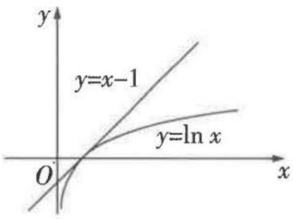

text_image

y
y=x-1
y=ln x
O
x

图7-1

思维导引 (1) 求导, 分类讨论 $a \geqslant -1$ , $a = -2$ , $a < -2$ 和 $-2 < a < -1$ 时函数 $f(x)$ 的单调性; (2) 将问题转化为证明 $x \ln x + x^2 + 1 > \frac{x}{e^x}$ , 构造双函数, 即设 $G(x) = \frac{x}{e^x} (x > 0)$ , 求导判断其单调性, 求解最大值, 再设 $F(x) = x \ln x + x^2 + 1$ , 求导判断其单调性, 求解最小值, 从而可证明不等式.

解析 (1) $f(x)$ 的定义域为 $(0, +\infty)$ ,

$$
f ^ {\prime} (x) = \frac {a}{x} - \frac {a + 1}{x ^ {2}} + 1 = \frac {x ^ {2} + a x - (a + 1)}{x ^ {2}} = \frac {[ x + (a + 1) ] (x - 1)}{x ^ {2}}.
$$

当 $a \geqslant -1$ 时, $a + 1 \geqslant 0$ , 所以 $x + (a + 1) > 0$ 恒成立, 所以当 $x \in (0,1)$ 时, $f'(x) < 0$ , 当 $x \in (1, +\infty)$ 时, $f'(x) > 0$ ,

所以 $f(x)$ 在 $(0,1)$ 上单调递减，在 $(1,+\infty)$ 上单调递增.

当 a < -1 时, 分下面三种情况讨论.

①当 a = -2 时, $f'(x) = \frac{(x - 1)^{2}}{x^{2}} \geqslant 0$ 恒成立, 所以 $f(x)$ 在 $(0, +\infty)$ 上单调递增;  
②当 a < -2 时，-a - 1 > 1，令 $f'(x) > 0$ ，解得 0 < x < 1 或 x > -a - 1，令 $f'(x) < 0$ ，解得 1 < x < -a - 1，所以 $f(x)$ 在 $(0, 1)$ ， $(-a - 1, +\infty)$ 上单调递增，在 $(1, -a - 1)$ 上单调递减；  
③当 -2 < a < -1 时, -a -1 < 1, 令 $f'(x) > 0$ , 解得 0 < x < -a -1 或 x > 1, 令 $f'(x) < 0$ , 解得 -a -1 < x < 1, 所以 $f(x)$ 在 $(0, -a - 1)$ , $(1, +\infty)$ 上单调递增, 在 $(-a - 1, 1)$ 上单调递减.

综上, 当 $a < -2$ 时, $f(x)$ 在 $(0,1), (-a-1, +\infty)$ 上单调递增, 在 $(1, -a-1)$ 上单调递减; 当 $a = -2$ 时, $f(x)$ 在 $(0, +\infty)$ 上单调递增; 当 $-2 < a < -1$ 时, $f(x)$ 在 $(0, -a-1), (1, +\infty)$ 上单调递增, 在 $(-a-1, 1)$ 上单调递减; 当 $a \geqslant -1$ 时, $f(x)$ 在 $(0, 1)$ 上单调递减, 在 $(1, +\infty)$ 上单调递增.

(2) 当 a=1 时, 要证 $f(x) > g(x) (x > 0)$ , 即证 $\ln x + \frac{2}{x} + x > \frac{1}{\mathrm{e}^{x}} + \frac{1}{x} (x > 0)$ , 即证 $x \ln x + x^{2} + 1 > \frac{x}{\mathrm{e}^{x}} (x > 0)$ .

设 $G(x)=\frac{x}{\mathrm{e}^{x}}(x>0)$ ，易知 $G(x)=\frac{x}{\mathrm{e}^{x}}$ 在 $(0,1)$ 上单调递增，在 $(1,+\infty)$ 上单调递减，所以 $G(x)_{\max}=G(1)=\frac{1}{\mathrm{e}}$ .

设 $F(x) = x\ln x + x^2 +1(x > 0)$ ，则 $F^{\prime}(x) = \ln x + 2x + 1(x > 0)$

因为函数 $F^{\prime}(x)$ 在 $(0, +\infty)$ 上单调递增，而 $F^{\prime}\left(\frac{1}{\mathrm{e}}\right) = \frac{2}{\mathrm{e}} > 0, F^{\prime}\left(\frac{1}{\mathrm{e}^{2}}\right) = -1 + \frac{2}{\mathrm{e}^{2}} < 0,$

所以存在 $x_0 \in (\frac{1}{\mathrm{e}^2}, \frac{1}{\mathrm{e}})$ ，使得 $F'(x_0) = 0$ ，且 $\ln x_0 = -2x_0 - 1$

所以当 $x \in (0, x_0)$ 时， $F'(x) < 0$ ，当 $x \in (x_0, +\infty)$ 时， $F'(x) > 0$

所以 $F(x)$ 在 $(0, x_{0})$ 上单调递减，在 $(x_{0}, +\infty)$ 上单调递增.

所以 $F(x)_{\min} = F(x_0) = x_0\ln x_0 + x_0^2 +1 = x_0(-2x_0 - 1) + x_0^2 +1 = -x_0^2 -x_0 + 1.$

设 $H(x) = -x^{2} - x + 1$ ，显然该函数在 $(\frac{1}{\mathrm{e}^2},\frac{1}{\mathrm{e}})$ 上单调递减，

所以 $H(x_0) > H(\frac{1}{\mathrm{e}})$ ，即 $-x_0^2 - x_0 + 1 > -\frac{1}{\mathrm{e}^2} - \frac{1}{\mathrm{e}} + 1$

而 $-\frac{1}{\mathrm{e}^2} -\frac{1}{\mathrm{e}} +1 > \frac{1}{\mathrm{e}}$ ，所以 $-x_0^2 -x_0 + 1 > \frac{1}{\mathrm{e}}$ 即 $F(x)_{\min} = F(x_0) > \frac{1}{\mathrm{e}} = G(x)_{\max}$

故当 $x > 0$ 时， $F(x) > G(x)$ 恒成立，

所以当 $a = 1$ 时， $f(x) > g(x)$ 成立，得证.

# 新题演练

1. (2022·江苏南京、盐城3月二模)已知实数 $a, b \in (1, +\infty)$ , 且 $2(a + b) = e^{2a} + 2\ln b + 1$ , e为自然对数的底数, 则 ( )

A. $1 < b < a$

B. a < b < 2a

C. $2a < b < e^{a}$

D. $e^{a}<b<e^{2a}$

2. (2022·大连二十四中 3 月模拟)已知函数 $f(x)$ 的定义域是 R, 若 $f(x)>0$ 且 $f'(x)+xf(x)>0$ , 则下列说法正确的是 ( )

A. $f(x)$ 可能是奇函数,也可能是偶函数

B. $f(-1) > f(1)$

C. 当 $\frac{\pi}{4} < x < \frac{\pi}{2}$ 时, $f(\sin x) < e^{\frac{\cos 2x}{2}} f(\cos x)$

D. $f(0) < \sqrt{\mathrm{e}} f(1)$

# 参考答案与解析

1. D 将 $2(a + b) = \mathrm{e}^{2a} + 2\ln b + 1$ 变形为 $2b - 2\ln b = \mathrm{e}^{2a} - 2a + 1$ .

令 $h(x)=2\mathrm{e}^{x}-2x$ ，则 $h(\ln b)=2\mathrm{e}^{\ln b}-2\ln b=2b-2\ln b$ ，易知 $h(x)$ 在 $(0,+\infty)$ 上单调递增.

①令 $f(x)=\mathrm{e}^{x}-x+1$ ，则 $f(2a)=\mathrm{e}^{2a}-2a+1$ 。 $h(x)-f(x)=\mathrm{e}^{x}-x-1$ ，令 $u(x)=\mathrm{e}^{x}-x-1$ ， $x-1,x\in(0,+\infty)$ ，易得函数 $u(x)$ 在 $(0,+\infty)$ 上单调递增，所以 $u(x)=\mathrm{e}^{x}-x-1>0$ 。则当x>1时， $h(x)-f(x)>0$ ，所以 $h(x)>f(x)$ ，由题意得 $f(2a)=h(\ln b)$ ，所以 $f(2a)=h(\ln b)<h(2a),2a>\ln b$ ，即 $b<\mathrm{e}^{2a}$ 。

②令 $m(x)=\mathrm{e}^{2x}-2x+1$ ，则 $m(a)=\mathrm{e}^{2a}-2a+1$ .

【会构造】结合选项及变形后的等式的特征构造函数

当 $x > 1$ 时， $m(x) - h(x) = \mathrm{e}^{2x} - 2\mathrm{e}^x + 1 = (\mathrm{e}^x - 1)^2 > 0$ ，所以 $h(x) < m(x)$ ，由题意得 $m(a) = h(\ln b)$ ，所以 $h(a) < m(a) = h(\ln b), a < \ln b$ ，即 $\mathrm{e}^a < b$ .

综上,可得 $e^{a}<b<e^{2a}$ . 故选 D.

2. D 对于选项 A, 由题意知 $f(x) > 0$ 对任意的 $x \in \mathbb{R}$ 成立, 若 $f(x)$ 为奇函数, 则 $f(x) = -f(-x)$ , 所以 $f(-x) > 0$ 且 $-f(-x) > 0$ , 显然矛盾, 故 A 错误.

【扫清障碍】光假设，利用奇函数的定义推出矛盾后，即可判断该选项错误

对于选项 BCD, 构造函数 $g(x) = \mathrm{e}^{\frac{x^{2}}{2}} f(x)$ ，则 $g'(x) = \mathrm{e}^{\frac{x^{2}}{2}} (f'(x) + xf(x))$ ,

【会构造】由 $f'(x) + xf(x) > 0$ ，结合结构特征可构造函数 $g(x) = e^{\frac{x^2}{2}}f(x)$

由 $f'(x) + xf(x) > 0$ ，且 $\mathrm{e}^{\frac{x^2}{2}} > 0$ ，可知 $g'(x) > 0$ ，所以 $g(x)$ 在 $\mathbf{R}$ 上单调递增，所以 $g(-1) < g(1)$ ，则 $\mathrm{e}^{\frac{(-1)^2}{2}}f(-1) < \mathrm{e}^{\frac{1}{2}}f(1)$ ，于是 $f(-1) < f(1)$ ，故B错误.

当 $\frac{\pi}{4} < x < \frac{\pi}{2}$ 时，有 $\frac{\sqrt{2}}{2} < \sin x < 1$ 且 $0 < \cos x < \frac{\sqrt{2}}{2}$ ，所以 $\cos x < \sin x$ ，于是 $g(\cos x) < g(\sin x)$ ，即 $\mathrm{e}^{\frac{\cos 2x}{2}} f(\cos x) < \mathrm{e}^{\frac{\sin 2x}{2}} f(\sin x)$ ，故 $\mathrm{e}^{\frac{\cos 2x}{2} - \frac{\sin 2x}{2}} f(\cos x) < f(\sin x)$ ，即 $f(\sin x) > \mathrm{e}^{\frac{\cos 2x}{2}} f(\cos x)$ ，故C错误.

由 0 < 1 , 得 $g(0) < g(1)$ , 于是 $e^{0}f(0) < e^{\frac{1}{2}}f(1)$ , 即 $f(0) < \sqrt{e}f(1)$ , 故 D 正确. 故选 D.

# 高分技法篇

# 超重点8 求解函数最值与值域的5大攻略

# 攻略1 函数性质法

调研 1 (2022·重庆巴蜀中学4月适应性考试)函数 $f(x)=\left\{\begin{aligned}-x-3,x&\leqslant0,\\2^{x-1}-\frac{3}{2},&x>0\end{aligned}\right.$ 的值域为 \_\_\_\_.

解析 依题意,函数 y = -x - 3 在 $(-∞, 0]$ 上单调递减,则当 $x \leqslant 0$ 时, $y \geqslant -3$ .

【易错】此处易因不注意区间端点值是否满足条件。从而忽视等号能否成立函数 $y = 2^{x - 1} - \frac{3}{2}$ 在 $(0, +\infty)$ 上单调递增，则当 $x > 0$ 时， $y > -1$ .

所以函数 $f(x)=\left\{\begin{aligned}-x-3,x&\leqslant0,\\2^{x-1}-\frac{3}{2},&x>0\end{aligned}\right.$ 的值域为 $[-3,+\infty)$ .

【点拨】本题通过研究函数的单调性，得到函数的值域，利用函数单调性求最值有3个常用结论：(1)如果函数 $f(x)$ 在 $[a,b]$ 上单调递增（减），则 $f(x)$ 在 $[a,b]$ 的左、右端点处分别取得最小（大）值和最大（小）值；(2)如果函数 $f(x)$ 在 $(a,b]$ 上单调递增，在 $[b,c)$ 上单调递减，则函数 $f(x)$ 在 $(a,c)$ 上有最大值 $f(b)$ ；(3)如果函数 $f(x)$ 在 $(a,b]$ 上单调递减，在 $[b,c)$ 上单调递增，则函数 $f(x)$ 在 $(a,c)$ 上有最小值 $f(b)$ ，有时也可以通过函数的奇偶性、周期性等得出函数的值域或最值

调研 2 (2022·河北石家庄二中4月检测)已知函数 $f(x)=\frac{\pi}{4}+\cos x\cdot\ln(x+\sqrt{1+x^{2}})$ 在区间 $[-5,5]$ 上的最大值是M,最小值是m,则 $f(M+m)=$

A. 0

B. 10

C. $\frac{\pi}{4}$

D. $\frac{\pi}{2}$

解析 令 $g(x) = \cos x \cdot \ln (x + \sqrt{1 + x^2})$ ，则 $f(x) = \frac{\pi}{4} + g(x)$ .

【提示】因为 $x + \sqrt{1 + x^2} > 0$ ，所以函数 $f(x), g(x)$ 的定义域都为 $\mathbb{R}$

易知 $f(x)$ 和 $g(x)$ 在 $[-5, 5]$ 上单调性相同，设 $g(x)$ 在 $[-5, 5]$ 上有最大值 $g(x)_{\max}$ ，最小值 $g(x)_{\min}$ ，则 $M = g(x)_{\max} + \frac{\pi}{4}, m = g(x)_{\min} + \frac{\pi}{4}$ .

因为 $g(-x)=\cos x \cdot \ln(-x+\sqrt{1+x^{2}})$ ,

所以 $g(x) + g(-x) = \cos x \cdot \ln\left[\left(\sqrt{1 + x^{2}} + x\right)\left(\sqrt{1 + x^{2}} - x\right)\right] = 0,$

所以 $g(x)$ 在 $[-5,5]$ 上为奇函数，所以 $g(x)_{\max} + g(x)_{\min} = 0$ ，

所以 $M + m = g(x)_{\max} + g(x)_{\min} + \frac{\pi}{2} = \frac{\pi}{2}$ , 所以 $f(M + m) = f(\frac{\pi}{2}) = \frac{\pi}{4}$ . 故选 C.

调研 3 (2022·福建厦门双十中学4月月考改编)定义域为 R 的函数 $f(x)$ 满足 $f(x+1)=3f(x)$ ，且当 $x\in(0,1]$ 时， $f(x)=4x(x-1)$ ，则当 $x\in[-2,-1)$ 时， $f(x)$ 的最小值是（）

A. $-\frac{1}{81}$

B. $-\frac{1}{27}$

C. $-\frac{1}{9}$

D. 0

解析 依题意, $f(1)=4\times(1-1)=0,f(0+1)=3f(0)$ ，即 $f(0)=0$ ，

$$
f (- 2) = \frac {1}{3} f (- 2 + 1) = \frac {1}{3} f (- 1) = \frac {1}{9} f (- 1 + 1) = \frac {1}{9} f (0) = 0.
$$

由题意知 $f(x) = \frac{1}{3} f(x + 1)$ ，且当 $x \in (0,1]$ 时， $f(x) = 4x(x - 1)$ ，

当 $x \in (-2, -1)$ 时， $x + 2 \in (0, 1)$ ，则 $f(x) = \frac{1}{3} f(x + 1) = \frac{1}{9} f(x + 2) = \frac{4}{9}(x + 2)(x + 1)$ $= \frac{4}{9} (x + \frac{3}{2})^2 - \frac{1}{9} \geqslant -\frac{1}{9}$ ,

【方法技巧】结合函数的性质，将待求区间上的自变量，转化到已知区间上，再利用二次函数的性质求最值

又 $-\frac{1}{9} < 0$ ，所以在 $[-2, -1)$ 上，当 $x = -\frac{3}{2}$ 时， $f(x)$ 取得最小值，为 $-\frac{1}{9}$ . 故选 C.

# 攻略2> 导数法

调研 4 (2022·江西萍乡二模) 若函数 $y = e^{2x} + (2a + x)e^{x} + a^{2}$ 的最小值为 $g(a)$ ，则函数 $y = g(a)$ 的最小值为 \_\_\_\_.

解析 令 $f(x)=\mathrm{e}^{2x}+(2a+x)\mathrm{e}^{x}+a^{2},x\in\mathbf{R},$

则 $f'(x)=2\mathrm{e}^{2x}+(x+2a+1)\mathrm{e}^{x}=\mathrm{e}^{x}(2\mathrm{e}^{x}+x+2a+1)$ .

【方法技巧】利用导数求函数的最值，当一次求导之后无法求解时，可考虑利用二次求导来进行求解

令 $h(x) = 2\mathrm{e}^{x} + x + 2a + 1, x \in \mathbb{R}$ , 则 $h'(x) = 2\mathrm{e}^{x} + 1 > 0$ , 所以 $h(x)$ 在 $\mathbb{R}$ 上单调递增.

由于 $f(x)$ 有最小值,所以 $h(x)$ 有唯一零点 $x_{0}$ ,使 $h(x_{0})=2e^{x_{0}}+x_{0}+2a+1=0$ ,①且在 $(-\infty, x_0)$ 上， $f'(x) < 0, f(x)$ 单调递减；在 $(x_0, +\infty)$ 上， $f'(x) > 0, f(x)$ 单调递增.

所以 $f(x)$ 的最小值为 $f(x_0) = \mathrm{e}^{2x_0} + (x_0 + 2a)\mathrm{e}^{x_0} + a^2$

即 $g(a) = \mathrm{e}^{2x_0} + (x_0 + 2a)\mathrm{e}^{x_0} + a^2 = a^2 +2\mathrm{e}^{x_0}\cdot a + \mathrm{e}^{2x_0} + x_0\mathrm{e}^{x_0} = (a + \mathrm{e}^{x_0})^2 +x_0\mathrm{e}^{x_0},$

根据二次函数的性质得, 当 $a = -e^{x_{0}}$ 时, $g(a)$ 取得最小值 $x_{0}e^{x_{0}}$ ,

由①得 $2\mathrm{e}^{x_0} + x_0 - 2\mathrm{e}^{x_0} + 1 = 0$ ，所以 $x_0 + 1 = 0$ ，即 $x_0 = -1$

所以 $g(a)$ 的最小值为 $-e^{-1} = -\frac{1}{e}$ .

调研 5 (2022·江苏南京一中4月模拟)已知函数 $f(x)=2\left|e^{2}\ln x-1\right|+e^{x}$ ，则 $f(x)$ 的最小值为 \_\_\_\_.

解析 对于 $f(x) = 2|\mathrm{e}^2\ln x - 1| + \mathrm{e}^x$ ，令 $\mathrm{e}^2\ln x - 1 = 0$ ，即 $\ln x = \frac{1}{\mathrm{e}^2}$ 得 $x = \mathrm{e}^{\frac{1}{\mathrm{e}^2}}$

所以当 $0 < x < \mathrm{e}^{\frac{1}{\mathrm{e}^2}}$ 时， $f(x) = 2 - 2\mathrm{e}^2\ln x + \mathrm{e}^x$ ，则 $f'(x) = -\frac{2\mathrm{e}^2}{x} + \mathrm{e}^x$

令 $g(x) = -\frac{2e^2}{x} + e^x$ ，则 $g'(x) = \frac{2e^2}{x^2} + e^x > 0$

即 $g(x)$ 在 $(0, e^{\frac{1}{e^{2}}})$ 上单调递增，

易知 $g(e^{\frac{1}{e^{2}}}) = -\frac{2e^{2}}{e^{\frac{1}{e^{2}}}} + e^{e^{\frac{1}{e^{2}}}} = -2e^{2 - \frac{1}{e^{2}}} + e^{e^{\frac{1}{e^{2}}}} < 0,$

所以 $f'(x) = -\frac{2e^{2}}{x} + e^{x} < 0 (x \in (0, e^{\frac{1}{e^{2}}}))$ ，即 $f(x) = 2 - 2e^{2}\ln x + e^{x}$ 在 $(0, e^{\frac{1}{e^{2}}})$ 上单调递减.

当 $x \geqslant e^{\frac{1}{e^{2}}}$ 时， $f(x) = 2e^{2}\ln x - 2 + e^{x}$ ，则 $f'(x) = \frac{2e^{2}}{x} + e^{x} > 0$ ，所以 $f(x)$ 在 $[e^{\frac{1}{e^{2}}}, +\infty)$ 上单调递增.

综上可得 $f(x)$ 在 $(0, e^{\frac{1}{e^2}})$ 上单调递减，在 $[e^{\frac{1}{e^2}}, +\infty)$ 上单调递增，所以 $f(x)_{\min} = f(e^{\frac{1}{e^2}}) = e^{e^{\frac{1}{e^2}}}$ .

故 $f(x)$ 的最小值为 $e^{e^{\frac{1}{e^2}}}$ .

# 攻略3 换元法

调研 6 （原创）已知函数 $f(x)=4^{x}+\frac{k}{4^{x}}(k\in\mathbb{R})$ 为定义在 R 上的偶函数，当 $x\in$

$[0, +\infty)$ 时，函数 $g(x) = f(x) - a(2^x - \frac{1}{2^x})(a \in \mathbf{R})$ 的最小值为 1，则 $a =$ \_\_\_\_.

# 思维导引

根据 $f(x)$ 是偶函数求出 $k$ 的值

求 $g(x)$ 的表达式

令 $u = 2^{x} - \frac{1}{2^{x}}$ ，将函数 $g(x)$ 转化为 $h(u)$

利用二次型函数的性质求 $h(u)$ 的最小值 → 利用 $h(u)$ 的最小值为 1 求实数 a 的值

解析 由题意知 $f(-x) = f(x)$ ，得 $4^{-x} + k \cdot 4^{x} = 4^{x} + k \cdot 4^{-x}$ ，整理得 $(k - 1)(4^{x} - 4^{-x}) = 0$ ，所以 $k = 1$ ，

所以 $f(x) = 4^{x} + \frac{1}{4^{x}}, g(x) = 4^{x} + \frac{1}{4^{x}} - a(2^{x} - \frac{1}{2^{x}}) = (2^{x} - \frac{1}{2^{x}})^{2} - a(2^{x} - \frac{1}{2^{x}}) + 2.$

令 $u = 2^{x} - \frac{1}{2^{x}} (x\geqslant 0)$ ，得 $h(u) = u^2 -au + 2.$

【方法】对于比较复杂的函数可通过换元转化为熟悉的函数进行求解，注意不要忽视 u 的取值范围

易知 $u = 2^{x} - \frac{1}{2^{x}}$ 在 $[0, +\infty)$ 上单调递增，所以 $u \geqslant 0$ .

因为 $g(x)$ 在 $x \in [0, +\infty)$ 上的最小值是 1，所以 $h(u)$ 在 $u \in [0, +\infty)$ 上的最小值是 1.

当 $a \geqslant 0$ 时, $h(u)_{\min} = h(\frac{a}{2}) = -\frac{a^2}{4} + 2 = 1$ , 解得 $a = 2$ 或 $a = -2$ (舍去).

当 $a < 0$ 时， $h(u)_{\min} = h(0) = 2 \neq 1$ ，不符合题意，舍去。

综上, $a = 2$ .

调研 7 (2022·上海建平中学4月检测)已知函数 $f(x)=mx+\frac{1}{nx}(m>0,n>0)$ 的定义域为 $(0,+\infty)$ ，若x=1时， $f(x)$ 取得最小值，则 $\frac{m^{2}+1}{n^{2}+2}+\frac{n^{2}+1}{m^{2}+2}$ 的取值范围是\_\_\_\_.

解析 由题意知 $f'(x) = m - \frac{1}{nx^2}$ ，令 $f'(x) = 0$ ，解得 $x = \frac{1}{\sqrt{mn}}$ ，所以当 $0 < x < \frac{1}{\sqrt{mn}}$ 时， $f'(x) < 0$ ，当 $x > \frac{1}{\sqrt{mn}}$ 时， $f'(x) > 0$ ，

故函数 $f(x)$ 在 $(0, \frac{1}{\sqrt{mn}})$ 上单调递减，在 $(\frac{1}{\sqrt{mn}}, +\infty)$ 上单调递增，

又 $x = 1$ 时, $f(x)$ 取得最小值, 故 $\frac{1}{\sqrt{mn}} = 1$ , 即 $mn = 1$ .

【速解】也可利用基本不等式思想求解： $f(x)$ 在 $mx=\frac{1}{nx}$ 时取得最小值，所以 $m=\frac{1}{n}$ ，即 mn=1

$$
\frac {m ^ {2} + 1}{n ^ {2} + 2} + \frac {n ^ {2} + 1}{m ^ {2} + 2} = \frac {(m ^ {2} + 1) (m ^ {2} + 2) + (n ^ {2} + 1) (n ^ {2} + 2)}{(n ^ {2} + 2) (m ^ {2} + 2)} = \frac {m ^ {4} + n ^ {4} + 3 (m ^ {2} + n ^ {2}) + 4}{m ^ {2} n ^ {2} + 2 (m ^ {2} + n ^ {2}) + 4} =
$$

$$
\frac {\left(m ^ {2} + n ^ {2}\right) ^ {2} + 3 \left(m ^ {2} + n ^ {2}\right) + 2}{2 \left(m ^ {2} + n ^ {2}\right) + 5},
$$

令 $t = m^2 + n^2$ ，则 $t \geqslant 2mn = 2$

则 $\frac{m^2 + 1}{n^2 + 2} +\frac{n^2 + 1}{m^2 + 2} = \frac{t^2 + 3t + 2}{2t + 5} = \frac{\frac{1}{4}(2t + 5)^2 - (2t + 5) + \frac{3}{4}}{2t + 5} = \frac{1}{4} [(2t + 5) + \frac{3}{2t + 5}] - 1,$

令 $g(t)=\frac{1}{4}\left[(2t+5)+\frac{3}{2t+5}\right]-1$ ,

【极易出错】此处易错误应用基本不等式求最小值，注意在应用基本不等式时，要检验等号能否取到，此处取不到，因此，应该利用对勾型函数的性质求解，得到 $g(t)$ 在 $[2, +\infty)$ 上单调递增，再利用单调性求最值

由对勾型函数的性质易知 $g(t)$ 在 $[2, +\infty)$ 上单调递增，

故 $\frac{m^2 + 1}{n^2 + 2} + \frac{n^2 + 1}{m^2 + 2} \geqslant g(2) = \frac{4}{3}$ , 当且仅当 $t = 2$ , 即 $m = n = 1$ 时取等号,

故 $\frac{m^{2}+1}{n^{2}+2}+\frac{n^{2}+1}{m^{2}+2}$ 的取值范围是 $\left[\frac{4}{3},+\infty\right)$ .

# 攻略4 基本不等式法

调研 8 (2022·沈阳二中5月模拟)函数 $f(x)=16^{x}+\frac{1}{4^{x}}+\frac{1}{2^{x-1}}$ 的最小值为（）

A. 0

B. 2

C. 4

D. 8

解析 $f(x)=16^{x}+\frac{1}{4^{x}}+\frac{1}{2^{x-1}}=16^{x}+\frac{1}{4^{x}}+\frac{1}{2^{x}}+\frac{1}{2^{x}}\geqslant4\sqrt[4]{16^{x}\cdot\frac{1}{4^{x}}\cdot\frac{1}{2^{x}}\cdot\frac{1}{2^{x}}}$ =4，当且仅当 x=0 时取等号，所以 $f(x)\geqslant4$ .

所以 $f(x)$ 的最小值为 4. 故选 C.

# 攻略5 分类讨论法

调研 9 (2022 · 江苏徐州七中 4 月阶段练习) 已知函数 $f(x) = \left\{ \begin{array}{l} (1 - a)x + a^2, x < 1, \\ 3^x, x \geqslant 1 \end{array} \right.$ 与函数 $y = \ln x$ 的值域相同, 则实数 $a$ 的取值范围是 ( )

A. $(-∞,1)$

B. $(-∞,-1]$

C. $\left[-1,1\right)$

D. $(-∞,-1]∪[2,+∞)$

解析 易知函数 $y = \ln x$ 的值域为 R, 则函数 $f(x)$ 的值域也为 R.

$$
f (x) = \left\{ \begin{array}{l} (1 - a) x + a ^ {2}, x <   1, \\ 3 ^ {x}, x \geqslant 1. \end{array} \right.
$$

当 $x \geqslant 1$ 时, $3^{x} \geqslant 3$ .

当 x<1 时，①若 1-a=0，即 a=1，则 $f(x)=1$ ，不满足题意；

【易遗漏】注意不要忘了讨论x的系数为0的情况

②若 $1 - a < 0$ , 即 $a > 1$ , 则 $f(x) > 1 - a + a^2$ , 此时 $f(x)$ 的值域不可能为 $\mathbf{R}$ , 不满足题意; ③若 $1 - a > 0$ , 即 $a < 1$ , 则 $f(x) < 1 - a + a^2$ , 要使 $f(x)$ 的值域为 $\mathbf{R}$ , 则 $1 - a + a^2 \geqslant 3$ , 解得 $a \leqslant -1$ .

综上, $a$ 的取值范围是 $(- \infty, -1]$ , 故选 B.

调研 10 (2022·黑龙江省实验中学、大庆实验中学等 5 月联考)已知函数 $f(x)=|x+\frac{4}{x}-m|(x\in[1,4])$ ，则 $f(x)$ 的最大值 $g(m)$ 的最小值为()

A. $\frac{1}{3}$

B. $\frac{1}{2}$

C. 1

D. 2

解析 易知 $x + \frac{4}{x} \geqslant 4$ ，当且仅当 $x = 2$ 时等号成立， $2 \in [1,4]$ ， $1 + \frac{4}{1} = 5,4+$ $\frac{4}{4} = 5$ ，所以 $x + \frac{4}{x} \in [4,5] (x \in [1,4])$ ，

所以 $x + \frac{4}{x} - m \in [4 - m, 5 - m] (x \in [1, 4])$ .

当 $4 - m \geqslant 0$ ，即 $m \leqslant 4$ 时， $g(m) = 5 - m \geqslant 1$ .

当 $5 - m \leqslant 0$ ，即 $m \geqslant 5$ 时， $g(m) = m - 4 \geqslant 1$ .

当 $4 - m < 0 < 5 - m$ ，即 $4 < m < 5$ 时，若 $5 - m > m - 4$ ，即 $m < \frac{9}{2}$ ，则 $g(m) = 5 - m > \frac{1}{2}$ ；若 $5 - m \leqslant m - 4$ ，即 $m \geqslant \frac{9}{2}$ ，则 $g(m) = m - 4 \geqslant \frac{1}{2}$ .

【扫清障碍】对于解析式中含绝对值符号的函数的最值或值域问题，常常需要分类讨论。分类讨论时，要选择合适的分类依据，分类要做到不重、不漏。如本题，先分类讨论4-m，5-m同号的情况，再讨论异号的情况，在异号的情况下，再根据 $|4-m|$ ， $|5-m|$ 的大小分类讨论

综上, $g(m)$ 的最小值为 $\frac{1}{2}$ ,故选B.

# 新题演练

1. (2022·安徽淮南4月二模)对任意的 $x \in \mathbb{R}$ , 函数 $f(x)$ 满足 $f(x) + f(-x) = 4$ . 若函数 $g(x) = f(x) + \frac{\sin x}{\sin^2 x + 1}$ 在区间 $[-2022, 2022]$ 上既有最大值又有最小值, 则函数 $g(x)$ 的最大值与最小值之和为 ( )

A.0

B. 2

C. 4

D. 8

2. (2022·山西运城5月三模改编)已知函数 $f(x)=\frac{1}{3}x^{3}+\frac{1}{2}x^{2}-2x+1$ , 则函数 $f(x)$ 在(0,3)上的值域为 \_\_\_\_.

3. (2022·银川一中5月三模)已知 $f(x)=\left\{\begin{aligned}4^{x}-2^{x+2}+m,x&\leqslant0,\\ x+\frac{1}{x},&x>0\end{aligned}\right.$ 的最小值为2,则m的取值范围为\_\_\_\_.

# 参考答案与解析

1. C 由 $f(x) + f(-x) = 4$ 知 $[f(x) - 2] + [f(-x) - 2] = 0$ ，则函数 $y = f(x) - 2$ 的图象关于原点对称，函数 $y = f(x) - 2$ 为奇函数。

设函数 $h(x) = \frac{\sin x}{\sin^2 x + 1}, x \in [-2022, 2022]$ , 则 $h(-x) = -h(x)$ , 所以 $h(x)$ 为奇函数, 故函数 $y = g(x) - 2 (x \in [-2022, 2022])$ 为奇函数, 其图象关于原点对称, 则函数 $y = g(x) - 2$ 的最大值与最小值之和为 0.

故函数 $g(x)$ 的最大值与最小值之和为 4. 故选 C.

2. $[- \frac{1}{6}, \frac{17}{2})$ 函数 $f(x) = \frac{1}{3} x^3 + \frac{1}{2} x^2 - 2x + 1$ , 则 $f'(x) = x^2 + x - 2 = (x + 2)(x - 1)$ .

令 $f'(x)<0$ ,得-2<x<1,令 $f'(x)>0$ ,得x<-2或x>1,

所以函数 $f(x)$ 在(0,1)上单调递减，在(1,3)上单调递增.

易知 $f(0)=1,f(1)=-\frac{1}{6},f(3)=\frac{17}{2}$ ，又 $f(3)=\frac{17}{2}>f(0)=1$ ，

【扫清障碍】连续函数在给定区间上光减后增，则最小值可以直接确定，最大值可能在端点处取得，也可能取不到。一般先把给定区间假设为闭区间，通过比较区间端点函数值大小确定“最大值”

所以 $f(x)$ 在(0,3)上的值域为 $\left[-\frac{1}{6},\frac{17}{2}\right)$ .

【易错】此处容易以为 $x = 0$ 和 $x = 3$ 可以取到，错写为 $[- \frac{1}{6}, \frac{17}{2}]$

3. $[5, +\infty)$ 当 $x > 0$ 时, $f(x) = x + \frac{1}{x} \geqslant 2\sqrt{x \times \frac{1}{x}} = 2$ , 当且仅当 $x = 1$ 时取等号,

因为 $f(x)=\left\{\begin{aligned}4^{x}-2^{x+2}+m,x&\leqslant0,\\ x+\frac{1}{x},&x>0\end{aligned}\right.$ 的最小值为2，

所以当 $x \leqslant 0$ 时, $f(x) \geqslant 2$ 恒成立,

即 $4^{x} - 2^{x + 2} + m\geqslant 2$ 在 $x\in (-\infty ,0]$ 上恒成立，

所以 $m \geqslant -4^{x} + 2^{x + 2} + 2$ 在 $x \in (-\infty, 0]$ 上恒成立，

【提示】分离参数，通过研究新函数的最值即可得m的取值范围

即 $m \geqslant -(2^x)^2 + 4 \times 2^x + 2$ 在 $x \in (-\infty, 0]$ 上恒成立.

令 $2^{x}=t$ ，则 $0<t\leqslant1$ ，

【易遗漏】换元时，要写出新元的取值范围

原式转化为 $m \geqslant -t^2 + 4t + 2$ 在 $t \in (0,1]$ 上恒成立，

易知 $g(t) = -t^{2} + 4t + 2 (t \in \mathbb{R})$ 是二次函数, 其图象开口向下, 对称轴为直线 t = 2, 所以 $g(t)$ 在 $t \in (0,1]$ 上单调递增,

所以 $g(t)$ 在 $t \in (0,1]$ 上的最大值为 $g(1)=5$ ,

所以实数 m 的取值范围为 $[5, +\infty)$ .

# 免费增值，闯关提分！10分钟搞定1个失分点！

# 一小关一考点，游戏闯关

▷ 挑战式闯关，直击高考

▷ 智适应推题，由易到难

▶8大专题，考点全布局

# 学一题会一类，提分更快

▶ 全面诊断，复习无盲区

▷ 错了马上学，突破短板

▶ 百万粉UP主视频，免费看

# 通一关奖一关，好礼不停

▶ 小关通关，奖励学分

▶ 进步越快，学分越多

▶学分可兑换天星图书

text_image

C
三格考文
地图
1、建设的盲点、红点
错、破点错误以后也
2、核心大屏、比笔读
7、用图到结束时读
第 二章 演示
文字模板
本题考查函数的更保
用所考知识分析问题
的表单与表数据同步
条 内码:请在栏中读
7 8 9

# 超重点9 证明不等式的5大方法

# 方法1 作差法

调研 1 (2022·天津河北区3月模拟)已知函数 $f(x)=x+a\ln x$ , $g(x)=\mathrm{e}^{-x}-\ln x-2x$ .

(1) 讨论函数 $f(x)$ 的单调性.  
(2) 若 $g(x_{0})=0$ , 求 $x_{0}+\ln x_{0}$ 的值.  
(3) 证明: $x - x \ln x \leqslant \mathrm{e}^{-x} + x^2$ .

解析 (1) 易知函数 $f(x)$ 的定义域为 $(0, +\infty), f'(x) = 1 + \frac{a}{x} = \frac{x + a}{x}$ .

当 $a \geqslant 0$ 时, $f'(x) > 0$ .

当 a<0 时, 令 $f'(x)>0$ , 得 x>-a; 令 $f'(x)<0$ , 得 0<x<-a.

所以当 $a \geqslant 0$ 时, 函数 $f(x)$ 在 $(0, +\infty)$ 上单调递增; 当 $a < 0$ 时, 函数 $f(x)$ 在 $(0, -a)$ 上单调递减, 在 $(-a, +\infty)$ 上单调递增.

(2) 由 $g(x_0) = 0$ ，得 $\mathrm{e}^{-x_0} - \ln x_0 - 2x_0 = 0$ ，即 $\mathrm{e}^{-x_0} - x_0 = \ln x_0 + x_0$

令 $t = \mathrm{e}^{-x_0}$ ，则 $-x_0 = \ln t$ ，所以 $\ln t + t = \ln x_0 + x_0$

【难点】对于超越方程，常将方程两边化为同构形式求解

由(1)可知,当 a=1 时, $f(x)=x+\ln x$ 在 $(0,+\infty)$ 上单调递增,

所以 $t = \mathrm{e}^{-x_0} = x_0$ ，所以 $x_0 + \ln x_0 = x_0 + \ln \mathrm{e}^{-x_0} = x_0 - x_0 = 0.$

(3) 设 $h(x) = x - x \ln x - \mathrm{e}^{-x} - x^2$ , 则 $h'(x) = g(x) = \mathrm{e}^{-x} - \ln x - 2x$ ,

【扫清障碍】作差后构造函数，将新函数的最大值与0比较大小

易知 $g(x)$ 在 $(0, +\infty)$ 上单调递减，且由(2)可知， $g(x_{0}) = 0$ ，则 $x_{0} + \ln x_{0} = 0$ .

【注意】解答题各小问之间是有联系的。一般后面的小问会涉及前面小问的方法、结论等

所以当 $x \in (0, x_0)$ 时， $h'(x) = g(x) > 0$ ；当 $x \in (x_0, +\infty)$ 时， $h'(x) = g(x) < 0$ .

所以函数 $h(x)$ 在 $(0, x_{0})$ 上单调递增，在 $(x_{0}, +\infty)$ 上单调递减.

所以 $h(x) \leqslant h(x_0), h(x_0) = x_0 - x_0 \ln x_0 - \mathrm{e}^{-x_0} - x_0^2$ ，又 $\ln x_0 = -x_0, \mathrm{e}^{-x_0} = x_0$

所以 $h(x_0) = x_0 + x_0^2 - x_0 - x_0^2 = 0$ ，所以 $x - x\ln x \leqslant e^{-x} + x^2$ .

调研 2 (2022 · 成都 5 月三诊) 已知函数 $f(x) = 2x^{3} + 3ax^{2} - 12a^{2}x$ , 其中 $a \in \mathbb{R}$ .

(1) 求 $f(x)$ 的单调区间.

(2) 设函数 $g(x) = 2x^{3} - x^{2} - (12a^{2} - 1)x + 2\sin x - 2$ ，当 $a > 0, x > 0$ 时，证明： $g(x) < f(x)$ .

解析 (1) 易知 $f'(x)=6x^{2}+6ax-12a^{2}=6(x+2a)(x-a)$ .

①若 a > 0，则当 $x \in (-2a, a)$ 时， $f'(x) < 0, f(x)$ 单调递减；当 $x \in (-\infty, -2a)$ 或

$x \in (a, +\infty)$ 时， $f'(x) > 0, f(x)$ 单调递增.

②若 a=0，则有 $f'(x)\geqslant0$ ，且 $f'(x)$ 不恒为 0， $f(x)$ 单调递增.

③若 a<0，则当 $x\in(a,-2a)$ 时， $f'(x)<0,f(x)$ 单调递减；当 $x\in(-\infty,a)$ 或 $x\in(-2a,+\infty)$ 时， $f'(x)>0,f(x)$ 单调递增.

综上, 当 a > 0 时, $f(x)$ 的单调递减区间为 $(-2a, a)$ , 单调递增区间为 $(-\infty, -2a)$ , $(a, +\infty)$ ; 当 a = 0 时, $f(x)$ 的单调递增区间为 $(-\infty, +\infty)$ ; 当 a < 0 时, $f(x)$ 的单调递减区间为 $(a, -2a)$ , 单调递增区间为 $(-\infty, a)$ , $(-2a, +\infty)$ .

【易遗漏】分类讨论后如果忘了总结，在考试中可能会因此丢失步骤分，题目要求求单调区间，因此要以单调区间的形式作答

(2) 易知 $f(x) - g(x) = 3ax^{2} + x^{2} - x - 2\sin x + 2.$

由题意,需证明对任意的 $a > 0, x > 0$ , 不等式 $3ax^{2} + x^{2} - x - 2\sin x + 2 > 0$ 恒成立, 因为 $3ax^{2} > 0$ 恒成立, 所以只需证对任意的 $x > 0$ , 不等式 $x^{2} - x > 2(\sin x - 1)$ 恒成立.

①当 $x \geqslant 1$ 时, $x^{2} - x \geqslant 0$ , $2(\sin x - 1) \leqslant 0$ , 且两个不等式中的“=”不同时成立, 则不等式 $x^{2} - x > 2(\sin x - 1)$ 恒成立.

②当 0 < x < 1 时, 设 $h(x) = x^{2} - x - 2\sin x + 2$ , 所以 $h'(x) = 2x - 1 - 2\cos x$ .

【技巧】作差后，观察能否根据条件简化问题，能简化的要简化后再构造函数研究

设 $t(x)=2x-1-2\cos x,0<x<1$ , 则 $t'(x)=2+2\sin x$ , 当 0<x<1 时, $t'(x)>0$ 恒成立, 函数 $t(x)$ 在 $(0,1)$ 上单调递增, 所以 $t(x)<2-1-2\cos 1<1-2\cos \frac{\pi}{3}=0$ .

所以当 0 < x < 1 时, $h'(x) < 0$ 恒成立, 函数 $h(x)$ 在 $(0,1)$ 上单调递减,

则 $h(x) > 2(1 - \sin 1) > 0$ ，即 $x^{2} - x > 2(\sin x - 1)$ 成立.

综上, 当 a > 0, x > 0 时, $g(x) < f(x)$ .

# 方法2 等价转化法

调研 3 (2022·湖北宜城一中等校 5 月联考/新定义“几何上凸函数”)设连续正值函数 $g(x)$ 定义在区间 $I(I \subseteq (0, +\infty))$ 上, 如果对于任意的 $x_1, x_2 \in I$ 都有 $\sqrt{g(x_1)g(x_2)} \leqslant g(\sqrt{x_1x_2})$ , 则称 $g(x)$ 为 $I$ 上的“几何上凸函数”. 已知 $f(x) = ax - \ln x, a \in \mathbf{R}$ .

(1) 讨论函数 $f(x)$ 的单调性;

(2) 若 $a = \mathrm{e}$ , 判断 $f(x)$ 是否为 $[\mathrm{e}^2, +\infty)$ 上的“几何上凸函数”, 说明理由.

解析 (1) 易知 $f(x)$ 的定义域为 $(0, +\infty)$ , $f'(x) = a - \frac{1}{x}$ .

当 $a \leqslant 0$ 时, $f'(x) = a - \frac{1}{x} < 0$ , 故 $f(x)$ 在 $(0, +\infty)$ 上单调递减.

当 $a > 0$ 时，令 $f'(x) = a - \frac{1}{x} > 0$ ，得 $x > \frac{1}{a}$ ；令 $f'(x) = a - \frac{1}{x} < 0$ ，得 $0 < x < \frac{1}{a}$ .

所以 $f(x)$ 在 $(0, \frac{1}{a})$ 上单调递减，在 $(\frac{1}{a}, +\infty)$ 上单调递增.

综上, 当 $a \leqslant 0$ 时, $f(x)$ 在 $(0, +\infty)$ 上单调递减; 当 $a > 0$ 时, $f(x)$ 在 $(0, \frac{1}{a})$ 上单调递减, 在 $(\frac{1}{a}, +\infty)$ 上单调递增.

(2) $f(x)$ 是 $[e^{2}, +\infty)$ 上的“几何上凸函数”，证明如下.

由(1)可知,当 a=e 时, $f(x)$ 在 $(0,\frac{1}{\mathrm{e}})$ 上单调递减,在 $(\frac{1}{\mathrm{e}},+\infty)$ 上单调递增,

故 $f(x) \geqslant f(\frac{1}{\mathrm{e}}) = \mathrm{e} \times \frac{1}{\mathrm{e}} - \ln \frac{1}{\mathrm{e}} = 2 > 0$ ，故 $f(x)$ 为连续正值函数.

不妨设 $x_{1}, x_{2} \in [\mathrm{e}^{2}, +\infty)$ , $x_{1} \leqslant x_{2}$ , 则 $f(\sqrt{x_1 x_2}) = \mathrm{e}\sqrt{x_1 x_2} - \ln \sqrt{x_1 x_2}$ , $f(x_1) f(x_2) = (\mathrm{e}x_1 - \ln x_1)(\mathrm{e}x_2 - \ln x_2)$ ,

要证 $f(x)$ 是 $[e^2, +\infty)$ 上的“几何上凸函数”，需证 $f(\sqrt{x_1x_2}) \geqslant \sqrt{f(x_1)f(x_2)}$

即证 $[f(\sqrt{x_1x_2})]^2\geqslant f(x_1)f(x_2)$ ，亦即证 $(\mathrm{e}\sqrt{x_1x_2} -\ln \sqrt{x_1x_2})^2 = \mathrm{e}^2 x_1x_2 -$ $2\mathrm{e}\sqrt{x_1x_2}\ln \sqrt{x_1x_2} +(\ln \sqrt{x_1x_2})^2\geqslant (\mathrm{ex}_1 - \ln x_1)(\mathrm{ex}_2 - \ln x_2) = \mathrm{e}^2 x_1x_2 - \mathrm{e}(x_1\ln x_2+$ $x_{2}\ln x_{1}) + \ln x_{1}\cdot \ln x_{2},$

化简得 $(\ln \sqrt{x_1x_2})^2 - 2\mathrm{e}\sqrt{x_1x_2}\ln \sqrt{x_1x_2} = \frac{1}{4} [\ln (x_1x_2)]^2 - \mathrm{e}\sqrt{x_1x_2}\ln (x_1x_2) \geqslant$ $\ln x_{1}\ln x_{2} - \mathrm{e}(x_{1}\ln x_{2} + x_{2}\ln x_{1})$

所以只需证 $\frac{1}{4} (\ln x_1 + \ln x_2)^2 -\mathrm{e}\sqrt{x_1x_2}\ln (x_1x_2) + \mathrm{e}(x_1\ln x_2 + x_2\ln x_1)\geqslant \ln x_1\ln x_2.$

易知 $\frac{1}{4} (\ln x_1 + \ln x_2)^2 \geqslant \ln x_1 \ln x_2$ ，且 $\mathrm{e}(x_1 \ln x_2 + x_2 \ln x_1) - \mathrm{e} \sqrt{x_1 x_2} \ln (x_1 x_2) = \mathrm{e}[\sqrt{x_2} \cdot (\sqrt{x_2} - \sqrt{x_1}) \cdot \ln x_1 + \sqrt{x_1} \cdot (\sqrt{x_1} - \sqrt{x_2}) \cdot \ln x_2] = 2\mathrm{e}(\sqrt{x_2} - \sqrt{x_1})(\sqrt{x_2} \ln \sqrt{x_1} - \sqrt{x_1} \cdot \ln \sqrt{x_2}) = 2\mathrm{e}\sqrt{x_1 x_2} (\sqrt{x_2} - \sqrt{x_1})(\frac{\ln\sqrt{x_1}}{\sqrt{x_1}} - \frac{\ln\sqrt{x_2}}{\sqrt{x_2}})$ ，

故只需证 $2\mathrm{e}\sqrt{x_1x_2} (\sqrt{x_2} -\sqrt{x_1})(\frac{\ln\sqrt{x_1}}{\sqrt{x_1}} -\frac{\ln\sqrt{x_2}}{\sqrt{x_2}})\geqslant 0.$

易知 $2\mathrm{e}\sqrt{x_1x_2} (\sqrt{x_2} -\sqrt{x_1})\geqslant 0$ ，所以只需证 $\frac{\ln\sqrt{x_1}}{\sqrt{x_1}} -\frac{\ln\sqrt{x_2}}{\sqrt{x_2}}\geqslant 0.$

【关键】题目所给的待证不等式是多变量不等式，且比较复杂，因此要时不等式进行变形和转化，最终将其转化为简单的单变量不等式求解

设 $h(x) = \frac{\ln x}{x}$ , 则 $h'(x) = \frac{1 - \ln x}{x^2}$ , 所以在 $(e, +\infty)$ 上 $h'(x) < 0$ , $h(x)$ 单调递减, 所以 $h(\sqrt{x_1}) - h(\sqrt{x_2}) \geqslant 0$ .

故 $f(\sqrt{x_{1}x_{2}})\geqslant\sqrt{f(x_{1})f(x_{2})}$ ，得证.

# 方法3 变量代换法

调研 4 (2022·鄂东南省级示范高中5月联考)已知对于不相等的正实数a,b,有 $\sqrt{ab}<\frac{a-b}{\ln a-\ln b}<\frac{a+b}{2}$ 成立,我们称其为对数平均不等式.现有函数 $f(x)=\frac{\ln x+1}{x}$ .

(1) 求函数 $f(x)$ 的极值.  
(2) 若方程 $f(x)=m$ 有两个不相等的实数根 $x_{1}, x_{2}$ .  
(i) 证明: $1 < x_{1}x_{2} < \frac{1}{m^{2}}$ .   
(ii) 证明: $|x_{1} - x_{2}| < \frac{2}{m}\sqrt{(\ln m)^{2} - 2\ln m}$ .

解析 (1) 因为 $f(x) = \frac{\ln x + 1}{x}$ ，所以 $f'(x) = \frac{\frac{1}{x} \cdot x - (\ln x + 1)}{x^2} = -\frac{\ln x}{x^2}$ ，

所以当 $x \in (0,1)$ 时， $f'(x) > 0$ ；当 $x \in (1, +\infty)$ 时， $f'(x) < 0$ .

所以 $f(x)$ 在 $(0,1)$ 上单调递增，在 $(1,+\infty)$ 上单调递减，

故 $f(x)$ 的极大值为 $f(1)=1$ ，无极小值。

(2) 结合(1)，由 $f(\frac{1}{e})=0$ ，且当 x>1 时， $f(x)>0$ ，可得 $m\in(0,1)$ .  
(i) 由题意可得 $m = \frac{\ln x_1 + 1}{x_1} = \frac{\ln x_2 + 1}{x_2}$ , 从而 $m = \frac{\ln x_1 - \ln x_2}{x_1 - x_2} = \frac{\ln x_1 + \ln x_2 + 2}{x_1 + x_2}$ ,

【警示】题干所给的公式、信息，在解题时一定是有用的，千万不要忽略，本题结合所给的时数平均不等式，可建立起 $x_{1}x_{2}$ 与m的不等关系，从而得出结论

即 $\frac{1}{m} = \frac{x_1 - x_2}{\ln x_1 - \ln x_2} = \frac{x_1 + x_2}{\ln x_1 + \ln x_2 + 2}$ .

结合对数平均不等式可得 $\sqrt{x_1x_2} < \frac{1}{m} = \frac{x_1 - x_2}{\ln x_1 - \ln x_2} = \frac{x_1 + x_2}{\ln x_1 + \ln x_2 + 2} < \frac{x_1 + x_2}{2}$ , 故 $x_1x_2 < \frac{1}{m^2}$ , 且 $\ln x_1 + \ln x_2 + 2 > 2$ , 所以 $x_1x_2 > 1$ , 从而有 $1 < x_1x_2 < \frac{1}{m^2}$ , 得证.

(ii) 由(i)可得 $x_{1} + x_{2} = \frac{1}{m} [\ln (x_{1}x_{2}) + 2]$ , 令 $t = x_{1}x_{2}$ , 则 $t \in (1, \frac{1}{m^{2}})$ ,

【点拨】原不等式中既含有 $x_{1}, x_{2}$ , 又含有 $m$ , 难以直接入手, 可通过换元, 将原问题转化为合参的单变量问题。另外, 要注意前后问的联系, 求 $t$ 的范围时可直接应用 (i) 的结论

所以 $|x_{1}-x_{2}|^{2}=(x_{1}+x_{2})^{2}-4x_{1}x_{2}=\frac{1}{m^{2}}(\ln t+2)^{2}-4t.$

设 $g(t) = \frac{1}{m^2} (\ln t + 2)^2 -4t,t\in (1,\frac{1}{m^2})$ ，则 $g^{\prime}(t) = \frac{2}{m^{2}}\cdot \frac{\ln t + 2}{t} -4,$

则 $g''(t)=\frac{2}{m^{2}}\cdot\frac{-1-\ln t}{t^{2}}<0(g''(t)$ 为 $g'(t)$ 的导数），所以 $g'(t)$ 单调递减，又 $\frac{2}{m^{2}}\cdot\frac{\ln\frac{1}{m^{2}}+2}{\frac{1}{m^{2}}}-4=-4\ln m>0$ ，所以 $g'(t)>0$ ，

故 $g(t)$ 单调递增, 所以 $g(t) < \frac{1}{m^2} (\ln \frac{1}{m^2} + 2)^2 - 4 \cdot \frac{1}{m^2} = \frac{4(\ln m)^2 - 8\ln m}{m^2}$ , 即 $|x_1 - x_2|^2 < \frac{4(\ln m)^2 - 8\ln m}{m^2}$ , 故 $|x_1 - x_2| < \frac{2}{m}\sqrt{(\ln m)^2 - 2\ln m}$ , 得证.

# 方法4 分离参数法

调研 5 (2022 · 银川一中 5 月模拟) 已知函数 $f(x) = x - \ln x, g(x) = ae^x$ .

(1) 求函数 $f(x)$ 的单调区间.  
(2) 求证: 当 $a \geqslant \frac{1}{e}$ 时, $xf(x) \leqslant g(x)$ .

思维导引

(1) 求函数的定义域 $\xrightarrow{求导}$ 研究导函数值的正负 $\longrightarrow$ 单调区间

(2) 要证 $a \geqslant \frac{1}{\mathrm{e}}$ 时, $xf(x) \leqslant g(x)$

分离参数

即证 $a \geqslant \frac{x^2 - x \ln x}{\mathrm{e}^x}$

单调区间

构造函数 $h(x) =$

$\frac{x^{2}-x\ln x}{e^{x}}$

研究函数 $h(x)$ 的最值 → 得证

解析 (1) 易知函数 $f(x)$ 的定义域为 $(0, +\infty), f'(x) = 1 - \frac{1}{x} = \frac{x - 1}{x}$ .

当 $x \in (0,1)$ 时， $f'(x) < 0$ ；当 $x \in (1, +\infty)$ 时， $f'(x) > 0$ .

所以 $f(x)$ 的单调递减区间是 $(0,1)$ ，单调递增区间是 $(1,+\infty)$ .

(2) 要证 $xf(x) \leqslant g(x)$ , 即证 $x(x - \ln x) \leqslant a\mathrm{e}^x$ , 即证 $a \geqslant \frac{x^2 - x\ln x}{\mathrm{e}^x}$ .

【扫清障碍】如果作差，研究函数 $y = xf(x) - g(x)$ 的单调性比较复杂，对于参数已知或参数范围已知的不等式，可分离参数后构造函数，再用导数来研究所构造函数的最值，进而证明不等式成立。本题也可以先化为同构形式，再分离参数：安证 $xf(x) \leqslant g(x)$ ，即证 $x - \ln x \leqslant a \frac{e^{x}}{x}$ ，即证 $\ln \frac{e^{x}}{x} \leqslant a \frac{e^{x}}{x}$ ，令 $t = \frac{e^{x}}{x}$ ，即证 $\ln t \leqslant at$ ，即证 $\frac{\ln t}{t} \leqslant a$ ，再构造函数证明

设 $h(x) = \frac{x^2 - x\ln x}{\mathrm{e}^x}$ , 则 $h'(x) = \frac{-x^2 + 2x - 1 + x\ln x - \ln x}{\mathrm{e}^x} = \frac{[\ln x - (x - 1)](x - 1)}{\mathrm{e}^x}$ ,

由(1)可知 $f(x)\geqslant f(1)=1$ ，即 $\ln x-(x-1)\leqslant0$ ，

于是, 当 $x \in (0,1)$ 时, $h'(x) > 0$ , $h(x)$ 单调递增; 当 $x \in (1, +\infty)$ 时, $h'(x) < 0$ , $h(x)$ 单调递减.

所以当 $x = 1$ 时， $h(x)$ 取得最大值， $h(x)_{\max} = \frac{1 - 0}{\mathrm{e}} = \frac{1}{\mathrm{e}}$ ，所以当 $a \geqslant \frac{1}{\mathrm{e}}$ 时， $a \geqslant h(x)$ 恒成立，即 $xf(x) \leqslant g(x)$ ，得证.

# 方法5 切线放缩法

调研 6 (2022·哈尔滨三中5月三模/新题型,结构不良问题)已知 $f(x)=x-\frac{x}{2}\ln x$ .

(1) 讨论 $f(x)$ 的单调性.

(2) 设 $x_{1}, x_{2}$ 为两个不相等的正数, 且 $f(x_{1}) = f(x_{2})$ , 其中 $x_{1} < x_{2}$ . “以直代曲”是微积分的基本思想和重要方法. 请你在①②两种方法中选择一种 (也可以同时选择①②) 来证明: $x_{1} + x_{2} < e^{2}$ .

①用直线 $y=\frac{x}{2}$ 代替曲线 $y=f(x)$ 在 $(0,e)$ 之间的部分；

②用曲线 $y=f(x)$ 在点 $(e^{2},f(e^{2}))$ 处的切线代替其在 $(e,e^{2})$ 之间的部分.

注:如果选择多种组合分别解答,按第一个解答计分.

解析 (1) $f'(x)=\frac{1}{2}(1-\ln x)$ ，当 $x\in(0,e)$ 时， $f'(x)>0$ ，当 $x\in(e,+\infty)$ 时， $f'(x)<0,$

所以 $f(x)$ 在 $(0, e)$ 上单调递增，在 $(e, +\infty)$ 上单调递减.

(2) 易知当 $x \in (0,1)$ 时, x > 0, $-\frac{x}{2}\ln x > 0$ , 所以 $f(x) > 0$ , $f(\mathrm{e}^{2}) = 0$ ,

结合 $x_{1} < x_{2}$ 及 $f(x)$ 的单调性可得 $x_{1} \in (0, e), x_{2} \in (e, e^{2})$ .

若选①. 易证 $f(x) > \frac{x}{2}, x \in (0, e)$ ,

记直线 $y=\frac{x}{2}$ 与直线 $y=f(x_{1})$ 的交点为 M，设点 M 的横坐标为 m，则 $f(x_{1})=\frac{m}{2}, x_{1}<m$

所以 $x_{1} + x_{2} < m + x_{2} = 2f(x_{1}) + x_{2} = 2f(x_{2}) + x_{2}, x_{2} \in (\mathrm{e}, \mathrm{e}^{2})$ .

令 $g(x) = 2f(x) + x, x \in (\mathrm{e}, \mathrm{e}^2)$ ，即 $g(x) = 3x - x\ln x, x \in (\mathrm{e}, \mathrm{e}^2)$ ，

当 $x \in (\mathrm{e}, \mathrm{e}^2)$ 时， $g'(x) = 2 - \ln x > 0$ ，所以 $g(x)$ 在 $x \in (\mathrm{e}, \mathrm{e}^2)$ 上单调递增，

所以 $g(x) < 3\mathrm{e}^2 - \mathrm{e}^2\ln \mathrm{e}^2 = \mathrm{e}^2$ ，所以 $x_1 + x_2 < \mathrm{e}^2$ .

若选②. 曲线 $y = f(x)$ 在点 $(\mathrm{e}^2, f(\mathrm{e}^2))$ 处的切线方程为 $y = -\frac{1}{2}(x - \mathrm{e}^2)$ .

易证 $-\frac{1}{2} (x - \mathrm{e}^2) > f(x), x \in (\mathrm{e}, \mathrm{e}^2)$ ,

记直线 $y = -\frac{1}{2}(x - e^{2})$ 与直线 $y = f(x_{2})$ 的交点为 N, 设点 N 的横坐标为 n, 则 $f(x_{2})=-\frac{1}{2}(n-e^{2}),x_{2}<n,$

所以 $x_{1} + x_{2} <   x_{1} + n = x_{1} + \mathrm{e}^{2} - 2f(x_{2}) = x_{1} + \mathrm{e}^{2} - 2f(x_{1}),x_{1}\in (0,\mathrm{e}).$

【点拨】结合切线可知，曲线 $f(x)$ 与直线 $y=-\frac{1}{2}(x-e^{2})$ 在 $(e^{2},0)$ 处相交，但在 $x\in(e,e^{2})$ 上，直线 $y = -\frac{1}{2}(x - e^{2})$ 比曲线 $f(x)$ 下降更快，据此可以对 $x_{1} + x_{2}$ 进行放缩，构造函数证明

设 $h(x) = x + \mathrm{e}^2 - 2f(x), x \in (0, \mathrm{e})$ ，即 $h(x) = x \ln x - x + \mathrm{e}^2, x \in (0, \mathrm{e})$

由 $x \in (0, \mathrm{e})$ 知 $\ln x < 1$ , 所以 $h(x) = x \ln x - x + \mathrm{e}^2 < \mathrm{e}^2$ ,

所以 $x_{1} + x_{2} <   \mathrm{e}^{2}$

若选①②. 易证 $f(x) > \frac{x}{2}, x \in (0, e)$ ,

曲线 $y = f(x)$ 在点 $(\mathrm{e}^2, f(\mathrm{e}^2))$ 处的切线方程为 $y = -\frac{1}{2}(x - \mathrm{e}^2)$ ,

易证 $-\frac{1}{2} (x - \mathrm{e}^2) > f(x), x \in (\mathrm{e}, \mathrm{e}^2)$ .

记直线 $y=\frac{x}{2}$ 与直线 $y=f(x_{1})$ 的交点为 M，设点 M 的横坐标为 m，直线 $y=-\frac{1}{2}(x-e^{2})$ 与直线 $y = f(x_{2})$ 的交点为 N，点 N 的横坐标为 n，

则 $x_{1} + x_{2} < m + n = 2f(x_{1}) + \mathrm{e}^{2} - 2f(x_{2}) = \mathrm{e}^{2},$

所以 $x_{1} + x_{2} <   \mathrm{e}^{2}$

# 新题演练

1. (2022·湖南岳阳5月教学质量监测/新题型,结构不良问题)已知函数 $f(x)=ae^{x}-x-a$ .

(1) 若 $f(x) \geqslant 0$ 恒成立, 求 a 的值.  
(2) 当 $a \geqslant 1$ 时, 从下面①和②两个结论中任选其一进行证明.

$$
① f (x) > x \ln x - \sin x, ② f (x) > x (\ln x - 1) - \cos x.
$$

注:如果选择多个结论分别解答,按第一个解答计分.

2. (2022·新高考Ⅱ卷)已知函数 $f(x)=xe^{ax}-e^{x}$ .

(1) 当 a=1 时, 讨论 $f(x)$ 的单调性;  
(2) 当 x > 0 时, $f(x) < -1$ , 求 a 的取值范围;  
(3) 设 $n \in N^{*}$ ，证明： $\frac{1}{\sqrt{1^{2}+1}} + \frac{1}{\sqrt{2^{2}+2}} + \cdots + \frac{1}{\sqrt{n^{2}+n}} > \ln(n+1)$ .

# 参考答案与解析

1. (1) 由 $f(x) = ae^{x} - x - a$ 得 $f(0) = 0, f'(x) = ae^{x} - 1$ .

当 $a \leqslant 0$ 时, $f'(x) < 0$ 恒成立, 所以 $f(x)$ 在 $\mathbb{R}$ 上单调递减, 又 $f(0) = 0$ , 故当 $x > 0$ 时, $f(x) < 0$ , 这与 $f(x) \geqslant 0$ 恒成立矛盾, 不符合题意.

当 $a > 0$ 时, 令 $f'(x) = 0$ , 得 $x = \ln \frac{1}{a}$ , 所以 $f(x)$ 在 $(- \infty, \ln \frac{1}{a})$ 上单调递减, 在 $(\ln \frac{1}{a}, +\infty)$ 上单调递增, 所以 $f(\ln \frac{1}{a})$ 为 $f(x)$ 的最小值. 又 $f(x) \geqslant 0$ 且 $f(0) = 0$ , 故 $\ln \frac{1}{a} = 0$ , 解得 $a = 1$ , 经检验结论成立.

综上,a=1.

(2)选择①. 当 $a \geqslant 1, x > 0$ 时, $f(x) = a e^{x} - x - a = a (e^{x} - 1) - x \geqslant e^{x} - 1 - x$ , 当 $a = 1$ 时等号成立.

【扫清障碍】A>B 不易直接证明，此时可找一个中间值 C，通过证明 A>C>B，进而证明原不等式，这是一种解决不等式证明问题的有效途径，即通过放缩简化问题

设 $g(x)=\mathrm{e}^{x}-x-x\ln x+\sin x-1,x>0.$

当 $0 < x \leqslant 1$ 时， $-x \ln x \geqslant 0, \sin x > 0$ ，又由(1)知 $\mathrm{e}^x - 1 - x > 0$ ，故 $g(x) > 0$ .

当 $x > 1$ 时， $g'(x) = \mathrm{e}^x - 2 - \ln x + \cos x$ ，设 $h(x) = \mathrm{e}^x - 2 - \ln x + \cos x (x > 1)$ ，

则 $h'(x) = \mathrm{e}^x - \frac{1}{x} - \sin x > \mathrm{e} - 1 - 1 > 0$ ，所以 $h(x)$ 在 $(1, +\infty)$ 上单调递增，

$h(x) > e - 2 + \cos 1 > 0$ , 所以 $g(x)$ 在 $(1, +\infty)$ 上单调递增, $g(x) > e - 2 + \sin 1 > 0 (x > 1)$ .

综上, 当 $a \geqslant 1$ 时, $f(x) > x \ln x - \sin x$ .

选择②. 当 $a \geqslant 1, x > 0$ 时, $f(x) = a e^{x} - x - a = a (e^{x} - 1) - x \geqslant e^{x} - 1 - x$ , 当 $a = 1$ 时等号成立.

设 $g(x)=\mathrm{e}^{x}-x\ln x+\cos x-1,x>0.$

当 $0 < x \leqslant 1$ 时， $-x \ln x \geqslant 0, \cos x > 0, e^x - 1 > 0$ ，故 $g(x) > 0$ .

当 $x > 1$ 时， $g'(x) = \mathrm{e}^x - 1 - \ln x - \sin x$ ，设 $h(x) = \mathrm{e}^x - 1 - \ln x - \sin x (x > 1)$ ，

则 $h'(x)=\mathrm{e}^{x}-\frac{1}{x}-\cos x>\mathrm{e}-1-1>0$ ,所以 $h(x)$ 在 $(1,+\infty)$ 上单调递增，

$h(x) > e - 1 - \sin 1 > 0$ , 所以 $g(x)$ 在 $(1, +\infty)$ 上单调递增, $g(x) > e - 1 + \cos 1 > 0 (x > 1)$ .

综上, 当 $a \geqslant 1$ 时, $f(x) > x (\ln x - 1) - \cos x$ .

2. (1) 当 $a = 1$ 时, $f(x) = x \mathrm{e}^{x} - \mathrm{e}^{x}, f'(x) = x \mathrm{e}^{x}$ , 当 $x > 0$ 时, $f'(x) = x \mathrm{e}^{x} > 0$ , 函数 $f(x)$ 在 $(0, +\infty)$ 上单调递增; 当 $x < 0$ 时, $f'(x) = x \mathrm{e}^{x} < 0$ , 函数 $f(x)$ 在 $(- \infty, 0)$ 上单调递减.

(2) $f'(x) = (1 + ax)e^{ax} - e^x (x \in (0, +\infty))$ .

①当 $a \geqslant 1$ 时, $f'(x) = (1 + ax)e^{ax} - e^x > e^{ax} - e^x \geqslant e^x - e^x = 0$ , $\therefore f(x)$ 在 $(0, +\infty)$ 上单调递增, $\therefore f(x) > -1$ , 与题意矛盾.  
②当 $a \leqslant 0$ 时, $f'(x) \leqslant \mathrm{e}^{ax} - \mathrm{e}^x \leqslant 1 - \mathrm{e}^x < 0$ .

$\therefore f(x)$ 在 $(0, +\infty)$ 上单调递减， $\therefore f(x) < -1$ ，满足题意.

③当 $0 < a \leqslant \frac{1}{2}$ 时， $f'(x) \leqslant (1 + \frac{x}{2})\mathrm{e}^{\frac{x}{2}} - \mathrm{e}^{x} = \mathrm{e}^{\frac{x}{2}}[(1 + \frac{x}{2}) - \mathrm{e}^{\frac{x}{2}}]$ ，

设 $G(x) = 1 + \frac{x}{2} -\mathrm{e}^{\frac{x}{2}}(x > 0)$ ，则 $G^{\prime}(x) = \frac{1}{2} -\frac{1}{2}\mathrm{e}^{\frac{x}{2}} <   0,\therefore G(x)$ 在 $(0, + \infty)$ 上单调递减，

$\therefore G(x)<0,\therefore f'(x)=\mathrm{e}^{\frac{x}{2}}G(x)<0,f(x)$ 在 $(0,+\infty)$ 上单调递减， $\therefore f(x)<-1$ ，满足题意.

④当 $\frac{1}{2}<a<1$ 时, $f'(x)=\mathrm{e}^{ax}[1+ax-\mathrm{e}^{(1-a)x}]$ ，令 $H(x)=1+ax-\mathrm{e}^{(1-a)x}$ ，则 $f'(x)=$ $e^{ax}H(x),H'(x)=a+(a-1)e^{(1-a)x}$ ，易知 $H'(x)$ 为减函数，又 $H'(0)=2a-1>0,x\rightarrow$ +∞时, $H'(x)<0$ ,

$\therefore \exists x_0 \in (0, +\infty)$ , 使 $H'(x_0) = 0$ , 且当 $x \in (0, x_0)$ 时, $H'(x) > 0$ , $H(x)$ 在 $(0, x_0)$ 上单调递增, 此时 $H(x) > 0$ , $\therefore$ 当 $x \in (0, x_0)$ 时, $f'(x) = e^{ax} H(x) > 0$ ,

$f(x)$ 在 $(0, x_{0})$ 上单调递增，∴ $f(x) > -1$ ，与题意矛盾.

综上,实数 a 的取值范围为 $(-∞, \frac{1}{2}]$ .

(3) 先证不等式 $\sqrt{ab} < \frac{a - b}{\ln a - \ln b} (a > b > 0)$ 成立.

不等式 $\sqrt{ab} < \frac{a - b}{\ln a - \ln b} (a > b > 0)$ 成立 $\Leftrightarrow \ln a - \ln b < \frac{a - b}{\sqrt{ab}} \Leftrightarrow \ln \frac{a}{b} < \sqrt{\frac{a}{b}} - \sqrt{\frac{b}{a}} \Leftrightarrow$

$2\ln x < x - \frac{1}{x}$ （其中 $x = \sqrt{\frac{a}{b}} > 1$ ），

构造函数 $h(x) = 2\ln x - (x - \frac{1}{x})(x > 1)$ ，则 $h'(x) = \frac{2}{x} - 1 - \frac{1}{x^2} = -(1 - \frac{1}{x})^2$ .

当 x > 1 时, $h'(x) < 0$ ,

所以函数 $h(x)$ 在 $(1, +\infty)$ 上单调递减, $h(x) < 0$ , 从而不等式成立.

令 $a = 1 + \frac{1}{n}, b = 1$ ，则有 $\sqrt{1 + \frac{1}{n}} < \frac{\frac{1}{n}}{\ln(1 + \frac{1}{n}) - \ln 1}$ ，整理可得， $\ln(1 + \frac{1}{n}) < \frac{1}{\sqrt{n^2 + n}}$ 故 $\sum_{i=1}^{n}\ln\left(1+\frac{1}{i}\right)<\sum_{i=1}^{n}\frac{1}{\sqrt{i^2+i}}$

即 $\frac{1}{\sqrt{1^{2}+1}}+\frac{1}{\sqrt{2^{2}+2}}+\cdots+\frac{1}{\sqrt{n^{2}+n}}>\ln(n+1)$ 成立.

# 超重点 10 5 种常见函数模型的应用问题

# 模型1 二次函数模型

调研 1 (2022·江西南昌4月二模)交通信号灯一般由红灯、绿灯、黄灯组成,红灯表示禁止通行,绿灯表示准许通行,黄灯表示警示. 黄灯设置的时长与路口宽度、限定速度、停车距离等有关. 经过安全数据统计,驾驶员反应距离 $s_1$ (单位:m)关于车速 $v$ (单位:m/s)的函数模型为 $s_1 = 0.7584v$ ; 刹车距离 $s_2$ (单位:m)关于车速 $v$ (单位:m/s)的函数模型为 $s_2 = 0.072v^2$ . 反应距离与刹车距离之和称为停车距离. 某个十字路口标示小汽车最大限速 $v = 50\mathrm{km/h}$ (约 $14\mathrm{m/s}$ ), 路口宽度为 $30\mathrm{m}$ , 如果只考虑小汽车通行安全, 黄灯亮的时间是允许最大限速的车辆离停车线距离小于停车距离的汽车保持最大限速通过十字路口, 那么信号灯的黄灯至少要亮 \_\_\_\_ s(保留两位有效数字).

名师有话说:通过设置现实生活情境,发挥应用问题的区分功能,这是高考改革后的一个大趋势.提升数学阅读能力、加强逻辑思维能力训练,需要渗透在整个复习备考阶段.克服浮躁心态,字斟句酌,读懂题意,力争做到:脑中有“形”,心中有“数”,手中有“术”!

解析 依题意知,当小汽车以最大限速v=50 km/h(约

14 m/s) 行驶时，

反应距离 $s_{1} \approx 0.7584 \times 14 = 10.6176 \, (\text{m})$ ，刹车距离 $s_{2} \approx 0.072 \times 14^{2} = 14.112 \, (\text{m})$ ，

所以停车距离约为 $10.6176 + 14.112 = 24.7296 \, (\text{m})$ .

又路口宽度为 $30 \, m$ ，所以小汽车通过十字路口的路程 $s = 24.7296 + 30 = 54.7296 \, (\text{m})$ ，

【数学阅读】题目本身难度并不大,但对于阅读能力不强的学生而言是个难点,题干中的句子长且结构复杂,不容易读懂,不妨先看句子的主体部分.黄灯亮的时间是允许小汽车通过十字路口,而通过十字路口的路程包括停车距离 ${s}_{1} + {s}_{2}$ 与路口宽度 ${s}_{3} = {30}\mathrm{\;m}$ ,求出路程,除以已知的速度,即可得所求时间

所以所求时间 $t=\frac{s}{v}=\frac{54.7296}{14}\approx3.9(s)$ . 故答案为 3.9.

调研 2 (2022·上海交大附中4月期中)“跳台滑雪”是冬奥会中的一个比赛项目,俗称“勇敢者的游戏”,观赏性和挑战性极强.如图10-1,一个运动员从起滑门点A出发,沿着助滑道曲线 $f(x)=-\sqrt{b^{2}-x^{2}}$ (b为常数, $-b\leqslant x\leqslant0$ )滑到台端点B起跳,然后在空中沿抛物线 $g(x)=ax^{2}-$ $20ax - b(x > 0, a \text{ 为常数})$ 飞行一段时间后在点 $C$ 着陆, 现称线段 $BC$ 的长度为运动员的飞行距离, 并将其计入最终成绩. 已知 $g(x) = ax^2 - 20ax - b$ 在区间 [0,30] 上的最大值为 -30, 最小值为 -70.

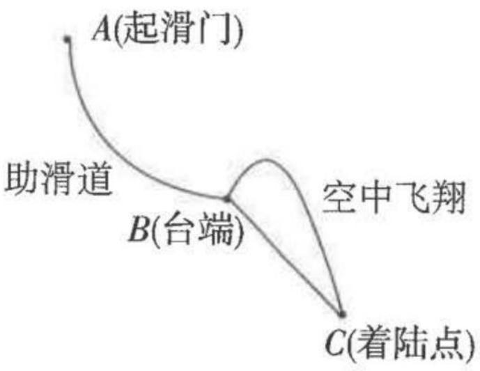

text_image

A(起滑门)
助滑道
B(台端)
空中飞翔
C(着陆点)

图10-1

(1) 求实数 a, b 的值及助滑道曲线 AB 的长度.

(2) 若运动员在某次比赛中的着陆点 C 与起滑门点 A 的高度差为 120, 求他的飞行距离 (答案保留整数, $\sqrt{5} \approx 2.236$ ).

思维导引 (1) 根据二次函数的特点可知曲线 $g(x) = ax^{2} - 20ax - b$ 的对称轴为直线 $x = 10$ , 由此得到 $g(10) = -30, g(30) = -70$ , 即可求出 $a, b$ 的值. 令 $y = f(x)$ , 即可得到 $x^{2} + y^{2} = b^{2} (-b \leqslant x \leqslant 0, -b \leqslant y \leqslant 0)$ , 观察该式, 联想曲线 $f(x)$ 的几何特征, 进而求出曲线 $AB$ 的长度. (2) 由 (1) 可得 $g(x)$ 的解析式, 依题意可得 $y_{c} = -120$ , 代入

$g(x)$ 的解析式中解出 $x_{C}$ ，即可求出点 C 的坐标，根据两点间的距离公式计算可得答案.

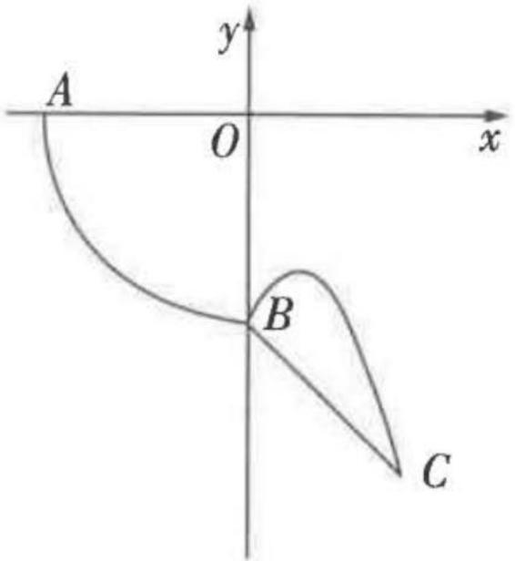

text_image

A
O
x
y
B
C

图10-2

解析 (1)根据题意,建立平面直角坐标系,如图10-2所示.

对于 $g(x)=ax^{2}-20ax-b(x>0,a$ 为常数)，由题图知， $g(x)$ 的图象开口向下，结合二次函数的性质知，a<0，

又曲线 $y = ax^{2} - 20ax - b$ 的对称轴为直线 $x = -\frac{-20a}{2a} = 10$ , $|30-10|>|10-0|$ ,

所以在区间 $[0,30]$ 上，当 $x = 10$ 时， $g(x)$ 取得最大值，当 $x = 30$ 时， $g(x)$ 取得最小值，且 $g(x)_{\max} = g(10) = -100a - b = -30, g(x)_{\min} = g(30) = 300a - b = -70$ ，解得 $\left\{ \begin{array}{l} a = -\frac{1}{10}, \\ b = 40. \end{array} \right.$

令 $y=f(x)$ ，则 $x^{2}+y^{2}=b^{2}(-b\leqslant x\leqslant0,-b\leqslant y\leqslant0)$ ，

所以 $f(x) = -\sqrt{b^2 - x^2}$ ( $b$ 为常数, $-b \leqslant x \leqslant 0$ )表示以(0,0)为圆心, $b$ 为半径的 $\frac{1}{4}$ 圆弧.

【见数思形】数学学习，脑中无“形”，永远不行！根据 $x^{2}+y^{2}=b^{2}$ 的结构特征联想图，结合x,y的取值范围确定曲线 $f(x)$ 的几何特征

所以 $\widehat{AB}$ 的长为 $\frac{1}{4}\times2\pi\times b=\frac{1}{4}\times2\pi\times40=20\pi.$

故 $a = -\frac{1}{10}, b = 40$ ，助滑道曲线 $AB$ 的长度为 $20\pi$ .

(2)依题意可得 $A(-40,0)$ , $B(0,-40)$ , $y_{c}=-120$ ,

由(1)可得 $g(x) = -\frac{1}{10}x^{2} + 2x - 40(x > 0)$ ,

令 $g(x) = -120$ ，即 $-\frac{1}{10}x^{2} + 2x - 40 = -120$ ，解得 $x_{1} = 40, x_{2} = -20$ （舍去）.

所以 $C(40, -120)$ ，所以 $\left|BC\right| = \sqrt{40^{2} + (-40 + 120)^{2}} = 40\sqrt{5} \approx 89$ ，即该运动员飞行距离约为 89.

# 模型2 分段函数模型

调研 3 (2022·重庆4月第四次模拟调研)我国的酒驾判定标准是车辆驾驶员血液中的酒精含量大于或者等于20 mg/100 ml. 已知一驾驶员某次饮酒后,体内血液中的酒精含量y(单位:mg/100 ml)与时间x(单位:h)的关系为:当0<x≤ $\frac{11}{3}$ 时,y=- $\frac{270}{11}x^{2}$ + $\frac{1080}{11}x$ ;当x>11/3时,y=110/x. 那么该驾驶员在饮酒后要经过\_\_\_\_h体内血液中的酒精含量才能降到20 mg/100 ml.

思维导引 令 $y = f(x)$ ，得分段函数 $f(x) = \left\{ \begin{array}{l} -\frac{270}{11} x^2 + \frac{1080}{11} x, \\ \frac{110}{x}, x > \frac{11}{3}, \end{array} \right.$ 然后研判饮酒后多久体内血液

名师有话说: 高考试题倡导理论联系实际, 强调知识的活学活用, 往往融合社会、科技等热点, 建立现实生活与数学学习的联系, 体现数学的应用价值, 考查学生在实践中解决生活问题的数学素养.

中的酒精含量下降到 $20 \, mg/100 \, ml$ 即可.

解析 令 $y = f(x)$ ，则函数 $f(x) = \left\{ \begin{array}{l} - \frac{270}{11} x^2 + \frac{1080}{11} x, 0 < x \leqslant \frac{11}{3}, \\ \frac{110}{x}, x > \frac{11}{3}, \end{array} \right.$

当 $0 < x \leqslant \frac{11}{3}$ 时, $f(x) = -\frac{270}{11}(x - 2)^2 + \frac{1080}{11}$ 在 $(0,2)$ 上单调递增, 在 $(2, \frac{11}{3})$ 上单调递减, $f(\frac{11}{3}) = 30 > 20$ .

所以饮酒 $\frac{11}{3}\mathrm{h}$ 后，体内血液中的酒精含量高于 $20\mathrm{mg} / 100\mathrm{ml}$

当 $x > \frac{11}{3}$ 时, 函数 $f(x) = \frac{110}{x}$ 单调递减, 令 $f(x) = \frac{110}{x} = 20$ , 解得 x = 5.5, 因此饮酒后 5.5 小时体内血液中的酒精含量下降到 20 mg/100 ml.

故答案为5.5.

调研 4 (2022·广东汕头4月期中)为了响应国家节能减排的号召,2022年某企业计划引进新能源汽车生产设备.通过市场分析:全年需投入固定成本2500万元,若每年生产x(单位:百辆)新能源汽车,则需另投入成本C(x)(单位:万元),且C(x)= $\left\{\begin{array}{l}10x^{2}+500x,0<x<40,\\901x+\frac{6400}{x}-6300,x\geqslant40.\end{array}\right.$ 由市场调研知,每辆车售价9万元,且生产的车辆当年能全部销售完.

(1)请写出2022年的利润 $L(x)$ (单位:万元)关于年产量x的函数关系式(利润=售价-成本).  
(2) 当 2022 年的年产量为多少时, 企业所获利润最大? 并求出最大利润.

解析 (1) 当 0 < x < 40 时，

$$
L (x) = 9 \times 1 0 0 x - (1 0 x ^ {2} + 5 0 0 x) - 2 5 0 0 = - 1 0 x ^ {2} + 4 0 0 x - 2 5 0 0.
$$

当 $x \geqslant 40$ 时，

$$
L (x) = 9 \times 1 0 0 x - (9 0 1 x + \frac {6 4 0 0}{x} - 6 3 0 0) - 2 5 0 0 = 3 8 0 0 - (x + \frac {6 4 0 0}{x}).
$$

所以 $L(x)=\left\{\begin{aligned}-10x^{2}+400x-2500, &0<x<40,\\3800-(x+\frac{6400}{x}), &x\geqslant40.\end{aligned}\right.$

(2) 当 0 < x < 40 时, $L(x) = -10(x - 20)^{2} + 1500$ , 所以当 x = 20 时, $L(x)$ 取最大值, 且 $L(x)_{\max} = 1500$ .

【复解】因为 $x > 0,40 - x > 0$ ，所以 $L(x) = 10x(40 - x) - 2500\leqslant 10\times \left[\frac{x + (40 - x)}{2}\right]^2 -2500 =$ 1500，当且仅当 $x = 40 - x$ ，即 $x = 20$ 时等号成立

当 $x \geqslant 40$ 时, $L(x) = 3800 - (x + \frac{6400}{x}) \leqslant 3800 - 2\sqrt{x \cdot \frac{6400}{x}} = 3800 - 160 = 3640$ , 当且仅当 $x = \frac{6400}{x}$ , 即 $x = 80$ 时取“=”.

显然 3 640 > 1 500，

故当 x=80，即 2022 年的年产量为 8000 辆时，该企业获得利润最大，且最大利润为 3640 万元。

# 模型3 指数函数模型

调研 5 (2022·福建三明 5 月质量检测)我国某科研机构新研制了一种治疗某病毒的注射性新药,并已进入二期临床试验阶段. 已知这种新药在注射停止后的血药质量浓度 $c(t)$ （单位:mg/L）随着时间 t（单位:h）的变化可用指数型函数模型 $c(t)=c_{0}e^{-kt}$ 描述,其中 $c_{0}$ 为初始血药质量浓度. 假定 k=0.1（单位: $h^{-1}$ ），刚注射这种新药后的初始血药质量浓度 $c_{0}=2000 mg/L$ ，且这种新药在病人体内的血药质量浓度不低于 1000 mg/L 时才会对病毒起效，现给某感染了该病毒的病人注射了这种新药，则该新药对病人有疗效的时长大约为(参考数据: $\ln 2\approx0.693,\ln 3\approx1.099$ )

A. $5.32 \mathrm{~h}$

B. $6.23 \mathrm{~h}$

C. 6.93 h

D. $7.52 \mathrm{~h}$

解析 由题意得, $c(t)=c_{0}e^{-kt}=2\ 000e^{-0.1t}$

令 $c(t) = 2000\mathrm{e}^{-0.1t}\geqslant 1000$ ，得 $\mathrm{e}^{-0.1t}\geqslant \frac{1}{2},$

名师有话说:构建数学
模型需过好如下3关.

1. 事理关：通过数学阅读，熟悉实际背景，探寻内在逻辑，为解题找寻突破口。

2. 文理关：将实际问题的文字语言转化为数学符号语言，用数学式子表达数量关系.

3. 数理关：检索已有数学知识，认定或构建相应的数学模型。

【扫清障碍】解指数不等式的策略是先将待解不等式转化为 $e^{-0.1t} \geqslant \frac{1}{2} = e^{\ln \frac{1}{2}}$ ，然后借助相应的指数函数的单调性加以求解

故 $-0.1t \geqslant -\ln 2, t \leqslant \frac{\ln 2}{0.1} \approx 6.93$

所以该新药对病人有疗效的时长大约为 6.93 h. 故选 C.

调研 6 (原创)基本再生数 $R_{0}$ 与世代间隔 $T$ 是某病毒的流行病学基本参数, 基本再生数指一个感染者传染的平均人数, 世代间隔指相邻两代间传染所需的平均时间. 在该病毒传染的初始阶段, 可以用指数型函数模型 $I(t) = \mathrm{e}^{rt}$ 描述累计感染病例数 $I(t)$ 随时间 $t$ (单位: 天)的变化规律, 其中指数增长率 $r$ 与 $R_{0}, T$ 近似满足 $R_{0} = 1 + rT$ . 有学者基于已有数据估计出该病毒对应的 $R_{0} = 3.28, T = 6$ . 据此, 在该病毒传染的初始阶段, 累计感染病例数增加 3 倍需要的时间约为 $(\ln 2 \approx 0.69)$ ( )

A.3.6天

B.3.0天

C.2.4 天

D.1.8天

解析 因为 $R_{0}=3.28, T=6$ ，且 $R_{0}=1+rT$ ，所以 $r=\frac{R_{0}-1}{T}=\frac{3.28-1}{6}=0.38$ ，故可得 $I(t)=\mathrm{e}^{0.38t}$ .

设在该病毒传染的初始阶段,累计感染病例数增加3倍需要的时间为 $t_{1}$ (单位:天),则有 $I(t+t_{1})=4I(t)$ ,即 $e^{0.38(t+t_{1})}=e^{0.38t}\cdot e^{0.38t_{1}}=4e^{0.38t}$ ,

【易错】注意：累计感染病例数增加3倍，不是 $I(t+t_{1})=3I(t)$ ，而是 $I(t+t_{1})=4I(t)$

所以 $\mathrm{e}^{0.38t_1} = 4,0.38t_1 = \ln 4 = 2\ln 2\approx 2\times 0.69$ ，解得 $t_1\approx 3.6$

所以累计感染病例数增加3倍需要的时间约为3.6天,故选A.

# 模型4 对数函数模型

调研 7 (2022·云南昆明4月一模)北京时间2021年10月16日0时23分,长征二号F遥十三运载火箭在酒泉卫星发射中心点火升空,约582秒后,神舟十三号载人飞船进入预定轨道,顺利将翟志刚、王亚平、叶光富三名航天员送入太空.在不考虑空气动力和地球引力的条件下,从发射开始,火箭的最大飞行速度v满足公式 $v=w\ln(1+\frac{M}{m})$ ,其中M为火箭推进剂质量,m为去除推进剂后的火箭有效载荷质量,w为火箭发动机喷流相对火箭的速度.当M=3m时,v=5.544千米/秒.在保持w不变的情况下,若m=25吨,假设要使v超过第一宇宙速度达到8千米/秒,则M至少约为(结果精确到1吨,参考数据: $e^{2}\approx7.389,\ln2\approx0.693$ )()

A. 135 吨

B. 160 吨

C. 185 吨

D.210吨

解析 因为当 M=3m 时, v=5.544 千米/秒, 所以 $w=\frac{5.544}{\ln 4}=\frac{5.544}{2\ln 2}$ (千米/秒),

由 $v = w\ln \left(1 + \frac{M}{m}\right) = \frac{5.544}{2\ln 2}\ln \left(1 + \frac{M}{25}\right) = 8$ （千米/秒），得 $\ln (1 + \frac{M}{25})\approx 2$

【扫清障碍】方程 $\ln\left(1+\frac{M}{25}\right)\approx2$ 的求解，可以应用指对互化，也可以将待解方程转化为 $\ln(1+\frac{M}{25})\approx\ln e^{2}$ ，借助相应的对数函数的单调性解决

所以 $1 + \frac{M}{25} \approx e^{2} \approx 7.389$ ，解得 M = 159.725 ≈ 160（吨），即 M 至少约为 160 吨。故选 B.

# 模型5> 函数模型的选择

调研 8 (2022·江西4月教学质量监测)茶文化起源于中国,中国饮茶据说始于神农时代. 现代研究结果显示,饮茶温度最好不要超过60 ℃. 一杯茶泡好后置于室内,分别测得其放置1分钟、2分钟后的温度为80 ℃、68 ℃,现给出三个茶温T(单位:℃)关于茶泡好后置于室内时间t(单位:分)的函数模型:① $T = at + b (a < 0)$ ;② $T = \log_a t + b (0 < a < 1)$ ;③ $T = 20 + b \cdot a^t (b > 0, 0 < a < 1)$ . 根据生活常识,从这三个函数模型中选择一个,模拟茶温T(单位:℃)关于茶泡好后置于室内时间t(单位:分)的关系,依此计算,该杯茶泡好后到饮用至少需要等待的时间为(假设室温为20 ℃,参考数据: $\lg 2 \approx 0.301, \lg 3 \approx 0.477$ )

A.2.72 分钟

B.2.82 分钟

C.2.92 分钟

D. 3.02 分钟

解析 函数 $T = at + b (a < 0)$ 是关于时间 t（单位：分）的单调递减的线性函数，函数 $T = \log_{a} t + b (0 < a < 1)$ 也是减函数，两者都有函数值为负的情形，有悖于生活常识，因为茶温是不会低于室内温度的，因此选择模型③.

令 $T=f(t)=20+b\cdot a^{t}(b>0,0<a<1)$ ，则 $\left\{\begin{aligned}f(1)&=80,\\ f(2)&=68,\end{aligned}\right.$

即 $\left\{\begin{aligned}80&=20+ba,\\ 68&=20+ba^{2},\end{aligned}\right.$ 解得 $\left\{\begin{aligned}a&=\frac{4}{5},\\ b&=75,\end{aligned}\right.$ 所以 $T=f(t)=20+75\cdot(\frac{4}{5})^{t}.$

令 $20 + 75 \cdot (\frac{4}{5})^t \leqslant 60$ ，则 $(\frac{4}{5})^t \leqslant \frac{8}{15}$ ，

【扫清障碍】对于待解不等式 $\left(\frac{4}{5}\right)^{\prime}\leqslant\frac{8}{15}$ ，可以两边同取对数根据 $\lg\left(\frac{4}{5}\right)^{\prime}\leqslant\lg\frac{8}{15}$ 求解，也可以转化为 $\left(\frac{4}{5}\right)^{\prime}\leqslant\left(\frac{4}{5}\right)^{\log\frac{4}{5}\frac{8}{15}}$ 应用指数函数的单调性求解

解得 $t \geqslant \frac{3\lg 2 - \lg 3 - \lg 5}{2\lg 2 - \lg 5} = \frac{3\lg 2 - \lg 3 - (1 - \lg 2)}{2\lg 2 - (1 - \lg 2)} = \frac{4\lg 2 - \lg 3 - 1}{3\lg 2 - 1} \approx 2.814.$ 故选B.

# 新题演练

1. (2022·广东茂名 4 月二模)“双碳”, 即碳达峰与碳中和的简称. 2020 年 9 月中国明确提出力争 2030 年前实现碳达峰, 2060 年前实现碳中和. 为了实现这一目标, 中国加大了对电动汽车的研究与推广, 新型动力电池随之也蓬勃发展. Peukert 于 1898 年提出铅酸蓄电池的容量 C(单位: A·h), 放电时间 t(单位: h) 与放电电流 I(单位: A)之间关系的经验公式 $C = I^{n} \cdot t$ , 其中 n 为 Peukert 常数. 已知某铅酸蓄电池的 Peukert 常数为 $\log_{\frac{3}{2}} 2$ , 在电池容量不变的条件下, 当放电电流 I = 10 A 时, 放电时间 t = 57 h, 则当放电电流 I = 15 A 时, 放电时间为 ( )

A. $28 \mathrm{~h}$

B. $28.5 \mathrm{~h}$

C. $29 \mathrm{~h}$

D. $29.5 \mathrm{~h}$

2. (2022·河南新乡 4 月三模)中国的 5G 技术世界领先. 5G 技术的数学原理之一便是著名的香农公式: $C = W \log_{2}(1 + \frac{S}{N})$ . 它表示, 在被高斯白噪声干扰的信道中, 最大信息传递速度 $C$ 取决于信道带宽 $W$ 、信道内所传信号的平均功率 $S$ 、信道内部的高斯噪声功率 $N$ 的大小, 其中 $\frac{S}{N}$ 叫作信噪比. 当信噪比较大时, 公式中真数里面的 1 可以忽略不计. 根据香农公式, 增加带宽, 提高信号功率和降低噪声功率都可以提升信息传递速度, 若在信噪比为 1000 的基础上, 将带宽 $W$ 增大到原来的 2 倍, 信号平均功率 $S$ 增大到原来的 10 倍, 噪声功率 $N$ 减小到原来的 $\frac{1}{5}$ , 则信息传递速度 $C$ 大约增加了 (参考数据: $\lg 2 \approx 0.3$ ) ()

A. $87\%$

B. 123%

C. 156%

D. 213%

3. (2022·上海宝山区4月二模)某地区的一种特色干果上市时间为11个月,预测上市初期和后期会因供不应求使价格呈连续上涨的态势,而中期又将出现供大于求使价格连续下跌的情况,现有三种价格 $f(x)$ 关于上市时间x的模拟函数:① $f(x)=p\cdot q^{x}$ ;② $f(x)=px^{2}+qx+1$ ;③ $f(x)=A\sin(\frac{\pi}{4}x-\frac{\pi}{4})+B$ (以上三式中p,q,A,B均为非零常数,q>1,A>0).

(1)为准确研究其价格走势,应选哪种价格模拟函数,为什么?

(2) 若 $f(3)=8, f(7)=4$ ，求出所选函数 $f(x)$ 的解析式（注：函数的定义域是 $\{x \mid 0 \leq x \leq 10, x \in N\}$ ，其中 x=0 表示上市后的第 1 个月，x=1 表示上市后的第 2 个月，…，以此类推),为保证收益,打算在价格低于5元期间积极拓宽外销渠道,请你预测该干果在上市后的哪几个月要采用外销策略.

# 参考答案与解析

1. B 根据题意可得该铅酸蓄电池的容量 $C = 57 \cdot 10^{n} (A \cdot h)$ .

设当 I=15 A 时, 放电时间为 t, 则 $57 \cdot 10^{n}=15^{n} \cdot t$ ,

所以 $t=57\times\left(\frac{2}{3}\right)^{n}=57\times\left(\frac{2}{3}\right)^{\log\frac{3}{2}2}=57\times\left(\frac{2}{3}\right)^{\log\frac{2}{3}\frac{1}{2}}=28.5\ (h)$ ,

即当放电电流 I=15 A 时, 放电时间为 28.5 h, 故选 B.

2. D 提升前的信息传递速度 $C_0 \approx W \log_2 \frac{S}{N} = W \log_2 1000 = 3W \log_2 10 = \frac{3W}{\lg 2} \approx 10W$ , 提升后的信息传递速度 $C' \approx 2W \log_2 \frac{10S}{\frac{1}{5}N} = 2W \log_2 \frac{50S}{N} = 2W \log_2 50000 = 2W \cdot \frac{4 + \lg 5}{\lg 2} = 2W \cdot \frac{5 - \lg 2}{\lg 2} \approx \frac{94W}{3}$ , 所以信息传递速度 $C$ 大约增加了 $\frac{C' - C_0}{C_0} = \frac{\frac{94}{3}W - 10W}{10W} \approx 2.13 = 213\%$ . 故选 D.

3.(1)对于①,函数 $f(x)=p\cdot q^{x}$ 是单调函数,不符合题意.

对于②,二次型函数 $f(x)=px^{2}+qx+1$ 的图象不具备先上升,后下降,再上升的特点,不符合题意.

对于③, 函数 $f(x) = A \sin \left( \frac{\pi}{4} x - \frac{\pi}{4} \right) + B$ 在 $[0,3]$ 上的图象是上升的, 在 $[3,7]$ 上的图象是下降的, 在 $[7,10]$ 上的图象是上升的, 满足题设条件, 应选③.

【数形结合】分析三个函数的图象的几何特征，确定函数模型的选择

(2)依题意, $\left\{\begin{aligned}A+B=8,\\ -A+B=4,\end{aligned}\right.$ 解得 A=2,B=6,

则 $f(x) = 2\sin \left(\frac{\pi}{4} x - \frac{\pi}{4}\right) + 6, x \in [0,10], x \in \mathbf{N}$ .

由 $f(x) = 2\sin \left(\frac{\pi}{4} x - \frac{\pi}{4}\right) + 6 < 5$ ，得 $\sin \left(\frac{\pi}{4} x - \frac{\pi}{4}\right) < -\frac{1}{2}$ ，而 $x \in [0,10]$ ， $x \in \mathbf{N}$ ，解得 $x \in \{0,6,7,8\}$ ，

所以该干果在上市后的第1,7,8,9个月应该采取外销策略.

# 挑战压轴篇

# 超重点 11 高考数学压轴题之极值点偏移问题

预备知识 如图 11-1, 已知函数 $f(x)$ 图象的顶点的横坐标就是极值点 $x_0$ , 若以方程 $f(x) = c$ 的两实数解 $x_1, x_2$ 为端点的区间的中点为 $\frac{x_1 + x_2}{2}, \frac{x_1 + x_2}{2} = x_0$ , 即极值点为以两实数解为端点的区间的中点, 则极值点没有偏移, 此时函数 $f(x)$ 在极值点 $x_0$ 的两侧函数值变化快慢相同.

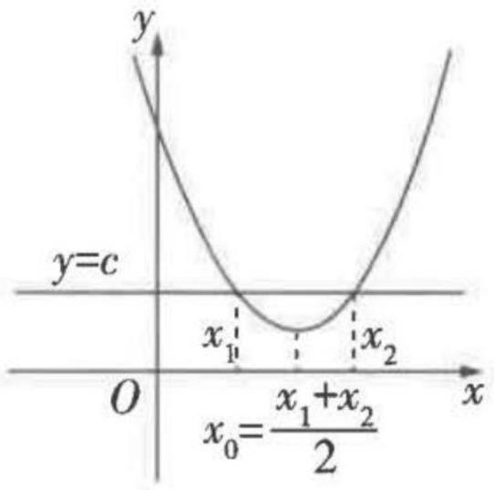

text_image

y
y=c
O
x
x₁
x₂
x₀=(x₁+x₂)/2

极值点无偏移

图11-1  
若 $\frac{x_1 + x_2}{2} \neq x_0$ ，则极值点偏移，此时函数 $f(x)$ 在极值点 $x_0$ 两侧函数值变化快慢不同，如图11-2(1)(2)(3)(4).  
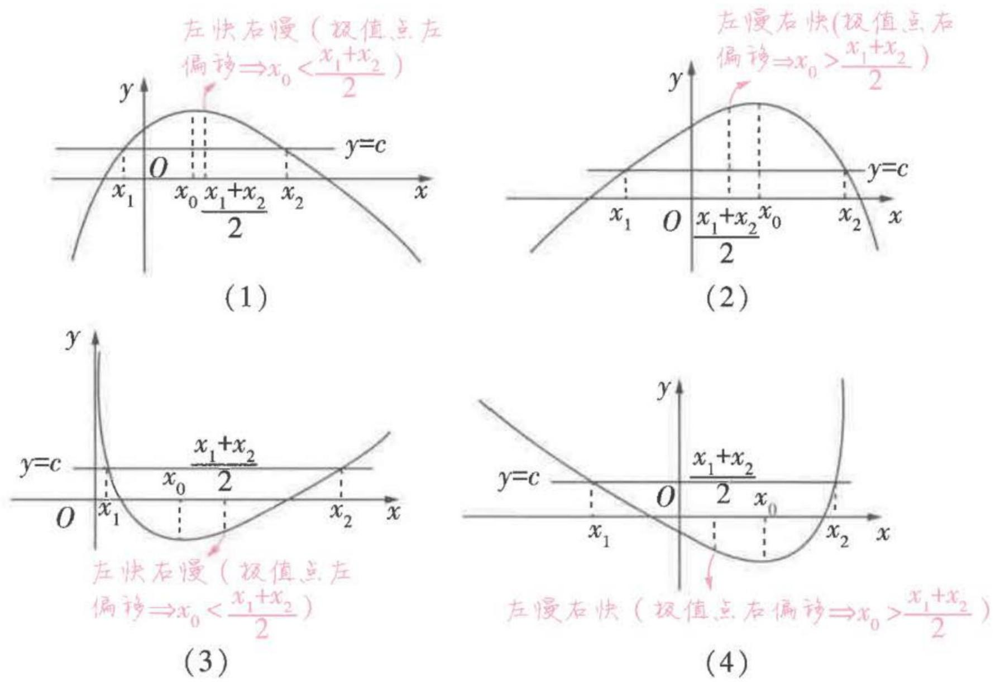  
图11-2

# 命题角度1 对称构造

调研 1 (2022·重庆巴蜀中学5月适应性考试)已知函数 $f(x)=\frac{a-1-x}{e^{x}}(x>0)$ (e为自然对数的底数, $a\in R$ ).

(1) 求 $f(x)$ 的单调区间和极值.  
(2) 若存在 $x_{1} \neq x_{2}$ , 满足 $f(x_{1}) = f(x_{2})$ , 求证: $\sqrt{x_1 + x_2} > \frac{4a}{a + 2}$ .

思维导引 (1) 求出 $f(x)$ 的导数, 分 $a \leqslant 0$ 和 $a > 0$ 两种情况, 利用导数在函数单调性中的应用, 即可求出 $f(x)$ 的单调区间和极值. (2) 结合 (1) 可知 $a > 0$ , 设 $0 < x_{1} < a < x_{2}, g(x) = f(x) - f(2a - x)(0 < x < a)$ , 根据函数的单调性可证 $f(x_{1}) > f(2a - x_{1})$ , 结合 $f(x)$ 在 $(a, +\infty)$ 上单调递增, 可证 $x_{1} + x_{2} > 2a$ , 再证明 $2a \geqslant (\frac{4a}{a + 2})^{2}$ 即可.

解析 (1) $f'(x)=\frac{1}{\mathrm{e}^{x}}(x-a)$ .

当 $a \leqslant 0$ 时, $f'(x) > 0$ , 所以 $f(x)$ 在 $(0, +\infty)$ 上单调递增, 无极值.

当 $a > 0$ 时，令 $f'(x) = \frac{1}{\mathrm{e}^x} (x - a) = 0$ ，得 $x = a$

当 $x \in (0, a)$ 时， $f'(x) < 0$ ；当 $x \in (a, +\infty)$ 时， $f'(x) > 0$ .

所以 $f(x)$ 在 $(0,a)$ 上单调递减,在 $(a,+\infty)$ 上单调递增,所以函数 $f(x)$ 的极小值为 $f(a)=-\frac{1}{\mathrm{e}^{a}}$ ,无极大值.

综上, 当 $a \leqslant 0$ 时, $f(x)$ 的单调递增区间为 $(0, +\infty)$ , 无极值. 当 $a > 0$ 时, $f(x)$ 的单调递增区间为 $(a, +\infty)$ , 单调递减区间为 $(0, a)$ , 极小值为 $-\frac{1}{\mathrm{e}^a}$ , 无极大值.

(2) 由(1)可知, 当 a > 0 时才存在 $x_{1} \neq x_{2}$ , 满足 $f(x_{1}) = f(x_{2})$ , 不妨设 $0 < x_{1} < a <$ 【承上启下】解题时要充分利用前一问的过程或结论 $x_{2}, g(x) = f(x) - f(2a - x) (0 < x < a)$ , 则 $g(x) = \frac{a - 1 - x}{\mathrm{e}^{x}} - \frac{x - a - 1}{\mathrm{e}^{2a - x}}$ ,

$$
g ^ {\prime} (x) = \frac {1}{\mathrm{e} ^ {x}} (x - a) + \frac {1}{\mathrm{e} ^ {2 a - x}} (a - x) = (x - a) \cdot \frac {\mathrm{e} ^ {2 a} - \mathrm{e} ^ {2 x}}{\mathrm{e} ^ {2 a + x}},
$$

当 $x \in (0, a)$ 时， $x - a < 0, \mathrm{e}^{2a} - \mathrm{e}^{2x} > 0$ ，所以 $g'(x) < 0$

所以 $g(x)$ 在 $(0, a)$ 上单调递减，所以 $g(x_{1}) > g(a) = 0$ ，所以 $f(x_{1}) - f(2a - x_{1}) > 0$ ，即 $f(x_{1}) > f(2a - x_{1})$ ，故 $f(x_{2}) = f(x_{1}) > f(2a - x_{1})$ 。

因为 $x_{2}>a,2a-x_{1}>a$ ，且 $f(x)$ 在 $(a,+\infty)$ 上单调递增，

所以 $x_{2}>2a-x_{1}$ ，所以 $x_{1}+x_{2}>2a$ 。

【瓶颈】当要证的含参不等式的一侧并不是函数极值点的2倍时, 要考虑结论是否已经放缩. 如本题根据极值点偏移得出的直接结论应是 $x_{1} + x_{2} > 2a$ , 所以应该寻找 $2a$ 与 $(\frac{4a}{a + 2})^{2}$ 的大小关系

下面证明 $2a \geqslant \left(\frac{4a}{a + 2}\right)^2$ .

因为 $2a - \left(\frac{4a}{a + 2}\right)^2 = \frac{2a[(a + 2)^2 - 8a]}{(a + 2)^2} = \frac{2a(a - 2)^2}{(a + 2)^2} \geqslant 0$ ，所以 $2a \geqslant \left(\frac{4a}{a + 2}\right)^2$

即 $\sqrt{2a} \geqslant \frac{4a}{a + 2}$ , 所以 $\sqrt{x_1 + x_2} > \sqrt{2a} \geqslant \frac{4a}{a + 2}$ , 所以 $\sqrt{x_1 + x_2} > \frac{4a}{a + 2}$ , 得证.

# 方法提炼

# 与极值点有关的证明问题的解题策略

形如证明 $x_{1} + x_{2} > 2x_{0}$ (或 $< 2x_{0}$ ), 或相似形式, 变形为 $x_{1} > 2x_{0} - x_{2}$ (或 $x_{1} < 2x_{0} - x_{2}$ ), 其中 $x_{1} < x_{0} < x_{2}, x_{0}$ 为极值点, $f(x_{1}) = f(x_{2})$ , 通过构造函数 $h(x) = f(x) - f(2x_{0} - x)$ , 利用 $f(x)$ 和 $h(x)$ 的单调性, 转化为证明 $f(x_{1}) = f(x_{2}) > f(2x_{0} - x_{2})$ 或 $f(x_{1}) = f(x_{2}) < f(2x_{0} - x_{2})$ , 进而得出结论.

# 命题角度2 比值换元构造

调研 2 (2022 · 江苏南通基地学校 4 月第四次联考) 已知函数 $f(x) = x^{a} - a \ln x - b (a \neq 0)$ .

对于条件中涉及 $\ln x$ 或 ex 的证明问题，可以考虑进行比值换元，即令 $t = \frac{x_{2}}{x_{1}}$ ，其目的是减少变量个数，把双变量问题转化为单变量问题进行解决。换元后用 t 表示出 $x_{1}x_{2}$ ，然后转化为关于 t 的问题的证明

(1) 求函数 $f(x)$ 的单调区间.  
(2) 若 a > 0, b > 1, 证明: $f(x)$ 存在两个零点 $x_{1}, x_{2}$ , 且 $x_{1}^{a} + x_{2}^{a} > 2$ .

# 思维导引

(1)

求出函数的定义域，对函数求导

分 $a < 0$ 和 $a > 0$ 两种情况讨论导数值的正负

函数的单调区间

(2)

证明零
点存在

零点满足等式

$$
\left\{ \begin{array}{l} x _ {1} ^ {a} - a \ln x _ {1} - b = 0, \\ x _ {2} ^ {a} - a \ln x _ {2} - b = 0 \end{array} \right.
$$

$$
\mathrm{令} t = \frac {x _ {2}}{x _ {1}}
$$

将不等式转化

$$
\mathrm{为} \frac {t ^ {a} + 1}{t ^ {a} - 1} \ln t ^ {a} > 2
$$

$$
\mathrm{令} m = t ^ {a}
$$

将不等式进一步转化为 $\ln m > \frac{2(m - 1)}{m + 1}$ 构造函数 $h(m) = \frac{2(m - 1)}{m + 1} -\ln m$ 进行证明

解析

(1) $f(x)$ 的定义域为 $(0, +\infty)$ , $f'(x) = ax^{a-1} - \frac{a}{x} = \frac{a}{x}(x^a - 1)$ .

若 $a < 0$ ，则当 $x \in (0,1)$ 时， $\frac{a}{x} < 0, x^a - 1 > 0$ ，所以 $f'(x) < 0, f(x)$ 在 $(0,1)$ 上单调递减；

当 $x \in (1, +\infty)$ 时， $\frac{a}{x} < 0, x^a - 1 < 0$ ，所以 $f'(x) > 0, f(x)$ 在 $(1, +\infty)$ 上单调递增.

若 $a > 0$ ，则当 $x \in (0,1)$ 时， $\frac{a}{x} > 0, x^a - 1 < 0$ ，所以 $f'(x) < 0, f(x)$ 在 $(0,1)$ 上单调递减；

当 $x \in (1, +\infty)$ 时， $\frac{a}{x} > 0, x^a - 1 > 0$ ，所以 $f'(x) > 0, f(x)$ 在 $(1, +\infty)$ 上单调递增.

综上, 当 $a \neq 0$ 时, $f(x)$ 的单调递减区间为 $(0,1)$ , 单调递增区间为 $(1, +\infty)$ .

(2) 方法一 (比值换元) 由(1)知, 当 a > 0 时, $f(x)$ 在 $(0,1)$ 上单调递减, 在 $(1, +\infty)$ 上单调递增.

因为 b > 1，所以 $f(1) = 1 - b < 0$ ，

因为 $\mathrm{e}^{-\frac{b}{a}}\in (0,1),f(\mathrm{e}^{-\frac{b}{a}}) = \mathrm{e}^{-b} > 0$ ，所以 $f(x)$ 在(0,1)上存在唯一零点 $x_{1}$

【扫清障碍】函数零点的存在性与个数要依据函数零点存在定理，结合函数的单调性进行判断，在某个单调区间上为了说明零点存在，需要找两个异号的函数值，除了极值之外，往往还需要构造一个异号的函数值，比如这里取的 $x=e^{-\frac{b}{a}}$ ， $f(e^{-\frac{b}{a}})=e^{-b}>0$

易知 $\mathrm{e}^{\frac{b}{a}}\in (1, + \infty),f(\mathrm{e}^{\frac{b}{a}}) = \mathrm{e}^{b} - 2b,$

设 $g(b) = \mathrm{e}^{b} - 2b, b \in (1, +\infty)$ ，则 $g'(b) = \mathrm{e}^{b} - 2 > 0$

所以 $g(b)$ 在 $(1, +\infty)$ 上单调递增, $g(b) > e - 2 > 0$ , 即 $f(e^{\frac{b}{a}}) > 0$ , 所以 $f(x)$ 在 $(1, +\infty)$ 上存在唯一零点 $x_{2}$ .

综上, 当 a > 0, b > 1 时, $f(x)$ 存在两个零点 $x_{1}, x_{2}$ , 且 $0 < x_{1} < 1 < x_{2}$ ,

所以 $\left\{ \begin{array}{l}x_1^a - a\ln x_1 - b = 0,\\ x_2^a - a\ln x_2 - b = 0, \end{array} \right.$

设 $t=\frac{x_{2}}{x_{1}}>1$ ，则 $t^{a}x_{1}^{a}-a\ln t-x_{1}^{a}=0$ ，即 $(t^{a}-1)x_{1}^{a}=a\ln t$ ，即 $x_{1}^{a}=\frac{\ln t^{a}}{t^{a}-1}$ .

【技法点拨】对于双变量问题，通过比值换元或代入消元将其变成单变量问题，是解决这类问题的常见手段。这里令 $t=\frac{x_{2}}{x_{1}}$ ，然后用 t 表示出 $x_{1}, x_{2}$ ，变成关于 t 的不等式进行证明

要证 $x_{1}^{a} + x_{2}^{a} > 2$ ，只要证 $(t^a +1)x_1^a >2$ ，只要证 $\frac{t^a + 1}{t^a - 1}\ln t^a >2$

设 $m = t^a > 1$ ，只要证 $\ln m > \frac{2(m - 1)}{m + 1}$ ，再设 $h(m) = \frac{2(m - 1)}{m + 1} - \ln m, m > 1$

则 $h'(m) = -\frac{(m-1)^{2}}{m(m+1)^{2}} < 0$ ，所以 $h(m)$ 在 $(1, +\infty)$ 上单调递减，所以 $h(m) < \frac{0}{1+1} - \ln 1 = 0$ ，故原不等式得证.

方法二 由(1)知,当 a > 0 时, $f(x)$ 在(0,1)上单调递减,在 $(1, +\infty)$ 上单调递增,
则 $f(x)_{\min}=f(1)=1-b<0,f(\mathrm{e}^{-\frac{b}{a}})=\mathrm{e}^{-b}>0,$

$$
f \left(\mathrm{e} ^ {\frac {b + 1}{a}}\right) = \mathrm{e} ^ {b + 1} - (b + 1) - b = \mathrm{e} ^ {b + 1} - 2 b - 1 > (b + 1) ^ {2} - 2 b - 1 = b ^ {2} > 0,
$$

所以 $f(x)$ 在 $(\mathrm{e}^{-\frac{b}{a}},1)$ 和 $(1,\mathrm{e}^{\frac{b + 1}{a}})$ 上各有一个零点 $x_{1},x_{2},x_{1} <   x_{2}$

且由 $\left\{\begin{aligned}x_{1}^{a}-\ln x_{1}^{a}-b=0,\\ x_{2}^{a}-\ln x_{2}^{a}-b=0,\end{aligned}\right.$ 令 $x_{1}^{a}=m,x_{2}^{a}=n$ ，得 $\left\{\begin{aligned}m-\ln m-b=0,&(\ast)\\ n-\ln n-b=0,&(\ast\ast)\end{aligned}\right.$

【技巧】这里进行换元，令 $x_{1}^{a}=m,x_{2}^{a}=n$ ，简化了要处理的式子的形式，方便后面证明

此时 m < n，只需证 $m + n > 2$ .

由 $( \ast \ast ) - ( \ast )$ 得 $n - m = \ln n - \ln m$ ,

要证 $m + n > 2$ ，即证 $m + n > \frac{2(n - m)}{\ln n - \ln m}$ 即证 $\ln \frac{n}{m} >\frac{2(\frac{n}{m} - 1)}{\frac{n}{m} + 1},$

【突破口】此处将2换成 $\frac{2(n-m)}{\ln n-\ln m}$ 是为了构造关于m,n的“齐次式”，为后面进行比值换元做准备

令 $\frac{n}{m}=t(t>1)$ ，则要证明 $\ln t>\frac{2(t-1)}{t+1}$ ，

再令 $g(t)=\ln t-\frac{2(t-1)}{t+1}$ ，则 $g'(t)=\frac{1}{t}-\frac{4}{(t+1)^{2}}=\frac{(t-1)^{2}}{t(t+1)^{2}}>0$ ，

所以 $g(t)$ 在 $(1, +\infty)$ 上为增函数, 所以 $g(t) > 0$ , 故原不等式得证.

# 命题角度 3 差值换元构造

调研 3 (2022·济南 3 月一模) 设函数 $f(x) = ae^{2x} - 2e^x + 2$ .

(1) 若 $f(x)$ 有两个不同的零点, 求实数 a 的取值范围.
(2) 若函数 $g(x)=\frac{1}{2}a\mathrm{e}^{2x}+(a-2)\mathrm{e}^{x}-2\mathrm{e}^{-x}$ 有两个极值点 $x_{1}, x_{2}$ ，证明： $\frac{g(x_{2})-g(x_{1})}{x_{2}-x_{1}}>2-\frac{1}{a}.$

思维导引 (1) 令 $t = \mathrm{e}^{x}$ 把函数的零点个数问题等价转化为方程的根的问题求解

(2) 考虑到函数 $g(x)$ 形式的特点

求导后分解因式得到 $g'(x)=\mathrm{e}^{-x}(\mathrm{e}^{x}+1)(a\mathrm{e}^{2x}-2\mathrm{e}^{x}+2)$ 两个极值点 $x_{1}, x_{2}$ 为 $ae^{2x}-2e^{x}+2=0$ 的两个不相等的实数根

得到 $e^{x_{1}} + e^{x_{2}} = \frac{2}{a}$ , $e^{x_{1}}e^{x_{2}} = \frac{2}{a}$

代入 $\frac{g(x_{2})-g(x_{1})}{x_{2}-x_{1}}$ 令 $x_{2}-x_{1}=t(t>0)$ 转化为单变量问题解决

解析 (1) 令 $t = \mathrm{e}^{x}$ , 则 $f(x)$ 有两个不同的零点, 等价于关于 $t$ 的方程 $at^{2} - 2t +$

【技法】基于对函数 $f(x)$ 整体形式的观察，易知 $a \neq 0$ ，其可以看成是关于 $e^x$ 的二次函数 $2 = 0$ 存在两个不相等的正根.

所以 $\left\{\begin{aligned}\Delta&=(-2)^{2}-8a>0,\\ \frac{2}{a}>0,\end{aligned}\right.$ 解得 $0<a<\frac{1}{2},$

所以使得 $f(x)$ 有两个不同的零点的a的取值范围是 $(0,\frac{1}{2})$ .

(2) 易知 $g'(x) = ae^{2x} + (a - 2)e^{x} + 2e^{-x} = e^{-x}(e^{x} + 1)(ae^{2x} - 2e^{x} + 2)$ ,

因为 $\mathrm{e}^{-x} > 0, \mathrm{e}^{x} + 1 > 0$ ，且 $g(x)$ 有两个极值点 $x_{1}, x_{2}$ ，

所以 $x_{1}, x_{2}$ 为 $ae^{2x} - 2e^{x} + 2 = 0$ 的两个不相等的实数根.

由(1)知 $0 < a < \frac{1}{2}$ , 又 $\mathrm{e}^{x_1} + \mathrm{e}^{x_2} = \frac{2}{a}, \mathrm{e}^{x_1} \mathrm{e}^{x_2} = \frac{2}{a}$ , 不妨设 $x_2 > x_1$ ,

【突破口】这里将 $e^{x}$ 看成一个整体，应用一元二次方程根与系数的关系，有助于代入后面的 $\frac{g(x_{2})-g(x_{1})}{x_{2}-x_{1}}$ 进行化简

$$
\begin{array}{l} = \frac {\left(\mathrm{e} ^ {x _ {2}} - \mathrm{e} ^ {x _ {1}}\right) \left[ \frac {1}{2} a \left(\mathrm{e} ^ {x _ {2}} + \mathrm{e} ^ {x _ {1}}\right) + (a - 2) + \frac {2}{\mathrm{e} ^ {x _ {2}} \mathrm{e} ^ {x _ {1}}} \right]}{x _ {2} - x _ {1}} \\ = \frac {\left(\mathrm{e} ^ {x _ {2}} - \mathrm{e} ^ {x _ {1}}\right) \left[ \frac {1}{2} a \cdot \frac {2}{a} + (a - 2) + a \right]}{x _ {2} - x _ {1}} \\ = \frac {\mathrm{e} ^ {x _ {2}} - \mathrm{e} ^ {x _ {1}}}{x _ {2} - x _ {1}} \cdot (2 a - 1). \\ \end{array}
$$

则 $\frac{g(x_2) - g(x_1)}{x_2 - x_1} = \frac{\frac{1}{2}a(e^{2x_2} - e^{2x_1}) + (a - 2)(e^{x_2} - e^{x_1}) - 2(e^{-x_2} - e^{-x_1})}{x_2 - x_1}$

要证明 $\frac{g(x_2) - g(x_1)}{x_2 - x_1} > 2 - \frac{1}{a}$ , 只需证 $\frac{\mathrm{e}^{x_2} - \mathrm{e}^{x_1}}{x_2 - x_1} \cdot (2a - 1) > \frac{2a - 1}{a}$ ,

因为 $0 < a < \frac{1}{2}$ , 所以 $2a - 1 < 0$ , 只需证 $\frac{\mathrm{e}^{x_2} - \mathrm{e}^{x_1}}{x_2 - x_1} < \frac{1}{a}$ ,

注意到 $\mathrm{e}^{x_1} + \mathrm{e}^{x_2} = \frac{2}{a}$ , 只需证 $\frac{\mathrm{e}^{x_2} - \mathrm{e}^{x_1}}{x_2 - x_1} < \frac{\mathrm{e}^{x_2} + \mathrm{e}^{x_1}}{2}$ , 两边同除以 $\mathrm{e}^{x_1}$ 得 $\frac{\mathrm{e}^{x_2 - x_1} - 1}{x_2 - x_1} < \frac{\mathrm{e}^{x_2 - x_1} + 1}{2}$ ,

因为 $x_{2}>x_{1}$ ，只需证 $2\left(\mathrm{e}^{x_{2}-x_{1}}-1\right)<\left(\mathrm{e}^{x_{2}-x_{1}}+1\right)\left(x_{2}-x_{1}\right)$

【难点】结合前面根与系数的关系“消去” $a$ ，得到关于 $x_{1}, x_{2}$ 的不等式，其形式主要含有 $x_{2} - x_{1}$ ，故对 $x_{2} - x_{1}$ 进行差值换元，转化为关于单变量 $t$ 的不等式进行证明

设 $x_{2}-x_{1}=t(t>0)$ ，令 $u(t)=t(e^{t}+1)-2e^{t}+2(t>0)$ ，则只需证 $u(t)>0$ 即可.

【方法】通过换元法解决双变量问题(尤其是极值点偏移问题)，是一种常见手段，比值换元与差值换元都是其中的具体手段，同时二者又可以相互转化，本题若令 $m=e^{x}$ ，则可得 $m_{1}+m_{2}=m_{1}\cdot m_{2}=\frac{2}{a}$ ， $x_{1}=\ln m_{1},x_{2}=\ln m_{2}$ ，通过令 $t=\frac{m_{1}}{m_{2}}$ 换元进行解决

则 $u'(t) = \mathrm{e}^{t}(t - 1) + 1$ ，令 $v(t) = u'(t) = \mathrm{e}^{t}(t - 1) + 1$ ，

则 $v'(t) = t e^{t} > 0$ ，所以 $v(t)$ 在 $(0, +\infty)$ 上单调递增，

所以 $v(t) > \mathrm{e}^{0}(0 - 1) + 1 = 0$ ，即 $u'(t) > 0$ ，

所以 $u(t)$ 在 $(0, +\infty)$ 上单调递增, 所以 $u(t) > 0 - 2 \times e^{0} + 2 = 0$ , 得证.

# 命题角度4 拐点偏移

调研 4 (2022·安徽宣城4月二调)已知 $f(x)=\mathrm{e}^{x}-\frac{1}{2}x^{2}+\sin x.$

(1) 求曲线 $y = f(x)$ 在点 $P(0, f(0))$ 处的切线方程.  
(2) 若 $f(x_{1}) + f(x_{2}) = 2 (x_{1} \neq x_{2})$ ，证明： $x_{1} + x_{2} < 0$ .

解析 (1) 因为 $f(x) = \mathrm{e}^{x} - \frac{1}{2} x^{2} + \sin x$ , 所以 $f'(x) = \mathrm{e}^{x} - x + \cos x$ ,

所以 $f'(0)=2,f(0)=1$ ,

所以曲线 $y=f(x)$ 在点 $P(0,f(0))$ 处的切线方程为 $y-1=2(x-0)$ ，即 $2x-y+1=0$ 。

(2) 易知 $f'(x) = \mathrm{e}^{x} - x + \cos x \geqslant 1 + \cos x \geqslant 0$ (两个等号不同时取到),

所以 $f(x) = \mathrm{e}^{x} - \frac{1}{2} x^{2} + \sin x$ 在 $\mathbf{R}$ 上单调递增，又 $f(0) = 1, f(x_{1}) + f(x_{2}) = 2(x_{1} \neq x_{2})$

不妨设 $x_{1} < x_{2}$ , 则 $x_{1} < 0 < x_{2}$ , 欲证 $x_{1} + x_{2} < 0$ , 只需证 $x_{1} < -x_{2}$ , 只需证 $f(x_{1}) < f(-x_{2})$ , 只需证 $0 < f(-x_{2}) + f(x_{2}) - 2$ .

令 $F(x)=f(-x)+f(x)-2=e^{x}+e^{-x}-x^{2}-2(x>0)$ ，则 $F'(x)=e^{x}-e^{-x}-2x(x>0)$ ，

令 $h(x)=F'(x)=\mathrm{e}^{x}-\mathrm{e}^{-x}-2x(x>0)$ ，则 $h'(x)=\mathrm{e}^{x}+\mathrm{e}^{-x}-2>0$ ，

故当 x > 0 时, $h(x)$ 单调递增, 则 $F'(x) = h(x) > e^{0} - e^{-0} - 0 = 0$ , 所以 $F(x)$ 单调递增, 所以 $F(x) > e^{0} + e^{-0} - 0 - 2 = 0$ , 得证.

# 拓展探究

拐点,即函数图象的凹凸性发生变化的点. 图 11-3 展示了拐点不偏移与偏移的情况.

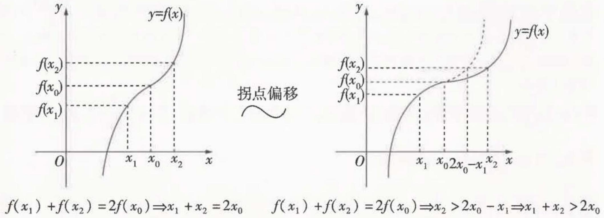

text_image

y
y=f(x)
f(x₂)
f(x₀)
f(x₁)
x₁ x₀ x₂
O x₁ x₀ 2x₀-x₁x₂ x
拐点偏移
y
y=f(x)
f(x₂)
f(x₀)
f(x₁)
x₁ x₀ 2x₀-x₁x₂ x
O x₁ x₀ 2x₀-x₁x₂ >2x₀
f(x₁)+f(x₂)=2f(x₀)⇒x₁+x₂=2x₀    f(x₁)+f(x₂)=2f(x₀)⇒x₂>2x₀-x₁⇒x₁+x₂>2x₀

图11-3

# 新题演练

1. (2022·山东烟台、枣庄5月三调)已知函数 $f(x)=ae^{2x}-x^{2},a\in\mathbb{R}$ .

(1) 设 $f(x)$ 的导函数为 $g(x)$ ，讨论 $g(x)$ 零点的个数；  
(2)设 $f(x)$ 的极值点为 $x_{1},x_{2}(x_{1}<x_{2})$ ，若 $\frac{e}{e-2}x_{1}+x_{2}\geqslant\lambda x_{1}x_{2}$ 恒成立，求实数 $\lambda$ 的取值范围.

2. (2022·江西上饶六校4月第二次联考)已知函数 $f(x)=(x-a)\ln x-x\ln a$ ,其中a>0.

(1) 求 $f(x)$ 的极值.  
(2) 设函数 $g(x) = f(x) + f\left(\frac{1}{x}\right)$ 有三个不同的极值点 $x_1, x_2, x_3$ .

①求实数 a 的取值范围.  
②证明： $x_{1}^{2}+x_{2}^{2}+x_{3}^{2}>3.$

# 参考答案与解析

1. (1) $g(x) = f'(x) = 2ae^{2x} - 2x$ , 则 $g'(x) = 4ae^{2x} - 2$ .

当 $a \leqslant 0$ 时, $g'(x) < 0$ , 所以 $g(x)$ 在 $\mathbf{R}$ 上单调递减,

又当 $x \to -\infty$ 时, $g(x) \to +\infty$ , 当 $x \to +\infty$ 时, $g(x) \to -\infty$ , 由函数零点存在定理, 可得 $g(x)$ 存在唯一零点.

当 $a > 0$ 时，令 $g'(x) = 4ae^{2x} - 2 > 0$ ，得 $x > -\frac{\ln 2a}{2}$ 故当 $x \in (-\frac{\ln 2a}{2}, +\infty)$ 时， $g'(x) > 0, g(x)$ 单调递增. 同理，当 $x \in (-\infty, -\frac{\ln 2a}{2})$ 时， $g(x)$ 单调递减，所以

$$
g (x) _ {\min} = g \left(- \frac {\ln 2 a}{2}\right) = 1 + \ln 2 a.
$$

又当 $x \to -\infty$ 时, $g(x) \to +\infty$ , 当 $x \to +\infty$ 时, $g(x) \to +\infty$ , 所以当 $g(-\frac{\ln 2a}{2}) < 0$ , 即 【难点突破】在应用函数零点存在定理判断零点的存在性时, 要找到两个异号的函数值, 则需要很强的构造技巧, 在时间不是很充足的情况下完全可以通过函数的趋势加以说明, 这样往往节约很多时间

$0 < a < \frac{1}{2e}$ 时,由函数零点存在定理知 $g(x)$ 存在2个零点;当 $a = \frac{1}{2e}$ 时, $g(x)$ 存在1个零点;当 $a > \frac{1}{2e}$ 时, $g(x)$ 无零点.

综上, 当 $a \leqslant 0$ 或 $a = \frac{1}{2e}$ 时, $g(x)$ 存在 1 个零点; 当 $0 < a < \frac{1}{2e}$ 时, $g(x)$ 存在 2 个零点; 当 $a > \frac{1}{2e}$ 时, $g(x)$ 无零点.

(2)(构造齐次式)结合(1)知, $f(x)$ 的极值点为 $x_{1},x_{2}(x_{1}<x_{2})$ ，即方程 $2ae^{2x}-2x=0$ 的两根为 $x_{1},x_{2}$ ，且 $0<a<\frac{1}{2e}$ ，所以 $ae^{2x_{1}}=x_{1}>0,ae^{2x_{2}}=x_{2}>0$ ，

两式相除并取对数得 $2(x_{2}-x_{1})=\ln\frac{x_{2}}{x_{1}}>0.$

由 $\frac{\mathrm{e}}{\mathrm{e} - 2} x_{1} + x_{2} \geqslant \lambda x_{1}x_{2}$ , 得 $2(x_{2} - x_{1})\left(\frac{\mathrm{e}}{\mathrm{e} - 2} x_{1} + x_{2}\right) \geqslant \lambda x_{1}x_{2}\ln \frac{x_{2}}{x_{1}}$ , 所以 [指点迷津] 在不等式 $\frac{\mathrm{e}}{\mathrm{e} - 2} x_{1} + x_{2} \geqslant \lambda x_{1}x_{2}$ 左侧乘以 $2(x_{2} - x_{1})$ . 右侧乘以 $\ln \frac{x_2}{x_1}$ , 实则是为了构造齐次式, 得到包含 $\frac{x_2}{x_1}$ 的表达式, 为换元做准备

$$
\lambda \leqslant \frac {2 \left(\frac {2}{e - 2} + \frac {x _ {2}}{x _ {1}} - \frac {e}{e - 2} \cdot \frac {x _ {1}}{x _ {2}}\right)}{\ln \frac {x _ {2}}{x _ {1}}}.
$$

令 $t = \frac{x_2}{x_1}$ 则 $t > 1$ ，令 $h(t) = \frac{2(\frac{2}{\mathrm{e} - 2} + t - \frac{\mathrm{e}}{\mathrm{e} - 2} \cdot \frac{1}{t})}{\ln t} (t > 1)$ ，则 $\lambda \leqslant h(t)$ 恒成立.

$$
h ^ {\prime} (t) = \frac {2 \left[ \left(t ^ {2} + \frac {\mathrm{e}}{\mathrm{e} - 2}\right) \ln t - \left(\frac {2 t}{\mathrm{e} - 2} + t ^ {2} - \frac {\mathrm{e}}{\mathrm{e} - 2}\right) \right]}{t ^ {2} (\ln t) ^ {2}},
$$

【易错提醒】此处求导过程较为复杂，一般很难往下进行，或容易出现错误，因此必须放慢速度，仔细化简，否则后面就没意义了

令 $\varphi(t)=(t^{2}+\frac{\mathrm{e}}{\mathrm{e}-2})\ln t-\left(\frac{2t}{\mathrm{e}-2}+t^{2}-\frac{\mathrm{e}}{\mathrm{e}-2}\right)(t\geqslant1)$ ，则 $\varphi'(t)=2t\ln t-t+\frac{\mathrm{e}}{\mathrm{e}-2}\cdot\frac{1}{t}-\frac{2}{\mathrm{e}-2}$

因为 $\varphi''(t) = 2\ln t + 1 - \frac{\mathrm{e}}{\mathrm{e} - 2}\cdot \frac{1}{t^2}$ 在 $(1, + \infty)$ 上单调递增，且 $\varphi''(1) = \frac{-2}{\mathrm{e} - 2} < 0,$ $\varphi''(\mathrm{e}) = 3 - \frac{1}{\mathrm{e}^2 - 2\mathrm{e}} >0$ ，所以存在 $t_0\in (1,\mathrm{e})$ ，使得 $\varphi''(t_0) = 0$ ，且当 $t\in (1,t_0)$ 时， $\varphi''(t) < 0,\varphi'(t)$ 单调递减，当 $t\in (t_0, + \infty)$ 时， $\varphi''(t) > 0,\varphi'(t)$ 单调递增.

又 $\varphi'(1) = 0, \varphi'(e) > 0$ ，则存在 $t_1 \in (1, e)$ ，当 $t \in (1, t_1)$ 时， $\varphi'(t) < 0, \varphi(t)$ 单调递减，当 $t \in (t_1, +\infty)$ 时， $\varphi'(t) > 0, \varphi(t)$ 单调递增.

又 $\varphi(1)=\varphi(e)=0$ , 所以当 $t\in(1,e)$ 时, $\varphi(t)<0,h'(t)<0,h(t)$ 单调递减, 当 $t\in(e,+\infty)$ 时, $\varphi(t)>0,h'(t)>0,h(t)$ 单调递增,

所以 $h(t)_{\min} = h(\mathrm{e}) = \frac{2(\mathrm{e} - 1)^2}{\mathrm{e} - 2}$ , 则 $\lambda$ 的取值范围为 $(- \infty, \frac{2(\mathrm{e} - 1)^2}{\mathrm{e} - 2}]$ .

2. (1) 由题可得 $f(x)$ 的定义域为 $(0, +\infty)$ , $f'(x) = \ln x + \frac{x - a}{x} - \ln a = \ln x - \frac{a}{x} + 1 - \ln a, a > 0$ ,

所以 $f'(x)$ 在 $(0, +\infty)$ 上单调递增，

因为 $f'(a)=0$ ，所以当 $x\in(0,a)$ 时， $f'(x)<0$ ，当 $x\in(a,+\infty)$ 时， $f'(x)>0$ ，
所以 $f(x)$ 在 $(0,a)$ 上单调递减，在 $(a,+\infty)$ 上单调递增，

所以 $f(x)_{\text{极小值}} = f(a) = -a \ln a$ , 无极大值.

(2)①易得 $g'(x)=f'(x)-\frac{1}{x^{2}}f'\left(\frac{1}{x}\right)=(1+\frac{1}{x^{2}})\ln x+(\ln a-1)\left(\frac{1}{x^{2}}-1\right)(x>0)$ ,
由题可知 $g'(x)=0$ 有三个不相等的正实根 $x_{1}, x_{2}, x_{3}$ ,

令 $t = x^{2}$ ，则 $t \in (0, +\infty)$ ，则 $g'(x) = 0$ ，即 $\frac{1}{2}(1 + \frac{1}{t}) \ln t + (\ln a - 1)(\frac{1}{t} - 1) = 0$ ，即 $\ln t - \frac{2(\ln a - 1)(t - 1)}{t + 1} = 0.$

令 $h(t)=\ln t-\frac{2(\ln a-1)(t-1)}{t+1}(t>0)$ ，则 $h(t)=0$ 有 3 个不相等的正实根， $h'(t)=\frac{1}{t}-\frac{4(\ln a-1)}{(t+1)^{2}}=\frac{(t+1)^{2}-4t(\ln a-1)}{t(t+1)^{2}}=\frac{t^{2}+(6-4\ln a)t+1}{t(t+1)^{2}}$

所以 $h'(t)=0$ 有两个不相等的正实根, 即 $t^{2}+(6-4\ln a)t+1=0$ 有两个不相等的正实根,所以 $\left\{\begin{aligned}&(6-4\ln a)^{2}-4>0,\\ &4\ln a-6>0,\end{aligned}\right.$ 所以 $a>e^{2}$ ,

设 $h'(t)=0$ 的两个不相等的正实根分别为 m, n, 且 0 < m < n, 则 mn = 1, 所以 0 < m < 1 < n, 此时 $h(t)$ 在 $(0, m)$ , $(n, +\infty)$ 上单调递增, 在 $(m, n)$ 上单调递减.

【方法】通过研究函数的单调性以及在不同方向上的图象的变化趋势，获得函数图象与 $x$ 轴的交点个数，是研究零点个数问题的常用手段

又 $h(1) = 0$ ，当 $t\to 0$ 且 $t > 0$ 时， $h(t)\rightarrow -\infty$ ，当 $t\to +\infty$ 时， $h(t)\rightarrow +\infty$

所以 $h(t)$ 有 3 个不相等的正实根, 满足题意, 所以 a 的取值范围是 $(e^{2}, +\infty)$ .

②令 $t_1 = x_1^2, t_2 = x_2^2, t_3 = x_3^2, t_1 < t_2 < t_3$ ，由①知 $t_2 = x_2 = 1, 0 < t_1 < 1 < t_3$ ，且 $t_1, t_3$ 为

【突破口】转化为证明 $t_{1}+t_{3}>2$

$h(t)=\ln t-\frac{2(\ln a-1)(t-1)}{t+1}$ 的两个不相等的正实根，

令 $h(t) = 0$ ，则 $2(\ln a - 1) = \frac{(t + 1)\ln t}{t - 1} (t\neq 1),$

令 $\varphi(t) = \frac{(t+1)\ln t}{t-1} (t > 0$ 且 $t \neq 1)$ , 则 $\varphi(t_1) = \varphi(t_3), \varphi'(t) = \frac{t - \frac{1}{t} - 2\ln t}{(t-1)^2}$ .

令 $G(t)=t-\frac{1}{t}-2\ln t(t>0$ 且 $t\neq1$ , 则 $G'(t)=1+\frac{1}{t^{2}}-\frac{2}{t}=(\frac{1}{t}-1)^{2}>0$ , 所以 $G(t)$ 在 $(0,1),(1,+\infty)$ 上单调递增, 所以 $G(t)<0(t\in(0,1)), G(t)>0(t\in(1,+\infty))$

所以 $\varphi'(t) < 0 (t \in (0,1))$ , $\varphi'(t) > 0 (t \in (1, +\infty))$ ,

所以 $\varphi(t)$ 在 $(0,1)$ 上单调递减，在 $(1,+\infty)$ 上单调递增.

令 $F(t)=\varphi(t)-\varphi(2-t), t\in(0,1)$ ,

【技巧】通过构造函数，判断其单调性，得到 $t_{1}$ 与 $2-t_{1}$ 的关系

则 $F^{\prime}(t) = \varphi^{\prime}(t) + \varphi^{\prime}(2 - t) = \frac{2\left\{1 - \frac{1}{t(2 - t)} - \ln[t(2 - t)]\right\}}{(t - 1)^{2}},$

因为 $t \in (0,1)$ ，所以 $0 < t(2-t) < 1$ ，

令 $H(x) = 1 - \frac{1}{x} -\ln x(0 <   x <   1)$ ，则 $H^{\prime}(x) = \frac{1}{x^{2}} -\frac{1}{x} = \frac{1 - x}{x^{2}} >0(0 <   x <   1),$

所以 $H(x)$ 在 $(0,1)$ 上单调递增, 所以 $H(x)<0, F'(t)<0$ , 所以 $F(t)$ 在 $(0,1)$ 上单调递减.

因为 $t_1 \in (0,1)$ , 所以 $F(t_1) > 0$ , 所以 $\varphi(t_1) > \varphi(2 - t_1)$ ,

因为 $\varphi(t_{1})=\varphi(t_{3})$ ，所以 $\varphi(t_{3})>\varphi(2-t_{1})$ ，

又 $\varphi(t)$ 在 $(1, +\infty)$ 上单调递增，所以 $t_{3} > 2 - t_{1}$ ，所以 $t_{1} + t_{3} > 2$ ，所以 $x_{1}^{2} + x_{2}^{2} + x_{3}^{2} > 3$ 。

# 速记提分结论

# 类型1▶函数性质类

<table><tr><td rowspan="4">1</td><td rowspan="4">单调性</td><td>1单调性的3个等价结论对函数 $f(x)$ 定义域内任意的 $x_1,x_2$ ,且 $x_1\neq x_2$ .(i)若 $\frac{f(x_1)-f(x_2)}{x_1-x_2}>0$ 恒成立,则 $f(x)$ 为增函数;若 $\frac{f(x_1)-f(x_2)}{x_1-x_2}<0$ 恒成立,则 $f(x)$ 为减函数.(ii)若 $(x_1-x_2)[f(x_1)-f(x_2)]>0$ 恒成立,则 $f(x)$ 为增函数;若 $(x_1-x_2)[f(x_1)-f(x_2)]<0$ 恒成立,则 $f(x)$ 为减函数.(iii)若 $x_1f(x_1)+x_2f(x_2)>x_1f(x_2)+x_2f(x_1)$ 恒成立,则 $f(x)$ 为增函数;若 $x_1f(x_1)+x_2f(x_2)<\( x_1f(x_2)+x_2f(x_1)$ 恒成立,则 $f(x)$ 为减函数.【说明】该形式实际上是(ii)通过多项式展开、该项得到的</td></tr><tr><td>2复合函数的单调性“同增异减”:内、外层函数单调性相同,复合函数单调递增;内、外层函数单调性相反,复合函数单调递减.</td></tr><tr><td>3“增+增=增,减+减=减,-增=减,-减=增,增-减=增,减-增=减”.若 $k>0$ ,则 $kf(x)$ 与 $f(x)$ 的单调性相同,若 $k<0$ ,则 $kf(x)$ 与 $f(x)$ 的单调性相反.</td></tr><tr><td>4对勾函数 $y=ax+\frac{b}{x}(a>0,b>0)$ 的单调递增区间为 $(-∞,-\sqrt{\frac{b}{a}})$ 和 $(\sqrt{\frac{b}{a}},+\infty)$ ,单调递减区间为 $(-\sqrt{\frac{b}{a}},0)$ 和 $(0,\sqrt{\frac{b}{a}})$ .</td></tr><tr><td rowspan="4">2</td><td rowspan="4">奇偶性</td><td>1若直线 $y=b$ 与偶函数 $y=f(x)$ 的图象有奇数个交点,则 $f(0)=b$ .</td></tr><tr><td>2若 $g(x)$ 为偶函数,则 $f(g(x))$ 为偶函数,如 $f(x^2),f(|x|)$ 均为偶函数.</td></tr><tr><td>3奇函数的导数为偶函数,偶函数的导数为奇函数.</td></tr><tr><td>4定义域关于原点对称的函数可以表示成一个奇函数与一个偶函数的和的形式.</td></tr></table>

可将 P113 \~ P119 这部分单独撕下，夹在笔记本内或放在拿取方便处，反复记忆背诵，还可以与接下来出版的 2 辑 \~ 4 辑的最后一部分整理在一起，到时你将得到一本完整的一轮复习速记提分结论大全，陪伴你整个高三，助你圆梦未名湖畔！

<table><tr><td rowspan="5">3</td><td rowspan="5">周期性</td><td colspan="2">1若f(x+a)=f(x+b),则f(x)的周期为T=b-a,其中a≠0,b≠0,a≠b.</td></tr><tr><td colspan="2">2若f(x+a)=-f(x),则f(x)的周期为T=2a,其中a≠0.</td></tr><tr><td colspan="2">3若f(x+a)=±c/f(x)(c为常数),则f(x)的周期为T=2a,其中a≠0,c≠0.</td></tr><tr><td colspan="2">4若f(x+a)=1-f(x)/1+f(x),则f(x)的周期为T=2a,其中a≠0;若f(x+a)=1+f(x)/1-f(x),则f(x)的周期为T=4a,其中a≠0.</td></tr><tr><td colspan="2">5f(x+2a)=f(x+a)-f(x),则f(x)的周期为T=6a,其中a≠0.</td></tr><tr><td rowspan="2">4</td><td rowspan="2">奇偶性与周期性综合</td><td>f(x)为奇函数</td><td>若函数f(x)的图象关于直线x=a(a≠0)对称,则f(x)为周期函数,周期为T=4a.</td></tr><tr><td>f(x)为偶函数</td><td>若函数f(x)的图象关于点(a,0)(a≠0)对称,则f(x)为周期函数,周期为T=4a.</td></tr><tr><td>5</td><td>三次函数的性质</td><td colspan="2">已知三次函数f(x)=ax3+bx2+cx+d(a,b,c,d均为常数,a≠0),f&#x27;(x)=3ax2+2bx+c,以a&gt;0为例.1单调性.记Δ=4(b2-3ac),则当Δ≤0时,f(x)为R上的增函数;当Δ&gt;0时,f(x)有两个极值,存在三个单调区间.2图象的对称性.f(x)的图象关于点P(-b/3a,f(-b/3a))对称,反之,若三次函数的图象的对称中心为点(m,n),则三次函数的解析式为f(x)=α(x-m)3+β(x-m)+n(α,β为常数,α≠0且α=a,β=c-b2/3a).</td></tr></table>

# 型2▶函数图象类

<table><tr><td rowspan="3">6</td><td rowspan="3">函数图象的对称性</td><td colspan="2">满足 $f(a+x)=f(b-x)$ 的函数 $f(x)$ 的图象关于直线 $x=\frac{a+b}{2}$ 对称.</td></tr><tr><td colspan="2">满足 $f(a+x)=2c-f(b-x)$ 的函数 $f(x)$ 的图象关于点 $(\frac{a+b}{2},c)$ 对称.</td></tr><tr><td colspan="2">函数 $y=f(a+x)$ 与函数 $y=f(b-x)$ 的图象关于直线 $x=\frac{b-a}{2}$ 对称.</td></tr><tr><td rowspan="10">7</td><td rowspan="10">函数图象的变换方法</td><td colspan="2">平移变换</td></tr><tr><td> $y = f(x)$ 的图象 $\xrightarrow[\text{个单位长度}]{\text{左右平移 } a(a>0)}y=f(x \pm a)$ 的图象</td><td> $y = f(x)$ 的图象 $\xrightarrow[\text{个单位长度}]{\text{上下平移 } b(b>0)}y=f(x) \pm b$ 的图象</td></tr><tr><td colspan="2">注意: $y = f(\omega x)$ 的图象 $\xrightarrow[\text{左右平移 }a(a>0)\text{个单位长度}]{\text{左右平移 }a(a>0)\text{个单位长度}}y = f(\omega(x \pm a))$ 的图象</td></tr><tr><td colspan="2">伸缩变换</td></tr><tr><td> $y = f(x)$ 的图象 $\xrightarrow[\text{原来的 } \omega(\omega >0) \text{倍}]{\text{沿横轴伸缩到}}y=f(\frac{x}{\omega})$ 的图象</td><td> $y = f(x)$ 的图象 $\xrightarrow[\text{原来的 } A(A \neq 0) \text{倍}]{\text{沿纵轴伸缩到}}y=Af(x)$ 的图象</td></tr><tr><td colspan="2">翻折变换</td></tr><tr><td> $y = f(x)$ 的图象 $\xrightarrow[\text{上翻}]{\text{下往}}y = |f(x)|$ 的图象</td><td> $y = f(x)$ 的图象 $\xrightarrow[\text{翻左}]{\text{作右}}y = f(|x|)$ 的图象</td></tr><tr><td colspan="2">对称变换</td></tr><tr><td> $y = f(x)$ 的图象 $\xrightarrow[\text{关于 }y \text{ 轴对称}]{\text{关于 }y \text{ 轴对称}}y=f(-x)$ 的图象</td><td> $y = f(x)$ 的图象 $\xrightarrow[\text{关于 }x \text{ 轴对称}]{\text{关于 }x \text{ 轴对称}}y=-f(x)$ 的图象</td></tr><tr><td> $y = f(x)$ 的图象 $\xrightarrow[\text{关于原点对称}]{\text{关于原点对称}}y=-f(-x)$ 的图象</td><td> $y = a^{x}(a>0 \text{ 且 } a \neq 1)$ 的图象关于直线  $y=x$  对称 $y=\log_{a}x(a>0 \text{ 且 } a \neq 1)$ 的图象</td></tr></table>

# 型3▶技法类

<table><tr><td rowspan="6">8</td><td rowspan="6">利用含导函数的不等式构造原函数</td><td>1 $f'(x) >k \rightarrow g(x) = f(x) - kx + b (k,b \text{为常数},k \neq 0).$ </td></tr><tr><td>2 $xf'(x) + nf(x) >0 \rightarrow g(x) = x^{n}f(x) (n \text{为常数}),xf'(x) - nf(x) >0 \rightarrow g(x) = \frac{f(x)}{x^{n}} (n \text{为常数}).$ </td></tr><tr><td>3 $f'(x) + kf(x) >0 \rightarrow g(x) = e^{kx}f(x) (k \text{为常数}),f'(x) - kf(x) >0 \rightarrow g(x) = \frac{f(x)}{e^{kx}} (k \text{为常数}).$ </td></tr><tr><td>4 $f(x) + f'(x)\tan x >0 \rightarrow g(x) = f(x)\sin x (x \neq \frac{\pi}{2} + k\pi, k \in \mathbf{Z}),f'(x)\tan x - f(x) >0 \rightarrow g(x) = \frac{f(x)}{\sin x} (x \neq \frac{\pi}{2} + k\pi, k \in \mathbf{Z}).$ </td></tr><tr><td>5 $f'(x) - f(x)\tan x >0 \rightarrow g(x) = f(x)\cos x (x \neq \frac{\pi}{2} + k\pi, k \in \mathbf{Z}),f'(x) + f(x)\tan x >0 \rightarrow g(x) = \frac{f(x)}{\cos x} (x \neq \frac{\pi}{2} + k\pi, k \in \mathbf{Z}).$ </td></tr><tr><td>6 $\frac{f'(x)}{f(x)} >0 \rightarrow g(x) = \ln f(x)(f(x) >0) \text{或} g(x) = \ln [-f(x)] (f(x) < 0).$ </td></tr><tr><td rowspan="3">9</td><td rowspan="3">恒成立问题与有解问题的转化</td><td>1 $f(x) >a$  恒成立 $\Leftrightarrow f(x)_{\min } >a,f(x) < a$  恒成立 $\Leftrightarrow f(x)_{\max } < a$ ; $f(x) >a$  有解 $\Leftrightarrow f(x)_{\max } >a,f(x) < a$  有解 $\Leftrightarrow f(x)_{\min } < a$ .</td></tr><tr><td>2已知 $f(x)$ 的定义域为 $M,g(x)$ 的定义域为 $N$ . $\forall x_1 \in M, \forall x_2 \in N, f(x_1) >g(x_2) \Leftrightarrow f(x_1)_{\min } >g(x_2)_{\max }$ ; $\forall x_1 \in M, \exists x_2 \in N, f(x_1) >g(x_2) \Leftrightarrow f(x_1)_{\min } >g(x_2)_{\min }$ ; $\exists x_1 \in M, \forall x_2 \in N, f(x_1) >g(x_2) \Leftrightarrow f(x_1)_{\max } >g(x_2)_{\max }$ ; $\exists x_1 \in M, \exists x_2 \in N, f(x_1) >g(x_2) \Leftrightarrow f(x_1)_{\max } >g(x_2)_{\min }$ .</td></tr><tr><td>3已知 $f(x)$ 在区间 $M$ 上的值域为 $A,g(x)$ 在区间 $N$ 上的值域为 $B$ .若 $\forall x_1 \in M, \exists x_2 \in N$ ,使得 $f(x_1) = g(x_2)$ ,则 $A \subseteq B$ ;若 $\exists x_1 \in M, \exists x_2 \in N$ ,使得 $f(x_1) = g(x_2)$ ,则 $A \cap B \neq \emptyset$ .</td></tr><tr><td rowspan="3">10</td><td rowspan="3">常用放缩技巧</td><td>1指数型放缩: $e^x \geqslant x + 1$ (当且仅当 $x=0$ 时取等号), $e^{x-1} \geqslant x$ 即 $e^x \geqslant ex$ (当且仅当 $x=1$ 时取等号), $e^x \leqslant \frac{1}{1-x}(x<1)$ (当且仅当 $x=0$ 时取等号).</td></tr><tr><td>2对数型放缩: $\ln(x+1) \leqslant x$ (当且仅当 $x=0$ 时取等号), $1-\frac{1}{x} \leqslant \ln x \leqslant x-1$ ( $x>0$ )(当且仅当 $x=1$ 时取等号).</td></tr><tr><td>3三角型放缩: $\sin x \leqslant x \leqslant \tan x (0 \leqslant x < \frac{\pi}{2})$ (当且仅当 $x=0$ 时取等号), $\sin x \geqslant x \geqslant \tan x (-\frac{\pi}{2} < x \leqslant 0)$ (当且仅当 $x=0$ 时取等号).【提示】以上不等式可通过该项,构造函数,利用导数求函数的最值证得</td></tr></table>

# 型4▶易错类

<table><tr><td>11</td><td>定义域优先意识</td><td>在求解函数的相关问题时,往往需要先判断函数的定义域,如判断函数的奇偶性时,要先判断函数的定义域是否关于原点对称.</td></tr><tr><td>12</td><td>函数的单调区间与函数在区间上单调的区别</td><td>“函数的单调递增(减)区间是M”与“函数在区间N上单调递增(减)”是两个不同的概念,显然N⊆M.如函数y=1/x(x&gt;0)的单调递减区间是(0,+∞),但可以说其在(0,+∞)的任意子区间上都单调递减.</td></tr><tr><td>13</td><td>函数零点存在定理</td><td>利用函数零点存在定理只能判断出零点是否存在,要想确定零点个数,还必须结合函数的性质.</td></tr><tr><td>14</td><td>过某点的切线与在某点处的切线</td><td>1求过点P的切线时,点P不一定在曲线上,应注意检验,若点P在曲线上,应分P是切点和不是切点两种情况讨论.2求在点P处的切线时,点P一定在曲线上,且P是切点.</td></tr></table>

附表：  
常见函数的图象与性质

<table><tr><td>函数</td><td>图象</td><td>单调性与极值情况</td></tr><tr><td> $f(x) = x + \ln x,$  $x \in (0, +\infty)$ </td><td>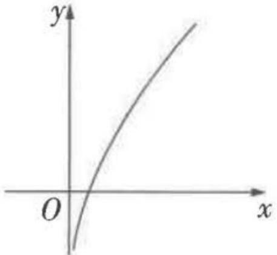</td><td>在 $(0, +\infty)$ 上单调递增,无极值</td></tr><tr><td> $f(x) = \ln x - x,$  $x \in (0, +\infty)$ </td><td>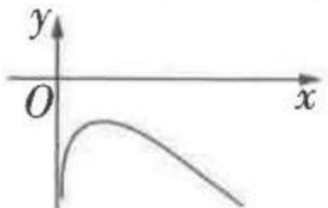</td><td>在 $(0,1)$ 上单调递增,在 $(1, +\infty)$ 上单调递减,在 $x=1$ 处取得极大值-1,无极小值</td></tr><tr><td> $f(x) = x \ln x, x \in (0, +\infty)$ </td><td>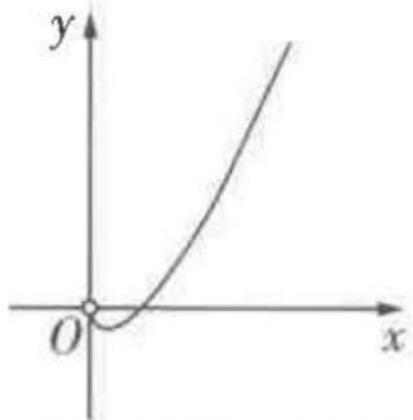</td><td>在 $(0, \frac{1}{e})$ 上单调递减,在 $(\frac{1}{e}, +\infty)$ 上单调递增,在 $x=\frac{1}{e}$ 处取得极小值- $\frac{1}{e}$ ,无极大值</td></tr><tr><td> $f(x) = \frac{\ln x}{x}, x \in (0, +\infty)$ </td><td>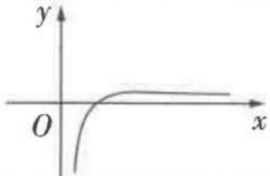</td><td>在 $(0,e)$ 上单调递增,在 $(e, +\infty)$ 上单调递减,在 $x=e$ 处取得极大值 $\frac{1}{e}$ ,无极小值</td></tr><tr><td> $f(x) = \frac{x}{\ln x}, x \in (0,1) \cup (1, +\infty)$ </td><td>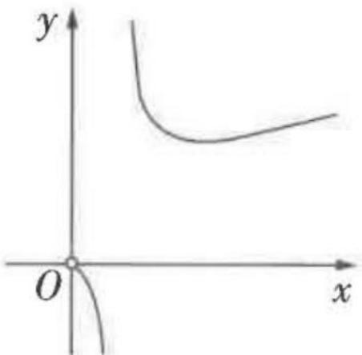</td><td>在 $(0,1), (1,e)$ 上单调递减,在 $(e, +\infty)$ 上单调递增,在 $x=e$ 处取得极小值 $e$ ,无极大值</td></tr><tr><td> $f(x) = e^{x} + x,$  $x \in \mathbb{R}$ </td><td>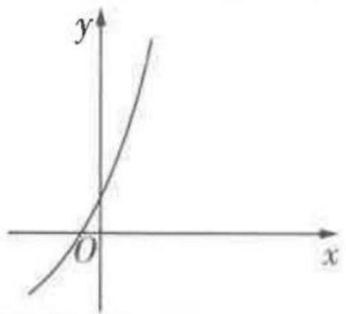</td><td>在 $\mathbb{R}$ 上单调递增,无极值</td></tr><tr><td> $f(x) = e^{x} - x,$  $x \in \mathbb{R}$ </td><td>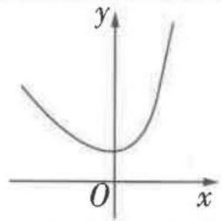</td><td>在 $(-\infty, 0)$ 上单调递减,在 $(0, +\infty)$ 上单调递增,在 $x=0$ 处取得极小值1,无极大值</td></tr><tr><td> $f(x) = x{\mathrm{e}}^{x},x \in \mathbb{R}$ </td><td>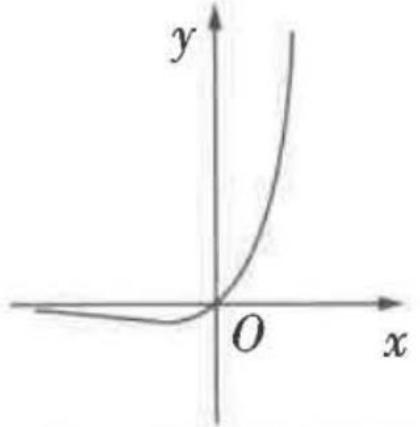</td><td>在(-∞,-1)上单调递减,在(-1,+∞)上单调递增,在x=-1处取得极小值- $\frac{1}{\mathrm{e}}$ ,无极大值</td></tr><tr><td> $f(x)=\frac{{\mathrm{e}}^{x}}{x},x \neq 0$ </td><td>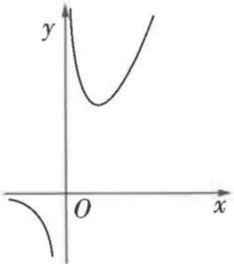</td><td>在(-∞,0),(0,1)上单调递减,在(1,+∞)上单调递增,在x=1处取得极小值e,无极大值</td></tr><tr><td> $f(x)=\frac{x}{{\mathrm{e}}^{x}},x \in \mathbb{R}$ </td><td>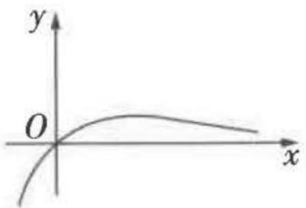</td><td>在(-∞,1)上单调递增,在(1,+∞)上单调递减,在x=1处取得极大值 $\frac{1}{\mathrm{e}}$ ,无极小值</td></tr><tr><td> $f(x)=\sin x+x,x \in \mathbb{R}$ </td><td>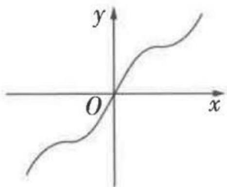</td><td>在R上单调递增,无极值</td></tr><tr><td> $f(x)=x-\sin x,x \in \mathbb{R}$ </td><td>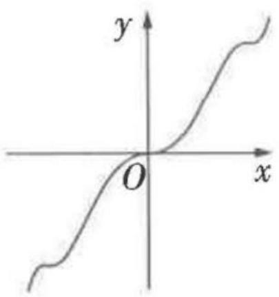</td><td>在R上单调递增,无极值</td></tr><tr><td> $f(x)=x\sin x,x \in \mathbb{R}$ </td><td>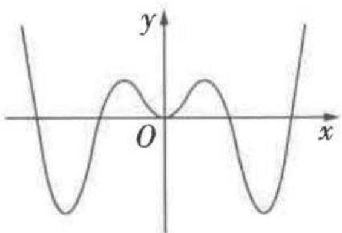</td><td>单调性与极值情况如图所示</td></tr><tr><td> $f(x)=\frac{x}{\sin x},x \neq k\pi ,k \in \mathbf{Z}$ </td><td>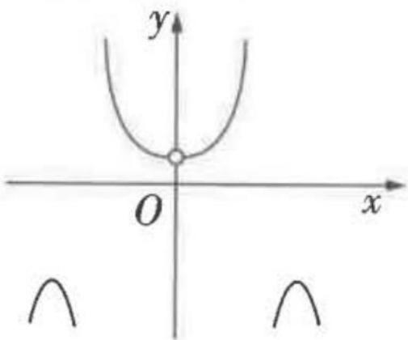</td><td>单调性与极值情况如图所示</td></tr><tr><td> $f(x)=\frac{\sin x}{x},x \neq 0$ </td><td>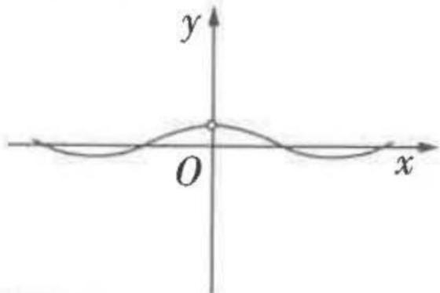</td><td>单调性与极值情况如图所示</td></tr><tr><td> $f(x)=\cos x+x,x \in \mathbb{R}$ </td><td>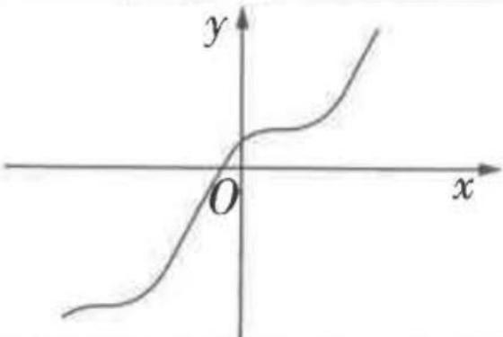</td><td>在R上单调递增,无极值</td></tr><tr><td> $f(x)=x-\cos x,x \in \mathbb{R}$ </td><td>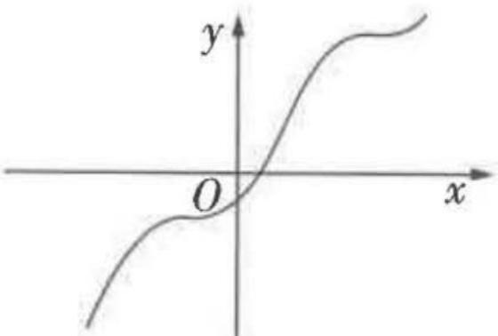</td><td>在R上单调递增,无极值</td></tr><tr><td> $f(x)=x\cos x,x \in \mathbb{R}$ </td><td>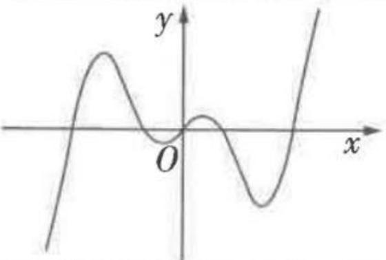</td><td>单调性与极值情况如图所示</td></tr><tr><td> $f(x)=\frac{x}{\cos x},x \neq \frac{\pi}{2}+k\pi,k \in \mathbb{Z}$ </td><td>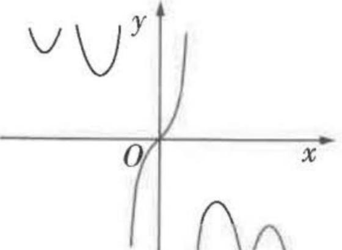</td><td>单调性与极值情况如图所示</td></tr><tr><td> $f(x)=\frac{\cos x}{x},x \neq 0$ </td><td>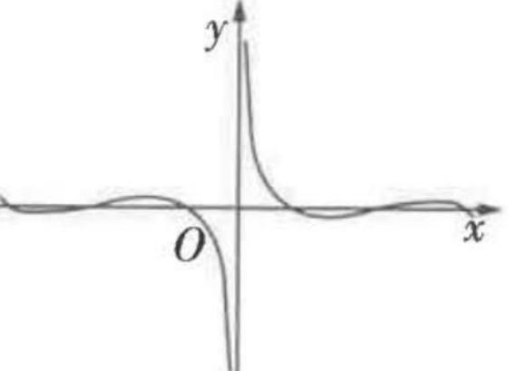</td><td>单调性与极值情况如图所示</td></tr></table>

# 《试题调研》全程提分方略

<table><tr><td>四大书系</td><td colspan="2">主题</td><td>提分关键词</td><td>上市时间</td><td>定价</td></tr><tr><td rowspan="14">MOOK系列</td><td colspan="2">调研1辑·预备知识&amp;函数与导数</td><td rowspan="4">2023高考方向 重点难点薄弱点 突破复习障碍</td><td>2022.6</td><td rowspan="14">18.9元/册</td></tr><tr><td colspan="2">调研2辑·三角函数&amp;平面向量&amp;数列</td><td>2022.7</td></tr><tr><td colspan="2">调研3辑·立体几何&amp;解析几何</td><td>2022.8</td></tr><tr><td colspan="2">调研4辑·计数原理&amp;概率&amp;统计</td><td>2022.9</td></tr><tr><td colspan="2">调研5辑·模型解题法</td><td>试题归类 解题思路 方法与技巧</td><td>2022.11</td></tr><tr><td colspan="2">调研6辑·高频易错点快攻</td><td>易错易混点 设题陷阱 解题误区 快速攻克</td><td>2022.12</td></tr><tr><td colspan="2">调研7辑·高考热点大串讲</td><td>网络构建 前沿热点 创新热点</td><td>2023.1</td></tr><tr><td colspan="2">调研8辑·创新题分类解读</td><td>创新题型 创新情境 创新考法</td><td>2023.2</td></tr><tr><td colspan="2">调研9辑·考前50天50题</td><td>名校名师 原创押题 前瞻预测</td><td>2023.3</td></tr><tr><td colspan="2">调研10辑·考前抢分必备</td><td>必考点 易错点 命题热点 核心解法 考前密题</td><td>2023.4</td></tr><tr><td rowspan="2">作文素材</td><td>作文素材(上)·年度热点素材</td><td>鲜活素材 多维解读 速背速用</td><td>2022.11</td></tr><tr><td>作文素材(下)·考前热点素材</td><td>时新素材 最新时评 范文佳作 速背速用</td><td>2023.4</td></tr><tr><td rowspan="2">时政热点</td><td>时政热点(上)</td><td>2022年4—12月重大时事 剖析解读</td><td>2022.12</td></tr><tr><td>时政热点(下)</td><td>全年度重大时事热点 分析预测</td><td>2023.4</td></tr><tr><td rowspan="10">热点题型专练系列</td><td colspan="2">选择题(语文、物理、化学、生物、政治、历史、地理、文综、理综)</td><td rowspan="2">抓准热点 精选新题 多维巧解</td><td rowspan="10">2022.9</td><td rowspan="3">33.9—49.9元/册</td></tr><tr><td colspan="2">选择题&amp;填空题(数学)</td></tr><tr><td colspan="2">应用文&amp;读后续写&amp;概要写作(英语)</td><td>速背素材 巧学技法 精练写作</td></tr><tr><td colspan="2">古代诗文阅读(语文)</td><td>洞悉考向 攻克薄弱套路解题 反思积累</td><td rowspan="7">26.9—39.9元/册</td></tr><tr><td colspan="2">数学解答题</td><td>模型构建 模型应用分组强化 深度解析</td></tr><tr><td colspan="2">阅读&amp;语言运用(英语)</td><td>30分钟题型组合主题分类 巧思妙解 二次精读 综合提升</td></tr><tr><td colspan="2">物理计算题</td><td>模型解法 思维建模提分技法 规范答题</td></tr><tr><td colspan="2">实验题(物理、化学)</td><td>热点实验 创新装置高频考点 讲深讲透</td></tr><tr><td colspan="2">工艺流程题(化学)</td><td>深度剖析流程精准解读热点</td></tr><tr><td colspan="2">生物遗传题</td><td>套路审题 传授技法攻克疑难 专项提升</td></tr><tr><td>高考总复习系列</td><td colspan="2">高考题型全练</td><td>高考题型 分类练习通性通法</td><td>2022.6</td><td>62.9—79.9元/册</td></tr><tr><td rowspan="5">随身速记系列</td><td colspan="2">必背古诗文64篇</td><td rowspan="2">同步翻译 设题关键重难词解 课外拓展</td><td rowspan="2">2022.1</td><td rowspan="2">17.9元/册</td></tr><tr><td colspan="2">古诗文理解性默写72篇</td></tr><tr><td colspan="2">巧记英语3500词</td><td>巧记核心词 速记合成词快记主题词</td><td>2022.1</td><td>17.9元/册</td></tr><tr><td colspan="2">高分范文天天背</td><td>常考话题 素材语料亮点表达 写作套路</td><td>2022.1</td><td>17.9元/册</td></tr><tr><td colspan="2">历史大事年表</td><td>精选高考常考史实梳理历史发展脉络</td><td>2022.1</td><td>17.9元/册</td></tr></table>

# 你不是不爱学习 只是不会学习

text_image

试题调研
考前论分
试题调研
模型解
高考题难点1 高考题少试汇不用背
英语
3

natural_image

Illustration of a student studying at night with books and a clock, while a woman sleeps in bed with a rabbit (no text or symbols)

text_image

为什么我这么努力
还考不好？我可能
不适合学习吧……
58
100

text_image

你不是不爱学习，
只是不会学习。

text_image

备考要关注命题
趋势，才能有的放
矢，所向披靡。
2022高考命题特点
深化基础考查
强调融会贯通
注重创新开放
你的好成绩到底
有什么秘诀？

text_image

可为什么我
还是做不对题？
正确的做题姿势
掌握原理
内化方法
举一反三
精大于多
只会背书和机械刷题
可不等于会做题哟！

text_image

那怎样才能像你
一样高效学习呢？
抓住一个“新”字，
高效学习soeasy！
新题型！
新情境！
新观点！
新考法！

text_image

给你介绍我的学习神器——
《试题调研》，每月一辑，
帮我练新题，学方法，明考向，
全程护航我的高三！
这么厉害！
我也要买来试试！

# 《试题调研》MOOK系列

MOOK，即Magazine Book，意为杂志书，既有图书的深入与透彻，又有杂志的新颖与丰富。2003年，《试题调研》率先将MOOK引入教辅，将实用性与信息化充分融合。20年来，《试题调研》一直以“新”为核心，将“试题新、解法新、观点新、形式新”演绎到极致。

  
原创题+名校新题

严选优质原创题和名校新题进行深度调研，直击知识本质，点破命题逻辑

  
批注式超详解析

批注式超详解析，全程解透试题，强调巧思妙解，突出快解、巧解

名师大家论道命题前沿一线名师、命题研究专家多角度剖析命题立意，研讨命题方向

全年10辑，滚动出版一月一辑，与复习进度同频，抢先了解备考新变化

text_image

试题
调研
高考题库1
本章主讲卷
第1辑
语文
3

1—4辑

上市 2022.6—
时间 2022.9

text_image

试题
调研
模型解题法
第1例
化学

5辑

2022.11

text_image

试题
调研
高频易错点快攻
语文

6辑

2022.12

text_image

试题
调研
高考热点大事讲
二
物理

7辑

2023.1

text_image

试题
调研
创新题分类解读
历史

8辑

2023.2

text_image

试题
调研
考前 50天 50 题
生物

9辑

2023.3

text_image

试题
调研
考前抢分必备
政治

10辑

2023.4

平时练新题，考场无新题！

《试题调研》总能超出你的预期！

电子书免费试读  

text_image

ISBN 978-7-5590-8607-5
9 787559 086075 >

定价：18.90元

