# 试题 调研

教辅资料站

电子教辅 试卷练习

知识总结 备课资源

# 高考超重点2 三角函数&平面向量&数列 —— 扫码关注获取更多学习资料 ——

3 大情境创新命题，11 个超重点，5 大创新题型

主 编：杜志建

本册编委：曹凤山 管目军 蒋吉林 章礼抗

周鸿高 王应祥 代尔宁 赵文魁

周良增

# 第2辑

# 新高考数学

# 图书在版编目(CIP)数据

试题调研. 第2辑 高考超重点2 新高考数学 / 杜志建主编. -- 乌鲁木齐：新疆青少年出版社，2022.8

ISBN 978-7-5590-8785-0

I. ①试… II. ①杜… III. ①中学数学课 - 高中 - 升学参考资料 IV. ①G634

中国版本图书馆 CIP 数据核字(2022)第 134264 号

出版人:徐江

策划: 王启全

责任编辑:多艳萍

封面设计:天星美工室

# 试题调研·第2辑 高考超重点2新高考数学

# SHITI DIAOYAN · DI 2 JI GAOKAO CHAOZHONGDIAN 2 XINGAOKAO SHUXUE

# 杜志建 主编

出版:新疆青少年出版社

社址:乌鲁木齐市北京北路29号 邮政编码:830012

电话:0991-6239223(编辑部) 0371-68698015(读者服务部)

官网:http://www.qingshao.net 天猫旗舰店:http://xjqss.tmall.com

发行:新疆青少年出版社

经销:各地新华书店 法律顾问:王冠华 18699089007

印刷:郑州市欣隆印刷有限公司

开 本:787mm×1092mm 1/16 版 次:2022年8月第1版

印 张:8 印 次:2022年8月第1次印刷

字 数:130 千字

书号:ISBN 978-7-5590-8785-0

定 价:18.90元

CHISO 青少社® 版权所有,侵权必究。印装问题可随时同印厂退换。

# 声明

基于对知识和创作的尊重,本书向所选文章、图片的作者支付补贴。因条件所限未能及时联系的作者,我们在此深表歉意,当您看到本书时,请与我们联系,以便我们向您支付补贴和赠送样书。联系方式:0371-68698033。

# 押题只凭实力，押中还要讲会！

<table><tr><td>2022年高考真题</td><td>2022版《试题调研》原型题</td></tr><tr><td>【语文·新高考II卷·作文】中国共产主义青年团成立100周年之际......他们选择了自己热爱的行业,也选择了事业创新发展的方向......有位建筑家主张,要改变“千城一面”的模式,必须赋予建筑以理想和精神。他一直努力建造“再过几代人仍然感觉美好”的建筑作品。复兴中学团委将组织以“选择·创造·未来”为主题的征文活动,请结合以上材料写一篇文章,体现你的认识与思考。</td><td>【语文·第5辑·P8】1在青春的路口,曾经有那么一条小路若隐若现,召唤着我。母亲拦住我:“那条路走不得。”我不信......上路后,我发现母亲没有骗我......2有时,人生的顺利会产生一种惰性......傻傻地热爱,傻傻地坚持......3......真正的幸福人生......是懂得发现生命中的小美好......【立意指导】整合材料,可设置分论点一......青春的样子应该是坚持自己的选择;分论点二......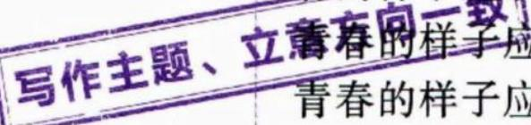 i该是具有奋斗热情;分论点三......i该......升华为新时代青年当不畏曲道穷途,挥斥方遒,策马奔腾。</td></tr><tr><td>【2022·新高考I卷·T17】记 $S_{n}$ 为数列 $\{a_{n}\}$ 的前n项和,已知 $a_{1}=1,\{\frac{S_{n}}{a_{n}}\}$ 是公差为 $\frac{1}{3}$ 的等差数列.(2)证明: $\frac{1}{a_{1}}+\frac{1}{a_{2}}+\cdots+\frac{1}{a_{n}}<2$ .【解析】(2)因为 $\frac{1}{a_{n}}=\frac{2}{n(n+1)}=2(\frac{1}{n}-\frac{1}{n+1})$ ,所以 $\frac{1}{a_{1}}+\frac{1}{a_{2}}+\cdots+\frac{1}{a_{n}}=2\times(1-\frac{1}{2}+\frac{1}{2}-\frac{1}{3}+\cdots+\frac{1}{n}-\frac{1}{n+1})=2-\frac{2}{n+1}<2$ ,问题得证.</td><td>【新高考数学·专辑·P60】已知数列 $\{a_{n}\}$ 的前n项和为 $S_{n}$ , $a_{1}=1,\frac{a_{1}}{1}+\frac{a_{2}}{2}+\cdots+\frac{a_{n-1}}{n}+\frac{a_{n}}{n}=n$ .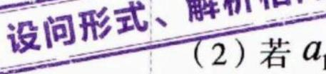, $a_{k}$ , $S_{k+2}$ 成等比数列, $k\in\mathbf{N}^{*}$ ,证明 $\frac{1}{S_{1}}+\frac{1}{S_{2}}+\cdots+\frac{1}{S_{k^{2}}}<2$ .【解析】(2)因为 $\frac{1}{S_{n}}=\frac{2}{n(n+1)}=2(\frac{1}{n}-\frac{1}{n+1})$ ,所以 $\frac{1}{S_{1}}+\frac{1}{S_{2}}+\cdots+\frac{1}{S_{k^{2}}}=\frac{1}{S_{1}}+\frac{1}{S_{2}}+\cdots+\frac{1}{S_{36}}=2\times(1-\frac{1}{2}+\frac{1}{2}-\frac{1}{3}+\cdots+\frac{1}{36}-\frac{1}{37})=2\times(1-\frac{1}{37})=\frac{72}{37}<2$ ,问题得证.</td></tr><tr><td>【英语·新高考I卷·T64】Giant pandas also serve 64(as) an umbrella species(物种),bringing protection to a host of plants and plants in the southwestern and northwestern parts of China.</td><td>【新高考英语·第7辑·P42】In Chinese history, writing brushes served 10(as) an essential tool for inheriting(继承) and spreading culture.</td></tr><tr><td>【理综·全国乙卷·T14】2022年3月,中国航天员翟志刚、王亚平、叶光富在离地球表面约400km的“天宫二号”空间站上通过天地连线,为同学们上了一堂精彩的科学情境,通过直播画面可以看到,在近地圆轨道上飞行的“天宫二号”中,航天员可以自由地漂浮,这表明他们......A.所受地球引力的大小近似为零......</td><td>【物理·第9辑·P104】2022年3月23日,“天宫课堂”再次开讲,这是在离地球表面约400km的中国载人空间站“天宫”上进行的第二次太空授课活动.授课期间,航天员与地面课堂的师生进行了实时互动交流,则A.在“天宫”中航天员由于没有受到地球引力而处于漂浮状态......</td></tr></table>

# 【理综·全国甲卷·T10】

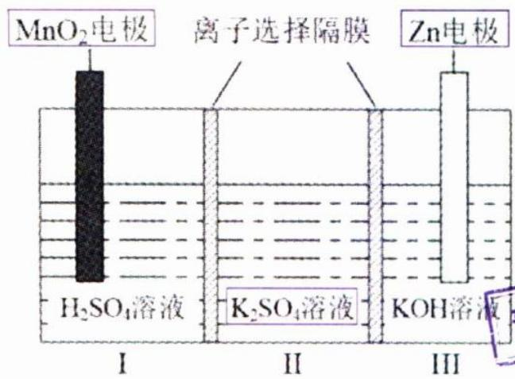

text_image

MnO₂电极
离子选择隔膜
Zn电极
H₂SO₄溶液
K₂SO₄溶液
KOH溶液
Ⅰ	Ⅱ	Ⅲ

C. $MnO_{2}$ 电极反应： $MnO_{2} + 4H^{+} + 2e^{-} = Mn^{2+} + 2H_{2}O$

# 【理综化学·第6辑·P4】

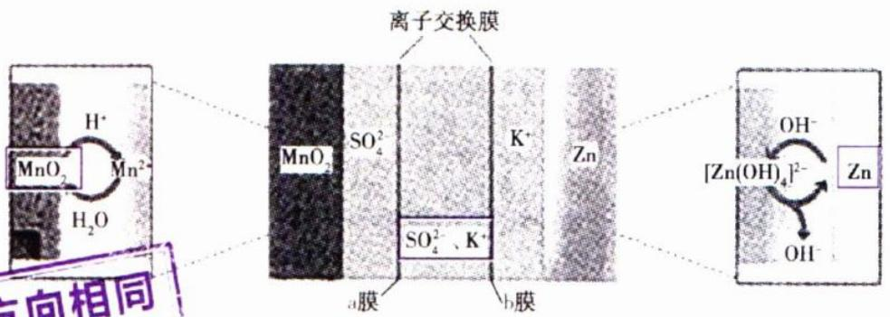

chemical

Chemical reaction diagram showing ion exchange membrane formation with MnO₂, SO₄²⁻, K⁺, Zn, and [Zn(OH)₄]²⁻ ions

C. 放电时，正极的电极反应式为  
$\mathrm{MnO_{2} + 4H^{+} - 2e^{-} = Mn^{2 + } + 2H_{2}O}$

# 【理综·全国乙卷·T38】

某人同时进行了新冠病毒核酸检测和抗体检测……若核酸检测结果为阴性而抗体检测结果为阳性，说明\_\_\_\_（答出1种情况即可）；若核酸检测和抗体检测结果均为阳性，说明\_\_\_\_。

# 【生物·第4辑·P1】

目前最主要的检测新冠病毒的方法是核酸检测法和抗体检测法。下列分析错误的是
……

B.重症患者核酸检测和抗体检测结果都会呈阳性
C.患者其后会出现检测到抗体而检测不到病毒
核酸的情况

# 【文综·全国乙卷·T40】

习近平总书记强调，要在学生中弘扬劳动精神，教育引导学生崇尚劳动、尊重劳动。
某小学……开启“新劳动教育”试验，先后开发出“农事劳作”“创意劳动”和“美好生活”3个课程群……

（2）结合材料并运用文化生活知识，说明劳动教育对于培养社会主义建设者和接班人的重要意义。（10分）

# 【政治·第1辑·P106】

材料一 2020年7月，教育部印发《大中小学劳动教育指导纲要(试行)》（以下简称《纲要》）。设问相同要求在大中小学设立劳动教育必修课程，开将劳动素养纳入学生综合素质评价体系……

（1）结合材料一，运用文化知识，说明开展劳动教育对培养担当民族复兴大任的时代新人的积极作用。（10分）

# 【文综·全国乙卷·T32】

据学者研究，古代雅典官员在接受任职资格审查时，需要回答：直系亲属姓名及男性亲属所在村社名称、崇拜的神祇及其圣所所在地、墓葬方位、是否善待、双亲、是否纳税、是否服兵役等。下试题情境成为古代雅典官员前提条件的是

# 【历史·第1辑·P55】

《雅典政制》记载，抽签选举后，拟任官员在任职前需要填写“考核项目清单”，其内容主要包括：知识亲属姓名和男性亲属所在村社的名称、是否善待双亲、是否纳税、是否服兵役等。该规定

# 【文综·全国甲卷·T1】

浙江S集团是一家研发和生产空调控制元件和零部件的企业……至2017年，S集团除国内工厂外，还在美国、墨西哥、波兰等国家建有工厂……

1. 影响S集团在美国、墨西哥、波兰等国家建厂的主要区位因素是

A.技术 B.市场  
C. 原材料 D. 劳动力

# 【地理·第3辑·P51】

中国F集团成立30多年来，始终专注于汽车玻璃领域的研发、生产与销售……该集团已在中国16个省市及美国、德国、日本等11个国家和地区建立了玻璃生产基地……

命题背景、考查内容相同来F集团不断在美国、德国、日本等国建厂，除政策外，其考虑的主要原因是

A. 扩大销售市场

B. 利用当地廉价劳动力

C. 建立营销网络

D. 利用当地原料

# 本辑特色

调研 1 （2022·重庆4月二诊/∞型几何体）无穷符号∞在数学中是一个重要的符号，该符号的引入为微积分和集合论的研究带来了便利。某校在一次数学活动中以无穷符号为创意来源，设计了如图1所示的立体活动标志，该标志由两个半径分别为15和20的实心球相交而成，球心距 $O_{1}O_{2}=25$ ，则该标志的体积为\_\_\_\_。

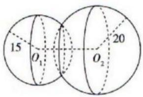  
图1

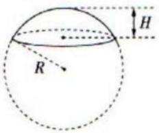  
图2

传承数学文化（P001）

关注最新题型（P075）

# ① 特别关注 高考命题最前沿

# 题型2> 大计算量题

调研 3 (2022·江苏无锡最后一卷/八角星纹)八角星纹(如图8-4)是大汶口文化中期彩陶纹样中具有鲜明特色的花纹. 八角星纹常绘于彩陶盆和豆的上腹, 先于器外的上腹施一圈红色底衬, 然后在上面绘并列的八角星形的单独纹样. 八角星纹以白彩绘成, 黑线勾边, 中为方形或圆形, 具有向四面八方扩张的感觉. 八角星纹延续的时间较长, 传播范围亦广, 在长江以南的时间稍晚的崧泽文化的陶豆座上也屡见刻有八角星纹. 图8-5是图8-4抽象出来的图形, 在图8-5中, 圆中各个小三角形(如

# 新益求新设题热点抢先知

调研 3 (2022·山东威海考前模拟/星形曲线)数学中有许多优美的曲线就是其中之一. 在工业生产中, 利用星形曲线的特性能设计出一种超轻起展现了数学模型的广泛性和应用性. 已知星形曲线 $E: x^{\frac{3}{5}} + y^{\frac{3}{5}} = 1$ , 设 $P(x, y)$ 意一点, 则下列说法正确的是

A. 曲线 E 与坐标轴有四个交点

B. $|x|\leqslant1,|y|\leqslant1$

C. 曲线 $E$ 有且只有两条对称轴

D. $|x| + |y|\leqslant 1$

调研 9 （原创）我国第三艘航空母舰下水命名仪式于2022年6月17日上午在中国船舶集团有限公司江南造船厂举行，经中央军委批准，我国第三艘航空母舰命名为“中国人民解放军海军福建舰”，舷号为“18”。福建舰是我国完全自主设计建造的首艘弹射型航空母舰，采用平直通长飞行甲板，配置电磁弹射和阻拦装置，满载排水量8万余吨。为调查学生对福建舰的了解情况，某中学进行了一次抽样调查，统计得到以下

新曲线（P003）

新热点（P009）

# E 深入讲解 备考障碍—扫除

【换个思路】除了利用边缘思想，还可以利用取特殊值的方法进行排除。当 x=0.01 时， $\sin 0.01 > 0, e^{0.01} > 0, e^{-0.01} > 0$ ，故 $\sin 0.01 \times e^{0.01} > 0, \sin 0.01 \times e^{-0.01} > 0$ ，AB 不满足题意故 AB 不满足题意。

新思路（P021）

新形式（P039）

<table><tr><td>选项</td><td>分析过程</td><td>真假</td></tr><tr><td>A</td><td> $a \cdot b >0 \rightarrow \cos(\pi - \angle ACB) >0 \rightarrow \cos\angle ACB < 0 \rightarrow \angle ACB$ 为钝角→△ABC为钝角三角形</td><td>假</td></tr><tr><td>B</td><td> $a \cdot b = 0 \rightarrow AC \perp BC \rightarrow \triangle ABC$ 为直角三角形</td><td>真</td></tr><tr><td>C</td><td> $|a| > |b| \rightarrow$ 由正弦定理得 $2R\sin A >2R\sin B(R$ 是△ABC外接圆半径) $\rightarrow$  $\sin A >\sin B$ 【记结论】在三角形中 $a >b$ 是 $\sin A >\sin B$ 的充零条件</td><td>真</td></tr></table>

$$
\text {   又   } a \overrightarrow {O A} + b \overrightarrow {O B} + c \overrightarrow {O C} = 0, \text {   所以   } \frac {a h _ {a}}{a} = \frac {b h _ {b}}{b} = \frac {c h _ {c}}{c},
$$

【戴黑板】 $\triangle ABC$ 的内心 $I$ 的向量表示为： $\sin A \cdot \overrightarrow{IA} + \sin B \cdot \overrightarrow{IB} + \sin C \cdot \overrightarrow{IC} = 0$ 或 $a \cdot \overrightarrow{IA} + b \cdot \overrightarrow{IB} + c \cdot \overrightarrow{IC} = 0$ 。如果能记住这个二级结论，本题根本不需要求解即可得出答案，在平时的复习备考中，字有意识地对这些二级结论进行记忆

从而 $h_a = h_b = h_c$ ，即点 $O$ 到三角形三边的距离相等，

新方法（P099）

# 热点情境

· 2022 中国数字经济创新发展大会/003  
· 乡村振兴/006   
· 人工智能/007  
· 疫苗研发/008   
· 福建舰/009

# 创新交汇

· 解三角形与数列交汇/033  
· 解三角形与平面向量交汇/033  
· 平面向量与数列交汇/085  
· 数列与集合交汇/085   
- 函数、平面向量、数列交汇/086

# 二级结论

- 三角形“四心”的向量表示与运用/050  
· 等和线/095   
·极化恒等式/097   
·奔驰定理/098   
· 平面向量中的矩形大法/102  
- 平面四边形对角线向量定理/102  
- 三角形面积公式的向量表示/102

# 特别关注·命题最前沿

聚焦 “现实、问题、时代” 3 大情境创新命题 001

# 突破超重点

# 核心考点篇

超重点 1 三角函数的图象变换与性质应用 011

命题角度 1 平移变换与伸缩变换的变换过程 011  
命题角度 2 三角函数解析式及相关量的求解 012  
命题角度 3 三角函数的 “四性”（奇偶性、周期性、单调性、图象的对称性）及应用 016

超重点 2 导数的工具性在三角函数问题中的应用 021

命题角度 1 利用导数研究三角函数的图象 021

命题角度 2 利用导数研究三角函数的单调性与
最值 023

命题角度 3 利用导数研究三角函数的极值点与零点 025

超重点 3 解三角形问题的 3 个核心命题角度 030

命题角度 1 用正、余弦定理解三角形 030

命题角度 2 解三角形与其他知识的创新交汇 033

命题角度 3 解三角形在测量工作中的应用 035

超重点 4 求解平面向量数量积问题的 3 种技法 041

技法1 坐标法 041

技法2 基底法 044

技法 3 投影法 046

超重点 5 三角形 “四心” 的向量表示与运用 050

超重点6 由递推公式求数列通项公式的4类情形057

超重点 7 数列求和的 6 种必会技法 064

技法 1 公式求和法 064

技法 2 分组求和法 065

技法 3 错位相减法 065

技法 4 裂项相消法 067

技法 5 倒序相加法 070

技法6 并项求和法 071

超重点8 数列和平面向量的创新题型 074

题型 1 平面向量在物理中的应用 074

题型 2 大计算量题 075

题型 3 新背景题 078

题型4 结构不良问题 081

题型5 双空题 082

题型6 模块交汇问题 085

# 高分技法篇

超重点9 相关二级结论在解三角形中的应用技巧 088

超重点 10 平面向量中二级结论的应用技巧 095

技巧 1 等和线 095

技巧 2 极化恒等式 097

# 数学文化

·∞型几何体/001

·《缀术》/002

· 星形曲线/003

· 中国剪纸/037

· 八角星纹/075

# 创新题型

· 双空题/002

· 结构不良问题“三选二”/015

· 结构不良问题“二选一”/038

· 结构不良问题“三选一”/081

# 数学应用

· 测量高度问题/035

· 测量角度问题/035

· 测量距离问题/036

· 小船过河问题/074

· 受力分析/074

# 核心方法

·坐标法/041

· 基底法/044

· 投影法/046

· 分组求和法/065

· 错位相减法/065

· 裂项相消法/067

技巧 3 奔驰定理 098

技巧 4 平面向量的其他二级结论 102

# 挑战压轴篇

超重点11 有关数列中不等关系的研究 105

命题角度1 最值问题 105

命题角度 2 不等式恒成立条件下的参数范围问题 107

命题角度 3 不等式证明问题 110

# 速记提分结论

类型 1 必背核心公式 115

类型 2 必记二级结论 116

类型 3 必知常考图象 117

类型 4 必会高频应用 119

# 下辑精彩预告 2022年8月全新上市!

# 《试题调研》第3辑将推出

——高考超重点3·立体几何&解析几何

本辑亮点抢先看：

特别关注·命题最前沿 聚焦 2022 年高考命题最显著的特点——大计算量题大量增多，传授 5 大应对妙招，让你有目的、有信心地备考！

突破超重点 深度挖掘棱台、棱锥、棱柱的体积与表面积的计算问题, 几何体与球的切、接模型, 翻折问题中的 “变与不变”, 圆锥曲线及其性质的应用问题等核心考点; 深入探讨立体几何问题的 “几何法” “向量法” 两大求解方法; 精准研析截面问题、动态几何问题、圆锥曲线的综合探究性问题等疑难创新问题. 解析中辅以深层次、多维度彩色批注, 保姆式讲解, 让你身临课堂, 看懂更能学会!

速记提分结论 条目图表化知识清单梳理，实现立体几何、解析几何中高频使用的结论的速记速背，快速补短板，驰骋考场少丢分！

# 特别关注·命题最前沿

# 聚焦“现实、问题、时代”3大情境创新命题

# 特约名师

曹凤山 浙江省正高级教师,高中数学特级教师,全国优秀教师,浙师大硕士生实践导师,杭师大讲席教授,中国教育电视台《中国课堂》主讲教师

蒋吉林 浙江龙泉一中高级教师,教育部国培计划国家级骨干教师,浙江省数学竞赛优秀辅导员,近年来为浙大等985高校输送学生50多人

# 一、设置现实情境，发挥育人作用

# 1. 传承数学文化

调研 1 (2022·重庆 4 月二诊/ $\infty$ 型几何体)无穷符号 $\infty$ 在数学中是一个重要的符号,该符号的引入为微积分和集合论的研究带来了便利.某校在一次数学活动中以无穷符号为创意来源,设计了如图 1 所示的立体活动标志,该标志由两个半径分别为 15 和 20 的实心球相交而成,球心距 ${O}_{1}{O}_{2} = {25}$ ,则该标志的体积为\_\_\_\_\_.

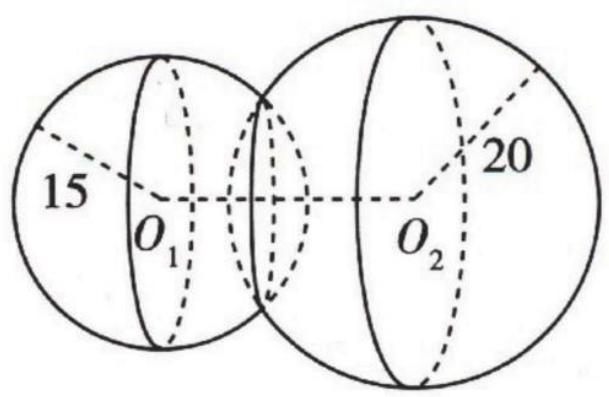

text_image

15
O₁
20
O₂

图1

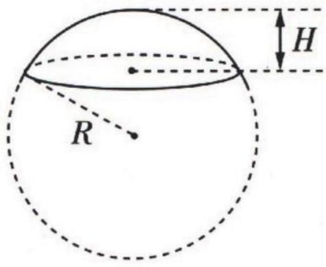

text_image

H
R

图2

附:如图2,一个半径为R的球被平面截下的一部分叫作球缺,截面叫作球缺的底面,垂直于截面的直径被截下的线段长叫作球缺的高(记为H),球缺的体积公式为 $V=\pi H^{2}(R-\frac{H}{3})$ .

# 解析

# 该立体活动标志的轴截面的示意图如图3所示,记

【合作图】截面是将立体几何问题向平面几何问题转化的“桥梁”，根据几何特征准确作出截面，再分析数量关系或位置关系两圆的交点分别为 $A, B$ ，连接 $AB, O_{1}A, O_{2}A, AB$ 与 $O_{1}O_{2}$ 交于点 $O$ ，则 $15^{2} - O_{1}O^{2} = 20^{2} - O_{2}O^{2}$ ，且 $OO_{1} + OO_{2} = 25$ ，

可得 $OO_{1}=9, OO_{2}=16$ ，且 OA=12.

两球体的公共部分可看作由两个球缺组合而成，

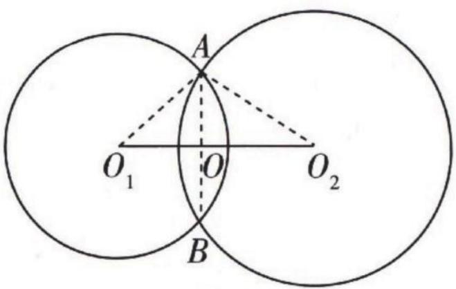

text_image

A
O₁ O O₂
B

图3

小编说:蛮干苦干不如巧干,方法比努力更重要,对于高三学生来说,找到合适的学习方法,学会高效学习,往往会事半功倍.下面是小编收集的一些高效学习的方法,一起来看一看吧!

小球中的球缺高为 $15 - OO_{1} = 6$ ，体积 $V_{1} = 36\pi \times (15 - 2)$ ，

大球中的球缺高为 $20 - OO_{2} = 4$ ，体积 $V_{2} = 16\pi \times \left(20 - \frac{4}{3}\right)$ ，

故该标志的体积 $V=\frac{4}{3}\pi(15^{3}+20^{3})-V_{1}-V_{2}=14\ 400\pi.$

调研 2 (2022·福建三模/《缀术》,双空题)《缀术》是中国南北朝时期的一部算经,汇集了祖冲之及其子祖暅的数学研究成果.《缀术》中记载的“缘幂势既同,则积不容异”被称为祖暅原理,其意思是:如果两等高的几何体在同高处被截得的两截面面积均

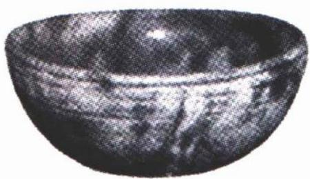

natural_image

Close-up of a textured, bowl-shaped object with no visible text or symbols

图 4

相等,那么这两个几何体的体积相等.该原理常应用于计算某些几何体的体积.如图4,某个西晋越窑卧足杯的上、下底面为互相平行的圆面,侧面为球面的一部分,上底面直径为 $4\sqrt{6}$ cm,下底面直径为6cm,上、下底面间的距离为3cm,则该卧足杯侧面所在的球面对应球的半径是\_\_\_\_cm,卧足杯的容积是\_\_\_\_cm $^{3}$ (杯的厚度忽略不计).

解析 如图5,设所求球的半径为 $R \mathrm{~cm}$ , 球心为 $O$ , 作出卧足杯所在的半球面, 记卧足杯上底面圆心为 $O_{1}$ , 下底面圆心为 $O_{2}, M, N$ 分别为圆 $O_{1}, O_{2}$ 上的点, 连接 $OO_{2}, OM, O_{1}M, ON, O_{2}N$ , 设 $OO_{1} = x \mathrm{~cm}$ .

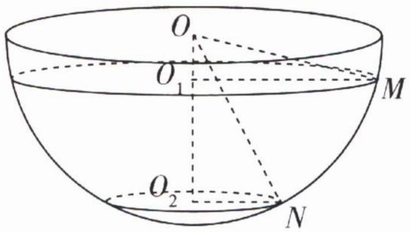

text_image

O
O₁
M
O₂
N

图5

由 $OM^{2}=ON^{2}=R^{2}$ 得 $x^{2}+(2\sqrt{6})^{2}=(x+3)^{2}+3^{2}$ ，解得 x=1，所以 R=5。

由祖暅原理知,卧足杯的容积等于底面半径为 $5 \mathrm{~cm}$ , 高为 $3 \mathrm{~cm}$ 的圆柱的体积减去一个上底面圆半径为 $1 \mathrm{~cm}$ , 下底面圆半径为 $4 \mathrm{~cm}$ , 高为 $3 \mathrm{~cm}$ 的圆台的体积.

【会审题】如果两等高的几何体在同高处被截得的两截面面积均相等,那么这两个几何体的体积相等,据此将所求不规则几何体进行转化

易知 $V_{圆柱} = \pi \times 5^{2} \times 3 = 75\pi (\text{cm}^{3})$ , $V_{圆台} = \frac{1}{3} \times \pi \times 3 \times (1^{2} + 4^{2} + 1 \times 4) = 21\pi (\text{cm}^{3})$ ,

【敲黑板】2022 年新高考 I 卷第 4 题考查了棱台的体积公式，属于冷点热考，同时也说明了复习备考时多记多背，平时做了充分的准备，高考时就会有时有力；平时没有做足准备，那么平时应该做的事情，就只能留到考场上去完成，费时又费力，必然会影响高考成绩。考场一分钟，场外十年功！

故卧足杯的容积 $V = V_{圆柱} - V_{圆台} = 75\pi - 21\pi = 54\pi \, (\text{cm}^{3})$ .

# 2.品鉴数学之美

调研 3 (2022·山东威海考前模拟/星形曲线)(多选)数学中有许多优美的曲线,星形曲线就是其中之一.在工业生产中,利用星形曲线的特性能设计出一种超轻超硬材料,展现了数学模型的广泛性和应用性.已知星形曲线 $E: x^{\frac{2}{3}} + y^{\frac{2}{3}} = 1$ ,设 $P(x, y)$ 为 E 上任意一点,则下列说法正确的是()

A. 曲线 E 与坐标轴有四个交点

B. $|x|\leqslant1,|y|\leqslant1$

C. 曲线 E 有且只有两条对称轴

D. $\left| x\right|  + \left| y\right|  \leq  1$

# 解析

<table><tr><td>选项</td><td>分析过程</td><td>正误</td></tr><tr><td>A</td><td> $x^{\frac{2}{3}} + y^{\frac{2}{3}} = 1 \rightarrow$ 令  $x = 0$ ,可得  $y = \pm 1 \rightarrow$ 令  $y = 0$ ,可得  $x = \pm 1 \rightarrow$ 曲线  $E$  与坐标轴有四个交点</td><td>√</td></tr><tr><td>B</td><td> $x^{\frac{2}{3}} + y^{\frac{2}{3}} = 1 \rightarrow x^{\frac{2}{3}} \leqslant 1, y^{\frac{2}{3}} \leqslant 1 \rightarrow |x| \leqslant 1, |y| \leqslant 1$ </td><td>√</td></tr><tr><td>C</td><td>将方程  $x^{\frac{2}{3}} + y^{\frac{2}{3}} = 1$  中的  $x$  换为  $-x, y$  不变,则方程不变;将方程  $x^{\frac{2}{3}} + y^{\frac{2}{3}} = 1$  中的  $y$  换为  $-y, x$  不变,则方程不变. 可得曲线关于  $x$  轴, $y$  轴对称.将方程  $x^{\frac{2}{3}} + y^{\frac{2}{3}} = 1$  中的  $x$  换为  $y, y$  换为  $x$ ,则方程不变,可得曲线关于直线  $y = x$  对称.将方程  $x^{\frac{2}{3}} + y^{\frac{2}{3}} = 1$  中的  $x$  换为  $-y, y$  换为  $-x$ ,则方程不变,可得曲线关于直线  $y = -x$  对称.综上,曲线  $E$  至少有4条对称轴</td><td>×</td></tr><tr><td>D</td><td>由上可知曲线  $E$  关于  $x$  轴, $y$  轴对称.易知曲线  $E$  关于原点对称.当  $0 \leqslant x \leqslant 1, 0 \leqslant y \leqslant 1$  时, $x^{\frac{2}{3}} \geqslant x, y^{\frac{2}{3}} \geqslant y$ ,所以  $x + y \leqslant x^{\frac{2}{3}} + y^{\frac{2}{3}} = 1$ ,所以  $|x| + |y| \leqslant 1$ </td><td>√</td></tr></table>

# 3. 彰显数学价值

调研 4 (原创/2022 中国数字经济创新发展大会)6月21日,2022中国数字经济创新发展大会新闻发布会在北京正式召开.本届大会打造“2+12+N”的会议模式,由

费曼学习法可以简化为四个单词: Concept(概念), Teach(教给别人), Review(回顾), Simplify(简化).

1 大开幕式, 1 大高峰论坛, 12 大主题论坛, 以及潮汕夜话、特色展览等系列的创新活动构成, 采用线上加线下双线融合的方式举办. 现有一展馆需要连续六天有志愿者参加志愿服务, 每天只需要一名志愿者, 有 6 名志愿者计划依次到该展馆参加服务, 要求志愿者甲不在第一天, 志愿者乙和丙不在相邻两天参加服务, 则不同的安排方案共有 ( )

A. 240 种

B. 408 种

C. 1 092 种

D. 1 120 种

# 解析

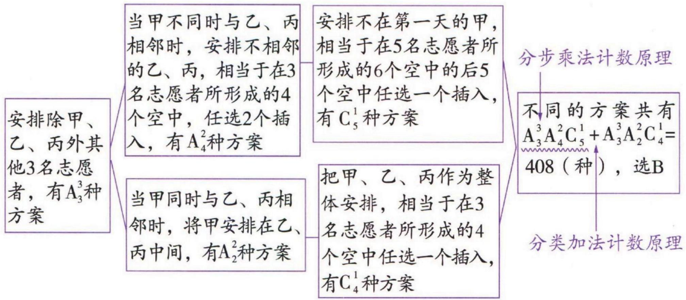

flowchart

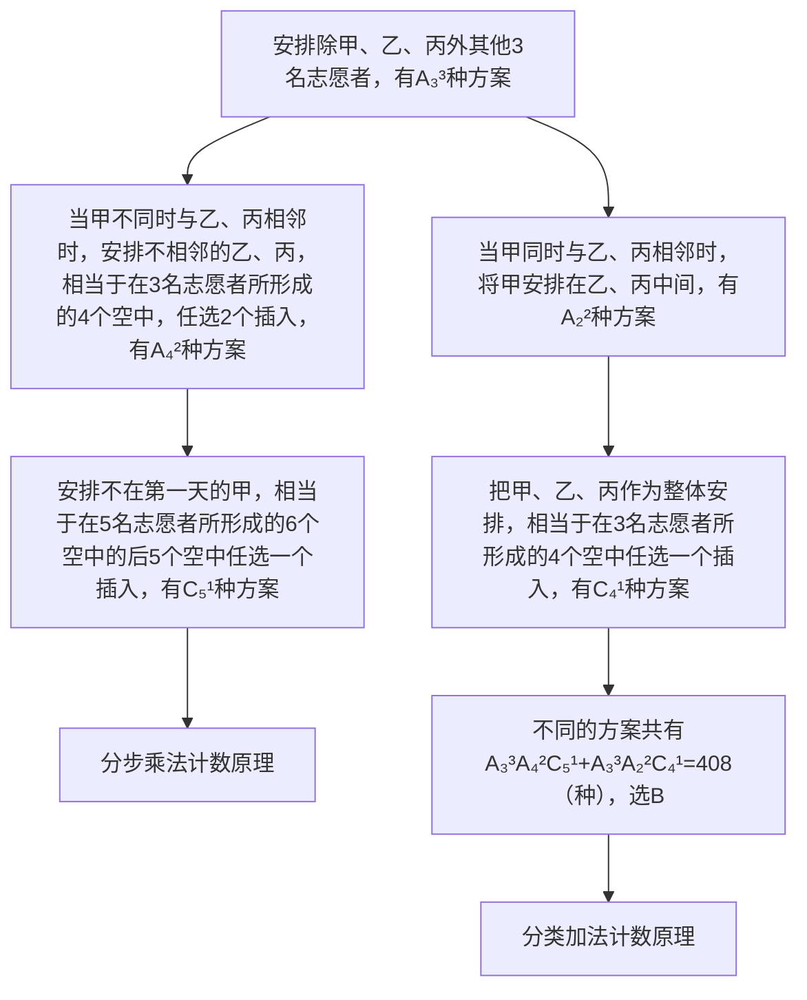
```mermaid
graph TD
    A["安排除甲、乙、丙外其他3名志愿者，有A₃³种方案"] --> B["当甲不同时与乙、丙相邻时，安排不相邻的乙、丙，相当于在3名志愿者所形成的4个空中，任选2个插入，有A₄²种方案"]
    A --> C["当甲同时与乙、丙相邻时，将甲安排在乙、丙中间，有A₂²种方案"]
    B --> D["安排不在第一天的甲，相当于在5名志愿者所形成的6个空中的后5个空中任选一个插入，有C₅¹种方案"]
    C --> E["把甲、乙、丙作为整体安排，相当于在3名志愿者所形成的4个空中任选一个插入，有C₄¹种方案"]
    D --> F["分步乘法计数原理"]
    E --> G["不同的方案共有A₃³A₄²C₅¹+A₃³A₂²C₄¹=408（种），选B"]
    G --> H["分类加法计数原理"]
```

秒杀解 正难则反 若不考虑甲,只考虑乙和丙不在相邻两天参加服务,则有 $A_{4}^{4}A_{5}^{2}$ 种不同的安排方案.

【扫清障碍】本题的难点在于对甲的限制，不妨光不考虑甲，只看乙、丙，本质就是一个典型的插空问题

考虑甲的位置,若甲在第一天,且乙和丙不在相邻两天参加服务,则有 ${\mathrm{A}}_{3}^{3}{\mathrm{\;A}}_{4}^{2}$ 种不

【会思考】这里仍是一个典型的插空问题，只是元素数量比上一次少了1个同的安排方案。故所求不同的安排方案共有 $A_{4}^{4}A_{5}^{2}-A_{3}^{3}A_{4}^{2}=408$ （种），选B.

# 二、设置问题情境，服务国计民生

# 1. 推进精准扶贫

调研 5 (2022·巴蜀中学考前模拟) 精准扶贫是打赢脱贫攻坚战的制胜法宝, 开发式扶贫方针是中国特色减贫道路的鲜明特征. 某贫困户在当地政府的支持和帮助下, 开始种植一种夏季生长的经济作物. 该经济作物的质量以其质量指标值来衡量, 图 6 是该经济作物的质量指标值 t 关于昼夜温

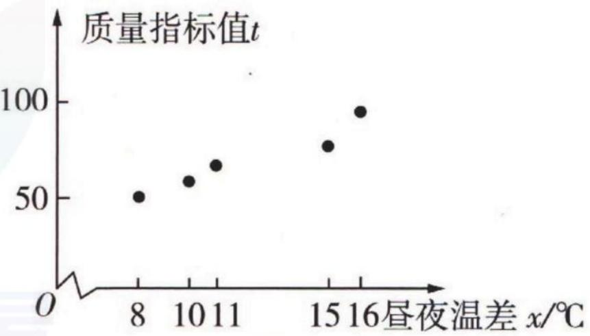

scatter

| 昼夜温差 x/℃ | 质量指标值 t |
| ------------ | ------------ |
| 8            | 50           |
| 10           | 60           |
| 11           | 70           |
| 15           | 80           |
| 16           | 100          |

图6

费曼学习法,简单来讲就是用教别人的方式,巩固自己学到的知识.该技巧一共包含四个步骤.

差 x(单位:℃) 的散点图, 其中样本数据 $(x_{i}, t_{i}) (i = 1, 2, \cdots, 5)$ 表示昼夜温差为 $x_{i}$ 时质量指标值为 $t_{i}$ .

(1)根据散点图可以认为 x 与 t 之间存在线性相关关系,且相关系数 r=0.8,试用最小二乘法求出线性回归方程 $\hat{t}=\hat{b}x+\hat{a}$ .

(2) 经过市场调查, 按质量指标值 t 可将该经济作物分成三级, 对应的每千克售价如下表所示:

<table><tr><td>等级</td><td>二级</td><td>一级</td><td>特级</td></tr><tr><td>质量指标值</td><td>t&lt;52.4</td><td>52.4≤t≤75.2</td><td>t&gt;75.2</td></tr><tr><td>每千克售价/元</td><td>20</td><td>45</td><td>60</td></tr></table>

经统计分析,该经济作物的质量指标值 $t \sim N(\mu, \delta^{2})$ , 其中 $\mu$ 近似为散点图中质量指标值的样本均值, $\delta$ 近似为散点图中质量指标值的样本标准差 s, 若在种植过程中, 每千克产出需要的成本约为 10 元, 且当年产出了 2000 千克, 估计该贫困户这一年种植该经济作物的年纯收入.

附:①对于一组具有线性相关关系的数据 $(v_{1},u_{1}),(v_{2},u_{2}),\cdots,(v_{n},u_{n})$ ，其回归直线 $u=\alpha+\beta v$ 的斜率和截距的最小二乘估计分别为 $\hat{\beta}=\frac{\sum_{i=1}^{n}(v_{i}-\bar{v})(u_{i}-\bar{u})}{\sum_{i=1}^{n}(v_{i}-\bar{v})^{2}}=$

$$
\frac {\sum_ {i = 1} ^ {n} v _ {i} u _ {i} - n \bar {v} \bar {u}}{\sum_ {i = 1} ^ {n} v _ {i} ^ {2} - n \bar {v} ^ {2}}, \hat {\alpha} = \bar {u} - \hat {\beta} \bar {v}. \text {样本相关系数为} r = \frac {\sum_ {i = 1} ^ {n} (v _ {i} - \bar {v}) (u _ {i} - \bar {u})}{\sqrt {\sum_ {i = 1} ^ {n} (v _ {i} - \bar {v}) ^ {2}} \sqrt {\sum_ {i = 1} ^ {n} (u _ {i} - \bar {u}) ^ {2}}} = \frac {\sum_ {i = 1} ^ {n} v _ {i} u _ {i} - n \bar {v} \bar {u}}{\sqrt {\sum_ {i = 1} ^ {n} v _ {i} ^ {2} - n \bar {v} ^ {2}} \sqrt {\sum_ {i = 1} ^ {n} u _ {i} ^ {2} - n \bar {u} ^ {2}}}.
$$

【敲黑板】2022年全国乙卷第19题受到许多考生的“吐槽”，原因是相关系数公式没有给全，实际上，这个公式的两种形式并不都需要死记硬背，复习备考时关注两种形式的转化原理，即可快速知其一而得其二：针对分子， $\sum_{i=1}^{n}(v_i - \bar{v})(u_i - \bar{u}) = \sum_{i=1}^{n}(v_i u_i - v_i \bar{u} - \bar{v} u_i + \bar{v} \bar{u}) = \sum_{i=1}^{n} v_i u_i - \bar{u} \sum_{i=1}^{n} v_i - \bar{v} \sum_{i=1}^{n} u_i + \sum_{i=1}^{n} \bar{v} \bar{u} = \sum_{i=1}^{n} v_i u_i - \bar{u} n \bar{v} - \bar{v} n \bar{u} + n \bar{v} \bar{u} = \sum_{i=1}^{n} v_i u_i - n \bar{v} \bar{u}$ . 知道原理后，公式记起来就不难了

②若 $t \sim N(\mu, \sigma^2)$ , 则 $P(\mu - \sigma < t \leqslant \mu + \sigma) \approx 0.6827$ , $P(\mu - 2\sigma < t \leqslant \mu + 2\sigma) \approx 0.9545$ , $P(\mu - 3\sigma < t \leqslant \mu + 3\sigma) \approx 0.9973$ , $\sqrt{57.5} \approx 7.6$ .

第一步:假装把知识、概念教给一个小孩子.拿出一张白纸,在上面写下学习的主题,及讲授的主要内容.

③ $\sum_{i=1}^{5}t_{i}^{2}=18\ 287.5,\sum_{i=1}^{5}(t_{i}-\bar{t})^{2}=287.5.$

解析 (1) 由已知得 $\bar{x} = \frac{8 + 10 + 11 + 15 + 16}{5} = 12, \sum_{i=1}^{5} (x_i - \bar{x})^2 = 46, r = 0.8$ ,

$$
\therefore \hat {b} = r \times \frac {\sqrt {\sum_ {i = 1} ^ {5} \left(t _ {i} - \bar {t}\right) ^ {2}}}{\sqrt {\sum_ {i = 1} ^ {5} \left(x _ {i} - \bar {x}\right) ^ {2}}} = 0. 8 \times 2. 5 = 2.
$$

$$
\because \sum_ {i = 1} ^ {5} \left(t _ {i} - \bar {t}\right) ^ {2} = \sum_ {i = 1} ^ {5} t _ {i} ^ {2} - 5 \bar {t} ^ {2}, \therefore \bar {t} = \sqrt {\frac {\sum_ {i = 1} ^ {5} t _ {i} ^ {2} - \sum_ {i = 1} ^ {5} \left(t _ {i} - \bar {t}\right) ^ {2}}{5}} = 6 0.
$$

$\therefore \hat{a} = 60 - 2 \times 12 = 36, \therefore$ 线性回归方程为 $\hat{t} = 2x + 36$ .

(2) 由题可知 $\mu \approx 60, \delta^2 \approx \frac{287.5}{5} = 57.5, \delta \approx 7.6$ ，即 $t \sim N(60, 7.6^2)$ ，

则 $P(52.4 < t \leqslant 67.6) \approx 0.6827, P(44.8 < t \leqslant 75.2) \approx 0.9545,$

$$
\begin{array}{r l} & \therefore P (t <   5 2. 4) \approx \frac {1 - 0 . 6 8 2 7}{2} = 0. 1 5 8 6 5, P (5 2. 4 \leqslant t \leqslant 7 5. 2) \approx \frac {0 . 6 8 2 7 + 0 . 9 5 4 5}{2} = \\ & 0. 8 1 8 6, P (t > 7 5. 2) \approx \frac {1 - 0 . 9 5 4 5}{2} = 0. 0 2 2 7 5, \end{array}
$$

∴该贫困户这一年种植该经济作物的年纯收入约为 $(20 \times 0.15865 + 45 \times 0.8186 + 60 \times 0.02275 - 10) \times 2000 = 62750$ （元）.

# 2. 服务农业生产

调研 6 （2022·北京朝阳区第二次质量检测）为实现乡村全面振兴,某地区依托乡村特色优势资源,鼓励当地农民种植中药材,批发销售.根据前期分析多年数据发现,某品种中药材在该地区各年的平均每亩种植成本为5 000元,此品种中药材在该地区各年的平均每亩产量与此品种中药材的国内市场批发价格均具有随机性,且互不影响,其具体情况如下表和图7所示.

该地区此品种中药材各年的平均每亩产量情况

<table><tr><td>各年的平均每亩产量</td><td>400 kg</td><td>500 kg</td></tr><tr><td>频率</td><td>0.25</td><td>0.75</td></tr></table>

此品种中药材的国内市场批发价格情况  
频率   
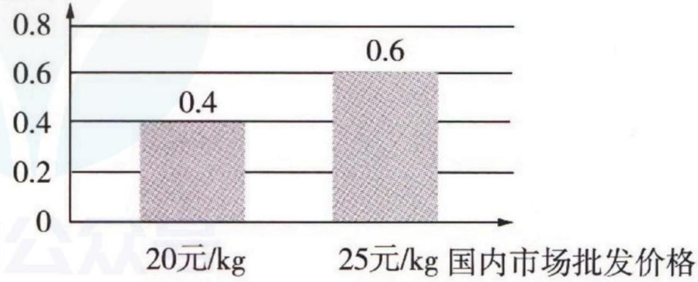

bar

| 国内市场批发价格 | 数值 |
| :--- | :--- |
| 20元/kg | 0.4 |
| 25元/kg | 0.6 |

图7

(注:各年的平均每亩纯收入 = 各年的平均每亩产量 × 批发价格 - 各年的平均每亩种植成本)

(1)以频率估计概率,试估计该地区某农民2022年种植此品种中药材获得最高纯收入的概率.  
(2) 设该地区某农民 2022 年种植此品种中药材的平均每亩纯收入为 X 元, 以频率估计概率, 求 X 的分布列和数学期望.  
(3)已知该地区某农民有一块土地,共10亩,该块土地现种植其他农作物,年纯收入最高可达到45 000元,根据以上数据,该农民下一年是否应该选择在这块土地上种植此品种中药材?说明理由.

解析 (1) 设事件 A: 该地区某农民 2022 年种植此品种中药材获得最高纯收入.

则 $P(A)=0.75 \times 0.6 = 0.45.$

(2) 由题意可知, X 的所有可能取值为 3000, 5000, 7500.

$$
P (X = 3 0 0 0) = 0. 2 5 \times 0. 4 = 0. 1,
$$

$$
P (X = 5 0 0 0) = 0. 7 5 \times 0. 4 + 0. 2 5 \times 0. 6 = 0. 4 5,
$$

$$
P (X = 7 5 0 0) = 0. 7 5 \times 0. 6 = 0. 4 5.
$$

所以 $X$ 的分布列为

<table><tr><td>X</td><td>3000</td><td>5000</td><td>7500</td></tr><tr><td>P</td><td>0.1</td><td>0.45</td><td>0.45</td></tr></table>

所以 X 的数学期望 $E(X)=3\ 000 \times 0.1 + 5\ 000 \times 0.45 + 7\ 500 \times 0.45 = 5\ 925$ (元).

(3)选择种植此品种中药材.理由如下:

以第(2)问的期望作为决策依据,则在该地区种植10亩该品种中药材年纯收入为 $5925 \times 10 = 59250$ (元),59250 > 45000,所以该农民下一年应该选择在这块土地上种植此品种中药材.

# 三、设置时代情境，落实学科素养

# 1. 关注科技创新

调研 7 (2022·北师大实验中学考前预测/人工智能,Sigmoid 函数)在人工智能领域,神经网络是一个比较热门的话题.由神经网络发展而来的深度学习正在飞速改变着我们身边的世界.从 AlphaGo(阿尔法围棋)到自动驾驶汽车,这些大家耳熟能详的例子,都是以神经网络为理论基础的.在神经网络当中,有一类很重要的函数被称为激活函数,Sigmoid 函数 $\sigma(x)$ 是神经网络中常用的激活函数之一,其解析式为 $\sigma(x)=$

现在你知道自己在哪里卡住了,那么就回到原始材料,重新学习,直到你可以用基本的术语解释这一概念.

$\frac{1}{1+e^{-x}}$ . 下列关于 Sigmoid 函数的表述, 正确的有 \_\_\_\_ (填正确答案的序号).

①Sigmoid 函数是单调递增函数；  
②Sigmoid 函数的图象是一个中心对称图形, 对称中心为 $(0, \frac{1}{2})$ ;  
③对于任意正实数 a，方程 $\sigma(x)=a$ 有且只有一个解；  
④Sigmoid 函数的导数满足 $\sigma'(x) = \sigma(x)[1 - \sigma(x)]$ .

# 解析

<table><tr><td>说法</td><td>分析过程</td><td>正误</td></tr><tr><td>1</td><td> $y = 1 + e^{-x}$ 为单调递减函数 $\rightarrow \sigma(x) = \frac{1}{1 + e^{-x}}$ 为单调递增函数</td><td>√</td></tr><tr><td>2</td><td>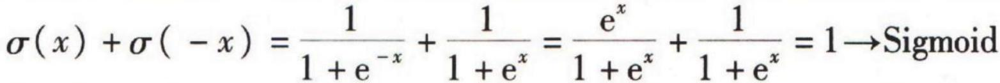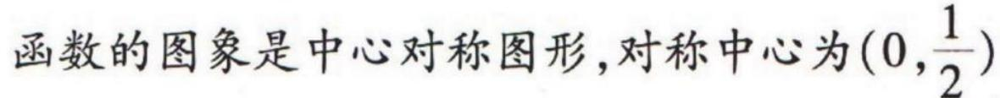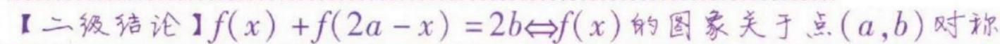</td><td>√</td></tr><tr><td>3</td><td>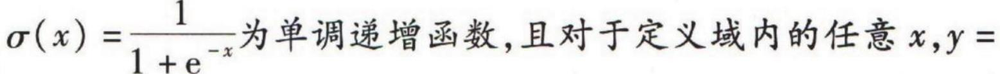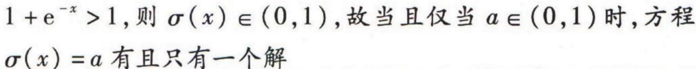</td><td>×</td></tr><tr><td>4</td><td>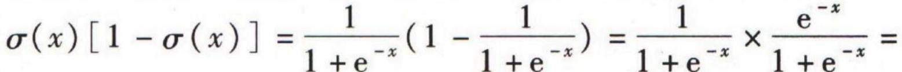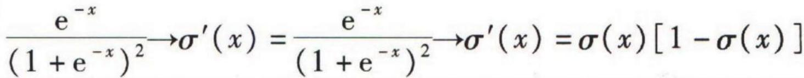</td><td>√</td></tr></table>

# 2. 突破技术瓶颈

调研 8 (2022·广东茂名第五次调研/疫苗研发)(多选)某医药研究所成立某疫苗研发项目,组建甲、乙两个疫苗研发小组,且两个小组独立开展研发工作.已知甲小组研发成功的概率为 $\frac{2}{3}$ ,乙小组研发成功的概率为 $\frac{1}{2}$ .该研发项目的奖金为100万元,分配方案是:若只有某一小组研发成功,则该小组获得全部奖金;若两个小组都研发成功,则平分全部奖金;若两个小组均未研发成功,则均不获得奖金.则()

A. 该研究所疫苗研发成功的概率为 $\frac{5}{6}$

B. 乙小组获得全部奖金的概率为 $\frac{1}{3}$   
C. 在疫苗研发成功的情况下, 甲小组研发成功的概率为 $\frac{4}{5}$   
D. 甲小组获得的奖金的期望为 60 万元

解析 当甲、乙两个小组至少有一个小组研发成功时,该研究所疫苗研发成功,其概率为 $1 - \left(1 - \frac{2}{3}\right) \times \left(1 - \frac{1}{2}\right) = \frac{5}{6}$ , 故 A 选项正确;

乙小组获得全部奖金,即甲小组没有研发成功,而乙小组研发成功,概率为(1- $\frac{2}{3}$ )× $\frac{1}{2}$ = $\frac{1}{6}$ ,故B选项错误;

设事件 A 为“疫苗研发成功”，事件 B 为“甲小组研发成功”，则 $P(B|A)=\frac{P(AB)}{P(A)}=\frac{\frac{2}{3}}{\frac{5}{6}}=$ $\frac{4}{5}$ ，故 C 选项正确；

设甲小组获得的奖金为 $\xi$ 万元, 则 $\xi$ 的所有可能取值为 $0,50,100$ , 且 $P(\xi = 100) = \frac{2}{3} \times (1 - \frac{1}{2}) = \frac{1}{3}, P(\xi = 50) = \frac{2}{3} \times \frac{1}{2} = \frac{1}{3}, P(\xi = 0) = \frac{1}{3}$ , 所以 $E(\xi) = 100 \times \frac{1}{3} + 50 \times \frac{1}{3} + 0 \times \frac{1}{3} = 50$ (万元), 故 D 选项错误. 故选 AC.

# 3. 解读社会热点

调研 9 （原创）我国第三艘航空母舰下水命名仪式于 2022 年 6 月 17 日上午在中国船舶集团有限公司江南造船厂举行，经中央军委批准，我国第三艘航空母舰命名为“中国人民解放军海军福建舰”，舷号为“18”。福建舰是我国完全自主设计建造的首艘弹射型航空母舰，采用平直通长飞行甲板，配置电磁弹射和阻拦装置，满载排水量 8 万余吨。为调查学生对福建舰的了解情况，某中学进行了一次抽样调查，统计得到以下 $2 \times 2$ 列联表。

<table><tr><td></td><td>了解</td><td>不了解</td><td>合计</td></tr><tr><td>男生</td><td></td><td>60</td><td>200</td></tr><tr><td>女生</td><td>110</td><td></td><td>200</td></tr><tr><td>合计</td><td></td><td></td><td></td></tr></table>

第四步:传授.如果你真的想确保你的理解没什么问题,那就把它教给另一个人,检测知识最终的途径是你有能力把它传播给另一个人.

(1) 完成 $2 \times 2$ 列联表, 依据小概率值 $\alpha = 0.005$ 的 $\chi^2$ 独立性检验, 能否推断该校学生对福建舰的了解情况与性别有关?

(2)①为弄清部分学生不了解福建舰的原因,按照性别采用分层抽样的方法,从样本中不了解福建舰的学生中随机抽取5人,再从这5人中抽取3人进行面对面交流,求“男、女生至少各抽到一名”的概率;

②用样本估计总体,若再从该校全体学生中随机抽取40人,记其中对福建舰了解的人数为X,求X的数学期望.

附： $\chi^2 = \frac{n(ad - bc)^2}{(a + b)(c + d)(a + c)(b + d)}$ ，其中 $n = a + b + c + d.$

<table><tr><td> $\alpha$ </td><td>0.025</td><td>0.010</td><td>0.005</td><td>0.001</td></tr><tr><td> $x_{\alpha}$ </td><td>5.024</td><td>6.635</td><td>7.879</td><td>10.828</td></tr></table>

解析 (1) 由题可得如下 $2 \times 2$ 列联表:

<table><tr><td></td><td>了解</td><td>不了解</td><td>合计</td></tr><tr><td>男生</td><td>140</td><td>60</td><td>200</td></tr><tr><td>女生</td><td>110</td><td>90</td><td>200</td></tr><tr><td>合计</td><td>250</td><td>150</td><td>400</td></tr></table>

假设该校学生对福建舰的了解情况与性别无关.

根据所给数据得 $\chi^2 = \frac{400\times(140\times 90 - 110\times 60)^2}{200\times 200\times 250\times 150} = 9.6 > 7.879$

故能推断该校学生对福建舰的了解情况与性别有关.

(2)①采用分层抽样的方法,从样本中不了解福建舰的学生中随机抽取5人,由题可得不了解福建舰的学生中男女比为2:3,

故这5人中包含3名女生,2名男生,再从这5人中抽取3人进行面对面交流,

则“男、女生至少各抽到一名”的概率为 $1 - \frac{C_3^3}{C_5^3} = 1 - \frac{1}{10} = \frac{9}{10}$ .

②由题意得学生了解福建舰的概率为 $\frac{250}{400}=\frac{5}{8}$ ，可知 $X\sim B(40,\frac{5}{8})$ ，

故 $E(X)=40\times\frac{5}{8}=25.$

# 突破超重点

# 核心考点篇

# 超重点 1 三角函数的图象变换与性质应用

# 特约名师

章礼抗 安徽省正高级教师,高中数学特级教师. 参编教辅用书多部,在各级各类数学杂志上发表论文约 100 篇,在各类报纸上发表论文近 3 000 篇

# 命题角度1 平移变换与伸缩变换的变换过程

调研 1 (2022·全国甲卷) 将函数 $f(x) = \sin (\omega x + \frac{\pi}{3})(\omega > 0)$ 的图象向左平移 $\frac{\pi}{2}$ 个单位长度后得到曲线 $C$ , 若 $C$ 关于 $y$ 轴对称, 则 $\omega$ 的最小值是 ( )

A. $\frac{1}{6}$

B. $\frac{1}{4}$

C. $\frac{1}{3}$

D. $\frac{1}{2}$

解析 方法一 记曲线 C 的函数解析式为 $y = g(x)$ ，则 $g(x) = \sin\left[\omega\left(x + \frac{\pi}{2}\right) + \frac{\pi}{3}\right] = \sin\left[\omega x + \left(\frac{\pi}{2}\omega + \frac{\pi}{3}\right)\right]$ .

因为函数 $g(x)$ 的图象关于 $y$ 轴对称，所以 $\frac{\pi}{2}\omega +\frac{\pi}{3} = k\pi +\frac{\pi}{2} (k\in \mathbf{Z})$ ，得 $\omega = 2k + \frac{1}{3}$

【会思考】问：什么样的三角函数的图象关于 y 轴对称？答：函数 $y = \pm A \cos \omega x + b$ （b 为常数）。问：什么样的正弦型函数可以化为函数 $y = \pm A \cos \omega x + b$ ？答： $y = \pm A \sin (\omega x + k \pi + \frac{\pi}{2}) + b = \pm A \cos \omega x + b, k \in Z$

$(k \in \mathbf{Z})$ . 因为 $\omega > 0$ , 所以 $\omega_{\min} = \frac{1}{3}$ . 故选 C.

方法二 (选项验证法)由方法一知 C 的函数解析式为 $g(x)=\sin\left[\omega x+\left(\frac{\pi}{2}\omega+\frac{\pi}{3}\right)\right]$ .

当 $\omega=\frac{1}{6}$ 时, $g(x)=\sin\left(\frac{1}{6}x+\frac{5\pi}{12}\right)$ , 曲线 C 不关于 y 轴对称, 排除 A.

可以把西蒙学习法比成一把锥子,这种“锥形学习法”的高效原理在于,连续的长时间学习本身包含对之前学习内容的应用,这样就省去了大量的复习时间.

当 $\omega=\frac{1}{4}$ 时, $g(x)=\sin\left(\frac{1}{4}x+\frac{11\pi}{24}\right)$ , 曲线 C 不关于 y 轴对称, 排除 B.

当 $\omega=\frac{1}{3}$ 时, $g(x)=\sin\left(\frac{1}{3}x+\frac{\pi}{2}\right)$ , 曲线 C 关于 y 轴对称, 满足题意. 故选 C.

调研 2 (2022·天津滨海新区5月模拟)已知函数 $f(x)=2\sin(2x+\frac{\pi}{6})$ ，现将 $y=f(x)$ 的图象向左平移 $\frac{\pi}{12}$ 个单位长度，再将所得图象上各点的横坐标缩短为原来的 $\frac{1}{2}$ ，纵坐标不变，得到函数 $y=g(x)$ 的图象，则 $g(x)$ 在 $[0,\frac{5\pi}{24}]$ 上的值域为（）

A. $[-1, 2]$

B. $[0,1]$

C. $[0,2]$

D. $\left[-\frac{1}{2},1\right]$

解析 将函数 $y = f(x)$ 的图象向左平移 $\frac{\pi}{12}$ 个单位长度, 得到 $y = 2\sin[2(x + \frac{\pi}{12}) + \frac{\pi}{6}] = 2\sin(2x + \frac{\pi}{3})$ 的图象, 再将所得图象上各点的横坐标缩短为原来的 $\frac{1}{2}$ , 纵坐标不变, 得到函数 $g(x) = 2\sin(4x + \frac{\pi}{3})$ 的图象.

因为 $x \in [0, \frac{5\pi}{24}]$ , 所以 $\frac{\pi}{3} \leqslant 4x + \frac{\pi}{3} \leqslant \frac{7\pi}{6}$ , 所以 $-\frac{1}{2} \leqslant \sin(4x + \frac{\pi}{3}) \leqslant 1$ ,

【防错妙招】由 $\frac{\pi}{3}\leqslant4x+\frac{\pi}{3}\leqslant\frac{7\pi}{6}$ 推出 $-\frac{1}{2}\leqslant\sin(4x+\frac{\pi}{3})\leqslant1$ ，这一步用到了正弦函数的单调性，即函数 $y=\sin x$ 在 $\left[\frac{\pi}{3},\frac{\pi}{2}\right]$ 上单调递增，在 $\left[\frac{\pi}{2},\frac{3\pi}{2}\right]$ 上单调递减，为了避免出错，可以在单稿纸上画出 $y=\sin x$ 的图象，再在图象中截取相应的区间

所以 $-1 \leqslant 2 \sin\left(4x + \frac{\pi}{3}\right) \leqslant 2$ ，所以 $g(x)$ 在 $\left[0, \frac{5\pi}{24}\right]$ 上的值域为 $[-1, 2]$ ，故选 A.

# 命题角度2 三角函数解析式及相关量的求解

调研 3 (2022·新高考 I 卷) 记函数 $f(x)=\sin(\omega x+\frac{\pi}{4})+b(\omega>0)$ 的最小正周期为 T. 若 $\frac{2\pi}{3}<T<\pi$ , 且 $y=f(x)$ 的图象关于点 $(\frac{3\pi}{2},2)$ 中心对称, 则 $f(\frac{\pi}{2})=$

A. 1

B. $\frac{3}{2}$

C. $\frac{5}{2}$

D. 3

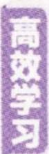

如果用烧水来比喻,即烧一壶开水,如果断断续续地烧,1万个小时可能也烧不开,如果连续烧,1个小时可能就够用了.

解析 $\frac{2\pi}{3} < T < \pi$ ，即 $\frac{2\pi}{3} < \frac{2\pi}{\omega} < \pi$ ，解得 $2 < \omega < 3$ .

因为 $y=f(x)$ 的图象关于点 $\left(\frac{3\pi}{2},2\right)$ 中心对称, 所以 b=2, 且 $\sin\left(\frac{3\pi}{2}\omega+\frac{\pi}{4}\right)+b=2$ ,
即 $\sin\left(\frac{3\pi}{2}\omega+\frac{\pi}{4}\right)=0$ , 所以 $\frac{3\pi}{2}\omega+\frac{\pi}{4}=k\pi(k\in\mathbf{Z})$ .

又 $2<\omega<3$ ，所以 $\frac{13\pi}{4}<\frac{3\pi}{2}\omega+\frac{\pi}{4}<\frac{19\pi}{4}$ ，所以 $\frac{3\pi}{2}\omega+\frac{\pi}{4}=4\pi$ ，解得 $\omega=\frac{5}{2}$ ，所以 $f(x)=\sin(\frac{5}{2}x+\frac{\pi}{4})+2$ ，所以 $f(\frac{\pi}{2})=\sin(\frac{5}{2}\times\frac{\pi}{2}+\frac{\pi}{4})+2=\sin\frac{3\pi}{2}+2=1.$ 故选 A.

【解题妙手】由题意知 b=2 。代入选项验证，若 $f(\frac{\pi}{2})=1$ ，则 $\frac{\pi}{2}\omega+\frac{\pi}{4}=\frac{3\pi}{2}+2k\pi(k\in\mathbb{Z})$ ， $\omega=\frac{5}{2}+4k(k\in\mathbb{Z})$ ，先取 $\omega=\frac{5}{2}$ 进行检验，则最小正周期 $T=\frac{2\pi}{\omega}=\frac{4\pi}{5}\in(\frac{2\pi}{3},\pi)$ ，且 $f(\frac{3\pi}{2})=$ $\sin(\frac{3\pi}{2}\times\frac{5}{2}+\frac{\pi}{4})+2=2$ ，所以点 $(\frac{3\pi}{2},2)$ 是图象的对称中心，完全符合题意，故直接选 A

调研 4 (2022 · 湖北鄂东南三校 5 月联考) 已知函数 $f(x) = 2\sin \left( {\omega x + \frac{\pi }{6}}\right)  -$ $1\left( {\omega  > 0}\right)$ 的图象的相邻两条对称轴之间的距离为 $\frac{\pi }{2}$ ,则 $f\left( x\right)$ 图象的一个对称中心是(   )

A. $\left(\frac{\pi}{12},-1\right)$

B. $\left(\frac{\pi}{12},0\right)$

C. $(- \frac{\pi}{12}, -1)$

D. $(- \frac{\pi}{12}, 0)$

解析 因为 $f(x)$ 的图象的相邻两条对称轴之间的距离为 $\frac{\pi}{2}$ ，所以 $f(x)$ 的最小正周期 $T = \frac{2\pi}{\omega} = \pi$ ，解得 $\omega = 2$ ，所以 $f(x) = 2\sin\left(2x + \frac{\pi}{6}\right) - 1$ 。

令 $2x+\frac{\pi}{6}=k\pi(k\in\mathbf{Z})$ ，得 $x=\frac{k\pi}{2}-\frac{\pi}{12}(k\in\mathbf{Z})$ ，此时 $f(x)=-1$ ，所以 $f(x)$ 图象的对称中心为 $\left(\frac{k\pi}{2}-\frac{\pi}{12},-1\right)(k\in\mathbf{Z})$ ，当k=0时，可得 $f(x)$ 图象的一个对称中心为 $\left(-\frac{\pi}{12},-1\right)$ .
故选 C.

【结论速解】由结论“正弦型函数 $y = A \sin(\omega x + \varphi) + B$ 图象的对称中心为 $\left(-\frac{\varphi}{\omega} + \frac{k\pi}{\omega}, B\right)$ ”
可得 $f(x)=2\sin(2x+\frac{\pi}{6})-1$ 图象的对称中心为 $\left(\frac{k\pi}{2}-\frac{\pi}{12},-1\right)(k\in\mathbf{Z})$ ，选 C

西蒙学习法的步骤为:选择一门学问;拆分这门学问,拆分到可以比较容易学习为止;持续学习6个月,各个击破每个被拆分的小部分.

调研 5 （2022 · 陕西西安五模）已知函数 $f(x) = A \sin(\omega x + \varphi) (A > 0, \omega > 0, |\varphi| < \pi)$ 的部分图象如图 1-1 所示，现将 $f(x)$ 的图象向左平移 $\frac{\pi}{12}$ 个单位长度得到 $y = g(x)$ 的图象，则方程 $e^{x} g(x) = \sqrt{2}$ 在 $[0, 2\pi]$ 上的实数解有（）

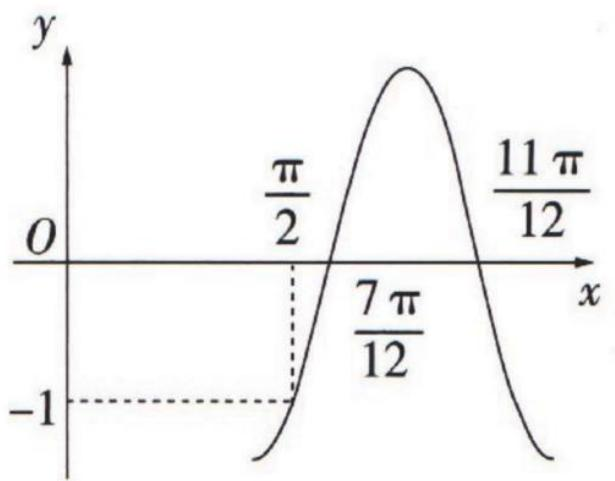

line

| x         | y     |
| --------- | ----- |
| π/2       | -1    |
| 7π/12     | 0     |
| 11π/12    | 1     |

图1-1

A. 5 个

B. 6 个

C. 7 个

D. 8 个

# 思维导引

相邻两个平衡点 $\rightarrow \omega$ ，最高点的横坐标 $\rightarrow \varphi$ 已知点 $(\frac{\pi}{2}, -1) \rightarrow A$

$$
\rightarrow \boxed {f (x) = \sqrt {2} \sin \left(3 x + \frac {\pi}{4}\right)} \longrightarrow \boxed {g (x) = \sqrt {2} \cos 3 x} \longrightarrow
$$

将方程 $\mathrm{e}^{x}g(x)=\sqrt{2}$ 变形为 $\cos 3x = \frac{1}{\mathrm{e}^{x}}$ 在同一平面直角坐标系中作出 y = $\cos 3x (x \in [0, 2\pi])$ 与 $y = \frac{1}{\mathrm{e}^{x}}$ 的图象

两图象交点的个数即所求实数解的个数

解析 观察函数 $f(x)$ 的部分图象上相邻两个平衡点, 可得 $\frac{1}{2} \times \frac{2\pi}{\omega} = \frac{11\pi}{12} - \frac{7\pi}{12}$ , 所以 $\omega = 3$ .

由 $f(x)$ 在 $x = \frac{\frac{7\pi}{12} + \frac{11\pi}{12}}{2} = \frac{3\pi}{4}$ 处取得最大值，得 $3\times \frac{3\pi}{4} +\varphi = 2k\pi +\frac{\pi}{2} (k\in \mathbf{Z})$ ，所以 $\varphi = 2k\pi -\frac{7\pi}{4} (k\in \mathbf{Z})$ ，又 $|\varphi | <   \pi$ ，所以 $\varphi = \frac{\pi}{4}$ 故 $f(x) = A\sin (3x + \frac{\pi}{4}).$

由 $f(\frac{\pi}{2}) = A\sin (\frac{3\pi}{2} +\frac{\pi}{4}) = A\cdot (-\sin \frac{\pi}{4}) = -\frac{\sqrt{2}}{2} A = -1$ ，得 $A = \sqrt{2}$

所以 $f(x)=\sqrt{2}\sin(3x+\frac{\pi}{4})$ .

【会识图】已知函数 $f(x)=A\sin(\omega x+\varphi)(A>0,\omega>0,|\varphi|<\pi)$ 的部分图象，根据图象求解三角函数解析式的关键在于准确识图：①观察距离定周期，得 $\omega$ （如两平衡点间的距离、相邻对称中心与对称轴的距离、最高点与最低点横坐标的差等）；②代入特殊点得 $\varphi$ ，A（如最值点、平衡点、图象与坐标轴的交点等，此时大多需要根据图象走势准确舍根）

所以 $g(x)=f(x+\frac{\pi}{12})=\sqrt{2}\sin\left[3\left(x+\frac{\pi}{12}\right)+\frac{\pi}{4}\right]=\sqrt{2}\sin\left(3x+\frac{\pi}{2}\right)=\sqrt{2}\cos3x$

则 $\mathrm{e}^x g(x) = \sqrt{2}$ 即 $\cos 3x = \frac{1}{\mathrm{e}^x}$ .

在同一平面直角坐标系内作出 $y = \cos 3x (x \in [0, 2\pi])$ 与 $y = \frac{1}{e^{x}}$ 的图象, 如图 1-2 所示.

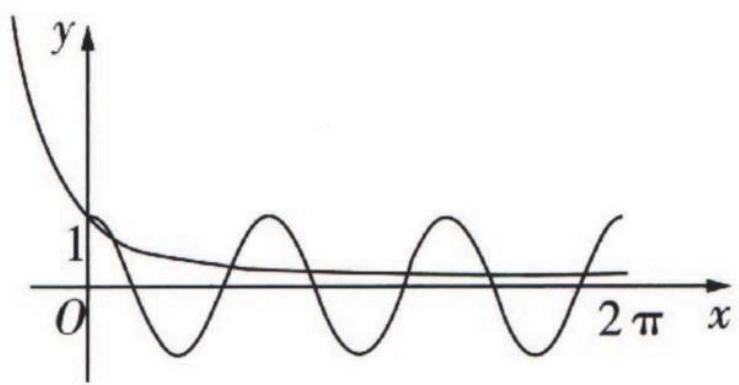

line

| x       | y     |
| ------- | ----- |
| 0       | 1     |
| 2π      | 0     |

图1-2

由图可知 $y = \cos 3x (x \in [0, 2\pi])$ 与 $y = \frac{1}{e^{x}}$ 的图象共有 7 个交点，故原方程有 7 个实数解，故选 C.

【小细节】注意到函数 $y = \cos 3x$ 的最小正周期是 $\frac{2\pi}{3}$ ，所以在 $[0, 2\pi]$ 内其有 3 个完整周期。除此之外，第一个交点 $(0, 1)$ 也不能遗漏哦！

调研 6 (2022·北京中关村中学 5 月调研节选/开放性“三选二”)已知函数 $f(x)=A\sin(\omega x+\varphi)(A>0,\omega>0,|\varphi|<\frac{\pi}{2})$ ,且 $f(x)$ 的最小正周期为 $\pi$ ,从条件①、条件②、条件③中选择两个作为一组已知条件,可得 $f(x)$ 的解析式为 \_\_\_\_.

条件①: $f(x)$ 的最小值为 -2. 条件②: $f(x)$ 的图象经过点 $(\frac{\pi}{2},\sqrt{2})$ . 条件③: 直线 $x = \frac{3\pi}{8}$ 是函数 $f(x)$ 的图象的一条对称轴.

解析 由最小正周期 $T = \pi$ 可知 $\omega = \frac{2\pi}{T} = 2.$

【会读题】在选择条件作答之前，先要读懂条件，找到需求。在函数 $f(x)$ 的解析式中，ω求出来了，A，φ未知。那么选择的两个条件一定是用来求A，φ的。条件①已知最值，可求A；条件②是已知点，可求A或φ；条件③已知对称轴，可求φ。这样一分类，思路就清晰多了

若选条件①②,解答过程如下:

因为 $f(x)$ 的最小值为 -2，所以 A=2，则 $f(x)=2\sin(2x+\varphi)$ .

又 $f(x)$ 的图象经过点 $(\frac{\pi}{2},\sqrt{2})$ ，所以 $f(\frac{\pi}{2}) = 2\sin (2\times \frac{\pi}{2} +\varphi) = \sqrt{2}$ ，即 $\sin \varphi =$ $-\frac{\sqrt{2}}{2}$ 结合 $|\varphi | <   \frac{\pi}{2}$ ，可得 $\varphi = -\frac{\pi}{4}$

所以 $f(x)$ 的解析式为 $f(x)=2\sin(2x-\frac{\pi}{4})$ .

若选条件①③,解答过程如下:

思维导图学习法 思维导图,又名心智导图,是表达发散性思维的有效图形思维工具.

因为 $f(x)$ 的最小值为-2,所以A=2,则 $f(x)=2\sin(2x+\varphi)$ .

又直线 $x=\frac{3\pi}{8}$ 是函数 $f(x)$ 的图象的一条对称轴，可得 $2\times\frac{3\pi}{8}+\varphi=\frac{\pi}{2}+k\pi, k\in\mathbf{Z}$ ，
即 $\varphi = -\frac{\pi}{4} + k\pi, k \in Z$ ，结合 $|\varphi| < \frac{\pi}{2}$ ，可得 $\varphi = -\frac{\pi}{4}$ .

所以 $f(x)$ 的解析式为 $f(x)=2\sin(2x-\frac{\pi}{4})$ .

若选条件②③,解答过程如下:

因为直线 $x=\frac{3\pi}{8}$ 是函数 $f(x)$ 的图象的一条对称轴，

所以 $2 \times \frac{3\pi}{8} + \varphi = \frac{\pi}{2} + k\pi, k \in \mathbf{Z}$ , 即 $\varphi = -\frac{\pi}{4} + k\pi, k \in \mathbf{Z}$ , 结合 $|\varphi| < \frac{\pi}{2}$ , 可得 $\varphi = -\frac{\pi}{4}$ , 所以 $f(x) = A\sin(2x - \frac{\pi}{4})$ .

因为 $f(x)$ 的图象经过点 $(\frac{\pi}{2},\sqrt{2})$ ,

所以 $f(\frac{\pi}{2}) = A\sin (2\times \frac{\pi}{2} -\frac{\pi}{4}) = \sqrt{2}$ ，所以 $A = 2$

所以 $f(x)$ 的解析式为 $f(x) = 2\sin \left(2x - \frac{\pi}{4}\right)$ .

# 命题角度3 三角函数的“四性”（奇偶性、周期性、单调性、图象的对称性）及应用

调研 7 (2022·北师大附中5月模拟改编)(多选)设函数 $f(x)=\sin(x\cos x)$ ,
则下列命题中是真命题的有
()

A. $f(x)$ 是奇函数

B. 当 $x \in (0, \frac{\pi}{2})$ 时, $f(x) > 0$

C. $f(x)$ 是周期函数

D. $f(x)$ 存在无数个零点

解析 因为 $f(-x) = \sin [-x\cos (-x)] = \sin (-x\cos x) = -\sin (x\cos x) = -f(x), x \in \mathbb{R}$ ，所以 $f(x)$ 是奇函数，A 正确.

当 $x \in (0, \frac{\pi}{2})$ 时， $0 < \cos x < 1, 0 < x \cos x < \frac{\pi}{2}$ ，

所以 $f(x)=\sin(x\cos x)>0$ , B 正确.

令 $f(x)=\sin(x\cos x)=0$ ，得 $x\cos x=k\pi,k\in\mathbf{Z}$ ，即 $\cos x=\frac{k\pi}{x},k\in\mathbf{Z}$ ，记 $g(x)=$ $\cos x, h(x) = \frac{k\pi}{x}, k \in \mathbf{Z}$ ，在同一平面直角坐标系中作出函数 $g(x), h(x)$ 的图象，如

【巧作图】合参函数 $h(x)$ 的图象看似复杂, 实际上我们可以依次令 $k = 1,2,3,\dots$ , 那么函数 $h(x)$ 的图象实质上就是一串反比例函数的图象, 依旧在基本初等函数的范畴内

图1-3所示.

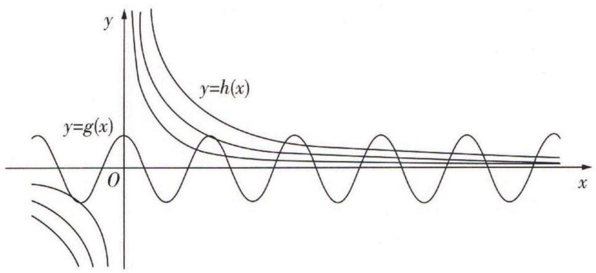

text_image

y
y=g(x)
O
y=h(x)

图1-3

由图可知,曲线 $g(x)=\cos x$ 与曲线系 $h(x)=\frac{k\pi}{x}, k\in\mathbf{Z}$ 在区间 $[0,2\pi], [2\pi,4\pi], \cdots, [2n\pi,2\pi+2n\pi]$ ( $n\in Z$ ) 内的交点个数逐渐增加且趋近于无穷多个,所以原函数不存在周期,故 C 错误.

曲线 $g(x)=\cos x$ 与曲线系 $h(x)=\frac{k\pi}{x}, k\in\mathbf{Z}$ 的交点显然有无数个, D 正确.

故选 ABD.

调研 8 (2022·河北石家庄5月模拟)已知函数 $f(x)=\sin\omega x+\sqrt{3}\cos\omega x(\omega>0)$ ，若函数 $f(x)$ 的图象在区间 $[0,2\pi]$ 上的最高点和最低点共有6个，则下列说法中正确的序号是\_\_\_\_。

① $f(x)$ 在 $[0,2\pi]$ 上有且仅有5个零点；② $f(x)$ 在 $[0,2\pi]$ 上有且仅有3个极大值点；③ $\omega$ 的取值范围是 $\left[\frac{31}{12},\frac{37}{12}\right)$ ；④ $f(x)$ 在 $[0,\frac{\pi}{6}]$ 上单调递增.

思维导图运用图文并重的技巧将各层级的主题有序地表达出来,把主题关键词与图象、颜色等建立记忆链接.

解析 由辅助角公式可得 $f(x) = \sin \omega x + \sqrt{3}\cos \omega x = 2\sin (\omega x + \frac{\pi}{3}).$

当 $x \in [0, 2\pi]$ 时， $\omega x + \frac{\pi}{3} \in [\frac{\pi}{3}, 2\pi\omega + \frac{\pi}{3}]$ ，令 $\omega x + \frac{\pi}{3} = t$ ，则 $g(t) = 2\sin t$ 的图象在 $[\frac{\pi}{3}, 2\pi\omega + \frac{\pi}{3}]$ 上的最高点和最低点共有6个.

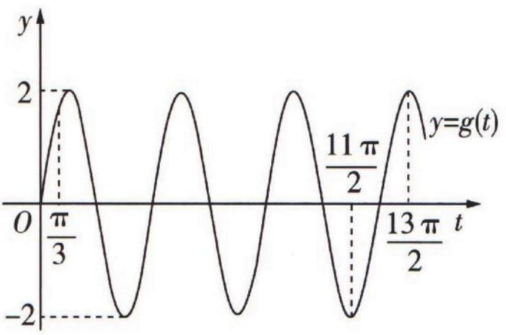

line

| t         | y          |
| --------- | ---------- |
| 0         | 0          |
| π/3       | 2          |
| 11π/2     | 0          |
| 13π/2     | 2          |

图1-4

如图 1-4, 作出函数 $g(t) = 2 \sin t$ 的图象, 由图象可知, 需满足 $\frac{11\pi}{2} \leqslant 2\pi \omega + \frac{\pi}{3} < \frac{13\pi}{2}$ , 解得 $\frac{31}{12} \leqslant \omega < \frac{37}{12}$ , ③ 正确.

【易错提醒】注意区间端点值的取舍， $g(t)=2\sin t$ 的图象在区间 $\left[\frac{\pi}{3},2\pi\omega+\frac{\pi}{3}\right]$ 上的最高点和最低点共有 6 个，所以根据图象得到的是 $\frac{11\pi}{2}\leqslant2\pi\omega+\frac{\pi}{3}<\frac{13\pi}{2}$ ，左闭右开

当 $6\pi \leqslant 2\pi \omega + \frac{\pi}{3} < \frac{13\pi}{2}$ 时, $g(t)$ 有 6 个零点, 此时 $f(x)$ 在 $[0, 2\pi]$ 上有 6 个零点, ①错误.

当 $\frac{11\pi}{2}\leqslant2\pi\omega+\frac{\pi}{3}<\frac{13\pi}{2}$ 时, $g(t)$ 有且仅有3个极大值点,②正确.

当 $x \in [0, \frac{\pi}{6}]$ 时， $\omega x + \frac{\pi}{3} \in [\frac{\pi}{3}, \frac{\pi}{6}\omega + \frac{\pi}{3}]$ ，则 $(\frac{\pi}{6}\omega + \frac{\pi}{3})_{\min} = \frac{31\pi}{72} + \frac{\pi}{3} = \frac{55\pi}{72} > \frac{\pi}{2}$ ，所以 $f(x)$ 在 $[0, \frac{\pi}{6}]$ 上不单调，④错误。故填②③。

调研 9 (2022·贵阳五校4月联合考试)已知函数 $f(x)=3\sin(\omega x+\varphi)(\omega>0$ , $|\varphi|<\pi)$ , $f(4)=f(2)-6$ , 且 $f(x)$ 在[2,4]上单调. 设函数 $g(x)=f(x)-1$ , 且 $g(x)$ 的定义域为[-5,8], 则函数 $g(x)$ 的所有零点之和等于 \_\_\_\_.

解析 因为 $f(x)=3\sin(\omega x+\varphi)$ ，所以 $-3 \leqslant f(x) \leqslant 3$ ，又 $f(4)=f(2)-6$ ，所以 $f(2)=3, f(4)=-3$ .

【敲黑板】对于三角函数问题中的“两个函数值之和（差）已知”的条件要格外注意，大多数情况下这两个函数值都是三角函数的最值，这是一种常见的破题思路

$f(x)$ 在 $[2,4]$ 上单调, 因此直线 x=2 与直线 x=4 是函数 $f(x)$ 的图象的相邻两条对称轴, 设 $f(x)$ 的最小正周期为 T, 则 $\frac{T}{2}=2, T=4$ , 所以 $\omega=\frac{2\pi}{T}=\frac{\pi}{2}$ , 由 $f(2)=$

$3\sin(\frac{\pi}{2}\times2+\varphi)=3$ , 可得 $\varphi=-\frac{\pi}{2}+2k\pi(k\in\mathbb{Z})$ , 又 $|\varphi|<\pi$ , 所以 $\varphi=-\frac{\pi}{2}$ , 即 $f(x)=3\sin(\frac{\pi}{2}x-\frac{\pi}{2})$ .

令 $g(x)=f(x)-1=0$ , 得 $f(x)=1$ .

令 $t = \frac{\pi}{2} x - \frac{\pi}{2}$ , 作出直线 $y = 1$ 和函数 $h(t) = 3\sin t$ 的图象, 如图 1-5 所示.

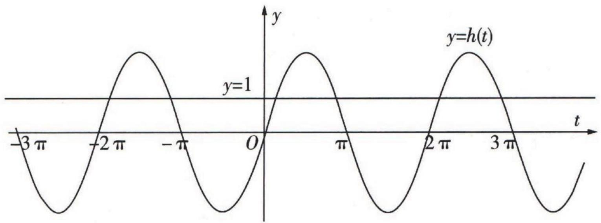

line

| t       | y=h(t) |
| ------- | ------ |
| -3π     | -π     |
| -2π     | 0      |
| -π      | 0      |
| 0       | 0      |
| π       | 0      |
| 2π      | 0      |
| 3π      | 0      |

图1-5

当 $x \in [-5,8]$ 时， $t \in [-3\pi, \frac{7\pi}{2}]$ ，则直线 y = 1 与曲线 $h(t) = 3\sin t$ 在 $[-3\pi, \frac{7\pi}{2}]$ 上共有六个交点，将交点的横坐标从左至右依次记为 $t_{1}, t_{2}, t_{3}, t_{4}, t_{5}, t_{6}$ ，则 $t_{1} + t_{2} + \cdots + t_{6} = -3\pi + \pi + 5\pi = 3\pi$ .

【会转化】要求 $g(x)$ 的零点之和，可先转化为求 $[-5,8]$ 上使 $f(x)=1$ 的点的横坐标之和，进而转化为求直线 y=1 和曲线 $h(t)=3\sin t$ 在 $\left[-3\pi,\frac{7\pi}{2}\right]$ 上的交点的横坐标之和，利用对称性巧妙求解

记函数 $g(x)$ 的所有零点从小到大依次为 $x_{1}, x_{2}, x_{3}, x_{4}, x_{5}, x_{6}$ ，则 $\left(\frac{\pi}{2}x_{1}-\frac{\pi}{2}\right)+\left(\frac{\pi}{2}x_{2}-\frac{\pi}{2}\right)+\cdots+\left(\frac{\pi}{2}x_{6}-\frac{\pi}{2}\right)=3\pi$ ，可得 $x_{1}+x_{2}+\cdots+x_{6}=12$ ，

所以函数 $g(x)$ 的所有零点之和等于 12.

# 新题演练

1. (2022·湖北八市联考) 将函数 $y = \sin (2x - \varphi)$ 的图象沿 $x$ 轴向右平移 $\frac{\pi}{8}$ 个单位长度后, 得到一个偶函数的图象, 则 $\varphi$ 的取值可能为 ( )

A. $-\frac{\pi}{4}$

B. $\frac{\pi}{4}$

C. $\frac{\pi}{2}$

D. $\frac{3\pi}{4}$

绘制思维导图,要有明确的主题,它的分支可以灵活摆放,但一定要有逻辑,在绘制导图之前就要做好布局.

2. (2022·重庆名校联盟三诊)(多选)定义在实数集 $\mathbf{R}$ 上的函数 $f(x) = A\cos (\omega x + \varphi)$ $(A > 0, \omega > 0, 0 < \varphi < \pi)$ 的图象的一个最高点为 $(- \frac{\pi}{12}, 3)$ , 与之相邻的一个对称中心为 $(\frac{\pi}{6}, 0)$ , 将 $f(x)$ 的图象向右平移 $\frac{\pi}{6}$ 个单位长度后得到函数 $g(x)$ 的图象, 则 ( )

A. $f(x)$ 的振幅为3  
B. $f(x)$ 的频率为 $\pi$   
C. $g(x)$ 的单调递增区间为 $\left[-\frac{5\pi}{12},\frac{\pi}{12}\right]$   
D. $g(x)$ 在 $[0, \frac{\pi}{2}]$ 上只有一个零点

# 参考答案与解析

1. B 将函数 $y = \sin(2x - \varphi)$ 的图象沿 x 轴向右平移 $\frac{\pi}{8}$ 个单位长度后得到 $y = \sin[2(x - \frac{\pi}{8}) - \varphi] = \sin(2x - \frac{\pi}{4} - \varphi)$ 的图象。依题意可得 $-\frac{\pi}{4} - \varphi = \frac{\pi}{2} + k\pi (k \in \mathbf{Z}), \varphi = -\frac{3\pi}{4} - k\pi (k \in \mathbf{Z})$ ，取 k = -1，可得 $\varphi = \frac{\pi}{4}$ ，故选 B。

【扫清障碍】不要直接由 $y = \sin\left(2x - \frac{\pi}{4} - \varphi\right)$ 是偶函数得到 $-\frac{\pi}{4} - \varphi = \frac{\pi}{2}$ ，务必牢记通式 $-\frac{\pi}{4} - \varphi = \frac{\pi}{2} + k\pi (k \in \mathbb{Z})$

2. AD 由函数 $f(x)$ 的图象的最高点为 $(-\frac{\pi}{12},3)$ ，可得 $A = 3$ ，所以函数 $f(x)$ 的振幅为3，故A正确。由函数 $f(x)$ 图象的一个最高点和与之相邻的对称中心的横坐标之差为 $\frac{T}{4}$ （ $T$ 为 $f(x)$ 的最小正周期）可得 $\frac{T}{4} = \frac{\pi}{6} - (-\frac{\pi}{12}) = \frac{\pi}{4}$ ，所以 $T = \pi$ ，所以函数 $f(x)$ 的频率为 $\frac{1}{T} = \frac{1}{\pi}$ ，故B错误。因为 $T = \pi$ ，所以 $\omega = \frac{2\pi}{T} = 2$ ，所以 $f(x) = 3\cos(2x + \varphi)$ ，又 $f(-\frac{\pi}{12}) = 3\cos[2 \times (-\frac{\pi}{12}) + \varphi] = 3$ ，所以 $\varphi - \frac{\pi}{6} = 2k\pi$ ， $k \in \mathbf{Z}$ ，因为 $0 < \varphi < \pi$ ，所以 $\varphi = \frac{\pi}{6}$ ，即 $f(x) = 3\cos(2x + \frac{\pi}{6})$ ，所以 $g(x) = 3\cos[2(x - \frac{\pi}{6}) + \frac{\pi}{6}] = 3\cos(2x - \frac{\pi}{6})$ 。

令 $-\pi + 2k\pi \leqslant 2x - \frac{\pi}{6} \leqslant 2k\pi, k \in \mathbf{Z}$ , 可得 $-\frac{5\pi}{12} + k\pi \leqslant x \leqslant \frac{\pi}{12} + k\pi, k \in \mathbf{Z}$ , 所以 $g(x)$ 的单调递增区间为 $[- \frac{5\pi}{12} + k\pi, \frac{\pi}{12} + k\pi], k \in \mathbf{Z}$ , 而选项 C 只是其中一个单调递增区间, 故 C 错误. 由 $2x - \frac{\pi}{6} = \frac{\pi}{2} + k\pi, k \in \mathbf{Z}$ , 解得 $x = \frac{\pi}{3} + \frac{k\pi}{2}, k \in \mathbf{Z}$ , 所以函数 $g(x)$ 在 $[0, \frac{\pi}{2}]$ 上只有一个零点, 故 D 正确. 故选 AD.

# 超重点 2 导数的工具性在三角函数问题中的应用

# 特约名师

章礼抗 安徽省正高级教师,高中数学特级教师. 参编教辅用书多部,在各级各类数学杂志上发表论文约 100 篇,在各类报纸上发表论文近 3 000 篇

# 命题角度1 利用导数研究三角函数的图象

调研 1 (2022·安徽安庆示范高中4月联考)已知函数 $f(x)$ 在 $[-π, π]$ 上的图象如图2-1所示,则函数 $f(x)$ 的解析式可能为 ( )

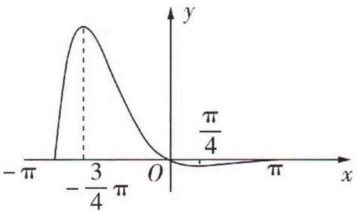

line

| x         | y     |
| --------- | ----- |
| -π        | 0     |
| -3/4π     | π/4   |
| π         | 0     |

图2-1

A. $f(x) = \mathrm{e}^{x}\sin x$   
B. $f(x) = \mathrm{e}^{-x}\sin x$   
C. $f(x) = -\mathrm{e}^{x}\sin x$   
D. $f(x) = -\mathrm{e}^{-x}\sin x$

解析 观察题图可知当 $x \to 0$ 且 x > 0 时, $f(x) < 0$ ,

【换个思路】除了利用极限思想，还可以利用取特殊值的方

法进行排除. 当 $x = 0.01$ 时, $\sin 0.01 > 0$ , $\mathrm{e}^{0.01} > 0$ , $\mathrm{e}^{-0.01} > 0$ , 故 $\sin 0.01 \times \mathrm{e}^{0.01} > 0$ , $\sin 0.01 \times \mathrm{e}^{-0.01} > 0$ , AB 不满足题意

故 AB 不满足题意.

当 $f(x)=-\mathrm{e}^{x}\sin x$ 时, $f'(x)=-\mathrm{e}^{x}(\sin x+\cos x)=-\sqrt{2}\mathrm{e}^{x}\sin(x+\frac{\pi}{4})$ , 令 $f'(x)=0$ , 可得 $x=-\frac{\pi}{4}+k\pi(k\in\mathbf{Z})$ , 则 $f(x)$ 在 $[-π,π]$ 上的极值点分别为 $-\frac{\pi}{4},\frac{3\pi}{4}$ , 不满足题意.

【会识图】观察函数的图象,其存在单调性明显发生变化的点,且两个变化点不关于原点对称,此时常借助导数工具找到原函数的极值点,结合函数图象进行判断

当 $f(x) = -\mathrm{e}^{-x}\sin x$ 时， $f'(x) = -\mathrm{e}^{-x}(\cos x - \sin x) = -\sqrt{2}\mathrm{e}^{-x}\cos (x + \frac{\pi}{4})$ ，令

浏览,是读书的第一步,简单翻阅,对阅读材料有一个大致的了解.发问,即一边粗读,一边提出疑问.阅读,是从头到尾细读,带着问题阅读.

$f'(x)=0$ , 可得 $x=\frac{\pi}{4}+k\pi(k\in\mathbf{Z})$ ，则 $f(x)$ 在 $[-π,π]$ 上的极值点分别为 $-\frac{3\pi}{4},\frac{\pi}{4}$ ，满足题意，故选 D.

调研 2 (2022·华中师大一附中等校5月联考)(多选)设 $f(x)=\sin2x+2|\cos x|$ , $x \in R$ , 则下列四个结论中正确的有 ( )

A. $f(x)$ 在区间 $[0,2\pi]$ 上有 2 个零点  
B. $f(x)$ 的单调递增区间为 $(k\pi + \frac{\pi}{2}, k\pi + \frac{7\pi}{6})$ , $k \in Z$   
C. $f(x)$ 的图象关于点 $(\frac{\pi}{2},0)$ 对称  
D. $f(x)$ 的值域为 $\left[0,\frac{3\sqrt{3}}{2}\right]$

解析 因为函数 $y = \sin 2x$ 和函数 $y = 2|\cos x|$ 的最小正周期都是 $\pi$ ，所以 $f(x)$ 的最小正周期为 $\pi$ .

【另解】也可以根据 $f(x+\pi)=f(x)$ 得到 $f(x)$ 的一个周期为 $\pi$ ，但若还需要确定 $f(x)$ 的最小正周期，则可结合 $f(x)$ 在 $[0,\pi]$ 上的图象进行求解

当 $x \in [-\frac{\pi}{2}, \frac{\pi}{2}]$ 时, $f(x) = \sin 2x + 2\cos x = 2\sin x\cos x + 2\cos x, f'(x) = 2\cos^2 x - 2\sin^2 x - 2\sin x = -2(2\sin^2 x + \sin x - 1) = -2(2\sin x - 1)(\sin x + 1)$ ,

所以当 $x \in [-\frac{\pi}{2}, \frac{\pi}{6}]$ 时, $f'(x) \geqslant 0$ , 函数 $f(x)$ 单调递增,

当 $x \in (\frac{\pi}{6}, \frac{\pi}{2}]$ 时, $f'(x) < 0$ , 函数 $f(x)$ 单调递减, $f(-\frac{\pi}{2}) = 0$ , $f(\frac{\pi}{6}) = \frac{3\sqrt{3}}{2}$ , 作出 $y = f(x)$ 的大致图象, 如图2-2所示.

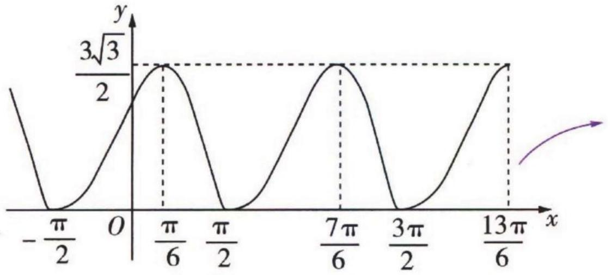

line

| x         | y          |
| --------- | ---------- |
| -π/2      | 0          |
| 0         | π/6        |
| π/6       | π/2        |
| 7π/6      | 7π/6       |
| 3π/2      | 3π/2       |
| 13π/6     | 13π/6      |

图2-2

【会标注】题目要求判断函数 $f(x)$ 的零点、单调递增区间、图象的对称中心、值域，因此只要在图象上准确标注极值点、最值点、零点即可

由图 2-2 知 ABD 正确, 故选 ABD.

复述,离开书本,回忆阅读的内容,看提出的问题是否解决.复习,一般在复述后一、二天内进行,隔一段时间再重复一次,温故而知新.

# 命题角度2 利用导数研究三角函数的单调性与最值

调研 3 (2022·全国乙卷) 函数 $f(x)=\cos x+(x+1)\sin x+1$ 在区间 $[0,2\pi]$ 上的最小值、最大值分别为 ( )

A. $-\frac{\pi}{2},\frac{\pi}{2}$

B. $-\frac{3\pi}{2},\frac{\pi}{2}$

C. $-\frac{\pi}{2}, \frac{\pi}{2} + 2$

D. $-\frac{3\pi}{2},\frac{\pi}{2}+2$

解析 $f(x) = \cos x + (x + 1)\sin x + 1, x \in [0,2\pi]$ , 则 $f'(x) = -\sin x + \sin x + (x + 1)\cos x = (x + 1)\cos x$ .

令 $f'(x)=0$ , 解得 x=-1 (舍去), $x=\frac{\pi}{2}$ 或 $x=\frac{3\pi}{2}$ .

【敲黑板】连续函数在闭区间上的最值一定在极值点处或区间端点处取得，据此求出 $f(0)$ ， $f(\frac{\pi}{2})$ ， $f(\frac{3\pi}{2})$ ， $f(2\pi)$ ，在四个值中确定最小值、最大值

因为 $f(0)=\cos0+(0+1)\sin0+1=2,f(\frac{\pi}{2})=\cos\frac{\pi}{2}+(\frac{\pi}{2}+1)\sin\frac{\pi}{2}+1=2+\frac{\pi}{2},$ $f(\frac{3\pi}{2})=\cos\frac{3\pi}{2}+(\frac{3\pi}{2}+1)\sin\frac{3\pi}{2}+1=-\frac{3\pi}{2},f(2\pi)=\cos2\pi+(2\pi+1)\sin2\pi+1=2,$

所以 $f(x)_{\max} = f(\frac{\pi}{2}) = 2 + \frac{\pi}{2}, f(x)_{\min} = f(\frac{3\pi}{2}) = -\frac{3\pi}{2}$ . 故选 D.

调研 4 (2022 · 吉林一中 6 月模拟) 已知函数 $f(x) = |\sin x| + |\cos x| - \sin 2x - 1$ , 则下列说法正确的是 ( )

A. 直线 $x = \frac{\pi}{2}$ 是函数 $f(x)$ 图象的对称轴  
B. 函数 $f(x)$ 在区间 $\left(\frac{\pi}{2}, \frac{5\pi}{6}\right)$ 上单调递增  
C. 函数 $f(x)$ 的最大值为 $\sqrt{2}$ ，最小值为 -2  
D. 函数 $f(x)$ 在区间 $(0, M\pi)$ 上恰有 2022 个零点，则 $1011 < M \leqslant \frac{2023}{2}$

# 思维导引

A→验证 $f(\pi-x)$ 与 $f(x)$ 是否相等,即可判断  
B→去绝对值,利用导数工具讨论函数 $f(x)$ 的单调性,即可判断

C $\rightarrow$ 在一个周期内,根据 $\sin x, \cos x$ 的正负去绝对值,换元,利用二次函数的性质得最值

先在小范围判断得 $f(x)$ 在 $(0,\pi]$ 上的零点有两个,再在大范围判断得 $f(x)$ 在 $(0,n\pi](n\in\mathbf{N}^{*})$ 上的零点有2n个,故M满足 $1011<M\leqslant1011+\frac{1}{2}$

解析

对于 A, $f(\pi - x) = |\sin(\pi - x)| + |\cos(\pi - x)| - \sin[2(\pi - x)] - 1 = |\sin x| +$

$\left|\cos x\right|+\sin 2x-1\neq f(x)$ ，故直线 $x=\frac{\pi}{2}$ 不是函数 $f(x)$ 图象的对称轴，故A错误.

【另解】也可以直接代入特殊值进行验证. $f(\frac{\pi}{4}) = |\sin \frac{\pi}{4}| + |\cos \frac{\pi}{4}| - \sin \frac{\pi}{2} - 1 = \sqrt{2} - 2,$ $f(\frac{3\pi}{4}) = |\sin \frac{3}{4}\pi | + |\cos \frac{3}{4}\pi | - \sin \frac{3\pi}{2} - 1 = \sqrt{2}, f(\frac{\pi}{4}) \neq f(\frac{3}{4}\pi)$ ，故A错误

对于 B, 当 $x \in \left(\frac{\pi}{2}, \frac{5\pi}{6}\right)$ 时, $\sin x > 0$ , $\cos x < 0$ , 所以 $f(x) = \sin x - \cos x - \sin 2x - 1$ ,

则 $f^{\prime}(x) = \sin x + \cos x - 2\cos 2x = \sqrt{2}\sin (x + \frac{\pi}{4}) - 2\cos 2x.$

当 $x \in (\frac{\pi}{2}, \frac{5\pi}{6})$ 时，函数 $y = \sqrt{2}\sin (x + \frac{\pi}{4})$ 单调递减，函数 $y = 2\cos 2x$ 单调递增，故 $f'(x) = \sqrt{2}\sin (x + \frac{\pi}{4}) - 2\cos 2x$ 在区间 $(\frac{\pi}{2}, \frac{5\pi}{6})$ 上单调递减，且 $f'(\frac{3\pi}{4}) = 0$

【会思考】我们是怎么得到 $f'(\frac{3\pi}{4})=0$ 的呢？首先观察 $f'(x)$ 的结构，因为“ $\sin(x+\frac{\pi}{4})$ ”和“ $\cos2x$ ”都有系数，所以大概率函数 $f'(x)$ 的零点是同时使“ $\sin(x+\frac{\pi}{4})$ ”和“ $\cos2x$ ”为0的值，那么可能的几个数就是 $-\frac{\pi}{4},\frac{3\pi}{4}$ 等，显然在 $(\frac{\pi}{2},\frac{5\pi}{6})$ 上 $f'(\frac{3\pi}{4})=0$

则当 $x \in (\frac{\pi}{2}, \frac{3\pi}{4})$ 时, $f'(x) > 0$ , $f(x)$ 单调递增, 当 $x \in (\frac{3\pi}{4}, \frac{5\pi}{6})$ 时, $f'(x) < 0$ , $f(x)$ 单调递减, 故 $f(x)$ 在区间 $(\frac{\pi}{2}, \frac{5\pi}{6})$ 上不单调, 故 B 错误.

对于 C, 由于 $f(x + \pi) = |\sin(x + \pi)| + |\cos(x + \pi)| - \sin[2(\pi + x)] - 1 = f(x)$ ,
所以 $\pi$ 是 $f(x)$ 的一个周期，故只需考虑 $f(x)$ 在 $[0, \pi]$ 上的最值即可.

当 $x \in [0, \frac{\pi}{2}]$ 时， $f(x) = \sin x + \cos x - (\sin 2x + 1) = \sqrt{1 + \sin 2x} - (\sin 2x + 1)$ ，

【巧分类】 $f(x)$ 解析式中含有两个绝对值，故光根据周期性锁定研究 $[0, \pi]$ 内的最值，即可去掉第一个绝对值；再根据 $\cos x$ 的正负分类讨论，即可去掉第二个绝对值

令 $t = \sqrt{1 + \sin 2x}, t \in [1, \sqrt{2}]$ ，则 $g(t) = -t^2 + t$ 在 $[1, \sqrt{2}]$ 上单调递减，故 $g(t)_{\max} = g(1) = 0, g(x)_{\min} = g(\sqrt{2}) = -2 + \sqrt{2}$ .

当 $x \in (\frac{\pi}{2}, \pi]$ 时, $f(x) = \sin x - \cos x - \sin 2x - 1 = \sqrt{1 - \sin 2x} + (1 - \sin 2x) - 2$ ,

令 $s = \sqrt{1 - \sin 2x}, s \in [1, \sqrt{2}]$ ，则 $h(s) = s^2 + s - 2$ 在 $[1, \sqrt{2}]$ 上单调递增，故 $h(s)_{\max} = h(\sqrt{2}) = \sqrt{2}, h(s)_{\min} = h(1) = 0.$

综上, $f(x)$ 的最大值为 $\sqrt{2}$ ，最小值为 $-2+\sqrt{2}$ ，故C错误.

对于 D, 由于 $\pi$ 是 $f(x)$ 的一个周期, 故先考虑 $f(x)$ 在 $(0, \pi]$ 上的零点情况.

$f(x)=|\sin x|+|\cos x|-\sin 2x-1=\sqrt{1+|\sin 2x|}-(1+\sin 2x)$ ，当且仅当 $\sin 2x=0$ 时， $f(x)=0$ ，此时 $x=\frac{\pi}{2}$ 或 $x=\pi$ ，即 $f(x)$ 在 $(0,\pi]$ 上的零点有2个，故当 $n\in N^{*}$ 时，函数 $f(x)$ 在 $(0,n\pi]$ 上的零点有2n个.

由于函数 $f(x)$ 在区间 $(0, M\pi)$ 上恰有2022个零点，所以 $1011 < M \leqslant 1011 + \frac{1}{2} = \frac{2023}{2}$ ，可得 $1011 < M \leqslant \frac{2023}{2}$ ，故D正确.故选D.

# 命题角度3 利用导数研究三角函数的极值点与零点

调研 5 (2022·哈师大附中、东北师大附中、辽宁省实验中学5月四模)已知 $x_{0}$ 是函数 $f(x)=\frac{1}{3}x-2\sin x\cos x$ 的一个极值点,则 $\tan^{2}x_{0}$ 为()

A. 1

B. $\frac{1}{2}$

C. $\frac{3}{7}$

D. $\frac{5}{7}$

解析 $f^{\prime}(x) = \frac{1}{3} - 2\cos 2x$ ，所以 $\cos 2x_0 = \frac{1}{6}$ ，即 $2\cos^2 x_0 - 1 = \frac{1}{6}, \cos^2 x_0 = \frac{7}{12}$ ，所以 $\sin^2 x_0 = 1 - \cos^2 x_0 = \frac{5}{12}$ ，故 $\tan^2 x_0 = \frac{\sin^2 x_0}{\cos^2 x_0} = \frac{5}{7}$ ，故选 D.

调研 6 （2022 · 重庆西南大学附属中学 5 月检测）函数 $f(x) = x^{2} + 4 - 4x\sin x - 4\cos x$ 的零点个数为 （）

A. 3

B. 4

C. 5

D. 6

5G 国际技术标准重点满足灵活多样的物联网需要,采用了灵活的全新系统设计,全新服务化架构,支持灵活部署和差异化业务场景.

解析

令 $f(x)=x^{2}+4-4x\sin x-4\cos x=0$ ，即 $\frac{1}{4}x^{2}+1=x\sin x+\cos x.$

令 $g(x)=\frac{x^{2}}{4}+1$ , $h(x)=x\sin x+\cos x$ , 则问题转化为求曲线 $y=g(x)$ 与 $y=h(x)$ 的交点个数.

【敲黑板】研究函数 $f(x)$ 零点的三个常用手段：① 解方程 $f(x)=0$ ，方程的根就是函数的零点；② 利用函数零点存在定理，要注意在区间 $[a,b]$ 上 $f(a)\cdot f(b)<0$ 只能判断出零点存在，还要配合 $f(x)$ 在 $[a,b]$ 上单调才能确定零点唯一；③ 转化为两个函数图象的交点个数问题，注意作图的准确性

因为 $g(-x) = \frac{(-x)^2}{4} + 1 = \frac{x^2}{4} + 1 = g(x), h(-x) = -x\sin (-x) + \cos (-x) = x\sin x + \cos x = h(x)$ ，所以 $g(x)$ 与 $h(x)$ 均是偶函数，且 $g(0) = \frac{0^2}{4} + 1 = 1, h(0) = 0 \times \sin 0 + \cos 0 = 1$ ，即 $g(0) = h(0)$ .

根据奇偶性知,只需研究两函数的图象在 $(0,+\infty)$ 上的交点个数即可.

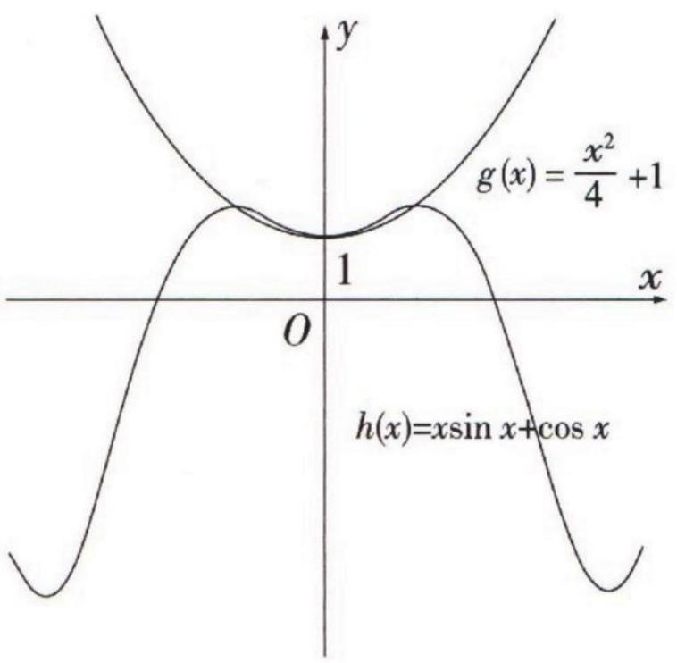

text_image

g(x) = \frac{x^2}{4} + 1
1
h(x)=xsin x+cos x

图2-3

$$
h ^ {\prime} (x) = \sin x + x \cos x - \sin x = x \cos x, \text {当} x \in (0, \frac {\pi}{2})
$$

时, $h'(x)>0$ ,当 $x\in(\frac{\pi}{2},\frac{3\pi}{2})$ 时, $h'(x)<0$ ,所以 $h(x)=x\sin x+\cos x$ 在区间 $(0,\frac{\pi}{2})$ 上单调递增,在区间 $(\frac{\pi}{2},\frac{3\pi}{2})$ 上单调递减,

由 $h\left(\frac{\pi}{2}\right)=\frac{\pi}{2}<\frac{\pi^{2}}{16}+1=g\left(\frac{\pi}{2}\right)$ , $h\left(\frac{\pi}{3}\right)=\frac{\pi}{3}\sin\frac{\pi}{3}+\cos\frac{\pi}{3}=\frac{\sqrt{3}\pi}{6}+\frac{1}{2}>\frac{\pi^{2}}{36}+1=$ $g\left(\frac{\pi}{3}\right)$ ，结合两函数的图象变化趋势，易知曲线 $y=g(x)$ 与 $y=h(x)$ 在 $(0,\frac{\pi}{2})$ 内有 1 个交点，又 $g(x)$ 在 $(\frac{\pi}{2},\frac{3\pi}{2})$ 上单调递增，所以曲线 $y=g(x)$ 与 $y=h(x)$ 在 $(0,\frac{3\pi}{2})$ 上只有 1 个交点.

当 $x \geqslant \frac{3\pi}{2}$ 时, $h(x) = x\sin x + \cos x < x + 1$ , 此时 $\frac{x^2}{4} + 1 - (x + 1) = \frac{x^2}{4} - x = \frac{1}{4}(x -$

2) $^{2}$ -1>0, 即 $g(x)>x+1$ 恒成立, 所以 $g(x)>h(x)$ 恒成立, 即两曲线在 $\left[\frac{3\pi}{2}, +\infty\right)$ 内不存在交点.

在同一平面直角坐标系中作出函数 $g(x)=\frac{x^{2}}{4}+1$ 与 $h(x)=x\sin x+\cos x$ 的图象，如图 2-3 所示，可得曲线 $y=g(x)$ 与 $y=h(x)$ 有 3 个交点，即函数 $f(x)=x^{2}+4-4x\sin x-4\cos x$ 有 3 个零点。故选 A.

# 新题演练

1. (2022·广西师范大学附属外国语学校 5 月模考改编)(多选)对于函数 $f(x)=\sin x+\frac{1}{2}\sin 2x$ ,以下四个结论中正确的是 ( )

A. $2\pi$ 是 $f(x)$ 的一个周期  
B. $f(x)$ 在 $[0,2\pi]$ 上有 3 个零点  
C. $f(x)$ 的最大值为 $\frac{3\sqrt{3}}{4}$   
D. $f(x)$ 在 $[0, \frac{\pi}{2}]$ 上单调递增

2. (2022·湖北鄂东南三校5月训练)(多选)已知函数 $f(x)=\sqrt{|\sin\frac{x}{2}|}+\sqrt{|\cos\frac{x}{2}|}$ ，则下列说法正确的是()

A. $f(x)$ 的图象关于直线 $x = \frac{\pi}{2}$ 对称

B. $f(x)$ 的最小正周期为 $\frac{\pi}{2}$

C. $f(x)$ 的最小值为 1

D. $f(x)$ 的最大值为 $2^{\frac{3}{4}}$

3. (2022·新高考Ⅱ卷)已知函数 $f(x) = \sin (2x + \varphi)(0 < \varphi < \pi)$ 的图象关于点 $(\frac{2\pi}{3}, 0)$ 中心对称,则()

A. $f(x)$ 在区间 $(0, \frac{5\pi}{12})$ 上单调递减  
B. $f(x)$ 在区间 $\left(-\frac{\pi}{12}, \frac{11\pi}{12}\right)$ 上有两个极值点  
C. 直线 $x = \frac{7 \pi}{6}$ 是曲线 $y = f(x)$ 的对称轴  
D. 直线 $y=\frac{\sqrt{3}}{2}-x$ 是曲线 $y=f(x)$ 的切线

最终,5G 将渗透到经济社会的各行业、各领域,成为支撑经济社会数字化、网络化、智能化转型的关键新型基础设施.

# 参考答案与解析

1. ABC 函数 $y = \sin x$ 的最小正周期是 $2\pi, y = \frac{1}{2}\sin 2x$ 的最小正周期是 $\frac{2\pi}{2} = \pi$ ，所以函数 $f(x) = \sin x + \frac{1}{2}\sin 2x$ 的最小正周期是 $2\pi$ ，故 A 正确.

【另解】 $f(x+2\pi)=\sin(x+2\pi)+\frac{1}{2}\sin\left[2(x+2\pi)\right]=\sin x+\frac{1}{2}\sin 2x=f(x)$ ，故 $2\pi$ 是 $f(x)$ 的一个周期。注意这种方法只能说明 $f(x)$ 的一个周期是 $2\pi$ ，不能说明函数 $f(x)$ 的最小正周期是 $2\pi$

当 $x \in [0, 2\pi]$ 时，令 $f(x) = \sin x + \frac{1}{2}\sin 2x = 0$ ，则 $\sin x + \sin x\cos x = 0$ ，即 $\sin x(1 + \cos x) = 0$ ，即 $\sin x = 0$ 或 $1 + \cos x = 0$ ，解得 $x = 0$ 或 $x = \pi$ 或 $x = 2\pi$ ，所以 $f(x)$ 在 $[0, 2\pi]$ 上有3个零点，故B正确.

因为 $f(x)$ 的周期为 $2\pi$ ，所以要求 $f(x)$ 在定义域上的最大值，只需求 $f(x) = \sin x + \frac{1}{2}\sin 2x = \sin x + \sin x\cos x$ 在 $[0,2\pi]$ 上的最大值， $f'(x) = \cos x + \cos^2 x - \sin^2 x = 2\cos^2 x + \cos x - 1$ ，令 $f'(x) = 0$ ，解得 $\cos x = \frac{1}{2}$ 或 $\cos x = -1$ .

当 $x \in (0, \frac{\pi}{3})$ 或 $x \in (\frac{5\pi}{3}, 2\pi)$ 时， $\frac{1}{2} < \cos x < 1$ ，此时 $f'(x) > 0$ ，故 $f(x)$ 在 $(0, \frac{\pi}{3})$ ， $(\frac{5\pi}{3}, 2\pi)$ 上单调递增，当 $x \in (\frac{\pi}{3}, \frac{5\pi}{3})$ 时， $-1 \leqslant \cos x < \frac{1}{2}$ ，此时 $f'(x) \leqslant 0$ 且不恒为 0，故 $f(x)$ 在 $(\frac{\pi}{3}, \frac{5\pi}{3})$ 上单调递减。又 $f(\frac{\pi}{3}) = \frac{3\sqrt{3}}{4}, f(0) = f(2\pi) = 0$ ，所以当 $x = \frac{\pi}{3}$ 时，函数 $f(x)$ 取得最大值 $\frac{3\sqrt{3}}{4}$ 。故 C 正确，D 错误。故选 ABC。

2. ACD $f(\pi - x) = \sqrt{|\sin \frac{\pi - x}{2}|} + \sqrt{|\cos \frac{\pi - x}{2}|} = \sqrt{|\cos \frac{x}{2}|} + \sqrt{|\sin \frac{x}{2}|} = f(x)$ ，故 A 正确.

$$
\begin{array}{r l} & {f (x + \frac {\pi}{2}) = \sqrt {| \sin \frac {x + \frac {\pi}{2}}{2} |} + \sqrt {| \cos \frac {x + \frac {\pi}{2}}{2} |} = \sqrt {| \sin (\frac {x}{2} + \frac {\pi}{4}) |} + \sqrt {| \cos (\frac {x}{2} + \frac {\pi}{4}) |} \neq} \\ & {f (x), \text {故B错误}.} \end{array}
$$

因为 $f(x + \pi) = \sqrt{|\sin\frac{x + \pi}{2}|} +\sqrt{|\cos\frac{x + \pi}{2}|} = \sqrt{|\cos\frac{x}{2}|} +\sqrt{|\sin\frac{x}{2}|} = f(x)$ ，所以 $\pi$

为 $f(x)$ 的一个周期, 可在 $[0, \pi]$ 内研究函数 $f(x)$ 的最值.

当 $x \in (0, \pi)$ 时， $f(x) = \sqrt{\sin \frac{x}{2}} + \sqrt{\cos \frac{x}{2}}$

$$
f ^ {\prime} (x) = \frac {\cos \frac {x}{2}}{4 \sqrt {\sin \frac {x}{2}}} - \frac {\sin \frac {x}{2}}{4 \sqrt {\cos \frac {x}{2}}} = \frac {1}{2 \sqrt {2 \sin x}} [ (\cos \frac {x}{2}) ^ {\frac {3}{2}} - (\sin \frac {x}{2}) ^ {\frac {3}{2}} ].
$$

【扫清障碍】 $f(x)$ 的解析式较为复杂，因此准确求导是破解问题的关键，像这样的复杂超越函数的大计算量求导是日常复习中的小盲区，要有意识训练自己对基础求导公式的掌握能力和运用能力令 $f'(x)=0$ ，得 $\cos\frac{x}{2}=\sin\frac{x}{2}$ ，故 $\frac{x}{2}=\frac{\pi}{4},x=\frac{\pi}{2}$ .

当 $x \in (0, \frac{\pi}{2})$ 时， $f'(x) > 0$ ，当 $x \in (\frac{\pi}{2}, \pi)$ 时， $f'(x) < 0$ ，故 $f(x)$ 在 $(0, \frac{\pi}{2})$ 上单调递增，在 $(\frac{\pi}{2}, \pi)$ 上单调递减，

又 $f(0)=f(\pi)=1,f(\frac{\pi}{2})=2^{\frac{3}{4}}$ ，故 $f(x)_{\min}=1,f(x)_{\max}=2^{\frac{3}{4}}$ ，CD正确.故选ACD.

3. AD 由 $2x + \varphi = k\pi (k\in \mathbf{Z})$ ，得 $x = \frac{k\pi}{2} -\frac{\varphi}{2} (k\in \mathbf{Z}).$

因为函数 $f(x)$ 的图象关于点 $(\frac{2\pi}{3}, 0)$ 中心对称, 所以 $\frac{k\pi}{2} - \frac{\varphi}{2} = \frac{2\pi}{3} (k \in \mathbb{Z})$ , 即 $\varphi = k\pi - \frac{4\pi}{3} (k \in \mathbb{Z})$ , 结合 $0 < \varphi < \pi$ , 得 $\varphi = \frac{2\pi}{3}$ , 所以 $f(x) = \sin (2x + \frac{2\pi}{3})$ .

【另解】因为函数 $f(x)$ 的图象关于点 $(\frac{2\pi}{3},0)$ 中心对称，所以 $\sin(2\times\frac{2\pi}{3}+\varphi)=0$ ，可得 $\frac{4\pi}{3}+\varphi=k\pi(k\in\mathbf{Z})$ ，结合 $0<\varphi<\pi$ ，得 $\varphi=\frac{2\pi}{3}$ ，所以 $f(x)=\sin(2x+\frac{2\pi}{3})$

对于 A, 由 $2k\pi + \frac{\pi}{2} \leqslant 2x + \frac{2\pi}{3} \leqslant 2k\pi + \frac{3\pi}{2}(k \in \mathbf{Z})$ , 得 $k\pi - \frac{\pi}{12} \leqslant x \leqslant k\pi + \frac{5\pi}{12}(k \in \mathbf{Z})$ , 当 $k = 0$ 时, $-\frac{\pi}{12} \leqslant x \leqslant \frac{5\pi}{12}$ . 因为 $(0, \frac{5\pi}{12}) \subseteq [-\frac{\pi}{12}, \frac{5\pi}{12}]$ , 所以函数 $f(x)$ 在区间 $(0, \frac{5\pi}{12})$ 内单调递减, 故 A 正确.

【另解】当 $x \in (0, \frac{5\pi}{12})$ 时， $2x + \frac{2\pi}{3} \in (\frac{2\pi}{3}, \frac{3\pi}{2})$ ，易知函数 $y = \sin x$ 在 $(\frac{2\pi}{3}, \frac{3\pi}{2})$ 内单调递减，所以函数 $f(x)$ 在区间 $(0, \frac{5\pi}{12})$ 内单调递减，故 $A$ 正确

对于 B, 由 $2x + \frac{2\pi}{3} = k\pi + \frac{\pi}{2} (k \in \mathbf{Z})$ , 得 $x = \frac{k\pi}{2} - \frac{\pi}{12} (k \in \mathbf{Z})$ , 当 $k = 0$ 时, $x = -\frac{\pi}{12}$ , 当 $k = 1$ 时, $x = \frac{5\pi}{12}$ , 当 $k = 2$ 时, $x = \frac{11\pi}{12}$ , 所以函数 $f(x)$ 在区间 $(- \frac{\pi}{12}, \frac{11\pi}{12})$ 内只有一个极值点, 故 B 不正确.

【另解】当 $x \in (-\frac{\pi}{12}, \frac{11\pi}{12})$ 时， $2x + \frac{2\pi}{3} \in (\frac{\pi}{2}, \frac{5\pi}{2})$ ，易知函数 $y = \sin x$ 在 $(\frac{\pi}{2}, \frac{5\pi}{2})$ 内只有一个极值点，所以函数 $f(x)$ 在区间 $(- \frac{\pi}{12}, \frac{11\pi}{12})$ 内只有一个极值点，故 B 不正确

对于 C, 函数 $f(x)$ 图象的对称轴方程为 $x = \frac{k\pi}{2} - \frac{\pi}{12} (k \in \mathbb{Z})$ , 而方程 $\frac{k\pi}{2} - \frac{\pi}{12} = \frac{7\pi}{6} (k \in \mathbb{Z})$ 无解, 故 C 不正确.

【另解】因为 $f\left(\frac{7\pi}{6}\right)=\sin\left(2\times\frac{7\pi}{6}+\frac{2\pi}{3}\right)=\sin3\pi=0$ ，所以直线 $x=\frac{7\pi}{6}$ 不是曲线 $y=f(x)$ 的对称轴，故C不正确

对于 D, $f'(x) = 2\cos\left(2x + \frac{2\pi}{3}\right)$ ，若直线 $y = \frac{\sqrt{3}}{2} - x$ 为曲线 $y = f(x)$ 的切线，则由 $2\cos\left(2x+\frac{2\pi}{3}\right)=-1$ ，得 $2x+\frac{2\pi}{3}=2k\pi+\frac{2\pi}{3}$ 或 $2x+\frac{2\pi}{3}=2k\pi+\frac{4\pi}{3}(k\in\mathbf{Z})$ ，所以 $x=k\pi$ 或 $x=k\pi+\frac{\pi}{3}(k\in\mathbf{Z})$ .

当 $x = k\pi (k\in \mathbf{Z})$ 时， $f(x) = \frac{\sqrt{3}}{2}$ ，则由 $\frac{\sqrt{3}}{2} = \frac{\sqrt{3}}{2} -k\pi (k\in \mathbf{Z})$ ，解得 $k = 0$ ；当 $x = k\pi +$ $\frac{\pi}{3} (k\in \mathbf{Z})$ 时， $f(x) = -\frac{\sqrt{3}}{2}$ ，方程 $-\frac{\sqrt{3}}{2} = \frac{\sqrt{3}}{2} -k\pi -\frac{\pi}{3} (k\in \mathbf{Z})$ 无解.

综上所述, 直线 $y=\frac{\sqrt{3}}{2}-x$ 为曲线 $y=f(x)$ 的切线, 故 D 正确. 故选 AD.

# 超重点 3 解三角形问题的 3 个核心命题角度

# 命题角度1 用正、余弦定理解三角形

调研 1 (2022·广东肇庆 5 月预测/判断形状) 在 $\triangle ABC$ 中, 内角 $A, B, C$ 的对边分别为 $a, b, c$ , 且满足 $a^{2} = b^{2} + c^{2} - bc$ , $\sin B = 2 \sin C$ , 则 $\triangle ABC$ 的形状为 ( )

5G 就像一条无缝缝合的纽带, 正在不断扩展着物联网的概念, 5G 应用不断拓展和深入, 涵盖工业、能源、交通、医疗、教育、文旅等诸多领域.

A. 锐角三角形

B. 直角三角形

C. 钝角三角形

D. 锐角三角形或直角三角形

# 思维导引

用正弦定理将 $\sin B = 2\sin C$ 化角为边

代入 $a^{2}=b^{2}+c^{2}-bc$

用 c 表示 a, b $\rightarrow$ 用勾股定理的逆定理验证 $\rightarrow$ 确定形状

# 解析 由正弦定理及 $\sin B = 2\sin C$ ，可得 $b = 2c$ 。

【会变形】走代数变形之路，化角为边，常用的转化方式有 $\frac{\sin A}{\sin B}=\frac{a}{b},\quad\frac{\sin A}{\sin C}=\frac{a}{c},\quad\frac{\sin B}{\sin C}=\frac{b}{c}$ 将 b=2c 代入 $a^{2}=b^{2}+c^{2}-bc$ ，可得 $a^{2}=(2c)^{2}+c^{2}-2c\times c=3c^{2}$

【会思考】观察并联想，移项后可得 $b^{2}+c^{2}-a^{2}=bc$ 的形式，联想到余弦定理，可得 $\cos A=\frac{1}{2}$ ， $\angle A=60^{\circ}$ ，则 $\sin B=2\sin C\Leftrightarrow\sin(120^{\circ}-C)=2\sin C$ ，展开并整理得 $\tan C=\frac{\sqrt{3}}{3}$ ， $\angle C=30^{\circ}$ ，所以 $\angle B=90^{\circ}$ ，故△ABC为直角三角形，这也是一种解题思路

$\therefore a = \sqrt{3} c, b = 2c$ 故 $b^{2} = a^{2} + c^{2}, \therefore \angle B = 90^{\circ}$ .

故 $\triangle ABC$ 为直角三角形,故选B.

调研 2 (2022·长沙雅礼中学5月模拟/求边长的取值范围)设锐角三角形
ABC 的内角 A, B, C 所对的边分别为 a, b, c, 若 a = 2, B = 2A, 则 b 的取值范围为（）

A. (2,4)

B. $(2,2\sqrt{3})$

C. $(2\sqrt{2},2\sqrt{3})$

D. $(2\sqrt{2},4)$

解析 在锐角三角形 $ABC$ 中, $0 < B = 2A < \frac{\pi}{2}$ , 即 $0 < A < \frac{\pi}{4}$ , 又 $B + A = 3A$ , 则 $\frac{\pi}{2} < 3A < \pi$ , 即 $\frac{\pi}{6} < A < \frac{\pi}{3}$ , 故 $\frac{\pi}{6} < A < \frac{\pi}{4}$ , 则 $\frac{\sqrt{2}}{2} < \cos A < \frac{\sqrt{3}}{2}$ .

【易错提醒】在某些解三角形问题中，角的取值范围往往隐含在题目的条件中，若不仔细审题、深入挖掘，往往会因疏漏而导致解题失败，比如该题已知三角形 ABC 为锐角三角形，则三个内角都必须是锐角

因为 a=2, B=2A，所以由正弦定理可得 $\frac{a}{\sin A}=\frac{b}{\sin B}=\frac{b}{2\sin A\cos A}$ ，得 $b=4\cos A$ ，
因为 $\frac{\sqrt{2}}{2}<\cos A<\frac{\sqrt{3}}{2}$ ，所以 $2\sqrt{2}<4\cos A<2\sqrt{3}$ ，所以 $2\sqrt{2}<b<2\sqrt{3}$ ，

所以 b 的取值范围为 $(2\sqrt{2}, 2\sqrt{3})$ . 故选 C.

调研 3 (2022·新高考Ⅰ卷/求角)记△ABC的内角A,B,C的对边分别为a,b,

5G + 工业互联网 指利用以 5G 为代表的新一代信息通信技术, 构建与工业经济深度融合的新型基础设施、应用模式和工业生态.

c, 已知 $\frac{\cos A}{1 + \sin A} = \frac{\sin 2B}{1 + \cos 2B}$ .

(1) 若 $C=\frac{2\pi}{3}$ ，求 B;  
(2) 求 $\frac{a^{2} + b^{2}}{c^{2}}$ 的最小值.

思维导引

(1)

$$
\boxed {\frac {\cos A}{1 + \sin A} = \frac {\sin 2 B}{1 + \cos 2 B}} \longrightarrow \boxed {\cos (A + B) = \sin B} \xrightarrow [ C = \frac {2 \pi}{3} ]{\text {诱导公式}} \boxed {\sin B = \frac {1}{2}}
$$

判断 B 的范围 $\rightarrow$ B 的值

(2) 由(1)得 $\cos(A+B) = -\cos C = \sin B$ $\longrightarrow$ $A = \frac{\pi}{2} - 2B$ $\xrightarrow{正弦定理}$ $\frac{a^{2} + b^{2}}{c^{2}} = 4\cos^{2}B + \frac{2}{\cos^{2}B} - 5$

基本不等式 $\frac{a^{2}+b^{2}}{c^{2}}$ 的最小值

解析 (1) 因为 $\frac{\cos A}{1 + \sin A} = \frac{\sin 2B}{1 + \cos 2B}$ , 所以 $\frac{\cos A}{1 + \sin A} = \frac{2\sin B\cos B}{1 + 2\cos^2 B - 1}$ ,

所以 $\frac{\cos A}{1 + \sin A} = \frac{\sin B}{\cos B}$ , 所以 $\cos A \cos B = \sin B + \sin A \sin B$ ,

所以 $\cos(A+B)=\sin B$ ，所以 $\sin B=-\cos C=-\cos\frac{2\pi}{3}=\frac{1}{2}$ ，易知 $B\in(0,\frac{\pi}{3})$ ，所以 $B=\frac{\pi}{6}$ .

(2) 由(1)得 $\cos(A + B) = -\cos C = \sin B$ ，则 $\cos C < 0, \frac{\pi}{2} < C < \pi$

所以 $\sin \left[\frac{\pi}{2} - (A + B)\right] = \sin B$ ，且 $0 < A + B < \frac{\pi}{2}$ ，所以 $0 < B < \frac{\pi}{2}, 0 < \frac{\pi}{2} - (A + B) < \frac{\pi}{2}$ ，

所以 $\frac{\pi}{2} - (A + B) = B$ ，则 $A = \frac{\pi}{2} - 2B$

由正弦定理得 $\frac{a^2 + b^2}{c^2} = \frac{\sin^2A + \sin^2B}{\sin^2C} = \frac{\sin^2A + \sin^2B}{1 - \cos^2C} = \frac{\sin^2(\frac{\pi}{2} - 2B) + \sin^2B}{1 - \sin^2B} =$ $\frac{\cos^22B + \sin^2B}{\cos^2B} = \frac{(2\cos^2B - 1)^2 + 1 - \cos^2B}{\cos^2B} = \frac{4\cos^4B - 5\cos^2B + 2}{\cos^2B} = 4\cos^2B + \frac{2}{\cos^2B} -5\geqslant$

$2\sqrt{4\cos^{2}B\times\frac{2}{\cos^{2}B}}-5=4\sqrt{2}-5$ , 当且仅当 $\cos^{2}B=\frac{\sqrt{2}}{2}$ 时取等号,

【提醒】利用基本不等式求最值，注意三角函数的有界性

以钢铁行业为例,该行业生产流程长、生产工艺复杂,当前主要面临设备维护效率低、生产过程不透明、下游需求碎片化、绿色生产压力大等痛点.

所以 $\frac{a^{2}+b^{2}}{c^{2}}$ 的最小值为 $4\sqrt{2}-5$ .

# 命题角度2》解三角形与其他知识的创新交汇

调研 4 (2022·山东滨州 5 月二模/与数列交汇) 在 $\triangle ABC$ 中, 内角 A, B, C 的对边分别为 a, b, c, 若 $a + c = 4$ , 且 $\sin A, \sin B, \sin C$ 成等差数列, 则 $\triangle ABC$ 的面积的最大值为 \_\_\_\_.

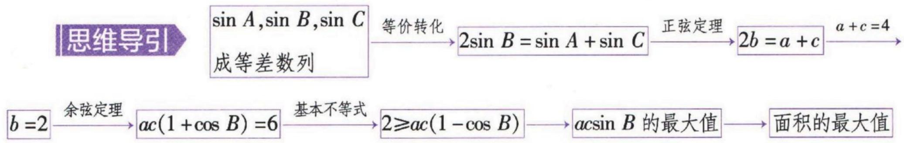

flowchart

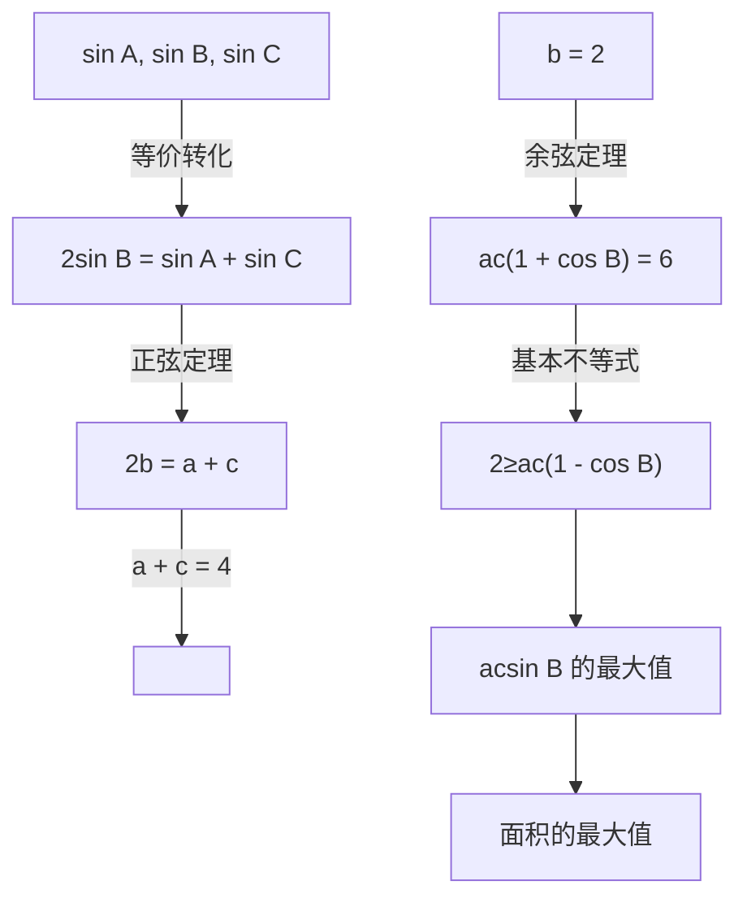
```mermaid
graph TD
    A[" sin A, sin B, sin C "] -->|等价转化| B[" 2sin B = sin A + sin C "]
    B -->|正弦定理| C[" 2b = a + c "]
    C -->|a + c = 4| D[" "]
    E[" b = 2 "] -->|余弦定理| F[" ac(1 + cos B) = 6 "]
    F -->|基本不等式| G[" 2≥ac(1 - cos B) "]
    G --> H[" acsin B 的最大值 "]
    H --> I[" 面积的最大值 "]
```

解析 因为 $\sin A, \sin B, \sin C$ 成等差数列，

所以 $2\sin B = \sin A + \sin C.$

由正弦定理可得 $2b = a + c$ ，又 $a + c = 4$ ，所以 2b = 4，即 b = 2。

所以由余弦定理可得 $2^{2} = a^{2} + c^{2} - 2ac\cos B = (a + c)^{2} - 2ac - 2ac\cos B$ ，即 $ac(1 + \cos B) = 6$ ，

又 $2^{2} = a^{2} + c^{2} - 2ac\cos B \geqslant 2ac - 2ac\cos B,$

即 $2 \geqslant ac(1 - \cos B)$ ，当且仅当 a = c 时等号成立.

【易遗漏】利用基本不等式求最值，要注明等号成立的条件

所以 $2 \times 6 \geqslant ac(1 - \cos B) \times ac(1 + \cos B)$ ，即 $2 \times 6 \geqslant (ac \sin B)^{2}$ .

【敲黑板】由平方关系将 $\cos B$ 转化为 $\sin B$ ，这是解本题的关键

因为 $\sin B > 0$ ，所以 $0 < ac\sin B \leqslant 2\sqrt{3}$ ，所以 $S_{\triangle ABC} = \frac{1}{2} ac\sin B \leqslant \sqrt{3}$

所以 $\triangle ABC$ 的面积的最大值为 $\sqrt{3}$ .

【会思考】解三角形中的最值或范围问题主要有两种解决方法：一是将所求量表示为与边有关的形式，利用基本不等式求得最值或范围；二是将所求量用三角形某一个角的三角函数表示，结合角的范围确定最值或范围

调研 5 (2022·湖北襄阳五中 5 月预测/与平面向量交汇) 设 a, b, c 分别是 $\triangle ABC$ 的内角 A, B, C 的对边, 已知 $(b + \sqrt{3}c)\sin(A + C) = (a + c)(\sin A - \sin C)$ , 设 D

但应用 5G 技术就可以探索远程设备操控、机器视觉质检、设备故障诊断、生产现场监测等典型应用场景,以此推动产业升级及行业转型.

是 $BC$ 边的中点, 且 $\triangle ABC$ 的面积为 1 , 则 $\overrightarrow{AB} \cdot (\overrightarrow{DA} + \overrightarrow{DB}) =$ （）

A. 2

B. $2\sqrt{3}$

C. $-2\sqrt{3}$

D.-2

解析

$$
\because (b + \sqrt {3} c) \sin (\angle B A C + \angle A C B) = (a + c) (\sin \angle B A C - \sin \angle A C B),
$$

∴ 由正弦定理可得 $(b+\sqrt{3}c)b=(a+c)(a-c)$ .

【会转化】光化角为边，再进行代数恒等变换，求出三边之间的数量关系

整理可得 $b^{2} + c^{2} - a^{2} = -\sqrt{3} bc$

由余弦定理可得 $\cos\angle BAC=-\frac{\sqrt{3}}{2}$ ，由 $\angle BAC\in(0,\pi)$ 可得 $\angle BAC=\frac{5\pi}{6}$ .

又 $\triangle ABC$ 的面积为1,即 $\frac{1}{2}bc\sin\frac{5\pi}{6}=1,\therefore bc=4.$

$$
\therefore \overrightarrow {A B} \cdot (\overrightarrow {D A} + \overrightarrow {D B}) = (\overrightarrow {D B} - \overrightarrow {D A}) \cdot (\overrightarrow {D A} + \overrightarrow {D B}) = \overrightarrow {D B ^ {2}} - \overrightarrow {D A ^ {2}} = \frac {\overrightarrow {C B ^ {2}}}{4} - \frac {(\overrightarrow {A B} + \overrightarrow {A C}) ^ {2}}{4} =
$$

【会运算】利用向量加减法化简式子的两种形式：①首尾相连且为和；②起点相同且为差。解题时要注意观察是否有这两种形式，同时注意逆向应用

$\frac{(\overrightarrow{AB} - \overrightarrow{AC})^2}{4} - \frac{(\overrightarrow{AB} + \overrightarrow{AC})^2}{4} = -\frac{4\overrightarrow{AB} \cdot \overrightarrow{AC}}{4} = -\overrightarrow{AB} \cdot \overrightarrow{AC} = -bc\cos \angle BAC = 2\sqrt{3}$ , 故选 B.

调研 6 (2022 · 浙江台州 5 月三模/与立体几何交汇) 如图 3-1, 已知圆柱 $O_{1} O_{2}$ 的底面半径和母线长均为 1, A, B 分别为圆 $O_{2}$ , 圆 $O_{1}$ 上的点, 若异面直线 $O_{1} B, O_{2} A$ 所成的角为 $60^{\circ}$ , 则 $A B =$

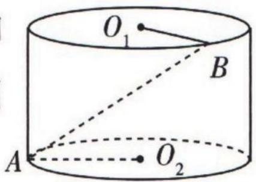

text_image

O₁
B
A
O₂

图3-1

( )

A. $\sqrt{2}$

B. $2\sqrt{2}$

C. 2 或 $\sqrt{2}$

D. 2 或 $2 \sqrt{2}$

解析 如图 3-2, 设过点 $B$ 的母线为 $BD$ , 连接 $AD, O_2D$ , $O_1O_2$ , 则 $O_1O_2 \parallel BD, O_1O_2 = BD$ .

∴ 四边形 $O_{1}O_{2}DB$ 为平行四边形, ∴ $O_{1}B \parallel O_{2}D$ ,

$\therefore \angle A{O}_{2}D$ 是异面直线 ${O}_{1}B,{O}_{2}A$ 所成的角或其补角,

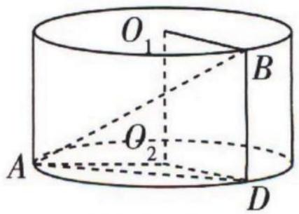

text_image

O₁
B
O₂
A
D

图3-2

【易错】容易忽视异面直线所成角 $\theta$ 的范围是 $0^{\circ} < \theta \leqslant 90^{\circ}$ ，此处容易丢解

$\therefore \angle AO_{2}D = 60^{\circ}$ 或 $\angle AO_{2}D = 120^{\circ}$ .

当 $\angle AO_{2}D=60^{\circ}$ 时, AD=1, 此时 $AB=\sqrt{2}$ ;

当 $\angle AO_{2}D = 120^{\circ}$ 时，由余弦定理得 $AD = \sqrt{1 + 1 - 2\times 1\times 1\times (-\frac{1}{2})} = \sqrt{3}$ ，此时 $AB = 2$ 所以 $AB = 2$ 或 $\sqrt{2}$ .故选C.

# 命题角度3》解三角形在测量工作中的应用

调研 7 (2022·豫北重点高中考前模拟/测量高度,渗透数学文化)蜚英塔俗称

宝塔,地处江西省南昌市,建于明朝天启元年,为中国传统的楼阁式建筑.蜚英塔坐北朝南,砖石结构,是江西省省级重点保护文物,已被列为革命传统教育基地.某学生为测量蜚英塔的高度,如图3-3,选取了与蜚英塔底部D在同一水平面上的A,B两点,测得 $AB=35\sqrt{7}$ 米, $\angle CAD=45^{\circ},\angle CBD=30^{\circ},\angle ADB=150^{\circ}$ ,则蜚英塔的高度CD是()

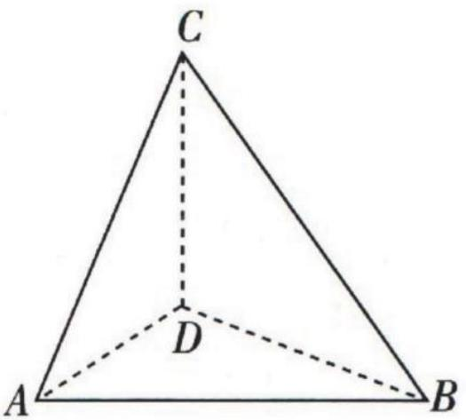

text_image

C
D
A
B

图3-3

A. 30 米

B. $30 \sqrt{7}$ 米

C. 35 米

D. $35 \sqrt{7}$ 米

解析 设 CD = x，在 $\triangle ACD$ 中， $\angle CDA = 90^{\circ}$ ， $\angle CAD = 45^{\circ}$ ，则 AD = x.

在 $\triangle BCD$ 中， $\angle CDB = 90^{\circ}$ ， $\angle CBD = 30^{\circ}$ ，则 $BD = \sqrt{3}x$ .

因为 $\angle ADB = 150^{\circ}$ , 所以在 $\triangle ABD$ 中, 由余弦定理得 $x^{2} + 3x^{2} - 2x \cdot \sqrt{3} x \cos 150^{\circ} = (35\sqrt{7})^{2}$ ,

整理得 $7x^{2}=(35\sqrt{7})^{2}$ ，解得 x=35 米。故选 C.

【解后反思】此类问题的特点：底部不可到达，且涉及与地面垂直的平面，观测者两次观测点所在直线不经过“目标物”，解决办法是把目标高度转化为地平面内某量，从而把空间问题转化为平面内的解三角形问题

调研 8 (2022·吉林省吉林市考前预测/测量角度,最大视角问题)最大视角问题是1471年德国数学家米勒提出的几何极值问题,故最大视角问题又被称为“米勒问题”.如图3-4,树顶A离地面a米,树上另一点B离地面b米,在离地面c(c<b)米的C处看此树,离此树的水平距离为\_\_\_\_米时看A,B的视角最大(A,B在同一条铅垂线上).

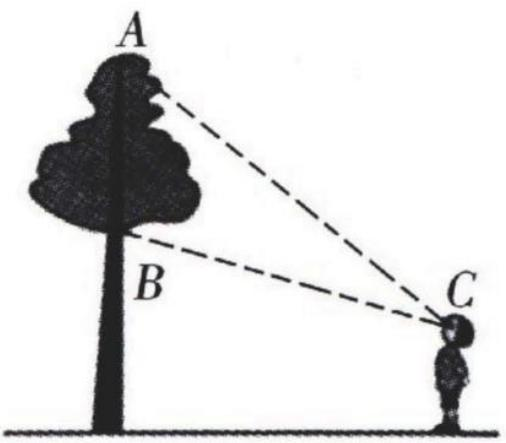

text_image

A
B
C

图3-4

在煤矿领域,5G应用涉及井下生产与安全保障两大部分,应用场景主要包括:作业场所视频监控、环境信息采集、设备数据传输、移动巡检、作业设备远程控制等.

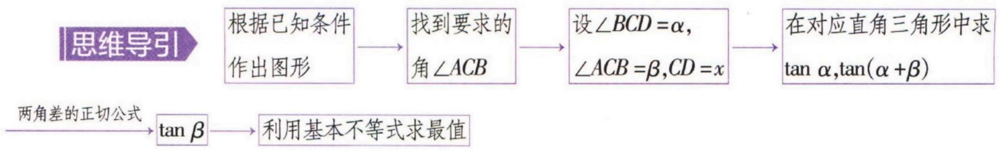

flowchart

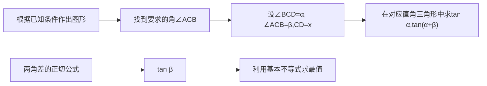
```mermaid
graph LR
    A["根据已知条件作出图形"] --> B["找到要求的角∠ACB"]
    B --> C["设∠BCD=α, ∠ACB=β,CD=x"]
    C --> D["在对应直角三角形中求tan α,tan(α+β)"]
    E["两角差的正切公式"] --> F["tan β"]
    F --> G["利用基本不等式求最值"]
```

解析 过 C 作 $CD \perp AB$ ，交 AB 的延长线于 D，如图 3-5 所示.

则 AD = a - c, BD = b - c,

设 $\angle BCD = \alpha, \angle ACB = \beta, CD = x$

在 Rt△BCD 中, $\tan \alpha = \frac{BD}{CD} = \frac{b - c}{x}$ ,

在 Rt△ACD 中， $\tan(\alpha+\beta)=\frac{AD}{CD}=\frac{a-c}{x}$

所以 $\tan \beta = \tan [(\alpha +\beta) - \alpha ] = \frac{\frac{a - c}{x} - \frac{b - c}{x}}{1 + \frac{a - c}{x}\cdot\frac{b - c}{x}} = \frac{a - b}{x + \frac{(a - c)(b - c)}{x}}\leqslant \frac{a - b}{2\sqrt{x\cdot\frac{(a - c)(b - c)}{x}}} =$

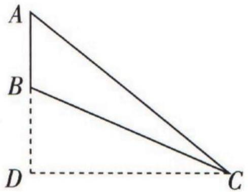

text_image

A
B
D
C

图3-5

【敲黑板】常用拆角、拼角技巧： $2\alpha=(\alpha+\beta)+(\alpha-\beta)$ ; $\alpha=(\alpha+\beta)-\beta=(\alpha-\beta)+\beta$ ; $\beta=\frac{\alpha+\beta}{2}-\frac{\alpha-\beta}{2}=(\alpha+2\beta)-( \alpha+\beta)$ ; $\alpha-\beta=(\alpha-\gamma)+(\gamma-\beta)$ ; $\frac{\pi}{4}+\alpha=\frac{\pi}{2}-(\frac{\pi}{4}-\alpha)$ 等 $\frac{a-b}{2\sqrt{(a-c)(b-c)}}$ ，当且仅当 $x=\frac{(a-c)(b-c)}{x}$ ，即 $x=\sqrt{(a-c)(b-c)}$ 时取等号.

当 $\tan\beta$ 取最大值时, $\angle ACB = \beta$ 最大,

所以当离此树的水平距离为 $\sqrt{(a-c)(b-c)}$ 米时看 A, B 的视角最大.

调研 9 (2022·广东惠州 4 月测试/测量距离,与物理交汇)如图 3-6,曲柄连杆机构中,曲柄 $CB$ 绕 $C$ 点旋转时,通过连杆 $AB$ 的传递,使活塞做直线往复运动.当曲柄在 $CB_{0}$ 位置时,曲柄和连杆成一条直线,连杆的端点 $A$ 在 $A_{0}$ 处.设连杆 $AB$ 长 $200 \mathrm{~mm}$ ,曲柄$CB$ 长 $70 \mathrm{~mm}$ , 则曲柄自 $CB_{0}$ 按顺时针方向旋转 $53.2^{\circ}$ 时, 活塞移动的距离 (即连杆的端点 $A$ 移动的距离 $A_{0} A$ ) 约为 \_\_\_\_ mm. (结果保留整数, 取 $\sin 53.2^{\circ} = \frac{4}{5}$ )

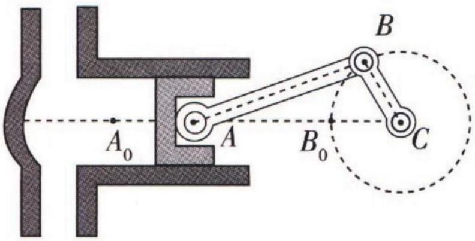

text_image

A₀
A
B₀
B
C

图3-6

解析 方法一 在 $\triangle ABC$ 中, AB = 200 mm, BC = 70 mm, $\angle ACB = 53.2^{\circ}$ ,

$$
\sin \angle A C B = \frac {4}{5}.
$$

由正弦定理得 $\sin \angle BAC = \frac{BC\sin\angle ACB}{AB} = \frac{7}{25}$

$$
\therefore \cos \angle B A C = \sqrt {1 - (\frac {7}{2 5}) ^ {2}} = \frac {2 4}{2 5}, \cos \angle A C B = \sqrt {1 - (\frac {4}{5}) ^ {2}} = \frac {3}{5},
$$

$$
\therefore \sin \angle A B C = \sin (\angle A C B + \angle B A C) = \frac {4}{5} \times \frac {2 4}{2 5} + \frac {3}{5} \times \frac {7}{2 5} = \frac {1 1 7}{1 2 5},
$$

$$
\therefore A C = \frac {A B \sin \angle A B C}{\sin \angle A C B} = 2 0 0 \times \frac {1 1 7}{1 2 5} \times \frac {5}{4} = 2 3 4 (\mathrm{mm}),
$$

故 $A_{0}A=(A_{0}B_{0}+B_{0}C)-AC=(200+70)-234=36(\mathrm{~mm})$ ，即曲柄自 $CB_{0}$ 按顺时针方向旋转 $53.2^{\circ}$ 时，活塞移动的距离约为 $36\ mm$ .

方法二 $\because \angle ACB = 53.2^{\circ}, \sin \angle ACB = \frac{4}{5}, \therefore \cos \angle ACB = \frac{3}{5}.$

在 $\triangle ABC$ 中, 由余弦定理可得 $AB^{2} = AC^{2} + BC^{2} - 2 \times AC \times BC\cos \angle ACB$ , 解得 $AC = 234 \mathrm{~mm}$ (负值舍去),

故 $A_{0}A = (A_{0}B_{0} + B_{0}C) - AC = (200 + 70) - 234 = 36(\mathrm{mm})$ ，即曲柄自 $CB_0$ 按顺时针方向旋转 $53.2^{\circ}$ 时，活塞移动的距离约为 $36\mathrm{mm}$

# 新题演练

1. (2022·河北5月模拟演练/中国剪纸) 中国剪纸是一种用剪刀或刻刀在纸上剪刻花纹,用于装点生活或配合其他民俗活动的民间艺术. 折叠剪纸是民间最常见的一种剪纸制作方法,所谓折叠剪纸即经过不同方式折叠剪制而成的剪纸,它具有折法简明,制作简便,省工省时等特

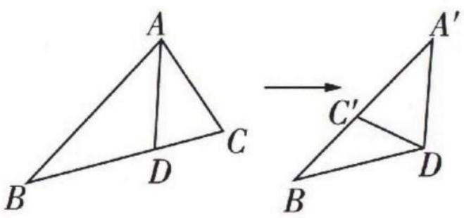

text_image

A
B
D
C
A'
C'
B
D

图3-7

点. 如图 3-7, 某同学将一张三角形纸片 $ABC$ 沿角平分线 $AD$ 对折后, 点 $C$ 恰好落在边 $AB$ 上, 得到三角形纸片 $A'BD$ . 已知 $AB = 2\sqrt{3}$ , $A'D = 2$ , $\angle A'BD = \frac{\pi}{6}$ , 则对折前 $\angle BAC =$ ( )

A. $\frac{\pi}{6}$

B. $\frac{\pi}{4}$

C. $\frac{\pi}{3}$

D. $\frac{\pi}{2}$

2. (2022·山东临沂二模/《数书九章》)我国古代数学家秦九韶在《数书九章》中记述了“三斜求积术”, 即在 $\triangle ABC$ 中, 角 $A, B, C$ 所对的边分别为 $a, b, c$ , 则 $\triangle ABC$ 的面积

5G 网络高速率的特性,能够支持 4K/8K 的远程高清会诊和医学影像数据的高速传输与共享,并让专家能随时随地开展会诊,提升诊断准确率和指导效率.

$S=\frac{1}{2}\sqrt{(ab)^{2}-(\frac{a^{2}+b^{2}-c^{2}}{2})^{2}}$ . 根据此公式, 若 $a\cos B+(b-\sqrt{2}c)\cos A=0$ , 且 $b^{2}+c^{2}-a^{2}=\sqrt{2}$ , 则 $\triangle ABC$ 的面积为 ( )

A. $\frac{\sqrt{2}}{4}$

B. $\frac{\sqrt{3}}{4}$

C. $\frac{\sqrt{2}}{2}$

D. $\frac{\sqrt{3}}{2}$

3. (2022·江苏苏州 5 月模拟预测) 在 $\triangle ABC$ 中, $\overrightarrow{AB} = c$ , $\overrightarrow{BC} = a$ , $\overrightarrow{CA} = b$ , 下列命题不是真命题的是

A. 若 $a \cdot b > 0$ ，则 $\triangle ABC$ 为锐角三角形  
B. 若 $a \cdot b = 0$ ，则 $\triangle ABC$ 为直角三角形  
C. 若 $|a| > |b|$ ，则 $\sin A > \sin B$   
D. 若 $(\boldsymbol{b}+\boldsymbol{c}-\boldsymbol{a})\cdot(\boldsymbol{b}+\boldsymbol{a}-\boldsymbol{c})=0$ ，则△ABC为直角三角形

4. (2022·宁夏吴忠中学 5 月三模)神舟十三号三位航天英雄在太空出差 180 余天后,顺利返回地面. 如图 3-8,返回舱达到一定高度时,近似垂直落地,在下落过程中的某时刻位于点

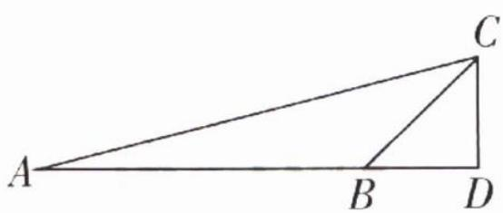

text_image

A
B
C
D

图3-8

C, 预计垂直落在地面上的点 D 处, 在地面同一水平线上的 A, B 两个观测点, 分别观测到点 C 的仰角为 $15^{\circ}, 45^{\circ}$ , 若 AB = 24 千米, 则点 C 距离地面的高度 CD 约为 \_\_\_\_ 千米 (参考数据: $\sqrt{3} \approx 1.7$ ).

5. (2022·江苏南通考前模拟)在 $\triangle ABC$ 中,内角 $A,B,C$ 所对的边分别为 $a,b,c$ ,且 $b \cos A = a (\cos B - \frac{2}{3}) + c$ .

(1) 求 $\cos B$ ;   
(2) 若 $b = 3, a > c$ , $\triangle ABC$ 的面积为 $2\sqrt{2}$ , 求 $a$ .

6. (2022·长沙一中考前预测/结构不良问题)在“① $a\sin {2C} = 4c\sin C{\cos }^{2}\frac{A}{2}$ ,② ${a}^{2} - c^{2} = {bc}$ ”这两个条件中任取一个,补充在下面问题中,并解答补充完整的题目.

在 $\triangle ABC$ 中,内角 $A,B,C$ 所对的边分别为 $a,b,c,S$ 为 $\triangle ABC$ 的面积,已知\_\_\_\_.

(1) 求证: A = 2C.   
(2) 若 2a = 3c，且 b = 5，求 S.

注:如果选择多个条件分别解答,按第一个解答计分.

# 参考答案与解析

1. C 在 $\triangle A'BD$ 中, 由正弦定理得 $\frac{A'B}{\sin\angle A'DB} = \frac{A'D}{\sin\angle A'BD}$ , 即 $\frac{2\sqrt{3}}{\sin\angle A'DB} = \frac{2}{\sin\frac{\pi}{6}}$ ,解得 $\sin\angle A^{\prime}DB=\frac{\sqrt{3}}{2}$ ，显然 $\angle A^{\prime}DB$ 为钝角，所以 $\angle A^{\prime}DB=\frac{2\pi}{3}$ .

【易错提醒】在三角形内，由 $\sin\angle A^{\prime}DB=\frac{\sqrt{3}}{2}$ ，知 $\angle A^{\prime}DB$ 有两解，注意合理舍去

所以 $\angle BA^{\prime}D=\pi-\frac{2\pi}{3}-\frac{\pi}{6}=\frac{\pi}{6},\angle BAC=2\angle BA^{\prime}D=\frac{\pi}{3}$ ，故选 C.

2. A 由正弦定理, $a \cos B + (b - \sqrt{2} c) \cos A = 0$ 可化为 $\sin A \cos B + (\sin B - \sqrt{2} \sin C) \cos A = 0$ ,

【敲黑板】抓住两个定理的特点：正弦定理“边对角”，余弦定理“边夹角”，正确选择定理是解决此类题目的关键

$$
\therefore \sin A \cos B + \sin B \cos A = \sqrt {2} \sin C \cos A, \text {即} \sin (A + B) = \sin C = \sqrt {2} \sin C \cos A.
$$

【小技巧】运算中注意运用 $\sin(A+B)=\sin C$ ，且 $\sin C \neq 0$ 这些隐含条件

$\because \sin C \neq 0, \therefore \cos A = \frac{\sqrt{2}}{2}, \cos A = \frac{b^2 + c^2 - a^2}{2bc} = \frac{\sqrt{2}}{2}, \therefore \frac{\sqrt{2}}{2bc} = \frac{\sqrt{2}}{2}$ , 解得 $bc = 1$ .

根据面积公式可知 $\triangle ABC$ 的面积 $S = \frac{1}{2\sqrt{(bc)^2 - (\frac{b^2 + c^2 - a^2}{2})^2}} = \frac{1}{2}\times \sqrt{1 - \frac{1}{2}} = \frac{\sqrt{2}}{4}.$

【另解】此处也可由 $\cos A = \frac{\sqrt{2}}{2}$ 得 $\sin A = \frac{\sqrt{2}}{2}$ ，故 $\triangle ABC$ 的面积 $S = \frac{1}{2} b c \sin A = \frac{\sqrt{2}}{4}$

3. A

<table><tr><td>选项</td><td>分析过程</td><td>真假</td></tr><tr><td>A</td><td> $a \cdot b >0 \rightarrow \cos(\pi - \angle ACB) >0 \rightarrow \cos\angle ACB < 0 \rightarrow \angle ACB$ 为钝角→△ABC为钝角三角形</td><td>假</td></tr><tr><td>B</td><td> $a \cdot b = 0 \rightarrow AC \perp BC \rightarrow \triangle ABC$ 为直角三角形</td><td>真</td></tr><tr><td>C</td><td> $|a| > |b| \rightarrow$ 由正弦定理得  $2R\sin A > 2R\sin B$ (R是△ABC外接圆半径) $\sin A > \sin B$ 【记结论】在三角形中a&gt;b是 $\sin A > \sin B$ 的充要条件</td><td>真</td></tr><tr><td>D</td><td> $(b + c - a) \cdot (b + a - c) = 0 \rightarrow b^{2} - (a - c)^{2} = 0 \rightarrow a^{2} + c^{2} - b^{2} = 2a \cdot c \rightarrow \frac{a^{2} + c^{2} - b^{2}}{2|a||c|} = -\cos B \rightarrow$ 由余弦定理知 $\frac{|a|^2 + |c|^2 - |b|^2}{2|a||c|} = \cos B \rightarrow \cos B = -\cos B \rightarrow \cos B = 0 \xrightarrow{B \in (0,\pi)} \triangle ABC$ 为直角三角形【另解】 $b + c = -a, b + a = -c \rightarrow (b + c - a) \cdot (b + a - c) = -2a \cdot (-2c) = 0 \rightarrow a \cdot c = 0 \rightarrow AB \perp BC \rightarrow \triangle ABC$ 为直角三角形</td><td>真</td></tr></table>

在救护车接到患者的第一时间,将病患体征数据、病情图象、急症病情记录等传输到医院,帮助院内医生做出正确指导并提前制订抢救方案,实现患者“上车即入院”的愿景.

4. 8.4 设 CD = x，则 $AD = \frac{x}{\tan 15^{\circ}}$ ，BD = x，所以 AB = AD - BD = $\frac{x}{\tan 15^{\circ}} - x = 24$ 。又 $\tan 15^{\circ} = \tan(45^{\circ} - 30^{\circ}) = \frac{\tan 45^{\circ} - \tan 30^{\circ}}{1 + \tan 45^{\circ} \tan 30^{\circ}} = 2 - \sqrt{3}$ ，则 $(1 + \sqrt{3})x = 24$ ，即 $x = \frac{24}{1 + \sqrt{3}} = 12(\sqrt{3} - 1) \approx 8.4$ （千米）。

5. (1) 由 $b\cos A = a(\cos B - \frac{2}{3}) + c$ 及正弦定理得 $\sin B\cos A = \sin A\cos B - \frac{2}{3}\sin A + \sin C$ . 因为 $C = \pi - A - B$ , 所以 $\sin B\cos A = \sin A\cos B - \frac{2}{3}\sin A + \sin A\cos B + \cos A\sin B$ , 所以 $2\sin A\cos B = \frac{2}{3}\sin A$ , 又 $\sin A \neq 0$ , 可得 $\cos B = \frac{1}{3}$ .

(2) 由 $\cos B = \frac{1}{3}$ 得 $\sin B = \frac{2\sqrt{2}}{3}$ , 所以 $S_{\triangle ABC} = \frac{1}{2} ac \sin B = \frac{\sqrt{2}}{3} ac = 2\sqrt{2}$ , 可得 $ac = 6$ .

在 $\triangle ABC$ 中,由余弦定理得 $a^{2}+c^{2}-2ac\cdot\frac{1}{3}=9.$

所以 $a^2 + c^2 = 13$ ，所以 $(a + c)^2 = 25$ ，所以 $a + c = 5$ ，结合 $ac = 6$ ，可得 $a = 2, c = 3$ 或 $a = 3, c = 2$ . 因为 $a > c$ ，所以 $a = 3$ .

6.(1)若选择①,解答过程如下:

由 $a\sin 2C = 4c\sin C\cos^2\frac{A}{2}$ 得 $a\cdot 2\sin C\cos C = 4c\sin C\cdot \frac{1 + \cos A}{2},$

因为 $\sin C \neq 0$ ，所以 $a \cdot \cos C = c(1 + \cos A)$ ，

所以 $\sin A\cos C = \sin C + \sin C\cos A$ ，所以 $\sin(A - C) = \sin C$ .

因为 $0 < A < \pi, 0 < C < \pi$ ，所以 $-\pi < A - C < \pi$ ，

所以 A - C = C 或 $A - C + C = \pi$ ，即 A = 2C 或 $A = \pi$ （舍去）.

若选择②,解答过程如下:

由 $a^2 - c^2 = bc$ 及 $a^2 = b^2 + c^2 - 2bc\cos A$ ，得 $bc = b^2 - 2bc\cos A$

得 $c = b - 2c\cos A$ ，由正弦定理得 $\sin C = \sin B - 2\sin C\cos A$

所以 $\sin C = \sin(A + C) - 2\sin C\cos A,$

所以 $\sin C = \sin A \cos C + \cos A \sin C - 2 \sin C \cos A,$

所以 $\sin C = \sin A \cos C - \cos A \sin C = \sin (A - C)$ .

因为 $0 < A < \pi, 0 < C < \pi$ ，所以 $-\pi < A - C < \pi$ ，所以 A - C = C 或 $A - C + C = \pi$ ，

即 A=2C 或 $A=\pi$ (舍去).

(2)由(1)知,A=2C.由2a=3c及正弦定理得 $2\sin A=3\sin C$ ,

所以 $2\sin 2C = 3\sin C$ ，所以 $4\sin C\cos C = 3\sin C$ ，

因为 $\sin C \neq 0$ ，所以 $\cos C = \frac{3}{4}, \sin C = \sqrt{1 - \frac{9}{16}} = \frac{\sqrt{7}}{4}$ .

由余弦定理得 $c^2 = b^2 + a^2 - 2ab\cos C$ ，得 $c^2 = 25 + \frac{9}{4} c^2 - 15c \cdot \frac{3}{4}$ ，

得 $c^{2}-9c+20=0$ , 解得 c=4 或 c=5 ,

【敲黑板】注意分类讨论，勿丢解

当 $c = 4$ 时， $a = 6, S = \frac{1}{2} ab\sin C = \frac{1}{2} \times 6 \times 5 \times \frac{\sqrt{7}}{4} = \frac{15\sqrt{7}}{4}$ ，

当 c=5 时, $a=\frac{15}{2}$ , $S=\frac{1}{2}ab\sin C=\frac{1}{2}\times\frac{15}{2}\times5\times\frac{\sqrt{7}}{4}=\frac{75\sqrt{7}}{16}$ .

综上所述, $S=\frac{15\sqrt{7}}{4}$ 或 $S=\frac{75\sqrt{7}}{16}$ .

# 超重点 4 求解平面向量数量积问题的 3 种技法

# 技法1 坐标法

调研 1 (2022·新高考Ⅱ卷)已知向量 $\boldsymbol{a}=(3,4)$ , $\boldsymbol{b}=(1,0)$ , $c=a+t\boldsymbol{b}$ , 若 $\langle\boldsymbol{a},\boldsymbol{c}\rangle=\langle\boldsymbol{b},\boldsymbol{c}\rangle$ , 则 t=

A. -6

B. -5

C. 5

D. 6

解析 由题意, 得 $c = a + t b = (3 + t, 4)$ , 所以 $a \cdot c = 3 \times (3 + t) + 4 \times 4 = 25 + 3t$ , $b \cdot c = 1 \times (3 + t) + 0 \times 4 = 3 + t$ .

因为 $\langle a, c \rangle = \langle b, c \rangle$ ，所以 $\cos \langle a, c \rangle = \cos \langle b, c \rangle$ ，即 $\frac{a \cdot c}{|a||c|} = \frac{b \cdot c}{|b||c|}$ ，即 $\frac{25 + 3t}{5} = 3 +$

【会联想】从向量的夹角相等可以联想到向量夹角的余弦值相等，要得到 $t$ 的值，可以联想到利用向量的夹角公式建立方程求解

t, 解得 t = 5, 故选 C.

调研 2 (2022·江西赣州二模)已知点 A(0,3), 点 B(3,0), 若点 C 满足 $\overrightarrow{AC} + \overrightarrow{AB} = 0$ , 则 $\overrightarrow{AB} \cdot \overrightarrow{BC} =$

A. 0

B. 36

C. -18

D. -36

解析 设 $C(x,y)$ ，则 $\overrightarrow{AC}=(x,y-3)$ ， $\overrightarrow{AB}=(3,-3)$ ，

由 $\overrightarrow{AC} +\overrightarrow{AB} = 0$ ，得 $\left\{ \begin{array}{ll}x + 3 = 0,\\ y - 3 - 3 = 0, \end{array} \right.$ 故 $C(-3,6),\overrightarrow{BC} = (-6,6)$

所以 $\overrightarrow{AB} \cdot \overrightarrow{BC} = (3, -3) \cdot (-6, 6) = -18 - 18 = -36$ ，故选D.

调研 3 (2022·北京卷)在 $\triangle ABC$ 中, $AC=3, BC=4, \angle C=90^{\circ}.\ P$ 为 $\triangle ABC$ 所在平面内的动点,且 $PC=1$ ,则 $\overrightarrow{PA} \cdot \overrightarrow{PB}$ 的取值范围是 ( )

A. $[-5,3]$

B. $[-3, 5]$

C. $[-6,4]$

D. $[-4, 6]$

解析 方法一 如图4-1, 以 $C$ 为坐标原点, $CA, CB$ 所在直线分别为 $x$ 轴, $y$ 轴建立平面直角坐标系, 则 $A(3,0), B(0,4)$ ,

设 $P(x,y)$ ，则 $x^{2} + y^{2} = 1$ ，点 $P$ 在圆 $x^{2} + y^{2} = 1$ 上，

易知 $\overrightarrow{PA} = (3 - x, -y),\overrightarrow{PB} = (-x,4 - y)$ ，所以 $\overrightarrow{PA}\cdot \overrightarrow{PB} =$ $x^{2} - 3x + y^{2} - 4y = (x - \frac{3}{2})^{2} + (y - 2)^{2} - \frac{25}{4},$

又 $(x - \frac{3}{2})^2 + (y - 2)^2$ 表示圆 $x^2 + y^2 = 1$ 上一点到点 $(\frac{3}{2}, 2)$ 距离的平方，圆心 $(0,0)$ 到点 $(\frac{3}{2}, 2)$ 的距离为 $\frac{5}{2}$ ，所以 $\overrightarrow{PA} \cdot \overrightarrow{PB} \in [(\frac{5}{2} - 1)^2 - \frac{25}{4}, (\frac{5}{2} + 1)^2 - \frac{25}{4}]$ ，即 $\overrightarrow{PA} \cdot \overrightarrow{PB} \in [-4, 6]$ ，故选D.

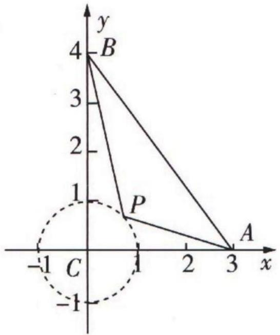

text_image

y
4 B
3
2
1
P
-1 C 1 2 3 x
-1

图4-1

方法二 依题意,建立如图4-1所示的平面直角坐标系,则 $C(0,0)$ , $A(3,0)$ , $B(0,4)$ .

因为 PC=1，所以 P 在以 C 为圆心，1 为半径的圆上运动，

设 $P(\cos\theta,\sin\theta),\theta\in[0,2\pi)$ ,

【小技巧】利用圆的参数方程设点，减少变量个数

则 $\overrightarrow{PA} = (3 - \cos \theta, -\sin \theta), \overrightarrow{PB} = (-\cos \theta, 4 - \sin \theta)$

所以 $\overrightarrow{PA} \cdot \overrightarrow{PB} = (3 - \cos \theta) \times (-\cos \theta) + (-\sin \theta) \times (4 - \sin \theta) = \cos^2 \theta - 3\cos \theta - 4\sin \theta + \sin^2 \theta = 1 - 3\cos \theta - 4\sin \theta = 1 - 5\sin (\theta + \varphi)$ （其中 $\tan \varphi = \frac{3}{4}, 0 < \varphi < \frac{\pi}{2}$ ）.

因为 $-1 \leqslant \sin (\theta + \varphi) \leqslant 1$ ，所以 $-4 \leqslant 1 - 5 \sin (\theta + \varphi) \leqslant 6$ ，即 $\overrightarrow{PA} \cdot \overrightarrow{PB} \in [-4, 6]$ . 故选 D.

调研 4 (2022·四川南充 4 月诊断) 正方形 ABCD 的边长为 2, 以 AB 为直径的圆 M 上有一动点 P, 则 $\overrightarrow{PC} \cdot \overrightarrow{PD}$ 的取值范围为 ( )

A. $[0,4]$

B. $[0,8]$

C. $[-1,8]$

D. $[-1, 4]$

5G 可以让远程互动教学成为现实,凭借 5G 低时延、高速率特性,结合全息影像等技术,可实现实时传输影像信息,远程教学将更加流畅、实时和生动,效果会远超现有的线上教学.

关注微信公众号“初高教辅站”获取更多初高中教辅资料

解析 以 AB 为 x 轴, 线段 AB 的中垂线为 y 轴建立如图 4-2 所示的平面直角坐标系, 则 $C(1,2)$ , $D(-1,2)$ , 圆 M 的方程为 $x^{2} + y^{2} = 1$ .

设 $P(\cos\theta,\sin\theta),\theta\in[0,2\pi)$ ,

则 $\overrightarrow{PC} = (1 - \cos \theta, 2 - \sin \theta), \overrightarrow{PD} = (-1 - \cos \theta, 2 - \sin \theta)$ ,

所以 $\overrightarrow{PC} \cdot \overrightarrow{PD} = (1 - \cos \theta)(-1 - \cos \theta) + (2 - \sin \theta)^2 =$ $\cos^2\theta - 1 + 4 - 4\sin \theta + \sin^2\theta = 4 - 4\sin \theta,$

因为 $\sin\theta\in[-1,1]$ ，所以 $\overrightarrow{PC}\cdot\overrightarrow{PD}\in[0,8]$ 。故选 B.

调研 5 (2022·天津杨村一中二模/双空题)如图4-3,直角梯形ABCD中, $AB \parallel CD, AB \perp AD, AB = 2CD = 2AD = 2$ ,在等腰直角三角形CDE中, $\angle DCE = 90^{\circ}$ ,则向量 $\overrightarrow{AE}$ 在向量 $\overrightarrow{CB}$ 上的投影向量的模为\_\_\_\_;若M,N分别为线段BC,CE上的动点(包含端点),且 $\overrightarrow{AM} \cdot \overrightarrow{AN} = \frac{5}{2}$ ,则 $\overrightarrow{MD} \cdot \overrightarrow{DN}$ 的最小值为\_\_\_\_.

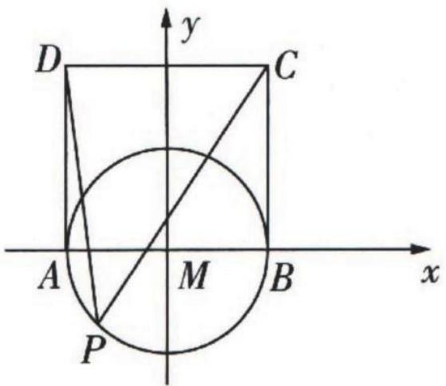

text_image

D
y
C
A
M
B
x
P

图4-2

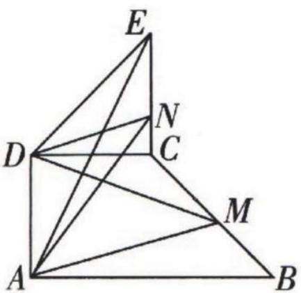

text_image

Geometric diagram with labeled points A, B, C, D, E, M, N and intersecting lines forming triangles and quadrilaterals

图4-3

解析 以 A 为原点, $\overrightarrow{AB}, \overrightarrow{AD}$ 的方向分别为 x 轴, y 轴正方向建立如图 4-4 所示的平面直角坐标系,

【关键点】利用题设已知的垂直关系，建立平面直角坐标系，进而求解

则 $A(0,0)$ , $E(1,2)$ , $C(1,1)$ , $B(2,0)$ , $D(0,1)$ ,

所以 $\overrightarrow{AE}=(1,2),\overrightarrow{CB}=(1,-1)$ ,

所以向量 $\overrightarrow{AE}$ 在向量 $\overrightarrow{CB}$ 上的投影向量的模为 $|\frac{\overrightarrow{AE} \cdot \overrightarrow{CB}}{|\overrightarrow{CB}|}| = \frac{|1 - 2|}{\sqrt{2}} = \frac{\sqrt{2}}{2}$ .

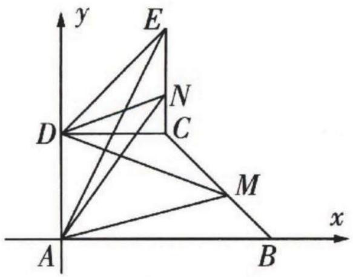

text_image

y
E
N
D
C
M
A
B
x

图4-4

由题可设 $N(1,1+y)(0 \leqslant y \leqslant 1)$ , $M(x,2-x)(1 \leqslant x \leqslant 2)$ ,

则由 $\overrightarrow{AM} \cdot \overrightarrow{AN} = \frac{5}{2}$ , 得 $x + (1 + y)(2 - x) = \frac{5}{2}$ , 即 $xy = 2y - \frac{1}{2}$ , 易知 $y \neq 0$ , 则 $x = 2 - \frac{1}{2y}$ .

【突破口】先分别设点 $M,N$ 的坐标,再利用题设推出 $x,y$ 的关系,为后面的消元作准备

$$
\overrightarrow {M D} \cdot \overrightarrow {D N} = (- x, x - 1) \cdot (1, y) = - x + x y - y = \frac {1}{2 y} - 2 + 2 y - \frac {1}{2} - y = \frac {1}{2 y} + y - \frac {5}{2} \geqslant \sqrt {2} -
$$

$\frac{5}{2}$ , 当且仅当 $2y^{2} = 1$ , 即 $y = \frac{\sqrt{2}}{2}, x = 2 - \frac{\sqrt{2}}{2}$ 时取等号. 故 $\overrightarrow{MD} \cdot \overrightarrow{DN}$ 的最小值为 $\sqrt{2} - \frac{5}{2}$ .

【注意点】应用基本不等式时，注意检验等号成立的条件

5G 能融入校园管理之中,为校园提供远程巡考、校园人员管理、学生作息管理、门禁管理等应用,解决校园陌生人进校、危险探测不及时等安全问题.

# 技法2 基底法

调研 6 (2022 · 广东汕头 4 月二模) 在边长为 1 的正三角形 ABC 中, $\overrightarrow{BC} = 2 \overrightarrow{BD}, \overrightarrow{CA} = 3 \overrightarrow{CE}$ , 则 $\overrightarrow{AD} \cdot \overrightarrow{BE} =$ \_\_\_\_.

解析 由 $\overrightarrow{BC} = 2\overrightarrow{BD}$ ，知 $D$ 为 $BC$ 的中点，则 $\overrightarrow{AD} = \frac{1}{2} (\overrightarrow{AB} +\overrightarrow{AC})$

【突破口】三角形中遇到中线，可以将中线对应的向量用与中线同顶点的两边对应的向量表示

由 $\overrightarrow{CA}=3\overrightarrow{CE}$ ，知E为AC靠近点C的三等分点，故 $\overrightarrow{AE}=\frac{2}{3}\overrightarrow{AC}$ ，则 $\overrightarrow{BE}=\overrightarrow{AE}-\overrightarrow{AB}=$ $\frac{2}{3}\overrightarrow{AC}-\overrightarrow{AB}$ ,

【会思考】本题中， $\overrightarrow{AB}, \overrightarrow{AC}$ 的模、夹角都是已知的，故把 $\overrightarrow{AB}, \overrightarrow{AC}$ 作为基底，将所有可能用到的向量都用 $\overrightarrow{AB}, \overrightarrow{AC}$ 来表示，就可以把问题转化为只和基底有关的运算问题

所以 $\overrightarrow{AD} \cdot \overrightarrow{BE} = \frac{1}{2} (\overrightarrow{AB} + \overrightarrow{AC}) \cdot (\frac{2}{3}\overrightarrow{AC} - \overrightarrow{AB}) = \frac{1}{3}\overrightarrow{AB} \cdot \overrightarrow{AC} - \frac{1}{2}\overrightarrow{AB}^2 + \frac{1}{3}\overrightarrow{AC}^2 - \frac{1}{2}\overrightarrow{AB} \cdot$ $\overrightarrow{AC} = -\frac{1}{2} |\overrightarrow{AB}|^2 + \frac{1}{3} |\overrightarrow{AC}|^2 - \frac{1}{6}\overrightarrow{AB} \cdot \overrightarrow{AC} = -\frac{1}{2} + \frac{1}{3} - \frac{1}{6} \times \frac{1}{2} = -\frac{1}{4}$ .

调研 7 (2022·北京人大附中4月模拟/窗花剪纸)窗花(图4-5)是贴在窗纸或窗户玻璃上的剪纸,是中国古老的传统民间艺术. 图4-6是由一张正六边形剪纸窗花衍生出的图形,其中正六边形ABCDEF的边长为4,圆O的圆心为该正六边形的中心,圆O的半径为2,直径MN//CD,点P在正六边形的边上运动,则 $\overrightarrow{PM}\cdot\overrightarrow{PN}$ 的最小值为()

A. 5

B. 6

C. 7

D. 8

解析 连接 $PO$ ，则 $\overrightarrow{PM} \cdot \overrightarrow{PN} = (\overrightarrow{PO} + \overrightarrow{OM}) \cdot (\overrightarrow{PO} - \overrightarrow{OM}) = |\overrightarrow{PO}|^2 - 4$ ，

易知当点 P 为正六边形各边的中点时， $|\overrightarrow{PO}|$ 取最小值， $|\overrightarrow{PO}|_{\min}=4\sin\frac{\pi}{3}=2\sqrt{3}$ ，
所以 $\overrightarrow{PM}\cdot\overrightarrow{PN}$ 的最小值为8.故选D.

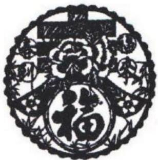

text_image

福

图4-5

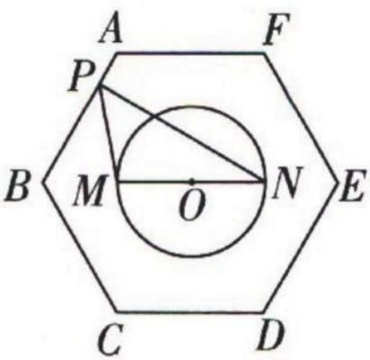

text_image

A
F
P
B
M
O
N
E
C
D

图4-6

5G + 文旅 5G 在文旅领域的创新应用将助力文化和旅游行业步入数字化转型的快车道.

调研 8 (2022 · 广东佛山 4 月二模) 在 $\triangle ABC$ 中, $AB = \sqrt{2}$ , $\angle ACB = \frac{\pi}{4}$ , $O$ 是 $\triangle ABC$ 的外接圆圆心, 则 $\overrightarrow{OC} \cdot \overrightarrow{AB} + \overrightarrow{CA} \cdot \overrightarrow{CB}$ 的最大值为 ( )

A. 0

B. 1

C. 3

D. 5

解析 方法一 如图4-7, 连接 $OA, OB$ , 由 $\angle ACB = \frac{\pi}{4}$ , 得 $\angle AOB = \frac{\pi}{2}$ , 则 $\overrightarrow{OA} \cdot \overrightarrow{OB} = 0$ .

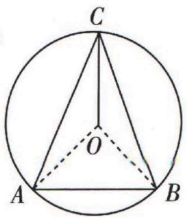

text_image

C
O
A
B

图4-7

由正弦定理得 $\frac{AB}{\sin\angle ACB}=2$ ，则OA=OB=OC=1。

【小技巧】看到三角形的外接圆，就要联想能否用正弦定理，三角形的边、该边所对角的正弦值和外接圆的直径三者可“知二求一”

于是 $\overrightarrow{OC} \cdot \overrightarrow{AB} + \overrightarrow{CA} \cdot \overrightarrow{CB} = \overrightarrow{OC} \cdot (\overrightarrow{OB} - \overrightarrow{OA}) + (\overrightarrow{OA} - \overrightarrow{OC}) \cdot (\overrightarrow{OB} - \overrightarrow{OC}) = \overrightarrow{OC} \cdot \overrightarrow{OB} - \overrightarrow{OC} \cdot \overrightarrow{OA} + \overrightarrow{OA} \cdot \overrightarrow{OB} - \overrightarrow{OA} \cdot \overrightarrow{OC} - \overrightarrow{OC} \cdot \overrightarrow{OB} + \overrightarrow{OC}^2 = 1 - 2\overrightarrow{OA} \cdot \overrightarrow{OC} = 1 - 2\cos \angle AOC,$

【突破口】将待求式中的向量都用 $\overrightarrow{OA},\overrightarrow{OB},\overrightarrow{OC}$ 来表示，此时是用三个向量来表示，并不是一组基底，但经过运算化简，可得 $\overrightarrow{OC}\cdot\overrightarrow{AB}+\overrightarrow{CA}\cdot\overrightarrow{CB}=1-2\overrightarrow{OA}\cdot\overrightarrow{OC}$ ，即可以用基底 $\overrightarrow{OA},\overrightarrow{OC}$ 表示 $\overrightarrow{OC}\cdot\overrightarrow{AB}+\overrightarrow{CA}\cdot\overrightarrow{CB}$ ，进而求解

当且仅当 $\cos\angle AOC=-1$ , 即 $\angle AOC=\pi$ 时, $\overrightarrow{OC}\cdot\overrightarrow{AB}+\overrightarrow{CA}\cdot\overrightarrow{CB}$ 取得最大值 3. 故选 C.

方法二 由方法一知 $OA = OB = OC = 1, \angle AOB = \frac{\pi}{2}$ , 则 $\overrightarrow{OC} \cdot \overrightarrow{AB} + \overrightarrow{CA} \cdot \overrightarrow{CB} = (\overrightarrow{OA} + \overrightarrow{AC}) \cdot \overrightarrow{AB} + \overrightarrow{CA} \cdot (\overrightarrow{CA} + \overrightarrow{AB}) = \overrightarrow{OA} \cdot \overrightarrow{AB} + \overrightarrow{CA}^2 = \overrightarrow{OA} \cdot (\overrightarrow{AO} + \overrightarrow{OB}) + \overrightarrow{CA}^2 = \overrightarrow{CA}^2 - \overrightarrow{OA}^2 + \overrightarrow{OA} \cdot \overrightarrow{OB} = \overrightarrow{CA}^2 - \overrightarrow{OA}^2 = \overrightarrow{CA}^2 - 1$ ,

易知当 $CA = 2$ 时， $\overrightarrow{OC}\cdot \overrightarrow{AB} +\overrightarrow{CA}\cdot \overrightarrow{CB}$ 取得最大值3.故选C.

方法三 如图4-8, 连接 $OA, OB$ , 易知 $OA \perp OB$ , 取 $AB$ 的中点 $E$ , 连接 $OE$ , 则 $OE \perp AB$ ,

以 O 为坐标原点, $\overrightarrow{AB}, \overrightarrow{EO}$ 的方向分别为 x 轴, y 轴正方向建立平面直角坐标系, 易知圆 O 的半径为 1, $A(-\frac{\sqrt{2}}{2}, -\frac{\sqrt{2}}{2})$ , $B(\frac{\sqrt{2}}{2}, -\frac{\sqrt{2}}{2})$ , 设 $C(\cos \theta, \sin \theta), \theta \in [0, 2\pi)$ ,

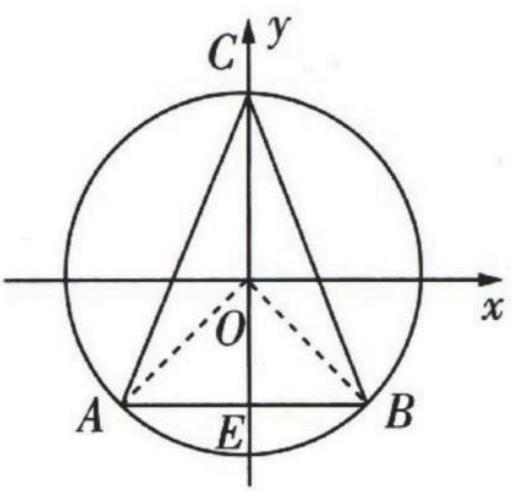

text_image

C
y
O
x
A
E
B

图4-8

则 $\overrightarrow{AB} = (\sqrt{2}, 0), \overrightarrow{OC} = (\cos \theta, \sin \theta), \overrightarrow{CA} = (-\frac{\sqrt{2}}{2} - \cos \theta, -\frac{\sqrt{2}}{2} - \sin \theta), \overrightarrow{CB} = (\frac{\sqrt{2}}{2} -$

$$
\cos \theta , - \frac {\sqrt {2}}{2} - \sin \theta),
$$

所以 $\overrightarrow{OC} \cdot \overrightarrow{AB} + \overrightarrow{CA} \cdot \overrightarrow{CB} = (\cos \theta, \sin \theta) \cdot (\sqrt{2}, 0) + (-\frac{\sqrt{2}}{2} - \cos \theta, -\frac{\sqrt{2}}{2} - \sin \theta)\cdot$ $(\frac{\sqrt{2}}{2} - \cos \theta, -\frac{\sqrt{2}}{2} - \sin \theta) = \sqrt{2}\cos \theta + \cos^2\theta - \frac{1}{2} + (\sin \theta + \frac{\sqrt{2}}{2})^2 = \sqrt{2}\sin \theta + \sqrt{2}\cos \theta +$ $1 = 2\sin (\theta + \frac{\pi}{4}) + 1$ ，所以 $\overrightarrow{OC} \cdot \overrightarrow{AB} + \overrightarrow{CA} \cdot \overrightarrow{CB}$ 的最大值为3.故选C.

调研 9 (2022·大连二十四中5月模拟)如图4-9,在等腰直角△ABC中,斜边AC=2,M为线段AB上的动点(包含端点),D为AC的中点.将线段AC绕着点D旋转得到线段EF,则 $\overrightarrow{ME}\cdot\overrightarrow{MF}$ 的最小值为()

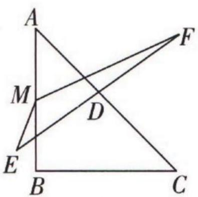

text_image

A
M
D
E
B
C
F

图4-9

A. -2

B. $-\frac{3}{2}$

C. -1

D. $-\frac{1}{2}$

解析 方法一 连接 MD, 则 $\overrightarrow{ME} \cdot \overrightarrow{MF} = (\overrightarrow{MD} + \overrightarrow{DE}) \cdot (\overrightarrow{MD} + \overrightarrow{ED}) = |\overrightarrow{MD}|^{2} - |\overrightarrow{DE}|^{2}$ ，易知当 $MD \perp AB$ 时，MD 最小，即 $|\overrightarrow{MD}|_{\min} = \frac{\sqrt{2}}{2}$ ，结合 $|\overrightarrow{DE}|^{2} = 1$ ，得 $\overrightarrow{ME} \cdot \overrightarrow{MF}$ 的最小值为 $-\frac{1}{2}$ ，故选 D.

方法二 （极化恒等式法）易得 $BC = \sqrt{2}$ ，D 为线段 EF 的中点，则 $\overrightarrow{ME} + \overrightarrow{MF} = 2 \overrightarrow{MD}$ ，

$$
\overrightarrow {M E} \cdot \overrightarrow {M F} = \frac {1}{4} \left[ (\overrightarrow {M E} + \overrightarrow {M F}) ^ {2} - (\overrightarrow {M E} - \overrightarrow {M F}) ^ {2} \right] = | \overrightarrow {M D} | ^ {2} - \frac {1}{4} | \overrightarrow {F E} | ^ {2},
$$

易知 $|\overrightarrow{MD}|_{\min} = \frac{\sqrt{2}}{2}, |\overrightarrow{FE}|^2 = 4$ ，所以 $\overrightarrow{ME} \cdot \overrightarrow{MF}$ 的最小值为 $-\frac{1}{2}$ . 故选 D.

# 技法3 投影法

调研 10 (2022·清华大学附属中学4月质量检测)如图4-10,在菱形ABCD中,若AC=4,则 $\overrightarrow{CA}\cdot\overrightarrow{AB}=$

A. 8

B. -8

C. 4

D. -4

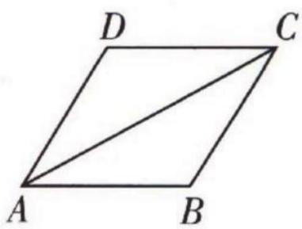

text_image

D
C
A
B

图4-10

解析 $\overrightarrow{CA} \cdot \overrightarrow{AB} = -\overrightarrow{AC} \cdot \overrightarrow{AB} = -|\overrightarrow{AC}| \cdot |\overrightarrow{AB}| \cos \angle CAB,$

连接 BD 交 AC 于 O，由四边形 ABCD 是菱形，得 2AO = AC = 4，且 AC ⊥ BO，所以 $\left|\overrightarrow{AB}\right|$ cos $\angle CAB = AO = 2$ ，

【突破口】根据向量投影的几何意义，结合菱形的对角线互相垂直平分，可得 $|\overrightarrow{AB}|\cos\angle CAB=\frac{1}{2}AC$ 所以 $\overrightarrow{CA}\cdot\overrightarrow{AB}=(-4)\times2=-8$ . 故选 B.

调研 11 (2022·广西南宁三中5月模拟)等腰直角三角形 ABC 中, $A = 90^{\circ}$ , $AB = AC = 2, D$ 是斜边 BC 上一点, 且 $BD = 3DC$ , 则 $\overrightarrow{AD} \cdot (\overrightarrow{AB} + \overrightarrow{AC}) =$ ()

A. 2

B. 3

C. 4

D. 5

解析 方法一 如图 4-11, 取 BC 的中点 M, 连接 AM, 则 $\overrightarrow{AB} + \overrightarrow{AC} = 2\overrightarrow{AM}$ .

由 $\triangle ABC$ 是等腰直角三角形, $AB = AC = 2$ , 可知 $AM \perp BC$ , 且 $AM = \sqrt{2}$ ,

所以 $\overrightarrow{AD} \cdot (\overrightarrow{AB} + \overrightarrow{AC}) = 2\overrightarrow{AD} \cdot \overrightarrow{AM} = 2|\overrightarrow{AM}|^2 = 2 \times (\sqrt{2})^2 =$ 4. 故选C.

方法二 取 BC 的中点 M, 连接 AM, 以 M 为坐标原点, $\overrightarrow{MC}, \overrightarrow{MA}$ 的方向分别为 x 轴, y 轴正方向, 建立如图 4-12 所示的平面直角坐标系, 则 $M(0,0), A(0,\sqrt{2}), B(-\sqrt{2},0)$ , 易知 $D(\frac{\sqrt{2}}{2},0)$ , 所以 $\overrightarrow{AM} = (0, -\sqrt{2}), \overrightarrow{AD} = (\frac{\sqrt{2}}{2}, -\sqrt{2})$ ,

$$
\overrightarrow {A D} \cdot (\overrightarrow {A B} + \overrightarrow {A C}) = 2 \overrightarrow {A D} \cdot \overrightarrow {A M} = (\sqrt {2}, - 2 \sqrt {2}) \cdot (0, - \sqrt {2}) = 4.
$$

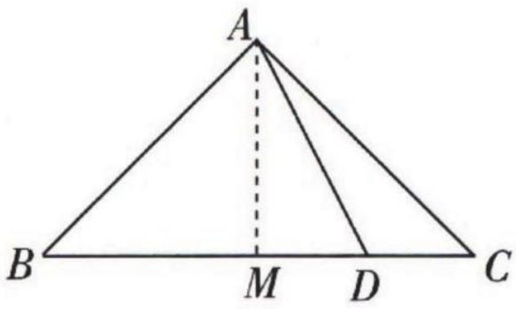

text_image

A
B M D C

图4-11

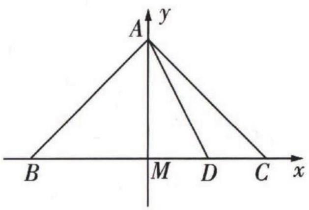

text_image

A
y
B
M
D
C
x

图4-12

故选C.

【解后反思】本题采取投影法和坐标法都可以求解，但总的来说，投影法更优。采用投影法，题设条件可以进一步弱化，比如△ABC为等腰三角形，AM⊥BC，且知道AM的长度，只要点D为BC上的动点，则 $\overrightarrow{AD}\cdot(\overrightarrow{AB}+\overrightarrow{AC})$ 仍然可以采用投影法计算，但此时若采用坐标法，则复杂很多

调研 12 (2022 · 浙江温州 5 月模拟) 在 $\triangle ABC$ 中, $\angle ABC = \frac{\pi}{3}, O$ 为 $\triangle ABC$ 的外心, $\overrightarrow{BA} \cdot \overrightarrow{BO} = 2, \overrightarrow{BC} \cdot \overrightarrow{BO} = 4$ , 则 $\overrightarrow{BA} \cdot \overrightarrow{BC} =$ ()

A. 2

B. $2\sqrt{2}$

C. 4

D. $4\sqrt{2}$

除银行业外,证券、保险和其他金融领域也在积极推动“5G+”发展,5G开创的远程服务等新交互方式为客户带来全方位数字化体验,带动了金融行业的创新变革.

解析 如图4-13, 设 $AB, BC$ 的中点分别为 $D, E$ , 连接 $OD, OE$ , 则 $OD \perp AB, OE \perp BC$ .

由 $\overrightarrow{BA}\cdot\overrightarrow{BO}=2$ ，可得 $|\overrightarrow{BA}|\cdot|\overrightarrow{BO}|\cos\angle OBD=|\overrightarrow{BA}|\cdot\frac{1}{2}|\overrightarrow{BA}|=\frac{1}{2}|\overrightarrow{BA}|^{2}=2$ ，
故 $|\overrightarrow{BA}|=2.$

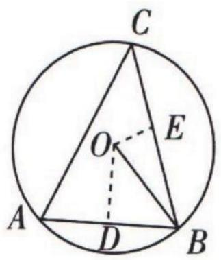

text_image

C
O
E
A
D
B

图4-13

由 $\overrightarrow{BC} \cdot \overrightarrow{BO} = 4$ ，可得 $|\overrightarrow{BC}| \cdot |\overrightarrow{BO}|\cos \angle OBE = |\overrightarrow{BC}| \cdot \frac{1}{2} |\overrightarrow{BC}| = \frac{1}{2} |\overrightarrow{BC}|^2 = 4$

故 $|\overrightarrow{BC}|=2\sqrt{2}$ . 故 $\overrightarrow{BA}\cdot\overrightarrow{BC}=|\overrightarrow{BA}|\cdot|\overrightarrow{BC}|\cos\angle ABC=2\times2\sqrt{2}\times\frac{1}{2}=2\sqrt{2}$ ，故选B.

调研 13 (2022·河北衡水中学5月调研)如图4-14,三个边长为2的等边三角形有一条边在同一条直线上,边 $B_{3}C_{3}$ 上有10个不同的点 $P_{1},P_{2},\cdots,P_{10}$ , A记 $m_{i}=\overrightarrow{AB_{2}}\cdot\overrightarrow{AP_{i}}(i=1,2,\cdots,10)$ ,则 $m_{1}+m_{2}+\cdots+m_{10}=$ \_\_\_\_.

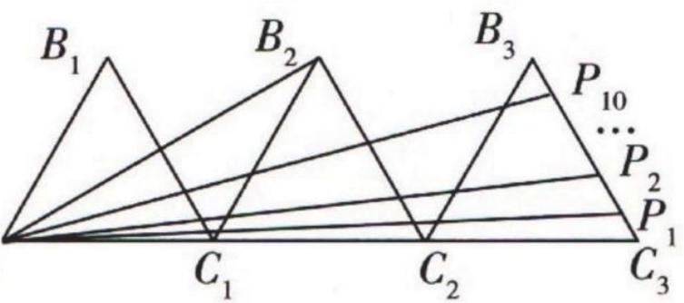

text_image

B₁
B₂
B₃
P₁₀
...
P₂
C₁
C₂
C₃

图4-14

解析 由题意知 $AC_{2} = 2B_{2}C_{2}, \angle AC_{2}B_{2} = 60^{\circ}$ , 故 $\triangle AB_{2}C_{2}$ 是直角三角形, 即 $B_{2}C_{2} \perp AB_{2}$ .

如图4-15, 分别延长 $AB_{2}$ 与 $C_{3}B_{3}$ 交于点 $P$ , 由 $\angle AC_{2}B_{2} = \angle AC_{3}B_{3} = 60^{\circ}$ , 得 $B_{2}C_{2} \parallel B_{3}C_{3}$ , 则 $C_{3}P \perp AP$ .

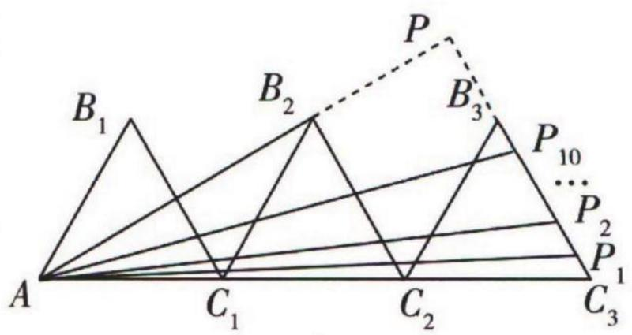

text_image

B₁
B₂
P
B₃
P₁₀
...
P₂
A
C₁
C₂
C₃
P₁

图4-15

由等边三角形的边长为2,得 $AB_{2}=2\sqrt{3},AP=3\sqrt{3}$ ,
则 $m_{i}=\overrightarrow{AB_{2}}\cdot\overrightarrow{AP_{i}}=|\overrightarrow{AB_{2}}||\overrightarrow{AP}|=2\sqrt{3}\times3\sqrt{3}=18(i=1,2,\cdots,10)$ ,

【会思考】本题中，找到垂直关系后，可以发现不用管点 $P_{1}, P_{2}, \cdots, P_{10}$ 具体在哪个位置， $m_{i} = 18 (i = 1, 2, \cdots, 10)$ ，是定值，这就是投影法求解平面向量数量积时的优势，即在特定情况下，有关动点的数量积是定值

故 $m_{1} + m_{2} + \cdots + m_{10} = 18 \times 10 = 180.$

调研 14 (2022·长郡中学5月诊断)(多选)已知圆 $O: x^{2} + y^{2} = 9, P, Q$ 为圆 O 上任意两点(不重合), 平面上一动点 C 满足 $\overrightarrow{CP} = \lambda \overrightarrow{CQ} (\lambda > 0)$ , 若 M 为线段 PQ 的中点, 则 $\overrightarrow{OC} \cdot \overrightarrow{OM}$ 的取值可能为 ( )

A. 7

B. 8

C. 9

D. 10

解析 根据题意作出图形,如图4-16所示.

由 $\overrightarrow{CP}=\lambda\overrightarrow{CQ}(\lambda>0)$ ，知P,Q,C三点共线，且点C在线段PQ外.

【突破截项】由 $\overrightarrow{CP}=\lambda\overrightarrow{CQ}(\lambda>0)$ ，可得P,Q,C三点共线

由 M 为线段 PQ 的中点, 得 $OM \perp PQ$ , 所以 $\overrightarrow{OC} \cdot \overrightarrow{OM} = |\overrightarrow{OM}| \cdot |\overrightarrow{OC}| \cos \angle COM = |\overrightarrow{OM}|^{2}$ ,

易知 $0 \leqslant |\overrightarrow{OM}| < 3$ ，所以 $0 \leqslant |\overrightarrow{OM}|^2 < 9$ ，即 $0 \leqslant \overrightarrow{OC} \cdot \overrightarrow{OM} < 9$

【关键】点M位于圆内，则 $0\leqslant|\overrightarrow{OM}|<3$ ，注意端点值的取舍

结合选项可知, $\overrightarrow{OC}\cdot\overrightarrow{OM}$ 的取值可能为7,8,故选AB.

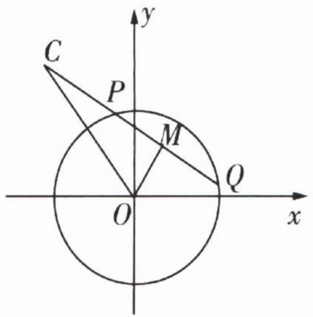

text_image

C
P
M
Q
O
x
y

图4-16

# 新题演练

1. (2022·河南安阳一中二模)在边长为2的正六边形 $ABCDEF$ 中, $\overrightarrow{AC} \cdot \overrightarrow{BF} = (\quad)$

A. -6

B. $- 2\sqrt{3}$

C. $2\sqrt{3}$

D. 6

2. (2022 · 河南商丘三模) 在四边形 $ABCD$ 中, $\overrightarrow{AB} = 2\overrightarrow{DC}, \overrightarrow{AB} \cdot \overrightarrow{BC} = 0$ , $|\overrightarrow{AB}| = 2$ , 则 $\overrightarrow{AD} \cdot \overrightarrow{DC} =$

A. - 1

B. 1

C. -2

D. 2

3. (2022·重庆八中4月调研/双空题)已知△ABC为等腰直角三角形,AB=AC=2,圆M为△ABC的外接圆, $\overrightarrow{ME}=\frac{1}{2}(\overrightarrow{MA}+\overrightarrow{MB})$ ,则 $\overrightarrow{ME}\cdot\overrightarrow{CE}=$ \_\_\_\_ ;若P为圆M上的动点,则 $\overrightarrow{PM}\cdot\overrightarrow{PE}$ 的最大值为\_\_\_\_.

# 参考答案与解析

1. A 如图4-17,取正六边形 $ABCDEF$ 的中心点 $O$ ,连接 $OA$ , $OB$ ,取 $\overrightarrow{AB},\overrightarrow{AO}$ 为基底,易知 $|\overrightarrow{AB}| = |\overrightarrow{AO}| = 2, \langle \overrightarrow{AB},\overrightarrow{AO} \rangle = \frac{\pi}{3}$ ,则 $\overrightarrow{AC} = \overrightarrow{AB} + \overrightarrow{AO},\overrightarrow{BF} = \overrightarrow{BA} + \overrightarrow{BO} = -\overrightarrow{AB} + (\overrightarrow{AO} - \overrightarrow{AB}) = \overrightarrow{AO} - 2\overrightarrow{AB}$ ,所以 $\overrightarrow{AC} \cdot \overrightarrow{BF} = (\overrightarrow{AB} + \overrightarrow{AO}) \cdot (\overrightarrow{AO} - 2\overrightarrow{AB}) = \overrightarrow{AB} \cdot \overrightarrow{AO} - 2\overrightarrow{AB}^2 + \overrightarrow{AO}^2 - 2\overrightarrow{AO} \cdot \overrightarrow{AB} = -2^2 \times \frac{1}{2} - 2 \times 2^2 + 2^2 = -6$ .故选A.

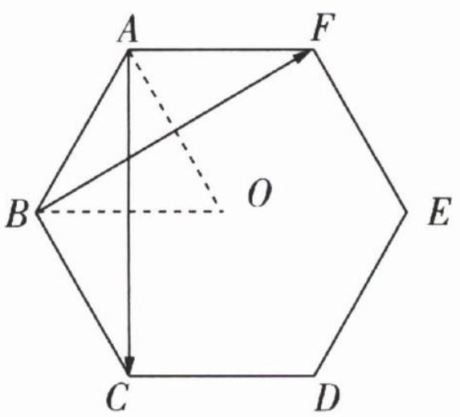

text_image

A
F
B
O
E
C
D

图4-17

2. B 由题意知,四边形 $ABCD$ 为直角梯形, $AB \parallel CD$ , $\angle B = 90^\circ$ , $|\overrightarrow{DC}| = 1$ , $\overrightarrow{DC} \cdot \overrightarrow{BC} = 0$ , 【易遗漏】由 $AB = 2\overrightarrow{DC}$ , 不仅可以得出 $AB = 2DC$ , 还可以得出 $AB \parallel CD$ , 如果忽略后者, 得不到四边形 $ABCD$ 是直角梯形, 后续无法求解

连接 BD, 则 $\overrightarrow{AD} \cdot \overrightarrow{DC} = (\overrightarrow{AB} + \overrightarrow{BD}) \cdot \overrightarrow{DC} = \overrightarrow{AB} \cdot \overrightarrow{DC} + \overrightarrow{BD} \cdot \overrightarrow{DC} = 2 |\overrightarrow{DC}|^{2} - |\overrightarrow{DC}|^{2} = 1.$ 故选 B.

数学的发展史大致可以分为四个时期,即数学形成时期,常量数学时期,变量数学时期,现代数学时期.

3.2 $2 + \sqrt{2}$ 由题意知 M 为 BC 的中点, E 为 AB 的中点,

以圆心 M 为坐标原点, $\overrightarrow{AB}, \overrightarrow{AC}$ 的方向分别为 x 轴, y 轴的正方向建立平面直角坐标系, 如图 4-18 所示, 则 C(-1,1), E(0,-1), M(0,0),

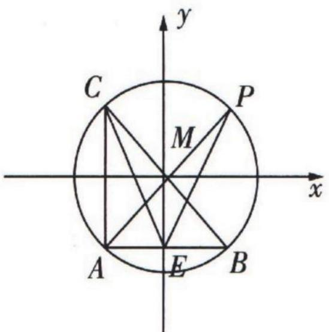

text_image

y
C
P
M
x
A
E
B

图4-18

【小技巧】建系时，应考虑尽量让点的坐标表示简洁、便于运算

$\overrightarrow{ME}=(0,-1),\overrightarrow{CE}=(1,-2)$ ，所以 $\overrightarrow{ME}\cdot\overrightarrow{CE}=2.$

设 $P(\sqrt{2}\cos \theta ,\sqrt{2}\sin \theta)(\theta \in [0,2\pi))$

则 $\overrightarrow{PM} = (-\sqrt{2}\cos \theta, -\sqrt{2}\sin \theta),\overrightarrow{PE} = (-\sqrt{2}\cos \theta, -1 - \sqrt{2}\sin \theta),$

$$
\overrightarrow {P M} \cdot \overrightarrow {P E} = 2 \cos^ {2} \theta + \sqrt {2} \sin \theta + 2 \sin^ {2} \theta = 2 + \sqrt {2} \sin \theta .
$$

因为 $-1 \leqslant \sin \theta \leqslant 1$ ,

所以 $2 - \sqrt{2} \leqslant \overrightarrow{PM} \cdot \overrightarrow{PE} \leqslant 2 + \sqrt{2}$ , 即 $\overrightarrow{PM} \cdot \overrightarrow{PE}$ 的最大值为 $2 + \sqrt{2}$ .

# 超重点 5 三角形 “四心” 的向量表示与运用

已知 $H, G, O, I$ 是 $\triangle ABC$ 所在平面上的任意点, $a, b, c$ 分别为三个内角 $A, B, C$ 所对的边.

<table><tr><td rowspan="2">1</td><td> $H$ 为垂心 $\Leftrightarrow \overrightarrow{HA} \cdot \overrightarrow{HB} = \overrightarrow{HB} \cdot \overrightarrow{HC} = \overrightarrow{HC} \cdot \overrightarrow{HA}.$ </td></tr><tr><td>简证: $\overrightarrow{HA} \cdot \overrightarrow{HB} = \overrightarrow{HB} \cdot \overrightarrow{HC} \Leftrightarrow (\overrightarrow{HC} - \overrightarrow{HA}) \cdot \overrightarrow{HB} = 0 \Leftrightarrow \overrightarrow{AC} \perp \overrightarrow{HB}.$ 余下证明同理,略.</td></tr><tr><td rowspan="2">2</td><td> $G$ 为重心 $\Leftrightarrow \overrightarrow{GA} + \overrightarrow{GB} + \overrightarrow{GC} = 0.$ </td></tr><tr><td>简证:以 $GB,GC$ 为邻边作平行四边形 $GBEC$ ,对角线交于 $D$ ,则 $D$ 为 $BC$ 的中点.由于 $\overrightarrow{GB} + \overrightarrow{GC} = \overrightarrow{GE} = \overrightarrow{AG}$ ,所以 $\overrightarrow{AG} = \overrightarrow{GE} = 2\overrightarrow{GD}$ ,于是 $A,G,D$ 共线,且 $|\overrightarrow{AG}| = 2|\overrightarrow{GD}|$ .余下证明同理,略.</td></tr><tr><td rowspan="2">3</td><td> $O$ 为外心 $\Leftrightarrow (\overrightarrow{OA} + \overrightarrow{OB}) \cdot \overrightarrow{AB} = (\overrightarrow{OB} + \overrightarrow{OC}) \cdot \overrightarrow{BC} = (\overrightarrow{OC} + \overrightarrow{OA}) \cdot \overrightarrow{CA} = 0.$ </td></tr><tr><td>简证: $\overrightarrow{OA}^{2} = \overrightarrow{OB}^{2} \Leftrightarrow (\overrightarrow{OA} + \overrightarrow{OB}) \cdot (\overrightarrow{OB} - \overrightarrow{OA}) = 0 \Leftrightarrow (\overrightarrow{OA} + \overrightarrow{OB}) \cdot \overrightarrow{AB} = 0.$ 余下证明同理,略.</td></tr><tr><td rowspan="2">4</td><td> $I$ 为内心 $\Leftrightarrow a\overrightarrow{IA} + b\overrightarrow{IB} + c\overrightarrow{IC} = 0.$ </td></tr><tr><td>简证: $a\overrightarrow{IA} + b\overrightarrow{IB} + c\overrightarrow{IC} = 0 \Leftrightarrow (a + b + c)\overrightarrow{IC} + a\overrightarrow{CA} + b\overrightarrow{CB} = 0$ ,即 $\overrightarrow{CI} = \frac{1}{a + b + c}(a\overrightarrow{CA} + b\overrightarrow{CB})$ ,而 $|\overrightarrow{CA}| = b,|\overrightarrow{CB}| = a$ ,则 $\overrightarrow{CI} = \frac{ab}{a + b + c}(\frac{\overrightarrow{CA}}{|\overrightarrow{CA}|} + \frac{\overrightarrow{CB}}{|\overrightarrow{CB}|})$ ,知 $I$ 在 $\angle ACB$ 的平分线上.余下证明同理,略.</td></tr></table>

调研 1 (2022·浙江温州 4 月诊断) 已知 P 为 $\triangle ABC$ 所在平面内一点, 满足 $\overrightarrow{AP} = t(\overrightarrow{AB} + \overrightarrow{AC})(t \text{ 为常数}), \overrightarrow{BP} \cdot \overrightarrow{AP} = \overrightarrow{CP} \cdot \overrightarrow{AP}$ , 则 $\triangle ABC$ 一定是 ()

A. 直角三角形

B. 等腰三角形

C. 等边三角形

D. 钝角三角形

解析 设 D 为 BC 的中点, 则 $\overrightarrow{AB} + \overrightarrow{AC} = 2\overrightarrow{AD}$ , 因为 $\overrightarrow{AP} = t(\overrightarrow{AB} + \overrightarrow{AC})$ , 所以 $\overrightarrow{AP} = 2t\overrightarrow{AD}$ , 故点 P 在直线 AD 上.

因为 $\overrightarrow{BP} \cdot \overrightarrow{AP} = \overrightarrow{CP} \cdot \overrightarrow{AP}$ , 所以 $\overrightarrow{AP} \cdot (\overrightarrow{BP} - \overrightarrow{CP}) = 0$ , 即 $\overrightarrow{AP} \cdot \overrightarrow{BC} = 0$ , 所以 $\overrightarrow{AP} \perp \overrightarrow{BC}$ , 即 $AD \perp BC$ , 所以 $AB = AC$ . 所以 $\triangle ABC$ 是等腰三角形, 故选 B.

调研 2 （原创）设△ABC 的内角 A, B, C 的对边分别为 a, b, c, P 是△ABC 所在平面上的一点， $\overrightarrow{PA} \cdot \overrightarrow{PB} = \frac{c}{b}\overrightarrow{PA} \cdot \overrightarrow{PC} + \frac{b - c}{b}\overrightarrow{PA^{2}} = \frac{c}{a}\overrightarrow{PB} \cdot \overrightarrow{PC} + \frac{a - c}{a}\overrightarrow{PB^{2}}$ ，则点 P 是△ABC 的（）

A. 重心

B. 外心

C. 内心

D. 垂心

解析 因为 $\overrightarrow{PA} \cdot \overrightarrow{PB} = \frac{c}{b}\overrightarrow{PA} \cdot \overrightarrow{PC} + \frac{b - c}{b}\overrightarrow{PA}^2 = \frac{c}{a}\overrightarrow{PB} \cdot \overrightarrow{PC} + \frac{a - c}{a}\overrightarrow{PB}^2$

所以 $\overrightarrow{PA} \cdot \overrightarrow{PB} - \overrightarrow{PA}^2 = \frac{c}{b}\overrightarrow{PA} \cdot (\overrightarrow{PC} - \overrightarrow{PA}), \overrightarrow{PA} \cdot \overrightarrow{PB} - \overrightarrow{PB}^2 = \frac{c}{a}\overrightarrow{PB} \cdot (\overrightarrow{PC} - \overrightarrow{PB})$

即 $\overrightarrow{PA} \cdot \overrightarrow{AB} = \frac{c}{b}\overrightarrow{PA} \cdot \overrightarrow{AC}, \overrightarrow{BA} \cdot \overrightarrow{PB} = \frac{c}{a}\overrightarrow{PB} \cdot \overrightarrow{BC}$ ,

所以 $|\overrightarrow{PA}|c\cos \angle PAB = \frac{c}{b} |\overrightarrow{PA}|b\cos \angle PAC,|\overrightarrow{PB}|c\cos \angle PBA = \frac{c}{a} |\overrightarrow{PB}|a\cos \angle PBC,$

【会转化】注意向量的模和三角形边长的转化： $|\overrightarrow{AB}|=c,\quad|\overrightarrow{AC}|=b,\quad|\overrightarrow{BC}|=a$

所以 $\angle PAB = \angle PAC, \angle PBA = \angle PBC$ , 所以 $AP$ 在 $\angle BAC$ 的平分线上, $BP$ 在 $\angle ABC$ 的平分线上, 所以点 $P$ 是 $\triangle ABC$ 的内心. 故选 C.

【小技巧】三角形两条内角平分线的交点就是三角形的内心，无须再证明第三条内角平分线也过此点，解题时直接应用即可

调研 3 (2022·四川凉山州5月模拟)已知 O, P 是△ABC 所在平面内的点, 其满足 $\overrightarrow{OP} = \overrightarrow{OB} + \lambda \left( \frac{\overrightarrow{BC}}{|\overrightarrow{BC}|} + \frac{\overrightarrow{BA}}{|\overrightarrow{BA}|} \right) (\lambda > 0)$ , 直线 BP 与边 AC 交于点 D, 若 $\angle ABC = \frac{\pi}{3}$ , BD = 2, 则 △ABC 面积的最小值为 \_\_\_\_.

人类从数数开始逐渐建立了自然数的概念,简单的计算法,并认识了最基本、最简单的几何形式,算术与几何还没有分开.

解析 由 $\overrightarrow{OP} = \overrightarrow{OB} +\lambda (\frac{\overrightarrow{BC}}{|\overrightarrow{BC}|} +\frac{\overrightarrow{BA}}{|\overrightarrow{BA}|})$ ，得 $\overrightarrow{BP} = \lambda (\frac{\overrightarrow{BC}}{|\overrightarrow{BC}|} +\frac{\overrightarrow{BA}}{|\overrightarrow{BA}|})$

则点 P 在 $\angle ABC$ 的平分线所在直线上, 即 BD 为 $\angle ABC$ 的平分线.

【扫清障碍】 $\frac{\overrightarrow{BC}}{|\overrightarrow{BC}|}$ ， $\frac{\overrightarrow{BA}}{|\overrightarrow{BA}|}$ 表示单位向量，向量 $\frac{\overrightarrow{BC}}{|\overrightarrow{BC}|} + \frac{\overrightarrow{BA}}{|\overrightarrow{BA}|}$ 与 $\overrightarrow{BC}$ ， $\overrightarrow{BA}$ 的夹角相等，则 BP 在 $\angle ABC$ 的平分线所在直线上。遇到单位向量，即可联想角平分线

方法一 由题意知 $\angle ABD = \angle CBD = \frac{\pi}{6}$ , 设 $\angle ADB = \theta$ , 则 $A = \frac{5\pi}{6} - \theta, C = \theta - \frac{\pi}{6}$ , 由 $A > 0, C > 0$ , 得 $\frac{\pi}{6} < \theta < \frac{5\pi}{6}$ .

【易错】误以为 $\theta$ 的取值范围为 $[0, \pi]$ ，在设新变量时，一定要看新变量的取值范围能不能缩小。

由正弦定理可得 $\frac{AB}{\sin\theta} = \frac{BD}{\sin A},\frac{BC}{\sin\theta} = \frac{BD}{\sin C}$ 所以 $AB = \frac{2\sin\theta}{\sin A},BC = \frac{2\sin\theta}{\sin C},$

$\triangle ABC$ 的面积 $S_{\triangle ABC} = \frac{1}{2} AB\times BC\sin \frac{\pi}{3} = \frac{\sqrt{3}\sin^2\theta}{\sin A\sin C} = \frac{\sqrt{3}\sin^2\theta}{\sin(\frac{5\pi}{6} -\theta)\sin(\theta - \frac{\pi}{6})} =$

【方法总结】通过消元得到单变量函数，分析自变量的取值范围，即可求得函数最值

$$
\frac {\sqrt {3} \sin^ {2} \theta}{\frac {3}{4} \sin^ {2} \theta - \frac {1}{4} \cos^ {2} \theta} = \frac {\sqrt {3} \sin^ {2} \theta}{\sin^ {2} \theta - \frac {1}{4}} = \sqrt {3} + \frac {\sqrt {3}}{4 (\sin^ {2} \theta - \frac {1}{4})},
$$

由 $\frac{\pi}{6} < \theta < \frac{5\pi}{6}$ , 得 $\frac{1}{2} < \sin \theta \leqslant 1$ , 所以 $0 < \sin^2 \theta - \frac{1}{4} \leqslant \frac{3}{4}$ ,

所以 $S_{\triangle ABC} = \sqrt{3} + \frac{\sqrt{3}}{4 (\sin^{2}\theta - \frac{1}{4})} \geqslant \sqrt{3} + \frac{\sqrt{3}}{3} = \frac{4\sqrt{3}}{3}$ ，故 $\triangle ABC$ 面积的最小值为 $\frac{4\sqrt{3}}{3}$ .

方法二 在 $\triangle ABD$ 中, $\angle ABD=\frac{\pi}{6}$ , $BD=2$ ,由正弦定理得 $\frac{AD}{\sin\frac{\pi}{6}}=\frac{BD}{\sin A}$ ,所以 $AD=\frac{1}{\sin A}$ .

在 $\triangle CBD$ 中， $\angle DBC = \frac{\pi}{6}, BD = 2$ ，由正弦定理得 $\frac{CD}{\sin \frac{\pi}{6}} = \frac{BD}{\sin C}$ ，所以 $CD = \frac{1}{\sin C}$ .

设 $\angle ADB = \theta$ ，则 $\theta = \frac{5\pi}{6} -A,\theta = \frac{\pi}{6} +C,C = \frac{2\pi}{3} -A,$

记 $\triangle ABD, \triangle CBD$ 的面积分别为 $S_{\triangle ABD}, S_{\triangle CBD}$ , 所以 $\triangle ABC$ 的面积 $S_{\triangle ABC} = S_{\triangle ABD} + S_{\triangle CBD} = \frac{1}{2} AD \times BD \sin \theta + \frac{1}{2} CD \times BD \sin (\pi - \theta) = \frac{1}{2} \times 2 \sin \theta \left( \frac{1}{\sin A} + \frac{1}{\sin C} \right) = \sin \left( \frac{5\pi}{6} - \frac{5\pi}{6} \right)$ .

【方法总结】利用 $S_{\triangle ABC} = S_{\triangle ABD} + S_{\triangle CBD}$ ，得 $S_{\triangle ABC}$ 的表达式

A) $\cdot\frac{\sin A+\sin(\frac{2\pi}{3}-A)}{\sin A\sin(\frac{2\pi}{3}-A)}=\frac{\sqrt{3}\sin^{2}(A+\frac{\pi}{6})}{\sin A\sin(A+\frac{\pi}{3})}$ .

设 $A + \frac{\pi}{6} = \alpha$ ，易知 $0 < A < \frac{2\pi}{3}$ 则 $\frac{\pi}{6} < \alpha < \frac{5\pi}{6}, \frac{1}{2} < \sin \alpha \leqslant 1, 0 < \sin^2\alpha - \frac{1}{4} \leqslant \frac{3}{4}$

所以 $S_{\triangle ABC} = \frac{\sqrt{3}\sin^{2}\alpha}{\sin(\alpha - \frac{\pi}{6})\sin(\alpha + \frac{\pi}{6})} = \frac{\sqrt{3}\sin^{2}\alpha}{\frac{3}{4}\sin^{2}\alpha - \frac{1}{4}\cos^{2}\alpha} = \frac{\sqrt{3}\sin^{2}\alpha}{\sin^{2}\alpha - \frac{1}{4}} = \sqrt{3} +$

$\frac{\sqrt{3}}{4(\sin^2\alpha - \frac{1}{4})} \geqslant \sqrt{3} + \frac{\sqrt{3}}{3} = \frac{4\sqrt{3}}{3}$ , 当 $\alpha = \frac{\pi}{2}$ , 即 $A = \frac{\pi}{3}$ 时取等号.

故 $\triangle ABC$ 面积的最小值为 $\frac{4\sqrt{3}}{3}$ .

调研 4 (2022·江苏启东中学 4 月模拟改编) 在平面直角坐标系中, $\triangle ABC$ 满足 $A(-1,0), B(1,0), \overrightarrow{GA} + \overrightarrow{GB} + \overrightarrow{GC} = 0, \overrightarrow{GP} = \overrightarrow{GA} + \lambda (\frac{\overrightarrow{AB}}{|\overrightarrow{AB}|} + \frac{\overrightarrow{AC}}{|\overrightarrow{AC}|})$ ( $\lambda$ 为常数), $\angle ACB$ 的平分线与点 $P$ 的轨迹相交于点 $I$ , 存在非零实数 $\mu$ , 使得 $\overrightarrow{GI} = \mu \overrightarrow{AB}$ , 则顶点 $C$ 的轨迹方程为 \_\_\_\_.

解析 因为 $\overrightarrow{GA} +\overrightarrow{GB} +\overrightarrow{GC} = 0$ ，所以 $G$ 是 $\triangle ABC$ 的重心.

【小妙招】熟悉三角形“四心”的向量形式，小题可直接应用，快速判断

因为 $\overrightarrow{GP} = \overrightarrow{GA} +\lambda \left(\frac{\overrightarrow{AB}}{|\overrightarrow{AB}|} +\frac{\overrightarrow{AC}}{|\overrightarrow{AC}|}\right)$ ，即 $\overrightarrow{GP} -\overrightarrow{GA} = \lambda \left(\frac{\overrightarrow{AB}}{|\overrightarrow{AB}|} +\frac{\overrightarrow{AC}}{|\overrightarrow{AC}|}\right),$

所以 $\overrightarrow{AP} = \lambda \left(\frac{\overrightarrow{AB}}{|\overrightarrow{AB}|} +\frac{\overrightarrow{AC}}{|\overrightarrow{AC}|}\right)$ ，所以点 $P$ 在 $\angle BAC$ 的平分线所在直线上，

因为 $\angle ACB$ 的平分线与点 P 的轨迹相交于点 I, 所以点 I 为 $\triangle ABC$ 的内心.

公元前6世纪到公元17世纪初,是数学发展的初等数学时期,这个时期的基本的、最简单的成果构成了中学数学的主要内容.

记 $AC = b, BC = a$ ，设 $C(x, y)$ ，则点 $G\left(\frac{x}{3}, \frac{y}{3}\right), I\left(\frac{-a + b + 2x}{a + b + 2}, \frac{2y}{a + b + 2}\right)$ .

【记结论】已知 $\triangle ABC$ 的三个顶点 $A(x_{1},y_{1}),B(x_{2},y_{2}),C(x_{3},y_{3})$ ，内角 $A,B,C$ 所对边分别为 $a,b,c$ ，则重心 $G(\frac{x_1 + x_2 + x_3}{3},\frac{y_1 + y_2 + y_3}{3})$ ，内心 $I(\frac{ax_1 + bx_2 + cx_3}{a + b + c},\frac{ay_1 + by_2 + cy_3}{a + b + c})$

因为 $\overrightarrow{GI} = \mu \overrightarrow{AB}$ , 所以 $\overrightarrow{GI} // \overrightarrow{AB}$ , 则 $GI$ 与 $x$ 轴平行, 所以 $\frac{2y}{a + b + 2} = \frac{y}{3}$ 对任意的 $y \in \mathbf{R}$ 恒成立, 所以 $a + b = 4$ .

因为 $a + b = 4 > 2 = AB$ ，所以点 C 在以 A, B 为焦点，4 为长轴长的椭圆上，椭圆的方程为 $\frac{x^{2}}{4} + \frac{y^{2}}{3} = 1$ .

当点 C 是椭圆的长轴的端点时,不能构成三角形 ABC,所以其轨迹不能取椭圆的 【易遗漏】注意分析各种特殊情况是否满足题意

长轴端点.

当点 C 是椭圆的短轴的端点时, $\overrightarrow{GI} = 0$ 与已知存在非零实数 $\mu$ , 使得 $\overrightarrow{GI} = \mu \overrightarrow{AB}$ 矛盾, 所以其轨迹不能取椭圆的短轴端点.

所以点 C 的轨迹方程为 $\frac{x^{2}}{4} + \frac{y^{2}}{3} = 1 (xy \neq 0)$ .

调研 5 (2022·辽宁鞍山一中 5 月模拟)(多选)已知点 P 在 $\triangle ABC$ 所在的平面内,则下列命题正确的是()

A. 若 P 为 $\triangle ABC$ 的垂心, $\overrightarrow{AB} \cdot \overrightarrow{AC} = 2$ , 则 $\overrightarrow{AP} \cdot \overrightarrow{AB} = 2$

B. 若 $\triangle ABC$ 为边长为2的正三角形,则 $\overrightarrow{PA} \cdot (\overrightarrow{PB} + \overrightarrow{PC})$ 的最小值为-1

C. 若 $\triangle ABC$ 为锐角三角形, $P$ 为其外心, $\overrightarrow{AP} = x\overrightarrow{AB} + y\overrightarrow{AC}$ 且 $x + 2y = 1$ , 则 $AB = BC$

D. 若 $m \overrightarrow{AP} = \left( \frac{1}{|\overrightarrow{AB}| \cos B} + \frac{m}{2} \right) \overrightarrow{AB} + \left( \frac{1}{|\overrightarrow{AC}| \cos C} + \frac{m}{2} \right) \overrightarrow{AC} (m \neq 0)$ ，则点 P 的轨迹过 $\triangle ABC$ 的外心

解析 对于 A, P 为 $\triangle ABC$ 的垂心, 连接 CP, 则 $\overrightarrow{CP} \cdot \overrightarrow{AB} = 0$ ,

又 $\overrightarrow{AB}\cdot\overrightarrow{AC}=2$ ，所以 $\overrightarrow{AP}\cdot\overrightarrow{AB}=(\overrightarrow{AC}+\overrightarrow{CP})\cdot\overrightarrow{AB}=\overrightarrow{AC}\cdot\overrightarrow{AB}+\overrightarrow{CP}\cdot\overrightarrow{AB}=2$ ，A正确.

【突破瓶颈】解题时结合条件光分析，题目给出 $\overrightarrow{AB}\cdot\overrightarrow{AC}=2$ ，要证明 $\overrightarrow{AP}\cdot\overrightarrow{AB}=2$ ，两个式子值相等，且都含 $\overrightarrow{AB}$ ，因此考虑能不能分解 $\overrightarrow{AP}$

对于 B, 取 BC 的中点 D, 连接 PD, AD, 取 AD 的中点 F, 连接 PF,

则 $\overrightarrow{PA} \cdot (\overrightarrow{PB} + \overrightarrow{PC}) = \overrightarrow{PA} \cdot 2\overrightarrow{PD} = 2 \times \frac{1}{4}[(\overrightarrow{PA} + \overrightarrow{PD})^2 - (\overrightarrow{PA} - \overrightarrow{PD})^2] = \frac{1}{2} \times$

$$
(4 \overrightarrow {P F} ^ {2} - \overrightarrow {A D} ^ {2}) = \frac {1}{2} \times (4 \overrightarrow {P F} ^ {2} - 3),
$$

所以当 $\overrightarrow{PF}^2$ 最小时， $\overrightarrow{PA} \cdot (\overrightarrow{PB} + \overrightarrow{PC})$ 取最小值，易知当 $P, F$ 重合时， $\overrightarrow{PF}^2$ 最小，为0，此时 $\overrightarrow{PA} \cdot (\overrightarrow{PB} + \overrightarrow{PC}) = \frac{1}{2} \times (0 - 3) = -\frac{3}{2}$ ，B错误.

对于 C, 取 AC 的中点 E, 则 $\overrightarrow{AC} = 2 \overrightarrow{AE}$ ,

【会联想】由 $x + 2y = 1$ ，联想平面向量中的三点共线定理，但 $\overrightarrow{AP} = x \overrightarrow{AB} + y \overrightarrow{AC}$ 不满足应用的条件，因此要寻找一个向量 a，使得 $y \overrightarrow{AC} = 2y a$ ，即 $\overrightarrow{AC} = 2a$ ，故取 AC 的中点

由 $\overrightarrow{AP} = x\overrightarrow{AB} +y\overrightarrow{AC}$ ，得 $\overrightarrow{AP} = x\overrightarrow{AB} +2y\overrightarrow{AE}$ ，又 $x + 2y = 1$ ，所以 $B,P,E$ 三点共线，连接 $BE$

因为 P 是 $\triangle ABC$ 的外心, 所以 $BE \perp AC$ , 又 E 为 AC 的中点, 所以 AB = BC, C 正确.

对于 D, 取 BC 的中点 D, 连接 AD, PD, 则 $m \overrightarrow{AP} = \left( \frac{1}{|\overrightarrow{AB}| \cos B} + \frac{m}{2} \right) \overrightarrow{AB} +$

$$
\begin{array}{l} \left(\frac {1}{| \overrightarrow {A C} | \cos C} + \frac {m}{2}\right) \overrightarrow {A C} = \left(\frac {\overrightarrow {A B}}{| \overrightarrow {A B} | \cos B} + \frac {\overrightarrow {A C}}{| \overrightarrow {A C} | \cos C}\right) + \frac {m}{2} (\overrightarrow {A B} + \overrightarrow {A C}) = \left(\frac {\overrightarrow {A B}}{| \overrightarrow {A B} | \cos B} + \right. \\ \frac {\overrightarrow {A C}}{| \overrightarrow {A C} | \cos C}) + m \overrightarrow {A D}, \end{array}
$$

从而 $m\overrightarrow{AP} - m\overrightarrow{AD} = \frac{\overrightarrow{AB}}{|\overrightarrow{AB}|\cos B} +\frac{\overrightarrow{AC}}{|\overrightarrow{AC}|\cos C},$ 即 $m\overrightarrow{DP} = \frac{\overrightarrow{AB}}{|\overrightarrow{AB}|\cos B} +\frac{\overrightarrow{AC}}{|\overrightarrow{AC}|\cos C},$

所以 DP 是线段 BC 的中垂线，

【依据】过点 A 作 $AM \perp BC$ 于 M，则 $MC = |\overrightarrow{AC}| \cos C, MB = |\overrightarrow{AB}| \cos B$ ，所以 $m \overrightarrow{DP} = \frac{\overrightarrow{AB}}{|\overrightarrow{AB}| \cos B} + \frac{\overrightarrow{AC}}{|\overrightarrow{AC}| \cos C} = \frac{\overrightarrow{AM} + \overrightarrow{MB}}{MB} + \frac{\overrightarrow{AM} + \overrightarrow{MC}}{MC}$ ，易知向量 $\frac{\overrightarrow{MB}}{MB}$ 与 $\frac{\overrightarrow{MC}}{MC}$ 等大反向，所以 $\frac{\overrightarrow{AM} + \overrightarrow{MB}}{MB} + \frac{\overrightarrow{AM} + \overrightarrow{MC}}{MC} = (\frac{1}{MB} + \frac{1}{MC}) \overrightarrow{AM} + \frac{\overrightarrow{MB}}{MB} + \frac{\overrightarrow{MC}}{MC} = (\frac{1}{MB} + \frac{1}{MC}) \overrightarrow{AM}$ ，即 $m \overrightarrow{DP} = (\frac{1}{MB} + \frac{1}{MC}) \overrightarrow{AM}$ ，所以 $DP \perp BC$ ，又 D 是 BC 的中点，所以 DP 是线段 BC 的中垂线

所以点 P 的轨迹过 $\triangle ABC$ 的外心, D 正确. 故选 ACD.

【另解】得出 $m \overrightarrow{AP} = \left( \frac{\overrightarrow{AB}}{|\overrightarrow{AB}| \cos B} + \frac{\overrightarrow{AC}}{|\overrightarrow{AC}| \cos C} \right) + m \overrightarrow{AD}$ 后，两边同时点乘 $\overrightarrow{BC}$ ，得 $m \overrightarrow{AP} \cdot \overrightarrow{BC} = \left( \frac{\overrightarrow{AB} \cdot \overrightarrow{BC}}{|\overrightarrow{AB}| \cos B} + \frac{\overrightarrow{AC} \cdot \overrightarrow{BC}}{|\overrightarrow{AC}| \cos C} \right) + m \overrightarrow{AD} \cdot \overrightarrow{BC}$ ，即 $\overrightarrow{AP} \cdot \overrightarrow{BC} = \overrightarrow{AD} \cdot \overrightarrow{BC}$ ，易知点 D 与点 P 不重合，所以 $\overrightarrow{DP} \cdot \overrightarrow{BC} = 0$ ，数形结合可得 DP 是线段 BC 的中垂线，所以点 P 的轨迹过 $\triangle ABC$ 的外心

常量数学时期的数学发展主要集中在中国数学、古希腊数学、印度数学和阿拉伯数学等.

# 新题演练

1. (2022·重庆巴蜀中学三模)已知 O 为△ABC 的重心, $\overrightarrow{OA} = a, \overrightarrow{OB} = b$ , 则 $\overrightarrow{AC} = (\quad)$

A. $-2a - b$

B. $-a + 2b$

C. $\mathbf{a} - 2\mathbf{b}$

D. $2a + b$

2. (2022·四川攀枝花5月诊断)已知△ABC所在平面上的点P满足 $\overrightarrow{AP}=|\overrightarrow{AB}|\overrightarrow{AC}+|\overrightarrow{AC}|\overrightarrow{AB}$ ，则直线AP一定经过△ABC的()

A. 重心

B. 外心

C. 内心

D. 垂心

3. (2022·福建福州5月模拟/双空题)已知O是△ABC内部一点, $\overrightarrow{OA}+\overrightarrow{OB}+\overrightarrow{OC}=0$ , $\overrightarrow{AB}\cdot\overrightarrow{AC}=2$ ,且 $\angle BAC=60^{\circ}$ ,则 $|\overrightarrow{AB}||\overrightarrow{AC}|=$ \_\_\_\_ ;△OBC的面积为\_\_\_\_.

# 参考答案与解析

1. A 因为 O 为 $\triangle ABC$ 的重心, 连接 OC, 所以 $\overrightarrow{OA} + \overrightarrow{OB} + \overrightarrow{OC} = 0$ , 所以 $\overrightarrow{OC} = -\overrightarrow{OA} - \overrightarrow{OB}$ ,
所以 $\overrightarrow{AC}=\overrightarrow{OC}-\overrightarrow{OA}=-2\overrightarrow{OA}-\overrightarrow{OB}=-2a-b$ . 故选 A.

2. C 因为 $\overrightarrow{AP} = |\overrightarrow{AB}| \overrightarrow{AC} + |\overrightarrow{AC}| \overrightarrow{AB}$ ，所以 $\overrightarrow{AP} = |\overrightarrow{AB}| |\overrightarrow{AC}| \left( \frac{1}{|\overrightarrow{AC}|} \overrightarrow{AC} + \frac{1}{|\overrightarrow{AB}|} \overrightarrow{AB} \right)$ ，

【突破口】原式既有向量,又有对应向量的模,联想角平分线的向量形式,变形,构造单位向量根据平行四边形法则知向量 $\frac{\overrightarrow{AC}}{|\overrightarrow{AC}|}+\frac{\overrightarrow{AB}}{|\overrightarrow{AB}|}$ 与三角形中 $\angle BAC$ 的平分线所在直线的方向向量共线,而向量 $\overrightarrow{AP}$ 与 $\frac{\overrightarrow{AC}}{|\overrightarrow{AC}|}+\frac{\overrightarrow{AB}}{|\overrightarrow{AB}|}$ 共线,所以直线AP过 $\triangle ABC$ 的内心.故选C.

3.4 $\frac{\sqrt{3}}{3}$ 因为 $\overrightarrow{OA} + \overrightarrow{OB} + \overrightarrow{OC} = 0$ , 所以 $O$ 为 $\triangle ABC$ 的重心, 所以 $\triangle OBC$ 的面积为 $\triangle ABC$ 面积的 $\frac{1}{3} \cdot \overrightarrow{AB} \cdot \overrightarrow{AC} = 2$ , 即 $|\overrightarrow{AB}| |\overrightarrow{AC}| \cos \angle BAC = 2$ , 因为 $\angle BAC = 60^\circ$ , 所以 $|\overrightarrow{AB}| |\overrightarrow{AC}| = 4$ . 则 $\triangle ABC$ 的面积为 $\frac{1}{2} |\overrightarrow{AB}| |\overrightarrow{AC}| \sin \angle BAC = \sqrt{3}$ , 所以 $\triangle OBC$ 的面积为 $\frac{\sqrt{3}}{3}$ .

【突破口】已知 $\triangle ABC$ 的两边及其夹角, 则可求出 $\triangle ABC$ 的面积, 再结合三角形的重心是其中线的三等分点, 可得 $\triangle ABC$ 的面积是 $\triangle OBC$ 的 3 倍, 据此求解

# 超重点 6 由递推公式求数列通项公式的 4 类情形

# 情形1 形如 $a_{n+1} = qa_n + p (p \neq 0, q \neq 0, q \neq 1)$ 的递推公式

调研 1 (2022·长郡中学模拟/新定义数列)若数列 $\{a_{n}\}$ 满足 $a_{n+1}=3a_{n}+2$ ，则称 $\{a_{n}\}$ 为“梦想数列”。已知正项数列 $\{b_{n}-1\}$ 为“梦想数列”，且 $b_{1}=2$ ，则 $b_{n}=$ （）

A. $b_{n} = 2 \times 3^{n}$

B. $b_{n} = 2 \times 3^{n - 1}$

C. $b_{n} = 2 \times 3^{n} + 1$

D. $b_{n} = 2 \times 3^{n - 1} + 1$

解析 ∵ “梦想数列” $\{a_{n}\}$ 满足 $a_{n+1}=3a_{n}+2$ ，即 $a_{n+1}+1=3(a_{n}+1)$ ，

【扫清障碍】对 $a_{n + 1} = 3a_n + 2$ 进行变形，可令 $a_{n + 1} + \lambda = 3(a_n + \lambda)$ ，则 $a_{n + 1} = 3a_n + 2\lambda$ ，所以 $2\lambda = 2$ ，即 $\lambda = 1$

∴ 由正项数列 $\{b_{n}-1\}$ 为“梦想数列”，可得 $b_{n+1}-1+1=3(b_{n}-1+1)$ ，即 $b_{n+1}=3\times b_{n}$ ，
∵ $b_{1}=2, \therefore b_{n}=2 \times 3^{n-1}$ ，故选 B.

调研 2 (2022·广东华南师大附中5月质检/九连环)九连环是我国从古至今广泛流传的一种益智游戏,它用九个圆环相连成串,以解开为胜.据明代杨慎《丹铅总录》记载,“两环互相贯为一,得其关捩,解之为二,又合而为一”.在某种玩法中,用 $a_{n}$ 表示解下 $n(n \leqslant 9, n \in \mathbf{N}^{*})$ 个圆环所需的最少移动次数,若 $a_{1} = 1$ ,且 $a_{n+1} = \begin{cases} a_{n} + 2, & n \text{ 为奇数,} \\ 2a_{n} - 1, & n \text{ 为偶数,} \end{cases}$ 则解下6个圆环所需的最少移动次数为 ( )

A. 13

B. 15

C. 16

D. 29

解析 由于 $a_1 = 1$ ，且 $a_{n + 1} = \left\{ \begin{array}{ll}a_n + 2,n & \text{为奇数，}\\ 2a_n - 1,n & \text{为偶数，} \end{array} \right.$

所以当 n=1 时, $a_{2}=3$ ; 当 n=2 时, $a_{3}=5$ ; 当 n=3 时, $a_{4}=7$ ; 当 n=4 时, $a_{5}=13$ ; 当 n=5 时, $a_{6}=15$ . 故选 B.

【指点迷津】当要研究的项数比较少时, 不用根据数列递推公式求通项公式, 直接根据递推关系求解相关项即可

调研 3 (2022·山西晋城 5 月三模)已知数列 $\{a_{n}\}$ 满足 $a_{1} = \lambda - 1$ , 且 $a_{n+1} = \lambda a_{n} + 2 (\lambda \neq 0)$ , 数列 $\{a_{n} + 1\}$ 是等比数列.

合形如 “ $a_{n+1}=qa_{n}+p(p\neq0,q\neq0,q\neq1)$ ” 的递推公式的相关题目中，经常出现提示性语言，

在这一阶段,代数学开始符号化,出现三次和四次方程的公式解法,产生了十进小数和对数.

如“某数列为等比数列”“证明某数列为等比数列”，这些语句均暗示了需要构造的数列的形式，如本题“数列 $\{a_{n}+1\}$ 是等比数列”，即暗示我们需要构造的形式应该为 $a_{n+1}+1=\lambda(a_{n}+1)$

(1) 求 $\lambda$ 的值;  
(2) 若 $b_{n}=a_{n}(a_{n}+2)$ ，求 $b_{1}+b_{2}+b_{3}+\cdots+b_{n}$ .

解析 (1) 由 $a_{n+1} = \lambda a_n + 2 (\lambda \neq 0)$ , 结合数列 $\{a_n + 1\}$ 是等比数列, 得 $a_{n+1} + 1 = \lambda (a_n + 1) - \lambda + 3$ ,

则 $a_1 + 1 = \lambda \neq 0, 3 - \lambda = 0$ ，得 $\lambda = 3$ ，故 $\lambda$ 的值为 3.

(2)由(1)知,数列 $\{a_{n}+1\}$ 是以3为首项,3为公比的等比数列,

所以 $a_{n} + 1 = 3^{n}$ ，故 $a_{n} = 3^{n} - 1$ ，所以 $b_{n} = (3^{n} - 1)(3^{n} + 1) = 9^{n} - 1,$

所以 $b_{1} + b_{2} + \cdots + b_{n} = \frac{9(9^{n} - 1)}{9 - 1} - n = \frac{9(9^{n} - 1)}{8} - n.$

# 方法总结

形如 “ $a_{n+1}=qa_{n}+p(p\neq0,q\neq0,q\neq1)$ ” 的递推公式一般可以通过等式两边同时添加常数项，配凑出以 q 为公比的等比数列，当所添加的项不容易直接得到时，可以先借助 $a_{n+1}+m=q(a_{n}+m)$ (m 为常数) 变形，对照已知等式，求出 m，再进行构造.

# 情形2 形如 $a_{n + 1} = qa_n + f(n)(q \neq 0)$ 的递推公式

调研 4 (2022 · 河南南阳一中 5 月质检) 数列 $\{a_{n}\}$ 中, $a_{1}=1, a_{n+1}=2a_{n}+n-1$ .

(1) 求证: 数列 $\{a_{n} + n\}$ 为等比数列.  
(2) 求数列 $\{a_{n}\}$ 的通项公式.

# 思维导引

对递推公式 $a_{n + 1} = 2a_{n} + n - 1$ 变形

两边同时加 $n + 1$ $\boxed{a_{n + 1} + n + 1 = 2(a_n + n)}\xrightarrow{a_1 + 1\neq 0}$

判断数列 $\{a_{n} + n\}$ 为等比数列

数列 $\{a_{n} + n\}$ 的通项公式

移项变形

数列 $\{a_{n}\}$ 的通项公式

# 解析

(1)根据题意, $a_{n+1}=2a_{n}+n-1$ ,

则 $a_{n + 1} + n + 1 = 2a_{n} + n - 1 + n + 1 = 2a_{n} + 2n = 2(a_{n} + n)$ ，又 $a_1 + 1 = 2\neq 0$ ，所以

【突破口】根据“数列 $\{a_{n}+n\}$ 为等比数列”，将已知条件变形为 $a_{n+1}+n+1=q(a_{n}+n)(q$ 为常数， $q\neq0)$ 的形式

中国数学的主要成果有正负数的运算法则,多元一次方程组的解法,剩余定理和高次方程的数值解法,杨辉三角等.

$a_{n} + n \neq 0$ ，所以 $\frac{a_{n+1} + n + 1}{a_n + n} = 2$ ，所以数列 $\{a_n + n\}$ 为等比数列.

(2)由(1)得数列 $\{a_{n}+n\}$ 为以2为首项,2为公比的等比数列,

所以 $a_{n} + n = 2\cdot 2^{n - 1} = 2^{n}$ ，所以 $a_{n} = 2^{n} - n.$

调研 5 (2022·辽宁省实验中学期中)数列 $\{a_{n}\}$ 满足 $\frac{1}{2}a_{n}=a_{n+1}-\left(\frac{1}{2}\right)^{n+1}$ ，且 $a_{1}=\frac{1}{2}$ ，若 $a_{n}<\frac{1}{3}$ ，则n的最小值为()

A. 3

B. 4

C. 5

D. 6

# 思维导引

对递推公式 $\frac{1}{2} a_{n} = a_{n + 1} -$ $(\frac{1}{2})^{n + 1}$ 变形

两边同时除以 $(\frac{1}{2})^{n + 1}$

$\frac{a_{n+1}}{\left(\frac{1}{2}\right)^{n+1}} - \frac{a_n}{\left(\frac{1}{2}\right)^n} = 1$

判断数列 $\{\frac{a_n}{(\frac{1}{2})^n}\}$ 为等差数列 $\xrightarrow{a_1 = \frac{1}{2}}$ 数列 $\{a_n\}$ 的通项公式 $\xrightarrow{a_n < \frac{1}{3}}$ $n$ 的最小值

解析 数列 $\{a_{n}\}$ 满足 $\frac{1}{2} a_{n} = a_{n + 1} - (\frac{1}{2})^{n + 1}$ , 即 $a_{n + 1} - \frac{1}{2} a_n = (\frac{1}{2})^{n + 1}$ , 两边同时除以 $(\frac{1}{2})^{n + 1}$ 可得 $\frac{a_{n + 1}}{(\frac{1}{2})^{n + 1}} - \frac{a_n}{(\frac{1}{2})^n} = 1, a_1 = \frac{1}{2}$ ,

【会思考】本题中 $f(n)$ 为指数形式，可将等式两边同时除以 $\left(\frac{1}{2}\right)^{n+1}$ ，转化为“等差数列”求解

数列 $\{\frac{a_n}{(\frac{1}{2})^n}\}$ 是等差数列, 其首项为 1 , 公差为 1 ,

所以 $\frac{a_n}{\left(\frac{1}{2}\right)^n} = 1 + (n - 1) \times 1 = n$ ，所以 $a_n = n \cdot \left(\frac{1}{2}\right)^n$ .

令 $a_{n} < \frac{1}{3}$ , 即 $n \cdot (\frac{1}{2})^{n} < \frac{1}{3}$ , 当 $n = 1, 2, 3$ 时, $a_{n} > \frac{1}{3}$ ;

当 n=4 时, $4\times\frac{1}{16}=\frac{1}{4}<\frac{1}{3}.$

故选B.

从经验知识到理论知识,从感性认识到理性认识,从零散知识到系统知识,是初等数学时期的最主要特征.

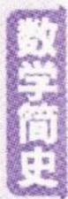

调研 6 (2022·郑州二模)已知数列 $\{a_{n}\}$ 满足 $a_{2}=2,a_{2n}=a_{2n-1}+2^{n}(n\in\mathbf{N}^{*})$ , $a_{2n+1}=a_{2n}+(-1)^{n}(n\in\mathbf{N}^{*})$ ，则数列 $\{a_{n}\}$ 的第2022项为()

A. $2^{1012} - 2$

B. $2^{1012} - 3$

C. $2^{1011} - 2$

D. ${2}^{1011} - 1$

解析 $\because a_{2n + 1} = a_{2n} + (-1)^{n}(n\in \mathbf{N}^{*}),\therefore a_{2n} = a_{2n - 1} + 2^{n} = a_{2(n - 1)} + (-1)^{n - 1}+$ $2^{n}(n\geqslant 2,n\in \mathbf{N}^{*})$

【突破口】本题 $f(n)$ 是指数形式，且含 $(-1)^{n}$ ，需分奇、偶项讨论，可以用累加法处理

$$
\therefore a _ {2 n} - a _ {2 (n - 1)} = (- 1) ^ {n - 1} + 2 ^ {n} (n \geqslant 2).
$$

$\therefore a_{4} - a_{2} = (-1)^{1} + 2^{2}, a_{6} - a_{4} = (-1)^{2} + 2^{3}, a_{8} - a_{6} = (-1)^{3} + 2^{4}, \cdots, a_{2022} - a_{2020} = (-1)^{1010} + 2^{1011},$

将上述各式累加, 得 $a_{2022}-a_{2}=(-1)+1+(-1)+1+\cdots+1+2^{2}+2^{3}+\cdots+2^{1011}=$ $\frac{2^{2}\times(1-2^{1010})}{1-2}=2^{1012}-4,\therefore a_{2022}=a_{2}+2^{1012}-4=2^{1012}-2.$ 故选 A.

情形3 形如 $a_{n+1} = pa_n / (ra_n + s)(p > 0, r \neq 0, s \neq 0, a_n \neq 0)$ 的递推公式

调研 7 (2022·四川泸州一中5月适应性考试)已知数列 $\{a_{n}\}$ 满足 $a_{1}=1$ ， $a_{n+1}=\frac{3a_{n}}{2a_{n}+3}$ ，则 $a_{7}=$ \_\_\_\_.

解析 易知 $a_{n} \neq 0$ ，由 $a_{n+1} = \frac{3a_{n}}{2a_{n} + 3}$ ，得 $\frac{1}{a_{n+1}} = \frac{1}{a_n} + \frac{2}{3}$ ，所以 $\left\{\frac{1}{a_n}\right\}$ 是首项为 1，公差

【突破口】一般地，形如 $a_{n+1} = \frac{pa_n}{ra_n + s} (p > 0, r \neq 0, s \neq 0, a_n \neq 0)$ 的递推式往往可以通过等式两边同时取倒数变为形如“ $a_{n+1} = qa_n + p (p \neq 0, q \neq 0, q \neq 1)$ ”的递推式，进而求出原数列的通项为 $\frac{2}{3}$ 的等差数列，所以 $\frac{1}{a_n} = \frac{1}{a_1} + (n-1) \times \frac{2}{3} = \frac{2n+1}{3}, a_n = \frac{3}{2n+1}$ ，所以 $a_7 = \frac{1}{5}$ . 故填 $\frac{1}{5}$ .

调研 8 (2022 · 浙江镇海中学、杭州二中 5 月联考) 数列 $\{a_{n}\}$ 满足 $a_{n+1} = \frac{a_{n}}{1 + 2a_{n}} (n \in \mathbf{N}^{*}), a_{1} = 1$ , 则下列结论错误的是 ( )

A. $\frac{2}{a_{10}}=\frac{1}{a_{3}}+\frac{1}{a_{17}}$

B. $\{2^{\frac{1}{a_n}}\}$ 是等比数列

C. $(2n - 1)a_{n} = 1$

D. $3a_{5}a_{17} = a_{49}$

变量数学时期 变量数学产生于 17 世纪,经历了两个决定性的重大步骤,第一步是解析几何的产生,第二步是微积分的创立.

# 解析

<table><tr><td>选项</td><td>分析过程</td><td>正误</td></tr><tr><td>A</td><td>数列 $\{a_n\}$ 满足 $a_{n+1} = \frac{a_n}{1 + 2a_n} (n \in \mathbb{N}^*)$ , $a_1 = 1 \to \frac{1}{a_{n+1}} = \frac{1 + 2a_n}{a_n} = \frac{1}{a_n} + 2 \to$ 数列 $\{\frac{1}{a_n}\}$ 是首项为1,公差为2的等差数列 $\to \frac{2}{a_{10}} = \frac{1}{a_3} + \frac{1}{a_{17}}$ 成立</td><td>√</td></tr><tr><td>B</td><td> $\frac{1}{a_n} = 1 + 2(n-1) = 2n-1 \to 2^{\frac{1}{a_n}} = 2^{2n-1} \to \frac{2^{\frac{1}{a_{n+1}}}}{2^{\frac{1}{a_n}}} = 4 \to$ 数列 $\{2^{\frac{1}{a_n}}\}$ 是公比为4的等比数列</td><td>√</td></tr><tr><td>C</td><td> $\frac{1}{a_n} = 2n-1 \to (2n-1)a_n = 1$ </td><td>√</td></tr><tr><td>D</td><td> $a_n = \frac{1}{2n-1} \to 3a_5a_{17} = 3 \times \frac{1}{9} \times \frac{1}{33} = \frac{1}{99}, a_{49} = \frac{1}{2 \times 49 - 1} = \frac{1}{97} \to 3a_5a_{17} = a_{49}$ 不成立</td><td>×</td></tr></table>

# 方法总结

对于递推公式形如 $a_{n+1} = \frac{pa_n}{ra_n + s} (p > 0, r \neq 0, s \neq 0, a_n \neq 0)$ 的数列 $\{a_n\}$ , 求其通项公式时, 先对已知等式两边同时取倒数, 若 $s \neq p$ , 则按照递推公式形如 “ $a_{n+1} = qa_n + f(n) (q \neq 0)$ ” 的数列的通项公式的探求方法构造等比数列求解; 若 $s = p$ , 则直接构造等差数列, 求其通项公式, 从而得原数列的通项公式.

情形4 形如 $a_{n+2} = pa_{n+1} + qa_n + m (p, q, m$ 为常数， $p \neq 0, q \neq 0$ 的递推公式

调研 9 (2022 · 辽宁沈阳二中 5 月四模) 已知数列 $\{a_{n}\}$ 满足 $a_{1} = 1, a_{2} = 3$ , $a_{n+2} = 3a_{n+1} - 2a_{n} (n \in \mathbf{N}^{*})$ .

(1) 证明: 数列 $\left\{a_{n+1}-a_{n}\right\}$ 是等比数列.  
(2)求数列 $\{a_{n}\}$ 的通项公式.

解析 (1) $\because a_{n + 2} = 3a_{n + 1} - 2a_n, \therefore a_{n + 2} - a_{n + 1} = 2(a_{n + 1} - a_n)$ ,

【指点迷津】形如 $a_{n+2} = pa_{n+1} + qa_n$ ( $p, q$ 均为非零常数)的递推公式，当 $p + q = 1$ 时，用转化法，转化为等比数列求解，本题为此种情形

在这个时期,笛卡尔引入了变量的概念,并利用坐标法把具有两个未知数的任意代数方程看成平面上的一条曲线,由此解析几何诞生.

又 $a_2 - a_1 = 2 \neq 0, \therefore a_{n+1} - a_n \neq 0, \therefore \frac{a_{n+2} - a_{n+1}}{a_{n+1} - a_n} = 2 (n \in \mathbf{N}^*)$ ,

∴ 数列 $\left\{a_{n+1}-a_{n}\right\}$ 是以 2 为首项, 2 为公比的等比数列.

(2) 由(1)得 $a_{n+1} - a_n = 2^n (n \in \mathbf{N}^*)$ ,

$\therefore a_{n} = (a_{n} - a_{n - 1}) + (a_{n - 1} - a_{n - 2}) + \dots +(a_{2} - a_{1}) + a_{1} = 2^{n - 1} + 2^{n - 2} + \dots +2 + 1 =$ $2^{n} - 1(n\in \mathbf{N}^{*},n\geqslant 2)$ ，当 $n = 1$ 时， $a_1 = 1$ ，满足上式， $\therefore a_n = 2^n -1.$

调研 10 (2022·湖北襄阳五中5月四模)已知数列 $\{a_{n}\}$ 满足 $a_{1}=2,a_{2}=6$ ，且 $a_{n+2}-2a_{n+1}+a_{n}=2$ 。若[x]表示不超过x的最大整数（例如[1.6]=1，[-1.6]=-2），则 $\left[\frac{2^{2}}{a_{1}}\right]+\left[\frac{3^{2}}{a_{2}}\right]+\cdots+\left[\frac{2021^{2}}{a_{2020}}\right]=$

A. 2018

B. 2019

C. 2 020

D. 2021

解析

$$
\because a _ {n + 2} - 2 a _ {n + 1} + a _ {n} = 2, \therefore a _ {n + 2} - a _ {n + 1} - (a _ {n + 1} - a _ {n}) = 2,
$$

【指点迷津】构造 $a_{n + 2} - a_{n + 1} - \lambda (a_{n + 1} - a_n) = 2$ ，可得 $\lambda = 1$ ，时形如 $a_{n + 2} = pa_{n + 1} + qa_n + m(p,$ $q$ ， $m$ 均为非零常数）的式子求数列通项公式，若 $p + q = 1$ ，可转化为“ $a_{n + 2} - a_{n + 1} = -q(a_{n + 1} - a_n)$ $+$ $m$ ”求解

又 $a_2 - a_1 = 4, \therefore \{a_{n+1} - a_n\}$ 是等差数列，其首项为4，公差为2.

$$
\therefore a _ {n + 1} - a _ {n} = 4 + 2 (n - 1) = 2 n + 2.
$$

当 $n \geqslant 2$ 时， $a_{n} = (a_{n} - a_{n-1}) + (a_{n-1} - a_{n-2}) + \cdots + (a_{2} - a_{1}) + a_{1} = 2n + 2(n - 1) + \cdots + 2 \times 2 + 2 = 2 \times \frac{n(n+1)}{2} = n(n+1)$ .

则当 $n \geqslant 2$ 时， $\frac{(n+1)^{2}}{a_{n}} = \frac{n+1}{n}$ ， $\left[\frac{(n+1)^{2}}{a_{n}}\right] = \left[\frac{n+1}{n}\right] = \left[1 + \frac{1}{n}\right] = 1$ ，又当 n = 1 时， $\left[\frac{2^{2}}{a_{1}}\right] = 2, \therefore \left[\frac{2^{2}}{a_{1}}\right] + \left[\frac{3^{2}}{a_{2}}\right] + \cdots + \left[\frac{2021^{2}}{a_{2020}}\right] = 2 + 2019 = 2021.$ 故选 D.

# 新题演练

1. (2022·哈尔滨三中二模) 数列 $\{a_{n}\}$ 中, $a_{1}=1, a_{n}-a_{n-1}-n=0 (n\geqslant2)$ , $S_{n}=\frac{1}{2a_{1}}+\frac{1}{2a_{2}}+\cdots+\frac{1}{2a_{n}}$ . 当 $S_{n}=\frac{99}{100}$ 时, n=

A. 98

B. 99

C. 100

D. 101

2. (2022·宁夏石嘴山一中5月适应性考试)已知数列 $\{a_{n}\}$ 满足 $a_{n+1}+(-1)^{n}a_{n}=2n-1$ ，则数列 $\{a_{n}\}$ 的前32项之和为 \_\_\_\_.

3. (2022·江苏南通期中)已知数列 $\{a_{n}\}$ 满足 $a_{1} = 3, a_{n+1} = 2a_{n} - 2$ .

(1) 求 $\{a_{n}\}$ 的通项公式；  
(2) 求 $\{a_{n}\}$ 的前 n 项和 $S_{n}$ .

# 参考答案与解析

1. B 因为 $a_{n}-a_{n-1}=n(n\geqslant2)$ ，所以 $a_{1}=1, a_{2}-a_{1}=2, a_{3}-a_{2}=3, a_{4}-a_{3}=4, \cdots, a_{n}-a_{n-1}=n$ ，将上述 n 个式子左右两边同时求和，得 $a_{n}=\frac{n(n+1)}{2}(n\geqslant2)$ ，当 n=1 时， $a_{1}=1$ ，满足上式，故 $a_{n}=\frac{n(n+1)}{2}$ .

【易错】注意不要漏加 $a_1$ . 求 $\{a_n\}$ 的通项公式时, 注意检验 $n = 1$ 的情况

所以 $\frac{1}{2a_{n}}=\frac{1}{n(n+1)}=\frac{1}{n}-\frac{1}{n+1}$ ，所以 $S_{n}=\frac{1}{2a_{1}}+\frac{1}{2a_{2}}+\cdots+\frac{1}{2a_{n}}=(1-\frac{1}{2})+(\frac{1}{2}-\frac{1}{3})+\cdots+(\frac{1}{n}-\frac{1}{n+1})=1-\frac{1}{n+1}=\frac{n}{n+1}$ ，因为 $S_{n}=\frac{n}{n+1}=\frac{99}{100}$ ，所以n=99。故选B.

2.528 当 $n$ 为奇数时, $a_{n+1} - a_n = 2n - 1$ , $a_{n+2} + a_{n+1} = 2n + 1$ , 两式相减得 $a_{n+2} + a_n = 2$ ; 当 $n$ 为偶数时, $a_{n+1} + a_n = 2n - 1$ , $a_{n+2} - a_{n+1} = 2n + 1$ , 两式相加得 $a_{n+2} + a_n = 4n$ .

【突破瓶颈】 $(-1)^{n}$ 的形式常常出现在数列的递推式中，由于 n 为奇数与 n 为偶数时的递推式会有不同的形式，所以一般需要分类讨论，分别研究数列的奇数项和偶数项的规律

$$
\therefore S _ {3 2} = \left(a _ {1} + a _ {3} + \dots + a _ {3 1}\right) + \left(a _ {2} + a _ {4} + \dots + a _ {3 2}\right) = 2 \times 8 + 4 \times (2 + 6 + \dots + 3 0) =
$$

$16 + 4 \times \frac{2 + 30}{2} \times 8 = 528.$ 故填 528.

3.(1)由 $a_{n+1}=2a_{n}-2$ ，得 $a_{n+1}-2=2a_{n}-4=2(a_{n}-2)$ ，

又 $a_1 - 2 = 1 \neq 0$ ，所以 $\{a_n - 2\}$ 是以 1 为首项，2 为公比的等比数列，

【易错】勿忘检验 $n = 1$ 的情况，等比数列首项不为0

所以 $a_{n} - 2 = 2^{n - 1}$ ，故 $a_{n} = 2^{n - 1} + 2(n\in \mathbf{N}^{*})$

(2)由(1)可知 $S_{n}=2^{0}+2+2^{1}+2+\cdots+2^{n-1}+2=(2+2+\cdots+2)+(2^{0}+2^{1}+\cdots+2^{n-1})=\frac{1-2^{n}}{1-2}+2n=2^{n}+2n-1.$

【小妙招】注意分两组处理，一组是 $n$ 个2的和，另一组是首项为1，公比为2的等比数列的前 $n$ 项和

微积分是为解决某些方面的问题而诞生的,主要是力学的一些新问题,如已知路程对时间的关系求速度,及几何学的一些问题,如作曲线的切线.

# 超重点 7 数列求和的 6 种必会技法

# 技法1 公式求和法

调研 1 (2022·哈师大附中、东北师大附中联考)已知数列 $\{a_{n}\}$ 满足对任意的正整数n,都有 $a_{1}+a_{2}+\cdots+a_{n}-a_{n+1}=0$ ,其中 $a_{1}=3$ ,则数列 $\{a_{n}\}$ 的前2022项和 $S_{2022}=$ ()

A. $3 \times 2^{2022} - 3$

B. $3 \times 2^{2021} + 1$

C. $3 \times 2^{2021}$

D. $3 \times 2^{2021} + 2$

解析 由题可得 $S_{n} = a_{n + 1}$ ①, 故当 $n \geqslant 2$ 时, $S_{n - 1} = a_{n}$ ②, ①-②得 $a_{n} = a_{n + 1} - a_{n}(n \geqslant 2)$ , 即 $a_{n + 1} = 2a_{n}(n \geqslant 2)$ , 又当 $n = 1$ 时, $a_{1} - a_{2} = 0$ , 即 $a_{1} = a_{2} = 3$ ,

故该数列从第二项起是公比为2的等比数列，

【极易出错】注意数列从第二项起是等比数列，代入公式求解时注意项数

故 $S_{2022} = 3 + \frac{3\times(1 - 2^{2021})}{1 - 2} = 3 + 3\times (2^{2021} - 1) = 3\times 2^{2021}$ 故选C.

调研 2 （2022·辽宁省实验中学、东北育才中学6月联考）设数列 $\{a_{n}\}$ 是等比数列,其前n项和为 $S_{n}$ .

(1)从下面两个条件中任选一个作为已知条件,求 $\{a_{n}\}$ 的通项公式.

① $a_{1}=1,\{2-S_{n}\}$ 是等比数列；② $S_{2}=2a_{3}+1,S_{3}=6a_{4}+1.$

(2) 在(1)的条件下, 若 $b_{n} = a_{3n - 1}$ , 求数列 $\{b_{n}\}$ 的前 $n$ 项和 $T_{n}$ .

注:如果选择多个条件分别作答,按第一个解答计分.

解析 (1) 设等比数列 $\{a_{n}\}$ 的公比为 $q, q \neq 0$ .

若选①,根据 $\{2-S_{n}\}$ 是等比数列可知 $(2-S_{2})^{2}=(2-S_{1})(2-S_{3})$ ,又 $a_{1}=1$ ,故 $a_{2}=q,a_{3}=q^{2}$ ,故 $S_{1}=1,S_{2}=1+q,S_{3}=1+q+q^{2}$ ,故 $(2-1-q)^{2}=(2-1)(2-1-q-q^{2})$ ,化

【小妙招】借助数列前3项的关系建立等式，避免对通项公式的研究，减少运算量简得 $1-2q+q^{2}=1-q-q^{2}$ ，解得 $q=\frac{1}{2}$ ，故 $a_{n}=\frac{1}{2^{n-1}}$ ，

此时 $S_{n} = \frac{1 - \frac{1}{2^{n}}}{1 - \frac{1}{2}} = 2 - \frac{1}{2^{n - 1}}$ ，数列 $\{2 - S_n\}$ 即数列 $\{\frac{1}{2^{n - 1}}\}$ ，为等比数列，符合题意，故 $a_{n} = \frac{1}{2^{n - 1}}$

若选②, 由 $S_{2} = 2a_{3} + 1$ , $S_{3} = 6a_{4} + 1$ 可得 $S_{3} - S_{2} = a_{3} = 6a_{4} - 2a_{3}$ , 即 $a_{4} = \frac{1}{2} a_{3}$ , 故 $q = \frac{1}{2}$ , 故 $a_{1} + \frac{1}{2} a_{1} = 2 \times \frac{1}{2^{2}} a_{1} + 1$ , 解得 $a_{1} = 1$ , 故 $a_{n} = \frac{1}{2^{n-1}}$ .

牛顿与莱布尼茨为微积分的发展做出了巨大贡献,发明了影响深远的微积分基本定理.

(2) 由题意知, $b_{n}=a_{3n-1}=\frac{1}{2^{3n-1-1}}=\frac{1}{2^{3n-2}}$ ,

故 $T_{n}=\frac{1}{2^{1}}+\frac{1}{2^{4}}+\cdots+\frac{1}{2^{3n-2}}=\frac{\frac{1}{2^{1}}(1-\frac{1}{2^{3n}})}{1-\frac{1}{2^{3}}}=\frac{4}{7}(1-\frac{1}{2^{3n}})$ .

【极易出错】注意数列 $\{b_{n}\}$ 的公比是 $\frac{1}{2^{3}}$ ，不是 $\frac{1}{2}$

# 技法2 分组求和法

调研 3 (2022·辽宁沈阳重点高中郊联体6月联考)已知数列 $\{a_{n}\}$ 满足 $4a_{n}=3S_{n}+1$ ，其中 $S_{n}$ 为 $\{a_{n}\}$ 的前n项和， $n\in N^{*}$ .

(1) 求数列 $\{a_{n}\}$ 的通项公式；  
(2) 设 $\{b_{n}-a_{n}\}$ 是等差数列, 且 $b_{1}=2, b_{2}=6$ , 求 $\{b_{n}\}$ 的前 n 项和 $T_{n}$ .

解析 (1) $\because 4a_{n} = 3S_{n} + 1, \therefore$ 当 $n \geqslant 2$ 时, $4a_{n-1} = 3S_{n-1} + 1$ ,

【小妙招】此处用 $n - 1$ 替换 $n$ , 所以需要加上 $n \geqslant 2$ 这个条件, 如果用 $n + 1$ 替换 $n$ , 得到 $4a_{n+1} = 3S_{n+1} + 1$ , 就不需要这个条件了

两式相减可得 $4a_{n} - 4a_{n - 1} = 3a_{n}$ ，即 $a_{n} = 4a_{n - 1}$ ，当 $n = 1$ 时， $4a_{1} = 3a_{1} + 1$ ，解得 $a_1 = 1$

∴ 数列 $\{a_{n}\}$ 是等比数列, 首项为 1, 公比为 4, $\therefore a_{n}=4^{n-1}$ .

(2) 设等差数列 $\{b_{n}-a_{n}\}$ 的公差为 d, $\because b_{1}-a_{1}=2-1=1, b_{2}-a_{2}=6-4=2,$

$$
\therefore d = 2 - 1 = 1, \therefore b _ {n} - a _ {n} = 1 + (n - 1) \times 1 = n, \therefore b _ {n} = n + 4 ^ {n - 1}.
$$

$\therefore \{b_{n}\}$ 的前 $n$ 项和 $T_{n} = \frac{n(n + 1)}{2} +\frac{1 - 4^{n}}{1 - 4} = \frac{n^{2} + n}{2} +\frac{1}{3} (4^{n} - 1).$

【指点迷津】分组求和法主要是根据数列通项公式的形式，将其看成几个等差数列、等比数列的和（差）的形式，利用求和公式分别求和

# 技法3 错位相减法

调研 4 (2022·福建三明一中5月质检)设数列 $\{a_{n}\}$ 的前n项和为 $S_{n}$ ，若 $a_{1}=1,S_{n}=a_{n+1}-1.$

(1) 求数列 $\{a_{n}\}$ 的通项公式；  
(2) 设 $b_n = \frac{n}{a_{n+1}}$ , 求数列 $\{b_n\}$ 的前 $n$ 项和 $T_n$ .

解析 (1) 因为 $a_{1} = 1, S_{n} = a_{n + 1} - 1$ , 所以 $S_{1} = a_{2} - 1$ , 解得 $a_{2} = 2$ .

微积分的诞生创造性地把数学推到了一个崭新的高度,它标志着以变量为研究主体的近代数学的开始.

当 $n \geqslant 2$ 时, $S_{n-1} = a_n - 1$ , 所以 $a_n = S_n - S_{n-1} = a_{n+1} - a_n$ ,

所以 $2a_{n} = a_{n + 1}(n\geqslant 2)$ ，即 $\frac{a_{n + 1}}{a_n} = 2(n\geqslant 2).$

因为 $\frac{a_2}{a_1} = 2$ 也满足上式, 所以 $\{a_n\}$ 是首项为 1 , 公比为 2 的等比数列, 所以 $a_n = 2^{n-1}, n \in \mathbf{N}^*$ .

【极易出错】证明数列是等比数列，除了找到递推关系以外，还需要验证“首项”

(2) 由(1)知 $a_{n+1} = 2^n$ , 所以 $b_n = \frac{n}{2^n}$ ,

【模型判断】错位相减法是针对通项公式为“等差×等比”形式的数列求和的方法，本题数列通项公式为“等差×等比”形式，可采用错位相减法求和

所以 $T_{n}=1\times\frac{1}{2}+2\times\left(\frac{1}{2}\right)^{2}+3\times\left(\frac{1}{2}\right)^{3}+\cdots+n\times\left(\frac{1}{2}\right)^{n}$ ①,

则 $\frac{1}{2}T_{n}=$ $1\times\left(\frac{1}{2}\right)^{2}+2\times\left(\frac{1}{2}\right)^{3}+\cdots+(n-1)\times\left(\frac{1}{2}\right)^{n}+n\times\left(\frac{1}{2}\right)^{n+1}$ ②,

【极易出错】“错位乘比”，即数列的求和式两边同时乘以等比数列的公比 $q$ ，并把原等式与变形后的等式同次数的项上下对齐书写，避免两式相减时计算错误

①-②得 $\frac{1}{2}T_{n}=\frac{1}{2}+(\frac{1}{2})^{2}+(\frac{1}{2})^{3}+\cdots+(\frac{1}{2})^{n}-n\times(\frac{1}{2})^{n+1}=\frac{\frac{1}{2}\left[1-\left(\frac{1}{2}\right)^{n}\right]}{1-\frac{1}{2}}-$ $n \times \left( \frac{1}{2} \right)^{n+1} = 1 - \left( 1 + \frac{n}{2} \right) \left( \frac{1}{2} \right)^{n}$ ，所以 $T_{n}=2-\frac{n+2}{2^{n}}$ .

调研 5 (2022 · 江西上饶一中 5 月模拟) 从① $b_{5}-b_{4}=18b_{2}$ ，② $S_{5}=b_{4}-2$ ，

③ $\log_{3}b_{n+1}-1=\log_{3}b_{n}$ 这三个条件中任选一个，补充在下面问题中，并解答.

已知数列 $\{a_{n}\}$ 的前 $n$ 项和为 $S_{n}$ , 数列 $\{b_{n}\}$ 是正项等比数列, 且 $2a_{n} = a_{n+1} + a_{n-1} (n \geqslant 2)$ , $S_{3} = b_{3} = 9$ , $b_{4} = a_{14}$ , \_\_\_\_.

(1) 求数列 $\{a_{n}\}$ 和 $\{b_{n}\}$ 的通项公式；  
(2) 若 $c_{n} = a_{n}b_{n}$ , 求数列 $\{c_{n}\}$ 的前 $n$ 项和 $T_{n}$ .

注:如果选择多个条件分别解答,按第一个解答计分.

解析 (1) 选①. 设数列 $\{b_{n}\}$ 的公比为 $q(q > 0)$ ,

由 $b_{5} - b_{4} = 18b_{2}$ ，得 $q^{3} - q^{2} = 18$ ，则 $(q - 3)(q^{2} + 2q + 6) = 0$ ，得 $q = 3$

由 $2a_{n} = a_{n + 1} + a_{n - 1}(n\geqslant 2)$ 知数列 $\{a_n\}$ 为等差数列，

设等差数列 $\{a_{n}\}$ 的公差为 $d$ ，由 $S_{3} = b_{3} = 9,b_{4} = a_{14}$

得 $S_{3}=3a_{2}=3(a_{1}+d)=9, b_{3}=b_{1}q^{2}=9, b_{4}=9q=a_{1}+13d$ ，所以 $a_{1}=b_{1}=1, d=2$ ，

故数列 $\{a_{n}\}$ 和 $\{b_{n}\}$ 的通项公式分别为 $a_{n} = 2n - 1, b_{n} = 3^{n - 1}$ .

选②. 由 $2a_{n} = a_{n + 1} + a_{n - 1}(n \geqslant 2)$ 知数列 $\{a_{n}\}$ 为等差数列，

设数列 $\{a_{n}\}$ 的公差为d,数列 $\{b_{n}\}$ 的公比为 $q(q>0)$ ,

由 $S_{3} = b_{3} = 9, b_{4} = a_{14}, S_{5} = b_{4} - 2$ ，得 $S_{3} = 3a_{2} = 3(a_{1} + d) = 9, b_{3} = b_{1}q^{2} = 9, b_{4} = 9q = a_{1} + 13d, 5a_{1} + 10d = 9q - 2$ ，得 $a_{1} = b_{1} = 1, d = 2, q = 3$

故数列 $\{a_{n}\}$ 和 $\{b_{n}\}$ 的通项公式分别为 $a_{n} = 2n - 1, b_{n} = 3^{n - 1}$ .

选③. 设数列 $\{b_{n}\}$ 的公比为 $q(q>0)$ ，由 $\log_{3}b_{n+1}-1=\log_{3}b_{n}$ ，得 $\frac{b_{n+1}}{b_{n}}=3$ ，则 q=3.

由 $2a_{n} = a_{n + 1} + a_{n - 1}(n\geqslant 2)$ 知数列 $\{a_n\}$ 为等差数列，

设等差数列 $\{a_{n}\}$ 的公差为 $d$ ，由 $S_{3} = b_{3} = 9, b_{4} = a_{14}$ ，得 $S_{3} = 3a_{2} = 3(a_{1} + d) = 9$ ， $b_{3} = b_{1}q^{2} = 9, b_{4} = 9q = a_{1} + 13d$ ，所以 $a_{1} = b_{1} = 1, d = 2$

故数列 $\{a_{n}\}$ 和 $\{b_{n}\}$ 的通项公式分别为 $a_{n} = 2n - 1, b_{n} = 3^{n - 1}$ .

(2) 由(1)知 $c_{n}=a_{n}b_{n}=(2n-1)\times3^{n-1}$ ,

【模型判断】数列 $\{c_{n}\}$ 的通项公式为“等差×等比”的形式，可采用错位相减法求和

所以 $T_{n}=1\times3^{0}+3\times3^{1}+5\times3^{2}+\cdots+(2n-1)\times3^{n-1}$ ①,

$$
3 T _ {n} = \quad 1 \times 3 ^ {1} + 3 \times 3 ^ {2} + \dots + (2 n - 3) \times 3 ^ {n - 1} + (2 n - 1) \times 3 ^ {n} \quad ②,
$$

①-②得 $-2T_{n}=1+2\times(3^{1}+3^{2}+\cdots+3^{n-1})-(2n-1)\times3^{n}=1+2\times$

【扫清障碍】“对应相减”，相减时要注意最后一项的符号

$$
\frac {3 \times (1 - 3 ^ {n - 1})}{1 - 3} - (2 n - 1) \times 3 ^ {n} = - 2 - (2 n - 2) \times 3 ^ {n}, \text {所以} T _ {n} = 1 + (n - 1) \times 3 ^ {n}.
$$

# 技法4 裂项相消法

调研 6 (2022·新高考 I 卷) 记 $S_{n}$ 为数列 $\{a_{n}\}$ 的前 $n$ 项和, 已知 $a_{1} = 1$ , $\{\frac{S_{n}}{a_{n}}\}$ 是公差为 $\frac{1}{3}$ 的等差数列.

(1) 求 $\{a_{n}\}$ 的通项公式.  
(2) 证明: $\frac{1}{a_1} + \frac{1}{a_2} + \cdots + \frac{1}{a_n} < 2$ .

解析 (1) 方法一 因为 $\frac{S_1}{a_1} = 1, \left\{\frac{S_n}{a_n}\right\}$ 是公差为 $\frac{1}{3}$ 的等差数列，

所以 $\frac{S_{n}}{a_{n}}=1+(n-1)\times\frac{1}{3}=\frac{n+2}{3}.$

现代数学时期 开始于19世纪,数学发展的现代阶段的开端,以代数、几何、分析中的深刻变化为特征.

因为当 $n \geqslant 2$ 时, $a_{n} = S_{n} - S_{n-1} \neq 0$ ,

所以 $\frac{S_n}{S_n - S_{n-1}} = \frac{n + 2}{3} (n\geqslant 2)$ ，所以 $\frac{S_n - S_{n-1}}{S_n} = \frac{3}{n + 2} (n\geqslant 2)$ ，整理得 $\frac{S_n}{S_{n-1}} = \frac{n + 2}{n - 1}(n\geqslant 2).$

所以 $\frac{S_2}{S_1} \times \frac{S_3}{S_2} \times \frac{S_4}{S_3} \times \cdots \times \frac{S_{n - 2}}{S_{n - 3}} \times \frac{S_{n - 1}}{S_{n - 2}} \times \frac{S_n}{S_{n - 1}} = \frac{4}{1} \times \frac{5}{2} \times \frac{6}{3} \times \cdots \times \frac{n}{n - 3} \times \frac{n + 1}{n - 2} \times \frac{n + 2}{n - 1} =$ $\frac{n(n + 1)(n + 2)}{6} (n\geqslant 2)$ ，所以 $S_{n} = \frac{n(n + 1)(n + 2)}{6} (n\geqslant 2)$ ，又 $S_{1} = 1$ 也满足上式，

所以 $S_{n} = \frac{n(n + 1)(n + 2)}{6} (n\in \mathbf{N}^{*})$ ，则 $S_{n - 1} = \frac{(n - 1)n(n + 1)}{6} (n\geqslant 2)$

所以 $a_{n} = \frac{n(n + 1)(n + 2)}{6} -\frac{(n - 1)n(n + 1)}{6} = \frac{n(n + 1)}{2} (n\geqslant 2),$

又 $a_1 = 1$ 也满足上式，所以 $a_n = \frac{n(n + 1)}{2} (n\in \mathbf{N}^*)$

方法二 因为 $\frac{S_{1}}{a_{1}}=1,\left\{\frac{S_{n}}{a_{n}}\right\}$ 是公差为 $\frac{1}{3}$ 的等差数列,所以 $\frac{S_{n}}{a_{n}}=1+(n-1)\times\frac{1}{3}=$ $\frac{n+2}{3}$ ,所以 $S_{n}=\frac{n+2}{3}a_{n}$ .

因为当 $n \geqslant 2$ 时, $a_{n} = S_{n} - S_{n-1} = \frac{n+2}{3} a_{n} - \frac{n+1}{3} a_{n-1}$ ,

所以 $\frac{n + 1}{3} a_{n - 1} = \frac{n - 1}{3} a_n(n\geqslant 2)$ ，所以 $\frac{a_n}{a_{n - 1}} = \frac{n + 1}{n - 1}(n\geqslant 2).$

所以 $\frac{a_2}{a_1} \times \frac{a_3}{a_2} \times \cdots \times \frac{a_{n-1}}{a_{n-2}} \times \frac{a_n}{a_{n-1}} = \frac{3}{1} \times \frac{4}{2} \times \cdots \times \frac{n}{n-2} \times \frac{n+1}{n-1} = \frac{n(n+1)}{2} (n \geqslant 2)$ ,

所以 $a_{n} = \frac{n(n + 1)}{2} (n\geqslant 2)$ ，又 $a_1 = 1$ 也满足上式，所以 $a_{n} = \frac{n(n + 1)}{2} (n\in \mathbf{N}^{*})$

(2) 因为 $a_{n} = \frac{n(n + 1)}{2}$ , 所以 $\frac{1}{a_n} = \frac{2}{n(n + 1)} = 2\left(\frac{1}{n} - \frac{1}{n + 1}\right)$ ,

【突破口】若数列的通项公式呈现“分子是常数，分母是等差数列的相邻项之积”的结构，数列的求和往往应用裂项相消法，其实质是写成“结构相同”的两个式子的差的形式，然后累加，消掉中间的许多项

所以 $\frac{1}{a_{1}}+\frac{1}{a_{2}}+\cdots+\frac{1}{a_{n}}=2\left[(1-\frac{1}{2})+(\frac{1}{2}-\frac{1}{3})+\cdots+(\frac{1}{n-1}-\frac{1}{n})+(\frac{1}{n}-\frac{1}{n+1})\right]=2(1-\frac{1}{n+1})<2.$

# 方法点津

常见的裂项技巧有 $\frac{1}{n(n + k)} = \frac{1}{k}\left(\frac{1}{n} -\frac{1}{n + k}\right)(k\neq 0)$ ， $\frac{1}{(2n - 1)(2n + 1)} = \frac{1}{2}\left(\frac{1}{2n - 1} -\right.$ $\frac{1}{2n + 1}),\frac{1}{n(n + 1)(n + 2)} = \frac{1}{2}\left[\frac{1}{n(n + 1)} -\frac{1}{(n + 1)(n + 2)}\right],\log_a(1 + \frac{1}{n}) = \log_a(1 + n) - \log_ {a}n$ （ $a > 0$ 且 $a\neq 1)$ ， $\frac{1}{\sqrt{n + 1} + \sqrt{n}} = \sqrt{n + 1} -\sqrt{n},\frac{2^n}{(2^n - 1)(2^{n + 1} - 1)} = \frac{1}{2^n - 1} -\frac{1}{2^{n + 1} - 1}$ 等.

调研 7 (2022·四川绵阳中学实验学校6月模拟)已知 $S_{n}$ 是数列 $\{a_{n}\}$ 的前 $n$ 项和,且 $S_{n}=n^{2}+n+1$ .

(1) 求 $\{a_{n}\}$ 的通项公式；  
(2) 若 $b_{n} = \frac{1}{a_{n} a_{n+1}}$ , $T_{n}$ 是 $\{b_{n}\}$ 的前 $n$ 项和, 求 $T_{5}$ .

数列通项公式为分式形式，一般考虑采用裂项相消法求和

解析 (1) 已知 $S_{n}$ 是数列 $\{a_{n}\}$ 的前 $n$ 项和, 且 $S_{n} = n^{2} + n + 1$ ,

则 $S_{n - 1} = (n - 1)^2 +(n - 1) + 1$

所以 $a_{n}=S_{n}-S_{n-1}=2n(n\geqslant2)$ ,

又 $a_1 = S_1 = 3$ ，不满足上式，所以 $a_{n} = \left\{ \begin{array}{l}3,n = 1,\\ 2n,n\geqslant 2\text{且} n\in \mathbf{N}^{*}. \end{array} \right.$

(2)由(1)得当 $n \geqslant 2$ 时, $b_{n} = \frac{1}{4} \times \frac{1}{n(n + 1)} = \frac{1}{4} (\frac{1}{n} - \frac{1}{n + 1})$ ,

则 $T_{5}=\frac{1}{3\times4}+\frac{1}{4}\times\left[\left(\frac{1}{2}-\frac{1}{3}\right)+\left(\frac{1}{3}-\frac{1}{4}\right)+\left(\frac{1}{4}-\frac{1}{5}\right)+\left(\frac{1}{5}-\frac{1}{6}\right)\right]=\frac{1}{6}.$

【易错】数列 $\{b_{n}\}$ 的第一项不符合裂项相消规律，注意不要忽略

调研 8 (2022·福建龙岩 5 月三检)已知等差数列 $\{a_{n}\}$ 的前 $n$ 项和为 $S_{n}, a_{3} + a_{5} = 18, S_{6} = 48$ .

(1) 求 $\{a_{n}\}$ 的通项公式；  
(2) 设 $b_n = \frac{2}{\sqrt{a_{n+1}} + \sqrt{a_n}}$ , 数列 $\{b_n\}$ 的前 $n$ 项和为 $T_n$ , 证明: 当 $n \geqslant 4, n \in \mathbf{Z}$ 时, $4T_n^2 > a_n$ .

解析 (1) 设等差数列 $\{a_{n}\}$ 的公差为 $d$ , 由于 $a_{3} + a_{5} = 18, S_{6} = 48$ ,

所以 $\left\{\begin{aligned}&2a_{1}+6d=18,\\ &6a_{1}+\frac{6\times5}{2}d=48,\end{aligned}\right.$ 解得 $\left\{\begin{aligned}a_{1}=3,\\ d=2,\end{aligned}\right.$ 所以 $a_{n}=2n+1$ .

在 19 世纪,人们发现了与通常的欧几里得几何不同的非欧几何,这引发了人们对数学本质的深入探讨.

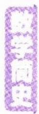

(2)由(1)得 $b_{n}=\frac{2}{\sqrt{a_{n+1}}+\sqrt{a_{n}}}=\frac{2}{\sqrt{2n+3}+\sqrt{2n+1}}=\sqrt{2n+3}-\sqrt{2n+1}$ ,

所以 $T_{n}=\sqrt{5}-\sqrt{3}+\sqrt{7}-\sqrt{5}+\cdots+\sqrt{2n+3}-\sqrt{2n+1}=\sqrt{2n+3}-\sqrt{3}$

$$
4 T _ {n} ^ {2} - a _ {n} = 4 \left(\sqrt {2 n + 3} - \sqrt {3}\right) ^ {2} - (2 n + 1) = 6 n + 2 3 - 8 \sqrt {6 n + 9},
$$

设函数 $f(n)=(6n+23)^{2}-64(6n+9)=36n^{2}-108n-47=36\left(n-\frac{3}{2}\right)^{2}-128,n\in\mathbf{N}^{*}$

易知 $f(n)$ 在 $n\geqslant2$ 时单调递增, $f(4)=97>0$ ,

所以当 $n \geqslant 4$ 时， $(6n + 23)^2 > 64(6n + 9)$ ，即 $6n + 23 > 8\sqrt{6n + 9}$ ，即 $4T_n^2 > a_n$ 。

# 技法5 倒序相加法

调研 9 (2022 · 辽宁省实验中学 6 月模拟) 函数 $f(x) = \ln x$ , 其中 $f(x) + f(y) = 2$ , 记 $S_n = \ln x^n + \ln (x^{n-1}y) + \cdots + \ln (xy^{n-1}) + \ln y^n (n \in \mathbf{N}^*)$ , 则 $\sum_{i=1}^{2022} \frac{1}{S_i} = (\quad)$

A. $\frac{2022}{2023}$

B. $\frac{2023}{2022}$

C. $\frac{2023}{4044}$

D. $\frac{4044}{2023}$

解析 $\because f(x)=\ln x,f(x)+f(y)=2,\therefore f(x)+f(y)=\ln x+\ln y=\ln(xy)=2.$

$S_{n}=\ln x^{n}+\ln(x^{n-1}y)+\cdots+\ln(xy^{n-1})+\ln y^{n}$ ，即 $S_{n}=\ln y^{n}+\ln(xy^{n-1})+\cdots+\ln(x^{n-1}y)+\ln x^{n}$

【突破口】若求和式中到首尾距离相等的两项和相等或者求和式中到首尾距离相等的两项具有某种对称性，则可以考虑使用倒序相加法，将求和式倒序书写，之后与原式相加，要注意相加后求出的和是所求和的二倍，得出结果后不要忘了除以2

两式相加得, $2S_{n}=(n+1)\ln(x^{n}y^{n})=(n+1)n\ln(xy)=2n(n+1)$ ,

$\therefore S_{n} = n(n + 1), \sum_{i=1}^{2022} \frac{1}{S_{i}} = \sum_{i=1}^{2022} \frac{1}{i(i+1)} = \sum_{i=1}^{2022} \left( \frac{1}{i} - \frac{1}{i+1} \right) = 1 - \frac{1}{2023} = \frac{2022}{2023}$ , 故选 A.

调研 10 (2022·湖南岳阳二模/数学文化)德国数学家高斯是近代数学奠基者之一,有“数学王子”之称,他幼年时就表现出超人的数学天赋,相传少年时的高斯在进行 $1+2+3+\cdots+100$ 的求和运算时,就运用了倒序相加法的原理,该原理是指所给数据前后对应项的和呈现一定的规律,因此,可以将对应项相加,进而得出结果.已知某数列的通项 $a_{n}=\frac{2n-100}{2n-101}$ ,则 $a_{1}+a_{2}+\cdots+a_{100}=$

A. 98

B. 99

C. 100

D. 101

解析 方法一 由题意, $a_{n}+a_{101-n}=\frac{2n-100}{2n-101}+\frac{2(101-n)-100}{2(101-n)-101}=\frac{2n-100}{2n-101}+\frac{2n-102}{2n-101}=2$ ,所以 $a_{1}+a_{100}=a_{2}+a_{99}=\cdots=a_{50}+a_{51}$ ,

所以 $a_{1} + a_{2} + \cdots + a_{100} = (a_{1} + a_{100}) + (a_{2} + a_{99}) + \cdots + (a_{50} + a_{51}) = 50 \times 2 = 100.$

故选C.

方法二 函数 $f(x)=\frac{2x-100}{2x-101}$ 的图象关于点 $\left(\frac{101}{2},1\right)$ 对称，

【敲黑板】函数 $f(x)=\frac{cx+d}{ax+b}$ 的图象的对称中心是 $\left(-\frac{b}{a},\frac{c}{a}\right)(a\neq0)$

所以 $f(1) + f(100) = f(2) + f(99) = \cdots = f(50) + f(51) = 2$ ,

即 $a_{1} + a_{100} = a_{2} + a_{99} = \cdots = a_{50} + a_{51}$ ,

所以 $a_{1} + a_{2} + \cdots + a_{100} = (a_{1} + a_{100}) + (a_{2} + a_{99}) + \cdots + (a_{50} + a_{51}) = 50 \times 2 = 100.$

故选C.

# 技法6 并项求和法

调研 11 (2022·云南昆明 5 月模拟) 数列 $\{(-1)^{n}(2^{n}+n)\}$ 的前 10 项和 $S_{10}$ 等于 \_\_\_\_.

解析 数列 $\left\{(-1)^{n}(2^{n}+n)\right\}$ 的前 10 项和 $S_{10}=-(2^{1}+1)+(2^{2}+2)-(2^{3}+3)+(2^{4}+4)-\cdots-(2^{9}+9)+(2^{10}+10)=-2^{1}+2^{2}-2^{3}+2^{4}-\cdots-2^{9}+2^{10}+(-1+2)+(-3+4)+\cdots+(-9+10)=\frac{-2\times[1-(-2)^{10}]}{1-(-2)}+5=687$ , 故填 687.

【突破口】本题光用分组求和法将等比数列求和与常数求和分开，在求解常数的和时应用了并项求和，并项求和法是将数列的某些项合并，便于求和

调研 12 (2022·河北石家庄一中、保定一中联考)已知数列 $\{a_{n}\}$ 满足 $a_{1}=1$ , $a_{n+1} + a_n = (n+1)\cos\frac{n\pi}{2}(n \geqslant 2, n \in \mathbf{N}^*)$ , $S_n$ 是数列 $\{a_{n}\}$ 的前 n 项和, 则 $S_{2021} =$ ()

A. 508

B. 506

C. 1 011

D. 1 009

解析 函数 $y = \cos \frac{n\pi}{2}$ 的最小正周期 $T = \frac{2\pi}{\frac{\pi}{2}} = 4$ ,

19 世纪中后期,康托尔发明集合论,其思想方法广泛应用于现代纯数学分支领域.

$$
\because a _ {n + 1} + a _ {n} = (n + 1) \cos \frac {n \pi}{2} (n \geqslant 2, n \in \mathbf {N} ^ {*}),
$$

【指点迷津】一般情况下,通项公式带有三角函数、 $(-1)^{n}$ 或具有周期性的数列中容易出现相邻项互相有联系的特点,此时可以采用并项求和法

$$
\begin{array}{r l} & {\therefore a _ {2} + a _ {3} = 3 \cos \pi = - 3, a _ {4} + a _ {5} = 5 \cos 2 \pi = 5, a _ {6} + a _ {7} = - 7, a _ {8} + a _ {9} = 9, \dots , a _ {2 0 2 0} +} \\ & {a _ {2 0 2 1} = 2 0 2 1,} \end{array}
$$

$$
\therefore S _ {2 0 2 1} = 1 + (- 3 + 5) + (- 7 + 9) + \dots + (- 2 0 1 9 + 2 0 2 1) = 1 + 2 \times 5 0 5 = 1 0 1 1,
$$

故选 C.

# 新题演练

1. (2022·安徽合肥肥东二中模拟/多项式裂项) 设数列 $\{a_{n}\}$ 满足 $a_{1} = 3, a_{n+1} = 3a_{n} - 4n$ , 若 $b_{n} = \frac{4n^{2} + 8n + 5}{a_{n}a_{n+1}}$ , 且数列 $\{b_{n}\}$ 的前 $n$ 项和为 $S_{n}$ , 则 $S_{n} =$ ()

A. $n(1 - \frac{2}{6n + 9})$

B. $\frac{4}{3}+\frac{2n}{6n+9}$

C. $n(1 + \frac{1}{6n + 9})$

D. $n(1 + \frac{2}{6n + 9})$

2. (2022·浙江温州中学适应性考试/根式裂项 + 放缩) 已知数列 $\{a_{n}\}$ 满足 $a_{1} = 1$ , $a_{n+1} = \frac{a_{n}}{\mathrm{e}^{a_{n+1}} + \sqrt{a_{n}}} (n \in \mathbf{N}^{*})$ , 记数列 $\{a_{n}\}$ 的前 $n$ 项和为 $S_{n}$ , 则 ( )

A. $1 < S_{2022} < 3$

B. $3 < S_{2022} < 4$

C. $4 < S_{2022} < \frac{9}{2}$

D. $\frac{9}{2}<S_{2022}<5$

3. (2022·广东汕头二模/创新题型)已知 $n^2 (n \geqslant 4)$ 个正数排成 $n$ 行 $n$ 列, $a_{ij}$ 表示第 $i$ 行第 $j$ 列的数, 其中每一行的数依次构成等差数列, 每一列的数依次构成等比数列, 并且公比都为 $q$ . 已知 $a_{24} = 1, a_{42} = \frac{1}{8}, a_{43} = \frac{3}{16}$ .

(1) 求公比 q;

(2) 记第 $n$ 行的数所构成的等差数列的公差为 $d_{n}$ , 把 $d_{1}, d_{2}, \cdots, d_{n}$ 所构成的数列记为数列 $\{d_{n}\}$ , 求数列 $\{d_{n}\}$ 的前 $n$ 项和 $S_{n}$ .

<table><tr><td> $a_{11}$ </td><td> $a_{12}$ </td><td> $a_{13}$ </td><td> $a_{14}$ </td><td>...</td><td> $a_{1n}$ </td></tr><tr><td> $a_{21}$ </td><td> $a_{22}$ </td><td> $a_{23}$ </td><td> $a_{24}$ </td><td>...</td><td> $a_{2n}$ </td></tr><tr><td> $a_{31}$ </td><td> $a_{32}$ </td><td> $a_{33}$ </td><td> $a_{34}$ </td><td>...</td><td> $a_{3n}$ </td></tr><tr><td>...</td><td>...</td><td>...</td><td>...</td><td>...</td><td>...</td></tr><tr><td> $a_{n1}$ </td><td> $a_{n2}$ </td><td> $a_{n3}$ </td><td> $a_{n4}$ </td><td>...</td><td> $a_{nn}$ </td></tr></table>

# 参考答案与解析

1. D 数列 $\{a_{n}\}$ 满足 $a_{1}=3, a_{n+1}=3a_{n}-4n$ ，整理得 $a_{n+1}-[2(n+1)+1]=3[a_{n}-(2n+1)]$ ，因为 $a_{1}-(2\times1+1)=3-3=0$ ，所以 $a_{n}=2n+1$ 。

$$
b _ {n} = \frac {4 n ^ {2} + 8 n + 5}{(2 n + 1) (2 n + 3)} = 1 + \frac {1}{2 n + 1} - \frac {1}{2 n + 3},
$$

【会运算】光分离常数，再裂项

所以 $S_{n}=b_{1}+b_{2}+\cdots+b_{n}=1+\left(\frac{1}{3}-\frac{1}{5}\right)+1+\left(\frac{1}{5}-\frac{1}{7}\right)+\cdots+1+\left(\frac{1}{2n+1}-\frac{1}{2n+3}\right)=n+$ $\frac{1}{3}-\frac{1}{2n+3}=n\left(1+\frac{2}{6n+9}\right)$ . 故选 D.

2. A 由 $a_1 = 1, a_{n+1} = \frac{a_n}{\mathrm{e}^{a_{n+1}} + \sqrt{a_n}} (n \in \mathbf{N}^*)$

易知对任意的 $n \in N^{*}, a_{n} > 0$ ，所以 $S_{2022} > S_{1} = 1$ .

$a_{n} > 0$ ，则 $\mathrm{e}^{a_{n + 1}} > 1$ ，所以 $\frac{a_{n + 1}}{a_n} = \frac{1}{\mathrm{e}^{a_{n + 1}} + \sqrt{a_n}} < 1,$

所以 $a_{n + 1} = \frac{a_n}{\mathrm{e}^{a_{n + 1}} + \sqrt{a_n}} < \frac{a_n}{1 + \sqrt{a_n}}$ ，即 $1 + \sqrt{a_n} < \frac{a_n}{a_{n + 1}}$ ，所以 $\sqrt{a_n} < \frac{a_n}{a_{n + 1}} - 1 = \frac{a_n - a_{n + 1}}{a_{n + 1}}$

所以 $a_{n + 1} <   \frac{a_n - a_{n + 1}}{\sqrt{a_n}} = \frac{(\sqrt{a_n} - \sqrt{a_{n + 1}})(\sqrt{a_n} + \sqrt{a_{n + 1}})}{\sqrt{a_n}} <  2(\sqrt{a_n} -\sqrt{a_{n + 1}})$

所以 $S_{2022}<a_{1}+2\left(\sqrt{a_{1}}-\sqrt{a_{2}}\right)+2\left(\sqrt{a_{2}}-\sqrt{a_{3}}\right)+\cdots+2\left(\sqrt{a_{2021}}-\sqrt{a_{2022}}\right)=3-$ $2\sqrt{a_{2022}}<3.$ 综上， $1<S_{2022}<3.$ 故选 A.

3. (1) $a_{42} = \frac{1}{8}, a_{43} = \frac{3}{16}$ , 则第 4 行的数所构成的等差数列的公差 $d_{4} = a_{43} - a_{42} = \frac{3}{16} - \frac{1}{8} = \frac{1}{16}$ , 所以 $a_{44} = a_{43} + \frac{1}{16} = \frac{1}{4}$ , 则 $q^{2} = \frac{a_{44}}{a_{24}} = \frac{1}{4}$ , 又 $q > 0$ , 所以 $q = \frac{1}{2}$ .

(2) 由 $a_{41} = \frac{1}{16}, a_{42} = \frac{1}{8}, q = \frac{1}{2}$ , 得 $a_{n1} = \frac{1}{2^n}, a_{n2} = \frac{1}{2^{n-1}}$ , 则 $d_n = a_{n2} - a_{n1} = \frac{1}{2^{n-1}} - \frac{1}{2^n} = \frac{1}{2^n}$ , 所以数列 $\{d_n\}$ 是以 $\frac{1}{2}$ 为首项, $\frac{1}{2}$ 为公比的等比数列,

则数列 $\{d_n\}$ 的前 $n$ 项和 $S_{n} = \frac{\frac{1}{2}\left[1 - (\frac{1}{2})^{n}\right]}{1 - \frac{1}{2}} = 1 - 2^{-n}$ .

# 超重点 8 数列和平面向量的创新题型

# 题型1 平面向量在物理中的应用

调研 1 (2022·北京丰台区 5 月月考/小船过河问题)一条东西方向的河流两岸平行,河宽 $250 \sqrt{3} \mathrm{~m}$ , 河水的速度为正东 $3 \mathrm{~km} / \mathrm{h}$ . 一艘小货船准备从河南岸码头 $P$ 处出发, 航行到河对岸对应点 $Q(P Q$ 与河的方向垂直)的正西方向并且与 $Q$ 相距 $250 \mathrm{~m}$ 的码头 $M$ 处卸货, 若水流的速度与小货船航行的速度的合速度的大小为 $5 \mathrm{~km} / \mathrm{h}$ , 则当小货船的航程最短时, 小货船航行速度的大小为 ( )

A. $3\sqrt{3}$ km/h

B. $6 \mathrm{~km} / \mathrm{h}$

C. $7 \mathrm{~km} / \mathrm{h}$

D. $3\sqrt{6}$ km/h

解析 连接 PM, 由题意得, 当小货船的航程最短时, 其航线为线段 PM.

设小货船航行速度为 $\nu$ ，水流的速度为 $v_{1}$ ，水流的速度与小货船航行的速度的合速度为 $v_{2}$ ，作出示意图，如图 8-1 所示。

$$
P Q = 2 5 0 \sqrt {3} \mathrm{m}, Q M = 2 5 0 \mathrm{m}.
$$

在 Rt△PQM 中， $\tan\angle PMQ=\frac{PQ}{QM}=\frac{250\sqrt{3}}{250}=\sqrt{3}$ ，

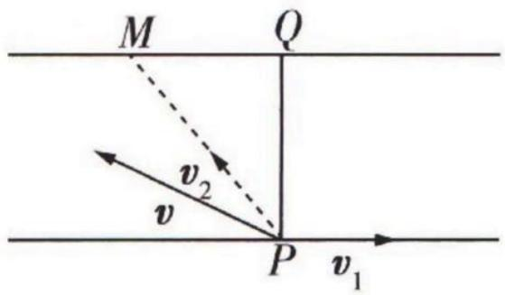

text_image

M
Q
v₂
v
P
v₁

图8-1

【题眼】根据 “PQ 与河的方向垂直” 得到 $\triangle PMQ$ 的形状

所以 $\angle PMQ = \frac{\pi}{3},\angle MPQ = \frac{\pi}{6},\langle \pmb {v}_1,\pmb {v}_2\rangle = \frac{\pi}{2} +\frac{\pi}{6} = \frac{2\pi}{3},$

所以 $v = v_{2} - v_{1}$ ,

所以 $|\pmb{v}| = \sqrt{(\pmb{v}_2 - \pmb{v}_1)^2} = \sqrt{|\pmb{v}_2|^2 + |\pmb{v}_1|^2 - 2\pmb{v}_1 \cdot \pmb{v}_2} = \sqrt{5^2 + 3^2 - 2 \times 5 \times 3 \cos \frac{2\pi}{3}} = 7,$

所以小货船航行速度的大小为 $7 \, km/h$ ，故选 C.

调研 2 (2022·江苏宿迁5月月考/受力分析)体育锻炼是青少年生活学习中非常重要的组成部分.某学生做引体向上运动,处于如图8-2所示的平衡状态时,若两只胳膊的夹角为 $60^{\circ}$ ,每只胳膊的拉力大小均为 $350 \mathrm{~N}$ ,则该学生的体重(单位:kg)约为(参考数据:取重力加速度大小为 $g = 10 \mathrm{~m} / \mathrm{s}^{2}, \sqrt{3} \approx 1.732$ ) ()

A. 55

B. 61

C. 66

D. 71

natural_image

Illustration of a person performing a pull-up exercise on a bar (no text or symbols)

图8-2

此外,数学的发展促成了电子计算机的产生,而电子计算机的产生与发展,反过来也促进了数学的发展.

# 解析 作出示意图,如图8-3所示.

【数形结合】作图，用向量 $F_{1}, F_{2}$ 表示两只胳膊的拉力，它们的合力 $F_{3}$ 与重力相等，求出 $|F_{1} + F_{2}|$ ，注意最后单位要化为千克

$|F_{1}|=|F_{2}|=350,F_{1},F_{2}$ 的夹角为 $60^{\circ}$ .

设 $F_{1},F_{2}$ 的合力为 $F_{3}$ ，则 $|F_{3}|=2|F_{1}|\sin60^{\circ}=350\sqrt{3}$ ，

所以 $\left|G\right|=\left|F_{3}\right|=350\sqrt{3}$

因此该学生体重约为 $\frac{350\times1.732}{10}\approx61(kg)$ . 故选 B.

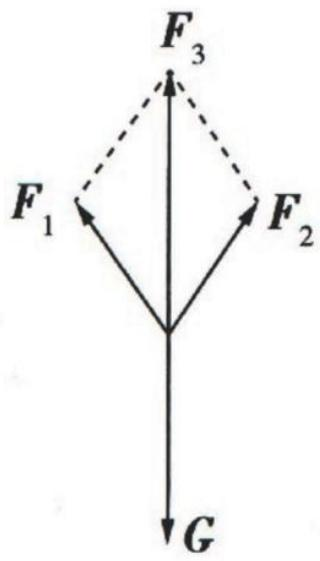

text_image

F₃
F₁
F₂
G

图8-3

# 题型2 大计算量题

调研 3 (2022·江苏无锡最后一卷/八角星纹)八角星纹(如图8-4)是大汶口文化中期彩陶纹样中具有鲜明特色的花纹. 八角星纹常绘于彩陶盆和豆的上腹, 先于器外的上腹施一圈红色底衬, 然后在上面绘并列的八角星形的单独纹样. 八角星纹以白彩绘成, 黑线勾边, 中为方形或圆形, 具有向四面八方扩张的感觉. 八角星纹延续的时间较长, 传播范围亦广, 在长江以南的时间稍晚的崧泽文化的陶豆座上也屡见刻有八角星纹. 图8-5是图8-4抽象出来的图形, 在图8-5中, 圆中各个小三角形(如△ACD)为等腰直角三角形, 中间部分是边长为2的正方形, 其中动点P在圆O上, 定点A,B所在位置如图8-5所示, 则 $\overrightarrow{AB} \cdot \overrightarrow{OP}$ 的最大值为 ( )

natural_image

Black and white illustration of a decorative goblet with star patterns (no text or symbols)

图8-4

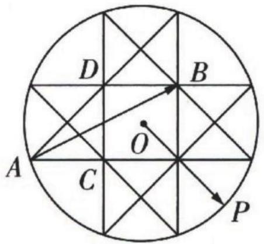

text_image

D
B
O
A
C
P

图8-5

A. 9

B. 10

C. ${10}\sqrt{2}$

D. $10\sqrt{3}$

# 解析 如图 8-6 所示, 连接 OA, OB.

因为中间部分是边长为2的正方形，

所以 $OA = \sqrt{10}$ , $OB = \sqrt{2}$ , $AB = 2\sqrt{5}$ , 所以 $OP = OA = \sqrt{10}$ .

【会运算】 $OA = \sqrt{3^2 + 1^2} = \sqrt{10}$ ， $OB = \sqrt{1^2 + 1^2} = \sqrt{2}$ ， $AB = \sqrt{4^2 + 2^2} = 2\sqrt{5}$

一直以来,数学都是设计和建造中的宝贵工具,它是建筑设计思想的来源,也是实现建筑的基础,因此,诸多建筑中总会含有一股“数学味”.

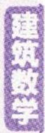

在 $\triangle AOB$ 中，由余弦定理可得 $\cos \angle AOB = -\frac{2\sqrt{5}}{5}$ ，所以 $\sin \angle AOB = \frac{\sqrt{5}}{5}$ .

设 $\overrightarrow{OA},\overrightarrow{OP}$ 的夹角为 $\alpha,\overrightarrow{OB},\overrightarrow{OP}$ 的夹角为 $\beta,$

$\overrightarrow{AB} \cdot \overrightarrow{OP} = (\overrightarrow{OB} - \overrightarrow{OA}) \cdot \overrightarrow{OP} = \overrightarrow{OB} \cdot \overrightarrow{OP} - \overrightarrow{OA} \cdot \overrightarrow{OP} = 2\sqrt{5} \cos \beta - 10\cos \alpha.$

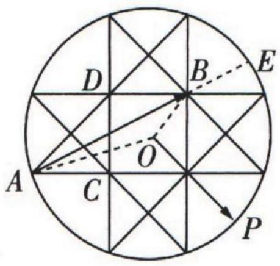

text_image

D
B
E
O
A
C
P

图8-6

延长 AB 交圆 O 于 E, 当 P 在弦 AE 所对的优弧上时, $\alpha + \beta = 2\pi - \angle AOB$ .

【易错】点 $P$ 的位置不同, $\alpha + \beta$ 与 $\angle AOB$ 的关系也不同, 注意分类要全面

所以 $\cos (\alpha +\beta) = \cos \angle AOB = -\frac{2\sqrt{5}}{5},\sin (\alpha +\beta) = -\sin \angle AOB = -\frac{\sqrt{5}}{5},$

$$
\cos \alpha = \cos [ (\alpha + \beta) - \beta ] = - \frac {2 \sqrt {5}}{5} \cos \beta - \frac {\sqrt {5}}{5} \sin \beta ,
$$

所以 $\overrightarrow{AB}\cdot\overrightarrow{OP}=2\sqrt{5}\cos\beta-10\cos\alpha=6\sqrt{5}\cos\beta+2\sqrt{5}\sin\beta=10\sqrt{2}\sin(\beta+\varphi)$ （其中 $\tan\varphi=3$ ），所以 $\overrightarrow{AB}\cdot\overrightarrow{OP}$ 的最大值为 $10\sqrt{2}$ .

【会思考】利用辅助角公式对目标式变形转化，进而利用三角函数的有界性得最值.

当 $P$ 在弦 ${AE}$ 所对的劣弧上时, $\alpha  + \beta  = \angle {AOB}$ .

所以 $\cos(\alpha+\beta)=\cos\angle AOB=-\frac{2\sqrt{5}}{5},\sin(\alpha+\beta)=\sin\angle AOB=\frac{\sqrt{5}}{5}$

$$
\cos \alpha = \cos [ (\alpha + \beta) - \beta ] = - \frac {2 \sqrt {5}}{5} \cos \beta + \frac {\sqrt {5}}{5} \sin \beta ,
$$

所以 $\overrightarrow{AB}\cdot\overrightarrow{OP}=2\sqrt{5}\cos\beta-10\cos\alpha=6\sqrt{5}\cos\beta-2\sqrt{5}\sin\beta=10\sqrt{2}\sin(\beta+\theta)$ （其中 $\tan\theta=-3$ ），

所以 $\overrightarrow{AB}\cdot\overrightarrow{OP}$ 的最大值为 $10\sqrt{2}$ .

综上所述, $\overrightarrow{AB}\cdot\overrightarrow{OP}$ 的最大值为 $10\sqrt{2}$ .故选C.

调研 4 (2022·北京海淀区6月月考)如图8-7,在四边形ABCD中, $AB\perp AD$ , $CD\perp CB$ , $\angle ABC=60^{\circ}$ ,AB=2, $AD=\sqrt{3}$ ,E为线段CD的中点,F为线段AB上一动点(包括端点),且 $\overrightarrow{EF}=\lambda\overrightarrow{DA}+\mu\overrightarrow{CB}$ ,则下列说法错误的是()

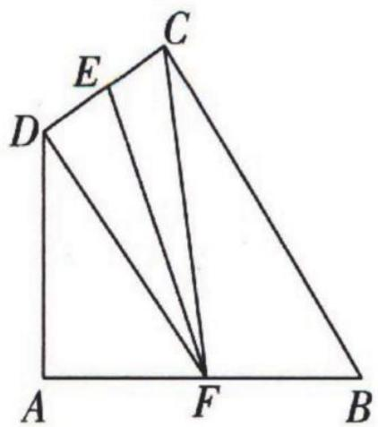

text_image

Geometric diagram with labeled points A, B, C, D, E, F and line segments forming triangles and a right triangle

图8-7

A. $BC = \frac{5}{2}$

B. 若 $F$ 为线段 $AB$ 的中点, 则 $\lambda + \mu = 1$

C. $\overrightarrow{FC} \cdot \overrightarrow{FD}$ 的最小值为 $\frac{15}{4}$

D. $\mu$ 的最大值比最小值大 $\frac{8}{5}$

解析 以 A 为坐标原点, AB 所在直线为 x 轴, AD 所在直线为 y 轴, 建立如图8-8所示的平面直角坐标系.

【会建系】题目给出的图形有直角特征，满足建系需求，建立平面直角坐标系，方便确定数量关系与点的坐标

过点 C 作 $CG \perp x$ 轴于点 G，作 $CH \perp y$ 轴于点 H，过点 B 作 $BM \perp CH$ 交 HC 的延长线于点 M，则 $\triangle CDH \sim \triangle BCM$ .

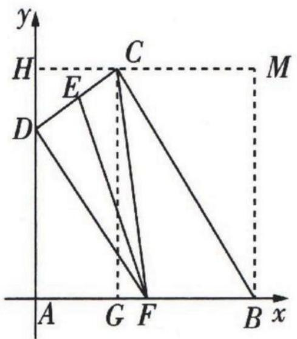

text_image

y
H C M
D E
A G F B x

图8-8

因为 $AB \perp AD, CD \perp CB, \angle ABC = 60^{\circ}$ ，所以 $\angle CDH = 60^{\circ}$ .

设 $HD = x$ ，则 $CH = \sqrt{3} x$ ，则 $BM = AH = \sqrt{3} +x,CM = \frac{BM}{\sqrt{3}} = 1 + \frac{\sqrt{3}}{3} x,$

则 $CH + CM = AB$ ，即 $\sqrt{3} x + 1 + \frac{\sqrt{3}}{3} x = 2$ ，解得 $x = \frac{\sqrt{3}}{4}$

则 $A(0,0), B(2,0), D(0,\sqrt{3}), C(\frac{3}{4}, \frac{5\sqrt{3}}{4}), E(\frac{3}{8}, \frac{9\sqrt{3}}{8})$ .

$BC = \frac{BM}{\sin 60^{\circ}} = \frac{\frac{5}{4}\sqrt{3}}{\frac{\sqrt{3}}{2}} = \frac{5}{2}, A$ 正确.

若 F 为线段 AB 的中点, 则 $F(1,0)$ ,

所以 $\overrightarrow{EF} = (\frac{5}{8}, -\frac{9\sqrt{3}}{8}),\overrightarrow{DA} = (0, - \sqrt{3}),\overrightarrow{CB} = (\frac{5}{4}, - \frac{5\sqrt{3}}{4})$

则 $\left\{\begin{aligned}\frac{5}{8}&=\frac{5}{4}\mu,\\-\frac{9\sqrt{3}}{8}&=-\sqrt{3}\lambda-\frac{5\sqrt{3}}{4}\mu,\end{aligned}\right.$ 解得 $\left\{\begin{aligned}\lambda&=\frac{1}{2},\\ &\text{则 }\lambda+\mu=1,B\text{ 正确.}\\ \mu&=\frac{1}{2},\end{aligned}\right.$

设 $F(m,0), 0 \leqslant m \leqslant 2$

则 $\overrightarrow{FC} \cdot \overrightarrow{FD} = (\frac{3}{4} - m, \frac{5\sqrt{3}}{4}) \cdot (-m, \sqrt{3}) = m^2 - \frac{3}{4} m + \frac{15}{4} = (m - \frac{3}{8})^2 + \frac{231}{64}$ ,

故当 $m=\frac{3}{8}$ 时, $\overrightarrow{FC}\cdot\overrightarrow{FD}$ 取得最小值, 最小值为 $\frac{231}{64}$ , C 错误.

埃及胡夫金字塔是世界七大建筑奇迹之一,金字塔高与底面边长之比约为0.637,接近于“黄金分割比”.

$$
\overrightarrow {E F} = (m - \frac {3}{8}, - \frac {9 \sqrt {3}}{8}), \text {则} \left\{ \begin{array}{l l} m - \frac {3}{8} = \frac {5}{4} \mu , \\ - \frac {9 \sqrt {3}}{8} = - \sqrt {3} \lambda - \frac {5 \sqrt {3}}{4} \mu , \end{array} \right.
$$

因为 $0 \leqslant m \leqslant 2$ ，则 $m - \frac{3}{8} \in \left[-\frac{3}{8}, \frac{13}{8}\right]$ ，所以 $\frac{5}{4} \mu \in \left[-\frac{3}{8}, \frac{13}{8}\right]$ ，解得 $\mu \in \left[-\frac{3}{10}, \frac{13}{10}\right]$ .

因为 $\frac{13}{10}-\left(-\frac{3}{10}\right)=\frac{8}{5}$ ，所以 $\mu$ 的最大值比最小值大 $\frac{8}{5}$ ，D正确。故选C.

# 题型3 新背景题

调研 5 (2022·雅礼中学 5 月月考/新定义)(多选)记 $\langle x\rangle$ 表示与实数x最接近的整数(若 $x=a+\frac{1}{2},a\in Z$ ,则取 $\langle x\rangle=a$ ),数列 $\{a_{n}\}$ 的通项公式为 $a_{n}=\frac{1}{\langle\sqrt{n}\rangle}(n\in N^{*})$ ,其前n项和为 $S_{n}$ ,设 $k=\langle\sqrt{n}\rangle$ ,则下列结论正确的是()

A. $\sqrt{n} = k - \frac{1}{2}$

B. $\sqrt{n} < k + \frac{1}{2}$

C. $n \geqslant k^{2} - k + 1$

D. $S_{2022} < 90$

解析 由题意, $\langle x\rangle$ 表示与实数x最接近的整数且 $k=\left\langle\sqrt{n}\right\rangle$ ,

当 $n = 1$ 时，可得 $\sqrt{n} = 1$ ，则 $k = \langle \sqrt{n}\rangle = 1, k - \frac{1}{2} = \frac{1}{2} \neq 1, A$ 不正确.

易得 $|\sqrt{n}-\langle\sqrt{n}\rangle|<\frac{1}{2}$ ，即 $|\sqrt{n}-k|<\frac{1}{2}$ ，所以 $-\frac{1}{2}<\sqrt{n}-k<\frac{1}{2}$ ，故 $\sqrt{n}<k+\frac{1}{2}$ 成立，B正确.

由B分析知 $k - \frac{1}{2} < \sqrt{n} < k + \frac{1}{2}$ ，易知 $k\geqslant 1$ ，故对 $k - \frac{1}{2} < \sqrt{n} < k + \frac{1}{2}$ 两边平方得 $k^2 -k + \frac{1}{4} < n < k^2 +k + \frac{1}{4},$

因为 $n \in \mathbb{N}^*$ 且 $k^2 - k + \frac{1}{4}$ 不是整数，且 $k^2 - k + 1$ 是大于 $k^2 - k + \frac{1}{4}$ 的最小整数，所以 $n \geqslant k^2 - k + 1$ 成立，C 正确.

当 $n = 1,2$ 时， $\langle \sqrt{n}\rangle = 1$ ，此时 $a_1 = a_2 = 1$

当 $n = 3,4,5,6$ 时， $\langle \sqrt{n}\rangle = 2$ ，此时 $a_3 = a_4 = a_5 = a_6 = \frac{1}{2}$

当 n=7,8,9,10,11,12 时， $\langle\sqrt{n}\rangle=3$ ，此时 $a_{7}=a_{8}=\cdots=a_{12}=\frac{1}{3}$ ;

当 $n=13,14,\cdots,20$ 时， $\langle\sqrt{n}\rangle=4$ ，此时 $a_{13}=a_{14}=\cdots=a_{20}=\frac{1}{4}\cdots\cdots$

所以数列 $\{a_{n}\}$ 中有2个1,4个 $\frac{1}{2},6$ 个 $\frac{1}{3},8$ 个 $\frac{1}{4}$ ……

【扫清障碍】通过列举归纳总结出 $\{a_{n}\}$ 对应值出现的次数，再由等差数列前 n 项和公式确定项的分布情况，进而求出 $S_{2022}$

又2,4,6,8,…构成首项为2,公差为2的等差数列 $\{b_{n}\}$ ，其前n项和 $T_{n}=\frac{n(2+2n)}{2}=n(n+1)$ ，而2022=44×(44+1)+42，所以 $S_{2022}=1\times2+\frac{1}{2}\times4+\frac{1}{3}\times6+\cdots+\frac{1}{44}\times88+\frac{1}{45}\times42=2\times44+\frac{42}{45}=88+\frac{14}{15}<90$ ,D正确.故选BCD.

调研 6 (2022·新高考Ⅱ卷/举架结构) 图 8-9 是中国古代建筑中的举架结构, $AA',BB',CC',DD'$ 是桁, 相邻桁的水平距离称为步, 垂直距离称为举. 图 8-10 是某古代建筑屋顶截面的示意图, 其中 $DD_1, CC_1, BB_1, AA_1$ 是举, $OD_1, DC_1, CB_1, BA_1$ 是相等的步, 相邻桁的举步之比分别为 $\frac{DD_1}{OD_1} = 0.5, \frac{CC_1}{DC_1} = k_1, \frac{BB_1}{CB_1} = k_2, \frac{AA_1}{BA_1} = k_3$ . 已知 $k_1, k_2, k_3$ 成公差为 0.1 的等差数列, 且直线 OA 的斜率为 0.725 , 则 $k_3 =$ ( )

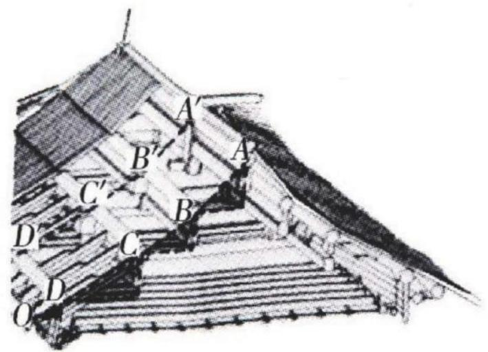

text_image

A
B'
C'
D'
C
D
O
A'
B
C'

图8-9

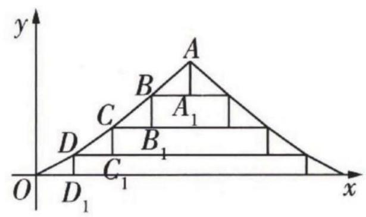

text_image

y
A
B
C
D
C₁
D₁
O
x
A₁
B₁

图8-10

A. 0.75

B. 0.8

C. 0.85

D. 0.9

解析 如图 8-11, 连接 $OA$ , 延长 $AA_{1}$ 与 $x$ 轴交于点 $A_{2}$ , 则 $OA_{2} = 4OD_{1}$ .

因为 $k_{1}, k_{2}, k_{3}$ 成公差为0.1的等差数列，所以 $k_{1} = k_{3} - 0.2, k_{2} = k_{3} - 0.1$ ，所以 $CC_{1} = DC_{1}(k_{3} - 0.2), BB_{1} = CB_{1}(k_{3} - 0.1), AA_{1} = k_{3}BA_{1}$ ，

即 $CC_{1}=OD_{1}(k_{3}-0.2)$ , $BB_{1}=OD_{1}(k_{3}-0.1)$ , $AA_{1}=k_{3}OD_{1}$ .

又 $\frac{DD_1}{OD_1} = 0.5$ ，所以 $DD_{1} = 0.5OD_{1}$ ，所以 $AA_{2} = 0.5OD_{1} + OD_{1}(k_{3} - 0.2) + OD_{1}(k_{3} -$

$$
0. 1) + k _ {3} O D _ {1} = O D _ {1} \left(3 k _ {3} + 0. 2\right),
$$

所以 $\tan\angle AOA_{2}=\frac{AA_{2}}{OA_{2}}=\frac{OD_{1}(3k_{3}+0.2)}{4OD_{1}}=0.725$ , 解得 $k_{3}=0.9$ , 故选 D.

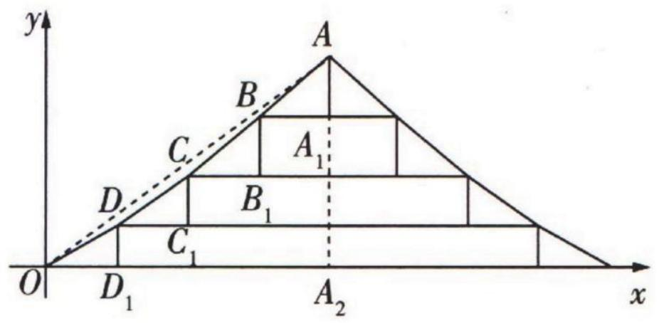

text_image

y
A
B
C
D
A₁
B₁
C₁
D₁
O
x
A₂

图8-11

调研 7 (2022·海南中学5月第九次月考/“康托三分集”)十九世纪下半叶, 集合论的创立奠定了现代数学的基础. 著名的“康托三分集”是数学理性思维的产物, 具有典型的分形特征. 仿照“康托三分集”我们可以构造一个“四分集”, 其操作过程如下: 将闭区间 $[0,1]$ 均分为四段, 去掉其中的区间段 $(\frac{1}{4}, \frac{1}{2}]$ , 记为第一次操作; 再将剩下的三个区间段 $[0, \frac{1}{4}], (\frac{1}{2}, \frac{3}{4}], (\frac{3}{4}, 1]$ 分别均分为四段, 并各自去掉第二个区间段, 记为第二次操作……如此, 每次在上一次操作的基础上, 将剩下的各个区间段分别均分为四段, 同样各自去掉第二个区间段. 将这样的操作一直进行下去, 直至无穷, 剩下的区间集合即“四分集”. 第三次操作去掉的区间长度之和为\_\_\_\_; 若使去掉的各区间长度之和不小于 $\frac{19}{20}$ , 则需要操作的次数 $n$ 的最小值为\_\_\_\_(参考数据: $\lg 2 \approx 0.30, \lg 3 \approx 0.48$ )

解析 由题意得,每次操作去掉的区间长度之和是上一次操作去掉的区间长度之和的 $\frac{3}{4}$ .

【会思考】初始区间长度为1，第一次操作去掉的区间长度为 $\frac{1}{4}$ ，第二次操作去掉的区间长度之和为 $\frac{1}{4}\times\frac{1}{4}\times3$ ……即可发现规律

设去掉的区间长度之和为 $a_{n}$ ，则 $\{a_n\}$ 为等比数列，其中 $a_1 = \frac{1}{4}$ ，公比 $q = \frac{3}{4}$ 所以 $a_{n} = \frac{1}{4}\times (\frac{3}{4})^{n - 1}$ ，故 $a_3 = \frac{1}{4}\times (\frac{3}{4})^2 = \frac{9}{64}$ ，所以 $S_{n} = \frac{\frac{1}{4}\times[1 - (\frac{3}{4})^{n}]}{1 - \frac{3}{4}} = 1-$ $(\frac{3}{4})^n.$

令 $S_{n}\geqslant \frac{19}{20}$ ，解得 $n\geqslant \frac{\lg 2 + 1}{2\lg 2 - \lg 3}\approx \frac{1.30}{0.12}\approx 10.83,$

所以需要操作的次数 n 的最小值为 11. 故答案为 $\frac{9}{64}$ , 11.

【会审题】n 的意义为需要操作的次数，必须为整数，且要比 10.83 大

# 题型4 结构不良问题

调研 8 (2022·雅礼中学5月月考)给出下列三个条件:

① $a_{8}=2a_{4}+1$ ;②4是 $a_{1},a_{3}$ 的等比中项;③ $S_{5}=4a_{1}a_{2}$ .

从这三个条件中任选一个,补充在下面问题中,并作答.

问题:已知各项均为正数的等差数列 $\{a_{n}\}$ 的前n项和为 $S_{n},S_{3}=a_{6}-a_{1}$ ，且

(1) 求 $\{a_{n}\}$ 的通项公式.

(2) 设数列 $\left\{\frac{1}{S_{n}+n}\right\}$ 的前 n 项和为 $T_{n}$ ，试比较 $T_{n}$ 与 $\frac{a_{n}}{a_{n+1}}$ 的大小，并说明理由.

注:如果选择多个条件分别解答,按第一个解答计分.

解析 (1) 设等差数列 $\{a_{n}\}$ 的公差为 $d(d > 0)$ , 则 $3a_{1} + \frac{3 \times 2}{2} d = 5d$ , $\therefore 3a_{1} = 2d$ .

方案一:选条件①.

由 $\left\{\begin{aligned}3a_{1}&=2d,\\ a_{8}&=2a_{4}+1,\end{aligned}\right.$ 得 $a_{1}=2,d=3,\therefore a_{n}=2+3(n-1)=3n-1,n\in\mathbf{N}^{*}$ .

方案二:选条件②.

由 $\left\{\begin{aligned}3a_{1}&=2d,\\ a_{1}a_{3}&=16,\end{aligned}\right.$ 得 $a_{1}=2,d=3,\therefore a_{n}=2+3(n-1)=3n-1,n\in\mathbf{N}^{*}.$

方案三:选条件③.

由 $\left\{\begin{aligned}3a_{1}&=2d,\\ S_{5}&=4a_{1}a_{2},\end{aligned}\right.$ 得 $a_{1}^{\prime}=2,d=3,\therefore a_{n}=2+3(n-1)=3n-1,n\in N^{*}.$

拱形结构 我国著名的赵州桥为拱形桥,拱形具有坚固的特点,它可以使受力分散,增强桥体的承重能力.

(2) $T_{n}<\frac{a_{n}}{a_{n+1}}$ ,理由如下.

$$
S _ {n} = 2 n + \frac {3 n (n - 1)}{2} = \frac {3}{2} n ^ {2} + \frac {n}{2}, \therefore S _ {n} + n = \frac {3}{2} (n ^ {2} + n) = \frac {3 n (n + 1)}{2},
$$

$$
\therefore \frac {1}{S _ {n} + n} = \frac {2}{3} \times \frac {1}{n (n + 1)} = \frac {2}{3} (\frac {1}{n} - \frac {1}{n + 1}),
$$

$$
\therefore T _ {n} = \frac {2}{3} (1 - \frac {1}{2} + \frac {1}{2} - \frac {1}{3} + \dots + \frac {1}{n} - \frac {1}{n + 1}) = \frac {2}{3} (1 - \frac {1}{n + 1}) = \frac {2 n}{3 n + 3}.
$$

【敲黑板】使用裂项相消法求和时，要注意正、负项相消时消去了哪些项，保留了哪些项，切不可漏写未被消去的项，一般来说，未被消去的项有“前后对称”的特点

又 $\frac{a_n}{a_{n + 1}} = \frac{3n - 1}{3n + 2},\therefore \frac{a_n}{a_{n + 1}} -T_n = \frac{3n - 1}{3n + 2} -\frac{2n}{3n + 3} = \frac{3n^2 + 2n - 3}{(3n + 2)(3n + 3)}.$

$$
\because n \in \mathbf {N} ^ {*}, \therefore 3 n ^ {2} + 2 n - 3 \geqslant 3 + 2 - 3 = 2 > 0, \therefore \frac {a _ {n}}{a _ {n + 1}} - T _ {n} > 0, \therefore \frac {a _ {n}}{a _ {n + 1}} > T _ {n}.
$$

# 题型5 双空题

调研 9 (2022·辽宁名校联盟 6 月联考/《庄子·天下》)“一尺之棰, 日取其半, 万世不竭”出自我国古代典籍《庄子·天下》, 其中蕴含着等比数列的相关知识. 已知长度为 4 的线段 $AB$ , 取 $AB$ 的中点 $C$ , 以 $AC$ 为边作等边三角形, 如图 8-12, 该等边三角形的面积为 $S_{1}$ , 取 $CB$ 的中点 $C_{1}$ , 以 $CC_{1}$ 为边作等边三角形, 如图 8-13, 图中所有的等边三角形的面积之和为 $S_{2}$ , 以此类推, 则 $S_{3} = \_\_\_\_, \sum_{i=1}^{n} (iS_{i}) = \_\_\_\_.$

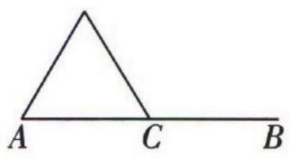

text_image

A C B

图8-12

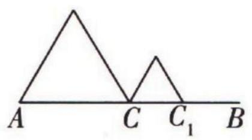

text_image

A
C
C₁
B

图8-13

解析 依题意可知,各等边三角形的面积构成等比数列,其首项为 $\sqrt{3}$ ,公比为 $\frac{1}{4}$ ,

所以 $S_{n} = \frac{\sqrt{3}\left[1 - \left(\frac{1}{4}\right)^{n}\right]}{1 - \frac{1}{4}} = \frac{4\sqrt{3}}{3}\left[1 - \left(\frac{1}{4}\right)^{n}\right]$ 所以 $S_{3} = \frac{21\sqrt{3}}{16}$ .

$$
\sum_ {i = 1} ^ {n} \left(i S _ {i}\right) = \sum_ {i = 1} ^ {n} \left\{i \times \frac {4 \sqrt {3}}{3} \left[ 1 - \left(\frac {1}{4}\right) ^ {i} \right] \right\} = \frac {4 \sqrt {3}}{3} \left(\sum_ {i = 1} ^ {n} i - \sum_ {i = 1} ^ {n} \frac {i}{4 ^ {i}}\right),
$$

【会分析】不要被这个复杂的累加形式“吓到”，仔细分析式子结构，实质还是数列求和问题，只不过要拆分成两个数列分别进行求和

$$
\sum_ {i = 1} ^ {n} i = \frac {n (n + 1)}{2}, \text {设} T _ {n} = \sum_ {i = 1} ^ {n} \frac {i}{4 ^ {i}} = 1 \times \frac {1}{4} + 2 \times (\frac {1}{4}) ^ {2} + \dots + n \times (\frac {1}{4}) ^ {n} \quad ①,
$$

【会思考】这里其实就是求等差数列1,2,3,4,5,…的前n项和

$$
\text {则} \frac {1}{4} T _ {n} = 1 \times (\frac {1}{4}) ^ {2} + 2 \times (\frac {1}{4}) ^ {3} + \dots + (n - 1) \times (\frac {1}{4}) ^ {n} + n \times (\frac {1}{4}) ^ {n + 1} \quad ②,
$$

由①②作差得, $\frac{3}{4}T_{n}=\frac{1}{4}+\left(\frac{1}{4}\right)^{2}+\cdots+\left(\frac{1}{4}\right)^{n}-n\times\left(\frac{1}{4}\right)^{n+1}=\frac{1}{3}-\left(n+\frac{4}{3}\right)\times\left(\frac{1}{4}\right)^{n+1}$

所以 $T_{n}=\frac{4}{9}-\left(\frac{n}{3}+\frac{4}{9}\right)\times\left(\frac{1}{4}\right)^{n}$ ,

所以 $\sum_{i=1}^{n}(iS_i) = \frac{4\sqrt{3}}{3} \times \left[\frac{n(n+1)}{2} + \frac{4}{9} - \left(\frac{n}{3} + \frac{4}{9}\right) \times \left(\frac{1}{4}\right)^n\right]$ .

故答案为 $\frac{21\sqrt{3}}{16}, \frac{4\sqrt{3}}{3} \times \left[\frac{n(n + 1)}{2} + \frac{4}{9} - \left(\frac{n}{3} + \frac{4}{9}\right) \times \left(\frac{1}{4}\right)^n\right]$ .

调研 10 (2022·江苏无锡考前模拟/刺绣)刺绣是一门传统手工艺术,我国已有多种刺绣被列入世界非物质文化遗产项目保护名录.有一种刺绣的图案由一笔画构成,很像汉字“回”,称为“回纹图”.某刺绣工在方格形布料上用单线针法绣“回纹图”,共进行了n次操作,每次操作在前一次基础上向外多绣一圈(前3次操作之后的图案分别如图8-14①②③,图中小方格边长为1).若第k次操作之后图案所占面积为 $S_{k}$ (即最外围不封口的矩形面积,如 $S_{1}=2,S_{2}=12,S_{3}=30$ ),则至少操作\_\_\_\_次, $S_{k}$ 不少于90;若每横向或纵向一个单位长度绣一针,称为“走一针”,如图8-14①共走了5针,如图8-14②共走了19针,如图8-14③共走了41针,则第n次操作之后的回纹图共走了\_\_\_\_针(用n表示).

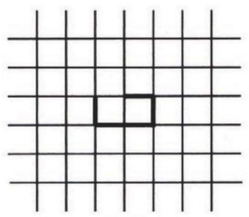

natural_image

Grid pattern with a small rectangular cutout in the center (no text or symbols)

①

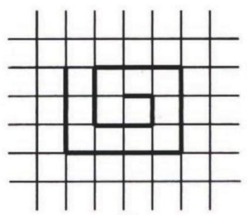

natural_image

Geometric pattern of nested squares on a grid (no text or symbols)

②

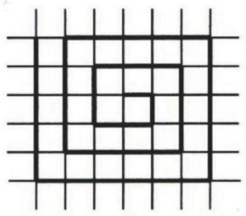

natural_image

Abstract geometric pattern with nested squares on a grid (no text or symbols)

③   
图8-14

思维导引 由题意及图形可得 $S_{n} = 2n(2n - 1) = 4n^{2} - 2n$ ，列出不等式，求解即可；由图形求出前3次操作之后的“回纹图”共走的针数对应的关系式，进而归纳出第 $n$ 次操作之后的“回纹图”共走的针数对应的关系式。

解析 由题意得 $S_{n} = 2n(2n - 1) = 4n^{2} - 2n$

令 $S_{n} = 4n^{2} - 2n\geqslant 90$ ，解得 $n\geqslant 5$ 或 $n\leqslant -\frac{9}{2}$ （舍去），

【会审题】n 表示操作的次数，具有实际意义，必须是正整数

故至少操作5次.

由图形可以看出,第1次操作之后的“回纹图”共走的针数为 $1 \times 2 + 2 \times 2 - 1 = 5$ ,
第2次操作之后的“回纹图”共走的针数为 $(1+2+3)\times2+4\times2-1=19$ ,

第 3 次操作之后的“回纹图”共走的针数为 $(1+2+3+4+5)\times2+6\times2-1=41$ ，
……

第 n 次操作之后的“回纹图”共走的针数为 $(1 + 2 + 3 + \cdots + 2n - 1) \times 2 + 2n \times 2 - 1 = \frac{(2n - 1)(1 + 2n - 1)}{2} \times 2 + 4n - 1 = 4n^{2} + 2n - 1.$

故答案为 $5,4n^{2}+2n-1$ .

调研 11 (2022·河北唐山三模/角谷猜想)角谷猜想又称冰雹猜想,是指任取一个正整数,如果它是奇数,就将它乘以3再加1;如果它是偶数,则将它除以2.反复进行上述两种运算,经过有限次步骤后,必进入循环圈 $1 \rightarrow 4 \rightarrow 2 \rightarrow 1$ .如取正整数 $m = 6$ ,根据上述运算法则得出 $6 \rightarrow 3 \rightarrow 10 \rightarrow 5 \rightarrow 16 \rightarrow 8 \rightarrow 4 \rightarrow 2 \rightarrow 1$ ,共需要经过8个步骤变成1(简称为8步“雹程”).已知数列 $\{a_n\}$ 满足: $a_1 = m$ ( $m$ 为正整数), $a_{n+1} = \left\{\frac{a_n}{2}, a_n\right.$ 为偶数, ①若 $m = 13$ ,则使得 $a_n = 1$ 至少需要\_\_\_\_步“雹程”;②若 $a_9 = 3a_n + 1, a_n$ 为奇数. 1,则 $m$ 所有可能取值的和为 \_\_\_\_.

解析 m=13,依题意得, $3m+1=40\rightarrow20\rightarrow10\rightarrow5\rightarrow16\rightarrow8\rightarrow4\rightarrow2\rightarrow1$ ,共9个步骤.

若 $a_9 = 1, a_8 = 2, a_7 = 4, a_6 = 8$ 或 $a_6 = 1$ ,

若 $a_6 = 8, a_5 = 16$ ，则 $\left\{ \begin{array}{l} a_4 = 32, a_3 = 64 \left\{ \begin{array}{l} a_2 = 128, a_1 = 256. \\ a_2 = 21, a_1 = 42. \end{array} \right. \\ a_4 = 5, a_3 = 10 \left\{ \begin{array}{l} a_2 = 20, a_1 = 40. \\ a_2 = 3, a_1 = 6. \end{array} \right. \end{array} \right.$

若 $a_6 = 1, a_5 = 2, a_4 = 4$ ，则 $\left\{ \begin{array}{l} a_3 = 8, a_2 = 16 \\ a_1 = 5. \\ a_3 = 1, a_2 = 2, a_1 = 4. \end{array} \right.$

所以 $a_{1}$ 取值的集合为 $\{256,42,40,6,32,5,4\}$ ，其所有元素的和为 385.

故答案为9,385.

# 题型6 模块交汇问题

调研 12 (2022 · 成都外国语学校 6 月模拟/平面向量与数列交汇) 在 $\triangle ABC$ 中, $AB = \sqrt{2}$ , $\angle ACB = 45^{\circ}$ , $O$ 是 $\triangle ABC$ 的外心, 若 $2\overrightarrow{OC} \cdot \overrightarrow{AC} - 1$ 的最大值是 $m$ , 数列 $\{a_{n}\}$ 中, $a_{1} = 1$ , $a_{n+1} = ma_{n} + 2$ , 则 $\{a_{n}\}$ 的通项公式为 $a_{n} =$ ()

A. $2 \times 3^{n - 1} - 1$

B. $3 \times 2^{n - 1} - 2$

C. $3^{n} - 2$

D. $5 \times 4^{n - 1} - 4$

解析 设 AC = b, AB = c,

在 $\triangle ABC$ 中，由 $\frac{c}{\sin \angle ACB} = \frac{b}{\sin B}$ 及 $c = \sqrt{2}, \angle ACB = 45^{\circ}$ ，得 $b = 2\sin B$ .

因为 $0^{\circ}<B<135^{\circ}$ ，所以 $0<\sin B\leqslant1$ ，所以 $0<b\leqslant2$ 。

因为 O 是 $\triangle ABC$ 的外心, 所以 O 在线段 AC 上的射影为 AC 的中点.

由向量数量积的几何意义得 $2\overrightarrow{OC}\cdot \overrightarrow{AC} -1 = |\overrightarrow{AC}|^2 -1 = b^2 -1$ ，而 $-1 <   b^{2} - 1\leqslant 3,$ 所以 $2\overrightarrow{OC}\cdot \overrightarrow{AC} -1$ 的最大值为3，即 $m = 3$

由 $a_{n + 1} = 3a_n + 2$ ，得 $a_{n + 1} + 1 = 3(a_n + 1)$

所以数列 $\{a_{n} + 1\}$ 是首项为 $a_1 + 1 = 2$ ，公比为3的等比数列.

所以 $a_{n} + 1 = 2 \times 3^{n - 1}$ , 即 $a_{n} = 2 \times 3^{n - 1} - 1$ . 故选 A.

调研 13 (2022·新高考Ⅱ卷/数列与集合交汇)已知 $\{a_{n}\}$ 是等差数列, $\{b_{n}\}$ 是公比为2的等比数列,且 $a_{2}-b_{2}=a_{3}-b_{3}=b_{4}-a_{4}$ .

对称结构 故宫博物院采取严格的中轴对称的布局方式,中轴线上的建筑高大华丽,轴线两侧的建筑相对低小简单,给人一种庄严肃穆的感觉.

(1) 证明: $a_{1} = b_{1}$ .   
(2) 求集合 $\{k \mid b_{k} = a_{m} + a_{1}, 1 \leqslant m \leqslant 500\}$ 中元素的个数.

思维导引 (1) 先由 $a_{2} - b_{2} = a_{3} - b_{3}$ 得 $d = 2b_{1}$ , 再由 $a_{2} - b_{2} = b_{4} - a_{4}$ 得 $a_{1} = 5b_{1} - 2d$ , 进一步整理得出结论. (2) 由 (1) 得出 $\{a_{n}\}, \{b_{n}\}$ 的通项公式, 代入 $b_{k} = a_{m} + a_{1}$ , 再由 $a_{1} = b_{1} \neq 0$ 得 $2^{k-1} = 2m, k \in \mathbf{N}^{*}$ , 结合 $1 \leqslant m \leqslant 500$ 即可求出元素的个数.

解析 (1) 设等差数列 $\{a_{n}\}$ 的公差为 $d$ ,

由 $a_2 - b_2 = a_3 - b_3$ 得 $a_1 + d - 2b_1 = a_1 + 2d - 4b_1$ ，即 $d = 2b_{1}$

由 $a_2 - b_2 = b_4 - a_4$ 得 $a_1 + d - 2b_1 = 8b_1 - (a_1 + 3d)$ ，即 $a_1 = 5b_1 - 2d$

将 $d=2b_{1}$ 代入, 得 $a_{1}=5b_{1}-2\times2b_{1}=b_{1}$ , 即 $a_{1}=b_{1}$ .

(2) 由(1)知 $a_{n} = a_{1} + (n - 1)d = a_{1} + (n - 1)\times 2b_{1} = (2n - 1)a_{1}, b_{n} = b_{1}\cdot 2^{n - 1}$ ,

由 $b_{k} = a_{m} + a_{1}$ 得 $b_{1}\cdot 2^{k - 1} = (2m - 1)a_{1} + a_{1},k\in \mathbf{N}^{*}$ ，由 $a_1 = b_1\neq 0$ 得 $2^{k - 1} = 2m$

【扫清障碍】要求集合 $\{k \mid b_{k} = a_{m} + a_{1}, 1 \leqslant m \leqslant 500\}$ 中元素的个数，可以联系等差数列和等比数列的通项公式，得出 k 与 m 之间的关系，再根据 m 的取值范围得出结论

由题知 $1 \leqslant m \leqslant 500$ ，所以 $2 \leqslant 2m \leqslant 1\ 000$ ，所以 $k = 2, 3, 4, \cdots, 10$ ，共 9 个数，即集合 $\{k \mid b_{k} = a_{m} + a_{1}, 1 \leqslant m \leqslant 500\} = \{2, 3, 4, \cdots, 10\}$ 中元素的个数为 9.

调研 14 (2022·合肥八中5月最后一卷/函数、平面向量、数列交汇)已知 m = (2cos πx, 1 - √2 sin πx), n = (√3 sin πx, 1 + √2 sin πx), f(x) = m · n,

(1) 求 $f(x)$ 的解析式, 并求其单调递增区间;  
(2) 若 $f(x)=1$ 在区间 $(0,+\infty)$ 上的根按从小到大的顺序依次为 $a_{1},a_{2},a_{3},\cdots,a_{n}$ ，求数列 $\{a_{n}\}$ 的通项公式及其前 n 项和 $S_{n}$ .

解析 (1) 由题意得, $f(x)=2\sqrt{3}\sin\pi x\cos\pi x+1-2\sin^{2}\pi x=\sqrt{3}\sin2\pi x+\cos2\pi x=2\sin(2\pi x+\frac{\pi}{6})$ .

【记公式】 $2\sin x\cos x=\sin2x,\quad1-2\sin^{2}x=\cos2x$

令 $-\frac{\pi}{2} + 2k\pi \leqslant 2\pi x + \frac{\pi}{6} \leqslant \frac{\pi}{2} + 2k\pi, k \in \mathbf{Z}$ , 解得 $-\frac{1}{3} + k \leqslant x \leqslant \frac{1}{6} + k, k \in \mathbf{Z}$ .

故函数 $f(x)$ 的单调递增区间为 $\left[-\frac{1}{3}+k,\frac{1}{6}+k\right],k\in\mathbf{Z}.$

(2) 由 $f(x)=1$ ，得 $2\sin(2\pi x+\frac{\pi}{6})=1$ ，

所以 $2\pi x + \frac{\pi}{6} = 2k\pi + \frac{\pi}{6}, k \in \mathbf{Z}$ 或 $2\pi x + \frac{\pi}{6} = 2k\pi + \frac{5\pi}{6}, k \in \mathbf{Z}$ ,

# 【易错】注意此处不要漏解

解得 x = k 或 $x = k + \frac{1}{3}, k \in Z.$

所以将方程 $f(x)=1$ 在区间 $(0,+\infty)$ 上的根从小到大排列，

依次为 $\frac{1}{3},1,1+\frac{1}{3},2,2+\frac{1}{3},3,3+\frac{1}{3},\cdots,n,n+\frac{1}{3}\cdots\cdots$

所以 $a_{1}=\frac{1}{3},a_{2}=1,a_{3}=1+\frac{1}{3},a_{4}=2,a_{5}=2+\frac{1}{3},a_{6}=3,a_{7}=3+\frac{1}{3}\cdots\cdots$

所以数列 $\{a_{n}\}$ 的通项公式为 $a_{n} = \left\{ \begin{array}{l} \frac{n}{2}, n \text{为偶数,} \\ \frac{n - 1}{2} + \frac{1}{3}, n \text{为奇数.} \end{array} \right.$

故数列 $\{a_{n}\}$ 的偶数项构成以1为首项，1为公差的等差数列，

奇数项构成以 $\frac{1}{3}$ 为首项,1为公差的等差数列.

$$
\begin{array}{r l} & {\text {当} n \text {为偶数时}, S _ {n} = a _ {1} + a _ {2} + \dots + a _ {n} = (a _ {1} + a _ {3} + \dots + a _ {n - 1}) + (a _ {2} + a _ {4} + \dots + a _ {n}) =} \\ & {(1 + 2 + \dots + \frac {n - 2}{2} + \frac {n}{2} \times \frac {1}{3}) + (1 + 2 + \dots + \frac {n}{2}) = \frac {n (n - 2)}{8} + \frac {n}{6} + \frac {n (n + 2)}{8} = \frac {1}{4} n ^ {2} + \frac {1}{6} n;} \end{array}
$$

$$
\begin{array}{r l} & {\text {当} n \text {为奇数时}, S _ {n} = a _ {1} + a _ {2} + \dots + a _ {n} = (a _ {1} + a _ {3} + \dots + a _ {n}) + (a _ {2} + a _ {4} + \dots + a _ {n - 1}) =} \\ & {(1 + 2 + \dots + \frac {n - 1}{2} + \frac {1}{3} \times \frac {n + 1}{2}) + (1 + 2 + \dots + \frac {n - 1}{2}) = 2 \times \frac {(1 + \frac {n - 1}{2}) \times \frac {n - 1}{2}}{2} + \frac {n + 1}{6} =} \\ & {\frac {1}{4} n ^ {2} + \frac {1}{6} n - \frac {1}{1 2}.} \end{array}
$$

综上, $S_{n}=\left\{\begin{aligned}&\frac{1}{4}n^{2}+\frac{1}{6}n-\frac{1}{12},n\text{为奇数,}\\&\frac{1}{4}n^{2}+\frac{1}{6}n,n\text{为偶数.}\end{aligned}\right.$

# 高分技法篇

# 超重点 9 相关二级结论在解三角形中的应用技巧

结论 1 △ABC 的面积 $S = \frac{1}{2} ab \sin C = \frac{1}{2} r (a + b + c) = \frac{abc}{4R} = \sqrt{p(p - a)(p - b)(p - c)}$ ，其中角 A, B, C 所对的边分别为 a, b, c, r 为 △ABC 的内切圆半径，R 为 △ABC 的外接圆半径， $p = \frac{a + b + c}{2}$ .

调研 1 (2022·华中师大一附中5月模拟)已知△ABC中角A,B,C所对的边分别为a,b,c,p= $\frac{a+b+c}{2}$ ，则△ABC的面积 $S=\sqrt{p(p-a)(p-b)(p-c)}$ ，该公式被称作海伦公式。若△ABC的周长为15，(sin A+sin B):(sin B+sin C):(sin C+sin A)=4:6:5，则△ABC内切圆的半径r的值是\_\_\_\_。

解析 由题意可令 $\sin A + \sin B = 4k, \sin B + \sin C = 6k, \sin C + \sin A = 5k$ ，则 $\sin A = \frac{3}{2} k, \sin B = \frac{5}{2} k, \sin C = \frac{7}{2} k.$

由正弦定理可得 $a:b:c = 3:5:7$ ，又 $a + b + c = 15$ ，所以 $a = 3, b = 5, c = 7$ ，所以 $p = \frac{a + b + c}{2} = \frac{15}{2}$ .

则 $\triangle ABC$ 的面积 $S = \sqrt{p(p - a)(p - b)(p - c)} = \sqrt{\frac{15}{2} \times \frac{9}{2} \times \frac{5}{2} \times \frac{1}{2}} = \frac{15\sqrt{3}}{4}$ .

由于 $S=\frac{1}{2}(a+b+c)r$ ，所以 $r=\frac{2S}{a+b+c}=\frac{2\times\frac{15\sqrt{3}}{4}}{15}=\frac{\sqrt{3}}{2}$ .

【会思考】用割补法求三角形的面积即可得此公式

结论2 在 $\triangle ABC$ 中, $\frac{a + b + c}{\sin A + \sin B + \sin C} = \frac{a + b}{\sin A + \sin B} = \frac{a}{\sin A} = 2R$ , 其中角 $A, B, C$ 所对的边分别为 $a, b, c, R$ 为 $\triangle ABC$ 的外接圆半径.

调研 2 (2022·江苏连云港模拟)(多选)在 $\triangle ABC$ 中,内角A,B,C所对的边分别为a,b,c,则下列说法正确的是()

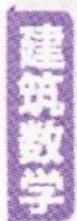

莫比乌斯环 湖南长沙的中国结步行桥位于梅溪湖上,其设计灵感源于中国结的结绳艺术和莫比乌斯环的结构特征.

A. $a = b\cos C + c\cos B$

B. 若 $\sin A > \sin B$ , 则 $A > B$

C. 若 $\cos 2A > \cos 2B$ ，则 $A > B$

D. $\frac{a}{\sin A} = \frac{b + c}{\sin B + \sin C}$

# 解析

<table><tr><td>选项</td><td>分析过程</td><td>正误</td></tr><tr><td>A</td><td> $\sin A = \sin (B + C) = \sin B \cos C + \sin C \cos B$ ,由正弦定理得, $a = b \cos C + c \cos B$ 【小技巧】该结论也可由射影定理直接证得</td><td>√</td></tr><tr><td>B</td><td>若  $\sin A > \sin B$ ,则由正弦定理知  $a > b$ ,由于三角形中,大边对大角,所以  $A > B$ </td><td>√</td></tr><tr><td>C</td><td>若  $\cos 2A > \cos 2B$ ,则  $\cos^{2}A > \cos^{2}B$ ,即  $(\cos A + \cos B)(\cos A - \cos B) > 0$ ,在三角形中  $A < \pi - B$ ,则  $\cos A > \cos(\pi - B)$ ,所以  $\cos A + \cos B > 0$ ,所以  $\cos A > \cos B$ ,根据余弦函数的单调性可得  $A < B$ </td><td>×</td></tr><tr><td>D</td><td>可由二级结论 $\frac{a}{\sin A} = \frac{b + c}{\sin B + \sin C}$ 直接得出【说明】该结论可由以下方法证得.在 $\triangle ABC$ 中,由正弦定理得 $\frac{a}{\sin A} = \frac{b}{\sin B} = \frac{c}{\sin C} = 2R(R \text{为}\triangle ABC \text{的外接圆半径})$ ,则  $\frac{b + c}{\sin B + \sin C} = \frac{2R \sin B + 2R \sin C}{\sin B + \sin C} = 2R$ </td><td>√</td></tr></table>

结论3 在 $\triangle ABC$ 中, $a = b\cos C + c\cos B$ , $b = a\cos C + c\cos A$ , $c = a\cos B + b\cos A$ , 其中角 $A, B, C$ 所对的边分别为 $a, b, c$ .

调研 3 (2022·湖南师大附中模拟)在 $\triangle ABC$ 中,内角A,B,C所对的边分别是a,b,c,若 $c\cos A + a\cos C = 2$ ,AC边上的高为 $\sqrt{3}$ ,则角B的最大值为()

A. $\frac{\pi}{6}$

B. $\frac{\pi}{3}$

C. $\frac{\pi}{2}$

D. $\frac{2\pi}{3}$

# 解析

由 $c\cos A + a\cos C = b$ 得 b = 2.

【另解】 $c\cos A + a\cos C = 2$ ，由余弦定理可得 $c \cdot \frac{b^2 + c^2 - a^2}{2bc} + a \cdot \frac{a^2 + b^2 - c^2}{2ab} = 2$ ，整理得 $b = 2$

中国结象征着幸运和繁荣,莫比乌斯环则寓意梅溪湖地区不断突破发展.

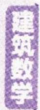

因为 AC 边上的高为 $\sqrt{3}$ ，所以 $\frac{1}{2} \times 2 \times \sqrt{3} = \frac{1}{2} ac \sin B$ ，即 $ac = \frac{2\sqrt{3}}{\sin B}$ ，

又 $\cos B = \frac{a^2 + c^2 - b^2}{2ac} \geqslant \frac{2ac - b^2}{2ac} = 1 - \frac{2}{ac}$ , 当且仅当 $a = c$ 时取等号,

所以 $\cos B \geqslant 1 - \frac{\sqrt{3}}{3} \sin B$ ，即 $\sqrt{3} \sin B + 3 \cos B \geqslant 3$ ，即 $\sin(B + \frac{\pi}{3}) \geqslant \frac{\sqrt{3}}{2}$ .

【记结论】辅助角公式： $a\sin x + b\cos x = \sqrt{a^{2} + b^{2}}\sin (x + \theta)$ （其中 $\tan \theta = \frac{b}{a}$ ）

因为 $B \in (0, \pi)$ , 所以 $B + \frac{\pi}{3} \in (\frac{\pi}{3}, \frac{4\pi}{3})$ , 则 $B + \frac{\pi}{3} \in (\frac{\pi}{3}, \frac{2\pi}{3}]$ , 所以 $B \in (0, \frac{\pi}{3}]$ , 故角 $B$ 的最大值为 $\frac{\pi}{3}$ . 故选 B.

结论4 在斜三角形 $ABC$ 中, $\tan A + \tan B + \tan C = \tan A\tan B\tan C$ .

调研 4 (2022·湖北武汉 5 月模拟) 在 $\triangle ABC$ 中, 内角 $A, B, C$ 对应的边分别为 $a$ , $b, c$ , 且满足 $\tan A + \tan B + \tan C = \frac{\sqrt{3}}{3} \tan A \tan B$ , 若 $c = 2$ , 则 $a^2 + b^2$ 的取值范围是 \_\_\_\_.

解析 由 $\tan A + \tan B + \tan C = \tan A\tan B\tan C = \frac{\sqrt{3}}{3}\tan A\tan B$ ，且 $\tan A\tan B\neq$

【说明】该结论可由以下方法证明. 在斜三角形 $ABC$ 中, $\tan (A + B) = \tan (\pi - C) = -\tan C$ , $\tan (A + B) = \frac{\tan A + \tan B}{1 - \tan A\tan B}$ , 则 $-\tan C = \frac{\tan A + \tan B}{1 - \tan A\tan B}$ , 故 $\tan A + \tan B + \tan C = \tan A\tan B\tan C$ 0, 得 $\tan C = \frac{\sqrt{3}}{3}$ ,

$$
\because 0 <   C <   \pi , \therefore C = \frac {\pi}{6}.
$$

$\because c^{2}=a^{2}+b^{2}-2ab\cos C,c=2,\therefore 4=a^{2}+b^{2}-2ab\cos C=a^{2}+b^{2}-\sqrt{3}ab\geqslant a^{2}+b^{2}-$ $\frac{\sqrt{3}(a^2+b^2)}{2},\therefore a^2+b^2\leqslant 16+8\sqrt{3}$ , 当且仅当 $a=b$ 时取等号.

【突破口】借助余弦定理，构造能用基本不等式求最大值或最小值的形式

又 $a^2 + b^2 > 4$ ，所以 $a^2 + b^2$ 的取值范围是 $(4, 16 + 8\sqrt{3}]$ .

【极易出错】注意挖掘隐含条件， $a^{2}+b^{2}=c^{2}+2ab\cos C=4+\sqrt{3}ab>4$

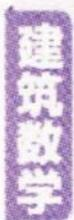

数列 宁夏的一百零八塔是根据等差数列排列而成的,从上向下数,从第五层开始,每层塔的个数依次为5,7,9,11,13,15,17,19,塔群总体类似等腰三角形.

关注微信公众号“初高教辅站”获取更多初高中教辅资料

结论5 在 $\triangle ABC$ 中, $AD$ 是 $BC$ 边上的中线, 则有 $AD^{2} = \frac{1}{2}(AB^{2} + AC^{2}) - \frac{1}{4} BC^{2}$ .

调研 5 (2022·湖南长郡中学模拟改编/双空题)在锐角 $\triangle ABC$ 中,角 $A,B,C$ 所对的边分别为 $a,b,c$ ,且 $\frac{a}{c\cos B}=\tan B+\tan \angle ACB$ ,则 $\angle ACB$ 为\_\_\_\_;若 $c=2$ ,边 $AB$ 的中点为 $D$ ,则 $CD$ 的取值范围是\_\_\_\_.

解析 对于第一空, 因为 $\frac{a}{c\cos B} = \tan B + \tan \angle ACB$ , 所以 $\frac{\sin A}{\sin \angle ACB\cos B} = \frac{\sin B}{\cos B} + \frac{\sin \angle ACB}{\cos \angle ACB}$ ,

【小技巧】化简的常用方法：①弦切互化，异名化同名，异角化同角；②降幂或升幂；③运用 $(\sin\theta\pm\cos\theta)^{2}=1\pm\sin2\theta$

即 $\frac{\sin A}{\sin \angle ACB\cos B} = \frac{\sin B\cos \angle ACB + \sin \angle ACB\cos B}{\cos B\cos \angle ACB} = \frac{\sin(B + \angle ACB)}{\cos B\cos \angle ACB} =$ $\frac{\sin A}{\cos B \cos \angle ACB}$ , 又 $A \in (0, \pi)$ , 所以 $\sin A \neq 0$ , 由题意可知 $\cos B \neq 0$ , 所以 $\tan \angle ACB = 1$ ,

因为 $\angle ACB\in (0,\pi)$ ，所以 $\angle ACB = \frac{\pi}{4}$

对于第二空,在锐角 $\triangle ABC$ 中,由正弦定理可得 $\frac{a}{\sin A} = \frac{b}{\sin B} = 2\sqrt{2}$ ,

所以 $a=2\sqrt{2}\sin A, b=2\sqrt{2}\sin B=2\sqrt{2}\sin\left(\frac{3\pi}{4}-A\right)=2\cos A+2\sin A$ ,

所以 $ab = 4\sqrt{2}\sin^{2}A + 4\sqrt{2}\sin A\cos A = 4\sqrt{2} \times \frac{1 - \cos 2A}{2} + 2\sqrt{2}\sin 2A = 4\sin(2A - \frac{\pi}{4}) +$ $2\sqrt{2}$ ，由题意得 $\left\{\begin{aligned}&0<A<\frac{\pi}{2},\\ &0<\frac{3\pi}{4}-A<\frac{\pi}{2},\end{aligned}\right.$ 解得 $\frac{\pi}{4}<A<\frac{\pi}{2}$ ，则 $2A-\frac{\pi}{4}\in(\frac{\pi}{4},\frac{3\pi}{4})$

所以 $\sin (2A - \frac{\pi}{4})\in (\frac{\sqrt{2}}{2},1]$ ，所以 $ab\in (4\sqrt{2},4 + 2\sqrt{2} ]$

在锐角 $\triangle ABC$ 中，由余弦定理可得 $c^2 = a^2 + b^2 - 2ab\cos \angle ACB = a^2 + b^2 - \sqrt{2}ab = 4$ 则 $CD^2 = \frac{1}{2} (CA^2 + CB^2) - \frac{1}{4} AB^2 = \frac{1}{2} (b^2 + a^2) - 1 = 1 + \frac{\sqrt{2}}{2} ab,$

【说明】该结论可借助向量及三角形的余弦定理证明，由 $\overrightarrow{CD}=\frac{1}{2}\left(\overrightarrow{CA}+\overrightarrow{CB}\right)$ ，得 $\overrightarrow{CD^{2}}=\frac{1}{4}\left(\overrightarrow{CA}+\right.$

悬链线 位于美国旧金山的金门大桥,是世界著名的桥梁之一.金门大桥是一种悬索桥,用到了数学上悬链线的原理.

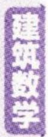

$$
\overrightarrow {C B}) ^ {2} = \frac {1}{4} (\overrightarrow {C A} ^ {2} + \overrightarrow {C B} ^ {2} + 2 \overrightarrow {C A} \cdot \overrightarrow {C B}) = \frac {1}{4} (\overrightarrow {C A} ^ {2} + \overrightarrow {C B} ^ {2}) + \frac {1}{2} \overrightarrow {C A} \cdot \overrightarrow {C B}, \text {而} \overrightarrow {C A} \cdot \overrightarrow {C B} = | \overrightarrow {C A} | | \overrightarrow {C B} | \cos \angle A C B,
$$

$$
\cos \angle A C B = \frac {\overrightarrow {C A} ^ {2} + \overrightarrow {C B} ^ {2} - \overrightarrow {A B} ^ {2}}{2 | \overrightarrow {C A} | | \overrightarrow {C B} |}, \text {则} \overrightarrow {C D} ^ {2} = \frac {1}{4} (\overrightarrow {C A} ^ {2} + \overrightarrow {C B} ^ {2}) + \frac {1}{4} (\overrightarrow {C A} ^ {2} + \overrightarrow {C B} ^ {2} - \overrightarrow {A B} ^ {2}) = \frac {1}{2} (\overrightarrow {C A} ^ {2} + \overrightarrow {C B} ^ {2}) -
$$

$$
\frac {1}{4} \overrightarrow {A B ^ {2}}, \text {即} C D ^ {2} = \frac {1}{2} \left(C A ^ {2} + C B ^ {2}\right) - \frac {1}{4} A B ^ {2}
$$

所以 $CD^{2} \in (5,3 + 2\sqrt{2}]$ ，所以 CD 的取值范围是 $(\sqrt{5},1 + \sqrt{2}]$ .

【解后反思】对于三角形中的最值或范围问题,往往是将问题中的量用三角形的某一个角的三角函数表示出来,进而转化为三角函数的值域问题来求解,解题时注意角的范围

结论6 在 $\triangle ABC$ 中, $AD$ 是 $\angle BAC$ 的平分线, 则 $\frac{S_{\triangle ABD}}{S_{\triangle ACD}} = \frac{AB}{AC} = \frac{BD}{CD}$ .

调研 6 (2022·四川宜宾模拟)已知△ABC 的内角 A, B, C 所对的边分别为 a, b, c, tan $B + \tan C - \sqrt{3} \tan B \tan C + \sqrt{3} = 0 (\tan B \tan C \neq 1)$ , 若 $\overrightarrow{BD} = 2 \overrightarrow{DC}, AD = 2$ , 且 AD 平分 $\angle BAC$ , 则 △ABC 的面积为 \_\_\_\_.

解析 因为 $\tan B + \tan C - \sqrt{3}\tan B\tan C + \sqrt{3} = 0$ ，所以 $-\sqrt{3} = \frac{\tan B + \tan C}{1 - \tan B\tan C},$

【记结论】 $\tan \alpha +\tan \beta = \tan (\alpha +\beta)(1 - \tan \alpha \tan \beta)$ ， $\tan \alpha -\tan \beta = \tan (\alpha -\beta)(1 + \tan \alpha \tan \beta)$

所以 $-\sqrt{3} = \tan(B + C)$ ，则 $\tan \angle BAC = \tan[180^{\circ} - (B + C)] = -\tan(B + C) = \sqrt{3}$ ，
又 $\angle BAC$ 为三角形内角，故 $\angle BAC=60^{\circ}$ .

由题意知 BD=2DC，且 AD 为 $\angle BAC$ 的平分线，所以 $\frac{AB}{AC}=\frac{BD}{DC}=2$ ，即 AB=2AC。

【说明】该结论可由以下方法证明. 由正弦定理得 $\frac{AC}{\sin \angle ADC} = \frac{DC}{\sin \angle CAD}, \frac{AB}{\sin \angle ADB} = \frac{BD}{\sin \angle BAD}$ , 因为 $AD$ 平分 $\angle BAC$ 交 $BC$ 于点 $D$ , 且 $\angle ADB + \angle ADC = 180^\circ$ , 所以 $\angle CAD = \angle BAD$ , $\sin \angle ADC = \sin \angle ADB$ , 所以 $\frac{AC}{DC} = \frac{AB}{BD}$ , 即 $\frac{AB}{AC} = \frac{BD}{DC}$

在 $\triangle ABD$ 中，由余弦定理可得 $BD^{2} = AB^{2} + 4 - 4\times BA\times \cos \frac{60^{\circ}}{2} = AB^{2} + 4 - 2\sqrt{3} AB,$

在 $\triangle ACD$ 中，由余弦定理可得 $DC^2 = AC^2 + 4 - 4 \times CA \times \cos \frac{60^\circ}{2} = AC^2 + 4 - 2\sqrt{3}AC,$

所以 $4AC^{2} + 4 - 4\sqrt{3} AC = 4(AC^{2} + 4 - 2\sqrt{3} AC)$ ，解得 $AC = \sqrt{3}$ ，故 $AB = 2\sqrt{3}$ 所以三角形的面积为 $\frac{1}{2} AB \times AC \times \sin \angle BAC = \frac{1}{2} \times 2\sqrt{3} \times \sqrt{3} \times \frac{\sqrt{3}}{2} = \frac{3\sqrt{3}}{2}$ .

# 新题演练

1. (2022·山西吕梁二模)在 $\triangle ABC$ 中,角 $A,B,C$ 的对边分别为 $a,b,c,b=3,BD$ 为 $AC$ 的中线, $BD=2$ ,且 $a\cos C-2b\cos\angle ABC+c\cos A=0$ ,则 $\triangle ABC$ 的面积为()

A. 2

B. $\frac{7}{8}$

C. $\frac{7\sqrt{3}}{8}$

D. $\frac{5\sqrt{3}}{8}$

2. (2022·贵州遵义四中 5 月模拟) $\triangle ABC$ 中, 角 $A, B, C$ 的对边分别为 $a, b, c, c = 2$ , $\tan A + \tan B + \sqrt{3} = \tan A \tan B \tan C$ , 则 $\triangle ABC$ 周长的最大值为 ( )

A. 4

B. 6

C. 8

D. 10

3. (2022·成都七中5月模拟改编)在 $\triangle ABC$ 中,角 $A,B,C$ 的对边分别为 $a,b,c$ ,若 $\triangle ABC$ 的面积等于 $\frac{\sqrt{3}}{12}(a^{2}+b^{2}-c^{2})$ ,且 $c=1$ ,则 $\frac{a+b}{\sin A+\sin B}=$ \_\_\_\_.

4. (2022·江西鹰潭一中、临川二中等校联考) 在 $\triangle ABC$ 中, $CD$ 平分 $\angle ACB$ 且交 $AB$ 于点 $D$ , 且 $BD = 1, CD = 2, AC = 2\sqrt{3}$ , 则 $BC$ 的长为 \_\_\_\_.

# 参考答案与解析

1. C 方法一 由 $a \cos C - 2b \cos \angle ABC + c \cos A = 0$ ，可得 $a \cos C + c \cos A = 2b \cos \angle ABC = b, \therefore \cos \angle ABC = \frac{1}{2}, \because \angle ABC$ 是三角形的内角，∴ $\angle ABC = \frac{\pi}{3}$ .

易知 $BD^{2} = \frac{1}{2} (BC^{2} + BA^{2}) - \frac{1}{4} AC^{2}$ , 即 $4 = \frac{1}{2} (a^{2} + c^{2}) - \frac{1}{4} \times 3^{2}$ , 可得 $ac = \frac{a^{2} + c^{2} - 3^{2}}{2\cos \angle ABC} = \frac{7}{2}$ ,

【小妙招】利用二级结论，快速解题

$\therefore S_{\triangle ABC} = \frac{1}{2} ac\sin \angle ABC = \frac{1}{2}\times \frac{7}{2}\times \frac{\sqrt{3}}{2} = \frac{7\sqrt{3}}{8}$ 故选C.

方法二 $\because a\cos C - 2b\cos \angle ABC + c\cos A = 0, \therefore \sin A\cos C - 2\sin \angle ABC\cos \angle ABC + \sin C\cos A = 0, \therefore \sin (A + C) - 2\sin \angle ABC\cos \angle ABC = 0,$ 即 $\sin \angle ABC - 2\sin \angle ABC\cos \angle ABC = 0,$ 易知 $\sin \angle ABC \neq 0, \therefore \cos \angle ABC = \frac{1}{2}$ .

在 $\triangle ABC$ 中, 由余弦定理得 $b^{2} = a^{2} + c^{2} - 2ac\cos \angle ABC$ , 即 $9 = a^{2} + c^{2} - ac$ ,

$\because \overrightarrow{BD} = \frac{1}{2} (\overrightarrow{BC} + \overrightarrow{BA}), \therefore |\overrightarrow{BD}|^2 = \frac{1}{4} (|\overrightarrow{BC}|^2 + |\overrightarrow{BA}|^2 + 2\overrightarrow{BC} \cdot \overrightarrow{BA})$ ，即 $4 = \frac{1}{4}(a^2 + c^2 + ac)$ ，可得 $ac = \frac{7}{2}, \therefore S_{\triangle ABC} = \frac{1}{2} ac \sin \angle ABC = \frac{1}{2} \times \frac{7}{2} \times \frac{\sqrt{3}}{2} = \frac{7\sqrt{3}}{8}$ ，故选 C.

2. B 由 $\tan A + \tan B + \tan C = \tan A\tan B\tan C$ ，可得 $\tan C = \sqrt{3} >0,C$ 为锐角， $C = \frac{\pi}{3}$

由正弦定理得 $\frac{a}{\sin A} = \frac{b}{\sin B} = \frac{c}{\sin C} = \frac{2}{\frac{\sqrt{3}}{2}} = \frac{4}{\sqrt{3}}$ ，所以 $a = \frac{4}{\sqrt{3}}\sin A, b = \frac{4}{\sqrt{3}}\sin B,$

所以三角形 $ABC$ 的周长为 $a + b + c = 2 + \frac{4}{\sqrt{3}}\sin A + \frac{4}{\sqrt{3}}\sin B = 2 + \frac{4}{\sqrt{3}}\sin (B + \frac{\pi}{3}) + \frac{4}{\sqrt{3}}\sin B = 2 + \frac{4}{\sqrt{3}}(\frac{1}{2}\sin B + \frac{\sqrt{3}}{2}\cos B) + \frac{4}{\sqrt{3}}\sin B = 2 + 2\sqrt{3}\sin B + 2\cos B = 2 + 4\sin (B + \frac{\pi}{6})$

由于 $0 < B < \frac{2\pi}{3}$ , 所以 $\frac{\pi}{6} < B + \frac{\pi}{6} < \frac{5\pi}{6}$ ,

【易错】利用三角恒等变换或正、余弦定理求解最值或范围等问题时, 注意角的范围所以当 $B + \frac{\pi}{6} = \frac{\pi}{2}$ , 即 $B = \frac{\pi}{3}$ 时, 三角形 $ABC$ 的周长取得最大值, 为 6. 故选 B

3.2 由题意得, $S_{\triangle ABC} = \frac{1}{2} ab \sin C = \frac{\sqrt{3}}{12} (a^2 + b^2 - c^2)$ , 所以 $\sin C = \frac{\sqrt{3}}{3} \times \frac{a^2 + b^2 - c^2}{2ab}$ , 即 $\sin C = \frac{\sqrt{3}}{3} \cos C$ , 所以 $\tan C = \frac{\sqrt{3}}{3}$ , 又 $C \in (0, \pi)$ , 所以 $C = \frac{\pi}{6}$ .

【易忽视】不要忽略三角形中的隐含条件，注意角的范围
所以 $\frac{a}{\sin A}=\frac{b}{\sin B}=\frac{c}{\sin C}=\frac{1}{\frac{1}{2}}=2$ ，所以 $\frac{a+b}{\sin A+\sin B}=2$ 。故填2。

4. $\sqrt{3}$ 因为 CD 平分 $\angle ACB$ 且交 AB 于点 D, 所以 $\frac{BD}{AD} = \frac{BC}{AC}$ ,

【二级结论】可用角平分线的二级结论直接得出

设其比值为 $k$ ，则 $AD = \frac{1}{k}$ ， $BC = 2\sqrt{3} k$ ，由 $\cos \angle ACD = \cos \angle BCD$ 可知，

$$
\frac {(2 \sqrt {3}) ^ {2} + 2 ^ {2} - (\frac {1}{k}) ^ {2}}{2 \times 2 \sqrt {3} \times 2} = \frac {2 ^ {2} + (2 \sqrt {3} k) ^ {2} - 1 ^ {2}}{2 \times 2 \sqrt {3} k \times 2},
$$

【小技巧】由角相等, 可以利用余弦定理建立关于 $k$ 的方程, 解方程, 求边长, 注意检验结果化简得 $(2k - 1)(6k + 1)(k - 1) = 0$ , 解得 $k = \frac{1}{2}$ 或 $k = 1$ 或 $k = -\frac{1}{6}$ (负值舍去).

当 $k = \frac{1}{2}$ 时， $BC = \sqrt{3}$ . 当 $k = 1$ 时， $BC = 2\sqrt{3}$ ，所以 $AC = BC$ ，所以 $CD \perp AB$ ，在 $\triangle BDC$ 中， $BC^2 \neq BD^2 + CD^2$ ，与 $CD \perp AB$ 矛盾，舍去. 故填 $\sqrt{3}$ .

# 超重点 10 平面向量中二级结论的应用技巧

# 技巧1 等和线

如图10-1,对于平面内一组基底 $\overrightarrow{OA},\overrightarrow{OB}$ 及任意向量 $\overrightarrow{OP},\overrightarrow{OP} = \lambda \overrightarrow{OA} +\mu \overrightarrow{OB} (\lambda ,\mu \in \mathbf{R})$ ，若点 $P$ 在直线 $AB$ 上或在平行于 $AB$ 的直线 $A^{\prime}B^{\prime}$ 上，则 $\lambda +\mu = k$ （定值），反之也成立.我们称直线AB 以及与直线 AB 平行的直线 A'B' 为等和线. 等和线有如下 6 个性质:

(1) 当等和线 $A^{\prime}B^{\prime}$ 恰为直线 AB 时, k=1.  
(2) 当等和线 $A'B'$ 在点 O 和直线 AB 之间时, $k \in (0,1)$ .  
(3) 当直线 AB 在点 O 和等和线 $A'B'$ 之间时, $k \in (1, +\infty)$ .  
(4) 当等和线 $A'B'$ 过点 O 时, k=0.  
(5) 若两等和线关于点 O 对称, 则它们对应的定值 k 互为相反数.  
(6) 定值 k 与点 O 到等和线的距离有关, $|k| = \frac{OA'}{OA} = \frac{OB'}{OB}$ .

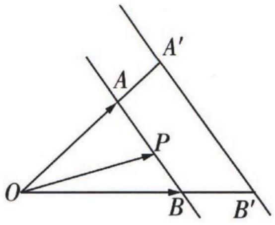

text_image

A'
A
P
O
B
B'

图10-1

调研 1 (2022·天津第三中学二模)在 $\triangle ABC$ 中,内角 $A,B,C$ 的对边分别为 $a$ , $b,c,a=b=2,c=3$ ,点 $O$ 为 $\triangle ABC$ 的外心,若 $\overrightarrow{AO}=\lambda\overrightarrow{AB}+\mu\overrightarrow{AC}$ ,则 $\lambda+\mu=$ \_\_\_\_.

解析 如图 10-2, 以 AB 的中点 D 为坐标原点, 以直线 AB 为 x 轴, 线段 AB 的中垂线为 y 轴, 建立平面直角坐标系.

由题意可得 $A(-\frac{3}{2},0),B(\frac{3}{2},0),C(0,\frac{\sqrt{7}}{2})$

则直线 BC 的方程为 $\frac{2x}{3} + \frac{2y}{\sqrt{7}} = 1$ ，

点 $A$ 到直线 $BC$ 的距离 $d = \frac{|-1 - 1|}{\sqrt{\frac{4}{9} + \frac{4}{7}}} = \frac{3\sqrt{7}}{4}$ .

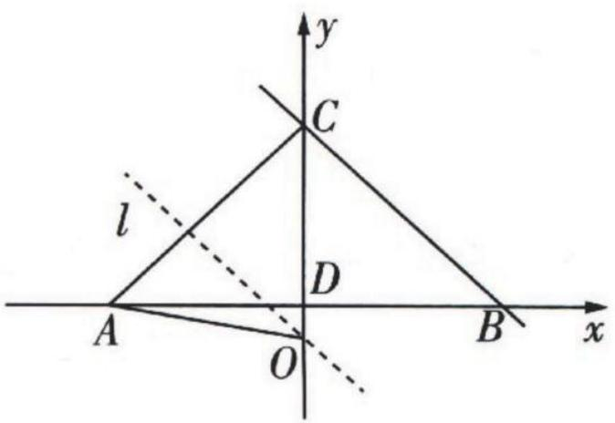

text_image

y
C
l
D
A
O
B
x

图10-2

可设 $\triangle ABC$ 的外心 $O(0, y)$ , 由 $|OA| = |OC|$ 得 $\frac{9}{4} + y^2 = (y - \frac{\sqrt{7}}{2})^2$ , 解得 $y = -\frac{\sqrt{7}}{14}$ , 即 $O(0, -\frac{\sqrt{7}}{14})$ .

则点 O 到直线 BC 的距离 $d' = \frac{1 - \frac{1}{7} - 1}{\sqrt{\frac{4}{9} + \frac{4}{7}}} = \frac{3\sqrt{7}}{7}$ ，因此 $\frac{d - d'}{d} = \frac{3}{7}$ .

显然 $\lambda + \mu \neq 1$ ，当 $\lambda + \mu = k$ (k 为定值, $k \neq 1$ ) 时，点 O 落在与 BC 平行的直线上.

【会思考】若 $\lambda + \mu = 1$ ，则由三点共线的充要条件 $(A, B, C$ 三点共线 $\Leftrightarrow \overrightarrow{AC} = m \overrightarrow{AB} \Leftrightarrow \overrightarrow{OC} = \overrightarrow{OA} + m \overrightarrow{AB} \Leftrightarrow \overrightarrow{OC} = x \overrightarrow{OA} + y \overrightarrow{OB} (x + y = 1)$ ，O 为不与点 A, B, C 重合的任意一点）知 O 在直线 BC 上，但等腰三角形的外心不可能在其腰上

过点 $O(0, -\frac{\sqrt{7}}{14})$ 作直线 $l \parallel BC$ ，则 $\lambda + \mu = \frac{d - d'}{d} = \frac{3}{7}$ .

【技巧应用】根据等和线的第6个性质知，定值 $k$ 与点 $A$ 到等和线的距离有关，据此列关系式 $\frac{d - d'}{d} = \frac{\lambda + \mu}{1}$ ，即可得解

调研 2 (2022·江西新八校第二次联考)在 $\triangle ABC$ 中, $AB=1,AC=2,\angle BAC=60^{\circ},P$ 是 $\triangle ABC$ 的外接圆上的一点,若 $\overrightarrow{AP}=m\overrightarrow{AB}+n\overrightarrow{AC}$ ,则 $m+n$ 的最小值是\_\_\_\_.

解析 如图 10-3, 以 $AC$ 的中点 $O$ 为坐标原点, 以直线 $AC$ 为 $x$ 轴, 线段 $AC$ 的中垂线为 $y$ 轴, 建立平面直角坐标系.

由题意可得 $A(1,0), B(\frac{1}{2}, \frac{\sqrt{3}}{2}), C(-1,0)$ ,

则直线 BC 的方程为 $y=\frac{\sqrt{3}}{3}(x+1)$ .

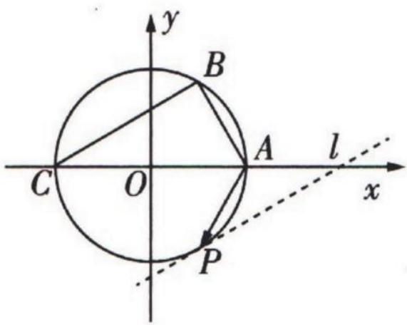

text_image

y
B
A
l
x
C
O
P

图10-3

点 A 到直线 BC 的距离 d = 1.

由 $\overrightarrow{AP} = m\overrightarrow{AB} + n\overrightarrow{AC}$ , 知当 $m + n = 1$ 时, 点 $P$ 落在直线 $BC$ 上, 又点 $P$ 在 $\triangle ABC$ 的外接圆上, 则此时点 $P$ 与点 $B$ 或点 $C$ 重合.

当 $m+n=k(k\neq1)$ 时, 点 P 落在与 BC 平行的直线上.

【技巧应用】根据等和线的定义，确定点 P 的位置

易知 $\triangle ABC$ 外接圆圆 $O$ 的方程为 $x^{2} + y^{2} = 1$ ，设直线 $l: y = \frac{\sqrt{3}}{3} x + t$ ，由 $\left\{ \begin{array}{l} x^{2} + y^{2} = 1, \\ y = \frac{\sqrt{3}}{3} x + t, \end{array} \right.$ 得 $\frac{4}{3} x^{2} + \frac{2\sqrt{3}}{3} tx + t^{2} - 1 = 0,$

令 $\Delta = -4t^{2} + \frac{16}{3} = 0$ ，解得 $t = -\frac{2\sqrt{3}}{3}(t = \frac{2\sqrt{3}}{3}$ 舍去），

【会思考】根据等和线的第2个和第3个性质知：当等和线在点A和直线BC之间时， $k \in (0, 1) (m + n \in (0, 1))$ ；当直线BC在点A和等和线之间时， $k \in (1, +\infty) (m + n \in (1, +\infty))$ 。本题是求解 $m + n$ 的最小值， $t = \frac{2\sqrt{3}}{3}$ 对应的是直线BC在点A和等和线之间的情况，自然要舍去

则直线 $y=\frac{\sqrt{3}}{3}(x-2)$ 与圆 $O:x^{2}+y^{2}=1$ 相切,且点 A 到该直线的距离 $d'=\frac{1}{2}$ .

数形结合可知,当点 P 为直线 $y=\frac{\sqrt{3}}{3}(x-2)$ 与圆 O 的切点时, $m+n$ 取得最小值,为 $-\frac{1}{2}$ .

# 技巧2 极化恒等式

# 二级结论 极化

极化恒等式: a, b 是两个平面向量, 则 $a \cdot b = \frac{1}{4} \left[ (a + b)^{2} - (a - b)^{2} \right]$ .

(1) 理解: 由 $(a + b)^2 - (a - b)^2 = 4a \cdot b$ 知, 向量的数量积等于向量和与向量差的平方差的四分之一.

(2) 平行四边形形式: 平行四边形 ABCD 中, $\overrightarrow{AB} \cdot \overrightarrow{AD} = \frac{1}{4} (|AC|^{2} - |BD|^{2})$ .

(3)三角形形式:三角形 ABC 中, $\overrightarrow{AB}\cdot\overrightarrow{AC}=|AO|^{2}-|BO|^{2}$ (O 为 BC 的中点),即向量的数量积等于对应中线长与对边长一半的平方差.

(4) 其他形式: 由 $(\pmb{a} + \pmb{b})^2 + (\pmb{a} - \pmb{b})^2 = 2(\pmb{a}^2 + \pmb{b}^2)$ , 得 $\pmb{a}^2 + \pmb{b}^2 = \frac{1}{2}[(\pmb{a} + \pmb{b})^2 + (\pmb{a} - \pmb{b})^2]$ .

(5) 推论: 在平行四边形 ABCD 中, 有 $AB^{2} + BC^{2} + CD^{2} + DA^{2} = AC^{2} + BD^{2}$ , 即平行四边形的四边平方和等于对角线平方和.

调研 3 (2022 · 天津第二次质量调研/双空题) 在 $\triangle ABC$ 中, $AB = 2$ , $AC = 3$ , $\overrightarrow{AB} = 2\overrightarrow{DB}, \overrightarrow{EC} = 2\overrightarrow{AE}, \overrightarrow{BE} \cdot \overrightarrow{BC} = 3$ , 则 $|\overrightarrow{DE}| =$ \_\_\_\_ ; 若 $M$ 是线段 $BC$ 上的一个动点 (包含端点), 则 $\overrightarrow{DM} \cdot \overrightarrow{EM}$ 的最小值为 \_\_\_\_.

解析 根据题意作图,如图 10-4 所示. 由 $\overrightarrow{AB}=2\overrightarrow{DB}$ , 得 D 是 AB 的中点, AD=1.

由 $\overrightarrow{EC}=2\overrightarrow{AE}$ ，得E是AC的三等分点，AE=1，CE=2。

取 $CE$ 的中点 $F$ , 则 $EF = 1$ , 连接 $BF$ , 则 $DE \parallel BF$ , 且 $DE = \frac{1}{2} BF$ . 由 $\overrightarrow{BE} \cdot \overrightarrow{BC} = 3$ , 得 $\overrightarrow{BE} \cdot \overrightarrow{BC} = BF^2 - EF^2 = BF^2 - 1 = 3$ , 所以 $BF = 2$ , 所以 $DE = 1$ , 即 $|\overrightarrow{DE}| = 1$ .

【技巧应用】根据极化恒等式的三角形形式即得

一蓑一笠一扁舟，一丈丝纶一寸钩。一曲高歌一樽酒，一人独钓一江秋。

取 DE 的中点 H, 连接 MH, 则 $\overrightarrow{DM} \cdot \overrightarrow{EM} = \overrightarrow{MD} \cdot \overrightarrow{ME} = MH^{2} - DH^{2} = MH^{2} - \frac{1}{4}$ , 则当 MH 取得最小值时, $\overrightarrow{DM} \cdot \overrightarrow{EM}$ 取得最小值. 易知当 $MH \perp BC$ 时, MH 取得最小值.

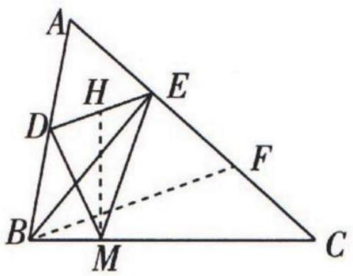

text_image

A
H
E
D
F
B
M
C

图10-4

设 $\triangle ABC$ 在底边 $BC$ 上的高为 $h$ , 则 $MH_{\min} = \frac{\frac{h}{2} + \frac{2h}{3}}{2} = \frac{7h}{12}$ .

由 AD = AE = DE = 1 知 $\angle A = \frac{\pi}{3}$ .

则在 $\triangle ABC$ 中，由余弦定理得 $BC^2 = 4 + 9 - 2\times 2\times 3\times \frac{1}{2} = 7$ ，即 $BC = \sqrt{7}$

$$
h = \frac {2 S _ {\triangle A B C}}{B C} = \frac {2 \times 3 \times \frac {\sqrt {3}}{2}}{\sqrt {7}} = \frac {3 \sqrt {3}}{\sqrt {7}}, \text {从而} M H _ {\min} = \frac {7}{1 2} \times \frac {3 \sqrt {3}}{\sqrt {7}} = \frac {\sqrt {2 1}}{4},
$$

所以 $\overrightarrow{DM}\cdot\overrightarrow{EM}$ 的最小值为 $\frac{21}{16}-\frac{1}{4}=\frac{17}{16}.$

# 技巧3 奔驰定理

奔驰定理: P 为 $\triangle ABC$ 内一点, 则 $S_{A} \cdot \overrightarrow{PA} + S_{B} \cdot \overrightarrow{PB} + S_{C} \cdot \overrightarrow{PC} = 0$ , 其中 $S_{A}, S_{B}, S_{C}$ 分别是 $\triangle BPC, \triangle CPA, \triangle APB$ 的面积. 给出证明如下:

延长 AP 交边 BC 于点 Q, 如图 10-5 所示.

用 S 表示 $\triangle ABC$ 的面积, 则 $S = S_{A} + S_{B} + S_{C}$ ,

用 $h_{1}$ 表示 $\triangle BPC$ 的边 BC 上的高, 用 h 表示 $\triangle ABC$ 的边 BC 上的高.

则 $\frac{PQ}{AQ} = \frac{h_1}{h} = \frac{\frac{1}{2}BC\cdot h_1}{\frac{1}{2}BC\cdot h} = \frac{S_A}{S},\frac{AP}{AQ} = \frac{AQ - PQ}{AQ} = 1 - \frac{PQ}{AQ} = 1 - \frac{S_A}{S} =$

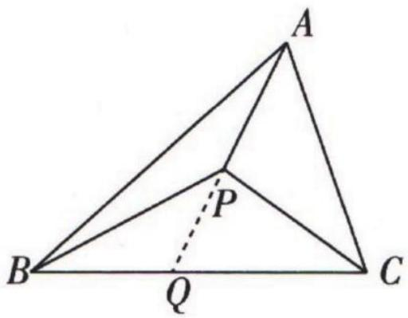

text_image

A
P
B
Q
C

图10-5

$$
\frac {S _ {B} + S _ {C}}{S}, \text {所以} \overrightarrow {A P} = \frac {S _ {B} + S _ {C}}{S} \cdot \overrightarrow {A Q}.
$$

用 $h_{2}$ 表示 $\triangle CPA$ 的边 AP 上的高, 用 $h_{3}$ 表示 $\triangle APB$ 的边 AP 上的高.

则 $\frac{CQ}{BQ} = \frac{h_2}{h_3} = \frac{S_B}{S_C}$ 所以 $\overrightarrow{AQ} = \frac{S_B}{S_B + S_C} \cdot \overrightarrow{AB} + \frac{S_C}{S_B + S_C} \cdot \overrightarrow{AC}$ , 则 $\overrightarrow{AP} = \frac{S_B}{S} \cdot \overrightarrow{AB} + \frac{S_C}{S} \cdot \overrightarrow{AC}$ ,

即 $S \cdot \overrightarrow{AP} = S_B \cdot (\overrightarrow{PB} - \overrightarrow{PA}) + S_C \cdot (\overrightarrow{PC} - \overrightarrow{PA})$ ，所以 $S_A \cdot \overrightarrow{PA} + S_B \cdot \overrightarrow{PB} + S_C \cdot \overrightarrow{PC} = 0$ .

调研 4 (2022·芜湖一中三模)平面上有△ABC及其内一点 O, 构成如图 10-6 所示的图形, 若将 △OAB, △OBC, △OCA 的面积分别记为 $S_{c}, S_{a}, S_{b}$ , 则有 $S_{a} \overrightarrow{OA} + S_{b} \overrightarrow{OB} + S_{c} \overrightarrow{OC} =$ 0. 我们常把上述结论称为“奔驰定理”. 已知 $\triangle ABC$ 的内角 $A$ ,B,C 的对边分别为 a,b,c, 若 $a \overrightarrow{OA} + b \overrightarrow{OB} + c \overrightarrow{OC} = 0$ , 则 O 为 $\triangle ABC$ 的 ( )

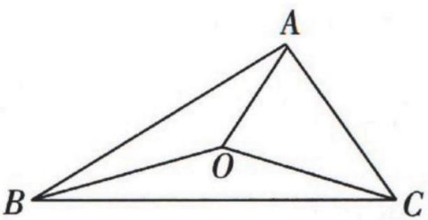

text_image

A
O
B
C

图10-6

A. 外心

B. 内心

C. 重心

D. 垂心

解析 设 $\triangle OAB$ 的底边 $AB, \triangle OBC$ 的底边 $BC, \triangle OCA$ 的底边 $CA$ 上的高分别为 $h_c, h_a, h_b$ . 由 $S_a \overrightarrow{OA} + S_b \overrightarrow{OB} + S_c \overrightarrow{OC} = 0$ , 得 $\frac{1}{2} ah_a \overrightarrow{OA} + \frac{1}{2} bh_b \overrightarrow{OB} + \frac{1}{2} ch_c \overrightarrow{OC} = 0$ ,

即 $ah_{a}\overrightarrow{OA}+bh_{b}\overrightarrow{OB}+ch_{c}\overrightarrow{OC}=\mathbf{0}.$

又 $a\overrightarrow{OA} +b\overrightarrow{OB} +c\overrightarrow{OC} = 0$ ，所以 $\frac{ah_a}{a} = \frac{bh_b}{b} = \frac{ch_c}{c},$

【敲黑板】 $\triangle ABC$ 的内心 $I$ 的向量表示为: $\sin A \cdot \overrightarrow{IA} + \sin B \cdot \overrightarrow{IB} + \sin C \cdot \overrightarrow{IC} = 0$ 或 $a \cdot \overrightarrow{IA} + b \cdot \overrightarrow{IB} + c \cdot \overrightarrow{IC} = 0$ . 如果能记住这个二级结论, 本题根本不需要求解即可得出答案, 在平时的复习备考中, 要有意识地对这些二级结论进行记忆

从而 $h_{a}=h_{b}=h_{c}$ ，即点 O 到三角形三边的距离相等，

所以 O 为 $\triangle ABC$ 的内心, 故选 B.

调研 5 (2022·浙江嵊州考前模拟)在等腰直角三角形 ABC 中, $\angle {ACB} = \frac{\pi }{2}$ ,点 $P$ 在三角形内,满足 $\overrightarrow{PA} + \sqrt{2}\overrightarrow{PB} + \left( {2\sqrt{2} + 2}\right) \overrightarrow{PC} = 0$ ,则 $\angle {APB} =$ \_\_\_\_.

解析 设 $\triangle PBC, \triangle PCA, \triangle PAB, \triangle ABC$ 的面积分别为 $S_{1}, S_{2}, S_{3}, S$ .

由奔驰定理得 $S_{1}\overrightarrow{PA}+S_{2}\overrightarrow{PB}+S_{3}\overrightarrow{PC}=0$ , 又 $\overrightarrow{PA}+\sqrt{2}\overrightarrow{PB}+(2\sqrt{2}+2)\overrightarrow{PC}=0$

【技巧应用】题中给出的三角形及其内一点，满足奔驰定理的适用情形，且已知式与奔驰定理的式子结构相似，考虑使用奔驰定理解题

所以 $S_{1}:S_{2}:S_{3}=1:\sqrt{2}:(2\sqrt{2}+2)$ .

如图 10-7, 过点 $P$ 作 $PN \perp BC$ , $PM \perp AC$ , 垂足分别为 $N, M$ , 过点 $P$ 作 $EF \parallel AB$ 分别交 $AC, BC$ 于点 $E, F$ ,

则 $EF = \frac{1}{3} AB$ ，且 $\frac{PF}{PE} = \frac{PN}{PM} = \frac{S_1}{S_2} = \frac{1}{\sqrt{2}}.$

设 AC = BC = 3，则 $AB = 3\sqrt{2}$ ， $EF = \sqrt{2}$ ，

$$
P F = \frac {1}{\sqrt {2} + 1} \times \sqrt {2} = 2 - \sqrt {2}, P E = \sqrt {2} P F = 2 \sqrt {2} - 2.
$$

所以 $PN = FN = \frac{\sqrt{2}}{2} \times (2 - \sqrt{2}) = \sqrt{2} - 1, PM = \sqrt{2} FN = 2 - \sqrt{2}$ .

设 $\angle PBC = \alpha, \angle PAC = \beta$ ，则 $BN = BC - PM = \sqrt{2} + 1, \tan \alpha = \frac{PN}{BN} = \frac{\sqrt{2} - 1}{\sqrt{2} + 1} = 3 - 2\sqrt{2}$ ，

$$
A M = A C - P N = 2 + 2 - \sqrt {2} = 4 - \sqrt {2}, \tan \beta = \frac {P M}{A M} = \frac {2 - \sqrt {2}}{4 - \sqrt {2}} = \frac {3 - \sqrt {2}}{7}.
$$

所以 $\tan(\alpha+\beta)=\frac{\tan\alpha+\tan\beta}{1-\tan\alpha\tan\beta}=\sqrt{2}-1$

则 $\tan 2(\alpha + \beta) = \frac{2\tan (\alpha + \beta)}{1 - \tan^2 (\alpha + \beta)} = 1$ ，易知 $0 < \alpha + \beta < \frac{\pi}{2}$ ，则 $0 < 2(\alpha + \beta) < \pi$ ，所以 $2(\alpha + \beta) = \frac{\pi}{4}$ ，所以 $\alpha + \beta = \frac{\pi}{8}$ ，

所以 $\angle APB = \pi - (\frac{\pi}{4} - \alpha) - (\frac{\pi}{4} - \beta) = \frac{\pi}{2} + \alpha + \beta = \frac{5\pi}{8}$ .

调研 6 (2022·鄂东南省级示范高中联考)(多选)已知点 O 是△ABC 内一点,且 $3 \overrightarrow{OA} + 2 \overrightarrow{OB} + 4 \overrightarrow{OC} = 0$ ,则下列选项正确的是()

A. $\overrightarrow{AO} = \frac{1}{3}\overrightarrow{AB} +\frac{2}{9}\overrightarrow{AC}$

B. 直线 AO 不过 BC 的中点

C. $S_{\triangle AOB}: S_{\triangle AOC} = 2: 1$

D. 若 $|\overrightarrow{OA}| = |\overrightarrow{OB}| = |\overrightarrow{OC}| = 1$ , 则 $\overrightarrow{OC} \cdot \overrightarrow{AB} = \frac{3}{16}$

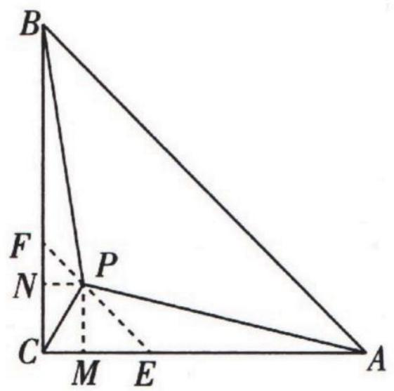

text_image

B
F
N
P
C
M
E
A

图10-7

# 解析

<table><tr><td>选项</td><td>分析过程</td><td>正误</td></tr><tr><td>A</td><td> $3\overrightarrow{OA}+2\overrightarrow{OB}+4\overrightarrow{OC}=0\rightarrow3\overrightarrow{OA}+2(\overrightarrow{OA}+\overrightarrow{AB})+4(\overrightarrow{OA}+\overrightarrow{AC})=0\rightarrow9\overrightarrow{OA}+2\overrightarrow{AB}+4\overrightarrow{AC}=0\rightarrow\overrightarrow{AO}=\frac{2}{9}\overrightarrow{AB}+\frac{4}{9}\overrightarrow{AC}$ </td><td>×</td></tr><tr><td>B</td><td>作BC边上的中线AD,则 $\overrightarrow{AD}=\frac{1}{2}(\overrightarrow{AB}+\overrightarrow{AC})$ ,若直线AO过BC的中点D,则存在非零实数λ,使得 $\overrightarrow{AO}=\lambda\overrightarrow{AD}=\frac{\lambda}{2}\overrightarrow{AB}+\frac{\lambda}{2}\overrightarrow{AC}$ ,又 $\overrightarrow{AO}=\frac{2}{9}\overrightarrow{AB}+$ 【会思考】从反面考虑,假设直线AO过BC的中点,并将此当作已知条件,若后面推出矛盾,则假设不成立,否则假设成立 $\frac{4}{9}\overrightarrow{AC}$ ,所以 $\frac{\lambda}{2}=\frac{2}{9},\frac{\lambda}{2}=\frac{4}{9}$ ,矛盾,故直线AO不过BC的中点</td><td>√</td></tr><tr><td>C</td><td>由奔驰定理得 $S_{\triangle OBC}\overrightarrow{OA}+S_{\triangle OAC}\overrightarrow{OB}+S_{\triangle OAB}\overrightarrow{OC}=0$ ,又 $3\overrightarrow{OA}+2\overrightarrow{OB}+4\overrightarrow{OC}=0$ ,所以 $S_{\triangle OBC}:S_{\triangle OAC}:S_{\triangle OAB}=3:2:4$ ,则 $S_{\triangle AOB}:S_{\triangle AOC}=4:2=2:1$ </td><td>√</td></tr><tr><td>D</td><td>由 $3\overrightarrow{OA}+2\overrightarrow{OB}+4\overrightarrow{OC}=0$ ,得 $3\overrightarrow{OA}+2\overrightarrow{OB}=-4\overrightarrow{OC}$ ,若 $|\overrightarrow{OA}|=|\overrightarrow{OB}|=|\overrightarrow{OC}|=1$ ,则 $(3\overrightarrow{OA}+2\overrightarrow{OB})^{2}=13+12\overrightarrow{OA}\cdot\overrightarrow{OB}=16\overrightarrow{OC}^{2}=16$ ,则 $\overrightarrow{OA}\cdot\overrightarrow{OB}=\frac{1}{4}$ .易知 $\overrightarrow{OC}=-\frac{1}{4}(3\overrightarrow{OA}+2\overrightarrow{OB})$ ,则 $\overrightarrow{OC}\cdot\overrightarrow{AB}=-\frac{1}{4}(3\overrightarrow{OA}+2\overrightarrow{OB})\cdot(\overrightarrow{OB}-\overrightarrow{OA})=-\frac{1}{4}(-3\overrightarrow{OA}^{2}+2\overrightarrow{OB}^{2}+\overrightarrow{OA}\cdot\overrightarrow{OB})=\frac{1}{4}\times(1-\frac{1}{4})=\frac{3}{16}$ </td><td>√</td></tr></table>

# 技巧4 平面向量的其他二级结论

# 1. 平面向量中的矩形大法

结论1 已知 $O$ 为矩形ABCD所在平面内任意一点，则 $\vert \overrightarrow{OA}\vert^2 +\vert \overrightarrow{OC}\vert^2 = \vert \overrightarrow{OB}\vert^2 +\vert \overrightarrow{OD}\vert^2.$

结论2 已知 $P$ 为矩形ABCD所在平面内任意一点，则 $\overrightarrow{PA} \cdot \overrightarrow{PC} = \overrightarrow{PB} \cdot \overrightarrow{PD}$ .

# 2. 平面四边形对角线向量定理

结论1 在平面四边形ABCD中，有 $\overrightarrow{AC} \cdot \overrightarrow{BD} = \frac{(\overrightarrow{AD}^2 + \overrightarrow{BC}^2) - (\overrightarrow{AB}^2 + \overrightarrow{CD}^2)}{2}$ .

结论 2 在平面四边形 ABCD 中, 若 $AC \perp BD$ , 则有 $\overrightarrow{AD^{2}} + \overrightarrow{BC^{2}} = \overrightarrow{AB^{2}} + \overrightarrow{CD^{2}}$ .

结论3 在平面四边形ABCD中，有 $\cos \langle \overrightarrow{AC},\overrightarrow{BD}\rangle = \frac{(\overrightarrow{AD}^2 + \overrightarrow{BC}^2) - (\overrightarrow{AB}^2 + \overrightarrow{CD}^2)}{2|\overrightarrow{AC}||\overrightarrow{BD}|}$

# 3. 三角形面积公式的向量表示

平面上 O, A, B 三点不共线，设 $\overrightarrow{OA} = \boldsymbol{a} = (x_{1}, y_{1}), \overrightarrow{OB} = \boldsymbol{b} = (x_{2}, y_{2})$ ，则 $\triangle OAB$ 的面积 $S_{\triangle OAB} = \frac{1}{2}\sqrt{\boldsymbol{a}^{2}\boldsymbol{b}^{2} - (\boldsymbol{a} \cdot \boldsymbol{b})^{2}} = \frac{1}{2}|x_{1}y_{2} - x_{2}y_{1}|$ .

调研 7 (2022·上海复旦附中考前模拟)已知向量 a, b, c 满足 $|a| = |b| = 2$ , $|c| = 1$ , $(a - c) \cdot (b - c) = 0$ , 则 $|a - b|$ 的取值范围是 \_\_\_\_.

解析 如图 10-8, 设 $\overrightarrow{OA} = a$ , $\overrightarrow{OB} = b$ , $\overrightarrow{OC} = c$ , 连接 $CA, CB$ , 因为 $(a - c) \cdot (b - c) = 0$ , 所以 $\overrightarrow{CA} \perp \overrightarrow{CB}$ .

以 CA, CB 为邻边作出矩形 ACBD,

连接 BA, CD, OD, 则由 $\left|\overrightarrow{OA}\right|^{2} + \left|\overrightarrow{OB}\right|^{2} = \left|\overrightarrow{OC}\right|^{2} + \left|\overrightarrow{OD}\right|^{2}$ ,

【技巧应用】应用平面向量中的矩形大法的结论1，得到等量关系

且 $|\overrightarrow{OA}| = |\overrightarrow{OB}| = 2, |\overrightarrow{OC}| = 1$ ，可得 $|\overrightarrow{OD}| = \sqrt{7}$

则点 D 在圆心为 O，半径为 $r=\sqrt{7}$ 的圆上.

易知点 C 在圆心为 O, 半径为 1 的圆上,

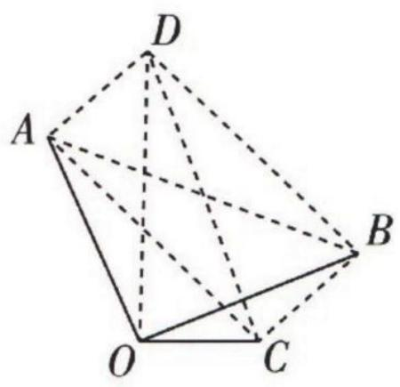

text_image

Geometric diagram of a tetrahedron with labeled vertices A, B, C, D and origin O, showing solid and dashed edges.

图10-8

所以 $r - |\overrightarrow{OC}| \leqslant |\overrightarrow{CD}| \leqslant r + |\overrightarrow{OC}|$ ,

即 $\sqrt{7} - 1 \leqslant |\overrightarrow{CD}| \leqslant \sqrt{7} + 1$ ，又 $|\mathbf{a} - \mathbf{b}| = |\overrightarrow{BA}| = |\overrightarrow{CD}|$ ，

所以 $|a-b|$ 的取值范围是 $[\sqrt{7}-1,\sqrt{7}+1]$ .

调研 8 (2022·湖北恩施5月教学质量监测)圆的内接四边形ABCD中,AD=2,CD=4,BD是圆的直径,则 $\overrightarrow{AC}\cdot\overrightarrow{BD}=$

A. 12

B. -12

C. 20

D. -20

解析 如图 10-9 所示, 因为 $BD$ 是直径, 所以 $AB \perp AD$ , $CB \perp CD$ .

由平面四边形对角线向量定理, 可得 $\overrightarrow{AC} \cdot \overrightarrow{BD} = \frac{AD^{2} + BC^{2} - AB^{2} - CD^{2}}{2} = \frac{AD^{2} + BD^{2} - CD^{2} - (BD^{2} - AD^{2}) - CD^{2}}{2} =$

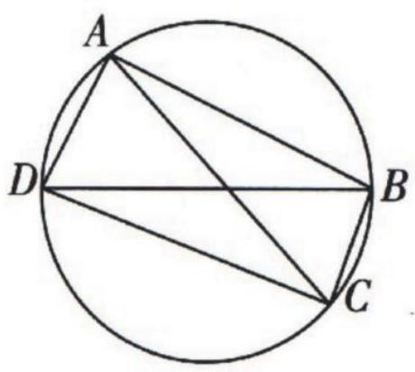

text_image

A
D
B
C

图10-9

【技巧应用】应用平面四边形对角线向量定理的结论】得到等量关系，注意勾股定理的应用

$AD^{2}-CD^{2}=2^{2}-4^{2}=-12$ , 即 $\overrightarrow{AC}\cdot\overrightarrow{BD}=-12$ . 故选 B.

调研 9 (2022·北京航空航天大学自主招生热身训练) 设 $A(x_{1}, y_{1}), B(x_{2}, y_{2}), C(x_{3}, y_{3})$ (A, C 在直线 OB 两侧) 是平面直角坐标系中的曲线 $x^{2} + y^{2} = 2x - 4y$ 上任意不同的三点 (异于 $O(0,0)$ ), 则 $\omega = x_{1}y_{2} - x_{2}y_{1} + x_{2}y_{3} - x_{3}y_{2}$ 的最大值为 \_\_\_\_.

解析 由 $x^{2} + y^{2} = 2x - 4y$ ，得 $(x - 1)^{2} + (y + 2)^{2} = 5,$

故曲线表示圆心为 $(1,-2)$ ，半径为 $\sqrt{5}$ 的圆，

由题知 A, B, C 三点在这个圆上, 显然原点 $O(0,0)$ 也在此圆上.

连接 OA, OC, AB, AC, BC.

由所求联想到三角形面积的坐标公式, $x_{1}y_{2}-x_{2}y_{1}\leqslant2\times\frac{1}{2}|x_{1}y_{2}-x_{2}y_{1}|=2S_{\triangle OAB}$ ,

【技巧应用】应用三角形面积公式的向量表示，将所求转化为坐标运算解题

同理得 $x_{2}y_{3} - x_{3}y_{2}\leqslant 2S_{\triangle OBC}$ ，所以 $\omega = x_1y_2 - x_2y_1 + x_2y_3 - x_3y_2\leqslant 2(S_{\triangle OAB} + S_{\triangle OBC}) = 2S_{\text{四边形}OABC}.$

设 $OB, AC$ 的夹角为 $\theta$ , 则 $S_{\text{四边形}OABC} = \frac{1}{2} OB \times AC \sin \theta \leqslant \frac{1}{2} OB \times AC \leqslant \frac{1}{2} \times (2\sqrt{5})^2 = 10$ ,

【小技巧】平面四边形ABCD中，AC与BD的夹角为θ，则其面积 $S=\frac{1}{2}AC\cdot BD\sin\theta$

当且仅当 OB, AC 为直径且互相垂直时取等号, 此时四边形 OABC 为正方形.

故 $\omega$ 的最大值为 20.

# 新题演练

(2022·河北名校联盟第三次模拟演练)如图10-10,在直角梯形ABCD中, $A=B=\frac{\pi}{2},AD=4,AB=BC=2$ ,点M在以CD为直径的半圆上,且满足 $\overrightarrow{AM}=m\overrightarrow{AB}+n\overrightarrow{AD}$ ,则 $m+n$ 的最大值为()

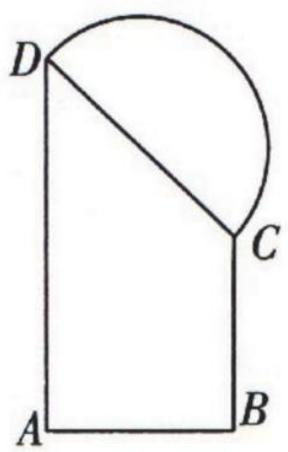

text_image

D
C
A
B

图10-10

A. 2

B. 3

C. $-\frac{5}{2}$

D. $\frac{\sqrt{10}+5}{4}$

# 参考答案与解析

D 如图 10-11, 以 $A$ 为坐标原点, 直线 $AB$ 为 $x$ 轴, $AD$ 为 $y$ 轴, 建立平面直角坐标系. 由题意可得 $A(0,0), B(2,0), C(2,2), D(0,4)$ ,

连接 BD, 则直线 $BD: \frac{x}{2} + \frac{y}{4} = 1$ , 即 $2x + y - 4 = 0$ , 点 A 到直线 BD 的距离 $d = \frac{4}{\sqrt{5}}$ .

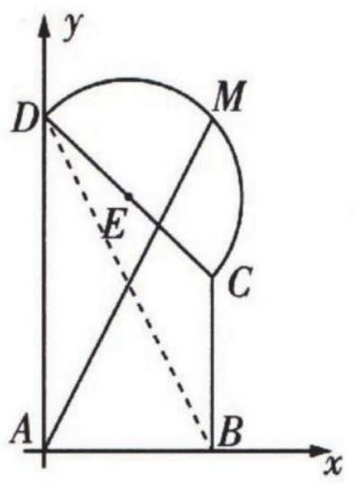

text_image

y
D
M
E
C
A
B
x

图10-11

设直线 $l:2x+y+t=0$ ，设以 CD 为直径的圆为圆 E，则圆 $E:(x-1)^{2}+(y-3)^{2}=2$ ，

令点 $E$ 到直线 $l$ 的距离 $d_{E} = \frac{|5 + t|}{\sqrt{5}} = \sqrt{2}$ , 则 $t = -\sqrt{10} - 5 (t = \sqrt{10} - 5$ 舍去),

取直线 $l:2x+y-\sqrt{10}-5=0$ ，则点 A 到直线 l 的距离 $d'=\frac{\sqrt{10}+5}{\sqrt{5}}$ .

由 $\overrightarrow{AM}=m\overrightarrow{AB}+n\overrightarrow{AD}$ ，知当点M为直线l与圆E的切点时， $m+n$ 取得最大值，为 $\frac{d'}{d}=$ $\frac{\sqrt{10}+5}{4}$ . 故选 D.

# 挑战压轴篇

# 超重点 11 有关数列中不等关系的研究

# 命题角度1 最值问题

调研 1 (2022·吉林长春二模)已知等比数列 $\{a_{n}\}$ 满足 $a_{1}+a_{2}=20,a_{2}+a_{3}=80.$

(1) 求 $\{a_{n}\}$ 的通项公式；  
(2) 令 $b_{n} = \log_{2} a_{n}$ ，其前 $n$ 项和为 $S_{n}$ ，求 $\frac{b_{n}}{S_{n} + 9}$ 的最大值.

思维导引 (1) 设等比数列 $\{a_{n}\}$ 的公比为 $q$ $\longrightarrow$ 列方程组 $\longrightarrow$ 通项公式

(2) 判断数列 $\{b_{n}\}$ 为等差数列 → 求和, 得 $S_{n}$ → 分析 $\frac{b_{n}}{S_{n}+9}$ 的特征 → 变形, 利用基本不等式求最值

解析 (1) 设 $\{a_{n}\}$ 的公比为 $q(q \neq 0)$ , 由题意得 $\left\{ \begin{array}{l} a_{1} + a_{1} q = 20, \\ a_{1} q + a_{1} q^{2} = 80, \end{array} \right.$ 两式相除得 $q = 4$ , 则 $a_{1} + 4a_{1} = 20$ , 得 $a_{1} = 4$ . 所以 $\{a_{n}\}$ 的通项公式为 $a_{n} = 4^{n}$ .

(2) 因为 $b_n = \log_2 a_n = \log_2 4^n = 2n$ ，所以 $b_{n+1} - b_n = 2, b_1 = 2$ ，

所以 $\{b_{n}\}$ 是首项为2,公差为2的等差数列, $b_{n}=2n$ .

$$
S _ {n} = 2 n + \frac {n (n - 1)}{2} \times 2 = n ^ {2} + n, \text {所以} \frac {b _ {n}}{S _ {n} + 9} = \frac {2 n}{n ^ {2} + n + 9} = \frac {2}{n + \frac {9}{n} + 1}.
$$

【小技巧】表达式是关于 $n$ 的分式结构——典型的“一次比二次”，利用分式的性质，把分子变为常数，变形后，就可以利用基本不等式求解最值

因为 $n \in \mathbb{N}^*$ , 所以 $n + \frac{9}{n} \geqslant 2\sqrt{n \times \frac{9}{n}} = 6$ , 当且仅当 $n = \frac{9}{n}$ , 即 $n = 3$ 时等号成立,

【极易出错】需要注意目标代数式中 $n$ 的取值的限制，该题中基本不等式等号成立的条件是 $n = \frac{9}{n}$ ，即 $n = 3$ 。若为求 $n + \frac{10}{n}$ 的最值，则由基本不等式可得 $n + \frac{10}{n} \geqslant 2\sqrt{10}$ ，等号成立的条件是 $n = \frac{10}{n}$ ，即 $n = \sqrt{10}$ ，显然 $\sqrt{10} \notin \mathbf{N}^*$ ，所以该等号不成立，此时应借助函数 $f(x) = x + \frac{10}{x} (x > 0)$ 的单调性求最值。函数 $f(x)$ 在 $(0, \sqrt{10})$ 上单调递减，在 $(\sqrt{10}, +\infty)$ 上单调递增，而 $3 < \sqrt{10} < 4$ ，且 $f(3) = 3 + \frac{10}{3} = \frac{19}{3}$ ， $f(4) = 4 + \frac{10}{4} = \frac{13}{2}$ ，显然 $f(4) > f(3)$ ，所以 $n + \frac{10}{n}$ 的最小值为 $\frac{19}{3}$

所以 $\frac{2}{n + \frac{9}{n} + 1} \leqslant \frac{2}{6 + 1} = \frac{2}{7}$ , 即 $\frac{b_n}{S_n + 9} \leqslant \frac{2}{7}$ , 所以 $\frac{b_n}{S_n + 9}$ 的最大值为 $\frac{2}{7}$ .

调研 2 (2022·湖北鄂东南省级示范高中5月联考)已知数列 $\{a_{n}\}$ 的前n项之积为 $b_{n}$ ，且 $\frac{a_{1}}{b_{1}}+\frac{a_{2}}{b_{2}}+\cdots+\frac{a_{n}}{b_{n}}=\frac{n^{2}+n}{2}(n\in\mathbf{N}^{*})$ .

(1) 求数列 $\left\{\frac{a_{n}}{b_{n}}\right\}$ 和 $\left\{a_{n}\right\}$ 的通项公式；  
(2) 求 $f(n)=b_{n}+b_{n+1}+b_{n+2}+\cdots+b_{2n-1}+b_{2n}$ 的最大值.

思维导引 (1) 根据数列的项与前 $n$ 项和之间的关系式求 $\frac{a_n}{b_n}$ 结合 $b_n = a_nb_{n-1}$ 求 $a_n$

(2) 运用累乘法求出 $\{b_{n}\}$ 的通项公式 $\rightarrow f(n), f(n+1)$ 的表达式 $\xrightarrow{作差}$ 研究 $f(n)$ 的单调性 $\rightarrow$ 最值

解析 (1) 因为 $\frac{a_1}{b_1} + \frac{a_2}{b_2} + \cdots + \frac{a_n}{b_n} = \frac{n^2 + n}{2}$ ①, 所以 $\frac{a_1}{b_1} + \frac{a_2}{b_2} + \cdots + \frac{a_{n-1}}{b_{n-1}} = \frac{(n-1)^2 + n-1}{2} (n \geqslant 2)$ ②, ① - ② 得 $\frac{a_n}{b_n} = n (n \geqslant 2)$ ,

【会转化】若记 $c_{n} = \frac{a_{n}}{b_{n}}$ ，数列 $\{c_{n}\}$ 的前 $n$ 项和为 $T_{n}$ ，则该题就是已知 $T_{n} = \frac{n^{2} + n}{2}$ ，求 $c_{n}$ ，显然需利用数列的项与前 $n$ 项和的关系式 $c_{n} = T_{n} - T_{n-1}$ ，但要注意该式成立的条件是 $n \geqslant 2$ ，需要验证 $n = 1$ 时的情况

$\frac{a_{1}}{b_{1}}=1$ 也满足上式,所以 $\frac{a_{n}}{b_{n}}=n(n\in\mathbf{N}^{*})$ ③,所以 $\frac{a_{n-1}}{b_{n-1}}=n-1(n\geqslant2)$ ④,

易知 $a_{n}b_{n}\neq0$ ，③÷④得 $\frac{a_{n}b_{n-1}}{b_{n}a_{n-1}}=\frac{n}{n-1}(n\geqslant2)$ ，又 $b_{n}=a_{n}b_{n-1}$ ，所以 $\frac{1}{a_{n-1}}=\frac{n}{n-1}(n\geqslant2)$ ，

【会思考】已知 $b_{n}=a_{1}\times a_{2}\times\cdots\times a_{n}$ ，则 $b_{n}=a_{n}b_{n-1}$

所以 $a_{n - 1} = \frac{n - 1}{n} (n\geqslant 2)$ ，所以 $a_{n} = \frac{n}{n + 1}$

【另解】由 $\frac{a_{n}}{b_{n}}=n$ ，可得 $b_{n}=\frac{a_{n}}{n}$ ，即 $b_{n}=a_{n}b_{n-1}=\frac{a_{n}}{n}(n\geqslant2)$ 。易知 $a_{n}\neq0$ ，所以 $b_{n-1}=\frac{1}{n}(n\geqslant2)$ ⑤，
故 $b_{n}=\frac{1}{n+1}$ ⑥，由⑤⑥可得 $a_{n}=\frac{b_{n}}{b_{n-1}}=\frac{\frac{1}{n+1}}{\frac{1}{n}}=\frac{n}{n+1}(n\geqslant2)$ ，当n=1时， $a_{1}=b_{1}=\frac{1}{2}$ ，满足上
式，故 $a_{n}=\frac{n}{n+1}$

(2) 由(1)可知 $a_{n} = \frac{n}{n + 1}$ , 则 $b_{n} = a_{1} \times a_{2} \times \cdots \times a_{n} = \frac{1}{2} \times \frac{2}{3} \times \cdots \times \frac{n}{n + 1} = \frac{1}{n + 1}$ ,

所以 $f(n) = b_{n} + b_{n + 1} + \dots +b_{2n} = \frac{1}{n + 1} +\frac{1}{n + 2} +\dots +\frac{1}{2n + 1},$ 则 $f(n + 1) = \frac{1}{n + 2} +$ $\frac{1}{n + 3} +\dots +\frac{1}{2n + 3},$

由 $f(n+1)-f(n)=\frac{1}{2n+2}+\frac{1}{2n+3}-\frac{1}{n+1}=\frac{1}{2n+3}-\frac{1}{2n+2}<0$ ，得 $f(n+1)<f(n)$ ，
所以 $f(n)$ 单调递减，所以 $f(n)$ 的最大值为 $f(1)=b_{1}+b_{2}=\frac{1}{2}+\frac{1}{3}=\frac{5}{6}$ .

【析疑难】该问的难点在于 $f\left( n\right)$ 的表达式是 $n + 1$ 个式子相加的形式,不能和【调研 1 】一样,通过变形化简为较简单的函数,所以就需要利用作差法判断 $f\left( n\right)$ 的单调性,进而确定其最值

# 命题角度2》不等式恒成立条件下的参数范围问题

调研 3 (2022·山东烟台三模)已知数列 $\{a_{n}\}$ 的前n项和为 $S_{n}(S_{n}\neq0)$ , $a_{1}=$ $\frac{1}{2}$ ，当 $n \geqslant 2$ 时， $S_{n}^{2}=a_{n}S_{n}-a_{n}$ .

(1) 求 $S_{n}$ ;   
(2) 设数列 $\{\frac{2^n}{S_n}\}$ 的前 $n$ 项和为 $T_n$ , 若 $\lambda T_n \leqslant (n^2 + 9)2^n$ 恒成立, 求 $\lambda$ 的取值范围.

解析 (1) 因为当 $n \geqslant 2$ 时, $S_{n}^{2} = a_{n} S_{n} - a_{n}$ , 所以 $S_{n}^{2} = (S_{n} - S_{n-1}) S_{n} - (S_{n} - S_{n-1})$ , 整理得 $S_{n} S_{n-1} = S_{n-1} - S_{n}$ , 即 $\frac{1}{S_{n}} - \frac{1}{S_{n-1}} = 1$ .

【拓展】形如 $txy = x + y$ (t 为常数，x, y 为变量) 的式子，经常出现在数列的相关问题中，其处理的一般思路是分离常数 t，将其化为 $t = \frac{x + y}{xy} = \frac{1}{x} + \frac{1}{y}$ 的形式，构造相应的等差数列，从而求得数列通项

所以数列 $\{\frac{1}{S_n}\}$ 是以 $\frac{1}{S_1} = \frac{1}{a_1} = 2$ 为首项，1为公差的等差数列，

所以 $\frac{1}{S_n} = n + 1$ ，即 $S_{n} = \frac{1}{n + 1}$

(2) 由(1)知, $\frac{2^n}{S_n} = (n + 1)2^n$ ,

所以 $T_{n}=2\times2+3\times2^{2}+\cdots+n\times2^{n-1}+(n+1)\times2^{n}$ ①,

$$
2 T _ {n} = 2 \times 2 ^ {2} + 3 \times 2 ^ {3} + \dots + n \times 2 ^ {n} + (n + 1) \times 2 ^ {n + 1} \quad ②,
$$

①-②得 $-T_{n}=4+(2^{2}+2^{3}+\cdots+2^{n})-(n+1)\times2^{n+1}=-n\times2^{n+1}$

所以 $T_{n} = n \times 2^{n + 1}$ , 则 $\lambda T_{n} \leqslant (n^{2} + 9)2^{n}$ , 即 $\lambda n \times 2^{n + 1} \leqslant (n^{2} + 9)2^{n}$ ,

变形得 $\lambda \leqslant \frac{n^2 + 9}{2n} = \frac{n}{2} + \frac{9}{2n}$ ,

【敲黑板】由 $\lambda T_{n} \leqslant (n^{2} + 9)2^{n}$ 恒成立求参数取值范围，根据式子的结构特征，优先考虑分离参数，然后将其转化为数列的最值问题求解

因为 $\frac{n}{2}+\frac{9}{2n}\geqslant2\sqrt{\frac{n}{2}\times\frac{9}{2n}}=3$ ，当且仅当n=3时，等号成立，所以 $\lambda\leqslant3$ ，即 $\lambda$ 的取值范围是 $(-∞,3]$ .

调研 4 (2022·浙江效实中学等校5月联考)已知等差数列 $\{a_{n}\}$ 的公差 $d\neq0$ , $a_{3}=5,a_{2}$ 是 $a_{1}$ 与 $a_{5}$ 的等比中项,数列 $\{b_{n}\}$ 的前n项和 $S_{n}$ 满足 $4S_{n}=b_{n}-1(n\in\mathbf{N}^{*})$ .

(1) 求数列 $\{a_{n}\}$ 与 $\{b_{n}\}$ 的通项公式；

(2) 设 $c_{n} = a_{n}b_{n}$ , 数列 $\{c_{n}\}$ 的前 $n$ 项和为 $T_{n}$ , 若 $\lambda(T_{n} + \frac{1}{8}) \leqslant 1$ 对任意的 $n \in \mathbf{N}^{*}$ 恒成立, 求实数 $\lambda$ 的取值范围.

解析 (1) 由 $\left\{ \begin{array}{l} a_{3} = 5, \\ a_{2}^{2} = a_{1}a_{5}, \end{array} \right.$ 得 $\left\{ \begin{array}{l} a_{1} + 2d = 5, \\ (a_{1} + d)^{2} = a_{1}(a_{1} + 4d), \end{array} \right.$ 解得 $\left\{ \begin{array}{l} a_{1} = 1, \\ d = 2 \end{array} \right.$ 或 $\left\{ \begin{array}{l} a_{1} = 5, \\ d = 0 \end{array} \right.$ （舍去），

$$
\therefore a _ {n} = 1 + 2 (n - 1) = 2 n - 1.
$$

$4S_{n}=b_{n}-1$ , 当 n=1 时, $4b_{1}=b_{1}-1$ , 则 $b_{1}=-\frac{1}{3}$ . 当 $n\geqslant2$ 时, $4S_{n-1}=b_{n-1}-1$ , 则 $4b_{n}=b_{n}-b_{n-1}$ , 易知 $b_{n}\neq0$ , 故 $\frac{b_{n}}{b_{n-1}}=-\frac{1}{3}$ , 则数列 $\{b_{n}\}$ 是首项为 $-\frac{1}{3}$ , 公比为 $-\frac{1}{3}$ 的等比数列, $\therefore b_{n}=(-\frac{1}{3})^{n}$ .

(2) 由 (1) 得 $c_{n} = (2n - 1)(-\frac{1}{3})^{n}$ , 则 $T_{n} = 1 \times (-\frac{1}{3})^{1} + 3 \times (-\frac{1}{3})^{2} + 5 \times (-\frac{1}{3})^{3} + \cdots + (2n - 1)(-\frac{1}{3})^{n}$ ,

$$
- \frac {1}{3} T _ {n} = 1 \times \left(- \frac {1}{3}\right) ^ {2} + 3 \times \left(- \frac {1}{3}\right) ^ {3} + \dots + (2 n - 3) \left(- \frac {1}{3}\right) ^ {n} + (2 n - 1) \left(- \frac {1}{3}\right) ^ {n + 1},
$$

两式相减得 $\frac{4}{3} T_n = -\frac{1}{3} + 2 \times \left[ (-\frac{1}{3})^2 + (-\frac{1}{3})^3 + \cdots + (-\frac{1}{3})^n \right] - (2n - 1)(-\frac{1}{3})^{n+1} = -\frac{1}{3} + \frac{1}{6}[1 - (-\frac{1}{3})^{n-1}] - (2n - 1)(-\frac{1}{3})^{n+1} = -\frac{1}{6} - (2n + \frac{1}{2})(-\frac{1}{3})^{n+1}$ ,

$$
\therefore T _ {n} = - \frac {1}{8} + \frac {4 n + 1}{8} (- \frac {1}{3}) ^ {n}.
$$

$\because \lambda (T_{n} + \frac{1}{8})\leqslant 1$ 对任意的 $n\in \mathbf{N}^{*}$ 恒成立，即 $\lambda \times \frac{4n + 1}{8}\times (-\frac{1}{3})^n\leqslant 1$ 对任意的 $n\in$ $\mathbf{N}^{*}$ 恒成立.

【极易出错】不等式中含有 $(- \frac{1}{3})^{n}$ ，分离参数时，不等号的方向受 $(- \frac{1}{3})^{n}$ 的正负影响，故要根据n的奇偶性进行分类讨论

①当 $n$ 是奇数时, $-\lambda \times \frac{4n + 1}{8} \times \frac{1}{3^n} \leqslant 1$ 对任意 $n \in \mathbb{N}^*$ 恒成立, $\therefore -\lambda \leqslant \frac{8 \times 3^n}{4n + 1}$ 对任意 $n \in \mathbb{N}^*$ 恒成立.  
②当 $n$ 是偶数时, $\lambda \times \frac{4n + 1}{8} \times \frac{1}{3^n} \leqslant 1$ 对任意 $n \in \mathbb{N}^*$ 恒成立, $\therefore \lambda \leqslant \frac{8 \times 3^n}{4n + 1}$ 对任意 $n \in \mathbb{N}^*$ 恒成立.

令 $A_{n}=\frac{8\times3^{n}}{4n+1}$ ，则 $A_{n+1}-A_{n}=\frac{8\times3^{n+1}}{4n+5}-\frac{8\times3^{n}}{4n+1}=\frac{16(4n-1)3^{n}}{(4n+5)(4n+1)}>0$ 对任意的 $n\in$ $N^{*}$ 恒成立，

【化难为易】分离参数后, 即可将参数取值范围问题转化为数列的最值问题. 数列 $\left\{\frac{8 \times 3^n}{4n + 1}\right\}$ 通项公式的结构较复杂, 不能直接判断出其最值, 也无法转化为用基本不等式求解的结构, 故考虑从最基本的数列的单调性或对应函数的单调性入手求解

$\therefore \{A_{n}\}$ 为递增数列.

【另解】①(作商法) $\frac{A_{n+1}}{A_{n}}=\frac{\frac{8\times3^{n+1}}{4n+5}}{\frac{8\times3^{n}}{4n+1}}=\frac{3(4n+1)}{4n+5}=\frac{12n+3}{4n+5},\quad\therefore n\in\mathbf{N}^{*},\quad\therefore12n+3>4n+5,$ $\therefore\frac{A_{n+1}}{A_{n}}>1,\quad\therefore\left\{A_{n}\right\}$ 为递增数列. ②(导数法)记 $f(x)=\frac{8\times3^{x}}{4x+1}(x\geqslant1)$ ，则 $f'(x)=$ $\frac{(8\times3^{x})'\times(4x+1)-(4x+1)'\times(8\times3^{x})}{(4x+1)^{2}}=\frac{8\times3^{x}\ln3\times(4x+1)-4\times8\times3^{x}}{(4x+1)^{2}}=$

$\frac{8\times3^{x}\left[(4x+1)\ln3-4\right]}{(4x+1)^{2}},\quad x\geqslant1,\quad\ln3>1,\quad4x+1\geqslant5,\quad(4x+1)\ln3-4>0,\quad f'(x)>0,$ 故函数 $f(x)$ 在 $[1,+\infty)$ 上单调递增. $\therefore\{A_{n}\}$ 为递增数列

∴ 当 n 是奇数时， $-\lambda \leqslant A_{1} = \frac{24}{5}$ ，即 $\lambda \geqslant -\frac{24}{5}$ ；当 n 是偶数时， $\lambda \leqslant A_{2} = 8$ 。∴ $-\frac{24}{5} \leqslant \lambda \leqslant 8$ 。

# 命题角度3 不等式证明问题

调研 5 (2022·浙江镇海中学模拟)已知数列 $\{a_{n}\}$ 的前n项和 $S_{n}$ 满足 $4a_{n}-2S_{n}+n^{2}-3n-4=0,n\in N^{*}$ ，数列 $\{b_{n}\}$ 满足 $b_{1}=1,2^{n}b_{n+1}=a_{n}b_{n},n\in N^{*}$ .

(1) 求证: 数列 $\{a_{n}-n\}$ 为等比数列, 并求数列 $\{a_{n}\}$ 的通项公式.  
(2) 求证: $b_{n+1} > b_n \geqslant 3 - \frac{n+1}{2^{n-1}}$ .

解析 (1) 当 $n = 1$ 时, $a_{1} = 3$ ;

当 $n \geqslant 2$ 时, $4a_{n-1} - 2S_{n-1} + (n-1)^{2} - 3(n-1) - 4 = 0, n \in \mathbf{N}^{*}$ .

则 $4(a_{n} - a_{n - 1}) - 2a_{n} + 2n - 4 = 0(n\geqslant 2)$ ，整理得 $a_{n} = 2a_{n - 1} - n + 2(n\geqslant 2)$

所以 $a_{n} - n = 2\left[a_{n - 1} - (n - 1)\right]$ ，又 $a_1 - 1 = 2\neq 0$ ，故 $a_{n} - n\neq 0$

所以 $\frac{a_n - n}{a_{n-1} - (n - 1)} = 2$ ，即数列 $\{a_n - n\}$ 是首项为 2，公比为 2 的等比数列.

【指点迷津】有关数列的证明问题，可以考虑利用已知条件直接进行变形构造，如上述解法。但在变形的过程中，可能会遇到困难，无法确定方向，若直接利用“反代”的策略，问题会变得更简单一些。如本题，还可以用以下方法证明。设 $c_{n}=a_{n}-n$ ，则 $a_{n}=c_{n}+n$ ，将其代入 $a_{n}=2a_{n-1}-n+2$ ，可得 $c_{n}+n=2\left[c_{n-1}+(n-1)\right]-n+2(n\geqslant2)$ ，整理得 $c_{n}=2c_{n-1}(n\geqslant2)$ ，又 $c_{1}=a_{1}-1=2\neq0$ ，所以数列 $\{a_{n}-n\}$ 是首项为2，公比为2的等比数列

所以 $a_{n} - n = 2^{n}, a_{n} = 2^{n} + n.$

(2) 由题意得 $b_{n+1} = (1 + \frac{n}{2^n})b_n$ ，所以 $b_{n+1}$ 与 $b_n$ 同号，

又 $b_{1} = 1 > 0$ ，所以 $b_{n} > 0$ ，所以 $b_{n + 1} - b_n = \frac{n}{2^n}\cdot b_n > 0$ ，即 $b_{n + 1} > b_n$

【另解】证明 $b_{n + 1} > b_n$ ，也可以利用作商法.由 $b_{n + 1} = (1 + \frac{n}{2^n})b_n$ ，得 $\frac{b_{n + 1}}{b_n} = 1 + \frac{n}{2^n} >1.$ 因为 $b_{1} =$ $1 > 0$ ，所以 $b_{n} > 0$ ， $b_{n + 1} > b_{n}$

所以数列 $\{b_n\}$ 为递增数列，所以 $b_{n} \geqslant b_{1} = 1$ ，则 $b_{n+1} - b_{n} = \frac{n}{2^{n}} \cdot b_{n} \geqslant \frac{n}{2^{n}}$

所以 $b_{n}-b_{1}=(b_{2}-b_{1})+(b_{3}-b_{2})+\cdots+(b_{n}-b_{n-1})\geqslant\frac{1}{2}+\frac{2}{2^{2}}+\cdots+\frac{n-1}{2^{n-1}}.$

令 $T_{n}=\frac{1}{2}+\frac{2}{2^{2}}+\cdots+\frac{n-1}{2^{n-1}}$ ，则 $\frac{1}{2}T_{n}=\frac{1}{2^{2}}+\frac{2}{2^{3}}+\cdots+\frac{n-1}{2^{n}}$

两式相减得 $\frac{1}{2} T_n = \frac{1}{2} +\frac{1}{2^2} +\frac{1}{2^3} +\dots +\frac{1}{2^{n - 1}} -\frac{n - 1}{2^n} = \frac{\frac{1}{2}(1 - \frac{1}{2^n})}{1 - \frac{1}{2}} -\frac{n}{2^n} = 1 - \frac{n + 1}{2^n},$

所以 $T_{n} = 2 - \frac{n + 1}{2^{n - 1}}$ ，所以 $b_{n}\geqslant b_{1} + T_{n} = 3 - \frac{n + 1}{2^{n - 1}}.$

【思维瓶颈】关于不等式 $b_{n} \geqslant 3 - \frac{n + 1}{2^{n - 1}}$ 的证明, 首光思考数列 $\{b_{n}\}$ 的通项公式是否容易求出, 若能求出, 就可以转化为关于 $n$ 的不等式, 证明的思路就比较直接. 显然本题利用递推关系式 $b_{n + 1} = (1 + \frac{n}{2^n})b_n$ 难以求出 $b_{n}$ , 故需要利用递推关系式进行适度放缩, 观察 $b_{n + 1} - b_{n} \geqslant \frac{n}{2^n}$ 的特征, 左侧可以考虑利用累加法求得 $b_{n}$ , 而右侧相加为一个等差数列 $\{n\}$ 与等比数列 $\{\frac{1}{2^n}\}$ 对应项之积的和, 可以利用错位相减法求出, 进而可证不等式

综上, $b_{n+1}>b_{n}\geqslant3-\frac{n+1}{2^{n-1}}.$

调研 6 (2022·辽宁沈阳二中5月模拟)已知函数 $f(x)=\frac{1}{2}ax^{2}-x-\ln x(a\in\mathbf{R})$ .

(1) 讨论 $f(x)$ 的单调性;  
(2) 当 $x \geqslant 1$ 时, $|f(x)| \geqslant 2$ , 求 a 的取值范围;  
(3) 判断 $\sum_{k=2}^{n}\frac{1}{\ln k}$ 与 $1-\frac{1}{n}$ 的大小, $k, n \in N^{*}$ , 并证明.

解析 (1) 函数 $f(x)$ 的定义域为 $(0, +\infty)$ , $f'(x) = ax - 1 - \frac{1}{x} = \frac{ax^2 - x - 1}{x}$ .

【易错】利用导数求解函数的相关问题时,注意定义域优先意识

当 $a \leqslant 0$ 时, 对任意的 x > 0, $f'(x) < 0$ , 此时函数 $f(x)$ 在 $(0, +\infty)$ 上单调递减.

当 $a > 0$ 时，方程 $ax^2 - x - 1 = 0$ 在 $x > 0$ 时的解为 $x = \frac{1 + \sqrt{1 + 4a}}{2a}$ ，

由 $f'(x)<0$ 可得 $0<x<\frac{1+\sqrt{1+4a}}{2a}$ ，由 $f'(x)>0$ 可得 $x>\frac{1+\sqrt{1+4a}}{2a}$ ，

所以函数 $f(x)$ 在 $(0, \frac{1 + \sqrt{1 + 4a}}{2a})$ 上单调递减，在 $(\frac{1 + \sqrt{1 + 4a}}{2a}, +\infty)$ 上单调递增.

综上所述, 当 $a \leqslant 0$ 时, 函数 $f(x)$ 在 $(0, +\infty)$ 上单调递减; 当 a > 0 时, 函数 $f(x)$ 在 $(0, \frac{1 + \sqrt{1 + 4a}}{2a})$ 上单调递减, 在 $(\frac{1 + \sqrt{1 + 4a}}{2a}, +\infty)$ 上单调递增.

(2) 当 $x \geqslant 1$ 时, 由 $|f(x)| \geqslant 2$ 可得 $\frac{1}{2} ax^2 - x - \ln x \leqslant -2$ 或 $\frac{1}{2} ax^2 - x - \ln x \geqslant 2$ .

若 $\frac{1}{2} ax^2 - x - \ln x \leqslant -2$ 对任意的 $x \geqslant 1$ 恒成立, 则 $\frac{1}{2} a \leqslant \frac{x + \ln x - 2}{x^2}$ .

令 $g(x) = \frac{x + \ln x - 2}{x^2} (x\geqslant 1)$ ，则 $g^{\prime}(x) = \frac{5 - x - 2\ln x}{x^{3}}$

令 $p(x) = 5 - x - 2\ln x (x \geqslant 1)$ , 则 $p'(x) = -1 - \frac{2}{x} < 0$ , 所以函数 $p(x)$ 在 $[1, +\infty)$ 上单调递减，

因为 $p(\mathrm{e}) = 3 - \mathrm{e} > 0, p(3) = 2 - 2\ln 3 < 0$ ，所以存在 $x_0 \in (\mathrm{e}, 3)$ ，使得 $p(x_0) = 0$ ，当 $1 \leqslant x < x_0$ 时， $p(x) > 0$ ，即 $g'(x) > 0$ ，函数 $g(x)$ 单调递增，当 $x > x_0$ 时， $p(x) < 0$ ，即 $g'(x) < 0$ ，函数 $g(x)$ 单调递减，

又当 $x > 2$ 时, $g(x) > 0, g(1) = -1$ , 故 $g(x)_{\min} = g(1) = -1$ . 所以 $\frac{1}{2} a \leqslant -1$ , 解得 $a \leqslant -2$ .

若 $\frac{1}{2} ax^2 - x - \ln x \geqslant 2$ 对任意的 $x \geqslant 1$ 恒成立, 则 $\frac{1}{2} a \geqslant \frac{x + \ln x + 2}{x^2}$ .

令 $h(x) = \frac{x + \ln x + 2}{x^2} (x\geqslant 1)$ ，则 $h^\prime (x) = -\frac{x + 2\ln x + 3}{x^3} < 0$ ，所以 $h(x)$ 在 $[1, + \infty)$ 上单调递减，

所以 $h(x)_{\max} = h(1) = 3.$ 所以 $\frac{1}{2} a\geqslant 3$ ，解得 $a\geqslant 6$

综上所述,实数 a 的取值范围是 $(-∞, -2] ∪ [6, +∞)$ .

(3) $\sum_{k=2}^{n} \frac{1}{\ln k} > 1 - \frac{1}{n}$ , 理由如下.

由(1)知,当 a=2 时, $f(x)=x^{2}-x-\ln x$ 在 $(1,+\infty)$ 上单调递增,

当 $x > 1$ 时， $f(x) > f(1) = 0$ ，即 $x^2 - x > \ln x > 0$ ，则 $\frac{1}{\ln x} > \frac{1}{x(x - 1)} = \frac{1}{x - 1} - \frac{1}{x}$ ，

所以 $\sum_{k=2}^{n} \frac{1}{\ln k} = \frac{1}{\ln 2} + \frac{1}{\ln 3} + \cdots + \frac{1}{\ln n} > 1 - \frac{1}{2} + \frac{1}{2} - \frac{1}{3} + \cdots + \frac{1}{n-1} - \frac{1}{n} = 1 - \frac{1}{n}$ .

【扫清障碍】不等式的证明的关键是建立不等式的两侧代数式的联系。显然，不等式的左侧是数列 $\left\{\frac{1}{\ln(n+1)}\right\}$ 的前 n-1 项之和，该数列难以直接求和，所以需要借助第(1)间的结论，将 $\frac{1}{\ln n}$ 适度放缩 $\frac{1}{\ln n} > \frac{1}{n(n-1)}$ ，而右侧各式相加就是数列 $\left\{\frac{1}{n(n-1)}\right\}$ 的求和问题，利用裂项相消法即可解决，进而可证不等式成立

# 新题演练

1. (2022·山东青岛模拟改编)已知数列 $\{a_{n}\}$ 的前 $n$ 项和为 $S_{n}$ , 且 $a_{1}, a_{n}, S_{n}$ 依次构成等差数列; 数列 $\{b_{n}\}$ 满足 $b_{1} = 6, b_{n} = S_{n} + \frac{1}{a_{n}} + 4$ .

(1) 求数列 $\{b_{n}\}$ 的前 n 项和 $T_{n}$ ;  
(2) 已知 $a_{n}c_{n}=3n-20$ , 求数列 $\{c_{n}\}$ 的最大项.

2. (2022·华中师大一附中 5 月模拟) 在数列 $\{a_{n}\}$ 中, 已知 $a_{1} = \frac{1}{p}, a_{n+1} = \frac{a_{n}}{na_{n} + 1}, p > 0$ , $n \in \mathbf{N}^{*}$ .

(1) 若 p=1，求数列 $\{a_{n}\}$ 的通项公式；  
(2) 记 $b_{n} = na_{n}$ , 若在数列 $\{b_{n}\}$ 中, $b_{n} \leqslant b_{4} (n \in \mathbf{N}^{*})$ , 求实数 $p$ 的取值范围.

# 参考答案与解析

1. (1) 因为 $a_{1}, a_{n}, S_{n}$ 依次构成等差数列, 所以 $2a_{n} = a_{1} + S_{n}$ , 所以 $2a_{n+1} = a_{1} + S_{n+1}$ , 两式相减得 $2a_{n+1} - 2a_{n} = S_{n+1} - S_{n}$ , 即 $a_{n+1} = 2a_{n}$ , 易知 $a_{n} \neq 0$ , 所以数列 $\{a_{n}\}$ 是以 2 为公比的等比数列.

因为 $b_{1} = 6, b_{n} = S_{n} + \frac{1}{a_{n}} + 4$ ，所以 $6 = a_{1} + \frac{1}{a_{1}} + 4$ ，解得 $a_{1} = 1$ ，

所以 $a_{n} = 2^{n - 1}, S_{n} = \frac{1 - 2^{n}}{1 - 2} = 2^{n} - 1.$

则 $b_{n} = 2^{n} - 1 + \frac{1}{2^{n - 1}} +4 = 2^{n} + \frac{1}{2^{n - 1}} +3,$

所以 $T_{n}=b_{1}+b_{2}+\cdots+b_{n}=(2+\frac{1}{2^{1-1}}+3)+(2^{2}+\frac{1}{2^{2-1}}+3)+\cdots+(2^{n}+\frac{1}{2^{n-1}}+3)=$

$(2 + 2^{2} + \cdots + 2^{n}) + (1 + \frac{1}{2} + \cdots + \frac{1}{2^{n-1}}) + 3n = \frac{2 - 2^{n} \times 2}{1 - 2} + \frac{1 - \frac{1}{2^{n}}}{1 - \frac{1}{2}} + 3n = 2^{n+1} - \frac{1}{2^{n-1}} +$

3n, 所以 $T_{n}=2^{n+1}-\frac{1}{2^{n-1}}+3n.$

(2)由已知得 $c_{n} = \frac{3n - 20}{2^{n - 1}}$ ，则 $c_{n + 1} - c_n = \frac{3(n + 1) - 20}{2^n} -\frac{3n - 20}{2^{n - 1}} = \frac{23 - 3n}{2^n},$

所以当 $0 < n \leqslant 7$ 时， $c_{n+1} - c_n > 0$ ，即 $c_{n+1} > c_n$ ，当 $n > 7$ 时， $c_{n+1} - c_n < 0$ ，即 $c_{n+1} < c_n$ ，所以 $c_8$ 为数列 $\{c_n\}$ 的最大项， $c_8 = \frac{3 \times 8 - 20}{2^{8-1}} = \frac{1}{32}$ .

2.(1) 易知 $a_{n} \neq 0$ ，由 $a_{n+1} = \frac{a_{n}}{na_{n} + 1}$ 得 $\frac{1}{a_{n+1}} - \frac{1}{a_{n}} = n$ ，

则 $\frac{1}{a_2} -\frac{1}{a_1} +\frac{1}{a_3} -\frac{1}{a_2} +\dots +\frac{1}{a_{n + 1}} -\frac{1}{a_n} = 1 + 2 + \dots +n = \frac{n(n + 1)}{2},\frac{1}{a_{n + 1}} = \frac{n(n + 1)}{2} +\frac{1}{a_1} =$

$$
\frac {n ^ {2} + n + 2 p}{2}, \therefore a _ {n + 1} = \frac {2}{n ^ {2} + n + 2 p}, a _ {n} = \frac {2}{n ^ {2} - n + 2 p} (n \geqslant 2).
$$

当 $n = 1$ 时，上式也成立， $\therefore a_{n} = \frac{2}{n^{2} - n + 2p}$ . 若 $p = 1$ ，则 $a_{n} = \frac{2}{n^{2} - n + 2}$ .

(2)由(1)知 $a_{n} = \frac{2}{n^{2} - n + 2p}$ , 则 $b_{n} = \frac{2n}{n^{2} - n + 2p}$ .

由 $b_{4} = \frac{4}{6 + p}, b_{n} \leqslant b_{4}$ , 得 $\frac{2n}{n^{2} - n + 2p} \leqslant \frac{4}{6 + p}$ , 化简得 $(n - 4)p \leqslant 2n(n - 4)$ ,

当 $n < 4$ 时, $p \geqslant 2n$ , 则 $p \geqslant (2n)_{\max} = 2 \times 3 = 6$ , 当 $n > 4$ 时, $p \leqslant 2n$ , 则 $p \leqslant (2n)_{\min} = 2 \times 5 = 10$ , 当 $n = 4$ 时, 易知 $p > 0$ 恒成立.

综上, $p\in[6,10]$ .

# 速记提分结论

# 型 1 ▶ 必背核心公式

<table><tr><td>1</td><td>二倍角公式</td><td> $\sin 2\alpha = 2\sin \alpha \cos \alpha, \tan 2\alpha = \frac{2\tan \alpha}{1 - \tan^{2}\alpha}$ ,【解读】倍角是相对的,两个角的倍数关系不局限于  $2\alpha$  是  $\alpha$  的二倍,要熟悉多种形式的两个角的倍角关系,如  $\frac{\alpha}{4}$  是  $\frac{\alpha}{8}$  的二倍 $\cos 2\alpha = \cos^{2}\alpha - \sin^{2}\alpha = 1 - 2\sin^{2}\alpha = 2\cos^{2}\alpha - 1$ .</td></tr><tr><td>2</td><td>降幂公式</td><td> $\sin^{2}\alpha = \frac{1 - \cos 2\alpha}{2}, \cos^{2}\alpha = \frac{1 + \cos 2\alpha}{2}, \tan^{2}\alpha = \frac{1 - \cos 2\alpha}{1 + \cos 2\alpha}.$ </td></tr><tr><td>3</td><td>半角公式</td><td> $\sin \frac{\alpha}{2} = \pm \sqrt{\frac{1 - \cos \alpha}{2}}, \cos \frac{\alpha}{2} = \pm \sqrt{\frac{1 + \cos \alpha}{2}}, \tan \frac{\alpha}{2} = \pm \sqrt{\frac{1 - \cos \alpha}{1 + \cos \alpha}} = \frac{\sin \alpha}{1 + \cos \alpha} = \frac{1 - \cos \alpha}{\sin \alpha}.$ </td></tr><tr><td>4</td><td>辅助角公式</td><td>通过公式 $a\sin \theta + b\cos \theta = \sqrt{a^{2} + b^{2}} \sin(\theta + \varphi) (\tan \varphi = \frac{b}{a})$ 将形如  $a\sin \theta + b\cos \theta$ 【解读】这种恒等变换实质上是将同角的正弦和余弦函数值与其他常数的乘积的和收缩为一个三角函数,这样做有利于三角函数式的化简,更是研究三角函数性质的常用工具.需要注意的是,在公式  $a\sin \theta + b\cos \theta = \sqrt{a^{2} + b^{2}} \sin(\theta + \varphi)$  中, $\cos \varphi = \frac{a}{\sqrt{a^{2} + b^{2}}}, \sin \varphi = \frac{b}{\sqrt{a^{2} + b^{2}}}$ .使用时不必死记硬背,而是重在对收缩思想的灵活运用(a,b 不同时为 0)的三角函数式转化为只含一个三角函数的式子 $\sqrt{a^{2} + b^{2}} \sin(\theta + \varphi) (\tan \varphi = \frac{b}{a}).$ </td></tr></table>

可将 P115 \~ P119 这部分单独撕下，夹在笔记本内或放在拿取方便处，反复记忆背诵，还可以将 1 辑 \~ 4 辑的最后一部分整理在一起，到时你将得到一本完整的一轮复习速记提分结论大全，陪伴你整个高三，助你圆梦未名湖畔！

<table><tr><td>5</td><td>积化和差</td><td> $\sin \alpha \cos \beta = \frac{1}{2} [\sin(\alpha + \beta) + \sin(\alpha - \beta)]$ , $\cos \alpha \sin \beta = \frac{1}{2} [\sin(\alpha + \beta) - \sin(\alpha - \beta)]$ , $\cos \alpha \cos \beta = \frac{1}{2} [\cos(\alpha + \beta) + \cos(\alpha - \beta)]$ , $\sin \alpha \sin \beta = -\frac{1}{2} [\cos(\alpha + \beta) - \cos(\alpha - \beta)].$ </td></tr><tr><td>6</td><td>和差化积</td><td> $\sin \alpha + \sin \beta = 2 \sin \frac{\alpha + \beta}{2} \cos \frac{\alpha - \beta}{2}, \sin \alpha - \sin \beta = 2 \cos \frac{\alpha + \beta}{2} \sin \frac{\alpha - \beta}{2}$ , $\cos \alpha + \cos \beta = 2 \cos \frac{\alpha + \beta}{2} \cos \frac{\alpha - \beta}{2}, \cos \alpha - \cos \beta = -2 \sin \frac{\alpha + \beta}{2} \sin \frac{\alpha - \beta}{2}.$ </td></tr><tr><td>7</td><td>万能公式</td><td> $\sin \alpha = \frac{2 \tan \frac{\alpha}{2}}{1 + \tan^2 \frac{\alpha}{2}}, \cos \alpha = \frac{1 - \tan^2 \frac{\alpha}{2}}{1 + \tan^2 \frac{\alpha}{2}}, \tan \alpha = \frac{2 \tan \frac{\alpha}{2}}{1 - \tan^2 \frac{\alpha}{2}}.$ </td></tr><tr><td>8</td><td>三倍角公式</td><td> $\sin 3\alpha = 3 \sin \alpha - 4 \sin^3 \alpha = 4 \sin \alpha \sin (60^\circ + \alpha) \sin (60^\circ - \alpha)$ , $\cos 3\alpha = 4 \cos^3 \alpha - 3 \cos \alpha = 4 \cos \alpha \cos (60^\circ + \alpha) \cos (60^\circ - \alpha)$ , $\tan 3\alpha = \frac{3 \tan \alpha - \tan^3 \alpha}{1 - 3 \tan^2 \alpha} = \tan \alpha \tan (60^\circ + \alpha) \tan (60^\circ - \alpha).$ </td></tr><tr><td>9</td><td>三角形中的3个恒等式</td><td>已知△ABC的三个内角A,B,C. $\sin A + \sin B + \sin C = 4 \cos \frac{A}{2} \cos \frac{B}{2} \cos \frac{C}{2}$ , $\cos A + \cos B + \cos C = 1 + 4 \sin \frac{A}{2} \sin \frac{B}{2} \sin \frac{C}{2}$ , $\tan A + \tan B + \tan C = \tan A \tan B \tan C (A, B, C \text{均不为直角}).$ </td></tr></table>

# 型 2 ▶ 必记二级结论

<table><tr><td>10</td><td>奔驰定理及其推论</td><td>奔驰定理:如图所示,已知P是三角形ABC内任意一点,则 $S_{\triangle PBC} \overrightarrow{PA} + S_{\triangle PCA} \overrightarrow{PB} + S_{\triangle PAB} \overrightarrow{PC} = 0$ .推论:已知P是三角形ABC内任意一点,且 $x \overrightarrow{PA} + y \overrightarrow{PB} + z \overrightarrow{PC} = 0$ ,则 $S_{\triangle PBC}:S_{\triangle PCA}:S_{\triangle PAB} = x:y:z.$ </td><td>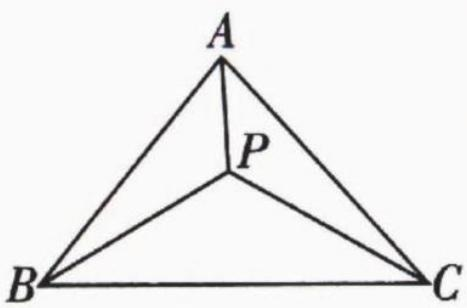</td></tr></table>

<table><tr><td>11</td><td>平面向量中的极化恒等式</td><td> $a \cdot b = \frac{1}{4}[(a + b)^2 - (a - b)^2]$ 或 $4a \cdot b = (a + b)^2 - (a - b)^2$ .几何意义:向量的数量积可以表示为以向量  $a,b$  为邻边的平行四边形的两条对角线的长的平方差的 $\frac{1}{4}$ .</td></tr><tr><td>12</td><td>对角线向量定理</td><td>如图所示,在平面四边形ABCD中, $\overrightarrow{AC} \cdot \overrightarrow{BD} = \frac{(\overrightarrow{AD^2} + \overrightarrow{BC^2}) - (\overrightarrow{AB^2} + \overrightarrow{CD^2})}{2}$ .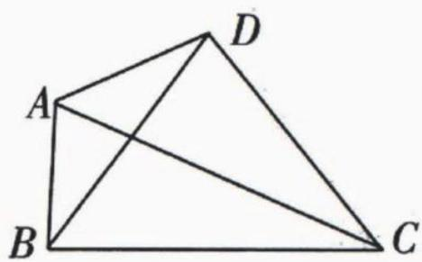推论1:当 $\overrightarrow{AC} \perp \overrightarrow{BD}$ 时,有 $\overrightarrow{AD^2} + \overrightarrow{BC^2} = \overrightarrow{AB^2} + \overrightarrow{CD^2}$ .推论2: $\cos\langle\overrightarrow{AC},\overrightarrow{BD}\rangle = \frac{(\overrightarrow{AD^2} + \overrightarrow{BC^2}) - (\overrightarrow{AB^2} + \overrightarrow{CD^2})}{2|\overrightarrow{AC}||\overrightarrow{BD}|}$ .</td></tr><tr><td>13</td><td>平面向量的三点共线定理</td><td>已知平面内一组基底 $\overrightarrow{OA},\overrightarrow{OB}$ 及任意向量 $\overrightarrow{OP}$ ,若 $\overrightarrow{OP} = \lambda_1 \overrightarrow{OA} + \lambda_2 \overrightarrow{OB}$ ,则A,B,P三点共线的充要条件是 $\lambda_1 + \lambda_2 = 1$ .</td></tr><tr><td>14</td><td>等和线定理</td><td>如图,以 $\overrightarrow{AB},\overrightarrow{AC}$ 为基底向量,过BC外一点F作BC的平行线l,对l上任意一点E,有 $\overrightarrow{AE} = x\overrightarrow{AB} + y\overrightarrow{AC}$ ,且 $x+y = \frac{AE}{AD}$ 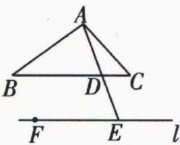(常数),其中D是AE和BC的交点.</td></tr><tr><td>15</td><td>三角函数的周期结论</td><td>解析式形如 $f(x) = A\sin(\omega x + \varphi),f(x) = A\cos(\omega x + \varphi)(A \neq 0, \omega \neq 0)$ 的函数,最小正周期为 $T = \frac{2\pi}{|\omega|}$ ;【解读】一般地,如果T是函数 $y=f(x)$ 的一个周期,那么kT(k∈Z且k≠0)也是函数 $y=f(x)$ 的一个周期解析式形如 $f(x) = |A\sin(\omega x + \varphi)|,f(x) = |A\cos(\omega x + \varphi)|(A \neq 0, \omega \neq 0)$ 的函数,最小正周期为 $T = \frac{\pi}{|\omega|}$ ;解析式形如 $f(x) = A\tan(\omega x + \varphi)(A \neq 0, \omega \neq 0)$ 的函数,最小正周期为 $T = \frac{\pi}{|\omega|}$ .</td></tr></table>

# 型 3 ▶ 必知常考图象

<table><tr><td>16</td><td>函数解析式为 $y = A \sin(\omega x + \varphi) (A > 0, \omega > 0, x \geqslant 0)$ 的简谐运动的特征</td><td>振幅:A. 周期: $T = \frac{2\pi}{\omega}$ . 频率: $f = \frac{1}{T} = \frac{\omega}{2\pi}$ . 相位: $\omega x + \varphi$ . 初相: $\varphi$ .</td></tr><tr><td>17</td><td>函数 $y = A\sin(\omega x + \varphi)$  $(A \neq 0, \omega \neq 0)$ 的图象的对称性</td><td>对称轴方程: $x = \frac{k\pi}{\omega} + \frac{\pi}{2\omega} - \frac{\varphi}{\omega}(k \in \mathbf{Z})$ .对称中心坐标: $(\frac{k\pi - \varphi}{\omega}, 0)(k \in \mathbf{Z})$ .</td></tr><tr><td>18</td><td>函数 $y = A\sin(\omega x + \varphi)$  $(A > 0, \omega > 0)$ 的图象的基本变换</td><td>一般地,函数 $y = A\sin(\omega x + \varphi)(A > 0, \omega > 0)$ 的图象可以由 $y = \sin x$ 的图象经过下面两种方法得到.1.先相位,后周期,再振幅: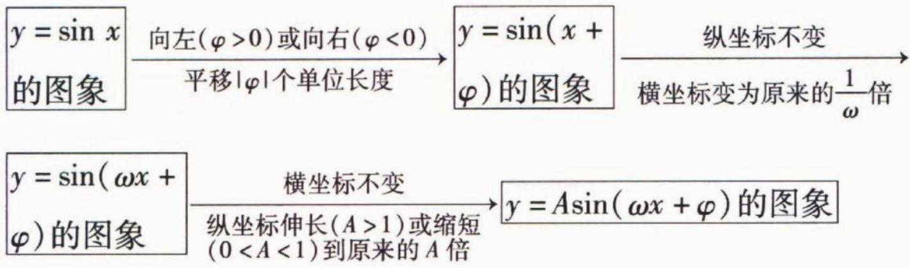2.先周期,后相位,再振幅: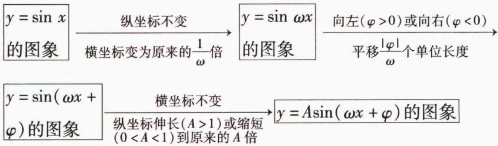</td></tr><tr><td>19</td><td>相位变换</td><td>把 $y = \sin x$ 的图象上所有点向左 $(\varphi > 0)$ 或向右 $(\varphi < 0)$ 平移 $|\varphi|$ 个单位长度,得到 $y = \sin(x + \varphi)$ 的图象,如图所示.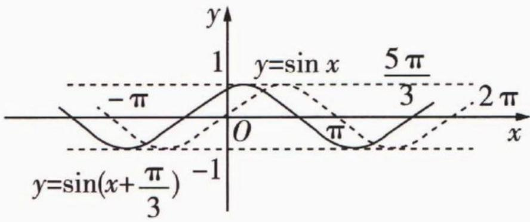</td></tr><tr><td>20</td><td>周期变换</td><td>把 $y = \sin(x + \varphi)$ 的图象上所有点的横坐标伸长 $(0 < \omega < 1)$ 或缩短 $(\omega > 1)$ 到原来的 $\frac{1}{\omega}$ 倍,纵坐标不变,得到 $y = \sin(\omega x + \varphi)$ 的图象,如图所示.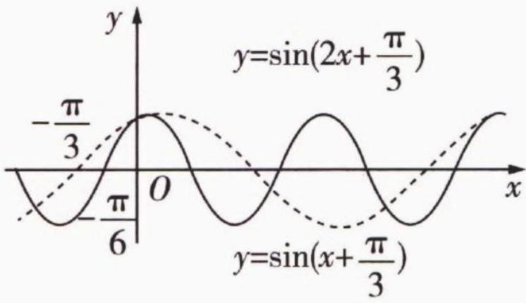</td></tr></table>

<table><tr><td>21</td><td>振幅变换</td><td>把 $y = \sin(\omega x + \varphi)$ 的图象上所有点的纵坐标伸长(A&gt;1)或缩短(0到原来的A倍,横坐标不变,得到 $y = A\sin(\omega x + \varphi)$ 的图象,如图所示.</td><td>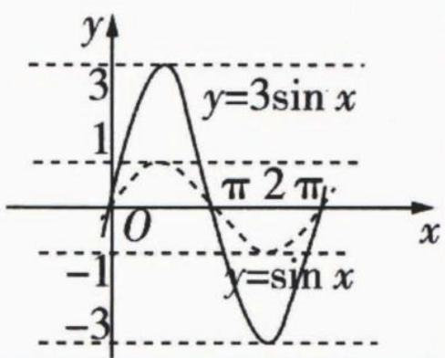</td></tr></table>

# 型 4 ▶ 必会高频应用

<table><tr><td>22</td><td>向量在平面几何中的4个核心应用</td><td>已知两个向量 $\boldsymbol{a} = (x_1, y_1), \boldsymbol{b} = (x_2, y_2)$ ,则(1)证明线段平行或点共线问题,常用向量共线定理: $\boldsymbol{a} // \boldsymbol{b} \Leftrightarrow \boldsymbol{a} = \lambda \boldsymbol{b} (\lambda \neq 0) \Leftrightarrow x_1 y_2 - x_2 y_1 = 0 (\boldsymbol{b} \neq 0).$ (2)证明垂直问题,常用数量积的运算性质: $\boldsymbol{a} \perp \boldsymbol{b} \Leftrightarrow \boldsymbol{a} \cdot \boldsymbol{b} = 0 \Leftrightarrow x_1 x_2 + y_1 y_2 = 0.$ (3)平面几何中,夹角与线段长度的计算常用以下公式:1 $\cos \langle \boldsymbol{a}, \boldsymbol{b} \rangle = \frac{\boldsymbol{a} \cdot \boldsymbol{b}}{|\boldsymbol{a}| |\boldsymbol{b}|} = \frac{x_1 x_2 + y_1 y_2}{\sqrt{x_1^2 + y_1^2} \sqrt{x_2^2 + y_2^2}};$ 2 $|AB| = |\overrightarrow{AB}| = \sqrt{\overrightarrow{AB^2}} = \sqrt{(x_2 - x_1)^2 + (y_2 - y_1)^2}$ ,其中 $A(x_1, y_1), B(x_2, y_2).$ (4)若 $P$ 满足 $\overrightarrow{AP} = \lambda \left( \frac{\overrightarrow{AB}}{|\overrightarrow{AB}|} + \frac{\overrightarrow{AC}}{|\overrightarrow{AC}|} \right) (\lambda > 0)$ ,则 $P$ 在 $\angle BAC$ 的平分线上.</td></tr></table>

# 免费增值，闯关提分! 10分钟搞定1个失分点!

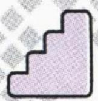

# 一小关一考点，游戏闯关

▶ 挑战式闯关，直击高考

▷ 智适应推题，由易到难

▶8大专题，考点全布局

# 学一题会一类，提分更快

▶ 全面诊断，复习无盲区

▶ 错了马上学，突破短板

▶百万粉UP主视频，免费看

# 通一关奖一关，好礼不停

▶ 小关通关，奖励学分

▶ 进步越快，学分越多

▶学分可兑换天星图书

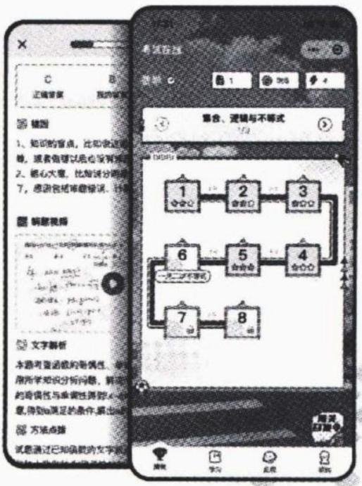

text_image

错误提示
正确答案
我的答案
错题
1、知识的盲点，比如快速准确、像素图像以后也没有错误。
2、核心大意，比如读分清晰。
7、思考包括难读错误、记忆
明题视频
文字解析
本题考查函数的奇偶性、解题
用所学知识分析问题，解题
的奇偶性与单调性同控。
意，得到满足的条件，提出
方法点睛
试试通过已知函数的文字来
确定
学习
生成
总结

# 《试题调研》全程提分方略

<table><tr><td>四大书系</td><td colspan="2">主题</td><td>提分关键词</td><td>上市时间</td><td>定价</td></tr><tr><td rowspan="14">MOOK系列</td><td colspan="2">调研1辑·预备知识&amp;函数与导数</td><td rowspan="4">2023高考方向 重点 难点薄弱点 突破复习障碍</td><td>2022.6</td><td rowspan="14">18.9元/册</td></tr><tr><td colspan="2">调研2辑·三角函数&amp;平面向量&amp;数列</td><td>2022.7</td></tr><tr><td colspan="2">调研3辑·立体几何&amp;解析几何</td><td>2022.8</td></tr><tr><td colspan="2">调研4辑·计数原理&amp;概率&amp;统计</td><td>2022.9</td></tr><tr><td colspan="2">调研5辑·模型解题法</td><td>试题归类 解题思路 方法与技巧</td><td>2022.11</td></tr><tr><td colspan="2">调研6辑·高频易错点快攻</td><td>易错易混点 设题陷阱 解题误区 快速攻克</td><td>2022.12</td></tr><tr><td colspan="2">调研7辑·高考热点大串讲</td><td>网络构建 前沿热点 创新热点</td><td>2023.1</td></tr><tr><td colspan="2">调研8辑·创新题分类解读</td><td>创新题型 创新情境 创新考法</td><td>2023.2</td></tr><tr><td colspan="2">调研9辑·考前50天50题</td><td>名校名师 原创押题 前瞻预测</td><td>2023.3</td></tr><tr><td colspan="2">调研10辑·考前抢分必备</td><td>必考点 易错点 命题热点 核心解法 考前密题</td><td>2023.4</td></tr><tr><td rowspan="4">作文素材时政热点</td><td>作文素材(上)·年度热点素材</td><td>鲜活素材 多维解读 速背速用</td><td>2022.11</td></tr><tr><td>作文素材(下)·考前热点素材</td><td>时新素材 最新时评 范文佳作 速背速用</td><td>2023.4</td></tr><tr><td>时政热点(上)</td><td>2022年4—12月重大时事 剖析解读</td><td>2022.12</td></tr><tr><td>时政热点(下)</td><td>全年度重大时事热点 分析预测</td><td>2023.4</td></tr><tr><td rowspan="10">热点题型专练系列</td><td colspan="2">选择题(语文、物理、化学、生物、政治、历史、地理、文综、理综)</td><td rowspan="2">抓准热点 精选新题 多维巧解</td><td rowspan="10">2022.9</td><td rowspan="3">33.9—49.9元/册</td></tr><tr><td colspan="2">选择题&amp;填空题(数学)</td></tr><tr><td colspan="2">应用文&amp;读后续写&amp;概要写作(英语)</td><td>速背素材 巧学技法 精练写作</td></tr><tr><td colspan="2">古代诗文阅读(语文)</td><td>洞悉考向 攻克薄弱套路解题 反思积累</td><td rowspan="7">26.9—39.9元/册</td></tr><tr><td colspan="2">数学解答题</td><td>模型构建 模型应用分组强化 深度解析</td></tr><tr><td colspan="2">阅读&amp;语言运用(英语)</td><td>30分钟题型组合主题分类 巧思妙解 二次精读 综合提升</td></tr><tr><td colspan="2">物理计算题</td><td>模型解法 思维建模提分技法 规范答题</td></tr><tr><td colspan="2">实验题(物理、化学)</td><td>热点实验 创新装置高频考点 讲深讲透</td></tr><tr><td colspan="2">工艺流程题(化学)</td><td>深度剖析流程精准解读热点</td></tr><tr><td colspan="2">生物遗传题</td><td>套路审题 传授技法攻克疑难 专项提升</td></tr><tr><td>高考总复习系列</td><td colspan="2">高考题型全练</td><td>高考题型 分类练习通性通法</td><td>2022.6</td><td>62.9—79.9元/册</td></tr><tr><td rowspan="5">随身速记系列</td><td colspan="2">必背古诗文64篇</td><td rowspan="2">同步翻译 设题关键重难词解 课外拓展</td><td rowspan="2">2022.1</td><td rowspan="2">17.9元/册</td></tr><tr><td colspan="2">古诗文理解性默写72篇</td></tr><tr><td colspan="2">巧记英语3500词</td><td>巧记核心词 速记合成词快记主题词</td><td>2022.1</td><td>17.9元/册</td></tr><tr><td colspan="2">高分范文天天背</td><td>常考话题 素材语料亮点表达 写作套路</td><td>2022.1</td><td>17.9元/册</td></tr><tr><td colspan="2">历史大事年表</td><td>精选高考常考史实梳理历史发展脉络</td><td>2022.1</td><td>17.9元/册</td></tr></table>

