创于 2003

# 试题 调研

20年纪念版

教辅资料站

电子教辅

试卷练习

知识总结

备课资源

# 高考超重点3 立体几何&解析几何

5大反套路命题创新角度，12个超重点，2类必背结论

5大妙招攻克大计算量题

\- 寻找简捷运算途径

·多知识交汇运算

\- 估计数据，近似计算

\- 突出几何量的计算

\- 对式子组合变形与分解变形

定点专攻核心疑难问题

\- 翻折问题

\- 几何体与球的切接问题

\- 截面问题

\- 动态几何问题

√ 深研数学创新模型

\- 曲侧面三棱柱

\- 圆柱容球

\- 奖杯

聚焦超重点，突破疑难易错！

试题调研

专注高考20年

# 第3辑

# 新高考数学

# 试题调研

# 想考好大学 要试题调研

20年品牌，钻石品质，值得信赖

随时随地，随身速记
随身速记系列

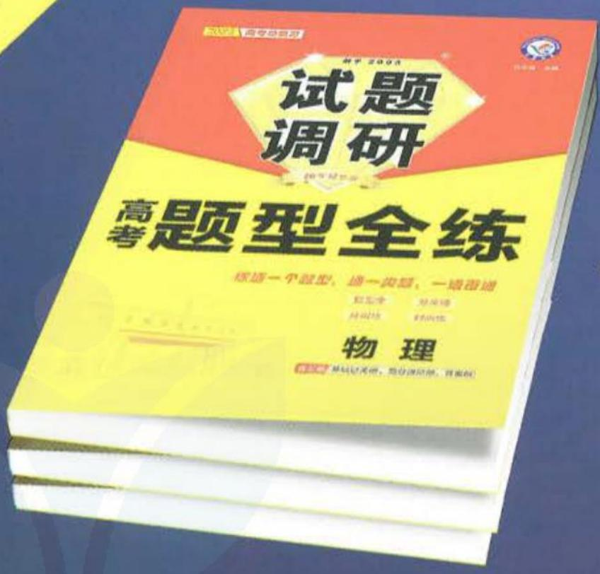

高考总复习系列
### 题型通一类题，一通百通

练透

西

是

一通百通

高三路上

你尽可乘风破浪

我定会全力护航

# 高考超重点3 立体几何&解析几何

5大反套路命题创新角度，12个超重点，2类必背结论

主 编：杜志建

本册编委：赵成海 汤小梅 高群仙 李昭平

王应祥 刘少平 周凌 张学礼

王仁龙

# 第3辑

# 新高考数学

# 图书在版编目(CIP)数据

试题调研. 第3辑 高考超重点3新高考数学/杜志建主编. — 乌鲁木齐：新疆青少年出版社，2022.8

ISBN 978-7-5590-8843-7

$\quad$I. ①试… II. ①杜… III. ①中学数学课 - 高中 - 升学参考资料 IV. ①G634

中国版本图书馆 CIP 数据核字（2022）第 135960 号

出版人:徐江

策划: 王启全

责任编辑：多艳萍

封面设计:天星美工室

# 试题调研·第3辑 高考超重点3 新高考 数学

# SHITI DIAOYAN · DI 3 JI GAOKAO CHAOZHONGDIAN 3 XINGAOKAO SHUXUE

杜志建 主编

出版:新疆青少年出版社

社址:乌鲁木齐市北京北路29号 邮政编码:830012

电话:0991-6239223(编辑部) 0371-68698015(读者服务部)

官网:http://www.qingshao.net 天猫旗舰店:http://xjqss.tmall.com

发行:新疆青少年出版社

经销:各地新华书店 法律顾问:王冠华 18699089007

印刷:辉县市伟业印务有限公司

开 本:787mm×1092mm 1/16 版 次:2022年8月第1版

印 张:8 印 次:2022年8月第1次印刷

字 数:130 千字

书号:ISBN 978-7-5590-8843-7

定价:18.90元

CHISO 青少社 版权所有,侵权必究。印装问题可随时同印厂退换。

# 声明

基于对知识和创作的尊重,本书向所选文章、图片的作者支付补贴。因条件所限未能及时联系的作者,我们在此深表歉意,当您看到本书时,请与我们联系,以便我们向您支付补贴和赠送样书。联系方式:0371-68698033。

# 本辑特色

# 突破大计算量题,应对反套路命题

# [Unreadable]

赵成海 正高级教师,河北省优秀教师,省级骨干教师.中国数学奥林匹克一级教练员,中国科学技术学会、中国数学会会员.在国家级及省级等各类专业报纸杂志上发表教育教学论文三百余篇.

# 命题角度1

寻找与设计合理、简捷的运算途径

调研 1 (2022 · 新高考 I 卷变式) 已知 $a = \frac{\ln 3}{2}$ , $b = \frac{1}{e-1}$ , $c = \frac{\ln 4}{3}$ , 则 a 小关系是

关注最新趋势（P001）

传授解题秘籍（P005）

# 1

# 特别关注名师精讲最前沿

# 命题角度4

# 突出几何图形各几何量的计算

调研 5 (2022·西北工业大学附属中学第十三次适应性训练)已知椭圆 $\frac{x^{2}}{a^{2}}+\frac{\gamma^{2}}{b^{2}}=1(a>b>0)$ 的左、右焦点分别为 $F_{1},F_{2}$ ，经过 $F_{1}$ 的直线交椭圆于A,B两点， $\triangle ABF_{2}$ 的内切圆的圆心为I，若 $3\overrightarrow{IB}+4\overrightarrow{IA}+5\overrightarrow{IF_{2}}=0$ ，则该椭圆的离心率是()

$\quad$A. $\frac{\sqrt{5}}{5}$

$\quad$B. $\frac{2}{3}$

$\quad$C. $\frac{\sqrt{3}}{4}$

$\quad$D. $\frac{1}{2}$

# 新益求新设题热点抢先知

##### 2. (2022·湖南衡阳5月三模/转子发动机)图1-13①中的机械设备备叫作“转子发动机”，其核心零部件之一的转子形状是“曲侧面三棱柱”。

②是一个曲侧面三棱柱,它的侧棱垂直于底面,底面是“勒洛三角形”(如图 13) ,勒洛三角形是以正三角形的三个顶点为圆心,正三角形的边长为半径画圆弧得到的,若曲侧面三棱柱的高为4,底面任意两顶点之间的距离为 ${10}\sqrt{2}$ ,则其体积为()

##### 3. (2022·广州天河区6月综合测试改编)某班级到一工厂参加社会实践劳动,加工出如图1-14所示的圆台 $O_{1}O_{2}$ ,在轴截面ABCD中, $AB=AD=BC=2cm$ ,且CD=2AB,则下列说法错误的是()

$\quad$A.该圆台的高为 $1\mathrm{cm}$ 
$\quad$B.该圆台轴截面面积为 $3\sqrt{3}\mathrm{cm}^2$ 
$\quad$C.该圆台的体积为 $\frac{7\sqrt{3}\pi}{3}\mathrm{cm}^3$

$\quad$D. 一只小虫从点 C 沿着该圆台的侧面爬行到 AD 的中点, 所经过的最短路程为 5 cm

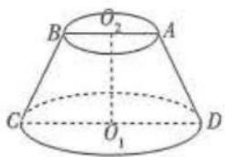  
图1-14

# 新模型（P018）

# 新情境（P019）

##### 5. $\frac{52\pi}{3}$ 由已知得，三棱锥 $S - BCD$ 中， $SB = SC = 4, SD = BC = 2, BD = 2\sqrt{3}$ .

三棱锥 S-BCD 可置入如图 2-14 所示的直三棱柱 DNS-BCM 中，易知 $SD = SN = DN = 2, BD = 2\sqrt{3}$ ，则该三棱柱的外接球即三棱锥 S-BCD 的外接球.

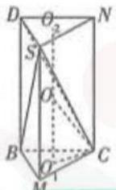

# E

# 深入讲解备考障碍一扫除

扫清思路障碍（P029）

点明易错误区（P030）

由于 $BD \perp$ 平面 $PMC, PD = 2$ , 设点 $P$ 到平面 $BCD$ 的距离为 $d$ , 直线 $DP$ 与平面 $BCD$ 所成角的正弦值为 $\frac{d}{2}$ , 因而 $d$ 最大时角最大, 那么当折叠到平面 $PBD \perp$ 平面 $BCD$ 时, $d$ 最大, $d_{\max} = \sqrt{3}$ , 所以最大角为 $60^{\circ}$ , 因而 C 选项错误.

又 $AD = 4, DN = 2\sqrt{3}, AN = CF = 4, \cos \angle DAN = \frac{AD^2 + AN^2 - DN^2}{2AD \cdot AN} = \frac{16 + 16 - 12}{2 \times 4 \times 4} = \frac{5}{8}$ ,

③正确.

引导独立思考（P032）

# 创新题型

· 结构不良问题/009  
· 组合型填空题/015   
· 双空题/067

# 数学文化

· 公益讲座/004  
·《几何原本》/026   
· 建筑物中的数学美/067  
· 抛物线的光学性质/067

# 二级结论

· 圆锥曲线焦点三角形面积公式/073  
- 椭圆的焦点三角形相关结论/076   
· 椭圆的焦半径公式/077  
· 双曲线的焦半径公式/078  
· 共焦点的椭圆与双曲线的离心率之间的关系/080

# 创新模型

·曲侧面三棱柱/018   
· 圆柱容球/024   
· 奖杯/030

# 思想方法

· 数形结合/001

# 特别关注·命题最前沿

突破大计算量题，应对反套路命题 001

# 突破超重点

# 核心考点篇

超重点1 柱、锥、台体的体积与表面积计算问题 013

命题角度 1 柱体的体积与表面积计算 013  
命题角度 2 锥体的体积与表面积计算 014  
命题角度 3 台体的体积与表面积计算 015  
命题角度 4 实际应用问题中几何体的体积计算 017

超重点 2 剖析几何体与球的切、接模型 020

命题角度 1 柱体与球的接模型 020  
命题角度2 锥体与球的接模型 021  
命题角度 3 台体与球的接模型 023  
命题角度 4 空间几何体与球的切模型 024

超重点3 探求翻折中的“变与不变” 029

命题角度1 翻折中的判断问题 029  
命题角度 2 翻折中的计算问题 032  
命题角度 3 翻折中的探究问题 035

超重点4 巧用展开图为空间问题与平面问题搭桥 041

命题角度1 局部展开求最值 041   
命题角度 2 将展开图还原，确定位置关系或数量关系 044

# 超重点5 “几何法” “向量法” 双法破解立体

# 几何问题 049

命题角度1 求异面直线所成角 049

命题角度2 求线面角 051

命题角度 3 求二面角 054

命题角度4 求距离 056

# 超重点6 圆锥曲线定义及性质的应用问题 064

命题角度 1 圆锥曲线定义的应用问题 064

命题角度 2 圆锥曲线性质的应用问题 066

# 超重点7 椭圆、双曲线的焦点三角形与焦半径 073

命题角度 1 椭圆、双曲线的焦点三角形 073

命题角度 2 椭圆、双曲线的焦半径 077

# 攻克疑难篇

# 超重点8 破解立体几何中的截面问题 081

命题角度1 判断多面体的截面形状 081

命题角度 2 计算多面体的截面周长或面积 083

命题角度 3 与球有关的截面问题 086

# 超重点9 动态几何问题 088

命题角度1 动点的轨迹问题 088

命题角度 2 动态几何中线段（距离）、体积、角的最值 091

命题角度 3 动态几何中的截面问题 095

· 分割法/018

· 几何法/049

· 空间向量法/050

· 等体积法/052

· 向量法/068

· 射影定理法/069

# 模块交汇

\- 立体几何、三角函数与导数
交汇/002

· 圆锥曲线与平面向量交汇/105

· 圆锥曲线与圆交汇/106

\- 圆锥曲线与三角形“四心”交汇/108

# 开放探究

· 探究使线面平行的点是否存在/097

· 探究使线面垂直的点是否存在/099

· 探究使线线平行的点是否存在/100

· 探究使面面垂直的数是否存在/101

· 探究使三棱锥体积为定值的点是否存在/102

· 探究使二面角正切值为定值的点是否存在/103

# 开放创新篇

# 超重点10 立体几何中的存在性探索问题 097

命题角度 1 使线面位置关系成立的点的探求问题 097

命题角度 2 使线面位置关系成立的数的探求问题 101

命题角度 3 使某数量为定值的点的探求问题 102

# 超重点11 圆锥曲线的交汇问题 105

命题角度1 圆锥曲线与平面向量交汇 105

命题角度2 圆锥曲线与圆交汇 106

命题角度 3 圆锥曲线与三角形 “四心” 交汇 108

# 超重点12 圆锥曲线的综合探索性问题 112

# 速记提分结论

类型1 必背球与几何体切、接的8条结论 118

类型 2 必会一般棱锥外接球球心的 4 个找法 119

# 下辑精彩预告 2022年9月全新上市!

# 《试题调研》第4辑将推出

——高考超重点4·计数原理 & 概率 & 统计

本辑亮点抢先看：

特别关注·命题最前沿 深度研析数学创新开放性问题的设题类型与解法技巧，以点带面，让你有的放矢，做一题而会一类，攻破难点拿高分！

突破超重点 深入探讨两个基本计数原理的综合应用、随机变量取值的概率求解、概率统计的创新模型、统计案例等核心考点。以题切入，超详式解析辅以保姆式批注，超多秒杀解、优美解，让你置身于与名师面对面交流之境，看懂更要学会，助你攻克薄弱点，拿下超重点！关注公众号：拾穗者的杂货铺

速记提分结论 条目图表化知识清单梳理，快速补短板，实现速算秒解，驰骋考场快提分！

# 特别关注·命题最前沿

# 突破大计算量题,应对反套路命题

# 特约名师

# 赵成海

正高级教师,河北省优秀教师,省级骨干教师.中国数学奥林匹克一级教练员,中国科学技术学会、中国数学会会员.在国家级及省级等各类专业报纸杂志上发表教育教学论文三百余篇.

# 命题角度1> 寻找与设计合理、简捷的运算途径

调研 1 (2022·新高考Ⅰ卷变式)已知 $a=\frac{\ln3}{2}$ , $b=\frac{1}{e-1}$ , $c=\frac{\ln4}{3}$ ，则a,b,c的大小关系是a,c的结构特征很明显,因而关键是b,事实上 $b=\frac{\ln(e-1+1)}{e-1}=\frac{\ln e}{e-1}$ ,从而想到同构

$\quad$A. $b > a > c$

$\quad$B. $b > c > a$

$\quad$C. $c > a > b$

$\quad$D. $c > b > a$

解析 设函数 $f(x) = \frac{\ln (x + 1)}{x} (x > 0)$ ，则 $f'(x) = \frac{\frac{x}{1 + x} - \ln (x + 1)}{x^2} (x > 0)$ .

当 $x > 1$ 时，令 $g(x) = 1 - \frac{1}{x} -\ln x$ ，则 $g'(x) = \frac{1}{x^{2}} -\frac{1}{x} = \frac{1 - x}{x^{2}} < 0,$

所以 $g(x)$ 在 $(1, +\infty)$ 上单调递减，因而 $g(x) < 0$ ，则 $1 - \frac{1}{x} < \ln x$ .

【数形结合】函数 $y=1-\frac{1}{x}$ 与 $y=\ln x$ 图象的位置关系如图1所示，结论 $1-\frac{1}{x}<\ln x(x>1)$ 是一个重要不等式

所以当 x > 0 时， $1 - \frac{1}{x + 1} < \ln(x + 1)$ ，即 $\frac{x}{1 + x} < \ln(x + 1)$ ，
即 $f'(x) < 0$ ,

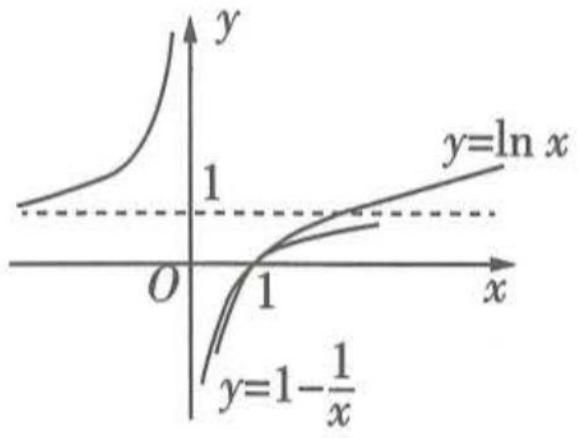

图1

所以 $f(x)$ 在 $(0, +\infty)$ 上单调递减，所以由 $\mathrm{e} - 1 < 2 < 3$ ，得 $f(\mathrm{e} - 1) > f(2) > f(3)$

直线与平面平行的判定定理 平面外一条直线与此平面内的一条直线平行,则该直线与此平面平行.

那么 $\frac{\ln e}{e - 1} >\frac{\ln 3}{2} >\frac{\ln 4}{3}$ 即 $b > a > c.$ 故选A.

【解题之图】做实题题有两点感性：一元体合同内思想的应用，一是感悟如何简化解题过程。特别是自定义题的一段话式的应用。小题中，由不等式 $1-\frac{1}{x}<\ln x(x>1)$ 可得 $1-\frac{1}{x+1}<\ln(x+1)(x>0)$ 。这样是根据题目条件和目标，并将与设计合理、简体的几何途径

# 命题角度2 多知识内容交汇，提升运算能力

调研 2 (2022·哈尔滨三中第五次模拟/立体几何、三角函数与导数之正)已知菱形 ABCD 的边长为 2, 且 $\angle ABC = \frac{\pi}{3}$ , 点 M, N 分别为线段 AB, CD 上的动点, 沿 DM 将 $\triangle ADM$ 翻折至 $\triangle A'DM$ , 若点 C 在平面 $A'DM$ 内的射影恰好落在直线 DM 上, 则当线段 $A'N$ 最短时, 三棱锥 $A' - CMN$ 的体积为 \_\_\_\_.

# 思维导引

点 C 在平面 $A'DM$ 内的射影恰好落在直线 DM 上

平面 $A'MD \perp$ 平面BCDM

过 $A'$ 作 $A'W \perp DM$ 交 $DM$ 于 $W$

$A'W \perp$ 平面 $BCDM$

当 $A'N$ 最短时， $WN \perp CD$

在 $WN \perp CD$ 的前提下, $A'N$ 取最小值时, DN 取最大值

根据三角函数的定义求出 DN = $2\cos\theta\cos\left(\frac{\pi}{3}-\theta\right)$ ，设为 $f(\theta)$

利用导数和数形结合的思想求出函数 $f(\theta)$ 在 $(0, \frac{\pi}{6}]$ 上的极值点

确定点 M,
N 的位置

根据三棱锥的体积公式计算

解析 设点 C 在平面 $A'DM$ 内的射影是直线 DM 上的点 T, 连接 CT, 如图 2 所示.

设 $\angle A'DM = \theta$ ，则 $\angle MDN = \frac{\pi}{3} -\theta$ ，其中 $\theta \in (0,\frac{\pi}{6} ]$

【隔阴】在重点A在线段AB上，因而不能得到角θ的取值范围，影响到底点解

因为 $CT \perp$ 平面 $A'MD, CT \subset$ 平面 BCDM,

所以平面 $A'MD \perp$ 平面 BCDM, 且平面 $A'MD \cap$ 平面 BCDM = MD.

在平面 $A'DM$ 内作 $A'W \perp MD$ , 交 $DM$ 于点 $W$ , 连接 $WN$ 和 $A'N$ , 此时 $A'W \perp$ 平面 $BCDM$ .

易知 $A'N$ 最短时， $WN \perp CD$ ，此时易证 $DA'^{2} = DN^{2} + A'N^{2}$ ，则在 $WN \perp CD$ 的前提下， $A'N$ 取最小值时， $DN$ 取最大值， $DW = A'D \times \cos \theta = 2\cos \theta, DN = DW \times \cos \left(\frac{\pi}{3} - \theta\right) =$

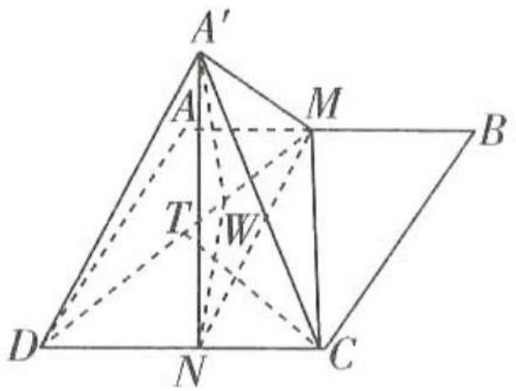

图2

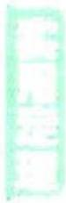

平面与平面平行的判定定理 一个平面内的两条相交直线与另一个平面平行,则这两个平面平行.

$2\cos\theta\cos\left(\frac{\pi}{3}-\theta\right).$

【二级结论】这里可直接利用三余弦定理，即 $\cos\angle A'DN=\cos\angle A'DW\cos\angle WDN$ ，即 $\cos\angle A'DN=\cos\theta\cos\left(\frac{\pi}{3}-\theta\right)$ ，则 $DN=DA'\times\cos\angle A'DN=2\cos\theta\cos\left(\frac{\pi}{3}-\theta\right)$

设 $f(\theta) = 2\cos \theta \cos \left(\frac{\pi}{3} -\theta\right),\theta \in (0,\frac{\pi}{6} ]$ ，则 $f'(\theta) = -2\sin \theta \cos \left(\frac{\pi}{3} -\theta\right) + 2\cos \theta \sin \left(\frac{\pi}{3} -\right.$ $\theta) = 2\sin \left(\frac{\pi}{3} -2\theta\right),\theta \in (0,\frac{\pi}{6} ]$ ，令 $f'(\theta) = 0$ ，得 $\theta = \frac{\pi}{6}$

此时 DN 取最大值, 为 $\frac{3}{2}$ , M 与 B 重合, 易知 $A'W = 1$ , $CN = \frac{1}{2}$ , 所以 $S_{\triangle CMN} = \frac{1}{2} \times CN \times CB \times \sin \frac{2\pi}{3} = \frac{1}{2} \times \frac{1}{2} \times 2 \times \frac{\sqrt{3}}{2} = \frac{\sqrt{3}}{4}$ .

所以 $V_{A'-CMN}=\frac{1}{3}\times S_{\triangle CMN}\times A'W=\frac{1}{3}\times\frac{\sqrt{3}}{4}\times1=\frac{\sqrt{3}}{12}$ . 故填 $\frac{\sqrt{3}}{12}$ .

调研 3 (2022·新高考Ⅰ卷/立体几何中球体、锥体的体积运算,并与函数最值交汇)已知正四棱锥的侧棱长为 l, 其各顶点都在同一球面上. 若该球的体积为 $36\pi$ , 且 $3 \leqslant l \leqslant 3\sqrt{3}$ , 则该正四棱锥体积的取值范围是 ( )

$\quad$A. $[18, \frac{81}{4}]$

$\quad$B. $\left[\frac{27}{4},\frac{81}{4}\right]$

$\quad$C. $\left[\frac{27}{4},\frac{64}{3}\right]$

$\quad$D. $[18,27]$

解析 方法一 设球的半径为 R, 则 $\frac{4}{3}\pi R^{3}=36\pi$ , 解得 R=3.

如图3,记该球的球心为 $O$ , 设点 $P$ 在正四棱锥底面上的射影为 $H$ , 连接 $PH$ , 设正四棱锥的高为 $h$ , 底面边长为 $\sqrt{2} x (x > 0)$ , 连接 $OA, HA$ , 那么 $AH = x = \sqrt{l^2 - h^2}$ , $OH = h - 3$ , 从而 $3^2 - (h - 3)^2 = l^2 - h^2$ , 解得 $l^2 = 6h \in [9, 27]$ , 进而得 $h \in [\frac{3}{2}, \frac{9}{2}]$ .

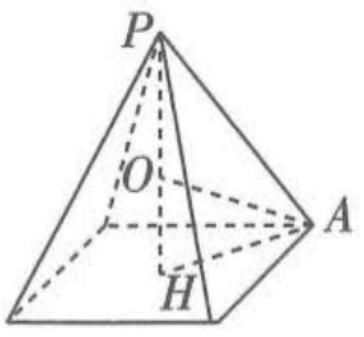

图3

所以正四棱锥的底面面积为 $2x^{2}=2(l^{2}-h^{2})=12h-2h^{2}$ ，正四棱锥的体积为 V= $\frac{1}{3}\times(12h-2h^{2})\times h=4h^{2}-\frac{2}{3}h^{3}$ .

【小题小做】通过基本不等式得 $V=\frac{1}{3}(12-2h)h^{2}\leqslant\frac{1}{3}\times\left(\frac{12-2h+h+h}{3}\right)^{3}=\frac{64}{3}$ ，当且仅当 12-2h=h，即 h=4 时取等号，结合各选项，不必再求最小值，也能得到正确选项 C，可以减少运算量，提高解题速度

令 $f(h)=4h^{2}-\frac{2}{3}h^{3}(h\in[\frac{3}{2},\frac{9}{2}])$ ，求导得 $f'(h)=8h-2h^{2}$ ，令 $f'(h)=0$ ，解得

$h = 4$ ，易知 $f(h)$ 在 $[\frac{3}{2},4)$ 上单调递增，在 $(4,\frac{9}{2} ]$ 上单调递减，所以 $f(h)_{\mathrm{max}} = V_{\mathrm{max}} = 4\times 4^{2}-$ $\frac{2}{3}\times 4^3 = \frac{64}{3}.$ 易知当 $h = \frac{3}{2}$ 时， $V$ 取得最小值，为 $V_{\mathrm{min}} = 4\times (\frac{3}{2})^2 -\frac{2}{3}\times (\frac{3}{2})^3 = \frac{27}{4}$ 故选C.

方法二 由方法一得 R=3，设正四棱锥的高为 h， $\angle APH=\theta,\theta\in(0,\frac{\pi}{2})$ ，那么 h=lcos θ, AH=lsin θ.

由 $\sin\angle AOH=\sin2\theta=\frac{AH}{R}=\frac{1}{3}l\sin\theta,$ 得 $l=6\cos\theta\in[3,3\sqrt{3}]$ ，即 $\cos\theta\in[\frac{1}{2},\frac{\sqrt{3}}{2}]$ ，
正四棱锥的底面积为 $2AH^{2}=2l^{2}\sin^{2}\theta=72\sin^{2}\theta\cos^{2}\theta,$ 正四棱锥的体积为 $V=\frac{1}{3}\times72\sin^{2}\theta\cos^{2}\theta\times6\cos^{2}\theta=144\sin^{2}\theta\cos^{4}\theta.$

【小题小做】这里通过 $V=144\sin^{2}\theta\cos^{4}\theta\leqslant72\times\left(\frac{2\sin^{2}\theta+\cos^{2}\theta+\cos^{2}\theta}{3}\right)^{3}=\frac{64}{3}$ ，同样可以选出正确选项

设 $m = \cos^{2}\theta$ ，则 $m \in \left[\frac{1}{4}, \frac{3}{4}\right]$ ， $V = 144(1 - m)m^{2}$ ， $V' = 144(2m - 3m^{2})$ ，令其等于 0，解得 $m = \frac{2}{3}$ ，易知 $V = 144(1 - m)m^{2}$ 在 $\left[\frac{1}{4}, \frac{2}{3}\right)$ 上单调递增，在 $\left(\frac{2}{3}, \frac{3}{4}\right]$ 上单调递减，所以 $V_{\max} = 144 \times \left(1 - \frac{2}{3}\right) \times \left(\frac{2}{3}\right)^{2} = \frac{64}{3}$ 。易知当 $m = \frac{1}{4}$ 时，V 取得最小值，为 $V_{\min} = 144 \times (1 - \frac{1}{4}) \times (\frac{1}{4})^{2} = \frac{27}{4}$ ，故选 C.

# 命题角度 3 对数据进行估计和近似计算

调研 4 (2022·全国甲卷)某社区通过公益讲座以普及社区居民的垃圾分类知识.为了解讲座效果,随机抽取10位社区居民,让他们在讲座前和讲座后各回答一份垃圾分类知识问卷,这10位社区居民在讲座前和讲座后问卷答题的正确率如图4,则()

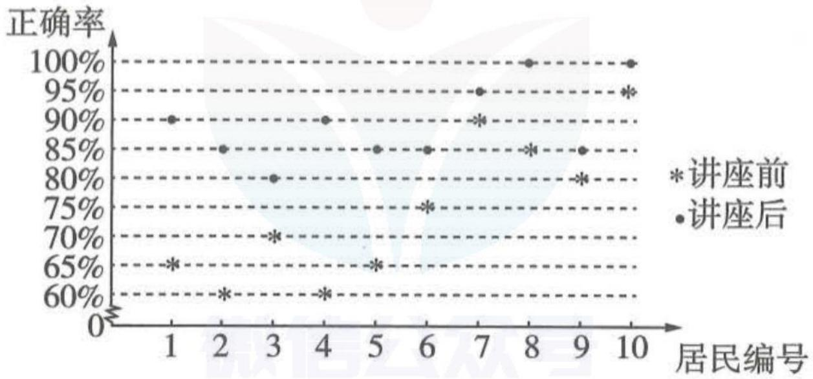

图4

平面与平面平行的性质定理 如果两个平行平面同时和第三个平面相交,那么它们的交线平行.

$\quad$A. 讲座前问卷答题的正确率的中位数小于 $70\%$   
$\quad$B. 讲座后问卷答题的正确率的平均数大于 85%  
$\quad$C. 讲座前问卷答题的正确率的标准差小于讲座后正确率的标准差  
$\quad$D. 讲座后问卷答题的正确率的极差大于讲座前正确率的极差

# 解析

<table><tr><td>选项</td><td>分析过程</td><td>正误</td></tr><tr><td>A</td><td>讲座前中位数 $\frac{70\% + 75\%}{2} >70\%$ </td><td>×</td></tr><tr><td>B</td><td>讲座后问卷答题的正确率只有一个是80%,4个是85%,剩下的5个全部大于等于90%,所以讲座后问卷答题的正确率的平均数【敲黑板】这里无须精确计算,而是通过讲座后问卷答题的正确率是85%及其以上的人数,就可以估算,确定选项正确与否大于85%</td><td>√</td></tr><tr><td>C</td><td>讲座前问卷答题的正确率更加分散,波动性较大,讲座后问卷答题的正确率波动性较小,所以讲座前问卷答题的正确率的标准差大于讲座后问卷答题的正确率的标准差</td><td>×</td></tr><tr><td>D</td><td>讲座后问卷答题的正确率的极差为100%-80%=20%,讲座前问卷答题的正确率的极差为95%-60%=35%&gt;20%</td><td>×</td></tr></table>

# 命题角度4 突出几何图形各几何量的计算

调研 5 (2022·西北工业大学附属中学第十三次适应性训练)已知椭圆 $\frac{x^{2}}{a^{2}}+$ $\frac{y^{2}}{b^{2}}=1(a>b>0)$ 的左、右焦点分别为 $F_{1},F_{2}$ ，经过 $F_{1}$ 的直线交椭圆于A,B两点， $\triangle ABF_{2}$ 的内切圆的圆心为 I, 若 $3\overrightarrow{IB} + 4\overrightarrow{IA} + 5\overrightarrow{IF_{2}} = 0$ , 则该椭圆的离心率是 ( )

$\quad$A. $\frac{\sqrt{5}}{5}$

$\quad$B. $\frac{2}{3}$

$\quad$C. $\frac{\sqrt{3}}{4}$

$\quad$D. $\frac{1}{2}$

思维导引

$3 \overrightarrow {I B} + 4 \overrightarrow {I A} + 5 \overrightarrow {I F _ {2}} = 0$

$\left| A F _ {2} \right|: \left| B F _ {2} \right|:$

$\vert A B \vert = 3: 4: 5$

考虑椭圆的定义

$\left| A F _ {2} \right| = a, \left| B F _ {2} \right| = \frac {4}{3} a, \left| A B \right| = \frac {5}{3} a, \left| A F _ {1} \right| = a$

由余弦定理得 a, c 的关系式 → 离心率

直线与平面垂直的判定定理 一条直线与一个平面内的两条相交直线都垂直,则该直线与此平面垂直.

解析 因为 $3\overrightarrow{IB} + 4\overrightarrow{IA} + 5\overrightarrow{IF_2} = 0$ ，所以 $\frac{3}{8}\overrightarrow{IB} + \frac{5}{8}\overrightarrow{IF_2} = -\frac{1}{2}\overrightarrow{IA}$ .

如图 5, 在 $BF_{2}$ 上取一点 M, 使得 $|BM|: |MF_{2}| = 5: 3$ ,

连接 $IM$ ，则 $\overrightarrow{IM} = -\frac{1}{2}\overrightarrow{IA}$ ，则点 $I$ 为 $AM$ 上靠近点 $M$ 的三等分点，

所以 $S_{\triangle IAF_{2}}:S_{\triangle IBF_{2}}:S_{\triangle IBA}=3:4:5,$

所以 $|AF_{2}|:|BF_{2}|:|AB|=3:4:5.$

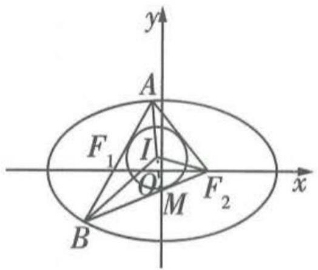

图5

【二级结论】这里也可直接应用二级结论：在 $\triangle ABC$ 中，内角A,B,C对应的边分别为 a, b, c，若 I 是三角形的内心，则 $a \overrightarrow{IA} + b \overrightarrow{IB} + c \overrightarrow{IC} = 0$ ，反之亦然。本题直接可得 $\left|AF_{2}\right|: \left|BF_{2}\right|: \left|AB\right| = 3:4:5$ ，大大减少了运算量

设 $\left|A{F}_{2}\right| = {3x}\left( {x > 0}\right)$ ,则 $\left| B{F}_{2}\right|  = {4x},\left| A B\right|  = {5x}$ ,由椭圆的定义可知 $\left| A{F}_{2}\right|  + \left| B{F}_{2}\right|  +$ $\left| {AB}\right|  = {4a}$ ,即 ${12x} = {4a}$ ,所以 $x = \frac{a}{3}$ ,

所以 $|AF_{2}|=a,|BF_{2}|=\frac{4}{3}a,|AB|=\frac{5}{3}a,|AF_{1}|=a$ ，故点A与椭圆的短轴端点重合.

在 $\triangle ABF_{2}$ 中，由余弦定理得 $\cos \angle BAF_{2} = \frac{|AB|^{2} + |AF_{2}|^{2} - |BF_{2}|^{2}}{2|AB|\times|AF_{2}|} =$ $\frac{\frac{25}{9}a^2 + a^2 - \frac{16}{9}a^2}{2\times\frac{5}{3}a^2} = \frac{3}{5}.$

在 $\triangle AF_{1}F_{2}$ 中， $\cos \angle BAF_{2} = \frac{a^{2} + a^{2} - 4c^{2}}{2a^{2}} = \frac{3}{5} (c = \sqrt{a^{2} - b^{2}})$ ，解得 $\frac{c}{a} = \frac{\sqrt{5}}{5}$ ，所以椭圆的离心率为 $\frac{\sqrt{5}}{5}$ . 故选 A.

秒杀解 由上述解法得 $|AF_{2}|:|BF_{2}|:|AB|=3:4:5$ ，显然 $\triangle ABF_{2}$ 为直角三角形，如图6所示，

其中 $\angle AF_{2}B=90^{\circ},\triangle ABF_{2}$ 的周长为 4a,

因而 $|AF_{2}|=\frac{3}{12}\times4a=a,|BF_{2}|=\frac{4}{12}\times4a=\frac{4}{3}a,|AB|=\frac{5}{12}\times4a=\frac{5}{3}a.$

A 是椭圆的短轴端点, $\cos\angle BAF_{2}=\frac{3}{5}$ , 即 $1-2\sin^{2}\frac{\angle BAF_{2}}{2}=\frac{3}{5}$ ,

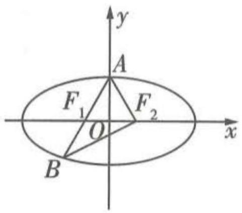

图6

解得 $\sin^2\frac{\angle BAF_2}{2} = \frac{1}{5}$ 所以椭圆的离心率为 $e = \frac{c}{a} = \sin \frac{\angle BAF_2}{2} = \frac{\sqrt{5}}{5}$ . 故选A.

# 解后反思

求解椭圆或双曲线的离心率, 要结合题目中的条件, 直接求出离心率或先求解关于 $a, b, c$ 的齐次方程, 再求出离心率. 本题的难点在于如何对 $3 \overrightarrow{IB} + 4 \overrightarrow{IA} + 5 \overrightarrow{IF_2} = 0$ 进行转化, 需要作辅助线, 结合三角形内心的性质得到 $\triangle ABF_2$ 三边之间的关系, 从而求出离心率; 而如果确定了 $\triangle ABF_2$ 的形状是直角三角形, 可以使解题过程进一步优化, 减少运算量.

调研 6 (2022·江西南昌三模)已知长方体 $ABCD-A_{1}B_{1}C_{1}D_{1}$ 中, AB=2, BC=2√2, $AA_{1}=3$ , P 为矩形 $A_{1}B_{1}C_{1}D_{1}$ 内一动点, 设二面角 P-AD-C 为 $\alpha$ , 直线 PB 与平面 ABCD 所成的角为 $\beta$ , 若 $\alpha=\beta$ , 则三棱锥 $P-A_{1}BC_{1}$ 体积的最小值是 ( )

$\quad$A. $\sqrt{2}$

$\quad$B. $3\sqrt{2}-1$

$\quad$C. $\frac{\sqrt{2}}{2}$

$\quad$D. $\frac{3\sqrt{2}}{2}$

解析 如图7,作 $PO \perp$ 平面ABCD,垂足为O,作 $OE \perp AD$ , 垂足为E,连接OB,PE.易知 $\angle PEO = \alpha, \angle PBO = \beta,$

因为 $\alpha = \beta$ ，所以 $\angle PEO = \angle PBO$ ，所以 EO = BO，即在平面 $A_{1}B_{1}C_{1}D_{1}$ 内，点 P 到直线 $A_{1}D_{1}$ 的距离与到点 $B_{1}$ 的距离相等。

由抛物线定义可知, P 的轨迹为抛物线(以 $B_{1}$ 为焦点, 直线 $A_{1}D_{1}$ 为准线)的一部分(在矩形 $A_{1}B_{1}C_{1}D_{1}$ 内).

$V_{P-A_{1}BC_{1}}=V_{B-PA_{1}C_{1}}$ ，当点P到线段 $A_{1}C_{1}$ 的距离最短时， $\triangle PA_{1}C_{1}$ 的面积最小，三棱锥 $B-PA_{1}C_{1}$ 的体积最小.

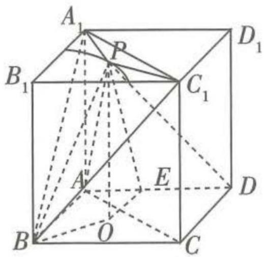

图7

【会转化】通过转换顶点,先将体积最值转化为面积最值,再转化为点到直线的距离的最 值,从而转化成平面几何问题

在平面 $A_{1}B_{1}C_{1}D_{1}$ 内，以 $A_{1}B_{1}$ 的中点 F 为坐标原点， $A_{1}B_{1}$ 所在直线为 x 轴， $A_{1}B_{1}$ 的中垂线为 y 轴建立如图 8 所示的平面直角坐标系，则 $A_{1}(-1,0)$ ， $C_{1}(1,2\sqrt{2})$ ， $B_{1}(1,0)$ ，直线 $A_{1}C_{1}$ 的方程为 $\sqrt{2}x - y + \sqrt{2} = 0$ ，抛物线的方程为 $y^{2} = 4x$ 。

记 $y=2\sqrt{x}(0\leqslant y\leqslant2)$ ，则 $y'=\frac{1}{\sqrt{x}}$ ，由题意令 $\frac{1}{\sqrt{x}}=\sqrt{2}$ ，解得 $x=\frac{1}{2}$ ，代入 $y=2\sqrt{x}$ ，得 $y=\sqrt{2}$ ，所以当三棱锥 $B-PA_{1}C_{1}$ 体积最小时点P的坐

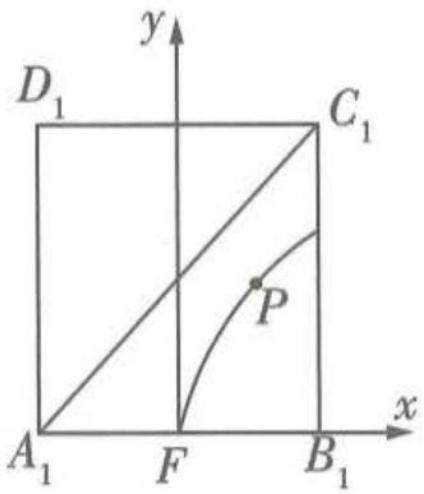

图8

标为 $\left(\frac{1}{2},\sqrt{2}\right)$ .

【另解】设抛物线在 $P(x_0, y_0)$ 处的切线与直线 $A_1C_1$ 平行，则 $P(x_0, y_0)$ 处切线方程为 $y_0y = 2(x + x_0)$ ，因而 $\frac{2}{y_0} = \sqrt{2}$ ，所以 $P\left(\frac{1}{2}, \sqrt{2}\right)$

所以点 $P$ 到直线 $A_{1}C_{1}$ 的最短距离为 $d = \frac{|\frac{\sqrt{2}}{2} - \sqrt{2} + \sqrt{2}|}{\sqrt{3}} = \frac{\sqrt{6}}{6}$ .

因为 $A_{1}C_{1} = \sqrt{(2\sqrt{2})^{2} + 2^{2}} = 2\sqrt{3}$ 所以 $V_{P - A_1BC_1} = V_{B - PA_1C_1} = \frac{1}{3}\times \frac{1}{2}\times 2\sqrt{3}\times \frac{\sqrt{6}}{6}\times 3 = \frac{\sqrt{2}}{2},$

所以三棱锥 $P-A_{1}BC_{1}$ 体积的最小值为 $\frac{\sqrt{2}}{2}$ . 故选 C.

调研 7 (2022·湖南岳阳三模)(多选)如图9,直棱柱 $ABCD-A_{1}B_{1}C_{1}D_{1}$ 的各棱长均为 2, $\angle ABC=\frac{\pi}{3}$ , 则下列说法正确的是()

$\quad$A. 三棱锥 $A_{1} - ABC$ 外接球的体积为 $\frac{28\sqrt{21}}{27}\pi$

$\quad$B. 异面直线 $AB_{1}$ 与 $BC_{1}$ 所成角的正弦值为 $\frac{\sqrt{3}}{2}$

$\quad$C. 当点 M 在棱 $BB_{1}$ 上运动时, $MD + MA_{1}$ 的最小值为 $2\sqrt{5 + 2\sqrt{3}}$

$\quad$D. N 是四边形 ABCD 所在平面上一动点, 若 N 到直线 $AA_{1}$ 与到直线 BC 的距离相等, 则 N 的轨迹为抛物线

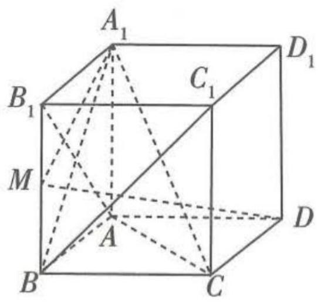

图9

解析 因为直棱柱 $ABCD - A_{1}B_{1}C_{1}D_{1}$ 的各棱长均为 2, $\angle ABC = \frac{\pi}{3}$ , 所以 $\triangle ABC$ 为等边三角形.

设三棱锥 $A_{1} - ABC$ 外接球的球心为 $O$ , 则 $O$ 在底面 $ABC$ 上的射影为 $\triangle ABC$ 的中心.

【扫清障碍】求解立体几何图形的外接球或内切球问题,要抓住关键,比如球心位置的确定,通常情况下可通过光找球心在某个三角形或者四边形中的射影来确定

设 $\triangle ABC$ 外接圆的半径为 $R$ , 由正弦定理得 $2R = \frac{2}{\sin \frac{\pi}{3}} = \frac{4\sqrt{3}}{3}$ , 所以 $\triangle ABC$ 外接圆

平面与平面垂直的性质定理 两个平面垂直,则一个平面内垂直于交线的直线与另一个平面垂直.

的半径为 $\frac{2\sqrt{3}}{3}$ .

设三棱锥 $A_{1} - ABC$ 外接球的半径为 $R_{1}$ ，则 $R_{1} = \sqrt{R^{2} + 1^{2}} = \frac{\sqrt{21}}{3}$

故三棱锥 $A_{1}-ABC$ 外接球的体积为 $\frac{4}{3}\pi R_{1}^{3}=\frac{28\sqrt{21}}{27}\pi$ , A 正确.

如图10, 连接 $AD_{1}, B_{1}D_{1}$ , 则 $AD_{1} \parallel BC_{1}, \angle B_{1}AD_{1}$ 为异面直线 $AB_{1}$ 与 $BC_{1}$ 所成角, 由勾股定理得 $AB_{1} = AD_{1} = 2\sqrt{2}$ , 由余弦定理得 $B_{1}D_{1} = \sqrt{4 + 4 - 2 \times 2 \times 2 \cos \frac{2\pi}{3}} = 2\sqrt{3}$ .

故在 $\triangle AB_{1}D_{1}$ 中，由余弦定理得 $\cos \angle B_{1}AD_{1} = \frac{8 + 8 - 12}{2\times 2\sqrt{2}\times 2\sqrt{2}} = \frac{1}{4}$ 所以 $\sin \angle B_1AD_1 =$ $\frac{\sqrt{15}}{4},\mathrm{B}$ 错误.

连接 $BD, B_{1}D_{1}$ , 将平面 $ABB_{1}A_{1}$ 与平面 $B_{1}BDD_{1}$ 沿着公共边 $BB_{1}$ 折叠到同一平面内, 如图 11, 连接 $A_{1}D$ , 与 $BB_{1}$ 交于点 $M$ , 此时 $MD + MA_{1}$ 取得最小值, 即 $A_{1}D$ 的长.

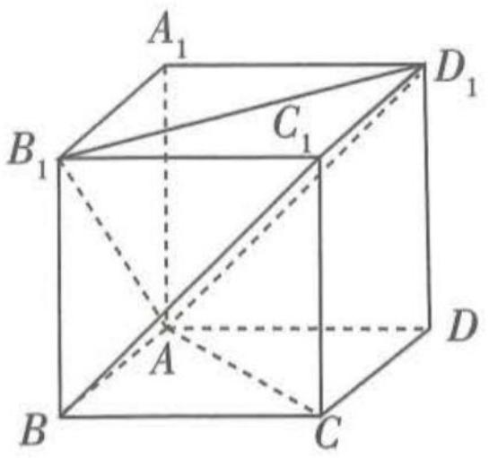

图10

【会展开】展开成平面图形，建立空间与平面间的相互转换关系，寻求问题的解决途径

$AA_{1}=2,AD=AB+BD=2+2\sqrt{3}$ ，在Rt△ $AA_{1}D$ 中，由勾股定理得 $A_{1}D=\sqrt{4+(2+2\sqrt{3})^{2}}=2\sqrt{5+2\sqrt{3}}$ ，C正确.

连接 $AN$ , 因为 $A_{1}A \perp$ 平面 $ABCD$ , 所以点 $N$ 到直线 $AA_{1}$ 的距离即 $AN$ ,

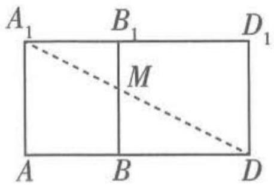

图11

又 $BC \subset$ 平面ABCD, 故在平面ABCD上, AN等于N到直线BC的距离,

由抛物线的定义可知, $N$ 的轨迹为抛物线(以 $A$ 为焦点, 直线 $B C$ 为准线), D 正确. 故选 ACD.

【找套路】立体图形中轨迹形状的判断问题，往往与曲线的定义有关

# 命题角度 5 对式子进行组合变形和分解变形

调研 8 (2022·新高考Ⅱ卷)已知双曲线 $C:\frac{x^{2}}{a^{2}}-\frac{y^{2}}{b^{2}}=1(a>0,b>0)$ 的右焦点为 $F(2,0)$ ，渐近线方程为 $y=\pm\sqrt{3}x$ .

平面向量基本定理 如果 $e_{1},e_{2}$ 是同一平面内的两个不共线向量,那么对于这一平面内的任意向量a,有且只有一对实数 $\lambda_{1},\lambda_{2}$ ,使 $a=\lambda_{1}e_{1}+\lambda_{2}e_{2}$ .我们把不共线的向量 $e_{1},e_{2}$ 叫作表示这一平面内所有向量的一组基底.公众号:拾穗者的杂货铺

（1） 求 C 的方程;

（2） 过 $F$ 的直线与 $C$ 的两条渐近线分别交于 $A, B$ 两点, 点 $P(x_{1}, y_{1}), Q(x_{2}, y_{2})$ 在 $C$ 上, 且 $x_{1} > x_{2} > 0, y_{1} > 0$ . 过 $P$ 且斜率为 $-\sqrt{3}$ 的直线与过 $Q$ 且斜率为 $\sqrt{3}$ 的直线交于点 $M$ . 从下面①②③中选取两个作为条件, 证明另外一个成立.

①M 在 AB 上; ② $PQ \parallel AB$ ; ③ $|MA| = |MB|$ .

注:若选择不同的组合分别解答,则按第一个解答计分.

解析 （1） 由已知得 $c = 2, \frac{b}{a} = \sqrt{3}$ , 因为 $c^2 = a^2 + b^2$ , 所以 $a = 1, b = \sqrt{3}$ ,

所以 C 的方程为 $x^{2}-\frac{y^{2}}{3}=1$ .

（2）由已知得直线 PQ 的斜率存在且不为零, 直线 AB 的斜率不为零.

若选由①②推③或选由②③推①:由②成立可知直线AB的斜率存在且不为零.

若选由①③推②, 则 $M$ 为线段 $AB$ 的中点, 假如直线 $AB$ 的斜率不存在, 则由双曲线的对称性可知 $M$ 在 $x$ 轴上, 即焦点 $F$ , 此时由对称性可知 $P, Q$ 关于 $x$ 轴对称, 从而 $x_{1} = x_{2}$ , 与已知不符.

总之,直线 ${AB}$ 的斜率存在且不为零.

【会思考】通过 $x_{1} > x_{2} > 0, y_{1} > 0$ 得到以上判断，这是下面分析求解的前提，目的是光将特殊情况排除

设直线 AB 的斜率为 k，则直线 AB 的方程为 $y = k(x - 2)$ .

设 $M(x_{0},y_{0})$ ，则条件①等价于 $y_{0}=k(x_{0}-2)$ ，则 $ky_{0}=k^{2}(x_{0}-2)$ .

双曲线渐近线的方程为 $3x^{2} - y^{2} = 0$ ，与 $y = k(x - 2)$ 联立消去 $y$ 并化简整理得 $(k^2 - 3)x^2 - 4k^2x + 4k^2 = 0, \Delta = 48k^2 > 0,$

设 $A(x_{3},y_{3}),B(x_{4},y_{4}),x_{3}\neq x_{4}$ ，线段 $AB$ 的中点为 $N(x_N,y_N)$

则 $x_{N} = \frac{x_{3} + x_{4}}{2} = \frac{2k^{2}}{k^{2} - 3},y_{N} = k(x_{N} - 2) = \frac{6k}{k^{2} - 3}.$

【突破口】求AB的中点的坐标，为后续的等价转化打下基础

条件③等价于 $(x_0 - x_3)^2 + (y_0 - y_3)^2 = (x_0 - x_4)^2 + (y_0 - y_4)^2$

移项并利用平方差公式整理得 $(x_{3} - x_{4})[2x_{0} - (x_{3} + x_{4})] + (y_{3} - y_{4})[2y_{0} - (y_{3} + y_{4})] = 0$ ，则 $[2x_0 - (x_3 + x_4)] + \frac{y_3 - y_4}{x_3 - x_4}[2y_0 - (y_3 + y_4)] = 0$ ，即 $x_0 - x_N + k(y_0 - y_N) = 0$ ，即 $x_0 + ky_0 = \frac{8k^2}{k^2 - 3}$ .

三角形内角平分线性质定理 三角形的内角平分线内分对边,所得的两条线段与这个角的两边对应成比例.

由题意知直线 PM 的斜率为 $-\sqrt{3}$ ，直线 QM 的斜率为 $\sqrt{3}$ ，

所以 $y_{1}-y_{0}=-\sqrt{3}(x_{1}-x_{0})$ , $y_{2}-y_{0}=\sqrt{3}(x_{2}-x_{0})$ .

所以 $y_{1}-y_{2}=-\sqrt{3}(x_{1}+x_{2}-2x_{0})$ ,

所以直线 $PQ$ 的斜率 $k_{PQ} = \frac{y_1 - y_2}{x_1 - x_2} = -\frac{\sqrt{3}(x_1 + x_2 - 2x_0)}{x_1 - x_2}$ .

【会分析】下面要解决的问题是如何得到 $x_{1}+x_{2}$ 与 $x_{1}-x_{2}$ 的表达式

直线 $PM:y = -\sqrt{3} (x - x_0) + y_0$ ，即 $y = y_0 + \sqrt{3} x_0 - \sqrt{3} x,$

代入双曲线的方程 $3x^{2} - y^{2} - 3 = 0$ ，即 $(\sqrt{3} x + y)(\sqrt{3} x - y) = 3$ 中，得 $(y_0 + \sqrt{3} x_0)[2\sqrt{3} x - (y_0 + \sqrt{3} x_0)] = 3$ ，解得 $P$ 的横坐标为 $x_{1} = \frac{1}{2\sqrt{3}} (\frac{3}{y_{0} + \sqrt{3}x_{0}} +y_{0} + \sqrt{3} x_{0})$

同理得 $x_{2} = -\frac{1}{2\sqrt{3}} (\frac{3}{y_{0} - \sqrt{3}x_{0}} + y_{0} - \sqrt{3} x_{0})$

所以 $x_{1} - x_{2} = \frac{1}{\sqrt{3}}\left(\frac{3y_{0}}{y_{0}^{2} - 3x_{0}^{2}} + y_{0}\right), x_{1} + x_{2} - 2x_{0} = -\frac{3x_{0}}{y_{0}^{2} - 3x_{0}^{2}} - x_{0}$ , 所以 $k_{PQ} = \frac{3x_{0}}{y_{0}}$ .

所以条件②等价于 $k_{PQ}=k$ ，即 $ky_{0}=3x_{0}$ .

综上所述:条件①等价于 $ky_{0}=k^{2}(x_{0}-2)$ ，条件②等价于 $ky_{0}=3x_{0}$ ，条件③等价于 $x_{0} + ky_{0} = \frac{8k^{2}}{k^{2} - 3}.$

【编者说】本题的解析并不是常规解答题的规范解析,通过这种形式的讲解,给同学们呈现结构不良问题中各条件的分析过程,考试时这些内容需要先在脑海中或单稿纸上进行,对不同的条件进行分析后,即可选出自己擅长的组合,当作常规解答题求解

方案一:由①②推③.

由①②解得 $x_{0}=\frac{2k^{2}}{k^{2}-3}$ ，所以 $x_{0}+ky_{0}=4x_{0}=\frac{8k^{2}}{k^{2}-3}$ ，所以③成立.

方案二:由①③推②.

由①③解得 $x_{0}=\frac{2k^{2}}{k^{2}-3}, ky_{0}=\frac{6k^{2}}{k^{2}-3}$ ，所以 $ky_{0}=3x_{0}$ ，所以②成立.

方案三:由②③推①.

由②③解得 $x_{0}=\frac{2k^{2}}{k^{2}-3}, ky_{0}=\frac{6k^{2}}{k^{2}-3}$ ，所以 $x_{0}-2=\frac{6}{k^{2}-3}$ ，所以 $ky_{0}=k^{2}(x_{0}-2)$ ，所以
①成立.

调研 9 (2022·广州三模)对于任意的 x > 0 都有 $x^{x} - ax \ln x \geqslant 0$ ，则 a 的取值范

直角三角形的射影定理 直角三角形斜边上的高是两直角边在斜边上射影的比例中项；两直角边分别是它们在斜边上射影与斜边的比例中项。

围为

( )

$\quad$A. $[0,e]$

$\quad$B. $\left[-e^{1-\frac{1}{e}},e\right]$

$\quad$C. $(-∞,-e^{1-\frac{1}{e}}]\cup[e,+∞)$

$\quad$D. $(-∞,e]$

解析 由 $x^{x} - ax\ln x\geqslant 0$ 得 $\mathrm{e}^{x\ln x} - ax\ln x\geqslant 0.$

【扫清障碍】应用 $x^{3} = \mathrm{e}^{x\ln x}$ 很关键，可以使原式的结构变形，将 $x\ln x$ 看成一个整体进行换元，简化表达式

令 $t = x \ln x$ ，记 $f(x) = x \ln x$ ，则 $f'(x) = \ln x + 1$ ，令 $f'(x) = 0$ ，得 $x = \frac{1}{e}$ ，所以 $f(x)$ 在 $(0, \frac{1}{e})$ 上单调递减，在 $(\frac{1}{e}, +\infty)$ 上单调递增，所以 $f(x) \geqslant f(\frac{1}{e}) = \frac{1}{e} \ln \frac{1}{e} = -\frac{1}{e}$ ，所以 $t \geqslant -\frac{1}{e}$ ，

【会思考】换元后，转化成 $e^{t}-at\geqslant0$ 恒成立，因而确定t的取值范围很关键

所以 $x^{x}-ax\ln x\geqslant0$ 可等价转化为 $e^{t}-at\geqslant0(t\geqslant-\frac{1}{e})$ ，令 $g(t)=e^{t}-at(t\geqslant-\frac{1}{e})$ ，
则 $g'(t)=e^{t}-a.$

①当 $a \leqslant 0$ 时, $g'(t) > 0$ , 所以 $g(t)$ 在 $\left[-\frac{1}{e}, +\infty\right)$ 上单调递增, 所以 $g(t)_{\min} = g\left(-\frac{1}{e}\right) = e^{-\frac{1}{e}} - a\left(-\frac{1}{e}\right) \geqslant 0$ , 所以 $a \geqslant -e^{1 - \frac{1}{e}}$ , 所以 $-e^{1 - \frac{1}{e}} \leqslant a \leqslant 0$ .

②当 a > 0 时, 令 $g'(t) = 0$ , 则 $t = \ln a$ .

(i) 当 $\ln a \leqslant -\frac{1}{e}$ , 即 $a \leqslant e^{-\frac{1}{e}}$ 时, $g'(t) \geqslant 0$ , 所以 $g(t)$ 在 $[- \frac{1}{e}, +\infty)$ 上单调递增, $g(t)_{\min} = g(-\frac{1}{e}) = e^{-\frac{1}{e}} - a(-\frac{1}{e}) \geqslant 0, a \geqslant -e^{1 - \frac{1}{e}}$ , 所以 $0 < a \leqslant e^{-\frac{1}{e}}$ .

(ii) 当 $\ln a > -\frac{1}{e}$ , 即 $a > e^{-\frac{1}{e}}$ 时, $g(t)$ 在 $[- \frac{1}{e}, \ln a)$ 上单调递减, 在 $[\ln a, +\infty)$ 上单调递增, $g(t)_{\min} = g(\ln a) = e^{\ln a} - a \ln a \geqslant 0$ , 即 $a - a \ln a \geqslant 0$ , 即 $1 - \ln a \geqslant 0$ , 所以 $a \leqslant e$ , 所以 $e^{-\frac{1}{e}} < a \leqslant e$ .

综上，a 的取值范围为 $\left[-e^{1-\frac{1}{e}}, e\right]$ .

故选 B.

【易错】本题易得如下错解：由 $e^t - at \geq 0$ ，分离参数得 $a \leqslant \frac{e^t}{t}$ ，设 $h(t) = \frac{e^t}{t}$ ， $h'(t) = \frac{t-1}{t^2} e^t$ ， $h(t)$ 在 $[- \frac{1}{e}, 1]$ 上单调递减，在 $[1, +\infty)$ 上单调递增，因而 $a \leqslant h(t)_{\min} = h(1) = e$ 。从而错选 D，错误的原因是忽视了 t 的取值范围，单率地分离参数得 $a \leqslant \frac{e^t}{t}$ ，没有根据 t 的正负分类讨论

# 突破超重点

# 核心考点篇

# 超重点1 柱、锥、台体的体积与表面积计算问题

# 命题角度1 柱体的体积与表面积计算

调研 1 (2022·河南焦作 5 月二模)已知圆柱的轴截面是面积为 100 的正方形,则该圆柱的侧面积为 ( )

$\quad$A. $50\pi$

$\quad$B. $200\pi$

$\quad$C. $100\pi$

$\quad$D. $150\pi$

因为该圆柱的轴截面是面积为 100 的正方形, 所以该圆柱的轴截面的边长为 10 , 所以该圆柱的底面圆的半径为 5 , 母线长为 10 , 所以该圆柱的侧面积为 $2 \pi \times$

$5 \times 1 0 = 1 0 0 \pi ,$

故选C.

调研 2 (2022·河南多校联盟5月押题)在三棱柱 $ABC-A_{1}B_{1}C_{1}$ 中, $AA_{1}\perp$ 底面 ABC,AB=BC=CA= $\frac{1}{2}AA_{1}$ ,点P是棱 $AA_{1}$ 上的点,AP=2PA,若截面 $BPC_{1}$ 分这个棱柱为两部分,则这两部分的体积比为\_\_\_\_.

解析 如图 1-1 所示, 取 AC 的中点 D, 连接 BD, 因为 AB = BC, 所以 $BD \perp AC$ .

因为 $AA_{1} \perp$ 底面 ABC, BD ⊂ 底面 ABC, 所以 $AA_{1} \perp BD$ ,

又 $AC \cap AA_{1} = A, AC, AA_{1} \subset$ 平面 $AA_{1}C_{1}C$ , 所以 $BD \perp$ 平面 $AA_{1}C_{1}C$ .

不妨设 AB = a，则 $AA_{1} = 2a, BD = \frac{\sqrt{3}}{2}a, AP = \frac{2}{3}AA_{1} = \frac{4}{3}a$ ，

所以 $V_{ABC - A_1B_1C_1} = \frac{1}{2}\cdot a\cdot \frac{\sqrt{3}}{2} a\cdot 2a = \frac{\sqrt{3}}{2} a^3,V_{B - APC_1C} = \frac{1}{3}\cdot \frac{(\frac{4}{3}a + 2a)a}{2}\cdot \frac{\sqrt{3}}{2} a = \frac{5\sqrt{3}}{18} a^3,$

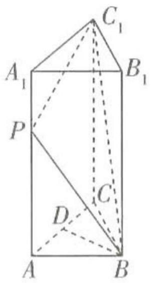

图1-1

椭圆面积公式 椭圆的面积 S 等于圆周率 $\pi$ 与该椭圆长半轴长 a 与短半轴长 b 的乘积, 即 $S = \pi ab$ .

故四棱锥 $C_1 - A_1PBB_1$ 的体积为 $V_{ABC - A_1B_1C_1} - V_{B - APC_1C} = \frac{2\sqrt{3}}{9} a^3$ ，则 $\frac{\frac{2\sqrt{3}}{9}a^3}{\frac{5\sqrt{3}}{18}a^3} = \frac{4}{5},$

所以所求两部分的体积比为 $\frac{4}{5}$ 或 $\frac{5}{4}$ .

【极易出错】所求的两部分体积没有说明是“谁比谁”，当比值非1时，需考虑其有两种情形

# 命题角度2 锥体的体积与表面积计算

调研 3 (2022·上海徐汇区5月三模)若圆锥底面圆周上两点A,B间的距离为2,圆锥顶点到直线AB的距离为 $\sqrt{3}$ ,AB与圆锥的轴之间的距离为1,则该圆锥的侧面积为\_\_\_\_.公众号:拾穗者的杂货铺

解析 如图 1-2, 设该圆锥的顶点为 $P$ , 底面圆圆心为点 $O$ , 取线段 $AB$ 的中点 $E$ , 连接 $PA, PB, OE, PE, OA, OB$ .

【扫清障碍】解决此类题目，需优先作出草图，并注意“草图不草”，把题中相关量在图形中标出

因为 PA = PB, OA = OB, 所以 $OE \perp AB, PE \perp AB$ , 故 $PE = \sqrt{3}$ ,

因为 $PO \perp$ 平面 OAB, OE ⊂ 平面 OAB, 所以 $PO \perp OE$ ,

所以 OE 为直线 PO, AB 的公垂线, 故 OE = 1.

因为 $AE=\frac{1}{2}AB=1$ ，所以 $OA=\sqrt{OE^{2}+AE^{2}}=\sqrt{2}$ ， $PA=\sqrt{PE^{2}+AE^{2}}=2$ ，

所以圆锥的底面圆的半径为 $\sqrt{2}$ ，母线长为2，

因此该圆锥的侧面积为 $\pi \times \sqrt{2} \times 2 = 2\sqrt{2}\pi.$

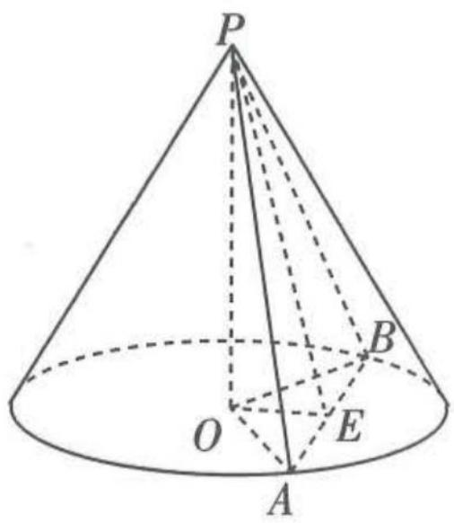

图1-2

【辨析比较】圆锥的侧面积公式与圆柱的侧面积公式不要高混，后者系数有个2，前者无

调研 4 (2022 · 全国乙卷) 如图 1-3, 四面体 ABCD 中, $AD \perp CD, AD = CD, \angle ADB = \angle BDC, E$ 为 $AC$ 的中点.

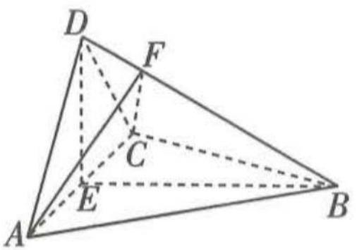

图1-3

（1） 证明: 平面 BED⊥平面 ACD;

（2） 设 AB = BD = 2, $\angle ACB = 60^{\circ}$ , 点 F 在 BD 上, 当 $\triangle AFC$ 的面积最小时, 求三棱锥 F - ABC 的体积.

菱形面积公式 菱形的面积等于其对角线长乘积的一半,即若菱形的两条对角线长度分别是 a,b,则其面积 $S=\frac{1}{2}ab$ .

关注微信公众号“初高教辅站”获取更多初高中教辅资料解析 （1） 因为 $AD = CD, E$ 是 $AC$ 的中点, 所以 $AC \perp DE$ .

因为 $\left\{\begin{aligned}AD&=CD,\\ \angle ADB&=\angle CDB,\\ BD&=BD,\end{aligned}\right.$ 所以 $\triangle ADB\cong\triangle CDB,$

所以 AB = CB，故 $AC \perp BE$ ，因为 $DE \cap BE = E, DE, BE \subset$ 平面 BED.

【易忽视】由残线垂直证明线面垂直，注意面内两线相交的说明，否则，易因跳步而失分所以 $AC \perp$ 平面 BED，由于 $AC \subset$ 平面 ACD，所以平面 $BED \perp$ 平面 ACD。

（2）依题意 ${AB} = {BD} = {BC} = 2,\angle {ACB} = {60}^{ \circ  }$ ,所以 $\bigtriangleup  {ABC}$ 是等边三角形,

所以 AC = 2, AE = CE = 1, BE = $\sqrt{3}$ ,

因为 AD = CD, $AD \perp CD$ , 所以 $\triangle ACD$ 是等腰直角三角形, 所以 DE = 1.

因为 $DE^{2}+BE^{2}=BD^{2}$ ，所以 $DE\perp BE$ ，

【小技巧】利用勾股定理的逆定理证明两线垂直

因为 $AC \cap BE = E, AC, BE \subset$ 平面 ABC, 所以 $DE \perp$ 平面 ABC.

易知 $\triangle FBA \cong \triangle FBC$ ，所以 $AF = CF$ ，连接 $EF$ ，则 $EF \perp AC$

因为 $S_{\triangle AFC} = \frac{1}{2}\cdot AC\cdot EF$ ，所以当 $EF$ 最小时， $\triangle AFC$ 的面积最小.

【会转化】把△AFC的面积最小问题转化为AC边上的高EF最小问题，再转化为在Rt△BED中，点E到斜边BD的距离最小问题

易知当 $EF \perp BD$ 时, $EF$ 最小, 此时在 Rt $\triangle BED$ 中, 有 $\frac{1}{2} \cdot BE \cdot DE = \frac{1}{2} \cdot BD \cdot EF$ , 解得 $EF = \frac{\sqrt{3}}{2}$ , 所以 $DF = \sqrt{1^2 - (\frac{\sqrt{3}}{2})^2} = \frac{1}{2}, BF = 2 - DF = \frac{3}{2}$ , 所以 $\frac{BF}{BD} = \frac{3}{4}$ .

如图1-4, 过 $F$ 作 $FH \perp BE$ , 垂足为 $H$ , 则 $FH \parallel DE$ ,

所以 $FH \perp$ 平面 ABC，且 $\frac{FH}{DE} = \frac{BF}{BD} = \frac{3}{4}$ ，所以 $FH = \frac{3}{4}$ ，

所以 $V_{F - ABC} = \frac{1}{3}\cdot S_{\triangle ABC}\cdot FH = \frac{1}{3}\times \frac{1}{2}\times 2\times \sqrt{3}\times \frac{3}{4} = \frac{\sqrt{3}}{4}.$

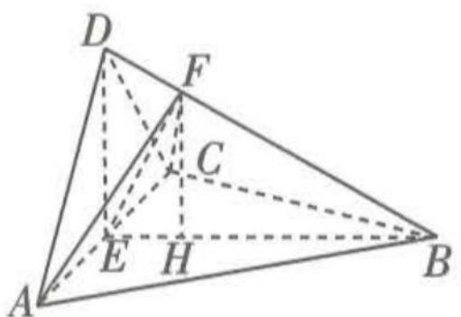

图1-4

# 命题角度 3 台体的体积与表面积计算

调研 5 (2022·重庆万州中学等校5月三诊改编)已知圆台的轴截面如图1-5所示,其上、下底面圆的半径分别为 $r_{\text {上}} = 1, r_{\text {下}} = 2$ , 母线 $AB$ 长为 $2, E$ 为母线 $AB$ 的中

扇形面积公式 设一扇形的半径为 r，弧长为 l，面积为 S，则 $S = \frac{1}{2} lr$ .

关注微信公众号“初高教辅站”获取更多初高中教辅资料

点,则下列结论正确的序号是\_\_\_\_.

①圆台母线 AB 与底面所成角为 $60^{\circ}$ ;  
②圆台的侧面积为 $12\pi$ ;  
③圆台外接球的半径为2；  
④在圆台的侧面上,从 C 到 E 的最短路径的长度为 5;  
⑤圆台的体积为 $\frac{14\pi}{3}$ .

解析 如图1-6, 过 $A$ 作 $AF \parallel O_{1}O_{2}$ 交底面于 $F$ , 则 $AF \perp$ 底面, 所以 $\angle ABF$ 即母线 $AB$ 与底面所成的角.

【扫清障碍】找斜线与平面所成角，只需找斜线在该平面内的射影，即找点A在圆台底面的射影

在等腰梯形 ABCD 中, AB = 2, BF = 2 - 1 = 1, 所以 $\cos \angle ABF = \frac{BF}{AB} = \frac{1}{2}$ .

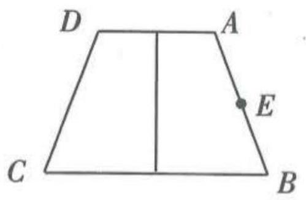

图1-5

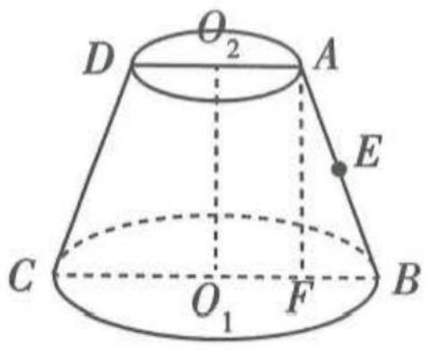

图1-6

因为 $\angle ABF$ 为锐角, 所以 $\angle ABF = 60^{\circ}$ . 故①正确.

由题意知,圆台的侧面积 $S=\pi(r_{\text{上}}+r_{\text{下}})\cdot AB=\pi(1+2)\times2=6\pi$ ,

【一题多解】该圆台的侧面展开图为半圆环，如图1-7所示，其面积为 $S=\frac{1}{2}\times2\pi\times2\times4-\frac{1}{2}\times2\pi\times1\times2=6\pi$

故②错误.

圆台的体积 $V=\frac{1}{3}\pi\left(r_{\text{上}}^{2}+r_{\text{上}}r_{\text{下}}+r_{\text{下}}^{2}\right)\cdot O_{1}O_{2}=\frac{1}{3}\pi\left(1^{2}+1\times2+2^{2}\right)\cdot\sqrt{2^{2}-1^{2}}=\frac{7\sqrt{3}\pi}{3}$ ，故⑤错误.

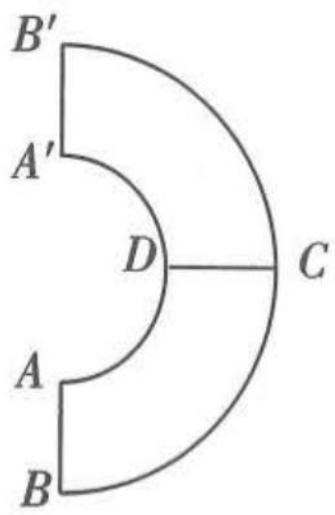

图1-7

如图1-8, 设圆台外接球的球心为 $O$ , 半径为 $R$ . 由题意可得 $O_{1}B = 2, O_{2}A = 1$ , $O_{1}O_{2} = \sqrt{2^{2} - 1^{2}} = \sqrt{3}$ .

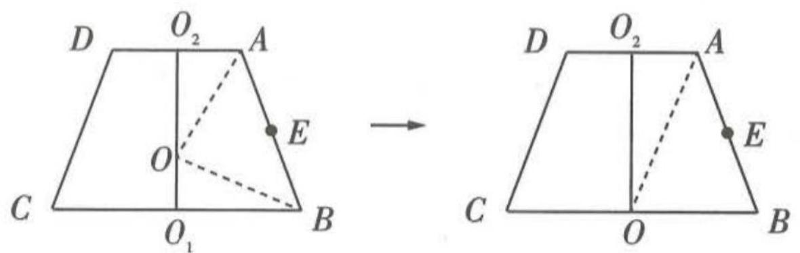

图1-8

设 $OO_{1}=a$ ，连接 OA, OB，则 $OO_{2}=\sqrt{3}-a$ ，由 R=OA=OB，即 $\sqrt{1^{2}+(\sqrt{3}-a)^{2}}=\sqrt{2^{2}+a^{2}}$ ，解得 a=0。即点 O 与点 $O_{1}$ 重合，所以 R=OB=2，故③正确。

【会转化】把三维问题转化为二维问题：作出圆台的轴截面示意图，则圆台外接球的球心在线段 $O_{1}O_{2}$ 上，利用球心，上底（下底）的圆心，球面上的点构成的直角三角形，利用勾股定理，得圆台外接球半径

如图 1-9 所示, 将该圆台的侧面展开, 连接 $A A'$ , 记 $A A'$ 的中点为 $H$ , 连接 $C H$ , 则 $H B = H C = 4, A B = 2$ , 易知从 $C$ 到 $E$ 的最短路径为线段 $C E$ .

【会转化】把三维问题转化为二维问题：在圆台的侧面上，点 C 到 E 的最短路径的长度为 CE 的长

因为 E 为 AB 的中点, 所以 HE = 3 , 所以 $CE = \sqrt{CH^{2} + HE^{2}} = \sqrt{4^{2} + 3^{2}} =$ 5. 故④正确. 故填①③④.

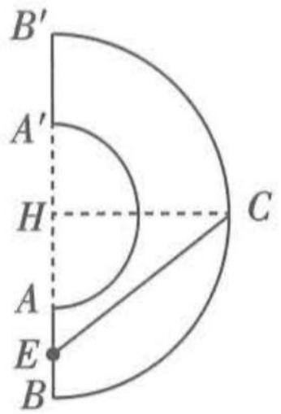

图1-9

# 命题角度4 实际应用问题中几何体的体积计算

调研 6 (2022·全国甲卷)小明同学参加综合实践活动,设计了一个封闭的包装盒,包装盒如图1-10所示:底面ABCD是边长为8(单位:cm)的正方形, $\triangle EAB$ , $\triangle FBC$ , $\triangle GCD$ , $\triangle HDA$ 均为正三角形,且它们所在的平面都与平面ABCD垂直.

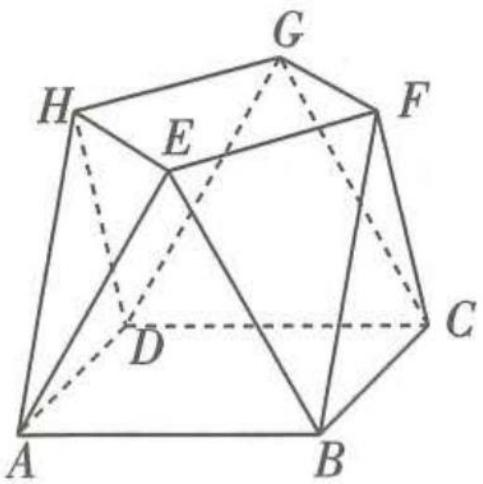

图1-10

（1） 证明: EF // 平面 ABCD;  
（2） 求该包装盒的容积(不计包装盒材料的厚度).

思维导引 （1） 要证 $EF \parallel$ 平面 $ABCD$ 只需在平面 $ABCD$ 内作一条直线与直线 $EF$ 平行

（2） 对该包装盒进行分割 → 分别取 AB, BC, CD, DA 的中点 M, N, L, K → 把该包装盒分割为 1 个长方体与 4 个四棱锥 → 利用柱体、锥体的体积公式 → 得该包装盒的容积

解析 （1）如图1-11所示,分别取AB,BC的中点M,N,连接EM,FN,MN,因为 $\triangle EAB,\triangle FBC$ 为全等的正三角形,

所以 $EM \perp AB, FN \perp BC, EM = FN.$

又平面 $EAB \perp$ 平面 ABCD，平面 $EAB \cap$ 平面 ABCD = AB, EM ⊂ 平面 EAB，所以 EM ⊥

圆台体积公式 如果圆台的上、下底面的半径分别是 r, R, 高是 h, 则它的体积 $V = \frac{1}{3} \pi h (r^{2} + R^{2} + R r)$ .

平面 ABCD,

同理可得 $FN \perp$ 平面 ABCD, 所以 EM // FN,

又 EM = FN, 所以四边形 EMNF 为平行四边形, 所以 EF // MN.

【易忽视】注意先证平行四边形，才能得一组对边平行且相等，不能跳步，否则会失分

又 $EF \not\subset$ 平面 $ABCD, MN \subset$ 平面 $ABCD$ , 所以 $EF \parallel$ 平面 $ABCD$ .

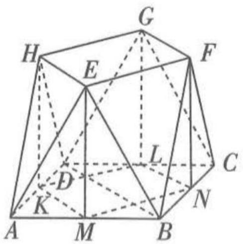

图1-11

【易遗漏】注意面外线与面内线的说明

（2）如图1-11,分别取AD,DC的中点K,L,

连接 HK, GL, KM, KL, LN, 由（1）知, $EF \parallel MN$ 且 EF = MN, 同理有 $HE \parallel KM$ , $HE = KM$ , $HG \parallel KL$ , $HG = KL$ , $GF \parallel LN$ , $GF = LN$ ,

连接 ${BD}$ ,易知 ${BD} \perp  {MN},{MN} \perp  {MK},{KM} = {MN} = {NL} = {LK}$ ,所以该几何体的体积等于长方体 MNLK-EFGH 的体积加上四棱锥 B-MNFE 体积的 4 倍.

【技巧点拨】求解简单不规则几何体的体积，通常是对几何体进行割补，割补后的图形，应当与原图形相符，以免割补不当，导致所求多面体的体积出错

因为 $MN = NL = LK = KM = 4\sqrt{2}, EM = 8\sin 60^{\circ} = 4\sqrt{3}$ , 点 $B$ 到平面 $MNFE$ 的距离即点 $B$ 到直线 $MN$ 的距离 $d = 2\sqrt{2}$ ,

所以该几何体的体积为 $V = (4\sqrt{2})^2 \times 4\sqrt{3} + 4 \times \frac{1}{3} \times 4\sqrt{2} \times 4\sqrt{3} \times 2\sqrt{2} = 128\sqrt{3} + \frac{256}{3}\sqrt{3} = \frac{640}{3}\sqrt{3}$ .

# 新题演练

##### 1. (2022·河北张家口5月三模)如图1-12,在三棱柱 $ABC - A_{1}B_{1}C_{1}$ 中,过 $A_{1}B_{1}$ 的截面与 $AC$ 交于点 $D$ ,与 $BC$ 交于点 $E$ ,该截面将三棱柱分成体积相等的两部分,则 $\frac{CD}{AC} =$ ()

$\quad$A. $\frac{1}{3}$

$\quad$B. $\frac{1}{2}$

$\quad$C. $\frac{2-\sqrt{3}}{2}$

$\quad$D. $\frac{\sqrt{3}-1}{2}$

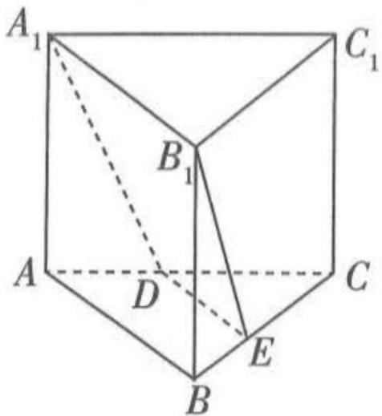

图1-12

##### 2. (2022·湖南衡阳 5 月三模/转子发动机) 图 1-13①中的机械设备叫作“转子发动机”, 其核心零部件之一的转子形状是“曲侧面三棱柱”, 图 1-13②是一个曲侧面三棱柱, 它的侧棱垂直于底面, 底面是“勒洛三角形” (如图 1-13③), 勒洛三角形是以正三角形的三个顶点为圆心, 正三角形的边长为半径画圆弧得到的, 若曲侧面三棱柱的高为 4 , 底面任意两顶点之间的距离为 $10 \sqrt{2}$ , 则其体积为 ( )

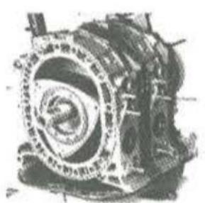  
①

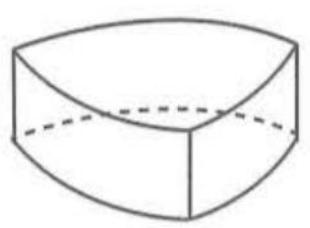  
②

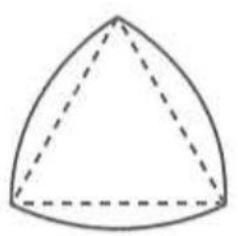  
③   
图1-13

$\quad$A. $200(2\pi - 3\sqrt{3})$

$\quad$B. $400(\pi - \sqrt{3})$

$\quad$C. $40 \sqrt{2} \pi$

$\quad$D. $400(2\pi - \sqrt{3})$

##### 3. (2022·广州天河区6月综合测试)(多选)某班级到一工厂参加社会实践劳动,加工出如图1-14所示的圆台 $O_{1}O_{2}$ ,在轴截面ABCD中, $AB = AD = BC = 2 \mathrm{~cm}$ ,且 $CD = 2AB$ ,则下列说法正确的是()

$\quad$A. 该圆台的高为 $1 \mathrm{~cm}$

$\quad$B.该圆台轴截面面积为 $3\sqrt{3}$ $cm^{2}$

$\quad$C. 该圆台的体积为 $\frac{7\sqrt{3}\pi}{3}cm^{3}$

$\quad$D. 一只小虫从点 C 沿着该圆台的侧面爬行到 AD 的中点, 所经过的最短路程为 5 cm 公众号: 拾穗者的杂货铺

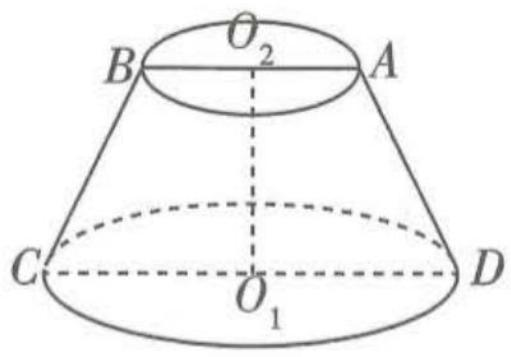

图1-14

# 参考答案与解析

##### 1. D 由题可知平面 $A_{1}B_{1}ED$ 与棱柱上、下底面分别交于 $A_{1}B_{1}, ED$ , 则 $A_{1}B_{1} \parallel ED, ED \parallel AB$ , 显然 $CDE - C_{1}A_{1}B_{1}$ 是三棱台.

设 $\triangle ABC$ 的面积为1, $\triangle CDE$ 的面积为S,三棱柱 $ABC-A_{1}B_{1}C_{1}$ 的高为h,

完全立方公式

$(a + b) ^ {3} = a ^ {3} + 3 a ^ {2} b + 3 a b ^ {2} + b ^ {3}, (a - b) ^ {3} = a ^ {3} - 3 a ^ {2} b + 3 a b ^ {2} - b ^ {3}.$

所以 $\frac{1}{2} \times 1 \times h = \frac{1}{3} h (1 + S + \sqrt{S})$ ，即 $\frac{1}{2} = \frac{1}{3} (1 + S + \sqrt{S})$ ，解得 $\sqrt{S} = \frac{\sqrt{3} - 1}{2}$ ，由 $\triangle CDE \sim \triangle CAB$ ，得 $\frac{CD}{AC} = \frac{\sqrt{S}}{\sqrt{1}} = \frac{\sqrt{3} - 1}{2}$ . 故选 D.

##### 2. B 由题意知,底面正三角形面积为 $\frac{1}{2}\times(10\sqrt{2})^{2}\times\frac{\sqrt{3}}{2}=50\sqrt{3}$ ,

则底面三个小弓形的面积均为 $\frac{1}{2} \times \frac{\pi}{3} \times (10\sqrt{2})^2 - 50\sqrt{3} = \frac{100\pi}{3} - 50\sqrt{3}$ ,

【小技巧】小弓形的面积等于扇形面积与正三角形面积之差

∴ 底面“勒洛三角形”的面积 $S = 100\pi - 150\sqrt{3} + 50\sqrt{3} = 100\pi - 100\sqrt{3}$ ，
∴ “曲侧面三棱柱”的体积 $V = 4(100\pi - 100\sqrt{3}) = 400(\pi - \sqrt{3})$ . 故选 B

##### 3. BCD 作 $BE \perp CD$ 交 $CD$ 于 $E$ , 易得 $CE = \frac{CD - AB}{2} = 1$ , 则 $BE = \sqrt{2^2 - 1^2} = \sqrt{3}$ , 即圆台的高为 $\sqrt{3} \mathrm{~cm}$ , A 错误.

圆台的轴截面面积为 $\frac{1}{2}\times(2+4)\times\sqrt{3}=3\sqrt{3}(\mathrm{cm}^{2})$ ，B正确.

【小提示】圆台的轴截面是等腰梯形

圆台的体积为 $\frac{1}{3}\times\sqrt{3}\times(\pi+4\pi+\sqrt{\pi\times4\pi})=\frac{7\sqrt{3}\pi}{3}(\mathrm{cm}^{3})$ ，C正确.

将圆台的一半侧面展开,如图 1-15,设 $P$ 为 $AD$ 的中点,圆台对应的圆锥的一半侧面展开图为扇形 $COD$ ,

【会转化】求曲面上两点之间距离最短问题，需通过展开铺平，转化为平面上两点间的距离最短问题

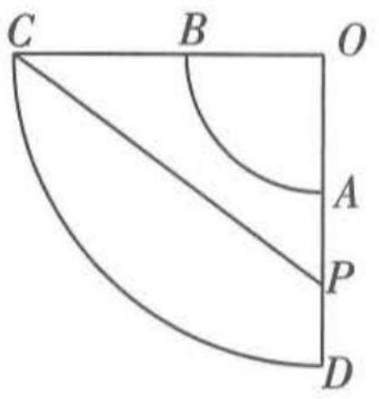

图1-15

由 $CE = EO_{1}$ 可得 $BC = OB = 2$ ，则 $OC = 4, \angle COD = \frac{\frac{4\pi}{2}}{4} = \frac{\pi}{2}$ ，又 $OP =$

$OA + \frac{AD}{2} = 3$ ，则 $CP = \sqrt{4^2 + 3^2} = 5$ ，即点 $C$ 到 $AD$ 的中点所经过的最短路程为 $5\mathrm{cm},\mathrm{D}$ 正确.故选BCD.

# 超重点2 剖析几何体与球的切、接模型

# 命题角度1 柱体与球的接模型

调研 1 (2022·广东深圳 5 月模拟) 若正三棱柱 $ABC - A_{1}B_{1}C_{1}$ 的所有顶点都在同一个球 $O$ 的表面上, 且球 $O$ 的体积的最小值为 $\frac{4\pi}{3}$ , 则该三棱柱的侧面积为 ( )

$\quad$A. $6\sqrt{3}$

$\quad$B. $3\sqrt{3}$

$\quad$C. $3\sqrt{2}$

$\quad$D. 3

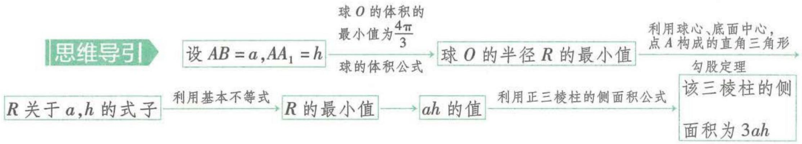

解析 如图2-1, 设正三棱柱上、下底面的中心分别为 $O_{1}$ , $O_{2}$ , 连接 $O_{1} O_{2}$ , 则 $O_{1} O_{2}$ 的中点为 $O$ ,

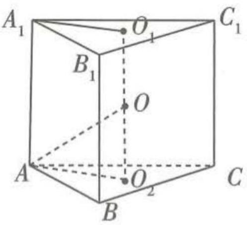

图2-1

【记结论】正棱柱的外接球的球心是上、下底面的中心连线的中点

设球 O 的半径为 R，连接 OA，则 OA = R，连接 $O_{1}A_{1}, O_{2}A$ ，设 $AB = a, AA_{1} = h$ ，则 $OO_{2} = \frac{1}{2}h, O_{2}A = \frac{1}{2} \cdot \frac{AB}{\sin \frac{\pi}{3}} = \frac{\sqrt{3}}{3}a.$

【小技巧】利用正弦定理求出底面三角形外接圆的半径

因为 $V_{球}=\frac{4\pi R^{3}}{3}\geqslant\frac{4\pi}{3}$ ，所以 $R_{min}=1$ .

在 Rt△OO₂A 中， $R^{2}=OA^{2}=OO_{2}^{2}+O_{2}A^{2}=\frac{1}{4}h^{2}+\frac{1}{3}a^{2}\geqslant2\times\frac{1}{2}h\times\frac{\sqrt{3}}{3}a=\frac{\sqrt{3}}{3}ah$ ，当且

三个正数的算术-几何平均不等式 如果 $a, b, c \in \mathbb{R}_+$ ，那么 $\frac{a + b + c}{3} \geqslant \sqrt[3]{abc}$ ，当且仅当 $a = b = c$ 时，等号成立.

仅当 $\frac{1}{2} h = \frac{\sqrt{3}}{3} a$ 时取等号，则 $R_{\mathrm{min}}^2 = \frac{\sqrt{3}}{3} ah$ ，所以 $\frac{\sqrt{3}}{3} ah = 1$ ，即 $ah = \sqrt{3}$

【易遗漏】利用基本不等式求最值，注意等号成立条件的检验

所以该三棱柱的侧面积为 $3ah = 3\sqrt{3}$ . 故选 B.

【指点迷津】求正三棱柱的侧面积，思路转向整体求出 $ah$ 即可，不要按常规方法分别求出 $a, h$ ，这样思路就不流畅了

# 命题角度2 锥体与球的接模型

调研 2 （原创）若圆锥的内切球（球面与圆锥的侧面以及底面都相切）的体积为 $\frac{4\pi}{3}$ ，当该圆锥体积取最小值时，该圆锥的表面积为\_\_\_\_。

解析 方法一 因为圆锥的内切球的体积为 $\frac{4\pi}{3}$ , 所以该内切球的半径为 1.

如图2-2,设圆锥底面半径为R,高为h.由 $\triangle AOF\sim\triangle ACE$ 可得 $\frac{OF}{CE}=\frac{AO}{AC}$ ，即 $\frac{1}{R}=\frac{h-1}{\sqrt{R^{2}+h^{2}}}$ ，则 $R^{2}=\frac{h}{h-2}(h>2)$ ，

所以圆锥的体积为 $V=\frac{1}{3}\pi R^{2}h=\frac{1}{3}\pi\cdot\frac{h^{2}}{h-2}=\frac{1}{3}\pi\cdot[(h-2)+\frac{4}{h-2}+4]$ .

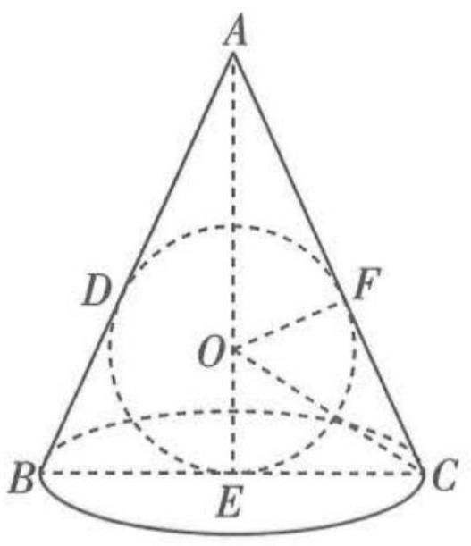

图2-2

因为 $h - 2 > 0$ ，所以 $h - 2 + \frac{4}{h - 2} \geqslant 4$ ，当且仅当 $h - 2 = \frac{4}{h - 2}$

即 h=4 时取等号, 此时圆锥体积最小, 且圆锥的底面半径为 $R=\sqrt{2}$ , 圆锥的母线长 $l=\sqrt{R^{2}+h^{2}}=\sqrt{2+4^{2}}=3\sqrt{2}$ ,

所以此时该圆锥的表面积为 $S = \pi R l + \pi R^{2} = \pi \times \sqrt{2} \times 3\sqrt{2} + \pi \times (\sqrt{2})^{2} = 8\pi.$

方法二 由上解得圆锥的体积为 $V = \frac{1}{3}\pi R^2 h = \frac{1}{3}\pi \cdot \frac{h^2}{h - 2}$ .

令 $f(h)=\frac{h^{2}}{h-2}(h>2)$ ，则 $f'(h)=\frac{2h(h-2)-h^{2}}{(h-2)^{2}}=\frac{h(h-4)}{(h-2)^{2}}.$

当 2 < h < 4 时, $f'(h) < 0$ ; 当 h > 4 时, $f'(h) > 0$ .

所以 $f(h)$ 在 $(2,4)$ 上单调递减，在 $(4,+\infty)$ 上单调递增，

所以 $f(h)_{\min}=f(4)=8$ ,

即 h=4 时,该圆锥的体积最小.后同上解.

方法三 因为圆锥的内切球的体积为 $\frac{4\pi}{3}$ ，所以该内切球的半径为1，

如图2-2，设 $\angle OCE = \theta, \theta \in (0, \frac{\pi}{4})$ ，则 $\tan \theta = \frac{OE}{EC}$ ，所以 $EC = \frac{1}{\tan \theta}$

又 $\tan\angle ECA=\tan2\theta=\frac{AE}{EC}$ ,

所以 $AE = EC \cdot \tan 2\theta = \frac{2}{1 - \tan^{2}\theta}$ ,

所以 $V = \frac{1}{3}\pi \cdot EC^2\cdot AE = \frac{1}{3}\pi \cdot \frac{2}{\tan^2\theta(1 - \tan^2\theta)}.$

令 $\tan^2\theta = t(0 < t < 1)$ ，因为 $t(1 - t) = -t^2 + t = -(t - \frac{1}{2})^2 + \frac{1}{4}$ ，

当且仅当 $t = \frac{1}{2}$ 时 $t(1 - t)$ 取得最大值 $\frac{1}{4}$ , 此时圆锥的体积最小, 且 $AE = \frac{2}{1 - \frac{1}{2}} = 4$ , $EC = \frac{1}{\sqrt{\frac{1}{2}}} = \sqrt{2}$ , $AC = \sqrt{AE^2 + EC^2} = \sqrt{4^2 + 2} = 3\sqrt{2}$ ,

所以该圆锥的表面积为 $S = \pi \cdot EC\cdot AC + \pi \cdot EC^2 = \pi \times \sqrt{2}\times 3\sqrt{2} +\pi \times (\sqrt{2})^2 = 8\pi .$

# 命题角度 3 台体与球的接模型

调研 3 (2022·河南焦作6月期末)已知某圆台的母线长为2,母线与轴所在直线的夹角是 $60^{\circ}$ ,且上、下底面的面积之比为1:4,则该圆台外接球的表面积为 ( )

$\quad$A. $56\pi$

$\quad$B. $64\pi$

$\quad$C. $112\pi$

$\quad$D. $128\pi$

微积分基本定理(牛顿-莱布尼茨公式) 一般地,如果 $f(x)$ 是区间 $[a,b]$ 上的连续函数,并且 $F'(x)=f(x)$ ,那么 $\int^{b}f(x)\mathrm{d}x=F(b)-F(a)$ .
关注微信公众号“初高教辅站”获取更多初高中教辅资料

解析 如图2-3,等腰梯形ABCD是圆台的轴截面,EF是圆台的对称轴.

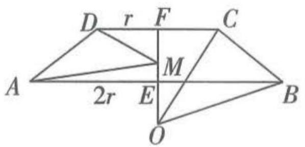

图2-3

【小技巧】等腰梯形 ABCD 的外接圆是圆台外接球的大圆，则可借助这个梯形求出圆台外接球的半径

由圆台上、下底面的面积之比为 1:4, 得半径比为 1:2, 设
圆台上、下底面圆的半径分别为 r, 2r, 由母线与轴的夹角是 $60^{\circ}$ , 母线长为 2, 可得圆台的高为 $1, r = \sqrt{3}$ .

设圆台外接球的半径为 R, 球心到下底面的距离为 x.

①若球心在圆台两底面之间,如图点 M 位置,则 $R^{2}=x^{2}+(2\sqrt{3})^{2}$ 且 $R^{2}=(1-x)^{2}+(\sqrt{3})^{2}$ ,无解.

【分类讨论】注意对球心的位置进行分类讨论：可能在圆台内，也可能在圆台外，但一定在圆台上，下底面圆心连线所在的直线上

②若圆台两底面在球心同侧,如图点 O 位置,则 $R^{2}=x^{2}+(2\sqrt{3})^{2}$ 且 $R^{2}=(1+x)^{2}+(\sqrt{3})^{2}$ , 解得 x=4, 则 $R^{2}=28$ , 所以该圆台外接球的表面积为 $4\pi R^{2}=112\pi$ .

故选C.

# 反思提升

破解几何体的外接球问题的关键: （1） 定球心, 柱体及台体的外接球球心一般在上、下底面多边形外接圆的圆心连线所在直线上, 锥体的外接球球心往往是通过先找出锥体某个面的外心, 再过此外心作该面的垂线来确定; （2） 求球半径, 通常是在过球心的某个平面中, 找出球的半径 $R$ , 底(侧)面外接圆的半径 $r$ 及球心到底(侧)面的距离, 利用勾股定理, 求出球的半径; （3） 用公式, 即利用球的表面积或体积公式求解. 根据几何体的特征, 有时也可通过补形将锥体的外接球转化为柱体的外接球来求解.

# 命题角度4 空间几何体与球的切模型

调研 4 (2022·辽宁抚顺一中 5 月模拟)“圆柱容球”是指圆柱形容器里放了一个球,且球与圆柱的侧面及上、下底面均相切,则该圆柱的体积与球的体积之比为()

$\quad$A. 2

$\quad$B. $\frac{3}{2}$

$\quad$C. $\sqrt{3}$

$\quad$D. $\frac{\pi}{3}$

# 实用定理

二维形式的柯西不等式 若 $a, b, c, d$ 都是实数，则 $(a^2 + b^2)(c^2 + d^2) \geqslant (ac + bd)^2$ 当且仅当 $ad = bc$ 时，等号成立.

关注微信公众号“初高教辅站”获取更多初高中教辅资料解析 设球的半径为 R，由题意得，圆柱的高及底面圆的直径等于球的直径，则

【记结论】圆柱轴截面(正方形)的内切圆是圆柱内切球的大圆,圆柱轴截面(矩形)的外接圆是圆柱外接球的大圆,该矩形的对角线(外接圆直径)是外接球的直径

圆柱的体积为 $\pi R^2\cdot 2R = 2\pi R^3$ ，球的体积为 $\frac{4}{3}\pi R^3$

所以该圆柱的体积与球的体积之比为 $\frac{2\pi R^{3}}{\frac{4}{3}\pi R^{3}}=\frac{3}{2}$ ，故选B.

调研 5 (2022·河北石家庄二中5月考前模拟)在四面体ABCD中,BA,BC,BD两两垂直,BA=1,BC=BD=2,则四面体ABCD内切球的半径为 ( )

$\quad$A. $\frac{4 - \sqrt{6}}{10}$

$\quad$B. $\frac{5-\sqrt{6}}{10}$

$\quad$C. $\frac{4-\sqrt{6}}{5}$

$\quad$D. $\frac{5 - \sqrt{6}}{5}$

解析 因为 $BA, BC, BD$ 两两垂直, $BA = 1$ , $BC = BD = 2$ , 所以 $AC = AD = \sqrt{5}$ , $CD = 2\sqrt{2}$ .

如图2-4, 取 $CD$ 的中点 $E$ , 连接 $AE$ , 则 $AE \perp CD$ ,

【小方法】见等腰，取中点，“垂直观形”

所以 $AE = \sqrt{AD^2 - DE^2} = \sqrt{3}$ , $\triangle ACD$ 的面积为 $\frac{1}{2} \times 2\sqrt{2} \times \sqrt{3} = \sqrt{6}$ ,

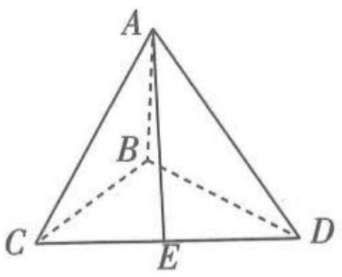

图2-4

所以四面体ABCD的表面积 $S = \frac{1}{2}\times 1\times 2\times 2 + \frac{1}{2}\times 2\times 2+$ $\sqrt{6} = 4 + \sqrt{6}.$

设四面体 ABCD 内切球的球心为 O，半径为 r，则 $V_{A-BCD} = V_{O-ABC} + V_{O-BCD} + V_{O-ABD} + V_{O-ACD}$ ，

【小技巧】利用等体积法，把四面体ABCD的体积看成四个小三棱锥的体积的和

所以 $\frac{1}{3} \times 1 \times \frac{1}{2} \times 2^2 = \frac{1}{3} S \times r$ ，所以 $\frac{1}{3} \times 1 \times \frac{1}{2} \times 2^2 = \frac{1}{3} (4 + \sqrt{6}) \times r$ ，解得 $r = \frac{4 - \sqrt{6}}{5}$ ，

所以四面体 ABCD 内切球的半径为 $\frac{4-\sqrt{6}}{5}$ ，故选 C.

柯西不等式的向量形式 设 $\alpha, \beta$ 是两个向量，则 $|\alpha \cdot \beta| \leqslant |\alpha||\beta|$ ，当且仅当 $\beta$ 是零向量，或存在实数 $k$ ，使 $\alpha = k\beta$ 时，等号成立。

关注微信公众号“初高教辅站”获取更多初高中教辅资料

# 反思提升

求棱锥的内切球的半径通常是用等体积法列方程，由于内切球球心到棱锥的各面的距离均相等，利用棱锥的体积 V 等于以其内切球的球心为顶点，分别以棱锥的各个面为底面的小棱锥的体积之和，得内切球的半径 r 所满足的方程，即 $V=\frac{1}{3}Sr$ (S 为棱锥的表面积)，解方程，即可求出内切球的半径 r.

# 新题演练

##### 1. (2022·四川内江6月仿真考试)已知正四棱锥的侧棱长为 $\sqrt{5}$ ,底面边长为2,则该四棱锥的内切球的体积为
()

$\quad$A. $\frac{4\sqrt{3}}{3}$

$\quad$B. $\frac{4\sqrt{3}\pi}{27}$

$\quad$C. $\frac{4\pi}{3}$

$\quad$D. $4\sqrt{3}$

##### 2. (2022·山东聊城 5 月三模)《几何原本》是古希腊数学家欧几里得的一部不朽之作, 其第十一卷中称轴截面为等腰直角三角形的圆锥为直角圆锥. 若一个直角圆锥的侧面积为 $4 \sqrt{2} \pi$ , 圆锥的底面圆周和顶点都在同一球面上, 则该球的体积为 ( )

$\quad$A. $\frac{8}{3}\pi$

$\quad$B. $\frac{32}{3}\pi$

$\quad$C. $16\pi$

$\quad$D. $32\pi$

##### 3. (2022·湖北黄冈中学 5 月三模) 若一个正六棱柱既有外接球又有内切球, 则该正六棱柱的外接球和内切球的表面积的比为 ( )

$\quad$A. 2:1

$\quad$B. 3:2

$\quad$C. 7:3

$\quad$D. 7:4

##### 4. (2022·广东惠州5月二模)(多选)如图2-5,已知正四棱台 $ABCD-A_{1}B_{1}C_{1}D_{1}$ 的上、下底面边长分别为4,6,高为 $\sqrt{2}$ ,E是 $A_{1}B_{1}$ 的中点,则下列说法正确的是()

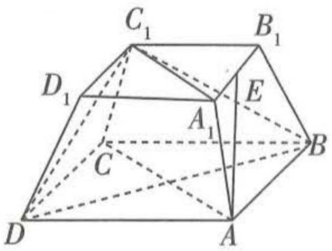

图2-5

$\quad$A. 正四棱台 $ABCD - A_{1}B_{1}C_{1}D_{1}$ 的体积为 $\frac{52\sqrt{2}}{3}$   
$\quad$B. 平面 $BC_{1}D \perp$ 平面 $AA_{1}C_{1}C$   
$\quad$C. $AE \parallel$ 平面 $BC_{1}D$   
$\quad$D. 正四棱台 $ABCD - A_{1}B_{1}C_{1}D_{1}$ 的外接球的表面积为 $104\pi$

##### 5. (2022·河北沧州 5 月模拟)三棱锥 $S-BCD$ 的平面展开图如图 2-6 所示, 已知 $AD \perp BD$ , $BC \perp BD$ , $AB = CF = 4$ , $AD = BC = 2$ , 若三棱锥 $S-BCD$ 的四个顶点均在球 $O$ 的表面上, 则球 $O$ 的表面积为 \_\_\_\_.

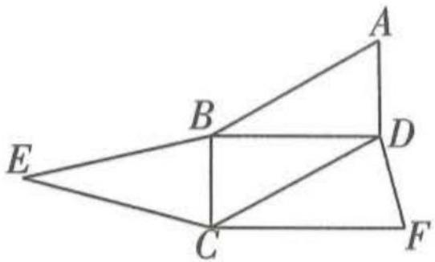

图2-6

# 参考答案与解析

##### 1. B 如图 2-7, 设 $O$ 为正四棱锥 $P - ABCD$ 的底面中心, $E$ 为 $BC$ 的中点, 连接 $PO, OE, PE$ , 则 $PO$ 为正四棱锥的高, $PE$ 为侧面三角形 $PBC$ 的高, 公众号: 拾穗者的杂货铺

【见下】主要区会二四楼的高、五层楼的制品，不需再

由题意知 $BC = 2, PB = \sqrt{5}$ , 所以 $PE = \sqrt{5 - 1} = 2$ , 则 $PO = \sqrt{4 - 1} = \sqrt{3}$ , 设该四棱锥的内切球的半径为 $r$ , 则 $\frac{1}{3} \cdot S_{\text{正方形}ABCD}$ .

$P O = \frac {1}{3} (S _ {\mathrm{正方形} A B C D} + 4 S _ {\triangle P B C}) r,$

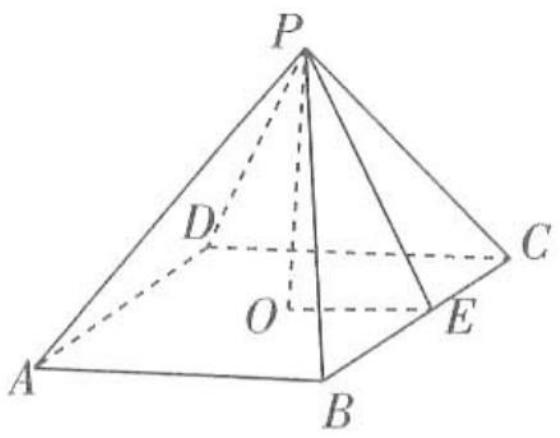

图2-7

即 $\frac{1}{3} \times 4 \times \sqrt{3} = \frac{1}{3} (4 + 4 \times \frac{1}{2} \times 2 \times 2) \times r$ ，解得 $r = \frac{\sqrt{3}}{3}$ ，

故该四棱锥的内切球的体积为 $V=\frac{4}{3}\pi \times \left(\frac{\sqrt{3}}{3}\right)^{3}=\frac{4\sqrt{3}\pi}{27}$ ，故选 B.

##### 2. B 设该球的半径为 R，圆锥的底面半径为 r，其母线长为 l，则 $l^{2} + l^{2} = 4r^{2} \Rightarrow l = \sqrt{2}r$ .

因为这个直角圆锥的侧面积为 $4\sqrt{2}\pi$ ，则 $\frac{1}{2} \times 2\pi r \times l = \frac{1}{2} \times 2\pi r \times \sqrt{2}r = 4\sqrt{2}\pi$ ，可得 $r = 2, l = \sqrt{2}r = 2\sqrt{2}$

圆锥的高为 $\sqrt{l^2 - r^2} = \sqrt{8 - 4} = 2$ ，由 $r^2 + (2 - R)^2 = R^2$ ，解得 $R = 2$

【远流化】圆锥的外径球坪，在圆锥的高所系的直线上，圆锥轴截面的外径圆系侧锥对圆柱的宽度、径二面的外径圆的直径是对圆柱的直径。

所以球 O 的体积等于 $\frac{4}{3}\pi R^{3} = \frac{4}{3}\pi \times 8 = \frac{32\pi}{3}$ ，故选 B.

##### 3. C 如图 2-8, $O_{1}, O_{2}$ 分别为正六棱柱下、上底面的中心, $O$ 为 $O_{1} O_{2}$ 的中点, $D$ 为 $A B$ 的中点. 公众号: 拾穗者的杂货铺

【中誠可】由王專同、林仁振共同，何可得主人：徐红和陈丹与刘国华、许学敏便章与周旭

设正六棱柱的底面边长为2,若正六棱柱有内切球,

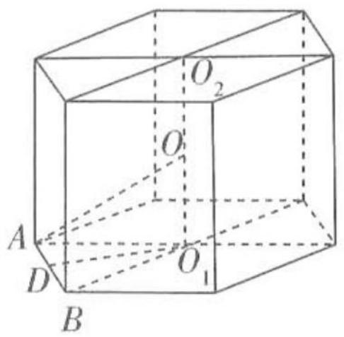

图2-8

小编说:我们向往太空,喜欢宇宙的浩瀚与神秘,在我们的追星之旅中,离不开老伙伴——火箭的支持.

则 $OO_{1} = O_{1}D = \sqrt{3}$ ，则内切球的半径 $r = \sqrt{3}, OA^{2} = OO_{1}^{2} + O_{1}A^{2} = 7$ ，所以外接球的半径 $R = \sqrt{7}$

则该正六棱柱的外接球和内切球的表面积的比为 $4\pi R^{2}: 4\pi r^{2} = R^{2}: r^{2} = 7:3$ ，故选 C.

##### 4. BCD 由题意得, 正四棱台 $ABCD - A_{1}B_{1}C_{1}D_{1}$ 的体积为 $V = \frac{1}{3} \times (S_{1} + \sqrt{S_{1}S_{2}} + S_{2}) \times$

$h=\frac{1}{3}\times(16+\sqrt{16\times36}+36)\times\sqrt{2}=\frac{76\sqrt{2}}{3}$ ，故A错误.

如图2-9所示,设AC,BD交于点 $O_{2}$ ,连接 $B_{1}D_{1}$ 与 $A_{1}C_{1}$ 交于点 $O_{1}$ ,连接 $O_{1}O_{2}$ ,易知 $BD\perp AC,BD\perp O_{1}O_{2}$ ,又 $AC\cap O_{1}O_{2}=O_{2}$ ,则 $BD\perp$ 平面 $AA_{1}C_{1}C$ ,又 $BD\subset$ 平面 $BC_{1}D$ ,所以平面 $BC_{1}D\perp$ 平面 $AA_{1}C_{1}C$ ,故B正确.

如图2-10, 取 $D_{1}A_{1}$ 的中点 $F$ , 连接 $AF, EF, A_{1}C_{1} \cap EF = G$ , 连接 $AG, C_{1}O_{2}$ , 易知 $C_{1}G \parallel AO_{2}, C_{1}G = AO_{2} = 3\sqrt{2}$ , 所以四边形 $C_{1}GAO_{2}$ 是平行四边形, 则 $AG \parallel C_{1}O_{2}$ .

又 $AG \not\subset$ 平面 $BC_{1}D, C_{1}O_{2} \subset$ 平面 $BC_{1}D$ , 则 $AG \parallel$ 平面 $BC_{1}D$ , 又 $EF \parallel B_{1}D_{1} \parallel BD, EF \not\subset$ 平面 $BC_{1}D, BD \subset$ 平面 $BC_{1}D$ , 则 $EF \parallel$ 平面 $BC_{1}D$ .

又 $EF \cap AG = G$ , 所以平面 $AEF \parallel$ 平面 $BC_{1}D$ , 又 $AE \subset$ 平面 $AEF$ , 则 $AE \parallel$ 平面 $BC_{1}D$ , 故 C 正确.

如图2-11所示,若外接球的球心O在正四棱台的内部,则O在 $O_{1}O_{2}$ 上,连接 $OD_{1},OD$ ,因为 $O_{1}O_{2}=\sqrt{2}$ ,上、下底面边长分别为4,6,则 $D_{1}O_{1}=\frac{1}{2}B_{1}D_{1}=2\sqrt{2},DO_{2}=\frac{1}{2}BD=3\sqrt{2}$ ,所以 $\sqrt{D_{1}O^{2}-D_{1}O_{1}^{2}}+\sqrt{DO^{2}-DO_{2}^{2}}=O_{1}O_{2}$ ,即 $\sqrt{R^{2}-8}+\sqrt{R^{2}-18}=\sqrt{2}$ ,无解,

【特别提醒】方程无解，说明外接球的球心O不在正四棱台的内部

所以外接球的球心 O 在正四棱台的外部, 如图 2-12 所示, 所以 $\sqrt{R^{2}-8}-\sqrt{R^{2}-18}=\sqrt{2}$ , 解得 $R^{2}=26$ , 所以外接球的表面积为 $4\pi R^{2}=104\pi$ , 故 D 正确. 故选 BCD.

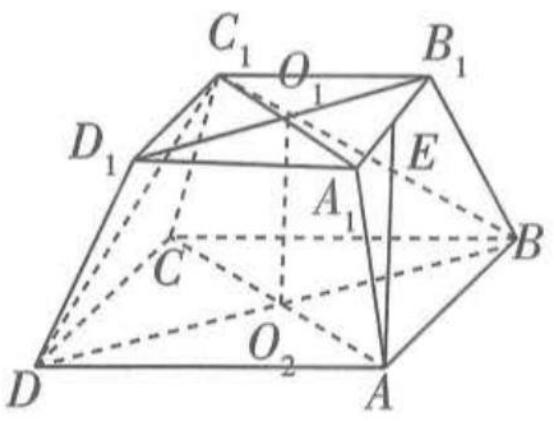

图2-9

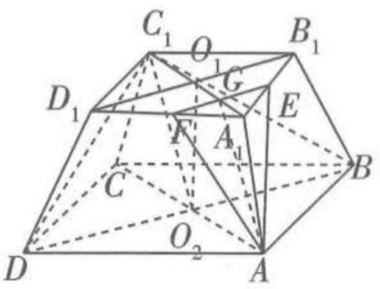

图2-10

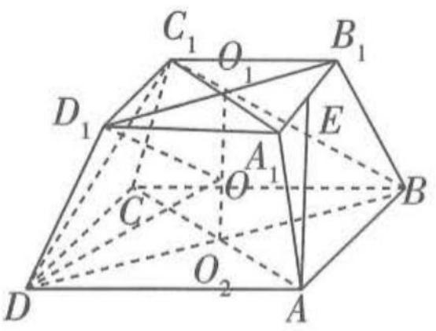

图2-11  
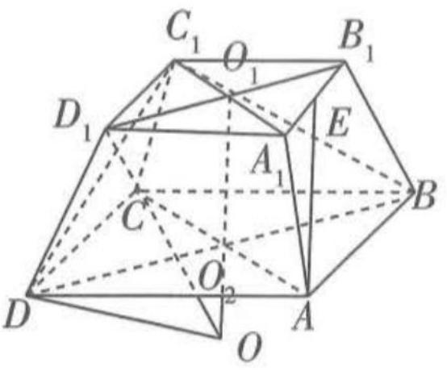

图2-12

##### 5. $\frac{52\pi}{3}$ 由已知得,三棱锥 S-BCD 中,SB=SC=4,SD=BC=2,BD= $2\sqrt{3}$ .

【扫清障碍】注意把翻折前后一些线线位置关系中没有变化和发生变化的量准确找出来，这些不变的和变化的量反映了翻折后的空间图形的结构特征

三棱锥 S-BCD 可置入如图 2-13 所示的直三棱柱 DNS-BCM 中, 易知 $SD = SN = DN = 2, BD = 2\sqrt{3}$ , 则该三棱柱的外接球即三棱锥 S-BCD 的外接球.

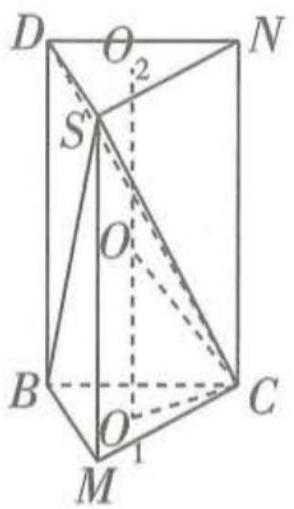

图2-13

【小妙招】构造直三棱柱，将所求三棱锥的外接球转化为三棱柱的外接球

设 $O_{1}, O_{2}$ 分别为三棱柱下、上底面三角形的中心，连接 $O_{1}O_{2}, CO_{1}$ ，则 $O$ 为 $O_{1}O_{2}$ 的中点，连接 $CO$ ，因为 $OO_{1} = \sqrt{3}, CO_{1} = \frac{2\sqrt{3}}{3}$ ，所以球 $O$ 的半径 $R = CO = \sqrt{OO_{1}^{2} + CO_{1}^{2}} = \sqrt{3 + \frac{4}{3}} = \sqrt{\frac{13}{3}}$ ，所以球 $O$ 的表面积为 $4\pi R^{2} = 4\pi \times \frac{13}{3} = \frac{52\pi}{3}$ .

# 超重点 3 探求翻折中的“变与不变”

# 特约名师

赵成海 正高级教师,河北省优秀教师,省级骨干教师. 中国数学奥林匹克一级教练员,中国科学技术学会、中国数学会会员. 在国家级及省级等各类专业报纸杂志上发表教育教学论文三百余篇.

# 命题角度1 翻折中的判断问题

将平面图形翻折成立体图形后,对立体图形中的点、线、面的位置关系,比如平行、垂直等,包括形状以及相应量的变化情况进行判断.

调研 1 (2022·浙江长兴、余杭、缙云三校 5 月联考)已知平面四边形 ABCD, △BCD 是以 BD 为斜边的等腰直角三角形, △ABD 为等边三角形, BD = 2 , 将 △ABD 沿对角线 BD 翻折到 △PBD 的位置. 在翻折的过程中, 下列结论中不正确的是 ( )

$\quad$A. ${BD} \bot  {PC}$   
$\quad$B. DP 与 BC 可能垂直  
$\quad$C. 直线 DP 与平面 BCD 所成角的最大值是 $45^{\circ}$   
$\quad$D. 四面体 $PBCD$ 的体积的最大值是 $\frac{\sqrt{3}}{3}$

长征一号火箭共执行过两次发射任务,均取得圆满成功,其中第二次发射是在1971年3月3日,成功把实践一号科学试验卫星送入轨道.

# 变与不变

在平面四边形中, 连接 $AC$ 交 $BD$ 于 $M$ , 由已知得 $AM \perp BD$ , $CM \perp BD$ , 在折叠过程中, $\triangle ABD$ , $\triangle BCD$ 的形状不会改变, 所以垂直关系不变; 二面角 $P - BD - C$ 在变化, $PC$ 的长度在变化, 点 $P$ 到平面 $BCD$ 的距离在变化. 根据以上不变量与可变量, 对选项进行分析求解.

解析 如图 3-1, 连接 $AC$ 交 $BD$ 于 $M$ , 连接 $PM$ . 由题意, $PM \perp BD, CM \perp BD, PM \cap CM = M, PM, CM \subset$ 平面 $PMC$ , 因而 $BD \perp$ 平面 $PMC$ , 所以 $BD \perp PC, A$ 选项正确.

由 BD=2 得, $BC=CD=\sqrt{2}$ , PB=PD=2, 那么当折叠到 $PC=\sqrt{2}$ 时,

【小技巧】这里确定 $PC=\sqrt{2}$ 是关键, 因为此时保证 $BC\perp PC$ , 那么结合折叠不变量 $BC\perp CD$ , 即可具备残面垂直的判定条件

$\angle PCB=90^{\circ}$ ，即 $BC\perp PC$ ，又 $BC\perp CD, PC\cap CD=C, PC, CD\subset$ 平面 PCD，所以 $BC\perp$ 平面 PCD，则有 $BC\perp PD, B$ 选项正确。

【另解】假设 $DP \perp BC$ ，又 $BC \perp CD$ ，所以 $BC \perp$ 平面 $PCD$ ，所以 $BC \perp PC$ ，又 $PB = 2, BC = \sqrt{2}$ ， $PC = \sqrt{2} \in [\sqrt{3} - 1, \sqrt{3} + 1]$ ，故 $DP$ 与 $BC$ 可能垂直，故 B 正确

由于 $BD \perp$ 平面 $PMC, PD = 2$ , 设点 $P$ 到平面 $BCD$ 的距离为 $d$ , 直线 $DP$ 与平面 $BCD$ 所成角的正弦值为 $\frac{d}{2}$ , 因而 $d$ 最大时角最大, 那么当折叠到平面 $PBD \perp$ 平面 $BCD$ 时, $d$ 最大, $d_{\max} = \sqrt{3}$ , 所以最大角为 $60^{\circ}$ , 因而 C 选项错误.

【巧避弯路】由于 ${PD} = 2$ 是折叠不变量,因而线面角是否最大,取决于点 $P$ 到平面距离是否最大,只需判断何时此距离最大即可,不需要选择变量去表示线面角的某一三角函数值,再求最值

当折叠到平面 $PBD \perp$ 平面 BCD 时, 四面体 PBCD 的体积最大, 此时最大体积为 $V_{P-BCD}=\frac{1}{3}S_{\triangle BCD}\times PM=\frac{1}{3}\times\frac{1}{2}\times\sqrt{2}\times\sqrt{2}\times\sqrt{3}=\frac{\sqrt{3}}{3},D$ 正确, 故选 C.

调研 2 (2022·山东德州二模)(多选)某地举办数学建模大赛,本次大赛的冠军奖杯由一个铜球和一个托盘组成,如图3-2(1),已知球的表面积为 $16\pi$ ,托盘由边长为8的等边三角形铜片沿各边中点的连线垂直向上折叠而成,如图3-2(2),则下列结论中正确的是()

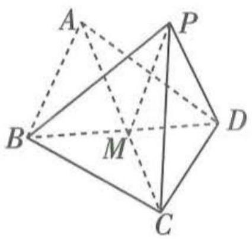

图3-1

长征二号(CZ-2) 是我国第一个大型运载火箭,用于发射低轨道重型卫星.它使我国成为世界上第3个掌握航天返回技术和航天遥感技术的国家,这对加强我国国防力量,发展国民经济具有重要意义.

关注微信公众号“初高教辅站”获取更多初高中教辅资料

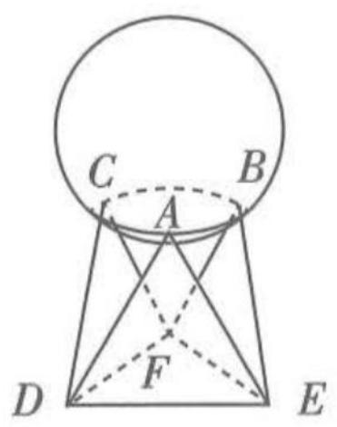

（1）

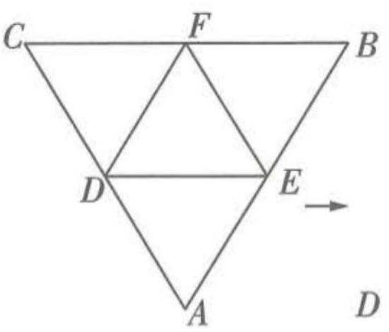

（2）

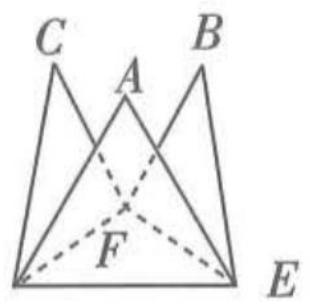

图3-2

$\quad$A. 直线 $AD$ 与平面 $DEF$ 所成的角为 $\frac{\pi}{3}$   
$\quad$B. 经过三个顶点 A, B, C 的球的截面圆的面积为 $\frac{8\pi}{3}$   
$\quad$C. 异面直线 $AD$ 与 $CF$ 所成角的余弦值为 $\frac{5}{8}$   
$\quad$D. 球面上的点到底面 $DEF$ 的最大距离为 $2 \sqrt{3} + \frac{\sqrt{6}}{3} + 2$

# 思维导引

根据直线与平面所成角的定义,确定所求的角,即可判断 A

求出 $\triangle ABC$ 外接圆的面积, 即可判断 B

作出异面直线所成的角,并求出这个角,即可判断 C

求出球心到平面 DEF 的距离, 即可判断 D

解析 根据图形的形成可知, $A, B, C$ 三点在底面 $DEF$ 上的投影分别是 $\triangle DEF$ 三边的中点 $M, N, P$ , 如图3-3所示.

对于 A, AM ⊥ 平面 DEF, ∴ ∠ADE 就是直线 AD 与平面 DEF 所成的角, 由 △ADE 是等边三角形, ∴ ∠ADE = π/3, A 正确.

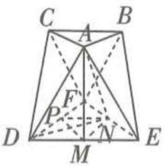

图3-3

对于 B, 连接 AC, AB, BC, 则 $\triangle ABC$ 与 $\triangle MNP$ 全等且所在平面平行, 截面圆就是 $\triangle ABC$ 【敲黑板】对于折叠后 A, B, C 在底面上射影位置的判断非常关键, 从而确定 $\triangle ABC$ 与 $\triangle MNP$ 全等

的外接圆与 $\triangle MNP$ 的外接圆, 由题意知 $\triangle MNP$ 的边长为 2 , 其外接圆半径为 $r = \frac{\sqrt{3}}{3} \times 2 = \frac{2\sqrt{3}}{3}$ , 则圆的面积 $S = \pi r^2 = \frac{4\pi}{3}$ , B 错误.

长征二号 E(CZ-2E) 是我国第一型捆绑式运载火箭. 它的研制成功, 使我国首次突破助推火箭的捆绑技术、首次研制成功推进剂利用系统和大型发射台等 36 项关键技术, 为我国运载火箭进入国际市场起到了重要的推动作用.

关注微信公众号“初高教辅站”获取更多初高中教辅资料

对于 C, 由上述条件知, AC // MP 且 AC = MP, 而 MP // FN 且 MP = FN, ∴ 四边形 ACFN 是平行四边形, ∴ CF // AN, ∴ ∠DAN 是异面直线 AD 与 CF 所成的角 (或其补角).

又 $AD = 4, DN = 2\sqrt{3}, AN = CF = 4, \cos \angle DAN = \frac{AD^2 + AN^2 - DN^2}{2AD \cdot AN} = \frac{16 + 16 - 12}{2 \times 4 \times 4} = \frac{5}{8}$ ,

【会思考】注意异面直线所成角的范围是 $(0^{\circ},90^{\circ}]$ ，所以 $\angle DAN$ 或其补角是异面直线所成角，若是解答题，丢了补角的判断会失分，特别是当求出的余弦值是负数时，需要转化成正值
C 正确.

对于 D, 由上述条件知, AB = AC = BC = 2, 设 O 是球心, 球的半径为 R, 由 $4\pi R^{2} = 16\pi$ , 解得 R = 2, 则 O - ABC 是正四面体, 棱长为 2, 设 H 为 $\triangle ABC$ 的中心, 如图 3-4, 则 $OH \perp$ 平面 ABC, 又 $CH \subset$ 平面 ABC, $\therefore OH \perp CH, CH = \frac{2\sqrt{3}}{3}$ ,

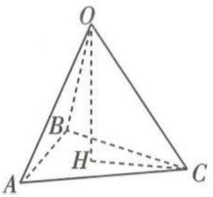

图3-4

$\therefore O H = \sqrt {2 ^ {2} - (\frac {2 \sqrt {3}}{3}) ^ {2}} = \frac {2 \sqrt {6}}{3}, \text {又} A M = 2 \sqrt {3},$

【扫清障碍】球面上的最高点到底面距离最大，球半径是定值，三个等边三角形折叠到垂直位置时的高度即三角形高为定值，因而通过求球心到球截面 $ABC$ 的距离，然后加球的半径与截面 $ABC$ 到底面的距离，即可得解

∴球面上的点到底面 DEF 的最大距离为 $2\sqrt{3} + \frac{2\sqrt{6}}{3} + 2$ , D 错误. 故选 AC.

# 命题角度2》翻折中的计算问题

通过平面图形翻折后形成的立体图形的距离、角、表面积、体积、外接(内切)球表面积和体积等的相关运算,“变”与“不变”的因素起到了核心作用.

调研 3 （原创）已知矩形 ABCD 中， $AB = 2, AD = 2\sqrt{3}$ ，将 $\triangle ABC$ 沿 AC 折叠，形成二面角 B - AC - D，设二面角 B - AC - D 的平面角为 $\theta$ ，若 $\cos \theta = \frac{1}{3}$ ，则（）

$\quad$A. ${BD} = 3\sqrt{2}$

$\quad$B. 异面直线 $AC$ 与 $BD$ 所成的角为 $\frac{\pi}{3}$

$\quad$C. 四面体 ABCD 的体积为 $\frac{4\sqrt{3}}{3}$

$\quad$D. 四面体 ABCD 外接球的体积为 $\frac{32\pi}{3}$

思维导引 对于 A, 过点 B, D 分别向 AC 作垂线, 利用两向量的夹角表示出 $\theta$ ,

长征三号(CZ-3) 是以长征二号丙火箭为基础加氢氧第三级组成的三级液体运载火箭,主要用于发射地球同步轨道有效载荷.

进而利用向量的相关知识即可得到 $BD$ ; 对于 B, 利用向量的夹角公式得到 $\cos \langle \overrightarrow{AC}, \overrightarrow{BD} \rangle$ , 即可得解; 对于 C, 根据已知条件及勾股定理的逆定理得到 $CD \perp$ 平面 ABD, 然后利用体积公式求解即可; 对于 D, 根据题意得到 $\triangle ABC$ 和 $\triangle ADC$ 都是以 $AC$ 为斜边的直角三角形, 进而得到 $AC$ 为四面体 $ABCD$ 外接球的直径, 即可求解外接球的体积.

解析 对于 A, 如图 3-5, 过点 B, D 分别作 $BE \perp AC, DF \perp AC$ , 垂足分别为 E, F, 则 $\theta = \langle \overrightarrow{EB}, \overrightarrow{FD} \rangle$ .

【策略】利用分别在两个半平面内垂直于二面角棱的向量的夹角，来替代二面角的平面角，可以避开作二面角平面角之苦！

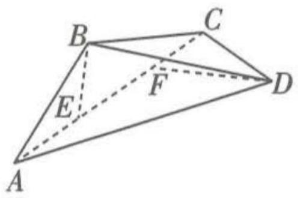

图3-5

由已知得 $EB = DF = \sqrt{3}$ , AE = CF = 1, EF = 2.

因为 $\overrightarrow{BD} = \overrightarrow{BE} +\overrightarrow{EF} +\overrightarrow{FD}$ ，所以 $|\overrightarrow{BD}|^2 = \overrightarrow{BD}^2 = \overrightarrow{BE}^2 +\overrightarrow{EF}^2 +\overrightarrow{FD}^2 +2\overrightarrow{BE}\cdot \overrightarrow{FD} = 3 + 4+$ $3 + 2\sqrt{3}\times \sqrt{3}\cos (\pi -\theta) = 8$ ，所以 $BD = 2\sqrt{2}$ ，故A错误.

对于 B, 由已知得 $\angle CAD = \frac{\pi}{6}$ , $\angle CAB = \frac{\pi}{3}$ , 则 $\overrightarrow{AC} \cdot \overrightarrow{BD} = \overrightarrow{AC} \cdot (\overrightarrow{AD} - \overrightarrow{AB}) = \overrightarrow{AC} \cdot$ $\overrightarrow{AD} - \overrightarrow{AC} \cdot \overrightarrow{AB} = 4 \times 2\sqrt{3} \cos \frac{\pi}{6} - 4 \times 2 \cos \frac{\pi}{3} = 8$ , 则 $\cos \langle \overrightarrow{AC}, \overrightarrow{BD} \rangle = \frac{\overrightarrow{AC} \cdot \overrightarrow{BD}}{|\overrightarrow{AC}| |\overrightarrow{BD}|} = \frac{8}{4 \times 2\sqrt{2}} = \frac{\sqrt{2}}{2}$ , 得 $\langle \overrightarrow{AC}, \overrightarrow{BD} \rangle = \frac{\pi}{4}$ , 所以异面直线 AC 与 BD 所成的角为 $\frac{\pi}{4}$ , 故 B 错误.

对于 C, 因为 $CD^{2} + BD^{2} = 12 = BC^{2}$ , 所以 $CD \perp BD$ , 同理可得 $AB \perp BD$ .

又 $CD \perp AD, BD \cap AD = D$ ，所以 $CD \perp$ 平面 $ABD$

所以四面体 $ABCD$ 的体积为 $\frac{1}{3} S_{\triangle ABD} \cdot CD = \frac{1}{3} \times \frac{1}{2} \times 2 \times 2\sqrt{2} \times 2 = \frac{4\sqrt{2}}{3}$ , 故 C 错误.

对于 D, 因为 $\triangle ABC$ 和 $\triangle ADC$ 都是以 AC 为斜边的直角三角形,

【注意】折叠过程中不会改变形状

则 AC 为四面体 ABCD 外接球的直径, 故四面体 ABCD 外接球的半径 $R = \frac{1}{2} AC = 2$ ,

【找球心】AC的中点到A，B，C，D四点距离相等，因而AC的中点就是外接球球心

所以四面体 ABCD 外接球的体积为 $\frac{4}{3}\pi R^{3} = \frac{32\pi}{3}$ ，故 D 正确。故选 D.

调研 4 (2022·新高考Ⅱ卷变式)如图3-6,直角三角形ABC中, AB=2,BC=1,D是斜边AC上的一动点,沿BD将△ABD翻折到△A′BD,使二面角A′-BD-C为直二面角,当线段A′C的长度最小时,四面体A′BCD的外

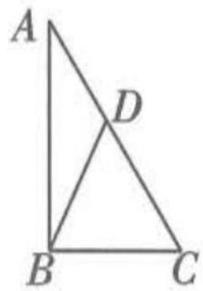  
图3-6

在 1990 年 4 月, 它首次执行国外卫星发射任务, 成功发射了“亚洲一号”卫星. 在此之后, 长征三号火箭成功发射了包括“亚太一号”卫星、“亚太一号甲”卫星、“风云二号”卫星等多颗国内外卫星.

关注微信公众号“初高教辅站”获取更多初高中教辅资料

接球的表面积为

( )

$\quad$A. $\frac{13\pi}{4}$

$\quad$B. $\frac{14\pi}{3}$

$\quad$C. $\frac{13\pi}{3}$

$\quad$D. $\frac{12\pi}{5}$

思维导引 设 $\angle A'BD = \theta, \theta \in (0^\circ, 90^\circ)$ , 作 $A'H \perp BD$ 交直线 $BD$ 于 $H$ , 连接 $CH$ , 由面面垂直的性质得 $A'H \perp$ 平面 $BCD$ , 连接 $A'C$ , 则在直角三角形 $A'HC$ 中求 $A'C$ 的最小值, 然后分析外接球, 再求表面积. 需要注意翻折“不变量”, 确定变化的量, 有助于计算.

解析 如图 3-7, 作 $A'H \perp BD$ , 交直线 $BD$ 于 $H$ , 连接 $CH$ .

设 $\angle A'BD = \theta$ ，则 $A'H = 2\sin \theta ,BH = 2\cos \theta ,HC^{2} = BH^{2} + BC^{2}-$ $2BH\cdot BC\cos (\frac{\pi}{2} -\theta) = 4\cos^2\theta +1 - 2\sin 2\theta ,$

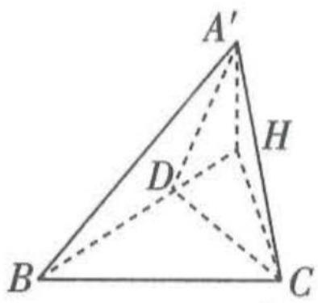

图3-7

【会思考】这里选有作为变量，有助于求解运算。同学们不妨尝试选 $AD$ 的长作为变量，对比感受计算量的差别

从而 $A'C^{2}=A'H^{2}+HC^{2}=5-2\sin2\theta$ ，那么当 $\theta=45^{\circ}$ 时， $A'C$ 的长度最小，为 $\sqrt{3}$ .

设 $\triangle BCD, \triangle A'BD$ 的外接圆半径分别为 $r_1, r_2$ , 圆心分别为 $O_2, O_1$ , 四面体 $A'BCD$ 的外接球半径为 $R$ , 球心为 $O$ , 作 $O_2E \perp BD$ 交 $BD$ 于 $E$ , 连接 $OO_2, OO_1, O_1E, O_1B$ , 如图3-8, 易知四边形 $OO_1EO_2$ 为矩形, 则 $2r_1 = \frac{CD}{\sin\angle CBD} = \frac{\frac{\sqrt{5}}{3}}{\frac{\sqrt{2}}{2}} = \frac{\sqrt{10}}{3}$ , 所以 $r_1 = \frac{\sqrt{10}}{6}$ ,

$2r_{2}=\frac{A'D}{\sin\angle A'BD}=\frac{\frac{2\sqrt{5}}{3}}{\frac{\sqrt{2}}{2}}=\frac{2\sqrt{10}}{3}$ ，所以 $r_{2}=\frac{\sqrt{10}}{3}$ .

$B D = \frac {\sqrt {1 0}}{3} \sin \angle B C D = \frac {\sqrt {1 0}}{3} \times \frac {2}{\sqrt {5}} = \frac {2 \sqrt {2}}{3}, O _ {2} E = \sqrt {r _ {1} ^ {2} - (\frac {1}{2} B D) ^ {2}} = \frac {\sqrt {2}}{6}.$

所以 $R^2 = O_1B^2 + OO_1^2 = O_1B^2 + O_2E^2 = \frac{10}{9} + \frac{1}{18} = \frac{7}{6}$ .

【会思考】本题有一定难度，其中涉及翻折问题。另外，求外接球半径时，注意 $OO_{1}$ ， $OO_{2}$ 分别垂直于平面 $A'BD$ 与BCD，利用正弦定理，分别求 $\triangle A'BD$ 与 $\triangle BCD$ 外接圆的半径，从而求球的半径，也可以再分别求 $O_{1}$ ， $O_{2}$ 到BD边的距离 $O_{1}E$ ， $O_{2}E$ （如图3-8），从而 $R^{2}=O_{1}E^{2}+O_{2}E^{2}+BE^{2}$

所以 $S_{外接球}=4\pi R^{2}=4\pi\times\frac{7}{6}=\frac{14}{3}\pi.$ 故选 B.

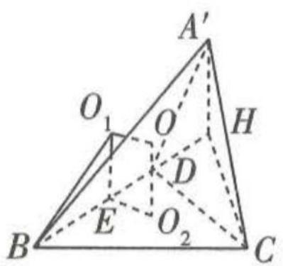

图3-8

长征二号丙火箭(CZ-2C) 是两级运载火箭,采用 N2O4/UDMH 推进剂,可安装上面级,起飞重量为 243 吨,火箭全长 40 米,一二级和整流罩直径为 3.35 米,近地轨道运载能力为 4000 千克.

关注微信公众号“初高教辅站”获取更多初高中教辅资料

# 命题角度 3 翻折中的探究问题

调研 5 (2022·四川成都第七中学考前押题)如图3-9①,在等边三角形ABC中,点D,E分别为边AB,AC上的动点,且满足 $DE \parallel BC$ ,记 $\frac{DE}{BC} = \lambda$ .将△ADE沿DE翻折到△MDE的位置,并使得平面 $MDE \perp$ 平面DECB,连接MB,MC,得到图3-9②,其中点N为MC的中点.

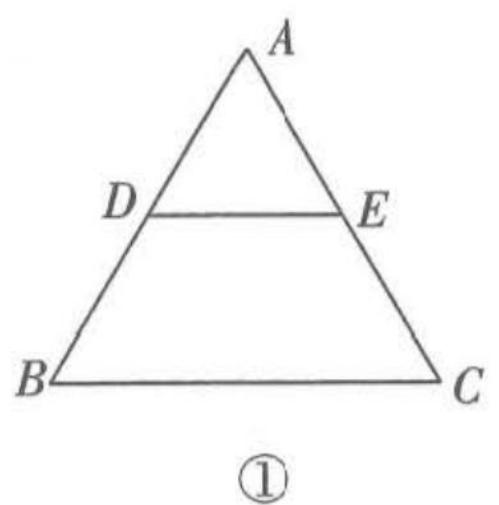

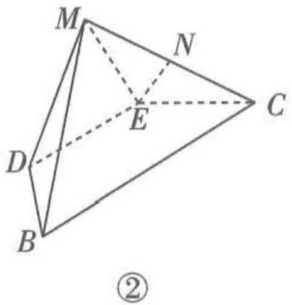

图3-9

（1） 当 $EN \parallel$ 平面 MBD 时, 求 $\lambda$ 的值.  
（2）试探究:随着 $\lambda$ 值的变化,二面角 B-MD-E 的大小是否改变?如果改变,请说明理由;如果不改变,请求出二面角 B-MD-E 的正弦值.

思维导引 （1） 首先取 $MB$ 的中点 $P$ , 连接 $DP, PN$ , 再结合线面平行的性质即可得到 $\lambda = \frac{1}{2}$ ; （2） 建立空间直角坐标系, 利用空间直角坐标系求平面的法向量, 由法向量与 $\lambda$ 值的变化无关, 确定二面角大小不变, 再利用向量夹角公式求二面角余弦值, 进而求二面角正弦值.

解析 （1） 如图 3-10, 取 $MB$ 的中点 $P$ , 连接 $DP, PN$ .

【会思考】为什么要取 $MB$ 的中点 $P$ ? 是如何观察得到? 事实上主要是利用线面平行的性质, 因为若 $EN \parallel$ 平面 $MBD$ , 过 $D, E, N$ 三点的平面交 $MB$ 于 $P$ , 那么 $EN \parallel DP, DE \parallel PN \parallel BC$ , $N$ 为 $MC$ 的中点, 则 $P$ 为 $MB$ 的中点。由此可以变式, 若 $N$ 为 $MC$ 的靠近 $C$ 的三等分点, 同样可以探究 $P$ 点的位置, 进而得到 $\lambda$ 的值。请同学们自行与该题的解题过程的思路对比分析, 体验二者的异同。备考时间紧张, 一定要学会做一题而会一类喔!

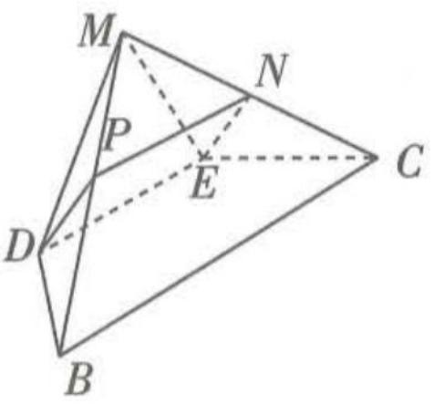

图3-10

因为 MN = CN, MP = BP, 所以 NP // BC.

又 $DE \parallel BC$ ，所以 $NP \parallel DE$ ，即 $N, E, D, P$ 四点共面，

长征二号丙系列火箭主要承担了我国返回式科学与技术试验卫星、探测一号、探测二号、海洋一号卫星、环境一号卫星和美国“铱”系列通信卫星等发射任务。

关注微信公众号“初高教辅站”获取更多初高中教辅资料

又 $EN \parallel$ 平面 $BMD, EN \subset$ 平面 $NEDP$ , 平面 $NEDP \cap$ 平面 $MBD = DP$ ,

所以 $EN \parallel PD$ ，即四边形NEDP为平行四边形，

所以 NP = DE，则 $DE = \frac{1}{2} BC$ ，即 $\lambda = \frac{1}{2}$ .

（2） 取 DE 的中点 O, 连接 MO, 则 $MO \perp DE$ , 因为平面 $MDE \perp$ 平面 DECB,

平面 $MDE \cap$ 平面 DECB = DE，且 $MO \perp DE$ ，所以 $MO \perp$ 平面 DECB.

如图3-11,建立空间直角坐标系,不妨设BC=2,则 $M(0,0,\sqrt{3}\lambda)$ , $D(\lambda,0,0)$ , $B(1,\sqrt{3}(1-\lambda),0)$ ,

所以 $\overrightarrow{MD} = (\lambda, 0, -\sqrt{3}\lambda), \overrightarrow{DB} = (1 - \lambda, \sqrt{3}(1 - \lambda), 0)$ .

设平面 BMD 的法向量为 $\boldsymbol{m}=(x,y,z)$ ，则

$\left\{ \begin{array}{l l} {\overrightarrow {M D} \cdot \pmb {m} = \lambda x - \sqrt {3}   \lambda z = 0  ,} \\ {\overrightarrow {D B} \cdot \pmb {m} = (1 - \lambda)   x + \sqrt {3}   (1 - \lambda)   y = 0  ,} \end{array} \right. \text {即} \left\{ \begin{array}{l l} {x = \sqrt {3}   z  ,} \\ {x = - \sqrt {3}   y  ,} \end{array} \right.$

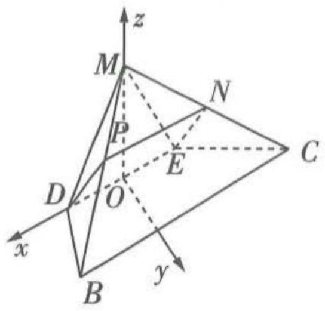

图3-11

令 $z = 1$ ，则 $x = \sqrt{3}, y = -1$ ，则 $\pmb{m} = (\sqrt{3}, -1, 1)$ 是平面BMD的一个法向量.

又平面 EMD 的一个法向量为 $\boldsymbol{n} = (0,1,0)$ ，即随着 $\lambda$ 值的变化，二面角 B-MD-E 的大小不变，

【指点迷津】两平面法向量不变，那么二面角的大小不变

所以 $\cos \langle m, n \rangle = \frac{m \cdot n}{|m||n|} = \frac{-1}{\sqrt{5}} = -\frac{\sqrt{5}}{5}$ , 则 $\sin \langle m, n \rangle = \sqrt{1 - \frac{1}{5}} = \frac{2\sqrt{5}}{5}$ .

所以二面角 B-MD-E 的正弦值为 $\frac{2\sqrt{5}}{5}$ .

# 名师叮咛

本题的第二问是翻折后在保持两面垂直的前提下探究另外一个二面角的不变性，这一不变量是隐蔽的，是通过推理与运算才得到的，因而颇具考查价值。我们就该挖掘这样的题目，这样才真正有利于素养的提升。

# 新题演练

##### 1. (2022·东北师范大学附属中学综合训练)如图3-12,在边长为4的正三角形 $ABC$ 中, $E$ 为边 $AB$ 的中点, 过 $E$ 作 $ED \perp AC$ 于 $D$ . 把 $\triangle ADE$ 沿 $DE$ 翻折至 $\triangle A_{1}DE$ 的位置, 连接 $A_{1}C, F$ 是 $A_{1}C$ 上一动点, 连接 $BF$ , $EF$ . 在翻折过程中, 其中所有正确的结论是 \_\_\_\_. (填序号)

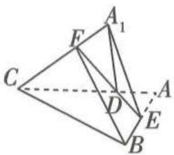

图3-12

长征二号 F 运载火箭(CZ-2F) 是捆绑四枚助推器的两级运载火箭,2003年10月15日,长征二号 F 火箭成功将中国第一位航天员杨利伟送入太空,圆了中华民族多年的“飞天梦”.

关注微信公众号“初高教辅站”获取更多初高中教辅资料

① $DE \perp A_{1}C;$   
②存在某个位置,使 $A_{1}E\perp BE$ ;  
③若 $\overrightarrow{CF}=2\overrightarrow{FA_{1}}$ ，则BF的长是定值；  
④若 $\overrightarrow{CF}=2\overrightarrow{FA_{1}}$ ，则四面体CEFB的体积最大值为 $\frac{4\sqrt{3}}{9}$ .

根据线面垂直的性质判断①②；取 AC 的中点 M，可证明 $FM \perp BM$ ，从而可计算出 BF，判断③；折叠过程中， $\triangle BCE$ 不动，当 F 到平面 ABC 的距离最大时，四面体 CEFB 的体积最大，从而计算出最大体积，即可判断④

##### 2. (2022·四川泸州二中考前仿真训练) 如图 3-13, 在梯形 $ABCD$ 中, $AB \parallel CD$ , $\angle ABC = 90^{\circ}$ , $AB = 2$ , $BC = CD = 1$ , 点 $E$ 为 $AB$ 中点, 将 $\triangle ADE$ 沿直线 $DE$ 向上折起到 $\triangle A'DE$ 的位置 (平面 $A'DE$ 与平面 $ABCD$ 不重合). 在折叠的过程中, 给出下列结论: 公众号: 拾穗者的杂货铺

①任意时刻都有 $BC \parallel$ 平面 $A'DE$ ;  
②任意时刻都有平面 $BCD \perp$ 平面 $A'BE$ ;  
③存在某个位置,使得 $AA' \perp DB$ ;  
④当平面 $A'DE \perp$ 平面 BCDE 时, 直线 AD 与平面 $A'DB$ 所成角的正弦值为 $\frac{\sqrt{6}}{3}$ .

其中所有正确结论的序号是\_\_\_\_。

##### 3. (2022·浙江新高考名校5月模拟)如图3-14,梯形ABCD中, $AB \parallel CD$ .现将梯形沿对角线AC向上折叠,连接BD.问:

（1） 若折叠前 BD 不垂直于 AC, 则在折叠过程中是否能使 $BD \perp AC$ ? 请给出证明;

（2） 若梯形 ABCD 为等腰梯形, AB = 3, CD = 5, 折叠前 $AC \perp BD$ , 求当折叠至平面 ADC 垂直于平面 ABC 时, 二面角 A - BD - C 的余弦值.

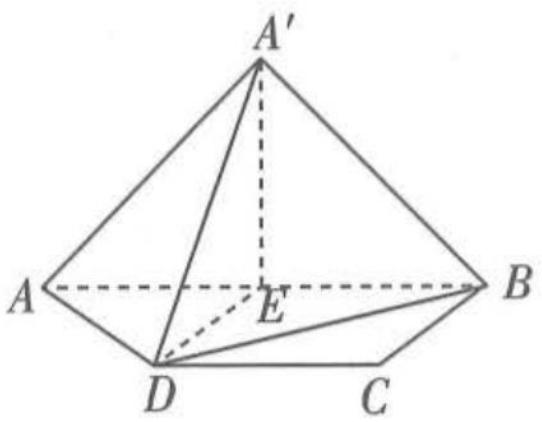

图3-13

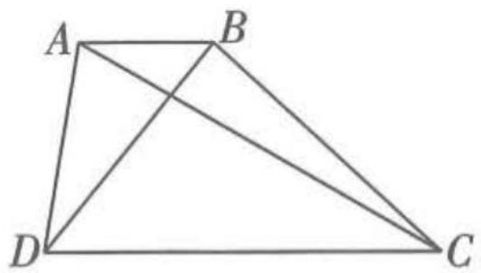

图3-14

# 参考答案与解析

##### 1. ①③④ 因为 ${DE} \bot  {DC},{DE} \bot  {A}_{1}D,{DC} \cap  {A}_{1}D = D,{DC},{A}_{1}D \subset$ 平面 ${A}_{1}{DC}$ ,

【找不变量】折叠过程中，DE与CD， $A_{1}D$ 垂直是不变量，因而始终线面垂直，同时可得折叠过程中另一不变要素是平面 $A_{1}CD$ 与平面ABC垂直，这时判断②很关键

所以 $DE \perp$ 平面 $A_{1}DC$ ，又 $A_{1}C \subset$ 平面 $A_{1}DC$ ，所以 $DE \perp A_{1}C$ ，①正确.

假设存在某个位置,使 $A_{1}E \perp BE$ , 如图 3-15, 连接 $A_{1}A, A_{1}B$ .

截至2016年10月,长征二号F火箭已发射13次,发射成功率100%,共发射了6艘载人飞船、5艘无人飞船和2个空间实验室.

连接 CE, 在正三角形 ABC 中, 因为 BE = AE, 所以 $CE \perp AB$ , 又 $CE \cap A_{1}E = E, CE, A_{1}E \subset$ 平面 $A_{1}CE$ ,

所以 $AB \perp$ 平面 $A_{1}CE$ ，而 $A_{1}C \subset$ 平面 $A_{1}CE$ ，所以 $AB \perp A_{1}C$ ，

由①的判断有 $DE \perp A_{1}C$ ，且 $DE \cap AB = E, DE \subset$ 平面 ABC, $AB \subset$ 平面 ABC，所以 $A_{1}C \perp$ 平面 ABC.

又 $DC \subset$ 平面 $ABC$ , 所以 $A_{1}C \perp DC$ , 则 $A_{1}D > CD$ , 这是不可能的,事实上， $A_{1}D=AD=AE\cos60^{\circ}=\frac{1}{2}AE=\frac{1}{4}AB=\frac{1}{4}AC=\frac{1}{3}CD$ ，②错误.

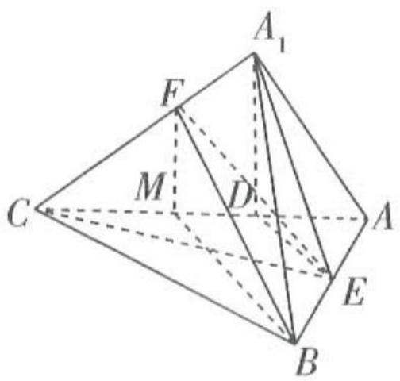

图3-15

【易得】用同等铺设多折文：当所到使 $A_{1}A=A_{1}B$ 时，由等腰三角的性质得 $A_{1}E \perp BE$ ，且两作二（2）正确。事实上，在折叠过程中，由1得之 $A_{1}$ 在底面上的射影始设在AC上，可以撇开运算。直接判断（2）错误

如图 3-15, 设 $M$ 是 $AC$ 的中点, 连接 $FM, BM$ , 则 $BM \perp AC$ , 所以 $BM \parallel DE$ ,

从而 $BM \perp A_{1}D, D$ 是 AM 中点，所以 CM = AM = 2MD，若 $\overrightarrow{CF} = 2\overrightarrow{FA_{1}}$ ，即 $CF = 2FA_{1}$ ，则 $FM \parallel A_{1}D$ ，所以 $BM \perp FM$ ，且由 $FM \parallel A_{1}D$ 得 $\triangle CFM \sim \triangle CA_{1}D$ ，

所以 $\frac{FM}{A_1D} = \frac{CM}{CD} = \frac{2}{3}$ , 又 $\triangle ABC$ 边长为 4, 则 $A_1D = 1$ , $FM = \frac{2}{3} \times 1 = \frac{2}{3}$ , $BM = 2\sqrt{3}$ , $BF = \sqrt{BM^2 + FM^2} = \sqrt{(2\sqrt{3})^2 + (\frac{2}{3})^2} = \frac{4\sqrt{7}}{3}$ 为定值, ③正确.

折叠过程中, $A_{1}D$ 长度不变, $\triangle BCE$ 不动, 当 $F$ 到平面 $ABC$ 的距离最大时, 四面体 $CEFB$ 的体积最大, 由③的判断知当 $A_{1}D \perp$ 平面 $ABC$ 时, $F$ 到平面 $ABC$ 的距离最大且为 $\frac{2}{3} A_{1}D = \frac{2}{3}$ , 又 $S_{\triangle BCE} = \frac{1}{2} \times \frac{\sqrt{3}}{4} \times 4^{2} = 2\sqrt{3}$ , 所以所求最大值为 $\frac{1}{3} \times 2\sqrt{3} \times \frac{2}{3} = \frac{4\sqrt{3}}{9}$ , ④正确. 故正确的结论为①③④.

##### 2. ①②④ 由题意得 $BE \parallel CD, BE = CD$ , 所以四边形 $BCDE$ 是平行四边形, 所以 $BC \parallel DE$ .

【我不变量】BC//DE 是不变的位置关系

又 $BC \not\subset$ 平面 $A'DE, DE \subset$ 平面 $A'DE$ , 所以 $BC \parallel$ 平面 $A'DE$ , 故①正确.

由 $BC \parallel DE$ 知, $DE \perp BE$ , $DE \perp A'E$ , 又 $A'E \cap BE = E$ , $A'E$ , $BE \subset$ 平面 $A'BE$ , 所以 $DE \perp$

【抓不变量】 $DE \perp BE, DE \perp AE$ 是不变的位置关系

平面 $A'BE$ ,

又 $DE \subset$ 平面 $BCD$ , 所以平面 $BCD \perp$ 平面 $A'BE$ , 故②正确.

因为 $\overrightarrow{AA'} = \overrightarrow{EA'} - \overrightarrow{EA}$ , $\overrightarrow{BD} = \overrightarrow{EA} + \overrightarrow{ED}$ , 所以 $\overrightarrow{AA'} \cdot \overrightarrow{BD} = (\overrightarrow{EA'} - \overrightarrow{EA})(\overrightarrow{EA} + \overrightarrow{ED}) = \overrightarrow{EA'} \cdot \overrightarrow{EA} - \overrightarrow{EA}^2 = 1 \times 1 \times \cos \angle AEA' - 1 = \cos \angle AEA' - 1$ . 由平面 $A'DE$ 与平面 ABCD 不重合知 $\cos \angle AEA' \neq 1$ , 即 $\overrightarrow{AA'} \cdot \overrightarrow{BD} \neq 0$ , 所以不存在某个位置使得 $AA' \perp DB$ , 故③错误.

【换个思路】由 $DE \perp$ 平面 $A'EB$ 得 $DE \perp AA'$ ，若 $AA' \perp DB$ ，那么 $AA' \perp$ 平面 $BCDE$ ，这是不可能的，故③错误

因为平面 $A'DE \perp$ 平面 $BCDE, DE \perp A'E$ 且 $DE$ 是平面 $A'DE$ 与平面 $BCDE$ 的交线，

所以 $A'E \perp$ 平面 $BCDE$ , 所以 $V_{A'-ABD} = \frac{1}{3} \times A'E \times \frac{1}{2} \times DE \times AB = \frac{1}{3} \times 1 \times \frac{1}{2} \times 2 \times 1 = \frac{1}{3}$ .

设 A 到平面 $A'DB$ 的距离为 h, AD 与平面 $A'DB$ 所成的角为 $\theta, AD = \sqrt{DE^{2} + EA^{2}} = \sqrt{2}$ ，由等体积法知 $\frac{1}{3}h \times \frac{\sqrt{3}}{4} \times (\sqrt{1^{2} + 1^{2}})^{2} = \frac{1}{3}$ ，解得 $h = \frac{2\sqrt{3}}{3}$ ，所以 $\sin \theta = \frac{h}{AD} = \frac{2\sqrt{3}}{3\sqrt{2}} = \frac{\sqrt{6}}{3}$ ，故④正确.

【会思考】不需要作出线面角，通常用等体积法求线上某点到平面的距离 d，记斜线段长度为 m，线面角为 $\alpha$ ，那么 $\sin \alpha = \frac{d}{m}$

故答案为①②④.

##### 3. （1） 假设折叠过程中能使 $BD \perp AC$ .

①折叠前, $BD$ 不垂直于 $AC$ , 若 $DE \perp AC, E$ 为垂足, 连接 $BE$ , 则 $BE$ 与 $AC$ 不垂直.  
②折叠后,如图3-16,若 $BD\perp AC$ , $DE\perp AC$ 不变,又BD与DE是平面BDE内的相交直线,故 $AC\perp$ 平面BDE.

又 $BE \subset$ 平面 BDE, 从而有 $AC \perp BE$ , 根据折叠不变性, 折叠前也应有 $AC \perp BE$ .

显然①与②矛盾,故假设不能成立,即折叠过程中不能使 $BD \perp AC$ .

（2） 设折叠前 $AC$ 与 $BD$ 的交点为 $F$ , 则由题意易知 $AF = BF = \frac{3\sqrt{2}}{2}$ ,

$D F = C F = \frac {5 \sqrt {2}}{2}.$

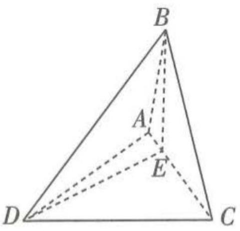

图3-16

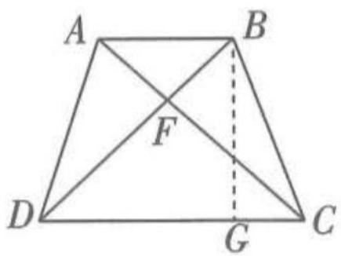

图3-17

长征三号甲火箭主要承担了风云气象卫星、北斗导航卫星和“嫦娥一号”月球探测器的发射任务。

①折叠前,如图3-17,在梯形ABCD内过B作BG⊥CD,垂足为G,

则 $CG = 1, BG = DG = 4, AD = BC = \sqrt{17}$ .

②折叠后,因为平面 ADC 垂直于平面 ABC,而 $DF \perp AC, BF \perp AC$ ,所以 $DF \perp BF$ ,所以

$B D = \sqrt {B F ^ {2} + D F ^ {2}} = \sqrt {\left(\frac {3 \sqrt {2}}{2}\right) ^ {2} + \left(\frac {5 \sqrt {2}}{2}\right) ^ {2}} = \sqrt {1 7}.$

又 BF 和 DF 是平面 BDF 内的相交直线, 所以 $AC \perp$ 平面 BDF, 所以 $AC \perp BD$ .

方法一 如图 3-18, 过点 C 在平面 BCD 内作 $CH \perp BD$ , H 为垂足, 连接 AH.

又 $CH \cap CA = C$ ，则 $BD \perp$ 平面 ACH.

又 $AH \subset$ 平面 ACH, 所以 $BD \perp AH$ ,

故 $\angle AHC$ 即二面角 A-BD-C 的平面角.

在 $\triangle BDC$ 中， $BD = BC = \sqrt{17}$ ， $DC = 5$ ，所以 $\cos \angle BDC = \frac{5}{2\sqrt{17}}$ 。

又 $0 < \angle BDC < \pi$ ，则 $\sin \angle BDC = \frac{\sqrt{43}}{2\sqrt{17}}$ ，得 $DH = \frac{25}{2\sqrt{17}}, HC =$

$\frac{5\sqrt{43}}{2\sqrt{17}},AH = \sqrt{AD^2 - DH^2} = \frac{3\sqrt{59}}{2\sqrt{17}},AC = 4\sqrt{2}$ ，所以 $\cos \angle AHC = \frac{AH^2 + HC^2 - AC^2}{2AH\cdot HC} =$ $-\frac{19}{\sqrt{2537}},$

即二面角 A-BD-C 的余弦值为 $-\frac{19}{2537}\sqrt{2537}$ .

方法二 如图 3-19, 以 $F$ 为原点, 分别以直线 $FD, FC, FB$ 为 $x$ 轴, $y$ 轴, $z$ 轴建立空间直角坐标系, 则 $F(0,0,0), D(\frac{5\sqrt{2}}{2},0,0), C(0,\frac{5\sqrt{2}}{2},0), B(0,0,\frac{3\sqrt{2}}{2}), A(0,-\frac{3\sqrt{2}}{2},0)$ .

所以 $\overrightarrow{BD} = (\frac{5\sqrt{2}}{2}, 0, -\frac{3\sqrt{2}}{2}), \overrightarrow{AB} = (0, \frac{3\sqrt{2}}{2}, \frac{3\sqrt{2}}{2}), \overrightarrow{BC} = (0, \frac{5\sqrt{2}}{2}, -\frac{3\sqrt{2}}{2})$ .

设平面 ABD 的法向量为 $\boldsymbol{n}=(x_{1},y_{1},z_{1})$ ，则 $\overrightarrow{BD}\cdot\boldsymbol{n}=0,\overrightarrow{AB}\cdot\boldsymbol{n}=0.$

则 $\left\{\begin{aligned}\frac{5\sqrt{2}}{2}x_{1}-\frac{3\sqrt{2}}{2}z_{1}&=0,\\ \frac{3\sqrt{2}}{2}y_{1}+\frac{3\sqrt{2}}{2}z_{1}&=0,\end{aligned}\right.$ 令 $x_{1}=3$ ，则 $y_{1}=-5,z_{1}=5$ ，

则 $\boldsymbol{n}=(3,-5,5)$ 为平面 ABD 的一个法向量.

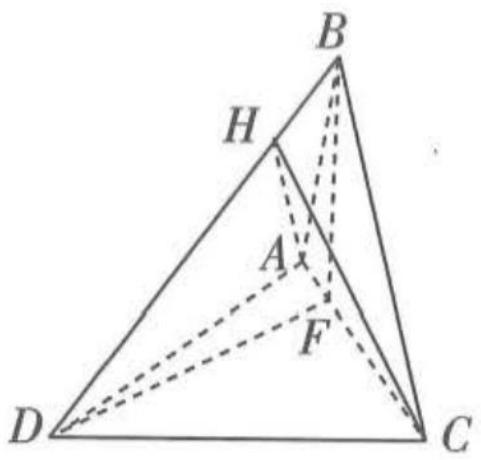

图3-18

设平面 BCD 的法向量 $\boldsymbol{m}=(x_{2},y_{2},z_{2})$ ,

则 $\overrightarrow{BD}\cdot m=0,\overrightarrow{BC}\cdot m=0.$

则 $\left\{\begin{aligned}\frac{5\sqrt{2}}{2}x_{2}-\frac{3\sqrt{2}}{2}z_{2}&=0,\\ \frac{5\sqrt{2}}{2}y_{2}-\frac{3\sqrt{2}}{2}z_{2}&=0,\end{aligned}\right.$ 令 $x_{2}=3$ ，则 $y_{2}=3,z_{2}=5$ ，

则 $\boldsymbol{m}=(3,3,5)$ 为平面 BCD 的一个法向量.

记二面角 A - BD - C 的平面角为 $\varphi$ ，

则 $|\cos \varphi| = \frac{|\pmb{n} \cdot \pmb{m}|}{|\pmb{n}| |\pmb{m}|} = \frac{|3 \times 3 - 5 \times 3 + 5 \times 5|}{\sqrt{9 + 9 + 25} \times \sqrt{9 + 25 + 25}} = \frac{19}{\sqrt{2537}}.$

易知二面角 A-BD-C 为钝角, 故二面角 A-BD-C 的余弦值为 $-\frac{19\sqrt{2537}}{2537}$ .

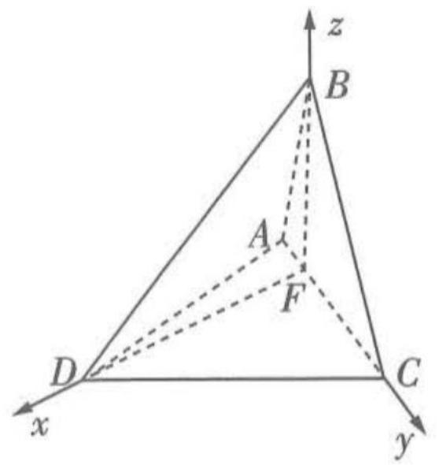

图3-19

# 超重点 4 巧用展开图为空间问题与平面问题搭桥

# 特约名师

赵成海 正高级教师,河北省优秀教师,省级骨干教师.中国数学奥林匹克一级教练员,中国科学技术学会、中国数学会会员.在国家级及省级等各类专业报纸杂志上发表教育教学论文三百余篇.

# 命题角度1 局部展开求最值

调研 1 (2022·浙江名校5月联考改编)(多选)如图4-1,在棱长为1的正方体 $ABCD - A_{1}B_{1}C_{1}D_{1}$ 中,点 $P$ 是线段 $AD_{1}$ 上的动点,则以下四个命题中是真命题的有()

$\quad$A. 异面直线 $PC_{1}$ 与 $B_{1}C$ 所成角的大小为定值

$\quad$B. 二面角 $P - BC_{1} - D$ 的大小为定值

$\quad$C. 若 Q 是对角线 $AC_{1}$ 上一点, 则 $PQ + QC$ 的最小值为 $\frac{4}{3}$

$\quad$D. 若 R 是线段 BD 上一动点, 则直线 PR 与直线 $A_{1}C$ 不可能平行

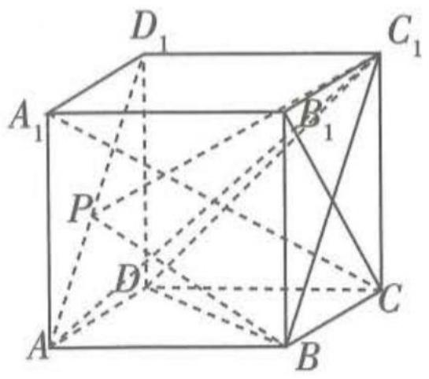

图4-1

该火箭主要承担了委星1号、巴星1R、尼星1R、W3C、亚太七号、中星十一号、中星十二号、玻利维亚星等国际国内通信卫星和“嫦娥三号”月球探测器的发射任务。

解析 对于 A, 由正方体的性质可知, $B_{1}C \perp$ 平面 $ABC_{1}D_{1}$ . 又 $PC_{1} \subset$ 平面 $ABC_{1}D_{1}$ , 所以 $B_{1}C \perp PC_{1}$ , 所以异面直线 $PC_{1}$ 与 $B_{1}C$ 所成的角为定值, 故 A 为真命题.

对于 B, 平面 $PBC_{1}$ 即平面 $ABC_{1}D_{1}$ ，平面 $ABC_{1}D_{1}$ 与平面 $BC_{1}D$ 所成的二面角为定值，故二面角 $P - BC_{1} - D$ 的大小为定值，故 B 为真命题.

【指点迷津】点 $P$ 的位置发生变化,但二面角的两个半平面不变,因而二面角的大小不变

对于 C, 连接 AC, 将平面 $ACC_{1}$ 沿直线 $AC_{1}$ 翻折到平面 $ABC_{1}D_{1}$ 内, 平面图如图 4-2 所示. 过点 C 作 $CP \perp AD_{1}$ 于 P, $CP \cap AC_{1} = Q$ , $CP \cap BC_{1} = E$ , 此时 $D_{1}$ $C_{1}$ $PQ + QC$ 的值最小. 由题可知, $CC_{1} = 1$ , $CA = \sqrt{2}$ , $AC_{1} = \sqrt{3}$ , $\angle D_{1}AC_{1} = \angle C_{1}AC = \angle AC_{1}B$ , 则 $\sin \angle C_{1}AC = \frac{\sqrt{3}}{3}$ , $\cos \angle C_{1}AC = \frac{\sqrt{6}}{3}$ , 则 $\angle CC_{1}E = \frac{\pi}{2} - 2\angle C_{1}AC$ , 则 $\sin \angle CC_{1}E = \cos 2\angle C_{1}AC = 2\cos^{2}\angle C_{1}AC - 1 = \frac{1}{3}$ , 故

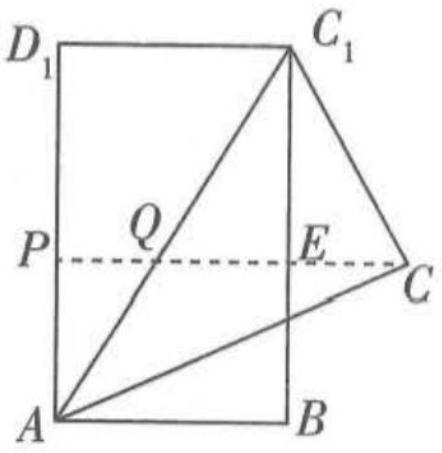

图4-2

$EC = CC_{1} \times \sin \angle CC_{1}E = \frac{1}{3}$ ，又 PE = AB = 1，故 $PQ + QC$ 的最小值为 $\frac{4}{3}$ ，故 C 为真命题.

【点选】这是本专题所要阐述的核心内容，本题中 $PQ$ ， $QC$ 分别在两个相交平面内，因而绕交线翻折其中一个平面；使两个半平面形成一个平面，那么过 $C$ 作 $AD_{1}$ 的垂线，交 $AC_{1}$ 于点 $Q$ ，此时 $PQ + QC$ 最小，这里不需要几何体的展开图，只需局部展开，利用平面图形中的距离解决空间两线段长的和的最值

对于 D, 在正方体 $ABCD - A_{1}B_{1}C_{1}D_{1}$ 中, 易证 $A_{1}C \perp$ 平面 $BDC_{1}$ , 连接 AC, $A_{1}D$ , $A_{1}B$ , $A_{1}C_{1}$ , 设 $AC \cap BD = O$ , 连接 $A_{1}O$ , $C_{1}O$ , 易知 $\angle A_{1}OC_{1}$ 即二面角 $A_{1} - BD - C_{1}$ 的平面角, 又正方体的棱长为 1, 则 $A_{1}C_{1} = \sqrt{2}$ , $AO = OC = \frac{\sqrt{2}}{2}$ , 则 $A_{1}O = C_{1}O = \frac{\sqrt{6}}{2}$ , 由余弦定理得 $\cos \angle A_{1}OC_{1} = \frac{A_{1}O^{2} + C_{1}O^{2} - A_{1}C_{1}^{2}}{2 \cdot A_{1}O \cdot C_{1}O} = \frac{1}{3}$ , 故 $0 < \angle A_{1}OC_{1} < \frac{\pi}{2}$ , 同理得 $\frac{\pi}{2} < \angle AOC_{1} < \pi$ , 故在 $AA_{1}$ 上必然存在一点 M, 连接 MB, MD, 使得二面角 $M - BD - C_{1}$ 为 $\frac{\pi}{2}$ , 即平面 $MBD \perp$ 平面 $BDC_{1}$ , 平面 MBD 与平面 $ADD_{1}A_{1}$ 的交线为 MD, 则 $MD \cap AD_{1} = P$ , 过点 P 作 BD 的垂线 PR, 垂足为 R, 此时 $PR \perp$ 平面 $BDC_{1}$ , 又 $A_{1}C \perp$ 平面 $BDC_{1}$ , 故 $PR \parallel A_{1}C$ , 故 D 为假命题. 故选 ABC.

调研 2 (2022·江苏苏州八校三模)(多选)在棱长为1的正方体 $ABCD - A_{1}B_{1}C_{1}D_{1}$ 中,点 $P$ 满足 $\overrightarrow{DP} = \lambda \overrightarrow{DD_1} + \mu \overrightarrow{DA}, \lambda \in [0,1], \mu \in [0,1]$ ,则下列说法正确的是 ( )

$\quad$A. 当 $\lambda = \mu$ 时, $BP \perp AC_{1}$   
$\quad$B. 当 $\mu = \frac{1}{2}$ 时, 三棱锥 $C_{1} - PB_{1}C$ 的体积为定值  
$\quad$C. 当 $\lambda + \mu = 1$ 时, PC + PB 的最小值为 $\sqrt{3 + \sqrt{3}}$   
$\quad$D. 当 $\lambda^2 + \mu^2 = 1$ 时, 存在唯一的点 $P$ , 使得点 $P$ 到 $AB$ 的距离等于到 $DD_1$ 的距离

思维导引 根据已知条件, 点 P 是在正方形 $ADD_{1}A_{1}$ 内部的动点, 结合向量关系, 分别对选项进行空间关系的判断和求值即可.

解析 如图 4-3, 当 $\lambda = \mu$ 时, $P$ 的轨迹为线段 $DA_{1}$ , 即 $BP$ 在平面 $A_{1}BD$ 内, 体对角线 $AC_{1} \perp$ 平面 $A_{1}BD$ , 所以 $BP \perp AC_{1}$ ,

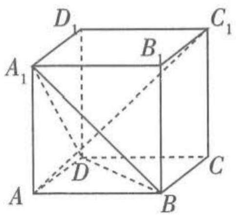

图4-3

【点拨】这里 $AC_{1} \perp$ 平面 $A_{1}BD$ 是个基本结论，在解选择题、填空题时可直接应用

故 A 正确.

如图4-4, 当 $\mu = \frac{1}{2}$ 时, 点 $P$ 的轨迹为线段 $EF(E, F$ 分别为 $AD, A_1D_1$ 的中点), 直线 $EF \parallel$ 平面 $BCC_1B_1$ , 故三棱锥 $C_1 - PB_1C$ 的体积 $V_{C_1 - PB_1C} = V_{P - C_1B_1C}$ , 为定值, 故 B 正确.

连接 $AD_{1}, BC_{1}, CD_{1}, AC$ ，作出平面 $ABC_{1}D_{1}$ ，如图 4-5，当 $\lambda + \mu = 1$ 时，点 P 的轨迹为线段 $D_{1}A$ ，将 $\triangle CD_{1}A$ 沿 $AD_{1}$ 旋转至平面 $D_{1}ABC_{1}$ 内，连接 BC，

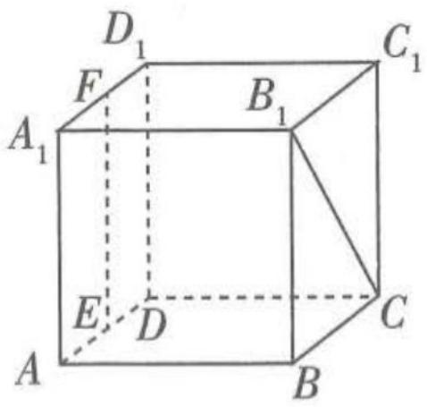

图4-4

【点拨】这里利用了平面向量三点共线的结论

可知 $PC + PB \geqslant CB$ ，由余弦定理可 $CB = \sqrt{1 + 2 + 2 \times 1 \times \sqrt{2} \times \frac{\sqrt{3}}{2}} =$

【敲黑板】连接BC交 $AD_{1}$ 于点P，由两点间线段最短，此时 $PC+PB$ 最小，所以展开成平面图是关键

$\sqrt{3+\sqrt{6}}$ , 故 C 错误.

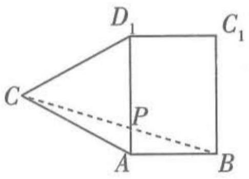

图4-5

主要用于发射空间站、探月三期、下一代地球静止轨道卫星等任务. 2016 年 11 月 3 日, 长征五号火箭首飞取得圆满成功.

如图4-6, 当 $\lambda^2 + \mu^2 = 1$ 时, 点 $P$ 的轨迹为以 $D$ 为圆心, 1 为半径的四分之一圆弧 $\widehat{D_1A}$ , 由点 $P$ 到 $AB$ 的距离等于到 $DD_1$ 的距离, 即点 $P$ 到点 $A$ 的距离等于到 $DD_1$ 的距离, 则点 $P$ 的轨迹为以 $A$ 为焦点, 以直线 $DD_1$ 为准线的抛物线在侧面 $ADD_1A_1$ 内的部分, 故存在唯一的点 $P$ , 使得点 $P$ 到 $AB$ 的距离等于到 $DD_1$ 的距离, 故 D 正确. 故选 ABD.

【难点突破】点 $P$ 有两个限制条件，均在平面 $ADD_{1}A_{1}$ 内研究，结合解析几何中抛物线的定义知点 $P$ 在抛物线上，另一个限制条件是圆弧，两曲线有且只有一个公共点，从而确定结论

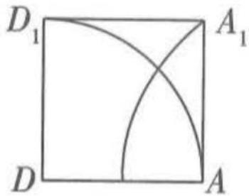

图4-6

# 命题角度2 将展开图还原，确定位置关系或数量关系

调研 3 (2022·江西宜春丰城中学5月模拟)棱长为 $\sqrt{2}$ 的正方体的展开图如图4-7所示. 已知H为线段BF的中点, 动点P在正方体的表面上运动, 则关于该正方体, 下列说法正确的有\_\_\_\_(填正确答案的序号).

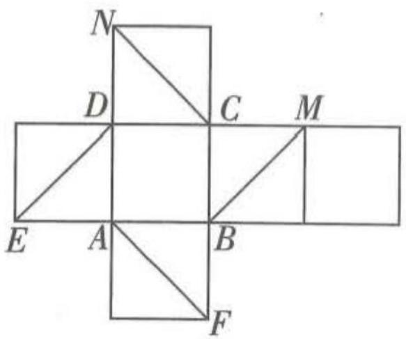

图4-7

①BM 与 AN 是异面直线；  
②AF 与 BM 所成角为 $60^{\circ}$ ;  
③平面 CDEF ⊥ 平面 ABMN;  
④若 $AM \perp HP$ ，则点 P 的运动轨迹长度为 6.

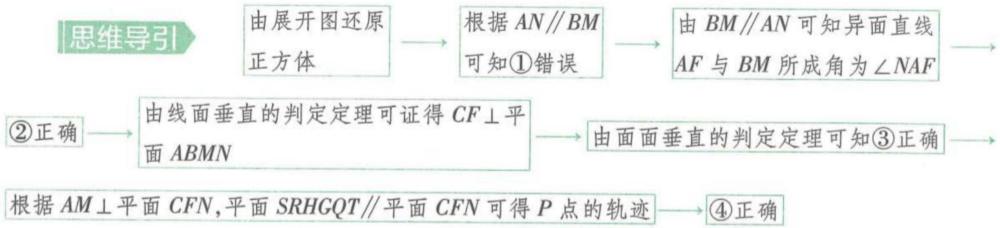

解析 由展开图还原正方体,如图4-8所示,连接FC.

对于①,∵MN∥AB,MN=AB,∴四边形MNAB为平行四边形,∴AN∥BM,①错误.

对于②,∵ $BM \parallel AN$ , ∴ AF 与 BM 所成角即 $\angle NAF$ . ∵ AN = NF = AF, ∴ $\triangle ANF$ 为等边三角形, ∴ $\angle NAF = 60^{\circ}$ , 即 AF 与 BM 所成角为 $60^{\circ}$ , ②正确.

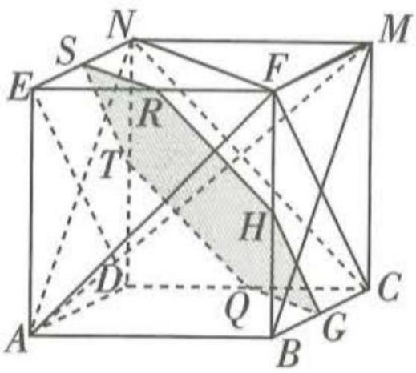

图4-8

对于③,∵AB⊥平面BCMF,CF⊂平面BCMF,∴AB⊥CF.又CF⊥BM,AB∩BM=

B, AB, BM ⊂ 平面 ABMN, ∴ CF ⊥ 平面 ABMN. 又 CF ⊂ 平面 CDEF, ∴ 平面 CDEF ⊥ 平面 ABMN, ③ 正确.

对于④,由正方体性质可知 $AM \perp$ 平面 $CFN$ ,分别取 $BC,CD,DN,NE,EF$ 的中点 $G$ , $Q,T,S,R$ ,连接 $HG,GQ,QT,ST,SR,RH$ ,则平面 $SRHGQT \parallel$ 平面 $CFN$ ,∴ 点 $P$ 的轨迹为正六边形 $SRHGQT$ 的边,∴ 点 $P$ 的轨迹长度为 $6 \times \sqrt{(\frac{\sqrt{2}}{2})^2 + (\frac{\sqrt{2}}{2})^2} = 6$ ,④正确. 故填②③④.

调研 4 (2022·河北沧州 5 月考前冲刺)(多选)如图 4-9 是四棱锥 P-ABCD 的平面展开图, 四边形 ABCD 是矩形, $ED \perp DC$ , $FD \perp DA$ , DA = 3, DC = 2, $\angle FAD = 30^{\circ}$ . 在四棱锥 P-ABCD 中, M 为棱 PB 上一点(不含端点), 则下列说法不正确的是 ( )

$\quad$A. $AM + CM$ 的最小值为 $\frac{\sqrt{7} + 3\sqrt{3}}{8}$   
$\quad$B. 存在点 M, 使得 $DM \perp BC$   
$\quad$C. 四棱锥 P-ABCD 外接球的体积为 $\frac{16\pi}{3}$   
$\quad$D. 三棱锥 $M - PAD$ 的体积等于三棱锥 $M - PCD$ 的体积

思维导引 已知给出的是几何体的展开图,要解决的是空

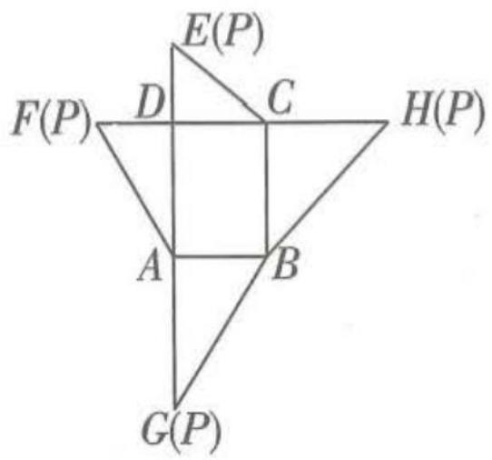

图4-9

间几何体问题,因而把平面图形还原得到原四棱锥,则可得 $PD \perp$ 平面ABCD,分别在Rt△ADP,Rt△CDP和Rt△PBD中求出PD,PC,PB的长,再逐个分析判断即可.

解析 根据平面展开图还原,得到原四棱锥,如图 4-10 所示.

由原平面图中 $ED \perp DC, FD \perp DA$ , 可知 $PD \perp DC, PD \perp DA$ , $DC \cap DA = D$ ,

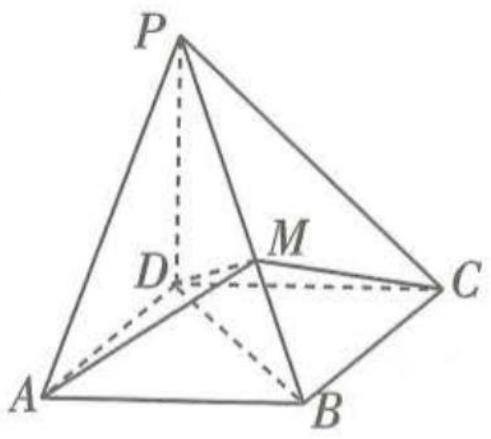

图4-10

【敲黑板】这里也体现了折叠前后不变量的应用

所以 $PD \perp$ 平面 ABCD.

在 Rt△ADP 中，∠PAD = 30°, DA = 3，故 PD = 3tan 30° = √3.

在 Rt△CDP 中， $PC=\sqrt{PD^{2}+DC^{2}}=\sqrt{3+4}=\sqrt{7}$ .

在矩形 ABCD 中, DA = 3, DC = 2, DB = $\sqrt{2^{2} + 3^{2}} = \sqrt{13}$ .

连接 $DB$ ，在 $\mathrm{Rt}\triangle PBD$ 中， $PB = \sqrt{PD^2 + DB^2} = \sqrt{3 + 13} = 4.$

对于 A, 将平面 PAB 与平面 PBC 展开成一个平面, 当 A, M, C 三点共线时, $AM + CM$

长征七号运载火箭 是捆绑四个助推器的两级液体火箭,其芯一、二级直径为3.35米,助推器直径为2.25米,均采用液氧煤油发动机.主要用于载人航天以及中型卫星的发射任务.

关注微信公众号“初高教辅站”获取更多初高中教辅资料最小,此时 A, P, B, C 四点共圆,且该圆的直径为 PB = 4 ,而 $\sin\angle APC = \sin(\angle APB + \angle CPB) = \frac{\sqrt{7} + 3\sqrt{3}}{8}$ , 所以 $AC = 4 \times \frac{\sqrt{7} + 3\sqrt{3}}{8} = \frac{\sqrt{7} + 3\sqrt{3}}{2}$ , 故 A 错误.

对于 B, 假设 $DM \perp BC$ , 因为 $PD \perp$ 平面 ABCD, $BC \subset$ 平面 ABCD, 所以 $PD \perp BC$ . 因为 $PD \cap DM = D$ , 所以 $BC \perp$ 平面 PBD. 因为 $BD \subset$ 平面 PBD, 所以 $BC \perp BD$ , 与已知四边形 ABCD 是矩形的条件矛盾, 故 B 错误.

对于 C, 将此四棱锥补形成一个长方体, PB 为长方体的一条体对角线, 同时也是四棱锥 P-ABCD 外接球的直径, 所以该球的半径 R=2 , 其体积 $V=\frac{4}{3}\pi \times 2^{3} = \frac{32\pi}{3}$ , 故 C 错误.

【换个思路】由于 $\triangle ADP$ ， $\triangle PBD$ ， $\triangle CDP$ 均为直角三角形，因而 PB 的中点到四棱锥各顶点距离相等，即为外接球球心，球的半径 $R = \frac{1}{2}PB = 2$

对于 D, 因为 $\frac{V_{M-PAD}}{V_{B-PAD}} = \frac{MP}{BP}, \frac{V_{M-PCD}}{V_{B-PCD}} = \frac{MP}{BP}$ ，而 $V_{B-PAD} = V_{P-BAD} = V_{P-BCD} = V_{B-PCD}$ ，所以 $V_{M-PAD} = V_{M-PCD}$ ，故 D 正确。故选 ABC.

# 新题演练

##### 1. (2022·四川成都石室中学第四次联测)如图4-11是一个几何体的平面展开图,其中四边形ABCD为正方形,E,F分别为PA,PD的中点,在此几何体中,给出下面四个结论:

①直线 BE 与直线 CF 异面；  
②直线 BE 与直线 AF 异面；  
③直线 EF// 平面 PBC;  
④平面 BCE⊥平面 PAD.

其中正确结论的个数是

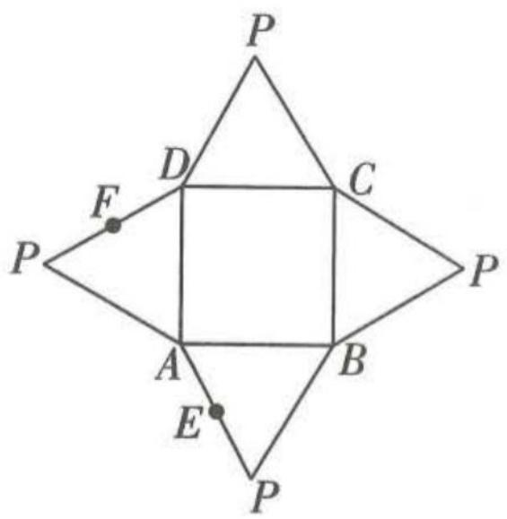

图4-11

( )

$\quad$A. 1

$\quad$B.2

$\quad$C. 3

$\quad$D. 4

##### 2. (原创)(多选)在长方体 $ABCD - A_{1}B_{1}C_{1}D_{1}$ 中, $AB = 3$ , $AD = AA_{1} = 4$ , $P$ 是线段 $BC_{1}$ 上的一动点, 则下列说法正确的是 ( )

$\quad$A. $A_{1}P \parallel$ 平面 $AD_{1}C$

$\quad$B. $A_{1}P$ 与平面 $BCC_{1}B_{1}$ 所成角的正切值的最大值是 $\frac{2\sqrt{2}}{3}$

$\quad$C. $A_{1}P + PC$ 的最小值为 $\sqrt{17} + 2\sqrt{2}$

$\quad$D. 以 $A$ 为球心, 5 为半径的球面与侧面 $BCC_{1}B_{1}$ 的交线长是 $2 \pi$

##### 3. (2022·全国统一考试6月模拟演练)图4-12为正三棱柱 $ABC - DEF$ 的一个展开图, 若 $A, A_{1}, A_{2}, D, D_{1}, D_{2}$ 六点在同一个圆周上, 则在原正三棱柱中, 直线 $AE$ 和直线 $BF$ 所成角的余弦值是 ( )

$\quad$A. $\frac{5}{8}$

$\quad$B. $\frac{5}{7}$

$\quad$C. $\frac{3\sqrt{3}}{8}$

$\quad$D. $\frac{3\sqrt{3}}{7}$

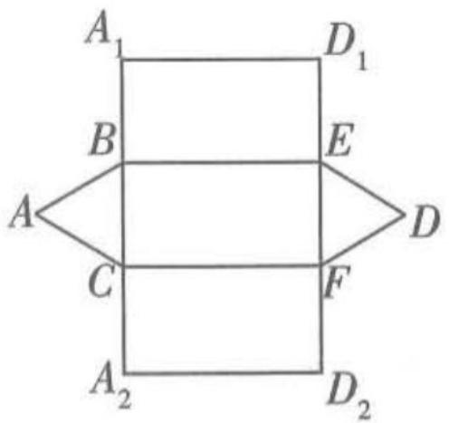

图4-12

# 参考答案与解析

##### 1. B 画出该几何体,如图4-13所示.

对于①, 因为 E, F 分别是 PA, PD 的中点, 所以 $EF \parallel AD$ , 所以 $EF \parallel BC$ , 直线 BE 与直线 CF 是共面直线, 故①不正确.

对于②, 直线 BE 与直线 AF 满足异面直线的定义, 故②正确.

对于③,由 E,F 分别是 PA,PD 的中点,可知 $EF \parallel AD$ ,所以 $EF \parallel BC$ ,因为 $EF \not\subset$ 平面 PBC, $BC \subset$ 平面 PBC,所以直线 $EF \parallel$ 平面 PBC,故③正确.公众号:拾穗者的杂货铺

对于④, 假设平面 $BCE \perp$ 平面 $PAD$ , 即平面 $BCFE \perp$ 平面 $PAD$ .

因为平面 $BCFE \cap$ 平面 PAD = EF，作 $PM \perp EF$ ，垂足为 M，则 $PM \perp$ 平面 BCE，由题中条件无法证得 $PM \perp$ 平面 BCE，故假设不成立，

所以不能判定平面 $BCE \perp$ 平面 PAD, 故④不正确. 所以正确结论的个数是 2. 故选 B.

##### 2. ACD 对于 A, 如图 4-14, 连接 $A_{1} B, A_{1} C_{1}$ , 易知在长方体中, 平面 $A_{1} B C_{1} \parallel$ 平面 $A D_{1} C, A_{1} P \subset$ 平面 $A_{1} B C_{1}$ , 所以 $A_{1} P \parallel$ 平面 $A D_{1} C$ , 所以 A 正确.

【扫清障碍】由于 $P$ 为动点,因而在平面 $A{D}_{1}C$ 内找与 ${A}_{1}P$ 平行的线难办到,因而通过面面平行,推线面平行

对于 B, 连接 $B_{1}P$ , 因为 $A_{1}B_{1} \perp$ 平面 $BCC_{1}B_{1}$ , 所以 $A_{1}P$ 与平面 $BCC_{1}B_{1}$ 所成角为 $\angle A_{1}PB_{1}$ , 如图 4-15, 当 $B_{1}P \perp BC_{1}$ 时, $B_{1}P$ 最小, $\angle A_{1}PB_{1}$ 的正切值最大, $\tan \angle A_{1}PB_{1} = \frac{A_{1}B_{1}}{B_{1}P} = \frac{3}{2\sqrt{2}} = \frac{3\sqrt{2}}{4}$ , 所以 B 错误.

对于 C, 将 $\triangle A_{1}C_{1}B$ 沿 $BC_{1}$ 翻折到与 $\triangle BCC_{1}$ 在同一个平面上,

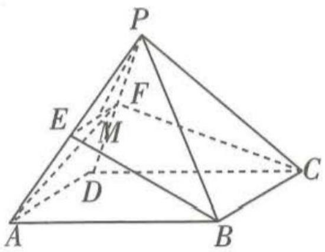

图4-13

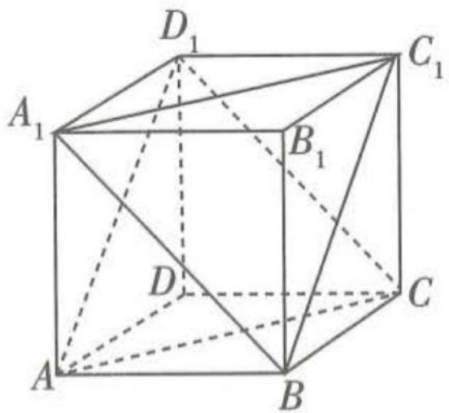

图4-14

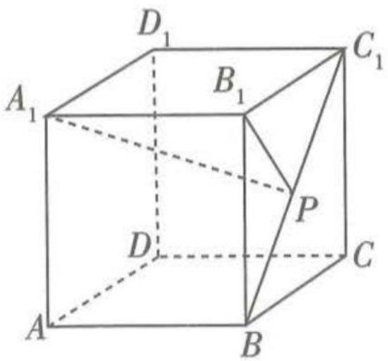

图4-15

“长征十一号(CZ-11)”是新一代固体运载火箭,主要用于快速机动发射应急卫星.2015年9月25日,长征十一号火箭在酒泉卫星发射中心成功将4颗微小卫星送入太空.

关注微信公众号“初高教辅站”获取更多初高中教辅资料

且点 $A_{2}, C$ 在直线 $BC_{1}$ 的异侧，连接 $A_{2}C$ ，交 $BC_{1}$ 于 $P$ ，易知 $A_{2}C$ 过点 $B_{1}$ ，如图 $4 - 16, A_{2}B = A_{2}C_{1} = 5, CB = CC_{1} = 4, BC_{1} = 4\sqrt{2}, \angle BC_{1}C = 45^{\circ}$ ，所以 $\cos \angle A_{2}C_{1}B = \frac{5^{2} + (4\sqrt{2})^{2} - 5^{2}}{2 \times 5 \times 4\sqrt{2}} = \frac{2\sqrt{2}}{5}$ ，所以 $\sin \angle A_{2}C_{1}B = \frac{\sqrt{17}}{5}$ ，

故 $\cos\angle A_{2}C_{1}C=\cos(\angle A_{2}C_{1}B+45^{\circ})=\frac{4-\sqrt{34}}{10}=$ $\frac{5^{2}+4^{2}-A_{2}C^{2}}{2\times5\times4}$ ，解得 $A_{2}C=\sqrt{17}+2\sqrt{2}$ ，所以 $A_{1}P+PC$ 的最小值为 $\sqrt{17}+2\sqrt{2}$ ，所以C正确.

对于 D, 如图 4-17, 连接 $AB_{1}$ , 由于 $AB \perp$ 平面 $BCC_{1}B_{1}$ , 所以交线为以 $B$ 为圆心, 半径为 4 的四分之一圆周, 所以交线长为 $2\pi$ , 所以 D 正确. 故选 ACD.

##### 3. A 根据 $A, A_{1}, A_{2}, D, D_{1}, D_{2}$ 六点共圆，设圆心为 O，连接 OD，$OD_{1},OD\cap D_{1}D_{2}=G,$ 作出示意图如图4-18所示.

设原正三棱柱的底面边长为2a,高为2b,圆的半径为r.则有 $\left\{\begin{aligned}b+\sqrt{3}a=r,\\ b^{2}+9a^{2}=r^{2},\end{aligned}\right.$ 解得 $r=2b=2\sqrt{3}a.$

从而在原正三棱柱中,高为底面边长的 $\sqrt{3}$ 倍.作出原正三棱柱的示意图,如图4-19所示.

设直线 $AE$ 和直线 $BF$ 所成角为 $\theta$ , 则 $\cos \theta = \frac{|\overrightarrow{AE} \cdot \overrightarrow{BF}|}{|\overrightarrow{AE}| \cdot |\overrightarrow{BF}|}$ .由勾股定理得， $|\overrightarrow{AE}|=|\overrightarrow{BF}]=\sqrt{(2a)^{2}+(2b)^{2}}=4a$

$\overrightarrow {A E} \cdot \overrightarrow {B F} = (\overrightarrow {A B} + \overrightarrow {B E}) \cdot (\overrightarrow {B E} + \overrightarrow {E F}) = \overrightarrow {B E ^ {2}} + \overrightarrow {A B} \cdot \overrightarrow {E F} = (2 b) ^ {2} + (2 a)$

(2a) $\cdot\cos\frac{2\pi}{3}=10a^{2}$ ，所以 $\cos\theta=\frac{|\overrightarrow{AE}\cdot\overrightarrow{BF}|}{|\overrightarrow{AE}|\cdot|\overrightarrow{BF}|}=\frac{10a^{2}}{16a^{2}}=\frac{5}{8}$ . 故选 A.

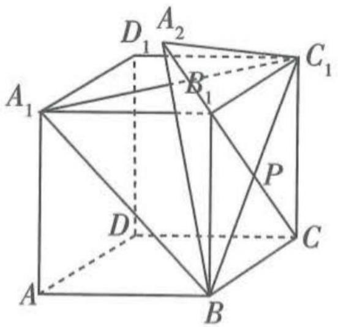

图4-16

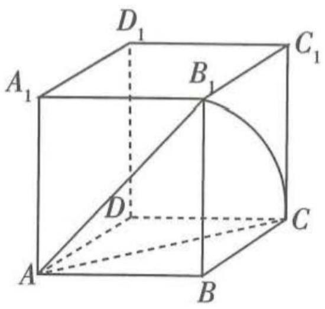

图4-17

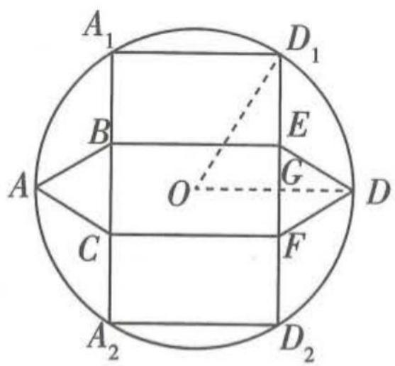

图4-18

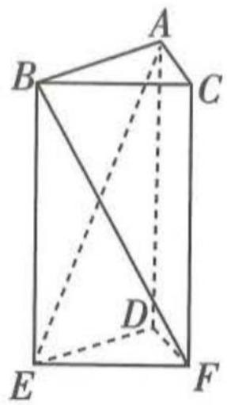

图4-19

# 超重点 5 “几何法”“向量法”双法破解立体几何问题

# 命题角度1 求异面直线所成角

调研 1 (2022·上海光明中学5月模拟/ )如图5-1所示, 设有底面半径为3的圆锥,OP为圆锥的高.已知圆锥的侧面积为 $15\pi$ ,D为PA的中点,

$\angle A O C = \frac {\pi}{3}.$

（1） 求圆锥的体积;   
（2） 求异面直线 CD 与 AB 所成角.

解析 （1） 设圆锥的母线长为 $l$ , $\because$ 圆锥的底面半径为 3, $\therefore r = 3, \therefore S_{\text{侧}} = \pi r l = 3 \pi l = 15 \pi, \therefore l = 5$ , 即 $P A = P B = 5$ ,

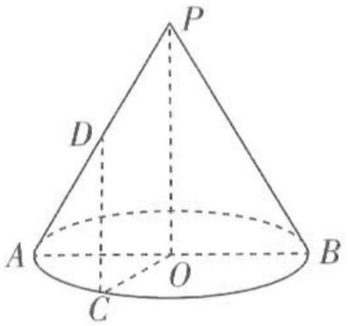

图5-1

∴ 圆锥的高 $h = OP = \sqrt{PA^{2} - OA^{2}} = 4$ , ∴ 圆锥的体积 V = $\frac{1}{3}\pi r^{2}h = \frac{\pi}{3} \times 9 \times 4 = 12\pi$ .

（2） 方法一 如图 5-2, 取 OA 的中点 E, 连接 DE, CE, AC,

∵ DE 是 $\triangle AOP$ 的中位线, ∴ DE // OP.

∵ OP 垂直于底面, ∴ DE 垂直于底面, ∴ DE ⊥ AB.

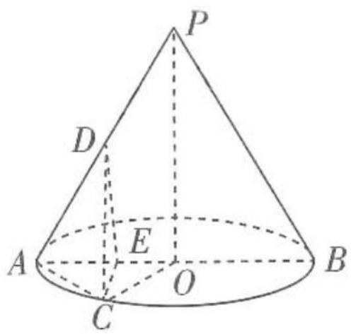

图5-2

易知 CA = CO, ∵ E 为 OA 的中点, ∴ CE ⊥ OA, 即 AB ⊥ CE.

$\because CE \cap DE = E, CE, DE \subset$ 平面 CDE, $\therefore AB \perp$ 平面 CDE.

又 $CD \subset$ 平面 $CDE, \therefore AB \perp CD$ , 即异面直线 $AB$ 与 $CD$ 所成角为 $\frac{\pi}{2}$ .

方法二 （几何法）如图 5-3, 取 PB 的中点 F, 连接 DF, FC, 所以 DF 是 $\triangle PAB$ 的中位线, $\therefore DF \parallel AB, DF = \frac{1}{2} AB = 3, \therefore \angle CDF$ 为异面直线 AB 与 CD 所成角,

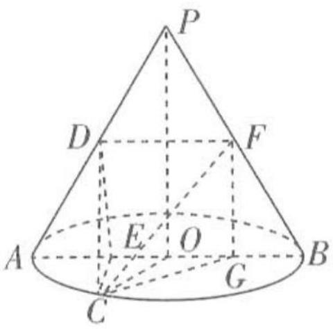

图5-3

分别取 OA, OB 的中点 E, G, 连接 DE, CE, CG, FG,

∵ OP 垂直于底面, ∴ DE 垂直于底面, FG 垂直于底面, 又 AB, CG 在底面内, ∴ DE ⊥

小编说:逻辑推理能力是一种以敏锐的思考分析、快捷的反应、迅速地掌握问题的核心,在最短时间内做出合理正确选择的能力.一起来试一试这些逻辑推理小问题吧!

$A B, F G \perp C G,$

由（1）知, $\angle AOC=\frac{\pi}{3},r=3,h=4,l=5,$

$\begin{array}{l} \therefore C D ^ {2} = D E ^ {2} + E C ^ {2} = 2 ^ {2} + \left(\frac {3 \sqrt {3}}{2}\right) ^ {2} = \frac {4 3}{4}, C F ^ {2} = F G ^ {2} + C G ^ {2} = 2 ^ {2} + 3 ^ {2} + \left(\frac {3}{2}\right) ^ {2} - 2 \times 3 \times \\ \frac {3}{2} \mathrm{cos} \frac {2 \pi}{3} = \frac {7 9}{4}, \text {又} D F ^ {2} = 3 ^ {2} = 9, \therefore C F ^ {2} = C D ^ {2} + D F ^ {2}, \\ \end{array}$

【小技巧】三角形三条边长都求出，优先判断三边是否满足勾股定理的特征，否则，再利用余弦定理，求所需求的角的余弦值

∴ $\angle CDF = \frac{\pi}{2}$ ，即异面直线 AB 与 CD 所成角为 $\frac{\pi}{2}$ .

方法三 （空间向量法）取圆弧 AB 的中点 E，连接 OE，则 $OE \perp AB$ ，

以 O 为坐标原点, $\overrightarrow{OE}, \overrightarrow{OB}, \overrightarrow{OP}$ 分别为 x 轴、y 轴、z 轴的正方向, 可建立如图 5-4 所示的空间直角坐标系 O-xyz, 则 A(0, -3,0), B(0,3,0), C( $\frac{3\sqrt{3}}{2}, -\frac{3}{2}, 0$ ), D(0, $-\frac{3}{2}, 2$ ), $\therefore \overrightarrow{AB} = (0, 6, 0)$ , $\overrightarrow{CD} = (-\frac{3\sqrt{3}}{2}, 0, 2)$ ,

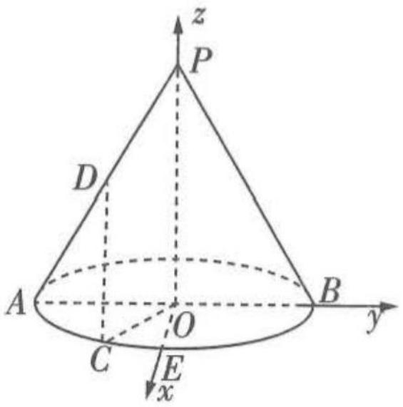

图5-4

【易错】求向量的坐标注意利用“终减起”

$\therefore \overrightarrow{AB} \cdot \overrightarrow{CD} = 0$ ，即 $AB \perp CD, \therefore$ 异面直线 $AB$ 与 $CD$ 所成角为 $\frac{\pi}{2}$ .

【极易出错】求空间角的解答题，应养成下结论的习惯，不丢分，注意：两向量夹角的取值范围为 $[0, \pi]$ ，但两异面直线所成角的取值范围为 $(0, \frac{\pi}{2}]$

# 方法总结

# 两条异面直线所成角的求法

（1） 平移法, 利用平移直线法求解的实质就是将空间两直线所成角转化为平面三角形的内角去求解.  
（2） 向量法有两种, 一是建立空间直角坐标系, 利用坐标结合向量数量积的性质求解; 二是利用基向量结合向量数量积的性质求解.  
（3）余弦定理法,关键是找到两条异面直线中的一条在包含另一条直线的平面内的射影.

设异面直线 $l_{1}$ , $l_{2}$ 的方向向量分别为 $\pmb{m}_{1}, \pmb{m}_{2}$ , 则 $l_{1}$ 与 $l_{2}$ 所成的角 $\alpha$ 满足 $\cos \alpha = |\cos \langle \pmb{m}_{1}, \pmb{m}_{2} \rangle| = \frac{|\pmb{m}_{1} \cdot \pmb{m}_{2}|}{|\pmb{m}_{1}| \cdot |\pmb{m}_{2}|}$ .

# 命题角度2 求线面角

调研 2 (2022 · 全国乙卷) 如图 5-5, 四面体 ABCD 中, $AD \perp CD$ , AD = CD, $\angle ADB = \angle BDC$ , E 为 AC 的中点.

（1） 证明: 平面 $BED \perp$ 平面 ACD;  
（2） 设 AB = BD = 2, $\angle ACB = 60^{\circ}$ , 点 F 在 BD 上, 当 $\triangle AFC$ 的面积最小时, 求 CF 与平面 ABD 所成的角的正弦值.

思维导引 （1） 欲证平面 $BED \perp$ 平面 $ACD$ 只需证 $AC \perp$ 平面 $BED$

只需在平面 BED 内寻找两条相交直线与直线 AC 垂直

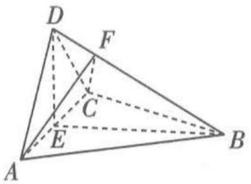

图5-5

（2） 思路一: 建立空间直角坐标系 → 求平面 ABD 的法向量 n → 求直线 CF 的方向向量
求 $\cos\langle n,\overrightarrow{CF}\rangle$ $\longrightarrow$ CF 与平面 ABD 所成的角的正弦值

思路二：欲求 CF 与平面 ABD 所成的角 $\alpha$ 的正弦值 → 只需求点 C 到平面 ABD 的距离 d 和 CF → E 为 AC 的中点

只需求点 E 到平面 ABD 的距离 $\frac{d}{2}$ → 利用等体积法 → 关于 d 的方程 → 解方程 → d 的值

思路三：欲求 CF 与平面 ABD 所成的角 $\alpha$ 的正弦值 → 只需求点 C 到平面 ABD 的距离 d 和 CF → E 为 AC 的中点
只需求点 E 到平面 ABD 的距离 $\frac{d}{2}$ 利用线面垂直 → 直接找过点 E 垂直平面 ABD 的垂线 → 利用等面积法 → 该距离的值

解析 （1） 因为 $AD = CD$ , $\angle ADB = \angle CDB$ , $DB = DB$ , 所以 $\triangle ADB \cong \triangle CDB$ , 所以 $AB = BC$ .

因为 E 为 AC 的中点, 所以 $AC \perp BE, AC \perp DE,$

又 $BE \cap DE = E, BE, DE \subset$ 平面BED，所以 $AC \perp$ 平面BED，

又 $AC \subset$ 平面 ACD, 所以平面 BED ⊥ 平面 ACD.

【归纳总结】对于证明面面垂直的问题,通用证法是光证线面垂直,然后证面面垂直

（2） 因为 $AB = BC = 2, \angle ACB = 60^{\circ}$ , 所以 $\triangle ABC$ 为正三角形, 则 $AC = 2, BE = \sqrt{3}$ , $AE = 1$ . 因为 $AD = CD, AD \perp CD$ , 所以 $\triangle ADC$ 为等腰直角三角形, 所以 $DE = 1$ .

所以 $DE^{2} + BE^{2} = BD^{2}$ ，则 $DE \perp BE$ .

这时，他面前站着甲与乙两人，但他不知道此人是甲还是乙。如果他只能询问一个问题去判断哪条路通向目的地。那么这个问题应该怎样问？

由（1）可知, $AC \perp$ 平面 BED. 连接 EF, 因为 $EF \subset$ 平面 BED, 所以 $AC \perp EF$ , 当 $\triangle AFC$ 的面积最小时, 点 F 到直线 AC 的距离最小, 即 EF 的长度最小. 在 Rt $\triangle BED$ 中, 当 EF 的长度最小时, $EF \perp BD$ , $EF = \frac{DE \cdot BE}{BD} = \frac{\sqrt{3}}{2}$ .

方法一 因为 $DE \perp AC, BE \perp AC$ , 所以 $EA, EB, ED$ 两两垂直, 以 $E$ 为坐标原点, $EA, EB, ED$ 所在的直线分别为 $x, y, z$ 轴建立如图5-6所示的空间直角坐标系 $E - xyz$ , 则 $A(1,0,0)$ , $B(0,\sqrt{3},0), D(0,0,1), C(-1,0,0)$ , 所以 $\overrightarrow{AB} = (-1,\sqrt{3},0)$ , $\overrightarrow{DB} = (0,\sqrt{3}, -1)$ .

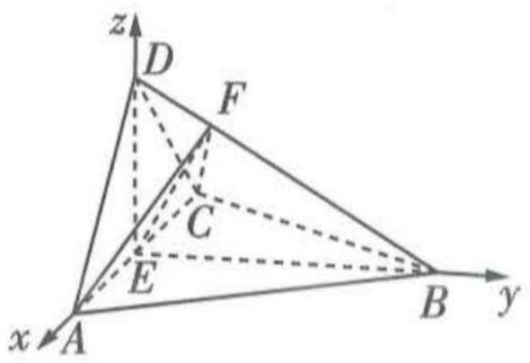

图5-6

易得 $DF = \frac{1}{2}$ , $FB = \frac{3}{2}$ , 所以 $3\overrightarrow{DF} = \overrightarrow{FB}$ . 设 $F(0, y, z)$ , 则 $\overrightarrow{DF}=(0,y,z-1),\overrightarrow{FB}=(0,\sqrt{3}-y,-z)$ ，所以 $3(0,y,z-1)=(0,\sqrt{3}-y,-z)$ ，得 $y=\frac{\sqrt{3}}{4},z=\frac{3}{4}$ ，即 $F(0,\frac{\sqrt{3}}{4},\frac{3}{4})$ ，所以 $\overrightarrow{CF}=(1,\frac{\sqrt{3}}{4},\frac{3}{4})$ .

设平面 ABD 的法向量为 $\boldsymbol{n}=(x_{1},y_{1},z_{1})$ ，则 $\left\{\begin{aligned}\boldsymbol{n}\cdot\overrightarrow{AB}&=-x_{1}+\sqrt{3}y_{1}=0,\\ \boldsymbol{n}\cdot\overrightarrow{DB}&=\sqrt{3}y_{1}-z_{1}=0,\end{aligned}\right.$

不妨取 $y_{1} = 1$ ，则 $x_{1} = \sqrt{3},z_{1} = \sqrt{3},\pmb {n} = (\sqrt{3},1,\sqrt{3})$ 是平面ABD的一个法向量.

记 $CF$ 与平面 $ABD$ 所成的角为 $\alpha$ , 则 $\sin \alpha = |\cos \langle \overrightarrow{CF}, n\rangle| = \frac{|\overrightarrow{CF} \cdot n|}{|\overrightarrow{CF}| \cdot |n|} = \frac{4\sqrt{3}}{7}$ .

【极易出错】一是线面所成角的正弦值等于直线的方向向量与平面的法向量的夹角余弦值的绝对值，二是线面所成角的取值范围为 $[0,\frac{\pi}{2}]$

方法二 因为 E 为 AC 的中点, 所以点 C 到平面 ABD 的距离等于点 E 到平面 ABD 的距离的 2 倍.

因为 $DE \perp AC, DE \perp BE, AC \cap BE = E, AC, BE \subset$ 平面 ABC，所以 $DE \perp$ 平面 ABC.

【小技巧】求三棱锥体识，需要确定三棱锥的高，即证明线面垂直性

因为 $V_{D - AEB} = V_{E - ADB}$ ，所以 $\frac{1}{3} \times \frac{1}{2} AE \times BE \times DE = \frac{1}{3} \times S_{\triangle ABD} \times \frac{d}{2}$ ，其中 $d$ 为点 $C$ 到平面ABD的距离.

在 $\triangle ABD$ 中， $BA = BD = 2, AD = \sqrt{2}$ ，所以 $S_{\triangle ABD} = \frac{\sqrt{7}}{2}$ ，所以 $d = \frac{2\sqrt{21}}{7}$ .

因为 $AC \perp$ 平面 $BED, EF \subset$ 平面 $BED$ , 所以 $AC \perp EF$ , 所以 $FC = \sqrt{FE^2 + EC^2} = \frac{\sqrt{7}}{2}$ .

记 $CF$ 与平面ABD所成的角为 $\alpha$ ，则 $\sin \alpha = \frac{d}{CF} = \frac{4\sqrt{3}}{7}$

方法三 如图 5-7, 过点 E 作 $EM \perp AB$ 交 AB 于点 M, 连接 DM, 过点 E 作 $EG \perp DM$ 交 DM 于点 G.

因为 $DE \perp AC, DE \perp BE, AC \cap BE = E, AC, BE \subset$ 平面 $ABC$ , 所以 $DE \perp$ 平面 $ABC$ , 又 $AB \subset$ 平面 $ABC$ , 所以 $DE \perp AB$ ,

又 $EM \cap DE = E, EM, DE \subset$ 平面 $DEM$ , 所以 $AB \perp$ 平面 $DEM$ ,

又 $EG \subset$ 平面 $DEM$ , 所以 $AB \perp EG$ ,

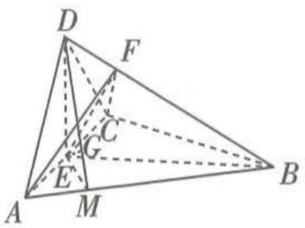

图5-7

又 $AB \cap DM = M, AB, DM \subset$ 平面 ABD, 所以 $EG \perp$ 平面 ABD, 则 $EG$ 的长度等于点 E 到平面 ABD 的距离. 因为 E 为 AC 的中点, 所以 EG 的长度等于点 C 到平面 ABD 的距离的 $\frac{1}{2}$ . 因为 $EM = AE \cdot \sin 60^\circ = \frac{\sqrt{3}}{2}$ , 所以 $EG = \frac{DE \cdot EM}{DM} = \frac{DE \cdot EM}{\sqrt{DE^2 + EM^2}} = \frac{\sqrt{21}}{7}$ , 所以点 C 到平面 ABD 的距离 $d = \frac{2\sqrt{21}}{7}$ . 又 $FC = \sqrt{FE^2 + EC^2} = \frac{\sqrt{7}}{2}$ .

记 CF 与平面 ABD 所成的角为 $\alpha$ ，则 $\sin \alpha = \frac{d}{CF} = \frac{4\sqrt{3}}{7}$ .

# 方法总结

# 1. 用向量法破解此类线面所成角问题的关键

①用定理,利用平行或垂直的判定定理,明确写出所证明的推理过程,注意推理的严谨性;  
②建系,找出(或作出)两两垂直的三条直线,建立适当的空间直角坐标系;  
③求向量, 先分别求出几何体相关点的坐标, 利用 “终减起”, 求出直线的方向向量, 利用赋值法求出平面的法向量等;  
④用公式，求两法向量的夹角的余弦值；  
⑤得结论,根据向量夹角与线面角的关系,将向量夹角转化为所求的空间线面角.

# 2. 用几何法破解此类线面所成角问题的关键

①会转化，即把线面所成角问题转化为求点面距离 d 问题与斜线段长 m 的问题；  
②求距离，常利用等体积法、等面积法等，求d;  
③用公式，线面所成角的正弦值为 $\frac{d}{m}$ .

# 命题角度3 求二面角

调研 3 (2022·广西柳州高级中学7月摸底)如图5-8,在三棱锥P-ABC中,

$AB = BC = 2, PA = PB = PC = AC = 2\sqrt{2}, O$ 为 $AC$ 的中点.

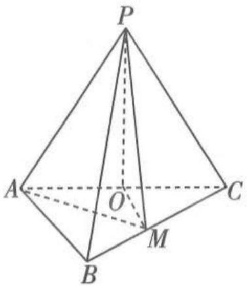

图5-8

（1） 证明: $PO \perp$ 平面 ABC;  
（2） 若点 M 在棱 BC 上, 且 PM 与平面 ABC 所成角的正切值为 $\sqrt{6}$ , 求二面角 M - PA - C 的余弦值.

思维导引 （1） 欲证 $PO \perp$ 平面 $ABC$ 只需在平面 $ABC$ 内寻找两条相交直线与 $PO$ 垂直

（2） 思路一: 建立空间直角坐标系 $\rightarrow$ 分别求平面 AMP 和平面 APC 的法向量 $\rightarrow$ 求这两法向量的夹角的余弦值 $\xrightarrow{\text{结合具体图形,判断二面角是锐角还是钝角}}$ 二面角 $M - PA - C$ 的余弦值

思路二: 欲求二面角 $M - PA - C$ 的余弦值 $\rightarrow$ 只需找出二面角 $M - PA - C$ 的平面角 $\rightarrow$ 观察图形特征 $\rightarrow$ 利用二面角的平面角的定义得二面角 $M - PA - C$ 的余弦值

解析 （1） 方法一 如图 5-9, 连接 OB. ∵ AB = BC = 2, AC = 2√2, ∴ AB² + BC² = AC², 即 △ABC 是直角三角形, 又 O 为 AC 的中点, ∴ OA = OB = OC.

又 $PA = PB = PC, \therefore \triangle POA \cong \triangle POB \cong \triangle POC, \therefore \angle POA = \angle POB = \angle POC = 90^{\circ}.$

$\therefore PO \perp AC, PO \perp OB,$ 又 $OB \cap AC = O, OB, AC \subset$ 平面 ABC,

【易错提醒】由线线垂直，证得线面垂直，注意平面内两线相交的说明
∴ PO ⊥ 平面 ABC.

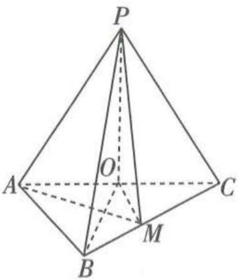

图5-9

方法二 如图 5-9, 连接 OB, ∵ PA = PC, O 为 AC 的中点, ∴ PO ⊥ AC.

$\because A B = B C = 2, P A = P B = P C = A C = 2 \sqrt {2},$

$\therefore A B \perp B C, B O = \sqrt {2}, P O = \sqrt {6}, \therefore P O ^ {2} + O B ^ {2} = P B ^ {2}, \therefore P O \perp O B,$

【会思考】当题目提供一定的数据，通过三边运算，利用勾股定理的逆定理证明两线垂直，这个技巧要掌握

∵ $PO \perp AC, PO \perp OB, OB \cap AC = O, OB, AC \subset$ 平面 ABC, ∴ $PO \perp$ 平面 ABC.

（2）由（1）知, $PO \perp$ 平面 $ABC$ , $\therefore OM$ 为 $PM$ 在平面 $ABC$ 上的射影, $\therefore \angle PMO$ 为 $PM$

与平面 ABC 所成角，

【指点迷津】求二面角的平面角的口诀：点在棱上，边在面内，垂直于棱，大小确定

$\therefore \tan \angle P M O = \frac {P O}{O M} = \frac {\sqrt {6}}{O M} = \sqrt {6}, \therefore O M = 1,$

在 $\triangle OMC$ 中,由余弦定理可得MC=1,∴M为BC的中点.

方法一 （向量法）如图5-10，以 $O$ 为坐标原点，分别以 $OB, OC, OP$ 所在直线为 $x$ 轴、 $y$ 轴、 $z$ 轴建立空间直角坐标系，则 $A(0, -\sqrt{2}, 0), P(0, 0, \sqrt{6}), M(\frac{\sqrt{2}}{2}, \frac{\sqrt{2}}{2}, 0)$ ， $\therefore \overrightarrow{AM} = (\frac{\sqrt{2}}{2}, \frac{3\sqrt{2}}{2}, 0), \overrightarrow{PA} = (0, -\sqrt{2}, -\sqrt{6})$ 。

记 $\boldsymbol{n}=(x,y,z)$ 为平面 AMP 的法向量，则 $\left\{\begin{aligned}\boldsymbol{n}\cdot\overrightarrow{AM}&=0,\\ \boldsymbol{n}\cdot\overrightarrow{PA}&=0,\end{aligned}\right.$ $\therefore\left\{\begin{aligned}\frac{\sqrt{2}}{2}x+\frac{3\sqrt{2}}{2}y&=0,\\ -\sqrt{2}y-\sqrt{6}z&=0,\end{aligned}\right.$

令 z=1，则 $y=-\sqrt{3}$ , $x=3\sqrt{3}$ , $\boldsymbol{n}=(3\sqrt{3},-\sqrt{3},1)$ 是平面 AMP 的一个法向量.

又平面 APC 的一个法向量 $m = (1, 0, 0)$ ,

【点透讲透】求两个平面的法向量时,一般需观察题目条件或第（1）小题的结论,若已经有线面垂直,则直接取一个法向量,可快速得结果

则 $\cos \langle n, m \rangle = \frac{n \cdot m}{|n||m|} = \frac{3\sqrt{3}}{\sqrt{31}} = \frac{3\sqrt{93}}{31}$ , 易知 $M - PA - C$ 所成角为锐角,

【扫清障碍】两向量夹角的余弦值与二面角的余弦值是不一定相等的，结合实际几何体的二面角的大小，来确定两法向量 $n_{\alpha}$ 、 $n_{\beta}$ 的夹角到底是二面角还是二面角的补角。二面角的取值范围是 $[0, \pi]$ ，两平面夹角的取值范围是 $[0, \frac{\pi}{2}]$ ，注意它们之间的本质区别，因此，求解此类题需注意下结论的习惯。

∴二面角 M-PA-C 的余弦值为 $\frac{3\sqrt{93}}{31}$ .

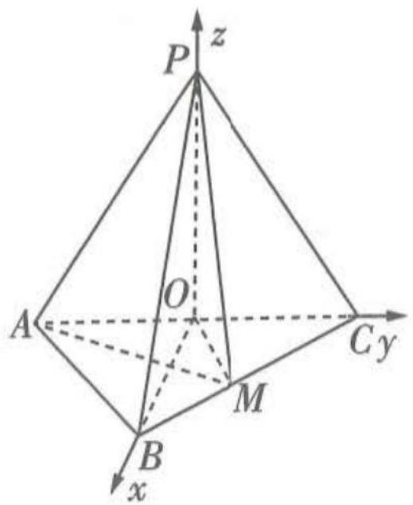

图5-10

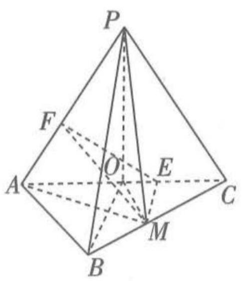

图5-11

在一旁的丁看到他们的答案并听了他们的意见后，说：“你们三个人中有一个人做对了，有一个人说对了。”请问，他们三人中到底谁做对了？

方法二 （几何法）如图 5-11, 作 $ME \perp AC$ 于 $E$ , $\therefore E$ 为 $OC$ 的中点, 作 $EF \perp PA$ 交 $PA$ 于 $F$ , 连接 $MF$ .

易知 ${MF} \bot  {PA},\therefore \angle {MFE}$ 是二面角 $M - {PA} - C$ 的平面角,

【指点迷津】利用二面角的定义,直接在已知图形中找出所求的二面角的平面角或通过适当添加辅助线作出二面角的平面角,如本题利用棱的垂线作出二面角的平面角,证明所找的角就是所求的二面角的平面角

由已知易知, $ME=\frac{\sqrt{2}}{2},EF=\frac{\sqrt{3}}{2}AE=2\sqrt{2}\times\frac{3}{4}\times\frac{\sqrt{3}}{2}=\frac{3\sqrt{6}}{4},\therefore\tan\angle MFE=\frac{ME}{EF}=\frac{\sqrt{2}}{2}\times$ $\frac{4}{3\sqrt{6}}=\frac{2}{3\sqrt{3}},$

$\therefore \cos \angle MFE = \frac{3\sqrt{3}}{\sqrt{31}} = \frac{3\sqrt{93}}{31}, \therefore$ 二面角 $M - PA - C$ 的余弦值为 $\frac{3\sqrt{93}}{31}$ .

# 方法总结

# 求二面角的大小常用方法

（1） 向量法: 如图 5-12①, $AB, CD$ 是二面角 $\alpha - l - \beta$ 的两个面内与棱 $l$ 垂直的直线, 则二面角的大小 $\theta = \langle \overrightarrow{AB}, \overrightarrow{CD} \rangle$ .

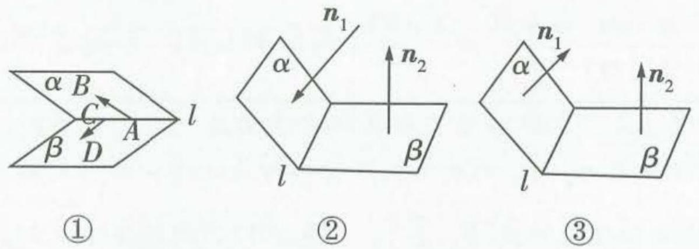  
图5-12

（2） 法向量法: 如图 5-12②③, $n_{1}, n_{2}$ 分别是二面角 $\alpha - l - \beta$ 的两个半平面 $\alpha, \beta$ 的法向量, 则二面角的大小 $\theta$ 满足 $|\cos \theta| = |\cos \langle n_{1}, n_{2} \rangle|$ , 二面角的平面角大小是向量 $n_{1}$ 与 $n_{2}$ 的夹角 (或其补角). 结合立体图形中二面角的实际情况, 判断二面角的平面角是钝角还是锐角.

（3） 几何法: 根据二面角的平面角的定义确定平面角, 结合该角所在的三角形求其值.

# 命题角度4 求距离

调研 4 (2022·辽宁沈阳 5 月三模)如图 5-13,在三棱柱 $ABC - A_{1}B_{1}C_{1}$ 中,四边形 $A_{1}C_{1}CA$ 为菱形, $\angle B_{1}A_{1}A = \angle C_{1}A_{1}A = 60^{\circ}, AC = 4, AB = 2$ , 平面 $ACC_{1}A_{1} \perp$ 平面 $ABB_{1}A_{1}, Q$ 在线段 $AC$ 上移动, $P$ 为棱 $AA_{1}$ 的中点.

鞋子是什么颜色？小丽买了一双漂亮的鞋子，她的同学都没有见过这双鞋子，于是大家就猜，小红说：“你买的鞋不会是红色的。”小彩说：“你买的鞋子不是黄的就是黑的。”小玲说：“你买的鞋子一定是黑色的。”

关注微信公众号“初高教辅站”获取更多初高中教辅资料

（1） 若 $H$ 为 $BQ$ 的中点, 延长 $AH$ 交 $BC$ 于 $D$ , 求证: $AD \parallel$ 平面 $B_{1}PQ$ ; 公众号: 拾穗者的杂货铺  
（2） 若二面角 $B_{1}-PQ-C_{1}$ 的余弦值为 $\frac{\sqrt{13}}{13}$ ，求点 P 到平面 $BQB_{1}$ 的距离.

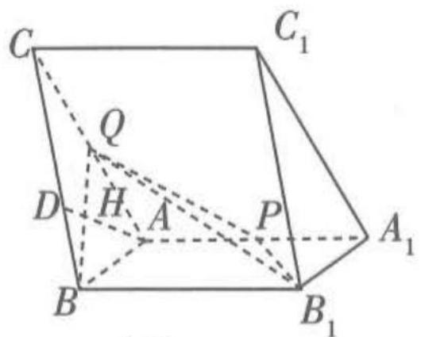

图5-13

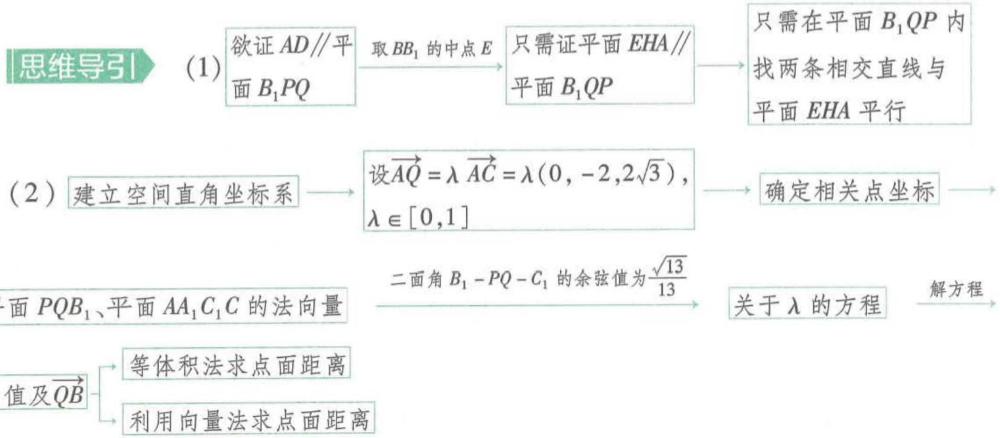

解析 （1） 取 $BB_{1}$ 的中点 $E$ , 连接 $AE, EH$ , 如图 5-14,

∵ H 为 BQ 的中点, ∴ $EH \parallel B_{1}Q$ .

在平行四边形 $AA_{1}B_{1}B$ 中，P, E 分别为 $AA_{1}, BB_{1}$ 的中点，∴ $AE \parallel PB_{1}$ ,

∵ EH, AE ⊂ 平面 EHA, $B_{1}Q$ , $PB_{1} \not\subset$ 平面 EHA,

$\therefore B_{1}Q \parallel$ 平面 EHA, $PB_{1} \parallel$ 平面 EHA.

又 $PB_{1} \cap B_{1}Q = B_{1}, \therefore$ 平面 $EHA \parallel$ 平面 $B_{1}QP, \because AD \subset$ 平面 $EHA, \therefore AD \parallel$ 平面 $B_{1}PQ.$

【规范答题】由线面平行到面面平行，注意线不在交，重在相交的说明，否则，会因跳步而失分。由面面平行到线面平行，注意线在面内的说明

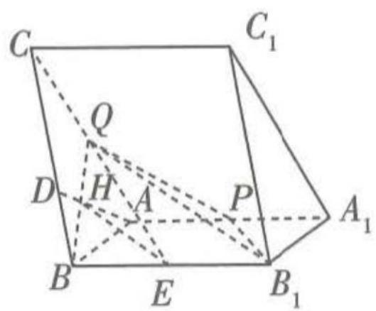

图5-14

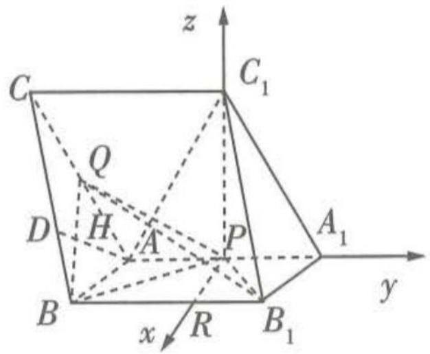

图5-15

（2） 连接 $PC_{1}, AC_{1}, \because$ 四边形 $A_{1}C_{1}CA$ 为菱形, $\therefore AA_{1} = AC = A_{1}C_{1} = 4.$

这三个人的看法至少有一种是正确的,至少有一种是错误的.请问,小丽的鞋子到底是什么颜色的?

又 $\angle C_{1}A_{1}A = 60^{\circ},\therefore \triangle AC_{1}A_{1}$ 为等边三角形， $\because P$ 为 $AA_{1}$ 的中点， $\therefore PC_1\bot AA_1$

∵ 平面 $ACC_{1}A_{1} \perp$ 平面 $ABB_{1}A_{1}$ ，平面 $ACC_{1}A_{1} \cap$ 平面 $ABB_{1}A_{1} = AA_{1}, PC_{1} \subset$ 平面 $ACC_{1}A_{1}$

【易错点】由面面垂直到线面垂直，两面的交线不要漏写

$\therefore PC_{1}\perp$ 平面 $ABB_{1}A_{1}$ ，在平面 $ABB_{1}A_{1}$ 内过点P作 $PR\perp AA_{1}$ 交 $BB_{1}$ 于点R.

以点 P 为坐标原点, 以 $PR, PA_{1}, PC_{1}$ 所在的直线分别为 x 轴、y 轴、z 轴, 建立如图 5-15 所示的空间直角坐标系 P-xyz, 则 $P(0,0,0), A_{1}(0,2,0), A(0,-2,0), C_{1}(0,0,2\sqrt{3}), C(0,-4,2\sqrt{3})$ .

设 $\overrightarrow{AQ}=\lambda\overrightarrow{AC}=\lambda(0,-2,2\sqrt{3}),\lambda\in[0,1]$ ,

【扫清障碍】引进参数,定要根据题设条件注明参数的取值范围

$\therefore Q (0, - 2 (\lambda + 1), 2 \sqrt {3} \lambda), \therefore \overrightarrow {P Q} = (0, - 2 (\lambda + 1), 2 \sqrt {3} \lambda).$

$\because A _ {1} B _ {1} = A B = 2, \angle B _ {1} A _ {1} A = 6 0 ^ {\circ}, \therefore B _ {1} (\sqrt {3}, 1, 0), \therefore \overrightarrow {P B _ {1}} = (\sqrt {3}, 1, 0).$

设平面 $PQB_{1}$ 的法向量为 $\boldsymbol{m}=(x,y,z)$ ，则 $\left\{\begin{aligned}\boldsymbol{m}\cdot\overrightarrow{PQ}&=0,\\ \boldsymbol{m}\cdot\overrightarrow{PB_{1}}&=0,\end{aligned}\right.$ 得 $\left\{\begin{aligned}-2(\lambda+1)y+2\sqrt{3}\lambda z=0,\\ \sqrt{3}x+y&=0,\end{aligned}\right.$

令 $x = 1$ ，则 $y = -\sqrt{3}, z = -\frac{\lambda + 1}{\lambda}, \therefore m = (1, -\sqrt{3}, -\frac{\lambda + 1}{\lambda})$

易得平面 $AA_{1}C_{1}C$ 的一个法向量为 $\boldsymbol{n}=(1,0,0)$ ,

设二面角 $B_{1}-PQ-C_{1}$ 的平面角为 $\theta$ ,

$\because \cos \theta = \frac{\sqrt{13}}{13}, \therefore \frac{|m \cdot n|}{|m||n|} = \frac{1}{\sqrt{1 + 3 + (-\frac{\lambda + 1}{\lambda})^2}} = \frac{\sqrt{13}}{13}$ , 解得 $\lambda = \frac{1}{2}$ 或 $\lambda = -\frac{1}{4}$ (舍),

$\therefore \overrightarrow {A Q} = \frac {1}{2} \overrightarrow {A C}, \therefore Q (0, - 3, \sqrt {3}).$

$\overrightarrow {Q B _ {1}} = (\sqrt {3}, 4, - \sqrt {3}), | \overrightarrow {Q B _ {1}} | = \sqrt {3 + 1 6 + 3} = 2 2.$

又 $B(\sqrt{3}, -3,0), \therefore \overrightarrow{BB_1} = (0,4,0), \overrightarrow{QB} = (\sqrt{3},0, -\sqrt{3}), \therefore |\overrightarrow{QB}| = \sqrt{3 + 3} = \sqrt{6}$ .

$\therefore QB^{2}+BB_{1}^{2}=QB_{1}^{2}$ ，即 $QB\perp BB_{1}$

方法一 （等体积法）连接 BP, 设点 P 到平面 $BQB_{1}$ 的距离为 h,

$V_{Q - BPB_1} = V_{P - BQB_1}$ ，则 $\frac{1}{3}\times \frac{1}{2}\times 4\times \sqrt{3}\times \sqrt{3} = \frac{1}{3}\times \frac{1}{2}\times 4\times \sqrt{6}\times h,$

∴ $h=\frac{\sqrt{6}}{2}$ ，即点 P 到平面 $BQB_{1}$ 的距离为 $\frac{\sqrt{6}}{2}$ .

方法二 （向量法）设平面 $BQB_{1}$ 的法向量为 $\boldsymbol{u}=(x_{1},y_{1},z_{1}),\overrightarrow{BB_{1}}=(0,4,0)$ ,

谁吃了水果？赵女士买了一些水果准备去看望一个朋友，谁知，这些水果被她的儿子们偷吃了，但她不知道是哪个儿子，为此，赵女士非常生气，就盘问4个儿子谁偷吃了水果。

$\therefore \left\{ \begin{array}{l} \boldsymbol{u} \cdot \overrightarrow{QB} = 0, \\ \boldsymbol{u} \cdot \overrightarrow{BB_1} = 0, \end{array} \right. \therefore \left\{ \begin{array}{l} \sqrt{3} x_1 - \sqrt{3} z_1 = 0, \\ 4y_1 = 0, \end{array} \right.$ 取 $x_1 = 1$ ，则 $z_1 = 1, u = (1,0,1)$ 是平面 $BQB_1$ 的一个法向量，

又 $\overrightarrow{PB} = (\sqrt{3}, -3,0)$ , $\therefore$ 点 $P$ 到平面 $BQB_{1}$ 的距离 $h = \frac{|\overrightarrow{PB} \cdot u|}{|u|} = \frac{\sqrt{3}}{\sqrt{2}} = \frac{\sqrt{6}}{2}$ .

【极易出错】点面距离公式中的分子的绝对值号不要漏了，因为两向量的数量识可以为负数，而距离是非负数 $D_{1}$

调研 5 (2022·山东临沂 5 月三模/探究性问题)在正方体 $ABCD-A_{1}B_{1}C_{1}D_{1}$ 中, E 为 $A_{1}D_{1}$ 的中点, 过 $A, B_{1}, E$ 的平面截此正方体, 得如图 5-16 所示的多面体, F 为棱 $CC_{1}$ 上的动点.

（1） 点 $H$ 在棱 $BC$ 上, 当 $CH = \frac{1}{4} CB$ 时, $FH \parallel$ 平面 $AEB_{1}$ , 试确定动点 $F$ 在棱 $CC_{1}$ 上的位置, 并说明理由;

（2） 若 AB = 2，求点 D 到平面 AEF 的最大距离.

解析 （1） 点 $F$ 为棱 $CC_{1}$ 的中点, 理由如下.

设平面 $BCC_{1}B_{1}$ 与平面 $AEB_{1}$ 的交线为 l,

因为 $FH \parallel$ 平面 $AEB_{1}$ ，平面 $BCC_{1}B_{1} \cap$ 平面 $AEB_{1} = l, FH \subset$ 平面 $BCC_{1}B_{1}$ ，

所以 $FH \parallel l$ . 由正方体 $ABCD - A_{1}B_{1}C_{1}D_{1}$ 知, 平面 $ADD_{1}E \parallel$ 平面 $BCC_{1}B_{1}$ ,

又平面 $ADD_{1}E\cap$ 平面 $AEB_{1} = AE$ ，平面 $BCC_{1}B_{1}\cap$ 平面 $AEB_{1} = l$

所以 $AE \parallel l$ ，所以 $AE \parallel FH$ 。

如图 5-17, 取 BC 的中点 G, 连接 $C_{1}G$ , 易知 $AE \parallel GC_{1}$ , 所以 $GC_{1} \parallel FH$ ,

又 H 为 CG 的中点, 所以 F 为 $CC_{1}$ 的中点.

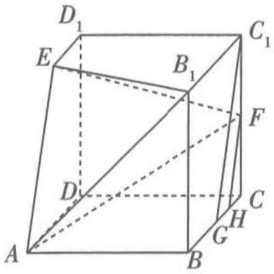

图5-17

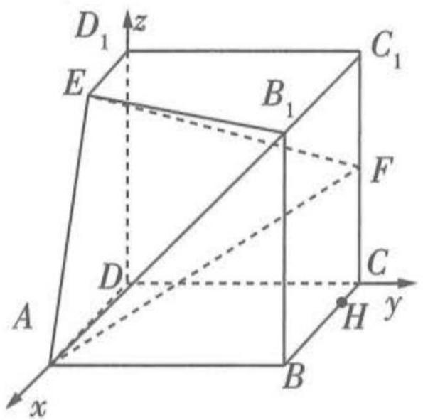

图5-18

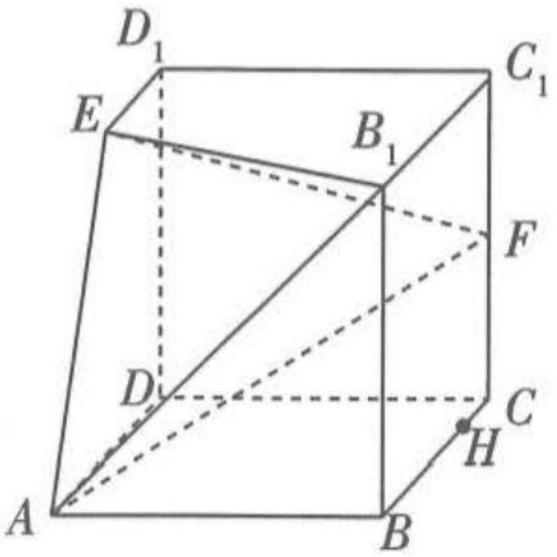

图5-16

（2）以点 $D$ 为坐标原点, $\overrightarrow{DA},\overrightarrow{DC},\overrightarrow{DD_1}$ 的方向分别为 $x$ 轴、 $y$ 轴、 $z$ 轴的正方向, 建立如图5-18所示的空间直角坐标系 $D - xyz$ , 则有 $D(0,0,0), A(2,0,0), E(1,0,2)$ ,

老大说：“是老二吃的。”老二说：“是老四吃的。”老三说：“反正我没有吃。”老四说：“老二在说谎。”这4个儿子中只有一个人说了实话，其他的3个都在撒谎。那么，到底是谁偷吃了这些水果？

$F(0,2,t)$ ，其中 $t \in [0,2]$ ，

所以 $\overrightarrow{AE}=(-1,0,2)$ , $\overrightarrow{AF}=(-2,2,t)$ , $\overrightarrow{DA}=(2,0,0)$ ,

设平面 AEF 的法向量为 $\boldsymbol{n}=(x,y,z)$ ，则有 $\left\{\begin{aligned}\boldsymbol{n}\cdot\overrightarrow{AE}&=0,\\ \boldsymbol{n}\cdot\overrightarrow{AF}&=0,\end{aligned}\right.$ 得 $\left\{\begin{aligned}-x+2z&=0,\\ -2x+2y+tz&=0,\end{aligned}\right.$ 取 x=2，则 z=1， $y=2-\frac{t}{2},\boldsymbol{n}=(2,2-\frac{t}{2},1)$ ，所以点 D 到平面 AEF 的距离 $d=\frac{|\overrightarrow{AD}\cdot\boldsymbol{n}|}{|\boldsymbol{n}|}=\frac{4}{\sqrt{5+(2-\frac{t}{2})^{2}}}\geqslant\frac{2\sqrt{6}}{3}$

【指点迷津】求点面距离时,平面的斜线的方向向量的选取是不唯一的,只要有一点在平面内即可

当 t=2，即点 F 与点 $C_{1}$ 重合时，取等号，

【会反思】利用配方法求最值，需注意等号成立条件的检验

所以点 D 到平面 AEF 的最大距离为 $\frac{2\sqrt{6}}{3}$ .

# 方法总结

# 求点面距离的 3 种方法

①利用法向量求点到面的距离定理:如图5-19,设n是平面α的法向量,AB是平面α的一条斜线,其中A∈α,则点B到平面α的距离为 $\frac{|\overrightarrow{AB}\cdot n|}{|n|}$ .

②等体积法: 是立体几何中求点到平面距离的一种常用方法, 掌握这种方法的关键是找准两个底面并求出其面积.

③几何法:找到点到平面的距离,有时可转化为过已知点 $A$ 且与相关平面平行的直线上的其他点到平面的距离.

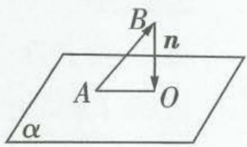

图5-19

# 新题演练

##### 1. (2022·天津市滨海七校5月二模)如图5-20所示,在几何体ABCDEF中,四边形ABCD为直角梯形,AD∥BC,AB⊥AD,AE⊥底面ABCD,AE∥CF,AD=3,AB=BC=AE=2,CF=1.

（1） 求证: $BF \parallel$ 平面 ADE;  
（2） 求直线 BE 与直线 DF 所成角的余弦值.

##### 2. (2022·福建福州高中毕业班5月质检/翻折问题)如图5-21

①, 在 $\triangle ABC$ 中, $\angle C = 90^{\circ}, BC = \sqrt{3}, AC = 3, E$ 是 $AB$ 的中点, $D$ 在 $AC$ 上, $DE \perp AB$ . 沿着 $DE$ 将 $\triangle ADE$ 折起, 得到几何体 $A - BCDE$ , 如图5-21②.

（1） 证明: 平面 $ABE \perp$ 平面 BCDE;

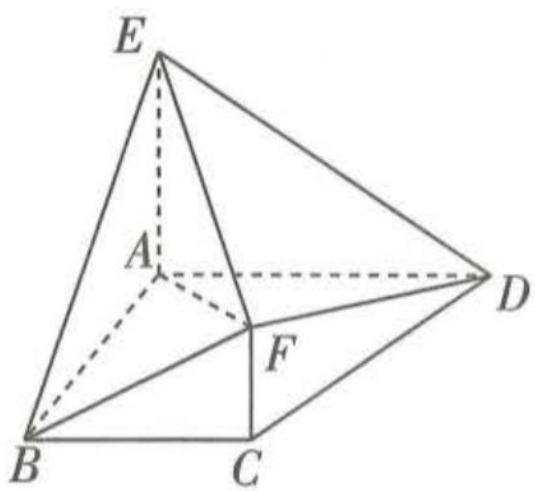

图5-20

夜明珠在哪里？一个人的夜明珠丢了，于是他开始四处寻找。有一天，他来到了山上，看到有三个小屋，分别为1号、2号、3号。从这三个小屋里分别走出来一个女子。

关注微信公众号“初高教辅站”获取更多初高中教辅资料

（2） 若二面角 A - DE - B 的大小为 $60^{\circ}$ ，求直线 AD 与平面 ABC 所成角的正弦值.

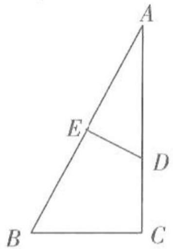

①

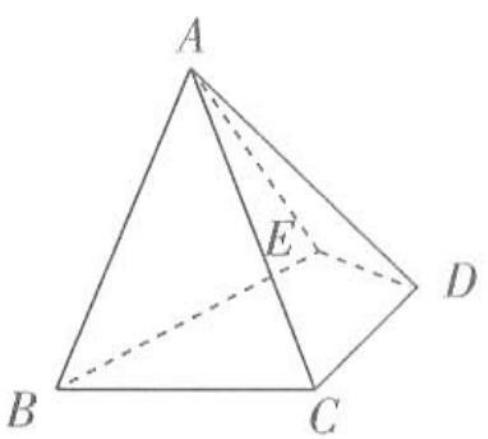

②   
图5-21

##### 3. (2022·河南洛阳 5 月三模) 如图 5-22, D 为圆锥的顶点, O 为圆锥底面的圆心, AB 为底面直径, C 为底面圆周上一点, DA = AC = BC = 2, 四边形 DOAE 为矩形.

（1） 若点 $F$ 在 $BC$ 上, 且 $DF \parallel$ 平面 $EAC$ , 请确定点 $F$ 的位置并说明理由;

（2） 求二面角 D - BC - E 的余弦值.

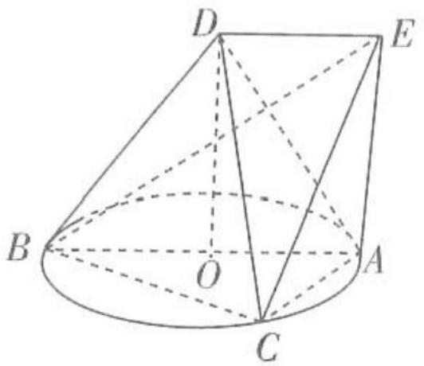

图5-22

# 参考答案与解析

##### 1. （1） $\because AE \parallel CF, AE \not\subset$ 平面 $BFC, CF \subset$ 平面 $BFC, \therefore AE \parallel$ 平面 $BCF$ .

∵ AD∥BC, 同理可得 AD∥平面 BFC,

又 $AD \cap AE = A, AD, AE \subset$ 平面 $ADE, \therefore$ 平面 $BCF \parallel$ 平面 $ADE$ .

$\because BF\subset$ 平面 BFC, $\therefore BF\parallel$ 平面 ADE.

（2）以 A 为坐标原点, AB, AD, AE 所在直线分别为 x 轴、y 轴、z 轴, 建立如图 5-23 所示的空间直角坐标系 A - xyz, 则 $B(2,0,0)$ , $C(2,2,0)$ , $D(0,3,0)$ , $E(0,0,2)$ , $F(2,2,1)$ , 则 $\overrightarrow{BE}=(-2,0,2)$ , $\overrightarrow{DF}=(2,-1,1)$ , $\therefore\cos\langle\overrightarrow{BE},\overrightarrow{DF}\rangle=$

$\frac {\overrightarrow {B E} \cdot \overrightarrow {D F}}{| \overrightarrow {B E} | | \overrightarrow {D F} |} = \frac {- 2}{2 \sqrt {2} \times \sqrt {6}} = - \frac {\sqrt {3}}{6},$

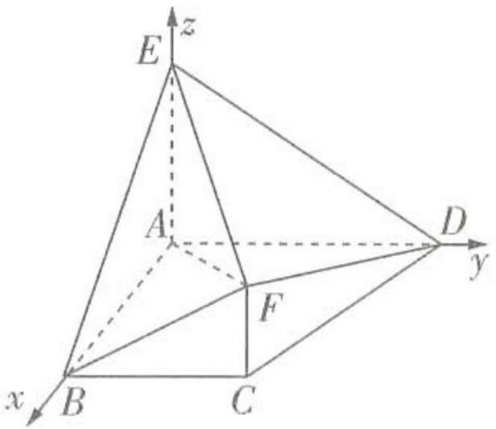

图5-23

又异面直线所成角的取值范围是 $(0,\frac{\pi}{2}]$ ,

∴ 直线 BE 与直线 DF 所成角的余弦值为 $\frac{\sqrt{3}}{6}$ .

【扫帚降使】将的直线所向角的取值两用 $V(0)$ 。 $\frac{\pi}{2}$ ，此时当两年内直线的方向测量的余弦值未出现色时，直接取量相反数作实数而直线所向角的余弦值

1号屋的女子说：“夜明珠不在此屋里”2号屋的女子说：“夜明珠在1号屋内。”3号屋的女子说：“夜明珠不在此屋里。”这三个女子，其中只有一个说了真话，那么，谁说了真话？夜明珠到底在哪个屋里面？

##### 2. （1） 因为在题图①中 $DE \perp AB$ , 沿着 $DE$ 将 $\triangle ADE$ 折起,

所以在题图②中有 $DE \perp AE, DE \perp BE,$

又 $AE \cap BE = E, AE, BE \subset$ 平面 ABE, 所以 $DE \perp$ 平面 ABE,

因为 $DE \subset$ 平面 BCDE, 所以平面 $ABE \perp$ 平面 BCDE.

【规范答题】由线面垂直证明面面垂直，定要说明线在面内，否则，会因跳步而失分.

（2）由（1）知, $DE\perp AE,DE\perp BE,$

所以 $\angle AEB$ 是二面角 A-DE-B 的平面角, 所以 $\angle AEB = 60^{\circ}$ ,

又 AE = BE, 所以 $\triangle ABE$ 是等边三角形.

连接 CE, 在题图①中, 因为 $\angle C = 90^{\circ}, BC = \sqrt{3}, AC = 3$ , 所以 $\angle EBC = 60^{\circ}, AB = 2\sqrt{3}$ ,

【突破口】盯准空间与平面中的不变的量

因为 E 是 AB 的中点, 所以 $BE = BC = \sqrt{3}$ , 所以 $\triangle BCE$ 是等边三角形.

取 BE 的中点 O, 连接 AO, CO, 则 $AO \perp BE, CO \perp BE,$

因为平面 $ABE \perp$ 平面 BCDE, 平面 $ABE \cap$ 平面 BCDE = BE, 所以 $AO \perp$ 平面 BCDE,

所以 OB, OC, OA 两两垂直. 以 O 为坐标原点, $\overrightarrow{OB}$ , $\overrightarrow{OC}$ , $\overrightarrow{OA}$ 的方向分别为 x 轴、y 轴、z

轴的正方向建立空间直角坐标系 O-xyz，如图 5-24 所示，则 $A(0,0,\frac{3}{2})$ , $B(\frac{\sqrt{3}}{2},0,$

0), $C(0, \frac{3}{2}, 0)$ , $D(-\frac{\sqrt{3}}{2}, 1, 0)$ ,

所以 $\overrightarrow{AB} = (\frac{\sqrt{3}}{2}, 0, -\frac{3}{2}), \overrightarrow{AC} = (0, \frac{3}{2}, -\frac{3}{2}), \overrightarrow{AD} = (-\frac{\sqrt{3}}{2}, 1, -\frac{3}{2})$ .

设平面 ABC 的法向量为 $\boldsymbol{n}=(x,y,z)$ ,

则 $\left\{\begin{aligned}\boldsymbol{n}\cdot\overrightarrow{AB}&=0,\\ \boldsymbol{n}\cdot\overrightarrow{AC}&=0,\end{aligned}\right.$ 即 $\left\{\begin{aligned}\frac{\sqrt{3}}{2}x-\frac{3}{2}z&=0,\\ \frac{3}{2}y-\frac{3}{2}z&=0,\end{aligned}\right.$

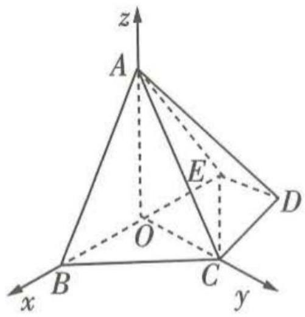

图5-24

取 z=1，则 $y=1, x=\sqrt{3}, n=(\sqrt{3},1,1)$ 是平面 ABC 的一个法向

量,所以 $\cos\langle\overrightarrow{AD},n\rangle=\frac{n\cdot\overrightarrow{AD}}{|n||\overrightarrow{AD}|}=\frac{\left(-\frac{\sqrt{3}}{2}\right)\times\sqrt{3}+1\times1+\left(-\frac{3}{2}\right)\times1}{\sqrt{5}\times2}=-\frac{\sqrt{5}}{5}.$

设直线 AD 与平面 ABC 所成角为 $\theta$ ，则 $\sin\theta=\frac{\sqrt{5}}{5}$ .

【扫清障碍】注意线面角的正弦值、二面角的正弦值与两向量的夹角的余弦值的关系，它们是不相等的

##### 3.（1）当点 F 为 BC 的中点时,DF//平面 EAC. 理由如下:

如图 5-25, 取 $AC$ 的中点 $G$ , 连接 $FG, EG$ ,

由 G, F 分别为 AC, BC 的中点, 则 $FG \parallel AB$ , 且 $FG = \frac{1}{2} AB$ , 即 FG = AO.

又四边形 DOAE 为矩形, 则 AO // DE, 且 AO = DE,

所以 $FG \parallel DE$ ，且 FG = DE，故四边形 FGED 为平行四边形，所以 $EG \parallel DF$ ，

又 $DF \not\subset$ 平面 $AEC, EG \subset$ 平面 $AEC$ , 所以 $DF \parallel$ 平面 $AEC$ .

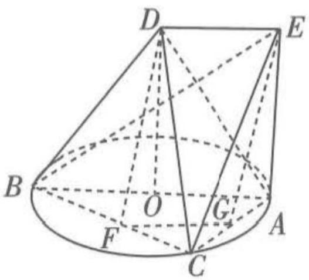

图5-25

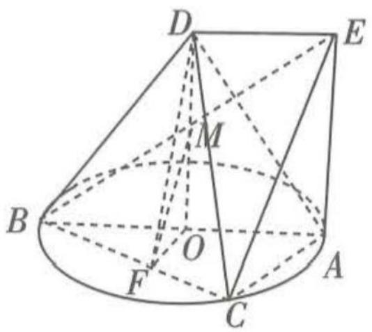

图5-26

（2）由 AB 为底面直径, C 为底面圆周上一点, 则 $AC \perp BC$ ,

又四边形 DOAE 为矩形, 则 DO // AE,

根据题意知 $DO$ 为圆锥的高, 则 $DO \perp$ 平面 $ABC$ , 所以 $AE \perp$ 平面 $ABC$ .

【小结论】利用两平行线，其中一条与某个平面垂直，则另一条也与这个平面垂直

由 $BC \subset$ 平面 $ABC$ , 则 $AE \perp BC$ , 又 $AC \cap AE = A, AC, AE \subset$ 平面 $ACE$ ,

所以 $BC \perp$ 平面 AEC, 又 $CE \subset$ 平面 AEC, 所以 $CE \perp BC$ .

如图 5-26, 设 $DO \cap BE = M$ , 连接 $FO, MF$ ,

由 $OD \parallel AE$ 且 O 为 AB 的中点，则 M 为 BE 的中点，所以 $MF \parallel CE$ ，所以 $MF \perp BC$ 。

在圆锥中, $BD = DC$ , 所以 $DF \perp BC$ , 所以 $\angle MFD$ 为二面角 $D - BC - E$ 的平面角.

又 $AB = \sqrt{AC^2 + BC^2} = \sqrt{4 + 4} = 2\sqrt{2}, AE = DO = \sqrt{AD^2 - AO^2} = \sqrt{4 - 2} = \sqrt{2}$

则 $MD = \frac{\sqrt{2}}{2}, MF = \frac{1}{2} CE = \frac{1}{2}\sqrt{AE^2 + AC^2} = \frac{\sqrt{6}}{2}, DF = \sqrt{DO^2 + FO^2} = \sqrt{2 + 1} = \sqrt{3}$ ,

在 $\triangle MFD$ 中，根据余弦定理，得 $\cos \angle MFD = \frac{MF^2 + DF^2 - DM^2}{2MF\times DF} = \frac{\frac{3}{2} + 3 - \frac{1}{2}}{2\times\frac{\sqrt{6}}{2}\times\sqrt{3}} = \frac{2\sqrt{2}}{3},$

所以二面角 D - BC - E 的余弦值为 $\frac{2\sqrt{2}}{3}$ .

# 超重点6 圆锥曲线定义及性质的应用问题

# 特约名师

王庆祥 山东省高级教师,淄博市优秀教师,在《山东教育》《中学生数理化》《求学》《高考金刊》等国家级及省级等各类专业报刊上发表教育教学论文200多篇.

# 命题角度1 圆锥曲线定义的应用问题

调研 1 (2022·哈师大附中三模)已知点 P 为椭圆 $C: \frac{x^{2}}{9} + \frac{y^{2}}{5} = 1$ 上一点, 点 $F_{1}$ , $F_{2}$ 分别为椭圆 C 的左、右焦点, 若 $\left|PF_{1}\right|=2\left|PF_{2}\right|$ , 则 $\triangle PF_{1}F_{2}$ 的内切圆半径为（）

$\quad$A. $\frac{\sqrt{15}}{10}$

$\quad$B. $\frac{\sqrt{15}}{5}$

$\quad$C. $\frac{2\sqrt{15}}{5}$

$\quad$D. $\sqrt{15}$

解析 因为 $|PF_{1}|+|PF_{2}|=2a=6$ ，且 $|PF_{1}|=2|PF_{2}|$ ，

【会思考】P 在椭圆上，联想椭圆定义 $\left|PF_{1}\right| + \left|PF_{2}\right| = 2a (a > 0)$ ，得关于 $\left|PF_{1}\right|$ ， $\left|PF_{2}\right|$ 的关系

所以 $\left|PF_{1}\right| = 4, \left|PF_{2}\right| = 2, c^{2} = 9 - 5 = 4, \left|F_{1}F_{2}\right| = 2c = 4$ ，所以 $\left|PF_{1}\right| = \left|F_{1}F_{2}\right|$ ，

则等腰三角形 $PF_{1}F_{2}$ 底边 $PF_{2}$ 上的高 $h = \sqrt{4^{2} - 1^{2}} = \sqrt{15}$ ，

所以 $S_{\triangle PF_{1}F_{2}}=\frac{1}{2}\times2\times\sqrt{15}=\sqrt{15}.$

设 $\triangle PF_{1}F_{2}$ 的内切圆半径为 $r$ ，则 $\frac{1}{2}\times (|PF_1| + |PF_2| + |F_1F_2|)\times r = \frac{1}{2}\times 10\times r = \sqrt{15},$

【指点迷津】在 $\triangle ABC$ 中，记内有 $A, B, C$ 所对的边分别为 $a, b, c, \triangle ABC$ 外接圆半径为 $R$ ，内切圆半径为 $r$ ，则 $\triangle ABC$ 面积 $S$ 的 4 类常用求解方式如下。① $S = \frac{1}{2} a \cdot h_a = \frac{1}{2} b \cdot h_b = \frac{1}{2} c \cdot h_c(h_a, h_b, h_c)$ 分别是边 $a, b, c$ 所对应的高）；② $S = \frac{1}{2} ab \sin C = \frac{1}{2} ac \sin B = \frac{1}{2} bc \sin A = \frac{abc}{4R}$ ；③ $S = \frac{1}{2}(a + b + c)r = Rr(\sin A + \sin B + \sin C) = 4Rr \cos \frac{A}{2} \cos \frac{B}{2} \cos \frac{C}{2}$ ；④ 若 $\overrightarrow{AB} = (x_1, y_1), \overrightarrow{AC} = (x_2, y_2)$ ，则 $S = \frac{1}{2}|x_1y_2 - x_2y_1|$

所以 $r=\frac{\sqrt{15}}{5}$ ，故选 B.

调研 2 (2022 · 长沙雅礼中学模拟)已知双曲线 C 的一条渐近线方程为 y =

她们买了什么？小丽、小玲、小娟三个人一起去商场里买东西。她们都买了各自需要的东西，有帽子、发夹、裙子、手套等，而且每个人买的东西还不同。

关注微信公众号“初高教辅站”获取更多初高中教辅资料$\frac{2\sqrt{3}}{3} x$ ，一个焦点为 $F(0, - \sqrt{7})$ ，点 $A(\sqrt{2},0)$ ，点 $P$ 为双曲线上在第一象限内的点，则在点 $P$ 的位置变化的过程中，△PAF周长的最小值为 （）

$\quad$A.8

$\quad$B. 10

$\quad$C. $4 + 3\sqrt{7}$

$\quad$D. $3 + 3 \sqrt{17}$

# 思维导引

由渐近线方程得 $a, b$ 的关系式

结合焦点坐标与 $a^2 + b^2 = c^2$

确定双曲线方程

周长的表达式 $\xrightarrow{转化}$ 求 $\left|PF'\right| + \left|PA\right|$ 的最小值 $\xrightarrow{数形结合}$ 当 $F', P, A$ 三点共线时取最小值 $\longrightarrow$ 得解

解析 设双曲线的方程为 $\frac{y^2}{a^2} - \frac{x^2}{b^2} = 1 (a > 0, b > 0)$ , 由已知得 $\frac{a}{b} = \frac{2\sqrt{3}}{3}, a^2 + b^2 = c^2, c = \sqrt{7}$ , 所以 $a^2 = 4, b^2 = 3$ , 所以双曲线的方程为 $\frac{y^2}{4} - \frac{x^2}{3} = 1$ .

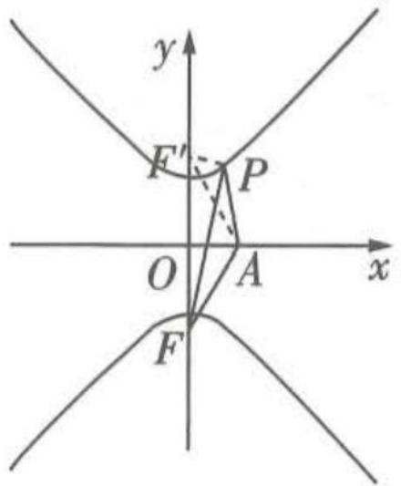

【抓细节】双曲线的焦点在 $y$ 轴上, 不要陷入思维定式, 认为其焦点在 $x$ 轴上

图6-1

设双曲线的另一个焦点为 $F', F'(0, \sqrt{7})$ ，如图 6-1，连接 $PF'$ ，则 $|PF| = |PF'| + 4$ ，

所以 $\triangle PAF$ 的周长 $L = |PF| + |PA| + |AF| = |PF'| + 4 + |PA| + 3 = |PF'| + |PA| + 7,$

【用定义】利用定义转化周长，将周长的最值转化为两条线段和的最值

连接 $AF'$ ，则当 $F'$ ,P,A三点共线时， $|PF'|+|PA|$ 取最小值，为 $|AF'|=3$ ，

故 $\triangle PAF$ 的周长的最小值为10,故选B.

调研 3 (2022·湖南师范大学附属中学5月模拟)已知 $F_{1}, F_{2}$ 分别是双曲线 $C: \frac{x^{2}}{a^{2}} - \frac{y^{2}}{b^{2}} = 1 (a > 0, b > 0)$ 的左、右焦点, 点 $P$ 是双曲线 $C$ 上在第一象限内的点, 若 $\sin \angle PF_{2}F_{1} = 3\sin \angle PF_{1}F_{2}$ , 则双曲线 $C$ 的离心率的取值范围为 ( )

$\quad$A. $(1,2)$

$\quad$B. $(1,3)$

$\quad$C. $(3, +\infty)$

$\quad$D. $(2,3)$

# 思维导引

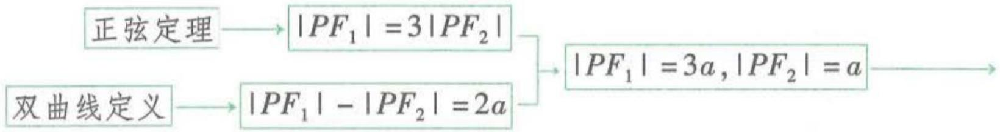

构造不等式 $|PF_{1}|+|PF_{2}|>|F_{1}F_{2}|$ 等价转化 关于a与c的不等式 离心率e的范围

解析

在 $\triangle PF_{1}F_{2}$ 中， $\sin \angle PF_{2}F_{1} = 3\sin \angle PF_{1}F_{2}$ ，由正弦定理得 $|PF_{1}| = 3|PF_{2}|$ ①.

有一个人问她们三个都买了什么,小丽说:“小玲买的不是手套,小娟买的不是发夹.”小玲说:“小丽买的不是发夹,小娟买的不是裙子.”小娟说:“小丽买的不是帽子,小娟买的是裙子.”

关注微信公众号“初高教辅站”获取更多初高中教辅资料

点 P 是双曲线 C 上在第一象限内的点, 所以 $\left|PF_{1}\right| - \left|PF_{2}\right| = 2a$ ②.

由①②得 $\left|PF_{1}\right|=3a,\left|PF_{2}\right|=a.$

在 $\triangle PF_{1}F_{2}$ 中，由 $|PF_{1}| + |PF_{2}| > |F_{1}F_{2}|$ ，得 $3a + a > 2c$

【找不等关系】利用三角形两边之和大于第三边构造不等式

即 $2a > c$ ，所以双曲线 $C$ 的离心率 $e = \frac{c}{a} < 2$ ，又 $e > 1$ ，所以 $1 < e < 2.$ 故选A.

# 命题角度2 圆锥曲线性质的应用问题

调研 4 (2022·陕西西安考前模拟)已知椭圆 $\frac{x^{2}}{a^{2}}+\frac{y^{2}}{b^{2}}=1(a>b>0)$ 的右焦点为 $F(c,0)$ ，上顶点为 $A(0,b)$ ，直线 $x=\frac{a^{2}}{c}$ 上存在一点P满足 $(\overrightarrow{FP}+\overrightarrow{FA})\cdot\overrightarrow{AP}=0$ ，则椭圆离心率的取值范围为()

$\quad$A. $\left[\frac{1}{2},1\right)$

$\quad$B. $\left[\frac{\sqrt{2}}{2},1\right)$

$\quad$C. $\left[\frac{\sqrt{5}-1}{2},1\right)$

$\quad$D. $(0,\frac{\sqrt{2}}{2}]$

思维导引

设 $P(\frac{a^2}{c},y_0)$ ，写出 $\overrightarrow{FP},\overrightarrow{FA},\overrightarrow{AP}$ 的坐标表示

坐标运算 化简 $(\overrightarrow{FP}+\overrightarrow{FA})\cdot\overrightarrow{AP}=0$ $y_{0}^{2}\geqslant0$

列关于 a, c 的不等式 → 转化为关于 e 的不等式 → 解不等式求范围

解析 $\overrightarrow{FA} = (-c,b)$ ，设点 $P$ 的坐标为 $(\frac{a^2}{c},y_0)$ ，则 $\overrightarrow{FP} = (\frac{a^2}{c} -c,y_0),\overrightarrow{AP} = (\frac{a^2}{c},y_0 - b)$

所以 $\overrightarrow{FP} +\overrightarrow{FA} = (\frac{a^2}{c} -2c,y_0 + b)$

【会转化】解析几何中的向量运算一般要通过设点的坐标转化为坐标运算，从而得到基本量（一般为 $a, b, c, p$ ）之间的关系式

因为 $(\overrightarrow{FP} +\overrightarrow{FA})\cdot \overrightarrow{AP} = 0$ ，所以 $\left(\frac{a^2}{c} -2c\right)\cdot \frac{a^2}{c} +(y_0 + b)(y_0 - b) = 0,$ 可得 $y_0^2 = 2a^2 +b^2 -\frac{a^4}{c^2},$

又 $y_0^2 \geqslant 0, b^2 = a^2 - c^2$ ，所以 $a^4 - 3a^2c^2 + c^4 \leqslant 0$ ，即 $e^4 - 3e^2 + 1 \leqslant 0$ ，可得 $\frac{3 - \sqrt{5}}{2} \leqslant e^2 < 1$ ，解得 $\frac{\sqrt{5} - 1}{2} \leqslant e < 1$ ，故选C.

【易错提醒】解关于离心率 e 的方程时，要注意利用椭圆的离心率 $e \in (0,1)$ 进行根的取舍，否则将产生增根

她们三个人,每个人说的话都是有一半是真的,一半是假的.那么,她们分别买了什么东西?

调研 5 (2022·东北师范大学附属中学6月综合训练)如图 6-2 所示的建筑物造型美观,是数学与建筑完美结合造就的艺术品.其外形弧线的一段可近似看成双曲线 $\frac{\gamma^2}{a^2} -\frac{x^2}{b^2} = 1(a > 0,b > 0)$ 下支的

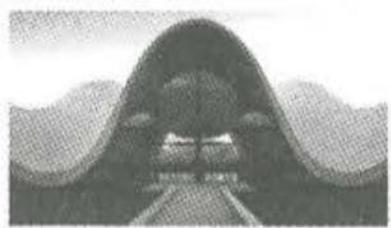  
图6-2

一部分,且此双曲线的下焦点到渐近线的距离为2,焦距为 $\frac{8\sqrt{3}}{3}$ ,则该双曲线的渐近线方程为()

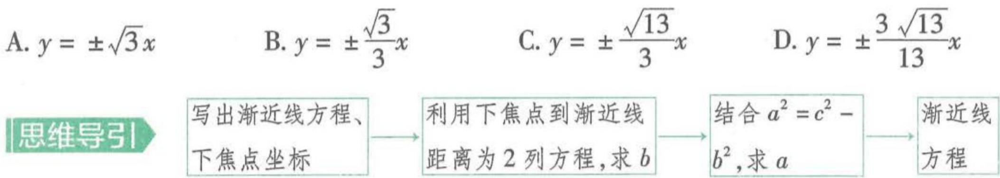

解析 双曲线 $\frac{y^2}{a^2} -\frac{x^2}{b^2} = 1(a > 0,b > 0)$ 的渐近线方程为 $y = \pm \frac{a}{b} x$ ，下焦点为 $(0, - c)$ 【检验基础】求双曲线 $\frac{y^{2}}{a^{2}}-\frac{x^{2}}{b^{2}}=1(a>0,b>0)$ 的渐近线方程的方法是令 $\frac{y^{2}}{a^{2}}-\frac{x^{2}}{b^{2}}=0$ ，即得其渐近线方程为 $\frac{y}{a}\pm\frac{x}{b}=0(y=\pm\frac{a}{b}x)$

因为双曲线的下焦点到渐近线的距离为2,所以 $\frac{|bc|}{\sqrt{a^{2}+b^{2}}}=2$ ,解得b=2.

【二级结论】双曲线的焦点到其渐近线的距离为虚半轴长b，故b=2

因为焦距为 $\frac{8\sqrt{3}}{3}$ ，所以 $c=\frac{4\sqrt{3}}{3}$ ，

所以 $a = \sqrt{c^2 - b^2} = \sqrt{\left(\frac{4\sqrt{3}}{3}\right)^2 - 2^2} = \frac{2\sqrt{3}}{3}$ , 所以 $\frac{a}{b} = \frac{\sqrt{3}}{3}$ ,

所以双曲线的渐近线方程为 $y = \pm \frac{\sqrt{3}}{3}x$ ，故选 B.

调研 6 (2022·湖北考前模拟/抛物线的光学性质)探照灯、汽车灯等很多灯具的反光镜是抛物面(由抛物线绕它的对称轴旋转所得到的曲面),正是利用了抛物线的光学性质:从焦点发出的光线,经过抛物线上的一点反射后,反射光线平行于抛物线的轴.如图6-3,在平面直角坐标系中,抛物线 $C:y^{2}=8x$ ,焦点为F,

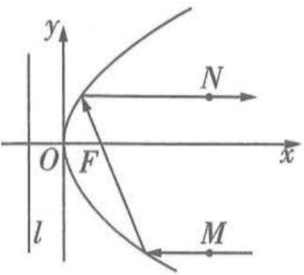

图6-3

“二十四点”是指二十四点游戏。二十四点游戏的规则是：将四个数字进行加、减、乘、除四则混合运算（允许使用括号）求得二十四。例如 $3, 3, 3, 3 \rightarrow 3 \times 3 \times 3 - 3 = 24$ 。你也来试一试吧！

关注微信公众号“初高教辅站”获取更多初高中教辅资料一条与 x 轴平行的光线经过点 $M(8, -6)$ 射到抛物线 C 上, 两次反射后经过点 $N(8, y_{0})$ 射出, 则 $y_{0} =$ \_\_\_\_ , 光线从点 M 到 N 经过的总路程为 \_\_\_\_.

解析 设第一次射到抛物线上的点为 P，第二次射到抛物线上的点为 Q，易得 $P(\frac{9}{2}, -6)$ ，因为 $F(2,0)$ ，所以直线 PF 的方程为 $12x + 5y - 24 = 0$ 。

由 $\left\{\begin{aligned}y^{2}&=8x,\\ 12x+5y&-24=0,\end{aligned}\right.$ 消去x并整理得 $3y^{2}+10y-48=0$ ,

设 $Q(x_{Q},y_{0})$ ，显然 -6 和 $y_{0}$ 是该方程的两个根，则 $-6y_{0} = -16$ ，所以 $y_{0} = \frac{8}{3}$ .

【二级结论】设 AB 是过抛物线 $y^{2}=2px(p>0)$ 焦点 F 的弦， $\alpha$ 为直线 AB 的倾斜角，若 $A(x_{1},y_{1})$ ， $B(x_{2},y_{2})$ ，则 $y_{1}y_{2}=-p^{2}$ 。由此得 $y_{0}=\frac{8}{3}$

光线从点 $M$ 到 $N$ 经过的总路程为 $|MP| + |PQ| + |QN| = (x_{M} - x_{P}) + (x_{P} + x_{Q} + 4) + (x_{N} - x_{Q}) = x_{M} + x_{N} + 4 = 8 + 8 + 4 = 20.$

调研 7 (2022·福建厦门一中 5 月预测)已知 O 为坐标原点,抛物线 $C: y^{2} = 2px (p > 0)$ 的焦点为 F, P 为 C 上一点, PF 与 x 轴垂直, Q 为 x 轴上一点,且 $PQ \perp OP$ , 若 $|FQ| = 6$ , 则 C 的准线方程为 \_\_\_\_.

解析 方法一 （向量法）抛物线 $C: y^{2} = 2px (p > 0)$ 的焦点为 $F(\frac{p}{2}, 0)$ ,

因为 PF 与 x 轴垂直, 所以 P 的横坐标为 $\frac{p}{2}$ ,

将其代入抛物线方程可得 P 的纵坐标为 $\pm p$ ，不妨设 $P(\frac{p}{2}, p)$ ，则 $\overrightarrow{OP} = (\frac{p}{2}, p)$ .

因为 Q 为 x 轴上一点, 且 $PQ \perp OP$ , 所以 Q 在 F 的右侧, 又 $|FQ| = 6$ , 所以 $Q(6 + \frac{p}{2}, 0)$ , 所以 $\overrightarrow{PQ} = (6, -p)$ .

因为 $PQ \perp OP$ ，所以 $\overrightarrow{PQ} \cdot \overrightarrow{OP} = 6 \times \frac{p}{2} - p^{2} = 0$ ，

【会思考】见垂直,找坐标. 将垂直关系转化为向量的坐标运算,得到关于 $p$ 的方程

因为 p > 0，所以 p = 3，所以 C 的准线方程为 $x = -\frac{3}{2}$ .

方法二 由题易得 $|OF| = \frac{p}{2}, |PF| = p, \angle OPF = \angle PQF,$

所以 $\tan \angle OPF = \tan \angle PQF$ ，所以 $\frac{|OF|}{|PF|} = \frac{|PF|}{|FQ|}$ 即 $\frac{p}{2} = \frac{p}{6}$ 解得 $p = 3$ 或 $p = 0$ （舍去），

所以 C 的准线方程为 $x = -\frac{3}{2}$ .

秒杀解 （射影定理法）由题易得 $|OF|=\frac{p}{2},|PF|=p$ ,

由射影定理得 $|PF|^{2}=|OF||FQ|$ ,

【射影见性】在 $|B| \triangleq |BC|^{2}$ ， $\angle ABC = 90^{\circ} - BD$ 和解证 $|C|$ 的高，则用 $|BD|^2 = |AD||CD|$ 。 $|AB|^2 = |AC||D|$ ， $|BC|^2 = |CD||C|$

即 $p^2 = \frac{p}{2} \times 6$ ，解得 $p = 3$ 或 $p = 0$ （舍去），所以 $C$ 的准线方程为 $x = -\frac{3}{2}$ .

# 新题演练

##### 1. (2022·辽宁沈阳三模)已知椭圆 $C: x^{2} + 4y^{2} = m (m > 0)$ 的左、右焦点分别为 $F_{1}, F_{2}$ , 点 $P$ 是椭圆上一点, 若 $\overrightarrow{PF_{1}} \cdot \overrightarrow{PF_{2}}$ 的最小值为 -1 , 则 $\overrightarrow{PF_{1}} \cdot \overrightarrow{PF_{2}}$ 的最大值为 ( )

$\quad$A. 4

$\quad$B. 2

$\quad$C. $\frac{1}{4}$

$\quad$D. $\frac{1}{2}$

##### 2. (2022·江西临川二中模拟改编)(多选)已知抛物线 $C: y^{2} = 2px (p > 0)$ 的焦点为 $F$ , 直线 $l$ 的斜率为 $\sqrt{3}$ 且经过点 $F$ , 直线 $l$ 与抛物线 $C$ 交于 $A, B$ 两点(点 $A$ 在第一象限), 与抛物线 $C$ 的准线交于点 $D$ , 若 $|AF| = 8$ , 则以下结论正确的是 ( )

$\quad$A. $p = 4$

$\quad$B. $\overrightarrow{DF} = \overrightarrow{FA}$

$\quad$C. $|BD| = 2|BF|$

$\quad$D. $|BF|=4$

##### 3. (2022·江西重点中学5月联考)设 $F_{1}, F_{2}$ 分别是双曲线 $\frac{x^{2}}{4} - \frac{y^{2}}{3} = 1$ 的左、右焦点, $P$ 是双曲线上任意一点, 过 $F_{1}$ 作 $\angle F_{1}PF_{2}$ 平分线的垂线, 垂足为 $M$ , 则点 $M$ 到直线 $x + y - 4\sqrt{2} = 0$ 的距离的最大值是 ( )

$\quad$A. 2

$\quad$B. 4

$\quad$C. 6

$\quad$D. 8

##### 4. (2022·福建泉州七中模拟)已知抛物线 $x^{2} = 2py (p > 0)$ , 过焦点 $F$ 的直线与抛物线交于 $A, B$ 两点 (点 $A$ 在第一象限). 若直线 $AB$ 的斜率为 $\frac{\sqrt{3}}{3}$ , 点 $A$ 的纵坐标为 $\frac{3}{2}$ , 则 $p$ 的值为 （）

$\quad$A. $\frac{1}{4}$

$\quad$B. $\frac{1}{2}$

$\quad$C. 1

$\quad$D. 2

##### 5. (2022·山东泰安二模)(多选)已知双曲线 $C: \frac{x^{2}}{a^{2}} - \frac{y^{2}}{b^{2}} = 1 (a > 0, b > 0)$ 的离心率为 $\frac{3}{2}$ , 且其右顶点为 $A(2,0)$ , 左、右焦点分别为 $F_{1}, F_{2}$ , 点 $P$ 在双曲线 $C$ 上, 则下列结论正确的是公众号: 拾穗者的杂货铺 ( )

$\quad$A. 双曲线 C 的方程为 $\frac{x^{2}}{4}-\frac{y^{2}}{5}=1$   
$\quad$B. 点 A 到双曲线 C 的渐近线的距离为 $\frac{2\sqrt{5}}{3}$   
$\quad$C. 若 $|PF_{1}|=6$ ，则 $|PF_{2}|=2$   
$\quad$D. 若 $\overrightarrow{PF_1} \cdot \overrightarrow{PA} = 0$ ，则 $\triangle PF_1A$ 的外接圆半径为 $\frac{5}{2}$

# 参考答案与解析

##### 1. D 设 $P(x_{0}, y_{0})$ ，易知 $F_{1}(-\frac{\sqrt{3m}}{2}, 0)$ ， $F_{2}(\frac{\sqrt{3m}}{2}, 0)$ ，∴ $\overrightarrow{PF_{1}} = (-\frac{\sqrt{3m}}{2} - x_{0}, -y_{0})$ ， $\overrightarrow{PF_{2}}=\left(\frac{\sqrt{3m}}{2}-x_{0},-y_{0}\right)$ ,

$\therefore \overrightarrow {P F _ {1}} \cdot \overrightarrow {P F _ {2}} = - \frac {3 m}{4} + x _ {0} ^ {2} + y _ {0} ^ {2} = - \frac {3 m}{4} + \frac {1}{4} (4 x _ {0} ^ {2} + m - x _ {0} ^ {2}) = \frac {3 x _ {0} ^ {2}}{4} - \frac {1}{2} m.$

【转化关键】将目标代数式 $\overrightarrow{PF_{1}}\cdot\overrightarrow{PF_{2}}$ 用 $x_{0}$ ，m表示，但要注意 $x_{0}$ 是自变量，m是参数，所以由 $x_{0}$ 的范围即可推出目标代数式的范围

由题意知 $-\sqrt{m} \leqslant x_{0} \leqslant \sqrt{m}$ ，∴ 当 $x_{0} = 0$ 时， $\overrightarrow{PF_{1}} \cdot \overrightarrow{PF_{2}}$ 取最小值，为 $-\frac{1}{2}m = -1$ ，解得 m = 2。则当 $x_0 = \pm \sqrt{m}$ 时， $\overrightarrow{PF_1} \cdot \overrightarrow{PF_2}$ 取最大值，为 $\frac{3}{4} \times 2 - \frac{1}{2} \times 2 = \frac{1}{2}$ . 故选 D.

##### 2. ABC 如图 6-4 所示, 分别过点 $A, B$ 作抛物线 $C$ 的准线 $m$ 的垂线, 垂足分别为 $E, M$ , 连接 $EF$ . 记抛物线 $C$ 的准线 $m$ 与 $x$ 轴的交点为 $P$ , 则 $|PF| = p$ , 由于直线 $l$ 的斜率为 $\sqrt{3}$ , 其倾斜角为 $60^\circ$ , $AE \parallel x$ 轴, $\therefore \angle EAF = 60^\circ$ .

由抛物线的定义可知， $|AE|=|AF|$ ，则 $\triangle AEF$ 为等边三角形.

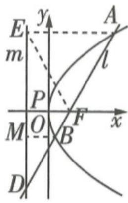

图6-4

<table><tr><td>选项</td><td>分析过程</td><td>正误</td></tr><tr><td>A</td><td> $\angle AEF = 60^{\circ}$ ,则  $\angle PEF = 30^{\circ}$ , $\therefore |AF| = |EF| = 2|PF| = 2p = 8$ ,得  $p = 4$ </td><td>√</td></tr><tr><td>B</td><td> $\because |AE| = |EF| = 2|PF|,PF \parallel AE, \therefore F$  为  $AD$  的中点,则  $\overrightarrow{DF} = \overrightarrow{FA}$ </td><td>√</td></tr><tr><td>C</td><td> $\because \angle DAE = 60^{\circ}, \therefore \angle ADE = 30^{\circ}, \therefore |BD| = 2|BM| = 2|BF|$ 【用定义】遇到抛物线问题,都要想到抛物线上的点到焦点的距离和到准线的距离相等</td><td>√</td></tr><tr><td>D</td><td>由 C 知  $|BD| = 2|BF|$ , $\therefore |BF| = \frac{1}{3}|DF| = \frac{1}{3}|AF| = \frac{8}{3}$ </td><td>×</td></tr></table>

##### 3. C 不妨设 $P$ 在双曲线右支上, 如图 6-5, 延长 $PF_{2}$ , 与直线 $F_{1} M$ 相交于 $N$ , $\because \angle F_{1} P M = \angle N P M, P M \perp F_{1} N, \therefore \triangle F_{1} P M \cong \triangle N P M$ , 故 $|P F_{1}| = |P N|$ , 由双曲线的定义可知 $|P F_{1}| - |P F_{2}| = 2 a = 4$ , 则 $|P N| - |P F_{2}| = |N F_{2}| = 2 a = 4$ .

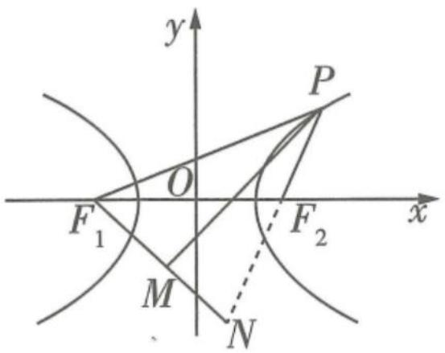

图6-5

【易错提醒】在双曲线中 $|PF_{1}|-|PF_{2}|=\pm2a$ ，若点P在右支上，则 $|PF_{1}|-|PF_{2}|=2a$ ；若点P在左支上，则 $|PF_{2}|-|PF_{1}|=2a$

设 $M(x_{0},y_{0})$ ，由题知 $F_{1}(-\sqrt{7},0)$ ， $F_{2}(\sqrt{7},0)$ ，则 $N(2x_{0}+\sqrt{7},2y_{0})$ ，又 $|NF_{2}|=4$ ，故 $x_{0}^{2}+y_{0}^{2}=4$ ，

即点 M 在以 $(0,0)$ 为圆心、2 为半径的圆上，且圆心 $(0,0)$ 到直线 $x + y - 4\sqrt{2} = 0$ 的距离 $d = \frac{4\sqrt{2}}{\sqrt{2}} = 4 > 2$ ，所以直线与圆相离，则点 M 到直线 $x + y - 4\sqrt{2} = 0$ 的距离的最大值是 $d + 2 = 6$ ，故选 C.

##### 4. C 由题意得,抛物线 $x^{2} = 2py (p > 0)$ 的焦点在 $y$ 轴上, $F(0, \frac{p}{2})$ , 准线方程为 $y = -\frac{p}{2}$ ,

【敲黑板】抛物线的焦点在 $y$ 轴上,作草图时不要粗心画成了开口向右的曲线设 $A(x_{A},y_{A})$ ，则 $\vert AF\vert = y_A + \frac{p}{2} = \frac{3}{2} +\frac{p}{2}$ 设直线 $AB$ 的倾斜角为 $\alpha$ ，则 $\tan \alpha = \frac{\sqrt{3}}{3}$

因为 $\alpha \in [0, \pi)$ , 所以 $\alpha = \frac{\pi}{6}$ , 所以 $|AF| = \frac{y_A - \frac{p}{2}}{\sin \alpha} = \frac{\frac{3}{2} - \frac{p}{2}}{\sin \alpha} = \frac{3 - p}{2\sin \alpha} = \frac{3 - p}{2 \times \frac{1}{2}} = 3 - p$ ,

所以 $3 - p = \frac{3}{2} +\frac{p}{2}$ ，解得 $p = 1$ .故选C.

##### 5. ABD 

<table><tr><td>选项</td><td>分析过程</td><td>正误</td></tr><tr><td>A</td><td>由离心率为 $\frac{3}{2}$ ,右顶点为A(2,0),可得a=2,c=3,所以b= $\sqrt{5}$ ,故双曲线C的方程为 $\frac{x^{2}}{4}-\frac{y^{2}}{5}=1$ </td><td>√</td></tr><tr><td>B</td><td>双曲线的渐近线方程为 $y=\pm\frac{\sqrt{5}}{2}x$ ,故点A到其距离为 $\frac{|\pm\sqrt{5}|}{\sqrt{\frac{5}{4}+1}}=\frac{2\sqrt{5}}{3}$ </td><td>√</td></tr><tr><td>C</td><td>由双曲线的定义得 $||PF_{1}|-|PF_{2}||=2a=4$ ,若 $|PF_{1}|=6$ ,【易错提醒】双曲线定义中最外层的绝对值符号不要遗漏,点P可能在双曲线左支上,也可能在双曲线右支上则当点P在双曲线右支上时, $|PF_{2}|=2$ ,满足 $|PF_{2}|\geq c-a=1$ ,当点P在双曲线左支上时, $|PF_{2}|=10$ ,满足 $|PF_{2}|\geq c+a=5$ ,故 $|PF_{2}|=2$ 或10</td><td>×</td></tr><tr><td>D</td><td>若 $\overrightarrow{PF_{1}}\cdot\overrightarrow{PA}=0$ ,则 $\overrightarrow{PF_{1}}\perp\overrightarrow{PA}$ ,故△ $PF_{1}A$ 的外接圆半径为 $\frac{|F_{1}A|}{2}=\frac{5}{2}$ </td><td>√</td></tr></table>

# 超重点7 椭圆、双曲线的焦点三角形与焦半径

# 命题角度1 椭圆、双曲线的焦点三角形

# 1. 焦点三角形的面积问题

调研 1 (2022·江西临川一中5月模拟)已知椭圆 $C: \frac{x^2}{a^2} + \frac{y^2}{b^2} = 1 (a > b > 0)$ , 其左、右焦点分别为 $F_1, F_2$ , 离心率 $e = \frac{1}{2}$ , 点 $P$ 为该椭圆上一点, 且满足 $\angle F_1PF_2 = \frac{\pi}{3}$ , 已知 $\triangle F_1PF_2$ 的内切圆的面积为 $3\pi$ , 则该椭圆的长轴长为 ( )

$\quad$A. 2

$\quad$B. 4

$\quad$C. 6

$\quad$D. 12

解析 由 $e = \frac{1}{2}$ , 得 $\frac{c}{a} = \frac{1}{2}$ , 即 $a = 2c$ .

设 $\triangle F_{1}PF_{2}$ 的内切圆半径为 $r$ ,则由 $\triangle F_{1}PF_{2}$ 的内切圆的面积为 $3\pi$ ,可得 $\pi r^{2}=3\pi$ ,解得 $r=\sqrt{3}$ (负值舍去).

在 $\triangle F_{1}PF_{2}$ 中,根据椭圆的定义及焦点三角形的面积公式,知 $S_{\triangle F_{1}PF_{2}}=$ $b^{2}\tan\frac{\angle F_{1}PF_{2}}{2}=\frac{1}{2}r(2a+2c)$ ,即 $\frac{\sqrt{3}}{3}b^{2}=\sqrt{3}(a+c)$ .

【二级结论】圆锥曲线焦点三角形面积公式：在椭圆中， $S_{\triangle PF_{1}F_{2}} = b^{2}\tan \frac{\angle F_{1}PF_{2}}{2}$ ；在双曲线中， $S_{\triangle PF_{1}F_{2}} = \frac{b^{2}}{\tan \frac{\angle F_{1}PF_{2}}{2}}$ （其中P为圆锥曲线上不同于长轴两端点的任意一点， $F_{1}, F_{2}$ 分别是圆锥曲线的左、右焦点）

结合 $a^{2}=b^{2}+c^{2}$ ，易得 a=6，

所以该椭圆的长轴长为 $2a = 2 \times 6 = 12$ . 故选 D.

调研 2 (2022·湖北襄阳 5 月冲刺)已知双曲线 C 的离心率为 $\sqrt{3}$ , $F_{1}$ , $F_{2}$ 分别是 C 的左、右焦点, P 为 C 上一点, $|PF_{1}| = 3|PF_{2}|$ , 若 $\triangle PF_{1}F_{2}$ 的面积为 $4\sqrt{2}$ , 则双曲线 C 的实轴长为 ( )

$\quad$A. 1

$\quad$B.2

$\quad$C. 4

$\quad$D. 6

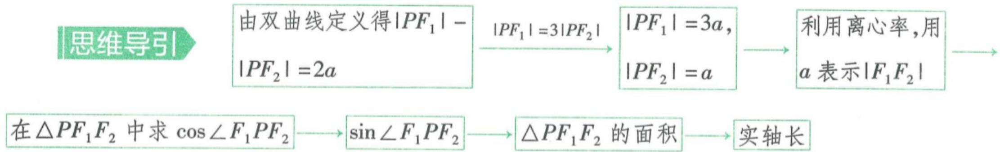

解析 设双曲线 C 的方程为 $\frac{x^{2}}{a^{2}} - \frac{y^{2}}{b^{2}} = 1 (a > 0, b > 0)$ ，由题意知，点 P 在双曲线右支上，则 $\left|PF_{1}\right| - \left|PF_{2}\right| = 2a$ ，

又 $|PF_{1}|=3|PF_{2}|,\therefore|PF_{1}|=3a,|PF_{2}|=a.$

∵ 双曲线的离心率 $e=\frac{c}{a}=\sqrt{3}$ ，∴ $\left|F_{1}F_{2}\right|=2c=2\sqrt{3}a$ ，

则在 $\triangle PF_{1}F_{2}$ 中， $\cos \angle F_{1}PF_{2} = \frac{9a^{2} + a^{2} - 12a^{2}}{2 \cdot 3a \cdot a} = -\frac{1}{3}, \therefore \sin \angle F_{1}PF_{2} = \frac{2\sqrt{2}}{3},$

故 $S_{\triangle PF_1F_2} = \frac{1}{2}\cdot a\cdot 3a\cdot \frac{2\sqrt{2}}{3} = 4\sqrt{2}$ ，解得 $a = 2$ （负值舍去），

∴实轴长为2a=4,故选C.

【防易错】有些同学在求出 $a = 2$ 之后, 就兴冲冲地提笔选 B, 注意题眼 “实轴长”, 实轴长是 $2 a$

调研 3 (2022·兰州一中诊断考试)已知椭圆 $C_{1}: \frac{x^{2}}{a^{2}} + \frac{y^{2}}{2} = 1 (a > \sqrt{2})$ 与双曲线 $C_{2}$ 有公共的焦点 $F_{1}, F_{2}, A$ 为曲线 $C_{1}, C_{2}$ 在第一象限内的交点, 且 $\triangle AF_{1}F_{2}$ 的面积为 2 , 若椭圆 $C_{1}$ 的离心率为 $e_{1}$ , 双曲线 $C_{2}$ 的离心率为 $e_{2}$ , 则 $4e_{1}^{2} + e_{2}^{2}$ 的最小值为 ( )

$\quad$A. 9

$\quad$B. $\frac{9}{2}$

$\quad$C. 7

$\quad$D. $\frac{7}{2}$

思维导引

记 $|AF_{1}|=m,$ $|AF_{2}|=n$

由椭圆的定义得 $m + n = 2a$ ，由双曲线的定义得 $m - n = 2a'$

设 $\angle F_{1}AF_{2} = \theta$

在 $\triangle F_{1}AF_{2}$ 中，利用余弦定理列方程

利用面积公式列方程

$\theta$ $\rightarrow$ $\frac{1}{2e_{1}^{2}}+\frac{1}{2e_{2}^{2}}=1$

利用基本不等式求最值

解析 不妨令 $F_{1}$ 为左焦点, $F_{2}$ 为右焦点, 如图 7-1, 记双曲线 $C_{2}$ 的实半轴长为 $a'$ , 半焦距为 c, $|AF_{1}| = m$ , $|AF_{2}| = n$ ,

则由椭圆和双曲线的定义可得 $m + n = 2a$ ①, $m - n = 2a'$ ②,

由① $^{2}$ -② $^{2}$ 并整理得 $a^{2}-a^{'2}=mn.$

设 $\angle F_{1}AF_{2} = \theta$ ，则在 $\triangle F_{1}AF_{2}$ 中，由余弦定理得 $m^2 + n^2 - 2mn\cos \theta = 4c^2$ ③，

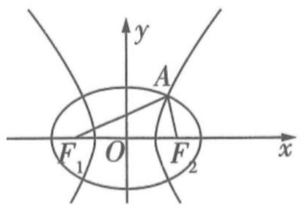

图7-1

由① $^{2}$ -③得 $2mn(1+\cos\theta)=4a^{2}-4c^{2}=4\times2=8$ ④.

对于 $\triangle F_{1}AF_{2}$ ,由三角形面积公式可得 $\frac{1}{2}mn\sin\theta=2$ ,即 $mn=\frac{4}{\sin\theta}$ ,代入④整理得 $\sin(\theta-\frac{\pi}{4})=\frac{\sqrt{2}}{2}$ .

【抓关键】在焦点三角形中运用余弦定理、面积公式等列方程时一般要把已知角作为桥梁, 消参减元

因为 $\theta \in (0, \pi)$ , 所以 $\theta - \frac{\pi}{4} \in (-\frac{\pi}{4}, \frac{3\pi}{4})$ , 所以 $\theta - \frac{\pi}{4} = \frac{\pi}{4}$ , 得 $\theta = \frac{\pi}{2}$ , 所以 $mn = 4$ , 所以 $a^2 - a'^2 = 4$ , 即 $a'^2 = a^2 - 4$ , 所以 $\frac{1}{e_1^2} + \frac{1}{e_2^2} = \frac{a^2 + a'^2}{c^2} = \frac{2a^2 - 4}{a^2 - 2} = 2$ , 即 $\frac{1}{2e_1^2} + \frac{1}{2e_2^2} = 1$ ,

【万里挑“1”】根据已知条件或其变形得到常数1，然后把“1”的表达式与所求最值的表达式相乘或相除，构造和或识为定值的形式，即可利用基本不等式求最值

所以 $4e_{1}^{2} + e_{2}^{2} = \left(\frac{1}{2e_{1}^{2}} +\frac{1}{2e_{2}^{2}}\right)\left(4e_{1}^{2} + e_{2}^{2}\right) = \frac{5}{2} +\frac{e_{2}^{2}}{2e_{1}^{2}} +\frac{2e_{1}^{2}}{e_{2}^{2}}\geqslant \frac{5}{2} +2\sqrt{\frac{e_{2}^{2}}{2e_{1}^{2}}\cdot\frac{2e_{1}^{2}}{e_{2}^{2}}} = \frac{9}{2},$

当且仅当 $e_1 = \frac{\sqrt{3}}{2}, e_2 = \frac{\sqrt{6}}{2}$ 时等号成立. 故选 B.

# 2. 焦点三角形的角度问题

调研 4 (2022·湘赣皖长郡十五校联考)已知 $F_{1}, F_{2}$ 为椭圆 $\frac{x^{2}}{a^{2}} + \frac{y^{2}}{b^{2}} = 1 (a > b > 0)$ 的左、右焦点, 椭圆的离心率为 $\frac{1}{2}, M$ 为椭圆上一动点, 则 $\angle F_{1}MF_{2}$ 的最大值为 ( )

$\quad$A. $\frac{\pi}{3}$

$\quad$B. $\frac{\pi}{2}$

$\quad$C. $\frac{2\pi}{3}$

$\quad$D. $\frac{3\pi}{4}$

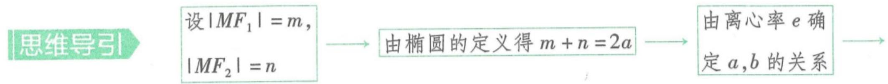

利用余弦定理列方程 $\rightarrow$ 利用基本不等式求 $\cos\angle F_{1}MF_{2}$ 的最小值 $\xrightarrow{等价转化}$ 角的最大值

解析 设 $|MF_{1}| = m, |MF_{2}| = n$ ，则 $m + n = 2a$ ，

因为椭圆的离心率 $e = \frac{c}{a} = \frac{1}{2}$ ，所以 $\frac{b^2}{a^2} = \frac{3}{4}$ .

在 $\triangle F_{1}MF_{2}$ 中， $|F_{1}F_{2}| = 2c$ ，由余弦定理得 $\cos \angle F_{1}MF_{2} = \frac{m^{2} + n^{2} - (2c)^{2}}{2mn} = \frac{(m + n)^{2} - 2mn - 4c^{2}}{2mn} = \frac{(2a)^{2} - 4(a^{2} - b^{2})}{2mn} - 1 = \frac{2b^{2}}{mn} - 1 \geqslant \frac{2b^{2}}{\left(\frac{m + n}{2}\right)^{2}} - 1 = \frac{2b^{2}}{a^{2}} - 1 = 2 \times \frac{3}{4} - 1 = \frac{1}{2}$ ，当且仅当 $m = n$ ，即 $M$ 在椭圆的短轴端点处时取等号，此时 $\cos \angle F_{1}MF_{2}$ 取最小值 $\frac{1}{2}$ .

由于 $0 < \angle F_{1}MF_{2} < \pi$ , 所以 $\cos \angle F_{1}MF_{2}$ 取最小值时, $\angle F_{1}MF_{2}$ 取最大值, 所以 $\angle F_{1}MF_{2}$ 的最大值为 $\frac{\pi}{3}$ . 故选 A.

【二级结论】在椭圆中， $F_{1}$ ， $F_{2}$ 是两个焦点， $M$ 是椭圆上一点。①在焦点三角形 $F_{1}MF_{2}$ 中，当点 $M$ 在短轴端点处时， $\angle F_{1}MF_{2}$ 最大；②在三角形 $AMB$ 中，当点 $M$ 在短轴端点处时， $\angle AMB$ 最大，其中 $A, B$ 是长轴两端点。据此，本题可秒杀得出当点 $M$ 在短轴端点处时， $\angle F_{1}MF_{2}$ 最大。

调研 5 (2022·陕西宝鸡中学5月测试)已知双曲线 $\frac{x^{2}}{a^{2}}-\frac{y^{2}}{b^{2}}=1(a>0,b>0)$ 的左、右焦点分别为 $F_{1},F_{2},M$ 为双曲线右支上的一点,若M在以 $|F_{1}F_{2}|$ 为直径的圆上,且 $\angle MF_{2}F_{1}\in[\frac{\pi}{3},\frac{5\pi}{12}]$ ,则该双曲线离心率的取值范围为()

$\quad$A. $(1, \sqrt{2}]$

$\quad$B. $\left[\sqrt{2},+\infty\right)$

$\quad$C. $(1,\sqrt{3}+1)$

$\quad$D. $\left[\sqrt{2},\sqrt{3}+1\right]$

解析 $|F_{1}F_{2}| = 2c$ ，连接 $MF_{1},\because M$ 在以 $|F_1F_2|$ 为直径的圆上， $\therefore MF_1\bot MF_2,$

$\therefore \sin \angle MF_{2}F_{1} = \frac{|MF_{1}|}{|F_{1}F_{2}|}, \cos \angle MF_{2}F_{1} = \frac{|MF_{2}|}{|F_{1}F_{2}|}, \therefore |MF_{1}| = 2c\sin \angle MF_{2}F_{1}, |MF_{2}| = 2c\cos \angle MF_{2}F_{1}$ .

由双曲线的定义知 $\left|MF_{1}\right|-\left|MF_{2}\right|=2a$

即 $2c\sin\angle MF_{2}F_{1}-2c\cos\angle MF_{2}F_{1}=2a$

$\therefore \frac {c}{a} = \frac {1}{\sin \angle M F _ {2} F _ {1} - \cos \angle M F _ {2} F _ {1}} = \frac {1}{\sqrt {2} \sin (\angle M F _ {2} F _ {1} - \frac {\pi}{4})}.$

【模块交汇】利用辅助角公式，将解析几何中的范围问题转化为三角函数的值域问题求解

$\because \angle MF_{2}F_{1}\in [\frac{\pi}{3},\frac{5\pi}{12}],\therefore \angle MF_{2}F_{1} - \frac{\pi}{4}\in [\frac{\pi}{12},\frac{\pi}{6}],\therefore \sin (\angle MF_{2}F_{1} - \frac{\pi}{4})\in$ $[\frac{\sqrt{6} - \sqrt{2}}{4},\frac{1}{2} ]$

则 $\sqrt{2}\sin (\angle MF_2F_1 - \frac{\pi}{4})\in [\frac{\sqrt{3} - 1}{2},\frac{\sqrt{2}}{2}],\therefore \frac{c}{a}\in [\sqrt{2},\sqrt{3} +1]$

即双曲线离心率的取值范围为 $[\sqrt{2},\sqrt{3} +1]$ .故选D.

# 命题角度2 椭圆、双曲线的焦半径

调研 6 (2022·杭州学军中学5月模拟)如图7-2,椭圆 $C:\frac{x^{2}}{a^{2}}+\frac{y^{2}}{4}=1(a>2)$ ，圆 $O:x^{2}+y^{2}=a^{2}+4$ ，椭圆C的左、右焦点分别为 $F_{1},F_{2}$ ，过椭圆上一点P和原点O作直线l交圆O于M,N两点，若 $|PF_{1}||PF_{2}|=8$ ，则 $|PM||PN|$ 的值为\_\_\_\_.

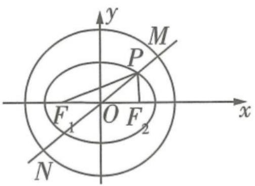

图7-2

解析 设 $P(x_0, y_0)$ , 因为 $P$ 在椭圆上, 所以 $\frac{x_0^2}{a^2} + \frac{y_0^2}{4} = 1$ , 则 $y_0^2 = 4(1 - \frac{x_0^2}{a^2})$ .

因为 $\left|PF_{1}\right|\left|PF_{2}\right|=8$ ，所以 $(a+ex_{0})(a-ex_{0})=8$ ，其中e为椭圆C的离心率，

【二级结论】椭圆的焦半径公式： $|PF_{1}| = a + ex_{P}, |PF_{2}| = a - ex_{P}$ （其中 $P(x_{P}, y_{P})$ 在椭圆 $\frac{x^{2}}{a^{2}} + \frac{y^{2}}{b^{2}} = 1 (a > b > 0)$ 上， $F_{1}, F_{2}$ 分别为椭圆的左、右焦点，e为椭圆的离心率）

则 $e^2 = \frac{a^2 - 4}{a^2}$ , 所以 $x_0^2 = \frac{a^2(a^2 - 8)}{a^2 - 4}, y_0^2 = 4 - \frac{4(a^2 - 8)}{a^2 - 4}$ , 又 $|OM| = |ON| = \sqrt{a^2 + 4}$ , 则 $|PM||PN| = (|OM| - |OP|)(|ON| + |OP|) = a^2 + 4 - OP^2 = a^2 + 4 - x_0^2 - y_0^2 = a^2 + 4 - a^2 + 4 = 8$ .

调研 7 (2022·安徽六安 5 月仿真改编)已知双曲线 $C: \frac{x^{2}}{a^{2}} - \frac{y^{2}}{b^{2}} = 1 (a > 0, b > 0)$ 的焦点为 $F_{1}, F_{2}$ , 若点 $P$ 是双曲线上任意一点, 且满足 $|PO|^{2} = |PF_{1}| \cdot |PF_{2}|$ (其中 $O$ 为坐标原点), 则双曲线 $C$ 的渐近线方程为公众号: 拾穗者的杂货铺 ( )

$\quad$A. $y = \pm 2x$

$\quad$B. $y = \pm \sqrt{3} x$

$\quad$C. $y = \pm \sqrt{2} x$

$\quad$D. $y = \pm x$

思维导引

设 $P(x_0,y_0)$

焦半径 $|PF_{1}|,|PF_{2}|$

由 $|PO|^{2}=|PF_{1}|$

$|PF_{2}|$ 列等式

确定 a, b 之间的关系 → 渐近线方程

解析 设 $P(x_0, y_0)$ , 则 $x_0^2 \geqslant a^2$ , 由焦半径公式可知 $|PF_1| = |ex_0 + a|$ , $|PF_2| = |ex_0 - a|$ , 其中 $e$ 为双曲线的离心率,

【二级结论】双曲线的焦半径公式： $\left|PF_{1}\right|=\left|ex_{p}+a\right|,\left|PF_{2}\right|=\left|ex_{p}-a\right|$ （其中 $P(x_{p},y_{p})$ 在双曲线 $\frac{x^{2}}{a^{2}}-\frac{y^{2}}{b^{2}}=1(a>0,b>0)$ 上， $F_{1}$ ， $F_{2}$ 分别为双曲线的左、右焦点，e为双曲线的离心率）

易知 $e^2 x_0^2 - a^2 > 0$ ，则由 $|PO|^2 = |PF_1| \cdot |PF_2|$ ，有 $x_0^2 + y_0^2 = x_0^2 + b^2\left(\frac{x_0^2}{a^2} - 1\right) = e^2 x_0^2 - a^2$ ，可得 $(1 + \frac{b^2}{a^2} - e^2)x_0^2 = b^2 - a^2$ ，则 $a^2 = b^2$ ，

故双曲线 C 的渐近线方程为 $y = \pm x$ . 故选 D.

# 新题演练

##### 1. (2022·四川泸州5月仿真)已知椭圆 $C: \frac{x^{2}}{a^{2}} + \frac{y^{2}}{b^{2}} = 1 (a > b > 0)$ 的左、右焦点分别为 $F_{1}, F_{2}$ , 若椭圆 $C$ 上恰好有6个不同的点 $P$ , 使得 $\triangle F_{1} F_{2} P$ 为等腰三角形, 则椭圆 $C$ 的离心率 $e$ 的取值范围是

$\quad$A. $\left(\frac{1}{3},\frac{1}{2}\right)\cup\left(\frac{1}{2},1\right)$

$\quad$B. $(0,\frac{1}{3})\cup(\frac{1}{2},1)$

$\quad$C. $\left(\frac{1}{3},1\right)$

$\quad$D. $\left(\frac{1}{2},1\right)$

##### 2. (2022·山东聊城5月三模)(多选)已知椭圆 $C_{1}: \frac{x^{2}}{a^{2}} + \frac{y^{2}}{b^{2}} = 1 (a > b > 0)$ 的左、右焦点分别为 $F_{1}, F_{2}$ , 离心率为 $e_{1}$ , 椭圆 $C_{1}$ 的上顶点为 $M$ , 且 $\overrightarrow{MF_{1}} \cdot \overrightarrow{MF_{2}} = 0$ . 双曲线 $C_{2}$ 和椭圆 $C_{1}$ 有相同的焦点, 且双曲线 $C_{2}$ 的离心率为 $e_{2}, P$ 为曲线 $C_{1}$ 与 $C_{2}$ 的一个公共点. 若 $\angle F_{1}PF_{2} = \frac{\pi}{3}$ , 则下列说法正确的是 ( )

$\quad$A. $\frac{e_2}{e_1} = 2$

$\quad$B. $e_1e_2 = \frac{\sqrt{3}}{2}$

$\quad$C. $e_1^2 + e_2^2 = \frac{5}{2}$

$\quad$D. $e_2^2 - e_1^2 = 1$

# 参考答案与解析

##### 1. A 当点 $P$ 与椭圆短轴端点重合时, $\triangle F_{1}F_{2}P$ 构成以 $F_{1}F_{2}$ 为底边的等腰三角形, 即 $|PF_{1}| = |PF_{2}|$ , 此种情况下有 2 个满足条件的点 $P$ .

当 $\triangle F_{1}F_{2}P$ 构成以 $F_{1}F_{2}$ 为一腰的等腰三角形, 即 $|PF_{1}| = |F_{1}F_{2}|$ 或 $|PF_{2}| = |F_{1}F_{2}|$ 时, 根据椭圆的对称性, 只要在第一象限内的椭圆上恰好有一点 $P$ 满足 $\triangle F_{1}F_{2}P$ 为等腰三角形即可, 设 $P(x_{0}, y_{0}), 0 < x_{0} < a, 0 < y_{0} < b$ .

方法一 $c = \sqrt{a^2 - b^2}$ . 若 $|PF_1| = |F_1F_2|$ , 则由 $\left\{ \begin{array}{l} \frac{x_0^2}{a^2} + \frac{y_0^2}{b^2} = 1, \\ \sqrt{(x_0 + c)^2 + y_0^2} = 2c, \end{array} \right.$ 可得关于 $x_0$ 的

方程 $c^2 x_0^2 + 2a^2 cx_0 - 4a^2 c^2 + a^4 = 0$ ，解得 $x_0 = \frac{-a^2 - 2ac}{c}$ （舍去）或 $x_0 = \frac{-a^2 + 2ac}{c}$ ，

由 $0 < x_0 < a$ 得 $0 < \frac{-a^2 + 2ac}{c} < a$ ，所以 $\frac{1}{2} < \frac{c}{a} < 1$ ，即 $\frac{1}{2} < e < 1$ .

【找不等关系】根据椭圆上点的位置限制构造不等式

若 $|PF_{2}|=|F_{1}F_{2}|$ ，则由 $\left\{\begin{aligned}\frac{x_{0}^{2}}{a^{2}}+\frac{y_{0}^{2}}{b^{2}}&=1,\\ \sqrt{(x_{0}-c)^{2}+y_{0}^{2}}&=2c,\end{aligned}\right.$ 可得关于 $x_{0}$ 的方程 $c^{2}x_{0}^{2}-2a^{2}cx_{0}-$

$4a^{2}c^{2}+a^{4}=0$ , 解得 $x_{0}=\frac{a^{2}-2ac}{c}$ 或 $x_{0}=\frac{a^{2}+2ac}{c}$ (舍去),

Q12:7 3 3 7

所以 $0 < \frac{a^2 - 2ac}{c} < a$ ，所以 $\frac{1}{3} < \frac{c}{a} < \frac{1}{2}$ ，即 $\frac{1}{3} < e < \frac{1}{2}$ .

综上,离心率 e 的取值范围是 $\left(\frac{1}{3},\frac{1}{2}\right)\cup\left(\frac{1}{2},1\right)$ .

方法二 当 $|PF_{1}|=|F_{1}F_{2}|=2c$ 时,2c>a,则 $e=\frac{c}{a}>\frac{1}{2}$ ,所以 $\frac{1}{2}<e<1$ ;

当 $|PF_{2}|=|F_{1}F_{2}|=2c$ 时， $\left\{\begin{aligned}&2c>a-c,\\ &2c<a,\end{aligned}\right.$ 则 $\frac{1}{3}<e<\frac{1}{2}.$

综上,离心率 e 的取值范围是 $\left(\frac{1}{3},\frac{1}{2}\right)\cup\left(\frac{1}{2},1\right)$ . 故选 A.

##### 2. BD 因为 $\overrightarrow{MF_{1}} \cdot \overrightarrow{MF_{2}} = 0$ 且 $\left|\overrightarrow{MF_{1}}\right| = \left|\overrightarrow{MF_{2}}\right|$ ，所以 $\triangle MF_{1}F_{2}$ 为等腰直角三角形.

设椭圆的半焦距为 c，则 $c = b = \frac{\sqrt{2}}{2}a$ ，所以 $e_{1} = \frac{\sqrt{2}}{2}$ .

在焦点三角形 $PF_{1}F_{2}$ 中， $\angle F_{1}PF_{2}=\frac{\pi}{3}$ ，设 $\left|PF_{1}\right|=m,\left|PF_{2}\right|=n$ ，双曲线 $C_{2}$ 的实半轴长为 $a'$ ，则 $\left\{\begin{aligned}m^{2}+n^{2}-2mn\cos\frac{\pi}{3}&=4c^{2},\\ m+n&=2\sqrt{2}c,\end{aligned}\right.$ 故 $mn=\frac{4}{3}c^{2}$ ，则 $(m-n)^{2}=(2a')^{2}=(m+n)^{2}=2a^{2}$

$n) ^ {2} - 4 m n = \frac {8 c ^ {2}}{3},$

所以 $a'^2 = \frac{2c^2}{3}$ , 即 $e_2 = \frac{\sqrt{6}}{2}$ , 故 $\frac{e_2}{e_1} = \sqrt{3}, e_1e_2 = \frac{\sqrt{3}}{2}, e_1^2 + e_2^2 = 2, e_2^2 - e_1^2 = 1$ .

故选BD.

【二级结论】共焦点的椭圆与双曲线的离心率之间的关系：椭圆 $\frac{x^2}{a_1^2} +\frac{y^2}{b_1^2} = 1$ 与双曲线 $\frac{x^2}{a_2^2} -\frac{y^2}{b_2^2} = 1$ 共焦点 $F_{1},F_{2}$ ，它们的公共点为 $P$ ，椭圆离心率为 $e_1$ ，双曲线离心率为 $e_2$ ， $\angle F_{1}PF_{2} = 2\theta (0<$ $\theta <  \frac{\pi}{2})$ ，则有 $\frac{\sin^2\theta}{e_1^2} +\frac{\cos^2\theta}{e_2^2} = 1.$ 在本题中，由 $\overrightarrow{MF_1}\cdot \overrightarrow{MF_2} = 0$ 可知 $e_1 = \frac{\sqrt{2}}{2}$ 则 $\frac{\sin^2\frac{\pi}{6}}{e_1^2} +\frac{\cos^2\frac{\pi}{6}}{e_2^2} =$ $\frac{\frac{1}{4}}{\frac{1}{2}} +\frac{\frac{3}{4}}{e_2^2} = 1$ ，所以 $e_2 = \frac{\sqrt{6}}{2}$ 故 $e_1e_2 = \frac{\sqrt{3}}{2},e_2^2 -e_1^2 = 1$ ，选BD

# 攻克疑难篇

# 超重点8 破解立体几何中的截面问题

# 命题角度1 判断多面体的截面形状

调研 1 (2022·南宁二中5月诊断改编)(多选)已知正四棱柱 $ABCD-A_{1}B_{1}C_{1}D_{1}$ 中, $CC_{1}=2AB=2$ , E 为 $CC_{1}$ 的中点, P 为棱 $AA_{1}$ 上的动点, 平面 $\alpha$ 过 B, E, P 三点, 则下列四个命题正确的是 ()

$\quad$A. 平面 $\alpha \perp$ 平面 $A_{1}B_{1}E$   
$\quad$B. 平面 $\alpha$ 与正四棱柱表面的交线围成的图形一定是四边形  
$\quad$C. 当 P 与 A 重合时, 四棱柱的外接球截平面 $\alpha$ 所得的截面面积为 $\frac{11}{8}\pi$   
$\quad$D. 存在点 P, 使得 AD 与平面 $\alpha$ 所成角的大小为 $\frac{\pi}{3}$

解析 由题意可知, $BE=B_{1}E=\sqrt{2},CC_{1}=BB_{1}=2$ ,所以 $BE^{2}+B_{1}E^{2}=BB_{1}^{2}$ ,所以 $BE\perp B_{1}E$ ,又 $A_{1}B_{1}\perp$ 平面 $BCC_{1}B_{1}$ ,且 $BE\subset$ 平面 $BCC_{1}B_{1}$ ,所以 $A_{1}B_{1}\perp BE$ .

【小技巧】由数量关系寻找垂直关系

因为 $A_{1}B_{1}\cap B_{1}E = B_{1},A_{1}B_{1},B_{1}E\subset$ 平面 $A_{1}B_{1}E$ ，所以 $BE\bot$ 平面 $A_{1}B_{1}E$ ，又 $BE\subset$ 平面 $\alpha$ ，所以平面 $\alpha \perp$ 平面 $A_{1}B_{1}E$ ，故A正确.

对于 B, 如图 8-1, 当 $PA > PA_{1}$ 时, 可延长 BP 交 $B_{1}A_{1}$ 的延长线于点 M, 延长 BE 交 $B_{1}C_{1}$ 的延长线于点 N, 连接 MN, 分别交 $A_{1}D_{1}, D_{1}C_{1}$ 于点 R, Q, 连接 PR, EQ, 则此时截面 $\alpha$ 为五边形 BPRQE, 故 B 错误.

【扫清障碍】作出截面的关键在于确定平面与多面体的棱或其延长线的交点，连接多面体表面上的交点，得到平面与多面体表面的交线，即可得截面。截面已知的三点中至少有两点在多面体的同一侧（底）面上时，作交线的方法通常有两种：（1）通过作延长线找交线，如本题所给解法，运用该法的原则是, 连接多面体同一平面上的点 (截面已知点) 并延长为直线; 画出所有能相交的直线 (已知点的连线及多面体的棱) 的交点; 画出所有的截面与多面体表面的交线. （2） 利用平行关系作交线, 如本题还可通过以下方法找到截面 $BPRQE$ , 过点 $P$ 作 $BE$ 的平行线交 $A_{1}D_{1}$ 于点 $R$ , 过点 $E$ 作 $BP$ 的平行线交 $C_{1}D_{1}$ 于点 $Q$ , 连接 $RQ$ , 则可得所求截面为主边形 $BPRQE$

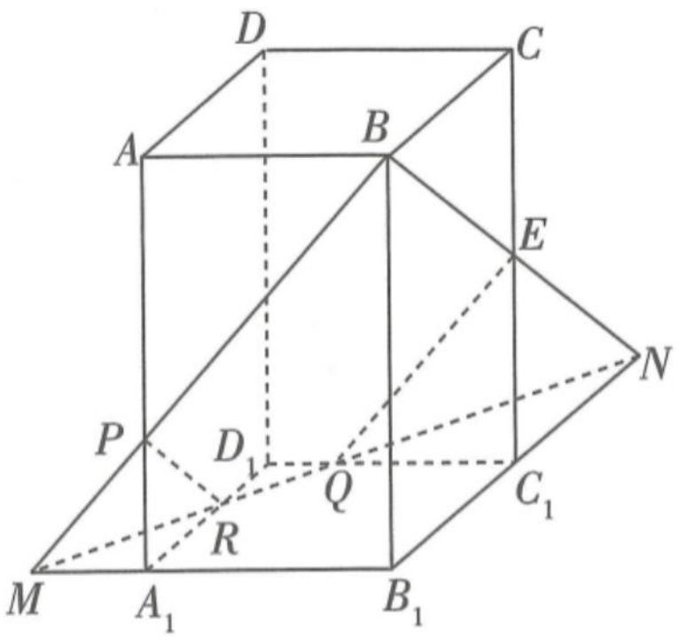

图8-1

对于 C, 如图 8-2, 当点 P 与点 A 重合时, 取 $DD_{1}$ 的中点 F, 连接 AF, EF, 则平面 $\alpha$ 与四棱柱的表面的交线围成的图形是矩形 ABEF,

【小妙招】由平行关系确定截面形状

四棱柱的外接球截平面 $\alpha$ 所得的截面为圆.

正四棱柱 $ABCD-A_{1}B_{1}C_{1}D_{1}$ 的外接球半径为 $R=\frac{\sqrt{1^{2}+1^{2}+2^{2}}}{2}=\frac{\sqrt{6}}{2}$ .

【记结论】长方体的外接球半径为其体对角线的一半

设点 $O_{1}$ 为矩形 $ADD_{1}A_{1}$ 的中心, 过 $O_{1}$ 作 $O_{1}G \perp AF$ 于 $G$ , 易知 $O_{1}G \perp AB$ ,

又 $AF \cap AB = A$ , 所以 $O_{1}G \perp$ 平面 $ABEF$ ,

连接 $O_{1}F$ ，易知 $\angle GFO_{1} = \frac{\pi}{4}$ ， $O_{1}F = \frac{1}{2}$ ，则点 $O_{1}$ 到平面 ABEF 的距离 $d = O_{1}G = O_{1}F\sin\frac{\pi}{4} = \frac{1}{2} \times \frac{\sqrt{2}}{2} = \frac{\sqrt{2}}{4}$ ，所以正四棱柱的外接球球心到平面 ABEF 的距离为 $\frac{\sqrt{2}}{4}$ ，

【指点迷津】设外接球的球心为 O，连接 $OO_{1}$ ，则 $OO_{1} \parallel$ 平面 ABEF，所以点 O 到平面 ABEF 的距离与点 $O_{1}$ 到平面 ABEF 的距离相等

所以四棱柱的外接球截平面 $\alpha$ 所得的截面圆的半径 $r = \sqrt{\left(\frac{\sqrt{6}}{2}\right)^2 - \left(\frac{\sqrt{2}}{4}\right)^2} = \sqrt{\frac{11}{8}}$

所以所求截面面积为 $S = \pi r^{2} = \frac{11}{8}\pi$ ，故 C 正确.

对于 D, AD 与平面 $\alpha$ 所成的角, 即 BC 与平面 $\alpha$ 所成的角, 设所求角为 $\theta$ , 如图 8-3, 作 $CH \perp BE$ 于点 H, 设点 C 到平面 $\alpha$ 的距离为 h,

则 $h \leqslant CH = BC\sin \frac{\pi}{4} = \frac{\sqrt{2}}{2}$ ,

【会思考】能结合空间线面位置关系，挖掘点到平面的距离与点到平面内的直线的距离的大小关系

所以 $\sin \theta = \frac{h}{BC} = h \leqslant \frac{\sqrt{2}}{2} < \frac{\sqrt{3}}{2}$ , 则 $\theta < \frac{\pi}{3}$ , 故 D 错误.

故选 AC.

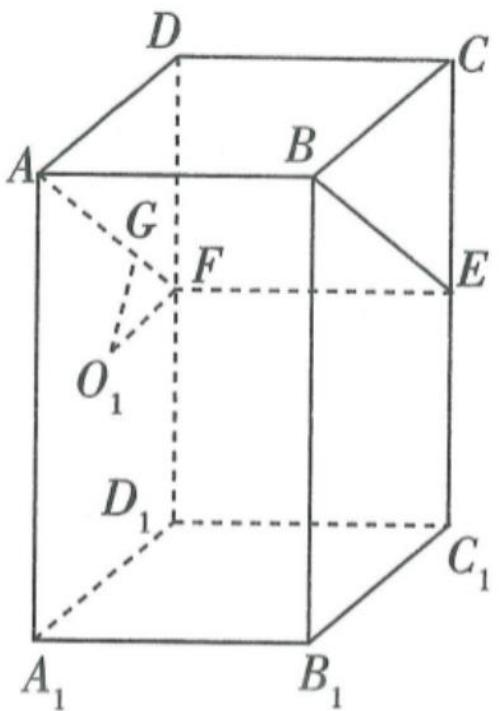

图8-2

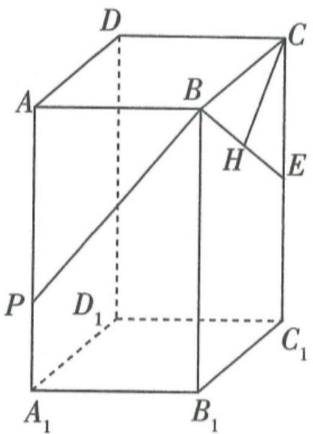

图8-3

# 命题角度2 计算多面体的截面周长或面积

调研 2 (2022·北京市十一学校5月模拟改编)(多选)如图8-4,在棱长为1的正方体 $ABCD - A_{1}B_{1}C_{1}D_{1}$ 中， $M$ 为底面ABCD的中心， $\overrightarrow{D_{1}Q} = \lambda \overrightarrow{D_{1}A_{1}}, \lambda \in (0,1), N$ 为线段 $AQ$ 的中点，则下列说法正确的有()

$\quad$A. $CN$ 与 $QM$ 共面  
$\quad$B. 三棱锥 $A - DMN$ 的体积跟 $\lambda$ 的取值无关  
$\quad$C. 当 $\lambda = \frac{1}{3}$ 时, 过 A, Q, M 三点的平面截正方体所得截面的周长为 $\frac{4\sqrt{2} + 2\sqrt{13}}{3}$   
$\quad$D. 当 $\lambda = \frac{1}{4}$ 时, $AM \perp QM$

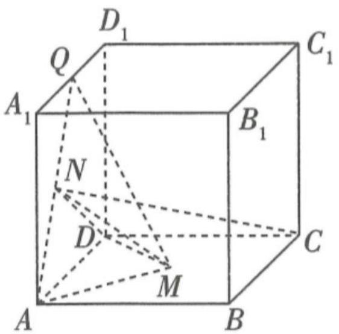

图8-4

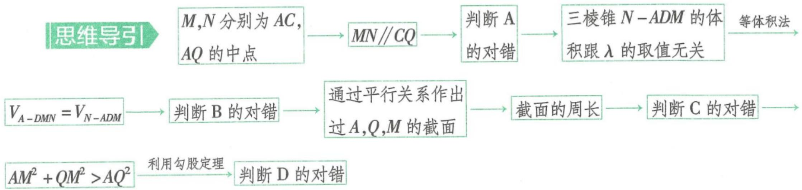

解析 对于 A, 如图 8-5, 连接 MC, CQ, 在 $\triangle ACQ$ 中, 因为 M, N 分别为 AC, AQ 的中点, 所以 $MN \parallel CQ$ , 所以 CN 与 QM 共面, 所以 A 正确.

对于 B, 因为点 Q 到平面 ABCD 的距离为定值 1, 所以点 N 到平面 ABCD 的距离为定值 $\frac{1}{2}$ ,

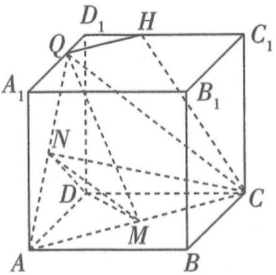

图8-5

易知 $\triangle ADM$ 的面积为定值 $\frac{1}{4}$ , 所以三棱锥 $N - ADM$ 的体积跟 $\lambda$ 的取值无关.

又 ${V}_{A - {DMN}} = {V}_{N - {ADM}}$ ,所以三棱锥 $A - {DMN}$ 的体积跟 $\lambda$ 的取值无关,所以 $\mathrm{B}$ 正确.

【敲黑板】有关三棱锥的体积问题，常常利用等体积法进行转化，转化后的三棱锥的高与底面面积要简单易算

对于 C, 当 $\lambda = \frac{1}{3}$ 时, 在 $D_{1}C_{1}$ 上取点 H, 使 $\overrightarrow{D_{1}H} = \frac{1}{3}\overrightarrow{D_{1}C_{1}}$ , 连接 QH, HC, 如图 8-5, 则 HQ // AC,

所以 A, M, C, H, Q 共面, 即过 A, Q, M 三点的平面截正方体所得截面为四边形 ACHQ,

【小妙招】根据线线平行关系确定截面

易知 $AQ = CH = \sqrt{1 + \frac{4}{9}} = \frac{\sqrt{13}}{3}$ , 四边形 $ACHQ$ 是等腰梯形, 且 $QH = \frac{1}{3} AC = \frac{\sqrt{2}}{3}$ ,

所以平面截正方体所得截面的周长为 $l = \sqrt{2} +\frac{\sqrt{2}}{3} +2\times \frac{\sqrt{13}}{3} = \frac{4\sqrt{2} + 2\sqrt{13}}{3}$ 所以C正确.

对于 D, 当 $\lambda = \frac{1}{4}$ 时, $A_{1}Q = \frac{3}{4}$ , $AM^{2} = \frac{1}{2}$ , 则 $AQ^{2} = AA_{1}^{2} + A_{1}Q^{2} = 1 + \frac{9}{16} = \frac{25}{16}$ .

如图8-6,分别取 $AD, A_{1}D_{1}$ 的中点 $F, E$ , 连接 $EF, EM, FM$ , 易知 $MF = \frac{1}{2}, EF = 1, EQ = \frac{1}{4}$ , 则 $EM^{2} = MF^{2} + EF^{2} = \frac{1}{4} + 1 = \frac{5}{4}$ ,

易知 $QE \perp ME$ ，则在直角三角形 MEQ 中， $QM^{2} = EM^{2} + EQ^{2} = \frac{5}{4} + \left(\frac{1}{4}\right)^{2} = \frac{21}{16}$ ，所以 $AM^{2} + QM^{2} = \frac{29}{16}$ .

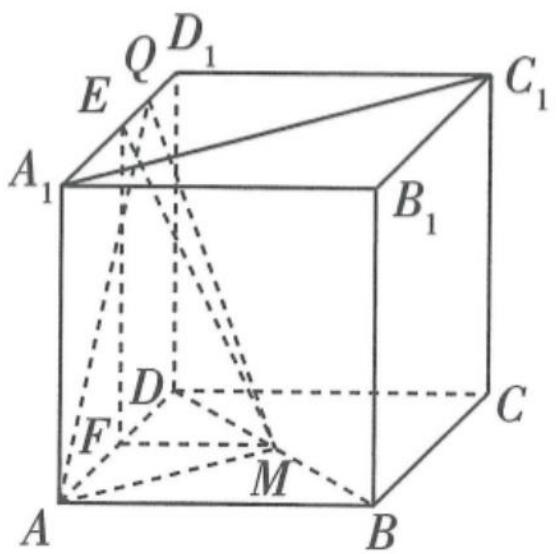

图8-6

【会思考】合作辅助线，构造直角三角形，从而利用勾股定理求长度

所以 $AM^{2}+QM^{2}>AQ^{2}$ ，所以 $AM\perp QM$ 不成立，所以D不正确。

【会转化】能将空间线面位置关系转化为数量关系进行判断

故选 ABC.

# 方法点津

多面体的截面问题，往往需要把满足条件的平面经过“延展”之后，得到其与多面体各个面的交线，从而确定“完整截面”的形状，进而求得其周长、面积等，得到交线的方法多是依据“线线平行”，即在多面体中充分利用已知“特征点”（中点，三等分点、四等分点等）作平行线得到交线。

调研 3 (2022·沈阳二中6月月考)如图8-7,在四面体ABCD中, $AB=CD=AC=BD=5$ , $AD=BC=3\sqrt{2}$ ,E,F分别是AD,BC的中点.若用一个与直线EF垂直,且与四面体的每个面都相交的平面 $\alpha$ 去截该四面体,由此得到一个多边形截面,则下面说法正确的序号为\_\_\_\_.

① $EF \perp AD, EF \perp BC$ ; ②四面体外接球的表面积为 $34\pi$ ;

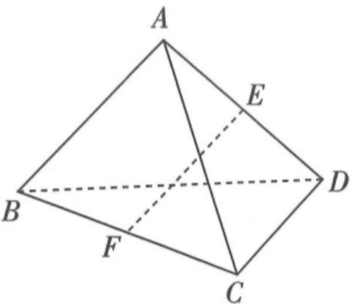

图8-7

③异面直线 $AC$ 与 $BD$ 所成角的正弦值为 $\frac{7}{25}$ ; ④多边形截面面积的最大值为 $\frac{9}{2}$ .

解析 对于①, 如图 8-8, 连接 BE, CE, AF, DF, 因为 $AB = CD = AC = BD = 5$ , E, F 分别是 AD, BC 的中点, 所以 $BC \perp AF$ , $BC \perp DF$ , 又 $AF \cap DF = F$ , $AF$ , $DF \subset$ 平面 ADF, 所以 $BC \perp$ 平面 ADF, 同理 $AD \perp$ 平面 BCE,

因为 $EF \subset$ 平面 ADF, $EF \subset$ 平面 BCE, 所以 $EF \perp BC$ , $EF \perp AD$ , 故①正确.

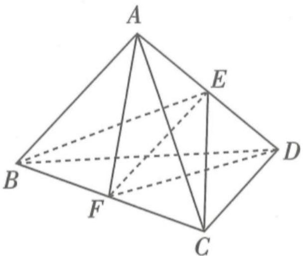

图8-8

【敲黑板】线线垂直往往是利用勾股定理或线面垂直来判断

对于②,将四面体 ABCD 置入如图 8-9 所示的长方体中,

【会转化】利用补形法,将四面体补成长方体,从而将四面体的外接球转化为长方体的外接球

设长方体的长、宽、高分别为 $a, b, c$ ，则 $\left\{ \begin{array}{l} a^2 + b^2 = 25, \\ a^2 + c^2 = 18, \\ c^2 + b^2 = 25, \end{array} \right.$ 所以 $a^2 +$

$b^{2}+c^{2}=34$ ，则长方体的体对角线的长度为 $\sqrt{a^{2}+b^{2}+c^{2}}=\sqrt{34}$ ，

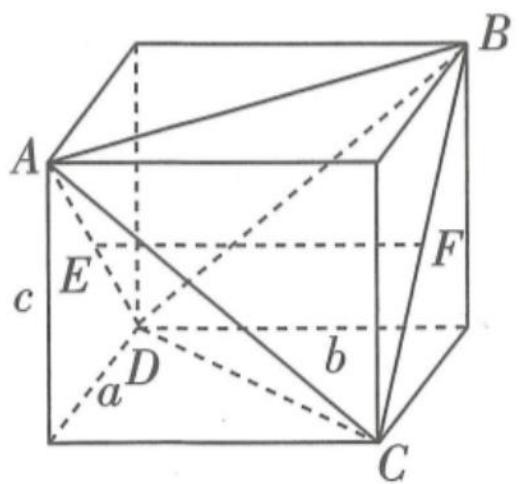

图8-9

四面体 ABCD 的外接球即该长方体的外接球, 其直径 $2R = \sqrt{a^{2} + b^{2} + c^{2}} = \sqrt{34}$ ,

所以四面体外接球的表面积为 $S=4\pi R^{2}=34\pi$ ，故②正确.

对于③,由②得 $a = c = 3, b = 4$ ,如图8-10,以 $D$ 为坐标原点, $DG, DH, DP$ 所在直线分别为 $x$ 轴, $y$ 轴, $z$ 轴建立空间直角坐标系 $D - xyz$ ,则 $A(3,0,3), C(3,4,0), B(0,4,3), D(0,0,0)$ ,

【小技巧】建立空间直角坐标系，借助空间向量确定异面直线所成角的余弦值

故 $\overrightarrow{AC}=(0,4,-3),\overrightarrow{DB}=(0,4,3)$ ,

所以异面直线 $AC$ 与 $BD$ 所成角的余弦值为 $\frac{|\overrightarrow{AC} \cdot \overrightarrow{DB}|}{|\overrightarrow{AC}| \cdot |\overrightarrow{DB}|} =$

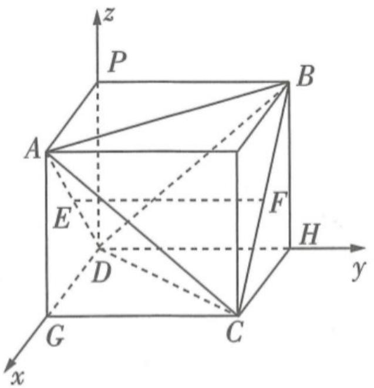

图8-10

$\frac{7}{25}$ , 所以 $\sin \langle AC, BD \rangle = 1 - (\frac{7}{25})^2 = \frac{24}{25}$ , 故③错误.

对于④,如图8-11,由图可知平面 $\alpha$ 与平面 $AGDP$ , 平面 $BHCQ$ 平行, 设平面 $\alpha$ 与 $BD, CD, AC, AB$ 分别交于 $M, N, K, L$ , 连接 $KL, KN, MN, LM$ ,

由 $BC \parallel$ 平面 $\alpha, BC \subset$ 平面 $ABC$ , 平面 $ABC \cap$ 平面 $\alpha = KL$ , 可得 $BC \parallel KL$ , 同理可得

$BC \parallel MN$ , 所以 $KL \parallel MN$ ,

同理, $ML \parallel AD, NK \parallel AD$ ,所以 $ML \parallel NK$ ,所以截面 MNKL 为平行四边形,

易得异面直线 BC 和 AD 所成角为 $90^{\circ}$ ，所以 KL 与 NK 的夹角为 $90^{\circ}$ ，所以截面 MNKL 为矩形，则 $S_{矩形MNKL} = NK \cdot KL$ .

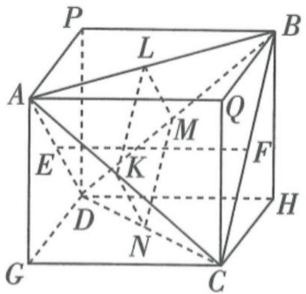

图8-11

【会联想】由四边形面积表达式的形式可联想利用基本不等式求最值

由题意知 $\frac{CK}{CA} = \frac{CN}{CD} = \frac{KN}{AD},\frac{AK}{CA} = \frac{AL}{AB} = \frac{KL}{BC},$

【记结论】平行于三角形一边,并且和其他两边相交的直线,所截得的三角形的三边与原三角形的三边对应成比例

则 $KN + KL = \frac{CK\cdot AD}{CA} +\frac{AK\cdot BC}{CA} = \frac{3\sqrt{2} CK}{CA} +\frac{3\sqrt{2} AK}{CA} = 3\sqrt{2}\cdot \frac{CK + AK}{CA} = 3\sqrt{2},$

所以 $S_{矩形MNKL}=NK\cdot KL\leqslant\left(\frac{KN+KL}{2}\right)^{2}=\frac{9}{2}$ ，当且仅当KN=KL= $\frac{3\sqrt{2}}{2}$ 时等号成立，

【易忽视】借助基本不等式求最值，注意检验等号成立的条件所以截面面积的最大值为 $\frac{9}{2}$ ，故④正确.

故填①②④.

# 命题角度 3 与球有关的截面问题

调研 4 (2022·云南师大附中 5 月模考)已知正方形 ABCD 的边长为 $2\sqrt{2}$ ，将 $\triangle ABC$ 沿对角线 AC 折起，使得二面角 B-AC-D 的大小为 $90^{\circ}$ 。若三棱锥 B-ACD 的四个顶点都在球 O 的球面上，G 为 AC 的中点，E, F 分别为线段 BG, DC 上的动点（不包括端点），且 $BE = \sqrt{2}CF$ ，当三棱锥 E-ACF 的体积最大时，过点 F 作球 O 的截面，则截面面积的最小值为（）

$\quad$A. $2\sqrt{2}\pi$

$\quad$B. $2\pi$

$\quad$C. $\frac{3}{2}\pi$

$\quad$D. $\frac{8}{9}\pi$

思维导引

$BG \perp AC$

面面垂直的性质定理

$BG \perp$ 平面 $ACD$

设 $CF = x(0 <   x <   \sqrt{2})$

用 $x$ 表示三棱锥 $E - ACF$ 的体积

二次函数的性质

当 $x=\frac{\sqrt{2}}{2}$ 时,三棱锥 E-ACF
的体积取得最大值

在 $\triangle GCF$ 中,用余弦定
理求出 $GF = \sqrt{\frac{5}{2}}$

球的性质

当 GF 垂直于截面时,截面圆的面积最小 → 得解

解析 因为正方形 ABCD 的边长为 $2\sqrt{2}$ ，所以 AC = 4, BG = 2.

如图8-12,因为 $G$ 为 ${AC}$ 的中点,所以 ${BG} \bot  {AC}$ ,由题意知平面 ${ABC} \bot$ 平面 ${ACD}$ ,平面 ${ABC} \cap$ 平面 ${ACD} = {AC}$ ,所以 ${BG} \bot$ 平面 ${ACD}$ .

【技巧点拨】由面面垂直的性质定理得线面垂直，进而找到三棱锥的高

设 $CF = x(0 < x < \sqrt{2})$ ，则 $BE = \sqrt{2} x$ ，所以三棱锥 $E - ACF$ 的体积 $V_{E - ACF} = \frac{1}{3} S_{\triangle ACF}\times EG = \frac{1}{3}\times \frac{1}{2} AD\times CF\times EG = \frac{1}{3}\times \frac{1}{2}\times 2\sqrt{2} x\times (2 -$

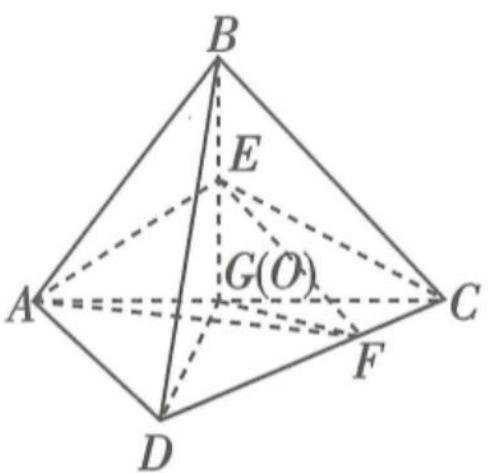

图8-12

【易错提醒】棱锥体积公式的应用，不要忘记乘以系数 $\frac{1}{3}$

$\sqrt {2} x) = \frac {2}{3} (\sqrt {2} x - x ^ {2}).$

当 $x=\frac{\sqrt{2}}{2}$ 时， $V_{E-ACF}$ 取得最大值.

【小妙招】利用二次函数的性质，求最值

如图8-12, 连接 $GD, GF$ , 则 $GA = GB = GC = GD = 2$ , 所以球 $O$ 的球心为 $G$ , 且球 $O$ 的半径 $R = 2$ .

在 $\triangle GCF$ 中，由余弦定理得 $GF = \sqrt{GC^2 + CF^2 - 2GC \times CF \times \cos\angle ACF} = \sqrt{2^2 + (\frac{\sqrt{2}}{2})^2 - 2 \times 2 \times \frac{\sqrt{2}}{2} \times \frac{\sqrt{2}}{2}} = \sqrt{\frac{5}{2}}.$

根据球的性质可知,过点 F 作球 O 的截面,当 GF 垂直于截面时,截面圆的面积最小,设其半径为 r,则 $r = \sqrt{R^{2} - GF^{2}} = \sqrt{2^{2} - (\sqrt{\frac{5}{2}})^{2}} = \sqrt{\frac{3}{2}}$ ,所以所求截面面积的最小值为 $\pi r^{2} = \frac{3}{2}\pi$ . 故选 C.

# 方法点津

处理球的截面问题需把握三点: （1） 球的截面一定是一个圆; （2） 球心和截面圆圆心 (异于球心) 连线垂直于截面, 球的半径 $R$ , 球心到截面的距离 $d$ , 截面圆的半径 $r$ 满足 $r^{2} = R^{2} - d^{2}$ ; （3） 过球内一点 (异于球心), 作球的截面, 最大截面为过球心的圆, 最小截面为过该点且与球心和该点连线垂直的截面. 在确定球心 $O$ 与半径 $R$ 时, 有时会通过补形法把具有明显几何特征的棱锥 (四面体) 转化为长方体.

# 新题演练

(2022·合肥一六八中学5月模拟)已知球 O 是正三棱锥 A-BCD 的外接球, BC=6, $AB=4\sqrt{3}$ , 点 E 在线段 BD 上, 且 BD=3BE. 过点 E 作球 O 的截面, 则所得截面面积的最小值是 ( )

$\quad$A. $3 \pi$

$\quad$B. $4\pi$

$\quad$C. $8\pi$

$\quad$D. $9 \pi$

# 参考答案与解析

C 如图 8-13, 设 $O_{1}$ 是顶点 $A$ 在底面 $BCD$ 上的射影, 连接 $AO_{1}, BO_{1}$ . 公众号: 拾穗者的杂货铺

由正弦定理得, $\triangle BCD$ 的外接圆半径 $r_1 = BO_1 = \frac{6}{\sin 60^\circ} \times \frac{1}{2} = 2\sqrt{3}$ .

【小妙招】应用正弦定理，求三角形的外接圆半径

在 Rt $\triangle ABO_{1}$ 中, 由勾股定理得棱锥的高 $AO_{1} = \sqrt{AB^{2} - BO_{1}^{2}} = \sqrt{(4\sqrt{3})^{2} - (2\sqrt{3})^{2}} = 6.$

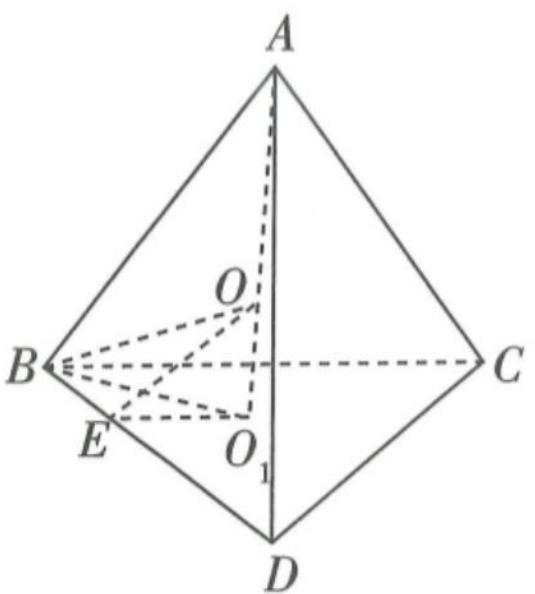

图8-13

易知点 O 在 $AO_{1}$ 上, 连接 OB, 设球 O 的半径为 R, 则在 $Rt\triangle OBO_{1}$ 中, $R^{2} = (6 - R)^{2} + (2\sqrt{3})^{2}$ , 解得 R = 4, 所以 $OO_{1} = 2$ .

【小提示】OA = OB = R

连接 $O_{1}E, OE$ ，在 $\triangle BO_{1}E$ 中，由余弦定理得 $O_{1}E^{2} = BE^{2} + BO_{1}^{2} - 2\times BE\times BO_{1}\times \cos 30^{\circ} =$ $4 + 12 - 2\times 2\times 2\sqrt{3}\times \frac{\sqrt{3}}{2} = 4$ ，所以 $O_{1}E = 2$ ，所以 $OE = \sqrt{2^{2} + 2^{2}} = 2\sqrt{2}$

根据球的性质知,过点 E 作球 O 的截面,当 OE 垂直于截面时,截面面积最小,此时截面圆的半径为 $\sqrt{R^{2}-OE^{2}}=\sqrt{4^{2}-(2\sqrt{2})^{2}}=2\sqrt{2}$ , 截面面积为 $8\pi$ . 故选 C.

# 超重点9 动态几何问题

# 命题角度1 动点的轨迹问题

调研 1 (2022·福建莆田二中 5 月模拟预测)(多选)在棱长为 1 的正方体 $ABCD - A_{1}B_{1}C_{1}D_{1}$ 中, 点 $M$ 是 $A_{1}D_{1}$ 的中点, 点 $P, Q, R$ 在底面 $ABCD$ 内(包括边界), $PB_{1} //$ 平面 $MC_{1}D, D_{1}Q = \frac{\sqrt{5}}{2}$ , 点 $R$ 到平面 $ABB_{1}A_{1}$ 的距离等于它到点 $D$ 的距离, 则下列结论正确的是 ( )

$\quad$A. 点 $P$ 的轨迹的长度为 $\sqrt{2}$

$\quad$B. 点 $Q$ 的轨迹的长度为 $\frac{\pi}{4}$

$\quad$C. PQ 的最小值为 $\frac{2\sqrt{5}}{5}-\frac{1}{2}$

$\quad$D. $PR$ 的最小值为 $\frac{3\sqrt{5}}{20}$

解析 对于 A, 如图 9-1, 取 BC 的中点 N, 连接 AN, $B_{1}N$ , $AB_{1}$ , 因为 M 为 $A_{1}D_{1}$ 的中点, 所以 $AN \parallel MC_{1}$ , 又 $MC_{1} \subset$ 平面 $DMC_{1}$ , AN ∉ 平面 $DMC_{1}$ , 所以 AN ∥ 平面 $DMC_{1}$ , 易知 $AB_{1} \parallel DC_{1}$ , 因为 $DC_{1} \subset$ 平面 $DMC_{1}$ , $AB_{1} \not\subset$ 平面 $DMC_{1}$ , 所以 $AB_{1} \parallel$ 平面 $DMC_{1}$ .

又 $AN \cap AB_{1} = A, AN, AB_{1} \subset$ 平面 $ANB_{1}$ , 所以平面 $ANB_{1} //$ 平面 $DMC_{1}$ .

因为点 P 在底面 ABCD 内(包括边界), $PB_{1} \parallel$ 平面 $MC_{1}D$ , 所以点 P 的轨迹为线段 AN,

【会思考】由面面平行找到点 P 在底面 ABCD 内的轨迹为线段 AN

因为 $AN = \sqrt{AB^{2} + BN^{2}} = \sqrt{1^{2} + \left(\frac{1}{2}\right)^{2}} = \frac{\sqrt{5}}{2}$ ，所以点 P 的轨迹的长度为 $\frac{\sqrt{5}}{2}$ ，故 A 错误.

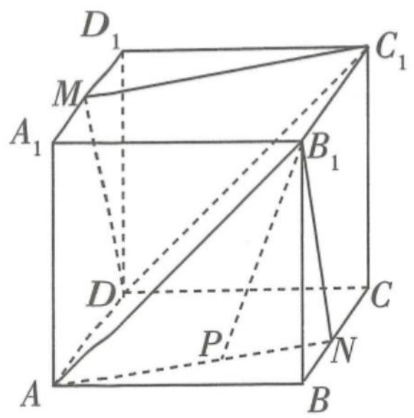

图9-1

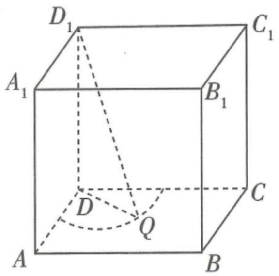

图9-2

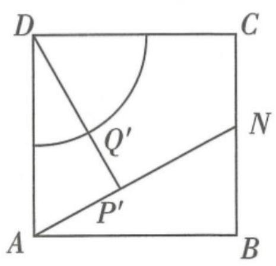

图9-3

对于 B, 如图 9-2, 连接 $DQ$ , 因为 $Q$ 在底面 $ABCD$ 内 (包括边界), $D_{1}Q = \frac{\sqrt{5}}{2}$ ,

所以 $D_{1}Q = \sqrt{DQ^{2} + DD_{1}^{2}} = \sqrt{1^{2} + DQ^{2}} = \frac{\sqrt{5}}{2}$ , 所以 $DQ = \frac{1}{2}$ ,

所以点 Q 的轨迹是以点 D 为圆心, $\frac{1}{2}$ 为半径的 $\frac{1}{4}$ 圆弧,

【扫清障碍】判断形状：点 $D$ 是定点, ${DQ}$ 是定长,则点 $Q$ 的轨迹是一段圆弧.

所以点 Q 的轨迹的长度为 $\frac{1}{4} \times 2 \times \frac{1}{2} \times \pi = \frac{\pi}{4}$ ，故 B 正确.

对于 C, 如图 9-3, 在底面 ABCD 中, 过点 D 作 $DP' \perp AN$ 于 $P'$ , 交点 Q 的轨迹于 $Q'$ , 则 $P'Q'$ 就是 PQ 的最小值,

而 $\angle B = \angle AP'D, \angle BAN = \angle ADP'$ , 所以 $\triangle ABN \sim \triangle DP'A$ , 所以 $\frac{AD}{AN} = \frac{DP'}{AB}$ , 即 $\frac{1}{\sqrt{\frac{5}{2}}} =$ $\frac{DP'}{1}$ ，所以 $DP'=\frac{2\sqrt{5}}{5}$ ，所以 $P'Q'=DP'-DQ'=\frac{2\sqrt{5}}{5}-\frac{1}{2}$ ，

所以 $PQ$ 的最小值为 $\frac{2\sqrt{5}}{5}-\frac{1}{2}$ ，故C正确.

【会思考】利用圆心到直线的距离减去圆的半径即得圆上的点到直线的最短距离

对于 D, 因为点 R 到平面 $ABB_{1}A_{1}$ 的距离等于它到点 D 的距离, 易知点 R 到直线 AB 的距离等于点 R 到平面 $ABB_{1}A_{1}$ 的距离, 所以点 R 到直线 AB 的距离等于它到点 D 的距离,

根据抛物线的定义知点 R 的轨迹是以点 D 为焦点, AB 为准线的抛物线的一部分,

【小妙招】以立体几何为载体的轨迹问题综合性强,解答这类问题的关键是将空间问题转化为平面问题,一般可以从两方面考虑：一是利用曲线的定义找出轨迹,二是利用解析法求出轨迹方程,此处利用抛物线的定义判断轨迹

在平面 ABCD 内, 以 AD 的中点为坐标原点 O, 过点 O 且垂直于 AD 的直线为 x 轴, AD 所在直线为 y 轴建立平面直角坐标系, 如图 9-4, 则 $D(0, \frac{1}{2})$ , $A(0, -\frac{1}{2})$ , $N(1, 0)$ ,

直线 AB 的方程为 $y = -\frac{1}{2}$ ，直线 AN 的方程为 $x - 2y - 1 = 0$ ，则点 R 的轨迹所在抛物线的方程为 $x^{2} = 2y$ ，设与直线 AN 平行且与抛物线相切的直线 l 的方程为 $x - 2y + n = 0$ ，易知直线 l 与抛物线 $x^{2} = 2y$ 的切点在四边形 ABCD 内。

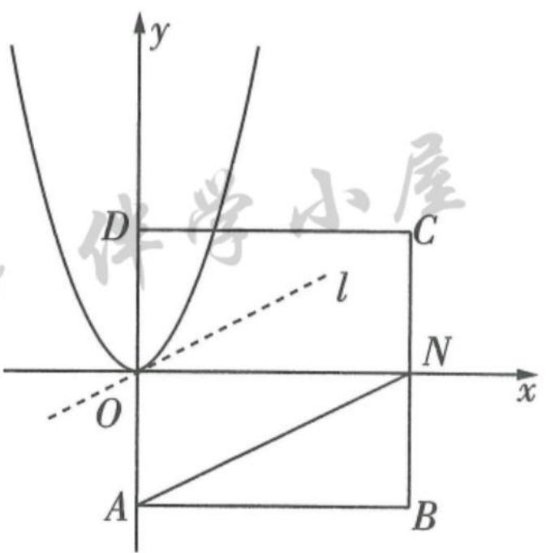

图9-4

由 $\left\{\begin{aligned}x-2y+n=0,\\ x^{2}=2y,\end{aligned}\right.$ 整理得关于y的方程 $4y^{2}-(4n+2)y+n^{2}=0,$

令 $\Delta=(4n+2)^{2}-16n^{2}=0$ , 解得 $n=-\frac{1}{4}$

所以直线 l 的方程为 $x - 2y - \frac{1}{4} = 0$ ,

则直线 AN 与直线 l 的距离为 $d=\frac{|1-\frac{1}{4}|}{\sqrt{1^{2}+(-2)^{2}}}=\frac{3\sqrt{5}}{20}$ ,所以 PR 的最小值为 $\frac{3\sqrt{5}}{20}$ ，故 D 正确。故选 BCD。

【突破点】根据抛物线的定义，结合平面直角坐标系两平行线间的距离进行判断

# 命题角度2 动态几何中线段（距离）、体积、角的最值

调研 2 (2022·广东广州二中、珠海一中等六校5月联考)如图9-5,在侧棱

长为2的正三棱锥D-ABC中,DA,DB,DC两两垂直,M,E分别为AC,AB的中点,则三棱锥D-ACE的外接球的表面积为\_\_\_\_,若P为DM上的动点,Q是平面ECD上的动点,则AP+PQ的最小值是\_\_\_\_.

对于空间中若干线段长度和的最值问题,常会将这些线段所在的平面展开成同一平面,将空间问题转化为平面问题求解,体现降维处理的思想.

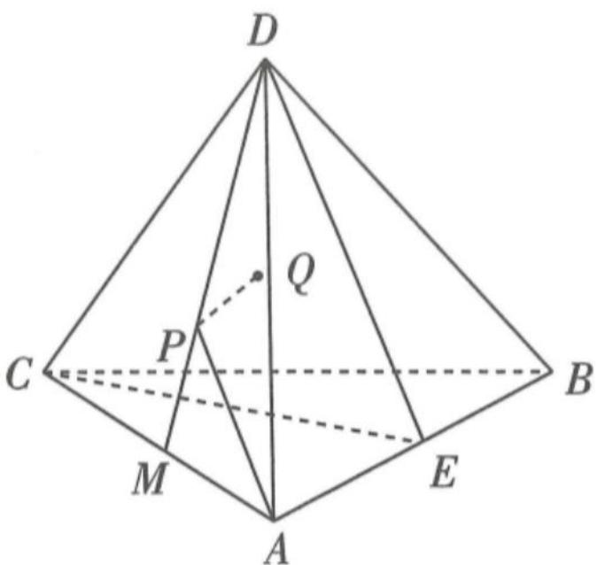

图9-5

解析 ∵ DA, DB, DC 两两垂直, DA = DB = DC = 2,

$\therefore A B = A C = B C = 2 \sqrt {2},$

连接 $ME$ ，如图9-6， $\because M,E$ 分别为 $AC,AB$ 的中点， $\therefore ME / / BC$ 且 $ME = \frac{1}{2} BC = \sqrt{2}$

$\therefore {MA} = {MC} = {MD} = {ME} = \sqrt{2}$ ,故 $M$ 为三棱锥 $D - {ACE}$ 的外接球球心,

【敲黑板】定球心,寻找到三棱锥每个顶点距离都相等的点 $M$

$\therefore$ 三棱锥 $D-ACE$ 的外接球的表面积 $S_{\text{球}}=4\pi\times(\sqrt{2})^{2}=8\pi.$

在正三棱锥 D-ABC 中, E 为 AB 的中点, ∴ $AB \perp DE$ ,

$AB \perp CE$ , 又 DE, $CE \subset$ 平面 CDE, $DE \cap CE = E$ , $\therefore AB \perp$ 平面 CDE.

设 CE 的中点为 G, 连接 MG, DG,

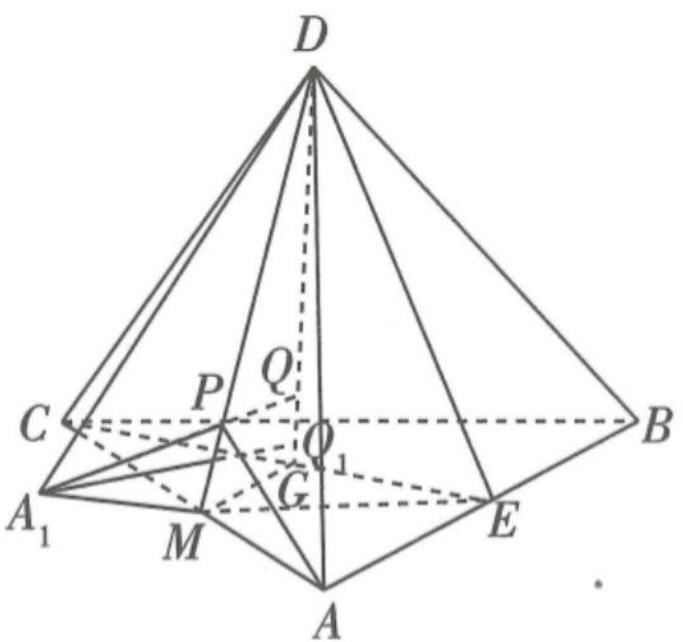

图9-6

∵ M 为 AC 的中点, ∴ $MG \parallel AE$ 且 $MG = \frac{1}{2}AE = \frac{\sqrt{2}}{2}$ , ∴ $MG \perp$ 平面 CDE,

∴ DG 即 DM 在平面 CDE 上的射影.

当 $AP + PQ$ 最小时, $PQ \perp$ 平面 CDE, 故 Q 在线段 DG 上.

将三角形 ADM 沿 DM 翻折至三角形 $A_{1}DM$ ，使之与三角形 GDM 共面，则 $AP + PQ$ 的最小值，即点 $A_{1}$ 到 DG 的距离，

【会思考】通过展开放在一个平面上把空间问题转化为平面问题处理

过点 $A_{1}$ 作 $A_{1}Q_{1} \perp DG$ 于点 $Q_{1}$ ，则 $A_{1}Q_{1}$ 为所求最小值.

又 $DM = \sqrt{2},\therefore \sin \angle MDG = \frac{MG}{MD} = \frac{1}{2},\therefore \angle MDG = 30^{\circ},$

$\because \angle A D M = \angle A _ {1} D M = 4 5 ^ {\circ},$

$\therefore \sin \angle A _ {1} D Q = \sin (\angle A _ {1} D M + \angle M D G) = \sin (4 5 ^ {\circ} + 3 0 ^ {\circ}) = \frac {\sqrt {6} + \sqrt {2}}{4},$

$\therefore A _ {1} Q _ {1} = A _ {1} D \times \sin \angle A _ {1} D Q = 2 \times \frac {\sqrt {6} + \sqrt {2}}{4} = \frac {\sqrt {6} + \sqrt {2}}{2}.$

∴ $AP + PQ$ 的最小值为 $\frac{\sqrt{6} + \sqrt{2}}{2}$ .

调研 3 (2022·浙江宁波效实中学5月模考/交汇导数)如图9-7,已知圆锥SO的高SO=1,AB是底面圆O的直径,AB=2,M是圆O上的动点(不与A,B重合),N是SM的中点,则直线AN与平面SBM所成角的正弦值的最大值为( )

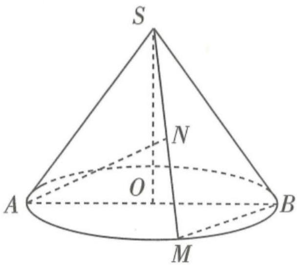

图9-7

$\quad$A. $\frac{1}{3}$

$\quad$B. $\frac{\sqrt{2}}{3}$

$\quad$C. $\frac{2\sqrt{2}}{3}$

$\quad$D. 1

# 思维导引

寻找垂直
关系建系

设 $M(a,b,0)$ ，求平面SBM的法向量

利用 $\sin\theta=|\cos\langle\overrightarrow{AN},$ $n\rangle$ | 求线面角

换元思想

利用导数求函数最值

解析 如图9-8,作 $OE \perp AB$ ,与圆 $O$ 交于一点 $E$ , 以 $O$ 为原点, $OE, OB, OS$ 所在的直线分别为 $x$ 轴, $y$ 轴, $z$ 轴建立空间直角坐标系, 则 $O(0,0,0), A(0,-1,0), B(0,1,0), S(0,0,1)$ .

设 $M(a,b,0)(a\neq 0,b\neq \pm 1)$ ，则 $N(\frac{a}{2},\frac{b}{2},\frac{1}{2})$ ，且 $a^2 + b^2 = 1$

A

易知 $\overrightarrow{SM} = (a,b, - 1),\overrightarrow{SB} = (0,1, - 1),\overrightarrow{AN} = (\frac{a}{2},\frac{b}{2} +1,\frac{1}{2})$

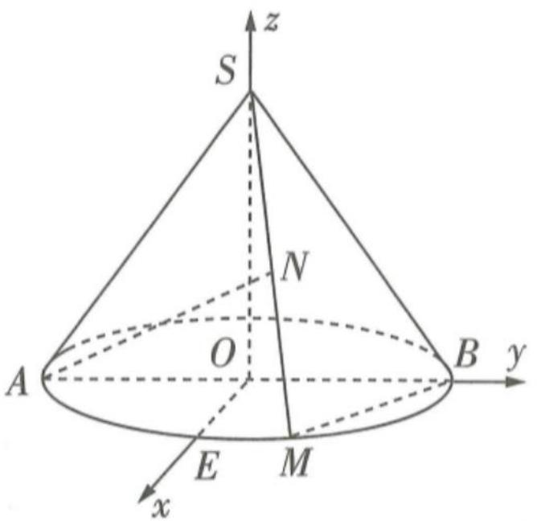

图9-8

$\begin{array}{l} \mathrm{A1:12/(3-5/2)=24;A2:6/(1-3/4)=24;A3:6/(5/4-1)=24;A4:5\times(5-2/10)=} \\ 2 4; \mathrm{A5:(5×13+7)/3=24;A6:7×9-3×13=24;A7:(2+4/10)×10=24;A8:(2+7)×4-} \\ 1 2 = 2 4. \end{array}$

设平面 SBM 的法向量为 $\boldsymbol{n}=(x,y,z)$ ，所以 $\left\{\begin{aligned}\overrightarrow{SM}\cdot\boldsymbol{n}&=0,\\ \overrightarrow{SB}\cdot\boldsymbol{n}&=0,\end{aligned}\right.$ 即 $\left\{\begin{aligned}ax+by-z&=0,\\ y-z&=0,\end{aligned}\right.$

令 $y = 1$ ，则 $x = \frac{1 - b}{a}, z = 1$ ，所以平面SBM的一个法向量为 $\pmb{n} = (\frac{1 - b}{a}, 1, 1)$

设直线 AN 与平面 SBM 所成角为 $\theta$ ,

则 $\sin \theta = |\cos \langle \overrightarrow{AN},\boldsymbol {n}\rangle | = \frac{|\overrightarrow{AN}\cdot\boldsymbol{n}|}{|\overrightarrow{AN}|\cdot|\boldsymbol{n}|} = \frac{|\frac{a}{2}\times\frac{1 - b}{a} + \frac{b}{2} + 1 + \frac{1}{2}|}{\sqrt{\frac{a^2}{4} + \frac{(b + 2)^2}{4} + \frac{1}{4}}\times\sqrt{2 + \frac{(1 - b)^2}{a^2}}} =$

$\frac {2}{\sqrt {\frac {- b ^ {2} - 2 b + 3}{1 - b ^ {2}} \times \frac {2 b + 3}{2}}} = \frac {2}{\sqrt {\frac {2 b ^ {2} + 9 b + 9}{2 (1 + b)}}},$

令 $f(x)=\frac{2x^{2}+9x+9}{2(1+x)}(x\in(-1,1))$ ，则 $f'(x)=\frac{x(x+2)}{(x+1)^{2}}(x\in(-1,1))$ ，

【扫清障碍】利用向量夹角公式构建函数关系，注意自变量的取值限制

当 0 < x < 1 时, $f'(x) > 0$ , $f(x)$ 单调递增,

当 -1 < x < 0 时, $f'(x) < 0$ , $f(x)$ 单调递减, 所以 $f(x) \geqslant f(0) = \frac{9}{2}$ , 所以 $\sin \theta = \frac{2}{\sqrt{\frac{2b^{2} + 9b + 9}{2(1 + b)}}} \leqslant \frac{2}{\frac{3\sqrt{2}}{2}} = \frac{2\sqrt{2}}{3}$ ,

所以直线 AN 与平面 SBM 所成角的正弦值的最大值为 $\frac{2\sqrt{2}}{3}$ . 故选 C.

调研 4 (2022·江苏常州高级中学5月三模)如图9-9,在直三棱柱 $ABC-A_{1}B_{1}C_{1}$ 中, $\triangle ABC$ 是边长为2的正三角形, $AA_{1}=4,M$ 为 $CC_{1}$ 的中点,P为线段 $A_{1}M$ 上的动点,则下列说法错误的是()

$\quad$A. $AP + BP$ 的最小值为 $4\sqrt{2}$   
$\quad$B. 三棱锥 P-ABM 的体积的最大值为 $\frac{4\sqrt{3}}{3}$   
$\quad$C. 不存在点 P, 使得 BP 与平面 $A_{1}B_{1}C_{1}$ 所成角为 $60^{\circ}$   
$\quad$D. 三棱锥 M-ABC 的外接球的表面积为 $\frac{28\pi}{3}$

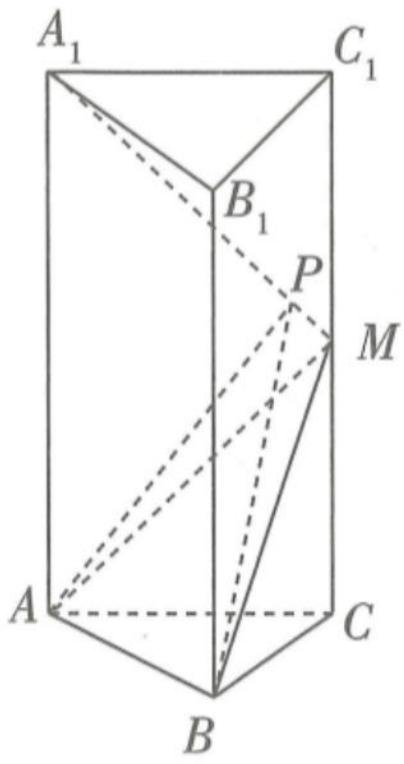

图9-9

$\begin{array}{l} \mathrm{A9:12/(12/8-1)=24;A10:(9+13)/2+13=24;A11:8×9/(1+2)=24;A12:7×(3+} \\ 3 / 7) = 2 4; \mathrm{A13:(3+9/9)×6=24;A14:5×(5-1/5)=24;A15:(7×7-1)/2=24;} \\ \mathrm{A16:(6/2+9)×2=24.} \end{array}$

# 解析

<table><tr><td>选项</td><td>分析过程</td><td>正误</td></tr><tr><td>A</td><td>在 $\triangle AMA_{1}$ 中, $AA_{1}=4,A_{1}M=AM=\sqrt{AC^{2}+CM^{2}}=\sqrt{2^{2}+2^{2}}=2\sqrt{2}$ ,故 $AM^{2}+A_{1}M^{2}=AA_{1}^{2}$ ,所以 $AM\perp A_{1}M$ ,故 $AP\geqslant AM$ ,当且仅当P在M处时取等号.如图9-10,连接 $A_{1}B,BM=\sqrt{BC^{2}+CM^{2}}=\sqrt{2^{2}+2^{2}}=2\sqrt{2}$ , $A_{1}B=\sqrt{AB^{2}+AA_{1}^{2}}=\sqrt{2^{2}+4^{2}}=2\sqrt{5}$ ,在 $\triangle A_{1}MB$ 中,由余弦定理得, $\cos\angle A_{1}MB=A\frac{(2\sqrt{2})^{2}+(2\sqrt{2})^{2}-(2\sqrt{5})^{2}}{2\times2\sqrt{2}\times2\sqrt{2}}=-\frac{1}{4}<0$ ,故 $\angle A_{1}MB$ 为钝角,故 $BP\geqslant BM$ ,当且仅当P在M处时取等号.【扫清障碍】注意等号成立的条件,由于P为线段 $A_{1}M$ 上的动点,等号成立时,P在端点M处故当P在M处时AP+BP取最小值,为 $AM+BM=4\sqrt{2}$ .</td><td>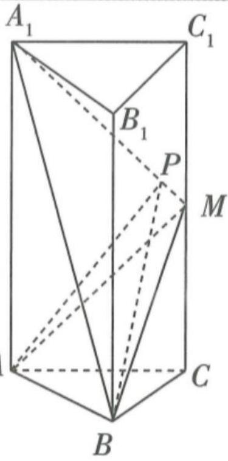图9-10√</td></tr><tr><td>B</td><td>由题易知点B到平面AMP的距离为 $\sqrt{3}$ ,由 $AM\perp A_{1}M$ ,得 $S_{\triangle AMP}=\frac{1}{2}\times AM\times PM=\sqrt{2}PM$ ,又 $PM\leqslant2\sqrt{2}$ ,则三棱锥P-ABM的体积为 $V_{P-ABM}=V_{B-AMP}=\frac{1}{3}\times\sqrt{3}\times S_{\triangle AMP}=\frac{\sqrt{6}}{3}PM\leqslant\frac{4\sqrt{3}}{3}$ ,所以三棱锥P-ABM的体积的最大值为 $\frac{4\sqrt{3}}{3}$ .</td><td>√</td></tr><tr><td>C</td><td>BP与平面 $A_{1}B_{1}C_{1}$ 所成角,即BP与平面ABC所成角,设为 $\alpha$ ,易知当点P与M重合时, $\alpha$ 最小,此时 $\alpha=\angle MBC=45^{\circ}$ ,当点P与 $A_{1}$ 重合时, $\alpha$ 最大,此时 $\alpha=\angle ABA_{1},\tan\alpha=\frac{AA_{1}}{AB}=2>\sqrt{3}$ ,所以 $\alpha>60^{\circ}$ ,【指点迷津】求解动态范围问题,有时应把这类动态的变化过程充分展现出来,通过动态思维,观察它的变化规律,找到极端位置,即用特殊法求解范围故存在点P,使得BP与平面 $A_{1}B_{1}C_{1}$ 所成角为 $60^{\circ}$ .</td><td>×</td></tr><tr><td>D</td><td>因为 $MC \perp$ 平面 $ABC$ ,故三棱锥 $M-ABC$ 的外接球直径与 $\triangle ABC$ 的外接圆直径、 $MC$ 构成直角三角形.由正弦定理得, $\triangle ABC$ 的外接圆直径 $d=\frac{AB}{\sin 60^\circ}=\frac{2}{\sqrt{\frac{3}{2}}}=\frac{4\sqrt{3}}{3}$ ,设三棱锥 $M-ABC$ 的外接球半径为 $R$ ,直径为 $2R$ ,则其表面积 $S=4\pi R^2=\pi(d^2+MC^2)=\pi\times(\frac{16}{3}+4)=\frac{28}{3}\pi$ .</td><td>√</td></tr></table>

# 命题角度 3 动态几何中的截面问题

调研 5 (2022 · 北京四中 7 月模拟改编) 在棱长为 1 的正方体 ABCD - $A_{1}B_{1}C_{1}D_{1}$ 中, $P$ 是线段 $BC_{1}$ 上的点, 过 $A_{1}$ 的平面 $\alpha$ 与直线 $PD$ 垂直, 当 $P$ 在线段 $BC_{1}$ 上运动时, 平面 $\alpha$ 截正方体 ABCD - $A_{1}B_{1}C_{1}D_{1}$ 所得的截面面积的最小值是 \_\_\_\_.

解析 以点 A 为坐标原点, AB, AD, $AA_{1}$ 所在直线分别为 x 轴, y 轴, z 轴建立如图 9-11 所示的空间直角坐标系, 则 $A(0,0,0)$ , $A_{1}(0,0,1)$ , $B(1,0,0)$ , $B_{1}(1,0,1)$ , $C(1,1,0)$ , $C_{1}(1,1,1)$ , $D(0,1,0)$ , $D_{1}(0,1,1)$ .

设 $P(1, t, t)$ , 其中 $0 \leqslant t \leqslant 1$ .

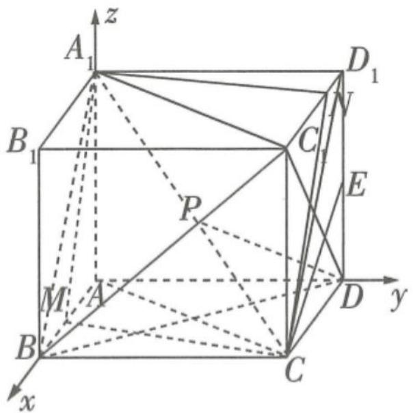

图9-11

①当 $t = 0$ 时,点 $P$ 与点 $B$ 重合,连接 ${BD},{AC},{A}_{1}C,{A}_{1}{C}_{1}$ , $\overrightarrow{BD} = \left( {-1,1,0}\right) ,\overrightarrow{AC} = \left( {1,1,0}\right) ,\overrightarrow{AA}_{1} = \left( {0,0,1}\right)$ ,所以 $\overrightarrow{BD} \cdot$ $\overrightarrow{AC} = 0,\overrightarrow{BD} \cdot  \overrightarrow{AA}_{1} = 0$ ,则 ${BD}\bot  {AC},{BD}\bot  A{A}_{1}$ ,

因为 $AC \cap AA_{1} = A$ ，所以 $BD \perp$ 平面 $AA_{1}C_{1}C$ ，此时平面 $\alpha$ 即平面 $AA_{1}C_{1}C$ ，截面面积 $S = AA_{1} \times AC = 1 \times \sqrt{2} = \sqrt{2}$ .

②当 $t = 1$ 时,点 $P$ 与点 ${C}_{1}$ 重合,连接 $D{C}_{1},{CD}_{1},{A}_{1}B$ ,则 $D{C}_{1} \perp$ 平面 ${A}_{1}{D}_{1}{CB}$ ,此时

【突破点】考虑2种特殊情况，求出对应的截面面积

平面 $\alpha$ 即平面 $A_{1}D_{1}CB$ ，截面面积 $S=\sqrt{2}$ .

③当 $0 < t < 1$ 时， $\overrightarrow{DP} = (1, t - 1, t), \overrightarrow{A_1C} = (1, 1, -1)$ ，因为 $\overrightarrow{DP} \cdot \overrightarrow{A_1C} = 1 + t - 1 - t = 0$ ，所以 $A_1C \perp PD$ ，所以 $A_1C \subset \alpha$ ，

设平面 $\alpha$ 交 $DD_{1}$ 于点 $E(0,1,m)$ ( $0 < m < 1$ ), 连接 $CE, \overrightarrow{CE} = (-1,0,m)$ , 令 $\overrightarrow{DP} \cdot \overrightarrow{CE} = -1 + tm = 0$ , 可得 $m = \frac{1}{t} > 1$ , 不合题意.

设平面 $\alpha$ 交棱 $AB$ 于点 $M(n,0,0)(0 < n < 1)$ , 连接 $CM, A_1M, \overrightarrow{CM} = (n - 1, -1,0)$ , 令 $\overrightarrow{DP} \cdot \overrightarrow{CM} = n - 1 - (t - 1) = 0$ , 可得 $n = t \in (0,1)$ , 符合题意, 即 $M(t,0,0)$ .

同理可知, 平面 $\alpha$ 交棱 $C_{1}D_{1}$ 于点 $N(1-t,1,1)$ ，连接 $A_{1}N, NC, \overrightarrow{A_{1}N} = (1-t,1,0) = \overrightarrow{MC}$ ，故四边形 $A_{1}MCN$ 为平行四边形， $\cos\angle CA_{1}N = \frac{\overrightarrow{A_{1}C} \cdot \overrightarrow{A_{1}N}}{|\overrightarrow{A_{1}C}| |\overrightarrow{A_{1}N}|} = \frac{2-t}{\sqrt{3} \times \sqrt{t^{2}-2t+2}}$ ,

【会运算】利用向量夹角公式探寻夹角与l的关系

则 $\sin \angle CA_{1}N = \sqrt{1 - \cos^{2}\angle CA_{1}N} = \frac{\sqrt{2(t^{2} - t + 1)}}{\sqrt{3(t^{2} - 2t + 2)}},$

所以截面面积 $S=2S_{\triangle CA_{1}N}=|\overrightarrow{A_{1}C}|\times|\overrightarrow{A_{1}N}|\times\sin\angle CA_{1}N=\sqrt{2(t^{2}-t+1)}=$ $\sqrt{2(t-\frac{1}{2})^{2}+\frac{3}{2}}\geqslant\frac{\sqrt{6}}{2},\frac{\sqrt{6}}{2}<\sqrt{2}.$

【指点迷津】在解立体几何中的动态问题时,对一些很难把握运动模型(规律)的最值问题,可以通过构建某个变量的函数,以数解形,此处比较三种情况下面积的大小关系,求出最小值

综上所述,截面面积的最小值为 $\frac{\sqrt{6}}{2}$ .

# 新题演练

(2022·北京一零一中学7月摸底/双空题)如图9-12,直三棱柱 $ABC - A'B'C'$ 的棱长均为 $2, O$ 是 $BC$ 的中点, $P$ 是侧面 $BB'C'C$ 内一点, 且 $PA = 2$ , 则点 $P$ 的轨迹长度为 \_\_\_\_. 当 $PC'$ 取最小值时, 三棱锥 $O - PAA'$ 的体积为 \_\_\_\_.

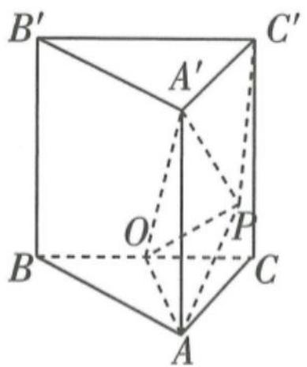

图9-12

# 参考答案与解析

$\pi \frac{\sqrt{15}}{15}$ 如图9-13,由题意易知 $OA \perp$ 平面 $BB'C'C$ ,所以 $OA \perp OP$ ,因为 $PA = 2, OA = \sqrt{3}$ ,所以 $OP = 1$ ,故点 $P$ 的轨迹是平面 $BB'C'C$ 内以 $O$ 为圆心,1为半径的半圆弧 $BC$ ,

【小妙招】由勾股定理以及圆的性质得出点 $P$ 的轨迹及轨迹长度

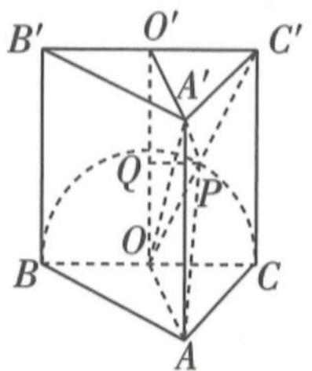

图9-13

故点 P 的轨迹长度为 $\frac{1}{2} \times 2\pi \times 1 = \pi$ .

由图可知, 当 P, O, C' 三点共线时, PC' 取最小值.

过点 O 作 $OO' \perp B'C'$ 于点 $O'$ ，连接 $O'A'$ ，易知 O, A, $A', O'$ 四点共面，连接 $OC'$ 交 BC 于点 P，过 P 作 $PQ \perp OO'$ ，交 $OO'$ 于点 Q.

因为 $OA \perp$ 平面 $BB'C'C$ ，所以 $PQ \perp OA$ ，

又 $OA \cap OO' = O$ , 则 $PQ \perp$ 平面 $OAA'O'$ , 故 $PQ$ 是三棱锥 $P - OAA'$ 的高.

【突破口】确定三棱锥 $P-OAA'$ 的高为 $PQ$ ，为下面求三棱锥的面积做准备

因为 $PQ \parallel O'C'$ ，所以 $\frac{PQ}{O'C'} = \frac{OP}{OC'}$ ，又 $OC' = \sqrt{5}$ ， $O'C' = 1$ ，OP = 1，所以 $PQ = \frac{\sqrt{5}}{5}$ .

【会思考】利用平行线分线段成比例求 PQ 的值

所以三棱锥 $O - PAA'$ 的体积为 $V_{O - PAA'} = V_{P - OAA'} = \frac{1}{3} \times S_{\triangle OAA'} \times PQ = \frac{1}{3} \times \frac{1}{2} \times 2 \times \sqrt{3} \times \frac{\sqrt{5}}{5} = \frac{\sqrt{15}}{15}$ .

# 开放创新篇

# 超重点 10 立体几何中的存在性探索问题

# 命题角度1 使线面位置关系成立的点的探求问题

# 1. 探求使线面平行的位置关系成立的点是否存在

调研 1 (2022·河南驻马店7月期末)如图10-1,三棱锥P-ABC中, $\triangle PAB$ , $\triangle ABC$ 均为等边三角形,PA=4,O为AB的中点,点D在AC上,满足AD=1,且平面PAB⊥平面ABC.

（1） 证明: $DC \perp$ 平面 POD.

（2） 若点 E 为 PB 的中点, 问: 直线 AC 上是否存在点 F, 使得 EF // 平面 POD? 若存在, 求出 CF 的长及 EF 到平面 POD 的距离; 若不存在, 请说明理由.

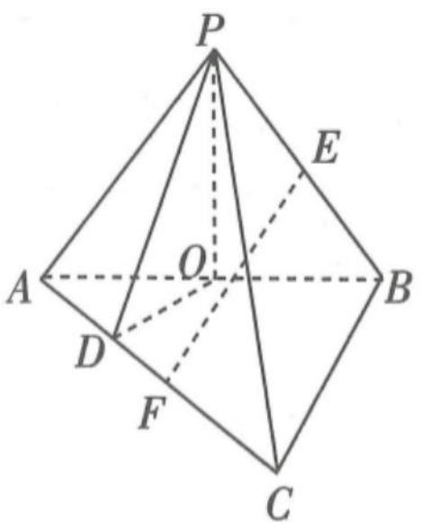

图10-1

思维导引 （1） 证明 $AD \perp OD, AD \perp PO$ , 由线面垂直的判定定理即可求解. （2） 取 $OB$ 的中点 $M$ , 连接 $EM$ , 可得 $EM \parallel PO$ , 再在平面 $ABC$ 内作 $MF \parallel OD$ 交 $AC$ 于点 $F$ , 由面面平行的判定定理证明平面 $POD \parallel$ 平面 $EFM$ , 即可得到 $EF \parallel$ 平面 $POD$ , 由平行知识可得 $CF$ 的长, $EF$ 到平面 $POD$ 的距离为平面 $POD$ 与平面 $EFM$ 间的距离, 由此即可得解.

解析 （1） 由 $\triangle PAB, \triangle ABC$ 均为等边三角形, $O$ 为 $AB$ 的中点,

得 AB = PA = 4, AO = 2AD = 2, $\angle DAO = 60^{\circ}$ .

在 $\triangle AOD$ 中，由余弦定理得 $DO = \sqrt{AO^2 + AD^2 - 2 \times \cos \angle DAO \times AO \times AD} = \sqrt{4 + 1 - 2 \times \cos \angle DAO \times 2 \times 1} = \sqrt{3}$ ，

所以 $AO^{2}=AD^{2}+OD^{2}$ ，所以 $\triangle AOD$ 为直角三角形，且 $OD\perp AD$ 。

又平面 $PAB \perp$ 平面 ABC，平面 $PAB \cap$ 平面 ABC = AB，且 $PO \perp AB, PO \subset$ 平面 PAB，所以 $PO \perp$ 平面 ABC.

【易错提醒】面面垂直的性质定理：两个平面垂直，则一个平面内垂直于交线的直线与另一个平面垂直。使用该定理时切记条件要写全，其中对于交线的说明很容易遗漏，导致丢失步骤分

由 $AD \subset$ 平面 ABC 得 $PO \perp AD$ ,

因此由 $AD \perp OD, AD \perp PO, OD \cap PO = O$ ，得 $AD \perp$ 平面 POD，即 $DC \perp$ 平面 POD.

（2） 直线 AC 上存在点 F, 使得 $EF \parallel$ 平面 POD. 理由如下.

如图 10-2, 取 OB 的中点 M, 连接 EM, 因为 E 为 PB 的中点, 所以 EM // PO.

在平面 ABC 内作 $MF \parallel OD$ 交 AC 于点 F, 点 F 即满足题意的点.

下面证明平面 POD // 平面 EFM.

由于 $EM \parallel PO, EM \not\subset$ 平面 $POD, PO \subset$ 平面 $POD$ , 则 $EM \parallel$ 平面 $POD$ .

因为 $MF \parallel OD, MF \not\subset$ 平面 $POD, OD \subset$ 平面 $POD$ , 所以 $MF \parallel$ 平面 $POD$ ,

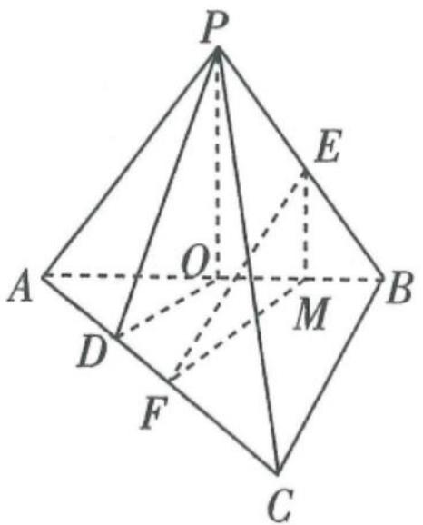

图10-2

又 $MF \subset$ 平面 EFM, EM $\subset$ 平面 EFM, $MF \cap EM = M$ ,

所以平面 POD // 平面 EFM.

又 $EF \subset$ 平面 $EFM$ , 因此 $EF \parallel$ 平面 $POD$ .

由于 $\frac{AO}{OM} = \frac{AD}{DF} = 2$ ，从而可得 $DF = \frac{1}{2}, AF = \frac{3}{2}, CF = AC - AF = \frac{5}{2}$ .

由（1）可知, $AD \perp$ 平面 POD,则 $AD \perp$ 平面 EFM, $DF = \frac{1}{2}$ ,即平面 POD 与平面 EFM 间的距离,也即 EF 到平面 POD 的距离.

综上,在 $AC$ 上存在点 $F$ , 使得 $EF \parallel$ 平面 $POD$ , $CF = \frac{5}{2}$ , $EF$ 到平面 $POD$ 的距离为 $\frac{1}{2}$ .

# 2. 探求使线面垂直的位置关系成立的点是否存在

调研 2 (2022·天津杨柳青第一中学7月期末)如图10-3,在四棱锥P-ABCD中,侧棱 $PD \perp$ 底面ABCD,底面ABCD是直角梯形, $AB \parallel DC$ , $AD \perp DC$ ,且 $AB = AD = 1$ , $PD = DC = 2$ ,E是PC的中点.公众号:拾穗者的杂货铺

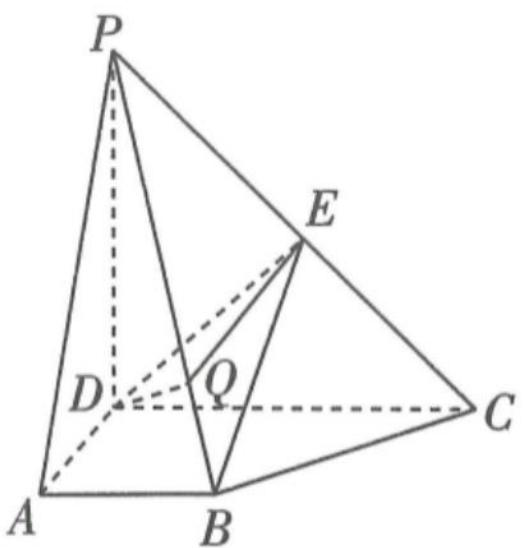

图10-3

（1） 求证: BE // 平面 PAD.  
（2） 在线段 $PB$ 上是否存在一点 $Q$ , 使得 $PC \perp$ 平面 $DEQ$ ? 若存在, 求出 $\frac{PB}{QB}$ 的值; 若不存在, 请说明理由.

思维导引

（1） 取 PD 的中点 F

由 $EF \parallel AB, EF = AB$ 证得四边形 EFAB 为平行四边形

BE // AF

BE // 平面 PAD

（2） 假设存在点 Q

求出 PQ, PE

由余弦定理求得 $QE$

结合勾股定理证得

$QE \perp PC$

结合 $DE \perp PC$ ，即可证得 $PC \perp$ 平面 DEQ

解析

（1） 如图 10-4, 取 $PD$ 的中点 $F$ , 连接 $EF, AF$ .

【扫清障碍】要在平面 PAD 内找到一条直线与 BE 平行，已知 E 是 PC 的中点，故考虑取 PD 的中点，看是否能通过中位线或构造平行四边形寻找平行关系

因为 E 是 PC 的中点, 所以 $EF \parallel DC$ , $EF = \frac{1}{2}DC = 1$ .

又 $AB \parallel DC, AB = \frac{1}{2} DC = 1$

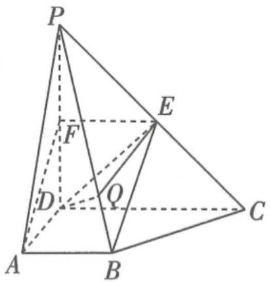

图10-4

所以 $EF \parallel AB, EF = AB$ ，则四边形 $EFAB$ 为平行四边形，则 $BE \parallel AF$ .

又 $AF \subset$ 平面 PAD, BE ∉ 平面 PAD, 所以 $BE \parallel$ 平面 PAD.

（2） 在线段 $PB$ 上存在点 $Q$ , 使得 $PC \perp$ 平面 $DEQ$ , 此时 $\frac{PB}{QB} = 3$ . 理由如下.

如图 10-5, 连接 BD, 易得 $BD = \sqrt{2}$ , $BC = \sqrt{1^{2} + (2 - 1)^{2}} = \sqrt{2}$ .

因为 $PD \perp$ 底面 ABCD, CD, BD ⊂ 底面 ABCD,

所以 $PD \perp DC, PD \perp DB,$

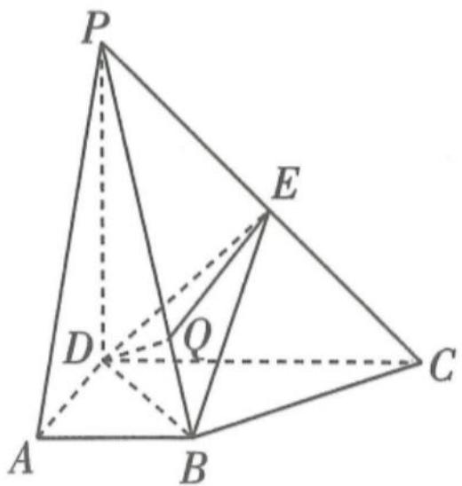

图10-5

数学对观察自然做出重要的贡献,它解释了规律结构中简单的原始元素,而天体就是用这些原始元素建立起来的.——开普勒

则 $PC = \sqrt{2^2 + 2^2} = 2\sqrt{2}, PB = \sqrt{2^2 + (\sqrt{2})^2} = \sqrt{6}$

则 $PB^{2} + BC^{2} = PC^{2}$ ，即 $PB\bot BC$

又 $PQ = \frac{2}{3} PB = \frac{2\sqrt{6}}{3}, PE = \frac{1}{2} PC = \sqrt{2}, \cos \angle BPC = \frac{PB}{PC} = \frac{\sqrt{3}}{2},$

在 $\triangle PQE$ 中，由余弦定理得 $QE^2 = PQ^2 + PE^2 - 2 \times PQ \times PE \times \cos \angle BPC = (\frac{2\sqrt{6}}{3})^2 + (\sqrt{2})^2 - 2 \times \frac{2\sqrt{6}}{3} \times \sqrt{2} \times \frac{\sqrt{3}}{2} = \frac{2}{3}$ ,

则 $QE^{2} + PE^{2} = PQ^{2}$ ，即 $QE \perp PC$ .

又 $DE \perp PC, QE \cap DE = E, QE, DE \subset$ 平面 $DEQ$ , 则 $PC \perp$ 平面 $DEQ$ ,

故在线段 PB 上存在点 Q, 使得 $PC \perp$ 平面 DEQ, 此时 $\frac{PB}{QB} = 3$ .

# 3. 探求使线线平行的位置关系成立的点是否存在

调研 3 (2022·北京西城区7月期末)如图10-6,在正方体 $ABCD - A_{1}B_{1}C_{1}D_{1}$ 中, $AA_{1} = 2, O$ 为底面 $A_{1}B_{1}C_{1}D_{1}$ 的中心.

（1） 求证: $AO \perp BD$ .   
（2） 求点 A 到平面 $A_{1}BD$ 的距离.  
（3） 判断棱 $CC_{1}$ 上是否存在一点 E, 使得 $AO \parallel BE$ , 并说明理由.

解析 （1） 如图 10-7, 连接 $AB_{1}, AD_{1}, B_{1}D_{1}$ .

易知 O 为 $B_{1}D_{1}$ 的中点, $AB_{1}=AD_{1}$ , 则 $AO\perp B_{1}D_{1}$ .

因为 $BD \parallel B_{1}D_{1}$ ，所以 $AO \perp BD$ .

（2） 设点 A 到平面 $A_{1}BD$ 的距离为 d.

由 $V_{A - A_1BD} = V_{A_1 - ADB}$ 得 $\frac{1}{3} S_{\triangle A_1BD}\times d = \frac{1}{3} S_{\triangle ABD}\times AA_1$

则 $\frac{\sqrt{3}}{4} \times (\sqrt{4 + 4})^2 \times d = \frac{1}{2} \times 2 \times 2 \times 2,$

所以 $d=\frac{2\sqrt{3}}{3}$ ，所以点 A 到平面 $A_{1}BD$ 的距离为 $\frac{2\sqrt{3}}{3}$ .

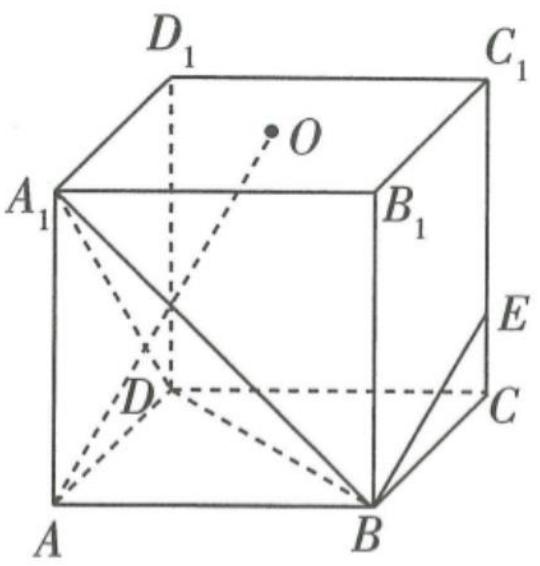

图10-6

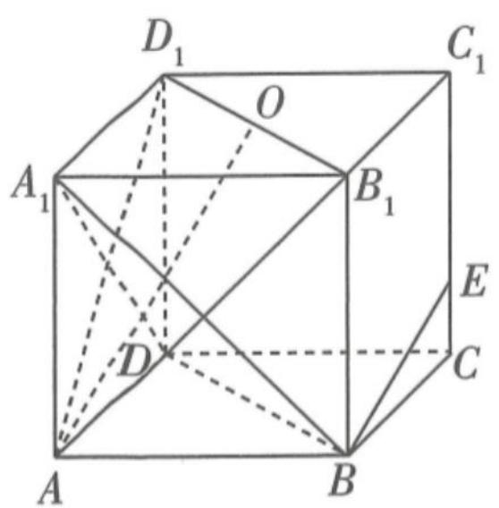

图10-7

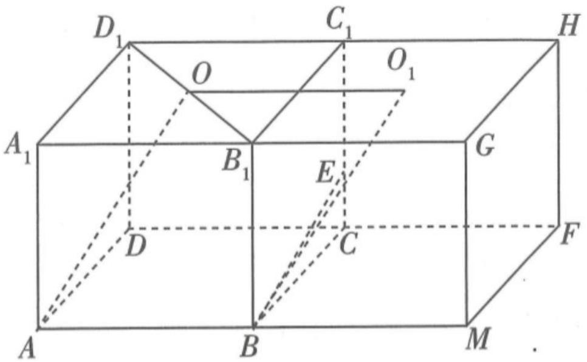

图10-8

（3） 不存在, 理由如下.

如图 10-8, 在正方体 $ABCD-A_{1}B_{1}C_{1}D_{1}$ 右侧作一个相同的正方体 $BCFM-B_{1}C_{1}HG$ .

【会补形】根据待求目标仔细读图, 从图中初步判断: 无论点 $E$ 在 $CC_{1}$ 上怎么移动, $AO \parallel BE$ 都不成立. 有了初步判断后就需要证明, 想办法找到一条与 $AO$ 平行且过点 $B$ 的直线, 再证明该直线与 $BE$ 相交即可, 因此想到补形, 即在正方体 $ABCD-A_{1}B_{1}C_{1}D_{1}$ 右侧作一个相同的正方体, 方便找到与 $AO$ 平行且过点 $B$ 的直线

取底面 $B_{1}C_{1}HG$ 的中心 $O_{1}$ , 连接 $OO_{1}, O_{1}B$ , 易知四边形 $AOO_{1}B$ 是平行四边形, 所以 $AO \parallel O_{1}B$ ,

而 $O_{1}B$ 与 BE 相交, 所以棱 $CC_{1}$ 上不存在一点 E, 使得 AO // BE.

# 命题角度2 使线面位置关系成立的数的探求问题

调研 4 (2022·北京海淀区7月期末)如图10-9,在直棱柱 $ABCD - A_{1}B_{1}C_{1}D_{1}$ 中,底面ABCD是菱形, $AB = 2$ , $\angle BAD = 60^{\circ}$ , $AA_{1} = a$ , $E$ , $F$ 分别是棱BC, $DD_{1}$ 的中点.

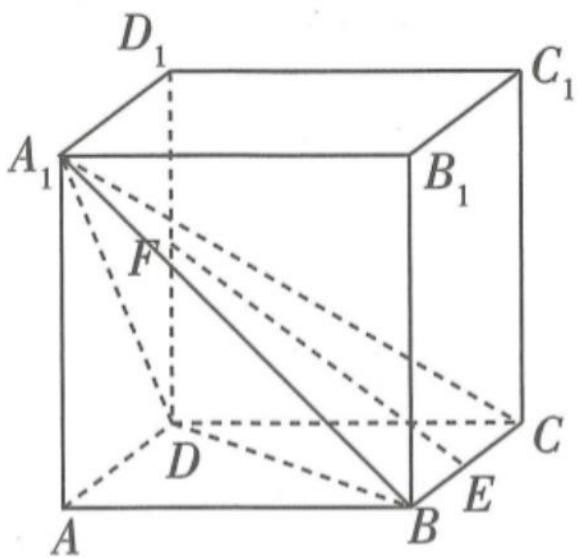

图10-9

（1） 求证: $BD \perp A_{1}C$ .

（2） 求证: $EF \parallel$ 平面 $A_{1}BD$ .

（3）是否存在正数 $a$ , 使得平面 $A_{1}BC \perp$ 平面 $A_{1}DC$ ? 若存在, 求 $a$ 的值; 若不存在, 说明理由.

解析 （1） 如图 10-10, 连接 AC.

因为底面 ABCD 是菱形, 所以 $BD \perp AC$ .

在直棱柱 $ABCD-A_{1}B_{1}C_{1}D_{1}$ 中， $AA_{1}\perp$ 平面 ABCD, BD⊂平面 ABCD, 所以 $AA_{1}\perp BD$ , 又 $AA_{1}\cap AC=A$ , 所以 $BD\perp$ 平面 $A_{1}AC$ , 又 $A_{1}C\subset$ 平面 $A_{1}AC$ , 所以 $BD\perp A_{1}C$ .

给我最大快乐的,不是已懂得的知识,而是不断学习;不是已有的东西,而是不断获取;不是已达到的高度,而是继续不断攀登.
—— 高斯

（2） 如图 10-10, 取 $A_{1}D$ 的中点 $M$ , 连接 $FM, BM$ ,

则 $FM$ 为三角形 $A_{1}DD_{1}$ 的中位线, 所以 $FM \parallel A_{1}D_{1}$ 且 $FM = \frac{1}{2} A_{1}D_{1}$ .

又 $A_{1}D_{1} / / B_{1}C_{1}$ 且 $A_{1}D_{1} = B_{1}C_{1}, BE / / B_{1}C_{1}$ 且 $BE = \frac{1}{2} B_{1}C_{1}$ ,

所以 $FM \parallel BE$ 且 $FM = BE$ , 所以四边形 $FMBE$ 为平行四边形, 所以 $EF \parallel MB$ .

又 $EF \not\subset$ 平面 $A_{1}BD, MB \subset$ 平面 $A_{1}BD$ , 所以 $EF \parallel$ 平面 $A_{1}BD$ .

（3） 存在正数 $a = 2$ , 使得平面 $A_{1}BC \perp$ 平面 $A_{1}DC$ . 理由如下.

在菱形 ABCD 中, AB = 2, $\angle BAD = 60^{\circ}$ , 则 $AC = 2\sqrt{3}$ ,

在 Rt△A₁AC 中，A₁C = √AA₁² + AC² = √a² + 12.

假设存在正数 a, 使得平面 $A_{1}BC \perp$ 平面 $A_{1}DC$ , 如图 10-10, 过 B 作 $BO \perp A_{1}C$ 且与 $A_{1}C$ 【扫清障碍】存在性探究问题，常常假设存在，并将其设为已知条件求解，若得到与题干要求矛盾的结论，则不存在，否则存在

交于点 O, 连接 DO, 易知 $DO \perp A_{1}C$ .

因为平面 $A_{1}BC \cap$ 平面 $A_{1}DC = A_{1}C, BO \subset$ 平面 $A_{1}BC$ ，所以 $BO \perp$ 平面 $A_{1}DC$ ，

因为 $DO \subset$ 平面 $A_{1}DC$ ，所以 $BO \perp DO$ 。

在 Rt△A₁BC 中，BO = $\frac{A_{1}B \cdot BC}{A_{1}C} = \frac{2\sqrt{a^{2} + 4}}{\sqrt{a^{2} + 12}}$ ，同理得 DO = $\frac{2\sqrt{a^{2} + 4}}{\sqrt{a^{2} + 12}}$ .

因为底面 ABCD 是菱形, AB = 2, $\angle BAD = 60^{\circ}$ , 所以 DB = 2.

在 Rt△BOD 中， $BO^{2} + DO^{2} = DB^{2}$ ，得 $\left(\frac{2\sqrt{a^{2} + 4}}{\sqrt{a^{2} + 12}}\right)^{2} + \left(\frac{2\sqrt{a^{2} + 4}}{\sqrt{a^{2} + 12}}\right)^{2} = 4$ ，化简得 a = 2（负值舍去）.

所以存在正数 a=2，使得平面 $A_{1}BC \perp$ 平面 $A_{1}DC$ .

# 命题角度 3 使某数量为定值的点的探求问题

调研 5 (2022·湖北安陆一中6月阶段练习)如图10-11①,已知等边三角形ABC的边长为3,点M,N分别是AB,AC上的点,且BM=2MA,AN=2NC.如图10-11②,将△AMN沿MN折起到△A'MN的位置,连接A'B,A'C.

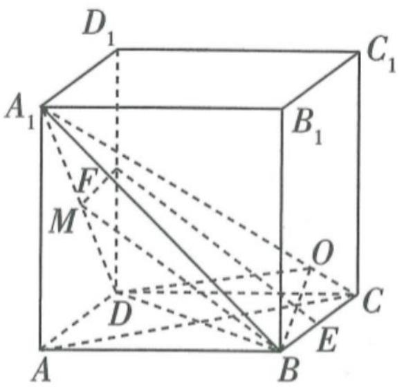

图10-10

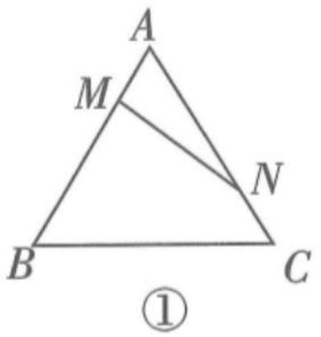

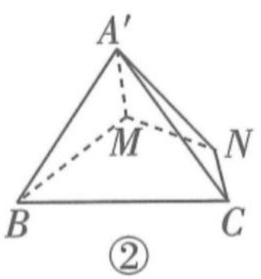

图10-11

（1） 求证: 平面 $A'BM \perp$ 平面 BCNM.  
（2） 若 $A'M \perp BC$ , 则在线段 $A'C$ 上是否存在一点 $P$ , 使三棱锥 $A' - PMB$ 的体积为 $\frac{3}{4}$ ? 若存在, 求出 $\frac{A'P}{A'C}$ 的值; 若不存在, 请说明理由.

思维导引 （1） 利用线面垂直的判定定理证明 $MN \perp$ 平面 $A'BM$ , 再利用面面垂直的判定定理证明平面 $A'BM \perp$ 平面 $BCNM$ . （2） 先证明 $A'M \perp$ 平面 $BCNM$ , 然后求解三棱锥 $A'-BCM$ 的体积, 说明存在点 $P$ 满足题目条件.

解析 （1） 由已知得, $AM = 1$ , $AN = 2$ , $\angle A = 60^{\circ}$ .

在 $\triangle AMN$ 中,由余弦定理得 $MN=\sqrt{1^{2}+2^{2}-2\times1\times2\times\cos60^{\circ}}=\sqrt{3},\therefore MN^{2}+AM^{2}=AN^{2},\therefore MN\perp AB,\therefore MN\perp A'M,MN\perp MB.$

$\because MB\cap A'M=M,MB\subset$ 平面 $A'BM,A'M\subset$ 平面 $A'BM,\therefore MN\perp$ 平面 $A'BM.$

$\because {MN} \subset$ 平面 ${BCNM},\therefore$ 平面 ${A}^{' }{BM} \bot$ 平面 ${BCNM}$ .

（2）由（1）得, $A'M\perp MN,\because A'M\perp BC,BC$ 和 MN 是平面 BCNM 内两条相交直线, $\therefore A'M\perp$ 平面 BCNM.

$\because BM\subset$ 平面 $BCNM,\therefore A'M\perp BM,\therefore S_{\triangle A'BM}=\frac{1}{2}\times1\times2=1.$

∵ 等边三角形 ABC 的边长为 3, ∴ 等边三角形 ABC 的高为 $3 \times \sin 60^{\circ} = \frac{3\sqrt{3}}{2}$ .

连接 CM，则三棱锥 $A' - BCM$ 的体积为 $V_{三棱锥C - A'BM} = \frac{1}{3} S_{\triangle A'BM} \times \frac{3\sqrt{3}}{2} = \frac{\sqrt{3}}{2} > \frac{3}{4}$ ,

【会转化】三棱锥 $A' - BCM$ 的体积即三棱锥 $C - A'BM$ 的体积, 底面为 $\triangle BA'M$ , 高是点 $C$ 到棱 $BM$ 的距离, 也就是折叠前等边三角形 $ABC$ 的高

∴ 在线段 $A'C$ 上存在点 P 使 $V_{三棱锥A'-PMB}=\frac{3}{4}$ ，此时 $\frac{A'P}{A'C}=\frac{V_{三棱锥P-A'BM}}{V_{三棱锥C-A'BM}}=\frac{\frac{3}{4}}{\frac{\sqrt{3}}{2}}=\frac{\sqrt{3}}{2}$ .

调研 6 (2022·河北石家庄7月期末)如图10-12①,在直角梯形ABCD中, $AB \parallel DC, \angle ABC = 90^{\circ}, AB = 2DC = 2BC, E$ 为AB的中点,沿DE将△ADE折起,使得点A到点P的位置,且 $PE \perp EB, M$ 为PB的中点,N是BC上的动点(与点B,C不重合),如

图 10 - 12②.

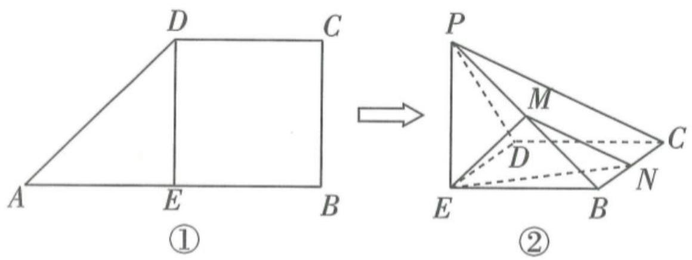

图10-12

（1） 证明: 平面 EMN ⊥ 平面 PBC.

（2） 是否存在点 $N$ , 使得二面角 $B - EN - M$ 的正切值为 $\sqrt{5}$ ? 若存在, 确定 $N$ 点位置; 若不存在, 请说明理由.

解析 （1） 由题知 $PE \perp ED, PE \perp EB, EB \cap ED = E$ , 则 $PE \perp$ 平面 $EBCD$ ,

因为 $BC \subset$ 平面 EBCD, 所以 $PE \perp BC$ .

因为 $BC \perp EB, EB \cap PE = E$ ，所以 $BC \perp$ 平面 PEB.

因为 $EM \subset$ 平面 PEB, 所以 $BC \perp EM$ .

因为 PE = EB, PM = MB, 所以 $EM \perp PB$ .

因为 $BC \cap PB = B$ ，所以 $EM \perp$ 平面 PBC，

因为 $EM \subset$ 平面 EMN, 所以平面 $EMN \perp$ 平面 PBC.

（2） 假设存在点 N 满足题意, 如图 10-13, 过 M 作 $MQ \perp EB$ 于 Q, 过 Q 作 $QR \perp EN$ 于 R, 连接 MR.

因为 $PE \perp EB$ ，所以 $PE \parallel MQ$ 。

由（1）知 $PE \perp$ 平面 EBCD, 所以 $MQ \perp$ 平面 EBCD.

因为 $EN \subset$ 平面 EBCD, 所以 $MQ \perp EN$ .

因为 $MQ \cap QR = Q$ ，所以 $EN \perp$ 平面 MQR.

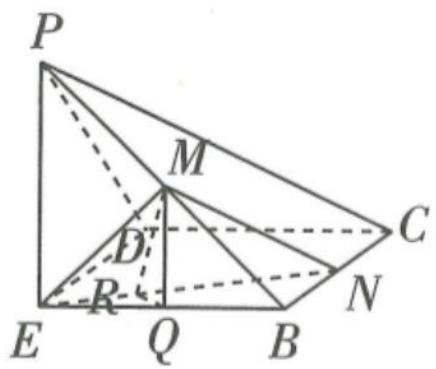

图10-13

因为 $MR \subset$ 平面 MQR, 所以 $EN \perp MR$ , 所以 $\angle MRQ$ 为二面角 B - EN - M 的平面角.

不妨设 PE = EB = BC = 2，则 MQ = 1，设 BN = x (0 < x < 2)，

【易遗漏】注意 $x$ 的取值范围不要遗漏, 以便后面解出 $x$ 后进行检验, 若不在取值范围内, 说明满足条件的点 $N$ 不存在

易知 Rt△EBN∼Rt△ERQ, 所以 $\frac{BN}{RQ} = \frac{EN}{EQ}$ , 即 $\frac{x}{RQ} = \frac{\sqrt{2^{2} + x^{2}}}{1}$ , 得 $RQ = \frac{x}{\sqrt{4 + x^{2}}}$ ,

所以 $\tan\angle MRQ=\frac{MQ}{RQ}=\frac{\sqrt{x^{2}+4}}{x}=\sqrt{5}$ ，解得 $x=1\in(0,2)$ ，即此时 N 为 BC 的中点.

综上, 存在点 N, 使得二面角 B - EN - M 的正切值为 $\sqrt{5}$ , 此时 N 为 BC 的中点.

# 超重点 11 圆锥曲线的交汇问题

# 命题角度1 圆锥曲线与平面向量交汇

调研 1 (2022·山东威海5月三模)在抛物线 $y^{2}=8x$ 上有三点A,B,C,F为其焦点,且 $\overrightarrow{AF}=\frac{1}{3}(\overrightarrow{AB}+\overrightarrow{AC})$ ,则 $|\overrightarrow{AF}|+|\overrightarrow{BF}|+|\overrightarrow{CF}|=$

$\quad$A. 6

$\quad$B. 8

$\quad$C. 9

$\quad$D. 12

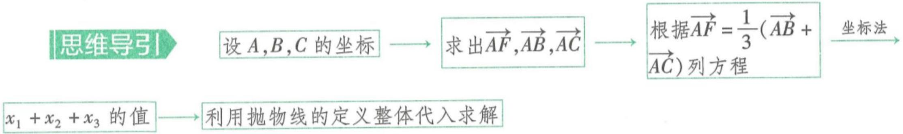

解析 依题意 $2p = 8, \frac{p}{2} = 2$ ，则 $F(2,0)$ ，设 $A(x_1, y_1), B(x_2, y_2), C(x_3, y_3)$ ，

则 $\overrightarrow{AF} = (2 - x_1, - y_1),\overrightarrow{AB} = (x_2 - x_1,y_2 - y_1),\overrightarrow{AC} = (x_3 - x_1,y_3 - y_1).$

因为 $\overrightarrow{AF} = \frac{1}{3} (\overrightarrow{AB} +\overrightarrow{AC})$ ，所以 $2 - x_{1} = \frac{1}{3} (x_{2} - x_{1} + x_{3} - x_{1})$

【小妙招】由于涉及未知量比较多,此处可以利用方程思想求解,找出等量关系

所以 $x_{1} + x_{2} + x_{3} = 6$ ，所以 $\left|\overrightarrow{AF}\right| + \left|\overrightarrow{BF}\right| + \left|\overrightarrow{CF}\right| = x_{1} + x_{2} + x_{3} + 6 = 12$ 。故选 D.

【指点迷津】涉及抛物线的弦长、中点、距离等的相关问题,一般采用“设而不求”“整体代入”等方法求解

调研 2 (2022·河南省实验中学、郑州一中等校5月联考)已知双曲线 $C:\frac{x^{2}}{a^{2}}-\frac{y^{2}}{b^{2}}=$ 1(a>0,b>0)的右顶点、右焦点分别为A,F,过点A的直线l与C的一条渐近线交于点Q,直线QF与C的一个交点为B,若 $\overrightarrow{AQ}\cdot\overrightarrow{AB}=\overrightarrow{AQ}\cdot\overrightarrow{FB}$ ,且 $\overrightarrow{BQ}=3\overrightarrow{FQ}$ ,则C的离心率为()

$\quad$A. 2

$\quad$B. $\sqrt{5} - 1$

$\quad$C. $\sqrt{5}$

$\quad$D. $\frac{2+\sqrt{5}}{3}$

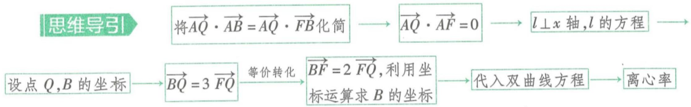

解析 由已知得 $A(a,0), F(c,0)$ ,

由 $\overrightarrow{AQ}\cdot\overrightarrow{AB}=\overrightarrow{AQ}\cdot\overrightarrow{FB}$ ，得 $\overrightarrow{AQ}\cdot(\overrightarrow{AB}+\overrightarrow{BF})=\overrightarrow{AQ}\cdot\overrightarrow{AF}=0,\therefore l\perp x$ 轴，即l:x=a，
不妨设点 Q 在第一象限，则 $Q(a,b)$ .

纯数学这门科学在其现代发展阶段,可以说是人类精神之最具独创性的创造.——怀德海

设 $B(x_0, y_0)$ , 由 $\overrightarrow{BQ} = 3\overrightarrow{FQ}$ , 得 $\overrightarrow{BF} = 2\overrightarrow{FQ}$ ,

【会思考】解析几何问题 $\xrightarrow{\text{设向量}}$ 向量问题 $\xrightarrow{\text{计算}}$ 解决向量问题 $\xrightarrow{\text{还原}}$ 解决解析几何问题又 $\overrightarrow{BF} = (c - x_0, -y_0), \overrightarrow{FQ} = (a - c, b)$ ，

$\therefore (c - x _ {0}, - y _ {0}) = 2 (a - c, b), \therefore \left\{ \begin{array}{l} x _ {0} = 3 c - 2 a, \\ y _ {0} = - 2 b, \end{array} \right. \therefore B (3 c - 2 a, - 2 b).$

∵点 $B(x_{0},y_{0})$ 在双曲线C上，∴ $\frac{(3c-2a)^{2}}{a^{2}}-\frac{(-2b)^{2}}{b^{2}}=1$ ，整理得 $9c^{2}-12ac-a^{2}=0$ ，∴ $9e^{2}-12e-1=0$ ，解得 $e=\frac{2+\sqrt{5}}{3}$ 或 $e=\frac{2-\sqrt{5}}{3}$ （负值舍去），故选D.

【敲黑板】在解关于离心率 e 的一元二次方程时，要注意利用双曲线的离心率 $e \in (1, +\infty)$ 进行根的取舍，否则将产生增根

# 命题角度2 圆锥曲线与圆交汇

调研 3 (2022·郑州外国语学校、开封高中6月联考)抛物线 $C: y^{2} = 2px (p > 0)$ 的焦点为 F, A 为抛物线 C 上一点, 以 F 为圆心, $|FA|$ 为半径的圆交抛物线 C 的准线 l 于 M, N 两点, $|MN| = 2\sqrt{3}p$ , 则直线 AF 的斜率为 ( )

$\quad$A. ±1

$\quad$B. $\pm \sqrt{2}$

$\quad$C. $\sqrt{3}$

$\quad$D. $\pm\sqrt{3}$

思维导引

由 $|MN| = 2\sqrt{3} p$ 求 $|MH|$

利用勾股定理求|FM|

结合抛物线
定义列方程

A 点的坐标 $\rightarrow$ AF 的斜率

解析 方法一 如图 11-1, 连接 $FM$ , 由题意可知 $F(\frac{p}{2}, 0)$ , $l: x = -\frac{p}{2}$ , $|FA| = |FM|$ , 设准线 $l$ 与 $x$ 轴交于 $H$ ,

因为 $|MN| = 2\sqrt{3} p$ ，所以 $|MH| = \sqrt{3} p$ ，又 $|FH| = p$ ，所以 $|FA| = |FM| = \sqrt{|FH|^2 + |MH|^2} = 2p.$

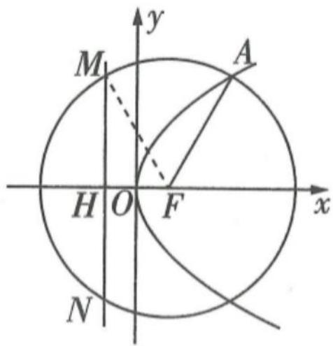

图11-1

设 $A(x_0, y_0)(x_0 \geqslant 0)$ , 由抛物线定义可知 $|FA| = x_0 + \frac{p}{2}$ , 所以 $x_0 = \frac{3p}{2}$ ,

代入抛物线方程得 $y_{0}=\pm\sqrt{3}p$ ，所以 $A(\frac{3p}{2},\pm\sqrt{3}p)$ ，所以直线AF的斜率为 $\pm\sqrt{3}$ 。故选D。

【易错提醒】A 为抛物线 C 上一点，可以在第一象限，也可以在第四象限

方法二 易得圆 F 的方程为 $\left(x-\frac{p}{2}\right)^{2}+y^{2}=4p^{2}$ ,

由 $\left\{\begin{aligned}x-\frac{p}{2}\end{aligned}\right)^{2}+y^{2}=4p^{2},$ 可得 $(x+\frac{p}{2})^{2}=4p^{2}$ ，所以点A的横坐标为 $x_{A}=\frac{3p}{2}$

所以 $A\left(\frac{3p}{2}, \pm\sqrt{3}p\right)$ ，又 $F\left(\frac{p}{2},0\right)$ ，所以直线 AF 的斜率为 $\pm\sqrt{3}$ 。故选 D.

调研 4 (2022·湖北黄冈中学5月适应性考试)(多选)已知 O 为坐标原点,双曲线 $C:\frac{x^{2}}{a^{2}}-\frac{y^{2}}{b^{2}}=1(a>0,b>0)$ 的右焦点为 F,l 是 C 的一条渐近线,以 F 为圆心、a 为半径的圆与 l 交于 A,B 两点,则下列说法正确的是 ()

$\quad$A. 过点 O 且与圆 F 相切的直线与双曲线 C 没有公共点  
$\quad$B. C 的离心率的最大值是 $\sqrt{2}$   
$\quad$C. 若 $\overrightarrow{FA} \cdot \overrightarrow{FB} > 0$ ，则 C 的离心率的取值范围是 $\left(\frac{\sqrt{6}}{2}, \sqrt{2}\right)$   
$\quad$D. 若 $\overrightarrow{OA} = \overrightarrow{AB}$ ，则 C 的离心率为 $\frac{\sqrt{17}}{3}$

思维导引 数形结合判定
A 的对错

过点 F 作 $FD \perp l$ 于 D，可得 $|FD| = b$ ，推出 b < a，
进而可得离心率的范围，判定 B 的对错

由 $\overrightarrow{FA}\cdot\overrightarrow{FB}>0$ 可得 $0<\angle AFD<\frac{\pi}{4}$ ，推出1> $\frac{b}{a}>2\sqrt{2}$ ，可得离心率的范围，判定C的对错

由 $\overrightarrow{OA} = \overrightarrow{AB}$ 可得 $A$ 为线段 $OB$ 的中点，由勾股定理得 $a, b, c$ 的关系式，求离心率，判定 D 的对错

解析

<table><tr><td>选项</td><td>分析过程</td><td>正误</td></tr><tr><td>A</td><td>双曲线C的渐近线l与圆F交于A,B两点,所以过点O且与圆F相切的直线与双曲线C没有公共点</td><td>√</td></tr><tr><td>B</td><td>过点F作FD⊥l,垂足为D,易知|FD|=b.【记结论】双曲线的焦点到渐近线的距离为b因为圆F与直线l相交,所以bc2=a2+b2,所以c2&lt;2a2,即e2&lt;2,即1所以C的离心率的取值范围是(1,√2)【警示】不要忽视双曲线离心率e&gt;1</td><td>×</td></tr></table>

音乐能激发或抚慰情怀,绘画使人赏心悦目,诗歌能动人心弦,哲学使人获得智慧,科学可改善物质生活,但数学能给予以上的一切.——克莱因

续表

<table><tr><td>C</td><td>由题知,若 $\overrightarrow{FA} \cdot \overrightarrow{FB} >0$ ,则 $1 >\cos \angle AFB >0$ ,即 $0 < \angle AFB < \frac{\pi}{2}$ ,【必记结论】有关向量夹角的两个结论:（1）两个向量 $a$ 与 $b$ 的夹角为锐角,则有 $a \cdot b >0$ ,反之不成立(因为夹角为0时不成立);（2）两个向量 $a$ 与 $b$ 的夹角为钝角,则有 $a \cdot b < 0$ ,反之不成立(因为夹角为 $\pi$ 时不成立)故 $0 < \angle AFD < \frac{\pi}{4}$ ,故 $1 >\cos \angle AFD >\frac{\sqrt{2}}{2}$ ,所以 $1 >\frac{|FD|}{|FA|} >\frac{\sqrt{2}}{2}$ ,即 $1 >\frac{b}{a} >\frac{\sqrt{2}}{2}$ ,所以 $a < \sqrt{2}b$ , $a^{2} < 2(c^{2}-a^{2})$ ,得 $e^{2} >\frac{3}{2}$ ,又由B知 $e \in (1,\sqrt{2})$ ,所以 $e \in (\frac{\sqrt{6}}{2},\sqrt{2})$ </td><td>√</td></tr><tr><td>D</td><td>因为 $\overrightarrow{OA} = \overrightarrow{AB}$ ,所以A为线段OB的中点,设 $|AD| = m(m >0)$ ,则 $|OA| = 2m$ , $|OD| = 3m$ ,在Rt $\triangle AFD$ 和Rt $\triangle OFD$ 中,由勾股定理得, $\begin{cases} b^{2} + m^{2} = a^{2}, \\ b^{2} + 9m^{2} = c^{2}, \end{cases}$ 消去 $m^{2}$ 得, $c^{2} = 9a^{2} - 8b^{2}$ ,即 $17a^{2} = 9c^{2}$ ,所以 $e = \frac{c}{a} = \frac{\sqrt{17}}{3}$ </td><td>√</td></tr></table>

# 命题角度3 圆锥曲线与三角形“四心”交汇

调研 5 (2022·山东济宁 5 月模拟/交汇重心) 过点 P 作抛物线 $C: x^{2} = 2y$ 的切线 $l_{1}, l_{2}$ ，切点分别为 M, N，若 $\triangle PMN$ 的重心坐标为 $(1, 1)$ ，且 P 在抛物线 $\Gamma: y^{2} = mx$ 上，则 $\Gamma$ 的焦点坐标为 ( )

$\quad$A. $\left(\frac{1}{4},0\right)$

$\quad$B. $\left(\frac{1}{2},0\right)$

$\quad$C. $\left(\frac{\sqrt{2}}{4},0\right)$

$\quad$D. $\left(\frac{\sqrt{2}}{2},0\right)$

思维导引

设切点 M, N 的坐标

对函数 $y=\frac{x^{2}}{2}$ 求导

用导数的几何意义求切线的斜率

求切线方程 → 利用重心坐标列方程 → 求 P 的坐标 → 代入 $y^{2}=mx$ 求 m → Γ 的焦点坐标

解析

设 $M(x_{1},\frac{x_{1}^{2}}{2}),N(x_{2},\frac{x_{2}^{2}}{2}),x_{1}\neq x_{2},P(x_{P},y_{P})$ .由 $x^{2} = 2y$ ，得 $y = \frac{x^2}{2}$ ，则 $y^' = x$

故直线 $l_{1}$ 的方程为 $y - \frac{x_1^2}{2} = x_1(x - x_1)$ ，即 $y = x_{1}x - \frac{x_{1}^{2}}{2}$ ，

【小技巧】当点 $(x_{0},y_{0})$ 是曲线 $y=f(x)$ 的切点时，该点处的切线方程为 $y-y_{0}=f'(x_{0})(x-x_{0})$

同理直线 $l_{2}$ 的方程为 $y = x_{2}x - \frac{x_{2}^{2}}{2}$ , 联立直线 $l_{1}, l_{2}$ 的方程可得 $x_{P} = \frac{x_{1} + x_{2}}{2}, y_{P} = \frac{x_{1}x_{2}}{2}$ .

设 $\triangle PMN$ 的重心坐标为 $(x_0, y_0)$ ，则 $x_0 = \frac{x_1 + x_2 + \frac{x_1 + x_2}{2}}{3} = 1, y_0 = \frac{\frac{x_1^2}{2} + \frac{x_2^2}{2} + \frac{x_1x_2}{2}}{3} = 1,$

【必记结论】记 $\triangle ABC$ 的重心为 $G$ ，若 $A(x_1, y_1), B(x_2, y_2), C(x_3, y_3), G(x_0, y_0)$ ，则 $x_0 = \frac{x_1 + x_2 + x_3}{3}, y_0 = \frac{y_1 + y_2 + y_3}{3}$

即 $\left\{\begin{aligned}x_{1}+x_{2}&=2,\\ x_{1}^{2}+x_{2}^{2}+x_{1}x_{2}&=6,\end{aligned}\right.$ 所以 $\left\{\begin{aligned}x_{1}+x_{2}&=2,\\ x_{1}x_{2}&=-2,\end{aligned}\right.$ 则 $P(1,-1)$ ,

将 P 点坐标代入 $y^{2}=mx$ ，得 $(-1)^{2}=m\times1$ ，解得 m=1，

故 $\Gamma$ 的焦点坐标为 $(\frac{1}{4},0)$ ，故选 A.

调研 6 (2022·河北衡水中学7月模拟/交汇外心)已知在平面直角坐标系 $xOy$ 中, 点 $F_{1}, F_{2}$ 分别为双曲线 $C: \frac{x^{2}}{a^{2}} - y^{2} = 1 (a > 0)$ 的左、右焦点, 点 $M$ 在双曲线 $C$ 的左支上, $MF_{2}$ 与双曲线 $C$ 的一条渐近线交于点 $D$ , 且 $D$ 为 $MF_{2}$ 的中点, $I$ 为 $\triangle OMF_{2}(O$ 为坐标原点)的外心, 若 $O, I, D$ 三点共线, 则双曲线 $C$ 的离心率为 ( )

$\quad$A. $\sqrt{2}$

$\quad$B. 3

$\quad$C. $\sqrt{5}$

$\quad$D. 5

解析 不妨设点 M 在第二象限, 设 $M(m,n)$ , $F_{2}(c,0)$ ,

【会思考】点 $M$ 在双曲线左支上, 要分情况讨论, 此处这样设可以免去分类讨论

由 D 为 $MF_{2}$ 的中点, I 为 $\triangle OMF_{2}$ 的外心, O, I, D 三点共线知直线 OD 垂直平分线段 $MF_{2}$ ,

直线 $OD$ 的方程为 $y = \frac{1}{a} x$ ，故 $\frac{n}{m - c} = -a$ ，且 $\frac{1}{2} \cdot n = \frac{1}{a} \cdot \frac{m + c}{2}$ ，解得 $m = \frac{a^2 - 1}{c}, n = \frac{2a}{c}$ .

【记结论】如果两条直线 $l_{1}$ ， $l_{2}$ 的斜率存在且分别为 $k_{1}$ ， $k_{2}$ ，则有 $l_{1}\perp l_{2}\Leftrightarrow k_{1}k_{2}=-1$

将 $M(\frac{a^2 - 1}{c}, \frac{2a}{c})$ ，即 $M(\frac{2a^2 - c^2}{c}, \frac{2a}{c})$ ，代入双曲线的方程可得 $\frac{(2a^2 - c^2)^2}{a^2c^2} - \frac{4a^2}{c^2} = 1$

化简可得 $c^{2}=5a^{2}$ ，即 $e=\sqrt{5}$ ，当点 M 在第三象限时，同理可得 $e=\sqrt{5}$ ，故选 C.

只要一门科学分支能提出大量的问题,它就充满着生命力,而问题缺乏则预示着独立发展的终止或衰亡.
——希尔伯特

调研 7 (2022·四川雅安 5 月三诊/交汇内心) 已知椭圆 $C: \frac{x^{2}}{a^{2}} + \frac{y^{2}}{b^{2}} = 1 (a > b > 0)$ 的左、右焦点分别为 $F_{1}, F_{2}, P$ 为 $C$ 上异于左、右顶点的一点, $M$ 为 $\triangle PF_{1}F_{2}$ 的内心, 若 $5\overrightarrow{MF_{1}} + 3\overrightarrow{MF_{2}} + 3\overrightarrow{MP} = 0$ , 则该椭圆的离心率是 \_\_\_\_.

由此可以断定 $M$ 为 ${\Delta PF}_{1}{F}_{2}$ 内切圆的圆心,纵坐标的绝对值为圆的半径

解析 设 $P(x_0, y_0), M(x, y)$ , 由题可得 $F_1(-c, 0), F_2(c, 0)$ , 则 $\overrightarrow{MF_1} = (-c - x, -y), \overrightarrow{MF_2} = (c - x, -y), \overrightarrow{MP} = (x_0 - x, y_0 - y)$ , 因为 $5\overrightarrow{MF_1} + 3\overrightarrow{MF_2} + 3\overrightarrow{MP} = 0$ ,

所以 $5(-c-x,-y)+3(c-x,-y)+3(x_{0}-x,y_{0}-y)=(0,0)$ ,

【会运算】利用向量坐标运算，将向量问题转化为坐标运算

则可得 $y = \frac{3y_0}{11}$ ，所以 $\triangle PF_1F_2$ 内切圆半径为 $\frac{3|y_0|}{11}$ ，由椭圆定义可得 $|PF_1| + |PF_2| = 2a$ ，

又 $|F_{1}F_{2}|=2c$ ，所以 $S_{\triangle PF_{1}F_{2}}=\frac{1}{2}\left(|PF_{1}|+|PF_{2}|+|F_{1}F_{2}|\right)\times\frac{3|y_{0}|}{11}=\frac{1}{2}|F_{1}F_{2}|\times$ $|y_{0}|$ ，即 $\frac{1}{2}(2a+2c)\times\frac{3|y_{0}|}{11}=\frac{1}{2}\times2c\times|y_{0}|$ ，即3a=8c，所以椭圆的离心率 $e=\frac{c}{a}=\frac{3}{8}$ .

【指点迷津】由已知条件得出关于 $a, c$ 的二元齐次方程，然后转化为关于离心率 $e$ 的方程求解

# 新题演练

##### 1. (2022·湖北荆门龙泉中学5月三模)已知椭圆 $C: \frac{x^2}{a^2} + \frac{y^2}{b^2} = 1 (a > b > 0)$ 的左、右焦点分别是 $F_1(-c,0), F_2(c,0)$ , 点 $P$ 是椭圆 $C$ 上一点, 满足 $|\overrightarrow{PF_1} + \overrightarrow{PF_2}| = |\overrightarrow{PF_1} - \overrightarrow{PF_2}|$ , 若以点 $P$ 为圆心、 $r$ 为半径的圆与圆 $F_1: (x + c)^2 + y^2 = 4a^2$ , 圆 $F_2: (x - c)^2 + y^2 = a^2$ 都内切, 其中 $0 < r < a$ , 则椭圆 $C$ 的离心率 $e$ 为 ( )

$\quad$A. $\frac{1}{2}$

$\quad$B. $\frac{3}{4}$

$\quad$C. $\frac{\sqrt{10}}{4}$

$\quad$D. $\frac{\sqrt{15}}{4}$

##### 2. (2022·重庆八中5月检测)已知 $P$ 为双曲线 $\frac{x^2}{a^2} - \frac{y^2}{b^2} = 1 (a > 0, b > 0)$ 的右支上一点， $F_1, F_2$ 分别为其左、右焦点，且焦距为6， $PI$ 为 $\angle F_1PF_2$ 的平分线， $I$ 是 $PI$ 与 $x$ 轴的交点， $O$ 是坐标原点， $|PO| = 4, |OI| = 1$ 。则双曲线的离心率为 ( )

$\quad$A. $\frac{3\sqrt{10}}{5}$

$\quad$B. $\frac{5}{3}$

$\quad$C. $\frac{\sqrt{10}}{3}$

$\quad$D. $\frac{2\sqrt{5}}{5}$

##### 3. (2022·江苏扬州中学7月摸底/数学文化)三等分角是古希腊三大几何问题之一. 如图11-2,已知圆心角 $\angle ACB$ 是待三等分的角( $0 < \angle ACB < \pi$ ),具体操作方法如下:在弦 $AB$ 上取一点 $D$ ,满足 $|AD| = 2|DB|$ ,以 $|AD|$ 为实轴长, $\sqrt{3}|AD|$ 为虚轴长作双曲线, 交圆弧 $AB$ 于点 $M$ , 则 $\angle ACM = 2 \angle MCB$ , 即 $CM$ 为 $\angle ACB$ 的三等分线, 已知双曲线 $E$ 的方程为 $\frac{x^2}{4} - \frac{y^2}{12} = 1$ , 点 $A, D$ 分别为双曲线 $E$ 的左、右顶点, 点 $B$ 为其右焦点, 点 $C$ 为双曲线 $E$ 的右准线 $l$ 上一点, 且不在 $x$ 轴上, 线段 $CB$ 交双曲线 $E$ 于点 $P$ , 若扇形 $CMB$ 的面积为 $\frac{3\pi}{2}$ , 则 $\frac{|BP|}{|CP|}$ 的值为 \_\_\_\_.

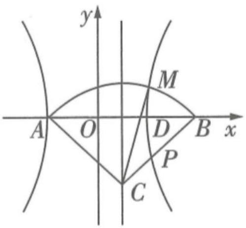

图11-2

# 参考答案与解析

##### 1. C 将 $|\overrightarrow{PF_1} + \overrightarrow{PF_2}| = |\overrightarrow{PF_1} - \overrightarrow{PF_2}|$ 两边同时平方, 得 $\overrightarrow{PF_1} \cdot \overrightarrow{PF_2} = 0$ , 则 $\overrightarrow{PF_1} \perp \overrightarrow{PF_2}$ .

如图11-3,延长 $F_{1}P$ 交圆P于N,延长 $F_{2}P$ 交圆P于M,结合已知可得 $\left\{\begin{aligned}|PF_{1}|&=|F_{1}N|-|PN|=2a-r,\\ |PF_{2}|&=|F_{2}M|-|PM|=a-r,\end{aligned}\right.$ 所以 $|PF_{1}|-|PF_{2}|=a,$

【小技巧】巧用内切的几何意义，一是圆 P 内切于圆 $F_{1}$ ，二是圆 P 内切于圆 $F_{2}$

由 $|PF_{1}|+|PF_{2}|=2a$ ，得 $|PF_{1}|=\frac{3a}{2},|PF_{2}|=\frac{a}{2}$ .

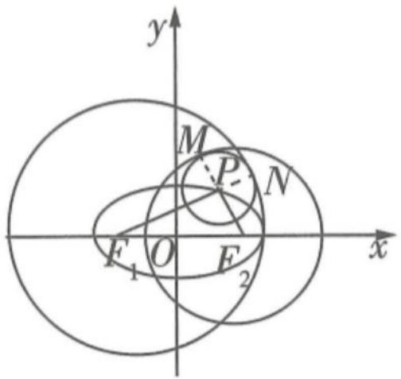

图11-3

在 $\triangle PF_{1}F_{2}$ 中， $\overrightarrow{PF_1} \perp \overrightarrow{PF_2}$ 可得 $|PF_1|^2 + |PF_2|^2 = |F_1F_2|^2$ ，所以 $\frac{9a^2}{4} + \frac{a^2}{4} = 4c^2$ ，所以 $e^2 = \frac{c^2}{a^2} = \frac{5}{8}$ ，所以 $e = \frac{\sqrt{10}}{4} (0 < e < 1)$ . 故选 C.

##### 2. A 设 $\left|PF_{1}\right|=r_{1},\left|PF_{2}\right|=r_{2}$ ，由 PI 为 $\angle F_{1}PF_{2}$ 的平分线，

根据角平分线的性质可得 $\frac{|PF_{1}|}{|PF_{2}|}=\frac{|F_{1}I|}{|F_{2}I|}=\frac{3+1}{3-1}=2$ ，

【必记结论】有平分线性质的应用：在 $\triangle ABC$ 中，AD是 $\angle BAC$ 的平分线，D在BC上，则

$\frac {S _ {\triangle A B D}}{S _ {\triangle A C D}} = \frac {A B}{A C} = \frac {B D}{C D}$

根据双曲线的定义可知 $\left|PF_{1}\right|-\left|PF_{2}\right|=2a$ ，从而 $\left|PF_{1}\right|=4a,\left|PF_{2}\right|=2a$ ，

又 $\cos \angle POF_{1} = \frac{|PO|^{2} + |OF_{1}|^{2} - |PF_{1}|^{2}}{2|PO|\cdot|OF_{1}|},\cos \angle POF_{2} = \frac{|PO|^{2} + |OF_{2}|^{2} - |PF_{2}|^{2}}{2|PO|\cdot|OF_{2}|},$

且 $\cos \angle POF_{1} + \cos \angle POF_{2} = 0$ ，所以 $\frac{|PO|^2 + |OF_1|^2 - |PF_1|^2}{2|PO|\cdot|OF_1|} +\frac{|PO|^2 + |OF_2|^2 - |PF_2|^2}{2|PO|\cdot|OF_2|} = 0,$

所以 $16 + 9 - 16a^{2} + 16 + 9 - 4a^{2} = 0$ ，解得 $a = \frac{\sqrt{10}}{2}$

又 c=3，所以双曲线的离心率为 $e=\frac{c}{a}=\frac{3\sqrt{10}}{5}$ 。故选 A.

##### 3. $\sqrt{2}$ 由题知 $B(4,0)$ , $A(-2,0)$ , $D(2,0)$ , l: x = 1, 设 $C(1, y_{c}) (y_{c} < 0)$ , $\angle ACB = 2\alpha$ ,
则圆 $C:(x-1)^{2}+(y-y_{c})^{2}=|BC|^{2}=9+y_{c}^{2}$ ,

易知 $S_{\text{扇形} CAB} = \alpha (9 + y_c^2) = \frac{9\pi}{2}$ , 又 $\tan \alpha = -\frac{3}{y_c}$ , 即 $\tan \frac{9\pi}{2(9 + y_c^2)} = -\frac{3}{y_c}$ ,

可得 $y_{c} = -3$ ，则直线 $BC: y = x - 4$ . 设 $P(x_{P}, y_{P})$ ，由 $\left\{\begin{aligned} & y = x - 4, \\ & \frac{x^{2}}{4} - \frac{y^{2}}{12} = 1, \end{aligned}\right.$ 可得 $y_{P} = 3(\sqrt{2} - 2)$ ，

所以 $\frac{|BP|}{|CP|} = \frac{|BP|}{|BC| - |BP|} = \frac{|y_P|}{|y_C - y_P|} = \sqrt{2}$ .

# 超重点 12 圆锥曲线的综合探索性问题

# 命题角度1 有关参数的探索性问题

调研 1 (2022·湖北天门中学5月模拟)如图12-1,椭圆 $C: \frac{x^2}{a^2} + \frac{y^2}{b^2} = 1 (a > b > 0)$ 经过点 $P(1, \frac{3}{2})$ , 离心率 $e = \frac{1}{2}$ , 直线 $l$ 的方程为 $x = 4$ .

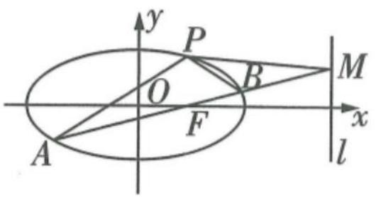

图12-1

（1） 求椭圆 C 的方程.

（2）AB 是经过椭圆右焦点 F 的任一弦(不经过点 P), 设直线 AB 与直线 l 相交于点 M, 记 PA, PB, PM 的斜率分别为 $k_{1}, k_{2}, k_{3}$ , 是否存在常数 $\lambda$ , 使得 $k_{1} + k_{2} = \lambda k_{3}$ ? 若存在, 求出 $\lambda$ 的值; 若不存在, 说明理由.

思维导引 （1） 将 $P$ 点坐标代入椭圆方程 $\xrightarrow{\text{由离心率得}} c^{2} = a^{2} - b^{2}$ $\boxed{a,b}$ $\xrightarrow{\text{椭圆方程}}$

（2） 设出直线 AB 的方程 → 求点 M 的坐标 → 将直线 AB 的方程与椭圆方程联立 → 根与系数的关系直线的斜率公式 → $k_{1} + k_{2} = 2k_{3}$ → λ = 2

解析 （1）椭圆 $C: \frac{x^2}{a^2} + \frac{y^2}{b^2} = 1 (a > b > 0)$ 经过点 $P(1, \frac{3}{2})$ ，则 $\frac{1}{a^2} + \frac{9}{4b^2} = 1 (a > b > 0)$ ①.

由离心率 $e = \frac{1}{2}$ 可得 $\frac{c}{a} = \frac{1}{2}$ ，即 $a = 2c$ ②，则 $b^2 = 3c^2$ ③，将②③代入①得 $c = 1$ ， $a = 2, b = \sqrt{3}$ . 故椭圆的方程为 $\frac{x^2}{4} + \frac{y^2}{3} = 1$ .

【另解】由 $\frac{c}{a}=\frac{1}{2}$ 可得 $\frac{b^{2}}{a^{2}}=\frac{3}{4}$ ，设椭圆方程为 $\frac{x^{2}}{4k}+\frac{y^{2}}{3k}=1(k>0)$ ，结合 $P(1,\frac{3}{2})$ 在椭圆上，可得k=1，所以椭圆的方程为 $\frac{x^{2}}{4}+\frac{y^{2}}{3}=1$

（2） 由题意可知直线 $AB$ 的斜率存在, 易知 $F(1,0)$ , 设直线 $AB$ 的斜率为 $k$ , 则直线 $AB$ 的方程为 $y = k(x - 1)$ .

令 x=4, 得点 M 的坐标为 $(4,3k)$ .

由 $\left\{\begin{aligned}y&=k(x-1),\\ \frac{x^{2}}{4}&+\frac{y^{2}}{3}=1\end{aligned}\right.$ 得关于x的方程 $(4k^{2}+3)x^{2}-8k^{2}x+4k^{2}-12=0,\Delta>0.$

设 $A(x_{1},y_{1}),B(x_{2},y_{2})$ ，则 $x_{1} + x_{2} = \frac{8k^{2}}{4k^{2} + 3},x_{1}x_{2} = \frac{4k^{2} - 12}{4k^{2} + 3}.$

$k _ {1} = \frac {y _ {1} - \frac {3}{2}}{x _ {1} - 1}, k _ {2} = \frac {y _ {2} - \frac {3}{2}}{x _ {2} - 1}, k _ {3} = \frac {3 k - \frac {3}{2}}{4 - 1} = k - \frac {1}{2}.$

注意到 $A, F, B$ 三点共线，则 $k = k_{AF} = k_{BF}$ ，即有 $\frac{y_1}{x_1 - 1} = \frac{y_2}{x_2 - 1} = k$

所以 $k_{1} + k_{2} = \frac{y_{1} - \frac{3}{2}}{x_{1} - 1} +\frac{y_{2} - \frac{3}{2}}{x_{2} - 1} = \frac{y_{1}}{x_{1} - 1} +\frac{y_{2}}{x_{2} - 1} -\frac{3}{2}\left(\frac{1}{x_{1} - 1} +\frac{1}{x_{2} - 1}\right) = 2k - \frac{3}{2}\times$

$\frac {x _ {1} + x _ {2} - 2}{x _ {1} x _ {2} - \left(x _ {1} + x _ {2}\right) + 1} = 2 k - \frac {3}{2} \times \frac {\frac {8 k ^ {2}}{4 k ^ {2} + 3} - 2}{\frac {4 k ^ {2} - 1 2}{4 k ^ {2} + 3} - \frac {8 k ^ {2}}{4 k ^ {2} + 3} + 1} = 2 k - 1,$

【会代换】利用根与系数的关系，整体代换 $x_{1}+x_{2}$ ， $x_{1}x_{2}$

又 $k_{3} = k - \frac{1}{2}$ 所以 $k_{1} + k_{2} = 2k_{3}$ 故存在常数 $\lambda = 2$ 满足题意.

# 命题角度 2 有关定点的存在性问题

调研 2 (2022·石家庄一中、保定一中7月摸底)已知双曲线方程为 $\frac{x^{2}}{a^{2}}-\frac{y^{2}}{b^{2}}=1$ $(a>0,b>0)$ , $F_{1}$ , $F_{2}$ 分别为双曲线的左、右焦点, 离心率为 2, 点 P 为双曲线在第一象限内的一点, 且满足 $\overrightarrow{PF_{1}}\cdot\overrightarrow{PF_{2}}=0,|PF_{1}||PF_{2}|=6.$

（1） 求双曲线的标准方程.

（2） 过点 $F_{2}$ 作直线 l 交双曲线于 A, B 两点, 则在 x 轴上是否存在定点 $Q(m,0)$ , 使得 $\overrightarrow{QA} \cdot \overrightarrow{QB}$ 为定值? 若存在, 求出 m 的值和该定值; 若不存在, 请说明理由.

解析 （1） 由 $e = \frac{c}{a} = 2$ 得 $c = 2a, \therefore b = \sqrt{c^2 - a^2} = \sqrt{3} a. \because \overrightarrow{PF_1} \cdot \overrightarrow{PF_2} = 0, \therefore PF_1 \perp PF_2$ .

在 Rt△ $F_{1}PF_{2}$ 中，由 $|PF_{1}| - |PF_{2}| = 2a$ 得 $|PF_{1}|^{2} + |PF_{2}|^{2} - 2|PF_{1}||PF_{2}| = 4a^{2}$ ，

数论是人类知识最古老的一个分支,然而它的一些最深奥的秘密与其最平凡的真理是密切相连的.
——史密斯

结合 $\left|PF_{1}\right|^{2}+\left|PF_{2}\right|^{2}=4c^{2},\left|PF_{1}\right|\left|PF_{2}\right|=6$ 得 $4c^{2}-12=4a^{2}$ ，即 $c^{2}-3=a^{2}$

$\therefore b^{2} = 3, a^{2} = 1, c^{2} = 4, \therefore$ 双曲线的标准方程为 $x^{2} - \frac{y^{2}}{3} = 1$ .

【另解】由 $e = \frac{c}{a} = 2$ 得 $c = 2a$ ， $\therefore b = \sqrt{c^2 - a^2} = \sqrt{3} a$ ，设 $P(x,y)(x > 0,y > 0)$ ，则点 $P$ 的坐标满足 $\frac{x^2}{a^2} -\frac{y^2}{b^2} = 1$ ①， $\because \overrightarrow{PF_1}\cdot \overrightarrow{PF_2} = 0,\therefore (-c - x, - y)\cdot (c - x, - y) = x^2 -c^2 +y^2 = 0$ ，即 $x^{2}+$ $y^{2} = c^{2}$ ②， $S_{\triangle F_1PF_2} = \frac{1}{2}|y|\cdot 2c = \frac{1}{2}|PF_1||PF_2|$ ，即 $yc = 3$ ③，由①②得 $y = \frac{b^2}{c}$ ，代入③得 $b^{2} =$ $3,a^{2} = 1,\therefore$ 双曲线的标准方程为 $x^{2} - \frac{y^{2}}{3} = 1$

（2） 当 l 的斜率为 0 时, l 的方程为 y = 0.

不妨设点 A 在点 B 左侧, 则 $A(-1,0)$ , $B(1,0)$ , 由 $Q(m,0)$ 得 $\overrightarrow{QA} \cdot \overrightarrow{QB} = m^{2} - 1$ .

【会思考】对于探索性问题，如果找不到思路，可以光研究特殊情况，再研究一般情况，最后整合在一起，检验是否有满足题意的定点

当 l 的斜率不为 0 时, 设 $l: x = ty + 2$ , $A(x_{1}, y_{1})$ , $B(x_{2}, y_{2})$ ,

【小技巧】将直线方程设为此形式，可以避免讨论斜率不存在的情况

由 $\left\{\begin{aligned}x&=ty+2,\\ 3x^{2}-y^{2}&=3\end{aligned}\right.$ 得关于y的方程 $(3t^{2}-1)y^{2}+12ty+9=0,\Delta=36t^{2}+36>0,$

$\therefore y _ {1} + y _ {2} = \frac {- 1 2 t}{3 t ^ {2} - 1}, y _ {1} y _ {2} = \frac {9}{3 t ^ {2} - 1}.$

方法一 $\overrightarrow{QA} \cdot \overrightarrow{QB} = (x_{1} - m, y_{1}) \cdot (x_{2} - m, y_{2}) = (x_{1} - m)(x_{2} - m) + y_{1}y_{2} = (ty_{1} + 2 - m)(ty_{2} + 2 - m) + y_{1}y_{2} = (t^{2} + 1)y_{1}y_{2} + (2 - m)t(y_{1} + y_{2}) + (2 - m)^{2} = (t^{2} + 1)\frac{9}{3t^{2} - 1} + (2 - m)t\frac{-12t}{3t^{2} - 1} + (2 - m)^{2}$ .

令 $\overrightarrow{QA} \cdot \overrightarrow{QB} = m^2 - 1$ ，得 $9(t^2 + 1) - 12t^2(2 - m) = (4m - 5)(3t^2 - 1)$ ，解得 $m = -1$ ，则 $Q(-1,0)$ ，此时 $\overrightarrow{QA} \cdot \overrightarrow{QB} = 0$ 。综上，存在 $m = -1$ ，使得 $\overrightarrow{QA} \cdot \overrightarrow{QB} = 0$ 。

方法二 $\overrightarrow{QA} \cdot \overrightarrow{QB} = (x_{1} - m, y_{1}) \cdot (x_{2} - m, y_{2}) = (x_{1} - m)(x_{2} - m) + y_{1}y_{2} = (ty_{1} + 2 - m)(ty_{2} + 2 - m) + y_{1}y_{2} = (t^{2} + 1)y_{1}y_{2} + (2 - m)t(y_{1} + y_{2}) + (2 - m)^{2} = (t^{2} + 1)\frac{9}{3t^{2} - 1} + (2 - m)t\frac{-12t}{3t^{2} - 1} + (2 - m)^{2} = \frac{(12m - 15)t^{2} + 9}{3t^{2} - 1} + (2 - m)^{2}$ .

若 $\overrightarrow{QA} \cdot \overrightarrow{QB}$ 为定值, 则 $\frac{12m - 15}{3} = \frac{9}{-1}, \therefore m = -1, \therefore Q(-1,0)$ , 此时 $\overrightarrow{QA} \cdot \overrightarrow{QB} = 0$ .

【会思考】观察代数式的形式,要使代数式是定值,则变量 $t$ 对最后的取值结果没有影响,也 就是说,在化简时应该可以把 $t$ 全部 “消去”。这时,一般要考虑含 $t$ 的式子的系数为 0 ,但此题中分母中含 $t$ 的式子的系数是确定的,无法这样处理,观察到分子、分母是齐次结构,故考虑分子、分母能够化简为确定的实数的情况

当 m = -1, l 的斜率为 0 时, $\overrightarrow{QA} \cdot \overrightarrow{QB} = m^{2} - 1 = 0$ . 综上, 存在 m = -1, 使得 $\overrightarrow{QA} \cdot \overrightarrow{QB} = 0$ .

【易遗漏】由于此方法是在 $l$ 的斜率不为 0 的前提下分析得出 $m$ 的值, 因此, 要检验 $l$ 的斜率为 0 的情况, 如果 $l$ 的斜率为 0 时 $\overrightarrow{QA} \cdot \overrightarrow{QB}$ 不是定值或定值不相同, 则不存在满足题意的点

# 命题角度 3 有关直线的存在性问题

调研 3 (2022·深圳三模)已知圆 $C: (x - 1)^{2} + y^{2} = \frac{1}{4}$ , 现有一个动圆与直线 $x = -\frac{1}{2}$ 相切, 且与圆 $C$ 外切.

（1） 求动圆圆心 P 的轨迹 T 的方程.

（2）若经过定点 $Q(6,0)$ 的直线 $l$ 与曲线 $T$ 相交于 $A,B$ 两点, $M$ 是线段 $AB$ 的中点, 过 $M$ 作 $x$ 轴的平行线与曲线 $T$ 相交于点 $N$ , 是否存在直线 $l$ , 使得 $NA \perp NB$ ? 若存在, 求出直线 $l$ 的方程; 若不存在, 请说明理由.

解析 （1） 易知圆 $C$ 的圆心为 $C(1,0)$ , 半径为 $\frac{1}{2}$ .

设 $P(x, y)$ , 动圆的半径为 $r$ , 连接 $PC$ , 则 $|PC| = r + \frac{1}{2}$ , 又 $x + \frac{1}{2} = r$ , $\therefore |PC| - (x + \frac{1}{2}) = \frac{1}{2}$ , 即 $\sqrt{(x - 1)^2 + y^2} = x + 1$ , 化简可得动圆圆心 $P$ 的轨迹 $T$ 的方程为 $y^2 = 4x$ .

（2） 假设存在满足题意的直线 l, 设 $A(x_{1}, y_{1})$ , $B(x_{2}, y_{2})$ .

易知直线 l 不与 x 轴重合, 设直线 l 的方程为 $x = my + 6$ .

由 $\left\{\begin{aligned}x&=my+6,\\ y^{2}&=4x\end{aligned}\right.$ 得关于y的方程 $y^{2}-4my-24=0,\Delta>0.$

$\therefore y _ {1} + y _ {2} = 4 m, y _ {1} y _ {2} = - 2 4, \therefore x _ {1} + x _ {2} = 4 m ^ {2} + 1 2, x _ {1} x _ {2} = 3 6.$

设 $N(x_0, y_0)$ ，则 $y_0 = \frac{y_1 + y_2}{2} = 2m, \therefore x_0 = m^2, \therefore N(m^2, 2m)$ .

由 $\overrightarrow{NA} \cdot \overrightarrow{NB} = 0$ 得 $(x_{1} - m^{2})(x_{2} - m^{2}) + (y_{1} - 2m)(y_{2} - 2m) = 0$ , 化简整理得 $(m^{2} + 6)(3m^{2} - 2) = 0, \therefore m = \pm \frac{\sqrt{6}}{3}$ . 存在直线 $l: x = \pm \frac{\sqrt{6}}{3} y + 6$ , 使得 $NA \perp NB$ .

调研 4 (2022·江苏南通5月诊断)已知双曲线 $C:\frac{x^{2}}{a^{2}}-\frac{y^{2}}{b^{2}}=1(a>0,b>0)$ 的实轴端点分别为 $A_{1}(-a,0)$ , $A_{2}(a,0)$ ，右焦点为 F，离心率为 2，过点 $A_{1}$ 且斜率为 1 的直线 l 与双曲线 C 交于另一点 B，已知 $\triangle A_{1}BF$ 的面积为 $\frac{9}{2}$ .

（1） 求双曲线的方程;

（2） 若过 $F$ 的直线 (异于 $x$ 轴) 与双曲线 $C$ 交于 $M, N$ 两点, 试探究直线 $A_{1} M$ 与直线 $A_{2} N$ 的交点 $Q$ 是否在某条定直线上. 若在, 求出该定直线的方程; 若不在, 请说明理由.

解析 （1） 设双曲线 $C: \frac{x^2}{a^2} - \frac{y^2}{b^2} = 1 (a > 0, b > 0)$ 的焦距为 $2c$ ,

由离心率为2,得c=2a,所以 $b=\sqrt{3}a$ .

由 $\left\{\begin{aligned}y&=x+a,\\ \frac{x^{2}}{a^{2}}-\frac{y^{2}}{3a^{2}}&=1\end{aligned}\right.$ 得关于x的方程 $x^{2}-ax-2a^{2}=0$ ，解得x=-a或x=2a.

因为 $A_{1}(-a,0)$ ，所以点 B 的坐标为 $(2a,3a)$ .

因为 $F(2a,0)$ ，所以 $\triangle A_{1}BF$ 的面积为 $\frac{1}{2} \times 3a \times 3a = \frac{9}{2}$ ，所以 $a^{2} = 1$ 。

故双曲线的方程为 $x^{2}-\frac{y^{2}}{3}=1$ .

（2） 设 $M(x_{1}, y_{1}), N(x_{2}, y_{2})$ ，易知直线 MN 不与 x 轴重合，设直线 MN 的方程为 $x = my + 2$ 。直线 $A_{1}M$ 的方程为 $y = \frac{y_{1}}{x_{1} + 1}(x + 1)$ ，直线 $A_{2}N$ 的方程为 $y = \frac{y_{2}}{x_{2} - 1}(x - 1)$ 。

由 $\left\{\begin{aligned}y&=\frac{y_{1}}{x_{1}+1}(x+1),\\ y&=\frac{y_{2}}{x_{2}-1}(x-1)\end{aligned}\right.$ 得点Q的横坐标为 $x_{Q}=\frac{x_{1}y_{2}+x_{2}y_{1}-y_{1}+y_{2}}{x_{1}y_{2}-x_{2}y_{1}+y_{1}+y_{2}}.$

由 $\left\{\begin{aligned}x&=my+2,\\ x^{2}&-\frac{y^{2}}{3}=1\end{aligned}\right.$ 得关于y的方程 $(3m^{2}-1)y^{2}+12my+9=0,\Delta>0.$

所以 $y_{1} + y_{2} = -\frac{12m}{3m^{2} - 1}, y_{1}y_{2} = \frac{9}{3m^{2} - 1}$ .

所以 $x_{Q} = \frac{x_{1}y_{2} + x_{2}y_{1} - y_{1} + y_{2}}{x_{1}y_{2} - x_{2}y_{1} + y_{1} + y_{2}} = \frac{(my_1 + 2)y_2 + (my_2 + 2)y_1 - y_1 + y_2}{(my_1 + 2)y_2 - (my_2 + 2)y_1 + y_1 + y_2}$

$\frac {2 m y _ {1} y _ {2} + 3 y _ {2} + y _ {1}}{3 y _ {2} - y _ {1}} = \frac {2 m \times \frac {9}{3 m ^ {2} - 1} + 3 y _ {2} + \frac {- 1 2 m}{3 m ^ {2} - 1} - y _ {2}}{3 y _ {2} - (\frac {- 1 2 m}{3 m ^ {2} - 1} - y _ {2})} = \frac {2 y _ {2} + \frac {6 m}{3 m ^ {2} - 1}}{4 y _ {2} + \frac {1 2 m}{3 m ^ {2} - 1}} = \frac {1}{2}.$

所以直线 $A_{1}M$ 与直线 $A_{2}N$ 的交点 Q 在直线 $x=\frac{1}{2}$ 上.

调研 5 (原创)曲线 C 上的任一点到点 $F(2,0)$ 和到直线 $x=\frac{3}{2}$ 的距离之比均是 $\frac{2\sqrt{3}}{3}$ .

（1） 求曲线 C 的方程, 并判断曲线 C 上是否存在被点 $Q(-3, -\frac{3}{2})$ 平分的弦? 如果存在, 求出弦所在的直线 l 的方程; 如果不存在, 请说明理由.  
（2） 若直线 $l: y = kx + \sqrt{2}$ 与曲线 $C$ 恒有两个不同的交点 $A$ 和 $B$ , 且 $\overrightarrow{OA} \cdot \overrightarrow{OB} > 2$ , 求 $k$ 的取值范围.

解析 （1） 设曲线 $C$ 上任一点 $M(x, y)$ , 则 $\frac{\sqrt{(x - 2)^2 + y^2}}{|x - \frac{3}{2}|} = \frac{2\sqrt{3}}{3}$ , 化简得 $\frac{x^2}{3} - y^2 = 1$ . 故曲线 $C$ 的方程为 $\frac{x^2}{3} - y^2 = 1$ .

假设直线 l 存在, 设 $Q(-3, -\frac{3}{2})$ 是弦 MN 的中点, 且 $M(x_{1}, y_{1}), N(x_{2}, y_{2})$ , 则 $x_{1} + x_{2} = -6, y_{1} + y_{2} = -3$ .

因为 M, N 在曲线 C 上, 所以 $\left\{\begin{aligned}\frac{x_{1}^{2}}{3}-y_{1}^{2}&=1,\\ \frac{x_{2}^{2}}{3}-y_{2}^{2}&=1,\end{aligned}\right.$ 相减得 $\frac{(x_{1}+x_{2})(x_{1}-x_{2})}{3}-(y_{1}-y_{2})(y_{1}+y_{2})=0$ , 所以 $\frac{-6(x_{1}-x_{2})}{3}=(-3)(y_{1}-y_{2})=0$ , 所以 $\frac{y_{1}-y_{2}}{x_{1}-x_{2}}=\frac{2}{3}$ ,

所以直线 l 的方程为 $y + \frac{3}{2} = \frac{2}{3}(x + 3)$ ，即 $y = \frac{2}{3}x + \frac{1}{2}$ .

由 $\left\{\begin{aligned}\frac{x^{2}}{3}-y^{2}&=1,\\ y&=\frac{2}{3}x+\frac{1}{2},\end{aligned}\right.$ 消去 y 得 $\frac{x^{2}}{3}+2x+\frac{15}{4}=0$ ，因为 $\Delta=4-4\times\frac{15}{12}=-1<0$ ，

所以直线 l 与双曲线无交点, 所以直线 l 不存在.

（2） 将 $y = kx + \sqrt{2}$ 代入 $\frac{x^{2}}{3} - y^{2} = 1$ ，得 $(1 - 3k^{2})x^{2} - 6\sqrt{2}kx - 9 = 0$ 。由直线 l 与曲线 C 交于不同的两点，得 $\left\{\begin{aligned}1 & -3k^{2} \neq 0, \\ \Delta_{1} & = (-6\sqrt{2}k)^{2} + 36(1 - 3k^{2}) = 36(1 - k^{2}) > 0,\end{aligned}\right.$ 所以 $k^{2} < 1$ 且 $k^{2} \neq \frac{1}{3}$ 。①

设 $A(x_{3},y_{3}),B(x_{4},y_{4})$ ，则 $x_{3} + x_{4} = \frac{6\sqrt{2}k}{1 - 3k^{2}},x_{3}x_{4} = \frac{-9}{1 - 3k^{2}}.$

所以 $x_{3}x_{4} + y_{3}y_{4} = x_{3}x_{4} + (kx_{3} + \sqrt{2})(kx_{4} + \sqrt{2}) = (k^{2} + 1)x_{3}x_{4} + \sqrt{2} k(x_{3} + x_{4}) + 2 = \frac{3k^{2} + 7}{3k^{2} - 1}.$

因为 $\overrightarrow{OA} \cdot \overrightarrow{OB} > 2$ ，即 $x_{3}x_{4} + y_{3}y_{4} > 2$ ，所以 $\frac{3k^2 + 7}{3k^2 - 1} > 2$ ，即 $\frac{-3k^2 + 9}{3k^2 - 1} > 0$ ，解得 $\frac{1}{3} < k^2 < 3$ . ②

由①②得 $\frac{1}{3}<k^{2}<1$ ，故k的取值范围为 $(-1,-\frac{\sqrt{3}}{3})\cup(\frac{\sqrt{3}}{3},1)$ .

# 速记提分结论

# 型 1 必背球与几何体切、接的 8 条结论

<table><tr><td colspan="3">球与正方体、长方体</td></tr><tr><td>1</td><td>正方体的内切球</td><td>位置关系:正方体的六个面都与同一个球相切,正方体的中心与球心重合,如图.数量关系:设正方体的棱长为a,内切球的半径为r,这时有2r=a.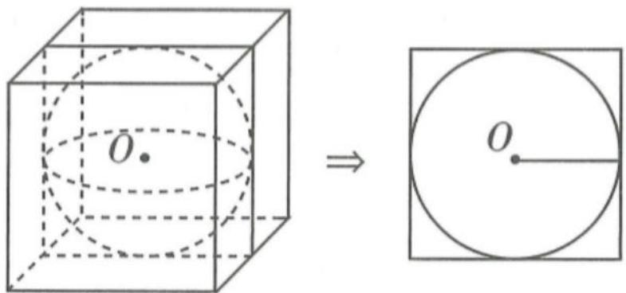</td></tr><tr><td>2</td><td>正方体的棱切球</td><td>位置关系:正方体的十二条棱都与球面相切,正方体的中心与球心重合,如图.数量关系:设正方体的棱长为a,棱切球的半径为r,这时有2r=√2a.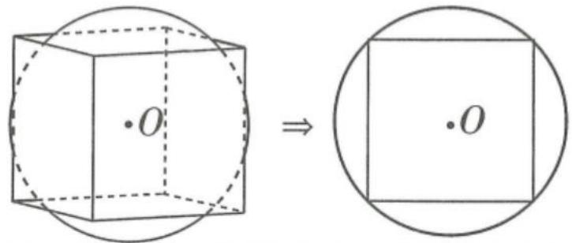</td></tr><tr><td>3</td><td>正方体的外接球</td><td>位置关系:正方体的八个顶点都在同一个球面上,正方体的中心与球心重合,如图.数量关系:设正方体的棱长为a,外接球的半径为r,这时有2r=√3a.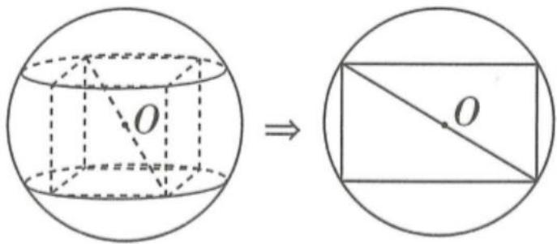</td></tr><tr><td>4</td><td>长方体的外接球</td><td>位置关系:长方体的八个顶点都在同一个球面上,长方体的中心与球心重合,如图.数量关系:外接球的半径为长方体的体对角线长的一半.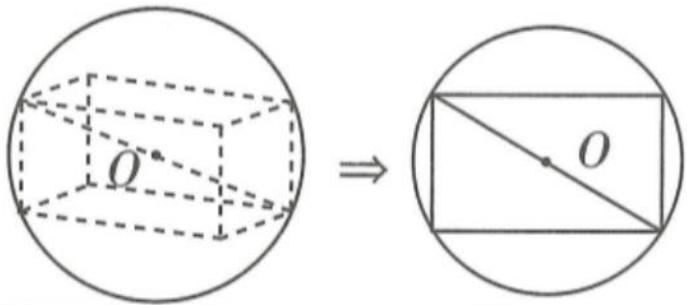</td></tr></table>

# 使用贴士

可将 P118 \~ P120 这部分单独撕下，夹在笔记本内或放在拿取方便处，反复记忆背诵，还可以将 1 辑 \~ 4 辑的最后一部分整理在一起，到时你将得到一本完整的一轮复习速记提分结论大全，陪伴你整个高三，助你圆梦未名湖畔！

<table><tr><td colspan="3">球与锥体、柱体</td></tr><tr><td>5</td><td>正四面体的内切球</td><td>位置关系:正四面体的四个面都与同一个球相切,正四面体的中心与球心重合,如图.公众号:拾穗者的杂货铺数量关系:设正四面体的棱长为a,高为h,内切球的半径为r,这时有4r=h=√6/3a. 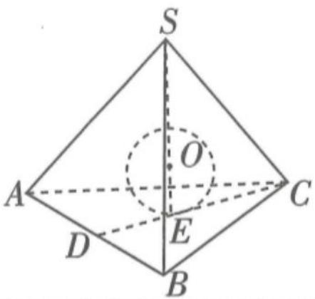</td></tr><tr><td>6</td><td>正四面体的外接球</td><td>位置关系:正四面体的四个顶点都在一个球面上,正四面体的中心与球心重合,如图.数量关系:设正四面体的棱长为a,高为h,外接球的半径为r,这时有4r=3h=√6a. 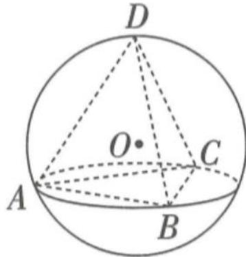</td></tr><tr><td>7</td><td>正三棱柱的内切球</td><td>位置关系:正三棱柱的五个面都与同一个球相切,正三棱柱的中心与球心重合,如图.数量关系:设正三棱柱的底面边长为a,内切球的半径为r,这时有r=√3/6a. 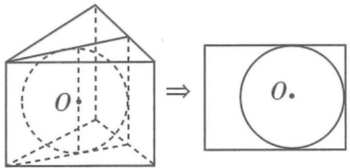</td></tr><tr><td>8</td><td>正三棱柱的外接球</td><td>位置关系:存在内切球的正三棱柱的六个顶点都在同一个球面上,正三棱柱的中心与球心重合,如图.数量关系:设正三棱柱的底面边长为a,外接球的半径为r,这时有r=√15/6a. 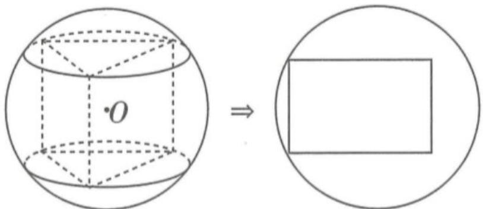</td></tr></table>

# 型 2 必会一般棱锥外接球球心的 4 个找法

<table><tr><td>9</td><td>一般找法</td><td colspan="3">确定一般棱锥外接球球心:若底面为多边形,找到外接圆的圆心M,过M作底面的垂线l,任选一侧棱,取其中点,过中点作侧棱的垂面,垂面与l的交点即外接球的球心.注:使用该方法时,通常在垂线l上任设一点O,然后利用O到各点的距离相等确定外接球的球心.</td></tr><tr><td>10</td><td>补成棱柱</td><td colspan="3">有两个面是共直角边的三棱锥,可补成棱柱,如图. 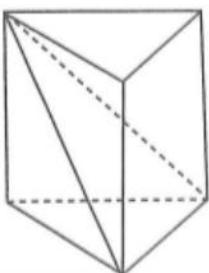</td></tr><tr><td rowspan="2">11</td><td rowspan="2">补成长方体或正方体</td><td rowspan="2">长方体或正方体的外接球的球心是其体对角线的中点.以下是常见的、基本的几何体补成正方体或长方体的途径与方法,如图.途径1:正四面体、三条侧棱两两垂直的正三棱锥、四个面都是直角三角形的三棱锥都可分别构造长方体或正方体.公众号:拾穗者的杂货铺途径2:过同一个顶点的三条棱两两垂直的四面体、相对的棱相等的三棱锥都可分别构造长方体或正方体.途径3:若已知棱锥含有线面垂直关系,则可将棱锥补成长方体或正方体.途径4:若三棱锥的三个侧面两两垂直,则可将三棱锥补成长方体或正方体.</td><td>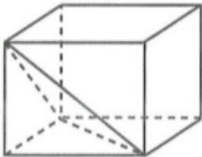</td><td>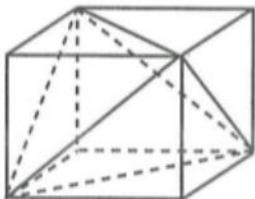</td></tr><tr><td>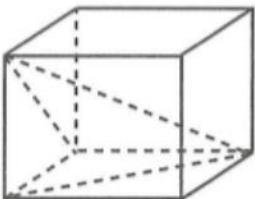</td><td>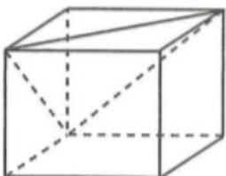</td></tr><tr><td>12</td><td>由性质确定球心</td><td colspan="3">利用球心O与截面圆(不过球心)圆心O1的连线垂直于截面圆及其他条件确定球心.</td></tr></table>

# 免费增值，闯关提分! 10分钟搞定1个失分点!

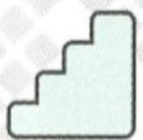

# 一小关一考点，游戏闯关

▶ 挑战式闯关，直击高考

▷ 智适应推题，由易到难

▶8大专题，考点全布局

# 学一题会一类，提分更快

▶ 全面诊断，复习无盲区

▶ 错了马上学，突破短板

▶ 百万粉UP主视频，免费看

# 通一关奖一关，好礼不停

▶ 小关通关，奖励学分

▶ 进步越快，学分越多

▶学分可兑换天星图书

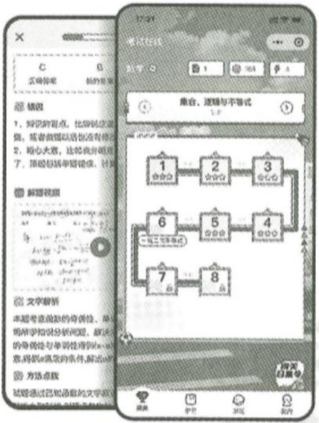

数学是知识的工具,亦是其他知识工具的泉源.所有研究顺序和度量的科学均和数学有关.
——笛卡儿

# 为什么1=100?

# 练透一个题型，通一类题，一通百通

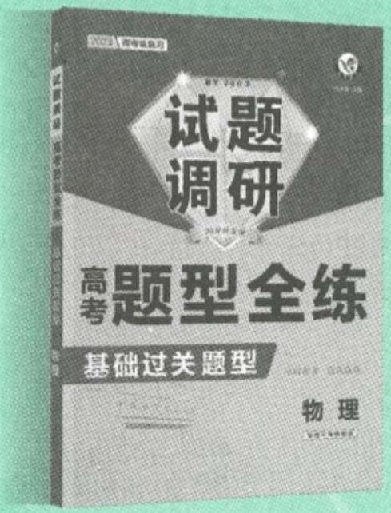

分册1：基础过关册打牢基础，稳拿高考保底分

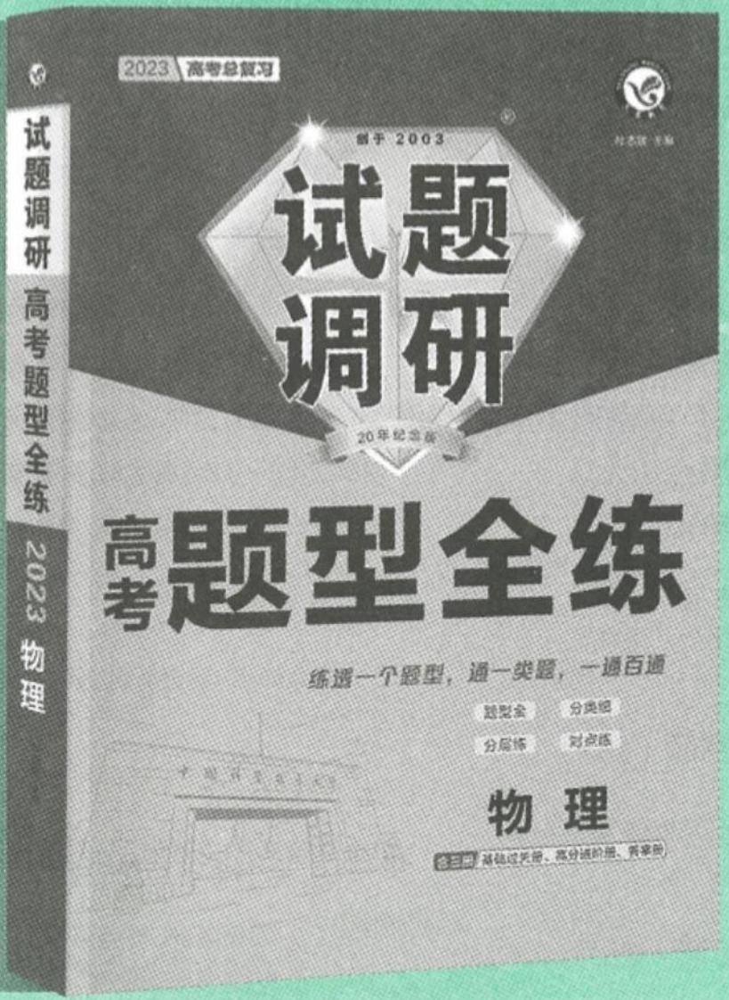

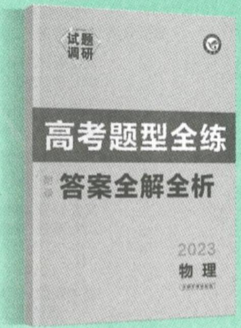

分册3：答案册
逐字逐句透彻解析，不留疑问

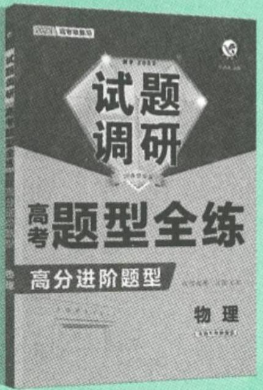

分册2：高分进阶册综合提升，稳拿高考决胜分

√ 高考题型全覆盖

√ 高考题型分层练

☑ 题型练习有攻略

高效备考，高考题型全练是关键

# 《试题调研》全程提分方略

<table><tr><td>四大书系</td><td colspan="2">主题</td><td>提分关键词</td><td>上市时间</td><td>定价</td></tr><tr><td rowspan="14">MOOK系列</td><td colspan="2">调研1辑·预备知识&amp;函数与导数</td><td rowspan="4">2023高考方向 重点难点薄弱点 突破复习障碍</td><td>2022.6</td><td rowspan="14">18.9元/册</td></tr><tr><td colspan="2">调研2辑·三角函数&amp;平面向量&amp;数列</td><td>2022.7</td></tr><tr><td colspan="2">调研3辑·立体几何&amp;解析几何</td><td>2022.8</td></tr><tr><td colspan="2">调研4辑·计数原理&amp;概率&amp;统计</td><td>2022.9</td></tr><tr><td colspan="2">调研5辑·模型解题法</td><td>试题归类 解题思路 方法与技巧</td><td>2022.11</td></tr><tr><td colspan="2">调研6辑·高频易错点快攻</td><td>易错易混点 设题陷阱 解题误区 快速攻克</td><td>2022.12</td></tr><tr><td colspan="2">调研7辑·高考热点大串讲</td><td>网络构建 前沿热点 创新热点</td><td>2023.1</td></tr><tr><td colspan="2">调研8辑·创新题分类解读</td><td>创新题型 创新情境 创新考法</td><td>2023.2</td></tr><tr><td colspan="2">调研9辑·考前50天50题</td><td>名校名师 原创押题 前瞻预测</td><td>2023.3</td></tr><tr><td colspan="2">调研10辑·考前抢分必备</td><td>必考点 易错点 命题热点 核心解法 考前密题</td><td>2023.4</td></tr><tr><td rowspan="2">作文素材</td><td>作文素材(上)·年度热点素材</td><td>鲜活素材 多维解读 速背速用</td><td>2022.11</td></tr><tr><td>作文素材(下)·考前热点素材</td><td>时新素材 最新时评 范文佳作 速背速用</td><td>2023.4</td></tr><tr><td rowspan="2">时政热点</td><td>时政热点(上)</td><td>2022年4—12月重大时事 剖析解读</td><td>2022.12</td></tr><tr><td>时政热点(下)</td><td>全年度重大时事热点 分析预测</td><td>2023.4</td></tr><tr><td rowspan="10">热点题型专练系列</td><td colspan="2">选择题(语文、物理、化学、生物、政治、历史、地理、文综、理综)</td><td>抓准热点 精选新题 多维巧解</td><td rowspan="10">2022.9</td><td rowspan="3">33.9—49.9元/册</td></tr><tr><td colspan="2">选择题&amp;填空题(数学)</td><td></td></tr><tr><td colspan="2">应用文&amp;读后续写&amp;概要写作(英语)</td><td>速背素材 巧学技法 精练写作</td></tr><tr><td colspan="2">古代诗文阅读(语文)</td><td>洞悉考向 攻克薄弱套路解题 反思积累</td><td rowspan="7">26.9—39.9元/册</td></tr><tr><td colspan="2">数学解答题</td><td>模型构建 模型应用分组强化 深度解析</td></tr><tr><td colspan="2">阅读&amp;语言运用(英语)</td><td>30分钟题型组合主题分类 巧思妙解 二次精读 综合提升</td></tr><tr><td colspan="2">物理计算题</td><td>模型解法 思维建模提分技法 规范答题</td></tr><tr><td colspan="2">实验题(物理、化学)</td><td>热点实验 创新装置高频考点 讲深讲透</td></tr><tr><td colspan="2">工艺流程题(化学)</td><td>深度剖析流程精准解读热点</td></tr><tr><td colspan="2">生物遗传题</td><td>套路审题 传授技法攻克疑难 专项提升</td></tr><tr><td>高考总复习系列</td><td colspan="2">高考题型全练</td><td>高考题型 分类练习通性通法</td><td>2022.6</td><td>62.9—79.9元/册</td></tr><tr><td rowspan="5">随身速记系列</td><td colspan="2">必背古诗文64篇</td><td>同步翻译 设题关键重难词解 课外拓展</td><td>2022.1</td><td>17.9元/册</td></tr><tr><td colspan="2">古诗文理解性默写72篇</td><td></td><td></td><td></td></tr><tr><td colspan="2">巧记英语3500词</td><td>巧记核心词 速记合成词快记主题词</td><td>2022.1</td><td>17.9元/册</td></tr><tr><td colspan="2">高分范文天天背</td><td>常考话题 素材语料亮点表达 写作套路</td><td>2022.1</td><td>17.9元/册</td></tr><tr><td colspan="2">历史大事年表</td><td>精选高考常考史实梳理历史发展脉络</td><td>2022.1</td><td>17.9元/册</td></tr></table>

# 专练热点，提分快

2023版《试题调研·热点题型专练》

本套图书具体出版书目详见“《试题调研》全程提分方略”（内文最后一页）

抓热点

专项突破稳拿分

练速度

小题速解快得分

提准度

大题巧解拿高分

2022年8月陆续上市，敬请关注！

# 试题调研 × 全考卷 = 高考提分好搭档

20年品牌积淀 相见恨晚的提分利器
知乎高中生推崇教辅TOP3

试题新 解法新

观点新 形式新

每月都有

新试题

23年品牌积淀 B站、知乎大神力荐

与专家名师深度对话的好试卷 高考生闭眼入的好试卷

真题卷

模拟卷

每月都有

新试卷

一书一卷，天生一对

做更新的题，提更高的分！

电子书免费试读

图书问题读者反馈

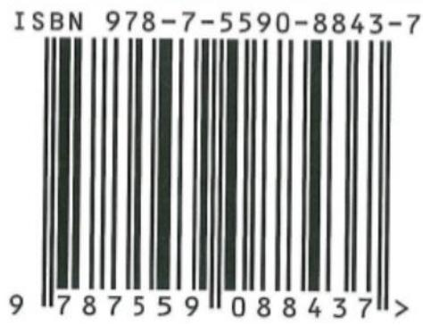

定价：18.90元

