创于 2003

# 试题 调研

20年纪念版

# 高考超重点4 计数原理&概率&统计

4类开放性创新问题，12个超重点，22个速记提分结论

构建万能模型，巧解开放性问题

\- 条件开放型

\- 策略开放型

\- 结论开放型

\- 综合开放型

新益求新，聚焦社会热点

- 第七个“中国航天日” · 新能源汽车  
- 全国居民人均可支配收入和消费支出统计

√ 火力全开，专攻疑难易错问题

- 与二项展开式的系数有关的最值问题  
- 互斥事件与对立事件的易错辨析   
- 分组与分配问题
- 新定义类疑难问题

聚焦超重点，突破疑难易错！

试题调研

专注高考20年

# 第4辑

# 新高考数学

# 《解题秘籍18课》

# 考场没思路 也能多得分

极速快解，减少计算量，
考场节省时间，也是多得分

清北学霸视频亲授秘籍，
易学秒懂，让多得分变得容易

AI智能测评，科技赋能，备考更精准，多得分超乎想象

(封面以实际出版为准)

# 开箱清单

以数学为例
★手机仅为效果展示，
非实物产品组成

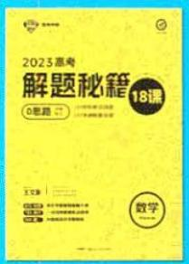

解题秘籍18课讲义×1 高分秘籍分享手册×1  
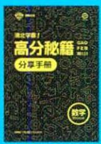  
率手册×1

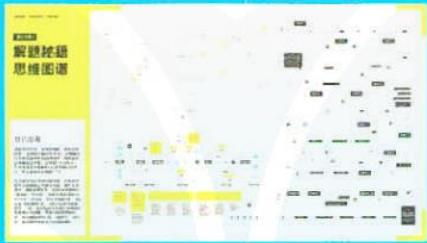

解题秘籍思维图谱 $\times 1$

  
AI智能测评说明书×1

# 上市时间

2023年1月

★双十一预售开抢：价格有惊喜！

# 学科

数学/物理/化学/生物

150条

关键题型速解二级结论

80C分钟

清北学霸解题秘籍大课

10C余个

一线名师解题实战微课

50C道

AI智能测评
诊断题库

24小时

在线答疑
助学小帮手

(非工作时间12小时内答疑)

# 定价

198元/科

# 高考超重点4 计数原理&概率&统计

4类开放性创新问题，12个超重点，22个速记提分结论

主 编：杜志建

本册编委：赵成海 王应祥 汤小梅 刘少平

管目军 杨飞

# 第4辑

# 新高考数学

# 图书在版编目(CIP)数据

试题调研. 第4辑 高考超重点4新高考数学/杜志建主编. -- 乌鲁木齐：新疆青少年出版社，2022.9

ISBN 978-7-5590-8936-6

$\quad$I. ①试… II. ①杜… III. ①中学数学课 - 高中 - 升学参考资料 IV. ①G634

中国版本图书馆 CIP 数据核字（2022）第 178744 号

出版人:徐江

策划: 王启全

责任编辑：多艳萍

封面设计:天星美工室

# 试题调研·第4辑 高考超重点4新高考数学

# SHITI DIAOYAN · DI 4 JI GAOKAO CHAOZHONGDIAN 4 XINGAOKAO SHUXUE

杜志建 主编

出版:新疆青少年出版社

社址:乌鲁木齐市北京北路29号 邮政编码:830012

电话:0991-6239223(编辑部) 0371-68698015(读者服务部)

官网:http://www.qingshao.net 天猫旗舰店:http://xjqss.tmall.com

发行:新疆青少年出版社

经销:各地新华书店 法律顾问:王冠华 18699089007

印刷:河南骅贞彩色印刷有限公司

开 本:787mm×1092mm 1/16 版 次:2022年10月第1版

印 张:8 印 次:2022年10月第1次印刷

字 数:130 千字

书号:ISBN 978-7-5590-8936-6

定 价:18.90元

CHISO 青少社® 版权所有,侵权必究。印装问题可随时同印厂退换。

# 声明

基于对知识和创作的尊重,本书向所选文章、图片的作者支付补贴。因条件所限未能及时联系的作者,我们在此深表歉意,当您看到本书时,请与我们联系,以便我们向您支付补贴和赠送样书。联系方式:0371-68698033。

# 本辑特色

# ① 特别关注 高考命题最前沿

# 策略分析

题目中提供了三个备选的条件，只需选择其中一个条件，其余是多余的，给了考生选择余地。选择条件补充完整，就转化为常规问题。一般情况下，这类题所给的三个可选择的条件是平行的，即无论选择哪个条件，都可解答题目，也就是说，对考生而言，不会因为选择的不同，而在运算、推理等环节有很大差别，否则有失公允，采用模型2求解。因而在选择的三个条件中，并没有哪个条件使解答过程更加繁杂，只要推理严谨、过程规范、计算正确，都会得满分。这样的结构不良问题在被解决的时候，不存在选哪个条件更好的问题，考生只需依据自己的判断或自己擅长的情况进行选择即可，选择不同的条件，求解策略会略有差异。

# 类型1> 条件开放型

此类题目是给出相应的结论,根据结论寻找相应的条件的问题.此种类型题的解答,能够对考生数学基础知识的掌握进行考查,同时对其综合应用能力进行检测,促使考生数学的知识迁移能力得到锻炼.

策略深入研析（P002）

创新开放题型（P002）

# 模型2 概率统计与数列交汇模型

调研 3 （2022·江苏南京考前模拟）2022 年 2 月 6 日，中国女足在两球落后的情况下，最终以 3 比 2 逆转击败韩国女足，成功夺得亚洲杯冠军。在之前的半决赛中，中国女足通过点球大战 6 比 5 惊险战胜日本女足，其中门将朱钰两度扑出日本队员的点球，表现神勇。

（1）扑点球的难度一般比较大,假设罚点球的球员会等可能地随机选择球中、右三个方向射门,门将也会等可能地随机选择球门的左、中、右三个方向来

# 新交汇（P084）

调研 6 （2023·杭州学军中学7月模拟/涂色问题）如图5-

1,用4种不同的颜色给图中的8个区域涂色,每种颜色至少使用一次,每个区域仅涂一种颜色,且相邻区域所涂颜色互不相同,则区域A,B,C,D和 $A_{1},B_{1},C_{1},D_{1}$ 分别各涂2种不同颜色的涂色方法共有\_\_\_\_种;区域A,B,C,D和 $A_{1},B_{1},C_{1},D_{1}$ 分别各涂4种不同颜色的涂色方法

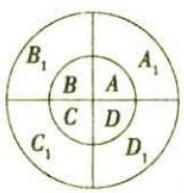  
图5-1

##### 2. (2023·安徽黄山一中7月检测改编) 北京时间 2022 年 9 月 2 日, 经过约 6 小时的出舱活动, 神舟十四号航天员陈冬、刘洋、蔡旭哲密切协同, 完成出舱活动期间全部既定任务, 陈冬、刘洋已安全返回问天实验舱, 出舱活动取得圆满成功. 为了了解某学校学生对此新闻事件的关注程度, 从该校随机抽取了 200 名学生进行分析, 得到 $2 \times$ 2 列联表如下:

<table><tr><td></td><td>关注</td><td>不关注</td><td>总计</td></tr><tr><td>男</td><td>90</td><td>30</td><td>120</td></tr><tr><td>女</td><td>30</td><td>50</td><td>80</td></tr><tr><td>总计</td><td>120</td><td>80</td><td>200</td></tr></table>

新题型（P016）

新情境（P058）

# 攻克重难备考障碍一扫除

# 解析 可分两步：

第一步，从6本书中选出3本给甲，有 $C_{6}^{3}$ 种不同的分法；

##### 【28】出错1～6本题中选出3本题中，不用顺序，是组合问题

第二步, 将剩余 3 本分为两组, 一组 1 本, 一组 2 本, 剩余 2 人任意选择, 故有 $C_{3}^{1}C_{2}^{2}A_{2}^{2}$ 种不同的分法.

【恒情绪评】不等分问题，注意不用陈沫。对于不等分问题，由于分组时，各组中不等的个数引不指等，所以不需要修以在测到数。理解比表不等分的分象问题，一般引是无分组，后则到

解析 （1）依题意可得,门将每次扑出点球的概率为 $p=\frac{1}{3}\times\frac{1}{3}\times\frac{1}{2}\times3=\frac{1}{6}$ .

【红青佛碑】“行情外出点球”：点球的方向与行情外出的方向相同，且补中的概率为 $\frac{1}{2}$ ，即以行情外出点球可以以点球的方向为依据分为三个立体事件，门将补中球门向的点球，该事件的概率为 $p_1 = \frac{1}{3} \times \frac{1}{3} \times \frac{1}{2} = \frac{1}{18}$ ；门将补中球门向的点球，该事件的概率为 $p_2 = \frac{1}{3} \times \frac{1}{3} \times \frac{1}{2} = \frac{1}{18}$ ；门将补中球门向的点球，该事件的概率为 $p_3 = \frac{1}{3} \times \frac{1}{3} \times \frac{1}{2} = \frac{1}{18}$

分步乘法计数原理，不同的分法有 $\mathrm{C}_6^3\mathrm{C}_3^1\mathrm{C}_2^2\mathrm{A}_2^2 = 20\times 3\times 1\times 2 = 120$ （种）.

紧抓易错点（P064）

攻克重难点（P085）

# 开放创新

· 条件开放型问题/002   
· 策略开放型问题/004   
· 结论开放型问题/008   
· 综合开放型问题/009

# 情境创新

· 第七个“中国航天日”/004  
· 大学生自主创业/050  
· 患病与性别的关系研究/055  
· 神舟十四号/058  
· 新定义“波动数”/078  
·新能源汽车/109   
·最具幸福感城市调查/112

# 创新定义

· 定义新概念/094   
· 定义新公式/095  
· 定义新函数/096

# 数学文化

· 圆周率 $\pi / 015$

# 特别关注·命题最前沿

开放性问题的类型与解法探讨 001

# 突破超重点

# 核心考点篇

超重点1 两个基本计数原理的综合应用问题 013

命题角度 1 “类中有步”的计数问题 013

命题角度 2 “步中有类”的计数问题 015

超重点2 二项展开式特定项及其系数求解问题 019

命题角度 1 求形如 $(a + b)^n$ 或 $(a + b + c)^n$ 的展开式中特定项或特定项的系数 019

命题角度 2 求形如 $(a+b)^{n}(c+d)^{m}$ 或 $(a+b)^{n}(c+d+e)^{m}$ 的展开式中特定项或特定项的系数 020

命题角度 3 二项展开式中的系数和问题 022

命题角度 4 与二项展开式中的系数或系数和有关的最值问题 024

超重点 3 互斥事件与对立事件的易错辨析与应用 028

命题角度 1 互斥事件与对立事件的易错辨析 028

命题角度 2 互斥事件与对立事件的应用 030

# 超重点4 条件概率的计算与性质应用 036

# 超重点5 全概率公式和贝叶斯公式的应用问题 044

命题角度 1 利用全概率公式求复杂事件的概率 044

命题角度 2 利用贝叶斯公式求复杂事件的概率 047

# 超重点6 回归分析与独立性检验 050

命题角度 1 线性回归分析与非线性回归分析 050

命题角度2 独立性检验 053

# 模型应用篇

# 超重点7 排列与组合问题的四大常考模型 060

模型1 有特殊限制条件优先考虑 060

模型 2 “相邻”与“不相邻”问题 060

模型3 分组与分配问题 062

模型4 涂色问题 065

# 超重点8 三类分布模型及其应用 068

模型1 二项分布 068

模型2 超几何分布 071

模型 3 正态分布 073

# 超重点9 破解古典概型的概率问题 078

# 超重点 10 概率统计的创新模型 082

模型1 概率统计与函数交汇模型 082

· 宋元数学四大家/062

· 算筹/079

# 重难易错

· 辨析“二项式系数的和”与
“各项系数的和”/022   
· 与二项展开式中的系数或系数和有关的最值问题/024  
· 辨析互斥事件与对立事件/030   
- “相邻”与“不相邻”问题/060  
· 分组与分配问题/062  
· 涂色问题/065

# 创新交汇

· 概率与导数交汇/045   
· 概率统计与函数交汇/082  
· 概率统计与数列交汇/084   
· 概率与立体几何交汇/098

# 目录 CONTENTS

模型2 概率统计与数列交汇模型 084

模型3 做决策模型 087

# 攻克疑难篇

超重点 11 计数原理 & 概率 & 统计中的疑难点问题 094

疑难点1 新定义问题 094

疑难点 2 交汇型综合问题 097

# 统计图表篇

超重点 12 破解 6 大必考统计识图问题的思维障碍 103

# 速记提分结论

类型 1 高考必背 8 大核心公式性质 115

类型 2 高考必用 8 大提分方法策略 116

类型 3 高考必知 4 大关键分布模型 119

类型4 高考必明2大易错易混误区 121

# 下辑精彩预告 2022年11月全新上市!

# 《试题调研》第5辑将推出

——高考超重点5·模型解题法

# 本辑亮点抢先看：

热点聚焦 聚焦社会热点，熟知最新情境，如神舟十四号、喜迎二十大等，新题新热点，尽在其中！

模型巧突破 技法模型：精炼核心关键技法，如设而不求模型、同构模型、放缩模型、割补模型等。创新模型：深度贴合高考创新命题新趋势，精研多选题破解模型、结构不良试题破解模型、开放探究模型等。关键模型：精准归纳高频考查模型，如图象识别模型、抽象函数模型、球的切接模型、做决策模型等。助你形成模型思维，做到不会做题时套用模型巧得分、会做题时套用模型快得分！

# 特别关注·命题最前沿

# 开放性问题的类型与解法探讨

# 特约名师

# 赵成海

正高级教师,河北省优秀教师,省级骨干教师.中国数学奥林匹克一级教练员,中国科学技术学会、中国数学会会员.在国家级及省级等各类专业报纸杂志上发表教育教学论文三百余篇.

# 万能模型构建

对于开放性结构不良试题,可构建如下模型:

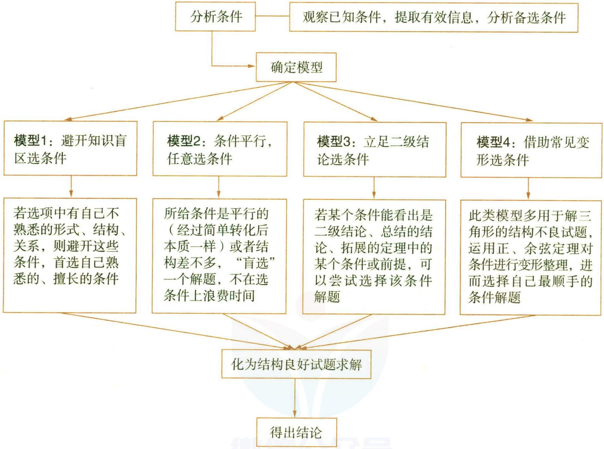

米勒问题 米勒问题的数学表达为: 在已知直线 l 的同侧有 A, B 两点, 试在 l 上求一点 C, 使得 $\angle ACB$ 最大.

# 类型1 条件开放型

此类题目是给出相应的结论,根据结论寻找相应的条件的问题.此种类型题的解答,能够对考生数学基础知识的掌握进行考查,同时对其综合应用能力进行检测,促使考生数学的知识迁移能力得到锻炼.

调研 1 (2022 注·云南昆明“三诊一模”) 若 $(x + \frac{1}{\sqrt{x}})^{n} (n \in \mathbb{N}^{*})$ 的展开式中存在 $x^{2}$ 项, 则 n 的值可以是 \_\_\_\_. (写出满足条件的一个 n 的值即可)

解析 $(x+\frac{1}{\sqrt{x}})^{n}$ 展开式的通项为 $T_{r+1}=C_{n}^{r}x^{n-r}\left(\frac{1}{\sqrt{x}}\right)^{r}=C_{n}^{r}x^{n-\frac{3}{2}r}, r=0,1,2,\cdots,n.$ 当 $n - \frac{3}{2}r = 2$ 时， $2n = 3r + 4$ ，故可取 r = 2, n = 5，故答案可以为 5（答案不唯一）.

【技法点拨】只要使 $3r + 4$ 是偶数即可；比如最简单的 $r = 0$ ，此时 $n = 2$ ，也是适合题目要求的。可见，如果换一个解题策略，直接考虑 $n = 2$ 的情况，此时 $(x + \frac{1}{\sqrt{x}})^2 = x^2 + 2\sqrt{x} + \frac{1}{x}$ ，显然是符合题目要求的，则只要填上 $n = 2$ 即可

调研 2 (2022·福建南平三模)在① $(a+b)(\sin A-\sin B)=(c-b)\sin C$ ,②2b-c-2acosC=0,③ $\cos^{2}B+\cos^{2}C+\sin B\sin C=1+\cos^{2}A$ 这三个条件中任选一个,补充在下面的问题中,并解答问题.

在 $\triangle ABC$ 中,内角 $A,B,C$ 所对的边分别是 $a,b,c,$ \_\_\_\_.

（1） 求 A;

（2） 若 $AC = 2, BC = 2\sqrt{3}$ ，点 D 在线段 AB 上，且 $\triangle ACD$ 与 $\triangle BCD$ 的面积比为 3:5，求 CD.

注:如果选择多个条件分别解答,按第一个解答计分.

# 策略分析

题目中提供了三个备选的条件，只需选择其中一个条件，其余是多余的，给了考生选择余地。选择条件补充完整，就转化为常规问题。一般情况下，这类题所给的三个可选择的条件是平行的，即无论选择哪个条件，都可解答题目，也就是说，对考生而言，不会因为选择的不同，而在运算、推理等环节有很大差别，否则有失公允，采用模型2求解。因而在选择的三个条件中，并没有哪个条件使解答过程更加繁杂，只要推理严谨、过程规范、计算正确，都会得满分。这样的结构不良问题在被解决的时候，不存在选哪个条件更好的问题，考生只需依据自己的判断或自己擅长的情况进行选择即可，选择不同的条件，求解策略会略有差异。

注

本书题目出处中,2023 意为 2023 届,2022 意为 2022 届.

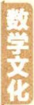

格点问题 又称整点问题,是研究一些特殊区域甚至一般区域中的格点的个数的问题.格点问题所涉及的知识点通常与抽屉原理和图论知识结合在一起.

解析 （1） 若选①, 解答过程如下.

在 $\triangle ABC$ 中，由正弦定理得 $(a + b)(a - b) = (c - b)c$ ，即 $b^{2} + c^{2} - a^{2} = bc$

故 $\cos A = \frac{b^{2} + c^{2} - a^{2}}{2bc} = \frac{1}{2}.$

又 $A \in (0, \pi)$ , 故 $A = \frac{\pi}{3}$ .

若选②,解答过程如下.

在 $\triangle ABC$ 中,由正弦定理得 $2\sin B-\sin C-2\sin A\cos C=0$ ,

又 $A + C = \pi - B$ ，故 $\sin C = 2\sin(A + C) - 2\sin A\cos C = 2\cos A\sin C$ ，

又 $\sin C \neq 0$ , 故 $\cos A = \frac{1}{2}$ .

又 $A \in (0, \pi)$ , 故 $A = \frac{\pi}{3}$ .

【换个思路】将已知转化为 $2b - c - 2a \times \frac{a^2 + b^2 - c^2}{2ab} = 0$ ，即 $b^2 + c^2 - a^2 = bc$ ，故 $\cos A = \frac{b^2 + c^2 - a^2}{2bc} = \frac{1}{2}$ ，又 $A \in (0, \pi)$ ，故 $A = \frac{\pi}{3}$ . 注意，该解法与选①有异曲同工之处，进一步印证了每一种选择的平行性与公平性

若选③,解答过程如下.

由 $\cos^2 B + \cos^2 C + \sin B\sin C = 1 + \cos^2 A$ 可得 $2 - \sin^2 B - \sin^2 C + \sin B\sin C = 2 - \sin^2 A$ ，即 $\sin^2 B + \sin^2 C - \sin B\sin C = \sin^2 A$ ，

在 $\triangle ABC$ 中，由正弦定理得 $b^{2} + c^{2} - bc = a^{2}$ ，故 $\cos A = \frac{b^2 + c^2 - a^2}{2bc} = \frac{1}{2}$

又 $A \in (0, \pi)$ , 故 $A = \frac{\pi}{3}$ .

（2） 在 $\triangle ABC$ 中, 由余弦定理得 $BC^{2} = AB^{2} + AC^{2} - 2AB \cdot AC \cos A$ .

因为 AC = 2, BC = $2\sqrt{3}$ , $A = \frac{\pi}{3}$ , 所以 $12 = AB^{2} + 4 - 2AB$ ,

解得 AB = 4 或 AB = -2(舍).

又 $\triangle ACD$ 与 $\triangle BCD$ 的面积比为3:5,所以 $AD:BD=3:5$ ,所以 $AD=\frac{3}{2}$ .

斐波那契数列 又称黄金分割数列. 因意大利数学家斐波那契以兔子的繁殖问题为例子引入, 故又称“兔子数列”.

在 $\triangle ACD$ 中，由余弦定理得 $CD^2 = AD^2 + AC^2 - 2AD \cdot AC\cos A = (\frac{3}{2})^2 + 2^2 - 3 = \frac{13}{4}$ ，所以 $CD = \frac{\sqrt{13}}{2}$ .

# 类型2 策略开放型

此类题目是在已知条件(或部分条件)和结论的情况下,对两者成立的途径进行探究,这里强调的是不同的思维方向而产生的不同入手点、推理途径.此种类型问题的解答能够锻炼考生的发散思维和创新思维,使考生数学思维能力得到培养.

调研 3 (2022·海南华侨中学全真模拟/中国航天日)2022年4月24日是第七个“中国航天日”,主题是“航天点亮梦想”.某校组织学生参与航天知识竞答活动,某班8位同学的成绩分别为:7,6,8,9,8,7,10,m.若去掉m,该组数据的第25百分位数保持不变,则整数m(1≤m≤10)的值可以是\_\_\_\_(写出一个满足条件的m值即可).

解析 策略一 数据7,6,8,9,8,7,10,m中去掉m后,从小到大排列为6,7,7,8,8,9,10,7×0.25=1.75,故第25百分位数为第二个数,即7.

由于第25百分位数不变,因而在没去掉m时,数据7,6,8,9,8,7,10,m的第25百分位数也为7,而 $8\times0.25=2$ ,所以7为该组数据从小到大排列后的第二个数与第三个数的平均数,所以 $m(1\leqslant m\leqslant10)$ 的值可以是7或8或9或10.

故答案为7(或8或9或10)(填4个数中任意一个即可).

【点透】这是最完善的解法，将所有可能结果都确定下来，填空时也不必都填上，只填其一即可。开放性填空题只需给出一个正确结果，因此也可以用下面两种策略解决

策略二 $8 \times 0.25 = 2$ , 因而该组数据从小到大排列后的第二个数与第三个数的平均数是其第 25 百分位数.

若去掉 m，则 $7 \times 0.25 = 1.75$ ，故第 25 百分位数为数据从小到大排列后的第二个数，即 7.

若 m=6,8 个数由小到大排列为 6,6,7,7,8,8,9,10, 第 25 百分位数为 6.5, 去掉 m 后, 第 25 百分位数为 7, 与已知不符.

若 m=7,8 个数由小到大排列为 6,7,7,7,8,8,9,10,第 25 百分位数为 7,去掉 m 后,第 25 百分位数也为 7,符合已知条件,故填 7.

策略三 直接盲猜一个数,如若 m=10,8 个数由小到大排列是 6,7,7,8,8,9,10,10,第 25 百分位数为 7,去掉 m 后,第 25 百分位数也为 7,符合已知条件,故填 10.

【说明】到此题目已经完美解决. 事实上, 从 $m$ 的取值为 8 或 9 进行检验依然可行

调研 4 （原创）如图1, 在四棱锥 P-ABCD 中, 底面 ABCD 是正方形, PA 是四棱锥的高, 点 E 在 PB 上, 且 PE = 2EB.

（1） 平面 CDGE 交 PA 于 G, DG 平分 $\angle PDA$ , 求 $\angle APD$ ;

（2） 在棱 PC 上找一点 F, 使得 DF 平行于平面 AEC, 试应用两种不同的方法求解, 并求出此时 $\frac{PF}{FC}$ 的值.

注:如果用多于两种方法分别解答,按前两种解答计分.

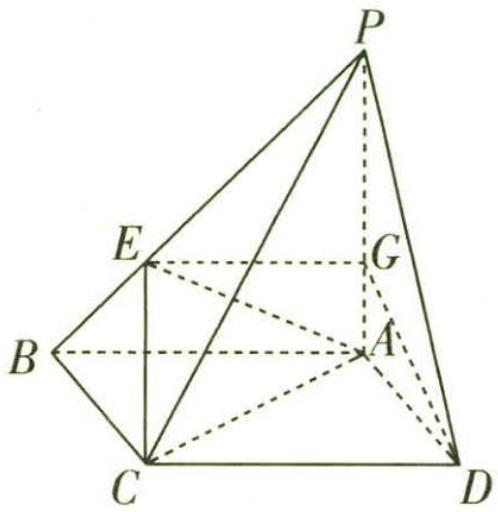

图1

# 策略分析

对于本题的第（2）问, 要求用两种方法验证说明, 因而需要考生去思考不同的求解方式, 解题的思维策略具有开放性. 在脑海中思索证明线面平行的方法, 有 “线面平行的判定定理” “面面平行的性质” “空间向量” 等, 那么只需选择自己最熟悉的方法解题即可, 即选用模型1求解.

# 解析 策略一 利用线面平行的判定定理

（1） 由于 $CD \parallel AB, CD \not\subset$ 平面 $PAB, AB \subset$ 平面 $PAB$ , 因而 $CD \parallel$ 平面 $PAB$ .

又平面 $CDGE \cap$ 平面 $PAB = EG$ , 所以 $CD \parallel EG$ , 则 $EG \parallel AB$ .

因为 $PE = 2EB$ ，所以 $PG = 2GA.$ 因为 $DG$ 平分 $\angle PDA$ ，所以 $PD = 2AD.$

在 Rt△PAD 中， $\sin\angle APD=\frac{AD}{PD}=\frac{1}{2}$ ，所以 $\angle APD=30^{\circ}$ .

（2） 取 PE 的中点 H, PC 的中点 F, 连接 HF, BF, BF 交 EC 于 N, 连接 BD, 交 AC 于【点透】光对点的位置进行预测，比如中点、三等分点等，再通过推理证明验证猜测O,则O为BD的中点,连接NO,易知HF//EC,E为BH的中点,所以N为BF的中点,从而有NO//DF.

阿基米德穷竭法 阿基米德运用穷竭法求曲边形的面积的具体步骤是先将一个曲边图形细分成若干个窄条,对每个窄条,近似用矩形条代替,然后分别求出每个矩形条的面积,再将这些面积加起来,可求得该曲边形的近似面积.

因为 $NO \subset$ 平面 $EAC, DF \not\subset$ 平面 $EAC$ , 从而 $DF \parallel$ 平面 $EAC$ , 此时 $\frac{PF}{FC} = 1$ .

# 策略二 利用面面平行的性质

（1） 同策略一的 （1）.

（2）如图2,连接BD交AC于O,连接EO,取PE的中点H,PC的中点F,连接HD,HF,易知HD//EO.

因为 $HD \not\subset$ 平面 EAC, $EO \subset$ 平面 EAC, 所以 $HD \parallel$ 平面 EAC.

易知 $HF \parallel EC$ , 又 $HF \not\subset$ 平面 $EAC, EC \subset$ 平面 $EAC$ ,

所以 $HF \parallel$ 平面 EAC, 又 $HF \cap HD = H, HF, HD \subset$ 平面 HFD,

所以平面 HFD // 平面 EAC.

因为 $DF \subset$ 平面 HFD, 所以 $DF \parallel$ 平面 EAC, 此时 $\frac{PF}{FC} = 1$ .

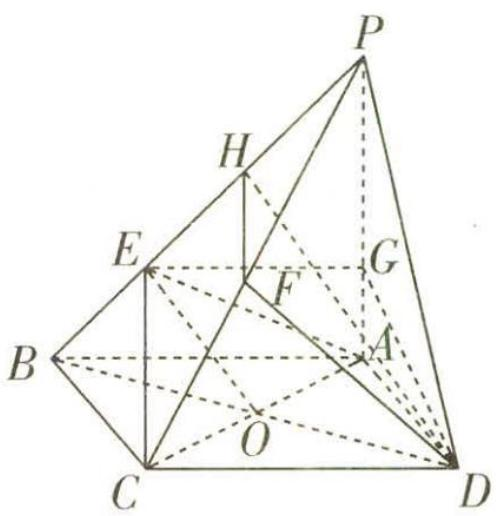

图2

# 释疑解惑

以上两种策略的解法均是先探究特殊点，同学们此时自然会想到，如果探究的特殊点不符合题意，那该如何去解决呢？

由以上两种解法, 我们会发现对于第 （2） 问, 条件 “底面 $ABCD$ 是正方形, $PA$ 是四棱锥的高” 并未充分利用, 也就是若四边形 $ABCD$ 是平行四边形, $PA$ 不为四棱锥的高, 同样可以探究出点 $F$ 的位置, 那么为什么这么命题呢?

解惑:解答立体几何问题时,大多学生会想到向量法,向量是探究点、线、面的位置关系的最重要的、最有效的解题工具,当运用向量法解题时,这些条件对解题作用就很大了(目的是降低难度系数,达到与用传统方法解题难易程度“平行”的效果),如果这些条件不足,虽然仍可做,但难度就有所差异,与开放题选用不同策略基本公平的原则相悖.请通过下面的解法加以体会.

# 策略三 利用空间向量

显然 AB, AD, AP 三线两两垂直. 以 A 为坐标原点, AB, AD, AP 所在直线分别为 x 轴, y 轴, z 轴建立空间直角坐标系, 如图 3 所示.

不妨设 AB = 3a, PA = 3b，则 A(0,0,0), C(3a,3a,0), B(3a,

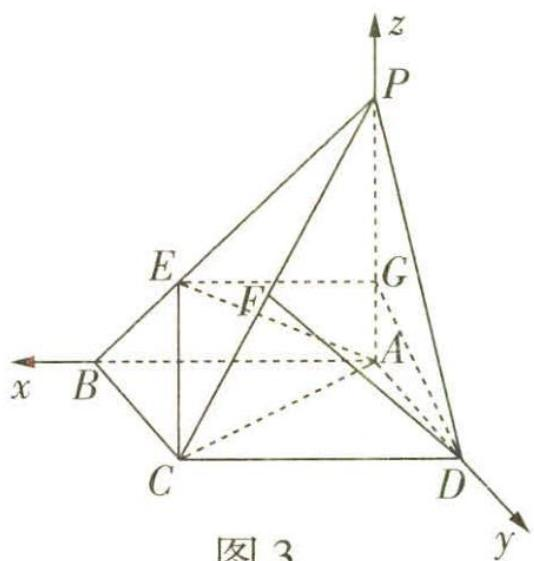

图3

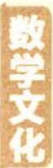

角谷猜想 又称冰雹猜想, 即任意写出一个正整数 $N$ , 并且按照以下的规律进行变换: 如果 $N$ 是奇数, 则下一步变成 $3N + 1$ ; 如果 $N$ 是偶数, 则下一步变成 $N / 2$ . 人们发现, 无论 $N$ 是怎样一个数, 如此循环, 最终都会变成 1.

关注微信公众号“初高教辅站”获取更多初高中教辅资料

$0, 0), P (0, 0, 3 b), D (0, 3 a, 0).$

（1） 由前面解法知 PG = 2GA，所以 GA = b, PG = 2b.

由 $GD$ 平分 $\angle PDA$ 得点 $G$ 到 $PD$ 的距离与线段 $GA$ 的长度相等, 为 $b$ .

所以 $\sin\angle APD=\frac{b}{2b}=\frac{1}{2}$ ，所以 $\angle APD=30^{\circ}$ .

（2） 由 $PE = 2EB$ , 得 $E(2a,0,b), \overrightarrow{CP} = (-3a, -3a,3b), \overrightarrow{DC} = (3a,0,0)$ ,

设 $\overrightarrow{CF} = \lambda \overrightarrow{CP} (0 < \lambda \leqslant 1)$ ，则 $\overrightarrow{CF} = (-3a\lambda, -3a\lambda, 3b\lambda)$ ，所以 $\overrightarrow{DF} = \overrightarrow{DC} + \overrightarrow{CF} = (3a - 3a\lambda, -3a\lambda, 3b\lambda)$ .

$\overrightarrow {A C} = (3 a, 3 a, 0), \overrightarrow {A E} = (2 a, 0, b),$

设平面 $EAC$ 的法向量为 $\pmb {m} = (x,y,z)$ ，则 $\left\{ \begin{array}{l}\pmb {m}\cdot \overrightarrow{AC} = 0,\\ \pmb {m}\cdot \overrightarrow{AE} = 0, \end{array} \right.$ 即 $\left\{ \begin{array}{l}3ax + 3ay = 0,\\ 2ax + bz = 0, \end{array} \right.$

令 $x = 1$ ，则 $y = -1, z = -\frac{2a}{b}$ 所以 $\pmb{m} = (1, -1, -\frac{2a}{b})$ 为平面EAC的一个法向量.

若 $DF \parallel$ 平面 $AEC$ , 则 $\pmb{m} \cdot \overrightarrow{DF} = 0$ , 即 $3a - 3a\lambda + 3a\lambda - 6a\lambda = 0$ , 解得 $\lambda = \frac{1}{2}$ ,

所以当 F 为 PC 的中点时, $DF \parallel$ 平面 AEC, 此时 $\frac{PF}{FC} = 1$ .

调研 5 (2022·湖北襄阳五中三检)在 $\triangle ABC$ 中,内角 $A,B,C$ 的对边分别为 $a$ , $b,c$ ,且 $a<b<c$ ,给出下面三个条件:

①a,b,c为连续自然数；②c=2a；③C=2A.

（1）从上述三个条件中选出两个,使得 $\triangle ABC$ 不存在,并说明理由;

（2）从上述三个条件中选出两个,使得 $\triangle ABC$ 存在,并求 $\triangle ABC$ 的面积(写出一组作答即可).

# 解前思考

题设要求选择两个条件作为已知条件, 有三种不同的组合, 那么要按部就班地逐一判断吗? 当然不, 需要对条件进行观察, 寻找容易得出结论的组合作为首选. 比如: 组合①②, 最简单的是三边长分别是 2, 3, 4 的三角形, 这样的三角形存在; 组合②③, 是指三角形一边长是另一边长的 2 倍, 且其对应角也是 2 倍的关系, 而凭直观感觉可以初步判断这样的三角形不存在, 关键在于给出说明; 组合①③最不易判断, 故留在最后考虑.

阿波罗尼斯圆 简称阿氏圆. 在平面上给定相异两点 $A, B$ , 设 $P$ 点在同一平面上且满足 $\frac{PA}{PB} = k$ , 当 $k > 0$ 且 $k \neq 1$ 时, $P$ 点的轨迹是一个圆. 这个轨迹最先由阿波罗尼奥斯发现, 故称阿氏圆.

关注微信公众号“初高教辅站”获取更多初高中教辅资料

# 解析

（1） 选②③时△ABC不存在, 理由如下.

在 $\triangle ABC$ 中,由C=2A得 $\sin C=2\sin A\cos A$ ,

由正弦定理得 $\frac{a}{\sin A} = \frac{c}{\sin C}$ , 即 $\cos A = \frac{c}{2a}$ .

又 c=2a，所以 $\cos A=1$ ，而 $A\in(0,\pi)$ ，此时 A 不存在，所以 $\triangle ABC$ 不存在。

【会找矛盾】三角形中一个内角是另一个内角的2倍，这个内角对应的边是另一个内角的时应边的2倍，这两个条件不可能同时成立

（2） 选①②时△ABC 存在.

因为 a, b, c 为连续自然数, a < b < c, 所以可设 a = b - 1, $c = b + 1$ .

由 c=2a，得 $b+1=2(b-1)$ ，解得 b=3，所以 a=2, c=4，所以 $\triangle ABC$ 存在.

在 $\triangle ABC$ 中，由余弦定理得 $\cos A = \frac{b^2 + c^2 - a^2}{2bc} = \frac{7}{8}$ ，所以 $\sin A = \sqrt{1 - \cos^2 A} = \frac{\sqrt{15}}{8}$

所以 $S_{\triangle ABC} = \frac{1}{2} bc\sin A = \frac{3\sqrt{15}}{4}.$

选①③时△ABC存在.

因为 a, b, c 为连续自然数, a < b < c, 所以可设 a = b - 1, $c = b + 1$ .

在 $\triangle ABC$ 中，由余弦定理得 $\cos A = \frac{b^2 + (b + 1)^2 - (b - 1)^2}{2b(b + 1)} = \frac{b + 4}{2b + 2}$

又 C=2A，即 $\sin C=2\sin A\cos A$ ，由正弦定理得 $c=2a\cos A$ ，

则有 $b+1=2(b-1)\times\frac{b+4}{2b+2}$ ，所以 a=4, b=5, c=6，这样的 $\triangle ABC$ 存在.

由 $\cos A = \frac{b + 4}{2b + 2} = \frac{3}{4}$ , 得 $\sin A = \sqrt{1 - \cos^2 A} = \frac{\sqrt{7}}{4}$ , 所以 $S_{\triangle ABC} = \frac{1}{2} bc \sin A = \frac{15\sqrt{7}}{4}$ .

# 类型3

# 结论开放型

此类题顾名思义就是结论具有多样性,可以培养考生的数学解题能力,同时促进考生数学知识应用能力的提高.结论开放型问题,往往可以分为归纳猜想、存在性探究猜想.

形数 是一种与图形有关的数. 毕达哥拉斯学派在研究数论时, 常用沙滩上的小石子表示数, 小石子能够摆成不同的几何图形, 于是就产生了一系列的形数. 如三角形数、四边形数等.

调研 6 (2022·辽宁名校联盟联考)写出一个同时具有下列性质①②③的函数的解析式 $f(x)=$ \_\_\_\_.

① $f(x)$ 的最大值为2；② $\forall x\in\mathbb{R},f(2-x)=f(x)$ ；③ $f(x)$ 是周期函数.

解析 由于 $f(x)$ 是周期函数,所以考虑 $f(x)$ 为正弦型函数或余弦型函数.

【会思考】出现周期函数，容易联想到三角函数，特别是正弦函数、余弦函数，同时，三角函数的图象也恰有对称性

由 $\forall x \in R, f(2 - x) = f(x)$ 可知, $f(x)$ 的图象关于直线 x = 1 对称,

【知识链接】对于函数 $f(x)$ ，（1）若满足 $f(a+x)=f(b-x)$ ，则函数 $f(x)$ 的图象关于直线 $x=\frac{a+b}{2}$ 对称；（2）若满足 $f(a+x)=-f(b-x)$ ，则函数 $f(x)$ 的图象关于点 $(\frac{a+b}{2},0)$ 对称

因而可取 $f(x)=2\sin\frac{\pi}{2}x$ , $f(x)$ 的最大值恰好为2, $f(x)$ 的图象关于直线x=1对称, $f(x)$ 的周期为4.

故填 $2\sin \frac{\pi}{2} x$ （答案不唯一）.

【换个思路】分段函数也是常见的考虑对象，作出大致图象，如图4所示，数形结合，则可得函数 $f(x)=\left\{\begin{aligned}&2x+2-4k,x\in[2k-1,2k),\\&-2x+2+4k,x\in[2k,2k+1)\end{aligned}\right.$ ， $k\in Z$ 也是满足题意的

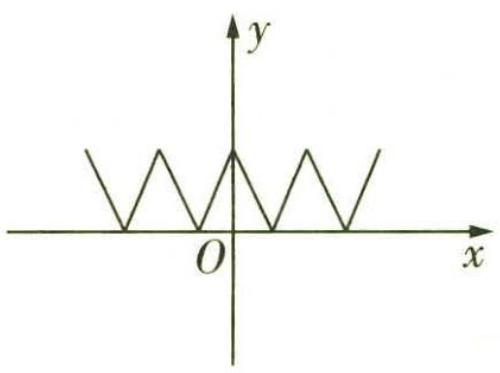

图4

# 类型4 综合开放型

如果问题只给出一部分情境,其他条件或结论、解题途径等需要在情境中自行确定或寻找,这类题目则是综合开放型问题.考生在解答前,进行选择或判断,挑选出自己最擅长解答的,此类问题给考生搭建了更广阔的平台与发挥空间.

调研 7 (2022·辽宁协作体模拟预测)已知点 $A(x_{1}, y_{1}), B(x_{2}, y_{2})$ 在抛物线 $E$ : $x^{2} = 2py (p > 0)$ 上 $(A, B$ 异于顶点), $l_{1}, l_{2}$ 分别为过点 $A, B$ 且与抛物线 $E$ 相切的直线, $l_{1}, l_{2}$ 相交于点 $M(x_{0}, y_{0})$ .

条件①: 点 M 在抛物线 E 的准线上.

条件②: $l_{1} \perp l_{2}$ .

条件③: 直线 AB 经过抛物线的焦点 F.

（1） 在上述三个条件中任选一个作为已知条件, 另外两个作为结论, 构成命题, 并证明该命题是真命题.  
（2） 若 $p = 2$ , 直线 $y = x + 4$ 与抛物线 $E$ 交于 $C, D$ 两点, 试问: 在 $x$ 轴正半轴上是否存在一点 $N$ , 使得 $\triangle CDN$ 的外心在抛物线 $E$ 上? 若存在, 求 $N$ 的坐标; 若不存在, 说明理由.

解析 （1） 整理抛物线 $E$ 的方程得 $y = \frac{x^2}{2p} (p > 0)$ , 则 $y' = \frac{x}{p}$ , 则直线 $l_1$ 的斜率 $k_1 = \frac{x_1}{p}$ , 直线 $l_2$ 的斜率 $k_2 = \frac{x_2}{p}$ ,

所以直线 $l_{1}$ 的方程为 $y - y_{1} = \frac{x_{1}}{p}(x - x_{1})$ .

将 $x_{1}^{2}=2py_{1}$ 代入,化简整理得 $x_{1}x=p(y+y_{1})$ ,

同理可得直线 $l_{2}$ 的方程为 $x_{2}x = p(y + y_{2})$

【会记忆】二级结论：抛物线 $x^{2} = 2py(p > 0)$ 在 $A(x_{1},y_{1})$ ， $B(x_{2},y_{2})$ 两点处的切线方程分别为 $x_{1}x = p(y_{1} + y)$ 与 $x_{2}x = p(y_{2} + y)$ .记住此结论，解小题时直接应用，可以节省时间

抛物线 $E: x^{2} = 2py (p > 0)$ 的准线为直线 $y = -\frac{p}{2}$ ，焦点 F 的坐标为 $(0, \frac{p}{2})$ .

若选择①作为条件,②③作为结论,证明如下.

由于点 M 在抛物线 E 的准线上, 可得点 M 的坐标为 $(x_{0}, -\frac{p}{2})$ ,

又 $l_{1}, l_{2}$ 相交于点 $M$ , 所以 $\left\{ \begin{array}{l} x_{1}x_{0} = p\left(-\frac{p}{2} + y_{1}\right), \\ x_{2}x_{0} = p\left(-\frac{p}{2} + y_{2}\right), \end{array} \right.$

所以点 $A, B$ 的坐标满足方程 $x_0 x = p \left( y - \frac{p}{2} \right)$ ,

所以直线 $AB$ 的方程为 $x_0 x = p \left( y - \frac{p}{2} \right)$ , 从而直线 $AB$ 经过抛物线的焦点 $F(0, \frac{p}{2})$ ,

③得证.

由 $\left\{\begin{aligned}x_{0}x&=p\left(y-\frac{p}{2}\right),\\ x^{2}&=2py,\end{aligned}\right.$ 消去 y 整理得关于 x 的方程 $\frac{x^{2}}{2p}-\frac{x_{0}x}{p}-\frac{p}{2}=0,\Delta>0,$ 所以 $x_{1}x_{2}=-p^{2}.$

【会记忆】二级结论：过抛物线 $x^{2} = 2py(p > 0)$ 的焦点的直线与抛物线交于 $A(x_{1},y_{1})$ ， $B(x_{2}, y_{2})$ 两点，则 $x_{1}x_{2} = -p^{2}$ ， $y_{1}y_{2} = \frac{p^{2}}{4}$

易得 $k_{1} \cdot k_{2} = \frac{x_{1}}{p} \cdot \frac{x_{2}}{p} = \frac{-p^{2}}{p^{2}} = -1$ ，所以 $l_{1} \perp l_{2}$ ，②得证.

若选择②作为条件,①③作为结论,证明如下.

因为 $l_{1} \perp l_{2}$ , 所以 $k_{1} \cdot k_{2} = \frac{x_{1}}{p} \cdot \frac{x_{2}}{p} = -1$ , 即 $x_{1} x_{2} = -p^{2}$ .

又 $l_{1}, l_{2}$ 相交于点 $M$ , 所以 $\left\{ \begin{array}{l} x_{1}x_{0} = p(y_{0} + y_{1}), \\ x_{2}x_{0} = p(y_{0} + y_{2}), \end{array} \right.$ 得 $y_{0} = \frac{x_{1}x_{2}}{2p} = -\frac{p}{2}$ ,

所以点 M 在抛物线 E 的准线上, ①得证.

易知点 M 的坐标为 $(x_{0}, -\frac{p}{2})$ ，所以 $\left\{\begin{aligned} x_{1}x_{0}&=p\left(-\frac{p}{2}+y_{1}\right),\\ x_{2}x_{0}&=p\left(-\frac{p}{2}+y_{2}\right),\end{aligned}\right.$

所以点 A, B 的坐标满足方程 $x_{0}x = p(y - \frac{p}{2})$ ，所以直线 AB 的方程为 $x_{0}x = p(y - \frac{p}{2})$ ，
进而直线 AB 经过抛物线的焦点 $F(0, \frac{p}{2})$ ，③得证.

若选择③作为条件,①②作为结论,证明如下.

直线 AB 经过抛物线的焦点 $F(0, \frac{p}{2})$ ，设直线 AB 的方程为 $y = kx + \frac{p}{2}$ ，

由 $\left\{\begin{aligned}y&=kx+\frac{p}{2},\\ x^{2}&=2py,\end{aligned}\right.$ 消去 y 整理得关于 x 的方程 $x^{2}-2pkx-p^{2}=0,\Delta_{1}>0,$ 所以 $x_{1}x_{2}=-p^{2}.$

易得 $k_{1} \cdot k_{2} = \frac{x_{1}}{p} \cdot \frac{x_{2}}{p} = \frac{-p^{2}}{p^{2}} = -1$ ，所以 $l_{1} \perp l_{2}$ ，②得证.

皮克定理 一个简单的格点多边形(即以格点为顶点而各边互不交叉的多边形)的面积 $S = a + \frac{1}{2} b - 1$ ，其中 $a$ 与 $b$ 分别表示这个多边形内部与边界上的格点数.

又 $l_{1}, l_{2}$ 相交于点 $M$ , 所以 $\left\{ \begin{array}{l} x_{1}x_{0} = p(y_{0} + y_{1}), \\ x_{2}x_{0} = p(y_{0} + y_{2}), \end{array} \right.$ 得 $y_{0} = \frac{x_{1}x_{2}}{2p} = -\frac{p}{2}$ , 所以点 $M$ 在抛物线 $E$ 的准线上, ①得证.

（2） 假设存在点 $N(m,0)(m > 0)$ , 设点 $C, D$ 的横坐标分别为 $x_{C}, x_{D}$ , 由 $\left\{ \begin{array}{l} y = x + 4, \\ x^{2} = 4y, \end{array} \right.$ 可得 $x^{2} - 4x - 16 = 0, \Delta_{2} > 0$ , 所以 $x_{C} + x_{D} = 4, x_{C}x_{D} = -16$ .

设线段 $CD$ 的中点为 $P(x_{3},y_{3})$ ，则 $x_{3} = \frac{x_{C} + x_{D}}{2} = 2,y_{3} = x_{3} + 4 = 6,$

进而线段 CD 的中垂线方程为 $y - 6 = -(x - 2)$ ，即 $y = -x + 8$ ，

由 $\left\{\begin{aligned}x^{2}&=4y,\\ y&=-x+8,\end{aligned}\right.$ 得 $x^{2}+4x-32=0,\Delta_{3}>0$ ，解得x=-8或x=4，

从而 $\triangle CDN$ 的外心Q的坐标为(4,4)或(-8,16).

$\begin{array}{l} \mid C D \mid = \sqrt {1 + 1 ^ {2}} \times \sqrt {\left(x _ {C} + x _ {D}\right) ^ {2} - 4 x _ {C} x _ {D}} = \sqrt {2} \times \sqrt {1 6 + 6 4} = 4 \sqrt {1 0}, \mid D P \mid = \frac {\mid C D \mid}{2} = \\ 2 \sqrt {1 0}, \end{array}$

连接 $QP, QD, QN$ . 若 $Q$ 的坐标为 $(4, 4)$ , 则 $|QP| = \frac{|4 - 4 + 4|}{\sqrt{2}} = 2\sqrt{2}$ ,

所以 $|QD| = \sqrt{|QP|^2 + |DP|^2} = 4\sqrt{3}$ ，则 $|QD| = |QN| = \sqrt{(m - 4)^2 + 16} = 4\sqrt{3}$ .

因为 m > 0，所以 $m = 4 + 4\sqrt{2}$ ，此时 N 的坐标为 $(4 + 4\sqrt{2}, 0)$ .

若 $Q$ 的坐标为 $(-8, 16)$ , 则 $|QP| = \frac{| - 8 - 16 + 4|}{\sqrt{2}} = 10\sqrt{2}$ , 则 $|QD| = \sqrt{|QP|^2 + |DP|^2} = 4\sqrt{15}$ ,

因为 $|QN|=\sqrt{(m+8)^{2}+16^{2}}>4\sqrt{15}=|QD|$ ，所以Q的坐标不可能为(-8,16)，此时不存在满足题意的点N.

综上, 在 $x$ 轴的正半轴上存在点 $N(4 + 4\sqrt{2}, 0)$ , 使得 $\triangle CDN$ 的外心在抛物线 $E$ 上.

# 突破超重点

# 核心考点篇

# 超重点 1 两个基本计数原理的综合应用问题

# 特约名师

# 赵成海

正高级教师,河北省优秀教师,省级骨干教师.中国数学奥林匹克一级教练员,中国科学技术学会、中国数学会会员.在国家级及省级等各类专业报纸杂志上发表教育教学论文三百余篇.

# 命题角度1> “类中有步”的计数问题

调研 1 (2022·山西长治二中三模)若从 1,2,3,…,9 这 9 个整数中取出 4 个不同的数排成一排,依次记为 a,b,c,d,则使得 $a \times b \times c + d$ 为奇数的不同排列方法有 ( )

两个数的和为奇数，那么这两个数需一奇一偶，因而分两类讨论

$\quad$A. 1 224 种

$\quad$B. 1 800 种

$\quad$C. 1 560 种

$\quad$D. 840 种

解析 第一类: 当 d 为奇数时, 第一步从 1,3,5,7,9 这五个奇数数字中选 1 个,

【会思考】一类是 d 为奇数, 则 $a \times b \times c$ 为偶数, 此类分两步, 第一步选 1 个奇数作为 d, 第二步选 3 个数字排列, 使其乘积为偶数, 寄分三类 (一偶两奇、两偶一奇、三偶). 本题 “类中有步” “类中有类”

共有5种选法. 第二步选 $a \times b \times c$ (为偶数), 分三类, ①a, b, c一偶两奇, 需要分三步, 选一个偶数数字, 选两个奇数数字, 再排列, 共有 $C_{4}^{1}C_{4}^{2}A_{3}^{3}$ 种方法. ②a, b, c两偶一奇有 $C_{4}^{2}C_{4}^{1}A_{3}^{3}$ 种方法. ③a, b, c三偶有 $A_{4}^{3}$ 种方法. 从而共有 $5(C_{4}^{1}C_{4}^{2}A_{3}^{3} + C_{4}^{2}C_{4}^{1}A_{3}^{3} + A_{4}^{3}) = 1560$ (种)方法.

第二类: 当 d 为偶数时, $a \times b \times c$ 为奇数, 分两步, 先选一个偶数数字作为 d, 再选三

【点拨】a,b,c 为三个奇数

个奇数数字排列, 共有 $C_{4}^{1}A_{5}^{3}=240$ (种) 方法.

由分类加法计数原理可得,不同排列方法共有 $1560 + 240 = 1800$ (种).

调研 2 (2023·湖北武汉一中、武汉二中等7月联考)甲、乙、丙、丁四个人中秋

如把任意一个四位数(4个数字都一样的除外)中的4个数字重新组合成一个最大的数和一个最小的数(若4个数字中有0,则组成最小的数时要把0放在前面),用最大的数减去最小的数,对所得的差再重复上述过程,最多7步,必得6174.

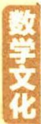

节分别选择到东湖公园、茶经楼、历史博物馆和北湖公园其中一处去参观游玩,其中茶经楼必有人去,则不同的参观方式共有()

$\quad$A. 24 种

$\quad$B. 96 种

$\quad$C. 174 种

$\quad$D. 175 种

解析 按照去茶经楼的人数进行分类讨论.

第一类,若4个人均去茶经楼,则有1种参观方式;

第二类,若有3个人去茶经楼,分两步,从4个人中选择3个人去茶经楼,余下1个人从另外的3处景点中任意选择一处,有 $C_{4}^{3}A_{3}^{1}=12$ (种)参观方式;

第三类,若有2个人去茶经楼,分三步,从4个人中选择2个人去茶经楼,余下2个人分别从另外的3处景点中任意选择一处,有 $C_{4}^{2}A_{3}^{1}A_{3}^{1}=54$ (种)参观方式;

第四类,若有1个人去茶经楼,分四步,从4个人中选择1个人去茶经楼,余下3个人分别从另外的3处景点中任意选择一处,有 $C_{4}^{1}A_{3}^{1}A_{3}^{1}A_{3}^{1}=108$ (种)参观方式.

综上,由分类加法计数原理,共有 $1+12+54+108=175$ (种)参观方式,故选D.

【对比分析】第三类的第二步也可分两类,一类是余下两个人从另外的三处景点中选择一处同去参观游玩,另一类是选两处分别去参观游玩,所以有 $C_4^2 (A_3^1 + A_3^2) = 54$ (神) 参观方式.第四类与第三类可类似分析.可见这种解法“步中有类”

调研 3 (2023·浙江金华一中8月摸底)已知集合 $A = \{4,5,6,7\}$ , $B = \{5,6,7,8,9\}$ ,从集合 $A$ 中取出1个元素,从集合 $B$ 中取出3个元素,可以组成无重复数字且比5000大的自然数的个数共有 ( )

$\quad$A. 180

$\quad$B. 300

$\quad$C. 468

$\quad$D. 564

解析 由两个集合中的数字大小,以及要求组成比5000大的自然数,可分为两类讨论.

第一类: 若从集合 A 中取出元素 4, 则 4 不能作千位上的数字, 只能先排在个位、十【会思考】第一类是从 A 中选出的数字是 4, 这一类需要分两步: 第一步将数字 4 排在个位、十位或百位上, 第二步从 B 中选 3 个数字排在另外 3 个数位上

位或百位上,有 $C_{3}^{1}$ 种方法,再从 B 中选 3 个数字排在另外三个数位上有 $A_{5}^{3}$ 种方法,从而共有 $C_{3}^{1}A_{5}^{3}=180$ (个) 满足题意的自然数.

第二类:从5,6,7,8,9中选4个数字,排成4位数,从而共有 $A_{5}^{4}=120$ (个)满足题

【点选】注意题目中要求无重复数字，因而从A中选出数字后，再从B中选出数字时，需要与A中选出的数字不同，比如A中选了5，那么B中只能选6、7、8、9中的3个，其他同理，所

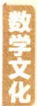

四色问题 世界三大数学猜想之一. 指任何一张地图只用四种颜色就能使具有共同边界的国家着上不同的颜色.

以等价于从5,6,7,8,9中选4个数字

意的自然数.

综上,由分类加法计数原理可得,满足题意的自然数共有 $180 + 120 = 300$ (个),故选 B.

【易错】第二类分三步, 第一步从 $A$ 中的 5, 6, 7 中选 1 个, 第二步从 $B$ 中除去 $A$ 中选出的数字之外的其他 4 个数字中再选 3 个, 第三步排这个 4 位数. 有 $C_{3}^{1} C_{4}^{3} A_{4}^{4} = 288$ (个) 满足题意的自然数, 因而共有 $180 + 288 = 468$ (个) 满足题意的自然数, 选 C. 这里出现重复组, 如 $A$ 中选 5 且 $B$ 中选 6, 7, 8 与 $A$ 中选 6 且 $B$ 中选 5, 7, 8 是重复的

# 命题角度2》“步中有类”的计数问题

调研 4 (2022·南京师大附中考前冲刺)将6个不同的乒乓球全部放入两个不同的球袋中,每个球袋中至少放1个乒乓球,则不同的放法有 ( )

$\quad$A. 82 种

$\quad$B. 62 种

$\quad$C. 112 种

$\quad$D. 84 种

解析 先将6个不同的乒乓球分为两组,可分为1个和5个,2个和4个,3个和3个三种情况,共有 $C_{6}^{1}+C_{6}^{2}+\frac{1}{2}C_{6}^{3}=31$ (种)分法,再将分好的两组分别放入不同的球袋中,则共有 $31\times A_{2}^{2}=62$ (种)放法.

【点透讲透】可分两步,第一步将6个球分为两组,第二步将分好的两组分别放入两个不同的球袋中.而第一步中分为两组,共有三类,分别是1个和5个,2个和4个,3个和3个

故选 B.

# 变式

如果将6个不同的球，改成6个相同的球，结果如何？

解法策略:利用挡板法, 在排成一排的 6 个球的中间 5 个空隙中插入 1 个挡板, 从而有 5 种不同的放法.

调研 5 (2023·重庆南开中学8月质量检测/圆周率 $\pi$ ) 公元五世纪, 数学家祖冲之首次将“圆周率”精算到小数第七位, 即在 3.141 592 6 和 3.141 592 7 之间. 小明是个数学迷, 他在设置手机的数字密码时, 打算将圆周率的前 6 位数字 3, 1, 4, 1, 5, 9 进行某种排列得到密码. 如果排列时要求数字 9 不在最后一位, 那么小明可以设置的不同密码有 ( )

$\quad$A. 600 个

$\quad$B. 300 个

$\quad$C. 360 个

$\quad$D. 180 个

解析 方法一 当最后一位为 1 时, 共有 $A_{5}^{5}=120$ (种) 排法.

莱布尼茨三角形 由分子为1,分母为正整数的分数构成,规律是下一行的第1个数和第2个数相加等于上一行的第1个数,下一行的第2个数和第3个数相加等于上一行的第2个数,以此类推.

当最后一位不为1时,第一步在3,4,5中任选一个放在最后一位有 $C_{3}^{1}$ 种,第二步把余下的2个数字与9全排列有 $A_{3}^{3}$ 种,第三步将两个1插入4个空中的2个有 $C_{4}^{2}$ 种,或将两个1捆绑插入4个空中的1个有 $C_{4}^{1}$ 种,共有 $C_{3}^{1}A_{3}^{3}(C_{4}^{2}+C_{4}^{1})=180$ (种)排法.

【扫清障碍】注意6个数字中有2个相同的数字，与6个不同的数字有差别，这属于有部分相同元素的排列问题，本题排两个1时又分两类，分两个1相邻与不相邻，是组合问题

综上,小明可以设置的不同密码共有 $120 + 180 = 300$ (个). 故选 B.

方法二 （正难则反法）第一步, 将数字 3,1,4,1,5,9 排列, 有 $\frac{A_{6}^{6}}{A_{2}^{2}}$ (或 $C_{6}^{2} A_{4}^{4}$ ) = 360(种). 第二步, 当 9 在最后一位时, 有 $\frac{A_{5}^{5}}{A_{2}^{2}}$ (或 $C_{5}^{2} A_{3}^{3}$ ) = 60(种).

综上,小明可以设置的不同密码共有 $360 - 60 = 300$ (个). 故选 B.

调研 6 (2023·杭州学军中学7月模拟/涂色问题)如图1-1,用4种不同的颜色给图中的8个区域涂色,每种颜色至少使用一次,每个区域仅涂一种颜色,且相邻区域所涂颜色互不相同,则区域A,B,C,D和 $A_{1},B_{1},C_{1},D_{1}$ 分别各涂2种不同颜色的涂色方法共有\_\_\_\_种;区域A,B,C,D和 $A_{1},B_{1},C_{1},D_{1}$ 分别各涂4种不同颜色的涂色方法共有\_\_\_\_种.

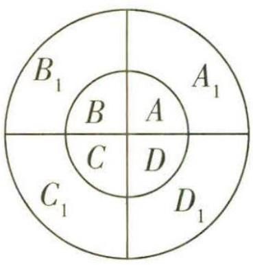

图1-1

解析 区域 A, B, C, D 和 $A_{1}, B_{1}, C_{1}, D_{1}$ 分别各涂 2 种不同颜色，则区域 A 和 C 同色，B 和 D 同色， $A_{1}$ 和 $C_{1}$ 同色， $B_{1}$ 和 $D_{1}$ 同色，所以先涂区域 A 和 C, B 和 D，从 4 种颜色中选两种，有 $A_{4}^{2}$ 种.

【另解】也可写为 ${\mathrm{C}}_{4}^{2}{\mathrm{\;A}}_{2}^{2}$ ,即分两步,第一步选颜色,第二步涂色

再涂区域 $A_{1}$ 和 $C_1, B_1$ 和 $D_{1}$ , 用另外两种颜色去涂, 有 $\mathrm{A}_2^2$ 种.

所以由分步乘法计数原理共有 $A_{4}^{2}A_{2}^{2}=24$ (种) 涂色方法.

设四种不同的颜色为 $a, b, c, d$ , 第一步先涂区域 $A, B, C, D$ 共有 $\mathrm{A}_{4}^{4} = 24$ (种) 方法, 第二步涂区域 $A_{1}, B_{1}, C_{1}, D_{1}$ , 在给区域 $A_{1}, B_{1}, C_{1}, D_{1}$ 涂色时, 与相应的区域 $A, B, C, D$

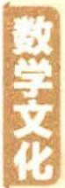

杨辉三角中，“一肩扛两数”，是按从上到下的顺序观察，除第1行外，上行相邻两数的和与下行对应的数相等；莱布尼茨三角形中，“一脚踏两数”，是按从下到上的顺序观察，下行相邻两数的和与上行对应的数相等。

颜色不能相同,不妨设区域A,B,C,D对应的颜色是a,b,c,d,那么区域 $A_{1},B_{1},C_{1},D_{1}$ 对应的颜色可能情况有如下几类,(b,a,d,c),(b,c,d,a),(b,d,a,c),(c,a,d,b),(c,d,a,b),(c,d,b,a),(d,a,b,c),(d,c,a,b),(d,c,b,a),共9种情况,所以共有 $24\times9=$ 216(种)涂色方法.

# 类比

与第二空相类似的题目，比如标号分别为 1, 2, 3, 4 的 4 个小球，分别放入标号为 1, 2, 3, 4 的盒子中，每盒放 1 个，要求小球与盒子的标号都不相同，有多少种不同的放法？

解题策略:分步进行, 先放 1 号球, 有 3 种不同的放法, 再放 1 号球所在盒子一样标号的球, 也有 3 种放法, 剩余两个球分别放入另外两个盒子中, 只有一种放法, 因而由分步乘法计数原理共有 $3 \times 3 \times 1 = 9$ (种) 不同的放法.

# 新题演练

##### 1. (2023·辽宁省实验中学8月摸底)将6盆不同的花卉摆放成一排,其中A,B两盆花卉均摆放在C花卉的同一侧,则不同的摆放种数为 ( )

$\quad$A. 360

$\quad$B. 480

$\quad$C. 600

$\quad$D. 720

##### 2. (2022·山东泰安一中考前模拟/对称之美)在中华传统文化里,建筑、器物、书法、诗歌、对联、绘画几乎无不讲究对称之美. 如图 1-2 所示的是清代诗人黄伯权的《茶壶回文诗》,其以连环诗的形式展现,20 个字绕着茶壶成一圆环,无论顺着读还是逆着读,皆成佳作. 数学与生活也有许多奇妙的联系,如 2020 年 02 月 02 日(202 002 02)被称为世界完全对称日(公历纪年日期中数字左右完全对称的日期). 数学

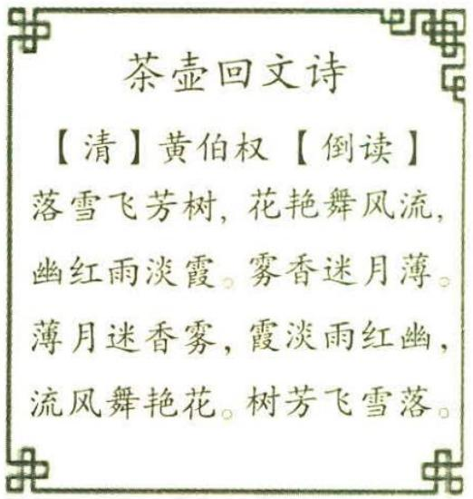

图1-2

上把 202 002 02 这样的对称数叫回文数, 若两位数的回文数共有 9 个 (11, 22, …, 99), 则所有四位数的回文数中能被 3 整除的个数是 \_\_\_\_.

# 参考答案与解析

##### 1. B 利用分类讨论的方法解决,如图 1-3 中的 6 个位置,根据 C 的位置进行分类.

<table><tr><td>1</td><td>2</td><td>3</td><td>4</td><td>5</td><td>6</td></tr></table>

图1-3

黄金分割比 把一条线段分割为两部分,使较长部分与全长之比等于较短部分与较长部分之比.由于按此比例设计的造型十分美丽,因此称为黄金分割比,也称为中外比.

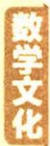

①当 C 在位置 1 时, 不同的摆法有 $A_{5}^{5}=120$ (种).  
②当 C 在位置 2 时, 不同的摆法有 $C_{3}^{1}A_{4}^{4}=72$ (种).

【会思考】位置1不能排A或B，所以分两步，第一步从其余3盆中选任意一盆排在位置1，剩余4盆任意排

③当 C 在位置 3 时, 不同的摆法有 $A_{2}^{2}A_{3}^{3} + A_{3}^{2}A_{3}^{3} = 48$ (种).

【会思考】要分两类，一类是位置1,2排A,B，另一类是位置1,2排A,B之外的两盆，当然每一类部分两步：排左边与排右边

由对称性知 C 在位置 4,5,6 时摆放的种数和 C 在位置 3,2,1 时相同，

综上,不同的摆放种数有 $2 \times (120 + 72 + 48) = 480$ . 故选 B.

##### 2.30 所有四位数的回文数要能被 3 整除, 则四个数的和是 3 的偶数倍数.

【知识链接】一个三位数 $abc(a,b,c$ 分别是百位数、十位数、个位数）记为 $100a + 10b + c = 99a + 9b + (a + b + c)$ ，因而若这个三位数能被3整除，只需 $a + b + c$ 被3整除。其他比如四位数、五位数等数同理

从而满足条件的回文数分为以下6类.

①和为6的回文数:两个1和两个2、两个3和两个0组成的回文数,此时有 $1 \times 2 + 1 = 3$ (个).  
②和为12的回文数:两个1和两个5、两个2和两个4、两个6和两个0、四个3组成的回文数,此时有 $2 \times 2 + 2 = 6$ (个).  
③和为18的回文数:两个1和两个8、两个2和两个7、两个3和两个6、两个4和两个5、两个9和两个0组成的回文数,此时有 $4 \times 2 + 1 = 9$ (个).  
④和为24的回文数:两个3和两个9、两个4和两个8、两个5和两个7、四个6组成的回文数,此时有 $3 \times 2 + 1 = 7$ (个).  
⑤和为30的回文数:两个6和两个9、两个7和两个8组成的回文数,此时有 $2 \times 2 = 4$ (个).  
⑥和为36的回文数:四个9组成的回文数,此时有1个.

故满足条件的回文数共有 $3 + 6 + 9 + 7 + 4 + 1 = 30$ (个). 故填 30.

# 超重点 2 二项展开式特定项及其系数求解问题

# 特约名师

赵成海 正高级教师,河北省优秀教师,省级骨干教师.中国数学奥林匹克一级教练员,中国科学技术学会、中国数学会会员.在国家级及省级等各类专业报纸杂志上发表教育教学论文三百余篇.

# 命题角度1 求形如 $(a+b)^{n}$ 或 $(a+b+c)^{n}$ 的展开式中特定项或特定项的系数

调研 1 (2023·重庆八中7月模拟改编)若 $(x^{2}-\frac{2}{x})^{n}$ 展开式中存在常数项,则n可以是()

$\quad$A. 6 或 9

$\quad$B. 7

$\quad$C. 6 或 8

$\quad$D. 9

思维导引 写出展开式的通项 令 x 的指数为 0, 即可求出 r 从而得到 n 的值

解析 $(x^{2}-\frac{2}{x})^{n}$ 展开式的通项为 $T_{r+1}=C_{n}^{r}(x^{2})^{n-r}(-\frac{2}{x})^{r}=C_{n}^{r}x^{2n-3r}\cdot(-2)^{r}$ $r=0,1,2,\cdots,n,$

令 2n - 3r = 0, 得 $r = \frac{2n}{3}$ ,

又 $0 \leqslant r \leqslant n$ 且 r 为整数, 所以 n 为 3 的倍数, 故 n = 6 或 n = 9. 故选 A.

【点语】并非对任意的 $n \in \mathbb{N}^*$ , 展开式中都存在常数项, 因而确定存在常数项的条件是关键

调研 2 (2023·陕西宝鸡中学8月模拟) $\left(\sqrt{x}+\frac{1}{\sqrt[3]{x}}\right)^{30}$ 的展开式中,无理项的项数共有 ()

$\quad$A. 27

$\quad$B. 24

$\quad$C. 26

$\quad$D. 25

# 思维导引

求无理项有多少项

可考虑先求有理项

有理项是指 x 的指数值为整数的项

利用二项展开式的通项求解→展开式共31项,进而得到无理项的项数

解析 $(\sqrt{x} + \frac{1}{\sqrt[3]{x}})^{30}$ 的展开式中，通项为 $T_{r+1} = C_{30}^r \cdot (\sqrt{x})^{30-r} \cdot (\frac{1}{\sqrt[3]{x}})^r = C_{30}^r$

摆线 是数学中众多的迷人曲线之一. 它指一个圆沿一条定直线滚动时, 圆边界上一点运动的轨迹.

$x ^ {1 5 - \frac {5}{6} r}, r = 0, 1, 2, \dots , 3 0,$

易知 $0 \leqslant r \leqslant 30$ ，若 $x$ 的指数值 $15 - \frac{5}{6} r$ 为整数，则 $r$ 是 6 的倍数，

所以当 r=0,6,12,18,24,30 时为有理项,共6项,故无理项的项数共有 31-6=25,故
【易错】注意 r 的取值是 0,1,2,3,…,30，不能丢失 0 的情况
选 D.

调研 3 (2023·陕西咸阳高新一中7月检测) $(\sqrt{x}+3y-5)^{6}$ 的展开式中 $x^{2}y^{2}$ 的系数为 ( )

$\quad$A. -135

$\quad$B. -75

$\quad$C. 75

$\quad$D. 135

解析 $(\sqrt{x} + 3y - 5)^{6}$ 可看作6个因式 $(\sqrt{x} + 3y - 5)$ 相乘，

所以其展开式中含 $x^{2}y^{2}$ 的项为4个因式取 $\sqrt{x}$ , 2个因式取 $3y$ ,

【点透】划用计数原理分类分步求解,要得到 ${x}^{2}{y}^{2}$ ,分析每个因式所取项的情况

所以 $(\sqrt{x}+3y-5)^{6}$ 展开式中 $x^{2}y^{2}$ 的系数为 $C_{6}^{4}\times3^{2}=135$ .故选D.

【扫清障碍】对于 $(a+b+c)^{n}$ ，其展开式的通项为 $C_{n}^{r}C_{n-r}^{t}a^{r}b^{t}c^{n-r-t}$ ，因而 $(\sqrt{x}+3y-5)^{6}$ 展开式的通项是 $C_{6}^{r}C_{6-r}^{t}(\sqrt{x})^{r}(3y)^{t}(-5)^{6-r-t}$ ，那么当 r=4, t=2 时出现含 $x^{2}y^{2}$ 的项，即该项为 $C_{6}^{4}C_{2}^{2}(\sqrt{x})^{4}(3y)^{2}(-5)^{0}=135x^{2}y^{2}$ 。若求 $xy^{3}$ 的系数呢？只需取 r=2, t=3，该项为 $C_{6}^{2}C_{4}^{3}(\sqrt{x})^{2}(3y)^{3}(-5)^{1}=-8100xy^{3}$

# 命题角度2 求形如 $(a + b)^n (c + d)^m$ 或 $(a + b)^n (c + d + e)^m$ 的展开式中特定项或特定项的系数

调研 4 (2023·江苏南京一中8月一模) $\left(x^{3}-\frac{1}{x}\right)\left(x-\frac{2}{x}\right)^{5}$ 的展开式中常数项为 ( )

$\quad$A. 40

$\quad$B. 60

$\quad$C. 80

$\quad$D. 120

解析 $(x - \frac{2}{x})^5$ 的展开式的通项为 $T_{r + 1} = (-1)^{r}\mathrm{C}_{5}^{r}x^{5 - r}\left(\frac{2}{x}\right)^{r} = (-2)^{r}\mathrm{C}_{5}^{r}x^{5 - 2r},$ $r = 0,1,2,3,4,5,$ 而 $(x^{3} - \frac{1}{x})(x - \frac{2}{x})^{5} = x^{3}(x - \frac{2}{x})^{5} - \frac{1}{x} (x - \frac{2}{x})^{5},$

【会思考】多项式与二项式相乘求特定项，分配时注意各项因式都要考虑，并注意系数或特

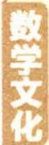

滚动一周时,动点的轨迹为摆线的一支,称为一拱,拱的长度等于圆直径的4倍,尤其令人惊叹的是,它的长度不依赖于 $\pi$ .

号因子不能丢，本题 $x^{3}-\frac{1}{x}$ 每一项都要考虑

令 $5 - 2r + 3 = 0$ ，得 $r = 4$ ，令 $5 - 2r - 1 = 0$ ，得 $r = 2$

所以 $\left(x^{3}-\frac{1}{x}\right)\left(x-\frac{2}{x}\right)^{5}$ 的展开式中常数项为 $(-2)^{4}\mathrm{C}_{5}^{4}-(-2)^{2}\mathrm{C}_{5}^{2}=40$ .故选A.

调研 5 (2023·江苏常州高级中学8月一模) $(x^{2}-x+1)(x-1)^{5}$ 的展开式中 $x^{4}$ 的系数为

$\quad$A. -25

$\quad$B. 25

$\quad$C. -5

$\quad$D. 5

解析 $\because (x^{2} - x + 1)(x - 1)^{5} = x^{2}(x - 1)^{5} - x(x - 1)^{5} + (x - 1)^{5},$

$(x-1)^{5}$ 的展开式的通项为 $T_{k+1}=C_{5}^{k}x^{5-k}(-1)^{k}=(-1)^{k}C_{5}^{k}x^{5-k}, k=0,1,2,3,$ 4,5,

【点透讲透】利用展开式的通项, 根据题意需要分别计算在 $(x - 1)^{5}$ 的展开式中含 $x^{2}, x^{3}, x^{4}$ 的项的系数, 由此确定 $k = 3, 2, 1$

令 $k = 3$ ，得 $(-1)^{3}\mathrm{C}_{5}^{3}x^{2} = -10x^{2}$ ，则 $x^{2}(-10x^{2}) = -10x^{4}$

令 $k = 2$ ，得 $(-1)^{2}\mathrm{C}_{5}^{2}x^{3} = 10x^{3}$ ，则 $-x(10x^3) = -10x^4$

令 k=1 , 得 $(-1)C_{5}^{1}x^{4}=-5x^{4}$

$\therefore (x^{2}-x+1)(x-1)^{5}$ 的展开式中 $x^{4}$ 的系数为 $(-10)+(-10)+(-5)=-25$ .

【方法对比】如果运用分类加法、分步乘法计数原理，则分三类情况计算， $C_{5}^{2} \cdot (-1)^{3} - C_{5}^{3} \cdot (-1)^{2} + C_{5}^{4} \cdot (-1) = -10 - 10 - 5 = -25$ 。变式：若改成 $(x^{2} + x + 1)(x - 1)^{5}$ ，可以光并项化为 $(x^{3} - 1)(x - 1)^{4}$ ，那么 $x^{4}$ 的系数分两类，计算为 $C_{4}^{1} \cdot (-1)^{3} - C_{4}^{4} = -4 - 1 = -5$ ，比多项式展开更为简捷

故选A.

调研 6 (2022 · 山东聊城三模) $(x + 2y)^{5}(x - 3y)$ 的展开式中 $x^{3}y^{3}$ 的系数为
()

$\quad$A. -120

$\quad$B. -40

$\quad$C. 80

$\quad$D. 200

解析 $(x + 2y)^{5}$ 的展开式的通项为 $T_{k + 1} = \mathrm{C}_5^k x^{5 - k}(2y)^k = \mathrm{C}_5^k 2^k x^{5 - k}y^k, k = 0,1,2,$

渐开线 在平面上,一条动直线(发生线)在沿着一个固定的圆(基圆)滚动的过程中,此直线上任意一点运动的轨迹为此圆的一条渐开线.

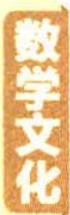

3,4,5,

因为 $(x + 2y)^{5}(x - 3y) = x(x + 2y)^{5} - 3y(x + 2y)^{5}$

在 $xT_{k + 1} = \mathrm{C}_5^k 2^k x^{6 - k}y^k$ 中，令 $6 - k = 3$ 可得 $k = 3$

在 $yT_{k+1}=C_{5}^{k}2^{k}x^{5-k}y^{k+1}$ 中，令 5-k=3 可得 k=2，

所以展开式中 $x^{3}y^{3}$ 的系数为 $C_{5}^{3}2^{3}-3C_{5}^{2}2^{2}=-40$ . 故选 B.

【另解】依据多项式乘法特点，分两类：一类是从因式 $(x-3y)$ 中取x， $(x+2y)^{5}$ 的5个因式中取2个x，3个2y；第二类从因式 $(x-3y)$ 中取-3y， $(x+2y)^{5}$ 的5个因式中取3个x，2个2y，那么所求系数为 $C_{5}^{2}\cdot2^{3}-3C_{5}^{3}\cdot2^{2}=80-120=-40$

# 命题角度3 二项展开式中的系数和问题

调研 7 (2023·东北师大附中8月模拟)在 $\left(x^{2}-\frac{3}{x}\right)^{n}$ 的展开式中,二项式系数的和是16,则展开式中各项系数的和为 ( )

$\quad$A. 16

$\quad$B. 32

$\quad$C. 1

$\quad$D. -32

解析 因为二项式系数的和是16,所以 $2^{n}=16$ ,解得n=4,

令 x=1 得展开式中各项系数的和为 $(-2)^{4}=16$ . 故选 A.

【易错解析】“二项式系数的和”与“各项系数的和”的区别：二项式系数为 $C_{n}^{r}(r=0,1,2,\cdots,n)$ ，二项式系数的和为 $C_{n}^{0}+C_{n}^{1}+C_{n}^{2}+\cdots+C_{n}^{n}=2^{n}$ ，各项系数的和为二项式中的字母都用 1 代替后的值，如本题赋值 x=1 可得，各项系数的和为 $(-2)^{4}=16$

调研 8 (原创) 若在 $(2x + 1)^n$ 的展开式中, 第 3 项的二项式系数与第 8 项的二项式系数相等, 则其展开式中所有项的系数之和等于 ( )

$\quad$A. ${2}^{9}$

$\quad$B. $2^{11}$

$\quad$C. ${3}^{9}$

$\quad$D. ${3}^{11}$

解析 在 $(2x + 1)^n$ 的展开式中, 第3项的二项式系数是 $C_n^2$ , 第8项的二项式系数是 $C_n^7$ , 依题意, $C_n^2 = C_n^7$ , 则 $n = 2 + 7 = 9$ .

【扫清障碍】二项展开式性质：与首末等距离的两项二项式系数相等，因而 $C_{n}^{2}=C_{n}^{7}$ . 由组合数性质 $C_{n}^{m}=C_{n}^{n-m}$ ，求出 n 的值

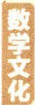

蒙日圆 在椭圆(双曲线)中,任意两条互相垂直的切线的交点都在同一个圆上,它的圆心是椭圆(双曲线)的中心,这个圆叫蒙日圆.

关注微信公众号“初高教辅站”获取更多初高中教辅资料

令 $x = 1$ ，在 $(2x + 1)^{9}$ 的展开式中，所有项的系数之和等于 $(2\times 1 + 1)^{9} = 3^{9}$ .故选C.

调研 9 (2023·南宁二中、南充中学、遵义四中8月联考/交汇导数)已知函数 $f(x)=C_{n}^{0}+C_{n}^{1}x+\frac{1}{3}C_{n}^{3}x^{3}+\frac{1}{5}C_{n}^{5}x^{5}+\cdots+\frac{1}{k}C_{n}^{k}x^{k}+\cdots+\frac{1}{n}C_{n}^{n}x^{n}(k,n \text{为正奇数}),f'(x) \text{是}$ $f(x)$ 的导函数,则 $f'（1）+f(0)=$ ( )

$\quad$A. ${2}^{n}$

$\quad$B. ${2}^{n - 1}$

$\quad$C. $2^{n} + 1$

$\quad$D. $2^{n - 1} + 1$

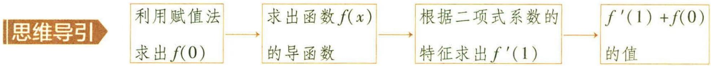

解析 因为 $f(x)=\mathrm{C}_{n}^{0}+\mathrm{C}_{n}^{1}x+\frac{1}{3}\mathrm{C}_{n}^{3}x^{3}+\frac{1}{5}\mathrm{C}_{n}^{5}x^{5}+\cdots+\frac{1}{k}\mathrm{C}_{n}^{k}x^{k}+\cdots+\frac{1}{n}\mathrm{C}_{n}^{n}x^{n}$ ,

令 x=0，则 $f(0)=C_{n}^{0}=1$ ，

由于 $f'(x)=C_{n}^{1}+C_{n}^{3}x^{2}+C_{n}^{5}x^{4}+\cdots+C_{n}^{k}x^{k-1}+\cdots+C_{n}^{n}x^{n-1}$

令 x=1，则 $f'（1）=C_{n}^{1}+C_{n}^{3}+C_{n}^{5}+\cdots+C_{n}^{k}+\cdots+C_{n}^{n}=2^{n-1}$

【点选】所有二项式系数的和为 $2^{n}$ , 奇数项的二项式系数的和与偶数项的二项式系数的和相等且等于 $2^{n-1}$

所以 $f'（1） + f(0) = 2^{n-1} + 1$ . 故选 D.

调研 10 (2023 · 成都温江区 7 月适应性考试) 若 $(2x - 1)^{5} = a_{0} + a_{1}x + a_{2}x^{2} + a_{3}x^{3} + a_{4}x^{4} + a_{5}x^{5}$ ，则 $\left|a_{1}\right| + \left|a_{2}\right| + \left|a_{3}\right| + \left|a_{4}\right| + \left|a_{5}\right| =$

$\quad$A. 244

$\quad$B. 243

$\quad$C. 242

$\quad$D. 241

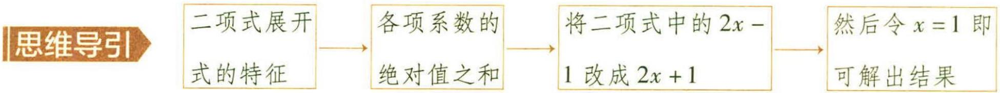

解析 显然 $(2x+1)^{5}=|a_{0}|+|a_{1}|x+|a_{2}|x^{2}+|a_{3}|x^{3}+|a_{4}|x^{4}+|a_{5}|x^{5}$ ，令x=0，得 $|a_{0}|=1$ ，

令 $x = 1$ 得 $\left|a_{0}\right| + \left|a_{1}\right| + \left|a_{2}\right| + \left|a_{3}\right| + \left|a_{4}\right| + \left|a_{5}\right| = 3^{5} = 243$ ，故 $\left|a_{1}\right| + \left|a_{2}\right| + \left|a_{3}\right|$ $+|a_4| + |a_5| = 242.$ 故选C.

【解法对比】也可以赋值，在 $(2x-1)^{5}=a_{0}+a_{1}x+a_{2}x^{2}+a_{3}x^{3}+a_{4}x^{4}+a_{5}x^{5}$ 中，由其展开式的

极点与极线 如果圆锥曲线的切于 A, B 两点的切线相交于 P 点, 那么 P 点称为直线 AB 关于该曲线的极点, 直线 AB 称为 P 点关于该曲线的极线.

通项 $T_{r + 1} = \mathrm{C}_5^r (2x)^{5 - r}(-1)^r$ ，其中 $r = 0,1,2,3,4,5$ ，当 $r$ 为奇数时，项的系数为负，因而采用赋值法，令 $x = -1$ ，则 $a_0 - a_1 + a_2 - a_3 + a_4 - a_5 = -(|a_0| + |a_1| + |a_2| + |a_3| + |a_4| + |a_5|) = -243$ ，故 $|a_1| + |a_2| + |a_3| + |a_4| + |a_5| = 242$

调研 11 (2022·河南开封高中考前模拟) $\left(x-\frac{1}{\sqrt[3]{x}}\right)^{8}$ 的展开式中所有有理项的系数和为 ( )

$\quad$A. 85

$\quad$B. 29

$\quad$C. -27

$\quad$D. -84

解析 $(x - \frac{1}{\sqrt[3]{x}})^8$ 展开式的通项为 $T_{r + 1} = \mathrm{C}_8^r x^{8 - r}\left(-\frac{1}{\sqrt[3]{x}}\right)^r = (-1)^r\mathrm{C}_8^r x^{8 - \frac{4r}{3}}$ ，其中 $r = 0,1,2,3,4,5,6,7,8,$

当 $r=0,3,6$ 时为有理项, 故所有有理项的系数和为 $(-1)^{0}C_{8}^{0}+(-1)^{3}C_{8}^{3}+(-1)^{6}C_{8}^{6}=$ 【小技巧】当 $8-\frac{4r}{3}$ 为整数, 即 $r=0,3,6$ 时对应的是有理项. 注意有理项的确定方法, 如果变式为求 $(\sqrt[3]{x}-\frac{1}{x})^{8}$ 展开式中有理项的系数和, 则其展开式的通项 $T_{r+1}=C_{8}^{r}(\sqrt[3]{x})^{8-r}(-\frac{1}{x})^{r}=(-1)^{r}C_{8}^{r}x^{\frac{8-4r}{3}}$ , $r=0,1,2,3,4,5,6,7,8$ , 那么当 $r=2,5,8$ 时, $8-4r=0,-12,-24$ , 为有理项, 系数和为 $(-1)^{2}C_{8}^{2}+(-1)^{5}C_{8}^{5}+(-1)^{8}C_{8}^{8}=-27$

$1 + (- 5 6) + 2 8 = - 2 7.$

故选 C.

# 命题角度4 与二项展开式中的系数或系数和有关的最值问题

调研 12 (2022·浙江镇海中学三模)在 $(x+2)^{4}$ 的展开式中,常数项是\_\_\_\_,二项式系数最大的项的系数是\_\_\_\_.

解析 由题意知,常数项是 $C_{4}^{4} \cdot 2^{4} = 16$ .

二项式系数最大的项为 $C_{4}^{2} \cdot x^{2} \cdot 2^{2} = 24x^{2}$ ，故二项式系数最大的项的系数是 24.

【点透讲透】 $(a+b)^{n}$ 的展开式中，若n为奇数，则中间两项的二项式系数相等且最大，即

$C_{n}^{\frac{n-1}{2}}=C_{n}^{\frac{n+1}{2}}$ 且最大；若 n 为偶数，则中间项的二项式系数最大，即 $C_{n}^{\frac{n}{2}}$ 最大

调研 13 (2023·江苏南通中学7月调研)在 $(x+1)^{4}(y+z)^{6}$ 的展开式中,所有项系数之和为\_\_\_\_,展开式中系数最大项的系数为\_\_\_\_.

解析 依题意,令 x=y=z=1, 可得所有项系数之和为 $(1+1)^{4} \times (1+1)^{6} = 2^{10} = 1\ 024$ .

$(x+1)^{4}$ 的展开式中系数最大的项为 $C_{4}^{2}x^{2}=6x^{2}$ ,

$(y+z)^{6}$ 的展开式中系数最大的项为 $C_{6}^{3}y^{3}z^{3}=20y^{3}z^{3}$ ,

所以 $(x+1)^{4}(y+z)^{6}$ 的展开式中系数最大项的系数为120,故答案为1024,120.

【点睛】本题所求系数即两个展开式中系数最大项的系数的乘积

调研 14 (2022·福建三明三模改编) 在 $\left(\sqrt{x}-\frac{1}{x}\right)^{n}$ 的展开式中, 第5项和第6项的二项式系数相等, 则 ( )

$\quad$A. $n = 9$

$\quad$B. 常数项为 84

$\quad$C. 各项系数的绝对值之和为 256

$\quad$D. 系数最小项为第 5 项

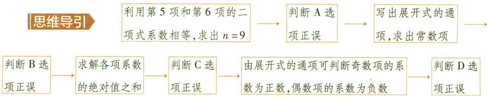

解析 由题意得 $C_n^4 = C_n^5$ ，所以 $n = 9, A$ 正确；

$\left(\sqrt{x}-\frac{1}{x}\right)^{9}$ 的展开式的通项为 $T_{r+1}=C_{9}^{r}\left(x^{\frac{1}{2}}\right)^{9-r}\left(-x^{-1}\right)^{r}=(-1)^{r}C_{9}^{r}x^{\frac{9-3r}{2}},r=0,1,$ 2, $\cdots$ ,9,

令 $\frac{9-3r}{2}=0$ , 解得 r=3, 故 $T_{4}=(-1)^{3}C_{9}^{3}=-84$ , B 错误;

由题知各项系数的绝对值之和为 $\left(\sqrt{1}+\frac{1}{1}\right)^{9}=2^{9}=512$ , C 错误;

由展开式的通项可知,奇数项的系数为正数,偶数项的系数为负数,故系数最小项

这是古希腊数学家希波克拉底发现的一条平面几何中应用广泛的优美定理,可用来解决化月牙为方的问题.

不可能为第5项，D错误.故选A.

【扫清障碍】一般情况下,若要求出系数最小项,往往先求系数绝对值最大项,而该展开式系数绝对值即各项二项式系数,二项式系数最大项为第5项与第6项,求得 $C_{9}^{4}=C_{9}^{5}=126$ ,但第5项的系数为正数,第6项的系数为负数,因而系数最大项是第5项,系数最小项是第6项

调研 15 (2023·河北秦皇岛一中7月模拟)已知 $(3x+1)^{n}(n\in\mathbb{N}^{*})$ 展开式中所有项的系数之和为a,所有项的二项式系数之和为b,则 $\frac{b}{a}+\frac{a}{b}$ 的最小值为\_\_\_\_.

解析 令 $x = 1$ 可得展开式中所有项的系数之和为 $a = 4^n$ ，由题知所有项的二项式系数之和为 $b = 2^n$ ，所以 $\frac{b}{a} + \frac{a}{b} = \frac{2^n}{4^n} + \frac{4^n}{2^n} = \frac{1}{2^n} + 2^n$ .

【易错】 $\frac{1}{2^{n}}+2^{n}\geq2$ ，注意此处等号不能成立

令 $2^{n} = t$ ，因为 $n\in \mathbf{N}^*$ ，所以 $t\geqslant 2$ ，易知函数 $y = \frac{1}{t} +t$ 在 $t\in [2, + \infty)$ 上单调递增，则当 $t = 2$ 时， $y$ 取最小值， $y_{\mathrm{min}} = 2 + \frac{1}{2} = \frac{5}{2}$ 所以 $\frac{b}{a} +\frac{a}{b}$ 的最小值为 $\frac{5}{2}$ 故填 $\frac{5}{2}$

# 新题演练

##### 1. (2022·山东师大附中考前检测改编) $(1 + ax)^{2022} = a_{0} + a_{1}x + a_{2}x^{2} + \dots +a_{2022}x^{2022}$ , 若 $a_1 = -8088$ , 则下列结论不正确的有 ( )

$\quad$A. $a = -4$

$\quad$B. $a_{0} + a_{1} + a_{2} + \cdots + a_{2022} = -3^{2022}$

$\quad$C. 二项式系数的和为 $2^{2022}$

$\quad$D. $\frac{a_{1}}{2}+\frac{a_{2}}{2^{2}}+\cdots+\frac{a_{2022}}{2^{2022}}=0$

##### 2. (2023·兰州一中7月检测)若 $(x^{2}+a)(x+\frac{1}{x})^{8}$ 的展开式中 $x^{8}$ 的系数为9,则a的值为\_\_\_\_.

##### 3. (2022·江西师范大学附属中学三模) 若 $(2x + 3y)^{n}$ 的展开式中仅第 5 项的二项式系数最大, 则 $(x^{2} + \frac{1}{x^{2}} - 2)^{n-4}$ 的展开式中 $x^{2}$ 的系数为 \_\_\_\_.

# 参考答案与解析

##### 1. B 对于 A 选项, $a_{1} = C_{2022}^{1} \cdot a = 2022a = -8088$ , 可得 $a = -4$ , A 对.

对于 B 选项, 因为 $(1-4x)^{2022}=a_{0}+a_{1}x+a_{2}x^{2}+\cdots+a_{2022}x^{2022}$ , 令 x=1, 则所有项的系数之和为 $a_{0}+a_{1}+a_{2}+\cdots+a_{2022}=(-3)^{2022}=3^{2022}$ , B 错.

对于 C 选项,二项式系数的和为 $2^{2022}$ , C 对.

对于 D 选项, 令 x = 0 得 $a_{0} = 1$ , 令 $x = \frac{1}{2}$ , 则 $\frac{a_{1}}{2} + \frac{a_{2}}{2^{2}} + \cdots + \frac{a_{2022}}{2^{2022}} = (1 - 4 \times \frac{1}{2})^{2022} - a_{0} = (1 - 4 \times \frac{1}{2})^{2022} - 1 = 0$ , D 对. 故选 B.

【会思考】一般通过赋值法令 $x = 0$ 得常数项, 而其他求相应系数和也可根据题意利用赋值法求解

##### 2. 1 $(x^{2}+a)(x+\frac{1}{x})^{8}=x^{2}(x+\frac{1}{x})^{8}+a(x+\frac{1}{x})^{8}$ ，且 $(x+\frac{1}{x})^{8}$ 的展开式的通项 $T_{r+1}=$ $C_{8}^{r}x^{8-r}\left(\frac{1}{x}\right)^{r}=C_{8}^{r}x^{8-2r},r=0,1,2,\cdots,8,$

当 $8 - 2r = 6$ ，即 $r = 1$ 时， $(x + \frac{1}{x})^8$ 的展开式中 $x^{6}$ 的系数为 $\mathrm{C}_{8}^{1}$

当 8 - 2r = 8，即 r = 0 时， $\left(x + \frac{1}{x}\right)^{8}$ 的展开式中 $x^{8}$ 的系数为 $C_{8}^{0}$ .

【会分类】本题是利用已知展开式中指定项系数，反求参数的问题，因而依然可以先利用通项分两种情况求系数

所以 $(x^{2}+a)(x+\frac{1}{x})^{8}$ 的展开式中 $x^{8}$ 的系数为 $C_{8}^{1}+aC_{8}^{0}=8+a=9$ ，解得a=1。故填1.

##### 3. -56 $(2x + 3y)^n$ 的展开式中仅第5项的二项式系数最大, 则 $\left\{ \begin{array}{l} C_n^3 < C_n^4, \\ C_n^4 > C_n^5, \end{array} \right.$ 解得 $7 < n < 9$ , 由 $n \in \mathbb{N}^*$ 得 $n = 8$ , 则 $(x^2 + \frac{1}{x^2} - 2)^{n-4} = (x^2 + \frac{1}{x^2} - 2)^4 = (x - \frac{1}{x})^8$ ,

【点拨】第二个展开式已知是三项式，其特点是可以合并为二项式

所以 $(x - \frac{1}{x})^8$ 的展开式中 $x^{2}$ 的系数为 $\mathrm{C}_8^3 (-1)^3 = -56.$

更详细点说就是,界于两个平行平面之间的两个立体,被任一平行于这两个平面的平面所截,如果两个截面的面积恒相等,则这两个立体的体积相等.

# 超重点 3 互斥事件与对立事件的易错辨析与应用

# 命题角度1》互斥事件与对立事件的易错辨析

调研 1 (2022·南宁三中二模改编)(多选)从装有两个红球和两个黑球的口袋内任取两个球,则下列说法中正确的有()

$\quad$A. 至少有一个黑球与都是黑球是互斥事件  
$\quad$B. 至少有一个黑球与至少有一个红球不是互斥事件  
$\quad$C. 恰好有一个黑球与恰好有两个黑球是互斥事件  
$\quad$D. 至少有一个黑球与都是红球是对立事件

解析 方法一 （列举法）设两个红球分别为 a, b，两个黑球分别为 1, 2.

则从装有两个红球和两个黑球的口袋内任取两个球,所有可能的情况为 $\{a,b\}$ , $\{a,1\},\{a,2\},\{b,1\},\{b,2\},\{1,2\}$ , 共6种.

对于 A, 至少有一个黑球与都是黑球都包含事件 $\{1,2\}$ , 故二者不是互斥事件, A 错误;

【小提示】“不能同时发生”是判断互斥事件的关键。有公共事件，就是两个事件可以同时发生，没有公共事件，就是两个事件不能同时发生

对于 B, 至少有一个黑球与至少有一个红球都包含事件 $\{a,1\}$ , $\{a,2\}$ , $\{b,1\}$ , $\{b,2\}$ , 故二者不是互斥事件, B 正确;

对于 C, 恰好有一个黑球包含事件 $\{a,1\}$ , $\{a,2\}$ , $\{b,1\}$ , $\{b,2\}$ , 恰好有两个黑球包含事件 $\{1,2\}$ , 故二者是互斥事件, C 正确;

对于 D, 至少有一个黑球包含事件 $\{a,1\}$ , $\{a,2\}$ , $\{b,1\}$ , $\{b,2\}$ , $\{1,2\}$ , 都是红球包含事件 $\{a,b\}$ , 故二者是对立事件, D 正确.

【敲黑板】对立事件是指两个事件没有公共事件，且两个事件的并集是所有的基本事件

故选 BCD.

方法二 从装有两个红球和两个黑球的口袋内任取两个球,设取出的黑球个数为X,则取出的红球个数为2-X,X的所有可能取值为0,1,2.

对于 A, “至少有一个黑球”对应 $X \geqslant 1$ , 即 X = 1 或 X = 2, “都是黑球”对应 X = 2. 显

【会转化】将具体的事件转化为随机变量的取值，进而求解问题

然当 X=2 时,两个事件同时发生,故 A 错误.

对于 B, “至少有一个黑球” 对应 $X \geqslant 1$ , 即 $X = 1$ 或 $X = 2$ , “至少有一个红球” 对应 $2 - X \geqslant 1$ , 即 $X \leqslant 1$ , 即 $X = 0$ 或 $X = 1$ . 显然当 $X = 1$ 时, 两个事件同时发生, 故 B 正确.

对于 C, “恰好有一个黑球”对应 X=1, “恰好有两个黑球”对应 X=2, 显然二者不能同时发生, 是互斥事件, 故 C 正确.

对于 D, “至少有一个黑球”对应 $X \geqslant 1$ , 即 $X = 1$ 或 $X = 2$ , “都是红球”对应 $2 - X = 2$ , 即 $X = 0$ . 显然二者不能同时发生, 且二者的并事件包含 $X$ 的所有取值, 故两事件是对立事件, 故 D 正确. 故选 BCD.

调研 2 （原创/植物油制取工艺）植物油以富含油脂的植物种仁为原料,经清理除杂、脱壳、破碎、软化、轧坯、挤压膨化等预处理后,再采用机械压榨或溶剂浸出法提取获得粗油,再经精炼后获得.我国植物油料种类繁多,压榨法和浸出法这两种制取工艺分别适用于不同的油料,常见的压榨油有芝麻油、花生油等,常见的浸出油有米糠油、大豆油等.现有4个完全相同的不透明油桶,里面分别装有芝麻油、花生油、米糠油、大豆油,从中任取一桶,则下列两个事件互为对立事件的是 ( )

$\quad$A.“取出芝麻油”和“取出花生油”

$\quad$B.“取出浸出油”和“取出大豆油”

$\quad$C.“取出米糠油”和“取出大豆油”

$\quad$D.“取出压榨油”和“取出浸出油”

解析 由题意,植物油有两种制取工艺:压榨法和浸出法.其中芝麻油、花生油用压榨法;米糠油、大豆油用浸出法.

【小技巧】根据题意,把四种植物油的类别划分清晰后,再判断对应事件就比较简单了

对于 A, 芝麻油与花生油同属压榨油, 故“取出芝麻油”和“取出花生油”是互斥事件但不是对立事件;

对于 B, 大豆油属于浸出油, 所以“取出浸出油”和“取出大豆油”不是互斥事件, 故一定不是对立事件;

对于 C, 米糠油与大豆油同属浸出油, 故“取出米糠油”和“取出大豆油”是互斥事件但不是对立事件;

对于 D, 这 4 桶油所采用的制取工艺只有压榨法和浸出法两种, 所以 “取出压榨油” 和 “取出浸出油” 是互斥事件, 也是对立事件. 故选 D.

【解后反思】该题极易出现的问题就是分类不恰当导致错选 A 或 B，解题的关键是准确划分事件的分类

探月工程,是继人造地球卫星、载人航天飞行取得成功之后,我国航天事业发展的又一座里程碑,开启了中国人走向深空、探索宇宙奥秘的时代.

# 方法点津

辨析互斥事件与对立事件

<table><tr><td colspan="2">辨析</td><td>互斥事件</td><td>对立事件</td></tr><tr><td rowspan="2">区别</td><td>性质</td><td>不可能同时发生的事件,有可能同时不发生</td><td>不可能同时发生,也不可能同时不发生</td></tr><tr><td>集合的观点</td><td>两个事件的交集是空集</td><td>两个事件的交集是空集,且两个事件的并集是全集</td></tr><tr><td>关系</td><td colspan="3">对立事件是特殊的互斥事件, “两个事件互斥”是“两个事件对立”的必要不充分条件</td></tr></table>

# 命题角度2》互斥事件与对立事件的应用

调研 3 (2023·南京开学考试)从1至8这8个整数中随机抽取2个不同的数,则这2个数的和为偶数的概率为 ( )

$\quad$A. $\frac{11}{14}$

$\quad$B. $\frac{5}{14}$

$\quad$C. $\frac{4}{7}$

$\quad$D. $\frac{3}{7}$

# 思维导引

由运算法则将“和为偶数”转化为选取的两数的性质

根据数的选取要求分解为“两数都为奇数”“两数都为偶数”这两个互斥事件

分别求解这两个互斥事件的概率→根据互斥事件的概率加法公式求和即可

解析 记“2个数为奇数”为事件A, “2个数为偶数”为事件B, “2个数的和为偶数”为事件C.

要使2个数的和为偶数,则2个数都为奇数或都为偶数,所以 $P(C)=P(A+B)$ ,

【扫清障碍】根据加法运算法则,将运算结果 “两数之和” 转化为两数的性质,进而将所求事件转化为两个互斥事件的和事件

又事件 A, B 互斥, 所以 $P(C) = P(A) + P(B)$ .

从1至8这8个整数中随机抽取2个不同的数共有 $C_{8}^{2}=28$ （种）情况，

这8个整数中奇数有1,3,5,7,偶数有2,4,6,8,

所以 $P(A) = \frac{\mathrm{C}_4^2}{\mathrm{C}_8^2} = \frac{3}{14}, P(B) = \frac{\mathrm{C}_4^2}{\mathrm{C}_8^2} = \frac{3}{14}$ .

【用公式】利用古典概型的概率计算公式分别求出两个事件的概率

所以 $P(C)=P(A)+P(B)=\frac{3}{14}+\frac{3}{14}=\frac{3}{7}$ . 故选 D.

【敲黑板】五斥事件的和事件的概率为各个事件的概率和

调研 4 (2022·大庆实验中学模拟预测/中国航天)2021年5月30日清晨5时01分,天舟二号货运飞船在成功发射约8小时后,与中国空间站天和核心舱完成自主快速交接.如果空间站的任务由3名航天员承担,需要在3名女性航天员和3名男性航天员中选择,则选出的3名航天员中既有男性航天员又有女性航天员的概率为( )

$\quad$A. $\frac{6}{7}$

$\quad$B. $\frac{9}{10}$

$\quad$C. $\frac{2}{5}$

$\quad$D. $\frac{4}{15}$

思维导引 思路一 设出男性航天员的人数 → 将所求事件分成两个互斥事件 →
分别求两个互斥事件的概率 → 利用互斥事件的概率加法公式求值

思路二
确定所求事件的对立事件 → 将对立事件分解为两个互斥事件 → 利用对立事件的概率计算公式求解

解析 方法一 记“选出的3名航天员中既有男性航天员又有女性航天员”为事件D,设这3名航天员中男性航天员的人数为X,则女性航天员的人数为3-X.

【小技巧】共需选出3名航天员，所以可以以男性航天员的人数或女性航天员的人数作为变量表示对应的事件

由已知得 $\left\{\begin{aligned}X&>0,\\ 3-X&>0,\end{aligned}\right.$ 则0<X<3,故X=1,2.

记事件 A 为 X=1，即选出 1 名男航天员，2 名女航天员，

则 $P(A)=P(X=1)=\frac{C_{3}^{1}C_{3}^{2}}{C_{6}^{3}}=\frac{9}{20};$

记事件 B 为 X=2，即选出 2 名男航天员，1 名女航天员，

则 $P(B) = P(X = 2) = \frac{\mathrm{C}_3^2\mathrm{C}_3^1}{\mathrm{C}_6^3} = \frac{9}{20}$ .

所以 $P(D)=P(A+B)=P(A)+P(B)=\frac{9}{20}+\frac{9}{20}=\frac{9}{10}.$

【用公式】利用互斥事件的概率加法公式求解

第一步为“绕”，即研制和发射月球探测卫星，并实现月球探测卫星绕月飞行。

方法二 记“选出的3名航天员中既有男性航天员又有女性航天员”为事件D,则事件D为“选出的3名航天员中全部为男性航天员或全部为女性航天员”.

【会转化】将问题转化为所求事件的对立事件求解

设3名航天员中男性航天员的人数为 $X$ , 则女性航天员的人数为 $3 - X$ .

所以事件 $\overline{D}$ 对应 X=3 或 X=0.

【小妙招】利用随机变量的取值表示对立事件

记事件 E 为 X=3，即选出 3 名男航天员，0 名女航天员，

则 $P(E)=P(X=3)=\frac{C_{3}^{3}C_{3}^{0}}{C_{6}^{3}}=\frac{1}{20};$

记事件 F 为 X=0，即选出 0 名男航天员，3 名女航天员，

则 $P(F)=P(X=0)=\frac{C_{3}^{0}C_{3}^{3}}{C_{6}^{3}}=\frac{1}{20}.$

所以 $P(\overline{D}) = P(E + F) = P(E) + P(F) = \frac{1}{20} + \frac{1}{20} = \frac{1}{10}.$

故 $P(D)=1-P(\overline{D})=1-\frac{1}{10}=\frac{9}{10}.$

【解后反思】解决此类问题，易出现的错误是不能准确把握事件的性质，将其分解为互斥事件时因分类不清导致遗漏或重复，或求事件的对立事件时，不能准确确定对立事件

# 方法点津

# 求复杂互斥事件概率的两种方法

对于较为复杂的事件，由于事件中的元素较多，或事件的条件比较复杂，直接求解比较麻烦，基本事件数量较大，很容易造成漏记或重复，此时应根据事件的属性，灵活选用相应的方法求解，常用的方法主要有：

（1） 直接法, 即抓住事件中的元素, 通过合理分类, 将所求事件转化为一些彼此互斥的事件的和事件, 运用互斥事件的概率加法公式计算;  
（2）间接法, 即先准确定位所求事件的对立事件, 再用公式 $P(A) = 1 - P(\overline{A})$ 求得, 即运用逆向思维 (正难则反), 特别是 “至多” “至少” 型题目, 用间接法会更简便.

# 新题演练

##### 1. (原创) 现有 3 个男老师和 4 个女老师, 从中选出 3 个老师, 则下列互斥而不对立的

第二步为“落”，即发射月球软着陆器，携带月球巡视勘察器（月球车），在着陆区附近进行探测。

事件是

( )

$\quad$A. “至少有1个男老师”与“至少有1个女老师”   
$\quad$B.“至少有1个男老师”与“都是女老师”  
$\quad$C. “至少有1个男老师”与“至多有1个女老师”   
$\quad$D. “恰有 1 个男老师”与“恰有 2 个男老师”

##### 2. (2022·湖南益阳考前阶段性练习)(多选)一个人打靶时连续射击两次,甲表示事件“至少有一次中靶”,乙表示事件“恰有一次中靶”,丙表示事件“两次都中靶”,丁表示事件“两次都不中靶”,则()

$\quad$A. 甲与乙是互斥事件

$\quad$B. 乙与丙是互斥事件

$\quad$C. 乙与丁是对立事件

$\quad$D. 甲与丁是对立事件

##### 3. (2022·福建上杭一中考前模拟)江南的周庄、同里、甪直、西塘、乌镇、南浔古镇,并称为江南六大古镇,是中国江南水乡风貌最具代表的城镇,它们以其深邃的历史文化底蕴、清丽婉约的水乡古镇风貌、古朴的民俗风情,在世界上独树一帜.这六大古镇中,在苏州的有3处,某家庭计划今年国庆假期从这6个古镇中挑选2个去旅游,则至少选一个苏州古镇的概率为 ( )

$\quad$A. $\frac{2}{5}$

$\quad$B. $\frac{1}{2}$

$\quad$C. $\frac{3}{4}$

$\quad$D. $\frac{4}{5}$

##### 4. (2022·福州一中7月期末)《中华人民共和国未成年人保护法》是为保护未成年人身心健康、保障未成年人合法权益、根据宪法制定的法律。某中学为宣传未成年人保护法,特举行一次未成年人保护法知识竞赛。竞赛规则是:两人一组,每一轮竞赛中,小组两人分别选答两题,两人答题互不影响。若答对题数合计不少于3题,则称这个小组为“优秀小组”。已知甲、乙两位同学组成一组,且甲、乙两位同学答对每道题的概率分别为 $P_{1}, P_{2}$ 。

（1） 若 $P_{1}=\frac{2}{3}, P_{2}=\frac{1}{2}$ ，求在一轮竞赛中，该组获得“优秀小组”称号的概率；

（2） 当 $P_{1} + P_{2} = \frac{4}{3}$ 时, 求该组在每轮竞赛中获得“优秀小组”称号的概率的最大值.

第三步为“回”，即发射月球采样返回器，软着陆在月球表面特定区域进行分析采样，然后将月球样品带回地球，在地面上对样品进行研究。

# 参考答案与解析

##### 1. D 对于 A, 事件“至少有 1 个男老师”与事件“至少有 1 个女老师”都包含事件“选出 2 个男老师和 1 个女老师”, 故这两个事件不互斥, 所以 A 不符合题意;

对于 B, 事件“至少有 1 个男老师”与事件“都是女老师”不能同时发生, 且必有其中 1 个发生, 所以两个事件为互斥事件, 且为对立事件, 所以 B 不符合题意;

对于 C,事件“至少有 1 个男老师”与事件“至多有 1 个女老师”都包含事件“选出 2 个男老师和 1 个女老师”,故这两个事件不互斥,所以 C 不符合题意;

对于 D,事件“恰有 1 个男老师”与事件“恰有 2 个男老师”不能同时发生,但也可以同时不发生,如发生事件“选出 3 个男老师”,所以两个事件为互斥事件,但不是对立事件.

【敲黑板】注意互斥事件与对立事件的区别，互斥但不对立的两个事件，不可能同时发生，但可以同时不发生

故选D.

##### 2. BD 一个人打靶时连续射击两次,其基本事件有:两次都不中靶;第一次中靶,第二次不中靶;第一次不中靶,第二次中靶;两次都中靶.

其中事件甲包含的基本事件有:第一次中靶,第二次不中靶;第一次不中靶,第二次中靶;两次都中靶.

事件乙包含的基本事件有:第一次中靶,第二次不中靶;第一次不中靶,第二次中靶.
事件丙包含的基本事件有:两次都中靶.

事件丁包含的基本事件有:两次都不中靶.

所以根据互斥与对立事件的定义可知,甲与乙不互斥,乙与丙互斥,乙与丁互斥不对立,甲与丁为对立事件.

故 AC 错误, BD 正确. 故选 BD.

##### 3. D 方法一 （直接法）由题意,从这6个古镇中挑选2个,事件“至少选一个苏州古镇”包括事件“选一个苏州古镇”和事件“选两个苏州古镇”.

记选取的 2 个古镇中苏州古镇的个数为 X, 事件“至少选一个苏州古镇”为 M.

则事件 M 包含 X=1 和 X=2 这两个互斥事件，

$P (X = 1) = \frac {\mathrm{C} _ {3} ^ {1} \mathrm{C} _ {3} ^ {1}}{\mathrm{C} _ {6} ^ {2}} = \frac {3}{5}, P (X = 2) = \frac {\mathrm{C} _ {3} ^ {2} \mathrm{C} _ {3} ^ {0}}{\mathrm{C} _ {6} ^ {2}} = \frac {1}{5},$

所以 $P(M)=P(X=1)+P(X=2)=\frac{3}{5}+\frac{1}{5}=\frac{4}{5}.$

方法二 （间接法）由题意,从这6个古镇中挑选2个,事件“至少选一个苏州古镇”的对立事件为“没有选苏州古镇”,即“所选的2个古镇都不在苏州”.

记事件“至少选一个苏州古镇”为 M, 选取的 2 个古镇中苏州古镇的个数为 X, 则事件 $\overline{M}$ 对应事件 X = 0.

故 $P(\overline{M}) = P(X = 0) = \frac{\mathrm{C}_3^0\mathrm{C}_3^2}{\mathrm{C}_6^2} = \frac{1}{5},$

所以 $P(M)=1-P(\overline{M})=1-\frac{1}{5}=\frac{4}{5}.$

##### 4. （1） 记“该组获得‘优秀小组’称号”为事件 A, “甲答对两题, 乙答对一题”为事件 B, “甲答对一题, 乙答对两题”为事件 C, “甲、乙都答对两题”为事件 D, 则事件 A 包含事件 B, C, D.

易知事件 B, C, D 两两互斥，甲、乙两人答题相互独立，则 $P(A) = P(B + C + D) =$ $P(B) + P(C) + P(D) = \left(\frac{2}{3}\right)^{2} \times 2 \times \frac{1}{2} \times \frac{1}{2} + 2 \times \frac{2}{3} \times \frac{1}{3} \times \left(\frac{1}{2}\right)^{2} + \left(\frac{2}{3}\right)^{2} \times \left(\frac{1}{2}\right)^{2} = \frac{4}{9}$ ,

【用公式】会运用概率加法(互斥事件)及乘法(相互独立事件)公式求解概率

所以该组获得“优秀小组”称号的概率为 $\frac{4}{9}$ .

（2）由（1）知甲、乙小组每轮比赛获得“优秀小组”称号的概率 $P = P_{1}^{2} \cdot 2P_{2}(1 - P_{2}) + 2P_{1}(1 - P_{1})P_{2}^{2} + P_{1}^{2}P_{2}^{2} = P_{1}P_{2}[2P_{1}(1 - P_{2}) + 2(1 - P_{1})P_{2} + P_{1}P_{2}] = P_{1}P_{2}[2(P_{1} + P_{2})]$

【敲黑板】解答题的两问之间往往存在一定的联系，根据第（1）问的求解思路可列出本式 $P_{2}$ $-3P_{1}P_{2}$ ].

由 $P_{1} + P_{2} = \frac{4}{3}, 0 \leqslant P_{1} \leqslant 1, 0 \leqslant P_{2} \leqslant 1$ ，可得 $\frac{1}{3} \leqslant P_{1} \leqslant 1$ ，因此 $P_{1}P_{2} = P_{1}\left(\frac{4}{3} - P_{1}\right) \in \left[\frac{1}{3}, \frac{4}{9}\right]$ ，

【小技巧】运用二次函数的性质求 $P_{1}P_{2}$ 的范围

令 $t = P_{1}P_{2}$ ，则 $t\in \left[\frac{1}{3},\frac{4}{9}\right]$ 所以 $P = -3t^{2} + \frac{8}{3} t = -3(t - \frac{4}{9})^{2} + \frac{16}{27}\leqslant \frac{16}{27}$ 当且仅当 $t =$ $\frac{4}{9}$ 时等号成立，

所以该组在每轮竞赛中获得“优秀小组”称号的概率的最大值为 $\frac{16}{27}$ .

# 超重点 4 条件概率的计算与性质应用

调研 1 (2023·江西丰城九中9月开学考试)若某地区60岁及以上人群的某疫苗全程接种(共两针)的接种率为60%,加强免疫接种(第三针)的接种率为36%,则在该地区完成该疫苗全程接种的60岁及以上人群中随机抽取一人,此人完成了加强免疫接种的概率为()

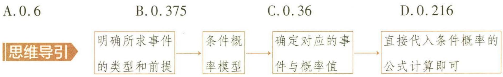

解析 记事件 A 为“从该地区 60 岁及以上人群中随机抽取一人, 此人完成了疫苗全程接种”.

记事件 B 为“从该地区 60 岁及以上人群中随机抽取一人, 此人完成了加强免疫接种”.

显然所求概率为在事件 A 发生的条件下, 事件 B 发生的概率, 即 $P(B \mid A)$ , 属于条件概率.

由题意可得 $P(A)=0.6$ .

因为完成加强免疫接种的前提就是完成疫苗全程接种,所以完成加强免疫接种实质就是事件 $AB$ ,由已知可得 $P(AB) = 0.36$ .

【关键】确定事件 $AB$ ，显然完成加强免疫接种（第三针）的前提是完成疫苗全程接种（共两针），所以事件 $AB$ 的实质就是事件 $B$ ，故 $P(AB) = P(B) = 0.36$

由条件概率的公式可得 $P(B|A)=\frac{P(AB)}{P(A)}=\frac{0.36}{0.6}=0.6$ . 故选 A.

【极易出错】该题易出现的问题是忽视“抽取”的前提，在该地区完成疫苗全程接种的60岁以上人群中随机抽取一人，而不是从该地区60岁以上以上人群中任取一人。误认为求“从该地区任选一人，求此人完成了加强免疫接种的概率”而错选C

调研 2 (2022·重庆三模)抛掷 2 枚质地均匀的骰子(骰子为正方体,6 个表面分别标有数字 1,2,3,4,5,6),在掷出的两枚骰子点数之和为 6 的条件下,点数均为奇数的概率为本题的解题秘钥就是这几个字,在……的条件下,所求事件的概率为条件概率 ( )

$\quad$A. $\frac{3}{5}$

$\quad$B. $\frac{1}{2}$

$\quad$C. $\frac{2}{5}$

$\quad$D. $\frac{2}{3}$

解析 方法一 （公式法）记“掷出的两枚骰子点数之和为6”为事件A，“点数均为奇数”为事件B.

则事件 $AB$ 为“两枚骰子的点数之和为 6 ,且两枚骰子的点数都是奇数”。

设两枚骰子的点数分别为 x, y，由题意知 $x, y \in \{1, 2, 3, 4, 5, 6\}$ .

事件 A 对应的关系为 $x + y = 6$ , x 的取值为 1, 2, 3, 4, 5.

【小妙招】把事件用变量表示,每一个变量的取值对应相应的事件,方便快捷

所以 $P(A)=\frac{C_{5}^{1}}{C_{6}^{1}C_{6}^{1}}=\frac{5}{36}.$

事件 AB 对应的关系为两枚骰子的点数都是奇数, 且 $x + y = 6$ .

所以 $x = 1,3,5$ ，所以 $P(AB) = \frac{C_3^1}{C_6^1C_6^1} = \frac{3}{36} = \frac{1}{12}.$

由条件概率的公式可得 $P(B|A)=\frac{P(AB)}{P(A)}=\frac{3}{5}$ . 故选 A.

【解后反思】求解条件概率最易混淆的就是 $P(B \mid A)$ 与 $P(A \mid B)$ ，前者是在 $A$ 发生的条件下 $B$ 发生的概率，后者是在 $B$ 发生的条件下 $A$ 发生的概率。如该题中事件 $B$ 为“点数均为奇数”，则 $x, y$ 都可取 1, 3, 5，不同的结果有 $C_3^1 C_3^1 = 9$ （神）。故 $P(B) = \frac{9}{36} = \frac{1}{4}$ ，由条件概率公式可得 $P(A \mid B) = \frac{P(AB)}{P(B)} = \frac{\frac{1}{12}}{\frac{1}{4}} = \frac{1}{3}$ ，显然与 $P(B \mid A)$ 不同

方法二 (转化为古典概型)记“掷出的两枚骰子点数之和为6”为事件A,“点数均为奇数”为事件B.

设两枚骰子的点数分别为 x, y，由题意知 $x, y \in \{1, 2, 3, 4, 5, 6\}$ .

则事件 A, 即 $\{1,5\}$ , $\{2,4\}$ , $\{3,3\}$ , $\{4,2\}$ , $\{5,1\}$ , 包含 5 个基本事件;

在事件 $A$ 发生的条件下, 事件 $B$ 发生, 即 $\{1,5\}, \{3,3\}, \{5,1\}$ , 包含 3 个基本事件.

【扫清障碍】利用古典概型求条件概率,准确写出基本事件空间是关键,如该题中的基本事
件空间就是“点数之和为6”所包含的基本事件的集合

嫦娥二号与国际编号为4179的图塔蒂斯小行星由远及近“擦肩而过”，首次实现了我国对小行星的飞跃探测。

由古典概型的概率公式可得 $P(B|A) = \frac{3}{5}$ .

【解后总结】求条件概率的两种方法：（1） 公式法，分别求 $P(A)$ 和 $P(AB)$ ，得 $P(B|A)=\frac{P(AB)}{P(A)}$ ，这是求条件概率的通法。（2） 转化为古典概型，借助古典概型的概率公式，先求事件 A 包含的样本点数 $n(A)$ ，再求事件 A 与事件 B 的交事件中包含的样本点数 $n(AB)$ ，得 $P(B|A)=\frac{n(AB)}{n(A)}$

调研 3 (2022·山东日照三模)若将整个样本空间看成一个边长为1的正方形,任何事件都对应样本空间的一个子集,且事件发生的概率对应子集的面积.则如图4-1所示的阴影部分的面积表示 ( )

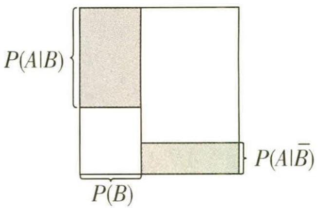

图4-1

$\quad$A. 事件 A 发生的概率  
$\quad$B. 事件 B 发生的概率  
$\quad$C. 在事件 B 不发生的条件下事件 A 发生的概率  
$\quad$D. 事件 $A, B$ 同时发生的概率

解析 因为 $P(\overline{B}) = 1 - P(B)$

故由题图可知阴影部分的面积为

$P (A \mid B) P (B) + P (A \mid B) (1 - P (B))$

【易错提醒】阴影部分由两个矩形组成,表示面积时要注意长与宽的表示形式

$\begin{array}{l} = \frac {P (A B)}{P (B)} \times P (B) + \frac {P (A \bar {B})}{P (\bar {B})} \times P (\bar {B}) \\ = P (A B) + P (A B) \\ = P (A). \\ \end{array}$

【扫除障碍】显然事件AB与AB不能同时发生，故这两个事件是互斥事件。而这两个事件之和 $AB+A\overline{B}$ 就是事件A

故选A.

【极易出错】该题易出现的问题就是误认为 $P(A)=P(A|B)+P(A|\overline{B})$ 而无法得到正确结论.
由条件概率公式可得 $P(A|B)+P(A|\overline{B})=\frac{P(AB)}{P(B)}+\frac{P(A\overline{B})}{P(\overline{B})}$ ; 如果事件 A, B 相互独立, $P(A|B)=P(A|\overline{B})=P(A)$ , 则 $P(A|B)+P(A|\overline{B})=2P(A)$

# 拓展提升

如图4-2所示，该题的矩形被分为四部分，记为 $E, F, M, N$ 四部分.

其中矩形 E 的面积为 $P(B) \cdot P(A \mid B) = P(B) \cdot \frac{P(AB)}{P(B)} = P(AB)$ ，即事件 A, B 同时发生的概率.

矩形 M 的面积为 $P(B) \cdot (1 - P(A \mid B)) = P(B) - P(B) \cdot P(A \mid B) = P(B) - P(B) \cdot \frac{P(AB)}{P(B)} = P(B) - P(AB)$ .

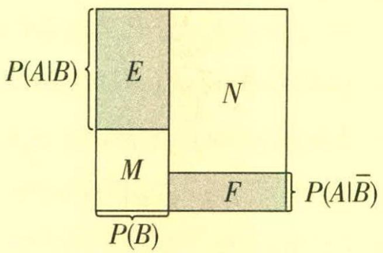

图4-2

矩形 $F$ 的面积为 $(1 - P(B)) \cdot P(A|\overline{B}) = P(\overline{B}) \cdot \frac{P(A\overline{B})}{P(\overline{B})} = P(A\overline{B})$ .

矩形 N 的面积为 $(1 - P(B)) \cdot (1 - P(A \mid \overline{B})) = P(\overline{B}) \cdot (1 - P(A \mid \overline{B})) = P(\overline{B}) - P(\overline{B}) \cdot P(A \mid \overline{B}) = P(\overline{B}) - P(\overline{B}) \cdot \frac{P(A \overline{B})}{P(\overline{B})} = P(\overline{B}) - P(A \overline{B}).$

调研 4 (2022·广东茂名五校联盟考前模拟)某乒乓球训练馆使用的球是 A, B, C 三种不同品牌标准比赛球,以往使用的记录数据如下表.

<table><tr><td>品牌名称</td><td>合格率</td><td>购买球占比</td></tr><tr><td>A</td><td>98%</td><td>0.2</td></tr><tr><td>B</td><td>99%</td><td>0.6</td></tr><tr><td>C</td><td>97%</td><td>0.2</td></tr></table>

若这些球大小、形状一样,在盒子中是均匀混合的,且无区别的标志,现从盒子中随机地取一个球用于训练,则它是合格品的概率为 ( )

$\quad$A. 0.986

$\quad$B. 0.984

$\quad$C. 0.982

$\quad$D. 0.980

思维导引 依据该球取自的品牌种类可分为三个互斥事件,然后利用条件概率公式的变形求解出每个事件的概率,最后求和即可.

解析 将 A, B, C 三种不同品牌分别记为第 1, 第 2, 第 3 个品牌, 设事件 $M_{i}$ 表示 “取到的球是第 i 个品牌 (i = 1, 2, 3)”, 事件 N 表示 “取到的一个球是合格品”, 其中事件 $M_{1}, M_{2}, M_{3}$ 两两互斥.

2013年12月14日，嫦娥三号探测器成功落月，实现我国航天器首次地外天体软着陆，并开展巡视勘察和科学探测。

事件 $N = M_{1}N + M_{2}N + M_{3}N$

【扫清障碍】根据该球的品牌,将所求分解为三个互斥事件,转化为简单事件的概率求解问题

由已知得 $P(N|M_1) = 0.98, P(N|M_2) = 0.99, P(N|M_3) = 0.97, P(M_1) = 0.2,$

【极易出错】A 品牌的合格率实质就是该小球是 A 品牌的条件下合格的概率. 这也是该题易出现的问题, 不能准确理解 A, B, C 品牌的合格率, 导致无法求解所求事件的概率

$P (M _ {2}) = 0. 6, P (M _ {3}) = 0. 2.$

所以 $P(NM_{1}) = P(N|M_{1})P(M_{1}) = 0.98\times 0.2 = 0.196$

【会运用】这里是条件概率公式的变形应用，由 $P(N|M_1) = \frac{P(NM_1)}{P(M_1)}$ 变形可得

$P (N M _ {2}) = P (N \mid M _ {2}) P (M _ {2}) = 0. 9 9 \times 0. 6 = 0. 5 9 4,$

$P (N M _ {3}) = P (N \mid M _ {3}) P (M _ {3}) = 0. 9 7 \times 0. 2 = 0. 1 9 4,$

则 $P(N) = P(NM_{1}) + P(NM_{2}) + P(NM_{3}) = 0.196 + 0.594 + 0.194 = 0.984.$

所以随机取到的一个球是合格品的概率为 0.984. 故选 B.

# 方法总结

# 条件概率性质的活用

条件概率中复杂事件的求解, 可以灵活运用条件概率的相关性质, 转化为彼此互斥的事件或对立事件的概率等求解.

①如果 B 和 C 是两个互斥事件，则 $P(B \cup C \mid A) = P(B \mid A) + P(C \mid A)$ ;  
②设 $\overline{B}$ 与 B 互为对立事件，则 $P(\overline{B}|A)=1-P(B|A)$ ;  
③事件 A 与 B 相互独立时，有 $P(B \mid A) = P(B)$ .

注：如果知道事件 $A$ 的发生会影响事件 $B$ 发生的概率, 那么 $P(B) \neq P(B \mid A)$ .

# 新题演练

##### 1. (2022·江西二模)有甲、乙、丙、丁4名学生志愿者参加北京2022年冬奥会志愿服务,志愿者指挥部随机派这4名志愿者参加冰壶、短道速滑、花样滑冰三个比赛项目的志愿服务,假设每个项目至少安排一名志愿者,且每名志愿者只能参与其中一个项目,则在甲被安排到了冰壶的条件下,乙也被安排到冰壶的概率为 ( )

$\quad$A. $\frac{1}{6}$

$\quad$B. $\frac{1}{4}$

$\quad$C. $\frac{2}{9}$

$\quad$D. $\frac{1}{36}$

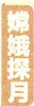

嫦娥四号 2018 年 12 月 8 日,中国在西昌卫星发射中心用长征三号乙运载火箭成功发射嫦娥四号探测器,开启了中国月球探测的新旅程.

##### 2. (2022·山东济南考前模拟预测)(多选)从装有 $a$ 个红球和 $b$ 个蓝球的袋中 $(a, b$ 均不小于 2), 每次不放回地随机摸出一球. 记“第一次摸球时摸到红球”为事件 $A_{1}$ , “第一次摸球时摸到蓝球”为事件 $A_{2}$ , “第二次摸球时摸到红球”为事件 $B_{1}$ , “第二次摸球时摸到蓝球”为事件 $B_{2}$ , 则下列说法正确的是 ( )

$\quad$A. $P(B_{1}) = \frac{a}{a + b}$

$\quad$B. $P(B_{1}|A_{1}) + P(B_{2}|A_{1}) = 1$

$\quad$C. $P(B_{1}) + P(B_{2}) = 1$

$\quad$D. $P(B_{2}|A_{1}) + P(B_{1}|A_{2}) = 1$

##### 3. (2023·福建漳州一中9月开学模拟)某地准备建造一个以水仙花为主题的公园. 在建园期间, 甲、乙、丙三个工作队负责采摘及雕刻水仙花球茎, 雕刻时可能会损坏部分水仙花球茎, 假设水仙花球茎损坏后便不能使用, 无损坏的全部使用. 已知甲、乙、丙工作队所采摘及雕刻的水仙花球茎分别占采摘总量的 $25\%$ , $35\%$ , $40\%$ , 甲、乙、丙工作队采摘及雕刻的水仙花球茎的使用率分别为 0.8, 0.6, 0.75 (水仙花球茎的使用率 = $\frac{\text{能使用的水仙花球茎数}}{\text{采摘的水仙花球茎总数}}$ ).

（1）从采摘及雕刻的水仙花球茎中有放回地随机抽取三次,每次抽取一个,记甲工作队采摘及雕刻的水仙花球茎被抽取到的次数为 $\xi$ ,求随机变量 $\xi$ 的分布列及期望;

（2）已知采摘的某个水仙花球茎经雕刻后能使用,求它是由丙工作队所采摘及雕刻的概率.

# 参考答案与解析

##### 1. A 方法一 (公式法)用事件 $A$ 表示“甲被安排到了冰壶”, 事件 $B$ 表示“乙被安排到了冰壶”. 4 名志愿者参加三个项目, 则根据要求, 将 4 人分为 3 组, 然后进行全排列即可, 不同的安排方法有 $\mathrm{C}_{4}^{2} \mathrm{~A}_{3}^{3}$ 种.

事件 A 可分为两个互斥事件：

①甲一人被安排到了冰壶,不同的安排方法有 $C_{3}^{2}A_{2}^{2}$ 种;  
②甲与另外一人被安排到了冰壶,不同的安排方法有 $C_{3}^{1}A_{2}^{2}$ 种.

所以 $P(A)=\frac{C_{3}^{2}A_{2}^{2}+C_{3}^{1}A_{2}^{2}}{C_{4}^{2}A_{3}^{3}}=\frac{12}{36}=\frac{1}{3}.$

事件 AB 表示“甲被安排到了冰壶,乙也被安排到了冰壶”,不同的安排方法有 $A_{2}^{2}$ 种.

嫦娥四号完成了地月转移、近月制动、环月飞行任务，并开展了月球背面就位探测及巡视探测。

所以 $P(AB)=\frac{A_{2}^{2}}{C_{4}^{2}A_{3}^{3}}=\frac{2}{36}=\frac{1}{18}.$

由条件概率公式可得 $P(B|A)=\frac{P(AB)}{P(A)}=\frac{\frac{1}{18}}{\frac{1}{3}}=\frac{1}{6}$ . 故选 A.

方法二 (转化为古典概型)用事件 A 表示“甲被安排到了冰壶”, 事件 B 表示“乙被安排到了冰壶”, 在甲被安排到了冰壶的条件下, 乙也被安排到冰壶, 就是在事件 A 发生的条件下, 事件 B 发生, 则事件 A 成为样本空间, 事件 B 就是积事件 AB, 包含的样本点数 $n(AB) = A_{2}^{2} = 2$ ,

事件 A 包含的样本点数 $n(A)=C_{3}^{2}A_{2}^{2}+C_{3}^{1}A_{2}^{2}=12$ ,

所以在甲被安排到了冰壶的条件下,乙也被安排到冰壶的概率为 $P(B \mid A) = \frac{n(AB)}{n(A)} = \frac{2}{12} = \frac{1}{6}$ . 故选 A.

##### 2. ABC 由题意可知, $P(A_{1})=\frac{a}{a+b},P(A_{2})=\frac{b}{a+b}$ ,

$P (B _ {1}) = P (A _ {1} B _ {1}) + P (A _ {2} B _ {1}) = \frac {a}{a + b} \cdot \frac {a - 1}{a + b - 1} + \frac {b}{a + b} \cdot \frac {a}{a + b - 1} = \frac {a}{a + b},$

$P \left(B _ {2}\right) = P \left(A _ {1} B _ {2}\right) + P \left(A _ {2} B _ {2}\right) = \frac {a}{a + b} \cdot \frac {b}{a + b - 1} + \frac {b}{a + b} \cdot \frac {b - 1}{a + b - 1} = \frac {b}{a + b},$

从而 $P(B_{1}) + P(B_{2}) = 1$ ，故 AC 正确.

又 $P(B_{1}|A_{1}) = \frac{P(A_{1}B_{1})}{P(A_{1})} = \frac{\frac{a}{a + b}\cdot\frac{a - 1}{a + b - 1}}{\frac{a}{a + b}} = \frac{a - 1}{a + b - 1},$

$P \left(B _ {2} \mid A _ {1}\right) = \frac {P \left(A _ {1} B _ {2}\right)}{P \left(A _ {1}\right)} = \frac {\frac {a}{a + b} \cdot \frac {b}{a + b - 1}}{\frac {a}{a + b}} = \frac {b}{a + b - 1},$

故 $P(B_{1}|A_{1}) + P(B_{2}|A_{1}) = 1$ ，故B正确.

$P (B _ {1} \mid A _ {2}) = \frac {P (A _ {2} B _ {1})}{P (A _ {2})} = \frac {\frac {b}{a + b} \cdot \frac {a}{a + b - 1}}{\frac {b}{a + b}} = \frac {a}{a + b - 1},$

故 $P(B_{2}|A_{1}) + P(B_{1}|A_{2}) = \frac{b}{a + b - 1} +\frac{a}{a + b - 1} = \frac{a + b}{a + b - 1}\neq 1$ ，故D错误.故选ABC.

##### 3. （1） 在采摘及雕刻的水仙花球茎中, 任取一个是由甲工作队采摘及雕刻的概率是 $\frac{1}{4}$ .依题意, $\xi$ 的所有可能取值为0,1,2,3,且 $\xi\sim B(3,\frac{1}{4})$ ,

所以 $P(\xi=k)=\mathrm{C}_{3}^{k}\left(\frac{1}{4}\right)^{k}\left(\frac{3}{4}\right)^{3-k}, k=0,1,2,3,$

所以 $P(\xi=0)=\frac{27}{64}, P(\xi=1)=\frac{27}{64}, P(\xi=2)=\frac{9}{64}, P(\xi=3)=\frac{1}{64}$ ,

所以 $\xi$ 的分布列为

<table><tr><td>ξ</td><td>0</td><td>1</td><td>2</td><td>3</td></tr><tr><td>P</td><td> $\frac{27}{64}$ </td><td> $\frac{27}{64}$ </td><td> $\frac{9}{64}$ </td><td> $\frac{1}{64}$ </td></tr></table>

易得 $E(\xi)=3\times\frac{1}{4}=\frac{3}{4}.$

（2）用 $A_{1}, A_{2}, A_{3}$ 分别表示“水仙花球茎由甲、乙、丙工作队采摘及雕刻”， $B$ 表示“采摘的水仙花球茎经雕刻后能使用”，则 $P(A_{1}) = 0.25, P(A_{2}) = 0.35, P(A_{3}) = 0.4$ ，

$P (B \mid A _ {1}) = 0. 8, P (B \mid A _ {2}) = 0. 6, P (B \mid A _ {3}) = 0. 7 5,$

故 $P(B) = P(BA_{1}) + P(BA_{2}) + P(BA_{3}) = P(A_{1})P(B|A_{1}) + P(A_{2})P(B|A_{2}) +$ $P(A_{3})P(B|A_{3}) = 0.25\times 0.8 + 0.35\times 0.6 + 0.4\times 0.75 = 0.71,$

所以 $P(A_{3}|B) = \frac{P(A_{3}B)}{P(B)} = \frac{P(A_{3})P(B|A_{3})}{P(B)} = \frac{0.3}{0.71} = \frac{30}{71}.$

所以采摘的某个水仙花球茎经雕刻后能使用,它是由丙工作队所采摘及雕刻的概率为 $\frac{30}{71}$ .

嫦娥五号 是负责嫦娥三期工程“采样返回”任务的中国首颗地月采样往返探测器，也是“绕、落、回”中的第三步.

# 超重点 5 全概率公式和贝叶斯公式的应用问题

# 命题角度1 利用全概率公式求复杂事件的概率

调研 1 (2023·福建福清一中、连江一中等校7月联考)(多选)甲箱中有5个红球,2个白球和3个黑球,乙箱中有4个红球,3个白球和3个黑球.先从甲箱中随机取出一球放入乙箱,以 $A_{1},A_{2},A_{3}$ 分别表示事件由甲箱取出的球是红球,白球和黑球;再从乙箱中随机取出一球,以B表示事件由乙箱取出的球是红球.则()

$\quad$A. 事件 $B$ 与事件 $A_{i} (i = 1,2,3)$ 相互独立

$\quad$B. $P(A_{1}B) = \frac{5}{22}$

$\quad$C. $P(B) = \frac{2}{5}$

$\quad$D. $P(A_{2}|B) = \frac{8}{45}$

# 思维导引

<table><tr><td>选项</td><td>思路分析</td></tr><tr><td>A</td><td>分别求出  $P(A_i),P(B),P(A_iB),i=1,2,3$ ,验证  $P(A_iB)=P(A_i)P(B)$  是否成立即可</td></tr><tr><td>B</td><td>利用公式  $P(A_iB)=P(B|A_i)P(A_i)$  判断</td></tr><tr><td>C</td><td>事件 B 的概率,要依据由甲箱中随机取出一球的结果进行分类计算,显然  $B=A_1B+A_2B+A_3B$ ,代入全概率公式求解即可</td></tr><tr><td>D</td><td>所求概率是条件概率,根据 C 选项的计算结果,代入公式计算即可</td></tr></table>

解析 由题意知, $P(A_{1})=\frac{1}{2},P(A_{2})=\frac{1}{5},P(A_{3})=\frac{3}{10}.$

若 $A_{1}$ 发生, 此时乙箱中有 5 个红球, 3 个白球和 3 个黑球, 则 $P(B \mid A_{1}) = \frac{5}{11}$ ;

若 $A_{2}$ 发生, 此时乙箱中有 4 个红球, 4 个白球和 3 个黑球, 则 $P(B \mid A_{2}) = \frac{4}{11}$ ;

若 $A_{3}$ 发生, 此时乙箱中有 4 个红球, 3 个白球和 4 个黑球, 则 $P(B|A_{3}) = \frac{4}{11}$ .

【扫清障碍】甲、乙两箱中都有红、白、黑三种颜色的小球，所以由甲箱中取出一球的颜色

对由乙箱中随机取出一球是红球是有影响的，故应分为三种情况研究

所以 $P(A_{1}B)=P(B|A_{1})P(A_{1})=\frac{5}{11}\times\frac{1}{2}=\frac{5}{22}$ ，故 B 正确.

$P (A _ {2} B) = P (B \mid A _ {2}) P (A _ {2}) = \frac {4}{1 1} \times \frac {1}{5} = \frac {4}{5 5}, P (A _ {3} B) = P (B \mid A _ {3}) P (A _ {3}) = \frac {4}{1 1} \times \frac {3}{1 0} = \frac {6}{5 5},$

则 $P(B) = P(B|A_1)P(A_1) + P(B|A_2)P(A_2) + P(B|A_3)P(A_3) = \frac{9}{22}$ , 故 C 错误.

【扫清障碍】根据前面所求，代入全概率公式求解事件 $B$ 的概率

$P(A_{1})P(B)\neq P(A_{1}B),P(A_{2})P(B)\neq P(A_{2}B),P(A_{3})P(B)\neq P(A_{3}B)$ ，故A错误.

$P(A_{2}|B)=\frac{P(A_{2}B)}{P(B)}=\frac{P(B|A_{2})P(A_{2})}{P(B)}=\frac{8}{45},D$ 正确.故选BD.

【极易出错】事件 $A_{2}$ ，B不是相互独立事件！

# 方法归纳

对于全概率公式 $P(A)=\sum_{i=1}^{n}P(B_{i})P(A|B_{i})(B_{1},B_{2},\cdots,B_{n})$ 是一组两两互斥的事件， $B_{1}\cup B_{2}\cup\cdots\cup B_{n}=\Omega$ 且 $P(B_{i})>0(i=1,2,\cdots,n)$ ，任意事件 $A\subseteq\Omega$ ，通常可以把 $B_{1},B_{2},\cdots,B_{n}$ 看成是 A 发生的一组原因。如若 A 是 “次品”，必是几个车间或几种生产工艺生产了次品；若 A 是 “某种疾病”，必是几种病因导致 A 发生；若 A 表示 “目标被击中”，必有几种方式或几个人打中。在有多种原因能够导致事件发生时，一般要应用全概率公式，将一个复杂事件表示为几个两两互斥的事件的和，进而求解。从本质上讲，全概率公式是加法公式与乘法公式的结合；全概率事件的求解，实质就是依据前提事件的不同情况把该事件分成多个互斥事件之和，所以搞清事件发生的过程是合理分类、准确求解的基础。

调研 2 (2022·重庆八中适应性强化训练/与导数交汇)根据社会人口学研究发现,若一个家庭有 X 个孩子,则 X 的概率分布列如下表所示(取一个家庭有 4 个及以上孩子的概率为 0).

<table><tr><td>X</td><td>1</td><td>2</td><td>3</td><td>0</td></tr><tr><td>P</td><td> $\frac{\alpha }{p}$ </td><td>α</td><td> $\alpha (1-p)$ </td><td> $\alpha (1-p)^2$ </td></tr></table>

其中 $0 < \alpha < p < 1$ . 设每个孩子的性别是男孩和是女孩的概率均为 $\frac{1}{2}$ 且相互独立,事件 $A_{i}$ 表示一个家庭有 $i$ 个孩子 $(i = 0,1,2,3)$ , 事件 $B$ 表示一个家庭的男孩比女孩多 (若某家庭恰有一个男孩, 则该家庭男孩多).

（1） 若 $p = \frac{1}{2}$ , 求 $\alpha$ , 并根据全概率公式 $P(B) = \sum_{i=0}^{3} P(B | A_i) P(A_i)$ , 求 $P(B)$ .

2020年12月17日，嫦娥五号月球采样返回器带回1731克月球样品返回地球，实现了中华民族“九天揽月”的千年梦想，推动人类对月球样品的研究进入“嫦娥时代”。

（2）为了调控未来人口结构,需要对参数 p 进行宏观调控,研究表明 p 的值受到各种因素的影响(例如生育保险的增加,教育、医疗福利的增加等).

(i) 若希望 $P(X=2)$ 增大, 如何调控 p 的值?

(ii) 是否存在 p, 使得 $E(X)=\frac{5}{3}$ ? 请说明理由.

思维导引 （1） 根据概率和为 1 求出 $\alpha$ , 然后求出 $P(B|A_i)(i=0,1,2,3)$ , 再利用公式 $P(B)=\sum_{i=0}^{3}P(B|A_i)P(A_i)$ 即可计算求值. （2）(i) 根据概率和为 1 得到 $\frac{1}{\alpha}$ 与 $p$ 的关系式, 构造函数 $f(p)=p^2-3p+\frac{1}{p}+3,0<p<1$ , 利用导数判断其单调性, 可得到 $\alpha$ 随着 $p$ 的增大而增大, 结合 $P(X=2)=\alpha$ 即可得到结果; (ii) 根据概率和为 1 及 $E(X)=\frac{5}{3}$ 列出关于 $p$ 的方程, 判断方程是否有解即可.

解析 （1） 由题意得 $\frac{\alpha}{p} + \alpha + \alpha(1 - p) + \alpha(1 - p)^2 = 2\alpha + \alpha + \frac{1}{2}\alpha + \frac{1}{4}\alpha = \frac{15}{4}\alpha = 1$

$\therefore \alpha = \frac {4}{1 5}.$

$P (B \mid A _ {0}) = 0, P (B \mid A _ {1}) = \mathrm{C} _ {1} ^ {1} \times \frac {1}{2}, P (B \mid A _ {2}) = \mathrm{C} _ {2} ^ {2} \left(\frac {1}{2}\right) ^ {2}, P (B \mid A _ {3}) = \mathrm{C} _ {3} ^ {2} \left(\frac {1}{2}\right) ^ {3} + \mathrm{C} _ {3} ^ {3} \left(\frac {1}{2}\right) ^ {3},$

由全概率公式得 $P(B) = \sum_{i=0}^{3} P(B \mid A_i) P(A_i) = \frac{\alpha}{2p} + C_2^2\left(\frac{1}{2}\right)^2 \alpha + \left[C_3^2\left(\frac{1}{2}\right)^3 + C_3^3\left(\frac{1}{2}\right)^3\right]\alpha(1-p) = \frac{\alpha}{2p} + \frac{1}{4}\alpha + \frac{1}{2}\alpha(1-p)$ ,

又 $p = \frac{1}{2},\therefore P(B) = \frac{3}{2}\alpha = \frac{2}{5}.$

（2）(i)由 $\frac{\alpha}{p} +\alpha +\alpha (1 - p) + \alpha (1 - p)^2 = 1$ ，得 $\frac{1}{\alpha} = p^2 -3p + \frac{1}{p} +3,$

设函数 $f(p)=p^{2}-3p+\frac{1}{p}+3,0<p<1$ ，则 $f'(p)=\frac{2p^{3}-3p^{2}-1}{p^{2}}$ .

设 $g(p)=2p^{3}-3p^{2}-1,0<p<1$ , 则 $g'(p)=6p^{2}-6p=6p(p-1)<0$

∴ $g(p)$ 在 $(0,1)$ 上单调递减，∴ $g(p) < 2 \times 0^{3} - 3 \times 0^{2} - 1 = -1$ ,

$\therefore g(p)<0$ , 即 $f'(p)<0$ , $\therefore f(p)$ 在 $(0,1)$ 上单调递减,

∴ 增大 p 的值, $\frac{1}{\alpha}$ 会减小, 则 $\alpha$ 会增大, 即 $P(X=2)$ 会增大.

∴ 要使 $P(X=2)$ 增大, 应增大 p 的值.

(ii) 假设存在 $p$ ，使得 $E(X) = \frac{\alpha}{p} + 2\alpha + 3\alpha(1 - p) = \frac{5}{3}$ ，又 $\frac{1}{\alpha} = p^2 - 3p + \frac{1}{p} + 3$

则将上述两式相乘, 可得 $\frac{1}{p} + 5 - 3p = \frac{5p^{2}}{3} - 5p + \frac{5}{3p} + 5$ , 化简得 $5p^{3} - 6p^{2} + 2 = 0$ .

【活学活用】设函数 $h(p) = 5p^{3} - 6p^{2} + 2 (0 < p < 1)$ ，研究函数是否有零点，如果有，则存在满足题意的 $p$ ，否则不存在。有关方程、不等式的问题，要联想到用函数与导数来解决

设 $h(p)=5p^{3}-6p^{2}+2,0<p<1$ , 则 $h'(p)=15p^{2}-12p=3p(5p-4)$

则 $h(p)$ 在 $(0, \frac{4}{5})$ 上单调递减，在 $(\frac{4}{5}, 1)$ 上单调递增，

∴ $h(p)$ 的最小值为 $h(\frac{4}{5}) = \frac{18}{25}, \frac{18}{25} > 0$ ,

∴ 不存在 $p \in (0,1)$ 使得 $h(p)=0$ ，即不存在 p，使得 $E(X)=\frac{5}{3}$ .

# 命题角度2 利用贝叶斯公式求复杂事件的概率

调研 3 (2023·广东广州二中、珠海一中等六校8月联考)(多选)英国数学家贝叶斯在概率论研究方面成就显著,根据贝叶斯统计理论,随机事件A,B存在如下关系: $P(A|B)=\frac{P(A)P(B|A)}{P(B)}$ .某高校有甲、乙两家餐厅,王同学每天都选择两家餐厅中的一家就餐,第一天去甲、乙两家餐厅就餐的概率分别为0.4和0.6.如果他第一天去甲餐厅,那么第二天去甲餐厅的概率为0.6;如果第一天去乙餐厅,那么第二天去甲餐厅的概率为0.5.则王同学()

$\quad$A. 第二天去甲餐厅的概率为 0.54  
$\quad$B. 第二天去乙餐厅的概率为 0.44  
$\quad$C. 第二天去了甲餐厅, 则第一天去乙餐厅的概率为 $\frac{5}{9}$   
$\quad$D. 第二天去了乙餐厅, 则第一天去甲餐厅的概率为 $\frac{4}{9}$

解析 设 $A_{1}$ = “王同学第一天去甲餐厅”, $A_{2}$ = “王同学第二天去甲餐厅”, $B_{1}$ = “王同学第一天去乙餐厅”, $B_{2}$ = “王同学第二天去乙餐厅”,

则 $P(A_{1}) = 0.4, P(B_{1}) = 0.6, P(A_{2} \mid A_{1}) = 0.6, P(A_{2} \mid B_{1}) = 0.5.$

自 2004 年实施至今,中国探月已历时十余年.嫦娥六号、七号、八号,小行星探测,火星取样返回,木星系探测等工程任务也将按计划陆续实施.

由题意得 $P(A_{2}|A_{1}) = \frac{P(A_{2})P(A_{1}|A_{2})}{P(A_{1})} = 0.6, P(A_{2}|B_{1}) = \frac{P(A_{2})P(B_{1}|A_{2})}{P(B_{1})} = 0.5,$

所以 $P(A_{2})P(A_{1}|A_{2})=0.24, P(A_{2})P(B_{1}|A_{2})=0.3$ ①.

易知 $\Omega = A_{1} \cup B_{1}$ , 且 $A_{1}$ 与 $B_{1}$ 互斥, 则由全概率公式得 $P(A_{2}) = P(A_{1})P(A_{2}|A_{1}) + P(B_{1})P(A_{2}|B_{1}) = 0.4 \times 0.6 + 0.6 \times 0.5 = 0.54$ ②, 所以 A 正确.

$P(B_{2})=1-P(A_{2})=0.46$ , B 错误.

【题眼】注意题干“王同学每天都选择两家餐厅中的一家就餐”，故 $P(A_{2})+P(B_{2})=1$

由①②得 $P(B_{1}|A_{2})=\frac{0.3}{P(A_{2})}=\frac{0.3}{0.54}=\frac{5}{9}$ ，C 正确.

$P(A_{1} \mid B_{2}) = \frac{P(A_{1})P(B_{2} \mid A_{1})}{P(B_{2})} = \frac{P(A_{1})[1 - P(A_{2} \mid A_{1})]}{P(B_{2})} = \frac{0.4 \times (1 - 0.6)}{0.46} = \frac{8}{23}$ ，所以D错误.

故选 AC.

调研 4 (2022·江苏扬州期末)数学家贝叶斯发现了如下公式: $P(A_i \mid B) = \frac{P(A_i)P(B \mid A_i)}{\sum_{j=1}^{n} P(A_j)P(B \mid A_j)}$ , 其中 $i = 1, 2, \cdots, n$ , $P(B) = \sum_{j=1}^{n} P(A_j)P(B \mid A_j)$ . 假设甲袋中有 3 个白球和 3 个红球, 乙袋中有 2 个白球和 2 个红球. 现从甲袋中任取 2 个球放入乙袋, 再从乙袋中任取 2 个球. 已知从乙袋中取出的是 2 个红球, 则从甲袋中取出的也是 2 个红球的概率为 ( )

$\quad$A. $\frac{5}{13}$

$\quad$B. $\frac{16}{75}$

$\quad$C. $\frac{3}{8}$

$\quad$D. $\frac{3}{5}$

思维导引 设从甲袋中取出 2 个球, 其中红球的个数为 i 的事件为 $A_{i} (i = 0, 1, 2)$ , 从乙袋中取出 2 个球, 其中红球的个数为 2 的事件为 B, 由贝叶斯公式得所求概率为 $P(A_{2} | B) = \frac{P(A_{2}) P(B | A_{2})}{\sum_{i=0}^{2} P(A_{i}) P(B | A_{i})}$ , 分别求解 i = 0, 1, 2 三种情况时的 $P(A_{i}), P(B | A_{i})$ , 代入公式计算即可.

解析 设从甲袋中取出 2 个球, 其中红球的个数为 i 的事件为 $A_{i} (i = 0, 1, 2)$ , 从乙袋中取出 2 个球, 其中红球的个数为 2 的事件为 B.

当 i=0 时,从乙袋中取球,乙袋中有4个白球、2个红球,

则 $P(A_0) = \frac{C_3^2C_3^0}{C_6^2} = \frac{1}{5}, P(B|A_0) = \frac{C_2^2C_4^0}{C_6^2} = \frac{1}{15}.$

当 i=1 时,从乙袋中取球,乙袋中有3个白球、3个红球,

则 $P(A_{1}) = \frac{\mathrm{C}_{3}^{1}\mathrm{C}_{3}^{1}}{\mathrm{C}_{6}^{2}} = \frac{3}{5}, P(B|A_{1}) = \frac{\mathrm{C}_{3}^{2}\mathrm{C}_{3}^{0}}{\mathrm{C}_{6}^{2}} = \frac{1}{5}.$

当 i=2 时,从乙袋中取球,乙袋中有 2 个白球、4 个红球,

则 $P(A_{2}) = \frac{C_{3}^{0}C_{3}^{2}}{C_{6}^{2}} = \frac{1}{5}, P(B|A_{2}) = \frac{C_{4}^{2}C_{2}^{0}}{C_{6}^{2}} = \frac{2}{5}.$

由贝叶斯公式可得 $P(A_{2}|B) = \frac{P(A_{2})P(B|A_{2})}{P(A_{0})P(B|A_{0}) + P(A_{1})P(B|A_{1}) + P(A_{2})P(B|A_{2})} =$ $\frac{\frac{1}{5}\times\frac{2}{5}}{\frac{1}{5}\times\frac{1}{15} + \frac{3}{5}\times\frac{1}{5} + \frac{1}{5}\times\frac{2}{5}} = \frac{3}{8}.$ 故选C.

【方法总结】贝叶斯公式实质就是全概率公式的一个拓展应用，以某事件是否发生为前提，只需高清题意，明确事件的属性与关联，把相关的概率值代入公式求解即可

# 新题演练

(2023·福州八中7月检测)设验血诊析某种疾病的误诊率为 $5\%$ , 即若用 $A$ 表示验血为阳性, $B$ 表示受验者患病, 则 $P(\overline{A} | B) = P(A | \overline{B}) = 0.05$ . 若已知受检人群中有 $0.5\%$ 的人患此病, 即 $P(B) = 0.005$ , 则一个验血为阳性的人确患此病的概率为 \_\_\_\_.

# 参考答案与解析

$\frac{19}{218}$ 由题意, 可得 $P(B|A)=\frac{P(AB)}{P(A)}, P(A|B)=0.95, P(\overline{B})=0.995.$

易知事件 AB 表示从受检人群中随机抽取一人, 此人患病且验血为阳性, 则 $P(AB) = P(B)P(A \mid B)$ .

由全概率公式可得 $P(A)=P(B)P(A|B)+P(\overline{B})P(A|\overline{B})$ .

【活学活用】全概率公式也有以下常用形式： $P(A)=P(B)P(A|B)+P(\overline{B})P(A|\overline{B})(B\cup\overline{B}=\Omega$ 且 $0 < P(B) \leq 1, A \subseteq \Omega)$

所以 $P(B|A) = \frac{P(B)P(A|B)}{P(B)P(A|B) + P(\bar{B})P(A|\bar{B})} = \frac{0.005\times 0.95}{0.005\times 0.95 + 0.995\times 0.05} = \frac{19}{218}.$

如果韩信当时看到的三次列队,最后一行的士兵人数分别是2,2,4,并知道这队士兵的人数在三百到四百之间,你能推算出这队士兵的准确人数吗?(答案:347)

# 超重点 6 回归分析与独立性检验

# 命题角度1 线性回归分析与非线性回归分析

调研 1 (2023·湖北省荆荆宜三校8月联考/大学生自主创业)近年来,我国大学生毕业人数呈逐年上升趋势,各省市出台优惠政策鼓励高校毕业生自主创业,以创业带动就业.某市统计了该市其中四所大学2022年毕业生人数及自主创业人数(单位:千人),得到下表:

<table><tr><td></td><td>A 大学</td><td>B 大学</td><td>C 大学</td><td>D 大学</td></tr><tr><td>2022 年毕业生人数 x/千人</td><td>3</td><td>4</td><td>5</td><td>6</td></tr><tr><td>自主创业人数 y/千人</td><td>0.1</td><td>0.2</td><td>0.4</td><td>0.5</td></tr></table>

（1） 已知 y 与 x 具有较强的线性相关关系, 求 y 关于 x 的线性回归方程 $\hat{y} = \hat{a} + \hat{b}x$ .

（2） 假设该市政府对选择自主创业的大学生每人发放 1 万元的创业补贴.

(i) 若该市 E 大学 2022 年毕业生人数为 7 千人, 根据（1）的结论估计该市政府要给 E 大学选择自主创业的毕业生发放创业补贴的总金额;

(ii) 若 A 大学的毕业生中小明、小红选择自主创业的概率分别为 p, 2p - 1 ( $\frac{1}{2} < p < 1$ ), 该市政府对小明、小红两人的自主创业的补贴总金额的期望不超过 1.4 万元, 求 p 的取值范围.

参考公式及参考数据: $\hat{b} = \frac{\sum_{i=1}^{n}(x_i - \bar{x})(y_i - \bar{y})}{\sum_{i=1}^{n}(x_i - \bar{x})^2}, \hat{a} = \bar{y} - \hat{b}\bar{x}, \sum_{i=1}^{4}x_i y_i = 6.1, \sum_{i=1}^{4}x_i^2 = 86.$

解析 （1） 由题意得 $\bar{x} = \frac{3 + 4 + 5 + 6}{4} = 4.5, \bar{y} = \frac{0.1 + 0.2 + 0.4 + 0.5}{4} = 0.3, \hat{b} =$ $\frac{\sum_{i=1}^{4} x_i y_i - 4\bar{x}\bar{y}}{\sum_{i=1}^{4} x_i^2 - 4\bar{x}^2} = \frac{6.1 - 4 \times 4.5 \times 0.3}{86 - 4 \times 4.5^2} = 0.14,$

【必记结论】把题目所附的参考公式 $\hat{b} = \frac{\sum_{i=1}^{n}(x_i - \bar{x})(y_i - \bar{y})}{\sum_{i=1}^{n}(x_i - \bar{x})^2}$ 转化为 $\hat{b} = \frac{\sum_{i=1}^{n}x_iy_i - n\bar{x}\bar{y}}{\sum_{i=1}^{n}x_i^2 - n\bar{x}^2}$ ，即可利用

题目所附的参考数据，求出回归直线的斜率 $\hat{b}$

所以 $\hat{a}=\bar{y}-\hat{b}\bar{x}=0.3-0.14\times4.5=-0.33.$

【扫清障碍】划用公式 $\hat{a} = \bar{y} - \hat{b}\bar{x}$ ，求出回归直线的截距 $\hat{a}$

故 y 关于 x 的线性回归方程为 $\hat{y}=0.14x-0.33$ .

【极易出错】把 $\hat{a}$ ， $\hat{b}$ 代入线性回归方程中，不等代错位置

（2）(i) 将 x=7 代入得, $\hat{y}=0.14\times7-0.33=0.65$ ,

所以估计该市政府需要给 E 大学毕业生选择自主创业的毕业生发放创业补贴的总金额为 $0.65 \times 1000 \times 1 = 650$ (万元).

(ii) 设小明、小红两人中选择自主创业的人数为 X, 则 X 的所有可能取值为 0, 1, 2,

$P (X = 0) = (1 - p) (2 - 2 p) = 2 p ^ {2} - 4 p + 2,$

$P (X = 1) = (1 - p) (2 p - 1) + p (2 - 2 p) = - 4 p ^ {2} + 5 p - 1,$

$P (X = 2) = p (2 p - 1) = 2 p ^ {2} - p,$

则 $E(X)=(2p^{2}-4p+2)\times0+(-4p^{2}+5p-1)\times1+(2p^{2}-p)\times2=3p-1\leqslant1.4,p\leqslant\frac{4}{5}.$

因为 $\frac{1}{2}<p<1$ ，所以 $\frac{1}{2}<p\leqslant\frac{4}{5}$ ，故p的取值范围为 $(\frac{1}{2},\frac{4}{5}]$ .

调研 2 (2023·河南商丘一中7月质量检测/5G网络)5G网络是指第五代移动通信网络,它的主要特点是传输速度快,峰值传输速度可达每秒钟数十GB.作为新一代移动通信技术,它将要支持的设备远不止智能手机,而是会扩展到未来的智能家居,智能穿戴等设备.某科技创新公司基于领先技术的支持,经济收入在短期内逐月攀升,该公司1月份至6月份的经济收入y(单位:万元)关于月份x的数据如下表,并根据数据绘制了如图6-1所示的散点图.

<table><tr><td>月份x</td><td>1</td><td>2</td><td>3</td><td>4</td><td>5</td><td>6</td></tr><tr><td>收入y/万元</td><td>6</td><td>11</td><td>23</td><td>37</td><td>72</td><td>124</td></tr></table>

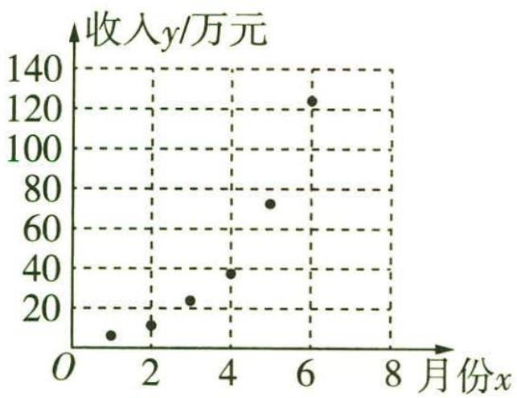

图6-1

甲记得前两个数字是相同的,乙记得后两个数字是相同的,丙说:“肯定是四位数,并且恰好是一个整数的平方.”你知道正确的牌照号码吗?(答案:7 744)

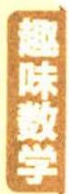

（1）根据散点图判断, $y = ax + b$ 与 $y = ce^{dx} (a, b, c, d$ 均为常数)哪一个更适合作为经济收入 $y$ 关于月份 $x$ 的回归方程类型(给出判断即可,不必说明理由)?

（2）根据（1）的结果及表中数据,求出 y 关于 x 的回归方程(结果保留两位小数).  
（3） 根据（2）所求得的回归方程, 预测该公司7月份的经济收入(结果保留两位小数).

参考公式及参考数据: 回归直线 $\hat{y} = \hat{b}x + \hat{a}$ 中斜率和截距的最小二乘估计公式为

$\hat {b} = \frac {\sum_ {i = 1} ^ {n} \left(x _ {i} - \bar {x}\right) \left(y _ {i} - \bar {y}\right)}{\sum_ {i = 1} ^ {n} \left(x _ {i} - \bar {x}\right) ^ {2}} = \frac {\sum_ {i = 1} ^ {n} x _ {i} y _ {i} - n \bar {x} \bar {y}}{\sum_ {i = 1} ^ {n} x _ {i} ^ {2} - n \bar {x} ^ {2}}, \hat {a} = \bar {y} - \hat {b} \bar {x}.$

<table><tr><td> $\bar{x}$ </td><td> $\bar{y}$ </td><td> $\bar{u}$ </td><td> $\sum_{i=1}^{6}(x_i - \bar{x})^2$ </td><td> $\sum_{i=1}^{6}(x_i - \bar{x})(y_i - \bar{y})$ </td><td> $\sum_{i=1}^{6}(x_i - \bar{x})(u_i - \bar{u})$ </td><td> $e^{5.48}$ </td></tr><tr><td>3.5</td><td>45.5</td><td>3.34</td><td>17.5</td><td>393.5</td><td>10.63</td><td>239.85</td></tr></table>

其中 $u = \ln y, u_{i} = \ln y_{i} (i = 1, 2, 3, 4, 5, 6)$ .

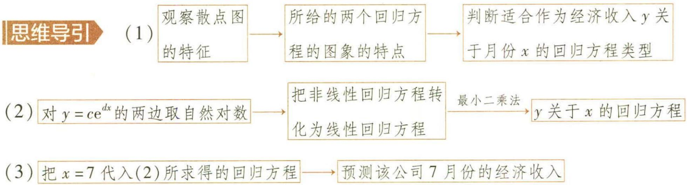

解析 （1） 由散点图可知, $y = c \mathrm{e}^{dx}$ 更适合作为经济收入 $y$ 关于月份 $x$ 的回归方程类型.

（2） 由 $y = ce^{dx}$ ，得 $\ln y = \ln c + dx$ ，即 $u = \ln c + dx$ .

【小技巧】两边取以 $e$ 为底的对数,将非线性回归方程转化为线性回归方程,有时也可以取倒数

因为 $\bar{x} = 3.5, \bar{u} = 3.34, \sum_{i=1}^{6}(x_i - \bar{x})^2 = 17.5, \sum_{i=1}^{6}(x_i - \bar{x})(u_i - \bar{u}) = 10.63$ ,

所以 $\hat{d} = \frac{\sum_{i=1}^{6}(x_i - \bar{x})(u_i - \bar{u})}{\sum_{i=1}^{6}(x_i - \bar{x})^2} = \frac{10.63}{17.5}\approx 0.61$

所以 $\ln \hat{c} = \bar{u} -\hat{d}\bar{x} = 3.34 - 0.61\times 3.5 = 1.205\approx 1.21$ ，所以 $c = \mathrm{e}^{1.21}$ 所以经济收入 y 关于月份 x 的回归方程为 $\hat{y} = e^{1.21 + 0.61x}$ .

（3） 当 x=7 时, $\hat{y}=e^{1.21+0.61\times7}=e^{5.48}\approx239.85$ (万元).

【极易出错】注意把 $x = 7$ 代入非线性回归方程中,不要误代入线性回归方程中

所以预测该公司7月份的经济收入约为239.85万元.

# 规律总结

<table><tr><td>非线性回归方程</td><td>变换公式</td><td>变换后的线性回归方程</td></tr><tr><td> $y = ax^{b} (a > 0, b \neq 0)$ </td><td> $c = \ln a$  $v = \ln x$  $u = \ln y$ </td><td> $u = c + bv$ </td></tr><tr><td> $y = ae^{bx} (a > 0, b \neq 0)$ </td><td> $c = \ln a$  $u = \ln y$ </td><td> $u = c + bx$ </td></tr><tr><td> $y = ae^{\frac{b}{x}} (a > 0, b \neq 0)$ </td><td> $c = \ln a$  $v = \frac{1}{x}$  $u = \ln y$ </td><td> $u = c + bv$ </td></tr><tr><td> $y = a + b\ln x (b \neq 0)$ </td><td> $v = \ln x$ </td><td> $y = a + bv$ </td></tr></table>

# 命题角度2》独立性检验

调研 3 (2023·曲靖一中7月检测)为推行“新课堂”教学法,某化学老师分别用传统教学和“新课堂”两种不同的教学方式,在甲、乙两个平行班级进行教学实验.为了比较教学效果,期中考试后,分别从两个班级中各随机抽取20名学生的成绩进行统计,结果如下表.记成绩不低于70分的为“成绩优良”.

<table><tr><td>分数</td><td>[50,60)</td><td>[60,70)</td><td>[70,80)</td><td>[80,90)</td><td>[90,100]</td></tr><tr><td>甲班频数</td><td>5</td><td>6</td><td>4</td><td>4</td><td>1</td></tr><tr><td>乙班频数</td><td>1</td><td>3</td><td>6</td><td>5</td><td>5</td></tr></table>

（1）由以上统计数据填写下面 $2 \times 2$ 列联表,并判断能否依据小概率值 $\alpha = 0.05$ 的 $\chi^2$ 的独立性检验认为“成绩优良与教学方式有关”.

(答案:一位邻居将自己的1匹马借给三兄弟,这样就有12匹马,然后按照二分之一、四分之一、六分之一的比值分配,这样老大、老二、老三分别分得6匹马、3匹马、2匹马,余下的1匹马仍还给邻居)

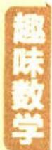

<table><tr><td></td><td>甲班</td><td>乙班</td><td>总计</td></tr><tr><td>成绩优良</td><td></td><td></td><td></td></tr><tr><td>成绩不优良</td><td></td><td></td><td></td></tr><tr><td>总计</td><td></td><td></td><td></td></tr></table>

（2） 现从上述 40 人中, 学校按成绩是否优良采用分层抽样的方法抽取 8 人进行考核. 在这 8 人中, 记乙班成绩不优良的人数为 $X$ , 求 $X$ 的分布列及数学期望.

附： $\chi^2 = \frac{n(ad - bc)^2}{(a + b)(c + d)(a + c)(b + d)}$ ，其中 $n = a + b + c + d.$

临界值表:

<table><tr><td> $\alpha$ </td><td>0.10</td><td>0.05</td><td>0.010</td><td>0.005</td></tr><tr><td> $x_{\alpha}$ </td><td>2.706</td><td>3.841</td><td>6.635</td><td>7.879</td></tr></table>

# 思维导引

（1） 完善 $2 \times 2$ 列联表 → 作出零假设 → 计算 $\chi^{2}$ 的值 → 对照临界值表

与 3.841 进行比较 → 作出判断

（2） 利用分层抽样的抽样比 → 8人中成绩不优良的人数 → 判断X的所有可能的取值 →

分别计算 X 为 0,1,2,3 时对应的概率 $\rightarrow$ X 的分布列 $\rightarrow$ X 的数学期望

# 解析

（1）由题意,列联表如下:

<table><tr><td></td><td>甲班</td><td>乙班</td><td>总计</td></tr><tr><td>成绩优良</td><td>9</td><td>16</td><td>25</td></tr><tr><td>成绩不优良</td><td>11</td><td>4</td><td>15</td></tr><tr><td>总计</td><td>20</td><td>20</td><td>40</td></tr></table>

零假设为 $H_{0}$ : 成绩优良与教学方式无关,

【扫清障碍】设两个分类变量 $X$ 与 $Y$ 无关, 这一步不能有哦!

由列联表计算可得 $\chi^2 = \frac{40\times(9\times 4 - 16\times 11)^2}{25\times 15\times 20\times 20}\approx 5.227 > 3.841$

【小技巧】求 ${\chi }^{2}$ 的值时,常会遇到较大数据,此时需注意约去分子、分母的公因数,从而可

# 快速获得结果

依据独立性检验,有充分证据推断 $H_{0}$ 不成立,即依据小概率值 $\alpha = 0.05$ 的 $\chi^{2}$ 的独立性检验,可以认为“成绩优良与教学方式有关”.

（2）由（1）知,8人中成绩不优良的人数为 $8\times\frac{15}{40}=3$ ,则X的可能取值为0,1,2,3. $P(X=0)=\frac{C_{11}^{3}}{C_{15}^{3}}=\frac{33}{91},P(X=1)=\frac{C_{11}^{2}C_{4}^{1}}{C_{15}^{3}}=\frac{44}{91},P(X=2)=\frac{C_{11}^{1}C_{4}^{2}}{C_{15}^{3}}=\frac{66}{455},P(X=3)=\frac{C_{4}^{3}}{C_{15}^{3}}=\frac{4}{455}.$

所以 $X$ 的分布列为

<table><tr><td>X</td><td>0</td><td>1</td><td>2</td><td>3</td></tr><tr><td>P</td><td>33/91</td><td>44/91</td><td>66/455</td><td>4/455</td></tr></table>

方法一 所以 $E(X)=0\times\frac{33}{91}+1\times\frac{44}{91}+2\times\frac{66}{455}+3\times\frac{4}{455}=\frac{4}{5}$ .

方法二 因为 X 服从超几何分布 $H(15,4,3)$ ，所以 $E(X)=\frac{4\times3}{15}=\frac{4}{5}$ .

【用公式】利用超几何分布的期望公式,快速求出离散型随机变量的数学期望

调研 4 (2022·河北衡水中学考前冲刺)某种疾病可分为 A, B 两种类型. 为了解该疾病的类型与患者性别是否相关, 在某地区随机抽取了若干名该疾病的患者进行调查, 发现女性患者总人数是男性患者总人数的 2 倍, 男性患 A 型疾病的人数占男性患者总人数的 $\frac{5}{6}$ , 女性患 A 型疾病的人数占女性患者总人数的 $\frac{1}{3}$ .

（1）若本次调查得出“依据小概率值 $\alpha = 0.005$ 的 $\chi^{2}$ 独立性检验,认为所患疾病类型与性别有关”的结论,求被调查的男性患者至少有多少人.

（2）某团队进行预防 A 型疾病的疫苗的研发试验,试验期间至多安排 2 个周期接种疫苗,每人每个周期接种 3 次,每次接种费用为 $m(m>0)$ 元.该团队研发的疫苗每次接种后产生抗体的概率为 $p(0<p<1)$ ,如果一个周期内至少 2 次产生抗体,则该周期结束后终止试验,否则进入第二个周期.若 $p=\frac{2}{3}$ ,试验人数为 1000,试估计该试验用于

(答案:先把三只兔子放到一起来称,然后取出要售出的那只,称剩余的两只兔子,两次称量之后算差即可)

接种疫苗的总费用.

附: $\chi^{2}=\frac{n(ad-bc)^{2}}{(a+b)(c+d)(a+c)(b+d)}$ ,其中 $n=a+b+c+d$ .

<table><tr><td> $\alpha$ </td><td>0.10</td><td>0.05</td><td>0.01</td><td>0.005</td><td>0.001</td></tr><tr><td> $x_{\alpha}$ </td><td>2.706</td><td>3.841</td><td>6.635</td><td>7.879</td><td>10.828</td></tr></table>

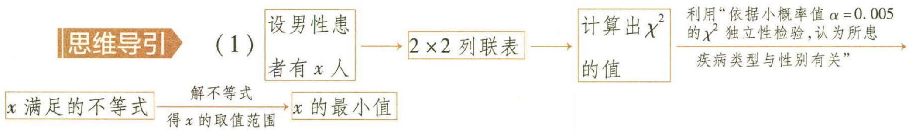

（2） 设该试验每人的接种费用为 $\xi$ 元 → $\xi$ 的所有可能取值 → $\xi$ 取各个值时对应的概率 → $E(\xi)$ 试验人数为1000 估计该试验用于接种疫苗的总费用

解析 （1） 设男性患者有 $x$ 人, 则女性患者有 $2x$ 人, 由题意得 $2 \times 2$ 列联表如下:

<table><tr><td></td><td>A型疾病</td><td>B型疾病</td><td>合计</td></tr><tr><td>男性患者</td><td>5x/6</td><td>x/6</td><td>x</td></tr><tr><td>女性患者</td><td>2x/3</td><td>4x/3</td><td>2x</td></tr><tr><td>合计</td><td>3x/2</td><td>3x/2</td><td>3x</td></tr></table>

零假设 $H_{0}$ : 患者所患疾病类型与性别之间无关联,

根据列联表中的数据可得 $\chi^2 = \frac{3x\left(\frac{5x}{6} \cdot \frac{4x}{3} - \frac{x}{6} \cdot \frac{2x}{3}\right)^2}{\frac{3x}{2} \cdot \frac{3x}{2} \cdot 2x \cdot x} = \frac{2x}{3},$

要使依据小概率值 $\alpha = 0.005$ 的 $\chi^2$ 独立性检验可以认为所患疾病类型与性别有关，

则 $\frac{2x}{3}>7.879$ , 解得 x>11.8185,

【扫清障碍】观察临界值表，寻找 $\alpha=0.005$ 所对应的临界值为 7.879，得 x 满足的不等式

因为 $\frac{x}{6} \in \mathbb{N}, \frac{x}{3} \in \mathbb{N}$ , 所以 $x$ 的最小整数值为 12,

所以被调查的男性患者至少有12人.

（2）设该试验每人的接种费用为 $\xi$ 元, 则 $\xi$ 的可能取值为 $3m, 6m$ .

则 $P(\xi = 3m) = C_3^2 p^2 (1 - p) + p^3 = -2p^3 +3p^2,P(\xi = 6m) = 1 - P(\xi = 3m) = 1 + 2p^3 -3p^2,$

所以 $E(\xi)=3m\cdot(-2p^{3}+3p^{2})+6m\cdot(1+2p^{3}-3p^{2})=3m(2p^{3}-3p^{2}+2)$ ,

【极易出错】因为随机变量 $\xi$ 的取值与服从两点分布的随机变量的取值是不一样的，此概率分布不要误以为是两点分布，导致误得 $E(\xi)=1\times p=p$

因为 $p=\frac{2}{3}$ ，试验人数为 1000，所以该试验用于接种疫苗的总费用为 $1000E(\xi)$ ，

即 $1\ 000 \times 3m\left[2 \times \left(\frac{2}{3}\right)^{3} - 3 \times \left(\frac{2}{3}\right)^{2} + 2\right] = \frac{34\ 000}{9}m$ (元).

故该试验用于接种疫苗的总费用为 $\frac{34\ 000}{9}m$ 元.

# 新题演练

##### 1. (2023·广西师大附中7月检测)我国机床行业核心零部件对外依存度较高,我国整机配套的中高档功能部件大量依赖进口,根据中国机床工具工业协会的数据,国内高档系统自给率不到 $10\%$ ,约 $90\%$ 依赖进口.因此,迅速提高国产数控机床功能部件的制造水平,加快国产数控机床功能部件产业化进程至关重要.通过对某机械上市公司近几年的年报公布的研发费用 $x$ (单位:亿元)与产品的直接收益 $y$ (单位:亿元)的数据进行统计,得到下表:

<table><tr><td>年份</td><td>2015</td><td>2016</td><td>2017</td><td>2018</td><td>2019</td><td>2020</td><td>2021</td></tr><tr><td>x/亿元</td><td>2</td><td>3</td><td>4</td><td>6</td><td>8</td><td>10</td><td>13</td></tr><tr><td>y/亿元</td><td>15</td><td>22</td><td>27</td><td>40</td><td>48</td><td>54</td><td>60</td></tr></table>

根据数据,可建立 y 关于 x 的两个回归模型: 模型①, $\hat{y} = 4.1x + 10.9$ ; 模型②, $\hat{y} = 21.3\sqrt{x} - 14.4$ .

（1）根据表格中的数据,分别求出模型①,②的相关指数 $R^{2}$ 的大小(结果保留三位小数).

（2）(i)根据（1）选择拟合精度更高、更可靠的模型；

(ii) 若 2022 年该公司计划投入研发费用 17 亿元, 使用 (i) 中的模型预测可为该公司带来多少直接收益.

<table><tr><td>回归模型</td><td>模型1</td><td>模型2</td></tr><tr><td> $\sum_{i=1}^{7}\left(y_i-\hat{y}_i\right)^2$ </td><td>79.13</td><td>18.64</td></tr></table>

附： $R^2 = 1 - \frac{\sum_{i=1}^{n}(y_i - \hat{y}_i)^2}{\sum_{i=1}^{n}(y_i - \bar{y})^2},\sqrt{17}\approx 4.1.$

##### 2. (2023·安徽黄山一中7月检测改编)北京时间2022年9月2日,经过约6小时的出舱活动,神舟十四号航天员陈冬、刘洋、蔡旭哲密切协同,完成出舱活动期间全部既定任务,陈冬、刘洋已安全返回问天实验舱,出舱活动取得圆满成功.为了了解某学校学生对此新闻事件的关注程度,从该校随机抽取了200名学生进行分析,得到 $2 \times 2$ 列联表如下:

<table><tr><td></td><td>关注</td><td>不关注</td><td>总计</td></tr><tr><td>男</td><td>90</td><td>30</td><td>120</td></tr><tr><td>女</td><td>30</td><td>50</td><td>80</td></tr><tr><td>总计</td><td>120</td><td>80</td><td>200</td></tr></table>

（1） 利用以上数据, 判断能否依据小概率值 $\alpha = 0.025$ 的 $\chi^2$ 独立性检验认为关注此新闻与性别有关.  
（2） 将此样本频率视为总体的概率,从该校随机抽取 4 名男生,记这 4 人中不关注此新闻的人数为 $Y$ , 求随机变量 $Y = 2$ 时的概率和随机变量 $Y$ 的数学期望 $E(Y)$ .

附: $\chi^{2}=\frac{n(ad-bc)^{2}}{(a+b)(c+d)(a+c)(b+d)}$ ,其中 $n=a+b+c+d$ .

<table><tr><td> $\alpha$ </td><td>0.15</td><td>0.10</td><td>0.05</td><td>0.025</td></tr><tr><td> $x_{\alpha}$ </td><td>2.072</td><td>2.706</td><td>3.841</td><td>5.024</td></tr></table>

# 参考答案与解析

##### 1. （1） 因为 $\bar{y} = \frac{15 + 22 + 27 + 40 + 48 + 54 + 60}{7} = 38$ ,

所以 $\sum_{i=1}^{7}(y_i - \bar{y})^2 = 23^2 + 16^2 + 11^2 + 2^2 + 10^2 + 16^2 + 22^2 = 1\ 750$

则模型①的相关指数 $R_{1}^{2}=1-\frac{\sum\limits_{i=1}^{7}\left(y_{i}-\hat{y}_{i}\right)^{2}}{\sum\limits_{i=1}^{7}\left(y_{i}-\bar{y}\right)^{2}}=1-\frac{79.13}{1750}\approx0.955$

模型②的相关指数 $R_{2}^{2}=1-\frac{\sum\limits_{i=1}^{7}\left(y_{i}-\hat{y}_{i}\right)^{2}}{\sum\limits_{i=1}^{7}\left(y_{i}-\bar{y}\right)^{2}}=1-\frac{18.64}{1750}\approx0.989.$

（2）(i)由（1）知, $R_{1}^{2}<R_{2}^{2}$ ,所以模型②的拟合精度更高、更可靠.

【扫清障碍】注意相关指数指向模型拟合效果好坏，对非线性回归模型也可以用相关指数进行判断；而相关系数只判断线性回归两变量相关性的强弱

(ii)由回归方程 $\hat{y} = 21.3\sqrt{x} - 14.4$ ，可得当 $x = 17$ 时， $\hat{y} = 21.3 \times \sqrt{17} - 14.4 \approx 21.3 \times 4.1 - 14.4 = 72.93$ （亿元），

所以若 2022 年该公司计划投入研发费用 17 亿元, 预测大约为该公司带来 72.93 亿元的直接收益.

##### 2. （1）零假设 $H_{0}$ : 假设关注此新闻与性别相互独立,

【扫清障碍】也可以假设关注此新闻与性别无关

根据列联表数据, 得 $\chi^{2}=\frac{200\times(90\times50-30\times30)^{2}}{120\times80\times120\times80}=\frac{225}{8}=28.125>5.024$ ,

所以根据独立性检验,可以认为零假设 $H_{0}$ 不成立,

即可以依据小概率值 $\alpha=0.025$ 的 $\chi^{2}$ 独立性检验认为关注此新闻与性别有关.

（2）由题意,男生不关注此新闻的频率为 $\frac{30}{120}=\frac{1}{4}$ ,将频率视为概率,每个男生不关注此新闻的概率为 $\frac{1}{4}$ ,因为每次抽取的结果是相互独立的,所以 $Y\sim B(4,\frac{1}{4})$ ,

【辨析比较】注意本题是二项分布，每次试验中事件发生的概率是相同的，不要与超几何分布高混，注意它们的本质区别

所以 $P(Y=k)=\mathrm{C}_{4}^{k}\left(\frac{1}{4}\right)^{k}\left(1-\frac{1}{4}\right)^{4-k}, k=0,1,2,3,4,$

所以 $P(Y = 2) = \mathrm{C}_4^2 (\frac{1}{4})^2 (1 - \frac{1}{4})^{4 - 2} = \frac{27}{128}, E(Y) = 4 \times \frac{1}{4} = 1.$

于是蚂蚁们又回去搬救兵,每只蚂蚁又叫来10个救兵,但仍然抬不动.蚂蚁们再回去,每只蚂蚁又叫来10个同伴,这一次,终于把大面包抬回洞里了.抬这块面包的蚂蚁一共有多少只?(答案:14 641 只)

# 模型应用篇

# 超重点7 排列与组合问题的四大常考模型

# 模型1》有特殊限制条件优先考虑

调研 1 (2023·安徽黄山屯溪一中7月测试)某校从8名青年教师中选派4名分别作为四个学生社团的指导教师,每个社团各派去1名教师,8名教师中,甲和乙不能同时参加,甲和丙只能都参加或都不参加,则不同的选派方案有 ( )

$\quad$A. 360 种

$\quad$B. 480 种

$\quad$C. 600 种

$\quad$D. 720 种

# 思维导引

甲和乙不能同时参加,甲和丙只能都参加或都不参加

根据甲、乙是否参加分
三类情况讨论

对各类情况先选元再分配

利用分类加法计数原理

不同的选派方案种数

# 解析 可分三类情况：

【会分类】有限制条件的排列组合问题一般是采用优光法来解决，依题目限制条件，先进行分类，如本例，依题设条件对甲、乙是否参加分三类研究

第一类,甲参加,乙不参加,丙参加,此时有 $C_{5}^{2} \cdot A_{4}^{4} = 240$ (种)不同的选派方案;

【会思考】在各类情况中, 光排有限制条件的元素, 再排其他元素, 从而利用分步乘法计数原理求出各类的种数, 如本类情况只需从剩余 5 人中选出 2 人, 再分配即可

第二类,甲和乙都不参加,丙不参加,此时有 $C_{5}^{4} \cdot A_{4}^{4} = 120$ (种)不同的选派方案;

【会思考】只需从剩余5人中选出4人，再分配即可

第三类,甲不参加,乙参加,丙不参加,此时有 $C_{5}^{3} \cdot A_{4}^{4} = 240$ (种) 不同的选派方案.

【会思考】只需从剩余5人中选出3人，再分配即可

根据分类加法计数原理,共有 $240 + 120 + 240 = 600$ (种) 不同的选派方案. 故选 C.

# 模型2 “相邻”与“不相邻”问题

调研 2 (2022·新高考Ⅱ卷)甲、乙、丙、丁、戊5名同学站成一排参加文艺汇演,若甲不站在两端,丙和丁相邻,则不同的排列方式共有 ( )

相邻元素用捆绑法，限制位置（甲的位置）用插空法

$\quad$A. 12 种

$\quad$B. 24 种

$\quad$C. 36 种

$\quad$D. 48 种

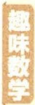

返回原地问题 一个人从点 M 步行出发,前进 20 米后向右转 15 度,再前进 20 米,又向右转 15 度……照这样走下去,他能不能回到 M 点?如果能,他回到 M 点时,一共走了多少米?(答案:能,一共走了 480 米)

关注微信公众号“初高教辅站”获取更多初高中教辅资料

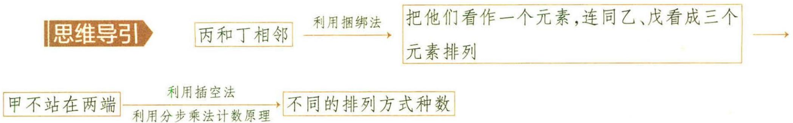

# 解析 可分两步：

第一步,因为丙和丁相邻,先把丙和丁捆绑,看作一个元素,再连同乙、戊看成三个

【小技巧】求解相邻问题的关键：一是“定元”，确定要求相邻的元素；二是“捆绑”，光将相邻的元素进行排列，然后将其捆绑在一起作为一个整体（当作一个元素）处理元素排列，有 $A_{2}^{2}A_{3}^{3}$ 种排列方式；

第二步,为使甲不在两端,只需甲在此三个元素的中间两个位置中任选一个位置插入,有 $C_{2}^{1}$ 种插空方式.

根据分步乘法计数原理,共有 $A_{2}^{2}A_{3}^{3}C_{2}^{1}=24$ (种) 不同的排列方式,故选 B.

调研 3 (2023·江苏启东中学7月检测/交汇概率)某办公楼前有7个连成一排的车位,现有3辆不同型号的车辆停放,恰有2辆车停放在相邻车位的概率是\_\_\_\_.

解析 7 个车位都排好车辆, 共有 $A_{7}^{7}$ 种排法.

满足题意的排法等价于 7 辆车排列, 满足其中 3 辆车中恰有 2 辆车停放在相邻车位,

则先排列余下的 4 辆车, 有 $A_{4}^{4}$ 种排法,

然后从 3 辆车中挑出 2 辆车排列好之后进行捆绑, 将 3 辆车看作 2 个元素插入 4

【易错】注意这里捆绑的2辆车是有先后顺序的,所以有 ${\mathrm{A}}_{3}^{2}$ 种排法

辆车产生的 5 个空位中, 共有 $A_{3}^{2}A_{5}^{2}$ 种排法.

由分步乘法计数原理结合古典概型概率计算公式,可得所求概率为 $P=\frac{A_{4}^{4}A_{3}^{2}A_{5}^{2}}{A_{7}^{7}}=\frac{4}{7}$ .

调研 4 (2023·重庆实验中学7月检测)某学校组织6×100接力跑比赛,某班级决定派出A,B,C,D,E,F6位同学参加比赛.在安排这6人的比赛顺序时要保证A在B之前,D和F的顺序不能相邻,则符合要求的安排共有()

不相邻元素用插空法

$\quad$A. 240 种

$\quad$B. 180 种

$\quad$C. 120 种

$\quad$D. 150 种

思维导引 D 和 F 的顺序不能相邻 → 插空法 → A 要安排在 B 之前与 A 要安排在 B 之后的数量一样多 → 定序问题用除法 → 不同的安排种数

解析 6位同学参加接力赛跑, D 和 F 的顺序不能相邻, 先排其他四人, 顺序数有 $A_{4}^{4}$ 种, 再将 D 和 F 进行插空, 则共有 $A_{4}^{4}A_{5}^{2}$ 种顺序,

【小技巧】求解不相邻问题的关键：一是“定元”，确定要求不相邻的元素，本题是 $D$ 和 $F$ ; 二是“插空”，先把无位置要求的几个元素全排列，再把要求不相邻的元素插到产生的空位中

在所有符合条件的顺序中, $A$ 要安排在 $B$ 之前与 $A$ 要安排在 $B$ 之后的数量一样多,

【难点】先求出满足部分条件的排列数，再结合“A要在B之前”，利用对称性求解。本题“A要在B之前”，两个元素定序，也可以看作定序问题，用除法（若有n个元素定序，则需除以 $A_{n}^{n}=n!$ ），得顺序种数为 $\frac{A_{4}^{4}A_{5}^{2}}{A_{2}^{2}}$

所以符合要求的安排共有 $\frac{1}{2} \mathrm{A}_{4}^{4} \mathrm{~A}_{5}^{2} = 240$ (种). 故选 A.

# 模型3 分组与分配问题

# 1. 整体均分问题

调研 5 (2023·安徽滁州一中7月检测)某学校安排4名老师到学校的两个人口处进行值班,每个入口至少需要1人,每人都必须参加,则安排的方法总数为( )

$\quad$A. 12

$\quad$B. 14

$\quad$C. 20

$\quad$D. 48

解析 若一组1人,另一组3人,则有 $C_{4}^{1}=4$ (种)分法,

若每组2人,则有 $\frac{C_{4}^{2}C_{2}^{2}}{A_{2}^{2}}=3$ (种)分法,

【扫清障碍】均分问题用除法，平均分成两组，需除以 $A_{2}^{2}$

将分好后的各小组分配到各入口,共有 $(4+3)\times A_{2}^{2}=14$ （种）安排方法.故选B.

调研 6 (2023·陕西宝鸡中学7月检测/数学文化) 宋元时期是我国古代数学非常辉煌的时期, 涌现了一大批成绩斐然的数学家, 其中秦九韶、李冶、杨辉和朱世杰成就最为突出, 被誉为“宋元数学四大家”. 周老师将秦九韶的《数书九章》、李冶的《测圆海镜》《益古演段》、杨辉的《详解九章算法》、朱世杰的《算学启蒙》《四元玉鉴》这六

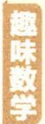

两个小时行驶多少千米问题 高远驾车去野外旅游时,看到汽车里程表上的数是15 951,这个数中第一个数字和第五个数字相同,第二个数字和第四个数字相同.

部著作平均分给班级的 3 个数学兴趣小组, 则分配方式一共有 ( )

$\quad$A. 15 种

$\quad$B. 60 种

$\quad$C. 80 种

$\quad$D. 90 种

思维导引 将6部著作均分成3份 → 把这3份分给班级的3个数学兴趣小组 → 分配方式的总数

解析 可分两步：

第一步,将6部著作平均分成3份,有 $\frac{C_{6}^{2}C_{4}^{2}C_{2}^{2}}{A_{3}^{3}}$ 种不同的分配方式;

【扫清障碍】对于整体均分问题，均分 $n$ 组后一定要除以 $\mathbf{A}_n^n$ ，避免重复计算。本题均分问题用除法：均分三份，需除以 $\mathbf{A}_3^3$

第二步,将这均分的3份分给班级的3个数学兴趣小组,有 $A_{3}^{3}$ 种不同的分配方式.

【警示】注意有序用排列，无序用组合

根据分步乘法计数原理,共有 $\frac{C_{6}^{2}C_{4}^{2}C_{2}^{2}}{A_{3}^{3}}\cdot A_{3}^{3}=C_{6}^{2}C_{4}^{2}C_{2}^{2}=90$ （种）分配方式,故选D.

# 2. 部分均分问题

调研 7 (2023·辽宁大连二十四中 7 月检测)4 本不同的书,分给甲、乙、丙三人,每人至少一本,不同分法的种数为 ( )

$\quad$A. 24

$\quad$B. 36

$\quad$C. 42

$\quad$D. 64

解析 可分两步:第一步,把4本书分成数量为2,1,1的三组,共有 $\frac{C_{4}^{2}C_{2}^{1}C_{1}^{1}}{A_{2}^{2}}=6$ (种) 不同的分法,

【极易出错】对于部分均分问题，需注意均分只有两组，因此除以 $A_{2}^{2}$

第二步,把这三组分给甲、乙、丙三人,有 $A_{3}^{3}=6$ (种)不同的分法.

由分步乘法计数原理知不同分法的种数为 $6 \times 6 = 36$ ，故选 B.

调研 8 (2023·山东烟台一中7月检测)某地区安排A,B,C,D,E5名志愿者到三个基层社区开展防诈骗宣传活动,每个社区至少安排1人,且A,B2人安排在同一个社区,则不同的分配方法的种数为 ( )

$\quad$A. 36

$\quad$B. 48

$\quad$C. 72

$\quad$D. 84

思维导引 5人分三组，可以分两类 → 各类中先分组后分配 → 利用分类加法计数原理 → 不同的分配方法的种数

当汽车在公路上行驶了两个小时后(汽车时速不低于25千米,不高于100千米),汽车里程表上是另外一个数.这个数仍然是第一个数字和第五个数字相同,第二个数字和第四个数字相同.

# 解析 可分两类：

【会分类】5人分三组，实质是“ $5=1+1+3=1+2+2$ ”，因此，可分成两类

第一类,一个社区3人,另外两个社区各1人,共有 $C_{3}^{1}\cdot A_{3}^{3}=18$ (种)不同的分配方法;

【极易出错】注意题眼“A, B 2 人安排在同一个社区”，所以先从 C, D, E 中选 1 人和 A, B 一起，再将三组人分配到三个社区

第二类,一个社区1人,另外两个社区各2人,所以一共有 $C_{3}^{2}\cdot A_{3}^{3}=18$ (种)不同的分配方法.

【极易出错】因为 A, B 两人安排在同一个社区，所以从 C, D, E 中选 2 人组成一组，再将三组人分配到三个社区

根据分类加法计数原理, 不同的分配方法有 $18 + 18 = 36$ (种). 故选 A.

# 3. 不等分问题

调研 9 (2023·江西赣州中学7月检测)现将6本不同的书分给3个人,其中甲3本,另外两人1人1本、1人2本,则不同的分法有\_\_\_\_种.

对于部分均分问题，由于各均分组的地位均等，所以在部分均分时，平均分成的 $n$ 组，就一定要除以 $\mathrm{A}_n^n$ 。本题，由于还有限制条件“A，B 2人安排在同一个社区”，故不用除以 $\mathrm{A}_2^2$ 。

思维导引
选出3本给甲 → 将剩余3本书分为两组 → 将这两组进行全排列得不同的分法种数

# 解析 可分两步：

第一步,从6本书中选出3本给甲,有 $C_{6}^{3}$ 种不同的分法;

【较易出错】从6本书中选出3本给甲，不用排序，是组合问题

第二步, 将剩余 3 本分为两组, 一组 1 本, 一组 2 本, 剩余 2 人任意选择, 故有 $\mathrm{C}_{3}^{1} \mathrm{C}_{2}^{2} \mathrm{A}_{2}^{2}$ 种不同的分法.

【扫清障碍】不等分问题,注意不用除法. 对于不等分问题,由于分组时,每组中元素的个数都不相等,所以不需要除以全排列数. 破解此类不等分的分配问题,一般都是先分组,后排列

根据分步乘法计数原理,不同的分法有 $C_{6}^{3}C_{3}^{1}C_{2}^{2}A_{2}^{2}=20\times3\times1\times2=120$ (种).

# 4. 相同元素的分配问题

调研 10 (2023·广东汕头潮阳实验中学7月测试)6个志愿者的名额分给3个班,每班至少一个名额,则有\_\_\_\_种不同的分配方法.(用数字回答)

解析 6个志愿者的名额分配给3个班,每班至少一个名额,

【扫清障碍】注意题眼“名额”，名额之间无差别，故是属于相同元素的分配问题

则从这6个志愿者的名额形成的5个空中插入2个“挡板”，

【极易出错】“挡板”需隔开6个志愿者，故算空位时两端的空位不能算，注意与插空法的区别

共有 $C_{5}^{2}=10$ (种) 不同的分配方法.

# 反思提升

本题以“志愿者的名额分配”为背景考查排列组合中的相同元素的分配问题, 破解此类题的突破口是利用 “挡板分隔法”, 即将 $n$ 个相同的元素分成 $m$ 份 ( $n$ , $m$ 为正整数), 每份至少一个元素时, 其不同的分配方式有 $\mathrm{C}_{n-1}^{m-1}$ 种, 即在 $n$ 个元素中间形成的 $(n-1)$ 个空中插入 $(m-1)$ 个 “挡板”.

# 模型4 涂色问题

调研 11 (2022·江苏南京一中、镇江一中考前联考)如图7-1,一个地区分为5个区域,现给5个区域涂色,要求相邻区域不得使用同一颜色.现有4种颜色可供选择,则不同的涂色方法共有\_\_\_\_种.

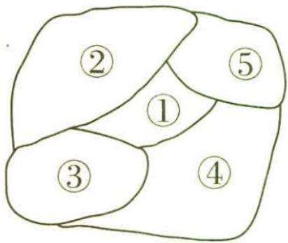

图7-1

思维导引 对所选颜色的种数进行分类 → 在各类中,利用分步乘法计数原理分别计算 → 利用分类加法计数原理 → 不同的涂色方法种数

解析 可分两类：

【扫清障碍】确定分类的“度”是解决本题的关键,给 5 个区域涂色,要求相邻区域不得使用同一颜色,可以选用 3 种颜色,也可以 4 种颜色全选,故可分两类

第一类,选用3种颜色时,必须是②④同色,③⑤同色,不同的涂色方法有 $C_{4}^{3}A_{3}^{3}=24$ (种);

第二类,4种颜色全选时,②④同色或③⑤同色,不同的涂色方法有 ${\mathrm{C}}_{2}^{1}{\mathrm{\;A}}_{4}^{4} = {48}$ (种).

【瓶颈】按色彩的种类进行分类或按不同的区域分步完成. 从某两个不相邻的区域同色与不同色入手,根据分步乘法计数原理,对各个区域分步涂色,讨论并分别计算出各种情形的种数,再由分类加法计数原理,求出不同的涂色方法的种数. 注意: 有些涂色问题可直接用分步解决,有些涂色问题需先分类再进行破解

分栗子问题 三个女孩儿一共采集到770颗栗子,她们打算像往常那样按比例进行分配.以往,当小红拿4颗栗子时,小丽拿3颗;而当小红拿6颗栗子时,小茜可以拿7颗.

根据分类加法计数原理,共有 $24 + 48 = 72$ (种) 不同的涂色方法.

# 新题演练

##### 1. (2023·陕西宝鸡中学7月检测)5名学生,1名教师站成前后两排照相,要求前排3人,后排3人,其中教师必须站在前排,那么不同的排法共有()

$\quad$A. 30 种

$\quad$B. 360 种

$\quad$C. 720 种

$\quad$D. 1 440 种

##### 2. (2023·山东菏泽7月检测)将诗集《诗经》《唐诗三百首》,戏剧《牡丹亭》,四大名著《红楼梦》《西游记》《三国演义》《水浒传》7本书放在一排,下面结论成立的是 ( )

$\quad$A. 戏剧放在中间的不同放法有 7! 种  
$\quad$B. 诗集相邻的不同放法有 6! 种  
$\quad$C. 四大名著互不相邻的不同放法有 $4! \times 3!$ 种  
$\quad$D. 四大名著不放在两端的不同放法有 $6 \times 4$ ！种

##### 3. (原创/双空题)某校准备参加2023年高中数学联赛,把16个选手名额分配到高三年级的1\~4班,每班至少1个名额,不同的分配方案共有\_\_\_\_种;若每班名额不

少于该班的序号数,则不同的分配方案共有\_\_\_\_种.

##### 4. (2023·哈尔滨六中7月检测)学习涂色能锻炼手眼协调能力,更能提高审美能力. 现有四种不同的颜色: 湖蓝色、米白色、橄榄绿、薄荷绿, 欲给图7-2中的小房子中的四个区域涂色, 要求相邻区域不涂同一颜色, 且橄榄绿与薄荷绿也不涂在相邻的区域内, 则共有\_\_\_\_种不同的涂色方法.

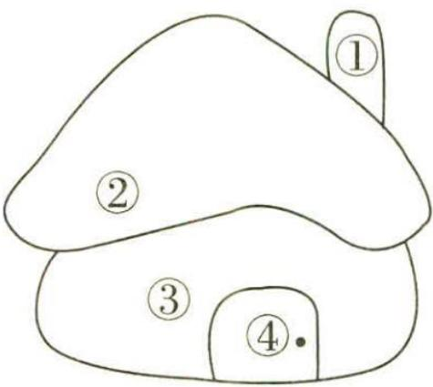

图7-2

# 参考答案与解析

##### 1. B 可分三步:

第一步,教师必须站在前排,有 $A_{3}^{1}$ 种不同的排法;

【扫清障碍】从前排的三个位置中选一个排教师

第二步,5名学生,前排排2名,有 $C_{5}^{2}A_{2}^{2}$ 种不同的排法;

第三步,余下3名学生排在后排的位置,有 $A_{3}^{3}$ 种不同的排法.

根据分步乘法计数原理,不同的排法总数为 $A_{3}^{1}C_{5}^{2}A_{2}^{2}A_{3}^{3}=360$ , 故选 B.

# 秒杀解 可分两步：

【扫清障碍】一般地,元素分成多排的排列问题,可归结为一排考虑,再分步研究

第一步,在一排中的前3个位置中选1个位置排教师,有 $A_{3}^{1}$ 种不同的排法;

第二步,余下5名学生,排到剩余的5个位置上,有 $A_{5}^{5}$ 种不同的排法.

根据分步乘法计数原理,不同的排法总数为 $A_{3}^{1}A_{5}^{5}=360$ , 故选 B.

##### 2. C 选项 A, 戏剧只有 1 本, 所以其余 6 本书可以全排列, 共有 6! 种不同的排列方法.

选项 B, 诗集共 2 本, 把诗集当成 1 本, 与其余 5 本书全排列, 不同的方法有 6! 种, 这 2 本诗集又可交换位置, 所以不同放法的总数为 $2 \times 6!$ .

选项 C, 四大名著互不相邻, 那只能在这四本书形成的 3 个空隙中放置其他书, 共有 3! 种放法, 这四本书又可以全排列, 所以不同放法的总数为 $4! \times 3!$ .

选项 D, 四大名著可以在第 2 至第 6 这 5 个位置上任选 4 个位置放置, 共有 $A_{5}^{4}$ 种放法, 这四本书放好后, 其余 3 本书可以在剩下的 3 个位置上全排列, 所以不同放法的总数为 $A_{5}^{4} \times 3!$ . 故选 C.

##### 3. 455 84 问题等价于将 16 个小球串成一串, 插入 3 块“挡板”, 截为 4 段, 16 个小球间有 15 个空隙, 从中选 3 个插入“挡板”, 不同的分配方案共有 $C_{15}^{3} = \frac{15 \times 14 \times 13}{3!} = 455$ (种).

【小技巧】此处是相同元素的分配问题，可以用“挡板分隔法”求解

若每班名额不少于该班的序号数,问题等价于先给2班1个小球,3班2个小球,4班3个小球,再把余下的10个相同的小球分成4份,等价于将10个小球串成一串,截成4段,易知截法种数为 $C_{9}^{3}=84$ ,因此不同的分配方案共有84种.

##### 4.66 可分四类：

【会分类】按颜色的种类进行分类

第一类,当选择两种颜色时,因为橄榄绿与薄荷绿不涂在相邻的区域内,所以共有 $C_{4}^{2}-1=5$ (种)选法,因此不同的涂色方法有 $5\times2=10$ (种);

第二类,当选择三种颜色且橄榄绿与薄荷绿都被选中时,有2种选法,因此不同的涂色方法有 $2 \times 2 \times 2 = 8$ (种);

第三类,当选择三种颜色且橄榄绿与薄荷绿只有一个被选中时,有2种选法,

因此不同的涂色方法有 $2 \times 3 \times 2 \times (2 + 1) = 36$ （种）；

第四类,当选择四种颜色时,不同的涂色方法有 $2 \times 2 \times 2 + 2 \times 2 = 12$ (种).

所以共有 $10 + 8 + 36 + 12 = 66$ (种) 不同的涂色方法.

# 超重点8 三类分布模型及其应用

# 模型1》二项分布

调研 1 (2022·湖北华中师大一附中考前冲刺)某企业从生产的一批零件中抽取100件产品作为样本,检测其质量指标值 $m(m \in [100,400])$ ,得到如图8-1所示的频率分布直方图,并依据质量指标值划分等级如下表所示.

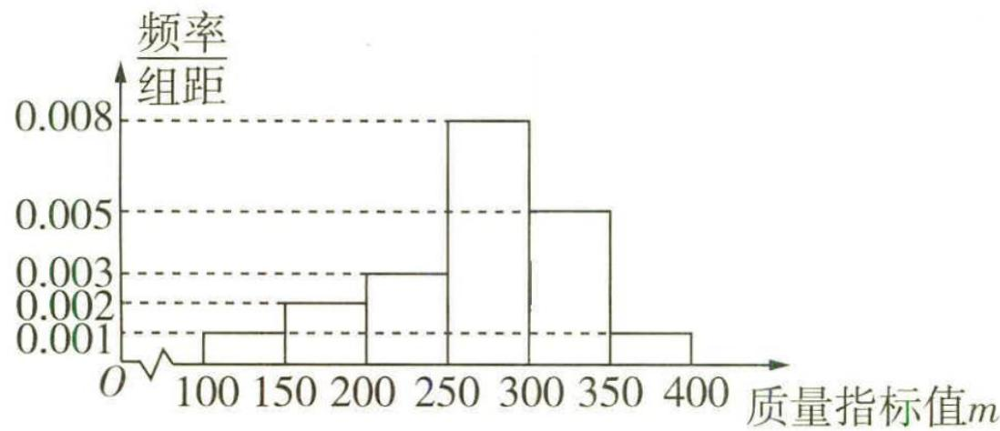

图8-1

<table><tr><td>质量指 标值m</td><td>150≤m&lt;350</td><td>100≤m&lt;150或 350≤m≤400</td></tr><tr><td>等级</td><td>A级</td><td>B级</td></tr></table>

（1）根据频率分布直方图估计这 100 件产品的质量指标值的平均数 m.  
（2）以样本的频率估计总体的概率,解决下列问题:   
(i)从所生产的零件中随机抽取3个零件,记其中A级零件的件数为 $\xi$ ,求 $\xi$ 的分布列和数学期望;  
(ii)该企业采用混装的方式将所有零件按400个为一箱包装出售,已知一个A级零件的利润是12元,一个B级零件的利润是4元,估计每箱零件的利润.

# 思维导引

（1）

利用频率分布直方图,求出各个小矩形的面积

每个小矩形的面积乘以相应小矩形底边中点的横坐标之和

估计出这100件产品的质量指标值的平均数

（2）(i)

求随机抽取一个零件，其为 $A$ 级的概率

$\xi$ 的所有可能取值

判断 $\xi$ 是否服从二项分布

$\xi$ 取各个值时的概率

ξ 的分布列和数学期望

(ii)

设每箱零件中 A 级零件有 X 个，
每箱零件的利润为 Y 元

求出 $X$ 与 $Y$ 的关系式

估计每箱零件的利润

解析

（1） 由题意知 $m = 125 \times 0.05 + 175 \times 0.1 + 225 \times 0.15 + 275 \times 0.4 + 325 \times$

$0. 2 5 + 3 7 5 \times 0. 0 5 = 2 6 7. 5.$

【扫清障碍】频率分布直方图中小矩形的高不是频率,小矩形的面积才是频率,平均值等于每个小矩形的面积乘以相应小矩形底边中点的横坐标之和

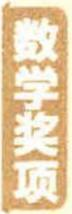

每四年颁发一次,在由国际数学联合会主办的四年一度的国际数学家大会上举行颁奖仪式,每次颁给二至四名有卓越贡献的年轻数学家.

（2）(i)由题意知随机抽取一个零件,其为A级的概率为 $1-0.05\times2=0.9$ ,

$\xi$ 的所有可能取值为 0,1,2,3,

【定模型】符合二项分布的两个特点“独立性”和“重复性”，可建立二项分布模型，直接利用二项分布的概率公式求解

$P (\xi = 0) = \mathrm{C} _ {3} ^ {0} (1 - 0. 9) ^ {3} = 0. 0 0 1, P (\xi = 1) = \mathrm{C} _ {3} ^ {1} \times 0. 9 \times (1 - 0. 9) ^ {2} = 0. 0 2 7,$

$P (\xi = 2) = \mathrm{C} _ {3} ^ {2} \times 0. 9 ^ {2} \times (1 - 0. 9) = 0. 2 4 3, P (\xi = 3) = \mathrm{C} _ {3} ^ {3} \times 0. 9 ^ {3} = 0. 7 2 9,$

则随机变量 $\xi$ 的分布列为

<table><tr><td>ξ</td><td>0</td><td>1</td><td>2</td><td>3</td></tr><tr><td>P</td><td>0.001</td><td>0.027</td><td>0.243</td><td>0.729</td></tr></table>

【会检验】根据随机变量取所有可能取值的概率和为1,检验所求的分布列是否正确

方法一 所以 $E(\xi) = 0 \times 0.001 + 1 \times 0.027 + 2 \times 0.243 + 3 \times 0.729 = 2.7$ .

方法二 因为 $\xi \sim B(3,0.9)$ ，所以 $E(\xi) = 3 \times 0.9 = 2.7$ .

【用公式】若 $\xi \sim B(n,p)$ ，则 $E(\xi) = np$

(ii) 设随机抽取一箱零件, 其中 $A$ 级零件有 $X$ 个, 出售该箱零件的利润为 $Y$ 元, 则 $B$ 级零件有 $(400 - X)$ 个, $Y = 12X + 4(400 - X) = 8X + 1600$ ,

因为 $X \sim B(400, 0.9)$ ，所以 $E(X) = 400 \times 0.9 = 360$ ，

所以 $E(Y)=E(8X+1\ 600)=8E(X)+1\ 600=8\times360+1\ 600=4\ 480.$

【用公式】活用期望的性质，若 $Y = aX + b$ (a, b 为常数)，则 $E(Y) = aE(X) + b$

故每箱的利润约为 4 480 元.

调研 2 (2023·安徽芜湖一中、屯溪一中等校8月第一次联考/方案选择)国庆节期间,某大型服装团购会举办了一次“你消费我促销”活动,顾客消费满300元(含300元)可抽奖一次,抽奖方案有两种(顾客只能选择其中的一种).

方案一:从装有5个形状、大小完全相同的小球(其中红球1个,黑球4个)的抽奖盒中,有放回地摸出3个球,每摸出1次红球,立减100元.

方案二:从装有10个形状、大小完全相同的小球(其中红球2个,白球1个,黑球7个)的抽奖盒中,不放回地摸出3个球,若摸出2个红球,1个白球,则享受免单优惠;若摸出2个红球和1个黑球,则打5折;若摸出1个红球,1个白球和1个黑球,则打7.5折;其余情况不打折.

（1）某顾客恰好消费300元,并选择抽奖方案一,求他实付金额的分布列和期望;

沃尔夫数学奖 沃尔夫数学奖是沃尔夫奖的一个奖项,它和菲尔兹奖被共同誉为数学界的最高荣誉.获得该奖项的华人有陈省身和丘成桐.

（2）若顾客消费 500 元,试从实付金额的期望值分析顾客选择何种抽奖方案更合理.

思维导引 （1） 确定 $X$ 的所有可能取值 $\rightarrow$ 求出每个值对应的概率 $\rightarrow$ 分布列 $\rightarrow$ 根据期望公式求得期望

（2） 计算两种方案下实付金额的期望值 → 比较大小 → 做出判断

解析 （1） 设该顾客的实付金额为 $X$ 元, 则 $X$ 的所有可能取值为 0, 100, 200, 300,

$P (X = 0) = \left(\frac {1}{5}\right) ^ {3} = \frac {1}{1 2 5}, P (X = 1 0 0) = \mathrm{C} _ {3} ^ {2} \left(\frac {1}{5}\right) ^ {2} \times \frac {4}{5} = \frac {1 2}{1 2 5},$

$P (X = 2 0 0) = \mathrm{C} _ {3} ^ {1} \times \frac {1}{5} \times (\frac {4}{5}) ^ {2} = \frac {4 8}{1 2 5}, P (X = 3 0 0) = (\frac {4}{5}) ^ {3} = \frac {6 4}{1 2 5},$

故 $X$ 的分布列为

<table><tr><td>X</td><td>0</td><td>100</td><td>200</td><td>300</td></tr><tr><td>P</td><td> $\frac{1}{125}$ </td><td> $\frac{12}{125}$ </td><td> $\frac{48}{125}$ </td><td> $\frac{64}{125}$ </td></tr></table>

所以 $E(X)=0\times\frac{1}{125}+100\times\frac{12}{125}+200\times\frac{48}{125}+300\times\frac{64}{125}=240.$

（2） 若选择方案一, 设摸到红球的个数为 $Y$ , 实付金额为 $\varphi$ 元, 则 $\varphi = 500 - 100Y$ , 由题意可得 $Y \sim B(3, \frac{1}{5})$ , 故 $E(Y) = 3 \times \frac{1}{5} = \frac{3}{5}$ ,

【扫清障碍】二项分布满足的条件：每次试验中事件发生的概率是相同的，是一种放回抽样；各次试验中事件是相互独立的；每次试验只有两种结果，即要么发生，要么不发生。此处“有放回地摸出3个球”，设摸到红球的个数为Y，满足 $Y \sim B(3, \frac{1}{5})$ ，Y的所有可能取值为0,1,2,3，则 $P(Y = k) = C_{3}^{k} (\frac{1}{5})^{k} (1 - \frac{1}{5})^{3-k}, k = 0, 1, 2, 3$

所以 $E(\varphi)=E(500-100Y)=500-100E(Y)=500-60=440.$

若选择方案二, 设实付金额为 $\eta$ 元, 则 $\eta$ 的所有可能取值为 0, 250, 375, 500,

$P (\eta = 0) = \frac {\mathrm{C} _ {2} ^ {2} \mathrm{C} _ {1} ^ {1}}{\mathrm{C} _ {1 0} ^ {3}} = \frac {1}{1 2 0}, P (\eta = 2 5 0) = \frac {\mathrm{C} _ {2} ^ {2} \mathrm{C} _ {7} ^ {1}}{\mathrm{C} _ {1 0} ^ {3}} = \frac {7}{1 2 0},$

$P (\eta = 3 7 5) = \frac {\mathrm{C} _ {2} ^ {1} \mathrm{C} _ {1} ^ {1} \mathrm{C} _ {7} ^ {1}}{\mathrm{C} _ {1 0} ^ {3}} = \frac {7}{6 0}, P (\eta = 5 0 0) = 1 - \frac {1}{1 2 0} - \frac {7}{1 2 0} - \frac {7}{6 0} = \frac {4 9}{6 0},$

故 $\eta$ 的分布列为

<table><tr><td>η</td><td>0</td><td>250</td><td>375</td><td>500</td></tr><tr><td>P</td><td> $\frac{1}{120}$ </td><td> $\frac{7}{120}$ </td><td> $\frac{7}{60}$ </td><td> $\frac{49}{60}$ </td></tr></table>

所以 $E(\eta)=0\times\frac{1}{120}+250\times\frac{7}{120}+375\times\frac{7}{60}+500\times\frac{49}{60}\approx466.67.$

因为 $E(\varphi) < E(\eta)$ ，故从实付金额的期望值分析，顾客选择方案一更合理。

# 模型2 超几何分布

调研 3 (2023·天津市部分区7月联考/结构不良试题)已知条件①采用无放回抽取,条件②采用有放回抽取,在上述两个条件中任选一个,补充在下面问题中的横线上并作答,选两个条件作答的按条件①的解答计分.

分析题意,挑选使解答相对简单的条件,也可以不花时间去分析选哪个条件解答更简单,随机选一个

问题:在一个口袋中装有3个红球和4个白球,这些球除颜色外完全相同,若\_\_\_\_,从这7个球中随机抽取3个球,记取出的3个球中红球的个数为X,求随机变量X的分布列和数学期望.

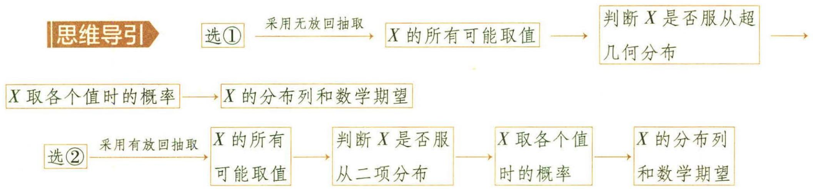

解析 若选①,由题意,随机变量X的所有可能取值为0,1,2,3.

【极易出错】X 服从超几何分布 $H(7,3,3)$ . 对于随机变量 X, 若 $X \sim H(N, M, n)$ , 则 $P(X = k) = \frac{C_{M}^{k} C_{N-M}^{n-k}}{C_{N}^{n}}$ , $k = m, m + 1, m + 2, \cdots, r$ . $n, N, M \in N^{*}, M \leqslant N, n \leqslant N, m = \max\{0, n - N + M\}, r = \min\{n, M\}$

$P (X = 0) = \frac {\mathrm{C} _ {4} ^ {3}}{\mathrm{C} _ {7} ^ {3}} = \frac {4}{3 5}, P (X = 1) = \frac {\mathrm{C} _ {3} ^ {1} \mathrm{C} _ {4} ^ {2}}{\mathrm{C} _ {7} ^ {3}} = \frac {1 8}{3 5},$

$P (X = 2) = \frac {\mathrm{C} _ {3} ^ {2} \mathrm{C} _ {4} ^ {1}}{\mathrm{C} _ {7} ^ {3}} = \frac {1 2}{3 5}, P (X = 3) = \frac {\mathrm{C} _ {3} ^ {3}}{\mathrm{C} _ {7} ^ {3}} = \frac {1}{3 5}.$

华罗庚数学奖 华罗庚数学奖是为缅怀华罗庚先生的巨大功绩而设立的,旨在激励中国数学家在中国数学事业的发展中做出突出贡献.华罗庚数学奖每两年评选和颁发一次.

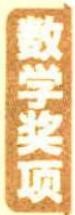

所以 $X$ 的分布列为

<table><tr><td>X</td><td>0</td><td>1</td><td>2</td><td>3</td></tr><tr><td>P</td><td>4/35</td><td>18/35</td><td>12/35</td><td>1/35</td></tr></table>

方法一 所以 $E(X) = 0 \times \frac{4}{35} + 1 \times \frac{18}{35} + 2 \times \frac{12}{35} + 3 \times \frac{1}{35} = \frac{9}{7}$ .

方法二 因为 X 服从超几何分布 $H(7,3,3)$ ，所以 $E(X)=\frac{3\times3}{7}=\frac{9}{7}$ .

【用公式】若 $X$ 服从超几何分布 $H(N, M, n)$ ，则 $E(X) = \frac{nM}{N}$

若选②,由题意,随机变量X的所有可能取值为0,1,2,3,且 $X\sim B(3,\frac{3}{7})$ ,

【辨析比较】二项分布的最明显特点是“放回抽样”，而超几何分布的最明显特点是“不放回抽样”，注意识别

所以 $P(X = 0) = \mathrm{C}_3^0 (1 - \frac{3}{7})^3 = \frac{64}{343}, P(X = 1) = \mathrm{C}_3^1 \times \frac{3}{7} \times (1 - \frac{3}{7})^2 = \frac{144}{343},$

$P (X = 2) = \mathrm{C} _ {3} ^ {2} \times (\frac {3}{7}) ^ {2} \times (1 - \frac {3}{7}) = \frac {1 0 8}{3 4 3}, P (X = 3) = \mathrm{C} _ {3} ^ {3} (\frac {3}{7}) ^ {3} = \frac {2 7}{3 4 3},$

所以 $X$ 的分布列为

<table><tr><td>X</td><td>0</td><td>1</td><td>2</td><td>3</td></tr><tr><td>P</td><td>64/343</td><td>144/343</td><td>108/343</td><td>27/343</td></tr></table>

$E (X) = 3 \times \frac {3}{7} = \frac {9}{7}.$

调研 4 (2023·北京市朝阳区7月质量检测)某数学教师组织学生进行线上答题交流活动,规定从8道备选题中随机抽取题目作答,假设在8道备选题中,学生甲答对每道题的概率都是 $\frac{2}{3}$ ,且每道题答对与否互不影响,学生乙、丙都只能答对其中的6道题.

（1） 若甲、乙两人分别从 8 道备选题中随机抽取 1 道作答, 求至少有 1 人能答对的概率;

（2） 若学生丙从 8 道备选题中随机抽取 2 道作答, 以 X 表示其中丙能答对的题数,

求 X 的分布列及数学期望.

解析 （1） 由题意可知随机抽取 1 道试题作答, 乙能答对的概率为 $\frac{3}{4}$ ,

则甲、乙两人都不能答对的概率 $P=(1-\frac{3}{4})\times(1-\frac{2}{3})=\frac{1}{12}$ ,

【扫清障碍】利用对立事件以及相互独立事件的乘法公式

所以甲、乙两人至少有1人能答对的概率为 $1-P=\frac{11}{12}$ .

（2）X的所有可能取值为0,1,2,

【定模型】X 服从超几何分布 H(8,6,2)，利用超几何分布的概率计算公式求出概率

$P (X = 0) = \frac {\mathrm{C} _ {2} ^ {2}}{\mathrm{C} _ {8} ^ {2}} = \frac {1}{2 8}, P (X = 1) = \frac {\mathrm{C} _ {6} ^ {1} \mathrm{C} _ {2} ^ {1}}{\mathrm{C} _ {8} ^ {2}} = \frac {3}{7}, P (X = 2) = \frac {\mathrm{C} _ {6} ^ {2}}{\mathrm{C} _ {8} ^ {2}} = \frac {1 5}{2 8},$

$X$ 的分布列为

<table><tr><td>X</td><td>0</td><td>1</td><td>2</td></tr><tr><td>P</td><td> $\frac{1}{28}$ </td><td> $\frac{3}{7}$ </td><td> $\frac{15}{28}$ </td></tr></table>

方法一 所以 $E(X) = 0 \times \frac{1}{28} + 1 \times \frac{3}{7} + 2 \times \frac{15}{28} = \frac{3}{2}$ .

方法二 因为 X 服从超几何分布 $H(8,6,2)$ ，所以 $E(X)=\frac{6\times2}{8}=\frac{3}{2}$ .

# 模型3 正态分布

调研 5 (2023·广西桂林第十八中学、广西师大附中8月联考) W 企业的产品 p 正常生产时, 产品 p 的尺寸 X(单位: mm) 服从正态分布 N(80,0.25), 从当前生产线上随机抽取 200 件产品进行检测, 产品尺寸汇总如下表.

<table><tr><td>产品尺寸/mm</td><td>[76,78.5]</td><td>(78.5,79]</td><td>(79,79.5]</td><td>(79.5,80.5]</td><td>(80.5,81]</td><td>(81,81.5]</td><td>(81.5,83]</td></tr><tr><td>件数</td><td>4</td><td>27</td><td>27</td><td>80</td><td>36</td><td>20</td><td>6</td></tr></table>

根据产品质量标准和生产线的实际情况,产品尺寸在 $(\mu-3\sigma,\mu+3\sigma]$ 以外视为小概率事件,一旦小概率事件发生视为生产线出现异常.产品尺寸在 $(\mu-3\sigma,\mu+3\sigma]$ 以内为正品,以外为次品.

陈省身数学奖每两年颁发一次,称为一届,截至2021年10月,陈省身数学奖共举办18届,共有36人获奖.

（1） 判断生产线是否正常工作, 并说明理由;

（2）用频率估计概率,若随机从生产线上取3件产品进行检测,正品检测费为10元/件,次品检测费为15元/件,记这3件产品检测费为Z元,求Z的数学期望及方差.

附: 若 $X \sim N(\mu, \sigma^{2})$ ，则 $P(\mu - \sigma < X \leqslant \mu + \sigma) \approx 0.6827, P(\mu - 2\sigma < X \leqslant \mu + 2\sigma) \approx 0.9545, P(\mu - 3\sigma < X \leqslant \mu + 3\sigma) \approx 0.9973.$

# 思维导引

（1）

产品 $p$ 的尺寸服从正态分布

求 $\mu,\sigma$ 求 $\mu-3\sigma,\mu+3\sigma$

求产品尺寸超出(78.5,81.5]以外的零件数→判断生产线是否正常工作

（2）

记这3件产品中次品件数为 $Y$

→ Y 服从二项分布 → 求出 E(Y), D(Y) →

求 $Y$ 与 $X$ 的关系

利用均值和方差的性质

$E(X), D(X)$

解析 （1） 因为产品 $p$ 的尺寸 $X$ 服从正态分布 $N(80,0.25)$ , 所以 $X$ 的平均值 $\mu = 80$ , 标准差 $\sigma = 0.5$ ,

【极易出错】 $X \sim N(\mu, \sigma^{2})$ ，则 $\sigma^{2} = 0.25$ ，不要误以为 $\sigma = 0.25$

所以 $\mu - 3\sigma = 78.5, \mu + 3\sigma = 81.5,$

由表中数据可知产品尺寸在(78.5,81.5]以外的零件数为10.

【扫清障碍】观察产品尺寸汇总表格, 产品尺寸在 $[76, 78.5], (81.5, 83]$ 的件数分别为 $4, 6$ 所以生产线没有正常工作.

（2）依题意尺寸在(78.5,81.5]以外的就是次品,故次品率为 $\frac{10}{200}=\frac{1}{20}$ .

【会思考】利用频率估计概率

记这3件产品中次品件数为 $Y$ ，则 $Y\sim B(3,\frac{1}{20})$

所以 $E(Y)=3\times\frac{1}{20}=\frac{3}{20},D(Y)=3\times\frac{1}{20}\times\frac{19}{20}=\frac{57}{400}.$

【极易出错】二项分布的期望与方差公式不要高混，需理解清楚并能熟练运用

又 $Z=10(3-Y)+15Y=5Y+30$ ,

所以 $E(Z)=5E(Y)+30=\frac{123}{4}$ ,

$D (Z) = 5 ^ {2} D (Y) = 2 5 \times \frac {5 7}{4 0 0} = \frac {5 7}{1 6}.$

【用公式】活用方差的性质，若 $Y = aX + b$ (a, b 为常数)，则 $D(Y) = a^{2}D(X)$

# 新题演练

##### 1. (2023·河南安阳一中8月摸底)产品开发是企业改进老产品或开发新产品,使产品具有新的特征或用途,以满足市场需求的流程.某企业开发的新产品已经进入到样品试制阶段,需要对5个样品进行性能测试,现有甲、乙两种不同的测试方案,对每个样品随机选择其中的一种方案进行测试.已知选择甲方案时测试合格的概率为 $\frac{2}{3}$ ,选择乙方案时测试合格的概率为 $\frac{1}{2}$ ,每次测试的结果互不影响.

（1） 若对 3 个样品选择甲方案进行测试, 对其余 2 个样品选择乙方案进行测试.

(i) 求 5 个样品全部测试合格的概率;

(ii) 求 4 个样品测试合格的概率.

（2）若测试合格的样品个数的期望不小于3,求选择甲方案进行测试的样品个数.

##### 2. (2022·东北师大附中四模)为了切实维护居民合法权益,提高居民识骗防骗能力,守好居民的“钱袋子”,某社区开展“全民反诈在行动——反诈骗知识竞赛”活动,现从参加该活动的居民中随机抽取了100名,他们的竞赛成绩分布如下表.

<table><tr><td>成绩/分</td><td>[40,50)</td><td>[50,60)</td><td>[60,70)</td><td>[70,80)</td><td>[80,90)</td><td>[90,100]</td></tr><tr><td>人数</td><td>2</td><td>4</td><td>22</td><td>40</td><td>28</td><td>4</td></tr></table>

（1） 求抽取的 100 名居民竞赛成绩的平均分 $\bar{x}$ 和方差 $s^2$ (同一组中的数据用该组区间的中间值代表).

（2）以频率估计概率,发现该社区参赛居民的竞赛成绩 X 近似地服从正态分布 $N(\mu, \sigma^{2})$ , 其中 $\mu$ 近似为样本成绩平均分 $\bar{x}, \sigma^{2}$ 近似为样本成绩方差 $s^{2}$ , 若 $\mu - \sigma < X \leq \mu + 2\sigma$ , 参赛居民可获得“参赛纪念证书”; 若 $X > \mu + 2\sigma$ , 参赛居民可获得“反诈先锋证书”.

(i) 若该社区有 3 000 名居民参加本次竞赛活动,试估计获得“参赛纪念证书”的居民人数(结果保留整数);

(ii)试判断竞赛成绩为96分的居民能否获得“反诈先锋证书”.

陈省身奖为终身成就奖,不限数学分支,授予“凭借数学领域的终身杰出成就赢得最高赞誉的个人”.

附; 若 $X \sim N(\mu, \sigma^{2})$ ，则 $P(\mu - \sigma < X \leqslant \mu + \sigma) \approx 0.6827, P(\mu - 2\sigma < X \leqslant \mu + 2\sigma) \approx 0.9545, P(\mu - 3\sigma < X \leqslant \mu + 3\sigma) \approx 0.9973.$

# 参考答案与解析

##### 1. （1）(i)由题意知 5 个样品全部测试合格的概率 $P = \left(\frac{2}{3}\right)^{3} \times \left(\frac{1}{2}\right)^{2} = \frac{2}{27}$ .

【易错辨析】注意相互独立事件与互斥事件的区别，相互独立事件之间的发生互不影响，但可以同时发生，互斥事件是不可能同时发生的事件，不要高混

(ii)4个样品测试合格分以下两种情况.

【扫清障碍】注意第（1）小题的题眼“3个样品选择甲方案, 2个样品选择乙方案”, 故4个样品测试合格, 需要分两种情况

第一种情况,选择甲方案测试的3个样品合格和选择乙方案测试的1个样品合格,
此种情况发生的概率 $P_{1} = \left(\frac{2}{3}\right)^{3} \times C_{2}^{1} \times \frac{1}{2} \times \left(1 - \frac{1}{2}\right) = \frac{4}{27}.$

第二种情况,选择甲方案测试的2个样品合格和选择乙方案测试的2个样品合格,
此种情况发生的概率 $P_{2}=C_{3}^{2}\times\left(\frac{2}{3}\right)^{2}\times\left(1-\frac{2}{3}\right)\times\left(\frac{1}{2}\right)^{2}=\frac{1}{9}.$

所以 4 个样品测试合格的概率为 $P_{1} + P_{2} = \frac{4}{27} + \frac{1}{9} = \frac{7}{27}$ .

【易错辨析】注意两情况中的事件是互斥事件，需要用概率的加法公式

（2） 设选择甲方案测试的样品个数为 n, n = 0, 1, 2, 3, 4, 5, 则选择乙方案测试的样品个数为 5 - n,

设通过甲方案测试合格的样品个数为 X, 通过乙方案测试合格的样品个数为 Y.

①当 n=0 时, 此时对所有样品均选择乙方案测试, 则 $Y \sim B(5, \frac{1}{2})$ ,

【扫清障碍】由于选择甲方案测试合格的概率与选择乙方案测试合格的概率不同,故需对 $n$ 分类讨论,注意分类的度以及特殊分布的应用

所以 $E(X + Y) = E(Y) = 5 \times \frac{1}{2} = \frac{5}{2} < 3$ ，不符合题意。

②当 n=5 时, 此时对所有样品均选择甲方案测试, 则 $X \sim B(5, \frac{2}{3})$ ,

所以 $E(X + Y) = E(X) = 5 \times \frac{2}{3} = \frac{10}{3} > 3$ ，符合题意.

③当 $n = 1,2,3,4$ 时， $X \sim B(n, \frac{2}{3}), Y \sim B(5 - n, \frac{1}{2})$

所以 $E(X+Y)=E(X)+E(Y)=\frac{2}{3}n+\frac{5-n}{2}=\frac{n+15}{6}$ ,

若 $E(X+Y)=\frac{n+15}{6}\geqslant3$ , 则 $n\geqslant3$ , 故 n=3,4 时符合题意.

综上,选择甲方案测试的样品个数为3或4或5时,测试合格的样品个数的期望不小于3.

##### 2. （1） 100 名居民本次竞赛成绩的平均分 $\bar{x} = 45 \times \frac{2}{100} + 55 \times \frac{4}{100} + 65 \times \frac{22}{100} + 75 \times \frac{40}{100} + 85 \times \frac{28}{100} + 95 \times \frac{4}{100} = 75$ ,

【扫清障碍】求数据的平均数与方差时,注意题设括号中的提示条件 “同一组中的数据用该组区间的中间值代表” 的应用

100名居民本次竞赛成绩的方差 $s^2 = (45 - 75)^2 \times \frac{2}{100} + (55 - 75)^2 \times \frac{4}{100} + (65 - 75)^2 \times \frac{22}{100} + (75 - 75)^2 \times \frac{40}{100} + (85 - 75)^2 \times \frac{28}{100} + (95 - 75)^2 \times \frac{4}{100} = 100.$

（2）(i)由于 $\mu$ 近似为样本成绩平均分 $\bar{x}, \sigma^2$ 近似为样本成绩方差 $s^2$ ,

所以 $\mu=75,\sigma^{2}=100,\sigma=\sqrt{100}=10.$

由于竞赛成绩 X 近似地服从正态分布 $N(\mu, \sigma^{2})$ ,

因此参赛居民可获得“参赛纪念证书”的概率为 $P(\mu - \sigma < X \leqslant \mu + 2\sigma) = \frac{1}{2}P(\mu -$

$\sigma <   X \leqslant \mu + \sigma) + \frac {1}{2} P (\mu - 2 \sigma <   X \leqslant \mu + 2 \sigma) \approx \frac {1}{2} \times 0. 6 8 2 7 + \frac {1}{2} \times 0. 9 5 4 5 = 0. 8 1 8 6,$

【扫清障碍】注意利用正态曲线关于直线 $x=\mu$ 对称计算概率

$3 0 0 0 \times 0. 8 1 8 6 = 2 4 5 5. 8 \approx 2 4 5 6,$

估计获得“参赛纪念证书”的居民人数为 2456.

(ii) 当 $X > \mu + 2\sigma$ 时, 即 X > 95 时, 参赛居民可获得“反诈先锋证书”,

所以竞赛成绩为 96 分的居民能获得“反诈先锋证书”.

# 超重点9 破解古典概型的概率问题

调研 1 (2022·湖北仙桃中学适应性考试) 定义: $abcde = 10\,000a + 1\,000b + 100c + 10d + e (a,b,c,d,e \in \mathbf{Z})$ , 当 $a > b < c > d < e$ 时, 称这个数为波动数. 由 1,2,3,4,5 组成一个没有重复数字的五位数, 这个数是波动数的概率为 ( )

$\quad$A. $\frac{1}{15}$

$\quad$B. $\frac{2}{15}$

$\quad$C. $\frac{7}{60}$

$\quad$D. $\frac{1}{12}$

思维导引 先判断出由 1,2,3,4,5 组成的没有重复数字的五位数有 120 个,列举得出波动数有 16 个,即可得解.

解析 由1,2,3,4,5组成的没有重复数字的五位数一共有 $A_{5}^{5}=120$ （个）.

构成波动数需满足 $a > b < c > d < e$ , 所以符合条件的波动数有: 41 325, 51 324, 42 315, 52 314, 21 435, 31 425, 51 423, 32 415, 52 413, 53 412, 21 534, 31 524, 41 523, 32 514, 42 513, 43 512, 共 16 个.

【会分析】依据条件，按顺序逐一列举，做到不重复、不遗漏，此处的技巧是：分析 $a > b < c > d < e$ 知， $b, d$ 都要比 $c$ 小， $c$ 只能是 3, 4, 5, $b$ 比 $a, c$ 小， $b$ 只能是 1, 2, 3，确定了这两个数的取值范围，再按照一定的顺序书写即可

所以所求概率为 $\frac{16}{120}=\frac{2}{15}$ . 故选 B.

调研 2 (2022·山东淄博三模)正 2022 边形 $A_{1} A_{2} \cdots A_{2022}$ 内接于单位圆 $O$ , 任取其两个不同顶点 $A_{i}, A_{j}$ , 则 $|\overrightarrow{OA_{i}} + \overrightarrow{OA_{j}}| \leqslant 1$ 的概率是 ( )

$\quad$A. $\frac{676}{2021}$

$\quad$B. $\frac{675}{2021}$

$\quad$C. $\frac{674}{2021}$

$\quad$D. $\frac{673}{2021}$

思维导引 分析可得 $\frac{2\pi}{3} \leqslant \angle A_{i}OA_{j} \leqslant \pi$ ，计算出满足条件 $|\overrightarrow{OA_{i}} + \overrightarrow{OA_{j}}| \leqslant 1$ 的向量的取法种数，结合古典概型的概率公式可求得结果。

解析 由 $|\overrightarrow{OA_i} + \overrightarrow{OA_j}|^2 = \overrightarrow{OA_i^2} +\overrightarrow{OA_j^2} +2\overrightarrow{OA_i}\cdot \overrightarrow{OA_j} = 2 + 2\cos \angle A_iOA_j\leqslant 1$

可得 $\cos \angle A_{i}OA_{j}\leqslant -\frac{1}{2},$

【突破障碍】时不等式两边同时平方，确定两向量的夹角余弦值的取值范围

因为 $0 \leqslant \angle A_{i}OA_{j} \leqslant \pi$ ，所以 $\frac{2\pi}{3} \leqslant \angle A_{i}OA_{j} \leqslant \pi$ .

对于任意给定的向量 $\overrightarrow{OA_i} (1\leqslant i\leqslant 2022)$ ，满足条件 $|\overrightarrow{OA_i} +\overrightarrow{OA_j}| \leqslant 1$ 的向量 $\overrightarrow{OA_j}$ 的取

法有 $\frac{2\pi}{3}\div\frac{2\pi}{2022}+1=675$ （种），因此 $\left|\overrightarrow{OA_{i}}+\overrightarrow{OA_{j}}\right|\leqslant1$ 的概率为 $P=\frac{675}{2021}$ .故选B.

【帮你理解】这个式子可能很多学生看不明白，我们不妨作出一个简单情形的图形，如图9-1，在正六边形 $A_{1}A_{2}A_{3}A_{4}A_{5}A_{6}$ 中，不妨固定 $\overrightarrow{OA_{i}}$ 为 $\overrightarrow{OA_{1}}$ ，要使 $\frac{2\pi}{3}\leqslant\angle A_{i}OA_{j}\leqslant\pi$ ，则 $\overrightarrow{OA_{j}}$ 可以为 $\overrightarrow{OA_{3}}$ ， $\overrightarrow{OA_{4}}$ 或 $\overrightarrow{OA_{5}}$ ，有3种情况，列式为 $\frac{2\pi}{3}\div\frac{2\pi}{6}+1=3$ （神），推广到正2022边形中，即可得解

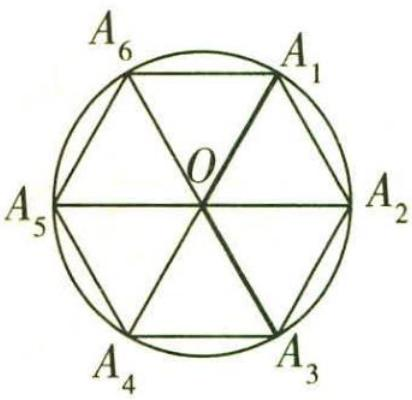

图9-1

调研 3 (2022·江苏连云港考前模拟)早在两千多年前,我

国古代劳动人民就使用算筹计数,后来渐渐发展为珠算.算筹有纵式和横式两种排列方式,0\~9各个数字及其算筹表示的对应关系如下表:

<table><tr><td></td><td>0</td><td>1</td><td>2</td><td>3</td><td>4</td><td>5</td><td>6</td><td>7</td><td>8</td><td>9</td></tr><tr><td>纵式</td><td rowspan="2">○</td><td>|</td><td>||</td><td>||||</td><td>||||</td><td>|||||</td><td>T</td><td>TT</td><td>TTT</td><td>TTTT</td></tr><tr><td>横式</td><td>—</td><td>=</td><td>≡</td><td>≡</td><td>≡</td><td>⊥</td><td>⊥</td><td>⊥</td><td>⊥</td></tr></table>

排列数字时,个位采用纵式,十位采用横式,百位采用纵式,千位采用横式……纵式和横式依次交替出现. 如“⊥T”表示 87, “||||○||”表示 502. 在由“○”“=”“||”“T”“⊥”其中的几个按照一定顺序排列成的三位数中任取一个, 取到奇数的概率是 ( )

$\quad$A. 0.7

$\quad$B. 0.6

$\quad$C. 0.4

$\quad$D. 0.3

解析 纵式“||||”“T”所表示的数字分别为3,6,横式“==”“⊥”所表示的数字分别为2,9,

在由“○”“＝”“||||”“T”“⊥”其中的几个按照一定顺序排成的三位数中,百位数字可在3或6中任选一个.

分以下三种情况讨论.

①不选0,则十位数字有2种选择,个位数字有2种选择,此时三位数的个数为 $2 \times  2 = 4$ ;  
② 0 放在十位, 则个位数有 2 种选择, 此时三位数的个数为 2;  
③ 0 放在个位, 则十位数有 2 种选择, 此时三位数的个数为 $2 \times 2 = 4$ .

【扫清障碍】优先考虑特殊元素，如本题，因为0不能放在百位，所以对0的位置实施分类讨论，不要遗漏情况

由分类加法计数原理可知,满足条件的三位数的个数为 $4 + 2 + 4 = 10$ .

其中满足条件的三位数中,是奇数的为603,623,693,共3个,

所以所求概率为 $P=\frac{3}{10}=0.3$ . 故选 D.

调研 4 (2023·鄂东南三校开学考试) 将编号为 1,2,3,4,5 的小球放入编号为 1,2,3,4,5 的盒子中, 每个盒子中放一个小球. 则恰有一个小球与所在盒子编号相同的概率为 ( )

$\quad$A. $\frac{3}{8}$

$\quad$B. $\frac{1}{8}$

$\quad$C. $\frac{1}{12}$

$\quad$D. $\frac{1}{24}$

解析 由题得5个盒子中任意放球,共有 $A_{5}^{5}=120$ (种)方法.

如果有一个小球与所在的盒子的编号相同,第一步,先从5个小球中选一个编号与所在的盒子编号相同的小球,有5种选法.

第二步,不妨设选的是1号小球,再对后面的2,3,4,5号小球进行排列,且4个小球的编号与盒子的编号都不相同,假设2号盒子里放3号小球,则有(3,2,5,4),(3,5,2,4),(3,4,5,2)三种情况,

【小技巧】先从特殊情形入手，探寻规律

所以后面的小球的排列共有 $3 \times 3 = 9$ (种) 方法.

所以恰有一个小球与所在盒子编号相同的排列共有 $5 \times 9 = 45$ (种) 方法.

由古典概型的概率计算公式得恰有一个小球与所在盒子编号相同的概率为 $P = \frac{45}{120} = \frac{3}{8}$ . 故选 A.

调研 5 (2022·湖南衡阳三模)将《三国演义》《西游记》《水浒传》《红楼梦》4本名著全部随机分给甲、乙、丙三名同学,每名同学至少分得1本,A表示事件“《三国演义》分给同学甲”;B表示事件“《西游记》分给同学甲”;C表示事件“《西游记》分给同学乙”.则下列结论正确的是 ( )

$\quad$A. 事件 $A$ 与 $B$ 相互独立

$\quad$B. 事件 A 与 C 相互独立

$\quad$C. $P(C|A) = \frac{5}{12}$

$\quad$D. $P(B|A) = \frac{5}{12}$

解析 将《三国演义》《西游记》《水浒传》《红楼梦》4本名著全部随机分给甲、乙、丙三名同学,共有 $C_{4}^{2}A_{3}^{3}=36$ (种)方法,

事件 A 包含的基本事件数为 $A_{3}^{3} + C_{3}^{2}A_{2}^{2} = 12$ ，则 $P(A) = \frac{12}{36} = \frac{1}{3}$ .

同理得 $P(B)=P(C)=\frac{1}{3}$ ,

事件 $AB$ 包含的基本事件数为 $\mathrm{A}_2^2 = 2$ ，则 $P(AB) = \frac{2}{36} = \frac{1}{18}$

事件 $AC$ 包含的基本事件数为 $\mathrm{C}_2^2 +\mathrm{C}_2^1\mathrm{C}_2^1 = 5$ ，则 $P(AC) = \frac{5}{36}.$

综上,判断各选项对错,如下.

<table><tr><td>选项</td><td>依据</td><td>正误</td></tr><tr><td>A</td><td> $P(A)P(B)=\frac{1}{9}\neq P(AB)$ </td><td>×</td></tr><tr><td>B</td><td> $P(A)P(C)=\frac{1}{9}\neq P(AC)$ </td><td>×</td></tr><tr><td>C</td><td> $P(C|A)=\frac{P(AC)}{P(A)}=\frac{5}{12}$ </td><td>√</td></tr><tr><td>D</td><td> $P(B|A)=\frac{P(AB)}{P(A)}=\frac{1}{6}$ </td><td>×</td></tr></table>

# 新题演练

(2023·江西师范大学附属中学开学测试)中国的“五岳”是指在中国境内的五座名山:东岳泰山、西岳华山、南岳衡山、北岳恒山、中岳嵩山.它们分别坐落于东、西、南、北、中五个方位.甲决定从嵩山、泰山、华山、庐山、黄山这5座名山中,随机选择2座名山,在2023年国庆期间前去旅游,则甲至少选中一座属于“五岳”的名山的概率为 (用数字作答).

# 参考答案与解析

$\frac{9}{10}$ 从 5 座名山中选 2 座名山, 不同的选择结果共有 $C_{5}^{2}=10$ (种).

这5座名山中, 只有嵩山、泰山、华山是属于“五岳”的名山, 甲至少选中一座属于“五岳”的名山包含两种情况: 甲选中一座属于“五岳”的名山, 甲选中两座属于“五岳”的名山. 满足要求的不同的选择结果共有 $C_{3}^{1} C_{2}^{1} + C_{3}^{2} = 9$ (种).

故所求概率为 $\frac{9}{10}$ ，故填 $\frac{9}{10}$ .

【速解】因为5座名山中属于“王岳”的名山有3座，不属于“王岳”的名山有2座，因此从对立面考虑，列举出甲一座属于“王岳”的名山也没选中的情况( $C_{2}^{2}=1$ （神）更为便捷，故所求概率为 $1-\frac{1}{10}=\frac{9}{10}$

设立克雷福德奖的目的是促进瑞典和世界其他地区的基础科学研究,奖励诺贝尔奖没有覆盖的若干领域的基础研究工作,包括数学、天文学、生物科学和地球科学.

# 超重点 10 概率统计的创新模型

# 模型1 概率统计与函数交汇模型

调研 1 (2022·浙江第三次联考)设 0 < p < 1, 随机变量 $\xi$ 的分布列为

<table><tr><td>ξ</td><td>0</td><td>p</td><td>1</td></tr><tr><td>P</td><td>1-p</td><td> $\frac{p}{2}$ </td><td> $\frac{p}{2}$ </td></tr></table>

则当 $p$ 在区间 $(0,1)$ 内递增时， （）

$\quad$A. $D(\xi)$ 减小   
$\quad$B. $D(\xi)$ 增大  
$\quad$C. $D(\xi)$ 先减小后增大  
$\quad$D. $D(\xi)$ 先增大后减小

思维导引 求 $\xi$ 的期望 → 求 $\xi$ 的方差 → 建立目标函数 → 利用导数确定 其单调性得解

解析 由分布列可得, $E(\xi)=0\times(1-p)+p\times\frac{p}{2}+1\times\frac{p}{2}=\frac{p^{2}}{2}+\frac{p}{2}$ ,

则 $E(\xi^2) = 0^2 \times (1 - p) + p^2 \times \frac{p}{2} + 1^2 \times \frac{p}{2} = \frac{p^3}{2} + \frac{p}{2}$ ,

$D (\xi) = E \left(\xi^ {2}\right) - [ E (\xi) ] ^ {2} = \frac {p ^ {3}}{2} + \frac {p}{2} - \left(\frac {p ^ {2}}{2} + \frac {p}{2}\right) ^ {2} = - \frac {1}{4} p ^ {4} - \frac {1}{4} p ^ {2} + \frac {1}{2} p = \frac {1}{4} (- p ^ {4} - p ^ {2} + 2 p).$

【扫清障碍】目标式可看作是关于 p 的四次函数，所以可以构造函数，结合导数研究其单调性，从而求解

令 $f(p) = -p^{4} - p^{2} + 2p, p \in (0,1)$ ，则 $f'(p) = -4p^{3} - 2p + 2$ ，

【小技巧】导函数为三次函数，可二次求导

记 $g(p)=f'(p)$ ，则 $g'(p)=-12p^{2}-2$ .

易知 $g'(p) < 0$ 恒成立, 所以函数 $g(p)$ , 即函数 $f'(p)$ 在 $(0,1)$ 上单调递减,

又当 $p \to 0$ 时, $f'(p) \to 2$ , 当 $p \to 1$ 时, $f'(p) \to -4$ ,

【敲黑板】确定导函数值的正负,需要利用函数零点存在定理判断导函数的零点范围

所以存在 $p_0 \in (0,1)$ , 使得 $f'(p_0) = 0$ ,

则 $f(p)$ 在 $(0, p_{0})$ 上单调递增，在 $(p_{0}, 1)$ 上单调递减，即 $D(\xi)$ 先增大后减小。故选D.

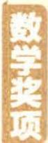

戴维逊奖 戴维逊奖是每年由洛勒·戴维逊基金会颁给年轻的概率学家的一个奖项，旨在奖励在数学领域中从事概率论研究并取得卓越成绩的青年数学家.

调研 2 (2023·广东东莞东华高级中学8月开学考试)甲、乙两人进行象棋比赛(没有平局),采用“五局三胜”制.已知在每局比赛中,甲获胜的概率为 $p,0 < p < 1$ .

（1）设甲以3:1获胜的概率为 $f(p)$ ，求 $f(p)$ 的最大值.

（2） 记（1）中 $f(p)$ 取得最大值时的 p 为 $p_{0}$ ，以 $p_{0}$ 作为 p 的值，用 X 表示甲、乙两人比赛的局数，求 X 的分布列和数学期望 $E(X)$ .

思维导引 （1） 列出 $f(p)$ 的解析式 $\rightarrow$ 求导 $\rightarrow$ $f(p)$ 的单调性 $\rightarrow$ $f(p)$ 的最大值

（2） $p_{0}=\frac{3}{4}$ → 确定 X 的所有可能取值 → 分别求出对应的概率 → X 的分布列 → X 的期望

解析 （1） 甲以 $3: 1$ 获胜, 则前三局中甲要胜两局败一局, 第四局甲再获胜,

【极易出错】甲以3:1获胜,不是甲在四局中赢下三局就行,若甲赢了前三局,比赛结果就只能是3:0. 所以前三局中甲只能赢两局,第四局再赢,结果才能是3:1

所以 $f(p)=C_{3}^{2}\cdot p^{2}\cdot(1-p)\cdot p=3p^{3}-3p^{4},0<p<1,$

则 $f'(p)=9p^{2}-12p^{3}=3p^{2}(3-4p)$ .

令 $f'(p)>0$ , 得 $0<p<\frac{3}{4}$ ; 令 $f'(p)<0$ , 得 $\frac{3}{4}<p<1$ .

所以 $f(p)$ 在 $(0, \frac{3}{4})$ 上单调递增，在 $(\frac{3}{4}, 1)$ 上单调递减，

所以当 $p=\frac{3}{4}$ 时, $f(p)$ 取得最大值, 为 $\frac{81}{256}$ .

（2） 由（1）知 $p = p_0 = \frac{3}{4}$ ,

由题意知 X 的所有可能取值为 3,4,5.

【会思考】要分出输赢，胜者要赢下3局，所以比赛最少是3局，最多为5局

则 $P(X = 3) = \left(\frac{3}{4}\right)^3 +\left(\frac{1}{4}\right)^3 = \frac{27}{64} +\frac{1}{64} = \frac{7}{16},$

【小提示】比赛3局分出胜负时，可能甲连赢3局，也可能乙连赢3局

$P (X = 4) = \mathrm{C} _ {3} ^ {2} \times (\frac {3}{4}) ^ {3} \times \frac {1}{4} + \mathrm{C} _ {3} ^ {1} \times \frac {3}{4} \times (\frac {1}{4}) ^ {3} = \frac {8 1}{2 5 6} + \frac {9}{2 5 6} = \frac {4 5}{1 2 8},$

$P (X = 5) = \mathrm{C} _ {4} ^ {2} \times (\frac {3}{4}) ^ {3} \times (\frac {1}{4}) ^ {2} + \mathrm{C} _ {4} ^ {2} \times (\frac {3}{4}) ^ {2} \times (\frac {1}{4}) ^ {3} = \frac {8 1}{5 1 2} + \frac {2 7}{5 1 2} = \frac {2 7}{1 2 8},$

所以 $X$ 的分布列为

<table><tr><td>X</td><td>3</td><td>4</td><td>5</td></tr><tr><td>P</td><td>7/16</td><td>45/128</td><td>27/128</td></tr></table>

$X$ 的数学期望 $E(X) = 3 \times \frac{7}{16} + 4 \times \frac{45}{128} + 5 \times \frac{27}{128} = \frac{483}{128}$ .

# 方法点津

通过设置变量, 利用数学期望、方差或概率的计算公式构造函数, 是概率与函数问题结合最常用的方式. 解决此类问题, 应注意两个问题: （1） 准确构造函数, 利用公式搭建函数模型时, 由于随机变量的数学期望、方差, 随机事件概率的计算中涉及变量较多, 式子较为复杂, 所以准确运算化简是关键. （2） 注意变量的取值范围, 一是题中给出的范围, 二是实际问题中变量自身取值的限制. 如【调研1】中直接给出 $p$ 的取值范围, 如果没有直接给出 $p$ 的范围, 由分布列的性质也可得出.

# 模型2 概率统计与数列交汇模型

调研 3 (2022·江苏南京考前模拟)2022年2月6日,中国女足在两球落后的情况下,最终以3比2逆转击败韩国女足,成功夺得亚洲杯冠军.在之前的半决赛中,中国女足通过点球大战6比5惊险战胜日本女足,其中门将朱钰两度扑出日本队员的点球,表现神勇.

（1）扑点球的难度一般比较大,假设罚点球的球员会等可能地随机选择球门的左、中、右三个方向射门,门将也会等可能地随机选择球门的左、中、右三个方向来扑点球,而且门将即使方向判断正确也有 $\frac{1}{2}$ 的可能性扑不到球.不考虑其他因素,在一次点球大战中,求门将在前三次扑出点球的个数 $X$ 的分布列和期望.

（2） 好成绩的取得离不开平时的努力训练, 甲、乙、丙、丁 4 名女足队员在某次传接球的训练中, 球从甲脚下开始, 等可能地随机传向另外 3 人中的 1 人, 接球者接到球后再等可能地随机传向另外 3 人中的 1 人, 如此不停地传下去, 假设传出的球都能被接住. 记第 $n$ 次传球之前球在甲脚下的概率为 $p_{n}$ , 易知 $p_{1} = 1, p_{2} = 0$ .

①试证明 $\{p_n - \frac{1}{4}\}$ 为等比数列；

②设第 n 次传球之前球在乙脚下的概率为 $q_{n}$ ，比较 $p_{10}$ 与 $q_{10}$ 的大小.

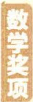

伯格曼奖 伯格曼奖由伯格曼信托基金会授奖. 出生于波兰的美国数学家伯格曼的遗孀去世后, 按其遗愿为纪念其丈夫, 把她的捐款于 1988 年设立了伯格曼信托基金会, 并设立此奖.

思维导引 （1） 计算门将每次可以扑出点球的概率 $\rightarrow X$ 取每个值的概率 $\rightarrow X$ 的分布列 $\rightarrow X$ 的数学期望

（2） 找出第 n 次传球之前球在甲脚下的概率与第 $(n-1)$ 次传球之前球在甲脚下的概率之间的关系 $p_{1}-\frac{1}{4}=\frac{3}{4}$ $\{p_{n}-\frac{1}{4}\}$ 为
等比数列 $p_{n}=\frac{3}{4}\times(-\frac{1}{3})^{n-1}+\frac{1}{4}$ $p_{10}<\frac{1}{4}$ $q_{10}=\frac{1}{3}(1-p_{10})>\frac{1}{4}$ $p_{10}<q_{10}$

解析 （1）依题意可得,门将每次扑出点球的概率为 $p=\frac{1}{3}\times\frac{1}{3}\times\frac{1}{2}\times3=\frac{1}{6}$ .

【扫清障碍】“门将扑出点球”：点球的方向与门将扑出的方向相同，且扑中的概率为 $\frac{1}{2}$ 。所以门将扑出点球可以以点球的方向为依据分为三个互斥事件，门将扑中球门左向的点球，该事件的概率为 $p_{1} = \frac{1}{3} \times \frac{1}{3} \times \frac{1}{2} = \frac{1}{18}$ ；门将扑中球门中向的点球，该事件的概率为 $p_{2} = \frac{1}{3} \times \frac{1}{3} \times \frac{1}{2} = \frac{1}{18}$ ；门将扑中球门右向的点球，该事件的概率为 $p_{3} = \frac{1}{3} \times \frac{1}{3} \times \frac{1}{2} = \frac{1}{18}$

门将在前三次扑出点球的个数 X 的所有可能取值为 0,1,2,3,

则 $P(X = 0) = \mathbb{C}_3^0\times (\frac{1}{6})^0\times (1 - \frac{1}{6})^3 = \frac{125}{216},P(X = 1) = \mathbb{C}_3^1\times (\frac{1}{6})^1\times (1 - \frac{1}{6})^2 = \frac{25}{72},$

【小提示】门将每次扑球的概率相同，故扑出点球的个数服从二项分布，即 $X \sim B(3, \frac{1}{6})$

$P (X = 2) = \mathrm{C} _ {3} ^ {2} \times (\frac {1}{6}) ^ {2} \times (1 - \frac {1}{6}) ^ {1} = \frac {5}{7 2}, P (X = 3) = \mathrm{C} _ {3} ^ {3} \times (\frac {1}{6}) ^ {3} \times (1 - \frac {1}{6}) ^ {0} = \frac {1}{2 1 6},$

所以 $X$ 的分布列为

<table><tr><td>X</td><td>0</td><td>1</td><td>2</td><td>3</td></tr><tr><td>P</td><td> $\frac{125}{216}$ </td><td> $\frac{25}{72}$ </td><td> $\frac{5}{72}$ </td><td> $\frac{1}{216}$ </td></tr></table>

$E (X) = 0 \times \frac {1 2 5}{2 1 6} + 1 \times \frac {2 5}{7 2} + 2 \times \frac {5}{7 2} + 3 \times \frac {1}{2 1 6} = \frac {1}{2}.$

【另解】因为 $X \sim B(3, \frac{1}{6})$ ，故可以直接套用公式 $E(X) = np$ 求数学期望，避免复杂计算造成失误

阿贝尔奖 阿贝尔奖是一项挪威设立的数学界大奖,每年颁发一次.2001年,为了纪念2002年挪威著名数学家尼尔斯·亨利克·阿贝尔二百周年诞辰,挪威政府宣布将开始颁发此奖.

（2）①第 $n$ 次传球之前球在甲脚下的概率为 $p_n$ , 则当 $n \geqslant 2$ 时, 第 $(n-1)$ 次传球之前球在甲脚下的概率为 $p_{n-1}$ , 不在甲脚下的概率为 $1 - p_{n-1}$ ,

所以 $p_n = 0 \cdot p_{n-1} + \frac{1}{3}(1 - p_{n-1}) = -\frac{1}{3} p_{n-1} + \frac{1}{3}$ ,

【析疑难】第 $n$ 次传球之前球是否在甲脚下, 要依据第 $(n - 1)$ 次传球之前球是否在甲脚下分为两个互斥事件: 若第 $(n - 1)$ 次传球之前球在甲脚下, 则甲只能传出给其他人, 所以第 $n$ 次传球之前球在甲脚下的概率为 0; 若第 $(n - 1)$ 次传球之前球不在甲脚下, 则球被传给甲的概率为 $\frac{1}{3}$ . 根据概率计算公式即可得到上述递推关系式

从而 $p_{n}-\frac{1}{4}=-\frac{1}{3}(p_{n-1}-\frac{1}{4})$ ,

【技法点拨】形如 $a_{n} = pa_{n - 1} + q (p \neq 0, p \neq 1, q \neq 0,$ )的递推数列，一般通过构造等比数列求解通项公式，通过设 $a_{n} + m = p(a_{n - 1} + m)$ ，求出常数 $m$ 。如该题设 $p_{n} + m = -\frac{1}{3}(p_{n - 1} + m)$ ，则 $p_{n} = -\frac{1}{3} p_{n - 1} - \frac{4}{3} m$ ，即 $-\frac{4}{3} m = \frac{1}{3}$ ，解得 $m = -\frac{1}{4}$

又 $p_1 - \frac{1}{4} = \frac{3}{4}$ , 所以 $\{p_n - \frac{1}{4}\}$ 是以 $\frac{3}{4}$ 为首项, $-\frac{1}{3}$ 为公比的等比数列.

②由①可知 $p_n - \frac{1}{4} = \frac{3}{4} \times (-\frac{1}{3})^{n-1}$ , 故 $p_n = \frac{3}{4} \times (-\frac{1}{3})^{n-1} + \frac{1}{4}$ , 则 $p_{10} = \frac{3}{4} \times (-\frac{1}{3})^9 + \frac{1}{4} < \frac{1}{4}$ .

易知 $q_{10} = \frac{1}{3} (1 - p_{10}) > \frac{1}{3} \times (1 - \frac{1}{4}) = \frac{1}{4}$ ,

【指点迷津】第10次传球之前球不在甲脚下的概率为 $1-p_{10}$ ，根据接球者接到球后等可能地随机传向另外3人中的1人，可知球在乙脚下的概率是 $\frac{1}{3}(1-p_{10})$

故 $p_{10} < q_{10}$

# 方法点津

概率与数列问题的交汇, 多以概率的求解为主线, 建立关于概率的递推关系. 解决此类问题的基本步骤为: （1） 精准定性, 即明确所求概率的 “事件属性”, 这是确定概率概型的依据, 也是建立递推关系的准则; （2） 准确建模, 即通过概率的求解, 建立递推关系, 转化为数列模型问题; （3） 解决模型, 也就是递推数列的求解, 多通过构造的方法转化为等差数列、等比数列的问题求解. 求解过程应灵活运用数列的性质, 准确应用相关公式.

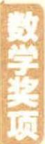

阿贝尔奖的奖金数额与诺贝尔奖相近,设立此奖的一个原因是诺贝尔奖没有数学奖项,设立此奖的主要目的是扩大数学的影响,吸引年轻人从事数学研究.

# 模型3 做决策模型

调研 4 (2022·衡水中学5月预测)第24届冬季奥林匹克运动会,即北京2022年冬奥会,于2022年2月4日星期五开幕,2月20日星期日闭幕.本届奥运会激发了大家对冰雪运动的热情,某冰雪运动品商店对消费达到一定金额的顾客开展了“冬奥”知识有奖竞答活动.试题由选择题和填空题两种题型构成,共需要回答三个问题,对于每一个问题,答错得0分,答对填空题得30分,答对选择题得20分.现设置了两种活动方案供选择:方案一,只回答填空题;方案二,第一题是填空题,后续选题按如下规则,若上一题回答正确,则下一题是填空题,若上一题回答错误,则下一题是选择题.某顾客获得了答题资格,已知其答对填空题的概率为 $\frac{1}{2}$ ,答对选择题的概率为 $p(0<p<1)$ ,且答对问题的概率与回答次序无关.

（1） 若该顾客采用方案一答题, 求其得分不低于 60 分的概率.

（2）以得分的数学期望作为判断依据,该顾客选择何种方案更加有利?并说明理由.

思维导引 （1） 得分不低于60分 → 至少答对两道填空题 → 结合二项分布的概率计算公式求解

（2） $X = 30\xi, \xi \sim B(3, \frac{1}{2})$ $\longrightarrow E(X) = 30E(\xi) = 45$ $\longrightarrow E(Y) = -10p^2 + \frac{65}{2} p + \frac{105}{4}$

$E(X)-E(Y)=10p^{2}-\frac{65}{2}p+\frac{75}{4}$ 分类讨论得到相应的结论

解析 （1） 采用方案一答题, 得分不低于 60 分的情况为至少答对两道填空题.

则其概率为 $C_{3}^{2}\left(\frac{1}{2}\right)^{3}+C_{3}^{3}\left(\frac{1}{2}\right)^{3}=\frac{3}{8}+\frac{1}{8}=\frac{1}{2}.$

【换个思路】该题也可以转化为对立事件的概率求解，“至少答对两个填空题”的对立事件是“答对0个或1个填空题”，故所求事件的概率 $P = 1 - \left[ C_{3}^{0}\left(\frac{1}{2}\right)^{3} + C_{3}^{1}\left(\frac{1}{2}\right)^{3} \right] = 1 - \left( \frac{1}{8} + \frac{3}{8} \right) = \frac{1}{2}$

（2） 若采用方案一, 设其答对题数为 $\xi$ , 得分为 $X$ , 则 $X = 30\xi$ .

易知 $\xi \sim B(3, \frac{1}{2})$ ，所以 $E(X) = 30E(\xi) = 30 \times 3 \times \frac{1}{2} = 45$ .

高斯奖 高斯奖是由国际数学联合会和德国数学家联合会共同设立的国际性数学大奖,德国数学家联盟具体负责奖项的管理工作.

若采用方案二,设其得分为 Y,则 Y 的所有可能取值为 0,20,30,50,60,90.

$P (Y = 0) = \frac {1}{2} (1 - p) ^ {2}, P (Y = 2 0) = \frac {1}{2} \times p \times \frac {1}{2} + \frac {1}{2} \times (1 - p) \times p = \frac {3 p - 2 p ^ {2}}{4},$

【辨析】方案二中,所答题型与上一个题是否答对有关,所以得分 $Y$ 的分布不是二项分布

$P (Y = 3 0) = \frac {1}{2} \times \frac {1}{2} (1 - p) = \frac {1 - p}{4}, P (Y = 5 0) = \frac {p}{4} \times 2 = \frac {p}{2},$

$P (Y = 6 0) = (\frac {1}{2}) ^ {3} = \frac {1}{8}, P (Y = 9 0) = (\frac {1}{2}) ^ {3} = \frac {1}{8}.$

则 $E(Y)=0\times\frac{(1-p)^{2}}{2}+20\times\frac{3p-2p^{2}}{4}+30\times\frac{1-p}{4}+50\times\frac{p}{2}+60\times\frac{1}{8}+90\times\frac{1}{8}=$ $-10p^{2}+\frac{65}{2}p+\frac{105}{4}$ ,

所以 $E(X)-E(Y)=10p^{2}-\frac{65}{2}p+\frac{75}{4}.$

【小技巧】Y的数学期望是关于p的多项式，所以可采用作差法比较大小

令 $E(X)-E(Y)>0$ ，则 $8p^{2}-26p+15>0$ ，解得 $p<\frac{3}{4}$ 或 $p>\frac{5}{2}$ （舍去），

即当 $0 < p < \frac{3}{4}$ 时, 选方案一数学期望大.

当 $E(X)-E(Y)=0$ , 即 $p=\frac{3}{4}$ 时, 方案一、方案二的数学期望大小一样.

当 $E(X)-E(Y)<0$ , 即 $\frac{3}{4}<p<1$ 时, 选方案二数学期望大.

综上所述, 当 $0 < p < \frac{3}{4}$ 时, 选方案一; 当 $p = \frac{3}{4}$ 时, 方案一、方案二均可; 当 $\frac{3}{4} < p < 1$ 时, 选方案二.

# 方法点津

解决决策性问题的关键是比较衡量指标的大小关系, 所以根据题意准确求出衡量指标是根本. 其基本的解题步骤为: （1） 准确定位, 即确定事件的性质, 这是准确建立模型、求解概率的基础; （2） 建立目标, 根据概率知识求出衡量指标的目标式, 如果没有特殊要求, 则需要求出数学期望与方差两个方面的指标值; （3） 比较大小, 比较衡量指标的大小, 一般采用作差法或作商法比较大小, 如果没有特殊要求, 则需要先比较变量取值的平均水平——数学期望, 若两者相同, 则进一步比较变量取值的离散集中程度——方差; （4） 做出决策, 根据衡量指标值的大小, 做出相应的决策.

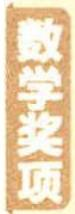

高斯奖是为纪念“数学王子”高斯而设,主要用于奖励在应用数学方面取得成果者,是应用数学领域的最高奖.

# 新题演练

##### 1. (2022·合肥八中5月模拟预测)已知随机变量 $X$ 的分布列为

<table><tr><td>X</td><td>1</td><td>2</td><td>3</td><td>4</td></tr><tr><td>P</td><td>p</td><td> $1 - p - p^{2} - p^{3}$ </td><td> $p^{3}$ </td><td> $p^{2}$ </td></tr></table>

其中 $p \in (0,1)$ ，随机变量 X 的期望为 $E(X)$ ，则当 $E(X)$ 取得最小值时，p = \_\_\_\_.

##### 2. (2022·湖北鄂东南三校5月适应性考试)已知 $A, B$ 两个投资项目的利润率分别为随机变量 $X_{1}$ 和 $X_{2}$ , 根据市场分析, $X_{1}$ 和 $X_{2}$ 的分布列如下:

<table><tr><td> $X_1$ </td><td>5%</td><td>10%</td></tr><tr><td>P</td><td>0.6</td><td>0.4</td></tr></table>

<table><tr><td> $X_2$ </td><td>2%</td><td>8%</td><td>12%</td></tr><tr><td>P</td><td>0.1</td><td>0.5</td><td>0.4</td></tr></table>

（1） 在 A, B 两个项目上各投资 200 万元, $Y_{1}$ 和 $Y_{2}$ (单位: 万元) 分别为投资项目 A 和 B 所获得的利润, 求 $D(Y_{1})$ 和 $D(Y_{2})$ .  
（2） 将 $x (0 < x < 200)$ 万元投资 $A$ 项目, $(200 - x)$ 万元投资 $B$ 项目, $f(x)$ 表示投资 $A$ 项目所得利润的方差与投资 $B$ 项目所得利润的方差之和. 则当 $x$ 为何值时, $f(x)$ 取得最小值?

##### 3. (2022·辽宁大连二十四中最后一模/新能源汽车)某汽车公司最近研发了一款新能源汽车,并在出厂前对100辆汽车进行了单次最大续航里程(单位:千米)的测试.现对测试数据进行分析,得到如图10-1所示的频率分布直方图.

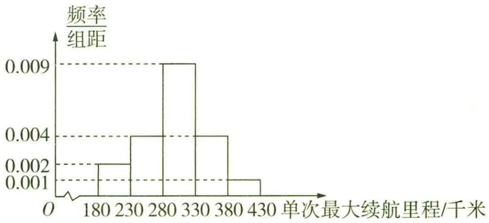

图10-1

（1） 估计这 100 辆汽车的单次最大续航里程的平均值 (同一组中的数据用该组区间的中点值代表).  
（2） 经计算第（1）问中样本标准差 s 的近似值为 50, 根据大量的测试数据, 可以认为这款汽车的单次最大续航里程 X 近似地服从正态分布 $N(\mu, \sigma^{2})$ (用样本平均数

$\bar{x}$ 和标准差 s 分别作为 $\mu, \sigma$ 的近似值), 现任取一辆汽车, 求它的单次最大续航里程 $X \in [250, 400]$ 的概率. (参考数据: 若随机变量 $X \sim N(\mu, \sigma^{2})$ , 则 $P(\mu - \sigma \leqslant X \leqslant \mu + \sigma) \approx 0.6827$ , $P(\mu - 2\sigma \leqslant X \leqslant \mu + 2\sigma) \approx 0.9545$ , $P(\mu - 3\sigma \leqslant X \leqslant \mu + 3\sigma) \approx 0.9973$ )

（3）某汽车销售公司为推广此款新能源汽车,现面向意向客户推出“玩游戏,送大奖”活动,客户可根据抛掷硬币的结果,操控微型遥控车在方格图上(方格图上依次标有数字0,1,2,3,…,20)移动,若遥控车最终停在“胜利大本营”(第19格),则可获得购车优惠券3万元;若遥控车最终停在“微笑大本营”(第20格),则没有任何优惠券.已知硬币出现正、反面的概率都是 $\frac{1}{2}$ ,遥控车开始在第0格,客户每掷一次硬币,遥控车向前移动一次:若掷出正面,遥控车向前移动一格(从k到k+1);若掷出反面,遥控车向前移动两格(从k到k+2),直到遥控车移动到“胜利大本营”或“微笑大本营”时,游戏结束.设遥控车移动到第n(0≤n≤19)格的概率为P $_{n}$ ,试证明{P $_{n}$ - P $_{n-1}$ } (1≤n≤19)是等比数列,并求顾客参与一次游戏获得优惠券的期望值(精确到0.1万元).

##### 4. (2022·华中师大一附中5月模拟预测)为丰富学生在校的课余生活,某校高三年级倡导学生积极参加踢毽子、投篮、射门等体育活动.各班拟推选“运动健将”组建班级代表队参与年级组织的体育比赛,年级依据各班团体项目和个人项目成绩的总积分排名给予表彰.

（1） 踢毽子是团体项目之一. 班级人均一分钟踢毽子数不低于 37 个就认定为优秀. A 班利用体育课进行一分钟踢毽子练习, 体育委员统计出同学们的成绩 (全部介于 10 到 70 之间) 并作出频率分布直方图如图 10-2 所示 (原始成绩单丢失). 已知该频率分布直方图后四组 “柱高” 成等比数列, 若对这次练习的成绩做

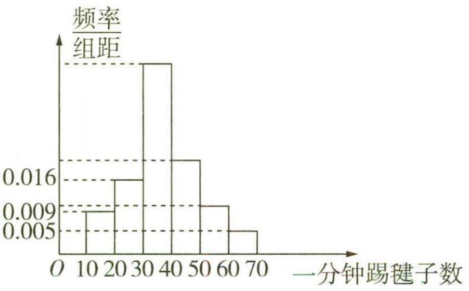

图10-2

评价,该班是否达到优秀的标准?请说明你的判断理由.

（2）年级组织的体育比赛中设有定点投篮和射门两个个人项目,规则如下:参赛选手

从甲、乙两种方式中任选一种进行比赛,若投中或射中就称之为成功.

甲方式:从投篮、射门两项中通过抽签等可能地选择其中一个项目连续测试两次.

乙方式:从投篮、射门两项中通过抽签等可能地选择其中一个项目进行测试,若该项目成功则换另一个项目接着进行测试,否则重复测试该项目,此方式也只测试两次.

积分规则:无论选择甲、乙哪种方式,若某项目首次测试成功记5分,失败记0分;再次测试该项目时,成功只记4分,失败仍记0分.

A 班推选 a 同学代表班级从甲、乙两种方式中选择一种参加个人项目比赛. 已知 a 同学投篮和射门的命中率分别为 $\frac{4}{5}$ , $\frac{3}{5}$ , 且前后两项测试不会相互影响. 以参加比赛的得分期望为标准, 请问 a 同学应选择哪种方式?

# 参考答案与解析

##### 1. $\frac{\sqrt{7} - 2}{3}$ 由题意得, $E(X) = p + 2(1 - p - p^2 - p^3) + 3p^3 + 4p^2 = p^3 + 2p^2 - p + 2.$

令 $y=p^{3}+2p^{2}-p+2(0<p<1)$ ，则 $y'=3p^{2}+4p-1$ ，

当 $y' < 0$ 时, 解得 $0 < p < \frac{\sqrt{7} - 2}{3}$ , 当 $y' > 0$ 时, 解得 $\frac{\sqrt{7} - 2}{3} < p < 1$ ,

所以函数 $y=p^{3}+2p^{2}-p+2$ 在 $(0,\frac{\sqrt{7}-2}{3})$ 上单调递减，在 $(\frac{\sqrt{7}-2}{3},1)$ 上单调递增，

所以函数在 $p=\frac{\sqrt{7}-2}{3}$ 处取得最小值, 即当 $p=\frac{\sqrt{7}-2}{3}$ 时 $E(X)$ 取得最小值.

##### 2. （1）依题意得 $Y_{1}$ 和 $Y_{2}$ 的分布列分别为

<table><tr><td>Y1</td><td>10</td><td>20</td></tr><tr><td>P</td><td>0.6</td><td>0.4</td></tr></table>

<table><tr><td> $Y_2$ </td><td>4</td><td>16</td><td>24</td></tr><tr><td>P</td><td>0.1</td><td>0.5</td><td>0.4</td></tr></table>

则 $E(Y_{1}) = 10\times 0.6 + 20\times 0.4 = 14,E(Y_{2}) = 4\times 0.1 + 16\times 0.5 + 24\times 0.4 = 18,$

所以 $D(Y_{1})=(10-14)^{2}\times0.6+(20-14)^{2}\times0.4=24$

$D \left(Y _ {2}\right) = (4 - 1 8) ^ {2} \times 0. 1 + (1 6 - 1 8) ^ {2} \times 0. 5 + (2 4 - 1 8) ^ {2} \times 0. 4 = 3 6.$

巴尔扎恩奖 巴尔扎恩奖创立于 1961 年,由巴尔扎恩国际基金会提供资金支持和管理,一年颁发一次.

（2） 设投资 $A$ 项目所得利润为 $Z_{1} = \frac{x}{200} Y_{1}$ , 投资 $B$ 项目所得利润为 $Z_{2} = \frac{200 - x}{200} Y_{2}$ .

$\begin{array}{l} f (x) = D \left(Z _ {1}\right) + D \left(Z _ {2}\right) = D \left(\frac {x}{2 0 0} Y _ {1}\right) + D \left(\frac {2 0 0 - x}{2 0 0} Y _ {2}\right) = \left(\frac {x}{2 0 0}\right) ^ {2} D \left(Y _ {1}\right) + \left(\frac {2 0 0 - x}{2 0 0}\right) ^ {2} D \left(Y _ {2}\right) = \\ \frac {3}{1 0 0 ^ {2}} (5 x ^ {2} - 1 2 0 0 x + 1 2 0 0 0 0), \end{array}$

【记结论】方差 $D(aX + b) = a^2 D(X)$

故当 x=120 时, $f(x)$ 取得最小值.

##### 3. （1） 这 100 辆汽车的单次最大续航里程的平均值为 $\bar{x} = 205 \times 0.1 + 255 \times 0.2 + 305 \times 0.45 + 355 \times 0.2 + 405 \times 0.05 = 300$ .

（2）由题可知 $\mu = 300, \sigma = 50$ ，即 $X \sim N(300, 50^2)$ ，则 $P(250 \leqslant X \leqslant 400) = P(\mu - \sigma \leqslant X \leqslant \mu + 2\sigma) \approx \frac{0.6827}{2} + \frac{0.9545}{2} = 0.8186.$   
（3）由题可知 $P_{0} = 1, P_{1} = \frac{1}{2}$ .

遥控车移动到第 $n(2 \leqslant n \leqslant 19)$ 格有两种可能: ①遥控车先到第 $(n - 2)$ 格, 又掷出反面, 其概率为 $\frac{1}{2} P_{n-2}$ ; ②遥控车先到第 $(n - 1)$ 格, 又掷出正面, 其概率为 $\frac{1}{2} P_{n-1}$ .

所以 $P_{n} = \frac{1}{2} P_{n - 2} + \frac{1}{2} P_{n - 1}$ ，所以当 $2\leqslant n\leqslant 19$ 时， $P_{n} - P_{n - 1} = -\frac{1}{2} (P_{n - 1} - P_{n - 2})$

【题眼】根据设问“证明 $\{P_{n}-P_{n-1}\}$ 是等比数列”进行构造，注意检验该数列的首项是否为 0

又 $P_{1} - P_{0} = -\frac{1}{2}\neq 0$ ，所以当 $1\leqslant n\leqslant 19$ 时，数列 $\{P_n - P_{n - 1}\}$ 是首项为 $-\frac{1}{2}$ ，公比为 $-\frac{1}{2}$ 的等比数列，即 $P_{n} - P_{n - 1} = (-\frac{1}{2})^{n}$

则 $P_{1}-P_{0}=-\frac{1}{2},P_{2}-P_{1}=(-\frac{1}{2})^{2},P_{3}-P_{2}=(-\frac{1}{2})^{3},\cdots,P_{n}-P_{n-1}=(-\frac{1}{2})^{n}$

以上各式相加, 得 $P_{n}-1=(-\frac{1}{2})+(-\frac{1}{2})^{2}+(-\frac{1}{2})^{3}+\cdots+(-\frac{1}{2})^{n}=(-\frac{1}{3})$ $[1-(-\frac{1}{2})^{n}]$ ,

所以当 $1 \leqslant n \leqslant 19$ 时, $P_{n} = \frac{2}{3} + \frac{1}{3} \times \left(-\frac{1}{2}\right)^{n}$ ,

则到达“胜利大本营”的概率 $P_{19}=\frac{2}{3}-\frac{1}{3}\times\frac{1}{2^{19}}$ .

设顾客参与一次游戏获得优惠券的金额为 Y 万元, 则 Y=3 或 Y=0,

$Y$ 的期望 $E(Y) = 3 \times P_{19} + 0 \times (1 - P_{19}) = 3 \times (\frac{2}{3} - \frac{1}{3} \times \frac{1}{2^{19}}) = 2 - \frac{1}{2^{19}} \approx 2.0,$

故顾客参与一次游戏获得优惠券的期望值约为 2.0 万元.

##### 4. （1） 设倒数第 1,2,3,4 组“柱高”的公比为 $q(q > 1)$ ,

则由题意得 $\frac{0.05(1-q^{4})}{1-q}=0.75$ ，即 $1+q+q^{2}+q^{3}=15$ .

记函数 $f(q)=1+q+q^{2}+q^{3},q>1$ ，则 $f'(q)=3q^{2}+2q+1=2q^{2}+(q+1)^{2},f'(q)>0$ 恒成立，则 $f(q)$ 在定义域上单调递增，又 $f(2)=15$ ，故q=2。

则 A 班同学一分钟踢毽子数的平均值为 $\mu = 15 \times 0.09 + 25 \times 0.16 + 35 \times 0.4 + 45 \times 0.2 + 55 \times 0.1 + 65 \times 0.05 = 37.1 > 37$ .

所以 A 班能达到优秀标准.

（2） 若选择甲方式,记得分为 X, 则 X 的所有可能取值为 9, 5, 4, 0.

$P (X = 9) = \frac {1}{2} \times \frac {4}{5} \times \frac {4}{5} + \frac {1}{2} \times \frac {3}{5} \times \frac {3}{5} = \frac {1}{2}, P (X = 5) = \frac {1}{2} \times \frac {4}{5} \times \frac {1}{5} + \frac {1}{2} \times \frac {3}{5} \times \frac {2}{5} = \frac {1}{5},$

$P (X = 4) = \frac {1}{2} \times \frac {1}{5} \times \frac {4}{5} + \frac {1}{2} \times \frac {2}{5} \times \frac {3}{5} = \frac {1}{5}, P (X = 0) = \frac {1}{2} \times \frac {1}{5} \times \frac {1}{5} + \frac {1}{2} \times \frac {2}{5} \times \frac {2}{5} = \frac {1}{1 0},$

$E (X) = 9 \times \frac {1}{2} + 5 \times \frac {1}{5} + 4 \times \frac {1}{5} + 0 \times \frac {1}{1 0} = 6. 3.$

若选择乙方式,记得分为 Y,则 Y 的所有可能取值为 10,5,4,0.

【易错提醒】题干条件是指若某项目测试了两次，则第二次测试成功只记4分，不是若第二次进行测试的项目成功，只记4分

$P (Y = 1 0) = \frac {1}{2} \times \frac {4}{5} \times \frac {3}{5} + \frac {1}{2} \times \frac {3}{5} \times \frac {4}{5} = \frac {1 2}{2 5}, P (Y = 5) = \frac {1}{2} \times \frac {4}{5} \times \frac {2}{5} + \frac {1}{2} \times \frac {3}{5} \times \frac {1}{5} = \frac {1 1}{5 0},$

$P (Y = 4) = \frac {1}{2} \times \frac {1}{5} \times \frac {4}{5} + \frac {1}{2} \times \frac {2}{5} \times \frac {3}{5} = \frac {1}{5}, P (Y = 0) = \frac {1}{2} \times \frac {1}{5} \times \frac {1}{5} + \frac {1}{2} \times \frac {2}{5} \times \frac {2}{5} = \frac {1}{1 0},$

$E (Y) = 1 0 \times \frac {1 2}{2 5} + 5 \times \frac {1 1}{5 0} + 4 \times \frac {1}{5} + 0 \times \frac {1}{1 0} = 6. 7.$

因为 $E(Y) > E(X)$ ，所以 a 同学应该选择乙方式。

你的心应该保持这种模样,略带发力的紧张,不松懈,对待不定有坦然.损伤是承载,沉默是扩展,终结是新的开始.如此,我会对你的心产生敬意.

# 攻克疑难篇

# 超重点 11 计数原理 & 概率 & 统计中的疑难点问题

# 疑难点1 新定义问题

调研 1 (2022·上海七宝中学6月期末/定义新概念)信息熵是信息论中的一个重要概念.设随机变量 X 所有可能的取值为 $1, 2, \cdots, n$ , 且 $P(X = i) = p_i > 0 (i = 1, 2, \cdots, n)$ , $\sum_{i=1}^{n} p_i = 1$ , 定义 X 的信息熵 $H(X) = -\sum_{i=1}^{n} (p_i \log_2 p_i)$ . 给出下列两个命题.

命题1: 若 $p_{i}=\frac{1}{n}(i=1,2,\cdots,n)$ ，则 $H(X)$ 随着 n 的增大而增大.

命题2:若 n=2m, 随机变量 Y 所有可能的取值为 $1,2,\cdots,m$ , 且 $P(Y=j)=p_{j}+p_{2m+1-j}(j=1,2,\cdots,m)$ , 则 $H(X)\leqslant H(Y)$ .

则以下说法正确的是 （）

$\quad$A. 命题 1 正确, 命题 2 错误  
$\quad$B. 命题 1 错误, 命题 2 正确  
$\quad$C. 两个命题都错误  
$\quad$D. 两个命题都正确

# 思维导引

根据信息熵的公式,利用对数的运算性质及对数函数的单调性

判断命题1的正误

由已知公式分别得到 $H(X)$ ， $H(Y)$ 关于 $p_i$ 的式子

应用作差法及对数的性质判断 $H(X), H(Y)$ 的大小

判断命题2的正误

解析

若 $p_{i}=\frac{1}{n}(i=1,2,\cdots,n)$ ，则 $H(X)=-n\times\frac{1}{n}\times\log_{2}\frac{1}{n}=\log_{2}n$

追根溯源:本题的2个命题其实是2020年山东卷多选题第12题的选项CD，而对于信息熵这个概念，早在2018年上海七宝中学高三开学考试中就已经出现过，全国卷地区学习程度较好的学生，在复习备考中可适度关注上海、北京等地区的模拟试题，多接触创新的题型、陌生的情境，可以提升自己对新题目的接受度，对于学习程度一般的学生，则不作此要求，以免过度增加负担.

故 $H(X)$ 随着 n 的增大而增大, 命题 1 正确.

$P(X=i)=p_{i}>0(i=1,2,\cdots,n)$ ，若 n=2m，则 $H(X)=-\left(p_{1}\log_{2}p_{1}+p_{2}\log_{2}p_{2}+\cdots+p_{2m}\log_{2}p_{2m}\right)$ ，

而 $n=2m, P(Y=j)=p_{j}+p_{2m+1-j}(j=1,2,\cdots,m)$ ，则 $P(Y=1)=p_{1}+p_{2m}, p(Y=2)=p_{2}+p_{2m-1}, \cdots, p(Y=m)=p_{m}+p_{m+1}$ ,

所以 $H(Y) = -\left[(p_{1} + p_{2m}) \log_{2}(p_{1} + p_{2m}) + (p_{2} + p_{2m-1}) \log_{2}(p_{2} + p_{2m-1}) + \cdots + (p_{m} + p_{m+1}) \log_{2}(p_{m} + p_{m+1})\right] = -\left[p_{1} \log_{2}(p_{1} + p_{2m}) + p_{2} \log_{2}(p_{2} + p_{2m-1}) + \cdots + p_{m} \log_{2}(p_{m} + p_{m+1}) + p_{m+1} \log_{2}(p_{m+1} + p_{m}) + \cdots + p_{2m} \log_{2}(p_{2m} + p_{1})\right]$ ,

所以 $H(X)-H(Y)=p_{1}\log_{2}\frac{p_{1}+p_{2m}}{p_{1}}+p_{2}\log_{2}\frac{p_{2}+p_{2m-1}}{p_{2}}+\cdots+p_{2m}\log_{2}\frac{p_{2m}+p_{1}}{p_{2m}}>0$

故 $H(X) > H(Y)$ ，命题 2 错误。

故选A.

调研 2 (2022·山东菏泽期末/定义新公式)类比排列数公式 $A_{n}^{r}=n(n-1)(n-2)\cdots(n-r+1)$ ，定义 $B_{x}^{n}=x(x-1)(x-2)\cdots(x-n+1)$ （其中 $n\in\mathbf{N}^{*},x\in\mathbf{R}$ ），将等式右边展开并用符号 $S(n,k)$ 表示 $x^{k}(1\leqslant k\leqslant n,k\in\mathbf{N}^{*})$ 的系数，得 $B_{x}^{n}=S(n,n)x^{n}+S(n,n-1)x^{n-1}+\cdots+S(n,1)x$ ，则：

（1） $S(n,1)=$ \_\_\_\_;   
（2） 若 $S(n,r)=a, S(n,r+1)=b(r\in\mathbf{N}^{*},r+1\leqslant n)$ ，则 $S(n+1,r+1)=$ \_\_\_\_.

解析 （1）依题意得, $S(n,1)$ 是 $(x-1)(x-2)\cdots(x-n+1)$ 的展开式的常数项,

【会转化】 $B_{x}^{n}=S(n,n)x^{n}+S(n,n-1)x^{n-1}+\cdots+S(n,1)x,S(n,1)$ 是 $x(x-1)(x-2)\cdots(x-n+1)$ 展开式中x项的系数，也就是 $(x-1)(x-2)\cdots(x-n+1)$ 展开式的常数项，计算常数项，只需把每个部分的常数乘起来即可，比前面计算x项的系数简单得多

所以 $S(n,1)=(-1)\times(-2)\times(-3)\times\cdots\times(-n+1)=(-1)^{n-1}\times1\times2\times$ $3 \times \cdots \times (n - 1) = (-1)^{n-1}(n - 1)!$ .

（2）依题意, $B_{x}^{n+1}=(x-n)B_{x}^{n}=(x-n)\left[S(n,n)x^{n}+S(n,n-1)x^{n-1}+\cdots+S(n,1)x\right]$ ,

则 $S(n + 1,r + 1)x^{r + 1} = S(n,r)x^r\cdot x + S(n,r + 1)x^{r + 1}\cdot (-n)$

而 $S(n,r)=a,S(n,r+1)=b,$

所以 $S(n + 1,r + 1) = S(n,r) - nS(n,r + 1) = a - nb.$

故答案为 $(-1)^{n-1}(n-1)!$ ; a - nb.

调研 3 (2023·上海行知中学开学考试/定义新函数) 定义域为集合 $\{1,2,3,\cdots,14\}$ 上的函数 $f(x)$ 满足: ① $f(1), f(8), f(14)$ 依次构成等比数列; ② $f(1)=1$ ; ③ $|f(x+1)-f(x)|=1(x=1,2,\cdots,13)$ . 则这样的不同函数 $f(x)$ 的个数为 ( )

$\quad$A. 456

$\quad$B. 465

$\quad$C. 546

$\quad$D. 564

思维导引 先列举出 $f(x)$ 的部分取值, 发现规律后即可得到所有可能取值, 再得到使 $f(1), f(8), f(14)$ 依次构成等比数列时对应的值, 运用计数原理知识即可求出不同函数 $f(x)$ 的个数.

解析 $f(x)(x=1,2,\cdots,14)$ 的取值的最大值为 x，最小值为 2-x，并且构成以 2 为公差的等差数列.

【数形结合】由 $|f(x+1)-f(x)|=1$ 得 $|f(2)-f(1)|=1$ ，因为 $f(1)=1$ ，所以 $f(2)=2$ 或 $f(2)=0$ ，再由 $f(2)$ 的值继续往后分析，故可在草稿纸上画出如图11-1所示的树状图，只列出前几个数，就能发现规律，前面已经出现过的数字不必再写，这样 $f(x)$ 的取值规律就能唾手可得了

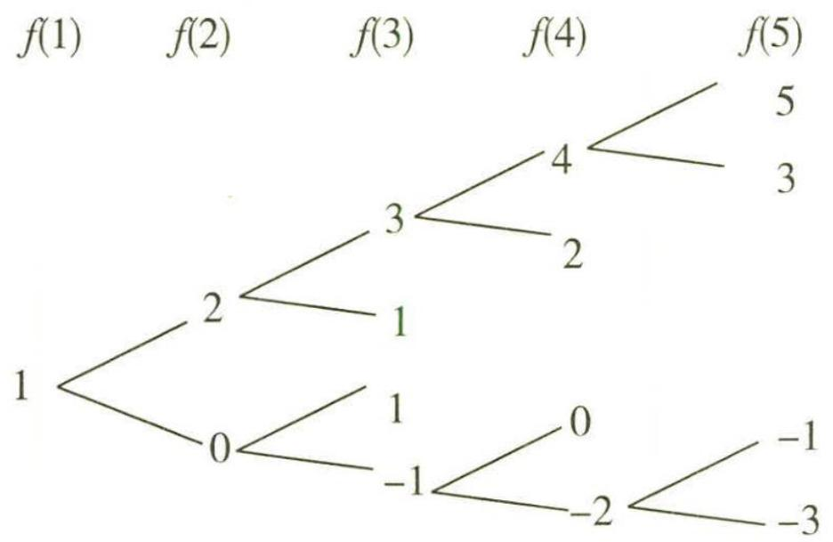

图11-1

故 $f(8)$ 的可能取值为8,6,4,2,0,-2,-4,-6,

$f(14)$ 的可能取值为 14, 12, 10, 8, 6, 4, 2, 0, -2, -4, -6, -8, -10, -12.

所以要使 $f(1)$ , $f(8)$ , $f(14)$ 依次成等比数列, 则 $f(1)$ , $f(8)$ , $f(14)$ 的取值只有两种情况: ① $f(1)=1$ , $f(8)=2$ , $f(14)=4$ ; ② $f(1)=1$ , $f(8)=-2$ , $f(14)=4$ .

对于第①种情况,要想构造满足条件的等比数列,可分为下列两步.

第一步,从 $f(1)$ 变化到 $f(8)$ ;第二步,从 $f(8)$ 变化到 $f(14)$ .

从 $f(1)$ 变化到 $f(8)$ ，共有7次变化，要使经过这7次变化后函数值从1变化到2，应从

生命是在一次次的突围中再生的,每一个太阳的升起又落下,都是人冲破自我的一种催促.

7 次变化中选择 4 次函数值加 1 , 剩余的 3 次函数值减 1 , 对应的方法种数为 ${\mathrm{C}}_{7}^{3} = {35}$ .

从 $f(8)$ 变化到 $f(14)$ ，共有6次变化，要使经过这6次变化后函数值从2变化到4，应从6次变化中选择4次函数值加1，剩余的2次函数值减1，对应的方法种数为 $C_{6}^{2}=15$ .

根据分步乘法计数原理知共有 $35 \times 15 = 525$ (种) 方法.

对于第②种情况,要想构造满足条件的等比数列,可分为下列两步.

第一步, $f(1)$ 变化到 $f(8)$ ;第二步,从 $f(8)$ 变化到 $f(14)$ .

从 $f(1)$ 变化到 $f(8)$ ，共有7次变化，要使经过这7次变化后函数值从1变化到-2，应从7次变化中选择2次加1，剩余的5次减1，对应的方法种数为 $C_{7}^{2}=21$ 。

从 $f(8)$ 变化到 $f(14)$ ，共有6次变化，要使经过这6次变化后函数值从-2变化到4,6次变化函数值都应该加1，对应的方法种数为 $C_{6}^{6}=1$ .

根据分步乘法计数原理知共有 $21 \times 1 = 21$ (种) 方法.

综上,根据分类加法计数原理知满足条件的不同的函数 $f(x)$ 共有 $525+21=546$ (个).

【会转化】易知从 $f(1)$ 变化到 $f(14)$ 的不同的方法种数就是满足条件的不同函数 $f(x)$ 的个数，本题难度不小，但只要仔细分析条件，利用数形结合得到函数值的变化规律，灵活运用等价转化思想，即可得解

故选C.

# 疑难点2 交汇型综合问题

调研 4 (2023·河南安阳开学考试改编/概率与数列交汇)(多选)已知数列 $\{a_n\}$ 的前n项和为 $S_n$ ,且 $a_i=1, a_i=2$ 的概率均为 $\frac{1}{2}(i=1,2,3,\cdots,n)$ ,设 $S_n$ 能被3整
除的概率为 $P_n$ .则下述四个结论中正确的有()

$\quad$A. $P_{2} = 1$   
$\quad$B. $P_{3} = \frac{1}{4}$   
$\quad$C. $P_{11} = \frac{341}{1024}$   
$\quad$D. 当 $n \geqslant 5$ 时, $P_{n} < \frac{1}{3}$

# 思维导引

分析 $S_{n}$ 被3除的余数的情况及每种情况对应的概率

分析 $P_{n + 1}$ 与 $P_{n}$ 的关系

根据递推关系得到数列 $\{P_{n} - \frac{1}{3}\}$ 是等比数列

数列 $\{P_{n}\}$ 的通项公式

依次判断每个选项的正误,得解

有的时候,你很认真地去奋斗,但没有取得辉煌的成绩,你是否应该考虑舍弃一些东西.人的生命是有限的,只有把握有限的时间和精力,相对集中地投入到某一个具体的人生目标上,才有可能成功.

解析 $S_{n}$ 被 3 除的余数有 3 种情况, 分别为 0, 1, 2,

因为 $S_{n}$ 被 3 整除的概率为 $P_{n}$ ，所以 $S_{n}$ 被 3 除余数分别为 1,2 的概率均为 $\frac{1-P_{n}}{2}$ .

所以 $P_{n + 1} = 0\times P_n + \frac{1}{2}\times \frac{1 - P_n}{2} +\frac{1}{2}\times \frac{1 - P_n}{2} = \frac{1}{2} (1 - P_n),$

【扫清障碍】因为 $a_{i}=1$ ， $a_{i}=2$ 的概率均为 $\frac{1}{2}(i=1,2,3,\cdots,n)$ ，所以，若 $S_{n}$ 被 3 整除， $S_{n+1}=S_{n}+a_{n+1}=S_{n}+1$ 或 $S_{n+1}=S_{n}+2$ ，则 $S_{n+1}$ 要么被 3 除余 1，要么被 3 除余 2，据此得到 $P_{n+1}$ 与 $P_{n}$ 的关系，进而研究数列 $\{P_{n}\}$ 的通项公式

由 $P_{n + 1} = \frac{1}{2} (1 - P_n)$ 得 $P_{n + 1} - \frac{1}{3} = -\frac{1}{2} (P_n - \frac{1}{3})$

【方法链接】已知数列的递推关系求通项公式的常用方法：（1）当出现 $a_{n} = a_{n - 1} + m (n \geqslant 2, m$ 为常数）时，构造等差数列；（2）当出现 $a_{n} = xa_{n - 1} + y (n \geqslant 2, x \neq 0$ 且 $x \neq 1$ ）时，构造等比数列；（3）当出现 $a_{n} = a_{n - 1} + f(n) (n \geqslant 2)$ 时，用累加法求解；（4）当出现 $\frac{a_{n}}{a_{n - 1}} = f(n) (n \geqslant 2)$ 时，用累乘法求解

易知 $P_{1} = 0$ ，则 $P_{1} - \frac{1}{3} = -\frac{1}{3}\neq 0,$

所以数列 $\{P_n - \frac{1}{3}\}$ 是等比数列，且首项为 $-\frac{1}{3}$ ，公比为 $-\frac{1}{2}$ .

所以 $P_{n} - \frac{1}{3} = -\frac{1}{3} (-\frac{1}{2})^{n - 1}$ 故 $P_{n} = \frac{1}{3} -\frac{1}{3} (-\frac{1}{2})^{n - 1}$

故 $P_{2} = \frac{1}{3} +\frac{1}{3}\times \frac{1}{2} = \frac{1}{2},P_{3} = \frac{1}{3} -\frac{1}{3}\times \frac{1}{4} = \frac{1}{4},P_{11} = \frac{1}{3} -\frac{1}{3}\times \frac{1}{1024} = \frac{341}{1024},$

当 $n \geqslant 5$ 且 n 为偶数时, $P_{n} > \frac{1}{3}$ ,

所以 AD 错, BC 对. 故选 BC.

调研 5 (2022·江苏常州 5 月模拟/概率与立体几何交汇)(多选)如图 11-2,在菱形 ABCD 中, $AB=2,\angle BAD=60^{\circ}$ ,将 $\triangle ABD$ 沿对角线 BD 翻折到 $\triangle PBD$ 的位置,连接 PC. 在翻折过程中,下列说法正确的是()

$\quad$A. 任取三棱锥 P-BCD 中的三条棱, 它们共面的概率为 0.2

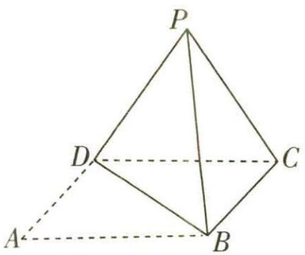

图11-2

$\quad$B. 存在某个位置,使得 PC 与 BD 所成角为 $60^{\circ}$   
$\quad$C. 当 $PC$ 与平面 $BCD$ 所成角为 $45^{\circ}$ 时, 三棱锥 $P - BCD$ 的体积最大  
$\quad$D. 当二面角 $P - BD - C$ 的大小为 $90^{\circ}$ 时, 点 $D$ 到平面 $PBC$ 的距离最大

解析 对于 A, 从三棱锥 P-BCD 的所有棱中任取三条, 有 $C_{6}^{3}=\frac{6\times5\times4}{3\times2\times1}=$ 20(种)情况,其中共面的一共有4种情况,故所求概率为 $\frac{4}{20}=0.2$ ,故A正确.

对于 B, 连接 AC, 交 BD 于 E, 连接 PE, 如图 11-3 所示.

因为翻折前四边形 ABCD 为菱形, 所以 $AC \perp BD$ , 即 $CE \perp BD$ , $PE \perp BD$ .

又 $CE \cap PE = E$ , 所以 $BD \perp$ 平面 $PCE$ , 又 $PC \subset$ 平面 $PCE$ , 所以 $BD \perp PC$ , 故 B 错误.

对于 C, 如图 11-3, 因为 $BD \perp$ 平面 $PCE, PB = PD$ , 所以点 $P$ 在平面 $BCD$ 上的射影落在直线 $AC$ 上, 所以 $\angle ECP$ 为 $PC$ 与平面 $BCD$ 所成的角, 即 $\angle ECP = 45^{\circ}$ .

图11-3

因为 CE = PE，所以 $\angle ECP = \angle EPC = 45^{\circ}$ ，所以 $\angle CEP = 90^{\circ}$ ，即 $EP \perp EC$ 。

又 $EP \perp BD, BD \cap EC = E$ , 所以 $EP \perp$ 平面 $BCD$ .

此时三棱锥 P-BCD 的高为 EP, 此时高取最大值.

设三棱锥 $P - BCD$ 的高为 $h$ ，则 $h \leqslant EP$ ，所以 $V_{\text{三棱锥} P - BCD} = \frac{1}{3} S_{\triangle BCD} \cdot h \leqslant \frac{1}{3} S_{\triangle BCD} \cdot EP.$

所以当 PC 与平面 BCD 所成角为 $45^{\circ}$ 时, 三棱锥 P-BCD 的体积最大, 故 C 正确.

合理生活的目的在于懂得什么是正义的东西,感受什么是奇妙的东西,渴求什么是美好的东西.

对于 D, 如图 11-3, 因为 $BD \perp$ 平面 $PCE$ , 所以 $\angle CEP$ 为二面角 $P - BD - C$ 的平面角, 即 $\angle CEP = 90^{\circ}$ .

此时设点 $D$ 到平面PBC的距离为 $d_{1}$

因为 $\angle CEP = 90^{\circ}, CE = PE = 2\sin 60^{\circ} = \sqrt{3}$ , 所以 $PC = \sqrt{CE^{2} + PE^{2}} = \sqrt{3 + 3} = \sqrt{6}$ ,

所以 $S_{\triangle PBC} = \frac{1}{2} PC \times \sqrt{CB^2 - (\frac{1}{2} PC)^2} = \frac{\sqrt{6}}{2} \times \sqrt{2^2 - (\frac{\sqrt{6}}{2})^2} = \frac{\sqrt{15}}{2}$ .

由等体积法可得 $V_{三棱锥P-BCD}=V_{三棱锥D-PBC}$ ，即 $\frac{1}{3}\times\frac{1}{2}\times2\times\sqrt{3}\times\sqrt{3}=\frac{1}{3}\times\frac{\sqrt{15}}{2}\times d_{1}$ ，
解得 $d_{1}=\frac{2\sqrt{15}}{5}$ .

当 $PC = 2$ 时，三棱锥 $P - BCD$ 的各棱长均为2，为一个正四面体，

此时记点 D 到平面 PBC 的距离为 $d_{2}$ ，则 $d_{2}$ 为正四面体的高.

如图 11-3 所示, 过 C 作 $CF \perp PB$ 于 F, 则 $CF = BC \sin 60^{\circ} = 2 \times \frac{\sqrt{3}}{2} = \sqrt{3}$ .

过 $D$ 作 $DG \perp$ 平面 $PBC$ 于 $G$ , 则 $G$ 为 $\triangle PBC$ 的中心, 所以 $CG = \frac{2}{3} CF = \frac{2\sqrt{3}}{3}$ .

所以 $d_{2} = DG = \sqrt{CD^{2} - CG^{2}} = \sqrt{2^{2} - (\frac{2\sqrt{3}}{3})^{2}} = \frac{2\sqrt{6}}{3}.$

因为 $d_{1} - d_{2} = \frac{2\sqrt{15}}{5} -\frac{2\sqrt{6}}{3} = \frac{2}{15}\times (3\sqrt{15} -5\sqrt{6}) = \frac{2}{15}\times (\sqrt{135} -\sqrt{150}) < 0$ ，所以 $d_{1} < d_{2}$ ，故D错误.

故选 AC.

调研 6 (2022·江苏南通期末)某大型养鸡场流行一种传染病,鸡的感染率为 $p(0 < p < 1)$ .

（1） 若 $p = 0.9$ , 从中随机取出 2 只鸡, 记取到病鸡的只数为 $\xi$ , 求 $\xi$ 的概率分布列及数学期望.

（2）对该养鸡场所有鸡进行抽血化验,以期查出所有病鸡.方案如下:按每 $k(k \in \mathbf{N}^{*})$ 只鸡一组分组,并把同组的k只鸡的血混合在一起化验,若发现有问题,再分别对该组k只鸡逐只化验.设每只鸡的化验次数为随机变量 $\eta$ ,当且仅当 $2 \leqslant k \leqslant 8$ 时, $\eta$ 的数

学期望 $E(\eta) < 1$ , 求 p 的取值范围.

思维导引 （1）依题意, $\xi$ 的所有可能取值为0,1,2,求出每个取值对应的概率,从而可求得 $\xi$ 的概率分布列及数学期望.（2）设q=1-p,则由题意可得 $E(\eta)=\frac{1}{k}q^{k}+\left(\frac{1}{k}+1\right)\left(1-q^{k}\right)=\frac{1}{k}+1-q^{k}$ ,由当且仅当 $2\leqslant k\leqslant8$ 时, $E(\eta)<1$ 得 $\frac{1}{k}<q^{k}$ ,转化为 $\frac{\ln k}{k}>-\ln q$ ,构造函数 $f(x)=\frac{\ln x}{x}+\ln q(x>0)$ ,利用导数分析求解即可.

解析 （1）依题意得, $\xi$ 的所有可能取值为0,1,2.

$P (\xi = 0) = \mathrm{C} _ {2} ^ {0} \times 0. 9 ^ {0} \times 0. 1 ^ {2} = 0. 0 1,$

$P (\xi = 1) = \mathrm{C} _ {2} ^ {1} \times 0. 9 \times 0. 1 = 0. 1 8,$

$P (\xi = 2) = \mathrm{C} _ {2} ^ {2} \times 0. 9 ^ {2} \times 0. 1 ^ {0} = 0. 8 1.$

所以 $\xi$ 的概率分布列为

<table><tr><td>ξ</td><td>0</td><td>1</td><td>2</td></tr><tr><td>P</td><td>0.01</td><td>0.18</td><td>0.81</td></tr></table>

所以 $E(\xi)=0\times0.01+1\times0.18+2\times0.81=1.8.$

（2） 设 q = 1 - p.

若同一组的 k 只鸡都无感染, 则 $\eta = \frac{1}{k}$ ; 否则, $\eta = \frac{1}{k} + 1$ .

所以 $P(\eta=\frac{1}{k})=q^{k}, P(\eta=\frac{1}{k}+1)=1-q^{k}.$

所以 $E(\eta) = \frac{1}{k} q^k +\left(\frac{1}{k} +1\right)\left(1 - q^k\right) = \frac{1}{k} +1 - q^k.$

又当且仅当 $2 \leqslant k \leqslant 8, k \in \mathbb{N}^*$ 时， $E(\eta) < 1$ ，即 $\frac{1}{k} < q^k$

所以当且仅当 $2 \leqslant k \leqslant 8$ 且 $k \in \mathbf{N}^*$ 时, $\frac{\ln k}{k} > -\ln q$ (\*).

设 $f(x)=\frac{\ln x}{x}+\ln q(x>0)$ ，则 $f'(x)=\frac{1-\ln x}{x^{2}}$ ，令 $f'(x)=0$ ，得x=e.

所以 $f(x)$ 在 $(0, e)$ 上单调递增，在 $(e, +\infty)$ 上单调递减.

当你手中抓住一件东西不放时,你只能拥有一件东西,如果你肯放手,你就有机会选择更多.

由（\*）知， $f(x)$ 需满足 $f(2)>0, f(1)\leqslant0, f(8)>0, f(9)\leqslant0,$

所以 $\frac{\ln 2}{2} + \ln q > 0, \ln q \leqslant 0, \frac{\ln 8}{8} + \ln q > 0, \frac{\ln 9}{9} + \ln q \leqslant 0,$

所以 $-\frac{\ln 8}{8}<\ln q\leqslant-\frac{\ln 9}{9}$ ,

所以 $\ln 8^{-\frac{1}{8}} < \ln q \leqslant \ln 9^{-\frac{1}{9}}$ ，解得 $8^{-\frac{1}{8}} < q \leqslant 9^{-\frac{1}{9}}$

所以 p 的取值范围是 $\left[1-9^{-\frac{1}{9}},1-8^{-\frac{1}{8}}\right)$ .

# 新题演练

(2022·云南师大附中6月模拟)甲、乙、丙三人相互做传球训练,第1次由甲将球传出,每次传球时,传球者都等可能地将球传给另外两个人中的任何一人,则经过6次传球后球在甲手中的概率为\_\_\_\_.

# 参考答案与解析

$\frac{11}{32}$ 设经过 n 次传球后球在甲手中的概率为 $P_{n}, n=1,2,3,\cdots$ , 当 $n=1$ 时, $P_{1}=0$ .

设 $A_{n}$ 表示“经过 $n$ 次传球后球在甲手中”，则 $A_{n + 1} = A_nA_{n + 1} + \overline{A}_nA_{n + 1}$

【会分析】要对事件进行拆分,经过 $(n+1)$ 次传球后球在甲手中,包含两种情况,一种是经过 $n$ 次传球后球在甲手中,第 $(n+1)$ 次球仍然传给甲(显然该情况对应的概率为0);另一种是经过 $n$ 次传球后球在乙或丙手中,第 $(n+1)$ 次传球乙或丙传给甲

所以 $P(A_{n + 1}) = P(A_nA_{n + 1} + \overline{A_n} A_{n + 1}) = P(A_nA_{n + 1}) + P(\overline{A_n} A_{n + 1}) = P(A_n)P(A_{n + 1}|A_n) +$ $P(\overline{A_n})P(A_{n + 1}|\overline{A_n}),$

即 $P_{n + 1} = P_n\times 0 + (1 - P_n)\times \frac{1}{2} = \frac{1}{2} (1 - P_n),$

所以 $P_{n + 1} - \frac{1}{3} = -\frac{1}{2} (P_n - \frac{1}{3})$ ，且 $P_{1} - \frac{1}{3} = -\frac{1}{3}$

所以数列 $\{P_{n} - \frac{1}{3}\}$ 是以 $-\frac{1}{3}$ 为首项， $-\frac{1}{2}$ 为公比的等比数列，

所以 $P_{n} - \frac{1}{3} = -\frac{1}{3} (-\frac{1}{2})^{n - 1}$ ，所以 $P_{n} = \frac{1}{3}[1 - (-\frac{1}{2})^{n - 1}]$

所以经过6次传球后球在甲手中的概率为 $P_{6}=\frac{1}{3}\times(1+\frac{1}{32})=\frac{11}{32}$ . 故填 $\frac{11}{32}$ .

# 统计图表篇

# 超重点 12 破解 6 大必考统计识图问题的思维障碍

# 图象1> 散点图

调研 1 (2023·湖北仙桃中学 8 月开学考试)对四组数据进行统计后,获得了如图 12-1 所示的散点图,四组数据的相关系数分别为 $r_1, r_2, r_3, r_4$ , 对各组的相关系数进行比较,下列说法正确的是 ( )

第一组

  
第二组

  
第三组

  
第四组  
图12-1

$\quad$A. $r_3 < r_2 < 0 < r_1 < r_4$   
$\quad$B. $r_4 < r_1 < 0 < r_2 < r_3$   
$\quad$C. $r_2 < r_3 < 0 < r_4 < r_1$   
$\quad$D. $r_1 < r_4 < 0 < r_3 < r_2$

解析 由题图可知,第一、四组数据成正相关,第二、三组数据成负相关,当相关

【扫清障碍】散点从左下角到右上角沿直线分布，说明两变量成正相关，相关系数大于0；散点从左上角到右下角沿直线分布，说明两变量成负相关，相关系数小于0

系数的绝对值越大时,数据的线性相关性越强.

第一组数据的线性相关性较第四组强, 则 $r_1 > r_4 > 0$ , 第二组数据的线性相关性较第三组强, 则 $|r_2| > |r_3|$ , 且 $r_2 < 0, r_3 < 0$ , 则 $r_2 < r_3 < 0$ .

因此, $r_{2}<r_{3}<0<r_{4}<r_{1}$ . 故选 C.

调研 2 (2023·湖北武汉外国语学校7月测试)如图12-2,在一组样本数据 $A(2,2)$ , $B(4,3)$ , $C(6,4)$ , $D(8,7)$ , $E(10,6)$ 的散点图中,若去掉 $D(8,7)$ ,则下列说法

正确的为

$\quad$A. 样本相关系数 r 变小  
$\quad$B. 残差平方和变大  
$\quad$C. 相关指数 $R^{2}$ 变小  
$\quad$D. 自变量 $x$ 与因变量 $y$ 的相关程度变强

( )

图12-2

不要为别人委屈自己,改变自己.你是唯一的你,珍贵的你,骄傲的你,美丽的你.一定要好好爱自己.

解析 由散点图分析可知, 只有 D 点偏离直线较远, 去掉 D 点后, x 与 y 的线性相关程度变强, 所以相关系数 r 变大, 相关指数 $R^{2}$ 变大, 残差平方和变小, 故选 D.

【扫清障碍】理解相关系数、相关指数、残差平方和的意义，将偏离直线的较远点剔除后，相关系数、相关指数变大，说明相关性更强，拟合效果会更好，残差平方和也会变小

调研 3 (2022·河南焦作三模)某高科技公司为加强自主研发能力,研发费用逐年增加.现统计了最近6年的研发费用y(单位:元)与年份编号x得到样本数据 $(x_{i},y_{i})$ (i=1,2,3,4,5,6),令 $z_{i}=\ln y_{i}$ ,并将 $(x_{i},z_{i})$ 绘制成如图12-3所示的散点图.若用方程 $y=ae^{bx}$ 对y与x的关系进行拟合,则下列选项正确的是

图12-3

$\quad$A. a > 1, b > 0   
$\quad$B. $a > 1, b < 0$   
$\quad$C. 0 < a < 1, b > 0   
$\quad$D. 0 < a < 1, b < 0

解析 因为 $y = ae^{bx}$ ，令 $z = \ln y$ ，则 z 与 x 的回归方程为 $z = bx + \ln a$ .

根据散点图可知 z 与 x 成正相关, 所以 b > 0.

由回归直线的图象可知,回归直线的截距大于0,

【扫清障碍】由图象知回归直线的斜率和截距均为正数

即 $\ln a > 0$ , 所以 a > 1. 故选 A.

# 图象2 饼图

调研 4 (2023·四川内江六中8月摸底)某高中为了解本校学生考入大学一年

后的学习情况,对本校上一年考入大学的学生进行了调查,根据学生所属的专业类型,制成如图12-4所示的饼图.现从这些学生中抽出100人进行进一步调查,已知张三为理学专业,李四为工学专业,则下列说法不正确的是()

图12-4  
$\quad$A. 若按专业类型进行分层抽样, 则张三被抽到的可能性比李四大

成功人的性格:勇敢正直、挑战生活、态度温和、宽厚待人、乐于助人、礼貌谦和、低调做人、自强自立.

关注微信公众号“初高教辅站”获取更多初高中教辅资料

$\quad$B. 若按专业类型进行分层抽样,则理学专业和工学专业应分别抽取 30 人和 20 人  
$\quad$C. 采用分层抽样比简单随机抽样更合理  
$\quad$D. 该问题中的样本容量为 100

解析 对于选项 A, 张三与李四被抽到的可能性一样大, 故 A 错误.

【扫清障碍】理学比工学抽取的人数多,但张三和李四作为一个个体被抽到的概率相等

对于选项 B, 理学专业应抽取的人数为 $100 \times \frac{30}{100} = 30$ , 工学专业应抽取的人数为 $100 \times \frac{20}{100} = 20$ , 故 B 正确.

对于选项 C, 因为各专业差异比较大, 所以采用分层抽样比简单随机抽样更合理, 故 C 正确.

对于选项 D, 该问题中的样本容量为 100, 故 D 正确. 故选 A.

调研 5 (2023·江苏南京宁海中学8月模拟概改编)某保险公司销售某种保险产品,根据2021年全年该产品的销售额(单位:万元)和该产品的销售额占全年总销售额的百分比,绘制出如图12-5所示的双层饼图.根据双层饼图,下列说法正确的是()

$\quad$A. 2021 年第四季度的销售额为 280 万元

$\quad$B. 2021 年上半年的总销售额为 500 万元

$\quad$C. 2021 年 2 月份的销售额为 60 万元

$\quad$D. 2021 年 12 个月的月销售额的众数为 50 万元

思维导引 先根据第二季度的销售额和其占全年总销售额的百分比计算出全年总销售额,然后根据选项逐一判断即可.

图12-5

对未来,要抱最大期望;对目标,要尽最大努力;对结果,要做最坏打算;对成败,要持最好心态.不急不躁,不骄不馁,祝你把握好每分每秒,让愉悦拥抱!

解析 第二季度的销售额为 260 万元,第二季度的销售额占全年总销售额的百分比为 26%,可得全年总销售额为 1 000 万元,2021 年第四季度的销售额为 1 000 × 28% = 280(万元),故 A 正确.

2021 年上半年的总销售额为 $160 + 260 = 420$ (万元), 故 B 错误.

【扫清障碍】上半年的总销售额为第一季度和第二季度销售额的和

2021 年 2 月份的销售额为 $160 - 1\ 000 \times 5\% - 1\ 000 \times 6\% = 50$ (万元), 故 C 错误.

2021年12个月的月销售额(单位:万元)分别是50,50,60,60,90,110,80,100,120,120,100,60,众数是60,故D错误.故选A.

【会识图】依据扇形图中每个月所占的百分比算出每月的销售额，再看哪个数据出现的次数最多

# 图象3 折线图

调研 6 (2023·广东惠州 8 月第一次调研)(多选)某校举办“永远跟党走、唱响青春梦”歌唱比赛,在歌唱比赛中,由 9 名专业 分值/分人士和9名观众代表各组成一个评委小组给参赛选手打分.根据两个评委小组(记为小组A、小组B)对同一名选手打分的分值绘制成折线图,如图12-6所示,则下列选项正确的是()

图12-6

$\quad$A. 小组 A 打分的分值的众数为 47

$\quad$B. 小组 B 打分的分值第 80 百分位数为 69

$\quad$C. 小组 A 是由专业人士组成的可能性较大

$\quad$D. 小组 $B$ 打分的分值的方差小于小组 $A$ 打分的分值的方差

思维导引 根据小组 A 的数据, 可得其众数, 可判断 A 的正误. 根据百分位数的求法, 可判断 B 的正误. 根据数据波动情况, 可判断 C, D 的正误, 即可得答案.

解析 由折线图知,小组 A 打分的 9 个分值排序为:42,45,46,47,47,47,50,

很多美好的东西,都是等来的,不是抢来的,而等待需要耐心.失去耐心之时,也是我们与幸福擦肩而过的时候.但凡有耐心的人,往往能笑到最后.

关注微信公众号“初高教辅站”获取更多初高中教辅资料

50,55. 小组 $B$ 打分的 9 个分值排序为: 36, 55, 58, 62, 66, 68, 68, 70, 75.

对于 A, 小组 A 打分的分值的众数为 47, 故选项 A 正确.

对于 B, 小组 B 打分的分值第 80 百分位数为 $9 \times 80\% = 7.2$ , 故对应排序第 8, 所以小组 B 打分的分值第 80 百分位数为 70, 故选项 B 不正确.

【扫清障碍】由百分位数的定义判断, 如果将一组数据从小到大排序, 并计算相应的累计百分位, 则某一百分位所对应数据的值就称为这一百分位的百分位数. 可表示为: 一组 $n$ 个观测值按数值从小到大排列. 如, 处于 $p\%$ 位置的值被称为第 $p$ 百分位数

对于 C, 小组 A 打分的分值比较均匀, 即对同一个选手的水平评估相对波动较小, 故小组 A 更像是由专业人士组成, 故选项 C 正确.

对于 D, 小组 A 打分的分值的均值约 47.7, 小组 B 打分的分值的均值为 62, 根据数据的离散程度可知小组 B 的分值波动较大, 方差较大, 选项 D 不正确. 故选 AC.

调研 7 (2022·黄冈中学考前适应改编)2021年某市教育部门组织该市高中教师在暑假期间进行集中培训,培训后统一进行测试.现随机抽取100名教师的测试成绩进行统计,得到如图12-7所示的频率分布折线图,已知这100名教师的成绩都在区间[75,100]内,则下列说法正确的是 ( ) 频率

$\quad$A. 这 100 名教师的测试成绩的极差是 20 分  
$\quad$B. 这 100 名教师的测试成绩的众数是 87 分  
$\quad$C. 这 100 名教师中测试成绩不低于 90 分的人数约占 $30 \%$   
$\quad$D. 这 100 名教师的测试成绩的中位数是 85 分

图12-7

解析 这 100 名教师的测试成绩的最高分和

最低分都无法确定,则极差不确定,故 A 错误.

【用公式】极差 = 最大值 - 最小值

欢喜中持有一份凝重,悲哀时多留一丝希望;对生活负责任,谨慎对待每一个属于自己的日子.

由题图可知,这100名教师的测试成绩的众数为87.5分,故B错误.

【扫清障碍】根据频率分布折线图是连接频率分布直方图中各长方形中上端的中点得到的折线图，87.5 是最高矩形的中点的横坐标，故众数为 87.5

估计这 100 名教师中测试成绩不低于 90 分的人数占 $(0.03 + 0.03) \times 5 \times 100\% = 30\%$ , 故 C 正确.

设这 100 名教师的测试成绩的中位数为 a，则 $(0.02 + 0.04) \times 5 + (a - 85) \times 0.08 = 0.5$ ，解得 a = 87.5，故 D 错误。故选 C.

# 图象4 频率分布直方图

调研 8 (2023·长沙雅礼中学9月入学考试)某学校为了调查学生一周在生活方面的支出(单位:元)情况,抽出了一个容量为n的样本,其频率分布直方图如图12-8所示,其中支出在[50,60]内的学生有60人,则下列说法不正确的是()

$\quad$A. 样本中支出在[50,60]内的频率为 0.03

$\quad$B. 样本中支出不少于 40 元的人数为 132

$\quad$C. $n$ 的值为 200

$\quad$D. 若该校有 2000 名学生, 则约有 600 人支出在 [50, 60] 内

图12-8

解析 设[50,60]对应小长方形的高为 $x, (0.01 + 0.024 + 0.036 + x) \times 10 = 1$ ，解得 $x = 0.03$ . 所以样本中支出在[50,60]内的频率为 $0.03 \times 10 = 0.3$ , A选项错误.

$n=\frac{60}{0.3}=200$ , C 选项正确.

样本中支出不少于40元的人数为 $200 \times (0.036 + 0.03) \times 10 = 132$ , B选项正确.

该校有2000名学生,则约有 $2000 \times 0.3 = 600$ (人)支出在[50,60]内,D选项正确.

美好的一天开始了,每天给自己一个希望,试着不为明天而烦恼,不为昨天而叹息,只为今天更美好.

故选A.

调研 9 (2022·安徽合肥八中最后一卷) 光明学校为了解男生身体发育情况,从 2000 名男生中抽查了 100 名男生的体重(单位: kg) 情况,根据数据绘制出样本的频率分布直方图,如图 12-9 所示,下列说法中错误的是 ( )

$\quad$A. 样本的众数为 67.5  
$\quad$B. 样本的中位数约为 66.7  
$\quad$C. 样本的平均值为 66  
$\quad$D. 2000 名男生中体重超过 $75 \mathrm{~kg}$ 的约有 200 人

解析 对于 A, 样本的众数为 $\frac{65 + 70}{2} = 67.5$ , 故 A 【会识图】最高的小矩形底边中点的横坐标是众数

图12-9

正确.

对于 B, 设样本的中位数为 x, 则 $5 \times 0.03 + 5 \times 0.05 + (x - 65) \times 0.06 = 0.5$ , 得 $x \approx 66.7$ , 故 B 正确.

对于 C, 由直方图估计样本平均值可得 $57.5 \times 0.15 + 62.5 \times 0.25 + 67.5 \times 0.30 + 72.5 \times 0.20 + 77.5 \times 0.10 = 66.75$ , 故 C 错误.

【扫清障碍】平均数等于频率分布直方图中每个小矩形的面积乘以小矩形底边中点的横坐标之和

对于 D, 2000 名男生中体重超过 75 kg 的人数大约为 $2000 \times 5 \times 0.02 = 200$ , 故 D

【用公式】利用公式：频数 = 总数 × 频率

正确. 故选 C.

# 图象5 条形图

调研 10 (2023·云南师大附中8月开学考试/新能源汽车)新能源汽车是指采用非常规的车用燃料作为动力来源的汽车,包括纯电动汽车和其他类型车辆(如增程式电动汽车、混合动力汽车、燃料电池电动汽车等),具有环保、节能、效率高、使用成本低、噪音小等优势. 近年来,我国新能源汽车市场飞速发展. 如图 12-10 所示为 2015 年至 2021 年 H1(H1 表示上半年)中国新能源汽车保有量(单位:万辆)统计情况,根据图中所给信息,以下说法错误的是 ( )

2015 \~ 2021 年 H1 中国新能源汽车保有量统计情况  

图12-10

$\quad$A. 中国新能源汽车保有量在 2017 年首次突破百万辆  
$\quad$B. 自 2015 年起至 2021 年 H1 中国新能源汽车保有量每年都在增加  
$\quad$C. 2016 年纯电动汽车保有量增长率最大  
$\quad$D. 相比 2018 年,2019 年纯电动汽车保有量占新能源汽车保有量的比值降低了

解析 由题图可知,2017 年中国新能源汽车保有量首次突破 100 万辆,A 正确.
自 2015 年起,中国新能源汽车保有量每年都在增加,B 正确.

2016 年纯电动汽车保有量增长率大于 100%, 其他年份都小于 100%, 故 C 正确.

2019 年纯电动汽车保有量占新能源汽车保有量的比值为 $\frac{310}{381}$ , 2018 年为 $\frac{211}{261}$ , 计算得 $\frac{310}{381} > \frac{211}{261}$ , 故相比 2018 年, 2019 年纯电动汽车保有量占新能源汽车保有量的比值增加了, D 错误. 故选 D.

调研 11 (2022·郑州三模)2022 年 2 月 28 日,国家统计局发布了我国 2021 年国民经济和社会发展统计公报,在以习近平同志为核心的党中央坚强领导下,各地区各部门沉着应对百年变局,构建新发展格局,实现了“十四五”良好开局. 2021 年,全国居民人均可支配收入和消费支出(单位:元)较上一年均有所增长,结合图 12 - 11 和图12-12(部分数据因四舍五入的原因,存在总计与分项合计不等的情况),下列说法中错误的是()

图12-11

2021年全国居民人均消费支出及其构成

图12-12

$\quad$A. 2017 \~ 2021 年全国居民人均可支配收入逐年递增  
$\quad$B. 2021 年全国居民人均消费支出构成中教育文化娱乐占比高于医疗保健占比  
$\quad$C. 2020 年全国居民人均可支配收入较前一年下降  
$\quad$D. 2021 年全国居民人均消费支出构成中食品烟酒和居住占比超过 50%

解析 观察题图可知 2017 \~ 2021 年全国居民人均可支配收入逐年递增, 故 A 正确.

观察题图可知 2021 年全国居民人均消费支出构成中教育文化娱乐占比为 10.8%，高于医疗保健占比,后者为 8.8%,故 B 正确.

2020 年全国居民人均可支配收入的增速下降,而不是收入下降,故 C 错误.

2021 年全国居民人均消费支出构成中,食品烟酒和居住占比和为 29.8% + 23.4% = 53.2%,超过 50%,故 D 正确.故选 C.

# 图象6 雷达图

调研 12 (2023·重庆育才中学 7 月模拟预测改编)某省从 2021 年开始试行 “3 + 1 + 2”的普通高考新模式,即除语文、数学、外语 3 门必选科目外,考生再从物理、

# 112 试题调研 每月一辑试题新

历史中选1门,从化学、生物、地理、政治中选2门作为选考科目.为了帮助学生合理选科,某中学将高一每个学生的六门科目的成绩按比例均缩放成5分制,绘制成雷达图.甲同学的成绩雷达图如图12-13所示,下面叙述一定正确的是()

$\quad$A. 甲同学的物理成绩相对他的其余科目成绩领先年级平均分最多  
$\quad$B. 甲同学有 3 门科目的成绩低于年级平均分  
$\quad$C. 甲同学的成绩从高到低排序的前 3 门科目依次是物理、化学、地理  
$\quad$D. 对甲同学而言, 物理、化学、生物是最理想的一种选科结果

图12-13

【扫清障碍】雷达图由中心向外辐射出多条坐标轴，每个多维数据在每维度上的数值都占一条坐标轴，并和相邻坐标轴上的数据点连接起来，形成一个个不规则多边形，因此要对实线和虚线形成的多边形与各坐标轴交点的坐标逐一分析

解析 根据雷达图可知,甲同学的物理、化学、地理成绩领先年级平均分,其中,物理、化学、地理成绩领先年级平均分分别约为1.5分、1分、1分,所以甲同学的物理成绩领先年级平均分最多,故A项叙述正确.

根据雷达图可知,甲同学的历史、政治成绩低于年级平均分,故 B 项叙述不正确.

根据雷达图可知,甲同学的化学、地理成绩比物理成绩高,故 C 项叙述不正确.

对甲同学而言,物理、化学、地理是比较理想的一种选科结果,故 D 项叙述不正确.

故选A.

# 新题演练

##### 1. (2022·福建泉州三模改编/最具幸福感城市调查)“中国最具幸福感城市”调查推选活动至今已连续举办超过 15 年. 现某城市随机选取 30 个人进行调查, 得到他们的收

成功的道路千万条,成功的人生也有千万种,选对适合自己的那条路,走好自己的每段人生路,你一定会是下一个幸福宠儿.

关注微信公众号“初高教辅站”获取更多初高中教辅资料入、生活成本及幸福感分数(幸福感分数为0\~10),并整理得到散点图,如图12-14,其中x是收入与生活成本的比值,y是幸福感分数,经计算得y关于x的回归方程为 $\hat{y}=1.501x+1.541$ .根据回归方程,下列说法错误的是()

$\quad$A. $y$ 与 $x$ 成正相关  
$\quad$B. 样本点中残差的绝对值最大是 2.044  
$\quad$C. 只要增加民众的收入就可以提高民众的幸福感  
$\quad$D. 当收入是生活成本 3 倍时, 幸福感分数的预报值为 6.044

##### 2. (2023·四川绵阳盐亭中学8月开学考试)图 12-15是甲、乙两人高考前10次数学模拟成绩的折线图,则下列说法错误的是 ( )

$\quad$A. 甲的数学成绩最后 3 次逐渐升高  
$\quad$B. 甲的数学成绩在 130 分及以上的次数多于乙的数学成绩在 130 分及以上的次数  
$\quad$C. 甲有 5 次考试成绩比乙高  
$\quad$D. 甲数学成绩的极差小于乙数学成绩的极差

##### 3. (2022·江苏无锡一中考前冲刺改编)某旅游城市为向游客介绍本地的气温情况,绘制了一年中各月平均最高气温和平均最低气温的雷达图,如图12-16. 图中A点表示十月的平均最高气温约为 $15^{\circ} \mathrm{C}, B$ 点表示四月的平均最低气温约为 $5^{\circ} \mathrm{C}$ . 下面叙述不正确的是 ()

$\quad$A. 七月的平均温差(平均最高气温与平均最低气温的差)比一月的平均温差大  
$\quad$B. 十月的平均温差最大

图12-14

图12-15

图12-16

$\quad$C. 三月和十一月的平均最高气温基本相同  
$\quad$D. 平均最高气温在 $15^{\circ} \mathrm{C}$ 到 $20^{\circ} \mathrm{C}$ 之间的月份至少有 2 个

# 参考答案与解析

##### 1. C 对于 A, 由题图知, 当 x 增大时, y 也增大, y 与 x 成正相关, A 正确.

对于 B, 由题图知, 点 A 对应的残差绝对值最大, 当 x = 3 时, $\hat{y} = 1.501 \times 3 + 1.541 = 6.044$ , 则残差 $\hat{e} = 4 - 6.044 = -2.044$ , 所以残差的绝对值最大是 2.044, B 正确.

【会识图】A 点离回归直线最远，利用残差公式计算即可

对于 C, 若增加民众的收入, 而生活成本增加的更多, 收入与生活成本的比值 x 反而减小, 幸福感分数 y 减小, C 不正确.

对于 D, 收入是生活成本的 3 倍, 即 x = 3 , 则 $\hat{y} = 6.044$ , 幸福感分数的预报值为 6.044, D 正确. 故选 C.

##### 2. C 对于 A, 由题图可知甲的最后三次数学成绩逐渐升高, 故 A 说法正确.

【会识图】对第8，9，10次的成绩进行比较

对于 B, 甲的数学成绩在 130 分及以上的次数为 6, 乙的数学成绩在 130 分及以上的次数为 5, 故 B 说法正确.

【会识图】对甲、乙对应图象上点的纵坐标大于等于130的个数进行比较

对于 C, 甲有 7 次考试成绩比乙高, 故 C 的说法错误.

对于 D, 由题图可知, 甲、乙两人的数学成绩的最高成绩相同, 甲的最低成绩为 120 分, 乙的最低成绩为 110 分, 因此甲的数学成绩的极差小于乙的数学成绩的极差, D 说法正确.

故选 C.

##### 3. B 对于 A, 七月的平均最高气温点与平均最低气温点间的距离大于一月的平均最高气温点与平均最低气温点间的距离, 所以七月的平均温差比一月的平均温差大, 故 A 正确.

对于 B, 十月的平均温差明显小于七月的平均温差, 故 B 不正确.

对于 C, 三月和十一月的平均最高气温均约为 $10^{\circ}$ C, 故 C 正确.

对于 D, 平均最高气温在 $15^{\circ}$ C 到 $20^{\circ}$ C 之间的月份一定有五月、九月, 故 D 正确.

【会识图】观察题中雷达图下方的虚线和实线表达的含义，在雷达图中寻找对应线型的数据，比较得结果

故选 B.

# 速记提分结论

# 型 1 高考必背 8 大核心公式性质

<table><tr><td>1</td><td>组合数与排列数公式</td><td>（1）排列数 $A_{n}^{m}=n(n-1)(n-2)\cdots(n-m+1)=\frac{n!}{(n-m)!}(n,m\in\mathbf{N}^{*},m\leqslant n)$ ,其中 $n!=A_{n}^{n}=n\times(n-1)\times(n-2)\times\cdots\times3\times2\times1$ .（2）组合数 $C_{n}^{m}=\frac{A_{n}^{m}}{A_{m}^{m}}=\frac{n(n-1)(n-2)\cdots(n-m+1)}{m!}=\frac{n!}{m!(n-m)!}(n,m\in\mathbf{N}^{*},m\leqslant n)$ ,特别地, $C_{n}^{0}=1$ .</td></tr><tr><td>2</td><td>组合数与排列数的性质</td><td>排列数的性质 $1:A_{n}^{m}=nA_{n-1}^{m-1}$ .排列数的性质 $2:A_{n}^{m}=mA_{n-1}^{m-1}+A_{n-1}^{m}$ .组合数的性质 $1:C_{n}^{m}=C_{n}^{n-m}$ .组合数的性质 $2:C_{n+1}^{m}=C_{n}^{m}+C_{n}^{m-1}$ .</td></tr><tr><td>3</td><td>二项式系数的性质</td><td>（1）对称性: $C_{n}^{m}=C_{n}^{n-m}$ .（2）增减性与最大值:由 $\frac{C_{n}^{k}}{C_{n}^{k-1}}=\frac{n-k+1}{k}$ 知,当 $\frac{n-k+1}{k}>1$ ,即 $k<\frac{n+1}{2}$ 时, $C_{n}^{k}$ 随 $k$ 的增加而增大;由对称性知,当 $k>\frac{n+1}{2}$ 时, $C_{n}^{k}$ 随 $k$ 的增加而减小.当 $n$ 是偶数时,中间的一项 $C_{n}^{\frac{n}{2}}$ 取得最大值;当 $n$ 是奇数时,中间的两项 $C_{n}^{\frac{n-1}{2}}$ 与 $C_{n}^{\frac{n+1}{2}}$ 相等,且同时取得最大值.（3） $(a+b)^{n}$ 的展开式的各二项式系数的和等于 $2^{n}$ .</td></tr></table>

可将 P115 \~ P121 这部分单独撕下，夹在笔记本内或放在拿取方便处，反复记忆背诵，还可以将 1 辑 \~ 4 辑的最后一部分整理在一起，到时你将得到一本完整的一轮复习速记提分结论大全，陪伴你整个高三，助你圆梦未名湖畔！

<table><tr><td>4</td><td>有关二项展开式系数的结论</td><td>若 $f(x)=(a+x)^{n}=a_{0}x^{n}+a_{1}x^{n-1}+\cdots+a_{n}$ ,则 $a_{0}+a_{1}+\cdots+a_{n}=f(1)$ ,当n是偶数时,奇数项系数的和为 $a_{0}+a_{2}+a_{4}+\cdots+a_{n}=\frac{f(1)+f(-1)}{2}$ ,偶数项系数的和为 $a_{1}+a_{3}+a_{5}+\cdots+a_{n-1}=\frac{f(1)-f(-1)}{2}$ ;当n是奇数时,奇数项系数的和为 $a_{0}+a_{2}+a_{4}+\cdots+a_{n}=\frac{f(1)-f(-1)}{2}$ ,偶数项系数的和为 $a_{1}+a_{3}+a_{5}+\cdots+a_{n}=\frac{f(1)+f(-1)}{2}$ .</td></tr><tr><td>5</td><td>乘法公式</td><td>根据条件概率的定义(一般地,设A,B为两个随机事件,且P(A)&gt;0,我们称 $P(B|A)=\frac{P(AB)}{P(A)}$ 为在事件A发生的条件下,事件B发生的条件概率,简称条件概率),对任意两个事件A,B,若P(A)&gt;0,则 $P(AB)=P(B|A)P(A)$ ,这就是概率的乘法公式.</td></tr><tr><td>6</td><td>乘法公式的2个推广</td><td>（1）若 $P(A_{1}A_{2})>0$ ,则 $P(A_{1}A_{2}A_{3})=P(A_{1})P(A_{2}|A_{1})P(A_{3}|A_{1}A_{2})$ .（2）若 $A_{i}(i=1,2,\cdots,n)$ 为随机事件,且 $P(A_{1}A_{2}\cdots A_{n-1})>0$ ,则 $P(A_{1}A_{2}\cdots A_{n})=P(A_{1})P(A_{2}|A_{1})P(A_{3}|A_{1}A_{2})\cdots P(A_{n}|A_{1}A_{2}\cdots A_{n-1})$ .</td></tr><tr><td>7</td><td>全概率公式</td><td>一般地,设 $A_{1},A_{2},\cdots,A_{n}$ 是一组两两互斥的事件, $A_{1}\cup A_{2}\cup\cdots\cup A_{n}=\Omega$ ,且 $P(A_{i})>0,i=1,2,\cdots,n$ ,则对任意的事件 $B\subseteq\Omega$ ,有 $P(B)=\sum_{i=1}^{n}P(A_{i})P(B|A_{i})$ ,我们称这个公式为全概率公式.</td></tr><tr><td>8</td><td>贝叶斯公式</td><td>一般地,设 $A_{1},A_{2},\cdots,A_{n}$ 是一组两两互斥的事件, $A_{1}\cup A_{2}\cup\cdots\cup A_{n}=\Omega$ ,且 $P(A_{i})>0,i=1,2,\cdots,n$ ,则对任意的事件 $B\subseteq\Omega,P(B)>0$ ,有 $P(A_{i}|B)=\frac{P(A_{i})P(B|A_{i})}{P(B)}=\frac{P(A_{i})P(B|A_{i})}{\sum_{k=1}^{n}P(A_{k})P(B|A_{k})},i=1,2,\cdots,n$ ,该公式称为贝叶斯公式.</td></tr></table>

# 型 2 高考必用 8 大提分方法策略

<table><tr><td>9</td><td>图析“类中有步”计数问题</td><td>从A到B视为完成一件事,完成这件事有两类方案,在第一类方案中有三步,在第二类方案中有两步,完成每一步的方法数如图所示,所以完成这件事的方法数为 $m_{1}m_{2}m_{3}+m_{4}m_{5}$ .</td></tr><tr><td>10</td><td>图析“步中有类”计数问题</td><td>从计数的角度看,由A到D视为完成一件事,可简单地记为A→D.完成A→D这件事,需分三步,即A→B,B→C,C→D,其中B→C这一步又分为三类,完成每一步的方法数如图所示,所以完成A→D这件事的方法数为 $m_1(m_2+m_3+m_4)m_5$ .</td></tr><tr><td>11</td><td>有特殊元素或特殊位置的排列问题的解题思路</td><td></td></tr><tr><td>12</td><td>分组、分配问题的解题策略</td><td>将n个不同元素分成m组,且每组的元素个数分别为 $m_1,m_2,m_3,\cdots,m_m$ ,记 $N=C_n^{m_1}C_{n-m_1}^{m_2}C_{n-(m_1+m_2)}^{m_3}\cdots C_{n-(m_1+m_2+\cdots+m_{m-1})}^{m_m}$ .（1）非均匀不编号分组:将n个不同元素分成m组,且每组的元素个数均不相等,且不考虑各组间的顺序,分法种数为N.（2）均匀不编号分组:将n个不同元素分成不编号(即无序)的m组,每组元素个数相等,分法种数为 $\frac{N}{A_m^m}$ .（3）部分均匀不编号分组:将n个不同元素分成不编号的m组,其中有r组元素个数相等,分法种数为 $\frac{N}{A_r^r}$ .如果再有k组均匀分组,应再除以 $A_k^k$ .（4）非均匀编号分组:将n个不同元素分成m组,各组的元素个数均不相等,且考虑各组间的顺序,分法种数为 $N\cdot A_m^m$ .（5）均匀编号分组:将n个不同元素均匀分成有编号(即有序)的m组,分法种数为N.（6）部分均匀编号分组:将n个不同元素分成有编号的m组,其中有r组元素个数相等,分法种数为 $\frac{N}{A_r^r}\cdot A_m^m$ .</td></tr><tr><td>13</td><td>捆绑法</td><td>解题模型:将n个不同的元素排成一排,其中某k个元素排在相邻位置上,求不同的排法种数.解题方法:先将这k个元素“捆绑”在一起,看成一个整体,当作一个元素同其他元素一起排列,共有 $A_{n-k+1}^{n-k+1}$ 种排法;再将“捆绑”在一起的元素“内部”进行排列,共有 $A_k^k$ 种排法.根据分步乘法计数原理可知,符合条件的排法共有 $A_{n-k+1}^{n-k+1}\cdot A_k^k$ 种.</td></tr><tr><td>14</td><td>插空法</td><td>解题模型:将n个不同的元素排成一排,其中某k个元素互不相邻( $k \leqslant n - k + 1$ ),求不同的排法种数.解题方法:将没有要求的(n-k)个元素排成一排,其排列方法有 $A_{n-k}^{n-k}$ 种;将要求互不相邻的k个元素插入上一步形成的(n-k+1)个空中,其排列方法有 $A_{n-k+1}^{k}$ 种.根据分步乘法计数原理可知,符合条件的排法有 $A_{n-k}^{n-k} \cdot A_{n-k+1}^{k}$ 种.</td></tr><tr><td>15</td><td>隔板法</td><td>解题模型:“将n个相同元素分成m组(每组的任务不同)”的问题一般可用隔板法求解.解题方法:（1）当每组至少含有一个元素时,其不同的分组方式有 $C_{n-1}^{m-1}$ 种,即在n个元素中间形成的(n-1)个空中插入(m-1)个隔板.（2）任意分组,可出现某些组所含元素个数为0的情况,不符合隔板法的适用条件,但可人为增加m个元素,使每组至少含有一个元素,此时问题就转化为将(n+m)个相同元素分成m组,且每组至少含有一个元素,则不同的分组方式有 $C_{n+m-1}^{m-1}$ 种.（3）若某一小组至少含有 $a(a \geqslant 2, a \in \mathbf{N}^{*})$ 个元素,可先取(a-1)个元素给这个小组,此时问题就转化为将(n-a+1)个相同元素分成m组,且每组至少含有一个元素,则不同的分组方式有 $C_{n-a}^{m-1}$ 种.</td></tr><tr><td>16</td><td>独立性检验问题的解题步骤</td><td>（1）提出零假设 $H_0: X$ 和Y相互独立,并给出在问题中的解释.（2）根据抽样数据整理出 $2 \times 2$ 列联表(有时题目已给出),利用公式计算 $\chi^2$ 的值.（3）根据实际问题的需要确定容许推断“两个分类变量有关系”犯错误概率的上界α,然后查表确定临界值 $x_\alpha$ .（4）当 $\chi^2 \geqslant x_\alpha$ 时,推断 $H_0$ 不成立,即认为X和Y不独立,该推断犯错误的概率不超过α;当 $\chi^2 < x_\alpha$ 时,没有充分证据推断 $H_0$ 不成立,可以认为X和Y独立.</td></tr></table>

# 型 3 高考必知 4 大关键分布模型

<table><tr><td>17</td><td>两点分布或0—1分布</td><td colspan="5">X的分布列为均值:E(X)=p.方差:D(X)=p(1-p).</td></tr><tr><td rowspan="4">18</td><td rowspan="4">二项分布</td><td colspan="5">记法:X~B(n,p).X的分布列为</td></tr><tr><td>X</td><td>0</td><td>1</td><td>...</td><td>n</td></tr><tr><td>P</td><td>C0np0(1-p)n</td><td>C1np1(1-p)n-1</td><td>...</td><td>Cnpn(1-p)0</td></tr><tr><td colspan="5">均值:E(X)=np.方差:D(X)=np(1-p).</td></tr><tr><td rowspan="4">19</td><td rowspan="4">超几何分布</td><td colspan="5">记法:X~H(N,M,n)(参数的意义为:假设一批产品共有N件,其中有M件次品,从N件产品中随机不放回抽取n件,用X表示抽取的n件产品中的次品数).X的分布列为</td></tr><tr><td>X</td><td>m</td><td>m+1</td><td>...</td><td>r</td></tr><tr><td>P</td><td>CmCn-mCN</td><td>Cm+1Cn-m-1CN</td><td>...</td><td>CrMN-rCN</td></tr><tr><td colspan="5">其中r=min{n,M},m=max{0,n-N+M},X能取所有不小于m且不大于r的自然数.均值:E(X)=nM/N.方差:D(X)=nM(N-M)(N-n)/N2(N-1)=nM/N(1-M/N)N-n/N-1.</td></tr></table>

<table><tr><td>X</td><td>0</td><td>1</td><td>...</td><td>n</td></tr><tr><td>P</td><td> $C_{n}^{0}p^{0}(1-p)^{n}$ </td><td> $C_{n}^{1}p^{1}(1-p)^{n-1}$ </td><td>...</td><td> $C_{n}^{n}p^{n}(1-p)^{0}$ </td></tr></table>

<table><tr><td>X</td><td>m</td><td>m+1</td><td>...</td><td>r</td></tr><tr><td>P</td><td> $\frac{C_{M}^{m} C_{N-M}^{n-m}}{C_{N}^{n}}$ </td><td> $\frac{C_{M}^{m+1} C_{N-M}^{n-m-1}}{C_{N}^{n}}$ </td><td>...</td><td> $\frac{C_{M}^{r} C_{N-M}^{n-r}}{C_{N}^{n}}$ </td></tr></table>

<table><tr><td>20</td><td>正态分布</td><td>特点:（1）正态曲线是单峰的,关于直线 $x=\mu$ 对称.（2）正态曲线在 $x=\mu$ 处达到峰值 $\frac{1}{\sigma\sqrt{2\pi}}$ .（3）当 $|x|$ 无限增大时,正态曲线无限接近 $x$ 轴.（4）正态曲线位于 $x$ 轴上方,与 $x$ 轴不相交;正态曲线与 $x$ 轴之间的区域的面积为1.记法: $X\sim N(\mu,\sigma^{2})$ .均值: $E(X)=\mu$ .方差: $D(X)=\sigma^{2}$ .四个概率值:如果 $X\sim N(\mu,\sigma^{2})$ ,那么（1） $P(X\leqslant\mu)=P(X\geqslant\mu)=0.5$ .（2） $P(\mu-\sigma\leqslant X\leqslant\mu+\sigma)\approx0.6827$ .（3） $P(\mu-2\sigma\leqslant X\leqslant\mu+2\sigma)\approx0.9545$ .（4） $P(\mu-3\sigma\leqslant X\leqslant\mu+3\sigma)\approx0.9973$ . $3\sigma$ 原则:尽管正态变量的取值范围是 $(-\infty,+\infty)$ ,但在一次试验中, $X$ 的取值几乎总是落在区间 $[\mu-3\sigma,\mu+3\sigma]$ 内,而在此区间以外取值的概率大约只有0.0027,通常认为这种情况几乎不可能发生.在实际应用中,通常认为服从正态分布 $N(\mu,\sigma^{2})$ 的随机变量 $X$ 只取 $[\mu-3\sigma,\mu+3\sigma]$ 中的值,这在统计学中称为 $3\sigma$ 原则.</td></tr></table>

低头要有勇气,抬头要有底气.做人要能屈能伸,顺境时不嚣张,逆境时不气馁.不以物喜,不以己悲.

# 型4 高考必明2大易错易混误区

<table><tr><td>21</td><td>频率分布直方图中的3个易错易混点</td><td>1频率分布直方图中,纵轴表示 $\frac{\text{频率}}{\text{组距}}$ ,小长方形的面积表示频率.2各组样本数据的频率和为1,即所有小长方形的面积和为1,据此列式时,不要忘了乘组距.3从频率分布直方图中可以清楚地看出数据分布的总体态势,看不出原始数据.</td></tr><tr><td>22</td><td>应用二项式定理时的4个注意点</td><td>1 $(a+b)^n$ 与 $(b+a)^n$ 虽然看上去相同,但具体到它们展开式的某一项时是不相同的,所以公式中的第一个量a与第二个量b的位置不能颠倒.2区别“项的系数”与“二项式系数”,项的系数与a,b有关,可正可负,二项式系数只与n有关,恒为正.3用赋值法求展开式中的系数和或部分系数和时,常赋值为0, $\pm 1$ .如:若 $f(x)=a_0+a_1x+a_2x^2+\cdots+a_nx^n$ ,则 $a_0=f(0),a_0+a_2+a_4+\cdots=\frac{f(1)+f(-1)}{2},a_1+a_3+a_5+\cdots=\frac{f(1)-f(-1)}{2}$ .4在化简求值时,注意二项式定理的逆用,要用整体思想看待a,b.如化简 $(x-1)^5+5(x-1)^4+10(x-1)^3+10(x-1)^2+5(x-1)$ ,把x-1看作一个整体,原式 $=C_5^0(x-1)^5+C_5^1(x-1)^4+C_5^2(x-1)^3+C_5^3(x-1)^2+C_5^4(x-1)+C_5^5-1=[(x-1)+1]^5-1=x^5-1$ .</td></tr></table>

# 免费增值，闯关提分! 10分钟搞定1个失分点!

# 一小关一考点，游戏闯关

▶ 挑战式闯关，直击高考

▷ 智适应推题，由易到难

▶8大专题，考点全布局

# 学一题会一类，提分更快

▷ 全面诊断，复习无盲区

▷ 错了马上学，突破短板

▶百万粉UP主视频，免费看

# 通一关奖一关，好礼不停

▷ 小关通关，奖励学分

$\triangleright$ 进步越快，学分越多

▷学分可兑换天星图书

# 《试题调研》全程提分方略

<table><tr><td>四大书系</td><td colspan="2">主题</td><td>提分关键词</td><td>上市时间</td><td>定价</td></tr><tr><td rowspan="14">MOOK系列</td><td colspan="2">调研1辑·预备知识&amp;函数与导数</td><td rowspan="4">2023高考方向 重点难点薄弱点 突破复习障碍</td><td>2022.6</td><td rowspan="14">18.9元/册</td></tr><tr><td colspan="2">调研2辑·三角函数&amp;平面向量&amp;数列</td><td>2022.7</td></tr><tr><td colspan="2">调研3辑·立体几何&amp;解析几何</td><td>2022.8</td></tr><tr><td colspan="2">调研4辑·计数原理&amp;概率&amp;统计</td><td>2022.9</td></tr><tr><td colspan="2">调研5辑·模型解题法</td><td>试题归类 解题思路 方法与技巧</td><td>2022.11</td></tr><tr><td colspan="2">调研6辑·高频易错点快攻</td><td>易错易混点 设题陷阱 解题误区 快速攻克</td><td>2022.12</td></tr><tr><td colspan="2">调研7辑·高考热点大串讲</td><td>网络构建 前沿热点 创新热点</td><td>2023.1</td></tr><tr><td colspan="2">调研8辑·创新题分类解读</td><td>创新题型 创新情境 创新考法</td><td>2023.2</td></tr><tr><td colspan="2">调研9辑·考前50天50题</td><td>名校名师 原创押题 前瞻预测</td><td>2023.3</td></tr><tr><td colspan="2">调研10辑·考前抢分必备</td><td>必考点 易错点 命题热点 核心解法 考前密题</td><td>2023.4</td></tr><tr><td rowspan="4">作文素材时政热点</td><td>作文素材(上)·年度热点素材</td><td>鲜活素材 多维解读 速背速用</td><td>2022.11</td></tr><tr><td>作文素材(下)·考前热点素材</td><td>时新素材 最新时评 范文佳作 速背速用</td><td>2023.4</td></tr><tr><td>时政热点(上)</td><td>2022年4-12月重大时事 剖析解读</td><td>2022.12</td></tr><tr><td>时政热点(下)</td><td>全年度重大时事热点 分析预测</td><td>2023.4</td></tr><tr><td rowspan="10">热点题型专练系列</td><td colspan="2">选择题(语文、物理、化学、生物、政治、历史、地理、文综、理综)</td><td rowspan="2">抓准热点 精选新题 多维巧解</td><td rowspan="3"></td><td rowspan="3">33.9-53.9元/册</td></tr><tr><td colspan="2">选择题&amp;填空题(数学)</td></tr><tr><td colspan="2">应用文&amp;读后续写&amp;概要写作(英语)</td><td>速背素材 巧学技法 精练写作</td></tr><tr><td colspan="2">古代诗文阅读(语文)</td><td>洞悉考向 攻克薄弱套路解题 反思积累</td><td rowspan="7">2022.9</td><td rowspan="7">26.9-39.9元/册</td></tr><tr><td colspan="2">数学解答题</td><td>模型构建 模型应用分组强化 深度解析</td></tr><tr><td colspan="2">阅读&amp;语言运用(英语)</td><td>30分钟题型组合主题分类 巧思妙解 二次精读 综合提升</td></tr><tr><td colspan="2">物理计算题</td><td>模型解法 思维建模提分技法 规范答题</td></tr><tr><td colspan="2">实验题(物理、化学)</td><td>热点实验 创新装置高频考点 讲深讲透</td></tr><tr><td colspan="2">工艺流程题(化学)</td><td>深度剖析流程精准解读热点</td></tr><tr><td colspan="2">生物遗传题</td><td>套路审题 传授技法攻克疑难 专项提升</td></tr><tr><td>高考总复习系列</td><td colspan="2">高考题型全练</td><td>高考题型 分类练习通性通法</td><td>2022.6</td><td>62.9-79.9元/册</td></tr><tr><td rowspan="5">随身速记系列</td><td colspan="2">必背古诗文64篇</td><td rowspan="2">同步翻译 设题关键重难词解 课外拓展</td><td rowspan="2">2022.1</td><td rowspan="2">17.9元/册</td></tr><tr><td colspan="2">古诗文理解性默写72篇</td></tr><tr><td colspan="2">巧记英语3500词</td><td>巧记核心词 速记合成词快记主题词</td><td>2022.1</td><td>17.9元/册</td></tr><tr><td colspan="2">高分范文天天背</td><td>常考话题 素材语料亮点表达 写作套路</td><td>2022.1</td><td>17.9元/册</td></tr><tr><td colspan="2">历史大事年表</td><td>精选高考常考史实梳理历史发展脉络</td><td>2022.1</td><td>17.9元/册</td></tr></table>

# 专练热点，提分快

2023版《试题调研·热点题型专练》

本套图书具体出版书目详见“《试题调研》全程提分方略”（内文最后一页）

抓热点

专项突破稳拿分

练速度

小题速解快得分

提准度

大题巧解拿高分

电子书试读

2022年9月已火热上市，敬请关注！

# 试题调研

# 全考卷

# =高考提分好搭档

20年品牌积淀 相见恨晚的提分利器

知乎高中生推崇教辅TOP3   

23年品牌积淀 B站、知乎大神力荐  
与专家名师深度对话的好试卷 高考生闭眼入的好试卷

试题新 解法新

观点新 形式新

每月都有

新试题

真题卷

模拟卷

原创卷

每月都有

新试卷

一书一卷，天生一对

做更新的题，提更高的分！

电子书免费试读  

图书问题读者反馈  

定价：18.90元

