创于 2003

# 试题 调研

20年纪念版

# 模型解题法

快速掌握 32 个解题模型

√ 读题干，熟悉出题套路▶ 切入快   
√ 套模型，学会解题思路▶ 解题准  
定答案，规范答题要领 得分稳

一个模型，理清千头万绪！

试题调研

专注高考20年

# 第5辑

# 新高考数学

# 《解题秘籍18课》

# 考场没思路 也能多得分

极速快解，减少计算量，考场节省时间，也是多得分

清北学霸视频亲授秘籍，
易学秒懂，让多得分变得容易

AI智能测评，科技赋能，备考更精准，多得分超乎想象

(封面以实际出版为准)

新书体验官活动即将开启，扫码入群抢先免费体验！

# 开箱清单

以数学为例

★手机仅为效果展示，非实物产品组成

解题秘籍18课讲义×1 高分秘籍成长手册×1  

解题秘籍思维图谱×1

  
AI智能测评说明书×1

# 上市时间

2023年1月

# 学科

数学/物理/化学/生物

150条

关键题型速解二级结论

80C分钟

清北学霸解题秘籍大课

100余个

一线名师解题实战微课

50C道

AI智能测评
诊断题库

24小时

在线答疑
助学小帮手
12小时内答疑）

# 定价

198元/科

# 模型解题法

快速掌握 32 个解题模型

主 编：杜志建

本册编委：张方水 赵成海 张成凯 邵明志

汤小梅 章礼抗 代尔宁 李有贵

周鸿高 韦莉

第5辑

新高考数学

# 图书在版编目(CIP)数据

试题调研. 第5辑 模型解题法 新高考数学 / 杜志建 主编. -- 乌鲁木齐 : 新疆青少年出版社, 2022.11

ISBN 978-7-5590-9091-1

$\quad$I. ①试… II. ①杜… III. ①中学数学课 - 高中 - 升学参考资料 IV. ①G634

中国版本图书馆 CIP 数据核字（2022）第 214528 号

出版人:徐江

策划: 王启全

责任编辑:多艳萍

封面设计:天星美工室

# 试题调研·第5辑 模型解题法 新高考 数学

# SHITI DIAOYAN · DI 5 JI MOXING JIETIFA XINGAOKAO SHUXUE

杜志建 主编

出版:新疆青少年出版社

社址:乌鲁木齐市北京北路29号 邮政编码:830012

电话:0991-6239223(编辑部) 0371-68698015(读者服务部)

官网:http://www.qingshao.net 天猫旗舰店:http://xjqss.tmall.com

发行:新疆青少年出版社

经销:各地新华书店 法律顾问:王冠华 18699089007

印刷:河南瑞之光印刷股份有限公司

开 本:787mm×1092mm 1/16 版 次:2022年11月第1版

印 张:8 印 次:2022年11月第1次印刷

字 数:130 千字

书号:ISBN 978-7-5590-9091-1

定价:18.90元

CHISO 青少社 版权所有,侵权必究。印装问题可随时同印厂退换。

# 声 明

基于对知识和创作的尊重,本书向所选文章、图片的作者支付补贴。因条件所限未能及时联系的作者,我们在此深表歉意,当您看到本书时,请与我们联系,以便我们向您支付补贴和赠送样书。联系方式:0371-68698033。

# 1 科学划分32个高频模型备考有方向

第一部分 创新模型

模型3 结构不良试题破解模型

模型4 开放探究模型

第二部分 技法模型

模型1 设而不求模型

模型2 临界模型

第三部分 关键模型

模型1 图象识别模型

模型2 比大小模型

......

精细化的模型划分，不同的试题

都能找到对应的解题模型

理解题意——明确所求解的问题，分析题中的已知条件之间的关系

构建模型

构建问题的数学模型，转化为具体数学问题

若是递进型,务必在第一个空的基础上思考第二个空

若是平行型，则根据具体情况逐个解决或优先解决自己熟悉的

求解模型——利用相关的数学知识求解构建的数学模型，即可得到相应的结论

对接模型，快速解题（P014）

（2）由（1）得, $a_{80}=317,3^{5}=243<317<3^{6}=729$ ,

【据表1-1】上对面积 $a_{n}$ 的面积和性质不相关系，一般体积和体积的大小可取 $a_{n}$ ，求 $a_{n}=317$ 。因为 $b_{n}$ 中所列面积在 $a_{n}$ 下沿时直线的距离，使得 $a_{n}$ 是 $b_{n}$ 与 $b_{n}$ 之间

故 $\left|c_{n}\right|$ 的前80项中，数列 $\left|b_{n}\right|$ 的项最多有5项，其中 $b_{2}=9=a_{3},b_{4}=81=a_{21}$ 为公共项，

##### 1. $\frac{1}{2}$ 是 $\frac{1}{2}$ 的连续性数 $a_{1}, a_{2} \neq 75$ 或 $b_{1}, b_{2} \neq 5$ 的连续性数 $c_{1}, c_{2}$ 的连续性数 $d_{1}, d_{2} \neq 80$ 的连续性数 $e_{1}, e_{2} \neq 90$ 的连续性数 $f_{1}, f_{2} \neq 90$

# 批注式超详解析对接模型解题有套路

当选条件①时， $a+3=1$ ，解得a=-2；

当选条件②时， $2\omega \cdot \left(-\frac{\pi}{12\omega}\right) + \frac{\pi}{6} = 0 \neq \frac{\pi}{2} + k\pi, k \in \mathbf{Z}$ ，显然条件②不合理；

当选条件③时， $\frac{T}{2}=\frac{\pi}{2}$ ，即 $T=\frac{2\pi}{2\omega}=\pi$ ，解得 $\omega=1$ .

# 重点批注，各个击破（P021）

对点剖析，直击痛点（P018）

# 新题好题练透模型 高分有信心

调研 6 （原创/诺贝尔奖）2022 年诺贝尔生理学或医学奖颁给了瑞典科

万特·佩博,以表彰他对“已灭绝人类基因组和人类进化的发现”.他发现了以前不为人知的古人类——丹尼索瓦人,也催生了一门全新的学科——古基因组学.关于基因,我们通常所说的ABO血型系统可以看作是由A,B,O三个复等位基因决定的,一般情况下,每个人的基因型由这三个复等位基因中的任意两个组合在一起构成,且两个复

调研 1 (2023·广东佛山顺德一中9月月考/条件开放型)在① $a_{1},a_{3},a_{21}$ 成等比数列,② $S_{4}=28$ ,③ $S_{n-1}=S_{n}+a_{n}+4$ 这三个条件中任选一个,补充在下面的问题中,并解答.

已知 $\{a_{n}\}$ 是公差不为零的等差数列， $S_{n}$ 为其n前项和， $a_{2}=5$ ，\_\_\_\_， $|b_{n}|$ 是等比数列， $b_{2}=9, b_{1}+b_{3}=30$ ，公比q>1.

# 学科特色新题（P017）

原创热点好题（P006）

名校模考新题（P064）

调研 5 （2023·山东师大附中、长沙一中等校9月开学联考）设函数 $f(x)=\left(x\right)+x^{2}$ ，若 $a=f(\ln3)$ ， $b=f(-\log_{5}2)$ ， $c=f(\frac{1}{\sqrt{e}})$ （e为自然对数的底数），则（）

$\quad$A. a > b > c

$\quad$B. c > b > a

$\quad$C. c > a > b

$\quad$D. a > c > b

# 目录 CONTENTS

# 特别关注·热点聚焦

# 关注社会热点，聚焦学科特色 001

热点 1 喜庆 “二十大” 永远跟党走 001

热点 2 奋进新征程 建功新时代 001

热点 3 致力科技创新 航天引领世界 003

热点 4 逐梦深蓝 山河荣耀 004

热点 5 诺贝尔奖 006

# 模型巧突破

# 第一部分 创新模型 007

模型1 多选题破解模型 007

模型2 双空题破解模型 014

模型 3 结构不良试题破解模型 017

模型 4 开放探究模型 022

模型 5 高等数学模型 027

# 第二部分 技法模型 035

模型1 设而不求模型 035

模型 2 临界模型 038

模型 3 构造模型 041

模型 4 同构模型 043

模型5 逆向思维模型 046

模型 6 主元转换模型 048

模型 7 参变分离模型 050

模型 8 放缩模型 052

模型 9 割补模型 055

# 第三部分 关键模型 058

模型 1 图象识别模型 058

模型 2 比大小模型 061

模型 3 抽象函数模型 064

模型4 函数零点模型 067

模型 5 解三角形模型 071

模型 6 平面向量模型 075

模型 7 递推数列模型 078

模型 8 数列求和模型 083

模型 9 球的切接模型 086

模型 10 等积变换模型 089

模型 11 动态几何模型 092

模型 12 法向量模型 095

模型 13 翻折模型 100

模型 14 有关弦模型 102

# 目录 CONTENTS

模型15 最值与范围模型 106

模型16 定点与定值模型 111

模型17 统计识图模型 113

模型18 做决策模型 117

# 下辑精彩预告 2022年12月全新上市!

# 《试题调研》第6辑将推出

——高频易错点快攻

# 本辑亮点抢先看：

聚焦新热点 聚焦最新社会话题，关注最新命题情境，如诺贝尔奖、二十大等，看热点、学新法、练新题！

突破易错点 甄选最新名校模考典型易错试题,深度剖析易错根源. 聚焦图象题中的高频易错点,如混淆基本初等函数图象的变换规则等; 剖析审题、答题中的高频易错点,如求解比大小压轴题没有思路等; 分类研讨核心主干知识高频易错点,如相近名词类,逻辑、思维漏洞类,公式化模型解题类,策略应用类. 批注式解析贯穿始终,以题代讲,查找误区,做到防微杜渐、举一反三!

速记失分点 精选最实用、高考最易失分的高频易错点，图表化呈现，助你快速厘清易混概念、定理等，速记速背，减负增效，完胜2023高考！

# 特别关注·热点聚焦

# 关注社会热点，聚焦学科特色

# 特约名师

# 赵成海

正高级教师,河北省优秀教师,省级骨干教师.中国数学奥林匹克一级教练员,中国科学技术学会、中国数学会会员.在国家级及省级等各类专业报纸杂志上发表教育教学论文三百余篇.

# 热点1 喜庆“二十大” 永远跟党走

调研 1 (2023·江苏海安中学9月期初质量监测)(多选)某校组织“喜庆二十大、永远跟党走、奋进新征程”学生书画作品比赛,经评审,评出一、二、三等奖作品若干(一、二等奖作品数相等),其中男生作品分别占一、二、三等奖作品的 $40\%$ , $60\%$ , $60\%$ , 现从获奖作品中任取一件,记“取出一等奖作品”为事件 $A$ ,“取出男生作品”为事件 $B$ , 若 $P(AB)=0.12$ ,则

$\quad$A. $P(B|A) = 0.4$

$\quad$B. 一等奖与三等奖的作品数之比为 $3: 4$

$\quad$C. $P(A \mid B) = 0.25$

$\quad$D. $P(B) = 0.54$

解析 设一、二等奖作品各有 $x$ 件, 三等奖作品有 $y$ 件, 则获一、二、三等奖的男生作品数分别为 $0.4 x, 0.6 x, 0.6 y$ , 获一、二、三等奖的女生作品数分别为 $0.6 x, 0.4 x, 0.4 y$ . 因为 $P(AB) = \frac{0.4 x}{x + x + y} =$ 【会审题】注意审题, 一、二等奖作品数相等, 据此可减少未知数个数 0.12 , 所以 $4 x = 3 y$ . $P(B \mid A) = \frac{0.4 x}{x} = 0.4$ , 故 A 正确; 一等奖与三等奖的作品数之比为 $x: y = 3: 4$ , 故 【易泯易错】不理解 $P(AB)$ , $P(A \mid B)$ 与 $P(B \mid A)$ 的含义而致错 B 正确; $P(A \mid B) = \frac{0.4 x}{0.4 x + 0.6 x + 0.6 y} = \frac{0.4 x}{x + 0.6 \times \frac{4 x}{3}} = \frac{2}{9} \neq 0.25$ , 故 C 错误; $P(B) =$ $\frac{0.4 x + 0.6 x + 0.6 y}{x + x + y} = \frac{x + 0.6 \times \frac{4}{3} x}{2 x + \frac{4}{3} x} = 0.54$ , 故 D 正确.

答案

ABD

# 热点2 奋进新征程 建功新时代

调研 2 (2023·四川成都树德中学10月月考改编/非凡十年)透过时间的标尺,我们可以看见党的十八大以来,以习近平总书记为核心的党中央做出一系列重大决策,展现的是“奋进新征程,建功新时代”的非凡十年,这十年,新时代的中国实现了一次又一次非凡的“抵达”,北京2022年冬奥会的成功举办,平添一份国人的自信从容,实现国人的梦想.我们的国球——乒乓球更是令人惊喜,2022年9月30日至10月

走马灯数 即数字 142857. 它与 1 至 6 中的任意一个自然数相乘, 其乘积在数字的表现上依然是 1, 4, 2, 8, 5, 7 这六个数字的不同组合.

9日,在成都高新区体育中心成功举办第56届国际乒联世界乒乓球团体锦标赛,我国男团十连冠、女团五连冠,都是二十二次荣获团体奖杯.某学校统计了全校学生在国庆期间观看世乒赛中国队比赛直播的时长情况(单位:分),并根据样本数据绘制得到如图1所示的频率分布直方图.

（1） 求频率分布直方图中 a 的值, 并估计样本数据的中位数.  
（2）采用分层随机抽样方式,从观看时

长在[200,280]内的学生中抽取6人. 现从这6人中随机抽取3人在全校交流观看体会, 记“抽取的3人中恰有2人的观看时长在[200,240)内”为事件A, 求 $P(A)$ .

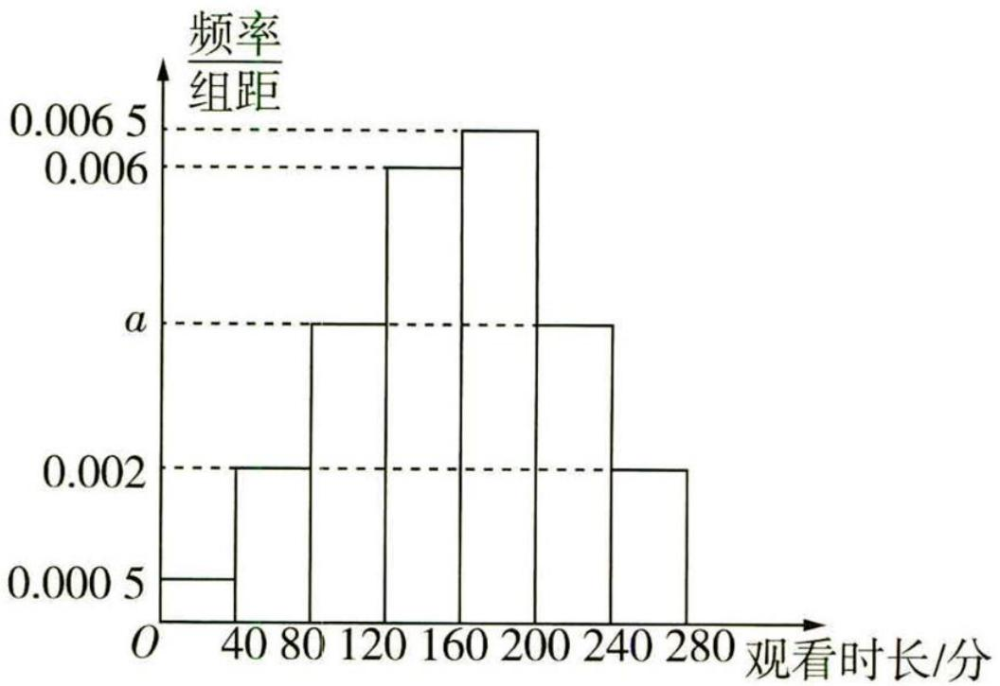

图1

解析 （1） 由题意得 $40 \times (0.0005 + 0.002 \times 2 + 2a + 0.006 + 0.0065) = 1$ , 解得 $a = 0.004, 0 \sim 160$ 间四个小矩形的面积和为 $0.0005 \times 40 + 0.002 \times 40 + 0.004 \times 40 + 0.006 \times 40 = 0.5$ , 所以样本数据的中位数为 $160$ .

【思维定式】这里有同学可能受思维定式影响，凭以往经验以为中位数一定在某区间内部，不自信而影响求解

（2）由题意,观看时长在 $[200,240)$ , $[240,280]$ 对应的频率分别为 $0.004 \times 40 = 0.16$ 和 $0.002 \times 40 = 0.08$ , 所以采用分层随机抽样的方式, 在这两个区间中应分别抽取 4 人和 2 人.

利用排列组合,从6人中选3人,则有 $C_{6}^{3}=20$ (种)不同情况,其中事件A包含 $C_{4}^{2}C_{2}^{1}=12$ (种)不同情况,从而由古典概型的概率计算公式可得 $P(A)=\frac{12}{20}=\frac{3}{5}$ .

调研 3 （原创/构筑“绿色长城”）党的十八大以来的十年,是砥砺奋进、矢志“为中国人民谋幸福”的十年,是全面取得举世瞩目成就的非凡十年,中央的一系列的治国之策,引导全国人民“奋进新征程,建功新时代”.为了构筑“绿色长城”,我国开展广泛的全民义务植树活动,有力推动了生态状况的改善,森林植被状况的改善,不仅美化了家园,减轻了水土流失和风沙对农田的危害,而且有效提高了森林生态系统的储碳能力. 某地区统计了 2012 年到 2021 年十年中每年人工植树的成活数 $y_{i} (i = 1,2,3,\cdots,10)$ (单位: 千棵), 用年份代码 $x_{i} (i = 1,2,3,\cdots,10)$ 表示 2012 年, 2013 年, 2014 年, 2015 年, $\cdots$ , 2021 年, 得到如图 2 所示的散点图.

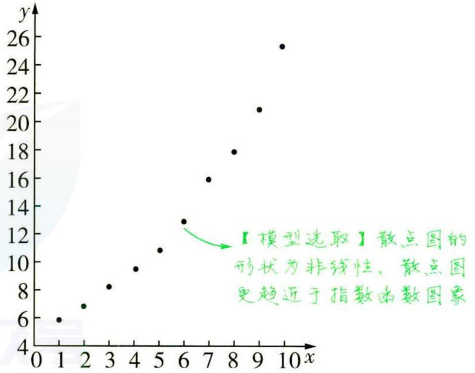

图2

对数据进行回归分析发现,有两个不同的回归模型可以选择. 模型一: $\hat{y} = \hat{\beta}x + \hat{\alpha}$ . 模型二: $\hat{y} = e^{\hat{\lambda} + \hat{\mu}x}$ , 其中 e 是自然对数的底数.

（1）根据散点图,判断所给模型哪个更适宜作为每年人工植树成活数 y 与年份代码 x 相关关系的回归分析模型(给出判断即可,不必说明理由);

（2）根据（1）中选定的模型,求出 y 关于 x 的回归方程;

（3） 利用（2）中所求回归方程,预测从哪一年开始每年人工植树成活棵数能够超过5万棵.

附:对于一组数据 $(x_{1},y_{1}),(x_{2},y_{2}),\cdots,(x_{n},y_{n})$ ，其回归直线 $\hat{y}=\hat{b}x+\hat{a}$ 的斜率和截距的最小二乘估计公式分别为 $\hat{b}=\frac{\sum\limits_{i=1}^{n}x_{i}y_{i}-n\bar{x}\bar{y}}{\sum\limits_{i=1}^{n}x_{i}^{2}-n\bar{x}^{2}}$ , $\hat{a}=\bar{y}-\hat{b}\bar{x}$ .

参考数据: $\sum_{i=1}^{10}x_{i}^{2}=385,\bar{y}=13.5,\sum_{i=1}^{10}x_{i}y_{i}=914.1$ , 设 $z_{i}=\ln y_{i}(i=1,2,3,\cdots,10),\bar{z}\approx$ 2. $5,\sum_{i=1}^{10}x_{i}z_{i}\approx150.7,\ln2\approx0.693,\ln5\approx1.609.$

解析 （1）根据散点图可知,随着 $x$ 的增长 $y$ 呈指数型增长,故应选模型二: $\hat{y} = e^{\hat{\lambda } + \hat{\mu }x}$ .

【会选取】这里要求只做出判断，而不必说明理由，因而通过学过的初等函数图象特点，如散点图更接近于指数函数图象，选模型二

（2） 由已知 $\hat{y} = \mathrm{e}^{\hat{\lambda} + \hat{\mu} x}$ , 两边同时取对数可得 $\ln \hat{y} = \hat{\lambda} + \hat{\mu} x$ , 令 $z = \ln \hat{y}$ , 则 $\hat{z} = \hat{\lambda} + \hat{\mu} x$ ,

由 $\bar{x}=\frac{1+2+3+\cdots+10}{10}=5.5,\sum_{i=1}^{10}x_{i}z_{i}\approx150.7,\bar{z}\approx2.5,\sum_{i=1}^{10}x_{i}^{2}=385$ 可知，

$\hat {\mu} = \frac {\sum_ {i = 1} ^ {1 0} x _ {i} z _ {i} - 1 0 \bar {x} \bar {z}}{\sum_ {i = 1} ^ {1 0} x _ {i} ^ {2} - 1 0 \bar {x} ^ {2}} \approx \frac {1 5 0 . 7 - 1 0 \times 5 . 5 \times 2 . 5}{3 8 5 - 1 0 \times 5 . 5 ^ {2}} = 0. 1 6, \hat {\lambda} = \bar {z} - \hat {\mu} \bar {x} \approx 2. 5 - 0. 1 6 \times 5. 5 =$

##### 1.62,

所以 $\hat{z} = \ln \hat{y} = 1.62 + 0.16x$ ，即 $\hat{y} = \mathrm{e}^{1.62 + 0.16x}$ .

（3） 令 $\hat{y} = \mathrm{e}^{1.62 + 0.16x} > 50$ , 即 $1.62 + 0.16x > \ln 50 = \ln 25 + \ln 2 = 2 \ln 5 + \ln 2 \approx$ 3.911, 得 $x > 14.319$ , 预测从 2026 年开始每年人工植树成活棵树能超过 5 万棵.

# 热点3 致力科技创新 航天引领世界

调研 4 (2023·广东佛山一中9月模拟改编/云海一号03星)北京时间2022

“重排求差”操作,即把组成该数的数字重排后得到的最大数减去重排后得到的最小数.三位数经有限“重排求差”后得到的黑洞数为495,四位数经有限“重排求差”得到的黑洞数为6174.

# 004 试题调研 每月一辑试题新

年 9 月 21 日 7 时 15 分,我国在酒泉卫星发射中心使用长征二号丁运载火箭,成功将云海一号 03 星发射升空,卫星顺利进入预定轨道,发射任务获得圆满成功.未来云海一号 03 星作为我国“太空家族”新成员,将为我国在海洋探测、防灾减灾等方面提供数据支撑.在卫星导航系统中,地球静止卫星的轨道位于地球赤道所在平面,如图 3 ,将地球看作一个球,卫星信号像一条条直线一样发射到达球面,所覆盖的范围为一个球冠,称此球冠的面积为卫星信号的覆盖面积.球冠即球面被平面所截得的一部分,截得的圆叫作球冠的底,垂直于截面的直径被截得的一段叫作球冠的高.设球面半径为 R ,球冠的高为 h ,则球冠的面积 $S = 2\pi Rh$ .已知一颗地球静止卫星距地球表面的最近距离与地球半径的比值为 5 ,则它的信号覆盖面积与地球表面积的比值为 ( )

$\quad$A. $\frac{1}{6}$

$\quad$B. $\frac{1}{4}$

$\quad$C. $\frac{1}{3}$

$\quad$D. $\frac{5}{12}$

本题实质是球外点关于球的切线问题，关键是选取轴截面

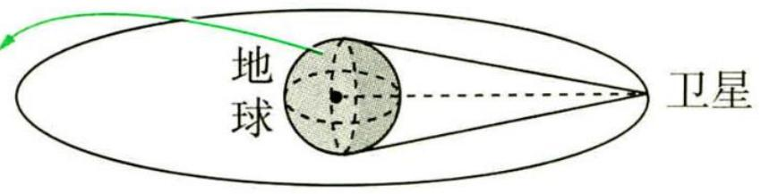

图3

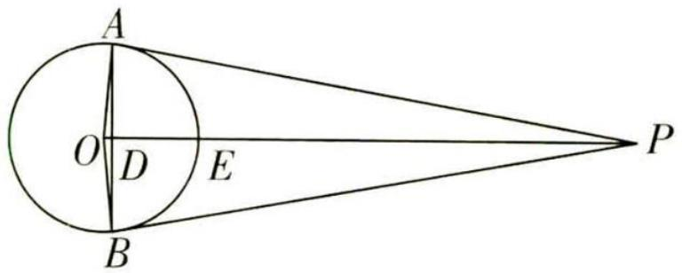

图4

解析 根据题意作出示意图如图4, $O$ 为地球球心, $P$ 为卫星位置, 从卫星发射出的信号的路线 $PA, PB$ 与地球相切, 故地球半径 $R = OA = OE = OB$ , 球冠的高 $h = DE$ ( $D$ 为 $AB$ 与 $OP$ 的交点), $PE = 5R$ ,

$OA \perp PA, AB \perp OP$ , 所以 $\cos \angle POA = \frac{OA}{OP} = \frac{1}{6} = \frac{OD}{OA}$ , 所以 $OD = \frac{1}{6} R$ , 即 $h = DE = \frac{5}{6} R$ ,

所以 $\frac{2\pi Rh}{4\pi R^{2}}=\frac{2\pi R\cdot\frac{5}{6}R}{4\pi R^{2}}=\frac{5}{12}$ ，故选D.

【提取信息】球冠的面积教材中没有涉及,是题设中给出的,因而需要仔细阅读题干,提取解题信息,解决问题

答案 D

# 热点4 逐梦深蓝 山河荣耀

调研 5 (2023·江西临川一中9月摸底/庆祝中国人民解放军建军95周年) 2022年6月17日,我国第三艘航空母舰“中国人民解放军海军福建舰”下水试航,这是我国完全自主设计建造的首艘弹射型航空母舰,采用平直通长飞行甲板,配置电磁弹射和阻拦装置,满载排水量8万余吨.“福建舰”的建成、下水及试航,是新时代中国强军建设的重要成果,也为庆祝中国人民解放军建军95周年献上了一笔厚礼.某校为宣

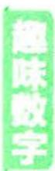

黑洞数 13 任意取一个自然数, 将每一位上的数相加得到的结果乘以 3 再加上 1 得到一个新的数, 重复执行上述操作, 最终的结果必定是 13. 例如取 4396, 则 $4 + 3 + 9 + 6 = 22, 22 \times 3 + 1 = 67$ , 将 67 重复操作得到 40, 再将 40 重复操作最终得到 13.

关注微信公众号“初高教辅站”获取更多初高中教辅资料传“福建舰”下水试航,增强学生的国防意识,组织了一次“逐梦深蓝,山河荣耀”的国防知识竞赛,共选出100名学生参赛,成绩均在区间[50,100]上,现将成绩制成如图5所示的频率分布直方图(每组均包括左端点,最后一组包括右端点).

（1） 学校计划对成绩不低于平均分的参赛学生进行奖励, 若同一组中的数据用该组区间的中点值为代表, 试求受奖励的分数线的估计值.

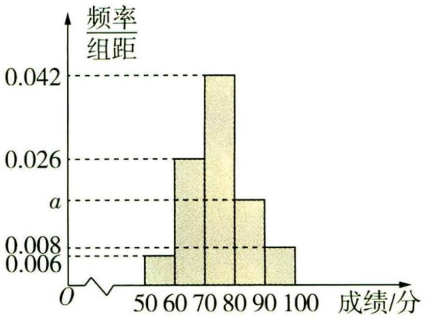

图 5

（2）知识竞赛试卷中有一类双项选择题,每题有

5 个备选项,其中有且仅有 2 项是正确的. 得分规则为:所选选项中,只要有错误选项,得 0 分;弃答得 1 分;仅选 1 项且正确,得 3 分;选 2 项且正确得 6 分. 某学生对其中一道双项选择题能确定其中 1 个选项是错误的,为使得分的期望最大,该学生应该选择以下哪一个答题策略?

①弃答,②从剩下4个选项中任选1个作答,③从剩下4个选项中任选2个作答.

解析 （1）由频率分布直方图可知 $10 \times (0.006 + 0.008 + a + 0.026 + 0.042) = 1$ , 解得 $a = 0.018$ . 平均分的估计值为 $0.06 \times 55 + 0.26 \times 65 + 0.42 \times 75 + 0.18 \times 85 + 0.08 \times 95 = 74.6$ , 所以受奖励的分数线的估计值为 $74.6$ .

【会分析】根据给定的频率分布直方图求出 $a$ ，通过频率分布直方图计算参赛学生成绩的平均分的估计值，也就是受奖励的分数线

（2）如果选择策略①弃答,则其得分为1分.

设策略②的得分为 $X$ , 则 $X$ 的所有可能取值为 $0, 3, P(X = 0) = \frac{C_{2}^{1}}{C_{4}^{1}} = \frac{1}{2}, P(X = 3) = \frac{C_{2}^{1}}{C_{4}^{1}} = \frac{1}{2}$ ,

【点透讲透】此题命题新颖，知道其中一个选项错误，必不选这个选项，因而转化或其余4个选项中有2个正确，据此选择解题策略

则 $X$ 的分布列为

<table><tr><td>X</td><td>0</td><td>3</td></tr><tr><td>P</td><td> $\frac{1}{2}$ </td><td> $\frac{1}{2}$ </td></tr></table>

$E (X) = 0 \times \frac {1}{2} + 3 \times \frac {1}{2} = \frac {3}{2}.$

设策略③的得分为 Y, 则 Y 的所有可能取值为 0, 6, $P(Y=6)=\frac{C_{2}^{2}}{C_{4}^{2}}=\frac{1}{6}$ , $P(Y=0)=$ $1 - P(Y=6) = \frac{5}{6},$

【扫清障碍】策略③是选了2个作答,如果没读懂题意,在直接求得0分情况对应的概率时

黑洞数 123 又称西西弗斯串. 相传, 西西弗斯是古希腊的一个暴君, 他被惩罚将一块巨石推上山顶, 而由于巨石太重了, 未推上山顶就又滚下山去, 前功尽弃, 于是他只能不断重复、永无止境地做这件事.

容易出错. 如果从正面求 $P(Y=0)$ ，则 $P(Y=0)=\frac{C_{2}^{2}}{C_{4}^{2}}+\frac{C_{2}^{1}C_{2}^{1}}{C_{4}^{2}}=\frac{5}{6}$

则 $Y$ 的分布列为

<table><tr><td>Y</td><td>0</td><td>6</td></tr><tr><td>P</td><td> $\frac{5}{6}$ </td><td> $\frac{1}{6}$ </td></tr></table>

$E (Y) = 0 \times \frac {5}{6} + 6 \times \frac {1}{6} = 1.$

综上,显然 $E(Y)=1<E(X)$ ,所以应选策略②.

# 热点5 诺贝尔奖

调研 6 (原创/诺贝尔奖)2022年诺贝尔生理学或医学奖颁给了瑞典科学家斯万特·佩博,以表彰他对“已灭绝占人类基因组和人类进化的发现”.他发现了以前不为人知的古人类——丹尼索瓦人,也催生了一门全新的学科——古基因组学.关于基因,我们通常所说的 ABO 血型系统可以看作是由 A,B,O 三个复等位基因决定的,一般情况下,每个人的基因型由这三个复等位基因中的任意两个组合在一起构成,且两个复等位基因分别来自父亲和母亲,其中 AA,AO 为 A 型血,BB,BO 为 B 型血,AB 为 AB 型血,OO 为 O 型血.比如:父亲和母亲的基因型分别为 AO,AB,则孩子的基因型等可能的出现 AA,AB,AO,BO 四种结果.已知小明的爷爷、奶奶和母亲的血型均为 AB 型,不考虑基因突变,则小明是 A 型血的概率为 ( )

$\quad$A. $\frac{1}{16}$

$\quad$B. $\frac{1}{8}$

$\quad$C. $\frac{1}{4}$

$\quad$D. $\frac{1}{2}$

解析 因为小明的爷爷、奶奶的血型均为 AB 型,则小明父亲的基因型可能是 AA, AB, BB,它们对应的概率分别为 $\frac{1}{4}, \frac{1}{2}, \frac{1}{4}$ . 当小明父亲的基因型是 AA 时, 因其母亲的血型为 AB 型, 则小明

【会审题】需要通过小明的爷爷、奶奶确定小明父亲是各种基因型对应的概率的基因型可能是 AA, AB, 它们的概率均为 $\frac{1}{2}$ , 此时小明是 A 型血的概率为 $\frac{1}{4} \times \frac{1}{2} = \frac{1}{8}$ . 当小明父亲的基因型是 AB 时, 因其母亲的血型为 AB 型, 则小明的基因型是 AA 的概率为 $\frac{1}{4}$ , 此时小明是 A 型血的概率为 $\frac{1}{2} \times \frac{1}{4} = \frac{1}{8}$ . 当小明父亲的基因型是 BB 时, 小明不可能是 A 型血. 综上, 小明是 A 型血 [会分类] 根据小明父亲所有可能的基因型分类讨论, 确定小明是 A 型血的概率为 $\frac{1}{8} + \frac{1}{8} = \frac{1}{4}$ , 即 C 正确.

答案 C

随便选一个很大的数如 43265798,作为一块“大石头”,按如下规则转换成一个新的三位数:百位数是选取的数中偶数的个数,十位数是选取的数中奇数的个数,个位数是这个数的位数.可以得到新数 448,再将 448 按同样的方法经过两次转换,最终得到 123.

# 模型巧突破

# 第一部分 创新模型

# 型1 多选题破解模型

# 类型1 等价型选择支

# 模型解法 >>>

等价型选择支就是各选项的考查方向一致,源于同一条件或结论,只是数值上或形式上有所区别,可一次性判断出真假,正确选择支之间互为充要条件.这有别于单项选择题,在单项选择题中,若选择支中“A 等价于 B”,当 A 为真时,则 A,B 一定为真,与 “4 个选项中有且只有一项正确”矛盾(逻辑分析法).但在多项选择题中,选择支 A,B 可以同真或同假,此类型的题目往往属于比较简单的问题.解题关键为:

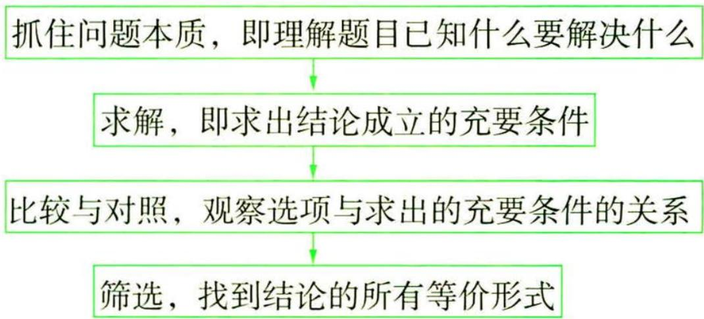

调研 1 (2023·辽宁省实验中学9月开学考试)(多选)已知 $\frac{1}{a}>\frac{1}{b}>0$ ,则()

$\quad$A. $a^3 > b^3$

$\quad$B. $|a| > |b|$

$\quad$C. $\frac{b}{a} > 1$

$\quad$D. $\left(\frac{1}{2}\right)^{a}>\left(\frac{1}{2}\right)^{b}$

# 思维导引

本题的大前提是a,b均为正数

$\frac{1}{a} > \frac{1}{b} > 0 \Leftrightarrow b > a$

只需在选项中寻找与 $b > a$ 等价的选项

解析 $\because \frac{1}{a} > \frac{1}{b} > 0, \therefore b > a > 0, \therefore b^{3} > a^{3}, \mathrm{A}$ 错误; $|a| < |b|$ , B 错误; $\frac{b}{a} > 1, \mathrm{C}$ 正确, $(\frac{1}{2})^{a} > (\frac{1}{2})^{b}, \mathrm{D}$ 正确. 故选 CD.

【模型应用】可以看出当a,b均为正数时，C,D均等价于b>a

# 答案 CD

一旦得到 123 后, 就不再变化了, 好比推上山的石头又落到地上, 一番辛苦白费. 有人还是不服气, 西西弗斯不能把大石头推上山, 带一块小石头总可以吧, 那就是你不知道“黑洞数”的厉害. 如选 1, 根据规则可依次得到 11, 22, 202, 303, 再次转换后还是黑洞数 123.

# 类型2 并列型选择支

# 模型解法 >>>

并列型选择支就是正确支都是题干的必要条件,相互之间没有等价关系. 在单项选择题中,选择支中如果存在“若 A 则 B”的关系,那么 A 必假;否则当 A,B 均为真时,其与“4 个选项中有且只有一项正确”矛盾(逻辑分析法).但在多项选择题中,选择支 A,B 可以同真或同假. 此类型考查的知识点比较分散,需要由题干尽可能得到不同的结论,有时难度较大,但此类问题在各类考试中出现频率较高. 解题关键为:

<table><tr><td>分析</td><td>对题干所给条件进行梳理分析,能画图尽量画图</td></tr><tr><td>对照</td><td>将选项所涉及内容与上面的分析对照</td></tr><tr><td>找方向</td><td>通过对照选项找准证明或计算方向</td></tr><tr><td>验证</td><td>结合题干对选项进行证明或计算,验证其真假</td></tr></table>

调研 2 (2023·山东青岛一中9月期初调研检测) (多选)已知函数 $f(x), g(x)$ 的定义域为 R, $g'(x)$ 为 $g(x)$ 的导函数,且 $f(x)+g'(x)-5=0,f(x)-g'(4-x)-5=0$ ,若 $g(x)$ 为偶函数,则()

解题密钥 选项之间
看不出来明显联系，但
都是求值，属于平行关
系，可逐个击破.

$\quad$A. $f(4) = 5$

$\quad$B. $g(2) = 0$

$\quad$C. $f(-1) = f(-3)$

$\quad$D. $f(1) + f(3) = 10$

思维导引 本题与2022年新高考Ⅰ卷的第12题同类型,要用到 $g(x)$ 与 $g'(x)$ 奇偶性的关系.由 $g(x)$ 是偶函数,可知 $g'(x)$ 是奇函数,然后通过赋值验证各个选项的真假.

解析 $g(x)$ 是偶函数, 则 $g(-x) = g(x)$ , 两边同时求导得 $-g'(-x) = g'(x)$ , 所以 $g'(x)$ 是奇函数.

由 $f(x) + g'(x) - 5 = 0, f(x) - g'(4 - x) - 5 = 0$ ，得 $f(x) - 5 = -g'(x) = g'(4 - x)$ ，即 $g'(-x) = g'(-x + 4)$ ，所以 $g'(x)$ 是周期函数，且周期为 $4, g'（0） = g'（4） = 0$ .

在 $f(x)-g'(4-x)-5=0$ 中，令x=4得， $f(4)=5$ ，A正确；

无法求得 $g(2)$ 的值, B 错误;

【指点迷津】由于 $g(x)$ 是偶函数，因此其解析式中的常数是可变的，已知条件又未涉及 $g(x)$ ，因此涉及 $g(x)$ 值的选项都不正确

在 $f(x) - g'(4 - x) - 5 = 0$ 中，令 $x = -1$ 得， $f(-1) - g'（5） - 5 = 0, g'（5） = g'（1） = -g'(-1)$ ，则 $f(-1) + g'(-1) - 5 = 0$ ①，无法求得 $f(-1)$ ，

同理令 $x = -3$ 得， $f(-3) + g'(-3) - 5 = 0, g'(-3) = g'（1） = -g'(-1)$ ，因此 $f(-3) =$

雷劈数 又称卡布列克数, 是自然数的一类. 若正整数 $X$ 的平方可以分割为 2 个数字, 而这 2 个数字相加后恰等于 $X$ , 那么 $X$ 的平方就是一个雷劈数. 例如 $55^{2} = 3025$ , 而 $30 + 25 = 55$ , 那么 3025 就是一个雷劈数.

关注微信公众号“初高教辅站”获取更多初高中教辅资料

$g ^ {'} (- 1) - 5 = 0 \quad ②,$

①②相加得 $f(-1)+f(-3)=10$ , 只有在 $g'(-1)=0$ 时, 有 $f(-1)=f(-3)$ , 但 $g'(-1)$ 不一定为 0, 因此 C 错误;

【陷阱】解题时容易掉入求 $g'(-1)$ 的泥潭, 实际上 $g'(-1)$ 无论取什么值都不会产生矛盾

在 $f(x)+g'(x)-5=0$ 中,令x=1得, $f(1)+g'（1）-5=0$ ,在 $f(x)-g'(4-x)-5=0$ 中,令x=3得, $f(3)-g'（1）-5=0$ ,两式相加得 $f(1)+f(3)-10=0$ ,即 $f(1)+f(3)=10$ ,D正确.故选AD.

答案 AD

调研 3 (2023 · 济南一中 9 月摸底) (多选) 在正四面体 ABCD 中, 若 $AB = \sqrt{2}$ , 则下列说法正确的是 ()

$\quad$A. 该四面体外接球的表面积为 $3 \pi$

$\quad$B. 直线 AB 与平面 BCD 所成角的正弦值为 $\frac{\sqrt{3}}{3}$

$\quad$C. 如果点 M 在线段 CD 上, 则 $AM + BM$ 的最小值为 $\sqrt{6}$

$\quad$D. 过线段 $AB$ 的一个三等分点且与 $AB$ 垂直的平面截该四面体所得截面的周长为 $\frac{2\sqrt{6} + 2\sqrt{2}}{3}$

解析 根据题意作出图形如图1所示, 点 O 为该正四面体外接球的球心, 半径为 R = OA = OB, $O_{1}$ 为 $\triangle BCD$ 的外心, 连接 $O_{1}B, O_{1}O$ , 所以 $O_{1}B = \sqrt{2} \times \frac{\sqrt{3}}{2} \times \frac{2}{3} = \frac{\sqrt{6}}{3}$ ,

由于 $O_{1}B^{2} + OO_{1}^{2} = OB^{2}$ , $O_{1}A = \sqrt{(\sqrt{2})^{2} - (\frac{\sqrt{6}}{3})^{2}} = \frac{2\sqrt{3}}{3}$ , 所以 $\left(\frac{\sqrt{6}}{3}\right)^{2} + \left(\frac{2\sqrt{3}}{3} - R\right)^{2} = R^{2}$ , 解得 $R = \frac{\sqrt{3}}{2}$ ,

【记结论】设正四面体的棱长为 $a$ ，则其外接球半径为 $\frac{\sqrt{6}}{4} a$ ，内切球半径为 $\frac{\sqrt{6}}{12} a$

因此外接球的表面积为 $4\pi \times \left(\frac{\sqrt{3}}{2}\right)^{2} = 3\pi$ ，故 A 正确.

易知 AB 与平面 BCD 所成的角为 $\angle ABO_{1}, AO_{1} = \frac{2\sqrt{3}}{3}$ ,

则 $\sin\angle ABO_{1}=\frac{AO_{1}}{AB}=\frac{\frac{2\sqrt{3}}{3}}{\sqrt{2}}=\frac{\sqrt{6}}{3}$ ，故 B 错误.

取 $CD$ 的中点 $E$ , 连接 $AE, BE$ , 因为 $AE \perp CD$ 于 $E$ , 所以 $AM_{\min} = AE$ ; $BE \perp CD$ 于 $E$ , 所以 $BM_{\min} = BE$ .

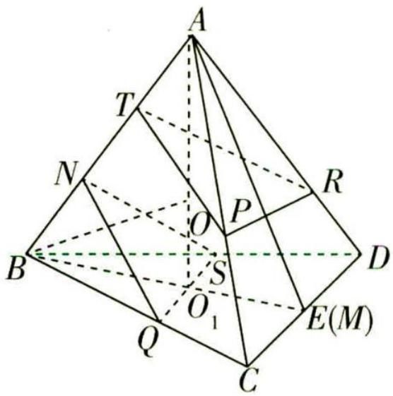

图 1

自恋数 自恋数是数学家马达齐给出的名称,也叫“自重数”.定义为:一个n位数中各数字的n次幂之和等于该数本身.如: $153=1^{3}+5^{3}+3^{3}$ .

因此当 M 与 E 点重合时, AM + BM 最小, 最小值为 $2 \times \frac{\sqrt{6}}{2} = \sqrt{6}$ , 故 C 正确.

在平面 ABC 中过线段 AB 的三等分点点 T 作 $PT \perp AB$ 交 AC 于 P，在平面 ADB 中过点 T 作 $RT \perp AB$ 交 AD 于 R，连接 PR，又 $RT \cap PT = T$ ，所以 $AB \perp$ 平面 TPR，因此平面 TPR 即所求截面，易得 $TP = TR = \frac{\sqrt{6}}{3}$ ， $AP = PR = \frac{2\sqrt{2}}{3}$ ，则 $\triangle TPR$ 的周长为 $\frac{\sqrt{6}}{3} + \frac{\sqrt{6}}{3} + \frac{2\sqrt{2}}{3} = \frac{2\sqrt{6} + 2\sqrt{2}}{3}$ .

同理在平面 ${ABC}$ 中过线段 ${AB}$ 的另一三等分点点 $N$ 作 ${NQ} \perp  {AB}$ 交 ${BC}$ 于 $Q$ ,在平面 ${ABD}$ 中过点 $N$ 作 ${NS} \perp  {AB}$ 交 ${BD}$ 于 $S$ ,连接 ${QS}$ ,可得平面 ${NQS}$ ,而平面 ${NQS}$ 即所求截面,易得 ${NQ} = {NS} = \frac{\sqrt{6}}{3},{BQ} =$

【疑难易错】通过作辅助线,找到或作出截面是求截面周长的关键所在,作截面常采用延长线段找与另一面的交点,找到两个交点,连接即得交线

$QS = \frac{2\sqrt{2}}{3}$ , 则 $\triangle NQS$ 的周长为 $\frac{\sqrt{6}}{3} + \frac{\sqrt{6}}{3} + \frac{2\sqrt{2}}{3} = \frac{2\sqrt{6} + 2\sqrt{2}}{3}$ , 故 D 正确. 故选 ACD.

答案 ACD

# 类型 3 混合型选择支

# 模型解法 >>>

混合型选择支是上述两种类型的混合,就是正确支之间既有充要条件又有必要条件,这时,肯定会有三个正确支,选一项得2分的机会很大.此类型首先要看出或找到等价的选择支,二者一定同真同假,若能再找到这二者的一个必要条件,则可以直接选出3个正确答案,此类型题目难度往往适中.正确筛选选项的步骤是:

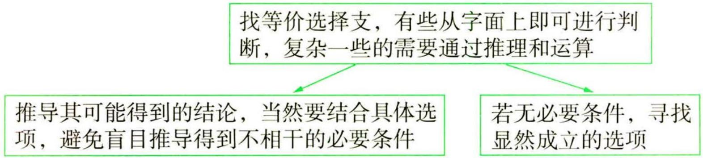

调研 4 (2023·河北石家庄二中开学考试改编)(多选)已知函数 $f(x)=\frac{x}{x-1}-2^{x}$ $(x>1), g(x)=\frac{x}{x-1}-\log_{2}x(x>1)$ 的零点分别为 $\alpha, \beta$ ，则以下结论正确的是（）

$\quad$A. $\alpha + \beta = \alpha \beta$

$\quad$B. $\frac{1}{2^{\alpha}} + \frac{1}{\log_{2}\beta} = 1$

$\quad$C. $\alpha + \beta > 2\sqrt{3}$

$\quad$D. $\alpha - \beta < -2$

解析 $f(x) = 0 \Leftrightarrow \frac{x}{x - 1} = 2^{x}(x > 1), g(x) = 0 \Leftrightarrow \frac{x}{x - 1} = \log_{2} x (x > 1)$ ，

令 $h(x) = \frac{x}{x - 1} = \frac{1}{x - 1} + 1 (x > 1)$ ，因为 $y = 2^x$ 与 $y = \log_2 x$ 互为反函数，两个函数的图象关于直

线 $y = x$ 对称，且 $y = \frac{1}{x - 1} + 1$ 的图象也关于直线 $y = x$ 对称，

【用结论】将反比例函数 $y=\frac{1}{x}$ 的图象平移，使得平移后图象的对称中心为 $(1,1)$ ，即可得到函数 $y=\frac{1}{x-1}+1$ 的图象，而反比例函数 $y=\frac{1}{x}$ 的图象本身关于直线 y=x 对称

设 $A(\alpha, 2^{\alpha})$ , $B(\beta, \log_2\beta)$ , 则 $A, B$ 关于直线 $y = x$ 对称, 所以 $\left\{ \begin{array}{l} \alpha = \log_2\beta, \\ 2^{\alpha} = \beta \end{array} \right.$ 且 $\left\{ \begin{array}{l} \frac{\alpha}{\alpha - 1} = 2^{\alpha} (\alpha > 1), \\ \frac{\beta}{\beta - 1} = \log_2\beta (\beta > 1), \end{array} \right.$

由 $\frac{\alpha}{\alpha - 1} = 2^{\alpha} (\alpha > 1)$ 可得 $\frac{\alpha}{\alpha - 1} = 2^{\alpha} > 2$ ，所以 $1 < \alpha < 2$ .

【做铺垫】选项中有其等价形式，也有其必要条件，从而得到正确答案

对于选项 A, 由 $\frac{\alpha}{\alpha-1}=2^{\alpha}$ 可得 $\alpha=2^{\alpha}(\alpha-1)$ ，所以 $\alpha+2^{\alpha}=\alpha\cdot2^{\alpha}$

又 $\left\{\begin{aligned}\alpha&=\log_{2}\beta,\\ 2^{\alpha}&=\beta,\end{aligned}\right.$ 代入上式可得 $\alpha+\beta=\alpha\beta$ ，故A正确；

由 A 可知 $\frac{1}{\alpha} + \frac{1}{\beta} = 1$ ，结合 $\left\{\begin{aligned}\alpha &= \log_{2}\beta,\\ 2^{\alpha} &= \beta\end{aligned}\right.$ 可得 B 正确；

【模型应用】显然，在推得 $\left\{\begin{array}{l}\alpha=\log_{2}\beta,\\2^{\alpha}=\beta\end{array}\right.$ 这一结论后可得， $\alpha+\beta=\alpha\beta\Leftrightarrow\frac{1}{\alpha}+\frac{1}{\beta}=1\Leftrightarrow\frac{1}{2^{\alpha}}+\frac{1}{\log_{2}\beta}=1$ 即此时选项 A 与 B 是等价的，因此同真

对于选项 C, 由 $\alpha > 1, 2^{\alpha} = \beta$ 可得 $\beta > 2$ , 又 $\alpha + \beta = \alpha \beta$ , 且 $\alpha \neq \beta$ , 所以 $\alpha + \beta = \alpha \beta < \left(\frac{\alpha + \beta}{2}\right)^{2}$ ,

所以 $\alpha + \beta > 2\sqrt{3}$ ，故 C 正确，可以看出 C 选项是 A 选项的一个必要条件；

对于选顶 D, 因为 $\left\{\begin{aligned}\alpha &= \log_{2}\beta, \\ 2^{\alpha} &= \beta\end{aligned}\right.$ (1 < $\alpha < 2$ ), 则 2 < $\beta < 4$ , 所以 $\alpha - \beta = \log_{2}\beta - \beta (2 < \beta < 4)$ , 令 $\varphi(\beta) = \log_{2}\beta - \beta (2 < \beta < 4)$ , 则 $\varphi'(\beta) = \frac{1}{\beta \ln 2} - 1 = \frac{1 - \beta \ln 2}{\beta \ln 2} = \frac{1 - \ln 2^{\beta}}{\beta \ln 2} < 0$ , 所以 $\varphi(\beta) = \log_{2}\beta - \beta$ 在 (2,4) 上单调递减, 则 $\varphi(\beta) > \log_{2}4 - 4 = -2$ , 故 D 错误.

# 答案 ABC

调研 5 (2023·南京一中9月入学考试)(多选)已知椭圆 $C:\frac{x^{2}}{a}+\frac{y^{2}}{2}=1(a>2)$ 的离心率为 $\frac{\sqrt{3}}{3}$ ，过点P(1,1)的直线与椭圆C交于A,B两点，且满足 $\overrightarrow{AP}=\lambda\overrightarrow{PB}$ 。动点Q满足 $\overrightarrow{AQ}=-\lambda\overrightarrow{QB}$ ，则下列结论正确的是()

我国数学家谈祥柏先生给自恋数起了个好听的名字“水仙花数”。严格来说，三位数的自恋数才叫“水仙花数”。一位数的自恋数叫“独身数”，四位数的自恋数叫“四叶玫瑰数”，五位数的自恋数叫“五角星数”。

$\quad$A. a = 3   
$\quad$B. 动点 Q 的轨迹方程为 $2x + 3y - 6 = 0$   
$\quad$C. 线段 $OQ(O$ 为坐标原点)长度的最小值为 $\frac{3\sqrt{13}}{13}$   
$\quad$D. 线段 $OQ(O$ 为坐标原点)长度的最小值为 $\frac{6\sqrt{13}}{13}$

# 解析

<table><tr><td>选项</td><td>分析过程</td><td>正误</td></tr><tr><td>A</td><td>由椭圆 $C: \frac{x^{2}}{a} + \frac{y^{2}}{2} = 1 (a > 2)$ 的离心率为 $\frac{\sqrt{3}}{3}$ ,得 $\sqrt{1 - \frac{2}{a}} = \frac{\sqrt{3}}{3}$ ,解得 $a = 3$ </td><td>√</td></tr><tr><td>B</td><td>设 $A(x_{1}, y_{1})$ , $B(x_{2}, y_{2})$ , $Q(m, n)$ ,则 $\overrightarrow{AP} = (1 - x_{1}, 1 - y_{1})$ , $\overrightarrow{PB} = (x_{2} - 1, y_{2} - 1)$ , $\overrightarrow{AQ} = (m - x_{1}, n - y_{1})$ , $\overrightarrow{QB} = (x_{2} - m, y_{2} - n)$ ,由 $\overrightarrow{AP} = \lambda \overrightarrow{PB}$ , $\overrightarrow{AQ} = -\lambda \overrightarrow{QB}$ ,得 $\begin{cases} 1 - x_{1} = \lambda (x_{2} - 1), \\ m - x_{1} = -\lambda (x_{2} - m), \end{cases}$ 即 $\begin{cases} x_{1} + \lambda x_{2} = 1 + \lambda, \\ x_{1} - \lambda x_{2} = m(1 - \lambda), \end{cases}$ 两式相乘得 $x_{1}^{2} - \lambda^{2} x_{2}^{2} = m(1 - \lambda^{2})$ 1,同理可得 $y_{1}^{2} - \lambda^{2} y_{2}^{2} = n(1 - \lambda^{2})$ 2, $1 \times \frac{1}{3} + 2 \times \frac{1}{2}$ 化简得 $\frac{x_{1}^{2}}{3} + \frac{y_{1}^{2}}{2} - \lambda^{2} (\frac{x_{2}^{2}}{3} + \frac{y_{2}^{2}}{2}) = (1 - \lambda^{2})(\frac{m}{3} + \frac{n}{2})$ ,由题意知 $\lambda > 0$ 且 $\lambda \neq 1$ ,否则与 $\overrightarrow{AQ} = -\lambda \overrightarrow{QB}$ 矛盾,又 $A, B$ 在椭圆 $C$ 上,所以 $\frac{x_{1}^{2}}{3} + \frac{y_{1}^{2}}{2} = \frac{x_{2}^{2}}{3} + \frac{y_{2}^{2}}{2} = 1$ ,所以 $1 - \lambda^{2} = (1 - \lambda^{2})(\frac{m}{3} + \frac{n}{2})$ ,即 $\frac{m}{3} + \frac{n}{2} = 1$ ,所以动点 $Q$ 的轨迹方程为 $\frac{x}{3} + \frac{y}{2} = 1$ ,即 $2x + 3y - 6 = 0$ </td><td>√</td></tr><tr><td>C</td><td rowspan="2">线段 $OQ$ 长度的最小值即原点到直线 $2x + 3y - 6 = 0$ 的距离,所以 $|OQ|_{\min} = \frac{6}{\sqrt{4 + 9}} = \frac{6\sqrt{13}}{13}$ </td><td>×</td></tr><tr><td>D</td><td>√</td></tr></table>

# 答案 ABD

# 类型 4 无题干型选择支

# 模型解法 >>>

无题干型选择支不像前面三种类型,无题干型选择支之间可以没有任何联系,可以涉及任何需要考查的知识点和方法,因此难度不容易预料,没有规律可循,只能依靠扎实的基本功逐个击破.解题时如遇选项的难度较大,也可采取排除法.解题关键为:

逐个击破→亦可先从自己熟悉的选项入手

排除法→如遇困难,排除错误选项也是一条正确之路

调研 6 (2023·辽宁东北育才学校第一次模拟)(多选)下列选项中正确的是 ( )

$\quad$A. 若平面向量 $a, b$ 满足 $|b| = 2 |a| = 2$ , 则 $|a - 2b|$ 的最大值是 5

$\quad$B. 在 $\triangle ABC$ 中, $AC = 3$ , $AB = 1$ , $O$ 是 $\triangle ABC$ 的外心, 则 $\overrightarrow{BC} \cdot \overrightarrow{AO}$ 的值为 4

$\quad$C. 函数 $f(x) = \tan (2x - \frac{\pi}{3})$ 的图象的对称中心坐标为 $(\frac{\pi}{6} + \frac{k\pi}{2}, 0), k \in \mathbf{Z}$

$\quad$D. 已知 $P$ 为 $\triangle ABC$ 内任意一点, 若 $\overrightarrow{PA} \cdot \overrightarrow{PB} = \overrightarrow{PB} \cdot \overrightarrow{PC} = \overrightarrow{PA} \cdot \overrightarrow{PC}$ , 则点 $P$ 为 $\triangle ABC$ 的垂心

名师有话说 很明显
本题没有题干，四个选项涉及多个知识点，彼此间还没有联系，需要逐个击破。若能找到两个明显错误的选项即可得满分，否则只能逐个解决。

# 解析

<table><tr><td>选项</td><td>分析过程</td><td>正误</td></tr><tr><td>A</td><td>因为 $|b|=2|$ 、则 $|a-2b|=\sqrt{(a-2b)^2}=\sqrt{a^2+4b^2-4a \cdot b}\leqslant\sqrt{1^2+4\times2^2+4|a||b|=5}$ ,当且仅当 $b=-2a$ 时取等号</td><td>√</td></tr><tr><td>B</td><td>取AB的中点D,连接OD,因为O是△ABC的外心,则 $OD\perp AB$ ,则 $\overrightarrow{AO} \cdot \overrightarrow{AB}=(\overrightarrow{AD}+\overrightarrow{DO}) \cdot \overrightarrow{AB}=\frac{1}{2}\overrightarrow{AB^2}=\frac{1}{2}$ ,同理有 $\overrightarrow{AO} \cdot \overrightarrow{AC}=\frac{1}{2}\overrightarrow{AC^2}=\frac{9}{2}$ ,所以 $\overrightarrow{BC} \cdot \overrightarrow{AO}=(\overrightarrow{AC}-\overrightarrow{AB}) \cdot \overrightarrow{AO}=\overrightarrow{AC} \cdot \overrightarrow{AO}-\overrightarrow{AB} \cdot \overrightarrow{AO}=4$ </td><td>√</td></tr><tr><td>C</td><td>由 $2x-\frac{\pi}{3}=\frac{k\pi}{2},k\in\mathbf{Z}$ 得 $x=\frac{k\pi}{4}+\frac{\pi}{6},k\in\mathbf{Z}$ ,因此函数 $f(x)$ 图象的对称中心为 $(\frac{\pi}{6}+\frac{k\pi}{4},0),k\in\mathbf{Z}$ 【简解】正切函数图象的相邻对称中心相差半个周期,这里 $f(x)$ 的周期为 $\frac{\pi}{2}$ ,因此相邻对称中心应该相差 $\frac{\pi}{4}$ ,C显然错误</td><td>×</td></tr><tr><td>D</td><td>点P在△ABC内,由 $\overrightarrow{PA} \cdot \overrightarrow{PB}=\overrightarrow{PB} \cdot \overrightarrow{PC}$ 得 $(\overrightarrow{PA}-\overrightarrow{PC}) \cdot \overrightarrow{PB}=0$ ,即 $\overrightarrow{CA} \cdot \overrightarrow{PB}=0$ ,则 $PB\perp CA$ ,同理有 $PC\perp AB$ , $PA\perp BC$ ,因此点P为△ABC的垂心</td><td>√</td></tr></table>

# 答案

# ABD

完全数 又称完美数. 定义为: 一个数所有的真因子 (即除了自身以外的约数) 的和, 恰好等于它本身. 第一个完全数是 6, 第二个完全数是 28, 第三个完全数是 496, 后面的完全数还有 8128, 33550336 等.

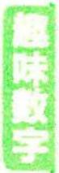

# 型 2 双空题破解模型

# 模型解法 >>>

根据双空题的两个空对应的问题之间的关系,可以将双空题分为递进型和平行存在型. 递进型即为降低试题难度,第一个空作为第二个空的基础或前提的题型,若第一个空求不出来,第二个空的求解往往也会受阻,但第一个空的难度一般不大,其解法或结果往往对第二个空有决定作用. 平行存在型即两个空对应的问题之间没有关系或关系不大的题型,这两个空的求解往往是相互独立的. 其中递进型考查得较多.

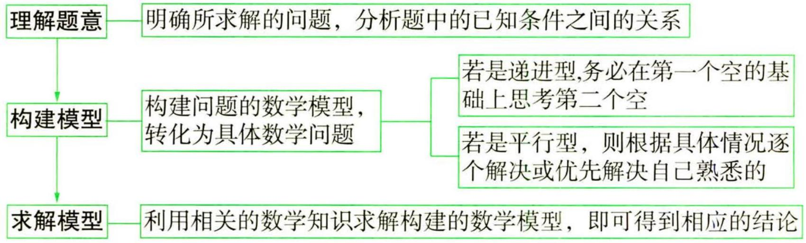

# 类型1 平行存在型

调研 1 (2023·天津南开中学 9 月统练)设甲、乙两位同学上学期间,每天7:30之前到校的概率均为 $\frac{2}{3}$ .假定两位同学每天到校情况相互独立.用 X 表示甲同学上学期间的某周五天中 7:30 之前到校的天数,则 $E(X)=$ \_\_\_\_,记“上学期间的某周的五天中,甲同学在 7:30 之前到校的天数比乙同学恰好多 3 天”为事件 M,则 $P(M)=$ \_\_\_\_.

解析 由题意知 $X \sim B\left(5, \frac{2}{3}\right)$ ,

【做铺垫】由题意找到具体的概率模型，是后面解决相关问题的关键

则 $P(X = k) = \mathrm{C}_5^k (\frac{2}{3})^k (\frac{1}{3})^{5 - k}, k = 0,1,2,3,4,5$ ，所以 $E(X) = 5 \times \frac{2}{3} = \frac{10}{3}$ .

设乙同学上学期间的某周的五天中 7:30 之前到校的天数为 Y, 则 $Y \sim B(5, \frac{2}{3})$ , $P(Y = n) = C_{5}^{n}\left(\frac{2}{3}\right)^{n}\left(\frac{1}{3}\right)^{5-n}$ , n = 0, 1, 2, 3, 4, 5.

事件 $M = \{X = 3, Y = 0\} \cup \{X = 4, Y = 1\} \cup \{X = 5, Y = 2\}$ ,

又事件 $\{X=3,Y=0\}$ ， $\{X=4,Y=1\}$ ， $\{X=5,Y=2\}$ 两两互斥，且 X 与 Y 取各个值相互独立，

【指点迷津】对事件之间的关系的正确分析是后面进行计算的依据，这里事件之间是互斥的，要用到加法公式，不同变量取值又是相互独立的，要用到乘法公式

的士数 又叫拉马努金数, 来源于数学家哈代和拉马努金的一件轶事. 第 $n$ 个的士数一般写作 $\mathrm{Ta}(n)$ 或 $\operatorname{Taxicab}(n)$ , 定义为能以 $n$ 种不同的方法表示成两个正立方数之和的最小正整数. $\mathrm{Ta}（1） = 1$ , $\mathrm{Ta}（2） = 1729 = 1^{3} + 12^{3} = 9^{3} + 10^{3}$ .

关注微信公众号“初高教辅站”获取更多初高中教辅资料

所以 $P(M) = \mathrm{C}_5^3\times (\frac{2}{3})^3\times (\frac{1}{3})^2\times \mathrm{C}_5^0\times (\frac{1}{3})^5 +\mathrm{C}_5^4\times (\frac{2}{3})^4\times (\frac{1}{3})^1\times \mathrm{C}_5^1\times (\frac{2}{3})^1\times (\frac{1}{3})^4+$ $\mathrm{C}_{5}^{5}\times (\frac{2}{3})^{5}\times \mathrm{C}_{5}^{2}\times (\frac{2}{3})^{2}\times (\frac{1}{3})^{3} = \frac{80}{2187}.$

答案 $\frac{10}{3}$ $\frac{80}{2187}$

调研 2 (2023·江苏盐城一中9月学情调研/新情境)校园内因改造施工,工人师傅用三角支架固定墙面(墙面与地面垂直)(如图1),现在一支架斜杆长为 $16 \mathrm{dm}$ , 一端靠在墙上, 另一端落在地面上, 则该支架斜杆与其在墙面和地面上的射影所围成三角形周长的最大值为 \_\_\_\_ dm; 现为调整支架安全性, 要求前述直角三角形周长为 $30 \mathrm{dm}$ , 面积为 $30 \mathrm{dm}^{2}$ , 则此时斜杆长度应设计为 \_\_\_\_ dm.

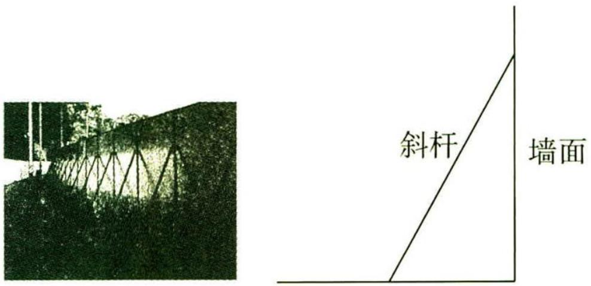

图1

解析 对于第一空,设斜杆在墙面和地面上的射影长分别为 $x \, dm, y \, dm$ , 则周长 $l = (x + y + 16) \, (\text{dm})$ ,

而 $x^{2} + y^{2} = 256, x + y \leqslant \sqrt{2(x^{2} + y^{2})}$ ,

【解题妙语】用到了基本不等式的推论，由 $x^{2}+y^{2}\geqslant2xy$ 易得 $2(x^{2}+y^{2})\geqslant2xy+x^{2}+y^{2}=(x+y)^{2}$ ，即 $x+y\leqslant\sqrt{2(x^{2}+y^{2})}$

所以 $l = x + y + 16 \leqslant \sqrt{2(x^{2} + y^{2})} + 16 = 16(1 + \sqrt{2})(\mathrm{dm})$ .

对于第二空,设斜杆长为 $a \, dm$ , 它与地面的夹角为 $\theta$ , 由题意有 $\left\{\begin{array}{l} a \sin \theta + a \cos \theta + a = 30, \\ a^{2} \sin \theta \cos \theta = 60, \end{array}\right.$

【模型应用】第一个空的条件只有和是零值，因此考虑基本不等式；而此处和与独均是零值，求斜杠长度不是最值问题了，考虑另辟蹊径，因此第一个空的做法没有多大参考价值

所以 $2\sin \theta \cos \theta = \frac{120}{a^2}$ , 而 $\sin \theta + \cos \theta = \frac{30 - a}{a}$ , 结合 $\sin^2\theta + \cos^2\theta = 1$ 得, $(\frac{30 - a}{a})^2 - \frac{120}{a^2} = 1$ , 解得 $a = 13$ .

答案 $16(1+\sqrt{2})$ 13

# 类型2 递进型

调研 3 (2023·四川三台中学9月模拟)在锐角 $\triangle ABC$ 中,角A,B,C的对边分

亲和数 又称相亲数、友爱数、友好数,指两个正整数中,彼此的全部约数之和(本身除外)与另一方相等.毕达哥拉斯曾说:“朋友是你灵魂的倩影,要像220与284一样亲密.”

# 016 试题调研 每月一辑试题新

别为 a, b, c，若 $c \cos B + b \cos C = 2a \cos A$ ，则 A = \_\_\_\_， $\frac{1}{\tan B} + \frac{1}{\tan C}$ 的取值范围为 \_\_\_\_.

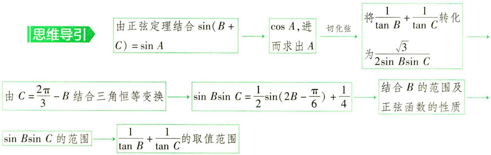

解析 由正弦定理得 $\sin C\cos B + \sin B\cos C = 2\sin A\cos A$

又 $\sin C\cos B + \sin B\cos C = \sin(B + C) = \sin(\pi - A) = \sin A$ ，则 $\sin A = 2\sin A\cos A$ ，

【会转化】求角A，必须将已知中的前向角A转化

又 $A \in (0, \frac{\pi}{2})$ ，则 $\sin A \neq 0$ ，则 $\cos A = \frac{1}{2}$ ，则 $A = \frac{\pi}{3}$ .

【易错】约分要说明约去部分不等于0，由三角函数值求角务必指明有的范围

$\frac {1}{\tan B} + \frac {1}{\tan C} = \frac {\cos B}{\sin B} + \frac {\cos C}{\sin C} = \frac {\sin C \cos B + \sin B \cos C}{\sin B \sin C} = \frac {\sin (B + C)}{\sin B \sin C} = \frac {\sin A}{\sin B \sin C} = \frac {\sqrt {3}}{2 \sin B \sin C},$

【指点迷津】求出了 $A$ 的值, 第二个空求值要通过切化弦, 向有 $A$ 靠拢

由 $A = \frac{\pi}{3}$ 可得 $C = \frac{2\pi}{3} - B$

又 $\triangle ABC$ 为锐角三角形, 则 $\left\{ \begin{array}{l} 0 < B < \frac{\pi}{2}, \\ 0 < \frac{2\pi}{3} - B < \frac{\pi}{2}, \end{array} \right.$ 可得 $\frac{\pi}{6} < B < \frac{\pi}{2}$ ,

则 $\sin B\sin C = \sin B\sin (\frac{2\pi}{3} -B) = \sin B(\frac{\sqrt{3}}{2}\cos B + \frac{1}{2}\sin B) = \frac{\sqrt{3}}{2}\sin B\cos B + \frac{1}{2}\sin^2 B = \frac{\sqrt{3}}{4}\sin 2B -$ $\frac{1}{4}\cos 2B + \frac{1}{4} = \frac{1}{2}\sin (2B - \frac{\pi}{6}) + \frac{1}{4},$

又 $\frac{\pi}{6} < 2B - \frac{\pi}{6} < \frac{5\pi}{6}$ , 则 $\frac{1}{2} < \sin(2B - \frac{\pi}{6}) \leqslant 1$ , 则 $\frac{1}{2} < \frac{1}{2}\sin(2B - \frac{\pi}{6}) + \frac{1}{4} \leqslant \frac{3}{4}$ , 即 $\frac{1}{2} < \sin B\sin C \leqslant \frac{3}{4}$ , 则 $\frac{1}{\tan B} + \frac{1}{\tan C} \in [\frac{2\sqrt{3}}{3}, \sqrt{3})$ .

答案 $\frac{\pi}{3}$ $\left[\frac{2\sqrt{3}}{3},\sqrt{3}\right)$

婚约数 两个正整数中,彼此的全部约数之和(1 和本身除外)与另一方相等.48 和 75 是第一对婚约数,现在已知的婚约数都是一个奇数配上一个偶数.

# 型 3 结构不良试题破解模型

# 类型1 选择单一型

# 模型解法 >>>

选择单一型的结构不良试题,只需从给出的条件中选择一个进行求解即可.一般来说,不同条件的解题难度都是大致相同的,所以不要过多考虑条件之间的差异性.解题时将选出的条件融合到已知条件中,然后处理相关的问题即可.解此类题的关键点如下:

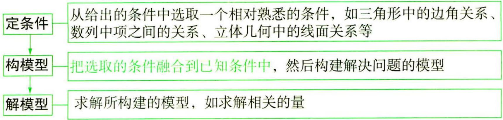

调研 1 (2023·广东佛山顺德一中9月月考/条件开放型)在① ${a}_{1},{a}_{3},{a}_{21}$ 成等比数列,② ${S}_{4} = {28}$ ,③ ${S}_{n + 1} = {S}_{n} + {a}_{n} + 4$ 这三个条件中任选一个,补充在下面的问题中,并解答.

从自己熟悉的或根据经验可知计算量小的条件入手，成功率更高

已知 $\{a_{n}\}$ 是公差不为零的等差数列, $S_{n}$ 为其前 n 项和, $a_{2}=5$ , \_\_\_\_ , $\{b_{n}\}$ 是等比数列, $b_{2}=9$ , $b_{1}+b_{3}=30$ , 公比 q>1.

（1） 求数列 $\{a_{n}\}$ , $\{b_{n}\}$ 的通项公式;

（2） 数列 $\{a_{n}\}$ 和 $\{b_{n}\}$ 的所有项分别构成集合 A, B, 将 $A \cup B$ 的元素按从小到大依次排列构成一个新数列 $\{c_{n}\}$ , 其前 n 项和为 $T_{n}$ , 求 $T_{80}$ 的值.

解析 （1） 因为 $\{a_{n}\}$ 是公差不为 0 的等差数列, 设公差为 $d$ .

选①, 由 $a_{1}, a_{3}, a_{21}$ 成等比数列, 可得 $(a_{1} + 2d)^{2} = a_{1}(a_{1} + 20d)$ , 又 $d \neq 0$ , 得 $4a_{1} = d$ , 又 $a_{2} = 5$ , 即 $a_{1} + d = 5$ , 则 $a_{1} = 1, d = 4$ , 故 $a_{n} = 1 + (n - 1) \times 4 = 4n - 3$ .

选②, 由 $S_{4} = 28, a_{2} = 5$ , 有 $4a_{1} + 6d = 28, a_{1} + d = 5$ , 可得 $a_{1} = 1, d = 4$ ,

故 $a_{n} = 1 + (n - 1)\times 4 = 4n - 3.$

选③, 由 $S_{n+1}=S_{n}+a_{n}+4$ , 可得 $a_{n+1}-a_{n}=d=4$ , 又 $a_{2}=5$ , 即 $a_{1}+d=5$ ,

所以 $a_{1}=1$ ，故 $a_{n}=1+(n-1)\times4=4n-3$ .

因为 $\{b_{n}\}$ 是等比数列, $b_{2}=9, b_{1}+b_{3}=30, q>1$ ,

金兰数 若三个数中任一个数的所有约数之和(本身不计)等于其他两数之和,那么这三个数为金兰数.我国数学家谈祥柏给出了最小的金兰数:123 228 768,103 340 640,124 015 008.

# 018 试题调研 每月一辑试题新

所以 $b_{1}q=9, b_{1}+b_{1}q^{2}=30$ ，可得 q=3, $b_{1}=3$ ，故 $b_{n}=3^{n}$ .

（2）由（1）得, $a_{80}=317,3^{5}=243<317<3^{6}=729$ ,

【指点迷津】先对数列 $\left\{ {a}_{n}\right\}$ 项的取值进行大致计算,一般按新数列的最大项数计算 ${a}_{n}$ ,这里 ${a}_{80} = {317}$ ,然后在 $\left\{  {b}_{n}\right\}$ 中找到取值在 ${a}_{80}$ 前后的相邻两项,获得 ${a}_{80}$ 前面有几项 $\left\{  {b}_{n}\right\}$ 中的项.

故 $\left\{c_{n}\right\}$ 的前80项中,数列 $\left\{b_{n}\right\}$ 的项最多有5项,其中 $b_{2}=9=a_{3},b_{4}=81=a_{21}$ 为公共项,

【易错】这里容易错误理解为 $\{a_{n}\}$ 的前 75 项加上 $\{b_{n}\}$ 的前 5 项得到 $\{c_{n}\}$ 的前 80 项，实际上它们有两项是重复的

又 $a_{77} = 305 > 243 = b_5$ ，故 $\{c_n\}$ 的前80项是由 $\{a_n\}$ 的前77项及 $b_{1}, b_{3}, b_{5}$ 构成.

$\begin{array}{r l} & T _ {8 0} = c _ {1} + c _ {2} + c _ {3} + \dots + c _ {8 0} = a _ {1} + a _ {2} + \dots + a _ {7 7} + b _ {1} + b _ {3} + b _ {5} = 1 1 7 8 1 + 3 + 2 7 + 2 4 3 = \\ & 1 2 0 5 4. \end{array}$

调研 2 (2023·江苏南通中学9月期初调研/结论开放型)已知函数 $f(x)=2\sin \omega x (\cos \omega x - \sqrt{3} \sin \omega x) + \sqrt{3} (\omega > 0)$ .

（1） 若 $f(x)$ 在 $[0, \frac{\pi}{24}]$ 上单调递增, 求正数 $\omega$ 的取值范围.

（2） 在 $\triangle ABC$ 中, 内角 $A, B, C$ 的对边分别为 $a, b, c$ . 若 $a = 2, \omega = 2, f(\frac{A}{4}) = \sqrt{3}, D$ , $E, H$ 为 $BC$ 边上的点. 从以下给出的 3 个条件中选择其中 1 个作为补充条件, 并判断是否存在满足条件的三角形. 若存在, 求出 $\triangle ABC$ 的周长; 若不存在, 请说明理由.

① $BC$ 边上的中线 $AD = \frac{\sqrt{3}}{2}$ , ②角 $A$ 的平分线 $AE = \frac{\sqrt{3}}{2}$ , ③ $BC$ 边上的垂线 $AH = \frac{\sqrt{3}}{2}$ . (如果选择多个条件分别解答, 按第一个解答计分)

与条件开放型类似，还是应从自己熟悉的待证结论入手，或者解决方法多的结论入手

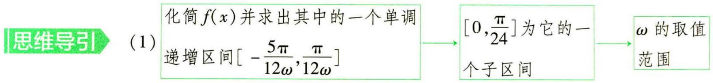

（2） 若选择① $\rightarrow$ $bc = -\frac{1}{2}$ $\rightarrow$ 不合题意 $\rightarrow$ 此时不存在满足条件的三角形

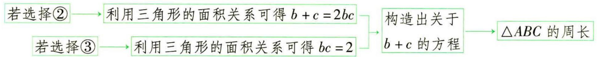

解析 （1） 由题意, $f(x)=2 \sin \omega x \cos \omega x - 2 \sqrt{3} \sin^{2} \omega x + \sqrt{3}=\sin 2 \omega x + \sqrt{3} \cos 2 \omega x=$

自守数 亦称同构数,是指一个数的平方的尾数等于该数自身的自然数. 在十进制中,0,1,5,6,25,76,376,625,9376,90625,…,都是自守数.

$2 \sin (2 \omega x + \frac {\pi}{3}).$

令 $2k\pi - \frac{\pi}{2} \leqslant 2\omega x + \frac{\pi}{3} \leqslant 2k\pi + \frac{\pi}{2}(k \in \mathbf{Z})$ ，则 $\frac{k\pi}{\omega} - \frac{5\pi}{12\omega} \leqslant x \leqslant \frac{k\pi}{\omega} + \frac{\pi}{12\omega}(k \in \mathbf{Z})$ .

令 $k = 0$ ，则 $f(x)$ 在 $\left[-\frac{5\pi}{12\omega}, \frac{\pi}{12\omega}\right]$ 上单调递增。由 $f(x)$ 在 $[0, \frac{\pi}{24}]$ 上单调递增，得 $\frac{\pi}{24} \leqslant \frac{\pi}{12\omega}$ ，解得 $0 < \omega \leqslant 2$ 。故正数 $\omega$ 的取值范围为 $(0, 2]$ 。

（2） 由 $\omega = 2, f\left(\frac{A}{4}\right) = \sqrt{3}$ , 得 $\sin \left(A + \frac{\pi}{3}\right) = \frac{\sqrt{3}}{2}$ , 解得 $A = \frac{\pi}{3}$ .

因为 a=2，由余弦定理得， $b^{2}+c^{2}-bc=4$ （\*）.

若选择①, 设 $\angle ADB = \theta$ , 则 $\angle ADC = \pi - \theta$ .

因为 D 为 BC 的中点, 所以 BD = DC = 1, 又 $AD = \frac{\sqrt{3}}{2}$ ,

在 $\triangle ABD$ 中，由余弦定理得 $c^2 = 1 + \frac{3}{4} -\sqrt{3}\cos \theta = \frac{7}{4} -\sqrt{3}\cos \theta .$

同理在 $\triangle ACD$ 中, $b^{2} = \frac{7}{4} +\sqrt{3}\cos \theta .$ 故 $b^{2} + c^{2} = \frac{7}{2}.$

【指点迷津】处理中线问题的常用技巧：对中点处的两个互补的角在各自的小三角形内用一次余弦定理，然后两式相加。这里的两式即 $c^{2}=\frac{7}{4}-\sqrt{3}\cos\theta$ 与 $b^{2}=\frac{7}{4}+\sqrt{3}\cos\theta$ 。此外，向量法也是处理中线问题的有效方法

代入 $(*)$ 式, 得 $bc = -\frac{1}{2}$ , 不合题意. 故此时不存在满足条件的三角形.

若选择②, $AE$ 为角平分线, 则 $\angle BAE = \angle CAE = \frac{\pi}{6}$ .

由 $S_{\triangle ABC}=S_{\triangle ABE}+S_{\triangle ACE}$ ，且 $AE=\frac{\sqrt{3}}{2}$ ，得 $\frac{1}{2}\times bc\times\sin\frac{\pi}{3}=\frac{1}{2}\times b\times\frac{\sqrt{3}}{2}\times\sin\frac{\pi}{6}+\frac{1}{2}\times$ 【技巧点拨】与角平分线有关的解三角形问题，常利用两个小三角形面积之和等于大三角形的面积来构造方程求解相关量，本题即 $S_{\triangle ABC}=S_{\triangle ABE}+S_{\triangle ACE}$ ，然后求解，这种方法计算量较小，能快速求解

$c \times \frac {\sqrt {3}}{2} \times \sin \frac {\pi}{6}, \text {即} b + c = 2 b c.$

由（\*）式，有 $(b + c)^2 - 3bc = 4$ ，将上式代入，则有 $(b + c)^2 - \frac{3}{2}(b + c) - 4 = 0$

哈沙德数 又称尼云数,是指能够被其各个数位上的数字之和整除的自然数.任何进制下都可以定义哈沙德数,并且无论哪种进制,都有无穷多个哈沙德数.

得 $b + c = \frac{3 + \sqrt{73}}{4}$ . 此时 $\triangle ABC$ 的周长为 $\frac{11 + \sqrt{73}}{4}$ .

若选择③, 由 AH 为垂线, 得 $S_{\triangle ABC} = \frac{1}{2} \times bc \times \sin \frac{\pi}{3} = \frac{1}{2} \times 2 \times \frac{\sqrt{3}}{2}$ , 故 bc = 2.

由（\*）式，有 $(b + c)^2 - 3bc = 4$ ，将上式代入，则有 $(b + c)^2 = 4 + 3bc = 10.$

此时 $b + c = \sqrt{10}$ , $\triangle ABC$ 的周长为 $2 + \sqrt{10}$ .

# 类型2 组合探索型

# 模型解法 >>

对于组合探索型的结构不良试题,需要从给出的条件中选择两个或两个以上进行组合,然后代入问题中求解.一般来说,条件的不同组合会造成问题难度上的差异,因此需要考虑条件之间的适配性和差异性,所以组合型结构不良试题的难度要大一些.解此类题的关键点如下:

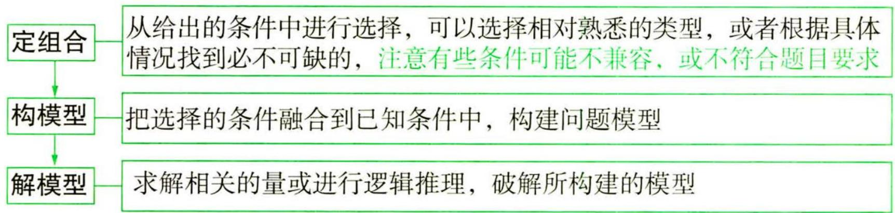

调研 3 (2023·东北育才双语学校9月模拟)已知函数 $f(x)=2\cos^{2}\omega x+2\sqrt{3}$ ·
sin ωxcos ωx+a(ω>0,a∈R),从条件①,条件②,条件③这三个条件中选择能确定函数f(x)解析式的两个合理条件作为已知.条件①:f(x)的最大值为1.条件②:f(x)图象的一条对称轴是直线 $x=-\frac{\pi}{12\omega}$ .条件③:f(x)图象的相邻两条对称轴之间的距离为 $\frac{\pi}{2}$ .

（1） 求函数 $f(x)$ 的解析式, 并求 $f(x)$ 的单调递增区间、图象的对称中心坐标.

（2） 将函数 $f(x)$ 图象上的点纵坐标不变, 横坐标变为原来的 $\frac{1}{2}$ , 再向右平移 $\frac{\pi}{12}$ 个单位长度, 得到函数 $g(x)$ 的图象, 若 $g(x)$ 在区间 $[0, m]$ 上的最小值为 $g(0)$ , 求 m 的最大值.

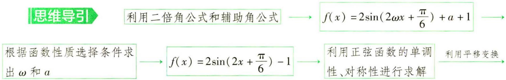

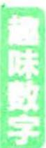

奢侈数 也称为浪费数,是指一个正整数分解质因数(包括指数)的总位数大于此正整数本身的位数.“双11”1111就是奢侈数, $1111=11\times101$ ,质因数分解的总位数为5位,比四位数1111多1位.

$g (x) = 2 \sin \left(4 x - \frac {\pi}{6}\right) - 1 \xrightarrow {\text {利用函数性质}} \left\{ \begin{array}{l} 4 m - \frac {\pi}{6} \leqslant \frac {7 \pi}{6}, \\ m > 0 \end{array} \right. \longrightarrow m \text {的最大值}$

解析 （1） $f(x)=2\cos^{2}\omega x+2\sqrt{3}\sin\omega x\cos\omega x+a=\cos2\omega x+\sqrt{3}\sin2\omega x+a+1=$ $2\sin(2\omega x + \frac{\pi}{6}) + a + 1.$

当选条件①时, $a+3=1$ ,解得a=-2;

当选条件②时, $2\omega\cdot(-\frac{\pi}{12\omega})+\frac{\pi}{6}=0\neq\frac{\pi}{2}+k\pi,k\in\mathbf{Z}$ ，显然条件②不合理；

【模型应用】选条件：条件②本身合待求未知量，需谨慎，而且选它的话必须先求出ω，但本题本来就需要求ω的值，因此选②是毫无价值的

当选条件③时, $\frac{T}{2}=\frac{\pi}{2}$ ,即 $T=\frac{2\pi}{2\omega}=\pi$ ,解得 $\omega=1$ .

【模型应用】选条件：条件③是定周期的，用来求ω，因此必选

综上所述,选择条件①③能确定函数 $f(x)$ 的解析式, $f(x)=2\sin(2x+\frac{\pi}{6})-1$ .

令 $-\frac{\pi}{2} + 2k\pi \leqslant 2x + \frac{\pi}{6} \leqslant \frac{\pi}{2} + 2k\pi, k \in \mathbf{Z}$ , 得 $-\frac{\pi}{3} + k\pi \leqslant x \leqslant \frac{\pi}{6} + k\pi, k \in \mathbf{Z}$ ,

所以函数 $f(x)$ 的单调递增区间为 $\left[-\frac{\pi}{3} + k\pi, \frac{\pi}{6} + k\pi\right] (k \in \mathbf{Z})$ ；

令 $2x + \frac{\pi}{6} = k\pi, k \in \mathbf{Z}$ , 得 $x = -\frac{\pi}{12} + \frac{k\pi}{2}, k \in \mathbf{Z}$ , 所以函数 $f(x)$ 图象的对称中心坐标为 $(- \frac{\pi}{12} + \frac{k\pi}{2}, -1), k \in \mathbf{Z}$ .

（2） 将函数 $f(x)$ 图象上的点纵坐标不变, 横坐标变为原来的 $\frac{1}{2}$ , 得到 $y = 2\sin(4x + \frac{\pi}{6}) - 1$ 的图象, 再向右平移 $\frac{\pi}{12}$ 个单位长度, 得到函数 $y = 2\sin\left[4\left(x - \frac{\pi}{12}\right) + \frac{\pi}{6}\right] - 1 = 2\sin\left(4x - \frac{\pi}{6}\right) - 1$ 的图象, 即 $g(x) = 2\sin\left(4x - \frac{\pi}{6}\right) - 1$ 的图象.

因为 $x \in [0, m]$ , 所以 $4x - \frac{\pi}{6} \in [-\frac{\pi}{6}, 4m - \frac{\pi}{6}]$ ,

因为 $g(x)$ 在区间 $[0, m]$ 上的最小值为 $g(0)$ ，所以 $\left\{\begin{aligned}4m - \frac{\pi}{6} &\leqslant \frac{7\pi}{6},\\ m &>0,\end{aligned}\right.$ 解得 $0 < m \leqslant \frac{\pi}{3}$ .

所以 m 的最大值为 $\frac{\pi}{3}$ .

数学家理性而严谨,艺术家感性而浪漫,数学与艺术两者都在追求美的极限.英国著名哲学家、数学家罗素认为:“数学,如果正确地看它,不但拥有真理,而且也具有至高的美.”

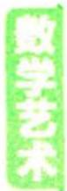

# 型 4 开放探究模型

# 类型1 开放性填空题

# 模型解法 >>>

开放性填空题,就是指题目的条件不完备或结论不确定的问题.这类题目的特点是给出一定的条件,要求从条件出发去探索结论,而结论往往是不唯一的,甚至是不确定的,或给出特例后通过归纳得出一般性结论.这类题目的正确答案往往不止一个,而在解答时,我们只需要写出一个符合题意的答案即可.解答此类题的关键为:

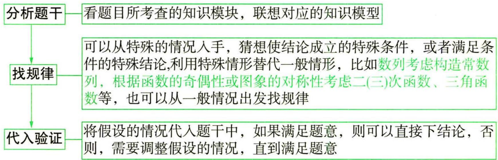

调研 1 (2023·福建上杭一中8月返校考试)定义在 $\mathbf{R}$ 上的函数 $f(x)$ 有以下两个性质: ① $f(-x) + f(x) = 0$ , ② $f(1+x) = f(2-x)$ . 满足题意的一个函数是 .

【找规律】涉及函数奇偶性、图象对称性的开放性问题多与三角函数对照,因为三角函数是将这些性质体现最好的并且我们最熟悉的函数

解析 假设 $f(x)=\sin\frac{\pi}{3}x.f(-x)=\sin(-\frac{\pi}{3}x)=-\sin\frac{\pi}{3}x=-f(x)$ ，即满足性质①，

又 $f(1+x)=\sin\left[\frac{\pi}{3}(1+x)\right]=\sin\left(\frac{\pi}{3}+\frac{\pi}{3}x\right)$ ， $f(2-x)=\sin\left[\frac{\pi}{3}(2-x)\right]=\sin\left(\frac{2\pi}{3}-\frac{\pi}{3}x\right)$ ，因为 $\left(\frac{\pi}{3}+\frac{\pi}{3}x\right)+\left(\frac{2\pi}{3}-\frac{\pi}{3}x\right)=\pi$ ,所以 $f(1+x)=f(2-x)$ ,即满足性质②.

故 $f(x)=\sin\frac{\pi}{3}x$ 为满足题意的一个函数.

答案 $f(x) = \sin \frac{\pi}{3} x$ （答案不唯一）

调研 2 (2023·山东青岛二中10月调研)已知椭圆 $C: \frac{x^{2}}{b^{2}} + \frac{y^{2}}{a^{2}} = 1 (a > b > 0)$ 的上、下顶点分别为 $A_{1}, A_{2}$ , 点 $P$ 是椭圆 $C$ 上异于 $A_{1}, A_{2}$ 的点, 直线 $PA_{1}$ 和 $PA_{2}$ 的斜率分别为 $k_{1}, k_{2}$ , 写出一个满足 $k_{1} \cdot k_{2} = -4$ 的椭圆 $C$ 的方程: \_\_\_\_.

数学与音乐 古希腊的毕达哥拉斯学派用比率将数学与音乐联系起来,从而发现了和声与整数之间的关系,而且还发现谐声是由长度成整数比的同样绷紧的弦发出的.于是,毕达哥拉斯音阶和调音理论诞生了.

解析 由题意可知 $A_{1}(0,a), A_{2}(0, -a)$ , 设 $P(x_{0}, y_{0})(x_{0} \neq 0)$ , 则 $\frac{x_{0}^{2}}{b^{2}} + \frac{y_{0}^{2}}{a^{2}} = 1$ ,

所以 $x_0^2 = -\frac{b^2(y_0^2 - a^2)}{a^2}$ , 所以 $k_1k_2 = \frac{y_0 - a}{x_0} \cdot \frac{y_0 + a}{x_0} = \frac{y_0^2 - a^2}{x_0^2} = -\frac{a^2}{b^2} = -4$ , 所以 $a^2 = 4b^2$ .

所以椭圆 C 的方程可以为 $\frac{y^{2}}{4} + x^{2} = 1$ .

秒杀解

点 P 是椭圆 C 上异于 $A_{1}, A_{2}$ 的点, 直线 $PA_{1}$ 和 $PA_{2}$ 的斜率分别为 $k_{1}, k_{2}, k_{1} \cdot k_{2} = -4$ .设 P 在椭圆右顶点处, 则 $P(b,0)$ , 则 $k_{1} \cdot k_{2} = -4$ 即 $\frac{a^{2}}{-b^{2}} = -4$ , 取 b = 1, 则 a = 2.

【模型应用】研究 P 在椭圆顶点处的特殊情况，一般取椭圆的左、右顶点或上、下顶点当 b=1, a=2 时，椭圆方程为 $\frac{y^{2}}{4} + x^{2} = 1$ ，经检验，满足题意.

答案 $\frac{y^{2}}{4} + x^{2} = 1$ (答案不唯一)

调研 3

(2023·北京一零一中学9月摸底)如图1,在棱长为2的正方体$ABCD - A_{1}B_{1}C_{1}D_{1}$ 中, 点 $E$ 为棱 $CD$ 的中点, 点 $F$ 为底面 $ABCD$ 内一点 (包含边界), 给出下列三个论断:

① $A_{1}F \perp BE$ , ② $A_{1}F = 3$ , ③ $S_{\triangle ADF} = 2S_{\triangle ABF}$ .

以其中的一个论断作为条件,另一个论断作为结论,写出一个正确的命题：

【名师有话说】条件的组合具有不确定性，需要结合其特征进行探索，方向正确可节约解题时间

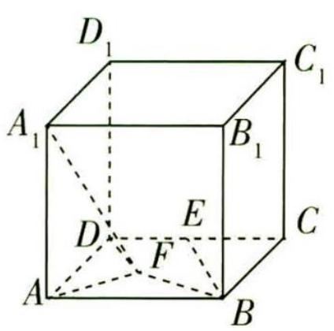

图1

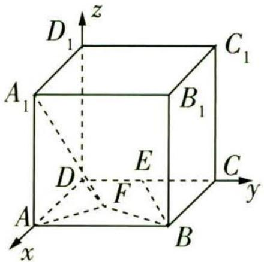

图 2

解析 如图2,建立空间直角坐标系 D-xyz, 则 $A_{1}(2,0,2)$ , $B(2,2,0)$ , $E(0,1,0)$ , $\overrightarrow{BE}=(-2,-1,0)$ , 设 $F(x,y,0)$ , $x\in[0,2]$ , $y\in[0,2]$ , 则 $\overrightarrow{A_{1}F}=(x-2,y,-2)$ ,

$S _ {\triangle A D F} = \frac {1}{2} \times 2 \times y = y, S _ {\triangle A B F} = \frac {1}{2} \times 2 \times (2 - x) = 2 - x,$

$A _ {1} F \perp B E \Leftrightarrow \overrightarrow {A _ {1} F} \cdot \overrightarrow {B E} = - 2 (x - 2) - y = 0 \Leftrightarrow y = 4 - 2 x \Leftrightarrow S _ {\triangle A D F} = 2 S _ {\triangle A B F}.$

若 $A_{1}F \perp BE$ ，则 $A_{1}F = \sqrt{(x - 2)^{2} + y^{2} + 4} = \sqrt{(x - 2)^{2} + (4 - 2x)^{2} + 4} = \sqrt{5x^{2} - 20x + 24}$ ，不能确定 $A_{1}F$ 的长度.

法国数学家傅里叶证明了所有的器乐和声乐,都可以用数学表达式来描述,它们是一些简单的正弦周期函数的和.每种声音都有三个特征:音调、响度和音色.

所以以其中的一个论断作为条件,另一个论断作为结论,可以写出两个正确的命题:

若 $A_{1}F \perp BE$ ，则 $S_{\triangle ADF} = 2S_{\triangle ABF}$ ；若 $S_{\triangle ADF} = 2S_{\triangle ABF}$ ，则 $A_{1}F \perp BE$ .

【解题密钥】本题开放性较强，需要自行对条件、结论进行组合，但这类问题也不可盲目组合，否则会浪费时间，还容易误入歧途。可以看到，条件② $A_{1}F=3$ 是无法固定点F的位置的，因此不会得出面积的相关结论，更不用说垂直关系了，因此②不可以作为条件出现；而若选①作为条件，则AF与AD，AB夹角是确定的，因此由面积公式知 $S_{\triangle ADF}$ 与 $S_{\triangle ABF}$ 有确定的关系，反之若以③为条件，则 $A_{1}F$ 的方向是确定的，因此可以获得 $A_{1}F$ 与BE的位置关系

答案 若 $A_{1}F \perp BE$ ，则 $S_{\triangle ADF} = 2S_{\triangle ABF}$ （若 $S_{\triangle ADF} = 2S_{\triangle ABF}$ ，则 $A_{1}F \perp BE$ ）

# 类型2 开放探索性问题

# 模型解法 >>>

开放探索性问题是一类具有开放性和发散性的问题,此类问题一是在条件给定的情况下结论不唯一或由条件具有一般性去探寻结论是否具有确定性;二是给定结论的情况下去探寻成立条件或条件的存在性. 条件或结论不完备,没有明确的结论,解题方向不明,自由度大,其中探索模型又可分为条件追溯型、结论探索型、存在判断型、规律探究型等,每种题型的求解策略有所不同,因此在求解时,必须先辨明考查类型,再根据所属类型选择解题策略.

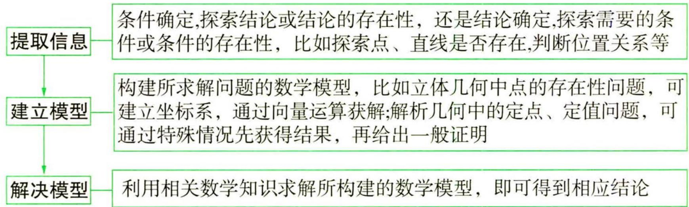

调研 4 (2023·浙江省慈溪中学、余姚中学9月联考)如图3,已知椭圆 $\frac{x^{2}}{a^{2}}+\frac{y^{2}}{b^{2}}=1(a>b>0)$ 的离心率为 $\frac{\sqrt{2}}{2}$ ,以该椭圆上的点和左、右焦点 $F_{1},F_{2}$ 为顶点的三角形的周长为 $4(\sqrt{2}+1)$ .一等轴双曲线的顶点是该椭圆的焦点,设P为该双曲线上异于顶点的任一点,直线 $PF_{1}$ 和 $PF_{2}$ 与椭圆的交点分别为A,B和C,D.

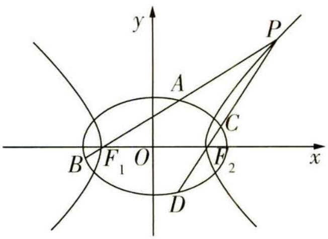

图3

数学与西洋画 在艺术创作领域有两次大的创新,一次是文艺复兴,另一次是20世纪初兴起的现代艺术.两次大的变革都与几何学的变革有关,代表人物分别是达·芬奇和康定斯基.

（1） 求椭圆和双曲线的标准方程.

（2）设直线 $PF_{1}, PF_{2}$ 的斜率分别为 $k_{1}, k_{2}$ ，证明 $k_{1} \cdot k_{2} = 1$ .

（3） 是否存在常数 $\lambda$ , 使得 $|AB| + |CD| = \lambda |AB| \cdot |CD|$ 恒成立? 若存在, 求 $\lambda$ 的值; 若不存在, 请说明理由.

解析 （1） 设椭圆的半焦距为 $c$ , 由题意知 $\frac{c}{a} = \frac{\sqrt{2}}{2}, 2a + 2c = 4(\sqrt{2} + 1)$ , 解得 $a = 2\sqrt{2}, c = 2$ .

又 $a^2 = b^2 + c^2$ ，因此 $b = 2$ . 故椭圆的标准方程为 $\frac{x^2}{8} + \frac{y^2}{4} = 1$ .

由题意设等轴双曲线的标准方程为 $\frac{x^{2}}{m^{2}}-\frac{y^{2}}{m^{2}}=1(m>0)$ ，因为等轴双曲线的顶点是椭圆的焦点，所以 m=2 ，因此双曲线的标准方程为 $\frac{x^{2}}{4}-\frac{y^{2}}{4}=1$ 。

（2） 设 $P(x_0, y_0)$ , 则 $k_1 = \frac{y_0}{x_0 + 2}, k_2 = \frac{y_0}{x_0 - 2}$ .

因为点 P 在双曲线 $x^{2}-y^{2}=4$ 上, 所以 $x_{0}^{2}-y_{0}^{2}=4$ .

因此 $k_{1} \cdot k_{2} = \frac{y_{0}}{x_{0} + 2} \cdot \frac{y_{0}}{x_{0} - 2} = \frac{y_{0}^{2}}{x_{0}^{2} - 4} = 1$ ，即 $k_{1} \cdot k_{2} = 1$ .

【用结论】二级结论：设 P 为双曲线 $\frac{x^{2}}{a^{2}} - \frac{y^{2}}{b^{2}} = 1 (a > 0, b > 0)$ 上任一点，A、B 为双曲线上关于坐标原点对称的两点，则 $k_{PA} \cdot k_{PB} = \frac{b^{2}}{a^{2}}$

（3） 设 $A(x_{1}, y_{1}), B(x_{2}, y_{2}), PF_{1}$ 的方程为 $y = k_{1}(x + 2)$ , 将其代入椭圆方程消去 $y$ 得关于 $x$ 的方程 $(2k_{1}^{2} + 1)x^{2} + 8k_{1}^{2}x + 8k_{1}^{2} - 8 = 0$ , 显然 $2k_{1}^{2} + 1 \neq 0, \Delta > 0$ .

由根与系数的关系得 $x_{1} + x_{2} = \frac{-8k_{1}^{2}}{2k_{1}^{2} + 1}, x_{1}x_{2} = \frac{8k_{1}^{2} - 8}{2k_{1}^{2} + 1}$ ,

所以 $|AB|=\sqrt{1+k_{1}^{2}}\sqrt{(x_{1}+x_{2})^{2}-4x_{1}x_{2}}=\sqrt{1+k_{1}^{2}}\sqrt{(\frac{-8k_{1}^{2}}{2k_{1}^{2}+1})^{2}-4\times\frac{8k_{1}^{2}-8}{2k_{1}^{2}+1}}=4\sqrt{2}\frac{k_{1}^{2}+1}{2k_{1}^{2}+1}.$

同理可得 $|CD|=4\sqrt{2}\frac{k_{2}^{2}+1}{2k_{2}^{2}+1}.$

【小技巧】用好同理可得,可节约大量解题时间. 这里 $|{AB}$ 与 $\left| {CD}\right|$ 求解过程完全一致,只需把 $\left| {AB}\right|$ 表达式中的 ${k}_{1}$ 换或 ${k}_{2}$ 即可

意大利巨匠达·芬奇曾说过：“能欣赏我的作品的人，没有一个不是数学家。”他创立了一整套全新的数学透视理论体系，把这种透视理论体系中的数学精神注入绘画艺术之中，创立了全新的绘画风格。

则 $\frac{1}{|AB|} +\frac{1}{|CD|} = \frac{1}{4\sqrt{2}} (\frac{2k_1^2 + 1}{k_1^2 + 1} +\frac{2k_2^2 + 1}{k_2^2 + 1})$

又 $k_{1} \cdot k_{2} = 1$ ，所以 $\frac{1}{|AB|} + \frac{1}{|CD|} = \frac{1}{4\sqrt{2}}\left(\frac{2k_1^2 + 1}{k_1^2 + 1} + \frac{\frac{2}{k_1^2} + 1}{\frac{1}{k_1^2} + 1}\right) = \frac{\sqrt{2}}{8}\left(\frac{2k_1^2 + 1}{k_1^2 + 1} + \frac{k_1^2 + 2}{k_1^2 + 1}\right) = \frac{3\sqrt{2}}{8}$ .

故 $|AB| + |CD| = \frac{3\sqrt{2}}{8}|AB| \cdot |CD|$ .

【模型应用】实际上，探寻 $|AB|+|CD|=\lambda|AB|\cdot|CD|$ （ $\lambda$ 为定值）是否成立，等价于探寻 $\frac{1}{|AB|}+\frac{1}{|CD|}=\lambda(\lambda$ 为定值）是否成立，只需化简 $\frac{1}{|AB|}+\frac{1}{|CD|}$ 就可得到 $\lambda$ 的值

因此存在 $\lambda=\frac{3\sqrt{2}}{8}$ ，使 $|AB|+|CD|=\lambda|AB|\cdot|CD|$ 恒成立.

调研 5 (2023·山东省“学情空间”区域教研共同体9月入学考试)如图4,已知SA垂直于梯形ABCD所在的平面,矩形SADE的对角线交于点F,G为SB的中点, $\angle ABC=\angle BAD=\frac{\pi}{2}$ ,SA=AB=BC= $\frac{1}{2}$ AD=1.

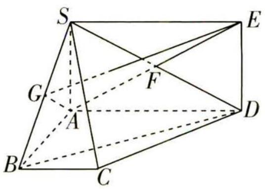

图4

（1） 求证: BD // 平面 AEG.

（2） 求二面角 C - SD - E 的余弦值.

（3） 在线段 $EG$ 上是否存在一点 $H$ , 使得 $BH$ 与平面 $SCD$ 所成角的大小为 $\frac{\pi}{6}$ ? 若存在, 求出 $GH$ 的长; 若不存在, 请说明理由.

解析 （1）如图5,连接FG. 在 $\triangle SBD$ 中,F,G分别为SD,SB的中点,所以 $FG \parallel BD$ . 因为 $FG \subset$ 平面AEG, $BD \not\subset$ 平面AEG,所以 $BD \parallel$ 平面AEG.

【易错】莫漏掉 $FG \subset$ 平面 $AEG, BD \not\subset$ 平面 $AEG$ , 这是用线面平行判定定理的必要条件

（2） 因为 $SA \perp$ 平面 $ABCD, AB, AD \subset$ 平面 $ABCD$ , 所以 $SA \perp AB, SA \perp AD$ .

又 $\angle BAD = \frac{\pi}{2}$ , 所以 $AB \perp AD$ .

以 $A$ 为坐标原点, $\overrightarrow{AB}, \overrightarrow{AD}, \overrightarrow{AS}$ 的方向分别为 $x$ 轴、 $y$ 轴、 $z$ 轴的正方向建立如图 5 所示的空间直角坐标系 $A - xyz$ .

【小提示】考试中若安建系求解问题,务必准备好建系的条件,说明建系过程,不可直接写坐标,并且需要的辅助线最后一定要标在答题纸上

则 $A(0,0,0), B(1,0,0), C(1,1,0), D(0,2,0), S(0,0,1), E(0,2,1), G(\frac{1}{2}, 0,$

$\frac {1}{2}), \overrightarrow {C D} = (- 1, 1, 0), \overrightarrow {S C} = (1, 1, - 1).$

设平面 SCD 的法向量为 $\boldsymbol{m} = (x, y, z)$ ，则 $\left\{\begin{aligned}&\boldsymbol{m}\cdot\overrightarrow{CD}=0,\\ &\boldsymbol{m}\cdot\overrightarrow{SC}=0,\end{aligned}\right.$ 即 $\left\{\begin{aligned}-x+y=0,\\ x+y-z=0,\end{aligned}\right.$

令 $x = 1$ ，得 $y = 1, z = 2$ ，所以平面 SCD 的法向量为 $\pmb{m} = \nearrow_{x}$ (1,1,2).

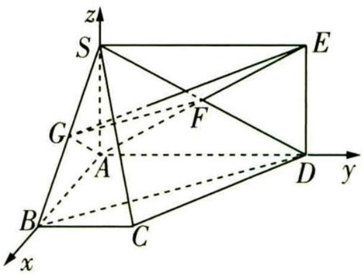

图 5

又平面 ESD 的一个法向量为 $\overrightarrow{AB} = (1, 0, 0)$ ,

所以 $\cos\langle m,\overrightarrow{AB}\rangle=\frac{m\cdot\overrightarrow{AB}}{|m|\times|\overrightarrow{AB}|}=\frac{1\times1+1\times0+2\times0}{\sqrt{1^{2}+1^{2}+2^{2}}\times1}=\frac{\sqrt{6}}{6}.$

由图可知,二面角 C-SD-E 为钝角,所以二面角 C-SD-E 的余弦值为 $-\frac{\sqrt{6}}{6}$ .

（3）由（2）得 $\overrightarrow{GE}=(-\frac{1}{2},2,\frac{1}{2}),\overrightarrow{BG}=(-\frac{1}{2},0,\frac{1}{2})$ ，假设存在点H，设 $\overrightarrow{GH}=\lambda\overrightarrow{GE}=$

【模型应用】结论一完,探寻条件的存在性,一般光假设满足题意的条件存在,能推出结论即存在,否则就是不存在

$(-\frac{1}{2}\lambda, 2\lambda, \frac{1}{2}\lambda)$ , 则 $\overrightarrow{BH} = \overrightarrow{BG} + \lambda \overrightarrow{GE} = (-\frac{1}{2} - \frac{1}{2}\lambda, 2\lambda, \frac{1}{2} + \frac{1}{2}\lambda)$ .

由（2）知,平面 SCD 的一个法向量为 $\boldsymbol{m}=(1,1,2)$ ,

则 $\sin\frac{\pi}{6}=|\cos\langle\boldsymbol{m},\overrightarrow{BH}\rangle|=\frac{|- \frac{1}{2}-\frac{1}{2}\lambda+2\lambda+1+\lambda|}{\sqrt{6}\times\sqrt{4\lambda^{2}+\frac{1}{2}(1+\lambda)^{2}}}=\frac{1}{2}$ ，即 $(\lambda-1)^{2}=0$ ，所以 $\lambda=1$ 。

故存在满足题意的点 H, $GH = |\overrightarrow{GE}| = \frac{3\sqrt{2}}{2}$ .

# 型 5 高等数学模型

# 特约名师

张成凯 济南历城二中高级教师,曾获济南市优秀班主任、济南市高中数学中心组成员、历城区高中数学学科带头人、区优秀教师、区教学能手等称号,参编多部教辅材料,参与多个国家级课题.

# 类型1 泰勒展开式模型

# 模型解法 >>>

高考数学中的泰勒展开式(泰勒级数)主要解决指数函数、对数函数、正弦函数、余

艺术家们的工作促进了数学的发展,孕育了新的数学分支——射影几何学. 它以笛沙格定理、帕斯卡定理为基础,以焦点透视系统为前提,推导出一系列关于投射、截面的几何原理,其精神在绘画艺术中得到充分体现.

弦函数、正切函数与高次函数之间的放缩问题. 解决此类问题的关键点如下:

<table><tr><td>常见泰勒展开式</td><td> $e^{x} \approx 1 + x + \frac{x^{2}}{2!} + \cdots + \frac{x^{n}}{n!}, \sin x \approx x - \frac{x^{3}}{3!} + \frac{x^{5}}{5!} - \cdots + (-1)^{n} \frac{x^{2n+1}}{(2n+1)!}, \cos x \approx 1 - \frac{x^{2}}{2!} + \frac{x^{4}}{4!} - \cdots + (-1)^{n} \frac{x^{2n}}{(2n)!}, \tan x = x + \frac{1}{3}x^{3} + \frac{2}{15}x^{5} + \frac{17}{315}x^{7} + \cdots (|x| < \frac{\pi}{2}), \ln(1+x) = x - \frac{x^{2}}{2} + \frac{x^{3}}{3} - \cdots (x \leqslant 1)</td></tr><tr><td>确定泰勒展开式需要的项数</td><td>一般选取前3项或前4项,如\( e^{x} \approx 1 + x + \frac{x^{2}}{2}$ ,比较 $e^{0.1}$ 与 $\frac{10}{9}$ 的大小,采用 $e^{0.1} \approx 1 + 0.1 + \frac{1}{2} \times 0.01 = 1.105 < 1.111\cdots$ </td></tr><tr><td>若证不等式,明确所证不等式的方向</td><td>如 $e^{x} \geqslant 1 + x, \sin x \geqslant x - \frac{x^{3}}{6}, \cos x \geqslant 1 - \frac{x^{2}}{2}, \tan x > x > \sin x (0 < x < \frac{\pi}{2}), \ln x \leqslant x - 1(x > 0), e^{x} \geqslant 1 + x + \frac{x^{2}}{2}$ </td></tr></table>

调研 1 (2023·江苏扬州中学9月学情调研)已知 $a=\frac{1}{e^{0.1}}-1$ , $b=\tan(-0.1)$ , $c = \ln 0.9$ , 其中 e 为自然对数的底数, 则 ( )

$\quad$A. $c > a > b$

$\quad$B. $a > b > c$

$\quad$C. $b > a > c$

$\quad$D. $a > c > b$

解析 令 $g(x) = \mathrm{e}^{x} - (x + 1)$ ，则 $g'(x) = \mathrm{e}^{x} - 1$ ，当 $x > 0$ 时， $g'(x) > 0$ ， $g(x)$ 单调递增，当 $x < 0$ 时， $g'(x) < 0$ ， $g(x)$ 单调递减，所以当 $x = 0$ 时， $g(x)$ 取得最小值，即 $g(x) \geqslant g(0) = 0$ ，所以 $\mathrm{e}^{x} \geqslant x + 1$ ，所以 $a = \mathrm{e}^{-0.1} - 1 > -0.1 + 1 - 1 = -0.1$ .

【模型应用】也可以直接用公式 $e^{x} \geqslant x + 1$ 判断 $e^{-0.1} - 1 > -0.1 + 1 - 1 = -0.1$

因为 $\tan x > x, x \in (0, \frac{\pi}{2})$ ，所以 $b = -\tan 0.1 < -0.1$ .

令 $\varphi(x)=x-1-\ln x(x>0)$ ，则 $\varphi'(x)=1-\frac{1}{x}=\frac{x-1}{x}$ ，当 0<x<1 时， $\varphi'(x)<0,\varphi(x)$ 单调递减，当 x>1 时， $\varphi'(x)>0,\varphi(x)$ 单调递增，所以当 x=1 时， $\varphi(x)$ 取得最小值，即 $\varphi(x)\geqslant\varphi(1)=0$ ，所以 $\ln x\leqslant x-1$ ，所以 $c=\ln0.9<0.9-1=-0.1$ 。

设 $f(x)=\ln(x+1)-\tan x,x\in(-1,0)$ ，则 $f'(x)=\frac{1}{x+1}-\frac{1}{\cos^{2}x}=\frac{\cos^{2}x-(x+1)}{(x+1)\cos^{2}x}$

设 $h(x) = \cos^2 x - (x + 1)(-1 < x < 0)$ ，则 $h'(x) = -2\cos x\sin x - 1 = -\sin 2x - 1$

在 $(-1,0)$ 上， $h'(x)\leqslant0,h(x)$ 单调递减，所以 $h(x)>\cos^{2}0-(0+1)=0$ ，所以 $f'(x)>0,f(x)$ 单调递增,所以 $f(-0.1)<\ln(0+1)-\tan0=0$ ,即 $\ln 0.9-\tan(-0.1)<0$ ,所以c<b.综上,a>b>

此后,德国画家丢勒把几何学运用到艺术中来,使这一门学科获得理论上的发展.18世纪末,法国工程师蒙许创立的直角投影画法,完成了正确描绘任何物体及其空间位置的作图方法,即线性透视.

c. 故选 B.

秒解一 (利用泰勒展开式) $a=e^{-0.1}-1\approx(1-0.1+\frac{1}{2}\times0.01-\frac{1}{6}\times0.001)-1\approx0.9048-$ $1=-0.0952,c=\ln(1-0.1)\approx-0.1-\frac{1}{2}\times0.01-\frac{1}{3}\times0.001\approx-0.1053,b=\tan(-0.1)\approx$ $-0.1-\frac{1}{3}\times0.001\approx-0.1003$ ,所以a>b>c.

【模型应用】应用泰勒展开式 $e^{x}$ ， $\ln(1+x)$ ， $\tan x$ 的前几项估值求解

秒解二 (利用帕德逼近近似式) $y = \mathrm{e}^{x}$ 的帕德逼近近似式为 $R(x) = \frac{2 + x}{2 - x}$ , 所以 $a = \mathrm{e}^{-0.1} - 1 \approx \frac{1.9}{2.1} - 1 \approx -0.095; y = \ln (x + 1)$ 的帕德逼近近似式为 $R(x) = \frac{2x}{2 + x}$ , 所以 $c = \ln (1 - 0.1) \approx \frac{-0.2}{1.9} \approx -0.1053; y = \tan x$ 的帕德逼近近似式为 $R(x) = x$ , 所以 $b = \tan (-0.1) \approx -0.1$ , 所以 $a > b > c$ .

【记公式】 $y=e^{x}$ 在 x=0 处的 [1, 1] 阶帕德逼近为 $R(x)=\frac{2+x}{2-x}$ ， $y=\ln(x+1)$ 在 x=0 处的 [1, 1] 阶帕德逼近为 $R(x)=\frac{2x}{2+x}$ ， $y=\tan x$ 在 x=0 处的 [1, 0] 阶帕德逼近为 $R(x)=x$ ，小题可以直接应用求解

答案 B

调研 2 (2023·长沙雅礼中学10月月考)设0<x<1.

（1） 证明: $1 - \frac{x^{2}}{6} < \frac{\sin x}{x} < 1.$   
（2） 若 $ax - \frac{x^{3}}{6} < \sin x$ , 求 a 的取值范围.

【名师有话说】本题为不等式恒成立反求参数问题,虽然泰勒展开式不能直接求解解答题, 但是可以为分类讨论提供依据

解析 （1） 由题意可设 $f(x) = \sin x - x (0 < x < 1)$ ，则 $f'(x) = \cos x - 1 < 0$ ，所以
【模型应用】所证不等式 $1 - \frac{x^2}{6} < \frac{\sin x}{x} < 1$ 可等价转化为 $x - \frac{x^3}{6} < \sin x < x (0 < x < 1)$ ，结合泰勒展开式构造函数求解

$f(x)$ 在 $x \in (0,1)$ 上单调递减，故 $f(x) < \sin 0 - 0 = 0$ ，得 $\frac{\sin x}{x} < 1$ .

设 $g(x)=\sin x+\frac{x^{3}}{6}-x(0<x<1)$ ，则 $g'(x)=\cos x+\frac{x^{2}}{2}-1, g''(x)=x-\sin x>0$ ，则有 $g'(x)>0,g(x)$ 在 $(0,1)$ 上单调递增，故 $g(x)>0$ ，即 $1-\frac{x^{2}}{6}<\frac{\sin x}{x}$ 。所以 $1-\frac{x^{2}}{6}<\frac{\sin x}{x}<1$ 。

【敲黑板】本质考查当 $x > 0$ 时, $x - \frac{x^{3}}{6} < \sin x < x$ , 注意解答题不能直接使用, 需要证明, 小

20 世纪以来,西方现代艺术史上出现了各种各样的艺术流派. 现代艺术的理论家之一康定斯基认为:一种伟大的、几乎无限的自由是现代艺术的特征. 而作为现代数学基础的集合论的创始人康托尔认为数学的本质在于它的自由.

题可以直接应用

（2）由（1）可知当 $a \leq  1$ 时, ${ax} - \frac{{x}^{3}}{6} \leq  x - \frac{{x}^{3}}{6} < \sin x$ 成立,

则当 a > 1 时, 设 $h(x) = \sin x + \frac{x^{3}}{6} - ax (0 < x < 1)$ , 则 $h'(x) = \cos x + \frac{x^{2}}{2} - a$ ,【指点迷津】分类讨论的分界点，结合第一问根据 $\sin x \approx x - \frac{x^{3}}{3!}$ 决定$h''(x)=x-\sin x>0,h'(x)$ 单调递增,则 $h'(x)<\cos1+\frac{1}{2}-a.$

①若 $a \geqslant \cos 1 + \frac{1}{2}$ , 则有 $h'(x) < 0, h(x)$ 单调递减, 则 $h(x) < \sin 0 + \frac{0}{6} - a \times 0 = 0$ , 不合题意;

②若 $1 < a < \cos 1 + \frac{1}{2}, \cos 0 + \frac{0}{2} - a = 1 - a < 0, \cos 1 + \frac{1}{2} - a > 0$ , 故 $h'(x)$ 有唯一零点, 可记为 $x_0$ , 则当 $0 < x < x_0$ 时, $h'(x) < 0, h(x)$ 单调递减, $h(x) < 0$ , 不合题意.

综上, $a$ 的取值范围是 $(- \infty, 1]$ .

# 类型2 阿基米德三角形

# 模型解法 >>>

阿基米德三角形 圆锥曲线的弦与过弦的端点的两条切线所围成的三角形叫作阿基米德三角形.

以抛物线为例分析求解阿基米德三角形模型的方法. 抛物线的切线方程完全符合二次曲线的切线方程形式(如图1), 下面我们来分析一下抛物线的切点弦及面积问题.

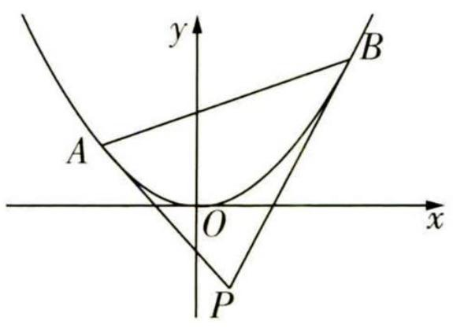

图1

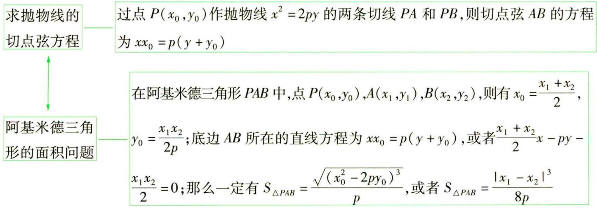

调研 3 (2023·山东济南一中9月开学模拟/阿基米德三角形与抛物线结合)

西班牙画家、雕塑家毕加索的名作《亚威农少女》，引发了立体主义运动的兴起。立体派比较关注如何运用几何原理和数学概念来革新传统的艺术形式，表现生活在迅猛变化的工业社会里的人们内在的情绪和心理。

已知点 F 是抛物线 $C: x^{2} = 4y$ 与椭圆 $\frac{y^{2}}{a^{2}} + \frac{x^{2}}{b^{2}} = 1 (a > b > 0)$ 的公共焦点, 椭圆上的点 M 到点 F 的最大距离为 3.

（1） 求椭圆的方程;   
（2） 过点 M 作 C 的两条切线, 记切点分别为 A, B, 求 $\triangle MAB$ 面积的最大值.

解析 （1） 抛物线 $C$ 的焦点为 $F(0,1)$ , 即 $c = 1$ , 椭圆上的点 $M$ 到点 $F$ 的最大距离为 $a + c = 3$ , 所以 $a = 2$ , 则 $b^{2} = 3$ , 所以椭圆方程为 $\frac{y^{2}}{4} + \frac{x^{2}}{3} = 1$ .

（2） 抛物线 C 的方程为 $x^{2}=4y$ ，即 $y=\frac{x^{2}}{4}$ ，对该函数求导得 $y'=\frac{x}{2}$ ，

设点 $A(x_{1},y_{1}),B(x_{2},y_{2}),M(x_{0},y_{0})$ ，则直线 $MA$ 的方程为 $y - y_{1} = \frac{x_{1}}{2} (x - x_{1})$ ，即 $y = \frac{x_1x}{2} -y_1$ ，即 $x_{1}x - 2y_{1} - 2y = 0,$

同理可知, 直线 MB 的方程为 $x_{2}x - 2y_{2} - 2y = 0$ ,

由于点 M 为这两条直线的公共点，则 $\left\{\begin{aligned}x_{1}x_{0}-2y_{1}-2y_{0}&=0,\\ x_{2}x_{0}-2y_{2}-2y_{0}&=0,\end{aligned}\right.$

所以点 $A, B$ 的坐标满足方程 $x_{0} x - 2 y - 2 y_{0} = 0$ , 所以直线 $AB$ 的方程为 $x_{0} x - 2 y -$ 【模型应用】上述解法即切点弦AB所在直线的方程为 $xx_{0}=p(y+y_{0})$ 的推导过程

$2 y _ {0} = 0.$

由 $\left\{\begin{aligned}x_{0}x-2y-2y_{0}&=0,\\ y=\frac{x^{2}}{4}\end{aligned}\right.$ 消去 y 整理得关于 x 的方程 $x^{2}-2x_{0}x+4y_{0}=0,\Delta=4x_{0}^{2}-$ $16y_{0} = 12 - 3y_{0}^{2} - 16y_{0} > 0$ ，所以 $-6 < y_{0} < \frac{2}{3}$ 又 $-2 \leqslant y_{0} \leqslant 2$ ，所以 $-2 \leqslant y_{0} < \frac{2}{3}$ .

由根与系数的关系可得 $x_{1} + x_{2} = 2x_{0}, x_{1}x_{2} = 4y_{0}$ , 所以 $|AB| = \sqrt{1 + \left(\frac{x_0}{2}\right)^2}$ .

$\sqrt {\left(x _ {1} + x _ {2}\right) ^ {2} - 4 x _ {1} x _ {2}} = \sqrt {1 + \left(\frac {x _ {0}}{2}\right) ^ {2}} \cdot \sqrt {4 x _ {0} ^ {2} - 1 6 y _ {0}} = \sqrt {\left(x _ {0} ^ {2} + 4\right) \left(x _ {0} ^ {2} - 4 y _ {0}\right)},$

【指点迷津】求切点弦弦长步骤：求导→写切线→代点→同构方程得切点弦→联立得弦长|AB|

点 M 到直线 AB 的距离为 $d=\frac{|x_{0}^{2}-4y_{0}|}{\sqrt{x_{0}^{2}+4}}$ ,

抽象派尝试打破绘画必须模仿自然的传统观念,主张以几何图形为绘画的基本元素,来构造普遍的现象秩序与均衡美感.抽象派的先驱、荷兰画家蒙德里安的代表作品《灰色的树》,通过直线与直角的“纯粹造型”,达到了人神统一的“绝对境界”.

所以 $S_{\triangle MAB} = \frac{1}{2}|AB| \cdot d = \frac{1}{2}\sqrt{(x_0^2 + 4)(x_0^2 - 4y_0)} \cdot \frac{|x_0^2 - 4y_0|}{\sqrt{x_0^2 + 4}} = \frac{1}{2}(x_0^2 - 4y_0)^{\frac{3}{2}}$

因为 ${x}_{0}^{2} - 4{y}_{0} = 3 - \frac{3{y}_{0}^{2}}{4} - 4{y}_{0} =  - \frac{3}{4}{\left( {y}_{0} + \frac{8}{3}\right) }^{2} + \frac{25}{3}$ ,结合 $- 2 \leq  {y}_{0} < \frac{2}{3}$ 可得当 ${y}_{0} =  - 2$ 【会转化】利用曲线方程消元构造二次函数,在其定义域下求最值,有时最值问题能转化为二次函数或三角函数的最值问题,然后利用基本不等式、函数的单调性或三角函数的有界性等求最值时, $\bigtriangleup  {MAB}$ 的面积取最大值,为 $8\sqrt{2}$ .

【会思考】本题是阿基米德三角形面积问题的典型例题, 若是小题, 可以直接用 $S_{\triangle PAB}=\frac{\sqrt{(x_0^2-2py_0)^3}}{p}$ 或者 $S_{\triangle PAB}=\frac{|x_1-x_2|^3}{8p}$ 求解, 这也为解题指明了另一个方向

# 类型 3 极点与极线

# 模型解法 >>>

极点与极线 已知圆锥曲线 $\Gamma: Ax^{2} + Cy^{2} + 2Dx + 2Ey + F = 0$ , 则称点 $P(x_{0}, y_{0})$ 和直线 $l: Ax_{0}x + Cy_{0}y + D(x + x_{0}) + E(y + y_{0}) + F = 0$ 是圆锥曲线 $\Gamma$ 的一对极点和极线. 事实上, 在圆锥曲线方程中, 以 $x_{0}x$ 替换 $x^{2}$ , 以 $\frac{x_{0} + x}{2}$ 替换 $x$ (另一变量 $y$ 以此类推), 即可得到点 $P(x_{0}, y_{0})$ 的极线方程.

<table><tr><td>当P在Γ上时</td><td>极线l是曲线Γ在P点处的切线</td></tr><tr><td>当P在Γ外时</td><td>极线l是曲线Γ从点P所引两条切线的切点所确定的直线(即切点弦所在直线)</td></tr><tr><td>当P在Γ内时</td><td>极线l是曲线Γ过点P的割线两端点处的切线交点的轨迹</td></tr></table>

调研 4 (2023·重庆八中9月入学考试)已知 $B(-1,0), C(1,0)$ 为 $\triangle ABC$ 的两个顶点, $P$ 为 $\triangle ABC$ 的重心, 边 $AC, AB$ 上的两条中线长度之和为6.

（1） 求点 P 的轨迹 T 的方程.  
（2）已知点 $N(-3,0), E(-2,0), F(2,0)$ , 直线 $PN$ 与曲线 $T$ 的另一个公共点为 $Q$ , 直线 $EP$ 与 $FQ$ 交于点 $M$ , 试问: 当点 $P$ 变化时, 点 $M$ 是否恒在一条定直线上? 若是, 请证明; 若不是, 请说明理由.

解析 （1） 因为 $P$ 为 $\triangle ABC$ 的重心, 且边 $AC, AB$ 上的两条中线长度之和为 6 , 所以 $|PB| + |PC| = \frac{2}{3} \times 6 = 4 > |BC|$ ,

【用结论】根据重心几何性质得到 $|PB|+|PC|=\frac{2}{3}\times6=4$

说到20世纪的艺术界,必须提及荷兰的埃舍尔,他是如此特立独行,甚至至今都无法将他归属到任何一个流派.

故由椭圆的定义可知 $P$ 的轨迹 $T$ 是以 $B(-1,0), C(1,0)$ 为焦点的椭圆（不包括长轴的端点），且 $a = 2, c = 1$ ，所以 $b = \sqrt{3}$ ，

所以 P 的轨迹 T 的方程为 $\frac{x^{2}}{4} + \frac{y^{2}}{3} = 1 (x \neq \pm 2)$ .

（2） 易知直线 PQ 的斜率存在且不为 0, 设直线 PQ 的方程为 x = my - 3, $P(x_{1}, y_{1})$ , $Q(x_{2}, y_{2})$ ,

由 $\left\{\begin{aligned}x&=my-3,\\ \frac{x^{2}}{4}&+\frac{y^{2}}{3}=1,\end{aligned}\right.$ 消去 x 整理得关于 y 的方程 $(3m^{2}+4)y^{2}-18my+15=0,\Delta=$

$48(3m^{2} - 5) > 0$ ，所以 $m < -\frac{\sqrt{15}}{3}$ 或 $m > \frac{\sqrt{15}}{3}$

则 $y_{1} + y_{2} = \frac{18m}{3m^{2} + 4}, y_{1}y_{2} = \frac{15}{3m^{2} + 4}$ , 所以 $2my_{1}y_{2} = \frac{5}{3}(y_{1} + y_{2})$ ,

又直线 $PE$ 的方程为 $y = \frac{y_1}{x_1 + 2} (x + 2) = \frac{y_1}{my_1 - 1} (x + 2)$ ，

直线 $QF$ 的方程为 $y = \frac{y_2}{x_2 - 2} (x - 2) = \frac{y_2}{my_2 - 5} (x - 2)$ ，

由 $\left\{\begin{aligned}y&=\frac{y_{1}}{my_{1}-1}(x+2),\\ y&=\frac{y_{2}}{my_{2}-5}(x-2),\end{aligned}\right.$ 得 $x=\frac{2(2my_{1}y_{2}-y_{2}-5y_{1})}{-y_{2}+5y_{1}}$ ,

把 $2my_{1}y_{2} = \frac{5}{3}(y_{1} + y_{2})$ 代入上式得， $x = \frac{2(\frac{2}{3}y_{2} - \frac{10}{3}y_{1})}{-y_{2} + 5y_{1}} = \frac{\frac{4}{3}(y_{2} - 5y_{1})}{-y_{2} + 5y_{1}} = -\frac{4}{3}$ ，

所以当点 P 运动时, 点 M 恒在定直线 $x = -\frac{4}{3}$ 上.

【模型应用】所求直线是点 $N(-3,0)$ 关于椭圆 $\frac{x^{2}}{4} + \frac{y^{2}}{3} = 1 (x \neq \pm 2)$ 的极线 $x = -\frac{4}{3}$

# 类型4 极点极线之调和点列

设点 $P$ 关于圆锥曲线 $\Gamma$ 的极线为 $l$ , 过点 $P$ 任作一割线交 $\Gamma$ 于 $A, B$ , 交 $l$ 于点 $Q$ , 则

荷兰画家埃舍尔一生钟情于镶嵌艺术的研究与创作,他的主要创作方式包括木版、铜版、石版、素描.

$\frac{PA}{PB}=\frac{QA}{QB}$ 成立; 反之, 若 $\frac{PA}{PB}=\frac{QA}{QB}$ 成立, 则称点 P 与 Q 关于 $\Gamma$ 调和共轭. 点 P 关于圆锥曲线 $\Gamma$ 的调和共轭点的轨迹是一条直线, 这条直线就是点 P 关于圆锥曲线 $\Gamma$ 的极线 l.

在椭圆或双曲线中, 设 A, B 为椭圆或双曲线上的两点, 若存在 P, Q 两点, 满足 $\overrightarrow{AP} = \lambda \overrightarrow{PB}, \overrightarrow{AQ} = -\lambda \overrightarrow{QB}$ , 则一定有 $\frac{x_{P}x_{Q}}{a^{2}} \pm \frac{y_{P}y_{Q}}{b^{2}} = 1$ .

在抛物线 $y^{2}=2px$ 中, 设 A, B 为抛物线上的两点. 若存在 P, Q 两点, 满足 $\overrightarrow{AP}=\lambda\overrightarrow{PB},\overrightarrow{AQ}=-\lambda\overrightarrow{QB}$ , 则一定有 $y_{P}y_{Q}=p(x_{P}+x_{Q})$ .

调研 5 (2023·福建师大附中9月质检改编)已知抛物线 $C: y^{2} = 4x$ , 直线 $l$ 过点 $P(0,1)$ , 若 $l$ 与 $C$ 交于 $A, B$ 两点, 点 $Q$ 在线段 $AB$ 上, 且 $\frac{|AP|}{|PB|} = \frac{|AQ|}{|QB|}$ , 则点 $Q$ 的轨迹方程为 \_\_\_\_.

【名师有话说】说明 $P, Q$ 调和分割 $A B, P, A, Q, B$ 四点构成调和点列，采用设点法代入圆锥曲线方程化简消元

解析 设 $Q(x,y)$ , $A(x_{1},y_{1})$ , $B(x_{2},y_{2})$ ，由题设， $|\overrightarrow{PA}|, |\overrightarrow{PB}|, |\overrightarrow{AQ}|, |\overrightarrow{QB}|$ 均不为零，且 $\frac{|\overrightarrow{PA}|}{|\overrightarrow{AQ}|} = \frac{|\overrightarrow{PB}|}{|\overrightarrow{QB}|}$ ，又 P, A, Q, B 四点共线， $P(0,1)$ ，设 $\overrightarrow{PA} = \lambda \overrightarrow{PB}$ ，则 $\overrightarrow{AQ} = -\lambda \overrightarrow{BQ}, \lambda \neq \pm 1$ 所以 $x_{1} = \lambda x_{2}$ ， $1 = \frac{y_{1} - \lambda y_{2}}{1 - \lambda}, x = \frac{x_{1} + \lambda x_{2}}{1 + \lambda} = \frac{2x_{1}}{1 + \lambda}, y = \frac{y_{1} + \lambda y_{2}}{1 + \lambda}.$

因为 $y_{1}^{2}=4x_{1}, y_{2}^{2}=4x_{2}$ ，所以 $y_{1}^{2}-\lambda^{2}y_{2}^{2}=4(x_{1}-\lambda^{2}x_{2})$ ，两边同除以 $1-\lambda^{2}$ 可得 $\frac{y_{1}^{2}-\lambda^{2}y_{2}^{2}}{1-\lambda^{2}}=\frac{4(x_{1}-\lambda^{2}x_{2})}{1-\lambda^{2}}$ ，即 $\frac{y_{1}-\lambda y_{2}}{1-\lambda}\cdot\frac{y_{1}+\lambda y_{2}}{1+\lambda}=\frac{4x_{1}(1-\lambda)}{1-\lambda^{2}}=\frac{4x_{1}}{1+\lambda}$ ，即 y=2x.

【快解】也可以直接代入公式 $y_{P}y_{Q}=p(x_{P}+x_{Q})$ 求解

答案 $y = 2x$

# 拓展知识

# 调和点列的性质

如图2所示, 线段 $AB$ 的内分点 $C$ 和外分点 $D$ 满足 $C, D$ 调和分割线段 $AB$ , 即 $\frac{AC}{CB} = \frac{AD}{DB}$ , 则有以下结论成立: 图2

①点 $A, B$ 也调和分割线段 $CD$ , 即 $\frac{CA}{AD} = \frac{CB}{BD}$ ; ② $\frac{2}{AB} = \frac{1}{AC} + \frac{1}{AD}$ (AB 是 $AC$ 与 $AD$ 的调和平均数).

他从圆、正三角形、正方形、正六边形等基本几何图形出发,连续多次地利用欧氏几何里的反射、平移、伸缩、旋转这四种基本变换,使得基本几何图形扭曲变形为虫、鱼、鸟、兽、人物、花朵、魔鬼与天使等镶嵌图案.

# 第二部分 技法模型

# 型1 设而不求模型

# 模型解法 >>>

设而不求模型是指为解决数学问题增设一些变量,求解时,对这些变量(也称辅助元素)“设而不求”,只需要根据题目本身的特征,将它们消去或代换,从而架起已知量和未知量之间的桥梁,使问题的解决变得简单、明了的一种模型.设而不求模型常用于解决与圆锥曲线、函数与导数等知识相关的问题,解决此类问题的关键如下:

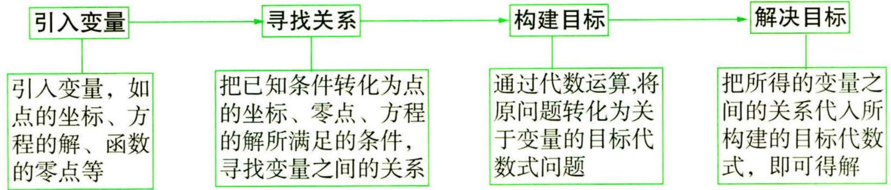

调研 1 (2023·河北保定一中9月摸底)(多选)已知函数 $f(x)=(x^{2}+1)\ln x-m(x^{2}-1)$ ，则下列说法正确的是()

$\quad$A. 当 $m =  - 1$ 时,曲线 $y = f\left( x\right)$ 在点(1, $f\left( 1\right)$ )处的切线方程为 $y = {2x} - 2$

$\quad$B. 若 $\forall x_{1}, x_{2} \in (0, +\infty)(x_{1} \neq x_{2})$ ，都有 $\frac{f(x_{1}) - f(x_{2})}{x_{1} - x_{2}} > 0$ ，则实数 $m$ 的取值范围是 $(- \infty, 1]$

$\quad$C. 当 $m > 1$ 时, $f(x)$ 既存在极大值又存在极小值

$\quad$D. 当 m > 1 时, $f(x)$ 恰有 3 个零点 $x_{1}, x_{2}, x_{3}$ , 且 $x_{1}x_{2}x_{3} = 1$

解析 对于 A, 当 m = -1 时, $f(x) = (x^{2} + 1) \ln x + x^{2} - 1$ , 所以 $f(1) = 0$ , 因为 $f'(x) = 2x \ln x + \frac{x^{2} + 1}{x} + 2x$ , 所以 $f'（1） = 4$ , 所以曲线 $y = f(x)$ 在点 $(1, f(1))$ 处的切线方程为 $y = 4(x - 1)$ ,

【小技巧】利用导数的几何意义, $f'（1）$ 为曲线 $y = f(x)$ 在点 $(1, f(1))$ 处的切线的斜率即 y = 4x - 4, 故 A 错误.

对于 B, 因为对任意的 $x_{1}, x_{2} \in (0, +\infty) (x_{1} \neq x_{2})$ , 都有 $\frac{f(x_{1}) - f(x_{2})}{x_{1} - x_{2}} > 0$ , 所以 $f(x)$ 在 $(0, +\infty)$

【扫清障碍】由 $\frac{f\left( {{x}_{1}}\right)  - f\left( {{x}_{2}}\right) }{{x}_{1} - {x}_{2}} > 0$ ,知 $f\left( {x}_{1}\right)  - f\left( {x}_{2}\right)$ 与 $\left( {{x}_{1} - {x}_{2}}\right)$ 同号,利用单调递增函数的定义,即可判断函数的单调性

上单调递增, 即 $f'(x)=2x\ln x+\frac{x^{2}+1}{x}-2mx=x(2\ln x+1+\frac{1}{x^{2}}-2m)\geqslant0$ 在 $(0,+\infty)$ 上恒成立.

令 $h(x) = 2\ln x + 1 + \frac{1}{x^2} - 2m$ ，则 $h'(x) = \frac{2}{x} - \frac{2}{x^3} = \frac{2(x^2 - 1)}{x^3} = \frac{2(x - 1)(x + 1)}{x^3}$ ，当 $x > 1$ 时， $h'(x) >$

【指点迷津】构造函数 $h(x)$ ，将原问题转化为 $h(x) \geqslant 0$ 恒成立，即 $h(x)_{\min} \geqslant 0$ 恒成立，利用

后来,埃舍尔从非欧几何、拓扑、分形几何等数学思想中再次获得了巨大灵感,使镶嵌艺术达到鼎盛.在他创作的那些充满现代数学气息的镶嵌艺术作品中,如《红蚁》《瀑布》,我们看到了一个个神秘莫测的世界.

导数的工具性，得 $h(x)$ 的单调性，从而得 $h(x)$ 的最值，即可得参数的取值范围

0, 当 0 < x < 1 时, $h'(x) < 0$ , 所以 $h(x)$ 在 $(0,1)$ 上单调递减, 在 $(1,+\infty)$ 上单调递增, 所以 $h(x)_{\min} = h(1) = 2 - 2m$ , 所以 $2 - 2m \geqslant 0$ , 解得 $m \leqslant 1$ , 故 B 正确.

对于 C, 当 $m > 1$ 时, 由 B 选项的分析知, $h(x)_{\min } = h(1) = 2 - {2m} < 0$ , 令 $u(x) = 4{x}^{2} - {2x} + 1 -$ $2\ln {2x}\left( {x > 1}\right)$ ,则 ${u}^{' }\left( x\right)  = {8x} - 2 - \frac{2}{x}$ 在 $\left( {1, + \infty }\right)$ 上单调递增,所以 ${u}^{' }\left( x\right)  = {8x} - 2 - \frac{2}{x} > 8 \times  1 - 2 -$ 【小技巧】为了判断 $h\left( \frac{1}{2m}\right)  = 4{m}^{2} - {2m} + 1 - {2}\ln {2m}$ 的符号,构造函数 $u\left( x\right)$ ,注意不要忽视自变量的范围

$\frac{2}{1} = 4 > 0$ ，所以 $u(x)$ 在 $(1, +\infty)$ 上单调递增，所以 $u(x) > 4 \times 1^2 - 2 \times 1 + 1 - 2 \ln 2 = 3 - 2 \ln 2 > 0$ ，所以 $h(\frac{1}{2m}) = 4m^2 - 2m + 1 - 2 \ln 2m > 0$ 。由 B 选项知 $h(x)$ 在 $(0,1)$ 上单调递减，所以存在 $x_4 \in (\frac{1}{2m}, 1)$ ，使得 $h(x_4) = 0$ 。又 $h(e^m) = 1 + \frac{1}{e^{2m}} > 0, h(x)$ 在 $(1, +\infty)$ 上单调递增，所以存在 $x_5 \in (1, e^m)$ ，使得 $h(x_5) = 0$ 。

综上, 当 $0 < x < x_{4}$ 时, $f'(x) > 0$ , $f(x)$ 单调递增, 当 $x_{4} < x < x_{5}$ 时, $f'(x) < 0$ , $f(x)$ 单调递减, 当 $x > x_{5}$ 时, $f'(x) > 0$ , $f(x)$ 单调递增, 故 $f(x)$ 既存在极大值又存在极小值, 故 $\mathbb{C}$ 正确.

对于 D, 因为 $f(1) = (1^{2} + 1) \ln 1 - m(1^{2} - 1) = 0$ , 由 C 选项知 $f(x_{4}) > f(1) = 0$ , $f(x_{5}) < f(1) = 0$ ,

当 $x \to 0$ 时, $f(x) \to -\infty$ , 当 $x \to +\infty$ 时, $f(x) \to +\infty$ ,

【小妙招】结合极限思想，利用函数零点存在定理得出零点的个数

故函数 $f(x)$ 有3个零点,不妨设为 $x_{1},x_{2},x_{3}$ ,其中 $0<x_{1}<1,x_{2}=1,x_{3}>1$ ,

【设而不求】设出函数零点，但不求零点 $x_{1}, x_{3}$

又 $f\left(\frac{1}{x_1}\right) = \left(\frac{1}{x_1^2} + 1\right)\ln \frac{1}{x_1} - m\left(\frac{1}{x_1^2} - 1\right) = -\frac{1 + x_1^2}{x_1^2}\ln x_1 - m\frac{1 - x_1^2}{x_1^2} = -\frac{1}{x_1^2}\left[(x_1^2 + 1)\ln x_1 - m(x_1^2 - x_1^2)\right]$ .

【会思考】观察函数 $f(x)$ 的特征，可知 $\frac{1}{x^{2}}f(x)=-f(\frac{1}{x})$ ，从而可推断 $f(x_{1})=f(\frac{1}{x_{1}})=0$ ，再利用 $f(x_{1})=f(x_{3})=0$ ，即可得 $x_{1}$ ， $x_{3}$ 的关系式

$1) ] = - \frac {1}{x _ {1} ^ {2}} f (x _ {1}) = 0 = f (x _ {1}),$

故 $x_{3} = \frac{1}{x_{1}}$ ，所以 $x_{1}x_{3} = 1$ ，所以 $x_{1}x_{2}x_{3} = 1$ ，故当 $m > 1$ 时， $f(x)$ 恰有3个零点 $x_{1}, x_{2}, x_{3}$ ，且 $x_{1}x_{2}x_{3} = 1$ ，故D正确.故选BCD.

答案 BCD

调研 2 (2023·上海行知中学9月开学考试)已知曲线 $\Gamma$ 上一动点 P 到两定点 $F_{1}(0,-2)$ , $F_{2}(0,2)$ 的距离之和为 $4\sqrt{2}$ , 过点 $Q(-1,0)$ 的直线 l 与曲线 $\Gamma$ 相交于点 A, B.

（1） 求曲线 $\Gamma$ 的方程.
（2） 动弦 AB 满足 $\overrightarrow{AM} = \overrightarrow{MB}$ ，求点 M 的轨迹方程.

思维导引 （1） 点 $P$ 到两定点 $F_{1}(0, -2), F_{2}(0, 2)$ 的距离之和为 $4\sqrt{2}$ $\xrightarrow[\text{焦点的特征}]{\text{利用椭圆的定义}}$ 关于 $a, c$ 的方程组 $\xrightarrow[\text{解方程组}]{\text{利用 } b^{2} = a^{2} - c^{2}} a, b$ 的值 $\xrightarrow[\text{代入椭圆的方程}]{\text{代入椭圆的方程}} \Gamma$ 的方程

（2） $\overrightarrow{AM} = \overrightarrow{MB}$ $\xrightarrow{}$ M 为 AB 的中点 $\xrightarrow{AB \text{的斜率存在且不为0}}$ 设 A, B 的坐标，代入 $\Gamma$ 的方程 $\xrightarrow{\text{利用点差法}}$ AB, OM 的斜率关系 $\xrightarrow{}$ 转化

QM, OM 的斜率关系 $\xrightarrow{\text{利用过两点的斜率公式}}$ 点 M 的轨迹方程 $\xrightarrow{AB \text{的斜率为0或斜率不存在}}$ 验证是否满足所求的轨迹方程，得结论

解析 （1） 因为动点 $P$ 到两定点 $F_{1}(0, -2), F_{2}(0, 2)$ 的距离之和为 $4 \sqrt{2}, 4 \sqrt{2} > 4$ ,

【易忽视】利用椭圆的定义，别忽视 $4\sqrt{2}$ 与焦距4的大小比较

所以曲线 $\Gamma$ 是以 $F_{1}(0,-2)$ , $F_{2}(0,2)$ 为焦点的椭圆，

设 $\Gamma$ 的方程为 $\frac{y^{2}}{a^{2}} + \frac{x^{2}}{b^{2}} = 1 (a > b > 0)$ ，则 $\left\{\begin{aligned} c &= 2, \\ 2a &= 4\sqrt{2}, \\ b^{2} &= a^{2} - c^{2}, \end{aligned}\right.$ 得 $\left\{\begin{aligned} a &= 2\sqrt{2}, \\ b &= 2, \end{aligned}\right.$

所以曲线 $\Gamma$ 的方程为 $\frac{y^{2}}{8} + \frac{x^{2}}{4} = 1$ .

（2） 因为 $\overrightarrow{AM} = \overrightarrow{MB}$ ，所以 M 为 AB 的中点，设 $M(x, y)$ .

①当直线 AB 的斜率存在且不为 0 时，

【指点迷津】注意对直线的斜率是否存在进行分类讨论

设 $A(x_{1},y_{1}),B(x_{2},y_{2})$ ，因为A,B在曲线 $\Gamma$ 上，所以 $\left\{\begin{aligned}\frac{y_{1}^{2}}{8}+\frac{x_{1}^{2}}{4}&=1,\\ \frac{y_{2}^{2}}{8}+\frac{x_{2}^{2}}{4}&=1,\end{aligned}\right.$

【模型应用】设出点 $A$ , $B$ 的坐标,但不求点 $A$ , $B$ 的坐标,起到稀染作用

以上两式相减得 $\frac{y_{1}^{2}-y_{2}^{2}}{8}+\frac{x_{1}^{2}-x_{2}^{2}}{4}=0$ ，故 $\frac{y_{1}-y_{2}}{x_{1}-x_{2}}\times\frac{y_{1}+y_{2}}{x_{1}+x_{2}}=-2$ ，连接OM(O为坐标原点)，

【指点迷津】不要求出 $A, B$ 的坐标, 只需利用图象, 还原为直线的斜率的关系

所以 $k_{AB} \cdot k_{OM} = -2$ ，所以 $k_{QM} \cdot k_{OM} = -2$ ，所以 $\frac{y}{x + 1} \cdot \frac{y}{x} = -2$ ，整理得 $(2x + 1)^{2} + 2y^{2} = 1 (x \neq -1, x \neq 0)$ .

②当直线 ${AB}$ 的斜率为0或斜率不存在时, $M\left( {0,0}\right)$ 或 $M\left( {-1,0}\right)$ ,也满足 ${\left( 2x + 1\right) }^{2} + 2{y}^{2} = 1$ .

【小妙招】特殊情形后写，只需检验是否满足，若不满足，则需排除。若不写，就会因跳步

虽然分形图形具有复杂的结构,但总是可以利用简单函数无限迭代而成.这个特征使得分形图形广泛应用于各个艺术领域,尤其是装饰设计方面.

而失分，需注意

综上, 点 $M$ 的轨迹方程是 $(2x + 1)^{2} + 2y^{2} = 1$ .

# 型2 临界模型

# 模型解法 >>>

临界模型是指在解决数学问题时,捕捉和巧妙运用“临界条件”(具有一定制约关系的相关的变量,当其中的某变量变化到某一个状态时出现极限或某种转折,就把这个状态当成临界状态,此时该变量对应的条件就称为临界条件),把动态问题或不定的问题,转化为静态问题和有型可寻的问题,使得解题思路清晰的一种模型.解决此类问题的关键点如下:

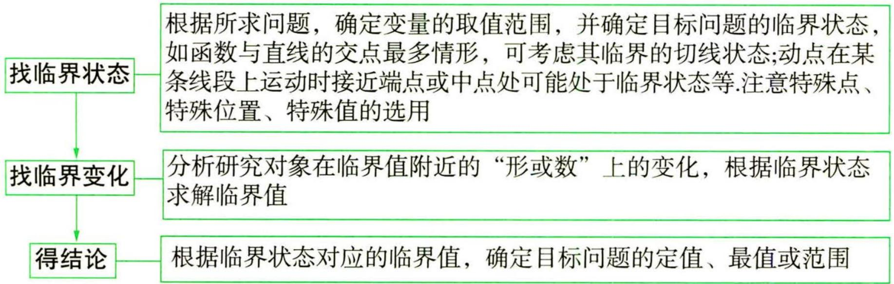

调研 1 (2023 · 江苏扬州中学 9 月开学检测) 已知函数 $f(x) = \left\{ \begin{array}{l} \frac{x}{e^x}, x > 0, \\ -x^2 - 2x, x \leqslant 0, \end{array} \right.$ 要使函数 $g(x) = f(x) - k \left( x + \frac{1}{2} \right)$ 在 $\mathbf{R}$ 上的零点最多, 则实数 $k$ 的取值范围是 \_\_\_\_.

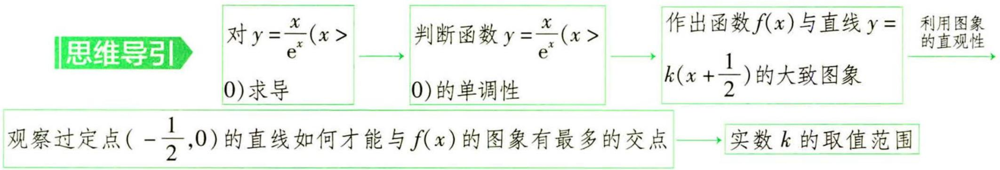

解析 设 $y = \frac{x}{\mathrm{e}^x} (x > 0)$ ，则 $y' = \frac{1 - x}{\mathrm{e}^x}$ ，

当 $x > 1$ 时， $y' < 0$ ，即 $y = \frac{x}{\mathrm{e}^x}$ 在 $(1, +\infty)$ 上单调递减，

当 $0 < x < 1$ 时， $y' > 0$ ，即 $y = \frac{x}{\mathrm{e}^x}$ 在 $(0,1)$ 上单调递增，

数学与中国绘画 在中国的绘画艺术中,也运用了“黄金分割”以及“透视”等数学技巧. 其中,以20世纪中国画坛最具传奇色彩的国画大师张大千为代表,数学在他的画里得到了良好的发挥与应用.

所以 $y=\frac{x}{e^{x}}$ 在 x=1 处取得极大值, 其值为 $\frac{1}{e}$ , 当 x 趋近于 $+\infty$ 时, $y=\frac{x}{e^{x}}$ 趋近于 0, 且当 x>0 时,

【小提升】利用洛必达法则， $\lim_{x\to+\infty}y=\lim_{x\to+\infty}\frac{x}{e^{x}}=\lim_{x\to+\infty}\frac{x^{'}}{\left(e^{x}\right)^{'}}=\lim_{x\to+\infty}\frac{1}{e^{x}}=0$

$y = \frac {x}{\mathrm{e} ^ {x}} > 0.$

函数 $y = -x^{2} - 2x$ 的图象是开口向下的抛物线, 其对称轴为直线 x = -1, 该函数的最大值为 1. 所以函数 $f(x)$ 的大致图象如图 1 所示.

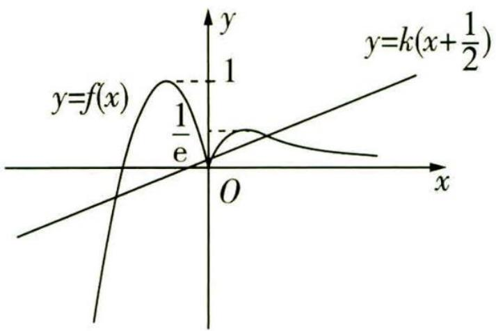

图 1

【小技巧】注意草图不草,图象的关键点、凹凸的形状,需准确地勾勒出来

直线 $y=k(x+\frac{1}{2})$ 过定点 $A(-\frac{1}{2},0)$ ，

过 A 点作曲线 $y=\frac{x}{e^{x}}$ 的切线, 设切线的斜率为 m, 切点的坐标为 $(x_{0}, y_{0})$ ,

【找临界状态】考虑函数 $f(x)$ 的图象与直线 $y=k(x+\frac{1}{2})$ 交点最多的临界状态“过A点作曲线 $y=\frac{x}{e^{x}}$ 的切线”

由图1可知,当0<k<m时,函数 $f(x)$ 与 $y=k(x+\frac{1}{2})$ 的图象有4个交点,是最多的,即函数 $g(x)$ 的零点最多.

设切线方程为 $y=\frac{1-x_{0}}{\mathrm{e}^{x_{0}}}(x+\frac{1}{2})$ ，由 $\left\{\begin{aligned}y_{0}&=\frac{1-x_{0}}{\mathrm{e}^{x_{0}}}(x_{0}+\frac{1}{2}),\\ y_{0}&=\frac{x_{0}}{\mathrm{e}^{x_{0}}}\end{aligned}\right.$ 得 $2x_{0}^{2}+x_{0}-1=0$ ，解得 $x_{0}=-1$ （舍）

【扫消障碍】注意隐蔽条件 $x_{0}>0$ ，所以 $x_{0}=-1$ 需舍去

或 $x_0 = \frac{1}{2}$ ，即 $m = \frac{\sqrt{\mathrm{e}}}{2\mathrm{e}},$

所以 $0 < k < \frac{\sqrt{e}}{2e}$ ，所以实数 k 的取值范围是 $(0, \frac{\sqrt{e}}{2e})$ .

答案

$(0, \frac {\sqrt {e}}{2 e})$

调研 2

(2023·北京昌平区8月测试)已知正方体 $ABCD - A_{1}B_{1}C_{1}D_{1}$ 的棱长为

数学与建筑 几千年来,建筑与数学“和谐发展”——数学为建筑服务,建筑也离不开数学. 数学早已渗透到建筑的各个领域,许多数学知识在建筑中都有应用,比如“黄金分割”、对称性以及几何学等.

2, P 为线段 $DD_{1}$ 上的动点, Q 为 AD 的中点, 过点 B, P, Q 的平面截该正方体所得截面为 S. 若 S 为五边形, 则 AP 的取值范围为 ( )

$\quad$A. $(0,2\sqrt{2})$

$\quad$B. $(0, \sqrt{5})$

$\quad$C. $(\sqrt{2},\sqrt{5})$

$\quad$D. $(\sqrt{5},2\sqrt{2})$

解析 方法一 （排除法）因为 P 为线段 $DD_{1}$ 上的动点, 所以 AP > AD = 2,

【小妙招】针对选项的特点，估范围，速排除

排除 A, B, C, 故选 D.

方法二 （临界法）当点 P 为线段 $DD_{1}$ 的中点时，连接 $AD_{1}, BC_{1}$

【模型应用】取点 $P$ 的临界位置, 把动态问题 “ $P$ 为线段 $DD_{1}$ 上的动点” 转化为静态的问题 “ $P$ 为线段 $DD_{1}$ 的中点”, 临界位置可能为中点、三等分点、端点等

因为 $PQ \parallel AD_{1}, AD_{1} \parallel BC_{1}$ ，则 $PQ \parallel BC_{1}$ ，所以过点 B, P, Q 的截面为梯形 $PQBC_{1}$ ，此时 $AP = \sqrt{5}$ ，

当点 P 继续沿线段 $DD_{1}$ 往 $D_{1}$ 移动时, 过点 B, P, Q 的截面为五边形, 此时 AP 大于 $\sqrt{5}$ , 且越来越长, 故选 D.

答案 D

调研 3 (2023·重庆育才中学9月月考改编)如图2所示,已知点G是△ABC的重心,过点G作直线分别与AB,AC交于M,N两点,设 $\overrightarrow{AB}=x\overrightarrow{AM},\overrightarrow{AC}=y\overrightarrow{AN}$ ,则 $x+y$ 的值为()

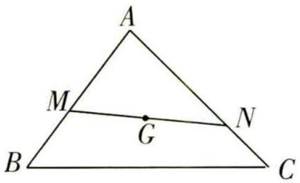

图 2

$\quad$A. 2

$\quad$B. 3

$\quad$C. 4

$\quad$D. 5

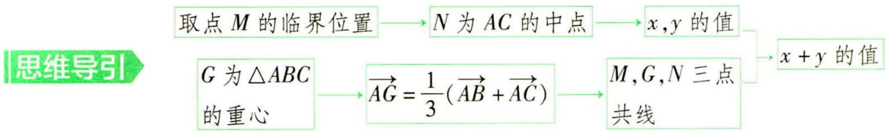

解析 方法一 (临界法)取点 $M$ 与点 $B$ 重合,则 $x = 1$ ,

【模型应用】取点M的临界位置

所以此时 N 为 AC 的中点, 所以 y=2 , 所以 $x+y=1+2=3$ , 故选 B.

【扫清障碍】因为点 G 是 $\triangle ABC$ 的重心，所以此时的 MN 为 AC 上的中线

方法二 连接 AG, 因为 G 为 $\triangle ABC$ 的重心, 所以 $\overrightarrow{AG} = \frac{2}{3} \times \frac{1}{2} (\overrightarrow{AB} + \overrightarrow{AC})$ ,

【记结论】重心为三角形三条中线的交点，利用重心分线段为2:1的性质求解

所以 $\overrightarrow{AG} = \frac{1}{3} (\overrightarrow{AB} +\overrightarrow{AC}) = \frac{1}{3} x\overrightarrow{AM} +\frac{1}{3} y\overrightarrow{AN}.$

因为 M, G, N 三点共线, 所以 $\frac{1}{3}x + \frac{1}{3}y = 1$ , 即 $x + y = 3$ , 故选 B.

答案 B

建筑师们对数字 0.618 特别偏爱,无论是古希腊的帕特农神庙、古埃及的金字塔,还是法国的巴黎圣母院、埃菲尔铁塔,都用到了黄金分割.

# 型 3 构造模型

# 模型解法 >>>

构造模型是指根据题目的具体情况,构造一个合适的数学模型,把未知的问题转化为已学知识范围内易于解决问题的一种模型.通过构造模型,把不熟悉、不规范、复杂的问题转化为熟悉、规范、模式化、简单的问题.解决此类问题的关键点如下:

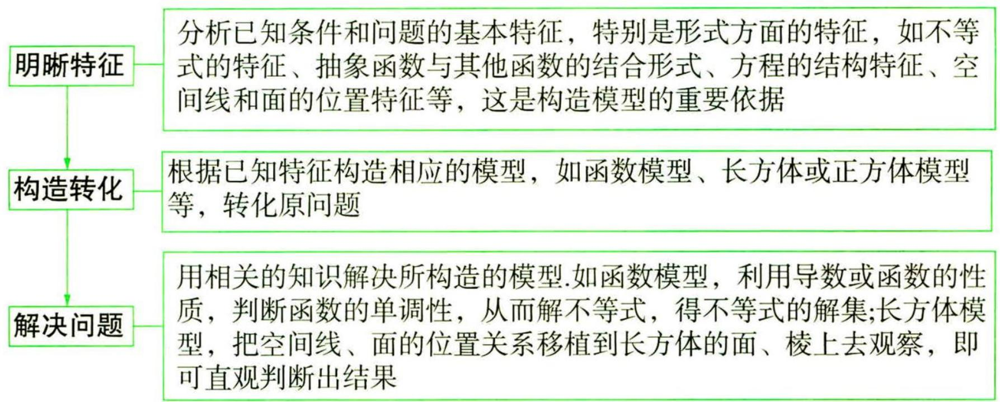

调研 1 (2023·广东广州一中9月阶段测试)若空间中经过定点O的三个平面α,β,γ两两垂直,过另一定点A作直线l与这三个平面所成的角都相等,过定点A作平面δ和这三个平面所成的锐二面角都相等.记所作直线l的条数为m,所作平面δ的个数为n,则 $m+n=$

$\quad$A. 4

$\quad$B. 8

$\quad$C. 12

$\quad$D. 16

解析

如图1所示，将 $\alpha, \beta, \gamma$ 放入正方体 $OBCD - A_{1}B_{1}C_{1}D_{1}$ 中，

【模型应用】由题知“平面α,β,γ两两垂直”，属于“墙角模型”，

因此可构造正方体，相关的线面所成角、二面角可速现形连接 $OC_{1}, BD_{1}, B_{1}D, A_{1}C$ ,

体对角线 $OC_{1}$ 与三个平面 $\alpha, \beta, \gamma$ 所成的角都相等，

【会思考】需作出草图，利用对称性，即可得此结论

因为平面 $BCC_{1}B_{1} \parallel$ 平面 $\alpha$ ，所以体对角线 $BD_{1}$ 与三个平面 $\alpha, \beta, \gamma$ 所成的角都相等，

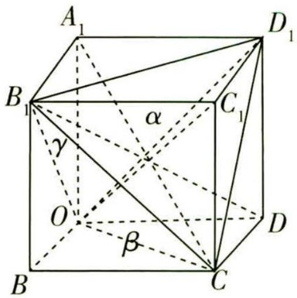

图 1

【换位思考】别漏情况，多欣赏正方体的图形的特征

同理,体对角线 $B_{1}D, A_{1}C$ 与三个平面 $\alpha, \beta, \gamma$ 所成的角都相等,

过点 A 分别作 $BD_{1}, B_{1}D, A_{1}C, OC_{1}$ 的平行线，

则所作的四条平行线与三个平面 $\alpha, \beta, \gamma$ 所成的角都相等, 所以 m = 4.

【扫清障碍】注意线面所成角的特征

连接 $O B_{1}, O C, O D_{1}, B_{1} C, B_{1} D_{1}, C D_{1}$ , 易知正四面体 $O B_{1} C D_{1}$ 的四个平面与平面 $\alpha, \beta, \gamma$ 所成的锐

数学与文学 文学是“以美启真”, 数学是“以真启美”. 文学提高了人类的素质, 数学重建了世界的和谐, 虽然方向不同, 实质却统一.

二面角都相等,所以过 $A$ 分别作与正四面体 $OB_{1}CD_{1}$ 四个面平行的平面即可,所以 $n = 4$ .

所以 $m + n = 8$ ，故选 B.

答案 B

调研 2 (2023·山西太原市外国语学校9月开学考试)已知定义在(-3,3)上的函数 $f(x)$ 满足 $f(x)+\mathrm{e}^{4x}f(-x)=0,f(1)=\mathrm{e}^{2},f'(x)$ 为 $f(x)$ 的导函数,当 $x\in[0,3)$ 时, $f'(x)>2f(x)$ ,则不等式 $\mathrm{e}^{2x}f(2-x)<\mathrm{e}^{4}$ 的解集为 \_\_\_\_.

【会构造】观察题眼“ $e^{2x}f(2-x)<e^{4}$ ”与“ $f'(x)>2f(x)$ ”的特征，可构造函数 $g(x)=\frac{f(x)}{e^{2x}}$

解析 设 $g(x)=\frac{f(x)}{\mathrm{e}^{2x}}$ ，则 $f(x)=\mathrm{e}^{2x}g(x)$ .

因为 $f(x) + \mathrm{e}^{4x}f(-x) = 0$ ，所以 $\mathrm{e}^{2x} \cdot g(x) + \mathrm{e}^{4x} \cdot \mathrm{e}^{-2x}g(-x) = 0$ ，化简得 $g(x) + g(-x) = 0$ ，
所以 $g(x)$ 是 $(-3,3)$ 上的奇函数， $g'(x)=\frac{f'(x)\mathrm{e}^{2x}-2\mathrm{e}^{2xf}(x)}{\mathrm{e}^{4x}}=\frac{f'(x)-2f(x)}{\mathrm{e}^{2x}}$

因为当 $0 \leqslant x < 3$ 时, $f'(x) > 2f(x)$ , 所以当 $x \in [0,3)$ 时, $g'(x) > 0$ ,

所以 $g(x)$ 在 $[0,3)$ 上单调递增, 又 $g(x)$ 是 $(-3,3)$ 上的奇函数, 所以 $g(x)$ 在 $(-3,3)$ 上单调递增.

【记结论】若函数为奇(偶)函数,则该函数在关于原点对称的区间上单调性一致(相反)

考虑到 $g(1)=\frac{f(1)}{\mathrm{e}^{2}}=\frac{\mathrm{e}^{2}}{\mathrm{e}^{2}}=1$ ，由 $\mathrm{e}^{2x}f(2-x)<\mathrm{e}^{4}$ ，得 $\mathrm{e}^{2x}\cdot\mathrm{e}^{2(2-x)}g(2-x)<\mathrm{e}^{4}$ ，即 $g(2-x)<1=g(1)$ .

由 $g(x)$ 在 $(-3,3)$ 上单调递增, 得 $\left\{\begin{aligned}-3&<2-x<3,\\ 2-x&<1,\end{aligned}\right.$ 则 1<x<5,

【指点迷津】 $g(x)$ 在 $(-3,3)$ 上单调递增，所以 $g(2-x)<g(1)$ 脘去帽子 “g”，不等号不变，即可得 2-x<1，另外还需注意定义域

所以不等式 $\mathrm{e}^{2x}f(2-x)<\mathrm{e}^{4}$ 的解集为 $(1,5)$ .

答案 (1,5)

# 规律总结

<table><tr><td>表达式</td><td>构造函数</td><td>表达式</td><td>构造函数</td></tr><tr><td> $xf'(x) + f(x)$ </td><td> $g(x) = xf(x)$ </td><td> $f'(x) + f(x)$ </td><td> $g(x) = e^xf(x)$ </td></tr><tr><td> $xf'(x) - f(x)$ </td><td> $g(x) = \frac{f(x)}{x}$ </td><td> $f'(x) - f(x)$ </td><td> $g(x) = \frac{f(x)}{e^x}$ </td></tr><tr><td> $xf'(x) + nf(x)$ </td><td> $g(x) = x^n f(x)$ </td><td> $f'(x) + nf(x)$ </td><td> $g(x) = e^{nx} f(x)$ </td></tr><tr><td> $xf'(x) - nf(x)$ </td><td> $g(x) = \frac{f(x)}{x^n}$ </td><td> $f'(x) - nf(x)$ </td><td> $g(x) = \frac{f(x)}{e^{nx}}$ </td></tr></table>

法国作家雨果说：“数学到了最后阶段就遇到想象，在圆锥曲线、对数、概率、微积分中，想象成了计算的系数，于是数学也成了诗。”

# 模型4 同构模型

# 模型解法 >>>

同构其实是抽象代数中的专业术语,指的是一个保持结构的双射,同构一般表示结构或形式相同. 同构模型是指通过同构直接建立变量之间的关系,从而简化问题结构,将复杂问题简单化解决的一种模型. 解决此类问题的关键点如下:

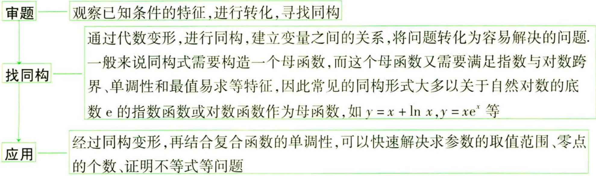

调研 1 (2023·豫北名校联考 10 月测评)已知函数 $f(x) = \mathrm{e}^{x^2 - 2\ln x} - 2a\ln x + ax^2$ 有两个不同的零点,则实数 $a$ 的取值范围是 ( )

$\quad$A. $(- \sqrt{\mathrm{e}}, 0)$

$\quad$B. $(-∞,-\sqrt{e})$

$\quad$C. $(-\infty, 0)$

$\quad$D. $(-\infty, -\mathrm{e})$

思维导引

$f(x)$ 有两个不同的零点等价于关于x的方程 $f(x)=0$ 有两个不同的解

转化为函数 y = -a 与 $y = \frac{e}{x^{2} - 2\ln x}$

的图象有两个不同的交点

构造函数 $g(t)=\frac{\mathrm{e}^{t}}{t}$ 利用函数的单调性 函数 $g(t)$ 的值域 a 的取值范围

解析

函数 $f(x)$ 的定义域为 $(0, +\infty)$ , $f(x) = e^{x^2 - 2\ln x} - 2a\ln x + ax^2 = e^{x^2 - 2\ln x} + a(x^2 - 2\ln x)$ ,

【模型应用】提取参数 $a$ ，即可看出可构建的同构模型

设 $h(x)=x^{2}-2\ln x(x>0)$ ，则 $h'(x)=2x-\frac{2}{x}=\frac{2(x+1)(x-1)}{x}$ .

【模型应用】找同构：构造新函数，解题目标为求出 $h(x)$ 的取值范围

当 $x > 1$ 时, $h'(x) > 0$ , 当 $0 < x < 1$ 时, $h'(x) < 0$ , 所以函数 $h(x)$ 在 $(0,1)$ 上单调递减, 在 $(1, +\infty)$ 上单调递增, 且 $h(1) = 1$ , 所以 $h(x)_{\min} = h(1) = 1$ , 所以 $h(x) \geqslant 1$ .

令 $f(x) = 0$ ，则 $\mathrm{e}^{x^2 - 2\ln x} + a(x^2 - 2\ln x) = 0$ ，即 $-a = \frac{\mathrm{e}^{x^2 - 2\ln x}}{x^2 - 2\ln x},$

$f(x)$ 有两个不同的零点等价于函数y=-a与 $y=\frac{e^{x^{2}-2\ln x}}{x^{2}-2\ln x}$ 的图象有两个不同的交点.

令 $h(x) = x^{2} - 2\ln x = t (t \geqslant 1)$ , 易知当 $x \to 0$ 且 $x > 0$ 时, $h(x) \to +\infty$ , 当 $x \to +\infty$ 时, $h(x) \to +\infty$ , 所以对于任意 $t (t > 1)$ , 都有两个不同的 $x$ 满足 $h(x) = t$ ; 当 $t = 1$ 时, 仅有一个 $x$ 满足 $h(x) = t$ .

法国文学家福楼拜说：“越往前走，艺术越要科学化，同时，科学也要艺术化，两者从山麓分手，又在山顶汇合。”

设 $g(t) = \frac{\mathrm{e}^t}{t}$ , 则 $g'(t) = \frac{te^t - e^t}{t^2} = \frac{\mathrm{e}^t(t - 1)}{t^2} \geqslant 0$ ,

【模型应用】令 $x^{2}-2\ln x=t$ ，即可构建同构模型

所以函数 $g(t)(t \geqslant 1)$ 在 $[1, +\infty)$ 上单调递增，且 $g(1) = e$ ，所以 $g(t)_{\min} = g(1) = e$ ，所以 $-a > e$ ，解得 $a < -e$ 。故选 D.

答案 D

# 规律总结

# 5 类常见的同构变形

（1） $axe^{ax} \geqslant x\ln x \Rightarrow axe^{ax} \geqslant \ln x \cdot e^{\ln x}$ ，可构造函数 $f(x) = xe^{x}$ 来进行研究.  
（2） $x^{2} \ln x = a \ln a - a \ln x \Rightarrow x^{2} \ln x = a \ln \frac{a}{x} \Rightarrow x \ln x = \frac{a}{x} \ln \frac{a}{x}$ , 可构造函数 $f(x) = x \ln x$ 来进行研究.  
（3） $\frac{\mathrm{e}^x}{a} + 1 > \ln (ax - a)(a > 0) \Rightarrow \frac{\mathrm{e}^x}{a} + 1 > \ln a + \ln (x - 1) \Rightarrow \frac{\mathrm{e}^x}{a} - \ln a + x > \ln (x - 1) + x - 1 \Rightarrow$ $\frac{\mathrm{e}^x}{a} + \ln \frac{\mathrm{e}^x}{a} > \ln (x - 1) + (x - 1)$ ，可构造函数 $f(x) = x + \ln x$ 来进行研究.  
（4） $x + \frac{1}{\mathrm{e}^{x}} \geqslant x^{\alpha} - \ln x^{\alpha}(x > 0) \Rightarrow \frac{1}{\mathrm{e}^{x}} - \ln \frac{1}{\mathrm{e}^{x}} \geqslant x^{\alpha} - \ln x^{\alpha}(x > 0)$ , 可构造函数 $f(x) = x - \ln x$ 来进行研究.  
（5） $x^{\alpha + 1}\mathrm{e}^{x} \geqslant -\alpha \ln x \Rightarrow x\mathrm{e}^{x} \geqslant \frac{-\alpha \ln x}{x^{\alpha}} = -\alpha \ln x \cdot \mathrm{e}^{-\alpha \ln x}$ , 可构造函数 $f(x) = x\mathrm{e}^{x}$ 来进行研究.

调研 2 (2023·浙江杭州外国语学校、慈溪中学等10月联考)已知函数 $f(x)=$ $e^{ax}-x$ 与函数 $g(x)=x-\frac{1}{a}\ln x,a\in(0,+\infty)$ .

（1） 若 $f(x) > 0$ , 求 a 的取值范围.  
（2） 若曲线 $y = f(x)$ 与 $x$ 轴有两个不同的交点, 求证: 曲线 $y = f(x)$ 与曲线 $y = g(x)$ 共有三个不同的交点.

思维导引

（1） $f(x) > 0$

利用分离参数
法构造新函数

新构造函数的最值

利用单调性

a 的取值范围

（2） 证曲线 $y = f(x)$ 与曲线 $y = g(x)$ 存在两个交点 → 构造函数 $h(x) = f(x) - g(x)$ →
证明这两条曲线还有除这两个交点外的第3个交点 → 这两条曲线共有三个不同的交点

解析

（1） $f(x)=\mathrm{e}^{ax}-x>0$ , 即 $e^{ax}>x$ .

【小技巧】由于 $e^{ax} > 0$ ，故需对 x 进行分类讨论

哈佛大学的亚瑟·杰费说：“人们把数学对于我们社会的贡献比喻为空气和食物对生命的作用，我们大家都生活在数学的时代——我们的文化已‘数学化’。”

若 $x \leqslant 0$ ，则不等式 $\mathrm{e}^{ax} > x$ 恒成立；若 $x > 0$ ，由 $\mathrm{e}^{ax} > x$ 得 $a > \frac{\ln x}{x}$ .

令 $p(x) = \frac{\ln x}{x} (x > 0)$ ，则 $p'(x) = \frac{1 - \ln x}{x^2}$ ，

【会转化】参数分离，把 $a > \frac{\ln x}{x}$ 恒成立问题转化为 $a > p(x)_{\max}$ ，解题目标为求 $p(x)_{\max}$

当 $x \in (0, \mathrm{e})$ 时， $p'(x) > 0$ . 当 $x \in (\mathrm{e}, +\infty)$ 时， $p'(x) < 0$ . 所以 $p(x)_{\max} = p(\mathrm{e}) = \frac{1}{\mathrm{e}}$ 即 $a > \frac{1}{\mathrm{e}}$

故 a 的取值范围是 $\left(\frac{1}{\mathrm{e}}, +\infty\right)$ .

（2）曲线 $y = f(x)$ 与 $x$ 轴有两个不同的交点,即函数 $y = f(x)$ 有两个不同的零点 ${x}_{1},{x}_{2}$ , 因为 $x > 0$ ,不妨设 $0 < {x}_{1} < {x}_{2}$ ,

【小技巧】利用不妨设 $0<x_{1}<x_{2}$ ，可避开 $x_{1},x_{2}$ 大小需分两类讨论的麻烦

由（1）可得到 $a \in (0, \frac{1}{\mathrm{e}})$ . 因为 $f(x_{1}) = \mathrm{e}^{ax_{1}} - x_{1} = 0$ , 所以 $\mathrm{e}^{ax_{1}} = x_{1}$ ,

【回头望】注意第（1）题的结论适时应用，两边取以e为底的对数，则得 $ax_{1}=\ln x_{1}$

所以 $x_{1} = \frac{1}{a}\ln x_{1}$ ，即 $g(x_{1}) = x_{1} - \frac{1}{a}\ln x_{1} = 0.$

同理,由 $f(x_{2})=0$ 得 $g(x_{2})=0$ ,从而曲线 $y=f(x)$ 与曲线 $y=g(x)$ 已经相交于 $(x_{1},0),(x_{2},0)$ 两个交点.

下面证明这两条曲线还有一个交点:令 $h(x)=f(x)-g(x)=\mathrm{e}^{ax}-2x+\frac{1}{a}\ln x$ ，则 $h'(x)=ae^{ax}+\frac{1}{ax}-2=\frac{a\cdot axe^{ax}-2ax+1}{ax}$ ,

设 $m(t)=ate^{t}-2t+1(t>0)$ ，则 $m'(t)=a(1+t)e^{t}-2, m''(t)=a(2+t)e^{t}>0$ 恒

【模型应用】观察式子 $a \cdot ax \mathrm{e}^{ax} - 2ax + 1$ ，令 $t = ax (t > 0)$ ，即可构建同构模型成立，则 $m'(t)$ 在 $(0, +\infty)$ 上单调递增， $m'（1） = 2ae - 2 < 0$ ，

令 $m'(t) = a(1 + t)e^{t} - 2 = 0$ ，得 $e^{t} = \frac{2}{a(1 + t)} < \frac{2}{a}$ ，故存在 $1 < t_{0} < \ln \frac{2}{a}$ ，使 $y = m(t)$ 在 $(0,t_{0})$ 上单调递减，在 $(t_{0},+\infty)$ 上单调递增，又 $a\times0\times e^{0}-2\times0+1=1>0,m(1)=$ $ae-1<0, m(\ln\frac{2}{a})=a\times e^{\ln\frac{2}{a}}\times\ln\frac{2}{a}-2\times\ln\frac{2}{a}+1=1>0,$

【会分析】利用函数零点存在定理,即可知其零点个数

所以 $y = m(t)$ 有两个零点 $t_{1}, t_{2}$ ，不妨设 $0 < t_{1} < 1 < t_{2} < \ln \frac{2}{a}$ ，令 $t_{1} = ax_{3}, t_{2} = ax_{4}$ ，即

数学家、菲尔兹奖获得者丘成桐,自幼喜欢《史记》,且获益匪浅.他认为,数学之为学,有其独特之处,它本身是寻求自然界真相的一门科学,但数学家也如文学家般天马行空,凭爱好而创作,故此数学可谓是人文科学和自然科学的桥梁.

$y = h(x)$ 有且只有两个极值点 $x_{3}, x_{4}$ .

所以 $y = h(x)$ 在 $(0, x_{3})$ 上单调递增，在 $(x_{3}, x_{4})$ 上单调递减，在 $(x_{4}, +\infty)$ 上单调递增.

又 $h'(x_{1}) = ae^{ax_{1}} + \frac{1}{ax_{1}} -2 = ax_{1} + \frac{1}{ax_{1}} -2\geqslant 0$ ，若 $h^' (x_1) = 0$ ，则 $ax_{1} = 1$ ，又由 $\mathrm{e}^{ax_1} - x_1 = 0$ 得 $x_{1} = \mathrm{e},a = \frac{1}{\mathrm{e}}$ ，与题设矛盾，所以 $h^' (x_1) > 0.$ 同理 $h^' (x_2) > 0$ 且 $0 <   x_{1} <   x_{2}$

又 $h(x_{1}) = 0, h(x_{2}) = 0, x_{1}, x_{2}$ 不可能在同一个单调递增区间上，故 $0 < x_{1} < x_{3}, x_{4} < x_{2}$ ，所以 $0 = h(x_{1}) < h(x_{3}), h(x_{4}) < h(x_{2}) = 0$

故在 $(x_{3},x_{4})$ 间存在唯一的 $x_{0}$ 使得 $h(x_{0})=0$ ，即曲线 $y=f(x)$ 与曲线 $y=g(x)$ 还有一个交点 $(x_{0},f(x_{0}))$ ，故若曲线 $y=f(x)$ 与x轴有两个不同的交点，则曲线 $y=f(x)$ 与曲线 $y=g(x)$ 共有三个不同的交点.

# 模型5 逆向思维模型

# 模型解法 >>>

逆向思维模型是指朝着一个习惯性的思维方向思考问题时,思路受阻或过程繁杂,不易直接求解. 此时,就朝相反的方向思索,让思维向对立面的方向发展,从问题的相反面入手,使问题简单化解决的一种模型. 解决此类问题的关键点如下:

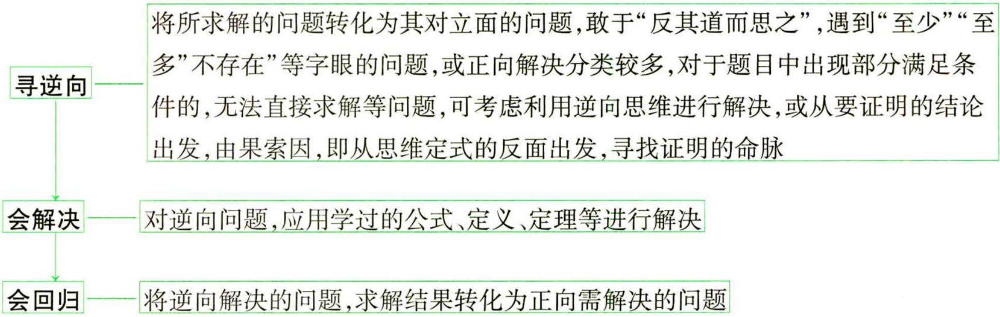

调研 1 (2023·上海南洋模范中学9月开学考试)将编号为1,2,3,4的四个小球放到三个不同的盒子里,每个盒子至少放一个小球,且编号为1,2的两个小球不能放【模型应用】有“至少”字样,考虑利用逆向思维,从问题的反面出发到同一个盒子里,则不同放法的种数是\_\_\_\_(用数字作答).

解析 由题意得4个小球有2个放在一个盒子里的种数是 $C_{4}^{2}$ ，
【指点迷津】本质是把4个小球分成三组

把这两个作为一个元素同另外两个元素在三个位置排列,有 $\mathrm{A}_{3}^{3}$ 种结果,

数学与诗歌 杜甫的“两个黄鹂鸣翠柳,一行白鹭上青天.窗含西岭千秋雪,门泊东吴万里船”脍炙人口,数字深化了时空意境.还有他的“霜皮溜雨四十围,黛色参天二千尺”,“新松恨不高千尺,恶竹应须斩万竿”等,表现出强烈的夸张和爱憎.

而编号为 1,2 的小球放在同一个盒子里有 $A_{3}^{3}=6$ (种) 结果，

【模型应用】“编号为1,2的小球不放到同一个盒子里”的对立事件为“编号为1,2号小球放在同一个盒子里”

所以编号为 1,2 的小球不放到同一个盒子里的种数是 $C_{4}^{2}A_{3}^{3}-6=30$ .

答案 30

调研 2 (2023·广东东莞四中9月月考/北京2022年冬奥会)第24届冬季奥林匹克运动会是由中国举办的国际性奥林匹克赛事.2022年北京冬季奥运会共设7个大项,15个分项,109个小项.为调查学生对冬季奥运会项目的了解情况,某中学进行了一次抽样调查,统计得到以下 $2 \times 2$ 列联表.

<table><tr><td></td><td>了解</td><td>不了解</td><td>总计</td></tr><tr><td>男生</td><td></td><td>60</td><td>200</td></tr><tr><td>女生</td><td>110</td><td></td><td>200</td></tr><tr><td>总计</td><td></td><td></td><td></td></tr></table>

（1） 先完成 $2 \times 2$ 列联表, 并依据 $\alpha = 0.005$ 的独立性检验, 分析该校学生对冬季奥运会项目了解情况与性别是否有关.

（2）①为弄清学生不了解冬季奥运会项目的原因,按照性别采用分层抽样的方法,从样本中不了解冬季奥运会项目的学生中随机抽取5人,再从这5人中抽取3人进行面对面交流,求“男、女生至少各抽到一名”的概率.

②用样本估计总体,若再从该校全体学生中随机抽取 40 人,记其中对冬季奥运会项目了解的人数为 X,求 X 的数学期望.

附表：

<table><tr><td> $\alpha$ </td><td>0.025</td><td>0.010</td><td>0.005</td><td>0.001</td></tr><tr><td> $x_{\alpha}$ </td><td>5.024</td><td>6.635</td><td>7.879</td><td>10.828</td></tr></table>

附: $\chi^{2}=\frac{n(ad-bc)^{2}}{(a+b)(c+d)(a+c)(b+d)}$ .

解析

（1）零假设 $H_{0}$ : 该校学生对冬季奥运会项目了解情况与性别无关,

【勿漏】先假设两变量无关

<table><tr><td></td><td>了解</td><td>不了解</td><td>总计</td></tr><tr><td>男生</td><td>140</td><td>60</td><td>200</td></tr><tr><td>女生</td><td>110</td><td>90</td><td>200</td></tr><tr><td>总计</td><td>250</td><td>150</td><td>400</td></tr></table>

柳宗元的“千山鸟飞绝,万径人踪灭.孤舟蓑笠翁,独钓寒江雪”,数字起到了尖锐的对比和衬托作用.他的“一身去国六千里,万死报荒十二年”和韩愈的“一封朝奏九重天,夕贬潮州路八千”异曲同工,抒发迁客的失意之情.

根据 $2 \times 2$ 列联表数据得 $\chi^2 = \frac{400 \times (140 \times 90 - 110 \times 60)^2}{250 \times 150 \times 200 \times 200} = 9.6 > 7.879 = x_{0.005}$ ,

【小技巧】认真审题眼 “ $\alpha=0.005$ ”，看似界值表 $x_{\alpha}$ 对应的值为 7.879，故只需把 $\chi^{2}$ 的值与 7.879 进行比较

依据 $\alpha=0.005$ 的独立性检验,零假设 $H_{0}$ 不成立,即该校学生对冬季奥运会项目了解情况与性别有关,该推断犯错误的概率不超过 0.005.

（2） ①采用分层抽样的方法,从样本中不了解冬季奥运会项目的学生中随机抽取5人,由题可得不了解冬季奥运会项目的学生中男女比例为 $2:3$ , 故这 5 人中包含 3 名女生, 2 名男生, 再从这 5 人中抽取 3 人进行面对面交流, 所以“抽到都是女生”的概率为 $\frac{\mathrm{C}_{3}^{3}}{\mathrm{C}_{5}^{3}} = \frac{1}{10}$ ,

【模型应用】事件“从抽取的5名学生中随机抽取3人，3人中男、女生至少各抽到一名”的对立事件是“从抽取的5名学生中随机抽取3人，3人都是女生”。注意要求准所求事件的对立事件，所求事件的对立事件不一定只有一种，也可能包括多种情况，要做到不重、不漏

则“男、女生至少各抽到一名”的概率为 $1 - \frac{1}{10} = \frac{9}{10}$ .

②由题意得随机抽取一名学生,其了解冬季奥运会项目的概率为 $\frac{250}{400}=\frac{5}{8}$ , 可知 $X\sim B(40,\frac{5}{8})$ , 故 $E(X)=40\times\frac{5}{8}=25$ .

【小妙招】若能判断随机变变量服从二项分布,则利用二项分布的期望公式,可直接得到结果

# 型 6 主元转换模型

# 模型解法 >>>

主元转换模型是指在解题过程中将两个参数的主次互换,使问题可以消元、降次或化归,将复杂问题简单化的一种模型.解决此类问题的关键点如下:

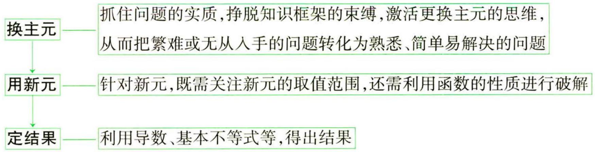

岳飞的“三十功名尘与土，八千里路云和月”，陆游的“三万里河东入海，五千仞岳上摩天”，同样壮怀激烈。数字的运用渲染了诗歌的意境，使表达更为生动贴切。

调研 (2023·江苏南通中学9月检测)已知函数 $f(x)=\mathrm{e}^{x-m}+\ln\frac{3}{x}$ .

（1） 设 x=1 是函数 $f(x)$ 的极值点, 求 m 的值并讨论 $f(x)$ 的单调性.  
（2） 当 $m \leqslant 2$ 时, 证明: $f(x) > \ln 3$ .

思维导引 （1） $x = 1$ 是函数 $f(x)$ 的极值点 $\rightarrow f'（1） = 0$ $\rightarrow$ 关于 $m$ 的方程 $\xrightarrow{\text{解方程}}$ $m$ 的值 $\xrightarrow{\text{检验}}$ 对 $f(x)$ 求导 $\rightarrow$ 判断 $f'(x)$ 的正负 $\rightarrow f(x)$ 的单调性

（2） 当 $m \leqslant 2$ 时, 欲证 $f(x) > \ln 3$ 利用主元转换

隐蔽条件 x > 0 $e^{x - m} \geqslant e^{x - 2}$ 构造函数

对新构造的函数求导

判断其单调性 → 得证

解析 （1） $f(x)=\mathrm{e}^{x-m}+\ln\frac{3}{x},x>0,f'(x)=\mathrm{e}^{x-m}-\frac{1}{x},$

因为 x=1 是函数 $f(x)$ 的极值点, 所以 $f'（1）=\mathrm{e}^{1-m}-1=0$ , 解得 m=1, 所以 $f'(x)=$

【指点迷津】可导函数 $f(x)$ 的极值点为a，则 $f'(a)=0$ ，反之不一定成立

$\mathrm{e} ^ {x - 1} - \frac {1}{x}.$

设 $g(x)=\mathrm{e}^{x-1}-\frac{1}{x}$ ，则 $g'(x)=\mathrm{e}^{x-1}+\frac{1}{x^{2}}>0, f'(x)$ 单调递增，故 x=1 是 $f'(x)=0$ 的唯一零点，

所以当 $x \in (0,1)$ 时, $f'(x) < 0$ , 函数 $f(x)$ 单调递减. 当 $x \in (1, +\infty)$ 时, $f'(x) > 0$ , 函数 $f(x)$ 单调递增.

（2） 当 $m \leqslant 2, x \in (0, +\infty)$ 时, $\mathrm{e}^{x - m} \geqslant \mathrm{e}^{x - 2}$ .

【模型应用】主元转换：由于 x > 0，可把函数 $y = e^{x - m}$ 看成关于 m 的函数，且是单调递减函数

所以欲证 $f(x) > \ln 3$ ，即证 $e^{x - m} + \ln \frac{3}{x} > \ln 3$ ，只需证 $e^{x - 2} + \ln \frac{3}{x} > \ln 3$ ，

即 $e^{x-2} + \ln 3 - \ln x > \ln 3$ ，即证 $e^{x-2} - \ln x > 0$ .

【会分析】利用分析法,把要证的不等式转化为简单的不等式的证明

设 $\varphi(x) = \mathrm{e}^{x} - x - 1 (x > 0)$ , 则 $\varphi'(x) = \mathrm{e}^{x} - 1$ , 当 $x \in (0, +\infty)$ 时, $\varphi'(x) > 0, \varphi(x)$ 单调递增,

所以 $\varphi(x)=\mathrm{e}^{x}-x-1>\mathrm{e}^{0}-1=0$ , 即 $e^{x}>x+1$ , 则 $e^{x-m}\geqslant e^{x-2}>x-1$

【小妙招】把证明 “ $e^{x-2}-\ln x>0$ ” 转化为证明 “ $h(x)=x-1-\ln x>0$ ”，对不等式进行缩小

令函数 $h(x)=x-1-\ln x(x>0)$ ，则 $h'(x)=1-\frac{1}{x}$

【会构造】构造新函数，注意自变量的取值范围

数学与小说 《射雕英雄传》《天龙八部》《鹿鼎记》中都蕴含了不少数学元素. 在《射雕英雄传》中,写了许多不可思议的中国古代数学怪题. 例如“九宫图”“五图”“百子图”“鬼谷算”“立方招兵”等五花八门的难题.

当 $0 < x < 1$ 时, $h'(x) < 0$ , $h(x)$ 单调递减, 当 $x > 1$ 时, $h'(x) > 0$ , $h(x)$ 单调递增, 所以函数 $h(x)$ 在 $x = 1$ 处取最小值, 即 $h(x) \geqslant h(1) = 0$ , 故 $f(x) > \ln 3$ 成立.

# 型 7 参变分离模型

# 模型解法 >>>

参变分离模型是指通过分离参数,用函数观点讨论主变量的变化情况,由此确定参数的变化范围的一种模型. 参变分离模型在解决有关不等式恒成立、不等式存在性、函数有零点、函数单调性中参数的取值范围问题时经常用到. 解决此类问题的关键点如下:

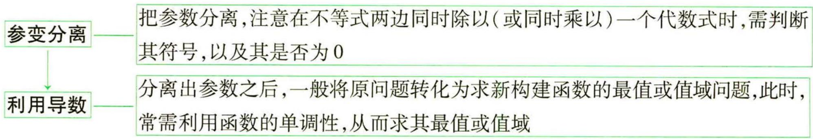

调研 1 (2023·河南洛阳一高9月摸底)已知函数 $f(x)=\frac{x^{2}}{\mathrm{e}^{x}},x>0$ . 若存在实数 $a \in [0,1]$ ，使得 $f(2-\frac{1}{m})-a^{3}+\frac{1}{2}a^{2}+2a \leqslant e^{-1}$ 成立，则正实数 m 的取值范围为（）

$\quad$A. $(\frac{1}{2}, 1]$

$\quad$B. $\left[\frac{1}{2},1\right]$

$\quad$C. $(0,1)$

$\quad$D. $(0,1]$

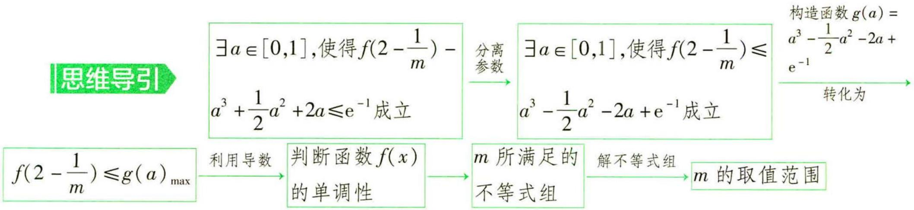

解析 存在实数 $a \in [0,1]$ , 使得 $f\left(2 - \frac{1}{m}\right) - a^3 + \frac{1}{2}a^2 + 2a \leqslant e^{-1}$ 成立, 即存在实数 $a \in [0,1]$ , 使得 $f\left(2 - \frac{1}{m}\right) \leqslant a^3 - \frac{1}{2}a^2 - 2a + e^{-1}$ 成立.

【模型解法】参变分离, 把含参数的式子和常数放不等式一边, 余下的放不等式的另一边. 令 $g\left( a\right)  = {a}^{3} - \frac{1}{2}{a}^{2} - {2a} + {\mathrm{e}}^{-1},a \in  \left\lbrack  {0,1}\right\rbrack$ ,则 ${g}^{' }\left( a\right)  = 3{a}^{2} - a - 2 = \left( {{3a} + 2}\right) \left( {a - 1}\right)$ , 则

【小技巧】构造函数，注意自变量的取值范围，解题目标为求新构造函数的最大值故当 $a \in [0,1]$ 时， $g'(a) \leqslant 0$ ，函数 $g(a)$ 在 $[0,1]$ 上单调递减，所以 $g(a)_{\max} = g(0) = e^{-1}$ ，

《为人师表》影片根据美国传奇教师海梅斯·埃斯卡兰特的亲身经历改编而成,该片讲述了意外改教数学的老师伊斯克兰特,用强悍的教学方式驯服了顽劣学生,并帮助他们通过了越级考试,最终创下合格人数最高记录的故事.

所以 $f(2 - \frac{1}{m})\leqslant g(a)_{\max} = \mathrm{e}^{-1}$ 成立，又 $f(1) = \mathrm{e}^{-1}$ ，所以 $f(2 - \frac{1}{m})\leqslant f(1)$

【扫清障碍】解题目标是两边脱掉帽子“f”，需判断函数 $f(x)$ 的单调性

因为 $f(x)=\frac{x^{2}}{\mathrm{e}^{x}}$ ，所以 $f'(x)=\frac{2x-x^{2}}{\mathrm{e}^{x}}=\frac{x(2-x)}{\mathrm{e}^{x}},x>0.$

当 $x \in (0,2)$ 时， $f'(x) > 0$ ，函数 $f(x)$ 在 $(0,2)$ 上单调递增，

当 $x \in (2, +\infty)$ 时， $f'(x) < 0$ ，函数 $f(x)$ 在 $(2, +\infty)$ 上单调递减，

因为 m 为正实数, 所以 $2 - \frac{1}{m} < 2$ , 又函数 $f(x)$ 在 $(0, 2)$ 上单调递增, 则 $\left\{\begin{aligned}0 &< 2 - \frac{1}{m} \leqslant 1, \\ &m > 0,\end{aligned}\right.$ 解得 $\frac{1}{2} < m \leqslant 1$ . 故正实数 m 的取值范围为 $(\frac{1}{2}, 1]$ .

# 答案 A

调研 2 (2023·河南省实验中学9月阶段测试)已知函数 $f(x)=2x-\sin x$ .

（1） 求 $f(x)$ 的图象在点 $\left(\frac{\pi}{2}, f\left(\frac{\pi}{2}\right)\right)$ 处的切线方程；  
（2） 对任意的 $x \in (0, \frac{\pi}{2}]$ , $f(x) \leqslant ax$ , 求实数 $a$ 的取值范围.

# 思维导引

（1）

求 $f(\frac{\pi}{2}), f'(\frac{\pi}{2})$

利用直线方程的点斜式

$f(x)$ 的图象在点 $\left(\frac{\pi}{2},\right.$

$f(\frac{\pi}{2})$ 处的切线方程

（2）

对任意的 $x \in (0,$

$\left.\frac{\pi}{2}\right],f(x)\leqslant ax$

分离参数

$a \geqslant 2 - \frac{\sin x}{x} (x \in$

$(0,\frac{\pi}{2}]$

构造函数

$h(x) = 2 - \frac{\sin x}{x},$

$x\in (0,\frac{\pi}{2}]$

利用导数

求 $h(x)_{\max}$ $\rightarrow$ $a \geqslant h(x)_{\max}$

解析 （1） 因为 $f\left(\frac{\pi}{2}\right)=\pi-1$ , 所以切点坐标为 $(\frac{\pi}{2}, \pi-1)$ ,

因为 $f'(x)=2-\cos x$ ，所以 $f'(\frac{\pi}{2})=2$ ，

【小妙招】利用导数的几何意义， $f'(\frac{\pi}{2})$ 即曲线 $f(x)$ 在点 $(\frac{\pi}{2}, \pi - 1)$ 处的切线的斜率

所以所求切线的方程为 $y - (\pi - 1) = 2(x - \frac{\pi}{2})$ ，即 2x - y - 1 = 0。

【小技巧】所求的直线方程的最后结果，一般需整理成直线的一般式或斜截式

《时间简史》 本片是关于英国著名物理学家史蒂芬·霍金的纪录片,介绍了他的“黑洞理论”的形成过程,论证方式,以及家庭生活,有趣的成长过程.在普及宇宙知识的同时,介绍了一个身残志坚的天才学者的生活经历.

（2） 由 $f(x) \leqslant ax$ ，得 $2x - \sin x \leqslant ax$ ，所以 $a \geqslant 2 - \frac{\sin x}{x}$ ，其中 $x \in (0, \frac{\pi}{2}]$ ，

【模型应用】参变分离,把参数放不等式一边,余下的放不等式的另一边

令 $h(x) = 2 - \frac{\sin x}{x}, x \in (0, \frac{\pi}{2}]$ , 得 $h'(x) = \frac{\sin x - x\cos x}{x^2}$ ,

【模型应用】构造函数，通过求导，判断新构造函数的单调性，求其最大值

设 $\varphi(x) = \sin x - x\cos x, x \in (0, \frac{\pi}{2}]$ , 则 $\varphi'(x) = x\sin x > 0$ , 所以 $\varphi(x)$ 在 $(0, \frac{\pi}{2}]$ 上单

【会思考】由于无法直接判断 $h'(x)$ 的正负，而 $h'(x)$ 的分母为正数，故只需对分子再次构造函数，判断其正负

调递增，

所以 $\varphi(x) > \sin 0 - 0 \times \cos 0 = 0$ ，所以 $h'(x) > 0$ ，所以 $h(x)$ 在 $(0, \frac{\pi}{2}]$ 上单调递增，

$h(x)_{\max}=h(\frac{\pi}{2})=2-\frac{2}{\pi}\sin\frac{\pi}{2}=2-\frac{2}{\pi}$ ，所以 $a\geqslant2-\frac{2}{\pi}$ ，即a的取值范围为 $\left[2-\frac{2}{\pi},+\infty\right)$ .

# 模型8 放缩模型

# 模型解法 >>>

放缩模型是指利用放大或缩小的方法来证明不等式的一种模型. 函数与数列的不等式证明的交汇是高考的一类重要题型, 放缩法为不等式证明的一种重要方法. 用放缩法证明此类题的关键点如下.

审题 → 观察已知条件与要证明的不等式的特征,进行转化

放缩 → 一般要先将通项放缩后再求和,有些情况下,通项放缩求和后还要对和再放缩,有时需构造函数,并对所构造的函数进行求导,判断其单调性,从而得到结论.

调研 1 (2023·湖南长沙雅礼中学10月模拟)已知 $n \in \mathbf{N}^{*}$ , 抛物线 $y = -x^{2} + n$ 与 $x$ 轴正半轴相交于点 $A$ . 设 $a_{n}$ 为该抛物线在点 $A$ 处的切线在 $y$ 轴上的截距.

（1） 求数列 $\{a_{n}\}$ 的通项公式.  
（2） 设 $b_{n}=\frac{na_{n}}{2}$ ，求证： $\frac{1}{b_{1}}+\frac{1}{b_{2}}+\cdots+\frac{1}{b_{n}}<2-\frac{1}{n}(n\in\mathbf{N}^{*}$ 且 $n\geqslant2)$ .

思维导引 点 A 的坐标 $\xrightarrow{求导}$ 切线斜率 $\xrightarrow{利用直线方程的点斜式}$ 切线在 y 轴上的截距

《通天神偷》该片讲述了五个电脑高手组成的小组,为拯救世界和平,利用高超的电脑技术与恶势力展开斗争的故事.作为一部犯罪戏剧,影片认真对待数学方面的知识,并聘请了著名计算机科学家与数学家伦纳德·阿德曼作为数学顾问.

$\{a _ {n} \} \text {   的通项公式   } \longrightarrow b _ {n} \xrightarrow [ \text { 裂项相消 } ]{\text { 对 } \frac {1}{b _ {n}} \text { 进行放缩 }} \frac {1}{b _ {1}} + \frac {1}{b _ {2}} + \dots + \frac {1}{b _ {n}} <   2 - \frac {1}{n}$

解析 （1） 由题意, 令 $y = -x^{2} + n = 0$ , 解得 $x = \pm \sqrt{n}$ ,

因为 A 在 x 轴正半轴上, 所以 $A(\sqrt{n}, 0)$ , 又 $y' = -2x$ , 故点 A 处切线的斜率 $k = -2\sqrt{n}$ ,

【小技巧】注意审题，A 在 x 轴正半轴上，故 $x = -\sqrt{n}$ 需舍去

所以抛物线在点 $A(\sqrt{n},0)$ 处的切线方程为 $y=-2\sqrt{n}(x-\sqrt{n})$ .

令 x=0 ，得 y=2n ，所以它在 y 轴上的截距为 2n ，故 $a_{n}=2n$

【易混易错】“截距非距”，即截距可为正数、可为0、可为负数，截距不是距离

（2） 由题意, $b_{n}=n^{2}$ , 故 $\frac{1}{b_{1}}+\frac{1}{b_{2}}+\cdots+\frac{1}{b_{n}}=\frac{1}{1^{2}}+\frac{1}{2^{2}}+\cdots+\frac{1}{n^{2}}$ ,

又当 $n \in \mathbb{N}^*$ 且 $n \geqslant 2$ 时, $\frac{1}{n^2} < \frac{1}{n(n - 1)} = \frac{1}{n - 1} - \frac{1}{n}$ ,

【模型应用】对 $\frac{1}{n^{2}}$ ，若要放大，只需 $\frac{1}{n^{2}}<\frac{1}{n(n-1)}=\frac{1}{n-1}-\frac{1}{n}$ ；若要缩小，只需 $\frac{1}{n^{2}}>\frac{1}{n(n+1)}=$ $\frac{1}{n}-\frac{1}{n+1}$

故 $\frac{1}{b_{1}}+\frac{1}{b_{2}}+\cdots+\frac{1}{b_{n}}<1+\frac{1}{1\times2}+\frac{1}{2\times3}+\cdots+\frac{1}{(n-1)n}=1+1-\frac{1}{2}+\frac{1}{2}-\frac{1}{3}+\cdots+$ $\frac{1}{n-1}-\frac{1}{n}=2-\frac{1}{n}$ ，得证.

# 规律总结

# 常见放缩技巧

① $2\sqrt{n} > \sqrt{n} + \sqrt{n-1}$ ， $\sqrt{n(n-1)} < \sqrt{n^{2}} = n;$

② $1+\frac{1}{2!}+\frac{1}{3!}+\cdots+\frac{1}{n!}\leqslant1+\frac{1}{2}+\frac{1}{2^{2}}+\cdots+\frac{1}{2^{n-1}}(n\in\mathbf{N}^{*})$ ;

③ $\frac{1}{n+1} + \frac{1}{n+2} + \cdots + \frac{1}{2n} \leqslant \frac{1}{n+1} + \frac{1}{n+1} + \cdots + \frac{1}{n+1} = \frac{n}{n+1} < 1, \quad \frac{1}{n+1} + \frac{1}{n+2} + \cdots + \frac{1}{2n} \geqslant \frac{1}{2n} + \frac{1}{2n} + \cdots + \frac{1}{2n} = \frac{n}{2n} = \frac{1}{2}.$

调研 2 (2023·辽宁省实验中学9月测试)已知 a > 0 且函数 $f(x) = ax + \frac{a - 1}{x} - \ln x - 2a + 1$ .

（1） 若 a = 1 ，讨论 $f(x)$ 的单调性.  
（2） 当 $x \geqslant 1$ 时, $f(x) \geqslant 0$ , 求 a 的取值范围.

《心灵捕手》影片讲述了麻省理工学院一个名叫威尔的清洁工的故事。威尔在数学方面有着过人天赋，却是个叛逆的问题少年，在教授蓝勃、心理学家桑恩和朋友查克的帮助下，威尔最终把心灵打开，消除了人际隔阂，并找回了自我和爱情。

（3） 设 $n \in N^{*}$ ，证明： $1 + \frac{1}{2} + \cdots + \frac{1}{n} > \ln(n + 1) + \frac{n}{2(n + 1)}$ .

解析 （1） 若 $a = 1, f(x) = x - \ln x - 1$ , 则 $f'(x) = 1 - \frac{1}{x} = \frac{x - 1}{x}$ ,

【易错】注意隐藏条件 $x > 0$

故当 $x \in (0,1)$ 时， $f'(x) < 0$ ; 当 $x \in (1, +\infty)$ 时， $f'(x) > 0$ .

所以 $f(x)$ 在 $(0,1)$ 上单调递减，在 $(1,+\infty)$ 上单调递增.

（2） $f(x)=ax+\frac{a-1}{x}-\ln x-2a+1$ ，则 $f(1)=a+a-1-2a+1=0,f'(x)=a-\frac{a-1}{x^{2}}-\frac{1}{x}=\frac{ax^{2}-x-a+1}{x^{2}}=\frac{a(x-1)(x-\frac{1-a}{a})}{x^{2}}$ ，令 $f'(x)=0$ ，有 $x_{1}=1,x_{2}=\frac{1-a}{a}$ .

当 $\frac{1-a}{a}\leqslant1$ ，即 $a\geqslant\frac{1}{2}$ 时， $f(x)$ 在 $[1,+\infty)$ 上单调递增，故 $f(x)\geqslant f(1)=0$ 成立.

【会分类】以方程 ${f}^{' }\left( x\right)  = 0$ 的两根的大小进行比较,从而得分类讨论的“度”

当 $\frac{1-a}{a}>1$ ，即 $0<a<\frac{1}{2}$ 时，在 $(1,\frac{1-a}{a})$ 上 $f'(x)<0,f(x)$ 单调递减，此时 $f(x)<f(1)=0$ ，不满足 $f(x)\geqslant0$ .

综上, a 的取值范围为 $\left[\frac{1}{2}, +\infty\right)$ .

（3） 由（2）可得, 当 $a = \frac{1}{2}, x > 1$ 时, $f(x) > 0$ , 即 $f(x) = \frac{1}{2} (x - \frac{1}{x}) - \ln x > 0$ .

【指点迷津】利用不等式 $f(x)=\frac{1}{2}(x-\frac{1}{x})-\ln x>0$ 证明的关键在于如何对x赋予有关的值，从而将不易求和的问题进行转化

则当 $x = \frac{n + 1}{n} > 1$ 时，有 $\frac{1}{2}\left(\frac{n + 1}{n} - \frac{n}{n + 1}\right) > \ln \frac{n + 1}{n},$

【模型应用】从要证的不等式入手分析,即可得出应当赋予 $x$ 的值,从而达到缩小的目的

即 $\frac{1}{2} (\frac{1}{n} +\frac{1}{n + 1}) > \ln (n + 1) - \ln n$ ，即 $\frac{1}{n} >\ln (n + 1) - \ln n + \frac{1}{2} (\frac{1}{n} -\frac{1}{n + 1})$

故 $1 > \ln 2 - \ln 1 + \frac{1}{2} \times (1 - \frac{1}{2}), \frac{1}{2} > \ln 3 - \ln 2 + \frac{1}{2} \times (\frac{1}{2} - \frac{1}{3}), \cdots, \frac{1}{n} > \ln(n) - \ln n + \frac{1}{2} (\frac{1}{n} - \frac{1}{n+1})$ ,

【会思考】只需对以上的各个不等式进行累加，即可证得结果

《圆周率》该片是一部科幻惊悚片,讲述了天才数学家马斯痴迷于数字的世界,他认为一切自然界的事物都可以用数字解释.他潜心研究,试图透过数字推演出种种生命迹象背后的奥秘和规律.

所以 $1 + \frac{1}{2} + \cdots + \frac{1}{n} > \ln(n + 1) - \ln 1 + \frac{1}{2}(1 - \frac{1}{n + 1})$ ，即 $1 + \frac{1}{2} + \cdots + \frac{1}{n} > \ln(n + 1) + \frac{n}{2(n + 1)}$ ，得证.

# 型9 割补模型

# 模型解法 >>>

割补模型是指根据简单组合体的结构特征,通过切割或补形将其转化为规则几何体,利用这些规则几何体的表面积或体积公式求出简单组合体的表面积或体积的一种模型.解决此类问题的关键点如下.

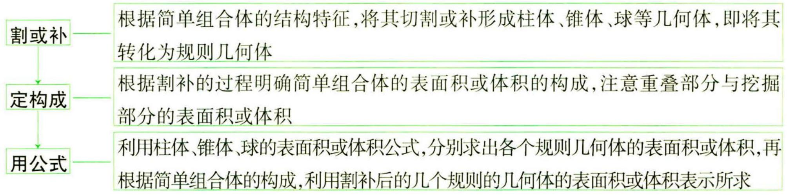

调研 1 (2023·浙江嘉兴一中、诸暨中学等9月第一次联考/《九章算术》)我国古代数学名著《九章算术》中记载的“刍甍”指底面为矩形,顶部只有一条棱的五面体. 如图1,五面体 $ABCDEF$ 是一个“刍甍”,其中 $\triangle BCF$ 是正三角形, $AB=$

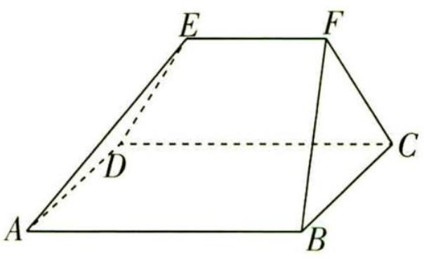

图1

【模型应用】五面体 $A B C D E F$ 可分割为直棱柱 $F M N - E H L$ 和两个相同的四棱锥 $F - M C B N, E - D H L A$ , 如图2. 注意用分割模型求几何体的体识的关键是能根据几何体中的线面关系合理选择截面进行切割$2BC = 2EF = 2, BF \perp ED$ , 则该五面体的体积为 ( )

$\quad$A. $\frac{2\sqrt{2}}{3}$

$\quad$B. $\frac{2\sqrt{3}}{3}$

$\quad$C. $\frac{5\sqrt{3}}{12}$

$\quad$D. $\frac{5\sqrt{2}}{12}$

解析 由题意知 $AB \parallel CD, AB \subset$ 平面 $ABFE, CD \not\subset$ 平面 $ABFE$ , 所以 $CD \parallel$ 平面 $ABFE$ ,

【易遗漏】由线线平行证明线面平行，注意说明面外的线与面内的线

又平面 $ABFE \cap$ 平面 CDEF = EF, CD ⊂ 平面 CDEF, 所以 CD // EF,

【易遗漏】由线面平行证明线线平行，注意两个平面交线的说明

他发现股票市场在混乱波动背后原来由一套数学模式操控,于是致力研究寻出该数学模式.没想到主宰金融市场的华尔街财团以及不择手段要破解密码的神秘组织同时追缉他,马斯既要保护一己安全,同时亦要尽快找出这些影响世界金融市场的密码.

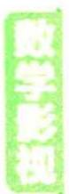

而 $CD \subset$ 平面 $ABCD, EF \not\subset$ 平面 $ABCD$ , 故 $EF \parallel$ 平面 $ABCD$ .

如图 2, 取 CD 的中点 G, 连接 FG, 有 DG // EF,

由于 $CD = AB = 2EF = 2$ ，所以 $DG = EF = 1$ ，则四边形EFGD为平行四边形，则 $ED / / FG$

因为 $BF \perp ED$ , 所以 $BF \perp FG$ , 连接 $BG$ , 则由已知可得 $BG = \sqrt{BC^2 + CG^2} = \sqrt{1 + 1} = \sqrt{2}$ , 而 $\triangle BCF$ 是正三角形, 则 $FC = BF = BC =$

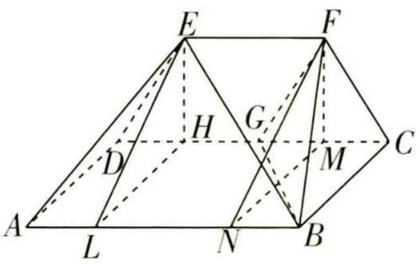

图2

1, 所以 $GF = \sqrt{BG^2 - BF^2} = 1$ , 又 $GC = 1$ , 则 $\triangle FGC$ 为等边三角形, 作 $FM \perp CG$ , 垂足为 $M$ , 则 $CM = \frac{1}{2}$ , 作 $EH \perp CD$ , 垂足为 $H$ , 则 $MH = EF = 1$ , 所以 $DH = \frac{1}{2}$ .

分别过点 $M, H$ 作 $BC$ 的平行线, 交 $AB$ 于 $N, L$ , 连接 $FN, EL$ , 则 $HM \perp MN$ , 又 $HM \perp FM, FM \cap MN = M, FM, MN \subset$ 平面 $MNF$ , 所以 $HM \perp$ 平面 $MNF$ , 同理 $HM \perp$ 平面 $EHL$ . 因为 $HM \parallel LN$ , 所以 $LN \perp$ 【易漏】由线线垂直证明线面垂直, 注意线不在多, 重在相交的说明

平面 MNF, 所以 $LN \perp FN$ , 即 $\angle FMC = \angle FNB = 90^{\circ}$ , 又 NB = MC, FB = FC, 故 $\triangle FMC \cong \triangle FNB$ , 所以 $FM = FN = \sqrt{FC^{2} - CM^{2}} = \sqrt{1^{2} - (\frac{1}{2})^{2}} = \frac{\sqrt{3}}{2}, MN = 1$ , 则 $S_{\triangle FMN} = \frac{1}{2} \times 1 \times \sqrt{(\frac{\sqrt{3}}{2})^{2} - (\frac{1}{2})^{2}} = \frac{\sqrt{2}}{4}.$

由棱柱 FMN - EHL 为直棱柱, 可知平面 FMN ⊥ 平面 BCMN, 棱柱 FMN - EHL 的高为 HM.

四棱锥 $F - MCBN$ 的高即 $\triangle FMN$ 的底边 $MN$ 上的高，为 $\sqrt{\left(\frac{\sqrt{3}}{2}\right)^2 - \left(\frac{1}{2}\right)^2} = \frac{\sqrt{2}}{2},$

所以该五面体的体积为 $V_{FMN-EHL}+2V_{F-MCBN}=\frac{\sqrt{2}}{4}\times1+2\times\frac{1}{3}\times1\times\frac{1}{2}\times\frac{\sqrt{2}}{2}=\frac{5\sqrt{2}}{12}$ ，故选D.

【扫清障碍】四棱锥的体识公式前面的系数 $\frac{1}{3}$ 不要满了，不要与四棱柱的体识公式混淆

# 答案

D

调研 2 (2023·河北保定一中9月月考/数学之美)(多选)很多立体图形都体现了数学的对称美,其中半正多面体是由两种或两种以上的正多边形围成的多面体,也被称作阿基米德多面体.如图3,这是一个棱数为24,棱长为 $\sqrt{2}$ 的半正多面体,它的所有顶点都在同一个正方体的表面上,可以看成是由一个正方体截去八个一样的四面体所得,则下列各选项正确的是()

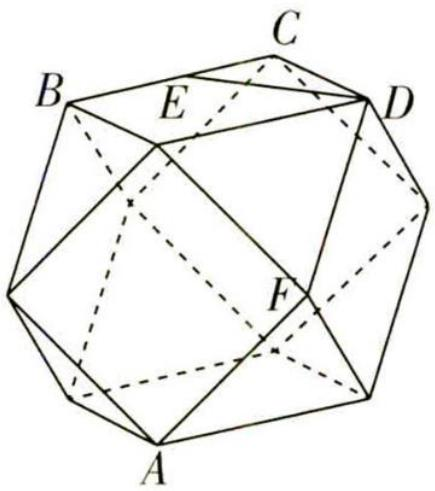

图3

$\quad$A. 该半正多面体的体积为 $\frac{20}{3}$

$\quad$B. A, C, D, F 四点共面

$\quad$C. 该半正多面体外接球的表面积为 $12 \pi$

《美丽心灵》该片讲述了患有精神分裂症的数学家约翰·福布斯·纳什，在博弈论和微分几何学领域潜心研究，最终获得诺贝尔经济学奖，而他也成为了一个不仅拥有美好情感，并具有美丽心灵的人的故事。

$\quad$D. 若点 E 为线段 BC 上的动点, 则直线 DE 与直线 AF 所成角的余弦值的取值范围为 $\left[\frac{1}{2}, \frac{\sqrt{2}}{2}\right]$

# 解析 将半正多面体补成正方体.

【模型应用】把半正多面体补成正方体. 割补模型适用于由规则几何体通过切割、挖、补等方式形成的不规则组合体的表面识或体识的求解问题, 要弄清补形后的几何体的体识是否与原几何体的体识之间有明显的确定关系: 如果是由一个规则的几何体挖去几个规则的几何体而成的, 其体识就等于这个规则几何体的体积减去挖去的几个几何体的体识

因为该半正多面体的棱长为 $\sqrt{2}$ , 所以正方体的棱长为 2, 该半正多面体的体积 $V = 2 \times 2 \times 2 - 8 \times \frac{1}{3} \times \frac{1}{2} \times 1 \times 1 \times 1 = \frac{20}{3}, A$ 正确.

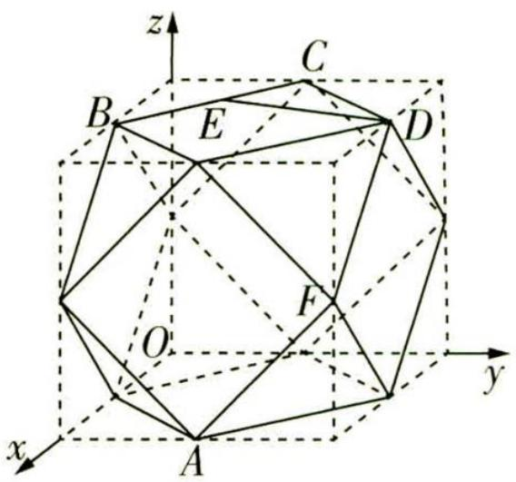

图4

该半正多面体的外接球球心即该正方体的外接球球心，

设正方体的外接球球心为 M，连接 MF，则该半正多面体的外接球半径 $R = MF = \frac{\sqrt{2}}{2} \times 2 = \sqrt{2}$ ，

故该半正多面体外接球的表面积为 $4\pi R^{2} = 8\pi$ , C 错误.

建立如图4所示的空间直角坐标系,则 $A(2,1,0)$ , $F(2,2,1)$ , $B(1,0,2)$ , $C(0,1,2)$ , $D(1,2,2)$ , $\overrightarrow{AF} = (0,1,1)$ , $\overrightarrow{CD} = (1,1,0)$ , $\overrightarrow{FD} = (-1,0,1)$ .

【易错】空间向量的坐标是“终减起”，不安颠倒

设 $\overrightarrow{AF}=x\overrightarrow{CD}+y\overrightarrow{FD}$ ，得x=y=1，则 $\overrightarrow{AF},\overrightarrow{CD},\overrightarrow{FD}$ 共面，即A,C,D,F四点共面，B正确.

$\overrightarrow{BC}=(-1,1,0)$ ，设 $\overrightarrow{BE}=\lambda\overrightarrow{BC}=(-\lambda,\lambda,0)$ ， $\lambda\in[0,1]$ ，则 $E(1-\lambda,\lambda,2)$ ， $\overrightarrow{DE}=(-\lambda,\lambda-2,0)$ 。

【易遗漏】设出新元，一般需注意新元的取值范围

$\begin{array}{r l} \cos \langle \overrightarrow {A F}, \overrightarrow {D E} \rangle & = \frac {\overrightarrow {A F} \cdot \overrightarrow {D E}}{| \overrightarrow {A F} | | \overrightarrow {D E} |} = \frac {\lambda - 2}{\sqrt {2} \times \sqrt {\lambda^ {2} + (\lambda - 2) ^ {2}}} = - \frac {1}{2} \sqrt {\frac {(\lambda - 2) ^ {2}}{(\lambda - 2) ^ {2} + 2 (\lambda - 2) + 2}} = \\ - \frac {1}{2} \times \sqrt {\frac {1}{1 + \frac {2}{\lambda - 2} + \frac {2}{(\lambda - 2) ^ {2}}}}. \end{array}$

令 $t = \frac{1}{\lambda - 2}$ , 则 $t \in [-1, -\frac{1}{2}]$ , 则 $\cos \langle \overrightarrow{AF}, \overrightarrow{DE} \rangle = -\frac{1}{2\sqrt{2t^2 + 2t + 1}}$ .

【扫清障碍】原式子比较复杂，注意到式子的特征，可利用换元法，化复杂为简单

因为 $2t^{2} + 2t + 1 = 2\left(t + \frac{1}{2}\right)^{2} + \frac{1}{2} \in \left[\frac{1}{2}, 1\right]$ ，所以 $\cos\langle\overrightarrow{AF}, \overrightarrow{DE}\rangle \in \left[-\frac{\sqrt{2}}{2}, -\frac{1}{2}\right]$ ，

故直线 DE 与直线 AF 所成角的余弦值的取值范围为 $\left[\frac{1}{2},\frac{\sqrt{2}}{2}\right]$ ，D 正确.

# 答案 ABD

《证据》 罗伯特是一位非常优秀的数学家,然而他却丧命于突如其来的精神分裂症.他的死给他长期处于精神压抑并伴有恐惧症的女儿凯瑟琳造成了极大的影响.幸好父亲的学生哈尔及时出现,帮助她正视父亲的死,并调整她的生活状态.

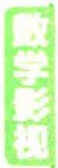

# 第三部分 关键模型

# 型1 图象识别模型

# 模型解法 >>>

该模型是已知函数的解析式或函数的图象,通过研究函数的概念、性质等,判断其图象特征或其解析式的一种模型,常以幂函数、指数函数、对数函数、三角函数等函数的四则运算、复合函数为背景.解决问题的关键如下.

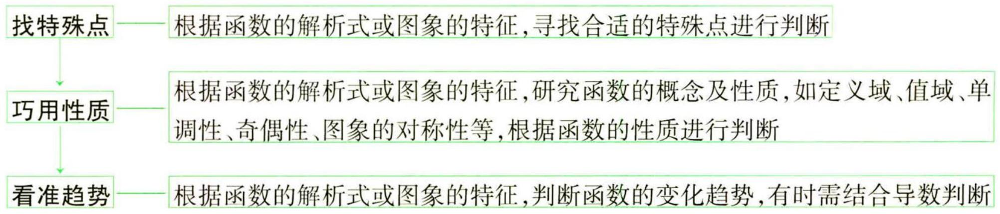

# 类型1 根据解析式选择图象

调研 1 (2023·南京第五高级中学 10 月一模) 函数 $f(x)=\frac{x-2}{x-\ln x}$ 的图象大致为

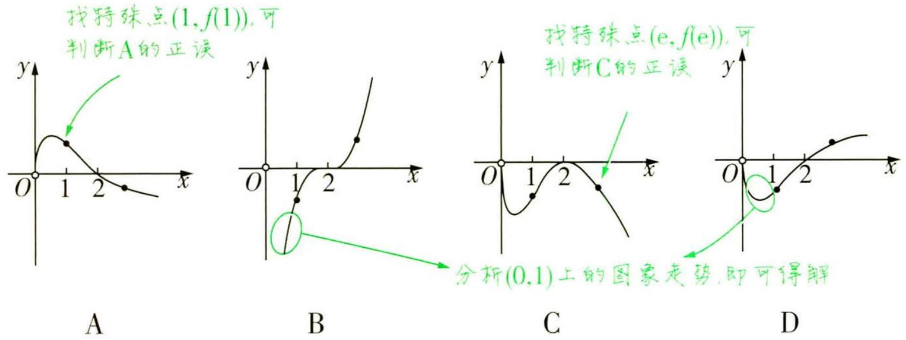

思维导引 根据函数解析式分别令 $x = 1, x = \mathrm{e}$ , 求出 $f(1), f(\mathrm{e})$ 的值, 排除 AC, 再分析函数图象的走势, 排除 B, 即可得出答案.

解析 将 $x = 1$ 代入 $f(x) = \frac{x - 2}{x - \ln x}$ , 得 $f(1) = \frac{1 - 2}{1 - 0} = -1 < 0$ , 观察选项中的图象, 只有 A 不 【找特殊点】所取的特殊点, 函数值需易求, 且能排除不合题意的选项

满足, 排除 A; 将 $x = \mathrm{e}$ 代入 $f(x) = \frac{x - 2}{x - \ln x}$ , 得 $f(\mathrm{e}) = \frac{\mathrm{e} - 2}{\mathrm{e} - 1} > 0$ , 观察剩余选项中的图象, C 不满足, 排除 C; 对于 BD, 两者最大的区别在于 (0,1) 上图象的走势, 分析知当 $x \to 0$ 时, $f(x) \to 0$ , 排除 B. 选 D.

【看准趋势】当 $x \to 0$ 时， $f(x) \to \frac{-2}{-\ln x} \to 0$

哈尔发现凯瑟琳继承了她父亲卓越的智慧,但也隐藏着与她父亲同样可怕的危险,如果得不到正确的引导,或许她会像他父亲那样死去.凯瑟琳努力地“求证”着自己的天分,最终勇敢地面对了她生命中深沉真挚的父女情、至真至诚的姐妹情以及突如其来的爱情.

关注微信公众号“初高教辅站”获取更多初高中教辅资料

# 答案 D

调研 2 (2023·湖南长沙适应性考试) 函数 $y = (1 + \cos x)(x - \frac{1}{x})$ 在 $(-5, 0) \cup (0, 5)$ 上的图象大致为 ( )

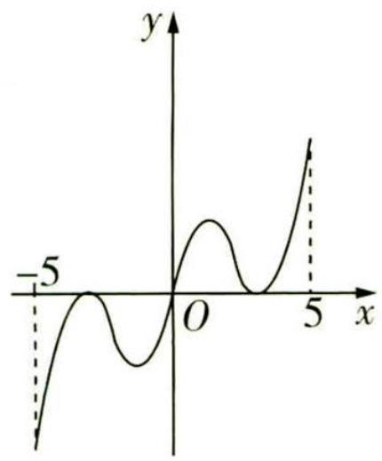

A

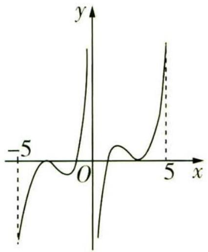

B

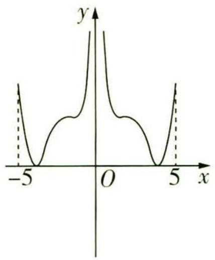

C

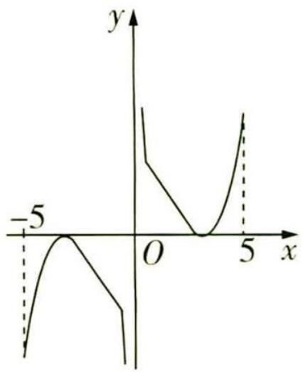

D

解析 由题意知,函数 $y=f(x)=(1+\cos x)(x-\frac{1}{x})$ 的定义域为 $(-5,0)\cup(0,5)$ ,且 $f(-x)=(1+\cos x)(-x+\frac{1}{x})=-f(x)$ ,所以 $f(x)$ 为奇函数,其图象关于原点对称,排除 C;由 $f(x)=0$ ,可得 $x=\pm1$ ,或 $x=\pm\pi$ ,排除 AD.选 B.

【找特殊点】结合各选项中函数图象的特征，合理寻找特殊点

# 答案 B

# 类型2 根据图象选择解析式

调研 3 (2023·北京密云区8月开学考试)已知函数 $f(x)$ 的部分图象如图1所示,则函数 $f(x)$ 的解析式可能为 ( )

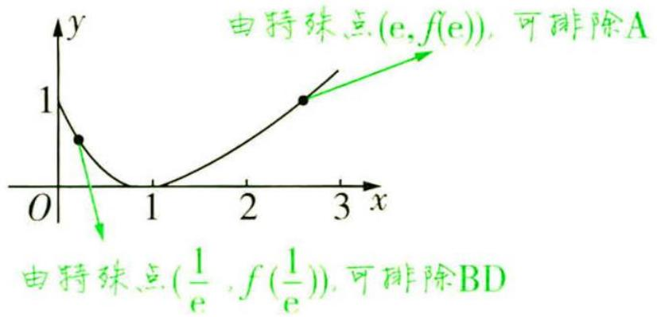

图 1

$\quad$A. $f(x) = \frac{\ln x}{x} - x + 1$   
$\quad$B. $f(x)=\frac{\ln x}{x}+x-1$   
$\quad$C. $f(x) = x\ln x - x + 1$   
$\quad$D. $f(x) = x\ln x + x - 1$

解析 对于 A, $f(x)=\frac{\ln x}{x}-x+1$ , 有 $f(\mathrm{e})=\frac{1}{\mathrm{e}}-\mathrm{e}+1<0$ , 不合题意, 排除 A; 对于 B, $f(x)=$

【模型应用】题图中提供了较多的横坐标的相关信息，故可求出特殊函数值，分析各个选项，即可得答案

《决胜21点》 麻省理工拥有超常数学运算才能的坎贝尔在罗萨教授介绍下,与另外几位数学天才共同组成“特殊团队”,专攻赌场的“21点”游戏,运用他们对于数学的尖端认识和运算,在罗萨教授的指导下,大闹赌城拉斯维加斯.

$\frac{\ln x}{x}+x-1,f(\frac{1}{\mathrm{e}})=-\mathrm{e}+\frac{1}{\mathrm{e}}-1<0,$ 不合题意,排除B;对于C, $f(x)=x\ln x-x+1,f(\mathrm{e})=\mathrm{e}-\mathrm{e}+1>0,f(\frac{1}{\mathrm{e}})=-\frac{1}{\mathrm{e}}-\frac{1}{\mathrm{e}}+1>0,\mathrm{C}$ 符合题意;对于D, $f(x)=x\ln x+x-1,f(\frac{1}{\mathrm{e}})=-\frac{1}{\mathrm{e}}+\frac{1}{\mathrm{e}}-1<0,$ 不合

【鼓黑板】更准确的解法应该是结合 $f'(x)=\ln x$ ，得 $f(x)$ 在 $(0,1)$ 上单调递减，在 $(1,+\infty)$ 上单调递增，且 $f(1)=0$ 来判断该选项符合题意，但对小题来说，取特殊点能更快地判断4个选项，进而得解题意，排除D.选C.

答案 C

调研 4 (2023·辽宁抚顺开学考试)已知函数 $f(x)$ 的部分图象如图2所示,则函数 $f(x)$ 的解析式可能为 ( )

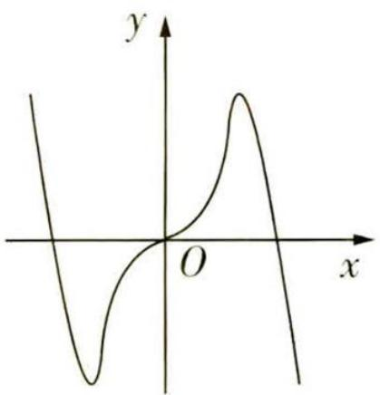

图 2

$\quad$A. $f(x)=x+\sin x$

$\quad$B. $f(x)=x^{2}\sin x$

$\quad$C. $f(x) = x^{2} + \sin x$

$\quad$D. $f(x) = x\sin x$

解析 对于 A, $f(x)=x+\sin x$ , 则 $f'(x)=1+\cos x\geqslant0$ , 所以 $f(x)=x+\sin x$ 在 R 上单调递增, A 不符合题意; 对于 B, 因为 $f(x)=x^{2}\sin x$ 的定义域

【巧用性质】题图中没有给出横、纵坐标的相关数值信息,取特殊值较为困难,故可运用函数的性质求解

为 $\mathbf{R}, f(-x) = (-x)^{2} \sin(-x) = -x^{2} \sin x = -f(x)$ ，所以 $f(x)$ 为奇函数，初步判断 B 符合题意；对于 C，

【扫清障碍】由于 $f(x)=x^{2}\sin x$ 的导函数结构较复杂，从而使函数 $f(x)=x^{2}\sin x$ 的单调性较难求解，故演算到此处后可先判断 CD 选项是否符合题意

因为 $f(-x)=x^{2}-\sin x\neq f(x)$ 且 $f(-x)=x^{2}-\sin x\neq-f(x)$ ，所以 $f(x)$ 非奇非偶，C不符合题意；对于D，因为 $f(-x)=-x\sin(-x)=x\sin x=f(x)$ ，所以 $f(x)$ 为偶函数，D不符合题意。故选B.

答案 B

调研 5 (2023·天津静海一中8月调研)已知函数 $f(x)$ 的部分图象如图3所示,则 $f(x)$ 的解析式可能为()

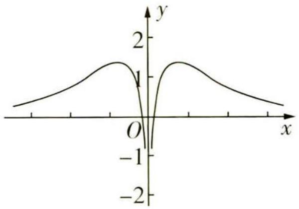

图3

$\quad$A. $f(x) = \frac{4 + \ln |x|}{1 + \frac{1}{2}\cos x}$

$\quad$B. $f(x) = \frac{x^2\cos x}{\mathrm{e}^{|x|}}$

$\quad$C. $f(x) = \frac{\cos x\cdot\ln|x|}{2 + \sin x}$

$\quad$D. $f(x) = \frac{2 + \ln |x|}{x^2 + \cos x}$

解析 根据题图得函数 $f\left( x\right)$ 的定义域为 $\{ x \mid  x \neq  0\}$ ,图象关于 $y$ 轴对称,即 $f\left( x\right)$ 为偶函数.

【巧用性质】根据题图,光分析函数的性质,再结合特殊点判断各选项所对应的解析式是否满足题意

对于 A 选项, $f(x)=\frac{4+\ln|x|}{1+\frac{1}{2}\cos x}$ 为偶函数,但 $f(1)=\frac{4}{1+\frac{1}{2}\cos 1}>2$ ,不合题意,排除 A;对于 B 选项,

函数定义域为 $\mathbf{R}$ , 不合题意, 排除 $\mathrm{B}$ ; 对于 $\mathrm{C}$ 选项, 函数定义域为 $\{x \mid x \neq 0\}$ , $f(-x) = \frac{\cos(-x) \cdot \ln | - x|}{2 + \sin(-x)} = \frac{\cos x \cdot \ln |x|}{2 - \sin x}$ , 故函数为非奇非偶函数, 不合题意, 排除 $\mathrm{C}$ . 选 $\mathrm{D}$ .

答案 D

# 型 2 比大小模型

# 模型解法 >>>

比大小问题命题形式简单,难度可大可小,在高考中是设题非常灵活的一类题目.解决此类问题的关键步骤如下.

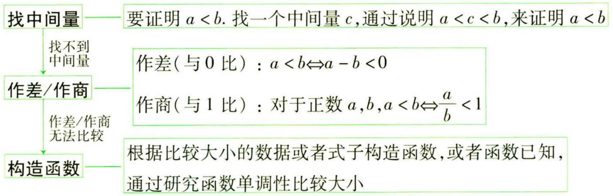

调研 1 (2023·石家庄二中 10 月测试)(多选)已知 a > b > c > 1, 定义 M, N, P,
Q 分别为 $M = a - \sqrt{c}$ , $N = a - \sqrt{b}$ , $P = 2\left(\frac{a + b}{2} - \sqrt{ab}\right)$ , $Q = 3\left(\frac{a + b + c}{3} - \sqrt[3]{abc}\right)$ , 则下列叙述正确的是 ()

$\quad$A. $M > N > P$

$\quad$B. $P$ 是 $M, N, P, Q$ 四个数中的最小者

$\quad$C. $M <   N <   P$

$\quad$D. M 是 M, N, P, Q 四个数中的最大者

解析 $M-N=\sqrt{b}-\sqrt{c}>0$ ,所以 M>N.

【模型应用】a,b,c不是具体的数值，难以找中间量，考虑作差

$Q - P = 3 \left( \frac{a + b + c}{3} - \sqrt[3]{abc} \right) - 2 \left( \frac{a + b}{2} - \sqrt{ab} \right) = c + 2 \sqrt{ab} - 3 \sqrt[3]{abc} = c + \sqrt{ab} + \sqrt{ab} - 3 \sqrt[3]{abc} \geqslant 3 \sqrt[3]{c \cdot \sqrt{ab} \cdot \sqrt{ab}} - 3 \sqrt[3]{abc} = 0,$ 又 $c \neq \sqrt{ab}$ , 所以 $Q - P > 0$ , 即 $Q > P$ .

【依据】三个正数的算数 - 几何平均不等式: $\frac{a+b+c}{3} \geqslant \sqrt[3]{abc} (a,b,c>0)$ , 当且仅当 $a=b=c$ 时取等号. 注意判断等号能否取到

$N - P = 2\sqrt{ab} - \sqrt{b} - b = \sqrt{b}(2\sqrt{a} - 1 - \sqrt{b}) = \sqrt{b}[(\sqrt{a} - 1) + (\sqrt{a} - \sqrt{b})] > 0$ , 所以 $P < N$ .

$M - Q = a - \sqrt {c} - 3 \left(\frac {a + b + c}{3} - \sqrt [ 3 ]{a b c}\right) = 3 \sqrt [ 3 ]{a b c} - b - c - \sqrt {c},$

当 c=4, b=8, a=16 时, M-Q=10>0,

当 c=4, b=100, a=101 时, M-Q=3 $\sqrt[3]{40\ 400}-106<0$ , 所以 M, Q 的大小不确定, 无法确定四

《极限空间》 一封神秘的邀请函和一道诡异的谜题将四个数学家聚集到一个房间,由主人费马展示史上最难的谜题.随着房门被反锁,他们发现这个房间原来是一个陷阱,从收缩空间,缓慢关闭的墙壁中逃脱的唯一方法就是在限定时间内回答提出的各种难题.

个数中的最大者. 故选 AB.

答案 AB

调研 2 (2023·四川宜宾9月开学考试)已知 $a = 10^{10}, b = 9^{11}, c = 11^{9}$ , 则 $a, b, c$ 的大小关系为

$\quad$A. $c < a < b$

$\quad$B. $b < a < c$

$\quad$C. $a < b < c$

$\quad$D. $c < b < a$

思维导引

利用作商法和放缩法,结合二项式定理,即可比较大小.

解析 因为 $\frac{10^{10}}{9^{10}}=(1+\frac{1}{9})^{10}=1+\frac{10}{9}+\frac{45}{9^{2}}+\frac{120}{9^{3}}+\frac{210}{9^{4}}+\frac{252}{9^{5}}+\frac{210}{9^{6}}+\frac{120}{9^{7}}+\frac{45}{9^{8}}+\frac{10}{9^{9}}+\frac{1}{9^{10}}<$ $1+2+1+\frac{1}{2}+\frac{1}{9}+\frac{1}{9}+\frac{1}{9}+\frac{1}{9}+\frac{1}{9}+\frac{1}{9}+\frac{1}{9}<9$ ，所以 $10^{10}<9^{11}$ ，即a<b.

因为 $\frac{11^{9}}{10^{9}}=(1+\frac{1}{10})^{9}=1+C_{9}^{1}\cdot\frac{1}{10}+C_{9}^{2}\cdot\frac{1}{10^{2}}+C_{9}^{3}\cdot\frac{1}{10^{3}}+\cdots+C_{9}^{9}\cdot\frac{1}{10^{9}}=1+\frac{9}{10}+\frac{36}{100}+\frac{84}{1000}+$ $\frac{126}{10^{4}}+\frac{126}{10^{5}}+\frac{84}{10^{6}}+\frac{36}{10^{7}}+\frac{9}{10^{8}}+\frac{1}{10^{9}}<10$ ,所以 $11^{9}<10^{10}$ ,即c<a.

所以 $c < a < b$ . 故选A.

【知识延伸】本题也可以构造函数求解，设 $f(x)=x^{20-x}, x>0$ ，则 $a=f(10), b=f(9), c=f(11)$ ，接下来研究函数的单调性，在高中阶段并未涉及此种函数的求导方法，但在以后更高阶段的学习过程中，我们可以结合隐函数的求导法则得 $f'(x)=x^{20-x}(\frac{20-x}{x}-\ln x)$ 。当 $x\geqslant9$ 时， $f'(x)<0$ ，所以 $f(9)>f(10)>f(11)$ ，即c<a<b。由于此解法涉及到高等数学中的知识，所以不要求掌握，在此列举出来仅供补充参考，方便读者研究

答案 A

调研 3 (2023 · 江苏南通 10 月月考) 设 $a = \frac{2}{21}, b = \ln \frac{25}{21}, c = \sin \frac{2}{21}$ , 则 ( )

将 b 变形为 $b = \ln(1 + 2 \times \frac{2}{21})$ ，那么 a, b, c 都含有 $\frac{2}{21}$

$\quad$A. $c < b < a$

$\quad$B. $a < b < c$

$\quad$C. $b < c < a$

$\quad$D. $c < a < b$

思维导引 由 $b - a = \ln \frac{25}{21} - \frac{2}{21} = \ln (1 + 2 \times \frac{2}{21}) - \frac{2}{21}$ , 构造函数 $f(x) = \ln (1 + 2x) - x (0 < x < \frac{1}{2})$ , 利用导数判断单调性, 由此能得到 $b > a$ ; 根据 $x \in (0, \frac{\pi}{2}), x > \sin x$ , 判断 $a, c$ 的大小.

解析 b

$b - a = \ln \frac {2 5}{2 1} - \frac {2}{2 1} = \ln (1 + 2 \times \frac {2}{2 1}) - \frac {2}{2 1},$

【会构造】通过数字 $\frac{2}{21}$ 联想构造函数，使得 $f(\frac{2}{21})=b-a$

《模仿游戏》影片改编自安德鲁·霍奇斯编著的传记《艾伦·图灵传》，讲述了“计算机科学之父”艾伦·图灵的传奇人生，故事主要聚焦于图灵协助盟军破译德国密码系统“英格玛”，从而扭转二战战局的经历。

构造函数 $f(x) = \ln (1 + 2x) - x (0 < x < \frac{1}{2})$ ，则 $b - a = f(\frac{2}{21})$ .

$f ^ {'} (x) = \frac {2}{1 + 2 x} - 1 = \frac {1 - 2 x}{1 + 2 x},$

$\because 0 < x < \frac{1}{2}, \therefore f'(x) > 0, f(x)$ 在 $(0, \frac{1}{2})$ 上单调递增，

∴ 当 $x \in (0, \frac{1}{2})$ 时, $f(x) > \ln(1 + 2 \times 0) - 0 = 0$ , $\therefore f(\frac{2}{21}) > 0$ , $\therefore b > a$ .

构造函数 $g(x) = x - \sin x, x \in (0, \frac{\pi}{2})$ ，则 $g'(x) = 1 - \cos x > 0, x \in (0, \frac{\pi}{2})$ ，

∴ 函数 $g(x)=x-\sin x, x\in(0,\frac{\pi}{2})$ 是增函数，

$\therefore g(x) > 0 - \sin 0 = 0, \therefore$ 当 $x \in (0, \frac{\pi}{2})$ 时, $x > \sin x, \therefore a > c$ .

【记结论】当 $x \in (0, \frac{\pi}{2})$ 时， $\tan x > x > \sin x$ ，牢记此结论可以快速判断

$\therefore b > a > c.$ 故选 D.

答案 D

调研 4 (2023·兰州一中10月阶段测试)实数 $a, b \in (1, +\infty)$ , 满足 $b^{2} - a^{2} > 2(b \ln b - a \ln a)$ , 则 $a, b, \frac{a + b}{2}$ 的大小关系为 ( )

$\quad$A. $a > b > \frac{a + b}{2}$

$\quad$B. $a > \frac{a + b}{2} > b$

$\quad$C. $a < \frac{a + b}{2} < b$

$\quad$D. $a < b < \frac{a + b}{2}$

思维导引 将不等式 $b^{2} - a^{2} > 2 (b \ln b - a \ln a)$ 同构变形 $\rightarrow b^{2} - 2b \ln b > a^{2} - 2a \ln a$ 构造函数 $f(x) = x^{2} - 2x \ln x (x > 1)$ 研究函数单调性 $\rightarrow a, b$ 的大小关系

解析 不等式 $b^{2} - a^{2} > 2(b\ln b - a\ln a)$ 可变形为 $b^{2} - 2b\ln b > a^{2} - 2a\ln a$

【模型解读】不等式两边为同构形式，据此构造函数

设 $f(x)=x^{2}-2x\ln x(x>1)$ , $f'(x)=2x-2\ln x-2$ ,

令 $g(x)=2x-2\ln x-2(x>1)$ ，则 $g'(x)=2-\frac{2}{x}=\frac{2(x-1)}{x}$ ,

当 x > 1 时, $g'(x) > 0$ , $g(x)$ 单调递增,

所以当 x > 1 时, $f'(x) > 2 \times 1 - 2 \ln 1 - 2 = 0$ , $f(x)$ 是增函数,

所以 b > a > 1，所以 $b > \frac{a + b}{2} > a$ 。故选 C.

答案 C

《X + Y》 讲述了一位名叫内森的英国数学神童,在9岁时被诊断出患有自闭症,他很难理解别人,但他的大脑能比其他人更好地理解数学.当他被选中代表英国参加国际数学奥林匹克时,开始了一段他意想不到的挑战以及与中国姑娘张梅产生爱情的故事.

调研 5 (2023·山东师大附中、长沙一中等校9月开学联考)设函数 $f(x)=\left(\frac{3}{2}\right)^{|x|}+x^{2}$ ，若 $a=f(\ln 3),b=f(-\log_{5}2),c=f(\frac{1}{\sqrt{e}})$ （e为自然对数的底数），则（）

$\quad$A. $a > b > c$

$\quad$B. $c > b > a$

$\quad$C. $c > a > b$

$\quad$D. $a > c > b$

解析 由题意知 $f(-x) = f(x)$ ，所以 $f(x)$ 是 $\mathbf{R}$ 上的偶函数，

当 $x > 0$ 时， $f(x) = \left(\frac{3}{2}\right)^x + x^2$ 单调递增.

【模型应用】通过函数的单调性, 将函数值的比大小问题转化为自变量值的比大小问题则 $b = f\left( {-{\log }_{5}2}\right)  = f\left( {{\log }_{5}2}\right)$ ,

【易遗漏】在比较自变量值的大小前,要确保各个自变量值在同一个单调区间内,否则比较是没有意义的

$\ln 3 > 1, 0 < \log_5 2 < \log_5 \sqrt{5} = \frac{1}{2}, 1 > \frac{1}{\sqrt{\mathrm{e}}} > \frac{1}{2}$ , 即 $\ln 3 > \frac{1}{\sqrt{\mathrm{e}}} > \log_5 2$

则 $f(\ln 3) > f(\frac{1}{\sqrt{\mathrm{e}}}) > f(\log_52)$ ，即 $f(\ln 3) > f(\frac{1}{\sqrt{\mathrm{e}}}) > f(-\log_52)$ ，

故 $a > c > b$ ，故选D.

答案 D

# 型3 抽象函数模型

# 类型1 抽象函数求值问题

# 模型解法 >>>

抽象函数求值问题本质上是对函数性质的综合应用,特别是函数周期性,一些简单的求值问题也可采用赋值法求解.解决此类问题的关键是:

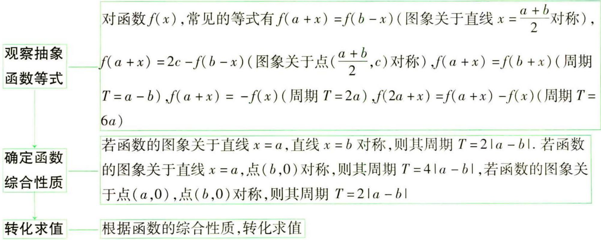

《知无涯者》 拉马努金出生在印度一个非常贫困的家庭,从小他就展现出了异于常人的数学天赋,可是因为家境贫寒,家人无法给他提供良好的教育环境.拉马努金凭借着自己的努力进入贡伯戈纳姆大学就读,却因为严重偏科而没有毕业.

关注微信公众号“初高教辅站”获取更多初高中教辅资料

调研 1 (2023·辽宁沈阳二中等六校9月期初检测)已知函数 $f(x)$ 满足 $f(1)=\frac{1}{4},4f(x)f(y)=f(x+y)+f(x-y)(x,y\in\mathbf{R})$ ，则 $\sum_{k=0}^{2022}f(k)=$

$\quad$A. $\frac{1}{2}$

$\quad$B. $\frac{1}{4}$

$\quad$C. $-\frac{1}{4}$

$\quad$D. $-\frac{1}{2}$

思维导引 利用赋值法得到 $f(n+2) = -f(n-1)$ $\rightarrow$ $f(n+2) = f(n-4)$ $f(x)$ 是以 6 为周期的函数 $\rightarrow$ $\begin{aligned} & f(0) + f(1) + f(2) + f(3) + \\ & f(4) + f(5) = 0 \end{aligned}$ 利用函数周期性求解 $\sum_{k=0}^{2022} f(k)$

解析 方法一 $4f(x)f(y)=f(x+y)+f(x-y)(x,y\in\mathbb{R})$ ，令 x=1, y=0 得 $4f(1)f(0)=2f(1)$ ，因为 $f(1)=\frac{1}{4}$ ，所以 $f(0)=\frac{1}{2}$ ，令 x=n, y=1 得 $4f(n)f(1)=f(n+1)+f(n-1)$ ，即 $f(n)=$

【赋值法】等式中含有两个变量 x, y，一般运用赋值法转化为一个变量，再化简求值 $f(n+1)+f(n-1)$ ，则 $f(n+1)=f(n+2)+f(n)$ ，

上面两个式子联立得 $f\left( {n + 2}\right)  =  - f\left( {n - 1}\right)$ ,所以 $f\left( {n - 1}\right)  =  - f\left( {n - 4}\right)$ ,故 $f\left( {n + 2}\right)  = f\left( {n - 4}\right)$ , 故 $f\left( x\right)$ 是以6为周期的函数,且 $f\left( 0\right)  + f\left( 1\right)  + f\left( 2\right)  + f\left( 3\right)  + f\left( 4\right)  + f\left( 5\right)  = f\left( 0\right)  + f\left( 1\right)  + f\left( 2\right)  -$

【模型应用】由 $f(n+1)=f(n+2)+f(n)$ 可得函数 $f(x)$ 的周期为6 $f(0)-f(1)-f(2)=0$ ，所以 $\sum_{k=0}^{2022}f(k)=337\sum_{k=0}^{5}f(k)+f(2022)=0+f(2022)=f(0)=\frac{1}{2}$ ，故选A.

方法二 因为函数 $f(x)$ 对任意实数 $x, y$ 满足 $4f(x)f(y)=f(x+y)+f(x-y)$ ，可以猜测函数为 $y=\cos x$ 的相关函数，又 $f(1)=\frac{1}{4}$ ，所以可以设 $f(x)=\frac{1}{2}\cos\frac{\pi}{3}x$ ，故 $f(x)$ 是以6为周期的函数，且

【拓展】常见的抽象函数模型有： $f(x+y)=f(x)+f(y)\rightarrow f(x)=kx,f(x+y)=f(x)f(y)\rightarrow$ $f(x)=a^{x},f(xy)=f(x)f(y)\rightarrow f(x)=x^{\alpha},f(xy)=f(x)+f(y)\rightarrow f(x)=\log_{a}x,f(x)+f(y)=2f(\frac{x+y}{2})$ $f(\frac{x-y}{2})\rightarrow f(x)=\cos x$ 等

$f(0) + f(1) + f(2) + f(3) + f(4) + f(5) = 0$ ，所以 $\sum_{k=0}^{2022}f(k) = 337\sum_{k=0}^{5}f(k) + f(2022) = 0 + f(2022) =$ $f(0) = \frac{1}{2}$ ，故选A.

答案 A

# 类型2 抽象函数与不等式交汇问题

# 模型解法 >>>

抽象函数与不等式交汇问题,主是解函数不等式或比较函数值的大小关系.解决此类问题的关键是:

转化 将抽象不等式转化为 $f(x_{1})\leqslant f(x_{2})$ 的形式
求解 分析函数的单调性,利用函数的单调性解不等式或比较函数值的大小,也可数形结合求解

之后的日子里,拉马努金自学数学,发表了《伯努利数的一些性质》,这篇文章在数学界激起了一些水花.在好友的帮助下,拉马努金给数学家哈代写了自荐信,哈代非常重视这位年轻人,引荐他到剑桥大学深造.两人互相扶持,在数学界缔造了许多成就.

调研 2 (2023·四川南充9月开学考试)已知 $f(x)$ 是定义在 $(1, +\infty)$ 上的减函数, 若对于任意的 $x, y \in (1, +\infty)$ , 均有 $f(x) + f(y) = f(2^{x+y})$ , 且 $f(2) = 1$ , 则不等式 $f(x) + f(x-1) - 2 \geqslant 0$ 的解集为 \_\_\_\_.

思维导引

根据已知可求得 $f(2^{4})=2$

将不等式转化为 $f(2^{2x-1})\geqslant f(2^{4})$

结合函数的定义域及单调性可得关于 $x$ 的不等式组 $\rightarrow$ 得解

解析 根据 $f(x)+f(y)=f(2^{x+y})$ ， $f(2)=1$ ，可得 $2=1+1=f(2)+f(2)=f(2^{4})$ ，由 $f(x)+f(x-1)-2\geqslant0$ ，得 $f(x)+f(x-1)\geqslant2$ ，可化为 $f(2^{2x-1})\geqslant f(2^{4})$ ，由 $f(x)$ 是定义在 $(1,+\infty)$ 上的减函

【模型应用】得到 $f(x_{1})\leqslant f(x_{2})$ 的形式后，即可结合函数单调性求解

数, 得 $\left\{\begin{aligned}2^{2x-1}&\leqslant2^{4},\\ x&>1,\\ x&-1>1,\\ 2^{2x-1}&>1,\end{aligned}\right.$ 解得 $2<x\leqslant\frac{5}{2}$ ，所以不等式 $f(x)+f(x-1)-2\geqslant0$ 的解集为 $(2,\frac{5}{2}]$ .

【易错提醒】注意函数的定义域为 $(1,+\infty)$ ，切勿忘记

答案 $(2, \frac{5}{2}]$

# 类型 3 抽象函数与零点问题

# 模型解法 >>>

通过研究抽象函数性质解决函数的零点问题. 解决此类问题的关键是:

确定性质——根据已知条件分析函数的性质(单调性、奇偶性、周期性、图象的对称性)

求解零点——解方程 $f(x)=0$ 或数形结合求解函数的零点问题

调研 3 (2023·上海徐汇区9月开学考试)定义域为 R 的函数 $f(x)$ 的图象关于直线 x=1 对称, 当 $x\in[0,1]$ 时, $f(x)=x$ , 且对任意的 $x\in\mathbb{R}$ 有 $f(x+2)=-f(x)$ , $g(x)=\left\{\begin{aligned}&f(x),&x\geqslant0,\\ &-\log_{2.025}(-x),&x<0,\end{aligned}\right.$ 则方程 $g(x)-g(-x)=0$ 实数根的个数为 ( )

$\quad$A. 1 013

$\quad$B. 1 014

$\quad$C. 2 026

$\quad$D. 2 027

解析 对任意的 $x \in \mathbb{R}$ 有 $f(x+2) = -f(x)$ , 则函数 $f(x)$ 的周期为 4. 由函数 $f(x)$ 的图象关于直线 $x=1$ 对称, 且当 $x \in [0,1]$ 时, $f(x)=x$ , 【模型应用】由 $f(x+2) = -f(x)$ , 可得 $f(x+4)=f(x)$ , 进而得到函数 $f(x)$ 的周期

可作出函数 $f(x)$ 在[0,4]上的大致图象,如图1.令 $-\log_{2025}(-x)=-1$ ,得x=-2025,令 $g(x)-g(-x)=0$ ,则 $g(x)=g(-x)$ .对于函数 $g(x)$

与函数 $g(-x)$ 的图象,二者在y轴右侧的第一个周期,即区间(0,4]上有3个交点,后面每个周期上有2个交点,直到x>2025,因为 $2025=4\times506+1$ ,所以两个图象在 $(0,+\infty)$ 上共有 $505\times2+3=$

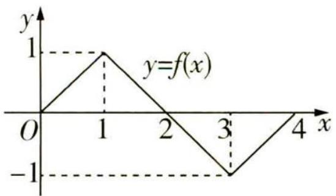

图1

《博士的爱情方程式》讲述了只有80分钟记忆的天才数学博士、家庭主妇和她的儿子“根号”，利用美丽的数字和数学公式进行暖人心扉的交流的故事。

1 013(个)交点,由对称性可知,这两个图象在 $(-∞,0)$ 上也有1 013个交点,又当x=0时, $g(0)=$ 【扫清障碍】函数 $g(x)$ 与函数 $g(-x)$ 的图象关于y轴对称 $g(-0)$ ,所以方程 $g(x)-g(-x)=0$ 实数根的个数为 $1013×2+1=2027$ .

答案 D

# 型4 函数零点模型

# 类型1 零点个数求解模型

# 模型解法 >>>

求函数的零点个数问题是高考命题的重难点. 解决此类问题的方法有:

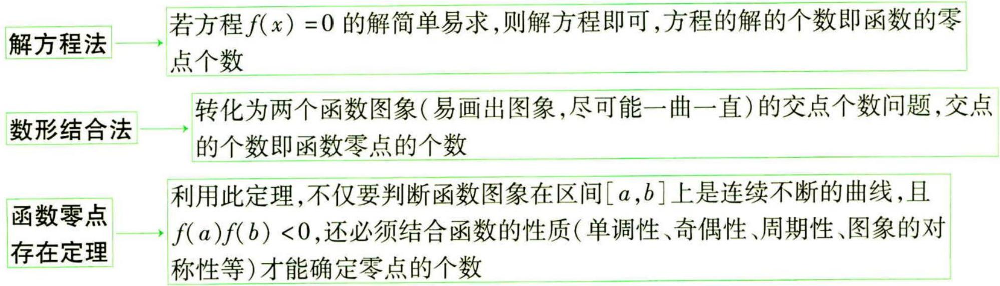

调研 1 (2023·四川遂宁9月第一次检测)已知 $f(x)=\left\{\begin{aligned}&8\sin x,x<\pi,\\ &\frac{1}{2}f(x-\pi),x\geqslant\pi,\end{aligned}\right.$ 则 $g(x)=\lg(x+1)-f(x)$ 的零点个数为

$\quad$A. 5

$\quad$B. 6

$\quad$C. 7

解析 令 $g(x)=0$ , 可得 $\lg(x+1)=f(x)$ , 则函数 $y=g(x)$ 的零点个数等于函数 $y=\lg(x+1)$ 与函数 $y=f(x)$ 图象的交点个数, 且当 x>9 时, $\lg(x+1)>1$ . 在同一直角

【数形结合法】根据题中所给条件，将函数的零点个数转化为两个函数图象的交点个数

坐标系中作出函数 $y = \lg(x + 1)$ 与函数 $y = f(x)$ 的大致图象如图1所示,由图可知,两个函数图象共有7个交点,因

【扫清障碍】作图时要注意函数 $y=\lg(x+1)$ 的定义域为 $(-1, +\infty)$ . 当 $x\in[\pi,2\pi)$ 时， $x-\pi\in[0,\pi)$ ，则 $f(x-\pi)=8\sin(x-\pi)$ ，此时， $f(x)=\frac{1}{2}f(x-\pi)=4\sin(x-\pi)=$

$-4\sin x$ ; 当 $x \in [2\pi, 3\pi)$ 时, $f(x) = 2\sin x$ ; 当 $x \in [3\pi, 4\pi)$ 时, $f(x) = -\sin x \cdots$ 据此可作出函数 $f(x)$ 的图象. 此, 函数 $g(x) = \lg(x + 1) - f(x)$ 的零点个数为 7. 故选 C.

答案 C

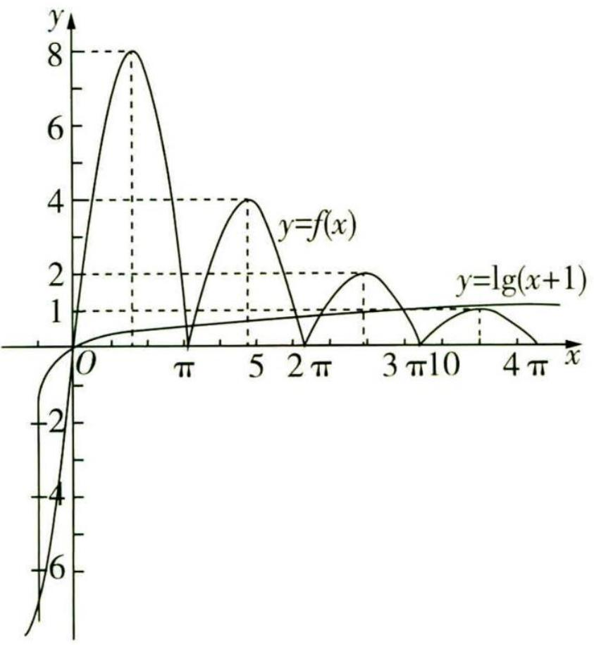

图 1

《笛卡尔》讲述了法国哲学家、数学家勒内·笛卡尔的辉煌一生。他为现代数学的发展做出了重要的贡献，因将几何坐标体系公式化而被认为是解析几何之父。他还是西方现代哲学思想的奠基人，是近代唯物论的开拓者，提出了“普遍怀疑”的主张。

# 类型2 参数(范围)求解模型

# 模型解法 >>>

根据函数有零点(或方程有根)求参数的值或范围的解题方法有:

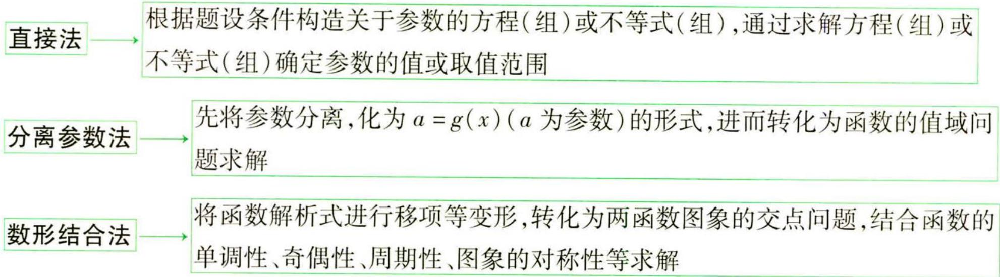

调研 2 (2023·贵阳一中8月开学考试)已知定义在 $[-2,2]$ 上的函数 $f(x)=\left\{\begin{aligned}x^{2}+x,-2&\leqslant x\leqslant-1,\\ \ln(x+2),&-1<x\leqslant2,\end{aligned}\right.$ 若 $g(x)=f(x)-a(x+2)$ 的图象与x轴有3个不同的交点,则实数a的取值范围是()

$\quad$A. $\left[\frac{\ln2}{2},\frac{1}{e}\right)$

$\quad$B. $(0,\frac{1}{e-1})$

$\quad$C. $(0, \frac{1}{3\mathrm{e}})$

$\quad$D. $\left[\frac{2\ln2}{3},+\infty\right)$

# 思维导引

由 $g(x)=f(x)-a(x+2)$ 图象
与 x 轴有 3 个不同的交点

$y=f(x)$ 与 $y=a(x+2)$ 的
图象有3个交点

处于临界位置时直线 $y = a(x + 2)$ 的斜率 $\rightarrow$ a 的取值范围

解析 $g(x) = f(x) - a(x + 2)$ 的图象与 $x$ 轴有 3 个不同的交点, 即曲线 $y = f(x)$ 与直线 $y = a(x + 2)$ 有 3 个交点, 作出二者的大致图象, 如图 2.

【模型应用】利用数形结合法求解. 分段函数的图象要分段作, 注意各段对应的关系

易知直线 $y=a(x+2)$ 恒过定点 A(-2,0)，斜率为 a，由图可知，当该直线与曲线 $y=f(x)$ 相切时是一种临界状态，两个图象恰有 2 个交点，设此时切点的坐标为 $C(x_{0},y_{0})$ ，则 $\left\{\begin{aligned}a=\frac{1}{x_{0}+2},\\ a(x_{0}+2)=\ln(x_{0}+2),\end{aligned}\right.$ 解得 $\left\{\begin{aligned}x_{0}&=e-2,\\ a&=\frac{1}{e},\end{aligned}\right.$ 所以要满足题意，需

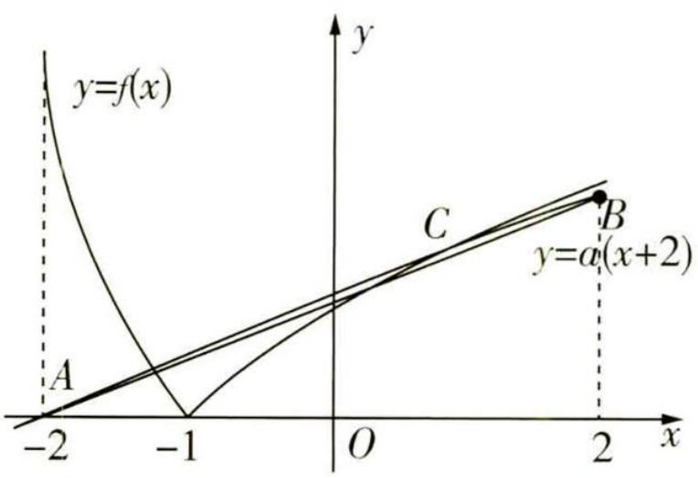

图2

使 $0 < a < \frac{1}{\mathrm{e}}$ . 当直线过曲线 $y = f(x)$ 的端点 $B(2, \ln 4)$ 时, 直线的斜率 $a = k_{AB} = \frac{\ln 4}{2 - (-2)} = \frac{\ln 2}{2}$ , 所以 【易忽视】注意函数 $f(x)$ 的定义域

《阿基米德的秘密》 这是一部讲述阿基米德的纪录片. 除了伟大的牛顿和爱因斯坦, 再没有一个人像阿基米德那样为人类的进步做出过这样大的贡献. 即使是牛顿和爱因斯坦, 也都曾从他身上汲取过智慧和灵感.

要满足题意,需使 $a \geqslant \frac{\ln 2}{2}$ . 综上, $\frac{\ln 2}{2} \leqslant a < \frac{1}{e}$ . 故选 A.

答案 A

# 类型 3 隐零点模型

# 模型解法 >>>

隐零点模型是指函数的零点或方程的根(通常是领导函数值等于零所得的方程,一般为含有对数式、指数式、三角函数式等的超越方程)存在但不能直接解出来,但是又必须利用其根或零点解题的模型.解决此类题目的关键是:

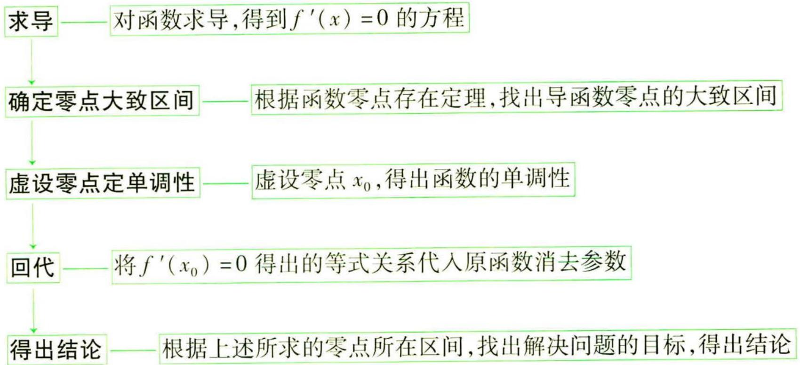

调研 3 (2023·重庆8月开学考试)已知函数 $f(x)=\ln x+ax^{2}-x$ .

（1） 当 a = 1 时, 求 $f(x)$ 的单调区间;  
（2） 若存在 $x \geqslant 1$ ，使得 $f(x) \geqslant \frac{1}{2}x^{3} + 1$ 成立，求整数 a 的最小值.

思维导引 （1） 将 $a = 1$ 代入 $f(x)$ 中 $\rightarrow$ 对 $f(x)$ 求导 $\rightarrow$ 判断导数值的符号 $\rightarrow$ $f(x)$ 的单调区间

（2） 分离参数得 $a \geqslant \frac{1}{2}x + \frac{1}{x} + \frac{1 - \ln x}{x^{2}}$ 构造函数 $g(x) = \frac{1}{2}x + \frac{1}{x} - \frac{\ln x - 1}{x^{2}}$ 研究函数 $g(x)$ 的最小值

确定整数 a 的最小值

解析 （1） 当 $a = 1$ 时, $f(x) = \ln x + x^2 - x$ , 该函数的定义域为 $(0, +\infty)$ ,

则 $f'(x)=\frac{1}{x}+2x-1\geqslant2\sqrt{\frac{1}{x}\cdot2x}-1=2\sqrt{2}-1>0$ ，当且仅当 $x=\frac{\sqrt{2}}{2}$ 时，等号成立，
故函数 $f(x)$ 的单调递增区间为 $(0, +\infty)$ ，无单调递减区间.

《维度:数学漫步》是两小时长的 CG 科普纪录片,讲述了许多深奥的数学知识,如四维空间中的正多胞体、复数、分形、纤维化理论等.

（2） 存在 $x \geqslant 1$ ，使得 $\ln x + ax^{2} - x \geqslant \frac{1}{2}x^{3} + 1$ 成立，即存在 $x \geqslant 1$ ，使得 $a \geqslant \frac{1}{2}x + \frac{1}{x} + \frac{1 - \ln x}{x^{2}}$ .
令 $g(x)=\frac{1}{2}x+\frac{1}{x}-\frac{\ln x-1}{x^{2}}$ ，其中 $x \geqslant 1$ ，则 $a \geqslant g(x)_{\min}$ ，

$g ^ {'} (x) = \frac {1}{2} - \frac {1}{x ^ {2}} + \frac {2 \ln x - 3}{x ^ {3}} = \frac {\frac {1}{2} x ^ {3} - x + 2 \ln x - 3}{x ^ {3}}.$

令 $h(x)=\frac{1}{2}x^{3}-x+2\ln x-3,x\geqslant1$ ，则 $h'(x)=\frac{3}{2}x^{2}-1+\frac{2}{x}=\frac{3x^{3}-2x+4}{2x}$

【小技巧】 $g'(x)$ 中分母的符号已经确定，故抽取分子构建新函数，研究其函数零点令 $m(x)=3x^{3}-2x+4$ ，则 $m'(x)=9x^{2}-2>0$ 对任意的 $x\geqslant1$ 恒成立，

故函数 $m(x)$ 在 $[1, +\infty)$ 上单调递增，则 $m(x) \geqslant m(1) = 5$ ，

即 $h'(x) > 0$ 对任意的 $x \geqslant 1$ 恒成立, 则函数 $h(x)$ 为增函数.

因为 $h\left(\frac{3}{2}\right) = -\frac{45}{16} + 2\ln \frac{3}{2} < 0, h(2) = 2\ln 2 - 1 > 0,$

所以存在 $t \in (\frac{3}{2}, 2)$ , 使得 $h(t) = \frac{1}{2} t^3 - t + 2 \ln t - 3 = 0, -\ln t = \frac{1}{4} t^3 - \frac{1}{2} t - \frac{3}{2}$ .

【模型应用】根据函数零点存在定理确定出零点大致范围，虚设零点 $t$ ，确定函数的单调性

$g'(t)=\frac{h(t)}{t^{3}}=0$ , 当 $x\in(1,t)$ 时, $g'(x)<0$ , 此时函数 $g(x)$ 单调递减, 当 $x\in(t,+\infty)$ 时, $g'(x)>0$ , 此时函数 $g(x)$ 单调递增,

所以 $g(x)_{\min} = g(t) = \frac{\frac{1}{2}t^3 + 1 - \ln t + t}{t^2} = \frac{\frac{1}{2}t^3 + 1 + \frac{1}{4}t^3 - \frac{1}{2}t - \frac{3}{2} + t}{t^2} = \frac{3t^3 + 2t - 2}{4t^2},$ $t\in (\frac{3}{2},2),$

【回代】此处化简变形中利用等式 $\frac{1}{2}t^{3}-t+2\ln t-3=0$ 回代消去了对数式 $\ln t$

设 $\varphi(t)=\frac{3}{4}t+\frac{1}{2t}-\frac{1}{2t^{2}}$ ，则 $\varphi'(t)=\frac{3}{4}-\frac{1}{2t^{2}}+\frac{1}{t^{3}}=\frac{3t^{3}-2t+4}{4t^{3}}$

令 $p(t)=3t^{3}-2t+4$ ，则 $p'(t)=9t^{2}-2>0$ 对任意的 $t\in(\frac{3}{2},2)$ 恒成立，

故函数 $p(t)$ 在 $(\frac{3}{2},2)$ 上单调递增，则 $p(t)>3\times(\frac{3}{2})^{3}-2\times\frac{3}{2}+4>0$

即 $\varphi'(t)>0$ 对任意的 $t\in(\frac{3}{2},2)$ 恒成立, 故函数 $\varphi(t)$ 在 $(\frac{3}{2},2)$ 上单调递增,

故 $\frac{3}{4} \times \frac{3}{2} + \frac{1}{2 \times \frac{3}{2}} - \frac{1}{2 \times (\frac{3}{2})^2} < \varphi(t) < \frac{3}{4} \times 2 + \frac{1}{2 \times 2} - \frac{1}{2 \times 2^2}$ , 即 $\frac{89}{72} < \varphi(t) < \frac{13}{8}$ , 即 $\frac{89}{72} < g(x)_{\min} < \frac{13}{8}$ ,

$a \geqslant g(x)_{\min}$ ，且 a 为整数，所以整数 a 的最小值为 2.

# 型 5 解三角形模型

# 角度1 基本量的求解

# 模型解法 >>>

此类题往往是通过恰当选取正、余弦定理或两个定理联合使用,求三角形的边长、角、面积、周长等.破解此类题的关键如下:

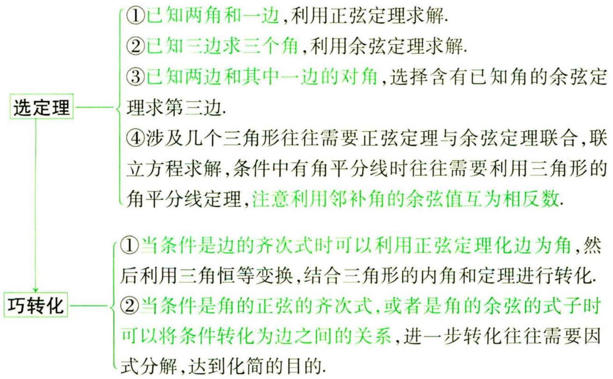

调研 1 (2023·云南师大附中 9 月模拟/交汇等差数列) $\bigtriangleup  {ABC}$ 中,内角 $A,B,C$ 成等差数列,内角 $A,B,C$ 所对的边分别为 $a,b,c$ .

（1） 若 $A - C = \frac{\pi}{2}$ , 求 $a: c$ 的值;  
（2） 若 $\frac{a}{b} = \frac{a + b}{a + b + c}$ ，判断 $\triangle ABC$ 的形状.

思维导引 （1） 三个内角成等差数列 $\rightarrow B = \frac{\pi}{3} \xrightarrow{A - C = \frac{\pi}{2}} A, C \rightarrow$ 正弦定理得 $a: c$ 的值

（2） 已知等式转化为边的二次齐次式 $\xrightarrow{利用余弦定理}$ 边的关系式 $\longrightarrow$ 进一步利用正弦定理得解

《概率知多少》一个关于统计学的节目,主持人的幽默和研究科学的实验带给观众全新的兴趣,大多统计出来的数字让观众大开眼界.节目筹集了世界各地的奇人奇事奇物,主要是通过讲述某一事件发生的概率,拓展出另一些数学知识.

解析 （1） 因为 $A, B, C$ 成等差数列, 所以 $A + C = 2B$ , 又 $A + C + B = \pi$ , 所以 $B = \frac{\pi}{3}, A + C = \frac{2\pi}{3}$ , 又 $A - C = \frac{\pi}{2}$ , 所以 $A = \frac{1}{2} (\frac{\pi}{2} + \frac{2\pi}{3}) = \frac{\pi}{4} + \frac{\pi}{3}, C = \frac{1}{2} (\frac{2\pi}{3} - \frac{\pi}{2}) = \frac{\pi}{3} - \frac{\pi}{4}$ ,

【小技巧】利用两个特殊角的和与差,直接表示出两内角 $A, C$ ,可以减少不必要的计算

所以 $a: c = \sin A: \sin C = \frac{\sin\left(\frac{\pi}{4} + \frac{\pi}{3}\right)}{\sin\left(\frac{\pi}{3} - \frac{\pi}{4}\right)} = \frac{\frac{\sqrt{2}}{2} \times \left(\frac{\sqrt{3}}{2} + \frac{1}{2}\right)}{\frac{\sqrt{2}}{2} \times \left(\frac{\sqrt{3}}{2} - \frac{1}{2}\right)} = \frac{\sqrt{3} + 1}{\sqrt{3} - 1} = 2 + \sqrt{3}$ .

（2） 方法一 由题意可得, $a^2 + ab + ac = ab + b^2$ , 即 $b^2 = a^2 + ac$ ,

【模型应用】将已知等式转化为二次齐次式，方便利用余弦定理，得到 $c=2a$ 后，利用正弦定理得到有的关系式，进而求解

由余弦定理结合（1）可得 $\cos B=\frac{a^{2}+c^{2}-b^{2}}{2ac}=\frac{c^{2}-ac}{2ac}=\frac{c-a}{2a}=\frac{1}{2}$ ，即 c=2a，

由正弦定理可得 $\sin C = 2\sin A$ ，又 $A = \pi - B - C = \frac{2\pi}{3} - C$ ，

所以 $\sin C = 2\sin\left(\frac{2\pi}{3} - C\right) = \sqrt{3}\cos C + \sin C$ ，解得 $\cos C = 0$ ，

又 $C \in (0, \pi)$ , 所以 $C = \frac{\pi}{2}$ , $\triangle ABC$ 为直角三角形.

方法二 由题意可得, $a^{2}+ab+ac=ab+b^{2}$ ，即 $b^{2}=a^{2}+ac$ ，

由正弦定理得 $\sin^{2}B = \sin^{2}A + \sin A\sin C$ ，所以 $\sin^{2}B - \sin^{2}A = \sin A\sin C$ ，

$\sin (A + B) \sin (B - A) = \sin A \sin C, \text {即} \sin C \sin (B - A) = \sin A \sin C.$

【用公式】这里用到正弦平方差公式 $\sin(x+y)\sin(x-y)=\sin^{2}x-\sin^{2}y$

因为 $\sin C \neq 0$ ，所以 $\sin (B - A) = \sin A$ ，又 $0 < A < \frac{2\pi}{3}, -\frac{\pi}{3} < B - A < \frac{\pi}{3}$ ，所以 $B - A = A$ ，即 $B = 2A, A = \frac{\pi}{6}$ ，所以 $C = \pi - A - B = \frac{\pi}{2}, \triangle ABC$ 为直角三角形.

调研 2 (2023·河北省石家庄一中9月开学考试)在 $\triangle ABC$ 中,内角A,B,C所对的边分别为a,b,c,c=2, $\triangle ABC$ 的面积为S,且 $b\cos\frac{A}{2}=S$ .

（1） 求角 A 的大小;

（2） 当 a 取最小值时, 求 $\triangle ABC$ 的周长和面积.

解析 （1） 因为 $b \cos \frac{A}{2} = S, c = 2$ ，所以 $b \cos \frac{A}{2} = \frac{1}{2} bc \sin A$ ，即 $\cos \frac{A}{2} = \sin A$ ，因为

$\cos \frac{A}{2} \neq 0$ ，所以 $\sin \frac{A}{2} = \frac{1}{2}$ ，又 $0 < \frac{A}{2} < \frac{\pi}{2}$ ，所以 $\frac{A}{2} = \frac{\pi}{6}$ ，即 $A = \frac{\pi}{3}$ .

（2） 方法一 由余弦定理得 $a^2 = b^2 + c^2 - 2bc\cos A$ , 所以 $a^2 = b^2 - 2b + 4 = (b - 1)^2 + 3$ ,

【模型应用】选定理：利用余弦定理可以把条件都转化为边，整理即可

当 b=1 时, a 取得最小值 $\sqrt{3}$ , 此时有 $a^{2}+b^{2}=c^{2}$ , $\triangle ABC$ 为直角三角形, $C=\frac{\pi}{2}$ ,

$\triangle ABC$ 的周长为 $a + b + c = 3 + \sqrt{3}$ , 面积 $S = \frac{1}{2} ab = \frac{\sqrt{3}}{2}$ .

方法二 在 $\triangle ABC$ 中,由正弦定理得 $\frac{a}{\sin A}=\frac{c}{\sin C}$ ,即 $\frac{a}{\frac{\sqrt{3}}{2}}=\frac{2}{\sin C},a=\frac{\sqrt{3}}{\sin C}$ ,

【模型应用】选定理：条件是边的一次齐次式,直接利用正弦定理也可以把边转化为角因为 $A + B + C = \pi, A = \frac{\pi}{3}$ ，所以 $C \in (0, \frac{2\pi}{3})$ ，

当 $C = \frac{\pi}{2}$ 时， $a$ 取得最小值 $\sqrt{3}$ ，此时 $b = \sqrt{c^2 - a^2} = 1$

所以 $\triangle ABC$ 的周长为 $a + b + c = 3 + \sqrt{3}$ , 面积 $S = \frac{1}{2} ab = \frac{\sqrt{3}}{2}$ .

# 角度2 范围、最值问题

# 模型解法 >>>

运用正、余弦定理求与三角形有关的量的取值范围、最值问题,一般用正、余弦定理将所求的量转化为角的三角函数,求该三角函数的最值与范围,或转化为边的表达式,再用基本不等式或函数的单调性等来处理. 破解此类题通常有以下两种方法:

<table><tr><td>方法1</td><td>构建目标函数</td><td>情形1:用正弦定理表示边角关系,通过消元、和角、倍角、辅助角公式等建立关于角的函数关系式,转化为函数值域问题.情形2:根据已知条件将目标函数转化为边的函数,利用三角函数的有界性,或者基本不等式求解.</td></tr><tr><td>方法2</td><td>建立不等式</td><td>将已知条件转化为与目标有关的不等式,通过解不等式解决问题,如锐角三角形中,既可以利用三个角都为锐角得到角的范围,利用三角函数求解,也可以利用余弦定理得到边的不等式求解.</td></tr></table>

调研 3 (2023·广东广州 9 月阶段训练) 在 $\triangle ABC$ 中, 设内角 $A, B, C$ 所对的边分别为 $a, b, c$ , 且满足 $(a + b)b = c^{2}$ .

然而数学究竟为何有这些力量？数学到底是一项发明、还是发现？它到底是人类大脑的产物、还是宇宙自身的语言？“数学大谜思”这期节目将解释数学运算如何在大脑中运作，并且思索为何数学在解密宇宙的科学探索中是如此管用。

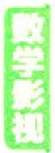

# 074 试题调研 每月一辑试题新

（1） 求证: C = 2B.   
（2） 求 $\frac{a+4b}{b\cos B}$ 的最小值.

解析 （1） 在 $\triangle ABC$ 中, 由已知及余弦定理, 得 $(a + b)b = c^{2} = a^{2} + b^{2} - 2ab\cos C$ , 即 $b = a - 2b\cos C$ . 由正弦定理, 得 $\sin B = \sin A - 2\sin B\cos C$ , 又 $A = \pi - (B + C)$ ,

【指点迷津】题中要证明 $C = 2B$ ，因而利用 $A = \pi - (B + C)$ 将等式中的 $A$ 消去，得到关于 $B$ ， $C$ 的等式，进一步化简变形

故 $\sin B = \sin (B + C) - 2\sin B\cos C = \sin B\cos C + \cos B\sin C - 2\sin B\cos C = \cos B\sin C - \sin B\cos C = \sin (C - B)$ .

因为 $0 < \sin B = \sin (C - B)$ , 所以 $0 < C - B < C < \pi$ . 又 $B + (C - B) = C < \pi$ , 所以 $B = C - B, C = 2B$ .

（2） 方法一 由 C=2B 得 $B+C=3B\in(0,\pi)$ ，所以 $B\in(0,\frac{\pi}{3})$ ， $\cos B\in(\frac{1}{2},1)$ .

由 $a = b (1 + 2\cos C)$ ，C = 2B 得 $\frac{a + 4b}{b\cos B} = \frac{5 + 2\cos C}{\cos B} = \frac{5 + 2\cos 2B}{\cos B} = \frac{5 + 2(2\cos^{2}B - 1)}{\cos B} = 4\cos B + \frac{3}{\cos B} \geqslant 2\sqrt{4\cos B \cdot \frac{3}{\cos B}} = 4\sqrt{3}$ ，当且仅当 $4\cos B = \frac{3}{\cos B}$ ，即 $B = \frac{\pi}{6}$ 时等号成立.

【模型应用】构造目标函数：先把不等式通过边角互换化成 $\cos B$ 的函数，再利用基本不等式求解，注意等号成立的条件

所以当 $B=\frac{\pi}{6}$ 时， $\frac{a+4b}{b\cos B}$ 取最小值，为 $4\sqrt{3}$ .

方法二 由已知及余弦定理得 $\frac{a+4b}{b\cos B}=\frac{2ac(a+4b)}{b(a^{2}+c^{2}-b^{2})}=\frac{2ac(a+4b)}{b(a^{2}+ab)}=\frac{2c(a+4b)}{b(a+b)}$

所以 $\left(\frac{a+4b}{b\cos B}\right)^{2}=\frac{4b(a+b)(a+4b)^{2}}{b^{2}(a+b)^{2}}=\frac{4(a+4b)^{2}}{b(a+b)}=\frac{4(a^{2}+8ab+16b^{2})}{ab+b^{2}}=$ $\frac{4(a^{2}+4b^{2}+4b^{2})}{ab+b^{2}}+32\geqslant\frac{4(4ab+4b^{2})}{ab+b^{2}}+32=48$ ，所以 $\frac{a+4b}{b\cos B}\geqslant4\sqrt{3}$

【模型应用】先利用余弦定理,消去 $B$ ,再把条件 $\left( {a + b}\right) b = {c}^{2}$ 代入消去 ${c}^{2}$ ,分子还有 $c$ ,进而想到把表达式平方,进一步可以把 $c$ 消去,得到关于 $a,b$ 的表达式,分离常数后,用基本不等式求解

当且仅当 a=2b 时等号成立.

故 $\frac{a+4b}{b\cos B}$ 的最小值为 $4\sqrt{3}$ .

《统计的乐趣》看到“统计学”,你首先想到什么?是让人眼花缭乱的表格,还是各种晦涩难懂的术语?其实,统计学并不遥远,从日常生活到科学研究,到处都有它的踪影.

# 型6 平面向量模型

# 角度1 爪形模型

# 模型解法 >>>

平面向量中的爪形模型指三点共线的向量问题,由于其几何图形看起来像爪子,故称为爪形模型.解题关键点如下:

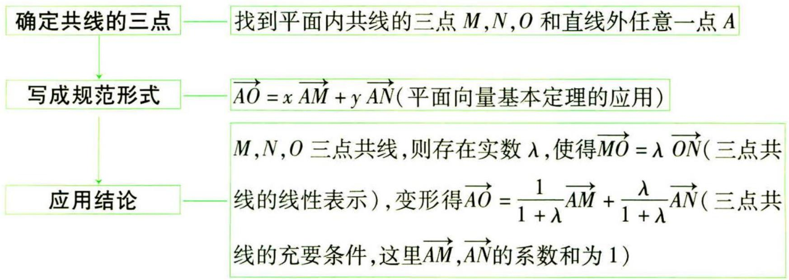

调研 1 (2023·天津外国语大学附属外国语学校9月模拟)如图1,点G为△ABC的重心,过点G的直线分别交直线AB, AC于D,E两点, $\overrightarrow{AB}=3m\overrightarrow{AD}(m>0)$ , $\overrightarrow{AC}=3n\overrightarrow{AE}(n>0)$ ,则 $m+n=$ \_\_\_\_.

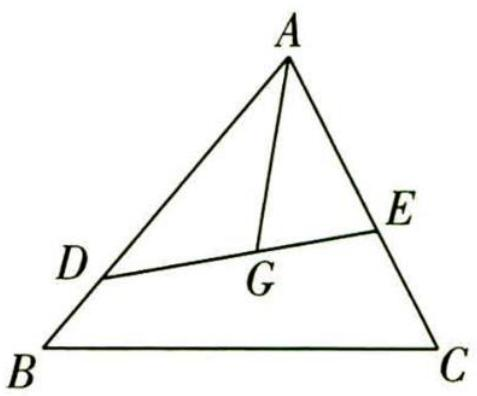

图 1

思维导引 点 G 为 $\triangle ABC$ 的重心 $\overrightarrow{AG} = \frac{1}{3}\overrightarrow{AB} + \frac{1}{3}\overrightarrow{AC}$

将已知条件代入 $\rightarrow D, G, E$ 三点共线 $\rightarrow m + n = 1$

解析 设 $F$ 为 $BC$ 的中点, 即 $\overrightarrow{BF} = \overrightarrow{FC}$ , 连接 $AF$ , 所以 $\overrightarrow{AF} - \overrightarrow{AB} = \overrightarrow{AC} - \overrightarrow{AF}$ , 即 $\overrightarrow{AF} = \frac{1}{2} (\overrightarrow{AB} + \overrightarrow{AC})$ ,

【小技巧】这里利用向量减法的三角形法则的递应用, 也就是把一个向量表示为两个向量的差, 对任意向量 $\overrightarrow{AB}$ 与任一点 O 均有等式 $\overrightarrow{AB} = \overrightarrow{OB} - \overrightarrow{OA}$

因为点 G 为 $\triangle ABC$ 的重心, 所以 $\overrightarrow{AG} = \frac{2}{3}\overrightarrow{AF} = \frac{1}{3}\overrightarrow{AB} + \frac{1}{3}\overrightarrow{AC}$ , 因为 $\overrightarrow{AB} = 3m\overrightarrow{AD}(m > 0)$ , $\overrightarrow{AC} = 3n\overrightarrow{AE} (n > 0)$ , 所以 $\overrightarrow{AG} = m\overrightarrow{AD} + n\overrightarrow{AE}$ , 因为 D, G, E 三点共线, 所以 $m + n = 1$ .

【模型应用】三点共线的向量表示： $\overrightarrow{OA},\overrightarrow{OB}$ 不共线，若 $\overrightarrow{OP}=x\overrightarrow{OA}+y\overrightarrow{OB}$ ，则A,P,B三点共线的充安条件为 $x+y=1$

答案 1

调研 2 (2023·中学生标准学术能力诊断性9月测试)在 $\triangle ABC$ 中,AB=AC=3, $\overrightarrow{BD}=2\overrightarrow{DC}$ ,若 $\overrightarrow{AD}\cdot\overrightarrow{BC}=4$ ,则 $\overrightarrow{AB}\cdot\overrightarrow{AC}=$ \_\_\_\_.

统计学也并不枯燥,在本片中,明星教授汉斯·罗斯林将用新奇的方式、先进的技术和幽默的语言,带我们走进妙趣横生的统计学世界.

解析 由 $\overrightarrow{BD}=2\overrightarrow{DC}$ 得 $\overrightarrow{AD}=\frac{1}{3}\overrightarrow{AB}+\frac{2}{3}\overrightarrow{AC}$ ，所以 $\overrightarrow{AD}\cdot\overrightarrow{BC}=(\frac{1}{3}\overrightarrow{AB}+\frac{2}{3}\overrightarrow{AC})\cdot(\overrightarrow{AC}-\overrightarrow{AB})=\frac{2}{3}\overrightarrow{AC^{2}}-$

【模型应用】由平面向量基本定理,可以把已知条件中的向量都转化为用 $\overrightarrow{AB}$ 、 $\overrightarrow{AC}$ 表示,利用瓜形模型将 $\overrightarrow{BD}=2\overrightarrow{DC}$ ,表示成 $\overrightarrow{AD}=\frac{1}{3}\overrightarrow{AB}+\frac{2}{3}\overrightarrow{AC}$

$\frac{1}{3}\overrightarrow{AB^{2}}-\frac{1}{3}\overrightarrow{AB}\cdot\overrightarrow{AC}=6-3-\frac{1}{3}\overrightarrow{AB}\cdot\overrightarrow{AC}=4,$ 所以 $\overrightarrow{AB}\cdot\overrightarrow{AC}=-3.$

答案

-3

# 角度2 圆模型

# 模型解法 >>>

平面向量中的圆模型是指以圆或圆的一部分为载体的向量问题模型. 解题关键点如下:

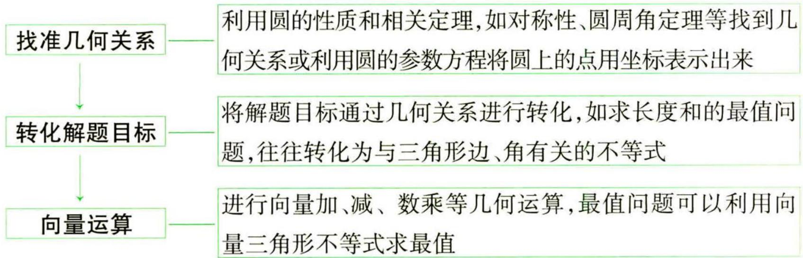

调研 3 (2023·清华大学附属中学9月测试)已知平面向量 a, b, c 满足 $a \perp b$ ，且 $|a| = |b| = 2, |a + b + c| = 1$ ，则 $|b + c| + 2 |a + c|$ 的最小值为 ( )

$\quad$A. $\frac{\sqrt{15}}{2}$

$\quad$B. $\sqrt{15}$

$\quad$C. $\frac{\sqrt{17}}{2}$

$\quad$D. $\sqrt{17}$

解析 方法一 如图2,连接BD,CD,AD,设 $\overrightarrow{CA}=a,\overrightarrow{CB}=b,\overrightarrow{CD}=$ $d=a+b+c$ ,且 $CA=CB=2,CD=1,CA\perp CB$ ,所以 $|b+c|+2|a+c|=|d-$ $a|+2|d-b|=AD+2BD$ ,

【模型应用】向量问题几何化：将题中的向量垂直，长度关系转化为几何关系， $CA = CB = 2, CD = 1, CA \perp CB$ ，固定A, B, C，因为CD = 1，则D在以C为圆心，1为半径的圆上移动，问题转化为求 $AD + 2BD$ 的最小值

在 $CA$ 上取一点 $E$ 使得 $CE = \frac{1}{2}$ , 连接 $DE$ , 易得 $\triangle CDE \sim \triangle CAD$ , 所以 $\frac{AD}{DE} = \frac{AC}{CD} = 2$ .

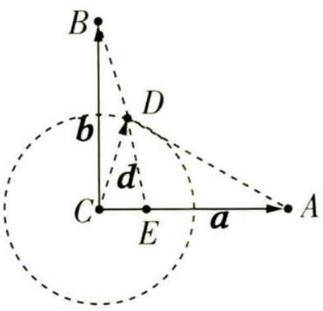

图 2

【构造相似三角形】由 CA = 2CD，取 $CE = \frac{1}{2}$ ，利用相似三角形可以把线段 AD 转化为 2DE

《逻辑的乐趣》 本片是一部纪录片,这部60分钟的纪录片用色彩和故事梳理了逻辑的前世今生.逻辑不仅影响各领域学科的发展,也深刻影响着人类的生活.从街角酒吧到金融市场交易所,从古老的哲学研究到前卫的人工智能科技,逻辑无处不在.

所以 $AD + 2BD = 2(BD + DE) \geqslant 2BE = 2 \times \sqrt{2^{2} + \left(\frac{1}{2}\right)^{2}} = \sqrt{17}$ (当 B, D, E 三点共线时取等号).

方法二 设 $d = a + b + c$ ，则 $|b + c| + 2|a + c| = |d - a| + 2|d - b| = |2d - \frac{1}{2}a| + |2d - 2b| \geqslant |2b - \frac{1}{2}a| = \sqrt{4^{2} + 1^{2}} = \sqrt{17}$ .

【小技巧】因为 $\vert a\vert = 2, \vert d\vert = 1$ ，所以 $\left|\frac{1}{2}a\right| = 1, \left|2d\right| = 2$ ，所以 $\vert d - a\vert = \left|2d - \frac{1}{2}a\right|$ ，目的是利用向量三角形不等式，把向量 d 消去

方法三 (建系)分别以 $\overrightarrow{CA},\overrightarrow{CB}$ 的方向为 $x$ 轴， $y$ 轴的正方向建立平面直角坐标系，如图3，设 $D(\cos \theta ,\sin \theta)$ ，连接 $CD$ ，设 $\overrightarrow{CA} = a, \overrightarrow{CB} = b, \overrightarrow{CD} = d = a + b + c$ ，则 $A(2,0),B(0,2)$ ，

所以 $|b+c|+2|a+c|=|d-a|+2|d-b|=\sqrt{(\cos\theta-2)^{2}+\sin^{2}\theta}+$ $2\sqrt{\cos^{2}\theta+(\sin\theta-2)^{2}}=\sqrt{5-4\cos\theta}+2\sqrt{\cos^{2}\theta+(\sin\theta-2)^{2}}=2\sqrt{\frac{5}{4}-\cos\theta}+$ $2\sqrt{\cos^{2}\theta+(\sin\theta-2)^{2}}=2\sqrt{(\cos\theta-\frac{1}{2})^{2}+\sin^{2}\theta}+2\sqrt{\cos^{2}\theta+(\sin\theta-2)^{2}}\geqslant$ $2\sqrt{\left(\frac{1}{2}-0\right)^{2}+\left(0-2\right)^{2}}=\sqrt{17}.$

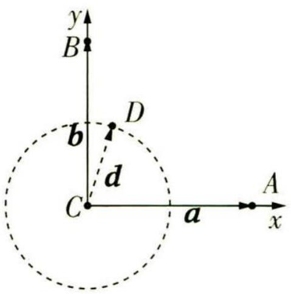

图 3

【指点迷津】这里用到不等式 $\sqrt{(a - c)^2 + (b - d)^2} + \sqrt{(a - m)^2 + (b - n)^2} \geqslant \sqrt{(m - c)^2 + (n - d)^2}$

答案 D

# 角度3 四边形模型

# 模型解法 >>>

平面向量中的四边形模型是指以四边形为载体的平面向量问题,主要载体包括平行四边形、矩形、菱形、正方形、梯形等特殊四边形.解题关键点如下:

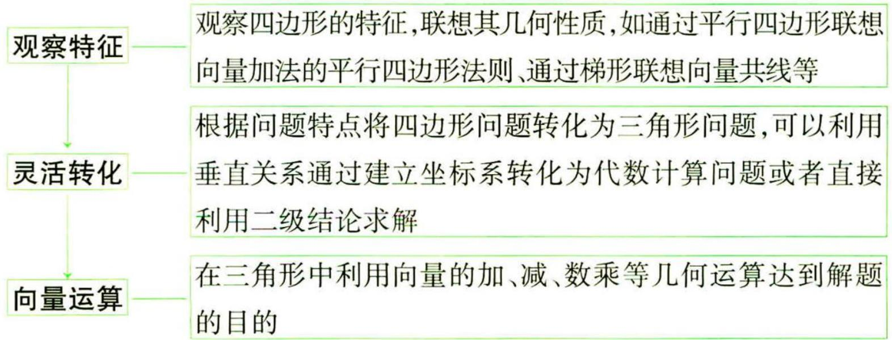

调研 4 (2023·湖北黄冈9月起点考试)(多选)如图4,在平面四边形ABCD

《终极密码》分别从“数字、形状、预测”三个方向探寻隐藏在宗教、建筑、艺术、生物等大自然和人类生活中的终极密码——数学。只有通过这些密码我们才能了解掌控着整个宇宙的法则，从而揭开这个世界的真相。

中, $\overrightarrow{AB}\cdot\overrightarrow{BC}=0,\overrightarrow{AD}\cdot\overrightarrow{DC}=0,|\overrightarrow{AB}|=|\overrightarrow{AD}|=1,\overrightarrow{AD}\cdot\overrightarrow{BA}=\frac{1}{2}$ ，若点E为线段CD上的动点，则 $\overrightarrow{AE}\cdot\overrightarrow{BE}$ 的值可能为()

$\quad$A. 1

$\quad$B. $\frac{21}{16}$

$\quad$C. 2

$\quad$D. $\frac{7}{2}$

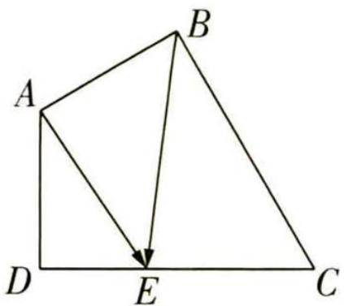

图4

解析 由 $|\overrightarrow{AB}| = |\overrightarrow{AD}| = 1, \overrightarrow{AD} \cdot \overrightarrow{BA} = \frac{1}{2}$ 得, $\cos \angle BAD = -\frac{1}{2}$ , 所以$\angle BAD = \frac{2\pi}{3}$ , 则 $\angle C = \frac{\pi}{3}$ , 连接 $AC, BD$ , 在 $\triangle ABD$ 中, $BD = \sqrt{AB^2 + AD^2 - 2AB \times AD \times \cos \angle BAD} = \sqrt{1^2 + 1^2 - 2 \times 1 \times 1 \times (-\frac{1}{2})} = \sqrt{3}$ . 易得 $\triangle BAC \cong \triangle DAC$ , 所以 $BC = BD = CD = \sqrt{3}$ .

以 $D$ 为坐标原点, $\overrightarrow{DC}, \overrightarrow{DA}$ 的方向为 $x$ 轴, $y$ 轴的正方向建立平面直角坐标系, 则 $A(0,1), B(\frac{\sqrt{3}}{2})$ , 【模型应用】通过建立坐标系, 充分利用已知条件, 把向量数量积转化为二次函数最值问题 $\frac{3}{2}), C(\sqrt{3},0)$ , 设 $E(x,0)(0 \leqslant x \leqslant \sqrt{3})$ , 则 $\overrightarrow{AE} = (x, -1), \overrightarrow{BE} = (x - \frac{\sqrt{3}}{2}, -\frac{3}{2})$ , 所以 $\overrightarrow{AE} \cdot \overrightarrow{BE} = x^2 - \frac{\sqrt{3}}{2}x + \frac{3}{2} = (x - \frac{\sqrt{3}}{4})^2 + \frac{21}{16}$ , 当 $x = \frac{\sqrt{3}}{4}$ 时, $\overrightarrow{AE} \cdot \overrightarrow{BE}$ 取得最小值 $\frac{21}{16}$ , 当 $x = \sqrt{3}$ 时, $\overrightarrow{AE} \cdot \overrightarrow{BE}$ 取得最大值 3 , 所以 $\overrightarrow{AE} \cdot \overrightarrow{BE}$ 的值可能为 $\frac{21}{16}$ 或 2 , 选 BC.

答案

BC

# 型7 递推数列模型

# 特约名师

张方水 山东省实验中学高级教师,两次荣获济南市政府三等功,所教学生多名数学竞赛获奖并被保送至北京大学、中国科学技术大学等名校,主编、参编高考数学辅导资料多本.

# 类型1 形如 $a_{n+1} - a_n = f(n) (n \in \mathbb{N}^*)$ 的递推模型

# 模型解法 >>>

若数列 $\{a_{n}\}$ 满足 $a_{n+1}-a_{n}=f(n)(n\in\mathbf{N}^{*})$ ，求通项公式时，利用恒等式 $a_{n}=a_{1}+(a_{2}-a_{1})+(a_{3}-a_{2})+\cdots+(a_{n}-a_{n-1})(n\geqslant2)$ 求通项公式的方法称为累加法，使用此法需满足 $f(1)+f(2)+f(3)+\cdots+f(n-1)(n\geqslant2)$ 可以化简为关于 n 的表达式。解决此类题目的关键是：

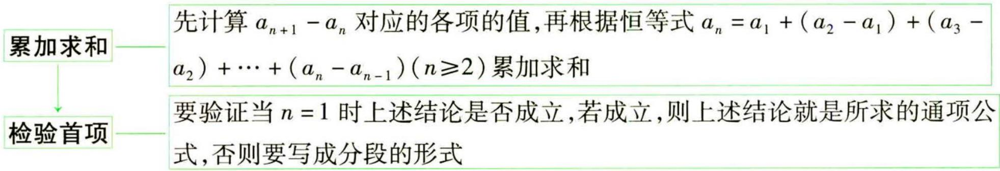

《危险的知识》 在这部纪录片里, 大卫·马龙聚焦四位无与伦比的数学家: 乔治·康托尔、路德维格·玻尔兹曼、哥德尔和阿兰·图灵. 他们的天才光耀千古, 他们的智慧深刻地影响了后世.

关注微信公众号“初高教辅站”获取更多初高中教辅资料

调研 1 (2023·长沙雅礼中学开学考试) 设数列 $\{a_{n}\}$ 满足 $a_{1}=3, a_{n+1}-a_{n}=2\cdot3^{n}(n\in\mathbf{N}^{*})$ .

（1）求数列 $\{a_{n}\}$ 的通项公式;

（2） 令 $b_{n} = n \cdot a_{n}$ , 求数列 $\{b_{n}\}$ 的前 $n$ 项和 $S_{n}$ .

解析 （1） 因为 $a_{n+1} - a_n = 2 \cdot 3^n$ ,

【模型应用】出现形如 $a_{n} - a_{n-1} = f(n) (n \geqslant 2, n \in \mathbb{N}^{*})$ 或 $a_{n+1} - a_{n} = f(n)$ 的递推关系式，可采用累加法求解， $f(n)$ 可以是关于 $n$ 的常数函数、一次函数、二次函数、指数函数、分式函数等形式，只要是能对 $f(n)$ 求和即可

所以 $a_{2}-a_{1}=2\times3, a_{3}-a_{2}=2\times3^{2}, a_{4}-a_{3}=2\times3^{3}, \cdots, a_{n}-a_{n-1}=2\times3^{n-1} (n\geqslant2, n\in\mathbf{N}^{*})$ ，累加得 $a_{n}-a_{1}=2\times3+2\times3^{2}+2\times3^{3}+\cdots+2\times3^{n-1} (n\geqslant2, n\in\mathbf{N}^{*})$ ，

所以 $a_{n}=a_{1}+2\times3+2\times3^{2}+2\times3^{3}+\cdots+2\times3^{n-1}=3+2\times\frac{3(1-3^{n-1})}{1-3}=3^{n}(n\geqslant2,n\in\mathbf{N}^{*})$ ,

【易失分】这个式子不能有略，否则要扣除步骤分

所以 $a_{n}=3^{n}(n\geqslant2,n\in\mathbf{N}^{*})$ ，经检验， $a_{1}=3$ 也满足上式.

【易遗漏】要验证当 $n = 1$ 时上述结论也成立

所以数列 $\{a_{n}\}$ 的通项公式为 $a_{n} = 3^{n}$ .

（2） 由（1）知, $b_{n}=n\cdot a_{n}=n\cdot3^{n}$ ,所以 $S_{n}=1\times3+2\times3^{2}+\cdots+n\times3^{n}$ ,

所以 $3S_{n}=1\times3^{2}+2\times3^{3}+\cdots+n\times3^{n+1}$ ,

所以 $-2S_{n}=3+3^{2}+\cdots+3^{n}-n\cdot3^{n+1}=\frac{3-3^{n+1}}{1-3}-n\cdot3^{n+1}$ ，所以 $S_{n}=\frac{(2n-1)3^{n+1}+3}{4}$ .

# 类型2 形如 $a_{n+1} / a_n = f(n) (n \in \mathbb{N}^*)$ 的递推模型

# 模型解法 >>>

若数列 $\{a_{n}\}$ 满足 $\frac{a_{n+1}}{a_{n}} = f(n) (n \in \mathbb{N}^{*})$ ，求数列 $\{a_{n}\}$ 的通项公式时，利用恒等式 $a_{n} = a_{1} \cdot \frac{a_{2}}{a_{1}} \cdot \frac{a_{3}}{a_{2}} \cdot \frac{a_{4}}{a_{3}} \cdot \cdots \cdot \frac{a_{n}}{a_{n-1}} (n \geqslant 2)$ 求通项公式的方法称为累乘法，使用此法需满足 $f(1) \cdot f(2) \cdot f(3) \cdot \cdots \cdot f(n-1) (n \geqslant 2)$ 可以化简为关于 n 的表达式。解决此类题目的关键是：

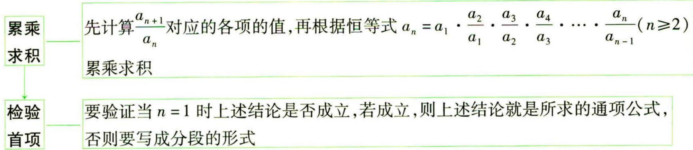

但是当同时代的人用尖刻、猛烈的批评表达反对意见时,出现了悲剧性的结果.他们精神错乱,最终都以自杀结束了自己的生命.本片也与目前最著名的学者进行了对话,他们仍在孜孜不倦地探寻世上到底是否有数学家不能弄明白的事.

调研 2 (2023·湖北黄冈一中等校9月联考)已知数列 $\{a_{n}\}$ 满足 $a_{n}\neq0,n\in N^{*}$ .

（1） 若 $a_{n}a_{n+2}=ka_{n+1}^{2}>0$ 且 $a_{n}>0$ .

(i)当 $\{\lg a_{n}\}$ 成等差数列时,求k的值.

(ii)当 $k = 2$ 且 $a_1 = 1, a_4 = 16\sqrt{2}$ 时，求 $a_2$ 及 $\{a_n\}$ 的通项公式.

（2） 若 $a_{n}a_{n+2} = -\frac{1}{2}a_{n+1}a_{n+3}, a_{1} = -1, a_{2} < 0, a_{3} \in [4,8]$ . 设 $S_{n}$ 是 $\{a_{n}\}$ 的前 n 项和, 求 $S_{2020}$ 的最大值.

解析 （1）(i)因为 $\{\lg a_{n}\}$ 成等差数列, 所以 $2\lg a_{n+1} = \lg a_{n} + \lg a_{n+2}$ ,

【会联想】看到等差数列，要联想到等差中项

所以 $a_{n + 1}^2 = a_na_{n + 2}$ ，又 $a_{n}a_{n + 2} = ka_{n + 1}^{2} > 0,a_{n} > 0$ ，所以 $k = 1$

(ii)由题知 $a_{n}a_{n+2}=2a_{n+1}^{2}(a_{n}>0)$ ， $a_{1}=1$ ，所以 $a_{1}a_{3}=2a_{2}^{2}$ ， $a_{2}a_{4}=2a_{3}^{2}$ ，所以 $a_{2}a_{4}=2(2a_{2})^{2}=8a_{2}^{4}$ ，所以 $8a_{2}^{3}=a_{4}=16\sqrt{2}$ ，所以 $a_{2}=\sqrt{2}$ .

因为 $\frac{a_{n+2}}{a_{n+1}}=2\cdot\frac{a_{n+1}}{a_{n}}$ ，且 $\frac{a_{2}}{a_{1}}=\sqrt{2}\neq0$ ，所以 $\left\{\frac{a_{n+1}}{a_{n}}\right\}$ 是首项为 $\sqrt{2}$ ，公比为2的等比数列，
所以 $\frac{a_{n+1}}{a_{n}}=\sqrt{2}\cdot2^{n-1}$

【模型应用】当数列 $\left|a_{n}\right|$ 满足 $\frac{a_{n+1}}{a_{n}}=f(n)(n\in\mathbf{N}^{*})$ 时，就可以应用累乘法求 $\left|a_{n}\right|$ 的通项公式

所以当 $n \geqslant 2$ 时， $a_{n} = a_{1} \times \frac{a_{2}}{a_{1}} \times \frac{a_{3}}{a_{2}} \times \cdots \times \frac{a_{n}}{a_{n-1}} = 1 \times (\sqrt{2} \times 2^{1-1}) \times (\sqrt{2} \times 2^{2-1}) \times \cdots \times (\sqrt{2} \times 2^{n-2}) = (\sqrt{2})^{n-1} \times 2^{0+1+2+\cdots+(n-2)} = (\sqrt{2})^{(n-1)^{2}}.$

又当 n=1 时上述结论也成立, 所以 $a_{n}=(\sqrt{2})^{(n-1)^{2}}$ .

（2） 由 $a_{n}a_{n+2} = -\frac{1}{2} a_{n+1}a_{n+3}$ , 可得 $a_{n+1}a_{n+3} = -\frac{1}{2} a_{n+2}a_{n+4}$ , 所以 $a_{n}a_{n+2} = -\frac{1}{2} \times (-\frac{1}{2})a_{n+2}a_{n+4} = \frac{1}{4} a_{n+2}a_{n+4}$ .

因为 $a_{n} \neq 0$ ，所以 $a_{n} = \frac{1}{4} a_{n + 4}$ ，即 $a_{n + 4} = 4a_{n}$ 。

因为 $a_{1}a_{3} = -\frac{1}{2}a_{2}a_{4}, a_{1} = -1, a_{2} < 0$ ，所以 $2a_{1}a_{3} + a_{2}a_{4} = 0$ ，即 $a_{2}a_{4} = 2a_{3}$ ，所以 $S_{2020}=(a_{1}+a_{5}+a_{9}+\cdots+a_{2017})+(a_{2}+a_{6}+a_{10}+\cdots+a_{2018})+(a_{3}+a_{7}+a_{11}+\cdots+a_{2019})+(a_{4}+a_{8}+a_{12}+\cdots+a_{2020})=a_{1}(1+4+4^{2}+\cdots+4^{504})+a_{2}(1+4+4^{2}+\cdots+4^{504})$

$\begin{array}{l} 4 ^ {5 0 4}) + a _ {3} (1 + 4 + 4 ^ {2} + \dots + 4 ^ {5 0 4}) + a _ {4} (1 + 4 + 4 ^ {2} + \dots + 4 ^ {5 0 4}) = (a _ {1} + a _ {2} + a _ {3} + a _ {4}) (1 + \\ 4 + 4 ^ {2} + \dots + 4 ^ {5 0 4}). \end{array}$

因为 $a_{2}a_{4}=2a_{3}, a_{3}\in[4,8]$ ，所以 $a_{2}a_{4}>0$ ，因为 $a_{2}<0$ ，所以 $a_{4}<0$ ，

所以 $-a_{2} + (-a_{4})\geqslant 2\sqrt{a_{2}a_{4}} = 2\sqrt{2a_{3}}$ ，可得 $a_2 + a_4\leqslant -2\sqrt{2a_3}$

所以 $a_{1}+a_{2}+a_{3}+a_{4}\leqslant-1+a_{3}-2\sqrt{2a_{3}}$ ,

【会转化】利用不等关系,将多变量代数式转化为单变量代数式

令 $y = -1 + a_{3} - 2\sqrt{2a_{3}}$ ，设 $t = \sqrt{a_{3}}$ ，则 $t \in [2, 2\sqrt{2}]$ ，则 $y = t^{2} - 2\sqrt{2}t - 1$ 的图象是对称轴为直线 $t = \sqrt{2}$ ，开口向上的抛物线的一部分，且 $y = t^{2} - 2\sqrt{2}t - 1$ 在 $[2, 2\sqrt{2}]$ 上单调递增，所以当 $t = 2\sqrt{2}$ 时 y 取得最大值，故 $a_{1} + a_{2} + a_{3} + a_{4}$ 的最大值为 $(2\sqrt{2})^{2} - 2\sqrt{2} \times 2\sqrt{2} - 1 = -1$ .

所以 $S_{2020}=(a_{1}+a_{2}+a_{3}+a_{4})(1+4+4^{2}+\cdots+4^{504})$ 的最大值为 $-1\times\frac{1-4^{505}}{1-4}=\frac{1-4^{505}}{3}$ .

# 类型 3 形如 $a_{n+1} = A a_n + f(n) (A \neq 0)$ 的递推模型

# 模型解法 >>>

求关于 $a_{n+1} = A a_n + f(n) (A \neq 0)$ 类型的数列通项公式时, 常利用待定系数法构造等比数列求解. 解决此类题目的关键是:

先利用待定系数法构造 $a_{n+1} + M = A(a_n + M)$ , 再根据对应项系数相等, 求出 $M = \frac{B}{A - 1} (A \neq 1)$ 即可

先用待定系数法构造 $a_{n+1} + \lambda b^{n+1} = A(a_n + \lambda b^n)$ ，再根据对应项系数相等，求出 $\lambda = \frac{B}{A - b} (A \neq b)$ 即可

调研 3 (2023·辽宁沈阳二中等六校9月期初考试)已知数列 $\{a_{n}\}$ 的首项 $a_{1}=2,a_{n}=3a_{n-1}+2(n\geqslant2,n\in\mathbf{N}^{*}),b_{n}=\log_{3}(a_{n}+1)$ .

（1） 求 $\{a_{n}\}$ 的通项公式.  
（2） 证明: $\frac{1}{b_1 b_2} + \frac{1}{b_2 b_3} + \cdots + \frac{1}{b_n b_{n+1}} < 1$ .

解析 （1） 由 $a_{n} = 3a_{n - 1} + 2 (n \geqslant 2, n \in \mathbf{N}^{*})$ 知, 当 $n \geqslant 2$ 时, $a_{n} + 1 = 3a_{n - 1} + 3$ , 即

【模型应用】当数列 $\{a_{n}\}$ 满足 $a_{n+1}=Aa_{n}+B$ 时，需构造等比数列求解，由待定系数法知上述等式两边同时加1即可完成构造。实际上，若满足 $a_{n+1}=Aa_{n}+Bn+C$ ，利用待定系数法构造 $a_{n+1}+r(n+1)+t=A(a_{n}+rn+t)$ ，根据对应项相等求出r，t即可

一个房间里有23个或23个以上的人,那么至少有两个人的生日相同的概率要大于 $50\%$ .例如在一个30人的小班中,存在两个人生日相同的概率为 $70\%$ .在一个60人的大班,这种概率要大于 $99\%$ .

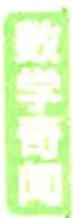

# 082 试题调研 每月一辑试题新

$a _ {n} + 1 = 3 \left(a _ {n - 1} + 1\right).$

又 $a_1 + 1 = 3 \neq 0$ ，所以数列 $\{a_n + 1\}$ 是以3为首项，3为公比的等比数列，

所以 $a_{n} + 1 = 3^{n}$ ，故 $a_{n} = 3^{n} - 1$

（2） 由（1）知, $a_{n}+1=3^{n}$ ,

所以 $b_{n} = \log_{3}(a_{n} + 1) = n$ ，所以 $\frac{1}{b_n b_{n+1}} = \frac{1}{n(n+1)} = \frac{1}{n} - \frac{1}{n+1}$

所以 $\frac{1}{b_{1}b_{2}}+\frac{1}{b_{2}b_{3}}+\cdots+\frac{1}{b_{n}b_{n+1}}=\frac{1}{1\times2}+\frac{1}{2\times3}+\cdots+\frac{1}{n(n+1)}=1-\frac{1}{2}+\frac{1}{2}-\frac{1}{3}+\cdots+$ $\frac{1}{n}-\frac{1}{n+1}=1-\frac{1}{n+1}<1.$

【小妙招】遇见通项公式形如 $\frac{1}{n(n+1)}$ 的数列求和问题，用裂项相消法

# 类型4 涉及 $S_{n}$ , $a_{n}$ 的递推模型

# 模型解法 >>>

对于涉及 $S_{n}$ 与 $a_{n}$ 的递推关系式, 主要是用 $n - 1$ 替换已知等式中的 $n$ , 结合 $a_{n} = \left\{ \begin{array}{l} S_{1}, n = 1, \\ S_{n} - S_{n - 1}, n \geqslant 2 \end{array} \right.$ 求解, 解决此类题目的关键是:

既含 $S_{n}$ , 又含 $a_{n}$ —— 先利用 $a_{n} = \left\{ \begin{array}{l} S_{1}, n = 1, \\ S_{n} - S_{n-1}, n \geqslant 2 \end{array} \right.$ 消去 $S_{n}$ 或 $a_{n}$ , 整理成关于 $a_{n}$ 或 $S_{n}$ 的递推关系式, 再转化为其他模型求解

只含 $S_{n}$ —— 先求出 $S_{n}$ ，再利用 $a_{n}=\left\{\begin{aligned}&S_{1},n=1,\\&S_{n}-S_{n-1},n\geqslant2\end{aligned}\right.$ 求 $a_{n}$

调研 4 (2023 · 成都七中 9 月开学考试) 记数列 $\{a_{n}\}$ 的前 $n$ 项和为 $S_{n}, 2S_{n}+$ $n^{2}=2na_{n}+n$ .

（1） 证明: $\{a_{n}\}$ 为等差数列.   
（2） 若 $a_1 = 1$ , 记 $T_n$ 为数列 $\{a_n\}$ 的前 $n$ 项积, 证明: $\sum_{k=1}^{n} \frac{1}{T_k} < 2$ .

解析 （1） 由题意, 得 $2S_{n} = 2na_{n} + n - n^{2}$ , 则当 $n \geqslant 2$ 时, $2S_{n-1} = 2(n - 1)a_{n-1} + n - 1 - (n - 1)^{2}$ . 两式相减, 得 $(2n - 2)a_{n} - (2n - 2)a_{n-1} = 2n - 2, n \geqslant 2, n \in \mathbf{N}^{*}$ ,

【模型应用】用 $n - 1$ 替换等式中的 $n$ , 两式相减消去 $S_{n}$ , 即可得到 $a_{n}$ 与 $a_{n-1}$ 的关系式, 注意 $n \geqslant 2$ 的限制

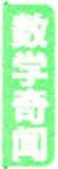

如果你把一张普通的纸张折叠45次,那么它的厚度足以到达月球.当然,折叠45次是不可能的,但如果可以的话,它的厚度就能抵达月球.

即 $a_{n} - a_{n - 1} = 1, n \geqslant 2, n \in \mathbf{N}^{*}$ , 故 $\{a_{n}\}$ 是等差数列.

（2） 由（1）及题意知 $a_{n} = n$ ，则 $\frac{1}{T_n} = \frac{1}{n!}$ ，

因为 $n! \geqslant 2^{n-1}$ ，所以 $\frac{1}{T_{n}} \leqslant \frac{1}{2^{n-1}}$ ，所以 $\sum_{k=1}^{n} \frac{1}{T_{k}} \leqslant \sum_{k=1}^{n} \frac{1}{2^{k-1}} = 2 \left(1 - \frac{1}{2^{n}}\right) < 2.$

【扫清障碍】当 n=1 时，等号成立；当 $n \geqslant 2$ 时， $n! = 1 \times 2 \times 3 \times \cdots \times n \geqslant 1 \times 2 \times 2 \times \cdots \times 2 = 2^{n-1}$

# 型8 数列求和模型

# 模型解法 >>>

数列求和问题的关键是观察、分析数列的结构特征,然后选择合适的方法求解,也就是说,数列求和的关键在于搞清楚数列“长什么样”.数列求和的几种常见类型如下.

<table><tr><td>数列或数列前n项和Sn的特征</td><td>求解策略</td></tr><tr><td>数列的通项公式为an=bn×cn的形式({bn}为等比数列,{cn}为等差数列)</td><td>错位相减法:列出Sn的计算式→错位书写qSn的计算式(q为{bn}的公比,q≠1)→两式相减→化简求Sn</td></tr><tr><td>数列的通项公式可以拆分成an=bn+1-bn的形式</td><td>裂项相消法:将数列的通项公式拆成一个新数列的两项之差,在求和时,中间的项可相互抵消,从而求得其和</td></tr><tr><td>数列的奇数项和偶数项存在不同的规律(或数列的通项公式为an=bn+cn的形式)</td><td>分组求和法:对奇数项和偶数项分别求和(对于an=bn+cn的形式,分别求数列{bn},{cn}的前n项和),相加得Sn</td></tr><tr><td>数列的前n项和可以两两结合或多项结合成为等差数列或等比数列</td><td>并项求和法:对应项结合,然后利用等差数列或等比数列的性质求解</td></tr></table>

# 类型1 错位相减法

调研 1 (2023·湖北宜昌、荆州、荆门、恩施 9 月起点考试)已知数列 $\{a_{n}\}$ 的前 $n$ 项和为 $S_{n}$ , 且 $a_{1} = 1, a_{n} = -2 S_{n-1} S_{n} (n \geqslant 2)$ .

（1） 求 $a_{n}$ .   
（2） 设 $b_{n}=\frac{2^{n}}{S_{n}}$ ，求数列 $\{b_{n}\}$ 的前n项和 $T_{n}$ .

解析 （1） $\because a_{n} = -2S_{n - 1}S_{n}(n\geqslant 2)$

$\therefore S_{n} - S_{n - 1} = -2S_{n - 1}S_{n}(n\geqslant 2)$ ，易知 $S_{n}\neq 0$ ，整理得 $\frac{1}{S_n} -\frac{1}{S_{n - 1}} = 2(n\geqslant 2)$

你的每一次洗牌,都有可能成为史上第一个创造这个牌序的人,因为扑克牌有54!种排序方法,约为 $2.31 \times 10^{71}$ ,比地球上的原子还要多.

∴ 数列 $\left\{\frac{1}{S_{n}}\right\}$ 为等差数列, $\frac{1}{S_{n}}=\frac{1}{S_{1}}+2(n-1)=2n-1$ ,

$\therefore S _ {n} = \frac {1}{2 n - 1} (n \in \mathbf {N} ^ {*}), a _ {n} = \frac {- 2}{(2 n - 1) (2 n - 3)} (n \geqslant 2),$

$\because a_{1} = 1$ 不满足上式， $\therefore a_{n} = \left\{ \begin{array}{l}1,n = 1,\\ -2\\ (2n - 1)(2n - 3),n\geqslant 2. \end{array} \right.$

【易遗漏】 $a_{n}=-2S_{n-1}S_{n}$ 在 $n\geqslant2$ 时成立，因此要检验数列的首项是否满足该式

（2） $\because\frac{1}{S_{n}}=2n-1,\therefore b_{n}=(2n-1)2^{n},$

$T _ {n} = 1 \times 2 ^ {1} + 3 \times 2 ^ {2} + \dots + (2 n - 3) 2 ^ {n - 1} + (2 n - 1) 2 ^ {n},$

$2 T _ {n} = \quad 1 \times 2 ^ {2} + 3 \times 2 ^ {3} + \dots + (2 n - 3) 2 ^ {n} + (2 n - 1) 2 ^ {n + 1},$

【模型应用】在应用错位相减法时，错位书写，便于化简

两式相减得 $-T_{n}=2+2^{3}+2^{4}+\cdots+2^{n+1}-(2n-1)2^{n+1}=2+\frac{2^{3}(1-2^{n-1})}{1-2}-(2n-$

【模型应用】本题中利用错位相减法，两式相减后，注意得出的并不是 $T_{n}$ ，而是 $-T_{n}$

$1) 2 ^ {n + 1} = 2 - 8 + 2 ^ {n + 2} - (2 n - 1) 2 ^ {n + 1} = - 6 - (2 n - 3) \cdot 2 ^ {n + 1},$

$\therefore T _ {n} = (2 n - 3) \cdot 2 ^ {n + 1} + 6.$

# 类型2 裂项相消法

调研 2 (2023·四川龙泉中学、新都一中等校9月开学联考/数列与平面向量交汇)已知数列 $\{a_{n}\}$ 中, $a_{1}=1$ , 平面直角坐标系中的点 $P_{n}(n,a_{n})$ , 对任意的 $n\in N^{*}$ , 都有 $\overrightarrow{P_{n}P_{n+1}}=(1,2)$ , 数列 $\{b_{n}\}$ 满足 $b_{n}=\frac{1}{4S_{n}-1}$ , 其中 $S_{n}$ 为 $\{a_{n}\}$ 的前n项和.

（1） 求 $\{a_{n}\}$ 的通项公式;  
（2） 求数列 $\{b_{n}\}$ 的前 n 项和 $T_{n}$ .

解析 （1） 连接 $OP_{n}$ (O 为坐标原点), 由 $\overrightarrow{P_{n}P_{n+1}} = \overrightarrow{OP_{n+1}} - \overrightarrow{OP_{n}} = (n + 1, a_{n+1}) - (n, a_{n}) = (1, a_{n+1} - a_{n}) = (1, 2)$ , 可得 $a_{n+1} - a_{n} = 2$ , 所以 $\{a_{n}\}$ 是首项为 1 , 公差为 2 的等差数列, 所以 $a_{n} = 1 + 2(n - 1) = 2n - 1$ .

（2） $S_{n}=n+\frac{n(n-1)}{2}\times2=n^{2},b_{n}=\frac{1}{4n^{2}-1}=\frac{1}{2}\left(\frac{1}{2n-1}-\frac{1}{2n+1}\right)$ ,

$T _ {n} = b _ {1} + b _ {2} + \dots + b _ {n} = \frac {1}{2} \left[ (1 - \frac {1}{3}) + (\frac {1}{3} - \frac {1}{5}) + \dots + (\frac {1}{2 n - 3} - \frac {1}{2 n - 1}) + (\frac {1}{2 n - 1} - \right.$

对于同等厚度的比萨,一个17英寸(43.18厘米)的比萨比2个12英寸(30.48厘米)的比萨多.

$\left. \frac {1}{2 n + 1}\right) ] = \frac {1}{2} \left(1 - \frac {1}{2 n + 1}\right) = \frac {n}{2 n + 1}.$

【模型应用】裂项相消时,一般前面保留到第几项,最后也要保留到相对应的倒数第几项,注意不要遗漏

# 方法点津

# 常见的裂项形式

$\begin{array}{l} （1） \frac {1}{n (n + k)} = \frac {1}{k} \left(\frac {1}{n} - \frac {1}{n + k}\right) (k \neq 0); （2） \frac {1}{(2 n - 1) (2 n + 1)} = \frac {1}{2} \left(\frac {1}{2 n - 1} - \frac {1}{2 n + 1}\right); \\ \frac {1}{n (n + 1) (n + 2)} = \frac {1}{2} \left[ \frac {1}{n (n + 1)} - \frac {1}{(n + 1) (n + 2)} \right]; （4） \frac {1}{\sqrt {n + k} + \sqrt {n}} = \frac {1}{k} (\sqrt {n + k} - \sqrt {n}) (k \neq \\ 0); （5） \frac {2 n + 1}{n ^ {2} (n + 1) ^ {2}} = \frac {1}{n ^ {2}} - \frac {1}{(n + 1) ^ {2}}; （6） \frac {2 ^ {n}}{(2 ^ {n} - 1) (2 ^ {n + 1} - 1)} = \frac {1}{2 ^ {n} - 1} - \frac {1}{2 ^ {n + 1} - 1}; （7） \frac {2 ^ {n} (n - 1)}{n (n + 1)} = \\ \frac {2 ^ {n + 1}}{n + 1} - \frac {2 ^ {n}}{n}; （8） \frac {1}{(2 n - 1) (2 n + 1) 2 ^ {n}} = \frac {1}{(2 n - 1) 2 ^ {n + 1}} - \frac {1}{(2 n + 1) 2 ^ {n + 1}}; （9） \frac {(- 1) ^ {n} (n + 1)}{(2 n + 1) (2 n + 3)} = \\ \frac {1}{4} \left[ \frac {(- 1) ^ {n}}{2 n + 1} - \frac {(- 1) ^ {n + 1}}{2 n + 3} \right]; (1 0) \frac {(- 1) ^ {n}}{\sqrt {n} - \sqrt {n - 1}} = (- 1) ^ {n} (\sqrt {n} + \sqrt {n - 1}) = [ (- 1) ^ {n} \sqrt {n} - (- 1) ^ {n - 1} \sqrt {n - 1} ] \\ (n \geqslant 2); (1 1) n \cdot n! = (n + 1)! - n!; (1 2) \frac {k}{(k + 1) !} = \frac {1}{k !} - \frac {1}{(k + 1) !} (k \neq 0). \\ \end{array}$

# 类型 3 分组求和法

调研 3 (2023·上海吴淞中学9月开学考试)数列 $\left\{a_{n}\right\}$ 满足 $a_{1}=a_{2}=1,a_{n+2}=$ $\left\{\begin{aligned}&2a_{n},n=2k,\\ &a_{n}+1,n=2k-1,\end{aligned}\right.$ $k\in\mathbf{N}^{*}$ ，则数列前2n项和 $S_{2n}=$ \_\_\_\_.

解析 由 $a_1 = a_2 = 1, a_{n+2} = \begin{cases} 2a_n, & n = 2k, \\ a_n + 1, & n = 2k - 1 \end{cases}$ 可知，数列 $\{a_n\}$ 的奇数项可以构成首项为 1，公差为 1 的等差数列，数列 $\{a_n\}$ 的偶数项可以构成首项为 1，公比为 2 的等比数列.

所以 $S_{2n}=(a_{1}+a_{3}+\cdots+a_{2n-1})+(a_{2}+a_{4}+\cdots+a_{2n})=n+\frac{n(n-1)}{2}+\frac{1-2^{n}}{1-2}=\frac{n(n+1)}{2}+2^{n}-1.$

【模型应用】奇偶项分别求和，相加得解

答案 $\frac{n(n+1)}{2}+2^{n}-1$

# 类型4 并项求和法

调研 4 (2023·福建泉州9月开学测试)已知数列 $\{a_{n}\}$ 的各项都是正数,且

要计算比萨(Pizza)的体积时,你可以用这个公式: $\mathrm{Pi} \times \mathrm{z} \times \mathrm{z} \times \mathrm{a}(\mathrm{Pizza})$ . Pi 指圆周率,z 是比萨的半径,a 是比萨的厚度.

$a _ {1} = 2, a _ {n + 1} ^ {2} - 2 a _ {n + 1} = a _ {n} ^ {2} + 2 a _ {n}.$

（1） 求数列 $\{a_{n}\}$ 的通项公式；  
（2） 设 $b_{n}=(-1)^{n}a_{n}$ ，求 $b_{1}+b_{2}+b_{3}+\cdots+b_{20}$ .

解析 （1） 因为 $a_{n+1}^2 - 2a_{n+1} = a_n^2 + 2a_n$ ，所以 $(a_{n+1} + a_n)(a_{n+1} - a_n - 2) = 0$ .

因为数列 $\{a_{n}\}$ 的各项都是正数，所以 $a_{n + 1} - a_n = 2$

所以数列 $\{a_{n}\}$ 是以 2 为首项, 2 为公差的等差数列, 所以 $a_{n}=2n$ .

（2） 方法一 因为 $b_{n}=(-1)^{n}a_{n}=(-1)^{n}(2n)$ ,

所以 $b_{2n-1}=(-1)^{2n-1}(4n-2)=2-4n,b_{2n}=(-1)^{2n}(4n)=4n$ ，所以 $b_{2n-1}+b_{2n}=2$

所以 $b_{1}+b_{2}+b_{3}+\cdots+b_{20}=(b_{1}+b_{2})+(b_{3}+b_{4})+(b_{5}+b_{6})+\cdots+(b_{19}+b_{20})=$ $2+2+2+\cdots+2=20.$

方法二 因为 $b_{n}=(-1)^{n}a_{n}=(-1)^{n}(2n)$ ,

所以 $b_{2n-1}=(-1)^{2n-1}(4n-2)=2-4n,b_{2n}=(-1)^{2n}(4n)=4n,$

所以 $b_{1} + b_{2} + b_{3} + \cdots + b_{20} = (b_{1} + b_{3} + \cdots + b_{19}) + (b_{2} + b_{4} + \cdots + b_{20}) = \frac{10 \times (-2 - 38)}{2} + \frac{10 \times (4 + 40)}{2} = 20.$

# 型 9 球的切接模型

# 模型解法 >>>

柱体、锥体的外接球和内切球问题是历年高考命题的热点与重点,一般来说,题目所涉及的柱体、锥体等都有较特殊的几何特征,如底面是等边三角形或菱形,或者存在两两垂直的侧棱等.破解此类题的关键步骤如下.

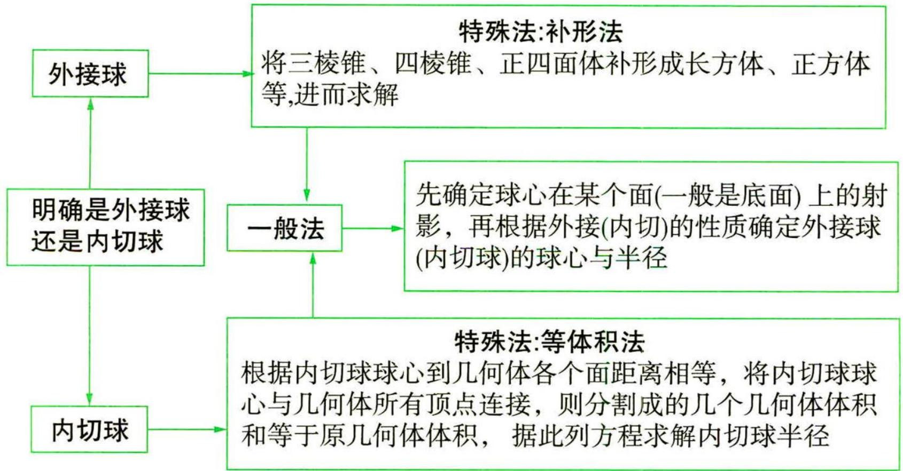

世界上有一个数字叫“葛立恒数”，曾经被视为在正式数学证明中出现过的最大数。它大得连科学记数法也不够用。葛立恒数是在吉尼斯世界纪录中世界最大的“有意义”的自然数。

调研 1 (2023 · 四川巴中 9 月零诊) 在三棱锥 A - BCD 中, BD ⊥ 平面 ADC, ${BD} = 2,{AB} = 2\sqrt{2},{AC} = {BC} = 2\sqrt{5}$ ,则三棱锥 $A - {BCD}$ 的外接球的体积为

解析 因为 $BD \perp$ 平面 ${ADC},{AD},{CD} \subset$ 平面 ${ADC}$ ,故 ${BD} \perp  {AD},{BD} \perp  {CD}$ . 又 ${BD} = 2,{AB} =$ $2\sqrt{2},{AC} = {BC} = 2\sqrt{5}$ ,故 ${AD} = \sqrt{A{B}^{2} - B{D}^{2}} = \sqrt{8 - 4} = 2,{CD} = \sqrt{B{C}^{2} - B{D}^{2}} = \sqrt{20 - 4} = 4$ . 所以 $A{C}^{2} =$ $A{D}^{2} + C{D}^{2}$ ,所以 ${AD} \perp  {CD}$ ,故 ${AD},{CD},{BD}$ 三条棱两两垂直,故以 ${AD},{CD},{BD}$ 为相邻的 $B$

【模型应用】见外接球优先考虑补形法,根据题设条件,发现从 $D$ 点出发的三条棱两两垂直,即“墙角”,则可将三棱锥外接球转化为长方体外接球

棱构造一个长、宽、高分别为4,2,2的长方体,如图1,则三棱锥A-BCD的外接球即该长方体的外接球,外接球半径 $r = \frac{\sqrt{2^2 + 2^2 + 4^2}}{2} = \sqrt{6}$ ,所以三棱锥A-BCD外接球的体积为 $\frac{4\pi}{3} \times (\sqrt{6})^3 = 8\sqrt{6}\pi$ .

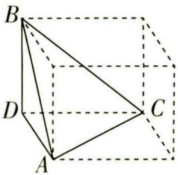

图1

答案 $8\sqrt{6}\pi$

调研 2 (2023 · 武汉青山区 9 月开学检测) 如图 2, 在三棱锥 P-ABC 中, $PA = BC = \sqrt{3}$ , PB = AC = 2, $PC = AB = \sqrt{5}$ , 则三棱锥 P-ABC 外接球的体积为 ( )

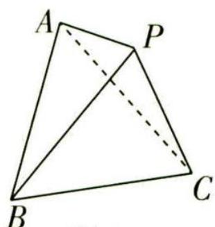

图 2

$\quad$A. $\sqrt{2}\pi$

$\quad$B. $\sqrt{3} \pi$

$\quad$C. $\sqrt{6} \pi$

$\quad$D. $6\pi$

解析 根据题意,可将三棱锥 $P-ABC$ 置入到长方体中,长方体的三条面对角线长分别为 $\sqrt{3},2,\sqrt{5}$ . 设长方体的长、宽、高分别为 $a,b,c$ , 则 $\sqrt{a^{2}+b^{2}}=\sqrt{3},\sqrt{a^{2}+c^{2}}=2,\sqrt{c^{2}+b^{2}}=\sqrt{5}$ , 得 $a=1$ , 【模型应用】对棱相等的三棱锥也可以应用补形法求解外接球问题, 联想长方体的面对角线进行构造 $b=\sqrt{2},c=\sqrt{3}$ , 所以三棱锥 $P-ABC$ 外接球的半径 $R=\frac{1}{2}\times\sqrt{1^{2}+(\sqrt{2})^{2}+(\sqrt{3})^{2}}=\frac{\sqrt{6}}{2}$ , 所以三棱锥 $P-ABC$ 外接球的体积 $V=\frac{4}{3}\pi R^{3}=\sqrt{6}\pi$ .

答案 C

调研 3 (2023·山西晋中9月开学考试)在三棱锥 $P - ABC$ 中, $AB = AC = BC = 2$ , $PA = PB = 2$ , $PC = \sqrt{3}$ , 则三棱锥 $P - ABC$ 的外接球的半径为 \_\_\_\_.

解析 如图3,取 ${AB}$ 的中点 $D$ ,连接 ${PD},{CD}$ ,根据 ${AB} = {AC} = {BC} = {PA} = {PB} = 2$ ,得 ${CD}\bot {AB}$ , ${PD}\bot {AB}$ ,且 ${CD} = {PD} = \sqrt{3}$ ,又 ${PC} = \sqrt{3}$ ,所以 $\bigtriangleup  {PCD}$ 是正三角形, $\angle {PDC} = {60}^{ \circ }$ . 设三棱锥 $P - {ABC}$ 的外接球球心为 $O$ ,易知 $O$ 在 $\bigtriangleup  {PCD}$ 内部,过点 $O$ 作 ${OE}\bot {CD}$ 于点 $E,{OF}\bot {PD}$ 于点 $F$ ,连接 ${OB},{BE}$ ,

【模型应用】题中所给的三棱锥很难补形成长方体或正方体，则考虑一般法，根据三棱锥底面为等边三角形和截面圆的性质，可以判定外接球球心在过底面△PAB，△ABC的中心且垂直于底面的直线上

世界上也有一个数字叫古戈尔普勒克斯, 是 10 的古戈尔次方, 古戈尔就是 10 的 100 次方.

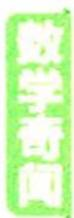

$OD$ , 则点 $E, F$ 分别是 $\triangle ABC, \triangle PAB$ 的外接圆圆心, 且 $OE = OF$ . 在 Rt $\triangle ODE$ 中, $\angle ODE = 30^\circ$ , $DE = \frac{1}{3}CD = \frac{\sqrt{3}}{3}$ , 所以 $OE = \frac{\sqrt{3}}{3}DE = \frac{1}{3}$ . 在 Rt $\triangle BDE$ 中, $BE = \sqrt{\left(\frac{\sqrt{3}}{3}\right)^2 + 1^2} = \frac{2\sqrt{3}}{3}$ . 设球 $O$ 的半径为 $R$ , 则 $R^2 = OE^2 + BE^2 = \frac{13}{9}$ , 得 $R = \frac{\sqrt{13}}{3}$ .

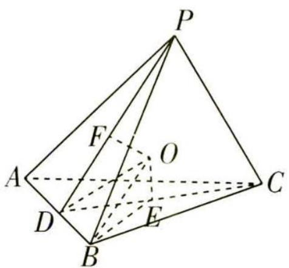

图 3

答案 $\frac{\sqrt{13}}{3}$

调研 4 (原创)已知正四面体 SABC 的棱长为 1, 如果一个高为 $\frac{\sqrt{3}}{6}$ 的长方体能在该正四面体内任意转动, 则该长方体的长和宽形成的长方形的面积的最大值为 \_\_\_\_.

解析 由题意知,要满足一个高为 $\frac{\sqrt{3}}{6}$ 的长方体能在正四面体 SABC 内任意转动,则该长方体的体对角线长不超过正四面体的内切球直径.

如图4所示,设D为BC的中点,连接AD,SD,在平面SAD上,过点S作 $SH\perp AD$ 于点H,则H是正三角形ABC的中心,正四面体SABC内切球的球心O必定在直线SH上,连接AO,并延长AO交SD于点E.

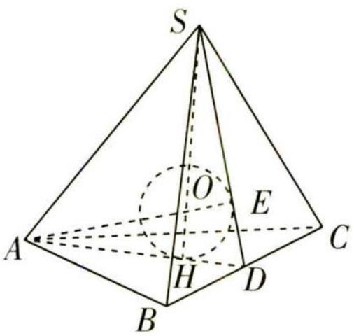

图 4

易知 AH: HD = 2:1, AE ⊥ SD, 则 Rt△SHD ≅ Rt△AED,

所以 Rt△SHD \~ Rt△AHO, 所以 $\frac{SD}{HD} = \frac{OA}{OH}$ , 而 SD = AD, 所以 $\frac{SD}{HD} = \frac{3}{1}$ , 所以 $\frac{OA}{OH} = \frac{3}{1}$ , 即 $\frac{OS}{OH} = \frac{3}{1}$ , 所以 OS = 3OH, SH = 4OH, 所以内切球的半径 R = OH =$\frac{1}{4} SH$ ，因为正四面体棱长为 1，所以 $AH = \frac{\sqrt{3}}{2} \times \frac{2}{3} = \frac{\sqrt{3}}{3}$ ，所以 $SH = \sqrt{1^2 - (\frac{\sqrt{3}}{3})^2} = \frac{\sqrt{6}}{3}$ ，所以 $R = \frac{1}{4} SH = \frac{\sqrt{6}}{12}$ 。设该长方体的长和宽分别为 $x, y$ ，则 $x^2 + y^2 + (\frac{\sqrt{3}}{6})^2 \leqslant (2 \times \frac{\sqrt{6}}{12})^2$ ，化简得 $x^2 + y^2 \leqslant \frac{1}{12}$ ，所以 $S_{\text{长方形}} = xy \leqslant \frac{x^2 + y^2}{2} \leqslant \frac{1}{24}$ 。所以所求面积的最大值为 $\frac{1}{24}$ 。

答案 $\frac{1}{24}$

调研 5 (2023·武汉四十九中9月开学考试)(多选)已知正四面体的外接球、内切球的球面上各有一动点 M, N, 若线段 MN 的最小值为 $\sqrt{6}$ , 则 ( )

$\quad$A. 正四面体的棱长为 6

$\quad$B. 正四面体的内切球的表面积为 $6 \pi$

$\quad$C. 正四面体的外接球的体积为 $8\sqrt{6}\pi$

$\quad$D. 线段 $MN$ 的最大值为 $2 \sqrt{6}$

解析 设这个正四面体的棱长为 a，则此正四面体可以补形成棱长为 $\frac{\sqrt{2}}{2}a$ 的正方体，正四面体的外接球即该正方体的外接球，外接球直径为正方体的体对角线长，设外接球的半径为 R，内切球的半径为 r，则 $2R = \sqrt{3 \times \left(\frac{\sqrt{2}}{2}a\right)^2} = \frac{\sqrt{6}}{2}a$ ，所以 $R = \frac{\sqrt{6}}{4}a$ ，正四面体的高为 $h = \sqrt{a^2 - \left(\frac{\sqrt{3}}{3}a\right)^2} = \frac{\sqrt{6}}{3}a$ ，由等体积法可得 $\frac{1}{3}Sh = 4 \times \frac{1}{3}Sr$ （设 S 为正四面体一个面的面积），所以 $r = \frac{1}{4}h = \frac{\sqrt{6}}{12}a$ 。正四面体的外接球球心与内切球球心重合，则由题意得 $R - r = \sqrt{6}$ ，所以 $\frac{\sqrt{6}}{4}a - \frac{\sqrt{6}}{12}a = \sqrt{6}$ ，解得 a = 6，所以 A 正确。由 A 知 $R = \frac{\sqrt{6}}{4} \times 6 = \frac{3\sqrt{6}}{2}$ ，所以外接球的体积为 $\frac{4}{3}\pi R^3 = \frac{4}{3}\pi \times \left(\frac{3\sqrt{6}}{2}\right)^3 = 27\sqrt{6}\pi$ ，所以 C 错误。因为内切球半径为 $r = \frac{\sqrt{6}}{12} \times 6 = \frac{\sqrt{6}}{2}$ ，所以内切球的表面积为 $4\pi r^2 = 4\pi \times \left(\frac{\sqrt{6}}{2}\right)^2 = 6\pi$ ，所以 B 正确。线段 MN 的最大值为 $R + r = \frac{3\sqrt{6}}{2} + \frac{\sqrt{6}}{2} = 2\sqrt{6}$ ，所以 D 正确。

答案 ABD

# 型10 等积变换模型

# 特约名师

章礼抗 安徽省正高级教师,高中数学特级教师. 参编教辅用书多部,在各级各类数学杂志上发表论文约 100 篇,在各类报纸上发表论文近 3000 篇.

# 模型解法 >>>

等积变换模型包括等面积变换与等体积变换两种. 等体积变换主要是利用祖暅原理求体积, 或利用三棱锥的特殊性, 即任意一个面都可以作为其底面, 列出三棱锥体积不同的表达式, 从而转化所求体积或构造方程求点到平面的距离. 破解此类题的关键点是:

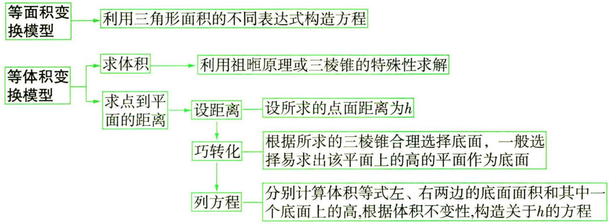

如果你在计算百分比时遇到问题,可以把它反过来.譬如说,50的4%与4的50%相同,25的80%与80的25%相同.

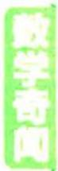

调研 1 (2023·江苏百校第一次联考/祖暅原理,双空题)祖暅是我国南北朝时

期伟大的数学家,他提出了“幂势既同,则积不容异”的体积计算原理,即“夹在两个平行平面之间的两个几何体,被平行于这两个平面的任意平面所截,如果截得的两个截面的面积总相等,那么这两个几何体的体积相等”.现已知直线 $y = \pm 2$ 与双曲线 $x^{2} - y^{2} = 4$ 及其渐近线围成的平面图形 $G$ ,如图1阴影部分.若将图形 $G$ 被直线 $y = t(-2 \leqslant t \leqslant 2)$ 所截得的两条线段绕 $y$ 轴旋转一周,则形成的旋转面的面积 S = \_\_\_\_ ; 若将图形 G 绕 y 轴旋转一周, 则形成的旋转体的体积 V = \_\_\_\_.

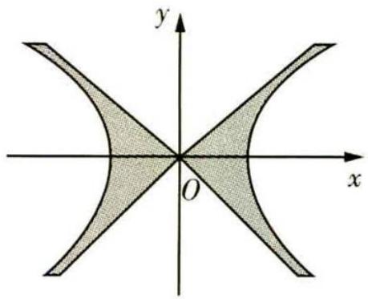

图 1

解析 第一空, 双曲线 $x^{2}-y^{2}=4$ 的其中一条渐近线方程为 $y=x$ , 如图2所示, 设直线 $y=x$ 与直线 $y=t(-2 \leqslant t \leqslant 2)$ 交于点 $A$ , 双曲线 $x^{2}-y^{2}=4$ 的右支与直线 $y=t$ 交于点 $B$ . 则由 $\left\{\begin{array}{l} y=x, \\ y=t, \end{array}\right.$ 得 $A(t,t)$ , 由 $\left\{\begin{array}{l} x^{2}-y^{2}=4, \\ y=t, \end{array}\right.$ 得 $B(\sqrt{4+t^{2}},t)$ , 所以所求旋转面的面积 $S=\pi(\sqrt{4+t^{2}})^{2}-\pi t^{2}=4\pi$ .

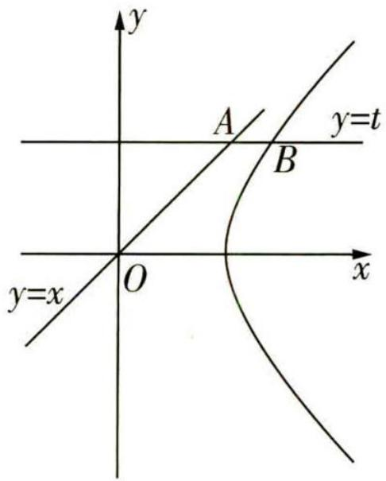

图 2

【会思考】线段 $AB$ 绕 $y$ 轴旋转一周所得的旋转面为圆环, 即所求旋转面, 该圆环的环宽为 $AB$ 的长

第二空,根据“幂势既同,则积不容异”,可得所求旋转体的体积与底面面积为 $4\pi$ ,高为4的圆柱的体积相等,所以该旋转体的体积 $V=4\pi\times4=16\pi$ .

【模型应用】由第一空的分析知,用垂直于 $y$ 轴的平面截该旋转体,所得截面面积总为 ${4\pi }$ , 则结合组恒原理可将该不规则几何体的体积转化为等底等高的圆柱的体积

答案

$4 \pi , 1 6 \pi$

调研 2 (2023·江西新余一中开学考试)(多选)正方体 $ABCD-A_{1}B_{1}C_{1}D_{1}$ 的棱长为 1, 点 P 为线段 $A_{1}C$ 上的动点(包含线段端点), 则下列结论正确的是 ( )

$\quad$A. 当 $\overrightarrow{A_1C} = 3\overrightarrow{A_1P}$ 时, $D_{1}P / /$ 平面 $BDC_{1}$   
$\quad$B. 当 $P$ 为 $A_{1} C$ 的中点时, 四棱锥 $P - A A_{1} D_{1} D$ 的外接球表面积为 $\frac { 9 } { 2 } \pi$   
$\quad$C. $AP + PD_{1}$ 的最小值为 $\frac{2\sqrt{6}}{3}$   
$\quad$D. 当 $A_{1}P=\frac{\sqrt{3}}{3}$ 时, 点 P 是 $\triangle AB_{1}D_{1}$ 的重心

解析 对于 A, 如图 3, 易知 $V_{A-A_{1}B_{1}D_{1}} = \frac{1}{3} \times \frac{1}{2} \times 1 \times 1 \times 1 = \frac{1}{6}$ , $S_{\triangle AB_{1}D_{1}} = \frac{1}{2} \times \sqrt{2} \times \sqrt{2} \times$

如果有人告诉你,他们有2个孩子,而其中一个是男孩,那么他们另一个孩子是女孩的概率就是2/3,而不是1/2.

$\sin 6 0 ^ {\circ} = \frac {\sqrt {3}}{2}, A _ {1} C = \sqrt {3},$

设点 $A_{1}$ 到平面 $AB_{1}D_{1}$ 的距离为 $h$ ，则 $V_{A_1 - AB_1D_1} = \frac{1}{3} \times \frac{\sqrt{3}}{2} \times h = V_{A - A_1B_1D_1} = \frac{1}{6}$ ，解得 $h = \frac{\sqrt{3}}{3}$ ，所以 $h = \frac{1}{3} A_{1}C$ ，易知 $A_{1}P \perp$ 平面 $AB_{1}D_{1}$ ，则当 $\overrightarrow{A_1C} = 3\overrightarrow{A_1P}$ 时，

【模型应用】利用等体积法确定点面距,是求解问题的关键 $P$ 为 ${A}_{1}C$ 与平面 $A{B}_{1}{D}_{1}$ 的交点.

【记结论】在正方体 $ABCD - A_{1}B_{1}C_{1}D_{1}$ 中， $A_{1}C \perp$ 平面 $AB_{1}D_{1}$ ，且直线 $A_{1}C$ 与平面 $AB_{1}D_{1}$ 的交点为线段 $A_{1}C$ 的三等分点

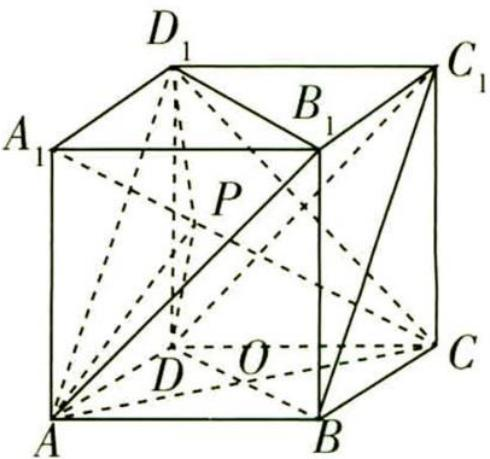

图3

易知 $AD_{1} \parallel BC_{1}, AD_{1} \not\subset$ 平面 $BDC_{1}, BC_{1} \subset$ 平面 $BDC_{1}$ , 所以 $AD_{1} \parallel$ 平面 $BDC_{1}$ , 同理可证 $AB_{1} \parallel$ 平面 $BDC_{1}$ , 又 $AD_{1} \cap AB_{1} = A, AD_{1}, AB_{1} \subset$ 平面 $AB_{1}D_{1}$ , 所以平面 $AB_{1}D_{1} \parallel$ 平面 $BDC_{1}$ , 又 $D_{1}P \subset$ 平面 $AB_{1}D_{1}$ , 所以 $D_{1}P \parallel$ 平面 $BDC_{1}$ , 故 A 正确.

对于 B, 当点 P 为 $A_{1}C$ 的中点时, 四棱锥 $P-AA_{1}D_{1}D$ 为正四棱锥, 且高为 $\frac{1}{2}$ , 底面边长为 1, 设四棱锥 $P-AA_{1}D_{1}D$ 的外接球半径为 R, 则 $\left(\frac{1}{2}-R\right)^{2}+\left(\frac{\sqrt{2}}{2}\right)^{2}=R^{2}$ , 解得 $R=\frac{3}{4}$ , 所以四棱锥 $P-AA_{1}D_{1}D$ 的外接球表面积为 $4\pi R^{2}=\frac{9\pi}{4}$ , 故 B 错误.

对于 C, 连接 AC, $D_{1}C$ , 则 Rt $\triangle A_{1}AC \cong Rt\triangle A_{1}D_{1}C$ , 且 $A_{1}C$ 为两直角三角形的公共斜边, 所以 AP = $PD_{1}$ , 当 $AP \perp A_{1}C$ 时, AP 最小, 所以由等面积法可得, AP 的最小值为 $\frac{AA_{1} \times AC}{A_{1}C} = \frac{1 \times \sqrt{2}}{\sqrt{3}} = \frac{\sqrt{6}}{3}$ , 所以 AP +

【模型应用】根据直角三角形 $A_{1} A C$ 面积的不同表达式, 列方程求解$PD_{1}$ 的最小值为 $\frac{2\sqrt{6}}{3}$ ，故 C 正确.

对于 D, 由选项 A 的分析可得, 当 $A_{1}P = \frac{\sqrt{3}}{3}$ 时, $A_{1}P$ 即三棱锥 $A_{1} - AB_{1}D_{1}$ 的高, 又三棱锥 $A_{1} - AB_{1}D_{1}$ 为正三棱锥, 所以点 $P$ 是 $\triangle AB_{1}D_{1}$ 的重心, 故 D 正确.

答案

ACD

# 模型演练

(2023·四川巴中9月零诊)如图4,正方形ABCD和直角梯形BCFE所在平面互相垂直, $BE\perp BC$ , $BE\parallel CF$ ,且AB=BE=2,CF=3.

（1） 证明: $AE \parallel$ 平面 DCF.  
（2） 求三棱锥 F-ACE 的体积.

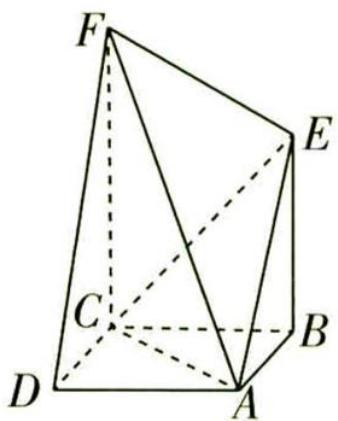

图 4

假设你有一根绳子长 40 075.017 km, 它恰好能够环绕地球一周. 如果你想让绳子离开地球表面 1 cm 的话, 你额外需要多长的绳子才能做到这一点? (答案: 约 6.28 cm)

# 参考答案与解析

（1）由正方形 ABCD 的性质得 $AB \parallel CD$ ,

∵ AB ∉ 平面 DCF, CD ⊂ 平面 DCF, ∴ AB ∥ 平面 DCF.

∵ BE∥CF, BE∉平面 DCF, CF⊂平面 DCF, ∴ BE∥平面 DCF.

∵ $AB \cap BE = B, AB, BE \subset$ 平面 ABE, ∴ 平面 $ABE \parallel$ 平面 DCF.

【易遗漏】运用面面平行的判定定理时,不要漏写两线相交

∵ AE⊂平面 ABE, ∴ AE∥平面 DCF.

（2）由题意知, $V_{F-ACE}=V_{A-CEF}$ .

【模型应用】利用等体识法将所求三棱锥的体识进行等价转化

∵ 平面 $BCFE \perp$ 平面 ABCD, 平面 $BCFE \cap$ 平面 ABCD = BC, $AB \perp BC$ , $AB \subset$ 平面 ABCD,

$\therefore AB \perp$ 平面 BCFE.

又 AB = 2, ∴ 点 A 到平面 CEF 的距离为 2, 即三棱锥 A - CEF 的高 h = 2.

$\because BE \perp BC, BE \parallel CF$ ，且 $BC = 2, CF = 3, \therefore S_{\triangle CEF} = \frac{1}{2} \times CF \times BC = \frac{1}{2} \times 3 \times 2 = 3, \therefore V_{A-CEF} = \frac{1}{3} S_{\triangle CEF} h = \frac{1}{3} \times 3 \times 2 = 2. \therefore$ 三棱锥 $F - ACE$ 的体积为 2.

# 型 11 动态几何模型

# 模型解法 >>>

一般立体几何动态问题形成的原因有动点变化、平面图形的翻折、几何体的平移和旋转等,解决此类问题的关键是抓住动点,可以采用转化法或坐标法求解.

<table><tr><td>转化法</td><td>1巧转化,根据几何体的结构特征将动点所满足的条件转化为平面图形内动点问题,判断线面位置关系、定点、定值等.2定轨迹,根据平面几何的知识确定动点的轨迹形状或轨迹方程.</td></tr><tr><td>坐标法</td><td>通过建立直角坐标系,将动点条件坐标化,通过化简变形得到坐标所满足的条件,进而确定动点轨迹的形状,再求其长度、面积等.</td></tr></table>

调研 1 (2023·河北邯郸一中9月摸底)(多选)如图1,在正方体 $ABCD-A_{1}B_{1}C_{1}D_{1}$ 中,动点E在线段 $A_{1}C_{1}$ 上,则()

$\quad$A. 直线 $A_{1}C_{1}$ 与 BC 所成的角为 $30^{\circ}$

$\quad$B. 对任意的点 E, 都有 $BD \perp$ 平面 ACE

$\quad$C. 存在点 E, 使得平面 $ABE \parallel$ 平面 $CC_{1}D_{1}D$

$\quad$D. 存在点 E, 使得平面 $ABE \perp$ 平面 CDE

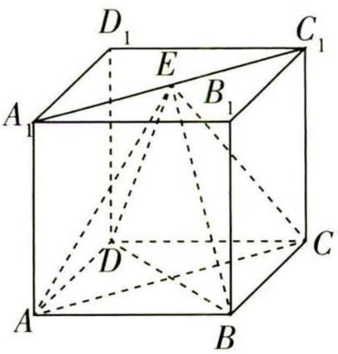

图1

解析 因为 $AC \parallel A_{1}C_{1}$ ，所以 $\angle ACB$ 为直线 $A_{1}C_{1}$ 与 BC 所成的角，又 $\angle ACB = 45^{\circ}$ ，故 A 错误.

因为 $AA_{1} \perp$ 平面 ABCD, BD ⊂ 平面 ABCD, 所以 $AA_{1} \perp BD$ .

又 $AC \perp BD, AC \cap AA_{1} = A$ , 所以 $BD \perp$ 平面 $ACC_{1}A_{1}$ , 故 $BD \perp$ 平面 $ACE$ , 故 B 正确.

当点 $E$ 在 $A_{1}$ 处时, 平面 $ABE \parallel$ 平面 $CC_{1}D_{1}D$ , 所以存在点 $E$ , 使得平面 $ABE \parallel$ 平面 $CC_{1}D_{1}D$ , 故 $\mathbb{C}$ 正确.

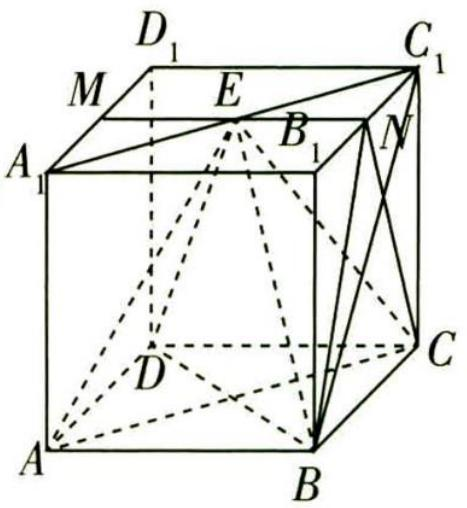

图2

【模型应用】找符合条件的点，存在某点，或存在某个平面，把所求转化为平面内的动点问题研究

如图2, 过点 $E$ 作 $MN \parallel A_{1}B_{1}$ , 分别交 $A_{1}D_{1}, B_{1}C_{1}$ 于点 $M, N$ , 连接 $BN, CN$ , 则 $MN$ 为平面 $ABE$ 与平面 $CDE$ 的交线,

在正方体 $ABCD - A_{1}B_{1}C_{1}D_{1}$ 中， $A_{1}B_{1} \perp$ 平面 $BCC_{1}B_{1}$ ，所以 $MN \perp$ 平面 $BCC_{1}B_{1}$ ，又 $BN, CN \subset$ 平面 $BCC_{1}B_{1}$ ，所以 $BN \perp MN, CN \perp MN$ ，所以 $\angle BNC$ 为平面 $ABE$ 与平面 $CDE$ 所成的角。

因为点 $N$ 一定在以 $BC$ 为直径的圆外, 所以 $\angle BNC < 90^{\circ}$ , 所以不存在点 $E$ , 使得平面 $ABE \perp$ 平面 $CDE$ , 故 D 错误.

【模型应用】扣住一点，从反面击破，这是选择题的常用方法

答案 BC

调研 2 (2023·山东省“学情空间”区域教研共同体9月入学检测/双动点问题)(多选)如图3,正方体 $ABCD-A_{1}B_{1}C_{1}D_{1}$ 的棱长为 $a$ ,线段 $B_{1}D_{1}$ 上有两个动点 $E,F$ ,且 $EF=\frac{\sqrt{2}}{2}a$ ,以下结论正确的有

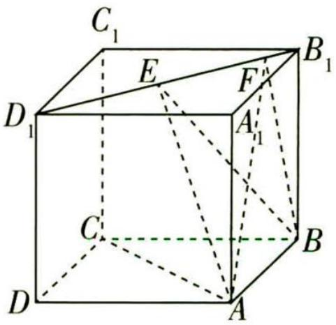

图 3

$\quad$A. ${AC} \bot  {BE}$

$\quad$B. 点 A 到平面 BEF 的距离为定值

$\quad$C. 三棱锥 $A - BEF$ 的体积是正方体 $ABCD - A_{1}B_{1}C_{1}D_{1}$ 体积的 $\frac{1}{12}$

$\quad$D. 异面直线 $AE, BF$ 所成的角为定值

解析 对于 A, 连接 BD, 根据题意可得 $AC \perp BD, AC \perp DD_{1}$ , 且 $BD \cap DD_{1} = D$ , 所以 $AC \perp$ 平面 $BDD_{1}B_{1}$ , 而 $BE \subset$ 平面 $BDD_{1}B_{1}$ , 所以 $AC \perp BE$ , 所以 A 正确.

对于 B, 点 A 到平面 $BDD_{1}B_{1}$ 的距离是定值, 所以点 A 到平面 BEF 的距离为定值, 所以 B 正确.

【模型应用】由于平面 BEF 即平面 $BDD_{1}B_{1}$ ，点 A 到平面 BEF 的距离转化为点 A 到平面 $BDD_{1}B_{1}$ 的距离

对于 C, 三棱锥 A - BEF 的体积为 $V_{三棱锥A - BEF} = \frac{1}{3} \times \frac{1}{2} EF \times BB_{1} \times AB \times \sin 45^{\circ} = \frac{1}{3} \times \frac{1}{2} \times \frac{\sqrt{2}}{2} a \times$

有一个三维几何体叫托里拆利小号,又称加百利号角,它是一个表面积无限大但体积有限的三维几何体.

$a \times \frac{\sqrt{2}}{2}a = \frac{1}{12}a^{3}$ ，所以三棱锥 A - BEF 的体积是正方体 ABCD - $A_{1}B_{1}C_{1}D_{1}$ 体积的 $\frac{1}{12}$ ，所以 C 正确.

对于D,连接 $B{C}_{1}$ ,当点E在 ${D}_{1}$ 处,F为 ${D}_{1}{B}_{1}$ 的中点时,异面直线 ${AE}$ , ${BF}$ 所成的角是 $\angle {FBC}_{1}$ ,当点 $E$ 为 ${D}_{1}{B}_{1}$ 的中点,F在 ${B}_{1}$ 处时,异面直线 ${AE}$ , ${BF}$ 所成的角是 $\angle {EAA}_{1}$ ,显然两个角不相等,D错误.

【模型应用】因为是有关双动点的定值问题, $EF = \frac{\sqrt{2}}{2} a$ , $EF$ 为正方体面对角线长的一半, 所以可取特殊点, 比如线段中点、端点、三等分点等, 找到所求角, 比较两个角是否相等

答案

ABC

调研 3 (原创)在长方体 $ABCD - A_{1}B_{1}C_{1}D_{1}$ 中, AB = AD = 6, $AA_{1} = 2$ , M 为棱 BC 的中点, 动点 P 在平面 $DCC_{1}D_{1}$ 内, 满足 $\angle APD = \angle CPM$ , 则点 P 的轨迹与长方体的面 $DCC_{1}D_{1}$ 的交线长为 \_\_\_\_.

解析 如图4, 当点 $P$ 在平面 ${DCC}_{1}{D}_{1}$ 内时, ${AD} \perp$ 平面 ${DCC}_{1}{D}_{1},{CM} \perp$ 平面 ${DCC}_{1}{D}_{1},\angle {APD} =$ $\angle {CPM}$ ,因为 ${AB} = {AD} = 6,{MC} = 3$ ,所以 $\tan \angle {APD} = \frac{AD}{DP} = \frac{MC}{PC} = \tan \angle {CPM}$ ,则 ${DP} = {2PC}$ .

如图5,在平面 $DCC_{1}D_{1}$ 中,以DC所在直线为x轴,DC的垂直平分线为y轴建立平面直角坐标系,则 $D(-3,0),C(3,0)$ ,设 $P(x,y)$ ,则 $\sqrt{(x+3)^{2}+y^{2}}=2\sqrt{(x-3)^{2}+y^{2}}$ ,即 $y^{2}+(x-5)^{2}=4^{2}$ ,

【模型应用】建立平面直角坐标系，将动点P坐标化，确定动点轨迹形状或轨迹方程

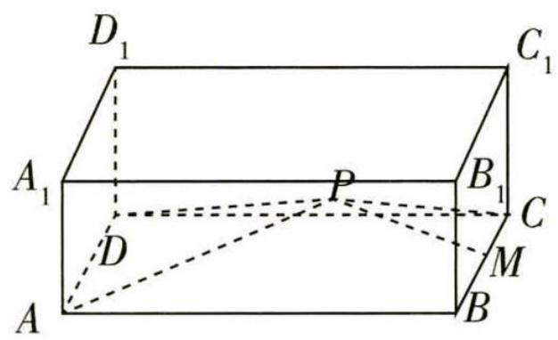

图4

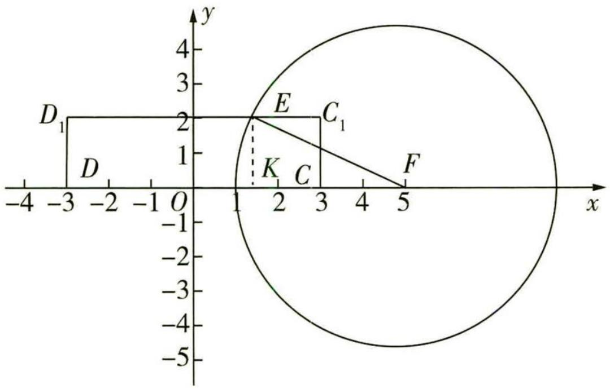

图5

所以点 P 的轨迹是以 $F(5,0)$ 为圆心,4 为半径的圆.

设圆 F 与 $C_{1}D_{1}$ 的交点为 E，作 $EK \perp x$ 轴于点 K，则 $\sin \angle EFK = \frac{EK}{EF} = \frac{2}{4} = \frac{1}{2}$ ，所以 $\angle EFK = \frac{\pi}{6}$ 。故点 P 的轨迹与长方体的面 $DCC_{1}D_{1}$ 的交线长为 $\frac{\pi}{6} \times 4 = \frac{2\pi}{3}$ 。

答案

$\frac {2 \pi}{3}$

统计上来说,平均而言你的朋友比你拥有更多的朋友,这就是所谓的“朋友悖论”.这一现象可以解释为抽样偏差的一种表现形式,即拥有较多朋友的人更有可能同时是自己的朋友中的一位.

关注微信公众号“初高教辅站”获取更多初高中教辅资料

# 型 12 法向量模型

# 模型解法 >>>

用向量法求空间角(主要为线面角、二面角)适用于已知空间几何体的棱长、角度、直线与平面的位置关系的情况. 此外, 求点到平面的距离除了构造三角形或利用等体积法外, 也可以利用向量法求解. 破解此类题的关键点是:

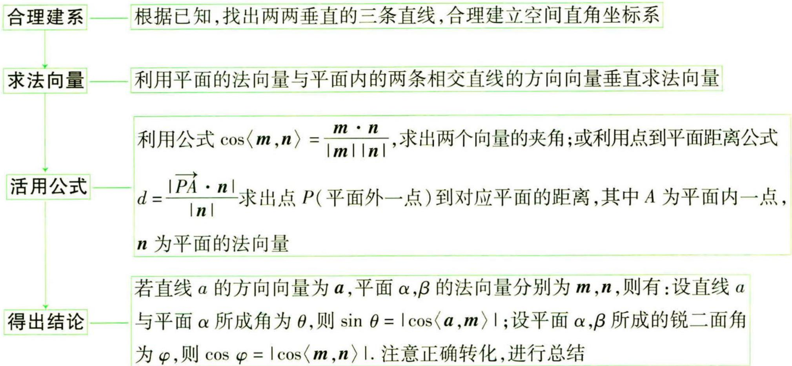

# 类型1 空间角模型

调研 1 (2023 · 广东金山中学 9 月摸底) 如图 1, 在四棱锥 P-ABCD 中, 底面 ABCD 为正方形, 平面 $PAB \perp$ 底面 ABCD, 平面 $PAD \perp$ 底面 ABCD, PA = 2AD, E, F, H 分别是 PA, PD, AB 的中点, G 为 DF 的中点.

（1） 证明: GH // 平面 BEF.  
（2） 求 PC 与平面 BEF 所成角的正弦值.

解析 （1）如图2,取AE的中点M,连接MG,MH,∵E,F分别是PA,PD的中点,∴EF∥AD.

又 G, M 分别是 DF, AE 的中点, ∴ $MG \parallel EF \parallel AD$ , 又 $MG \not\subset$ 平面 BEF, $EF \subset$ 平面 BEF, ∴ $MG \parallel$ 平面 BEF.

同理, $M, H$ 分别是 $AE, AB$ 的中点, $\therefore MH \parallel EB$ , 又 $MH \not\subset$ 平面 $BEF, EB \subset$ 平面 $BEF$ , $\therefore MH \parallel$ 平面 $BEF$ .

又 $MG \cap MH = M, MG \subset$ 平面 $MHG, MH \subset$ 平面 $MHG, \therefore$ 平面 $MHG \parallel$ 平面 BEF,

【易遗漏】划用面面平行的判定定理时,不要遗漏平面内两条相交的直线的说明

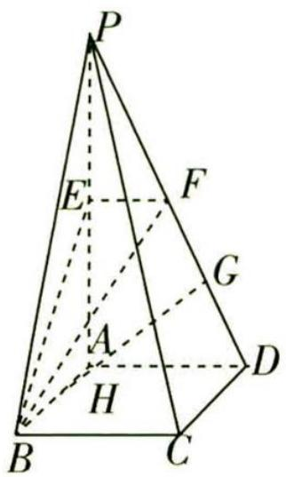

图 1

在向日葵的花盘中, 葵花籽的排列形成了两组螺旋线, 一组顺时针方向盘绕, 另一组逆时针方向盘绕. 科学家们研究发现, 螺旋线的发散角是 $137.5^{\circ}$ , 这时两组螺旋线是彼此紧密镶合的.

又 $GH \subset$ 平面 $MHG, \therefore GH \parallel$ 平面 $BEF$ .

（2） $\because$ 平面 $PAB \perp$ 平面 $ABCD$ , 平面 $PAB \cap$ 平面 $ABCD = AB$ , 平面 $PAB$ 内存在过点 $A$ 的直线 $l$ , 且 $l \perp AB, \therefore l \perp$ 平面 $ABCD$ .

∵ 平面 $PAD \perp$ 平面 ABCD, 平面 $PAD \cap$ 平面 ABCD = AD, 平面 PAD 内存在过点 A 的直线 m, 且 $m \perp AD, \therefore m \perp$ 平面 ABCD.

又 $l, m$ 都过点 $A, A \in$ 平面 $ABCD$ , 且过一点有且仅有一条直线与平面垂直,

易知平面 $PAB \cap$ 平面 PAD = PA，则 l, m 均为直线 PA，故 $PA \perp$ 平面 ABCD，∴ $PA \perp AB, PA \perp AD$ .

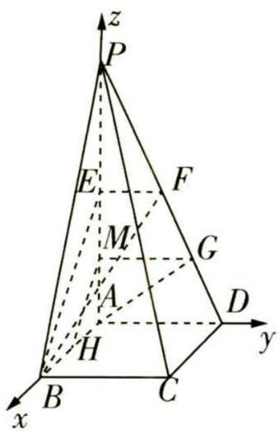

图 2

∵底面ABCD为正方形,∴ $AB\perp AD$ ,则AB,AD,AP两两垂直.

如图2,以A为坐标原点, $\overrightarrow{AB},\overrightarrow{AD},\overrightarrow{AP}$ 的方向分别为x轴,y轴,z轴的正方向建立空间直角坐标系A-xyz,设AB=2,则 $B(2,0,0),C(2,2,0),P(0,0,4),E(0,0,2),F(0,1,2)$ ,

【模型应用】由面面垂直可推出线面垂直、线线垂直，确定三条两两垂直的线，即可建立空间直角坐标系，注意建系时，尽可能使更多的点落在坐标轴上

得 $\overrightarrow{BE} = (-2,0,2),\overrightarrow{BF} = (-2,1,2),\overrightarrow{PC} = (2,2,-4)$ .

设平面 BEF 的法向量为 $\boldsymbol{m} = (x, y, z)$ ，则 $\left\{\begin{aligned}\boldsymbol{m} \cdot \overrightarrow{BE} &= 0, \\ \boldsymbol{m} \cdot \overrightarrow{BF} &= 0,\end{aligned}\right.$ 即 $\left\{\begin{aligned}-2x + 2z &= 0, \\ -2x + y + 2z &= 0,\end{aligned}\right.$ 取 x = 1，则 z = 1, y = 0，得 $\boldsymbol{m} = (1, 0, 1)$ 是平面 BEF 的一个法向量，则 $\cos\langle\boldsymbol{m}, \overrightarrow{PC}\rangle = \frac{\boldsymbol{m} \cdot \overrightarrow{PC}}{|\boldsymbol{m}| |\overrightarrow{PC}|} = \frac{-2}{\sqrt{2} \times 2\sqrt{6}} = -\frac{\sqrt{3}}{6}.$

综上可得 $PC$ 与平面 BEF 所成角的正弦值为 $\frac{\sqrt{3}}{6}$ .

调研 2 (2023·重庆南开中学9月阶段练习)如图3,在三棱柱 ${ABC} - {A}_{1}{B}_{1}{C}_{1}$ 中, ${AB} = {AC} = A{A}_{1} = 2,{AB} \bot  {AC},\angle {A}_{1}{AB} = \angle {A}_{1}{AC},D$ 是棱 ${B}_{1}{C}_{1}$ 的中点.

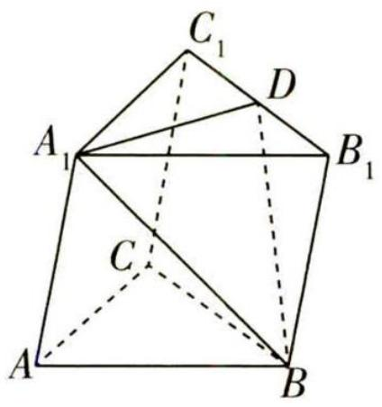

图3

（1） 证明: $AA_{1} \perp BC$ .

（2） 若三棱锥 $B_{1} - A_{1}BD$ 的体积为 $\frac{\sqrt{14}}{6}$ , 求平面 $A_{1}BD$ 与平面 $CBB_{1}C_{1}$ 所成锐二面角的余弦值.

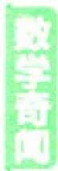

向日葵的花盘是圆的, 圆的一周是 $360^{\circ}$ , 那么 $360^{\circ} - 137.5^{\circ} = 222.5^{\circ}, 137.5^{\circ} \div 222.5^{\circ} \approx 0.618$ . 而 0.618 是黄金分割数, 因此 $137.5^{\circ}$ 也被称为“黄金角”. 这样的黄金角度不仅美观, 还可以使花盘变得坚固壮实, 花盘中的葵花籽数量达到最多.

解析 （1）如图4,取 ${BC}$ 的中点 $O$ ,连接 ${AO},{A}_{1}O,{A}_{1}C$ .

因为 AB = AC，所以 $AO \perp BC$ 。

因为 $\angle A_{1}AB = \angle A_{1}AC, AB = AC, AA_{1} = AA_{1}$ , 所以 $\triangle A_{1}AB \cong \triangle A_{1}AC$ ,

【扫清障碍】刘用三角形全等,证明两线段相等,进而找到垂直关系

所以 $A_{1}B = A_{1}C$ ，所以 $A_{1}O \perp BC$ .

因为 $AO \cap A_{1}O = O, AO, A_{1}O \subset$ 平面 $AA_{1}O$ ，所以 $BC \perp$ 平面 $AA_{1}O$ ，

又 $AA_{1} \subset$ 平面 $AA_{1}O$ ，所以 $AA_{1} \perp BC$ .

（2）如图4,连接OD,则平面 $AA_{1}O$ 即平面 $AA_{1}DO$ .

由（1）知 $BC \perp$ 平面 $AA_{1}DO$ ，因为 $BC \subset$ 平面 ABC，且 $BC \subset$ 平面 $BCC_{1}B_{1}$ ，故平面 $AA_{1}DO \perp$ 平面 ABC，平面 $AA_{1}DO \perp$ 平面 $BCC_{1}B_{1}$ ，

过点 O 作 $OM \perp A_{1}D$ 于点 M, 则 $OM \perp$ 平面 ABC, 过点 $A_{1}$ 作 $A_{1}H \perp OD$ 于点 H, 则 $A_{1}H \perp$ 平面 $BCC_{1}B_{1}$ .

由 $DO \parallel BB_{1} \parallel AA_{1}$ 知 $DO \perp BC$ , 在 $\triangle ABC$ 中, $AB \perp AC$ , $AB = AC = 2$ , 则 $BC = 2\sqrt{2}$ , 且 $DO = AA_{1} = 2$ , $DB_{1} = \frac{1}{2} B_{1} C_{1} = \frac{1}{2} BC = \sqrt{2}$ , $AO = A_{1} D = \sqrt{2}$ , 所以 $S_{\triangle BDB_{1}} = \frac{1}{2} DB_{1} \cdot DO = \sqrt{2}$ ,

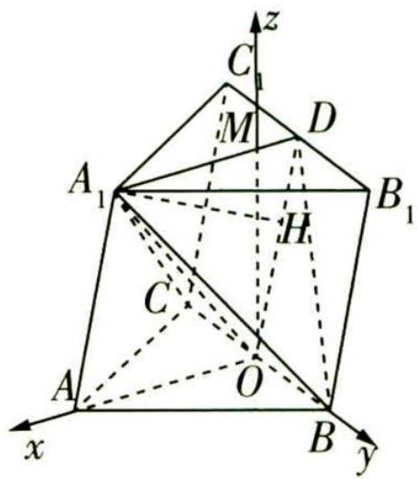

图 4

所以 $V_{\text{三棱锥} B_1 - A_1 BD} = V_{\text{三棱锥} A_1 - BDB_1} = \frac{1}{3} S_{\triangle BDB_1} \cdot A_1 H = \frac{\sqrt{2}}{3} A_1 H = \frac{\sqrt{14}}{6}$ , 所以 $A_1 H = \frac{\sqrt{7}}{2}$ .

【小妙招】利用等体积法,把不易求的高轻松化解. 注意三棱锥的体积公式不要满来 $\frac{1}{3}$

设 $\angle MOD = \alpha$ ，则 $\angle DA_{1}H = \alpha$ ，在 Rt $\triangle A_{1}HD$ 中， $\cos \alpha = \frac{A_{1}H}{A_{1}D} = \frac{\sqrt{7}}{\sqrt{2}} = \frac{\sqrt{14}}{4}$ ，则 $\sin \alpha = \frac{\sqrt{2}}{4}$ ，所以 $DM = DO \cdot \sin \alpha = \frac{\sqrt{2}}{2}, OM = DO \cdot \cos \alpha = \frac{\sqrt{14}}{2}$ ，

又 $A_{1}D=\sqrt{2}$ ，所以 M 为 $A_{1}D$ 的中点.

以 O 为坐标原点, 分别以 $\overrightarrow{OA}, \overrightarrow{OB}, \overrightarrow{OM}$ 的方向为 x 轴, y 轴, z 轴的正方向建立空间直角坐标系, 如图 4,

【合理建系】题中没有给出明显的三条两两垂直的线，可结合第（1）间的结论，挖掘隐含的线垂直关系，进而建立空间直角坐标系

则 $B(0, \sqrt{2}, 0), C(0, -\sqrt{2}, 0), A_{1}(\frac{\sqrt{2}}{2}, 0, \frac{\sqrt{14}}{2}), B_{1}(-\frac{\sqrt{2}}{2}, \sqrt{2}, \frac{\sqrt{14}}{2}), D(-\frac{\sqrt{2}}{2}, 0,$

虽然勾股定理是在公元三世纪被我国数学家赵爽证明的,但是人类很早就发现勾股数了,而且早的超乎你的想象.在发现的古巴比伦石板上就记载了勾股数组,距今已有3 000多年!

$\frac{\sqrt{14}}{2}$ , 得 $\overrightarrow{BA}_1 = (\frac{\sqrt{2}}{2}, -\sqrt{2}, \frac{\sqrt{14}}{2}), \overrightarrow{BD} = (-\frac{\sqrt{2}}{2}, -\sqrt{2}, \frac{\sqrt{14}}{2}), \overrightarrow{CB} = (0, 2\sqrt{2}, 0), \overrightarrow{BB}_1 = (-\frac{\sqrt{2}}{2}, 0, \frac{\sqrt{14}}{2})$ .

设平面 $A_{1}BD$ 的法向量为 $\boldsymbol{n}_{1}=(x_{1},y_{1},z_{1})$ ,

则 $\left\{ \begin{array}{l} \boldsymbol{n}_{1} \cdot \overrightarrow{BA_{1}} = 0, \\ \boldsymbol{n}_{1} \cdot \overrightarrow{BD} = 0, \end{array} \right.$ 所以 $\left\{ \begin{array}{l} \frac{\sqrt{2}}{2} x_{1} - \sqrt{2} y_{1} + \frac{\sqrt{14}}{2} z_{1} = 0, \\ -\frac{\sqrt{2}}{2} x_{1} - \sqrt{2} y_{1} + \frac{\sqrt{14}}{2} z_{1} = 0, \end{array} \right.$ 取 $x_{1} = 0, z_{1} = 2$ ，得 $\boldsymbol{n}_{1} = (0, \sqrt{7},$

2) 是平面 $A_{1} B D$ 的一个法向量.

设平面 $CBB_{1}C_{1}$ 的法向量为 $\boldsymbol{n}_{2} = (x_{2}, y_{2}, z_{2})$ ，则 $\left\{\begin{aligned}\boldsymbol{n}_{2} & \cdot \overrightarrow{CB} = 0, \\ \boldsymbol{n}_{2} & \cdot \overrightarrow{BB_{1}} = 0,\end{aligned}\right.$ 所以 $\left\{\begin{aligned}&2\sqrt{2}y_{2}=0,\\&-\frac{\sqrt{2}}{2}x_{2}+\frac{\sqrt{14}}{2}z_{2}=0,\end{aligned}\right.$ 取 $z_{2}=1$ ，则 $\boldsymbol{n}_{2}=(\sqrt{7},0,1)$ 是平面 $CBB_{1}C_{1}$ 的一个法向量.

设平面 $A_{1}BD$ 与平面 $CBB_{1}C_{1}$ 所成锐二面角为 $\theta$ ，则 $\cos \theta = \frac{|\pmb{n}_1\cdot\pmb{n}_2|}{|\pmb{n}_1|\cdot|\pmb{n}_2|} = \frac{2}{\sqrt{11}\times 2\sqrt{2}} = \frac{\sqrt{22}}{22}.$

所以平面 $A_{1}BD$ 与平面 $CBB_{1}C_{1}$ 所成锐二面角的余弦值为 $\frac{\sqrt{22}}{22}$ .

# 类型2 空间距离模型

调研 3 (2023·广州天河区9月模拟)如图5,在多面体
ABCDEF中,四边形ABCD是菱形, $\angle ABC=60^{\circ}$ ,EA⊥平面ABCD, $EA \parallel BF$ ,AB = AE = 2BF = 2.

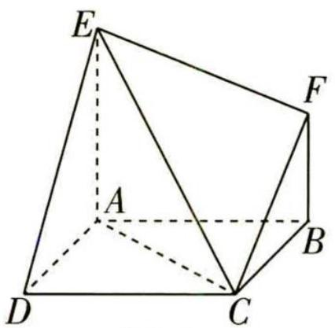

图5

（1） 证明: 平面 $EAC \perp$ 平面 $EFC$ .

（2） 在棱 $EC$ 上有一点 $M$ , 使得二面角 $M - BD - C$ 为 $45^{\circ}$ , 求点 $M$ 到平面 $BCF$ 的距离.

解析 （1）如图6,取 $EC$ 的中点 $G$ ,连接 $BD$ 交 $AC$ 于点 $N$ ,连接 $GN$ , $GF$ .

因为四边形 ABCD 是菱形, 所以 $AC \perp BD$ , 且 N 是 AC 的中点,

所以 $GN \parallel AE$ 且 $GN = \frac{1}{2}AE$ ，又 $AE \parallel BF, AE = 2BF = 2$ ，

第一个发现无理数的人却因此发现丢了性命, 此人便是毕达哥拉斯的门徒希伯斯. 他的这一发现与当时的毕达哥拉斯学派不符, 该学派认为数只存在整数和分数. 希伯斯推翻了毕达哥拉斯学派的理论, 动摇了学派的基础, 但他也因此丧命.

所以 $GN \parallel BF$ 且 GN = BF，所以四边形 BNGF 是平行四边形，所以 $GF \parallel BN$ 。

【会转化】把不易直接证明的 $GF \perp$ 平面 EAC，通过线线平行，转化为易证明的 $BN \perp$ 平面 EAC

因为 $EA \perp$ 平面 ABCD, $BN \subset$ 平面 ABCD, 所以 $EA \perp BN$ .

又 $AC \cap EA = A, AC, EA \subset$ 平面 $EAC$ , 所以 $BN \perp$ 平面 $EAC$ , 所以 $GF \perp$ 平面 $EAC$ .

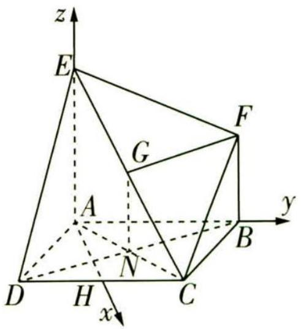

图6

又 $GF \subset$ 平面 $EFC$ , 所以平面 $EFC \perp$ 平面 $EAC$ .

（2） 取 $CD$ 的中点 $H$ , 连接 $AH$ , 由四边形 $ABCD$ 是菱形, $\angle ABC = 60^\circ$ , 得 $\angle ADC = 60^\circ$ , 所以 $\triangle ADC$ 是正三角形, 所以 $AH \perp CD$ , 所以 $AH \perp AB$ .

又 $AE \perp$ 平面 $ABCD$ , 所以以 $A$ 为坐标原点, $AH, AB, AE$ 所在直线分别为 $x$ 轴, $y$ 轴, $z$ 轴建立空间直角坐标系, 如图6所示,

【模型应用】光证明线面垂直，再建系求解

则 $D(\sqrt{3}, -1,0), B(0,2,0), C(\sqrt{3}, 1,0), E(0,0,2), F(0,2,1)$ , 得 $\overrightarrow{EC} = (\sqrt{3}, 1, -2), \overrightarrow{BC} = (\sqrt{3}, -1,0), \overrightarrow{BF} = (0,0,1)$ .

设 $\overrightarrow{EM}=\lambda\overrightarrow{EC}=\lambda(\sqrt{3},1,-2)=(\sqrt{3}\lambda,\lambda,-2\lambda)$ ，0< $\lambda<1$ ，则 $M(\sqrt{3}\lambda,\lambda,2-2\lambda)$ ，
所以 $\overrightarrow{DM}=(\sqrt{3}\lambda-\sqrt{3},\lambda+1,2-2\lambda),\overrightarrow{BM}=(\sqrt{3}\lambda,\lambda-2,2-2\lambda)$ .

设平面 DBM 的法向量为 $\boldsymbol{n} = (x, y, z)$ ，则 $\left\{\begin{aligned}\boldsymbol{n} \cdot \overrightarrow{DM} &= 0, \\ \boldsymbol{n} \cdot \overrightarrow{BM} &= 0,\end{aligned}\right.$ 即 $\left\{\begin{aligned}(\sqrt{3}\lambda - \sqrt{3})x + (\lambda + 1)y + (2 - 2\lambda)z &= 0, \\ \sqrt{3}\lambda x + (\lambda - 2)y + (2 - 2\lambda)z &= 0,\end{aligned}\right.$ 令 $x = \sqrt{3}, y = 1$ ，得 $\boldsymbol{n} = (\sqrt{3}, 1, \frac{2\lambda - 1}{\lambda - 1})$ 是平面 DBM 的一个法向量.

易知平面 ABCD 的一个法向量为 $\boldsymbol{m}=(0,0,1)$ ,

由二面角 M-BD-C 为 $45^{\circ}$ ，可得 $\left|\cos\left\langle n,m\right\rangle\right|=\frac{\left|m\cdot n\right|}{\left|m\right|\cdot\left|n\right|}=\frac{\left|\frac{2\lambda-1}{\lambda-1}\right|}{1\times\sqrt{4+\left(\frac{2\lambda-1}{\lambda-1}\right)^{2}}}=\frac{\sqrt{2}}{2}$

【技法点拨】利用方程思想,得参数 $\lambda$ 所满足的方程,解方程,即可得 $\lambda$ 的值. 解得 $\lambda = \frac{3}{4}$ ,

所以 $M\left(\frac{3\sqrt{3}}{4}, \frac{3}{4}, \frac{1}{2}\right)$ , 所以 $\overrightarrow{CM} = (-\frac{\sqrt{3}}{4}, -\frac{1}{4}, \frac{1}{2})$ .

设平面 BCF 的法向量为 $\boldsymbol{u}=(a,b,c)$ ，则 $\left\{\begin{aligned}\boldsymbol{u}\cdot\overrightarrow{BC}&=0,\\ \boldsymbol{u}\cdot\overrightarrow{BF}&=0,\end{aligned}\right.$ 即 $\left\{\begin{aligned}\sqrt{3}a-b&=0,\\ c&=0,\end{aligned}\right.$ 令 a=1，得 $\boldsymbol{u}=$ (1, $\sqrt{3}$ ,0) 是平面 BCF 的一个法向量，所以点 M 到平面 BCF 的距离 $d=\frac{|u\cdot\overrightarrow{CM}|}{|u|}=\frac{\sqrt{3}}{4}$ .

# 型13 翻折模型

# 模型解法 >>>

此模型主要涉及在翻折背景下判断或证明线面平行或垂直关系,或计算表面积、体积、点面距、线面角等问题,解决此类问题的关键点如下:

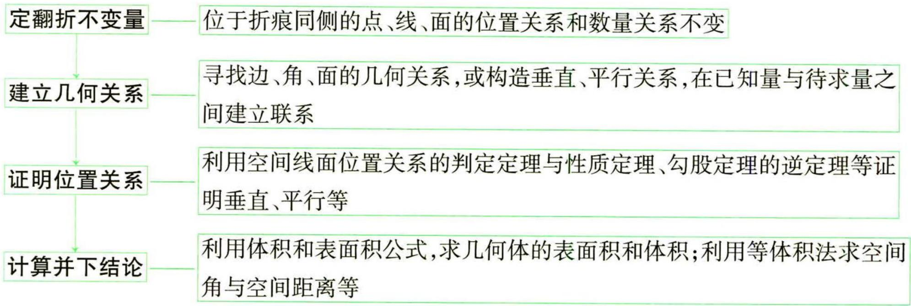

调研 1 (2023·安徽滁州定远三中9月模拟/以翻折锥体为背景,考查几何体的体积) 如图1,在平面四边形ABCD中, $AD \perp CD$ , $AC \perp BC$ , $\angle DAC = \angle BAC = 30^{\circ}$ , 现将 $\triangle ACD$ 沿AC折起,并连接BD,使得平面 $ACD \perp$ 平面ABC,如图2所示,若所得三棱锥D-ABC的外接球的表面积为 $4\pi$ ,则三棱锥D-ABC的体积为

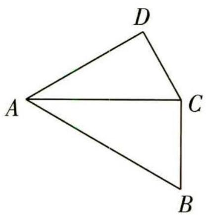

图1

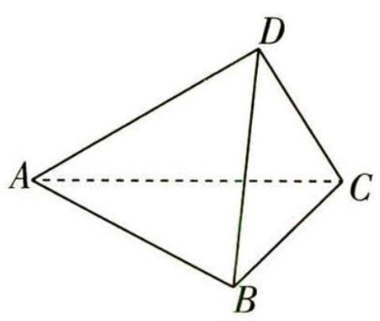

图2

( )

$\quad$A. $\frac{1}{4}$

$\quad$B. $\frac{\sqrt{3}}{4}$

$\quad$C. $\frac{\sqrt{3}}{8}$

$\quad$D. $\frac{\sqrt{3}}{6}$

# 思维导引

利用面面垂直的性质定理、线面垂直的判定定理

∠ADB 为直角

∠ACB 为直角

利用直角三角形的性质得到外接球的球心为斜边 $AB$ 的中点

根据球的表面积公式求得球的半径

利用锥体体积公式

三棱锥 $D-$ ABC的体积

# 解析

$\because$ 平面 ${ACD} \bot$ 平面 ${ABC}$ ,平面 ${ABC} \cap$ 平面 ${ACD} = {AC},{AC} \bot  {BC},{BC} \subset$ 平面 ${ABC}$ ,

【模型应用】是翻折不变量：注意位于折痕同侧，在同一个平面的三角形，翻折到空间中还是在同一个平面，其线线之间的垂直关系保持不变

不可能事件的概率一定是0,而概率是0的事件,有可能是可能事件.例如:在(0,1)之间随机取一个数,取到1/2的概率是0,但是是可能事件.

∴ BC ⊥ 平面 ACD, ∵ AD ⊂ 平面 ACD, ∴ AD ⊥ BC.

$\because AD \perp DC, BC \cap DC = C, BC \subset$ 平面 $BCD, DC \subset$ 平面 $BCD, \therefore AD \perp$ 平面 $BCD.$

又 $BD \subset$ 平面 $BCD, \therefore AD \perp BD$ , 即 $\angle ADB$ 为直角.

由于 $\angle ACB$ 为直角,取 $AB$ 的中点 $O$ ,连接 $OC,OD$ ,如图3所示,

【指点迷津】不共面的两直角三角形共斜边，则该斜边为该三棱锥的外接球的直径

由直角三角形斜边上的中线性质知 $OA = OB = OC = OD$ , 可得 $O$ 为三棱锥 $D - ABC$ 外接球的球心, 由三棱锥 $D - ABC$ 外接球的表面积为 $4\pi$ , 可得外接球的半径 $r = 1$ ,

【易混淆】球的表面积公式 $S = 4\pi {r}^{2}$ 不要与圆的面积公式 $S = {\pi }{r}^{2}$ 高混,球的表面积公式 $S = 4\pi {r}^{2}$ 不要与其体积公式 $V = \frac{4}{3}\pi {r}^{3}$ 高混

$\therefore AB = 2, BC = 1, AC = \sqrt{3}, CD = \frac{\sqrt{3}}{2}, AD = \frac{3}{2}, \because BC \perp$ 平面 $ACD, \angle ADC$ 为直角， $\therefore$ 三棱锥 $D - ABC$ 的体积为 $\frac{1}{3} BC \times S_{\triangle ACD} = \frac{1}{3} \times 1 \times \frac{1}{2} \times \frac{3}{2} \times \frac{\sqrt{3}}{2} = \frac{\sqrt{3}}{8}$ . 故选 C.

【易混淆】三棱锥的体积为 $V=\frac{1}{3}Sh$ ，注意与三棱柱的体积 V=Sh 的区别

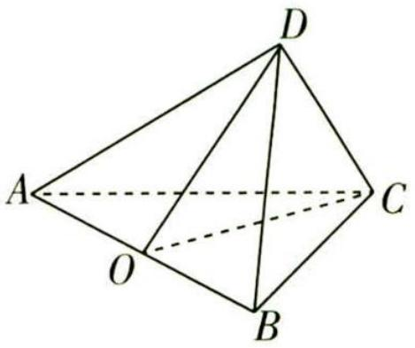

图 3

# 答案

C

调研 2 (2023·广东汕头金山中学9月摸底/开放探究,以翻折二面角为背景,考查空间相关的元素判断)(多选)如图4,正方形ABCD中, $CD=a,\overrightarrow{DE}=3\overrightarrow{EC}$ ,将△ADE沿AE翻折到△AEP的位置,点 $P\notin$ 平面ABCD,记二面角P-AB-C的大小为 $\theta$ ,在翻折过程中,满足下列什么关系()

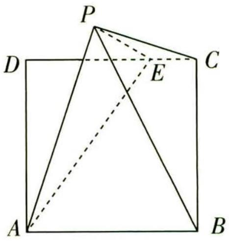

图4

$\quad$A. 四棱锥 P-ABCE 的体积最大值为 $\frac{a^{3}}{8}$ 
$\quad$B. 角 $\theta$ 可能为 $61^{\circ}$

$\quad$C. $\tan \theta \leqslant \frac{15}{16}$

$\quad$D. $\tan \theta \leqslant \frac{3\sqrt{7}}{7}$

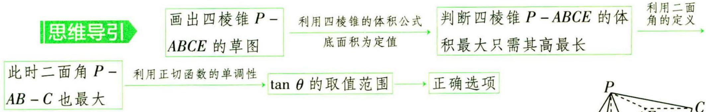

解析 如图5, 当 $\triangle ADE$ 沿 $AE$ 翻折到 $\triangle AEP$ 的位置, 点 $P \notin$ 平面 $ABCD$ , 则得到四棱锥 $P-ABCE$ . 当平面 $PAE \perp$ 平面 $ABCE$ 时, 过 $P$ 作 $PF \perp AE$ 于 $F$ , 平面 $PAE \cap$ 平面 $ABCE=AE$ , 所以 $PF \perp$ 平面 $ABCE$ , 此时四【模型应用】定翻折不变量: $AD \perp DE$ , 翻折到空间中, $AP$ 与 $PE$ 的垂直关系不变

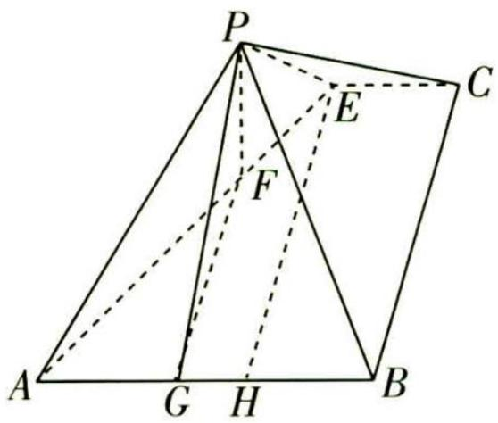

图 5

奇数与整数一样多,整数与有理数一样多,无理数比有理数多得多.

# 102 试题调研 每月一辑试题新

棱锥 P-ABCE 的高最长,而底面 ABCE 的面积是定值,

所以当 $PF \perp$ 平面 ABCE 时, 四棱锥 P-ABCE 的体积最大, 二面角 P-AB-C 也最大.

由题知正方形 ABCD 中, CD = AP = a, $\overrightarrow{DE} = 3\overrightarrow{EC}$ , 所以 $CE = \frac{a}{4}$ , $PE = \frac{3a}{4}$ , $\angle APE = 90^{\circ}$ , 即 $\triangle AEP$ 为直角三角形,所以 $AE=\sqrt{a^{2}+\left(\frac{3a}{4}\right)^{2}}=\frac{5a}{4}$ ，所以 $S_{\triangle AEP}=\frac{1}{2}\times AE\times PF=\frac{1}{2}\times\frac{5a}{4}\times PF=\frac{5a}{8}PF$

而 $S_{\triangle AEP} = \frac{1}{2}\times AP\times PE = \frac{1}{2}\times a\times \frac{3a}{4} = \frac{3a^2}{8}$ 所以 $\frac{5a}{8} PF = \frac{3a^2}{8}$ 解得 $PF = \frac{3a}{5}$

【小技巧】利用等面积法求 ${PF}$ 的长度,找准容易计算的三角形的底和高

四边形 $ABCE$ 的面积为 $\frac{1}{2} \times (AB + EC) \times BC = \frac{1}{2} \times (a + \frac{a}{4}) \times a = \frac{5a^2}{8}$ ,

所以四棱锥 P-ABCE 的体积 $V_{四棱锥P-ABCE}=\frac{1}{3}\times\frac{5a^{2}}{8}\times\frac{3a}{5}=\frac{a^{3}}{8}$ ，故选项 A 正确.

过 F 点作与 BC 平行的线段交 AB 于点 G, 连接 PG. 因为 $BC \perp AB$ , 所以 $FG \perp AB$ .

因为 $PF \perp$ 平面 ABCE, 所以 $PF \perp AB, PF \cap FG = F, PF, FG \subset$ 平面 PFG, 所以 $AB \perp$ 平面 PFG, $AB \perp FG$ , 所以 $\angle PGF$ 为二面角 P - AB - C 的平面角, 所以 $\angle PGF = \theta$ .

【会思考】利用二面角的定义给予证明

在 $\triangle APF$ 中, $AF = \sqrt{AP^2 - PF^2} = \sqrt{a^2 - (\frac{3a}{5})^2} = \frac{4a}{5}$ , 过点 $E$ 作与 $BC$ 平行的线段交 $AB$ 于点 $H$ , 则 $HE = BC = a$ , 则 $\triangle AGF \sim \triangle AHE$ , 则 $\frac{GF}{HE} = \frac{AF}{AE}$ , 即 $\frac{GF}{a} = \frac{\frac{4a}{5}}{\frac{5a}{4}}$ ,

所以 $GF = \frac{16a}{25}$ ，所以 $\tan \angle PGF = \frac{PF}{GF} = \frac{\frac{3a}{5}}{\frac{16a}{25}} = \frac{15}{16}$ ，所以 $\tan \theta \leqslant \frac{15}{16}$ ，故选项 C 正确，D 错误.

而 $\tan \theta \leqslant \frac{15}{16} < \sqrt{3} = \tan 60^{\circ} < \tan 61^{\circ}$ , 所以 $\theta < 61^{\circ}$ , 故选项 B 错误.

【小技巧】利用正切函数在 $(0,\frac{\pi}{2})$ 上单调递增判断

答案 AC

# 型14 有关弦模型

# 模型解法 >>>

圆锥曲线的有关弦的问题是高考命题的热点,涉及的类型较多,其中中点弦、焦点弦、垂直弦较为典型,解题关键如下.

数学的英文是 mathematics, 这是一个复数名词, 数学曾是四门学科, 即算术、几何、天文学和音乐的总称.

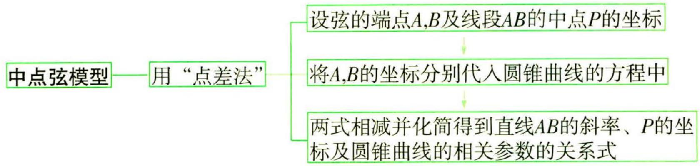

焦点弦模型——如焦点在 x 轴上, 可设直线方程为 $x = my \pm n$ ; 如焦点在 y 轴上, 可设直线方程为 $y = kx + t$ . 抛物线 $y^{2} = 2px (p > 0)$ 的焦点弦长 $|AB| = p + (x_{1} + x_{2})$

垂直弦模型——利用垂直直线斜率互为负倒数,把联立直线 $y = kx + t$ 与圆锥曲线的方程后得到的相关结论中的 k 替换为 $-\frac{1}{k}$ , 即可得与另一条直线相关的数量关系式, 简化运算过程;或利用垂直向量的数量积为零,将垂直关系转化为代数等式, 得到相关数量的关系或者结论

调研 1 (2023·北京师范大学附属实验中学9月开学测试)已知椭圆 $C:\frac{x^{2}}{a^{2}}+$ $\frac{y^{2}}{b^{2}}=1(a>b>0)$ 的一个焦点坐标为(1,0)，且长轴长是短轴长的 $\sqrt{2}$ 倍.

（1） 求椭圆 $C$ 的方程; （2） 设 $O$ 为坐标原点, 椭圆 $C$ 与直线 $y = kx + 1$ 相交于两个不同的点 $A, B$ , 线段 $AB$ 的中点为 $P$ , 若直线 $OP$ 的斜率为 $-1$ , 求 $\triangle OAB$ 的面积.

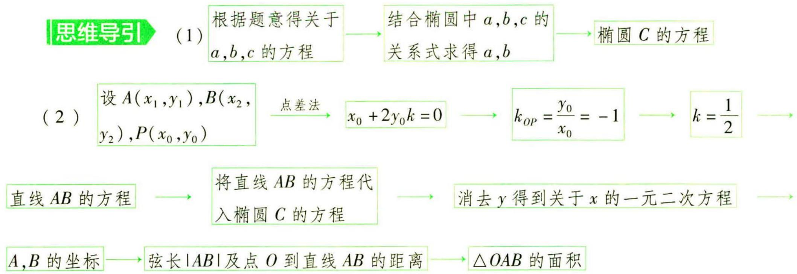

解析 （1） 由题意得 $c = 1, a = \sqrt{2}b$ ，又 $a^2 - b^2 = c^2$ ，所以 $b^2 = 1, a^2 = 2$ .

【易混】a,b,c的关系不要与双曲线的弄混

所以椭圆 C 的方程为 $\frac{x^{2}}{2} + y^{2} = 1$ .

再长的路,一步步也能走完;再短的路,不迈开双腿也无法到达.

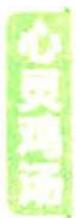

（2）设 $A(x_{1},y_{1}),B(x_{2},y_{2}),P(x_{0},y_{0})$ ，把 $A,B$ 两点的坐标代入椭圆 $C$ 的方程得 $\left\{ \begin{array}{l} \frac{x_1^2}{2} + y_1^2 = 1, \\ \frac{x_2^2}{2} + y_2^2 = 1, \end{array} \right.$

两式相减得 $\frac{1}{2} (x_1 + x_2)(x_1 - x_2) + (y_1 + y_2)(y_1 - y_2) = 0,$

将 $x_{1} + x_{2} = 2x_{0},y_{1} + y_{2} = 2y_{0},\frac{y_{1} - y_{2}}{x_{1} - x_{2}} = k$ ，代入上式得 $x_0 + 2y_0k = 0$

又 $k_{OP} = \frac{y_0}{x_0} = -1$ ，则 $k = \frac{1}{2}$ 所以直线 $AB$ 的方程为 $y = \frac{1}{2} x + 1.$

【模型应用】运用点差法，得 $x_{0}, y_{0}$ 与k的关系，由 $k_{OP}=\frac{y_{0}}{x_{0}}=-1$ ，可得 $k=\frac{1}{2}$ 。事实上，对椭圆 $\frac{x^{2}}{a^{2}}+\frac{y^{2}}{b^{2}}=1(a>b>0)$ ，有 $k_{OP}\cdot k_{AB}=-\frac{b^{2}}{a^{2}}$ ；对双曲线 $\frac{x^{2}}{a^{2}}-\frac{y^{2}}{b^{2}}=1(a>0,b>0)$ ，有 $k_{OP}\cdot k_{AB}=\frac{b^{2}}{a^{2}}$ ；对抛物线 $y^{2}=2px(p>0)$ ，有 $k_{AB}\cdot y_{0}=p$ 。这些结论，既可以在解答小题时直接套用，也可以在解答大题时启发解题思路

由 $\left\{\begin{aligned}y&=\frac{1}{2}x+1,\\ &\text{得 }3x^{2}+4x=0,\Delta>0,\\ \frac{x^{2}}{2}+y^{2}&=1,\end{aligned}\right.$ 所以 $A(0,1),B(-\frac{4}{3},\frac{1}{3})$ 或 $A(-\frac{4}{3},\frac{1}{3}),B(0,1),$

所以 $|AB| = \sqrt{(-\frac{4}{3})^2 + (1 - \frac{1}{3})^2} = \frac{2\sqrt{5}}{3}.$

【关键点拨】此处计算弦长 $|{AB}|$ ,可直接应用两点间的距离公式,事实上,点(0,1)是直线 $y = {kx} + 1$ 过的定点,此定点为椭圆 $C$ 的上顶点

又点 O 到直线 AB 的距离 $d=\frac{2}{\sqrt{1+4}}=\frac{2\sqrt{5}}{5}$ ，所以 $\triangle OAB$ 的面积为 $\frac{1}{2}\times\frac{2\sqrt{5}}{3}\times\frac{2\sqrt{5}}{5}=\frac{2}{3}$ .

调研 2 (2023·山东区域教研共同体开学考试)椭圆 $C:\frac{x^{2}}{a^{2}}+\frac{y^{2}}{b^{2}}=1(a>b>0)$ 的左、右焦点分别为 $F_{1}, F_{2}$ ，焦距为 $2\sqrt{2}$ ，点 M 为椭圆上位于 x 轴上方的一点， $\overrightarrow{MF_{1}} \cdot \overrightarrow{MF_{2}} = 0$ ，且 $\triangle MF_{1}F_{2}$ 的面积为 2.

（1） 求椭圆 C 的方程;  
（2） 过点 $F_{2}$ 的直线 $l$ 与椭圆交于 $A, B$ 两点, 且 $\angle AMB = \frac{\pi}{2}$ , 求直线 $l$ 的方程.

解析 （1） 因为 $\overrightarrow{MF_1} \cdot \overrightarrow{MF_2} = 0$ , 所以 $\overrightarrow{MF_1} \perp \overrightarrow{MF_2}$ , 即 $\angle F_1MF_2 = \frac{\pi}{2}$ ,

所以 $S_{\triangle MF_1F_2} = \frac{1}{2}|MF_1|\cdot |MF_2| = 2$ ，则 $|MF_1|\cdot |MF_2| = 4.$

又 $|MF_{1}|+|MF_{2}|=2a,|F_{1}F_{2}|=2c=2\sqrt{2},|MF_{1}|^{2}+|MF_{2}|^{2}=|F_{1}F_{2}|^{2}.$

所以 $\left(\left|MF_{1}\right|+\left|MF_{2}\right|\right)^{2}-2\left|MF_{1}\right|\cdot\left|MF_{2}\right|=8$ ，即 $4a^{2}-2\times4=8$ .

【关键点拨】充分利用直角三角形，运用勾股定理，简化运算过程

所以 $a^{2}=4, b^{2}=a^{2}-c^{2}=2$ ，所以椭圆 C 的方程为 $\frac{x^{2}}{4}+\frac{y^{2}}{2}=1$ .

（2） 由 （1） 知 $|MF_1| \cdot |MF_2| = 4, |MF_1| + |MF_2| = 4$ ，所以 $|MF_1| = |MF_2| = 2$ ，即 $M(0, \sqrt{2})$ .

当直线 l 的斜率为 0 时, $\angle {AMB} \neq  \frac{\pi }{2}$ ,不合题意.

【点递讲速】若直线 l 的斜率为 0，则直线 l 的方程为 y=0，交点 A, B 为椭圆的左、右顶点，则 $\left|MA\right|=\left|MB\right|=\sqrt{6}$ ，而 $\left|AB\right|^{2}=16$ ， $\left|MA\right|^{2}+\left|MB\right|^{2}\neq\left|AB\right|^{2}$ ，则 $\angle AMB\neq\frac{\pi}{2}$

当直线 l 的斜率存在且不为 0 或斜率不存在时, 设直线 l 的方程为 $x = my + \sqrt{2}$ , $A(x_{1}, y_{1}), B(x_{2}, y_{2})$ .

【模型应用】直线 l 过焦点 $F_{2}(\sqrt{2},0)$ ，可设直线 l 的方程为 $x=my+\sqrt{2}$ ，进而联立方程，消去 x，得到关于 y 的一元二次方程

由 $\left\{\begin{aligned}x&=my+\sqrt{2},\\ \frac{x^{2}}{4}&+\frac{y^{2}}{2}=1,\end{aligned}\right.$ 消去x整理得关于y的方程 $(2+m^{2})y^{2}+2\sqrt{2}my-2=0,\Delta>0,$ 则 $y_{1} + y_{2} = -\frac{2\sqrt{2}m}{2 + m^{2}}, y_{1}y_{2} = \frac{-2}{2 + m^{2}}.$

因为 $\angle AMB = \frac{\pi}{2}$ ，所以 $MA \perp MB$ ，则 $\overrightarrow{MA} \cdot \overrightarrow{MB} = 0$ ，即 $x_{1}x_{2} + (y_{1} - \sqrt{2})(y_{2} - \sqrt{2}) = 0$ ，

【模型应用】由 $\angle AMB = \frac{\pi}{2}$ 得 $MA \perp MB$ ，即 $\overrightarrow{MA} \cdot \overrightarrow{MB} = 0$ ，运用向量的坐标运算实现几何关系的代数化

整理得 $(1 + m^2)y_1y_2 + \sqrt{2} (m - 1)(y_1 + y_2) + 4 = 0$ ，从而 $\frac{-2(m^2 + 1)}{m^2 + 2} -\frac{4m(m - 1)}{m^2 + 2} +4 = 0,$

所以 $m^{2}-2m-3=0$ ，解得 m=-1 或 m=3。

当 m = -1 时, 直线 l 过点 M, 不符合题意.

【易忽视】注意检验结果是否符合题设，直线l不能过点M

所以 m=3，直线 l 的方程为 $x-3y-\sqrt{2}=0$ .

调研 3 (2023·陕西师范大学附属中学9月期初检测/定点问题)已知抛物线 $C: y^{2} = 2px (p > 0), O$ 是坐标原点, $F$ 是 $C$ 的焦点, $M$ 是 $C$ 上一点, $|FM| = 4, \angle OFM = 120^{\circ}$ .

（1） 求抛物线 C 的标准方程.

（2）设点 $Q(x_{0},2)$ 在 C 上, 过 Q 作两条互相垂直的直线 QA, QB, 分别交 C 于 A, B 两点 (异于 Q 点), 证明: 直线 AB 恒过定点.

解析 （1） 由 $|FM| = 4, \angle OFM = 120^{\circ}$ , 可得 $M\left(\frac{p}{2} + 2, \pm 2\sqrt{3}\right)$ ,

代入 C 的方程得 $12 = 2p \left( \frac{p}{2} + 2 \right) = p^{2} + 4p$ ，解得 p = 2 或 p = -6（舍去）.

【易忽视】注意 $p > 0$ ，得到的 $p = -6$ 应舍去

所以抛物线 C 的标准方程为 $y^{2}=4x$ .

（2）由题意可得 $Q(1,2)$ , 直线 $AB$ 的斜率不为 0 , 设直线 $AB$ 的方程为 $x = my + n$ .

【易遗漏】要说明直线 $AB$ 的斜率不为 0，否则解答不完整

设 $A(x_{1},y_{1}),B(x_{2},y_{2})$ ，由 $\left\{ \begin{array}{l}y^{2} = 4x,\\ x = my + n, \end{array} \right.$ 得 $y^{2} - 4my - 4n = 0,\Delta = 16m^{2} + 16n > 0,y_{1}+$ $y_{2} = 4m,y_{1}y_{2} = -4n.$

则 $x_{1} + x_{2} = m(y_{1} + y_{2}) + 2n = 4m^{2} + 2n,$

$x _ {1} x _ {2} = \left(m y _ {1} + n\right) \left(m y _ {2} + n\right) = m ^ {2} y _ {1} y _ {2} + m n \left(y _ {1} + y _ {2}\right) + n ^ {2} = n ^ {2},$

因为 $QA \perp QB$ ，所以 $\overrightarrow{QA} \cdot \overrightarrow{QB} = (x_{1} - 1)(x_{2} - 1) + (y_{1} - 2)(y_{2} - 2) = 0$ ，

【模型应用】利用向量的坐标运算将垂直关系代数化，即两垂直向量的数量积为0

故 $x_{1}x_{2} - (x_{1} + x_{2}) + 1 + y_{1}y_{2} - 2(y_{1} + y_{2}) + 4 = 0$ ，整理得 $n^2 -4m^2 -6n - 8m + 5 = 0,$

即 $(n - 3)^2 = 4(m + 1)^2$ ，从而 $n - 3 = 2(m + 1)$ 或 $n - 3 = -2(m + 1)$ ，即 $n = 2m + 5$ 或 $n = -2m + 1$

若 $n = -2m + 1$ ，则 $x = my + n = my - 2m + 1 = m(y - 2) + 1$ ，直线 AB 过定点 $(1, 2)$ ，与 Q 点重合，不符合题意；

若 $n=2m+5$ ，则 $x=my+n=my+2m+5=m(y+2)+5$ ，直线 AB 过定点 $(5,-2)$ .

综上, 直线 AB 过异于 Q 点的定点 $(5, -2)$ .

# 型15 最值与范围模型

# 模型解法 >>>

最值与范围问题是解析几何综合应用的常见问题,解决此类问题的一般模型是:先得到问题的表达式,如求三角形面积的最大值,即先列出三角形面积的表达式;如求斜率的取值范围,即先求得斜率的表达式.这样,就把问题转化为求函数的最值问题.

人生就是一场旅行,不在乎目的地,在乎的应该是沿途的风景以及看风景的心情.

求解此类问题的主要思路如下：

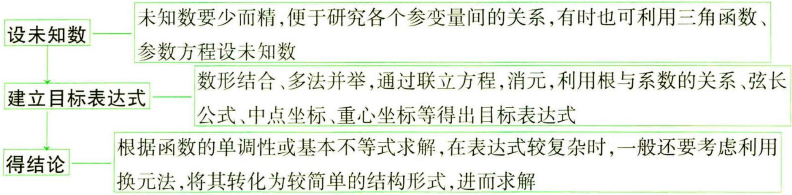

调研 1 (2023·河北秦皇岛9月开学测试)已知椭圆 $C: \frac{x^{2}}{a^{2}} + \frac{y^{2}}{b^{2}} = 1 (a > b > 0)$ 的离心率为 $\frac{\sqrt{3}}{2}$ , 且 $C$ 的左、右焦点与短轴的两个端点构成的四边形的面积为 $8 \sqrt{3}$ .

（1） 求椭圆 C 的方程.

（2） 若直线 $l: x - my - 1 = 0 (m \neq 0)$ 与 $x$ 轴交于点 $M$ , 与椭圆 $C$ 交于 $P, Q$ 两点, 过点 $P$ 与 $x$ 轴垂直的直线与椭圆 $C$ 的另一个交点为 $N$ , 求 $\triangle MNQ$ 面积的最大值.

思维导引 （1） 利用 $a^2 = b^2 + c^2, e = \frac{c}{a} = \frac{\sqrt{3}}{2}$ 与 $4 \times \frac{1}{2} bc = 8\sqrt{3}$ , 求得 $a^2, b^2$ , 代入椭圆 $C$ 的方程即可. （2） 联立直线 $l$ 与椭圆 $C$ 的方程得到 $y_1 y_2 = -\frac{15}{m^2 + 4}$ , 根据 $S_{\triangle MNQ} = S_{\triangle PQN} - S_{\triangle PMN}$ , 化简得 $S_{\triangle MNQ} = |my_1 y_2| = \frac{15|m|}{m^2 + 4}$ , 进而利用基本不等式求得 $\triangle MNQ$ 面积的最大值.

解析 （1） 设椭圆 $C$ 的焦距为 $2c$ , 则其离心率 $e = \frac{c}{a} = \frac{\sqrt{3}}{2}$ , 所以 $\frac{c^2}{a^2} = \frac{a^2 - b^2}{a^2} = \frac{3}{4}$ ,

即 $1 - \frac{b^2}{a^2} = \frac{3}{4}$ , 得 $a = 2b$ , 则 $c = \sqrt{3} b$ .

又椭圆 C 的左、右焦点与短轴的两个端点构成的四边形的面积为 $8\sqrt{3}$ ,

所以 $4 \times \frac{1}{2}bc = 8\sqrt{3}$ ，即 $bc = 4\sqrt{3}$ .

综上, 得 $a^{2}=16, b^{2}=4$ , 所以椭圆 C 的方程为 $\frac{x^{2}}{16}+\frac{y^{2}}{4}=1$ .

（2） 易得 $M(1,0)$ ，设 $P(x_{1},y_{1})$ ， $Q(x_{2},y_{2})$ ，则 $N(x_{1},-y_{1})$ ，

由 $\left\{\begin{aligned}x&=my+1,\\ \frac{x^{2}}{16}+\frac{y^{2}}{4}&=1,\end{aligned}\right.$ 得关于y的二次方程 $(m^{2}+4)y^{2}+2my-15=0,\Delta>0$ ，则 $y_{1}+y_{2}=$ $-\frac{2m}{m^{2}+4},y_{1}y_{2}=-\frac{15}{m^{2}+4}.$

$S _ {\triangle P Q N} = \frac {1}{2} \times | 2 y _ {1} | \times | x _ {2} - x _ {1} |, S _ {\triangle P M N} = \frac {1}{2} \times | 2 y _ {1} | \times | 1 - x _ {1} |,$

易知 $x_{2} - x_{1}$ 与 $1 - x_{1}$ 同号，

$\begin{array}{r l} & {\text {所以} S _ {\triangle M N Q} = S _ {\triangle P Q N} - S _ {\triangle P M N} = | y _ {1} | \times (| x _ {2} - x _ {1} | - | 1 - x _ {1} |) = | y _ {1} | \times | (x _ {2} - x _ {1}) -} \\ & {(1 - x _ {1}) | = | y _ {1} | \times | x _ {2} - 1 | = | y _ {1} | \times | m y _ {2} | = | m y _ {1} y _ {2} | = \frac {1 5 | m |}{m ^ {2} + 4} = \frac {1 5}{| m | + \frac {4}{| m |}} \leqslant} \end{array}$

$\frac{15}{2\sqrt{|m|}\times\frac{4}{|m|}}=\frac{15}{4}$ ，当且仅当 $|m|=\frac{4}{|m|}$ ，即 $m=\pm2$ 时等号成立.

【模型应用】根据三角形面积表达式 $S_{\triangle MNQ}=\frac{15|m|}{m^{2}+4}$ 的形式，变形，应用基本不等式求解最值，注意得出结果时，要判断等号能否成立

所以 $\triangle MNQ$ 面积的最大值为 $\frac{15}{4}$ .

调研 2 (2023·四川巴中中学9月零诊)已知椭圆 $C:\frac{x^{2}}{a^{2}}+\frac{y^{2}}{b^{2}}=1(a>b>0)$ 的左、右顶点分别为 A, B, 点 $M(1,\frac{\sqrt{3}}{2})$ 在椭圆 C 上, 且直线 MA 的斜率与直线 MB 的斜率之积为 $-\frac{1}{4}$ .

（1） 求椭圆 C 的方程;

（2） 若圆 $x^{2} + y^{2} = 1$ 的切线 l 与椭圆 C 交于 P, Q 两点, 求 $|PQ|$ 的最大值及此时直线 l 的方程.

解析 （1） 由题意可得 $A(-a,0), B(a,0)$ , 所以 $k_{MA} k_{MB} = \frac{\frac{\sqrt{3}}{2}}{1 + a} \times \frac{\frac{\sqrt{3}}{2}}{1 - a} = -\frac{1}{4}$ , 解得 $a = 2$ .

因为椭圆 C 经过点 $M(1, \frac{\sqrt{3}}{2})$ ，所以 $\frac{1}{a^{2}} + \frac{3}{4b^{2}} = 1$ ，则 b = 1。

所以椭圆 C 的方程为 $\frac{x^{2}}{4} + y^{2} = 1$ .

（2） 当切线 l 垂直于 x 轴时, P, Q 的横坐标均为 1 或 -1,

【注意】设直线方程前,不要遗漏分析斜率不存在的特殊情况. 本题中直线 $l$ 的斜率不为 0 , 故也可以设直线方程为 $x = {py} + t$ 的形式

根据椭圆的对称性,不妨设 P,Q 的横坐标均为 1,

将 $x = 1$ 代入椭圆方程得 $\frac{1}{4} + y^2 = 1$ ，解得 $y = \pm \frac{\sqrt{3}}{2}$ ，所以此时 $|PQ| = \sqrt{3}$ .

当切线 $l$ 不垂直于 $x$ 轴时, 设 $P\left( {{x}_{1},{y}_{1}}\right) ,Q\left( {{x}_{2},{y}_{2}}\right)$ ,切线 $l$ 的方程为 $y = {kx} + m\left( {k \neq  }\right.$ 0),即 ${kx} - y + m = 0$ ,

【模型应用】设直线方程,将点的坐标变成中间量,便于构建目标表达式

则圆心(0,0)到切线 l 的距离 $\frac{|m|}{\sqrt{1+k^{2}}}=1$ , 得 $m^{2}=k^{2}+1$

【模型应用】利用已知研究得到 $m, k$ 的关系式，目的是减少变量个数，为找到函数关系式做准备

把 $y = kx + m$ 代入椭圆方程 $\frac{x^2}{4} + y^2 = 1$ ，整理得 $(4k^2 + 1)x^2 + 8kmx + 4m^2 - 4 = 0, \Delta = 16(4k^2 - m^2 + 1) > 0$ ，则 $x_1 + x_2 = \frac{-8km}{4k^2 + 1}, x_1x_2 = \frac{4m^2 - 4}{4k^2 + 1}$ ，

所以 $|PQ| = \sqrt{1 + k^2}\sqrt{(x_1 + x_2)^2 - 4x_1x_2} = \sqrt{1 + k^2}\sqrt{\frac{64k^2m^2}{(4k^2 + 1)^2} - \frac{4(4m^2 - 4)}{4k^2 + 1}} =$ $\sqrt{\frac{16(1 + k^2)(4k^2 - m^2 + 1)}{(4k^2 + 1)^2}} = \sqrt{\frac{48(1 + k^2)k^2}{(4k^2 + 1)^2}} = \frac{4\sqrt{3}|k|\sqrt{k^2 + 1}}{4k^2 + 1}.$

设 $4k^{2}+1=n$ ，则 n>1， $|PQ|^{2}=\frac{3\times4k^{2}\times4(k^{2}+1)}{(4k^{2}+1)^{2}}=\frac{3(n-1)(n+3)}{n^{2}}=3\left(1+\frac{2}{n}-\frac{3}{n^{2}}\right)=$ 【模型应用】得到的目标表达式较复杂，不能直接求出最值，考虑换元，将 $|PQ|^{2}$ 转化为关于 $\frac{1}{n}$ 的二次函数，进而求解

$3\left[-3\left(\frac{1}{n^{2}}-\frac{2}{3}\times\frac{1}{n}\right)+1\right]=3\left[-3\left(\frac{1}{n}-\frac{1}{3}\right)^{2}+\frac{4}{3}\right]\leqslant3\times\frac{4}{3}=4$ ，所以 $|PQ|\leqslant2$

即 $|PQ|_{\max}=2$ ，此时n=3，满足题意，因为 $4k^{2}+1=n$ ，所以此时直线l的斜率为 $k=\pm\frac{\sqrt{2}}{2}$ ，纵截距为 $m=\pm\frac{\sqrt{6}}{2}$ .

因为 $\sqrt{3} < 2$ , 所以 $|PQ|$ 的最大值为 2, 此时直线 $l$ 的方程为 $y = \frac{\sqrt{2}}{2} x + \frac{\sqrt{6}}{2}, y = \frac{\sqrt{2}}{2} x - \frac{\sqrt{6}}{2}, y = -\frac{\sqrt{2}}{2} x + \frac{\sqrt{6}}{2}$ 或 $y = -\frac{\sqrt{2}}{2} x - \frac{\sqrt{6}}{2}$ .

调研 3 (2023·长沙雅礼中学9月入学测试)已知抛物线 $C: x^{2} = 2py (p > 0)$ 的焦点为 F, 抛物线上一点 $A(m, \frac{1}{2}) (m < 0)$ 到 F 点的距离为 $\frac{3}{2}$ .

（1） 求抛物线的方程及点 A 的坐标:

（2） 设斜率为 k 的直线 l 过点 $B(2,0)$ 且与抛物线 C 交于不同的两点 M, N, 若 $\overrightarrow{BM} = \lambda \overrightarrow{BN}$ , 且 $\lambda \in (\frac{1}{4}, 4)$ , 求斜率 k 的取值范围.

解析 （1）由抛物线定义可知 $|AF|=\frac{1}{2}+\frac{p}{2}=\frac{3}{2}$ ，得p=2，所以抛物线方程为 $x^{2}=4y$ .

【敲黑板】看到抛物线，第一件事就是看抛物线的开口方向，此题抛物线开口向上，设 $A(x_{0}, y_{0})$ ，则焦半径公式为 $|AF| = y_{0} + \frac{p}{2}$

将 $A(m,\frac{1}{2})$ 代入抛物线方程得 $m=-\sqrt{2}$ (正值舍去)，所以 $A(-\sqrt{2},\frac{1}{2})$ .

（2） 设直线 l 的方程为 $y = k(x - 2)$ , $M(x_{1}, y_{1})$ , $N(x_{2}, y_{2})$ .

由 $\left\{\begin{aligned}y=k(x-2),\\x^{2}=4y,\end{aligned}\right.$ 整理得关于x的方程 $x^{2}-4kx+8k=0$ ，则 $\Delta=16k^{2}-32k>0$ ，解得k<0或k>2.

由根与系数的关系可得 $x_{1} + x_{2} = 4k, x_{1}x_{2} = 8k.$

因为 $\overrightarrow{BM} = \lambda \overrightarrow{BN}$ ，所以 $(x_{1} - 2,y_{1}) = \lambda (x_{2} - 2,y_{2})$ ，则 $y_{1} = \lambda y_{2}$ ，即 $\lambda = \frac{y_1}{y_2}$

因为 $x_{1}^{2}=4y_{1},x_{2}^{2}=4y_{2}$ ，所以 $\lambda=\left(\frac{x_{1}}{x_{2}}\right)^{2}\in\left(\frac{1}{4},4\right)$ ，得 $\frac{x_{1}}{x_{2}}\in\left(-2,-\frac{1}{2}\right)\cup\left(\frac{1}{2},2\right)$ .

【模型应用】研究各个变量间的关系，进而建立起 $k$ 关于 $\frac{x_{1}}{x_{2}}$ 的函数关系式，再通过换元求解

又 $\frac{(x_1 + x_2)^2}{x_1x_2} = 2k = \frac{x_1}{x_2} + 2 + \frac{x_2}{x_1}$ , 则 $k = \frac{\frac{x_1}{x_2} + 2 + \frac{x_2}{x_1}}{2} = \frac{1}{2} (\frac{x_1}{x_2} + \frac{x_2}{x_1}) + 1$ ,

令 $\frac{x_{1}}{x_{2}}=t$ ，则 $t\in(-2,-\frac{1}{2})\cup(\frac{1}{2},2)$ ，所以 $k=\frac{1}{2}(t+\frac{1}{t})+1$ .

易知函数 $f(t) = \frac{1}{2}(t + \frac{1}{t}) + 1$ 在 $(\frac{1}{2}, 1)$ 上单调递减，在(1,2)上单调递增，

【易错】要求 $f(t)$ 的值域，故需分析函数单调性，若应用基本不等式，只能求得其最小值 $(t>0)$ 或最大值 $(t<0)$ ，但不能求得范围

所以当 $t \in (\frac{1}{2}, 2)$ 时, $k = \frac{1}{2}(t + \frac{1}{t}) + 1 \in [2, \frac{9}{4})$ .

当你手中抓住一件东西不放时,那么你也就只能是拥有一件东西,可是如果你肯放手,你就有机会选择更多.

同理可知, 当 $t \in (-2, -\frac{1}{2})$ 时, $k = \frac{1}{2}(t + \frac{1}{t}) + 1 \in (-\frac{1}{4}, 0]$ .

又 $k < 0$ 或 $k > 2$ , 所以 $k$ 的取值范围是 $(- \frac{1}{4}, 0) \cup (2, \frac{9}{4})$ .

# 型16 定点与定值模型

# 模型解法 >>>

定点问题,其本质为求直(曲)线的方程,所求方程一般含有参数,通过归类整理,运用恒成立问题的解法即可求得定点坐标.也可以先研究特殊情况得到定点,再在一般情况下求解.

定值问题,其本质为求值,求值过程中含有参数,利用等量代换、约分等,使得代数式计算结果不含参数,为一个常量.也可以赋予参数特殊值,先得到定值,再进行计算验证.

定点与定值问题的常见解题步骤如下：

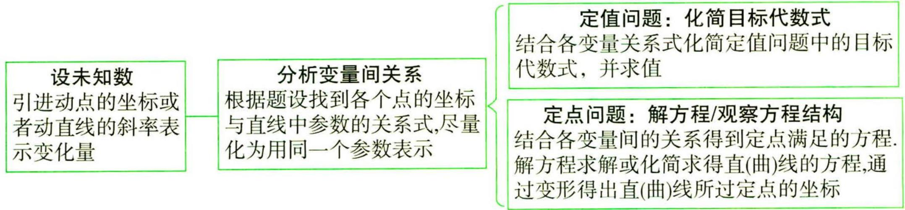

调研 1 (2023·重庆八中 10 月月考)已知椭圆 C 的中心为坐标原点,对称轴为 x 轴、y 轴,且过 A(-2,0),B(1, $\frac{3}{2}$ )两点.

（1） 求椭圆 C 的方程;

（2） $F$ 为椭圆 $C$ 的右焦点, 直线 $l$ 交椭圆 $C$ 于 $P, Q$ (不与点 $A$ 重合) 两点, 记直线 $AP, AQ, l$ 的斜率分别为 $k_{1}, k_{2}, k$ , 若 $k_{1} + k_{2} = -\frac{3}{k}$ , 证明 $\triangle FPQ$ 的周长为定值, 并求出该定值.

思维导引 （1） 由题意可设椭圆 $C$ 的方程为 $\frac{x^2}{p^2} + \frac{y^2}{q^2} = 1 (p > 0, q > 0)$ , 将 $A(-2,0), B(1, \frac{3}{2})$ 代入即可求得椭圆方程. （2） 设直线 $l: y = kx + m$ , 利用 $k_1 + k_2 = -\frac{3}{k}$ , 得到 $m, k$ 的关系式, 求得直线 $l$ 过定点 $(-1,0)$ , 该点为椭圆的左焦点, 则结合椭圆的定义可求得 $\triangle FPQ$ 的周长为定值 8.

解析 （1） 由已知设椭圆 $C$ 的方程为 $\frac{x^2}{p^2} + \frac{y^2}{q^2} = 1 (p > 0, q > 0)$ ,

将 $A(-2,0)$ , $B(1,\frac{3}{2})$ 代入上式, 得 $p=2, q=\sqrt{3}$ , 故椭圆 C 的方程为 $\frac{x^{2}}{4}+\frac{y^{2}}{3}=1$ .

（2） 设直线 $l: y = kx + m, P(x_{1}, y_{1}), Q(x_{2}, y_{2})$ ,

由 $\left\{\begin{aligned}y&=kx+m,\\ 3x^{2}&+4y^{2}=12,\end{aligned}\right.$ 得关于x的方程 $(4k^{2}+3)x^{2}+8kmx+4m^{2}-12=0,\Delta>0$ ，则 $x_{1}+x_{2}=\frac{-8km}{4k^{2}+3},x_{1}x_{2}=\frac{4m^{2}-12}{4k^{2}+3}.$

$k _ {1} = \frac {y _ {1}}{x _ {1} + 2} = \frac {k x _ {1} + m}{x _ {1} + 2}, k _ {2} = \frac {k x _ {2} + m}{x _ {2} + 2},$

所以 $k_{1} + k_{2} = \frac{kx_{1} + m}{x_{1} + 2} + \frac{kx_{2} + m}{x_{2} + 2} = \frac{2kx_{1}x_{2} + 2k(x_{1} + x_{2}) + m(x_{1} + x_{2}) + 4m}{x_{1}x_{2} + 2(x_{1} + x_{2}) + 4} = \frac{8km^{2} - 24k - 16k^{2}m - 8km^{2} + 16k^{2}m + 12m}{4m^{2} - 12 - 16km + 16k^{2} + 12} = \frac{3m - 6k}{m^{2} - 4km + 4k^{2}}.$

由 $k_{1} + k_{2} = -\frac{3}{k}$ 得 $m^2 - 3km + 2k^2 = 0$ ，即 $(m - 2k)(m - k) = 0$ ，得 $m = 2k$ 或 $m = k$ .

①当 $m = {2k}$ 时,直线 $l : y = {kx} + {2k} = k\left( {x + 2}\right)$ ,过定点 $A\left( {-2,0}\right)$ ,与已知不符,舍去； ②当 $m = k$ 时,直线 $l : y = {kx} + k = k\left( {x + 1}\right)$ ,过定点(-1,0),符合题意.

【模型应用】只含一个参数的直线方程可通过化为点斜式，找出直线所过定点

综上, 直线 l 恒过椭圆的左焦点 $(-1,0)$ ，则 $\triangle FPQ$ 的周长为定值，定值为 4p = 8.

调研 2 (2023·湖南岳阳一中9月月考)已知双曲线方程为 $\frac{x^{2}}{a^{2}}-\frac{y^{2}}{b^{2}}=1(a>0, b>0)$ ， $F_{1}, F_{2}$ 分别为双曲线的左、右焦点，离心率为2，点P为双曲线在第一象限内的一点，且满足 $\overrightarrow{PF_{1}}\cdot\overrightarrow{PF_{2}}=0,|PF_{1}||PF_{2}|=6.$

（1） 求双曲线的标准方程.

（2） 过点 $F_{2}$ 作直线 $l$ 交双曲线于 $A, B$ 两点, 则在 $x$ 轴上是否存在定点 $Q(m,0)$ , 使得 $\overrightarrow{QA} \cdot \overrightarrow{QB}$ 为定值? 若存在, 请求出 $m$ 的值和该定值; 若不存在, 请说明理由.

解析 （1） 因为 $\overrightarrow{PF_1} \cdot \overrightarrow{PF_2} = 0$ , 所以 $PF_1 \perp PF_2$ , 则 $|PF_1|^2 + |PF_2|^2 = |F_1F_2|^2 = 4c^2$ .

在 Rt△ $F_{1}PF_{2}$ 中，由 $|PF_{1}| - |PF_{2}| = 2a$ ，得 $(|PF_{1}| - |PF_{2}|)^{2} = |PF_{1}|^{2} + |PF_{2}|^{2} - 2|PF_{1}| |PF_{2}| = 4a^{2}$ ，

又 $\left|PF_{1}\right|\left|PF_{2}\right|=6$ ，所以 $4c^{2}-12=4a^{2}$ ，得 $b^{2}=c^{2}-a^{2}=3$ 。

由离心率 $e = \frac{c}{a} = 2$ ，得 $c = 2a$ ，所以 $b^{2} = c^{2} - a^{2} = 3a^{2}$ ，所以 $a^2 = 1$

所以双曲线的方程为 $x^{2}-\frac{y^{2}}{3}=1$ .

（2）由（1）可得 $F_{2}(2,0)$ .

当直线 l 的斜率为 0 时, 直线 l: y = 0 , 此时不妨令 A(-1,0), B(1,0), 则由 Q(m,

【模型应用】光研究特殊情况,再研究一般情况,最后整合在一起,检验是否有满足题意的定点

0), 可得 $\overrightarrow{QA} \cdot \overrightarrow{QB} = m^{2} - 1$ .

当直线 l 的斜率不为 0 时, 设 $l: x = ty + 2$ , $A(x_{1}, y_{1})$ , $B(x_{2}, y_{2})$ ,

由 $\left\{\begin{aligned}x&=ty+2,\\3x^{2}-y^{2}&=3\end{aligned}\right.$ 得关于y的方程 $(3t^{2}-1)y^{2}+12ty+9=0$ ，则 $3t^{2}-1\neq0,\Delta=36t^{2}+36>0$ ，即 $t\neq\pm\frac{\sqrt{3}}{3}$ ，则 $y_{1}+y_{2}=\frac{-12t}{3t^{2}-1},y_{1}y_{2}=\frac{9}{3t^{2}-1}$

$\begin{array}{r l} & {\text {所以} \overrightarrow {Q A} \cdot \overrightarrow {Q B} = (x _ {1} - m, y _ {1}) \cdot (x _ {2} - m, y _ {2}) = (x _ {1} - m) (x _ {2} - m) + y _ {1} y _ {2} = (t y _ {1} + 2 - m) (t y _ {2} + 2 - m) + y _ {1} y _ {2} = (t ^ {2} + 1) y _ {1} y _ {2} + (2 - m) t (y _ {1} + y _ {2}) + (2 - m) ^ {2} = (t ^ {2} + 1) \frac {9}{3 t ^ {2} - 1} +} \\ & {(2 - m) t \frac {- 1 2 t}{3 t ^ {2} - 1} + (2 - m) ^ {2} = \frac {(1 2 m - 1 5) t ^ {2} + 9}{3 t ^ {2} - 1} + (2 - m) ^ {2}.} \end{array}$

若 $\overrightarrow{QA}\cdot\overrightarrow{QB}$ 为定值,则 $\frac{12m-15}{3}=\frac{9}{-1}$ ,所以m=-1,则 $Q(-1,0)$ ,此时 $\overrightarrow{QA}\cdot\overrightarrow{QB}=0.$

【模型应用】观察代数式的形式,要使代数式是定值,则变量 $t$ 应满足对最后的取值结果没有影响,也就是说,在化简时应该可以把 $t$ 全部 “消去”。这时,一般要考虑含 $t$ 的式子所乘数式为 0 ,但此题分母中含 $t$ 的式子所乘数式确定,无法这样处理,观察到分子、分母是齐次结构,考虑分子、分母能够化简为确定实数的情况

当 m = -1 ，直线 l 的斜率为 0 时， $\overrightarrow{QA} \cdot \overrightarrow{QB} = m^{2} - 1 = 0$ .

【易遗漏】由于此方法是在 $l$ 斜率不为 0 的前提下分析得出的 $m$ 值, 因此, 要检验 $l$ 斜率为 0 的情况, 如果 $l$ 斜率为 0 时 $\overrightarrow{QA} \cdot \overrightarrow{QB}$ 不是定值或定值不相同, 则不存在满足题意的点

综上,存在 m = -1 ,使得 $\overrightarrow{QA} \cdot \overrightarrow{QB} = 0$ .

# 型17 统计识图模型

# 模型解法 >>>

统计识图模型是指根据统计图表中的数据,分析、处理数据,得出结论的模型.常

# 114 试题调研 每月一辑试题新

见的统计图表有折线图、条形图、频率分布直方图、扇形图、雷达图等,解决此类问题的关键是:

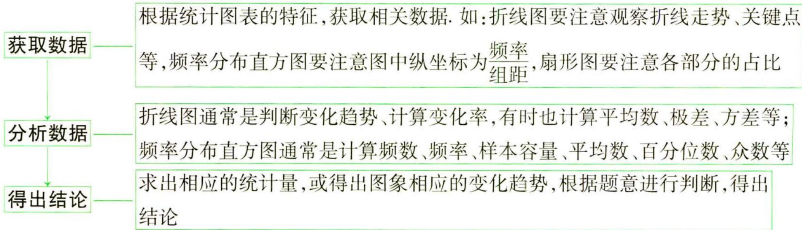

# 类型1 折线图模型

调研 1 (2023·湖北武汉 9 月开学联考)某同学利用暑假积极参加社会实践活动,帮助某经销商进行促销,该同学在两周内的每日促销量如图 1 所示,根据此折线图,下面结论中正确的是 ( )

$\quad$A. 这 14 天促销量的中位数大于 200  
$\quad$B. 这 14 天促销量超过 200 的天数所占比例大于 $50 \%$   
$\quad$C. 这 14 天内, 促销量的极差小于 200  
$\quad$D. 前 7 天促销量的方差小于后 7 天促销量的方差

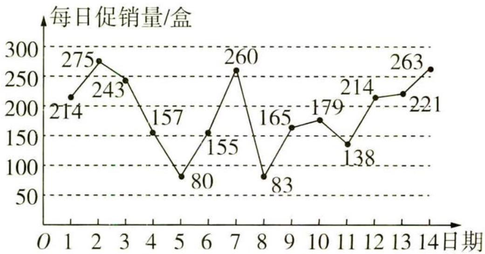

图1

解析 每日促销量由题图可得 214, 275,243,157,80,155,260,83,165,179,138,214,

【获取数据】看到折线图, 首光根据图象找出样本数据, 进而依据题意计算相关统计量 221,263 ,将上述数据由小到大排列后可得这 14 天促销量的中位数为 $\frac{179+214}{2}=196.5<200$ , 故 A

【分析数据】根据中位数的定义，该组数据最中间两个数据的平均数为中位数错误。这14天促销量超过200的有214,214,221,243,260,263,275,共7天,所占比例等于 $50\%$ ，故B错误。这14天内，促销量的极差为 $275 - 80 = 195 < 200$ ，故C正确。前7天促销量的平均数为 $\frac{214 + 275 + 243 + 157 + 80 + 155 + 260}{7} = \frac{1384}{7}$ ，后7天促销量的平均数为 $\frac{83 + 165 + 179 + 138 + 214 + 221 + 263}{7} = \frac{1263}{7}$ ，前7天促销量在平均数附近摆动幅度比后7天促销量在平均数附近摆动幅度大，所以前7天促销量的方差大于后7天促销量的方差，故D错误。

答案 C

人生最大的错误是不断担心会犯错.

关注微信公众号“初高教辅站”获取更多初高中教辅资料

# 类型2 条形统计图模型

调研 2 (2023·安徽合肥一中等校9月开学考试)图2是国家统计局2022年6月发布的规模以上工业原油日均产量(单位:万吨)的月度走势,现有如下说法:

①2021 年 5 月至 2022 年 5 月, 规模以上工业原油的日均产量的极差为 4; ②从 2021 年 5 月至 2021 年 12 月中随机抽取 1 个月份, 月增速超过 $2.9\%$ 的概率为 $\frac{1}{2}$ ;

③2022 年 4 月, 规模以上工业原油总产量约为 1701 万吨.

则说法错误的个数为 （）

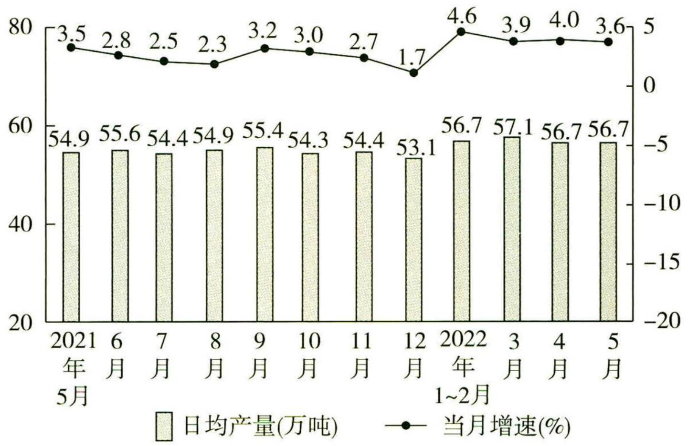

图 2

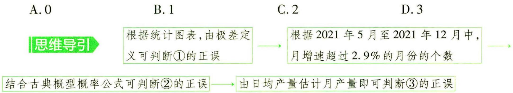

解析 对于①,2021年5月至2022年5月,规模以上工业原油的日均产量的极差为57.1-53.1=4,①正确.对于②,2021年5月至2021年12月中,月增速超过2.9%的月份有5月、9月和10月,所以随机抽取1个月,月增速超过2.9%的概率为 $\frac{3}{8}$ ,②错误.

【数据分析】结合古典概型的概率计算公式,计算所求概率

光说不干,事事落空;又说又干,马到成功.

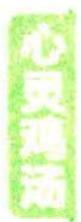

# 116 试题调研 每月一辑试题新

对于③,2022年4月,规模以上工业原油总产量约为 $56.7 \times 30 = 1701$ (万吨),③正确.

【易错提醒】注意所求为4月的工业原油总产量，而不是日均产量

答案 B

# 类型 3 直方图模型

调研 3 (2023·安徽皖南八校9月开学考试)某滑冰馆统计了2021年11月1日到30日某小区居民在该滑冰馆的锻炼天数,得到如图3所示的频率分布直方图(将频率视为概率),则下列说法正确的是 ( )

$\quad$A. 该小区居民在该滑冰馆的锻炼天数在区间(25,30]内的最少

$\quad$B. 估计该小区居民在该滑冰馆的锻炼天数的中位数为 16

$\quad$C. 估计该小区居民在该滑冰馆的锻炼天数的平均数大于 14

$\quad$D. 估计该小区居民在该滑冰馆的锻炼天数超过 15 天的概率为 0.456

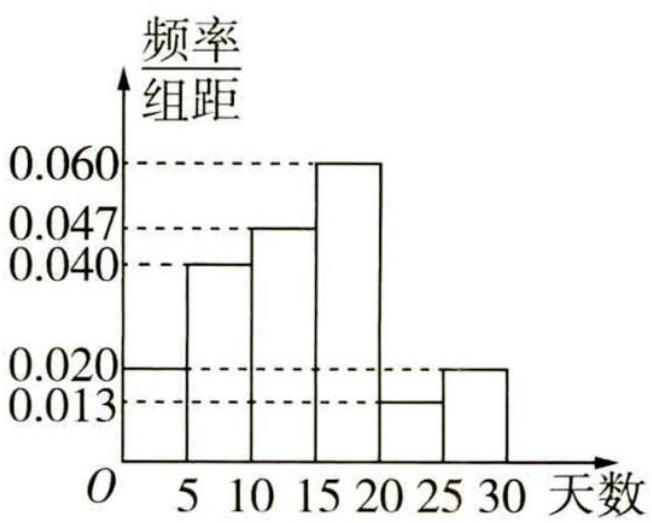

图3

解析 频率分布直方图中,面积最小的矩形所在的区间为(20,25],即样本中区间(20,25]内的数据频率最小,频数也最小,故选项A错误.由频率分布直方图可得,前三个小矩形的面积之和

【敲黑板】样本数据的频率 = $\frac{频数}{样本容量}$ ，当样本容量确定时，频率越小，频数就越小

为 $(0.02 + 0.04 + 0.047) \times 5 = 0.535$ ，且 0.535 > 0.5，所以估计该小区居民在该滑冰馆的锻炼天数的中位数小于15，故选项B错误。由频率分布直方图可得，该小区居民在该滑冰馆的锻炼天数的平均数为 $0.02 \times 5 \times 2.5 + 0.04 \times 5 \times 7.5 + 0.047 \times 5 \times 12.5 + 0.06 \times 5 \times 17.5 + 0.013 \times 5 \times 22.5 + 0.02 \times 5 \times 27.5 = 14.15$ ，且 14.15 > 14，故选项C正确。由频率分布直方图可得，该小区居民在该滑冰馆的锻炼

【分析数据】频率分布直方图中，平均数等于各个小矩形的面积乘以对应的小矩形的底边中点的横坐标之和

天数超过15天的频率为 $(0.06+0.013+0.02)\times5=0.465$ ，故锻炼天数超过15天的概率为0.465，
【分析数据】频率分布直方图中各个小矩形的面积为各组的频率
故选项D错误.

答案 C

# 类型4 扇形图模型

调研 4 (2023·江苏淮安 9 月期初调研)(多选)某家庭 2021 年的总支出是 2020 年的总支出的 1.5 倍,其各项支出占家庭这一年支出的比例如图 4、图 5 所示,则下面结论正确的是 ( )

快乐不是因为得到的多,而是因为计较的少.

2020年家庭各项支出比例  
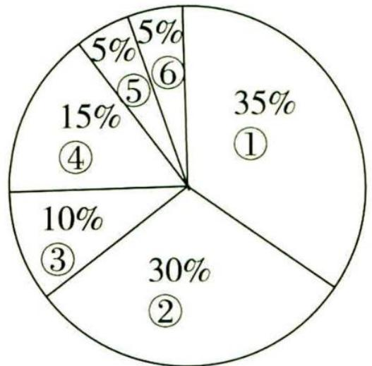

①日常生活 ②房贷还款 ③旅游 ④教育 ⑤保险 ⑥其他

图 4  
2021年家庭各项支出比例  
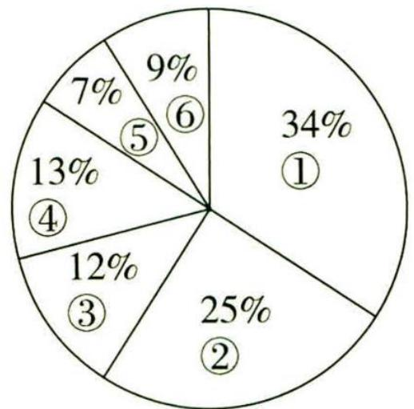

①日常生活 ②房贷还款 ③旅游 ④教育 ⑤保险 ⑥其他

图 5

$\quad$A. 2021 年日常生活支出减少  
$\quad$B. 2021 年保险支出增加了一倍以上  
$\quad$C. 2021 年其他支出是 2020 年其他支出的两倍多  
$\quad$D. 2020 年和 2021 年每年中的日常生活和房贷还款支出之和占该年总支出的一半以上

解析

设2020年的总支出为x,则2021年的总支出为1.5x,由题图知2020年家庭各项支

【小技巧】求解时，为方便计算，可以假设出总支出为 $x$ 或 1

出分别为①0.35x，②0.3x，③0.1x，④0.15x，⑤0.05x，⑥0.05x，2021年家庭各项支出分别为

【获取数据】扇形统计图中各项占比和为1

①0.51x, ②0.375x, ③0.18x, ④0.195x, ⑤0.105x, ⑥0.135x, 比较相应数据, 0.51x > 0.35x, 选项 A 不正确。2021 年保险支出为 0.105x, 比较 0.05x, 增加了一倍以上, 选项 B 正确。2021 年其他支出为 0.135x, 是 2020 年其他支出 0.05x 的两倍多, 选项 C 正确。2020 年和 2021 年每年中的日常生活和房贷还款支出之和分别为 0.65x, 0.885x, 都占该年总支出的一半以上, 选项 D 正确。

答案

BCD

# 型18 做决策模型

# 模型解法 >>>

做决策模型是指根据概率、期望或方差等,来决定人员选用、活动方案、投资等,通过比较得出最优方案,在现实生活中有大量的实践,解决此类问题的关键如下:

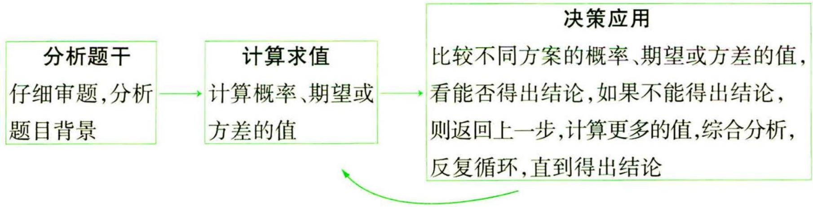

学习要加,骄傲要减,机会要乘,懒惰要除.

# 类型1 概率模型

调研 1 (2023·浙江萧山中学、海盐高级中学等校9月联考)在运动会上,某场跳高比赛的三名选手分别为甲、乙、丙,比赛成绩达到2.28米及以上将获得优秀奖,为预测获得优秀奖的人数及冠军得主,收集了三位选手以往的比赛成绩,数据如下(单位:米).

甲:2.31,2.30,2.27,2.25,2.19,2.16,2.15,2.13,2.12,2.09.

乙:2.33,2.29,2.28,2.26,2.24,2.22.

丙:2.37,2.32,2.08,2.10.

假设用频率估计概率,且甲、乙、丙的比赛成绩相互独立.

（1） 求甲在比赛中获得优秀奖的概率.   
（2） 设 X 是甲、乙、丙在比赛中获得优秀奖的总人数, 求 X 的数学期望 $E(X)$ .

（3）甲、乙、丙在比赛中,谁获得冠军的可能性最大?

思维导引 （1） 根据数据计算甲成绩大于等于 2.28 米的概率. （2） 易得 $X$ 的所有可能取值为 0, 1, 2, 3, 再根据所给数据可得甲、乙、丙获得优秀奖的概率, 进而求得 $X$ 的分布列与数学期望. （3） 先分析甲获得冠军的概率, 再分析丙获得冠军的概率, 进而用概率和为 1 求解乙获得冠军的概率, 比较大小, 进行判断.

解析 （1）由题易知甲获得优秀奖的概率为 $\frac{2}{10} = \frac{1}{5}$ .

（2）由题意知, $X$ 的所有可能取值为 0,1,2,3,甲、乙、丙获得优秀奖的概率分别为 $\frac{1}{5}, \frac{1}{2}, \frac{1}{2}$ , 则 $P(X=0)=\frac{4}{5} \times \frac{1}{2} \times \frac{1}{2}=\frac{1}{5}, P(X=1)=\frac{1}{5} \times \frac{1}{2} \times \frac{1}{2}+\frac{4}{5} \times \frac{1}{2} \times \frac{1}{2}+\frac{4}{5} \times \frac{1}{2} \times \frac{1}{2}=9$ , $P(X=2)=\frac{1}{5} \times \frac{1}{2} \times \frac{1}{2}+\frac{1}{5} \times \frac{1}{2} \times \frac{1}{2}+\frac{4}{5} \times \frac{1}{2} \times \frac{1}{2}=\frac{3}{10}, P(X=3)=\frac{1}{5} \times \frac{1}{2} \times \frac{1}{2}=\frac{1}{20}$ .

所以 $X$ 的分布列为

<table><tr><td>X</td><td>0</td><td>1</td><td>2</td><td>3</td></tr><tr><td>P</td><td> $\frac{1}{5}$ </td><td> $\frac{9}{20}$ </td><td> $\frac{3}{10}$ </td><td> $\frac{1}{20}$ </td></tr></table>

所以 $E(X)=0\times\frac{1}{5}+1\times\frac{9}{20}+2\times\frac{3}{10}+3\times\frac{1}{20}=\frac{6}{5}.$

（3）由题意,甲只有跳出2.25米及以上的成绩,才有可能获得冠军,跳出2.31米或

##### 2.30 米获得冠军的概率为 $\frac{2}{10} \times \frac{5}{6} \times \frac{2}{4} = \frac{1}{12}$ ，跳出 2.27 米获得冠军的概率为 $\frac{1}{10} \times \frac{3}{6} \times \frac{2}{4} = \frac{1}{40}$ ，跳出 2.25 米获得冠军的概率为 $\frac{1}{10} \times \frac{2}{6} \times \frac{2}{4} = \frac{1}{60}$ ，故甲获得冠军的概率为 $\frac{1}{12} + \frac{1}{40} + \frac{1}{60} = \frac{1}{8}$ ;

丙跳出2.37米并获得冠军的概率为 $\frac{1}{4}$ , 跳出2.32米并获得冠军的概率为 $\frac{1}{4} \times \frac{5}{6} = \frac{5}{24}$ , 所以丙获得冠军的概率为 $\frac{1}{4} + \frac{5}{24} = \frac{11}{24}$ ;

乙获得冠军的概率为 $1-\frac{1}{8}-\frac{11}{24}=\frac{5}{12}$ .

【小技巧】甲、乙、丙三人中必定有一名冠军，甲、乙、丙三人获得冠军的概率和为1，据此求解乙获得冠军的概率，减少计算量

因为 $\frac{11}{24}>\frac{5}{12}>\frac{1}{8}$ ，所以丙获得冠军的可能性最大.

【模型应用】比较三人获得冠军的概率，概率大的为优

# 类型2 期望模型

调研 2 (2023·湖南长郡中学9月月考)某商家为了促销,规定每位消费者均可免费参加一次抽奖活动. 活动规则如下:在一不透明的纸箱中有9张相同的卡片,其中3张卡片上印有“中”字,3张卡片上印有“国”字,另外3张卡片上印有“红”字,消费者从该纸箱中不放回地随机抽取3张卡片,若抽到的3张卡片上都印有同一个字,则获得一张20元代金券;若抽到的3张卡片中每张卡片上的字都不一样,则获得一张10元代金券;其他情况没有奖励.

（1） 求某位消费者在一次抽奖活动中抽到的 3 张卡片上都印有“中”字的概率.  
（2）记某位消费者在一次抽奖活动中获得代金券的金额数为 X 元(没有奖励视为 0 元),求 X 的分布列和数学期望 $E(X)$ .  
（3）该商家规定,消费者若想再次参加该项抽奖活动,则每抽奖一次需支付5元.请从收益方面来考虑消费者是否应该再次参加该项抽奖活动,并说明理由.

解析 （1）记“某位消费者在一次抽奖活动中抽到的3张卡片上都印有‘中’字”为事件A,则 $P(A)=\frac{C_{3}^{3}}{C_{9}^{3}}=\frac{1}{84}$ .

所以某位消费者在一次抽奖活动中抽到的3张卡片上都印有“中”字的概率是 $\frac{1}{84}$ .

（2）由题意知,随机变量X的所有可能取值为0,10,20,

则 $P(X = 20) = \frac{\mathrm{C}_3^3 + \mathrm{C}_3^3 + \mathrm{C}_3^3}{\mathrm{C}_9^3} = \frac{1}{28}, P(X = 10) = \frac{\mathrm{C}_3^1\mathrm{C}_3^1\mathrm{C}_3^1}{\mathrm{C}_9^3} = \frac{9}{28}, P(X = 0) = 1 - \frac{9}{28} - \frac{1}{28} = \frac{9}{14}$ .

所以 $X$ 的分布列为

<table><tr><td>X</td><td>0</td><td>10</td><td>20</td></tr><tr><td>P</td><td>9/14</td><td>9/28</td><td>1/28</td></tr></table>

所以 $E(X)=0\times\frac{9}{14}+10\times\frac{9}{28}+20\times\frac{1}{28}=\frac{55}{14}.$

（3） 记消费者再次参加一次抽奖活动获得的收益为 $Y$ 元 (没有奖励视为 0 元), 则 $Y = X - 5, E(Y) = E(X) - 5 = -\frac{15}{14} < 0$ , 因此消费者不应该再次参加该项抽奖活动.

【模型应用】将期望与 0 比较大小, 期望为负值, 说明平均收益为负值, 故不应该再次参加此活动

# 类型 3 方差模型

调研 3 (2023·湖北荆州沙市中学9月月考改编/芯片领域投资)我国在芯片领域的短板有光刻机和光刻胶,某风险投资公司准备投资芯片领域,若投资光刻机项目,据预期,每年的收益率为 $30\%$ 的概率为0.5,收益率为 $-10\%$ 的概率也为0.5;若投资光刻胶项目,据预期,每年的收益率为 $30\%$ 的概率为0.4,收益率为 $-20\%$ 的概率为0.1,收益率为零的概率为0.5.

（1）从以上两个投资项目中选择一个你认为合理的项目投资,并说明理由.

（2）若该风险投资公司准备对以上你选择的项目进行投资,4年累计投资数据如下表:

<table><tr><td>年份x</td><td>2018</td><td>2019</td><td>2020</td><td>2021</td></tr><tr><td>年份代号μ</td><td>1</td><td>2</td><td>3</td><td>4</td></tr><tr><td>累计投资金额y/亿元</td><td>2</td><td>3</td><td>5</td><td>6</td></tr></table>

请根据上表提供的数据,用最小二乘法求出 y 关于 $\mu$ 的线性回归方程 $\hat{y} = \hat{b}\mu + \hat{a}$ , 并预测到哪一年年末,该公司在芯片领域的投资收益预期能达到 0.75 亿元.

附:收益 = 投入的资金 × 收益率的期望;

线性回归方程 $\hat{y} = \hat{b} x + \hat{a}$ 中， $\hat{b} = \frac{\sum_{i=1}^{n}(x_i - \bar{x})(y_i - \bar{y})}{\sum_{i=1}^{n}(x_i - \bar{x})^2} = \frac{\sum_{i=1}^{n}x_iy_i - n\bar{x}\bar{y}}{\sum_{i=1}^{n}x_i^2 - n\bar{x}^2}, \hat{a} = \bar{y} - \hat{b}\bar{x}$ .

解析 （1） 若投资光刻机项目, 设收益率为 $\alpha_{1}$ , 则 $\alpha_{1}$ 的分布列为

<table><tr><td> $\alpha_1$ </td><td>0.3</td><td>-0.1</td></tr><tr><td>P</td><td>0.5</td><td>0.5</td></tr></table>

所以 $E(\alpha_{1}) = 0.3 \times 0.5 + (-0.1) \times 0.5 = 0.1$ .

若投资光刻胶项目,设收益率为 $\alpha_{2}$ , 则 $\alpha_{2}$ 的分布列为

<table><tr><td> $\alpha_{2}$ </td><td>0.3</td><td>-0.2</td><td>0</td></tr><tr><td>P</td><td>0.4</td><td>0.1</td><td>0.5</td></tr></table>

所以 $E(\alpha_{2})=0.3\times0.4+(-0.2)\times0.1+0\times0.5=0.1.$

因为 $E(\alpha_{1})=E(\alpha_{2})$ ，所以投资以上两个项目，收益率的期望相同。

【模型应用】比较两个项目收益率的期望，无法得出结论，所以继续计算方差，综合期望与方差，比较得出结论

$\begin{array}{l} D \left(\alpha_ {1}\right) = (0. 3 - 0. 1) ^ {2} \times 0. 5 + (- 0. 1 - 0. 1) ^ {2} \times 0. 5 = 0. 0 4, \\ D \left(\alpha_ {2}\right) = (0. 3 - 0. 1) ^ {2} \times 0. 4 + (- 0. 2 - 0. 1) ^ {2} \times 0. 1 + (0 - 0. 1) ^ {2} \times 0. 5 = 0. 0 3, \\ \end{array}$

所以 $E(\alpha_{1})=E(\alpha_{2}),D(\alpha_{1})>D(\alpha_{2})$ ，这说明光刻机项目和光刻胶项目获利相等，

【模型应用】注意比较数据大小时,并不是数据越大越好,要结合实际情况判断,例如处方差越小,说明风险越小,投资越稳妥

但光刻胶项目更稳妥.

综上所述,应投资光刻胶项目.

（2） $\bar{\mu}=\frac{1+2+3+4}{4}=2.5,\bar{y}=\frac{2+3+5+6}{4}=4,$

$\sum_ {i = 1} ^ {4} \mu_ {i} y _ {i} = 1 \times 2 + 2 \times 3 + 3 \times 5 + 4 \times 6 = 4 7, \sum_ {i = 1} ^ {4} \mu_ {i} ^ {2} = 1 ^ {2} + 2 ^ {2} + 3 ^ {2} + 4 ^ {2} = 3 0,$

则 $\hat{b} = \frac{\sum_{i=1}^{4}\mu_i y_i - 4\overline{\mu}\overline{y}}{\sum_{i=1}^{4}\mu_i^2 - 4\overline{\mu}^2} = \frac{47 - 4 \times 2.5 \times 4}{30 - 4 \times 2.5^2} = 1.4, \hat{a} = \overline{y} - \hat{b}\overline{\mu} = 4 - 1.4 \times 2.5 = 0.5.$

故 $y$ 关于 $\mu$ 的线性回归方程为 $\hat{y} = 1.4\mu + 0.5$ . 设该公司在芯片领域的投资收益为 $Y$ 亿元, 则 $Y = 0.1 \times (1.4\mu + 0.5) \geqslant 0.75$ , 解得 $\mu \geqslant 5$ .

故在 2022 年年末该投资公司在芯片领域的投资收益预期能达到 0.75 亿元.

# 《试题调研》全程提分方略

<table><tr><td>四大书系</td><td>主题</td><td>提分关键词</td><td>上市时间</td><td>定价</td></tr><tr><td rowspan="14">MOOK系列</td><td>调研1辑·预备知识&amp;函数与导数</td><td rowspan="4">2023高考方向 重点难点薄弱点 突破复习障碍</td><td>2022.6</td><td rowspan="14">18.9元/册</td></tr><tr><td>调研2辑·三角函数&amp;平面向量&amp;数列</td><td>2022.7</td></tr><tr><td>调研3辑·立体几何&amp;解析几何</td><td>2022.8</td></tr><tr><td>调研4辑·计数原理&amp;概率&amp;统计</td><td>2022.9</td></tr><tr><td>调研5辑·模型解题法</td><td>试题归类 解题思路 方法与技巧</td><td>2022.11</td></tr><tr><td>调研6辑·高频易错点快攻</td><td>易错易混点 设题陷阱 解题误区 快速攻克</td><td>2022.12</td></tr><tr><td>调研7辑·高考热点大串讲</td><td>网络构建 前沿热点 创新热点</td><td>2023.1</td></tr><tr><td>调研8辑·创新题分类解读</td><td>创新题型 创新情境 创新考法</td><td>2023.2</td></tr><tr><td>调研9辑·考前50天50题</td><td>名校名师 原创押题 前瞻预测</td><td>2023.3</td></tr><tr><td>调研10辑·考前抢分必备</td><td>必考点 易错点 命题热点 核心解法 考前密题</td><td>2023.4</td></tr><tr><td>作文素材(上)·年度热点素材</td><td>鲜活素材 多维解读 速背速用</td><td>2022.11</td></tr><tr><td>作文素材(下)·考前热点素材</td><td>时新素材 最新时评 范文佳作 速背速用</td><td>2023.4</td></tr><tr><td>时政热点(上)</td><td>2022年4—12月重大时事 剖析解读</td><td>2022.12</td></tr><tr><td>时政热点(下)</td><td>全年度重大时事热点 分析预测</td><td>2023.4</td></tr><tr><td rowspan="10">热点题型专练系列</td><td>选择题(语文、物理、化学、生物、政治、历史、地理、文综、理综)</td><td rowspan="2">抓准热点 精选新题 多维巧解</td><td rowspan="10">2022.9</td><td rowspan="3">33.9—53.9元/册</td></tr><tr><td>选择题&amp;填空题(数学)</td></tr><tr><td>应用文&amp;读后续写&amp;概要写作(英语)</td><td>速背素材 巧学技法 精练写作</td></tr><tr><td>古代诗文阅读(语文)</td><td>洞悉考向 攻克薄弱套路解题 反思积累</td><td rowspan="7">26.9—39.9元/册</td></tr><tr><td>数学解答题</td><td>模型构建 模型应用分组强化 深度解析</td></tr><tr><td>阅读&amp;语言运用(英语)</td><td>30分钟题型组合主题分类 巧思妙解 二次精读 综合提升</td></tr><tr><td>物理计算题</td><td>模型解法 思维建模提分技法 规范答题</td></tr><tr><td>实验题(物理、化学)</td><td>热点实验 创新装置高频考点 讲深讲透</td></tr><tr><td>工艺流程题(化学)</td><td>深度剖析流程精准解读热点</td></tr><tr><td>生物遗传题</td><td>套路审题 传授技法攻克疑难 专项提升</td></tr><tr><td>高考总复习系列</td><td>高考题型全练</td><td>高考题型 分类练习通性通法</td><td>2022.6</td><td>62.9—79.9元/册</td></tr><tr><td rowspan="6">随身速记系列</td><td>必背古诗文64篇</td><td rowspan="2">同步翻译 设题关键重难词解 课外拓展</td><td rowspan="2">2022.1</td><td rowspan="2">17.9元/册</td></tr><tr><td>古诗文理解性默写72篇</td></tr><tr><td>巧记英语3500词</td><td>巧记核心词 速记合成词快记主题词</td><td>2022.1</td><td>17.9元/册</td></tr><tr><td>英语高分范文天天背</td><td>常考话题 素材语料亮点表达 写作套路</td><td>2022.1</td><td>17.9元/册</td></tr><tr><td>历史大事年表</td><td>精选高考常考史实梳理历史发展脉络</td><td>2022.1</td><td>17.9元/册</td></tr><tr><td>语文作文金句素材</td><td>高级标题 闪亮开头 深度结尾 点睛金句精彩分论点 高分论证句 提分名言与文采句</td><td>2023.1</td><td>17.9元/册</td></tr></table>

# 专练热点，提分快

2023版《试题调研·热点题型专练》

本套图书具体出版书目详见“《试题调研》全程提分方略”（内文最后一页）

抓热点

专项突破稳拿分

练速度

小题速解快得分

提准度

大题巧解拿高分

# 试题调研

# × 金考卷™ = 高考提分好搭档

试题新

解法新

观点新

形式新

每月都有

新试题

20年品牌积淀 相见恨晚的提分利器
知乎高中生推崇的好教辅

真题卷

模拟卷

原创卷

每月都有

新试卷

23年品牌积淀 B站、知乎大神力荐与专家名师深度对话的好试卷

一书一卷，天生一时

做更新的题，提更高的分！

电子书免费试读

图书问题读者反馈

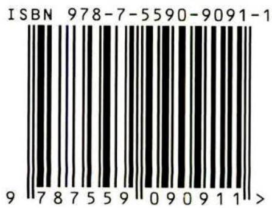

定价：18.90元

