创于 2003

微信公众号
教辅资料站
小考教辅站
初高教辅站

# 试题 调研

20年纪念版

教辅资料站

电子教辅 试卷练习

知识总结 备课资源

—— 扫码关注获取更多学习资料 ——

杜志建◎主编

# 高考热点大串讲

快速掌握 37 个高考提分热点

natural_image

Cartoon character with yellow star and red eyes, wearing a polka-dot outfit (no text or symbols)

串讲时事命题热点，明考向  
串讲创新命题热点，破重难   
串讲核心知识热点，得高分

试题调研

专注高考20年

# 第7辑

热点串成串，备考更方便！

新高考数学

# 试题调研高端融媒产品

# 《解题秘籍18课》

# 考场没思路 也能多得分

“一题一课一测评”智能教辅

书·精编讲义▶精选秘籍
极速快解，考场节省时间，也是多得分

课·秘籍大课▶易学秒懂
清北学霸讲秘籍，化难为易，让多得分变得容易

测·AI智能测评▶精准诊断
智能秘籍题库，多层测评，多得分超乎想象

text_image

天星教育 | 上课认真听
下课练天星
试题调研
18课
解题
秘籍
18课
数学
100
一题一课一测评 题练
书·精编讲义·精选笔记
读·松指大课·医学钞盘
激·AI智能测评·精准诊断
大赋能·超乎想象
考试课 也能
多得分
杜志瑾 主编
南京师范大学出版社
300首 AI智能测评标题题库 成绩说明
200首 每好预选讲解题录多 通过应用
244首 在线答疑小助手课程教学
18课 考好预选讲解题库 则解决题
600分 清过学前根据标题题库 距学标准
100分 一线英语翻译实践阅读 链美英语
300首 AI智能测评标题题库 成绩说明
200首 每好预选讲解题录多 通过应用
244首 在线答疑小助手课程教学
18课 专业可做新题标题 粗解函数
600分 清过学前根据标题题库 距学标准
100分 一线英语翻译实践阅读 链美英语
300首 AI智能测评标题题库 成绩说明
200首 每好预选讲解题录多 通过应用
244首 在线答疑小助手课程教学

热销中

# 开箱清单

以数学为例

★手机仅为效果展示非实物产品组成

  
解题秘籍18课讲义×1

  
高分秘籍成长手册×1

  
解题秘籍思维图谱 $\times 1$

  
产品使用说明书×1

  
主书讲义试读

  
200条

微信公众号教辅资料站小考教辅站初高教辅站

  
60C分钟

清北学霸解题秘籍大课

  
10C余个

一线名师解题实战微课

  
30C道

AI智能测评
诊断题库

  
24小时

在线答疑
伴学小帮手

非工作时间12小时内答疑）

  
秘籍课程试听

学科 数学/物理/化学/生物

定价 198元/科

想多得分，就用解题秘籍！

text_image

創于2003
试题
调研

# 高考热点大串讲

快速掌握 37 个高考提分热点

主 编：杜志建

本册编委：赵成海 王应祥 陈玉兰 汤小梅

第7辑

新高考数学

微信公众号

教辅资料站

小考教辅站

初高教辅站

# 图书在版编目(CIP)数据

试题调研. 第7辑 高考热点大串讲 新高考数学 / 杜志建主编. -- 乌鲁木齐 : 新疆青少年出版社, 2023.1

ISBN 978-7-5590-9158-1

I. ①试… II. ①杜… III. ①中学数学课 - 高中 - 升学参考资料 IV. ①G634

中国版本图书馆 CIP 数据核字(2022)第 239932 号

出版人:徐江

策划: 王启全

责任编辑:多艳萍

封面设计:天星美工室

# 试题调研·第7辑 高考热点大串讲 新高考 数学

# SHITI DIAOYAN · DI 7 JI GAOKAO REDIAN DA CHUANJIANG XINGAOKAO SHUXUE

杜志建 主编

出版:新疆青少年出版社

社址:乌鲁木齐市北京北路29号 邮政编码:830012

电话:0991-6239223(编辑部) 0371-68698015(读者服务部)

官网:http://www.qingshao.net 天猫旗舰店:http://xjqss.tmall.com

发行:新疆青少年出版社

经销:各地新华书店 法律顾问:王冠华 18699089007

印刷:河南文华印务有限公司

开 本:787mm×1092mm 1/16 版 次:2023年1月第1版

印 张:7 印 次:2023年1月第1次印刷

字 数:130 千字

书号:ISBN 978-7-5590-9158-1

定 价:18.90元

CHISO 青少社
SINCE 1956

版权所有，侵权必究。印装问题可随时同印厂退换。

# 声明

微信公众号教辅资料站小考教辅站初高教辅站

基于对知识和创作的尊重,本书向所选文章、图片的作者支付补贴。因条件所限未能及时联系的作者,我们在此深表歉意,当您看到本书时,请与我们联系,以便我们向您支付补贴和赠送样书。联系方式:0371-68698033。

# 热点串成串，备考更方便

# 1 串讲时事命题热点，明考向

调研 5 (2023·陕西12月调考)2022年11月1日凌晨4点27分,梦与天和核心舱成功实现“太空握手”.对接时,要同时满足空间站组合体与梦处于同一轨道高度,且空间站组合体前向对接口朝向了梦天实验舱赶上来的方...能实现“太空握手”.根据以上信息,可知“梦天实验舱与天和核心舱成功实现‘太空握手’”是“空间站组合体与梦天实验舱处于同一轨道高度”的

A. 充分不必要条件

B. 必要不充分条件

C. 充要条件

D. 既不充分也不必要条件

# 角度1 突出五育并举，培养时代新人

调研 1 （2023·浙江衢州11月素养测试/教育）某中学开展做数学题猜Wi-Fi密码益智活动. 已知数列 $|a_n|$ 的通项公式为 $a_n = 2n, n \in \mathbb{N}^*$ , 数列 $|b_n|$ 的通项公式为 $b_n = 2^n + 1, n \in \mathbb{N}^*$ . 现将数列 $|a_n|$ 和 $|b_n|$ 中所有的项混在一起, 按照从小到大的顺序排成数列 $|c_n|$ , 若满足 $c_1 + c_2 + c_3 + \cdots + c_n > 20c_{n+1}$ 成立的 $n$ 的最小值为 $m$ , 该中学Wi-Fi密码为 $\frac{1000}{\pi}$ 换算成小数后, 小数点后的前6位数字, 则该中学的Wi-Fi密码为 ( )

A. 461538

B.255815

C. 037036

D.255813

# 聚焦情境热点（P007）

# 关注社会热点（P006）

# 题型2 开放性举例问题

调研 4 （2023·北师大附中12月阶段练习）在直四棱柱 $ABCD-A_{1}B_{1}C_{1}D_{1}$ 中，当底面四边形 ABCD 满足条件 \_\_\_\_ 时，有 $A_{1}C \perp B_{1}D_{1}$ （填上你认为正确的一个条件即可）。

# 串题型，逐项击破（P015）

# 模型1 创新函数模型

调研 1 （2023·北京北师大附属实验中学期中/创新空间）在直角坐标系 xOy 中，对于点 $(x,y)$ ，定义变换 $\sigma$ ：将点 $(x,y)$ 变换为点 $(a,b)$ ，使得 $\left\{\begin{aligned}x&=\tan a,\\ y&=\tan b,\end{aligned}\right.$ 其中 $a,b\in\left(-\frac{\pi}{2},\frac{\pi}{2}\right)$ 。变换 $\sigma$ 可以将坐标系 xOy 内的曲线变换为坐标系 aOb 内的曲线，则四个函数 $y_{1}=2x(x>0)$ ， $y_{2}=x^{2}(x>0)$ ， $y_{3}=\ln x(x>1)$ ， $y_{4}=$

# 考法1 新定义应用问题

调研 1 （2023·江苏南通如皋期中改编/集合的聚点）（多选）设集合 X 是实数集 R 的子集，如果 $x_{0} \in R$ 满足对任意的 a > 0，都存在 $x \in X$ ，使得 $0 < |x - x_{0}| < a$ ，则称 $x_{0}$ 为集合 X 的聚点。则下列集合中是以 0 为聚点的集合有（）

∈ R, x ≠ 0

B. $\{x\mid x\in Z,x\neq0\}$

$= \frac{1}{n}, n \in \mathbf{N}^{*}$

D. $\{x\mid x=\frac{n}{n+1},n\in N^{*}\}$

# 串考法，知晓动向（P024）

# 载体3 取材数学文化

调研 5 （2023·江苏镇江期中/数学与建筑）云台阁，位于镇江西津渡景区，建筑形式具有宋、元古建特征。如图1，小明同学为测量某楼阁 CD 的高度，在该楼阁的正东方向找到一座楼房 AB，高为 12 m，在地面上的点 M(B, M, D 三点共线)处测得楼顶 A，楼阁顶部 C 的仰角分别为 $15^{\circ}$ 和 $60^{\circ}$ ，在楼顶 A 处测得楼阁顶部 C 的仰角为 $30^{\circ}$ ，则该楼阁的高度约为（参考数据： $\sqrt{3} \approx 1.732$ 。结果精确到 1 m）

# 串讲核心知识热点，得高分

# 3. “汉堡”模型

模型解读 对于直棱柱的外接球,结合球与直棱柱的有关性质,可建立“汉堡”模型,上、下底面外接圆的圆心连线构成的线段的中点即直棱柱外接球球心,球心到各个顶点的距离都等于外接球的半径,结合勾股定理求解.

调研 3 （2023·四川巴中11月月考）正三棱柱 $ABC-A_{1}B_{1}C_{1}$ 的所有棱长之和为定值，当该正三棱柱外接球的表面积取得最小值 $16\pi$ 时，正三棱柱 APC—APC 的

微信公众号面积为

教辅资料站 A.12

小考教辅站

初高教辅站

A.12

B. 16

C. 24

D. 18

# 批注式逐层精讲， 必破疑难热点（P078）

# 模型化分类解读， 必会常考热点（P063）

对于 $\ln a$ 与 $\ln c$ ，先比较 $\frac{\ln(e - 0.1)}{e - 0.1}$ 与 $\frac{\ln(e + 0.1)}{e + 0.1}$ 的大小，设函数 $f(x) = \frac{\ln x}{x}$ 易知其在 $(0,e)$ 上单调递增，在 $(e, +\infty)$ 上单调递减，

【难点的答案】要描述其对称可以设系数，当 $p = -0.1$ 或 $p + 0.1$ 上存在数 $f(x) > 0$ ，如果在区间中，因为不是连续的最大，下述的答案应是对称的结论。若它因此又在统计中，得出二零点后方差

# 目录 CONTENTS

# 串讲时事命题热点

# 热点 1 社会热点 001

角度 1 2022 年卡塔尔世界杯 001

角度 2 第五届进博会 003

角度 3 G20 峰会 005

角度 4 梦天实验舱 006

# 热点 2 热点情境 007

角度 1 突出五育并举，培养时代新人 007

角度 2 聚焦时代话题，彰显责任担当 008

角度 3 融入生产生活，关注数学应用 009

角度 4 关注科技创新，助力科技强国 010

角度 5 巧设趣味情境，激发学习兴趣 010

# 串讲创新命题热点

# 热点 1 创新题型 012

题型1 多选题 012

题型2 开放性举例问题 015

题型3 双空题 016

题型4 结构不良问题 017

题型5 开放、探究性问题 021

# 热点2 创新考法 024

微信公众号教辅资料站小考教辅站初高教辅站

考法1 新定义应用问题 024

考法2 数学思维跨学科应用问题 026

考法3 创新交汇问题 030

# 热点3 创新模型 032

模型1 创新函数模型 032

模型 2 创新数列模型 034

模型 3 创新几何模型 037

模型 4 创新概率模型 040

# 热点 4 创新载体 043

载体 1 取材著名猜想 043

载体 2 取材高等数学 044

载体 3 取材数学文化 046

载体 4 取材教材改编 049

# 串讲核心知识命题热点

# 热点 1 必会常考热点 053

角度 1 函数图象的识别与应用问题 053

角度 2 三角形 “四心” 问题 057

角度 3 搞定外接球问题的 7 大必会模型 061

角度 4 立体几何中的翻折问题 067

角度 5 由递推公式求解数列的通项公式 071

角度 6 概率与统计的创新性问题 074

# 热点 2 必破疑难热点 077

角度 1 利用同构思想解决比大小压轴问题 077

角度 2 放缩法在数列不等式证明问题中的应用 079

角度 3 立体几何中的动态探究问题 086

角度 4 解析几何中的蒙日圆与阿氏圆问题 089

角度 5 圆锥曲线中的定点、定值问题 094

角度 6 函数的极值点偏移问题 099

# 目录 CONTENTS

# 串讲提分结论

串讲速记快速提分必备的 15 个高分技法 101

串讲速记快速提分必背的 14 条速解结论 102

串讲速记快速提分必会的 5 个快速画图小妙招 103

串讲速记快速提分必纠的 5 个易错陷阱 104

# 下辑精彩预告 2023年2月全新上市!

# 《试题调研》第8辑将推出

——创新题分类解读

# 本辑亮点抢先看：

近几年高考数学呈现出情境化创新、命题形式创新、解题路径创新、命题角度创新的特点，这些创新点因其灵活性让许多考生感到无从下手。

本辑，专注名校创新题的精选分类解读.

聚焦前沿创新命题 梳理最创新题型，如开放性举例问题、结构不良问题、社会热点应用创新问题，晓热点、熟题型、练新题！

聚焦创新命题情境 分类解读创新情境，如关注体育赛事、建设航天强国、关注人口问题、强调立德树人、发现数学之美……用数学眼光看世界，用数学的思维理解题意、建立模型，能解模，就能拿下情境化试题！

聚焦创新命题形式 聚焦最新命题趋势,解读创新命题形式,如定义新概念、接轨高等数学、重视数学模型建构、跨学科融合应用等,精选最新名校好题,辅以批注式解析,超多秒杀解、优美解,助你拿下最高分!

聚焦创新命题角度 分类解读创新命题角度, 如抽象函数的性质问题、图表类统计创新问题、三角函数图象特征的研究问题、测绘类解三角形问题等, 研析最创新的角度、精选最新颖的试题, 平时练创新题, 考场无难题!

微信公众号教辅资料站小考教辅站初高教辅站

# 串讲时事命题热点

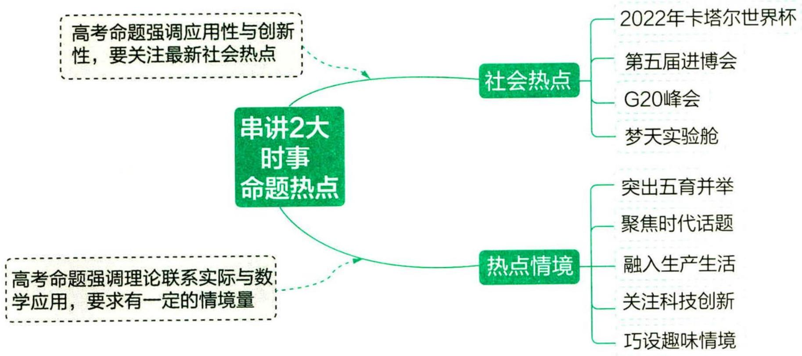

flowchart

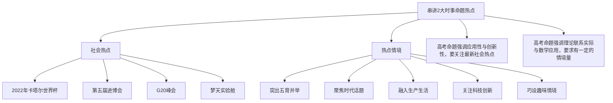
```mermaid
graph TD
    A["串讲2大时事命题热点"] --> B["社会热点"]
    A --> C["热点情境"]
    B --> D["2022年卡塔尔世界杯"]
    B --> E["第五届进博会"]
    B --> F["G20峰会"]
    B --> G["梦天实验舱"]
    C --> H["突出五育并举"]
    C --> I["聚焦时代话题"]
    C --> J["融入生产生活"]
    C --> K["关注科技创新"]
    C --> L["巧设趣味情境"]
    A --> M["高考命题强调应用性与创新性，要关注最新社会热点"]
    A --> N["高考命题强调理论联系实际与数学应用，要求有一定的情境量"]
```

# 热点 1 社会热点

# 角度1》2022年卡塔尔世界杯

调研 1 (2023·北京第十二中学期中节选)2022年卡塔尔世界杯足球赛于2022年11月20日开幕.本届世界杯有32支球队参加,来自亚洲、欧洲、美洲、非洲和大洋洲,其中有7支球队获得过世界杯冠军.第一阶段的比赛是32支球队分成8个小组进行单循环赛,每个小组有1支种子队,相关信息见下表.

<table><tr><td>种子队</td><td>获得过世界杯冠军的球队</td><td colspan="2">欧洲</td><td>美洲</td><td>非洲</td><td>亚洲</td><td>大洋洲</td></tr><tr><td>阿根廷</td><td>阿根廷</td><td>比利时</td><td>葡萄牙</td><td>阿根廷</td><td>加纳</td><td>韩国</td><td>澳大利亚</td></tr><tr><td>巴西</td><td>巴西</td><td>波兰</td><td>瑞士</td><td>巴西</td><td>喀麦隆</td><td>卡塔尔</td><td></td></tr><tr><td>比利时</td><td>德国</td><td>丹麦</td><td>塞尔维亚</td><td>厄瓜多尔</td><td>摩洛哥</td><td>日本</td><td></td></tr><tr><td>法国</td><td>法国</td><td>德国</td><td>威尔士</td><td>哥斯达黎加</td><td>塞内加尔</td><td>沙特阿拉伯</td><td></td></tr><tr><td rowspan="2">乌拉圭</td><td>乌拉圭</td><td>法国</td><td>西班牙</td><td>加拿大</td><td>突尼斯</td><td>伊朗</td><td></td></tr><tr><td>西班牙</td><td>荷兰</td><td></td><td>美国</td><td></td><td></td><td></td></tr><tr><td>西班牙</td><td>英格兰</td><td>克罗地亚</td><td></td><td>墨西哥</td><td></td><td></td><td></td></tr><tr><td>英格兰</td><td></td><td>英格兰</td><td></td><td>乌拉圭</td><td></td><td></td><td></td></tr></table>

微信小初高

蜂巢由紧密排列的蜂室组成,蜂室是严格的六角柱状体,它的一端是平整的六边形开口,另一端是封闭的六角菱形的底,由三个相同的菱形组成.

(1)从32支参赛的球队中任取1支,求这支球队是种子队或来自美洲的概率;   
(2)从获得过冠军的种子队中任选出2支球队,求至少有1支来自美洲的概率.

解析

(1)设这支球队是种子队或来自美洲为事件A,

在 32 支球队中, 是种子队或来自美洲的有 14 支, 则 $P(A)=\frac{14}{32}=\frac{7}{16}$ .

【易错警示】此处易因读取表格信息不仔细，得出“是种子队或来自美洲的有16支”的错误结论，实际上，种子队和来自美洲的球队中都包含阿根廷队和巴西队，要注意不能重复计数

(2)设至少有1支来自美洲为事件B.

获得过冠军的种子队有巴西、法国、阿根廷、西班牙、英格兰,其中来自美洲的有巴西、阿根廷,所以至少有1支来自美洲的概率 $P(B) = \frac{{\mathrm{C}}_{2}^{1}{\mathrm{C}}_{3}^{1} + {\mathrm{C}}_{2}^{2}}{{\mathrm{C}}_{5}^{2}} = \frac{7}{10}$ .

【会思考】“至少有1支”的意思是“有1支或有2支”，对应的情况数分别是 $C_{2}^{1}C_{3}^{1}$ ， $C_{2}^{2}$ ，据此列式计算即可。也可以从对立事件的角度考虑，“至少有1支”的对立事件是“1支也没有”，记此事件为C，则 $P(C)=\frac{C_{3}^{2}}{C_{5}^{2}}=\frac{3}{10}$ ，所以 $P(B)=1-P(C)=\frac{7}{10}$

调研 2 (2023·浙江宁波北仑中学期中/决策问题)2022 年卡塔尔世界杯足球赛比赛期间,某国家队为考察甲、乙两名球员对球队的贡献,统计甲球员的相关数据后制成下表(不考虑球队平局的情况):

<table><tr><td></td><td>球队胜</td><td>球队负</td><td>总计</td></tr><tr><td>甲参加</td><td>30</td><td>b</td><td>60</td></tr><tr><td>甲未参加</td><td>c</td><td>10</td><td>f</td></tr><tr><td>总计</td><td>60</td><td>e</td><td>n</td></tr></table>

乙球员能够胜任前锋、中场、后卫三个位置,且出场率分别为0.1,0.5,0.4.在乙出任前锋、中场、后卫的条件下,球队输球的概率依次为0.2,0.2,0.7.

(1) 根据小概率值 $\alpha=0.025$ 的独立性检验, 能否认为该球队胜利与甲球员参赛有关联?  
(2)①当乙参加比赛时,求该球队某场比赛输球的概率;   
②当乙参加比赛时,在球队输了某场比赛的条件下,求乙球员在这一场出任中场的概率;   
③如果你是教练员,应用概率统计的有关知识,该如何使用乙球员?

微信公众号教辅资料站小考教辅站初高教辅站

附： $\chi^2 = \frac{n(ad - bc)^2}{(a + b)(c + d)(a + c)(b + d)}$ ，其中 $n = a + b + c + d.$

<table><tr><td> $\alpha$ </td><td>0.15</td><td>0.10</td><td>0.05</td><td>0.025</td><td>0.010</td><td>0.005</td><td>0.001</td></tr><tr><td> $x_{\alpha}$ </td><td>2.072</td><td>2.706</td><td>3.841</td><td>5.024</td><td>6.635</td><td>7.879</td><td>10.828</td></tr></table>

解析

(1)依题意得, $b=30,c=30,e=40,f=40,n=100.$

组成底盘的菱形的所有钝角均为 109 度 28 分, 所有的锐角均为 70 度 32 分, 这样既坚固又省料.

零假设为 $H_{0}$ : 球队胜利与甲球员参赛无关,

【易遗漏】独立性检验问题中,零假设不可缺少,否则会丢失步骤分

则 $\chi^{2}=\frac{100\times(30\times10-30\times30)^{2}}{60\times40\times60\times40}=6.25>5.024.$

根据小概率值 $\alpha=0.025$ 的独立性检验, 可以推断 $H_{0}$ 不成立, 即认为该球队胜利与甲球员参赛有关联, 此推断犯错误的概率不超过 0.025.

(2)①设 $A_{1}$ 表示“乙球员出任前锋”, $A_{2}$ 表示“乙球员出任中场”, $A_{3}$ 表示“乙球员出任后卫”, $\Omega = A_{1} \cup A_{2} \cup A_{3}, B$ 表示“球队输掉某场比赛”,

则有 $P(A_{1})=0.1, P(A_{2})=0.5, P(A_{3})=0.4, P(B|A_{1})=P(B|A_{2})=0.2,$ $P(B|A_{3})=0.7,$

【识别模型】根据题眼“在乙出任前锋、中场、后卫的条件下，球队输球的概率依次为0.2，0.2，0.7”知此处为条件概率，据此列式

$$
\begin{array}{r l} & P (B) = P \left(A _ {1} B\right) + P \left(A _ {2} B\right) + P \left(A _ {3} B\right) = P \left(A _ {1}\right) P \left(B \mid A _ {1}\right) + P \left(A _ {2}\right) P \left(B \mid A _ {2}\right) + \\ & P \left(A _ {3}\right) P \left(B \mid A _ {3}\right) = 0. 1 \times 0. 2 + 0. 5 \times 0. 2 + 0. 4 \times 0. 7 = 0. 4, \end{array}
$$

所以当乙参加比赛时,该球队某场比赛输球的概率是0.4.

②由①知,球队输了某场比赛的条件下,乙球员在这一场出任中场的概率 $P(A_{2}|B)=\frac{P(A_{2}B)}{P(B)}=\frac{0.5\times0.2}{0.4}=0.25.$

③由①知,球队输了某场比赛的条件下,乙球员在这一场出任前锋的概率 $P(A_{1}|B)=\frac{P(A_{1}B)}{P(B)}=\frac{0.1\times0.2}{0.4}=0.05$ ,

球队输了某场比赛的条件下,乙球员在这一场出任后卫的概率 $P(A_{3}|B)=\frac{P(A_{3}B)}{P(B)}=\frac{0.4\times0.7}{0.4}=0.7$ , 结合②知, $P(A_{1}|B):P(A_{2}|B):P(A_{3}|B)=0.05:0.25:0.7=1:5:14$ ,

所以,应该多让乙球员出任前锋,来增加赢球场次.

# 角度2 第五届进博会

调研 3 (名师原创)中国国际进口博览会(简称 CIIE 或进博会),是世界上第一个以进口为主题的国家级展会.第五届进博会于2022年11月5日至10日在国家会展中心(上海)举办,众多商品首次亮相,其中一商品的部分结构可近似看作一个多面体,如图1所示.在多面体 ABCDEF 中,底面 ABCD 为直角梯形, $AD \parallel BC$ , $AB \perp BC$ ,侧面ABEF 为菱形,平面 ABEF ⊥ 平面 ABCD,M 为棱 BE 的中点.

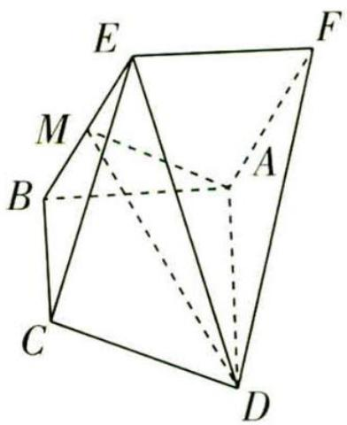

text_image

E
F
M
A
B
C
D

图1

# 004 试题调研 每月一辑试题新

(1) 若 DE 上有一点 N 满足 $MN \parallel$ 平面 ABCD, 确定点 N 的位置并证明;

(2) 若 $AB = BC = \frac{1}{2}AD, \angle EBA = 60^{\circ}$ ，求平面 MAD 与平面 EFD 所成锐二面角的余弦值.

解析 (1) 点 $N$ 为 $DE$ 的中点, 证明如下:

【寻找特殊点】要使点 $N$ 满足 $MN \parallel$ 平面ABCD, 就要使得 $MN$ 与平面ABCD内一条直线平行, 已知 $M$ 为棱 $BE$ 的中点, 连接 $BD$ 后, 三角形中位线就“浮出水面”了, 因此初步确定点 $N$ 为 $DE$ 的中点, 再进行证明即可

如图2, 连接 $BD$ , 因为 $M, N$ 分别为 $BE, DE$ 的中点, 所以 $MN$ 为 $\triangle EBD$ 的中位线, 所以 $MN \parallel BD$ , 又 $MN \not\subset$ 平面 $ABCD, BD \subset$ 平面 $ABCD$ , 所以 $MN \parallel$ 平面 $ABCD$ .

所以 N 为 DE 的中点时满足题意.

(2)如图2,取AB的中点O,连接OE.

因为侧面 ABEF 为菱形, 且 $\angle EBA = 60^{\circ}$ ,

所以在 $\triangle EBO$ 中， $BO = \frac{1}{2} EB, EO^{2} = BO^{2} + EB^{2} - 2BO$

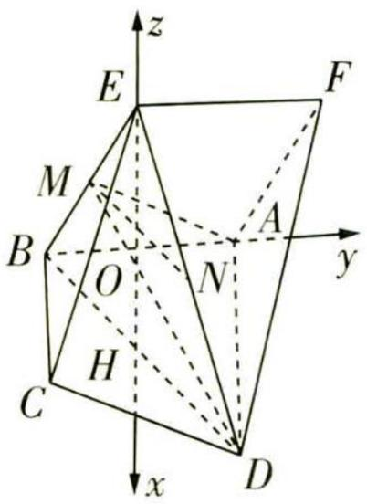

text_image

z
E
F
M
B
O
N
A
y
H
C
D
x

图 2

$EB\cos60^{\circ}$ ，得 $EO=\sqrt{3}BO$ ，所以 $OE^{2}+OB^{2}=BE^{2}$ ，即 $OE\perp AB$ ，

又平面 $ABEF \perp$ 平面 $ABCD$ , 平面 $ABEF \cap$ 平面 $ABCD = AB, OE \subset$ 平面 $ABEF$ ,

所以 $OE \perp$ 平面 ABCD.

在平面 ABCD 中, 过 O 作 AB 的垂线, 交 BD 于 H, 以 O 为坐标原点, 分别以 OH, OA, OE 所在直线为 x 轴、y 轴、z 轴, 建立如图 2 所示的空间直角坐标系 O-xyz,

设 AD=4，则 $AB=BC=\frac{1}{2}AD=2$ ，故 $E(0,0,\sqrt{3})$ ， $D(4,1,0)$ ， $A(0,1,0)$ ， $F(0,2,$ $\sqrt{3}$ , $B(0, -1, 0)$ , 则 $M(0, -\frac{1}{2}, \frac{\sqrt{3}}{2})$ , $\overrightarrow{MA} = (0, \frac{3}{2}, -\frac{\sqrt{3}}{2})$ , $\overrightarrow{MD} = (4, \frac{3}{2}, -\frac{\sqrt{3}}{2})$ , $\overrightarrow{EF} = (0, 2, 0)$ , $\overrightarrow{ED} = (4, 1, -\sqrt{3})$ .

设平面 MAD 的法向量为 $\boldsymbol{m}=(x_{1},y_{1},z_{1})$ ，则 $\left\{\begin{aligned}\boldsymbol{m}\cdot\overrightarrow{MA}&=\frac{3}{2}y_{1}-\frac{\sqrt{3}}{2}z_{1}=0,\\ \boldsymbol{m}\cdot\overrightarrow{MD}&=4x_{1}+\frac{3}{2}y_{1}-\frac{\sqrt{3}}{2}z_{1}=0,\end{aligned}\right.$ 即 $\left\{\begin{aligned}x_{1}&=0,\\ z_{1}&=\sqrt{3}y_{1},\end{aligned}\right.$

令 $y_{1}=1$ ，则 $\boldsymbol{m}=(0,1,\sqrt{3})$ 为平面 MAD 的一个法向量.

更精确的计算还表明“人”字形夹角的一半,即每边与鹤群前进方向的夹角,约为54度44分.

设平面 EFD 的法向量为 $\boldsymbol{n}=(x_{2},y_{2},z_{2})$ ，则 $\left\{\begin{aligned}\boldsymbol{n}\cdot\overrightarrow{EF}&=2y_{2}=0,\\ \boldsymbol{n}\cdot\overrightarrow{ED}&=4x_{2}+y_{2}-\sqrt{3}z_{2}=0,\end{aligned}\right.$ 即 $\left\{\begin{aligned}y_{2}&=0,\\ 4x_{2}&=\sqrt{3}z_{2},\end{aligned}\right.$

令 $z_{2}=4\sqrt{3}$ ，则 $x_{2}=3$ ，则 $\boldsymbol{n}=(3,0,4\sqrt{3})$ 为平面 EFD 的一个法向量.

$\cos\langle m,n\rangle=\frac{m\cdot n}{|m||n|}=\frac{2\sqrt{57}}{19}$ ，故平面 MAD 与平面 EFD 所成锐二面角的余弦值为 $\frac{2\sqrt{57}}{19}$ .

【抓关键字】注意对关键信息“锐二面角”的抓取，这决定了所求余弦值为正值

# 角度3 G20峰会

调研 4 (名师原创)二十国集团领导人第十七次峰会(2022G20 峰会)于 2022年11月15日—16日在印度尼西亚巴厘岛举行.本次峰会以“共同复苏、强劲复苏”为主题,以全球卫生基础设施、数字化转型和可持续的能源转型为三大优先议题.某地区为响应 G20 峰会的号召,特举办企业产品展览会,分为 7 个展区,现统计了每个展区的备受关注百分比,如下表所示:

<table><tr><td>展区类型</td><td>智能及高 端装备</td><td>服务贸易</td><td>服装服饰及日 用消费品</td><td>消费电子 及家电</td><td>食品及 农产品</td><td>汽车</td><td>医疗器械及 医药保健</td></tr><tr><td>展区的企业 数量/家</td><td>400</td><td>450</td><td>650</td><td>60</td><td>1 670</td><td>70</td><td>300</td></tr><tr><td>备受关注 百分比</td><td>25%</td><td>24%</td><td>23%</td><td>20%</td><td>18%</td><td>10%</td><td>8%</td></tr></table>

备受关注百分比:一个展区中受到所有相关人士关注(简称备受关注)的企业数与该展区的企业数的比值.

(1)从企业产品展览会7个展区的企业中随机选取1家,求这家企业是“智能及高端装备”展区备受关注的企业的概率.  
(2)从“消费电子及家电”展区备受关注的企业和“汽车”展区备受关注的企业中,任选2家接受记者采访.  
(i) 记 X 为这 2 家企业中来自“消费电子及家电”展区的企业数, 求随机变量 X 的分布列;  
(ii) 假设表格中 7 个展区的备受关注百分比均提升 $10\%$ , 记 $Y$ 为这 2 家企业中来自“消费电子及家电”展区的企业数, 试比较随机变量 $X, Y$ 的数学期望 $E(X)$ 和 $E(Y)$ 的大小. (只需写出结论)

思维导引 (1)根据表格数据计算可得7个展区的企业共有3600家,其中“智能及高端装备”展区备受关注的企业共有 $400 \times 25\% = 100$ (家),利用古典概型的概率计算公式即可得解. (2)(i)“消费电子及家电”展区备受关注的企业有12家,“汽车”展区备受关注的企业有7家,可知X服从超几何分布,计算概率,列出分布列即可;(ii)根据超几何分布的期望公式求出 $E(X),E(Y)$ ,即可得解.

解析 (1)企业产品展览会7个展区的企业共有 $400 + 60 + 70 + 650 + 1670 + 300 + 450 = 3600$ (家), 其中“智能及高端装备”展区备受关注的企业共有 $400 \times 25\% = 100$ (家),

所以所求概率为 $\frac{100}{3600}=\frac{1}{36}$ .

(2)(i)“消费电子及家电”展区备受关注的企业有 $60 \times 20\% = 12$ (家);

“汽车”展区备受关注的企业有 $70 \times 10\% = 7$ (家).

X 的所有可能取值为 0,1,2,

所以 $P(X=0)=\frac{C_{7}^{2}}{C_{19}^{2}}=\frac{7}{57},P(X=1)=\frac{C_{7}^{1}C_{12}^{1}}{C_{19}^{2}}=\frac{28}{57},P(X=2)=\frac{C_{12}^{2}}{C_{19}^{2}}=\frac{22}{57},$

故随机变量 $X$ 的分布列为：

<table><tr><td>X</td><td>0</td><td>1</td><td>2</td></tr><tr><td>P</td><td>7/57</td><td>28/57</td><td>22/57</td></tr></table>

(ii) 结论为: $E(X) > E(Y)$ .

【会分析】易知 X, Y 均服从超几何分布，则由超几何分布的期望公式可知 $E(X) = \frac{24}{19}$ , $E(Y) = \frac{9}{8}$ , $E(X) > E(Y)$

# 角度4 梦天实验舱

调研 5 (2023·陕西 12 月调考)2022 年 11 月 1 日凌晨 4 点 27 分,梦天实验舱与天和核心舱成功实现“太空握手”. 对接时,要同时满足空间站组合体与梦天实验舱处于同一轨道高度,且空间站组合体前向对接口朝向了梦天实验舱赶上来的方向,才能实现“太空握手”. 根据以上信息,可知“梦天实验舱与天和核心舱成功实现‘太空握手’”是“空间站组合体与梦天实验舱处于同一轨道高度”的 ( )

A. 充分不必要条件

B. 必要不充分条件

C. 充要条件

D. 既不充分也不必要条件

解析 由题意知,“太空握手”⇒“空间站组合体与梦天实验舱处于同一轨道高度”;“空间站组合体与梦天实验舱处于同一轨道高度”⇒“太空握手”.

所以“梦天实验舱与天和核心舱成功实现‘太空握手’”是“空间站组合体与梦天实验舱处于同一轨道高度”的充分不必要条件.

故选A.

答案 A

# 热点 2 热点情境

# 角度1 突出五育并举，培养时代新人

调研 1 (2023·浙江衢州 11 月素养测试/智育)某中学开展做数学题猜Wi-Fi 密码益智活动. 已知数列 $\{a_{n}\}$ 的通项公式为 $a_{n}=2n, n\in N^{*}$ ，数列 $\{b_{n}\}$ 的通项公式为 $b_{n}=2^{n}+1, n\in N^{*}$ . 现将数列 $\{a_{n}\}$ 和 $\{b_{n}\}$ 中所有的项混在一起, 按照从小到大的顺序排, 构成数列 $\{c_{n}\}$ , 若满足 $c_{1}+c_{2}+c_{3}+\cdots+c_{n}>20c_{n+1}$ 成立的 n 的最小值为 m, 该中学 Wi-Fi 密码为 $\frac{1000}{m}$ 换算成小数后, 小数点后的前 6 位数字, 则该中学的 Wi-Fi 密码为 ( )

A. 461538

B. 255815

C. 037036

D. 255813

解析 由题意得,数列 $\{a_{n}\}$ 的通项公式为 $a_{n}=2n, n\in N^{*}$ , 可得数列 $\{a_{n}\}$ 为 2,4,6,8,10,…; 数列 $\{b_{n}\}$ 的通项公式为 $b_{n}=2^{n}+1, n\in N^{*}$ , 可得数列 $\{b_{n}\}$ 为 3,5,9,17,33,….

【小技巧】只看通项公式不好发现规律，因此可以把具体的项写出来，便于观察规律

易知 $\{a_{n}\}$ 的所有项均为偶数， $\{b_{n}\}$ 的所有项均为奇数，二者没有重复.

当 $n = 1$ 时， $b_{n} = 2^{1} + 1 = 3$ ，此时数列 $\{c_{n}\}$ 中 $c_{1} = 2, c_{2} = 3, c_{3} = 4, c_{1} + c_{2} < 20c_{3}$ ;

当 $n = 2$ 时， $b_{n} = 2^{2} + 1 = 5$ ，此时数列 $\{c_{n}\}$ 中 $c_{1} = 2, c_{2} = 3, c_{3} = 4, c_{4} = 5, c_{5} = 6, c_{1} + c_{2} + c_{3} + c_{4} < 20c_{5}$ ；

...

当 n=6 时, $b_{n}=2^{6}+1=65$ , 此时数列 $\{c_{n}\}$ 的前 38 项由 $\{a_{n}\}$ 的前 32 项和数列 $\{b_{n}\}$ 的前 6 项构成, $c_{1}+c_{2}+c_{3}+\cdots+c_{38}=\frac{32\times(2+2\times32)}{2}+\frac{2\times(1-2^{6})}{1-2}+6=1\ 188,20c_{39}=20\times66=1\ 320,c_{1}+c_{2}+$

【灵活解题】此时要进行求和的有38项,不适合像前面那样一个数字一个数字地加起来,回归数列 $\left| {c}_{n}\right|$ 的本质——数列 $\left| {a}_{n}\right|$ 和 $\left| {b}_{n}\right|$ 中所有的项混在一起,按照从小到大的顺序排成数列 $\left| {c}_{n}\right|$ ,因此只要分析清楚数列 $\left| {c}_{n}\right|$ 的前 38 项的构成,利用分组求和法即可破解

$$
c _ {3} + \dots + c _ {3 8} <   2 0 c _ {3 9}.
$$

...

$c_{1}+c_{2}+c_{3}+\cdots+c_{42}=1\ 188+c_{39}+c_{40}+c_{41}+c_{42}=1\ 188+(66+68+70+72)=1\ 464,20c_{43}=$ $20 \times 74 = 1\ 480, c_{1} + c_{2} + c_{3} + \cdots + c_{42} < 20c_{43}$ ，不符合题意.

$c_{1}+c_{2}+c_{3}+\cdots+c_{43}=1\ 464+74=1\ 538,20c_{44}=20\times76=1\ 520$ ,此时首次满足 $c_{1}+c_{2}+c_{3}+\cdots+c_{43}>20c_{44}$ ，所以m=43，

当对这个美丽的结构用数学方法进行分析时，“出现”在蜘蛛网上的元素真是惊人——半径、弦、平行线、三角形、对数螺线和悬链线等.

又 $\frac{1000}{m} \approx 23.255813953$ ，所以该中学的Wi-Fi密码为255813.故选D.

答案 D

# 角度2 聚焦时代话题，彰显责任担当

调研 2 (2023·广州第五中学11月阶段练习)随着时代的不断发展,社会对高素质人才的需求不断扩大,我国本科毕业生中考研人数也在不断攀升,2020年的考研人数是341万人,2021年考研人数是377万人.某省统计了该省四所大学2022年的毕业生人数及考研人数(单位:千人),得到如下表格.

<table><tr><td></td><td>A 大学</td><td>B 大学</td><td>C 大学</td><td>D 大学</td></tr><tr><td>2022 年毕业生人数 x/千人</td><td>7</td><td>6</td><td>5</td><td>4</td></tr><tr><td>2022 年考研人数 y/千人</td><td>0.5</td><td>0.4</td><td>0.3</td><td>0.2</td></tr></table>

(1)已知 y 与 x 具有较强的线性相关关系,求 y 关于 x 的线性回归方程 $\hat{y} = \hat{b}x + \hat{a}$ .  
(2)该省计划对选择考研的大学生每人发放0.5万元的补贴.  
(i) 若该省 E 大学 2022 年毕业生人数为 8 千人, 试用 (1) 中的线性相关关系估计该省对 E 大学发放的考研补贴的总金额;  
(ii) 若 $A$ 大学的毕业生中小广、小东选择考研的概率分别为 $p, 3p - 1$ , 该省对小广、小东两人的考研补贴总金额的期望不超过 0.75 万元, 求 $p$ 的取值范围.

参考公式: 回归直线 $\hat{y} = \hat{b} x + \hat{a}$ 中斜率和截距的最小二乘估计公式为 $\hat{b} = \frac{\sum_{i=1}^{n}(x_i - \bar{x})(y_i - \bar{y})}{\sum_{i=1}^{n}(x_i - \bar{x})^2} = \frac{\sum_{i=1}^{n}x_i y_i - n\bar{x}\bar{y}}{\sum_{i=1}^{n}x_i^2 - n\bar{x}^2}, \hat{a} = \bar{y} - \hat{b}\bar{x}$ .

解析 (1) 由题意得 $\overline{x} = \frac{7 + 6 + 5 + 4}{4} = 5.5, \overline{y} = \frac{0.5 + 0.4 + 0.3 + 0.2}{4} = 0.35$ ,

$$
\sum_ {i = 1} ^ {4} x _ {i} y _ {i} = 3. 5 + 2. 4 + 1. 5 + 0. 8 = 8. 2, \sum_ {i = 1} ^ {4} x _ {i} ^ {2} = 4 9 + 3 6 + 2 5 + 1 6 = 1 2 6,
$$

$$
\therefore \hat {b} = \frac {\sum_ {i = 1} ^ {4} x _ {i} y _ {i} - 4 \bar {x} \bar {y}}{\sum_ {i = 1} ^ {4} x _ {i} ^ {2} - 4 \bar {x} ^ {2}} = \frac {8 . 2 - 4 \times 5 . 5 \times 0 . 3 5}{1 2 6 - 4 \times 5 . 5 ^ {2}} = 0. 1, \hat {a} = \bar {y} - \hat {b} \bar {x} = 0. 3 5 - 0. 1 \times 5. 5 = - 0. 2,
$$

$\therefore y$ 关于 $x$ 的线性回归方程为 $\hat{y}=0.1x-0.2$ .

(2)(i)由(1)知,当x=8时, $\hat{y}=0.1\times8-0.2=0.6$ ,

∴ 要补贴的总金额为 $0.6 \times 1\ 000 \times 0.5 = 300$ (万元).

(ii) 设小广、小东中选择考研的人数为 X，则 X 的所有可能取值为 0, 1, 2,

冬天,猫睡觉时总是把身体蜷成一个球,这样,身体暴露在冷空气中的表面积最小,从而散发的热量也最少.

$$
\therefore P (X = 0) = (1 - p) [ 1 - (3 p - 1) ] = (1 - p) (2 - 3 p) = 3 p ^ {2} - 5 p + 2,
$$

$$
P (X = 1) = p [ 1 - (3 p - 1) ] + (1 - p) (3 p - 1) = - 6 p ^ {2} + 6 p - 1,
$$

$$
P (X = 2) = p (3 p - 1) = 3 p ^ {2} - p.
$$

$$
\therefore E (X) = 0 \times \left(3 p ^ {2} - 5 p + 2\right) + 1 \times \left(- 6 p ^ {2} + 6 p - 1\right) + 2 \times \left(3 p ^ {2} - p\right) = 4 p - 1,
$$

$\therefore 0.5E(X) = 0.5(4p - 1) \leqslant 0.75$ ，解得 $p \leqslant \frac{5}{8}$ ，又 $\left\{ \begin{array}{l} 0 \leqslant p \leqslant 1, \\ 0 \leqslant 3p - 1 \leqslant 1, \end{array} \right.$ $\therefore \frac{1}{3} \leqslant p \leqslant \frac{2}{3}$ .

【隐藏条件】概率的取值范围为[0,1]，这一点不能忽略

综上所述,p 的取值范围为 $\left[\frac{1}{3},\frac{5}{8}\right]$ .

# 角度3 融入生产生活，关注数学应用

调研 3 (2023·华中师大一附中期中)随着越来越多的家庭选择自驾到公园游玩,公园停车位严重不足. 如图1所示,公园里有一块扇形空地AOB,其半径为20 m, $\angle AOB = \frac{\pi}{2}$ ,C为弧AB的中点,要在其内接矩形MNPQ(点M,Q分别在半径OA,OB上,点N,P在弧AB上,且MN//OC)上修建停车场,则停车场面积的最大值为(单位: $\mathrm{m}^{2}$ )()

A. ${50\pi }$

B. ${25\pi }$

C. $400(\sqrt{2} - 1)$

D. ${400}\sqrt{2}$

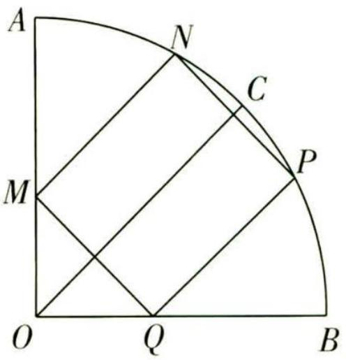

text_image

A
N
C
M
P
O
Q
B

图1

解析 如图2,连接OP,设OC交PN于点E, $\angle POB=\theta$ .

∵ 四边形 MNPQ 为矩形, $MN \parallel OC$ , ∴ $\angle PEO = \frac{\pi}{2}$ , 又 C 为弧 AB 的中点, ∴ $\angle COB = \frac{\pi}{4}$ , $\angle COP = \frac{\pi}{4} - \theta$ .

在直角三角形 $POE$ 中, $\frac{PE}{20} = \sin (\frac{\pi}{4} - \theta)$ , $\therefore PN = 2PE = 40\sin (\frac{\pi}{4} - \theta)$ . 在 $\triangle OPQ$ 中, $\angle PQO = \frac{\pi}{4} + \frac{\pi}{2} = \frac{3\pi}{4}$ , 由正弦定理 $\frac{OP}{\sin \frac{3\pi}{4}} = \frac{PQ}{\sin \theta}$ 得, $PQ =$

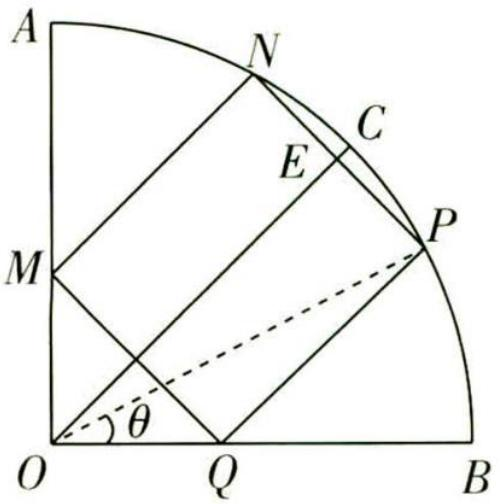

text_image

A
N
C
E
M
P
θ
O
Q
B

图 2

$20\sqrt{2}\sin\theta.\therefore$ 矩形 MNPQ 的面积 $S=PQ\cdot PN=20\sqrt{2}\sin\theta\cdot40\sin(\frac{\pi}{4}-\theta)=800\sqrt{2}\sin\theta(\frac{\sqrt{2}}{2}\cos\theta-\frac{\sqrt{2}}{2}\sin\theta)=400\sqrt{2}\sin(2\theta+\frac{\pi}{4})-400,$

【敲黑板】利用三角函数的性质求解最值问题,注意光判断变量 $\theta$ 的取值范围

由题意可得 $0 < \theta < \frac{\pi}{4}, \therefore \frac{\pi}{4} < 2\theta + \frac{\pi}{4} < \frac{3\pi}{4}, \therefore$ 当 $2\theta + \frac{\pi}{4} = \frac{\pi}{2}$ 时，矩形 MNPQ 的面积最大，最大

# 010 试题调研 每月一辑试题新

为 $400(\sqrt{2}-1)$ . 故选 C.

答案 C

# 角度4 关注科技创新，助力科技强国

调研 4 (2023·四川泸州一诊)近年来,中国加大了对电动汽车的研究与推广,新型动力电池也随之迎来了蓬勃发展的机遇.已知蓄电池的容量 C(单位:A·h)、放电时间 t(单位:h)与放电电流 I(单位:A)之间所满足的经验公式为 $C = I^{n} \cdot t$ ,其中 $n = \log_{\frac{3}{2}} 2$ . 在电池容量不变的条件下,当放电电流 I = 10 A 时,放电时间 t = 57 h,则当放电电流 I = 15 A 时,放电时间为 ( )

A. $28 \mathrm{~h}$

B. ${28.5}\mathrm{\;h}$

C. $29 \mathrm{~h}$

D. ${29.5}\mathrm{\;h}$

解析 由题意可得 $C = 57 \times 10^{n}$ ,

C 不变, 当 I = 15 A 时, 则 $57 \times 10^{n} = 15^{n} \cdot t$ ,

$$
\therefore t = 5 7 \times \left(\frac {1 0}{1 5}\right) ^ {n} = 5 7 \times \left(\frac {2}{3}\right) ^ {\log_ {\frac {3}{2}} 2} = 5 7 \times \left[ \left(\frac {3}{2}\right) ^ {- 1} \right] ^ {\log_ {\frac {3}{2}} 2} = 5 7 \times \left[ \left(\frac {3}{2}\right) ^ {\log_ {\frac {3}{2}} 2} \right] ^ {- 1} = 5 7 \times 2 ^ {- 1} = \frac {5 7}{2} = 2 8. 5 (\mathrm{h}).
$$

故选B.

答案 B

# 角度5 巧设趣味情境，激发学习兴趣

调研 5 (2023·广东佛山11月第二次调研)如图3,有一个圆锥形粮堆,其轴截面是边长为8 m的等边三角形ABC,粮堆母线AC的中点P处有一老鼠正在偷吃粮食,此时小猫正在B处,它要沿圆锥侧面到达P处捕捉老鼠,则小猫所经过的最短路程是\_\_\_\_m.

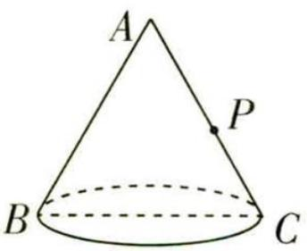

text_image

A
P
B
C

图3

解析 如图4所示,根据题意可得 $\triangle ABC$ 是边长为8m的正三角形,所以BC=8m,

【数形结合】作出圆锥的侧面展开图，将立体几何问题转化为平面几何问题求解

所以圆锥底面周长为 $2\pi \times 4 = 8\pi \, (\text{m})$ .

设圆锥侧面展开后的扇形圆心角为 $n$ , 点 $B$ 在展开图中对应的点为 $B'$ , 连接 $AB', B'P$ . 根据底面圆的周长等于展开后扇形的弧长, 可得 $8n = 8\pi$ , 故 $n = \pi$ , 则 $\angle B'AC = \frac{\pi}{2}$ ,

所以 $B'P = \sqrt{64 + 16} = 4\sqrt{5} \, (\text{m})$ ，所以小猫所经过的最短路程是 $4\sqrt{5} \, m$ 。故答案为 $4\sqrt{5}$ .

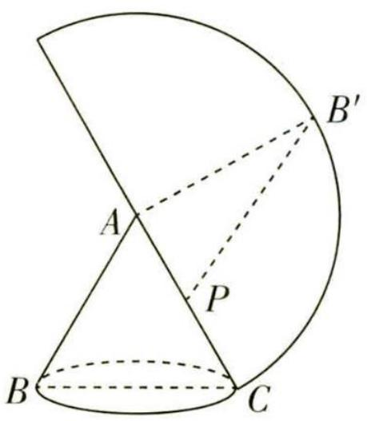

text_image

A
B'
P
B
C

图 4

答案 $4\sqrt{5}$

蚂蚁堪称动物世界中的数学奇才,因为它拥有奇妙的计算能力.一项实验表明,一群蚂蚁每次出洞去搬运食物时,大蚂蚁与小蚂蚁的数量之比总是1:10.

关注微信公众号“初高教辅站”获取更多初高中教辅资料

串讲创新命题热点  
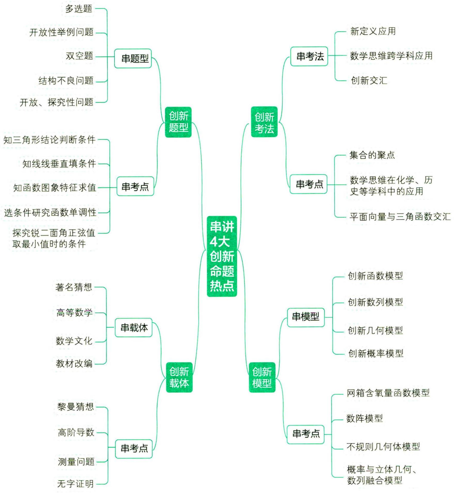

flowchart

```mermaid
graph TD
    A["串讲4大创新命题热点"] --> B["串题型"]
    A --> C["创新题型"]
    A --> D["创新考法"]
    A --> E["串考点"]
    A --> F["创新载体"]
    A --> G["创新模型"]
    A --> H["串考点"]
    
    B --> B1["多选题"]
    B --> B2["开放性举例问题"]
    B --> B3["双空题"]
    B --> B4["结构不良问题"]
    B --> B5["开放、探究性问题"]
    
    C --> C1["新定义应用"]
    C --> C2["数学思维跨学科应用"]
    C --> C3["创新交汇"]
    
    D --> D1["知三角形结论判断条件"]
    D --> D2["知线线垂直填条件"]
    D --> D3["知函数图象特征求值"]
    D --> D4["选条件研究函数单调性"]
    D --> D5["探究锐二面角正弦值取最小值时的条件"]
    
    E --> E1["集合的聚点"]
    E --> E2["数学思维在化学、历史等学科中的应用"]
    E --> E3["平面向量与三角函数交汇"]
    
    F --> F1["著名猜想"]
    F --> F2["高等数学"]
    F --> F3["数学文化"]
    F --> F4["教材改编"]
    
    G --> G1["创新函数模型"]
    G --> G2["创新数列模型"]
    G --> G3["创新几何模型"]
    G --> G4["创新概率模型"]
    
    H --> H1["黎曼猜想"]
    H --> H2["高阶导数"]
    H --> H3["测量问题"]
    H --> H4["无字证明"]
    
    I["串讲4大创新命题热点"] --> I1["串考点"]
    I1 --> I1a["新定义应用"]
    I1 --> I1b["数学思维跨学科应用"]
    I1 --> I1c["创新交汇"]
    
    J["创新题型"] --> J1["新定义应用"]
    J --> J2["数学思维跨学科应用"]
    J --> J3["创新交汇"]
    
    K["创新载体"] --> K1["新定义应用"]
    K --> K2["数学思维跨学科应用"]
    K --> K3["创新交汇"]
    
    L["创新模型"] --> L1["新定义应用"]
    L --> L2["数学思维跨学科应用"]
    L --> L3["创新交汇"]
    
    M["创新考法"] --> M1["新定义应用"]
    M --> M2["数学思维跨学科应用"]
    M --> M3["创新交汇"]
    
    N["创新载体"] --> N1["新定义应用"]
    N --> N2["数学思维跨学科应用"]
    N --> N3["创新交汇"]
    
    O["创新模型"] --> O1["新定义应用"]
    O --> O2["数学思维跨学科应用"]
    O --> O3["创新交汇"]
    
    P["创新载体"] --> P1["新定义应用"]
    P --> P2["数学思维跨学科应用"]
    P --> P3["创新交汇"]
    
    Q["创新模型"] --> Q1["新定义应用"]
    Q --> Q2["数学思维跨学科应用"]
    Q --> Q3["创新交汇"]
    
    R["创新载体"] --> R1["新定义应用"]
    R --> R2["数学思维跨学科应用"]
    R --> R3["创新交汇"]
    
    S["创新模型"] --> S1["新定义应用"]
    S --> S2["数学思维跨学科应用"]
    S --> S3["创新交汇"]
    
    T["创新载体"] --> T1["新定义应用"]
    T --> T2["数学思维跨学科应用"]
    T --> T3["创新交汇"]
    
    U["创新模型"] --> U1["新定义应用"]
    U --> U2["数学思维跨学科应用"]
    U --> U3["创新交汇"]
    
    V["创新载体"] --> V1["新定义应用"]
    V --> V2["数学思维跨学科应用"]
    V --> V3["创新交汇"]
    
    W["创新模型"] --> W1["新定义应用"]
    W --> W2["数学思维跨学科应用"]
    W --> W3["创新交汇"]
    
    X["创新载体"] --> X1["新定义应用"]
    X --> X2["数学思维跨学科应用"]
    X --> X3["创新交汇"]
    
    Y["创新模型"] --> Y1["新定义应用"]
    Y --> Y2["数学思维跨学科应用"]
    Y --> Y3["创新交汇"]
    
    Z["创新载体"] --> Z1["新定义应用"]
    Z --> Z2["数学思维跨学科应用"]
    Z --> Z3["创新交汇"]
    
    AA["创新载体"] --> AA1["新定义应用"]
    AA --> AA2["数学思维跨学科应用"]
    AA --> AA3["创新交汇"]
    
    AB["创新载体"] --> AB1["新定义应用"]
    AB --> AB2["数学思维跨学科应用"]
    AB --> AB3["创新交汇"]
    
    AC["创新载体"] --> AC1["新定义应用"]
    AC --> AC2["数学思维跨学科应用"]
    AC --> AC3["创新交汇"]
    
    AD["创新载体"] --> AD1["新定义应用"]
    AD --> AD2["数学思维跨学科应用"]
    AD --> AD3["创新交汇"]
    
    AE["创新载体"] --> AE1["新定义应用"]
    AE --> AE2["数学思维跨学科应用"]
    AE --> AE3["创新交汇"]
    
    AF["创新载体"] --> AF1["新定义应用"]
    AF --> AF2["数学思维跨学科应用"]
    AF --> AF3["创新交汇"]
    
    AG["创新载体"] --> AG1["新定义应用"]
    AG --> AG2["数学思维跨学科应用"]
    AG --> AG3["创新交汇"]
    
    AH["创新载体"] --> AH1["新定义应用"]
    AH --> AH2["数学思维跨学科应用"]
    AH --> AH3["创新交汇"]
    
    AI["创新载体"] --> AI1["新定义应用"]
    AI --> AI2["数学思维跨学科应用"]
    AI --> AI3["创新交汇"]
    
    AJ["创新载体"] --> AJ1["新定义应用"]
    AJ --> AJ2["数学思维跨学科应用"]
    AJ --> AJ3["创新交汇"]
    
    AK["创新载体"] --> AK1["新定义应用"]
    AK --> AK2["数学思维跨学科应用"]
    AK --> AK3["创新交汇"]
    
    AL["创新载体"] --> AL1["新定义应用"]
    AL --> AL2["数学思维跨学科应用"]
    AL --> AL3["创新交汇"]
    
    AM["创新载体"] --> AM1["新定义应用"]
    AM --> AM2["数学思维跨学科应用"]
    AM --> AM3["创新交汇"]
    
    AN["创新载体"] --> AN1["新定义应用"]
    AN --> AN2["数学思维跨学科应用"]
    AN --> AN3["创新交汇"]
    
    AO["创新载体"] --> AO1["新定义应用"]
    AO --> AO2["数学思维跨学科应用"]
    AO --> AO3["创新交汇"]
    
    AP["创新载体"] --> AP1["新定义应用"]
    AP --> AP2["数学思维跨学科应用"]
    AP --> AP3["创新交汇"]
    
    AQ["创新载体"] --> AQ1["新定义应用"]
    AQ --> AQ2["数学思维跨学科应用"]
    AQ --> AQ3["创新交汇"]
    
    AR["创新载体"] --> AR1["新定义应用"]
    AR --> AR2["数学思维跨学科应用"]
    AR --> AR3["创新交汇"]
    
    AS["创新载体"] --> AS1["新定义应用"]
    AS --> AS2["数学思维跨学科应用"]
    AS --> AS3["创新交汇"]
    
    AT["创新载体"] --> AT1["新定义应用"]
    AT --> AT2["数学思维跨学科应用"]
    AT --> AT3["创新交汇"]
    
    AU["创新载体"] --> AU1["新定义应用"]
    AU --> AU2["数学思维跨学科应用"]
    AU --> AU3["创新交汇"]
    
    AV["创新载体"] --> AV1["新定义应用"]
    AV --> AV2["数学思维跨学科应用"]
    AV --> AV3["创新交汇"]
    
    AW["创新载体"] --> AW1["新定义应用"]
    AW --> AW2["数学思维跨学科应用"]
    AW --> AW3["创新交汇"]
    
    AX[Akka 80000000000000000000000000000000000000000000000000000000000000000000000000000000000000000000000000000 0  0  0  0  0  0  0  0  0  0  0  0  0  0  0  0  0  0  0  0  0  0  0  0  0  0  0  0  0  0  0  0  0  0  nan
```

# 热点 1 创新题型

# 特约名师

王应祥 山东省高级教师,淄博市优秀教师,在《山东教育》《中学生数理化》《求学》《高考金刊》等国家级及省级等各类专业报刊上发表教育教学论文200多篇.

# 题型1 多选题

调研 1 (2023·福建厦门外国语学校石狮分校、泉港一中两校 10 月联考) 黑板上有一道解三角形的习题, 求解过程是正确的, 但一位同学不小心把其中一部分擦去了, 现在只能看到: 在 $\triangle ABC$ 中, 内角 $A, B, C$ 的对边分别为 $a, b, c$ , 已知 $a = 2 \dots \dots$ 解得 $B = 60^{\circ}$ . 根据以上信息, 你认为下面哪个选项可以作为这个习题的其余已知条件? ()

审题、读题要认真，看清楚所求目标，切勿因读题不认真选错答案！

A. $b = 2\sqrt{3}$ , $C = 90^{\circ}$

B. $A = 30^{\circ}, c = 4$

C. $b = 2\sqrt{3}$ , $A = 30^{\circ}$

D. $b = 2\sqrt{3}, c = 4$

# 思维导引

对于 A, 在 Rt△ABC 中, 根据正切值的定义得 $\tan B = \sqrt{3}$

$B=60^{\circ}$ → A 正确

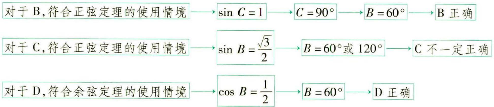

flowchart

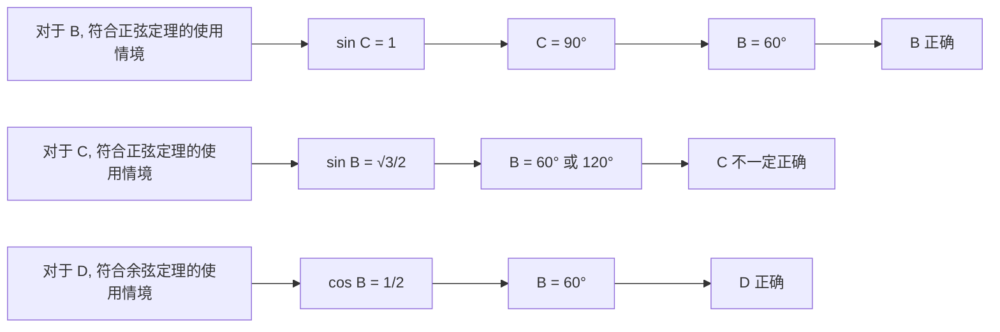
```mermaid
graph LR
    A["对于 B, 符合正弦定理的使用情境"] --> B["sin C = 1"]
    B --> C["C = 90°"]
    C --> D["B = 60°"]
    D --> E["B 正确"]
    F["对于 C, 符合正弦定理的使用情境"] --> G["sin B = √3/2"]
    G --> H["B = 60° 或 120°"]
    H --> I["C 不一定正确"]
    J["对于 D, 符合余弦定理的使用情境"] --> K["cos B = 1/2"]
    K --> L["B = 60°"]
    L --> M["D 正确"]
```

解析 对于 A, 因为 $a=2, b=2\sqrt{3}, C=90^{\circ}$ , 所以 $\tan B=\frac{b}{a}=\frac{2\sqrt{3}}{2}=\sqrt{3}$ , 又 $0^{\circ}<B<180^{\circ}$ , 所以 $B=60^{\circ}$ , 故 A 选项可以作为已知条件.

对于 B, 因为 $a = 2, A = 30^{\circ}, c = 4$ , 所以根据正弦定理得 $\frac{a}{\sin A} = \frac{c}{\sin C}$ , 即 $\frac{2}{\sin 30^{\circ}} = \frac{4}{\sin C}$ , 所以 $\sin C = 1$ , 又 $0^{\circ} < C < 180^{\circ}$ , 所以 $C = 90^{\circ}$ , 所以 $B = 60^{\circ}$ , 故 B 选项可以作为已知条件.

对于 C, 因为 $a=2, b=2\sqrt{3}, A=30^{\circ}$ , 所以根据正弦定理得 $\frac{2}{\sin 30^{\circ}}=\frac{2\sqrt{3}}{\sin B}$ , 所以 $\sin B=\frac{\sqrt{3}}{2}$ , 又 $0^{\circ}<$

【易错剖析】解三角形问题的易错点之一就是判断解的个数时容易出错，如此处，区别于前面B选项中由 $\sin C=1$ 只能得出C有唯一解，由 $\sin B=\frac{\sqrt{3}}{2}$ ，三角形的内角和为 $180^{\circ}, b>a$ （即B＞A）可得出B有两个解。防错的关键就是确定好角的范围，需要同时考虑到三角形内角和、角之间的关系，以及其他相关的已知条件

壁虎在捕食蚊、蝇、蛾等小昆虫时,总沿着一条螺旋形曲线爬行,数学上称这条曲线为 “螺旋线”.

$B<180^{\circ}$ ，且b>a，所以 $B=60^{\circ}$ 或 $120^{\circ}$ ，故C选项不可以作为已知条件.

【秒杀解】根据正弦定理判断三角形解的个数的方法(见题后方法总结), 可快速得出 $b\sin A = \sqrt{3} < 2 = a$ ,从而判断三角形有两解,所以 $C$ 选项不可以作为已知条件

对于 D, 因为 $a=2, b=2\sqrt{3}, c=4$ , 所以根据余弦定理得 $\cos B=\frac{a^{2}+c^{2}-b^{2}}{2ac}=\frac{2^{2}+4^{2}-(2\sqrt{3})^{2}}{2\times2\times4}=$ $\frac{1}{2}$ ，又 $0^{\circ}<B<180^{\circ}$ ，所以 $B=60^{\circ}$ ，故D选项可以作为已知条件.

# 答案 ABD

# 方法总结

# 由正弦定理判断三角形解的个数的方法

在 $\triangle ABC$ 中，内角A，B，C的对边分别为a，b，c，已知a，b及A.

<table><tr><td></td><td>A&gt;90°</td><td>A=90°</td><td>A&lt;90°</td></tr><tr><td>a&gt;b</td><td>一解</td><td>一解</td><td>一解</td></tr><tr><td>a=b</td><td>无解</td><td>无解</td><td>一解</td></tr><tr><td>a无解无解a&gt;bsin A时有两解;a=bsin A时有一解;a&lt;bsin A时无解</td><td>无解</td><td>无解</td><td>a&gt;bsin A时有两解;a=bsin A时有一解;a&lt;bsin A时无解</td></tr></table>

调研 2 (2023 · 河北邢台 11 月联考) 如图 1, 在正方体 $ABCD - A_{1}B_{1}C_{1}D_{1}$ 中, $E, F$ 分别为 $BC, CC_{1}$ 的中点, $G$ 为棱 $BB_{1}$ 上的动点, 则下列选项正确的是 ( )

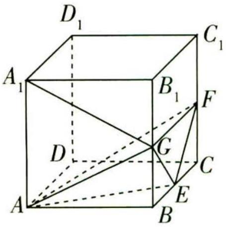

text_image

D₁
A₁
B₁
C₁
F
D
G
C
A
E
B

图1

A. $B B_{1} \perp A F$   
B. 点 $D_{1}$ 在平面 $AEF$ 内  
C. 三棱锥 G-AEF 的体积为定值  
D. 若 G 为 $BB_{1}$ 的中点, 则 $A_{1}G \parallel$ 平面 AEF

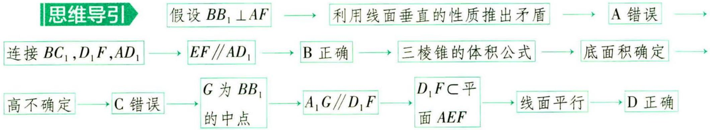

flowchart

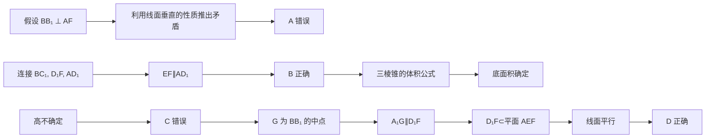
```mermaid
graph LR
    A["假设 BB₁ ⊥ AF"] --> B["利用线面垂直的性质推出矛盾"]
    B --> C["A 错误"]
    D["连接 BC₁, D₁F, AD₁"] --> E["EF∥AD₁"]
    E --> F["B 正确"]
    F --> G["三棱锥的体积公式"]
    G --> H["底面积确定"]
    I["高不确定"] --> J["C 错误"]
    J --> K["G 为 BB₁ 的中点"]
    K --> L["A₁G∥D₁F"]
    L --> M["D₁F⊂平面 AEF"]
    M --> N["线面平行"]
    N --> O["D 正确"]
```

解析 对于 A, 在正方体 $ABCD-A_{1}B_{1}C_{1}D_{1}$ 中, $BB_{1}\perp$ 平面 ABCD, 所以 $BB_{1}\perp AE$ , 若 $BB_{1}\perp AF$ , 因为 $AE\cap AF=A, AE, AF\subset$ 平面 AEF, 所以 $BB_{1}\perp$ 平面 AEF, 从而 $BB_{1}\perp EF$ , 不合题意, 故 A 错误.

对于 B, 如图 2 所示, 连接 $BC_{1}, D_{1}F, AD_{1}$ , 因为 $E, F$ 分别为 $BC, CC_{1}$ 的中点, 所以 $EF \parallel BC_{1}$ , 易知 $AD_{1} \parallel BC_{1}$ , 所以 $EF \parallel AD_{1}$ ,

所以 $A, D_{1}, E, F$ 在同一平面内，所以点 $D_{1}$ 在平面 AEF 内，故 B 正确.

【方法技巧】四点共面问题往往是通过证明两条直线平行来求解的

对于 C, 易知 $EF, BB_{1}$ 必相交, $EF \subset$ 平面 AEF, 故 $BB_{1}$ 与平面 AEF 相交, G 为棱 $BB_{1}$ 上的动点, 故点 G 到平面 AEF 的距离是变化的, 而 $\triangle AEF$ 的面积为

【小提示】动点 G 在 $BB_{1}$ 上，若 $BB_{1} \parallel$ 平面 AEF，则点 G 到平面 AEF 的距离不变，否则是变化的

定值,故三棱锥 G-AEF 的体积不为定值,故 C 错误.

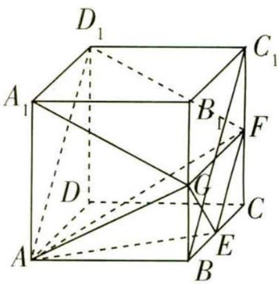

text_image

D₁
A₁
B₁
C₁
F
D
G
C
A
E
B

图 2

对于 D, 当 G 为 $BB_{1}$ 的中点时, $GF \parallel B_{1}C_{1} \parallel A_{1}D_{1}$ , $GF = B_{1}C_{1} = A_{1}D_{1}$ , 则四

边形 $A_{1} G F D_{1}$ 为平行四边形, 所以 $A_{1} G \parallel D_{1} F$ , 又 $A_{1} G \not\subset$ 平面 $A E F, D_{1} F \subset$ 平面 $A E F$ , 所以 $A_{1} G \parallel$ 平面 $A E F$ , 故 D 正确.

【易错提醒】线面平行的判定定理中的三个条件 “ $a \not\subset  \alpha ,b \subset  \alpha ,a//b$ ”缺一不可

答案 BD

调研 3 (2023·安徽师范大学附属中学11月考试/交汇诗歌)有这样一句诗歌:世界上最远的距离,不是树枝无法相依,而是相互瞭望的星星,却没有交汇的轨迹;世界上最远的距离,不是星星之间的轨迹,而是纵然轨迹交汇,却在转瞬间无处寻觅.已知点 $F(1,0)$ ,直线 $l:x=4$ ,动点 $P$ 与点 $F$ 之间的距离是点 $P$ 到直线 $l$ 的距离的一半.若某直线上存在这样的点 $P$ ,则称该直线为“最远距离直线”,则下列结论中正确的是()

A. 点 P 的轨迹方程是 $\frac{x^{2}}{3} + \frac{y^{2}}{4} = 1$   
B. 直线 $x - 2y + 4 = 0$ 是“最远距离直线”  
C. 平面上有一点 $A(-1, \sqrt{2})$ ，则 $|PA| + 2|PF|$ 的最小值为 5  
D. 点 $P$ 到直线 $x - 2y + 6 = 0$ 距离的最大值为 $2 \sqrt{5}$

思维导引

设点 $P(x,y)$ ，点 $P$ 到 $l$ 的距离为 $d$

根据题意列关于 $x, y$ 的等式

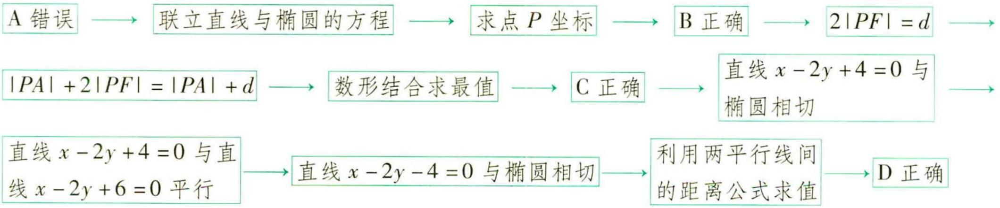

flowchart

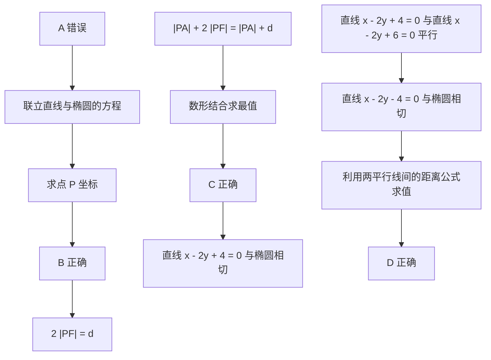
```mermaid
graph TD
    A["A 错误"] --> B["联立直线与椭圆的方程"]
    B --> C["求点 P 坐标"]
    C --> D["B 正确"]
    D --> E["2 |PF| = d"]
    F["|PA| + 2 |PF| = |PA| + d"] --> G["数形结合求最值"]
    G --> H["C 正确"]
    H --> I["直线 x - 2y + 4 = 0 与椭圆相切"]
    J["直线 x - 2y + 4 = 0 与直线 x - 2y + 6 = 0 平行"] --> K["直线 x - 2y - 4 = 0 与椭圆相切"]
    K --> L["利用两平行线间的距离公式求值"]
    L --> M["D 正确"]
```

解析

如图3, 设 $P(x,y)$ , 点 P 到 l 的距离为 d.

因为动点 P 与点 F 之间的距离是点 P 到直线 l 的距离的一半, 则 $2\sqrt{(x-1)^{2}+y^{2}}=|x-4|$ , 化

【思路点拨】直接根据题目提供的条件列出方程, 利用直接法求动点轨迹

简得 $\frac{x^{2}}{4}+\frac{y^{2}}{3}=1$ , 故 A 错误.

由 $\left\{\begin{aligned}x-2y+4=0,\\ \frac{x^{2}}{4}+\frac{y^{2}}{3}=1,\end{aligned}\right.$ 得x=-1，则 $y=\frac{3}{2}$ ，所以直线 $x-2y+4=0$ 上存在 $P(-1,\frac{3}{2})$ ，其与点F之间的距离是其到直线 $x-2y+4=0$ 的距离的一半，则直线 $x-2y+4=0$ 是“最远距离直线”，故B正确.

由 $2|PF| = d$ 可知, $|PA| + 2|PF| = |PA| + d$ , 当点 $P$ 与点 $A$ 纵坐

【会转化】将两点之间的距离转化为点线距

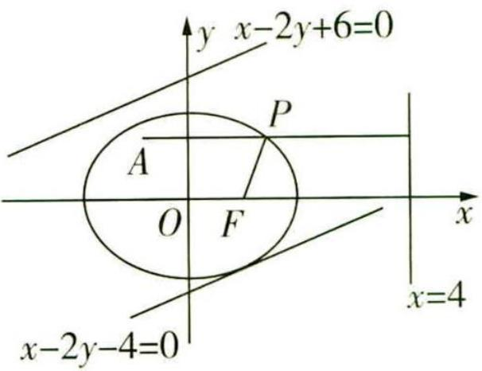

text_image

y x-2y+6=0
A P
O F
x
x=4
x-2y-4=0

图3

标相等且点 $P$ 在点 $A$ 右侧时， $|PA| + 2|PF|$ 取得最小值，为 $4 - (-1) = 5$ ，C 正确.

由 B 选项可知, 直线 $x - 2y + 4 = 0$ 与椭圆相切, 直线 $x - 2y + 6 = 0$ 与直线 $x - 2y + 4 = 0$ 平行, 由椭圆的对称性易知与直线 $x - 2y + 4 = 0$ 平行的另一条椭圆的切线方程为 $x - 2y - 4 = 0$ , 故直线 $x - 2y + 6 = 0$ 与直线 $x - 2y - 4 = 0$ 之间的距离即所求距离的最大值, 为 $\frac{|6 + 4|}{\sqrt{1 + 4}} = 2\sqrt{5}$ , 故 D 正确.

【数形结合】可结合图3,将所求最大距离转化为两平行线间的距离

答案 BCD

# 题型2 开放性举例问题

调研 4 (2023·北师大附中 12 月阶段练习)在直四棱柱 $ABCD-A_{1}B_{1}C_{1}D_{1}$ 中, 当底面四边形 $ABCD$ 满足条件\_\_\_\_时,有 $A_{1}C \perp B_{1}D_{1}$ (填上你认为正确的一个条件即可).

思维导引 根据题意作出图形 $\rightarrow$ 连接 BD, AC $\rightarrow$ A₁A ⊥ 平面 ABCD $\rightarrow$ A₁A ⊥ BD $\rightarrow$ AC ⊥ BD $\rightarrow$ BD ⊥ 平面 A₁AC $\rightarrow$ A₁C ⊥ BD $\rightarrow$ A₁C ⊥ B₁D₁

解析 当 $AC \perp BD$ 时, 有 $A_{1}C \perp B_{1}D_{1}$ , 理由如下.

【关键点拨】可先找出满足题意的条件再证明. 要使 $A_{1} C \perp B_{1} D_{1}$ , 可考虑使 $A_{1} C$ 垂直于 $B_{1} D_{1}$ 所在的某个平面, 或 $B_{1} D_{1}$ 垂直于 $A_{1} C$ 所在的某个平面, 由直四棱柱的几何特征知, $B_{1} D_{1}$ 与直四棱柱的侧棱均垂直, 从而选择通过使 $B_{1} D_{1} \perp$ 平面 $A_{1} A C$ 来使 $A_{1} C \perp B_{1} D_{1}$ , 进而得到四边形 $A B C D$ 只要满足 $A C \perp B D$ . 即可使 $A_{1} C \perp B_{1} D_{1}$

如图4所示,在直四棱柱 $ABCD - A_{1}B_{1}C_{1}D_{1}$ 中,连接 $BD,AC$ ,因为 $A_{1}A \perp$ 平面 $ABCD,BD \subset$ 平面 $ABCD$ ,所以 $A_{1}A \perp BD$ ,因为 $AC \perp BD,A_{1}A \cap AC = A,A_{1}A,AC \subset$ 平面 $A_{1}AC$ ,所以 $BD \perp$ 平面 $A_{1}AC$ . 因为 $A_{1}C \subset$ 平面 $A_{1}AC$ ,所以 $A_{1}C \perp BD$ . 因为 $BD$

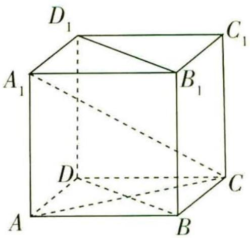

text_image

D₁
A₁
B₁
C₁
D
C
A
B

图4

答案 $AC \perp BD$ (或四边形ABCD为正方形)(答案不唯一)

调研 5 (2023·北京广渠门中学10月检测)已知函数 $f(x)=\sin x$ , 若对任意的 $x\in R$ , 都有 $f(x)+f(x+m)=c$ (c为常数), 则常数m的值可以为\_\_\_\_(填写一个

蛇在爬行时,轨迹类似正弦函数的图象.它的脊椎像火车一样,是一节一节连接起来的,节与节之间有较大的活动余地.

# 016 试题调研 每月一辑试题新

合适的值即可).

# 思维导引

由正弦函数图象的
对称性得 c = 0

$$
\sin x = - \sin (x + m)
$$

利用诱导公式得 $m = (2k + 1)\pi, k \in \mathbf{Z}$

确定一个符合要求的答案

解析 函数 $f(x)=\sin x$ 图象的对称中心都在x轴上,所以c=0,

【记结论】正弦函数图象与 $x$ 轴的交点都是它的对称中心, 对称中心坐标为 $(k\pi, 0)$ , $k \in \mathbf{Z}$ 由 $f(x) + f(x + m) = 0$ 对任意 $x \in \mathbb{R}$ 恒成立, 得 $f(x) + f(x + m) = \sin x + \sin (x + m) = 0$ , 所以 $\sin x = -\sin (x + m)$ , 故利用诱导公式可得 $m = (2k + 1)\pi, k \in \mathbb{Z}$ 满足条件.

答案 $\pi$ (答案不唯一)

# 题型 3 双空题

调研 6 (2023·北京海淀区11月期中)若函数 $f(x)=\sin(\omega x+\frac{\pi}{6})(\omega>0)$ 和 $g(x)=\cos^{2}(x+\varphi)-\sin^{2}(x+\varphi)$ 的图象的对称中心完全重合,则 $\omega=$ \_\_\_\_; $g(\frac{\pi}{6})=$ \_\_\_\_.

# 思维导引

利用倍角公式化简 $g(x)$ 的解析式

$$
g (x) = \cos 2 (x + \varphi)
$$

由图象的对称中心完全重合得两函数的周期相同

求 $\omega,\varphi$ → 分类讨论求 $g(\frac{\pi}{6})$

# 解析

$g(x)=\cos^{2}(x+\varphi)-\sin^{2}(x+\varphi)=\cos2(x+\varphi)$ ，其图象的对称中心与 $f(x)$ 图象的

【合化简】利用倍角公式将函数的解析式降幂处理

对称中心完全重合,所以两函数的最小正周期相同,故 $\omega=2$ ,则 $f(x)=\sin(2x+\frac{\pi}{6})$ .

【记结论】 $f(x)=A\cos(\omega x+\varphi)+B(A\neq0,\omega\neq0)$ 的最小正周期为 $T=\frac{2\pi}{|\omega|}$

令 $2x + \frac{\pi}{6} = k\pi, k \in \mathbf{Z}$ , 则 $x = \frac{k\pi}{2} - \frac{\pi}{12}, k \in \mathbf{Z}$ , 故 $f(x)$ 图象的对称中心为 $(\frac{k\pi}{2} - \frac{\pi}{12}, 0), k \in \mathbf{Z}$ , 所以 $\cos 2(\frac{k\pi}{2} - \frac{\pi}{12} + \varphi) = \cos (k\pi - \frac{\pi}{6} + 2\varphi) = 0$ , 故 $k\pi - \frac{\pi}{6} + 2\varphi = k_1\pi + \frac{\pi}{2}, k_1 \in \mathbf{Z}, k \in \mathbf{Z}$ , 则 $\varphi = \frac{(k_1 - k)\pi}{2} + \frac{\pi}{3}, k_1 - k \in \mathbf{Z}$ .

令 $k_{1}-k=0$ ，此时 $\varphi=\frac{\pi}{3}$ ，所以 $g(x)=\cos2(x+\frac{\pi}{3})$ ，故 $g(\frac{\pi}{6})=\cos\pi=-1$ ；

令 $k_{1}-k=1$ ，此时 $\varphi=\frac{5\pi}{6}$ ，所以 $g(x)=\cos2(x+\frac{5\pi}{6})$ ，故 $g(\frac{\pi}{6})=\cos2\pi=1$ 。

【会讨论】分 $k_{1} - k$ 的值为奇数和为偶数两种情况进行分类讨论, 结合余弦函数的周期性, 可

猕猴具有较高水平的数学运算能力,某项研究表明,它们在识别0\~9这10个数字和16个字母之后,能够选择较大的数值进行计算,从而获得食物奖励.

简化为 $k_{1}-k=0$ 与 $k_{1}-k=1$ 两种情况

综上, $g(\frac{\pi}{6})=\pm1$ .

答案 2 ±1

# 题型4 结构不良问题

调研 7 (2023·中国人大附中10月检测/四选二)已知函数 $f(x)=a\sin\omega x$ · $\cos\omega x(a>0,\omega>0)$ .从下列四个条件中选择两个作为已知,使函数 $f(x)$ 存在且唯一确定.

(1) 求 $f(x)$ 的解析式;  
(2) 设 $g(x)=f(x)-2\cos^{2}\omega x+1$ ，求函数 $g(x)$ 在 $(0,\pi)$ 上的单调递增区间.

① $f(\frac{\pi}{4})=1$ ，② $f(x)$ 为偶函数，③ $f(x)$ 的最大值为1，④ $f(x)$ 图象相邻两条对称轴之间的距离为 $\frac{\pi}{2}$ .

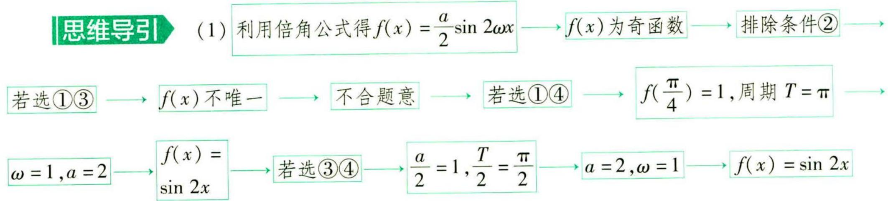

flowchart

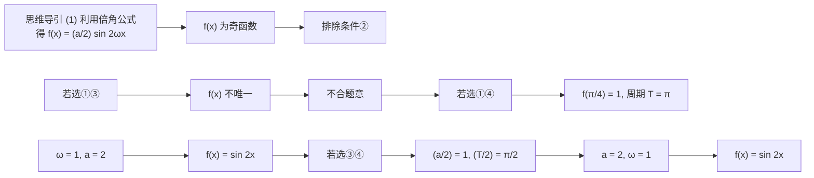
```mermaid
graph LR
    A["思维导引 (1) 利用倍角公式得 f(x) = (a/2) sin 2ωx"] --> B["f(x) 为奇函数"]
    B --> C["排除条件②"]
    D["若选①③"] --> E["f(x) 不唯一"]
    E --> F["不合题意"]
    F --> G["若选①④"]
    G --> H["f(π/4) = 1, 周期 T = π"]
    I["ω = 1, a = 2"] --> J["f(x) = sin 2x"]
    J --> K["若选③④"]
    K --> L["(a/2) = 1, (T/2) = π/2"]
    L --> M["a = 2, ω = 1"]
    M --> N["f(x) = sin 2x"]
```

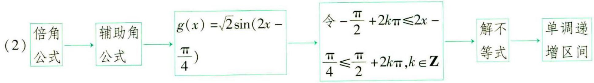

flowchart

```mermaid
graph LR
    A["倍角公式"] --> B["辅助角公式"]
    B --> C["g(x) = √2 sin(2x - π/4)"]
    C --> D["令 - π/2 + 2kπ ≤ 2x - π/4 ≤ π/2 + 2kπ, k ∈ Z"]
    D --> E["解不等式"]
    E --> F["单调递增区间"]
```

解析 (1) $f(x)=a\sin\omega x\cos\omega x=\frac{a}{2}\sin2\omega x(a>0,\omega>0)$ ，易知 $f(x)$ 为奇函数，故条件②不成立，舍去.

若选①③, 则 $f\left( \frac{\pi}{4} \right) = \frac{a}{2}\sin \frac{\pi \omega}{2} = 1$ 且 $\frac{a}{2} = 1$ , 故 $a = 2, \frac{\pi \omega}{2} = \frac{\pi}{2} + 2k\pi, k \in \mathbf{Z}$ , 得 $\omega =$

【用性质】由三角函数的性质可知 $f(x)=\frac{a}{2}\sin2\omega x$ 的最大值为 $\frac{a}{2}$

$1 + 4k, k \in Z$ , 故 $f(x)$ 不唯一, 不合题意.

若选①④, $f(\frac{\pi}{4})=\frac{a}{2}\sin\frac{\pi\omega}{2}=1$ 且 $\frac{T}{2}=\frac{\pi}{2}$ ，故 $T=\pi=\frac{2\pi}{2\omega}$ ，得 $\omega=1,a=2$ ，故 $f(x)=2\sin x\cos x=\sin 2x$ ，符合题意.

若选③④, 则 $\frac{a}{2} = 1$ 且 $\frac{T}{2} = \frac{\pi}{2}$ , 故 $T = \pi = \frac{2\pi}{2\omega}$ , 得 $a = 2, \omega = 1$ , 故 $f(x) = 2\sin x\cos x = \sin 2x$ , 符合题意.

(2) 由(1)可知, $g(x)=f(x)-2\cos^{2}\omega x+1=\sin 2x-2\cos^{2}x+1=\sin 2x-\cos 2x=\sqrt{2}\sin\left(2x-\frac{\pi}{4}\right)$ ,

令 $-\frac{\pi}{2} + 2k\pi \leqslant 2x - \frac{\pi}{4} \leqslant \frac{\pi}{2} + 2k\pi, k \in \mathbf{Z}$ , 得 $-\frac{\pi}{8} + k\pi \leqslant x \leqslant \frac{3\pi}{8} + k\pi, k \in \mathbf{Z}$ ,

【方法总结】确定函数 $y = A \sin(\omega x + \varphi) (A > 0, \omega > 0)$ 的单调区间的方法，采用“换元法”整体代换，将 $\omega x + \varphi$ 看作一个整体，可令 “ $Z = \omega x + \varphi$ ”，即可通过求 $y = A \sin Z (Z \text{ 为自变量})$ 的单调区间求出函数 $y = A \sin(\omega x + \varphi)$ 的单调区间。若 $\omega < 0$ ，则可利用诱导公式先将 x 的系数转化为正数后再利用“换元法”求解

当 $k = 0$ 时， $-\frac{\pi}{8} \leqslant x \leqslant \frac{3\pi}{8}$ ，当 $k = 1$ 时， $\frac{7\pi}{8} \leqslant x \leqslant \frac{11\pi}{8}$ .

故函数 $g(x)$ 在 $(0,\pi)$ 上的单调递增区间为 $(0,\frac{3\pi}{8}]$ , $[\frac{7\pi}{8},\pi)$ .

调研 8 (2023·北京海淀区11月期中/三选一)已知等差数列 $\{a_{n}\}$ 的前n项和为 $S_{n}(n=1,2,\cdots)$ ，且 $a_{2}=3,S_{5}=25$ .

(1) 求 $\{a_{n}\}$ 的通项公式.

(2) 等比数列 $\{b_{n}\}$ 的首项为 1, 公比为 $q$ , 在下列三个条件中选择一个, 使得 $\{b_{n}\}$ 的每一项都是 $\{a_{n}\}$ 中的项. 若 $b_{k} = a_{m}(k, m \in \mathbf{N}^{*})$ , 求 $m$ (用含 $k$ 的式子表示).

①q = -1, ②q = 2, ③q = 3.

注:如果选择的条件不符合要求,第(2)问得0分.

思维导引

(1) 利用等差数列的性质求 $a_{3}$ → 公差 d → $\{a_{n}\}$ 的通项公式

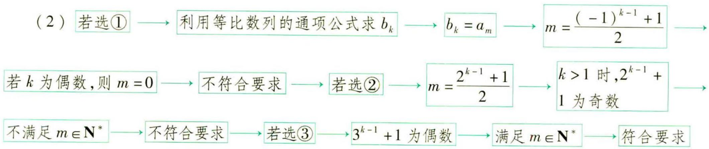

flowchart

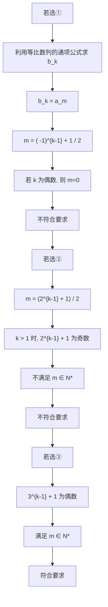
```mermaid
graph TD
    A["若选①"] --> B["利用等比数列的通项公式求 b_k"]
    B --> C["b_k = a_m"]
    C --> D["m = ( -1)^{k-1} + 1 / 2 "]
    D --> E["若 k 为偶数, 则 m=0"]
    E --> F["不符合要求"]
    F --> G["若选②"]
    G --> H["m = (2^{k-1} + 1) / 2"]
    H --> I["k > 1 时, 2^{k-1} + 1 为奇数"]
    I --> J["不满足 m ∈ N*"]
    J --> K["不符合要求"]
    K --> L["若选③"]
    L --> M["3^{k-1} + 1 为偶数"]
    M --> N["满足 m ∈ N*"]
    N --> O["符合要求"]
```

解析

(1)设等差数列 $\{a_{n}\}$ 的公差为d,由 $S_{5}=\frac{5(a_{1}+a_{5})}{2}=5a_{3}=25$ ,解得 $a_{3}=5$ ,

【等差中项】注意等差中项的应用，在等差数列 $\{a_{n}\}$ 中，若 $p+q=2m$ ，则 $a_{p}+a_{q}=2a_{m}$

$$
\therefore d = a _ {3} - a _ {2} = 2, \therefore a _ {n} = a _ {2} + (n - 2) d = 3 + 2 (n - 2) = 2 n - 1.
$$

1900 年,希尔伯特在巴黎数学家大会上提出了 23 个未解决的重要数学问题供二十世纪的数学家们研究,这就是著名的“希尔伯特 23 问”.

(2) 若选条件①, 则 $b_{n} = (-1)^{n - 1}, \therefore b_{k} = (-1)^{k - 1}$ , 由 $b_{k} = a_{m}$ 得 $2m - 1 = (-1)^{k - 1}, \therefore m = \frac{(-1)^{k - 1} + 1}{2}$ .

当 $k$ 为偶数时, $m = \frac{-1 + 1}{2} = 0$ , 不符合 $m \in \mathbf{N}^*$ , 故不能选择条件①.

【会观察】观察式子的结构特征，找出矛盾，排除条件①

若选条件②, 则 $b_{n} = 2^{n - 1}, \therefore b_{k} = 2^{k - 1}$ , 由 $b_{k} = a_{m}$ 得 $2m - 1 = 2^{k - 1}, \therefore m = \frac{2^{k - 1} + 1}{2}$ . 当 $k > 1$ 且 $k \in \mathbf{N}^{*}$ 时, $2^{k - 1} + 1$ 为奇数, 则 $m \notin \mathbf{N}^{*}$ , 不合题意, 故不能选择条件②. 若选条件③, 则 $b_{n} = 3^{n - 1}, \therefore b_{k} = 3^{k - 1}$ , 由 $b_{k} = a_{m}$ 得 $2m - 1 = 3^{k - 1}, \therefore m = \frac{3^{k - 1} + 1}{2}$ . 当 $k \in \mathbf{N}^{*}$ 时, $3^{k - 1} + 1$ 为偶数, $\therefore m \in \mathbf{N}^{*}$ , 符合题意.

综上所述, $m=\frac{3^{k-1}+1}{2}$ .

调研 9 (2023·山东济宁育才中学11月学情检测/三选二)图5所示为一个半圆柱, $E$ 为半圆弧 $C D$ 上一点, $C D = \sqrt { 5 }$ .

(1) 若 $AD = 2\sqrt{5}$ ，求四棱锥 E - ABCD 体积的最大值.  
(2)有三个条件:① $4\overrightarrow{DE}\cdot\overrightarrow{DC}=\overrightarrow{EC}\cdot\overrightarrow{DC}$ ,②直线AD与BE所成角的正弦值为 $\frac{2}{3}$ ,③ $\frac{\sin\angle EAB}{\sin\angle EBA}=\frac{\sqrt{6}}{2}$ .请你从中选择两个作为条件,求直线AD与平面EAB所成角的余弦值.

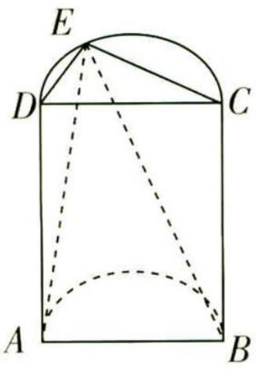

text_image

E
D
C
A
B

图 5

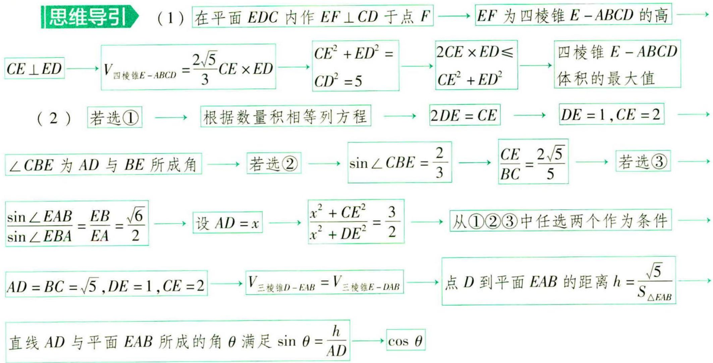

flowchart

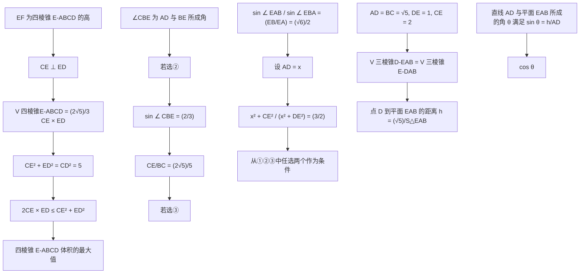
```mermaid
graph TD
    A["EF 为四棱锥 E-ABCD 的高"] --> B["CE ⊥ ED"]
    B --> C["V 四棱锥E-ABCD = (2√5)/3 CE × ED"]
    C --> D["CE² + ED² = CD² = 5"]
    D --> E["2CE × ED ≤ CE² + ED²"]
    E --> F["四棱锥 E-ABCD 体积的最大值"]
    G["∠CBE 为 AD 与 BE 所成角"] --> H["若选②"]
    H --> I["sin ∠ CBE = (2/3)"]
    I --> J["CE/BC = (2√5)/5"]
    J --> K["若选③"]
    L["sin ∠ EAB / sin ∠ EBA = (EB/EA) = (√6)/2"] --> M["设 AD = x"]
    M --> N["x² + CE² / (x² + DE²) = (3/2)"]
    N --> O["从①②③中任选两个作为条件"]
    P["AD = BC = √5, DE = 1, CE = 2"] --> Q["V 三棱锥D-EAB = V 三棱锥E-DAB"]
    Q --> R["点 D 到平面 EAB 的距离 h = (√5)/S△EAB"]
    S["直线 AD 与平面 EAB 所成的角 θ 满足 sin θ = h/AD"] --> T["cos θ"]
```

1975 年,在美国伊利诺斯大学召开的一次国际数学会议上,数学家们回顾了希尔伯特 23 个问题的研究进展情况. 当时统计,有许多问题已经解决了,其余大多数也都有重大进展.

解析 (1)如图6,在平面EDC内作EF⊥CD于点F,

易知平面 $ABCD \perp$ 平面 $EDC$ , 平面 $ABCD \cap$ 平面 $EDC = CD, EF \subset$ 平面 $EDC$ ,

所以 $EF \perp$ 平面 ABCD, 即 EF 为四棱锥 E-ABCD 的高.

因为 E 为半圆弧 CD 上一点, 所以 $CE \perp ED$ ,

所以 $V_{四棱锥E-ABCD} = \frac{1}{3} \times S_{矩形ABCD} \times EF = \frac{1}{3} \times \sqrt{5} \times 2\sqrt{5} \times \frac{CE \times ED}{CD} = \frac{2\sqrt{5}}{3} \times CE \times ED.$

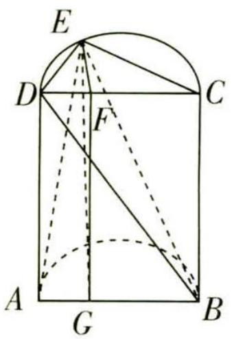

text_image

E
D
C
F
A
G
B

图6

【小妙招】注意三角形中等面识法的应用，在 Rt△EDC 中，CE×ED=CD×EF

因为 $CE^2 + ED^2 = CD^2 = 5$ ，所以 $V_{\text{四棱锥}E - ABCD} \leqslant \frac{2\sqrt{5}}{3} \times \frac{CE^2 + ED^2}{2} = \frac{2\sqrt{5}}{3} \times \frac{5}{2} = \frac{5\sqrt{5}}{3}$ ，当

【技巧点拨】根据已知条件将待求式适当进行“拆”“拼”“凑”“合”“变形”，创造应用基本不等式及使等号成立的条件

且仅当 $CE = ED = \frac{\sqrt{10}}{2}$ 时等号成立，

所以四棱锥 E-ABCD 体积的最大值为 $\frac{5\sqrt{5}}{3}$ .

(2)由条件①得 $4|\overrightarrow{DE}||\overrightarrow{DC}|\cos\angle CDE=|\overrightarrow{CE}||\overrightarrow{DC}|\cos\angle DCE$ ，即 $4DE^{2}=CE^{2}$

【会思考】在 Rt△CDE 中， $|\overrightarrow{DC}|\cos\angle CDE=|\overrightarrow{DE}|,|\overrightarrow{DC}|\cos\angle DCE=|\overrightarrow{CE}|$

所以 2DE = CE，又 $DE^{2} + CE^{2} = 5$ ，所以 DE = 1，CE = 2。

易知 $\angle CBE$ 为 $AD$ 与 $BE$ 所成角, 则由条件②得 $\sin \angle CBE = \frac{2}{3}$ , 易知 $BC \perp CE$ , 所以 $\sin \angle CBE = \frac{CE}{BE} = \frac{2}{3}$ , 则 $\tan \angle CBE = \frac{CE}{BC} = \frac{2\sqrt{5}}{5}$ .

由条件③得 $\frac{\sin\angle EAB}{\sin\angle EBA}=\frac{EB}{EA}=\frac{\sqrt{6}}{2}$ ，设AD=x，则 $\frac{x^{2}+CE^{2}}{x^{2}+DE^{2}}=(\frac{\sqrt{6}}{2})^{2}=\frac{3}{2}$ .

若选条件①②, 则 $DE = 1, CE = 2$ , 且 $\tan \angle CBE = \frac{CE}{BC} = \frac{2\sqrt{5}}{5}$ , 所以 $AD = BC = \sqrt{5}$ .

若选条件①③,则 DE=1,CE=2,且 $\frac{x^{2}+CE^{2}}{x^{2}+DE^{2}}=\frac{3}{2}$ , 所以 AD=BC=x= $\sqrt{5}$ .

若选条件②③, 则 $\tan \angle CBE = \frac{CE}{x} = \frac{2\sqrt{5}}{5}$ , 且 $\frac{x^2 + CE^2}{x^2 + DE^2} = \frac{3}{2}, DE^2 + CE^2 = 5$ , 所以 $AD = BC = x = \sqrt{5}, DE = 1, CE = 2$ .

综上可知,从①②③中任选两个作为条件,都可以得到 $AD = BC = \sqrt{5}$ , DE = 1, CE = 2.

下面求直线 AD 与平面 EAB 所成角的余弦值.

设点 D 到平面 EAB 的距离为 h, 直线 AD 与平面 EAB 所成角为 $\theta$ , 连接 BD.

由 $V_{三棱锥D-EAB}=V_{三棱锥E-DAB}$ ，得 $h\times S_{\triangle EAB}=EF\times S_{\triangle DAB}=\frac{2}{\sqrt{5}}\times\frac{1}{2}\times\sqrt{5}\times\sqrt{5}$ ，所以 $h=\frac{\sqrt{5}}{S_{\triangle EAB}}$ .

【小技巧】根据等体积法，转换三棱锥的顶点和底面是求点面距的一种常用方法

过点 $F$ 作 $FG \perp AB$ 于点 $G$ , 连接 $EG$ , 如图6所示, 则由 $EF \perp$ 平面 $ABCD$ 知 $EF \perp AB$ , 又 $EF \cap FG = F$ , 所以 $AB \perp$ 平面 $EFG$ , 所以 $AB \perp EG$ ,

所以 $S_{\triangle EAB} = \frac{1}{2} AB\times EG = \frac{1}{2}\times \sqrt{5}\times \sqrt{EF^2 + FG^2} = \frac{1}{2}\times \sqrt{5}\times \sqrt{\left(\frac{2}{\sqrt{5}}\right)^2 + (\sqrt{5})^2} = \frac{\sqrt{29}}{2},$

所以 $h=\frac{\sqrt{5}}{S_{\triangle EAB}}=\frac{2\sqrt{145}}{29}$ , $\sin\theta=\frac{h}{AD}=\frac{2\sqrt{29}}{29}$ , $\cos\theta=\sqrt{1-\sin^{2}\theta}=\frac{5\sqrt{29}}{29}$ ,

所以直线 AD 与平面 EAB 所成角的余弦值为 $\frac{5\sqrt{29}}{29}$ .

# 题型 5 开放、探究性问题

调研 10 (2023·长沙雅礼中学12月月考)如图7,已知直三棱柱 $ABC - A_{1}B_{1}C_{1}$ 中,侧面 $AA_{1}B_{1}B$ 为正方形, $AB = BC = 2,E,F$ 分别为 $AC$ 和 $CC_{1}$ 的中点, $D$ 为棱 $A_{1}B_{1}$ 上的点, $BF \perp A_{1}B_{1}$ .

(1) 证明: $BF \perp DE$ .

(2) 当 $B_{1} D$ 为何值时, 平面 $B B_{1} C_{1} C$ 与平面 $D F E$ 所成锐二面角的正弦值最小?

解析 (1) 方法一 (几何法) 因为 $BF \perp A_{1}B_{1}, A_{1}B_{1} \parallel AB$ , 所以 $BF \perp AB$ , 又 $AB \perp BB_{1}, BF \cap BB_{1} = B, BF, BB_{1} \subset$ 平面 $BCC_{1}B_{1}$ , 所以 $AB \perp$ 平面 $BCC_{1}B_{1}$ .

又 AB = BC = 2, 所以可以构造棱长为 2 的正方体 ABCG - A₁B₁C₁G₁, 如图 8 所示, 过 E 作 AB 的平行线分别与 AG, BC 交于点 M, N, 连接 A₁M, B₁N.

因为 E 为 AC 的中点, 所以 N 是 BC 的中点.

易证 Rt△BCF≌Rt△B₁BN, 则 ∠CBF = ∠BB₁N.

又 $\angle BB_{1}N + \angle B_{1}NB = 90^{\circ}$ , 所以 $\angle CBF + \angle B_{1}NB = 90^{\circ}$ , 所以 $BF \perp B_{1}N$ .

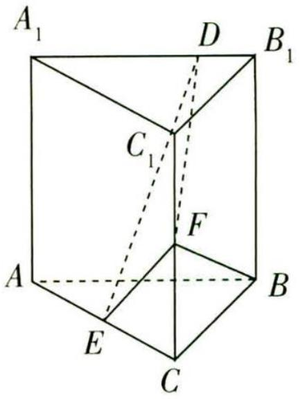

text_image

A₁
D
B₁
C₁
F
A
B
E
C

图7

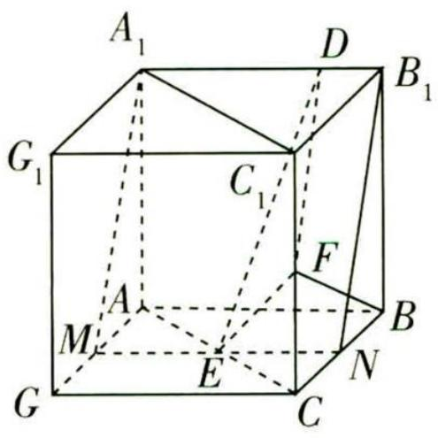

text_image

A₁
D
B₁
G₁
C₁
F
A
M
E
N
G
C

图8

1963 年, 美国数学家科亨证明连续统假设和策梅洛－弗伦克尔集合论公理是彼此独立的. 因此, 连续统假设不能在策梅洛－弗伦克尔公理体系内证明其正确性.

又 $BF \perp A_{1}B_{1}, B_{1}N \cap A_{1}B_{1} = B_{1}, B_{1}N, A_{1}B_{1} \subset$ 平面 $A_{1}MNB_{1}$ , 所以 $BF \perp$ 平面 $A_{1}MNB_{1}$ .

【易忽视】“两条直线相交”是线面垂直判定定理的关键，应用时不能忽略

又 $ED \subset$ 平面 $A_{1}MNB_{1}$ ，所以 $BF \perp DE$ .

方法二 (向量法) 因为三棱柱 $ABC - A_{1}B_{1}C_{1}$ 是直三棱柱, 所以 $BB_{1} \perp$ 底面 $ABC$ , 所以 $BB_{1} \perp AB$ . 因为 $A_{1}B_{1} \parallel AB, BF \perp A_{1}B_{1}$ , 所以 $BF \perp AB$ , 又 $BB_{1} \cap BF = B, BB_{1}, BF \subset$ 平面 $BCC_{1}B_{1}$ , 所以 $AB \perp$ 平面 $BCC_{1}B_{1}$ , 所以 $BA, BC, BB_{1}$ 两两垂直.

以 B 为坐标原点, 以 BA, BC, $BB_{1}$ 所在直线分别为 x 轴, y 轴, z 轴建立空间直角坐标系, 如图 9 所示, 所以 $B(0,0,0)$ , $A(2,0,0)$ , $C(0,2,0)$ , $B_{1}(0,0,2)$ , $A_{1}(2,0,2)$ , $C_{1}(0,2,2)$ , $E(1,1,0)$ , $F(0,2,1)$ .

设 $D(a,0,2)(0\leqslant a\leqslant 2)$ ，则 $\overrightarrow{BF} = (0,2,1),\overrightarrow{DE} = (1 - a,1, - 2)$

所以 $\overrightarrow{BF}\cdot\overrightarrow{DE}=0\times(1-a)+2\times1+1\times(-2)=0,$

所以 $BF \perp DE$ .

方法三 连接 $EB$ , 因为 $BF \perp A_{1}B_{1}, A_{1}B_{1} \parallel AB$ , 所以 $BF \perp AB$ , 故 $\overrightarrow{BF} \cdot \overrightarrow{A_{1}B_{1}} = 0, \overrightarrow{BF} \cdot \overrightarrow{AB} = 0$ .

所以 $\overrightarrow{BF} \cdot \overrightarrow{ED} = \overrightarrow{BF} \cdot (\overrightarrow{EB} + \overrightarrow{BB_1} + \overrightarrow{B_1D}) = \overrightarrow{BF} \cdot \overrightarrow{B_1D} + \overrightarrow{BF}$

$$
(\overrightarrow {E B} + \overrightarrow {B B _ {1}}) = \overrightarrow {B F} \cdot \overrightarrow {E B} + \overrightarrow {B F} \cdot \overrightarrow {B B _ {1}} = \overrightarrow {B F} \cdot (- \frac {1}{2} \overrightarrow {B A} - \frac {1}{2} \overrightarrow {B C}) + \overrightarrow {B F} \cdot \overrightarrow {B B _ {1}} = - \frac {1}{2} \overrightarrow {B F} \cdot \overrightarrow {B A} -
$$

$$
\frac {1}{2} \overrightarrow {B F} \cdot \overrightarrow {B C} + \overrightarrow {B F} \cdot \overrightarrow {B B _ {1}} = - \frac {1}{2} \overrightarrow {B F} \cdot \overrightarrow {B C} + \overrightarrow {B F} \cdot \overrightarrow {B B _ {1}} = - \frac {1}{2} | \overrightarrow {B F} | | \overrightarrow {B C} | \cos \angle F B C + | \overrightarrow {B F} | | \overrightarrow {B B _ {1}} |.
$$

$\cos \angle FBB_{1} = -\frac{1}{2}\times \sqrt{5}\times 2\times \frac{2}{\sqrt{5}} +\sqrt{5}\times 2\times \frac{1}{\sqrt{5}} = 0$ ，所以 $BF\perp ED.$

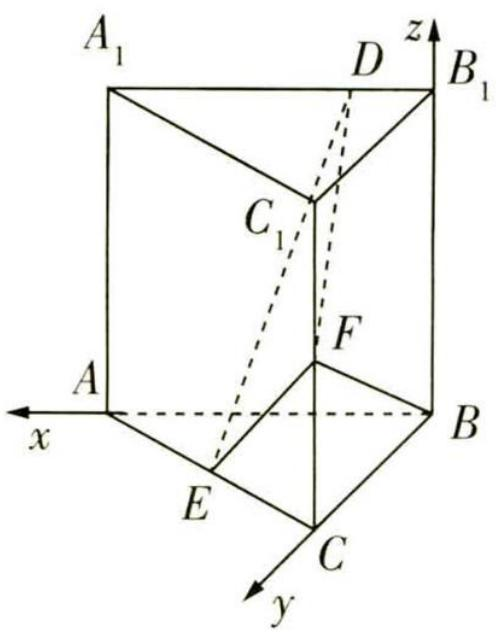

text_image

A₁
D
z
B₁
C₁
F
A
x
E
C
y
B

图9

【解后反思】第(1)问,方法一为常规方法,不过这道题常规方法较为复杂,方法二建立合适的空间直角坐标系,借助空间向量求解,最简单,也是最优解;方法三利用空间向量的加减法则及数量积的运算进行证明,不常用,不过这道题用这种方法的解题过程也很简单,可以开拓思维

(2) 方法一 (向量法) 设平面 DFE 的法向量为 $\boldsymbol{m} = (x, y, z)$ .

由(1)的方法二知 $\overrightarrow{EF} = (-1, 1, 1), \overrightarrow{DE} = (1 - a, 1, -2)$ , 所以 $\left\{ \begin{array}{l} m \cdot \overrightarrow{EF} = 0, \\ m \cdot \overrightarrow{DE} = 0, \end{array} \right.$ 即 $\left\{ \begin{array}{l} -x + y + z = 0, \\ (1 - a)x + y - 2z = 0, \end{array} \right.$ 令 $z = 2 - a$ , 则 $x = 3, y = 1 + a, m = (3, 1 + a, 2 - a)$ 是平面 DFE 的一个法向量.

因为平面 $BB_{1}C_{1}C$ 的一个法向量为 $\overrightarrow{BA} = (2,0,0)$ ，设平面 $BB_{1}C_{1}C$ 与平面 DFE 所成锐二面角的平面角为 $\theta$ ，则 $\cos\theta = \frac{|\boldsymbol{m} \cdot \overrightarrow{BA}|}{|\boldsymbol{m}| \cdot |\overrightarrow{BA}|} = \frac{6}{\sqrt{2a^{2} - 2a + 14} \times 2} = \frac{3}{\sqrt{2a^{2} - 2a + 14}}.$

易知当 $a=\frac{1}{2}$ 时, $2a^{2}-2a+14$ 取最小值, 为 $\frac{27}{2}$ , 此时 $\cos\theta$ 取最大值, 为 $\frac{3}{\sqrt{\frac{27}{2}}}=\frac{\sqrt{6}}{3}$ .

所以 $(\sin \theta)_{\min} = \sqrt{1 - (\frac{\sqrt{6}}{3})^2} = \frac{\sqrt{3}}{3}$ , 此时 $B_1D = \frac{1}{2}$ .

方法二 (几何法)如图10所示,延长 $EF$ 交 $A_{1}C_{1}$ 的延长线于点 $S$ ,连接 $DS$ 交 $B_{1}C_{1}$ 于点 $T$ ,连接 $FT$ ,则平面 $DFE \cap$ 平面 $BB_{1}C_{1}C = FT$ .

作 $B_{1}H \perp FT$ 交 $FT$ 的延长线于 $H$ , 因为 $DB_{1} \perp$ 平面 $BB_{1}C_{1}C$ , 所以 $DB_{1} \perp FT$ , 连接 $DH$ , 则 $DH \perp FT$ , 则 $\angle DHB_{1}$ 为平面 $BB_{1}C_{1}C$ 与平面 $DFE$ 所成锐二面角的平面角.

设 $B_{1}D=t, t \in[0,2]$ , $B_{1}T=s$ , 过 $C_{1}$ 作 $C_{1}P \parallel A_{1}B_{1}$ 交 DS 于点 P.

易知 $\frac{C_1S}{SA_1} = \frac{1}{3} = \frac{C_1P}{A_1D}$ , 所以 $C_1P = \frac{1}{3}(2 - t)$ , 又 $\frac{B_1D}{C_1P} = \frac{B_1T}{C_1T}$ , 即 $\frac{t}{\frac{1}{3}(2 - t)} = \frac{s}{2 - s}$ , 所以 $s = \frac{3t}{t + 1}$ .

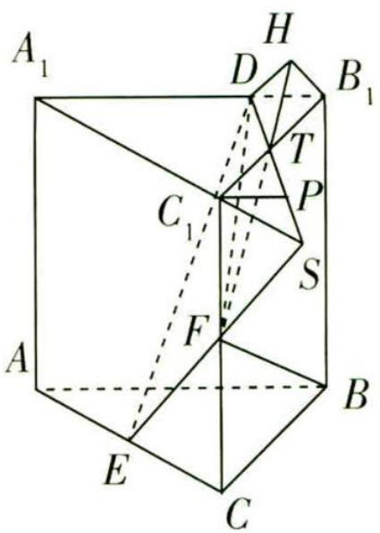

text_image

A₁
H
D
B₁
T
C₁
P
S
F
A
B
E
C

图 10

又 $\frac{B_1H}{C_1F} = \frac{B_1T}{FT}$ 即 $\frac{B_1H}{1} = \frac{s}{\sqrt{1 + (2 - s)^2}}$ 所以 $B_{1}H = \frac{s}{\sqrt{1 + (2 - s)^2}}$

所以 $DH = \sqrt{B_1H^2 + B_1D^2} = \sqrt{\frac{s^2}{1 + (2 - s)^2} + t^2} = \sqrt{\frac{9t^2}{2t^2 - 2t + 5} + t^2}$ .

则 $\sin \angle DHB_{1} = \frac{B_{1}D}{DH} = \frac{t}{\sqrt{\frac{9t^{2}}{2t^{2} - 2t + 5} + t^{2}}} = \frac{1}{\sqrt{\frac{9}{2(t - \frac{1}{2})^{2} + \frac{9}{2}} + 1}},$

所以当 $t=\frac{1}{2}$ ，即 $B_{1}D=\frac{1}{2}$ 时， $(\sin\angle DHB_{1})_{\min}=\frac{\sqrt{3}}{3}$ .

方法三 （射影法）如图11, 取 $BC$ 的中点 $N$ , 连接 $FB_{1}, FN, B_{1}N$ , $EN$ , $\triangle DEF$ 在平面 $BB_{1}C_{1}C$ 上的射影为 $\triangle B_{1}NF$ , 记平面 $BB_{1}C_{1}C$ 与平面 $DFE$ 所成锐二面角的平面角为 $\theta$ , 则 $\cos \theta = \frac{S_{\triangle B_{1}NF}}{S_{\triangle DEF}}$ .

设 $B_{1}D = t(0\leqslant t\leqslant 2)$ ，在 $\mathrm{Rt}\triangle DB_1F$ 中， $DF = \sqrt{B_1D^2 + B_1F^2} = \sqrt{t^2 + 5}.$

在 Rt△ECF 中, $EF=\sqrt{EC^{2}+FC^{2}}=\sqrt{3}$ , 过 D 作 $B_{1}N$ 的平行线交 EN 于点 Q.

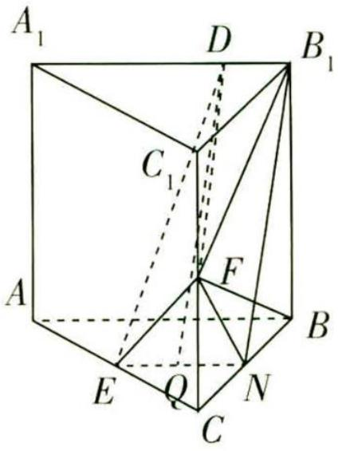

text_image

A₁
D
B₁
C₁
F
A
B
E
Q
N
C

图 11

1936 年德国数学家根茨在使用超限归纳法的条件下证明了算术公理的相容性. 1988 年出版的《中国大百科全书》数学卷指出, 数学相容性问题尚未解决.

在 Rt△DEQ 中， $DE=\sqrt{QD^{2}+EQ^{2}}=\sqrt{5+(1-t)^{2}}$

在 $\triangle DEF$ 中，由余弦定理得 $\cos \angle DFE = \frac{DF^2 + EF^2 - DE^2}{2DF\cdot EF} = \frac{\sqrt{3t^2 + 15}(t + 1)}{3(t^2 + 5)}$

$$
\begin{array}{r l} & {\sin \angle D F E = \sqrt {\frac {2 t ^ {2} - 2 t + 1 4}{3 (t ^ {2} + 5)}}, S _ {\triangle D F E} = \frac {1}{2} D F \cdot E F \sin \angle D F E = \frac {1}{2} \sqrt {2 t ^ {2} - 2 t + 1 4}, S _ {\triangle B _ {1} N F} =} \\ & {\frac {3}{2}, \cos \theta = \frac {S _ {\triangle B _ {1} N F}}{S _ {\triangle D F E}} = \frac {3}{\sqrt {2 t ^ {2} - 2 t + 1 4}}, \sin \theta = \sqrt {1 - \frac {9}{2 (t ^ {2} - t + 7)}},} \end{array}
$$

当 $t=\frac{1}{2}$ ，即 $B_{1}D=\frac{1}{2}$ 时，平面 $BB_{1}C_{1}C$ 与平面 DFE 所成锐二面角的正弦值最小，最小值为 $\frac{\sqrt{3}}{3}$ .

【解后反思】方法一,建立空间直角坐标系,利用空间向量求二面角是最常规的方法,也是最优方法;方法二,利用空间线面位置关系找到平面 ${BB}_{1}{C}_{1}C$ 与平面 ${DFE}$ 所成锐二面角的平面角,进而求其正弦值的最小值,所用辅助线较多,解题过程较复杂;方法三,利用 ${\Delta DFE}$ 在平面 $B{B}_{1}{C}_{1}C$ 上的射影三角形的面积与 ${\bigtriangleup {DFE}}$ 面积的比值即平面 $B{B}_{1}{C}_{1}C$ 与平面 ${DFE}$ 所成锐二面角的余弦值,进而求二面角正弦值的最小值,这是个非常好的方法,可以开拓思维

# 热点 2 创新考法

# 考法1 新定义应用问题

调研 1 (2023·江苏南通如皋期中改编/集合的聚点)(多选)设集合 X 是实数集 R 的子集, 如果 $x_{0} \in R$ 满足对任意的 a > 0, 都存在 $x \in X$ , 使得 $0 < |x - x_{0}| < a$ , 则称 $x_{0}$ 为集合 X 的聚点. 则下列集合中是以 0 为聚点的集合有 ( )

A. $\{x \mid x \in R, x \neq 0\}$

B. $\{x \mid x \in Z, x \neq 0\}$

C. $\{x \mid x = \frac{1}{n}, n \in N^{*}\}$

D. $\{x \mid x = \frac{n}{n + 1}, n \in N^{*}\}$

思维导引 取 $x=\frac{a}{2}$ $\rightarrow$ $0<|x-0|=\frac{a}{2}<a$ $\rightarrow$ A 正确

取 $a=\frac{1}{2}$ $\rightarrow$ $0<|x-0|<\frac{1}{2}$ 不成立 $\rightarrow$ B 错误

对任意的 a > 0，都存在 $n > \frac{1}{a}$ $\rightarrow$ $0 < |x - 0| = \frac{1}{n} < a$ $\rightarrow$ C 正确

$\frac{n}{n+1}$ 的最小值为 $\frac{1}{2}, x \geqslant \frac{1}{2}$ 对任意的 $0 < a < \frac{1}{2}$ ，不存在 x，使得 $0 < |x - 0| < a$ D 错误

两个等底等高四面体的体积相等问题(已解决) 问题的意思是,存在两个等底等高的四面体,它们不可分解为有限个小四面体,使这两组四面体彼此全等.1900年美国数学家马克思·德恩已解决.

解析 对于 A, 对任意的 a > 0, 都存在 $x = \frac{a}{2}$ 使得 $0 < |x - 0| = \frac{a}{2} < a$ , 故 0 是集合 $\{x \mid x \in$

【会思考】实际上任意比 $a$ 小的数都可以

$R, x \neq 0 \}$ 的聚点.

对于 B, 对于某个实数 a > 0, 比如取 $a = \frac{1}{2}$ , 此时对任意的 $x \in \{x \mid x \in Z, x \neq 0\}$ , 都有 $|x - 0| \geqslant 1$ ,
也就是说 $0 < |x - 0| < \frac{1}{2}$ 不可能成立，从而 0 不是集合 $\{x \mid x \in Z, x \neq 0\}$ 的聚点.

对于 C, 对任意的 a > 0, 都存在 $n > \frac{1}{a}$ , 即 $\frac{1}{n} < a, 0 < |x - 0| = \frac{1}{n} < a$ , 故 0 是集合 $\{x \mid x = \frac{1}{n}, n \in N^{*}\}$ 的聚点.

对于 D, $\frac{n}{n+1}=1-\frac{1}{n+1}$ ，故 $\frac{n}{n+1}$ 随着 n 的增大而增大，故 $\frac{n}{n+1}$ 的最小值为 $\frac{1}{1+1}=\frac{1}{2}$ ，即 $x\geqslant\frac{1}{2}$ ，

【思维瓶颈】巧拆分, $\frac{n}{n+1}=1-\frac{1}{n+1}$ ，从而明确式子的变化趋势

故对任意的 $0 < a < \frac{1}{2}$ , 不存在 $x$ , 使得 $0 < |x - 0| < a$ , 故 0 不是集合 $\{x \mid x = \frac{n}{n + 1}, n \in \mathbf{N}^{*}\}$ 的聚点.

故选 AC.

答案 AC

调研 2 (2023·福建三明期中/理想函数)(多选)若函数 $f(x)$ 同时满足:①对于定义域上的任意 $x$ , 恒有 $f(x) + f(-x) = 0$ ; ②对于定义域上的任意 $x_1, x_2$ , 当 $x_1 \neq x_2$

条件①的本质即 $f(x)$ 是奇函数

时, 恒有 $\frac{f(x_{1}) - f(x_{2})}{x_{1} - x_{2}} < 0$ . 则称函数 $f(x)$ 为“理想函数”. 下列四个函数中, 是“理想函

条件②的本质即 $f(x)$ 为其定义域上的减函数

数”的有

( )

A. $f(x) = \frac{1}{x}$

B. $f(x)=x^{2}$

C. $f(x)=\left\{\begin{aligned}-x^{2},&x\geqslant0,\\ x^{2},&x<0\end{aligned}\right.$

D. $f(x) = -\frac{1}{2} x^3 -x$

解析 对于定义域上的任意 $x$ , 恒有 $f(x) + f(-x) = 0$ , 即 $f(-x) = -f(x)$ , 则函数 $f(x)$ 为奇函数; 对于定义域上的任意 $x_1, x_2$ , 当 $x_1 \neq x_2$ 时, 恒有 $\frac{f(x_1) - f(x_2)}{x_1 - x_2} < 0$ , 取 $x_1 < x_2$ , 则 $f(x_1) > f(x_2)$ , 所以函数 $f(x)$ 为其定义域上的减函数. 所以若函数 $f(x)$ 为“理想函数”, 则该函数为奇函数且在定义域上单调递减.

对于 A 选项, 函数 $f(x)=\frac{1}{x}$ 的定义域为 $\{x \mid x \neq 0\}$ , 该函数为奇函数, 但在定义域上不单调, A 选【纠偏防错】函数 $f(x)=\frac{1}{x}$ 在 $(-∞,0)$ 上单调递减, 在 $(0,+∞)$ 上单调递减, 但在定义域上不单调项不符合要求;

两点间以直线为距离最短线问题(未完全解决) 此问题提得过于一般. 满足此性质的几何学很多, 因而需增加某些限制条件. 1973 年, 苏联数学家波格列洛夫宣布, 在对称距离情况下, 问题获得解决.

对于 B 选项, 函数 $f(x)=x^{2}$ 为偶函数, 不符合要求;

对于 C 选项,作出函数 $f(x)=\left\{\begin{aligned}-x^{2},&x\geqslant0,\\ x^{2},&x<0\end{aligned}\right.$ 的图象,如图 1 所示,由图象可知,函数 $f(x)=\left\{\begin{aligned}-x^{2},&x\geqslant0,\\ x^{2},&x<0\end{aligned}\right.$ 为奇函数,且该函数在 R 上单调递减,符合要求;

对于 D 选项, 函数 $f(x) = -\frac{1}{2}x^3 - x$ 的定义域为 $\mathbf{R}, f(-x) = -\frac{1}{2} \times (-x)^3 + x = \frac{1}{2}x^3 + x = -f(x)$ , 该函数为奇函数, 由于函数 $y_1 = -\frac{1}{2}x^3$ 与函数 $y_2 = -x$ 在 $\mathbf{R}$ 上均单调递减, 则函数 $f(x) = -\frac{1}{2}x^3 - x$ 在 $\mathbf{R}$ 上也单调递减, 符合要求. 故选 CD.

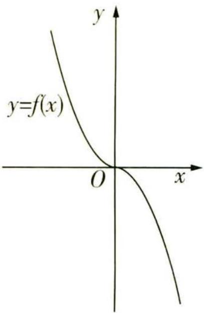

text_image

y
y=f(x)
O
x

图 1

【敲黑板】巧用简单函数的单调性判断函数 $f(x)$ 的单调性

答案

CD

# 考法2 数学思维跨学科应用问题

调研 3 (2023·河北秦皇岛 10 月月考/在化学中的应用) 六氟化硫, 化学式为 $\mathrm{SF}_{6}$ , 在常温常压下是一种无色、无臭、无毒、不燃的稳定气体, 有良好的绝缘性能, 在电器工业方面具有广泛的用途. 六氟化硫分子结构为正八面体结构 (每个面都是正三角形的八面体), 硫原子位于正八面体的中心, 6 个氟原子分别位于正八面体的 6 个顶点. 若相邻两个氟原子之间的距离为 $2 \sqrt[3]{3}$ , 如图 2 所示, 则以六氟化硫分子中 6 个氟原子为顶点构成的正八面体的体积是 (氟原子的大小忽略不计) ( )

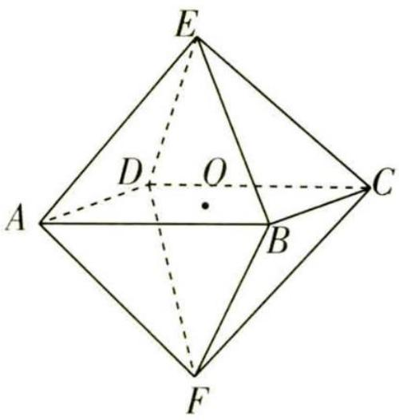

text_image

E
D O
A B C
F

图 2

A. $\frac{4\sqrt{2}}{3}$

B. $\frac{8\sqrt{2}}{3}$

C. $4\sqrt{2}$

D. $8\sqrt{2}$

思维导引

连接 $AC, BD, OE$

$OE \perp AC, OE \perp BD$

$OE \perp$ 平面 $ABCD$

由相邻两个氟原子之间的距离求 AO $\rightarrow$ 在 Rt△AEO 中求 OE $\rightarrow$ 正八面体的体积

解析

如图3, 连接 $AC, BD$ , 则其交于点 $O$ , 连接 $OE$ .

因为 AE = CE, BE = DE, O 为 AC 的中点, 也为 BD 的中点,

所以 $OE \perp AC, OE \perp BD.$

因为 $AC \cap BD = O, AC, BD \subset$ 平面 ABCD,

所以 $OE \perp$ 平面 ABCD.

令相邻两个氟原子之间的距离为 2a，则 $2a = 2\sqrt[3]{3}$ ， $a = \sqrt[3]{3}$ .

因为 AB = BC = AE = 2a，四边形 ABCD 为正方形，所以 $AC = 2\sqrt{2}a$ ，所以

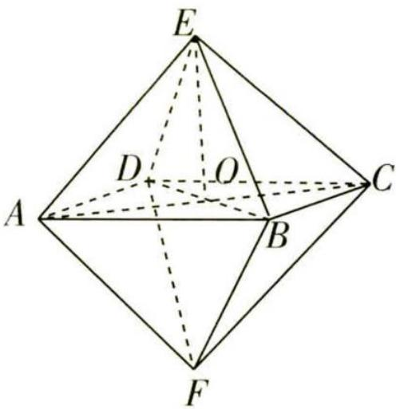

text_image

E
D
O
A
B
C
F

图3

连续群的解析性(已解决) 一个连续变换群的李氏概念,定义这个群的函数不假定是可微的,这个问题简称连续群的解析性,即是否每一个局部欧氏群都一定是李群?1952年美国数学家格利森、蒙哥马利、齐宾已解决.

$$
A O = \frac {1}{2} A C = \sqrt {2} a,
$$

所以 $OE = \sqrt{AE^{2} - AO^{2}} = \sqrt{2}a$ ,

所以该正八面体的体积是 $\frac{1}{3} \times (2a)^2 \times \sqrt{2} a \times 2 = \frac{8\sqrt{2}}{3} a^3 = \frac{8\sqrt{2}}{3} \times (\sqrt[3]{3})^3 = 8\sqrt{2}$ .

【易错】将正八面体拆分成两个正四棱锥计算体积，注意锥体的体积计算公式比柱体多了一项 $\frac{1}{3}$

答案 D

调研 4 (2023·湖南岳阳 11 月适应性考试/在历史中的应用)

青铜器是指以青铜为基本原料加工而成的器物,青铜是纯铜与其他化学元素(锡、铅等)的合金,其铜锈呈青绿色,故名青铜.青铜器以其独特的器形、精美的纹饰、典雅的铭文向人们展示了我国古代杰出的铸造工艺和文化水平.图 4 所示为觚,是一种饮酒器,长身侈口,口底均呈喇叭状,外形近似双曲线的一部分绕虚轴所在直线旋转而成的曲面.已知该曲面高 15 寸,上口直径为 10 寸,下口直径为 $\frac{15}{2}$ 寸,最小横截面直径为 6 寸,则该双曲线的离心率为

natural_image

Ancient bronze vase with intricate geometric and floral patterns (no visible text or symbols)

图 4

A. $\frac{5}{3}$

B. $\frac{13}{5}$

C. $\frac{5}{2}$

D. $\frac{7}{4}$

解析 依题意,建立平面直角坐标系,并作出所求双曲线,如图5所示,

设 AM, BN 均和 y 轴垂直, AM = 5, $BN = \frac{15}{4}$ , MN = 15, OC = 3.

设双曲线的方程为 $\frac{x^{2}}{a^{2}}-\frac{y^{2}}{b^{2}}=1(a>0,b>0)$ ，根据OC=3知双曲线经过点(3,0)，可知a=3.

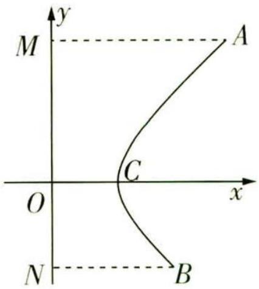

text_image

y
M
A
C
O
x
N
B

图5

设 A, B 的纵坐标分别为 m, n，结合图象可知 m > 0, n < 0.

由 AM=5, BN= $\frac{15}{4}$ 可得 $\frac{25}{9}-\frac{m^{2}}{b^{2}}=1$ , $\frac{25}{16}-\frac{n^{2}}{b^{2}}=1$ , 得 $m=\frac{4b}{3}, n=-\frac{3b}{4}$ .

根据 MN=15 可知 $\frac{4b}{3}+\frac{3b}{4}=15$ ，解得 $b=\frac{36}{5}$ ，

所以双曲线的离心率 $e=\sqrt{1+\left(\frac{b}{a}\right)^{2}}=\frac{13}{5}$ .

【拓展】求双曲线离心率 e 的方法：(1) 直接法，若可求得 a, c，则直接利用 $e = \frac{c}{a}$ 得解.
(2) 解方程法，若得到的是关于 a, c 的齐次方程 $pc^{2} + qac + ra^{2} = 0$ (p, q, r 为常数，且 $p \neq 0$ )，则转化为关于 e 的方程 $pe^{2} + qe + r = 0$ 求解

答案 B

在任意数域中证明最一般的互反律(已解决) 该问题由日本数学家高木贞治和德国数学家阿廷解决.

调研 5 (2023·山东临沂二十四中阶段练习改编/在地理中的应用)海洋蓝洞是地球罕见的自然地理现象,被科学家誉为“地球给人类保留宇宙秘密的最后遗产”,我国拥有世界上最深的海洋蓝洞.要测量如图6所示的蓝洞的口径A,B两点间的距离,现取两点C,D,且A,B,C,D四点共面,测得CD=120, $\angle ADB=135^{\circ}$ , $\angle BDC=\angle DCA=15^{\circ}$ , $\angle ACB=120^{\circ}$ ,则A,B两点间的距离为\_\_\_\_.

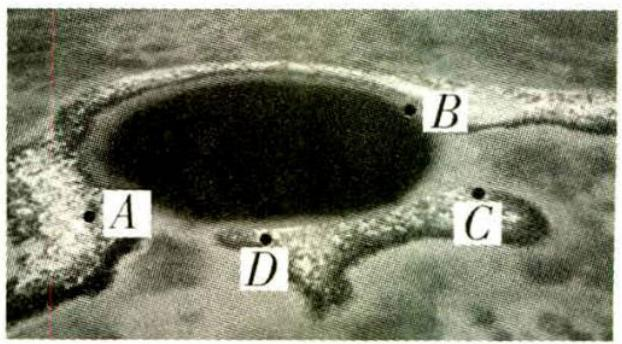

text_image

A
B
C
D

图6

解析 作出示意图,如图7所示.

因为 $\angle ADB = 135^{\circ},\angle BDC = \angle DCA = 15^{\circ},$

所以 $\angle ADC = 150^{\circ}$ ，且 $\angle DAC = \angle DCA = 15^{\circ}$ ，所以 AD = CD = 120。

又 $\angle ACB=120^{\circ}$ , 所以 $\angle BCD=135^{\circ}$ , $\angle CBD=30^{\circ}$ .

【提示】注意应用三角形的内角和为 $180^{\circ}$

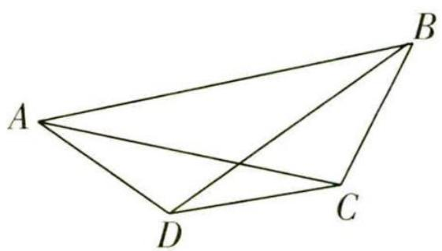

natural_image

Geometric diagram of a tetrahedron with vertices labeled A, B, C, D (no text or symbols beyond labels)

图 7

在 $\triangle BCD$ 中，由正弦定理得 $\frac{BD}{\sin\angle BCD} = \frac{CD}{\sin\angle CBD}$ ，可得 $BD = \frac{CD\times\sin\angle BCD}{\sin\angle CBD} = \frac{120\times\frac{\sqrt{2}}{2}}{\frac{1}{2}} = 120\sqrt{2},$

在 $\triangle ABD$ 中,由余弦定理得 $AB^{2}=AD^{2}+BD^{2}-2AD\times BD\cos\angle ADB=120^{2}+(120\sqrt{2})^{2}-2\times 120\times120\sqrt{2}\times(-\frac{\sqrt{2}}{2})=72000$ ,

【敲黑板】若已知角是两条已知边的夹角，则直接运用余弦定理求出另外一边，再用余（正）弦定理和三角形内角和定理求其他角

所以 $AB = 120\sqrt{5}$ ，即 A, B 两点间的距离为 $120\sqrt{5}$ .

答案 $120\sqrt{5}$

调研 6 (2023·山东潍坊期中/在生物中的应用)为了解新研制的某药物的疗效,某生物科技有限公司进行了动物试验. 先给所有白鼠服药,然后对每只白鼠的血液进行抽样化验,若检测样本结果呈阳性,则白鼠感染病毒;若检测样本结果呈阴性,则白鼠未感染病毒. 现随机抽取 $n (n \in \mathbf{N}^{*}, n \geqslant 2)$ 只白鼠的血液样本进行检验,有如下两种方案.

方案一:逐只检验,需要检验 n 次.

方案二: 混合检验, 将 n 只白鼠的血液样本混合在一起检验, 若检验结果为阴性, 则 n 只白鼠未感染病毒, 共检验 1 次; 若检验结果为阳性, 则对这 n 只白鼠的血液样本逐个检验, 此时共需要检验 $(n+1)$ 次.

(1) 若 $n = 10$ , 且只有两只白鼠感染病毒, 采用方案一, 求恰好检验 3 次就能确定两只感染病毒白鼠的概率.

丢番图方程的可解性(问题错误) 能求出一个整系数方程的整数根,称为丢番图方程可解.希尔伯特问,能否用一种由有限步构成的一般算法判断一个丢番图方程的可解性?1970年俄罗斯数学家马季亚谢维奇证明该问题错误.

关注微信公众号“初高教辅站”获取更多初高中教辅资料

(2)已知每只白鼠感染病毒的概率均为 $p(0<p<1)$ .

①采用方案二,记检验次数为 $X$ ,求检验次数 $X$ 的数学期望;  
②若 n=20, 每次检验的费用相同, 判断哪种方案检验的费用更少, 并说明理由.

思维导引 (1) 第一、三次确定两只感染病毒的白鼠的概率 $\rightarrow$ 第二、三次确定两只感染病毒的白鼠的概率 恰好检验3次就能确定两只感染病毒白鼠的概率

(2)①列出检验次数的所有可能取值→每个取值对应的概率→利用期望的计算公式求期望  
② $E(X)-20=1-20(1-p)^{20}$ → 构造函数 → 分析单调性 → 比较费用大小 → 确定方案

解析 (1)根据题意,恰好在第一、三次确定两只感染病毒的白鼠的概率 $P_{1}=\frac{2}{10} \times \frac{8}{9} \times \frac{1}{8} = \frac{1}{45}$ ,

恰好在第二、三次确定两只感染病毒的白鼠的概率 $P_{2}=\frac{8}{10}\times\frac{2}{9}\times\frac{1}{8}=\frac{1}{45}$ ,

【会分析】恰好检验3次就能确定两只感染病毒的白鼠分为两种情况：恰好在第一、三次确定两只感染病毒的白鼠；恰好在第二、三次确定两只感染病毒的白鼠

所以恰好检验3次就能确定两只感染病毒白鼠的概率 $P = {P}_{1} + {P}_{2} = \frac{1}{45} + \frac{1}{45} = \frac{2}{45}$ .

(2)①X的所有可能取值为1,n+1.

$$
P (X = 1) = (1 - p) ^ {n}, P (X = n + 1) = 1 - (1 - p) ^ {n},
$$

所以 $E(X)=(1-p)^{n}+(n+1)[1-(1-p)^{n}]=n+1-n(1-p)^{n}$ .

②方案二的检验次数期望为 $E(X)=n+1-n(1-p)^{n}$ ，方案一的检验次数期望为 n.

当 n=20 时, $E(X)-n=E(X)-20=1-20 \times (1-p)^{20}$ , 设 $g(p)=1-20 \times (1-p)^{20}(0<p<1)$ .

【技巧】将问题转化为利用函数性质比较大小的问题

因为 0 < 1 - p < 1，所以 $g(p)$ 在 $(0,1)$ 上单调递增，由 $g(p) = 0$ 得 $p = 1 - \frac{1}{\sqrt[20]{20}}$ .

当 $0 < p < 1 - \frac{1}{\sqrt[20]{20}}$ 时， $g(p) < 0$ ，则 $E(X) < 20$ ；当 $1 - \frac{1}{\sqrt[20]{20}} < p < 1$ 时， $g(p) > 0$ ，则 $E(X) > 20$ .

故当 $0 < p < 1 - \frac{1}{\sqrt[20]{20}}$ 时,选择方案二检验费用更少;当 $1 - \frac{1}{\sqrt[20]{20}} < p < 1$ 时,选择方案一检验费用更少;当 $p = 1 - \frac{1}{\sqrt[20]{20}}$ 时,选择两种方案检验费用相同.

# 考法3 创新交汇问题

调研 7 (2023·江西赣州名校期中联合测评/平面向量与三角函数交汇)奔驰定理: 点 O 是 $\triangle ABC$ 内的一点, $\triangle BOC$ , $\triangle AOC$ , $\triangle AOB$ 的面积分别记为 $S_{1}, S_{2}, S_{3}$ , 则 $S_{1} \cdot \overrightarrow{OA} + S_{2} \cdot \overrightarrow{OB} + S_{3} \cdot \overrightarrow{OC} = 0$ . 奔驰定理是平面向量中一个非常优美的结论, 因为这个定理对应的图形与某品牌轿车的标志很相似, 故形象地称其为奔驰定理. 如图 8, O 是 $\triangle ABC$ 的垂心, 且 $\overrightarrow{OA} + 2\overrightarrow{OB} + 3\overrightarrow{OC} = 0$ , 则 $\cos \angle ACB =$

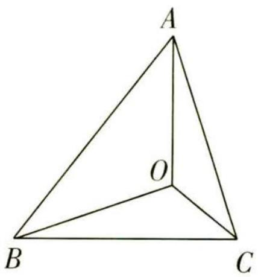

text_image

A
O
B
C

图8

A. $\frac{3\sqrt{10}}{10}$

B. $\frac{\sqrt{10}}{10}$

C. $\frac{2\sqrt{5}}{5}$

D. $\frac{\sqrt{5}}{5}$

# 思维导引

延长 $CO$ 交 $AB$ 于 $P$

画出草图

$$
S _ {1}: S _ {2}: S _ {3} = \tan \angle B A C:
$$

$$
\tan \angle A B C: \tan \angle A C B
$$

$$
\tan \angle B A C: \tan \angle A B C: \tan \angle A C B = 1: 2: 3
$$

设 $\tan \angle BAC = k, \tan \angle ABC = 2k, \tan \angle ACB = 3k$

$$
\tan \angle B A C = - \frac {\tan \angle A B C + \tan \angle A C B}{1 - \tan \angle A B C \tan \angle A C B}
$$

$k = 1$ $\cos \angle ACB$

解析 设 $S_{\triangle BOC} = S_{1}, S_{\triangle AOC} = S_{2}, S_{\triangle AOB} = S_{3}$ ，延长 CO 交 AB 于点 P，如图 9 所示.

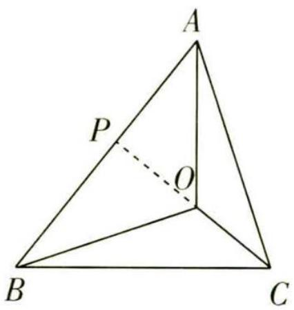

text_image

A
P
O
B
C

图9

【扫清障碍】根据奔驰定理的内容知,正确表达出三个三角形的面积是关键,本题中 $O$ 是重心,适当作辅助线,显现垂直关系,为计算面积做好准备

∵ O 是 $\triangle ABC$ 的垂心, ∴ $OP \perp AB$ ,

$\therefore S_{1}:S_{2} = (\frac{1}{2}\cdot OC\cdot BP):(\frac{1}{2}\cdot OC\cdot AP) = BP:AP = \frac{BP}{PC}:\frac{AP}{PC} = \frac{PC}{AP}:\frac{PC}{BP} =$ tan $\angle BAC:\tan \angle ABC.$

同理可得 $S_{1}:S_{3}=\tan\angle BAC:\tan\angle ACB,\therefore S_{1}:S_{2}:S_{3}=\tan\angle BAC:\tan\angle ABC:\tan\angle ACB.$

又 $S_{1} \cdot \overrightarrow{OA} + S_{2} \cdot \overrightarrow{OB} + S_{3} \cdot \overrightarrow{OC} = 0, \therefore \tan \angle BAC \cdot \overrightarrow{OA} + \tan \angle ABC \cdot \overrightarrow{OB} + \tan \angle ACB \cdot \overrightarrow{OC} = 0.$

又 $\overrightarrow{OA} + 2\overrightarrow{OB} + 3\overrightarrow{OC} = 0$ ，∴ tan ∠BAC: tan ∠ABC: tan ∠ACB = 1:2:3.

不妨设 $\tan \angle BAC = k, \tan \angle ABC = 2k, \tan \angle ACB = 3k,$ 其中 $k \neq 0.$

$\because \tan \angle BAC = -\tan (\angle ABC + \angle ACB) = -\frac{\tan \angle ABC + \tan \angle ACB}{1 - \tan \angle ABC \tan \angle ACB}, \therefore k = -\frac{2k + 3k}{1 - 2k \cdot 3k}$ , 解得 $k = \pm 1$ .

【易遗漏】对于解三角形问题,求出的参数的值一定要进行检验,检验的依据有：三角形内角和为 ${180}^{ \circ  }$ 、已知的三角形的形状等

半正定形式的平方和表示(已解决) 一个实系数 n 元多项式对一切数组 $(x_{1}, x_{2}, \cdots, x_{n})$ 都恒大于或等于 0, 是否都能写成平方和的形式? 1927 年德国数学家阿廷已解决, 他证明这是对的.

关注微信公众号“初高教辅站”获取更多初高中教辅资料

当 $k = -1$ 时, $\tan \angle BAC < 0$ , $\tan \angle ABC < 0$ , $\tan \angle ACB < 0$ , 则 $\angle BAC, \angle ABC, \angle ACB$ 都是钝角, 不合题意, 舍去.

故 $k = 1$ ，则 $\tan \angle ACB = 3 > 0, \angle ACB$ 为锐角， $\therefore \left\{ \begin{array}{l} \frac{\sin \angle ACB}{\cos \angle ACB} = 3, \\ \sin^2 \angle ACB + \cos^2 \angle ACB = 1, \end{array} \right.$ 得 $\cos \angle ACB = \frac{\sqrt{10}}{10}$ .

# 答案 B

调研 8 (2023·山东青岛期中/数列与不等式交汇)已知 $S_{n}$ 为数列 $\{a_{n}\}$ 的前 $n$ 项和, $S_{n} + 1 = 2a_{n}, T_{n}$ 为数列 $\{b_{n}\}$ 的前 $n$ 项和, $b_{n} = \frac{2^{n}}{S_{n} S_{n+1}}$ .

(1)求数列 $\{a_{n}\}$ 的通项公式;  
(2) 若 $\lambda^{2}-2023\lambda\geqslant2024T_{n}$ 对任意的 $n\in N^{*}$ 恒成立, 求正实数 $\lambda$ 的取值范围.

解析 (1)由题意,对任意的 $n \in \mathbf{N}^{*}$ , 有 $S_{n} + 1 = 2a_{n}$ ①.

当 n=1 时, $S_{1}=a_{1}$ , 可得 $a_{1}+1=2a_{1}$ , 所以 $a_{1}=1$ .

当 $n \geqslant 2$ 时, $S_{n-1} + 1 = 2a_{n-1}$ ②.

① - ②得 $a_{n} = 2a_{n} - 2a_{n-1}$ , 所以 $a_{n} = 2a_{n-1}(n \geqslant 2)$ , 即 $\frac{a_{n}}{a_{n-1}} = 2 (n \geqslant 2)$ .

【敲黑板】注意解题步骤的严谨性，②式的前提是 $n\geqslant2$ ，因此①-②得到的式子也要写上该条件

所以数列 $\{a_{n}\}$ 是以1为首项、2为公比的等比数列，

所以 $a_{n} = 1 \times 2^{n - 1} = 2^{n - 1}$ .

(2) 因为 $S_{n}=2a_{n}-1=2^{n}-1$ ,

所以 $b_{n} = \frac{2^{n}}{S_{n}S_{n + 1}} = \frac{2^{n}}{(2^{n} - 1)(2^{n + 1} - 1)} = \frac{1}{2^{n} - 1} -\frac{1}{2^{n + 1} - 1},$

【会分析】观察该式，分母是两个多项式乘积的形式，考虑裂项，使用裂项相消法求和

所以 $T_{n}=b_{1}+b_{2}+b_{3}+\cdots+b_{n}=1-\frac{1}{3}+\frac{1}{3}-\frac{1}{7}+\cdots+\frac{1}{2^{n}-1}-\frac{1}{2^{n+1}-1}=$ $1-\frac{1}{2^{n+1}-1}$ ,

【巧防错】裂项相消时,在草稿纸上把相互抵消的项划掉,一般划完前几项就能发现规律, 如此处,从 1 开始,相邻两项看成一个整体,划掉的项是前面一个整体中后面的项和后面一个整 体中前面的项,所以最终第一个整体 “ $1 - \frac{1}{3}$ ” 中 1 留下, $-\frac{1}{3}$ 被划掉,中间的整体全部划掉,最 后一个整体 “ $\frac{1}{2^{n}-1} - \frac{1}{2^{n+1}-1}$ ” 中 $\frac{1}{2^{n}-1}$ 被划掉,留下 $-\frac{1}{2^{n+1}-1}$ ,因此最终结果是 $1 - \frac{1}{2^{n+1}-1}$ , 多 加练习,熟练后就能快速写出结果

可以看出, $T_{n}$ 随着n的增大而增大,当 $n\to+\infty$ 时, $T_{n}\to1$ ,且对任意的 $n\in N^{*},T_{n}<1$ ,

所以由 $\lambda^2 - 2023\lambda \geqslant 2024T_n$ 恒成立可得 $\lambda^2 - 2023\lambda \geqslant 2024$

所以 $(\lambda - 2024)(\lambda + 1) \geqslant 0$ ，又 $\lambda$ 为正实数，所以 $\lambda \geqslant 2024$ ，所以 $\lambda$ 的取值范围为 $[2024, +\infty)$ .

# 热点 3 创新模型

# 特约名师

陈玉兰 福建省德化第一中学一级教师,德化骨干教师,在《教学考试》《高中数学教与学》《中学教研(数学)》《中学数学研究》《数理化学习》等期刊发表论文20多篇,获得泉州市基础教育教学成果奖.

# 模型1 创新函数模型

调研 1 (2023·北京北师大附属实验中学期中/创新曲线变换)在直角坐标系 xOy 中,对于点(x,y),定义变换 σ:将点 (x,y) 变换为点(a,b),使得 $\left\{\begin{aligned} x &= \tan a, \\ y &= \tan b, \end{aligned}\right.$ 其中 $a, b &\in \left(-\frac{\pi}{2}, \frac{\pi}{2}\right)$ . 变换 σ 可以将坐标系 xOy 内的曲线变换为坐标系 aOb 内的曲线,则四个函数 $y_{1} = 2x (x > 0)$ , $y_{2} = x^{2} (x > 0)$ , $y_{3} = \ln x (x > 1)$ , $y_{4} = e^{x} (x > 0)$ 在坐标系 xOy 内的图象,变换为坐标系 aOb 内的四条曲线(如图 1)依次是 ( )

A. ②, ③, ①, ④

B.③，②，④，①

C. ②, ③, ④, ①

D.③，②，①，④

解析 根据 $\left\{\begin{aligned}x&=\tan a,\\ y&=\tan b\end{aligned}\right.$ 逐一分析.

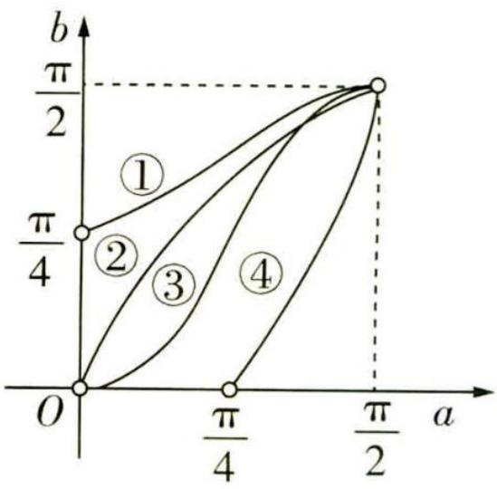

line

| Point | a     | b     |
|-------|-------|-------|
| ①     | π/4   | π/4   |
| ②     |       |       |
| ③     |       |       |
| ④     | π/2   | π/2   |

图1

对于 $y_{4} = \mathrm{e}^{x}(x > 0)$ ，显然 $y_{4} > 1$ ，即 $\tan b > 1$ ，因为 $-\frac{\pi}{2} < b < \frac{\pi}{2}$ ，根据正切函数的性质，得 $\frac{\pi}{4} < b < \frac{\pi}{2}$ ，所以函数 $y_{4}$ 对应的图象为①.

对于 $y_{3}=\ln x(x>1)$ ，有 $x=\tan a>1$ ，因为 $-\frac{\pi}{2}<a<\frac{\pi}{2}$ ，故 $\frac{\pi}{4}<a<\frac{\pi}{2}$ ，所以函数 $y_{3}$ 对应的图象为④.

【反向思考】还可以根据坐标系 aOb 内曲线的特点进行匹配. ①中 $b > \frac{\pi}{4}$ ，则 y > 1，对应函数值域为 $(1, +\infty)$ ，④中 $a > \frac{\pi}{4}$ ，则 x > 1，对应函数定义域为 $(1, +\infty)$

对于 $y_{1}$ 和 $y_{2}$ , 令 $y_{1} = \tan b_{1}, y_{2} = \tan b_{2}$ , 当 $0 < x < 2$ 时, $2x > x^{2}$ , 即当 $0 < \tan a < 2$ 时, 必有 $\tan b_{1} >$

$\tan b_{2}$ ，结合函数 $y=\tan x\left(-\frac{\pi}{2}<x<\frac{\pi}{2}\right)$ 为增函数，得 $y_{1}$ 对应的图象为②, $y_{2}$ 对应的图象为③.故选 C.

# 答案 C

调研 2 (2023·安徽安庆 12 月联考/网箱含氧量)海洋渔业发展迅猛,我国自主研发的大型海洋养殖船纷纷下海. 网箱养殖需要人工创造适合鱼类生长的环境,研究人员发现在一段时间内,某网箱内氧的含量 $H$ (单位:mg/L)与时间 $t$ (单位:h)之间的关系为 $H = H_{0} \mathrm{e}^{-mt}$ ( $H_{0}$ 为网箱内氧的初始含量且 $H_{0} > 0, m$ 为参数),且经过 $20 \mathrm{~h}$ 后,网箱内氧的含量减少 $\frac{61}{125} H_{0}$ . 若当网箱内氧的含量低于初始含量的 $\frac{2}{5}$ 时需要人工增氧,则该网箱最长大约经过多长时间后需要人工增氧(参考数据: $\lg 2 \approx 0.3$ ) ()

A. $39 \mathrm{~h}$

B. $33 \mathrm{~h}$

C. $31 \mathrm{~h}$

D. ${27}\mathrm{\;h}$

解析 由题意可知当 $t = 20$ 时, $H = H_{0} \mathrm{e}^{-20m} = H_{0} - \frac{61}{125} H_{0} = \frac{64}{125} H_{0}$ ,

所以 $\mathrm{e}^{-20m} = \frac{64}{125}$ , 则 $-20m = \ln \frac{64}{125}$ , 得 $m = -\frac{1}{20} \ln \frac{64}{125}$ .

设经过 $x\mathrm{h}$ 后需要人工增氧，则 $\frac{2}{5} H_0 = H_0\mathrm{e}^{-mx},\mathrm{e}^{-mx} = \frac{2}{5}$ ，所以- $mx = \ln \frac{2}{5}$

所以 $x \cdot \frac{1}{20} \ln \frac{64}{125} = \ln \frac{2}{5}$ ，解得 $x \approx 27$ ，

【析步骤】 $x \cdot \frac{1}{20} \ln \frac{64}{125} = \ln \frac{2}{5}$ ，则 $x \cdot \frac{1}{20} \ln \left( \frac{4}{5} \right)^{3} = \ln \frac{2}{5}$ ，则 $x \cdot \frac{3}{20} \ln \frac{4}{5} = \ln \frac{2}{5}$ ，所以 $\frac{3}{20}x =$

$$
\frac {\ln \frac {2}{5}}{\ln \frac {4}{5}} = \frac {\lg \frac {2}{5}}{\lg \frac {4}{5}} = \frac {\lg 2 - \lg 5}{\lg 4 - \lg 5} = \frac {\lg 2 - \lg \frac {1 0}{2}}{2 \lg 2 - \lg \frac {1 0}{2}} = \frac {2 \lg 2 - 1}{3 \lg 2 - 1}, \text {所以} x = \frac {2 0}{3} \times \frac {2 \lg 2 - 1}{3 \lg 2 - 1} \approx \frac {2 0}{3} \times \frac {2 \times 0 . 3 - 1}{3 \times 0 . 3 - 1} \approx 2 7
$$

所以最长大约经过 $27 \mathrm{~h}$ 后需要人工增氧, 故选 D.

# 答案 D

调研 3 (2023·南京师范大学苏州实验学校段检/与数列交汇)(多选)已知偶函数 $f(x)$ 在 R 上可导, $f(0) = -1$ , $g(x) = f'(x)$ , 若 $f(x+1) - f(1-x) = 2x$ , 则()

A. $g(0) = 0$

B. $g(2023) = 2023$

C. $f(3) = 3$

D. $f(-2n) = 2n^{2} - 1 (n \in \mathbf{N}^{*})$

思维导引 A $\rightarrow$ 根据偶函数图象的特点和导数的几何意义判断即可

B → 对 $f(x+1)-f(1-x)=2x$ 两边同时求导 → $g(x+1)+g(1-x)=2$ → 由奇偶性得 $g(x+1)-g(x-1)=2$ 累加法 → $g(2023)$

C → 找出一个满足题目要求的 $f(x)$ → 代入验证

素数问题(未完全解决) 包括黎曼猜想、哥德巴赫猜想及孪生素数问题等. 2018 年美国人迈克尔·阿蒂亚宣布他证明了黎曼猜想. 哥德巴赫猜想的最佳结果属于中国数学家陈景润(1966 年),但离最终解决尚有距离.

D $\rightarrow$ 根据 $f(x)$ 是偶函数得到 $f(x-1)-f(x+1)=-2x$ 利用累加法求 $f(-2n)$

解析 因为函数 $f(x)$ 为偶函数, 所以 $f(x)$ 的图象在点 $(0, f(0))$ 处的切线斜率为0, 即 $g(0) = f'(0) = 0$ , 故A正确.

$f(x+1)-f(1-x)=2x$ ,两边同时求导得 $g(x+1)+g(1-x)=2$ .

【易错提醒】 $\left[f(ax+b)\right]'=f'(ax+b)\times(ax+b)'=af'(ax+b)$ ，因此 $g(1-x)$ 前的符号是加号

因为函数 $f(x)$ 为偶函数,所以 $g(x)$ 为奇函数,所以 $g(x+1)-g(x-1)=2$ .

【锦囊】若 $f(x)$ 为偶函数，则 $f'(x)$ 为奇函数；若 $f(x)$ 为奇函数，则 $f'(x)$ 为偶函数

$g(2023)=g(2023)-g(2021)+g(2021)-g(2019)+\cdots+g(3)-g(1)+g(1)=2\times$ $1011 + g(1)$ ，令 x = 0，得 $g(0 + 1) + g(1 - 0) = 2$ ，则 $g(1) = 1$ ，所以 $g(2023) = 2023$ ，故 B 正确.

取 $f(x)=\frac{1}{2}x^{2}-1$ ，满足 $f(x)$ 为偶函数， $f(0)=-1,f(x+1)-f(1-x)=\frac{1}{2}(x+1)^{2}-\frac{1}{2}(1-x)^{2}=2x$ ，此时， $f(3)=\frac{7}{2}\neq3$ ，故C错误.

【换个角度】由 $f(x)$ 为偶函数且 $f(x+1)-f(1-x)=2x$ ，可以得到 $f(x+1)-f(x-1)=2x$ ，
配合 $f(0)=-1$ ，我们只能知道自变量为偶数时的 $f(x)$ 的值

因为 $f(x)$ 为偶函数，所以 $f(1 - x) = f(x - 1)$ ，所以 $f(x - 1) - f(x + 1) = -2x$

$f(-2n)=f(-2n)-f(-2n+2)+f(-2n+2)-f(-2n+4)+\cdots+f(-2)-f(0)+f(0)=-2(1-2n)-2(3-2n)-\cdots-2\times(-1)-1=\frac{[-2(1-2n)+2]n}{2}-1=2n^{2}-1(n\in\mathbf{N}^{*})$ ，故D正确.

答案 ABD

# 模型2 创新数列模型

调研 4 (2023·上海建平中学期中/新定义“序数列”)已知有穷数列 $\{a_{n}\}$ 各项均不相等,将 $\{a_{n}\}$ 的项从大到小重新排序后相应的项数构成新数列 $\{b_{n}\}$ ,称数列 $\{b_{n}\}$ 为数列 $\{a_{n}\}$ 的“序数列”.例如数列 $a_{1},a_{2},a_{3}$ 满足 $a_{1}>a_{3}>a_{2}$ ,则其序数列 $\{b_{n}\}$ 为1,3,2.若有穷数列 $\{d_{n}\}$ 满足 $d_{1}=1,|d_{n+1}-d_{n}|=(\frac{1}{4})^{n}(n$ 为正整数),且数列 $\{d_{2n-1}\}$ 的序数列递减,数列 $\{d_{2n}\}$ 的序数列递增,则 $d_{1}-d_{2}+d_{3}-d_{4}+\cdots+d_{2021}-d_{2022}=$ \_\_\_\_.

解析 $\because \{d_{2n - 1}\}$ 的序数列递减，∴数列 $\{d_{2n - 1}\}$ 递增，

【厘清题意】序数列递减，说明 $d_{2n-1} > d_{2n-3} > \cdots > d_{1} (n \geqslant 2)$ ，也就是数列 $\{d_{2n-1}\}$ 递增

$$
\therefore d _ {2 n + 1} - d _ {2 n - 1} > 0, \therefore (d _ {2 n + 1} - d _ {2 n}) + (d _ {2 n} - d _ {2 n - 1}) > 0,
$$

$$
\because \left(\frac {1}{4}\right) ^ {2 n} <   \left(\frac {1}{4}\right) ^ {2 n - 1}, \therefore | d _ {2 n + 1} - d _ {2 n} | <   | d _ {2 n} - d _ {2 n - 1} |, \therefore d _ {2 n} - d _ {2 n - 1} > 0,
$$

【难点分析】可以在数轴上表示出点 $d_{2n + 1}, d_{2n}, d_{2n - 1}$ ，由于 $d_{2n + 1} > d_{2n - 1}$ ，且点 $d_{2n}$ 到 $d_{2n + 1}$ 的距

孪生素数问题的最佳结果属于另一位中国数学家张益唐,他证明了孪生素数猜想的一个弱化形式.

离小于到 ${d}_{2n - 1}$ 的距离,那么点 ${d}_{2n}$ 只能在大于 $\frac{{d}_{2n + 1} + {d}_{2n - 1}}{2}$ 的位置,也就是 ${d}_{2n} > {d}_{2n - 1}$

$$
\therefore d _ {2 n} - d _ {2 n - 1} = \left(\frac {1}{4}\right) ^ {2 n - 1} = \frac {\left(- 1\right) ^ {2 n}}{4 ^ {2 n - 1}}. \tag {①}
$$

$\because \{d_{2n}\}$ 的序数列递增，∴数列 $\{d_{2n}\}$ 递减，

同理可得 $d_{2n + 1} - d_{2n} < 0, \therefore d_{2n + 1} - d_{2n} = -\left(\frac{1}{4}\right)^{2n} = \frac{(-1)^{2n + 1}}{4^{2n}}.$ ②

【举一反三】若是求 $d_{2023}$ ，该如

何变形呢？还是根据这个式子，可得 $d_{2023} = d_{2023} - d_{2022} +$

$$
d _ {2 0 2 2} - d _ {2 0 2 1} + \dots + d _ {2} - d _ {1} + d _ {1},
$$

代入等比数列求和公式和 ${d}_{1} = 1$

由①②可得 $d_{n + 1} - d_n = \frac{(-1)^{n + 1}}{4^n}$ 则 $d_{n} - d_{n + 1} = \frac{(-1)^{n}}{4^{n}}$

即可

$$
\begin{array}{l} \therefore d _ {1} - d _ {2} + d _ {3} - d _ {4} + \dots + d _ {2 0 2 1} - d _ {2 0 2 2} = - \frac {1}{4} - \frac {1}{4 ^ {3}} - \frac {1}{4 ^ {5}} - \dots - \frac {1}{4 ^ {2 0 2 1}} = - \left(\frac {1}{4} + \frac {1}{4 ^ {3}} + \frac {1}{4 ^ {5}} + \dots + \frac {1}{4 ^ {2 0 2 1}}\right) = \\ - \frac {\frac {1}{4} \times \left[ 1 - \left(\frac {1}{4 ^ {2}}\right) ^ {1 0 1 1} \right]}{1 - \frac {1}{4 ^ {2}}} = - \frac {4}{1 5} \times \left(1 - \frac {1}{4 ^ {2 0 2 2}}\right). \\ \end{array}
$$

答案 $-\frac{4}{15} \times (1 - \frac{1}{4^{2022}})$

调研 5 (2023·山东德州11月期中/数阵)(多选) $a_{11} a_{12} a_{13} \cdots a_{1n}$ 将 $n^2$ 个数排成 $n$ 行 $n$ 列的数阵,如图2所示,其中 $a_{ij}(1 \leqslant i \leqslant n, 1 \leqslant j \leqslant n, i, j, n \in \mathbf{N}^*)$ 表示第 $i$ 行第 $j$ 列上的数.该数阵第一列的 $n$ 个数从上到下构成以 $m$ 为公差的等差数列,每一行的 $n$ 个数从左到右构成以 $m$ 为公比的等比数列(其中 $m > 0$ ). 已知 $a_{11} = 3, a_{13} = a_{51} + 1$ , 记这 $n^2$ 个数的和为 $S$ , 下面叙述正确的是 ( ) 图 2

A. $m = 2$

B. $a_{78} = 15 \times 2^{8}$

C. $a_{ij} = (2i + 1)\cdot 2^{j - 1}$

D. $S = n(n + 2)(2^n -1)$

思维导引 $a_{ij}$ 表示第 $i$ 行第 $j$ 列上的数, 根据数阵的排列特点用 $m$ 表示出 $a_{13}, a_{51}$ , 建立方程, 可得 $m$ , 从而求出通项公式 $a_{ij}$ , 再根据等差数列与等比数列的求和公式得到 $S$ 即可.

解析 由题意得, $a_{13}=a_{11}m^{2}=3m^{2},a_{51}=a_{11}+4m=3+4m,$

因为 $a_{13} = a_{51} + 1$ ，所以 $3m^2 = 3 + 4m + 1$ ，整理可得 $(3m + 2)(m - 2) = 0$ ，由 $m > 0$ ，得 $m = 2$ ，故A正确.

根据数阵的排列特点, $a_{i1}=a_{11}+(i-1)\times2=1+2i$ ,则 $a_{ij}=a_{i1}\cdot2^{j-1}=(1+2i)\cdot2^{j-1},a_{78}=15\times2^{7}\neq15\times2^{8}$ ,故B错误,C正确.

系数为任意代数数的二次型(未解决) H. 哈塞(1929年)和 C. L. 西格尔(1936年, 1951年)在这个问题上获得重要结果.

$$
S = a _ {1 1} \frac {1 - 2 ^ {n}}{1 - 2} + a _ {2 1} \frac {1 - 2 ^ {n}}{1 - 2} + a _ {3 1} \frac {1 - 2 ^ {n}}{1 - 2} + \dots + a _ {n 1} \frac {1 - 2 ^ {n}}{1 - 2} = \frac {1 - 2 ^ {n}}{1 - 2} (3 + 5 + 7 + \dots + 1 + 2 n) = (2 ^ {n} -
$$

【会拆解】S 是 $n^{2}$ 个数的和，因此可以一行一行计算，即将 n 个公比为 2，首项依次为 3, 5, 7, …, $2n+1$ ，项数为 n 的等比数列各项相加；也可以一列一列计算，即将 n 个公差为 2，首项依次为 3, 6, 12, …, $3 \cdot 2^{n-1}$ ，项数为 n 的等差数列各项相加

1) $\frac{n(3+1+2n)}{2}=n(2+n)(2^{n}-1)$ ，故 D 正确.

答案 ACD

调研 6 (2023·河北保定段检/与切线交汇)(多选)已知公比为 q 的正项等比数列 $\{a_{n}\}$ ，其首项 $a_{1}>1$ ，前 n 项和为 $S_{n}$ ，前 n 项积为 $T_{n}$ ，且函数 $f(x)=x(x+a_{1})(x+a_{2})\cdots(x+a_{9})$ 的图象在点 $(0,0)$ 处的切线斜率为 1，则()

A. 数列 $\{a_{n}\}$ 递增

B. 数列 $\{\lg a_{n}\}$ 递减

C. 当 $n = 4$ 或5时, $T_{n}$ 最大

D. $S_{n} <   \frac{1}{q^{4}(1 - q)}$

解析

<table><tr><td>选项</td><td>分析</td><td>正误</td></tr><tr><td>A</td><td>因为 $f(x) = x(x + a_1)(x + a_2) \cdots (x + a_9)$ ,故 $f'(x) = (x + a_1)(x + a_2) \cdots (x + a_9) + x[(x + a_1)(x + a_2) \cdots (x + a_9)]'$ ,【难点分析】函数 $f(x)$ 如何求导?我们可以将 $f(x)$ 看作 $x$ 与 $(x + a_1)(x + a_2) \cdot \cdots (x + a_9)$ 的乘积,那么利用导数的乘法运算法则即可得到上式,再令 $x=0$ ,那么“复杂的大尾巴”便消失了则 $f'(0) = a_1a_2\cdots a_9 = 1$ ,即 $a_5^9 = 1$ ,解得 $a_5 = 1$ .又 $a_1 > 1$ ,且数列 $\{a_n\}$ 是正项数列,故公比 $q \in (0,1)$ ,数列 $\{a_n\}$ 递减.</td><td>×</td></tr><tr><td>B</td><td> $\lg a_{n+1} - \lg a_n = \lg \frac{a_{n+1}}{a_n} = \lg q$ ,由A知 $q \in (0,1)$ ,故 $\lg q < 0$ ,故数列 $\{\lg a_n\}$ 递减.</td><td>√</td></tr><tr><td>C</td><td>因为 $a_5 = 1, a_1 > 1, q \in (0,1)$ ,故数列 $\{a_n\}$ 的前4项均为大于1的正数,从第6项开始均为小于1的正数,故当 $n=4$ 或5时, $T_n$ 最大.</td><td>√</td></tr><tr><td>D</td><td>因为 $q \ne 1$ ,所以 $S_n = \frac{a_1(1 - q^n)}{1 - q} = \frac{a_5(1 - q^n)}{q^4(1 - q)} = \frac{1 - q^n}{q^4(1 - q)}$ ,【关键转化】 $S_n$ 的表达式 $\frac{a_1(1 - q^n)}{1 - q}$ 与式子 $\frac{1}{q^4(1 - q)}$ 之间的显著差异在于“ $q^4$ ”,联系已知 $a_5 = 1$ ,将 $a_1$ 转化为 $\frac{a_5}{q^4}$ 即可因为 $q \in (0,1)$ ,所以 $0 < q^n < 1$ ,故可得 $\frac{1 - q^n}{q^4(1 - q)} < \frac{1}{q^4(1 - q)}$ ,即 $S_n < \frac{1}{q^4(1 - q)}$ .</td><td>√</td></tr></table>

答案 BCD

# 模型3 创新几何模型

调研 7 (2023·广东揭阳二中 11 月月考/不规则几何体) 如图 3 所示的多面体是一个直四棱柱被平面 AEFG 所截后得到的, 其中 ABCD 是原直四棱柱的底面, $\angle BAE = \angle GAD = 45^{\circ}$ , AB = 2AD = 2, $\angle BAD = 60^{\circ}$ .

(1) 求证: $BD \perp$ 平面 ADG.  
(2) 求直线 GB 与平面 AEFG 所成角的正弦值.

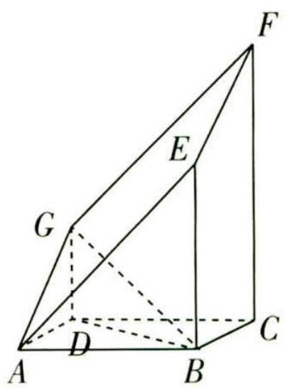

text_image

Geometric diagram of a triangular pyramid with labeled vertices and internal points

图3

思维导引 (1) 在 $\triangle BAD$ 中,证得 $BD\perp AD$ 由直四棱柱得 $BD\perp GD$ $AD\cap GD=D$ $BD\perp$ 面 $ADG$

(2)思路一:(空间向量法) 设直线 GB 与平面 AEFG 所成角为 $\theta$ $\sin \theta = \frac{|\overrightarrow{GB} \cdot m|}{|\overrightarrow{GB}| |m|}$ ，其中 m 为平面 AEFG 的法向量

思路二:(等体积法) 求出点 B 到平面 AEFG 的距离 h → 利用 $\sin \theta = \frac{h}{GB}$ 求解

解析 (1) 在 $\triangle BAD$ 中, $AB = 2AD = 2$ , $\angle BAD = 60^{\circ}$ , 由余弦定理得 $BD^{2} = AD^{2} + AB^{2} - 2AB \cdot AD \cos 60^{\circ} = 3$ , 所以 $BD = \sqrt{3}$ .

所以 $AB^{2}=AD^{2}+BD^{2}$ ，即 $BD\perp AD$ .

在直四棱柱中, $GD \perp$ 平面 ABCD, $BD \subset$ 平面 ABCD,所以 $BD \perp GD$ .

因为 $AD \subset$ 平面 ADG, $GD \subset$ 平面 ADG, $AD \cap GD = D$ ,

【易错提醒】对于线面垂直的证明，注意线不在多，重在相交

所以 $BD \perp$ 平面 ADG.

(2) 方法一 由题可知 ${DA},{DB},{DG}$ 三线两两垂直.

【建系第一步】先核查是否存在三条两两垂直的直线，有些图形会存在误导，比如本题，可能会误认为 $DA$ 、 $DC$ 、 $DG$ 两两垂直，起步就错了

以 D 为坐标原点, 分别以 DA, DB, DG 所在直线为 x 轴, y 轴, z 轴, 建立如图 4 所示的空间直角坐标系.

由 $\angle BAE = \angle GAD = 45^{\circ}$ ，得 BE = BA = 2，DA = DG = 1，

所以 $A(1,0,0)$ , $B(0,\sqrt{3},0)$ , $E(0,\sqrt{3},2)$ , $G(0,0,1)$ ,

$$
\overrightarrow {A E} = (- 1, \sqrt {3}, 2), \overrightarrow {A G} = (- 1, 0, 1), \overrightarrow {G B} = (0, \sqrt {3}, - 1).
$$

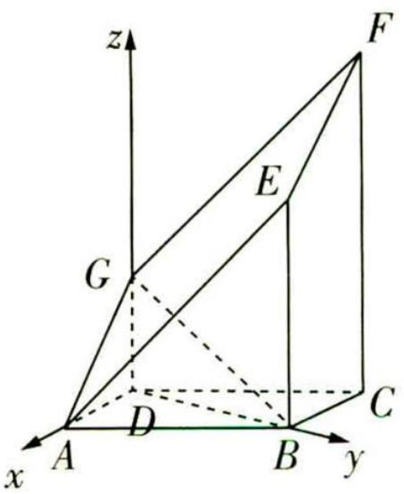

text_image

z
F
E
G
x
A
D
B
y
C

图4

苏联数学家阿诺尔德解决了连续函数的情形(1957年), 维士斯金又把它推广到了连续可微函数的情形(1964年). 但如果要求是解析函数, 则问题尚未解决.

设 $\boldsymbol{m}=(x,y,z)$ 为平面 AEFG 的法向量，则 $\left\{\begin{aligned}\boldsymbol{m}\cdot\overrightarrow{AE}&=0,\\ \boldsymbol{m}\cdot\overrightarrow{AG}&=0,\end{aligned}\right.$ 即 $\left\{\begin{aligned}-x+\sqrt{3}y+2z&=0,\\ -x+z&=0,\end{aligned}\right.$

令 $x=\sqrt{3}$ ，得 $\boldsymbol{m}=(\sqrt{3},-1,\sqrt{3})$ 为平面 AEFG 的一个法向量.

设直线 GB 与平面 AEFG 所成角为 $\theta$ ,

则 $\sin \theta = |\cos \langle \overrightarrow{GB},\pmb {m}\rangle | = \frac{|\overrightarrow{GB}\cdot\pmb{m}|}{|\overrightarrow{GB}||\pmb{m}|} = \frac{2\sqrt{3}}{2\times\sqrt{7}} = \frac{\sqrt{21}}{7},$

【分清正余】直线方向向量和平面法向量夹角的余弦值的绝对值是直线与平面所成角的正弦值，正弦和余弦要分清

所以直线 GB 与平面 AEFG 所成角的正弦值为 $\frac{\sqrt{21}}{7}$ .

方法二 如图5, 连接 $GE$ , 过点 $G$ 作 $GM \perp BE$ 于 $M$ , 因为 $\angle BAE = \angle GAD = 45^{\circ}$ , $AB = 2AD = 2$ , 所以 $BE = 2, AE = 2\sqrt{2}, DG = 1, AG = \sqrt{2}$ .

由(1)知, $BD=\sqrt{3}$ . 易知四边形 BDGM 为矩形, 所以 $GM=BD=\sqrt{3}$ , BM=GD=1, 则 ME=BE-BM=1, GB=2.

在 Rt△GME 中， $GM=\sqrt{3}$ ，ME=1，所以 GE=2，所以 $S_{\triangle BGE}=\frac{1}{2}\times2\times\sqrt{3}=\sqrt{3}$ .

在 $\triangle AGE$ 中, 由余弦定理得 $\cos \angle AGE = \frac{AG^2 + GE^2 - AE^2}{2AG \cdot GE} = -\frac{\sqrt{2}}{4}$ , 所以 $\sin \angle AGE = \frac{\sqrt{14}}{4}$ , 所以 $S_{\triangle AGE} = \frac{1}{2} \times AG \times GE \times \sin \angle AGE = \frac{1}{2} \times \sqrt{2} \times 2 \times \frac{\sqrt{14}}{4} = \frac{\sqrt{7}}{2}$ .

因为 $AD \perp BD, AD \perp DG, BD \cap DG = D, BD, DG \subset$ 平面 $BDGE$ , 所以 $AD \perp$ 平面 $BDGE$ .

设点 B 到平面 AEFG 的距离为 h，由 $V_{三棱锥B-AGE} = V_{三棱锥A-BGE}$ ，得 $\frac{1}{3} \cdot S_{\triangle AGE} \cdot h = \frac{1}{3} \cdot S_{\triangle BGE} \cdot AD$ ，

所以 $h=\frac{S_{\triangle BGE}\times AD}{S_{\triangle AGE}}=\frac{\sqrt{3}\times1}{\frac{\sqrt{7}}{2}}=\frac{2\sqrt{21}}{7}.$

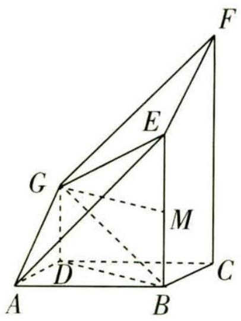

text_image

Geometric diagram of a triangular pyramid with labeled vertices and internal points, used for spatial geometry problems.

图 5

设直线 GB 与平面 AEFG 所成的角为 $\theta$ ，则 $\sin \theta = \frac{h}{GB} = \frac{\sqrt{21}}{7}$ .

【技法点拨】几何法解线面角的本质是利用直线与平面所成角的定义：平面的一条斜线和它在平面上的射影所成的锐角。主要利用直角三角形得解

所以直线 GB 与平面 AEFG 所成角的正弦值为 $\frac{\sqrt{21}}{7}$ .

调研 8 (2023·浙江杭州期中/三棱台模型)如图6,三棱台 $ABC - A_{1}B_{1}C_{1}$ 中, $\triangle ABC$ 为正三角形, $BC = 2$ , $CC_{1} = \sqrt{3}$ , $B_{1}C_{1} = 1$ , $CC_{1} \perp BC$ .

(1) 求证: $BC \perp AB_{1}$ .   
(2)若二面角 $B_{1} - BC - A$ 的平面角大小为 $60^{\circ}$ , 且在线段 $CC_{1}$ 上有一点 $D$ 使得平面 $DAB$ 将四面体 $ABCC_{1}$ 分成体积相等的两部分, 求 $BD$ 与平面 $BB_{1}A_{1}A$ 所成角的正弦值.

思维导引 (1)

要证 $BC \perp AB_{1}$ , 只需证明 $BC$ 垂直于 $AB_{1}$ 所在的一个平面

考虑已知正三角形 ABC 和一组垂直关系 $BC \perp CC_{1}$ 选定平面 $AMB_{1}$ ，其中 M 为 BC 的中点

正三角形中 $AM \perp BC$ 和平行四边形中 $B_{1}M \perp BC$ 得证

(2) 考虑利用几何法求线面角

利用等体积法求出点 D 到平面 $BB_{1}A_{1}A$ 的距离 h

设 BD 与平面 $BB_{1}A_{1}A$ 所成的角为 $\theta$ ，则 $\sin\theta=\frac{h}{BD}$ 得解

解析 (1) 取 $BC$ 的中点 $M$ , 连接 $B_{1} M, A M$ , 如图 7 所示.

【怎样取点】要证线线垂直, 显然不可能通过平面几何知识直接证明, 那就要考虑线面垂直了. 而要证线面垂直, 最关键的是找到与 $BC$ 垂直的一组相交直线, 已知条件包含正三角形, 根据三线合一就能找到第一组垂直, 即要取中点, 那应该取 $AB$ , $BC$ , $CA$ 谁的中点呢? 根据 $CC_{1} \perp BC$ 就可以发现, 应该取 $BC$ 的中点, 这就是取点 $M$ 的原因

∵ $\triangle ABC$ 为正三角形, ∴ $AM \perp BC$ .

$\because B_{1}C_{1}\parallel MC$ 且 $B_{1}C_{1}=MC=1$

∴ 四边形 $B_{1}MCC_{1}$ 为平行四边形, ∴ $B_{1}M \parallel CC_{1}$ , 又 $CC_{1} \perp BC$ , ∴ $B_{1}M \perp BC$ .

$\because B_{1}M\cap AM=M,B_{1}M,AM\subset$ 平面 $AMB_{1}$ ,

$\therefore BC \perp$ 平面 $AMB_{1}$ , 又 $AB_{1} \subset$ 平面 $AMB_{1}$ , $\therefore BC \perp AB_{1}$ .

(2) $\because$ 平面 $DAB$ 平分四面体 $ABCC_{1}$ 的体积,

∴ D 为 $CC_{1}$ 的中点, ∴ $BD = \sqrt{DC^{2} + BC^{2}} = \frac{\sqrt{19}}{2}$ .

连接 $DB_{1}$ ，取 $MB_{1}$ 的中点N，连接AN，如图8所示.

由(1)知, $\angle AMB_{1}$ 为二面角 $B_{1} - BC - A$ 的平面角,

$\therefore \angle AMB_{1} = 60^{\circ}$ ，又 $AM = B_{1}M = \sqrt{3}$ ，∴ $\triangle AMB_{1}$ 为正三角形，

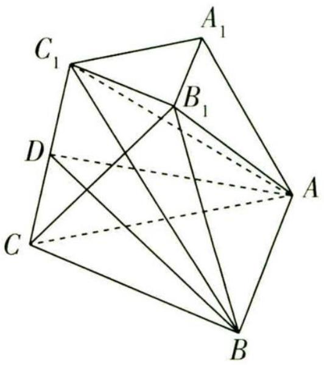

text_image

C₁
A₁
B₁
D
C
A
B

图6

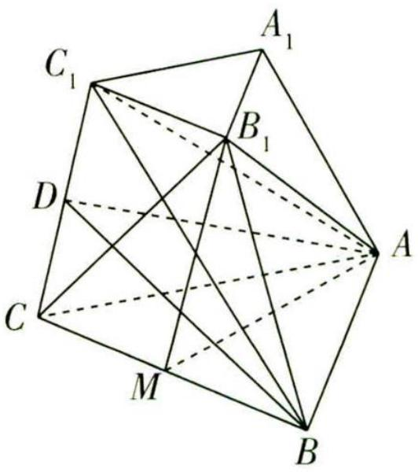

text_image

C₁
A₁
B₁
D
C
M
A
B

图 7

正则变分问题的解是否一定解析(未解决) 对这一问题的研究很少,C. H. 伯恩斯坦和彼得罗夫斯基等得出了一些结果.

$$
\therefore A N = \frac {3}{2}.
$$

$\because BC \perp$ 平面 $AMB_{1}, AN \subset$ 平面 $AMB_{1}, \therefore AN \perp BC.$

又 $AN \perp MB_{1}, BC, MB_{1} \subset$ 平面 $BCC_{1}B_{1}, BC \cap MB_{1} = M$ , 故 $AN \perp$ 平面 $BCC_{1}B_{1}$ .

【关键点拨】既然要找 $BD$ 与平面 $BB_{1}A_{1}A$ 所成角, 那势必要把点 $B$ , 点 $D$ 以及平面 $BB_{1}A_{1}A$ (或这个平面的一部分) 放到同一个四面体中, 利用等体积法求出点 $D$ 到平面 $BB_{1}A_{1}A$ 的距离, 因此选取了四面体 $DABB_{1}$ , 而 $AN$ 就是这个四面体的底面 $DBB_{1}$ 上的高

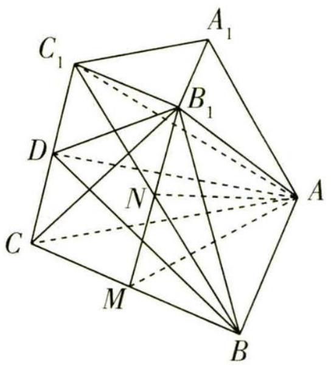

text_image

C₁
A₁
B₁
D
N
C
M
A
B

图8

在 $\triangle ABB_{1}$ 中， $BB_{1} = AB = 2, AB_{1} = \sqrt{3}$ ，

$$
\therefore S _ {\triangle A B B _ {1}} = \frac {\sqrt {3 9}}{4}, S _ {\triangle D B B _ {1}} = S _ {\text {梯形} B B _ {1} C _ {1} C} - S _ {\triangle C _ {1} D B _ {1}} - S _ {\triangle D B C} = \frac {3 \sqrt {3}}{4}.
$$

设点 D 到平面 $BB_{1}A_{1}A$ 的距离为 h，

由 $V_{\text{三棱锥}D - ABB_1} = V_{\text{三棱锥}A - DBB_1}$ 得 $\frac{1}{3} \times h \times \frac{\sqrt{39}}{4} = \frac{1}{3} \times \frac{3}{2} \times \frac{3\sqrt{3}}{4}, \therefore h = \frac{9\sqrt{13}}{26}$ .

设 BD 与平面 $BB_{1}A_{1}A$ 所成的角为 $\theta$ ，则 $\sin\theta=\frac{h}{BD}=\frac{9\sqrt{247}}{247}$ ，

即 BD 与平面 $BB_{1}A_{1}A$ 所成角的正弦值为 $\frac{9\sqrt{247}}{247}$ .

# 模型4 创新概率模型

调研 9 (2023·福建福州格致中学期中/融合生活趣味)七巧板,又称七巧图、智慧板.某同学用边长 $4 \mathrm{dm}$ 的正方形木板制作了一套七巧板,如图9所示,包括5个等腰直角三角形,1个正方形和1个平行四边形.若该同学从5个三角形中任取出2个,则这2个三角形的面积之和不小于另外3个三角形面积之和的概率是 ( )

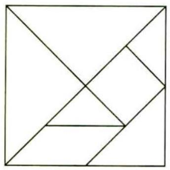

natural_image

Geometric pattern composed of triangles and rectangles within a square (no text or symbols)

图9

A. $\frac{1}{2}$

B. $\frac{1}{5}$

C. $\frac{2}{5}$

D. $\frac{3}{10}$

解析 如图 10 所示, 易知 $S_{\triangle ADO} = S_{\triangle ABO} = 2S_{\triangle MCF} = 4S_{\triangle GHO} = 4S_{\triangle BEF} = 4 \, dm^{2}$ .

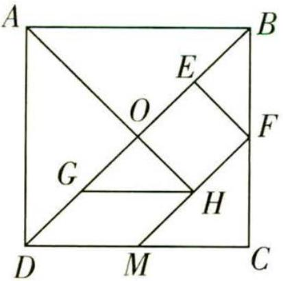

text_image

A
B
E
O
F
G
H
D
M
C

图10

记 $\triangle ADO, \triangle ABO, \triangle MCF, \triangle GHO, \triangle BEF$ 分别为 $S_{1}, S_{2}, S_{3}, S_{4}, S_{5}$ ,

从这5个三角形中任取出2个,则样本空间 $\Omega = \{S_{1}S_{2}, S_{1}S_{3}, S_{1}S_{4}, S_{1}S_{5}, S_{2}S_{3}, S_{2}S_{4}, S_{2}S_{5}, S_{3}S_{4}, S_{3}S_{5}, S_{4}S_{5}\}$ , 共有10个基本事件.

【另解】也可以直接利用排列组合知识，直接得到样本点总数为 $C_{5}^{2}=10$

代数曲线和代数曲线面的拓扑问题(未解决) 这个问题分为两部分. 前半部分涉及代数曲线含有闭的分枝曲线的最大数目. 后半部分要求讨论 $\frac{\mathrm{d}x}{\mathrm{d}y} = \frac{Y}{X}$ 的极限环的最大个数和相对位置, 其中 $X, Y$ 是 $x, y$ 的 $n$ 次多项式.

关注微信公众号“初高教辅站”获取更多初高中教辅资料

记事件 N 表示“从 5 个三角形中任取出 2 个, 这 2 个三角形的面积之和不小于另外 3 个三角形面积之和”, 则事件 N 包含的基本事件为 $S_{1}S_{2}, S_{1}S_{3}, S_{2}S_{3}$ , 共 3 个. 所以 $P(N)=\frac{3}{10}$ .

答案 D

调研 10 (2023·四川外国语大学附属外国语学校期中/与立体几何交汇, 双空题) 如图 11, 已知正方体 $ABCD-A_{1}B_{1}C_{1}D_{1}$ 的顶点处有一质点 $Q$ , 点 $Q$ 每次会随机地沿一条棱向相邻的某个顶点移动, 且向每个顶点移动的概率相同, 从一个顶点沿一条棱移动到相邻顶点称为移动一次. 若质点 $Q$ 的初始位置在点 $A$ 处, 则点 $Q$ 移动 2 次后仍在底面 $ABCD$ 上的概率为\_\_\_\_; 点 $Q$ 移动 $n$ 次后仍在底面 $ABCD$ 上的概率为\_\_\_\_.

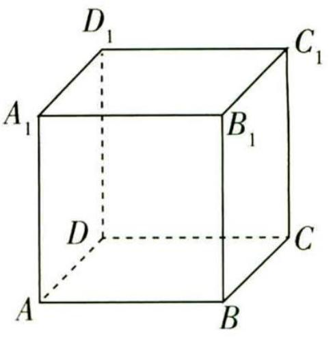

text_image

D₁
A₁
B₁
C₁
D
C
A
B

图11

解析 记点 Q 移动 n 次后仍在底面 ABCD 上的概率为 $P_{n}$ .

在正方体中,每一个顶点有3个相邻的顶点,其中两个在同一底面,

当点 $Q$ 在底面 $ABCD$ 上时, 随机移动一次仍在底面 $ABCD$ 上的概率为 $\frac{2}{3}$ ,

当点 $Q$ 在底面 $A_{1}B_{1}C_{1}D_{1}$ 上时, 随机移动一次回到底面 $ABCD$ 上的概率为 $\frac{1}{3}$ .

【会分类】正方体有8个顶点,从任意一个顶点移动一次,都有3种可能性,是否需要分3类讨论呢？关注解题目标,“仍在底面 $ABCD$ 上”,那么只要分在底面 $ABCD$ 上、不在底面 $ABCD$ 上(也就是在上底面 $A_{1}B_{1}C_{1}D_{1}$ 上)这两类即可

所以 $P_{1}=\frac{2}{3}, P_{2}=\frac{2}{3}\times\frac{2}{3}+\frac{1}{3}\times\frac{1}{3}=\frac{5}{9}.$

依题意可知 $P_{n + 1} = \frac{2}{3} P_n + \frac{1}{3} (1 - P_n) = \frac{1}{3} P_n + \frac{1}{3}$ ，所以 $P_{n + 1} - \frac{1}{2} = \frac{1}{3}(P_n - \frac{1}{2})$

【构造等比数列】递推公式形如 $a_{n+1} = pa_n + q (p, q \neq 0, p \neq 1)$ 的数列 $\{a_n\}$ ，可以变形为 $a_{n+1} + \lambda = p(a_n + \lambda)$ ，其中 $\lambda = \frac{q}{p-1}$ ，从而构造等比数列 $\{a_n + \lambda\}$

所以数列 $\{P_{n} - \frac{1}{2}\}$ 是首项为 $P_{1} - \frac{1}{2} = \frac{1}{6}$ ，公比为 $\frac{1}{3}$ 的等比数列，

所以 $P_{n} - \frac{1}{2} = \frac{1}{6}\times (\frac{1}{3})^{n - 1} = \frac{1}{2}\times (\frac{1}{3})^{n},$ 所以 $P_{n} = \frac{1}{2}\cdot (\frac{1}{3})^{n} + \frac{1}{2}.$

答案 $\frac{5}{9} \frac{1}{2} \cdot \left(\frac{1}{3}\right)^n + \frac{1}{2}$

调研 11 (2023·上海嘉定二中期中/与不等式证明交汇)某大学有 A, B 两个餐厅为学生提供午餐与晚餐服务, 甲、乙两位学生每天午餐和晚餐都在学校就餐, 近 100 天的就餐情况统计如下:

物理学的公理化(未解决) 希尔伯特建议用数学的公理化方法推演出全部物理,首先是概率和力学.

<table><tr><td>选择餐厅情况(午餐,晚餐)</td><td>(A,A)</td><td>(A,B)</td><td>(B,A)</td><td>(B,B)</td></tr><tr><td>甲</td><td>30天</td><td>20天</td><td>40天</td><td>10天</td></tr><tr><td>乙</td><td>20天</td><td>25天</td><td>15天</td><td>40天</td></tr></table>

假设甲、乙选择餐厅相互独立,用频率估计概率.

(1) 分别估计一天中甲午餐和晚餐都选择 A 餐厅就餐的概率, 乙午餐和晚餐都选择 B 餐厅就餐的概率.

(2)记 $X$ 为甲、乙在一天中就餐餐厅的个数,求 $X$ 的分布列和数学期望 $E(X)$ .

(3) 假设 $M$ 表示事件 “ $A$ 餐厅推出优惠套餐”, $N$ 表示事件 “某学生去 $A$ 餐厅就餐”, $P(M) > 0$ , 已知在推出优惠套餐的情况下学生去该餐厅就餐的概率会比不推出优惠套餐的情况下去该餐厅就餐的概率要大, 证明: $P(M \mid N) > P(M \mid \overline{N})$ .

解析 (1)设事件 $C$ 为“一天中甲午餐和晚餐都选择 $A$ 餐厅就餐”, 事件 $D$ 为 “一天中乙午餐和晚餐都选择 $B$ 餐厅就餐”.

近100天中甲午餐和晚餐都选择A餐厅就餐的天数为30,乙午餐和晚餐都选择B餐厅就餐的天数为40,用频率估计概率,可得 $P(C)=\frac{30}{100}=0.3,P(D)=\frac{40}{100}=0.4$ .

所以一天中甲午餐和晚餐都选择 A 餐厅就餐的概率为 0.3, 一天中乙午餐和晚餐都选择 B 餐厅就餐的概率为 0.4.

(2)由题意知,甲午餐和晚餐都选择B餐厅就餐的概率为0.1,

乙午餐和晚餐都选择 A 餐厅就餐的概率为 0.2.

易知 X 的所有可能取值为 1,2,

$$
P (X = 1) = 0. 3 \times 0. 2 + 0. 1 \times 0. 4 = 0. 1, P (X = 2) = 1 - P (X = 1) = 0. 9,
$$

【正难则反】甲、乙在一天中就餐餐厅个数为2的情况十分复杂，既包括两人均既去A又去B的情况，又包括两人中只有一个人既去A又去B的情况，还包括两人中一人只去了A，另一人只去了B的情况……这时不如从反面思考，用1减去 $P(X=1)$ 即可

所以 $X$ 的分布列为

<table><tr><td>X</td><td>1</td><td>2</td></tr><tr><td>P</td><td>0.1</td><td>0.9</td></tr></table>

$$
E (X) = 1 \times 0. 1 + 2 \times 0. 9 = 1. 9.
$$

(3) 由题知 $P(N \mid M) > P(N \mid M)$ ,

【转化数学语言】已知条件“在推出优惠套餐的情况下学生去该餐厅就餐的概率会比不推出优惠套餐的情况下去该餐厅就餐的概率要大”转化成数学语言就是 $P(N|M) > P(N\overline{M})$

即 $\frac{P(NM)}{P(M)}> \frac{P(N\overline{M})}{P(\overline{M})}=\frac{P(N)-P(NM)}{1-P(M)}$ ，即 $P(NM)>P(N)P(M)$ ，

【条件概率计算公式】 $P(A|B)=\frac{P(AB)}{P(B)}$

则 $P(NM) - P(N)P(NM) > P(N)P(M) - P(N)P(NM)$ , 即 $P(NM)P(\overline{N}) > P(N)P(\overline{NM})$ , 可得 $\frac{P(NM)}{P(N)} > \frac{P(\overline{NM})}{P(\overline{N})}$ , 即 $P(M|N) > P(M|\overline{N})$ .

# 热点 4 创新载体

# 载体1 取材著名猜想

调研 1 (2023·北京市海淀区段检/黎曼猜想)1859 年,德国数学家黎曼向科学院提交了题目为《论小于给定数值的素数个数》的论文并提出了著名的黎曼猜想.在此之前,许多数学家也曾研究过这个问题,并得到小于数字 $x$ 的素数个数 $\pi(x)$ 大约可以表示为 $\frac{x}{\ln x}$ 的结论.根据这个结论,估计 1 000 以内的素数个数为(素数即质数, $\lg e \approx 0.43429$ ,计算结果取整数)

题干括号中的提示信息往往暗示了解题的方向, 如此处, 必然需要化成与 $\lg e$ 有关的代数式求解

A. 189

B. 186

C. 145

D. 109

解析 由题意, 小于数字 x 的素数个数 $\pi(x)$ 大约可以表示为 $\frac{x}{\ln x}$ ,

则估计 1 000 以内的素数个数为 $\pi(1\ 000) \approx \frac{1\ 000}{\ln\ 1\ 000} = \frac{1\ 000}{\frac{\lg\ 1\ 000}{\lg\ e}} \approx \frac{1\ 000}{\frac{3}{0.434\ 29}} \approx 145$ ，故选 C.

答案 C

调研 2 (2023·广东广州 10 月检测/冰雹猜想)任取一个正整数,若是奇数,就将该数乘 3 再加上 1 ,若是偶数,就将该数除以 2 . 反复进行上述两种运算,经过有限次步骤后,必进入循环“1→4→2→1”,这就是数学史上著名的“冰雹猜想”. 比如取正整数 m=6 ,根据上述运算法则得出“6→3→10→5→16→8→4→2→1”,共需经过 8 个步骤变成 1(这里指第一次变成 1 ,简称 8 步“雹程”). 猜想的递推关系如下:已知数列 $\{a_{n}\}$ 满足 $a_{1}=m(m \text{ 为正整数}),a_{n+1}=\begin{cases}\frac{a_{n}}{2},&a_{n}\text{ 为偶数,}\\3a_{n}+1,a_{n}\text{ 为奇数.}\end{cases}$

(1) 当 m=7 时, 试确定使得 $a_{n}=1$ 需要多少步“雹程”;

将克罗克定理推广到任意的代数有理域上去(未解决) 将阿贝尔域上的克罗克定理推广到任意的代数有理域上去. 这一问题只有一些零星的结果, 离彻底解决还相差很远.

(2) 若 $a_{7}=1$ ，求 m 的所有可能取值集合 M.

解析 (1) 当 $m = 7$ 时, 按运算法则得出 “ $7 \rightarrow 22 \rightarrow 11 \rightarrow 34 \rightarrow 17 \rightarrow 52 \rightarrow 26 \rightarrow 13 \rightarrow$

【巧关联】 $m=7$ 即数列 $\{a_{n}\}$ 的首项 $a_{1}=7$ ，那么根据递推关系可以写出接下来的各项，直到找到 $a_{16}=1$ ，即 16 步“電程”。更简单地，直接利用题干给出的运算法则快速罗列，如此处，数出经过多少个步骤就能得到需要多少步“電程”

$$
4 0 \rightarrow 2 0 \rightarrow 1 0 \rightarrow 5 \rightarrow 1 6 \rightarrow 8 \rightarrow 4 \rightarrow 2 \rightarrow 1 ^ {\prime \prime},
$$

即使得 $a_{n}=1$ 需要 16 步“電程”.

(2) 若 $a_{7}=1$ ，则 $a_{6}=2, a_{5}=4, a_{4}=8$ 或 1.

当 $a_{4}=8$ 时, $a_{3}=16$ , $a_{2}=32$ 或 5. 若 $a_{2}=32$ , 则 $a_{1}=64$ ; 若 $a_{2}=5$ , 则 $a_{1}=10$ .

当 $a_{4}=1$ 时, $a_{3}=2$ , $a_{2}=4$ , $a_{1}=8$ 或 1.

故 $m$ 的所有可能取值集合 $M = \{ 1,8,{10},{64}\}$ .

【最后一步】行百里者半九十，不要忘记写成集合形式

# 载体2 取材高等数学

调研 3 (2023·江苏镇江期中)已知函数 $f_{0}(x)=xe^{x}$ ，记函数 $f_{n}(x)$ 为 $f_{n-1}(x)$ 的导函数 $(n\in\mathbf{N}^{*})$ ，函数 $y=f_{n}(x)$ 的图象在点 $(1,f_{n}(1))$ 处的切线与x轴交点的横坐标为 $x_{n}$ ，则 $\sum_{i=1}^{n}x_{i}x_{i+1}=$

A. $\frac{n+1}{3(n+2)}$

B. $\frac{n}{3(n+3)}$

C. $\frac{n}{(n+2)(n+3)}$

D. $\frac{n+1}{(n+2)(n+3)}$

思维导引 求切点 → 切线方程 → 令 y=0, 得 $x_{n}=\frac{1}{n+2}$ → $x_{n}x_{n+1}=\frac{1}{n+2}-\frac{1}{n+3}$ → 裂项求和

解析 $f_{1}(x)=(x+1)\mathrm{e}^{x}$ ，其图象对应的切点为 $(1,2\mathrm{e})$ ， $f_{2}(x)=(x+2)\mathrm{e}^{x}$ ，令x=1，得 $f_{2}(1)=3\mathrm{e}$ ，

【敲黑板】为什么求 $f_{2}(1)$ ? 事实上, $f_{2}(1)$ 就是曲线 $y=f_{1}(x)$ 在切点 $(1,2e)$ 处的切线的斜率. 类似地, $f_{n+1}(1)$ 就是曲线 $y=f_{n}(x)$ 在切点 $(1,(1+n)e)$ 处的切线的斜率

故函数 $y=f_{1}(x)$ 的图象在点 $(1,2e)$ 处的切线方程为 $y-2e=3e(x-1)$ ，令 y=0，得 $x=\frac{1}{3}$ ，即 $x_{1}=\frac{1}{3}$ .

【回到舒适圈】表面上求 $x_{n}$ ，但实际上还是求曲线在某点处的切线方程，那么一找切点，二找斜率，便可利用直线的点斜式轻松得切线方程

易知 $f_{n}(x)=(x+n)\mathrm{e}^{x}$ ，其图象对应的切点为 $(1,(1+n)\mathrm{e})$ ，

$f_{n+1}(x)=(x+n+1)e^{x}$ ，函数 $y=f_{n}(x)$ 的图象在点 $(1,(1+n)e)$ 处的切线斜率 $k=(n+2)e$ ，切线方程为 $y-(1+n)e=(n+2)e(x-1)$ ，令y=0，得 $x_{n}=\frac{1}{n+2}$

舒伯特计数演算的严格基础(未解决) 一个典型问题是:在三维空间中有四条直线,问有几条直线能和这四条直线都相交?舒伯特给出了一个直观解法.

所以 $x_{n}x_{n + 1} = \frac{1}{(n + 2)(n + 3)} = \frac{1}{n + 2} -\frac{1}{n + 3},$

$$
\sum_ {i = 1} ^ {n} x _ {i} x _ {i + 1} = \frac {1}{3} - \frac {1}{4} + \frac {1}{4} - \frac {1}{5} + \dots + \frac {1}{n + 2} - \frac {1}{n + 3} = \frac {1}{3} - \frac {1}{n + 3} = \frac {n}{3 (n + 3)}.
$$

【会检验】消项后前边剩几项，后边就剩几项，这是检验的技巧

# 答案 B

调研 4 (2023·福建永安第九中学期中)对于正实数 $a, b (a > b)$ , 有基本不等式: $G(a, b) < A(a, b)$ (其中 $A(a, b) = \frac{a + b}{2}$ , 为 $a, b$ 的算术平均数, $G(a, b) = \sqrt{ab}$ , 为 $a$ , $b$ 的几何平均数). 现定义 $a, b$ 的对数平均数: $L(a, b) = \frac{a - b}{\ln a - \ln b} (a > b > 0)$ .

(1) 设 x > 1, 求证: $\ln x < \frac{1}{2}(x - \frac{1}{x})$ .

(2)①证明不等式: $G(a,b)<L(a,b)$ .

②若不等式 $k \cdot L(a, b) < G(a, b) + A(a, b)$ 对于任意的正实数 $a, b (a > b)$ 恒成立，求正实数 $k$ 的最大值.

解析 (1) 令 $f(x) = \ln x - \frac{1}{2} \left( x - \frac{1}{x} \right)$ ，则 $f'(x) = \frac{1}{x} - \frac{1}{2} - \frac{1}{2x^2} = \frac{2x - x^2 - 1}{2x^2} = -\frac{(x - 1)^2}{2x^2}$ ，

$\therefore f'(x) \leqslant 0, f(x) \text{ 在 } (0, +\infty) \text{ 上单调递减.}$

又 $f(1)=0$ ，故当x>1时， $f(x)<0$ ，

∴当 x > 1 时, $\ln x < \frac{1}{2}(x - \frac{1}{x})$ , 得证.

链接高考 $\sqrt{x_1x_2} <$

$$
\frac {x _ {1} - x _ {2}}{\ln x _ {1} - \ln x _ {2}} <   \frac {x _ {1} + x _ {2}}{2},
$$

这个式子眼熟吗？眼熟就对了，很多涉及极值点偏移问题的导数压轴题第二问就是利用这个式子或这个式子的一部分证明的，其中 $x_{1}, x_{2}$ 是函数的两个零点，且 $x_{1} \neq x_{2}, x_{1} > 0, x_{2} > 0$ .

【小贴士】这个不等式也是我们常用的放缩不等式之一，可以直接把结论记下来

(2)①要证 $G(a,b)<L(a,b)$ ，即证 $\sqrt{ab}<\frac{a-b}{\ln a-\ln b}$ ，只需证 $\ln\frac{a}{b}<\frac{a-b}{\sqrt{ab}}$ ，即证 $2\ln\sqrt{\frac{a}{b}}<\sqrt{\frac{a}{b}}-\sqrt{\frac{b}{a}}.$ 令 $t=\sqrt{\frac{a}{b}}(t>1)$ ，由(1)有 $\ln t<\frac{1}{2}(t-\frac{1}{t})$ ，即 $2\ln t<t-\frac{1}{t}$ ，

【易遗漏】换元时要注意新元的取值范围，特别注意等号是否能取到

因此 $2\ln\sqrt{\frac{a}{b}}<\sqrt{\frac{a}{b}}-\sqrt{\frac{b}{a}}$ ，问题得证.

②由 $k \cdot L(a, b) < G(a, b) + A(a, b)$ 恒成立，得 $k \cdot \frac{a - b}{\ln a - \ln b} < \sqrt{ab} + \frac{a + b}{2}$ 恒成

希尔伯特要求将问题一般化,并给以严格基础.目前已有了一些可计算的方法,它和代数几何学不密切联系,但严格的基础迄今仍未确立.

立, 即 $k \cdot \frac{\frac{a}{b} - 1}{\ln \frac{a}{b}} < \sqrt{\frac{a}{b}} + \frac{1}{2} \left( \frac{a}{b} + 1 \right)$ 恒成立.

令 $t = \sqrt{\frac{a}{b}} (t > 1)$ ，则有 $k \cdot \frac{t^2 - 1}{2\ln t} < t + \frac{1}{2}(t^2 + 1)$ 恒成立，得 $k \cdot \frac{t - 1}{2\ln t} < \frac{1}{2}(t + 1)$ 恒成立，

∴ $k \cdot \frac{t - 1}{t + 1} - \ln t < 0$ 恒成立.

令 $g(t) = k \cdot \frac{t - 1}{t + 1} - \ln t (t > 1)$ , 则有 $g'(t) = k \cdot \frac{2}{(t + 1)^2} - \frac{1}{t} = \frac{2kt - (t + 1)^2}{(t + 1)^2 \cdot t} = \frac{-t^2 + 2(k - 1)t - 1}{(t + 1)^2 \cdot t}$ ,

当 $k > 2$ 时, 关于 $t$ 的方程 $-t^{2} + 2(k - 1)t - 1 = 0$ 有一根 $t_{1}$ 大于 1 , 一根 $t_{2}$ 小于 $1(t_{2}$ 舍去),

【分类标准】这里的解题目标是求使得 $g(t)=k \cdot \frac{t-1}{t+1}-\ln t<0$ 在 $(1,+\infty)$ 上恒成立的 k 的最大值，又已知 t=1 时， $k \cdot \frac{t-1}{t+1}-\ln t=0$ ，因此我们的分类标准就是函数 $g(t)$ 在 $(1,+\infty)$ 上是单调的、还是有增有减的，也就是关于 t 的方程 $-t^{2}+2(k-1)t-1=0$ 有没有大于 1 的根，如此得到了 k>2 和 $0<k\leq2$

可得 $g(t)$ 在 $(1, t_{1})$ 上单调递增，故有 $g(t_{1}) > k \cdot \frac{1 - 1}{1 + 1} - \ln 1 = 0$ ，不符合题意。

当 $0 < k \leqslant 2$ 时, $-t^{2} + 2(k - 1)t - 1 = 2kt - (t + 1)^{2} \leqslant 4t - (t + 1)^{2} = -(t - 1)^{2} < 0$ , $\therefore g'(t) < 0$ , 从而 $g(t)$ 在 $(1, +\infty)$ 上单调递减, 故当 $t > 1$ 时, 恒有 $g(t) < k \cdot \frac{1 - 1}{1 + 1} - \ln 1 = 0$ , 符合题意.

综上所述, 正实数 $k$ 的取值范围为 $0 < k \leqslant 2$ , 因此, 正实数 $k$ 的最大值为 2.

# 载体 3 取材数学文化

调研 5 (2023·江苏镇江期中/数学与建筑)云台阁,位于镇江西津渡景区,建筑形式具有宋、元古建特征. 如图1,小明同学为测量某楼阁 $CD$ 的高度,在该楼阁的正东方向找到一座楼房 $AB$ ,高为 $12 \mathrm{~m}$ ,在地面上的点 $M(B,M,D$ 三点共线)处测得楼顶 $A$ ,楼阁顶部 $C$ 的仰角分别为 $15^{\circ}$ 和 $60^{\circ}$ ,在楼顶 $A$ 处测得楼阁顶部 $C$ 的仰角为 $30^{\circ}$ ,则该楼阁的高度约为(参考数据: $\sqrt{3} \approx 1.732$ . 结果精确到 $1 \mathrm{~m}$ ) ()

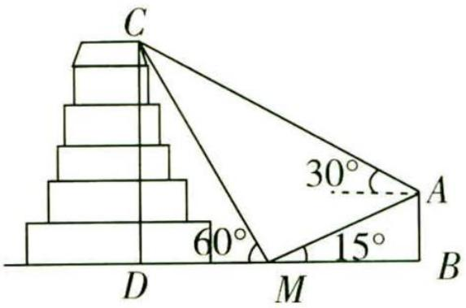

text_image

C
30°
A
60°
15°
D
M
B

图1

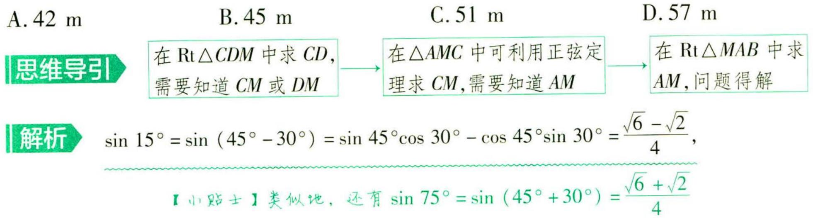

text_image

A. 42 m
B. 45 m
C. 51 m
D. 57 m
思维导引 在 Rt△CDM 中求 CD,
需要知道 CM 或 DM
在△AMC 中可利用正弦定
理求 CM,需要知道 AM
在 Rt△MAB 中求
AM,问题得解
解析 sin 15° = sin (45° - 30°) = sin 45°cos 30° - cos 45°sin 30° = √6 - √2 / 4,
【小贴士】类似地,还有 sin 75° = sin (45° + 30°) = √6 + √2 / 4

在 Rt△MAB 中， $\sin15^{\circ}=\frac{AB}{AM}$ ，故 $AM=\frac{12}{\sqrt{6}-\sqrt{2}}=12(\sqrt{6}+\sqrt{2})(m)$ .

在 $\triangle AMC$ 中， $\angle AMC = 105^{\circ}$ ， $\angle CAM = 45^{\circ}$ ，则 $\angle ACM = 30^{\circ}$ ，

所以由正弦定理得 $\frac{12(\sqrt{6}+\sqrt{2})}{\frac{1}{2}}=\frac{CM}{\frac{\sqrt{2}}{2}}$ ，故 $CM=24(\sqrt{3}+1)$ m.

在Rt△CDM中， $\sin60^{\circ}=\frac{CD}{CM}$ ，故 $CD=CM\sin60^{\circ}=24(\sqrt{3}+1)\times\frac{\sqrt{3}}{2}=12(3+\sqrt{3})\approx57(m)$ .

【通一类】绝大多数的建筑物高度测量问题需要利用解三角形求解,因此这类题可以不断在题干图形中 “圆三角形”, 利用直角三角形或者正、余弦定理求解即可

即该楼阁的高度约为 57 m.

答案 D

调研 6 (2023·江西赣州五校期中联考/植物生长中的数学规律)在西双版纳热带植物园中有一种原产于美洲热带雨林的时钟花,其花开花谢非常有规律.研究表明,时钟花开花规律与温度密切相关,时钟花开花所需要的温度约为20℃,但当气温上升到31℃时,时钟花基本都会凋谢.已知某景区有时钟花观花区,且观花区每天6时\~14时的气温T(单位:℃)与时间t(单位:时,6时对应t=6)近似满足函数关系式T=25+10sin( $\frac{\pi}{8}t+\frac{3\pi}{4}$ ),则每天在6时\~14时期间,观花的最佳时段约为(参考数据:sin $\frac{\pi}{5}$ ≈0.6.假设在花期内,时钟花每天开闭一次) ( )

A.6.7时\~11.6时

B.6.7时\~12.2时

C. 8.7 时 \~11.6 时

D.8.7时\~12.2时

由自守函数构成的解析函数的单值化(未解决) 它涉及黎曼曲面论,1907年P.克伯获重要突破,其他方面尚未解决.

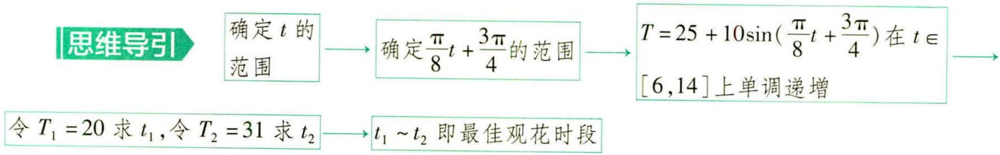

flowchart

```mermaid
graph LR
    A["确定 t 的范围"] --> B["确定 π/8 t + 3π/4 的范围"]
    B --> C["T = 25 + 10 sin(π/8 t + 3π/4) 在 t ∈ [6,14"] 上单调递增]
    D["令 T₁ = 20 求 t₁, 令 T₂ = 31 求 t₂"] --> E["t₁ ~ t₂ 即最佳观花时段"]
```

解析 当 $t \in [6, 14]$ 时, $\frac{\pi}{8} t + \frac{3\pi}{4} \in [\frac{3\pi}{2}, \frac{5\pi}{2}]$ ,

【指点迷津】研究函数 $y = A \sin(\omega x + \varphi) (A, \omega, \varphi$ 为参数) 的性质时可将 $\omega x + \varphi$ 视为一个整体，利用整体换元进行解题

则 $T=25+10\sin\left(\frac{\pi}{8}t+\frac{3\pi}{4}\right)$ 在 $t\in[6,14]$ 上单调递增.

设花开、花谢的时间分别为 $t_{1}, t_{2} (t_{1}, t_{2} \in [6, 14])$ .

令 $T_{1}=20$ , 得 $\sin\left(\frac{\pi}{8}t_{1}+\frac{3\pi}{4}\right)=-0.5$ , 即 $\frac{\pi}{8}t_{1}+\frac{3\pi}{4}=\frac{11\pi}{6}$ , 解得 $t_{1}=\frac{26}{3}\approx8.7$

令 $T_{2} = 31$ ，得 $\sin (\frac{\pi}{8} t_2 + \frac{3\pi}{4}) = 0.6\approx \sin \frac{\pi}{5}$ 即 $\frac{\pi}{8} t_2 + \frac{3\pi}{4}\approx \frac{11\pi}{5}$ 解得 $t_2\approx 11.6.$

故每天在6时\~14时期间,观花的最佳时段约为8.7时\~11.6时.

答案 C

调研 7 (2023 · 福建福州格致中学期中/《麦田里的守望者》)“我将来要当一名麦田里的守望者,有那么一群孩子在一大块麦田里玩. 几千几万的小孩子,附近没有一个大人,我是说——除了我.”《麦田里的守望者》中的主人公霍尔顿将自己的精神生活寄托于那广阔的麦田. 假设霍尔顿在一块形状近似平面四边形 ABCD 的

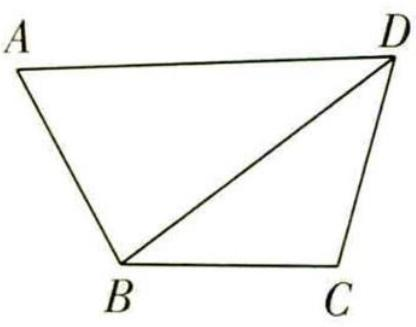

text_image

A
B
C
D

图2

麦田里成为守望者,麦田如图2所示,为了分割麦田,他将B,D连接,经测量知AB= $BC=CD=\sqrt{6},AD=3\sqrt{2}$ .

(1)霍尔顿发现无论 BD 多长, $\sqrt{3}\cos A-\cos C$ 都为一个定值,请你证明霍尔顿的结论,并求出这个定值.  
(2)霍尔顿发现小麦的生长和发育与分割土地面积的平方和呈正相关关系,记 $\triangle ABD$ 与 $\triangle CBD$ 的面积分别为 $S_{1}$ 和 $S_{2}$ ,为了更好地规划麦田,请你帮助霍尔顿求出 $S_{1}^{2}+S_{2}^{2}$ 的最大值.

flowchart

```mermaid
graph LR
    A["思维导引"] --> B["(1) 在△ABD 中利用余弦定理表示出 BD"]
    B --> C["在△CBD 中利用余弦定理表示出 BD"]
    C --> D["列方程即可得解"]
```

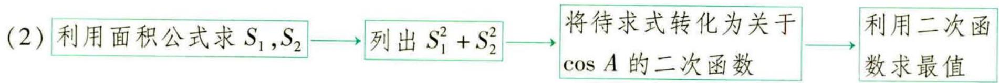

flowchart

```mermaid
graph LR
    A["利用面积公式求 S₁, S₂"] --> B["列出 S₁² + S₂²"]
    B --> C["将待求式转化为关于 cos A 的二次函数"]
    C --> D["利用二次函数求最值"]
```

解析 (1) 在 $\triangle ABD$ 中, 由余弦定理得 $BD^{2} = AD^{2} + AB^{2} - 2AD \cdot AB \cos A$ ,

变分法的进一步发展(未解决) 这并不是一个明确的数学问题,只是谈了对变分法的一般看法.20世纪以来变分法有了很大的发展.

即 $BD^{2}=18+6-2\times3\sqrt{2}\times\sqrt{6}\cos A=24-12\sqrt{3}\cos A.$

在 $\triangle CBD$ 中,同样由余弦定理得 $BD^{2}=CD^{2}+BC^{2}-2CD\cdot BC\cos C$ ,

即 $BD^{2}=6+6-2\times\sqrt{6}\times\sqrt{6}\cos C=12-12\cos C.$

因此 $24 - 12\sqrt{3}\cos A = 12 - 12\cos C$ ，即 $2 - \sqrt{3}\cos A = 1 - \cos C,$

所以 $\sqrt{3}\cos A-\cos C=1.$

即无论 ${BD}$ 多长, $\sqrt{3}\cos A - \cos C$ 都为一个定值,且定值为 1.

【独具慧眼】本题背景长、设问新,但是给的图形暴露了真正考查的知识点,有三角形、有很多条已知边、设问提到的 ${BD}$ 是两个三角形的公共边,那么除了余弦定理,没有第二选择

(2) $S_{1}=\frac{1}{2}AD\times AB\sin A=\frac{1}{2}\times3\sqrt{2}\times\sqrt{6}\sin A=3\sqrt{3}\sin A,$

$$
S _ {2} = \frac {1}{2} B C \times C D \sin C = \frac {1}{2} \times \sqrt {6} \times \sqrt {6} \sin C = 3 \sin C,
$$

于是 $S_{1}^{2} + S_{2}^{2} = 27\sin^{2}A + 9\sin^{2}C = 36 - 27\cos^{2}A - 9\cos^{2}C.$

由(1)知 $\cos C=\sqrt{3}\cos A-1$ ,

【联系上下文】第(1)问往往是第(2)问的铺垫，所以在第(2)问别忘记使用第(1)间的结论

因此 $S_{1}^{2} + S_{2}^{2} = 36 - 27\cos^{2}A - 9(\sqrt{3}\cos A - 1)^{2} = -54\cos^{2}A + 18\sqrt{3}\cos A + 27 =$ $-54(\cos A - \frac{\sqrt{3}}{6})^{2} + \frac{63}{2}.$

在 $\triangle ABD$ 中, $3\sqrt{2} - \sqrt{6} < BD < 3\sqrt{2} + \sqrt{6}$ ,

在 $\triangle CBD$ 中, $0 < BD < 2\sqrt{6}$ , 则 $3\sqrt{2} - \sqrt{6} < BD < 2\sqrt{6}$ ,

由 $BD^{2}=24-12\sqrt{3}\cos A$ , 得 $\cos A=\frac{24-BD^{2}}{12\sqrt{3}}$ , 即有 $0<\cos A<1$

【易遗漏】函数的实际应用问题中一定要注意自变量的取值范围

从而当 $\cos A = \frac{\sqrt{3}}{6}$ 时, $S_{1}^{2} + S_{2}^{2}$ 最大, 为 $\frac{63}{2}$ , 所以 $S_{1}^{2} + S_{2}^{2}$ 的最大值是 $\frac{63}{2}$ .

# 载体 4 取材教材改编

调研 8 (改编自人教 A 版《必修第二册》第 202 页例 2)为了弘扬体育精神,学校组织秋季运动会,在一项比赛中,学生甲进行了 8 组投篮,得分分别为 10,8,a,8,7,9,6,8,如果学生甲的平均得分为 8 分,那么这组数据的第 75 百分位数为 ( )

A. 8

B. 9

C. 8.5

D. 9.5

2022年卡塔尔世界杯是第22届国际足联世界杯,该届赛事于2022年11月20日至12月18日在卡塔尔境内8座球场举行,是历史上首次在卡塔尔和中东国家境内举行、第二次在亚洲举行的世界杯足球赛.

解析 由题意可得 $\frac{10 + 8 + a + 8 + 7 + 9 + 6 + 8}{8} = 8$ ，解得 $a = 8$

将这组数据按从小到大的顺序排列,即6,7,8,8,8,8,9,10.

因为 $8 \times 75\% = 6$ ，为整数，所以这组数据的第 75 百分位数为 $\frac{8 + 9}{2} = 8.5$ ，故选 C.

【提醒】求得整数6时,不意味着第6个数据就是第75百分位数,第6个数据和第7个数据的算术平均数才是第75百分位数

答案 C

调研 9 (改编自人教 A 版《必修第一册》第 45 页探究/无字证明)(多选)《几何原本》中的几何代数法是以几何方法研究代数问题,这种方法是数学家处理问题的重要依据,很多代数公理、定理都可以根据这一原理实现证明,也称为“无字证明”.如图 3 所示,AB 是圆 O 的直径,点 O 为圆心,点 C 是线段 AB 上的一点,且 AC = m,BC = n. 过点 C 作垂直于 AB 的弦 DE,连接 AD,BD,OD,过点 C 作 CF 垂直 OD 于点 F, 则根据该图形我们可以完成的无字证明有 ( )

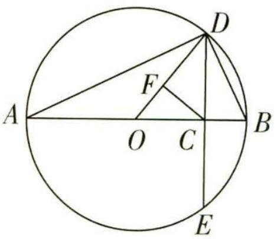

text_image

A
O
C
B
D
F
E

图 3

A. $m^{2} + n^{2} \geqslant 2mn (m > 0, n > 0)$

B. $\sqrt{mn} \leqslant \frac{m + n}{2} (m > 0, n > 0)$

C. $\frac{m^2 + n^2}{2} \geqslant \left(\frac{m + n}{2}\right)^2 (m > 0, n > 0)$

D. $\sqrt{mn} \geqslant \frac{2}{\frac{1}{m} + \frac{1}{n}} (m > 0, n > 0)$

解析 在给定的图中没有表示 $m^{2} + n^{2}$ 的几何量, 即 A, C 不能根据给定图形完成无字证明.

【易错提醒】虽然给出的四个选项都是正确的不等式，但是有些不等式不能直接根据已给图形进行证明，而是需要变形和推证，这种情况下并不属于根据给定图形完成无字证明

对于 B, $AC + BC = m + n$ , $AD \perp BD$ , 由直角三角形中的射影定理得 $CD^{2} = AC \cdot BC = mn$ , 则 $CD = \sqrt{mn}$ . 由圆的任意弦的长度不大于直径, 得 $DE \leqslant AB$ , 而 $CD = \frac{1}{2}DE$ , 于是得 $CD \leqslant \frac{1}{2}AB$ , 即 $\sqrt{mn} \leqslant \frac{m + n}{2}(m > 0, n > 0)$ , B 能完成无字证明.

对于 D, $CF \perp OD$ , $OC \perp CD$ , 由直角三角形中的射影定理得 $CD^{2} = DF \cdot OD$ , 所以 $DF = \frac{CD^{2}}{OD} = \frac{mn}{\frac{m+n}{2}} = \frac{2}{\frac{1}{m} + \frac{1}{n}}$ , 又 $CD \geqslant DF$ , 那么 $\sqrt{mn} \geqslant \frac{2}{\frac{1}{m} + \frac{1}{n}} (m > 0, n > 0)$ , D 能完成无字证明.

答案 BD

卡塔尔世界杯是首次在北半球冬季举行、首次由从未进过世界杯决赛圈的国家举办 的世界杯足球赛. 该届赛事有 32 支球队参加. 最终阿根廷队捧起大力神杯, 法国队和克罗 地亚队分获亚军和季军.

关注微信公众号“初高教辅站”获取更多初高中教辅资料

调研 10 (改编自人教 A 版《必修第一册》第 87 页第 13 题)(多选)我们知道,函数 $y = f(x)$ 的图象关于坐标原点成中心对称图形的充要条件是函数 $y = f(x)$ 为奇函数.有同学发现可以将其推广为:函数 $y = f(x)$ 的图象关于点 $P(a,b)$ 成中心对称图形的充要条件是函数 $y = f(x + a) - b$ 为奇函数.现已知函数 $f(x) = ax + \frac{1}{x - 1} + a$ ,则下列说法正确的是()

A. 函数 $y=f(x+1)-2a$ 为奇函数  
B. 当 a > 0 时, $f(x)$ 在 $(1, +\infty)$ 上单调递增  
C. 若方程 $f(x)=0$ 有实根, 则 $a\in(-\infty,0)\cup[1,+\infty)$

D. 设定义域为 R 的函数 $g(x)$ 的图象关于 $(1,1)$ 中心对称, 若 $a=\frac{1}{2}$ , 且 $f(x)$ 与 $g(x)$ 的图象共有 2022 个交点, 记为 $A_{i}(x_{i},y_{i})(i=1,2,\cdots,2022)$ , 则 $(x_{1}+y_{1})+(x_{2}+y_{2})+\cdots+(x_{2022}+y_{2022})$ 的值为 4044

解析 对于 A, $f(x+1)-2a=a(x+1)+\frac{1}{x+1-1}+a-2a=ax+\frac{1}{x}$ ，由该解析式可知 y= $ax+\frac{1}{x}$ 是奇函数，故 A 正确.

对于 B, 取两个值验证, $f(\frac{3}{2}) = \frac{3}{2}a + \frac{1}{\frac{3}{2} - 1} + a = \frac{5}{2}a + 2$ , $f(2) = 2a + \frac{1}{2 - 1} + a = 3a + 1$ , 所以 $f(\frac{3}{2})-f(2)=1-\frac{a}{2}$ ，若0<a<2，则 $f(\frac{3}{2})>f(2)$ ，此时 $f(x)$ 在 $(1,+\infty)$ 上不单调递增，故B错误.

对于 C, 令 $f(x) = ax + \frac{1}{x - 1} + a = 0$ , 当 x = -1 时, $f(x) \neq 0$ , 当 $x \neq -1$ 时, 分离参数可得 $a = \frac{1}{1 - x^{2}}$ , 而

【指点迷津】方程有实根即对应的参数存在，本题 a 的系数结构简单，可以轻松完成分离参数，因此直接分析函数 $y = \frac{1}{1 - x^{2}}$ 的值域即可。如果不容易分离参数，那么往往需要把合 a 的式子放在一边，不含 a 的式子放在另一边，分别构造函数，根据两个函数对应的图象有交点求解 $(1 - x^{2}) \in (-\infty, 0) \cup (0, 1]$ ，故 $\frac{1}{1 - x^{2}} \in (-\infty, 0) \cup [1, +\infty)$ ，即 $a \in (-\infty, 0) \cup [1, +\infty)$ ，故 C 正确。

对于 D, 由 A 可知, $y = f(x + 1) - 2a$ 为奇函数. 由题意知, $f(x)$ 的图象关于 $(1, 2a)$ 成中心对称图形, 也就是说, 当 $a = \frac{1}{2}$ 时, $f(x)$ 的图象关于 $(1, 1)$ 中心对称, 又 $g(x)$ 的图象关于 $(1, 1)$ 中心对称, 所以这 2022 个交点可以看作 1011 对关于 $(1, 1)$ 对称的点, 故 $(x_{1} + x_{2} + \cdots + x_{2022}) + (y_{1} + y_{2} + \cdots + y_{2022}) = 2022 + 2022 = 4044$ , D 正确.

# 答案 ACD

阿根廷队的梅西获得该届世界杯金球奖；法国队的姆巴佩获得该届世界杯金靴奖；阿根廷队的马丁内斯获得该届世界杯金手套奖；阿根廷队的恩佐·费尔南德斯获得该届世界杯最佳年轻球员奖。

# 串讲核心知识命题热点

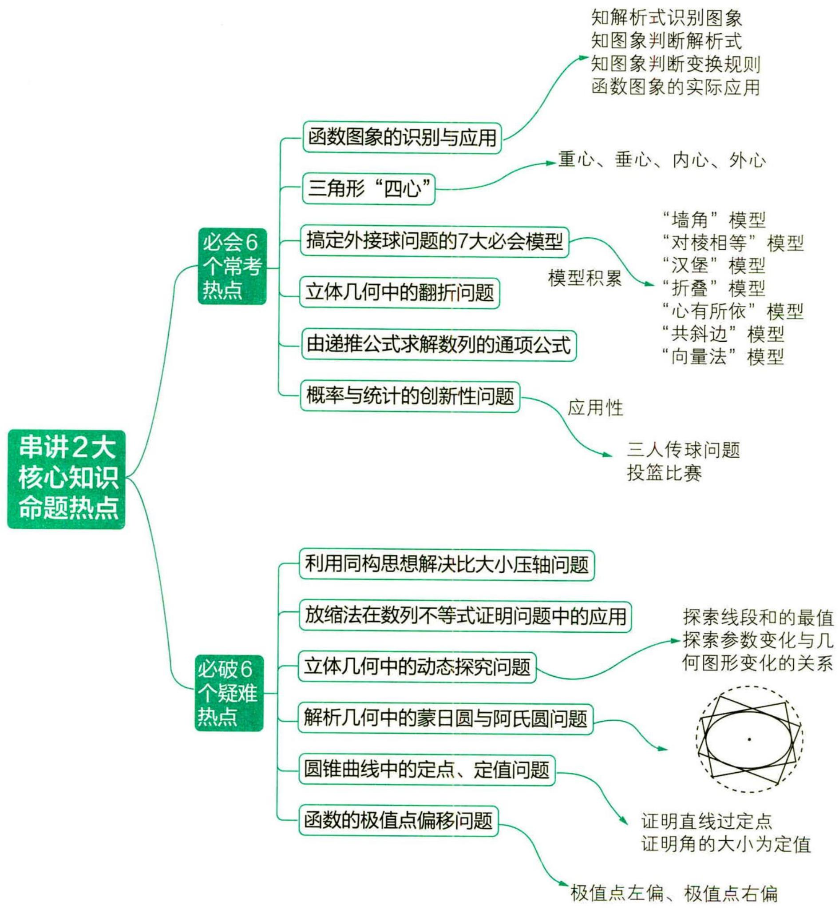

flowchart

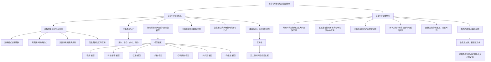
```mermaid
graph TD
    A["串讲2大核心知识命题热点"] --> B["必会6个常考热点"]
    A --> C["必破6个疑难热点"]
    B --> D["函数图象的识别与应用"]
    B --> E["三角形“四心”"]
    B --> F["搞定外接球问题的7大必会模型"]
    B --> G["立体几何中的翻折问题"]
    B --> H["由递推公式求解数列的通项公式"]
    B --> I["概率与统计的创新性问题"]
    D --> J["知解析式识别图象"]
    D --> K["知图象判断解析式"]
    D --> L["知图象判断变换规则"]
    D --> M["函数图象的实际应用"]
    E --> N["重心、垂心、内心、外心"]
    F --> O["模型积累"]
    O --> P["“墙角”模型"]
    O --> Q["“对棱相等”模型"]
    O --> R["“汉堡”模型"]
    O --> S["“折叠”模型"]
    O --> T["“心有所依”模型"]
    O --> U["“共斜边”模型"]
    O --> V["“向量法”模型"]
    I --> W["应用性"]
    W --> X["三人传球问题投篮比赛"]
    C --> Y["利用同构思想解决比大小压轴问题"]
    C --> Z["放缩法在数列不等式证明问题中的应用"]
    C --> AA["立体几何中的动态探究问题"]
    C --> AB["解析几何中的蒙日圆与阿氏圆问题"]
    C --> AC["圆锥曲线中的定点、定值问题"]
    C --> AD["函数的极值点偏移问题"]
    AD --> AE["极值点左偏、极值点右偏"]
    AE --> AF["证明直线过定点证明角的大小为定值"]
```

最早的足球衫是没有背号的. 在世界杯舞台上, 球衣有明确的编号始于 1954 年的瑞士世界杯.

# 热点 1 必会常考热点

# 特约名师

# 汤小梅

中学高级教师,福建省教育学院高中名师工作室成员,曾获“福州市先进教育工作者”“福州市中学骨干教师”“福清十佳学科带头人”等荣誉称号,在《数学通讯》《福建中学数学》《海峡教育报》等 CN 类刊物上发表两百多篇论文,参加编写并出版的教辅书达六十多本.

# 角度1 函数图象的识别与应用问题

# 1. 知函数的解析式判断函数图象

调研 1 (2023·广东韶关 11 月综合测试) 函数 $f(x) = \frac{3^{-x} - 3^x}{x^4 + 1}$ 的部分图象大致是

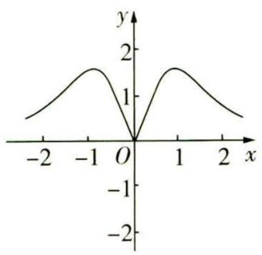

line

| x   | y    |
| --- | ---- |
| -2  | ~0.8 |
| -1  | ~1.5 |
| 0   | 0    |
| 1   | ~1.5 |
| 2   | ~0.8 |

A

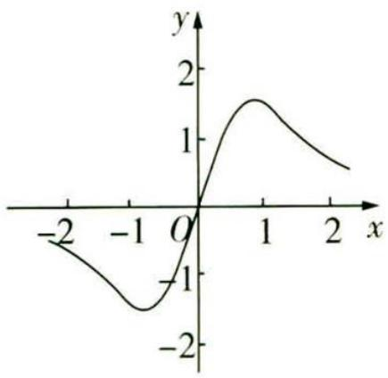

line

| x   | y    |
| --- | ---- |
| -2  | -2.0 |
| -1  | -1.0 |
| 0   | 0.0  |
| 1   | 1.5  |
| 2   | 0.5  |

B

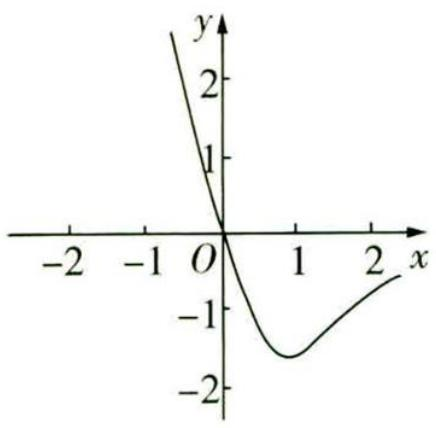

line

| x   | y   |
| --- | --- |
| 0   | 0   |
| 1   | -1.5 |
| 2   | 0   |

C

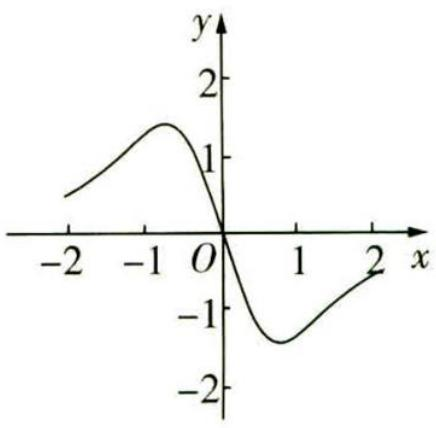

line

| x   | y    |
| --- | ---- |
| -2  | 0.5  |
| -1  | 1.5  |
| 0   | 0    |
| 1   | -1.5 |
| 2   | -0.5 |

D

思维导引 思路一: 判断函数 $f(x)$ 的奇偶性 → 排除不符合的选项 → 取特殊值 →
排除不符合的选项 → 正确的选项

思路二: 观察各选项的图象 $\rightarrow$ 计算 $f(1), f(-1)$ $\rightarrow$ 排除不符合的选项 $\rightarrow$ 正确的选项

解析 方法一 因为 $f(x)$ 的定义域为R,且 $f(-x)=\frac{3^{-(-x)}-3^{-x}}{x^{4}+1}=\frac{3^{x}-3^{-x}}{x^{4}+1}=-\frac{3^{-x}-3^{x}}{x^{4}+1}=-f(x)$ ,

【警示】判断函数的奇偶性，注意定义域优先意识

所以函数 $f(x)$ 是奇函数, 排除 AC; $f(1)=\frac{3^{-1}-3}{1^{4}+1}=-\frac{4}{3}<0$ , 排除 B. 选 D.

方法二 由 $f(1)=\frac{3^{-1}-3}{1^{4}+1}=-\frac{4}{3}<0$ ，排除AB； $f(-1)=\frac{3-3^{-1}}{(-1)^{4}+1}=\frac{4}{3}$ ，选项C中， $f(-1)>2$ ，

【会观察】先观察选项 CD 中图象的不同之处，有针对性地取特值

排除 C. 选 D.

答案 D

早期足球,阵型比较固定,球衣号码根据阵型依次排列.原则上,1\~6号是防守者(后卫),7\~11号则是攻击者(前锋),中场位置是后来才发展的.

调研 2 (2023·广州11月调研) 函数 $f(x)=\frac{\sin x}{e^{|x|}}$ 在 $[-π,π]$ 上的大致图象为 ( )

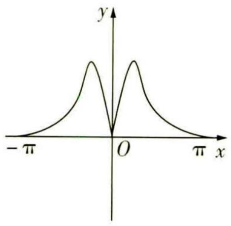

text_image

-π
O
π x
y

A

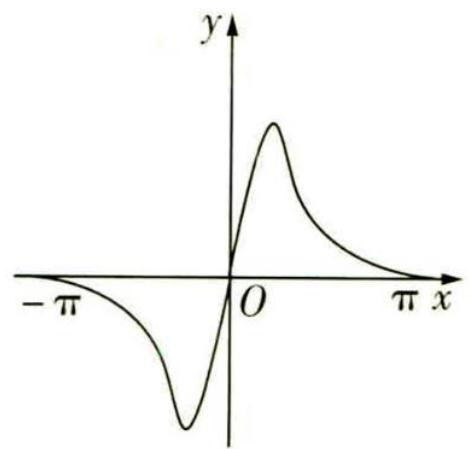

text_image

-π
O
π x
y

B

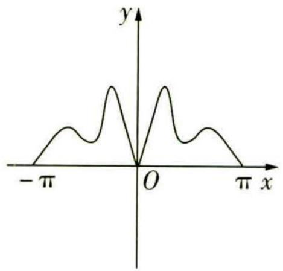

text_image

-π
O
π x
y

C

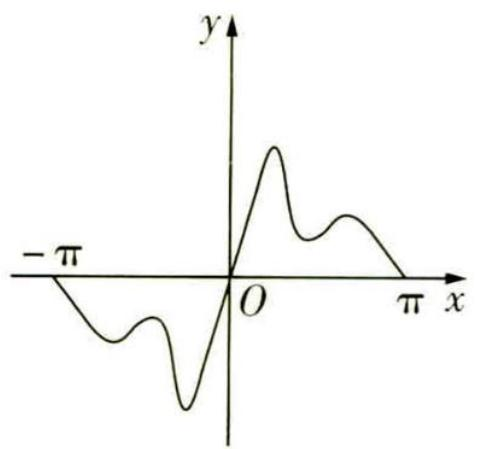

text_image

-π
O
π x
y

D

解析 对任意的 $x \in [-\pi, \pi]$ , $f(-x) = \frac{\sin(-x)}{e^{|-x|}} = -\frac{\sin x}{e^{|x|}} = -f(x)$ , 排除 AC.

【记结论】奇函数的图象关于原点对称

当 $0 \leqslant x \leqslant \pi$ 时, $f(x) = \frac{\sin x}{\mathrm{e}^x}$ , 则 $f'(x) = \frac{\cos x - \sin x}{\mathrm{e}^x} = -\frac{\sqrt{2}\sin\left(x - \frac{\pi}{4}\right)}{\mathrm{e}^x}$ ,

【易错提醒】注意导数的除法运算法则与导数的乘法运算法则的区别,不要混淆

因为 $-\frac{\pi}{4} \leqslant x - \frac{\pi}{4} \leqslant \frac{3\pi}{4}$ ，则由 $f'(x) < 0$ 可得 $0 < x - \frac{\pi}{4} \leqslant \frac{3\pi}{4}$ ，则 $\frac{\pi}{4} < x \leqslant \pi$ ，由 $f'(x) > 0$ 可得 $-\frac{\pi}{4} \leqslant x - \frac{\pi}{4} < 0$ ，则 $0 \leqslant x < \frac{\pi}{4}$ ，所以函数 $f(x)$ 在 $[0, \frac{\pi}{4})$ 上单调递增，在 $(\frac{\pi}{4}, \pi]$ 上单调递减，排除 D. 选 B.

【另解】此处还可以利用 $f'(x)=0(0<x<\pi)$ 的根的个数为1，排除D

# 答案 B

# 得分秘籍

破解此类判断函数图象题的技巧: 一是利用函数的解析式, 判断函数的奇偶性, 再根据函数图象的对称性, 排除不符合的选项; 二是选用特值法或在某区间上的函数值的符号或极限思想, 排除不符合的选项; 三是利用导数法, 当不能利用基本初等函数的单调性直接判断所给的函数的单调性时, 常利用导数判断函数的单调性, 从而排除不符合的选项.

# 2. 知函数的图象判断函数的解析式

调研 3 (2023·哈师大附中11月期中)已知函数 $f(x)$ 的图象如图1所示,则该函数的解析式为()

A. $f(x) = \frac{x^2}{\mathrm{e}^x + \mathrm{e}^{-x}}$

B. $f(x) = \frac{\mathrm{e}^x + \mathrm{e}^{-x}}{x^3}$

C. $f(x) = \frac{x^2}{\mathrm{e}^x - \mathrm{e}^{-x}}$

D. $f(x) = \frac{\mathrm{e}^x + \mathrm{e}^{-x}}{x^2}$

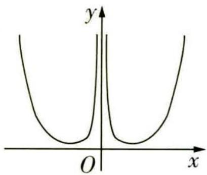

text_image

y
O
x

图1

数字技术运用于足球,早已不是新鲜事.在竞技体育运动中,数据分析工具和可视化工具一直受到体育行业各方的关注和青睐.

思维导引 思路一: 根据函数图象判断 $f(x)$ 的定义域 → 由图象的对称性判断 $f(x)$ 的奇偶性
确定各选项中函数 $f(x)$ 的定义域及其奇偶性 $\xrightarrow{排除法}$ 正确的选项

思路二: 观察图象和选项中的函数解析式 $\rightarrow$ 计算 $f(0)$ $\rightarrow$ 排除不符合的选项 $\rightarrow$ 判断 $f(-1)$ 的符号 $\rightarrow$ 排除不符合的选项 $\rightarrow$ 正确的选项

解析 方法一 由题图知 $f(x)$ 的定义域为 $(-∞,0)∪(0,+∞)$ ，排除 A. 对于选项 B，当 $f(x)=\frac{e^{x}+e^{-x}}{x^{3}}$ 时， $f(-x)=\frac{e^{-x}+e^{x}}{(-x)^{3}}=-\frac{e^{-x}+e^{x}}{x^{3}}=-f(x)$ ，故 $f(x)=\frac{e^{x}+e^{-x}}{x^{3}}$ 是奇函数，排除 B. 对于选项 C，当 $f(x)=\frac{x^{2}}{e^{x}-e^{-x}}$ 时， $f(-x)=\frac{(-x)^{2}}{e^{-x}-e^{x}}=-\frac{x^{2}}{e^{x}-e^{-x}}=-f(x)$ ，故 $f(x)=\frac{x^{2}}{e^{x}-e^{-x}}$ 是奇函数，排除 C. 选 D.

方法二 对于选项 A, $f(0)=0$ , 题中图象不经过原点, 排除 A. 对于选项 B, $f(-1)=-\left(\mathrm{e}^{-1}+\right.$ e) <0 , 排除 B. 对于选项 C, $f(-1)=\frac{1}{\mathrm{e}^{-1}-\mathrm{e}}<0$ , 排除 C. 选 D.

【会观察】观察已知图象的特征，结合各选项中函数的解析式取特值验证

答案 D

# 3. 知函数的图象判断函数的图象变换

调研 4 (2023·重庆11月调研)已知函数 $f(x)$ 的图象如图2所示,则图3所表示的函数是 ( )

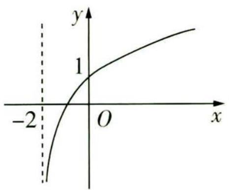

line

| x  | y  |
|----|----|
| -2 | -2 |
| 0  | 1  |

图 2

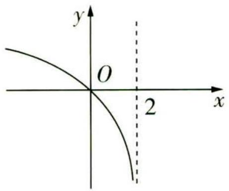

text_image

y
O
2
x

图 3

A. $1 - f(x)$

B. $- f\left( {2 - x}\right)$

C. $f(-x) - 1$

D. $1 - f(-x)$

解析 由题图知,将 $f\left( x\right)$ 的图象关于 $y$ 轴对称后再向下平移 1 个单位长度即得图 3,

【警示】此处易误以为是将 $f(x)$ 的图象关于y轴对称后再向左平移1个单位长度

又将 $f\left( x\right)$ 的图象关于 $y$ 轴对称后可得函数 $y = f\left( -x\right)$ 的图象,再向下平移 1 个单位,可得 $y = f\left( {-x}\right)  - 1$ 的图象,所以图象所表示的函数为 $y = f\left( {-x}\right)  - 1$ ,故选C.

【记口诀】“左加右减、上加下减”

答案 C

本次世界杯使用了半自动越位识别系统(SAOT). 数字技术的辅助判罚只是为了尽可能减少误判, 精准保障赛事的公平性.

# 4. 根据实际情况判断函数的图象

调研 5 (2023·北京人大附中11月统练)某无人机飞行时,从某时刻开始15分钟内的速度 $V(x)$ (单位:米/分)与时间 $x$ (单位:分)的关系如图4. 若定义“速度差函数” $v(x)$ 为无人机在时间段 $[0, x]$ 内的最大速度与最小速度的差,则 $v(x)$ 的图象为

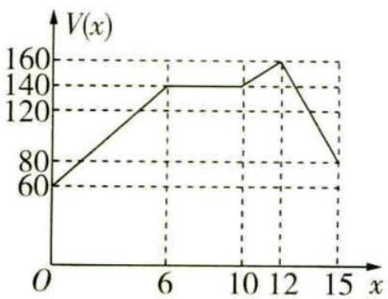

line

| x  | V(x) |
|----|------|
| 0  | 60   |
| 6  | 140  |
| 12 | 160  |
| 15 | 80   |

图4  
( )

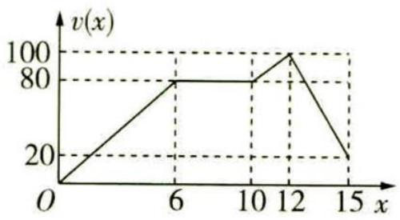

line

| x  | v(x) |
|----|------|
| 0  | 0    |
| 6  | 80   |
| 12 | 100  |
| 15 | 20   |

A

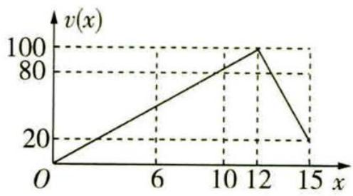

line

| x  | v(x) |
|----|------|
| 0  | 0    |
| 6  | 20   |
| 12 | 100  |
| 15 | 20   |

B

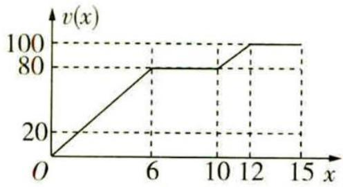

line

| x  | v(x) |
|----|------|
| 0  | 0    |
| 6  | 80   |
| 12 | 100  |
| 15 | 100  |

C

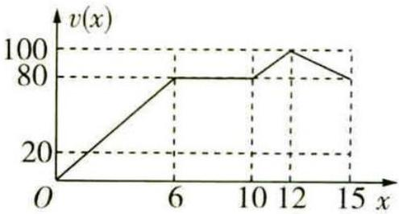

line

| x | v(x) |
|---|---|
| 0 | 0 |
| 6 | 80 |
| 10 | 80 |
| 12 | 100 |
| 15 | 80 |

D

# 思维导引

思路一: “速度差函数”的定义 → 对自变量分 $x \in [0,6)$ , $x \in [6,10)$ , $x \in [10,12)$ , $x \in [12,15]$ 四种情况研究

分别求出各段的函数解析式 $\rightarrow$ 正确选项

思路二: “速度差函数”的定义 $\rightarrow v(6), v(15) \rightarrow$ 排除不符合的选项 $\rightarrow$ 正确选项

解析 方法一 由题意可得, 当 $x \in  \left\lbrack  {0,6}\right)$ 时,无人机做匀加速运动, $V\left( x\right)  = {60} + \frac{40}{3}x$ ,   “速度差函

【易忽视】注意各段自变量的取值范围

数” $v(x)=\frac{40}{3}x$ ; 当 $x\in[6,10)$ 时, 无人机做匀速运动, $V(x)=140$ , “速度差函数” $v(x)=80$ ; 当 $x\in[10,$ 【题眼】“速度差函数” $v(x)$ 为无人机在时间段 $[0,x]$ 内的最大速度与最小速度的差

12)时,无人机做匀加速运动, $V(x)=10x+40$ ,“速度差函数” $v(x)=10x-20$ ;当 $x\in[12,15]$ 时,无人机做匀减速运动, $V(x)=-\frac{80}{3}x+480$ ,“速度差函数” $v(x)=160-60=100$ .

选项 C 中的图象满足“速度差函数” $v(x)$ 的解析式, 故选 C.

方法二 根据“速度差函数” $v(x)$ 的定义,得 $v(6)=140-60=80$ ,排除B; $v(15)=160-60=100$ ,

【小妙招】取特殊值，利用排除法求解

排除 AD. 选 C.

【解后反思】方法二比方法一的思路简捷,通过判断特殊位置,如“中点”“端点”“极限位 置”等,达到快速排除干扰项的功效,但方法一是破解此类题的通法,通过求出分段函数的解析式,由分段函数的解析式判断图象的特征,从而选出正确的选项

# 答案 C

SAOT 由两个方面构成,一是在足球内部安装了一个传感器,该传感器向外界传送数据,让系统能够实时确定足球的精确位置.

# 角度2 三角形“四心”问题

# 1. 以平面向量为背景的三角形“四心”问题

调研 6 (2023·浙江名校协作体10月联考)(多选)下列说法中,正确的是()

A. 若 $a \cdot b > 0$ ，则 a 与 b 的夹角为锐角  
B. 若 O 是 $\triangle ABC$ 的内心, 且满足 $2\overrightarrow{OA} + 3\overrightarrow{OB} + 4\overrightarrow{OC} = 0$ , 则这个三角形一定是锐角三角形  
C. 在 $\triangle ABC$ 中, 若 $\overrightarrow{NA} + \overrightarrow{NB} + \overrightarrow{NC} = 0$ , 则 $N$ 为 $\triangle ABC$ 的重心  
D. 在 $\triangle ABC$ 中, 若 $\overrightarrow{PA} \cdot \overrightarrow{PB} = \overrightarrow{PB} \cdot \overrightarrow{PC} = \overrightarrow{PA} \cdot \overrightarrow{PC}$ , 则 $P$ 为 $\triangle ABC$ 的垂心

思维导引
利用数量积的定义判断 A → O 是△ABC 的内心时, $S_{A} \overrightarrow{OA} + S_{B} \overrightarrow{OB} + S_{C} \overrightarrow{OC} = 0$ 结合余弦定理判断 B → 由向量的线性运算证明 N 为 △ABC 的重心 → 判断 C → 用向量数量积的运算法则判断向量是否垂直 → P 是 △ABC 的垂心 → 判断 D

解析 当 a, b 同向时, $a \cdot b > 0$ , A 错误.

【小妙招】举反例，排除选项A

如图 5, O 是 $\triangle ABC$ 的内心, 延长 AO 交 BC 于点 D, 设 $S_{\triangle OBC} = S_{A}$ ,

【小提示】三角形的内心为其三条内角平分线的交点

$$
S _ {\triangle O A B} = S _ {C}, S _ {\triangle O A C} = S _ {B}, \text {所以} \frac {B D}{C D} = \frac {S _ {\triangle A B D}}{S _ {\triangle A C D}} = \frac {S _ {\triangle O B D}}{S _ {\triangle O C D}} = \frac {S _ {\triangle A B D} - S _ {\triangle O B D}}{S _ {\triangle A C D} - S _ {\triangle O C D}} = \frac {S _ {C}}{S _ {B}},
$$

【记结论】 $\frac{a}{b}=\frac{c}{d}=\frac{a-c}{b-d}=\frac{a+c}{b+d}(b\neq\pm d)$

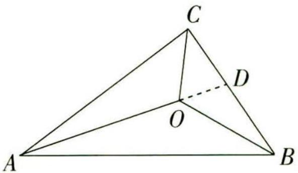

text_image

C
D
O
A
B

图5

$\overrightarrow{OD} = \overrightarrow{OB} + \overrightarrow{BD} = \overrightarrow{OB} + \frac{BD}{BC}\overrightarrow{BC} = \overrightarrow{OB} + \frac{BD}{BC} (\overrightarrow{OC} - \overrightarrow{OB}) = \frac{CD}{BC}\overrightarrow{OB} + \frac{BD}{BC}\overrightarrow{OC} = \frac{S_B}{S_B + S_C}\overrightarrow{OB} + \frac{S_C}{S_B + S_C}\overrightarrow{OC}$ , 又 $\frac{OD}{OA} = \frac{S_{\triangle BOD}}{S_{\triangle BOA}} = \frac{S_{\triangle COD}}{S_{\triangle COA}} = \frac{S_{\triangle BOD} + S_{\triangle COD}}{S_{\triangle BOA} + S_{\triangle COA}} = \frac{S_A}{S_C + S_B}$ , 所以 $\overrightarrow{OD} = -\frac{S_A}{S_B + S_C}\overrightarrow{OA}$ , 所以 $-\frac{S_A}{S_B + S_C}\overrightarrow{OA} = \frac{S_B}{S_B + S_C}\overrightarrow{OB} + \frac{S_C}{S_B + S_C}\overrightarrow{OC}$ , 所以 $S_A$ $\overrightarrow{OA} + S_B$ $\overrightarrow{OB} + S_C$ $\overrightarrow{OC} = 0$ . 设 $\triangle ABC$ 的内切圆半径为 $r, AB = c, BC = a, CA = b$ , 则 $\frac{1}{2}ra\overrightarrow{OA} + \frac{1}{2}rb\overrightarrow{OB} + \frac{1}{2}rc\overrightarrow{OC} = 0$ , 所以 $a\overrightarrow{OA} + b\overrightarrow{OB} + c\overrightarrow{OC} = 0$ , 若 $2\overrightarrow{OA} + 3\overrightarrow{OB} + 4\overrightarrow{OC} = 0$ , 则 $a:b:c=2:3:4$ , 设 $a=2k, b=3k, c=4k, k>0$ , 则 $\cos\angle ACB = \frac{4k^2+9k^2-16k^2}{2\times2k\times3k} = -\frac{1}{4}<0, \angle ACB$ 为钝角, B 错误.

二是该系统包含安装在球场内的12个跟踪摄像头,不仅可以监控足球的位置,还可以通过追踪每名球员身上的数据点来确定每名球员的实时位置、动作.

如图6,设D是BC的中点,连接ND,则 $\overrightarrow{ND}=\frac{\overrightarrow{NB}+\overrightarrow{NC}}{2}$ ,又 $\overrightarrow{NA}+\overrightarrow{NB}+\overrightarrow{NC}=0$ ,所以 $\overrightarrow{NA}+2\overrightarrow{ND}=0$ ,

【敲黑板】看到中点，要想到利用中点所满足的向量关系式求解

所以 N, D, A 三点共线, 且 AN = 2ND, 所以 N 是 $\triangle ABC$ 的重心, C 正确.

在 $\triangle ABC$ 中,若 $\overrightarrow{PA} \cdot \overrightarrow{PB} = \overrightarrow{PB} \cdot \overrightarrow{PC} = \overrightarrow{PA} \cdot \overrightarrow{PC}$ ,则 $\overrightarrow{PA} \cdot \overrightarrow{PB} - \overrightarrow{PB} \cdot \overrightarrow{PC} = \overrightarrow{PB} \cdot (\overrightarrow{PA} - \overrightarrow{PC}) = \overrightarrow{PB} \cdot \overrightarrow{CA} = 0$ ,所以 $PB \perp AC$ ,同理 $PA \perp BC, PC \perp AB$ ,所以 $P$ 是 $\triangle ABC$ 的垂心,D正确.故选CD.

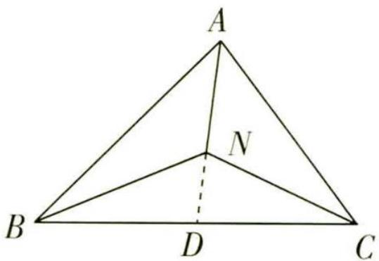

text_image

A
N
B
D
C

图6

答案 CD

# 必记结论

# 三角形“四心”的向量表示

在 $\triangle ABC$ 中，内角A，B，C所对的边分别为a,b,c.

1. 三角形的重心（其三条中线的交点）： $\overrightarrow{OA} + \overrightarrow{OB} + \overrightarrow{OC} = 0 \Leftrightarrow O$ 是 $\triangle ABC$ 的重心.

2. 三角形的垂心（其三条高的交点）： $\overrightarrow{OA} \cdot \overrightarrow{OB} = \overrightarrow{OB} \cdot \overrightarrow{OC} = \overrightarrow{OC} \cdot \overrightarrow{OA} \Leftrightarrow O$ 是 $\triangle ABC$ 的垂心.

3. 三角形的内心（其三条内角平分线的交点）： $a \overrightarrow{OA} + b \overrightarrow{OB} + c \overrightarrow{OC} = 0 \Leftrightarrow O$ 是 $\triangle ABC$ 的内心.

4. 三角形的外心（其三条边的垂直平分线的交点）： $\left|\overrightarrow{OA}\right|=\left|\overrightarrow{OB}\right|=\left|\overrightarrow{OC}\right|\Leftrightarrow O$ 是 $\triangle ABC$ 的外心.

# 2. 以三角形“四心”为背景的解三角形结构不良问题

调研 7 (2023·四川内江 11 月月考) $\triangle ABC$ 的内角 $A, B, C$ 所对的边分别为 $a$ , $b, c, a = 6$ , $b \sin \frac{B + C}{2} = a \sin B$ .

(1) 求角 A.   
(2) $M$ 为 $\triangle ABC$ 内一点, 线段 $AM$ 的延长线交 $BC$ 于点 $D$ , , 求 $\triangle ABC$ 的面积.

在下面三个条件中选择一个作为已知条件补充在横线上,使 $\triangle ABC$ 存在,并解决问题.

①M 为 $\triangle ABC$ 的外心, AM = 4; ②M 为 $\triangle ABC$ 的重心, $AM = 2\sqrt{3}$ ; ③M 为 $\triangle ABC$ 的内心, $AD = 3\sqrt{3}$ .

注:如果选择多个条件分别解答,按第一个解答计分.

解析

(1) $\because b\sin \frac{B + C}{2} = a\sin B, \therefore b\sin \frac{\pi - A}{2} = a\sin B,$ 即 $b\cos \frac{A}{2} = a\sin B,$

【破题点拨】要求有 $A$ , 需利用正弦定理, 化边为角

∴ $\sin B\cos\frac{A}{2}=\sin A\sin B$ ，即 $\sin B\cos\frac{A}{2}=2\sin\frac{A}{2}\cos\frac{A}{2}\sin B$ ，

$$
\because A, B \in (0, \pi), \therefore \sin B > 0, \cos \frac {A}{2} \neq 0,
$$

【易失分】在等式两边同除以 $\sin B \cos \frac{A}{2}$ 时, 需先判断 $\sin B \cos \frac{A}{2}$ 是否为零, 否则会因跳步而失分

足球可以近似看作一个多面体——传统的足球表面是由正五边形和正六边形拼接而成. 其中, 正五边形为黑色皮, 共有 12 块; 正六边形为白色皮, 共有 20 块.

$$
\therefore \sin {\frac {A}{2}} = {\frac {1}{2}}, \text {   又   } {\frac {A}{2}} \in (0, {\frac {\pi}{2}}), \therefore {\frac {A}{2}} = {\frac {\pi}{6}}, \therefore A = {\frac {\pi}{3}}.
$$

(2) 若选条件①.

设 $\triangle ABC$ 外接圆半径为 $R$ , 由正弦定理得 $\frac{a}{\sin \angle BAC} = 2R, \therefore R = \frac{6}{2 \times \frac{\sqrt{3}}{2}} = 2\sqrt{3}$ .

若 M 为 $\triangle ABC$ 的外心, 则 AM 为外接圆半径, $AM = 2\sqrt{3}$ ,

条件①与此矛盾,此时 $\triangle ABC$ 不存在,故不选①.

若选条件②.

∵ M 为 $\triangle ABC$ 的重心, 且 $AM = 2\sqrt{3}$ , ∴ $AD = 3\sqrt{3}$ ,

【记结论】D 为 $\triangle ABC$ 边 BC 的中点，M 为 $\triangle ABC$ 的重心，则 MA:MD = 2:1

又 $\overrightarrow{AD} = \frac{1}{2} (\overrightarrow{AB} +\overrightarrow{AC})$ ，∴ $|\overrightarrow{AD}|^2 = \frac{1}{4} (|\overrightarrow{AB}|^2 +|\overrightarrow{AC}|^2 +2|\overrightarrow{AB} ||\overrightarrow{AC} |\cos \angle BAC)$

即 $27 = \frac{1}{4}(c^{2} + b^{2} + bc)$ （\*），

由余弦定理得 $a^{2}=b^{2}+c^{2}-2bc\cos\angle BAC$ ，即 $36=b^{2}+c^{2}-bc$ （\*\*），

联立 $(*)$ $(* *)$ 可得 b=c=6，此时 $\triangle ABC$ 存在，为正三角形.

$$
\therefore S _ {\triangle A B C} = \frac {1}{2} b c \sin \angle B A C = \frac {1}{2} \times 3 6 \times \frac {\sqrt {3}}{2} = 9 \sqrt {3}.
$$

【技巧点拨】对于三角形面积公式的选用，一般是哪个角已知，就用那个夹角对应的面积公式，本题∠BAC已知，故用 $S_{\triangle ABC}=\frac{1}{2}bc\sin\angle BAC$

若选条件③.

∵ M 为 $\triangle ABC$ 的内心, ∴ $\angle BAD = \angle CAD = \frac{1}{2} \angle BAC = \frac{\pi}{6}$ ,

由 $S_{\triangle ABC}=S_{\triangle ABD}+S_{\triangle ACD}$ 得 $\frac{1}{2}bc\sin\frac{\pi}{3}=\frac{1}{2}c\cdot AD\sin\frac{\pi}{6}+\frac{1}{2}b\cdot AD\sin\frac{\pi}{6}$

【方法点拨】利用等面积法建立关于 a, b, c 的关系式

$\because AD=3\sqrt{3},\therefore\frac{\sqrt{3}}{2}bc=3\sqrt{3}\times\frac{1}{2}(b+c)$ ，即 $b+c=\frac{bc}{3}$

由余弦定理可得 $b^{2} + c^{2} - bc = a^{2} = 36$ ，即 $(b + c)^{2} - 3bc = 36, \therefore \frac{(bc)^{2}}{9} - 3bc - 36 = 0$ ，
即 $(bc+9)(\frac{bc}{9}-4)=0,\because bc>0,\therefore bc=36,\therefore b=c=6$ ,此时 $\triangle ABC$ 存在,为正三角形.

黑色皮周围都是白色皮;每两个相邻的多边形恰好有一条公共边;每个顶点都是三块皮的公共点,且为“一黑二白”.

$$
\therefore S _ {\triangle A B C} = \frac {1}{2} b c \sin \angle B A C = \frac {1}{2} \times 3 6 \times \frac {\sqrt {3}}{2} = 9 \sqrt {3}.
$$

# 3. 以三角形“四心”为背景的平面向量、直线与圆的交汇问题

调研 8 (2023·江西临川一中、南昌二中等校10月联考/欧拉线)著名数学家欧拉提出了如下定理:三角形的外心、重心、垂心依次位于同一直线上,且重心与外心之间的距离是重心与垂心之间的距离的一半. 此直线被称为三角形的欧拉线,该定理被称为欧拉线定理. 现已知 $\triangle ABC$ 的三个顶点分别为 $A(-1,5),B(-3,3),C(0,2)$ ,圆 $E$ 的圆心 $E$ 在 $\triangle ABC$ 的欧拉线上,且满足 $\overrightarrow{AE} \cdot \overrightarrow{BE} = 0$ ,直线 $x+y-6=0$ 被圆 $E$ 截得的弦长为 $2\sqrt{3}$ .

(1) 求 $\triangle ABC$ 的欧拉线的方程;  
(2) 求圆 E 的标准方程.

解析 (1)由 $A(-1,5), B(-3,3), C(0,2)$ , 可得 $\triangle ABC$ 的重心 $G(\frac{-1-3+0}{3}, \frac{5+3+2}{3})$ , 即 $G(-\frac{4}{3}, \frac{10}{3})$ .

【记结论】平面直角坐标系中三角形的重心的横、纵坐标分别等于三角形的三个顶点的横、纵坐标的算术平均数

$$
\because k _ {A B} = \frac {3 - 5}{- 3 + 1} = 1, k _ {A C} = \frac {2 - 5}{0 + 1} = - 3,
$$

∴ AB 边上的高所在直线为 $y = -x + 2$ , AC 边上的高所在直线为 $y - 3 = \frac{1}{3}(x + 3)$ , 即

【扫清障碍】利用两直线垂直（直线的斜率存在），其斜率之积为-1，即可求出AB边上的高、AC边上的高所在直线的斜率

$$
x - 3 y + 1 2 = 0.
$$

由 $\left\{\begin{aligned}y&=-x+2,\\ x&-3y+12=0,\end{aligned}\right.$ 得 $\left\{\begin{aligned}x&=-\frac{3}{2},\\ y&=\frac{7}{2},\end{aligned}\right.$ 即 $\triangle ABC$ 的垂心 $H(-\frac{3}{2},\frac{7}{2})$ ,

连接 GH, 则 GH 为 $\triangle ABC$ 的欧拉线,

$\therefore k_{GH} = \frac{\frac{10}{3} - \frac{7}{2}}{-\frac{4}{3} + \frac{3}{2}} = -1$ , 则 $\triangle ABC$ 的欧拉线的方程为 $y - \frac{7}{2} = -(x + \frac{3}{2})$ , 即 $x + y - 2 = 0$ .

【规范答题】 $\triangle ABC$ 的欧拉线方程的最后结果，常利用一般式表示

在大多数情况下,足球都是由32块皮组成的,但在世界杯这样的高水平足球比赛中,足球本身空气动力学特性的微小改变,也足以影响球员发挥.因此随着技术不断发展,比赛用球的表面组成也不断变化.

(2) 设 $E(a,2-a)$ ，圆 E 的半径为 $r,\therefore\overrightarrow{AE}=(a+1,-a-3),\overrightarrow{BE}=(a+3,-a-1)$ ,

$\therefore \overrightarrow{AE} \cdot \overrightarrow{BE} = (a + 1)(a + 3) + (-a - 3)(-a - 1) = 0$ ，解得 $a = -3$ 或 $a = -1$ .

【小妙招】此处利用两垂直向量的数量积为0，比用两垂直直线的斜率关系求解简捷，可避开有关直线斜率是否存在的分类讨论

①当 a = -3 时, $E(-3,5)$ , ∴ 圆心 E 到直线 $x + y - 6 = 0$ 的距离 $d = \frac{4}{\sqrt{2}} = 2\sqrt{2}$ ,

∴ $2\sqrt{r^{2} - d^{2}} = 2\sqrt{r^{2} - 8} = 2\sqrt{3}$ , 解得 $r = \sqrt{11}$ , ∴ 圆 E 的方程为 $(x + 3)^{2} + (y - 5)^{2} = 11$ .

②当 a = -1 时, $E(-1,3)$ , ∴ 圆心 E 到直线 $x + y - 6 = 0$ 的距离 $d = \frac{4}{\sqrt{2}} = 2\sqrt{2}$ ,

∴ $2\sqrt{r^{2} - d^{2}} = 2\sqrt{r^{2} - 8} = 2\sqrt{3}$ , 解得 $r = \sqrt{11}$ , ∴ 圆 E 的方程为 $(x + 1)^{2} + (y - 3)^{2} = 11$ .

【易遗漏】弦长公式中 $2\sqrt{r^{2}-d^{2}}$ 的系数 2 不要漏掉

综上所述, 圆 E 的标准方程为 $(x+3)^{2}+(y-5)^{2}=11$ 或 $(x+1)^{2}+(y-3)^{2}=11$ .

# 角度3 搞定外接球问题的7大必会模型

# 1. “墙角”模型

模型解读 若四面体具有三条棱两两垂直或三个平面两两垂直的特征, 可应用数学建模素养, 构建“两两垂直”模型, 即“墙角”模型, 将该四面体放入长方体或正方体中, 把该四面体的外接球转化为长方体或正方体的外接球, 不用找出球心的具体位置,即可求出外接球半径.

调研 9 (2023·四川眉山 11 月月考)已知三棱锥 $P - ABC$ 的四个顶点都在球 $O$ 的球面上, $PA = PB = PC$ , $\triangle ABC$ 是边长为 2 的正三角形, $E, F$ 分别是 $PA, AB$ 的中点, $\angle CEF = 90^{\circ}$ , 则球 $O$ 的体积为

A. $8\sqrt{6}\pi$

B. $4\sqrt{6}\pi$

C. $2\sqrt{6}\pi$

D. $\sqrt{6} \pi$

思维导引

结合余弦定理及 $\angle CEF = 90^{\circ}$ 求出 $PA, PB, PC$

${PA},{PB},{PC}$ 两两垂直

构造正方体模型

正方体的体对角线 $\rightarrow$ 球 O 的直径 $\xrightarrow{球的体积公式}$ 球 O 的体积

解析 设 PA = PB = PC = 2x (x > 0), ∵ E, F 分别为 PA, AB 的中点, ∴ EF // PB, 且 $EF = \frac{1}{2}PB = x$ . 连接 CF, ∵ △ABC 为边长为 2 的等边三角形, ∴ $CF = \sqrt{3}$ , 又 $\angle CEF = 90^{\circ}$ , ∴ $CE = \sqrt{3 - x^{2}}$ . 在 $\triangle AEC$ 中, $AE = \frac{1}{2}PA = x$ , 由余

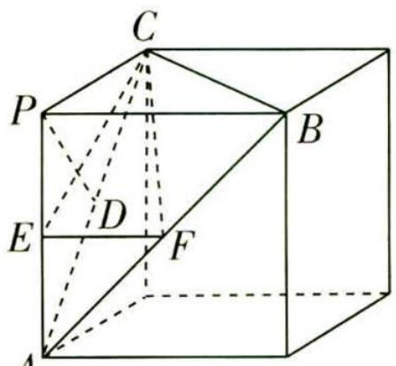

text_image

C
P
B
D
E
F
A

图7

2006 年德国世界杯比赛用球“+ Teamgeist( + 团队之星)”从传统的 32 片拼块减少至 14 块,这样的革新使球外表面的拼接点从原来的 60 个变为 24 个,拼接线的总长度也从 40.05 厘米降到 33.93 厘米,极大提高了足球运行的精准度.

关注微信公众号“初高教辅站”获取更多初高中教辅资料弦定理得 $\cos\angle EAC=\frac{x^{2}+4-(3-x^{2})}{2\times2\times x}$ ，过点 P 作 $PD\perp AC$ 于 D，∵ PA=PC，∴ D 为 AC 的中点，又 $\cos\angle EAC=\frac{AD}{PA}=\frac{1}{2x},\therefore\frac{x^{2}+4-3+x^{2}}{4x}=\frac{1}{2x}$ ，解得 $x=\frac{\sqrt{2}}{2},\therefore PA=PB=PC=\sqrt{2}$ ，又 AB=BC=AC=2，

∴ PA, PB, PC 两两垂直，即三棱锥 P-ABC 是以 PA, PB, PC 为棱的正方体的一部分，如图 7，所以

【另解】在正三棱锥 $P - ABC$ 中, 易证 $PB \perp AC$ , 又 $EF \perp CE$ , $EF \parallel PB$ , $PB \perp CE$ , 又 $CE \cap AC = C$ , $CE, AC \subset$ 平面 $PAC$ , $\therefore PB \perp$ 平面 $PAC$ , 从而 $PB \perp PA$ , $PB \perp PC$ , 结合 $\triangle ABC$ 是边长为 2 的正三角形可得 $PA = PB = PC = \sqrt{2}$ , 进而 $PC \perp PA$ , $\therefore PA, PB, PC$ 两两垂直

球 O 即该正方体的外接球, 其直径 $2R = \sqrt{2 + 2 + 2} = \sqrt{6}$ , 解得 $R = \frac{\sqrt{6}}{2}$ , 则球 O 的体积 $V = \frac{4}{3}\pi R^{3} =$ 【套模型】三棱锥的三条侧棱两两垂直, 可套用 “墙角” 模型, 正方体的外接球的直径为其体对角线

$\frac{4}{3}\pi\times\frac{6\sqrt{6}}{8}=\sqrt{6}\pi,$ 故选 D.

答案 D

# 2. “对棱相等”模型

模型解读 “对棱相等”模型是指三棱锥相对的两条棱相等的情况,此时可构建长方体或正方体,将该三棱锥放入长方体或正方体中,使三棱锥的顶点与长方体或正方体的顶点重合,将该三棱锥的外接球转化为长方体或正方体的外接球,从而求出外接球的半径.

调研 10 (2023·广东佛山一中 11 月月考)在四面体 ABCD 中,已知点 E,F 分别为棱 AB,CD 的中点,且 $EF \perp AB, EF \perp CD$ , 若 AB = CD = 2, EF = 2, 则该四面体的外接球半径为 \_\_\_\_.

思维导引

根据题意得出四面体
ABCD 的对棱相等

四面体的对棱相等
长方体相对面的面对角线相等

将四面体的外接球问题转化为长方体的外接球问题

四面体的外接球半径

解析 由对棱 $AB = CD = 2$ , 且对棱中点 $E, F$ 分别满足 $EF \perp AB$ , $EF \perp CD$ 可知四面体 $ABCD$ 的三组对棱分别相等, 则可构造长方体使得四面体 $ABCD$ 的顶点与该长方体的顶点重合, 如图8, 设长方体的长、宽、高分

【套模型】构造出长方体，所求外接球的直径即可现形

别为 $a, b, c$ ，则 $\left\{ \begin{array}{l} b^2 + c^2 = AB^2 = 4, \\ a = EF = 2, \end{array} \right.$ 所以所求外接球的半径 $R = \frac{\sqrt{a^2 + b^2 + c^2}}{2} =$

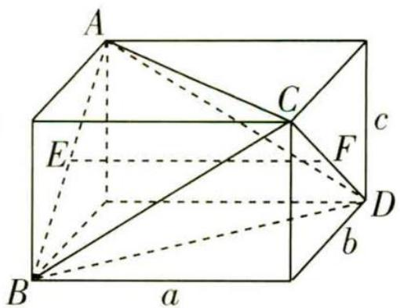

text_image

A
C
E
F
c
D
b
B
a

图8

2010 年南非世界杯比赛用球“JABULANI(普天同庆)”仅用 8 片表皮拼接而成, 成为了当时“最圆的足球”.

$\frac{\sqrt{2^{2}+4}}{2}=\sqrt{2}$ ，即四面体ABCD的外接球半径为 $\sqrt{2}$ .

答案 $\sqrt{2}$

# 3. “汉堡”模型

模型解读 对于直棱柱的外接球,结合球与直棱柱的有关性质,可建立“汉堡”模型,上、下底面外接圆的圆心连线构成的线段的中点即直棱柱外接球球心,球心到各个顶点的距离都等于外接球的半径,结合勾股定理求解.

调研 11 (2023·四川巴中 11 月月考)正三棱柱 $ABC-A_{1}B_{1}C_{1}$ 的所有棱长之和为定值, 当该正三棱柱外接球的表面积取得最小值 $16\pi$ 时, 正三棱柱 $ABC-A_{1}B_{1}C_{1}$ 的侧面积为

A. 12

B. 16

C. 24

D. 18

思维导引

设正三棱柱的底面边长为 a，
侧棱长为 b，外接球半径为 R

所有棱长之和为定值

$6a+3b$ 为定值,设为 3t

底面为正三角形
正弦定理

底面外接圆半径 $r=\frac{a}{\sqrt{3}}$

“汉堡”模型

$R^{2}$ 关于 a, t 的表达式

配方法

$R$ 的最小值

正三棱柱外接球的表面积的最小值为 $16\pi$

关于 $t$ 的方程

解方程
t 的值

正三棱柱的侧面积公式

正三棱柱 $ABC-A_{1}B_{1}C_{1}$ 的侧面积

解析

设正三棱柱 $ABC-A_{1}B_{1}C_{1}$ 的底面边长为 a，侧棱长为 b, a, b 为正实数，设 $6a + 3b = 3t$ ，则 t

【小技巧】通过设出定值 $t$ ，将双变量转化为单变量

为定值且 t 为正数, b = t - 2a.

设正三棱柱外接球的半径为 R，底面外接圆半径为 r，由正弦定理得 $2r = \frac{a}{\sin\frac{\pi}{3}} = \frac{2a}{\sqrt{3}}$ ，所以 $R^{2} = \left(\frac{b}{2}\right)^{2} + \left(\frac{a}{\sqrt{3}}\right)^{2} = \frac{b^{2}}{4} + \frac{a^{2}}{3} = \frac{4a^{2} + 3b^{2}}{12} = \frac{4a^{2} + 3(t - 2a)^{2}}{12} = \frac{16a^{2} - 12ta + 3t^{2}}{12} =$

【技巧点拨】“汉堡”模型：正三棱柱的外接球的球心为棱柱上、下底面中心连线的中点，它与底面正三角形的中心、底面正三角形的顶点的连线构成直角三角形，利用勾股定理即可构建关于R的关系式

$$
\frac {1}{1 2} \left[ 1 6 (a - \frac {3}{8} t) ^ {2} + \frac {3}{4} t ^ {2} \right],
$$

所以当 $a=\frac{3}{8}t$ 时， $R^{2}$ 取得最小值 $\frac{t^{2}}{16}$ ，又正三棱柱外接球的表面积的最小值为 $16\pi$ ，所以 $4\pi \times \frac{t^{2}}{16}=16\pi$ ，所以 t=8。

【辨析比较】球的体积公式 $V=\frac{4}{3}\pi R^{3}$ 与球的表面积公式 $S=4\pi R^{2}$ 不要高混

此时 $a=\frac{3}{8}\times8=3, b=8-2\times3=2$ ，正三棱柱 $ABC-A_{1}B_{1}C_{1}$ 的侧面积为 $3a\times b=3\times3\times2=18$ .

答案 D

# 4. “折叠”模型

模型解读 “折叠”模型:在由两个等腰三角形拼在一起或者菱形折叠而形成的四面体中,分别过两个等腰三角形的外接圆圆心作其所在平面的垂线,两垂线的交点即四面体的外接球球心,利用球心、外接圆圆心以及外接圆与球的交点所构成的直角三角形进行破解.

调研 12 (2023·广州 11 月期中联考)已知菱形 ABCD 的边长为 4, $\angle D = 60^{\circ}$ , 如图 9 所示, 将 $\triangle ACD$ 沿 AC 折起, 使得点 D 到达点 S 的位置, 连接 SB, 得到三棱锥 S-ABC, 此时 SB = 6, 则三棱锥 S-ABC 的体积为 \_\_\_\_; E 是线段 SA 的中点, 点$F$ 在三棱锥 $S - ABC$ 的外接球上运动, 且始终保持 $EF \perp AC$ , 则点 $F$ 的轨迹长度为 \_\_\_\_.

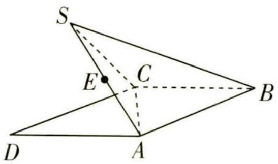

text_image

S
E C B
D A

图9

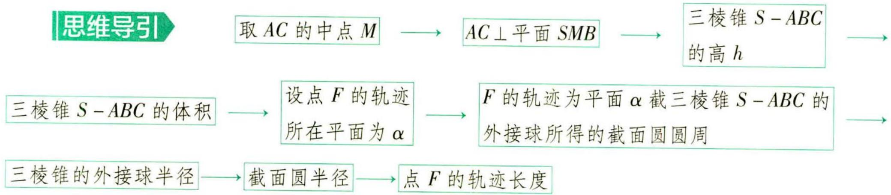

flowchart

```mermaid
graph LR
    A["点 F 的轨迹长度"] --> B["截面圆半径"]
    B --> C["设点 F 的轨迹所在平面为 α"]
    C --> D["三棱锥 S-ABC 的体积"]
    D --> E["取 AC 的中点 M"]
    E --> F["AC ⊥ 平面 SMB"]
    F --> G["三棱锥 S-ABC 的高 h"]
    G --> H["输出"]
```

解析 如图10, 取 $AC$ 的中点 $M$ , 连接 $BM, SM$ , 则 $AC \perp BM, AC \perp SM, BM \cap SM = M, BM, SM \subset$ 平面 $SMB$ , $\therefore AC \perp$ 平面 $SMB$ . $\because SM = MB = 2\sqrt{3}, SB = 6, \therefore \cos \angle SBM = \frac{6^2 + (2\sqrt{3})^2 - (2\sqrt{3})^2}{2 \times 6 \times 2\sqrt{3}} = \frac{\sqrt{3}}{2}$ , $\therefore \angle SBM = \angle MSB = 30^\circ$ , 则三棱锥 $S - ABC$ 的高 $h = \sin \angle SBM \cdot SB = 3$ , 三棱锥 $S - ABC$ 的体积为 $V = \frac{1}{3} \times \frac{1}{2} \times \frac{\sqrt{3}}{2} \times 4^2 \times 3 = 4\sqrt{3}$ .

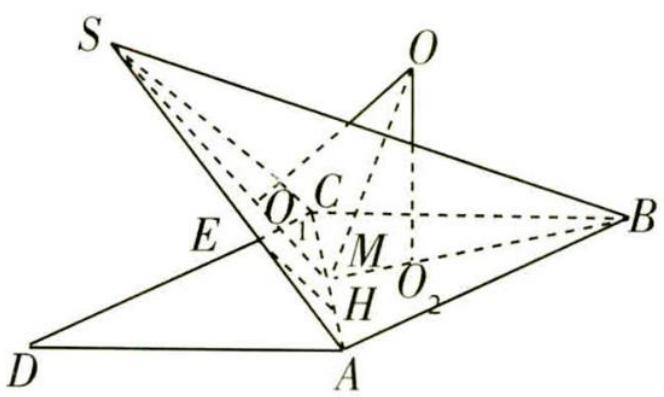

text_image

S
O
C
O₁
E
M
H
O₂
B
D
A

图10

【易错】注意柱体的体积公式与锥体的体积公式的区别，本题别漏乘 $\frac{1}{3}$

过点 $E$ 作 $EH \perp AC$ 于点 $H$ , 设点 $F$ 的轨迹所在平面为 $\alpha$ , 则平面 $\alpha$ 经过点 $H$ 且 $AC \perp \alpha$ , 设三棱锥 $S - ABC$ 外接球的球心为 $O, \triangle SAC, \triangle BAC$ 的外心分别为 $O_1, O_2$ , 连接 $OO_1, OO_2, OM$ , 则 $OO_1 \perp$ 平面 $SAC$ ,

【关键点拨】棱锥外接球的球心到各顶点的距离相等，当球心难以直接找到时，可减少点的个数进行考虑，如光寻找到三个顶点的距离相等的点，即三角形的外心，则球心一定在过此点且

2014 年巴西世界杯比赛用球“Brazuca(桑巴荣耀)”仅用 6 块相同的十字形皮面拼接而成, 超越了“普天同庆”, 成为当时最圆的足球.

与此平面垂直的直线上

$OO_{2} \perp$ 平面 $BAC$ ，且 $O, O_{1}, O_{2}, M$ 四点共面，由题可得 $\angle OMO_{1} = \frac{1}{2} \angle O_{1}MO_{2} = 60^{\circ}, O_{1}M = \frac{1}{3}SM = \frac{2\sqrt{3}}{3}, OO_{1} = \sqrt{3}O_{1}M = 2$ ，又 $O_{1}S = \frac{2}{3}SM = \frac{4\sqrt{3}}{3}$ ，则三棱锥 $S - ABC$ 外接球的半径 $r = \sqrt{OO_{1}^{2} + O_{1}S^{2}} = \sqrt{\frac{28}{3}}$ ，易知点 $O$ 到平面 $\alpha$ 的距离 $d = MH = 1$ ，故平面 $\alpha$ 截三棱锥 $S - ABC$ 的外接球所得截面圆的半径。【会思考】连接 $OS$ ，则可在直角三角形 $OO_{1}S$ 中根据勾股定理得出三棱锥 $S - ABC$ 外接球的半径为 $r_{1} = \sqrt{r^{2} - d^{2}} = \sqrt{\frac{28}{3} - 1} = \frac{5\sqrt{3}}{3}$ ，∴截面圆的周长为 $l = 2\pi r_{1} = \frac{10\sqrt{3}}{3}\pi$ ，即点 $F$ 的轨迹长度为 $\frac{10\sqrt{3}}{3}\pi$ 。

答案 $4\sqrt{3}$ $\frac{10\sqrt{3}}{3}\pi$

# 5. “心有所依”模型

模型解读 “心有所依” 模型是指对于圆锥、圆台、侧棱相等的棱锥等几何体, 可得球心必在该几何体的高所在的直线上, 由此可把相关信息集中到某一个直角三角形内, 利用勾股定理求解.

调研 13 (2023·江西九江十校 11 月联考)已知球 O 的半径为 3 ,圆锥 $SO_{1}$ 的顶点与底面都在该球面上,则圆锥 $SO_{1}$ 的体积最大值为 ( )

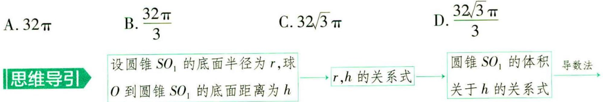

text_image

A. 32π
B. 32π/3
C. 32√3 π
D. 32√3 π/3
思维导引 设圆锥 SO₁ 的底面半径为 r, 球 O 到圆锥 SO₁ 的底面距离为 h
r, h 的关系式
圆锥 SO₁ 的体积关于 h 的关系式
导数法

圆锥 $SO_{1}$ 的体积最大值

解析 设圆锥 $SO_{1}$ 的底面半径为 r，球心 O 到圆锥 $SO_{1}$ 的底面距离为 h，则 $r^{2}=9-h^{2}(0\leqslant h<3)$ ，如图 11 所示.

【会找规律】圆锥的外接球球心在圆锥的高所在的直线上，圆锥轴截面的外接圆是圆锥外接球的大圆，该截面三角形的外接圆的直径是圆锥外接球的直径

当圆锥的高为 $h + 3$ 时, 圆锥 $SO_{1}$ 的体积为 $V = \frac{\pi}{3} r^{2}(3 + h) = \frac{\pi}{3}(9 - h^{2})(3 + h)(0 \leqslant h < 3)$ , $V' = \pi (1 - h)(3 + h)$ , 当 $0 < h < 1$ 时, $V' > 0$ , $V$ 单调递增, 当

【小妙招】会利用导数法求最值

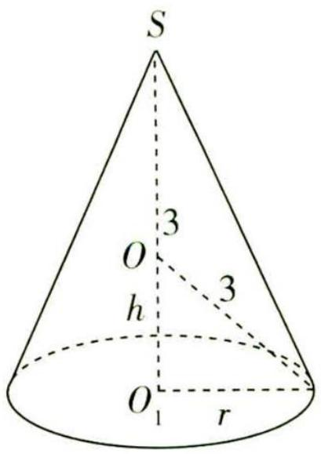

text_image

S
3
O
h
3
O₁
r

图 11

2018 年俄罗斯世界杯比赛用球“Telstar 18(电视明星)”由 6 块皮面组成,外形类似于 1970 年墨西哥世界杯比赛用球“Telstar”.

1 < h < 3 时, $V' < 0$ , V 单调递减, 故当 h = 1 时, V 取得最大值 $\frac{32\pi}{3}$ .

当圆锥 $SO_{1}$ 的高为3-h时, 圆锥 $SO_{1}$ 的体积为 $V=\frac{\pi}{3}r^{2}(3-h)=\frac{\pi}{3}(9-h^{2})(3-h)(0\leqslant h<3)$ , $V'=\pi(h-3)(h+1)<0$ , 此时V在 $h\in[0,3)$ 上单调递减, 故当h=0时, V取得最大值 $9\pi$ .

综上,圆锥 $SO_{1}$ 的体积最大值为 $\frac{32\pi}{3}$ .

答案 B

# 6. “共斜边”模型

模型解读 “共斜边”模型是指对于共斜边的两个不共面的直角三角形组合而成的四面体, 其外接球的直径为该斜边.

调研 14 (2023 · 湖南湘潭一中 11 月期中) 如图 12, 平面 $ABCD \perp$ 平面 $ABEF$ , 四边形 $ABCD$ 是正方形, 四边形 $ABEF$ 是矩形, $G$ 是 $EF$ 的中点, $AF = 1$ , $AB = 2$ , 则三棱锥 $C - ABG$ 外接球的表面积是 ( )

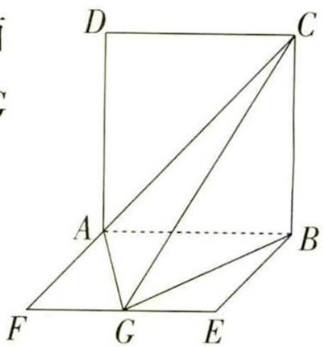

text_image

D
C
A
B
F
G
E

图 12

A. $6 \pi$

B. $8\pi$

C. ${10\pi }$

D. ${12\pi }$

思维导引 取 AC 的中点 O $\xrightarrow{面面垂直的性质定理}$ BC⊥平面 ABEF $\xrightarrow{线面垂直的性质}$ AG⊥BC $\xrightarrow{勾股定理的逆定理}$ AG⊥BG $\xrightarrow{线面垂直的判定定理}$ AG⊥平面 BCG $\xrightarrow{“共斜边”模型}$ AC 为所求外接球的直径 $\xrightarrow{球的表面积公式}$ 该三棱锥外接球的表面积

解析 如图13,取 $AC$ 的中点 $O$ ,连接 $OB,OG$ , $\because$ 平面 $ABCD \perp$ 平面 $ABEF$ ,平面 $ABCD \cap$ 平面 $ABEF = AB,AB \perp BC,BC \subset$ 平面 $ABCD$ , $\therefore BC \perp$ 平面 $ABEF$ . $\because AG \subset$ 平面 $ABEF$ , $\therefore BC \perp AG$ . $\because AF = 1,AB = 2,G$ 为 $EF$ 的中点, $\therefore AG = BG = \sqrt{2}$ , $\therefore AG^2 +BG^2 = AB^2$ , $\therefore AG \perp BG$ ,又 $BC \cap BG = B,BC,BG \subset$ 平面

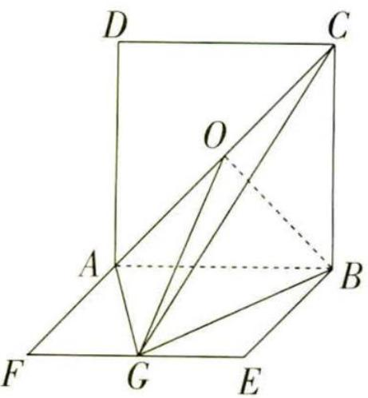

text_image

Geometric diagram of a square with labeled vertices and internal points, showing diagonals and auxiliary lines.

图13

【小技巧】利用勾股定理的适定理，证线线垂直

面 $BCG, \therefore AG \perp$ 平面 $BCG. \because CG \subset$ 平面 $BCG, \therefore AG \perp CG$ , 则 $\triangle ABC, \triangle AGC$ 均为以 $AC$ 为斜边的直角三角形, $O$ 为斜边 $AC$ 的中点, $\therefore OA = OB = OC = OG$ ,∴ O 为三棱锥 C-ABG 的外接球球心，∴ 三棱锥 C-ABG 的外接球半径 $R=\frac{1}{2}AC=\frac{1}{2}\sqrt{AB^{2}+BC^{2}}=\sqrt{2}$ ,【套模型】共斜边的两个不共面的直角三角形组合而成的四面体, 则该斜边为该四面体的外接球的直径 $\therefore$ 三棱锥 $C - {ABG}$ 的外接球表面积 $S = {4\pi }{R}^{2} = {8\pi }$ .

答案 B

今年卡塔尔世界杯比赛用球“Al Rihla(旅程)”采用了20块皮的设计,同时表面设计了各种凹陷,提高了足球的稳定性.

# 7. “向量法”模型

模型解读 “向量法”模型:某些不规则几何体的外接球的球心或半径不易求解时,可通过建立空间直角坐标系,利用向量法求出该几何体的外接球的球心的坐标和半径.

调研 15 (2023 · 河南商丘 11 月质量检测) 如图 14, 在几何体 $ABCDEF$ 中, 四边形 $ABCD$ 为正方形, $EF \parallel$ 平面 $ABCD$ , $EF = \frac{1}{2} AB = 2$ , $AE = DE = BF = CF = 2\sqrt{3}$ , 则该几何体的外接球的表面积为 \_\_\_\_.

解析 设 EF 的中点为 M, 连接 AC, BD 交于点 O, 连接 OM, 以正方形 ABCD 的中心 O 为坐标原点, 过 O 点平行于 BC 的直线为 x 轴, 过 O 点平行于 AB 的直线为 y 轴, 直线 OM 为 z 轴, 建立如图 15 所示的空间直角坐标系 O - xyz.

【会建系】由于题中几何体具有对称性，因此可以正方形ABCD的中心O为原点，建立空间直角坐标系

过 F 点作平面 ABCD 的垂线, 垂足为 G, 连接 BG, 则在 $\triangle OGB$ 中, $OG = \frac{1}{2} EF = 1$ , $OB = \frac{1}{2} DB = \frac{1}{2} \times 4\sqrt{2} = 2\sqrt{2}$ , $\angle GOB = 45^{\circ}$ , 由余弦定理得 $GB^{2}=1^{2}+(2\sqrt{2})^{2}-2\times1\times2\sqrt{2}\times\cos45^{\circ}=5$ ，在Rt△FGB中， $GF^{2}=FB^{2}-GB^{2}=7,GF=\sqrt{7}$ ∴ $A(2, -2, 0)$ , $F(0, 1, \sqrt{7})$ .

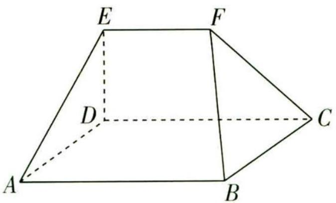

text_image

E
F
D
C
A
B

图14

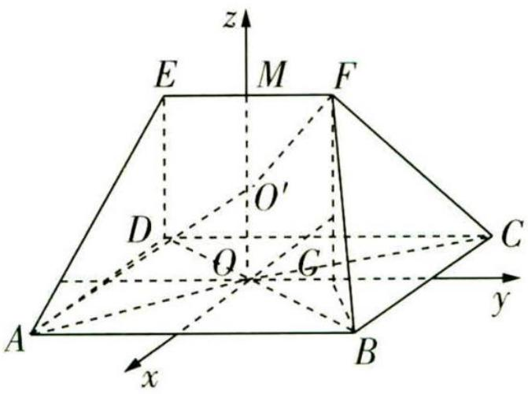

text_image

z
E M F
O'
D O G C
A B
x y

图15

设几何体外接球的球心为 $O'(0,0,m)$ ，连接 $O'F,O'A$ ，则有 $O'A=O'F$ ，即 $(2-0)^{2}+(-2-0)^{2}+$

【会判断】根据图形的对称性, 可判断几何体外接球的球心 $O'$ 必定在直线 $OM$ 上 $(0 - m)^{2} = (0 - 0)^{2} + (1 - 0)^{2} + (\sqrt{7} - m)^{2}$ , 解得 $m = 0$ , 即点 $O'$ 与点 $O$ 重合, 即点 $O$ 就是所求外接球的球心, 外接球半径 $r = OA = 2\sqrt{2}$ , 故该几何体的外接球表面积 $S = 4\pi r^{2} = 32\pi$ .

答案 32π

# 角度4 立体几何中的翻折问题

调研 16 (2023·上海位育中学 10 月月考)已知四面体 PABC(如图 16)的平面展开图(如图 17)中, 四边形 ABCG 是边长为 $\sqrt{2}$ 的正方形, $\triangle ABE$ 和 $\triangle BCF$ 均为正三角形.

足球比赛场地必须是长方形,长度90\~120米,宽度45\~90米,球门高2.44米,宽7.32米.大禁区长40.32米、宽16.5米.

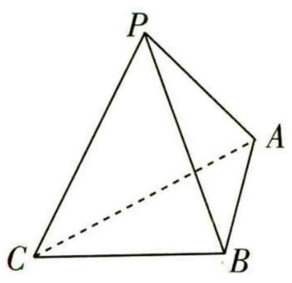

text_image

P
A
C
B

图 16

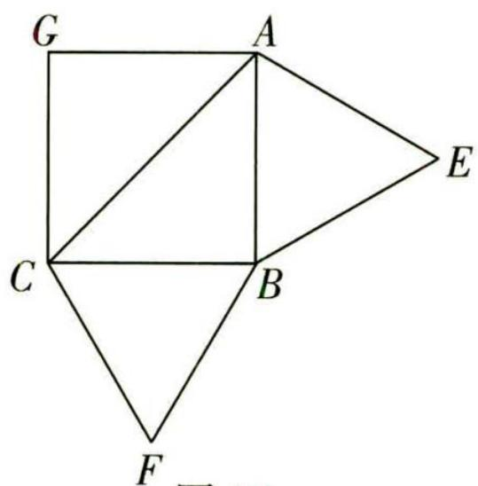

text_image

G
A
E
C
B
F

图 17

(1) 证明: 平面 PAC⊥平面 ABC.

(2) 求二面角 $A - PC - B$ 的余弦值.

(3) 在图 16 中作出直线 CA 与平面 ABP 所成的角, 并求出直线 CA 与平面 ABP 所成角的余弦值.

解析 (1) 取 $AC$ 的中点 $O$ , 连接 $BO, PO$ , 如图 18 所示.

由题意知 $PA = PB = PC = \sqrt{2}$ , $PO = OA = OB = OC = 1$ .

【找不变量】展开图中△ABE和△BCF均为正三角形，立体图形中对应的三角形形状不变

∵ 在 $\triangle PAC$ 中, PA = PC, O 为 AC 的中点, ∴ $PO \perp AC$ .

∵ 在 $\triangle POB$ 中, PO = 1, OB = 1, $PB = \sqrt{2}$ , ∴ $PO^{2} + OB^{2} = PB^{2}$ ,
∴ $PO \perp OB$ .

又 $AC \cap OB = O, AC, OB \subset$ 平面 $ABC,$

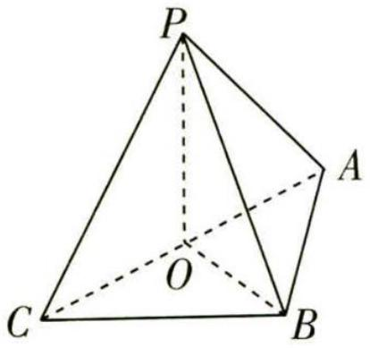

text_image

P
A
O
C
B

图18

【易漏】线不在多，重在相交

$\therefore PO \perp$ 平面 ${ABC}$ ,又 ${PO} \subset$ 平面 ${PAC}$ , $\therefore$ 平面 ${PAC} \perp$ 平面 ${ABC}$ .

(2)由(1)可得 $PO, AC, OB$ 两两垂直, 以 $O$ 为坐标原点, 建立空间直角坐标系, 如图

【找垂直】找三条互相垂直的直线，为建系做准备
19 所示,则 $O(0,0,0)$ , $C(1,0,0)$ , $B(0,1,0)$ , $A(-1,0,0)$ , $P(0,0,1)$ .

易知 $OB \perp$ 平面 APC, 则 $\overrightarrow{OB} = (0,1,0)$ 为平面 APC 的一个法向量.

【小技巧】由线面垂直, 直接取 $\overrightarrow{OB}$ 为平面 ${APC}$ 的一个法向量, 也可以取与 $\overrightarrow{OB}$ 共线的法向量, 尽可能取简单、易算的法向量

$\overrightarrow{BC} = (1, -1, 0), \overrightarrow{PC} = (1, 0, -1)$ , 设平面 $PBC$ 的法向量为 $\pmb{n} = (x, y, z)$ ,

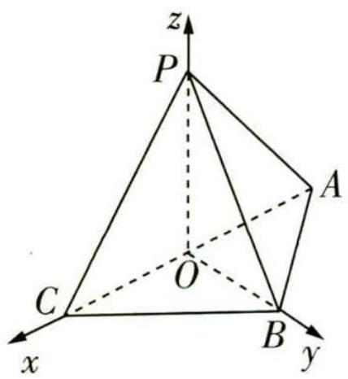

text_image

z
P
A
O
C
B
x
y

图 19

则 $\left\{ \begin{array}{l} \overrightarrow{BC} \cdot \boldsymbol{n} = 0, \\ \overrightarrow{PC} \cdot \boldsymbol{n} = 0, \end{array} \right.$ 即 $\left\{ \begin{array}{l} x - y = 0, \\ x - z = 0, \end{array} \right.$ 取 $x = 1$ , 得 $y = 1, z = 1$ , 则 $\boldsymbol{n} = (1, 1,$ 1)为平面 $PBC$ 的一个法向量.

故 $\cos \langle n, \overrightarrow{OB} \rangle = \frac{n \cdot \overrightarrow{OB}}{|\boldsymbol{n}| \cdot |\overrightarrow{OB}|} = \frac{1}{\sqrt{3}} = \frac{\sqrt{3}}{3}$ .

结合图形可知,二面角 A-PC-B 的平面角为锐角,

故二面角 A - PC - B 的余弦值为 $\frac{\sqrt{3}}{3}$ .

(3)如图20,取PB的中点D,连接CD,AD.

由题意知, $\triangle PBC$ , $\triangle PBA$ 为正三角形, 则 $CD \perp PB$ , $AD \perp PB$ , 又 $CD, AD \subset$ 平面 $ACD$ , $CD \cap AD = D$ , $\therefore PB \perp$ 平面 $ACD$ .

又由题可得 $CD = AD = \frac{\sqrt{6}}{2}$ , AC = 2, 在 $\triangle CDA$ 中, 由余弦定理得 $\cos \angle CDA = \frac{\frac{6}{4} + \frac{6}{4} - 4}{2 \times \frac{\sqrt{6}}{2} \times \frac{\sqrt{6}}{2}} < 0$ , 则 $\triangle CDA$ 为钝角三角形.

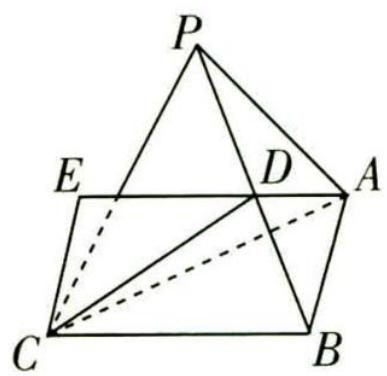

text_image

P
E
D
A
C
B

图 20

过点 C 作 $CE \perp AD$ 交 AD 的延长线于点 E.

【指点迷津】关键为找到一条过 C 点并与平面 APB 垂直的直线

易得 $CE \subset$ 平面 ACD, ∵ $PB \perp$ 平面 ACD, ∴ $CE \perp PB$ .

又 $AD, PB \subset$ 平面 $APB, AD \cap PB = D$ , 故 $CE \perp$ 平面 $ABP$ .

故直线 ${CA}$ 与平面 ${ABP}$ 所成的角为 $\angle {CAD}$ .

【扫清障碍】利用线面所成角的定义，证明所找的角为所求作的线面角

在 $\triangle CDA$ 中，由余弦定理得 $\cos \angle CAD = \frac{4 + \frac{6}{4} - \frac{6}{4}}{2 \times 2 \times \frac{\sqrt{6}}{2}} = \frac{\sqrt{6}}{3}$ ，

故直线 CA 与平面 ABP 所成角的余弦值为 $\frac{\sqrt{6}}{3}$ .

调研 17 (2023·江苏徐州 11 月期中)如图 21, A, D 是矩形 $A_{1}BCD_{1}$ 边上的点, $AB = 2AA_{1} = 2AD = 2, DC = 2DD_{1}$ , 把四边形 $A_{1}ADD_{1}$ 沿 AD 翻折, 使其所在平面与平面 ABCD 垂直, 如图 22 所示, 得到几何体 $ABA_{1} - DCD_{1}, E$ 为棱 AB 上的动点.

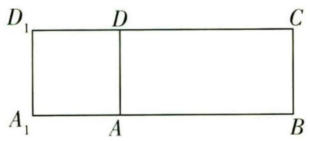

text_image

D₁ D C
A₁ A B

图 21

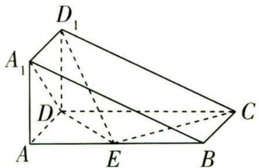

text_image

D₁
A₁
D
C
A
E
B

图 22

世界杯在小组赛阶段采取单循环积分制——小组内四支球队共进行6场比赛,赢球积3分、平局积1分、输球不得分,排名前二的球队进入淘汰赛阶段.

(1) 证明: $D_{1} E \perp A_{1} D$ .

(2)在棱 $AB$ 上是否存在点 $E$ , 使得二面角 $D_{1} - EC - D$ 的平面角为 $\frac{\pi}{6}$ ? 若存在, 求出此时 $AE$ 的长; 若不存在, 请说明理由.

思维导引

(1) 建立空间直角坐标系 证明 $\overrightarrow{A_{1}D} \cdot \overrightarrow{D_{1}E} = 0$ $\longrightarrow$ $D_{1}E \perp A_{1}D$

(2) 假设存在满足题意的点 E $\rightarrow$ 平面 DCE 与平面 $D_{1}CE$ 的法向量 $\xrightarrow{\text{两法向量夹角的余弦值的绝对值为 } \cos \frac{\pi}{6}}$

关于参数的方程 $\rightarrow$ 方程有解, 存在满足题意的点 E

解析

(1)由翻折关系知,在几何体 $ABA_{1}-DCD_{1}$ 中, $AD\perp DD_{1}, AD\perp CD$ ,

【找不变量】翻折前 $AD \perp DD_{1}, AD \perp CD$ , 翻折后垂直关系保持不变. 一般地, 平面图形中与 “折痕” 垂直的线在翻折后仍然与 “折痕” 垂直

又平面 ${A}_{1} + {D{D}_{1}} \bot$ 平面 ${ABCD}$ ,平面 ${A}_{1} + {D{D}_{1}} \cap$ 平面 ${ABCD} = {AD}$ , ${CD} \subset$ 平面 ${ABCD}$ 且 ${CD} \bot  {AD}$ ,

【易遗漏】应用面面垂直的性质定理，一定不要忘了说明两平面的交线以及其中一个面内的线垂直该交线，否则易失步骤分

所以 $CD \perp$ 平面 $A_{1}ADD_{1}$ ，又 $DD_{1} \subset$ 平面 $A_{1}ADD_{1}$ ，故 $CD \perp DD_{1}$ .

故 $AD, DD_{1}, CD$ 两两垂直.

以点 D 为坐标原点, DA, DC, $DD_{1}$ 所在直线分别为 x 轴、y 轴、z 轴建立空间直角坐标系, 如图 23, 则 $D(0,0,0)$ , $D_{1}(0,0,1)$ , $A_{1}(1,0,1)$ , $C(0,2,0)$ ,

不妨设 $AE = y_{0}$ ，则 $0 \leqslant y_{0} \leqslant 2$ ， $E(1, y_{0}, 0)$ ，

【易遗漏】注意参数 $y_{0}$ 的取值范围

故 $\overrightarrow{A_{1}D}=(-1,0,-1),\overrightarrow{D_{1}E}=(1,y_{0},-1)$ ,

所以 $\overrightarrow{D_{1}E}\cdot\overrightarrow{A_{1}D}=0$ ，故 $D_{1}E\perp A_{1}D.$

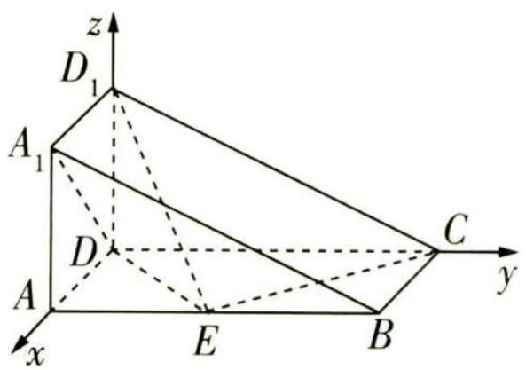

text_image

z
D₁
A₁
D
C
y
A
E
B
x

图 23

【另解】连接 $D_{1} A$ ，易知四边形 $A D D_{1} A_{1}$ 是正方形，所以 $D_{1} A \perp A_{1} D$ . 由翻折关系知， $A D \perp A E$ ，又平面 $A_{1} A D D_{1} \perp$ 平面 $A B C D$ ，平面 $A_{1} A D D_{1} \cap$ 平面 $A B C D = A D$ ， $A E \subset$ 平面 $A B C D$ 且 $A E \perp A D$ ，所以 $A E \perp$ 平面 $A_{1} A D D_{1}$ . 又 $A_{1} D \subset$ 平面 $A_{1} A D D_{1}$ ，故 $A E \perp A_{1} D$ . 因为 $D_{1} A \perp A_{1} D$ ， $A E \perp A_{1} D$ ， $D_{1} A$ ， $A E \subset$ 平面 $D_{1} A E$ ，且 $D_{1} A \cap A E = A$ ，所以 $A_{1} D \perp$ 平面 $D_{1} A E$ ，又 $D_{1} E \subset$ 平面 $D_{1} A E$ ，所以 $A_{1} D \perp D_{1} E$

(2) 假设存在点 $E\left( {1,{y}_{0},0}\right)$ ,使得二面角 ${D}_{1} - {EC} - D$ 的平面角为 $\frac{\pi }{6}$ ,其中 $0 \leq  {y}_{0} \leq  2$ .

【解题捷径】直接应用（1）中所设参数，缩短求解步骤

在世界杯的赛场上, 一支球队究竟需要拿多少积分才能够小组出线呢? 积分制出线的问题模型实际上是概率论中最典型的古典概型, 只要列举出所有的可能, 就可以利用古典概型的概率计算公式计算出结果.

关注微信公众号“初高教辅站”获取更多初高中教辅资料

因为 $DD_{1} \perp$ 平面 DCE, 所以 $\overrightarrow{DD_{1}} = (0, 0, 1)$ 是平面 DCE 的一个法向量.

$$
\overrightarrow {C D _ {1}} = (0, - 2, 1), \overrightarrow {D _ {1} E} = (1, y _ {0}, - 1),
$$

设平面 $D_{1}CE$ 的法向量为 $\boldsymbol{r}=(x,y,z)$ ，则 $\left\{\begin{aligned}\boldsymbol{r}\cdot\overrightarrow{D_{1}E}=0,\\ \boldsymbol{r}\cdot\overrightarrow{CD_{1}}=0,\end{aligned}\right.$ 即 $\left\{\begin{aligned}x+y_{0}y-z=0,\\ -2y+z=0,\end{aligned}\right.$

取 y=1 ，得 $x=2-y_{0}, z=2$ ，所以 $\boldsymbol{r}=(2-y_{0},1,2)$ 是平面 $D_{1}CE$ 的一个法向量.

因为二面角 $D_{1}-EC-D$ 的平面角为 $\frac{\pi}{6}$ ，所以 $\left|\cos\left\langle\overrightarrow{DD_{1}},r\right\rangle\right|=\cos\frac{\pi}{6}=\frac{\sqrt{3}}{2}$ ，

【陷阱】注意两平面法向量的夹角与两平面所成角相等或互补，因此此处绝对值不能丢

即 $\left|\frac{2}{\sqrt{(2-y_{0})^{2}+1+4}}\right|=\frac{\sqrt{3}}{2}$ ，整理得 $3y_{0}^{2}-12y_{0}+11=0$ ，解得 $y_{0}=2-\frac{\sqrt{3}}{3}$ 或 $y_{0}=2+\frac{\sqrt{3}}{3}$ （舍去），

【扫清障碍】 $y_{0}$ 的取值范围为[0,2]，据此舍去增根

所以 $AE = y_{0} = 2 - \frac{\sqrt{3}}{3}.$

故在棱 AB 上存在点 E, 使得二面角 $D_{1}-EC-D$ 的平面角为 $\frac{\pi}{6}$ , 此时 $AE=2-\frac{\sqrt{3}}{3}$ .

# 角度5 由递推公式求解数列的通项公式

调研 18 (2023 · 上海徐汇区 10 月测试) 数列 $\{a_{n}\}$ 满足 $a_{1} = 29, a_{n} - a_{n-1} = 2n - 1, n \in \mathbf{N}^{*}, n \geqslant 2$ , 则 $\{a_{n}\}$ 的通项公式为 $a_{n} =$ \_\_\_\_.

解析 因为 $a_{1}=29, a_{n}-a_{n-1}=2n-1, n\in N^{*}, n\geqslant2$ ，所以当 $n\geqslant2$ 时， $(a_{n}-a_{n-1})+(a_{n-1}-a_{n-2})+\cdots+(a_{2}-a_{1})=(2n-1)+(2n-3)+\cdots+3=\frac{(n-1)(2n+2)}{2}=n^{2}-1$

【扫清障碍】累加时注意开始的一项、最后一项以及累加的项数

所以 $a_{n} - a_{1} = n^{2} - 1, a_{n} = n^{2} + 28, n \geqslant 2$ ，又 $a_{1} = 29$ 符合上式，

【易满】注意首项的检验，若 $a_{1}$ 的值不符合式子 $a_{n}=n^{2}+28$ ，则需用分段形式表示数列的通项所以 $a_{n}=n^{2}+28(n\in\mathbf{N}^{*})$ .

【解后反思】数列 $|a_{n}|$ 满足 $a_{n+1}=a_{n}+f(n)$ ，常令n分别为1,2,3,…,n-1，代入 $a_{n+1}=a_{n}+f(n)$ 中，再把所得的 $(n-1)$ 个等式相加，即利用 $a_{n}=a_{1}+(a_{2}-a_{1})+(a_{3}-a_{2})+\cdots+(a_{n}-a_{n-1})$ 求通项公式

答案 $n^{2}+28(n\in\mathbf{N}^{*})$

一支球队三场全胜一定能够出线,但赢两场不一定能出线;但也有一种情况,就是即便小组赛一场不胜也有机会晋级.

调研 19 (2023·哈师大附中 11 月期中) 数列 $\{a_{n}\}$ 满足 $a_{1} = 1, \frac{a_{n}}{a_{n-1}} = \frac{2n + 1}{2n - 1}$ ( $n \in \mathbf{N}^{*}, n \geqslant 2$ ), 则 $a_{n} =$ \_\_\_\_.

解析 由 $\frac{a_n}{a_{n-1}} = \frac{2n + 1}{2n - 1} (n\in \mathbf{N}^*, n\geqslant 2)$ , 易知 $a_n \neq 0$ .

当 $n \geqslant 2$ 时, $a_{n} = a_{1} \times \frac{a_{2}}{a_{1}} \times \frac{a_{3}}{a_{2}} \times \cdots \times \frac{a_{n}}{a_{n-1}} = 1 \times \frac{5}{3} \times \frac{7}{5} \times \cdots \times \frac{2n+1}{2n-1} = \frac{2n+1}{3}$ ,

又 $a_1 = 1$ 也符合上式，所以 $a_n = \frac{2n + 1}{3} (n\in \mathbf{N}^*)$

【解后反思】数列 $\{a_{n}\}$ 满足 $\frac{a_{n+1}}{a_{n}} = f(n)$ ，常令 n 分别为 1, 2, 3, …, n-1，代入 $\frac{a_{n+1}}{a_{n}} = f(n)$ 中，
再把所得的 $(n-1)$ 个等式相乘，即利用 $a_{n}=a_{1}\cdot\frac{a_{2}}{a_{1}}\cdot\frac{a_{3}}{a_{2}}\cdot\cdots\cdot\frac{a_{n}}{a_{n-1}}$ 求通项公式

答案 $\frac{2n + 1}{3} (n\in \mathbf{N}^{*})$

调研 20 (2023 · 上海大同中学 10 月测试) 已知数列 $\{a_{n}\}$ 满足 $a_{1} = 1, a_{n} = 2a_{n-1} + 1 (n \geqslant 2)$ , 则数列 $\{a_{n}\}$ 的通项公式为 $a_{n} =$ \_\_\_\_.

解析 当 $n \geqslant 2$ 时, $a_{n} = 2a_{n-1} + 1$ , 即 $a_{n} + 1 = 2(a_{n-1} + 1)$ , 又 $a_{1} = 1$ , 则 $a_{n-1} + 1 \neq 0$ , 所以 $\frac{a_{n} + 1}{a_{n-1} + 1} = 2$ ,

又 $a_{1}+1=2$ ，所以数列 $\{a_{n}+1\}$ 是首项为2、公比为2的等比数列，

【易错】注意数列 $\{a_{n}+1\}$ 的首项是 $a_{1}+1$ ，不是 $a_{1}$

所以 $a_{n} + 1 = 2^{n}$ ，故 $a_{n} = 2^{n} - 1$

【解后反思】数列 $\{a_{n}\}$ 满足 $a_{n+1}=qa_{n}+p(p\neq0,q\neq0,q\neq1)$ ，则变形得 $a_{n+1}+m=q(a_{n}+m)$ ，即可判断数列 $\{a_{n}+m\}$ 为等比数列，求出数列 $\{a_{n}+m\}$ 的通项公式，进而得数列 $\{a_{n}\}$ 的通项公式

答案 $2^{n} - 1$

调研 21 (原创)已知数列 $\{a_{n}\}$ 满足 $a_{1}=2, a_{n+1}=3a_{n}-2n+1$ ，则数列 $\{a_{n}\}$ 的通项公式为 $a_{n}=$ \_\_\_\_.

解析 $\because a_{n+1} = 3a_n - 2n + 1, \therefore a_{n+1} - n - 1 = 3a_n - 3n$ , 即 $a_{n+1} - (n + 1) = 3(a_n - n)$ , 易知 $a_n - n \neq 0, \therefore \frac{a_{n+1} - (n + 1)}{a_n - n} = 3, \because a_1 - 1 = 1, \therefore$ 数列 $\{a_n - n\}$ 是首项为 1、公比为 3 的等比数列.

【指点迷津】若 $a_{n} - n = 0$ ，则 $a_1 = 1$ ，但 $a_1 = 2$ ，所以 $a_{n} - n \neq 0$

例如,在一个小组中,有一支球队三场全胜,同时,剩余这三支球队之间全为平局,各积2分.这样一来,剩余三支球队中一定会有一支一场不胜但仍然能出线的球队.因此,即便是只积2分,在理论上也有晋级的可能.

关注微信公众号“初高教辅站”获取更多初高中教辅资料

$$
\therefore a _ {n} - n = 3 ^ {n - 1}, \therefore a _ {n} = 3 ^ {n - 1} + n.
$$

【解后反思】数列 $\{a_{n}\}$ 满足 $a_{n+1}=qa_{n}+f(n)(q\neq0)$ ，求解的关键如下：一是利用待定系数法构造；二是活用等比（差）数列的定义；三是利用等比（差）数列的通项公式求出所构造数列的通项公式。如本例，求出数列 $\{a_{n}-n\}$ 的通项公式，从而得数列 $\{a_{n}\}$ 的通项公式

答案 $3^{n - 1} + n$

调研 22 (2023 · 河南南阳一中、濮阳一中等校 11 月联考) 若数列 $\{a_{n}\}$ 满足 $a_{1}=2, a_{n+1}-2a_{n}=3^{n-1}$ ，则数列 $\{a_{n}\}$ 的通项公式为 $a_{n}=$ \_\_\_\_.

解析 因为 $a_{n+1} - 2a_n = 3^{n-1}$ , 所以 $\frac{a_{n+1}}{3^{n-1}} - \frac{2}{3} \cdot \frac{a_n}{3^{n-2}} = 1$ , 即 $\frac{a_{n+1}}{3^{n-1}} = \frac{2}{3} \cdot \frac{a_n}{3^{n-2}} + 1$ , 所以 $\frac{a_{n+1}}{3^{n-1}} -$

【指点迷津】等式两边同时除以 $3^{n - 1}$ , 设 $b_{n + 1} = \frac{a_{n + 1}}{3^{n - 1}}$ , 把原式化为 $b_{n + 1} = qb_n + p$ 的形式求解 $3 = \frac{2}{3} (\frac{a_n}{3^{n - 2}} -3)$ .

因为 $\frac{a_{n}}{3^{n-2}}\neq3$ ，所以 $\frac{\frac{a_{n+1}}{3^{n-1}}-3}{\frac{a_{n}}{3^{n-2}}-3}=\frac{2}{3}$ 。因为 $a_{1}=2$ ，所以 $\frac{a_{1}}{3^{1-2}}-3=3$ ，故 $\left\{\frac{a_{n}}{3^{n-2}}-3\right\}$ 是以3为首项、 $\frac{2}{3}$ 为
公比的等比数列,所以 $\frac{a_{n}}{3^{n-2}}-3=3\times(\frac{2}{3})^{n-1}$ ,所以 $a_{n}=2^{n-1}+3^{n-1}$ .

【易错提醒】递推公式 $a_{n+1} = qa_n + f(n) (q \neq 0)$ 易误变形得 $a_{n+1} + g(n) = q[a_n + g(n)]$ ，从而无法求解，注意此时应变形为 $a_{n+1} + g(n+1) = q[a_n + g(n)]$ ，才能顺利求解。若遇到指数幂，先不进行移项或提公因数，而是先用除法进行构造，往往能帮助我们打开思路

答案 $2^{n - 1} + 3^{n - 1}$

调研 23 (2023 · 佳木斯一中 10 月期中) 已知数列 $\{a_{n}\}$ 的首项 $a_{1} = \frac{2}{5}$ ，且 $a_{n+1} = \frac{2a_{n}}{2a_{n} + 1}$ ，则数列 $\{a_{n}\}$ 的通项公式为 $a_{n} =$ \_\_\_\_ .

遇到分数“头轻脚重”，常常要取倒数

解析 易知 $a_{n} \neq 0$ ，由 $a_{n+1} = \frac{2a_{n}}{2a_{n} + 1}$ 两边同时取倒数可得 $\frac{1}{a_{n+1}} = \frac{2a_{n} + 1}{2a_{n}}$ ，所以 $\frac{1}{a_{n+1}} = 1 + \frac{1}{2a_{n}}$

【突破瓶颈】两边同时取倒数，转化为 $a_{n+1} = qa_n + p$ 的模型求解

所以 $\frac{1}{a_{n + 1}} -2 = \frac{1}{2a_n} -1 = \frac{1}{2}\left(\frac{1}{a_n} -2\right)$ ，又 $\frac{1}{a_1} -2 = \frac{1}{2}\neq 0$ ，故数列 $\{\frac{1}{a_n} -2\}$ 是首项为 $\frac{1}{2}$ 、公比为 $\frac{1}{2}$ 的

除了通过积分计算出线形势,“算积分挑对手”也是历年来世界杯中热议的问题之一.强队在胜券在握的情况下,通过“计算积分”来挑选淘汰赛对手的情况也有可能存在.

# 074 试题调研 每月一辑试题新

等比数列. 所以 $\frac{1}{a_n} - 2 = \frac{1}{2} \times \left(\frac{1}{2}\right)^{n-1} = \frac{1}{2^n}$ , 所以 $\frac{1}{a_n} = \frac{1}{2^n} + 2 = \frac{1 + 2^{n+1}}{2^n}$ , 故 $a_n = \frac{2^n}{1 + 2^{n+1}}$ .

【解题技巧】破解递推公式为 $a_{n+1} = \frac{ra_n}{qa_n + p} (n \in \mathbb{N}^*, r > 0, q \neq 0, a_n \neq 0)$ 型的数列 $\{a_n\}$ 的通项公式的关键: 一是对已知等式两边同时取倒数; 二是活用定义, 即活用等比数列的定义; 三是利用等比数列的通项公式求出所构造数列的通项公式, 从而得数列 $\{a_n\}$ 的通项公式

答案 $\frac{2^n}{1 + 2^{n + 1}}$

# 角度6 概率与统计的创新性问题

调研 24 (2023·四川宜宾 11 月一诊) 现有甲、乙、丙三个人相互传接球, 第一次从甲开始传球, 甲随机地把球传给乙、丙中的一人, 接球后视为完成第一次传接球; 接球者进行第二次传球, 随机地传给另外两人中的一人, 接球后视为完成第二次传接球. 依次类推, 假设传接球无失误.

(1) 完成三次传球, 求乙接到球的次数 X 的分布列与期望.  
(2)设第 n 次传球后,甲接到球的概率为 $a_{n}$ .  
(i) 试证明数列 $\{a_{n} - \frac{1}{3}\}$ 为等比数列；  
(ii) 求证随着传球次数的增多, 甲接到球的概率趋近于一个常数.

解析 (1) 由题意知 $X$ 的所有可能取值为 0, 1, 2,

【易错】三次传球，第一次从甲传出，则 $X$ 不可能为3

$$
P (X = 0) = \frac {1}{2} \times \frac {1}{2} \times \frac {1}{2} = \frac {1}{8}, P (X = 1) = \frac {1}{2} \times 1 \times \frac {1}{2} + \frac {1}{2} \times \frac {1}{2} \times \frac {1}{2} + \frac {1}{2} \times \frac {1}{2} \times 1 = \frac {5}{8},
$$

$$
P (X = 2) = \frac {1}{2} \times 1 \times \frac {1}{2} = \frac {1}{4},
$$

所以 $X$ 的分布列为

<table><tr><td>X</td><td>0</td><td>1</td><td>2</td></tr><tr><td>P</td><td> $\frac{1}{8}$ </td><td> $\frac{5}{8}$ </td><td> $\frac{1}{4}$ </td></tr></table>

【会检验】由随机变量取各个值的概率和为1检验计算结果是否正确

所以 $E(X)=0\times\frac{1}{8}+1\times\frac{5}{8}+2\times\frac{1}{4}=\frac{9}{8}.$

《九章算术》是《算经十书》中最重要的一部,成于公元一世纪左右.它是一本综合性的历史著作,是当时世界上最简练有效的应用数学,它的出现标志着中国古代数学形成了完整的体系.

(2)(i)由题意知,第一次传球后,球落在乙或丙手中,则 $a_{1}=0$ ,

当 $n \geqslant 2$ 时, $a_{n} = \frac{1}{2}(1 - a_{n-1})$ , 即 $a_{n} - \frac{1}{3} = -\frac{1}{2}(a_{n-1} - \frac{1}{3})$ ,

【突破瓶颈】 $n \in N^{*}$ ，当 $n \geqslant 2$ 时，第n次传球甲接到球实际上是第n-1次传球后，球不在甲手上并且第n次传球传给甲

因为 $a_{n - 1} - \frac{1}{3}\neq 0$ ，所以 $\frac{a_n - \frac{1}{3}}{a_{n - 1} - \frac{1}{3}} = -\frac{1}{2}.$

故数列 $\{a_{n} - \frac{1}{3}\}$ 是首项为 $a_1 - \frac{1}{3} = -\frac{1}{3}$ 、公比为 $-\frac{1}{2}$ 的等比数列.

(ii) 由(i)知 $a_{n} - \frac{1}{3} = -\frac{1}{3} (-\frac{1}{2})^{n-1}$ , 所以 $a_{n} = \frac{1}{3} - \frac{1}{3} (-\frac{1}{2})^{n-1}$ , 当 $n$ 越来越大时, $(- \frac{1}{2})^{n-1}$ 越来越趋近于0, 则 $-\frac{1}{3} (-\frac{1}{2})^{n-1}$ 越来越趋近于0, 所以 $\frac{1}{3} - \frac{1}{3} (-\frac{1}{2})^{n-1}$ 越来越趋近于 $\frac{1}{3}$ .

【突破瓶颈】类比极限思想，分析说明代数式的变化趋势

所以随着传球次数的增多,甲接到球的概率趋近于常数 $\frac{1}{3}$ .

调研 25 (2023·江苏扬州 11 月期中)甲、乙两名学生进行投篮比赛,制订比赛规则如下:每轮比赛中甲、乙两人各投一球,两人都投中或者都未投中,两人均记0分;一人投中而另一人未投中,则投中的记1分,未投中的记-1分.现假设每轮比赛中甲投中的概率为 $\frac{2}{3}$ ,乙投中的概率为 $\frac{1}{2}$ ,甲、乙两人投篮相互独立,且每轮比赛互不影响.

(1) 经过 1 轮比赛, 记甲的得分为 X, 求 X 的分布列和期望;

(2)经过3轮比赛,用 $P_{n}(n=1,2,3)$ 表示第n轮比赛后甲累计得分低于乙累计得分的概率,研究发现点 $(n,P_{n})(n=1,2,3)$ 均在函数 $f(x)=m(s-t^{x})$ 的图象上,求实数m,s,t的值.

解析 (1) 由题意知, $X$ 的所有可能取值为 $-1,0,1$ ,

$$
P (X = - 1) = \left(1 - \frac {2}{3}\right) \times \frac {1}{2} = \frac {1}{6}, P (X = 0) = \frac {2}{3} \times \frac {1}{2} + \left(1 - \frac {2}{3}\right) \times \left(1 - \frac {1}{2}\right) = \frac {1}{2},
$$

《九章算术》的内容十分丰富,全书采用问题集的形式,收有246个与生产、生活实践有联系的应用问题,其中每道题有问(题目)、答(答案)、术(解题的步骤,但没有证明),有的是一题一术,有的是多题一术或一题多术.

$$
P (X = 1) = \frac {2}{3} \times (1 - \frac {1}{2}) = \frac {1}{3},
$$

所以 $X$ 的分布列为

<table><tr><td>X</td><td>-1</td><td>0</td><td>1</td></tr><tr><td>P</td><td> $\frac{1}{6}$ </td><td> $\frac{1}{2}$ </td><td> $\frac{1}{3}$ </td></tr></table>

所以 $E(X) = (-1)\times \frac{1}{6} +0\times \frac{1}{2} +1\times \frac{1}{3} = \frac{1}{6}.$

(2) 由(1)知 $P_{1} = \frac{1}{6}$ , 依题意得 $P_{2} = \left(\frac{1}{6}\right)^{2} + C_{2}^{1} \times \frac{1}{2} \times \frac{1}{6} = \frac{7}{36}$ .

【会挖掘】仔细阅读题中的得分规则，可以发现，甲、乙得分的总和为0，据此，我们可以以甲的分数为依据分类讨论，对于不同的甲的分数，乙的分数也不同，这样就做到了不重、不漏。经过两轮比赛，甲累计得分低于乙累计得分有两种情况：①甲两轮得分都为-1（甲得-2分，乙得2分）；②两轮中有一轮甲得0分，另一轮甲得-1分（甲得-1分，乙得1分）

$$
P _ {3} = \left(\frac {1}{6}\right) ^ {3} + \mathrm{C} _ {3} ^ {2} \left(\frac {1}{6}\right) ^ {2} \times \frac {1}{2} + \mathrm{C} _ {3} ^ {1} \times \frac {1}{6} \times \left(\frac {1}{2}\right) ^ {2} + \mathrm{C} _ {3} ^ {2} \left(\frac {1}{6}\right) ^ {2} \times \frac {1}{3} = \frac {4 3}{2 1 6}.
$$

【合理分类】经过三轮比赛, 甲累计得分低于乙累计得分有四种情况: ①三轮中甲得分都为 -1 (甲得 -3 分, 乙得 3 分); ②有两轮甲得 -1 分, 剩下一轮甲得 0 分 (甲得 -2 分, 乙得 2 分); ③有一轮甲得 -1 分, 剩下两轮甲得 0 分 (甲得 -1 分, 乙得 1 分); ④有两轮甲得 -1 分, 剩下一轮甲得 1 分 (甲得 -1 分, 乙得 1 分). 注意不要忽略第四种情况

因为点 $(1, \frac{1}{6}), (2, \frac{7}{36}), (3, \frac{43}{216})$ 均在函数 $f(x) = m(s - t^x)$ 的图象上，

所以 $\left\{ \begin{array}{ll}m(s - t) = \frac{1}{6} & ①,\\ m(s - t^2) = \frac{7}{36} & ②, \\ m(s - t^3) = \frac{43}{216} & ③, \end{array} \right.$

③-②得 $m(t^{2}-t^{3})=\frac{1}{216}$ ⑤,⑤÷④得 $t=\frac{1}{6}$ ,所以 $m=\frac{1}{5},s=1$ .

综上, $m=\frac{1}{5},s=1,t=\frac{1}{6}.$

这些问题依照性质和解法分别隶属于方田、粟米、衰分、少广、商功、均输、盈不足、方程及勾股,共九章.原作有插图,今传本已只剩下正文了.

# 热点 2 必破疑难热点

# 特约名师

赵成海 正高级教师,河北省优秀教师,省级骨干教师. 中国数学奥林匹克一级教练员,中国科学技术学会、中国数学会会员. 在国家级及省级等各类专业报纸杂志上发表教育教学论文三百余篇.

# 角度1 利用同构思想解决比大小压轴问题

调研 1 (2023·安徽皖江名校联盟 11 月联考)已知 $a = \frac{\ln \sqrt{2}}{4}, b = \frac{1}{\mathrm{e}^{2}}, c = \frac{\ln \pi}{2 \pi}$ , 则 $a, b, c$ 的大小关系为

找同构是破题关键, $a,c$ 的结构具有相似性,难点在于 $b$ 的变形,分母中含 $\mathrm{e}$ ,要把分子常数 1 转化成对数,可以考虑 $1 = \ln \mathrm{e}$

A. $a < c < b$

B. $b < a < c$

C. a < b < c

D. $c < a < b$

解析 对 a, b, c 进行等价变形, 有 $a = \frac{\ln 4}{4^{2}}$ , $b = \frac{\ln e}{e^{2}}$ , $c = \frac{\ln \sqrt{\pi}}{(\sqrt{\pi})^{2}}$ . 令 $f(x) = \frac{\ln x}{x^{2}}$ , 则 $f'(x) = \frac{x - 2x \ln x}{x^{4}}$ , 当 $x > \sqrt{e}$ 时, $f'(x) < 0$ , 所以 $f(x) = \frac{\ln x}{x^{2}}$ 在 $(\sqrt{e}, +\infty)$ 上单调递减, 又 $4 > e > \sqrt{\pi} > \sqrt{e}$ , 则 $f(4) < f(e) < f(\sqrt{\pi})$ , 即 a < b < c, 故选 C.

# 答案 C

调研 2 (2023 · 湖北名校 11 月联考) 设 $a = (e - 0.1)^{e + 0.1}$ , $b = e^{e}$ , $c = (e + 0.1)^{e - 0.1}$ , 则 $a, b, c$ 的大小关系为

A. $c < a < b$

B. $a < c < b$

C. $a < b < c$

D. $c < b < a$

解析 对 a, b, c 进行取对数处理, 有 $\ln a = (e + 0.1) \ln (e - 0.1)$ , $\ln b = e$ , $\ln c = (e - 0.1) \ln (e + 0.1)$ .

利用切线放缩不等式 $\ln x \leqslant \frac{x}{e}$ (当且仅当 x = e 时等号成立)，得 $\ln a = (e + 0.1) \ln (e - 0.1) <$ 【拓展提升】常见的切线放缩不等式有 $e^{x} \geqslant x + 1$ (当且仅当 x = 0 时等号成立)， $e^{x} \geqslant ex$ (当且仅当 x = 1 时等号成立)， $\ln x \leqslant x - 1$ (当且仅当 x = 1 时等号成立)， $\ln(x + 1) \leqslant x$ (当且仅当 x = 0 时等号成立)， $\ln x \leqslant \frac{x}{e}$ (当且仅当 x = e 时等号成立)， $\ln x \geqslant 1 - \frac{1}{x}$ (当且仅当 x = 1 时等号成立)，以及它们的某些变式 $\ln(1 + \frac{1}{x}) < \frac{1}{x}$ ， $\ln\sqrt{x} \leqslant \sqrt{x} - 1$ (当且仅当 x = 1 时等号成立)，等等

“方田”主要讲述了平面几何图形面积(土地面积)的计算方法. 包括长方形、等腰三角形、直角梯形、等腰梯形、圆形、扇形、弓形、圆环这八种图形面积的计算方法.

$$
(e + 0. 1) \cdot \frac {e - 0 . 1}{e} = \frac {e ^ {2} - 0 . 0 1}{e} <   e,
$$

$\ln c = (e - 0.1) \ln (e + 0.1) < (e - 0.1) \cdot \frac{e + 0.1}{e} = \frac{e^{2} - 0.01}{e} < e,$ 即 $\ln b$ 最大.

对于 $\ln a$ 与 $\ln c$ ，先比较 $\frac{\ln(e-0.1)}{e-0.1}$ 与 $\frac{\ln(e+0.1)}{e+0.1}$ 的大小，设函数 $f(x)=\frac{\ln x}{x}$ ，易知其在 $(0,e)$ 上单调递增，在 $(e,+\infty)$ 上单调递减，

【难点与突破】虽然满足同构可以设函数，但 $e-0.1$ 与 $e+0.1$ 不在函数 $f(x)$ 的同一个单调区间中，因而无法直接比较大小，本题的突破点是利用数形结合，考虑极值点偏移的特点，得出二者大小关系

当 $x \to 0$ 时, $f(x) \to -\infty$ , 当 $x \to +\infty$ 时, $f(x) \to 0$ 且 $f(x) > 0$ , 作出函数 $f(x)$ 的图象, 示意图如图1所示, 其中 $f(\mathrm{e} - 0.1) = f(x_0)$ ,

由图象知 $f(\mathrm{e}+0.1)>f(\mathrm{e}-0.1)$ ,

则 $\frac{\ln(e + 0.1)}{e + 0.1} >\frac{\ln(e - 0.1)}{e - 0.1}$ 即 $\ln a <   \ln c$ ，从而 $a <   c < b$ 故选B.

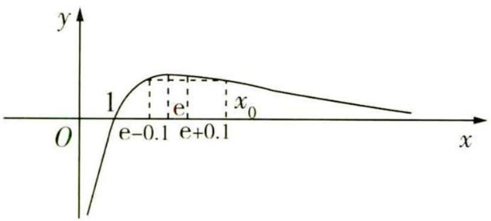

text_image

y
1
e-0.1 e+0.1 x₀
O
x

图 1

【收获与辨析】对于函数 $f(x)=\frac{\ln x}{x}$ ，考虑其图象特征，若在x轴上，两个自变量的值分别在e两侧且与e的距离相等，通过极值点偏移的特点，知道e右侧那个自变量的值对应的函数值大。如果两个自变量的值与e的距离不等，这时候要变形转化到同一单调区间内，再进行比较，比如：若同构后的 $a=\frac{\ln\frac{e^{2}}{2}}{\frac{e^{2}}{2}}$ ， $b=\frac{\ln2}{2}$ ，其中的 $\frac{e^{2}}{2}$ 与2分别在单调递减区间与单调递增区间中，用极值点偏移法比较失效，因而将 $b=\frac{\ln2}{2}$ 变形转化成 $b=\frac{\ln4}{4}$ ，问题就迎刃而解了

答案 B

调研 3 (2023·福建龙岩期中联考)(多选)已知 $e^{a}=3.1^{5.1}, e^{b}=4.1^{4.1}, e^{c}=$ 5. $1^{3.1}$ ，则下列不等关系正确的有()

A. $a > c$

B. $c > a$

C. $c > b$

D. $b > c$

解析 由已知得 $a=5.1\ln3.1,b=4.1\ln4.1,c=3.1\ln5.1$

【会分析】比较 $a, c$ 的大小，即比较 $\frac{\ln 3.1}{3.1}$ 与 $\frac{\ln 5.1}{5.1}$ 的大小，显然可以同构，构造函数 $f(x) =$

方田章还系统地讲述了分数的运算. 其中包括约分、通分、分数的四则运算, 比较分数的大小, 以及求几个分数的算术平均数等.

$\frac{\ln x}{x}$ 即可；比较 b, c 的大小，即比较 $\frac{\ln 4.1}{3.1}$ 与 $\frac{\ln 5.1}{4.1}$ 的大小，依然可以同构，构造函数 $h(x)=\frac{\ln(x+1)}{x}$ 即可

设 $f(x)=\frac{\ln x}{x}$ ，则 $f'(x)=\frac{1-\ln x}{x^{2}}$ ，当 $x\in(\mathrm{e},+\infty)$ 时， $f'(x)<0,f(x)=\frac{\ln x}{x}$ 单调递减，

所以 $f(3.1) > f(5.1)$ , 即 $\frac{\ln 3.1}{3.1} > \frac{\ln 5.1}{5.1}$ , 所以 $a > c$ , A 正确, B 错误.

方法一 设 $h(x)=\frac{\ln(x+1)}{x}$ ，则 $h'(x)=\frac{\frac{x}{x+1}-\ln(x+1)}{x^{2}}$ ，由于 $\ln x \leqslant x-1$ ，所以 $\ln \frac{1}{x} \leqslant \frac{1}{x}-1$ ，
所以 $\ln x \geqslant 1 - \frac{1}{x}$ ，从而 $\ln(x+1) \geqslant 1 - \frac{1}{x+1} = \frac{x}{x+1}$ ，所以 $\frac{x}{x+1} - \ln(x+1) \leqslant 0$ ，因而 $h(x)$ 在 $(0, +\infty)$ 上单调递减,那么 $h(3.1)>h(4.1)$ , 即 $\frac{\ln 4.1}{3.1} > \frac{\ln 5.1}{4.1}$ ,也就是b>c,C错误,D正确.故选AD.

方法二 对于 b, c 的大小, 考虑利用不等式 $x \geqslant \ln(x + 1) (x \geqslant 0)$ 比较, $c - b = 3.1 \ln 5.1 -$

【会证明】设 $g(x)=x-\ln(x+1)(x\geq0)$ ，则 $g'(x)=\frac{x}{x+1}\geq0$ ，所以 $g(x)$ 在 $[0,+\infty)$ 上单调递增，所以 $g(x)\geq g(0)=0$ ，即 $x\geq\ln(x+1)(x\geq0)$

4. $1 \ln 4.1 = 3.1 (\ln 5.1 - \ln 4.1) - \ln 4.1 = 3.1 \ln (1 + \frac{1}{4.1}) - \ln 4.1 \leqslant \frac{3.1}{4.1} - \ln 4.1 < 0$ , 所以 $b > c$ , C 错误, D 正确. 故选 AD.

答案 AD

# 角度2 放缩法在数列不等式证明问题中的应用

调研 4 (2023·云南师范大学附属中学11月适应性月考)记 $S_{n}$ 为数列 $\{a_{n}\}$ 的前 $n$ 项和,已知 $\{\frac{S_{n}-1}{n}\}$ 是首项为3,公差为1的等差数列.

(1) 求 $\{a_{n}\}$ 的通项公式.  
(2) 证明: 当 $n \geqslant 2$ 时, $\frac{1}{S_{2}} + \frac{1}{S_{3}} + \cdots + \frac{1}{S_{n}} < \frac{a_{n} - 1}{a_{n} + 1} - \frac{1}{2}$ .

解析 (1) 因为 $\left\{\frac{S_n - 1}{n}\right\}$ 是首项为 3, 公差为 1 的等差数列, 所以 $\frac{S_n - 1}{n} = 3 + (n - 1) \times 1$ ,

所以 $S_{n} = n^{2} + 2n + 1 = (n + 1)^{2}$ ，所以当 $n\geqslant 2$ 时， $S_{n - 1} = n^2,a_n = S_n - S_{n - 1} = 2n + 1.$

又 $S_{1} = a_{1} = 4$ ，不满足 $a_{n} = 2n + 1$

【易错】由 $S_{n}$ 求 $a_{n}$ 时, 要注意对 $n=1$ 的情况的讨论, 若 $a_{1}$ 不满足 $n \geqslant 2$ 时的通项表达式, 则结果要写成分段的形式

“粟米”主要讲各种粮食折算的比例问题,在成比例的四个数中,根据三个已知数求第四个数,提出比例算法,称为“今有术”.

所以 $\{a_{n}\}$ 的通项公式为 $a_{n} = \left\{ \begin{array}{l}4,n = 1,\\ 2n + 1,n\geqslant 2\text{且} n\in \mathbf{N}^{*}. \end{array} \right.$

(2) 当 $n \geqslant 2$ 时, $\frac{1}{S_n} = \frac{1}{(n + 1)^2} < \frac{1}{n(n + 1)} = \frac{1}{n} - \frac{1}{n + 1}$ ,

【敲黑板】具体应用放缩法时，有时难以一次放缩到位，需要不断调整。比如：若证明 $1 + \frac{1}{2^{2}} + \frac{1}{3^{2}} + \cdots + \frac{1}{n^{2}} < 2$ ，可以利用 $\frac{1}{n^{2}} < \frac{1}{n(n-1)} = \frac{1}{n-1} - \frac{1}{n} (n \geqslant 2)$ ，当 n = 1 时原不等式成立，当 $n \geqslant 2$ 时， $1 + \frac{1}{2^{2}} + \frac{1}{3^{2}} + \cdots + \frac{1}{n^{2}} < 1 + 1 - \frac{1}{2} + \frac{1}{2} - \frac{1}{3} + \cdots + \frac{1}{n-1} - \frac{1}{n} = 2 - \frac{1}{n} < 2$ ，而若证明 $1 + \frac{1}{2^{2}} + \frac{1}{3^{2}} + \cdots + \frac{1}{n^{2}} < \frac{7}{4}$ ，再和以上一样放缩证明，会出现放缩过大，达不到目的，因而需要对放缩的“度”进行调控，保留前两项，从第三项开始放缩，即 $1 + \frac{1}{2^{2}} + \frac{1}{3^{2}} + \cdots + \frac{1}{n^{2}} < 1 + \frac{1}{4} + \frac{1}{2} - \frac{1}{3} + \cdots + \frac{1}{n-1} - \frac{1}{n} = \frac{7}{4} - \frac{1}{n} < \frac{7}{4} (n \geqslant 3)$ ，此时不要忘了先说明 n = 1, 2 时不等式成立

所以 $\frac{1}{S_2} +\frac{1}{S_3} +\dots +\frac{1}{S_n} <  \frac{1}{2} -\frac{1}{3} +\frac{1}{3} -\frac{1}{4} +\dots +\frac{1}{n} -\frac{1}{n + 1} = \frac{1}{2} -\frac{1}{n + 1} = \frac{n - 1}{2n + 2},$

而 $\frac{a_{n}-1}{a_{n}+1}-\frac{1}{2}=\frac{2n}{2n+2}-\frac{1}{2}=\frac{n-1}{2n+2}$ ，所以 $\frac{1}{S_{2}}+\frac{1}{S_{3}}+\cdots+\frac{1}{S_{n}}<\frac{a_{n}-1}{a_{n}+1}-\frac{1}{2}$ .

# 拓展提升

# 常见的倒数式放缩方式

① $n^{2}(n\in\mathbf{N}^{*})$ 的倒数型: $\frac{1}{n^{2}}>\frac{1}{n(n+1)}=\frac{1}{n}-\frac{1}{n+1}$ 或 $\frac{1}{n^{2}}<\frac{1}{n(n-1)}=\frac{1}{n-1}-\frac{1}{n}(n\geqslant2)$ 或 $\frac{1}{n^{2}}=\frac{1}{2}\cdot\frac{2}{n^{2}}<\frac{1}{2}\cdot\frac{2}{(n+1)(n-1)}=\frac{1}{2}\left(\frac{1}{n-1}-\frac{1}{n+1}\right)(n\geqslant2)$ 或 $\frac{1}{n^{2}}<\frac{1}{n^{2}-\frac{1}{4}}=\frac{1}{(n+\frac{1}{2})(n-\frac{1}{2})}=$ $\frac{1}{n-\frac{1}{2}}-\frac{1}{n+\frac{1}{2}}=2\left(\frac{1}{2n-1}-\frac{1}{2n+1}\right).$

② $n (n \in \mathbf{N}^{*})$ 的倒数型: $\frac{1}{n+1} > \frac{1}{\sqrt{n}} - \frac{1}{\sqrt{n+1}}$ (证明: 即证 $\frac{1}{(n+1)^{2}} > \frac{1}{n} + \frac{1}{n+1} - \frac{2}{\sqrt{n(n+1)}}$ , 即证 $\frac{2}{\sqrt{n(n+1)}} > \frac{1}{n} + \frac{1}{n+1} - \frac{1}{(n+1)^{2}}$ , 即证 $\frac{2}{\sqrt{n(n+1)}} > \frac{2n^{2}+2n+1}{n(n+1)^{2}}$ , 即证 $4n(n+1)^{3} > (2n^{2}+2n+1)^{2}$ , 即证 $4n^{3}+4n^{2}-1>0$ , 此不等式显然成立).

③无理式 $\sqrt{n}(n\in\mathbf{N}^{*})$ 的倒数型： $\frac{1}{\sqrt{n}}>\frac{2}{\sqrt{n+1}+\sqrt{n}}=2(\sqrt{n+1}-\sqrt{n})$ 或 $\frac{1}{\sqrt{n}}<\frac{2}{\sqrt{n}+\sqrt{n-1}}=2(\sqrt{n}-\sqrt{n-1})(n\geqslant2)$ .

调研 5 (2023·重庆八中11月适应性月考)记 $S_{n}$ 为数列 $\{a_{n}\}$ 的前 $n$ 项和, 已知 $a_{1} = 2, \{3a_{n} - 2S_{n}\}$ 是公差为 2 的等差数列.

(1) 求 $\{a_{n}\}$ 的通项公式.  
(2) 证明: $\frac{1}{a_1} + \frac{1}{a_2} + \cdots + \frac{1}{a_n} < 1$ .

解析 (1) $\because 3a_{1} - 2S_{1} = a_{1} = 2, \{3a_{n} - 2S_{n}\}$ 是公差为 2 的等差数列, $\therefore 3a_{n} - 2S_{n} = 2 + 2(n - 1) = 2n$ , 即 $S_{n} = \frac{3}{2} a_{n} - n$ .

当 $n \geqslant 2$ 时, $a_{n} = S_{n} - S_{n-1} = \frac{3}{2} a_{n} - n - \frac{3}{2} a_{n-1} + (n - 1)$ ,

即 $a_{n}=3a_{n-1}+2,\therefore a_{n}+1=3(a_{n-1}+1)$ ,

又 $a_1 + 1 = 3, \therefore$ 数列 $\{a_n + 1\}$ 是以3为首项，3为公比的等比数列，

$\therefore a_{n} + 1 = 3^{n}$ ，则 $a_{n} = 3^{n} - 1$

(2) 由(1)得 $\frac{1}{a_n} = \frac{1}{3^n - 1}$ .

【提示】注意这里通项的特点，与【调研4】的不一样，因而放缩策略有差异

方法一 （比差）∵ $\frac{2}{3^{n}} - \frac{1}{3^{n} - 1} = \frac{2 \cdot 3^{n} - 2 - 3^{n}}{3^{n}(3^{n} - 1)} = \frac{3^{n} - 2}{3^{n}(3^{n} - 1)} > 0$ ,

$$
\therefore \frac {1}{a _ {n}} <   \frac {2}{3 ^ {n}}, \therefore \frac {1}{a _ {1}} + \frac {1}{a _ {2}} + \dots + \frac {1}{a _ {n}} <   \frac {2}{3} + \frac {2}{3 ^ {2}} + \dots + \frac {2}{3 ^ {n}} = 2 \times \frac {\frac {1}{3} \left(1 - \frac {1}{3 ^ {n}}\right)}{1 - \frac {1}{3}} = 1 - \frac {1}{3 ^ {n}} <   1.
$$

方法二 (糖水不等式) 利用糖水不等式得 $\frac{1}{a_n} = \frac{1}{3^n - 1} < \frac{1 + 1}{3^n - 1 + 1} = \frac{2}{3^n}$ ,

【敲黑板】a 克糖水中有 b 克糖 $(a > b > 0)$ ，则糖的质量与糖水的质量比为 $\frac{b}{a}$ ，若再添加 c 克糖 $(c > 0)$ ，则糖的质量与糖水的质量比为 $\frac{b + c}{a + c}$ ，生活经验告诉我们，添加糖后糖水会更甜，据此得到不等式 $\frac{b + c}{a + c} > \frac{b}{a} (a > b > 0, c > 0)$ 。这就是糖水不等式（糖水不等式可以用作差法、作商法、分析法等证明，同学们不好一试）

$$
\therefore \frac {1}{a _ {1}} + \frac {1}{a _ {2}} + \dots + \frac {1}{a _ {n}} <   \frac {2}{3} + \frac {2}{3 ^ {2}} + \dots + \frac {2}{3 ^ {n}} = 2 \times \frac {\frac {1}{3} (1 - \frac {1}{3 ^ {n}})}{1 - \frac {1}{3}} = 1 - \frac {1}{3 ^ {n}} <   1.
$$

“少广”主要讲已知正方形面积或正方体体积求边长或棱长,即开平方或开立方的方法,还给出了由圆面积求周长,由球体积求直径的近似公式.

调研 6 (2023·福建莆田期中)数列 $\{a_{n}\}$ 满足 $a_{1} + 2a_{2} + \cdots + na_{n} = 4 - \frac{n + 2}{2^{n-1}}$ , $n \in N^{*}$ .

(1) 求数列 $\{a_{n}\}$ 的前 n 项和 $T_{n}$ .

(2) 证明: 对任意的 $n \in \mathbf{N}^*$ 且 $n \geqslant 2, (1 + \frac{1}{2} + \frac{1}{3} + \cdots + \frac{1}{n}) \cdot T_n < 2 + 2\ln n$ .

解析 (1) 当 $n = 1$ 时, $a_{1} = 4 - 3 = 1$ .

当 $n \geqslant 2$ 时， $a_{1} + 2a_{2} + \cdots + na_{n} = 4 - \frac{n + 2}{2^{n-1}}, a_{1} + 2a_{2} + \cdots + (n - 1)a_{n-1} = 4 - \frac{n + 1}{2^{n-2}}$ ，
两式相减得 $na_{n}=4-\frac{n+2}{2^{n-1}}-(4-\frac{n+1}{2^{n-2}})=\frac{n}{2^{n-1}}$ ，所以 $a_{n}=\frac{1}{2^{n-1}}$ .

又 $a_1 = 1$ 符合上式，所以 $a_n = \left(\frac{1}{2}\right)^{n - 1}$

所以数列 $\{a_{n}\}$ 为等比数列，首项为1，公比为 $\frac{1}{2}$ ，所以 $T_{n} = \frac{1 - (\frac{1}{2})^{n}}{1 - \frac{1}{2}} = 2 - (\frac{1}{2})^{n - 1}$ .

(2)由(1)可知 $0 < T_{n} < 2$ , 所以 $(1 + \frac{1}{2} + \frac{1}{3} + \cdots + \frac{1}{n}) \cdot T_{n} < 2 (1 + \frac{1}{2} + \frac{1}{3} + \cdots + \frac{1}{n})$ . 因而只需证明 $1 + \frac{1}{2} + \frac{1}{3} + \cdots + \frac{1}{n} < 1 + \ln n$ .

【思维分析】考虑到不等式右侧合对数式，左侧是倒数和的形式，因而联想对数不等式 $\ln x \leq x - 1$ ，进而转化为 $\ln \frac{1}{x} \leq \frac{1}{x} - 1$ ，即 $\ln x \geqslant 1 - \frac{1}{x}$ ，达到放缩的目的，注意体会与前面倒题中放缩的思维模式的不同

由常用不等式 $\ln x \geqslant 1 - \frac{1}{x}$ (当且仅当 $x = 1$ 时等号成立) 可知,

【巧证】利用导数证明不等式 $\ln x \geqslant 1 - \frac{1}{x}$ ：记 $f(x) = \ln x + \frac{1}{x} - 1$ ，则 $f'(x) = \frac{1}{x} - \frac{1}{x^2} = \frac{x - 1}{x^2}$ ，当 $x \in (1, +\infty)$ 时， $f'(x) > 0, f(x)$ 单调递增，当 $x \in (0, 1)$ 时， $f'(x) < 0, f(x)$ 单调递减，故 $f(x)_{\min} = f(1)$ ，又 $f(1) = 0$ ，故 $f(x) \geqslant 0$ ，当且仅当 x = 1 时等号成立，即不等式 $\ln x \geqslant 1 - \frac{1}{x}$ 得证

“商功”主要讲体积计算问题,问题大都来源于营造城垣、开凿沟渠、修造仓窖等实际工程;除给出了各种立体体积公式外,还有工程分配方法.

对于 $n \geqslant 2, n \in \mathbf{N}^*$ , $\ln \frac{n}{n - 1} > 1 - \frac{n - 1}{n} = \frac{1}{n}$ ,

【会放缩】此为第二次放缩，求和并结合对数运算达到化简的目的

那么 $1 + \frac{1}{2} + \frac{1}{3} + \cdots + \frac{1}{n} < 1 + \ln 2 + \ln \frac{3}{2} + \cdots + \ln \frac{n}{n-1} = 1 + \ln (2 \cdot \frac{3}{2} \cdot \cdots \cdot \frac{n}{n-1}) = 1 + \ln n$ ，原式得证.

调研 7 (2023·广州大学附属中学11月月考)已知数列 $\{a_{n}\}$ , $a_{1}=1$ , $S_{n}$ 为数列 $\{a_{n}\}$ 的前n项和,且 $S_{n}=\frac{1}{3}(n+2)a_{n}$ .

(1)求数列 $\{a_{n}\}$ 的通项公式.

(2) 已知 x > 0 时不等式 $\sin x < x$ 恒成立, 证明: $(1 + \sin \frac{1}{a_{1}})(1 + \sin \frac{1}{a_{2}}) \cdots (1 + \sin \frac{1}{a_{n}}) < e^{2}$ .

解析 (1) $S_{n} = \frac{1}{3} (n + 2)a_{n}$ , 即 $3S_{n} = (n + 2)a_{n}$ , 当 $n \geqslant 2$ 时, $3S_{n - 1} = (n + 1)a_{n - 1}$ ,

两式相减得 $3a_{n}=(n+2)a_{n}-(n+1)a_{n-1}$ ，即 $(n-1)a_{n}=(n+1)a_{n-1}$ ，也即 $\frac{a_{n}}{n+1}=\frac{a_{n-1}}{n-1}$ ，变形为 $\frac{a_{n}}{n(n+1)}=\frac{a_{n-1}}{(n-1)n}$ ，即数列 $\left\{\frac{a_{n}}{n(n+1)}\right\}$ 为常数列，∴ $\frac{a_{n}}{n(n+1)}=\frac{a_{n-1}}{(n-1)n}=\cdots=\frac{a_{1}}{1\times2}=\frac{1}{2},\therefore a_{n}=\frac{1}{2}n(n+1)(n\geqslant2)$ ，

经检验, $a_{1}=1$ 也适合,从而 $a_{n}=\frac{1}{2}n(n+1)(n\in\mathbf{N}^{*})$ .

(2) $\because x > 0$ 时, $\sin x < x$ , $\therefore$ 令 $x = \frac{1}{a_n}$ , 则有 $\sin \frac{1}{a_n} < \frac{1}{a_n}$ .

【敲黑板】题目中出现的信息一般不会是无用信息,如本题,给出 $\sin x < x\left( {x > 0}\right)$ ,意在提示放缩,将合三角函数式的形式放缩为不含三角函数式的常规数列求和的形式

$$
\because a _ {n} = \frac {1}{2} n (n + 1) > 0, \therefore \frac {1}{a _ {n}} = \frac {2}{n (n + 1)} > 0, \text {又} \frac {1}{a _ {n}} \in (0, 1 ], \therefore \sin \frac {1}{a _ {n}} > 0.
$$

将 $\left(1+\sin\frac{1}{a_{1}}\right)\left(1+\sin\frac{1}{a_{2}}\right)\left(1+\sin\frac{1}{a_{3}}\right)\cdots\left(1+\sin\frac{1}{a_{n}}\right)<e^{2}$ 两边同时取对数，

【突破】由于左侧是乘积形式，可通过取对数，转化成和的形式，而右侧是 $e^{2}$ ，因而考虑取自然对数

“均输” 均输意为按人口多少、路途远近和谷物贵贱合理摊派税收和劳役等.这一章主要讲以赋税计算和其他应用问题为中心的较为复杂的比例问题的计算方法.

则原问题等价于证明 $\ln\left(1+\sin\frac{1}{a_{1}}\right)+\ln\left(1+\sin\frac{1}{a_{2}}\right)+\cdots+\ln\left(1+\sin\frac{1}{a_{n-1}}\right)+$ $\ln\left(1+\sin\frac{1}{a_{n}}\right)<2.$

考虑切线放缩不等式 $\ln (x + 1) < x(x > 0)$ , $\therefore \ln (1 + \sin \frac{1}{a_n}) < \sin \frac{1}{a_n} < \frac{1}{a_n} = \frac{2}{n(n + 1)} =$

【会放缩】此处利用了两个常见不等式，实现两次放缩

$$
2 \left(\frac {1}{n} - \frac {1}{n + 1}\right),
$$

那么 $\ln\left(1+\sin\frac{1}{a_{1}}\right)+\ln\left(1+\sin\frac{1}{a_{2}}\right)+\cdots+\ln\left(1+\sin\frac{1}{a_{n-1}}\right)+\ln\left(1+\sin\frac{1}{a_{n}}\right)<2\times$ $(1-\frac{1}{2}+\frac{1}{2}-\frac{1}{3}+\cdots+\frac{1}{n}-\frac{1}{n+1})=2\left(1-\frac{1}{n+1}\right)<2$ ，则 $(1+\sin\frac{1}{a_{1}})(1+\sin\frac{1}{a_{2}})(1+\sin\frac{1}{a_{3}})\cdots(1+\sin\frac{1}{a_{n}})<e^{2}$ ，得证.

调研 8 (2023·天津五校期中联考)已知数列 $\{a_{n}\}$ 是等差数列,其前n项和为 $S_{n},a_{7}=15,S_{7}=63$ . 数列 $\{b_{n}\}$ 的前n项和为 $T_{n},2T_{n}=3b_{n}-3(n\in\mathbf{N}^{*})$ .

(1)求数列 $\{a_{n}\}$ ， $\{b_{n}\}$ 的通项公式.  
(2) 求数列 $\left\{\frac{2}{S_{n}}\right\}$ 的前 n 项和 $Q_{n}$ .  
(3) 求证: $\sum_{i=1}^{n}\frac{a_{i}}{T_{i}}<2.$

解析 (1) 设数列 $\{a_{n}\}$ 的公差为 $d$ , 则 $\left\{ \begin{array}{l} a_{1} + 6d = 15, \\ 7a_{1} + 21d = 63, \end{array} \right.$ 解得 $\left\{ \begin{array}{l} d = 2, \\ a_{1} = 3, \end{array} \right.$ 所以 $a_{n} = 2n + 1$ .

由 $2T_{n}=3b_{n}-3$ ①可得, 当 n=1 时, $2T_{1}=2b_{1}=3b_{1}-3, b_{1}=3$ ,

当 $n \geqslant 2$ 时, $2T_{n-1} = 3b_{n-1} - 3$ ②,

①②相减得 $2b_{n}=3b_{n}-3b_{n-1}$ ，整理得 $b_{n}=3b_{n-1}$ ，所以数列 $\{b_{n}\}$ 为首项为 3，公比为 3 的等比数列， $b_{n}=3^{n}$ .

(2) 由(1)可得, $\frac{2}{S_n} = \frac{2}{3n + \frac{n(n - 1)}{2} \times 2} = \frac{2}{n(n + 2)} = \frac{1}{n} - \frac{1}{n + 2}$ ,

所以 $Q_{n}=1-\frac{1}{3}+\frac{1}{2}-\frac{1}{4}+\frac{1}{3}-\frac{1}{5}+\cdots+\frac{1}{n-1}-\frac{1}{n+1}+\frac{1}{n}-\frac{1}{n+2}=1+\frac{1}{2}-\frac{1}{n+1}-$

$$
\frac {1}{n + 2} = \frac {3}{2} - \frac {2 n + 3}{(n + 1) (n + 2)}.
$$

(3) 由(1)可得 $\frac{a_n}{T_n} = \frac{2n + 1}{\frac{3(3^n - 1)}{3 - 1}} = \frac{2(2n + 1)}{3(3^n - 1)}.$

方法一 $3^{n} - 1 = 2 \times 3^{n - 1} + 3^{n - 1} - 1 \geqslant 2 \times 3^{n - 1}$ ,

【突破口】对 ${3}^{n}$ 拆项得 $\left( {2 + 1}\right)  \times  {3}^{n - 1} = 2 \times  {3}^{n - 1} + {3}^{n - 1}$ ,再利用 ${3}^{n - 1} \geq  1$ 实现放缩,转化成数列求和的形式,这是本题得证的关键

所以 $\frac{a_n}{T_n} \leqslant \frac{2(2n + 1)}{3 \times 2 \times 3^{n - 1}} = \frac{2n + 1}{3^n}$ .

【思维误区】对于 $\frac{a_{n}}{T_{n}}=\frac{2(2n+1)}{3(3^{n}-1)}$ ，若这样想：因为 $3^{n+1}-3-3^{n}=2\times3^{n}-3>0$ ，所以 $3^{n+1}-3>3^{n}$ ，则放缩成 $\frac{a_{n}}{T_{n}}<\frac{2(2n+1)}{3^{n}}$ ，同样可用错位相减法求和，但放缩过大，无法得证

设 $B_{n} = \frac{3}{3^{1}} +\frac{5}{3^{2}} +\dots +\frac{2n + 1}{3^{n}}$ ，则 $\frac{1}{3} B_n = \frac{3}{3^2} +\frac{5}{3^3} +\dots +\frac{2n + 1}{3^{n + 1}}$ ，两式相减得 $\frac{2}{3} B_n = 1+$

$$
2 \left(\frac {1}{3 ^ {2}} + \frac {1}{3 ^ {3}} + \dots + \frac {1}{3 ^ {n}}\right) - \frac {2 n + 1}{3 ^ {n + 1}} = 1 + 2 \times \frac {\frac {1}{3 ^ {2}} \left(1 - \frac {1}{3 ^ {n - 1}}\right)}{1 - \frac {1}{3}} - \frac {2 n + 1}{3 ^ {n + 1}} = \frac {4}{3} - \frac {2 n + 4}{3 ^ {n + 1}},
$$

所以 $B_{n} = 2 - \frac{n + 2}{3^{n}} < 2$ ，所以 $\sum_{i=1}^{n}\frac{a_i}{T_i}\leqslant B_n < 2.$

方法二 当 $n \geqslant 2$ 时, $2n + 1 < 3^n - 1$ , 则 $2(2n + 1) < 3(3^n - 1)$ , 根据糖水不等式得 $\frac{2(2n + 1)}{3(3^n - 1)} < \frac{2(2n + 1) + 3}{3(3^n - 1) + 3} = \frac{2(2n + 1) + 3}{3^{n+1}} < \frac{3(2n + 1)}{3^{n+1}} = \frac{2n + 1}{3^n}$ , 又 $n = 1$ 时, $\frac{2(2n + 1)}{3(3^n - 1)} = \frac{2n + 1}{3^n}$ , 所以 $\frac{a_n}{T_n} \leqslant \frac{2n + 1}{3^n}$ , 后同方法一.

【拓展】此处为利用糖水不等式实现的放缩，通过以下例子可进一步展现糖水不等式的放缩应用：已知数列 $\{a_{n}\}$ 满足 $a_{n}=1-\frac{1}{2n}$ ，求证 $\ln a_{1}+\ln a_{2}+\cdots+\ln a_{n}<\frac{1}{2}\ln\frac{1}{2n+1}$ 。根据糖水不等式得 $a_{n}=\frac{2n-1}{2n}<\frac{2n}{2n+1}$ ，所以 $(a_{1}a_{2}a_{3}\cdots a_{n})^{2}=(\frac{1}{2}\times\frac{3}{4}\times\frac{5}{6}\times\cdots\times\frac{2n-1}{2n})^{2}<(\frac{1}{2}\times\frac{2}{3})\times(\frac{3}{4}\times\frac{4}{5})\times(\frac{5}{6}\times\frac{6}{7})\times\cdots\times(\frac{2n-1}{2n}\times\frac{2n}{2n+1})=\frac{1}{2n+1}$ ，然后两边同时取对数，则可得证

“盈不足” 即双设法问题,提出了盈不足、盈适足和不足适足、两盈和两不足三种类型的盈亏问题,以及若干可以通过两次假设化为盈不足问题的一般问题的解法. 这也是处于世界领先地位的成果,传到西方后,影响极大.

# 角度 3 立体几何中的动态探究问题

调研 9 (2023·河南焦作期中)已知直三棱柱 $ABC - A_{1}B_{1}C_{1}$ 中, $AB \perp AC, AB = AC = AA_{1} = 1, P$ 为线段 $A_{1}B$ 上的动点, 则 $AP + PC_{1}$ 的最小值为 ( )

A. $\frac{\sqrt{5}}{2}$

B. $\frac{\sqrt{10}}{2}$

C. $\sqrt{5}$

D. $\sqrt{2 + \sqrt{2}}$

解析

方法一

如图 2, 连接 $BC_{1}$ , 将 $\triangle A_{1}BA$ 沿 $A_{1}B$ 折到$\triangle A_{1}BA'$ 的位置,使得平面 $A_{1}BA'$ 与平面 $A_{1}BC_{1}$ 共面,连接 $A'C_{1}$ .

【难点突破】通过图形翻折变换,展成一个平面,以“两点之间,线段最短(或三角形两边之和大于第三边)”为突破口求解

当 P 为线段 $A^{\prime}C_{1}$ 与 $A_{1}B$ 的交点时, $A^{\prime}P + PC_{1}$ 最小, 即 $AP + PC_{1}$ 最小.

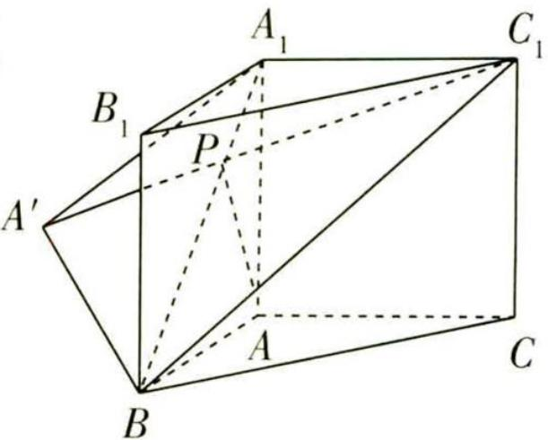

text_image

A₁
B₁
P
A′
A
C₁
B
C

图2

因为 $AB \perp AC, AA_{1} \perp AC, AB \cap AA_{1} = A$ ，所以 $AC \perp$ 平面 $AA_{1}B$ ，所以 $A_{1}C_{1} \perp$ 平面 $AA_{1}B$ ，所以 $A_{1}C_{1} \perp A_{1}B$ ，即 $\angle C_{1}A_{1}B = 90^{\circ}$ 。又 AB = AC = $AA_{1} = 1$ ，所以 $A_{1}C_{1} = 1, A'A_{1} = 1$ 。易得 $\triangle A_{1}BA'$ 为等腰直角三角形，所以 $\angle A'A_{1}B = 45^{\circ}$ ，

所以 $\angle A^{\prime}A_{1}C_{1}=90^{\circ}+45^{\circ}=135^{\circ}$ . 在 $\triangle A_{1}C_{1}A^{\prime}$ 中, 利用余弦定理, 可知 $AP + PC_{1}$ 的最小值 $A^{\prime}C_{1}$ 为 $\sqrt{1+1-2\times1\times1\times\cos135^{\circ}}=\sqrt{2+\sqrt{2}}$ , 故选 D.

方法二 如图3, 易知 $AB, AC, AA_{1}$ 三线两两垂直, 以 $AB, AC, AA_{1}$ 所在直线分别为 $x$ 轴, $y$ 轴, $z$ 轴建立空间直角坐标系, 则 $B(1,0,0), A_{1}(0,0,1), C_{1}(0,1,1), \overrightarrow{A_{1}B} = (1,0,-1), \overrightarrow{AA_{1}} = (0,0,1), \overrightarrow{C_{1}A_{1}} = (0,-1,0)$ .

$$
\begin{array}{r l} & {\text {设} \overrightarrow {A _ {1} P} = \lambda   \overrightarrow {A _ {1} B} = (\lambda , 0, - \lambda) (0 \leqslant \lambda \leqslant 1), \overrightarrow {A P} = \overrightarrow {A A _ {1}} + \overrightarrow {A _ {1} P} = (\lambda , 0, 1 -} \\ & {\lambda), \overrightarrow {C _ {1} P} = \overrightarrow {C _ {1} A _ {1}} + \overrightarrow {A _ {1} P} = (\lambda , - 1, - \lambda), | \overrightarrow {A P} | + | \overrightarrow {P C _ {1}} | = \sqrt {\lambda^ {2} + (1 - \lambda) ^ {2}} +} \\ & {\sqrt {\lambda^ {2} + 1 + (- \lambda) ^ {2}} = \sqrt {2} [ \sqrt {(\lambda - \frac {1}{2}) ^ {2} + (0 - \frac {1}{2}) ^ {2}} + \sqrt {(\lambda - 0) ^ {2} + (0 + \frac {\sqrt {2}}{2}) ^ {2}} ],} \end{array}
$$

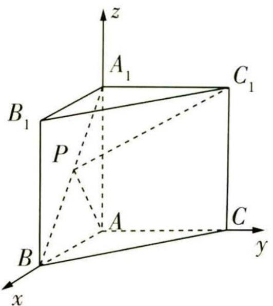

text_image

z
A₁
B₁
C₁
P
A
B
C
y
x

图3

所求最小值可转化为平面直角坐标系中动点 $(\lambda,0)$ 到点 $M(\frac{1}{2},\frac{1}{2}),N(0,-\frac{\sqrt{2}}{2})$

距离和的最小值的 $\sqrt{2}$ 倍, 而距离和的最小值为 $|MN| = \sqrt{\left(\frac{1}{2}\right)^2 + \left(\frac{1}{2} + \frac{\sqrt{2}}{2}\right)^2} = \sqrt{1 + \frac{\sqrt{2}}{2}}$ , 此时 $\lambda = 1 - \frac{\sqrt{2}}{2} \in [0,1]$ , 所以 $AP + PC_1$ 的最小值为 $\sqrt{2 + \sqrt{2}}$ , 故选 D.

答案

D

调研 10 (2023 · 重庆西南大学附属中学第三次月考) (多选) 已知正方体 $ABCD - A_{1}B_{1}C_{1}D_{1}$ 的棱长为 $2, E$ 为线段 $AA_{1}$ 的中点, $\overrightarrow{AP} = \lambda \overrightarrow{AB} + \mu \overrightarrow{AD}$ , 其中 $\lambda, \mu \in [0,$

“方程”主要讲一次方程组问题,采用分离系数的方法表示线性方程组,相当于现在的矩阵,解线性方程组时使用的直除法,与矩阵的初等变换一致.这是世界上最早的完整的线性方程组的解法.

关注微信公众号“初高教辅站”获取更多初高中教辅资料

1],则下列选项正确的是

( )

A. $\mu = \frac{1}{2}$ 时, $A_{1}P \perp ED_{1}$   
B. $\lambda=\frac{1}{4}$ 时, $B_{1}P+PD$ 的最小值为 $\sqrt{13}$   
C. $\lambda + \mu = 1$ 时, 直线 $A_{1}P$ 与平面 $B_{1}D_{1}E$ 的交点轨迹长度为 $\frac{\sqrt{2}}{2}$   
D. $\lambda + \mu = 1$ 时, $A_{1}P$ 与平面 $A_{1}B_{1}C_{1}D_{1}$ 所成的角不可能为 $60^{\circ}$

解析 对于 A, 如图 4, 取 AD 的中点 F, BC 的中点 G, 连接 $A_{1}F$ , $A_{1}G$ , FG, 则 $\overrightarrow{FG} = \overrightarrow{AB}$ .

因为 $\overrightarrow{AP} = \lambda \overrightarrow{AB} + \mu \overrightarrow{AD}, \mu = \frac{1}{2}, \lambda \in [0,1]$ ，所以 $\overrightarrow{AP} = \lambda \overrightarrow{FG} + \overrightarrow{AF}$ ，即点P

在线段 FG 上.

【点睛】确定点 P 在 FG 上是关键，点 P 虽然是动点，但 $A_{1}P \subset$ 平面 $A_{1}FG$ ，因而只需确定 $ED_{1} \perp$ 平面 $A_{1}FG$

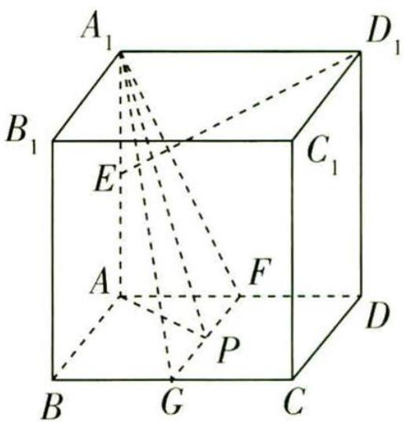

text_image

A₁
B₁
E
C₁
A
F
P
B
G
C
D₁

图 4

在正方形 $ADD_{1}A_{1}$ 中，E, F分别是 $AA_{1}, AD$ 的中点，所以 $A_{1}F \perp ED_{1}$ ，又 $GF \perp$ 平面 $ADD_{1}A_{1}, ED_{1} \subset$ 平面 $ADD_{1}A_{1}$ ，所以 $GF \perp ED_{1}$ . 因为 $GF \cap A_{1}F = F$ ，所以 $ED_{1} \perp$ 平面 $A_{1}FG$ ，又 $A_{1}P \subset$ 平面 $A_{1}FG$ ，所以 $A_{1}P \perp ED_{1}$ ，故A正确.

对于 B, 如图 5, 在 AB 上取点 H, 使得 $\overrightarrow{AH} = \frac{1}{4}\overrightarrow{AB}$ , 在 DC 上取点 K, 使得 $\overrightarrow{DK} = \frac{1}{4}\overrightarrow{DC}$ , 连接 HK, $B_{1}H$ , $C_{1}K$ . 因为 $\overrightarrow{AP} = \lambda \overrightarrow{AB} + \mu \overrightarrow{AD}, \lambda = \frac{1}{4}, \mu \in [0,1]$ , 所以点 P 在线段 HK 上. 将平面 $B_{1}HKC_{1}$ 与平面 AHKD 沿着 HK 翻折到同一平面内, 如图 6, 连接 $B_{1}D$ , 则 $B_{1}P + PD$ 的最小值为$B_{1}D$ ，由勾股定理得 $B_{1}H = \sqrt{2^{2} + (\frac{3}{2})^{2}} = \frac{5}{2}$ 所以 $AB_{1} = \frac{5}{2} +\frac{1}{2} = 3$ ，所以 $B_{1}D = \sqrt{2^{2} + 3^{2}} = \sqrt{13}$ 故B正确.

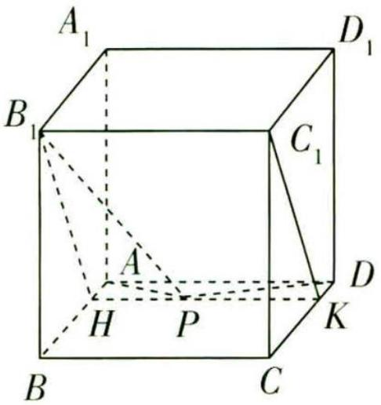

text_image

A₁
B₁
C₁
D₁
A
H
P
K
B
C

图 5

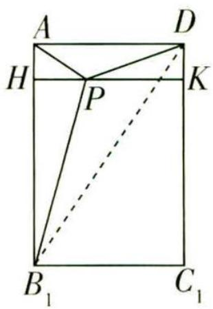

text_image

A
H
P
D
K
B₁
C₁

图6

对于 C, 连接 $BD, \overrightarrow{AP} = \lambda \overrightarrow{AB} + \mu \overrightarrow{AD}, \lambda, \mu \in [0,1], \lambda + \mu = 1$ , 所以点 P 在线段 BD 上, 如图 7, 连接 $A_{1}B$ , 交 $B_{1}E$ 于点 M, 连接 $A_{1}D$ , 交 $D_{1}E$ 于点 N, 连接 MN, 则线段 MN 即直线 $A_{1}P$ 与平面 $B_{1}D_{1}E$ 的交点的轨迹, 其中 $\triangle A_{1}BD$ 为等

【关键】 $BD \parallel$ 平面 ${B}_{1}{D}_{1}E$ ,因而当点 $P$ 在 ${BD}$ 上移动时,直线 ${A}_{1}P$ 与平面 ${B}_{1}{D}_{1}E$ 的交点轨迹是平面 ${A}_{1}{BD}$ 与平面 ${B}_{1}{D}_{1}E$ 的交线

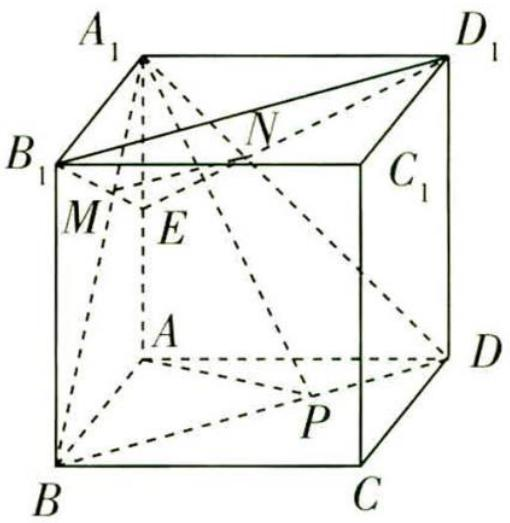

text_image

A₁
B₁
M
E
A
P
C₁
D₁
D
B
C

图 7

这一章还引进和使用了负数,并提出了正负术——正负数的加减法则,与现今代数中法则完全相同;解线性方程组时实际上还施行了正负数的乘除法.这是世界数学史上一项重大的成就,第一次突破了正数的范围,扩展了数系.

边三角形， $\angle BA_{1}D = 60^{\circ}$ ，由 $\triangle A_{1}ME \sim \triangle BMB_{1}$ 可知 $\frac{A_{1}M}{BM} = \frac{A_{1}E}{BB_{1}} = \frac{1}{2}$ ，而 $A_{1}B = 2\sqrt{2}$ ，所以 $A_{1}M = \frac{2\sqrt{2}}{3}$ .

同理可得 $A_{1}N=\frac{2\sqrt{2}}{3}$ ，所以 $\triangle A_{1}MN$ 为等边三角形，所以 $MN=A_{1}N=\frac{2\sqrt{2}}{3}$ ，所以直线 $A_{1}P$ 与平面 $B_{1}D_{1}E$ 的交点轨迹长度为 $\frac{2\sqrt{2}}{3}$ ，故 C 错误.

对于 D, 由 C 可知点 P 在线段 BD 上, 如图 8, 连接 $B_{1}D_{1}$ , 过点 $P$ 作 $PQ \parallel AA_{1}$ 交 $B_{1}D_{1}$ 于点 $Q$ , 连接 $A_{1}Q$ , 则 $PQ \perp$ 平面 $A_{1}B_{1}C_{1}D_{1}$ , 即 $\angle PA_{1}Q$ 为直线 $A_{1}P$ 与平面 $A_{1}B_{1}C_{1}D_{1}$ 所成的角, 在 Rt $\triangle A_{1}B_{1}D_{1}$ 中, $A_{1}Q \in [\sqrt{2}, 2]$ , $\tan \angle PA_{1}Q = \frac{PQ}{A_{1}Q} = \frac{2}{A_{1}Q} \in [1, \sqrt{2}]$ , 由 $\tan 60^{\circ} = \sqrt{3}$ , 得 $\angle PA_{1}Q < 60^{\circ}$ , 故 D 正确. 故选 ABD.

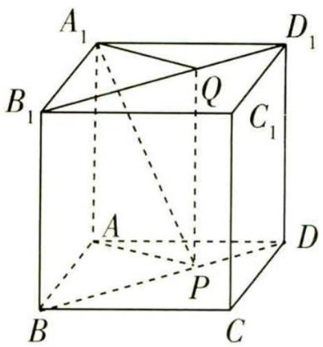

text_image

A₁
B₁
Q
C₁
D₁
A
P
B
C

图8

【关键】因为 PQ 的长度是固定的，因而 $\angle PA_{1}Q$ 的大小取决于 $A_{1}Q$ ，而 $A_{1}Q$ 最小时是点 $A_{1}$ 到 $B_{1}D_{1}$ 的距离，最大时是 $A_{1}B_{1}$ 或 $A_{1}D_{1}$ ，据此可求出 $\angle PA_{1}Q$ 正切值的取值范围

# 答案 ABD

调研 11 (2023·清华大学自强计划)已知正方体 $ABCD-A'B'C'D'$ 的棱长为 1, 点 $M, N$ 分别为线段 $AB', AC$ 上的动点, 点 $T$ 在平面 $BCC'B'$ 内, 求 $|MT|+|NT|$ 的最小值.

解析 设点 $A$ 关于 $BC$ 的对称点为 $E$ , 连接 $EB, EC$ , 设点 $N$ 关于 $BC$ 的对称点为 $F$ , 则 $F$ 在 $EC$ 上, 连接 $FM, FT$ , 记 $d$ 为异面直线 $AB'$ 与 $CE$ 之间的距离, 则 $|MT| + |NT| = |MT| + |FT| \geqslant |MF| \geqslant d$ .

【扫清障碍】本题是双动点问题,因而利用点关于线的对称进行转化,也可以理解为点 $N$ 关于平面 ${BCC}^{\prime }{B}^{\prime }$ 的对称点为 $F$ ,连接 ${MF}$ ,求 ${MF}$ 的最小值即求两异面直线间的距离

方法一 以 D 为原点, DA, DC, DD' 分别为 x 轴, y 轴, z 轴建立空间直角坐标系, 如图 9 所示, 则 $\overrightarrow{AB'} = (0, 1, 1)$ , $\overrightarrow{CE} = (1, 1, 0)$ , $\overrightarrow{AE} = (0, 2, 0)$ ,

设 $\boldsymbol{m}=(x,y,z)$ 是 $\overrightarrow{AB'}$ , $\overrightarrow{CE}$ 的公垂向量（即 $m\perp\overrightarrow{AB'}$ , $m\perp\overrightarrow{CE}$ ），则 $\left\{\begin{aligned}y+z=0,\\ x+y=0,\end{aligned}\right.$ 取 x=1，则 y=-1, z=1，则 $\boldsymbol{m}=(1,-1,$

1) 是 $\overrightarrow{AB'}$ , $\overrightarrow{CE}$ 的一个公垂向量, 则 $d = \frac{|m \cdot \overrightarrow{AE}|}{|m|} = \frac{2}{\sqrt{3}} = \frac{2\sqrt{3}}{3}$ .

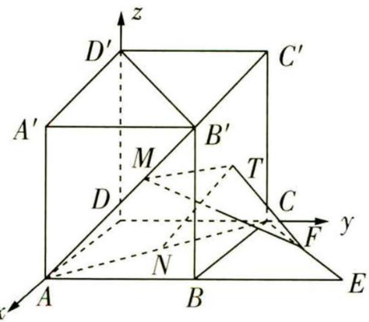

text_image

z
D'
C'
A'
B'
M
T
D
C
y
F
N
A
B
E
c

图9

【拓展】求异面直线间的距离,可以先求与两条异面直线都垂直的向量,再从两条异面直线上分别任意取一点,这两点的连线对应的向量在与两条异面直线都垂直的向量方向上的投影向量

“勾股”利用勾股定理求解的各种问题.其中的绝大多数内容是与当时的社会生活密切相关的.提出了勾股数问题的通解公式:若a,b,c分别是勾股形的勾、股、弦,则 $a^{2}+b^{2}=c^{2}$ .

的模即所求

所以 $|MT|+|NT|$ 的最小值为 $\frac{2\sqrt{3}}{3}$ .

方法二 连接 $AD'$ , 由 $CE \parallel B'D'$ , $CE \not\subset$ 平面 $AB'D', B'D' \subset$ 平面 $AB'D'$ , 得 $CE \parallel$ 平面 $AB'D'$ .

所以异面直线 $A B^{\prime}$ 与 $C E$ 之间的距离即 $C E$ 到平面 $A B^{\prime} D^{\prime}$ 的距离.

连接 ${B}^{\prime }C,{CD}^{\prime }$ ,因为正四面体 $A{B}^{\prime }C{D}^{\prime }$ 的棱长为 $\sqrt{2}$ ,所以正四面体的高为 $\frac{\sqrt{6}}{3} \times  \sqrt{2} = \frac{2\sqrt{3}}{3}$ .

【用结论】棱长为 a 的正四面体的高为 $\frac{\sqrt{6}}{3}a$

所以 $|MT| + |NT|$ 的最小值为 $\frac{2\sqrt{3}}{3}$ .

# 角度4 解析几何中的蒙日圆与阿氏圆问题

调研 12 (2023·江苏南通如皋诊断测试)(多选)画法几何的创始人——法国数学家加斯帕尔·蒙日发现:若椭圆的两条切线互相垂直,则两切线的交点位于一个与椭圆同中心的圆上,称此圆为该椭圆的蒙日圆.已知椭圆 $C: \frac{x^{2}}{a^{2}} + \frac{y^{2}}{b^{2}} = 1 (a > b > 0)$ 的离心率为 $\frac{\sqrt{2}}{2}, F_{1}, F_{2}$ 分别为椭圆的左、右焦点,点 $A$ 在椭圆上,直线 $l: bx + ay - a^{2} - b^{2} = 0$ ,则 ( )

A. 直线 $l$ 与 $C$ 的蒙日圆相切  
B. C 的蒙日圆的方程为 $x^{2} + y^{2} = 2a^{2}$   
C. 记点 $A$ 到直线 $l$ 的距离为 $d$ , 则 $d - |AF_{2}|$ 的最小值为 $\frac{(4\sqrt{3} - 6\sqrt{2})b}{3}$   
D. 若矩形 MNGH 的四条边均与 C 相切, 则矩形 MNGH 面积的最大值为 $8b^{2}$

思维导引 根据题意求出蒙日圆的方程,利用直线与圆的位置关系可判断 A 选项的正误;由椭圆的离心率为 $\frac{\sqrt{2}}{2}$ 可得 $a^{2} = 2b^{2}$ , 结合蒙日圆的方程可判断 B 选项的正误; 利用椭圆的定义和点到直线的距离公式可判断 C 选项的正误; 分析可知矩形 MNGH 的四个顶点都在蒙日圆上, 利用基本不等式可判断 D 选项的正误.

解析 当椭圆 $C: \frac{x^2}{a^2} + \frac{y^2}{b^2} = 1 (a > b > 0)$ 的两切线分别与两坐标轴垂直时, 两切线方程分别

球冠 指一个球面被平面所截后剩下的曲面,是“面”的概念. 截得的圆面是底,垂直于圆面的直径被截得的部分是高.

为 $x = \pm a, y = \pm b$ ，所以点 $(\pm a, \pm b)$ 在 C 的蒙日圆上，故蒙日圆的方程为 $x^{2} + y^{2} = a^{2} + b^{2}$ .

【点睛】题设中并没有直接给出蒙日圆方程，因而首先要清楚与椭圆 $C:\frac{x^{2}}{a^{2}}+\frac{y^{2}}{b^{2}}=1(a>b>0)$ 相对应的蒙日圆方程为 $x^{2} + y^{2} = a^{2} + b^{2}$

对于 A, 蒙日圆圆心到直线 l 的距离 $d = \frac{a^{2} + b^{2}}{\sqrt{a^{2} + b^{2}}} = \sqrt{a^{2} + b^{2}}$ ，故直线 l 与蒙日圆相切，A 正确.

【秒杀】直线 $l$ 的几何含义是蒙日圆 $x^{2}+y^{2}=a^{2}+b^{2}$ 上点 $(b,a)$ 处的切线. 拓展: 圆 $x^{2}+y^{2}=R^{2}$ 在点 $P(x_{0},y_{0})$ 处的切线方程为 $x_{0}x+y_{0}y=R^{2}$ , 若 $P(x_{0},y_{0})$ 是圆外一点, 过点 $P$ 的圆的两条切线对应的切点分别为 $A,B$ , 则 $x_{0}x+y_{0}y=R^{2}$ 的几何含义是切点弦 $AB$ 所在直线的方程

已知椭圆的离心率 $e = \frac{c}{a} = \sqrt{\frac{c^2}{a^2}} = \sqrt{\frac{a^2 - b^2}{a^2}} = \sqrt{1 - \frac{b^2}{a^2}} = \frac{\sqrt{2}}{2}$ , 所以 $a^2 = 2b^2$ .

对于 B, C 的蒙日圆的方程为 $x^{2} + y^{2} = a^{2} + b^{2} = \frac{3}{2}a^{2}$ , B 错误.

对于 C, 连接 $AF_{1}$ ，由椭圆的定义可得 $\left|AF_{1}\right| + \left|AF_{2}\right| = 2a = 2\sqrt{2}b$ ，则 $\left|AF_{2}\right| = 2\sqrt{2}b - \left|AF_{1}\right|$ ，所以 $d - \left|AF_{2}\right| = d + \left|AF_{1}\right| - 2\sqrt{2}b$ ，因为 $c = \frac{\sqrt{2}}{2}a = b$ ，所以直线 l 的方程为 $x + \sqrt{2}y - 3b = 0$ ，点 $F_{1}(-b,0)$

【关键点】利用椭圆的定义，将 $d-|AF_{2}|$ 转化成 $d+|AF_{1}|-2\sqrt{2}b$ ，即 $|AN|+|AF_{1}|-2\sqrt{2}b$ ，其中 $AN\perp l$ ，如图10，那么A,N, $F_{1}$ 三点共线时待求式最小，注意通过图形观察几何特征

到直线 l 的距离为 $d' = \frac{4b}{\sqrt{3}} = \frac{4\sqrt{3}}{3}b$ ，所以 $d - |AF_{2}| = d + |AF_{1}| - 2\sqrt{2}b \geqslant d' - 2\sqrt{2}b = \frac{(4\sqrt{3} - 6\sqrt{2})b}{3}$ ，当且仅当 $AF_{1} \perp l$ 时，等号成立，C 正确。

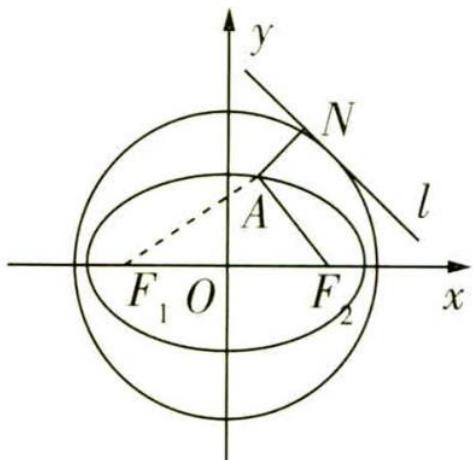

text_image

y
N
A
l
F₁ O F₂ x

图10

对于 D, 若矩形 MNGH 的四条边均与 C 相切, 则矩形 MNGH 的四个顶点都在蒙日圆上, 所以

【知识链接】如图11, “蒙日圆”涉及几何学中的一个著名定理, 该定理的内容为: 椭圆上任意两条互相垂直的切线的交点, 必在一个与椭圆同心的圆上。那么四条边均与椭圆相切的矩形绕中心旋转过程中, 矩形的四个顶点始终在蒙日圆上

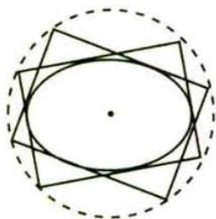  
图 11

$|MN|^{2}+|MH|^{2}=(2\sqrt{3}b)^{2}=12b^{2}$ ，则矩形MNGH的面积 $S=|MN|\cdot|MH|\leqslant$ $\frac{|MN|^{2}+|MH|^{2}}{2}=6b^{2}$ ，当且仅当 $|MN|=|MH|=\sqrt{6}b$ 时取等号，D错误.故选AC.

# 答案 AC

调研 13 (2023·浙江嘉兴一中 12 月期中改编)(多选)古希腊著名数学家阿波罗尼斯与欧几里得、阿基米德齐名. 他发现:“平面内到两个定点 $A, B$ 的距离之比为定值 $\lambda (\lambda \neq 1)$ 的点的轨迹是圆”,后来,人们将这个圆以他的名字命名,称为阿波罗尼

球缺 指用一个平面去截一个球所得的部分,属于几何体,是“体”的概念.因此,球缺可以计算体积,而球冠只能计算面积.

斯圆,简称阿氏圆.在平面直角坐标系 $xOy$ 中, $A(-2,0), B(4,0)$ , 点 $P$ 满足 $\frac{|PA|}{|PB|} = \frac{1}{2}$ . 设点 $P$ 的轨迹为 $C$ , 下列结论正确的是 ( )

A. C 的方程为 $(x + 4)^{2} + y^{2} = 9$   
B. 在 x 轴上存在异于 A, B 的两定点 D, E, 使得 $\frac{|PD|}{|PE|} = \frac{1}{2}$   
C. 当 A, B, P 三点不共线时, 射线 PO 是 $\angle APB$ 的平分线  
D. 在 C 上存在点 K, 使得 $\left|KO\right|=2\left|KA\right|$

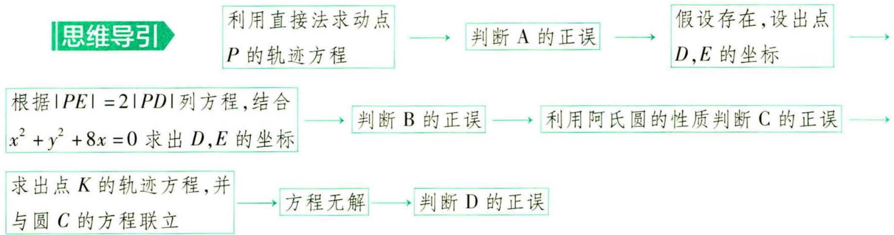

flowchart

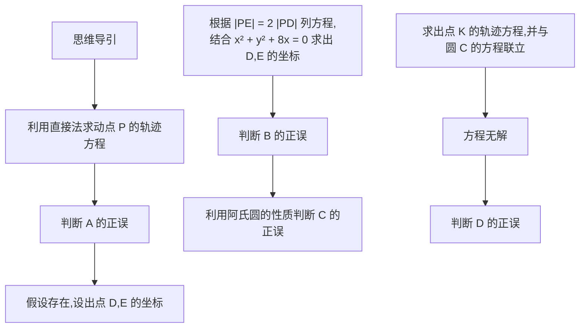
```mermaid
graph TD
    A["思维导引"] --> B["利用直接法求动点 P 的轨迹方程"]
    B --> C["判断 A 的正误"]
    C --> D["假设存在,设出点 D,E 的坐标"]
    E["根据 |PE| = 2 |PD| 列方程,结合 x² + y² + 8x = 0 求出 D,E 的坐标"] --> F["判断 B 的正误"]
    F --> G["利用阿氏圆的性质判断 C 的正误"]
    H["求出点 K 的轨迹方程,并与圆 C 的方程联立"] --> I["方程无解"]
    I --> J["判断 D 的正误"]
```

解析 设点 $P(x,y)$ ，则由 $\frac{|PA|}{|PB|} = \frac{1}{2}$ 可得 $\frac{\sqrt{(x+2)^{2} + y^{2}}}{\sqrt{(x-4)^{2} + y^{2}}} = \frac{1}{2}$ ，化简可得 $(x+4)^{2} + y^{2} = 16$ ，

【拓展】阿氏圆：一动点 P 与两定点 A, B 的距离之比等于定比 m:n，则点 P 的轨迹是以定比 m:n 内分和外分定线段 AB 的两个分点的连线为直径的圆。由 $\frac{|PA|}{|PB|} = \frac{1}{2}$ 知，线段 AB 的内分点为 $(0, 0)$ ，外分点为 $(-8, 0)$ ，则圆必过点 $(-8, 0)$ ， $(0, 0)$ ，那么圆的方程为 $x(x + 8) + y^{2} = 0$ ，即 $(x + 4)^{2} + y^{2} = 16$ 。相关知识：以 $P(x_{1}, y_{1})$ ， $Q(x_{2}, y_{2})$ 连线为直径的圆的方程为 $(x - x_{1})(x - x_{2}) + (y - y_{1})(y - y_{2}) = 0$ ，此方程被称为圆的直径式方程

故 A 错误.

假设在 $x$ 轴上存在异于 $A, B$ 的两定点 $D, E$ , 使得 $\frac{|PD|}{|PE|} = \frac{1}{2}$ , 设 $D(m,0), E(n,0)$ , 由 $\frac{|PD|}{|PE|} = \frac{1}{2}$ 可得 $|PE| = 2|PD|$ , 即 $\sqrt{(x - n)^2 + y^2} = 2\sqrt{(x - m)^2 + y^2}$ , 化简可得 $3x^2 + 3y^2 - (8m - 2n)x + 4m^2 - n^2 = 0$ , 由点 $P$ 的轨迹方程为 $x^2 + y^2 + 8x = 0$ 可得 $8m - 2n = -24, 4m^2 - n^2 = 0$ , 解得 $m = -6, n = -12$ 或 $m = -2, n = 4$ (舍去), 即存在 $D(-6,0), E(-12,0)$ , 使得 $\frac{|PD|}{|PE|} = \frac{1}{2}$ , 故 B 正确.

【秒解】由阿波罗尼斯圆的特点及对称性，数形结合可知，点 $A, B$ 关于圆心 $(-4, 0)$ 的对称点 $D(-6, 0), E(-12, 0)$ 满足条件

当 A, B, P 三点不共线时，由 $\frac{|OA|}{|OB|} = \frac{1}{2} = \frac{|PA|}{|PB|}$ ，可得 PO 是 $\angle APB$ 的平分线，故 C 正确.

若在圆 $C$ 上存在点 $K$ , 使得 $|KO| = 2|KA|$ , 设 $K(x_{1}, y_{1})$ , 则 $\sqrt{x_{1}^{2} + y_{1}^{2}} = 2\sqrt{(x_{1} + 2)^{2} + y_{1}^{2}}$ , 化简可得 $x_{1}^{2} +$

斜高 在正圆锥体、正棱锥体、正圆台或正棱台等空间几何体的侧面多边形中,底边上的高即斜高.

$y_{1}^{2}+\frac{16}{3}x_{1}+\frac{16}{3}=0$ , 与 $(x_{1}+4)^{2}+y_{1}^{2}=16$ 联立可得方程组无解, 故不存在点K, 故D错误. 故选BC.

【另解】由 $\frac{|KO|}{|KA|}=2$ 知K点的轨迹是阿波罗尼斯圆，该圆经过点 $(-4,0)$ 和 $(- \frac{4}{3},0)$ ，以点 $(-4,0)$ 和 $(- \frac{4}{3},0)$ 为直径的圆的方程为 $(x+4)(x+\frac{4}{3})+y^{2}=0$ ，即 $x^{2}+y^{2}+\frac{16}{3}x+\frac{16}{3}=0$ ，则K点的轨迹方程为 $x^{2}+y^{2}+\frac{16}{3}x+\frac{16}{3}=0$ ，如图12，两圆内含，故K不存在

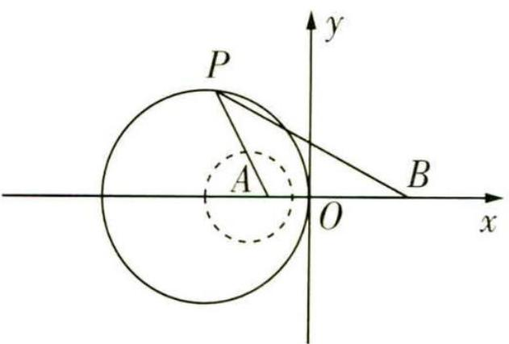

text_image

P
A
O
B
x
y

图 12

答案 BC

调研 14 (2023·天津 10 月学情调研) 定义椭圆 $C: \frac{x^{2}}{a^{2}} + \frac{y^{2}}{b^{2}} = 1 (a > b > 0)$ 的“蒙日圆”的方程为 $x^{2} + y^{2} = a^{2} + b^{2}$ , 已知椭圆 $C$ 的长轴长为 4 , 离心率为 $e = \frac{1}{2}$ .

(1)求椭圆 C 的标准方程和它的“蒙日圆”E 的方程.

(2) 过“蒙日圆” $E$ 上的任意一点 $M$ 作椭圆 $C$ 的一条切线 $MA, A$ 为切点, 延长 $MA$ 与“蒙日圆” $E$ 交于点 $D, O$ 为坐标原点, 若直线 $OM, OD$ 的斜率存在, 且分别为 $k_{1}, k_{2}$ , 证明: $k_{1} k_{2}$ 为定值.

解析 (1) 由题意知 $2a = 4, e = \frac{c}{a} = \frac{1}{2}, \therefore a = 2, c = 1, \therefore b^2 = 3$ ,

∴ 椭圆 C 的方程为 $\frac{x^{2}}{4} + \frac{y^{2}}{3} = 1$ ,

∴“蒙日圆”E的方程为 $x^{2}+y^{2}=4+3=7$ ，即 $x^{2}+y^{2}=7$ 。

(2)当切线 ${MA}$ 的斜率存在且不为零时,作出示意图如图13, 设切线 ${MA}$ 的方程为 $y = {kx} + m$ ,则由 $\left\{  \begin{array}{l} y = {kx} + m, \\  \frac{{x}^{2}}{4} + \frac{{y}^{2}}{3} = 1, \end{array}\right.$ 消去 $y$ 得关

【关键分析】设切线 ${MA}$ 的方程为 $y = {kx} + m$ ,光与椭圆方程联立,消去 $y$ ,令判别式为0,得 ${m}^{2} = 3 + 4{k}^{2}$ ,再和“蒙日圆” $E$ 的方程联立,消去 $y$ ,利用根与系数的关系和斜率公式化简可得结果

于 x 的方程 $(3 + 4k^{2})x^{2} + 8mkx + 4m^{2} - 12 = 0$ ,

$$
\therefore \Delta = 6 4 m ^ {2} k ^ {2} - 4 (3 + 4 k ^ {2}) (4 m ^ {2} - 1 2) = 0, \therefore m ^ {2} = 3 + 4 k ^ {2}.
$$

由 $\left\{\begin{aligned}y&=kx+m,\\ x^{2}&+y^{2}=7,\end{aligned}\right.$ 消去 y 得关于 x 的方程 $(1+k^{2})x^{2}+2mkx+m^{2}-7=0,\therefore\Delta_{1}=$

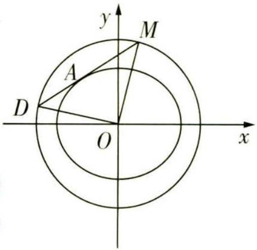

text_image

y
M
A
D
O
x

图 13

坡度(坡比) 通常把坡面的垂直高度 h 和水平方向的距离 l 的比叫作坡度(或叫作坡比), 即坡角 $\alpha$ 的正切值 $\tan \alpha$ . 通常用“i”表示.

$$
4 m ^ {2} k ^ {2} - 4 (1 + k ^ {2}) (m ^ {2} - 7) = 1 6 + 1 2 k ^ {2} > 0.
$$

设 $M(x_{1},y_{1}),D(x_{2},y_{2})$ ，则 $x_{1} + x_{2} = \frac{-2mk}{1 + k^{2}},x_{1}x_{2} = \frac{m^{2} - 7}{1 + k^{2}}$

$$
\therefore k _ {1} k _ {2} = \frac {y _ {1} y _ {2}}{x _ {1} x _ {2}} = \frac {(k x _ {1} + m) (k x _ {2} + m)}{x _ {1} x _ {2}} = \frac {k ^ {2} x _ {1} x _ {2} + k m (x _ {1} + x _ {2}) + m ^ {2}}{x _ {1} x _ {2}} =
$$

$$
\frac {\frac {m ^ {2} k ^ {2} - 7 k ^ {2}}{1 + k ^ {2}} - \frac {2 m ^ {2} k ^ {2}}{1 + k ^ {2}} + m ^ {2}}{\frac {m ^ {2} - 7}{1 + k ^ {2}}} = \frac {m ^ {2} - 7 k ^ {2}}{m ^ {2} - 7},
$$

$$
\because m ^ {2} = 3 + 4 k ^ {2}, \therefore k _ {1} k _ {2} = \frac {m ^ {2} - 7 k ^ {2}}{m ^ {2} - 7} = \frac {3 + 4 k ^ {2} - 7 k ^ {2}}{3 + 4 k ^ {2} - 7} = - \frac {3}{4}.
$$

当切线 ${MA}$ 的斜率不存在或为零时, ${k}_{1}{k}_{2} =  - \frac{3}{4}$ 成立.

【易遗漏】易丢失两种特殊情况的必要说明

∴ $k_{1}k_{2}$ 为定值.

调研 15 (2023·北京 10 月模拟)已知在平面直角坐标系 ${xOy}$ 中,圆 $O : {x}^{2} + {y}^{2} = 4$ , 点 $A\left( {-1,0}\right) ,B\left( {0,1}\right) ,M$ 为圆 $O$ 上的动点,则 $2\left| {MA}\right|  + \left| {MB}\right|$ 的最小值为

解析 若取 $D(-4,0)$ , 连接 $MD$ , 如图 14, 则圆 $O$ 上的点 $M$ 均满足 $|MD|=2|MA|$ , 下面证

【思维策略】适用阿波罗尼斯圆的定义，也就是圆 O 上的点满足到两定点距离的比值为 2，这两个定点分别是 A(-1,0)，D(-4,0)，关键是怎么求出 D 的坐标？可通过分析特殊情况，研究圆 O 与 x 轴的交点为 M 的情况，求出 D(-4,0)

明该结论.

若 M 在 x 轴上, 易知 $\left|MD\right|=2\left|MA\right|$ . 若 M 不在 x 轴上, 连接 MO, 在 $\triangle MDO$ 与 $\triangle AMO$ 中, $\frac{\left|OM\right|}{\left|OA\right|}=\frac{\left|OD\right|}{\left|OM\right|=2}$ , 因而 $\triangle MDO \sim \triangle AMO$ , 从而 $\frac{\left|MD\right|}{\left|MA\right|=2}$ , 即 $\left|MD\right|=2\left|MA\right|$ .

【详解】也可用如下方法证明. 设 $M(2\cos \theta, 2\sin \theta)$ , 那么 $|MD| = \sqrt{(2\cos \theta + 4)^2 + (2\sin \theta)^2} = 2\sqrt{5 + 4\cos \theta}$ , $|MA| = \sqrt{(2\cos \theta + 1)^2 + (2\sin \theta)^2} =$

$\sqrt{5+4\cos\theta}$ ，所以 $|MD|=2|MA|$ 。也可假设存在点 $D(m,0)$ ，使得 $|MD|=2|MA|$ ，则由 $\frac{|MD|}{|MA|}=2$ 得 $\sqrt{(x-m)^{2}+y^{2}}=2\sqrt{(x+1)^{2}+y^{2}}$ ，整理得 $x^{2}+y^{2}+\frac{2m+8}{3}x=\frac{m^{2}-4}{3}$ ，由阿波罗尼斯圆知它是 $x^{2}+y^{2}=4$ ，因而 $2m+8=0$ ，得m=-4，恰好 $\frac{m^{2}-4}{3}=4$ ，符合题设，也就得 $D(-4,0)$

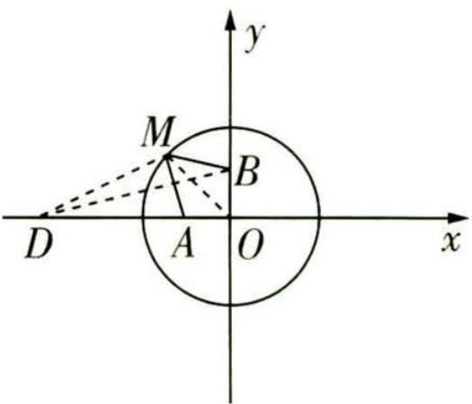

text_image

y
M
B
D
A
O
x

图 14

楔体 是一种特殊的拟柱体, 其下底面是梯形或平行四边形, 上底面是平行于下底面的平行边的线段.

# 094 试题调研 每月一辑试题新

故 $2|MA|+|MB|=|MD|+|MB|$ ，连接DB，则 $|MD|+|MB|\geqslant|BD|$ ，故 $2|MA|+|MB|$ 的最小值为 $|DB|=\sqrt{17}$ .

【类比探究】若问题改成求 $|MA|+2|MB|$ 的最小值，也是同样的道理，对于点 $B(0,1)$ ，存在点 $E(0,4)$ ，使得圆O上的动点M满足 $|ME|=2|MB|$ 。本题的解法关键是转化，而突破点则是阿氏圆的应用，不过题目中点A的坐标不是随意给的，因此本题也有其设置的巧妙性。可仔细品味与拓展研究！

答案 $\sqrt{17}$

# 角度5 圆锥曲线中的定点、定值问题

调研 16 (2023·福建三明一中 11 月期中) 已知椭圆 $C: \frac{x^{2}}{a^{2}} + \frac{y^{2}}{b^{2}} = 1 (a > b > 0)$ 的上顶点到右顶点的距离为 $\sqrt{3}$ , 离心率为 $\frac{\sqrt{2}}{2}$ , 右焦点为 $F$ , 过 $F$ 的直线 (不与 $x$ 轴重合) 与椭圆 $C$ 交于 $A, B$ 两点, 直线 $l: x = 2$ 交 $x$ 轴于点 $H$ , 过点 $A$ 作 $AD \perp l$ , 垂足为 $D$ .

(1) 求椭圆 C 的标准方程.  
(2)①求四边形 OAHB(O 为坐标原点)面积的取值范围;  
②证明直线 BD 过定点 E, 并求 E 点坐标.

解析

(1) 由题意知 $\left\{\begin{aligned} e &= \frac{c}{a} = \frac{\sqrt{2}}{2}, \\ a^{2} &= b^{2} + c^{2}, \end{aligned}\right.$ 得 $a^{2} = 2, b^{2} = 1$ ，即椭圆 C 的标准方程为 $\frac{x^{2}}{2} +$

$$
y ^ {2} = 1.
$$

(2) 由 (1) 知, 椭圆右焦点 $F(1,0)$ , 设直线 $AB$ 的方程为 $x = my + 1$ , 由 $\left\{ \begin{array}{l} x = my + 1, \\ \frac{x^2}{2} + y^2 = 1, \end{array} \right.$ 消去 $x$ 得关于 $y$ 的方程 $(m^2 + 2)y^2 + 2my - 1 = 0, \Delta = 4m^2 + 4(m^2 + 2) > 0$ .

设 $A(x_{1},y_{1}),B(x_{2},y_{2})$ ，则 $y_{1} + y_{2} = -\frac{2m}{m^{2} + 2},y_{1}y_{2} = -\frac{1}{m^{2} + 2}.$

① $|y_{1}-y_{2}|=\sqrt{(y_{1}+y_{2})^{2}-4y_{1}y_{2}}=\frac{2\sqrt{2}\sqrt{m^{2}+1}}{m^{2}+2}$ ，四边形OAHB的面积 $S=\frac{1}{2}|OH|$ 。 $|y_{1}-y_{2}|=\frac{2\sqrt{2}\sqrt{m^{2}+1}}{m^{2}+2}=\frac{2\sqrt{2}}{\sqrt{m^{2}+1}+\frac{1}{\sqrt{m^{2}+1}}}\leqslant\sqrt{2}$ ，当且仅当 $\sqrt{m^{2}+1}=\frac{1}{\sqrt{m^{2}+1}}$ ，即m=0

拟柱体 所有的顶点都在两个平行平面内的多面体叫作拟柱体. 它在这两个平面内的面叫作拟柱体的底面, 其余各面叫作拟柱体的侧面, 两底面之间的垂直距离叫作拟柱体的高.

时取等号,所以四边形 $OAHB$ 面积的取值范围为 $(0,\sqrt{2}]$ .

②方法一 由题意知 $D(2, y_{1})$ , 则直线 $BD$ 的方程为 $y - y_{1} = \frac{y_{2} - y_{1}}{x_{2} - 2} (x - 2)$ , 即 $y = \frac{y_{2} - y_{1}}{my_{2} - 1} (x - 2) + y_{1}$ , 当 $y = 0$ 时, $x = \frac{my_{1}y_{2} - y_{1}}{y_{1} - y_{2}} + 2$ .

【答疑解惑】将问题转化为该式是否为定值. 这里为什么令 $y=0$ 呢? 怎么判断是过 $x$ 轴上的定点呢? 其实是根据解题经验判断的, 对于此类问题, 一般情况下首先判断是否经过坐标轴上的定点, 令 $x=0$ 或 $y=0$ 确定是否存在定点, 如果都不存在, 再进行其他判断. 本题可以利用对称性, 数形结合进行直观判断, 如图 15, 若作直线 $AB$ 关于 $x$ 轴对称的直线, 则此直线对应的 $BD$ 与原 $BD$ 也关于 $x$ 轴对称, 所以定点在 $x$ 轴上

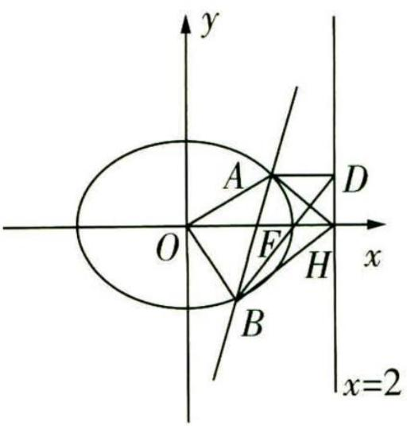

text_image

y
A
D
O
F
H
x
B
x=2

图 15

由根与系数的关系, 得 $2my_{1}y_{2}=y_{1}+y_{2}$ ,

【思想方法】注意整体思想的运用，利用根与系数的关系实现积和转化

所以 $x = \frac{\frac{y_1 + y_2}{2} - y_1}{y_1 - y_2} + 2 = -\frac{1}{2} + 2 = \frac{3}{2}$ .

【另解】也可以利用配凑法，即凑 $y_{1}+y_{2}$ ，然后消去 $y_{1}y_{2}$ ， $y_{1}+y_{2}$ ，保留 $y_{2}$ 或保留 $y_{1}$ 。即x= $\frac{my_{1}y_{2}-y_{1}}{-(y_{2}+y_{1})+2y_{1}}+2=\frac{-\frac{m}{m^{2}+2}-y_{1}}{\frac{2m}{m^{2}+2}+2y_{1}}+2=-\frac{1}{2}+2=\frac{3}{2}$ ，或 $x=\frac{my_{1}y_{2}-y_{1}}{y_{1}-y_{2}}+2=$

$\frac{m{y}_{1}{y}_{2} - \left( {{y}_{1} + {y}_{2}}\right)  + {y}_{2}}{{\left( {y}_{1} + {y}_{2}\right) }^{2} - 2{y}_{2}} + 2 = \frac{-m{y}_{1}{y}_{2} + {y}_{2}}{2m{y}_{1}{y}_{2} - 2{y}_{2}} + 2 =  - \frac{1}{2} + 2 = \frac{3}{2}$ . 这里出现的 ${y}_{1},{y}_{2}$ 的关系是 “非对称” 的,即根与系数的关系式无法直接代入,这是求解难点. 如果用求根公式求出 ${y}_{1},{y}_{2}$ ,然后再代入运算,过于复杂,因而注意对这两种转换解法的体会,共性是没有将 ${y}_{1},{y}_{2}$ 都替换掉

从而直线 BD 过定点 $E(\frac{3}{2},0)$ .

方法二 若直线 $AB$ 的斜率不存在, 则直线方程为 $x = 1$ ,

【思维方法】通过特殊情况猜出定点，然后再对一般情况进行证明。运用此法不一龙能猜出正确的定点，但当对此类题目毫无头绪时，同学们不妨利用此法试一试

不妨设点 A 在点 B 上方, 从而 $A(1, \frac{\sqrt{2}}{2})$ , $B(1, -\frac{\sqrt{2}}{2})$ , $D(2, \frac{\sqrt{2}}{2})$ ,

则直线 BD 的方程为 $y=\sqrt{2}(x-\frac{3}{2})$ ，直线 BD 过点 $(\frac{3}{2},0)$ ，假设 $E(\frac{3}{2},0)$ .

若直线 $AB$ 的斜率存在, 设其方程为 $y = k(x - 1)$ ,

隐函数 隐函数是由隐式方程所隐含定义的函数. 设 $F(x, y)$ 是某个定义域上的函数, 如果存在定义域上的子集 $D$ , 使得对每个 $x \in D$ , 存在相应的 $y$ 满足 $F(x, y) = 0$ , 则称方程确定了一个隐函数. 记为 $y = y(x)$ .

由 $\left\{\begin{aligned}y&=k(x-1),\\ \frac{x^{2}}{2}&+y^{2}=1,\end{aligned}\right.$ 消去 y 得关于 x 的方程 $(2k^{2}+1)x^{2}-4k^{2}x+2k^{2}-2=0,$

$$
\Delta_ {1} = 1 6 k ^ {4} - 4 (2 k ^ {2} + 1) (2 k ^ {2} - 2) = 8 (k ^ {2} + 1) > 0, x _ {1} + x _ {2} = \frac {4 k ^ {2}}{2 k ^ {2} + 1}, x _ {1} x _ {2} = \frac {2 k ^ {2} - 2}{2 k ^ {2} + 1}.
$$

由题意知 $D(2, y_1)$ ,

连接 BE, DE, $k_{BE} = \frac{y_{2}}{x_{2} - \frac{3}{2}} = \frac{2y_{2}}{2x_{2} - 3}$ , $k_{DE} = \frac{y_{1}}{2 - \frac{3}{2}} = 2y_{1}$ ,

【点睛】证明三点共线,一般利用斜率法、向量法、求方程代点检验法等. 这里给出斜率法与向量法的证明

$$
k _ {B E} - k _ {D E} = \frac {2 y _ {2}}{2 x _ {2} - 3} - 2 y _ {1} = \frac {2 (y _ {2} - 2 x _ {2} y _ {1} + 3 y _ {1})}{2 x _ {2} - 3},
$$

$$
y _ {2} - 2 x _ {2} y _ {1} + 3 y _ {1} = k (x _ {2} - 1) - 2 x _ {2} \cdot k (x _ {1} - 1) + 3 k (x _ {1} - 1) = k (3 x _ {1} + 3 x _ {2} - 2 x _ {1} x _ {2} -
$$

4) $= k\left(\frac{12k^2}{2k^2 + 1} -\frac{4k^2 - 4}{2k^2 + 1} -4\right) = 0$ ，即 $k_{BE} = k_{DE}$ ，从而 $B,D,E$ 三点共线，

所以直线 BD 过定点 $E(\frac{3}{2},0)$ .

【另解】向量法： $\overrightarrow{EB}=(x_{2}-\frac{3}{2},y_{2})$ ， $\overrightarrow{ED}=(\frac{1}{2},y_{1})$ ，由于 $(x_{2}-\frac{3}{2})y_{1}-\frac{1}{2}y_{2}=\frac{k}{2}\left[2x_{1}x_{2}-3(x_{1}+x_{2})+4\right]=0$ ，从而B,D,E三点共线，直线BD过定点 $E(\frac{3}{2},0)$

调研 17 (2023·广东佛山顺德区一检)已知动圆 C 经过点 $F(1,0)$ ，且与直线 x = -1 相切，记动圆 C 圆心的轨迹为 E.

(1) 求 E 的方程.

(2)已知 $P(4, y_{0}) (y_{0} > 0)$ 是曲线 E 上一点, A, B 是曲线 E 上异于点 P 的两个动点, 设直线 PA, PB 的倾斜角分别为 $\alpha, \beta$ , 且 $\alpha + \beta = \frac{3\pi}{4}$ , 直线 AB 是否经过定点? 若是, 请求出该定点; 若不是, 请说明理由.

解析 (1) 设动圆圆心为 $M(x, y)$ , 因为动圆 $C$ 经过点 $F(1, 0)$ , 且与直线 $x = -1$ 相切,

所以点 M 的轨迹是以 $(1,0)$ 为焦点, 直线 x = -1 为准线的抛物线, 故其方程为 $y^{2} = 4x$ ,

所以动圆 C 圆心的轨迹方程是 $y^{2}=4x$ .

(2)由(1)可得 $P(4,4)$ , 若直线 $PA, PB$ 其中一条的斜率不存在, 不妨设 $\alpha = \frac{\pi}{2}, \beta = \frac{\pi}{4}$ ,

【易错提醒】要对斜率不存在的特殊情况进行讨论

易得 $A(4, -4)$ ，直线 PB 的方程为 y = x，与 $y^{2} = 4x$ 联立可得 $B(0, 0)$ ，直线 AB 的方程为 $x + y = 0$ 。

当直线 PA, PB 的斜率都存在时, 设直线 PA, PB 的斜率分别为 $k_{1}, k_{2}$ ,

设 $A\left(\frac{y_1^2}{4}, y_1\right), B\left(\frac{y_2^2}{4}, y_2\right)$ ，则 $k_1 = \frac{y_1 - 4}{\frac{1}{4}y_1^2 - 4} = \frac{4}{y_1 + 4}$ ，同理可得 $k_2 = \frac{4}{y_2 + 4}$ ，

因为 $\alpha + \beta = \frac{3\pi}{4}$ ，所以 $\tan(\alpha + \beta) = -1$ ，所以 $\frac{\tan\alpha + \tan\beta}{1 - \tan\alpha\tan\beta} = -1$ ，即 $\frac{k_{1} + k_{2}}{1 - k_{1}k_{2}} = -1$ ，

所以 $k_{1}+k_{2}-k_{1}\cdot k_{2}+1=0$ ，所以 $\frac{4}{y_{1}+4}+\frac{4}{y_{2}+4}-\frac{4}{y_{1}+4}\cdot\frac{4}{y_{2}+4}+1=0$ ，

【思维联想】以往常见的题目是两直线的斜率互为相反数，或两直线的倾斜角互补等，显然本题进行了一般性的变式推广

即 $8(y_{1} + y_{2}) + y_{1}y_{2} + 32 = 0.$

由题意可设直线 AB 的方程为 $x = ty + n$ ，由 $\left\{\begin{aligned} y^{2} &= 4x, \\ x &= ty + n, \end{aligned}\right.$ 消去 x 得关于 y 的方程 $y^{2} - 4ty - 4n = 0$ ，

所以 $\Delta = 16t^{2} + 16n > 0, y_{1} + y_{2} = 4t, y_{1}y_{2} = -4n,$

所以 $32t - 4n + 32 = 0$ ，即 $n = 8t + 8$ ，所以 $x = ty + n = ty + 8t + 8 = t(y + 8) + 8$ .

令 $y+8=0$ 得 y=-8, x=8，此时有定点 $(8,-8)$ ，直线 $x+y=0$ 也过点 $(8,-8)$ .

综上所述,直线 ${AB}$ 经过定点(8,-8).

【提分秘籍】对于直线过定点问题,如果设直线方程为 $y = {kx} + t$ 的形式,利用已知进行变形的方向往往是 $k,t$ 的关系式,比如 $t = {y}_{0} - {x}_{0}k$ ,那么直线过定点 $\left( {{x}_{0},{y}_{0}}\right)$ ,且该定点不一定在坐标轴上；当然若能得到 $t$ 为定值,那么直线过 $y$ 轴上的定点(0,t)

调研 18 (2023·湖南郴州一检)如图 16, 已知椭圆 $E: \frac{x^2}{a^2} + \frac{y^2}{b^2} = 1 (a > b > 0)$ 的离心率为 $\frac{\sqrt{2}}{2}$ , 过坐标原点 $O$ 的直线交椭圆 $E$ 于 $P, A$ 两点, 其中 $P$ 在第一象限, 过 $P$ 作 $x$ 轴的垂线, 垂足为 $C$ , 连接 $AC$ . 当 $C$ 为椭圆的右焦点时, $\triangle PAC$ 的面积为 $\sqrt{2}$ .

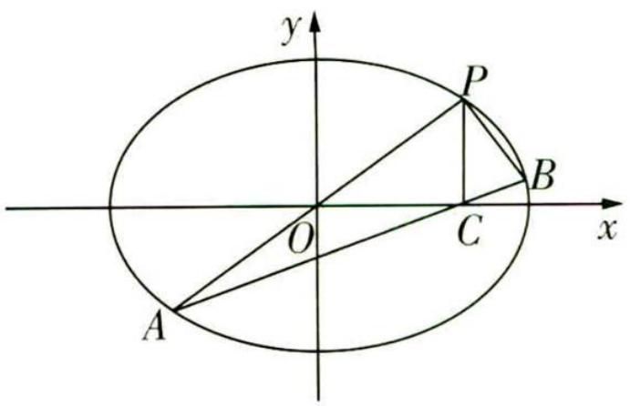

text_image

y
P
O
C
x
A
B

图 16

弦切角 顶点在圆上,一边和圆相交,另一边和圆相切的角叫作弦切角.其大小等于它所夹的弧所对的圆周角.

(1) 求椭圆 E 的方程.

(2) 若 B 为 AC 的延长线与椭圆 E 的交点, 试问 $\angle APB$ 是否为定值, 若是, 求出这个定值; 若不是, 请说明理由.

解析 (1) $\because$ 椭圆的离心率 $e = \frac{c}{a} = \frac{\sqrt{2}}{2}, \therefore c^2 = \frac{1}{2} a^2$ , 则 $b^2 = a^2 - c^2 = \frac{1}{2} a^2$ ,

当 C 为椭圆的右焦点时, $\left|PC\right|=\frac{b^{2}}{a}=\frac{1}{2}a.$

$$
\because S _ {\triangle P A C} = 2 S _ {\triangle P O C} = 2 \times \frac {1}{2} c \times \frac {1}{2} a = \frac {1}{2} a c = \frac {\sqrt {2}}{4} a ^ {2} = \sqrt {2}, \therefore a ^ {2} = 4, \therefore b ^ {2} = 2,
$$

∴ 椭圆 E 的方程为 $\frac{x^{2}}{4} + \frac{y^{2}}{2} = 1$ .

(2) 由题意可设直线 $AP: y = kx (k > 0), P(x_0, kx_0), B(x_1, y_1)$ ，则 $A(-x_0, -kx_0)$ ， $C(x_0, 0), \therefore k_{AC} = \frac{kx_0}{x_0 + x_0} = \frac{k}{2}, \therefore$ 直线 $AC: y = \frac{k}{2}(x - x_0)$ .

由 $\left\{\begin{aligned}y&=\frac{k}{2}(x-x_{0}),\\ &\text{消去}y\text{得关于}x\text{的方程}(k^{2}+2)x^{2}-2k^{2}x_{0}x+k^{2}x_{0}^{2}-8=0,\Delta=\end{aligned}\right.$ $\frac{x^{2}}{4}+\frac{y^{2}}{2}=1,$

$$
3 2 k ^ {2} - 8 k ^ {2} x _ {0} ^ {2} + 6 4 > 0,
$$

∴ $-x_{0} + x_{1} = \frac{2k^{2}x_{0}}{k^{2} + 2}$ ，则 $x_{1} = \frac{2k^{2}x_{0}}{k^{2} + 2} + x_{0}$ ，

$$
\therefore y _ {1} = \frac {k}{2} \left(x _ {1} - x _ {0}\right) = \frac {k}{2} \left(\frac {2 k ^ {2} x _ {0}}{k ^ {2} + 2} + x _ {0} - x _ {0}\right) = \frac {k ^ {3} x _ {0}}{k ^ {2} + 2}, \therefore B \left(\frac {2 k ^ {2} x _ {0}}{k ^ {2} + 2} + x _ {0}, \frac {k ^ {3} x _ {0}}{k ^ {2} + 2}\right).
$$

$\therefore \overrightarrow{PB} = \left(\frac{2k^2x_0}{k^2 + 2}, -\frac{2kx_0}{k^2 + 2}\right)$ , 又 $\overrightarrow{PA} = (-2x_0, -2kx_0)$ ,

$\therefore \overrightarrow{PA} \cdot \overrightarrow{PB} = -2x_0 \cdot \frac{2k^2x_0}{k^2 + 2} + (-2kx_0) \cdot (-\frac{2kx_0}{k^2 + 2}) = 0$ ，则 $PA \perp PB$ ，

$\therefore \angle {APB}$ 为定值 ${90}^{ \circ }$ .

【点睛】直线与圆锥曲线综合应用中的定值问题的求解,基本思路如下：①设出直线方程, 与曲线方程联立,整理为关于 $x$ 或 $y$ 的一元二次方程的形式；②利用 $\Delta  > 0$ 求得变量的取值范围, 得到根与系数的关系；③利用根与系数的关系表示出所求量；④化简整理可得定值

# 角度6 函数的极值点偏移问题

调研 19 (2023 · 河南安阳 11 月期中) 已知函数 $f(x) = \ln x + x (x - 3)$ .

(1) 讨论 $f(x)$ 的单调性;

(2) 若存在 $x_{1}, x_{2}, x_{3} \in (0, +\infty)$ , 且 $x_{1} < x_{2} < x_{3}$ , 使得 $f(x_{1}) = f(x_{2}) = f(x_{3})$ , 求证: $2x_{1} + x_{2} > x_{3}$ .

解析 (1) $f'(x)=\frac{1}{x}+2x-3=\frac{2x^{2}-3x+1}{x}$ ，令 $f'(x)>0$ ，得 $0<x<\frac{1}{2}$ 或x>1，令 $f'(x)<0$ ，得 $\frac{1}{2}<x<1$ ，所以 $f(x)$ 在 $(0,\frac{1}{2}),(1,+\infty)$ 上单调递增，在 $(\frac{1}{2},1)$ 上单调递减.

(2) 由(1)可得 $0 < x_{1} < \frac{1}{2} < x_{2} < 1 < x_{3}$ .

【关键点】对于 $x_{1}, x_{2}$ , 是相对于极值点 $\frac{1}{2}$ 的偏移问题, 而对于 $x_{2}, x_{3}$ , 是相对于极值点 1 的偏移问题, 因而本题可将证明不等式分解成两次极值点偏移的证明

①当 $\frac{1}{2}<x<1$ 时,令 $h(x)=f(x)-f(1-x)=\ln x-\ln(1-x)-4x+2$ ,

【点睛】利用对称进行函数构造

则 $h'(x)=\frac{(2x-1)^{2}}{x(1-x)}>0$ ，所以 $h(x)$ 在 $(\frac{1}{2},1)$ 上单调递增，当 $x=\frac{1}{2}$ 时， $f(x)-f(1-x)=0$ ，

所以 $h(x_{2})=f(x_{2})-f(1-x_{2})>0$ , 即 $f(x_{1})=f(x_{2})>f(1-x_{2})$

又 $x_{1} \in (0, \frac{1}{2}), 1 - x_{2} \in (0, \frac{1}{2}), f(x)$ 在 $(0, \frac{1}{2})$ 上单调递增, 所以 $x_{1} > 1 - x_{2}$ , 即 $x_{1} + x_{2} > 1$ (\*).

【另解】 $f(x_{1})=f(x_{2})$ ，即 $\ln x_{1}+x_{1}(x_{1}-3)=\ln x_{2}+x_{2}(x_{2}-3)$ ， $0<x_{1}<\frac{1}{2}<x_{2}<1$ ，该项得 $\ln x_{1}-\ln x_{2}+x_{1}^{2}-x_{2}^{2}-3(x_{1}-x_{2})=0$ ，即 $\frac{\ln x_{1}-\ln x_{2}}{x_{1}-x_{2}}=3-(x_{1}+x_{2})$ ，由对数均值不等式得 $3-(x_{1}+x_{2})>\frac{2}{x_{1}+x_{2}}$ ，即 $(x_{1}+x_{2})^{2}-3(x_{1}+x_{2})+2<0$ ，同样可以得到 $x_{1}+x_{2}>1$ 。这里利用了对数均值不等式：若 a>b>0，那么 $\frac{a+b}{2}>\frac{a-b}{\ln a-\ln b}>\sqrt{ab}$ ，变换成指数形式为 $\frac{e^{a}+e^{b}}{2}>\frac{e^{a}-e^{b}}{a-b}>\mathrm{e}^{\frac{a+b}{2}}$

# 100 试题调研 每月一辑试题新

②当 $\frac{1}{2}<x<1$ 时,令 $g(x)=f(x)-f(2-x)=\ln x-\ln(2-x)-2x+2$ ,则 $g'(x)=\frac{2(x-1)^{2}}{x(2-x)}>0$ ,所以 $g(x)$ 在 $(\frac{1}{2},1)$ 上单调递增,

当 $x = 1$ 时， $f(x) - f(2 - x) = 0$ ，所以 $g(x_2) = f(x_2) - f(2 - x_2) < 0$ ，即 $f(x_3) = f(x_2) < f(2 - x_2)$ ，

又 $x_{3} > 1,2 - x_{2} > 1,f(x)$ 在 $(1, + \infty)$ 上单调递增，所以 $x_{3} <   2 - x_{2}$ ，即 $-x_{2} - x_{3}>$ -2 （\*\*）.

$2 \times (\ast) + (\ast\ast)$ 得 $2x_{1} + x_{2} - x_{3} > 0$ , 即 $2x_{1} + x_{2} > x_{3}$ .

【解后反思】极值点偏移问题中（极值点为 $x_0$ ），证明 $x_1 + x_2 > 2x_0$ 或 $x_1 + x_2 < 2x_0$ 的方法：①构造 $F(x) = f(x) - f(2x_0 - x)$ ；②确定 $F(x)$ 的单调性；③结合特殊值得到 $f(x_2) - f(2x_0 - x_2) > 0$ 或 $f(x_2) - f(2x_0 - x_2) < 0$ ，再利用 $f(x_1) = f(x_2)$ ，得到 $f(x_1)$ 与 $f(2x_0 - x_2)$ 的大小关系；④利用 $f(x)$ 的单调性即可得到 $x_1 + x_2 > 2x_0$ 或 $x_1 + x_2 < 2x_0$

# 方法总结

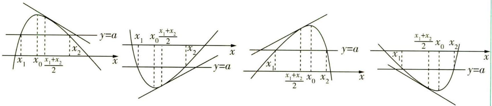  
极值点左偏   
极值点右偏

极值点左偏： $x_{1}+x_{2}>2x_{0}$ ，曲线 $y=f(x)$ 在点 $\left(\frac{x_{1}+x_{2}}{2},f\left(\frac{x_{1}+x_{2}}{2}\right)\right)$ 处的切线与 x 轴不平行.

若 $f(x)$ 上凸 $(f'(x)$ 单调递减），则 $f'(\frac{x_1 + x_2}{2}) < f'(x_0) = 0$ ，若 $f(x)$ 下凸 $(f'(x)$ 单调递增），则 $f'(\frac{x_1 + x_2}{2}) > f'(x_0) = 0$ .

极值点右偏: $x_{1} + x_{2} < 2x_{0}$ , 曲线 $y = f(x)$ 在点 $(\frac{x_{1} + x_{2}}{2}, f(\frac{x_{1} + x_{2}}{2}))$ 处的切线与 $x$ 轴不平行.

若 $f(x)$ 上凸 $(f'(x)$ 单调递减），则 $f'(\frac{x_1 + x_2}{2}) > f'(x_0) = 0$ ，若 $f(x)$ 下凸 $(f'(x)$ 单调递增），则 $f'(\frac{x_1 + x_2}{2}) < f'(x_0) = 0$ .

# 串讲提分结论

串讲速记快速提分必备的 15 个高分技法

<table><tr><td>1</td><td>用判别式法求函数最值(值域)</td><td>将 $y=f(x)$ 中的 $y$ 视为常数进行变形,如对于函数 $y=\frac{2x^2+4x-7}{x^2+2x+3}$ ,变形为 $(y-2)x^2+2(y-2)x+3y+7=0$ ,将其视为关于 $x$ 的方程,先检验二次项系数为0时等号是否成立;再讨论二次项系数不为0的情况——由根的判别式非负 $(\Delta=4(y-2)^2-4(y-2)(3y+7)\geqslant0)$ 求得 $y$ 的取值范围.最后取两种情况的交集即可.</td></tr><tr><td>2</td><td>用换元法求函数最值(值域)</td><td>引入适当变量,将复杂的函数解析式化为简单的函数解析式,注意引入变量的取值范围.</td></tr><tr><td>3</td><td>用二次函数的性质求函数最值(值域)</td><td>化为二次函数的最值(值域)或限定条件下的二次函数最值(值域)问题,用配方法求解.</td></tr><tr><td>4</td><td>用单调性求函数最值(值域)</td><td>将所给函数化为熟知的初等函数,利用单调性求最值(值域).</td></tr><tr><td>5</td><td>用不等式求函数最值(值域)</td><td>运用基本不等式,柯西不等式(设 $a_1,a_2,\cdots,a_n\in\mathbf{R},b_1,b_2,\cdots,b_n\in\mathbf{R}$ ,则 $(a_1^2+a_2^2+\cdots+a_n^2)(b_1^2+b_2^2+\cdots+b_n^2)\geqslant(a_1b_1+a_2b_2+\cdots+a_nb_n)^2$ ,当且仅当 $b_1=b_2=\cdots=b_n=0$ 或 $\frac{a_1}{b_1}=\frac{a_2}{b_2}=\cdots=\frac{a_nb_n}{b_n}$ 时等号成立)等求最值(值域),注意对等号成立的条件的讨论.</td></tr><tr><td>6</td><td>用图象法求函数最值(值域)</td><td>利用图象的直观性可求一些特殊函数的最值(值域).</td></tr><tr><td>7</td><td rowspan="6">利用含导函数的不等式构造原函数的6大技巧</td><td> $f'(x)>k\rightarrow g(x)=f(x)-kx+b(k,b$ 为常数,且 $k\neq0$ .</td></tr><tr><td>8</td><td> $x^{n}f'(x)+nx^{n-1}f(x)>0\rightarrow g(x)=x^{n}f(x)$ ( $n$ 为常数且 $n\neq0$ ); $x^{n}f'(x)-nx^{n-1}f(x)>0\rightarrow g(x)=\frac{f(x)}{x^n}$ ( $n$ 为常数且 $n\neq0$ ).</td></tr><tr><td>9</td><td> $e^{kxf'(x)}+ke^{kxf(x)}>0\rightarrow g(x)=e^{kxf(x)}$ ( $k$ 为常数); $e^{kxf'(x)}-ke^{kxf(x)}>0\rightarrow g(x)=\frac{f(x)}{e^{kxf(x)}}$ ( $k$ 为常数).</td></tr><tr><td>10</td><td> $f(x)+f'(x)\tan x>0\rightarrow g(x)=f(x)\sin x(x\neq\frac{\pi}{2}+k\pi,k\in\mathbf{Z})$ ; $f'(x)\tan x-f(x)>0\rightarrow g(x)=\frac{f(x)}{\sin x}(x\neq\frac{k\pi}{2},k\in\mathbf{Z})$ .</td></tr><tr><td>11</td><td> $f'(x)-f(x)\tan x>0\rightarrow g(x)=f(x)\cos x(x\neq\frac{\pi}{2}+k\pi,k\in\mathbf{Z})$ ; $f'(x)+f(x)\tan x>0\rightarrow g(x)=\frac{f(x)}{\cos x}(x\neq\frac{\pi}{2}+k\pi,k\in\mathbf{Z})$ .</td></tr><tr><td>12</td><td> $\frac{f'(x)}{f(x)}>0\rightarrow g(x)=\ln[f(x)](f(x)>0)$ 或 $g(x)=\ln[-f(x)](f(x)<0)$ .</td></tr></table>

尺规作图 指用无刻度的直尺和圆规作图. 尺规作图起源于古希腊的数学课题, 只使用圆规和直尺, 并且只准许使用有限次, 来解决不同的平面几何作图题.

<table><tr><td>13</td><td>指数型不等式放缩技巧</td><td> $e^x \geqslant x + 1$ (当且仅当  $x = 0$  时取等号), $e^x \geqslant ex$ (当且仅当  $x = 1$  时取等号), $e^x \leqslant \frac{1}{1 - x} (x < 1)$ (当且仅当  $x = 0$  时取等号).</td></tr><tr><td>14</td><td>对数型不等式放缩技巧</td><td> $\ln(x + 1) \leqslant x (x > -1)$ (当且仅当  $x = 0$  时取等号), $1 - \frac{1}{x} \leqslant \ln x \leqslant x - 1 (x > 0)$ (当且仅当  $x = 1$  时取等号).</td></tr><tr><td>15</td><td>三角型不等式放缩技巧</td><td> $\sin x \leqslant x \leqslant \tan x (0 \leqslant x < \frac{\pi}{2})$ (当且仅当  $x = 0$  时取等号), $\sin x \geqslant x \geqslant \tan x (-\frac{\pi}{2} < x \leqslant 0)$ (当且仅当  $x = 0$  时取等号).</td></tr></table>

# 串讲速记快速提分必背的 14 条速解结论

<table><tr><td>16</td><td>复合函数的单调性</td><td>对于复合函数  $y = f(\varphi(x))$ ,若  $y = f(u)$  与  $u = \varphi(x)$  的单调性相同(相反),则  $y = f(\varphi(x))$  是增(减)函数.</td></tr><tr><td>17</td><td>“和函数”的单调性</td><td>设函数  $f_{1}(x)$  与  $f_{2}(x)$  在  $(a,b)$  上单调递增(减),则“和函数” $f_{1}(x) + f_{2}(x)$  在  $(a,b)$  上也单调递增(减).</td></tr><tr><td>18</td><td>“积函数”的单调性</td><td>设函数  $f_{1}(x)$  与  $f_{2}(x)$  在  $(a,b)$  上单调递增(减),且  $f_{1}(x) >0, f_{2}(x) >0$ ,则  $f_{1}(x) \cdot f_{2}(x)$  在  $(a,b)$  上也单调递增(减).</td></tr><tr><td>19</td><td>反函数的单调性</td><td>设  $y = f(x)$  在区间  $I$  上单调递增(减),且  $y = f(x)$  的值域为  $I'$ ,则  $y = f(x)$  在  $I$  上必有反函数  $y = f^{-1}(x)$ ,且反函数在  $I'$  上也单调递增(减).</td></tr><tr><td>20</td><td> $a$  与函数  $f(x) = \log_{m}(ax^{2} + bx + c)(m > 0 \text{ 且 } m \neq 1)$  的关系</td><td>记  $\Delta = b^{2} - 4ac$ . 若  $f(x)$  的定义域为  $\mathbf{R}$ ,则  $a >0$ ,且  $\Delta < 0$ ;若  $f(x)$  的值域为  $\mathbf{R}$ ,则  $a >0$ ,且  $\Delta \geqslant 0$ . 对于  $a = 0$  的情形,需要单独检验.</td></tr><tr><td>21</td><td>平均增长率问题</td><td>如果原来的产值为  $N$ ,平均增长率为  $p$ ,时间为  $x$ ,则一段时间后的产值  $y = N(1+p)^{x}$ .</td></tr><tr><td>22</td><td>对数运算“外移”公式</td><td> $\log_{a^{n}}b^{m} = \frac{m}{n}\log_{a}b$ .</td></tr><tr><td>23</td><td>对数运算“连锁”公式</td><td> $\log_{a}b \cdot \log_{b}c \cdot \log_{c}d = \log_{a}d$ .</td></tr><tr><td>24</td><td>“真数互换”公式</td><td> $\log_{x}a \cdot \log_{y}b = \log_{x}b \cdot \log_{y}a$ .</td></tr><tr><td>25</td><td>“底真互换”公式</td><td> $a^{\log_{c}b} = b^{\log_{c}a}$ .</td></tr><tr><td>26</td><td>对数换底不等式</td><td>设  $a >1, a >b >0$ .1若  $m >1$ ,则  $\log_{a}b < \log_{am}(bm)$ .2若  $\frac{1}{a} < m < 1$ ,则  $\log_{a}b >\log_{am}(bm)$ .</td></tr><tr><td>27</td><td>对数换底不等式的推论</td><td>设  $n > m > 1, p > 0, a > 0$  且  $a \neq 1$ ,则:1 $\log_{m+p}(n+p) < \log_m n$ ;2 $\log_a m \cdot \log_a n < (\log_a \frac{m+n}{2})^2$ .</td></tr><tr><td>28</td><td>两圆的公共弦所在直线的方程</td><td>两圆相交,则两圆方程之差对应的方程是两圆的公共弦所在直线的方程(两圆方程中  $x^2, y^2$  的系数相同).</td></tr><tr><td>29</td><td>一组常见三角不等式</td><td>1若  $x \in (0, \frac{\pi}{2})$ ,则  $\sin x < x < \tan x$ ;2若  $x \in (0, \frac{\pi}{2})$ ,则  $1 < \sin x + \cos x \leqslant \sqrt{2}$ ;3 $|\sin x| + |\cos x| \geqslant 1$ .</td></tr></table>

# 串讲速记快速提分必会的 5 个快速画图小妙招

<table><tr><td>30</td><td>画一元二次函数 $y = ax^{2} + bx + c (a \neq 0)$ 的图象</td><td>看判别式 $\Delta$ 的符号,决定图象与x轴是否有交点→求 $-\frac{b}{2a}$ ,决定函数图象对称轴的位置→确定x=0时的函数值,决定函数图象与y轴的交点.</td></tr><tr><td>31</td><td>画简单幂函数 $y = x^{\alpha}$ 的图象</td><td>先作第一象限内的图象,如果 $\alpha >0$ ,图象是抛物线型(当 $\alpha >1$ 时,开口向上;当 $0 < \alpha < 1$ 时,开口向右)且过点(1,1)和(0,0);如果 $\alpha < 0$ ,图象是双曲线型且过点(1,1).再借助幂函数的定义域与奇偶性作出完整的图象.</td></tr><tr><td>32</td><td>画函数 $y = \frac{ax + b}{cx + d}$ 的图象</td><td>先分离常数,以函数 $y = \frac{3 + 2x}{1 + x}$ 为例, $\frac{3 + 2x}{1 + x} = \frac{2(1 + x) + 1}{1 + x} = 2 + \frac{1}{1 + x}$ ;然后确定图象的两条渐近线的交点,对于函数 $y = \frac{3 + 2x}{1 + x}$ 的图象的两渐近线交点,明显是由反比例函数 $y = \frac{1}{x}$ 图象的两渐近线交点(0,0)先向左平移1个单位长度、再向上平移2个单位长度得到的,所以交点是(-1,2);最后画出渐近线并画出函数图象,如图所示.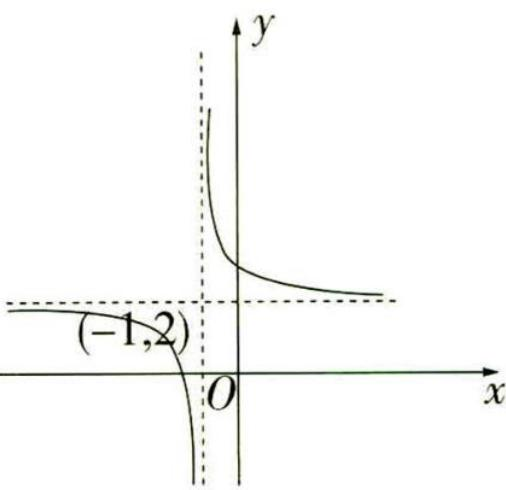</td></tr><tr><td>33</td><td>画函数 $y = ax + \frac{b}{x}$ (ab&gt;0)的图象</td><td>根据 $|ax_0| = |\frac{b}{x_0}|$ 算出 $x_0$ 的值,则 $y = ax + \frac{b}{x} (ab > 0)$ 的图象如下: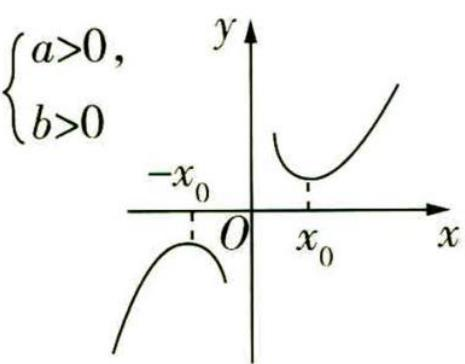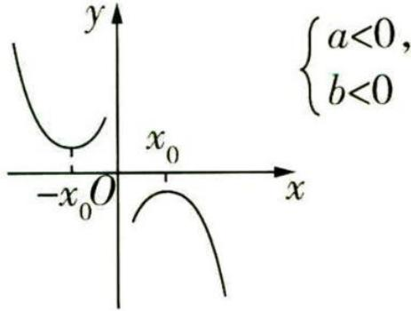</td></tr></table>

凸多边形 指如果把一个多边形的所有边中,任意一条边向两方无限延长成为一直线时,其他各边都在此直线的同旁,那么这个多边形就叫作凸多边形.

<table><tr><td>34</td><td>根据对称性作函数图象</td><td>1函数y=f(x)的图象关于直线y=x作对称其反函数y=f-1(x)的图象.2函数y=f(x)的图象关于y轴作对称函数y=f(-x)的图象.3函数y=f(x)的图象关于x轴作对称函数y=-f(x)的图象.4函数y=f(x)的图象关于原点作对称函数y=-f(-x)的图象.5函数y=a^x(a&gt;0且a≠1)的图象关于直线y=x作对称函数y=log_a x(a&gt;0且a≠1)的图象.</td></tr></table>

# 串讲速记快速提分必纠的 5 个易错陷阱

<table><tr><td>35</td><td>∅, {0} 和 {∅} 的区别</td><td>∅是集合,不含有任何元素; {0} 是集合,含有一个元素 0; {∅} 是集合,含有一个元素∅.</td></tr><tr><td>36</td><td>∈,⊆和⊂的区别</td><td>1 ∈表示元素与集合间的关系,如 a ∈ {a,b,c},特别地,在立体几何中表示点与直线或点与平面间的关系,如点 A ∈ 直线 l,点 A ∈ 平面 α.2⊆表示集合间的包含关系,⊂仅在立体几何中使用,表示直线与平面间的关系,如直线 l⊂平面 α.</td></tr><tr><td>37</td><td>定义域优先意识</td><td>求解函数相关的问题时,常常需要先判断函数的定义域,切入点一般有:分式的分母不为 0、根号内的式子大于等于 0、对数的真数大于 0、对数的底数大于 0 且不等于 1 等. 在判断函数的奇偶性时,还要注意先判断函数的定义域是否关于原点对称.</td></tr><tr><td>38</td><td>极值与导数的关系</td><td>导数值为 0 的点不一定是函数的极值点. 如函数  $y = x^{3}$ ,导函数  $y' = 3x^{2}$ ,虽然在 x = 0 处有  $y' = 0$ ,但函数  $y = x^{3}$  在 R 上是单调递增的,所以 x = 0 不是函数的极值点.可导函数在一点的导数值为 0 是该函数在这点取极值的必要条件,而非充分条件.</td></tr><tr><td>39</td><td>不同夹角的取值范围的区别</td><td>线线角、线面角的取值范围是 [0°,90°],向量夹角的取值范围是 [0°,180°],二面角的取值范围是 [0°,180°].</td></tr></table>

# 《解题秘籍18课》

# 4大学科72个考场最强得分秘籍

数学学科解题秘籍

<table><tr><td>1</td><td>高能口诀公式,巧缩计算路径秒解选填题</td><td>10</td><td>建模思维妙解空间几何问题</td></tr><tr><td>2</td><td>常识推断,秒解数学文化问题</td><td>11</td><td>平移大法速解函数图象问题</td></tr><tr><td>3</td><td>万能估算,极速搞定指对数混合比大小</td><td>12</td><td>选项对比,无须计算秒寻正确项</td></tr><tr><td>4</td><td>投机取“巧”,特例验证法速解含参问题</td><td>13</td><td>万能模板法速解立体几何空间角问题</td></tr><tr><td>5</td><td>另辟“殊”径法妙析抽象函数性质</td><td>14</td><td>O基础数学解答题上分秘诀</td></tr><tr><td>6</td><td>万能体积公式,摆平一切拟柱体体积计算</td><td>15</td><td>信息整理术妙解新颖背景情境题</td></tr><tr><td>7</td><td>切线逼近法快解函数范围推导问题</td><td>16</td><td>逻辑分析法速排多选题错误项</td></tr><tr><td>8</td><td>图中含解,图形观察法妙解代数运算问题</td><td>17</td><td>“析一寻一验”,三步法秒解开放性填空题</td></tr><tr><td>9</td><td>极限思想破译函数图象&amp;最值、范围问题</td><td>18</td><td>四大模型巧选条件快解结构不良问题</td></tr></table>

物理学科解题秘籍

<table><tr><td>1</td><td>量纲分析法,秒杀物理量表达式</td><td>10</td><td>等效法妙解“场”和电路的问题</td></tr><tr><td>2</td><td>妙用尺规,秒定答案</td><td>11</td><td>巧用“两幅图”破解等量点电荷问题</td></tr><tr><td>3</td><td>逻辑推演法秒解关联矛盾项</td><td>12</td><td>“两个技巧”巧解电场、电磁感应中的图像问题</td></tr><tr><td>4</td><td>巧选特值,快速排除错误项</td><td>13</td><td>“两大观点”速解力学综合计算题</td></tr><tr><td>5</td><td>极限法巧解物理动态和临界问题</td><td>14</td><td>平均值法巧解“变量”问题</td></tr><tr><td>6</td><td>逆向思维法巧解变速运动问题</td><td>15</td><td>“一个方程”破解理想气体问题</td></tr><tr><td>7</td><td>矢量图解法妙解动态平衡问题</td><td>16</td><td>终极放大招,计算题稳拿3~5分</td></tr><tr><td>8</td><td>巧用二级结论法秒杀物理选择题</td><td>17</td><td>“降维法”巧解三维空间情境问题</td></tr><tr><td>9</td><td>图像法巧解运动学、动力学问题</td><td>18</td><td>“异中求同”破解创新实验题</td></tr></table>

化学学科解题秘籍

<table><tr><td>1</td><td>0思路快解化学与STSE、传统文化题</td><td>10</td><td>直击矛盾点光速解复杂信息题</td></tr><tr><td>2</td><td>一套口诀秒破阿伏加德罗常数陷阱</td><td>11</td><td>“反套路”快速定位探究性表格实验题问题选项</td></tr><tr><td>3</td><td>分步筛除法速判离子方程式正误</td><td>12</td><td>抓特点套模型,速析反应速率与平衡图表题</td></tr><tr><td>4</td><td>抓特点速析3类反应历程图</td><td>13</td><td>唯一物质定系数,5s算出反应热</td></tr><tr><td>5</td><td>不饱和度比较法速判分子式正误等</td><td>14</td><td>关系式法速解定量实验计算</td></tr><tr><td>6</td><td>逻辑选择法秒解电化学试题</td><td>15</td><td>原子守恒法速算化学平衡题</td></tr><tr><td>7</td><td>共价键数目法速推元素种类</td><td>16</td><td>背会万能模板——文字描述题一分不丢</td></tr><tr><td>8</td><td>三大守恒速判微粒浓度关系</td><td>17</td><td>五维分析法速解创新图像题</td></tr><tr><td>9</td><td>转化法速解电解质溶液图像题</td><td>18</td><td>思维模型法破解创新探究实验题</td></tr></table>

生物学科解题秘籍

<table><tr><td>1</td><td>借助绝对表述,秒杀生物选择题</td><td>10</td><td>巧建模型,速解生物选择题</td></tr><tr><td>2</td><td>巧用常识判断,秒解送分题</td><td>11</td><td>“三看法”秒解物质运输题</td></tr><tr><td>3</td><td>正反交叉排除,速解组合型选择题</td><td>12</td><td>“两维度”搞定细胞分裂图示题</td></tr><tr><td>4</td><td>巧用关键结论,反套路秒杀陷阱题</td><td>13</td><td>逆推法快解遗传分析题</td></tr><tr><td>5</td><td>依文构图,玩转材料信息题</td><td>14</td><td>“追本溯源法”搞定原因依据类设问</td></tr><tr><td>6</td><td>“三步法”妙解曲线图示题</td><td>15</td><td>“拆分法”妙解自由组合问题</td></tr><tr><td>7</td><td>“比较法”快解表格分析题</td><td>16</td><td>“配子法”速解遗传计算题</td></tr><tr><td>8</td><td>识别特殊词,速判实验错误项</td><td>17</td><td>“四步法”拆解代谢调节实验方案题</td></tr><tr><td>9</td><td>妙用“口诀”,秒杀生物选择题</td><td>18</td><td>设计模板破解遗传变异实验方案题</td></tr></table>

# 《试题调研》全程提分方略

<table><tr><td>系列</td><td>主题</td><td>提分关键词</td><td>上市时间</td><td>定价</td></tr><tr><td rowspan="5">智能教辅</td><td>解题秘籍18课(数学、物理、化学、生物)</td><td>考场没思路,也能多得分</td><td>2023.1</td><td>198元/册</td></tr><tr><td>调研1辑·预备知识&amp;函数与导数</td><td rowspan="4">2023高考方向 重点 难点薄弱点 突破复习障碍</td><td>2022.6</td><td rowspan="14">18.9元/册</td></tr><tr><td>调研2辑·三角函数&amp;平面向量&amp;数列</td><td>2022.7</td></tr><tr><td>调研3辑·立体几何&amp;解析几何</td><td>2022.8</td></tr><tr><td>调研4辑·计数原理&amp;概率&amp;统计</td><td>2022.9</td></tr><tr><td rowspan="10">MOOK系列</td><td>调研5辑·模型解题法</td><td>试题归类 解题思路 方法与技巧</td><td>2022.11</td></tr><tr><td>调研6辑·高频易错点快攻</td><td>易错易混点 设题陷阱 解题误区 快速攻克</td><td>2022.12</td></tr><tr><td>调研7辑·高考热点大串讲</td><td>网络构建 前沿热点 创新热点</td><td>2023.1</td></tr><tr><td>调研8辑·创新题分类解读</td><td>创新题型 创新情境 创新考法</td><td>2023.2</td></tr><tr><td>调研9辑·考前50天50题</td><td>名校名师 原创押题 前瞻预测</td><td>2023.3</td></tr><tr><td>调研10辑·考前抢分必备</td><td>必考点 易错点 命题热点 核心解法 考前密题</td><td>2023.4</td></tr><tr><td>作文素材(上)·年度热点素材</td><td>鲜活素材 多维解读 速背速用</td><td>2022.11</td></tr><tr><td>作文素材(下)·考前热点素材</td><td>时新素材 最新时评 范文佳作 速背速用</td><td>2023.4</td></tr><tr><td>时政热点(上)</td><td>2022年4—12月重大时事 剖析解读</td><td>2022.12</td></tr><tr><td>时政热点(下)</td><td>全年度重大时事热点 分析预测</td><td>2023.4</td></tr><tr><td rowspan="10">热点题型专练系列</td><td>选择题(语文、物理、化学、生物、政治、历史、地理、文综、理综)</td><td rowspan="2">抓准热点 精选新题 多维巧解</td><td rowspan="10">2022.9</td><td rowspan="3">33.9—53.9元/册</td></tr><tr><td>选择题&amp;填空题(数学)</td></tr><tr><td>应用文&amp;读后续写&amp;概要写作(英语)</td><td>速背素材 巧学技法 精练写作</td></tr><tr><td>古代诗文阅读(语文)</td><td>洞悉考向 攻克薄弱套路解题 反思积累</td><td rowspan="7">26.9—39.9元/册</td></tr><tr><td>数学解答题</td><td>模型构建 模型应用分组强化 深度解析</td></tr><tr><td>阅读&amp;语言运用(英语)</td><td>30分钟题型组合主题分类 巧思妙解 二次精读 综合提升</td></tr><tr><td>物理计算题</td><td>模型解法 思维建模提分技法 规范答题</td></tr><tr><td>实验题(物理、化学)</td><td>热点实验 创新装置高频考点 讲深讲透</td></tr><tr><td>工艺流程题(化学)</td><td>深度剖析流程精准解读热点</td></tr><tr><td>生物遗传题</td><td>套路审题 传授技法攻克疑难 专项提升</td></tr><tr><td>高考总复习系列</td><td>高考题型全练</td><td>高考题型 分类练习通性通法</td><td>2022.6</td><td>62.9—79.9元/册</td></tr><tr><td rowspan="6">随身速记系列</td><td>必背古诗文64篇</td><td rowspan="2">同步翻译 设题关键重难词解 课外拓展</td><td rowspan="2">2022.1</td><td rowspan="2">17.9元/册</td></tr><tr><td>古诗文理解性默写72篇</td></tr><tr><td>巧记英语3500词</td><td>巧记核心词 速记合成词快记主题词</td><td>2022.1</td><td>17.9元/册</td></tr><tr><td>英语高分范文天天背</td><td>常考话题 素材语料亮点表达 写作套路</td><td>2022.1</td><td>17.9元/册</td></tr><tr><td>历史大事年表</td><td>精选高考常考史实梳理历史发展脉络</td><td>2022.1</td><td>17.9元/册</td></tr><tr><td>语文作文金句素材</td><td>高级标题 闪亮开头 深度结尾 点睛金句精彩分论点 高分论证句 提分名言与文采句</td><td>2023.1</td><td>17.9元/册</td></tr></table>

大题巧解答高分

提准度

小额详解快得分

练进度

专项突破稳零分

抓热点

电子书试读

text_image

QR code image containing encoded data, no visible human-readable text

2023版《试题调研·热点题型专练》

尋聲一

孙心群

不見此影子

火热销售中

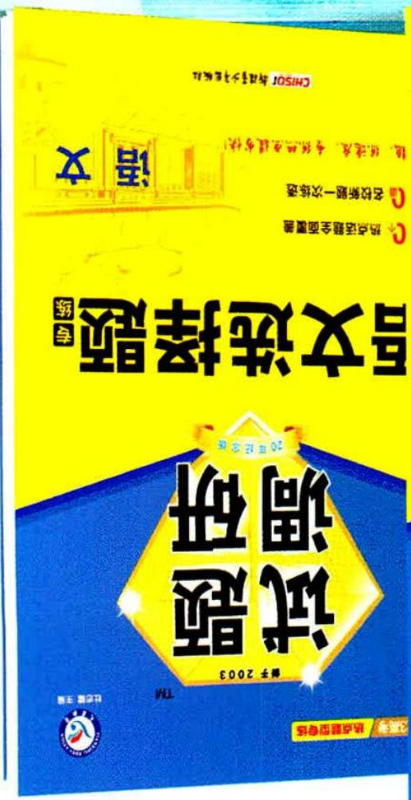

text_image

CHISOY 602073 七彩版
语文
语言话题全面覆盖
老校新题一次选选
语文必选，全拼拼全拼多维
语文必选，全拼拼全拼多维
语文必选，全拼拼全拼多维
语文必选，全拼拼全拼多维
语文必选，全拼拼全拼多维
语文必选，全拼拼全拼多维
语文必选，全拼拼全拼多维
语文必选，全拼拼全拼多维
语文必选，全拼拼全拼多维
语文必选择
2018-02-04
试题通所
2018-02-05
2018-02-06
2018-02-07
2018-02-08
2018-02-09
2018-02-10
2018-02-11
2018-02-12
2018-02-13
2018-02-14
2018-02-15
2018-02-16
2018-02-17
2018-02-18
2018-02-19
2018-02-20
2018-02-21
2018-02-22
2018-02-23
2018-02-24
2018-02-25
2018-02-26
2018-02-27
2018-02-28
2018-02-29
2018-02-30
2018-02-31
2018-03-01
2018-03-02
2018-03-03
2018-03-04
2018-03-05
2018-03-06
2018-03-07
2018-03-08
2018-03-09
2018-03-10
2018-03-11
2018-03-12
2018-03-13
2018-03-14
2018-03-15
2018-03-16
2018-03-17
2018-03-18
2018-03-19
2018-03-20
2018-03-21
2018-03-22
2018-03-23
2018-03-24
2018-03-25
2018-03-26
2018-03-27
2018-03-28
2018-03-29
2018-03-30
辅导 2003

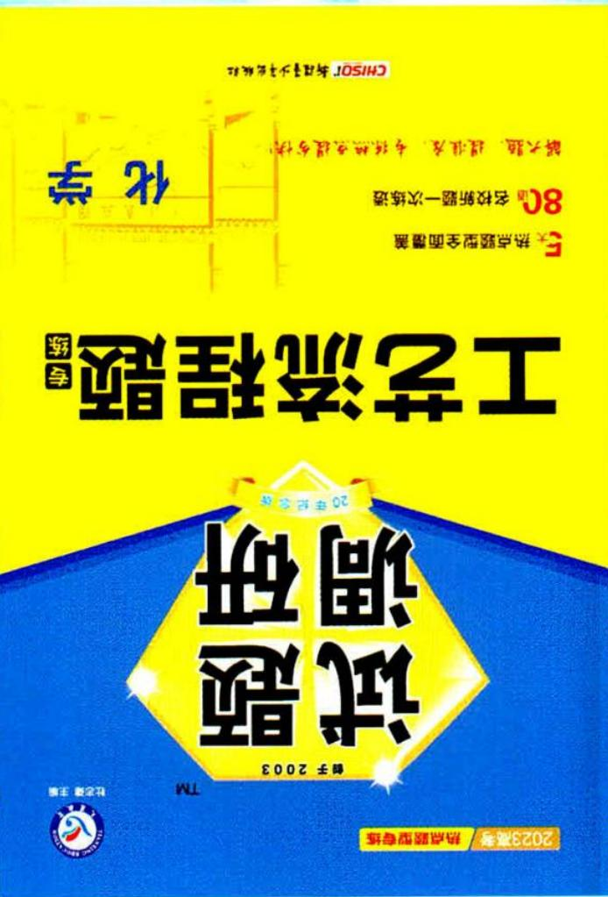

text_image

CHSOR 索品多力化
化学
80名校新题一次编选
6大热点题型全面覆盖
全球巡检乡村振兴
20年纪念节
试题
试题所
帽子 2003
7M
纪念邮 主播
2023高考 优质题型专栏
2023高考

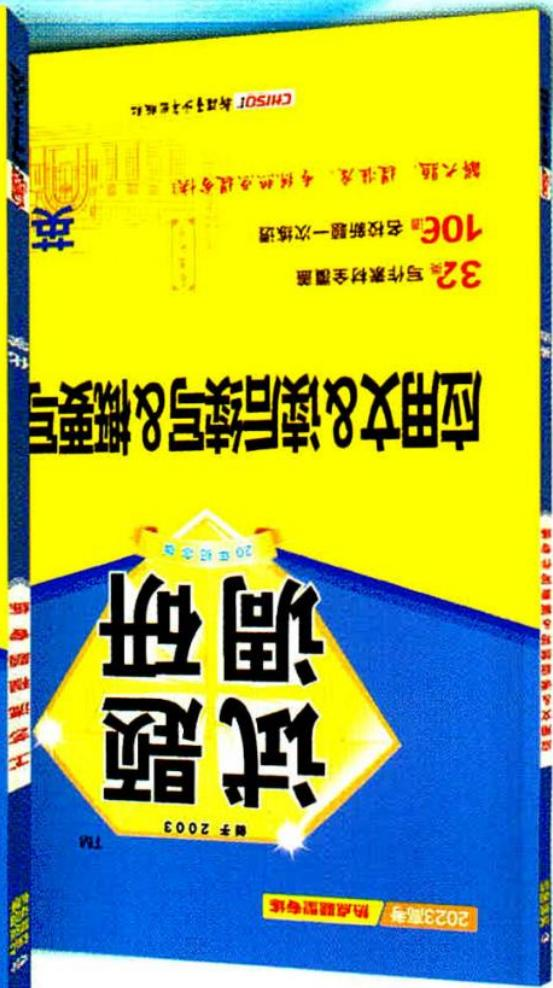

text_image

试题
调研
应用文&读后续写&摘要写
32.写作素材全篇画
10E。名投新题一次楼边
CNISOT 著 2023年7月出版社
第十九届 总编及专题论文
2023版号：临高题型考生
第十二届 总编及专题论文
第十三届 总编及专题论文
第十四届 总编及专题论文
第十五届 总编及专题论文
第十六届 总编及专题论文
第十七届 总编及专题论文
第十八届 总编及专题论文
第十九届 总编及专题论文
第二十届 总编及专题论文
第二十一届 总编及专题论文
第二十二届 总编及专题论文
第二十三届 总编及专题论文
第二十四届 总编及专题论文
第二十五届 总编及专题论文
第二十六届 总编及专题论文
第二十七届 总编及专题论文
第二十八届 总编及专题论文
第二十九届 总编及专题论文
第三十届 总编及专题论文
第三十一届 总编及专题论文
第三十二届 总编及专题论文
第三十三届 总编及专题论文
第三十四届 总编及专题论文
第三十五届 总编及专题论文
第三十六届 总编及专题论文
第三十七届 总编及专题论文
第三十八届 总编及专题论文
第三十九届 总编及专题论文
第四十届 总编及专题论文
第四十一届 总编及专题论文
第四十二届 总编及专题论文
第四十三届 总编及专题论文
第四十四届 总编及专题论文
第四十五届 总编及专题论文
第四十六届 总编及专题论文
第四十七届 总编及专题论文
第四十八届 总编及专题论文
第四十九届 总编及专题论文
第五十届 总编及专题论文
第五十一届 总编及专题论文
第五十二届 总编及专题论文
第五十三届 总编及专题论文
第五十四届 总编及专题论文
第五十五届 总编及专题论文
第五十六届 总编及专题论文
第五十七届 总编及专题论文
第五十八届 总编及专题论文
第五十九届 总编及专题论文
第六十届 总编及专题论文
第六十一届 总编及专题论文
第六十二届 总编及专题论文
第六十三届 总编及专题论文
第六十四届 总编及专题论文
第六十五届 总编及专题论文
第六十六届 总编及专题论文
第六十七届 总编及专题论文
第六十八届 总编及专题论文
第六十九届 总编及专题论文
第七十届 总编及专题论文
第七十一届 总编及专题论文
第七十二届 总编及专题论文
第七十三届 总编及专题论文
第七十四届 总编及专题论文
第七十五届 总编及专题论文
第七十六届 总编及专题论文
第七十七届 总编及专题论文
第七十八届 总编及专题论文
第七十九届 总编及专题论文
第八十届 总编及专题论文
第八十一届 总编及专题论文
第八十二届 总编及专题论文
第八十三届 总编及专题论文
第八十四届 总编及专题论文
第八十五届 总编及专题论文
第八十六届 总编及专题论文
第八十七届 总编及专题论文
第八十八届 总编及专题论文
第八十九届 总编及专题论文
第九十届 总编及专题论文
第九十一届 总编及专题论文
第九十二届 总编及专题论文
第九十三届 总编及专题论文
第九十四届 总编及专题论文
第九十五届 总编及专题论文
第九十六届 总编及专题论文
第九十七届 总编及专题论文
第九十八届 总编及专题论文
第九十九届 总编及专题论文

# 试题调研 × 金考卷™ = 高考提分好搭档

text_image

试题
调研
2023高考
MOOKE
书面表达高分技法
第5辑
英语
试题调研 高考题型全练
2023物理
试题
调研
2023高考
7003
试题
调研
高考题型全练
桂首一个题型，进一步选题、一通百选
物理
试题
调研
2023高考
2605
试题
调研
工艺流程题
E. 热点新增全程课程
80名校新题一次陈述
据人稿、论文版、专精论文通过专题
化学

试题新 解法新  
√ 观点新 √ 形式新

每月都有新试题

20年品牌积淀 相见恨晚的提分利器
知乎高中生推崇的好教辅

text_image

金考卷™
特快专递
第1期
2022年新高考
高考试题汇编
练真卷，做新划
八次我校 原春星昊 美香雪秀风云
&O解析 深度解读 尽机备考光机
英语
全国视野练新题
· 全国视野练新题
· 数学
· 全国视野练新题
· 数学
CHISSE 新任青少年出版社
CHISSE 新任青少年出版社

真题卷 模拟卷

每月都有新试卷

23年品牌积淀 B站、知乎大神力荐与专家名师深度对话的好试卷

natural_image

Cartoon character with yellow star and red eyes, wearing a patterned outfit (no text or symbols)

一书一卷，天生一对做更新的题，提高高的分！

电子书免费试读

图书问题读者反馈

《试题调研》总能超出你的预期！

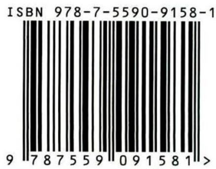

text_image

ISBN 978-7-5590-9158-1
9 787559 091581 >

定价：18.90元

