扫码关注获取更多学习资料——

# 试题 调研

20年纪念版

# 高题型全练

基础过关题型

开局起步 稳扎稳打

试题难度：★ — ★ ★ ★

数学

本册不单独销售

# 开局起步 稳扎稳打夯实基础

高考卷中基础、中档试题约占80%，拿下基础、中档试题是决胜高考的关键。本册从教材、高考、模拟、易错4个角度精选基础、中档试题，多层次帮你夯实基础。


# 教材起点练

从教材出发，重温和巩固教材基础知识，夯实基础。

# 教材习题变式

2.[人A选必一P139 T13改编.★]抛条性质:从抛物线焦点发出的光线线上的一点反射后,反射光线平行于对称轴.已知抛物线 $C:y^{2}=4x$ ,在抛行于x轴的光线射向C,交C于点P后与C交于点Q,则|PQ|的最小值为A.1 B.2 C.4

# 教材图形命题

1.[人教版必修－P46图2.4-1改编.★]如图所示为一个长约1.5m的玻璃筒，一端封闭，另一端有开关，把金属片和小羽毛放到玻璃筒里，把玻璃筒来，观察它们下落的情况，然后璃筒里的空气抽出，再把玻璃筒过来，再次观察金属片和小羽毛的情况，下列说法正确的是A.玻璃筒充满空气时，金属片和一样快


# 教材材料命题

[人数必修二 P27 活动改编] 唐代长安城是当时世界上重要的商贸中心，西域客商沿着丝绸之路来到长安城。当时长安城规划有宫殿区、坊和市，坊是居住单位，市分东市和西市。朱熹对唐代的里坊制度甚为赞赏：“唐宫殿制度正当甚好。官街皆用墙，居民在墙内，民出入处皆有坊门。”下图为唐长安城的内部空间结构示意图。据此完成1—3题。

1.[2020 全国 1. ★★]种子贮藏中需要控制呼吸作用以减少有机物的消耗。若作物种子呼吸作用所利用的物质是淀粉分解产生的葡萄糖,下列关于?

A.若产生的胞只进行B.若细胞只数与释放C.若细胞只

3.[2021 山东, ★★★]1913—1921年税征收额受国际局势影响出现了下列各项反映这一时期变化状况的
数量（千万海关网）
6.0
4.8
4.6
4.4
4.2
3.6
3.0
1913
1915
1917
1919
1921
A
数量（千万海关网）
6.0
4.8
4.6
4.4
4.2
3.6
3.0

2.[2022全国乙.★★★]固定于竖直平面内的光滑大圆环上套有一个小环.小环从大圆环顶端P点由静止开始自由下滑,在下滑过程中,小环的速率正比于()

A.它滑过的弧长  
B.它下降的高度  
C.它到 $P$ 点的距离  
D.它与 $P$ 点的连线扫过的面积

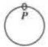


# 高考方向练

立足全国视野，精选高考试题，感受不同年份、不同地区高考命题的异同，明确高考方向。


# 模拟实战练

精选各地最新模拟题，拓宽思路，感知教考新信息，实战检测，提升能力。

# 名校模拟

7.[2022广东省实验中学期末，★★]已知 $\sin \alpha$ 是方程 $5x^{2} - 7x - 6 = 0$ 的根，且 $\alpha$ 是第三象限

角，则 $\frac{\sin(-\alpha - \frac{3\pi}{2})\cos(\frac{3\pi}{2})}{\cos(\frac{\pi}{2} - \alpha)\sin(\frac{\pi}{2})}$ $\alpha$ 的值为 \_\_\_\_.

# 名校联考

5.[2022 湖北十一校联考.★★★]25℃时,改变 $0.1\ mol\cdot L^{-1}$ 甲酸(HCOOH)与丙酸( $CH_{3}CH_{2}COOH$ )溶液的pH,溶液中RCOOH分子的物质的量分数 $\delta(\mathrm{RCOOH})$ 随之改变[已知 $\delta(\mathrm{RCOOH})=\frac{c(\mathrm{RCOOH})}{c(\mathrm{RCOOH})+c(\mathrm{RCOO}^{-})}$ ], $\delta(\mathrm{RCOOH})$ 与pH的关系如图所示。下列说法正确的是()

# 大市质检

7.[2022沈阳一模，★★★]2021年9月，神舟十二号载人飞船返回舱成功着陆。为保障三位航天员安全回家，我国在近5万平方千米的着陆场区部署了三位一体的常急兼备搜救力体系，制定了多种应急预案，组织了两次直

通信联调及空地协同搜救训练。
()

验提高了通信技术  
航天员的安全返回  
力保障了航天探索  
素月球的技术基础

# 概念理解错

5. | 误认为非公有制经济属于社会主义经济. ★★

习近平总书记对新时代民营经济统战工作出重要指示强调，要坚持“两个毫不动摇”，民营经济人士团结在党的周围。激发民营创业热情、成就企业家创意创新创造，能进一步推进民营经济高质量发展，为新时代展社会主义市场经济积蓄基本力量、提供强动能。由此可见（①民营经济在推动创新发展中发挥着重作用

# 做题思维错

6.[忽视刹车问题中速度减为零所用的时间, ★★★]一辆汽车刹车前速度为90 km/h,刹车时获得的加速度大小为10 m/s²,求:

(1)汽车开始刹车后10 s内滑行的距离 $x_{0}$ ;
(2)汽车从开始刹车到位移为30 m所经历的时间；
(3)汽车静止前1 s内滑行的距离 $x'$ .


# 易错警示练

总结常见知识盲点、思维误区等，针对性训练，补齐短板，考试多拿分。

创于 2003

# 试题 调研

20年纪念版

# 高题型全练

主 编：杜志建

本册编审：杨建萍 翁华木 刘峰 余晓瑜

岳峻王琪

数学

# 第一章 集合与常用逻辑用语

# 第一节 集合

题型 1 判断元素与集合的关系 …… 001

题型 2 求集合中元素的个数 …… 001

题型 3 已知元素与集合的关系求参数 …… 002

题型 4 判断集合间的关系 …… 002

题型 5 求集合的子集个数 …… 003

题型 6 根据集合间的关系求参数的值(或范围)
003

题型 7 集合的交、并、补运算 …… 004

题型 8 已知集合的运算结果求参数的值(或范围)
004

题型 9 有交叉的计数问题 …… 005

题型 10 集合的新定义问题 005

# 第二节 常用逻辑用语

题型 11 四种命题及其真假判断 …… 006

题型 12 充分条件与必要条件的判断 …… 006

题型 13 含逻辑联结词的命题的真假判断 … 007

题型 14 全(特)称命题的否定 …… 008

题型 15 已知全(特)称命题的真假求参数的取值
范围 …… 008

# 第二章 函数与基本初等函数1

# 第一节 函数及其表示

题型 16 求函数的定义域 …… 009

题型 17 求函数的值域(最值) …… 009

题型 18 求函数的解析式 …… 010

题型 19 已知定义域(值域)求参数的值或范围 … 011

题型20 已知分段函数求值 011

题型 21 已知分段函数求参 …… 011

题型 22 已知分段函数解不等式 …… 012

# 第二节 函数的基本性质

题型 23 判断函数的单调性或求单调区间 …… 013

题型 24 已知函数单调性求参数的取值范围 … 013

题型 25 判断函数的奇偶性 …… 014

题型 26 已知函数的奇偶性求解析式 …… 015

题型 27 已知函数的奇偶性求函数值 …… 015

题型 28 已知函数的奇偶性求参数 …… 016

题型 29 已知函数单调性、奇偶性比较大小 …… 016

题型 30 已知函数单调性、奇偶性解不等式 …… 017

题型 31 函数周期性的判断及应用 …… 018

题型 32 函数性质的综合应用 …… 018

# 第三节 二次函数与幂函数

题型 33 二次函数的图象及应用 …… 019

题型 34 二次函数在闭区间上的最值问题 …… 020

题型 35 幂函数的图象与性质的应用 …… 020

# 第四节 指数与指数函数

题型 36 指数幂的运算 …… 021

题型 37 指数函数的图象及应用 …… 022

题型 38 指数函数的性质判断及简单应用 …… 022

题型 39 利用指数函数的图象与性质比较大小
023

# 第五节 对数与对数函数

题型 40 对数式的运算 …… 024

题型 41 对数函数的图象及应用 …… 025

题型 42 对数函数的性质判断及简单应用 …… 025

题型 43 利用对数函数的图象与性质比较大小 … 026

题型 44 解对数(指数)方程或不等式问题 …… 027

# 第六节 函数的图象

题型 45 判断函数图象 028

题型 46 分析函数图象 …… 029

# 第七节 函数与方程

题型 47 判断函数的零点所在区间 …… 030

题型 48 判断函数的零点个数 …… 030

题型 49 根据函数的零点情况求参数的取值范围
031

# 第八节 函数模型及其应用

题型 50 解决图表型函数的实际应用问题 …… 032

题型 51 已知函数模型求解实际问题 …… 034

题型 52 构造函数模型求解实际问题 …… 035

# 第三章 导数及其应用

# 第一节 导数的概念及运算

题型 53 导数的运算 …… 037

题型 54 求切线方程 037

题型 55 根据导数的几何意义求参数(或切点) … 038

题型 56 曲线的公切线问题 039

# 第二节 导数在研究函数中的应用

题型 57 讨论函数的单调性或求单调区间 …… 039

题型 58 已知函数的单调性求参数 …… 040

题型 59 构造函数求解比较大小或解不等式问题
041

题型 60 求极值 042

题型 61 已知函数极值情况求参数 …… 042

题型 62 求函数的最值 …… 043

题型 63 已知函数最值情况求参数 …… 044

题型 64 导函数图象的应用 045

# 第三节 定积分与微积分基本定理 \*

题型 65 求定积分 045

题型 66 定积分的应用 046

# 第四章 三角函数、解三角形

# 第一节 三角函数的基本概念、同角三角函数的基本关系与诱导公式

题型 67 三角函数值在各象限的符号 …… 047

题型 68 扇形弧长公式与面积公式 …… 047

题型 69 三角函数定义的应用 048

题型 70 “ $\sin^{2}\alpha + \cos^{2}\alpha = 1$ ”的应用 049

题型 71 利用“ $\tan\alpha=\frac{\sin\alpha}{\cos\alpha}$ ”及“1”的代换“化
弦为切”求值 …… 050

题型 72 利用诱导公式化简求值 050

题型 73 同角三角函数基本关系与诱导公式的综合应用 …… 051

# 第二节 三角恒等变换

题型 74 两角和与差的正弦、余弦、正切公式的应用 …… 052

题型 75 二倍角公式的应用 052

题型 76 辅助角公式的应用 053

题型 77 给角求值 054

题型 78 给值求值 055

题型 79 给值求角 056

# 第三节 三角函数的图象与性质

题型 80 三角函数的图象变换 …… 056

题型 81 已知三角函数图象求解析式 …… 058

题型 82 求三角函数的单调区间 …… 059

题型 83 已知三角函数的单调性求参数 …… 060

题型 84 求三角函数的最值(值域) …… 061

题型 85 判断三角函数的周期性 …… 062

题型 86 已知三角函数的奇偶性求参数 …… 063

题型 87 三角函数的对称性问题 …… 064

题型 88 三角函数的图象与性质的综合应用 … 065

题型 89 三角函数性质与三角恒等变换的综合 … 066

# 第四节 正、余弦定理及解三角形

题型 90 利用正弦定理解三角形 …… 068

题型 91 利用余弦定理解三角形 …… 068

题型 92 正、余弦定理的综合应用 …… 069

题型 93 判断三角形的形状 …… 070

题型 94 求三角形的面积 072

题型 95 已知三角形面积求其他量 …… 073

题型 96 求三角形的周长或已知周长求其他量 … 074

题型 97 测量距离问题 075

题型 98 测量高度问题 077

题型 99 测量角度问题 078

# 第五章 平面向量

# 第一节 平面向量的概念及线性运算、平面向量基本定理及坐标运算

题型 100 平面向量的有关概念 …… 079

题型 101 平面向量的线性运算及其几何意义……079

题型 102 共线向量定理的应用 …… 080

题型 103 平面向量基本定理的应用 …… 081

题型 104 平面向量的坐标运算 …… 082

# 第二节 平面向量的数量积及应用

题型 105 求平面向量的数量积 …… 083

题型 106 平面向量的投影问题 …… 084

题型 107 平面向量的模长问题 …… 085

题型 108 平面向量的夹角问题 …… 085

题型 109 平面向量的平行、垂直问题 …… 086

题型 110 坐标法在求解向量问题中应用 …… 087

题型 111 平面向量的应用 …… 087

# 第六章 数列

# 第一节 数列的概念与简单表示

题型 112 通过观察、归纳得出数列的通项公式 … 089

题型 113 利用 $a_{n}$ 与 $S_{n}$ 的关系求数列的通项
公式 …… 089

题型 114 已知相邻两项的递推关系求数列的
通项公式 …… 090

题型115 已知相邻三项的递推关系求数列的通项公式 091

题型 116 已知分段的递推关系求数列的通项公式
092

题型 117 已知两交叉数列的递推关系式,求数列的
通项公式 …… 092

题型 118 数列的性质及其应用 …… 093

# 第二节 等差数列及其前 $n$ 项和

题型 119 等差数列的基本运算 …… 094

题型 120 等差数列的性质及应用 …… 095

题型 121 等差数列的判定与证明 …… 096

题型 122 等差数列的前 n 项和及其最值 …… 097

# 第三节 等比数列及其前 $n$ 项和

题型 123 等比数列的基本运算 …… 098

题型 124 等比数列的性质的应用 …… 099

题型 125 等比数列的判定与证明 …… 100

题型 126 等差、等比数列的综合问题 …… 101

# 第四节 数列求和

题型 127 用公式法求和 …… 102

题型 128 用裂项相消法求和 …… 103

题型 129 用错位相减法求和 …… 104

题型 130 用分组转化法求和 …… 105

题型 131 用倒序相加法求和 …… 106

# 第七章 不等式

# 第一节 不等关系与一元二次不等式

题型 132 比较两个数(式)的大小…… 107

题型 133 不等式性质的应用 …… 107

题型 134 一元二次不等式的解法 …… 108

题型 135 一元二次不等式的恒成立问题 …… 108

题型 136 实际生活中的不等关系 …… 109

# 第二节 二元一次不等式（组）与简单的线性规划问题\*

题型 137 求不等式组表示的平面区域的面积…… 110

题型 138 求线性目标函数的最值(范围)…… 110

题型 139 求非线性目标函数的最值(范围)…… 111

题型 140 含参线性规划问题 …… 112

题型 141 线性规划的实际应用 …… 112

# 第三节 基本不等式

题型 142 直接应用基本不等式求最值 …… 113

题型 143 利用“拼凑法”求最值…… 113

题型 144 利用“常数代换法”求最值…… 114

题型 145 利用“消元法”求最值 …… 114

题型 146 基本不等式的综合应用 …… 114

题型 147 利用基本不等式解决实际问题 …… 115

# 第八章 立体几何

# 第一节 空间几何体的结构、三视图和直观图

题型 148 对空间几何体结构的理解 …… 116

题型 149 立体几何中的“展开”问题…… 117

题型 150 三视图的识别 \* …… 117

题型 151 由三视图还原直观图 \* …… 118

# 第二节 空间几何体的表面积和体积

题型 152 求几何体的表面积(侧面积)…… 119

题型 153 用“直接法”求几何体的体积…… 120

题型 154 用“割补法”求几何体的体积…… 121

题型 155 用“等体积法”求几何体的体积…… 121

题型 156 外接球问题 …… 122

题型 157 内切球问题 …… 123

# 第三节 空间点、直线、平面之间的位置关系

题型 158 平面的基本性质及应用 …… 124

题型 159 判断空间两直线的位置关系 …… 125

题型 160 求异面直线所成角 …… 126

# 第四节 直线、平面平行的判定及性质

题型 161 线面平行的判定定理的应用 …… 127

题型 162 线面平行的性质定理的应用 …… 128

题型 163 面面平行的判定定理的应用 …… 129

题型 164 面面平行的性质定理的应用 …… 130

题型 165 平行关系的综合问题 …… 131

# 第五节 直线、平面垂直的判定及性质

题型 166 线面垂直的判定定理的应用 …… 132

题型 167 线面垂直的性质定理的应用 …… 133

题型 168 面面垂直的判定定理的应用 …… 134

题型 169 面面垂直的性质定理的应用 …… 135

题型 170 垂直关系的综合问题 …… 136

# 第六节 空间向量的应用

题型 171 证明平行与垂直问题 …… 137

题型 172 求线面角 …… 139

题型 173 求二面角 …… 140

题型 174 求空间距离 …… 142

# 第九章 直线和圆的方程

# 第一节 直线方程与两直线的位置关系

题型 175 求直线的方程 …… 144

题型 176 两直线的位置关系的判断及应用 …… 144

题型 177 直线的交点与距离问题 …… 145

题型 178 对称问题 …… 146

# 第二节 圆的方程及直线、圆的位置关系

题型 179 求圆的方程 …… 146

题型 180 与圆有关的最值问题 …… 147

题型 181 直线与圆的位置关系的判断及应用…… 148

题型 182 直线与圆相切的切线问题 …… 148

题型 183 直线与圆相交的弦长问题 …… 149

题型 184 圆与圆的位置关系的判断 …… 149

题型 185 两圆的公切线问题 …… 149

题型 186 两圆相交的公共弦问题 …… 150

# 第十章 圆锥曲线与方程

# 第一节 椭圆

题型 187 椭圆定义的应用 …… 151

题型188 利用定义解决椭圆的焦点三角形问题 151

题型 189 求椭圆的标准方程 …… 152

题型 190 求椭圆的离心率或其范围 …… 154

题型 191 椭圆的几何性质及其应用 …… 155

题型 192 直线与椭圆相交的弦长问题 …… 156

# 第二节 双曲线

题型 193 双曲线定义的应用 …… 157

题型 194 利用定义解决双曲线中的焦点三角形
问题 …… 158

题型 195 求双曲线的标准方程 …… 159

题型 196 求双曲线的渐近线方程 …… 160

题型 197 求双曲线的离心率或其范围 …… 161

题型 198 双曲线的几何性质及其应用 …… 162

# 第三节 抛物线

题型 199 抛物线定义的应用 …… 163

题型 200 求抛物线的标准方程 …… 164

题型 201 抛物线的基本量的求解 …… 165

题型 202 抛物线的几何性质及其应用 …… 166

题型 203 抛物线的焦点弦问题 …… 167

题型 204 直线与抛物线相交的弦长(非焦点弦)
问题 …… 168

# 第十一章 计数原理

# 第一节 两个计数原理、排列与组合

题型 205 分类加法计数原理与分步乘法计数原理的应用 …… 169

题型 206 排列问题 …… 170

题型 207 组合问题 …… 171

题型 208 分组分配问题 …… 172

题型 209 排列与组合的综合应用 …… 172

# 第二节 二项式定理

题型 210 求形如 $(a+b)^{n}(n\in\mathbf{N}^{*})$ 的展开式中的特定项或特定项的系数 …… 173

题型 211 求形如 $(a+b)^{m}(c+d)^{n}(m,n\in\mathbb{N}^{*})$ 的展开式中的特定项或特定项的系数…… 174

题型 212 求形如 $(a+b+c)^{n}(n\in\mathbf{N}^{*})$ 的展开式中的特定项或特定项的系数 …… 174

题型 213 二项展开式的系数和问题 …… 175

题型 214 与二项展开式中的系数有关的最值问题
…… 176

# 第十二章 概率

# 第一节 随机事件的概率

题型 215 随机事件的频率与概率 …… 177

题型 216 求互斥事件、对立事件的概率 …… 178

# 第二节 古典概型与几何概型

题型 217 求古典概型的概率 …… 179

题型 218 求几何概型的概率 $^{*}$ …… 181

题型 219 随机模拟方法的应用 …… 181

# 第三节 离散型随机变量及其分布列、期望与方差

题型 220 求离散型随机变量的分布列 …… 182

题型 221 求离散型随机变量的期望与方差 …… 184

题型 222 利用期望与方差进行决策 …… 186

# 第四节 二项分布、超几何分布与正态分布

题型 223 条件概率的计算 …… 189

题型 224 全概率的计算 …… 189

题型 225 相互独立事件的判断及概率的计算…… 190

题型 226 二项分布 …… 192

题型 227 超几何分布 …… 194

题型 228 正态分布 …… 196

# 第十三章 统计与统计案例

# 第一节 随机抽样与用样本估计总体

题型 229 简单随机抽样 …… 197

题型 230 系统抽样 \* 198

题型 231 分层随机抽样 …… 198

题型 232 频率分布直方图的绘制和数字特征…… 199

题型 233 饼图、折线图、条形图、雷达图 …… 201

题型 234 茎叶图 \* 202

题型 235 百分位数的计算 …… 203

题型 236 样本的数字特征 …… 204

题型 237 总体数字特征的估计 …… 206

# 第二节 变量间的相关关系与统计案例

题型 238 相关关系的判断 …… 208

题型 239 回归分析 …… 209

题型 240 独立性检验 …… 212

# 第十四章 复数

题型 241 求复数的实部、虚部 …… 214

题型 242 求共轭复数 …… 214

题型 243 求复数的模 …… 215

题型 244 复数中的含参问题 …… 215

题型 245 复数的四则运算 …… 216

题型 246 复数的几何意义 …… 217

# 第十五章 算法初步\*

题型 247 判断程序框图的输入、输出值 …… 218

题型 248 补全程序框图 …… 219

# 第十六章 推理与证明\*

题型 249 合情推理与演绎推理 …… 220

题型 250 直接证明与间接证明 …… 221

# 第十七章 坐标系与参数方程\*

题型 251 极坐标(方程)与直角坐标(方程)的互化
…… 222

题型 252 极坐标(方程)的求解 …… 223

题型 253 参数方程与普通方程的互化 …… 224

题型 254 应用参数 t 的几何意义解题 …… 225

题型 255 求曲线上的点到直线(点)的距离的最值
…… 226

题型 256 极坐标方程与参数方程的综合应用…… 228

# 第十八章 不等式选讲\*

题型 257 绝对值不等式的解法 …… 230

题型 258 画出绝对值函数的图象 …… 231

题型 259 绝对值三角不等式的应用 …… 232

题型 260 不等式的证明 …… 233

题型 261 与绝对值不等式有关的恒成立(有解)
问题 …… 234

附录: 答案全解全析(单独成册, P001—P126)

# 第一节 集合

# 题型1 判断元素与集合的关系

▶ 答案：001 页

# 题型攻略

# 判断元素与集合的关系的方法

1. 若集合中元素是直接给出的, 直接判断元素在已知集合中是否出现即可.  
2. 若集合中元素没有直接给出, 判断元素是否满足集合中元素所具有的特征即可.  
注意:要先明确集合中的元素满足哪些条件.

# 教材 起点练

1.[多选,人A必一 $^{[注]}$ P5练习T2改编,★]下列关系中,正确的是()

A. $-2 \notin \{0,1\}$

B. $(2,4)\in\{x|y=x^{2}\}$

C. $\pi \in \mathbf{R}$

D. $0 \in \varnothing$

# 高考 方向练

2.[2022全国卷乙，★]设全集 $U = \{1,2,3,4,$ 5}，集合 $M$ 满足 $\complement_U M = \{1,3\}$ ，则 （）

A. $2 \in M$

B. $3 \in M$

C. $4 \notin M$

D. $5 \notin M$

3.[2018北京,★★]设集合 $A=\{(x,y)\mid x-y\geqslant1,ax+y>4,x-ay\leqslant2\}$ ，则()

A. 对任意实数 $a, (2,1) \in A$   
B. 对任意实数 $a, (2,1) \notin A$   
C. 当且仅当 a<0 时， $(2,1)\notin A$   
D. 当且仅当 $a \leqslant \frac{3}{2}$ 时， $(2,1) \notin A$

# 模拟 实战练

4.[2022甘肃酒泉期中，★]若集合 $P = \{x\in \mathbf{N}|$ $x\leqslant \sqrt{2022}\} ,a = 45$ ，则 （

A. $a \in P$

B. $\{a\} \in P$

C. $\{a\}\subseteq P$

D. $a \notin P$

# 题型 2 求集合中元素的个数

▶ 答案：001 页

# 题型攻略

求集合中元素个数的步骤:(1)先确定集合的类型,是数集、点集还是其他类型的集合;(2)看集合中元素满足什么限制条件;(3)根据条件确定集合中的元素个数或利用数形结合思想求解.

# 教材 起点练

1. [人 A 必一 P14 T1 改编, ★] 已知集合 $A = \{0, 1, 2, 3, 4\}$ , $B = \{x \mid 2 \leqslant x < 4\}$ , 则 $A \cap B$ 中元素的个数为 ( )

A. 1

B.2

C. 3

D. 4

# 高考 方向练

2.[2020全国卷Ⅲ,★★]已知集合 $A=\{(x,y)\mid x,y\in\mathbf{N}^{*},y\geqslant x\}$ , $B=\{(x,y)\mid x+y=8\}$ ，则 $A\cap B$ 中元素的个数为()

A. 2

B. 3

C. 4

D. 6

【注】均指新教材.

3. [2018 全国卷Ⅱ, ★★] 已知集合 $A = \{(x, y) | x^2 + y^2 \leqslant 3, x \in \mathbf{Z}, y \in \mathbf{Z}\}$ , 则 $A$ 中元素的个数为 ( )

A. 9

B. 8

C. 5

D. 4

# 实战练

4. [2022 江苏调考, ★★] 已知集合 $A = \{0, 1, 2, 3, 4\}$ , $B = \{(x, y) | x \in A, y \in A, x - y \in A\}$ , 则 $B$

中所含元素的个数是 （）

A. 5

B. 6

C. 10

D. 15

5. [2022] 设集合 $A = \{(x, y) | y = x\}$ , $B = \{(x, y) | y = x^2\}$ , 则集合 $A \cap B$ 中元素的个数为 ( )

A. 0

B. 1

C. 2

D. 3

# 题型3 已知元素与集合的关系求参数

答案：001页

# 题型攻略

1. 根据元素与集合的关系列出参数满足的方程或不等式求解.  
2. 注意检验集合中的元素是否满足互异性.

# 高考 方向练

1. |2017全国卷Ⅱ，★设集合 $A = \{1,2,4\}$ ， $B = \{x \mid x^2 - 4x + m = 0\}$ . 若 $A \cap B = \{1\}$ ，则 $B =$ （）

A. $\{1,-3\}$

B. $\{1,0\}$

C. $\{1,3\}$

D. $\{1,5\}$

# 模拟 实战练

2. | 2022 福建龙岩第一中学模拟. ★ 已知集合

A, 集合 $B = \{2, 3, a, b\}$ ，且 $A \cap B = \{3, 4\}$ ，则下列结论一定成立的是（）

A. $a + b = 9$

B. $a + b \neq 8$

C. $a + b < 7$

D. $a + b > 10$

# 易健 警示练

3. 已知集合 $A = \{0, m, m^2 - 5m + 6\}$ , 且 $2 \in A$ , 则实数 $m$ 的值为 \_\_\_\_.

# 题型4 判断集合间的关系

答案: 001 页

# 题型攻略

判断集合间关系的方法

<table><tr><td>列举法</td><td>先根据题中限定条件把集合中元素列举出来,然后比较集合中元素的异同,从而判断集合之间的关系.</td></tr><tr><td>结构法</td><td>先对集合化简变形,然后从集合中元素的结构上找差异,再进行判断.</td></tr><tr><td>数形结合法</td><td>先用数轴或 Venn 图表示集合,然后通过数形结合判断集合之间的关系.</td></tr></table>

# 教材 起点练

1. [人 A 必一 P8 T2 改编, ★] 给出下列说法: ① $\{a\} \in \{a, b, c\}$ ; ② $\{x \mid x \text{ 是四边形}\} \subsetneq \{x \mid x \text{ 是正方形}\}$ ; ③ $\varnothing \subseteq \{0\}$ ; ④ $\{0, 1, 2\} = \{1, 2, 0\}$ ; ⑤ $\varnothing = \{x \in R \mid x^{2} + 1 = 0\}$ . 其中正确的个数为 ( )

A. 2

B. 3

C. 4

D. 5

# 高考 方向练

2. [2015 重庆, ★] 已知集合 $A = \{1, 2, 3\}$ , $B =$

$\{2,3\}$ ，则（）

A. $A = B$

B. $A \cap B = \varnothing$

C. $A \subsetneqq B$

D. $B \subsetneq A$

3. 2021全国布了，★已知集合 $S = \{s \mid s = 2n + 1, n \in \mathbf{Z}\}, T = \{t \mid t = 4n + 1, n \in \mathbf{Z}\}$ ，则 $S \cap T =$ （）

A. ∅

B. $S$

C. T

D. Z

# 模拟 实战练

4. 2022 呼封市一模，★★ 若集合 $A = \{y \mid y = |x| +$

1} , 且 $A \cap B = B$ , 则集合 B 不可能是 ( )

A. ∅

B. $\{1\}$

C. $\{y \mid y \geqslant 1\}$

D. $\{y|y\geqslant0\}$

5.[2022 福建厦门一中模拟,★★]已知 M,N 为

全集 U 的两个不相等的非空子集, 若 $(\complement_{U}N) \subseteq (\complement_{U}M)$ , 则下列结论正确的是 ()

A. $\forall x\in N,x\in M$

B. $\exists x \in M, x \notin N$

C. $\exists x\notin N,x\in M$

D. $\forall x\in M,x\notin\complement_{U}N$

# 题型5 求集合的子集个数

▶ 答案：001 页

# 题型攻略

子集个数的求解方法

<table><tr><td>列举法</td><td>将集合的子集一一列举出来,从而得到子集的个数,适用于集合中元素个数较少的情况.</td></tr><tr><td>公式法</td><td>含有n个元素的集合的子集个数是 $2^n$ ,非空子集的个数是 $2^n - 1$ ,真子集的个数是 $2^n - 1$ ,非空真子集的个数是 $2^n - 2$ .</td></tr></table>

# 教材 起点练

1.[人A必一P8例1改编,★]集合 $\{a,b\}$ 的真子集的个数为\_\_\_\_.

# 高考 方向练

2.[2012 湖北, ★★]已知集合 $A=\{x \mid x^{2}-3x+2=0, x \in R\}$ , $B=\{x \mid 0 < x < 5, x \in N\}$ ，则满足条件 $A \subseteq C \subseteq B$ 的集合 C 的个数为（）

A.1

B.2

C. 3

D. 4

# 模拟 实战练

3.[2022 河北衡水中学模拟, ★★]设集合 $A = \{x \in \mathbf{N} \mid -1 < x < 2\}$ , $B = \{y \mid y = 2^x, x \in A\}$ , 则 $A \cup B$ 的子集的个数为 ( )

A.2

B.3

C. 7

D. 8

# 题型 6 根据集合间的关系求参数的值（或范围）

▶ 答案：001 页

# 题型攻略

1. 根据集合间的关系列出参数满足的方程(组)或不等式(组)求解.  
2. 若未指明集合非空, 则要考虑空集的可能性, 如已知集合 $A$ 与非空集合 $B$ 满足 $A \subseteq B$ 或 $A \subsetneq B$ , 则有 $A = \varnothing$ 和 $A \neq \varnothing$ 两种可能.

# 教材 起点练

1.[人A必一P9T5改编,★](1)设 $a,b\in R$ , $P=\{2,a\},Q=\{-1,-b\}$ ，若P=Q，则a-b= \_\_\_\_.

(2)已知集合 $A = \{x\mid 0 <   x <   a\}$ ， $B = \{x\mid 2<$ $x <   3\}$ ，若 $B\subseteq A$ ，则实数 $a$ 的取值范围是

# 高考 方向练

2.[2014 福建, ★★]已知集合 $\{a,b,c\}=\{0,1,2\}$ ，且下列三个关系：① $a\neq2$ ; ②b=2; ③ $c\neq0$

有且只有一个正确，则 $100a + 10b + c$ 等于 \_\_\_\_.

# 模拟 实战练

3. [★★](1)已知集合 $A = \{x \mid -2 \leqslant x \leqslant 5\}$ , $B = \{x \mid m + 1 \leqslant x \leqslant 2m - 1\}$ , 若 $B \subseteq A$ , 则实数 $m$ 的取值范围为 \_\_\_\_.

(2)若将(1)中“集合 $A=\{x\mid-2\leqslant x\leqslant5\}$ ”改为“集合 $A=\{x\mid x<-2$ 或 $x>5\}$ ”,其他条件不变,则实数m的取值范围为\_\_\_\_.

# 题型 7 集合的交、并、补运算

# 题型攻略

# 求解集合的基本运算问题的步骤

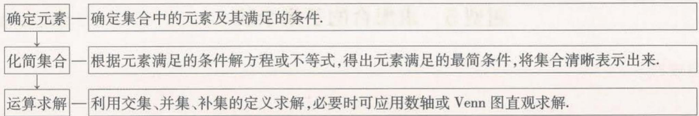

<details>
<summary>flowchart</summary>

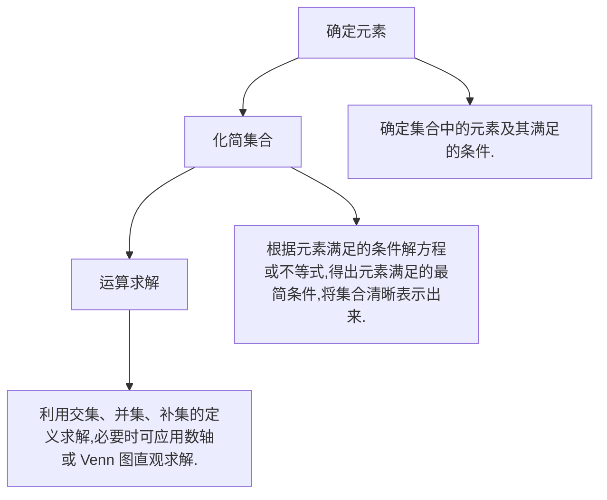
</details>

# 教材 起点练

1. [人 A 必一 P13 T1 改编, ★] 已知 $U = \{1, 2, 3, 4, 5, 6, 7\}$ , $A = \{2, 4, 5\}$ , $B = \{1, 3, 5, 7\}$ , 则 $A \cap (\complement_{U} B) =$ \_\_\_\_, $(\complement_{U} A) \cap (\complement_{U} B) =$ \_\_\_\_.  
2.[人A必一P14T1改编，★]已知集合 $A=\{x\mid2\leqslant x<4\}$ ， $B=\{x\mid3x-7\geqslant8-2x\}$ ，则 $A\cup B=$ \_\_\_\_， $A\cap B=$ \_\_\_\_.

# 高考 方向练

3.[2022新高考卷I，★]若集合 $M = \{x\mid \sqrt{x} < 4\},N = \{x\mid 3x\geqslant 1\}$ ，则 $M\cap N =$ （

A. $\{x\mid 0\leqslant x <   2\}$

B. $\left\{x\mid\frac{1}{3}\leqslant x<2\right\}$

C. $\{x\mid3\leqslant x<16\}$

D. $\{x\mid\frac{1}{3}\leqslant x<16\}$

4.[2022全国卷甲，★]设全集 $U = \{-2, - 1,0,$ $1,2,3\}$ ，集合 $A = \{-1,2\} ,B = \{x\mid x^2 -4x+$ $3 = 0\}$ ，则 $\complement_U(A\cup B) =$ （

A. $\{1,3\}$

B. $\{0,3\}$

C. $\{-2,1\}$

D. $\{-2,0\}$

# 模拟 实战练

5.[2022郑州市一模，★]已知集合 $P = \{x\in \mathbf{N}\mid$ $1 <   x\leqslant 4\}$ ，集合 $Q = \{x\mid x^2 -x - 6\leqslant 0\}$ ，则 $P\cap$ $Q =$ （

A. $(1,3]$

B. $\{2,3\}$

C. $\{1,2,3\}$ D. $(1,4]$

6.[2022 石家庄市一检,★]已知全集 $U=\{2,4,6,8,10,12\}$ ，集合 $M=\{4,6,8\},N=\{8,10\}$ ，则 $\{2,12\}=$ （）

A. $M \cup N$

B. $M \cap N$

C. $\complement_{U}(M\cup N)$

D. $\complement_{U}(M\cap N)$

7.[2022江西五校联考,★★]已知全集 U=R,
集合 $A=\{x\mid\log_{2}(x-1)<1\}$ , 集合 $B=\{x\mid e^{x}>3\}$ , 则图中阴影部分表示的集合是()

A. $\{x\mid1<x\leqslant\ln3\}$   
B. $\{x \mid x \leqslant \ln 3\}$   
C. $\{x\mid1<x<\ln3\}$   
D. $\{x \mid x < \ln 3\}$

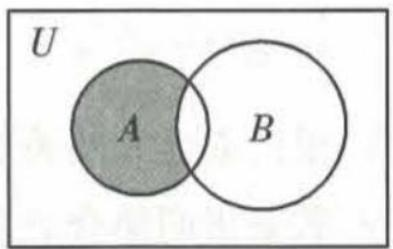

<details>
<summary>text_image</summary>

U
A
B
</details>

# 题型 8 已知集合的运算结果求参数的值（或范围）

▶ 答案：002 页

# 题型攻略

根据集合的运算结果列出参数满足的方程(组)或不等式(组)求解.

# 教材 起点练

1. [人 A 必一 P35 T9 改编, ★] 已知集合 $A = \{1, 3, a^2\}$ , $B = \{1, a + 2\}$ , 若 $A \cup B = A$ , 则 $a =$ \_\_\_\_.

# 高考 方向练

2. [2020 全国卷 I, ★] 设集合 $A = \{x \mid x^{2} - 4 \leqslant$

$0\}, B = \{x \mid 2x + a \leqslant 0\}$ , 且 $A \cap B = \{x \mid -2 \leqslant x \leqslant 1\}$ , 则 $a =$ ( )

A.-4

B.-2

C. 2

D. 4

# 模拟 实战练

3. [2022 高三名校联考, ★] 已知集合 A =$\{x\mid x^{2}-4x+3<0\}$ ，集合 $B=\{x\mid x^{2}-x-a>0\}$ ，若 $A\cap B=\{x\mid2<x<3\}$ ，则a=（）

A.0

B.1

C.2

D.6

4.[2022重庆市模拟,★★]已知集合 $A=\{x\mid x<$

-1 或 $x \geqslant 0$ , $B = \{x \mid x \geqslant a\}$ ，若 $A \cup B = R$ ，则实数 a 的取值范围是（）

A. $(-∞,-1)$

B. $(-∞,-1]$

C. $(-∞,0)$

D. $(-1,0)$

# 题型9 有交叉的计数问题

▶ 答案：002 页

# 题型攻略

构建集合模型,借助 Venn 图或用公式 $\mathrm{card}(A \cup B) = \mathrm{card}(A) + \mathrm{card}(B) - \mathrm{card}(A \cap B)$ , $\mathrm{card}(A \cup B \cup C) = \mathrm{card}(A) + \mathrm{card}(B) + \mathrm{card}(C) - \mathrm{card}(A \cap B) - \mathrm{card}(A \cap C) - \mathrm{card}(B \cap C) + \mathrm{card}(A \cap B \cap C) (\mathrm{card}(A))$ 表示有限集合 A 中元素个数)求解.

# 教材 起点练

1. [人 A 必一 P15 阅读与思考改编, ★] 学校先举办了一次田径运动会, 某班有 8 名同学参赛, 又举办了一次球类运动会, 这个班有 12 名同学参赛, 两次运动会都参赛的有 3 人. 两次运动会中, 这个班共有 \_\_\_\_ 名同学参赛.

# 高考 方向练

2.[2020 新高考卷Ⅰ,★★]某中学的学生积极参加体育锻炼,其中有96%的学生喜欢足球或游泳,60%的学生喜欢足球,82%的学生喜欢游泳,则该中学既喜欢足球又喜欢游泳的学生数占该校学生总数的比例是()

A. 62%

B. 56%

C. 46%

D. 42%

3.[2019全国卷Ⅲ,★★]《西游记》《三国演义》《水浒传》和《红楼梦》是中国古典文学瑰宝，并称为中国古典小说四大名著.某中学为了解

本校学生阅读四大名著的情况,随机调查了100位学生,其中阅读过《西游记》或《红楼梦》的学生共有90位,阅读过《红楼梦》的学生共有80位,阅读过《西游记》且阅读过《红楼梦》的学生共有60位,则该校阅读过《西游记》的学生人数与该校学生总数比值的估计值为()

A.0.5

B.0.6

C.0.7

D.0.8

# 模拟 实战练

4.[2022北京市朝阳区联考,★★]某班有36名同学参加数学、物理、化学课外探究小组,每名同学至多参加两个小组,已知参加数学、物理、化学小组的人数分别为26,15,13,同时参加数学和物理小组的有6人,同时参加物理和化学小组的有4人,则同时参加数学和化学小组的有\_\_\_\_人.

# 题型10 集合的新定义问题

▶ 答案：002 页

# 题型攻略

通过分析,明确要解决的问题,借助有关新定义并运用所学的集合有关知识解题.

# 高考 方向练

1. [2015 湖北, ★★] 已知集合 $A = \{(x, y) | x^2 + y^2 \leqslant 1, x, y \in \mathbf{Z}\}$ , $B = \{(x, y) | |x| \leqslant 2, |y| \leqslant 2$ , $x, y \in \mathbf{Z}\}$ , 定义集合 $A \oplus B = \{(x_1 + x_2, y_1 + y_2) | (x_1, y_1) \in A, (x_2, y_2) \in B\}$ , 则 $A \oplus B$ 中元

素的个数为 （）

A. 77

B. 49

C. 45

D. 30

# 模拟 实战练

2.[2022 河北石家庄二中模拟,★★]若一个集合是另一个集合的子集,则称这两个集合构成“全食”;若两个集合有公共元素但不互为对方的子集,则称两个集合构成“偏食”.已知集合

$A=\{x|-t<x<t\}$ 和集合 $B=\{x|x^{2}-x-2<0\}$ ，若集合 A, B 构成“偏食”，则实数 t 的取值范围为 \_\_\_\_.

# 第二节 常用逻辑用语

# 题型 11 四种命题及其真假判断(新高考不要求)

▶ 答案: 002 页

# 题型攻略

1. 四种命题及其相互关系.

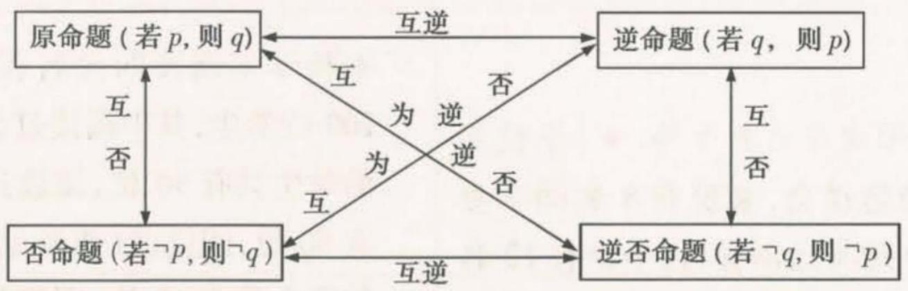

<details>
<summary>flowchart</summary>

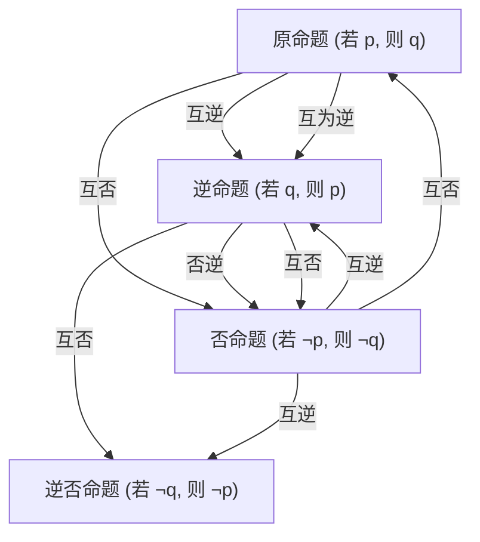
</details>

2. 若两个命题互为逆否命题, 则它们的真假性相同.  
3. 判断一个命题为真命题,要给出严格的推理证明;说明一个命题是假命题,只需举出一个反例即可.

# 高考 方向练

1.[2015 山东,★]设 $m \in \mathbb{R}$ , 命题“若 $m > 0$ , 则方程 $x^{2} + x - m = 0$ 有实根”的逆否命题是 ( )

A. 若方程 $x^{2} + x - m = 0$ 有实根, 则 m > 0  
B. 若方程 $x^{2} + x - m = 0$ 有实根, 则 $m \leqslant 0$   
C. 若方程 $x^{2} + x - m = 0$ 没有实根, 则 m > 0  
D. 若方程 $x^{2} + x - m = 0$ 没有实根, 则 $m \leqslant 0$

2. [2018 北京, ★★]能说明“若 $f(x) > f(0)$ 对任意的 $x \in (0,2]$ 都成立, 则 $f(x)$ 在[0,2]上是增函数”为假命题的一个函数是 \_\_\_\_.

# 模拟 实战练

3. [★★]下列命题中, 是假命题的是 ( )

A.“若 $a \leqslant b$ ，则 $a < b$ ”的否命题  
B.“若 a=1, 则 $ax^{2}-x+3 \geqslant 0$ 的解集为 R”的逆否命题  
C.“周长相等的圆的面积相等”的逆命题  
D.“若 $\sqrt{2}x$ 为有理数,则x为无理数”的逆否命题

4. [★]已知命题“若 $2m - 1 < x < 3m + 2$ ，则 $1 < x < 3$ ”的否命题为真命题，则 $m$ 的取值范围是 \_\_\_\_.

# 题型 12 充分条件与必要条件的判断

▶ 答案：002 页

# 题型攻略

1. 定义法: 分清条件和结论, 判断“若 p, 则 q”及“若 q, 则 p”的真假, 得结论.  
2. 集合法: 根据 p, q 对应的集合之间的包含关系进行判断, 适用于题中涉及字母范围的推断问题.

# 教材 起点练

1.[人A必一P23T3改编，★]下列说法正确的是 （）

A. 点 $P$ 到圆心 $O$ 的距离大于圆的半径是点 $P$ 在圆 $O$ 外的充要条件  
B. 两个三角形的面积相等是这两个三角形全等的充分不必要条件  
C. $A \cup B = A$ 是 $B \subseteq A$ 的必要不充分条件  
D. $x$ 或 $y$ 为有理数是 $xy$ 为有理数的必要不充分条件

# 高考 方向练

2.[2022 浙江,★]设 $x \in \mathbf{R}$ , 则“ $\sin x = 1$ ”是 “ $\cos x = 0$ ”的 ( )

A. 充分不必要条件

B. 必要不充分条件

C. 充分必要条件

D. 既不充分也不必要条件

3.[2022北京,★★]设 $\{a_{n}\}$ 是公差不为0的无穷等差数列,则“ $\{a_{n}\}$ 为递增数列”是“存在正整数 $N_{0}$ ,当 $n>N_{0}$ 时, $a_{n}>0$ ”的()

A. 充分而不必要条件

B. 必要而不充分条件

C. 充分必要条件

D. 既不充分也不必要条件

4.[2021 浙江,★★]已知非零向量a,b,c,则

“ $a \cdot c = b \cdot c$ ”是“a = b”的（）

A. 充分不必要条件

B. 必要不充分条件

C. 充分必要条件

D. 既不充分也不必要条件

5.[2021全国卷甲,★★]等比数列 $\{a_{n}\}$ 的公比为q,前n项和为 $S_{n}$ .设甲:q>0,乙: $\{S_{n}\}$ 是递增数列,则()

A. 甲是乙的充分条件但不是必要条件

B. 甲是乙的必要条件但不是充分条件

C. 甲是乙的充要条件

D. 甲既不是乙的充分条件也不是乙的必要条件

# 模拟 实战练

6.[2022济南市学情检测,★]已知函数 $f(x)$ 的定义域为R,则“ $f(x)$ 是偶函数”是“ $|f(x)|$ 是偶函数”的()

A. 充分不必要条件

B. 必要不充分条件

C. 充要条件

D. 既不充分又不必要条件

7.[2022 山东师大附中模拟,★★]已知 $p:|x - a| < 1, q: \frac{1}{x - 2} \geqslant 1$ . 若 $p$ 是 $q$ 的必要不充分条件,则实数 $a$ 的取值范围是 ( )

A. $(-∞,3]$

B. $[2,3]$

C. $(2,3]$

D. $(2,3)$

题型 13 含逻辑联结词的命题的真假判断(新高考不要求) ▶ 答案: 003 页

# 题型攻略

命题 $p \vee q, p \wedge q, \neg p$ 的真假判断

<table><tr><td>p</td><td>q</td><td>p∨q</td><td>p∧q</td><td>¬p</td></tr><tr><td>真</td><td>真</td><td>真</td><td>真</td><td>假</td></tr><tr><td>真</td><td>假</td><td>真</td><td>假</td><td>假</td></tr><tr><td>假</td><td>真</td><td>真</td><td>假</td><td>真</td></tr><tr><td>假</td><td>假</td><td>假</td><td>假</td><td>真</td></tr></table>

记忆口诀如下: $p \land q \rightarrow$ 见假即假; $p \lor q \rightarrow$ 见真即真; $p$ 与 $\neg p \rightarrow$ 真假相反.

# 高考 方向练

1. [2021 全国卷乙, ★★] 已知命题 $p: \exists x \in \mathbb{R}$ , $\sin x < 1$ ; 命题 $q: \forall x \in \mathbb{R}, e^{|x|} \geqslant 1$ , 则下列命题中为真命题的是 ( )

A. $p \land q$

B. $\neg p\land q$

C. $p \land \neg q$

D. $\neg (p \lor q)$

# 模拟 实战练

2.[2022 洛阳市统考, ★★]已知命题 $p: \forall x \in \mathbf{R}, x^2 + x + 1 > 0$ ; 命题 $q$ : 若 $a > b$ , 则 $\frac{1}{a} < \frac{1}{b}$ . 下列命题为真命题的是 ( )

A. $p \vee q$

B. $p \land q$

C. $(\neg p) \vee q$

D. $(\neg p)\land(\neg q)$

3.[2022河南八市重点高中联考,★★]已知命题p:指数函数 $f(x)=(a-\frac{2}{3})^{x}$ 在R上单调递减,命题 $q:\log_{a}(a^{2}+1)<\log_{a}(2a)<0$ .若 $p\vee q$

为真命题,则实数 a 的取值范围是 ( )

A. $\left(\frac{1}{2},\frac{2}{3}\right)$

B. $\left(\frac{1}{2},\frac{5}{3}\right)$

C. $\left(\frac{2}{3},+\infty\right)$

D. $\left(\frac{5}{3},+\infty\right)$

# 题型14 全（特）称命题的否定

▶ 答案：003 页

# 题型攻略

写全(特)称命题的否定的思路:改写量词,否定结论.写出命题的否定后可以结合它们的真假性(一真一假)进行验证.

# 教材 起点练

1.[人A必一P31练习改编，★]写出下列命题的否定：

(1) $\exists m \in N, \sqrt{m^{2} + 1} \in N;$   
(2) 平行四边形的对角线互相平分；  
(3)有些三角形是直角三角形；  
(4)任意奇数的平方还是奇数.

# 高考 方向练

2.[2015全国卷I，★]设命题 $p:\exists n\in \mathbf{N},n^2>$ $2^{n}$ ，则 $\neg p$ 为 （）

A. $\forall n\in \mathbf{N},n^{2} > 2^{n}$

B. $\exists n\in N,n^{2}\leqslant2^{n}$

C. $\forall n\in \mathbf{N},n^{2}\leqslant 2^{n}$

D. $\exists n\in N,n^{2}=2^{n}$

# 模拟 实战练

3. [2022 开封市二模, ★] 命题“ $\forall x \in \mathbf{R}, x + |x| \geqslant 0$ ”的否定为 ( )

A. $\forall x \in R, x + |x| < 0$

B. $\forall x \in R, x + |x| \neq 0$

C. $\exists x \in R, x + |x| < 0$

D. $\exists x\in \mathbf{R},x + |x|\geqslant 0$

# 易错 警示练

4. [★★] $\forall x \in R, \ln x > 0$ 的否定为 \_\_\_\_.

# 题型 15 已知全（特）称命题的真假求参数的取值范围

▶ 答案：003 页

# 题型攻略

全(特)称命题的含参问题常转化为恒成立或存在性问题求解.

# 高考 方向练

1. [2015 山东, ★★] 若“ $\forall x \in [0, \frac{\pi}{4}]$ , $\tan x \leqslant m$ ”是真命题, 则实数 $m$ 的最小值为 \_\_\_\_.

# 模拟 实战练

2.[2022安徽省亳州市第一中学模拟,★★]命题p: $\exists x_{0}\in\mathbb{R}$ ,使得 $ax_{0}^{2}-4x_{0}+2<0$ 成立.若p是假命题,则实数a的取值范围是()

A. $(-∞,2]$   
B. $\left[2,+\infty\right)$   
C. $[-2, 2]$   
D. $(-∞,-2]∪[2,+∞)$

3.[2022北京市第十三中学期中，★★]已知 $f(x)=m(x-2m)(x+m+3)$ ， $g(x)=2^{x}-2$ .

若同时满足条件: ① $\forall x \in \mathbf{R}, f(x) < 0$ 或 $g(x) < 0$ ; ② $\exists x \in (-\infty, -4), f(x) g(x) < 0$ , 则 $m$ 的取值范围是 \_\_\_\_.

# 第二章 函数与基本初等函数Ⅰ

# 第一节 函数及其表示

# 题型16 求函数的定义域

▶ 答案：003 页

# 题型攻略

求函数的定义域时常用的结论:(1)分式型 $y=\frac{1}{f(x)}$ 要满足 $f(x)\neq0$ ;(2)根式型 $y=\sqrt[2n]{f(x)}\quad(n\in\mathbf{N}^{*})$ 要满足 $f(x)\geqslant0$ ;(3) $y=[f(x)]^{0}$ 要满足 $f(x)\neq0$ ;(4)对数型 $y=\log_{a}f(x)\quad(a>0,$ 且 $a\neq1$ )要满足 $f(x)>0$ ;(5)正切型 $y=\tan[f(x)]$ 要满足 $f(x)\neq\frac{\pi}{2}+k\pi,k\in\mathbf{Z}$ .

# 教材 起点练

1.[人A必一P67T1改编，★]下列函数的定义域不是R的是()

A. $y = x + 1$

B. $y = x^{2}$

C. $y = \frac{1}{x}$

D. $y = 2x$

# 高考 方向练

2.[2022 北京,★]函数 $f(x)=\frac{1}{x}+\sqrt{1-x}$ 的定义域是\_\_\_\_.

3.[2019 江苏,★]函数 $y=\sqrt{7+6x-x^{2}}$ 的定义域是 \_\_\_\_.

# 模拟 实战练

4.[2022 内蒙古赤峰二中模拟, ★★]若函数 $f(x^{2}+1)$ 的定义域为 $[-1,1]$ ，则 $f(\lg x)$ 的定义域为 ( )

A. $[-1, 1]$

B. $[1,2]$

C. $[10,100]$

D. $[0, \lg 2]$

# 题型 17 求函数的值域（最值）

▶ 答案：004 页

# 题型攻略

# 求函数值域(最值)的方法

1. 单调性法: 先确定函数的单调性, 再由单调性求出值域(最值).  
2. 图象法: 先作出函数的图象, 再通过观察其最高点、最低点求出值域(最值).  
3. 基本不等式法: 先对解析式变形, 使之具备“一正二定三相等”的条件后用基本不等式求值域(最值).  
4. 导数法: 先求出导函数, 然后求出给定区间上的极值, 再结合端点处的函数值, 求出值域(最值).  
5. 换元法: 对比较复杂的函数可先通过换元转化为熟悉的函数, 再用相应的方法求值域(最值).

6. 配方法: 它是求“二次函数型函数”值域的基本方法, 形如 $F(x) = a[f(x)]^{2} + bf(x) + c (a \neq 0)$ 的函数的值域问题, 均可使用配方法, 求解时要注意 $f(x)$ 的取值范围.

7. 分离常数法: 形如 $y = \frac{cx + d}{ax + b} (a \neq 0)$ 的函数的值域, 经常使用“分离常数法”求解.

注意:求分段函数的最值时,应先求出每一段上的最值,再选取其中最大的作为分段函数的最大值,最小的作为分段函数的最小值.

# 教材 起点练

1. [人 A 必 - P72 T3 改编, ★] 求下列函数的值域:

(1) $y=\frac{2x+1}{x-3}$ ;(2) $y=2x-\sqrt{x-1}$ .

# 高考 方向练

2.[2022北京,★★]设函数 \( f(x)=\left\{\begin{aligned}-ax+1,x<a,\\(x-2)^{2},x\geqslant a.\end{aligned}\right. \)

若 $f(x)$ 存在最小值,则a的一个取值为\_\_\_\_;
a 的最大值为 \_\_\_\_.

# 模拟 实战练

3. [★] 下列函数中值域是 $(0, +\infty)$ 的是（）

A. $y = \sqrt{x^{2} + 3x + 2}$

B. $y = x^{2} + x + \frac{1}{2}$

C. $y = \frac{1}{|x|}$

D. $y = 2x + 1$

4.[多选,2022南通市一调,★★]下列函数中最小值为6的是()

A. $y = \ln x + \frac{9}{\ln x}$

B. $y = 6 \left| \sin x \right| + \frac{3}{2 \left| \sin x \right|}$

C. $y = 3^{x} + 3^{2 - x}$

D. $y = \frac{x^2 + 25}{\sqrt{x^2 + 16}}$

# 题型18 求函数的解析式

▶ 答案：004 页

# 题型攻略

# 求函数解析式的常用方法

1. 待定系数法: 若已知函数类型(如一次函数、二次函数等), 则可用待定系数法求解.  
2. 换元法: 若已知复合函数 $f(g(x))$ 的解析式求解函数 $f(x)$ 的解析式, 可令 $g(x)=t$ , 解出 x, 然后代入 $f(g(x))$ 中即可求得 $f(t)$ , 从而求得 $f(x)$ , 此时要注意新元的取值范围.  
3. 配凑法: 配凑法是将函数 $f(g(x))$ 的解析式配凑成关于 $g(x)$ 的形式, 进而求出函数 $f(x)$ 的解析式.  
4. 构造方程组法(消元法): 若已知 $f(x)$ 与 $f(\frac{1}{x})$ , $f(-x)$ 等的关系式, 则可通过赋值(如令 x 为 $\frac{1}{x}$ , -x 等) 构造出另一个关系式, 通过解方程组求出 $f(x)$ .

注意：求函数解析式时，若定义域不是 $\mathbf{R}$ ，一定要注明函数定义域。

# 教材 起点练

1.[人A必一P72T4改编,★★]已知一次函数 $f(x)$ 满足 $f(f(x))=4x+6$ ,则 $f(x)$ 的解析式为\_\_\_\_, $f(-2)=$ \_\_\_\_.

# 高考 方向练

2.[2015全国卷Ⅱ,★]已知函数 $f(x)=ax^{3}-2x$ 的图象过点(-1,4),则a= \_\_\_\_.

# 模拟 实战练

3.[2022 辽宁省重点高中一模,★★]已知定义域为 R 的函数 $f(x)$ 满足 $f(x+1)=3f(x)$ ，且当 $x\in(0,1]$ 时， $f(x)=4x(x-1)$ ，则当 $x\in$

$(-2,0]$ 时, $f(x)$ 的最小值为 ( )

A. $-\frac{1}{81}$

B. $-\frac{1}{27}$

C. $-\frac{1}{9}$

D. $-\frac{1}{3}$

4.[构造方程组法,★★]已知函数 $f(x)$ 满足 $f(x)+2f(\frac{1}{x})=x$ ,则函数 $f(x)$ 的解析式为\_\_\_\_.

# 易错 警示练

5.[换元后忽略新元的取值范围,★★]已知 $f(\sqrt{x}+1)=x+2\sqrt{x}$ ，则 $f(x)$ 的解析式为\_\_\_\_.

# 题型 19 已知定义域（值域）求参数的值或范围

▶ 答案：004 页

# 题型攻略

解此类题可将问题转化为解关于参数的方程或不等式的问题.

# 高考 方向练

1. [2022 浙江, ★★] 已知函数 $f(x) = \left\{ \begin{array}{l} -x^2 + 2, x \leqslant 1, \\ x + \frac{1}{x} - 1, x > 1, \end{array} \right.$ 则 $f(f(\frac{1}{2})) =$ \_\_\_\_；若当 $x \in [a, b]$ 时， $1 \leqslant f(x) \leqslant 3$ ，则 $b - a$ 的最大值

是\_\_\_\_.

# 模拟 实战练

2.[2022江西五校联考，★]若函数 $y=\sqrt{a-a^{x}}$ $(a>0,a\neq1)$ 的定义域和值域都是 $[0,1]$ ，则 $\log_{a}2=$ \_\_\_\_.

# 题型 20 已知分段函数求值

▶ 答案：004 页

# 题型攻略

解已知分段函数求值问题的步骤:(1)确定要求值的自变量属于哪一个区间;(2)代入相应的函数解析式求值,当出现 $f(f(a))$ 求值形式时,应由内到外逐层求值.

# 教材 起点练

1. [人 A 必一 P101 T7 改编, ★] 若 $f(x) = \left\{\begin{aligned} x^{2}(x &\geqslant 0), \\ -x (x &< 0), \end{aligned}\right.$ 则 $f(f(-2)) =$ ()

A.2

B.3

C. 4

D. 5

# 模拟 实战练

2.[2022成都市模拟，★]已知函数 $f(x)=$

$\left\{ \begin{array}{l} \log_2(2 - x), x < 1, \\ \mathrm{e}^x, x \geqslant 1, \end{array} \right.$ 则 $f(-2) + f(\ln 4) =$ （）

A.2

B. 4

C. 6

D. 8

3. [2022 绵阳市二诊, ★] 函数 $f(x) = \left\{\begin{aligned}&2^{-x}, x \geqslant 1, \\&\log_{2}x, x < 1,\end{aligned}\right.$ 则 $f(f(2)) =$ \_\_\_\_.

# 题型21 已知分段函数求参

▶ 答案：005 页

# 题型攻略

求解分段函数的含参问题时,若自变量值确定,则代入解析式,列方程求解;若自变量值不确定,则要根据分段函数的各段定义域分类讨论,最后取各段结果的并集.

# 教材 起点练

1. [人 A 必一 P96 T3 改编, ★] 已知函数 $f(x)=$ $\left\{\begin{aligned}&1+\frac{1}{x},x>1,\\&x^{2}+1,-1\leqslant x\leqslant1,\\&2x+3,x<-1.\end{aligned}\right.$ 若 $f(a)=\frac{3}{2}$ ，则 a= \_\_\_\_.

# 高考 方向练

2.[2017 山东, ★★]设 $f(x)=\left\{\begin{aligned}\sqrt{x},&0<x<1,\\ 2(x-1),&x\geqslant1.\end{aligned}\right.$ 若 $f(a)=f(a+1)$ ,则 $f(\frac{1}{a})=$ ( )

A. 2

B.4

C.6

D. 8

3. [2021 浙江, ★] 已知 $a \in R$ , 函数 $f(x) = \left\{\begin{aligned} x^{2}-4, &x > 2, \\ |x-3| + a, &x \leqslant 2.\end{aligned}\right.$ 若 $f(f(\sqrt{6})) = 3$ , 则 a = \_\_\_\_.

# 模拟 实战练

4.[2022河南省适应性测试，★]已知函数 $f(x) = \left\{ \begin{array}{ll}3^{x + 1} - 1,x\geqslant 1,\\ -\log_3(x + 5) - 2,x <   1, \end{array} \right.$ 且 $f(m) = -2$ ，则

$f(6 + m) =$ （

A. 26

B. 16

C. -16

D. -26

5.[2022高三名校联考,★★]已知函数 $f(x)=$ $\left\{\begin{aligned}&2^{x},x<0,\\ &-8x^{2}-x+1,x\geqslant0,\end{aligned}\right.$ 若 $f(m)=f(2^{m})$ ，则 $f(m+1)=$ ( )

A.1

B. $\frac{1}{2}$

C. $\frac{1}{3}$

D. -2

# 题型22 已知分段函数解不等式

▶ 答案：005 页

# 题型攻略

1. 解此类题可根据分段函数的不同段分类讨论, 最后取各段结果的并集即可.  
2. 若函数的图象易画, 也可以画出函数图象, 结合图象求解.

注意: 自变量的取值属于哪一段, 就用哪一段的解析式来解决问题, 即“分段归类”. 解得值(范围)后一定要检验其是否符合相应段的自变量的取值范围.

# 教材 起点练

1. [★] 函数 $f(x)=\left\{\begin{aligned}x,x&\leqslant-2,\\ x+1,-2&<x<4,\end{aligned}\right.$ 若 $f(a)<3x,x\geqslant4,$ -3, 则 a 的取值范围是 \_\_\_\_.

# 高考 方向练

2. [2018 全国卷 I, ★★] 设函数 $f(x) = \left\{\begin{aligned}2^{-x}, & x \leqslant 0, \\ 1, & x > 0,\end{aligned}\right.$ 则满足 $f(x + 1) < f(2x)$ 的 x 的取值范围是 ( )

A. $(-∞,-1]$

B. $(0,+\infty)$

C. $(-1,0)$

D. $(-∞,0)$

3. [2018 浙江, ★★] 已知 $\lambda \in \mathbb{R}$ , 函数 $f(x) = \begin{cases} x - 4, & x \geqslant \lambda, \\ x^2 - 4x + 3, & x < \lambda. \end{cases}$ 当 $\lambda = 2$ 时, 不等式 $f(x) < 0$ 的解集是 \_\_\_\_. 若函数 $f(x)$ 恰有 2 个零点, 则 $\lambda$ 的取值范围是 \_\_\_\_.

4. [2017 全国卷Ⅲ, ★★] 设函数 $f(x)=$

$\left\{ \begin{array}{l} x + 1, x \leqslant 0, \\ 2^x, x > 0, \end{array} \right.$ 则满足 $f(x) + f\left(x - \frac{1}{2}\right) > 1$ 的 $x$ 的取值范围是 \_\_\_\_.

# 模拟 实战练

5.[2022济南市学情检测，★★]已知函数 $f(x) = \left\{ \begin{array}{l} - x^{2} + 2mx - m^{2},x\leqslant m,\\ |x - m|,x > m, \end{array} \right.$ 若 $f(a^{2} - 4)>$ $f(3a)$ ，则实数 $a$ 的取值范围是 （）

A. $(-1,4)$   
B. $(- \infty, -1) \cup (4, +\infty)$   
C. $(-4,1)$   
D. $(-∞,-4)∪(1,+∞)$

6.[2022 南京市、盐城市一模, ★★★]已知 $f(x)=\left\{\begin{aligned}e^{x-4},&x\leqslant4,\\ (x-16)^{2}-143,x>4,\end{aligned}\right.$ 则当 $x\geqslant0$ 时, $f(2^{x})$ 与 $f(x^{2})$ 的大小关系是 ( )

A. $f(2^{x}) \leqslant f(x^{2})$

B. $f(2^{x})\geqslant f(x^{2})$

C. $f(2^{x})=f(x^{2})$

D. 不确定

# 第二节 函数的基本性质

# 题型 23 判断函数的单调性或求单调区间

▶ 答案：005 页

# 题型攻略

1. 定义法: 一般步骤为设元→作差→变形→判断符号→得出结论, 常用于判断抽象函数单调性.  
2. 图象法: 若 $f(x)$ 是以图象的形式给出的, 或者 $f(x)$ 的图象易作出, 则可由图象的上升或下降确定单调性.  
3. 导数法: 先求导数, 再利用导数值的正负确定函数的单调区间.  
4. 性质法: (1) 对于由基本初等函数的和、差构成的函数, 根据各基本初等函数的增减性及“增 + 增 = 增, 增 - 减 = 增, 减 + 减 = 减, 减 - 增 = 减”进行判断; (2) 对于复合函数, 根据“同增异减”的规则进行判断.

# 教材 起点练

1. [A 必 - P86 T2 改编, ★] 函数 $y = |x| - 1$ 的单调递减区间为
()

A. $(0,+\infty)$

B. $(-∞,0)$

C. $(-∞,-1)$

D. $(-1, +\infty)$

# 高考 方向练

2. [2021 全国卷甲, ★] 下列函数中是增函数的为 ( )

A. $f(x) = -x$

B. $f(x)=\left(\frac{2}{3}\right)^{x}$

C. $f(x) = x^{2}$

D. $f(x) = \sqrt[3]{x}$

3. | 2017 全国卷 II、★ 函数 $f(x) = \ln (x^2 - 2x - 8)$ 的单调递增区间是 ( )

A. $(-∞,-2)$

B. $(-∞,1)$

C. $(1, +\infty)$

D. $(4, +\infty)$

4. [2017 全国卷 1, ★★] 已知函数 $f(x) = \ln x +$

$\ln(2-x)$ ，则（）

A. $f(x)$ 在 $(0,2)$ 单调递增  
B. $f(x)$ 在 $(0,2)$ 单调递减  
C. $y = f(x)$ 的图象关于直线 x = 1 对称  
D. $y = f(x)$ 的图象关于点 $(1,0)$ 对称

# 模拟 实战练

5.[2022安徽名校联考、★]下列函数中是减函数且值域为R的是()

A. $f(x) = \frac{1}{x}$

B. $f(x) = x - \frac{1}{x}$

C. $f(x) = \ln |x|$

D. $f(x) = -x^{3}$

6.[2022长春市第二次质量监测，★]下列函数是偶函数，且在区间 $(- \infty ,0)$ 上单调递增的是（）

A. $y = x^{-2}$

B. $y = |x| + 2$

C. $y = 2^{|x|}$

D. $y = x^{3} - 1$

# 题型 24 已知函数单调性求参数的取值范围

▶ 答案：006 页

# 题型攻略

可先根据函数的单调性构建含参数的方程(组)或不等式(组)进行求解,或先得到函数图象的升降情况,再结合图象求解.

注意: 若分段函数是单调函数, 则不仅要各段上函数单调性一致, 还要在整个定义域内单调, 即要注意衔接点处的函数值大小.

# 教材 起点练

1. [A = -P100 T4 改编, ★] 若 $f(x) = -x^{2} +$

2ax 与 $g(x)=\frac{a}{x}$ 在区间 $[1,2]$ 上都单调递减，

则 a 的取值范围是 ( )

A. $(-1,0)\cup(0,1)$

B. $(-1,0)\cap(0,1)$

C. $(0,1)$

D. $(0,1]$

# 高考 方向练

2. [2020 新高考卷 II, ★] 已知函数 $f(x) = \lg(x^{2} - 4x - 5)$ 在 $(a, +\infty)$ 上单调递增，则 a 的取值范围是 ( )

A. $(-∞,-1]$

B. $(-∞,2]$

C. $[2, +\infty)$

D. $[5, +\infty)$

# 模拟 实战练

3.[2022 湖北部分重点中学联考,★★]已知函数 $f(x)=\left\{\begin{aligned}x^{2}&-(3a+1)x+2,x<1,\\ a^{x},&x\geqslant1,\end{aligned}\right.$ 若函数 $f(x)$ 在R上为减函数,则实数a的取值范围为()

A. $\left[\frac{1}{3},1\right)$

B. $\left[\frac{1}{3},\frac{1}{2}\right]$

C. $(0,\frac{1}{3}]$

D. $\left[\frac{1}{2},1\right)$

# 题型25 判断函数的奇偶性

▶ 答案：006 页

# 题型攻略

1. 定义法：

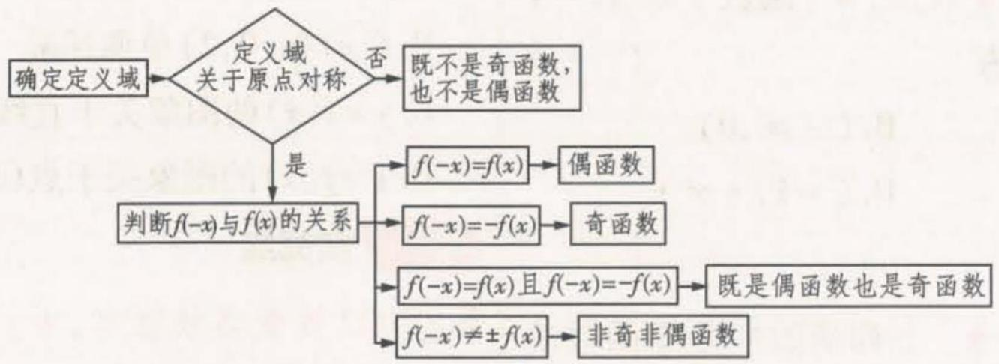

<details>
<summary>flowchart</summary>

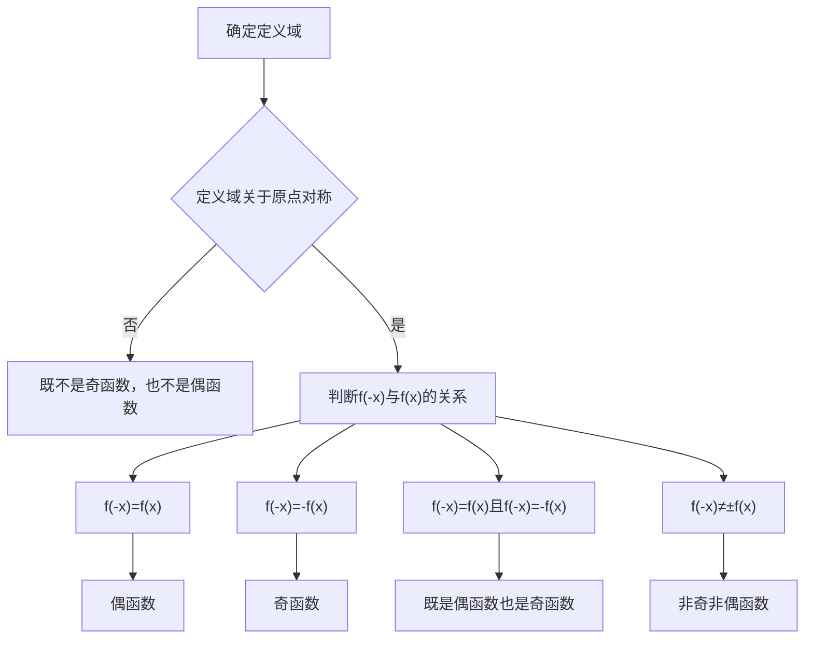
</details>

2. 图象法：

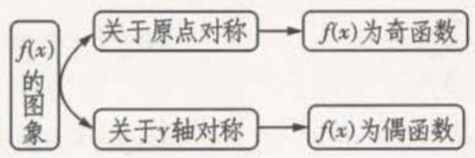

<details>
<summary>flowchart</summary>

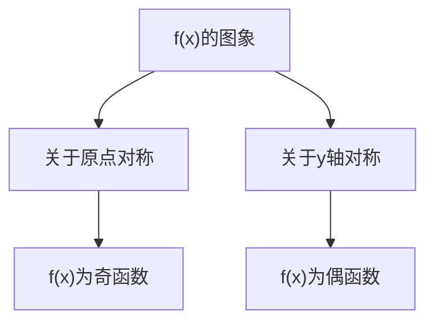
</details>

3. 性质法：

在公共定义域内有奇函数 $\pm$ 奇函数 $=$ 奇函数，偶函数 $\pm$ 偶函数 $=$ 偶函数，奇函数 $\times$ 奇函数 $=$ 偶函数，偶函数 $\times$ 偶函数 $=$ 偶函数，奇函数 $\times$ 偶函数 $=$ 奇函数.

注意:(1)函数定义域关于原点对称是函数具有奇偶性的前提条件;(2)对于分段函数奇偶性的判断,要分段判断 $f(-x)=f(x)$ 或 $f(-x)=-f(x)$ 是否成立,只有当各段都满足相同关系时,才能判断该分段函数的奇偶性.

# 教材 起点练

1.[人A必一P84例6改编,★]下列函数既是奇函数又是增函数的是()

A. $y = \sin x$

B. $y = 2^{x}$

C. $y = \log_2x$

D. $y = x^{3}$

# 高考 方向练

2.[2021全国卷乙,★]设函数 $f(x)=\frac{1-x}{1+x}$ ，则下列函数中为奇函数的是()

A. $f(x-1)-1$

B. $f(x-1)+1$

C. $f(x+1)-1$

D. $f(x+1)+1$

3.[2014全国卷I，★]设函数 $f(x)$ ， $g(x)$ 的定义域都为R，且 $f(x)$ 是奇函数， $g(x)$ 是偶函数，则下列结论中正确的是()

A. $f(x)g(x)$ 是偶函数

B. $f(x)\mid g(x)\mid$ 是奇函数

C. $|f(x)|g(x)$ 是奇函数

D. $|f(x)g(x)|$ 是奇函数

# 模拟 实战练

4.[2022太原市统考，★]下列函数不是偶函数的是 （）

A. $f(x)=\ln\sqrt{x^{2}+1}$

B. $f(x) = |\sin x|\cos x$

C. $f(x)=x\cos x$

D. $f(x) = \mathrm{e}^{x} + \mathrm{e}^{-x}$

5.[2022江西五校联考,★]下列函数中,与函数 $y=2^{x}-2^{-x}$ 的定义域、单调性、奇偶性均一致的是()

A. $y = \sin x$

B. $y = x^{3}$

C. $y = \left( \frac{1}{2} \right)^x$

D. $y = \log_2x$

6.[2022郑州市一模,★]若函数 $f(x)$ 满足 $f(2-x)+f(x)=-2$ ,则下列函数为奇函数的是()

A. $f(x-1)-1$

B. $f(x-1)+1$

C. $f(x+1)-1$

D. $f(x+1)+1$

# 题型26 已知函数的奇偶性求解析式

▶ 答案：007 页

# 题型攻略

先设出未知区间上的自变量,再利用奇、偶函数的定义域关于原点对称的特点,把它转化到已知的区间上,代入已知的解析式,然后利用函数的奇偶性求解即可.

具体如下:(1)求哪个区间上的解析式,x 就设在哪个区间上;(2)将 -x 代入已知区间上的解析式;(3)利用 $f(x)$ 的奇偶性把 $f(-x)$ 写成 $-f(x)$ 或 $f(x)$ ，从而得出 $f(x)$ .

# 教材 起点练

1.[人A必一P86 T11改编，★]已知函数 $f(x)$ 为 $\mathbf{R}$ 上的偶函数，且当 $x < 0$ 时， $f(x) = x(x - 1)$ ，则当 $x > 0$ 时， $f(x) = \_$ .

# 高考 方向练

2.[2019全国卷Ⅱ，★]设 $f(x)$ 为奇函数，且当

$x \geqslant 0$ 时, $f(x) = \mathrm{e}^{x} - 1$ , 则当 $x < 0$ 时, $f(x) = (\quad)$

A. $\mathrm{e}^{-x} - 1$

B. $\mathrm{e}^{-x} + 1$

C. $-e^{-x}-1$

D. $-e^{-x} + 1$

# 模拟 实战练

3. [★] $f(x)$ 为 R 上的奇函数, 当 x > 0 时, $f(x) = -2x^{2} + 3x + 1$ , 则 $f(x)$ 的解析式为 $f(x) =$ \_\_\_\_.

# 题型27 已知函数的奇偶性求函数值

▶ 答案：007 页

# 题型攻略

利用函数的奇偶性将待求函数值对应的自变量转化到已知解析式的区间上,进而求解.

# 教材 起点练

1. [★] 已知函数 $f(x)$ 为奇函数, 当 x > 0 时, $f(x)=x^{2}+\frac{1}{x}$ , 则 $f(-1)=$ ( )

A.-2

B.0

C. 1

D.2

# 高考 方向练

2.[2018全国卷Ⅲ, ★★]已知函数 $f(x)=\ln(\sqrt{1+x^{2}}-x)+1,f(a)=4$ ,则 $f(-a)=$ \_\_\_\_.

# 模拟 实战练

3.[2022绵阳市二诊，★]函数 $f(x)$ 是定义域为R的偶函数，当 $x\in [-1,0]$ 时， $f(x) = ae^{x}+$ $1 + \frac{1}{\mathrm{e}}$ ，若 $f(1) = 1$ ，则 $f(0) =$ （

A. e

B. -e

C. $\frac{1}{e}$

D. $-\frac{1}{e}$

4.[2022广州调研，★]已知 $f(x)$ 为奇函数，当 $x < 0$ 时， $f(x) = x^2 - \sin (\pi x)$ ，则 $f(2) = \underline{\quad}$ .

# 题型28 已知函数的奇偶性求参数

# 题型攻略

利用待定系数法求解,根据 $f(x)\pm f(-x)=0$ 得到关于待求参数的方程,由系数的对等性得参数满足的方程(组),进而得出参数的值.对于在x=0处有定义的奇函数 $f(x)$ ,可考虑列等式 $f(0)=0$ 求解.

# 教材 起点练

1.[人A必一P161T12改编，★]若 $f(x) = (x+$ 3）5+(x+m)5是奇函数，则m=

# 高考 方向练

2.[2022全国卷乙,★]若 $f(x)=\ln|a+\frac{1}{1-x}|+b$ 是奇函数,则a=\_\_\_\_,b=\_\_\_\_.  
3.[2021新高考卷I，★]已知函数 $f(x)=x^{3}(a\cdot2^{x}-2^{-x})$ 是偶函数，则a= \_\_\_\_.  
4.[2019全国卷Ⅱ，★]已知 $f(x)$ 是奇函数，且当x<0时， $f(x)=-\mathrm{e}^{ax}$ .若 $f(\ln2)=8$ ，则a= \_\_\_\_.

# 模拟 实战练

5.[2022福州市质检，★]已知函数 $f(x)=$

$\left\{ \begin{array}{l} x^{3} + 1, x > 0 \\ ax^{3} + b, x < 0 \end{array} \right.$ 为偶函数，则 $2^{a} + b =$ （）

A. 3

B. $\frac{3}{2}$

C. $-\frac{1}{2}$

D. $-\frac{3}{2}$

6.[多选,2022 石家庄市一检,★★]已知函数 $f(x)=\ln\frac{e^{2x}+1}{e^{ax}}$ 是偶函数,则()

A. a = -1   
B. $f(x)$ 在 $(0,+\infty)$ 上是单调函数  
C. $f(x)$ 的最小值为1  
D. 方程 $f(x)=2$ 有两个不相等的实数根

7.[2022 武汉市武昌区质检，★]已知函数 $f(x) = (\mathrm{e}^x + a\mathrm{e}^{-x})\ln (x + \sqrt{x^2 + 1})$ 是偶函数，则 $a = \_$ .

# 题型29 已知函数单调性、奇偶性比较大小

▶ 答案：008 页

# 题型攻略

比较大小时,应先利用函数的奇偶性将自变量的值转化到同一个单调区间内,再利用函数的单调性求解.

# 教材 起点练

1. [人 A 必一 P87 T12 改编, ★] 已知偶函数 $f(x)$ 在区间 $[-3, -1]$ 上单调递减, 则 $f(-3), f(1)$ , $f(2)$ 的大小关系为 \_\_\_\_. (用“<”号连接)

# 高考 方向练

2.[2019全国卷Ⅲ,★★]设 $f(x)$ 是定义域为R的偶函数,且在 $(0,+\infty)$ 单调递减,则()

A. $f(\log_3\frac{1}{4}) > f(2^{-\frac{3}{2}}) > f(2^{-\frac{2}{3}})$

B. $f(\log_3\frac{1}{4}) > f(2^{-\frac{2}{3}}) > f(2^{-\frac{3}{2}})$

$$
\begin{array}{l} f (2 ^ {- \frac {3}{2}}) > f (2 ^ {- \frac {2}{3}}) > f (\log_ {3} \frac {1}{4}) \\ f (2 ^ {- \frac {2}{3}}) > f (2 ^ {- \frac {3}{2}}) > f (\log_ {3} \frac {1}{4}) \\ \end{array}
$$

3.[2017天津,★★]已知奇函数 $f(x)$ 在R上是增函数, $g(x)=xf(x)$ .若 $a=g(-\log_{2}5.1)$ , $b=g(2^{0.8})$ , $c=g(3)$ ,则a,b,c的大小关系为()

A. a < b < c

B. c < b < a

C. b < a < c

D. b < c < a

# 模拟 实战练

4. [2022 合肥市一检, ★★] 若 $f(x)$ 是定义在

R上的偶函数， $\forall x_{1},x_{2}\in (-\infty ,0]$ ，当 $x_{1}\neq$ $x_{2}$ 时，都有 $\frac{f(x_1) - f(x_2)}{x_1 - x_2} >0$ ，则 $a =$ $f(\sin 3),b = f(\ln \frac{1}{3}),c = f(2^{1.5})$ 的大小关系是 （）

A. $a > b > c$

B. $a > c > b$

C. b > c > a

D. $c > b > a$

5.[2022太原市统考,★★]已知 $f(x)$ 是定义在R上的偶函数,且在 $(0,+\infty)$ 上单调递减,则()

A. $f(-1) < f(-2^{0.1}) < f(\log_25)$

B. $f(\log_25) < f(-1) < f(-2^{0.1})$

C. $f(\log_25) < f(-2^{0.1}) < f(-1)$

D. $f(-2^{0.1}) < f(-1) < f(\log_25)$

# 题型 30 已知函数单调性、奇偶性解不等式

▶ 答案：008 页

# 题型攻略

# 已知函数单调性、奇偶性解不等式的步骤

1. 首先利用函数奇偶性将自变量转化到同一单调区间上. 涉及偶函数时常用 $f(x) = f(|x|)$ ，将问题转化到 $[0, +\infty)$ 上求解.  
2. 随后将不等式转化为 $f(x_{1}) > f(x_{2})$ 的形式, 根据函数 $f(x)$ 的单调性“脱去”函数符号“ $f$ ”, 化为形如“ $x_{1} > x_{2}$ ”或 “ $x_{1} < x_{2}$ ”的不等式求解, 注意必须在同一单调区间内进行. 若不等式一边没有“ $f$ ”, 而是常数, 则应将常数转化为函数值, 如若已知 $0 = f(1)$ , $f(x - 1) < 0$ , 则 $f(x - 1) < f(1)$ .

# 教材 起点练

1. [★]已知偶函数 $f(x)$ 在区间 $[0, +\infty)$ 上单调递增,则满足 $f(2x - 1) < f(\frac{1}{3})$ 的 $x$ 的取值范围是 ( )

A. $\left(\frac{1}{3},\frac{2}{3}\right)$

B. $\left[\frac{1}{3},\frac{2}{3}\right)$

C. $\left(\frac{1}{2},\frac{2}{3}\right)$

D. $\left[\frac{1}{2},\frac{2}{3}\right)$

# 高考 方向练

2.[2017全国卷Ⅰ,★]函数 $f(x)$ 在 $(-∞,+∞)$ 单调递减,且为奇函数.若 $f(1)=-1$ ,则满足 $-1\leqslant f(x-2)\leqslant1$ 的x的取值范围是()

A. $[-2, 2]$

B. $\left[-1,1\right]$

C. $[0,4]$

D. $[1,3]$

3. [2020 新高考卷 I, ★★] 若定义在 R 的奇函

数 $f(x)$ 在 $(-∞,0)$ 单调递减，且 $f(2)=0$ ，则满足 $xf(x-1)≥0$ 的x的取值范围是（）

A. $\left[-1,1\right]\cup\left[3,+\infty\right)$

B. $\left[-3,-1\right]\cup\left[0,1\right]$

C. $\left[-1,0\right]\cup\left[1,+\infty\right)$

D. $\left[-1,0\right]\cup\left[1,3\right]$

# 模拟 实战练

4.[2022 太原市统考,★]已知函数 $f(x)$ 的定义域为R,且 $f(2x+1)$ 既是奇函数又是增函数, $f(3)=2$ ,则 $f(2x-1)<-2$ 的解集为()

A. $\{x \mid x < -2\}$

B. $\{x\mid x<-3\}$

C. $\{x \mid x < -1\}$

D. $\{x \mid x < 0\}$

5.[2022开封市二模,★★]若函数 $f(x)=\mathrm{e}^{x}+a\mathrm{e}^{-x}(a\in\mathbb{R})$ 为奇函数,则不等式 $f(\ln x)<f(|\ln x|)$ 的解集为\_\_\_\_.

# 题型31 函数周期性的判断及应用

# 题型攻略

1. 设函数 $y = f(x), x \in \mathbb{R}, a > 0, a \neq b$ . (1) 若 $f(x + a) = -f(x)$ ，则函数的周期为 $2a$ ; (2) 若 $f(x + a) = \pm \frac{1}{f(x)}$ ，则函数的周期为 $2a$ ; (3) 若 $f(x + a) = f(x + b)$ ，则函数的周期为 $|a - b|$ ; (4) 若函数 $f(x)$ 的图象关于直线 $x = a$ 与直线 $x = b$ 对称，那么函数 $f(x)$ 的周期为 $2|b - a|$ ; (5) 若函数 $f(x)$ 的图象既关于点 $(a,0)$ 对称，又关于点 $(b,0)$ 对称，则函数 $f(x)$ 的周期是 $2|b - a|$ ; (6) 若函数 $f(x)$ 的图象既关于直线 $x = a$ 对称，又关于点 $(b,0)$ 对称，则函数 $f(x)$ 的周期是 $4|b - a|$ .  
2. 利用函数的周期性可以将待求函数值对应的自变量转化到已知区间上, 进而求解.

# 高考 方向练

1.[2022新高考卷Ⅱ,★★]已知函数 $f(x)$ 的定义域为R,且 $f(x+y)+f(x-y)=f(x)f(y)$ , $f(1)=1$ ,则 $\sum_{k=1}^{22}f(k)=$ ( )

A.-3

B.-2

C. 0

D. 1

2.[2021全国卷甲,★★]设 $f(x)$ 是定义域为R的奇函数,且 $f(1+x)=f(-x)$ .若 $f(-\frac{1}{3})=\frac{1}{3}$ ,则 $f(\frac{5}{3})=$

A. $-\frac{5}{3}$

B. $-\frac{1}{3}$

C. $\frac{1}{3}$

D. $\frac{5}{3}$

# 模拟 实战练

3.[2022高三名校联考，★]已知 $f(x + 1)$ 是定义在 $\mathbf{R}$ 上且周期为2的函数，当 $x\in [-1,1)$ 时， $f(x) = \left\{ \begin{array}{ll} - 2x^{2} + 4, & -1\leqslant x < 0,\\ \sin \pi x, & 0\leqslant x < 1, \end{array} \right.$ 则 $f(3)$

$$
f (- \frac {1 0}{3}) = \tag {（）}
$$

A. $\sqrt{3}$

B. $-\sqrt{3}$

C. $-\frac{\sqrt{3}}{2}$

D. $\frac{\sqrt{3}}{2}$

4. [2022 潍坊市模拟, ★★] 若函数 $f(x) = \left\{\begin{aligned}&2^{x-1}, x \leqslant 1, \\&-f(x-2), x > 1,\end{aligned}\right.$ 则 $f(2022) =$ \_\_\_\_.

# 题型32 函数性质的综合应用

▶ 答案：009 页

# 题型攻略

1. 比较大小问题:一般解法是先利用奇偶性(也可利用对称性求出周期)将不在同一单调区间上的两个或多个自变量的函数值,转化为同一单调区间上的自变量的函数值,然后利用单调性比较大小.  
2. 求值问题: 一般是先利用奇偶性和对称性得到函数的周期性, 进而解决相关问题.

# 高考 方向练

1. [2022 全国卷乙, ★★★] 已知函数 $f(x)$ , $g(x)$ 的定义域均为 R, 且 $f(x) + g(2 - x) = 5$ , $g(x) - f(x - 4) = 7$ . 若 $y = g(x)$ 的图象关于直线 x = 2 对称, $g(2) = 4$ , 则 $\sum_{k=1}^{22} f(k) =$ ()

A. -21

B.-22

C.-23

D. -24

2.[2021全国卷甲,★★★]设函数 $f(x)$ 的定义域为R, $f(x+1)$ 为奇函数, $f(x+2)$ 为偶函数,当 $x\in[1,2]$ 时, $f(x)=ax^{2}+b$ .若 $f(0)+f(3)=6$ ,则 $f(\frac{9}{2})=$

A. $-\frac{9}{4}$

B. $-\frac{3}{2}$

C. $\frac{7}{4}$

D. $\frac{5}{2}$

3.[2021新高考卷Ⅱ,★★★]设函数 $f(x)$ 的定义域为R,且 $f(x+2)$ 为偶函数, $f(2x+1)$ 为奇函数,则()

A. $f(-\frac{1}{2})=0$

B. $f(-1) = 0$

C. $f(2) = 0$

D. $f(4) = 0$

# 模拟 实战练

4.[2022 辽宁大连模拟,★★]已知定义在 R 上的奇函数 $f(x)$ 满足 $f(x-4)=-f(x)$ ，且在区间 $[0,2]$ 上单调递增，则()

A. $f(-1)<f(3)<f(4)$

B. $f(4)<f(3)<f(-1)$

C. $f(3)<f(4)<f(-1)$

D. $f(-1) < f(4) < f(3)$

# 第三节 二次函数与幂函数

# 题型 33 二次函数的图象及应用

▶ 答案：009 页

# 题型攻略

识别二次函数图象应学会“三看” 

<table><tr><td>一看符号</td><td>看二次项系数的符号,它的正负决定二次函数图象的开口方向.</td></tr><tr><td>二看对称轴</td><td>看对称轴和最值,它们决定二次函数图象的具体位置.</td></tr><tr><td>三看特殊点</td><td>看函数图象上的一些特殊点,如函数图象与y轴的交点、与x轴的交点,函数图象的最高点或最低点等.</td></tr></table>

从“三看”入手,能准确判断出二次函数的图象.反之,也能从图象中得到如上信息.

# 教材 起点练

1. [人 A 必一 P86 T2 改编, ★] 求函数 $y = |x^{2} + 2x - 3|$ 的单调区间.

# 高考 方向练

2.[2013 辽宁, ★★]已知函数 $f(x)=x^{2}-2(a+2)x+a^{2},g(x)=-x^{2}+2(a-2)x-a^{2}+8$ . 设 $H_{1}(x)=\max\{f(x),g(x)\},H_{2}(x)=\min\{f(x),g(x)\}\left(\max\{p,q\}\right.$ 表示 p,q 中的较大值, $\min\{p,q\}$ 表示 p,q 中的较小值). 记 $H_{1}(x)$ 的最小值为 A, $H_{2}(x)$ 的最大值为 B, 则

$A - B =$ （

A. $a^{2}-2a-16$

B. $a^2 + 2a - 16$

C. -16

D. 16

# 模拟 实战练

3.[2022北京五中期末,★★]对数函数 $y=\log_{a}x$ (a>0 且 $a\neq1$ ) 与二次函数 $y=(a-1)x^{2}-x$ 在同一坐标系内的图象可能是（）

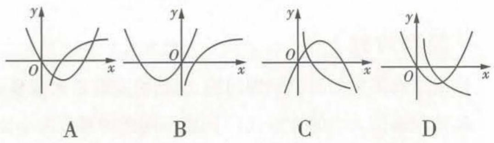

4. [2022 山东滨州期末, ★★] 若方程 $x^{2} - 4|x| + 3 = m$ 有四个互不相等的实数根, 则 m 的取值范围是 \_\_\_\_.

5. [2022 辽宁沈阳期中, ★★] 已知二次函数 $f(x)$ 的图象经过点 (4,3), 且在 $x$ 轴上截得的线段长为 2 , 若对任意 $x \in \mathbb{R}$ , 都有 $f(2 - x) = f(2 + x)$ , 则 $f(x) =$ \_\_\_\_.

# 题型 34 二次函数在闭区间上的最值问题

# 题型攻略

# 二次函数在闭区间上的最值问题的类型及解题方法

二次函数在闭区间上的最值问题主要有三种类型:①轴定区间定;②轴动区间定;③轴定区间动.不论哪种类型,解题的关键都是讨论对称轴与区间的关系,当含有参数时,要依据对称轴与区间的关系进行分类讨论.

# 教材 起点练

1. [人 A 必一 P86 T7 改编, ★★] 已知函数 $f(x)=3x^{2}-12x+5$ , 当自变量 x 在下列范围内取值时, 求函数的最大值和最小值:

(1) R; (2) [0,3]; (3) [-1,1].

# 高考 方向练

2.[2017 浙江,★★]若函数 $f(x)=x^{2}+ax+b$ 在区间[0,1]上的最大值是M,最小值是m,则M-m()

A. 与 a 有关, 且与 b 有关  
B. 与 a 有关, 但与 b 无关  
C. 与 a 无关, 且与 b 无关  
D. 与 a 无关, 但与 b 有关

3.[2015 湖北, ★★★]a 为实数, 函数 $f(x)=|x^{2}-ax|$ 在区间 [0,1] 上的最大值记为 $g(a)$ .
当 a = \_\_\_\_ 时, $g(a)$ 的值最小.

# 模拟 实战练

4.[动轴定区间,★★★]已知函数 $f(x)=-x^{2}+2ax+1-a$ 在 $0\leqslant x\leqslant1$ 时有最大值2,则实数a的值为\_\_\_\_.

5.[定轴动区间,★★★]已知函数 $f(x)=x^{2}-2x+2,x\in[t,t+1],t\in\mathbb{R}$ 的最小值为 $g(t)$ ，求 $g(t)$ 的函数表达式.

# 题型35 幂函数的图象与性质的应用

▶ 答案: 010 页

# 题型攻略

1. 对于幂函数的图象识别问题, 解题的关键是把握幂函数的性质, 尤其是单调性、奇偶性、图象经过的定点等.  
2. 比较幂值大小的方法: (1) 同底不同指的幂值大小比较, 一般利用指数函数的单调性进行比较; (2) 同指不同底的幂值大小比较, 一般利用幂函数的单调性进行比较; (3) 既不同底又不同指的幂值大小比较, 一般先找到一个中间值, 然后通过比较幂值与中间值的大小来比较.

# 教材 起点练

1.[人A必一P91练习T2改编，★]比较下列各题中两个数的大小：

(1) $2.3^{\frac{3}{4}},2.4^{\frac{3}{4}};$   
(2) $(\sqrt{2})^{-\frac{3}{2}},(\sqrt{3})^{-\frac{3}{2}};$

(3) $(-0.31)^{\frac{6}{5}},0.35^{\frac{6}{5}}.$

# 高考 方向练

2. [2022 上海, ★]下列幂函数中, 定义域为 R 的是 ( )

A. $y = x^{-1}$

B. $y = x^{-\frac{1}{2}}$

C. $y = x^{\frac{1}{3}}$

D. $y = x^{\frac{1}{2}}$

3. [2011 陕西, ★] 函数 $y = x^{\frac{1}{3}}$ 的图象是（）

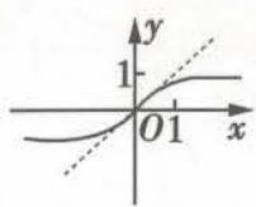  
A

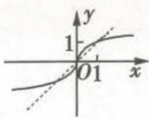  
B

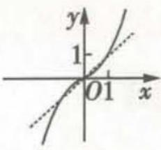  
C

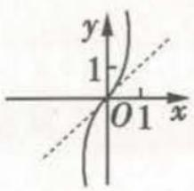  
D

4. [2020 江苏, ★★] 已知 $y = f(x)$ 是奇函数, 当 $x \geqslant 0$ 时, $f(x) = x^{\frac{2}{3}}$ , 则 $f(-8)$ 的值是 \_\_\_\_.

# 模拟 实战练

5.[2022广西桂林质检,★★]幂函数 $f(x)$ 的图象过点(2,8),则它的单调递增区间是()

A. $(0,+\infty)$

B. $\left[0,+\infty\right)$

C. $(-∞,0)$

D. $(-∞,+∞)$

6.[2022 徐州市检测, ★★]已知 $\alpha\in\{-2,-1,-\frac{1}{2},\frac{1}{2},1,2,3\}$ ，若幂函数 $f(x)=x^{\alpha}$ 为奇函数，且在 $(0,+\infty)$ 上单调递减，则 $\alpha=$ \_\_\_\_.

# 易错 警示练

7. [对幂函数的性质把握不准致误, ★★] 若 $(a+1)^{-\frac{1}{3}}<(3-2a)^{-\frac{1}{3}}$ , 则实数 a 的取值范围为 \_\_\_\_.

# 第四节 指数与指数函数

# 题型36 指数幂的运算

▶ 答案：010 页

# 题型攻略

指数幂的运算技巧

<table><tr><td>运算顺序</td><td>1有括号先算括号内的;2无括号先算指数的乘方、开方,再算乘除,最后算加减;3底数是负数的先确定符号.</td></tr><tr><td>运算基本原则</td><td>1化负指数为正指数;2化根式为分数指数幂;3化小数为分数;4化带分数为假分数.</td></tr></table>

# 教材 起点练

1. (1) [人 A 必 - P109 T4 改编, ★]

$$
\frac {\sqrt {a ^ {3} b ^ {2} \sqrt [ 3 ]{a b ^ {2}}}}{\left(a ^ {\frac {1}{4}} b ^ {\frac {1}{2}}\right) ^ {4} a ^ {- \frac {1}{3}} b ^ {\frac {1}{3}}} = \underline {{\quad}} (a > 0, b > 0);
$$

(2) [人 A 必 - P110 T8 改编, ★★] 若 $x^{\frac{1}{2}} + x^{-\frac{1}{2}} = 3$ , 则 $\frac{x^{\frac{3}{2}} + x^{-\frac{3}{2}} - 3}{x^{2} + x^{-2} - 2} =$ \_\_\_\_.

# 模拟 实战练

2.[2022广东茂名模拟，★]下列根式与分数指数幂的互化正确的是 （）

A. $-\sqrt{x}=(-x)^{\frac{1}{2}}$

B. $x^{-\frac{3}{4}} = \sqrt[4]{\left(\frac{1}{x}\right)^3} (x > 0)$

C. $\sqrt[6]{y^{2}} = y^{\frac{1}{3}}$

D. $\left[\sqrt[3]{(-x)^2}\right]^{\frac{3}{4}} = x^{\frac{1}{2}}(x < 0)$

3.[2022湖南省长沙实验中学入学考试,★★]若0<a<1,b>0,且 $a^{b}-a^{-b}=-2$ ,则 $a^{b}+a^{-b}$ 的值为()

A. $2\sqrt{2}$

B. $\pm 2\sqrt{2}$

C. $-2\sqrt{2}$

D. $\sqrt{6}$

4.[2022 黑龙江大庆育才中学期末,★]计算:

$$
(2 \frac {2}{5}) ^ {0} + 2 ^ {- 2} \times (2 \frac {1}{4}) ^ {- \frac {1}{2}} - 0. 0 1 ^ {0. 5} = \underline {{\quad}}.
$$

# 题型 37 指数函数的图象及应用

# 题型攻略

# 与指数函数有关的图象问题的求解方法

1. 已知函数解析式判断其图象,一般是根据函数的性质(奇偶性、单调性等)或特殊点的纵坐标的大小判断.  
2. 对于与指数型函数的图象有关的问题,一般从最基本的指数函数的图象入手,通过平移、伸缩、对称变换等得到所求的函数图象,进而可利用数形结合思想解题.

# 教材 起点练

1.[人A必一P159T1(2)改编，★]已知 $y_{1}=\left(\frac{1}{4}\right)^{x},y_{2}=4^{x},y_{3}=10^{-x},y_{4}=10^{x}$ ，则在同一平面直角坐标系内，它们的图象为（）

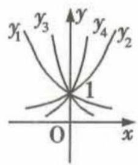  
A

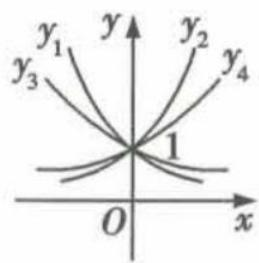  
B

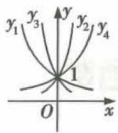  
C

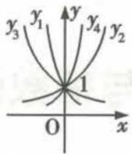  
D

# 高考 方向练

2.[2020北京,★★]已知函数 $f(x)=2^{x}-x-1$ ,
则不等式 $f(x)>0$ 的解集是()

A. $(-1,1)$

B. $(-∞,-1)∪(1,+∞)$

C. $(0,1)$

D. $(-∞,0)∪(1,+∞)$

3. [2019 全国卷Ⅲ, ★★] 函数 $y = \frac{2x^{3}}{2^{x} + 2^{-x}}$ 在 [-6,6] 上的图象大致为 ( )

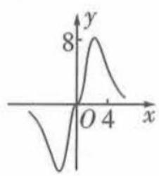  
A

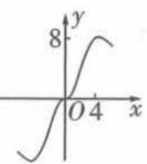  
B

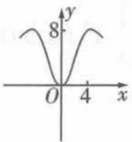  
C

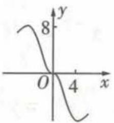  
D

# 题型 38 指数函数的性质判断及简单应用

# 模拟 实战练

4.[2022广西适应性测试，★★]函数 $f(x) =$ $\left(\frac{1}{\mathrm{e}}\right)^{\sin \left(x + \frac{\pi}{4}\right)} - \left(\frac{1}{\mathrm{e}}\right)^{\cos \left(x + \frac{\pi}{4}\right)}$ （其中e是自然对数的底数）的图象大致为 （

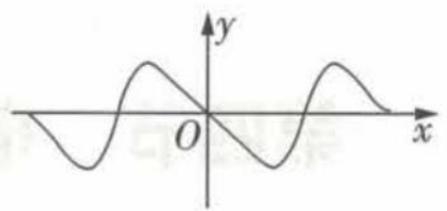

<details>
<summary>text_image</summary>

y
O
x
</details>

A

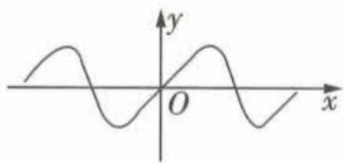

<details>
<summary>text_image</summary>

y
O
x
</details>

B

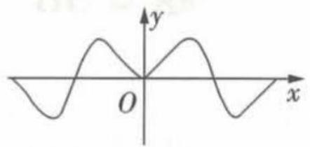

<details>
<summary>text_image</summary>

y
O
x
</details>

C

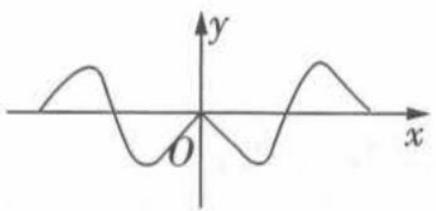

<details>
<summary>text_image</summary>

y
O
x
</details>

D

5.[多选,2022湖南湘西州期末,★★]已知实数a,b满足等式 $2021^{a}=2022^{b}$ ,下列等式可以成立的是()

A. a = b = 0

B. a < b < 0

C. 0 < a < b

D. 0 < b < a

6.[2022深圳市期末,★★]若直线 y=2a 与函数 $y=|a^{x}-1|(a>0$ 且 $a\neq1)$ 的图象有两个交点,则 a 的取值范围是 \_\_\_\_.

# 题型攻略

1. 形如 $y = a^{f(x)}$ 的函数的单调性的判断: 若 a > 1, 则函数 $f(x)$ 的单调增 (减) 区间即函数 $y = a^{f(x)}$ 的单调增 (减) 区间; 若 0 < a < 1, 则函数 $f(x)$ 的单调增 (减) 区间即函数 $y = a^{f(x)}$ 的单调减 (增) 区间.  
2. 求解指数型函数中的参数取值范围的基本思路: 一般利用指数函数的单调性或最值进行转化求解.  
3. 判断指数型函数的奇偶性,一般利用奇偶性的定义及指数的运算性质.

注意: 当底数 a 与 1 的大小关系不确定时应分类讨论.

# 教材 起点练

1. [人 A 必一 P120 T9 改编, ★★] 已知 $f(x) = x \left( \frac{1}{2^{x} - 1} + \frac{1}{2} \right)$ .

(1) 求 $f(x)$ 的定义域；  
(2) 判断 $f(x)$ 的奇偶性, 并说明理由.

# 高考 方向练

2. [2020 全国卷Ⅱ, ★★] 若 $2^{x} - 2^{y} < 3^{-x} - 3^{-y}$ ,
则
()

A. $\ln(y-x+1)>0$

B. $\ln(y-x+1)<0$

C. $\ln|x-y|>0$

D. $\ln|x-y|<0$

3. [2017 北京, ★★] 已知函数 $f(x)=3^{x}-(\frac{1}{3})^{x}$ ,
则 $f(x)$ ( )

A. 是奇函数, 且在 R 上是增函数

B. 是偶函数, 且在 R 上是增函数  
C. 是奇函数, 且在 R 上是减函数  
D. 是偶函数, 且在 R 上是减函数

# 模拟 实战练

4.[2022北京市朝阳区段考,★]下列函数中,值域是(0,+∞)的共有()

① $y=\sqrt{3^{x}-1}$ ; ② $y=(\frac{1}{3})^{x}$ ; ③ $y=\sqrt{1-(\frac{1}{3})^{x}}$ ;
④ $y=3^{\frac{1}{x}}$ .

A.1个

B.2 个

C. 3 个

D. 4 个

5.[多选,2022广西钦州市浦北中学期中,★★]已知函数 $y=(\frac{1}{2})^{x^{2}+4x+3}$ ，则下列说法正确的是()

A. 定义域为 $\mathbf{R}$   
B. 值域为(0,2]   
C. 在 $[-2, +\infty)$ 上单调递增  
D. 在 $\left[-2,+\infty\right)$ 上单调递减

# 易错 警示练

6.[忽略对底数的讨论致误,★★]已知函数 $f(x)=a^{x}(a>0,a\neq1)$ 在区间 $[1,2]$ 上的最大值是最小值的2倍,则实数a的值为\_\_\_\_.

# 题型 39 利用指数函数的图象与性质比较大小

▶ 答案：011 页

# 题型攻略

比较指数幂大小的常用方法

<table><tr><td>单调性法</td><td>不同底的指数函数化同底后就可以应用指数函数的单调性比较大小,所以能够化同底的尽可能化同底.</td></tr><tr><td>取中间值法</td><td>不同底、不同指数的指数函数比较大小时,可先与中间值(一般为0,1等)比较大小,然后得出大小关系.</td></tr><tr><td>数形结合法</td><td>根据指数函数的特征,在同一平面直角坐标系中作出它们的图象,借助图象比较大小.</td></tr></table>

# 教材 起点练

1.[人 A 必一 P117 例 3 改编, ★]已知 $a = \left(\frac{3}{5}\right)^{-\frac{1}{3}}, b = \left(\frac{3}{5}\right)^{-\frac{1}{4}}, c = \left(\frac{3}{2}\right)^{-\frac{3}{4}}$ ，则 $a, b, c$ 的大小关系是\_\_\_\_（用“<”连接）.

# 高考 方向练

2.[2020天津，★]设 $a = 3^{0.7},b = \left(\frac{1}{3}\right)^{-0.8},c =$ $\log_{0.7}0.8$ ，则 $a,b,c$ 的大小关系为 （）

A. a < b < c

B. b < a < c

C. b < c < a

D. $c < a < b$

# 模拟 实战练

3.[2022 洛阳市模拟,★]已知函数 $f(x)=\mathrm{e}^{x}-\mathrm{e}^{-x},a=f(3^{0.2}),b=f(0.3^{0.2}),c=f(\log_{0.2}3)$ ，则a,b,c的大小关系为()

A. $c < b < a$

B. $b < a < c$

C. b < c < a

D. c < a < b

4.[2022 辽宁本溪模拟,★]已知 $x\in(1,2)$ , $a=2^{x^{2}}$ , $b=(2^{x})^{2}$ , $c=2^{2x}$ , 则 a, b, c 的大小关系为（）

A. a > b > c

B. b > c > a

C. b > a > c

D. $c > a > b$

# 第五节 对数与对数函数

# 题型40 对数式的运算

▶ 答案: 012 页

# 题型攻略

对数的性质、运算法则及换底公式

<table><tr><td>性质</td><td> $\log_a 1 = 0, \log_a a = 1, a^{\log_a N} = N (N > 0), \log_a a^x = x$ ,其中  $a > 0$ ,且  $a \neq 1$ .</td></tr><tr><td>运算法则</td><td>如果  $a > 0$ ,且  $a \neq 1, M > 0, N > 0$ ,那么:(1)  $\log_a(M \cdot N) = \log_a M + \log_a N$ ;(2)  $\log_a \frac{M}{N} = \log_a M - \log_a N$ ;(3)  $\log_a M^n = n \log_a M (n \in \mathbb{R})$ .</td></tr><tr><td>换底公式</td><td> $\log_a b = \frac{\log_c b}{\log_c a} (a > 0$ ,且  $a \neq 1; c > 0$ ,且  $c \neq 1; b > 0$ .推论:(1)  $\log_a b \cdot \log_b a = 1$ ,即  $\log_a b = \frac{1}{\log_b a}$ ;(2)  $\log_{a^m} b^n = \frac{n}{m} \log_a b$ ;(3)  $\log_N M = \frac{\log_a M}{\log_a N} = \frac{\log_b M}{\log_b N}$ ;(4)  $\log_a b \cdot \log_b c \cdot \log_c d = \log_a d$ .</td></tr></table>

# 教材 起点练

1.[人A必一P125例5改编,★]当强度为x的声音对应的等级为 $f(x)$ 分贝时,有 $f(x)=10\lg\frac{x}{A_{0}}$ (其中 $A_{0}$ 为常数),装修电钻的声音约为100分贝,普通室内谈话的声音约为50分贝.则装修电钻的声音强度与普通室内谈话的声音强度的比值为()

A. $\frac{5}{3}$

B. $\frac{35}{3}$

C. $10^{5}$

D. $e^{5}$

# 高考 方向练

2. [2022 浙江, ★] 已知 $2^{a} = 5$ , $\log_{8}3 = b$ , 则 $4^{a-3b}=$ ( )

A. 25

B. 5

C. $\frac{25}{9}$

D. $\frac{5}{3}$

3.[2018全国卷I,★]已知函数 $f(x)=\log_{2}(x^{2}+$

a). 若 $f(3)=1$ ，则 a= \_\_\_\_.

# 模拟 实战练

4.[2022豫北名校联考，★]已知 $2^{a}=7^{b}=k$ ，若 $\frac{2}{a}+\frac{1}{b}=1$ ，则k的值为()

A. 28

B. $\frac{1}{14}$

C. 14

D. $\frac{1}{7}$

5.[2022 江西省联考,★]法国数学家马林·梅森是研究素数的数学家中成就很高的一位,人们将“ $2^{p} - 1(p$ 为素数)”形式的素数称为“梅森素数”,目前仅发现51个“梅森素数”,可以估计, $2^{67} - 1$ 这个“梅森素数”的位数为(参考数据: $\lg 2 \approx 0.301$ )()

A. 19

B. 20

C. 21

D. 22

6.[2022上海市长宁区期末,★★]已知 $\lg 2 = a$ ， $\lg 3 = b$ ，用 $a,b$ 表示 $\log_{18}15 =$ \_\_\_\_.

# 题型41 对数函数的图象及应用

▶ 答案：012 页

# 题型攻略

1. 对有关对数函数的作图问题, 一般是从基本初等函数的图象入手, 通过平移、伸缩、对称变换得到所要求的函数图象. 特别地, 当底数与 1 的大小关系不确定时应注意分类讨论.  
2. 对有关对数函数图象的识别问题,主要通过确定图象是“上升”还是“下降”、图象位置、图象所过的定点、图象与坐标轴的交点、函数值域等求解.

# 教材 起点练

1. [★] 方程 $\log_{2}(x+4)=3^{x}$ 的实根的个数为
()

A.0

B. 1

C.2

D. 3

# 高考 方向练

2.[2019 浙江,★]在同一直角坐标系中,函数 $y=\frac{1}{a^{x}},y=\log_{a}(x+\frac{1}{2})(a>0,\text{且}a\neq1)$ 的图象可能是()

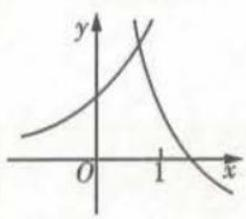  
A

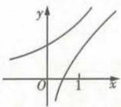  
B

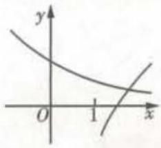  
C

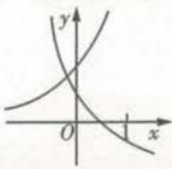  
D

# 模拟 实战练

3.[2022北京市东城区期末,★★]函数 $y=\log_{a}x$ 与 $y=-x+a$ 在同一平面直角坐标系中的图象可能是()

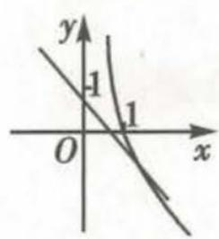  
A

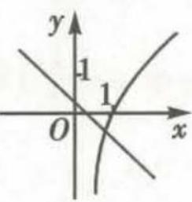  
B

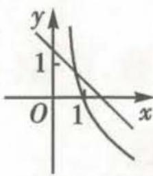  
C

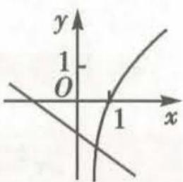  
D

4.[2022安徽马鞍山二中模拟，★★]已知函数 $f(x) = x + \frac{1}{x - 2},x\in (2,8)$ ，当 $x = m$ 时， $f(x)$ 有最小值 $n$ .则在平面直角坐标系中，函数 $g(x) = \log_{\frac{1}{m}}|x + n|$ 的图象是 （）

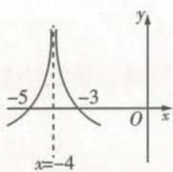  
A

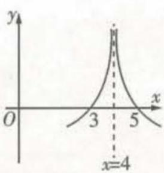  
B

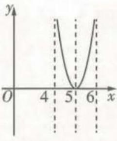  
C

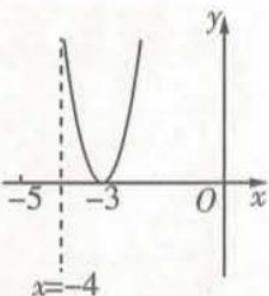  
D

5. [2022 四川南充检测, ★★]关于 x 的方程 $a^{-x} = \log_{a} x (a > 0$ , 且 $a \neq 1$ ) 的解的个数为 \_\_\_\_.

# 题型 42 对数函数的性质判断及简单应用

▶ 答案：012 页

# 题型攻略

1. 对数型复合函数的单调性问题的求解策略: (1) 对于 $y = \log_a f(x)$ 型的复合函数的单调性, 有以下结论, 函数 $y = \log_a f(x)$ 的单调性与函数 $u = f(x) (f(x) > 0)$ 的单调性在 $a > 1$ 时相同, 在 $0 < a < 1$ 时相反; (2) 研究 $y = f(\log_a x)$ 型的复合函数的单调性, 一般用换元法, 即令 $t = \log_a x$ , 则只需研究 $t = \log_a x$ 及 $y = f(t)$ 的单调性即可.  
2. 求对数型复合函数的值域(最值)时,关键是根据单调性求解,若需换元,需考虑新元的取值范围.   
3. 一般利用函数奇偶性的定义, 并结合对数的运算性质来判断对数型复合函数的奇偶性.

注意:研究对数型复合函数的单调性,一定要坚持“定义域优先”原则,否则所得范围易出错.

# 教材 起点练

1.[人A必一P161T11改编，★★]已知函数 $f(x) = \log_a(10 + x) - \log_a(10 - x)(a > 0,$ 且 $a\neq 1)$ (1)求 $f(x)$ 的定义域；

(2) 判断 $f(x)$ 的奇偶性, 并说明理由.

# 高考 方向练

2.[2020全国卷Ⅱ, ★★★]设函数 $f(x)=\ln|2x+1|- \ln|2x-1|$ ,则 $f(x)$ ( )

A. 是偶函数, 且在 $(\frac{1}{2}, +\infty)$ 单调递增

B. 是奇函数, 且在 $(- \frac{1}{2}, \frac{1}{2})$ 单调递减

C. 是偶函数, 且在 $(- \infty, -\frac{1}{2})$ 单调递增

D. 是奇函数, 且在 $(- \infty, -\frac{1}{2})$ 单调递减

# 模拟 实战练

3.[2022 武汉市第一中学模拟, ★★] 函数 $f(x)=\log_{a}(3-2ax)$ 在区间 [1,2] 上单调递增, 则实数 a 的取值范围为 ( )

A. $(0,1)$ B. $\left(\frac{3}{4},1\right)$ C. $\left(0,\frac{3}{4}\right)$ D. $(1,+\infty)$

4.[2022甘肃静宁一中模拟，★★]若函数 $f(x)=\log_{a}(x+1)(a>0,a\neq1)$ 的定义域和值域都是[0,1],则a等于()

A. $\frac{1}{2}$ B. $\sqrt{2}$ C. $\frac{\sqrt{2}}{2}$ D.2

5.[多选,2022 河北邢台联考,★★★]已知函数 $f(x)=\ln x^{2}-2\ln(x^{2}+1)$ ，则下列说法正确的是()

A. 函数 $f(x)$ 为偶函数  
B. 函数 $f(x)$ 的值域为 $(-∞, -1]$   
C. 当 x > 0 时, 函数 $f(x)$ 的图象关于直线 x = 1
对称  
D. 函数 $f(x)$ 的增区间为 $(-∞, -1)$ , $(0, 1)$

# 题型 43 利用对数函数的图象与性质比较大小

▶ 答案：013 页

# 题型攻略

比较对数值大小的常见类型及解题方法

<table><tr><td>常见类型</td><td>解题方法</td></tr><tr><td>底数为同一常数</td><td>可由对数函数的单调性直接进行判断</td></tr><tr><td>底数为同一字母</td><td>需对底数进行分类讨论,再结合对数函数的单调性进行判断</td></tr><tr><td>底数不同,真数相同</td><td>可以先用换底公式化为同底后再进行比较,或直接利用图象进行比较</td></tr><tr><td>底数与真数都不同</td><td>常借助1,0等中间量进行比较</td></tr></table>

# 教材 起点练

1. [人 A 必一 P135 T2 改编, ★] 比较下列各组中两个值的大小:

(1) $3\log_{4}5,2\log_{2}3;$   
(2) $\log_{3}0.2,\log_{4}0.2.$

# 高考 方向练

2. [2021 新高考卷 II, ★★] 若 $a = \log_{5}2, b = \log_{8}3, c = \frac{1}{2}$ ，则 ( )

A. c < b < a
B. b < a < c   
C. a < c < b
D. a < b < c

3. [2020 全国卷Ⅲ, ★★★] 已知 $5^{5} < 8^{4}$ , $13^{4} < 8^{5}$ . 设 $a = \log_{5}3$ , $b = \log_{8}5$ , $c = \log_{13}8$ , 则 ( )

A. a < b < c
B. b < a < c   
C. b < c < a
D. c < a < b

# 模拟 实战练

4.[2022 哈尔滨师大附中等三校联考,★★]已知 $a=\log_{6}\sqrt[3]{7}$ , $b=\log_{7}\sqrt[3]{6}$ , $c=6^{0.1}$ , 则 ( )

A. $b < c < a$

B. b < a < c

C. c < a < b

D. $a < b < c$

5. [2022 湖北省百校联考, ★★] 已知 $a = 4 \log_{24} 2, b = \log_{5} 4, c = \frac{\lg 3 + \lg 5}{2 \lg 5}$ , 则 ( )

A. $a > b > c$

B. b > a > c

C. c > b > a

D. $a > c > b$

6. [2022 太原市统考, ★★] 已知 $a = \ln 4, b = \log_{3} e, c = \log_{3} 4$ , 则 ( )

A. $b < c < a$

B. b < a < c

C. $a < b < c$

D. $a < c < b$

# 题型 44 解对数（指数）方程或不等式问题

答案: 013 页

# 题型攻略

1. 解指数方程或不等式问题的思路

(1) $a^{f(x)} = a^{g(x)} \Longleftrightarrow f(x) = g(x).$

(2)① $a^{f(x)}>a^{g(x)}\Leftrightarrow\left\{\begin{aligned}a>1,\\ f(x)>g(x)\end{aligned}\right.$ 或 $\left\{\begin{aligned}0<a<1,\\ f(x)<g(x).\end{aligned}\right.$

②形如 $a^{x}>b$ 的不等式,一般先将 b 转化为以 a 为底数的指数幂的形式,再借助函数 $y=a^{x}$ 的单调性求解.

2. 解对数方程或不等式问题的思路

(1) $\log_a f(x) = \log_a g(x) \Leftrightarrow f(x) = g(x)$ , 且 $f(x) > 0, g(x) > 0$ .

(2) 解简单对数不等式, 先统一底数, 化为形如 $\log_{a}f(x) > \log_{a}g(x)$ 的不等式, 再借助 $y = \log_{a}x$ 的单调性求解, 当

$a > 1$ 时， $\log_a f(x) > \log_a g(x) \Longleftrightarrow \left\{ \begin{array}{l} f(x) > 0, \\ g(x) > 0, \\ f(x) > g(x), \end{array} \right.$ 当 $0 < a < 1$ 时， $\log_a f(x) > \log_a g(x) \Longleftrightarrow \left\{ \begin{array}{l} f(x) > 0, \\ g(x) > 0, \\ f(x) < g(x). \end{array} \right.$

# 教材 起点练

1. [人 A 必 = P127 T4 改编, ★] (1) $\log_{5}(2x + 1) = \log_{5}(x^{2} - 2)$ ; (2) $81 \times 3^{2x} = \left(\frac{1}{9}\right)^{x + 2}$ .

# 高考 方向练

2. [2015 上海、★] 方程 $\log_2(9^{x-1} - 5) = \log_2(3^{x-1} - 2) + 2$ 的解为 \_\_\_\_.

# 模拟 实战练

3. [2022 山东省淄博实验中学期中，★★] 已知

函数 $f(x)$ 是定义在R上的偶函数,当 $x\leqslant0$ 时, $f(x)$ 单调递减,则不等式 $f(\log_{\frac{1}{3}}(2x-5))>f(\log_{3}8)$ 的解集为()

A. $\left\{x\mid\frac{5}{2}<x<\frac{41}{16}\right\}$

B. $\{x \mid x > \frac{13}{2}\}$

C. $\left\{x\mid\frac{5}{2}<x<\frac{41}{16}\text{或}x>\frac{13}{2}\right\}$

D. $\{x \mid x < \frac{5}{2} \text{或} \frac{41}{16} < x < \frac{13}{2}\}$

4. [2022 辽宁铁岭联考, ★★] 若 $x_{1}$ 是方程 $xe^{x}=1$ 的解, $x_{2}$ 是方程 $x\ln x=1$ 的解, 则 $x_{1}x_{2}$ 等于 \_\_\_\_.

5. [2022 北京市海淀区期末, ★★★] 已知函数 $f(x) = \left| \log_{5} x \right|$ , 若 $f(x) < f(2 - x)$ , 则 x 的取值范围是 \_\_\_\_.

# 第六节 函数的图象

# 题型45 判断函数图象

▶ 答案：013 页

# 题型攻略

# 1. 函数图象的识别方法

函数图象的识别可从以下方面入手:(1)从函数的定义域,判断图象的左右位置,从函数的值域,判断图象的上下位置;(2)从函数的单调性,判断图象的变化趋势,有时需要借助导数工具求解;(3)从函数的奇偶性,判断图象的对称性;(4)从函数图象上的特征点,排除不符合要求的图象;(5)有关函数 $y=f(x)$ 与函数 $y=af(bx+c)+h$ 的图象问题的判断,熟练掌握图象的平移变换(左加右减,上加下减)、对称变换、伸缩变换等,可轻松破解此类问题.

# 2. 根据实际背景、图形判断函数图象的两种方法

(1) 定量计算法: 根据题目所给条件确定函数解析式, 从而判断函数图象.  
(2) 定性分析法: 采用“以静观动”, 即判断动点处于不同位置时图象的变化特征, 从而做出选择.

# 教材 起点练

1.[人 A 必一 P71 T1 改编,★★]小明骑车上学,开始时匀速行驶,途中因交通堵塞停留了一段时间,后为了赶时间加快速度行驶.与以上事件吻合得最好的图象是()

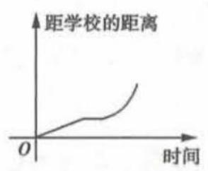  
A

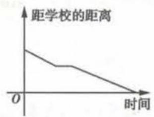  
B

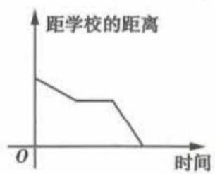  
C

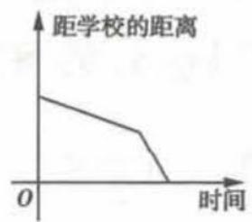  
D

# 高考 方向练

2.[2022全国卷甲,★★]函数 $y=(3^{x}-3^{-x})\cos x$ 在区间 $\left[-\frac{\pi}{2},\frac{\pi}{2}\right]$ 的图象大致为（）

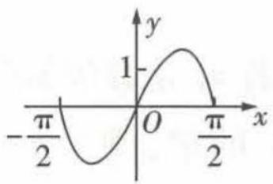  
A

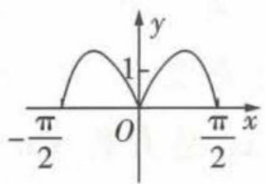  
B

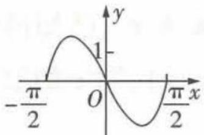  
C

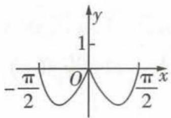  
D

# 模拟 实战练

3.[2022 石家庄市一检, ★★] 函数 $f(x)=\frac{x^{3}}{2^{x}+2^{-x}}$ 的图象大致是 ()

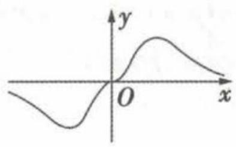

<details>
<summary>text_image</summary>

y
O
x
</details>

A

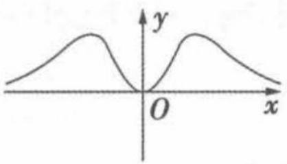

<details>
<summary>text_image</summary>

y
O
x
</details>

B

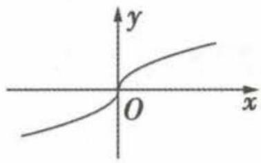  
C

  
D

4.[2022甘肃兰州诊断,★★]已知函数 $f(x)=x\ln x$ 的图象如图所示,则函数 $f(1-x)$ 的图象为()


  
A

  
B

  
C

  
D

5.[2022广西贵港模拟,★★★]


如图, 点 P 在以 AB 为直径的半圆弧上沿着BA运动,AB=2,记 $\angle BAP=x$ .将点P到A,B两点的距离之和表示为x的函数 $f(x)$ ,则 $y=f(x)$ 的图象大致为()

  
A

  
B

  
C

  
D

# 题型46 分析函数图象

▶ 答案：014 页

# 题型攻略

对于分析函数图象问题,解题的关键点在于对函数的图象特征的认识.从图象上反映的定义域、值域、图象的对称性、单调性、周期性、图象与x轴的交点情况、经过的定点入手.

# 教材 起点练

1. [★] 向高为 H 的水瓶中注水, 注满为止, 如果注水量 V 与水深 h 的函数关系的图象如图所示, 那么水瓶的形状是 ( )


  
A

  
B

  
C

  
D

# 高考 方向练

2.[2015安徽,★★]函数 $f(x)=\frac{ax+b}{(x+c)^{2}}$ 的图象如图所示,则下列结论成立的是()


<details>
<summary>text_image</summary>

y
M
O N P x
</details>

A. a > 0, b > 0, c < 0   
B. a < 0, b > 0, c > 0   
C. a < 0, b > 0, c < 0   
D. a<0, b<0, c<0

3. [2022 全国卷乙, ★★★] 如图是下列四个函数中的某个函数在区间 $[-3, 3]$ 的大致图象，则该函数是 ( )


<details>
<summary>line</summary>

| x   | y    |
| --- | ---- |
| -3  | 2    |
| 0   | 0    |
| 1   | 1    |
| 3   | 0    |
</details>

A. $y = \frac{-x^{3} + 3x}{x^{2} + 1}$

B. $y = \frac{x^3 - x}{x^2 + 1}$

C. $y = \frac{2x\cos x}{x^2 + 1}$

D. $y = \frac{2\sin x}{x^2 + 1}$

# 模拟 实战练

4.[2022 山东省部分重点中学联考,★★]已知二次函数 $f(x)$ 的图象如图所示,则函数 $g(x)=f(x)\cdot\mathrm{e}^{x}$ 的图象为

  
( )


<details>
<summary>text_image</summary>

y
-1 O 1 x
</details>

A

  
B


<details>
<summary>text_image</summary>

y
-1 O 1 x
</details>

C


<details>
<summary>line</summary>

| x | y |
|---|---|
| -2 | -2 |
| -1 | -1 |
| 0 | 0 |
| 1 | 1 |
</details>

D

5.[2022广州市一测,★★★]若函数 $y=f(x)$ 的大致图象如图,则 $f(x)$ 的解析式可能是()

A. $f(x) = \frac{x^2\mathrm{e}^x}{\mathrm{e}^{2x} + 1}$   
B. $f(x) = \frac{\mathrm{e}^{2x} + 1}{x^2\mathrm{e}^x}$   
C. $f(x) = \frac{x^2\mathrm{e}^x}{\mathrm{e}^{2x} - 1}$   
D. $f(x) = \frac{\mathrm{e}^{2x} - 1}{x^2\mathrm{e}^x}$


<details>
<summary>text_image</summary>

y
O
x
</details>

# 第七节 函数与方程

# 题型 47 判断函数的零点所在区间

▶ 答案：014 页

# 题型攻略

函数零点所在区间的判断方法及适用情形

<table><tr><td>方法</td><td>含义</td><td>适用情形</td></tr><tr><td>定理法</td><td>利用函数的零点存在定理进行判断.</td><td>能够容易判断区间端点值所对应函数值的正负.</td></tr><tr><td>图象法</td><td>画出函数图象,通过观察图象与x轴在给定区间上是否有交点来判断.</td><td>容易画出函数的图象.</td></tr><tr><td>解方程法</td><td>可先解对应方程,然后看所求的根是否落在给定区间上.</td><td>当对应方程f(x)=0易解时.</td></tr></table>

# 教材 起点练

1. [人 A 必 - P144 T2 改编, ★] 函数 $f(x) = \log_{3}x + x - 2$ 的零点所在的区间为 ( )

A. $(0,1)$

B. $(1,2)$

C. $(2,3)$

D. $(3,4)$

# 高考 方向练

2.[2014北京，★]已知函数 $f(x)=\frac{6}{x}-\log_{2}x$ .在下列区间中，包含 $f(x)$ 零点的区间是（）

A. $(0,1)$

B. $(1,2)$

C. $(2,4)$

D. $(4,+\infty)$

3. [2013 重庆, ★] 若 a < b < c，则函数 $f(x) = (x - a)(x - b) + (x - b)(x - c) + (x - c)(x - a)$ 的两个零点分别位于区间（）

A. $(a,b)$ 和 $(b,c)$ 内

B. $(-∞,a)$ 和 $(a,b)$ 内

C. $(b, c)$ 和 $(c, +\infty)$ 内

D. $(-∞,a)$ 和 $(c,+∞)$ 内

# 模拟 实战练

4.[2022重庆市期末,★★]根据表格中的数据可以判定方程 $\ln x - x + 2 = 0$ 的一个根所在的区间为 （）

<table><tr><td>x</td><td>1</td><td>2</td><td>3</td><td>4</td><td>5</td></tr><tr><td>ln x</td><td>0</td><td>0.693</td><td>1.099</td><td>1.386</td><td>1.609</td></tr><tr><td>x-2</td><td>-1</td><td>0</td><td>1</td><td>2</td><td>3</td></tr></table>

A. $(1,2)$

B. $(2,3)$

C. $(3,4)$

D. $(4,5)$

5.[2022 山东滨州期末, ★★][x]表示不超过 x 的最大整数,例如[3.5]=3,[-0.5]=-1.已知 $x_{0}$ 是方程 $\ln x + 3x - 15 = 0$ 的根,则 $[x_{0}] =$ ( )

A.2

B.3

C. 4

D. 5

6.[2022 湖北荆州期末, ★★★]若 $x_{0}$ 是方程 $\left(\frac{1}{2}\right)^{x}=x^{\frac{1}{3}}$ 的根, 则 $x_{0}$ 属于区间 ( )

A. $\left(\frac{2}{3},1\right)$

B. $\left(\frac{1}{2},\frac{2}{3}\right)$

C. $\left(\frac{1}{3},\frac{1}{2}\right)$

D. $(0,\frac{1}{3})$

# 题型48 判断函数的零点个数

▶ 答案：015 页

# 题型攻略

# 判定函数零点个数的方法

1. 直接法: 令 $f(x)=0$ , 如果能求出解, 那么有几个不同的解就有几个零点.

2. 利用函数的零点存在定理: 利用函数的零点存在定理时, 不仅要求函数的图象在区间 $[a, b]$ 上是连续不断的曲线, 且 $f(a) \cdot f(b) < 0$ , 还必须结合函数的图象与性质 (如单调性、奇偶性) 才能确定函数有多少个零点.

3. 图象法: 画出函数 $f(x)$ 的图象, 函数 $f(x)$ 的图象与 $x$ 轴交点的个数就是函数 $f(x)$ 的零点个数; 将函数 $f(x)$ 拆成两个函数 $h(x)$ 和 $g(x)$ 的差的形式, 根据 $f(x) = 0 \Leftrightarrow h(x) = g(x)$ , 则函数 $f(x)$ 的零点个数就是函数 $y = h(x)$ 和 $y = g(x)$ 的图象的交点个数.  
4. 利用函数性质: 若能确定函数的单调性及值域, 则其零点个数不难得到; 若所考查的函数是周期函数, 则只需求出在一个周期内的零点个数, 然后根据周期性则可得函数的零点个数.

# 教材 起点练

1.[人A必一P143例1改编，★]函数 $f(x)=$ $\left\{\begin{aligned}x^{2}+x-2,x\leqslant0,\\ -1+\ln x,x>0\end{aligned}\right.$ 的零点个数为（）

A. 3

B. 2

C. 7

D. 0

# 高考 方向练

2.[2019全国卷Ⅲ，★]函数 $f(x)=2\sin x-\sin 2x$ 在 $[0,2\pi]$ 上的零点个数为()

A.2

B. 3

C. 4

D. 5

3.[2013天津,★★]函数 $f(x)=2^{x}\left|\log_{0.5}x\right|-1$ 的零点个数为()

A. 1

B. 2

C. 3

D.4

4. [2015 天津, ★★★] 已知函数 $f(x) = \begin{cases} 2 - |x|, & x \leqslant 2, \\ (x - 2)^2, & x > 2, \end{cases}$ 函数 $g(x) = 3 - f(2 - x)$ , 则函数 $y = f(x) - g(x)$ 的零点个数为 ( )

A.2

B.3

C. 4

D. 5

# 模拟 实战练

5.[2022吉林长春二模,★★]已知函数 $f(x)=\left\{\begin{aligned}&|\ln x|,x>0,\\&-2x(x+2),x\leqslant0,\end{aligned}\right.$ 则函数 $y=f(x)-3$ 的零点个数是()

A. 1

B. 2

C. 3

D. 4

6.[2022 海南海口期末, ★★]设函数 $f(x)$ 是定义在R上的奇函数, 当x>0时, $f(x)=\mathrm{e}^{x}+x-3$ ,则 $f(x)$ 的零点个数为()

A.1

B.2

C. 3

D. 4

7.[2022 湖南省六校联考, ★★★] 函数 $f(x)=4\cos^{2}\frac{x}{2}\cos\left(\frac{\pi}{2}-x\right)-2\sin x-|\ln(x+1)|$ 的零点个数为 \_\_\_\_.

# 题型 49 根据函数的零点情况求参数的取值范围

▶ 答案：015 页

# 题型攻略

利用函数零点求参数取值范围的方法及步骤

<table><tr><td rowspan="3">常用方法</td><td>直接法</td><td>先根据题设条件构建关于参数的不等式(组),再通过解不等式(组)确定参数的取值范围.</td></tr><tr><td>分离参数法</td><td>将参数分离,转化成求函数值域问题.</td></tr><tr><td>数形结合法</td><td>先对解析式变形,在同一平面直角坐标系中画出函数的图象,然后数形结合求解.</td></tr><tr><td rowspan="3">一般步骤</td><td>转化</td><td>把已知函数零点的存在情况转化为方程(组)的解、不等式(组)的解集或两函数图象的交点的情况.</td></tr><tr><td>列式</td><td>根据零点存在定理或结合函数图象列式.</td></tr><tr><td>结论</td><td>求出参数的取值范围或根据图象得出参数的取值范围.</td></tr></table>

# 教材 起点练

1.[人A必一P160T4改编，★★]已知函数 $f(x) = \log_a x - x + 2(a > 0,$ 且 $a\neq 1)$ 有且仅有

两个零点,则 a 的取值范围为 ( )

A. $0 < a < 1$

B. $a > 1$

C. $1 < a < 2$

D. a > 2

# 高考 方向练

2. [2018 全国卷 I, ★★] 已知函数 $f(x) = \left\{\begin{aligned} e^{x}, & x \leqslant 0, \\ \ln x, & x > 0, \end{aligned}\right.$ $g(x) = f(x) + x + a.$ 若 $g(x)$ 存在 2 个零点，则 a 的取值范围是 ( )

A. $\left[-1,0\right)$

B. $\left[0,+\infty\right)$

C. $[-1, +\infty)$

D. $[1, +\infty)$

3. [2020 天津, ★★★] 已知函数 $f(x) = \begin{cases} x^3, & x \geqslant 0, \\ -x, & x < 0. \end{cases}$ 若函数 $g(x) = f(x) - |kx^2 - 2x| (k \in \mathbb{R})$ 恰有 4 个零点, 则 $k$ 的取值范围是 ( )

A. $(-∞,-\frac{1}{2})∪(2\sqrt{2},+∞)$

B. $(-∞,-\frac{1}{2})∪(0,2\sqrt{2})$

C. $(-∞,0)∪(0,2\sqrt{2})$

D. $(-∞,0)∪(2\sqrt{2},+∞)$

# 模拟 实战练

4. [2022 郑州市质量预测, ★★★] 已知函数 $f(x)=\left\{\begin{aligned}xe^{x},&x\leqslant0,\\ \ln x,x&>0,\end{aligned}\right.$ 若 $g(x)=f(x)-ax$ 有四个

不同的零点,则 a 的取值范围为 ( )

A. $(0,\frac{1}{e})$

B. $\left[\frac{1}{e},1\right)$

C. $[1,e)$

D. $\left[e,+\infty\right)$

5.[多选,2022扬州市阶段测试,★★★]已知函数 $f(x)$ 是定义在R上的偶函数,满足 $f(x-1)=f(x+1)$ ,当 $x\in[0,1]$ 时, $f(x)=x$ .设函数 $g(x)=f(x)-kx-k$ ,则下列结论成立的是()

A. 函数 $f(x)$ 的一个周期为 2

B. $f(\frac{4}{3})=-\frac{2}{3}$

C. 当实数 k > -1 时, 函数 $g(x)$ 在区间 [1,2]
上单调递减

D. 在区间 $[-1,3]$ 内, 若函数 $g(x)$ 有 4 个零点, 则实数 $k$ 的取值范围是 $(0, \frac{1}{4}]$

6.[2022济南市学情检测，★★]已知函数 $f(x) = \left\{ \begin{array}{l}x(x\leqslant 0),\\ |2x - 3| (x > 0), \end{array} \right.$ $g(x) = f(x) - \frac{1}{2} x +$ $a$ ，若 $g(x)$ 存在3个零点，则实数 $a$ 的取值范围为

# 第八节 函数模型及其应用

# 题型 50 解决图表型函数的实际应用问题

▶ 答案：016 页

# 题型攻略

解决图表型函数的实际应用问题的策略:(1)明确横轴、纵轴的意义,分析在题中的具体含义;(2)由图象判定函数模型;(3)抓住特殊点的实际意义,特殊点一般包括最高点(最大值点)、最低点(最小值点)及折线的拐角点等;(4)通过方程、不等式、函数等数学模型化实际问题为数学问题,根据实际问题中两变量的变化快慢等特点,结合图象的变化趋势进行求解.

# 教材 起点练

1. [人 A 必一 P96 T3 改编, ★]某建材商场国庆期间搞促销活动, 规定: 顾客购物总金额不超过 800 元时, 不享受任何折扣; 如果顾客购物总金额超过 800 元, 那么超过 800 元部分享受一定的折扣优惠, 按下表折扣分别累

计计算.

<table><tr><td>可以享受折扣优惠金额</td><td>折扣率</td></tr><tr><td>不超过500元的部分</td><td>5%</td></tr><tr><td>超过500元的部分</td><td>10%</td></tr></table>

某人在此商场购物总金额为 $x$ 元, 可以获得的折扣金额为 $y$ 元, 则 $y$ 关于 $x$ 的解析式为 $y = \left\{ \begin{array}{l} 0, 0 < x \leqslant 800, \\ 5\% (x - 800), 800 < x \leqslant 1300, \\ 10\% (x - 1300) + 25, x > 1300. \end{array} \right.$ 若 $y = 30$ 元,

则他购物实际所付金额为\_\_\_\_元.

# 高考 方向练

2. [2022 北京, ★★]在北京冬奥会上, 国家速滑馆“冰丝带”使用高效环保的二氧化碳跨临界直冷制冰技术, 为实现绿色冬奥作出了贡献. 如图描述了一定条件下二氧化碳所处的状态与 T 和 lg P 的关系, 其中 T 表示温度, 单位是 K; P 表示压强, 单位是 bar . 下列结论中正确的是 ( )


<details>
<summary>line</summary>

| T    | lg P (固态) | lg P (液态) | lg P (气态) |
|------|-------------|-------------|-------------|
| 200  | 0           | 0           | 0           |
| 250  | 3           | 2           | 1           |
| 300  | 4           | 2           | 2           |
| 350  | 4           | 2           | 2           |
| 400  | 4           | 2           | 2           |
</details>

A. 当 T=220, P=1026 时, 二氧化碳处于液态  
B. 当 T=270, P=128 时, 二氧化碳处于气态  
C. 当 T=300, P=9 987 时, 二氧化碳处于超临界状态  
D. 当 T = 360, P = 729 时, 二氧化碳处于超临界状态

3. [2020 北京, ★★★]为满足人民对美好生活的向往,环保部门要求相关企业加强污水治理,排放未达标的企业要限期整改. 设企业的污水排放量 W 与时间 t 的关系为 $W = f(t)$ , 用 $-\frac{f(b) - f(a)}{b - a}$ 的大小评价在 $[a, b]$ 这段时间内企业污水治理能力的强弱. 已知整改期内,甲、乙两企业的污水排放量与时间的关系如图所示.


<details>
<summary>line</summary>

| t    | 甲企业 | 乙企业 |
| ---- | ------ | ------ |
| t₁   | W      | W      |
| t₂   | W      | W      |
| t₃   | W      | W      |
</details>

给出下列四个结论：

①在 $[t_{1},t_{2}]$ 这段时间内,甲企业的污水治理能力比乙企业强;  
②在 $t_{2}$ 时刻, 甲企业的污水治理能力比乙企业强;  
③在 $t_{3}$ 时刻, 甲、乙两企业的污水排放都已达标;  
④甲企业在 $\left[0,t_{1}\right],\left[t_{1},t_{2}\right],\left[t_{2},t_{3}\right]$ 这三段时间中，在 $\left[0,t_{1}\right]$ 的污水治理能力最强.  
其中所有正确结论的序号是\_\_\_\_。

# 模拟 实战练

4.[2022上海市普陀区月考,★]某电动汽车“行车数据”的两次记录如下表:

<table><tr><td>记录时间</td><td>累计里程/km</td><td>平均耗电量/(kW·h/km)</td><td>剩余续航里程/km</td></tr><tr><td>2021年1月1日</td><td>4000</td><td>0.125</td><td>280</td></tr><tr><td>2021年1月2日</td><td>4100</td><td>0.126</td><td>146</td></tr></table>

(注:累计里程指汽车从出厂开始累计行驶的路程,累计耗电量指汽车从出厂开始累计消耗的电量,平均耗电量= $\frac{累计耗电量}{累计里程}$ ,剩余续航里程= $\frac{剩余电量}{平均耗电量}$ )

下面对该车在两次记录时间段内行驶 100 km 的耗电量估计正确的是 （）

A. 等于 12.5

B.12.5到12.6之间

C. 等于 12.6

D. 大于 12.6

5.[2022 北京十三中月考，

★★]加工爆米花时,爆开且不糊的粒数占加工总粒数的百分比称为“可食用率”. 在特定条件下,可食用率p与加工时间t(单位:min)满足


<details>
<summary>line</summary>

| t | P |
|---|---|
| 3 | 0.7 |
| 4 | 0.8 |
| 5 | 0.5 |
</details>

函数关系 $p = at^{2} + bt + c$ (a, b, c 是常数)，如图记录了三次实验的数据。根据上述函数模型和实验数据，可以得到最佳加工时间为（）

A. 3.50 min

B.3.75 min

C. 4.00 min

D.4.25 min

# 题型51 已知函数模型求解实际问题

# 题型攻略

# 利用已给函数模型解决实际问题的关键点

1. 认清所给函数模型,弄清哪些量为待定系数.  
2. 根据已知利用待定系数法确定模型中的待定系数.  
3. 利用函数模型,借助函数的性质求解实际问题,并进行检验.

# 教材 起点练

1. [人 A 必一 P148 例 3 改编, ★★] 人口问题是当今世界各国普遍关注的问题, 认识人口数量的变化规律, 可以为制定一系列相关政策提供依据. 早在 1798 年, 英国经济学家马尔萨斯 (T. R. Malthus, 1766—1834) 就提出了自然状态下的人口增长模型 $y = y_0 \cdot e^{rt}$ , 其中 $t$ 表示经过的时间, $y_0$ 表示 $t = 0$ 时的人口数, $r$ 表示人口的年平均增长率. 据第六次全国人口普查得知, 2010 年末我国的人口总数约为 13.4 亿, 年平均增长率为 0.57%. 若以此求得的模型估计, 2021 年末我国的人口总数约为 ( $e^{0.0627} \approx 1.065$ )

A. 13.9 亿

B.14.1亿

C. 14.2 亿

D.14.3亿

# 高考 方向练

2.[2021全国卷甲,★★]青少年视力是社会普遍关注的问题,视力情况可借助视力表测量.通常用五分记录法和小数记录法记录视力数据,五分记录法的数据L和小数记录法的数据V满足 $L=5+\lg V$ .已知某同学视力的五分记录法的数据为4.9,则其视力的小数记录法的数据约为( $\sqrt[10]{10}\approx1.259$ )()

A. 1.5

B. 1.2

C.0.8

D. 0.6

3. [2020 新高考卷 I, ★★] 基本再生数 $R_{0}$ 与世代间隔 T 是新冠肺炎的流行病学基本参数。基本再生数指一个感染者传染的平均人数，世代间隔指相邻两代间传染所需的平均时间。在新冠肺炎疫情初始阶段，可以用指数模型： $I(t) = e^{rt}$ 描述累计感染病例数 $I(t)$ 随时间 t（单

位:天)的变化规律,指数增长率 r 与 $R_{0}, T$ 近似满足 $R_{0} = 1 + rT$ . 有学者基于已有数据估计出 $R_{0} = 3.28, T = 6$ . 据此,在新冠肺炎疫情初始阶段,累计感染病例数增加 1 倍需要的时间约为 $(\ln 2 \approx 0.69)$ ()

A.1.2天

B.1.8天

C.2.5天

D.3.5天

4. [2012 江苏, ★★★] 如图, 建立平面直角坐标系 xOy, x 轴在地平面上, y


<details>
<summary>text_image</summary>

y/千米
O
x/千米
</details>

轴垂直于地平面,单位长度为1千米,某炮位于坐标原点.已知炮弹发射后的轨迹在方程 $y=kx-\frac{1}{20}(1+k^{2})x^{2}(k>0)$ 表示的曲线上,其中k与发射方向有关.炮的射程是指炮弹落地点的横坐标.

(1) 求炮的最大射程；

(2)设在第一象限有一飞行物(忽略其大小), 其飞行高度为3.2千米,试问它的横坐标a不超过多少时,炮弹可以击中它?请说明理由.

# 模拟 实战练

5.[2022济南市十一校联考,★★]放射性核素锶89的质量M会按某个衰减率衰减,设初始质量为 $M_{0}$ ,质量M与时间t(单位:天)的函数关系为 $M=M_{0}\cdot\left(\frac{1}{2}\right)^{\frac{t}{h}}$ (其中h为常数),若锶89的半衰期(质量衰减一半所用的时间)约为50天,那么锶89的质量从 $M_{0}$ 衰减至 $0.66M_{0}$ 所经过的时间约为(参考数据: $\log_{2}0.66\approx-0.6$ )

A. 10 天

B.20 天

C. 30 天

D. 40 天

6.[多选,2022 湖北省七市(州)联考,★★★]尽管目前人类还无法准确预报地震,但科学家经过研究,已经对地震有所了解,例如,地震时释放的能量 E(单位:焦耳)与地震里氏震级 M 之间的关系为 lg E = 4.8 + 1.5M,则下列说法正确的是()

A. 地震时释放的能量为 $10^{15.3}$ 焦耳时, 地震里氏震级约为七级  
B. 八级地震释放的能量约为七级地震释放的能量的 6.3 倍  
C. 八级地震释放的能量约为六级地震释放的能量的 1000 倍  
D. 记地震里氏震级为 $n(n=1,2,\cdots,9,10)$ ，地震时释放的能量为 $a_{n}$ ，则数列 $\{a_{n}\}$ 是等比数列

7.[2022 山东临沂期末, ★★★]已知某公司生产某产品的年固定成本为100万元, 每生产1千件需另投入27万元, 设该公司一年内生产该产品x千件(0<x≤25)并全部销售完, 每千件的销售收入为R(x)(单位: 万元), 且

$$
R (x) = \left\{ \begin{array}{l} 1 0 8 - \frac {1}{3} x ^ {2} (0 <   x \leqslant 1 0), \\ - x + \frac {1 7 5}{x} + 5 7 (1 0 <   x \leqslant 2 5). \end{array} \right.
$$

(1) 写出年利润 $f(x)$ (单位: 万元) 关于年产量 x (单位: 千件) 的函数解析式;  
(2) 当年产量为多少千件时, 该公司在这一产品的生产中所获年利润最大? (注: 年利润 = 年销售收入 - 年总成本)

# 题型52 构造函数模型求解实际问题

▶ 答案：017 页

# 题型攻略

# 构建函数模型解决实际问题的解题步骤

1. 审题, 引进数学符号, 建立数学模型, 了解变量的含义, 若模型中含有待定系数, 则需要进一步用待定系数法或其他方法确定;  
2. 求解数学模型, 利用数学知识, 如函数的单调性、最值等, 对函数模型进行解答;  
3. 转译成实际问题的解.

# 教材 起点练

1.[人A必一P93例1改编,★★]自2019年1月1日起,我国个人所得税税额根据应纳税所

得额、税率和速算扣除数确定,计算公式为:个人所得税税额 = 应纳税所得额 × 税率 - 速算扣除数.应纳税所得额的计算公式为:应纳税所得额 = 综合所得收入额 - 基本减除费用 - 专项扣除 - 专项附加扣除 - 依法确定的其他扣除. 其中, “基本减除费用” (免征额) 为每年 60 000 元. 部分税率与速算扣除数见下表:

<table><tr><td>级数</td><td>全年应纳税所得额所在区间</td><td>税率(%)</td><td>速算扣除数</td></tr><tr><td>1</td><td>[0,36 000]</td><td>3</td><td>0</td></tr><tr><td>2</td><td>(36 000,144 000]</td><td>10</td><td>2 520</td></tr><tr><td>3</td><td>(144 000,300 000]</td><td>20</td><td>16 920</td></tr><tr><td>4</td><td>(300 000,420 000]</td><td>25</td><td>31 920</td></tr><tr><td>5</td><td>(420 000,660 000]</td><td>30</td><td>52 920</td></tr></table>

若某人全年综合所得收入额为 249 600 元,专项扣除占综合所得收入额的 20%,专项附加扣除是 52 800 元,依法确定的其他扣除是 4 560 元,则他全年应缴纳的个人所得税应该是 ( )

A.5712元

B.8 232 元

C. 11 712 元

D.33 000 元

2. [人 A 必一 P156 T10 改编, ★★★]一种药在病人血液中的量保持1 500 mg以上时才有疗效, 而低于500 mg时病人就有危险. 现给某病人静脉注射了这种药2 500 mg, 如果药在血液中以每小时20%的比例衰减, 为了保持疗效, 那么从现在起到再次向病人注射这种药的最长时间为(附: lg 2≈0.301 0, lg 3≈0.477 1, 精确到0.1 h) ()

A. $4.2 \mathrm{~h}$

B.2.3 h

C. 8.8 h

D. 7.2 h

# 高考 方向练

3. [2016 四川, ★★] 某公司为激励创新, 计划逐年加大研发资金投入. 若该公司 2015 年全年投入研发资金 130 万元, 在此基础上, 每年投入的研发资金比上一年增长 12%, 则该公司全年投入的研发资金开始超过 200 万元的年份是 (参考数据: lg 1.12 ≈ 0.05, lg 1.3 ≈ 0.11, lg 2 ≈ 0.30) ()

A. 2018 年

B.2019年

C. 2020 年

D.2021年

4. [2013 陕西, ★★] 在如图所示的锐角三角形空地中, 欲建一个面积最大的内接矩形花园 (阴影部分), 则其边长 x 为 \_\_\_\_ m.


<details>
<summary>text_image</summary>

40 m
x
40 m
</details>

# 模拟 实战练

5.[2022 辽宁沈阳一模, ★★]网络上盛极一时的数学式子“1. $01^{30} \approx 1.4$ , $1.01^{365} \approx 37.8$ , $1.01^{730} \approx 1427.6$ ”形象地向我们展示了通过努力每天进步 $1\%$ , 就会在一个月、一年以及两年后产生巨大的差异。虽然这是一种理想化的算法, 但它也让我们直观地感受到了“小小的改变和时间积累的力量”。小强同学是一位极其努力的同学, 假设他每天进步 $2.01\%$ , 那么 30 天后小强的学习成果约为原来的 ( )

A.1.69倍

B.1.96倍

C.1.78倍

D.2.8倍

6.[2022 北京市通州区诊断,★★]某地计划对一片面积为 a 的沙漠进行治理,每年治理面积占上一年年底沙漠面积的百分比均为 $x(0<x<1)$ . 当治理面积达到这片沙漠面积的一半时,正好用了 10 年时间,则 x 的值为 \_\_\_\_;若 2020 年年初这片沙漠面积为原沙漠面积的 $\frac{\sqrt{2}}{2}$ , 按照计划至少还需 \_\_\_\_ 年,使剩余沙漠面积至多为原沙漠面积的 $\frac{1}{4}$ .

# 第一节 导数的概念及运算

# 题型53 导数的运算

▶ 答案：018 页

# 题型攻略

1. 导数的四则运算法则

若 $f'(x)$ , $g'(x)$ 存在, 则 (1) $[f(x) \pm g(x)]' = f'(x) \pm g'(x)$ ; (2) $[f(x) \cdot g(x)]' = f'(x)g(x) + f(x)g'(x)$ ;

(3) $\left[\frac{f(x)}{g(x)}\right]'=\frac{f'(x)g(x)-f(x)g'(x)}{\left[g(x)\right]^{2}}(g(x)\neq0).$

2. 简单复合函数的导数

复合函数 $y=f(g(x))$ 的导数和函数 $y=f(u)$ , $u=g(x)$ 的导数间的关系为 $y'_{x}=y'_{u}\cdot u'_{x}$ ，即 y 对 x 的导数等于 y 对 u 的导数与 u 对 x 的导数的乘积.

# 教材 起点练

1.[人A选必二P81T6改编，★★]已知函数 $f(x)$ 满足 $f(x) = f^{\prime}\left(\frac{\pi}{4}\right)\cos x - \sin x$ ，则 $f^{\prime}\left(\frac{\pi}{4}\right) = \_$ .

2.[人A选必二P81习题T2改编,★]求下列函数的导数:

(1) $y = 2x^{3} - 3x^{2} + 6$ ; (2) $y = \frac{\cos(3x + 2)}{2x}$ ;

(3) $y=(3x+1)^{3}\ln(3x)$ ; (4) $y=4^{x}e^{-4x}$ .

# 高考 方向练

3. [2020 全国卷Ⅲ, ★★] 设函数 $f(x)=\frac{e^{x}}{x+a}$ . 若 $f'(1)=\frac{e}{4}$ ，则 a= \_\_\_\_.

4. [2018 天津, ★★]已知函数 $f(x) = \mathrm{e}^{x}\ln x, f'(x)$ 为 $f(x)$ 的导函数, 则 $f'(1)$ 的值为 \_\_\_\_.

# 模拟 实战练

5.[2022河北省部分学校模拟,★★]已知函数 $f(x)=\mathrm{e}^{2x}+f'(1)x^{2}$ ，则 $f'(1)=$ （）

A. $-2\mathrm{e}^{2}$

B. $2e^{2}$

C. $e^{2}$

D. $-e^{2}$

6. [★★] 若函数 $f(x) = \ln x - f'(1)x^{2} + 3x - 4$ ，则 $f'(3) =$ \_\_\_\_.

# 题型54 求切线方程

▶ 答案：018 页

# 题型攻略

# 求切线方程的方法

1. 已知切点 $A(x_0, f(x_0))$ ，则切线方程为 $y - f(x_0) = f'(x_0)(x - x_0)$ .

2. 已知过点 $P(x_0, y_0)$ （非切点），可设切点为 $(x_1, y_1)$ ，由 $\left\{ \begin{array}{l} y_1 = f(x_1), \\ y_0 - y_1 = f'(x_1)(x_0 - x_1) \end{array} \right.$ 求出 $x_1, y_1$ 后即可得切线方程.

注意:(1)对于已知的点,应先确定其是不是曲线的切点;(2)曲线在某点处的切线若有则只有一条,曲线过某点的切线往往不止一条.

# 教材 起点练

1. [★★] 函数 $f(x)=3x^{3}-4x$ 的图象在点 A(1, f(1)) 处的切线方程为 ( )

A. $5x + y + 6 = 0$

B. $5x + y - 6 = 0$

C. $5x - y + 6 = 0$

D. $5x - y - 6 = 0$

# 高考 方向练

2.[2018全国卷1、★★]设函数 $f(x)=x^{3}+(a-1)x^{2}+ax$ .若 $f(x)$ 为奇函数,则曲线y=f(x)在点(0,0)处的切线方程为()

A. y = -2x

B. y = -x

C. y = 2x

D. y = x

3. [2021 全国卷甲, ★★] 曲线 $y = \frac{2x - 1}{x + 2}$ 在点 $(-1, -3)$ 处的切线方程为 \_\_\_\_.

4. | 2022 新高考卷Ⅱ，★★|曲线 $y = \ln |x|$ 过坐标

原点的两条切线的方程为\_\_\_\_，\_\_\_\_。

# 模拟 实战练

5. 2022 西安五悦联考. ★★★ 已知函数 $f(x)$ 是奇函数且其图象在点 $(1, f(1))$ 处的切线方程为 $y = 2x - 1$ , 设函数 $g(x) = f(x) - x^2$ , 则 $g(x)$ 的图象在点 $(-1, g(-1))$ 处的切线方程为 ( )

A. $y = 4x + 2$

B. $y = -4x - 6$

C. y = 0

D. $y = -2$

6. 2022 高三名接联号、★★★ | 过坐标原点 O 可作曲线 $f(x)=x+x\cos x$ 的切线条数为（）

A.1

B. 2

C. 3

D. 无数

7. 已知函数 $f(x)=x^{3}+m(x-1)+2(m<0)$ ，曲线 $y=f(x)$ 在 x=0 处的切线为 l，若直线 l 与坐标轴围成的面积为 S，则当 S 最小时，直线 l 的方程为 \_\_\_\_.

# 题型 55 根据导数的几何意义求参数（或切点）

▶ 答案：018 页

# 题型攻略

策略: 利用切点既在曲线上, 也在切线上, 且在切点处的导数等于切线的斜率列方程(组)求解.

# 教材 起点练

1.[人A选必二P82T11改编，★★]已知曲线 $y=e^{2ax}$ 在点(0,1)处的切线与直线 $2x-y+1=0$ 垂直，则a= \_\_\_\_.

# 高考 方向练

2. [2019 全国卷Ⅲ, ★★] 已知曲线 $y = ae^{x} + x \ln x$ 在点(1,ae)处的切线方程为 $y=2x+b$ ，则（）

A. $a = \mathrm{e},b = -1$

B. $a = \mathrm{e}, b = 1$

C. $a = e^{-1}$ , b = 1

D. $a = \mathrm{e}^{-1}, b = -1$

3. [2022 新高考卷 [ , ★★ ] 若曲线 $y = (x + a) e^{x}$ 有两条过坐标原点的切线, 则 a 的取值范围是 \_\_\_\_.

4. [2019 江苏, ★★] 在平面直角坐标系 $xOy$ 中, 点 $A$ 在曲线 $y = \ln x$ 上, 且该曲线在点 $A$ 处的切线经过点 $(-e, -1)$ (e 为自然对数的底数), 则点 $A$ 的坐标是 \_\_\_\_.

# 模拟 实战练

5.[2022 开封率一横. ★★]若直线 y=1 与曲线 $y=f(x)=ae^{x}-x^{2}$ 相切,则 a= ()

A. $2 \mathrm{e}$

B. e

C. $\frac{2}{e}$

D. $\frac{1}{e}$

6.[2022辽宁省重点高中一棋.★★ 已知曲线 $y=x+\frac{\ln x}{k}$ 在点(1,1)处的切线与直线 $x+2y=0$ 垂直,则k的值为()

A. 1

B. -1

C. $\frac{1}{2}$

D. $-\frac{1}{2}$

7.[2022 河北丰集中学阶段模拟. ★★|曲线 $f(x)=x^{3}-x+3$ 在点 P 处的切线平行于直线 y=2x-1, 则点 P 的坐标为 ( )

A. $(1,3)$

B. $(-1,3)$

C. $(-1,3)$ 或 $(1,1)$

D. $(-1,3)$ 或 $(1,3)$

# 题型56 曲线的公切线问题

# 题型攻略

# 曲线的公切线问题的求解方法

同时和曲线 $y=f(x)$ , $y=g(x)$ 都相切的直线称为两曲线的公切线, 求解公切线问题主要有以下两种方法:

(1) 设出各曲线的切点坐标, 利用两曲线在各切点处的导数值相同以及两切点连线的斜率等于切点处的导数值列方程组求解;  
(2) 求出两曲线各自的切线方程, 利用两曲线的切线方程重合列方程组求解.

# 教材 起点练

1. [人 A 选必二 P104 T13 改编, ★★] 已知曲线 $y = x + \ln x$ 在点 (1,1) 处的切线与曲线 $y = ax^{2} + (a + 2)x + 1$ 相切, 则 a 的值为 \_\_\_\_.

# 高考 方向练

2. [2020 全国卷Ⅲ, ★★] 若直线 l 与曲线 $y = \sqrt{x}$ 和圆 $x^{2} + y^{2} = \frac{1}{5}$ 都相切，则 l 的方程为（）

A. $y = 2x + 1$

B. $y = 2x + \frac{1}{2}$

C. $y = \frac{1}{2}x + 1$

D. $y = \frac{1}{2}x + \frac{1}{2}$

3.[2022全国卷甲,★★★]已知函数 $f(x)=x^{3}-x$ , $g(x)=x^{2}+a$ ,曲线 $y=f(x)$ 在点 $(x_{1},f(x_{1}))$ 处的切线也是曲线 $y=g(x)$ 的切线.

(1) 若 $x_{1} = -1$ , 求 a;

(2) 求 a 的取值范围.

# 模拟 实战练

4. [开放性问题,2022 福建南平模拟,★★]请写出图象与曲线 $f(x)=x^{3}+1$ 在点 $(0,1)$ 处具有相同切线的一个函数(非常数函数)的解析式: $g(x)=$ \_\_\_\_.

5. [★★★]已知曲线 $y = e^{x}$ 在点 $(x_{1}, e^{x_{1}})$ 处与曲线 $y = \ln x$ 在点 $(x_{2}, \ln x_{2})$ 处的切线相同，则 $(x_{1} + 1)(x_{2} - 1) =$ \_\_\_\_.

# 第二节 导数在研究函数中的应用

# 题型57 讨论函数的单调性或求单调区间

▶ 答案：019 页

# 题型攻略

1. 求具体函数的单调性的步骤: (1) 确定函数 $f(x)$ 的定义域; (2) 求导数 $f'(x)$ ; (3) 由 $f'(x) > 0$ (或 < 0) 解出相应的 x 的取值范围, 对应的区间为 $f(x)$ 的单调递增 (减) 区间.  
2. 对于含参数的函数的单调性问题,一般需对参数进行分类讨论,(1)讨论 $f'(x)=0$ 是否有根;(2)讨论 $f'(x)=0$ 的根是否在定义域内;(3)讨论根的大小关系.

# 教材 起点练

1. [人 A 选必二 P97 习题 T2 改编, ★★] 判断下列函数的单调性:

(1) $f(x)=x^{3}+x^{2}-8x$ ; (2) $f(x)=\frac{e^{x}}{x-2}$ .

# 高考 方向练

2.[2022 新高考卷Ⅱ节选，★★]已知函数 $f(x)=xe^{ax}-e^{x}$ .

当 a=1 时, 讨论 $f(x)$ 的单调性.

3.[2021全国卷乙,★★★]已知函数 $f(x)=x^{3}-x^{2}+ax+1$ .

(1) 讨论 $f(x)$ 的单调性；

(2) 求曲线 $y = f(x)$ 过坐标原点的切线与曲线 $y = f(x)$ 的公共点的坐标.

# 模拟 实战练

4.[2022河南省适应性测试,★★★]已知函数 $f(x)=\frac{1}{2}ax^{2}+2x-\ln x.$

(1) 当 a = 2 时, 求函数 $f(x)$ 的图象在点 (1, $f(1)$ ) 处的切线方程;  
(2) 讨论函数 $f(x)$ 的单调性.

# 题型 58 已知函数的单调性求参数

▶ 答案：020 页

题型攻略

<table><tr><td>常见类型</td><td>解题技巧</td></tr><tr><td>已知可导函数f(x)在区间D上单调递增(或递减).</td><td>转化为f&#x27;(x)≥0(或f&#x27;(x)≤0)对x∈D恒成立问题.注意:不是f&#x27;(x)&gt;0(或f&#x27;(x)&lt;0)恒成立,“=”不能少,必要时还需对“=”进行检验.</td></tr><tr><td>已知可导函数f(x)在某一区间上存在单调区间.</td><td>转化为f&#x27;(x)&gt;0(或f&#x27;(x)&lt;0)在该区间上存在解集,这样就把函数的单调性问题转化成不等式有解问题.</td></tr><tr><td>已知f(x)在区间I上的单调性,区间I中含有参数.</td><td>先求出f(x)的单调区间,令I是其单调区间的子集,从而可求出参数的取值范围.</td></tr><tr><td>已知f(x)在区间D上不单调.</td><td>转化为f&#x27;(x)=0在区间D上有解.也可先求出f(x)在区间D上单调时参数的取值范围,然后运用补集思想得解.</td></tr></table>

# 教材 起点练

1. [★★] 设函数 $f(x) = x^{2} + a \ln(x + 1)$ (a 为常数), 若函数 $y = f(x)$ 在区间 $[1, +\infty)$ 上单调递增, 则实数 a 的取值范围为 \_\_\_\_.

# 高考 方向练

2.[2016全国卷Ⅰ,★★★]若函数 $f(x)=x-$

$\frac{1}{3}\sin 2x + a\sin x$ 在 $(-∞, +∞)$ 上单调递增，
则 a 的取值范围是（）

A. $[-1, 1]$

B. $\left[-1,\frac{1}{3}\right]$

C. $\left[-\frac{1}{3},\frac{1}{3}\right]$

D. $[-1, -\frac{1}{3}]$

# 模拟 实战练

3. [★★★] 若函数 $f(x) = \frac{1}{3} x^3 - \frac{1}{2} ax^2 + (a - 1)x + 1$ 在区间[1,4]上为减函数,在区间[6, +∞)上为增函数,则实数 $a$ 的取值范围是()

A. $(-∞,5]$

B. $[5,7]$

C. $[7, +\infty)$

D. $(- \infty, 5] \cup [7, +\infty)$

4. [★★★] 已知函数 $g(x)=\frac{1}{3}x^{3}-\frac{a}{2}x^{2}+2x+5$ .

(1) 若函数 $g(x)$ 在 $(-2, -1)$ 上单调递减，则 a 的取值范围为 \_\_\_\_；

(2) 若函数 $g(x)$ 在 $(-2, -1)$ 上存在单调递减区间，则 a 的取值范围为 \_\_\_\_；

(3) 若函数 $g(x)$ 在 $(-2, -1)$ 上不单调，则 a 的取值范围为 \_\_\_\_.

5.[2022南宁重点高中联考,★★★]已知函数 $f(x)=2\ln x+x^{2}-5x$ 在区间 $(k-\frac{1}{2},k)$ 上为单调函数,则实数k的取值范围是\_\_\_\_.

# 题型59 构造函数求解比较大小或解不等式问题

▶ 答案：021 页

# 题型攻略

技巧:利用题目条件,构造辅助函数,借助导数研究构造的函数的单调性,再由单调性比较大小或解不等式.

# 教材 起点练

1.[多选,★★]已知a>b>1,e为自然对数的底数,则下列不等式一定成立的是()

A. $a\mathrm{e}^{a} > b\mathrm{e}^{b}$

B. $a \ln b > b \ln a$

C. $a \ln a > b \ln b$

D. $be^{a} > ae^{b}$

# 高考 方向练

2.[2022新高考卷I,★★★]设 $a=0.1e^{0.1}$ ,b= $\frac{1}{9}$ , $c=-\ln0.9$ ,则()

A. a < b < c

B. $c < b < a$

C. c < a < b

D. $a < c < b$

3.[2017 江苏, ★★★]已知函数 $f(x)=x^{3}-2x+e^{x}-\frac{1}{e^{x}}$ ,其中e是自然对数的底数.若 $f(a-1)+f(2a^{2})\leqslant0$ ,则实数a的取值范围是\_\_\_\_.

# 模拟 实战练

4. [★★★] 已知奇函数 $f(x)$ 在 $\mathbf{R}$ 上的导数为 $f'(x)$ ，且当 $x \in (-\infty, 0]$ 时， $f'(x) < 1$ ，则不等式 $f(2x - 1011) - f(x + 1010) \geqslant x - 2021$ 的

解集为 （）

A. $(2021,+\infty)$

B. $\left[2021,+\infty\right)$

C. $(-∞,2021]$

D. $(-∞,2021)$

5.[2022河南省适应性测试,★★★]已知定义在 $[0, +\infty)$ 上的函数 $f(x)$ 满足对任意的 $x_{1}$ , $x_{2} \in [0, +\infty)$ , $x_{1} \neq x_{2}$ , 都有 $\frac{f(x_{2}) - f(x_{1})}{x_{2} - x_{1}} > 2$ , $f(1) = 2020$ , 则满足不等式 $f(x - 2021) > 2(x - 1012)$ 的 $x$ 的取值范围是 ( )

A. $(2021,+\infty)$

B. $(2020,+\infty)$

C. $(2022,+\infty)$

D. $(1010,+\infty)$

6.[2022广西适应性测试,★★★]已知 $f(x)$ 是定义在 $(0,+\infty)$ 上的函数,对任意两个不相等的正数 $x_{1},x_{2}$ ,都有 $\frac{x_{2}f(x_{1})-x_{1}f(x_{2})}{x_{1}-x_{2}}<0.$ 记a= $\frac{f(3.1^{3.2})}{3.1^{3.2}},b=\frac{f(3.2^{3.1})}{3.2^{3.1}},c=\frac{f(\log_{3.2}3.1)}{\log_{3.2}3.1}$ ,则()

A. $a < b < c$

B. b < a < c

C. c < a < b

D. c < b < a

# 题型 60 求极值

# 题型攻略

# 求可导函数 $f(x)$ 的极值的步骤

1. 确定函数的定义域, 求导数 $f'(x)$ .  
2. 求方程 $f'(x)=0$ 的根.  
3. 检验 $f'(x)$ 在方程 $f'(x)=0$ 的根 $x_{0}$ (可能不止一个) 的左右两侧的开区间内的符号, 根据符号判断极值情况, 具体如下表:

<table><tr><td>x</td><td> $(-\infty ,x_0)$ </td><td> $x_0$ </td><td> $(x_0,+\infty)$ </td></tr><tr><td> $f'(x)$ </td><td> $f'(x)>(<)0$ </td><td> $f'(x)=0$ </td><td> $f'(x)<(>)0$ </td></tr><tr><td> $f(x)$ </td><td>增(减)</td><td>极大(小)值 $f(x_0)$ </td><td>减(增)</td></tr></table>

4. 得出结论.

# 教材 起点练

1. [★★]已知函数 $f(x) = \frac{x^2 + x + 1}{\mathrm{e}^x}$ ，则 $f(x)$ 的极小值为 \_\_\_\_.

# 高考 方向练

2.[2017全国卷Ⅱ, ★★★]若 x = -2 是函数 $f(x) = (x^{2} + ax - 1)e^{x - 1}$ 的极值点, 则 $f(x)$ 的极小值为 ()

A. -1

B. $-2e^{-3}$

C. $5 \mathrm{e}^{-3}$

D. 1

# 模拟 实战练

3.[多选,★★★]曲线 $f(x)=a(x+1)e^{x}$ 在点 $(-1,f(-1))$ 处的切线方程为 $y=\frac{1}{e}x+b$ ,则下列说法正确的是()

A. $a = 1, b = \frac{1}{e}$   
B. $f(x)$ 的极大值为 $\frac{1}{e^{2}}$   
C. $f(x)$ 的极小值为 $-\frac{1}{e^{2}}$   
D. $f(x)$ 不存在极值

# 题型 61 已知函数极值情况求参数

▶ 答案：022 页

# 题型攻略

1. 已知函数极值点或极值求参数的两个要领：

<table><tr><td>列式</td><td>根据极值以及极值点处导数为0列方程(组),利用待定系数法求解.</td></tr><tr><td>验证</td><td>因为 $f'(x_0)=0$ 不是 $x_0$ 为极值点的充要条件,所以利用待定系数法求解后必须验证根的合理性.</td></tr></table>

2. 若函数 $y = f(x)$ 在区间 $(a, b)$ 上存在极值点，则 $y = f(x)$ 在 $(a, b)$ 上不是单调函数，即函数 $y = f'(x)$ 在区间 $(a, b)$ 内存在变号零点.

# 教材 起点练

1. [★★]已知函数 $f(x) = a\sqrt{x} + \ln x$ 在 $x = 1$ 时取得极值, 则实数 $a =$ \_\_\_\_.

# 高考 方向练

2. [2018 北京, ★★★] 设函数 $f(x) = [ax^{2} - (4a + 1)x + 4a + 3]e^{x}$ .

(1) 若曲线 $y = f(x)$ 在点 $(1, f(1))$ 处的切线与 x 轴平行, 求 a;  
(2) 若 $f(x)$ 在 x=2 处取得极小值, 求 a 的取值范围.

# 模拟 实战练

3.[2022 绍兴模拟, ★★★]已知函数 $f(x)=ax^{3}+bx^{2}+cx+d(0<a<b)$ 没有极值点, 则 $\frac{b-a}{a+b+c}$ 的最大值为 ( )

A. $\frac{2}{5}$

B. $2 \sqrt{5} - 3$ C. $\frac{2}{7}$

D. $2\sqrt{7}-5$

4.[2022开封市二模,★★]已知函数 $f(x)=ax^{3}-x$ ,若 $f(x)$ 有极大值 $\frac{2}{9}$ ,则a= \_\_\_\_.

# 题型62 求函数的最值

▶ 答案：023 页

# 题型攻略

# 求函数 $f(x)$ 在 $[a, b]$ 上的最值的方法

1. 若函数 $f(x)$ 在区间 $[a, b]$ 上单调递增（递减），则 $f(a)$ 为最小（大）值， $f(b)$ 为最大（小）值.  
2. 若函数在区间 $(a, b)$ 内有极值, 则要先求出函数在 $(a, b)$ 内的极值, 再与 $f(a), f(b)$ 比较, 最大的是最大值, 最小的是最小值, 可列表完成.  
3. 函数 $f(x)$ 在区间 $(a, b)$ 上有唯一一个极值点, 这个极值点就是最值点, 此结论在导数的实际应用中经常用到.
注意: 求函数在无穷区间(或开区间)上的最值, 一般要根据函数的极值及单调性画出函数的大致图象, 借助图象求解.

# 教材 起点练

1.[人A选必二P98T6改编，★★]求下列函数在给定区间上的最大值和最小值：

(1) $f(x)=6x^{2}+x+1,x\in[-1,1]$ ;   
(2) $f(x)=1-12x+x^{3},x\in\left[-\frac{1}{3},1\right].$

# 高考 方向练

2.[2022全国卷乙,★★]函数 $f(x)=\cos x+(x+1)\sin x+1$ 在区间 $[0,2\pi]$ 的最小值、最大值分别为()

A. $-\frac{\pi}{2},\frac{\pi}{2}$

B. $-\frac{3\pi}{2},\frac{\pi}{2}$

C. $-\frac{\pi}{2}, \frac{\pi}{2} + 2$

D. $-\frac{3\pi}{2},\frac{\pi}{2}+2$

3. [2021 新高考卷 I, ★★★] 函数 $f(x) = |2x - 1| - 2\ln x$ 的最小值为 \_\_\_\_.

4. [2017 北京, ★★★] 已知函数 $f(x) = e^{x} \cos x - x$ .

(1) 求曲线 $y = f(x)$ 在点 $(0, f(0))$ 处的切线方程；  
(2) 求函数 $f(x)$ 在区间 $\left[0, \frac{\pi}{2}\right]$ 上的最大值和最小值.

# 模拟 实战练

5.[2022安徽名校联考,★★★]若直线 $y=ax+b$ 为函数 $f(x)=\ln x-\frac{1}{x}$ 图象的一条切线,则 $2a+b$ 的最小值为()

A. $\ln 2$

B. $\ln 2 - \frac{1}{2}$

C. 1

D.2

6. [★★★] 已知函数 $f(x) = e^{x} + 2|1 - x|$ ，则 $f(x)$ 的最小值是 \_\_\_\_.

7.[2022广西适应性测试，★★★]已知函数 $f(x)=\frac{ax^{2}+x-1}{e^{x}}(a\geqslant0,e$ 为自然对数的底

数).

(1) 讨论 $f(x)$ 的单调性；  
(2) 当 a > 0 时, 证明 $f(x)$ 的最小值小于 -1.

# 题型63 已知函数最值情况求参数

▶ 答案：023 页

# 题型攻略

根据已知函数的单调性和极值情况,求出函数的最值,结合最值满足的条件求解参数.求解过程中,一般需对参数分类讨论.

# 高考 方向练

1. [2022 全国卷甲, ★★] 当 x=1 时, 函数 $f(x)=a\ln x+\frac{b}{x}$ 取得最大值 -2, 则 $f'(2)=$ ()

A.-1

B. $-\frac{1}{2}$

C. $\frac{1}{2}$

D. 1

2.[2019全国卷Ⅲ，★★★]已知函数 $f(x)=2x^{3}-ax^{2}+b$ .

(1) 讨论 $f(x)$ 的单调性；  
(2) 是否存在 a, b, 使得 $f(x)$ 在区间 $[0,1]$ 上的最小值为 -1 且最大值为 1? 若存在, 求出 a, b 的所有值; 若不存在, 说明理由.

# 模拟 实战练

3. [2022 苏州模拟, ★★★] 函数 $f(x) = -\frac{1}{3}x^{3} + x$ 在 $(a, 10 - a^{2})$ 上有最大值, 则实数 a 的取值范围是 \_\_\_\_.  
4.[2022贵阳市模拟，★★★]已知函数 $f(x)=\ln x-ax(a\in\mathbf{R})$ .

(1) 讨论 $f(x)$ 的单调性；

(2) 若 $f(x)$ 有最大值 M，且 $M \leqslant -a$ ，求 a 的值.

# 题型64 导函数图象的应用

▶ 答案：024 页

# 题型攻略

# 导函数图象的应用策略

1. 先找导数为 0 的点, 再判断导数为 0 的点的左、右两侧的导数符号, 进而判断函数极值的情况.  
2. 由导函数 $y = f'(x)$ 的图象可以看出 $y = f'(x)$ 的值的正负, 从而可得函数 $y = f(x)$ 的单调性.

# 教材 起点练

1. [★★] 如图是函数 $y = f(x)$ 的导函数的图象, 则下列结论正确的是 ( )


<details>
<summary>line</summary>

| x   | y    |
| --- | ---- |
| -2  | -2   |
| -1  | -1   |
| 1   | 1    |
| 2   | 0    |
| 3   | -1   |
| 4   | 0    |
| 5   | 1    |
</details>

A. $f(x)$ 在 $[-2, -1]$ 上是增函数  
B. 当 x=3 时, $f(x)$ 取得最小值  
C. 当 x = -1 时, $f(x)$ 取得极大值  
D. $f(x)$ 在 $[-1,2]$ 上是增函数，在(2,4]上是减函数

# 高考 方向练

2.[2017 浙江,★★]函数 $y=f(x)$ 的导函数 $y=f'(x)$ 的图象如图所示,则函数 $y=f(x)$ 的图象可能是()


  
A

  
B

  
C

  
D

# 模拟 实战练

3. [★★]在同一平面直角坐标系中作出三次函数 $f(x) = ax^{3} + bx^{2} + cx + d (a \neq 0)$ 及其导函数

的图象,其中正确的是 ( )

  
A

  
B

  
C

  
D

4.[多选,2022贵州毕节模拟,★★★]已知定义在 $[a,b]$ 上的函数 $y = f(x)$ 的导函数 $y = f'(x)$ 的图象如图所示的是


<details>
<summary>text_image</summary>

y
y=f'(x)
a	x₁	O	x₃	x₄	x₅	b
x
y=f'(x)
</details>

A. 函数 $y = f(x)$ 在区间 $[x_{2}, x_{4}]$ 上单调递减  
B. 若 $x_{4} < m < n < x_{5}$ , 则 $\frac{f'(m) + f'(n)}{2} > f'(\frac{m + n}{2})$   
C. 函数 $y=f(x)$ 在 $[a,b]$ 上有 3 个极值点  
D. 若 $x_{2} < p < q < x_{3}$ , 则 $[f(p) - f(q)] \cdot [f'(p) - f'(q)] < 0$

# 第三节 定积分与微积分基本定理(新高考不要求)

# 题型65 求定积分

▶ 答案：024 页

# 题型攻略

# 求定积分的方法

1. 对于较简单的函数, 利用求导公式的逆运算找出原函数, 然后利用微积分基本定理求解.  
2. 若被积函数是绝对值函数或分段函数, 利用定积分的性质求解.  
3. 若被积函数的图象与直线 x=a, x=b, y=0 所围成的曲边图形形状规则, 面积易求, 则利用定积分的几何意义求解.  
4. 若被积函数具有奇偶性,且积分区间关于原点对称,则直接应用性质求解.

# 高考 方向练

1. [2015 湖南, ★] $\int_{0}^{2}(x-1)dx=$ \_\_\_\_.

# 模拟 实战练

2.[2022 内蒙古乌海市第一中学模拟，★]若 $S_{1} = \int_{0}^{1}\sqrt{x}\mathrm{d}x,S_{2} = \int_{0}^{1}x^{2}\mathrm{d}x,S_{3} = \int_{0}^{1}(\mathrm{e}^{x} - 1)\mathrm{d}x$ ，则 $S_{1},S_{2},S_{3}$ 的大小关系为 （）

A. $S_{1} <   S_{2} <   S_{3}$

B. $S_{2} <   S_{1} <   S_{3}$

C. $S_{2} <   S_{3} <   S_{1}$

D. $S_{3} <   S_{2} <   S_{1}$

3. [★★] 计算下列定积分:

(1) $\int_{1}^{2}\frac{2}{x}\mathrm{d}x =$

(2) $\int_{0}^{\pi}\cos x\mathrm{d}x =$

(3) $\int_{-2}^{2}\left(\sqrt{4 - x^2} -\sin x + x^3\right)\mathrm{d}x =$

4. [★★] 若 $f(x) + \int_{0}^{1} f(x) \, dx = x$ ，则 $\int_{0}^{1} f(x) \, dx =$ \_\_\_\_.

# 题型66 定积分的应用

▶ 答案：025 页

# 题型攻略

1. 利用定积分求平面图形的面积的步骤

(1)画出图形;(2)确定被积函数;(3)求出曲线的交点坐标,确定积分的上、下限;(4)运用微积分基本定理计算定积分,求出平面图形的面积.

注意:定积分的上、下限的顺序不能颠倒.

2. 定积分在物理中的应用

(1) 做变速直线运动的物体所经过的路程 s，等于其速度函数 $v = v(t) (v(t) \geqslant 0)$ 在时间区间 $[a, b]$ 上的定积分，即 $s = \int_{a}^{b} v(t) \, dt$ .

(2) 物体在变力 $F(x)$ 的作用下做直线运动, 若物体沿着与力 $F(x)$ 相同的方向从 x = a 移动到 x = b (a < b), 则变力 $F(x)$ 所做的功 $W = \int_{a}^{b} F(x) \, dx$ .

# 高考 方向练

1. [2015 天津, ★★] 曲线 $y = x^{2}$ 与直线 y = x 所围成的封闭图形的面积为 \_\_\_\_.

2.[2015 陕西,★★]如图,一横截面为等腰梯形的水渠,因泥沙沉积,导致水渠截面边界呈抛物线型(图中虚线所示),则原始的最大流量与当前最大流量的比值为\_\_\_\_.


# 模拟 实战练

3. [★★]由函数 $y = 2 \cos x, x \in [0, 2\pi]$ 和 y = 2 的图象围成的平面图形的面积是 ( )

A. $4\pi$

B. $2 \pi$

C. 4

D.2

4. [★★]一物体 A 以速度 $v(t) = t^{2} - t + 6$ 做直线运动, 则当时间由 t = 1 变化到 t = 4 时, 物体 A 运动的路程是 ( )

A. 26.5

B. 53

C. 31.5

D. 63

# 第一节 三角函数的基本概念、同角三角函数的基本关系与诱导公式

# 题型67 三角函数值在各象限的符号

▶ 答案：025 页

# 题型攻略

已知角 $\alpha$ 的终边所在的象限来判断角 $\alpha$ 的三角函数值的符号问题, 常依据三角函数的定义, 或利用口诀“一全正、二正弦、三正切、四余弦”来解决.

# 教材 起点练

1.[人A必一P182 T2改编,★]若θ为第二象限角,则下列结论一定成立的是()

A. $\sin \frac{\theta}{2} > 0$

B. $\cos \frac{\theta}{2} > 0$

C. $\tan \frac{\theta}{2} > 0$

D. $\sin \frac{\theta}{2} \cos \frac{\theta}{2} < 0$

2.[人A必一P182T4改编，★★]下列命题成立的是 （）

A. 若 $\theta$ 是第二象限角, 则 $\cos \theta \cdot \tan \theta < 0$

B. 若 $\theta$ 是第三象限角, 则 $\cos \theta \cdot \tan \theta > 0$

C. 若 $\theta$ 是第四象限角, 则 $\sin \theta \cdot \tan \theta < 0$

D. 若 $\theta$ 是第三象限角, 则 $\sin \theta \cdot \cos \theta > 0$

# 高考 方向练

3.[2020全国卷Ⅱ,★]若α为第四象限角,则()

A. $\cos 2\alpha > 0$

B. $\cos 2\alpha < 0$

C. $\sin 2\alpha > 0$

D. $\sin 2\alpha < 0$

4. [2014 全国卷 I, ★★] 若 $\tan \alpha > 0$ , 则（）

A. $\sin \alpha > 0$

B. $\cos \alpha > 0$

C. $\sin 2\alpha > 0$

D. $\cos 2\alpha > 0$

# 模拟 实战练

5.[多选,2022江苏盐城期末,★★]若 $\alpha=3\ rad$ ,
则下列说法正确的是()

A. $\sin \alpha <   \cos \alpha$

B. $\cos \alpha < 0$

C. $\tan \alpha < -1$

D. $\alpha$ 是第二象限角

6.[多选,2022 山东省摸底,★★]在平面直角坐标系 $xOy$ 中,角 $\alpha$ 以 $Ox$ 为始边,终边经过点 $P(1,m)(m < 0)$ ,则下列各式的值一定为负的是()

A. $\sin \alpha + \cos \alpha$

B. $\sin \alpha - \cos \alpha$

C. $\sin \alpha \cos \alpha$

D. $\frac{\sin\alpha}{\tan\alpha}$

# 题型 68 扇形弧长公式与面积公式

▶ 答案：025 页

# 题型攻略

1. 设扇形的弧长为 $l$ , 圆心角大小为 $\alpha$ rad, 半径为 $R$ , 则 $l = \alpha R$ , 扇形的面积为 $S = \frac{1}{2} lR = \frac{1}{2}\alpha R^2$ . 注意角的单位必须是弧度.  
2. 扇形的周长等于弧长加两个半径长. 对于扇形周长或面积的最值问题, 通常转化为某个函数的最值问题.

# 教材 起点练

1.[人A必一P176 T12改编，★]一钟表的秒针

长 12 cm, 经过 25 s, 秒针的端点所走的路线长为 ( )

A. $10 \mathrm{~cm}$

B. $14 \mathrm{~cm}$

C. $10\pi$ cm

D. $14 \pi \mathrm{~cm}$

2. [人 A 必一 P175 T6 改编, ★] 在直径为 20 cm 的圆中, $\frac{4\pi}{3}$ 的圆心角所对弧的长为 \_\_\_\_ cm.

# 高考 方向练

3.[2020 新高考卷 I, ★

★★]某中学开展劳动实习,学生加工制作零件,零件的截面如图所


<details>
<summary>text_image</summary>

Geometric diagram with labeled points and shaded regions, likely from a math problem or proof
</details>

示. O 为圆孔及轮廓圆弧 AB 所在圆的圆心, A 是圆弧 AB 与直线 AG 的切点, B 是圆弧 AB 与直线 BC 的切点, 四边形 DEFG 为矩形, BC ⊥ DG, 垂足为 C, $\tan \angle ODC = \frac{3}{5}$ , $BH \parallel DG$ , EF = 12 cm, DE = 2 cm, A 到直线 DE 和 EF 的距离均为 7 cm, 圆孔半径为 1 cm, 则图中阴影部分的面积为 \_\_\_\_ cm².

# 模拟 实战练

4. [2022 广东梅州期末, ★]2020 年 11 月 24 日 4 时 30 分, 我国在文昌航天发射场用长征五号运载火箭成功发射探月工程嫦娥五号探测器, 顺利将探测器送入预定轨道, 经过两次轨道修正, 在 11 月 28 日 20 时 58 分, 嫦娥五号顺利进入环月轨道飞行, 11 月 29 日 20 时 23 分, 嫦娥五号从椭圆形环月轨道变为近圆形环月轨道,

若这时把近圆形环月轨道看作圆形轨道,嫦娥五号距离月表400千米,已知月球半径约为1738千米,则嫦娥五号绕月每旋转 $\frac{\pi}{2}$ rad,飞过的长度约为( $\pi\approx3.14$ )()

A.1069千米

B.6 713.32 千米

C.628千米

D.3 356.66 千米

5.[2022浙江省模拟,★★]已知扇形的周长为100,则该扇形的面积S的最大值为()

A. 100

B. 625

C. 1 250

D. 2 500

6. [2022 福建龙岩期末, ★★]


在东方设计中,存在着一个名为“白银比例”的理念,这个

比例为 $\sqrt{2}: 1$ , 它在东方文化中的重要程度不亚于西方文化中的“黄金分割比例”, 传达出一种独特的东方审美观. 折扇纸面可看作是从一个扇形纸面中剪下小扇形纸面制作而成 (如图). 设制作折扇时剪下的小扇形纸面面积为 $S_{1}$ , 折扇纸面面积为 $S_{2}$ , 当 $\frac{S_{2}}{S_{1}} = \sqrt{2}$ 时, 扇面较为美观. 那么按“白银比例”制作折扇时, 原扇形半径与剪下的小扇形半径之比为 ( )

A. $\sqrt{\sqrt{2}+1}$

B. $4-\sqrt{2}$

C. $\sqrt{4-\sqrt{2}}$

D. $\sqrt{2}+1$

# 题型69 三角函数定义的应用

▶ 答案：026 页

# 题型攻略

三角函数定义的应用中常见的三种题型及解题方法

<table><tr><td>题型</td><td>解题方法</td></tr><tr><td>已知角α的终边上的一点P的坐标,求角α的三角函数值.</td><td>先求出点P到原点的距离r,再利用三角函数的定义求解.</td></tr><tr><td>已知角α的一个三角函数值和终边上一点P的坐标(含参数),求与角α有关的三角函数值.</td><td>先求出点P到原点的距离(带参数),根据已知三角函数值及三角函数的定义建立方程,求出未知数,从而求解问题.</td></tr><tr><td>已知角α的终边所在的直线方程(y=kx,k≠0),求角α的三角函数值.</td><td>先设出终边上一点P(a,ka),a≠0,求出点P到原点的距离,再利用三角函数的定义求解.注意:由于终边所在的象限不确定,因此取点时应分a&gt;0和a&lt;0两种情况讨论.</td></tr></table>

# 教材 起点练

1. [人 A 必一 P180 T3 改编，★] 已知角 $\alpha$ 的终边过点 $(a,2a)(a\neq0)$ ，求角 $\alpha$ 的正弦、余弦、正切值.

# 高考 方向练

2. [2018 北京，★★] 在平面直角

坐标系中， $\widehat{AB},\widehat{CD},\widehat{EF},\widehat{GH}$ 是圆 $x^{2}+y^{2}=1$ 上的四段弧（如图），


点 P 在其中一段上, 角 $\alpha$ 以 Ox 为始边, OP 为终边. 若 $\tan \alpha < \cos \alpha < \sin \alpha$ , 则 P 所在的圆弧是 ( )

A. $\widehat{AB}$

B. $\widehat{CD}$

C. $\widehat{EF}$

D. $\widehat{GH}$

# 模拟 实战练

3.[2022湖南株洲模拟，★★]已知角 $\alpha$ 的终边经过点 $P(3,t)$ ，且 $\sin (2k\pi +\alpha) = -\frac{3}{5} (k\in$ Z)，则 $t$ 等于 （

A. $-\frac{9}{16}$

B. $-\frac{9}{4}$

C. $-\frac{3}{4}$

D. $\frac{9}{4}$

4. [2022 安徽宿州模拟, ★★] 函数 $y = \log_{a} x (a > 0$ 且 $a \neq 1)$ 的图象先向右平移 3 个单位长度，再向上平移 2 个单位长度后所得的图象过定点 P，且角 $\alpha$ 的终边过点 P，则 $\sin \alpha + 2\cos \alpha$ 的值为 ( )

A. $\frac{7}{5}$

B. $\frac{6}{5}$

C. $\sqrt{5}$

D. $\frac{3\sqrt{5}}{5}$

# 易错 警示练

5. [忽略对角终边所在象限的讨论致误、★★★] 已知角 $\alpha - \frac{\pi}{12}$ 的终边在直线 $y = \sqrt{3} x$ 上, 则 $\cos (\alpha + \frac{\pi}{12}) =$ ( )

A. 0

B. $\frac{\sqrt{6}-\sqrt{2}}{4}$

C. 1

D.0 或 $\frac{\sqrt{6}-\sqrt{2}}{4}$

题型 70 “ $\sin^{2}\alpha + \cos^{2}\alpha = 1$ ”的应用

▶ 答案: 026 页

# 题型攻略

利用 $\sin^{2}\alpha + \cos^{2}\alpha = 1$ 可以实现角 $\alpha$ 的正弦、余弦互化. 要求平方根时, 需根据角所在的象限判断符号, 当角所在的象限不确定时, 要进行分类讨论.

# 教材 起点练

1.[人A必一P183例6改编，★]已知 $\alpha$ 是第二象限角， $\sin \alpha = \frac{5}{13}$ ，则 $\cos \alpha =$ （

A. $-\frac{12}{13}$

B. $-\frac{5}{13}$

C. $\frac{5}{13}$

D. $\frac{2}{13}$

# 高考 方向练

2. [2020 全国卷 1. ★★] 已知 $\alpha \in (0, \pi)$ , 且 $3\cos 2\alpha - 8\cos \alpha = 5$ , 则 $\sin \alpha =$ ()

A. $\frac{\sqrt{5}}{3}$

B. $\frac{2}{3}$

C. $\frac{1}{3}$

D. $\frac{\sqrt{5}}{9}$

# 模拟 实战练

3. [★★] 若 $\sin A = \frac{4}{5}$ , 则 $\frac{5 \sin A + 8}{15 \cos A - 7}$ 的值为 \_\_\_\_.

# 易错 警示练

4. [开方后忽略值的正负，★★] 计算： $\frac{\sqrt{1 - 2 \sin 4 \cos 4}}{\cos 4 + \sqrt{1 - \cos^2 4}} =$ \_\_\_\_.

题型 71 利用“ $\tan\alpha=\frac{\sin\alpha}{\cos\alpha}$ ”及“1”的代换“化弦为切”求值

▶ 答案：026 页

# 题型攻略

1. 弦切互化: 利用公式 $\tan \alpha = \frac{\sin \alpha}{\cos \alpha}$ 实现角 $\alpha$ 的弦切互化, 如 $\frac{a \sin \alpha + b \cos \alpha}{c \sin \alpha + d \cos \alpha}, a \sin^{2} \alpha + b \sin \alpha \cos \alpha + c \cos^{2} \alpha$ 等齐次式类型可进行弦化切.  
2. 巧用“1”的代换: $1 = \sin^{2}\alpha + \cos^{2}\alpha = \cos^{2}\alpha (\tan^{2}\alpha + 1) = \sin^{2}\alpha (1 + \frac{1}{\tan^{2}\alpha})$ .

# 教材 起点练

1.[人A必一P186 T15改编,★★]已知 $\tan \alpha = 2$ ，则

(1) $\frac{2\sin\alpha-3\cos\alpha}{4\sin\alpha-9\cos\alpha}=$ \_\_\_\_;   
(2) $\frac{2\sin^{2}\alpha-3\cos^{2}\alpha}{4\sin^{2}\alpha-9\cos^{2}\alpha}=$ \_\_\_\_;   
(3) $4\sin^{2}\alpha-3\sin\alpha\cos\alpha-5\cos^{2}\alpha=$

# 高考 方向练

2.[2021新高考卷I，★★]若 $\tan \theta = -2$ ，则 $\frac{\sin\theta(1 + \sin 2\theta)}{\sin\theta + \cos\theta} =$ （

A. $-\frac{6}{5}$

B. $-\frac{2}{5}$

C. $\frac{2}{5}$

D. $\frac{6}{5}$

3. [2016 全国卷Ⅲ, ★★] 若 $\tan \alpha = \frac{3}{4}$ ，则 $\cos^{2}\alpha + 2\sin 2\alpha =$ （）

A. $\frac{64}{25}$

B. $\frac{48}{25}$

C. 1

D. $\frac{16}{25}$

4. [2012 辽宁, ★★] 已知 $\sin \alpha - \cos \alpha = \sqrt{2}, \alpha \in (0, \pi)$ , 则 $\tan \alpha =$ ()

A. -1

B. $-\frac{\sqrt{2}}{2}$

C. $\frac{\sqrt{2}}{2}$

D. 1

# 模拟 实战练

5.[2022甘肃平凉期末,★★]若 $\tan\theta=2$ , 则 $1+\sin\theta\cos\theta=$ ()

A. $\frac{7}{3}$

B. $\frac{7}{5}$

C. $\frac{5}{4}$

D. $\frac{5}{3}$

6. [2022 大连诊断, ★★★] 设 $\alpha \in R$ , 且 $\log_{4}(2\sin\alpha + \cos\alpha) + \log_{4}(\sin\alpha + 2\cos\alpha) = 1$ , 则 $\tan\alpha$ 的值是 ( )

A. $\frac{1}{2}$

B.2

C. $\frac{1}{2}$ 或2

D. 不存在

# 易错 警示练

7.[忽略 $\tan \theta$ 隐含的范围致误， $\star \star$ ]已知 $\theta \in (0, \pi)$ , $\sin \theta + \cos \theta = \frac{\sqrt{3} - 1}{2}$ , 则 $\tan \theta$ 的值为 \_\_\_\_.

# 题型 72 利用诱导公式化简求值

▶ 答案：027 页

# 题型攻略

1. 应用诱导公式的一般思路: (1) 化负角为正角, 化大角为小角, 直到化到锐角; (2) 统一角, 统一名, 尽可能的同角名少; (3) 角中含有加减 $\frac{\pi}{2}$ 的整数倍时, 用公式去掉 $\frac{\pi}{2}$ 的整数倍.  
2. 熟记常见的互余和互补的角: (1) 常见的互余的角: $\frac{\pi}{3} - \alpha$ 与 $\frac{\pi}{6} + \alpha$ ; $\frac{\pi}{3} + \alpha$ 与 $\frac{\pi}{6} - \alpha$ ; $\frac{\pi}{4} + \alpha$ 与 $\frac{\pi}{4} - \alpha$ 等. (2) 常见的互补的角: $\frac{\pi}{3} + \theta$ 与 $\frac{2\pi}{3} - \theta$ ; $\frac{\pi}{4} + \theta$ 与 $\frac{3\pi}{4} - \theta$ 等.

# 教材 起点练

1.[人A必一P194T5改编，★]若 $\sin (\frac{5\pi}{2} +$ $\alpha) = \frac{1}{5}$ ，则 $\cos (\pi +\alpha) =$ （

A. $-\frac{2}{5}$

B. $-\frac{1}{5}$

C. $\frac{1}{5}$

D. $\frac{2}{5}$

2.[人A必一P194习题5.3T3改编,★★]求值: $\sin(-1200^{\circ})\cos1290^{\circ}+\cos(-1020^{\circ})\cdot\sin(-1050^{\circ})+\tan945^{\circ}=$ \_\_\_\_.

# 高考 方向练

3.[2017全国卷Ⅲ,★★]函数 $f(x)=\frac{1}{5}\sin(x+\frac{\pi}{3})+\cos(x-\frac{\pi}{6})$ 的最大值为()

A. $\frac{6}{5}$

B.1

C. $\frac{3}{5}$

D. $\frac{1}{5}$

4. [2020 北京, ★★★] 已知 $\alpha, \beta \in \mathbb{R}$ , 则“存在 $k \in \mathbb{Z}$ 使得 $\alpha = k\pi + (-1)^k\beta$ ”是“ $\sin \alpha = \sin \beta$ ”的 ( )

A. 充分而不必要条件

B. 必要而不充分条件

C. 充分必要条件

D. 既不充分也不必要条件

5.[2022 浙江,★★]若 $3\sin\alpha-\sin\beta=\sqrt{10},\alpha+$ $\beta=\frac{\pi}{2}$ ，则 $\sin\alpha=$ \_\_\_\_， $\cos2\beta=$ \_\_\_\_.

# 模拟 实战练

6.[2022 黑龙江哈尔滨模拟, ★★]若 $\sin\left(\frac{\pi}{6}-\alpha\right)=\frac{4}{5}$ ，则 $\cos\left(\frac{2\pi}{3}+2\alpha\right)$ 等于 ( )

A. $\frac{9}{25}$

B. $-\frac{9}{25}$

C. $\frac{7}{25}$

D. $-\frac{7}{25}$

7.[2022广东省实验中学期末,★★]已知sinα是方程5x²-7x-6=0的根,且α是第三象限角,则 $\frac{\sin(-\alpha-\frac{3\pi}{2})\cos(\frac{3\pi}{2}-\alpha)}{\cos(\frac{\pi}{2}-\alpha)\sin(\frac{\pi}{2}+\alpha)}\cdot\tan^{2}(\pi-\alpha)$ 的值为\_\_\_\_.

# 题型 73 同角三角函数基本关系与诱导公式的综合应用 ▶ 答案: 028 页

# 题型攻略

利用同角三角函数基本关系与诱导公式解题的基本思路:(1)分析结构特点,寻求条件、所求间的关系,尤其是有关角之间的关系;(2)选择恰当公式,利用公式灵活变形;(3)化简求值.

注意:(1)角的范围会影响三角函数值的符号,开方时要先判断三角函数值的符号.(2)化简过程是恒等变换的过程.

# 教材 起点练

1. [人 A 必一 P193 例 5 改编, ★★] 已知 $\cos (75^{\circ} + \alpha) = \frac{1}{3}$ , 且 $\alpha$ 为第三象限角, 则 $\sin (\alpha - 105^{\circ}) =$ \_\_\_\_.

# 高考 方向练

2.[2016全国卷Ⅰ,★★]已知θ是第四象限角，且sin(θ+π/4)=3/5，则tan(θ-π/4)=\_\_\_\_.

# 模拟 实战练

3.[2022 四川遂宁诊断,★★]已知 $\tan\alpha=2$ , 则 $\cos(\frac{5\pi}{2}+2\alpha)=$ ()

A. $\frac{3}{5}$

B. $\frac{4}{5}$

C. $-\frac{3}{5}$

D. $-\frac{4}{5}$

4.[2022江西南昌联考,★★]若 $\sin\theta-\cos\theta=\frac{4}{3}$ ，且 $\theta\in(\frac{3\pi}{4},\pi)$ ，则 $\sin(\pi-\theta)-\cos(\pi-\theta)=$ （）

A. $-\frac{\sqrt{2}}{3}$

B. $\frac{\sqrt{2}}{3}$

C. $-\frac{4}{3}$

D. $\frac{4}{3}$

5.[2022济南市十一校联考,★★★]已知 $\alpha\in(-\frac{\pi}{2},\frac{\pi}{2}),\tan(\alpha-\frac{\pi}{4})=\frac{1}{3}$ ，则 $\sin(\pi-\alpha)=$ ()

A. $\frac{2\sqrt{5}}{5}$

B. $\frac{\sqrt{5}}{5}$

C. $-\frac{\sqrt{5}}{5}$

D. $-\frac{2\sqrt{5}}{5}$

# 第二节 三角恒等变换

# 题型 74 两角和与差的正弦、余弦、正切公式的应用

▶ 答案：028 页

# 题型攻略

1. 正用三角函数公式时,要记住公式的结构特征和符号变化规律,如两角差的余弦公式可简记为“同名相乘,符号反”.  
2. 逆用三角函数公式时,要准确找出所给式子和公式的异同,创造条件逆用公式. 公式逆用时一定要注意公式成立的条件和角之间的关系.  
3. $\tan \alpha \tan \beta, \tan \alpha + \tan \beta$ (或 $\tan \alpha - \tan \beta$ ), $\tan (\alpha + \beta)$ (或 $\tan (\alpha - \beta)$ ) 三者中可以知二求一, 且常与一元二次方程根与系数的关系结合命题.

# 教材 起点练

1. [人 A 必一 P217 T3 改编, ★] 已知 $\sin \alpha = \frac{15}{17}$ , $\alpha\in(\frac{\pi}{2},\pi)$ ，则 $\cos(\frac{\pi}{4}-\alpha)$ 的值为 \_\_\_\_.

2.[人A必一P219例4(1)(3)改编，★]

(1) $\sin 70^{\circ}\cos 40^{\circ} - \cos 70^{\circ}\sin 40^{\circ} =$   
(2) $\frac{\sqrt{3}-\tan15^{\circ}}{1+\sqrt{3}\tan15^{\circ}}=$ \_\_\_\_.

# 高考 方向练

3.[2020全国卷Ⅲ，★]已知 $2\tan\theta-\tan(\theta+\frac{\pi}{4})=7$ ，则 $\tan\theta=$ （）

A.-2

B. -1

C. 1

D. 2

4. [2022 新高考卷Ⅱ, ★★] 若 $\sin(\alpha + \beta) + \cos(\alpha +$

$\beta)=2\sqrt{2}\cos(\alpha+\frac{\pi}{4})\sin\beta,$ 则 ( )

A. $\tan (\alpha -\beta) = 1$

B. $\tan (\alpha +\beta) = 1$

C. $\tan (\alpha -\beta) = -1$

D. $\tan (\alpha +\beta) = -1$

5.[2018全国卷Ⅱ，★★]已知 $\sin \alpha +\cos \beta = 1$ $\cos \alpha +\sin \beta = 0$ ，则 $\sin (\alpha +\beta) = \_$

# 模拟 实战练

6.[2022 山东威海一模,★★]已知 $\sin(\beta-\alpha)\cdot\cos\beta-\cos(\alpha-\beta)\sin\beta=\frac{3}{5},\alpha$ 为第三象限角,
则 $\cos(\alpha+\frac{\pi}{4})=$ ( )

A. $-\frac{\sqrt{2}}{10}$

B. $-\frac{7\sqrt{2}}{10}$

C. $\frac{\sqrt{2}}{10}$

D. $\frac{7\sqrt{2}}{10}$

7. [2022 安徽黄山模拟, ★★★] (1 + tan 20°) (1 + tan 25°) = \_\_\_\_.

# 题型 75 二倍角公式的应用

▶ 答案：029 页

# 题型攻略

利用二倍角公式解题时，“次降角升”和“次升角降”是基本规律，根号中含有三角函数式时，一般需要升次.

# 教材 起点练

1. [人 A 必一 P223 T2 改编, ★] 若 $\cos\left(\frac{3\pi}{2}+\alpha\right)=-\frac{\sqrt{3}}{5}$ ，则 $\cos2\alpha=$ （）

A. $-\frac{19}{25}$

B. $\frac{19}{25}$

C. $-\frac{22}{25}$

D. $\frac{22}{25}$

2.[人A必一P223T5改编，★]求下列各式的值：

(1) $\sin\frac{\pi}{8}\cos\frac{\pi}{8};$

(2) $\cos^2\frac{\pi}{6} - \sin^2\frac{\pi}{6}$ ;

(3) $\frac{\tan15^{\circ}}{1-\tan^{2}15^{\circ}};$

(4) $2\cos^{2}\frac{\pi}{12}-1.$

# 高考 方向练

3. [2021 全国卷乙, ★] $\cos^{2}\frac{\pi}{12}-\cos^{2}\frac{5\pi}{12}=$

A. $\frac{1}{2}$

B. $\frac{\sqrt{3}}{3}$

C. $\frac{\sqrt{2}}{2}$

D. $\frac{\sqrt{3}}{2}$

4. [2016 全国卷Ⅱ, ★★] 若 $\cos\left(\frac{\pi}{4}-\alpha\right)=\frac{3}{5}$ ，则 $\sin 2\alpha =$ ()

A. $\frac{7}{25}$

B. $\frac{1}{5}$

C. $-\frac{1}{5}$

D. $-\frac{7}{25}$

5.[2021全国卷甲, ★★★]若 $\alpha\in(0,\frac{\pi}{2})$ , $\tan 2\alpha=\frac{\cos\alpha}{2-\sin\alpha}$ ，则 $\tan\alpha=$ （）

A. $\frac{\sqrt{15}}{15}$

B. $\frac{\sqrt{5}}{5}$

C. $\frac{\sqrt{5}}{3}$

D. $\frac{\sqrt{15}}{3}$

# 模拟 实战练

6.[2022 山东济南诊断, ★★]若 $\sin\theta=\sqrt{5}\cos(2\pi-\theta)$ , 则 $\tan2\theta=$ ()

A. $-\frac{\sqrt{5}}{3}$

B. $\frac{\sqrt{5}}{3}$

C. $-\frac{\sqrt{5}}{2}$

D. $\frac{\sqrt{5}}{2}$

7.[2022 四川成都一模, ★★]已知 $\sin 2\alpha = \frac{2}{3}$ ,
则 $\cos^{2}(\alpha+\frac{\pi}{4})=$ ( )

A. $\frac{1}{6}$

B. $\frac{1}{3}$

C. $\frac{1}{2}$

D. $\frac{2}{3}$

# 易错 警示练

8.[去根号时忽略角的范围, ★★]化简: $\sqrt{2-\sqrt{2-\sqrt{2+\sqrt{2+2\cos\alpha}}}}$ (3π < α < 4π) = \_\_\_\_.

# 题型 76 辅助角公式的应用

▶ 答案：029 页

# 题型攻略

通过应用公式 $a\sin \alpha + b\cos \alpha = \sqrt{a^2 + b^2} \cdot \sin (\alpha + \varphi)$ （其中 $\sin \varphi = \frac{b}{\sqrt{a^2 + b^2}}, \cos \varphi = \frac{a}{\sqrt{a^2 + b^2}}, \tan \varphi = \frac{b}{a}$ ）将 $a\sin \alpha + b\cos \alpha (a, b$ 都不为零）变形为 $\sqrt{a^2 + b^2} \cdot \sin (\alpha + \varphi)$ . 上述公式也称为辅助角公式.

说明： $a\sin \alpha + b\cos \alpha$ 也可化为 $\sqrt{a^2 + b^2} \cdot \cos (\alpha - \varphi)$ ，其中 $\sin \varphi = \frac{a}{\sqrt{a^2 + b^2}}$ , $\cos \varphi = \frac{b}{\sqrt{a^2 + b^2}}$ , $\tan \varphi = \frac{a}{b}$ .

# 教材 起点练

1. [人 A 必一 P220 T4 改编, ★★] 化简下列各式:

(1) $\sin x - \sqrt{3} \cos x;$   
(2) $\frac{\sqrt{2}}{4}\sin\left(\frac{\pi}{4}-x\right)+\frac{\sqrt{6}}{4}\cos\left(\frac{\pi}{4}-x\right).$

# 高考 方向练

2.[2020全国卷Ⅲ,★]已知 $\sin\theta+\sin(\theta+\frac{\pi}{3})=$ 1, 则 $\sin\left(\theta+\frac{\pi}{6}\right)=$ ()

A. $\frac{1}{2}$

B. $\frac{\sqrt{3}}{3}$

C. $\frac{2}{3}$

D. $\frac{\sqrt{2}}{2}$

3. [2022 北京, ★] 若函数 $f(x) = A \sin x - \sqrt{3} \cos x$ 的一个零点为 $\frac{\pi}{3}$ ，则 A = \_\_\_\_； $f(\frac{\pi}{12}) =$ \_\_\_\_.

4.[2017全国卷Ⅱ，★]函数 $f(x)=2\cos x+\sin x$

的最大值为\_\_\_\_。

# 模拟 实战练

5.[2022 湖北荆州调考, ★★]已知函数 $f(x)=\sqrt{3}\sin x-\cos x,x\in\mathbb{R}$ ，若 $f(x)\geqslant1$ ，则 x 的取值范围为()

A. $\{x \mid k\pi + \frac{\pi}{3} \leqslant x \leqslant k\pi + \pi, k \in Z\}$

B. $\left\{x\mid2k\pi+\frac{\pi}{3}\leqslant x\leqslant2k\pi+\pi,k\in\mathbf{Z}\right\}$

C. $\{x\mid k\pi+\frac{\pi}{6}\leqslant x\leqslant k\pi+\frac{5\pi}{6},k\in\mathbf{Z}\}$

D. $\{x\mid2k\pi+\frac{\pi}{6}\leqslant x\leqslant2k\pi+\frac{5\pi}{6},k\in\mathbf{Z}\}$

# 题型77 给角求值

▶ 答案：029 页

# 题型攻略

# 给角求值问题的解题策略

一般题中给出的角都是非特殊角,求解时要观察所给角与特殊角的关系及三角函数名称,然后进行角的变换和式子结构的变换,通过公式的正用、逆用及变形应用化简求值.

变换思路:(1)化为特殊角的三角函数值;(2)化为正、负相消的项,消去求值;(3)化为分子分母可以约分的形式求值.

注意: 注意特殊角的应用, 当式子中出现 $\frac{1}{2}, 1, \frac{\sqrt{3}}{2}, \sqrt{3}$ 等数时, 要考虑引入特殊角, 通过“值变角”构造适合公式的形式.

# 教材 起点练

1.[人 A 必一 P229 T6 改编, ★★]化简下列各式:

(1) $\frac{\sin7^{\circ}+\cos15^{\circ}\sin8^{\circ}}{\cos7^{\circ}-\sin15^{\circ}\sin8^{\circ}};$   
(2) $(\tan10^{\circ}-\sqrt{3})\cdot\frac{\cos10^{\circ}}{\sin50^{\circ}}.$

# 高考 方向练

2.[2012重庆,★★] $\frac{\sin47^{\circ}-\sin17^{\circ}\cos30^{\circ}}{\cos17^{\circ}}=$

# 模拟 实战练

3.[2022广东三校联考,★★]数学家华罗庚倡导的“0.618优选法”在各领域都应用广泛,0.618就是黄金分割比 $m=\frac{\sqrt{5}-1}{2}$ 的近似值,黄金分割比还可以表示成 $2\sin18^{\circ}$ ,则 $\frac{m\sqrt{4-m^{2}}}{2\cos^{2}27^{\circ}-1}=$

A. 4

B. $\sqrt{5}+1$

C. 2

D. $\sqrt{5}-1$

4. [2022 南京模拟, ★★] $\frac{2\cos10^{\circ}-\sin20^{\circ}}{\cos20^{\circ}}=$ \_\_\_\_.

# 题型78 给值求值

# 题型攻略

# 给值求值问题的解题策略

给出某些角的三角函数值求解另外一些角的三角函数值,解题关键是根据已知角与未知角之间的联系,运用拆角和拼角技巧、诱导公式、同角三角函数的基本关系式、两角和与差的三角函数公式进行变形,化未知为已知,把待求三角函数值的角用含已知角的式子表示出来或将已知条件与所求式子建立联系,从而达到求解的目的.求解时要注意角的范围不确定时应分类讨论.

# 教材 起点练

1. [人 A 必一 P229 T4 改编, ★★★] 已知在
△ABC 中, $\sin A = \frac{3}{5}$ , $\cos B = \frac{5}{13}$ , 则 $\cos C =$ \_\_\_\_ .  
2.[人A必一P228习题T2改编，★★★]已知 $\frac{\pi}{2} < \beta < \alpha < \frac{3\pi}{4},\cos (\alpha -\beta) = \frac{12}{13},\sin (\alpha +\beta) =$ $-\frac{3}{5}$ ，求sin $2\alpha$ 的值.

# 高考 方向练

3.[2011 浙江, ★★★]若 $0 < \alpha < \frac{\pi}{2}, -\frac{\pi}{2} < \beta < 0, \cos\left(\frac{\pi}{4} + \alpha\right) = \frac{1}{3}, \cos\left(\frac{\pi}{4} - \frac{\beta}{2}\right) = \frac{\sqrt{3}}{3}$ ，则 $\cos\left(\alpha + \frac{\beta}{2}\right) =$ ( )

A. $\frac{\sqrt{3}}{3}$

B. $-\frac{\sqrt{3}}{3}$

C. $\frac{5\sqrt{3}}{9}$

D. $-\frac{\sqrt{6}}{9}$

4. [2018 浙江, ★★★] 已知角 $\alpha$ 的顶点与原点 O 重合, 始边与 x 轴的非负半轴重合, 它的终边过点 $P(-\frac{3}{5}, -\frac{4}{5})$ .

(1) 求 $\sin(\alpha + \pi)$ 的值；
(2) 若角 $\beta$ 满足 $\sin(\alpha+\beta)=\frac{5}{13}$ ，求 $\cos\beta$ 的值.

5.[2018 江苏, ★★★]已知 $\alpha,\beta$ 为锐角, $\tan\alpha=\frac{4}{3},\cos(\alpha+\beta)=-\frac{\sqrt{5}}{5}.$

(1) 求 $\cos 2\alpha$ 的值；
(2) 求 $\tan(\alpha-\beta)$ 的值.

# 模拟 实战练

6.[2022江西上饶一模,★★★]已知 $\alpha, \beta$ 均为锐角, $\cos (\alpha + \beta) = -\frac{5}{13}, \sin (\beta + \frac{\pi}{3}) = \frac{4}{5}$ , 则 $\cos (\alpha - \frac{\pi}{3}) =$ ( )

A. $\frac{33}{65}$

B. $-\frac{33}{65}$

C. $\frac{63}{65}$

D. $\frac{33}{65}$ 或 $\frac{63}{65}$

7.[2022 浙江五校联考, ★★★]已知 $2 + 5\cos 2\alpha = \cos \alpha, \cos(2\alpha + \beta) = \frac{4}{5}, \alpha \in (0, \frac{\pi}{2})$ ,

$\beta\in(\frac{3\pi}{2},2\pi)$ ，则 $\cos\beta$ 的值为（）

A. $-\frac{4}{5}$

B. $\frac{44}{125}$

C. $-\frac{44}{125}$

D. $\frac{4}{5}$

# 题型 79 给值求角

▶ 答案：030 页

# 题型攻略

# 给值求角问题的解题策略

利用三角函数值求角时,要尽量把角的取值范围缩小到某个三角函数的单调区间内. 此外,在求解过程中还需要利用三角函数值的符号不断缩小角的范围,从而确定角的大小. 已知三角函数值求角,选函数时可按照下列原则:①已知正切函数值,选正切函数;②已知正、余弦函数值,选正弦或余弦函数,若角的范围是 $(0, \frac{\pi}{2})$ , 选正、余弦函数皆可;若角的范围是 $(0, \pi)$ , 选余弦函数较好;若角的范围为 $(- \frac{\pi}{2}, \frac{\pi}{2})$ , 选正弦函数较好.

# 教材 起点练

1. [★★] 已知 $\sin \alpha = \frac{\sqrt{5}}{5}, \sin \beta = \frac{\sqrt{10}}{10}$ , 且 $\alpha$ 和 $\beta$ 均为钝角, 则 $\alpha + \beta$ 的值为 ( )

A. $\frac{3\pi}{2}$

B. $\frac{5\pi}{4}$

C. $\frac{5\pi}{4}$ 或 $\frac{7\pi}{4}$

D. $\frac{7\pi}{4}$

2. [★★] 已知 $\pi < \alpha < \alpha + \beta < 2\pi$ ，且满足 $\cos \alpha = -\frac{12}{13}, \cos (\alpha + \beta) = \frac{17\sqrt{2}}{26}$ ，则 $\beta =$ \_\_\_\_.

# 模拟 实战练

3. [2022 湖北重点中学期末, ★★] 已知 $\tan \alpha = \frac{1}{3}$ ,

$\tan\beta=-\frac{1}{7}$ ，且 $\alpha,\beta\in(0,\pi)$ ，则 $2\alpha-\beta=(\quad)$

A. $\frac{\pi}{4}$

B. $\frac{\pi}{4}$ 或 $\frac{5\pi}{4}$

C. $-\frac{3\pi}{4}$

D. $\frac{\pi}{4}$ 或 $\frac{5\pi}{4}$ 或 $-\frac{3\pi}{4}$

4. [2022 宁夏银川期中, ★★] 已知 $\alpha, \beta$ 均为锐角, 且 $\cos(\alpha + \beta) = \frac{\sqrt{5}}{5}, \sin(\alpha - \beta) = \frac{\sqrt{10}}{10}$ , 则 $\beta =$ \_\_\_\_ .

5.[2022 江苏南通期末, ★★★]已知角 $\alpha,\beta$ 为锐角,且 $1-\cos 2\alpha=\sin \alpha\cos \alpha,\tan(\beta-\alpha)=\frac{1}{3}$ ,则 $\beta=$ \_\_\_\_.

# 第三节 三角函数的图象与性质

# 题型80 三角函数的图象变换

▶ 答案: 031 页

# 题型攻略

处理三角函数的图象变换问题时,要先弄清哪一个是原始函数(图象),哪一个是最终函数(图象),若变换前后的两个函数同名,直接利用“先伸缩后平移”或“先平移后伸缩”进行变换即可;若变换前后的两个函数不同名,应先把变换前后的两个函数化为同名函数,再解决问题.

# 教材 起点练

1.[人A必一P240T3改编，★]要得到函数 $y =$ $\sin (2x + \frac{\pi}{3})$ 的图象，只需将函数 $y = \sin x$ 的图象上所有点 （）

A. 先向左平移 $\frac{\pi}{3}$ 个单位长度, 再横坐标伸长到原来的 2 倍, 纵坐标保持不变

B. 先向左平移 $\frac{\pi}{6}$ 个单位长度, 再横坐标缩短到原来的 $\frac{1}{2}$ 倍, 纵坐标保持不变

C. 先横坐标伸长到原来的 2 倍, 纵坐标保持不变, 再向左平移 $\frac{\pi}{3}$ 个单位长度

D. 先横坐标缩短到原来的 $\frac{1}{2}$ 倍, 纵坐标保持不变, 再向左平移 $\frac{\pi}{6}$ 个单位长度

# 高考 方向练

2.[2021全国卷乙,★★]把函数 $y=f(x)$ 图象上所有点的横坐标缩短到原来的 $\frac{1}{2}$ 倍,纵坐标不变,再把所得曲线向右平移 $\frac{\pi}{3}$ 个单位长度,得到函数 $y=\sin\left(x-\frac{\pi}{4}\right)$ 的图象,则 $f(x)=$ ( )

A. $\sin\left(\frac{x}{2}-\frac{7\pi}{12}\right)$

B. $\sin\left(\frac{x}{2}+\frac{\pi}{12}\right)$

C. $\sin(2x-\frac{7\pi}{12})$

D. $\sin(2x+\frac{\pi}{12})$

3.[2017全国卷I，★★]已知曲线 $C_1:y = \cos x$ ， $C_2:y = \sin (2x + \frac{2\pi}{3})$ ，则下面结论正确的是 （）

A. 把 $C_{1}$ 上各点的横坐标伸长到原来的 2 倍，
纵坐标不变,再把得到的曲线向右平移 $\frac{\pi}{6}$ 个
单位长度,得到曲线 $C_{2}$

B. 把 $C_{1}$ 上各点的横坐标伸长到原来的 2 倍，
纵坐标不变,再把得到的曲线向左平移 $\frac{\pi}{12}$ 个

单位长度,得到曲线 $C_{2}$

C. 把 $C_{1}$ 上各点的横坐标缩短到原来的 $\frac{1}{2}$ , 纵坐标不变, 再把得到的曲线向右平移 $\frac{\pi}{6}$ 个单位长度, 得到曲线 $C_{2}$ D. 把 $C_{1}$ 上各点的横坐标缩短到原来的 $\frac{1}{2}$ , 纵坐标不变, 再把得到的曲线向左平移 $\frac{\pi}{12}$ 个单位长度, 得到曲线 $C_{2}$

4.[2014重庆,★★★]将函数 $f(x)=\sin(\omega x+\varphi)(\omega>0,-\frac{\pi}{2}\leqslant\varphi<\frac{\pi}{2})$ 图象上每一点的横坐标缩短为原来的一半,纵坐标不变,再向右平移 $\frac{\pi}{6}$ 个单位长度得到 $y=\sin x$ 的图象,则 $f(\frac{\pi}{6})=$ \_\_\_\_.

# 模拟 实战练

5.[2022天津市红桥区期中，★★]已知函数 $f(x)=\sin(\omega x+\frac{\pi}{4})(\omega>0)$ 的最小正周期为 $\pi$ ，为了得到函数 $g(x)=\cos\omega x$ 的图象，只要将 $y=f(x)$ 的图象()

A. 向左平移 $\frac{\pi}{8}$ 个单位长度  
B. 向右平移 $\frac{\pi}{8}$ 个单位长度  
C. 向左平移 $\frac{\pi}{4}$ 个单位长度  
D. 向右平移 $\frac{\pi}{4}$ 个单位长度

6.[2022 湖北七校联考, ★★] 函数 $y = \sin x - \sqrt{3} \cos x$ 的图象可由函数 $y = \sin x + \sqrt{3} \cos x$ 的图象至少向右平移 \_\_\_\_ 个单位长度得到.

7.[2022 黑龙江哈尔滨模拟, ★★] 函数 $y = \cos (2x + \varphi)(-\pi \leqslant \varphi < \pi)$ 的图象向右平移 $\frac{\pi}{2}$ 个单位长度后,与函数 $y = \sin (2x + \frac{\pi}{3})$ 的图象重合,则 $\varphi =$ \_\_\_\_.

# 题型81 已知三角函数图象求解析式

# 题型攻略

由部分图象确定解析式 $y = A\sin (\omega x + \varphi) + k$ 的答题步骤

第一步: 定 A, k, 借助函数图象的最高点、最低点确定参数 A, k 的值.

第二步: 定周期, 借助函数图象及“五点法”中的“五点”确定函数的周期.

第三步: 定 $\omega$ , 根据周期公式确定参数 $\omega$ 的值.

第四步: 定 $\varphi$ , 利用函数图象及“五点法”中的“五点”, 建立关于 $\varphi$ 的方程, 解之即得 $\varphi$ 的值.

注意: 解题时不要忽略题干中对 $\varphi$ 的范围的限制.

# 教材 起点练

1. [人 A 必一 P241 T4 改编, ★★] 已知函数 $f(x)=A\sin(\omega x+\varphi)$


<details>
<summary>line</summary>

| x    | y       |
| ---- | ------- |
| -2   | -2√3    |
| 0    | 0       |
| 6    | 2√3     |
</details>

$(A>0,\omega>0,|\varphi|<\pi)$ 的部分图象如图所示，
则 $f(x)$ 的解析式为（）

A. $f(x) = 2\sqrt{3}\sin \left(\frac{\pi}{8} x + \frac{\pi}{4}\right)$   
B. $f(x) = 2\sqrt{3}\sin \left(\frac{\pi}{8} x + \frac{3\pi}{4}\right)$   
C. $f(x) = 2\sqrt{3}\sin \left(\frac{\pi}{8} x - \frac{\pi}{4}\right)$   
D. $f(x) = 2\sqrt{3}\sin \left(\frac{\pi}{8} x - \frac{3\pi}{4}\right)$

# 高考 方向练

2.[2016全国卷Ⅱ,★★]函数 $y=A\sin(\omega x+\varphi)$ 的部分图象如图所示,则()

A. $y = 2\sin \left(2x - \frac{\pi}{6}\right)$   
B. $y = 2\sin \left(2x - \frac{\pi}{3}\right)$   
C. $y = 2\sin \left(x + \frac{\pi}{6}\right)$   
D. $y = 2 \sin \left( x + \frac{\pi}{3} \right)$

3. [多选,2020 新高考卷 I,

$\star \star \star ]$ 如图是函数 $y = \sin (\omega x + \varphi)$ 的部分图象，则 $\sin (\omega x + \varphi) = (\quad)$


A. $\sin(x+\frac{\pi}{3})$

B. $\sin \left(\frac{\pi}{3} - 2x\right)$

C. $\cos(2x+\frac{\pi}{6})$

D. $\cos\left(\frac{5\pi}{6}-2x\right)$

4. [2021 全国卷甲, ★★
★] 已知函数 $f(x) = 2\cos(\omega x + \varphi)$ 的部分图象


如图所示,则满足条件 $(f(x)-f(-\frac{7\pi}{4}))$ $(f(x)-f(\frac{4\pi}{3}))>0$ 的最小正整数x为\_\_\_\_.

# 模拟 实战练

5.[2022西安二模,★★★]函数 $f(x)=\cos(\omega x+\varphi)(\omega>0,|\varphi|<\frac{\pi}{2})$ 的部分图象如图所示,则 $2f(x)>1$ 在区间 $(0,\pi)$ 上的解集是()

A. $(0,\frac{\pi}{3})$   
B. $(0,\frac{\pi}{4})$   
C. $\left(\frac{\pi}{4},\frac{\pi}{3}\right)$   
D. $(0,\frac{\pi}{4})\cup(\frac{11\pi}{12},\pi)$

6.[2022江西南昌模拟，★

$\star \star ]$ 已知函数 $f(x) = 2\sin (\omega x + \varphi)(|\varphi| < \frac{\pi}{2})$

的部分图象如图所示,若 $f(x_{0})=\frac{6}{5}(-\frac{\pi}{9}<x_{0}<$

$\frac{7\pi}{18}$ ),则 $\cos 3x_{0}=$


<details>
<summary>line</summary>

| x       | y     |
| ------- | ----- |
| 0       | 0     |
| π/3     | 2.5   |
| 7π/12   | -1    |
</details>


<details>
<summary>line</summary>

| x       | y     |
| ------- | ----- |
| -π/9    | 2     |
| 7π/18   | -2    |
</details>

A. $\frac{3-4\sqrt{3}}{10}$

B. $\frac{3+4\sqrt{3}}{10}$

C. $\frac{3\pm4\sqrt{3}}{10}$

D. $\frac{4\sqrt{3}\pm3}{10}$

7.[多选,2022广东肇庆期末,

$\star \star \star ]$ 已知函数 $f(x) = A\sin (\omega x + \varphi)(A,\omega ,\varphi$ 为常数， $\omega >0,A > 0,0 <   |\varphi |< \frac{\pi}{2})$ 的部分图象如图所示，则


<details>
<summary>line</summary>

| x       | y     |
| ------- | ----- |
| 0       | -1    |
| π/12    | 3     |
| 7π/12   | -1    |
</details>

下列结论正确的是 （）

A. 函数 $f(x)$ 的图象可以由 $y = 2\sin 2x$ 的图象

向右平移 $\frac{\pi}{6}$ 个单位长度得到

B. 函数 $f(x)$ 的图象可以由 $y = 2\sin 2x$ 的图象向右平移 $\frac{\pi}{12}$ 个单位长度得到

C. 函数 $f(x)$ 的图象可以由 $y = 2\sin\left(x - \frac{\pi}{6}\right)$ 的图象上所有点的纵坐标不变, 横坐标变为原来的 2 倍得到

D. 函数 $f(x)$ 的图象可以由 $y = 2\sin \left( x - \frac{\pi}{6} \right)$ 的图象上所有点的纵坐标不变, 横坐标变为原来的 $\frac{1}{2}$ 得到

# 题型82 求三角函数的单调区间

▶ 答案：033 页

# 题型攻略

# 求三角函数单调区间的基本方法——基本函数法

第一步:将函数化简为“一角一函数”的形式,如 $y=A\sin(\omega x+\varphi)+b(A>0,\omega>0)$ .

第二步: 利用整体思想, 视“ $\omega x + \varphi$ ”为一个整体, 根据 $y = \sin x$ 的单调区间列不等式求解.

求形如 $y = A \cos(\omega x + \varphi)$ , $y = A \tan(\omega x + \varphi)$ 的函数的单调区间, 可以利用类似方法求解.

注意: 求函数 $y = A \sin (\omega x + \varphi) + b$ 的单调区间时要先看 A 和 $\omega$ 的符号, 尽量化成 $\omega > 0$ 的形式, 避免出现增减区间的混淆.

# 教材 起点练

1. [人 A 必一 P206 例 5 改编, ★] 函数 $y = 2 \sin(x - \frac{\pi}{3}) (x \in [-\pi, 0])$ 的单调递增区间是（）

A. $[- \pi, -\frac{5\pi}{6}]$

B. $\left[-\frac{5\pi}{6},-\frac{\pi}{6}\right]$

C. $[- \frac{\pi}{3}, 0]$

D. $[- \frac{\pi}{6}, 0]$

2. [人 A 必一 P214 T14 改编, ★★] 函数 y = $\tan(-3x + \frac{\pi}{4})$ 的单调递减区间为 \_\_\_\_.

# 高考 方向练

3. [2021 新高考卷 I, ★] 下列区间中, 函数 $f(x) = 7\sin\left(x - \frac{\pi}{6}\right)$ 单调递增的区间是 ( )

A. $(0,\frac{\pi}{2})$

B. $\left(\frac{\pi}{2},\pi\right)$

C. $(\pi,\frac{3\pi}{2})$

D. $\left(\frac{3\pi}{2},2\pi\right)$

4. [2019 全国卷Ⅱ, ★★★] 下列函数中, 以 $\frac{\pi}{2}$ 为周期且在区间 $(\frac{\pi}{4}, \frac{\pi}{2})$ 单调递增的是 ( )

A. $f(x)=|\cos2x|$

B. $f(x) = |\sin 2x|$

C. $f(x) = \cos |x|$

D. $f(x) = \sin |x|$

5. [2015 全国卷I, ★★★]函数 $f(x) = \cos(\omega x + \varphi)$ 的部分图象如图所示, 则 $f(x)$ 的单调递减区间为 ( )


<details>
<summary>line</summary>

| x     | y |
|-------|---|
| 0     | 1 |
| 1/4   | 0 |
| 5/4   | -1 |
</details>

A. $(k\pi-\frac{1}{4},k\pi+\frac{3}{4}),k\in\mathbf{Z}$

B. $(2k\pi-\frac{1}{4},2k\pi+\frac{3}{4}),k\in\mathbf{Z}$

C. $\left(k-\frac{1}{4},k+\frac{3}{4}\right),k\in\mathbf{Z}$

D. $(2k-\frac{1}{4},2k+\frac{3}{4}),k\in\mathbf{Z}$

# 模拟 实战练

6.[2022天津市和平区模拟,★★]将函数 $y=\sin(2x+\frac{\pi}{5})$ 的图象向右平移 $\frac{\pi}{10}$ 个单位长度,所得图象对应的函数()

A. 在区间 $\left[\frac{3\pi}{4}, \frac{5\pi}{4}\right]$ 上单调递增  
B. 在区间 $\left[\frac{3\pi}{4}, \pi\right]$ 上单调递减  
C. 在区间 $\left[\frac{5\pi}{4}, \frac{3\pi}{2}\right]$ 上单调递增  
D. 在区间 $\left[\frac{3\pi}{2}, 2\pi\right]$ 上单调递减

7.[2022 山东烟台模拟, ★★] 将函数 $f(x)=\sin(2x+\theta)(0<\theta<\pi)$ 的图象向右平移 $\frac{\pi}{4}$ 个单位

长度后得到函数 $g(x)=\sin(2x+\frac{\pi}{6})$ 的图象,则 $f(x)$ 的一个单调递减区间为 ( )

A. $[- \frac{\pi}{12}, \frac{5\pi}{12}]$

B. $\left[-\frac{\pi}{6},\frac{5\pi}{6}\right]$

C. $\left[-\frac{\pi}{3},\frac{5\pi}{6}\right]$

D. $\left[\frac{\pi}{6},\frac{2\pi}{3}\right]$

8.[2022郑州期末,★★★]已知函数 $f(x)=-2\tan(2x+\varphi)(0<\varphi<\frac{\pi}{2})$ ,其函数图象的一个对称中心是点 $(\frac{\pi}{12},0)$ ,则该函数的一个单调递减区间是()

A. $\left(-\frac{5\pi}{6},\frac{\pi}{6}\right)$

B. $\left(-\frac{\pi}{6},\frac{\pi}{3}\right)$

C. $\left(-\frac{\pi}{3},\frac{\pi}{6}\right)$

D. $\left(-\frac{5\pi}{12},\frac{\pi}{12}\right)$

# 题型83 已知三角函数的单调性求参数

▶ 答案：033 页

# 题型攻略

先求出函数的单调区间,然后利用集合间的关系列方程(组)或不等式(组)求解.

# 高考 方向练

1.[2012大纲卷,★★]已知 $\omega > 0$ , 函数 $f(x) = \sin (\omega x + \frac{\pi}{4})$ 在区间 $(\frac{\pi}{2}, \pi)$ 上单调递减, 则实数 $\omega$ 的取值范围是 ( )

A. $\left[\frac{1}{2},\frac{5}{4}\right]$

B. $\left[\frac{1}{2},\frac{3}{4}\right]$

C. $(0,\frac{1}{2}]$

D. $(0,2]$

2.[2018全国卷Ⅱ, ★★★]若 $f(x)=\cos x-\sin x$ 在 $[-a,a]$ 上是减函数,则a的最大值是()

A. $\frac{\pi}{4}$

B. $\frac{\pi}{2}$

C. $\frac{3\pi}{4}$

D. $\pi$

3.[2014 大纲卷, ★★★]若函数 $f(x)=\cos 2x+$ $a\sin x$ 在区间 $\left(\frac{\pi}{6},\frac{\pi}{2}\right)$ 上是减函数, 则 a 的取值范围是 \_\_\_\_.

# 模拟 实战练

4.[2022 南京调研, ★★]若函数 $f(x)=\sin(2x-\frac{\pi}{3})$ 与 $g(x)=\cos(x+\frac{\pi}{4})$ 都在区间 $(a,b)(0<a<b<\pi)$ 上单调递减,则 b-a 的最大值为()

A. $\frac{\pi}{6}$

B. $\frac{\pi}{3}$

C. $\frac{\pi}{2}$

D. $\frac{5\pi}{12}$

5.[2022 浙江宁波模拟, ★★★]已知函数 $f(x)=\sin(\omega x+\frac{\pi}{3})(\omega>0)$ 在区间 $\left[-\frac{2\pi}{3},\frac{5\pi}{6}\right]$ 上是增函数,且在区间 $[0,\pi]$ 上恰好取得一次最大值1,则 $\omega$ 的取值范围是()

A. $(0,\frac{1}{5}]$

B. $\left[\frac{1}{2},\frac{3}{5}\right]$

C. $\left[\frac{1}{6},\frac{1}{5}\right]$

D. $\left[\frac{1}{2},\frac{5}{2}\right)$

# 题型 84 求三角函数的最值（值域）

▶ 答案：034 页

# 题型攻略

1. 可以转化为“一角一函数”型或“二次函数”型函数的最值或值域问题.  
2. 对于较复杂的三角函数, 求最值时可以考虑导数法或数形结合法.

说明: 求三角函数的最值时, 代数中求最值的方法均适用, 如配方法(注意三角函数的取值范围)、换元法(注意新元的范围)、判别式法(注意有时仅有 $\Delta \geqslant 0$ 是不行的)、基本不等式法(注意取等号的条件)、导数法等.

# 教材 起点练

1. [人 A 必一 P213 习题 5.4 T4 改编, ★] 求函数 $y=2\sin(2x+\frac{\pi}{3}), x\in[-\frac{\pi}{6},\frac{\pi}{2}]$ 取得最大值和最小值时的 x 的值，并求出最大值和最小值.

# 高考 方向练

2. [2019 全国卷 1, ★★] 函数 $f(x) = \sin (2x + \frac{3\pi}{2}) - 3\cos x$ 的最小值为 \_\_\_\_.  
3. [2018 全国卷 1. ★★★] 已知函数 $f(x) = 2\sin x + \sin 2x$ ，则 $f(x)$ 的最小值是 \_\_\_\_.  
4. [2021 浙江, ★★★] 设函数 $f(x) = \sin x + \cos x (x \in \mathbb{R})$ .

(1) 求函数 $y = \left[f\left(x + \frac{\pi}{2}\right)\right]^{2}$ 的最小正周期；  
(2) 求函数 $y = f(x)f(x - \frac{\pi}{4})$ 在 $[0, \frac{\pi}{2}]$ 上的最大值.

# 模拟 实战练

5.[2022 西安五校联考，★★★]已知函数 $f(x)=\cos^{2}x+\sin x-\frac{1}{4}$ 的定义域为 $[0,m]$ ，值域为 $\left[\frac{3}{4},1\right]$ ，则实数m的最大值为（）

A. $\pi$

B. $\frac{7\pi}{6}$

C. $\frac{4\pi}{3}$

D. $\frac{3\pi}{2}$

6.[2022 河南南阳模拟, ★★★]已知函数 $f(x)=a\sin\omega x+\cos(\omega x-\frac{\pi}{6})(a>0,\omega>0)$ ,
对于任意的 $x_{1}, x_{2} \in R$ ，都有 $f(x_{1}) + f(x_{2}) - 2\sqrt{3} \leqslant 0$ ，若 $f(x)$ 在 $[0, \pi]$ 上的值域为 $\left[\frac{\sqrt{3}}{2}, \sqrt{3}\right]$ ，则实数 $\omega$ 的取值范围为 ( )

A. $\left[\frac{1}{3},\frac{1}{2}\right]$

B. $\left[\frac{1}{3},\frac{2}{3}\right]$

C. $\left[\frac{1}{4},\frac{2}{3}\right]$

D. $\left[\frac{1}{4},\frac{1}{2}\right]$

7. [2022 广东揭阳期末, ★★★] 已知函数 $f(x)=\sin^{2}x+\sqrt{3}\sin x\cos x.$

(1) 求 $f(x)$ 的最小正周期；

(2) 若 $f(x)$ 在区间 $\left[-\frac{\pi}{3}, m\right]$ 上的最大值为 $\frac{3}{2}$ ，求 m 的最小值.

# 题型85 判断三角函数的周期性

# 题型攻略

# 求三角函数周期的基本方法

1. 定义法: 对定义域内的每一个 x 值, 看是否存在非零常数 T 使 $f(x + T) = f(x)$ 成立, 若成立, 则函数是周期函数, 且 T 是它的一个周期.  
2. 公式法: 函数 $y = A \sin (\omega x + \varphi)$ (或 $y = A \cos (\omega x + \varphi)$ ) 的最小正周期 $T = \frac{2\pi}{|\omega|}$ ，函数 $y = A \tan (\omega x + \varphi)$ 的最小正周期 $T = \frac{\pi}{|\omega|}$ .

3. 图象法: 求含有绝对值符号的三角函数的周期时可画出函数的图象, 通过观察图象得出周期.

# 教材 起点练

1. [人 A 必一 P213 T8 改编, ★] 函数 $f(x) = \tan(-4x + \frac{\pi}{6})$ 的最小正周期为 ( )

A. $\frac{\pi}{4}$

B. $\frac{\pi}{2}$

C. $\pi$

D. $2\pi$

2. [人 A 必一 P213 习题 T2 改编, ★] $f(x) = \frac{1}{2}\cos\left(2x + \frac{\pi}{3}\right)$ 的最小正周期为 \_\_\_\_.

# 高考 方向练

3. [2014 全国卷 I, ★★] 在函数① $y = \cos |2x|$ ,
② $y = |\cos x|$ , ③ $y = \cos (2x + \frac{\pi}{6})$ , ④ $y = \tan (2x - \frac{\pi}{4})$ 中, 最小正周期为 $\pi$ 的所有函数为

A. ①②③

B.①③④

C. ②④

D.①③

4. [2020 全国卷 I, ★★★] 设函数 $f(x) = \cos(\omega x + \frac{\pi}{6})$ 在 $[-π, π]$ 的图象大致如下图，则 $f(x)$ 的最小正周期为 ( )


<details>
<summary>line</summary>

| x       | y       |
|---------|---------|
| -π      | -π      |
| -4π/9   | 0       |
| π       | π       |
</details>

A. $\frac{10\pi}{9}$

B. $\frac{7\pi}{6}$

C. $\frac{4\pi}{3}$

D. $\frac{3\pi}{2}$

5. [2019 北京, ★★] 函数 $f(x) = \sin^{2}2x$ 的最小正周期是 \_\_\_\_.

# 模拟 实战练

6. [2022 广东惠州模拟, ★★] 函数 $f(x) = 2\cos^{2}\omega x - \sin^{2}\omega x + 2(\omega > 0)$ 的最小正周期为 $\pi$ , 则 $\omega =$ ( )

A. $\frac{3}{2}$

B.2

C. 1

D. $\frac{1}{2}$

7.[2022陕西长安一中期末,★★]函数 $f(x)=\frac{\tan x}{1+\tan^{2}x}$ 的最小正周期为()

A. $\frac{\pi}{4}$

B. $\frac{\pi}{2}$

C. $\pi$

D. $2\pi$

# 易错 警示练

8.[对余弦函数的图象和性质把握不准致误, ★★★]若函数 $y = \cos \omega x (\omega > 0)$ 在区间 $[0,1]$ 上出现了 50 次最小值, 则 $\omega$ 的取值范围是 \_\_\_\_.

# 题型 86 已知三角函数的奇偶性求参数

▶ 答案：035 页

# 题型攻略

# 三角函数具有奇偶性的充要条件

1. 已知函数 $y = A \sin (\omega x + \varphi) (x \in \mathbb{R})$ ，若为奇函数，则 $\varphi = k\pi (k \in \mathbb{Z})$ ；若为偶函数，则 $\varphi = k\pi + \frac{\pi}{2} (k \in \mathbb{Z})$ .  
2. 已知函数 $y = A \cos (\omega x + \varphi) (x \in \mathbb{R})$ ，若为奇函数，则 $\varphi = k\pi + \frac{\pi}{2} (k \in \mathbb{Z})$ ；若为偶函数，则 $\varphi = k\pi (k \in \mathbb{Z})$ .

# 高考 方向练

1.[2012 大纲卷,★]若函数 $f(x)=\sin\frac{x+\varphi}{3}$ $(\varphi\in[0,2\pi])$ 是偶函数,则 $\varphi=$ ( )

A. $\frac{\pi}{2}$

B. $\frac{2\pi}{3}$

C. $\frac{3\pi}{2}$

D. $\frac{5\pi}{3}$

2.[2013 山东,★★]函数 $y=\sin(2x+\varphi)$ 的图象沿 x 轴向左平移 $\frac{\pi}{8}$ 个单位长度后,得到一个偶函数的图象,则 $\varphi$ 的一个可能的值为 ( )

A. $\frac{3\pi}{4}$

B. $\frac{\pi}{4}$

C.0

D. $-\frac{\pi}{4}$

3.[2014 安徽, ★★★]若将函数 $f(x)=\sin 2x+\cos 2x$ 的图象向右平移 $\varphi$ 个单位长度,所得图象关于y轴对称,则 $\varphi$ 的最小正值是()

A. $\frac{\pi}{8}$

B. $\frac{\pi}{4}$

C. $\frac{3\pi}{8}$

D. $\frac{3\pi}{4}$

# 模拟 实战练

4.[2022江西三校联考,★★★]已知函数 $y = A \sin (\omega x + \varphi)$ 的部分图象如图所示,将该函数的图象向左平移 $t(t > 0)$ 个单位长度,得到函数 $y = f(x)$ 的图象.若函数 $y = f(x)$ 为奇函数,则 $t$ 的最小值是()


<details>
<summary>line</summary>

| x       | y       |
| ------- | ------- |
| -π/6    | -a      |
| 0       | a       |
| π/2     | -a      |
</details>

A. $\frac{\pi}{12}$

B. $\frac{\pi}{6}$

C. $\frac{\pi}{4}$

D. $\frac{\pi}{3}$

5.[2022 湖北省摸底, ★★★]设函数 $f(x)=\sin x, x \in \mathbb{R}$ .

(1) 已知 $\theta \in [0, 2\pi)$ ，函数 $f(x + \theta)$ 是偶函数，求 $\theta$ 的值；  
(2) 求函数 $y = \left[f\left(x + \frac{\pi}{12}\right)\right]^{2} + \left[f\left(x + \frac{\pi}{4}\right)\right]^{2}$ 的值域.

# 题型87 三角函数的对称性问题

# 题型攻略

1. $y = \sin x$ 的图象的对称中心为 $(k\pi, 0) (k \in \mathbf{Z})$ ，对称轴方程为 $x = k\pi + \frac{\pi}{2} (k \in \mathbf{Z}); y = \cos x$ 的图象的对称中心为 $(k\pi + \frac{\pi}{2}, 0) (k \in \mathbf{Z})$ ，对称轴方程为 $x = k\pi (k \in \mathbf{Z})$ .  
2. 对于函数 $y = \sin(\omega x + \varphi)$ , $y = \cos(\omega x + \varphi)$ 的图象的对称性, 应将 $\omega x + \varphi$ 看成一个整体, 利用整体思想, 令 $\omega x + \varphi$ 等于 $k\pi$ 或 $k\pi + \frac{\pi}{2} (k \in \mathbb{Z})$ , 解出的 x 的值即对称中心的横坐标(纵坐标为零)或对称轴与 x 轴交点的横坐标.

# 教材 起点练

1. [★] 函数 $f(x) = \sin\left(x - \frac{\pi}{4}\right)$ 的图象的一条对称轴的方程是 ( )

A. $x = \frac{\pi}{4}$

B. $x = \frac{\pi}{2}$

C. $x = -\frac{\pi}{4}$

D. $x = -\frac{\pi}{2}$

# 高考 方向练

2. [2022 全国卷甲, ★★] 将函数 $f(x) = \sin(\omega x + \frac{\pi}{3})(\omega > 0)$ 的图象向左平移 $\frac{\pi}{2}$ 个单位长度后得到曲线 C, 若 C 关于 y 轴对称, 则 $\omega$ 的最小值是 ( )

A. $\frac{1}{6}$

B. $\frac{1}{4}$

C. $\frac{1}{3}$

D. $\frac{1}{2}$

3. [2022 新高考卷 I, ★★] 记函数 $f(x) = \sin(\omega x + \frac{\pi}{4}) + b(\omega > 0)$ 的最小正周期为 T. 若 $\frac{2\pi}{3} < T < \pi$ , 且 $y = f(x)$ 的图象关于点 $\left(\frac{3\pi}{2}, 2\right)$ 中心对称,则 $f(\frac{\pi}{2})=$

A. 1

B. $\frac{3}{2}$

C. $\frac{5}{2}$

D. 3

4. [2017 全国卷Ⅲ, ★★★] 关于函数 $f(x) = \sin x + \frac{1}{\sin x}$ 有如下四个命题：

① $f(x)$ 的图象关于y轴对称.

② $f(x)$ 的图象关于原点对称.

③ $f(x)$ 的图象关于直线 $x=\frac{\pi}{2}$ 对称.  
④ $f(x)$ 的最小值为2.

其中所有真命题的序号是\_\_\_\_。

# 模拟 实战练

5.[2022 厦门市诊断, ★★]已知函数 $f(x)=2\cos(\omega x+\varphi)(\omega>0)$ 的图象关于直线 $x=\frac{\pi}{12}$ 对称, 且 $f(\frac{\pi}{3})=0$ , 则 $\omega$ 的最小值为 ( )

A.2

B.4

C. 6

D. 8

6.[多选,2022 沈阳模拟,★★]已知奇函数 $f(x)=2\cos(\omega x+\varphi)(\omega>0,0<\varphi\leqslant\pi)$ 满足 $f(\frac{\pi}{4}+x)=f(\frac{\pi}{4}-x)$ ，则 $\omega$ 的取值可能是()

A. 4

B.6

C. 8

D. 10

7.[2022江西新余二模，★★★]已知函数 $f(x)=\sin(\omega x+\varphi)(\omega>0,|\varphi|<\frac{\pi}{2})$ ，其图象的相邻两条对称轴之间的距离为 $\frac{\pi}{4}$ ，将函数 $y=f(x)$ 的图象向左平移 $\frac{3\pi}{16}$ 个单位长度后，得到的图象关于y轴对称，那么函数 $y=f(x)$ 的图象()

A. 关于点 $(- \frac{\pi}{16}, 0)$ 对称  
B. 关于点 $\left(\frac{\pi}{16},0\right)$ 对称  
C. 关于直线 $x=\frac{\pi}{16}$ 对称  
D. 关于直线 $x = -\frac{\pi}{4}$ 对称

# 题型88 三角函数的图象与性质的综合应用

▶ 答案：036 页

# 题型攻略

1. 熟练掌握函数 $y = \sin x$ 或 $y = \cos x$ 的图象, 利用基本函数法得到相应的函数性质, 然后利用性质解题.  
2. 直接作出函数图象, 利用图象形象直观地分析并解决问题.

# 教材 起点练

1. [人 A 必 - P214 T16 改编, ★★] 已知函数

$$
f (x) = 2 \sin \left(\frac {1}{2} x - \frac {\pi}{3}\right), x \in \mathbf {R}.
$$

(1) 求 $f(\frac{7\pi}{3})$ 的值；  
(2) 求函数的单调递增区间；  
(3) 求 $f(x)$ 在区间 $\left[\frac{\pi}{3}, 2\pi\right]$ 上的最大值和最小值.

# 高考 方向练

2. [2022 全国卷甲, ★★] 设函数 $f(x) = \sin(\omega x + \frac{\pi}{3})$ 在区间 $(0, \pi)$ 恰有三个极值点、两个零点，则 $\omega$ 的取值范围是（）

A. $\left[\frac{5}{3}, \frac{13}{6}\right)$

B. $\left[\frac{5}{3},\frac{19}{6}\right)$

C. $\left(\frac{13}{6},\frac{8}{3}\right]$

D. $\left(\frac{13}{6},\frac{19}{6}\right]$

3.[2019全国卷I，★★★]关于函数 $f(x) =$ $\sin |x| + |\sin x|$ 有下述四个结论：

① $f(x)$ 是偶函数；  
② $f(x)$ 在区间 $(\frac{\pi}{2},\pi)$ 上单调递增；  
③ $f(x)$ 在 $[-π,π]$ 上有4个零点；  
④ $f(x)$ 的最大值为2.

其中所有正确结论的编号是（）

A.①②④

B.②④

C. ①④

D.①③

4. [2022 全国卷乙, ★★] 记函数 $f(x) = \cos(\omega x + \varphi) (\omega > 0, 0 < \varphi < \pi)$ 的最小正周期为 T. 若 $f(T) = \frac{\sqrt{3}}{2}, x = \frac{\pi}{9}$ 为 $f(x)$ 的零点，则 $\omega$ 的最小值为 \_\_\_\_.

# 模拟 实战练

5.[多选,2022烟台市诊断,★★]将函数 $y=\sin 2x$ 的图象向右平移 $\frac{\pi}{6}$ 个单位长度得到函数 $f(x)$ 的图象,则()

A. $f(x)=\cos(2x+\frac{\pi}{6})$   
B. $\left(\frac{\pi}{6},0\right)$ 是 $f(x)$ 图象的一个对称中心  
C. 当 $x = -\frac{\pi}{12}$ 时, $f(x)$ 取得最大值  
D. 函数 $f(x)$ 在区间 $\left[\pi, \frac{5\pi}{4}\right]$ 上单调递增

6.[多选,2022广州市一测,★★]将函数 $y=\sin 2x$ 的图象向右平移 $\varphi$ 个单位长度,得到函数 $y=f(x)$ 的图象,则下列说法正确的是()

A. 若 $\varphi = \frac{\pi}{4}$ , 则 $y = f(x)$ 是偶函数  
B. 若 $\varphi=\frac{\pi}{4}$ ，则 $y=f(x)$ 在区间 $[0,\frac{\pi}{2}]$ 上单调递减  
C. 若 $\varphi=\frac{\pi}{2}$ ，则 $y=f(x)$ 的图象关于点 $(\frac{\pi}{2},0)$ 对称  
D. 若 $\varphi = \frac{\pi}{2}$ ，则 $y = f(x)$ 在区间 $[0, \frac{\pi}{2}]$ 上单调递增

7.[2022 河北邢台一诊, ★★]在① $f(x)$ 图象的相邻两条对称轴间的距离为 $\frac{\pi}{3}$ , ② $f(x)$ 的图象关于点 $(- \frac{2\pi}{3}, 0)$ 对称且 $\omega < 2$ , ③ $f(\frac{\pi}{6}) = 0$ 且 $\omega < 3$ 这三个条件中任选一个, 补充在下面的问题中, 并解答.

问题:已知函数 $f(x)=\sqrt{3}\sin\left(\omega x-\frac{\pi}{3}\right)(\omega>0)$ ，\_\_\_\_，求 $f(x)$ 在 $\left[0,\frac{\pi}{2}\right]$ 上的最大值，并求对应的 x 的值.

# 题型 89 三角函数性质与三角恒等变换的综合

▶ 答案：037 页

# 题型攻略

将所给函数式利用和(差)角公式或二倍角公式化为 $f(x)=A\sin(\omega x+\varphi)+B$ 或 $f(x)=A\cos(\omega x+\varphi)+B$ 的形式,进而依据 $y=\sin x$ 或 $y=\cos x$ 的性质对待求函数进行性质方面的研究.

# 教材 起点练

1.[人A必一P230 T17(1)改编,★★★]将函数 $y=2\sin\left(\frac{\pi}{3}-2x\right)-\cos\left(\frac{\pi}{6}+2x\right)(x\in\mathbb{R})$ 的图
象向右平移 $\frac{\pi}{4}$ 个单位长度,所得图象对应的函
数 ( )

A. 在 $(- \frac{\pi}{2}, 0)$ 上单调递增

B. 在 $(- \frac{\pi}{2}, 0)$ 上单调递减

C. 在 $(0, \frac{\pi}{6})$ 上单调递增

D. 在 $(0,\frac{\pi}{6})$ 上单调递减

2.[人A必一P255T20改编，★★★]函数 $f(x) = 5\sqrt{3}\cos^2 x + \sqrt{3}\sin^2 x - 4\sin x\cos x(\frac{\pi}{4}\leqslant$ $x\leqslant \frac{7\pi}{24})$ 的最小值为

# 高考 方向练

3.[2022北京,★★]已知函数 $f(x)=\cos^{2}x-\sin^{2}x$ ,则()

A. $f(x)$ 在 $(-\frac{\pi}{2}, -\frac{\pi}{6})$ 上单调递减

B. $f(x)$ 在 $(-\frac{\pi}{4},\frac{\pi}{12})$ 上单调递增

C. $f(x)$ 在 $(0, \frac{\pi}{3})$ 上单调递减

D. $f(x)$ 在 $\left(\frac{\pi}{4},\frac{7\pi}{12}\right)$ 上单调递增

4.[2018全国卷I，★★]已知函数 $f(x) = 2\cos^2 x - \sin^2 x + 2$ ，则 （）

A. $f(x)$ 的最小正周期为 $\pi$ ，最大值为 3  
B. $f(x)$ 的最小正周期为 $\pi$ ，最大值为 4  
C. $f(x)$ 的最小正周期为 $2\pi$ ，最大值为 3  
D. $f(x)$ 的最小正周期为 $2\pi$ ，最大值为4

5. [2017 北京, ★★★] 已知函数 $f(x) = \sqrt{3} \cos \left(2x - \frac{\pi}{3}\right) - 2 \sin x \cos x$ .

(1) 求 $f(x)$ 的最小正周期；  
(2) 求证: 当 $x \in [-\frac{\pi}{4}, \frac{\pi}{4}]$ 时, $f(x) \geqslant -\frac{1}{2}$ .

6.[2017 浙江, ★★★]已知函数 $f(x)=\sin^{2}x-\cos^{2}x-2\sqrt{3}\sin x\cos x(x\in\mathbb{R})$ .

(1) 求 $f(\frac{2\pi}{3})$ 的值；  
(2) 求 $f(x)$ 的最小正周期及单调递增区间.

# 模拟 实战练

7.[2022 湖北省七市(州)联考, ★★★] 函数 $f(x)=\sin x-\sqrt{3}\cos x$ , 先把函数 $f(x)$ 的图象向左平移 $\frac{\pi}{3}$ 个单位长度, 再把图象上各点的横坐标缩短到原来的 $\frac{1}{2}$ , 得到函数 $g(x)$ 的图象, 则下列说法错误的是()

A. 函数 $g(x)$ 是奇函数, 最大值是 2  
B. 函数 $g(x)$ 在区间 $(- \frac{\pi}{6}, \frac{\pi}{3})$ 上单调递增  
C. 函数 $g(x)$ 的图象关于直线 $x = \frac{\pi}{4} + k\pi (k \in Z)$ 对称  
D. $\pi$ 是函数 $g(x)$ 的周期

8.[2022合肥模拟,★★★]设 $f(x)=4\cos(\omega x-\frac{\pi}{6})\sin\omega x-\cos(2\omega x+\pi)$ ，其中 $\omega>0$ .

(1) 求函数 $y = f(x)$ 的值域；  
(2) 若 $f(x)$ 在区间 $\left[-\frac{3\pi}{2}, \frac{\pi}{2}\right]$ 上为增函数, 求 $\omega$ 的最大值.

# 第四节 正、余弦定理及解三角形

# 题型 90 利用正弦定理解三角形

▶ 答案：038 页

# 题型攻略

1. 已知两角和任意一边, 先用三角形内角和定理求出第三个角, 然后再利用正弦定理求出另两边.  
2. 已知两边和其中一边的对角, 求解时要注意“大边对大角”的运用, 利用正弦定理求出已知另一边的对角, 进而可求得第三个角和第三边.  
3. 利用正弦定理实现边角互化.

# 教材 起点练

1.[人A必二P47例7改编,★★]在△ABC中,已知 $A=30^{\circ},B=75^{\circ},c=\sqrt{3}+1$ ,解这个三角形.

# 高考 方向练

2.[2017全国卷Ⅲ,★]△ABC的内角A,B,C的对边分别为a,b,c.已知 $C=60^{\circ},b=\sqrt{6},c=3$ ，则A= \_\_\_\_.

3. [2015 广东, ★] △ABC 的内角 A, B, C 的对边

分别为 a, b, c. 若 $a = \sqrt{3}$ , $\sin B = \frac{1}{2}$ , $C = \frac{\pi}{6}$ , 则 b = \_\_\_\_.

4. [2016 北京, ★★] 在 $\triangle ABC$ 中, $A = \frac{2\pi}{3}$ , a = $\sqrt{3}c$ , 则 $\frac{b}{c} =$ \_\_\_\_.

# 模拟 实战练

5.[2022广东省普通高中模拟,★]在锐角△ABC中,角A,B所对的边分别为a,b.若 $2a\sin B=\sqrt{3}b$ ,则角A等于()

A. $\frac{\pi}{3}$

B. $\frac{\pi}{4}$

C. $\frac{\pi}{6}$

D. $\frac{\pi}{12}$

6.[多选,2022长沙市雅礼中学月考,★★]在 $\triangle ABC$ 中,角 $A,B,C$ 所对的边分别是 $a,b,c$ ,下列说法正确的有()

A. $a:b:c = \sin A:\sin B:\sin C$   
B. 若 $\sin 2A = \sin 2B$ ，则 a = b  
C. 若 $\sin A > \sin B$ ，则 A > B  
D. $\frac{a}{\sin A}=\frac{b+c}{\sin B+\sin C}$

# 题型91 利用余弦定理解三角形

▶ 答案：039 页

# 题型攻略

1. 已知两边及夹角时, 先用余弦定理建立关于第三边的方程, 求出第三边.  
2. 已知三边时, 一般先用余弦定理的推论求出最大角的余弦值.  
3. 已知两边及一边的对角时, 既可以用正弦定理也可以用余弦定理.  
4. 灵活利用余弦定理的变形公式解题.

# 教材 起点练

1.[人A必二P44例6改编，★★]在△ABC中，a=1,b=2,cosC= $\frac{1}{4}$ ，则c=\_\_\_\_；sinA=\_\_\_\_。

# 高考 方向练

2. [2021 全国卷甲, ★] 在 $\triangle ABC$ 中, 已知 B = $120^{\circ}, AC = \sqrt{19}, AB = 2$ , 则 BC = ()

A. 1

B. $\sqrt{2}$

C. $\sqrt{5}$

D. 3

3. [2018 全国卷 II, ★★] 在 $\triangle ABC$ 中, $\cos \frac{C}{2} = \frac{\sqrt{5}}{5}$ , BC = 1, AC = 5, 则 AB = ()

A. $4\sqrt{2}$

B. $\sqrt{30}$

C. $\sqrt{29}$

D. $2\sqrt{5}$

4. [2021 浙江、★★★] 在 $\triangle ABC$ 中, $\angle B = 60^\circ$ , $AB = 2$ , $M$ 是 $BC$ 的中点, $AM = 2\sqrt{3}$ , 则 $AC = \_\_\_\_\_, \cos \angle MAC = \_\_\_\_\_.$

# 模拟 实战练

5.[2022安徽马鞍山期末，★]在△ABC中，角A，B,C的对边分别为a,b,c，若 $(a+c)(a-c)=b(b+c)$ ，则A=()

A. $90^{\circ}$

B. $60^{\circ}$

C. ${120}^{ \circ  }$

D. $150^{\circ}$

6.[2022 黑龙江省大庆中学月考，★★]在△ABC 中，角 A, B, C 的对边分别为 a, b, c，若 $(a^{2} + b^{2} - c^{2})$ tan C = ab，则角 C 的值为（）

A. $\frac{\pi}{6}$ 或 $\frac{5\pi}{6}$

B. $\frac{\pi}{3}$ 或 $\frac{2\pi}{3}$

C. $\frac{\pi}{6}$

D. $\frac{2\pi}{3}$

7. 2022 石家庄市七校联考，★★★ 在 $\triangle ABC$ 中， $D$ 为边 $BC$ 的中点， $AB = 2, AC = 4, AD = \sqrt{7}$ ，则 $\angle BAC$ 为 （）

A. ${30}^{ \circ  }$

B. $60^{\circ}$

C. $120^{\circ}$

D. $150^{\circ}$

# 题型 92 正、余弦定理的综合应用

▶ 答案：039 页

# 题型攻略

正、余弦定理都可以对三角形进行边角互化，在有关三角形的题目中，要有意识地考虑用哪个定理更合适，或是两个定理都要用。一般地，若遇到的式子含角的余弦或边的二次齐次式，则要考虑用余弦定理；若遇到的式子是关于角的正弦或边的一次齐次式，则考虑用正弦定理；若是以上特征不明显，则要考虑两个定理都有可能用到。

# 教材 起点练

1. [人 A 必二 P54 T22(1) 改编, ★] 在 $\triangle ABC$ 中, 内角 A, B, C 的对边分别为 a, b, c, 若 $a \sin B \cdot \cos C + c \sin B \cos A = \frac{1}{2} b$ , 且 a > b, 则 B = ()

A. $\frac{\pi}{6}$

B. $\frac{\pi}{3}$

C. $\frac{2\pi}{3}$

D. $\frac{5\pi}{6}$

# 高考 方向练

2. [2019 全国表 I, ★★] △ABC 的内角 A, B, C 的对边分别为 a, b, c，已知 $a \sin A - b \sin B = 4c \sin C, \cos A = -\frac{1}{4}$ ，则 $\frac{b}{c} =$ （）

A. 6

B. 5

C. 4

D. 3

3. [2017 全国卷 1, ★★] △ABC 的内角 A, B, C 的对边分别为 a, b, c. 已知 $\sin B + \sin A (\sin C - \cos C) = 0, a = 2, c = \sqrt{2}$ ，则 C = ()

A. $\frac{\pi}{12}$

B. $\frac{\pi}{6}$

C. $\frac{\pi}{4}$

D. $\frac{\pi}{3}$

4. [2020 新高考卷 [ . ★ ★ ★ ] 在① $ac = \sqrt{3}$ , ② $c\sin A = 3$ , ③ $c = \sqrt{3}b$ 这三个条件中任选一个, 补充在下面问题中, 若问题中的三角形存在, 求 $c$ 的值; 若问题中的三角形不存在, 说明理由.

问题:是否存在 $\triangle ABC$ ,它的内角A,B,C的对边分别为 a, b, c，且 $\sin A = \sqrt{3} \sin B, C = \frac{\pi}{6},$ \_\_\_\_？

# 模拟 实战练

5.[2022北京市石景山区期末,★]△ABC的内角A,B,C的对边分别为a,b,c,若 $2b\cos B=a\cos C+c\cos A$ ,则B= \_\_\_\_.

6.[2022 河南驻马店期末, ★★]设△ABC 的内角 A, B, C 的对边分别为 a, b, c, 且 a = 2,

$\cos C = -\frac{1}{4}, 3 \sin A = 2 \sin B$ ，则 $c =$ \_\_\_\_.

7.[2022重庆十一中月考,★★★]在△ABC中,角A,B,C的对边分别为a,b,c,已知sin A+ $\sqrt{3}\cos A=0,a=2\sqrt{7},b=2.$

(1) 求 c;

(2) 设 $D$ 为边 $BC$ 上一点, 且 $AD \perp AC$ , 求 $CD$ 的长.

# 题型 93 判断三角形的形状

▶ 答案：040 页

# 题型攻略

1. 若 $\cos A > 0, \cos B > 0, \cos C > 0$ ，则 $\triangle ABC$ 为锐角三角形.  
2. 若 $\cos A = 0$ 或 $b^{2} + c^{2} = a^{2}$ 或 $\sin^2 B + \sin^2 C = \sin^2 A$ ，则 $A = 90^\circ$ ，即 $\triangle ABC$ 为直角三角形.  
3. 若 $\cos A < 0$ 或 $b^{2} + c^{2} < a^{2}$ ，则 $A > 90^{\circ}$ ，即 $\triangle ABC$ 为钝角三角形.  
4. 若 $\sin A = \sin B$ 或 $\sin(A - B) = 0$ ，则 A = B，即 $\triangle ABC$ 为等腰三角形.  
5. 若 $\sin 2A = \sin 2B$ ，则 A = B 或 $A + B = 90^{\circ}$ ，即 $\triangle ABC$ 为等腰三角形或直角三角形.  
6. 若 $\sin A = \cos B$ ，则 $A + B = 90^{\circ}$ 或 $A - B = 90^{\circ}$ ，即 $\triangle ABC$ 为直角三角形或钝角三角形。

# 高考 方向练

1.[2013 陕西,★★]设△ABC 的内角 A,B,C 所对的边分别为 a,b,c, 若 $b\cos C + c\cos B = a\sin A$ , 则 △ABC 的形状为 ( )

A. 锐角三角形

B. 直角三角形

C. 钝角三角形

D. 不确定

2.[2021新高考卷Ⅱ,★★★]在△ABC中,角A,B,C所对的边分别为a,b,c,b=a+1,c=a+2.

(1) 若 $2\sin C = 3\sin A$ ，求 $\triangle ABC$ 的面积；

(2)是否存在正整数 a, 使得 $\triangle ABC$ 为钝角三

角形？若存在，求 a；若不存在，说明理由。

3. [2020 全国卷Ⅱ, ★★★] △ABC 的内角 A, B,
C 的对边分别为 a, b, c, 已知 $\cos^{2}\left(\frac{\pi}{2}+A\right)+\cos A=\frac{5}{4}.$

(1) 求 A;   
(2) 若 $b - c = \frac{\sqrt{3}}{3} a$ ，证明：△ABC 是直角三角形.

① $\cos C=\frac{13}{14}$ ; ② $\cos B=\frac{1}{7}$ .

6.[2022 山东淄博模拟, ★★★]在①cos 2B -

$$
\sqrt {3} \sin B + 2 = 0, \textcircled {2} 2 b \cos C = 2 a - c, \textcircled {3} \frac {b}{a} =
$$

$\frac{\cos B + 1}{\sqrt{3}\sin A}$ 三个条件中任选一个, 补充在下面问题中, 并加以解答. 已知 $\triangle ABC$ 的内角 $A, B, C$ 所对的边分别是 $a, b, c$ , 若 \_\_\_\_, 且 $a, b, c$ 成等差数列, 则 $\triangle ABC$ 是否为等边三角形? 若是, 写出证明; 若不是, 说明理由.

注:如果选择多个条件分别解答,按第一个解答计分.

# 模拟 实战练

4.[多选,2022邢台市四校联考,★★]在△ABC中,a,b,c分别为内角A,B,C的对边,则下列命题错误的是()

A. 若 $A = 30^{\circ}, b = 4, a = 5$ ，则 $\triangle ABC$ 有两种形状  
B. 若 $0 < \tan A \cdot \tan B < 1$ ，则 $\triangle ABC$ 一定是钝角三角形  
C. 若 $\cos(A-B)\cdot\cos(B-C)\cdot\cos(C-A)=$ 1, 则 $\triangle ABC$ 一定是等边三角形  
D. 若 $a - b = c\cos B - c\cos A$ ，则 $\triangle ABC$ 的形状是等腰三角形或直角三角形

5.[2022 南通市一调,★★]在△ABC中,角A,B,C所对的边分别为a,b,c,a=7,b=8,从下面两个条件中任选一个作为已知条件,判断△ABC是否为钝角三角形,并说明理由.

# 题型94 求三角形的面积

# 题型攻略

常用的三角形的面积计算公式:(1) $S_{\triangle ABC}=\frac{1}{2}a\cdot h_{a}=\frac{1}{2}b\cdot h_{b}=\frac{1}{2}c\cdot h_{c}(h_{a},h_{b},h_{c}$ 分别为边a,b,c上的高);
(2) $S_{\triangle ABC}=\frac{1}{2}ab\sin C=\frac{1}{2}bc\sin A=\frac{1}{2}ac\sin B,$ 一般是已知哪个角就使用哪一个公式；(3) $S_{\triangle ABC}=$ $\sqrt{p(p-a)(p-b)(p-c)}$ ，其a,b,c为△ABC的三边， $p=\frac{1}{2}(a+b+c)$ .

# 教材 起点练

1.[人A必二P54T20改编，★]已知三角形的三边长分别为 $a = 5,b = 7,c = 8$ ，则该三角形的面积 $S$ 为 （）

A. $15 \sqrt{3}$

B. $10 \sqrt{3}$

C. $5\sqrt{3}$

D. 10

# 高考 方向练

2.[2018全国卷Ⅰ,★★]△ABC的内角A,B,C的对边分别为a,b,c.已知 $b\sin C+c\sin B=4a\sin B\sin C,b^{2}+c^{2}-a^{2}=8$ ,则△ABC的面积为\_\_\_\_.

3.[2022 新高考卷Ⅱ, ★★★]记△ABC 的内角 A, B, C 的对边分别为 a, b, c, 分别以 a, b, c 为边长的三个正三角形的面积依次为 $S_{1}, S_{2}, S_{3}$ . 已知 $S_{1} - S_{2} + S_{3} = \frac{\sqrt{3}}{2}, \sin B = \frac{1}{3}$ .

(1) 求 $\triangle ABC$ 的面积;  
(2) 若 $\sin A\sin C = \frac{\sqrt{2}}{3}$ , 求 $b$ .

4. [2020 全国卷 I, ★★★] △ABC 的内角 A, B, C 的对边分别为 a, b, c. 已知 $B = 150^{\circ}$ .

(1) 若 $a=\sqrt{3}c, b=2\sqrt{7}$ ，求 $\triangle ABC$ 的面积；

(2) 若 $\sin A + \sqrt{3}\sin C = \frac{\sqrt{2}}{2}$ , 求 $C$ .

5. [2020 北京, ★★★] 在 $\triangle ABC$ 中, $a + b = 11$ , 再从条件①、条件②这两个条件中选择一个作为已知, 求:

(1) $a$ 的值；  
(2) $\sin C$ 和 $\triangle ABC$ 的面积.  
条件①: c = 7, $\cos A = -\frac{1}{7}$ ;   
条件②: $\cos A = \frac{1}{8}, \cos B = \frac{9}{16}.$

# 模拟 实战练

6.[2022 福建南平模拟, ★★★]我国古代数学家秦九韶在《数书九章》中记述了“三斜求积术”, 即在 $\triangle ABC$ 中, 角 A, B, C 所对的边分别为 a, b, c, 则 $\triangle ABC$ 的面积 S =$\frac{1}{2}\sqrt{(ab)^{2}-(\frac{a^{2}+b^{2}-c^{2}}{2})^{2}}$ . 根据此公式, 若 $a\cos B+(b-2c)\cos A=0$ , 且 $b^{2}+c^{2}-a^{2}=4$ ,
则 $\triangle ABC$ 的面积为（）

A. $\sqrt{6}$

B. $2\sqrt{3}$

C. $\sqrt{3}$

D. $3\sqrt{2}$

7.[2022河北省省级联测,★★★]△ABC的内角A,B,C的对边分别为a,b,c.已知sin A+ $\sqrt{3}\cos A=0,a=2\sqrt{7},b=2.$

(1) 求 c;

(2) 设 D 为 BC 边上一点, 且 $AD \perp AC$ , 求 $\triangle ABD$ 的面积.

8.[2022 福州市质检, ★★★]记△ABC 的内角

A, B, C 所对的边分别为 a, b, c. 已知 $b \sin C = \sin C + \sqrt{3} \cos C, A = \frac{\pi}{3}.$

(1) 求 c.

(2)在下列三个条件中选择一个作为补充条件,判断该三角形是否存在.若存在,求出三角形的面积;若不存在,说明理由.

①BC 边上的中线长为 $\frac{\sqrt{2}}{2}$ ，②AB 边上的中线长为 $\sqrt{7}$ ，③三角形的周长为 6.

注:如果选择多个条件分别解答,按第一个解答计分.

# 题型 95 已知三角形面积求其他量

▶ 答案：042 页

# 题型攻略

应用面积公式及正、余弦定理求解三角形中有关的量.

# 教材 起点练

1.[人A必二P54T22改编，★★★]在△ABC中，内角 $A,B,C$ 所对的边分别为 $a,b,c.$ 已知 $b + c = 2a\cos B.$

(1) 证明: A = 2B.

(2) 若 $\triangle ABC$ 的面积 $S = \frac{a^{2}}{4}$ ，求角 A 的大小.

# 高考 方向练

2.[2021全国卷乙,★★]记△ABC的内角A,B,C的对边分别为a,b,c,面积为 $\sqrt{3}$ , $B=60^{\circ}$ , $a^{2}+c^{2}=3ac$ ,则b= \_\_\_\_.

3. [2017 全国卷Ⅱ, ★★★] △ABC 的内角 A, B, C 的对边分别为 a, b, c, 已知 $\sin(A + C) = 8\sin^{2}\frac{B}{2}$ .

(1) 求 $\cos B;$

(2) 若 $a + c = 6$ , $\triangle ABC$ 的面积为 2, 求 b.

4. [2017 全国卷 I, ★★★] △ABC 的内角 A, B, C 的对边分别为 a, b, c. 已知 △ABC 的面积为 $\frac{a^{2}}{3\sin A}$ .

(1) 求 $\sin B\sin C$ ;   
(2) 若 $6 \cos B \cos C = 1, a = 3$ , 求 $\triangle ABC$ 的周长.

# 模拟 实战练

5. [2022 郑州模拟, ★★★] 在 $\triangle ABC$ 中, 角 A, B, C 所对的边分别为 a, b, c, 若 $2\cos^{2}\frac{A-C}{2} + \cos B = \frac{5}{2}$ , 且 $\triangle ABC$ 的面积为 $\frac{\sqrt{3}}{4}b^{2}$ , 则 B = ()

A. $\frac{\pi}{6}$

B. $\frac{\pi}{3}$

C. $\frac{\pi}{6}$ 或 $\frac{5\pi}{6}$

D. $\frac{\pi}{3}$ 或 $\frac{2\pi}{3}$

6.[2022武汉市调研,★★★]在△ABC中,角A,B,C所对的边分别为a,b,c,且sin Asin 2A=

$(1 - \cos A)(1 - \cos 2A)$ .

(1) 求角 A;

(2) 若 $\triangle ABC$ 的面积 $S = \frac{\sqrt{3}}{12} (8b^{2} - 9a^{2})$ ,
求cos B.

7.[2022广州市一测,★★★]△ABC的内角A,B,C的对边分别为a,b,c,已知△ABC的面积为 $\left(\frac{1}{2}a^{2}-b^{2}\right)\sin C.$

(1) 证明: $\sin A = 2\sin B$ ;   
(2) 若 $a \cos C = \frac{3}{2} b$ , 求 $\cos A$ .

# 题型 96 求三角形的周长或已知周长求其他量

▶ 答案：043 页

# 题型攻略

1. 求三角形的周长: 综合利用正、余弦定理的相关知识求出来三角形三边的长或者与三边有关的关系式, 解题时注意整体思想的运用.  
2. 已知三角形周长求其他量: 一般会借助三边长的和构造关系式, 与已知条件结合求得其他量.

# 高考 方向练

1. [2022 北京, ★★★] 在 $\triangle ABC$ 中, $\sin 2C = \sqrt{3} \sin C$ .

(1) 求 $\angle C;$   
(2) 若 b = 6，且 $\triangle ABC$ 的面积为 $6\sqrt{3}$ ，求 $\triangle ABC$ 的周长.

2.[2022全国卷乙,★★★]记△ABC的内角A,B,C的对边分别为a,b,c,已知sin Csin(A-B)=sin Bsin(C-A).

(1) 证明: $2a^{2}=b^{2}+c^{2}$ ;   
(2) 若 $a = 5, \cos A = \frac{25}{31}$ , 求 $\triangle ABC$ 的周长.

3.[2021 北京, ★★★]已知在△ABC中, c = 2bcos B, $C = \frac{2\pi}{3}$ .

(1) 求 B 的大小;  
(2) 在三个条件中选择一个作为已知, 使 $\triangle ABC$ 存在且唯一确定, 并求 $BC$ 边上的中线的长度.

① $c = \sqrt{2} b$ ; ② 周长为 $4 + 2\sqrt{3}$ ; ③ 面积 $S_{\triangle ABC}=\frac{3\sqrt{3}}{4}.$

# 模拟 实战练

4.[2022上海市奉贤区期末,★★★]在△ABC中,A,B,C所对边a,b,c满足(a+b-c)(a-b+c)=bc.

(1) 求 A 的值;  
(2) 若 $a = \sqrt{3}$ , $\cos B = \frac{4}{5}$ , 求 $\triangle ABC$ 的周长.

5. [2022 天津市南开中学二模, ★★★] 已知 $\triangle ABC$ 的内角 A, B, C 的对边分别为 a, b, c. 已知 $c\cos B + b\cos C = \frac{a}{2\cos A}$ .

(1) 求角 A 的大小;  
(2) 若 $\cos B = \frac{\sqrt{3}}{3}$ ，求 $\sin(2B + A)$ 的值；  
(3) 若 $\triangle ABC$ 的面积为 $\frac{4\sqrt{3}}{3}$ , a = 3, 求 $\triangle ABC$ 的周长.

# 题型97 测量距离问题

▶ 答案：044 页

# 题型攻略

测量距离问题的实质就是解三角形. 在解题时, 首先要正确画出符合题意的示意图, 然后将问题转化为三角形问题去求解. 应注意以下两点: (1) 首先确定所求量所在的三角形, 若其他量已知则直接求解, 若有未知量, 则把未知量放在另一个确定的三角形中求解; (2) 确定用正弦定理还是余弦定理, 如果都可用, 就选择便于计算的定理.

# 教材 起点练

1.[人A必二P49例9改编，★

★]某基地进行实兵对抗演习,红方为了准确分析战场形势,从相距 $\frac{\sqrt{3}}{2}a\ km$ 的军事基

地 C 和 D 处测得蓝方两支精锐部队分别在 A 处和 B 处，且 $\angle ADB = 30^{\circ}$ ， $\angle BDC = 30^{\circ}$ ， $\angle DCA = 60^{\circ}$ ， $\angle ACB = 45^{\circ}$ ，如图所示，求蓝方这两支精锐部队间的距离.


<details>
<summary>text_image</summary>

A
30°
30°
45°
60°
D
C
B
</details>

# 模拟 实战练

2.[2022 安徽阜阳期末,★]北京大兴国际机场(如图1所示)位于中国北京市大兴区和河北省廊坊市交界处,为4F级国际机场、世界级航空枢纽.如图2,天安门在北京大兴国际机场的正北方向46 km处,北京首都国际机场在北京大兴国际机场北偏东16.28°方向上,在天安门北偏东47.43°的方向上,则北京大兴国际机场与北京首都国际机场之间的距离约为(参考数据: $\sin 16.28^{\circ} \approx 0.28$ , $\sin 47.43^{\circ} \approx 0.74$ , $\sin 31.15^{\circ} \approx 0.52$ )()


<details>
<summary>natural_image</summary>

Aerial view of a large-scale urban or agricultural landscape with branching structures and no visible text or symbols.
</details>

图1


<details>
<summary>flowchart</summary>


</details>

图2

A. 65.46 km

B. $74.35 \mathrm{~km}$

C. 85.09 km

D. 121.12 km

3.[2022上海市金山中学期中,★★★]第十届中国花卉博览会于2021年5月21日至7月2日在上海崇明举办,主题是“花开中国梦”,其标志建筑世纪馆以“蝶恋花”为设计理念,利用国际前沿的数字技术,突破物理空间局限,打造了一个万花竞放的虚拟绚丽空间,拥有全国跨度最大的自由曲面混凝土壳体,屋顶跨度达280m.图1为世纪馆真实图,图2是世纪馆的简化图.世纪馆的简化图可近似看成是由两个半圆及中间的阴影区域构成的一个轴对称图形,其中 $AA' \parallel PP' \parallel OO' \parallel BB'(O,O'$ 分别为左右两个半圆的圆心),线段 $PP'$ 与左右两个半圆分别交于C,C',若 $AA'=280\ m,BB'=128\ m,\angle POB=105^{\circ},\angle COB=75^{\circ},\angle OBB'=120^{\circ}$ ,则OP的长约为( $\sqrt{3}\approx1.732$ )( )


<details>
<summary>natural_image</summary>

Aerial view of a large, ornate architectural complex with symmetrical water features and surrounding greenery (no visible text or symbols)
</details>

图1


<details>
<summary>text_image</summary>

A
P C C' P'
O D D' O'
B B'
</details>

图2

A. 27 m

B. $28 \mathrm{~m}$

C. 29 m

D. $30 \mathrm{~m}$

4. [2022 黑龙江省大庆中学月考, ★★★] 海洋蓝洞是地球罕见的自然地理现象, 被誉为“地球给人类保留宇宙秘密的最后遗产”, 我国拥有世界上最深的海洋蓝洞. 若要测量如图所示的蓝洞的口径 A, B 两点间的距离, 现取两点 C, D 测得 CD = 45 m, ∠ADB = 135°, ∠BDC = ∠DCA = 15°, ∠ACB = 120°, 则 A, B 两点间的距离为 \_\_\_\_ m.


<details>
<summary>text_image</summary>

A
B
C
D
</details>

# 题型98 测量高度问题

▶ 答案: 045 页

# 题型攻略

1. 在测量高度时,要准确理解仰角、俯角的概念,它们都是在同一铅垂面内视线与水平线的夹角.

2. 准确理解题意, 分清已知条件与所求目标, 画出示意图.

# 教材 起点练

1. [人 A 必二 P50 例 10 改编, ★] 如图所示, 为测量一树的高度, 在地面上选取 A, B 两点, 从 A, B 两点


测得树尖的仰角分别为 $30^{\circ}$ 和 $45^{\circ}$ ，且 A, B 两点之间的距离为 60 m，则树的高度为（）

A. $(30 + 30\sqrt{3})\mathrm{m}$

B. $(30 + 15\sqrt{3})\mathrm{m}$

C. $(15 + 30\sqrt{3})\mathrm{m}$

D. $(15 + 3\sqrt{3})\mathrm{m}$

# 高考 方向练

2.[2021全国卷甲，★★★]

2020年12月8日,中国和尼泊尔联合公布珠穆朗玛峰最新高程为8848.86（单位：m),三角高程测量法是珠峰


<details>
<summary>text_image</summary>

A
C
B
A'
C'
B'
</details>

高程测量方法之一. 如图是三角高程测量法的一个示意图, 现有 A, B, C 三点, 且 A, B, C 在同一水平面上的投影 $A', B', C'$ 满足 $\angle A'C'B' = 45^{\circ}, \angle A'B'C' = 60^{\circ}$ . 由 C 点测得 B 点的仰角为 $15^{\circ}, BB'$ 与 $CC'$ 的差为 100; 由 B 点测得 A 点的仰角为 $45^{\circ}$ , 则 A, C 两点到水平面 $A'B'C'$ 的高度差 $AA' - CC'$ 约为 ( $\sqrt{3} \approx 1.732$ ) ()

A. 346

B. 373

C. 446

D. 473

3.[2015 湖北,★]如图,一辆汽车在一条水平的公路上向正西行驶,到A处时测得公路北侧一山顶D在西偏北30°的方向上,行驶600 m后到达B处,测得此山顶在西偏北75°的方向上,仰角为30°,则此山的高度CD=\_\_\_\_m.


<details>
<summary>text_image</summary>

D
C
B
A
</details>

4. [2014 全国卷 I, ★★] 如图，为测量山高 MN，选择 A 和另一座的山顶 C 为测量观测点，从 A 点测得 M 点的仰角


<details>
<summary>natural_image</summary>

Geometric diagram of a polyhedron with labeled vertices M, N, A, B, C (no text or symbols present)
</details>

$\angle MAN = 60^{\circ}$ , C 点的仰角 $\angle CAB = 45^{\circ}$ 以及 $\angle MAC = 75^{\circ}$ ; 从 C 点测得 $\angle MCA = 60^{\circ}$ , 已知山高 BC = 100 m, 则山高 MN = \_\_\_\_ m.

# 模拟 实战练

5.[2022 四川眉山期末,★★]某气象仪器研究所按以下方案测试一种“弹射型”气象观测仪器的垂直弹射高度,如图,在 C 处


进行该仪器的垂直弹射,观测点 A, B 两地相距 $100 \, m, \angle BAC = 60^\circ$ , 在 A 地听到弹射声音的时间比 B 地晚 $\frac{2}{17} \, s$ . A 地测得该仪器在 C 处时的俯角为 $15^\circ$ , A 地测得该仪器在最高点 H 时的仰角为 $30^\circ$ , 则该仪器的垂直弹射高度 $CH =$ \_\_\_\_ $\, m$ . (声音在空气中的传播速度为 $340 \, m/s$ )

6.[2022 辽宁省重点高中一模,★★★]滕王阁,江南三大名楼之一,因初唐诗人王勃所作《滕王阁序》中的“落霞与孤鹜齐飞,秋水共长天一色”而名传千古.如图,在滕王阁旁水平地面上共线的三点A,B,C处测得其顶点P的仰角分别为30°,60°,45°,且AB=BC=75米,则滕王阁的高度OP=\_\_\_\_米.


<details>
<summary>text_image</summary>

P
O
45°
60°
30°
A
B
C
</details>

# 题型99 测量角度问题

▶ 答案：045 页

# 题型攻略

1. 方位角: 从某点的指北方向线起按顺时针方向到目标方向线之间的水平夹角叫作方位角, 如图 1 方位角为 $135^{\circ}$ . 方向角: 正北或正南方向线与目标方向线所成的锐角, 如图 2 为北偏东 $\alpha$ , 图 3 为南偏西 $\alpha$ .

  
图1

  
图2

  
图3

2. 分析题意, 分清已知条件与所求目标, 再根据题意画出正确的示意图.  
3. 将实际问题转化为可用数学方法解决的问题, 注意正、余弦定理的联合使用.  
4. 对于和航行有关的问题,要抓住时间和路程这两个关键量,将各种关系集中在一个三角形中解决.

# 教材 起点练

1. [人 A 必二 P53 T9 改编, ★★] 如图所示, 在某海滨城市 O 附近海面有一台风, 据监测, 当前台风中心位于城市 O 的南偏东 $\alpha$ $(\sin \alpha = \frac{\sqrt{2}}{10})$ 方向 300 km


<details>
<summary>text_image</summary>

海
岸
线
Q
P
45°
北
东
</details>

的海面 P 处, 并以 20 km/h 的速度向西北方向移动. 台风侵袭的范围为圆形区域, 当前半径为 60 km, 并以 10 km/h 的速度不断增大. 问: 几小时后该城市开始受到台风的侵袭? 受到台风侵袭的时间有多长?

# 模拟 实战练

2.[2022 山东临沂期中,★★]一艘游轮航行到 A 处时看灯塔 B 在 A 的北偏东 $75^{\circ}$ , 距离为

$12\sqrt{6}$ 海里,灯塔 C 在 A 的北偏西 $30^{\circ}$ , 距离为 $12\sqrt{3}$ 海里,该游轮由 A 沿正北方向继续航行到 D 处时再看灯塔 B 在其南偏东 $60^{\circ}$ 方向, 则此时灯塔 C 位于游轮的 ( )

A. 正西方向

B. 南偏西 $75^{\circ}$ 方向

C. 南偏西 $60^{\circ}$ 方向

D. 南偏西 $45^{\circ}$ 方向

3.[2022 汉中市第一次联考,★★]一艘轮船从 A 出发,沿南偏东 $70^{\circ}$ 的方向行驶 40 海里后到达海岛 B,然后从 B 出发,沿北偏东 $35^{\circ}$ 的方向行驶了 $40\sqrt{2}$ 海里到达海岛 C. 如果下次轮船直接从 A 出发到 C,此轮船行驶的方向和路程(单位:海里)分别为()

A. 北偏东 $80^{\circ}, 20(\sqrt{6} + \sqrt{2})$   
B. 北偏东 $65^{\circ}, 20(\sqrt{3} + 2)$   
C. 北偏东 $65^{\circ}, 20(\sqrt{6} + \sqrt{2})$   
D. 北偏东 $80^{\circ}, 20(\sqrt{3} + 2)$

4. [2022 南京师大附中期中，

★★]如图所示,位于A处的信息中心获悉:在其正东方向40海里的B处有一艘


<details>
<summary>text_image</summary>

北
东
40 海里
A
B
20 海里
30°
C
</details>

渔船遇险,在原地等待营救.信息中心立即把消息告知在其南偏西 $30^{\circ}$ ,相距20海里的C处的乙船,现乙船朝北偏东 $\theta$ 的方向即沿直线CB前往B处救援,则 $\cos\theta=$ \_\_\_\_.

# 第一节 平面向量的概念及线性运算、平面向量基本定理及坐标运算

# 题型100 平面向量的有关概念

▶ 答案: 046 页

# 题型攻略

1. 注意 0 与 0 的区别: 0 是一个向量, 它的方向具有任意性, 0 是一个实数, 且 $|0| = 0$ .  
2. 两个向量不能比较大小, 只能判断它们是否相等, 但它们的模可以比较大小.  
3. 共线向量不一定是相等向量, 而相等向量一定是共线向量.

# 教材 起点练

1. [人 A 必二 P5 T1 改编, ★] 在如图所示的坐标纸上(每个小方格的边长为 1)画出下列向量:

(1) $\overrightarrow{OA}$ ,使 $|\overrightarrow{OA}|=4\sqrt{2}$ ,点A在点O北偏东 $45^{\circ}$ 方向上;  
(2) $\overrightarrow{AB}$ ,使 $|\overrightarrow{AB}|=4$ ,点B在点A正东方向上;  
(3) $\overrightarrow{BC}$ ,使 $|\overrightarrow{BC}|=6$ ,点C在点B北偏东 $30^{\circ}$ 方向上.


<details>
<summary>text_image</summary>

北
O 东
</details>

# 模拟 实战练

2.[2022 南阳市新野一高月考,★]设 O 是正方形 ABCD 的中心, $\overrightarrow{AO},\overrightarrow{OB},\overrightarrow{CO},\overrightarrow{OD}$ 是()

A. 平行向量

B. 有相同终点的向量

C. 相等向量

D. 模相等的向量

3.[多选,2022湖北省部分学校联考,★]下列说法正确的是()

A. 若 $a = b, b = c$ ，则 $a = c$   
B. 单位向量都相等  
C. 零向量的方向是任意的

D. 任一向量都与它自身是平行向量

4. [2022 山东省摸底, ★★] 已知 $a = (2, -1)$ ，则与 a 方向相同的单位向量的坐标为 \_\_\_\_.

# 题型101 平面向量的线性运算及其几何意义

▶ 答案：046 页

# 题型攻略

求向量的线性运算问题时,要尽可能地转化到平行四边形或三角形中,选用从同一顶点出发的向量或首尾相接的向量,利用向量的加法、减法、数乘运算,相等向量、相反向量以及三角形中位线、相似三角形对应边成比例等平面几何性质,把未知向量转化为与已知向量有直接关系的向量进行求解.

# 教材 起点练

1.[人A必二P14例6改编，★   
★]如图,在 $\triangle ABC$ 中, $BD = 2DC$ . 若 $\overrightarrow{AB} = a, \overrightarrow{AC} = b$ ,则


$\overrightarrow{AD} =$ （ ）

A. $\frac{2}{3}a+\frac{1}{3}b$   
C. $\frac{1}{3} a + \frac{2}{3} b$

B. $\frac{2}{3}a-\frac{1}{3}b$

D. $\frac{1}{3} a - \frac{2}{3} b$

2.[人A必二P14例5改编,★]化简下列各式:

(1) $2(3a-2b)+3(a+5b)-5(4b-a)$ ;   
(2) $\frac{1}{6}\left[2(2a+8b)-4(4a-2b)\right]$ .

# 高考 方向练

3.[2011 四川,★]如图,正六边形
ABCDEF 中, $\overrightarrow{BA}+\overrightarrow{CD}+\overrightarrow{EF}=$ ()


A. 0

B. $\overrightarrow{BE}$

C. $\overrightarrow{AD}$

D. $\overrightarrow{CF}$

4.[2022新高考卷Ⅰ,★★]在△ABC中,点D在边AB上,BD=2DA.记 $\overrightarrow{CA}=m,\overrightarrow{CD}=n$ ,则 $\overrightarrow{CB}=$

A. $3 m - 2 n$

B. $-2m + 3n$

C. $3m + 2n$

D. $2m + 3n$

# 模拟 实战练

5.[2022 南京十三中期中,★★

★]正五角星是一个非常优美的几何图形,且与黄金分割有着密切的联系.在如图所示的正五角星中,以P,T,S,R,


<details>
<summary>text_image</summary>

A
P T
B E
Q S
R
C D
</details>

$Q$ 为顶点的多边形为正五边形，且 $\frac{PT}{AT} = \frac{\sqrt{5} - 1}{2}$ 下列关系中正确的是 （）

A. $\overrightarrow{BP} -\overrightarrow{TS} = \frac{\sqrt{5} + 1}{2}\overrightarrow{RS}$   
B. $\overrightarrow{CQ} +\overrightarrow{TP} = \frac{\sqrt{5} + 1}{2}\overrightarrow{TS}$   
C. $\overrightarrow{ES} -\overrightarrow{AP} = \frac{\sqrt{5} - 1}{2}\overrightarrow{BQ}$   
D. $\overrightarrow{AT} +\overrightarrow{BQ} = \frac{\sqrt{5} - 1}{2}\overrightarrow{CR}$

6.[多选,2022湖南省四校联考,★★★]在 $\triangle ABC$ 中,D,E,F分别是边 $BC,CA,AB$ 的中点,AD,BE,CF交于点G,则()

A. $\overrightarrow{EF} = \frac{1}{2}\overrightarrow{CA} -\frac{1}{2}\overrightarrow{BC}$   
B. $\overrightarrow{BE} = -\frac{1}{2}\overrightarrow{BA} +\frac{1}{2}\overrightarrow{BC}$   
C. $\overrightarrow{AD} +\overrightarrow{BE} = \overrightarrow{FC}$   
D. $\overrightarrow{GA} +\overrightarrow{GB} +\overrightarrow{GC} = 0$

# 题型102 共线向量定理的应用

▶ 答案：046 页

# 题型攻略

1. 当两向量共线且有公共点时, 才能得出三点共线, 即 A, B, C 三点共线 $\Leftrightarrow \overrightarrow{AB}, \overrightarrow{AC}$ 共线.  
2. 含参共线问题. 利用 $a \parallel b \Leftrightarrow a = \lambda b (b \neq 0) \Leftrightarrow x_1 y_2 - x_2 y_1 = 0 \Leftrightarrow a \cdot b = \pm |a||b|$ 构造含有参数的方程（组），解方程（组）得到参数的值. 若 $a$ 与 $b$ 不共线且 $\lambda a = \mu b$ ，则 $\lambda = \mu = 0$ .  
3. 已知 $\overrightarrow{OA} = \lambda \overrightarrow{OB} + \mu \overrightarrow{OC} (\lambda, \mu$ 为实数），若 A, B, C 三点共线，则 $\lambda + \mu = 1$ .

# 教材 起点练

1.[人A必二P16T1改编，★]判断下列各小题

中的向量 a, b 是否共线(其中 $e_{1}, e_{2}$ 是两个不共线向量).

(1) $a=5e_{1},b=-10e_{1};$   
(2) $a=\frac{1}{2}e_{1}-\frac{1}{3}e_{2},b=3e_{1}-2e_{2};$   
(3) $a=e_{1}+e_{2},b=3e_{1}-3e_{2}.$

2.[人A必二P15例7改编,★★]已知 $e_{1},e_{2}$ 是两个不共线的向量,若 $\overrightarrow{AB}=2e_{1}-8e_{2},\overrightarrow{CB}=e_{1}+3e_{2},\overrightarrow{CD}=2e_{1}-e_{2}$ ,求证:A,B,D三点共线.

# 高考 方向练

3.[2015全国卷Ⅱ,★]设向量a,b不平行,向量 $\lambda a+b$ 与 $a+2b$ 平行,则实数 $\lambda=$ \_\_\_\_.

# 模拟 实战练

4.[2022重庆八中期中,★]在△ABC中,D为AB的中点,G为线段CD上一点,若 $\overrightarrow{AG}=\frac{1}{3}\overrightarrow{AB}+\lambda\overrightarrow{AC}$ ,则 $\lambda$ 的值为()

A. $\frac{1}{6}$

B. $\frac{1}{3}$

C. $\frac{2}{3}$

D. $\frac{5}{6}$

5.[2022六安市舒城中学第二次统考,★★]O是平面上一定点,A,B,C是平面上不共线的三个点,动点P满足 $\overrightarrow{OP}=\overrightarrow{OA}+\lambda\left(\frac{\overrightarrow{AB}}{|\overrightarrow{AB}|}+\frac{\overrightarrow{AC}}{|\overrightarrow{AC}|}\right)$ , $\lambda\in[0,+\infty)$ ,则点P的轨迹一定通过 $\triangle ABC$ 的()

A. 外心

B. 内心

C. 重心

D. 垂心

6.[多选,2022 山东日照期末,★★]如图所示,点A,B,C是圆O上的三点,线段OC与线段AB交于圆内一点P,若 $\overrightarrow{AP}=\lambda\overrightarrow{AB},\overrightarrow{OC}=\mu\overrightarrow{OA}+3\mu\overrightarrow{OB}$ ,则()

A. P 为线段 OC 的中点时， $\mu=\frac{1}{2}$

B. P 为线段 OC 的中点时， $\mu=\frac{1}{3}$

C. 无论 $\mu$ 取何值, 恒有 $\lambda = \frac{3}{4}$ D. 存在 $\mu \in \mathbf{R}$ , 使 $\lambda = \frac{1}{2}$


<details>
<summary>text_image</summary>

A
O
P
C
B
</details>

# 题型103 平面向量基本定理的应用

▶ 答案：047 页

# 题型攻略

# 用平面向量基本定理解决问题的一般思路

1. 先选择一组基底，并运用该基底将相关向量表示出来，再通过向量的运算来解决.  
2. 在基底未给出的情况下, 合理地选取基底会给解题带来方便. 另外, 要熟练运用平面几何的一些性质定理.  
注意:同一个向量在不同基底下的分解是不同的,但在同一基底下的分解是唯一的.

# 教材 起点练

1. [人 A 必二 P26 例 1 改编, ★] 如图, 在平行四边形 ABCD 中, 设对角线上的向量 $\overrightarrow{AC} = a, \overrightarrow{BD} = b$ , 试用表示 $\overrightarrow{AB}, \overrightarrow{BC}$ .


# 高考 方向练

2.[2015 北京,★★]在△ABC中,点M,N满足 $\overrightarrow{AM}=2\overrightarrow{MC},\overrightarrow{BN}=\overrightarrow{NC}.$ 若 $\overrightarrow{MN}=x\overrightarrow{AB}+y\overrightarrow{AC}$ , 则
x = \_\_\_\_ ; y = \_\_\_\_.

# 模拟 实战练

3.[2022江西宜春期末，

★★]如图,在 $\triangle ABC$ 中, $\overrightarrow{AN}=\frac{1}{3}\overrightarrow{NC},P$ 是


<details>
<summary>text_image</summary>

A
N
P
B
C
</details>

BN 上一点, 若 $\overrightarrow{AP} = m \overrightarrow{AB} + \frac{2}{9} \overrightarrow{AC}$ , 则实数 m 的值为 ( )

A. $\frac{1}{9}$

B. $\frac{1}{3}$

C. 1

D. 3

4. [2022 湖南省五市十校联考, ★★★] 已知 $\triangle ABC$ 的重心为 G, 过 G 点的直线与边 AB 和 AC 的交点分别为 M 和 N, 若 $\overrightarrow{AM} = 5 \overrightarrow{MB}$ , 则 $\triangle ABC$ 与 $\triangle AMN$ 的面积的比值为 \_\_\_\_.

# 题型104 平面向量的坐标运算

▶ 答案：047 页

# 题型攻略

# 利用平面向量的坐标运算解有关问题的思路

1. 利用向量加、减、数乘运算的法则进行求解, 若已知有向线段两端点的坐标, 则应先求向量的坐标.  
2. 利用相等向量的坐标相同以及共线向量的坐标表示列方程(组)进行求解.

# 教材 起点练

1.[人A必二P29例4改编,★]已知 $a=(-1,2)$ , $b=(2,1)$ ,求:

$$
(1) 2 \boldsymbol {a} + 3 \boldsymbol {b}; (2) \boldsymbol {a} - 3 \boldsymbol {b}; (3) \frac {1}{2} \boldsymbol {a} - \frac {1}{3} \boldsymbol {b}.
$$

# 高考 方向练

2.[2015全国卷Ⅰ,★]已知点A(0,1),B(3,2),向量 $\overrightarrow{AC}=(-4,-3)$ ,则向量 $\overrightarrow{BC}=$ ()

A. $(-7,-4)$

B. $(7,4)$

C. $(-1,4)$

D. $(1,4)$

# 模拟 实战练

3.[2022北京市丰台区期末,★★]在平面直角坐标系xOy中,已知A(1,0),B(0,1),点C在第二象限内, $\angle AOC=\frac{5\pi}{6}$ ,且OC=2,若 $\overrightarrow{OC}=\lambda\overrightarrow{OA}+\mu\overrightarrow{OB}$ ,则 $\lambda,\mu$ 的值分别是()

A. $\sqrt{3}$ ,1

B. $1, \sqrt{3}$

C. $-1,\sqrt{3}$

D. $-\sqrt{3},1$

4. [2022 山西怀仁期中, ★] 已知两点 A(3, -2) 和 B(-5, -1), 点 P 满足 $\overrightarrow{AP} = \frac{1}{2}\overrightarrow{AB}$ , 则点 P 的坐标为 \_\_\_\_.

# 易错 警示练

5.[误认为平行四边形只有ABCD,★★]已知平面上三个点的坐标分别为A(-2,1),B(-1,3),C(3,4),求点D的坐标,使得A,B,C,D四点构成平行四边形.

# 第二节 平面向量的数量积及应用

# 题型105 求平面向量的数量积

▶ 答案：048 页

# 题型攻略

1. 求非零向量 a, b 的数量积的三种方法：

<table><tr><td>方法</td><td>适用范围</td></tr><tr><td>定义法</td><td>已知或可求两个向量的模和夹角.</td></tr><tr><td>基底法</td><td>直接利用定义法求数量积不可行时,可选取一组合适的基底(基底中的向量要已知模或夹角),利用平面向量基本定理将待求数量积的两个向量分别表示出来,进而根据数量积的运算律和定义求解.</td></tr><tr><td>坐标法</td><td>1已知或可求两个向量的坐标;2已知条件中有(或隐含)正交基底,优先考虑建立平面直角坐标系,使用坐标法求数量积.</td></tr></table>

2. 已知向量的数量积求参数的值: 根据向量数量积的求解方法将向量数量积转化为关于参数的方程, 解方程即可.  
3. 见到向量的模时, 通常利用 $|a|^2 = a^2 = a \cdot a$ 转化为数量积.

# 教材 起点练

1.[人A必二P21例12改编,★]已知 $|a|=2$ , $|b|=3$ , a与b的夹角为 $120^{\circ}$ ,求:

$$
(1) \boldsymbol {a} \cdot \boldsymbol {b}; (2) (2 \boldsymbol {a} - \boldsymbol {b}) \cdot (\boldsymbol {a} + 3 \boldsymbol {b}).
$$

# 高考 方向练

2.[2022全国卷乙,★★]已知向量a,b满足 $|a|=1$ , $|b|=\sqrt{3}$ , $|a-2b|=3$ ,则 $a\cdot b=$ ( )

A.-2

B. -1

C. 1

D. 2

3.[2019全国卷Ⅱ,★★]已知 $\overrightarrow{AB}=(2,3),\overrightarrow{AC}=(3,t),|\overrightarrow{BC}|=1$ ,则 $\overrightarrow{AB}\cdot\overrightarrow{BC}=$ ()

A.-3

B.-2

C.2

D. 3

4.[2022全国卷甲,★★]设向量a,b的夹角的余弦值为 $\frac{1}{3}$ ，且 $|a|=1,|b|=3$ ，则 $(2a+b)\cdot b=$ \_\_\_\_.

5. [2021 新高考卷 II, ★★] 已知向量 $a + b + c = 0$ , $|a| = 1$ , $|b| = |c| = 2$ , $a \cdot b + b \cdot c + c \cdot a =$ \_\_\_\_.

6.[2020 北京,★★]已知正方形ABCD的边长为2,点P满足 $\overrightarrow{AP}=\frac{1}{2}(\overrightarrow{AB}+\overrightarrow{AC})$ ,则 $|\overrightarrow{PD}|=$ \_\_\_\_; $\overrightarrow{PB}\cdot\overrightarrow{PD}=$ \_\_\_\_.

# 模拟 实战练

7.[2022 石家庄市一检,★]向量a,b在边长为1的正方形网格中的位置如图所示,则 $a\cdot b=$ \_\_\_\_.


<details>
<summary>text_image</summary>

a
b
</details>

8. [2022 江西省七校联考, ★★

★] 如图，在 $\triangle ABC$ 中， $\angle BAC=\frac{\pi}{3},\overrightarrow{AD}=2\overrightarrow{DB},P$ 为


CD 上一点, 且满足 $\overrightarrow{AP}=m\overrightarrow{AC}+\frac{1}{2}\overrightarrow{AB}$ , 若 AC=3, AB=4, 则 $\overrightarrow{AP}\cdot\overrightarrow{CD}$ 的值为 \_\_\_\_.

# 题型106 平面向量的投影问题

▶ 答案：048 页

# 题型攻略

# 求向量 $a$ 在向量 $b$ 方向上的投影向量的模的方法

1. 根据定义求解, 即 a 在 b 方向上的投影向量的模为 $\left|a\right|\cos\langle a,b\rangle$ .  
2. 利用数量积求解, 即 a 在 b 方向上的投影向量的模为 $\frac{a \cdot b}{|b|}$ .

# 教材 起点练

1.[人A必二P20T3改编,★]若向量a,b满足 $|a|=2,(a+2b)\cdot a=6$ ,则b在a方向上的投影向量的模为()

A. 1

B. $\frac{1}{2}$

C. $\frac{3}{2}$

D. 3

2.[人A必二P24 T21改编,★★]△ABC外接圆的半径等于1,其圆心O满足 $\overrightarrow{AO}=\frac{1}{2}(\overrightarrow{AB}+\overrightarrow{AC})$ , $|\overrightarrow{AO}|=|\overrightarrow{AC}|$ ,则 $\overrightarrow{BA}$ 在 $\overrightarrow{BC}$ 方向上的投影向量的模等于()

A. $\frac{1}{2}$

B. $\frac{\sqrt{3}}{2}$

C. $\frac{3}{2}$

D. 3

# 高考 方向练

3.[2020新高考卷Ⅰ,★★]已知P是边长为2的正六边形ABCDEF内的一点,则 $\overrightarrow{AP}\cdot\overrightarrow{AB}$ 的取值范围是()

A. $(-2,6)$

B. $(-6,2)$

C. $(-2,4)$

D. $(-4,6)$

# 模拟 实战练

4.[角度创新,★★]已知O为△ABC的外接圆圆心,且 $\overrightarrow{AO}\cdot\overrightarrow{AB}=2\overrightarrow{AO}\cdot\overrightarrow{AC}$ ,则 $\frac{|\overrightarrow{AB}|}{|\overrightarrow{AC}|}$ 的值为()

A. $\frac{1}{2}$

B. $\frac{\sqrt{2}}{2}$

C. $\sqrt{2}$

D. 2

5. [★] 已知点 $A(-1,1), B(1,2), C(-2,-1)$ , $D(3,4)$ , 则 $\overrightarrow{AB}$ 在 $\overrightarrow{CD}$ 方向上的投影向量为 \_\_\_\_.

6.[情境创新,★★★]如图是由六个边长为1的正六边形组成的蜂巢图形,定点A,B是该图形的两个顶点,动点P在这些正六边形的边上运动,则 $\overrightarrow{AP}\cdot\overrightarrow{AB}$ 的最大值为\_\_\_\_.


<details>
<summary>text_image</summary>

P
A
B
</details>

# 题型107 平面向量的模长问题

# 题型攻略

求平面向量模的两种方法

<table><tr><td>公式法</td><td>利用如下公式转化求解:1 $a^2=a\cdot a=|a|^2$ 或 $|a|=\sqrt{a\cdot a}$ ;2 $|a\pm b|= \sqrt{(a\pm b)^2}=\sqrt{a^2\pm 2a\cdot b+b^2}$ ;3若 $a=(x,y)$ ,则 $|a|= \sqrt{x^2+y^2}$ .</td></tr><tr><td>几何法</td><td>利用向量的几何意义,即利用向量加、减法的平行四边形法则或三角形法则作出向量,再利用余弦定理等方法求解.</td></tr></table>

# 教材 起点练

1.[人A必二P23T11改编，★]设向量a,b满足 $|a|=1,|b|=2,|a-b|=2$ ,则 $|a+b|=$ ()

A. 1

B. 2

C. $\sqrt{5}$

D. $\sqrt{6}$

# 高考 方向练

2.[2022全国卷乙,★]已知向量 $a=(2,1)$ ,b=(-2,4),则 $|a-b|=$ ()

A.2

B. 3

C. 4

D. 5

3.[2021全国卷甲,★]若向量a,b满足|a|=3, $|a-b|=5,a\cdot b=1$ ,则 $|b|=$ \_\_\_\_.

4.[2016全国卷Ⅰ,★]设向量 $a=(m,1)$ , $b=(1,2)$ ，且 $|a+b|^{2}=|a|^{2}+|b|^{2}$ ，则m= \_\_\_\_.

5.[2020全国卷Ⅰ,★★]设a,b为单位向量,且 $|a+b|=1$ ,则 $|a-b|=$ \_\_\_\_.

# 模拟 实战练

6.[2022 武汉调研, ★★]向量 a, b 满足 $|a| = 1$ ,
且 $(2a-b)\perp a,(a+b)\perp(3a-b)$ ，则 $|b|=$ ()

A.2

B. $\sqrt{5}$

C. $\sqrt{6}$

D. $\sqrt{7}$

7.[2022 湖北省七市(州)联考, ★★]已知 $|\overrightarrow{AB}|=3,|\overrightarrow{BC}|=2,|\overrightarrow{AB}-3\overrightarrow{BC}|=6$ ,则 $|\overrightarrow{AB}+\overrightarrow{CB}|=$ ( )

A.4

B. $\sqrt{10}$

C. 10

D. 16

8.[2022 湖南永州一中月考, ★★★]已知△ABC
中,AB=1,AC=3,cos A= $\frac{1}{4}$ ,点E在直线BC
上,且满足 $\overrightarrow{BE}=2\overrightarrow{AB}+\lambda\overrightarrow{AC}(\lambda\in\mathbb{R})$ ,则 $|\overrightarrow{AE}|=$

A. $\sqrt{34}$

B. $3\sqrt{6}$

C. 3

D. 6

# 题型108 平面向量的夹角问题

▶ 答案：049 页

# 题型攻略

求平面向量夹角问题的3种方法

<table><tr><td>定义法</td><td>当a,b是非坐标形式时,利用cosθ=a·b/|a||b|求夹角θ.</td></tr><tr><td>坐标法</td><td>若已知a=(x1,y1)与b=(x2,y2),则cos(a,b)= $\frac{x_1x_2+y_1y_2}{\sqrt{x_1^2+y_1^2} \cdot \sqrt{x_2^2+y_2^2}}$ ,&lt;a,b&gt;∈[0,π].</td></tr><tr><td>解三角形法</td><td>可以把所求两向量的夹角放到三角形中进行求解.</td></tr></table>

注意: $\triangle ABC$ 中内角范围为 $(0,\pi)$ ，向量夹角范围为 $[0,\pi]$ ，故 $\overrightarrow{AB}\cdot\overrightarrow{AC}>0$ 是角A为锐角的必要不充分条件.

# 教材 起点练

1.[人A必二P18例10改编，★]已知向量a,b满足 $|a|=2,|b|=1,a\cdot b=\sqrt{2}$ ，则向量a,b的夹角为()

A. $\frac{3\pi}{4}$

B. $\frac{2\pi}{3}$

C. $\frac{\pi}{4}$

D. $-\frac{\pi}{4}$

# 高考 方向练

2.[2022 新高考卷Ⅱ, ★★]已知向量 $\boldsymbol{a}=(3,4)$ , $\boldsymbol{b}=(1,0)$ , $c=a+t\boldsymbol{b}$ , 若 $\langle\boldsymbol{a},\boldsymbol{c}\rangle=\langle\boldsymbol{b},\boldsymbol{c}\rangle$ , 则 t=

A.-6

B.-5

C. 5

D. 6

3. [2020 全国卷Ⅲ, ★★] 已知向量 a, b 满足 $|a| = 5$ , $|b| = 6$ , $a \cdot b = -6$ , 则 $\cos\langle a, a + b \rangle = (\quad)$

A. $-\frac{31}{35}$

B. $-\frac{19}{35}$

C. $\frac{17}{35}$

D. $\frac{19}{35}$

4.[2019全国卷Ⅰ,★★]已知非零向量a,b满足 $|a|=2|b|$ ,且 $(a-b)\perp b$ ,则a与b的夹角为()

A. $\frac{\pi}{6}$

B. $\frac{\pi}{3}$

C. $\frac{2\pi}{3}$

D. $\frac{5\pi}{6}$

5.[2019全国卷Ⅲ,★]已知a,b为单位向量,且 $a\cdot b=0$ ,若 $c=2a-\sqrt{5}b$ ,则 $\cos\langle a,c\rangle=$ \_\_\_\_.

# 模拟 实战练

6.[角度创新,★★]对于任意一条直线,把与该直线平行的非零向量称为该直线的一个方向向量.若向量 $a=(1,x)$ , $b=(-2,1-x)$ 均为直线l的方向向量,则 $\cos\langle a,b\rangle=$ ( )

A. 1

B. $\frac{\sqrt{2}}{2}$

C. 0

D. -1

7.[2022天津市和平区期中,★★]已知正方形ABCD,点E在边BC上,且满足 $2\overrightarrow{BE}=\overrightarrow{BC}$ ,设向量 $\overrightarrow{AE},\overrightarrow{BD}$ 的夹角为 $\theta$ ,则 $\cos\theta=$ \_\_\_\_.

# 易错 警示练

8.[易忽略共线,★]已知向量 $a=(3,4)$ ，向量 $b=(2,\lambda)$ ，若a与b的夹角为锐角，则 $\lambda$ 的范围是\_\_\_\_.

# 题型109 平面向量的平行、垂直问题

▶ 答案: 050 页

# 题型攻略

1. 利用坐标运算证明两个向量垂直: 若 $\boldsymbol{a} = (x_{1}, y_{1})$ , $\boldsymbol{b} = (x_{2}, y_{2})$ ，则 $a \cdot b = 0 \Leftrightarrow x_{1} x_{2} + y_{1} y_{2} = 0 \Leftrightarrow a \perp b$ .  
2. 已知两个向量的平行、垂直关系, 求解相关参数的值: 根据两个向量平行、垂直的充要条件, 列出相应的关系式, 进而求解参数.

# 教材 起点练

1. [人 A 必二 P60 T8 改编, ★] 已知向量 $\boldsymbol{a} = (1, 3)$ , $\boldsymbol{b} = (3, 4)$ , 若 $(\boldsymbol{a} - \lambda \boldsymbol{b}) \perp \boldsymbol{b}$ , 则 $\lambda =$ \_\_\_\_.

# 高考 方向练

2.[2020全国卷Ⅱ,★★]已知单位向量a,b的夹角为60°,则在下列向量中,与b垂直的是()

A. $a + 2b$

B. $2a + b$

C. a - 2b

D. 2a - b

3.[2021全国卷乙,★]已知向量 $a=(2,5)$ ,b= $(\lambda,4)$ ,若 $a\parallel b$ ,则 $\lambda=$ \_\_\_\_.  
4.[2020全国卷Ⅱ,★★]已知单位向量a,b的夹角为 $45^{\circ}$ ,ka-b与a垂直,则k=\_\_\_\_.

# 模拟 实战练

5.[2022 深圳模拟, ★★]已知向量 $\overrightarrow{OA}=(-1,k),\overrightarrow{OB}=(1,2),\overrightarrow{OC}=(k+2,0)$ ，且实数k>0，
若 A, B, C 三点共线，则 k = ()

A. 0

B. 1

C. 2

D. 3

6.[2022 辽宁省重点高中一模,★★]已知向量 $\boldsymbol{a}=(x,1)$ , $\boldsymbol{b}=(1,-2)$ , 若 $a\parallel b$ , 则 $|a-2b|=$ \_\_\_\_.

7.[2022 山东临沂期中,★★]已知向量 $a = (1, 2), b = (4, -7)$ , 若 $a \parallel c, a \perp (b + c)$ , 则 $|c| =$ \_\_\_\_.

# 题型 110 坐标法在求解向量问题中的应用

▶ 答案：050 页

# 题型攻略

# 利用坐标法求解平面向量相关问题的技巧

根据题意建立合适的平面直角坐标系,利用向量加、减、数乘运算的法则等求解相关向量的坐标,实现向量的坐标化,将几何问题中的长度、垂直、平行等问题转化为代数运算.

# 高考 方向练

1. [2022 北京, ★★★] 在 $\triangle ABC$ 中, AC = 3, BC = 4, $\angle C = 90^{\circ}$ . P 为 $\triangle ABC$ 所在平面内的动点, 且 PC = 1, 则 $\overrightarrow{PA} \cdot \overrightarrow{PB}$ 的取值范围是 ( )

A. $\left[-5,3\right]$

B. $\left[-3,5\right]$

C. $[-6,4]$

D. $\left[-4,6\right]$

2.[2021 上海, ★★★]在△ABC 中,D 为 BC 的中点,E 为 AD 的中点,有以下结论:①存在满足条件的△ABC,使得 $\overrightarrow{AB} \cdot \overrightarrow{CE} = 0$ ;②存在满足条件的△ABC,使得 $\overrightarrow{CE} \parallel (\overrightarrow{CB} + \overrightarrow{CA})$ . 下列说法正确的是()

A. ①成立，②成立  
B.①成立，②不成立  
C. ①不成立，②成立  
D. ①不成立, ②不成立

3. [2020 江苏, ★★★] 如

图,在 $\triangle ABC$ 中,AB=4,

$$
A C = 3, \angle B A C = 9 0 ^ {\circ}, D
$$

在边 BC 上, 延长 AD 到 P, 使得 AP = 9, 若 $\overrightarrow{PA} =$


<details>
<summary>text_image</summary>

Geometric diagram with labeled points A, B, C, D, P and directional arrows forming triangles
</details>

$m \overrightarrow{PB} + (\frac{3}{2} - m) \overrightarrow{PC} (m \text{ 为常数})$ , 则 $CD$ 的长度是 \_\_\_\_.

# 模拟 实战练

4. [2022 杭州高级中学期中，

★★]如图,四边形ABCD


是边长为1的正方形,延长CD至E,使得DE=2CD.动点P从点A出发,沿正方形ABCD的边按逆时针方向运动一周回到A点,若 $\overrightarrow{AP}=\lambda\overrightarrow{AB}+\mu\overrightarrow{AE}$ ,则 $\lambda-\mu$ 的取值范围为\_\_\_\_.

5.[多维思考,★★]如图,在同一个平面内,向量 $\overrightarrow{OA},\overrightarrow{OB},\overrightarrow{OC}$ 的模分别为1,1,2 $\sqrt{3}$ , $\overrightarrow{OA}$ 与 $\overrightarrow{OC}$ 的夹角为30°, $\overrightarrow{OA}$ 与 $\overrightarrow{OB}$ 的夹角为120°.若 $\overrightarrow{OC}=m\overrightarrow{OA}+n\overrightarrow{OB}(m,n\in\mathbf{R})$ ,则 $m-n=$ \_\_\_\_.


6.[2022福州模拟,★★★]已知P为边长为2的正方形ABCD所在平面内一点,则 $\overrightarrow{PC}\cdot(\overrightarrow{PB}+\overrightarrow{PD})$ 的最小值为\_\_\_\_.

# 题型111 平面向量的应用

▶ 答案：051 页

# 题型攻略

1. 在平面几何中的应用: 证明平行(共线)、垂直, 求夹角, 求线段的长等.  
2. 在物理中的应用: 力学问题, 速度、位移问题, 功、动量问题.

# 教材 起点练

1.[人A必二P39T2改编,★★]在等腰三角形ABC中,BD和CE是两腰上的中线,且BD⊥CE,则顶角A的余弦值为\_\_\_\_.

2.[人 A 必二 P41 T1 改编,★★]如图,已知力 F 与水平方向的夹角为 $30^{\circ}$ (斜向上),大小为 50 N.一个质量为 8 kg 的木块受力 F 的作用在动摩擦因数 $\mu = 0.02$ 的水平平面上运动了 20 m,分别求力 F 和摩擦力 f 所做的功. (g = 10 N/kg)


# 高考 方向练

3.[2013 广东, ★★]如图,在矩形 ABCD 中, $AB=\sqrt{3}$ , BC=3, BE⊥AC, 垂足为 E, 则
ED = \_\_\_\_.


<details>
<summary>text_image</summary>

y
B
C
E
A
D
x
</details>

# 模拟 实战练

4. [2022 长沙期中, ★★] 体育锻炼是青少年生活学习中非常重要的组成部分. 某学生做引体向上运动, 处于如图所示的平衡状态, 若两只胳膊的夹角为 $60^{\circ}$ , 每只胳


<details>
<summary>natural_image</summary>

Illustration of a person performing a pull-up exercise on a bar (no text or symbols)
</details>

膊的拉力大小均为 360 N, 则该学生的体重 m

(单位:kg)约为(参考数据:重力加速度大小 $g\approx10\ m/s^{2},\sqrt{3}\approx1.732$ )

A. 64

B. 62

C. 76

D. 60

5.[2022朔州市应县一中期中,★★]如图,已知某河流河水自西向东流速大小为 $|\pmb{v}_0| = 1\mathrm{m / s}$ , 设某人在静水中游泳的速度为 $\pmb{v}_{1}$ , 在流水中实际速度为 $\pmb{v}_{2}$ .

(1) 若此人朝正南方向游去, 且 $\left|v_{1}\right|=\sqrt{3}$ m/s, 求他实际前进方向与水流方向的夹角 $\alpha$ 和 $v_{2}$ 的大小;

(2) 若此人实际前进方向与水流垂直, 且 $\left|\boldsymbol{v}_{2}\right|=\sqrt{3}$ m/s, 求他游泳的方向与水流方向的夹角 $\beta$ 和 $v_{1}$ 的大小.


<details>
<summary>text_image</summary>

北
v₀
α
β
v₁
v₂
</details>

# 第一节 数列的概念与简单表示

# 题型112 通过观察、归纳得出数列的通项公式

▶ 答案：052 页

# 题型攻略

1. 通过观察、列举、归纳等找到数列的通项公式.  
2. $(-1)^{k}$ 或 $(-1)^{k+1}, k \in \mathbf{N}^{*}$ 常常用来表示正、负相间的变化规律.

# 教材 起点练

1. [人 A 选必二 P5 例 2(1) 改编, ★] 已知数列 $\{a_{n}\}$ 的前五项为 1, -3, 5, -7, 9, 试写出 $\{a_{n}\}$ 的一个通项公式 \_\_\_\_.  
2.[人A选必二P9 T5改编,★]古希腊毕达哥拉斯学派的数学家发现:数量为1,3,6,10,…的石子,可以排成三角形(如图所示).我们把这样的数称为三角形数,依此规律,第5个三角

形数是\_\_\_\_，前6个三角形数的和是\_\_\_\_。


<details>
<summary>natural_image</summary>

Abstract pattern of black dots arranged in triangular clusters on white background (no text or symbols)
</details>

# 模拟 实战练

3.[2022昆明市摸底诊断，★]已知数列 $\{a_{n}\}$ 满足 $a_1 = 1, a_n + a_{n+1} = n$ ，则 $a_{20} =$ \_\_\_\_.

# 题型113 利用 $a_{n}$ 与 $S_{n}$ 的关系求数列的通项公式

▶ 答案：052 页

# 题型攻略

1. 已知 $S_{n}$ 求 $a_{n}$ 的一般步骤

(1) 先利用 $a_1 = S_1$ 求出 $a_1$ ; (2) 用 $n - 1$ 替换 $S_n$ 中的 $n$ 得到一个新的关系, 利用 $a_n = S_n - S_{n-1} (n \geqslant 2)$ 便可求出当 $n \geqslant 2$ 时 $a_n$ 的表达式; (3) 检验 $a_1$ 是否满足 $n \geqslant 2$ 时 $a_n$ 的表达式; (4) 写出结论.

2. 由 $f(S_{n}, a_{n}) = 0$ 求 $a_{n}$ 的解题思路

如果已知 $f(S_n, a_n) = 0$ ，那么我们可以利用 $a_n = S_n - S_{n-1} (n \geqslant 2)$ 将 $f(S_n, a_n) = 0$ 向两个方向转化：一是消去 $a_n$ ，转化为只含 $S_n, S_{n-1}$ 的式子，求出 $S_n$ 后，再利用 $a_n$ 与 $S_n$ 的关系求通项 $a_n$ ；二是利用公式 $S_n - S_{n-1} = a_n (n \geqslant 2)$ 消去 $S_n$ ，转化为只含 $a_n, a_{n-1}$ 的式子，再求解。

# 教材 起点练

1. [人 A 选必二 P24 练习 T2 改编, ★] 已知数列 $\{a_{n}\}$ 的前 $n$ 项和为 $S_{n} = n^{2} + \frac{1}{2} n + 5$ , 求数列 $\{a_{n}\}$ 的通项公式.

# 高考 方向练

2.[2018全国卷I,★]记 $S_{n}$ 为数列 $\{a_{n}\}$ 的前n项和.若 $S_{n}=2a_{n}+1$ ,则 $S_{6}=$ \_\_\_\_.  
3. [2015 全国卷 II, ★★] 设 $S_{n}$ 是数列 $\{a_{n}\}$ 的前 n 项和，且 $a_{1} = -1, a_{n+1} = S_{n}S_{n+1}$ ，则 $S_{n} =$ \_\_\_\_.

# 模拟 实战练

4. [2022 苏州八校联考, ★★] 已知数列 $\{a_{n}\}$ 的前 n 项和为 $S_{n}$ , 若 $S_{n} = na_{n}$ , 且 $S_{2} + S_{4} + S_{6} + \cdots + S_{60} = 1860$ , 则 $a_{1} =$ \_\_\_\_.  
5.[2022广东七校第二次联考节选,★★]设数列 $\{a_{n}\}$ 的前n项和 $S_{n}=n(n-1)t+2n(t\neq0)$ , $a_{1}-1,a_{3}-1,a_{13}-1$ 成等比数列.求数列 $\{a_{n}\}$ 的通项公式.

# 易错 警示练

6.[易忽略对 n 的讨论, ★★]已知数列 $\{a_{n}\}$ 满足 $1 + a_{1} + 2a_{2} + 3a_{3} + \cdots + na_{n} = (n - 1) \cdot 2^{n+1} + 2(n \in \mathbf{N}^{*})$ , 求数列 $\{a_{n}\}$ 的通项公式.

# 题型 114 已知相邻两项的递推关系求数列的通项公式

▶ 答案：052 页

# 题型攻略

已知相邻两项的递推关系求通项公式的方法

<table><tr><td>类型</td><td>方法</td></tr><tr><td> $a_{n+1}-a_n=f(n)$ </td><td>累加法</td></tr><tr><td> $\frac{a_{n+1}}{a_n}=f(n)$ </td><td>累乘法</td></tr><tr><td> $a_{n+1}=pa_n+q (p\neq0 且 p\neq1,q\neq0)$ </td><td>构造法,变形为  $a_{n+1}+t=p(a_n+t)$ (可用待定系数法求 t),可得以 p 为公比的等比数列  $\{a_n+t\}$  的通项公式,进而可求  $a_n$ .</td></tr><tr><td> $a_{n+1}=\frac{pa_n}{qa_n+r}(p,q,r 是常数)$ </td><td>取倒数法,变形为  $\frac{1}{a_{n+1}}=\frac{r}{p}\cdot\frac{1}{a_n}+\frac{q}{p}$ ,再求解.</td></tr></table>

# 教材 起点练

1.[人A选必二P41T11改编，★★]已知数列 $\{a_{n}\}$ 满足 $a_1 = 1, a_{n + 1} = \frac{a_n}{a_n + 2} (n \in \mathbf{N}^*)$ ，则 $a_{10} =$ （

A. $\frac{1}{1021}$

B. $\frac{1}{1022}$

C. $\frac{1}{1023}$

D. $\frac{1}{1024}$

2.[人A选必二P8练习T2改编,★]已知在数列 $\{a_{n}\}$ 中, $a_{1} = -\ln 2, a_{n} = a_{n - 1} + \ln \frac{n}{n + 1} (n \geqslant$ 2),则 $a_{n} = \_$ .

# 高考 方向练

3.[2020全国卷Ⅲ, ★★★]设数列 $\{a_{n}\}$ 满足 $a_{1}=3, a_{n+1}=3a_{n}-4n.$

(1) 计算 $a_{2}, a_{3}$ ，猜想 $\{a_{n}\}$ 的通项公式并加以证明；  
(2)求数列 $\{2^{n}a_{n}\}$ 的前n项和 $S_{n}$ .

# 模拟 实战练

4.[2022长沙市适应性考试节选，★]已知数列 $\{a_{n}\}$ 满足 $a_1 = 1, a_{n+1} = 2a_n + 1$ ，则 $a_{n} = \_$ .

5.[2022西安五校联考节选，★★]已知数列 $\{a_{n}\}$ 和 $\{b_n\}$ 的各项均为正数，且 $\frac{2}{a_{n+1}} = \frac{b_n}{a_n} +$ $\frac{a_n}{b_n}, n \in \mathbf{N}^*$ . 若 $b_{n+1} = a_n^2 + b_n^2$ ，且 $a_1 = b_1 = 2$ ，求数列 $\{a_nb_n\}$ 的通项公式.

# 题型 115 已知相邻三项的递推关系求数列的通项公式 ▶ 答案: 053 页

# 题型攻略

求解满足 $a_{n+1} = pa_n + qa_{n-1}(p, q$ 为常数，且均不为0)的数列 $\{a_n\}$ 的通项公式的策略：利用构造法，将原式变形为“ $a_{n+1} + \lambda a_n = \mu(a_n + \lambda a_{n-1})(\lambda, \mu$ 为常数，且均不为0)”，由待定系数法求出 $\lambda, \mu$ ，将原数列相邻三项的递推关系转化为新数列相邻两项的递推关系，再依据相邻两项的递推关系求通项公式.

# 模拟 实战练

1.[2022太原市调研,★★★]已知数列 $\{a_{n}\}$ 满足 $a_{n+1}=5a_{n}-6a_{n-1}(n\geqslant2)$ ，且 $a_{1}=1,a_{2}=4$ ，则数列 $\{a_{n}\}$ 的通项公式为\_\_\_\_.

2.[2022武汉市武昌区质检节选,★★]已知数列 $\{a_{n}\}$ 满足 $a_{1}=1,a_{2}=2$ ,且对任意 $n\in N^{*}$ ,都有 $a_{n+2}=3a_{n+1}-2a_{n}$ .

求证: $\{a_{n+1}-a_{n}\}$ 是等比数列. 并求 $\{a_{n}\}$ 的通项公式.

# 题型 116 已知分段的递推关系求数列的通项公式

▶ 答案: 053 页

# 题型攻略

1. 对于分段递推关系式, 可以通过列举找规律.  
2. 将分段递推关系拆成两个或多个递推关系, 分别找通项公式.

# 教材 起点练

1. [人 A 选必二 P56 T10 改编, ★★]任取一个正整数, 如果它是偶数, 则除以 2; 如果它是奇数, 则将它乘以 3 加 1, 这样反复运算, 最后结果必然是 1, 这就是数学史上著名的“角谷猜想”. 现给出“角谷猜想”的递推关系如下:

已知数列 $\{a_{n}\}$ 满足 $a_1 = m, a_{n+1} = \left\{\frac{a_n}{2}, \text{当 } a_n \text{ 为偶数时, 依照此法, 如取 } m = 3a_n + 1, \text{当 } a_n \text{ 为奇数时,}\right.$

13,则要想算出结果1,共需要经过的运算步数是
()

A. 9

B. 10

C. 11

D. 12

# 高考 方向练

2.[2021新高考卷Ⅰ,★★★]已知数列 $\{a_{n}\}$ 满足 $a_{1}=1,a_{n+1}=\begin{cases}a_{n}+1,n\text{为奇数},\\a_{n}+2,n\text{为偶数}.\end{cases}$

(1) 记 $b_{n}=a_{2n}$ ，写出 $b_{1}, b_{2}$ ，并求数列 $\{b_{n}\}$ 的通项公式；  
(2) 求 $\{a_{n}\}$ 的前 20 项和.

# 模拟 实战练

3.[2022 山东中学模拟, ★★★]已知数列 $\{a_{n}\}$ 的前 n 项和是 $A_{n}$ , 数列 $\{b_{n}\}$ 的前 n 项和是 $B_{n}$ , 若 $A_{3}=14, a_{n+1}=2a_{n}, n\in N^{*}$ . 再从三个条件 ① $B_{n}=-n^{2}+21n$ , ② $B_{n+1}+2=B_{n}+b_{n}, b_{1}=20$ , ③ $b_{n}=22-2\log_{2}a_{n}$ 中任选一个作为已知条件, 完成下面问题的解答.

(1) 求数列 $\{b_{n}\}$ 的通项公式.  
(2) 定义: $a * b = \begin{cases} a, & a \leqslant b, \\ b, & a > b. \end{cases}$ 记 $c_{n} = a_{n} * b_{n}$ ，求数列 $\{c_{n}\}$ 的前 100 项的和 $T_{100}$ .

# 题型 117 已知两交叉数列的递推关系式，求数列的通项公式

▶ 答案：053 页

# 题型攻略

对于由两个数列构成的递推关系式,通常是通过消元,转化为同一个数列的递推关系问题,进而求通项.

# 高考 方向练

1. [2019 全国卷Ⅱ, ★★] 已知数列 $\{a_{n}\}$ 和 $\{b_{n}\}$

满足 $a_{1}=1,b_{1}=0,4a_{n+1}=3a_{n}-b_{n}+4,4b_{n+1}=3b_{n}-a_{n}-4.$

(1) 证明: $\{a_{n} + b_{n}\}$ 是等比数列, $\{a_{n} - b_{n}\}$ 是等差数列;  
(2) 求 $\{a_{n}\}$ 和 $\{b_{n}\}$ 的通项公式.

# 模拟 实战练

2. [★★] 数列 $\{a_{n}\}, \{b_{n}\}$ 满足 $a_{1} = -1, b_{1} = 2$ ，且 $\left\{\begin{aligned}&a_{n+1}=-b_{n},\\&b_{n+1}=2a_{n}-3b_{n}\end{aligned}\right.$ ( $n\in N^{*}$ ), 则 $b_{2021} + b_{2022} =$ \_\_\_\_.

3.[2022 成都市摸底测试, ★★★]已知数列 $\{a_{n}\}$ 和 $\{b_{n}\}$ 的前 n 项和分别为 $S_{n}, T_{n}, a_{1}=2, b_{1}=1$ , 且 $a_{n+1}=a_{1}+2T_{n}$ .

(1) 若数列 $\{a_{n}\}$ 为等差数列, 求 $S_{n}$ .  
(2) 若 $b_{n+1} = b_1 + 2S_n$ ，证明：数列 $\{a_n + b_n\}$ 和 $\{a_n - b_n\}$ 均为等比数列.

# 题型118 数列的性质及其应用

▶ 答案：054 页

# 题型攻略

1. 通过观察、列举等方法找出数列的周期.  
2. 判断数列单调性的方法

(1)通过作差或者作商比较 $a_{n}$ 与 $a_{n+1}$ 的大小,从而判断数列的单调性;

(2) 利用数列对应的函数的图象直观判断, 注意“函数”的自变量为正整数.

3. 求数列中的最大(小)项的方法

(1) 利用 $\left\{\begin{aligned}a_{n}&\geqslant a_{n+1},\\ a_{n}&\geqslant a_{n-1}\end{aligned}\right.$ 求数列中的最大项 $a_{n}$ ; 利用 $\left\{\begin{aligned}a_{n}&\leqslant a_{n+1},\\ a_{n}&\leqslant a_{n-1}\end{aligned}\right.$ 求数列中的最小项 $a_{n}$ .  
(2) 结合数列单调性判断数列的最大(小)项.

# 教材 起点练

1. [人 A 选必二 P8 习题 T2(4) 改编, ★] 在数列 $\{a_{n}\}$ 中, $a_{1} = -\frac{1}{4}, a_{n} = 1 - \frac{1}{a_{n-1}} (n \geqslant 2, n \in \mathbf{N}^{*})$ , 则 $a_{2022}$ 的值为 \_\_\_\_.

# 高考 方向练

2.[2022 北京, ★★★]已知数列 $\{a_{n}\}$ 的各项均为正数, 其前 n 项和 $S_{n}$ 满足 $a_{n} \cdot S_{n} = 9 (n = 1, 2, \cdots)$ . 给出下列四个结论:

① $\{a_{n}\}$ 的第2项小于3；

② $\{a_{n}\}$ 为等比数列；  
③ $\{a_{n}\}$ 为递减数列；  
④ $\{a_{n}\}$ 中存在小于 $\frac{1}{100}$ 的项.  
其中所有正确结论的序号是\_\_\_\_。

# 模拟 实战练

3.[2022济南模拟,★★]已知数列 $\{a_{n}\}$ 的通项公式为 $a_{n}=\frac{n^{3}}{3^{n}}$ ，当 $a_{n}$ 最大时，n= \_\_\_\_. $(^{3}\sqrt{3}\approx1.44)$

# 易错 警示练

4.[易忽略 n 为整数, ★★]已知递增数列 $\{a_{n}\}$ 的通项 $a_{n}=n^{2}-kn(n\in\mathbf{N}^{*})$ ，则实数 k 的取值

范围是 （）

A. $(-∞,2]$

B. $(-∞,3)$

C. $(-\infty, 2)$

D. $(-∞,3]$

# 第二节 等差数列及其前 $n$ 项和

# 题型119 等差数列的基本运算

▶ 答案：054 页

# 题型攻略

1. 等差数列的通项公式为 $a_{n} = a_{1} + (n - 1)d$ ，可变形为 $a_{n} = a_{m} + (n - m)d$ ( $m < n$ 且 $m, n \in \mathbf{N}^{*}$ ).  
2. 等差数列基本运算中常用的数学思想

<table><tr><td>方程思想</td><td>等差数列的通项公式及前n项和公式涉及 $a_1$ , $a_n$ ,d,n, $S_n$ 五个量,知其中三个就能求另外两个,通常利用条件和通项公式、前n项和公式建立方程(组)求解.</td></tr><tr><td>整体思想</td><td>当所给条件只有一个时,可将已知和所求都用 $a_1$ 和d表示,寻求两者之间的联系,整体代换求解.</td></tr></table>

# 教材 起点练

1.[人A选必二P18 T3改编,★]已知 $\{a_{n}\}$ 为等差数列,且 $a_{20} = 30, a_{30} = 20$ ,则 $a_{50} = \_$ .  
2.[人A选必二P16例3改编,★★]某公司购置了一台价值220万元的设备,随着设备在使用过程中老化,每经过一年,其价值减少20万元.当设备价值低于购进价值的5%时,设备将报废,则该机器最多使用\_\_\_\_年.

# 高考 方向练

3.[2021北京,★★]已知 $\{a_{n}\}$ 和 $\{b_{n}\}$ 是两个等差数列,且 $\frac{a_k}{b_k} (1\leqslant k\leqslant 5)$ 是常值,若 $a_1 = 288$ $a_5 = 96,b_1 = 192$ ，则 $b_{3}$ 的值为 （）

A. 64

B. 100

C. 128

D. 132

4. [2022 全国卷乙, ★] 记 $S_{n}$ 为等差数列 $\{a_{n}\}$ 的前 $n$ 项和. 若 $2S_{3} = 3S_{2} + 6$ , 则公差 $d = \_$ .

# 模拟 实战练

5. [2022 湖北十一校联考, ★] 已知数列 $\{a_{n}\}$ ( $n \in N^{*}$ ) 是等差数列, $S_{n}$ 是其前 n 项和, 若 $a_{2}a_{5} + a_{8} = 0, S_{9} = 27$ , 则数列 $\{a_{n}\}$ 的公差是 ( )

A. 1

B. 2

C. 3

D. 4

6.[2022 南京市六校联考,★★]若一个等差数列 $\{a_{n}\}$ 满足:①每项均为正整数;②首项与公差的积大于该数列的第二项且小于第三项.写出一个满足条件的数列的通项公式 $a_{n}=$ \_\_\_\_.  
7.[2022福州市质检,★★]设数列 $\{a_{n}\}$ 是首项为1的等差数列,若 $a_{2}$ 是 $a_{1},a_{5}$ 的等比中项,且 $a_{2}<a_{3}$ .

(1) 求 $\{a_{n}\}$ 的通项公式；  
(2) 设 $b_n = \frac{1}{a_n a_{n+1}}$ , 求数列 $\{b_n\}$ 的前 $n$ 项和 $S_n$ .

# 题型120 等差数列的性质及应用

▶ 答案：054 页

# 题型攻略

1. 数列 $\{a_{n}\}, \{b_{n}\}$ 为等差数列， $S_{n}, T_{n}$ 分别为其前 $n$ 项和，则

(1) 若 $k + l = m + n (k, l, m, n \in \mathbf{N}^*)$ ，则 $a_k + a_l = a_m + a_n$ ，特别地，若 $k + l = 2m, a_k + a_l = 2a_m$ ;  
(2) $\{a_{n}\}$ 与 $\{b_{n}\}$ 的公共项从小到大排成的新数列也是等差数列, 首项是第一个相同的公共项, 公差是 $\{a_{n}\}$ 与 $\{b_{n}\}$ 的公差的最小公倍数;  
(3) $a_{k},a_{k+m},a_{k+2m},\cdots(k,m\in\mathbf{N}^{*})$ 组成公差为md的等差数列,即下标成等差数列,则相应的项也成等差数列;   
(4) $S_{m}, S_{2m} - S_{m}, S_{3m} - S_{2m} \cdots$ 是等差数列；  
(5) $\left\{\frac{S_{n}}{n}\right\}$ 也是等差数列,其首项等于 $a_{1}$ ,公差是 $\left\{a_{n}\right\}$ 的公差的 $\frac{1}{2}$ ;  
(6) $\frac{S_{2n-1}}{T_{2n-1}}=\frac{a_{n}}{b_{n}}.$

2. 关于等差数列奇数项和与偶数项和的性质

(1) 若项数为 $2n$ ，则 $S_{\text{偶}} - S_{\text{奇}} = nd, \frac{S_{\text{奇}}}{S_{\text{偶}}} = \frac{a_n}{a_{n+1}}, S_{2n} = \frac{1}{2}(a_1 + a_{2n}) \cdot 2n = n(a_n + a_{n+1})$ ；  
(2) 若项数为 $2n - 1$ , 则 $S_{\text{偶}} = (n - 1)a_n, S_{\text{奇}} = na_n, S_{\text{奇}} - S_{\text{偶}} = a_n, \frac{S_{\text{奇}}}{S_{\text{偶}}} = \frac{n}{n - 1}, S_{2n - 1} = S_{\text{奇}} + S_{\text{偶}} = (2n - 1)a_n$ .

# 教材 起点练

1. [人 A 选必二 P23 T5 改编, ★] 已知等差数列 $\{a_{n}\}$ 的项数为奇数, 其中所有奇数项和为 290, 所有偶数项和为 261, 则该数列的项数为 \_\_\_\_.

# 高考 方向练

2. [2020 全国卷Ⅱ, ★★] 北京天坛的圜丘坛为古代祭天的场所, 分上、中、下三层. 上层中心有一块圆形石板(称为天心石), 环绕天心石砌 9 块


<details>
<summary>natural_image</summary>

Aerial view of a large circular garden with a central pavilion and surrounding trees (no visible text or symbols)
</details>

扇面形石板构成第一环,向外每环依次增加9块.下一层的第一环比上一层的最后一环多9块,向外每环依次也增加9块.已知每层环数

相同,且下层比中层多729块,则三层共有扇面形石板(不含天心石)()

A.3699块 B.3474块   
C.3 402 块 D.3 339 块

3. [2020 新高考卷 I, ★] 将数列 $\{2n - 1\}$ 与 $\{3n - 2\}$ 的公共项从小到大排列得到数列 $\{a_{n}\}$ ，则 $\{a_{n}\}$ 的前 n 项和为 \_\_\_\_.

# 模拟 实战练

4.[2022江西省九所重点中学模拟,★]已知数列 $\{a_{n}\},\{b_{n}\}$ 都是等差数列,且其前n项和分别为 $S_{n},T_{n}$ ,若 $\frac{S_{n}}{T_{n}}=\frac{3n+1}{2n+5}$ ,则 $\frac{a_{5}}{b_{5}}=$ ( )

A. $\frac{16}{15}$   
B. $\frac{28}{23}$   
C. $\frac{10}{11}$   
D. $\frac{34}{27}$

# 题型121 等差数列的判定与证明

# 题型攻略

等差数列的判定与证明的方法

<table><tr><td>定义法</td><td> $a_n - a_{n-1} (n \geqslant 2, n \in \mathbb{N}^*)$ 为同一常数 $\Leftrightarrow \{a_n\}$ 是等差数列</td></tr><tr><td>等差中项法</td><td> $2a_{n-1} = a_n + a_{n-2} (n \geqslant 3, n \in \mathbb{N}^*)$ 成立 $\Leftrightarrow \{a_n\}$ 是等差数列</td></tr><tr><td>通项公式法</td><td> $a_n = pn + q (p, q \text{为常数})$ 对任意的正整数  $n$  都成立 $\Leftrightarrow \{a_n\}$ 是等差数列</td></tr><tr><td>前  $n$  项和公式法</td><td> $S_n = An^2 + Bn (A, B \text{为常数})$  对任意的正整数  $n$  都成立 $\Leftrightarrow \{a_n\}$ 是等差数列</td></tr></table>

# 教材 起点练

1.[人A选必二P25T7改编,★★]已知等差数列 $\{a_{n}\}$ 的前 $n$ 项和为 $S_{n}$ ,且 $S_{4} = 12, S_{8} = 40$ ,则数列 $\{\frac{S_n}{n}\}$ 是否为等差数列?若是,求 $\{\frac{S_n}{n}\}$ 的前 $n$ 项和,若不是,请说明理由.

# 高考 方向练

2. [2021 全国卷甲, ★★] 已知数列 $\{a_{n}\}$ 的各项均为正数, 记 $S_{n}$ 为 $\{a_{n}\}$ 的前 n 项和, 从下面①②③中选取两个作为条件, 证明另外一个成立.
①数列 $\{a_{n}\}$ 是等差数列；②数列 $\{\sqrt{S_{n}}\}$ 是等差数列；③ $a_{2}=3a_{1}$ .

3. [2021 全国卷乙, ★★] 记 $S_{n}$ 为数列 $\{a_{n}\}$ 的前 $n$ 项和, $b_{n}$ 为数列 $\{S_{n}\}$ 的前 $n$ 项积, 已知 $\frac{2}{S_{n}} + \frac{1}{b_{n}} = 2$ .

(1) 证明: 数列 $\{b_{n}\}$ 是等差数列.

(2) 求 $\{a_{n}\}$ 的通项公式.

4. [2017 全国卷 I, ★★] 记 $S_{n}$ 为等比数列 $\{a_{n}\}$ 的前 n 项和. 已知 $S_{2}=2, S_{3}=-6$ .

(1) 求 $\{a_{n}\}$ 的通项公式；
(2) 求 $S_{n}$ ，并判断 $S_{n+1}, S_{n}, S_{n+2}$ 是否成等差数列.

# 模拟 实战练

5.[2022长沙市适应性考试,★★]若数列 $\{a_{n}\}$ 的前n项和为 $S_{n}=3n^{2}+2n+a$ ，则“a=0”是“数列 $\{a_{n}\}$ 为等差数列”的()

A. 充分不必要条件  
B. 必要不充分条件  
C. 充要条件  
D. 既不充分也不必要条件

6.[2022 南京市、盐城市一模节选,★★]已知数列 $\{a_{n}\}$ 的通项公式为 $a_{n}=2n+4$ ,数列 $\{b_{n}\}$ 的首项 $b_{1}=2$ .

若 $\{b_n\}$ 是公差为3的等差数列，求证： $\{a_{b_n}\}$ 也是等差数列.

7.[2022佛山市质检节选,★★]设 $S_{n}$ 为等比数列 $\{a_{n}\}$ 的前n项和, $S_{3},S_{9},S_{6}$ 成等差数列.
求证: $a_{2},a_{8},a_{5}$ 成等差数列.

# 题型122 等差数列的前 $n$ 项和及其最值

▶ 答案：056 页

# 题型攻略

1. 等差数列的前 $n$ 项和公式: $S_{n} = \frac{n(a_{1} + a_{n})}{2} = na_{1} + \frac{n(n - 1)}{2} d.$   
2. 求等差数列前 $n$ 项和 $S_{n}$ 的最值的方法

(1) 通项法: ① 若 $a_1 > 0, d < 0$ , 则 $S_n$ 必有最大值, $n$ 可用不等式组 $\left\{ \begin{array}{l} a_n \geqslant 0, \\ a_{n+1} \leqslant 0 \end{array} \right.$ 来确定 (当 $a_{n+1} = 0$ 时, $S_{n+1}$ 也为最大值); ② 若 $a_1 < 0, d > 0$ , 则 $S_n$ 必有最小值, $n$ 可用不等式组 $\left\{ \begin{array}{l} a_n \leqslant 0, \\ a_{n+1} \geqslant 0 \end{array} \right.$ 来确定 (当 $a_{n+1} = 0$ 时, $S_{n+1}$ 也为最小值).

(2)二次函数法:由于 $S_{n}=\frac{d}{2}n^{2}+(a_{1}-\frac{d}{2})n$ ，故可用二次函数求最值的方法来求前 n 项和的最值，这里应由 $n\in N^{*}$ 及二次函数图象的对称性来确定 n 的值.

# 教材 起点练

1. [人 A 选必二 P25 T6 改编, ★] 数列 $\{a_{n}\}$ , $\{b_{n}\}$ 均为等差数列, 且 $a_{1} = -5$ , $b_{1} = -15$ , $a_{2022} + b_{2022} = 100$ , 则数列 $\{a_{n} + b_{n}\}$ 的前 2022 项和为 \_\_\_\_.

# 高考 方向练

2.[2022全国卷甲,★★]记 $S_{n}$ 为数列 $\{a_{n}\}$ 的前n项和.已知 $\frac{2S_{n}}{n}+n=2a_{n}+1$ .

(1) 证明: $\{a_{n}\}$ 是等差数列;

(2) 若 $a_4, a_7, a_9$ 成等比数列, 求 $S_n$ 的最小值.

3. [2021 新高考卷 II, ★★] 记 $S_{n}$ 是公差不为 0 的等差数列 $\{a_{n}\}$ 的前 $n$ 项和, 若 $a_{3} = S_{5}$ , $a_{2}a_{4} = S_{4}$ .

(1) 求数列 $\{a_{n}\}$ 的通项公式；  
(2) 求使 $S_{n} > a_{n}$ 成立的 n 的最小值.

# 模拟 实战练

4.[2022沈阳市第一次质量监测，★]已知等差数列 $\{a_{n}\}$ 的公差为2，且 $a_2, a_3, a_5$ 成等比数列，则 $\{a_{n}\}$ 的前 $n$ 项和 $S_{n} =$ （）

A. $n(n-2)$

B. $n(n - 1)$

C. $n(n + 1)$

D. $n(n+2)$

5.[2022 潍坊市模拟,★★]已知等比数列 $\{a_{n}\}$ 的各项均为正数, $a_{5}=\frac{1}{2}$ ,且 $a_{6},\frac{3}{2},a_{7}$ 成等差数列.

(1) 求数列 $\{a_{n}\}$ 的通项公式；  
(2) 设 $b_n = \log_2 a_n$ ，求数列 $\{b_n\}$ 的前 $n$ 项和 $S_n$ 的最小值.

# 第三节 等比数列及其前 $n$ 项和

# 题型123 等比数列的基本运算

▶ 答案：056 页

# 题型攻略

1. 等比数列 $\{a_{n}\}$ 的通项公式: $a_{n} = a_{1} \cdot q^{n-1}$ , 其中 $a_{1}$ 是首项, $q$ 是公比. 通项公式的变形: $a_{n} = a_{m} \cdot q^{n-m}$ .

2. 等比数列 $\{a_{n}\}$ 的前 n 项和公式: $S_{n}=\left\{\begin{aligned}&na_{1},q=1,\\&a_{1}(1-q^{n})\\&1-q\end{aligned}\right.=\frac{a_{1}-a_{n}q}{1-q},q\neq1.$

3. 等比数列基本运算中常用的数学思想

<table><tr><td>方程思想</td><td>等比数列中有五个量  $a_1$ ,  $n$ ,  $q$ ,  $a_n$ ,  $S_n$ , 一般可以“知三求二”, 通过列方程(组)求解.</td></tr><tr><td>分类讨论思想</td><td>等比数列的前  $n$  项和公式涉及对公比  $q$  的分类讨论(分  $q=1$  和  $q \neq 1$  两种情况讨论).</td></tr></table>

# 教材 起点练

1. [人 A 选必二 P37 T3 改编, ★] 记 $S_{n}$ 为等比数列 $\{a_{n}\}$ 的前 $n$ 项和. 若 $a_{1} = \frac{1}{3}, a_{4}^{2} = a_{6}$ , 则 $S_{5} =$ \_\_\_\_.

# 高考 方向练

2.[2020全国卷Ⅰ，★]设 $\{a_{n}\}$ 是等比数列，且 $a_{1}+a_{2}+a_{3}=1,a_{2}+a_{3}+a_{4}=2$ ，则 $a_{6}+a_{7}+a_{8}=$ （）

A. 12

B. 24

C. 30

D. 32

3.[2022全国卷乙,★★]已知等比数列 $\{a_{n}\}$ 的前3项和为168, $a_{2}-a_{5}=42$ ,则 $a_{6}=$ ( )

A. 14

B. 12

C. 6

D. 3

# 模拟 实战练

4.[2022昆明市摸底诊断，★]已知各项均为正数的等比数列 $\{a_{n}\}$ 的前3项和为 $14, a_{1} = 2$ ，则数列 $\{a_{n}\}$ 的公比等于 （）

A. 4

B. 3

C.2

D. 1

5. [2022 高三名校联考, ★] 记 $S_{n}$ 为等比数列 $\{a_{n}\}$ 的前 $n$ 项和, 已知 $S_{2} = 2, S_{3} = -6$ , 则 $\{a_{n}\}$ 的通项公式为 ( )

A. $a_{n} = (-2)^{n}$

B. $a_{n} = -2^{n}$

C. $a_{n} = (-3)^{n}$

D. $a_{n} = -3^{n}$

# 易错 警示练

6.[易忽略对公比的讨论,★★]设等比数列 $\{a_{n}\}$ 的前n项和为 $S_{n}$ ，若 $a_{1}=2,S_{3}=6$ ，则 $S_{4}=$ \_\_\_\_.

# 题型 124 等比数列的性质的应用

▶ 答案：057 页

# 题型攻略

设数列 $\{a_{n}\}$ 是等比数列, $S_{n}$ 是 $\{a_{n}\}$ 的前n项和.

(1) 若 $m + n = p + q = 2k$ ，则 $a_{m}a_{n} = a_{p}a_{q} = a_{k}^{2}$ ，其中 $m, n, p, q, k \in \mathbf{N}^{*}$ .  
(2) 相隔等距离的项组成的数列仍是等比数列, 即 $a_{k}, a_{k+m}, a_{k+2m}, \cdots$ 仍是等比数列.  
(3) 若数列 $\{a_{n}\}$ 是各项都为正数且公比为 $q$ 的等比数列, 则数列 $\{\lg a_{n}\}$ 是公差为 $\lg q$ 的等差数列.  
(4) 若数列 $\{a_{n}\}, \{b_{n}\}$ 是两个项数相同的等比数列, 则数列 $\{\lambda a_{n}\}, \{a_{n}^{2}\}, \{\frac{1}{a_{n}}\}, \{a_{n} \cdot b_{n}\}$ 和 $\{\frac{a_{n}}{b_{n}}\} (\lambda \neq 0, n \in \mathbb{N}^{*})$ 也是等比数列.  
(5) 当 $q \neq -1$ (或 q = -1 且 k 为奇数) 时, $S_{k}, S_{2k} - S_{k}, S_{3k} - S_{2k}, \cdots$ 是等比数列.

# 教材 起点练

1.[多选,人A选必二P32例5(2)改编,★★]已知数列 $\{a_{n}\}$ 是等比数列,公比为q,前n项和为 $S_{n}$ ,则下列说法错误的是()

A. $\{\frac{1}{a_n}\}$ 为等比数列  
B. $\{\log_2a_n\}$ 为等差数列   
C. $\{a_{n} + a_{n + 1}\}$ 为等比数列  
D. 若 $S_{n} = 3^{n - 1} + r$ ，则 $r = -\frac{1}{3}$

# 高考 方向练

2.[2021全国卷甲,★]记 $S_{n}$ 为等比数列 $\{a_{n}\}$ 的前n项和.若 $S_{2}=4,S_{4}=6$ ,则 $S_{6}=$ ( )

A.7

B.8

C. 9

D. 10

# 模拟 实战练

3.[多选,2022 石家庄市一检,★★]已知等比数列 $\{a_{n}\}$ 的各项均为正数, $a_{1}=20,2a_{6}+a_{5}-a_{4}=0$ ,数列 $\{a_{n}\}$ 的前n项积为 $T_{n}$ ,则()

A. 数列 $\{a_{n}\}$ 单调递增

B. 数列 $\{a_{n}\}$ 单调递减

C. $T_{n}$ 的最大值为 $T_{5}$ D. $T_{n}$ 的最小值为 $T_{5}$ 4.[2022哈师大附中月考，★]已知递增的等比

数列 $\{a_{n}\}$ ，设其前 $n$ 项和为 $S_{n}$ ，若 $a_2 + a_4 = 30$ ， $a_1a_5 = 81$ ，则 $S_{6} =$ \_\_\_\_.

# 题型125 等比数列的判定与证明

▶ 答案：057 页

# 题型攻略

等比数列的判定与证明常用的方法

<table><tr><td>定义法</td><td>若 $\frac{a_n}{a_{n-1}}=q(q$ 为非零常数且 $n\geqslant2$ ),则 $\{a_n\}$ 是等比数列</td></tr><tr><td>等比中项法</td><td>若数列 $\{a_n\}$ 中, $a_n\neq0$ 且 $a_{n+1}^2=a_n\cdot a_{n+2}$ ,则 $\{a_n\}$ 是等比数列</td></tr><tr><td>通项公式法</td><td>若数列 $\{a_n\}$ 的通项公式可写成 $a_n=c\cdot q^{n-1}(c,q$ 均为非零常数),则 $\{a_n\}$ 是等比数列</td></tr><tr><td>前 $n$ 项和公式法</td><td>若数列 $\{a_n\}$ 的前 $n$ 项和 $S_n=k\cdot q^n-k(k,q$ 为非零常数,且 $q\neq1$ ),则 $\{a_n\}$ 是等比数列</td></tr></table>

# 教材 起点练

1.[人A选必二P41T7改编，★]已知数列 $\{a_{n}\}$ 的首项 $a_1 = 1$ ，且满足 $a_{n + 1} + a_n = 3\times 2^n$

求证: 数列 $\{a_{n}-2^{n}\}$ 为等比数列, 并求数列 $\{a_{n}\}$ 的通项公式.

# 高考 方向练

2. [2020 全国卷 II, ★★] 数列 $\{a_{n}\}$ 中, $a_{1}=2$ , $a_{m+n}=a_{m}a_{n}$ . 若 $a_{k+1}+a_{k+2}+\cdots+a_{k+10}=2^{15}-2^{5}$ , 则 k= ()

A. 2

B. 3

C. 4

D. 5

3.[2018全国卷Ⅰ,★]已知数列 $\{a_{n}\}$ 满足 $a_{1}=$ 1, $na_{n+1}=2(n+1)a_{n}$ . 设 $b_{n}=\frac{a_{n}}{n}$ .

(1) 求 $b_{1}, b_{2}, b_{3}$ ;
(2) 判断数列 $\{b_{n}\}$ 是否为等比数列, 并说明理由;

(3) 求 $\{a_{n}\}$ 的通项公式.

# 模拟 实战练

4.[2022江西五校联考,★★]已知数列 $\{a_{n}\}$ 的首项为1,前n项和为 $S_{n}$ ,若 $4a_{n}a_{n+1}=16^{n}$ ,则下列说法不正确的是()

A. 数列 $\{a_{n}\}$ 是等比数列

B. 数列 $\{S_{n}\}$ 为递增数列

C. $a_{5}=256$

D. $4a_{n} = 3S_{n} + 4^{n - 1}$

5.[2022海口市调考节选,★★]已知数列 $\{a_{n}\}$ 满足: $a_{1}=1,\frac{a_{n+1}-1}{a_{n}}=2\quad(n\in\mathbf{N}^{*})$ .

求证： $\{a_{n} + 1\}$ 为等比数列，并求出数列 $\{a_{n}\}$ 的通项公式.

# 题型 126 等差、等比数列的综合问题

▶ 答案：057 页

# 题型攻略

熟练应用方程思想,分类讨论思想等求解等差数列、等比数列的相关量.

# 教材 起点练

1. [人 A 选必二 P30 例 3 改编, ★★]有四个数, 前三个数成等比数列, 后三个数成等差数列, 第一个数与第四个数的和为 21, 中间两个数的和为 18, 求这四个数.

# 高考 方向练

2.[2022 新高考卷Ⅱ, ★★★]已知 $\{a_{n}\}$ 是等差数列, $\{b_{n}\}$ 是公比为 2 的等比数列, 且 $a_{2}-b_{2}=a_{3}-b_{3}=b_{4}-a_{4}$ .

(1) 证明: $a_{1} = b_{1}$ ;   
(2) 求集合 $\{k \mid b_{k} = a_{m} + a_{1}, 1 \leqslant m \leqslant 500\}$ 中元素的个数.

3. [2022 浙江, ★★★] 已知等差数列 $\{a_{n}\}$ 的首项 $a_{1} = -1$ , 公差 d > 1. 记 $\{a_{n}\}$ 的前 n 项和为 $S_{n}(n \in \mathbf{N}^{*})$ .

(1) 若 $S_{4}-2a_{2}a_{3}+6=0$ ，求 $S_{n}$ ;  
(2) 若对于每个 $n \in \mathbf{N}^*$ , 存在实数 $c_n$ , 使 $a_n +$

$c_{n}, a_{n + 1} + 4c_{n}, a_{n + 2} + 15c_{n}$ 成等比数列，求 $d$ 的取值范围.

# 模拟 实战练

4.[2022海口市名校联考节选,★★]已知数列 $\{\log_{k}a_{n}\}(k$ 为常数, $k>0$ 且 $k\neq1)$ 是首项为4,公差为2的等差数列.

求证: 数列 $\{a_{n}\}$ 是等比数列.

5.[2022广州调研,★★★]已知数列 $\{a_{n}\}$ 的前n项和为 $S_{n},a_{1}=1,S_{n+1}=2S_{n}+n+1.$

(1) 证明: 数列 $\{a_{n}+1\}$ 为等比数列.  
(2) 在 $a_{k}$ 和 $a_{k+1}(k \in \mathbf{N}^{*})$ 中插入 k 个数构成一个新数列 $\{b_{n}\}: a_{1}, 2, a_{2}, 4, 6, a_{3}, 8, 10, 12, a_{4}, \cdots$ . 其中插入的所有数依次构成首项和公差都为 2 的等差数列. 求数列 $\{b_{n}\}$ 的前 30 项和 $T_{30}$ .

6.[2022安徽名校联考,★★★]已知数列 $\{a_{n}\}$ 的首项 $a_{1}=4,\{a_{n+1}-2a_{n}\}$ 是以4为首项,2为公比的等比数列.

(1) 证明: 数列 $\left\{\frac{a_{n}}{2^{n}}\right\}$ 是等差数列, 并求数列 $\left\{a_{n}\right\}$ 的通项公式.

(2) 在 ① $b_{n} = a_{n + 1} - a_{n}$ , ② $b_{n} = \log_{2} \frac{a_{2n - 1}}{2n}$ , ③ $b_{n} = \frac{4^{n}}{a_{n} a_{n + 1}}$ 这三个条件中任选一个补充在下面横线上, 并加以解答.

已知数列 $\{b_{n}\}$ 满足\_\_\_\_，求数列 $\{b_{n}\}$ 的前 $n$ 项和 $T_{n}$ .

# 第四节 数列求和

# 题型 127 用公式法求和

▶ 答案：058 页

# 题型攻略

直接利用等差数列、等比数列的前 n 项和公式求和.

# 教材 起点练

1. [人 A 选必二 P24 习题 T2 改编, ★] 已知 $\{a_{n}\}$ 为等差数列, $S_{n}$ 为其前 $n$ 项和, 若 $a_{1} + a_{3} + a_{5} = 105$ , $a_{2} + a_{4} + a_{6} = 99$ , 则 $S_{20} =$ \_\_\_\_.

# 高考 方向练

2.[2019 江苏,★]已知数列 $\{a_{n}\}(n\in\mathbf{N}^{*})$ 是等差数列, $S_{n}$ 是其前n项和.若 $a_{2}a_{5}+a_{8}=0$ , $S_{9}=27$ ,则 $S_{8}$ 的值是\_\_\_\_.

# 模拟 实战练

3.[2022济南市十一校联考,★★]已知 $S_{n}$ 为等差数列 $\{a_{n}\}$ 的前n项和, $a_{4}+a_{6}=20,S_{3}=12$ .

(1) 求数列 $\{a_{n}\}$ 的通项公式；  
(2)若等比数列 $\{b_{n}\}$ 为递增数列,且 $b_{1},b_{2}$ ,

$b_{3}\in\{a_{1},a_{2},a_{3},a_{4},a_{6}\}$ ，求数列 $\{b_{n}\}$ 的前n项和 $T_{n}$ .

# 题型128 用裂项相消法求和

▶ 答案：058 页

# 题型攻略

常见数列的裂项方法

<table><tr><td>数列(n为正整数)</td><td>裂项方法</td></tr><tr><td>{1/n(n+k)}(k为非零常数)</td><td> $\frac{1}{n(n+k)}=\frac{1}{k}(\frac{1}{n}-\frac{1}{n+k})$ </td></tr><tr><td></td><td></td></tr><tr><td></td><td></td></tr><tr><td></td><td></td></tr></table>

# 教材 起点练

1.[人A选必二P51练习T2改编,★]已知 $a_{n}=\frac{1}{n(n+2)}$ ,求数列 $\{a_{n}\}$ 的前项和 $S_{n}$ .

# 高考 方向练

2.[2022 新高考卷 I, ★★★] 记 $S_{n}$ 为数列 $\{a_{n}\}$ 的前 $n$ 项和, 已知 $a_{1} = 1$ , $\{\frac{S_{n}}{a_{n}}\}$ 是公差为 $\frac{1}{3}$ 的等差数列.

(1) 求 $\{a_{n}\}$ 的通项公式；  
(2) 证明: $\frac{1}{a_1} + \frac{1}{a_2} + \cdots + \frac{1}{a_n} < 2$ .

# 模拟 实战练

3.[2022绵阳市二诊,★★]已知数列 $\{a_{n}\}$ 为公差大于0的等差数列, $a_{2}\cdot a_{3}=15$ ,且 $a_{1},a_{4},a_{25}$ 成等比数列.

(1) 求数列 $\{a_{n}\}$ 的通项公式；  
(2) 设 $b_{n}=\frac{1}{a_{n}\cdot a_{n+1}}$ ，数列 $\{b_{n}\}$ 的前 n 项和为 $S_{n}$ ，若 $S_{m}=\frac{20}{41}$ ，求 m 的值.

4.[2022 洛阳市统考, ★★★]已知数列 $\{a_{n}\}$ 是递增的等比数列, 且 $a_{4} + a_{6} = 40, a_{5} = 16$ .

(1) 求数列 $\{a_{n}\}$ 的通项公式；  
(2) 设 $S_{n}$ 为数列 $\{a_{n}\}$ 的前 n 项和, $b_{n} = \frac{a_{n+1}}{S_{n} S_{n+1}}$ , $T_{n}$ 为数列 $\{b_{n}\}$ 的前 n 项和, 若 $T_{n} < m - 2021$ 对一切 $n \in N^{*}$ 都成立, 求正整数 m 的最小值.

# 题型129 用错位相减法求和

# 题型攻略

# 用错位相减法求和的策略和技巧

(1) 适用的数列类型: $\{a_{n}b_{n}\}$ , 其中数列 $\{a_{n}\}$ 是公差为 $d$ 的等差数列, $\{b_{n}\}$ 是公比为 $q (q \neq 1)$ 的等比数列.  
(2) 求解思路: 设 $S_{n}=a_{1}b_{1}+a_{2}b_{2}+\cdots+a_{n}b_{n}$ ①, 则 $qS_{n}=a_{1}b_{2}+a_{2}b_{3}+\cdots+a_{n-1}b_{n}+a_{n}b_{n+1}$ ②,   
①-②得 $(1-q)S_{n}=a_{1}b_{1}+d(b_{2}+b_{3}+\cdots+b_{n})-a_{n}b_{n+1}$ ，进而可利用公式法求和.

# 教材 起点练

1.[人A选必二P40习题T3(2)改编,★★]已知数列 $\{a_{n}\}$ 的通项公式为 $a_{n}=(2n-1)\cdot2^{n-1}$ ，求数列 $\{a_{n}\}$ 的前n项和 $S_{n}$ .

# 高考 实战练

2.[2020全国卷I，★★]设 $\{a_{n}\}$ 是公比不为1的等比数列， $a_1$ 为 $a_2, a_3$ 的等差中项.

(1) 求 $\{a_{n}\}$ 的公比；  
(2) 若 $a_{1}=1$ ，求数列 $\{na_{n}\}$ 的前 n 项和.

3.[2021全国卷乙,★★★]设 $\{a_{n}\}$ 是首项为1的等比数列,数列 $\{b_{n}\}$ 满足 $b_{n}=\frac{na_{n}}{3}$ .已知 $a_{1}$ , $3a_{2},9a_{3}$ 成等差数列.

(1) 求 $\{a_{n}\}$ 和 $\{b_{n}\}$ 的通项公式；  
(2) 记 $S_{n}$ 和 $T_{n}$ 分别为 $\{a_{n}\}$ 和 $\{b_{n}\}$ 的前 $n$ 项和. 证明: $T_{n} < \frac{S_{n}}{2}$ .

# 模拟 实战练

4. [2022 开封市一模, ★★] 已知等比数列 $\{a_{n}\}$ 的前 n 项和 $S_{n}$ 满足 $S_{n}-2S_{n-1}-2=0(n\geqslant2)$ ，则数列 $\{na_{n}\}$ 的前 n 项和 $T_{n}=$ \_\_\_\_.  
5.[2022贵阳市监测,★★★]设 $\{a_{n}\}$ 是首项为1的等比数列,数列 $\{b_{n}\}$ 满足 $b_{n}=\frac{n\cdot a_{n}}{3}$ ,已知 $9a_{1},3a_{2},a_{3}$ 成等差数列.

(1) 求 $\{a_{n}\}$ 和 $\{b_{n}\}$ 的通项公式；  
(2) 求数列 $\{b_{n}\}$ 的前 n 项和 $T_{n}$ .

(1) 求数列 $\{a_{n}\}$ 和 $\{b_{n}\}$ 的通项公式；  
(2) 设数列 $\{c_{n}\}$ 满足: $c_{n}=a_{n}\cdot b_{n}$ ，求数列 $\{c_{n}\}$ 的前 n 项和 $T_{n}$ .

6.[2022重庆市模拟,★★★]已知数列 $\{a_{n}\}$ 满足: $a_{1}=\frac{1}{2},a_{n+1}=2a_{n}+\frac{1}{2}$ ,数列 $\{b_{n}\}$ 的前n项和为 $S_{n}=n^{2}+n$ .

# 题型130 用分组转化法求和

▶ 答案：060 页

# 题型攻略

# 利用分组转化法求和

1. 利用分组转化法求和的常见类型


<details>
<summary>flowchart</summary>


</details>

2. 思路: 将数列转化为若干个可求和的新数列, 从而求得原数列的前 n 项和. 如 $a_{n} = b_{n} + c_{n} + \cdots + h_{n}$ , 则 $\sum_{k=1}^{n} a_{k} = \sum_{k=1}^{n} b_{k} + \sum_{k=1}^{n} c_{k} + \cdots + \sum_{k=1}^{n} h_{k}$ .

# 教材 起点练

1. [人 A 选必二 P8 T2(2) 改编, ★] 已知 $a_{n} = (-1)^{n} n$ , 则 $a_{1} + a_{2} + \cdots + a_{2n} =$ \_\_\_\_.

# 模拟 实战练

2.[2022泉州市质量监测,★★]公差为2的等差数列 $\{a_{n}\}$ 中, $a_{1},a_{2},a_{4}$ 成等比数列.

(1) 求 $\{a_{n}\}$ 的通项公式；  
(2) 若数列 $\{b_n\}$ 满足 $b_n = \begin{cases} a_n, & n \leqslant 10, \\ b_{n-5}, & n > 10, \end{cases}$ 求 $\{b_n\}$

的前 20 项和.

3.[2022 湖南名校联考,★★]已知数列 $\{a_{n}\}$ 的前n项和 $S_{n}=2^{n+1}-2$ .

(1) 求数列 $\{a_{n}\}$ 的通项公式；  
(2) 设 $b_{n} = |a_{n} - 100|$ ，求数列 $\{b_{n}\}$ 的前 10 项和 $T_{10}$ .

4.[2022武汉市调研,★★★]已知数列 $\{a_{n}\}$ 的前n项和为 $S_{n}$ ，且对任意的 $n\in N^{*}$ 有 $S_{n}=2a_{n}+n-3$ .

(1) 证明: 数列 $\{a_{n}-1\}$ 为等比数列;  
(2) 求数列 $\left\{\frac{a_{n}}{a_{n+1}-1}\right\}$ 的前 n 项和 $T_{n}$ .

5.[2022 南京市六校联考, ★★★]在① $6S_{n}=a_{n}^{2}+3a_{n}-4$ ,② $a_{n}=2a_{n-1}-3n+5(n\geqslant2)$ 两个条件中选择一个,补充在下面的问题中,并解答该问题.

已知正项等差数列 $\{a_{n}\}$ 和等比数列 $\{b_{n}\}$ , 数列 $\{a_{n}\}$ 的前 $n$ 项和为 $S_{n}$ , 满足 $a_{2} = 2b_{2} - 1, a_{3} = b_{3} + 2$ , \_\_\_\_.

(1) 求 $\{a_{n}\}$ 和 $\{b_{n}\}$ 的通项公式；  
(2) 数列 $\{a_{n}\}$ 和 $\{b_{n}\}$ 中的所有项分别构成集合 $A, B$ , 将 $A \cup B$ 的所有元素按从小到大依次排列构成一个新数列 $\{c_{n}\}$ , 求数列 $\{c_{n}\}$ 的前 70 项和.

# 题型 131 用倒序相加法求和

▶ 答案：061 页

# 题型攻略

已知数列的特征是“与首末两端等距离的两项之和等于同一常数”，可用倒序相加法求和。解题时先把数列的前 $n$ 项和表示出来，再把数列求和的式子倒过来写，然后将两个式子相加，即可求出该数列的前 $n$ 项和的2倍，最后求出该数列的前 $n$ 项和。

# 教材 起点练

1. [★] 已知等差数列的前三项和为 2, 后三项和为 4, 且所有项和为 64, 则该数列有 \_\_\_\_ 项.

# 模拟 实战练

2.[2022 湖南岳阳二模,★★]已知数列 $\{a_{n}\}$ 的通项 $a_{n}=\frac{2n-100}{2n-101}$ ，则 $a_{1}+a_{2}+\cdots+a_{100}=$ （）

A. 98

B. 99

C. 100

D. 101

3. [2022 合肥质检, ★★] 已知函数 $f(x) = x + \sin \pi x - 3$ , 则 $f\left(\frac{1}{2021}\right) + f\left(\frac{2}{2021}\right) + f\left(\frac{3}{2021}\right) + \cdots + f\left(\frac{4040}{2021}\right) + f\left(\frac{4041}{2021}\right) =$ \_\_\_\_.

# 第一节 不等关系与一元二次不等式

# 题型132 比较两个数（式）的大小

▶ 答案：061 页

# 题型攻略

两个代数式比较大小的方法

<table><tr><td rowspan="2">关系</td><td colspan="2">方法</td></tr><tr><td>作差法</td><td>作商法</td></tr><tr><td>a&gt;b</td><td>a-b&gt;0</td><td> $\frac{a}{b} >1(a,b>0)$ 或 $\frac{a}{b} < 1(a,b<0)$ </td></tr><tr><td>a=b</td><td>a-b=0</td><td> $\frac{a}{b} = 1 (b \neq 0)$ </td></tr><tr><td>aa-b&lt;0 $\frac{a}{b} < 1(a,b>0)$ 或 $\frac{a}{b} >1(a,b<0)$ </td><td>a-b&lt;0</td><td> $\frac{a}{b} < 1(a,b>0)$ 或 $\frac{a}{b} >1(a,b<0)$ </td></tr></table>

# 教材 起点练

1.[人A必一P43 T7改编,★]已知a>b>0,c<d<0,e<0,则 $\frac{e}{a-c}$ \_\_\_\_ $\frac{e}{b-d}$ (用“>”“<”“≥”“≤”填空).

2.[人A必一P58 T10改编,★★]甲、乙两人同时两次购买同一件商品,甲每次购买的数量一定,乙每次购买所花的总钱数一定,若这件商品两次的价格分别为m元和n元 $(m\neq n)$ .

①甲两次购买该件商品的平均价格为\_\_\_\_，乙两次购买该件商品的平均价格为\_\_\_\_。

②甲、乙两人中，\_\_\_\_的购物方式更划算（填“甲”“乙”）.

# 高考 方向练

3.[2015 浙江,★★]有三个房间需要粉刷,粉刷方案要求:每个房间只用一种颜色,且三个房间颜色各不相同.已知三个房间的粉刷面积(单位: $m^{2}$ )分别为x,y,z,且x<y<z,三种颜色涂料的粉刷费用(单位:元/ $m^{2}$ )分别为a,b,c,且a<b<c.在不同的方案中,最低的总费用(单位:元)是()

A. $ax + by + cz$

B. $az + by + cx$

C. $ay + bz + cx$

D. $ay + bx + cz$

# 模拟 实战练

4.[2022长沙一中模拟,★★★]已知 $a=\log_{0.1}2$ , $b=\log_{5}\sqrt{2}$ ,则()

A. $ab < 0 < a + b$

B. $ab < a + b < 0$

C. $a + b <   0 <   ab$

D. $a + b < ab < 0$

# 题型133 不等式性质的应用

▶ 答案：061 页

# 题型攻略

1. 不等式的“同向可加性”: a > b, c > d $\Rightarrow$ a + c > b + d.

2. 不等式的倒数性质: (1) a > b, ab > 0 $\Rightarrow \frac{1}{a} < \frac{1}{b}$ ; (2) a < 0 < b $\Rightarrow \frac{1}{a} < \frac{1}{b}$ ; (3) a > b > 0, d > c > 0 $\Rightarrow \frac{a}{c} > \frac{b}{d}$ .

# 教材 起点练

1. [人 A 必一 P42 习题 T5 改编, ★] 已知 $2 < a < 3$ , $-2 < b < -1$ , 则 $2a - b$ 的范围是 \_\_\_\_.

# 高考 方向练

2.[2022 上海,★]已知实数 a,b,c,d 满足:a > b > c > d,则下列选项中正确的是()

A. $a + d > b + c$   
B. $a + c > b + d$   
C. ad > bc   
D. ac > bd

# 模拟 实战练

3.[多选,2022济南市学情检测,★★]已知实数a,b,c满足a>b>c>0,则下列说法正确的是()

A. $\frac{1}{a(c-a)}<\frac{1}{b(c-a)}$   
B. $\frac{b}{a}<\frac{b+c}{a+c}$   
C. $ab + c^{2} > ac + bc$

D. $(a+b)\left(\frac{1}{a}+\frac{1}{b}\right)$ 的最小值为4

4.[多选,2022重庆市调研,★★]已知a,b,c均为非零实数,且a>b>c,则下列不等式中,一定成立的是()

A. $a^{2} > bc$   
B. $ac^{2} > bc^{2}$   
C. $(a-b)^{c}>(a-c)^{c}$   
D. $\ln \frac{a - b}{a - c} < 0$

# 题型 134 一元二次不等式的解法

▶ 答案：061 页

# 题型攻略


<details>
<summary>flowchart</summary>


</details>

# 教材 起点练

1. [人 A 必 - P54 T1 改编, ★] 使得 $\sqrt{-44x^{2}+36x+45}$ 有意义的 x 的取值范围是 \_\_\_\_.

# 高考 方向练

2.[2019 天津,★]设 $x \in R$ , 使不等式 $3x^{2} + x - 2 < 0$ 成立的 x 的取值范围为 \_\_\_\_.

# 模拟 实战练

3. [2022 苏州八校联考, ★] 设 $x \in R$ , 则 “ $x^{2} - 5x < 0$ ” 是 “ $|x - 1| < 1$ ” 的 ( )

A. 充分不必要条件  
B. 必要不充分条件  
C. 充要条件  
D. 既不充分也不必要条件

# 题型 135 一元二次不等式的恒成立问题

▶ 答案: 062 页

# 题型攻略

# 求解不等式恒成立问题的常用方法

(1) 不等式解集法；(2) 分离参数法；(3) 主参换位法；(4) 数形结合法.

# 教材 起点练

1. [人 A 必一 P58 T6 改编, ★] 若 $2kx^{2} + kx - \frac{3}{8} < 0$ 对任意实数 x 恒成立, 则 k 的取值范围为 \_\_\_\_.

# 高考 方向练

2.[2014 江苏,★★]已知函数 $f(x)=x^{2}+mx-1$ ,若对于任意 $x\in[m,m+1]$ ,都有 $f(x)<0$ 成立,则实数m的取值范围是\_\_\_\_.

# 模拟 实战练

3.[2022北京石景山区一模,★★]“m<4”是“ $2x^{2}-mx+1>0$ 在 $x\in(1,+\infty)$ 上恒成立”的()

A. 充分不必要条件

B. 必要不充分条件

C. 充要条件

D. 既不充分也不必要条件

# 题型136 实际生活中的不等关系

▶ 答案：062 页

# 题型攻略

# 利用不等关系解决实际问题的基本步骤

(1) 理解题意, 设出变量, 建立相应的函数关系式, 把实际问题转化为函数的最值问题; (2) 在定义域内, 利用不等式的性质求出函数的最值; (3) 还原为实际问题, 写出答案.

# 教材 起点练

1.[人 A 必一 P55 T6 改编，

★★]如图,据气象部门预报,在距离某码头南偏东45°方向600 km处的热带风暴中心正以20 km/h的


<details>
<summary>text_image</summary>

y
码头
O
45°
x
热带风暴中心
</details>

速度向正北方向移动,距风暴中心450 km以内的地区都将受到影响.据以上预报估计,从现在起大约\_\_\_\_h后,该码头将受到热带风暴的影响,影响时间为\_\_\_\_h.( $\sqrt{2}\approx1.41$ ,结果精确到0.1 h)

# 高考 方向练

2.[2019 北京,★★]李明自主创业,在网上经营一家水果店,销售的水果中有草莓、京白梨、西瓜、桃,价格依次为60元/盒、65元/盒、80元/盒、90元/盒.为增加销量,李明对这四种水果进行促销:一次购买水果的总价达到120元,顾客就少付x元.每笔订单顾客网上支付成功后,李明会得到支付款的80%.

①当 x = 10 时,顾客一次购买草莓和西瓜各 1 盒,需要支付 \_\_\_\_ 元;

②在促销活动中,为保证李明每笔订单得到的

金额均不低于促销前总价的七折,则 x 的最大值为 \_\_\_\_.

# 模拟 实战练

3.[2022 上海一模, ★★★]某地政府决定向当地纳税额在4万元至8万元(包括4万元和8万元)的小微企业发放补助款, 发放方案规定: 补助款随企业纳税额的增加而增加, 且补助款不低于纳税额的50%. 设企业纳税额为x (单位: 万元), 补助款为 $f(x)$ (单位: 万元), 且 $f(x)=\frac{1}{4}x^{2}-bx+b+\frac{1}{2}$ , 其中b为常数.

(1) 分别判断 b=0, b=1 时, $f(x)$ 是否符合发放方案规定, 并说明理由;

(2) 若函数 $f(x)$ 符合发放方案规定, 求 b 的取值范围.

# 第二节 二元一次不等式（组）与简单的线性规划问题(新高考不要求)

# 题型 137 求不等式组表示的平面区域的面积

▶ 答案：062 页

# 题型攻略

# 求不等式组表示的平面区域面积问题的步骤

1. 准确作出可行域.

(1) 直线定界, 虚实分明: 不等式中无等号时直线画成虚线, 有等号时直线画成实线.  
(2)特殊点定域:通常选(0,0),(0,1)或(1,0)等特殊点来验证不等式表示的平面区域在直线的哪一侧.

2. 先判断可行域的形状, 再根据各种图形的面积公式求解.

# 高考 方向练

1. [2015 重庆, ★★★] 若不等式组 $\left\{\begin{aligned}x+y-2&\leqslant0,\\ x+2y-2&\geqslant0,\\ x-y+2m&\geqslant0\end{aligned}\right.$ 其内部,且其面积等于 $\frac{4}{3}$ ,则 $m$ 的值为( )

A. -3

B. 1

C. $\frac{4}{3}$

D. 3

# 模拟 实战练

2.[2022广西适应性测试,★★]已知实数x,y满足 $\left\{\begin{aligned}x-y&\geqslant0,\\ x-2y&-2\leqslant0,\end{aligned}\right.$ 则点 $(x,y)$ 所在平面区域的面积为()

A. 3

B. 4

C. 5

D. 6

# 题型138 求线性目标函数的最值（范围）

▶ 答案：062 页

# 题型攻略

用图解法求目标函数 $z = ax + by$ 的最值的步骤


<details>
<summary>flowchart</summary>


</details>

# 高考 方向练

1. [2022 全国卷乙, ★★] 若 x, y 满足约束条件 $\left\{\begin{aligned}x+y&\geqslant2,\\ x+2y&\leqslant4,\end{aligned}\right.$ 则 z=2x-y 的最大值是 （） $y\geqslant0,$

A. -2

B. 4

C. 8

D. 12

# 模拟 实战练

2.[2022贵阳市监测，★]若 $x, y$ 满足约束条件 $\left\{ \begin{array}{l} x - y \geqslant 0, \\ x + y - 2 \leqslant 0, \\ y \geqslant 0, \end{array} \right.$ 则 $z = 3x - 4y$ 的最小值为 \_\_\_\_.

3.[2022高三名校联考,★★]设x,y满足约束

条件 $\left\{\begin{aligned}&2x-y+2\geqslant0,\\&x-y+1\leqslant0,\end{aligned}\right.$ 则 $z=2x+y$ 的最大值与最 $x + y - 2 \leqslant 0,$

小值之和为 （）

A. 0

B. $\frac{1}{2}$

C. 1

D. 2

# 题型 139 求非线性目标函数的最值（范围）

▶ 答案：063 页

# 题型攻略

# 非线性目标函数的常见类型及解题思路

1. 距离型: $(1)z = (x - a)^2 + (y - b)^2$ 表示的是可行域内的点 $(x, y)$ 与点 $(a, b)$ 之间的距离的平方;

(2) $z = |Ax + By + C| = \sqrt{A^2 + B^2} \cdot \frac{|Ax + By + C|}{\sqrt{A^2 + B^2}}$ 表示的是可行域内的点 $(x, y)$ 到直线 $Ax + By + C = 0$ 的距离的 $\sqrt{A^2 + B^2}$ 倍.

2. 斜率型: $z = \frac{ay + b}{cx + d} = \frac{a}{c} \cdot \frac{y - (-\frac{b}{a})}{x - (-\frac{d}{c})} (ac \neq 0)$ 表示的是可行域内的点 $(x, y)$ 与点 $(- \frac{d}{c}, -\frac{b}{a})$ 连线所在直线的斜率的 $\frac{a}{c}$ 倍.

# 高考 方向练

1. [2016 江苏, ★★] 已知实数 $x, y$ 满足 $\left\{ \begin{array}{l} x - 2y + 4 \geqslant 0, \\ 2x + y - 2 \geqslant 0, \\ 3x - y - 3 \leqslant 0, \end{array} \right.$ 则 $x^{2} + y^{2}$ 的取值范围是 \_\_\_\_.

2.[2015全国卷Ⅰ,★★]若x,y满足约束条件 $\left\{\begin{array}{l}x-1 \geqslant 0, \\ x-y \leqslant 0, \\ x+y-4 \leqslant 0,\end{array}\right.$ 则 $\frac{y}{x}$ 的最大值为\_\_\_\_.

# 模拟 实战练

3.[2022 西安五校联考,★★]若 x,y 满足约束
条件 $\left\{\begin{aligned}x-2y&\leqslant5,\\ x+y&\leqslant4,\end{aligned}\right.$ 则 $\frac{y+2}{x+3}$ 的最大值是（） $2x-y\geqslant5,$

A. $\frac{5}{4}$

B. $\frac{7}{8}$

C. $\frac{1}{2}$

D. $\frac{1}{5}$

4. [2022 浙江模拟, ★★] 已知实数 $x, y$ 满足约
束条件 $\left\{ \begin{array}{l} x - 2y + 2 \geqslant 0, \\ 2x + 3y + 4 \geqslant 0, \\ 3x + y - 1 \leqslant 0, \end{array} \right.$ 则 $|x - y|$ 的最大值是 ( )

A. 1

B.2

C. 3

D.4

5. [2022 开封市一模, ★★] 曲线 $y = 2^{x}$ 上存在点
(x,y) 满足约束条件 $\left\{\begin{aligned}y&\geqslant|x-3|,\\ y&\leqslant m,\end{aligned}\right.$ 则 m 的最小值为 ( )

A. $\frac{1}{2}$

B.1

C.2

D. 3

# 题型 140 含参线性规划问题

# 题型攻略

# 由目标函数的最值求参数的方法

1. 把参数当常数用,根据线性规划问题的求解方法求出最优解,代入目标函数求出最值,通过构造方程或不等式求出参数的值或取值范围.  
2. 先分离含有参数的式子,由数形结合确定含参数的式子所满足的条件,确定最优解的位置,从而求出参数.

说明: 参数可能在表示可行域的不等式中(影响可行域的形状), 也可能在目标函数中(影响最优解的位置), 求解时注意参数的影响, 有时需要对参数进行分类讨论.

# 高考 方向练

1.[2013 北京,★★]设关于 x,y 的不等式组

$\left\{\begin{aligned}&2x-y+1>0,\\&x+m<0,\\&y-m>0\end{aligned}\right.$ 表示的平面区域内存在点 $P(x_{0},y_{0})$ 满足 $x_{0}-2y_{0}=2$ ，求得 m 的取值范围是（）

A. $(-∞,-\frac{4}{3})$

B. $(-∞, \frac{1}{3})$

C. $(-∞,-\frac{2}{3})$

D. $(-∞,-\frac{5}{3})$

# 模拟 实战练

2.[2022安徽名校联考，★★]若 $x, y$ 满足约束条件 $\left\{ \begin{array}{l} x \leqslant 2, \\ y \leqslant 2, \\ x + y \geqslant 0, \end{array} \right.$ 且 $z = 4x + ay$ 的最大值为24，则正实数 $a$ 的值为 （）

A. 5

B. 6

C. 7

D. 8

# 题型141 线性规划的实际应用

▶ 答案：063 页

# 题型攻略

解线性规划应用题的步骤

<table><tr><td>转化</td><td>设元,写出约束条件和目标函数,从而将实际问题转化为线性规划问题.</td></tr><tr><td>求解</td><td>解这个纯数学的线性规划问题.</td></tr><tr><td>作答</td><td>将数学问题的答案还原为实际问题的答案.</td></tr></table>

# 高考 方向练

1. [2016 全国卷 I, ★★] 某高科技企业生产产品 A 和产品 B 需要甲、乙两种新型材料。生产一件产品 A 需要甲材料 1.5 kg, 乙材料 1 kg, 用 5 个工时; 生产一件产品 B 需要甲材料 0.5 kg, 乙材料 0.3 kg, 用 3 个工时。生产一件产品 A 的利润为 2100 元, 生产一件产品 B 的利润为 900 元。该企业现有甲材料 150 kg, 乙

材料 90 kg, 则在不超过 600 个工时的条件下, 生产产品 A、产品 B 的利润之和的最大值为 \_\_\_\_ 元.

# 模拟 实战练

2.[2022 四川泸州模拟,★★]某人有楼房一栋,室内面积共计 $348 \, m^{2}$ ,拟分割成两类房间作为旅游客房,大房间每间面积为 $36 \, m^{2}$ ,可住游客 4 名,每名游客每天的住宿费 100 元;小房间每间面积为 $30 \, m^{2}$ ，可住游客 2 名，每名游客每天的住宿费 150 元；装修大房间每间需要 3 万元，装修小房间每间需要 2 万元。如

果他只能筹款25万元用于装修,且假定游客能住满客房,则该人一天能获得的住宿费的最大值为\_\_\_\_元.

# 第三节 基本不等式

# 题型142 直接应用基本不等式求最值

▶ 答案：064 页

# 题型攻略

已知 x > 0, y > 0.

(1) 若 $x + y = s$ (和为定值), 则当 x = y 时, 积 xy 取得最大值 $\frac{s^{2}}{4}$ (简记: 和定积最大);  
(2) 若 $xy = p$ (积为定值), 则当 $x = y$ 时, 和 $x + y$ 取得最小值 $2\sqrt{p}$ (简记: 积定和最小).

注意: ①以上结论应用的前提是“一正”“二定”“三相等”; ②连续使用基本不等式时, 牢记等号要同时成立.

# 高考 方向练

1.[2021全国卷乙,★]下列函数中最小值为4的是()

A. $y = x^{2} + 2x + 4$

B. $y = |\sin x| + \frac{4}{|\sin x|}$

C. $y = 2^{x} + 2^{2 - x}$

D. $y = \ln x + \frac{4}{\ln x}$

2.[多选,2022 新高考卷Ⅱ,★★]若 x,y 满足 $x^{2}+y^{2}-xy=1$ , 则 ( )

A. $x + y \leqslant 1$

B. $x + y \geqslant -2$

C. $x^{2} + y^{2}\leqslant 2$

D. $x^{2} + y^{2}\geqslant 1$

# 模拟 实战练

3.[2022贵阳市五校联考,★]若实数x,y满足x-3y=4,则 $2^{x}+\frac{1}{8^{y}}$ 的最小值为\_\_\_\_.  
4.[2022 辽宁沈阳二中月考,★★]已知 a > 0,
b > 0, 则 $\frac{1}{a} + \frac{a}{b^{2}} + b$ 的最小值为 \_\_\_\_.

# 易错 警示练

5.[易忽略“一正”前提,★]当x<0时, $2-x-\frac{4}{x}$ 的最小值为\_\_\_\_.

# 题型 143 利用 “拼凑法” 求最值

▶ 答案：064 页

# 题型攻略

# 利用拼凑法求最值的技巧

拼凑法的实质在于代数式的灵活变形, 拼系数、凑常数是关键, 目标是拼凑成和或积为定值的形式, 进而利用基本不等式求解.

注意: 注意变形的等价性及基本不等式应用的前提条件.

# 高考 方向练

1. [2020 天津, ★★] 已知 a > 0, b > 0, 且 ab = 1, 则 $\frac{1}{2a} + \frac{1}{2b} + \frac{8}{a + b}$ 的最小值为 \_\_\_\_.

# 模拟 实战练

2. [★★] 已知 $a > b > 0$ , 则 $a + \frac{4}{a + b} + \frac{1}{a - b}$ 的最

小值为 （）

A. $\frac{3\sqrt{10}}{2}$

B. 4

C. $2\sqrt{3}$

D. $3\sqrt{2}$

# 题型144 利用“常数代换法”求最值

答

# 题型攻略

# 常数代换法求最值适用的题型及解题通法

当式子中含有两个变量,且条件和所求的式子分别为整式和分式时,常构造出 $(ax+by)\left(\frac{m}{x}+\frac{n}{y}\right)(a,b,m,n$ 为常数)的形式,利用 $(ax+by)\left(\frac{m}{x}+\frac{n}{y}\right)=am+bn+\frac{bmy}{x}+\frac{anx}{y}\geqslant am+bn+2\sqrt{abmn}$ (当且仅当 $\frac{bmy}{x}=\frac{anx}{y}$ 时等号成立)得到结果.

# 高考 方向练

1. [2017 山东, ★★] 若直线 $\frac{x}{a} + \frac{y}{b} = 1 (a > 0, b > 0)$ 过点 (1, 2)，则 $2a + b$ 的最小值为 \_\_\_\_.

# 模拟 实战练

2.[2022 潍坊市模拟,★★]已知 x>0,y>0,x+

$2y = 1$ ，则 $\frac{(x + 1)(y + 1)}{xy}$ 的最小值为 （）

A. $4+4\sqrt{3}$

B. 12

C. $8 + 4\sqrt{3}$

D. 16

3.[2022重庆市模拟,★]已知x>0,y>0,且 $2x+y=1$ ,则 $\frac{x+y}{xy}$ 的最小值为\_\_\_\_.

# 题型 145 利用 “消元法” 求最值

▶ 答案：064 页

# 题型攻略

# 利用消元法求最值的技巧

消元法,即先根据两个量之间的关系,用一个未知量表示另一个未知量,然后代入代数式,实现“消元”,再进行最值的求解.利用消元法求解时,应注意各个“元”的范围.

# 高考 方向练

1. [2020 江苏, ★★] 已知 $5x^{2}y^{2} + y^{4} = 1 (x, y \in \mathbb{R})$ , 则 $x^{2} + y^{2}$ 的最小值是 \_\_\_\_.

# 模拟 实战练

2. [★★]已知正实数 a, b 满足 $ab - b + 1 = 0$ ，则 $\frac{1}{a} + 4b$ 的最小值是 \_\_\_\_.

# 题型146 基本不等式的综合应用

▶ 答案：065 页

# 题型攻略

基本不等式常与数列、函数、三角函数、解析几何等综合考查,在解题时,注意隐含的“定”(例如 $\sin^{2}\alpha + \cos^{2}\alpha = 1$ 等)与“正”(比如三角形的边长,锐角三角形的三角函数值等).

# 高考 方向练

1.[2021 浙江, ★★★]已知 $\alpha,\beta,\gamma$ 是互不相同的锐角, 则在 $\sin\alpha\cos\beta,\sin\beta\cos\gamma$ ,

$\sin \gamma \cos \alpha$ 三个值中,大于 $\frac{1}{2}$ 的个数的最大值
是
()

A.0

B. 1

C. 2

D. 3

# 模拟 实战练

2.[2022 南京市、盐城市一模,★★]已知 $\alpha + \beta = \frac{\pi}{4} (\alpha > 0, \beta > 0)$ ，则 $\tan \alpha + \tan \beta$ 的最小值为
()

A. $\frac{\sqrt{2}}{2}$

B.1

C. $-2 - 2\sqrt{2}$

D. $-2 + 2\sqrt{2}$

3.[2022重庆市调研,★★]若直线mx-ny-2=0(m>0,n>0)被圆C: $x^{2}+y^{2}-4x+8y+11=0$ 所截得的弦长为6,则 $\frac{2}{m}+\frac{1}{n}$ 的最小值为\_\_\_\_.

# 题型147 利用基本不等式解决实际问题

▶ 答案：065 页

# 题型攻略

利用基本不等式解决实际问题的基本步骤：

(1)“脱去”背景,提取有用信息;  
(2) 确定变量, 没有变量的需要设出变量, 建立变量间的关系, 并依据实际情况确定变量范围;  
(3) 构造“和”或“积”为定值的形式, 利用基本不等式求最值及对应的变量的值, 并验证等号是否成立;  
(4) 还原到背景中, 作答.

# 高考 方向练

1.[2017 江苏,★]某公司一年购买某种货物600吨,每次购买x吨,运费为6万元/次,一年的总存储费用为4x万元.要使一年的总运费与总存储费用之和最小,则x的值是\_\_\_\_.

# 模拟 实战练

2.[2022 江苏南通期末,★★]为宣传 2022 年北京冬奥会,某公益广告公司拟在一张矩形海报纸(记为矩形 ABCD,如图)上设计三个等高的宣传栏(栏面分别为一个等腰三角形和两个全等的直角梯形),宣传栏(图中阴影部分)的面积之和为 $1440 \mathrm{~cm}^{2}$ .为了美观,要求海报上所有留空宽度均为 $2 \mathrm{~cm}$ .设直角梯形的高为 $x \mathrm{~cm}$ .为节约成本,应如何选择海报纸的尺寸,可使用纸量最少(即矩形 ABCD 的面

积最小)?


<details>
<summary>natural_image</summary>

Geometric diagram showing two adjacent rectangles labeled ABCD with a central triangular cutout (no text or symbols beyond labels)
</details>

# 第一节 空间几何体的结构、三视图和直观图

# 题型 148 对空间几何体结构的理解

▶ 答案：065 页

# 题型攻略

1. 解有关空间几何体结构的题目时,要从定义出发,严格按照空间几何体的结构特征进行推理与判断,得出正确结果;  
2. 判断旋转体形状的关键是看平面图形绕哪条直线旋转,同一个平面图形绕不同的旋转轴旋转所形成的旋转体可能不同.

# 教材 起点练

1.[人 A 必二 P106 T8 改编,★]如图,长方体 $ABCD-A'B'C'D'$ 被截去一部分,其中 $EH\parallel A'D'\parallel FG$ ,则剩下的几何体是()


<details>
<summary>text_image</summary>

D'
H
C'
A'
E
B'
G
D
F
C
A
B
</details>

A.棱台

B. 四棱柱

C. 五棱柱

D. 六棱柱

2.[人 A 必二 P106 T6 改编,★★]给出下列命题,其中正确的命题是()

①有两个面互相平行,其余各面都是平行四边形的几何体一定是棱柱;②三棱锥的四个面最多有三个直角三角形;③在四棱柱中,若两个过相对棱的截面都垂直于底面,则该四棱柱为直四棱柱;④以直角三角形的一边所在直线为轴旋转一周所得的旋转体是圆锥.

A. ①②③④

B. ③④

C. ③

D.①②

# 高考 方向练

3.[2020 全国卷 I,★]埃及胡夫金字塔是古代世界建筑奇迹之一,它的形状可视为一


个正四棱锥. 以该四棱锥的高为边长的正方形

面积等于该四棱锥一个侧面三角形的面积,则其侧面三角形底边上的高与底面正方形的边长的比值为 ( )

A. $\frac{\sqrt{5} - 1}{4}$

B. $\frac{\sqrt{5}-1}{2}$

C. $\frac{\sqrt{5}+1}{4}$

D. $\frac{\sqrt{5}+1}{2}$

# 模拟 实战练

4. [2022 绵阳市二诊，

★★]扇面是中国书画作品的一种重要表


<details>
<summary>text_image</summary>

相望奇
八道之善
持過西
蒲州一幅
無新十
王黃
萬德之二
陳之
</details>

现形式.一幅扇面书法作品如图所示,经测量,上、下两条弧分别是半径为27和12的两个同心圆上的弧,侧边两条线段的延长线交于同心圆的圆心且圆心角为 $\frac{2\pi}{3}$ .若某几何体的侧面展开图恰好与图中扇面形状、大小一致,则该几何体的高为()

A. 15

B. $\sqrt{223}$

C. $10 \sqrt{2}$

D. 12

5. [2022 上海徐汇中学期中, ★] 用一个半径为 10 厘米的半圆纸片卷成一个最大的无底圆锥, 放在水平桌面上, 被一阵风吹倒, 如图所示, 则被吹倒后该无底圆锥的最高点到桌面的距离为 \_\_\_\_.


<details>
<summary>natural_image</summary>

Two cone shapes placed on a plane, one solid and one dashed, with no text or symbols present.
</details>

# 题型149 立体几何中的“展开”问题

# 题型攻略

1. 解决展开问题的关键是明确需要展开立体图形中的哪几个面(有时需要分类讨论), 以及利用哪些平面几何定理来解决对应的立体图形问题. 注意立体图形展开前后线段与角度哪些会改变, 哪些不会变.  
2. 求解空间几何体表面上两点间的最短距离问题或两条(多条)线段长度和的最小值问题常归结为求平面两点间的最短距离问题, 解决此类题的方法就是先把多面体侧面展开成平面图形, 再用平面几何的知识去求解.

# 高考 方向练

1.[2022全国卷甲,★★★]甲、乙两个圆锥的母线长相等,侧面展开图的圆心角之和为 $2\pi$ ,侧面积分别为 $S_{甲}$ 和 $S_{乙}$ ,体积分别为 $V_{甲}$ 和 $V_{乙}$ .若 $\frac{S_{甲}}{S_{乙}}=2$ ,则 $\frac{V_{甲}}{V_{乙}}=$ ( )

A. $\sqrt{5}$

B. $2\sqrt{2}$

C. $\sqrt{10}$

D. $\frac{5\sqrt{10}}{4}$

# 模拟 实战练

2.[2022 佛山市质检,★★]长方体 ABCD - $A_{1}B_{1}C_{1}D_{1}$ 中,AB = 1,AD = $AA_{1}$ = 2,E 为棱 $AA_{1}$ 上的动点,平面 $BED_{1}$ 交棱 $CC_{1}$ 于点 F,则四边

形 $BED_{1}F$ 的周长的最小值为（）

A. $4\sqrt{3}$

B. $2\sqrt{13}$

C. $2(\sqrt{2} + \sqrt{5})$

D. $2+4\sqrt{2}$

3.[2022杭州市模拟,★★]已知圆台上底面半径为 $\frac{1}{3}$ ，下底面半径为 $\frac{2}{3}$ ，母线长为2，AB为圆台母线，一只蚂蚁从点A出发绕圆台侧面一圈到点B，则蚂蚁经过的最短路径的长度为\_\_\_\_。

4.[2022福州市质检,★★]在正三棱柱 $ABC-A_{1}B_{1}C_{1}$ 中, $AB=AA_{1}=2,F$ 是线段 $A_{1}B_{1}$ 上的动点,则 $AF+FC_{1}$ 的最小值为\_\_\_\_.

# 题型 150 三视图的识别(新高考不要求)

▶ 答案：066 页

# 题型攻略

1. 由直观图识别三视图时, 注意正视图、侧视图和俯视图的观察方向, 同时也要注意可看到的轮廓线用实线表示, 看不到的轮廓线用虚线表示.  
2. 由几何体的部分三视图画出剩下的三视图时, 先根据已知的部分三视图, 推测、还原直观图的可能形状, 然后找剩下部分三视图的可能形状. 做选择题时, 也可以将选项代入, 分析给出的部分三视图是否符合要求.

# 高考 方向练

1. [2018 全国卷Ⅲ, ★★] 中国古建筑借助榫卯将木构件连接起来. 构件的凸出部分叫榫头, 凹进部分叫


卯眼,图中木构件右边的小长方体是榫头.若如图摆放的木构件与某一带卯眼的木构件咬合成长方体,则咬合时带卯眼的木构件的俯视图可以是()


2.[2021 全国卷甲,★★]在一个正方体中,过顶点A的三条棱的中点分别为E,F,G.该正方体截去三棱锥A-


EFG 后, 所得多面体的三视图中, 正视图如图所示, 则相应的侧视图是 ( )

  
A

  
B

  
C

  
D

3.[2021全国卷乙,★★★]以图①为正视图,在图②③④⑤中选两个分别作为侧视图和俯视图,组成某个三棱锥的三视图,则所选侧视图

和俯视图的编号依次为\_\_\_\_（写出符合要求的一组答案即可）.

  
图①

  
图②

  
图③

  
图④

  
图⑤

# 模拟 实战练

4. [2022 河南新乡模拟, ★]

★] 如图, 在正方体 AB-CD - A₁B₁C₁D₁ 中, E, F 分别为 BC, CC₁ 的中点, 过点 A, E, F 作一截面,该截面将正方体分成上、下两部分,则下部分几何体的正视图为 ( )


<details>
<summary>text_image</summary>

D₁
C₁
A₁
B₁
F
D
C
E
A
B
</details>

  
A

  
B

  
C

  
D

5. [2022 青海西宁期末, ★★] 我国古代数学家刘徽在学术研究中, 对《九章算术》中“开立圆术”给出的公式产生了质疑, 为了证实自己的猜测,他引入了一种新的几何体“牟合方盖”:如图所示,以正方体相邻的两个侧面为底做两次内切圆柱切割,然后剔除外部,剩下的内核部分称为牟合方盖.如果“牟合方盖”的主视图和左视图都是圆,则其俯视图形状为()


  
A

  
B

  
C

  
D

# 题型 151 由三视图还原直观图(新高考不要求)

▶ 答案：066 页

# 题型攻略

由三视图还原为几何体时,要遵循以下三步:①分清视图,明关系;②分析部分,想整体;③综合起来,定图形.

# 高考 方向练

1. [2020 全国卷 II, ★★]

如图是一个多面体的三视图, 这个多面体某条棱的一个端点在正视图中对应的点为 M, 在俯视图中对应的点为 N，则该端点在侧视图中对应的点为（）


A. E

B. F

C. G

D. H

2.[2018 北京,★★★]某四棱锥的三视图如图所示,在此四棱锥的侧面中,直角三角形的个数为()

  
正(主)视

  
侧(左)视图

  
俯视图

A. 1

B. 2

C. 3

D. 4

# 模拟 实战练

3. [2022 太原市统考, ★★]

某几何体的三视图如图所示,正视图和侧视图都是上底为2,下底为4,底角为 $\frac{\pi}{3}$ 的等腰梯形,则该几何体的体积为 ( )


A. $28 \sqrt{3}$

B. $\frac{28\sqrt{3}}{3}$

C. $\frac{20\sqrt{3}}{3}$

D. $\frac{56}{3}$

4. [条件创新, ★★★]由于柏拉图及其追随者对正多面体有系统研究, 所以我们把正多面体又称为柏拉图多面体. 如图, 网格中小正方


<details>
<summary>natural_image</summary>

Three identical geometric shapes arranged in a 2x2 grid, each composed of intersecting lines within diamond shapes (no text or symbols)
</details>

形的边长均为1,粗线画出的是某柏拉图多面体的三视图,则该多面体的表面积为（）

A. $4\sqrt{3}$

B. $8\sqrt{3}$

C. $12\sqrt{3}$

D. $16\sqrt{3}$

# 第二节 空间几何体的表面积和体积

# 题型152 求几何体的表面积（侧面积）

▶ 答案：066 页

# 题型攻略

1. 圆柱、圆锥、圆台的侧面展开图及侧面积公式

<table><tr><td>几何体</td><td>圆柱</td><td>圆锥</td><td>圆台</td></tr><tr><td>侧面展开图</td><td></td><td></td><td></td></tr><tr><td>侧面积公式</td><td> $S_{\text{圆柱侧}} = 2\pi rl$ </td><td> $S_{\text{圆锥侧}} = \pi rl$ </td><td> $S_{\text{圆台侧}} = \pi (r + r')l$ </td></tr></table>

说明：圆柱、圆锥、圆台的侧面积公式间的关系为 $S_{\text{圆柱侧}} = 2\pi rl \xleftarrow{r' = r} S_{\text{圆台侧}} = \pi (r + r')l \xrightarrow{r' = 0} S_{\text{圆锥侧}} = \pi rl.$

2. 空间几何体的表面积

<table><tr><td>几何体</td><td>柱体(棱柱和圆柱)</td><td>锥体(棱锥和圆锥)</td><td>台体(棱台和圆台)</td><td>球</td></tr><tr><td>表面积</td><td> $S_{\text{表面积}} = S_{\text{侧}} + 2S_{\text{底}}$ </td><td> $S_{\text{表面积}} = S_{\text{侧}} + S_{\text{底}}$ </td><td> $S_{\text{表面积}} = S_{\text{侧}} + S_{\text{上}} + S_{\text{下}}$ </td><td> $S = 4\pi R^{2}$ </td></tr></table>

3. 求不规则几何体的表面积时, 通常将所给几何体分割或补形成柱体、锥体、台体, 先求出这些柱体、锥体、台体的表面积, 再通过求和或作差, 求出所给几何体的表面积. 求解时, 注意对重合部分的处理.

# 教材 起点练

1.[人A必二P116T1改编,★★]“斗”不仅是我国古代容量单位,还是量粮食的器具,如图所示,其可近似看作正四棱台,上底面是边长为6dm的正方形,下底面是边长为2dm的正方形,高为4dm.“斗”的面的厚度忽略不计,则该“斗”的所有侧面的面积之和与下底面的面积之比为()


A. $8\sqrt{5}$

B. 16

C. $2\sqrt{5}$

D. 4

2.[人 A 必二 P116 T3 改编,★★]某公园供游人休息的石凳如图 1 所示,它可以看作是由一个正方体截去八个一样的四面体得到的,如图 2 所示,如果被截正方体的棱长为 40 cm,则石凳

所对应几何体的表面积为 \_\_\_\_ cm.


<details>
<summary>text_image</summary>

幸福
长春
</details>

图1


<details>
<summary>natural_image</summary>

Geometric wireframe diagram of a polyhedron with solid and dashed lines indicating visible and hidden edges (no text or symbols)
</details>

图2

# 高考 方向练

3.[2020 浙江,★★]已知圆锥的侧面积(单位: $cm^{2}$ )为 $2\pi$ ,且它的侧面展开图是一个半圆,则这个圆锥的底面半径(单位:cm)是\_\_\_\_.

# 模拟 实战练

4.[2022武汉市部分学校质检,★★]某圆柱体的底面直径和高均与某球体的直径相等,则该圆柱体表面积与球体表面积的比值为()

A. 2

B. $\frac{4}{3}$

C. $\frac{3}{2}$

D. $\frac{5}{4}$

5. [2022 成都市一诊, ★★] 在 $\triangle ABC$ 中, 已知 $AB \perp BC, AB = BC = 2$ . 现将 $\triangle ABC$ 绕边 AC 所在直线旋转一周, 则所得旋转体的表面积为 ( )

A. $2 \pi$

B. $2\sqrt{2}\pi$

C. $3\sqrt{2}\pi$

D. $4\sqrt{2}\pi$

6.[2022武汉市武昌区质检,★★]已知圆锥的底面圆心到母线的距离为2,当圆锥母线的长度取最小值时,圆锥的侧面积为()

A. $8\pi$

B. $16\pi$

C. $8\sqrt{2}\pi$

D. $4\sqrt{2}\pi$

# 题型 153 用 “直接法” 求几何体的体积

▶ 答案：067 页

# 题型攻略

1. 常见空间几何体的体积

<table><tr><td>几何体</td><td>柱体(棱柱和圆柱)</td><td>锥体(棱锥和圆锥)</td><td>台体(棱台和圆台)</td><td>球</td></tr><tr><td>体积</td><td> $V = S_{\text{底}} h$ </td><td> $V = \frac{1}{3}S_{\text{底}} h$ </td><td> $V = \frac{1}{3}(S_{\text{上}} + S_{\text{下}} + \sqrt{S_{\text{上}} S_{\text{下}}}) h$ </td><td> $V = \frac{4}{3}\pi R^{3}$ </td></tr></table>

2. 对于规则的几何体, 利用相关公式直接计算即可.

# 教材 起点练

1.[人A必二P120T8改编,★]一个直角三角形的两条直角边长分别为1和2,将该三角形分别绕这两个直角边所在直线旋转一周得到的两个圆锥的体积的比值为()

A. 1

B.2

C. 4

D. 8

# 高考 方向练

2.[2022 新高考卷Ⅰ, ★★]南水北调工程缓解了北方一些地区水资源短缺问题, 其中一部分水蓄入某水库. 已知该水库水位为海拔148.5 m时, 相应水面的面积为140.0 km²; 水位为海拔157.5 m时, 相应水面的面积为180.0 km². 将该水库在这两个水位间的形状看作一个棱台, 则该水库水位从海拔148.5 m上升到157.5 m时, 增加的水量约为( $\sqrt{7} \approx 2.65$ )

A. $1.0 \times 10^{9} \mathrm{~m}^{3}$

B. $1.2 \times 10^{9} \mathrm{~m}^{3}$

C. $1.4 \times 10^{9} \mathrm{~m}^{3}$

D. $1.6 \times 10^{9} \mathrm{~m}^{3}$

3. [2019 江苏, ★★] 如图, 长方体 $ABCD - A_{1}B_{1}C_{1}D_{1}$ 的体积是 120, $E$ 为 $CC_{1}$ 的中点, 则三棱锥 $E-BCD$ 的体积是 \_\_\_\_.


<details>
<summary>text_image</summary>

D₁
C₁
A₁
B₁
E
D
C
A
B
</details>

4. [2019 天津, ★★] 已知四棱锥的底面是边长为 $\sqrt{2}$ 的正方形, 侧棱长均为 $\sqrt{5}$ . 若圆柱的一个底面的圆周经过四棱锥四条侧棱的中点, 另一个底面的圆心为四棱锥底面的中心, 则该圆柱的体积为 \_\_\_\_.

# 模拟 实战练

5.[2022 武汉市调研,★★]某圆锥的体积为1,用一个平行于圆锥底面的平面截该圆锥得到一个圆台,若圆台上底面和下底面的半径之比为1:2,则该圆台的体积为()

A. $\frac{7}{8}$

B. $\frac{3}{4}$

C. $\frac{1}{2}$

D. $\frac{\sqrt{2}}{2}$

6.[2022 西安五校联考，★

★★]中国古代数学的瑰宝《九章算术》中记载了一种称为“曲池”的几何体,该几何体为上、下底


<details>
<summary>text_image</summary>

A₁
B₁
C₁
D₁
A
B
C
D
</details>

面均为扇环形的柱体(扇环是指圆环被扇形截得的部分). 现有一个如图所示的曲池, 其高为

$3, AA_{1} \perp$ 底面, 底面扇环所对的圆心角为 $\frac{\pi}{2}$ , 弧 $AD$ 长度为弧 $BC$ 长度的 3 倍, 且 $CD = 2$ , 则该

曲池的体积为 （）

A. $\frac{9\pi}{2}$

B. $5\pi$

C. $\frac{11\pi}{2}$

D. $6 \pi$

# 题型154 用“割补法”求几何体的体积

▶ 答案：067 页

# 题型攻略

把不规则的几何体分割成规则的几何体,或者把不规则的几何体补成规则的几何体,然后利用相关体积公式进行计算.

# 教材 起点练

1.[人 A 必二 P118 例 3 改编,★]某浮标是由两个半球和一个圆柱粘合而成,其示意图如图所示,半球的直径是 3 dm,圆柱高是 6 dm,则该浮标的体积为\_\_\_\_.


<details>
<summary>natural_image</summary>

Simple line drawing of a cylinder with dashed lines indicating hidden edges (no text or symbols)
</details>

# 高考 方向练

2.[2020 江苏,★★]如图,六角螺帽毛坯是由一个正六棱柱挖去一个圆柱所构成的.已知螺帽


的底面正六边形边长为 2 cm, 高为 2 cm, 内孔半径为 0.5 cm, 则此六角螺帽毛坯的体积是 \_\_\_\_ cm³.

3.[2018 天津, ★★]如图, 已知正方体 $ABCD - A_{1}B_{1}C_{1}D_{1}$ 的棱长为 1, 则四棱锥 $A_{1} - BB_{1}D_{1}D$ 的体积为 \_\_\_\_.


<details>
<summary>text_image</summary>

D₁
C₁
A₁
B₁
D
C
A
B
</details>

# 模拟 实战练

4. [2022 湖北十一校联考, ★★] 连接正四面体每条棱的中点, 形成如图所示的多面体, 则该

多面体的体积是原正四面体体积的 （）

A. $\frac{1}{3}$

B. $\frac{3}{8}$

C. $\frac{2}{3}$

D. $\frac{1}{2}$


<details>
<summary>natural_image</summary>

Geometric diagram of a triangular pyramid with solid and dashed lines indicating visible and hidden edges (no text or labels)
</details>

5. [情境创新, ★★★] 三星堆遗址位于四川省广汉市, 距今约三千到五千年. 考古学家从三星堆遗址中发掘出了玉琮 (cóng). 玉琮 (图 1) 是一种内圆外方的筒型玉器, 是古人用于祭祀的礼器. 假定某玉琮中间内空, 形状对称, 如图 2 所示, 圆筒内径长 $2 \mathrm{~cm}$ , 外径长 $3 \mathrm{~cm}$ , 筒高 $4 \mathrm{~cm}$ , 中部为棱长是 $3 \mathrm{~cm}$ 的正方体的一部分, 圆筒的外侧面内切于正方体的侧面, 则该玉琮的体积为 ( )

  
图1

  
图2

A. $(27 - \frac{7\pi}{4})\mathrm{cm}^3$

B. $(24 + \frac{\pi}{4})\mathrm{cm}^3$

C. $(36 - \frac{9\pi}{4})\mathrm{cm}^3$

D. $(18 + \frac{7\pi}{4})\mathrm{cm}^3$

# 题型 155 用 “等体积法” 求几何体的体积

▶ 答案：068 页

# 题型攻略

通过转换底面和高来求几何体的体积,即通过将原来不容易求面积的底面转换为容易求面积的底面,或将原来不容易看出的高转换为容易看出并容易求解的高进行求解.常用于求三棱锥的体积.

# 教材 起点练

1.[人A必二P120T3改编,★]如图,一个三棱柱容器中盛有水,若底面ABC水平放置时,水面高为3,那么当侧面 $AA_{1}B_{1}B$ 水平放置时,水面恰好经过AC,BC, $A_{1}C_{1}$ , $B_{1}C_{1}$ 的中点,则棱 $AA_{1}=$ \_\_\_\_.


<details>
<summary>text_image</summary>

B₁
A₁
C₁
B
A
C
</details>

# 高考 方向练

2.[2020 新高考卷Ⅱ, ★★]棱长为 2 的正方体 $ABCD - A_{1}B_{1}C_{1}D_{1}$ 中, $M, N$ 分别为棱 $BB_{1}, AB$ 的中点, 则三棱锥 $A_{1} - D_{1}MN$ 的体积为 \_\_\_\_.

# 模拟 实战练

3.[2022 南昌市一模,★]圆柱形玻璃杯中盛有高度为 10 cm 的水,若放入一个玻璃球(球的半径与圆柱形玻璃杯内壁的底面半径相同)

后,水恰好淹没了玻璃球,则玻璃球的半径为
()

A. $\frac{20}{3}$ cm

B. $15 \mathrm{~cm}$

C. $10 \sqrt{3} \mathrm{~cm}$ D. $20 \mathrm{~cm}$

4.[2022郑州市二测,★★★]如图,已知多面体FABCDE的底面ABCD是边长为2的菱形, $\angle ABC=60^{\circ},FA\perp$ 底面ABCD, $DE\parallel AF,M$ 是BC的中点,且 $FA=3DE=3$ .

(1) 求证 $AM \perp EF$ ;
(2) 求三棱锥 E-ACF 的体积.


<details>
<summary>text_image</summary>

Geometric diagram of a tetrahedron with labeled vertices and internal points, used for spatial geometry problems.
</details>

# 题型156 外接球问题

▶ 答案：068 页

# 题型攻略

解决外接球问题的关键是抓住外接球的特点,即球心到多面体的顶点的距离等于球的半径.求几何体外接球半径的思路如下:

(1) 利用球的截面性质求解. 如图所示, 设球 $O$ 的半径为 $R$ , 截面圆 $O'$ 的半径为 $r, M$ 为截面圆上任一点, 球心 $O$ 到截面圆 $O'$ 的距离为 $d$ , 则在 Rt $\triangle OO'M$ 中, $OM^2 = OO'^2 + O'M^2$ , 即 $R^2 = d^2 + r^2$ .  
(2) 将几何体补形成长方体(或正方体), 利用几何体与长方体(或正方体) 共有外接球的特征, 由外接球的直径等于长方体(或正方体) 的体对角线长求解. 如三条侧棱互相垂直的三棱锥, 当侧棱长相等时可补形成正方体, 当侧棱长不相等时可补形成长方体.


说明:(1)球(半径为R)外接于正方体(棱长为a),此时 $2R=\sqrt{3}a$ ;(2)长、宽、高分别为a,b,c的长方体的体对角线长等于其外接球的直径2R,即 $\sqrt{a^{2}+b^{2}+c^{2}}=2R$ .

# 高考 方向练

1. [2020 天津, ★] 若棱长为 $2\sqrt{3}$ 的正方体的顶点都在同一球面上, 则该球的表面积为 ( )

A. ${12\pi }$

B. ${24\pi }$

C. $36\pi$

D. $144\pi$

2.[2017 全国卷Ⅲ,★]已知圆柱的高为1,它的两个底面的圆周在直径为2的同一个球的球

面上,则该圆柱的体积为 ( )

A. $\pi$

B. $\frac{3\pi}{4}$

C. $\frac{\pi}{2}$

D. $\frac{\pi}{4}$

3.[2022 新高考卷Ⅱ,★★]已知正三棱台的高为1,上、下底面边长分别为 $3\sqrt{3}$ 和 $4\sqrt{3}$ ，其顶点都在同一球面上，则该球的表面积为()

A. $100 \pi$

B. ${128\pi }$

C. ${144\pi }$

D. ${192\pi }$

# 模拟 实战练

4.[2022广州市调研,★★]已知三棱锥P-ABC的顶点都在球O的球面上,△ABC是边长为2的等边三角形,球O的表面积为 $\frac{64}{9}\pi$ ,则三棱锥P-ABC的体积的最大值为()

A. $2\sqrt{3}$

B. $\frac{2\sqrt{3}}{3}$

C. $\frac{4\sqrt{3}}{3}$

D. $\frac{4\sqrt{3}}{9}$

5.[2022河南省适应性测试,★★]已知高为4的圆锥的外接球的体积为 $36\pi$ ，则圆锥的体

积为

( )

A. $\frac{32\pi}{3}$

B. $\frac{16\sqrt{2}\pi}{3}$

C. $\frac{16\pi}{3}$

D. $32 \pi$

6.[2022贵阳市五校联考,★★★]已知直三棱柱 $ABC-A_{1}B_{1}C_{1}$ 的各顶点都在球O的球面上,且AB=AC=2, $\angle BAC=\frac{2\pi}{3}$ ,若球O的体积为 $\frac{160\sqrt{5}}{3}\pi$ ,则这个直三棱柱的体积等于()

A. $4\sqrt{2}$

B. $8\sqrt{3}$

C. 8

D. $4\sqrt{5}$

# 题型157 内切球问题

▶ 答案：068 页

# 题型攻略

求解常见几何体的内切球半径的方法

<table><tr><td>几何体</td><td>求半径R的方法</td></tr><tr><td>正方体(棱长为a)</td><td> $R = \frac{a}{2}$ </td></tr><tr><td>三棱锥</td><td>1.过球心和侧棱作球的竖直截面图,如图,利用相似三角形对应边成比例,即 $\begin{cases} \frac{OM}{PO} = \frac{O_1D}{PD}, \\ R = OM = OO_1; \end{cases}$ 2.等体积法:将三棱锥分割为以内切球球心为顶点,三棱锥的各侧面为底的棱锥,利用三棱锥体积等于分割后各棱锥的体积之和,求内切球的半径.</td></tr><tr><td>三棱柱(D,E,F均为相应棱的中点)</td><td>过球心作球的水平截面图,如图,利用等面积法,即 $S_{\triangle DEF} = \frac{1}{2}(DE + EF + DF)R$ ,求半径R.</td></tr></table>

# 教材 起点练

1. [★]已知正方体的内切球的体积是 $\frac{32}{3}\pi$ ，则该正方体的表面积为（）

A. 16

B. 36

C. 96

D. 216

# 高考 方向练

2. [2017 江苏, ★★] 如图, 在圆柱 $O_{1}O_{2}$ 内有一个球 O, 该球与圆柱的上、下底面及母线均相切. 记圆柱


$O_{1}O_{2}$ 的体积为 $V_{1}$ ，球 O 的体积为 $V_{2}$ ，则 $\frac{V_{1}}{V_{2}}$ 的值是 \_\_\_\_.

3. [2020 全国卷Ⅲ, ★★★] 已知圆锥的底面半径为 1, 母线长为 3, 则该圆锥内半径最大的球的体积为 \_\_\_\_.

# 模拟 实战练

4. [2022 江苏启东模拟, ★★] 已知正三棱锥的高是 1 , 底面边长是 $2 \sqrt{3}$ , 则该正三棱锥的内切球半径是 （）

A. $\sqrt{2} + 1$

B. $\sqrt{3}-1$

C. $\sqrt{3} + 1$

D. $\sqrt{2} - 1$

5. [★★] 已知一个球与一个正三棱柱的三个侧面和两个底面相切, 若这个球的体积是 $\frac{32}{3}\pi$ , 则这个三棱柱的体积是 ( )

A. $96 \sqrt{3}$

B. $16\sqrt{3}$

C. $24\sqrt{3}$

D. $48\sqrt{3}$

6. [2022 烟台市诊断, ★★

★]如图,三棱锥 V-ABC 中, VA⊥底面 ABC, $\angle BAC = 90^{\circ}, AB = AC = AV = 2$ , 则该三棱锥的内切球和外接球的半径之比为


<details>
<summary>text_image</summary>

V
A
B
C
</details>

A. $(2 - \sqrt{3}): 1$

B. $(2\sqrt{3} - 3): 1$

C. $(\sqrt{3}-1):3$

D. $(\sqrt{3}-1):2$

# 第三节 空间点、直线、平面之间的位置关系

# 题型 158 平面的基本性质及应用

▶ 答案：069 页

# 题型攻略

1. 证明点共线问题的常用方法

<table><tr><td>公理法</td><td>先找出两个平面,然后证明这些点都是这两个平面的公共点,再根据“如果两个不重合的平面有一个公共点,那么他们有且只有一条过该点的公共直线”来证明这些点都在交线上.</td></tr><tr><td>纳入直线法</td><td>选择其中两点确定一条直线,然后证明其余点也在该直线上.</td></tr></table>

2. 证明线共点问题的常用方法

先证两条直线交于一点,再证明其他直线经过该点.

3. 证明点、直线共面问题的常用方法

<table><tr><td>纳入平面法</td><td>先确定一个平面,再证明有关点、线在此平面内.</td></tr><tr><td>辅助平面法</td><td>先证明有关的点、线确定平面α,再证明其余元素确定平面β,最后证明平面α,β重合.</td></tr></table>

4. 有关直线与平面的位置关系的问题,我们可以借助熟悉的几何体(如正方体、长方体)模型来解决;判断两个平面之间的位置关系的主要依据是两个平面有无公共点.

# 教材 起点练

1. [人 A 必二 P128 T2 改编, ★★] 判断正误(正确的打“√”, 错误的打“×”).

(1)一条直线和一个点确定一个平面.（）

(2)若平面 $\alpha$ 与平面 $\beta$ 相交,则平面 $\alpha$ 与平面 $\beta$ 有无数个公共点. （）

(3) 梯形一定是平面图形. ( )

(4)若三条直线 a, b, c 两两平行且交直线 l 分别于 A, B, C 三点, 则这四条直线共面. ( )

(5)不共面的四点中,其中任意三点不共线.()

2.[2022 哈尔滨师大附中等三校联考,★★]设 m,n 是两条不同的直线, $\alpha,\beta,\gamma$ 是三个不同的平面,下列四个命题正确的是()

A. 若 $m \parallel \alpha, n \parallel \alpha$ , 则 $m \parallel n$

B. 若 $\alpha \perp \gamma, \beta \perp \gamma$ , 则 $\alpha // \beta$

C. 若 $\alpha // \beta, m \subset \alpha, n // \beta$ , 则 $m // n$

D. 若 $\alpha // \beta, \beta // \gamma, m \perp \alpha$ , 则 $m \perp \gamma$

# 高考 方向练

3. [2020 全国卷Ⅱ改编, ★★] 设有下列三个命题:

$p_{1}$ :两两相交且不过同一点的三条直线必在同

一平面内.

$p_{2}$ : 过空间中任意三点有且仅有一个平面.

$p_{3}$ : 若空间两条直线不相交, 则这两条直线平行.

则上述命题中的真命题是\_\_\_\_。

# 模拟 实战练

4.[多选,2022沈阳市重点高中联考,★★]下列关于点、线、面的位置关系的命题中不正确的是()

A. 若两个平面有三个公共点, 则它们一定重合
B. 空间中, 相交于同一点的三条直线在同一平面内

C. 两条直线 a, b 分别和异面直线 c, d 都相交，则直线 a, b 是异面直线
D. 正方体 $ABCD - A_{1}B_{1}C_{1}D_{1}$ 中，点 O 是 $B_{1}D_{1}$ 的中点，直线 $A_{1}C$ 交平面 $AB_{1}D_{1}$ 于点 M，则 A, M, O 三点共线，且 A, M, O, C 四点共面

5.[多选,2022 南通市一调,★★]已知直线 l 与平面 $\alpha$ 相交于点 P,则下列结论正确的是（）

A. $\alpha$ 内不存在直线与 $l$ 平行  
B. $\alpha$ 内有无数条直线与 $l$ 垂直  
C. $\alpha$ 内所有直线与 $l$ 是异面直线  
D. 至少存在一个过 $l$ 且与 $\alpha$ 垂直的平面

# 题型 159 判断空间两直线的位置关系

▶ 答案：069 页

# 题型攻略


<details>
<summary>flowchart</summary>


</details>

# 教材 起点练

1.[人A必二P163T11改编，★]如图，在正方体 $ABCD - A_{1}B_{1}C_{1}D_{1}$ 中， $E,F$ 分别为 $BC,BB_{1}$ 的中点，则下列直线中与直线 $EF$ 相交的是


A. 直线 $A{A}_{1}$

B. 直线 $A_{1}B_{1}$

C. 直线 $A_{1}D_{1}$

D. 直线 $B_{1}C_{1}$

# 高考 方向练

2.[2014 广东, ★★]若空间中四条两两不同的直线 $l_{1}, l_{2}, l_{3}, l_{4}$ ，满足 $l_{1} \perp l_{2}, l_{2} \perp l_{3}, l_{3} \perp l_{4}$ ，则下列结论一定正确的是()

A. $l_{1} \perp l_{4}$

B. $l_{1} \parallel l_{4}$

C. $l_{1}$ 与 $l_{4}$ 既不垂直也不平行

D. $l_{1}$ 与 $l_{4}$ 的位置关系不确定

3.[2019全国卷Ⅲ,★★★]如图,点N为正方形ABCD的中心, $\triangle ECD$ 为正三角形,平面 $ECD\perp$ 平面ABCD,M是线段ED的中点,则()


<details>
<summary>text_image</summary>

E
M
C
N
D
A
B
</details>

A. $BM = EN$ ，且直线 $BM, EN$ 是相交直线  
B. $BM \neq EN$ ，且直线 $BM, EN$ 是相交直线  
C. $BM = EN$ ，且直线 $BM, EN$ 是异面直线  
D. $BM \neq EN$ ，且直线 $BM, EN$ 是异面直线

# 模拟 实战练

4. [2022 辽宁省重点高中一模, ★★] 上海海关大楼的顶部为逐级收拢的四面钟楼,如图,四个大钟分布在正四棱柱的四个侧面,则每天0点至12点(包含0点,


<details>
<summary>natural_image</summary>

Exterior view of a historic clock tower with dual circular design, surrounded by urban buildings (no visible text or symbols)
</details>

不含12点)相邻两钟面上的时针相互垂直的次数为 （）

A. 0

B. 12

C. 4

D. 2

5.[多选,2022济南市期中,★★]如图是正方体的展开图,则在这个正方体中,下列命题正确

的是

( )


<details>
<summary>text_image</summary>

N
D C M
E A B
F
</details>

A. $AF$ 与 $CN$ 平行

B. $BM$ 与 $AN$ 是异面直线

C. $AF$ 与 $BM$ 是异面直线

D. $BN$ 与 $DE$ 是异面直线

# 题型 160 求异面直线所成角

▶ 答案：070 页

# 题型攻略

# 求异面直线所成角的方法

1. 几何法: 异面 $\xrightarrow{平移}$ 共面 $\longrightarrow$ 解三角形 (一般常用到正弦定理和余弦定理).  
2. 向量法: 建系, 利用 $\cos\theta = \left|\frac{a \cdot b}{|a||b|}\right|$ 求解, a, b 为两直线的方向向量, $\theta$ 为异面直线的夹角, 且 $\theta \in (0, \frac{\pi}{2}]$ .

说明:平移的方法一般有以下三种,①利用题图中已有的平行线平移;②利用特殊点(线段的端点或中点)作平行线平移;③补形平移.

# 教材 起点练

1. [人 A 必二 P147 例 1 改编, ★] 在正方体 $ABCD - A_{1}B_{1}C_{1}D_{1}$ 中, 则直线 AB 与 $A_{1}D_{1}$ 所成的角为 \_\_\_\_; 直线 $AD_{1}$ 与 $DC_{1}$ 所成的角为 \_\_\_\_.

# 高考 方向练

2. [2021 全国卷乙, ★★] 在正方体 ABCD - $A_{1}B_{1}C_{1}D_{1}$ 中, P 为 $B_{1}D_{1}$ 的中点, 则直线 PB 与 $AD_{1}$ 所成的角为 ( )

A. $\frac{\pi}{2}$

B. $\frac{\pi}{3}$

C. $\frac{\pi}{4}$

D. $\frac{\pi}{6}$

3. [2018 全国卷 II, ★★] 在长方体 ABCD - $A_{1}B_{1}C_{1}D_{1}$ 中, AB = BC = 1, $AA_{1} = \sqrt{3}$ , 则异面直线 $AD_{1}$ 与 $DB_{1}$ 所成角的余弦值为 ( )

A. $\frac{1}{5}$

B. $\frac{\sqrt{5}}{6}$

C. $\frac{\sqrt{5}}{5}$

D. $\frac{\sqrt{2}}{2}$

4.[多选,2022新高考卷Ⅰ,★★]已知正方体 $ABCD-A_{1}B_{1}C_{1}D_{1}$ ,则()

A. 直线 $BC_{1}$ 与 $DA_{1}$ 所成的角为 $90^{\circ}$   
B. 直线 $BC_{1}$ 与 $CA_{1}$ 所成的角为 $90^{\circ}$   
C. 直线 $BC_{1}$ 与平面 $BB_{1}D_{1}D$ 所成的角为 $45^{\circ}$   
D. 直线 $BC_{1}$ 与平面 ABCD 所成的角为 $45^{\circ}$

# 模拟 实战练

5.[2022高三名校联考,★★]如图,矩形ABCD是圆柱的轴截面,若E,F分别为 $\widehat{AB}$ 与线段BC的中点,圆柱的母线长为4,侧面积为8π,则异面直线EF与AC所成角的余弦值为


<details>
<summary>text_image</summary>

D
C
F
A
E
B
( )
</details>

A. $\frac{2}{3}$

B. $\frac{\sqrt{6}}{6}$

C. $\frac{\sqrt{30}}{6}$

D. $\frac{5}{6}$

6.[2022 安徽名校联考, ★★]如图, 在直三棱柱 $ABC-A_{1}B_{1}C_{1}$ 中, $AB=AC=1, AA_{1}=4, AB\perp AC, M$ 为 $BB_{1}$ 的中点, 点 N 在棱 $CC_{1}$ 上, $CN=3NC_{1}$ , 则异面直线 $A_{1}N$ 与 CM 所成角的正切值为


<details>
<summary>text_image</summary>

A₁
B₁
M
A
B
C₁
N
C
</details>

( )

A. $\frac{1}{2}$

B. $\frac{\sqrt{3}}{2}$

C. $\frac{1}{3}$

D. $\frac{\sqrt{3}}{3}$

# 易错 警示练

7.[忽略异面直线所成角的范围致误,★★]在长方体 $ABCD - A_{1}B_{1}C_{1}D_{1}$ 中, AB = 3, BC = 1, $AA_{1} = 2$ , 则异面直线 $BD_{1}$ 和 $B_{1}C$ 所成角的余弦值为 \_\_\_\_.

# 第四节 直线、平面平行的判定及性质

# 题型161 线面平行的判定定理的应用

▶ 答案：071 页

# 题型攻略

# 使用直线与平面平行的判定定理的关键点

使用直线与平面平行的判定定理时,关键是在平面内找与已知直线平行的直线,可先直观判断题中是否存在这样的直线,若不存在,则需作出直线.在具体操作中,我们可以利用几何体的特征,合理利用中位线定理,或者构造平行四边形或过已知直线作一平面,找两平面的交线,通过证明两直线平行来证明线面平行.

注意:使用定理时,一定要说明“平面外一条直线与此平面内的一条直线平行”,若不注明,则证明过程不完整.

# 教材 起点练

1.[人 A 必二 P138 T2 改编, ★★]在正方体 $ABCD-A_{1}B_{1}C_{1}D_{1}$ 中,E 为 $DD_{1}$ 的中点,则下列直线中与平面 ACE 平行的是()

A. $BA_{1}$

B. $BD_{1}$

C. $BC_{1}$

D. $BB_{1}$

# 高考 方向练

2.[2017全国卷Ⅰ,★★]如图,在下列四个正方体中,A,B为正方体的两个顶点,M,N,Q为所在棱的中点,则在这四个正方体中,直线AB与平面MNQ不平行的是()


<details>
<summary>text_image</summary>

A
Q
N
M
B
</details>

A


<details>
<summary>text_image</summary>

A
N
B
M
Q
</details>

B


<details>
<summary>text_image</summary>

A
B
M
N
Q
</details>

C


<details>
<summary>text_image</summary>

A
N
M
Q
B
</details>

D

3.[2021 天津节选,★★]如图,在正方体 ABCD - $A_{1}B_{1}C_{1}D_{1}$ 中,E 为棱 BC 的中点,F 为棱 CD 的中点.求证: $D_{1}F \parallel$ 平面 $A_{1}EC_{1}$ .


<details>
<summary>text_image</summary>

A₁
B₁
C₁
D₁
A
B
E
C
D
F
</details>

# 模拟 实战练

4.[2022昆明市摸底诊断,★★★]如图,在三棱柱 $ABC-A_{1}B_{1}C_{1}$ 中,M是AC的中点.

(1) 证明: $AB_{1} \parallel$ 平面 $MBC_{1}$ ;  
(2) 若 P 是 $AB_{1}$ 上的点, 求三棱锥 $P - MBC_{1}$ 与三棱锥 $C - MBC_{1}$ 的体积比.


<details>
<summary>text_image</summary>

A
P
A₁
M
B
B₁
C
C₁
</details>

5.[2022广西模拟,★★★]如图,在四棱锥P-ABCD中,底面ABCD是菱形,侧面PCD是等边三角形且与底面ABCD垂直,PD=4,E,F分别为AB,PC上的点,且 $PF=\frac{1}{3}PC,AE=\frac{1}{3}AB.$

(1) 证明: EF // 平面 PAD.  
(2) 若 $\angle BAD = 60^{\circ}$ ，求三棱锥 B - EFC 的体积.


<details>
<summary>text_image</summary>

Geometric diagram of a pyramid with labeled vertices and internal points, showing solid and dashed edges for 3D perspective.
</details>

# 题型 162 线面平行的性质定理的应用

▶ 答案：072 页

# 题型攻略

# 应用线面平行的性质定理的关键点

应用线面平行的性质定理时,关键是过已知直线作辅助平面与已知平面相交,则所得交线与已知直线平行.还可以利用交线判断已知平面内任意一条直线与已知直线的位置关系,即在已知平面内,所有与交线平行的直线都与已知直线平行,所有与交线相交的直线都与已知直线异面.

# 教材 起点练

1.[★]如图,在四棱锥 P-ABCD 中,M,N 分别为 AC,PC 上的点,且 MN// 平面 PAD,则()


A. MN // PD

B. MN // PA

C. $MN \parallel AD$

D. 以上均有可能

2.[多选,人A必二P143 T1(1)改编,★]若直线a平行于平面 $\alpha$ ,则()

A. 平面 $\alpha$ 内有且只有一条直线与 a 平行  
B. 平面 $\alpha$ 内有无数条直线与 $a$ 平行  
C. 平面 $\alpha$ 内存在无数条与 $a$ 不平行的直线  
D. 平面 $\alpha$ 内任意一条直线都与 a 平行

# 高考 方向练

3.[2014北京节选,★★]如图,在正方形AMDE中,B,C分别为AM,MD的中点.在五棱锥P-ABCDE中,F为棱PE的中点,平面ABF与棱PD交于点G.求证:AB//FG.


<details>
<summary>text_image</summary>

Geometric diagram of a pyramid with labeled vertices and internal points, used in spatial geometry problems.
</details>

# 模拟 实战练

4.[2022 沈阳模拟, ★★★]如图所示, 四棱锥 P-ABCD 的底面 ABCD 是直角梯形, BC∥AD, AB⊥AD, AB = BC = $\frac{1}{2}$ AD, PA⊥底面 ABCD, 过 BC 的平面交 PD 于点 M (M 与 D 不重合), 交 PA 于点 N.

(1) 求证: $MN \parallel BC$ .   
(2) 若 $BM \perp AC$ ，求 $\frac{V_{P-BCMN}}{V_{P-ABCD}}$ 的值.


<details>
<summary>text_image</summary>

P
N
M
A
B
C
D
</details>

# 题型 163 面面平行的判定定理的应用

▶ 答案: 072 页

# 题型攻略

利用面面平行的判定定理证明两个平面平行的思路

在一个平面内找出两条相交直线 $\rightarrow$ 证明这两条相交直线分别平行于另一个平面 $\rightarrow$ 利用平面与平面平行的判定定理得出结论.

# 教材 起点练

1.[人A必二P142T3改编，★]如图，在长方体ABCD-A'B'C'D'中，E,F,E',F'分别是AB，CD,A'B',C'D'的中点.求证：平面A'EFD'//平面BCF'E'.


# 高考 方向练

2.[2019全国卷Ⅱ,★★]设α,β为两个平面,则α//β的充要条件是()

A. $\alpha$ 内有无数条直线与 $\beta$ 平行  
B. $\alpha$ 内有两条相交直线与 $\beta$ 平行  
C. $\alpha,\beta$ 平行于同一条直线  
D. $\alpha,\beta$ 垂直于同一平面

3.[2015 四川节选,★★]一个正方体的平面展开图及该正方体的直观图的示意图如图所示.

(1)请将字母 F, G, H 标记在正方体相应的顶点处(不需说明理由);  
(2) 判断平面 BEG 与平面 ACH 的位置关系, 并证明你的结论.


<details>
<summary>text_image</summary>

Geometric diagram showing two 3D cube structures with labeled vertices and dashed lines indicating hidden edges.
</details>

# 模拟 实战练

4.[多选,2022广东七校第二次联考,★★]在正方体 $ABCD-A_{1}B_{1}C_{1}D_{1}$ 中,下列直线或平面与平面 $ACD_{1}$ 平行的是()

A. 直线 $A_{1} B$

B. 直线 $BB_{1}$

C. 平面 $A_{1}DC_{1}$

D. 平面 $A_{1}BC_{1}$

5.[2022 山西太原模拟,★★★]如图,在三棱锥 P-ABC 中, $\triangle PAB$ 是正三角形,G 是 $\triangle PAB$ 的重心,D,E,H 分别是 PA,BC,PC 的中点,点 F 在 BC 上,且 BF=3FC.

(1) 证明: 平面 DFH // 平面 PGE.  
(2) 若 $PB \perp AC, AB = AC = 2, BC = 2\sqrt{2}$ ，求三棱锥 P - DEG 的体积.


<details>
<summary>text_image</summary>

P
D
H
G
A
B
E
F
C
</details>

# 题型 164 面面平行的性质定理的应用

▶ 答案: 073 页

# 题型攻略

1. 该定理中有三个条件: $\alpha // \beta, \alpha \cap \gamma = a, \beta \cap \gamma = b$ . 这三个条件缺一不可.  
2. 该定理提供了证明线线平行的一种方法,应用时要紧扣“两个平行平面同时和第三个平面相交”这个条件.

# 教材 起点练

1.[人A必二P143练习T4改编,★]如图,平面 $\alpha \parallel \beta ,\gamma \cap \alpha = \alpha ,\gamma \cap \beta = b,c\subset \beta ,c / / b$ ，则 $c$ 与 $a$ ， $c$ 与 $\alpha$ 的位置关系为


<details>
<summary>text_image</summary>

a
α
b
γ
c
β
</details>

# 高考 方向练

2. [2014 安徽节选, ★★] 如图, 四棱柱 $ABCD - A_{1}B_{1}C_{1}D_{1}$ 中, 四边形ABCD为梯形, $AD \parallel BC$ , 且 $AD = 2BC$ . 过 $A_{1}, C, D$ 三点的平面记为 $\alpha, BB_{1}$ 与 $\alpha$ 的交点为 $Q$ . 证明: $Q$ 为 $BB_{1}$ 的中点.


<details>
<summary>text_image</summary>

A₁
B₁
C₁
D₁
Q
α
A
B
C
D
</details>

# 模拟 实战练

3.[2022重庆巴蜀中学模拟,★★]如图,正方体 $ABCD-A_{1}B_{1}C_{1}D_{1}$ 的棱长为2,点F为棱 $CC_{1}$ 的中点,过直线AF作一平面,与棱 $BB_{1},DD_{1}$ 分别交于E,G两点.

(1) 求证: 四边形 AEFG 为平行四边形;  
(2) 求四棱锥 $C_{1}-AEFG$ 的体积.


<details>
<summary>text_image</summary>

D₁
A₁
Bₗ
C₁
F
G
E
D
C
A
B
</details>

# 题型165 平行关系的综合问题

▶ 答案：073 页

# 题型攻略

# 平行关系的综合问题的解题策略

在立体几何中常见的平行关系有线线平行、线面平行和面面平行,这三种平行关系不是孤立的,而是相互联系的,并且可以相互转化.所以要解决平行关系的综合问题,必须要灵活运用三种平行关系的相互转化(如图所示).


<details>
<summary>flowchart</summary>


</details>

# 高考 方向练

1. [2015 安徽节选, ★] 如图所示, 在多面体 $A_{1}B_{1}D_{1}DCBA$ 中, 四边形 $AA_{1}B_{1}B$ , $ADD_{1}A_{1}$ , ABCD 均为正方形, E 为 $B_{1}D_{1}$ 的中点, 过 $A_{1}, D$ , E 的平面交 $CD_{1}$ 于 F. 证明: $EF \parallel B_{1}C$ .


<details>
<summary>text_image</summary>

A₁
B₁
E
D₁
F
A
B
C
</details>

2. [2016 山东节选, ★★] 在如图所示的圆台中, AC 是下底面圆 O 的直径, EF 是上底面圆 $O'$ 的直径, FB 是圆台的一条母线. 已知 G, H 分别为 EC, FB 的中点, 求证: GH // 平面 ABC.


<details>
<summary>text_image</summary>

E
Q'
F
G
H
O
C
A
B
</details>

# 模拟 实战练

3.[2022 河南商丘模拟,★★]如图,在棱长为 a 的正方体 $ABCD-A_{1}B_{1}C_{1}D_{1}$ 中,E,F,P,Q 分别是 $BC,C_{1}D_{1},AD_{1},BD$ 的中点.

(1) 求证: $PQ \parallel$ 平面 $DCC_{1}D_{1}$ ;  
(2) 求 PQ 的长;  
(3) 求证: $EF \parallel$ 平面 $BB_{1}D_{1}D$ .


<details>
<summary>text_image</summary>

D₁ F C₁
A₁ B₁
P
D Q C
A B E
</details>

# 第五节 直线、平面垂直的判定及性质

# 题型166 线面垂直的判定定理的应用

▶ 答案：074 页

# 题型攻略

# 利用直线与平面垂直的判定定理判定线面垂直的步骤

(1) 在这个平面内找两条直线, 使要证直线和这两条直线垂直;  
(2) 确定这个平面内的两条直线是相交的直线；  
(3) 根据判定定理得出结论.

# 高考 方向练

1.[2019北京节选，★]如图，在四棱锥 $P - ABCD$ 中， $PA\bot$ 平面ABCD，底面ABCD为菱形.求证： $BD\bot$ 平面PAC.


<details>
<summary>text_image</summary>

P
A
B
C
D
</details>

2.[2020全国卷Ⅰ节选,★★]如图,D为圆锥的顶点,O是圆锥底面的圆心,AE为底面直径,AE=AD.△ABC是底面的内接正三角形,P为DO上一点, $PO=\frac{\sqrt{6}}{6}DO$ .证明:PA⊥平面PBC.


<details>
<summary>text_image</summary>

D
P
C
O
E
A
B
</details>

3.[2019全国卷Ⅱ,★★★]如图,长方体ABCD-A₁B₁C₁D₁的底面ABCD是正方形,点E在棱AA₁上,BE⊥EC₁.

(1) 证明: $BE \perp$ 平面 $EB_{1}C_{1}$ .  
(2) 若 $AE = A_{1}E, AB = 3$ ，求四棱锥 $E - BB_{1}C_{1}C$ 的体积.


<details>
<summary>text_image</summary>

D₁
A₁
C₁
B₁
E
C
D
A
B
</details>

# 模拟 实战练

4.[2022 西安五校联考,★★★]如图,在一个多面体中底面ABCD为直角梯形,其中 $AB \parallel CD$ , $AD \perp AB, AD \perp CD$ , 四边形CDEF为矩形,平面CDEF⊥平面ABCD, $AB = AD = \frac{1}{2}CD = 1$ ,且M为EA的中点.

(1) 若 ED = 1, 求证: $AE \perp$ 平面 MDC;  
(2) 若矩形 CDEF 为正方形, 点 P 是线段 CD 上的动点, 求点 P 到平面 ABFE 的距离.


<details>
<summary>text_image</summary>

Geometric diagram of a cube with labeled vertices and internal points, used for spatial geometry problems.
</details>

# 题型167 线面垂直的性质定理的应用

▶ 答案：074 页

# 题型攻略

1. 线面垂直的性质定理及线面平行的性质定理都是证明线线平行的依据, 至于线面平行、面面平行, 归结到最后还是要先证明线线平行;  
2. 要证线线垂直, 只需证线面垂直, 再利用线面垂直的性质即可得到线线垂直.

# 教材 起点练

1. [★] 设 m, n 是两条不同的直线, $\alpha, \beta$ 是两个不同的平面, 则下列说法正确的是 ( )

A. 若 $m \perp \alpha, n \perp \alpha$ , 则 $m \parallel n$   
B. 若 $m \perp n, n \parallel \alpha$ , 则 $m \parallel \alpha$   
C. 若 $m \perp \beta, \beta \perp \alpha$ , 则 $m \perp \alpha$   
D. 若 $m \parallel n, m \parallel \beta$ , 则 $n \parallel \beta$

2. [★★] 在正方体 $ABCD - A_{1}B_{1}C_{1}D_{1}$ 中, 点 E, F 分别在 $A_{1}D, AC$ 上, $EF \perp A_{1}D, EF \perp AC$ , 求证:

$$
E F \mathbin {/ /} B D _ {1}.
$$

# 模拟 实战练

3.[多选,★★]已知m,n是两条不同的直线, $\alpha$ , $\beta$ 为两个不同的平面,则下列四个命题中的真命题是()

A. 若 $m \perp \alpha, n \perp \beta, m \perp n$ , 则 $\alpha \perp \beta$   
B. 若 $m \parallel \alpha, n \parallel \beta, m \perp n$ ，则 $\alpha \parallel \beta$   
C. 若 $m \perp \alpha, n \parallel \beta, m \perp n$ ，则 $\alpha \parallel \beta$   
D. 若 $m \perp \alpha, n \parallel \beta, \alpha \parallel \beta$ ，则 $m \perp n$

4.[2022 成都市二诊, ★★★]如图,在三棱柱 $ABC-A_{1}B_{1}C_{1}$ 中,已知 $AA_{1}\perp$ 底面 $A_{1}B_{1}C_{1}$ , $AA_{1}=3,AB=AC,BC=2,D$ 为 BC 的中点,点 F 在棱 $BB_{1}$ 上,且 BF=2,E 为线段 AD 上的动点.

(1) 证明: $C_{1}F \perp EF$ ; (2) 若三棱锥 $C_{1} - DEF$ 的体积为 $\frac{5}{3}$ , 求 $\sin \angle EFD$ 的值.


<details>
<summary>text_image</summary>

Geometric diagram of a triangular prism with labeled vertices and internal points, including dashed lines indicating hidden edges.
</details>

# 题型 168 面面垂直的判定定理的应用

▶ 答案：074 页

# 题型攻略

# 利用判定定理证明面面垂直的一般方法

先从现有的直线中寻找平面的垂线,若这样的垂线存在,则可通过线面垂直来证明面面垂直;若这样的垂线不存在,则需通过作辅助线来证明.

# 高考 方向练

1. [2021 新高考卷Ⅱ节选, ★] 如图, 在四棱锥 Q-ABCD 中, 底面 ABCD 是正方形, AD=2, $QD=QA=\sqrt{5}$ , QC=3.

证明:平面 $QAD \perp$ 平面 ABCD.


<details>
<summary>text_image</summary>

Q
A
B
C
D
</details>

2.[2022全国卷乙,★★★]如图,四面体ABCD中,AD⊥CD,AD=CD,∠ADB=∠BDC,E为AC的中点.

(1) 证明: 平面 $BED \perp$ 平面 ACD;  
(2) 设 AB = BD = 2, $\angle ACB = 60^{\circ}$ ，点 F 在 BD 上，当 $\triangle AFC$ 的面积最小时，求三棱锥 F - ABC 的体积.


<details>
<summary>text_image</summary>

D
F
C
E
A
B
</details>

3.[2020 全国卷Ⅱ, ★★★]如图,已知三棱柱 $ABC-A_{1}B_{1}C_{1}$ 的底面是正三角形,侧面 $BB_{1}C_{1}C$ 是矩形,M,N分别为BC, $B_{1}C_{1}$ 的中点,P为AM上一点.过 $B_{1}C_{1}$ 和P的平面交AB于E,交AC于F.

(1) 证明: $AA_{1} \parallel MN$ , 且平面 $A_{1}AMN \perp$ 平面 $EB_{1}C_{1}F$ ; (2) 设 $O$ 为 $\triangle A_{1}B_{1}C_{1}$ 的中心. 若 $AO = AB = 6$ , $AO \parallel$ 平面 $EB_{1}C_{1}F$ , 且 $\angle MPN = \frac{\pi}{3}$ , 求四棱锥 $B - EB_{1}C_{1}F$ 的体积.


<details>
<summary>text_image</summary>

A₁
O
N
C₁
B₁
F
A
E
P
B
M
C
</details>

# 模拟 实战练

4.[2022 安徽名校联考, ★★]如图,在四棱锥 P-ABCD 中, $PA \perp$ 平面 ABCD, PA = 2, 四边形 ABCD 为梯形, $AB \parallel CD, CD = 1, AD = \sqrt{3}, \angle ABC = 60^{\circ}, \angle BAD = 30^{\circ}$ , 点 E 在 AB 上, 满足 $AD \perp DE$ .

(1) 求证: 平面 PAD⊥平面 PBC;
(2) 求四棱锥 P-BCDE 的体积.


<details>
<summary>text_image</summary>

Geometric diagram of a triangular pyramid with labeled vertices and internal points
</details>

# 题型 169 面面垂直的性质定理的应用

▶ 答案：075 页

# 题型攻略

1. 面面垂直的性质定理成立的条件有三个:(1)两个平面垂直;(2)有一条直线在其中一个平面内;(3)这条直线垂直于两个平面的交线.  
2. 性质定理的作用: (1) 证明线面垂直、线线垂直; (2) 构造面的垂线.  
3. 在运用面面垂直的性质定理时, 若没有与交线垂直的直线, 则一般需作辅助线, 基本作法是过其中一个平面内一点作交线的垂线, 这样就可以把面面垂直转化为线面垂直, 进而转化为线线垂直.

# 教材 起点练

1.[人A必二P160例10改编,★★]在三棱锥 $P - ABC$ 中, $PA \perp$ 平面 $ABC$ ,平面 $PAB \perp$ 平面 $PBC$ .求证: $BC \perp AB$ .

# 高考 方向练

2.[2018 天津节选,★]如图,在四面体ABCD中,平面 $ABC\perp$ 平面ABD, $\angle BAD=90^{\circ}$ .求证: $AD\perp BC$ .


<details>
<summary>natural_image</summary>

Geometric diagram of a tetrahedron with vertices labeled A, B, C, D and dashed internal lines (no text or symbols)
</details>

3. [2022 全国卷甲, ★★★] 小明同学参加综合实践活动, 设计了一个封闭的包装盒. 包装盒如图所示: 底面 ABCD 是边长为 8 (单位: cm) 的正方形, △EAB, △FBC, △GCD, △HDA 均为正三角形, 且它们所在的平面都与平面 ABCD 垂直.

(1) 证明: EF // 平面 ABCD;  
(2) 求该包装盒的容积(不计包装盒材料的厚度).


<details>
<summary>text_image</summary>

Geometric diagram of a polyhedron with labeled vertices and internal points, used in spatial geometry problems.
</details>

# 模拟 实战练

4.[2022合肥市一检,★★★]在四棱锥A-BCDE中,CD∥BE,∠BCD=90°,BE=BC=2CD=2,AB=AE= $\sqrt{5}$ ,M是AC的中点.若平

面 $ABE \perp$ 平面 $BCDE$ , 给出下列三个结论: ① $EA \perp BC$ ; ② $BE \perp AD$ ; ③ $EM \perp AD$ . 其中正确的是 ( )

A. ①②

B.①③

C. ②③

D.①②③

5. [2022 西安复习检测, ★★★] 如图, 在直三棱柱 $ABC - A_{1}B_{1}C_{1}$ 中, 平面 $BCC_{1}B_{1} \perp$ 平面 $A_{1}ABB_{1}, D$ 为棱 $AA_{1}$ 的中点, $BB_{1} = 2AB = 2$ .

(1) 证明: $B_{1}D \perp$ 平面 BDC.  
(2) 若直线 $CD$ 与平面 $A_{1}ABB_{1}$ 所成角的正切值为 $\frac{\sqrt{2}}{2}$ , 平面 $B_{1}DC$ 分三棱柱 $ABC - A_{1}B_{1}C_{1}$ 为两部分, 求这两部分体积的比.


<details>
<summary>text_image</summary>

A₁
D
A
B₁
B
C₁
C
</details>

# 题型170 垂直关系的综合问题

▶ 答案：076 页

# 题型攻略

# 线、面垂直位置关系的相互转化


<details>
<summary>flowchart</summary>


</details>

# 教材 起点练

1.[2022惠州市一调,★★]在空间中, $\alpha,\beta$ 是两个不同的平面,m,n是两条不同的直线,下列说法错误的是()

A. 若 $m \perp \alpha, m \parallel n, n \subset \beta$ , 则 $\alpha \perp \beta$   
B. 若 $\alpha // \beta, m \perp \alpha, n \perp \beta$ , 则 $m // n$   
C. 若 $\alpha // \beta, m \subset \alpha, n \subset \beta$ , 则 $m // n$   
D. 若 $\alpha \perp \beta, m \subset \alpha, \alpha \cap \beta = n, m \perp n$ , 则 $m \perp \beta$

# 高考 方向练

2. [2017 全国卷 III, ★] 在正方体 ABCD - $A_{1}B_{1}C_{1}D_{1}$ 中, E 为棱 CD 的中点, 则 ( )

A. $A_{1}E \perp DC_{1}$

B. $A_{1}E \perp BD$

C. $A_{1}E \perp BC_{1}$

D. $A_{1}E \perp AC$

3. [2021 全国卷甲, ★★★] 如图, 已知直三棱柱 $ABC - A_{1}B_{1}C_{1}$ 中, 侧面 $AA_{1}B_{1}B$ 为正方形, AB = BC = 2, E, F 分别为 AC 和 $CC_{1}$ 的中点,

$$
B F \perp A _ {1} B _ {1}.
$$

(1) 求三棱锥 F - EBC 的体积;  
(2) 已知 D 为棱 $A_{1}B_{1}$ 上的点, 证明: $BF \perp DE$ .


<details>
<summary>text_image</summary>

A₁
D
B₁
C₁
F
A
E
B
C
</details>

4. [2018 北京, ★★★] 如图, 在四棱锥 $P - ABCD$ 中, 底面 $ABCD$ 为矩形, 平面 $PAD \perp$ 平面 $ABCD$ , $PA \perp PD$ , $PA = PD$ , $E$ , $F$ 分别为 $AD$ , $PB$ 的中点.

(1) 求证: $PE \perp BC$ ;   
(2) 求证: 平面 $PAB \perp$ 平面 PCD;  
(3) 求证: EF // 平面 PCD.


<details>
<summary>text_image</summary>

P
F
E
D
A
B
C
</details>

# 模拟 实战练

5.[2022广州市一测,★★★]如图,在五面体ABCDE中,AD⊥平面ABC,AD∥BE,AD=2BE,AB=BC.

(1) 求证: 平面 $CDE \perp$ 平面 ACD;  
(2) 若 $AB = \sqrt{3}$ , AC = 2, 五面体 ABCDE 的体积为 $\sqrt{2}$ , 求直线 CE 与平面 ABED 所成角的正弦值.


<details>
<summary>text_image</summary>

D
E
A
C
B
</details>

# 第六节 空间向量的应用

# 题型171 证明平行与垂直问题

▶ 答案：077 页

# 题型攻略

1. 利用空间向量证明平行问题的方法

<table><tr><td>线线平行</td><td>证明两条直线的方向向量共线.</td></tr><tr><td>线面平行</td><td>(1)证明该直线的方向向量与平面的某一法向量垂直; (2)证明该直线的方向向量与平面内某直线的方向向量平行; (3)证明该直线的方向向量可以用平面内的两个不共线的向量线性表示.</td></tr><tr><td>面面平行</td><td>(1)证明两个平面的法向量平行; (2)转化为线线平行、线面平行问题.</td></tr></table>

2. 利用空间向量证明垂直问题的方法

<table><tr><td>线线垂直</td><td>证明两直线的方向向量垂直,即证它们的数量积为零.</td></tr><tr><td>线面垂直</td><td>(1)证明直线的方向向量与平面的法向量共线;(2)证明直线的方向向量与平面内的两条相交直线的方向向量都垂直.</td></tr><tr><td>面面垂直</td><td>(1)其中一个平面与另一个平面的法向量平行;(2)两个平面的法向量垂直.</td></tr></table>

# 教材 起点练

1. [人 A 选必一 P33 T1 改编, ★] 已知 $u = (3, a + b, a - b) (a, b \in \mathbb{R})$ 是直线 $l$ 的方向向量, $n = (1, 2, 3)$ 是平面 $\alpha$ 的法向量. 若 $l \parallel \alpha$ , 则 $a$ 与 $b$ 的关系式为 \_\_\_\_; 若 $l \perp \alpha$ , 则 $a + b =$ \_\_\_\_.

# 高考 方向练

2. [2022 全国卷乙, ★★] 在正方体 ABCD - $A_{1}B_{1}C_{1}D_{1}$ 中, E, F 分别为 AB, BC 的中点, 则 ( )

A. 平面 $B_{1}EF \perp$ 平面 $BDD_{1}$   
B. 平面 $B_{1}EF \perp$ 平面 $A_{1}BD$   
C. 平面 $B_{1}EF \parallel$ 平面 $A_{1}AC$   
D. 平面 $B_{1}EF \parallel$ 平面 $A_{1}C_{1}D$

3. [2021 浙江, ★★] 如图, 已知正方体 $ABCD - A_{1}B_{1}C_{1}D_{1}$ , M, N 分别是 $A_{1}D, D_{1}B$ 的中点, 则 ( )


<details>
<summary>text_image</summary>

D₁
C₁
A₁
B₁
M
N
D
C
A
B
</details>

A. 直线 $A_{1}D$ 与直线 $D_{1}B$ 垂直, 直线 MN// 平面 AI  
B. 直线 $A_{1}D$ 与直线 $D_{1}B$ 平行, 直线 $MN \perp$ 平面 $BDD_{1}B_{1}$   
C. 直线 $A_{1}D$ 与直线 $D_{1}B$ 相交, 直线 MN // 平面 ABCD  
D. 直线 $A_{1}D$ 与直线 $D_{1}B$ 异面, 直线 $MN \perp$ 平面 $BDD_{1}B_{1}$

4.[多选,2021全国卷Ⅱ,★★★]如图,下列各正方体中,O为下底面的中心,M,N为顶点,P为所

在棱的中点,则满足 $MN \perp OP$ 的是 ( )


<details>
<summary>text_image</summary>

M
N
P
O
</details>

A


<details>
<summary>text_image</summary>

M
P
O
N
</details>

B


<details>
<summary>text_image</summary>

M
P
O
N
</details>

C


<details>
<summary>text_image</summary>

P
M
N
O
</details>

D

5. [2020 天津节选, ★★] 如图, 在三棱柱 $ABC - A_{1}B_{1}C_{1}$ 中, $CC_{1} \perp$ 平面 $ABC$ , $AC \perp BC$ , $AC = BC = 2$ , $CC_{1} = 3$ , 点 $D$ 在棱 $AA_{1}$ 上, 且 $AD = 1$ , $M$ 为棱 $A_{1}B_{1}$ 的中点. 求证: $C_{1}M \perp B_{1}D$ .


<details>
<summary>text_image</summary>

C₁
M
A₁
B₁
D
C
A
B
</details>

# 模拟 实战练

6. [2022 云南省统考, ★★★] 如图, 在直三棱柱 $A_{1}B_{1}C_{1}-ABC$ 中, $AB \perp BC$ , $E$ 是 $A_{1}C$ 的中点, $D$ 是线段 $AC$ 上的点, $A_{1}C \perp ED$ , $A_{1}A = AB = \frac{\sqrt{2}}{2}BC$ .

(1) 求证: $A_{1}C \perp$ 平面 EBD;  
(2) 求平面 $A_{1}BC_{1}$ 与平面 EBD 所成二面角的正弦值.


<details>
<summary>text_image</summary>

A₁
B₁
E
D
A
B
C
C₁
</details>

# 题型172 求线面角

▶ 答案：078 页

# 题型攻略

求直线与平面所成角的方法

<table><tr><td>几何法</td><td>利用直线与平面所成角的定义求解,具体步骤如下:(1)寻找过斜线上一点与平面垂直的直线;(2)连接垂足和斜足得到斜线在平面上的射影,斜线与其射影所成的锐角即为所求的角;(3)通过解该角所在的三角形求解.注意:直线与平面平行或垂直的特殊情况.</td></tr><tr><td>向量法</td><td>sin θ = |cos&lt;AB, n&gt; | = |AB·n|/|AB||n| (其中n为平面α的法向量,θ为直线AB与平面α所成的角).注意:角θ的范围为[0,π/2].</td></tr></table>

# 教材 起点练

1. [★★] 已知一平面与一正方体的 12 条棱所成的角都等于 $\alpha$ , 则 $\sin \alpha =$ ()

A. $\frac{1}{2}$

B. $\frac{\sqrt{3}}{3}$

C. $\frac{\sqrt{2}}{2}$

D. $\frac{\sqrt{3}}{2}$

# 高考 方向练

2. [2020 新高考卷 I, ★★]
日晷是中国古代用来测定
时间的仪器, 利用与晷面


<details>
<summary>natural_image</summary>

Black-and-white photo of a sandar with a circular dial and spiral base, set in an outdoor garden setting (no visible text or symbols)
</details>

垂直的晷针投射到晷面的影子来测定时间. 把地球看成一个球(球心记为 O), 地球上一点 A 的纬度是指 OA 与地球赤道所在平面所成角, 点 A 处的水平面是指过点 A 且与 OA 垂直的平面. 在点 A 处放置一个日晷, 若晷面与赤道所在平面平行, 点 A 处的纬度为北纬 $40^{\circ}$ , 则晷针与点 A 处的水平面所成角为 ( )

A. ${20}^{ \circ  }$

B. ${40}^{ \circ  }$

C. ${50}^{ \circ  }$

D. ${90}^{ \circ  }$

3. [2022 全国卷甲, ★★] 在长方体 $ABCD-$

$A_{1}B_{1}C_{1}D_{1}$ 中,已知 $B_{1}D$ 与平面ABCD和平面 $AA_{1}B_{1}B$ 所成的角均为 $30^{\circ}$ ,则()

A. ${AB} = {2AD}$   
B. AB 与平面 $AB_{1}C_{1}D$ 所成的角为 $30^{\circ}$   
C. $AC = CB_{1}$   
D. $B_{1}D$ 与平面 $BB_{1}C_{1}C$ 所成的角为 $45^{\circ}$

4. [2022 全国卷甲, ★★★] 在四棱锥 P-ABCD 中, $PD \perp$ 底面 ABCD, $CD \parallel AB$ , AD = DC = CB = 1, AB = 2, $DP = \sqrt{3}$ .

(1) 证明: $BD \perp PA$ ;   
(2) 求 PD 与平面 PAB 所成的角的正弦值.


<details>
<summary>text_image</summary>

P
D
C
A
B
</details>

5. [2020 新高考卷 I, ★★★] 如图, 四棱锥 P-ABCD 的底面为正方形, $PD \perp$ 底面 ABCD. 设平面 PAD 与平面 PBC 的交线为 l.

(1) 证明: $l \perp$ 平面 PDC.

(2) 已知 $PD = AD = 1, Q$ 为 $l$ 上的点, 求 $PB$ 与平面 $QCD$ 所成角的正弦值的最大值.


<details>
<summary>text_image</summary>

P
D
A
B
C
</details>

# 模拟 实战练

6.[2022昆明市摸底诊断,★★★]如图,四棱锥P-ABCD的底面是平行四边形, $PD\perp$ 平面ABCD, $AD\perp BD,M$ 是PA的中点.

(1) 证明: PC // 平面 BDM;  
(2) 若 $PD = AD = BD$ , 求直线 $AB$ 与平面 $BDM$ 所成角的大小.


<details>
<summary>text_image</summary>

P
M
D
A
B
C
</details>

# 题型173 求二面角

▶ 答案: 079 页

# 题型攻略

# 求二面角常用的方法

1. 向量法

利用公式 $\cos \langle n_1, n_2 \rangle = \frac{n_1 \cdot n_2}{|n_1||n_2|} (n_1, n_2$ 分别为两半平面所在平面的法向量)进行求解.

注意:二面角的取值范围是 $[0,\pi]$ ，解题时需要结合图形的特征，确定二面角的平面角是两法向量的夹角 $\langle n_{1},n_{2}\rangle$ 还是其补角.

2. 定义法

根据定义作出二面角的平面角求解.

# 高考 方向练

1.[2021全国卷乙,★★★]如图,四棱锥P-ABCD的底面是矩形,PD⊥底面ABCD,PD=DC=1,M为BC的中点,且PB⊥AM.

(1) 求 BC;

(2) 求二面角 A - PM - B 的正弦值.


<details>
<summary>text_image</summary>

P
D
C
M
A
B
</details>

2.[2021北京,★★★]如图,已知正方体ABCD-A₁B₁C₁D₁,点E为A₁D₁的中点,直线B₁C₁交平面CDE于点F.

(1) 求证: 点 F 为 $B_{1}C_{1}$ 的中点.

(2) 若点 M 为棱 $A_{1}B_{1}$ 上一点, 且二面角 M - CF - E 的余弦值为 $\frac{\sqrt{5}}{3}$ , 求 $\frac{A_{1}M}{A_{1}B_{1}}$ .


<details>
<summary>text_image</summary>

D₁
E
F
C₁
A₁
M
B₁
D
C
A
B
</details>

3.[2018全国卷Ⅲ,★★★]如图所示,边长为2的正方形ABCD所在的平面与半圆弧 $\widehat{CD}$ 所在平面垂直,M是 $\widehat{CD}$ 上异于C,D的点.

(1) 证明: 平面 AMD⊥平面 BMC;

(2) 当三棱锥 M-ABC 体积最大时, 求面 MAB 与面 MCD 所成二面角的正弦值.


<details>
<summary>text_image</summary>

Geometric diagram with labeled points A, B, C, D, M and lines forming triangles and a semicircle
</details>

# 模拟 实战练

4.[2022绵阳市二诊,★★★]如图,在多面体ABCEF中,△ABC和△ACE均为等边三角形,D是AC的中点,EF∥BD.

(1) 证明: $AC \perp BF$ .

(2) 若平面 $ABC \perp$ 平面 ACE, 求二面角 A - BC - E 的余弦值.


<details>
<summary>text_image</summary>

Geometric diagram of a polyhedron with labeled vertices A, B, C, D, E, F and solid/dashed edges indicating spatial relationships.
</details>

5.[2022 南京市六校联考,★★★]如图,在四棱锥 P-ABCD 中,PA⊥平面 ABCD,AD∥BC,AD⊥CD,且 AD=CD=2,BC=4,PA=2.

(1) 求证: $AB \perp PC$ ;   
(2) 点 M 在线段 PD 上, 二面角 M - AC - D 的余弦值为 $\frac{\sqrt{3}}{3}$ , 求三棱锥 M - ACB 的体积.


<details>
<summary>text_image</summary>

P
M
A
D
B
C
</details>

6. [2022 郑州二测, ★★★] 如图, 四棱台 $AB$ 和 $A_{1}B_{1}C_{1}D_{1}$ 的底面是菱形, $AB = AA_{1} = 2A_{1}D_{1}$ , $2, \angle ABC = 60^{\circ}$ , 平面 $ADD_{1}A_{1} \perp$ 平面 $ABCD$ , 平面 $ABB_{1}A_{1} \perp$ 平面 $ABCD$ .

(1) 求证: $AA_{1} \perp$ 平面 ABCD;  
(2) 求锐二面角 $A - DD_{1} - C$ 的正切值.


<details>
<summary>text_image</summary>

A₁
B₁
C₁
A
B
C
D₁
D
</details>

# 易错 警示练

7.[易忽略二面角的取值范围致误,★★]已知ABCD为矩形, $PA\perp$ 平面ABCD,设PA=AB=a,AD=2a,则二面角B-PC-D的余弦值为\_\_\_\_.

# 题型174 求空间距离

▶ 答案：081 页

# 题型攻略

# 求点到平面的距离的 3 种方法

1. 利用法向量求点到平面的距离: 如图, 设 n 是平面 $\alpha$ 的法向量, AB 是平面 $\alpha$ 的一条斜线, 其中 $A \in \alpha$ , 则点 B 到平面 $\alpha$ 的距离为 $\frac{|\overrightarrow{AB} \cdot n|}{|n|}$ .  
2. 等体积法: 立体几何中求点到平面距离的一种常用方法.  
3. 几何法: 点到平面的距离, 有时可转化为求与所求距离相等的线段的长, 通过几何证明求出线段长, 即可得点到平面的距离.


# 高考 方向练

1. [2019 全国卷 I, ★★] 已知 $\angle ACB = 90^{\circ}, P$ 为平面 $ABC$ 外一点, $PC = 2$ , 点 $P$ 到 $\angle ACB$ 两边

AC, BC 的距离均为 $\sqrt{3}$ ，那么 P 到平面 ABC 的距离为 \_\_\_\_.

2.[2022 新高考卷 I, ★★★] 如图, 直三棱柱

$ABC-A_{1}B_{1}C_{1}$ 的体积为4, $\triangle A_{1}BC$ 的面积为 $2\sqrt{2}$ .

(1) 求 A 到平面 $A_{1}BC$ 的距离；  
(2) 设 D 为 $A_{1}C$ 的中点, $AA_{1}=AB$ , 平面 $A_{1}BC \perp$ 平面 $ABB_{1}A_{1}$ , 求二面角 A-BD-C 的正弦值.


<details>
<summary>text_image</summary>

A₁
B₁D
C₁
A
B
C
</details>

3.[2018全国卷Ⅱ,★★★]如图,在三棱锥P-ABC中, $AB=BC=2\sqrt{2}$ ,PA=PB=PC=AC=4,O为AC的中点.

(1) 证明: $PO \perp$ 平面 ABC;  
(2) 若点 M 在棱 BC 上, 且 MC = 2MB, 求点 C 到平面 POM 的距离.


<details>
<summary>text_image</summary>

P
A
O
B
M
C
</details>

# 模拟 实战练

4.[2022郑州市一模,★★★]如图,△ABC为直角三角形, $\angle A=\frac{\pi}{2},AB=4,AC=1,M,N$ 分别为AB,BC的中点,将△BMN沿MN折起,使点B到达点P,且PC=3.

(1) 求证: 平面 $PMN \perp$ 平面 ACNM;  
(2) 求点 M 到平面 PAC 的距离.


<details>
<summary>text_image</summary>

A
M
B
C
N
⇒
P(B)
A
M
C
N
</details>

5.[设问创新,★★★]如图,四棱锥 P-ABCD 中,底面 ABCD 为矩形, $PD=AD=\frac{1}{2}AB=1$ , $PD\perp$ 平面 ABCD,E 为 CD 的中点.

(1) 线段 PC 上是否存在一点 F, 使得 $BE \perp AF?$   
(2) 在 (1) 的条件下, 求点 $E$ 到平面 $ADF$ 的距离.


<details>
<summary>text_image</summary>

P
D
E
C
A
B
</details>

# 第一节 直线方程与两直线的位置关系

# 题型175 求直线的方程

▶ 答案：083 页

# 题型攻略

1. 直线的倾斜角与斜率: (1) 直线倾斜角 $\alpha \neq \frac{\pi}{2}$ 时, 斜率 $k = \tan \alpha$ ; (2) 经过两点 $P_{1}(x_{1}, y_{1}), P_{2}(x_{2}, y_{2}) (x_{1} \neq x_{2})$ 的直线的斜率 $k = \frac{y_{2} - y_{1}}{x_{2} - x_{1}}$ .  
2. 待定系数法求直线方程的一般步骤: (1) 设所求直线方程的恰当形式(点斜式、斜截式、两点式、截距式和一般式); (2) 由条件建立所求参数的方程(组), 并解方程(组)求出参数; (3) 把参数的值代入所设直线方程.

# 教材 起点练

1.[人A选必一P80T16改编,★]过原点及直线 $2x+7y-4=0$ 与 $7x-y-1=0$ 的交点的直线的方程为\_\_\_\_.

# 高考 方向练

2.[2016 北京,★]已知 A(2,5),B(4,1). 若点 P(x,y) 在线段 AB 上, 则 2x-y 的最大值为 ( )

A.-1

B. 3

C. 7

D. 8

# 模拟 实战练

3. [2022 天津市模拟, ★★] 已知点 A(-1,1), B(1,2), C(0,-1), 过点 C 的直线 l 与线段 AB 有公共点, 则直线 l 的斜率 k 的取值范围是 ( )

A. $[-2,3]$   
B. $\left[-2,0\right)\cup(0,3]$   
C. $(-∞,-2]∪[3,+∞)$   
D. 以上都不对

4.[与不等式综合,★★★]已知直线l过点 $P(3,2)$ ，且与x轴,y轴的正半轴分别交于A,B两点，当 $\triangle ABO$ 的面积最小时直线l的方程为\_\_\_\_.

# 易错 警示练

5.[易忽略直线过原点的情况,★]已知点A(3,4),则经过点A且在两坐标轴上截距相等的直线方程为\_\_\_\_.

# 题型176 两直线的位置关系的判断及应用

▶ 答案：083 页

# 题型攻略

两条直线的位置关系

<table><tr><td></td><td>斜截式</td><td>一般式</td></tr><tr><td>方程</td><td> $y = k_1x + b_1, y = k_2x + b_2$ </td><td> $A_1x + B_1y + C_1 = 0 (A_1^2 + B_1^2 \neq 0), A_2x + B_2y + C_2 = 0 (A_2^2 + B_2^2 \neq 0)$ </td></tr><tr><td>垂直</td><td> $k_1k_2 = -1$ </td><td> $A_1A_2 + B_1B_2 = 0$ </td></tr><tr><td>平行</td><td> $k_1 = k_2 \text{且} b_1 \neq b_2$ </td><td> $\begin{cases} A_1B_2 - A_2B_1 = 0, \\ B_1C_2 - B_2C_1 \neq 0 \end{cases} \text{或} \begin{cases} A_1B_2 - A_2B_1 = 0, \\ A_1C_2 - A_2C_1 \neq 0 \end{cases}$ </td></tr><tr><td>重合</td><td> $k_1 = k_2 \text{且} b_1 = b_2$ </td><td> $A_1B_2 - A_2B_1 = B_1C_2 - B_2C_1 = A_1C_2 - A_2C_1 = 0$ </td></tr></table>

# 教材 起点练

1.[人A选必一P79 T9改编,★★]已知直线 $l_{1}$ : 3x-y-1=0, $l_{2}:x+2y-5=0$ , $l_{3}:x-ay-3=0$ 不能围成三角形,则实数a的取值不可能为()

A. 1

B. $\frac{1}{3}$

C.-2

D.-1

2.[人A选必一P67 T8(1)改编,★]已知直线l的方程为 $3x+4y-12=0$ ,则过点(-1,3),且与l平行的直线 $l_{1}$ 的方程为\_\_\_\_.

# 高考 方向练

3.[2014 福建,★]已知直线 l 过圆 $x^{2}+(y-3)^{2}=4$ 的圆心,且与直线 $x+y+1=0$ 垂直,则直线 l 的方程为()

A. $x + y - 2 = 0$

B. $x - y + 2 = 0$

C. $x + y - 3 = 0$

D. $x - y + 3 = 0$

4.[2022 上海,★]若关于 x,y 的二元一次方程组 $\left\{\begin{aligned}x+my=2,\\ mx+16y=8\end{aligned}\right.$ 有无穷多解,则实数 m 的值为 \_\_\_\_.

# 模拟 实战练

5.[2022南昌市模拟,★★]直线 $l_{1}:ax+(a+1)y-1=0,l_{2}:(a+1)x-2y+3=0$ ,则“a=2”是“ $l_{1}\perp l_{2}$ ”的()

A. 充分不必要条件  
B. 必要不充分条件  
C. 充要条件  
D. 既不充分也不必要条件

# 题型 177 直线的交点与距离问题

▶ 答案：083 页

# 题型攻略

1. 求两直线的交点坐标,通常是将两个直线方程联立,解二元一次方程组.  
2. 点 $P_{0}(x_{0}, y_{0})$ 到直线 $l: Ax + By + C = 0$ 的距离 $d = \frac{|Ax_{0} + By_{0} + C|}{\sqrt{A^{2} + B^{2}}}$ .  
3. 两条平行直线 $Ax + By + C_1 = 0$ 与 $Ax + By + C_2 = 0$ 间的距离 $d = \frac{|C_1 - C_2|}{\sqrt{A^2 + B^2}}$ .  
4. 两点 $P_{1}(x_{1}, y_{1}), P_{2}(x_{2}, y_{2})$ 间的距离 $|P_{1}P_{2}| = \sqrt{(x_{2} - x_{1})^{2} + (y_{2} - y_{1})^{2}}$ .

# 教材 起点练

1. [人 A 选必一 P80 T17 改编, ★★] 费马点是平面上到一个三角形的三个顶点距离之和最小的点. 当三角形三个内角均小于 $120^{\circ}$ 时, 费马点与三个顶点连线正好三等分费马点所在的周角, 即该点所对的三角形三边的张角均为 $120^{\circ}$ , 根据以上性质 $z = \sqrt{(x - 1)^{2} + y^{2}} + \sqrt{(x + 1)^{2} + y^{2}} + \sqrt{x^{2} + (y - 2)^{2}}$ 的最小值为 ( )

A. 2

B. $\sqrt{3}$

C. $2 - \sqrt{3}$

D. $2 + \sqrt{3}$

2.[人A选必一P79 T11改编,★]已知点A(2,

1), $B(3,4),C(-2,-1)$ ，则 $\triangle ABC$ 的面积为

# 高考 方向练

3. [2020 全国卷Ⅲ, ★★] 点(0, -1)到直线y = k(x + 1)距离的最大值为 ( )

A. 1

B. $\sqrt{2}$

C. $\sqrt{3}$

D.2

4. [2021 全国卷乙, ★] 双曲线 $\frac{x^{2}}{4}-\frac{y^{2}}{5}=1$ 的右焦点到直线 $x+2y-8=0$ 的距离为 \_\_\_\_.

# 模拟 实战练

5.[2022长春市第二次质量监测,★★]已知直线 $l_{1}: x - my + 1 = 0$ 过定点 $A$ , 直线 $l_{2}: mx + y - m + 3 = 0$ 过定点 $B, l_{1}$ 与 $l_{2}$ 相交于点 $P$ , 则 $|PA|^{2} + |PB|^{2} =$ （）

A. 10

B. 13

C. 16

D. 20

6.[2022武汉市部分学校质检,★★]在平面直

角坐标系中,某菱形的一组对边所在的直线方程分别为 $x + 2y + 1 = 0$ 和 $x + 2y + 3 = 0$ , 另一组对边所在的直线方程分别为 $3x - 4y + c_{1} = 0$ 和 $3x - 4y + c_{2} = 0$ , 则 $\left|c_{1} - c_{2}\right| =$ ( )

A. $2\sqrt{3}$

B. $2\sqrt{5}$

C.2

D. 4

# 题型178 对称问题

▶ 答案：084 页

# 题型攻略

<table><tr><td>点关于点对称</td><td>若点M和点N关于点P对称,则点P为线段AB的中点,可由中点坐标公式求解.</td></tr><tr><td>直线关于点对称</td><td>直线关于点对称的问题可转化为点关于点对称的问题.</td></tr><tr><td>点关于直线对称</td><td>若两点 $P_1(x_1,y_1)$ 与 $P_2(x_2,y_2)$ 关于直线 $l:Ax+By+C=0$ 对称,则由线段 $P_1P_2$ 的中点在直线l上,以及直线 $P_1P_2\perp l$ 列方程组求解.</td></tr><tr><td>直线关于直线对称</td><td>直线关于直线的对称问题可转化为点关于直线的对称问题.</td></tr></table>

# 教材 起点练

1. [人 A 选必一 P68 T13 改编, ★] 一条光线从点 P(-2,1) 射出, 与直线 l: x - y + 1 = 0 交于点 Q(1,2), 经直线 l 反射, 则反射光线所在直线的斜率是 ( )

A. 1

B. $\sqrt{3}$

C. 2

D. 3

2.[人A选必一P103T12改编，★★]已知直线 $l:x - y - 1 = 0.$

(1) 求直线 l 上一点 P, 使 P 到 A(4,1) 与 B(0,4) 的距离之差最大;

(2) 求直线 l 上一点 Q, 使 Q 到 A(4,1) 与 C(3,

0) 的距离之和最小.

# 模拟 实战练

3. [2022 唐山市期末, ★★] 已知圆 C 与圆 $C_{1}$ : $(x-1)^{2}+y^{2}=1$ 关于直线 y=-x 对称, 则圆 C 的标准方程为 \_\_\_\_.

# 第二节 圆的方程及直线、圆的位置关系

# 题型179 求圆的方程

▶ 答案：084 页

# 题型攻略

# 待定系数法求圆的方程

1. 若已知条件与圆心、半径等有关时, 则选择圆的标准方程 $(x - a)^2 + (y - b)^2 = r^2 (r > 0)$ , 列出方程组, 求圆的方程.

2. 若已知圆上的三个点的坐标时, 则选择圆的一般方程 $x^{2} + y^{2} + Dx + Ey + F = 0 (D^{2} + E^{2} - 4F > 0)$ , 列出方程组, 求出 $D, E, F$ 的值.

# 教材 起点练

1. [★] 若点(1,1)在圆 $x^{2} + y^{2} + x + ay + 1 = 0$ 外,则实数 a 的取值范围为 \_\_\_\_.

# 高考 方向练

2.[2022 北京, ★]若直线 $2x + y - 1 = 0$ 是圆 $(x - a)^{2} + y^{2} = 1$ 的一条对称轴, 则 $a = (\quad)$

A. $\frac{1}{2}$

B. $-\frac{1}{2}$

C. 1

D. -1

3.[2022全国卷甲,★★]设点M在直线 $2x+y-1=0$ 上,点(3,0)和(0,1)均在 $\odot M$ 上,则 $\odot M$ 的方程为\_\_\_\_.

4. [2022 全国卷乙, ★★] 过四点 (0,0), (4,0), (-1,1), (4,2) 中的三点的一个圆的方程为 \_\_\_\_.

# 模拟 实战练

5.[多选,2022济南市学情检测,★★]在平面直角坐标系内,已知A(-1,0),B(1,0),C是平面内一动点,则下列条件中使得点C的轨迹为圆的有()

A. $|\overrightarrow{AC}| = |\overrightarrow{BC}|$

B. $|\overrightarrow{AC}| = 2|\overrightarrow{BC}|$

C. $\overrightarrow{AC} \cdot \overrightarrow{BC} = 0$

D. $\overrightarrow{AC} \cdot \overrightarrow{BC} = 2$

# 题型180 与圆有关的最值问题

▶ 答案：085 页

# 题型攻略

与圆上的点有关的最值问题,常转化为与圆心有关的最值问题,再通过加(或减)半径得出所求.

# 教材 起点练

1.[人A选必一P95T3改编,★]在一个平面上,机器人从与点C(5,-3)的距离为9的地方绕点C顺时针而行,在行进过程中保持与点C的距离不变.它在行进过程中到过点A(-12,0)与B(0,12)的直线的最近距离和最远距离分别是多少?

# 高考 方向练

2.[2020 北京,★★]已知半径为 1 的圆经过点 (3,4),则其圆心到原点的距离的最小值为 ( )

A. 4

B. 5

C. 6

D. 7

3.[2018北京,★★]在平面直角坐标系中,记d为点 $P(\cos\theta,\sin\theta)$ 到直线x-my-2=0的距离.当 $\theta,m$ 变化时,d的最大值为()

A.1

B.2

C. 3

D. 4

# 模拟 实战练

4.[2022广西适应性测试,★★★]已知直线l: $(m+2)x-(m+1)y+m-1=0(m\in\mathbb{R})$ 与圆 $C:(x-1)^{2}+(y-2)^{2}=9$ 交于A,B两点,则|AB|的最小值为()

A. $\sqrt{5}$

B. $2\sqrt{3}$

C. $\sqrt{7}$

D. $2\sqrt{7}$

5.[2022 石家庄市一检, ★★★]设点 M 是椭圆 $C:\frac{x^{2}}{9}+\frac{y^{2}}{8}=1$ 上的动点, 点 N 是圆 $E:(x-1)^{2}+y^{2}=1$ 上的动点, 且直线 MN 与圆 E 相切, 则 $|MN|$ 的最小值是 \_\_\_\_.

# 题型 181 直线与圆的位置关系的判断及应用

# 题型攻略

1. 判断直线与圆的位置关系,通常利用圆心到直线的距离 d 与半径 r 的大小关系来判断(也可以用代数法判断).  
2. 若直线过定点且该定点在圆内, 则可判定直线与圆相交.

# 教材 起点练

1.[人A选必一P98习题T1改编，★]直线l: $mx-y+1-m=0$ 与圆 $C:x^{2}+(y-1)^{2}=5$ 的位置关系是()

A. 相交

B. 相切

C. 相离

D. 不确定

# 高考 方向练

2.[多选,2021新高考卷Ⅱ,★★]已知直线l: $ax + by - r^{2} = 0 (r > 0)$ 与圆C: $x^{2} + y^{2} = r^{2}$ , 点A(a,b), 则下列说法正确的是()

A. 若点 A 在圆 C 上, 则直线 l 与圆 C 相切  
B. 若点 A 在圆 C 内, 则直线 l 与圆 C 相离  
C. 若点 A 在圆 C 外, 则直线 l 与圆 C 相离  
D. 若点 A 在直线 l 上, 则直线 l 与圆 C 相切

3.[2022 新高考卷Ⅱ, ★★]设点 A(-2,3), B(0,a), 若直线 AB 关于 y=a 对称的直线与圆 $(x+3)^{2}+(y+2)^{2}=1$ 有公共点, 则 a 的取值范围是 \_\_\_\_.

# 模拟 实战练

4.[多选,2022广州市一测,★★★]已知直线l: $x+y-\sqrt{2}=0$ 与圆 $C:(x-1)^{2}+(y+1)^{2}=4$ ,
则()

A. 直线 l 与圆 C 相离  
B. 直线 l 与圆 C 相交  
C. 圆 C 上到直线 l 的距离为 1 的点共有 2 个  
D. 圆 $C$ 上到直线 $l$ 的距离为 1 的点共有 3 个

5.[多选,2022湖北省七市(州)联考,★★★]已知直线 $l: kx - y - k + 1 = 0$ , 圆 $T$ 的方程为 $(x - 2)^{2} + (y + 2)^{2} = 16$ , 则下列选项正确的是()

A. 直线 $l$ 与圆 $T$ 一定相交  
B. 当 k=0 时, 直线 l 与圆 T 交于 M, N 两点, 点 E 是圆 T 上的动点, 则 $\triangle MNE$ 面积的最大值为 $3\sqrt{7}$   
C. 当直线 l 与圆 T 有 M, N 两个交点时, $|MN|$ 的最小值为 $2\sqrt{6}$   
D. 若圆 T 与坐标轴分别交于 A, B, C, D 四个点，则以这四个点为顶点的四边形的面积为 48

# 题型182 直线与圆相切的切线问题

▶ 答案：086 页

# 题型攻略

1. 过圆上一点 P, 有且仅有一条直线 l 与圆 O 相切, 利用 $PO \perp l$ 得出切线方程.  
2. 过圆外一点 $Q$ , 有两条直线与圆 $O$ 相切, 先设出切线方程, 再利用圆心到直线的距离等于半径列方程, 求出参数, 从而得出切线方程.  
3. 若不确定直线斜率是否存在,需先分类讨论.

# 教材 起点练

1.[人A选必一P92例2改编,★]与直线 $y=x+3$ 平行且与圆 $(x-2)^{2}+(y-3)^{2}=8$ 相切的直线的方程为\_\_\_\_.

# 高考 方向练

2.[2021 天津,★]若斜率为 $\sqrt{3}$ 的直线与y轴交

于点 A, 与圆 $x^{2} + (y - 1)^{2} = 1$ 相切于点 B, 则 $|AB| =$ \_\_\_\_.

# 模拟 实战练

3. [2022 南通市一调, ★★] 过点 $P(1,1)$ 作圆 $C: x^{2}+y^{2}=2$ 的切线交坐标轴于点 $A,B$ , 则 $\overrightarrow{PA} \cdot \overrightarrow{PB}=$ \_\_\_\_.

# 题型 183 直线与圆相交的弦长问题

▶ 答案：086 页

# 题型攻略

在解决圆的弦长问题时,常用几何法:设直线 l 被圆 C 截得的弦为 AB, 圆的半径为 r, 圆心到直线的距离为 d, 则 $\left|AB\right|=2\sqrt{r^{2}-d^{2}}$ .

# 教材 起点练

1.[人A选必一P98 T3改编,★★]若直线 $3x+4y-8=0$ 被圆 $C:(x-a)^{2}+y^{2}=4$ 截得的弦AB的长为 $2\sqrt{3}$ ,则a= \_\_\_\_.

# 高考 方向练

2.[2021北京,★★]已知圆 $C:x^{2}+y^{2}=4$ ,直线 $l:y=kx+m$ ,当k的值发生变化时,直线l被圆C所截得的弦长的最小值为2,则m的值为()

A. ±2

B. $\pm \sqrt{2}$

C. $\pm\sqrt{3}$

D. ±3

3. [2018 全国卷I, ★] 直线 $y = x + 1$ 与圆 $x^{2} + y^{2} + 2y - 3 = 0$ 交于 A, B 两点, 则 $|AB| =$ \_\_\_\_.  
4.[2014 湖北, ★★] 直线 $l_{1}:y=x+a$ 和 $l_{2}:y=x+b$ 将单位圆 $C:x^{2}+y^{2}=1$ 分成长度相等的四段弧, 则 $a^{2}+b^{2}=$ \_\_\_\_.

# 模拟 实战练

5.[2022 哈尔滨师大附中等三校联考,★★]直线 $l:x+y+m=0$ 与圆 $C:(x+1)^{2}+(y-1)^{2}=4$ 交于 A,B 两点,若 $|AB|=2$ , 则 m 的值为 ( )

A. $\pm\sqrt{2}$

B. $\pm 2$

C. $\pm\sqrt{6}$

D. $\pm2\sqrt{2}$

# 题型 184 圆与圆的位置关系的判断

▶ 答案：086 页

# 题型攻略

判断圆与圆的位置关系,常用的方法是几何法,即利用两圆圆心之间的距离 d 与两圆半径和或差的关系判断.

# 教材 起点练

1.[人A选必一P98练习T1改编，★]已知圆 $C_{1}:x^{2}+y^{2}=1$ 与圆 $C_{2}:(x-2)^{2}+(y+2)^{2}=1$ ，则圆 $C_{1}$ 与 $C_{2}$ 的位置关系是()

A. 相交

B. 外离

C. 外切

D. 内含

# 高考 方向练

2. [2016 山东, ★★] 已知圆 $M: x^{2} + y^{2} - 2ay = 0$ (a>0) 截直线 $x + y = 0$ 所得线段的长度是

$2\sqrt{2}$ . 则圆 M 与圆 $N:(x-1)^{2}+(y-1)^{2}=1$ 的位置关系是 ()

A. 内切

B. 相交

C. 外切

D. 相离

# 模拟 实战练

3.[2022江西模拟,★★★]已知圆 $C:(x - 1)^{2} + (y + 2\sqrt{2})^{2} = 16$ 和两点 $A(0, - m)$ , $B(0,m)$ , 若圆 $C$ 上存在点 $P$ , 使得 $AP \perp BP$ , 则 $m$ 的最大值为

A. 5

B. 6

C. 7

D. 8

# 题型 185 两圆的公切线问题

▶ 答案：086 页

# 题型攻略

两圆的公切线问题实质为直线与圆的相切问题,利用两圆圆心到公切线的距离分别等于两圆的半径列方程组,求解公切线方程.

# 高考 方向练

1. [2022 新高考卷 I, ★★] 写出与圆 $x^{2} + y^{2} = 1$ 和 $(x - 3)^{2} + (y - 4)^{2} = 16$ 都相切的一条直线的方程 \_\_\_\_.

# 模拟 实战练

2.[2022济南市十一校联考,★★]圆 $x^{2}+(y-$

2) $^{2}=4$ 与圆 $x^{2}+2mx+y^{2}+m^{2}-1=0$ 至少有三条公切线,则 m 的取值范围是 ( )

A. $(-∞,-\sqrt{5}]$   
B. $\left[\sqrt{5},+\infty\right)$   
C. $\left[-\sqrt{5},\sqrt{5}\right]$

D. $(-∞,-\sqrt{5}]\cup[\sqrt{5},+∞)$

# 题型186 两圆相交的公共弦问题

▶ 答案：087 页

# 题型攻略

1. 设圆 $C_1: x^2 + y^2 + D_1x + E_1y + F_1 = 0$ ，圆 $C_2: x^2 + y^2 + D_2x + E_2y + F_2 = 0$ ，若两圆相交，则两圆有且只有一条公共弦，且其所在直线的方程为 $(D_1 - D_2)x + (E_1 - E_2)y + F_1 - F_2 = 0$ .  
2. 两圆公共弦的垂直平分线过两圆的圆心.   
3. 利用圆的弦长公式求公共弦的长.

# 教材 起点练

1. [人 A 选必一 P98 T9 改编, ★★] 圆 $C_{1}: x^{2} + y^{2} - 2x + 10y - 24 = 0$ 与圆 $C_{2}: x^{2} + y^{2} + 2x + 2y - 8 = 0$ 的公共弦所在直线的方程为 \_\_\_\_, 公共弦长为 \_\_\_\_.

# 高考 方向练

2. [2013 湖南, ★★★] 过抛物线 $E: x^{2} = 2py (p > 0)$ 的焦点 $F$ 作斜率分别为 $k_{1}, k_{2}$ 的两条不同直线 $l_{1}, l_{2}$ , 且 $k_{1} + k_{2} = 2$ . $l_{1}$ 与 $E$ 相交于点 $A$ , $B, l_{2}$ 与 $E$ 相交于点 $C, D$ , 以 $AB, CD$ 为直径的圆 $M$ , 圆 $N(M, N$ 为圆心) 的公共弦所在直线记为 $l$ .

(1) 若 $k_{1}>0, k_{2}>0$ , 证明: $\overrightarrow{FM} \cdot \overrightarrow{FN} < 2p^{2}$ ;

(2) 若点 M 到直线 l 的距离的最小值为 $\frac{7\sqrt{5}}{5}$ ，求抛物线 E 的方程.

# 模拟 实战练

3.[多选,2022 山东淄博一模,★★★]若圆 $C_1$ : $x^{2} + y^{2} = 1$ 与圆 $C_2: (x - a)^{2} + (y - b)^{2} = 1$ 的公共弦 $AB$ 的长为 1 ,则下列结论正确的有 （）

A. $a^2 + b^2 = 1$   
B. 直线 $AB$ 的方程为 $2ax + 2by - 3 = 0$   
C. 线段 AB 的中点的轨迹方程为 $x^{2} + y^{2} = \frac{3}{4}$   
D. 圆 $C_{1}$ 和圆 $C_{2}$ 公共部分的面积为 $\frac{2\pi}{3} - \frac{\sqrt{3}}{2}$

4. [★★]已知圆 $O: x^{2} + y^{2} = \frac{1}{4}$ 和直线 $l: y = x - 1$ , 点 $P$ 是直线 $l$ 上一个动点, 过点 $P$ 作圆 $O$ 的两条切线 $PM, PN$ , 切点分别是 $M, N$ , 则直线 $MN$ 恒过的一个定点是 \_\_\_\_.

# 第一节 椭圆

# 题型187 椭圆定义的应用

▶ 答案：088 页

# 题型攻略

利用椭圆的定义求轨迹方程、最值问题的策略

<table><tr><td>求轨迹方程</td><td>通过对题设条件分析、转化后,能够明确动点P满足椭圆的定义,便可直接求解其轨迹方程.</td></tr><tr><td>求最值</td><td>1与焦半径(椭圆上一点与焦点的距离称为焦半径)乘积有关的最值问题,一般利用椭圆的定义,根据基本不等式求解,注意等号成立的条件.2与|PF1|, |PF2|(P为椭圆上一点,F1,F2为椭圆的焦点)的和、差有关的最值问题,一般利用定义转化或变形,借助三角形性质求最值.</td></tr></table>

# 高考 方向练

1.[2018 上海,★]设 P 是椭圆 $C:\frac{x^{2}}{5}+\frac{y^{2}}{3}=1$ 上的动点,则 P 到椭圆的两个焦点的距离之和为()

A. $2\sqrt{2}$

B. $2\sqrt{3}$

C. $2\sqrt{5}$

D. $4\sqrt{2}$

2.[2021新高考卷Ⅰ,★★]已知 $F_{1},F_{2}$ 是椭圆 $C:\frac{x^{2}}{9}+\frac{y^{2}}{4}=1$ 的两个焦点,点M在C上,则 $|MF_{1}|\cdot|MF_{2}|$ 的最大值为()

A. 13

B. 12

C. 9

D. 6

# 模拟 实战练

3.[2022云南师大附中模拟,★★★]已知椭圆 $\frac{x^{2}}{4}+\frac{y^{2}}{3}=1,F$ 是椭圆的左焦点,P是椭圆上一点,若点A坐标为(1,1),则 $|PA|+|PF|$ 的最

小值为 （）

A. 3

B. $\sqrt{10}$

C. $\sqrt{5}+\frac{1}{2}$

D. $\sqrt{5} + 1$

# 易错 警示练

4.[忽略定义中的限制条件致误,★★]已知 $F_{1}(-4,0)$ , $F_{2}(4,0)$ ,则下列说法正确的是()

A. 平面内到 $F_{1}, F_{2}$ 两点的距离之和等于 8 的点的轨迹是椭圆

B. 平面内到 $F_{1}, F_{2}$ 两点的距离之和等于 6 的点的轨迹是椭圆

C. 平面内到点 $F_{1}, F_{2}$ 的距离之和等于点 $M(5,3)$ 到点 $F_{1}, F_{2}$ 的距离之和的点的轨迹是椭圆

D. 平面内到点 $F_{1}, F_{2}$ 的距离相等的点的轨迹是椭圆

# 题型 188 利用定义解决椭圆的焦点三角形问题

▶ 答案：088 页

# 题型攻略

1. 椭圆的焦点三角形

以椭圆上的点 $P(x_{0},y_{0})$ 与两焦点 $F_{1},F_{2}$ 为顶点的 $\triangle PF_{1}F_{2}$ 叫作焦点三角形.

如图所示,设 $\angle F_{1}PF_{2}=\theta.$

①当 P 为短轴端点时, $\theta$ 最大.

② $S_{\triangle PF_{1}F_{2}}=\frac{1}{2}|PF_{1}|\cdot|PF_{2}|\cdot\sin\theta=b^{2}\cdot\frac{\sin\theta}{1+\cos\theta}=b^{2}\tan\frac{\theta}{2}=c|y_{0}|$ ，当 $|y_{0}|=b$ ，即P为短轴端点时， $S_{\triangle PF_{1}F_{2}}$ 取最大值，最大值为bc.

③焦点三角形的周长为 $2(a+c)$ .

2. 解决焦点三角形问题常利用椭圆的定义和余弦定理求出 $|PF_{1}| \cdot |PF_{2}|$ ，结合 $|PF_{1}|^{2} + |PF_{2}|^{2} = (|PF_{1}| + |PF_{2}|)^{2} - 2|PF_{1}| \cdot |PF_{2}|$ 进行转化，进而求得焦点三角形的相关量。其中对 $|PF_{1}| + |PF_{2}| = 2a$ 两边平方是常用技巧。


<details>
<summary>text_image</summary>

P
θ
F₁ O F₂
x
y
</details>

# 教材 起点练

1. [人 A 选必一 P115 T5 改编, ★★] 已知 $P$ 是椭圆 $\frac{x^2}{25} + \frac{y^2}{16} = 1$ 上的一点, 且以点 $P$ 及焦点 $F_1$ , $F_2$ 为顶点的三角形的面积为 3. 则点 $P$ 的坐标为 \_\_\_\_.

# 高考 方向练

2.[2014 大纲卷, ★★]已知椭圆 $C:\frac{x^{2}}{a^{2}}+\frac{y^{2}}{b^{2}}=1$ $(a>b>0)$ 的左、右焦点分别为 $F_{1},F_{2}$ ，离心率为 $\frac{\sqrt{3}}{3}$ ，过 $F_{2}$ 的直线 l 交 C 于 A,B 两点。若 $\triangle AF_{1}B$ 的周长为 $4\sqrt{3}$ ，则 C 的方程为（）

A. $\frac{x^{2}}{3}+\frac{y^{2}}{2}=1$

B. $\frac{x^{2}}{3}+y^{2}=1$

C. $\frac{x^2}{12} +\frac{y^2}{8} = 1$

D. $\frac{x^{2}}{12}+\frac{y^{2}}{4}=1$

3.[2021全国卷甲,★★★]已知 $F_{1},F_{2}$ 为椭圆 $C:\frac{x^{2}}{16}+\frac{y^{2}}{4}=1$ 的两个焦点,P,Q为C上关于坐

标原点对称的两点,且 $|PQ|=|F_{1}F_{2}|$ ,则四边形 $PF_{1}QF_{2}$ 的面积为\_\_\_\_.

# 模拟 实战练

4.[2022南通市一调,★★★]已知椭圆 $C: \frac{x^2}{a^2} + \frac{y^2}{b^2} = 1 (a > b > 0)$ 的左、右焦点分别为 $F_1, F_2$ , 过点 $F_1$ 且斜率为 $\frac{\sqrt{15}}{7}$ 的直线 $l$ 与 $C$ 在 $x$ 轴上方的交点为 $A$ . 若 $|AF_1| = |F_1F_2|$ , 则 $C$ 的离心率是 ( )

A. $\frac{2}{3}$

B. $\frac{\sqrt{2}}{2}$

C. $\frac{\sqrt{3}}{2}$

D. $\frac{\sqrt{5}}{3}$

5.[2022长春市第二次质量监测,★★]已知 $F_{1}$ , $F_{2}$ 为椭圆 $\frac{x^{2}}{4}+y^{2}=1$ 的左、右焦点,点P是椭圆上第一象限内的点,且 $PF_{1}\perp PF_{2}$ ,则 $|PF_{2}|=$ \_\_\_\_.

# 题型189 求椭圆的标准方程

▶ 答案：088 页

# 题型攻略

1. 定义法: 首先分析几何图形所表示的几何关系, 然后对比椭圆的定义确定 a, c 的值, 再结合焦点位置求出椭圆的方程.

2. 待定系数法: 先定位, 再定量, 即首先确定焦点所在位置, 然后根据条件建立关于 $a, b, c$ 的方程, 再与 $a^2 = b^2 + c^2 (a > b > 0)$ 联立, 进而求得 $a, b$ 的值.

# 教材 起点练

1. [人 A 选必一 P115 T4(1) 改编, ★★] 若椭圆经过 $(1, \frac{\sqrt{3}}{2})$ 和 $(\sqrt{2}, \frac{\sqrt{2}}{2})$ 两点, 则椭圆的标准方程为 \_\_\_\_.

# 高考 方向练

2.[2022全国卷甲,★★]已知椭圆 $C: \frac{x^2}{a^2} + \frac{y^2}{b^2} = 1$ $(a > b > 0)$ 的离心率为 $\frac{1}{3}, A_1, A_2$ 分别为 $C$ 的左、右顶点， $B$ 为 $C$ 的上顶点. 若 $\overrightarrow{BA_1} \cdot \overrightarrow{BA_2} = -1$ ，则 $C$ 的方程为 （）

A. $\frac{x^{2}}{18}+\frac{y^{2}}{16}=1$

B. $\frac{x^{2}}{9}+\frac{y^{2}}{8}=1$

C. $\frac{x^{2}}{3}+\frac{y^{2}}{2}=1$

D. $\frac{x^{2}}{2}+y^{2}=1$

3.[2019全国卷I,★★★]已知椭圆C的焦点为 $F_{1}(-1,0)$ , $F_{2}(1,0)$ ，过 $F_{2}$ 的直线与C交于A,B两点.若 $|AF_{2}|=2|F_{2}B|$ , $|AB|=|BF_{1}|$ ，则C的方程为()

A. $\frac{x^{2}}{2}+y^{2}=1$

B. $\frac{x^{2}}{3}+\frac{y^{2}}{2}=1$

C. $\frac{x^{2}}{4}+\frac{y^{2}}{3}=1$

D. $\frac{x^{2}}{5}+\frac{y^{2}}{4}=1$

4.[2020全国卷Ⅱ,★★★]已知椭圆 $C_{1}:\frac{x^{2}}{a^{2}}+\frac{y^{2}}{b^{2}}=1(a>b>0)$ 的右焦点F与抛物线 $C_{2}$ 的焦点重合, $C_{1}$ 的中心与 $C_{2}$ 的顶点重合.过F且与x轴垂直的直线交 $C_{1}$ 于A,B两点,交 $C_{2}$ 于C,D两点,且 $|CD|=\frac{4}{3}|AB|$ .

(1) 求 $C_{1}$ 的离心率;

(2) 设 M 是 $C_{1}$ 与 $C_{2}$ 的公共点. 若 $|MF| = 5$ , 求 $C_{1}$ 与 $C_{2}$ 的标准方程.

# 模拟 实战练

5.[2022山东省部分重点中学综合考试,★★]已知椭圆 $C:\frac{x^{2}}{a^{2}}+\frac{y^{2}}{b^{2}}=1(a>b>0)$ 的右焦点为F,椭圆上的两点P,Q关于原点对称,若 $|PF|+|QF|=6$ ,且椭圆C的离心率为 $\frac{1}{3}$ ,则椭圆C的方程为()

A. $\frac{x^{2}}{9}+\frac{y^{2}}{8}=1$

B. $\frac{x^{2}}{3}+\frac{y^{2}}{2}=1$

C. $\frac{x^{2}}{6}+\frac{y^{2}}{4}=1$

D. $\frac{x^{2}}{9}+\frac{y^{2}}{3}=1$

6.[2022 西安五校联考,★★]已知椭圆 C 的中心为坐标原点,焦点在 y 轴上, $F_{1},F_{2}$ 为 C 的两个焦点,C 的短轴长为 4 ,且 C 上存在一点 P ,使得 $|PF_{1}|=6|PF_{2}|$ ,则 C 的方程可能为()

A. $\frac{x^{2}}{4}+\frac{y^{2}}{9}=1$

B. $\frac{x^{2}}{10}+\frac{y^{2}}{4}=1$

C. $\frac{x^{2}}{4}+\frac{y^{2}}{7}=1$

D. $\frac{x^{2}}{4}+\frac{y^{2}}{8}=1$

7.[2022 石家庄市一检, ★★★]已知椭圆 C: $\frac{x^{2}}{a^{2}}+\frac{y^{2}}{b^{2}}=1(a>b>0)$ 的离心率为 $\frac{\sqrt{2}}{2}$ , 且点 $P(1,\frac{\sqrt{2}}{2})$ 在椭圆 C 上.

(1) 求椭圆 C 的标准方程；
(2) 设 $F_{1}, F_{2}$ 分别为椭圆 C 的左、右焦点，过右焦点 $F_{2}$ 的直线 l 交椭圆 C 于 A, B 两点，若 $\triangle ABF_{1}$ 内切圆的半径为 $\frac{\sqrt{3}}{4}$ ，求直线 l 的方程.

# 题型 190 求椭圆的离心率或其范围

# 题型攻略

# 求椭圆离心率或其取值范围的方法

1. 直接法: (1) 直接利用 $e = \frac{c}{a} = \sqrt{\frac{a^{2} - b^{2}}{a^{2}}} = \sqrt{1 - (\frac{b}{a})^{2}}$ 求解;

(2) 设 $F_{1}, F_{2}$ 为椭圆的两个焦点, $P$ 为椭圆上一点, 则 $e = \frac{c}{a} = \frac{2c}{2a} = \frac{|F_{1}F_{2}|}{|PF_{1}| + |PF_{2}|}$ .

2. 构造齐次式法: 先根据条件得到关于 a, b, c 的齐次等式(不等式), 结合 $b^{2} = a^{2} - c^{2}$ 转化为关于 a, c 的齐次等式(不等式), 然后将该齐次等式(不等式)两边同时除以 a 或 $a^{2}$ 等转化为关于 e 或 $e^{2}$ 等的方程(不等式), 再解方程(不等式)即可得 $e(e$ 的取值范围);

注意:椭圆的离心率 $e \in (0,1)$ .

# 教材 起点练

1. [人 A 选必一 P145 T8 改编, ★★] 如图, 过椭圆 $\frac{x^2}{a^2} + \frac{y^2}{b^2} = 1 (a > b > 0)$ 上一


<details>
<summary>text_image</summary>

y
P
B
F₁ O A x
</details>

点 P 向 x 轴作垂线, 垂足恰为左焦点 $F_{1}$ . 点 A 是椭圆与 x 轴正半轴的交点, 点 B 是椭圆与 y 轴正半轴的交点, 且 $AB \parallel OP$ (O 为坐标原点), 则椭圆的离心率为 \_\_\_\_.

# 高考 方向练

2.[2022全国卷甲,★★]椭圆 $C: \frac{x^2}{a^2} + \frac{y^2}{b^2} = 1 (a > b > 0)$ 的左顶点为 $A$ , 点 $P, Q$ 均在 $C$ 上, 且关于 $y$ 轴对称. 若直线 $AP, AQ$ 的斜率之积为 $\frac{1}{4}$ , 则 $C$ 的离心率为 ( )

A. $\frac{\sqrt{3}}{2}$

B. $\frac{\sqrt{2}}{2}$

C. $\frac{1}{2}$

D. $\frac{1}{3}$

3. [2018 全国卷 II, ★★] 已知 $F_{1}, F_{2}$ 是椭圆 $C$ 的两个焦点, $P$ 是 $C$ 上的一点. 若 $PF_{1} \perp PF_{2}$ , 且 $\angle PF_{2}F_{1}=60^{\circ}$ , 则 $C$ 的离心率为 ( )

A. $1 - \frac{\sqrt{3}}{2}$

B. $2-\sqrt{3}$

C. $\frac{\sqrt{3} - 1}{2}$

D. $\sqrt{3} - 1$

4.[2021全国卷乙,★★★]设B是椭圆 $C:\frac{x^{2}}{a^{2}}+$ $\frac{y^{2}}{b^{2}}=1(a>b>0)$ 的上顶点,若C上的任意一点
P 都满足 $|PB| \leqslant 2b$ , 则 C 的离心率的取值范围是 ( )

A. $\left[\frac{\sqrt{2}}{2},1\right)$

B. $\left[\frac{1}{2},1\right)$

C. $(0,\frac{\sqrt{2}}{2}]$

D. $(0, \frac{1}{2}]$

# 模拟 实战练

5. [2022 豫北名校联考, ★] 已知椭圆 $C: \frac{x^2}{a^2} + \frac{y^2}{b^2} = 1$ ( $a > b > 0$ ) 的左顶点为 $A$ , 上顶点为 $B$ , 右焦点为 $F$ , 且 $\triangle ABF$ 是等腰三角形, 则椭圆 $C$ 的离心率为 ( )

A. $\frac{\sqrt{5}-1}{2}$

B. $\frac{\sqrt{3}-1}{2}$

C. $\sqrt{3} - 1$

D. $\sqrt{5} - 1$

6.[2022 南京市六校联考,★★★]设 $F_{1}, F_{2}$ 分别是椭圆 $E: \frac{x^{2}}{a^{2}} + \frac{y^{2}}{b^{2}} = 1 (a > b > 0)$ 的左、右焦点，M 是直线 $l: x = \frac{a^{2}}{c}$ 上一点， $\angle F_{1}MF_{2}$ 的最大值为 $60^{\circ}$ ，则椭圆 E 的离心率为（）

A. $\frac{\sqrt[4]{12}}{2}$

B. $\frac{\sqrt{3}}{2}$

C. $\frac{\sqrt{2}}{2}$

D. $\frac{\sqrt[4]{8}}{2}$

7. [2022 杭州名校联考, ★★]如图,焦点在 x 轴上的椭圆 $\frac{x^{2}}{a^{2}} + \frac{y^{2}}{2} = 1 (a > \sqrt{2})$ 的左、右焦点分别为 $F_{1}, F_{2}, P$ 是


<details>
<summary>text_image</summary>

y
A
P
Q
F₁ O F₂ x
</details>

椭圆上位于第一象限内的一点,且直线 $F_{2}P$ 与 y 轴的正半轴交于 A 点, $\triangle APF_{1}$ 的内切圆在边 $PF_{1}$ 上的切点为 Q, 若 $|F_{1}Q|=4$ , 则该椭圆的离心率为 \_\_\_\_.

# 题型191 椭圆的几何性质及其应用

▶ 答案：090 页

# 题型攻略

# 椭圆几何性质的应用技巧

1. 求解与椭圆的几何性质有关的问题时,要结合图形进行分析,厘清顶点、焦点、长轴、短轴等基本量之间的内在联系.   
2. 椭圆相关量的取值范围或最值问题常常涉及一些不等式. 例如, $P(x, y)$ 为椭圆上一点, $F$ 为椭圆焦点, 则 $-a \leqslant x \leqslant a, -b \leqslant y \leqslant b, 0 < e < 1, a - c \leqslant |PF| \leqslant a + c$ 等, 在求椭圆相关量的取值范围或最值时, 要注意应用这些不等式建立不等关系, 或根据几何图形的临界情况建立不等关系.

# 教材 起点练

1. [人 A 选必一 P112 例 4 改编, ★] 求椭圆 $9x^{2} + 25y^{2} = 225$ 的长轴长、短轴长、离心率、焦点和顶点坐标.

# 高考 方向练

2.[2017全国卷I,★★]设A,B是椭圆 $C:\frac{x^{2}}{3}+\frac{y^{2}}{m}=1$ 长轴的两个端点.若C上存在点M满足 $\angle AMB=120^{\circ}$ ,则m的取值范围是()

A. $(0,1]\cup[9,+\infty)$   
B. $(0,\sqrt{3}]\cup[9,+\infty)$   
C. $(0,1]\cup[4,+\infty)$   
D. $(0,\sqrt{3}]\cup[4,+\infty)$

3.[2018 浙江,★★]已知点 $P(0,1)$ ，椭圆 $\frac{x^{2}}{4} + y^{2} = m (m > 1)$ 上两点 A, B 满足 $\overrightarrow{AP} = 2\overrightarrow{PB}$ ，则当 m = \_\_\_\_ 时，点 B 横坐标的绝对值最大.

4. [2022 新高考卷 II, ★★★] 已知直线 l 与椭圆 $\frac{x^{2}}{6} + \frac{y^{2}}{3} = 1$ 在第一象限交于 A, B 两点, l 与 x 轴、y 轴分别交于 M, N 两点, 且 $|MA| = |NB|$ , $|MN| = 2\sqrt{3}$ , 则 l 的方程为 \_\_\_\_.

5.[2022 北京, ★★★]已知椭圆 $E:\frac{x^{2}}{a^{2}}+\frac{y^{2}}{b^{2}}=1$ $(a>b>0)$ 的一个顶点为 $A(0,1)$ ，焦距为 $2\sqrt{3}$ .

(1) 求椭圆 E 的方程;  
(2) 过点 $P(-2, 1)$ 作斜率为 $k$ 的直线与椭圆 $E$ 交于不同的两点 $B, C$ , 直线 $AB, AC$ 分别与 $x$ 轴交于点 $M, N$ . 当 $|MN| = 2$ 时, 求 $k$ 的值.

# 模拟 实战练

6.[2022开封市二模,★★]已知(2,1)是椭圆 $C:\frac{x^{2}}{a^{2}}+\frac{y^{2}}{b^{2}}=1(a>b>0)$ 上一点,则连接椭圆C的四个顶点构成的四边形的面积()

A. 有最小值 4

B. 有最小值 8

C. 有最大值 8

D. 有最大值 16

7. [2022 河南省适应性测试, ★★] 如图, 椭圆 E: $\frac{x^{2}}{5} + \frac{y^{2}}{4} = 1$ 的左、右焦点分别为 $F_{1}, F_{2}$ , 过点 $F_{1}, F_{2}$


<details>
<summary>text_image</summary>

y
A
C
F₁O
F₂
x
B
D
</details>

分别作弦 $AB, CD$ . 若 $AB \parallel CD$ , 则 $|AF_1| + |CF_2|$ 的取值范围为 ( )

A. $\left[2\sqrt{5},\frac{16\sqrt{5}}{5}\right]$

B. $\left[2\sqrt{5},\frac{16\sqrt{5}}{5}\right)$

C. $\left[\frac{8\sqrt{5}}{5},2\sqrt{5}\right)$

D. $\left[\frac{8\sqrt{5}}{5},2\sqrt{5}\right]$

8.[多选,2022广州调研,

★★]如图所示,一个底面半径为 $\sqrt{2}$ 的圆柱被与其底面成 $45^{\circ}$ 角的平面∠所截,截面是一个椭圆,则


<details>
<summary>natural_image</summary>

Pure geometric diagram showing a cylinder intersecting a plane, with dashed lines indicating hidden edges (no text or symbols)
</details>

A. 椭圆的长轴长为 4

B.椭圆的离心率为 $\frac{\sqrt{2}}{4}$

C. 椭圆的方程可以为 $\frac{x^2}{4} + \frac{y^2}{2} = 1$

D. 椭圆上的点到焦点的距离的最小值为 $2 - \sqrt{2}$

# 题型192 直线与椭圆相交的弦长问题

▶ 答案：091 页

# 题型攻略

# 求解直线被椭圆截得的弦长的方法

1. 当弦的两端点坐标易求时, 可直接利用两点间的距离公式求解.  
2. 结合根与系数的关系, 利用弦长 = $\sqrt{1 + k^{2}} \cdot |x_{1} - x_{2}|$ 或弦长 = $\sqrt{1 + \frac{1}{k^{2}}} |y_{1} - y_{2}| (k \neq 0)$ 求解.

注意:利用公式计算直线被椭圆截得的弦长是在直线与椭圆方程联立的一元二次方程有2个不同的解的情况下进行的,不要忽略判别式大于零.

3. 当弦过焦点时, 可结合焦半径公式求解弦长, 若直线 $AB(A(x_1, y_1), B(x_2, y_2))$ 经过椭圆的左焦点, 则弦长 $|AB| = 2a + e(x_1 + x_2)$ ; 若直线 $AB$ 经过椭圆的右焦点, 则弦长 $|AB| = 2a - e(x_1 + x_2)$ .

# 教材 起点练

1. [人 A 选必一 P114 T2 改编, ★★] 已知斜率为 2 的直线经过椭圆 $\frac{x^{2}}{5} + \frac{y^{2}}{4} = 1$ 的右焦点 $F_{2}$ , 与椭圆相交于 $A, B$ 两点, 则弦 $AB$ 的长为 \_\_\_\_.

# 高考 方向练

2.[2022 新高考卷 I, ★★★]已知椭圆 $C:\frac{x^{2}}{a^{2}}+\frac{y^{2}}{b^{2}}=1(a>b>0)$ , C 的上顶点为 A, 两个焦点为 $F_{1}, F_{2}$ , 离心率为 $\frac{1}{2}$ . 过 $F_{1}$ 且垂直于 $AF_{2}$ 的直线与 C 交于 D, E 两点, $|DE|=6$ , 则 $\triangle ADE$ 的周长是 \_\_\_\_.

3. [2020 全国卷Ⅲ, ★★★] 已知椭圆 $C: \frac{x^{2}}{25} + \frac{y^{2}}{m^{2}} = 1 (0 < m < 5)$ 的离心率为 $\frac{\sqrt{15}}{4}$ , A, B 分别为 C 的左、右顶点.

(1) 求 C 的方程;  
(2) 若点 P 在 C 上, 点 Q 在直线 x = 6 上, 且 $\left|BP\right| = \left|BQ\right|$ , $BP \perp BQ$ , 求 $\triangle APQ$ 的面积.

# 模拟 实战练

4.[2022甘肃省一诊,★★★]直线 $y=kx(k\in\mathbb{R})$ 与椭圆 $\frac{x^{2}}{6}+\frac{y^{2}}{2}=1$ 相交于 A, B 两点, 若将 x 轴下方半平面沿着 x 轴翻折, 使之与 x 轴上方半平面所成的角为直角, 则 $|AB|$ 的取值范围是 ( )

A. $\left[\sqrt{2},\sqrt{6}\right)$

B. $[2, 2\sqrt{6}]$

C. $(2,2\sqrt{6}]$

D. $(2,6]$

5.[2022昆明市摸底诊断,★★★]已知椭圆C: $\frac{x^2}{3} + y^2 = 1$ 的左、右顶点分别为 $A_{1}, A_{2}$ , 上、下顶点分别为 $B_{1}, B_{2}$ . 记四边形 $A_{1}B_{1}A_{2}B_{2}$ 的内切圆为E.

(1) 求 E 的方程;  
(2) 过点 $M(m,0)(m>0)$ 作 E 的切线 l 交 C 于 A, B 两点, 求 $|AB|$ 的最大值.

# 第二节 双曲线

# 题型193 双曲线定义的应用

▶ 答案：092 页

# 题型攻略

1. 根据动点与两定点的距离的差判断动点的轨迹是否为双曲线, 进而根据要求求出轨迹方程.   
2. 利用双曲线的定义解决与双曲线的焦半径有关的问题.

注意:①若将定义中的绝对值去掉,则点的轨迹是双曲线的一支;②注意对焦点所在位置的讨论.

# 教材 起点练

1. [人 A 选必一 P145 T2(2) 改编, ★★] 半径不等的两定圆 $O_{1}, O_{2}$ 无公共点 ( $O_{1}, O_{2}$ 是两个不同的点), 动圆 $O$ 与圆 $O_{1}, O_{2}$ 都内切, 则圆心 $O$

的轨迹是 （）

A. 双曲线的一支  
B. 椭圆或圆   
C. 双曲线的一支或椭圆或圆  
D. 双曲线的一支或椭圆

2. [人 A 选必一 P121 T4 改编, ★] 设双曲线 $\frac{x^{2}}{9} - \frac{y^{2}}{b^{2}} = 1 (b > 0)$ 的焦点为 $F_{1}, F_{2}, P$ 为双曲线上的一点, 若 $|PF_{1}| = 5$ , 则 $|PF_{2}| =$ \_\_\_\_.

# 高考 方向练

3. [2020 浙江, ★★] 已知点 $O(0,0), A(-2,0)$ , $B(2,0)$ . 设点 $P$ 满足 $|PA| - |PB| = 2$ , 且 $P$ 为函数 $y = 3\sqrt{4 - x^2}$ 图象上的点, 则 $|OP| =$ ( )

A. $\frac{\sqrt{22}}{2}$

B. $\frac{4\sqrt{10}}{5}$

C. $\sqrt{7}$

D. $\sqrt{10}$

# 模拟 实战练

4.[2022 沈阳市重点高中联考,★★]已知双曲线 $C:\frac{x^{2}}{a^{2}}-\frac{y^{2}}{8}=1(a>0)$ 的一条渐近线方程为

$\sqrt{2} x - y = 0, F_{1}, F_{2}$ 分别是双曲线 $C$ 的左、右焦点， $P$ 为双曲线 $C$ 上一点，若 $|PF_{1}| = 5$ ，则 $|PF_{2}| =$ （）

A. 1

B.1或9

C. 3 或 9

D. 9

# 易错 警示练

5.[忽略双曲线定义中的限制条件致误,★★★]已知两点 $M(-5,0)$ , $N(5,0)$ ,若直线上存在点P,使得 $|PM|-|PN|=6$ ,则称该直线为“B型直线”.下列方程对应的直线中为“B型直线”的是()

①y = x + 1; ②y = 2; ③y = - $\frac{4}{3}$ x - 1; ④y = 2x.

A.①②

B.①③

C. ③④

D. ②④

# 题型 194 利用定义解决双曲线中的焦点三角形问题

▶ 答案：092 页

# 题型攻略

1. 双曲线上任意一点 $P$ 与双曲线两焦点 $F_{1}, F_{2}$ 构成的 $\triangle PF_{1}F_{2}$ 称为焦点三角形, 其中, 点 $P$ 不在直线 $F_{1}F_{2}$ 上.
如图, 设点 $P$ 为双曲线右支上一点, $\angle F_{1}PF_{2} = \theta$ , 圆 $O_{1}$ 为 $\triangle PF_{1}F_{2}$ 的内切圆, 切点分别为 $A, B, C, r$ 为内切圆半径.

(1) $S_{\triangle PF_1F_2} = \frac{1}{2} |PF_1| \cdot |PF|_2 \cdot \sin \theta = \frac{1}{2} (|PF_1| + |PF_2| + |F_1F_2|) \cdot r = \frac{b^2}{\tan \frac{\theta}{2}}.$   
(2) $|PF_{1}| - |PF_{2}| = |CF_{1}| - |BF_{2}| = |AF_{1}| - |AF_{2}| = 2a.$   
(3) 圆 $O_{1}$ 与实轴切点为双曲线顶点, 且 P 位于双曲线哪一支, 切点就为哪一支的顶点, 即 $x_{A}=a$ .

2. 焦点三角形问题的解题策略: 在解与焦点三角形( $\triangle PF_{1}F_{2}$ )有关的问题时, 通常将双曲线的定义与正弦定理、余弦定理结合, 进而求得结果.


<details>
<summary>text_image</summary>

y
P
C
r
O₁₁
B
F₁
O
A
F₂
x
</details>

# 高考 方向练

1. [2020 全国卷Ⅲ, ★★] 设双曲线 $C: \frac{x^{2}}{a^{2}} - \frac{y^{2}}{b^{2}} = 1$ $(a > 0, b > 0)$ 的左、右焦点分别为 $F_{1}, F_{2}$ ，离心率为 $\sqrt{5}$ . P 是 C 上一点，且 $F_{1}P \perp F_{2}P$ . 若 $\triangle PF_{1}F_{2}$ 的面积为 4，则 a = ()

A. 1

B.2

C. 4

D. 8

2.[2013 辽宁,★]已知 F 为双曲线 $C:\frac{x^{2}}{9}-\frac{y^{2}}{16}=1$

的左焦点, P, Q 为 C 上的点. 若 PQ 的长等于虚轴长的 2 倍, 点 A(5,0) 在线段 PQ 上, 则 $\triangle PQF$ 的周长为 \_\_\_\_.

# 模拟 实战练

3. [2022 苏州八校联考, ★★] 已知双曲线 C: $\frac{x^{2}}{a^{2}} - \frac{y^{2}}{3} = 1 (a > 0)$ 的离心率为 2, 左、右焦点分别为 $F_{1}, F_{2}$ , 点 A 在双曲线 C 上, 若 $\triangle AF_{1}F_{2}$ 的周长为 10, 则 $\triangle AF_{1}F_{2}$ 的面积为 ( )

A. $\sqrt{15}$

B. $2\sqrt{15}$

C. 15

D. 30

4.[2022 洛阳市统考, ★★★]已知双曲线 $\frac{x^{2}}{a^{2}}-\frac{y^{2}}{b^{2}}=1(a>0,b>0)$ 的左、右焦点分别为 $F_{1},F_{2}$ ，点A在双曲线上且 $\overrightarrow{AF_{1}}\cdot\overrightarrow{AF_{2}}=0$ ,若 $\triangle AF_{1}F_{2}$ 的内切圆半径为 $(\sqrt{3}-\sqrt{2})b$ ,则双曲线的离心率为()

A. $\sqrt{3} +\sqrt{2}$

B. $\sqrt{3} + 1$

C. $\sqrt{3}$

D. $\sqrt{2}$

5.[2022T8第一次联考改编，★★★]设双曲线

$C:\frac{x^{2}}{a^{2}}-\frac{y^{2}}{b^{2}}=1(a>0,b>0)$ 的左、右焦点分别为 $F_{1},F_{2}$ ，点P在双曲线C的右支上，且不与C的顶点重合，则下列结论中正确的是（）

A. 若 a = 3, b = 2，则 C 的两条渐近线方程为  
B. 若点 P 的坐标为 $(2,4\sqrt{2})$ ，则 C 的离心率小于 3  
C. 若 $PF_{1} \perp PF_{2}$ , 则 $\triangle PF_{1}F_{2}$ 的面积等于 $b^{2}$   
D. 若 C 为等轴双曲线, 且 $\left|PF_{1}\right|=2\left|PF_{2}\right|$ , 则 $\cos\angle F_{1}PF_{2}=\frac{3}{5}$

$$
y = \pm \frac {3}{2} x
$$

# 题型195 求双曲线的标准方程

▶ 答案：093 页

# 题型攻略

1. 求双曲线标准方程的两种方法

(1) 定义法: 根据双曲线的定义确定 a, c 的值, 再结合焦点的位置求出双曲线方程.  
(2) 待定系数法: 先确定焦点在 x 轴上还是 y 轴上, 设出标准方程, 再由条件确定 $a^{2}, b^{2}$ 的值.

2. 常见设法

(1) 已知 a = b 的双曲线可设为 $x^{2} - y^{2} = \lambda (\lambda \neq 0)$ ;  
(2)已知过两点的双曲线可设为 $Ax^{2}-By^{2}=1(AB>0)$ ;   
(3)已知渐近线为 $\frac{x}{m}\pm\frac{y}{n}=0$ 的双曲线可设为 $\frac{x^{2}}{m^{2}}-\frac{y^{2}}{n^{2}}=\lambda(\lambda\neq0)$ .

注意:双曲线与椭圆标准方程均可记为 $mx^{2} + ny^{2} = 1 (mn \neq 0)$ ，其中当 m > 0, n > 0，且 $m \neq n$ 时表示椭圆；当 mn < 0 时表示双曲线，合理使用这种形式可避免讨论.

# 教材 起点练

1. [★] 方程 $\frac{x^{2}}{2+m}-\frac{y^{2}}{1-m}=1$ 表示双曲线, 则 m 的取值范围是 ( )

A. $-2 < m < 1$

B. $m > 1$

C. $m < -2$

D. -1 < m < 2

2.[人A选必一P127T8改编,★★]与双曲线 $\frac{x^{2}}{16}-\frac{y^{2}}{4}=1$ 有相同的焦点,且经过点 $P(3\sqrt{2}$ , 2)的双曲线的标准方程为\_\_\_\_.

# 高考 方向练

3.[2021 北京,★]双曲线 $\frac{x^{2}}{a^{2}}-\frac{y^{2}}{b^{2}}=1(a>0,b>0)$ 过点 $(\sqrt{2},\sqrt{3})$ ，离心率为2，则双曲线的标准方程为()

A. $\frac{x^2}{3} - y^2 = 1$

B. $x^{2} - \frac{y^{2}}{3} = 1$

C. $\frac{x^{2}}{2}-\frac{y^{2}}{3}=1$

D. $\frac{x^{2}}{3}-\frac{y^{2}}{2}=1$

4.[2017全国卷Ⅲ,★★]已知双曲线 $C:\frac{x^{2}}{a^{2}}-$ $\frac{y^{2}}{b^{2}}=1(a>0,b>0)$ 的一条渐近线方程为 y = $\frac{\sqrt{5}}{2}x$ , 且 C 与椭圆 $\frac{x^{2}}{12}+\frac{y^{2}}{3}=1$ 有公共焦点, 则 C 的方程为 ( )

A. $\frac{x^{2}}{8}-\frac{y^{2}}{10}=1$

B. $\frac{x^{2}}{4}-\frac{y^{2}}{5}=1$

C. $\frac{x^{2}}{5}-\frac{y^{2}}{4}=1$

D. $\frac{x^{2}}{4}-\frac{y^{2}}{3}=1$

5.[2020天津,★★]设双曲线C的方程为 $\frac{x^{2}}{a^{2}}-\frac{y^{2}}{b^{2}}=1(a>0,b>0)$ ，过抛物线 $y^{2}=4x$ 的焦点和点 $(0,b)$ 的直线为l.若C的一条渐近线与l平行,另一条渐近线与l垂直,则双曲线C的方程为()

A. $\frac{x^{2}}{4}-\frac{y^{2}}{4}=1$

B. $x^{2} - \frac{y^{2}}{4} = 1$

C. $\frac{x^{2}}{4}-y^{2}=1$

D. $x^{2} - y^{2} = 1$

# 模拟 实战练

6.[2022合肥市一检,★★]若直线 l:x-2y- $\sqrt{15}=0$ 经过双曲线 $M:\frac{x^{2}}{a^{2}}-\frac{y^{2}}{b^{2}}=1(a>0,b>0)$ 的一个焦点,且与双曲线 M 有且仅有一个公共点,则双曲线 M 的方程为()

A. $\frac{x^2}{5} -\frac{y^2}{20} = 1$

B. $\frac{x^{2}}{20}-\frac{y^{2}}{5}=1$

C. $\frac{x^2}{3} -\frac{y^2}{12} = 1$

D. $\frac{x^{2}}{12}-\frac{y^{2}}{3}=1$

7.[2022南昌市一模,★★]已知中心在原点的双曲线E的离心率为2,右顶点为A,过E的左焦点F作x轴的垂线l,且l与E交于M,N两点,若△AMN的面积为9,则E的标准方程为\_\_\_\_.

8.[2022佛山市质检节选,★★]已知双曲线C的渐近线方程为 $y=\pm\frac{\sqrt{3}}{3}x$ ,且过点 $P(3,\sqrt{2})$ .求C的方程.

# 题型196 求双曲线的渐近线方程

▶ 答案：093 页

# 题型攻略

1. 无论双曲线的焦点在 $x$ 轴上, 还是在 $y$ 轴上, 将双曲线标准方程中的“1”替换为“0”, 就可以求得双曲线的渐近线方程.  
2. 双曲线的渐近线的斜率与离心率的关系为 $e = \sqrt{1 + \left(\frac{b}{a}\right)^2}$ .

说明:两条渐近线的倾斜角互补,斜率互为相反数,且两条渐近线关于x轴,y轴对称.

# 教材 起点练

1. [★] 已知双曲线的方程为 $\frac{x^2}{4} - \frac{y^2}{12} = 1$ , 则双曲线的右顶点 $A$ 到渐近线的距离为 ( )

A.1

B. $\sqrt{2}$

C. $\sqrt{3}$

D. $2\sqrt{3}$

2. [★]已知双曲线 $C: \frac{y^{2}}{a^{2}} - \frac{x^{2}}{b^{2}} = 1 (a > 0, b > 0)$ 的

焦距为 $4\sqrt{3}$ , 实轴长为 $4\sqrt{2}$ , 则双曲线 $C$ 的渐近线方程为 \_\_\_\_.

# 高考 方向练

3.[2022 北京,★]已知双曲线 $y^{2}+\frac{x^{2}}{m}=1$ 的渐近线方程为 $y=\pm\frac{\sqrt{3}}{3}x$ ，则 m= \_\_\_\_.  
4.[2021 新高考卷Ⅱ,★]已知双曲线 $C:\frac{x^{2}}{a^{2}}-\frac{y^{2}}{b^{2}}=1(a>0,b>0)$ 的离心率 e=2，则双曲线 C 的渐近线方程为 \_\_\_\_.  
5.[2020 北京,★]已知双曲线 $C:\frac{x^{2}}{6}-\frac{y^{2}}{3}=1$ ，则 C 的右焦点的坐标为 \_\_\_\_；C 的焦点到其渐近线的距离是 \_\_\_\_.

# 模拟 实战练

6.[2022开封市二模,★★]设A,F分别是双曲

线 $C:\frac{x^{2}}{a^{2}}-\frac{y^{2}}{b^{2}}=1(a>0,b>0)$ 的一个顶点和焦点, 过 A, F 分别作 C 的一条渐近线的垂线, 垂足分别为 $A',F'$ , 若 $\frac{|AA'|}{|FF'|}=\frac{1}{2}$ , 则 C 的渐近线方程为 ( )

A. $y = \pm \sqrt{3} x$

B. $y = \pm \frac{\sqrt{3}}{3}x$

C. $y = \pm \frac{\sqrt{3}}{2} x$

D. $y = \pm \frac{\sqrt{2}}{2}x$

7.[2022广西适应性测试,★★]设 $F_{1},F_{2}$ 是双曲线 $C:\frac{x^{2}}{a^{2}}-\frac{y^{2}}{b^{2}}=1(a>0,b>0)$ 的左、右焦点.若双曲线C上存在点P满足 $|PF_{1}|:|PF_{2}|=2:1$ 且 $\angle F_{1}PF_{2}=90^{\circ}$ ，则双曲线C的渐近线方程是()

A. $x \pm 2y = 0$

B. $2x \pm y = 0$

C. $5x \pm 4y = 0$

D. $4x \pm 5y = 0$

# 题型197 求双曲线的离心率或其范围

▶ 答案：094 页

# 题型攻略

求双曲线的离心率的方法

<table><tr><td>直接法</td><td>(1)直接求出a,c或找出a,b,c之间任意两个的关系,代入公式 $e = \frac{c}{a} = \sqrt{1 + \left(\frac{b}{a}\right)^2}$ ;(2)在焦点三角形 $F_1PF_2$ 中,设 $\angle F_1PF_2 = \theta$ , $\angle PF_1F_2 = \alpha$ , $\angle PF_2F_1 = \beta$ ,则 $e = \frac{c}{a} = \frac{|F_1F_2|}{||PF_1| - |PF_2||} = \frac{\sin\theta}{|\sin\alpha - \sin\beta|}$ .</td></tr><tr><td>构造法</td><td>先根据条件得到关于a,b,c的齐次等式(不等式),然后转化为关于a,c的齐次等式(不等式),然后将该齐次等式(不等式)两边同时除以a或 $a^2$ 等转化为关于e或 $e^2$ 等的方程(不等式),再解方程(不等式)即可得e(e的取值范围).</td></tr></table>

# 教材 起点练

1. [★]已知双曲线 $\frac{x^{2}}{a^{2}}-\frac{y^{2}}{b^{2}}=1(a>0,b>0)$ 的一条渐近线与直线 $2x-y+3=0$ 平行,则该双曲线的离心率是()

A. $\sqrt{2}$

B. $\sqrt{3}$

C. $\sqrt{5}$

D.2

# 高考 方向练

2.[2019北京,★]已知双曲线 $\frac{x^{2}}{a^{2}}-y^{2}=1(a>0)$ 的离心率是 $\sqrt{5}$ ，则 a=

A. $\sqrt{6}$

B. 4

C. 2

D. $\frac{1}{2}$

3.[2019全国卷I,★★]双曲线 $C: \frac{x^2}{a^2} - \frac{y^2}{b^2} = 1$ $(a > 0, b > 0)$ 的一条渐近线的倾斜角为 $130^{\circ}$ , 则 $C$ 的离心率为 ( )

A. $2\sin {40}^{ \circ  }$

B. $2\cos {40}^{ \circ  }$

C. $\frac{1}{\sin 50^{\circ}}$

D. $\frac{1}{\cos 50^{\circ}}$

4. [2021 全国卷甲, ★★] 已知 $F_{1}, F_{2}$ 是双曲线 C 的两个焦点, P 为 C 上一点, 且 $\angle F_{1}PF_{2} = 60^{\circ}$ , $|PF_{1}| = 3|PF_{2}|$ , 则 C 的离心率为 ( )

A. $\frac{\sqrt{7}}{2}$

B. $\frac{\sqrt{13}}{2}$

C. $\sqrt{7}$

D. $\sqrt{13}$

5.[2020全国卷Ⅰ,★★]已知F为双曲线C: $\frac{x^{2}}{a^{2}}-\frac{y^{2}}{b^{2}}=1(a>0,b>0)$ 的右焦点,A为C的右顶点,B为C上的点,且BF垂直于x轴.若AB的斜率为3,则C的离心率为\_\_\_\_.

# 模拟 实战练

6.[2022 长沙市适应性考试, ★★]若双曲线 $\frac{x^{2}}{a^{2}}-\frac{y^{2}}{b^{2}}=1(a>0,b>0)$ 与直线 $y=\sqrt{3}x$ 有交点, 则其离心率的取值范围是 ( )

A. $(2,+\infty)$

B. $(1,2]$

C. $(1,2)$

D. $[2, +\infty)$

7.[2022 湖北模拟, ★★]双曲线 $C:\frac{x^{2}}{a^{2}}-\frac{y^{2}}{b^{2}}=1$ $(a>0,b>0)$ 的左顶点为 A, 右焦点为 F, 过点 A 的直线交双曲线 C 于另一点 B, 当 $BF\perp AF$ 时满足 $|AF|>2|BF|$ , 则双曲线离心率 e 的取值范围是 ()

A. $1 < e < 2$

B. $1 < e < \frac{3}{2}$

C. $\frac{3}{2}<e<2$

D. $1 < e < \frac{3 + \sqrt{3}}{2}$

8.[2022 太原市统考, ★★★]已知双曲线 $\frac{x^{2}}{a^{2}}-y^{2}=1(a>0)$ 的左、右焦点分别为 $F_{1},F_{2}$ ，过点 $F_{2}$ 作一条渐近线的垂线，垂足为P.若 $\triangle PF_{1}F_{2}$ 的面积为 $2\sqrt{2}$ ，则该双曲线的离心率为（）

A. $\frac{2\sqrt{3}}{3}$

B. $\frac{3\sqrt{2}}{4}$

C. 3

D. $\frac{\sqrt{14}}{3}$

# 易错 警示练

9.[忽略讨论双曲线的焦点位置而致误,★]渐近线方程为 $2x\pm y=0$ 的双曲线的离心率是\_\_\_\_.

# 题型198 双曲线的几何性质及其应用

▶ 答案：095 页

# 题型攻略

# 双曲线几何性质的应用技巧

1. 求解与双曲线的几何性质有关的问题时,要结合图形进行分析,厘清顶点、焦点、实轴、虚轴等基本量之间的内在联系.   
2. 双曲线相关量的取值范围或最值问题常常涉及一些不等式. 例如, 焦半径 $|PF| \in [c - a, +\infty)$ 或 $|PF| \in [a + c, +\infty), e > 1$ 等, 在求双曲线相关量的取值范围或最值时, 要注意应用这些不等式建立不等关系, 或根据几何图形的临界情况建立不等关系.

# 教材 起点练

1. [★] 关于双曲线 $C_{1}: x^{2} - y^{2} = 2$ 与 $C_{2}: y^{2} - x^{2} = 2$ ，下列说法中错误的是（）

A. 它们的焦距相等  
B. 它们的顶点相同

C. 它们的离心率相等   
D. 它们的渐近线相同

# 高考 方向练

2.[2020全国卷Ⅱ,★★]设O为坐标原点,直线x=a与双曲线 $C:\frac{x^{2}}{a^{2}}-\frac{y^{2}}{b^{2}}=1(a>0,b>0)$ 的两

条渐近线分别交于 D, E 两点. 若 $\triangle ODE$ 的面积为 8, 则 C 的焦距的最小值为 ( )

A. 4

B. 8

C. 16

D. 32

3.[2019全国卷Ⅲ,★★]双曲线 $C:\frac{x^{2}}{4}-\frac{y^{2}}{2}=1$ 的右焦点为F,点P在C的一条渐近线上,O为坐标原点.若 $|PO|=|PF|$ ,则△PFO的面积为()

A. $\frac{3\sqrt{2}}{4}$

B. $\frac{3\sqrt{2}}{2}$

C. $2\sqrt{2}$

D. $3\sqrt{2}$

4.[2021全国卷乙,★]已知双曲线 $C:\frac{x^{2}}{m}-y^{2}=$ $1(m>0)$ 的一条渐近线为 $\sqrt{3}x+my=0$ ，则C的焦距为\_\_\_\_。

# 模拟 实战练

5.[多选,2022烟台市诊断,★★★]已知双曲线 $C:\frac{x^{2}}{4}-\frac{y^{2}}{5}=1,F_{1},F_{2}$ 分别为C的左、右焦点,则()

A. 双曲线 $\frac{x^2}{4 + m} - \frac{y^2}{5 + m} = 1 (m > 0)$ 和 $C$ 的离心率相等

B. 若 P 为 C 上一点, 且 $\angle F_{1}PF_{2} = 90^{\circ}$ , 则 $\triangle F_{1}PF_{2}$ 的周长为 $6 + 2\sqrt{14}$

C. 若直线 y = tx - 1 与 C 没有公共点, 则 t < $-\frac{\sqrt{6}}{2}$ 或 $t > \frac{\sqrt{6}}{2}$

D. 在 C 的左、右两支上分别存在点 M, N, 使得 $4 \overrightarrow{F_{1}M} = \overrightarrow{F_{1}N}$

6.[2022 湖北省七市(州)联考,★★]已知双曲线 $C:\frac{x^{2}}{a^{2}}-\frac{y^{2}}{b^{2}}=1(a>0,b>0)$ 的右焦点 F 关于它的一条渐近线的对称点在另一条渐近线上,则双曲线 C 的离心率为 \_\_\_\_.

# 易错 警示练

7.[忽略双曲线中的隐含条件致误,★★]如图,设双曲线

$C:x^{2}-\frac{y^{2}}{24}=1$ 的左焦点和右焦点分别是 $F_{1}, F_{2}$ ，点 A 是C 右支上的一点, 则 $\left|AF_{1}\right| + \frac{4}{\left|AF_{2}\right|}$ 的最小值为
()

A. 5

B. 6

C. 7

D. 8


<details>
<summary>text_image</summary>

F₁ O A F₂ x
y
</details>

# 第三节 抛物线

# 题型199 抛物线定义的应用

▶ 答案：095 页

# 题型攻略

1. 利用抛物线的定义可解决的常见问题

(1) 轨迹问题: 利用抛物线的定义可以确定与定点、定直线距离有关的动点轨迹是否为抛物线.
(2) 距离问题: 涉及抛物线上的点到焦点的距离和到准线的距离问题时, 在解题过程中注意两者之间的相互转化.

2. 与抛物线定义有关的最值问题的两个转化策略

(1) 将抛物线上的点到准线的距离转化为该点到焦点的距离, 构造出“两点之间线段最短”使问题得以解决.
(2) 将抛物线上的点到焦点的距离转化为该点到准线的距离, 利用“直线外一点与该直线上所有点的连线中, 垂线段最短”原理解决.

# 教材 起点练

1. [★] 已知抛物线 $y^{2}=2px(p>0)$ 的焦点为 F，点 $M(2,2\sqrt{2})$ 为抛物线上一点，则 $|MF|=$ ()

A. 2

B. 3

C. 4

D. 5

2.[人A选必一P138练习T5改编,★★]已知动圆 $P$ 恒过定点 $(\frac{1}{4},0)$ , 且与直线 $x = -\frac{1}{4}$ 相切, 则动圆 $P$ 的圆心轨迹 $M$ 的方程为

# 高考 方向练

3.[2020 北京,★]设抛物线的顶点为 O,焦点为 F,准线为 l,P 是抛物线上异于 O 的一点,过 P 作 $PQ \perp l$ 于 Q,则线段 FQ 的垂直平分线()

A. 经过点 O

B. 经过点 P

C. 平行于直线 $OP$

D. 垂直于直线 OP

4. [2020 全国卷 I, ★] 已知 A 为抛物线 $C: y^{2} = 2px (p > 0)$ 上一点，点 A 到 C 的焦点的距离为 12，到 y 轴的距离为 9，则 p = ()

A. 2

B. 3

C. 6

D. 9

5. [2022 全国卷乙, ★★] 设 F 为抛物线 $C: y^{2} = 4x$ 的焦点, 点 A 在 C 上, 点 $B(3,0)$ , 若 $|AF| = |BF|$ , 则 $|AB| =$ ()

A. 2

B. $2\sqrt{2}$

C. 3

D. $3\sqrt{2}$

6.[2021 北京,★]已知抛物线 $C: y^{2} = 4x$ , C 的焦点为 F, 点 M 在 C 上, 且 $|FM| = 6$ , 则点 M 的横坐标是 \_\_\_\_.

# 模拟 实战练

7.[2022重庆市调研,★★]已知抛物线 $C:y^{2}=4x$ 的焦点为F,准线为l,点P在C上,直线PF与y轴交于点M,且 $\overrightarrow{PF}=2\overrightarrow{FM}$ ,则点P到准线l的距离为()

A. 3

B.4

C. 5

D. 6

8.[2022甘肃省一诊,★★★]已知以圆 $C:(x-1)^{2}+y^{2}=4$ 的圆心为焦点的抛物线 $C_{1}$ 与圆C在第一象限交于A点.过抛物线 $C_{2}:x^{2}=8y$ 上任意一点B作直线y=-2的垂线,垂足为M,则 $|BM|-|AB|$ 的最大值为()

A.8

B.2

C. -1

D. 1

9.[2022 山东青岛模拟, ★★
★]如图,抛物线 $E: x^{2} = 4y$ 与
圆 $M: x^{2} + (y - 1)^{2} = 16$ 交于
A,B两点,点P为劣弧AB


<details>
<summary>text_image</summary>

y
A
P
B
M
N
O
x
</details>

上不同于 A, B 的一个动点, 平行于 y 轴的直线 PN 交抛物线 E 于点 N, 则 $\triangle PMN$ 的周长的取值范围是 ( )

A. $(6,12)$

B. $(8,10)$

C. $(6,10)$

D. $(8,12)$

# 题型 200 求抛物线的标准方程

▶ 答案：096 页

# 题型攻略

# 抛物线的标准方程的求法

1. 定义法: 若题目中已给出抛物线方程 (p 未知), 那么只需根据题中条件, 求出 p, 再结合焦点位置, 求出抛物线方程. 标准方程有四种形式, 要注意选择.  
2. 待定系数法: 若题目中未给出抛物线的方程, 为了减少不必要的讨论, 对于焦点在 $x$ 轴上的抛物线的标准方程可设为 $y^{2} = mx (m \neq 0)$ , $m$ 的正负由题设来定; 焦点在 $y$ 轴上的抛物线的标准方程可设为 $x^{2} = my (m \neq 0)$ .

# 教材 起点练

1. [人 A 选必一 P132 例 2 改编, ★★] 某学习小组研究一种卫星接收天线(如图 1 所示)时, 发

现其曲面与轴截面的交线为抛物线,在轴截面内的卫星波束呈近似平行状态射入形状为抛物线的接收天线,经反射聚焦到焦点处(如图

2 所示). 已知接收天线的口径 (直径) 为 $5.2 \mathrm{~m}$ , 深度为 $1 \mathrm{~m}$ , 则该抛物线的标准方程为 \_\_\_\_.


<details>
<summary>natural_image</summary>

Large satellite dish antenna mounted on a stand, outdoors with trees in the background (no visible text or symbols)
</details>

图1


<details>
<summary>natural_image</summary>

Diagram of light rays reflecting off a curved mirror, showing incident and refracted rays with no text or symbols
</details>

图2

# 高考 方向练

2.[2019全国卷Ⅱ,★]若抛物线 $y^{2}=2px(p>0)$ 的焦点是椭圆 $\frac{x^{2}}{3p}+\frac{y^{2}}{p}=1$ 的一个焦点,则p=()

A.2

B. 3

C. 4

D. 8

3.[2021新高考卷Ⅱ,★★]若抛物线 $y^{2}=2px$ (p>0)的焦点到直线 $y=x+1$ 的距离为 $\sqrt{2}$ ，则p=()

A.1

B.2

C. $2\sqrt{2}$

D. 4

# 模拟 实战练

4. [2022 湖北省七市(州)联考, ★] 抛物线 $y^{2} = 2px (p > 0)$ 上一点 $M(3, y)$ 到焦点 F 的距离 $|MF| = 4$ , 则抛物线的方程为 ( )

A. $y^{2}=8x$

B. $y^{2}=4x$

C. $y^{2} = 2x$

D. $y^{2}=x$

5.[2022江西省赣州市模拟,★★]如图,过抛物线 $y^{2}=2px(p>0)$ 的焦点F的直线依次交抛物

线及准线于点 A, B, C, 若 $\left|BC\right|=2\left|BF\right|$ , 且 $\left|AF\right|=3$ , 则抛物线的方程为 \_\_\_\_.


<details>
<summary>text_image</summary>

y
A
F
O
x
B
C
</details>

6.[2022合肥市一检节选,★★★]在平面直角坐标系中,顶点在原点、以坐标轴为对称轴的抛物线C经过点(1,2).

(1) 求抛物线 C 的方程;
(2) 已知抛物线 C 关于 x 轴对称, 过焦点 F 的直线交 C 于 A, B 两点, 线段 AB 的垂直平分线交直线 AB 于点 P, 交 C 的准线于点 Q. 若 $\left|AB\right| = \left|PQ\right|$ , 求直线 AB 的方程.

# 题型 201 抛物线的基本量的求解

▶ 答案：096 页

# 题型攻略

根据抛物线方程确定抛物线的开口方向、焦点位置,从而进一步确定抛物线的焦点坐标、准线方程.
注意:根据抛物线方程求准线方程和焦点坐标时,应先把抛物线的方程化为标准形式.

# 教材 起点练

1. [★] 已知抛物线 $C: y^{2} = ax$ 的准线方程为 $x = -1$ , 则 $a =$ \_\_\_\_.

# 高考 方向练

2.[2020 全国卷Ⅲ,★★]设 O 为坐标原点,直线 x=2 与抛物线 $C: y^{2}=2px$ (p>0) 交于 D,E 两

点,若 $OD \perp OE$ , 则 C 的焦点坐标为 ( )

A. $\left(\frac{1}{4},0\right)$

B. $\left(\frac{1}{2},0\right)$

C. $(1,0)$

D. $(2,0)$

3. [2021 新高考卷I, ★★]已知 O 为坐标原点, 抛物线 $C: y^{2} = 2px (p > 0)$ 的焦点为 F, P 为 C 上一点, PF 与 x 轴垂直, Q 为 x 轴上一点, 且 $PQ \perp OP$ . 若 $|FQ| = 6$ , 则 C 的准线方程为 \_\_\_\_.

# 模拟 实战练

4.[2022烟台市诊断,★★★]已知点F为抛物线 $y^{2}=2px(p>0)$ 的焦点,点P在抛物线上且

横坐标为8,O为坐标原点,若 $\triangle OFP$ 的面积为 $2\sqrt{2}$ ,则该抛物线的准线方程为()

A. $x = -\frac{1}{2}$

B. $x = -1$

C. $x = -2$

D. $x = -4$

# 易错 警示练

5.[忽略抛物线标准方程的特征致误,★]抛物线 $y=4x^{2}$ 的焦点坐标为()

A. $(0,\frac{1}{16})$

B. $(0,\frac{1}{4})$

C. $(0,1)$

D. $(1,0)$

# 题型 202 抛物线的几何性质及其应用

▶ 答案：097 页

# 题型攻略

在求解有关抛物线的几何性质的题目时,注意结合图形分析,灵活运用平面图形的性质简化运算.

# 教材 起点练

1. [★] 已知点 $A(-2,3)$ 在抛物线 $C: y^{2} = 2px$ 的准线上, 记 $C$ 的焦点为 $F$ , 则直线 $AF$ 的斜率为 ( )

A. $-\frac{4}{3}$

B. -1

C. $-\frac{3}{4}$

D. $-\frac{1}{2}$

# 高考 方向练

2. [2017 全国卷 II, ★★] 已知 F 是抛物线 C: $y^{2}=8x$ 的焦点, M 是 C 上一点, FM 的延长线交 y 轴于点 N. 若 M 为 FN 的中点, 则 $|FN|=$ \_\_\_\_.

3. [2018 全国卷Ⅲ, ★★] 已知点 $M(-1,1)$ 和抛物线 $C: y^{2} = 4x$ ，过 C 的焦点且斜率为 k 的直线与 C 交于 A, B 两点。若 $\angle AMB = 90^{\circ}$ ，则 k = \_\_\_\_.

4. [2018 全国卷 I, ★★★] 设抛物线 $C: y^{2} = 2x$ , 点 $A(2,0), B(-2,0)$ , 过点 $A$ 的直线 $l$ 与 $C$ 交于 $M, N$ 两点.

(1) 当 l 与 x 轴垂直时, 求直线 BM 的方程;
(2) 证明: $\angle ABM = \angle ABN$ .

# 模拟 实战练

5.[2022江西五校联考,★★]已知F是抛物线 $C:y=\frac{1}{4}x^{2}$ 的焦点,O为坐标原点,过点F的直线交抛物线C于A,B两点,则△AOB面积的最小值为()

A. $\frac{1}{128}$

B. $\frac{1}{32}$

C. $\frac{1}{2}$

D. 2

6.[多选,★★★]已知点 $M(2,-2)$ 在抛物线 $x^{2}=2py(p>0)$ 的准线上,F是抛物线的焦点,过点M的两条直线分别与抛物线相切于点A,

B, 直线 MF 交直线 AB 于点 E, 则下列结论正确的是 ( )

A. 抛物线的方程为 $x^{2} = 4y$   
B. 直线 AB 的方程为 $x - 2y + 4 = 0$   
C. $\overrightarrow{AM} \cdot \overrightarrow{BM} = 0$

D. $|ME|^{2} = |AE| \cdot |BE|$

7.[2022福州市质检,★★]抛物线 $E:y^{2}=2px$ (p>0)的焦点为F,点A是E的准线与坐标轴的交点,点P在E上,若 $\angle PAF=30^{\circ}$ ,则 $\sin\angle PFA=$ \_\_\_\_.

# 题型203 抛物线的焦点弦问题

▶ 答案：098 页

# 题型攻略

# 抛物线焦点弦的几个常用结论

如图, 设 AB 是一条过抛物线 $y^{2}=2px(p>0)$ 焦点 F 的弦, AB 所在直线的倾斜角为 $\alpha$ , 若 $A(x_{1},y_{1}), B(x_{2},y_{2}), A, B$ 在准线 l 上的射影分别为 $A_{1}, B_{1}$ , 则

(1) $x_{1}x_{2}=\frac{p^{2}}{4},y_{1}y_{2}=-p^{2}.$   
(2) $|AF| = \frac{p}{1 - \cos\alpha}, |BF| = \frac{p}{1 + \cos\alpha}$ , 弦长 $|AB| = x_1 + x_2 + p = \frac{2p}{\sin^2\alpha}, S_{\triangle AOB} = \frac{p^2}{2\sin\alpha} = \frac{1}{2}|OF| \cdot |y_1 - y_2|, \frac{1}{|FA|} + \frac{1}{|FB|} = \frac{2}{p}$ .  
(3)通径是过焦点且垂直于对称轴的弦,弦长等于2p,通径是焦点弦中的最短弦.  
(4) 以 AB 为直径的圆与抛物线的准线相切, 切点为 $A_{1}B_{1}$ 的中点.


<details>
<summary>text_image</summary>

l
y
A₁
A
O
F
x
B₁
B
</details>

# 教材 起点练

1. [人 A 选必一 P135 例 4 改编, ★] 过抛物线 C: $y^{2}=12x$ 的焦点作直线 l 交 C 于 $A(x_{1},y_{1})$ , $B(x_{2},y_{2})$ 两点, 若 $x_{1}+x_{2}=6$ , 则 $|AB|=(\quad)$

A. 16

B. 12

C. 10

D. 8

2.[人A选必一P139 T13改编,★]抛物线有一条性质:从抛物线焦点发出的光线,经过抛物线上的一点反射后,反射光线平行于抛物线的对称轴.已知抛物线 $C:y^{2}=4x$ ,在抛物线内,平行于x轴的光线射向C,交C于点P,经P反射后与C交于点Q,则 $|PQ|$ 的最小值为()

A. 1

B.2

C. 4

D. 8

# 高考 方向练

3. [2017 全国卷 I, ★★★] 已知 F 为抛物线 C: $y^{2}=4x$ 的焦点, 过 F 作两条互相垂直的直线 $l_{1}, l_{2}$ , 直线 $l_{1}$ 与 C 交于 A, B 两点, 直线 $l_{2}$ 与 C

交于 D, E 两点, 则 $\left|AB\right| + \left|DE\right|$ 的最小值为
()

A. 16

B. 14

C. 12

D. 10

4.[多选,2022新高考卷Ⅱ,★★★]已知O为坐标原点,过抛物线 $C:y^{2}=2px(p>0)$ 焦点F的直线与C交于A,B两点,其中A在第一象限,点 $M(p,0)$ .若 $|AF|=|AM|$ ,则()

A. 直线 AB 的斜率为 $2\sqrt{6}$   
B. $|OB|=|OF|$   
C. $|AB| > 4|OF|$   
D. $\angle OAM + \angle OBM < 180^{\circ}$

5. [2020 新高考卷 I, ★★] 斜率为 $\sqrt{3}$ 的直线过抛物线 $C: y^{2} = 4x$ 的焦点, 且与 C 交于 A, B 两点, 则 $|AB| =$ \_\_\_\_ .

# 模拟 实战练

6.[2022 成都市二诊,★]设经过点 $F(1,0)$ 的直线与抛物线 $y^{2}=4x$ 相交于 A,B 两点. 若线段

AB 中点的横坐标为 2, 则 $\left|AB\right| =$ ( )

A. 4

B. 5

C. 6

D. 7

7.[2022重庆模拟,★★]设F为抛物线 $C:y^{2}=3x$ 的焦点,过F且倾斜角为 $30^{\circ}$ 的直线交C于A,B两点,O为坐标原点,则△OAB的面积为()

A. $\frac{3\sqrt{3}}{4}$

B. $\frac{9\sqrt{3}}{8}$

C. $\frac{63}{32}$

D. $\frac{9}{4}$

8.[2022广西适应性测试,★★]过抛物线C: $y^{2}=2px(p>0)$ 的焦点F作倾斜角为 $60^{\circ}$ 的直线交抛物线C于A,B两点,且点A在第一象限,则 $\frac{|AF|}{|FB|}$ 的值为()

A. 3

B. 2

C. $\frac{3}{2}$

D. 1

# 题型 204 直线与抛物线相交的弦长（非焦点弦）问题

▶ 答案：099 页

# 题型攻略

# 抛物线弦长(非焦点弦)的求解思路

当斜率 $k$ 存在且不为零的直线与抛物线交于 $A(x_{1},y_{1}), B(x_{2},y_{2})$ 两点时，弦长公式为 $|AB| = \sqrt{1 + k^{2}} |x_{1} - x_{2}|$ 或 $|AB| = \sqrt{1 + \frac{1}{k^{2}} |y_{1} - y_{2}|}$ ; 若 $A, B$ 坐标易求，可直接利用两点间的距离公式求 $|AB|$ .

# 高考 方向练

1. [2019 全国卷 I, ★★★] 已知抛物线 $C: y^{2} = 3x$ 的焦点为 F，斜率为 $\frac{3}{2}$ 的直线 l 与 C 的交点为 A, B，与 x 轴的交点为 P.

(1) 若 $\left|AF\right| + \left|BF\right| = 4$ ，求 l 的方程；  
(2) 若 $\overrightarrow{AP}=3\overrightarrow{PB}$ ，求 $\left|AB\right|$ .

# 模拟 实战练

2.[2022广州市一测,★★]设抛物线 $E:y^{2}=8x$ 的焦点为F,过点M(4,0)的直线与E相交于A,B两点,与E的准线相交于点C,点B在线段AC上, $|BF|=3$ ,记△BCF与△ACF的面积分别为 $S_{\triangle BCF},S_{\triangle ACF}$ ,则 $\frac{S_{\triangle BCF}}{S_{\triangle ACF}}=$ ( )

A. $\frac{1}{4}$

B. $\frac{1}{5}$

C. $\frac{1}{6}$

D. $\frac{1}{7}$

3.[2022 洛阳市统考, ★★★]已知直线 l 与抛物线 $C: x^{2} = 4y$ 交于 A, B 两点, M 是线段 AB 的中点.

(1) 若直线 AB 的斜率为 1, 求点 M 的横坐标;  
(2) 若 $\left|AB\right|=8$ ，求点 M 纵坐标的最小值.

# 第一节 两个计数原理、排列与组合

# 题型 205 分类加法计数原理与分步乘法计数原理的应用

▶ 答案：099 页

# 题型攻略

1. 分类的关键在于要做到“不重不漏”，分步的关键在于要正确设计分步的流程，即合理分类，准确分步。  
2.“类”与“步”可理解为:“类”用“+”连接,“步”用“×”连接,“类”独立,“步”连续,“类”标志一件事的完成,“步”则缺一不可.

# 教材 起点练

1.[人 A 选必三 P11 练习 T3 改编,★]已知某公园有 4 个门,从一个门进,另一个门出,则不同的进出公园的方式的种数为()

A. 16

B. 8

C. 12

D. 7

2.[人 A 选必三 P6 T3 改编,★]书架的第1层放有4本不同的计算机书,第2层放有3本不同的文艺书,第3层放有2本不同的体育书.从书架中任取1本书,则不同的取法种数为\_\_\_\_.

# 高考 方向练

3.[2016全国卷Ⅱ,★]如图,小明从街道的E处出发,先到F处与小红会合,再一起到位于G处的老年公寓参加志愿者活动,则小明到老年公寓可以选择的最短路径条数为()


<details>
<summary>text_image</summary>

Illustrated educational grid with labeled boxes and a cartoon house illustration
</details>

A. 24

B. 18

C. 12

D. 9

4. [2017 山东, ★★]从分别标有 1,2,…,9 的 9 张卡片中不放回地随机抽取 2 次,每次抽取 1 张,则抽到的 2 张卡片上的数奇偶性不同的概率是 ( )

A. $\frac{5}{18}$

B. $\frac{4}{9}$

C. $\frac{5}{9}$

D. $\frac{7}{9}$

# 模拟 实战练

5.[2022北京首师大附中期末,★★]某校实行选科走班制度,张毅同学的选择是物理、生物、政治这三科,且物理在A层班级,生物在B层班级,该校周一上午课程安排如下表所示,张毅选择三个科目的课各上一节,另外一节上自习,则他不同的上课方法有()

<table><tr><td>第一节</td><td>第二节</td><td>第三节</td><td>第四节</td></tr><tr><td>B层地理2班</td><td>A层化学3班</td><td>A层地理1班</td><td>A层化学4班</td></tr><tr><td>A层生物1班</td><td>B层化学2班</td><td>B层生物2班</td><td>B层历史1班</td></tr><tr><td>A层物理1班</td><td>A层生物3班</td><td>A层物理2班</td><td>A层生物4班</td></tr><tr><td>B层物理2班</td><td>B层生物1班</td><td>B层物理1班</td><td>A层物理4班</td></tr><tr><td>政治1班</td><td>A层物理3班</td><td>政治2班</td><td>政治3班</td></tr></table>

A.8种

B. 10 种

C. 12 种

D. 14 种

6.[正难则反思想的运用,★
★]如图,某电子器件是由
三个电阻组成的回路,其中有 6 个焊接点 A, B, C, D, E, F, 如果某个焊接点脱落, 整个电路就会不通. 现发现电路


<details>
<summary>text_image</summary>

F
E
D
A
B
C
</details>

不通了,那么焊接点脱落的可能情况共有\_\_\_\_种.

# 题型206 排列问题

▶ 答案：100 页

# 题型攻略

1. $A_{n}^{m}=n(n-1)(n-2)\cdots(n-m+1)=\frac{n!}{(n-m)!}(n,m\in\mathbf{N}^{*},$ 且 $m\leqslant n$ ). 全排列数公式可以写成 $A_{n}^{n}=n!$ . 规定 0!=1.  
2. 在排列问题中元素不能重复选取, 而在用分步乘法计数原理解决的问题中, 元素是可以重复选取的, 注意区分.  
3. 解决相邻问题常用“捆绑法”; 解决不相邻问题常用“插空法”; 解决定序问题, 可先不考虑顺序限制, 排列后, 再除以定序元素的全排列; 解决“小集团”排列问题, 先整体后局部.

# 教材 起点练

1.[人A选必三P16例2(1)改编,★]从4本不同的课外读物中,买3本送给3名同学,每人各1本,则不同的送法种数是()

A. 12

B. 24

C. 64

D. 81

2. [人 A 选必三 P28 T19 改编, ★★] 某班举行了 “弘扬中华文化” 演讲比赛, 有 6 人参加, 并决出第 1 名到第 6 名的名次 (没有并列名次). 甲、乙两名参赛者去询问成绩, 回答者对甲说: “很遗憾, 你和乙都没有得到冠军.” 对乙说: “你当然不会是最差的.” 从回答分析, 6 人的名次排列情况可能有 ( )

A. 216 种

B. 240 种

C. 288 种

D. 384 种

# 高考 方向练

3.[2016 四川,★★]用数字 1,2,3,4,5 组成没有重复数字的五位数,其中奇数的个数为
()

A. 24

B. 48

C. 60

D. 72

# 模拟 实战练

4. [2022 长沙检测, ★★] 中国古代儒家要求学生掌握六种基本才能: 礼、乐、射、御、书、数. 某校国学社团周末开展“六艺”课程讲座活动, 每

天连排六节,每“艺”一节,排课有如下要求:“礼”和“数”不能相邻,“射”和“乐”必须相邻.则“六艺”课程讲座不同的排课顺序共有()

A. 24 种

B.72种

C. 96 种

D. 144 种

5. [★★] 计算: $\frac{A_{9}^{5} + A_{9}^{4}}{A_{10}^{6} - A_{10}^{5}} =$ \_\_\_\_.

6.[2022安徽芜湖检测,★★]国家发展改革委为贯彻落实《长三角一体化发展规划“十四五”实施方案》有关部署,制定沪苏浙城市结对合作帮扶皖北城市工作计划.帮扶城市(区)包括上海市3个区、江苏省3个市、浙江省2个市,受帮扶城市包括安徽省淮北市、亳州市、宿州市、蚌埠市、阜阳市、淮南市、滁州市、六安市共8个市,则帮扶方案中上海市3个区没有被安排帮扶蚌埠市、阜阳市、滁州市的方法种数为\_\_\_\_.(用数字作答)

# 易错 警示练

7.[对定序问题理解错误致错,★★★]某年元宵节灯展后,如图所示悬挂着的六盏不同的花灯需要取下,每次取一盏,甲比乙先取下,丙比丁先取下,戊比己先取下,则共有\_\_\_\_种不同的取法.(用数字作答)


<details>
<summary>text_image</summary>

乙
丁
己
甲
丙
戊
</details>

# 题型207 组合问题

▶ 答案：100 页

# 题型攻略

1. $C_{n}^{m}=\frac{A_{n}^{m}}{A_{m}^{m}}=\frac{n(n-1)(n-2)\cdots(n-m+1)}{m!}=\frac{n!}{m!(n-m)!}$ ，其中 $n,m\in N^{*}$ ，并且 $m\leqslant n$ 。另外，我们规定 $C_{n}^{0}=1$ 。  
2. 性质: (1) $C_{n}^{m} = C_{n}^{n-m}$ ; (2) $C_{n+1}^{m} = C_{n}^{m} + C_{n}^{m-1}$ .   
3. 解决组合问题的三种常见的方法: 正难则反法、列举法和分类讨论法.

# 教材 起点练

1. [★]用数字2,3组成四位数,且数字2,3至少都出现一次,这样的四位数共有\_\_\_\_个.(用数字作答)

# 高考 方向练

2.[2021 上海,★★]某人某天运动的总时长需要大于等于60分钟,现有如下表所示的五项运动可以选择,则共有\_\_\_\_种运动组合方式.

<table><tr><td>A运动</td><td>B运动</td><td>C运动</td><td>D运动</td><td>E运动</td></tr><tr><td>7点~8点</td><td>8点~9点</td><td>9点~10点</td><td>10点~11点</td><td>11点~12点</td></tr><tr><td>30分钟</td><td>20分钟</td><td>40分钟</td><td>30分钟</td><td>30分钟</td></tr></table>

3. [2018 全国卷 I, ★★]从 2 位女生, 4 位男生中选 3 人参加科技比赛, 且至少有 1 位女生入选, 则不同的选法共有 \_\_\_\_ 种. (用数字作答)

# 模拟 实战练

4. [2022 豫北名校联考, ★★] 第 24 届冬奥会设有冬季两项、雪车、冰壶、冰球、雪橇、滑冰、滑雪 7 个大项. 奥组委欲招募一批志愿者, 甲、乙 2 名大学生申请报名时, 计划每人从 7 个大项中随机选取 3 个大项做服务工作, 则 2 人恰好选中相同的 2 个大项的不同报名情况有 ( )

A. 420 种

B. 440 种

C. 480 种

D. 840 种

5. [★★] (1) 若 $C_{n+1}^{3} = C_{n}^{3} + C_{n}^{4}$ ，则 n = \_\_\_\_.

(2) 计算 $C_{4}^{3} + C_{5}^{3} + C_{6}^{3} + \cdots + C_{10}^{3} =$ \_\_\_\_.

6. [2022 江苏盐城检测, ★★]文旅部在 2021 年围绕“重温红色历史、传承奋斗精神”“走进大国重器、感受中国力量”“体验脱贫成就、助力乡村振兴”三个主题,遴选推出“建党百年红色旅游百条精品线路”. 这些精品线路中包含上海市中共一大会址、嘉兴南湖、井冈山、延安、西柏坡等 5 个传统红色旅游景区,还有港珠澳大桥、北京大兴国际机场、“中国天眼”、“两弹一星”纪念馆、湖南十八洞村、浙江余村、贵州花茂村等 7 个展现改革开放和新时代发展成就、展示科技强国和脱贫攻坚成果的景区. 为安排旅游路线,从上述 12 个景区中选 3 个景区,则至少含有 1 个传统红色旅游景区的选法有\_\_\_\_种.(用数字作答)

7. [2022 浙江台州模考, ★★] 作家马伯庸的小说《长安十二时辰》中, 靖安司通过长安城内的望楼传递信息. 假设某望楼传递信息的方式如下: 如图所示, 在九宫格中, 每个小方格可以在白色和紫色 (此处以阴影代表紫色) 之间变换, 从而一共可以有512种不同的颜色组合, 即代表512种不同的信息. 现要求每一行、每一列上至多有一个紫色小方格 (图即满足要求), 则此时一共可以传递\_\_\_\_种信息. (用数字作答)


<details>
<summary>natural_image</summary>

3x3 grid with alternating gray and white squares (no text or symbols)
</details>

# 题型208 分组分配问题

# 题型攻略

1. 常见的分组问题有以下三种: (1) 不等分组; (2) 整体均匀分组 (若整体均分为 $n$ 组, 则分组后一定要除以 $\mathrm{A}_n^n$ ); (3) 部分均匀分组 (若有 $m$ 组元素个数相等, 则分组时应除以 $m!$ , 分组过程中有几个这样的均匀分组, 就要除以几个这样的全排列数).  
2. 常见的分配问题有以下三种: (1) 相同元素的分配问题, 常用“隔板法”求解; (2) 不同元素的分配问题, 利用分步乘法计数原理, 先分组, 后分配; (3) 有限制条件的分配问题, 采用分类讨论法求解.

# 教材 起点练

1.[人A选必三P37T1(4)改编,★★]有5个大学保送名额,计划分到3个班级,每班至少一个名额,有\_\_\_\_种不同的分法.

# 高考 方向练

2.[2021全国卷乙,★★]将5名北京冬奥会志愿者分配到花样滑冰、短道速滑、冰球和冰壶4个项目进行培训,每名志愿者只分配到1个项目,每个项目至少分配1名志愿者,则不同的分配方案共有()

A.60种

B. 120 种

C. 240 种

D. 480 种

3.[2020 新高考卷Ⅰ,★★]6 名同学到甲、乙、丙三个场馆做志愿者,每名同学只去1个场馆,甲场馆安排1名,乙场馆安排2名,丙场馆安排3名,则不同的安排方法共有()

A. 120 种

B. 90 种

C. 60 种

D. 30 种

# 模拟 实战练

4.[2022陕西咸阳期末,★★]中国作为世界上最大的棉花生产国和消费国,棉田面积在40万公顷以上的省份有7个,分别为新疆、河南、江苏、湖北、山东、河北、安徽.A,B,C,D,E共5位优秀学生分别前往新疆、湖北、山东、河北考察,用实际行动支持中国棉花.其中每个地方至少有一位同学去,A,B,C不去河北但能去其他三个地方,D,E四个地方都能去,则不同的安排方案的种数是()

A. 240

B. 126

C. 78

D. 72

# 易错 警示练

5.[均匀不编号分组问题忘记除以均匀分组的组数的全排列数致错,★★]某学校指派6名教师对数学试卷的选择题、填空题和解答题这三种题型都进行改编,且每种题型至多指派3名教师,每位老师只改编一种题型,则不同的分派方法种数是()

A. 180

B. 270

C. 360

D. 450

# 题型209 排列与组合的综合应用

▶ 答案：101 页

# 题型攻略

1. 解排列与组合的综合问题,一般采用先选后排策略,也就是先把符合题意的元素都选出来,再对元素或位置进行排列.  
2. 解排列与组合的综合问题时要注意: (1) 要准确区分排列与组合(无序的问题是组合问题, 有序的问题是排列问题); (2) 对于有多个限制条件的复杂问题, 应先认真分析每个限制条件, 然后考虑是分类还是分步.

# 教材 起点练

1.[人 A 选必三 P26 T9 改编,★★]某校毕业典礼上安排6个节目,考虑整体效果,对节目演出顺序有如下要求:节目甲必须排在前三位,且节目丙、丁必须排在一起.则该校毕业典礼上的节目演出顺序的编排方案共有()

A. 120 种

B.156种

C. 188 种

D. 240 种

2.[人 A 选必三 P27 T13(2)改编,★★]有5名男生和3名女生,从中选出5人担任5门不同学科(包含语文、数学)的课代表,则某女生一定要担任语文课代表,某男生必须担任课代表,但不担任数学课代表的选法种数为\_\_\_\_.

# 高考 方向练

3.[2022 新高考卷Ⅱ,★★]甲、乙、丙、丁、戊5名同学站成一排参加文艺汇演,若甲不站在两端,丙和丁相邻,则不同的排列方式共有()

A. 12 种

B.24种

C. 36 种

D. 48 种

4.[2018 浙江,★★]从 1,3,5,7,9 中任取 2 个数字,从 0,2,4,6 中任取 2 个数字,一共可以组成\_\_\_\_个没有重复数字的四位数.(用数字作答)

# 模拟 实战练

5.[2022 山东济宁模拟,★★]某单位组织了一场混合双打比赛,现从6名男乒乓球爱好者和5名女乒乓球爱好者中各选2名进行一场混合双打比赛,则不同的选择方法有()

A. 150 种

B. 300 种

C. 450 种

D. 600 种

6.[2022 湖南湘潭调研, ★★★]三对孪生兄弟排成一排照相,则仅有一对孪生兄弟相邻的排法种数是()

A. 72

B. 144

C. 240

D. 288

# 第二节 二项式定理

# 题型 210 求形如 $(a + b)^{n}$ ( $n \in N^{*}$ ) 的展开式中的特定项或特定项的系数

▶ 答案：101 页

# 题型攻略

1. 求展开式中的特定项,一般是利用二项展开式的通项 $T_{k+1} = \mathrm{C}_n^k a^{n-k}b^k$ 求解:先写出通项(含 $k$ ),再令字母的指数符合题目要求(如求常数项,令指数为0;求有理项,令指数为整数等),求出 $k$ 值,代回通项即可.  
2. 求特定项的系数, 求出 k 值后, 只需取通项的系数部分即可. 注意区分二项式系数和项的系数.

# 教材 起点练

1.[人A选必三P30例2改编,★]在 $(x-\frac{1}{\sqrt[3]{x}})^{12}$ 的展开式中,第7项为\_\_\_\_.

# 高考 方向练

2.[2022北京,★★]若 $(2x-1)^{4}=a_{4}x^{4}+a_{3}x^{3}+a_{2}x^{2}+a_{1}x+a_{0}$ ，则 $a_{0}+a_{2}+a_{4}=$ （）

A. 40

B. 41

C. -40

D. -41

3.[2021天津,★]在 $(2x^{3}+\frac{1}{x})^{6}$ 的展开式中, $x^{6}$ 的系数是\_\_\_\_.  
4. [2021 北京, ★★] $(x^{3}-\frac{1}{x})^{4}$ 的展开式中的常

数项是\_\_\_\_。

# 模拟 实战练

5.[2022江苏盐城期中,★★](1+x) $^{2}$ +(1+x) $^{3}$ + $\cdots$ +(1+x) $^{9}$ 的展开式中 $x^{2}$ 的系数是()

A. 60

B. 80

C. 84

D. 120

6.[2022 南京市六校联考,★★]已知 $(x+ay)^{3}$ 的展开式中含 $x^{2}y$ 项的系数为6,则实数a的值为\_\_\_\_.  
7. [★★★] 已知 $(\sqrt{x} + \frac{2}{x^2})^n$ 的展开式中, 只有第 6 项的二项式系数最大, 则该展开式中系数最大的项为 \_\_\_\_.

# 题型 211 求形如 $(a+b)^{m}(c+d)^{n}(m,n\in\mathbf{N}^{*})$ 的展开式中的特定项或特定项的系数

▶ 答案：101 页

# 题型攻略

解决此类问题的通法为双通项法, 就是根据多项式与多项式的乘法法则得到 $(a + bx)^n (s + tx)^m$ 的展开式中的一般项为 $T_{r+1}T_{k+1}' = C_n^r a^{n-r}(bx)^r C_m^ks^{m-k}(tx)^k = C_n^r C_m^ka^{n-r}b^rs^{m-k}t^k x^{r+k}$ (注意这里含有 $x^{r+k}$ 的项不一定只有一项), 再根据题目中对字母的指数的特殊要求, 确定 $r$ 与 $k$ 所满足的条件, 进而弄清 $r, k$ 的取值情况, 从而使问题顺利解决.

# 教材 起点练

1. [人 A 选必三 P34 习题 T2 改编, ★★] $(x^{2} + 2)(x - \frac{1}{x})^{6}$ 的展开式中的常数项是 \_\_\_\_.

# 高考 方向练

2.[2019全国卷Ⅲ,★★](1+2x²)(1+x)⁴的展开式中x³的系数为()

A. 12

B. 16

C. 20

D. 24

3. [2022 新高考卷 I, ★★] $(1 - \frac{y}{x})(x + y)^{8}$ 的展开式中 $x^{2}y^{6}$ 的系数为 \_\_\_\_.（用数字作答）

4. [2022 浙江, ★★] 已知多项式 $(x + 2)(x - 1)^{4} = a_{0} + a_{1}x + a_{2}x^{2} + a_{3}x^{3} + a_{4}x^{4} + a_{5}x^{5}$ ，则 $a_{2}=$ \_\_\_\_ , $a_{1}+a_{2}+a_{3}+a_{4}+a_{5}=$ \_\_\_\_.

# 模拟 实战练

5. [2022 山西大同期末, ★★] 已知 $(1 + ax)(1 + x)^{5}$ 的展开式中 $x^{2}$ 的系数为 5, 则 a = ()

A.-4

B.-3

C.-2

D.-1

6.[2022杭州市质检,★★]已知 $(x^{2}+1)(2x-1)^{7}=a_{0}+a_{1}(x-1)+a_{2}(x-1)^{2}+\cdots+a_{9}(x-1)^{9}(x\in\mathbf{R})$ ,则 $a_{1}=$ ()

A.-30

B. 30

C.-40

D. 40

7.[2022 广东汕头期末, ★★★]已知(2x - a) $(x+\frac{2}{x})^{6}$ 的展开式中 $x^{2}$ 的系数为-240,则该展开式中的常数项为()

A. -640

B. -320

C. 640

D. 320

# 题型 212 求形如 $(a + b + c)^{n}$ ( $n \in N^{*}$ ) 的展开式中的特定项或特定项的系数

▶ 答案：102 页

# 题型攻略

# 求形如 $(a + b + c)^n (n\in \mathbf{N}^*)$ 的展开式中的特定项或特定项的系数的常用方法

1. 因式分解法: 通过分解因式将三项式变成两个二项式, 然后用二项式定理分别展开.  
2. 利用组合知识求解: 把三项式 $(a+b+c)^{n}(n\in\mathbf{N}^{*})$ 看成 n 个 $a+b+c$ 的积, 然后利用组合知识求解.  
3. 逐层展开法: 将三项式分成两组, 用二项式定理展开, 再把其中含两项的一组展开. 具体步骤如下:

第一步,把三项的和 $a + b + c$ 看成 $a + b$ 与 c 两项的和;

第二步,根据二项式定理写出 $\left[(a+b)+c\right]^{n}$ 的展开式的通项;

第三步,对特定项的次数进行分析,弄清特定项是由 $(a+b)^{n-k}$ 的展开式中的哪些项和 $c^{k}$ 相乘得到的;

第四步,把相乘后的项合并即可得到所求特定项或相关量.

# 教材 起点练

1. [人 A 选必三 P38 T5(5) 改编, ★★] (1 + 2x - 3x $^{2}$ ) $^{5}$ 的展开式中 x $^{5}$ 的系数为 \_\_\_\_.

# 高考 方向练

2.[2015全国卷Ⅰ,★★] $(x^{2}+x+y)^{5}$ 的展开式中, $x^{5}y^{2}$ 的系数为()

A. 10

B.20

C. 30

D. 60

# 模拟 实战练

3.[2022佛山市质检,★★](x-y+2) $^{5}$ 的展开

式中, $x^{3}y$ 的系数为 ( )

A. 80

B. 40

C. -80

D. -40

4.[新角度题,★★]在 $(x+y+z)^{6}$ 的展开式中, $xyz^{4}$ 的系数是()

A. 15

B. 30

C. 36

D. 60

5.[2022武汉市质检,★★★](1+x+x $^{2}$ ) $^{6}$ 的展开式中x $^{4}$ 的系数为\_\_\_\_.

# 题型213 二项展开式的系数和问题

▶ 答案：102 页

# 题型攻略

1. 二项式 $(1+x)^{n}(n\in\mathbf{N}^{*})$ 的展开式的各二项式系数的和为 $2^{n}$ ，即 $C_{n}^{0}+C_{n}^{1}+C_{n}^{2}+\cdots+C_{n}^{n}=2^{n}$ .  
2. 对形如 $(ax + b)^n, (ax^2 + bx + c)^m (a, b, c \in \mathbf{R}, n, m \in \mathbf{N}^*)$ 的式子求其展开式中的各项系数之和, 常用赋值法, 只需令 $x = 1$ 即可; 对形如 $(ax + by)^n (a, b \in \mathbf{R}, n \in \mathbf{N}^*)$ 的式子求其展开式中的各项系数之和, 只需令 $x = y = 1$ 即可.  
3. 若 $f(x)=(x+a)^{n}=a_{0}+a_{1}x+a_{2}x^{2}+\cdots+a_{n}x^{n}(n\in\mathbf{N}^{*})$ ，则 $f(x)$ 展开式中各项系数之和为 $f(1)$ ，偶次项系数之和为 $a_{0}+a_{2}+a_{4}+\cdots=\frac{f(1)+f(-1)}{2}$ ，奇次项系数之和为 $a_{1}+a_{3}+a_{5}+\cdots=\frac{f(1)-f(-1)}{2}$ .

# 教材 起点练

1.[人A选必三P38T3(5)改编,★](x-3y) $^{5}$ 的展开式中所有的项的系数之和为()

A. -32

B.-16

C. 10

D. 64

# 高考 方向练

2. [2021 浙江, ★★] 已知多项式 $(x-1)^{3}+(x+1)^{4}=x^{4}+a_{1}x^{3}+a_{2}x^{2}+a_{3}x+a_{4}$ ，则 $a_{1}=$ \_\_\_\_， $a_{2}+a_{3}+a_{4}=$ \_\_\_\_.

# 模拟 实战练

3. [2022 甘肃九校联考, ★★★] 已知 $(1 + \frac{a}{x}) \cdot (2x - \frac{1}{x})^5$ 的展开式中各项系数的和为 2 , 则该展开式中常数项为 ( )

A. -80

B. -40

C. 80

D. 40

4.[多选,2022安徽省亳州一中期末,★★★]已知 $(1-2x)^{2022}=a_{0}+a_{1}x+a_{2}x^{2}+a_{3}x^{3}+\cdots+a_{2022}x^{2022}$ ，则下列说法正确的是()

A. 展开式中所有项的二项式系数和为 $2^{2022}$   
B. 展开式中所有奇次项系数和为 $\frac{1 - 3^{2022}}{2}$   
C. 展开式中所有偶次项系数和为 $\frac{-3^{2022}+1}{2}$   
D. $\frac{a_{1}}{2}+\frac{a_{2}}{2^{2}}+\frac{a_{3}}{2^{3}}+\cdots+\frac{a_{2022}}{2^{2022}}=-1$

# 易错 警示练

5.[分不清二项式系数和各项系数致错,★★]已知 $(1+2x)^{n}$ 的展开式中第4项与第6项的二项式系数相等,则 $(1+2x)^{n}$ 的展开式的各项系数之和为()

A. ${3}^{8}$

B. $3^{10}$

C. $2^{8}$

D. $2^{10}$

# 题型 214 与二项展开式中的系数有关的最值问题

▶ 答案：102 页

# 题型攻略

1. 二项式系数最大问题的切入点: 当 n 是偶数时, 展开式的中间一项的二项式系数 $C_{n}^{\frac{n}{2}}$ 最大; 当 n 是奇数时, 展开式的中间两项的二项式系数 $C_{n}^{\frac{n-1}{2}}, C_{n}^{\frac{n+1}{2}}$ 最大.  
2. 在系数均为正的前提下, 求项的系数的最大值只需比较两组相邻两项系数的大小, 根据展开式的通项正确地列出不等式 (组) 即可, 即设第 $k + 1$ 项的系数最大 (或最小), 则 $\left\{ \begin{array}{l} T_{k+1} \text{ 的系数 } \geqslant T_k \text{ 的系数,} \\ T_{k+1} \text{ 的系数 } \geqslant T_{k+2} \text{ 的系数} \end{array} \right.$ (或) $T_{k+1}$ 的系数 $\leqslant T_k$ 的系数, 需要注意的是, 系数最大 (小) 的项不一定是二项式系数最大 (小) 的项, 只有当项 $T_{k+1}$ 的系数 $\leqslant T_{k+2}$ 的系数的系数与二项式系数相等时, 二者才一致.

# 教材 起点练

1. [人 A 选必三 P37 T1(7) 改编, ★] 在 $(x - y)^{10}$ 的展开式中, 系数最小的项是 ( )

A. 第4项

B. 第5项

C. 第6项

D. 第7项

# 高考 方向练

2.[2013全国卷Ⅰ,★★]设m为正整数, $(x+y)^{2m}$ 展开式的二项式系数的最大值为a, $(x+y)^{2m+1}$ 展开式的二项式系数的最大值为b,若13a=7b,则m=()

A. 5

B.6

C. 7

D. 8

3.[2021 上海,★★]已知 $(1+x)^{n}$ 的展开式中,

唯有 $x^{3}$ 的系数最大, 则 $(1 + x)^{n}$ 的系数和为 \_\_\_\_.

# 模拟 实战练

4. [2022 江苏省部分学校联考] 若二项式 $\left(\frac{1}{2} - x\right)^n$ 的展开式中所有项的系数和为 $\frac{1}{64}$ , 则展开式中二项式系数最大的项为 ( )

A. $-\frac{5}{2}x^{3}$

B. $\frac{15}{4}x^{4}$

C. $-20x^{3}$

D. $15x^{4}$

5. [与数列综合, ★★] 已知 $\left(\sqrt{x} + \frac{1}{2\sqrt[4]{x}}\right)^n$ 的展开式中, 前三项的系数成等差数列, 则展开式中系数最大的项是 \_\_\_\_.

# 第十二章 概率

# 第一节 随机事件的概率

# 题型215 随机事件的频率与概率

▶ 答案：103 页

# 题型攻略

1. 虽然频率本身是随机的, 在试验前不能确定, 大多数随着试验次数的改变而改变, 但在实际问题中, 当试验次数足够多时, 频率可近似地看作概率. 频率是概率的近似值, 概率是频率的稳定值.  
2. 解决生活中的公平性问题的策略: 先利用频率的计算公式依次计算出各个频率, 然后利用频率估计概率, 最后根据结果进行判断.

# 教材 起点练

1.[人A必二P253例2改编,★★]如图所示,有两个可以自由转动的均匀转盘A,B,转盘A被平均分成3份,分别标上1,2,3三个数字;转盘B被平均分成4份,分别标上3,4,5,6四个数字.有人为甲、乙设计了一个游戏规则:自由转动转盘A与B,转盘停止后,指针各指向一个数字,将指针所指的两个数字相加,如果和为6,那么甲获胜,否则乙获胜.你认为这样的游戏规则公平吗?如果公平,请说明理由;如果不公平,怎样修改规则才能使游戏公平?


<details>
<summary>pie</summary>

| Chart | Value |
|---|---|
| A | 1 |
| A | 2 |
| A | 3 |
| B | 3 |
| B | 4 |
| B | 5 |
| B | 6 |
</details>

# 高考 方向练

2.[2017全国卷Ⅲ,★★]某超市计划按月订购一种酸奶,每天进货量相同,进货成本每瓶4元,售价每瓶6元,未售出的酸奶降价处理,以每瓶2元的价格当天全部处理完.根据往年销售经验,每天需求量与当天最高气温(单位:℃)有关.如果最高气温不低于25,需求量为500瓶;如果最高气温位于区间[20,25),需求量为300瓶;如果最高气温低于20,需求量为200瓶.为了确定六月份的订购计划,统计了前三年六月份各天的最高气温数据,得下面的频数分布表:

<table><tr><td>最高 气温</td><td>[10,15)</td><td>[15,20)</td><td>[20,25)</td><td>[25,30)</td><td>[30,35)</td><td>[35,40)</td></tr><tr><td>天数</td><td>2</td><td>16</td><td>36</td><td>25</td><td>7</td><td>4</td></tr></table>

以最高气温位于各区间的频率估计最高气温位于该区间的概率.

(1) 估计六月份这种酸奶一天的需求量不超过300瓶的概率;
(2) 设六月份一天销售这种酸奶的利润为 Y （单位: 元）. 当六月份这种酸奶一天的进货量为 450 瓶时, 写出 Y 的所有可能值, 并估计 Y

大于零的概率.

# 模拟 实战练

3.[2022 成都期末,★]在一次抛硬币的试验中,某同学用一枚质地均匀的硬币做了100次试验,发现正面朝上出现了40次,那么出现正面朝上的频率和概率分别为()

A.0.4,0.4

B.0.5,0.5

C. 0.4, 0.5

D.0.5,0.4

4.[2022四川南充诊断，★]从存放有编号分别为1,2,3,…,8的芯片的盒子中，有放回地取1000次，每次取一张芯片并记下编号.统计结果如下：

<table><tr><td>芯片编号</td><td>1</td><td>2</td><td>3</td><td>4</td><td>5</td><td>6</td><td>7</td><td>8</td></tr><tr><td>取到的次数</td><td>127</td><td>141</td><td>x</td><td>110</td><td>118</td><td>150</td><td>123</td><td>109</td></tr></table>

则取到号码为奇数的频率为 （）

A. 0.5

B.0.49

C.0.51

D. 0.48

5.[2022 北京市模拟,★★]某超市随机选取1 000位顾客,记录了他们购买甲、乙、丙、丁四种商品的情况,整理成如下统计表,其中“√”表示购买,“×”表示未购买.

<table><tr><td>顾客人数\商品</td><td>甲</td><td>乙</td><td>丙</td><td>丁</td></tr><tr><td>100</td><td>√</td><td>×</td><td>√</td><td>√</td></tr><tr><td>217</td><td>×</td><td>√</td><td>×</td><td>√</td></tr><tr><td>200</td><td>√</td><td>√</td><td>√</td><td>×</td></tr><tr><td>300</td><td>√</td><td>×</td><td>√</td><td>×</td></tr><tr><td>85</td><td>√</td><td>×</td><td>×</td><td>×</td></tr><tr><td>98</td><td>×</td><td>√</td><td>×</td><td>×</td></tr></table>

(1) 估计顾客同时购买乙和丙的概率为 \_\_\_\_；
(2) 如果顾客购买了甲, 并且同时也在乙、丙、丁中进行了选购, 则购买 \_\_\_\_ (填“乙”“丙”“丁”) 商品的可能性最大.

# 题型216 求互斥事件、对立事件的概率

▶ 答案：103 页

# 题型攻略

1. 运用互斥事件的概率加法公式解题时,首先要分清事件之间是否互斥,同时要学会把一个事件分拆为几个彼此互斥的事件.  
2. 当事件 A 的概率不易求, 而事件 $\bar{A}$ 的概率易求时, 可利用公式 $P(A)=1-P(\bar{A})$ 求解.

# 教材 起点练

1.[人 A 必二 P244 T13 改编,★★]某战士射击一次,击中环数大于7的概率是0.6,击中环数是6或7或8的概率相等,且和为0.3,则该战士射击一次击中环数大于5的概率为\_\_\_\_.

# 高考 方向练

2. [2018 全国卷Ⅲ, ★★] 若某群体中的成员只用现金支付的概率为 0.45, 既用现金支付也用非现金支付的概率为 0.15, 则不用现金支付的概率为 ( )

A. 0.3

B.0.4

C.0.6

D. 0.7

# 模拟 实战练

3.[2022 武汉模拟,★★]袋中有6个大小相同颜色不全相同的小球,分别为黑球、黄球、绿球,从中任意取1个球,得到黑球或黄球的概率是 $\frac{1}{2}$ ,得到黄球或绿球的概率是 $\frac{2}{3}$ .

(1)从中任取1个球,得到黑球,黄球,绿球的概率各是多少?   
(2)从中任取 2 个球,得到 2 个球颜色不相同的概率是多少?

# 第二节 古典概型与几何概型

# 题型217 求古典概型的概率

▶ 答案：103 页

# 题型攻略

1. 基本事件个数的确定方法

基本事件个数的确定方法有列举法、排列组合法、列表法、画树状图法.

2. 求古典概型概率的步骤

第一步,求出所有基本事件的个数 n.

第二步,求出事件 A 包含的所有基本事件的个数 m.

第三步,代入公式 $P(A)=\frac{m}{n}$ 求解.

3. 对于较为复杂的古典概型的概率问题的处理方法

(1)转化为几个互斥事件的和,利用互斥事件的概率加法公式求解;  
(2)采用间接法,即“正难则反”,利用对立事件的概率公式求解.

# 教材 起点练

1.[人 A 必二 P236 例 9 改编,★★]袋中共有 6 个除了颜色外完全相同的球,其中有 1 个红球、2 个白球和 3 个黑球.从袋中任取两球,两球颜色为一白一黑的概率等于()

A. $\frac{1}{5}$

B. $\frac{2}{5}$

C. $\frac{3}{5}$

D. $\frac{4}{5}$

2.[多选,人A必二P234例7改编,★★]某次数学考试的一道多项选择题,要求是:“在每小题给出的四个选项中,全部选对的得5分,部分选对的得2分,有选错的得0分.”已知某选择题的正确答案是CD,且甲、乙、丙、丁四位同学都不会做,下列表述正确的是()

A. 甲同学仅随机选一个选项, 能得 2 分的概率是 $\frac{1}{2}$

B. 乙同学仅随机选两个选项,能得5分的概率是 $\frac{1}{6}$   
C. 丙同学随机选择选项,能得分的概率是 $\frac{1}{5}$   
D. 丁同学随机至少选择两个选项,能得分的概率是 $\frac{1}{10}$

# 高考 方向练

3. [2022 新高考卷 I, ★★] 从 2 至 8 的 7 个整数中随机取 2 个不同的数, 则这 2 个数互质的概率为 ( )

A. $\frac{1}{6}$

B. $\frac{1}{3}$

C. $\frac{1}{2}$

D. $\frac{2}{3}$

4. [2021 全国卷甲, ★★] 将 3 个 1 和 2 个 0 随机排成一行, 则 2 个 0 不相邻的概率为 ( )

A. 0.3

B. 0.5

C. 0.6

D. 0.8

5.[2022全国卷乙,★★]从甲、乙等5名同学中随机选3名参加社区服务工作,则甲、乙都入选的概率为\_\_\_\_.  
6.[2022全国卷甲,★★]从正方体的8个顶点中任选4个,则这4个点在同一个平面的概率为\_\_\_\_.

# 模拟 实战练

7.[2022 广东揭阳期末,★★]算盘是中国传统的计算工具,是中国人在长期使用算筹的基础上发明的.如图是一把算盘的初始状态,自右向左,分别是个位、十位、百位、…,上面一颗珠(简称上珠)代表5,下面一颗珠(简称下珠)代表1.现在从个位和十位上随机选择往下拨1颗上珠,往上拨3颗下珠,得到的数为质数(除了1和它本身不能被其他自然数整除的数)的概率是()


<details>
<summary>text_image</summary>

梁
上珠
档
框
下珠
</details>

A. $\frac{1}{2}$

B. $\frac{3}{8}$

C. $\frac{1}{3}$

D. $\frac{2}{3}$

8.[2022 石家庄期末,★★]某电影院的一个放映室前3排的位置如图所示,甲和乙各自买了一张同一个场次的电影票,已知他们买的票的座位都在前3排,则他们观影时座位不相邻

(相邻包括左右相邻和前后相邻)的概率约为
()

<table><tr><td>1</td><td>2</td><td>3</td><td>4</td><td>5</td><td>6</td><td>7</td><td>8</td><td>9</td><td>10</td><td>11</td><td>12</td><td>13</td><td>14</td><td>1</td></tr><tr><td>1</td><td>2</td><td>3</td><td>4</td><td>5</td><td>6</td><td>7</td><td>8</td><td>9</td><td>10</td><td>11</td><td>12</td><td>13</td><td>14</td><td>2</td></tr><tr><td>1</td><td>2</td><td>3</td><td>4</td><td>5</td><td>6</td><td>7</td><td>8</td><td>9</td><td>10</td><td>11</td><td>12</td><td>13</td><td>14</td><td>3</td></tr></table>

A. 0.87

B.0.89

C. 0.91

D. 0.92

9. [2022 武汉调研, ★★] 我国的高等教育中对于硕士研究生的培养, 按照培养方向分类, 可分为两类: 一类是学术型研究生, 根据我国的有关规定, 学术型研究生接受的硕士教育以培养教学和科研人才为主; 另一类是专业硕士, 根据国务院学位委员会的定位, 专业型学位为具有职业背景的学位, 培养特定职业的高层次专门人才. 专业硕士教育的学习方式比较灵活, 大致可分为在职攻读和全日制学习两类. 某大学团委为了解该校大学学生对未来的考硕士研究生的规划, 从中随机抽取容量为 100 的样本, 其中有考学术型硕士规划的 6 人中, 2 名是男生, 4 名是女生.

(1) 若从样本中选一位学生,那么该同学是有考学术型硕士规划的概率有多大?  
(2)从这6名有考学术型硕士规划的学生中,选出3个人,求其中男生至少有一人的概率.

# 题型 218 求几何概型的概率(新高考不要求)

▶ 答案：104 页

# 题型攻略

求解几何概型概率的步骤:(1)求出满足条件A的基本事件对应的“几何度量” $N(A)$ ;(2)求出总的基本事件对应的“几何度量”N;(3)根据 $P(A)=N(A)\div N$ 求解.

# 高考 方向练

1. [2021 全国卷乙, ★] 在区间 $(0, \frac{1}{2})$ 随机取 1 个数, 则取到的数小于 $\frac{1}{3}$ 的概率为 ( )

A. $\frac{3}{4}$

B. $\frac{2}{3}$

C. $\frac{1}{3}$

D. $\frac{1}{6}$

2.[2021全国卷乙,★★]在区间(0,1)与(1,2)中各随机取1个数,则两数之和大于 $\frac{7}{4}$ 的概率为()

A. $\frac{7}{9}$

B. $\frac{23}{32}$

C. $\frac{9}{32}$

D. $\frac{2}{9}$

# 模拟 实战练

3.[2022 福建泉州模拟,★★]《九章算术》中有一个“引葭赴岸”问题:“今有池方一丈,葭生其中央,出水一尺,引葭赴岸,适与岸齐.


问水深、葭长各几何？”其意思是：有一个水池一丈见方，池中央有一株类似芦苇的植物，露出水面一尺，若把它引向岸边，正好与水面平齐（如图所示），问水有多深，该植物有多长？其中一丈为十尺。若从该葭上随机取一点，则该点取自其水面以上部分的概率为 （）

A. $\frac{1}{10}$

B. $\frac{1}{13}$

C. $\frac{1}{14}$

D. $\frac{1}{15}$

4.[与立体几何综合,★★★]魏晋时期数学家刘徽在他的著作《九章算术注》中,称一个正方体内两个互相垂直的内切圆柱的重叠部分构成的几何体为“牟合方盖”,刘徽通过计算得知正方体的内切球的体积与该正方体的“牟合方盖”的体积之比为π:4.在某一球内任意取一点,则此点取自该球的内接正方体的“牟合方盖”的概率为()

A. $\frac{1}{2}$

B. $\frac{2}{3}$

C. $\frac{4\sqrt{3}}{9\pi}$

D. $\frac{\sqrt{3}}{9}$

# 题型219 随机模拟方法的应用

▶ 答案：104 页

# 题型攻略

随机模拟法是通过将一次试验所有可能发生的结果数字化,用计算机或计算器产生的随机数来替代每次试验的结果.其基本思想是,用产生整数值的随机数的频率估计事件发生的概率.

# 教材 起点练

1. [人 A 必二 P256 例 4 改编, ★] 已知某运动员每次射击击中目标的概率均为 $\frac{3}{5}$ , 现采用随机模拟的方法估计该运动员射击 4 次至少击中目标 3 次的概率, 先由计算器给出 0 到 9 之间取整数的随机数, 指定 0, 1, 2, 3 表示没有击中目标, 4, 5, 6, 7, 8, 9 表示击中目标, 4 个随机数

为一组,代表射击4次的结果,经随机模拟产生了如下20组随机数:

7527 0293 7140 9857 0347 4373 8636 6947

1417 4698 0371 6233 2616 8045 6011 3661

9597 7424 7610 4281

根据以上数据估计该运动员射击4次至少击中目标3次的概率为\_\_\_\_。

# 模拟 实战练

2.[2022 黑龙江大庆铁人中学开学考试,★]在这个热“晴”似火的7月,多地持续高温,某市气象局将发布高温橙色预警信号(高温橙色预警标准为24小时内最高气温将升至37℃以上),在今后的3天中,每一天最高气温升至37℃以上的概率是 $\frac{3}{5}$ .某人用计算机生成了20组随机数,结果如下,若用0,1,2,3,4,5表

示高温橙色预警,用6,7,8,9表示非高温橙色预警,则今后的3天中恰有2天发布高温橙色预警信号的概率估计是()

116 785 812 730 134 452 125 689
024 169 334 217 109 361 908 284
044 147 318 027

A. $\frac{3}{5}$ B. $\frac{1}{2}$ C. $\frac{13}{20}$ D. $\frac{2}{5}$

# 第三节 离散型随机变量及其分布列、期望与方差

# 题型 220 求离散型随机变量的分布列

▶ 答案：105 页

# 题型攻略

1. 求离散型随机变量 X 的分布列的步骤：

(1) 写出 X 的所有可能取值；(2) 求 X 取各个值的概率；(3) 写出分布列.

2. 求离散型随机变量的分布列时, 注意计数原理、排列组合等知识的应用或利用概率和为 1 从反面入手.

# 教材 起点练

1.[人A选必三P60习题T2改编，★]已知随机变量 $X$ 的分布列如下：

<table><tr><td>X</td><td>1</td><td>2</td><td>3</td><td>4</td><td>5</td></tr><tr><td>P</td><td> $\frac{1}{12}$ </td><td> $\frac{1}{6}$ </td><td> $\frac{1}{3}$ </td><td> $\frac{1}{6}$ </td><td>p</td></tr></table>

则 $p$ 为 （）

A. $\frac{1}{6}$

B. $\frac{1}{3}$

C. $\frac{1}{4}$

D. $\frac{1}{12}$

2.[人A选必三P61T4改编,★★]某商场经销某商品,根据以往资料统计,顾客采用的付款期数 $\xi$ 的分布列为

<table><tr><td>ξ</td><td>1</td><td>2</td><td>3</td><td>4</td><td>5</td></tr><tr><td>P</td><td>0.4</td><td>0.2</td><td>0.2</td><td>0.1</td><td>0.1</td></tr></table>

商场经销一件该商品,采用1期付款,其利润为200元;分2期或3期付款,其利润为250元;分4期或5期付款,其利润为300元, $\eta$ (单

位:元)表示经销一件该商品的利润. 求 $\eta$ 的分布列.

# 高考 方向练

3.[2015 山东节选,★★]若 n 是一个三位正整数,且 n 的个位数字大于十位数字,十位数字大于百位数字,则称 n 为“三位递增数”(如 137,359,567 等).

在某次数学趣味活动中,每位参加者需从所有的“三位递增数”中随机抽取1个数,且只能抽取一次.得分规则如下:若抽取的“三位递增数”的三个数字之积不能被5整除,参加者得0分;若能被5整除,但不能被10整除,得-1分;若能被10整除,得1分.

(1) 写出所有个位数字是 5 的“三位递增数”；  
(2) 若甲参加活动, 求甲得分 X 的分布列.

<table><tr><td>该农作物市场价格/(元/kg)</td><td>30</td><td>40</td></tr><tr><td>概率</td><td>0.4</td><td>0.6</td></tr></table>

设该农户种植该农作物一亩的收入为X元,求X的分布列.

5. [★★]设盒子中装有6个红球,4个白球,2个黑球,且规定:取出一个红球得1分,取出一个白球得2分,取出一个黑球得3分,从该盒子中依次任取(有放回,且每球取到的机会均等)2个球,记随机变量ξ为取出此2球所得分数之和,求ξ的分布列.

# 模拟 实战练

4. [2022 南京市六校联考节选, ★★] 我国脱贫攻坚战取得全面胜利, 创造了又一个彪炳史册的人间奇迹. 某农户计划于 2022 年初开始种植新型农作物. 根据前期各方面调查发现, 该农作物的亩产量和市场价格均具有随机性, 且两者互不影响, 其具体情况如表:

<table><tr><td>该农作物亩产量/kg</td><td>900</td><td>1 200</td></tr><tr><td>概率</td><td>0.5</td><td>0.5</td></tr></table>

6.[2022 江苏无锡检测, ★★★]有编号为 1,2,3,…,n 的 n 个学生,入座编号为 1,2,3,…,n 的 n 个座位,每个学生规定坐一个座位,设学生所坐的座位号与该生的编号不同的学生人数为 X,已知 X=2 时,共有 6 种坐法.

(1) 求 n 的值;  
(2) 求随机变量 X 的分布列.

# 题型221 求离散型随机变量的期望与方差

▶ 答案：105 页

# 题型攻略

1. 求离散型随机变量的均值与方差, 可由题中条件求出离散型随机变量的分布列, 然后利用均值、方差公式直接求解.  
2. 若 $Y = aX + b$ ，其中 $a, b$ 是常数， $X$ 是随机变量，则(1) $E(aX + b) = aE(X) + b, D(aX + b) = a^2D(X)$ ; (2) $E(X_1 + X_2) = E(X_1) + E(X_2)$ ; (3) $D(X) = E(X^2) - [E(X)]^2$ .  
3. 解已知均值或方差求参数值的题, 可由题中条件利用均值、方差公式得出含有参数的方程(组), 解方程(组)即可求出参数.

# 教材 起点练

1. [人 A 选必三 P70 T1 改编, ★★] 若离散型随机变量 X 的分布列为

<table><tr><td>X</td><td>0</td><td>1</td><td>2</td></tr><tr><td>P</td><td> $\frac{1}{3}$ </td><td>a</td><td>b</td></tr></table>

且 $E(X)=1$ ，则随机变量 X 的方差 $D(X)$ 等于
()

A. $\frac{1}{3}$

B. 0

C. 1

D. $\frac{2}{3}$

2.[人A选必三P66T1改编,★★]已知离散型随机变量 $X$ 的分布列为

<table><tr><td>X</td><td>-1</td><td>0</td><td>1</td></tr><tr><td>P</td><td> $\frac{1}{2}$ </td><td> $\frac{1}{6}$ </td><td>a</td></tr></table>

设 $Y = 6X + 1$ ，则 Y 的数学期望 $E(Y) =$ \_\_\_\_.

# 高考 方向练

3. [2019 浙江, ★★] 设 0 < a < 1. 随机变量 X 的分布列是

<table><tr><td>X</td><td>0</td><td>a</td><td>1</td></tr><tr><td>P</td><td> $\frac{1}{3}$ </td><td> $\frac{1}{3}$ </td><td> $\frac{1}{3}$ </td></tr></table>

则当 $a$ 在 $(0,1)$ 内增大时， （）

A. $D(X)$ 增大  
B. $D(X)$ 减小   
C. $D(X)$ 先增大后减小  
D. $D(X)$ 先减小后增大

4. [2022 浙江, ★★] 现有 7 张卡片, 分别写上数字 1, 2, 2, 3, 4, 5, 6. 从这 7 张卡片中随机抽取

3 张, 记所抽取卡片上数字的最小值为 $\xi$ , 则 $P(\xi=2)=$ \_\_\_\_ , $E(\xi)=$ \_\_\_\_.

5. [2021 新高考卷 I, ★★★] 某学校组织“一带一路”知识竞赛, 有 A, B 两类问题. 每位参加比赛的同学先在两类问题中选择一类并从中随机抽取一个问题回答, 若回答错误则该同学比赛结束; 若回答正确则从另一类问题中再随机抽取一个问题回答, 无论回答正确与否, 该同学比赛结束. A 类问题中的每个问题回答正确得 20 分, 否则得 0 分; B 类问题中的每个问题回答正确得 80 分, 否则得 0 分.

已知小明能正确回答 A 类问题的概率为 0.8，能正确回答 B 类问题的概率为 0.6，且能正确回答问题的概率与回答次序无关。

(1) 若小明先回答 A 类问题, 记 X 为小明的累计得分, 求 X 的分布列;  
(2)为使累计得分的期望最大,小明应选择先回答哪类问题?并说明理由.

# 模拟 实战练

6.[★★]在1,2,3,…,9这9个自然数中,任取3个数.记X为3个数中两数相邻的组数,例如取出的数为1,2,3,则有两组相邻的数1,2和2,3,此时X的值为2,求随机变量X的分布列及其数学期望 $E(X)$ .

7.[2022 长春市质量监测,★★★]水立方、国家体育馆、五棵松体育中心、首都体育馆、国家速滑馆是北京 2022 年冬奥会北京赛区的比赛场馆. 现有 8 名大学生报名参加冬奥会志愿者北京赛区比赛场馆服务培训, 其中 1 人在水立方培训, 3 人在国家体育馆培训, 4 人在五棵松体育中心培训.

(1) 若从中一次抽调 2 名大学生志愿者到国家速滑馆培训, 求所抽调的 2 人来自不同场馆的概率;

(2) 若从中一次抽调 3 名大学生志愿者到首都体育馆培训, 要求这 3 人中来自水立方的人数和来自国家体育馆的人数都不超过来自五棵松体育中心的人数, 设从五棵松体育中心抽出的人数为 $\xi$ , 求随机变量 $\xi$ 的分布列及数学期望 $E(\xi)$ .

8.[2022 北京市海淀区模拟,★★★]2021年7月,中共中央办公厅、国务院办公厅印发了《关于进一步减轻义务教育阶段学生作业负担和校外培训负担的意见》(简称“双减”政策).某校为了落实“双减”政策,安排了25名教师参与课后服务工作,在某个星期内,他们参与课后服务的次数统计如图所示.


<details>
<summary>bar</summary>

| 次数 | 参与人数 |
| :--- | :--- |
| 2 | 4 |
| 3 | 5 |
| 4 | 10 |
| 5 | 6 |
</details>

(1) 求这 25 名教师在该星期参与课后服务的平均次数；

(2)从这25名教师中任选2人,设这2人在该星期参与课后服务的次数之差的绝对值为X,求X的分布列与数学期望.

# 题型 222 利用期望与方差进行决策

▶ 答案：106 页

# 题型攻略

离散型随机变量的期望反映了离散型随机变量取值的平均水平,而方差反映了离散型随机变量取值的稳定与波动、集中与离散的程度.因此,在利用期望和方差的意义去分析、解决实际问题时,两者都要分析.需要注意的是,至于实际应用中是方差大了好还是方差小了好,要看这组数据反映的实际问题.

# 教材 起点练

1.[人A选必三P69例6改编,★★]某人欲投资10万元,有两种方案可供选择,设X表示方案一所得收益(单位:万元),Y表示方案二所得收益(单位:万元),其分布列分别为

<table><tr><td>X</td><td>-2</td><td>8</td></tr><tr><td>P</td><td>0.7</td><td>0.3</td></tr></table>

<table><tr><td>Y</td><td>-3</td><td>12</td></tr><tr><td>P</td><td>0.7</td><td>0.3</td></tr></table>

假定同期银行利率为 1.75%, 该人征求你的意见, 你通过分析会得到怎样的结论呢?

# 高考 方向练

2. [2016 全国卷 I, ★★★] 某公司计划购买 2 台机器, 该种机器使用三年后即被淘汰. 机器有一易损零件, 在购进机器时, 可以额外购买这种零件作为备件, 每个 200 元. 在机器使用期间, 如果备件不足再购买, 则每个 500 元. 现需决策在购买机器时应同时购买几个易损零件, 为此搜集并整理了 100 台这种机器在三年使用期内更换的易损零件数, 得下面柱状图:


<details>
<summary>bar</summary>

| 更换的易损零件数 | 频数 |
| :--- | :--- |
| 8 | 20 |
| 9 | 40 |
| 10 | 20 |
| 11 | 20 |
</details>

以这 100 台机器更换的易损零件数的频率代替 1 台机器更换的易损零件数发生的概率, 记 X 表示 2 台机器三年内共需更换的易损零件数, n 表示购买 2 台机器的同时购买的易损零件数.

(1) 求 X 的分布列;  
(2) 若要求 $P(X \leqslant n) \geqslant 0.5$ ，确定 n 的最小值；  
(3)以购买易损零件所需费用的期望值为决策依据,在 n=19 与 n=20 之中选其一,应选用哪个?

# 模拟 实战练

3.[2022长沙雅礼中学模拟,★★★]小明在某物流派送公司找到了一份派送员的工作,该公司给出了两种日薪薪酬方案.甲方案:底薪100元,每派送一单奖励1元.乙方案:底薪140元,每日前55单没有奖励,超过55单的部分每单奖励12元.

(1)请分别求出甲、乙两种薪酬方案中日薪 $y_{甲}$ ， $y_{乙}$ （单位：元）与送货单数n的函数关系式.

(2) 根据该公司所有派送员 100 天的派送记录, 发现派送员的日均派送单数满足以下条件: 在这 100 天中, 派送量指标满足如图所示的频率分布直方图,其中当某天的派送量指标在 $\left(\frac{2(n-1)}{10},\frac{2n}{10}\right](n=1,2,3,4,5)$ 内时,日平均派送量为 $(50+2n)$ 单.将频率视为概率,回答下列问题:


<details>
<summary>histogram</summary>

| 派送量指标 | 频率/组距 |
| :--- | :--- |
| 0.2 | 1.5 |
| 0.4 | 1.0 |
| 0.6 | 1.0 |
| 0.8 | 0.5 |
</details>

①根据以上数据,设每名派送员的日薪为 X (单位:元),试分别求出甲、乙两种方案的日薪 $X_{甲}, X_{乙}$ 的分布列、期望及方差;  
②结合①中的数据,根据统计学的思想帮助小明分析,他选择哪种薪酬方案比较合适?并说明你的理由.

(参考数据: $0.6^{2}=0.36,1.4^{2}=1.96,2.6^{2}=$ 6.76,3.4 $^{2}$ =11.56,3.6 $^{2}$ =12.96,4.6 $^{2}$ =
21.16,15.6 $^{2}$ =243.36,20.4 $^{2}$ =416.16,44.4 $^{2}$ =
1 971.36)

4. [2022 安徽示范高中名校联考, ★★★] 某单位有员工 50 000 人, 一保险公司针对该单位推出一款意外险产品, 每年每位职工只需要交少量保费, 发生意外后可一次性获得若干赔偿金. 保险公司把该单位的所有岗位分为 A, B, C 三类工种, 从事三类工种的人数分布比例如图所示的饼图, 且这三类工种每年的赔付概率如下表所示:

职工工种类别分布饼图


<table><tr><td>工种类别</td><td>A</td><td>B</td><td>C</td></tr><tr><td>赔付概率</td><td> $\frac{1}{10^5}$ </td><td> $\frac{2}{10^5}$ </td><td> $\frac{1}{10^4}$ </td></tr></table>

对于 A, B, C 三类工种, 职工每人每年保费分别为 a 元、a 元、b 元, 出险后的赔偿金额分别为 100 万元、100 万元、50 万元, 保险公司在开展此项业务过程中的固定支出为每年 20 万元.

(1) 若保险公司要求每年收益的期望不低于保费的 15%, 证明: $153a + 17b \geqslant 4200$ .  
(2) 现有如下两个方案供单位选择：

方案一:单位不与保险公司合作,职工不交保险,出意外后单位自行拿出与保险公司提供的等额赔偿金赔付给出意外的职工,单位开展这项工作的固定支出为每年35万元;

方案二:单位与保险公司合作,a=25,b=60,单位负责职工保费的80%,职工个人负责20%,出险后赔偿金由保险公司赔付,单位无额外专项开支.

根据该单位总支出的差异,给出选择合适方案的建议.

# 第四节 二项分布、超几何分布与正态分布

# 题型223 条件概率的计算

▶ 答案：107 页

# 题型攻略

求条件概率的方法

<table><tr><td>定义法</td><td>利用定义计算,先分别计算概率P(AB)和P(A),然后代入公式P(B|A)= $\frac{P(AB)}{P(A)}$ (P(A)&gt;0)计算.</td></tr><tr><td>基本事件法</td><td>借助古典概型的概率计算公式,先求事件A包含的基本事件数n(A),再求事件AB包含的基本事件数n(AB),得P(B|A)= $\frac{n(AB)}{n(A)}$ .</td></tr></table>

# 教材 起点练

1.[人A选必三P48 T2改编,★★]设10件产品中有4件不合格,从中任意选取2件,则在所选取的产品中发现有一件是不合格品时,另一件也是不合格品的概率是\_\_\_\_.

# 高考 方向练

2.[2014全国卷Ⅱ,★]某地区空气质量监测资料表明,一天的空气质量为优良的概率是0.75,连续两天为优良的概率是0.6,已知某天的空气质量为优良,则随后一天的空气质量为优良的概率是()

A. 0.8

B. 0.75

C. 0.6

D. 0.45

# 模拟 实战练

3.[2022 南京期中,★★]高二某班共有60名学生,其中女生有20名,三好学生占全班人数的 $\frac{1}{6}$ ,而且三好学生中女生占一半.现在从该班任选一名同学参加某一座谈会,则在已知没有

选上女生的条件下,选上的是三好学生的概率为\_\_\_\_.

4.[2022 合肥期中,★★]已知盒中装有3只螺口灯泡与7只卡口灯泡,这些灯泡的外形都相同且灯口向下放着,现需要安装一只卡口灯泡,电工师傅每次从盒中任取一只并且不放回,则在他第1次抽到的是螺口灯泡的条件下,第2次抽到的是卡口灯泡的概率为\_\_\_\_.

5.[2022贵阳市五校联考,★★★]某校高三学生一次数学诊断考试的成绩(单位:分)服从正态分布 $N(110,10^{2})$ ，从中随机抽取一个同学的数学成绩ξ.记 $90\leqslant\xi<110$ 为事件A，记 $80\leqslant\xi<100$ 为事件B，则在事件A发生的条件下事件B发生的概率 $P(B|A)\approx$ \_\_\_\_.
(结果用分数表示)(参考数据:若 $\xi \sim N(\mu, \sigma^{2})$ ,则 $P(\mu - \sigma \leqslant \xi \leqslant \mu + \sigma) \approx 0.6827$ , $P(\mu - 2\sigma \leqslant \xi \leqslant \mu + 2\sigma) \approx 0.9545$ )

# 题型224 全概率的计算

▶ 答案：108 页

# 题型攻略

1. 全概率公式: $P(B) = \sum_{i=1}^{n} P(A_i) P(B|A_i)$ ，其中事件 B 为样本空间 $\Omega$ 中的任意一个事件， $A_1, A_2, \cdots, A_n$ 是一组两两互斥的事件， $A_1 \cup A_2 \cup \cdots \cup A_n = \Omega, P(A_i) > 0, i = 1, 2, \cdots, n.$

2. 全概率公式是由原因推结果. 运用全概率公式的一般步骤如下: (1) 求出样本空间 $\Omega$ 的一个划分 $A_{1}, A_{2}, \cdots, A_{n}$ ; (2) 求 $P(A_{i}) (i = 1, 2, \cdots, n)$ ; (3) 求 $P(B|A_{i}) (i = 1, 2, \cdots, n)$ ; (4) 求目标事件的概率 $P(B)$ .

# 教材 起点练

1. [人 A 选必三 P50 例 5 改编, ★★] 某电子设备制造厂所用的元件是由三家元件制造厂提供的, 根据以往的记录有如下表所示的数据:

<table><tr><td>元件制造厂</td><td>次品率</td><td>提供元件的份额</td></tr><tr><td>1</td><td>0.02</td><td>0.15</td></tr><tr><td>2</td><td>0.01</td><td>0.80</td></tr><tr><td>3</td><td>0.03</td><td>0.05</td></tr></table>

设这三家元件制造厂的元件在仓库中是均匀混合的,且无区别的标志. 在仓库中随机取一只元件,求它是次品的概率.

# 模拟 实战练

2.[2022 山东淄博期末,★★]设5支枪中有2支未经试射校正,3支已校正.一射手用校正过的枪射击,中靶率为0.9,用未校正过的枪射击,中靶率为0.4.该射手任取一支枪射击,中靶的概率是\_\_\_\_.

3.[2022 福建泉州期末,★★]某疾病可能造成“持续人传人”,通俗点说就是a传b,b传c,c又传d等,这就是“持续人传人”,而a,b,c分别被称为第一代、第二代、第三代传播者.假设一个身体健康的人被第一代、第二代、第三代传播者感染的概率分别为0.95,0.9,0.85.健康的小明参加了一次多人宴会,事后知道,参加宴会的人中有5名第一代传播者,3名第二代传播者,2名第三代传播者,若小明参加宴会,仅和感染的10人中的一人接触,则小明感染的概率为\_\_\_\_.

# 题型 225 相互独立事件的判断及概率的计算

▶ 答案：108 页

# 题型攻略

1. 求相互独立事件的概率的思路：

(1) 简单计算问题: 将题中所求事件转化为若干个独立事件的交事件, 利用独立事件的性质和推广求解.  
(2) 复杂计算问题: 一般将问题划分为若干个彼此互斥的事件, 然后运用互斥事件的概率加法公式和相互独立事件的概率计算公式求解. 正面计算较烦琐或难以入手时, 可从其对立事件入手计算.

2. 与相互独立事件 $A, B$ 有关的概率的计算公式如下表：

<table><tr><td>情形</td><td>概率计算公式</td></tr><tr><td>A,B同时发生</td><td>P(AB)=P(A)P(B)</td></tr><tr><td>A,B同时不发生</td><td>P( $\overline{A}$  $\overline{B}$ )=P( $\overline{A}$ )P( $\overline{B}$ )=[1-P(A)]·[1-P(B)]</td></tr><tr><td>A,B至少有一个不发生</td><td>P=1-P(AB)=1-P(A)P(B)</td></tr><tr><td>A,B至少有一个发生</td><td>P=1-P( $\overline{A}$  $\overline{B}$ )=1-P( $\overline{A}$ )P( $\overline{B}$ )</td></tr><tr><td>A,B恰有一个发生</td><td>P=P( $\overline{A}$  $\overline{B}$ + $\overline{A}$  $\overline{B}$ )=P(A)P( $\overline{B}$ )+P( $\overline{A}$ )P(B)</td></tr></table>

# 高考 方向练

1.[2022 全国卷乙,★★]某棋手与甲、乙、丙三位棋手各比赛一盘,各盘比赛结果相互独立.已知该棋手与甲、乙、丙比赛获胜的概率分别为 $p_{1},p_{2},p_{3}$ ，且 $p_{3}>p_{2}>p_{1}>0$ .记该棋手连胜两盘的概率为p，则()

A. $p$ 与该棋手和甲、乙、丙的比赛次序无关  
B. 该棋手在第二盘与甲比赛, p 最大  
C. 该棋手在第二盘与乙比赛, p 最大  
D. 该棋手在第二盘与丙比赛, p 最大

2.[2021 新高考卷Ⅰ,★★]有6个相同的球,分别标有数字1,2,3,4,5,6,从中有放回地随机取两次,每次取1个球.甲表示事件“第一次取出的球的数字是1”,乙表示事件“第二次取出的球的数字是2”,丙表示事件“两次取出的球的数字之和是8”,丁表示事件“两次取出的球的数字之和是7”,则()

A. 甲与丙相互独立  
C. 乙与丙相互独立

B. 甲与丁相互独立

D. 丙与丁相互独立

3.[2022全国卷甲,★★★]甲、乙两个学校进行体育比赛,比赛共设三个项目,每个项目胜方得10分,负方得0分,没有平局.三个项目比赛结束后,总得分高的学校获得冠军.已知甲学校在三个项目中获胜的概率分别为0.5,0.4,0.8,各项目的比赛结果相互独立.

(1) 求甲学校获得冠军的概率;  
(2) 用 X 表示乙学校的总得分, 求 X 的分布列与期望.

4. [2022 北京, ★★★] 在校运动会上, 只有甲、乙、丙三名同学参加铅球比赛, 比赛成绩达到 9.50 m 以上 (含 9.50 m) 的同学将获得优秀奖. 为预测获得优秀奖的人数及冠军得主, 收集了甲、乙、丙以往的比赛成绩, 并整理得到如下数据 (单位: m):

甲:9.80,9.70,9.55,9.54,9.48,9.42,9.40,9.35,9.30,9.25;

乙:9.78,9.56,9.51,9.36,9.32,9.23;

丙:9.85,9.65,9.20,9.16.

假设用频率估计概率,且甲、乙、丙的比赛成绩相互独立.

(1) 估计甲在校运动会铅球比赛中获得优秀奖的概率；  
(2) 设 X 是甲、乙、丙在校运动会铅球比赛中获得优秀奖的总人数, 估计 X 的数学期望 EX;  
(3) 在校运动会铅球比赛中, 甲、乙、丙谁获得冠军的概率估计值最大? (结论不要求证明)

# 模拟 实战练

5.[2022 广东茂名五校大联考,★★]田忌赛马的故事出自《史记》.话说齐王、田忌分别有上、中、下等马各一匹.赛马规则是:一场比赛需要比赛三局,每匹马都要参赛,且只能参赛一局,最后以获胜局数多者为胜.记齐王、田忌的马匹分别为 $A_{1}, A_{2}, A_{3}$ 和 $B_{1}, B_{2}, B_{3}$ ,每局比赛之间都是相互独立的,而且不会出现平局.用

$P_{A_{i}B_{j}}(i,j\in\{1,2,3\})$ 表示马匹 $A_{i}$ 与 $B_{j}$ 比赛时齐王获胜的概率. 若 $P_{A_{1}B_{1}}=0.8, P_{A_{1}B_{2}}=0.9, P_{A_{1}B_{3}}=0.95, P_{A_{2}B_{1}}=0.1, P_{A_{2}B_{2}}=0.6, P_{A_{2}B_{3}}=0.9, P_{A_{3}B_{1}}=0.09, P_{A_{3}B_{2}}=0.1, P_{A_{3}B_{3}}=0.6$ , 则一场比赛有 \_\_\_\_ 种不同的比赛方案. 在上述所有的方案中, 有一种方案田忌获胜的概率最大, 此概率的值为 \_\_\_\_.

6. [2022 甘肃白银期末, ★★★]2019年11月26日, 联合国教科文组织宣布3月14日为国际数学日, 以庆祝“数学在生活中的美丽和重要性”. 为庆祝该节日, 某中学举办了数学嘉年华活动, 其中一项活动是“数学知识竞答”闯关赛, 规定: 每位参赛者闯关, 需回答三个问题, 至少两个正确才能闯关成功. 若小明回答第一、第二、第三个问题正确的概率分别为 $\frac{4}{5}$ ,

$\frac{1}{2},\frac{1}{3}$ ,各题回答正确与否相互独立.

(1) 求小明回答第一、第二个问题, 至少有一个正确的概率;  
(2) 记小明在闯关赛中回答问题正确的个数为 $X$ , 求 $X$ 的分布列及小明闯关成功的概率.

# 题型226 二项分布

▶ 答案：109 页

# 题型攻略

1. 二项分布的简单应用是求 $n$ 重伯努利试验中事件 $A$ 恰好发生 $k$ 次的概率. 解题的一般思路是: 根据题意设出随机变量 $\rightarrow$ 分析出随机变量服从二项分布 $\rightarrow$ 确定参数 $n, p \rightarrow$ 写出二项分布的分布列 $\rightarrow$ 将 $k$ 值代入求解概率.  
2. 有些随机变量虽不服从二项分布,但与之具有线性关系的另一随机变量服从二项分布,这时,可以应用均值与方差的性质求解,即利用 $E(ax + b) = aE(x) + b$ , $D(ax + b) = a^2 D(x)$ 求解.  
3. 若 $X \sim B(n, p)$ , 则 $E(X) = np, D(X) = np(1 - p)$ .

# 教材 起点练

1.[人A选必三P74例2改编，★★]

将一个半径适当的小球放入如图所示的容器最上方的入口处,小球自由下落,在下落的过程中,小球将遇到

黑色障碍物, 最后落入 A 袋或 B 袋中. 已知小球每次遇到障碍物时, 向左右两边下落的概率分别是 $\frac{1}{2}$ .


(1) 求小球落入 A 袋中的概率;  
(2)在容器的入口处依次放入4个小球,记X为落入B袋中的小球的个数.求X的分布列、

期望和方差.

# 高考 方向练

2. [2021 天津, ★★] 甲、乙两人在每次猜谜活动中各猜一个谜语, 若一方猜对且另一方猜错, 则猜对的一方获胜, 否则本次平局. 已知每次活动中, 甲、乙猜对的概率分别为 $\frac{5}{6}$ 和 $\frac{3}{5}$ , 且每次活动中甲、乙猜对与否互不影响, 各次活动也互不影响, 则一次活动中, 甲获胜的概率为\_\_\_\_; 3 次活动中, 甲至少获胜 2 次的概率为\_\_\_\_.

3.[2019 天津,★★]设甲、乙两位同学上学期间,每天7:30之前到校的概率均为 $\frac{2}{3}$ ,假定甲、乙两位同学到校情况互不影响,且任一同学每天到校情况相互独立.

(1)用 X 表示甲同学上学期间的三天中 7:30 之前到校的天数,求随机变量 X 的分布列和数学期望;

(2) 设 M 为事件“上学期间的三天中, 甲同学在 7:30 之前到校的天数比乙同学在 7:30 之前到校的天数恰好多 2”, 求事件 M 发生的概率.

# 模拟 实战练

4.[2022成都诊断,★★]已知某科技公司员工发表论文获奖的概率都为p,且各员工发表论文是否获奖相互独立.若X为该公司的6名员工发表论文获奖的人数,D(X)=0.96,E(X)>2,则p=\_\_\_\_.

5. [★★★] 若 $X \sim B(20, \frac{1}{3})$ ，则 $P(X = k) (0 \leqslant k \leqslant 20, k \in \mathbb{N})$ 取得最大值时，k = \_\_\_\_.

6.[2022苏州市调研,★★★]某学校实行自主招生,参加自主招生的学生从8个试题中随机挑选出4个进行作答,至少答对3个才能通过初试.已知甲、乙两人参加初试,在这8个试题中甲能答对6个,乙能答对每个试题的概率均为 $\frac{4}{5}$ ,且甲、乙两人是否答对每个试题互不影响.

(1)试通过概率计算,分析甲、乙两人谁通过自主招生初试的可能性更大;

(2) 若答对一题得 5 分, 答错或不答得 0 分, 记乙答题的得分为 Y, 求 Y 的分布列、数学期望和方差.

# 题型227 超几何分布

# 题型攻略

1. 判断一个随机变量是否服从超几何分布的关键是要看随机变量是否满足超几何分布的特征: ①不放回抽样; ②一个总体(个数为 $N$ ) 内含有两种不同的事物 $A$ (个数为 $M$ ), $B$ (个数为 $N - M$ ), 任取 $n$ 个, 其中恰有 $X$ 个 $A$ . 符合以上特征, 即可判断随机变量服从超几何分布.  
2. 求超几何分布的分布列的步骤如下.

第一步,验证随机变量服从超几何分布,即 $X \sim H(N, M, n)$ ,并确定参数 N, M, n 的值;

第二步,根据超几何分布的概率计算公式计算出随机变量取每一个值时的概率;

第三步,列出分布列.

3. 求超几何分布的均值与方差, 可以利用均值与方差的计算公式直接求解; 也可以利用公式 $E(X) = \frac{nM}{N}, D(X) = \frac{nM(N - M)(N - n)}{N^2(N - 1)}$ 求解.

# 教材 起点练

1.[人A选必三P78例5改编,★★]生产方提供一批产品50箱,其中有2箱不合格产品.采购方接收该批产品的准则是:从该批产品中任取5箱产品进行检测,若至多有1箱不合格产品,便接收该批产品.则该批产品被接收的概率是\_\_\_\_.

# 高考 方向练

2. [2018 天津, ★★★] 已知某单位甲、乙、丙三个部门的员工人数分别为 24, 16, 16. 现采用分层抽样的方法从中抽取 7 人, 进行睡眠时间的调查.

(1)应从甲、乙、丙三个部门的员工中分别抽取多少人?

(2)若抽出的7人中有4人睡眠不足,3人睡眠充足,现从这7人中随机抽取3人做进一步的身体检查.

(i) 用 X 表示抽取的 3 人中睡眠不足的员工人数, 求随机变量 X 的分布列与数学期望;

(ii) 设 A 为事件“抽取的 3 人中, 既有睡眠充足的员工, 也有睡眠不足的员工”, 求事件 A 发生的概率.

3. [2017 山东, ★★★] 在心理学研究中, 常采用对比试验的方法评价不同心理暗示对人的影响, 具体方法如下: 将参加试验的志愿者随机分成两组, 一组接受甲种心理暗示, 另一组接受乙种心理暗示, 通过对比这两组志愿者接受心理暗示后的结果来评价两种心理暗示的作用. 现有 6 名男志愿者 $A_{1}, A_{2}, A_{3}, A_{4}, A_{5}, A_{6}$ 和 4 名女志愿者 $B_{1}, B_{2}, B_{3}, B_{4}$ , 从中随机抽取 5 人接受甲种心理暗示, 另 5 人接受乙种心理暗示.

(1)求接受甲种心理暗示的志愿者中包含 $A_{1}$ 但不包含 $B_{1}$ 的概率；  
(2)用 X 表示接受乙种心理暗示的女志愿者人数,求 X 的分布列与数学期望 $E(X)$ .

# 模拟 实战练

4. [2022 江苏南通调研, ★★] 在“永远把人民对美好生活的向往作为奋斗目标”这一号召的引领下, 全国人民积极工作, 健康生活. 当前, “日行万步”正成为健康生活的代名词. 某学校工会积极组织该校教职工参与“日行万步”活动, 并随机选取了该校 100 名教职工, 统计他们的日行步数, 按步数分组, 得到的饼图如图所示.


<details>
<summary>pie</summary>

| Category | Percentage (%) |
|---|---|
| 0~4 千步 | 8 |
| 4 千步~6 千步 | 16 |
| 6 千步~8 千步 | 44 |
| 8 千步~10 千步 | 16 |
| 10 千步~12 千步 | 10 |
| 12 千步~14 千步 | 6 |
</details>

各段日行步数人数比例

若从日行步数超过10千步的教职工中随机选取2人,则这2人的日行步数恰好一人在10千步\~12千步,另一人在12千步\~14千步的概率是\_\_\_\_;设选出的这2名教职工中日行步数超过12千步的人数为随机变量X,则 $E(X)=$ \_\_\_\_.

5.[2022 潍坊市模拟节选,★★★]2021年10月1日至10月5日,第30届全国中学生生物学奥林匹克竞赛决赛在浙江省萧山中学举行.为做好本次考试的评价工作,将本次成绩转化为百分制,现从中随机抽取了50名学生的成绩(单位:分),经统计,这50名学生的成绩全部介于40至100之间,将数据按照[40,50), [50,60), [60,70), [70,80), [80,90), [90, 100]分成6组,制成了如图所示的频率分布直方图.


<details>
<summary>histogram</summary>

| 成绩/分 | 频率/组距 |
| ------- | --------- |
| 40-50   | 0.004     |
| 50-60   | 0.022     |
| 60-70   | 0.030     |
| 70-80   | 0.028     |
| 80-90   | 0.010     |
| 90-100  | 0.004     |
</details>

(1) 求频率分布直方图中 m 的值, 并估计这 50 名学生成绩的中位数.

(2) 在这 50 名学生中用分层抽样的方法从成绩在 $[70,80)$ , $[80,90)$ , $[90,100]$ 这三组中抽取 11 人, 再从这 11 人中随机抽取 3 人, 记 $\xi$ 为 3 人中成绩在 $[80,90)$ 的人数, 求 $\xi$ 的分布列和数学期望.

# 题型 228 正态分布

# 题型攻略

1. 解正态分布的概率问题的关键是利用对称轴 $x = \mu$ 确定所求概率对应的随机变量的区间与已知概率对应的随机变量的区间的关系, 必要时, 可借助图形判断. 对于正态分布 $N(\mu, \sigma^2)$ , 由直线 $x = \mu$ 是正态曲线的对称轴知:

(1) $P(X \geqslant \mu) = P(X < \mu) = 0.5;$   
(2) 对任意的实数 $a, P(X < \mu - a) = P(X > \mu + a)$ ;  
(3) $P(X < x_{0}) = 1 - P(X \geqslant x_{0})$ ;   
(4) $P(a<X<b)=P(X<b)-P(X\leqslant a)$ .

特别地, 当 $\mu=0$ 时, 我们有 $P(X<-x_{0})=1-P(X\leqslant x_{0})$ .

2. 当条件中无已知概率时, 则要将区间转化为三个特殊区间, 利用三个特殊区间的概率求解, $P(\mu - \sigma \leqslant X \leqslant \mu + \sigma) \approx 0.6827$ , $P(\mu - 2\sigma \leqslant X \leqslant \mu + 2\sigma) \approx 0.9545$ , $P(\mu - 3\sigma \leqslant X \leqslant \mu + 3\sigma) \approx 0.9973$ .  
3. 在实际应用中, 通常认为服从正态分布 $N(\mu, \sigma^2)$ 的随机变量 $X$ 只取 $[\mu - 3\sigma, \mu + 3\sigma]$ 中的值, 这在统计学中称为 $3\sigma$ 原则.

# 教材 起点练

1.[人A选必三P87习题T2改编,★★]某工厂制造的某种机器零件的尺寸X(单位:mm)近似服从正态分布N(100,0.01),现从中随机抽取10 000个零件,尺寸在[99.8,99.9]内的个数约为()

A.2718

B. 1 359

C. 430

D. 215

# 高考 方向练

2.[2021 新高考卷Ⅱ,★★]某物理量的测量结果服从正态分布 $N(10,\sigma^{2})$ , 则下列结论中不正确的是()

A. $\sigma$ 越小, 该物理量一次测量结果落在 (9.9, 10.1) 内的概率越大  
B. 该物理量一次测量结果大于 10 的概率为 0.5  
C. 该物理量一次测量结果小于 9.99 的概率与大于 10.01 的概率相等  
D. 该物理量一次测量结果落在(9.9,10.2)内的概率与落在(10,10.3)内的概率相等

3.[2022 新高考卷Ⅱ,★★]已知随机变量 X 服从正态分布 $N(2,\sigma^{2})$ , 且 $P(2<X\leqslant2.5)=0.36$ , 则 $P(X>2.5)=$ \_\_\_\_.

# 模拟 实战练

4.[2022 江苏徐州期中,★]某单位招聘员工,先对应聘者的简历进行评分,评分达标者进入面试环节,现有1 000人应聘,他们的简历评分X服从正态分布 $N(60,10^{2})$ ,若80分以上为达标,则估计进入面试环节的人数为() (附:若随机变量 $X\sim N(\mu,\sigma^{2})$ ,则 $P(\mu-\sigma\leqslant X\leqslant\mu+\sigma)\approx0.6827,P(\mu-2\sigma\leqslant X\leqslant\mu+2\sigma)\approx0.9545,P(\mu-3\sigma\leqslant X\leqslant\mu+3\sigma)\approx0.9973)$

A. 12

B. 23

C. 46

D. 159

5.[2022 武汉市调研,★★]已知随机变量 $\xi$ 服从正态分布 $N(\mu,\sigma^{2})$ , 若函数 $f(x)=P(x\leqslant\xi\leqslant x+1)$ 为偶函数, 则 $\mu=$ ()

A. $-\frac{1}{2}$

B. 0

C. $\frac{1}{2}$

D. 1

6.[多选,2022 石家庄市质量检测,★★]若随机变量 $X \sim N(1, \sigma^{2})$ ,且正态分布 $N(1, \sigma^{2})$ 的正态密度曲线如图所示,则下列选项中,可以表示图中阴影部分面积的是()

A. $\frac{1}{2}-P(X\leqslant0)$

B. $\frac{1}{2}-P(X\geqslant2)$

C. $\frac{1}{2} P(X \leqslant 2) - \frac{1}{2} P(X \leqslant 0)$

D. $\frac{1}{2} - P(1 \leqslant X \leqslant 2)$

# 第一节 随机抽样与用样本估计总体

# 题型 229 简单随机抽样

▶ 答案：111 页

# 题型攻略

1. 简单随机抽样常指不放回简单随机抽样, 因此每次抽取时总体内未进入样本的各个个体被抽到的概率都相等.  
2. 两种常见的简单随机抽样方法: 抽签法和随机数法.  
3. 抽签法和随机数法的异同: (1) 都是逐个、不放回抽样; (2) 总体中个数不多时选择抽签法, 总体量较大, 样本量较小时选择随机数法.

注意:能否用抽签法,关键看两点:一是抽签是否方便;二是号签是否易搅匀.

# 教材 起点练

1. [★] 下列抽样试验中, 适合用抽签法的是 ( )

A. 从某工厂生产的 3000 件产品中抽取 600 件进行质量检验  
B. 从某工厂生产的两箱(每箱 15 件)产品中抽取 6 件进行质量检验  
C. 从生产水平不同的甲、乙两厂生产的两箱（每箱15件）产品中抽取6件进行质量检验  
D. 从某厂生产的 3000 件产品中抽取 10 件进行质量检验

# 模拟 实战练

2. [★] 某学校高三年级有 10 个班, 每班各有 50 名学生, 若从该高三年级中以简单随机抽样的方法抽取 20 人, 则下列选项中正确的是 ( )

A. 每班至少会有一名学生被抽中  
B. 抽出来的男生人数一定比女生多  
C. 班长被抽到的可能性比较大  
D. 每个学生被抽到的概率都是 $\frac{1}{25}$

3.[2022 江苏南京期末,★]福利彩票“双色球”

中红色球由编号为 01,02,…,33 的 33 个球组成,某彩民利用计算机产生了若干个 0\~9 范围内的随机数(如下),根据下面的随机数选 6 个红色球的编号,选取方法是从随机数第 1 行的第 5 列数字开始由左向右依次选取两个数字,则选出来的第 6 个红色球的编号为 ( )

<table><tr><td>4</td><td>9</td><td>5</td><td>4</td><td>4</td><td>3</td><td>5</td><td>4</td><td>8</td><td>2</td><td>1</td><td>7</td><td>3</td></tr><tr><td>7</td><td>9</td><td>3</td><td>2</td><td>3</td><td>7</td><td>8</td><td>8</td><td>7</td><td>3</td><td>5</td><td>2</td><td>0</td></tr><tr><td>9</td><td>6</td><td>4</td><td>3</td><td>8</td><td>4</td><td>1</td><td>7</td><td>5</td><td>7</td><td>2</td><td>4</td><td>5</td></tr><tr><td>5</td><td>0</td><td>6</td><td>8</td><td>8</td><td>7</td><td>7</td><td>0</td><td>4</td><td>7</td><td>4</td><td>4</td><td>7</td></tr><tr><td>6</td><td>7</td><td>2</td><td>1</td><td>7</td><td>6</td><td>3</td><td>3</td><td></td><td></td><td></td><td></td><td></td></tr></table>

A. 23

B. 20

C. 04

D. 17

4.[多选,2022安徽合肥期末,★]下列抽样的方式属于简单随机抽样的为()

A. 从无限多个个体中抽取 50 个个体作为样本  
B. 从 1000 个个体中一次性抽取 50 个个体作为样本  
C. 将 1 000 个个体编号, 把号签放在一个足够大的不透明的容器内, 搅拌均匀, 从中逐个抽取 50 个个体作为样本  
D. 福利彩票用摇奖机摇奖

# 题型 230 系统抽样(新高考不要求)

# 题型攻略

1. 系统抽样中所抽取编号的特点: 系统抽样依次抽取的样本对应的号码是一个等差数列, 首项就是第 1 组所抽取样本的号码, 公差为间隔数, 根据等差数列的通项公式就可以确定每一组内所要抽取的样本号码.  
2. 系统抽样时, 如果总体中的个数不能被样本容量整除, 可以先用简单随机抽样从总体中剔除几个个体, 然后再按系统抽样进行.

# 高考 方向练

1.[2019 全国卷 I,★]某学校为了解1 000名新生的身体素质,将这些学生编号为1,2,…,1 000,从这些新生中用系统抽样方法等距抽取100名学生进行体质测验.若46号学生被抽到,则下面4名学生中被抽到的是()

A.8号学生

B.200号学生

C.616号学生

D.815号学生

# 模拟 实战练

2.[2022江西上饶一模,★★]某学校对高三年级500名学生进行系统抽样,编号分别为001,002,…,500,若样本相邻的两个编号为031,

056,则样本中编号最大的为（）

A. 479

B. 480

C. 481

D. 482

3.[2022江西省九师联盟质检,★★]某校举行运动会期间,将学校600名学生编号为001,002,003,…,600,采用系统抽样方法抽取一个容量为50的样本,且在第一段中随机抽得的号码为009.将这600名学生分别安排在看台的A,B,C三个区,001号到130号在A区,131号到385号在B区,386号到600号在C区,则样本中属于A,B,C三个区的人数分别为()

A. 10,21,19

B. 10,20,20

C. 11,20,19

D. 11,21,18

# 题型231 分层随机抽样

▶ 答案：111 页

# 题型攻略

1. 分层随机抽样的特点

(1)适用于由差异明显的几部分(即层)组成的总体;  
(2) 分成的各层互不重叠；  
(3) 各层抽取的比例都等于样本容量在总体中的比例, 即 $\frac{\text{样本中第 } n \text{ 层的个体数}}{\text{总体中第 } n \text{ 层的个体数}} = \frac{\text{样本容量}}{\text{总体容量}}$ ;  
(4) 分层随机抽样使样本具有较强的代表性,而且在各层抽样时,又可灵活地选用不同的随机抽样方法.

2. 分层随机抽样的平均数的求法

设样本中不同层的平均数和相应权重(某层的权重= $\frac{该层被抽中的个体数}{总样本容量}$ )分别为 $\overline{x}_{1},\overline{x}_{2},\cdots,\overline{x}_{n}$ 和 $w_{1},w_{2},\cdots,w_{n}$ ，则这个样本的平均数 $\overline{x}=w_{1}\overline{x}_{1}+w_{2}\overline{x}_{2}+\cdots+w_{n}\overline{x}_{n}$ .

# 教材 起点练

1. [人 A 必二 P188 T5 改编, ★★] 某学校高一、高二、高三共有学生 3500 人, 其中高三学生人

数是高一学生人数的两倍,高二学生人数比高一学生人数多300,现在按 $\frac{1}{100}$ 的抽样比用分层随机抽样的方法抽取样本,则抽取高一学生的人数为
()

A. 8

B. 11

C. 16

D. 10

# 高考 方向练

2.[2017 江苏,★]某工厂生产甲、乙、丙、丁四种不同型号的产品,产量分别为 200,400,300,100 件.为检验产品的质量,现用分层随机抽样的方法从以上所有的产品中抽取 60 件进行检验,则应从丙种型号的产品中抽取\_\_\_\_件.

# 模拟 实战练

3. [与数列综合, ★★]某口罩厂的三个车间在一个小时内共生产 3600 个口罩, 在出厂前要检

查这批口罩的质量,现决定采用分层随机抽样的方法进行抽取,若从第一、二、三车间抽取的口罩个数分别为 a,b,c,且 a,b,c 成等差数列,则第二车间生产的口罩个数为 ( )

A. 800

B. 1 000

C. 1 200

D. 1 500

4. [2022 山东烟台期末, ★★] 2022 年北京冬奥会于 2 月 4 日开幕, 某高中为了解本校学生收看开幕式的平均时长 (单位: 分), 采用分层随机抽样, 分别抽取了男生 60 人、女生 40 人, 其平均收看时长分别为 120 分和 90 分, 据此估计本校全体学生的平均收看时长为 ( )

A. 90 分

B. 105 分

C. 108 分

D. 120 分

# 题型 232 频率分布直方图的绘制和数字特征

▶ 答案：111 页

# 题型攻略

1. 频率分布直方图的绘制步骤

(1) 求极差(即求一组数据中最大值与最小值的差); (2) 决定组距与组数; (3) 将数据分组; (4) 列频率分布表;

(5)画频率分布直方图.

注意:频率分布直方图的纵轴(小长方形的高)表示 $\frac{频率}{组距}$ ;小长方形的面积=组距 $\times\frac{频率}{组距}=频率.$

2. 从频率分布直方图中得出有关数据的方法

(1) 众数: 最高长方形底边中点对应的横坐标.  
(2) 中位数: 平分频率分布直方图面积且垂直于横轴的直线与横轴交点的横坐标.  
(3) 平均数: 频率分布直方图中每个小长方形的面积与对应小长方形底边中点的横坐标的乘积之和.  
(4) 参数: 若纵轴上存在待求参数, 则根据“所有小长方形的高之和 × 组距 = 1”列方程即可求得.

注意:从频率分布直方图中得出的众数、中位数、平均数等均为估计值.

# 教材 起点练

1. [人 A 必二 P197 T1 改编, ★★] 某小学随机抽取 100 名学生, 将他们的身高 (单位: 厘米) 数据绘制成频率分布直方图 (如图所示), 由图中数据可知 $a =$ \_\_\_\_. 若要从身高在 $[120, 130)$ , $[130, 140)$ , $[140, 150]$ 三组内的学生中, 用分层随机抽样的方法选取 18 人参

加一项活动,则从身高在[140,150]内的学生中选取的人数应为\_\_\_\_.


<details>
<summary>histogram</summary>

| 身高 / 厘米 | 频率组距 |
| ----------- | -------- |
| 100-110     | 0.005    |
| 110-120     | 0.035    |
| 120-130     | 0.030    |
| 130-140     | 0.020    |
| 140-150     | 0.010    |
</details>

# 高考 方向练

2.[2021全国卷甲,★★]为了解某地农村经济情况,对该地农户家庭年收入进行抽样调查,将农户家庭年收入的调查数据整理得到如图所示的频率分布直方图.


<details>
<summary>histogram</summary>

| 收入/万元 | 频率组距 |
|---|---|
| 2.5 | 0.02 |
| 3.5 | 0.04 |
| 4.5 | 0.10 |
| 5.5 | 0.14 |
| 6.5 | 0.20 |
| 7.5 | 0.20 |
| 8.5 | 0.10 |
| 9.5 | 0.10 |
| 10.5 | 0.04 |
| 11.5 | 0.02 |
| 12.5 | 0.02 |
| 13.5 | 0.02 |
| 14.5 | 0.02 |
</details>

根据此频率分布直方图,下面结论中不正确的是 ( )

A. 该地农户家庭年收入低于 4.5 万元的农户比率估计为 6%  
B. 该地农户家庭年收入不低于 10.5 万元的农户比率估计为 10%  
C. 估计该地农户家庭年收入的平均值不超过6.5万元  
D. 估计该地有一半以上的农户, 其家庭年收入介于 4.5 万元至 8.5 万元之间

3.[2018全国卷Ⅰ,★★★]某家庭记录了未使用节水龙头50天的日用水量数据(单位: $m^{3}$ )和使用了节水龙头50天的日用水量数据,得到频数分布表如下:

未使用节水龙头 50 天的日用水量频数分布表

<table><tr><td>日用水量</td><td>[0,0.1)</td><td>[0.1,0.2)</td><td>[0.2,0.3)</td><td>[0.3,0.4)</td><td>[0.4,0.5)</td><td>[0.5,0.6)</td><td>[0.6,0.7]</td></tr><tr><td>频数</td><td>1</td><td>3</td><td>2</td><td>4</td><td>9</td><td>26</td><td>5</td></tr></table>

使用了节水龙头 50 天的日用水量频数分布表

<table><tr><td>日用水量</td><td>[0,0.1)</td><td>[0.1,0.2)</td><td>[0.2,0.3)</td><td>[0.3,0.4)</td><td>[0.4,0.5)</td><td>[0.5,0.6]</td></tr><tr><td>频数</td><td>1</td><td>5</td><td>13</td><td>10</td><td>16</td><td>5</td></tr></table>

(1) 在图中作出使用了节水龙头 50 天的日用水量数据的频率分布直方图；


<details>
<summary>line</summary>

| 日用水量/m³ | 频率/组距 |
| ----------- | --------- |
| 0.0         | 3.4       |
| 0.1         | 3.2       |
| 0.2         | 3.0       |
| 0.3         | 2.8       |
| 0.4         | 2.6       |
| 0.5         | 2.4       |
| 0.6         | 2.2       |
| 0.7         | 2.0       |
| 0.8         | 1.8       |
| 0.9         | 1.6       |
| 1.0         | 1.4       |
| 1.1         | 1.2       |
| 1.2         | 1.0       |
| 1.3         | 0.8       |
| 1.4         | 0.6       |
| 1.5         | 0.4       |
| 1.6         | 0.2       |
</details>

(2)估计该家庭使用节水龙头后,日用水量小于 $0.35\ m^{3}$ 的概率;  
(3)估计该家庭使用节水龙头后,一年能节省多少水?(一年按365天计算,同一组中的数据以这组数据所在区间中点的值作代表)

# 模拟 实战练

4.[2022 四川成都模拟,★★]某学校调查了高三1 000名学生每周的自习时间(单位:h),制成了如图所示的频率分布直方图,其中自习时间的范围是[17.5,30],样本数据分为[17.5,20), [20,22.5), [22.5,25), [25,27.5), [27.5,30]五组.根据频率分布直方图判断,以下结论不正确的是()


<details>
<summary>histogram</summary>

| 自习时间 (h) | 频率组距 |
| :--- | :--- |
| 17.5 | 0.02 |
| 20 | 0.10 |
| 22.5 | 0.16 |
| 25 | 0.08 |
| 27.5 | 0.04 |
| 30 | 0.00 |
</details>

A. 估计这 1 000 名学生中每周的自习时间不少于 25 h 的人数是 300

B. 估计这 1 000 名学生每周的自习时间的众数是 23.85  
C. 估计这 1 000 名学生每周的自习时间的中位数是 23.75  
D. 估计这 1 000 名学生每周的自习时间的平均数是 23.875

5.[多选,2022重庆市模拟,★★]创新,是一个民族进步的灵魂,是一个国家兴旺发达的不竭源泉.为支持中小企业创新发展,国家决定对部分创新型企业的税收进行适当减免,现在全国调查了100家中小企业年收入情况,并根据所得数据画出了样本的频率分布直方图,则下列结论正确的是()


<details>
<summary>histogram</summary>

| 年收入/万元 | 频率/组距 |
| :--- | :--- |
| 100-200 | 0.001 |
| 200-300 | 0.002 |
| 300-400 | 0.0026 |
| 400-500 | 0.0026 |
| 500-600 | 0.001 |
| 600-700 | 0.0004 |
</details>

A. 年收入在[500,600)(单位:万元)的中小企业约有16家  
B. 样本的中位数大于 400 万元  
C. 估计当地中小企业年收入的平均数为 376 万元  
D. 样本在区间 $[500,700]$ 内的频数为 18

# 题型 233 饼图、折线图、条形图、雷达图

▶ 答案：112页

# 题型攻略

常用统计图的优势:饼图能够清晰地显示各个项目占总体的百分比;折线图可以清楚地看到数据变动趋势;条形图可以直观地表示各个项目的具体数量;雷达图可以综合分析多个指标,具有完整,清晰和直观的优点.解决统计类问题时常需将若干种统计图结合,不能孤立分开.

# 教材 起点练

1. [★]已知某地区中小学生人数和近视情况分别如图1, 图2所示. 为了解该地区中小学生近视形成的原因, 用分层随机抽样的方法抽取 $2\%$ 的学生进行调查, 则样本量和抽取的高中生近视人数分别为 ( )


<details>
<summary>pie</summary>

| 学生类型 | 数量 (名) |
| :--- | :--- |
| 小学生 | 3500 |
| 高中生 | 2000 |
| 初中生 | 4500 |
</details>

图1


<details>
<summary>bar</summary>

| 学段 | 近视率 (%) |
| :--- | :--- |
| 小学 | 10 |
| 初中 | 30 |
| 高中 | 50 |
</details>

图2

A. 100,10

B. 200,10

C. 100,20

D. 200,20

# 高考 方向练

2.[2018全国卷Ⅰ,★]某地区经过一年的新农村建设,农村的经济收入增加了一倍,实现翻番.为更好地了解该地区农村的经济收入变化

情况,统计了该地区新农村建设前后农村的经济收入构成比例,得到如图所示的饼图:


<details>
<summary>pie</summary>

建设前经济收入构成比例
| 收入类型 | 占比 (%) |
| :--- | :--- |
| 种植收入 | 60 |
| 养殖收入 | 30 |
| 第三产业收入 | 6 |
| 其他收入 | 4 |
</details>


<details>
<summary>pie</summary>

建设后经济收入构成比例
| 收入类型 | 占比 (%) |
|---|---|
| 种植收入 | 37 |
| 养殖收入 | 30 |
| 其他收入 | 5 |
| 第三产业收入 | 28 |
</details>

则下面结论中不正确的是 （）

A. 新农村建设后,种植收入减少  
B. 新农村建设后, 其他收入增加了一倍以上  
C. 新农村建设后,养殖收入增加了一倍  
D. 新农村建设后,养殖收入与第三产业收入的总和超过了经济收入的一半

3.[2016 全国卷Ⅲ, ★★]某旅游城市为向游客介绍本地的气温情况,绘制了一年中各月平均最高气温和平均最低气温的雷达图(如图). 图中 A 点表示十月的平均最高气温约为 $15^{\circ}$ C, B 点表示四月的平均最低气温约为 $5^{\circ}$ C. 下面叙述不正确的是()


<details>
<summary>radar</summary>

| 月份 | 平均最低气温 (°C) | 平均最高气温 (°C) |
| :--- | :--- | :--- |
| 一月 | 5 | 10 |
| 二月 | 5 | 10 |
| 三月 | 5 | 10 |
| 四月 | 5 | 10 |
| 五月 | 5 | 10 |
| 六月 | 5 | 15 |
| 七月 | 5 | 20 |
| 八月 | 5 | 20 |
| 九月 | 5 | 15 |
| 十月 | 5 | 10 |
| 十一月 | 5 | 10 |
| 十二月 | 5 | 10 |
</details>

A. 各月的平均最低气温都在 $0^{\circ}$ C 以上  
B. 七月的平均温差比一月的平均温差大  
C. 三月和十一月的平均最高气温基本相同  
D. 平均最高气温高于 $20^{\circ}$ C 的月份有 5 个

4.[多选,2020新高考卷Ⅱ,★★]我国新冠肺炎疫情进入常态化,各地有序推进复工复产,下面是某地连续11天复工复产指数折线图(如图).下列说法正确的是()


<details>
<summary>line</summary>

| 日期 | 复产   | 复工   |
| ---- | ------ | ------ |
| 1    | 80.5%  | 79.5%  |
| 2    | 80.8%  | 77.5%  |
| 3    | 81.5%  | 80.2%  |
| 4    | 82.0%  | 81.0%  |
| 5    | 82.2%  | 81.5%  |
| 6    | 82.5%  | 82.0%  |
| 7    | 83.0%  | 82.2%  |
| 8    | 82.8%  | 81.5%  |
| 9    | 81.5%  | 83.0%  |
| 10   | 82.5%  | 84.0%  |
| 11   | 83.5%  | 84.5%  |
</details>

A. 这 11 天复工指数和复产指数均逐日增加  
B. 这 11 天期间, 复产指数增量大于复工指数的增量  
C. 第3天至第11天复工复产指数均超过80%  
D. 第 9 天至第 11 天复产指数增量大于复工指数的增量

# 模拟 实战练

5.[2022 合肥期末,★★]为了解运动健身减肥的效果,某健身房调查了20名肥胖者,健身之前他们的体重(单位:kg)情况如图1所示的三

维饼图,经过四个月的健身后,他们的体重(单位:kg)情况如图2所示的三维饼图.对比健身前后,下面关于这20名肥胖者的结论中不正确的是()


<details>
<summary>pie</summary>

| Range | Percentage (%) |
|---|---|
| [90,100) | 40 |
| [100,110) | 50 |
| [110,120) | 10 |
</details>

图 1


<details>
<summary>pie</summary>

| Category | Value | Percentage (%) |
|---|---|---|
| [80,90) | 30 | 30 |
| [100,110) | 30 | 30 |
| [90,100) | 40 | 40 |
</details>

图2

A. 他们健身后,体重在区间[90,100)内的人数不变  
B. 他们健身后,体重在区间[100,110)内的人数减少了4人  
C. 这 20 位肥胖者健身后,他们的体重的中位数位于[90,100)内  
D. 他们健身后,原来体重在[110,120)内的肥胖者体重都至少减轻了10 kg

6.[2022海口期末,★★]某企业在举行的安全知识竞答活动中,随机抽取了30名员工,统计了他们的测试成绩(单位:分),并得到如图所示的条形图,设这30名员工的测试成绩的中位数为m,众数为n,平均数为 $\bar{x}$ ,则()


<details>
<summary>histogram</summary>

| 测试成绩/分 | 人数 |
| :--- | :--- |
| 40-50 | 1 |
| 50-60 | 1 |
| 60-70 | 1 |
| 70-80 | 2 |
| 80-90 | 10 |
| 90-100 | 9 |
| 100-110 | 6 |
</details>

A. $m = n = \overline{x}$

B. $m = n < \overline{x}$

C. $n <   m <   \overline{x}$

D. $n < \overline{x} < m$

# 题型 234 茎叶图(新高考不要求)

▶ 答案：112页

# 题型攻略

茎叶图可以用来分析单组数据,也可以用来比较两组数据.通过茎叶图可以确定数据的中位数,数据大致集中在哪个茎,数据是否关于该茎对称,数据分布是否均匀等.

# 高考 方向练

1. [2017 山东, ★] 如图所示的茎叶图记录了甲, 乙两组各 5 名工人某日的产量数据 (单位: 件). 若这两

<table><tr><td>甲组</td><td></td><td>乙组</td></tr><tr><td>6</td><td>5</td><td>9</td></tr><tr><td>2 5</td><td>6</td><td>1 7 y</td></tr><tr><td>x 4</td><td>7</td><td>8</td></tr></table>

组数据的中位数相等,且平均数也相等,则 x 和 y 的值分别为 ( )

A. 3,5

B. 5,5

C. 3,7

D. 5,7

# 模拟 实战练

2.[2022信阳市调研,★]如图是某赛季甲、乙两名篮球运动员9场比赛所得分数(单位:分)的茎叶图,则下列说法错误的是()

<table><tr><td colspan="4">甲</td><td></td><td colspan="4">乙</td></tr><tr><td></td><td></td><td></td><td></td><td>0</td><td>8</td><td></td><td></td><td></td></tr><tr><td></td><td>7</td><td>5</td><td>1</td><td>1</td><td>1</td><td>2</td><td>6</td><td>8</td></tr><tr><td>4</td><td>2</td><td>2</td><td>0</td><td>2</td><td>0</td><td>2</td><td>2</td><td></td></tr><tr><td></td><td></td><td>3</td><td>2</td><td>3</td><td>1</td><td></td><td></td><td></td></tr></table>

A. 甲所得分数的极差为 22

B. 乙所得分数的中位数为 18

C. 两人所得分数的众数相等

D. 甲所得分数的平均数低于乙所得分数的平均数

3.[2022 江西省九校联考,★★]某班有100名学生,男女生人数不相等.随机询问了该班5名男生和5名女生的某次数学测试成绩(单位:分),用茎叶图记录如图所示,则下列说法正确的是()

<table><tr><td colspan="3">男生成绩</td><td></td><td colspan="3">女生成绩</td></tr><tr><td>4</td><td>2</td><td>0</td><td>9</td><td>3</td><td>3</td><td>3</td></tr><tr><td></td><td>8</td><td>6</td><td>8</td><td>8</td><td>8</td><td></td></tr></table>

A. 该班男生成绩的平均数等于女生成绩的平均数

B. 这 5 名男生成绩的中位数大于这 5 名女生成绩的中位数

C. 这 5 名男生成绩的标准差大于这 5 名女生成绩的标准差

D. 这种抽样方法是分层抽样

# 题型235 百分位数的计算

▶ 答案：113 页

# 题型攻略

# 计算一组 $n$ 个数据的第 $p$ 百分位数的步骤

第一步: 按从小到大的顺序排列原始数据;

第二步: 计算 $i = n \times p\%$ ;

第三步: 若 i 不是整数, 而大于 i 的比邻整数为 j, 则第 p 百分位数为第 j 项数据; 若 i 是整数, 则第 p 百分位数为第 i 项与第 $(i+1)$ 项数据的平均数.

# 教材 起点练

1.[人A必二P202例2改编,★]下表为12名毕业生的起始月薪(单位:元):

<table><tr><td>毕业生</td><td>起始月薪</td><td>毕业生</td><td>起始月薪</td></tr><tr><td>1</td><td>2 850</td><td>7</td><td>2 890</td></tr><tr><td>2</td><td>2 950</td><td>8</td><td>3 130</td></tr><tr><td>3</td><td>3 050</td><td>9</td><td>2 940</td></tr><tr><td>4</td><td>2 880</td><td>10</td><td>3 325</td></tr><tr><td>5</td><td>2 755</td><td>11</td><td>2 920</td></tr><tr><td>6</td><td>2 710</td><td>12</td><td>2 880</td></tr></table>

根据表中所给的数据计算这 12 个数据的第 90 百分位数.

# 模拟 实战练

2.[2022 武汉期末,★]某数学老师记录了班上8名同学的数学考试成绩(单位:分),得到如下数据:90,98,100,108,111,115,115,125.则这组数据的70%分位数是()

A. 100

B. 111

C. 113

D. 115

3.[2022烟台市诊断节选,★★]2022年2月4日至20日,第24届冬季奥林匹克运动会成功举办.这场冰雪盛会是运动健儿奋力拼搏的舞台,也是中外文明交流互鉴的舞台,折射出我国更加坚实的文化自信,诠释着新时代中国的从容姿态,传递出中华儿女与世界人民“一起向未来”的共同心声.某学校统计了全校学生观看北京冬奥会开幕式和闭幕式的时长情况(单位:分),并根据样本数据绘制得到如图所示的频率分布直方图.

求频率分布直方图中 a 的值, 并估计样本数据的 85% 分位数.


<details>
<summary>histogram</summary>

| 时长/分 | 频率/组距 |
| ------- | --------- |
| 0-40    | 0.0005    |
| 40-80   | 0.002     |
| 80-120  | 0.004     |
| 120-160 | 0.006     |
| 160-200 | 0.0065    |
| 200-240 | 0.004     |
| 240-280 | 0.002     |
</details>

# 题型236 样本的数字特征

▶ 答案：113 页

# 题型攻略

1.(1)众数:在一组数据中出现次数最多的数.众数体现了样本数据的最大集中点,但对其他数据信息的忽视使得无法客观地反映总体特征.  
(2) 中位数: 将一组数据按大小顺序依次排列 (相同的数据要重复列出), 处在最中间位置的数据 (或最中间两个数据的平均数). 中位数不受少数极端值 (比其他数据大很多或小很多的数据) 的影响.  
(3) 平均数: 能较好地反映样本数据全体的信息, 但当样本数据质量较差时, 使用平均数描述数据的中心位置可能与实际情况产生较大差异.  
说明: 中位数、众数分别反映了一组数据的“中等水平”“多数水平”, 平均数反映了数据的平均水平, 我们需根据实际需要选择使用.

2. 极差反映了一组数据变化的最大幅度. 一般情况下, 极差大, 数据的波动性大; 极差小, 数据的波动性小. 但极差只考虑了两个极端值, 因此很多时候, 极差作为数据的离散程度的统计量, 可靠性较差.

3. 方差 $s^{2}=\frac{1}{n}\left[(x_{1}-\bar{x})^{2}+(x_{2}-\bar{x})^{2}+\cdots+(x_{n}-\bar{x})^{2}\right]=\frac{1}{n}\sum_{i=1}^{n}(x_{i}-\bar{x})^{2}.$

4. 若数据 $x_{1}, x_{2}, \cdots, x_{n}$ 与 $y_{1}, y_{2}, \cdots, y_{n}$ 之间满足关系 $y_{i} = ax_{i} + b, i = 1, 2, \cdots, n$ ，且数据 $x_{1}, x_{2}, \cdots, x_{n}$ 的平均数、方差和标准差分别为 $\overline{x}, s^{2}$ 和 s，那么 $y_{1}, y_{2}, \cdots, y_{n}$ 的平均数为 $a\overline{x} + b$ ，方差为 $a^{2}s^{2}$ ，标准差为 $|a|s$ .

# 教材 起点练

1. [★]16 位参加百米半决赛同学的成绩各不相同, 按成绩取前 8 位进入决赛. 如果小刘知道了自己的成绩后, 要判断能否进入决赛, 那么其他 15 位同学成绩的下列数据中, 能使他得

出结论的是 （）

A. 平均数

B. 众数

C. 中位数

D. 方差

# 高考 方向练

2.[多选,2021新高考卷Ⅱ,★]下列统计量中可

用于度量样本 $x_{1}, x_{2}, \cdots, x_{n}$ 离散程度的有
()

A. $x_{1}, x_{2}, \cdots, x_{n}$ 的标准差  
B. $x_{1}, x_{2}, \cdots, x_{n}$ 的中位数  
C. $x_{1}, x_{2}, \cdots, x_{n}$ 的极差  
D. $x_{1}, x_{2}, \cdots, x_{n}$ 的平均数

3.[多选,2021新高考卷Ⅰ,★★]有一组样本数据 $x_{1},x_{2},\cdots,x_{n}$ ，由这组数据得到新样本数据 $y_{1},y_{2},\cdots,y_{n}$ ，其中 $y_{i}=x_{i}+c(i=1,2,\cdots,n)$ ，c为非零常数，则()

A. 两组样本数据的样本平均数相同  
B. 两组样本数据的样本中位数相同  
C. 两组样本数据的样本标准差相同  
D. 两组样本数据的样本极差相同

4. [2021 全国卷乙节选, ★★] 某厂研制了一种生产高精产品的设备, 为检验新设备生产产品的某项指标有无提高, 用一台旧设备和一台新设备各生产了 10 件产品, 得到各件产品该项指标数据如下:

<table><tr><td>旧设备</td><td>9.8</td><td>10.3</td><td>10.0</td><td>10.2</td><td>9.9</td><td>9.8</td><td>10.0</td><td>10.1</td><td>10.2</td><td>9.7</td></tr><tr><td>新设备</td><td>10.1</td><td>10.4</td><td>10.1</td><td>10.0</td><td>10.1</td><td>10.3</td><td>10.6</td><td>10.5</td><td>10.4</td><td>10.5</td></tr></table>

旧设备和新设备生产产品的该项指标的样本平均数分别记为 $\overline{x}$ 和 $\overline{y}$ ，样本方差分别记为 $s_1^2$ 和 $s_2^2$ 。求 $\overline{x}, \overline{y}, s_1^2, s_2^2$ .

# 模拟 实战练

5.[2022长春市第二次质量监测,★]我国冰雪健儿自1992年实现冬奥会奖牌数0的突破,到北京2022年冬奥会结束,共获得77块冬奥奖牌.现将1992年以来我国冬奥会获得的奖牌数量统计如下表:

<table><tr><td>年份</td><td>1992</td><td>1994</td><td>1998</td><td>2002</td><td>2006</td><td>2010</td><td>2014</td><td>2018</td><td>2022</td></tr><tr><td>奖牌数</td><td>3</td><td>3</td><td>8</td><td>8</td><td>11</td><td>11</td><td>9</td><td>9</td><td>15</td></tr></table>

则 1992 年以来我国获得奖牌数的中位数为
()

A.8

B.9

C. 10

D.11

6.[2022济南市学情检测,★★]酒后驾驶是严重危害交通安全的行为.某交通管理部门对辖区内四个地区(甲、乙、丙、丁)的酒驾治理情况进行检查督导,若“连续8天,每天查获的酒驾人数不超过10”,则认为“该地区酒驾治理达标”.根据连续8天检查所得数据的数字特征推断,酒驾治理一定达标的地区是()

A. 甲地: 平均数为 4, 中位数为 5  
B. 乙地: 众数为 3, 中位数为 2  
C. 丙地: 平均数为 7, 方差为 2  
D. 丁地: 极差为 3,75% 分位数为 8

7.[多选,2022 南京市六校联考,★★]甲、乙两位射击运动员在一次射击测试中各射靶10次,每次命中的环数如下:

甲 7 8 7 9 5 4 9 10 7 4
乙 9 5 7 8 7 6 8 6 7 7

在这次射击测试中,下列说法正确的是()

A. 甲成绩的极差比乙成绩的极差大  
B. 甲成绩的众数比乙成绩的众数大  
C. 甲的成绩没有乙的成绩稳定  
D. 甲成绩的中位数比乙成绩的中位数大

# 题型 237 总体数字特征的估计

# 题型攻略

1. 用样本估计总体时,样本的平均数、标准差等只是总体的平均数、标准差等的近似值.  
2. 运用数字特征进行评价时,应从平均数、众数、中位数、方差、极差等多个角度对这组数据进行分析,全面考虑各数字特征的优缺点. 从不同层面或两两综合进行评价,才能得到较为可靠的估计.

# 高考 方向练

1. [2022 全国卷甲, ★★] 某社区通过公益讲座以普及社区居民的垃圾分类知识. 为了解讲座效果, 随机抽取 10 位社区居民, 让他们在讲座前和讲座后各回答一份垃圾分类知识问卷, 这 10 位社区居民在讲座前和讲座后问卷答题的正确率如图, 则 ( )


<details>
<summary>scatter</summary>

| 居民编号 | 正确率 | 讲座前 | 讲座后 |
| -------- | ------ | ------ | ------ |
| 1        | 65%    | *      | *      |
| 2        | 60%    | *      | *      |
| 3        | 70%    | *      | *      |
| 4        | 80%    | *      | *      |
| 5        | 85%    | *      | *      |
| 6        | 75%    | *      | *      |
| 7        | 90%    | *      | *      |
| 8        | 100%   | *      | *      |
| 9        | 95%    | *      | *      |
| 10       | 100%   | *      | *      |
</details>

A. 讲座前问卷答题的正确率的中位数小于 $70\%$   
B. 讲座后问卷答题的正确率的平均数大于 85%  
C. 讲座前问卷答题的正确率的标准差小于讲座后正确率的标准差  
D. 讲座后问卷答题的正确率的极差大于讲座前正确率的极差

2.[2019 全国卷Ⅱ,★]我国高铁发展迅速,技术先进.经统计,在经停某站的高铁列车中,有10个车次的正点率为0.97,有20个车次的正点率为0.98,有10个车次的正点率为0.99,则经停该站高铁列车所有车次的平均正点率的估计值为\_\_\_\_.

3. [2019 全国卷Ⅱ, ★★]某行业主管部门为了解本行业中小企业的生产情况, 随机调查了解100个企业, 得到这些企业第一季度相对于前一年第一季度产值增长率 $y$ 的频数分布表.

<table><tr><td>y的分组</td><td>[-0.20,0)</td><td>[0,0.20)</td><td>[0.20,0.40)</td><td>[0.40,0.60)</td><td>[0.60,0.80)</td></tr><tr><td>企业数</td><td>2</td><td>24</td><td>53</td><td>14</td><td>7</td></tr></table>

(1) 分别估计这类企业中产值增长率不低于40%的企业比例、产值负增长的企业比例；  
(2) 求这类企业产值增长率的平均数与标准差的估计值(同一组中的数据用该组区间的中点值为代表).(精确到0.01)

附： $\sqrt{74}\approx8.602.$

# 模拟 实战练

4. [2022 河南洛阳统考, ★★★] 某校高一年级学生全部参加了体育科目的达标测试, 现从中随机抽取 40 名学生的测试成绩 (单位: 分), 整理数据并按分数段 [40, 50), [50, 60), [60, 70), [70, 80), [80, 90), [90, 100] 进行分组. 已知测试分数均为整数, 现用每组区间的中点值代替该组中的每个数据, 得到体育成绩的折线图如图所示.


<details>
<summary>line</summary>

| 体育成绩/分 | 各分数段人数 |
| ---------- | ------------ |
| 45         | 2            |
| 55         | 6            |
| 65         | 2            |
| 75         | 14           |
| 85         | 3            |
| 95         | 12           |
</details>

(1) 若体育成绩大于或等于 70 分的学生为“体育良生”，已知该校高一年级有 1 000 名学生，试估计该校高一年级学生“体育良生”的人数；  
(2)用样本估计总体的思想,试估计该校高一年级学生达标测试的平均分;  
(3) 假设甲、乙、丙三人的体育成绩分别为 $a, b, c$ ，且 $a \in [70, 80), b \in [80, 90), c \in [90, 100]$ ，当三人的体育成绩方差 $s^2$ 最小时，写出 $a, b, c$ 的所有可能取值。（不要求证明）

5. [2022 南京期末, ★★★] 中国独有的文书工具, 即笔、墨、纸、砚, 有文房四宝之名, 起源于南北朝时期. 其中宣纸是文房四宝的一种, 宣纸“始于唐代, 产于泾县”, 因唐代泾县隶属宣州管辖, 故因地得名宣纸. 宣纸按质量等级分为: 正牌 (优等品)、副牌 (合格品)、废品三等. 某公司生产的宣纸为纯手工制作, 年产宣纸 10 000 刀 (1 刀 = 100 张), 该公司按照某种质量指标 $x$ 给宣纸确定等级如下表所示:

<table><tr><td>x的范围</td><td>(44,48]∪(52,56]</td><td>(48,52]</td><td>[0,44]∪(56,60]</td></tr><tr><td>质量等级</td><td>副牌</td><td>正牌</td><td>废品</td></tr></table>

在该公司所生产的宣纸中随机抽取一刀进行检验,得到频率分布直方图如图所示,已知每张正牌宣纸的利润为15元,副牌宣纸利润为8元,废品的利润为-20元.


<details>
<summary>histogram</summary>

| 质量指标x | 频率/组距 |
| -------- | --------- |
| 40       | 0.025     |
| 44       | 0.05      |
| 48       | 0.1       |
| 52       | 0.05      |
| 56       | 0.025     |
| 60       | 0         |
</details>

(1)试估计该公司的年利润；  
(2) 市场上有一种售价为 100 万元的机器可以改进宣纸的生产工艺,但这种机器的使用寿命为一年,且只能提高宣纸的质量,不能增加宣纸的年产量,据调查这种机器生产的宣纸的质量指标 x 如下表所示:

<table><tr><td>x的范围</td><td>(x-2,x+2)</td><td>(x-6,x+6)</td></tr><tr><td>频率</td><td>0.6827</td><td>0.9545</td></tr></table>

其中 x 为质量指标 x 的平均值,但是由于人们对传统手工工艺的认可,改进后的正牌和副牌宣纸的利润都将下降3元/张,请问该公司是否需要购买这种机器?请你为公司提出合理建议,并说明理由.(同一组的数据用该组区间的中点值作代表)

# 第二节 变量间的相关关系与统计案例

# 题型238 相关关系的判断

▶ 答案：114页

# 题型攻略

# 判断两个变量相关关系的方法

1. 散点图法(直观判断). 如果样本点大致落在某一函数图象的附近, 变量之间就有相关关系. 若点的分布从左下角到右上角, 则两个变量正相关; 若点的分布从左上角到右下角, 则两个变量负相关.  
2. 相关系数法(定量分析): r > 0 时, 正相关; r < 0 时, 负相关. 当 $|r|$ 越趋近 1 时, 线性相关程度越强.  
3. 若已知线性回归方程, $\hat{b} > 0$ 时, 正相关; $\hat{b} < 0$ 时, 负相关.

# 教材 起点练

1. [人 A 选必三 P101 例 1 改编, ★] 近年来, “双 11” 网购的观念逐渐深入人心, 某人统计了近 5 年某网站“双 11”当天的交易额, 统计结果如下表:

<table><tr><td>年份</td><td>2017</td><td>2018</td><td>2019</td><td>2020</td><td>2021</td></tr><tr><td>年份代码x</td><td>1</td><td>2</td><td>3</td><td>4</td><td>5</td></tr><tr><td>交易额y/百亿元</td><td>9</td><td>12</td><td>17</td><td>21</td><td>26</td></tr></table>

请根据表中提供的数据,画出散点图,推断两个变量是否线性相关,并用样本相关系数 r 说明 y 与 x 的线性相关程度.(结果保留三位小数)

附： $r = \frac{\sum_{i = 1}^{n}(x_i - \overline{x})(y_i - \overline{y})}{\sqrt{\sum_{i = 1}^{n}(x_i - \overline{x})^2}\sqrt{\sum_{i = 1}^{n}(y_i - \overline{y})^2}},\sqrt{465}\approx$

21.564.

# 高考 方向练

2. [2015 湖北, ★] 已知变量 x 和 y 满足关系 y = -0.1x + 1, 变量 y 与 z 正相关. 下列结论中正确的是 ( )

A. $x$ 与 $y$ 正相关， $x$ 与 $z$ 负相关  
B. $x$ 与 $y$ 正相关， $x$ 与 $z$ 正相关  
C. $x$ 与 $y$ 负相关, $x$ 与 $z$ 负相关  
D. x 与 y 负相关, x 与 z 正相关

# 模拟 实战练

3.[2022 铜仁市模拟,★★]相关变量 x,y 的散点图如图所示,现对这两个变量进行线性相关分析,方案一:根据图中所有点对应的数据,得到线性回归方程 $y=b_{1}x+a_{1}$ , 相关系数为 $r_{1}$ ; 方案二:剔除点 A 对应的数据,由剩下点对应的数据得到线性回归方程 $y=b_{2}x+a_{2}$ , 相关系数为 $r_{2}$ , 则 ( )


<details>
<summary>scatter</summary>

| x  | y  |
|----|----|
| 5  | 8  |
| 10 | 12 |
| 15 | 25 |
| 20 | 16 |
| 25 | 18 |
| 30 | 20 |
| 35 | 22 |
</details>

A. $b_{1}<0, b_{2}<0, -1<r_{1}<r_{2}<0$   
B. $b_{1} > 0, b_{2} > 0, -1 < r_{2} < r_{1} < 0$   
C. $b_{1}>0, b_{2}>0, 0<r_{2}<r_{1}<1$   
D. $b_{1} > 0, b_{2} > 0, 0 < r_{1} < r_{2} < 1$

# 题型239 回归分析

▶ 答案：114 页

# 题型攻略

# 1. 线性回归分析问题的类型及解题方法

(1) 求线性回归方程或回归系数:

①利用公式,求出回归系数 $\hat{b}$ ;②利用回归直线过样本点的中心( $\bar{x},\bar{y}$ )求系数 $\hat{a}$ .  
(2) 利用线性回归方程进行预测: 直接将已知数值代入线性回归方程求得特定要求下的预测值.  
(3) 判断线性相关性强弱: 可以利用相关系数判断.  
(4) 判断线性回归方程的拟合效果: 利用残差图或相关指数 $R^{2}$ 判断.

# 2. 常见非线性回归方程与线性回归方程的转换方式

<table><tr><td>非线性回归方程</td><td>变换公式</td><td>变换后的线性回归方程</td></tr><tr><td> $y = a e^{bx} (a > 0, b \neq 0)$ </td><td> $c = \ln a, u = \ln y$ </td><td> $u = c + bx$ </td></tr><tr><td> $y = ax^b$ </td><td> $c = \ln a, v = \ln x, u = \ln y$ </td><td> $u = c + bv$ </td></tr><tr><td> $y = a e^{\frac{b}{x}} (a > 0, b \neq 0)$ </td><td> $c = \ln a, v = \frac{1}{x}, u = \ln y$ </td><td> $u = c + bv$ </td></tr><tr><td> $y = a + b \ln x (b \neq 0)$ </td><td> $v = \ln x$ </td><td> $y = a + bv$ </td></tr></table>

# 教材 起点练

1. [人 A 选必三 P121 T4 改编, ★★★] 某兴趣小组欲研究昼夜温差大小与患感冒人数多少之间的关系, 他们分别到气象局与医院抄录了 1 至 6 月份每月 10 号的昼夜温差情况与因患感冒而就诊的人数, 得到如下资料:

<table><tr><td>日期</td><td>1月10日</td><td>2月10日</td><td>3月10日</td><td>4月10日</td><td>5月10日</td><td>6月10日</td></tr><tr><td>昼夜温差x/°C</td><td>10</td><td>11</td><td>13</td><td>12</td><td>8</td><td>6</td></tr><tr><td>就诊人数y</td><td>22</td><td>25</td><td>29</td><td>26</td><td>16</td><td>12</td></tr></table>

该兴趣小组的研究方案是先从这6组数据中选取2组,用剩下的4组数据求线性回归方程,再用被选取的2组数据检验.

(1) 若选取的是 1 月与 6 月的 2 组数据, 请根据 2,3,4,5 月份的数据, 求出 y 关于 x 的线性回归方程 $\hat{y} = \hat{b}x + \hat{a}$ ;  
(2) 若线性回归方程得出的估计数据与所选出的检验数据误差的绝对值都不超过 2, 则认为得到的线性回归方程是理想的, 试问该小组在

(1) 中得到的线性回归方程是否理想.

附： $\hat{b} = \frac{\sum_{i = 1}^{n}(x_i - \overline{x})(y_i - \overline{y})}{\sum_{i = 1}^{n}(x_i - \overline{x})^2},\hat{a} = \overline{y} -\hat{b}\overline{x}.$

# 高考 方向练

2. [2022 全国卷乙, ★★★] 某地经过多年的环境治理, 已将荒山改造成了绿水青山. 为估计一林区某种树木的总材积量, 随机选取了10棵这种树木,测量每棵树的根部横截面积(单位: $m^{2}$ )和材积量(单位: $m^{3}$ ),得到如下数据:

<table><tr><td>样本号i</td><td>1 2 3 4 5 6 7 8 9 10</td><td>总和</td></tr><tr><td>根部横截面积 $x_{i}$ </td><td>0.04 0.06 0.04 0.08 0.08 0.05 0.05 0.07 0.07 0.06</td><td>0.6</td></tr><tr><td>材积量 $y_{i}$ </td><td>0.25 0.40 0.22 0.54 0.51 0.34 0.36 0.46 0.42 0.40</td><td>3.9</td></tr></table>

并计算得 $\sum_{i=1}^{10} x_i^2 = 0.038, \sum_{i=1}^{10} y_i^2 = 1.6158,$ $\sum_{i=1}^{10} x_i y_i = 0.2474.$

(1) 估计该林区这种树木平均一棵的根部横截面积与平均一棵的材积量；  
(2) 求该林区这种树木的根部横截面积与材积量的样本相关系数(精确到 0.01);  
(3) 现测量了该林区所有这种树木的根部横截面积, 并得到所有这种树木的根部横截面积总和为 $186 \mathrm{~m}^{2}$ . 已知树木的材积量与其根部横截面积近似成正比. 利用以上数据给出该林区这种树木的总材积量的估计值.

附：相关系数 $r = \frac{\sum_{i=1}^{n}(x_i - \overline{x})(y_i - \overline{y})}{\sqrt{\sum_{i=1}^{n}(x_i - \overline{x})^2\sum_{i=1}^{n}(y_i - \overline{y})^2}},$ $\sqrt{1.896}\approx 1.377.$

3. [2015 全国卷 I, ★★★] 某公司为确定下一年度投入某种产品的宣传费,需了解年宣传费 x(单位:千元)对年销售量 y(单位:t)和年利润 z(单位:千元)的影响. 对近 8 年的年宣传费 $x_{i}$ 和年销售量 $y_{i}(i=1,2,\cdots,8)$ 数据作了初步处理,得到如图所示的散点图及一些统计量的值.


<details>
<summary>scatter</summary>

| 年宣传费/千元 | 年销售量/t |
| ------------ | ---------- |
| 38           | 500        |
| 40           | 535        |
| 44           | 560        |
| 46           | 575        |
| 48           | 585        |
| 50           | 595        |
| 52           | 605        |
| 56           | 610        |
</details>

<table><tr><td> $\overline{x}$ </td><td> $\overline{y}$ </td><td> $\overline{w}$ </td><td> $\sum_{i=1}^{8}(x_i - \overline{x})^2$ </td><td> $\sum_{i=1}^{8}(w_i - \overline{w})^2$ </td><td> $\sum_{i=1}^{8}(x_i - \overline{x})(y_i - \overline{y})$ </td><td> $\sum_{i=1}^{8}(w_i - \overline{w})(y_i - \overline{y})$ </td></tr><tr><td>46.6</td><td>563</td><td>6.8</td><td>289.8</td><td>1.6</td><td>1469</td><td>108.8</td></tr></table>

表中 $w_{i} = \sqrt{x_{i}},\overline{w} = \frac{1}{8}\sum_{i = 1}^{8}w_{i}.$

(1) 根据散点图判断, $y = a + bx$ 与 $y = c + d\sqrt{x}$ 哪一个适宜作为年销售量 y 关于年宣传费 x 的回归方程类型。(给出判断即可, 不必说明理由)  
(2) 根据(1)的判断结果及表中数据, 建立 y 关于 x 的回归方程.  
(3)已知这种产品的年利润 z 与 x, y 的关系为 z = 0.2y - x. 根据(2)的结果回答下列问题:  
(i) 年宣传费 $x = 49$ 时, 年销售量及年利润的预报值是多少?  
(ii) 年宣传费 x 为何值时, 年利润的预报值最大?

附:对于一组数据 $(u_{1},v_{1}),(u_{2},v_{2}),\cdots,(u_{n},v_{n})$ ，其回归直线 $v=\alpha+\beta u$ 的斜率和截距的最

小二乘估计分别为 $\hat{\beta} = \frac{\sum_{i=1}^{n}(u_i - \overline{u})(v_i - \overline{v})}{\sum_{i=1}^{n}(u_i - \overline{u})^2}, \hat{\alpha} =$

$$
\bar {v} - \hat {\beta} \bar {u}.
$$

# 模拟 实战练

4. [★★]某公司为推销某种运动饮料,拟在北京2022年冬奥会期间进行广告宣传,经市场调查,广告支出费用 x(单位:万元)与销售量 y(单位:万件)的数据如下表所示:

<table><tr><td>广告支出费用x/万元</td><td>2</td><td>3</td><td>4</td><td>5</td><td>6</td></tr><tr><td>销售量y/万件</td><td>4</td><td>5</td><td>7</td><td>10.6</td><td>13.4</td></tr></table>

根据表中的数据可得 y 关于 x 的回归直线方程为 $\hat{y}=2.44x+\hat{a}$ ，则下列说法不正确的是（）

A. $\hat{a} = -1.76$   
B. 相应于点(5,10.6)的残差 $\hat{e}_4$ 为0.16  
C. 当广告支出费用为 7 万元时, 销售量约为 15.32 万件  
D. 回归直线 $\hat{y}=2.44x+\hat{a}$ 经过点 (6,13.4)

5. [2022 云南省统考, ★★★] 下表是某高校 2017 年至 2021 年的毕业生中, 从事大学生村官工作的人数 y 的统计表:

<table><tr><td>年份</td><td>2017</td><td>2018</td><td>2019</td><td>2020</td><td>2021</td></tr><tr><td>年份代码x</td><td>1</td><td>2</td><td>3</td><td>4</td><td>5</td></tr><tr><td>y/人</td><td>2</td><td>4</td><td>4</td><td>7</td><td>8</td></tr></table>

经过相关系数的计算和绘制散点图分析,我们发现 y 与 x 的线性相关程度很高.

请建立 y 关于 x 的线性回归方程 $\hat{y} = \hat{b}x + \hat{a}$ ，并据此线性回归方程预测该校 2023 年的毕业生中，去从事大学生村官工作的人数。

附： $\hat{b} = \frac{\sum_{i = 1}^{n}(x_i - \overline{x})(y_i - \overline{y})}{\sum_{i = 1}^{n}(x_i - \overline{x})^2},\hat{a} = \overline{y} -\hat{b}\overline{x}.$

6.[2022 江西省模拟,★★★] 葡萄酒是用新鲜的葡萄酿造而成的一种酒品,营养价值丰富,摄入人体之后不但可以促进肠道蠕动、安神助眠,而且可以促进血液循环.某课外兴趣小组为了研究葡萄酒的口感指标值 y 与某食品添加剂的剂量 x(单位:g)之间的关系,测量了6种不同的葡萄酒,整理得到如下数据.

<table><tr><td>x</td><td>21</td><td>23</td><td>24</td><td>27</td><td>29</td><td>32</td></tr><tr><td>y</td><td>6</td><td>11</td><td>20</td><td>27</td><td>57</td><td>77</td></tr></table>

(1) 现有① $\hat{y} = \hat{b}x + \hat{a}$ ，② $\hat{y} = 171.18\ln x - 522.96$ 两种模型可以拟合 $y$ 与 $x$ 之间的关系，且模型②的相关系数 $r \approx 0.9572$ ，请用相关系数说明哪种模型的拟合效果更好；  
(2) 在(1)的条件下,用拟合效果好的模型预测该食品添加剂的剂量是 35 g 时葡萄酒的口感指标值。(结果保留整数)

参考数据： $\sqrt{330120}\approx 575,\sum_{i = 1}^{6}(x_i - \bar{x})^2 = 84,$ $\sum_{i = 1}^{6}(y_{i} - \bar{y})^{2} = 3930,\sum_{i = 1}^{6}(x_{i} - \bar{x})(y_{i} - \bar{y}) = 557.$

参考公式:线性回归方程 $\hat{y} = \hat{b}x + \hat{a}$ 中斜率和截距的最小二乘估计公式分别为 $\hat{b} = \frac{\sum_{i=1}^{n}(x_i - \bar{x})(y_i - \bar{y})}{\sum_{i=1}^{n}(x_i - \bar{x})^2}, \hat{a} = \bar{y} - \hat{b}\bar{x}$ ，相关系数

$$
r = \frac {\sum_ {i = 1} ^ {n} \left(x _ {i} - \bar {x}\right) \left(y _ {i} - \bar {y}\right)}{\sqrt {\sum_ {i = 1} ^ {n} \left(x _ {i} - \bar {x}\right) ^ {2} \sum_ {i = 1} ^ {n} \left(y _ {i} - \bar {y}\right) ^ {2}}}.
$$

# 题型240 独立性检验

# 题型攻略

# 独立性检验的基本步骤

1. 根据实际问题的需要确定容许推断“两个分类变量有关系”犯错误概率的上界 $\alpha$ ，然后查下表确定临界值 $k_{0}$ .

<table><tr><td> $P(K^{2} \geqslant k_{0})(\alpha)$ </td><td>0.50</td><td>0.40</td><td>0.25</td><td>0.15</td><td>0.10</td></tr><tr><td> $k_{0}$ </td><td>0.455</td><td>0.708</td><td>1.323</td><td>2.072</td><td>2.706</td></tr><tr><td> $P(K^{2} \geqslant k_{0})(\alpha)$ </td><td>0.05</td><td>0.025</td><td>0.010</td><td>0.005</td><td>0.001</td></tr><tr><td> $k_{0}$ </td><td>3.841</td><td>5.024</td><td>6.635</td><td>7.879</td><td>10.828</td></tr></table>

2. 利用公式计算 $K^{2}$ 的观测值 k.  
3. 如果 $k \geqslant k_0$ ，就推断“ $X$ 与 $Y$ 有关系”，这种推断犯错误的概率不超过 $\alpha$ ；否则，就认为在犯错误的概率不超过 $\alpha$ 的前提下不能推断“ $X$ 与 $Y$ 有关系”，或者在样本数据中没有发现足够证据支持结论“ $X$ 与 $Y$ 有关系”。

# 教材 起点练

1.[人 A 选必三 P132 例 3 改编,★★]某出租汽车公司决定更换一批小汽车以代替原来报废的出租车,现有 A,B 两款车型的使用寿命(单位:年)频数表如下:

<table><tr><td>使用寿命/年</td><td>5</td><td>6</td><td>7</td><td>8</td><td>合计</td></tr><tr><td>A型出租车/辆</td><td>10</td><td>20</td><td>45</td><td>25</td><td>100</td></tr><tr><td>B型出租车/辆</td><td>15</td><td>35</td><td>40</td><td>10</td><td>100</td></tr></table>

填写下表,并根据列联表判断是否有99%的把握认为出租车的使用寿命与汽车车型有关.

<table><tr><td rowspan="2">车型</td><td colspan="2">使用寿命</td><td rowspan="2">合计</td></tr><tr><td>不高于6年</td><td>不低于7年</td></tr><tr><td>A型</td><td></td><td></td><td></td></tr><tr><td>B型</td><td></td><td></td><td></td></tr><tr><td>合计</td><td></td><td></td><td></td></tr></table>

# 高考 方向练

2. [2022 全国卷甲, ★★★] 甲、乙两城之间的长途客车均由 A 和 B 两家公司运营。为了解这两家公司长途客车的运行情况，随机调查了甲、乙两城之间的 500 个班次，得到下面列联表：

<table><tr><td></td><td>准点班次数</td><td>未准点班次数</td></tr><tr><td>A</td><td>240</td><td>20</td></tr><tr><td>B</td><td>210</td><td>30</td></tr></table>

(1)根据上表,分别估计这两家公司甲、乙两城之间的长途客车准点的概率;
(2)能否有90%的把握认为甲、乙两城之间的长途客车是否准点与客车所属公司有关?

附: $K^{2}=\frac{n(ad-bc)^{2}}{(a+b)(c+d)(a+c)(b+d)}$ ,

<table><tr><td> $P(K^{2} \geqslant k)$ </td><td>0.100</td><td>0.050</td><td>0.010</td></tr><tr><td>k</td><td>2.706</td><td>3.841</td><td>6.635</td></tr></table>

# 模拟 实战练

3.[2022 广东揭阳期末,★★]每年的毕业季都是高校毕业生求职和公司招聘最忙碌的时候,甲、乙两家公司今年分别提供了2个和3个不同的职位,一共收到100份简历,具体数据如下:

<table><tr><td>公司</td><td>文史男</td><td>文史女</td><td>理工男</td><td>理工女</td></tr><tr><td>甲</td><td>10</td><td>10</td><td>20</td><td>10</td></tr><tr><td>乙</td><td>15</td><td>20</td><td>10</td><td>5</td></tr></table>

分析毕业生的选择意愿与性别的关联关系时，已知对应的 $K^2$ 的值 $k_{1} \approx 1.010$ ；分析毕业生的选择意愿与专业的关联关系时，对应的 $K^2$ 的值 $k_{2} \approx 9.091$ ，则下列说法正确的是（）附：

<table><tr><td> $P(k \geqslant k_0)$ </td><td>0.40</td><td>0.05</td><td>0.025</td><td>0.010</td><td>0.005</td><td>0.001</td></tr><tr><td> $k_0$ </td><td>0.708</td><td>3.841</td><td>5.024</td><td>6.635</td><td>7.879</td><td>10.828</td></tr></table>

A. 有 99.9% 的把握认为毕业生的选择意愿与专业相关联  
B. 毕业生在选择甲、乙公司时,选择意愿与专业的关联性比与性别的关联性更大一些  
C. 理工科专业的毕业生更倾向于选择乙公司  
D. 女性毕业生更倾向于选择甲公司

4. [2022 成都市新都区一诊, ★★★]“碳达峰”“碳中和”作为 2021 年全国两会热词, 被首次写入政府工作报告。“碳达峰”就是二氧化碳的排放不再增长, 达到峰值之后再慢慢减下去; “碳中和”也就是净零排放, 指人类社会活动所必需的碳排放, 通过森林碳汇和其他人工技术或工程手段加以捕集利用或封存, 而使排放到大气中的温室气体净增量为零. 2020 年 9 月, 中国明确提出要在 2030 年前实现“碳达峰”, 2060 年前实现“碳中和”的目标. 某城市计划通过大力发展新能源技术以及植树造林实现“碳中和”. 该城市某研究机构统计了若干汽车 5 年内所行驶的里程数(单位: 万千米)的频率分布直方图, 如图所示.


<details>
<summary>histogram</summary>

| 里程数/万千米 | 频率/组距 |
| :--- | :--- |
| 3 | 0.05 |
| 4 | 0.1 |
| 5 | 0.35 |
| 6 | 0.25 |
| 7 | 0.15 |
| 8 | 0.05 |
| 9 | 0.05 |
</details>

(1) 求 a 的值及汽车 5 年内所行驶里程数的平均值(同一组中的数据用该组区间的中点值代表).
(2) 研究发现: 一辆汽车每年行驶 1 万千米的排碳量需要近 200 棵树用 1 年时间来吸收. 根据频率分布直方图, 该城市每辆汽车每年平均需要多少棵树才能够达到“碳中和”?

(3)该城市为了减少碳排放,计划大力推动新能源汽车,关于车主购买汽车时是否考虑大气污染的因素,对300名车主进行了调查,这些车主中新能源汽车车主占 $\frac{1}{6}$ ,且这些新能源汽车车主在购车时考虑大气污染因素的占20%,非新能源汽车车主在购车时考虑大气污染因素的占10%.根据以上统计情况,补全下面2×2列联表,并回答是否有99%的把握认为购买新能源汽车与考虑大气污染因素有关.

<table><tr><td></td><td>考虑大气污染因素</td><td>未考虑大气污染因素</td><td>合计</td></tr><tr><td>新能源汽车车主</td><td></td><td></td><td></td></tr><tr><td>非新能源汽车车主</td><td></td><td></td><td></td></tr><tr><td>合计</td><td></td><td></td><td></td></tr></table>

附： $K^2 = \frac{n(ad - bc)^2}{(a + b)(c + d)(a + c)(b + d)}$ ，其中 $n = a + b + c + d.$

<table><tr><td> $P(K^{2} \geqslant k_{0})$ </td><td>0.10</td><td>0.025</td><td>0.010</td><td>0.005</td><td>0.001</td></tr><tr><td> $k_{0}$ </td><td>2.706</td><td>5.024</td><td>6.635</td><td>7.879</td><td>10.828</td></tr></table>

# 第十四章 复数

# 题型241 求复数的实部、虚部

▶ 答案：116 页

# 题型攻略

1. 将复数化为 $z = a + \mathrm{bi}(a, b \in \mathbb{R})$ 的形式, 根据 $a$ 为实部, $b$ 为虚部求解.  
2. $a + bi$ 为实数 $\Leftrightarrow b = 0; a + bi$ 为虚数 $\Leftrightarrow b \neq 0; a + bi$ 为纯虚数 $\Leftrightarrow a = 0$ 且 $b \neq 0 (a, b \in \mathbb{R})$ .  
1. 将复数化为 $z = a + \mathrm{bi}(a, b \in \mathbb{R})$ 的形式, 根据 $a$ 为实部, $b$ 为虚部求解.
2. $a + bi$ 为实数 $\Leftrightarrow b = 0$ ; $a + bi$ 为虚数 $\Leftrightarrow b \neq 0$ ; $a + bi$ 为纯虚数 $\Leftrightarrow a = 0$ 且 $b \neq 0 (a, b \in \mathbb{R})$ .  
1. 将复数化为 $z = a + \mathrm{bi}(a, b \in \mathbb{R})$ 的形式，根据 $a$ 为实部， $b$ 为虚部求解.
2. $a + bi$ 为实数 $\Leftrightarrow b = 0$ ; $a + bi$ 为虚数 $\Leftrightarrow b \neq 0$ ; $a + bi$ 为纯虚数 $\Leftrightarrow a = 0$ 且 $b \neq 0 (a, b \in \mathbb{R})$ .  
1. 将复数化为 $z = a + \mathrm{bi}(a, b \in \mathbb{R})$ 的形式, 根据 $a$ 为实部, $b$ 为虚部求解.
2. $a + bi$ 为实数 $\Leftrightarrow b = 0$ ; $a + bi$ 为虚数 $\Leftrightarrow b \neq 0$ ; $a + bi$ 为纯虚数 $\Leftrightarrow a = 0$ 且 $b \neq 0 (a, b \in \mathbb{R})$ .  
1. 将复数化为 $z = a + \mathrm{bi}(a, b \in \mathbb{R})$ 的形式, 根据 $a$ 为实部, $b$ 为虚部求解.
2. $a + bi$ 为实数 $\Leftrightarrow b = 0$ ; $a + bi$ 为虚数 $\Leftrightarrow b \neq 0$ ; $a + bi$ 为纯虚数 $\Leftrightarrow a = 0$ 且 $b \neq 0 (a, b \in \mathbb{R})$ .  
1. 将复数化为 $z = a + \mathrm{bi}(a, b \in \mathbb{R})$ 的形式, 根据 $a$ 为实部, $b$ 为虚部求解.
2. $a + bi$ 为实数 $\Leftrightarrow b = 0$ ; $a + bi$ 为虚数 $\Leftrightarrow b \neq 0$ ; $a + bi$ 为纯虚数 $\Leftrightarrow a = 0$ 且 $b \neq 0 (a, b \in \mathbb{R})$ .  
1. 将复数化为 $z = a + \mathrm{bi}(a, b \in \mathbb{R})$ 的形式, 根据 $a$ 为实部, $b$ 为虚部求解.
2. $a + bi$ 为实数 $\Leftrightarrow b = 0$ ; $a + bi$ 为虚数 $\Leftrightarrow b \neq 0$ ; $a + bi$ 为纯虚数 $\Leftrightarrow a = 0$ 且 $b \neq 0 (a, b \in \mathbb{R})$ .  
1. 将复数化为 $z = a + \mathrm{bi}(a, b \in \mathbb{R})$ 的形式, 根据 $a$ 为实部, $b$ 为虚部求解.
2. $a + bi$ 为实数 $\Leftrightarrow b = 0$ ; $a + bi$ 为虚数 $\Leftrightarrow b \neq 0$ ; $a + bi$ 为纯虚数 $\Leftrightarrow a = 0$ 且 $b \neq 0 (a, b \in \mathbb{R})$ .  
1. 将复数化为 $z = a + \mathrm{bi}(a, b \in \mathbb{R})$ 的形式, 根据 $a$ 为实部, $b$ 为虚部求解.
2. $a + bi$ 为实数 $\Leftrightarrow b = 0$ ; $a + bi$ 为虚数 $\Leftrightarrow b \neq 0$ ; $a + bi$ 为纯虚数 $\Leftrightarrow a = 0$ 且 $b \neq 0 (a, b \in \mathbb{R})$ .  
1. 将复数化为 $z = a + \mathrm{bi}(a, b \in \mathbb{R})$ 的形式, 根据 $a$ 为实部, $b$ 为虚部求解.
2. $a + bi$ 为实数 $\Leftrightarrow b = 0$ ; $a + bi$ 为虚数 $\Leftrightarrow b \neq 0$ ; $a + bi$ 为纯虚数 $\Leftrightarrow a = 0$ 且 $b \neq 0 (a, b \in \mathbb{R})$ .  
1. 将复数化为 $z = a + \mathrm{bi}(a, b \in \mathbb{R})$ 的形式, 根据 $a$ 为实部, $b$ 为虚部求解.
2. $a + bi$ 为实数 $\Leftrightarrow b = 0$ ; $a + bi$ 为虚数 $\Leftrightarrow b \neq 0$ ; $a + bi$ 为纯虚数 $\Leftrightarrow a = 0$ 且 $b \neq 0 (a, b \in \mathbb{R})$ .  
1. 将复数化为 $z = a + \mathrm{bi}(a, b \in \mathbb{R})$ 的形式, 根据 $a$ 为实部, $b$ 为虚部求解.
2. $a + bi$ 为实数 $\Leftrightarrow b = 0$ ; $a + bi$ 为虚数 $\Leftrightarrow b \neq 0$ ; $a + bi$ 为纯虚数 $\Leftrightarrow a = 0$ 且 $b \neq 0 (a, b \in \mathbb{R})$ .  
1. 将复数化为 $z = a + \mathrm{bi}(a, b \in \mathbb{R})$ 的形式, 根据 $a$ 为实部, $b$ 为虚部求解.
2. $a + bi$ 为实数 $\Leftrightarrow b = 0$ ; $a + bi$ 为虚数 $\Leftrightarrow b \neq 0$ ; $a + bi$ 为纯虚数 $\Leftrightarrow a = 0$ 且 $b \neq 0 (a, b \in \mathbb{R})$ .  
1. 将复数化为 $z = a + \mathrm{bi}(a, b \in \mathbb{R})$ 的形式, 根据 $a$ 为实部, $b$ 为虚部求解.
2. $a + bi$ 为实数 $\Leftrightarrow b = 0$ ; $a + bi$ 为虚数 $\Leftrightarrow b \neq 0$ ; $a + bi$ 为纯虚数 $\Leftrightarrow a = 0$ 且 $b \neq 0 (a, b \in \mathbb{R})$ .

# 教材 起点练

1. [人 A 必二 P70 T1 改编, ★] 已知复数 $z = -\frac{1}{5} + \frac{2}{5}i$ (i 为虚数单位), 则 z 的虚部为 ( )

A. $-\frac{1}{5}$

B. $\frac{2}{5}$ i

C. $\frac{2}{5}$

D. $\frac{1}{5}$

# 高考 方向练

2. [2020 全国卷Ⅲ, ★] 复数 $\frac{1}{1-3i}$ 的虚部是（）

A. $-\frac{3}{10}$

B. $-\frac{1}{10}$

C. $\frac{1}{10}$

D. $\frac{3}{10}$

3.[2020 浙江,★]已知 $a \in R$ , 若 $a - 1 + (a - 2)i$ (i为虚数单位)是实数,则a=()

A.1

B.-1

C. 2

D. -2

4. [2020 江苏, ★]已知 i 是虚数单位, 则复数 z = (1 + i)(2 - i) 的实部是 \_\_\_\_.

# 模拟 实战练

5.[2022 石家庄市一检,★]已知 i 是虚数单位,若 $z=\frac{i+a}{1+i}$ 为纯虚数,则实数 a=()

A.1

B.-1

C.2

D.-2

# 易错 警示练

6.[对虚部的概念理解不清致误,★]若复数z满足 $(1-i)z=2(3+i)$ ，则z的虚部等于（）

A. 4i

B. 2i

C.2

D. 4

# 题型242 求共轭复数

▶ 答案：116 页

# 题型攻略

1. 将复数化为 $z = a + \mathrm{bi}(a, b \in \mathbb{R})$ 的形式，则 $z = a + \mathrm{bi}$ 的共轭复数为 $\overline{z} = a - \mathrm{bi}$ .

说明: 实数 a 的共轭复数是 a 本身.

2. $\overline{z_1 \pm z_2} = \overline{z_1} \pm \overline{z_2}; \overline{z_1 \cdot z_2} = \overline{z_1} \cdot \overline{z_2}; (\frac{z_1}{z_2}) = \frac{\overline{z_1}}{\overline{z_2}} (z_2 \neq 0)$ .

# 教材 起点练

1. [人 A 必二 P94 T1(2) 改编, ★] 已知复数 z = 2i, 则 z 的共轭复数 $\bar{z}$ 等于 ( )

A. 0

B. $2 \mathrm{i}$

C. -2i

D. -4

# 高考 方向练

2. [2022 新高考卷 I, ★] 若 $i(1 - z) = 1$ , 则 $z + \bar{z} =$ ( )

A.-2

B. -1

C. 1

D. 2

3.[2019全国卷Ⅱ,★]设 $z=i(2+i)$ ，则 $\bar{z}=(\quad)$

A. $1 + 2\mathrm{i}$

B. $-1+2i$

C. 1 - 2i

D. -1 -2i

4.[2019北京,★]已知复数 $z=2+i$ ,则 $z\cdot\bar{z}=$ ()

A. $\sqrt{3}$

B. $\sqrt{5}$

C. 3

D. 5

# 模拟 实战练

5. [2022 贵阳市五校联考, ★★] 在复平面内, 复数 2i, 4 对应的点分别为 A, B. 若 C 为线段 AB

上的点,且 $\overrightarrow{AC}=\overrightarrow{CB}$ ,则点C对应复数的共轭复数是()

A. $1 + 2i$

B. $2 + i$

C. 2 - i

D. 1 - 2i

# 题型243 求复数的模

▶ 答案：116 页

# 题型攻略

1. 将复数化为 $z = a + bi (a, b \in \mathbb{R})$ 的形式，则复数 $z$ 的模 $|z| = |a + bi| = \sqrt{a^2 + b^2}$ .  
2. $|\bar{z}| = |z|, |z^2| = |\bar{z}|^2 = z \cdot \bar{z}, |z_1 \cdot z_2| = |z_1| \cdot |z_2|, |\frac{z_1}{z_2}| = \frac{|z_1|}{|z_2|}$ .

# 教材 起点练

1. [人 A 必二 P71 例 2 改编, ★] 已知复数 z = 8 + 6i, 则 $\left|\bar{z}\right| =$ ( )

A. 4

B. 6

C. 8

D. 10

# 高考 方向练

2.[2022北京,★]若复数z满足 $i\cdot z=3-4i$ ,则 $|z|=$ ( )

A. 1

B. 5

C. 7

D. 25

3. [2022 全国卷甲, ★★] 若 $z = 1 + i$ , 则 $|iz + 3\bar{z}| =$ ( )

A. $4\sqrt{5}$

B. $4\sqrt{2}$

C. $2\sqrt{5}$

D. $2\sqrt{2}$

4. [2020 全国卷 I, ★★] 若 $z = 1 + i$ ，则 $|z^{2} - 2z| =$ （）

A. 0

B. 1

C. $\sqrt{2}$

D. 2

5.[2020全国卷Ⅱ,★★★]设复数 $z_{1},z_{2}$ 满足 $|z_{1}|=|z_{2}|=2,z_{1}+z_{2}=\sqrt{3}+i$ ,则 $|z_{1}-z_{2}|=$ \_\_\_\_.

# 模拟 实战练

6.[2022长沙市适应性考试,★★]已知i为虚数单位,若复数 $z=\frac{3-i}{1+i}$ ,则 $|iz|=$ ( )

A.1

B. $\sqrt{5}$

C. $\sqrt{2}$

D. 2

7.[2022 湖北十一校联考, ★★]若复数 z 满足 $\frac{1+3i}{z}=1-i$ , 则 $|z|=$ \_\_\_\_.

# 题型244 复数中的含参问题

▶ 答案：116 页

# 题型攻略

根据复数相等或复数的有关概念列出参数满足的方程(不等式)组求解即可.

# 教材 起点练

1. [人 A 必二 P69 例 1 改编, ★] 若复数 z = $\frac{m^{2} + m - 6}{m} + (m^{2} - 2m)$ i 为纯虚数, 则实数 m 的值为 ( )

A. 2

B. -3

C. 2 或 -3

D.1或-3

# 高考 方向练

2.[2022 浙江,★]已知 $a, b \in R, a + 3i = (b + i)i$ (i为虚数单位),则()

A. a = 1, b = -3

B. a = -1, b = 3

C. $a = -1, b = -3$

D. a = 1, b = 3

3.[2022全国卷乙,★★]已知z=1-2i，且 $z+a\bar{z}+b=0$ ，其中a,b为实数，则()

A. $a = 1, b = -2$

B. $a = -1, b = 2$

C. a = 1, b = 2

D. $a = -1, b = -2$

4. [2017 浙江, ★★] 已知 $a, b \in \mathbf{R}, (a + bi)^2 = 3 + 4i$ (i 是虚数单位), 则 $a^2 + b^2 =$ \_\_\_\_, $ab =$ \_\_\_\_.

# 模拟 实战练

5.[2022合肥市一检,★]若 $\frac{a+i}{1-i}=-2-i(i$ 为虚数单位),则实数a的值为()

A.-3

B.-1

C. 1

D. 3

6.[2022西安市五校联考,★★]已知复数 $z = a + bi(a,b\in \mathbf{R})$ ，且 $z(1 + \mathrm{i}^3) = 2 + \mathrm{i}$ ，则 $(a - b)^{a + b} =$ （

A. 4

B.2

C. 1

D. - 1

# 题型245 复数的四则运算

▶ 答案：116 页

# 题型攻略

1. 设 $z_{1} = a + bi, z_{2} = c + di(a, b, c, d \in \mathbf{R})$ ，则：

(1) $z_{1}+z_{2}=(a+bi)+(c+di)=(a+c)+(b+d)i;$

(2) $z_{1}-z_{2}=(a+bi)-(c+di)=(a-c)+(b-d)i;$

(3) $z_{1}\cdot z_{2}=(a+bi)\cdot(c+di)=(ac-bd)+(ad+bc)i;$

(4) $\frac{z_{1}}{z_{2}}=\frac{a+bi}{c+di}=\frac{(a+bi)(c-di)}{(c+di)(c-di)}=\frac{ac+bd}{c^{2}+d^{2}}+\frac{bc-ad}{c^{2}+d^{2}}i(c+di\neq0).$

2. $\mathrm{i}^{4n} = 1, \mathrm{i}^{4n + 1} = \mathrm{i}, \mathrm{i}^{4n + 2} = -1, \mathrm{i}^{4n + 3} = -\mathrm{i}, \mathrm{i}^{4n} + \mathrm{i}^{4n + 1} + \mathrm{i}^{4n + 2} + \mathrm{i}^{4n + 3} = 0 (n \in \mathbf{N})$ .

# 教材 起点练

1.[人A必二P76例1改编，★]已知复数 $z_{1}=$ 7-6i, $z_{2}=4-7i$ ，则 $z_{1}-z_{2}=$

A. $3 + \mathrm{i}$

B. $3 - \mathrm{i}$

C. 11 - 13i

D. $3 - 13 \mathrm{i}$

2.[人A必二P79例5改编,★]已知i是虚数单位,则 $\frac{9+2i}{2+i}=$ \_\_\_\_.

# 高考 方向练

3. [2022 新高考卷 II, ★] (2 + 2i) (1 - 2i) = ()

A. $-2 + 4\mathrm{i}$

B. -2 -4i

C. $6 + 2 \mathrm{i}$

D. $6 - 2 \mathrm{i}$

4.[2022全国卷甲,★★]若 $z=-1+\sqrt{3}i$ ,则 $\frac{z}{z\bar{z}-1}=$ ( )

A. $-1 + \sqrt{3}\mathrm{i}$

B. $-1 - \sqrt{3} \mathrm{i}$

C. $-\frac{1}{3}+\frac{\sqrt{3}}{3}i$

D. $-\frac{1}{3}-\frac{\sqrt{3}}{3}i$

5.[2021全国卷甲,★]已知 $(1-\mathrm{i})^{2}z=3+2\mathrm{i}$ ,则z=()

A. $-1 - \frac{3}{2}\mathrm{i}$

B. $-1+\frac{3}{2}i$

C. $-\frac{3}{2} + i$

D. $-\frac{3}{2}-i$

6.[2021全国卷乙,★★]设 $2(z+\bar{z})+3(z-\bar{z})=4+6i$ ,则z=()

A. 1 - 2i

B. $1 + 2i$

C. $1 + i$

D. 1 - i

# 模拟 实战练

7.[2022福州市质检,★]已知z=3-4i,则|z|+zi=

A. $1 + 3\mathrm{i}$

B. $8 - 4\mathrm{i}$

C. $9 + 3i$

D. $29 + 3i$

8.[2022 南京市、盐城市一模, ★★]若 $f(\alpha)=\cos\alpha+i\cdot\sin\alpha$ (i 为虚数单位), 则 $[f(\alpha)]^{2}=$ ()

A. $f(\alpha)$

B. $f(2\alpha)$

C. $2f(\alpha)$

D. $f(\alpha^{2})$

9.[2022苏州市八校联考,★★★]已知复数数列 $\{a_{n}\}$ 满足 $a_{1}=2i,a_{n+1}=i a_{n}+i+1,n\in N^{*},i$ 为虚数单位,则 $a_{10}=$

A. $2\mathrm{i}$

B. $-1 + \mathrm{i}$

C. $1 + i$

D. -2i

# 题型246 复数的几何意义

# 题型攻略

# 解与复数几何意义相关问题的一般步骤

1. 进行简单的复数运算, 将复数化为 $a + bi$ 的形式.  
2. 根据复数 $z$ 、复平面上的点 $Z$ 及向量 $\overrightarrow{OZ}$ 之间的一一对应关系进行求解, 即利用 $z = a + b\mathrm{i}(a, b \in \mathbb{R}) \Leftrightarrow Z(a, b) \Leftrightarrow \overrightarrow{OZ} = (a, b)$ 求解.

# 教材 起点练

1. [人 A 必二 P73 练习 T2 改编, ★] 已知 $z = \frac{1}{25} + \frac{11}{50}$ i, 则 $\bar{z}$ 在复平面内对应的点位于 ( )

A. 第一象限

B. 第二象限

C. 第三象限

D. 第四象限

2.[人A必二P72例3改编,★★]复数 $z=a+bi$ $(a,b\in\mathbb{R})$ 在复平面内对应的点为 $Z(a,b)$ ，若 $|z|\leqslant1$ ，则满足条件的点Z的集合是（）

A. 直线

B. 线段

C. 圆

D. 单位圆及其内部

# 高考 方向练

3.[2020北京,★★]在复平面内,复数z对应的点的坐标是(1,2),则 $i\cdot z=$ ( )

A. $1 + 2\mathrm{i}$

B. $-2 + \mathrm{i}$

C. 1 - 2i

D. -2 - i

4. [2019 全国卷 I, ★★] 设复数 z 满足 $|z - i| = 1$ , z 在复平面内对应的点为 $(x, y)$ , 则 ( )

A. $(x+1)^{2}+y^{2}=1$   
B. $(x-1)^{2}+y^{2}=1$   
C. $x^{2} + (y - 1)^{2} = 1$   
D. $x^{2} + (y + 1)^{2} = 1$

5.[2017 北京,★★]若复数(1-i)(a+i)在复平面内对应的点在第二象限,则实数 a 的取值范围是()

A. $(-∞,1)$

B. $(-∞,-1)$

C. $(1,+\infty)$

D. $(-1, +\infty)$

# 模拟 实战练

6.[2022安徽名校联考,★★]若在复平面内,复数 $z=\frac{3+mi}{6-i}(m\in\mathbf{R})$ 所对应的点落在直线y=x上,则m=()

A. $\frac{15}{7}$

B. $\frac{7}{15}$

C. $-\frac{15}{7}$

D. $-\frac{7}{15}$

7.[2022 昆明市摸底, ★★]在复平面内, 复数 $z_{1}=1+2i, z_{2}=\sqrt{2}+\sqrt{3}i, z_{3}=\sqrt{3}-2i, z_{4}=-2+i$ 对应的点分别为 $Z_{1}, Z_{2}, Z_{3}, Z_{4}$ , 则不在以原点为圆心, 半径为 $\sqrt{5}$ 的圆上的点是 ( )

A. $Z_{1}$

B. $Z_{2}$

C. $Z_{3}$

D. $Z_{4}$

8.[2022河南省中原名校联考,★★★]设 $\bar{z}$ 是复数z的共轭复数.在复平面内,复数 $z+2$ 与 $\bar{z}+2i$ 对应的点关于y轴对称,则 $\frac{1}{z}=$ ( )

A. $-1 + \mathrm{i}$

B. $-\frac{1}{2}-\frac{i}{2}$

C. $\frac{1}{2}-\frac{i}{2}$

D. $-\frac{1}{2}+\frac{i}{2}$

# 易错 警示练

9.[不熟悉规律致错,★★]已知复数 $z=i^{2021}+i^{2022}$ ,则复数z在复平面内对应的点在()

A. 第一象限

B. 第二象限

C. 第三象限

D. 第四象限

# 题型 247 判断程序框图的输入、输出值

▶ 答案：117 页

# 题型攻略

解此类题的思路:按照程序框图规定的运算方法逐次计算,直到满足输出条件即可.

注意:(1)判断框内的条件是否含有“=”;(2)累加(乘)变量与计数变量对应的处理框的先后顺序;(3)几个常用变量:①计数变量,如 $i=i+1$ ;②累加变量,如 $S=S+i$ ;③累乘变量,如 $p=p\times i$ .

# 高考 方向练

1.[2022全国卷乙,★]执行如图所示的程序框图,输出的n=()

A. 3

B. 4

C. 5

D. 6


<details>
<summary>flowchart</summary>

```mermaid
graph TD
    A["开始"] --> B["输入a=1, b=1, n=1"]
    B --> C["b=b+2a"]
    C --> D["a=b-a, n=n+1"]
    D --> E{|b²/a² - 2| < 0.01}
    E -->|否| B
    E -->|是| F["输出n"]
    F --> G["结束"]
```
</details>

第1题图


<details>
<summary>flowchart</summary>


</details>

第2题图

2.[2020全国卷I，★★]执行如图所示的程序框图,则输出的n= （）

A. 17

B. 19

C. 21

D. 23

# 模拟 实战练

3.[2022郑州模拟,★★]执行如图所示的程序框图,则输出S的值为()


<details>
<summary>flowchart</summary>


</details>

A. 74

B. 90

C. 106

D. 141

4.[2022贵阳市五校联考,★★]已知 $a=0.2^{0.3}$ , $b=0.2^{0.4}$ , $c=\log_{3}0.2$ , $d=\log_{0.2}0.1$ , 则执行如图所示的程序框图, 输出的x的值等于(结果用a,b,c,d表示)()


<details>
<summary>flowchart</summary>


</details>

A. a

B. b

C. c

D. d

5.[2022贵州省名校联考,★★]执行如图所示的程序框图,若输出的y=8,则输入的x=
()


<details>
<summary>flowchart</summary>


</details>

A. $\frac{11}{2}$

B. $\frac{1}{8}$

C.2

D. 3

# 题型248 补全程序框图

▶ 答案：117 页

# 题型攻略

1. 具体方法有两种: 一是先假定空白处填写的条件, 再正面执行程序来检验填写的条件是否正确; 二是根据结果进行回溯, 直至确定填写的条件是什么.  
2. 注意判断框内的语句与判断词“是”“否”以及流程线的指向之间的对应关系.

# 高考 方向练

1. [2019 全国卷 I, ★★] 如图是求 $\frac{1}{2 + \frac{1}{2 + \frac{1}{2}}}$ 的

程序框图,图中空白框中应填入 ( )


<details>
<summary>flowchart</summary>


</details>

A. $A = \frac{1}{2 + A}$

B. $A = 2 + \frac{1}{A}$

C. $A = \frac{1}{1 + 2A}$

D. $A = 1 + \frac{1}{2A}$

2.[2017全国卷Ⅰ,★★]如图所示的程序框图是为了求出满足 $3^{n}-2^{n}>1\ 000$ 的最小偶数n,那么在◇和□两个空白框中,可以分别填入()


<details>
<summary>flowchart</summary>


</details>

A. $A > 1000$ 和 $n = n + 1$   
B. $A > 1000$ 和 $n = n + 2$   
C. $A \leqslant 1000$ 和 $n = n + 1$   
D. $A \leqslant 1000$ 和 $n = n + 2$

# 模拟 实战练

3.[2022 洛阳市统考,★★]执行如图所示程序框图,若输出的结果为 28,则判断框中应填入的关于 k 的条件是()


<details>
<summary>flowchart</summary>


</details>

A. $k \geqslant 6$

B. $k \geqslant 7$

C. $k \geqslant 8$

D. $k \geqslant 9$

# 易错 警示练

4.[易忽略等号致误,★★]执行如图所示的程序框图,若输出的 $S=2-\frac{1}{2^{99}}$ ,则判断框内可填()


<details>
<summary>flowchart</summary>


</details>

A. $i > 99$

B. i < 99

C. $i \geqslant 99$

D. $i \leqslant 99$

# 题型249 合情推理与演绎推理

▶ 答案：118 页

# 题型攻略

1.(1)归纳推理的关键在于通过对某些个体的观察、分析,发现它们的相同性质和变化规律,进而推出一个明确表述的一般命题.(2)类比推理的关键在于找出两类事物之间的相似性或一致性.  
2. 求解演绎推理问题的常用途径: (1) 根据条件直接进行推理判断; (2) 假设一种情况成立或不成立, 以此为出发点, 联系条件, 判断是否与题设条件相符.

# 高考 方向练

1. [2019 全国卷Ⅱ, ★★] 在“一带一路”知识测验后, 甲、乙、丙三人对成绩进行预测.

甲:我的成绩比乙高.

乙:丙的成绩比我和甲的都高.

丙:我的成绩比乙高.

成绩公布后,三人成绩互不相同且只有一个人
预测正确,那么三人按成绩由高到低的次序为
()

A. 甲、乙、丙

B. 乙、甲、丙

C. 丙、乙、甲

D. 甲、丙、乙

2.[2021新高考卷Ⅰ,★★★]某校学生在研究民间剪纸艺术时,发现剪纸时经常会沿纸的某条对称轴把纸对折.规格为20 dm×12 dm的长方形纸,对折1次共可以得到10 dm×12 dm,20 dm×6 dm两种规格的图形,它们的面积之和 $S_{1}=240\ dm^{2}$ ,对折2次共可以得到5 dm×12 dm,10 dm×6 dm,20 dm×3 dm三种规格的图形,它们的面积之和 $S_{2}=180\ dm^{2}$ ,以此类推.则对折4次共可以得到不同规格图形的种数为\_\_\_\_;如果对折n次,那么 $\sum_{k=1}^{n}S_{k}=$ \_\_\_\_dm².

# 模拟 实战练

3. [滑雪比赛, ★★] 甲、乙、丙参加冬季滑雪比赛, 前三名被甲、乙、丙获得. 下面三个结论“甲

为第一名”“乙不是第一名”“丙不是第三名”中只有一个正确,由此可推得获得第一、二、三名的依次是()

A. 甲、乙、丙

B. 乙、丙、甲

C. 丙、甲、乙

D.乙、甲、丙

4. [2022 苏州市八校联考, ★★] 极线是高等几何中的重要概念, 它是圆锥曲线的一种基本


<details>
<summary>text_image</summary>

P
y
A
M
O
B
x
</details>

特征. 对于圆 $x^{2} + y^{2} = r^{2}(r > 0)$ , 与点 $(x_{0}, y_{0})$ 对应的极线方程为 $x_{0}x + y_{0}y = r^{2}$ , 我们还知道如果点 $(x_{0}, y_{0})$ 在圆上, 极线方程即切线方程; 如果点 $(x_{0}, y_{0})$ 在圆外, 极线方程即切点弦所在直线方程. 同样, 对于椭圆 $\frac{x^{2}}{a^{2}} + \frac{y^{2}}{b^{2}} = 1 (a > b > 0)$ , 与点 $(x_{0}, y_{0})$ 对应的极线方程为 $\frac{x_{0}x}{a^{2}} + \frac{y_{0}y}{b^{2}} = 1$ . 如图, 已知椭圆 $C: \frac{x^{2}}{4} + \frac{y^{2}}{3} = 1, P(-4, t)$ , 过点 $P$ 作椭圆 $C$ 的两条切线 $PA, PB$ , 切点分别为 $A, B$ , 则直线 $AB$ 的方程为 \_\_\_\_.

5.[2022 山东部分重点中学综合考试,★★★] 将如图(1)所示的正三角形的每条边三等分,并以中间的那一条线段为底边向外作正三角形,然后去掉底边,得到图(2);将图(2)的每条边三等分,并以中间的那一条线段为底边向外作正三角形,然后去掉底边,得到图(3)……如此类推,将图(n)的每条边三等分,并以中间的那一条线段为底边向外作正三角形,然后去掉底边,得到图 $(n+1)$ .上述作图过程不断进行下去,得到的曲线就是美丽的雪花曲线.若图(1)中正三角形的边长为1,则图(n)的周长

为\_\_\_\_，图(n)的面积为\_\_\_\_。

  
图(1)

  
图(2)

  
图(3)

  
图(4)

# 题型250 直接证明与间接证明

▶ 答案：118 页

# 题型攻略

1. 直接证明的方法包括综合法与分析法, 解题时二者常常结合起来运用, 先以分析法寻求解题思路, 再用综合法表述解答或证明过程.  
2. 用反证法证明问题的步骤: (1) 反设, 假设原结论的反面为真; (2) 归谬, 把“反设”作为条件, 经过一系列正确的推理得出矛盾; (3) 由矛盾结果断定反设错误, 从而肯定原结论成立.

# 高考 方向练

1.[2019全国卷Ⅲ,★★★]设 $x,y,z\in\mathbf{R}$ ，且 $x+y+z=1$ .

(1) 求 $(x - 1)^{2} + (y + 1)^{2} + (z + 1)^{2}$ 的最小值；  
(2) 若 $(x-2)^{2}+(y-1)^{2}+(z-a)^{2}\geqslant\frac{1}{3}$ 成立，
证明： $a \leqslant -3$ 或 $a \geqslant -1$ .

# 模拟 实战练

2.[2022 洛阳市统考,★★]已知 a,b,c 都是正数.

(1) 证明: $a + b + c \geqslant \sqrt{ab} + \sqrt{bc} + \sqrt{ac}$ ;   
(2) 若 $a + b + c = 3$ ，证明： $\frac{1}{a + b} + \frac{1}{b + c} + \frac{1}{a + c} \geqslant \frac{3}{2}$ .

# 易错 警示练

3.[不熟悉反证法致误,★★]已知函数 $f(x)=a^{x}+\sin b-\frac{3}{x+1}(a,b\in\mathbb{R},$ 且a>1)的图象过点(0,-1).

(1) 证明: 函数 $f(x)$ 在 $(-1, +\infty)$ 上为增函数.  
(2) 用反证法证明: 函数 $f(x)$ 没有负零点.

# 第十七章

# 坐标系与参数方程(新高考不要求)

# 题型 251 极坐标（方程）与直角坐标（方程）的互化

▶ 答案：119页

# 题型攻略

1. 把 $x = \rho \cos \theta, y = \rho \sin \theta$ 代入直角坐标方程即可得极坐标方程.  
2. 在极坐标方程中构造形如 $\rho\cos\theta,\rho\sin\theta,\rho^{2}$ 的形式, 运用公式 $\rho\cos\theta=x,\rho\sin\theta=y,\rho^{2}=x^{2}+y^{2}$ , 整体代换, 即可得直角坐标方程.

# 高考 方向练

1. [2021 全国卷乙, ★★] 在直角坐标系 $xOy$ 中, $\odot C$ 的圆心为 $C(2,1)$ , 半径为 1.

(1) 写出 $\odot C$ 的一个参数方程；  
(2) 过点 $F(4,1)$ 作 $\odot C$ 的两条切线, 以坐标原点为极点, x 轴正半轴为极轴建立极坐标系, 求这两条切线的极坐标方程.

2.[2018全国卷Ⅰ,★★]在直角坐标系xOy中,曲线 $C_{1}$ 的方程为 $y=k|x|+2$ .以坐标原点为极点,x轴正半轴为极轴建立极坐标系,曲线 $C_{2}$ 的极坐标方程为 $\rho^{2}+2\rho\cos\theta-3=0$ .

(1) 求 $C_{2}$ 的直角坐标方程；  
(2) 若 $C_{1}$ 与 $C_{2}$ 有且仅有三个公共点, 求 $C_{1}$ 的方程.

# 模拟 实战练

3.[2022 成都市二诊,★★]在直角坐标系 $xOy$ 中,曲线 $C$ 的方程为 $(x - 1)^{2} + (y - \sqrt{3})^{2} = 1$ . 以坐标原点 $O$ 为极点, $x$ 轴正半轴为极轴建立极坐标系,直线 $l$ 的极坐标方程为 $\theta = \alpha (\rho \in \mathbb{R})$ ,其中 $\alpha$ 为常数且 $\alpha \in [0,\pi)$ .

(1) 求直线 l 的直角坐标方程与曲线 C 的极坐标方程；  
(2) 若直线 l 与曲线 C 相交于 A, B 两点, 求 $\frac{1}{|OA|} + \frac{1}{|OB|}$ 的取值范围.

# 题型252 极坐标（方程）的求解

▶ 答案：120 页

# 题型攻略

# 求解极坐标方程的两种思路

1. 根据 $\rho$ 、 $\theta$ 、极坐标系直接求解.  
2. 先求出直角坐标方程, 再将直角坐标方程转化为极坐标方程.

# 高考 方向练

1.[2019全国卷Ⅱ,★★]在极坐标系中,O为极点,点 $M(\rho_{0},\theta_{0})(\rho_{0}>0)$ 在曲线 $C:\rho=4\sin\theta$ 上,直线l过点A(4,0)且与OM垂直,垂足为P.

(1) 当 $\theta_{0}=\frac{\pi}{3}$ 时, 求 $\rho_{0}$ 及 l 的极坐标方程;  
(2) 当 M 在 C 上运动且 P 在线段 OM 上时, 求 P 点轨迹的极坐标方程.

# 模拟 实战练

2.[2022广西名校联考,★★]已知在平面直角坐标系 $xOy$ 中,曲线 $C$ 的参数方程为 $\left\{ \begin{array}{l} x = \cos \alpha, \\ y = 1 + \sin \alpha \end{array} \right.$ ( $\alpha$ 为参数),以 $x$ 轴的正半轴为极轴,原点 $O$ 为极点建立极坐标系,两种坐标系中取相同的单位长度,直线 $\theta = \frac{\pi}{3}$ 和 $\theta = \frac{5\pi}{6}$ ( $\rho \in \mathbb{R}$ ) 分别与曲线 $C$ 相交于 $A,B$ 两点 ( $A,B$ 两点异于坐标原点).

(1) 求曲线 C 的极坐标方程与 A, B 两点的极

坐标；

(2) 求直线 AB 的极坐标方程及 $\triangle ABO$ 的面积.

3.[2022昆明市摸底诊断,★★]已知圆C的方程为 $(x-1)^{2}+(y-1)^{2}=9$ ,直线l的参数方程为 $\left\{\begin{aligned}x=t\cos\alpha,\\ y=t\sin\alpha\end{aligned}\right.$ (t为参数, $0\leqslant\alpha<\pi$ ).以原点O为极点,x轴的正半轴为极轴建立极坐标系.

(1) 求圆 C 的极坐标方程;  
(2) 设 l 与 C 交于 A, B 两点, 当 $\left|OA\right| + \left|OB\right| = 2\sqrt{7}$ 时, 求 l 的极坐标方程.

# 题型253 参数方程与普通方程的互化

▶ 答案：120 页

# 题型攻略

1. 将参数方程化为普通方程, 需要根据参数方程的结构特征, 选取适当的消参方法. 常见的消参方法有: 代入消参法、加减消参法、平方消参法等, 对于含三角函数的参数方程, 常利用同角三角函数基本关系式消参, 如 $\sin^2\theta + \cos^2\theta = 1$ .

注意: 注意参数的取值范围对普通方程中点的横、纵坐标的取值范围的影响.

2. 将普通方程化为参数方程时, 应选择适当的参数, 把点 $(x, y)$ 的横、纵坐标分别用参数表示, 同时注意参数的意义和取值范围.

# 高考 方向练

1. [2020 全国卷 II, ★★] 已知曲线 $C_1, C_2$ 的参数方程分别为 $C_1: \begin{cases} x = 4\cos^2\theta, \\ y = 4\sin^2\theta \end{cases}$ ( $\theta$ 为参数), $C_2$ :

$\left\{ \begin{array}{l} x = t + \frac{1}{t}, \\ y = t - \frac{1}{t} \end{array} \right.$ （ $t$ 为参数）.

(1) 将 $C_{1}, C_{2}$ 的参数方程化为普通方程.

(2)以坐标原点为极点, $x$ 轴正半轴为极轴建立极坐标系. 设 $C_1, C_2$ 的交点为 $P$ , 求圆心在极轴上, 且经过极点和 $P$ 的圆的极坐标方程.

# 模拟 实战练

2. [2022 开封市二模, ★★] 在平面直角坐标系 $xOy$ 中, 曲线 $C$ 的参数方程为 $\left\{ \begin{array}{l} x = \sqrt{2} \cos \varphi, \\ y = \sin \varphi \end{array} \right.$ (φ 为参数), 直线 $l_{1}$ 的参数方程为 $\left\{ \begin{array}{l} x = 1 + t \cos \alpha, \\ y = t \sin \alpha \end{array} \right.$ (t 为参数, $0 < \alpha < \frac{\pi}{2}$ ), 直线 $l_{2}$ 的参数方程为 $\left\{ \begin{array}{l} x = 1 - t \sin \alpha, \\ y = t \cos \alpha \end{array} \right.$ (t 为参数, $0 < \alpha < \frac{\pi}{2}$ ).

(1) 将 C 的参数方程化为普通方程, 并求出 $l_{1}$ 与 $l_{2}$ 的夹角;

(2)已知点 $P(1,0),M,N$ 分别为 $l_{1},l_{2}$ 与曲线 $C$ 相交所得弦的中点，且 $\triangle PMN$ 的面积为 $\frac{2}{33}$ 求 $\alpha$ 的值.

# 题型254 应用参数 $t$ 的几何意义解题

▶ 答案：121 页

# 题型攻略

经过点 $P(x_0, y_0)$ , 倾斜角为 $\alpha$ 的直线 $l$ 的参数方程为 $\left\{ \begin{array}{l} x = x_0 + t \cos \alpha, \\ y = y_0 + t \sin \alpha \end{array} \right.$ ( $t$ 为参数). 若 $A, B$ 为直线 $l$ 上的两点, 其对应的参数分别为 $t_1, t_2$ , 线段 $AB$ 的中点为 $M$ , 点 $M$ 所对应的参数为 $t_0$ , 则有以下常用结论: (1) $t_0 = \frac{t_1 + t_2}{2}$ ; (2) $|PM| = |t_0| = |\frac{t_1 + t_2}{2}|$ ; (3) $|AB| = |t_2 - t_1|$ ; (4) $|PA| \cdot |PB| = |t_1| \cdot |t_2|$ ; (5) 若定点 $P$ (此时 $P$ 与 $M$ 重合) 为 $AB$ 的中点, 则 $t_1 + t_2 = 0$ ; (6) 若 $t_1 \cdot t_2 > 0$ , 则 $|PA| + |PB| = |t_1| + |t_2|$ , 若 $t_1 \cdot t_2 < 0$ , 则 $|PA| + |PB| = |t_1 - t_2|$ . 注意: 在直线的参数方程中, 参数 $t$ 的系数的平方和为 1 时, $|t|$ 才表示直线上任一点 $N(x, y)$ 到 $P(x_0, y_0)$ 的距离, 即 $|PN| = |t|$ .

# 高考 方向练

1. [2018 全国卷 II, ★★] 在直角坐标系 $xOy$ 中，曲线 $C$ 的参数方程为 $\left\{ \begin{array}{l} x = 2\cos \theta, \\ y = 4\sin \theta \end{array} \right.$ (θ 为参数)，直线 $l$ 的参数方程为 $\left\{ \begin{array}{l} x = 1 + t\cos \alpha, \\ y = 2 + t\sin \alpha \end{array} \right.$ (t 为参数).

(1) 求 C 和 l 的普通方程;  
(2) 若曲线 C 截直线 l 所得线段的中点坐标为 $(1,2)$ ，求 l 的斜率.

2.[2018全国卷Ⅲ,★★★]在平面直角坐标系xOy中, $\odot O$ 的参数方程为 $\left\{\begin{aligned}x&=\cos\theta,\\ y&=\sin\theta\end{aligned}\right.$ ( $\theta$ 为参数),过点 $(0,-\sqrt{2})$ 且倾斜角为 $\alpha$ 的直线l与 $\odot O$ 交于A,B两点.

(1) 求 $\alpha$ 的取值范围；  
(2) 求 AB 中点 P 的轨迹的参数方程.

# 模拟 实战练

3.[2022郑州市一模,★★]在直角坐标系xOy中,直线l的参数方程为 $\left\{\begin{aligned}x&=t\cos\alpha,\\ y&=1+t\sin\alpha\end{aligned}\right.$ (t为参数).以坐标原点为极点,x轴正半轴为极轴建立极坐标系,曲线C的极坐标方程为 $\rho=\frac{2\tan\theta}{\cos\theta}.$

(1) 若 $\alpha = \frac{\pi}{6}$ ，求直线 l 的普通方程和曲线 C 的直角坐标方程；  
(2) 设点 P 在直角坐标系下的坐标为 $(0,1)$ ，直线 l 与曲线 C 交于 A, B 两点，且 $|PA| \cdot |PB| = 4$ ，求直线 l 的倾斜角.

4.[2022 洛阳市统考, ★★★]在平面直角坐标系中, 曲线 C 的参数方程为 $\left\{\begin{aligned} x &= 2\cos \alpha, \\ y &= \sin \alpha \end{aligned}\right.$ ( $\alpha$ 为参数), 以原点为极点, x 轴正半轴为极轴建立极坐标系, 直线 l 的极坐标方程为 $\rho\cos \theta - \rho\sin \theta + \sqrt{3} = 0$ .

(1) 求曲线 C 的普通方程和直线 l 的直角坐标方程；  
(2)已知点 $M(-\sqrt{3},0)$ , 直线 $l$ 与曲线 $C$ 交于 $A,B$ 两点, 求 $\frac{1}{|MA|} + \frac{1}{|MB|}$ 的值.

# 题型 255 求曲线上的点到直线（点）的距离的最值

▶ 答案：121 页

# 题型攻略

求椭圆、双曲线等曲线上的点到直线(点)的距离的最值时,往往通过参数方程引入三角函数,再借助三角函数的性质进行求解.

# 高考 方向练

1. [2019 全国卷 I, ★★★] 在直角坐标系 xOy

中, 曲线 C 的参数方程为 $\left\{\begin{aligned} x &= \frac{1 - t^{2}}{1 + t^{2}}, \\ y &= \frac{4t}{1 + t^{2}} \end{aligned}\right.$ (t 为参

数). 以坐标原点 O 为极点, x 轴的正半轴为极轴建立极坐标系, 直线 l 的极坐标方程为 $2\rho\cos\theta + \sqrt{3}\rho\sin\theta + 11 = 0$ .

(1) 求 C 和 l 的直角坐标方程;

(2) 求 C 上的点到 l 距离的最小值.

2.[2017全国卷Ⅰ,★★★]在直角坐标系xOy中,曲线C的参数方程为 $\left\{\begin{aligned}x&=3\cos\theta,\\ y&=\sin\theta\end{aligned}\right.$ ( $\theta$ 为参数),直线l的参数方程为 $\left\{\begin{aligned}x&=a+4t,\\ y&=1-t\end{aligned}\right.$ (t为参数).

(1) 若 a = -1，求 C 与 l 的交点坐标；  
(2) 若 C 上的点到 l 距离的最大值为 $\sqrt{17}$ ，求 a.

# 模拟 实战练

3.[2022合肥市一检,★★]在平面直角坐标系xOy中,曲线 $C_{1}$ 的参数方程为 $\left\{\begin{aligned}x&=3\cos t,\\ y&=\sin t\end{aligned}\right.$ (t为参数).以坐标原点为极点,x轴的非负半轴为极轴建立极坐标系,曲线 $C_{2}$ 的极坐标方程为 $\rho^{2}-8\rho\sin\theta+12=0$ .

(1) 求 $C_{1}$ 的普通方程和 $C_{2}$ 的直角坐标方程；  
(2) 点 P 是曲线 $C_{1}$ 上的动点, 过点 P 作直线 l, 直线 l 与曲线 $C_{2}$ 有唯一公共点 Q, 求 $|PQ|$ 的最大值.

4.[2022广西适应性测试,★★★]在直角坐标系 $xOy$ 中, 直线 $l$ 的参数方程为 $\left\{ \begin{array}{l} x = 2 + \frac{\sqrt{2}}{2} t, \\ y = -2 + \frac{\sqrt{2}}{2} t \end{array} \right.$ ( $t$ 为参数). 以 $O$ 为极点, $x$ 轴的正半轴为极轴建立极坐标系, 曲线 $C$ 的极坐标方程为 $\rho = 4\sin \theta$ .

(1) 设点 $M(x, y)$ 是曲线 C 上的一个动点, 求 $2x + y$ 的取值范围;  
(2) 经过变换公式 $\left\{\begin{aligned} x' &= \frac{1}{2}x, \\ y' &= y - 2 \end{aligned}\right.$ 把曲线 C 变换到

曲线 $C_{1}$ ，设点 P 是曲线 $C_{1}$ 上的一个动点，求点 P 到直线 l 的距离的最小值.

# 题型 256 极坐标方程与参数方程的综合应用

# 题型攻略

求解参数方程和极坐标方程的综合题的思路:(1)将参数方程或极坐标方程化为普通方程或直角坐标方程求解;(2)利用参数方程中参数的几何意义或极坐标方程中 $\rho$ 和 $\theta$ 的几何意义求解.

# 高考 方向练

1. [2022 全国卷甲, ★★★] 在直角坐标系 xOy中, 曲线 $C_{1}$ 的参数方程为 $\left\{\begin{aligned} x &= \frac{2 + t}{6}, \\ y &= \sqrt{t} \end{aligned}\right.$ (t 为参数), 曲线 $C_{2}$ 的参数方程为 $\left\{\begin{aligned} x &= -\frac{2 + s}{6}, \\ y &= -\sqrt{s} \end{aligned}\right.$ (s 为参数).

(1) 写出 $C_{1}$ 的普通方程；  
(2)以坐标原点为极点, $x$ 轴正半轴为极轴建立极坐标系,曲线 $C_3$ 的极坐标方程为 $2\cos \theta - \sin \theta = 0$ , 求 $C_3$ 与 $C_1$ 交点的直角坐标, 及 $C_3$ 与 $C_2$ 交点的直角坐标.

(1) 写出 $l$ 的直角坐标方程；  
(2) 若 $l$ 与 $C$ 有公共点, 求 $m$ 的取值范围.

3.[2021全国卷甲,★★★]在直角坐标系 $xOy$ 中,以坐标原点为极点, $x$ 轴正半轴为极轴建立极坐标系,曲线 $C$ 的极坐标方程为 $\rho = 2\sqrt{2}\cos \theta$ .

(1) 将 C 的极坐标方程化为直角坐标方程；  
(2) 设点 A 的直角坐标为 $(1,0)$ ，M 为 C 上的动点，点 P 满足 $\overrightarrow{AP} = \sqrt{2} \overrightarrow{AM}$ ，写出 P 的轨迹 $C_{1}$ 的参数方程，并判断 C 与 $C_{1}$ 是否有公共点.

2. [2022 全国卷乙, ★★★] 在直角坐标系 $xOy$ 中, 曲线 C 的参数方程为 $\left\{\begin{aligned} x &= \sqrt{3} \cos 2t, \\ y &= 2 \sin t \end{aligned}\right.$ (t 为参数). 以坐标原点为极点, x 轴正半轴为极轴建立极坐标系, 已知直线 l 的极坐标方程为 $\rho \sin \left(\theta + \frac{\pi}{3}\right) + m = 0$ .

# 模拟 实战练

4.[2022长春市第二次质量监测,★★★]在平面直角坐标系 $xOy$ 中,以 $O$ 为极点, $x$ 轴的正半轴为极轴,建立极坐标系.曲线 $C_1$ 的极坐标方程为 $\rho^2 (3 + \sin^2\theta) = 12$ ,曲线 $C_2$ 的参数方程为 $\left\{ \begin{array}{l} x = 1 + t\cos \alpha, \\ y = t\sin \alpha \end{array} \right.$ ( $t$ 为参数), $\alpha \in (0, \frac{\pi}{2})$ .

(1) 求曲线 $C_{1}$ 的直角坐标方程, 并判断该曲线是什么曲线;  
(2)已知点 $P(1,0)$ , 设曲线 $C_2$ 与曲线 $C_1$ 的交点为 $A, B$ , 当 $|PA| + |PB| = \frac{7}{2}$ 时, 求 $\cos \alpha$ 的值.

5.[2022云南师大附中适应性测试,★★★]心形线,是一个圆上的固定一点在绕着与其相切且半径相同的另外一个圆周滚动时所形成的轨迹,因其形状像心形而得名.如图,在极坐标系中,方程 $\rho=a(1-\sin\theta)(a>0)$ 表示的曲线 $C_{1}$ 就是一条心形线.以极轴Ox所在的直线为x轴,极点O为坐标原点的直角坐标系xOy中,曲线 $C_{2}$ 的参数方程为 $\left\{\begin{aligned}x&=-2+2\cos\varphi,\\ y&=2\sin\varphi\end{aligned}\right.$ ( $\varphi$ 为参数), $C_{1}$ 与 $C_{2}$ 的其中一个交点A(异于点O)在x轴上.

(1) 求 $C_{2}$ 的极坐标方程及 a;  
(2)已知曲线 $C_3$ 的参数方程为 $\left\{ \begin{array}{l}x = 1 + 4t,\\ y = \frac{3}{4} +3t \end{array} \right.$ （ $t$ 为参数）， $C_1$ 与 $C_3$ 相交于 $E,O,F$ 三点，求 $|EF|$


<details>
<summary>text_image</summary>

O
x
</details>

# 题型257 绝对值不等式的解法

▶ 答案：124 页

# 题型攻略

1. $|f(x)| > g(x), |f(x)| < g(x)$ 型不等式的解法：

(1) $|f(x)|>g(x)\Leftrightarrow f(x)>g(x)$ 或 $f(x)<-g(x)$ ;   
(2) $|f(x)| < g(x) \Leftrightarrow -g(x) < f(x) < g(x).$

2. $|x - a| + |x - b| \geqslant c$ (或 $\leqslant c$ ) ( $c > 0$ ), $|x - a| - |x - b| \geqslant c$ (或 $\leqslant c$ ) ( $c > 0$ ) 型不等式的解法:

(1)零点分区间法

一般步骤为:①令每个绝对值符号内的代数式为零,并求出相应的根;

②将这些根按从小到大排序,并把实数集分成若干个区间;   
③由所分区间去掉绝对值符号组成若干个不等式,解这些不等式,求出解集;   
④取各个不等式解集的并集即可得到原不等式的解集.

(2) 数形结合法

构造函数 $f(x) = |x - a| + |x - b| - c$ （或 $f(x) = |x - a| - |x - b| - c$ ），写出 $f(x)$ 的分段解析式，作出图象，找出使 $f(x) \geqslant 0$ （或 $\leqslant 0$ ）的 $x$ 的取值范围即可.

注意: 分区间讨论时, 不要把区间的端点遗漏, 且原不等式的解集是若干个不等式解集的并集, 而不是交集.

# 高考 方向练

1. [2021 全国卷乙, ★★] 已知函数 $f(x) = |x - a| + |x + 3|$ .

(1) 当 a=1 时, 求不等式 $f(x) \geqslant 6$ 的解集;  
(2) 若 $f(x) > -a$ ，求 a 的取值范围.

2. [2019 全国卷Ⅱ, ★★] 已知 $f(x) = |x - a|x + |x - 2|(x - a)$ .

(1) 当 a=1 时, 求不等式 $f(x)<0$ 的解集;  
(2) 若 $x \in (-\infty, 1)$ 时, $f(x) < 0$ , 求 $a$ 的取值范围.

# 模拟 实战练

3.[2022长春市第二次质量监测,★★]设函数 $f(x)=|x+1|$ , $g(x)=|2x-1|$ .

(1) 解关于 x 的不等式 $f(x) - g(x) > 1$ ;  
(2) 若 $2f(x) + g(x) > ax + 2$ ，求实数 a 的取值范围.

# 题型258 画出绝对值函数的图象

▶ 答案：124 页

# 题型攻略

将绝对值函数的解析式用零点分区间法写成分段的形式,再画出函数图象即可.

# 高考 方向练

1.[2020全国卷I,★★]已知函数 $f(x)=|3x+1|-2|x-1|$ .

(1) 在图中画出 $y = f(x)$ 的图象；  
(2) 求不等式 $f(x) > f(x + 1)$ 的解集.


<details>
<summary>text_image</summary>

y
1
O 1
x
</details>

2.[2021全国卷甲,★★★]已知函数 $f(x)=|x-2|$ , $g(x)=|2x+3|-|2x-1|$ .

(1) 画出 $y = f(x)$ 和 $y = g(x)$ 的图象；  
(2) 若 $f(x + a) \geqslant g(x)$ ，求 a 的取值范围.


<details>
<summary>text_image</summary>

y
1
O 1 x
</details>

# 模拟 实战练

3.[2022西安模拟,★★★]已知函数 $f(x)=|2x-2|-|x+m|$ .

(1) 当 m=1 时, 在平面直角坐标系中画出函数 $f(x)$ 的图象, 并根据图象直接写出函数 $f(x)$ 的值域;  
(2) 记(1)中函数 $f(x)$ 的图象与 $x$ 轴围成的封闭区域的面积为 $S$ , 若关于 $x$ 的不等式 $f(x) + 3|x + m| \geqslant \frac{6S - 1}{21}$ 恒成立, 求实数 $m$ 的取值范围.


<details>
<summary>text_image</summary>

y
1
O 1 x
</details>

# 题型259 绝对值三角不等式的应用

▶ 答案：125 页

# 题型攻略

1. $||a| - |b|| \leqslant |a \pm b| \leqslant |a| + |b|$ .   
2. $|Ax + B| + |Ax + C| \geqslant |Ax + B - (Ax + C)| = |B - C|$ , 当且仅当 $(Ax + B)(Ax + C) \leqslant 0$ 时取“=”.  
3. $||Ax + B| - |Ax + C|| \leqslant |Ax + B - Ax - C| = |B - C|$ , 当且仅当 $(Ax + B)(Ax + C) \geqslant 0$ 时取“=”.

# 高考 方向练

1. [2020 全国卷Ⅱ, ★★] 已知函数 $f(x) = |x - a^{2}| + |x - 2a + 1|$ .

(1) 当 a=2 时, 求不等式 $f(x)\geqslant4$ 的解集;  
(2) 若 $f(x) \geqslant 4$ , 求 a 的取值范围.

2.[2018全国卷Ⅱ,★★]设函数 $f(x)=5-|x+a|-|x-2|$ .

(1) 当 a=1 时, 求不等式 $f(x) \geqslant 0$ 的解集;  
(2) 若 $f(x) \leqslant 1$ , 求 a 的取值范围.

# 模拟 实战练

3.[2022贵阳市监测,★★]已知函数 $f(x)=|x+a|+|x-b|$ .

(1) 当 a=1, b=2 时, 求 $f(x)$ 的最小值;  
(2) 若 a, b 均为正实数, 且 $f(x)$ 的最小值为 5,
求证: $\frac{1}{a}+\frac{1}{b}\geqslant\frac{4}{5}.$

4.[2022云南省统考,★★★]已知函数 $f(x)=|x+1|+|x-2|$ , $g(x)=|x+2|-|x-1|$ .

(1) 求证: $\forall x \in (-\infty, +\infty), f(x) - g(x) \geqslant 0$ ;   
(2)已知 a 为常数, $f(x)\leqslant a\leqslant g(x)$ 有实数解,
若m>0,n≥0,且2m+n=a,求 $\frac{1}{m}+\frac{1}{m+n}$ 的最小值.

# 题型 260 不等式的证明

▶ 答案：125 页

# 题型攻略

1. 利用基本不等式证明不等式: 在运用基本不等式证明时, 常需要对函数式作“添、裂、配、凑”变形, 使其完全满足基本不等式要求的“正、定、等”三个条件.  
2. 利用柯西不等式证明不等式: 在运用柯西不等式证明时, 要注意等号成立的条件, 柯西不等式在排列上规律明显, 运用柯西不等式求解时, 按照“一看、二构造、三判断、四运用”可快速求解此类问题.  
3. 利用绝对值三角不等式证明不等式.

# 高考 方向练

1.[2022全国卷乙,★★★]已知a,b,c都是正数,且 $a^{\frac{3}{2}}+b^{\frac{3}{2}}+c^{\frac{3}{2}}=1$ ,证明:

(1) $abc \leqslant \frac{1}{9};$   
(2) $\frac{a}{b + c} + \frac{b}{a + c} + \frac{c}{a + b} \leqslant \frac{1}{2\sqrt{abc}}.$

2.[2022全国卷甲,★★★]已知a,b,c均为正数,且 $a^{2}+b^{2}+4c^{2}=3$ ,证明:

(1) $a + b + 2c \leqslant 3$ ;   
(2) 若 $b = 2c$ , 则 $\frac{1}{a} + \frac{1}{c} \geqslant 3$ .

3.[2020全国卷Ⅲ,★★]设 $a,b,c\in \mathbf{R},a + b+$ $c = 0,abc = 1$

(1) 证明: $ab + bc + ca < 0$ .   
(2) 用 $\max \{a, b, c\}$ 表示 $a, b, c$ 的最大值, 证明: $\max \{a, b, c\} \geqslant \sqrt[3]{4}$ .

# 模拟 实战练

4. [2022 南充市一诊, ★★★] 记函数 $f(x) = |x + 1| + |2x - 1|$ 的最小值为 m.

(1) 求 m 的值;  
(2) 若正数 $a, b, c$ 满足 $abc = \frac{2m}{3}$ , 证明: $(ab + bc + ca)(a + b + c) \geqslant 9$ .

# 题型 261 与绝对值不等式有关的恒成立（有解）问题

▶ 答案：126 页

# 题型攻略

不等式恒成立(有解)问题常转化为最值问题求解.

# 高考 方向练

1. [2018 全国卷 I, ★★] 已知 $f(x) = |x + 1| - |ax - 1|$ .

(1) 当 a=1 时, 求不等式 $f(x)>1$ 的解集;  
(2) 若 $x \in (0,1)$ 时不等式 $f(x) > x$ 成立, 求 a 的取值范围.

2.[2017全国卷Ⅲ,★★]已知函数 $f(x)=|x+1|-|x-2|$ .

(1) 求不等式 $f(x) \geqslant 1$ 的解集；  
(2) 若不等式 $f(x) \geqslant x^{2} - x + m$ 的解集非空, 求 $m$ 的取值范围.

# 模拟 实战练

3. [2022 南昌市一模, ★★★] 已知函数 $f(x) = |ax - 2| + |2x + a|(a \geqslant 2)$ .

(1) 当 a=2 时, 求不等式 $f(x) \leqslant 6$ 的解集;  
(2) 若 $\exists x_0 \in \mathbb{R}$ , 使得 $f(x_0) \leqslant \frac{1}{2} a + 3$ , 求 $a$ 的取值范围.

4. [2022 安徽名校联考, ★★★] 已知函数 $f(x)=|x+a|(a\in\mathbb{R})$ .

(1) 若 $f(x) \geqslant |2x - 1|$ 的解集为 $[0, 2]$ , 求 $a$ 的值;  
(2) 若对任意的 $x \in \mathbb{R}$ , 不等式 $f(x) + |x - 2a| \geqslant a^2 - 4a$ 恒成立, 求实数 $a$ 的取值范围.

# 来评价 领好书

相信当你做过《试题调研·高考题型全练》后，

一定对分类细致的题型印象深刻，也一定为简洁明了、一看就懂的题型攻略拍手称赞。

那么，你认为书中

哪些题型够新颖？

哪些题型对你帮助大？

哪些题型攻略让你受益匪浅呢？

又或者，你觉得书中

哪些内容需要改进，想要吐槽呢？


微信扫描左侧二维码填写图书建议，

我们将精选读者留言，赠送《试题调研》MOOK系列图书1本。

活动截止到2023年5月31日。

注：本次活动解释权归《试题调研》编辑部所有。


<details>
<summary>text_image</summary>

注：本次活动解释权归《试题调研》编
</details>

# 夯实基础，厚积薄发

合抱之木，生于毫末

九层之台，起于累土

根深基稳，才能枝繁叶茂

只有基础牢固

才能将知识内化于心，灵活应用

才能逐步进阶，提升成绩


<details>
<summary>text_image</summary>

ISBN 978-7-5724-2142-6
9 787572 421426 >
</details>

定价：79.90元  
(共3册，本册不单独销售)

