# 高考题型全练

# 附录 答案全解全析

2023

数学

本册不单独销售

# 2023《一遍过》(高考版)

共收录1684道试题（以数学学科为例）

有315道贴近教材的基础变式题，有549道强化提升的中档能力题，有154道激活思维的疑难拉分题，有194道灵活多变的情境创新题，有472道万变归宗的经典高考题，只是没有1道浪费精力的废题！

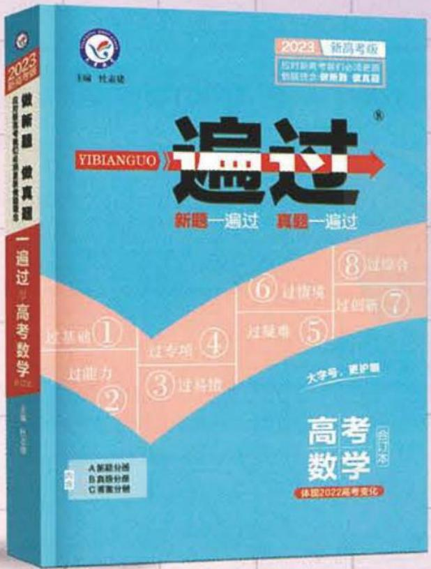

一年新题，分层分类
历年真题，反复训练

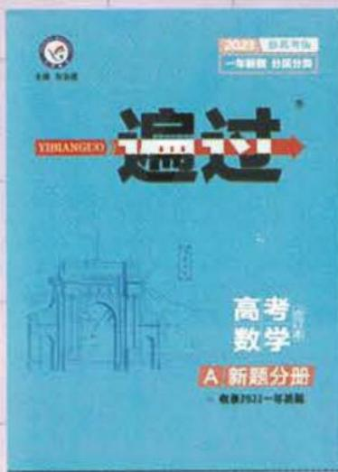

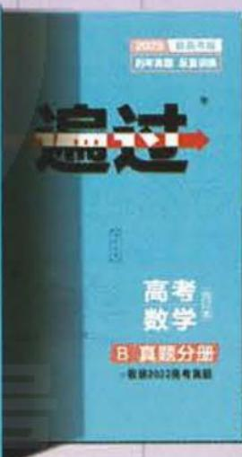

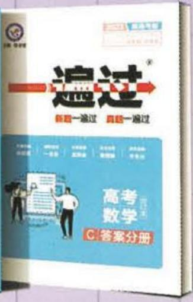

一书含三册

6月25日 全新上市！

# 基础过关题型

# 第一章 集合与常用逻辑用语

# 第一节 集合

# 题型1 判断元素与集合的关系

##### 1. AC 根据元素与集合的关系可知, A, C 正确.  
##### 2. A 由题意知 $M = \{2,4,5\}$ , 故选 A.  
##### 3. D 若 $(2,1)\in A$ ，则 $\left\{\begin{aligned}&2a+1>4,\\ &2-a\leqslant2,\end{aligned}\right.$ 解得 $a>\frac{3}{2}$ ，所以当 $a>\frac{3}{2}$ 时， $(2,1)\in A$ ，当 $a\leqslant\frac{3}{2}$ 时， $(2,1)\notin A$ ，故选D.  
##### 4. D 由 $45 = \sqrt{2025} > \sqrt{2022}$ , 知 $a \notin P, D$ 正确.

# 题型2 求集合中元素的个数

##### 1. B 由已知可知 $A \cap B = \{2, 3\}$ , 所以 $A \cap B$ 中元素的个数为 2, 故选 B.  
##### 2. C 由题意得, $A \cap B = \{(1,7),(2,6),(3,5),(4,4)\}$ ，所以 $A \cap B$ 中元素的个数为4，故选C.

##### 3. A 根据集合 A 的元素特征及圆的方程在坐标系中作出图形, 如图, 易知在圆 $x^{2} + y^{2} = 3$ 内有 9 个整点, 即集合 A 中的元素个数为 9.

##### 4. D 由 $B = \{(x, y) \mid x \in A, y \in A, x - y \in A\}$ ，可分以下 5 类进行讨论：

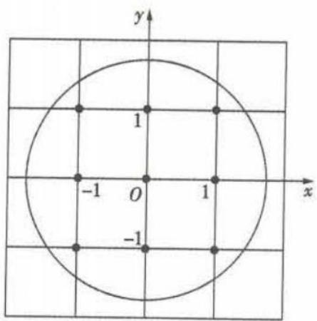

①当 x-y=0 时， $(x,y)$ 可为 $(0,$   
0), (1,1), (2,2), (3,3), (4,4), 共 5 个;   
②当 x-y=1 时， $(x,y)$ 可为 $(2,1)$ ， $(3,2)$ ， $(4,3)$ ， $(1,0)$ ，共 4 个；  
③当 x-y=2 时， $(x,y)$ 可为 $(3,1)$ ， $(4,2)$ ， $(2,0)$ ，共 3 个；  
④当x-y=3时， $(x,y)$ 可为 $(4,1)$ ， $(3,0)$ ，共2个；  
⑤当x-y=4时， $(x,y)$ 可为(4,0)，共1个.

综上可得，B 中所含元素的个数是 15.

##### 5. C ∵ 集合 $A = \{(x, y) | y = x\}$ , $B = \{(x, y) | y = x^{2}\}$ , ∴ $A \cap B = \{(x, y) | y = x \text{ 且 } y = x^{2}\} = \{(1, 1), (0, 0)\}$ . ∴ 集合 $A \cap B$ 中元素的个数为 2. 故选 C.

# 题型3 已知元素与集合的关系求参数

##### 1. C 因为 $A \cap B = \{1\}$ ，所以 $1 \in B$ ，所以 1 是方程 $x^{2} - 4x + m = 0$ 的根，所以 $1 - 4 + m = 0$ ，得 m = 3。由 $x^{2} - 4x + 3 = 0$ ，解得 x = 1 或 x = 3，所以 $B = \{1, 3\}$ 。  
##### 2. B $\because B=\{2,3,a,b\},A\cap B=\{3,4\},\therefore4\in B.$ 若 a=4，由集合中元素互异性知， $b\neq4,\therefore a+b\neq8;$ 若 b=4，同理可知， $a\neq4,\therefore a+b\neq8.$ 综上， $a+b\neq8.$   
##### 3.1 或 4 因为 $A = \{0, m, m^2 - 5m + 6\}, 2 \in A$ ，所以 $m = 2$ 或 $m^2 - 5m + 6 = 2$ 。当 $m = 2$ 时， $m^2 - 5m + 6 = 0$ ，不满足元素互异性，所以 $m = 2$ 不符合题意；当 $m^2 - 5m + 6 = 2$ 时， $m = 1$ 或 $m = 4$ ，若 $m = 1$ ， $A = \{0, 1, 2\}$ 符合题意，若 $m = 4$ ， $A = \{0, 4, 2\}$ 符合题意。所以实数 $m$ 的值为 1 或 4。

# 题型 4 判断集合间的关系

##### 1. B ①错误, 正确的为 $\{a\} \subseteq \{a, b, c\}$ ; ②错误, 正确的为 $\{x \mid x \text{ 是}$ 正方形 $\} \subsetneq \{x|x$ 是四边形\};③④⑤正确.

##### 2. D 由真子集的概念知 $B \subsetneq A$ ，故选 D.  
##### 3. C 解法一 在集合 T 中, 令 $n = k (k \in \mathbb{Z})$ , 则 $t = 4n + 1 = 2(2k) + 1 (k \in \mathbb{Z})$ , 而集合 S 中, $s = 2n + 1 (n \in \mathbb{Z})$ , 所以必有 $T \subsetneq S$ , 所以 $T \cap S = T$ , 故选 C.

解法二 $S=\{\cdots,-3,-1,1,3,5,\cdots\},T=\{\cdots,-3,1,5,\cdots\}$ ，观察可知， $T\subsetneq S$ ，所以 $T\cap S=T$ ，故选 C.

##### 4. D 因为 $y = |x| + 1 \geqslant 1$ ，所以集合 $A = \{y \mid y \geqslant 1\}$ 。因为 $A \cap B = B$ ，所以 $B \subseteq A$ ，显然选项 A, B, C 均满足题意，D 不满足题意，故选 D。  
##### 5. D 解法一 因为 $(\complement_{U}N)\subseteq(\complement_{U}M)$ ，所以 $M\subseteq N$ ，所以 $\forall x\in M$ ，都有 $x\in N$ ，所以 $\forall x\in M,x\notin\complement_{U}N$ ，故选 D.

解法二 取 $U = \{1,2,3,4\}, \complement_U N = \{1\}, \complement_U M = \{1,2\}$ , 则 $N = \{2,3,4\}, M = \{3,4\}$ , 可排除 A, B, C, 选 D.

# 题型 5 求集合的子集个数

##### 1.3 解法一 集合 $\{a,b\}$ 的真子集为 $\varnothing,\{a\},\{b\}$ ，有3个.

解法二 集合 $\{a, b\}$ 有 2 个元素，则集合 $\{a, b\}$ 的真子集的个数为 $2^{2} - 1 = 3$ .

##### 2. D 由已知可得 $A = \{1,2\}, B = \{1,2,3,4\}$ . 满足条件 $A \subseteq C \subseteq B$ 的集合 $C$ 为 $\{1,2\}, \{1,2,3\}, \{1,2,4\}, \{1,2,3,4\}$ , 共 4 个.  
##### 3. D $A = \{x \in N | -1 < x < 2\} = \{0, 1\}$ , $B = \{y \mid y = 2^{x}, x \in A\} = \{1, 2\}$ , 所以 $A \cup B = \{0, 1, 2\}$ , 所以 $A \cup B$ 的子集的个数是 $2^{3} = 8$ .

# 题型 6 根据集合间的关系求参数的值（或范围）

##### 1. （1） 1 $\because P = Q, \therefore \left\{ \begin{array}{l} a = -1, \\ -b = 2, \end{array} \right.\therefore a - b = -1 - (-2) = 1.$

（2） $[3,+\infty)$ 将集合A,B表示在同一数轴上,如图所示,
要使 $B\subseteq A$ ,由图易知 $a\geqslant3,\therefore$ 实数a的取值范围是 $[3,+\infty)$ .

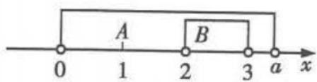

##### 2.201 可分下列三种情形:（1）若只有①正确,则 $a\neq2,b\neq2,c=0$ ,可推出a=b=1,与集合中元素的互异性相矛盾,(含有字母的集合,在求出字母的值后,要检验集合中元素是否满足互异性)所以只有①正确是不可能的;（2）若只有②正确,则b=2,a=2,c=0,与集合中元素的互异性相矛盾,所以只有②正确是不可能的;（3）若只有③正确,则 $c\neq0,a=2,b\neq2$ ,可推出b=0,c=1,满足集合中元素的互异性.所以 $100a+10b+c=100\times2+10\times0+1=201$ .

##### 3.（1）( $-\infty,3$ ] 因为 $B \subseteq A$ , 所以分以下两种情况:

①若 $B = \varnothing$ ，则 $2m - 1 < m + 1$ ，此时 m < 2；

②若 $B \neq \varnothing$ ，则 $\left\{\begin{aligned}2m-1 &\geqslant m+1,\\ m+1 &\geqslant -2,\\ 2m-1 &\leqslant 5.\end{aligned}\right.$ 解得 $2 \leqslant m \leqslant 3$ .

由①②可得,符合题意的实数 m 的取值范围为 $(-∞.3]$ .

（2） $(-∞,2)∪(4,+∞)$ 因为 $B⊆A$ ，所以分以下两种情况：

①若 $B = \varnothing$ ，则 $2m - 1 < m + 1$ ，此时 m < 2；  
②若 $B \neq \varnothing$ ，则 $\left\{\begin{aligned}m+1 &\leqslant2m-1,\\ m+1 &>5\end{aligned}\right.$ 或 $\left\{\begin{aligned}m+1 &\leqslant2m-1,\\ 2m &-1<-2,\end{aligned}\right.$ 解得 m > 4.

综上可知,实数 m 的取值范围为 $(-∞,2)∪(4,+∞)$ .

### 题型 7 集合的交、并、补运算

##### 1. 2,4 6 $\because \complement_U A = \{1,3,6,7\}, \complement_U B = \{2,4,6\}, \therefore A \cap (\complement_U B) = \{2,4,5\} \cap \{2,4,6\} = \{2,4\}, (\complement_U A) \cap (\complement_U B) = \{1,3,6,7\} \cap \{2,4,6\} = \{6\}$ .

##### 2. $x|1 \geqslant 2$ $\because x|3 \leqslant 1 < 4$ $\because A = \{x | 2 \leqslant x < 4\}, B = \{x | 3x - 7 \geqslant 8 - 2x\} = \{x | x \geqslant 3\}, \therefore A \cup B = \{x | 2 \leqslant x < 4\} \cup \{x | x \geqslant 3\} = \{x | x \geqslant 2\}, A \cap B = \{x | 2 \leqslant x < 4\} \cap \{x | x \geqslant 3\} = \{x | 3 \leqslant x < 4\}$ .

##### 3. D 因为 $M = \{x \mid \sqrt{x} < 4\}$ ，所以 $M = \{x \mid 0 \leqslant x < 16\}$ ；因为 $N = \{x \mid 3x \geqslant 1\}$ ，所以 $N = \{x \mid x \geqslant \frac{1}{3}\}$ 。所以 $M \cap N = \{x \mid \frac{1}{3} \leqslant x < 16\}$ ，故选 D。

##### 4. D 集合 $B = \{1, 3\}$ ，所以 $A \cup B = \{-1, 1, 2, 3\}$ ，所以 $\complement_{U}(A \cup B) = \{-2, 0\}$ 。故选 D.

##### 5. B 因为 $P = \{2, 3, 4\}$ , $Q = \{x \mid x^{2} - x - 6 \leqslant 0\} = \{x \mid -2 \leqslant x \leqslant 3\}$ , 所以 $P \cap Q = \{2, 3\}$ , 故选 B.

##### 6. C 因为 $M = \{4, 6, 8\}$ , $N = \{8, 10\}$ ，所以 $M \cup N = \{4, 6, 8, 10\}$ ，又全集 $U = \{2, 4, 6, 8, 10, 12\}$ ，所以 $\{2, 12\} = \complement_{U}(M \cup N)$ ，故选 C.

##### 7. A 由已知, 得 $A = \{x \mid 1 < x < 3\}$ , $B = \{x \mid x > \ln 3\}$ . 由题意可知, 阴影部分表示的集合为 $A \cap (\complement_U B)$ , 又 $A \cap (\complement_U B) = \{x \mid 1 < x \leqslant \ln 3\}$ , 故选 A.

### 题型8 已知集合的运算结果求参数的值（或范围）

##### 1.2 $\because A\cup B = A,\therefore B\subseteq A,\therefore a + 2 = 3$ 或 $a + 2 = a^2$

当 $a+2=3$ ，即 a=1 时，不满足元素的互异性。

当 $a+2=a^{2}$ ，即 a=-1 或 a=2 时，若 a=-1，则不满足元素的互异性；

若 a=2，则 $A=\{1,3,4\}$ ， $B=\{1,4\}$ ，符合题意。综上，a=2。

##### 2. B 易知 $A = \{x \mid -2 \leqslant x \leqslant 2\}$ , $B = \{x \mid x \leqslant -\frac{a}{2}\}$ , 因为 $A \cap B = \{x \mid -2 \leqslant x \leqslant 1\}$ , 所以 $-\frac{a}{2} = 1$ , 解得 $a = -2$ . 故选 B.

##### 3. C 集合 $A = \{x \mid 1 < x < 3\}$ , $A \cap B = \{x \mid 2 < x < 3\}$ ,

由一元二次方程与一元二次不等式之间的关系知,2是方程 $x^{2}-x-a=0$ 的解,则a=4-2=2.当a=2时, $B=\{x|x<-1\text{或}x>2\}$ ,满足 $A\cap B=\{x|2<x<3\}$ ,故选C.

##### 4. B 如图, 在数轴上表示出集合 A, B,

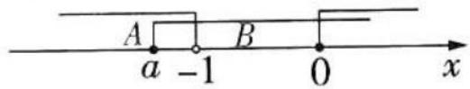

若 $A \cup B = \mathbf{R}$ , 则由图易知 $a \leqslant -1$ , 所以实数 $a$ 的取值范围是 $(- \infty, -1]$ , 故选 B.

### 题型9 有交叉的计数问题

##### 1.17 两次运动会中,共有 $8 + 12 - 3 = 17$ (名) 同学参赛.

##### 2. C 假设学生总数是100,则喜欢足球的有60人,喜欢游泳的有82人,喜欢足球或游泳的有96人,则既喜欢足球又喜欢游泳的有 $60+82-96=46$ (人),所以该中学既喜欢足球又喜欢游泳的学生数占该校学生总数的比例为46%.故选C.

##### 3. C 由题意得,阅读过《西游记》的学生人数为 $90 - 80 + 60 = 70$ , 则该校阅读过《西游记》的学生人数与该校学生总数比值的估计值为 $70 \div 100 = 0.7$ . 故选 C.

##### 4.8 解法一 设参加数学、物理、化学课外探究小组的人员构成的集合分别为 A, B, C，则 $\text{card}(A \cup B \cup C) = 36, A \cap B \cap C = \varnothing, \text{card}(A) = 26, \text{card}(B) = 15, \text{card}(C) = 13, \text{card}(A \cap B) = 6, \text{card}(B \cap C) = 4.$ 由 $\text{card}(A \cup B \cup C) = \text{card}(A) + \text{card}(B) +$

card(C) - card(A∩B) - card(A∩C) - card(B∩C) + card(A∩B∩C) 得 card(A∩C) = 8.

解法二 设参加数学、物理、化学课外探究小组的人员构成的集合分别为 A, B, C, 同时参加数学和化学小组的有 x 人, 结合题意, 画出 Venn 图, 如图所示, 则 $(26 - 6 - x) + 6 + (15 - 4 - 6) + 4 + (13 - 4 - x) + x = 36$ ,

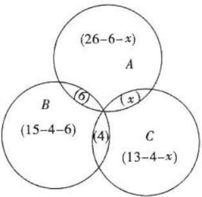

解得 x = 8.

即同时参加数学和化学小组的有 8 人.

### 题型 10 集合的新定义问题

##### 1. C 因为集合 $A = \{(x, y) | x^2 + y^2 \leqslant 1, x, y \in \mathbf{Z}\}$ , 所以集合 $A$ 中有 5 个元素 (即 5 个点), 即图中圆内及圆上的整点. 集合 $B = \{(x, y) | |x| \leqslant 2, |y| \leqslant 2, x, y \in \mathbf{Z}\}$ 中有 25 个元素 (即 25 个点), 即图中正方形 $ABCD$ 内及正方形 $ABCD$ 上的整点. 集合 $A \oplus B = \{(x_1 + x_2, y_1 +$ $y_{2})|(x_{1},y_{1})\in A,(x_{2},y_{2})\in B$ 中的元素可看作图中正方形 $A_{1}B_{1}C_{1}D_{1}$ 内及正方形 $A_{1}B_{1}C_{1}D_{1}$ 上除去四个顶点外的整点，共 $7\times7-4=45$ （个）.

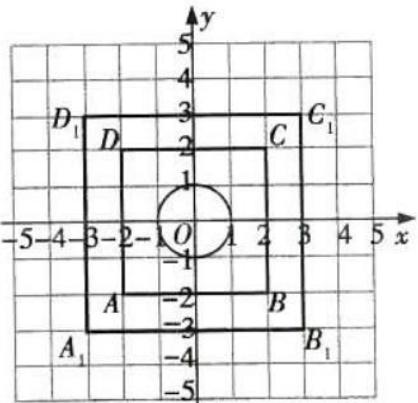

##### 2. +1.2 由题意, 可知集合 $A = \{x \mid -t < x < t\}$ , 集合 $B = \{x \mid -1 < x < 2\}$ ,

因为集合 A, B 构成“偏食”，

所以 $\left\{\begin{aligned}t&>0,\\ -t&<-1<t<2\end{aligned}\right.$ 或 $\left\{\begin{aligned}t&>0,\\ -1&<-t<2<t,\end{aligned}\right.$ 解得1<t<2.

所以实数 t 的取值范围为 $(1,2)$ .

# 第二节 常用逻辑用语

### 题型 11 四种命题及其真假判断(新高考下要求)

##### 1. D 由原命题和逆否命题的关系可知 D 正确.

##### 2. $f(x) = \sin x$ 答案不唯一 这是一道开放性试题, 答案不唯一, 只要满足 $f(x) > f(0)$ 对任意的 $x \in (0, 2]$ 都成立, 且函数 $f(x)$ 在 $[0, 2]$ 上不是增函数即可. 如 $f(x) = \sin x$ , 答案不唯一.

##### 3. D 对于 A, “若 $a \leqslant b$ , 则 a < b” 的否命题为 “若 a > b, 则 $a \geqslant b$ ”, 易知此命题为真命题.

对于 B, 当 a=1 时, $ax^{2}-x+3=x^{2}-x+3\geqslant0$ 恒成立, 即原命题为真命题, 所以其逆否命题也为真命题.

对于 C, “周长相等的圆的面积相等”的逆命题为“面积相等的圆的周长相等”, 易知此命题为真命题.

对于 D, 当 x=0 时, $\sqrt{2}x=0$ 为有理数, 此时 x 为有理数, 则原命题为假命题, 所以其逆否命题也为假命题. 综上选 D.

##### 4. 原命题的否命题与原命题的逆命题互为逆否命题，真假相同。由已知可得“若 $1 < x < 3$ ，则 $2m - 1 < x < 3m + 2$ ”为真命题，所以 $\left\{ \begin{array}{l} 2m - 1 \leqslant 1, \\ 3m + 2 \geqslant 3, \end{array} \right.$ 解得 $\frac{1}{3} \leqslant m \leqslant 1$ ，即 $m$ 的取值范围是 $[\frac{1}{3}, 1]$

### 题型 12 充分条件与必要条件的判断

##### 1. A 点 P 到圆心 O 的距离大于圆的半径是点 P 在圆 O 外的充要条件, A 正确; 两个三角形的面积相等是这两个三角形全等的必要不充分条件, B 错误; $A \cup B = A$ 是 $B \subseteq A$ 的充要条件, C 错误; x 或 y 为有理数是 xy 为有理数的既不充分也不必要条件, D 错误. 故选 A.

##### 2. A 由 $\sin x = 1$ ，得 $x = 2k\pi + \frac{\pi}{2} (k \in \mathbf{Z})$ ，则 $\cos (2k\pi + \frac{\pi}{2}) =$

$\cos \frac{\pi}{2} = 0$ ，故充分性成立；又由 $\cos x = 0$ ，得 $x = k\pi +\frac{\pi}{2} (k\in \mathbf{Z})$ 而 $\sin (k\pi +\frac{\pi}{2}) = 1$ 或-1，故必要性不成立.所以“ $\sin x = 1$ ”是“cos $x = 0$ ”的充分不必要条件，故选A.

##### 3. C 设无穷等差数列 $\{a_{n}\}$ 的公差为 $d(d \neq 0)$ ，则 $a_{n} = a_{1} + (n - 1)d = dn + a_{1} - d$ ，若 $\{a_{n}\}$ 为递增数列，则 d > 0，则存在正整数 $N_{0}$ ，使得当 $n > N_{0}$ 时， $a_{n} = dn + a_{1} - d > 0$ ，所以充分性成立；若存在正整数 $N_{0}$ ，使得当 $n > N_{0}$ 时， $a_{n} = dn + a_{1} - d > 0$ ，即 $d > \frac{d - a_{1}}{n}$ 对任意的 $n > N_{0}, n \in N^{*}$ 均成立，由于 $n \to +\infty$ 时， $\frac{d - a_{1}}{n} \to 0$ ，且 $d \neq 0$ ，所以 d > 0， $\{a_{n}\}$ 为递增数列，必要性成立。故选 C.

##### 4. B 由 $a \cdot c = b \cdot c$ 可得 $(a - b) \cdot c = 0$ , 所以 $(a - b) \perp c$ 或 $a = b$ ; 由 $a = b$ 可得 $a \cdot c = b \cdot c$ . 所以“ $a \cdot c = b \cdot c$ ”是“ $a = b$ ”的必要不充分条件. 故选 B.  
##### 5. B 当 $a_{1}<0, q>1$ 时， $a_{n}=a_{1}q^{n-1}<0$ ，此时数列 $\{S_{n}\}$ 递减，所以甲不是乙的充分条件.

当数列 $\{S_{n}\}$ 递增时，有 $S_{n + 1} - S_n = a_{n + 1} = a_1q^n >0.$ 若 $a_1 > 0$ ，则 $q^n >0$ （ $n\in \mathbf{N}^*$ ），即 $q > 0$ ；若 $a_1 < 0$ ，则 $q^n < 0 (n\in \mathbf{N}^*)$ ，不存在 $q$ 使此不等式恒成立.故 $q > 0$

所以甲是乙的必要条件但不是充分条件.

##### 6. A 若 $f(x)$ 是偶函数，则 $f(-x)=f(x)$ ， $|f(-x)|=|f(x)|$ ，所以 $|f(x)|$ 是偶函数；若 $|f(x)|$ 是偶函数，如 $|f(x)|=|\sin x|$ 是偶函数，而 $y=\sin x$ 为奇函数。所以“ $f(x)$ 是偶函数”是“ $|f(x)|$ 是偶函数”的充分不必要条件，故选 A.  
##### 7. C 由 $|x - a| < 1$ ，解得 $a - 1 < x < a + 1$ ，即 $p: a - 1 < x < a + 1$ . 由 $\frac{1}{x - 2} \geqslant 1$ ，解得 $2 < x \leqslant 3$ ，即 $q: 2 < x \leqslant 3$ . 因为 $p$ 是 $q$ 的必要不充分条件，所以 $\left\{ \begin{array}{l} a - 1 \leqslant 2, \\ a + 1 > 3, \end{array} \right.$ 解得 $2 < a \leqslant 3$ .

### 题型 13 含逻辑联结词的命题的真假判断(新高考不要求)

##### 1. A 由正弦函数的性质可知, $\exists x \in \mathbf{R}$ , 使得 $\sin x < 1$ , 所以命题 $p$ 为真命题. $\forall x \in \mathbf{R}$ , 均有 $\mathrm{e}^{|x|} \geqslant \mathrm{e}^{0} = 1$ 成立, 故命题 $q$ 为真命题, 所以命题 $p \wedge q$ 为真命题, 故选 A.  
##### 2. A 对于命题 p，易知 $\forall x \in R, x^{2} + x + 1 = (x + \frac{1}{2})^{2} + \frac{3}{4} > 0$ 恒成立，故命题 p 是真命题.

对于命题 $q, \frac{1}{a} - \frac{1}{b} = \frac{b - a}{ab}$ , 当 $a > b$ 时, $b - a < 0$ , 但 $ab$ 的符号不确定, 所以 $\frac{b - a}{ab}$ 的符号不能确定, 所以 $\frac{1}{a} < \frac{1}{b}$ 不一定成立, 故命题 $q$ 是假命题. 所以 $p \vee q$ 为真, $p \wedge q$ 为假, $(\neg p) \vee q$ 为假, $(\neg p) \wedge (\neg q)$ 为假, 故选 A.

##### 3. B 若指数函数 $f(x) = (a - \frac{2}{3})^x$ 在 $\mathbf{R}$ 上单调递减, 则 $0 < a - \frac{2}{3} < 1$ , 解得 $\frac{2}{3} < a < \frac{5}{3}$ .

若 $\log_a(a^2 + 1) < \log_a(2a) < 0$ ，则 $\left\{ \begin{array}{l} 0 < a < 1, \\ a^2 + 1 > 2a, \\ 2a > 1, \end{array} \right.$ 解得 $\frac{1}{2} < a < 1$ .

因为 $p \vee q$ 为真命题, 所以命题 p, q 中至少有一个为真命题.

若 p, q 都是真命题, 则 $\frac{2}{3} < a < 1$ ;

若 $p$ 是真命题， $q$ 是假命题，则 $1 \leqslant a < \frac{5}{3}$ ；

若 p 是假命题, q 是真命题, 则 $\frac{1}{2} < a \leqslant \frac{2}{3}$ .

综上,实数 a 的取值范围是 $\left(\frac{1}{2},\frac{5}{3}\right)$ . (也可用补集思想求解)

# 题型 14 全（特）称命题的否定

##### 1. （1） $\forall m \in \mathbf{N}, \sqrt{m^2 + 1} \notin \mathbf{N}$ .

（2） 存在一个平行四边形, 它的对角线不互相平分.  
（3） 所有三角形都不是直角三角形.  
（4） 存在一个奇数的平方不是奇数.

##### 2. C 命题 p 是一个特称命题, 其否定是全称命题, 改量词, 否结论, 故选 C.  
##### 3. C 根据全称命题的否定是特称命题, 知命题“ $\forall x \in R, x + |x| \geqslant 0$ ”的否定为“ $\exists x \in R, x + |x| < 0$ ”, 故选 C.   
##### 4. $\exists x \in \mathbb{R}, \ln x$ 无意义或 $\ln x \leqslant 0$ “ $\ln x > 0$ ”即“ $\ln x$ 有意义且 $\ln x > 0$ ”，所以“ $\ln x > 0$ ”的否定应为“ $\ln x$ 无意义或 $\ln x \leqslant 0$ ”.

# 题型 15 已知全（特）称命题的真假求参数的取值范围

##### 1.1 由已知可得 $m \geqslant \tan x (x \in [0, \frac{\pi}{4}])$ 恒成立. 设 $f(x) = \tan x (x \in [0, \frac{\pi}{4}])$ , 显然该函数为增函数, 故 $f(x)$ 的最大值为 $f(\frac{\pi}{4}) = \tan \frac{\pi}{4} = 1$ , 由不等式恒成立可得 $m \geqslant 1$ , 即实数 $m$ 的最小值为 1.  
##### 2. B 由 p 是假命题, 得命题 p 的否定: $\forall x \in R, ax^{2} - 4x + 2 \geqslant 0$ 是真命题, 所以 $\left\{\begin{aligned} a &>0, \\ (-4)^{2} &-4a \times 2 \leqslant 0, \end{aligned}\right.$ 解得 $a \geqslant 2$ , 所以实数 a 的取值范围是 $[2, +\infty)$ .  
##### 3. $(-4,-2)$ 由 $g(x)=2^{x}-2$ ，得当 x<1 时， $g(x)<0$ .

对于条件①, 易得 $f(x)=m(x-2m)(x+m+3)<0$ 在 $x\geqslant1$ 时恒成立, 易知 $m\neq0$ , 由二次函数的性质知 $\left\{\begin{aligned}m<0,\\ -m-3<1,\\ 2m<1,\end{aligned}\right.$ 解得 -4<m<0.

对于条件②, $x\in(-\infty,-4)$ 时, $g(x)<0$ 恒成立,所以 $f(x)=m(x-2m)(x+m+3)>0$ 在 $(-∞,-4)$ 上有解,

由 $m < 0$ 知只要-4比 $2m, -m - 3$ 中的较小者大即可，当 $-1 < m < 0$ 时， $-m - 3 < 2m$ ，此时 $-m - 3 > -4$ ，不符合；

当 m = -1 时, 2m = -m - 3 = -2 > -4, 不符合;

当 $-4 < m < -1$ 时， $2m < -m - 3$ ，由 $2m < -4$ ，得 $m < -2$ ，即 $-4 < m < -2$ .

综上可知， $m$ 的取值范围是 $(-4, - 2)$

# 第二章 函数与基本初等函数 I

# 第一节 函数及其表示

# 题型 16 求函数的定义域

##### 1. C A 中函数为一次函数, B 中函数为二次函数, D 中函数为正比例函数, 定义域都为 R; C 中函数为反比例函数, 定义域是

$\{x|x\neq0\}$ ，不是R.

##### 2. $(-∞,0)∪(0,1]$ 因为 $f(x)=\frac{1}{x}+\sqrt{1-x}$ ，所以 $x≠0,1-x≥0$ ，解得 $x∈(-∞,0)∪(0,1]$ .

##### 3. $[-1,7]$ 要使函数有意义,则 $7+6x-x^{2}\geqslant0$ ,解得 $-1\leqslant x\leqslant7$ ,则函数的定义域是 $[-1,7]$ .

##### 4. C 因为 $f(x^{2}+1)$ 的定义域为 $[-1,1]$ ，所以 $-1 \leqslant x \leqslant 1$ ，所以 $1 \leqslant x^{2} + 1 \leqslant 2$ . 因为 $f(x^{2}+1)$ 与 $f(\lg x)$ 是同一个对应关系，所以 $1 \leqslant \lg x \leqslant 2$ ，即 $10 \leqslant x \leqslant 100$ ，所以函数 $f(\lg x)$ 的定义域为 $[10,100]$ . 故选 C.

### 题型 17 求函数的值域（最值）

##### 1.（1）(分离常数法) $y=\frac{2x+1}{x-3}=\frac{2(x-3)+7}{x-3}=2+\frac{7}{x-3}$ ,

显然 $\frac{7}{x-3}\neq0$ ,所以 $y\neq2$ .

故函数的值域为 $(-∞,2)∪(2,+∞)$ .

（2）(换元法) 设 $t = \sqrt{x - 1}$ ，则 $x = t^{2} + 1$ ，且 $t \geqslant 0$ ，

所以 $y=2(t^{2}+1)-t=2(t-\frac{1}{4})^{2}+\frac{15}{8}$ ，由 $t\geqslant0$ ，可得函数的值域为 $\left[\frac{15}{8},+\infty\right)$ .

##### 2.0（答案不唯一） 1 当 $a = 0$ 时，函数 $f(x) = \left\{ \begin{array}{l} 1, x < 0, \\ (x - 2)^2, x \geqslant 0, \end{array} \right.$ 存在最小值 0，所以 $a$ 的一个取值可以为 0；当 $a < 0$ 时，若 $x < a, f(x) = -ax + 1$ ，此时函数 $f(x)$ 不可能存在最小值；当 $0 < a \leqslant 2$ 时，若 $x < a$ ，则 $f(x) = -ax + 1$ ，此时 $f(x) \in (-a^2 + 1, +\infty)$ ，若 $x \geqslant a$ ，则 $f(x) = (x - 2)^2 \in [0, +\infty)$ ，若函数 $f(x)$ 存在最小值，则 $-a^2 + 1 \geqslant 0$ ，得 $0 < a \leqslant 1$ ；当 $a > 2$ 时，若 $x < a$ ，则 $f(x) = -ax + 1$ ，此时 $f(x) \in (-a^2 + 1, +\infty)$ ，若 $x \geqslant a$ ，则 $f(x) = (x - 2)^2 \in [(a - 2)^2, +\infty)$ ，若函数 $f(x)$ 存在最小值，则 $-a^2 + 1 \geqslant (a - 2)^2$ ，此时不等式无解。综上， $0 \leqslant a \leqslant 1$ ，所以 $a$ 的最大值为 1。

##### 3. C $\because x^{2}+3x+2\geqslant0,\therefore y=\sqrt{x^{2}+3x+2}\geqslant0$ ，故其值域为 $[0,+\infty)$ ，∴ A 不符合； $\because y=x^{2}+x+\frac{1}{2}=(x+\frac{1}{2})^{2}+\frac{1}{4}\geqslant\frac{1}{4}$ ，∴ 函数的值域为 $\left[\frac{1}{4},+\infty\right)$ ，∴ B 不符合； $\because y=\frac{1}{|x|}>0$ ，∴ 函数的值域为 $(0,+\infty)$ ，∴ C 符合； $\because y=2x+1\in R$ ，∴ D 不符合。故选 C.

##### 4. BC 对于 A, 当 $x \in (0,1)$ 时, $\ln x < 0$ , 此时 $\ln x + \frac{9}{\ln x} < 0$ , 故 A 不符合题意;

对于 B, 因为 $\left|\sin x\right| \in (0,1]$ ，所以 $6\left|\sin x\right| + \frac{3}{2\left|\sin x\right|} \geqslant 2\sqrt{9} = 6$ ，当且仅当 $6\left|\sin x\right| = \frac{3}{2\left|\sin x\right|}$ ，即 $\left|\sin x\right| = \frac{1}{2}$ 时取等号，故 B 符合题意；

对于 C, 因为 $3^{x} > 0$ , 所以 $y = 3^{x} + 3^{2-x} = 3^{x} + \frac{3^{2}}{3^{x}} \geqslant 2\sqrt{3^{2}} = 6$ , 当且仅当 $3^{x} = 3^{2-x}$ , 即 x = 1 时取等号, 故 C 符合题意;

对于 D, 因为 $\sqrt{x^{2}+16}\geqslant4$ , 所以 $y=\frac{x^{2}+25}{\sqrt{x^{2}+16}}=\frac{x^{2}+16+9}{\sqrt{x^{2}+16}}=$ $\sqrt{x^{2}+16}+\frac{9}{\sqrt{x^{2}+16}}\geqslant2\sqrt{9}=6$ , 当且仅当 $\sqrt{x^{2}+16}=\frac{9}{\sqrt{x^{2}+16}}$ , 即 $x^{2}=-7$ 时取等号, 无解, 故 D 不符合题意.

综上所述,选 BC.（知识回顾：基本不等式的使用，要求“一正二定三相等”）

### 题型 18 求函数的解析式

##### 1. $f(x) = 2x + 2$ 或 $f(x) = -2x - 6 - 2$ 设 $f(x) = ax + b (a \neq 0)$ ，则 $f(f(x)) = f(ax + b) = a(ax + b) + b = a^2 x + ab + b = 4x + 6$ ，于是有

$\left\{ \begin{array}{l}a^{2} = 4,\\ ab + b = 6, \end{array} \right.$ 解得 $\left\{ \begin{array}{l}a = 2,\\ b = 2 \end{array} \right.$ 或 $\left\{ \begin{array}{l}a = -2,\\ b = -6, \end{array} \right.$ 所以 $f(x) = 2x + 2$ 或 $f(x) =$ $-2x - 6$ ，则 $f(-2) = -2.$

##### 2.-2 由题意得 $4 = -a + 2, \therefore a = -2$ .

##### 3. D 由 $f(x+1)=3f(x)$ ，得 $f(x)=\frac{1}{3}f(x+1)$ .

当 $x \in (-1,0]$ 时， $x + 1 \in (0,1], f(x) = \frac{1}{3} \times 4(x + 1) \times x = \frac{4}{3}(x + \frac{1}{2})^2 - \frac{1}{3}$ ，所以此时 $f(x)_{\min} = f(-\frac{1}{2}) = -\frac{1}{3}$ ；当 $x \in (-2, -1]$ 时， $x + 1 \in (-1,0], f(x) = \frac{1}{3} \times \frac{1}{3} \times 4(x + 2)(x + 1) = \frac{4}{9}(x + \frac{3}{2})^2 - \frac{1}{9}$ ，所以此时 $f(x)_{\min} = f(-\frac{3}{2}) = -\frac{1}{9}$ .（方法点拨：利用二次函数的性质求最值时，可先用配方法将函数解析式化为二次函数的顶点式，然后根据对称轴和单调性求出最值。但要特别注意自变量的取值范围）

综上所述, 当 $x \in (-2,0]$ 时, $f(x)$ 的最小值为 $-\frac{1}{3}$ , 故选 D.

##### 4. $f(x) = -\frac{x}{3} + \frac{2}{3x}$ 在已知等式中，将 $x$ 换成 $\frac{1}{x}$ ，得 $f(\frac{1}{x}) + 2f(x) = \frac{1}{x}$ ，与已知方程联立，得 $\left\{ \begin{array}{l} f(x) + 2f(\frac{1}{x}) = x, \\ f(\frac{1}{x}) + 2f(x) = \frac{1}{x}, \end{array} \right.$ 消去 $f(\frac{1}{x})$ ，得 $f(x) = -\frac{x}{3} + \frac{2}{3x}$ .

##### 5. $f(x) = x^{2} - 1 (x \geqslant 1)$ 解法一（换元法）令 $\sqrt{x} + 1 = t$ ，则 $x = (t - 1)^{2}, t \geqslant 1$

所以 $f(t) = (t - 1)^2 + 2(t - 1) = t^2 - 1 (t \geqslant 1)$ ，

所以函数 $f(x)$ 的解析式为 $f(x)=x^{2}-1(x\geqslant1)$ .

解法二(配凑法) $f(\sqrt{x} + 1) = x + 2\sqrt{x} = x + 2\sqrt{x} + 1 - 1 = (\sqrt{x} + 1)^{2} - 1.$

因为 $\sqrt{x}+1\geqslant1$ ，所以函数 $f(x)$ 的解析式为 $f(x)=x^{2}-1(x\geqslant1)$ .

### 题型 19 已知定义域（值域）求参数的值或范围

##### 1. $\frac{37}{28} 3 + \sqrt{3}$ 由题意知 $f\left(\frac{1}{2}\right) = -\left(\frac{1}{2}\right)^2 + 2 = \frac{7}{4}$ , 则 $f\left(f\left(\frac{1}{2}\right)\right) =$

$f \left(\frac {7}{4}\right) = \frac {7}{4} + \frac {1}{\frac {7}{4}} - 1 = \frac {7}{4} + \frac {4}{7} - 1 =$

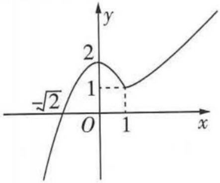

$\frac{37}{28}$ . 作出函数 $f(x)$ 的大致图象, 如图所示, 结合图象, 令 $-x^{2} + 2 = 1$ , 解得 $x = \pm 1$ ; 令 $x + \frac{1}{x} - 1 = 3$ , 解得 $x = 2 \pm \sqrt{3}$ , 又 $x > 1$ , 所以 $x = 2 + \sqrt{3}$ , 所以 $(b - a)_{\max} = 2 + \sqrt{3} - (-1) = 3 + \sqrt{3}$ .

##### 2.1 由题意得, $a-a^{x}\geqslant0$ ,即 $a^{x}\leqslant a.\because x\in[0,1],\therefore a>1,\therefore y=\sqrt{a-a^{x}}$ 在 $[0,1]$ 上单调递减,∴当x=0时, $y=\sqrt{a-a^{0}}=\sqrt{a-1}=1$ ,得 $a=2,\therefore\log_{a}2=1$ .

### 题型20 已知分段函数求值

##### 1. C $\because -2 < 0, \therefore f(-2) = -(-2) = 2,$

又 $2 > 0, \therefore f(f(-2)) = f(2) = 2^2 = 4$ . 故选 C.

##### 2. C 因为 $f(x)=\left\{\begin{aligned}\log_{2}(2-x),&x<1,\\ \mathrm{e}^{x},&x\geqslant1,\end{aligned}\right.$ 且 -2<1, $\ln4>1$ , 所以

$f(-2) = \log_24 = 2, f(\ln 4) = e^{\ln 4} = 4$ ，所以 $f(-2) + f(\ln 4) = 2+$

4 = 6. 故选 C.

##### 3. -2 根据 $f(x)$ 的表达式, 知 $f(f(2)) = f(2^{-2}) = f(\frac{1}{4}) = \log_{2}\frac{1}{4} = -2$ .

# 题型21 已知分段函数求参

##### 1.2 或 $\pm\frac{\sqrt{2}}{2}$ 当 a>1 时, $f(a)=1+\frac{1}{a}=\frac{3}{2},\therefore a=2>1$ ; 当 $-1\leqslant a\leqslant1$ 时, $f(a)=a^{2}+1=\frac{3}{2},\therefore a=\pm\frac{\sqrt{2}}{2}\in[-1,1]$ ; 当 a<-1 时, $f(a)=2a+3=\frac{3}{2},\therefore a=-\frac{3}{4}>-1,$ 舍去. 综上, a=2 或 $a=\pm\frac{\sqrt{2}}{2}$ .

##### 2. C 当 $0 < a < 1$ 时, $a + 1 > 1$ , $f(a) = \sqrt{a}$ , $f(a + 1) = 2(a + 1 - 1) = 2a$ , $\because f(a) = f(a + 1)$ , $\therefore \sqrt{a} = 2a$ , 解得 $a = \frac{1}{4}$ 或 $a = 0$ (舍去). $\therefore f(\frac{1}{a}) = f(4) = 2 \times (4 - 1) = 6$ .

当 $a \geqslant 1$ 时, $a + 1 \geqslant 2$ , $\therefore f(a) = 2(a - 1)$ , $f(a + 1) = 2(a + 1 - 1) = 2a$ , $\therefore 2(a - 1) = 2a$ , 无解. 综上, $f\left(\frac{1}{a}\right) = 6$ . 故选 C.

##### 3.2 因为 $\sqrt{6} > 2$ ，所以 $f(\sqrt{6}) = 6 - 4 = 2$ ，所以 $f(f(\sqrt{6})) = f(2) = 1 + a = 3$ ，解得 $a = 2$ .

##### 4. A 若 $m \geqslant 1$ ，则 $f(m) = 3^{m+1} - 1 = -2$ ，即 $3^{m+1} = -1$ ，无解，故 m < 1，所以 $f(m) = -\log_{3}(m+5) - 2 = -2$ ，解得 m = -4，所以 $f(6+m) = f(2) = 3^{3} - 1 = 26$ ，故选 A.

##### 5. B 作出 $f(x)$ 的大致图象如图所示，则 $f(x)$ 在 $(-∞,0)$ 上是增函数，在 $[0,+∞)$ 上是减函数。由于 $f(m)=f(2^{m})$ ，且对于任意的 $m∈R$ 都有 $m<2^{m}$ ，则m<0，

所以 $2^{m} = -8\cdot (2^{m})^{2} - 2^{m} + 1$ ，即 $8\cdot$ $(2^{m})^{2} + 2\cdot 2^{m} - 1 = 0$ ，解得 $2^{m} = \frac{1}{4}$ （负

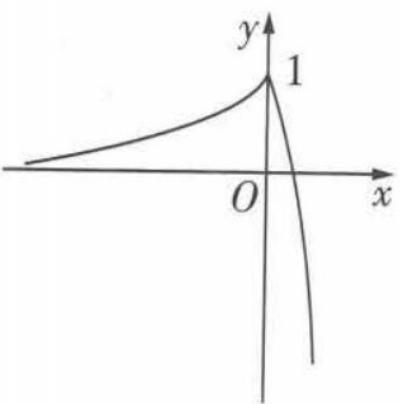

值已舍去），所以 $m = -2$ 则 $f(m + 1) = f(-1) = \frac{1}{2}$ 故选B.

# 题型22 已知分段函数解不等式

##### 1. $(-∞,-3)$ 当 $a≤-2$ 时, $f(a)=a<-3$ ,此时不等式的解集是 $(-∞,-3)$ ;

当 -2 < a < 4 时, $f(a) = a + 1 < -3$ , 此时无解;

当 $a \geqslant 4$ 时, $f(a) = 3a < -3$ , 此时无解.

故 a 的取值范围是 $(-∞, -3)$ .

##### 2. D 解法一 当 $x \leqslant 0$ 时, 函数 $f(x) = 2^{-x}$ 是减函数, 则 $f(x) \geqslant f(0) = 1$ . 作出 $f(x)$ 的大致图象如图所示, 结合图象可知, 要使 $f(x + 1) < f(2x)$ , 则需 $\left\{ \begin{array}{l} x + 1 < 0, \\ 2x < 0, \\ 2x < x + 1 \end{array} \right.$ 或 $\left\{ \begin{array}{l} x + 1 \geqslant 0, \\ 2x < 0, \end{array} \right.$ 所以 $x < 0$ , 故

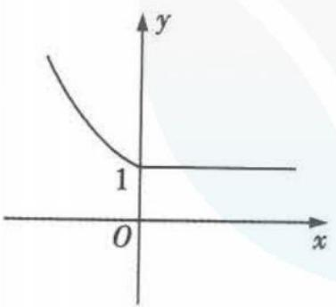

选D.

解法二 当 $x = -\frac{1}{2}$ 时， $f(x + 1) = f(\frac{1}{2}) = 1, f(2x) = f(-1) = 2^{-(-1)} = 2$ ，满足 $f(x + 1) < f(2x)$ ，排除 A, B；当 $x = -1$ 时， $f(x + 1) = f(0) = 2^{-0} = 1, f(2x) = f(-2) = 2^2 = 4$ ，满足 $f(x + 1) < f(2x)$ ，排除 C. 故选 D.

##### 3. (1,4) (1,3] $\cup (4, +\infty)$ 若 $\lambda = 2$ ，则当 $x \geqslant 2$ 时，令 $x - 4 < 0$ ，得 $2 \leqslant x < 4$ ；当 $x < 2$ 时，令 $x^2 - 4x + 3 < 0$ ，得 $1 < x < 2$ 。综上可知 $1 < x < 4$ ，所以不等式 $f(x) < 0$ 的解集为 (1,4)。令 $x - 4 = 0$ ，解得 $x = 4$ ；令 $x^2 - 4x + 3 = 0$ ，解得 $x = 1$ 或 $x = 3$ 。因为函数 $f(x)$ 恰有 2 个零点，结合函数的图象（图略）可知 $1 < \lambda \leqslant 3$ 或 $\lambda > 4$ 。

##### 4. $(- \frac{1}{4}, +\infty)$ 当 $x \leqslant 0$ 时, $f(x) + f(x - \frac{1}{2}) = x + 1 + x - \frac{1}{2} + 1 = 2x + \frac{3}{2} > 1$ , 即 $-\frac{1}{4} < x \leqslant 0$ ; 当 $0 < x \leqslant \frac{1}{2}$ 时, $f(x) + f(x - \frac{1}{2}) = 2^x + x + \frac{1}{2} > 1$ 恒成立; 当 $x > \frac{1}{2}$ 时, $f(x) + f(x - \frac{1}{2}) = 2^x + 2^{x - \frac{1}{2}} > 1$ 恒成立. 综上所述, $x$ 的取值范围是 $(- \frac{1}{4}, +\infty)$ .

##### 5. B 由题意知 $f(x) = \begin{cases} - (x - m)^2, & x \leqslant m, \\ x - m, & x > m, \end{cases}$ 易知函数 $f(x)$ 在 $(m, +\infty), (-\infty, m]$ 上单调递增，且 $m - m = -(m - m)^2$ ，所以函数 $f(x)$ 在 $\mathbb{R}$ 上单调递增。则由 $f(a^2 - 4) > f(3a)$ ，得 $a^2 - 4 > 3a$ ，解得 $a > 4$ 或 $a < -1$ ，所以实数 $a$ 的取值范围是 $(-\infty, -1) \cup (4, +\infty)$ ，故选 B.

##### 6. B 当 $x \in [0,2]$ 时, $2^{x} \in [1,4], x^{2} \in [0,4]$ , 易知此时 $2^{x} \geqslant x^{2}$ , 又 $f(x)$ 在 $[0,4]$ 上单调递增, 所以 $f(2^{x}) \geqslant f(x^{2})$ ; 当 $x \in (2,4]$ 时, $2^{x} \in (4,16], x^{2} \in (4,16]$ , 易知此时 $2^{x} \leqslant x^{2}$ , 又 $f(x)$ 在 $(4,16]$ 上单调递减, 所以 $f(2^{x}) \geqslant f(x^{2})$ ; 当 $x \in (4, +\infty)$ 时, $2^{x} \in (16, +\infty)$ , $x^{2} \in (16, +\infty)$ , 易知此时 $2^{x} > x^{2}$ , 又 $f(x)$ 在 $(16, +\infty)$ 上单调递增, 所以 $f(2^{x}) > f(x^{2})$ . 综上, 当 $x \geqslant 0$ 时, $f(2^{x}) \geqslant f(x^{2})$ . 故选 B. (解题关键: （1） 当 $x \geqslant 0$ 时, 令 $2^{x} = x^{2}$ , 得 $x = 2$ 或 4, 将 2 和 4 作为临界情况讨论; （2） 依据 $f(x)$ 的图象, 准确分析 $f(x)$ 的单调区间)

# 第二节 函数的基本性质

# 题型23 判断函数的单调性或求单调区间

##### 1. B 当 $x \geqslant 0$ 时, $y = |x| - 1 = x - 1$ , 此时函数单调递增, 当 x < 0 时, $y = |x| - 1 = -x - 1$ , 此时函数单调递减, 即函数的单调递减区间为 $(-∞, 0)$ . 故选 B.

##### 2. D 如图, 在坐标系中分别画出 A, B, C, D 四个选项中函数的大致图象, 由图可知只有 D 项符合题意. 故选 D.

##### 3. D 由 $x^{2} - 2x - 8 > 0$ ，得 $x < -2$ 或 $x > 4.$ 因此，函数 $f(x) = \ln (x^2 - 2x - 8)$ 的定义域是

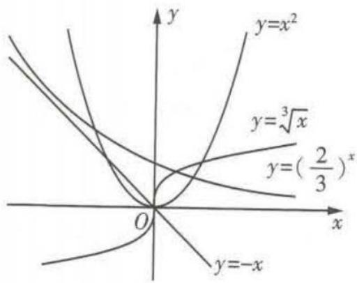

$(-∞,-2)∪(4,+∞)$ . 注意到函数 $y=x^{2}-2x-8$ 在 $(4,+\infty)$ 上单调递增，由复合函数的单调性知， $f(x)=\ln(x^{2}-2x-8)$ 的单调递增区间是 $(4,+\infty)$ ，选 D.

##### 4. C 解法一 由题易知, $f(x)=\ln x+\ln(2-x)$ 的定义域为(0,2), $f(x)=\ln[x(2-x)]=\ln[-(x-1)^{2}+1]$ ，由复合函数的单调性知，函数 $f(x)=\ln x+\ln(2-x)$ 在(0,1)上单调递增，在(1,2)上单调递减，所以排除A,B；又 $f(\frac{1}{2})=\ln\frac{1}{2}+\ln(2-\frac{1}{2})=\ln\frac{3}{4}$ , $f(\frac{3}{2})=\ln\frac{3}{2}+\ln(2-\frac{3}{2})=\ln\frac{3}{4}$ ，所以 $f(\frac{1}{2})=f(\frac{3}{2})=\ln\frac{3}{4}$ ，所以排除D,选C.

解法二 由题易知, $f(x)=\ln x+\ln(2-x)$ 的定义域为(0,2), $f'(x)=\frac{1}{x}+\frac{1}{x-2}=\frac{2(x-1)}{x(x-2)}$ . 由 $\left\{\begin{aligned}f'(x)>0,\\ 0<x<2,\end{aligned}\right.$ 得0<x<1;由$\left\{ \begin{array}{l} f'(x) < 0, \\ 0 < x < 2, \end{array} \right.$ 得 $1 < x < 2$ . 所以函数 $f(x) = \ln x + \ln (2 - x)$ 在 $(0,1)$ 上单调递增，在 $(1,2)$ 上单调递减，所以排除 A, B; 又 $f(\frac{1}{2}) = \ln \frac{1}{2} + \ln (2 - \frac{1}{2}) = \ln \frac{3}{4}, f(\frac{3}{2}) = \ln \frac{3}{2} + \ln (2 - \frac{3}{2}) = \ln \frac{3}{4}$ ，所以 $f(\frac{1}{2}) = f(\frac{3}{2}) = \ln \frac{3}{4}$ ，所以排除 D，选 C.

# 方法技巧

破解此类问题需注意:一是定义域优先,有关函数的单调性、奇偶性的研究,需先考虑函数的定义域;二是判断复合函数的单调性,注意“同增异减”在解题中的应用;三是不要混淆函数中的中心对称与轴对称.

##### 5. D 对于选项 A, 函数 $f(x)=\frac{1}{x}$ 的定义域为 $(-∞,0)∪(0,+∞)$ , 在整个定义域上不具有单调性, $(-∞,0)$ 和 $(0,+∞)$ 是两个单调递减区间, 值域为 $(-∞,0)∪(0,+∞)$ , 故 A 不符合题意; 对于选项 B, 函数 $f(x)=x-\frac{1}{x}$ 的定义域为 $(-∞,0)∪(0,+∞)$ , 在整个定义域上不具有单调性, $(-∞,0)$ 和 $(0,+∞)$ 是两个单调递增区间, 值域为 R, 故 B 不符合题意; 对于选项 C, 函数 $f(x)=\ln|x|$ 的定义域为 $(-∞,0)∪(0,+∞)$ , 在整个定义域上不具有单调性, $(-∞,0)$ 是单调递减区间, $(0,+∞)$ 是单调递增区间, 值域为 R, 故 C 不符合题意; 对于选项 D, 函数 $f(x)=-x^{3}$ 的定义域为 R, 是 R 上的减函数, 值域为 R, 故 D 符合题意. 故选 D.

##### 6. A 对于 A 选项, $(-x)^{-2}=x^{-2}$ , 所以函数 $y=x^{-2}$ 是偶函数, 当 $x\in(-\infty,0)$ 时, $y'=-2x^{-3}>0$ , 所以函数 $y=x^{-2}$ 在 $(-∞,0)$ 上单调递增, A 符合题意; 对于 B 选项, $|-x|+2=|x|+2$ , 所以函数 $y=|x|+2$ 是偶函数, 当 $x\in(-∞,0)$ 时, 函数 $y=|x|+2=-x+2$ , 则 $y=|x|+2$ 在 $(-∞,0)$ 上单调递减, B 不符合题意; 对于 C 选项, $2^{|-x|}=2^{|x|}$ , 所以函数 $y=2^{|x|}$ 是偶函数, 当 $x\in(-∞,0)$ 时, 函数 $y=2^{|x|}=2^{-x}$ , 则 $y=2^{|x|}$ 在 $(-∞,0)$ 上单调递减, C 不符合题意; 对于 D 选项, $(-x)^{3}-1\neq x^{3}-1(x\neq0)$ , 所以函数 $y=x^{3}-1$ 不是偶函数, D 不符合题意. 故选 A.

# 题型24 已知函数单调性求参数的取值范围

##### 1. D 因为 $g(x)=\frac{a}{x}$ 在区间 [1,2] 上单调递减，所以 a>0 。因为函数 $f(x)=-x^{2}+2ax$ 的图象开口向下，对称轴为直线 x=a ，且函数 $f(x)$ 在区间 [1,2] 上单调递减，所以 $a\leqslant1$ 。故满足题意的 a 的取值范围是 (0,1 ] 。

##### 2. D 由 $x^{2} - 4x - 5 > 0$ ，解得 $x > 5$ 或 $x < -1$ ，所以函数 $f(x)$ 的定义域为 $(- \infty, -1) \cup (5, +\infty)$ . 又函数 $y = x^{2} - 4x - 5$ 在 $(5, +\infty)$ 上单调递增，在 $(- \infty, -1)$ 上单调递减，所以函数 $f(x) = \lg (x^{2} - 4x - 5)$ 在 $(5, +\infty)$ 上单调递增，所以 $a \geqslant 5$ ，故选 D.

# 方法技巧

复合函数的单调性: 如果 $y = f(u)$ 和 $u = g(x)$ 的单调性相同, 那么 $y = f(g(x))$ 是增函数; 如果 $y = f(u)$ 和 $u = g(x)$ 的单调性相反, 那么 $y = f(g(x))$ 是减函数. 在应用这一结论时, 必须注意: 内层函数 $u = g(x)$ 的值域是外层函数 $y = f(u)$ 的定义域的子集.

##### 3. B 因为函数 $f(x)=\left\{\begin{aligned}x^{2}&-(3a+1)x+2,x<1,\\ a^{x},&x\geqslant1\end{aligned}\right.$ 在 R 上为减函

数,所以 $\left\{\begin{aligned}\frac{3a+1}{2}&\geqslant1,\\0<a<1,\\1^{2}-(3a+1)+2&\geqslant a^{1},\end{aligned}\right.$ 解得 $\frac{1}{3}\leqslant a\leqslant\frac{1}{2}$ ，所以实数a的

取值范围为 $\left[\frac{1}{3},\frac{1}{2}\right]$ ，故选B.

# 题型25 判断函数的奇偶性

##### 1. D 对于 A, 因为函数 $y = \sin x$ 在其定义域内既有增区间又有减区间, 所以函数 $y = \sin x$ 不符合题意, 故 A 不正确; 对于 B, 因为指数函数在其定义域上是非奇非偶函数, 所以函数 $y = 2^{x}$ 不符合题意, 故 B 不正确; 对于 C, 因为对数函数的定义域为 $(0, +\infty)$ , 所以函数 $y = \log_{2} x$ 是非奇非偶函数, 故 C 不正确; 对于 D, $y = x^{3}$ 是奇函数, 且是 R 上的增函数. 故选 D.

##### 2. B 解法一 因为 $f(x) = \frac{1 - x}{1 + x}$ ，所以 $f(x - 1) = \frac{1 - (x - 1)}{1 + (x - 1)} = \frac{2 - x}{x}, f(x + 1) = \frac{1 - (x + 1)}{1 + (x + 1)} = \frac{-x}{x + 2}$ .

对于 A, $F(x) = f(x - 1) - 1 = \frac{2 - x}{x} - 1 = \frac{2 - 2x}{x}$ ，定义域关于原点对称，但不满足 $F(x) = -F(-x)$ ; 对于 B, $G(x) = f(x - 1) + 1 = \frac{2 - x}{x} + 1 = \frac{2}{x}$ ，定义域关于原点对称，且满足 $G(x) = -G(-x)$ ; 对于 C, $f(x + 1) - 1 = \frac{-x}{x + 2} - 1$ ，定义域不关于原点对称；对于 D, $f(x + 1) + 1 = \frac{-x}{x + 2} + 1$ ，定义域不关于原点对称。故选 B.

解法二 $f(x) = \frac{1 - x}{1 + x} = \frac{2 - (x + 1)}{1 + x} = \frac{2}{1 + x} - 1$ ，为保证函数变换之后为奇函数，需将函数 $y = f(x)$ 的图象向右平移一个单位长度，再向上平移一个单位长度，得到的图象对应的函数为 $y = f(x - 1) + 1$ ，故选B.

# 规律总结

记住一些常见函数的奇偶性,对我们提高解题速度很有帮助,常见的偶函数有 $y = a^{x} + a^{-x}$ (a > 0 且 $a \neq 1$ ), $y = \cos x$ , $y = x^{2n}$ ( $n \in Z$ ), $y = |x|$ 等; 常见的奇函数有 $y = a^{x} - a^{-x}$ , $y = \sin x$ , $y = \tan x$ , $y = x^{2n+1}$ ( $n \in Z$ ), $y = \log_{a} \frac{1 - x}{1 + x}$ , $y = \log_{a} (x + \sqrt{1 + x^{2}})$ 等, 其中 a > 0 且 $a \neq 1$ .

##### 3. B 因为 $f(x)$ 为奇函数, $g(x)$ 为偶函数, 所以 $f(x)g(x)$ 为奇函数, $f(x)|g(x)|$ 为奇函数, $|f(x)|g(x)$ 为偶函数, $|f(x)g(x)|$ 为偶函数, 故选 B.

##### 4. C 对于 A, 定义域为 $\mathbf{R}, f(-x) = \ln \sqrt{(-x)^2 + 1} = \ln \sqrt{x^2 + 1} = f(x), f(x)$ 是偶函数; 对于 B, 定义域为 $\mathbf{R}, f(-x) = |\sin (-x)| \cdot \cos (-x) = |\sin x| \cos x = f(x), f(x)$ 是偶函数; 对于 C, 定义域为 $\mathbf{R}, f(-x) = (-x) \cos (-x) = -x \cos x \neq f(x), f(x)$ 不是偶函数; 对于 D, 定义域为 $\mathbf{R}, f(-x) = e^{-x} + e^{x} = f(x), f(x)$ 是偶函数. 故选 C.

##### 5. B 由题意可知, 函数 $y = 2^{x} - 2^{-x}$ 的定义域为 R, 且是 R 上的奇函数, 并在 R 上单调递增, 所以满足上述条件的函数只有 $y = x^{3}$ , 故选 B.

##### 6. D 由 $f(2-x)+f(x)=-2$ 可知, $y=f(x)$ 的图象关于点(1,-1)对称,将点(1,-1)向左平移1个单位长度,向上平移1个单位长度得到点(0,0),即函数 $y=f(x+1)+1$ 为奇函数.所以选D.

# 规律总结

##### 1. 若函数 $f(x)$ 满足 $f(a + x) = f(b - x)$ ，则其图象关于直线 $x = \frac{a + b}{2}$ 对称.  
##### 2. 若函数 $f(x)$ 满足 $f(2a - x) = 2b - f(x)$ ，则其图象关于点 $(a, b)$ 对称.

# 题型26 已知函数的奇偶性求解析式

##### 1. $x(x+1)$ 当 x>0 时，-x<0，则 $f(-x)=-x(-x-1)=x(x+1)$ ，因为函数 $f(x)$ 为 R 上的偶函数，所以 $f(x)=f(-x)=x(x+1)$ .  
##### 2. D 解法一 依题意得, 当 x < 0 时, $f(x) = -f(-x) = -(e^{-x} - 1) = -e^{-x} + 1$ , 选 D.

解法二 依题意得, $f(-1)=-f(1)=-(e^{1}-1)=1-e$ ,结合选项知,选D.

##### 3. $f(x) = \begin{cases} -2x^2 + 3x + 1, & x > 0, \\ 0, & x = 0, \\ 2x^2 + 3x - 1, & x < 0 \end{cases}$ 当 $x < 0$ 时， $-x > 0$ ，则 $f(-x) = -2(-x)^2 + 3(-x) + 1 = -2x^2 - 3x + 1.$

由于 $f(x)$ 是R上的奇函数，故 $f(x)=-f(-x)$ ，所以当x<0时， $f(x)=2x^{2}+3x-1.$

因为 $f(x)$ 为R上的奇函数,故 $f(0)=0$ .

综上, $f(x)$ 的解析式为 $f(x)=\left\{\begin{aligned}-2x^{2}+3x+1,x>0,\\ 0,x=0,\\ 2x^{2}+3x-1,x<0.\end{aligned}\right.$

# 题型27 已知函数的奇偶性求函数值

##### 1. A 解法一 由题意可知, 当 x > 0 时, $f(x) = x^{2} + \frac{1}{x}$ , 所以 $f(1) = 2$ , 又 $f(x)$ 是奇函数, 所以 $f(-x) = -f(x)$ , 所以 $f(-1) = -f(1) = -2$ , 故选 A.

解法二 若 $x < 0$ ，则 $-x > 0$ ，所以 $f(-x) = (-x)^2 + \frac{1}{-x} = x^2 - \frac{1}{x}$ ，又 $f(x)$ 是奇函数，所以 $f(-x) = -f(x)$ ，所以 $f(x) = -x^2 + \frac{1}{x}$ ，所以 $f(-1) = -(-1)^2 - 1 = -2$ ，故选A.

##### 2. -2 解法一 因为 $f(x) = \ln (\sqrt{1 + x^2} - x) + 1$ ，所以 $f(x) + f(-x) = \ln (\sqrt{1 + x^2} - x) + \ln (\sqrt{1 + x^2} + x) + 2 = 2$ . 故 $f(a) + f(-a) = 2$ ，所以 $f(-a) = 2 - 4 = -2$ .

解法二 设 $g(x) = \ln (\sqrt{1 + x^2} - x)$ ，则 $g(-x) = \ln (\sqrt{1 + x^2} + x) = \ln \frac{1}{\sqrt{1 + x^2} - x} = -\ln (\sqrt{1 + x^2} - x) = -g(x)$ ，所以 $g(x)$ 为奇函数，则 $f(a) = g(a) + 1 = 4, g(a) = 3$ ，所以 $f(-a) = g(-a) + 1 = -3 + 1 = -2$ .

##### 3. C 当 $x \in (0,1]$ 时， $-x \in [-1,0)$ ， $f(-x) = ae^{-x} + 1 + \frac{1}{e}$ . 因为 $f(x)$ 是定义域为 $\mathbf{R}$ 的偶函数，所以当 $x \in (0,1]$ 时， $f(x) = f(-x) = ae^{-x} + 1 + \frac{1}{e}$ ，所以 $f(1) = \frac{a}{e} + 1 + \frac{1}{e} = 1$ ，解得 $a = -1$ ，所以 $f(0) = a + 1 + \frac{1}{e} = -1 + 1 + \frac{1}{e} = \frac{1}{e}$ . 故选 C.

##### 4. -4 由于 $f(x)$ 为奇函数, 所以 $f(2) = -f(-2) = -[(-2)^{2} - \sin (-2\pi)] = -4$ .

### 题型 28 已知函数的奇偶性求参数

##### 1. -3 因为 $f(x)$ 是奇函数, $x \in R$ ,

所以 $f(0)=0$ ，即 $3^{5}+m^{5}=0$ ，解得m=-3。

##### 2. $-\frac{1}{2} \ln 2$ 解法一 $f(x) = \ln |a + \frac{1}{1 - x}| + b = \ln |a + \frac{1}{1 - x}| + \ln e^b = \ln |\frac{(a + 1)e^b - ae^bx}{1 - x}|$ . $\because f(x)$ 为奇函数, $\therefore f(-x) + f(x) = \ln |\frac{(a + 1)^2e^{2b} - a^2e^{2bx^2}}{1 - x^2}| = 0$ , $\therefore |(a + 1)^2e^{2b} - a^2e^{2bx^2}| = |1 - x^2|$ . 当 $(a + 1)^2e^{2b} - a^2e^{2bx^2} = 1 - x^2$ 时, 则 $\left\{ \begin{array}{l} (a + 1)^2e^{2b} = 1, \\ a^2e^{2b} = 1, \end{array} \right.$ 解得 $\left\{ \begin{array}{l} a = -\frac{1}{2}, \\ b = \ln 2. \end{array} \right.$ 当 $(a + 1)^2e^{2b} - a^2e^{2bx^2} = -1 + x^2$ 时, 则 $\left\{ \begin{array}{l} (a + 1)^2e^{2b} = -1, \\ a^2e^{2b} = -1, \end{array} \right.$ 无解. 综上, $a = -\frac{1}{2}, b = \ln 2$ .

解法二 易知 $x \neq 1$ . $\because$ 函数 $f(x)$ 为奇函数, $\therefore$ 由奇函数定义域关于原点对称可得 $x \neq -1$ , $\therefore$ 当 $x = -1$ 时, $|a + \frac{1}{1 - x}| \leqslant 0$ . 又 $\because |a + \frac{1}{1 - x}| \geqslant 0$ 恒成立, $\therefore$ 当 $x = -1$ 时, $|a + \frac{1}{1 - x}| = 0$ , $\therefore a = -\frac{1}{2}$ . 又由 $f(0) = 0$ 可得 $b = \ln 2$ . 经检验符合题意, $\therefore a = -\frac{1}{2}$ , $b = \ln 2$ .

##### 3.1 解法一(定义法) 因为 $f(x)=x^{3}(a\cdot2^{x}-2^{-x})$ 的定义域为R,且是偶函数,(提示:有关函数的奇偶性问题,注意优先求解定义域)

所以 $f(-x)=f(x)$ 对任意的 $x\in R$ 恒成立，（利用偶函数的定义转化为恒成立问题）

所以 $(-x)^{3}(a\cdot2^{-x}-2^{x})=x^{3}(a\cdot2^{x}-2^{-x})$ 对任意的 $x\in R$ 恒成立，所以 $x^{3}(a-1)(2^{x}+2^{-x})=0$ 对任意的 $x\in R$ 恒成立，所以a=1.

解法二(特殊值法) 因为 $f(x)=x^{3}(a\cdot2^{x}-2^{-x})$ 的定义域为R，且是偶函数，所以 $f(-1)=f(1)$ ，所以 $-(\frac{a}{2}-2)=2a-\frac{1}{2}$ ，解得a=1，经检验， $f(x)=x^{3}(2^{x}-2^{-x})$ 为偶函数，所以a=1。（易错警示：用特殊值法求得的参数值，需检验所求得的参数值是否符合题意，不符合的需舍去）

解法三(转化法) 由题意知 $f(x)=x^{3}(a\cdot2^{x}-2^{-x})$ 的定义域为R,且是偶函数.设 $g(x)=x^{3},h(x)=a\cdot2^{x}-2^{-x}$ ，因为 $g(x)=x^{3}$ 为R上的奇函数，所以 $h(x)=a\cdot2^{x}-2^{-x}$ 为R上的奇函数，所以 $h(0)=a\cdot2^{0}-2^{-0}=0$ ，解得a=1，经检验， $f(x)=x^{3}(2^{x}-2^{-x})$ 为偶函数，所以a=1.

##### 4. -3 当 $x > 0$ 时， $-x < 0, f(-x) = -\mathrm{e}^{-ax}$ . 因为函数 $f(x)$ 为奇函数，所以当 $x > 0$ 时， $f(x) = -f(-x) = \mathrm{e}^{-ax}$ ，所以 $f(\ln 2) = \mathrm{e}^{-a\ln 2} = \left(\frac{1}{2}\right)^a = 8$ ，所以 $a = -3$ .

##### 5. B 解法一 当 x<0 时，-x>0，所以 $f(-x)=(-x)^{3}+1=-x^{3}+1$ ，因为 $f(x)$ 为偶函数，所以当 x<0 时， $f(x)=f(-x)=-x^{3}+1$ ，又当 x<0 时， $f(x)=ax^{3}+b$ ，所以 a=-1, b=1，所以 $2^{a}+b=\frac{3}{2}$ 。故选 B.

解法二 因为 $f(x)$ 为偶函数, 所以 $\left\{ \begin{array}{l} f(-1) = f(1), \\ f(-2) = f(2), \end{array} \right.$ 所以 $\left\{ \begin{array}{l} -a + b = 2, \\ -8a + b = 9, \end{array} \right.$ 解得 $\left\{ \begin{array}{l} a = -1, \\ b = 1, \end{array} \right.$ 经检验, $\left\{ \begin{array}{l} a = -1, \\ b = 1 \end{array} \right.$ 符合题意, 所以 $2^{a} + b = \frac{3}{2}$ . 故选 B.

##### 6. BD 对于 A, 因为函数 $f(x)$ 是偶函数, 所以 $f(x) = f(-x)$ 恒成立, 即 $\ln \frac{e^{2x} + 1}{e^{ax}} = \ln \frac{e^{-2x} + 1}{e^{-ax}}$ 恒成立, 即 $\frac{e^{2x} + 1}{e^{ax}} = \frac{e^{-2x} + 1}{e^{-ax}}$ 恒成立, 即 $\frac{e^{2x} + 1}{e^{ax}} = \frac{(e^{2x} + 1)e^{ax}}{e^{2x}}$ 恒成立, 所以 $e^{2x} = e^{2ax}$ 恒成立, 所以 2x = 2ax 恒成立, 则 a = 1, 所以选项 A 错误. 对于 B, 因为 $f(x) = \ln (e^x + \frac{1}{e^x})$ , 所以 $f'(x) = \frac{e^x - e^{-x}}{e^x + e^{-x}}$ , 当 x > 0 时, $f'(x) > 0$ , 所以函数 $f(x)$ 在 $(0, +\infty)$ 上单调递增, 所以选项 B 正确. 对于 C, 因为函数 $f(x)$ 为偶函数, 所以函数 $f(x)$ 在 $(-∞, 0]$ 上单调递减, 所以当 x = 0 时, 函数 $f(x)$ 取最小值, 最小值为 $f(0) = \ln 2$ , 所以选项 C 错误. 对于 D, 因为 $2 > \ln 2$ , 函数 $f(x)$ 为偶函数, 且 $f(x)$ 在 $(0, +∞)$ 上单调递增, 在 $(-∞, 0]$ 上单调递减, $x \to -∞$ 时, $f(x) \to +∞$ , $x \to +∞$ 时, $f(x) \to +∞$ , 所以方程 $f(x) = 2$ 有两个不相等的实数根, 所以选项 D 正确. 综上, 选 BD.

##### 7. -1 解法一 因为 $f(x)$ 是偶函数, 所以 $f(x) = f(-x)$ , 即 $(\mathrm{e}^x + a\mathrm{e}^{-x})\ln (x + \sqrt{x^2 + 1}) = (\mathrm{e}^{-x} + a\mathrm{e}^x)\ln (-x + \sqrt{x^2 + 1})$ , 因为 $\sqrt{x^2 + 1} - x \neq 0$ , 所以 $\ln (x + \sqrt{x^2 + 1}) = \ln \frac{(x + \sqrt{x^2 + 1}) \cdot (-x + \sqrt{x^2 + 1})}{-x + \sqrt{x^2 + 1}} = -\ln (-x + \sqrt{x^2 + 1})$ , 所以 $\mathrm{e}^x + a\mathrm{e}^{-x} = -(\mathrm{e}^{-x} + a\mathrm{e}^x)$ , 即 $\mathrm{e}^x + \mathrm{e}^{-x} = -a(\mathrm{e}^x + \mathrm{e}^{-x})$ , 又 $\mathrm{e}^x + \mathrm{e}^{-x} \neq 0$ , 所以 $a = -1$ .

解法二 由题意易知 $f(x)$ 的定义域为 $\mathbf{R}$ , 设 $g(x) = \ln (x + \sqrt{x^2 + 1})$ , $h(x) = e^x + ae^{-x}$ , 则 $g(x) + g(-x) = \ln (x + \sqrt{x^2 + 1}) + \ln (-x + \sqrt{x^2 + 1}) = \ln 1 = 0$ , 所以 $g(x)$ 是 $\mathbf{R}$ 上的奇函数, 又 $f(x) = (e^x + ae^{-x})\ln (x + \sqrt{x^2 + 1})$ 是偶函数, 所以 $h(x) = e^x + ae^{-x}$ 是 $\mathbf{R}$ 上的奇函数, 则 $h(0) = e^0 + ae^0 = 0$ , 解得 $a = -1$ .

### 题型 29 已知函数单调性、奇偶性比较大小

因为函数 $f(x)$ 在区间 $[-3, -1]$ 上单调递减，所以 $f(-1) < f(-2) < f(-3)$ . 又函数 $f(x)$ 是偶函数，所以 $f(-1) = f(1), f(-2) = f(2)$ ，所以 $f(1) < f(2) < f(-3)$ .

##### 2. C 根据函数 $f(x)$ 为偶函数可知, $f(\log_{3}\frac{1}{4}) = f(-\log_{3}4) = f(\log_{3}4)$ , 因为 $0 < 2^{-\frac{3}{2}} < 2^{-\frac{2}{3}} < 2^{0} < \log_{3}4$ , 且函数 $f(x)$ 在 $(0, +\infty)$ 单调递减, 所以 $f(2^{-\frac{3}{2}}) > f(2^{-\frac{2}{3}}) > f(\log_{3}4) = f(\log_{3}\frac{1}{4})$ . 故选 C.

##### 3. C 解法一 由 $f(x)$ 为奇函数, 知 $g(x) = xf(x)$ 为偶函数. 因为 $f(x)$ 在 $\mathbf{R}$ 上单调递增, $f(0) = 0$ , 所以当 $x > 0$ 时, $f(x) > 0$ , 所以 $g(x)$ 在 $(0, +\infty)$ 上单调递增. 又 $a = g(-\log_25.1) = g(\log_25.1)$ , $b = g(2^{0.8})$ , $c = g(3)$ , $0 < 2^{0.8} < 2 = \log_24 < \log_25$ . $1 < \log_28 = 3$ , 所以 $b < a < c$ , 选项 $\mathbb{C}$ 符合.

解法二 取 $f(x) = x$ ，则 $g(x) = x^2$ 为偶函数且在 $(0, +\infty)$ 上单调递增，然后进行判断可知 $b < a < c$ ，故选 C.

##### 4. A 因为函数 $f(x)$ 为偶函数, 所以 $f(\ln \frac{1}{3}) = f(\ln 3)$ . 由单调性的定义可知, $f(x)$ 在 $(-\infty, 0]$ 上单调递增, 则 $f(x)$ 在 $(0, +\infty)$ 上单调递减, 因为 $0 < \sin 3 < 1 < \ln 3 < 2 < 2^{1.5}$ , 所以 $f(\sin 3) > f(\ln 3) > f(2^{1.5})$ , 所以 $f(\sin 3) > f(\ln \frac{1}{3}) > f(2^{1.5})$ , 即 $a > b > c$ , 故选 A.

##### 5. C 因为 $f(x)$ 是定义在 R 上的偶函数, 所以 $f(-1)=f(1)$ , $f(-2^{0.1})=f(2^{0.1})$ . 因为 $f(x)$ 在 $(0,+\infty)$ 上单调递减, 且 $1<2^{0.1}<$ $2 < \log_{2}5$ ，所以 $f(1) > f(2^{0.1}) > f(\log_25)$ ，即有 $f(\log_25) < f(-2^{0.1}) < f(-1)$ .故选C.

### 题型30 已知函数单调性、奇偶性解不等式

∵ 函数 $f(x)$ 为偶函数, ∴ $f(2x-1)=f(|2x-1|)$ , 由题意得 $|2x-1|<\frac{1}{3}$ , 即 $-\frac{1}{3}<2x-1<\frac{1}{3}$ , 解得 $\frac{1}{3}<x<\frac{2}{3}$ .

##### 2. D ∵ 函数 $f(x)$ 为奇函数，且 $f(1) = -1, \therefore f(-1) = -f(1) = 1$ ，由 $-1 \leqslant f(x - 2) \leqslant 1$ ，得 $f(1) \leqslant f(x - 2) \leqslant f(-1)$ ，又函数 $f(x)$ 在 $(-∞, +∞)$ 单调递减，∴ $-1 \leqslant x - 2 \leqslant 1, \therefore 1 \leqslant x \leqslant 3$ ，故选 D.

##### 3. D 解法一 由题意知 $f(x)$ 在 $(-∞,0)$ , $(0,+∞)$ 单调递减，且 $f(-2)=f(2)=f(0)=0$ . 当x>0时，令 $f(x-1)\geqslant0$ ，得 $0\leqslant x-1\leqslant2$ ， $∴1\leqslant x\leqslant3$ ；当x<0时，令 $f(x-1)\leqslant0$ ，得 $-2\leqslant x-1\leqslant0$ ， $∴-1\leqslant x\leqslant1$ ，又 $x<0$ ， $∴-1\leqslant x<0$ ；当x=0时，显然符合题意。综上，原不等式的解集为 $[-1,0]\cup[1,3]$ ，故选D.

解法二 当 x=3 时, $f(3-1)=0$ , 符合题意, 排除 B; 当 x=4 时, $f(4-1)=f(3)<0$ , 此时不符合题意, 排除选项 A, C. 选 D.

##### 4. D 因为 $f(2x+1)$ 是奇函数, 所以 $f(-2x+1) = -f(2x+1)$ , 令 x = 1, 则 $f(-1) = -f(3)$ , 又 $f(3) = 2$ , 所以 $f(-1) = -2$ , 由 $f(2x-1) < -2$ , 可得 $f(2x-1) < f(-1)$ . 令 $t = 2x + 1$ , 则函数 $t = 2x + 1$ 是 R 上的增函数, 所以由复合函数的单调性可知, 函数 $f(t)$ 是 R 上的增函数, 即函数 $f(x)$ 是 R 上的增函数, 所以 2x - 1 < -1, 解得 x < 0, 所以 $f(2x-1) < -2$ 的解集为 $\{x \mid x < 0\}$ , 故选 D.

若函数 $f(x)=\mathrm{e}^{x}+a\mathrm{e}^{-x}$ 为奇函数，则 $f(0)=0$ ，得a=-1，所以 $f(x)=\mathrm{e}^{x}-\mathrm{e}^{-x}$ ，所以 $f'(x)=\mathrm{e}^{x}+\mathrm{e}^{-x}>0$ ，所以 $f(x)$ 在R上单调递增，又 $f(\ln x)<f(|\ln x|)$ ，所以 $\ln x<|\ln x|$ 。当0<x<1时， $\ln x<0,|\ln x|>0$ ，所以 $\ln x<|\ln x|$ 成立；当 $x\geqslant1$ 时， $\ln x\geqslant0,|\ln x|=\ln x$ ，所以 $\ln x<|\ln x|$ 不成立。所以不等式的解集为 $\{x|0<x<1\}$ 。

新型31 函数周期性的判断及应用

##### 1. A 因为 $f(1)=1$ ，所以在 $f(x+y)+f(x-y)=f(x)f(y)$ 中，令 y=1，得 $f(x+1)+f(x-1)=f(x)f(1)$ ，所以 $f(x+1)+f(x-1)=f(x)$ ①，所以 $f(x+2)+f(x)=f(x+1)$ ②。由①②相加，得 $f(x+2)+f(x-1)=0$ ，故 $f(x+3)+f(x)=0$ ，所以 $f(x+3)=-f(x)$ ，所以 $f(x+6)=-f(x+3)=f(x)$ ，所以函数 $f(x)$ 的一个周期为 6。在 $f(x+y)+f(x-y)=f(x)f(y)$ 中，令 y=0，得 $f(x)+f(x)=f(x)f(0)$ ，所以 $f(0)=2$ 。令 x=1, y=1，得 $f(2)+f(0)=f(1)f(1)$ ，所以 $f(2)=-1$ 。由 $f(x+3)+f(x)=0$ ，得 $f(1)+f(4)=0$ ， $f(2)+f(5)=0$ ， $f(3)+f(6)=0$ ，所以 $f(1)+f(2)+\cdots+f(6)=0$ ，根据函数的周期性知， $\sum_{k=1}^{22}f(k)=f(1)+f(2)+f(3)+f(4)=1-1-2-1=-3$ ，故选 A.

##### 2. C 因为 $f(x)$ 是定义在 $\mathbf{R}$ 上的奇函数, 所以 $f(-x) = -f(x)$ . 又 $f(1 + x) = f(-x)$ , 所以 $f(2 + x) = -f(1 + x) = -f(-x) = f(x)$ , 所以函数 $f(x)$ 是以 2 为周期的周期函数, $f(\frac{5}{3}) = f(\frac{5}{3} - 2) = f(-\frac{1}{3}) = \frac{1}{3}$ . 故选 C.

##### 3. A 因为 $f(x + 1)$ 是定义在 $\mathbf{R}$ 上且周期为2的函数, 所以 $f(x)$ 也是周期为2的函数, 则 $f(3) = f(-1) = -2 + 4 = 2, f(-\frac{10}{3}) = f(\frac{2}{3}) = \sin \frac{2\pi}{3} = \frac{\sqrt{3}}{2}$ , 可得 $f(3) \cdot f(-\frac{10}{3}) = 2 \times \frac{\sqrt{3}}{2} = \sqrt{3}$ , 故选A.

##### 4. $-\frac{1}{2}$ 依题意, 当 $x > 1$ 时, $f(x + 2) = -f(x) = f(x - 2)$ , 所以当 $x > 1$ 时, 函数 $f(x)$ 以 4 为周期, 所以 $f(2022) = f(4 \times 505 + 2) = f(2)$ , 又 $f(2) = -f(0) = -2^{-1} = -\frac{1}{2}$ , 故 $f(2022) = -\frac{1}{2}$ .

# 题型 32 函数性质的综合应用

##### 1. D 由 $y = g(x)$ 的图象关于直线 $x = 2$ 对称, 可得 $g(2 + x) = g(2 - x)$ . 在 $f(x) + g(2 - x) = 5$ 中, 用 $-x$ 替换 $x$ , 可得 $f(-x) + g(2 + x) = 5$ , 可得 $f(-x) = f(x)$ ①, 所以 $y = f(x)$ 为偶函数. 在 $g(x) - f(x - 4) = 7$ 中, 用 $2 - x$ 替换 $x$ , 得 $g(2 - x) = f(-x - 2) + 7$ , 代入 $f(x) + g(2 - x) = 5$ 中, 得 $f(x) + f(-x - 2) = -2$ ②, 所以 $y = f(x)$ 的图象关于点 (-1, -1) 中心对称, 所以 $f(1) = f(-1) = -1$ . 由①②可得 $f(x) + f(x + 2) = -2$ , 所以 $f(x + 2) + f(x + 4) = -2$ , 所以 $f(x + 4) = f(x)$ , 所以函数 $f(x)$ 是以 4 为周期的周期函数. 由 $f(x) + g(2 - x) = 5$ 可得 $f(0) + g(2) = 5$ , 又 $g(2) = 4$ , 所以可得 $f(0) = 1$ , 又 $f(x) + f(x + 2) = -2$ , 所以 $f(0) + f(2) = -2$ , 得 $f(2) = -3$ , 又 $f(3) = f(-1) = -1$ , $f(4) = f(0) = 1$ , 所以 $\sum_{k=1}^{22} f(k) = 6f(1) + 6f(2) + 5f(3) + 5f(4) = 6 \times (-1) + 6 \times (-3) + 5 \times (-1) + 5 \times 1 = -24$ . 故选 D.

##### 2. D 由于 $f(x+1)$ 为奇函数,所以函数 $f(x)$ 的图象关于点(1,0)对称,即有 $f(x)+f(2-x)=0$ ,所以 $f(1)+f(2-1)=0$ ,得 $f(1)=0$ ,即 $a+b=0$ ①.由于 $f(x+2)$ 为偶函数,所以函数 $f(x)$ 的图象关于直线x=2对称,即有 $f(x)-f(4-x)=0$ ,所以 $f(0)+f(3)=-f(2)+f(1)=-4a-b+a+b=-3a=6$ ②.

根据①②可得 a = -2, b = 2，所以当 $x \in [1, 2]$ 时， $f(x) = -2x^{2} + 2$ 。根据函数 $f(x)$ 的图象关于直线 x = 2 对称，且关于点 $(1, 0)$ 对称，可得函数 $f(x)$ 的周期为 4，所以 $f\left(\frac{9}{2}\right) = f\left(\frac{1}{2}\right) = -f\left(\frac{3}{2}\right) = 2 \times \left(\frac{3}{2}\right)^{2} - 2 = \frac{5}{2}$ 。

##### 3. B 因为函数 $f(x + 2)$ 是偶函数, 所以 $f(x + 2) = f(-x + 2)$ , 则函数 $f(x)$ 的图象关于直线 $x = 2$ 对称. 因为函数 $f(2x + 1)$ 是奇函数, 所以 $f(-2x + 1) = -f(2x + 1)$ , 则 $f(1) = 0$ , 且函数 $f(x)$ 的图象关于点 (1,0) 对称. 则 $f(x) = f(4 - x) = -f[2 - (4 - x)] = -f(x - 2)$ , 即 $f(x + 2) = -f(x)$ , 则 $f(x + 4) = -f(x + 2) = f(x)$ , 所以函数 $f(x)$ 是以 4 为周期的周期函数, 所以 $f(1) = f(1 + 4) = f(5) = 0$ , 又函数 $f(x)$ 的图象关于直线 $x = 2$ 对称, 所以 $f(5) = f(4 - 5) = f(-1) = 0$ , 故选 B.

##### 4. D 因为 $f(x)$ 满足 $f(x - 4) = -f(x)$ ，则 $f(-4) = -f(0)$ ，又 $f(x)$ 在 $\mathbf{R}$ 上是奇函数，所以 $f(0) = 0$ ，故 $f(-4) = -f(0) = 0$ ，所以 $f(4) = -f(-4) = 0$ . 由 $f(x) = -f(-x)$ 及 $f(x - 4) = -f(x)$ ，得 $f(3) = -f(-3) = -f(1 - 4) = f(1)$ ，又 $f(x)$ 在区间[0,2]上单调递增，所以 $f(1) > f(0)$ ，即 $f(1) > 0$ ，所以 $f(-1) = -f(1) < 0$ ， $f(3) = f(1) > 0$ ，于是 $f(-1) < f(4) < f(3)$ .

# 第三节 二次函数与幂函数

# 题型33 二次函数的图象及应用

##### 1. 令 $f(x) = x^{2} + 2x - 3 = (x + 1)^{2} - 4$ . 作出 $f(x)$ 的图象, 保留其在 $x$ 轴上及其上方部分, 将位于 $x$ 轴下方的部分翻折到 $x$ 轴上方, 得到 $y = |x^{2} + 2x - 3|$ 的图象, 如图所示. 由图象可得函数 $y = |x^{2} + 2x - 3|$ 的单调递增区间是 $[-3, -1]$ 和 $[1, +\infty)$ , 单调递减区间是 $(- \infty, -3]$ 和 $[-1, 1]$ .

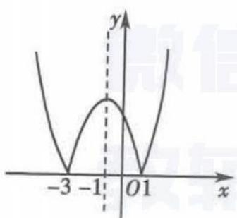

##### 2. C 易知 $f(x)$ 的图象的顶点坐标为 $(a+2, -4a-4)$ ， $g(x)$ 的图象的顶点坐标为 $(a-2, -4a+12)$ ，并且 $f(x)$ 与 $g(x)$ 的图象的顶点都在对方的图象上， $f(x)$ 与 $g(x)$ 的大致图象如图所示，所以 A-B = -4a - 4 - (-4a + 12) = -16.

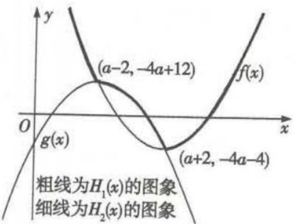

##### 3. A 当 0 < a < 1 时, $y = \log_{a} x$ 为减函数, $y = (a - 1)x^{2} - x$ 的图象开口向下, 对称轴为直线 $x = \frac{1}{2(a - 1)}, \frac{1}{2(a - 1)} < 0$ , 排除 C, D; 当 a > 1 时, $y = \log_{a} x$ 为增函数, $y = (a - 1)x^{2} - x$ 的图象开口向上, 对称轴为直线 $x = \frac{1}{2(a - 1)}, \frac{1}{2(a - 1)} > 0$ , 排除 B. 选 A.

##### 4. $(-1,3)$ 画出函数 $y=x^{2}-4|x|+3$ 的图象, 如图所示, 由图象即可得出 -1<m<3.

##### 5. $x^{2} - 4x + 3$ 因为 $f(2 - x) = f(2 + x)$ 对任意 $x\in \mathbf{R}$ 恒成立，所以 $f(x)$ 图象的

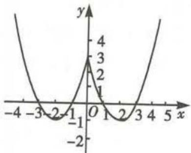

对称轴为直线 x=2. 又 $f(x)$ 的图象在 x 轴上截得的线段长为 2，所以 $f(x)=0$ 的两根为 1 和 3. 设 $f(x)$ 的解析式为 $f(x)=a(x-1)(x-3)(a\neq0)$ ，因为 $f(x)$ 的图象过点 (4,3)，所以 3a=3，即 a=1，所以 $f(x)=(x-1)(x-3)=x^{2}-4x+3$ .

# 题型34 二次函数在闭区间上的最值问题

##### 1. $f(x)=3x^{2}-12x+5=3(x-2)^{2}-7.$

（1） 当 $x \in R$ 时, $f(x) = 3(x - 2)^{2} - 7 \geqslant -7$ 恒成立. 故函数 $f(x)$ 的最小值为 -7, 无最大值.
（2） 函数 $f(x)=3(x-2)^{2}-7$ 的图象如图所示, 由图可知, 在 [0,3] 上, 函数 $f(x)$ 在 x=0 处取得最大值, 最大值为 5; 在 x=2 处取得最小值, 最小值为 -7.

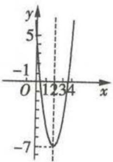

（3）由图可知,函数 $f(x)$ 在 $[-1,1]$ 上单调递减,在x=-1处取得最大值,最大值为20;在x=1处取得最小值,最小值为-4.

##### 2. B $f(x) = \left( x + \frac{a}{2} \right)^{2} - \frac{a^{2}}{4} + b.$ ①当 $0 \leqslant -\frac{a}{2} \leqslant 1$ 时, m = $f(-\frac{a}{2}) = -\frac{a^{2}}{4} + b, M = \max\{f(0), f(1)\} = \max\{b, 1 + a + b\}$ , 故 $M - m = \max\{\frac{a^{2}}{4}, 1 + a + \frac{a^{2}}{4}\}$ , 与 a 有关, 与 b 无关; ②当 $-\frac{a}{2} < 0$ 时, $f(x)$ 在 [0,1] 上单调递增, 故 $M - m = f(1) - f(0) = 1 + a$ , 与 a 有关, 与 b 无关; ③当 $-\frac{a}{2} > 1$ 时, $f(x)$ 在 [0,1] 上单调递减, 故 $M - m = f(0) - f(1) = -1 - a$ , 与 a 有关, 与 b 无关. 综上所述, M - m 与 a 有关, 但与 b 无关.

##### 3. $2 \sqrt{2} - 2$ 分以下几种情况进行讨论.

①当 $a \leqslant 0$ 时，函数 $f(x) = |x^{2} - ax| = x^{2} - ax$ 在区间 $[0,1]$ 上单调递增，所以 $f(x)_{\max} = f(1) = g(a) = 1 - a$ ;

②当 $0 < a < 2\sqrt{2} - 2$ 时， $f(\frac{a}{2}) = \left| \left( \frac{a}{2} \right)^2 - a \times \frac{a}{2} \right| = \frac{a^2}{4}, f(1) = 1 - a$ ，而 $\frac{a^2}{4} - (1 - a) = \frac{(a + 2)^2}{4} - 2 < 0$ ，所以 $f(x)_{\max} = f(1) = g(a) = 1 - a;$

③当 $2\sqrt{2} - 2 \leqslant a < 2$ 时, $f(\frac{a}{2}) = \frac{a^2}{4}, f(1) = |1 - a|$ , 而 $\frac{a^2}{4} - |1 - a| \geqslant 0$ , 所以 $f(x)_{\max} = f(\frac{a}{2}) = g(a) = \frac{a^2}{4}$ ;

④当 $a \geqslant 2$ 时, $f(x) = |x^2 - ax| = -x^2 + ax$ 在区间 $[0,1]$ 上单调递增, 当 $x = 1$ 时, $f(x)$ 取得最大值, 即 $f(1) = g(a) = a - 1$ .

综上可得, $g(a)=\left\{\begin{aligned}&1-a,a<2\sqrt{2}-2,\\&\frac{a^{2}}{4},2\sqrt{2}-2\leqslant a<2,\\&a-1,a\geqslant2,\end{aligned}\right.$ 且 $g(a)$ 在 $(-∞,2\sqrt{2}-2)$

上单调递减,在 $\left[2\sqrt{2}-2,+\infty\right)$ 上单调递增,所以当 $a=2\sqrt{2}-2$ 时, $g(a)$ 的值最小.

##### 4. -1 或 2 易知 $y = -x^{2} + 2ax + 1 - a (x \in \mathbb{R})$ 的图象的对称轴为直线 x = a.

当 a<0 时, 函数 $f(x)=-x^{2}+2ax+1-a(0\leqslant x\leqslant1)$ 的大致图象如图 1 中实线部分所示, 当 x=0 时, $f(x)$ 有最大值且 $f(x)_{\max}=f(0)=1-a,\therefore1-a=2$ , 即 a=-1.

当 $0 \leqslant a \leqslant 1$ 时，函数 $f(x) = -x^2 + 2ax + 1 - a (0 \leqslant x \leqslant 1)$ 的大致图象如图2中实线部分所示，当 $x = a$ 时， $f(x)$ 有最大值且 $f(x)_{\max} = f(a) = -a^2 + 2a^2 + 1 - a = a^2 - a + 1$ .

∴ $a^{2}-a+1=2$ , 解得 $a=\frac{1\pm\sqrt{5}}{2}$ .

$\because 0 \leqslant a \leqslant 1, \therefore a = \frac{1 \pm \sqrt{5}}{2}$ 不满足题意.

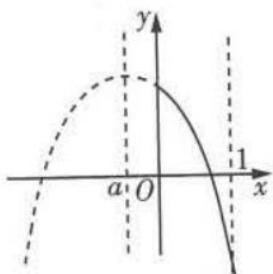  
图1

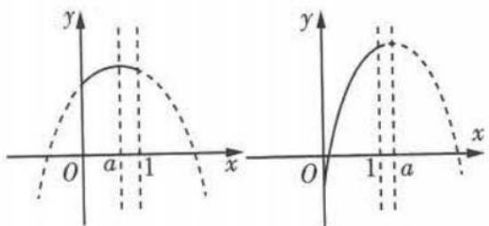

图2  
图3

当 a > 1 时, 函数 $f(x) = -x^{2} + 2ax + 1 - a (0 \leqslant x \leqslant 1)$ 的大致图象如图 3 中实线部分所示, 当 x = 1 时, $f(x)$ 有最大值且 $f(x)_{\max} = f(1) = a = 2, \therefore a = 2.$

综上可知，a 的值为 -1 或 2.

##### 5. $f(x)=x^{2}-2x+2=(x-1)^{2}+1, x\in[t,t+1], t\in\mathbf{R}$ . 当 $t+1<1$ , 即 t<0 时, 函数 $f(x)$ 的图象如图 1 中实线所示, 函数 $f(x)$ 在区间 $[t,t+1]$ 上为减函数, 所以最小值 $g(t)=f(t+1)=t^{2}+1$ ;

当 $t \leqslant 1 \leqslant t + 1$ ，即 $0 \leqslant t \leqslant 1$ 时，函数 $f(x)$ 的图象如图 2 中实线所示，最小值 $g(t) = f(1) = 1$ ;

当 t > 1 时, 函数 $f(x)$ 的图象如图 3 中实线所示, 函数 $f(x)$ 在区间 $[t, t + 1]$ 上为增函数, 所以最小值 $g(t) = f(t) = t^{2} - 2t + 2$ .

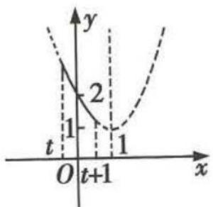  
图1

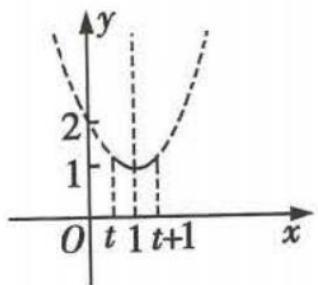

图2

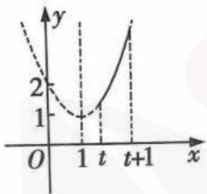  
图3

综上可得, $g(t)=\left\{\begin{aligned}t^{2}+1,t<0,\\ 1,0\leqslant t\leqslant1,\\ t^{2}-2t+2,t>1.\end{aligned}\right.$

### 题型 35 幂函数的图象与性质的应用

##### 1. （1） $\because y = x^{\frac{3}{4}}$ 为 $[0, +\infty)$ 上的增函数，且 $2.3 < 2.4, \therefore 2.3^{\frac{3}{4}} < 2.4^{\frac{3}{4}}$ .  
（2） $\because y=x^{-\frac{3}{2}}$ 为 $(0,+\infty)$ 上的减函数，且 $\sqrt{2}<\sqrt{3},\therefore(\sqrt{2})^{-\frac{3}{2}}>$ $(\sqrt{3})^{-\frac{3}{2}}$ .  
（3） $\because y=x^{\frac{6}{5}}$ 为R上的偶函数, $\therefore(-0.31)^{\frac{6}{5}}=0.31^{\frac{6}{5}}$ .

又函数 $y = x^{\frac{6}{5}}$ 在 $[0, +\infty)$ 上单调递增，且 0.31 < 0.35，∴ $0.31^{\frac{6}{5}} <$

$0.35^{\frac{6}{5}}$ ，即 $(-0.31)^{\frac{6}{5}} < 0.35^{\frac{6}{5}}.$

##### 2. C 选项 A 中函数的定义域为 $(-∞,0)∪(0,+∞)$ ，选项 B 中函数的定义域为 $(0,+∞)$ ，选项 C 中函数的定义域为 R，选项 D 中函数的定义域为 $[0,+∞)$ ，故选 C.

##### 3. B 令 $y = f(x) = x^{\frac{1}{3}}$ , $\because f(-x) = (-x)^{\frac{1}{3}} = -x^{\frac{1}{3}} = -f(x)$ , $\therefore$ 函数 $f(x)$ 是奇函数, 图象关于原点对称. 当 $0 < x < 1$ 时, $x^{\frac{1}{3}} > x$ ; 当 $x > 1$ 时, $x^{\frac{1}{3}} < x$ . 对照选项可知只有 B 项符合.

##### 4. -4 由题意可得 $f(-8) = -f(8) = -8^{\frac{2}{3}} = -(2^3)^{\frac{2}{3}} = -2^2 = -4$ .

##### 5. D 设幂函数 $f(x)=x^{\alpha}, \alpha$ 为实数，∵ $f(x)$ 的图象过点 (2,8)，∴ $2^{\alpha}=8$ ，解得 $\alpha=3,\therefore f(x)=x^{3}$ ，它的单调递增区间是 $(-∞,+∞)$ .

##### 6. -1 $\because \alpha \in \{-2, -1, -\frac{1}{2}, \frac{1}{2}, 1, 2, 3\}$ ，幂函数 $f(x) = x^{\alpha}$ 为奇函数，且在 $(0, +\infty)$ 上单调递减，∴ $\alpha$ 是奇数，且 $\alpha < 0, \therefore \alpha = -1$ .

##### 7. $(-∞,-1)∪(\frac{2}{3},\frac{3}{2})$ $\because(a+1)^{-\frac{1}{3}}<(3-2a)^{-\frac{1}{3}}$

$\therefore \left\{ \begin{array}{l}a + 1 > 0,\\ 3 - 2a > 0,\\ a + 1 > 3 - 2a \end{array} \right.$ 或 $\left\{ \begin{array}{l}a + 1 <   0,\\ 3 - 2a <   0,\\ a + 1 > 3 - 2a \end{array} \right.$ 或 $\left\{ \begin{array}{l}3 - 2a > 0,\\ a + 1 <   0, \end{array} \right.$

解得 $\frac{2}{3}<a<\frac{3}{2}$ 或a<-1.故实数a的取值范围为 $(-∞,-1)∪(\frac{2}{3},\frac{3}{2})$ .

# 易错警示

事实上,由函数 $y=x^{-\frac{1}{3}}$ 的单调性可知此函数的单调递减区间有两个,即 $(-∞,0)$ 和 $(0,+∞)$ ,而并非在整个定义域上单调递减.为了避免错误,应对底数分类讨论.

# 第四节 指数与指数函数

# 题型 36 指数幂的运算

##### 1. （1） $ab^{-1}$ 原式 $= \frac{(a^3b^2a^{\frac{1}{3}}b^{\frac{2}{3}})^{\frac{1}{2}}}{ab^2a^{-\frac{1}{3}}b^{\frac{1}{3}}} = a^{\frac{3}{2} +\frac{1}{6} -1 + \frac{1}{3}}\cdot b^{1 + \frac{1}{3} -2 - \frac{1}{3}} = ab^{-1}.$

（2） $\frac{1}{3}$ 由 $x^{\frac{1}{2}} + x^{-\frac{1}{2}} = 3$ ，两边平方，得 $x + x^{-1} = 7$ ，

$\therefore x ^ {2} + x ^ {- 2} = 4 7, \therefore x ^ {2} + x ^ {- 2} - 2 = 4 5.$

由 $(x^{\frac{1}{2}} + x^{-\frac{1}{2}})^3 = 3^3$ ，得 $x^{\frac{3}{2}} + 3x^{\frac{1}{2}} + 3x^{-\frac{1}{2}} + x^{-\frac{3}{2}} = 27.$

$\therefore x ^ {\frac {3}{2}} + x ^ {- \frac {3}{2}} = 1 8, \therefore x ^ {\frac {3}{2}} + x ^ {- \frac {3}{2}} - 3 = 1 5. \therefore \frac {x ^ {\frac {3}{2}} + x ^ {- \frac {3}{2}} - 3}{x ^ {2} + x ^ {- 2} - 2} = \frac {1}{3}.$

##### 2. B 对于 A, $-\sqrt{x} = -x^{\frac{1}{2}}$ , 故 A 不正确; 对于 B, $x^{-\frac{3}{4}} = \sqrt[4]{\left(\frac{1}{x}\right)^{3}} (x > 0)$ , 故 B 正确; 对于 C, $\sqrt[6]{y^{2}} = |y|^{\frac{1}{3}}$ , 故 C 不正确; 对于 D, $\left[\sqrt[3]{(-x)^{2}}\right]^{\frac{3}{4}} = \left[(-x)^{\frac{2}{3}}\right]^{\frac{3}{4}} = (-x)^{\frac{1}{2}}, x < 0$ , 故 D 不正确. 故选 B.

##### 3. A 根据题意, 由 $a^b - a^{-b} = -2$ , 得 $(a^b - a^{-b})^2 = a^{2b} + a^{-2b} - 2 = 4$ , 即 $a^{2b} + a^{-2b} = 6$ , 则 $(a^b + a^{-b})^2 = a^{2b} + a^{-2b} + 2 = 6 + 2 = 8$ , 所以 $a^b + a^{-b} = 2\sqrt{2}$ (负值已舍去), 故选 A.

##### 4. $\frac{16}{15}$ 原式 $= 1 + \frac{1}{4} \times \frac{2}{3} - 0.1 = \frac{16}{15}$ .

### 题型 37 指数函数的图象及应用

##### 1. A 解法一 在第一象限内作直线 x=1，该直线与四条曲线交

点的纵坐标对应各底数,易知选 A.

解法二 $y_{2}=4^{x}$ 与 $y_{4}=10^{x}$ 在 R 上单调递增，且 $y_{4}=10^{x}$ 的图象上升得快， $y_{1}=\left(\frac{1}{4}\right)^{x}$ 与 $y_{2}=4^{x}$ 的图象关于 y 轴对称， $y_{3}=10^{-x}$ 与 $y_{4}=10^{x}$ 的图象关于 y 轴对称，所以选 A.

##### 2. D 由 $f(x) > 0$ 得, $2^{x} > x + 1$ . 作出函数 $y = 2^{x}$ 及 $y = x + 1$ 的大致图象如图所示, 由图可知, $f(x) > 0$ 的解集为 $(-∞, 0) ∪ (1, +∞)$ .

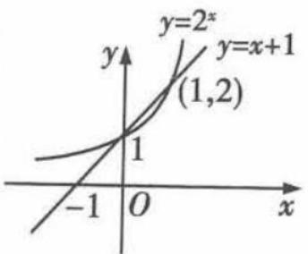

##### 3. B 因为 $f(x)=\frac{2x^{3}}{2^{x}+2^{-x}}$ ，所以 $f(-x)=$

$\frac{-2x^3}{2^{-x} + 2^x} = -f(x)$ , 且 $x \in [-6, 6]$ , 所以函数 $y = \frac{2x^3}{2^x + 2^{-x}}$ 为奇函数, 排除 C; 当 $x > 0$ 时, $f(x) = \frac{2x^3}{2^x + 2^{-x}} > 0$ 恒成立, 排除 D; 因为 $f(4) = \frac{2 \times 64}{2^4 + 2^{-4}} = \frac{128}{16 + \frac{1}{16}} = \frac{128 \times 16}{257} \approx 7.97$ , 排除 A. 选 B.

##### 4. A 因为 $x \in \mathbb{R}$ 且 $f(-x) = (\frac{1}{\mathrm{e}})^{\sin (-x + \frac{\pi}{4})} - (\frac{1}{\mathrm{e}})^{\cos (-x + \frac{\pi}{4})} = (\frac{1}{\mathrm{e}})^{\cos (x + \frac{\pi}{4})} - (\frac{1}{\mathrm{e}})^{\sin (x + \frac{\pi}{4})} = -f(x)$ , 所以 $f(x)$ 为奇函数, $f(x)$ 的图象关于坐标原点 $O$ 对称, 故排除 C, D; 当 $0 < x \leqslant \frac{\pi}{4}$ 时, $\frac{\pi}{4} < x + \frac{\pi}{4} \leqslant \frac{\pi}{2}$ , 则 $\sin (x + \frac{\pi}{4}) > \cos (x + \frac{\pi}{4})$ , 从而 $(\frac{1}{\mathrm{e}})^{\sin (x + \frac{\pi}{4})} < (\frac{1}{\mathrm{e}})^{\cos (x + \frac{\pi}{4})}$ , 所以 $f(x) = (\frac{1}{\mathrm{e}})^{\sin (x + \frac{\pi}{4})} - (\frac{1}{\mathrm{e}})^{\cos (x + \frac{\pi}{4})} < 0$ , 故排除 B. 故选 A.

##### 5. ABD 如图, 观察易知, a < b < 0 或 0 < b < a 或 a = b = 0, 故选 ABD.

##### 6. $(0,\frac{1}{2})\quad y=|a^{x}-1|$ 的图象是由 $y=a^{x}$ 的图象先向下平移1个单位长度,再保持x轴上及其上方的图象不变,将x轴下方的图象沿x轴翻折到x轴上方得到的.

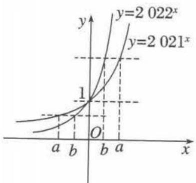

当 $a > 1$ 时，如图1，两图象只有一个交点，不符合题意；当 $0 < a < 1$ 时，如图2，要使两个图象有两个交点，则 $0 < 2a < 1$ ，即 $0 < a < \frac{1}{2}$

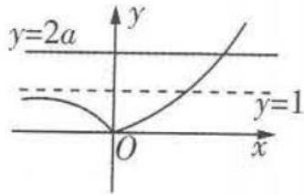  
图1

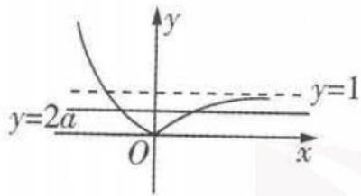  
图2

综上可知，a 的取值范围是 $(0,\frac{1}{2})$ .

# 题型38 指数函数的性质判断及简单应用

##### 1. （1） 由题意可得 $2^{x} - 1 \neq 0$ , 即 $x \neq 0$ , 所以函数 $f(x)$ 的定义域为 $\{x \mid x \neq 0\}$ .

（2） $f(x)$ 为偶函数. 理由如下.

$\begin{array}{r l} & {f (x) = x (\frac {1}{2 ^ {x} - 1} + \frac {1}{2}) = \frac {x}{2} \cdot \frac {2 ^ {x} + 1}{2 ^ {x} - 1}, f (- x) = - \frac {x}{2} \cdot \frac {2 ^ {- x} + 1}{2 ^ {- x} - 1} =} \\ & {\frac {x}{2} \cdot \frac {2 ^ {x} + 1}{2 ^ {x} - 1} = f (x), \therefore f (x) \text {为偶函数}.} \end{array}$

##### 2. A 由 $2^{x} - 2^{y} < 3^{-x} - 3^{-y}$ , 得 $2^{x} - 3^{-x} < 2^{y} - 3^{-y}$ , 即 $2^{x} - \left(\frac{1}{3}\right)^{x} < 2^{y} - \left(\frac{1}{3}\right)^{y}$ . 设 $f(t) = 2^{t} - \left(\frac{1}{3}\right)^{t}$ , 则 $f(x) < f(y)$ . 因为函

数 $z_{1} = 2^{t}$ 在 $\mathbf{R}$ 上为增函数， $z_{2} = -\left(\frac{1}{3}\right)^{t}$ 在 $\mathbf{R}$ 上为增函数，所以 $f(t) = 2^{t} - \left(\frac{1}{3}\right)^{t}$ 在 $\mathbf{R}$ 上为增函数，则由 $f(x) < f(y)$ ，得 $x < y$ ，所以 $y - x > 0, y - x + 1 > 1$ ，所以 $\ln (y - x + 1) > 0$ ，故选A.

##### 3. A 因为 $f(x) = 3^{x} - \left(\frac{1}{3}\right)^{x}$ ，且定义域为 R，所以 $f(-x) = 3^{-x} - \left(\frac{1}{3}\right)^{-x} = \left(\frac{1}{3}\right)^{x} - 3^{x} = -\left[3^{x} - \left(\frac{1}{3}\right)^{x}\right] = -f(x)$ ，即函数 $f(x)$ 是奇函数。又 $y = 3^{x}$ 在 R 上是增函数， $y = \left(\frac{1}{3}\right)^{x}$ 在 R 上是减函数，所以 $f(x) = 3^{x} - \left(\frac{1}{3}\right)^{x}$ 在 R 上是增函数。故选 A.

##### 4. A 函数 $y = \sqrt{3^{x} - 1}$ 的值域为 $[0, +\infty)$ ; 函数 $y = \left(\frac{1}{3}\right)^{x}$ 的值域为 $(0, +\infty)$ ; 函数 $y = \sqrt{1 - \left(\frac{1}{3}\right)^{x}}$ 的值域为 $[0, 1)$ ; 函数 $y = 3^{\frac{1}{x}}$ 的值域为 $(0, 1) \cup (1, +\infty)$ . 故选 A.

##### 5. ABD 函数 $y = \left(\frac{1}{2}\right)^{x^{2} + 4x + 3}$ 的定义域为 R, 故选项 A 正确; $\because x^{2}+4x+3=(x+2)^{2}-1\geqslant-1,\therefore0<\left(\frac{1}{2}\right)^{x^{2}+4x+3}\leqslant2$ , 故函数 $y=\left(\frac{1}{2}\right)^{x^{2}+4x+3}$ 的值域为(0,2], 故选项 B 正确;

$\because y = \left(\frac{1}{2}\right)^u$ 在 $\mathbf{R}$ 上是减函数， $u = x^2 + 4x + 3$ 在 $(- \infty, -2]$ 上是减函数，在 $[-2, +\infty)$ 上是增函数， $\therefore$ 函数 $y = \left(\frac{1}{2}\right)^{x^2 + 4x + 3}$ 在 $[-2, +\infty)$ 上是减函数，故选项C错误，选项D正确。故选ABD。

##### 6.2 或 $\frac{1}{2}$ ∵ 函数 $f(x)=a^{x}(a>0$ 且 $a\neq1)$ 在 [1,2] 上是单调函数，它的最大值是最小值的 2 倍，∴ 当 a>1 时， $a^{2}=2a$ ，解得 a=2；当 0<a<1 时， $a=2a^{2}$ ，解得 $a=\frac{1}{2}$ 。综上可得，a=2 或 $a=\frac{1}{2}$ 。

# 题型39 利用指数函数的图象与性质比较大小

##### 1. $c < b < a$ $\because y = (\frac{3}{5})^x$ 是 $\mathbf{R}$ 上的减函数， $-\frac{1}{3} < -\frac{1}{4} < 0$ ， $\therefore (\frac{3}{5})^{-\frac{1}{3}} > (\frac{3}{5})^{-\frac{1}{4}} > (\frac{3}{5})^0$ ，即 $a > b > 1$ ，又 $c = (\frac{3}{2})^{-\frac{3}{4}} < (\frac{3}{2})^0 = 1, \therefore c < b < a.$

##### 2. D 由题知 $c = \log_{0.7}0.8 < 1, b = \left(\frac{1}{3}\right)^{-0.8} = 3^{0.8}$ , 易知函数 $y = 3^x$ 在 $\mathbf{R}$ 上单调递增, 所以 $b = 3^{0.8} > 3^{0.7} = a > 1$ , 所以 $c < a < b$ , 故选 D.

##### 3. A 函数 $f(x) = \mathrm{e}^{x} - \mathrm{e}^{-x}$ 的定义域为 R，且 $f(x)$ 在 R 上是增函数，因为 $3^{0.2} > 1, 0 < 0.3^{0.2} < 1, \log_{0.2} 3 < 0$ ，所以 $3^{0.2} > 0.3^{0.2} > \log_{0.2} 3$ ，所以 $f(3^{0.2}) > f(0.3^{0.2}) > f(\log_{0.2} 3)$ ，即 $a > b > c$ ，故选 A.

##### 4. B 因为 $a=2^{x^{2}}$ , $b=(2^{x})^{2}=2^{2x}$ , $c=2^{2^{x}}$ , 所以只需比较 $x^{2}, 2x, 2^{x}$ 在 $x \in (1,2)$ 时的大小即可. 令 $y_{1}=x^{2}$ , $y_{2}=2x$ , $y_{3}=2^{x}$ , 在同一平面直角坐标系中作出这三个函数在 $(1,2)$ 上的图象, 如图所示, 由图可知, 当 $x \in (1,2)$ 时, $2x > 2^{x} > x^{2}$ . 又函数 $f(t)=2^{t}$ 在 R 上是增函数, 所以 $2^{2x} > 2^{2x} > 2^{x^{2}}$ , 即 b > c > a, 故选 B.

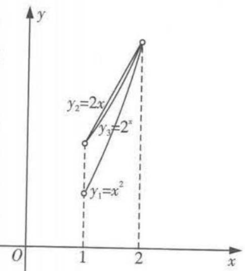

# 第五节 对数与对数函数

# 题型 40 对数式的运算

##### 1. C 令装修电钻的声音强度为 $x_{1}$ , 普通室内谈话的声音强度为 $x_{2}$ , 由题意知 $\left\{ \begin{array}{l} 10 \lg \frac{x_{1}}{A_{0}} = 100, \\ 10 \lg \frac{x_{2}}{A_{0}} = 50, \end{array} \right.$ 得 $\left\{ \begin{array}{l} \frac{x_{1}}{A_{0}} = 10^{10}, \\ \frac{x_{2}}{A_{0}} = 10^{5}, \end{array} \right.$ . 装修电钻的声音强度与普通室内谈话的声音强度的比值为 $\frac{x_{1}}{x_{2}} = \frac{10^{10}}{10^{5}} = 10^{5}$ .

##### 2. C 由 $2^{a} = 5$ 得 $a = \log_{2}5$ . 又 $b = \log_{8}3 = \frac{1}{3}\log_{2}3$ , 所以 $a - 3b = \log_{2}5 - \log_{2}3 = \log_{2}\frac{5}{3} = \frac{\log_{4}\frac{5}{3}}{\log_{4}2} = 2\log_{4}\frac{5}{3} = \log_{4}\frac{25}{9}$ , 所以 $4^{a - 3b} = 4^{\log_4\frac{25}{9}} = \frac{25}{9}$ , 故选 C.

##### 3. -7 由 $f(3) = 1$ 得 $\log_2(3^2 + a) = 1$ ，所以 $9 + a = 2$ ，解得 $a = -7$ .

##### 4. A $\because 2^{a}=7^{b}=k,\therefore a=\log_{2}k,b=\log_{7}k,\therefore\frac{1}{a}=\log_{k}2,\frac{1}{b}=\log_{k}7,$ $\therefore \frac{2}{a} + \frac{1}{b} = 2 \log_{k} 2 + \log_{k} 7 = \log_{k} 28 = 1, \therefore k = 28.$ 故选 A.

##### 5. C 依题意, $\lg(2^{67}-1)\approx\lg2^{67}=67\lg2\approx67\times0.301=20.167$ , $\therefore2^{67}-1\approx10^{20.167}$ . $\therefore2^{67}-1$ 这个“梅森素数”的位数为21位, 故选C.

##### 6. $\frac{b-a+1}{2b+a}$ $\log_{18}15=\frac{\lg 15}{\lg 18}=\frac{\lg 3+\lg 5}{\lg 2+2\lg 3}=\frac{\lg 3+1-\lg 2}{\lg 2+2\lg 3}=\frac{b-a+1}{2b+a}.$

# 题型 41 对数函数的图象及应用

##### 1. C 在同一平面直角坐标系中作出函数 $y = \log_{2}(x + 4)$ 与 $y = 3^{x}$ 的大致图象，如图所示，由图象可观察出两个函数图象共有两个不同的交点，故方程 $\log_{2}(x + 4) = 3^{x}$ 有两个不同的实根.

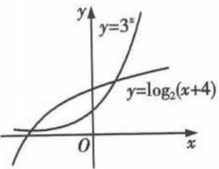

##### 2. D 解法一 若 0 < a < 1，则函数 $y = \frac{1}{a^{x}}$ 是增函数， $y = \log_{a}(x + \frac{1}{2})$ 是减函数且其图象过点 $(\frac{1}{2}, 0)$ ，结合选项可知，选项 D 可能成立；若 a > 1，则 $y = \frac{1}{a^{x}}$ 是减函数，而 $y = \log_{a}(x + \frac{1}{2})$ 是增函数且其图象过点 $(\frac{1}{2}, 0)$ ，结合选项可知，没有符合的图象。故选 D.

解法二 分别取 $a=\frac{1}{2}$ 和 a=2，在同一直角坐标系内画出相应函数的图象（图略），通过对比可知选 D.

##### 3. A 当 a > 1 时, 函数 $y = \log_{a} x$ 的图象为选项 B, D 中过点 (1,0) 的曲线, 此时函数 $y = -x + a$ 的图象与 y 轴的交点的纵坐标 a 应满足 a > 1, 选项 B, D 中的图象都不符合要求; 当 0 < a < 1 时, 函数 $y = \log_{a} x$ 的图象为选项 A, C 中过点 (1,0) 的曲线, 此时函数 $y = -x + a$ 的图象与 y 轴的交点的纵坐标 a 应满足 0 < a < 1, 选项 A 中的图象符合要求, 选项 C 中的图象不符合要求.

##### 4. A $\because x\in(2,8),\therefore x-2>0,\therefore f(x)=x-2+\frac{1}{x-2}+2\geqslant2\sqrt{(x-2)\cdot\frac{1}{x-2}}+2=4,x\in(2,8)$ ，当且仅当 $x-2=\frac{1}{x-2}$ ，即x=3时取等号，∴m=3,n=4。则函数 $g(x)=\log_{\frac{1}{3}}|x+4|$ 的图象在 $(-4,+\infty)$ 上单调递减，在 $(-∞,-4)$ 上单调递增，观察选项可知，选项A符合。故选A。

##### 5.1 当 $a > 1$ 时, 在同一平面直角坐标系中画出 $y_{1} = \log_{a} x$ 和 $y_{2} = a^{-x}$ 的图象, 如图1, 由图象知两函数图象只有一个交点; 同理, 当 $0 < a < 1$ 时, 由图2知两函数图象也只有一个交点. 因此, 不论何种情况, 方程只有一个实数解.

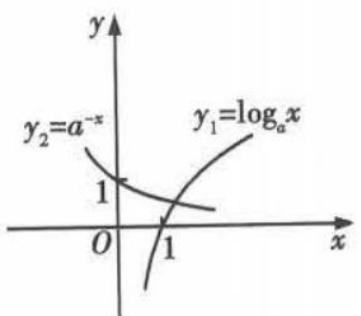

图1

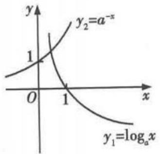

图2

# 题型 42 对数函数的性质判断及简单应用

##### 1. （1） 要使函数有意义, 则 $\left\{ \begin{array}{l} 10 + x > 0, \\ 10 - x > 0, \end{array} \right.$ 解得 $\left\{ \begin{array}{l} x > -10, \\ x < 10, \end{array} \right.$ 即 $-10 < x < 10$ , 即函数 $f(x)$ 的定义域为 $(-10, 10)$ . （2） $f(x)$ 是奇函数, 理由如下.

由（1）知函数 $f(x)$ 的定义域关于原点对称， $f(-x)=\log_{a}(10-x)-\log_{a}(10+x)=-\left[\log_{a}(10+x)-\log_{a}(10-x)\right]=-f(x)$ 故函数 $f(x)$ 是奇函数.

##### 2. D 由 $\left\{ \begin{array}{l} 2x + 1 \neq 0, \\ 2x - 1 \neq 0, \end{array} \right.$ 得函数 $f(x)$ 的定义域为 $(- \infty, -\frac{1}{2}) \cup (-\frac{1}{2}, \frac{1}{2}) \cup (\frac{1}{2}, +\infty)$ , 其关于原点对称, 因为 $f(-x) = \ln |2(-x) + 1| - \ln |2(-x) - 1| = \ln |2x - 1| - \ln |2x + 1| = -f(x)$ , 所以函数 $f(x)$ 为奇函数, 排除 A, C. 当 $x \in (-\frac{1}{2}, \frac{1}{2})$ 时, $f(x) = \ln (2x + 1) - \ln (1 - 2x)$ , 易知函数 $f(x)$ 单调递增, 排除 B. 当 $x \in (-\infty, -\frac{1}{2})$ 时, $f(x) = \ln (-2x - 1) - \ln (1 - 2x) = \ln \frac{2x + 1}{2x - 1} = \ln (1 + \frac{2}{2x - 1})$ , 易知函数 $f(x)$ 单调递减, 故选 D.

##### 3. C 设 $u(x)=3-2ax$ (a>0 且 $a\neq1$ )，则 $u(x)$ 是减函数，要使得函数 $f(x)=\log_{a}(3-2ax)$ 在 [1,2] 上单调递增，只需 $y=\log_{a}u$ 为减函数，且满足 $u(x)=3-2ax>0$ 在 $x\in[1,2]$ 上恒成立，所以 $\left\{\begin{aligned}0<a<1,\\ u(x)_{\min}=u(2)=3-4a>0,\end{aligned}\right.$ 解得 $0<a<\frac{3}{4}$ ，所以实数 a 的取值范围为 $(0,\frac{3}{4})$ ，故选 C.

##### 4. D 当 a > 1 时, 函数 $f(x) = \log_{a}(x + 1)$ 在 $[0, 1]$ 上是增函数, 则 $\left\{\begin{aligned}f(0)&=0,\\ f(1)&=1,\end{aligned}\right.$ 即 $\left\{\begin{aligned}\log_{a}1&=0,\\ \log_{a}2&=1,\end{aligned}\right.$ 解得 a=2. 当 0<a<1 时, 函数 $f(x)=$ $\log_{a}(x+1)$ 在 $[0,1]$ 上是减函数, 所以 $\left\{\begin{aligned}f(0)&=1,\\ f(1)&=0,\end{aligned}\right.$ 无解, 综上, a=2, 故选 D.

##### 5. AD 对于 A, 由 $f(-x) = \ln (-x)^2 - 2\ln [(-x)^2 + 1] = \ln x^2 - 2\ln (x^2 + 1) = f(x)$ , 可知函数 $f(x)$ 为偶函数, 所以 A 正确. 对于 B, 不妨设 $x > 0$ , 此时 $f(x) = 2\ln x - 2\ln (x^2 + 1) = 2\ln \frac{x}{x^2 + 1}$ , 由 $\frac{x}{x^2 + 1} = \frac{1}{x + \frac{1}{x}} \leqslant \frac{1}{2\sqrt{x \cdot \frac{1}{x}}} = \frac{1}{2}$ (当且仅当 $x = 1$ 时取“=” ), 得 $f(x) \leqslant 2\ln \frac{1}{2} = -2\ln 2$ , 因为 $f(x)$ 为偶函数, 所以函数 $f(x)$ 的值域为 $(-\infty, -2\ln 2]$ , 所以 B 错误.

对于 C, 由 $f(\frac{1}{2}) = 2\ln \frac{\frac{1}{2}}{\frac{1}{4} + 1} = \ln \frac{4}{25}, f(\frac{3}{2}) = 2\ln \frac{\frac{3}{2}}{\frac{9}{4} + 1} =$

$2\ln\frac{6}{13}\neq f(\frac{1}{2})$ ，可知当x>0时，函数 $f(x)$ 的图象不关于直线x=1对称，所以C错误.

对于 D, 当 x > 0 时, $f(x) = 2 \ln \frac{1}{x + \frac{1}{x}}$ , 由函数 $y = x + \frac{1}{x} (x > 0)$ 的

增区间为 $(1, +\infty)$ ，减区间为 $(0, 1)$ ，可知当 $x > 0$ 时，函数 $f(x)$ 的减区间为 $(1, +\infty)$ ，增区间为 $(0, 1)$ ，结合 $f(x)$ 图象的对称性可得 $f(x)$ 的增区间为 $(- \infty, -1)$ ， $(0, 1)$ ，所以 D 正确。故选 AD.

# 题型 43 利用对数函数的图象与性质比较大小

##### 1. （1） $\because 3\log_45 = \log_4125, 2\log_23 = \log_29 = \log_481$ ，且函数 $y = \log_4x$ 在 $(0, +\infty)$ 上是增函数，

∴ $\log_{4}125 > \log_{4}81$ ，即 $3\log_{4}5 > 2\log_{2}3$ .

（2） $\because 0 > \log_{0.2}3 > \log_{0.2}4, \therefore \frac{1}{\log_{0.2}3} < \frac{1}{\log_{0.2}4},$ 即 $\log_{3}0.2 < \log_{4}0.2.$

##### 2. C $a=\log_{5}2=\log_{5}\sqrt{4}<\log_{5}\sqrt{5}=\frac{1}{2}=c, b=\log_{8}3=\log_{8}\sqrt{9}>\log_{8}\sqrt{8}=\frac{1}{2}=c$ , 所以 a<c<b. 故选 C.

##### 3. A 易知 a, b, c 均大于 0.

$\frac{a}{b}=\frac{\log_{5}3}{\log_{8}5}=\frac{\ln 3}{\ln 5}\cdot\frac{\ln 8}{\ln 5}=\frac{\ln 3\cdot\ln 8}{(\ln 5)^{2}}<\frac{1}{(\ln 5)^{2}}\cdot(\frac{\ln 3+\ln 8}{2})^{2}=$ $(\frac{\ln 24}{\ln 25})^{2}<1$ ,所以a<b。(作商比较大小)

因为 $5^{5} < 8^{4} \Rightarrow \ln 5^{5} < \ln 8^{4} \Rightarrow 5\ln 5 < 4\ln 8$ ，所以 $\frac{4}{5} > \frac{\ln 5}{\ln 8} = \log_{8} 5 = b$ ，因为 $13^{4} < 8^{5} \Rightarrow \ln 13^{4} < \ln 8^{5} \Rightarrow 4\ln 13 < 5\ln 8$ ，所以 $\frac{4}{5} < \frac{\ln 8}{\ln 13} = \log_{13} 8 = c$ ，（借助中间值 $\frac{4}{5}$ 比较大小）

所以 $a < b < \frac{4}{5} < c$ ，故选 A.

##### 4. B 因为 $a = \log_{6}\sqrt[3]{7} = \frac{1}{3}\log_{6}7 > \frac{1}{3}\log_{6}6 = \frac{1}{3}, b = \log_{7}\sqrt[3]{6} = \frac{1}{3}\log_{7}6 < \frac{1}{3}\log_{7}7 = \frac{1}{3}$ ，所以 a > b.

因为 $a=\log_{6}\sqrt[3]{7}=\frac{1}{3}\log_{6}7<\frac{1}{3}\log_{6}6^{3}=1$ , $c=6^{0.1}>6^{0}=1$ , 所以 c>a.
所以 c > a > b. 故选 B.

##### 5. A 因为 $a = \log_{24} 16 = \log_{2/6} 4 > \log_5 4 = b, c = \frac{\lg 3 + \lg 5}{2\lg 5} = \frac{\lg 15}{\lg 25} = \log_{25} 15 = \log_5 \sqrt{15} < \log_5 4 = b$ ，所以 $a > b > c$ ，故选 A.

##### 6. A 由题意, $a = \ln 4 > 1, 0 < b = \log_3 e < 1, c = \log_3 4 > 1$ , 令 $f(x) = \ln x$ , $g(x) = \log_3 x$ , 作出 $f(x), g(x)$ 的草图如图所示, 由 $f(x), g(x)$ 的图象可知, 当 $x = 4$ 时, $f(4) > g(4)$ , 即 $a > c$ ,

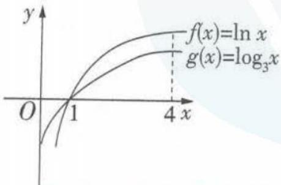

(对数函数图象的特点：在第一象限，对数函数的底数越大，图象越接近于x轴)
所以 a > c > b，故选 A.

# 题型 44 解对数（指数）方程或不等式问题

##### 1. （1） 由 $\left\{ \begin{array}{l} 2x + 1 > 0, \\ x^2 - 2 > 0, \end{array} \right.$ 得 $x > \sqrt{2}$ .

由 $\log_5(2x + 1) = \log_5(x^2 -2)$ 得 $2x + 1 = x^{2} - 2$ ，即 $x^{2} - 2x - 3 = 0$ 解得 $x = 3$ （负值已舍去）.

（2） $\because81\times3^{2x}=\left(\frac{1}{9}\right)^{x+2},\therefore3^{2x+4}=3^{-2(x+2)}$

$\therefore 2x+4=-2(x+2)$ ，解得 x=-2.

##### 2. $x = 2$ $\because \log_2(9^{x - 1} - 5) = \log_2(3^{x - 1} - 2) + 2,$

$\therefore \log_{2}(9^{x - 1} - 5) = \log_{2}[4\times (3^{x - 1} - 2)],$

$\therefore 9^{x - 1} - 5 = 4 \times (3^{x - 1} - 2)$ , 即 $(3^x)^2 - 12 \times 3^x + 27 = 0$ , 即 $(3^x - 3)(3^x - 9) = 0, \therefore 3^x = 3$ 或 $3^x = 9$ , 解得 $x = 1$ 或 $x = 2$ , 经检验知 $x = 1$ 不满足条件, 舍去. $\therefore x = 2$ .

##### 3. C 因为函数 $f(x)$ 是定义在 R 上的偶函数, 且在 $(-∞,0]$ 上单调递减, 所以可将 $f(\log_{\frac{1}{3}}(2x-5)) > f(\log_38)$ 化为 $|\log_{\frac{1}{3}}(2x-5)| > |\log_38|$ , 即 $\log_3(2x-5) > \log_38$ 或 $\log_3(2x-5) < -\log_38 = \log_3\frac{1}{8}$ , 即 $2x-5 > 8$ 或 $0 < 2x-5 < \frac{1}{8}$ , 解得 $x > \frac{13}{2}$ 或 $\frac{5}{2} < x < \frac{41}{16}$ . 故选 C.

##### 4.1 因为 $x_{1}$ 是方程 $x\mathrm{e}^{x} = 1$ 的解， $x_{2}$ 是方程 $x\ln x = 1$ 的解，所以 $x_{1}$ 是方程 $\mathrm{e}^x = \frac{1}{x}$ 的解， $x_{2}$ 是方程 $\ln x = \frac{1}{x}$ 的解，即 $x_{1}$ 是 $y = \mathrm{e}^{x}$ ， $y = \frac{1}{x}$ 图象交点的横坐标， $x_{2}$ 是 $y = \ln x, y = \frac{1}{x}$ 图象交点的横坐标。因为 $y = \ln x$ 与 $y = \mathrm{e}^{x}$ 互为反函数，所以 $y = \ln x$ 与 $y = \mathrm{e}^{x}$ 的图象关于 $y = x$ 对称，又 $y = \frac{1}{x}$ 的图象也关于 $y = x$ 对称，所以 $(x_{1}, \frac{1}{x_{1}}), (x_{2}, \frac{1}{x_{2}})$ 关于 $y = x$ 对称，则 $x_{1} = \frac{1}{x_{2}}, x_{1}x_{2} = 1$ 。

##### 5.(1,2) ∵ 函数 $f(x)=|\log_{5}x|$ 的定义域为 $(0,+\infty)$ ,

$\therefore \left\{ \begin{array}{l} x > 0, \\ 2 - x > 0, \end{array} \right. \therefore 0 <   x <   2.$

①当 x=1 时, $f(x)=f(2-x)$ , 不符合题意.

②当0<x<1时,2-x>1,

则 $f(x) < f(2 - x)$ 等价于 $|\log_{5}x| < |\log_{5}(2 - x)|$ ,

$\therefore - \log_ {5} x <   \log_ {5} (2 - x), \therefore \log_ {5} (2 - x) + \log_ {5} x > 0,$

即 $\log_{5}[x(2-x)]>0,\therefore x(2-x)>1,$

$\therefore x^{2}-2x+1<0$ , 此方程无解.

③当1<x<2时,0<2-x<1,

则 $f(x) < f(2 - x)$ 等价于 $|\log_5 x| < |\log_5 (2 - x)|$ ,

$\therefore \log_ {5} x <   - \log_ {5} (2 - x),$

$\therefore \log_ {5} (2 - x) + \log_ {5} x <   0, \text {即} \log_ {5} [ x (2 - x) ] <   0,$

$\therefore x(2-x)<1,\therefore x^{2}-2x+1>0,$ 即 $x\neq1,$

则 1 < x < 2 符合题意.

综上所述，x 的取值范围是(1,2).

# 第六节 函数的图象

# 题型 45 判断函数图象

##### 1. C 解法一 出发时距学校最远,先排除 A;中途堵塞停留,距离不变,再排除 D;堵塞停留后比原来骑得快,因此排除 B,故选 C.

解法二 由小明的运动规律知,小明距学校的距离应逐渐减小,由于小明先是匀速运动,故前段是直线段,途中停留时距离不变,后段加快速度行驶,比前段下降得快,故应选 C.

##### 2. A 解法一(特值法) 取 x=1，则 $y=(3-\frac{1}{3})\cos1=\frac{8}{3}\cos1>0$ ; 取 x=-1，则 $y=(\frac{1}{3}-3)\cos(-1)=-\frac{8}{3}\cos1<0$ . 结合选项知选 A.

解法二 令 $y = f(x)$ ，则 $f(-x) = (3^{-x} - 3^x)\cos (-x) = -(3^x - 3^{-x})\cos x = -f(x)$ ，所以函数 $y = (3^x - 3^{-x})\cos x$ 是奇函数，且当 $x \in (0, \frac{\pi}{2})$ 时， $3^x - 3^{-x} > 0, \cos x > 0$ ，故 $f(x) > 0$ ，故选 A.

##### 3. A 解法一 函数 $f(x)$ 的定义域为 R, $f(-x) = \frac{-x^{3}}{2^{-x} + 2^{x}} = -f(x)$ ，所以函数 $f(x)$ 为奇函数，其图象关于坐标原点对称，排除 B, D；当 $x \to +\infty$ 时， $f(x) \to 0$ ，排除 C. 故选 A.

解法二 函数 $f(x)$ 的定义域为 R, 因为函数 $y = x^3$ 为奇函数, $y = 2^x + 2^{-x}$ 为偶函数, 所以函数 $f(x) = \frac{x^3}{2^x + 2^{-x}}$ 为奇函数, 排除 B, D; 又 $f(0) = 0$ , $f(1) = \frac{2}{5}$ , $f(2) = \frac{32}{17} > 1$ , $f(10) = \frac{10^3}{2^{10} + 2^{-10}} = \frac{1000}{1024 + \frac{1}{1024}} < 1$ , 所以可排除 C. 故选 A.

##### 4. D 解法一 因为 $f(1-x)=f[-(x-1)]$ ，所以函数 $f(1-x)$ 的图象是先将函数 $f(x)$ 的图象关于 y 轴对称，得到 $f(-x)$ 的图象，再向右平移一个单位长度得到的，故选 D.

解法二 易知函数 $f(x)$ 的定义域为 $(0, +\infty)$ . 由 $1 - x > 0$ , 得 $x < 1$ , 所以函数 $f(1 - x)$ 的定义域为 $(-\infty, 1)$ , 故排除 A, C; 又当 $x = -1$ 时, $f[1 - (-1)] = f(2) = 2\ln 2 > 0$ , 排除 B, 故选 D.

##### 5. C 由题意可知, $\triangle PAB$ 为直角三角形, $PA = 2\cos x, PB = 2\sin x$ , 所以 $PA + PB = 2\cos x + 2\sin x = 2\sqrt{2}\sin \left(x + \frac{\pi}{4}\right), x \in [0, \frac{\pi}{2}]$ , 即 $y = f(x) = 2\sqrt{2}\sin \left(x + \frac{\pi}{4}\right), x \in [0, \frac{\pi}{2}]$ . 因为 $x \in [0, \frac{\pi}{2}]$ , 所以 $x + \frac{\pi}{4} \in [\frac{\pi}{4}, \frac{3\pi}{4}]$ , 所以 $2\sqrt{2}\sin \left(x + \frac{\pi}{4}\right) \in [2, 2\sqrt{2}]$ , 当 $x + \frac{\pi}{4} = \frac{\pi}{2}$ , 即 $x = \frac{\pi}{4}$ 时函数 $f(x)$ 取得最大值 $2\sqrt{2}$ , 故排除 B, D; 又函数 $f(x)$ 的解析式为正弦型, 故排除 A, 故选 C.

# 题型 46 分析函数图象

##### 1. B 观察图象,根据图象的特点,发现取水深 $h=\frac{H}{2}$ 时,注水量 $V'>\frac{V_{0}}{2}$ ,即水深为一半时,实际注水量大于水瓶容积的一半,A中 $V'<\frac{V_{0}}{2}$ ,C,D中 $V'=\frac{V_{0}}{2}$ ,故排除A,C,D.

##### 2. C ∵ 函数 $f(x)=\frac{ax+b}{(x+c)^{2}}$ 的图象与 x 轴, y 轴分别交于点 N, M, 且点 M 的纵坐标与点 N 的横坐标均为正, ∴ $-\frac{b}{a}>0$ , $\frac{b}{c^{2}}>0$ , 故 a<0, b>0. 又点 P 的横坐标为正, ∴ -c>0, 故 c<0.

##### 3. A 对于选项 B, 当 x=1 时, y=0, 与图象不符, 故排除 B; 对于选项 D, 当 x=3 时, $y=\frac{1}{5}\sin3>0$ , 与图象不符, 故排除 D; 对于选项 C, 当 x>0 时, $y=\frac{2x\cos x}{x^{2}+1}\leqslant\frac{2x\cos x}{2x}=\cos x\leqslant1$ , 与图象在 y 轴右侧最高点大于 1 不符, 所以排除 C. 故选 A.

##### 4. A 由函数 $f(x)$ 的图象结合题意知, 当 $x < -1$ 或 $x > 1$ 时, $g(x) > 0$ ; 当 $-1 < x < 1$ 时, $g(x) < 0$ , 由选项可知选 A.

##### 5. D 由题中图象可知,函数 $f(x)$ 的图象关于坐标原点对称,所以函数 $f(x)$ 是奇函数.因为函数 $y = e^{x} + e^{-x} = e^{x} + \frac{1}{e^{x}} = \frac{e^{2x} + 1}{e^{x}}$ 为偶函数,所以函数 $y = \frac{1}{e^{x} + e^{-x}} = \frac{e^{x}}{e^{2x} + 1}$ 为偶函数.因为函数 $y =$

$e^{x}-e^{-x}=e^{x}-\frac{1}{e^{x}}=\frac{e^{2x}-1}{e^{x}}$ 为奇函数,所以函数 $y=\frac{1}{e^{x}-e^{-x}}=\frac{e^{x}}{e^{2x}-1}$ 为奇函数.因为函数 $y=x^{2}$ 是偶函数, $y=\frac{1}{x^{2}}$ 是偶函数,所以选项A中的函数 $f(x)=\frac{x^{2}e^{x}}{e^{2x}+1}$ 与选项B中的函数 $f(x)=\frac{e^{2x}+1}{x^{2}e^{x}}$ 均为偶函数,选项C中的函数 $f(x)=\frac{x^{2}e^{x}}{e^{2x}-1}$ 与选项D中的函数 $f(x)=\frac{e^{2x}-1}{x^{2}e^{x}}$ 均为奇函数,所以排除选项A和B.(另解:对于选项A和B中的函数,f(x)>0恒成立,所以函数 $f(x)$ 的图象在x轴上方,所以排除选项A和B)

对于选项C, $f(x)=\frac{x^{2}e^{x}}{e^{2x}-1}=\frac{x^{2}}{e^{x}-\frac{1}{e^{x}}}$ ,当 $x\to+\infty$ 时, $e^{x}-\frac{1}{e^{x}}\to+\infty$ ,并且 $e^{x}$ 的增长速度远远大于 $x^{2}$ 的增长速度,所以函数 $f(x)\to0$ ,所以排除选项C.故选D.

# 第七节 函数与方程

# 题型 47 判断函数的零点所在区间

##### 1. B 解法一(定理法) 函数 $f(x)=\log_{3}x+x-2$ 的定义域为 $(0,+\infty)$ ，并且 $f(x)$ 在 $(0,+\infty)$ 上单调递增，图象是一条连续的曲线.

由题意知 $f(1) = -1 < 0$ , $f(2) = \log_{3} 2 > 0$ , 根据零点存在定理可知, 函数 $f(x) = \log_{3} x + x - 2$ 有唯一零点, 且零点在区间 (1,2) 内. 故选 B.

解法二(图象法) 将函数 $f(x)$ 的零点所在的区间转化为函数 $g(x)=\log_{3}x,h(x)=-x+2$ 图象交点的横坐标所在的范围.作出两函数图象如图所示,可知 $f(x)$ 的零点所在的区间为(1,2).故选B.

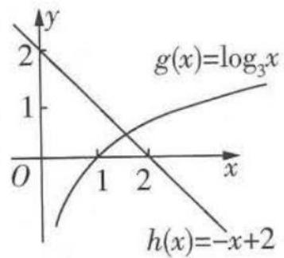

##### 2. C 易知 $f(x)$ 在 $(0, +\infty)$ 上单调递减，

$f(1)=6-\log_{2}1=6>0,f(2)=3-\log_{2}2=2>0,f(4)=\frac{3}{2}-$ $\log_{2}4=-\frac{1}{2}<0$ , 由函数零点存在定理知函数 $f(x)$ 在区间 $(2,4)$ 内必存在零点.

##### 3. A 因为 $f(a) = (a - b)(a - c) > 0, f(b) = (b - c)(b - a) < 0, f(c) = (c - a)(c - b) > 0$ ，所以 $f(a) \cdot f(b) < 0, f(b) \cdot f(c) < 0$ ，所以函数 $f(x)$ 的两个零点分别位于区间 $(a, b)$ 和 $(b, c)$ 内.

##### 4. C 设 $f(x)=\ln x-x+2=\ln x-(x-2)$ ，易知函数 $f(x)$ 在 $(1,+\infty)$ 上的图象连续，由表格数据得 $f(3)=\ln 3-(3-2)=1.099-1=0.099>0$ , $f(4)=\ln 4-2=1.386-2<0$ , $f(1)>0$ , $f(2)>0$ , $f(5)<0$ ，则 $f(3)\cdot f(4)<0$ ，即在区间 $(3,4)$ 上，函数 $f(x)$ 存在一个零点，即方程 $\ln x-x+2=0$ 的一个根所在的区间为 $(3,4)$ ，故选 C.

##### 5. C 设 $f(x)=\ln x+3x-15$ ，显然 $f(x)$ 在定义域 $(0,+\infty)$ 上单调递增，故 $f(x)=0$ 只有一个根，又 $f(4)=\ln 4-3=2\ln 2-3<2(\ln 2-1)<0$ ， $f(5)=\ln 5>0$ ，所以 $x_{0}\in(4,5)$ ，故 $[x_{0}]=4$ .

##### 6. C 构造函数 $f(x) = \left(\frac{1}{2}\right)^x - x^{\frac{1}{3}}$ ，易知函数 $f(x)$ 在 $\mathbf{R}$ 上单调递减，且函数 $f(x)$ 的图象是一条连续不断的曲线，易知 $f(0) = \left(\frac{1}{2}\right)^0 - 0 = 1 > 0, f\left(\frac{1}{3}\right) = \left(\frac{1}{2}\right)^{\frac{1}{3}} - \left(\frac{1}{3}\right)^{\frac{1}{3}} > 0, f\left(\frac{1}{2}\right) = \left(\frac{1}{2}\right)^{\frac{1}{2}} - \left(\frac{1}{2}\right)^{\frac{1}{3}} < 0, f\left(\frac{2}{3}\right) = \left(\frac{1}{2}\right)^{\frac{2}{3}} - \left(\frac{2}{3}\right)^{\frac{1}{3}} < 0, f(1) = \frac{1}{2} - 1 = -\frac{1}{2} <$

0, 结合选项, 因为 $f(\frac{1}{3}) \cdot f(\frac{1}{2}) < 0$ ,

故函数 $f(x)$ 的零点所在的区间为 $\left(\frac{1}{3},\frac{1}{2}\right)$ ,

即方程 $\left(\frac{1}{2}\right)^{x}=x^{\frac{1}{3}}$ 的根 $x_{0}$ 属于区间 $\left(\frac{1}{3},\frac{1}{2}\right)$ .

### 题型48 判断函数的零点个数

##### 1. B 解法一（直接法） 由 $f(x) = 0$ 得 $\left\{ \begin{array}{l} x \leqslant 0, \\ x^2 + x - 2 = 0 \end{array} \right.$ 或

$\left\{\begin{aligned}x&>0,\\ -1+\ln x&=0,\end{aligned}\right.$ 解得 x=-2 或

x=e. 因此函数 $f(x)$ 共有 2 个零点.

解法二（图象法） 函数 $f(x)$ 的图象如图所示，

由图象知函数 $f(x)$ 共有2个零点.

##### 2. B $f(x) = 2\sin x - 2\sin x\cos x =$

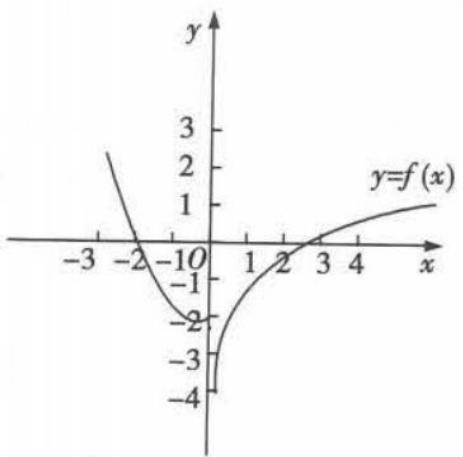

$2\sin x(1-\cos x)$ ，令 $f(x)=0$ ，则 $\sin x=0$ 或 $\cos x=1$ ，所以 $x=k\pi$ $(k\in\mathbf{Z})$ ，又 $x\in[0,2\pi]$ ，

所以 x=0 或 $x=\pi$ 或 $x=2\pi$ . 故选 B.

##### 3. B 函数 $f(x)=2^{x}\left|\log_{0.5}x\right|-1$ 的零点也就是方程 $2^{x}\left|\log_{0.5}x\right|-1=0$ 的根，

整理得 $|\log_{0.5}x| = (\frac{1}{2})^x$ 令 $g(x) =$

$\left|\log_{0.5}x\right|$ , $h(x)=\left(\frac{1}{2}\right)^{x}$ , 作出 $g(x)$ ,

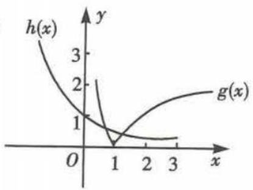

$h(x)$ 的图象, 如图所示. 因为两个函数的图象有两个交点, 所以 $f(x)$ 有两个零点.

##### 4. A 函数 $y=f(x)-g(x)$ 的零点个数即 $f(x), g(x)$ 图象的交点个数. 在同一平面直角坐标系中分别画出函数 $f(x)=$

$\left\{ \begin{array}{l} 2 - |x|, x \leqslant 2, \\ (x - 2)^2, x > 2 \end{array} \right.$ 和函数 $g(x) = 3 - f(2 - x)$

的大致图象,如图所示,其中函数 $g(x)$ 的

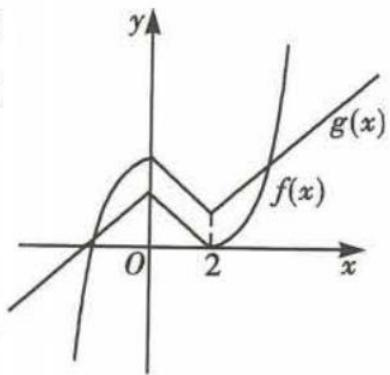

图象可由 $f(x)$ 的图象经过翻折、平移得到. 由图可知, 函数 $f(x)$ , $g(x)$ 的图象有2个交点, 所以函数 $y = f(x) - g(x)$ 的零点个数为2.

##### 5. B 解法一(直接法) 由 $y = f(x) - 3 = 0$ 得 $f(x) = 3$ . 当 $x > 0$ 时, 得 $\ln x = 3$ 或 $\ln x = -3$ , 解得 $x = e^3$ 或 $x = e^{-3}$ ; 当 $x \leqslant 0$ 时, 得 $-2x(x + 2) = 3$ , 无解. 所以函数 $y = f(x) - 3$ 的零点个数是 2, 故选 B.

解法二（图象法）作出函数 $f(x)$ 的图象，如图，函数 $y=f(x)-3$ 的零点个数即 $y=f(x)$ 的图象与直线y=3的交点个数，作出直线y=3，由图知 $y=f(x)$ 的图象与直线y=3有2个交点，故函数 $y=f(x)-3$ 的零点个数是2，故选B.

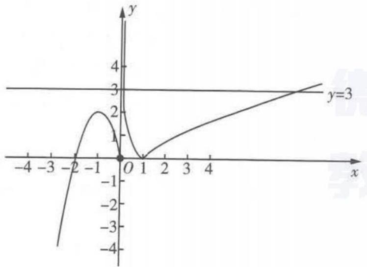

##### 6. C 因为函数 $f(x)$ 是定义域为 R 的奇函数, 所以 $f(0)=0$ , 即 x=0 是函数 $f(x)$ 的 1 个零点.

当 $x > 0$ 时，令 $f(x) = \mathrm{e}^{x} + x - 3 = 0$ ，则 $\mathrm{e}^x = -x + 3$ ，分别画出函数 $y = \mathrm{e}^x$ 和 $y = -x + 3$ 的图象，如图所示，两函数图象有1个交点，所以函数 $f(x)$ 有1个零点.根据对称性知，当 $x <   0$ 时，函数 $f(x)$ 也有1个零点

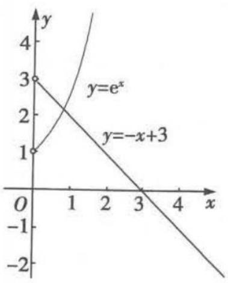

综上所述, $f(x)$ 的零点个数为3.故选C.

##### 7.2 $f(x)=2(1+\cos x)\sin x-2\sin x-\left|\ln(x+1)\right|=\sin 2x-\left|\ln(x+1)\right|$ ，其中 x>-1，

函数 $f(x)$ 的零点个数即为函数 $y_{1} = \sin 2x (x > -1)$ 与 $y_{2} = |\ln (x + 1)|(x > -1)$ 的图象的交点个数. 分别作出两个函数的图象, 如图, 可知有 2 个交点, 则 $f(x)$ 有 2 个零点.

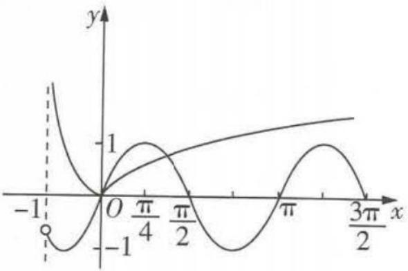

# 题型 49 根据函数的零点情况求参数的取值范围

##### 1. B 令 $f(x)=0$ 得 $\log_{a}x=x-2$ .

当 $a > 1$ 时，函数 $y = \log_a x$ 和 $y = x - 2$ 的图象如图1所示.由图象可知函数 $y = \log_a x$ 和 $y = x - 2$ 的图象有两个交点，所以 $f(x) = \log_a x - x + 2$ 有两个零点，符合题意

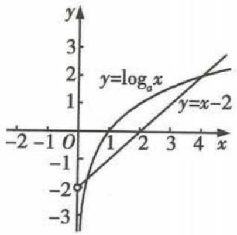

图1

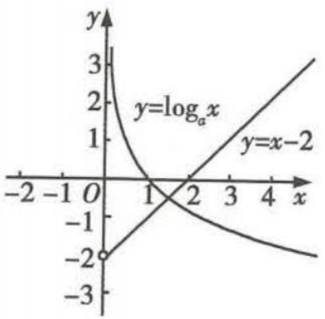

图 2

当 $0 < a < 1$ 时，函数 $y = \log_a x$ 和 $y = x - 2$ 的图象如图2所示.由图象可知 $y = \log_a x$ 和 $y = x - 2$ 的图象有一个交点，所以 $f(x) = \log_a x - x + 2$ 有一个零点，不符合题意

综上, a 的取值范围为 a > 1.

##### 2. C 函数 $g(x)=f(x)+x+a$ 存在 2 个零点, 即关于 x 的方程 $f(x)=-x-a$ 有 2 个不同的实根, 即函数 $f(x)$ 的图象与直线 y=-x-a 有 2 个交点, 作出直线 y=-x-a 与函数 $f(x)$ 的图象, 如图所示, 由图可知, $-a\leqslant1$ , 解得 $a\geqslant-1$ .

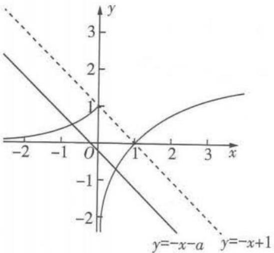

##### 3. D 由题意可知 $x = 0$ 为 $g(x)$ 的一个零点. 函数 $g(x) = f(x) - |kx^2 - 2x| (k \in \mathbb{R})$ 恰有4个零点, 即函数 $f(x)$ 与 $h(x) = |kx^2 - 2x|$ 的图象有4个交点, 其中 $(0,0)$ 为其中一个交点, 当 $x > 0$ 时, 由 $x^3 = |kx^2 - 2x|$ 可得 $x^2 = |kx - 2|$ , 当 $x < 0$ 时, 由 $-x = |kx^2 - 2x|$ 可得 $1 = |kx - 2|$ , 令 $\varphi(x) = \begin{cases} x^2, & x > 0, \\ 1, & x < 0, \end{cases} \mu(x) = |kx - 2| (x \neq 0)$ , 则函数 $y = \varphi(x)$ 与 $y = \mu(x)$ 的图象有3个交点. 若 $k < 0$ , 如图1所示, 函数 $y=\varphi(x)$ 与 $y=\mu(x)$ 的图象有3个交点，所以k<0符合题意。若k>0，如图2所示，需证当 $x>\frac{2}{k}$ 时，函数 $y=\varphi(x)$ 与 $y=\mu(x)$ 的图象有2个交点。当 $x>\frac{2}{k}$ 时， $\varphi(x)=x^{2},\mu(x)=kx-2$ ，令 $\varphi(x)=\mu(x)$ ，则 $x^{2}-kx+2=0$ ，因为 $x^{2}-kx+2=0$ 有两个不同实根，所以 $\Delta>0$ ，即 $k^{2}-8>0$ ，解得 $k>2\sqrt{2}$ 。综上，当k<0或 $k>2\sqrt{2}$ 时，函数 $g(x)=f(x)-|kx^{2}-2x|$ 恰有4个零点。

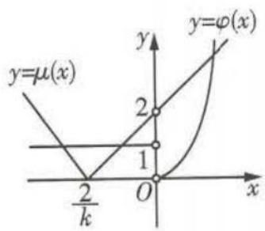

图1

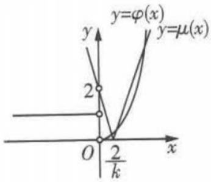

图2

##### 4. A 解法一 因为 $g(0)=0$ ，即 $g(x)$ 的一个零点为 0，所以只需保证 $g(x)=0 (x \neq 0)$ 有三个不同的实根，当 $x \neq 0$ 时，令 $g(x)=f(x)-ax=0$ ，得 $a=\frac{f(x)}{x}=\left\{\begin{aligned}\mathrm{e}^{x},&x<0,\\ \frac{\ln x}{x},&x>0,\end{aligned}\right.$ 令 $t(x)=\left\{\begin{aligned}\mathrm{e}^{x},&x<0,\\ \frac{\ln x}{x},&x>0,\end{aligned}\right.$ 当 x>0 时， $t'(x)=\frac{1-\ln x}{x^{2}}$ ，令 $t'(x)=0$ ，得 x=e，当 $x\in(0,e)$ 时， $t'(x)>0,t(x)$ 在 $(0,e)$ 上单调递增，当 $x\in(\mathrm{e},+\infty)$ 时， $t'(x)<0,t(x)$ 在 $(\mathrm{e},+\infty)$ 上单调递减，所以 $t(x)_{\max}=t(\mathrm{e})=\frac{1}{\mathrm{e}}$ 。所以 $t(x)$ 的大致图象如图 1，所以要使 $g(x)=0 (x \neq 0)$ 有三个不同的实根，则需满足 $a\in(0,\frac{1}{\mathrm{e}})$ ，故选 A.

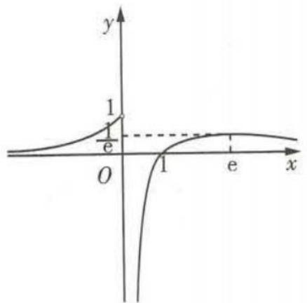

图1

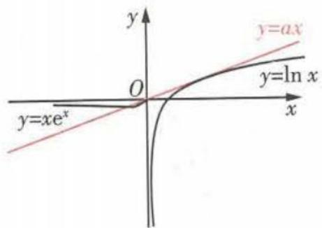

图2

解法二 要使 $g(x)$ 有四个不同的零点，只需 $f(x)$ 的图象与直线 y=ax 有四个交点，当 $x \leqslant 0$ 时， $f'(x) = (x + 1)e^{x}$ ，令 $f'(x) = 0$ ，得 x = -1，当 $x \in (-\infty, -1)$ 时， $f'(x) < 0, f(x)$ 在 $(-\infty, -1)$ 上单调递减，当 $x \in (-1, 0)$ 时， $f'(x) > 0, f(x)$ 在 $(-1, 0)$ 上单调递增，所以 $f(x)_{\min} = f(-1) = -\frac{1}{e}$ 。作出直线 y = ax 与函数 $f(x)$ 的大致图象，如图2所示，当直线 y = ax 与 $y = \ln x$ 的图象相切时，设切点为 $(x_0, \ln x_0)$ ，则 $a = \frac{1}{x_0}$ 且 $ax_0 = \ln x_0$ ，解得 $a = \frac{1}{e}$ ，而当 y = ax 与 $y = xe^x$ 相切时， $a = 1 > \frac{1}{e}$ ，故由图可得，当 $a \in (0, \frac{1}{e})$ 时， $f(x)$ 的图象与直线 y = ax 有四个交点，故选 A.

##### 5. ACD 因为 $f(x-1)=f(x+1)$ ，所以 $f(x)=f(x+2)$ ，所以函数 $f(x)$ 是周期函数，且 T=2 是函数 $f(x)$ 的一个周期，所以选项 A 正确；因为函数 $f(x)$ 是偶函数，所以 $f(x)=f(-x)$ ，又当 $x\in[0,1]$ 时， $f(x)=x$ ，所以 $f(\frac{4}{3})=f(\frac{4}{3}-2)=f(-\frac{2}{3})=f(\frac{2}{3})=\frac{2}{3}$ ，所以选项 B 错误；根据函数 $f(x)$ 是偶函数，且 T=2 是函数 $f(x)$ 的一个周期，及当 $x\in[0,1]$ 时， $f(x)=x$ ，作出函数 $f(x)$ 的图象，如图所示，

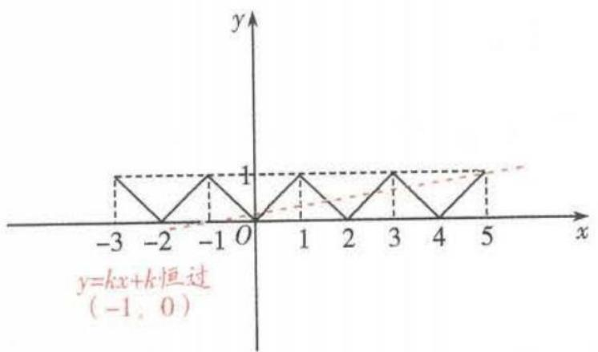

由图可知, 当 $x \in [1,2]$ 时, $f(x) = -x + 2$ , 所以 $g(x) = -x + 2 - kx - k = -(1 + k)x + 2 - k$ , 因为 k > -1, 所以 $1 + k > 0$ , 所以 $-(1 + k) < 0$ , 所以函数 $g(x)$ 在 $[1,2]$ 上单调递减, 所以选项 C 正确; 在区间 $[-1,3]$ 内, 函数 $g(x)$ 有 4 个零点, 即 $f(x) = k(x + 1)$ 有 4 个根, 即函数 $y = f(x)$ 的图象与直线 $y = k(x + 1)$ 在 $[-1,3]$ 内有 4 个交点, 由图可知, $0 < k(3 + 1) \leqslant 1$ , 解得 $0 < k \leqslant \frac{1}{4}$ , 即实数 k 的取值范围是 $(0, \frac{1}{4}]$ , 所以选项 D 正确. 故选 ACD.

##### 6. $0 \leqslant a < \frac{3}{4}$ 函数 $g(x) = f(x) - \frac{1}{2} x + a$ 存在3个零点，等价于函数 $f(x)$ 的图象与 $y = \frac{1}{2} x - a$ 的图象有3个交点。画出函数 $f(x)$ 和 $y = \frac{1}{2} x - a$ 的图象，如图所示。

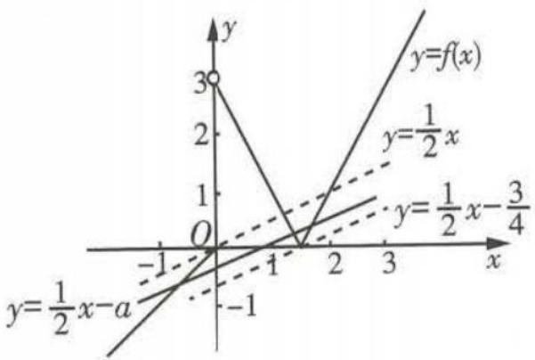

根据图象易知,要使函数 $f(x)$ 和 $y=\frac{1}{2}x-a$ 的图象有3个交点,
则 $-\frac{3}{4} < -a \leqslant 0$ , 即 $0 \leqslant a < \frac{3}{4}$ .

# 第八节 函数模型及其应用

# 题型 50 解决图表型函数的实际应用问题

##### 1. 1350 若 x=1300，则 $y=5\%(1300-800)=25<30$ ，因此 x>1300。由 $10\%(x-1300)+25=30$ ，得 x=1350。

##### 2. D 对于 A 选项, 当 T = 220, P = 1026, 即 $\lg P = \lg 1026 > \lg 10^{3} = 3$ 时, 根据图象可知, 二氧化碳处于固态; 对于 B 选项, 当 T = 270, P = 128, 即 $\lg P = \lg 128 \in (\lg 10^{2}, \lg 10^{3})$ , 即 $\lg P \in (2,3)$ 时, 根据图象可知, 二氧化碳处于液态; 对于 C 选项, 当 T = 300, P = 9987, 即 $\lg P = \lg 9987 < \lg 10^{4} = 4$ 时, 根据图象可知, 二氧化碳处于固态; 对于 D 选项, 当 T = 360, P = 729, 即 $\lg P = \lg 729 \in (\lg 10^{2}, \lg 10^{3})$ , 即 $\lg P = \lg 729 \in (2,3)$ 时, 根据图象可知, 二氧化碳处于超临界状态. 故选 D.

##### 3. ①②③ 由题图可知甲企业的污水排放量在 $t_1$ 时刻高于乙企业的, 而在 $t_2$ 时刻甲、乙两企业的污水排放量相同, 故在 $[t_1, t_2]$ 这段时间内, 甲企业的污水治理能力比乙企业强, 故①正确; 甲企业污水排放量与时间的关系图象在 $t_2$ 时刻切线的斜率的绝对值大于乙企业的, 故②正确; 在 $t_3$ 时刻, 甲、乙两企业的污水排放量都低于污水达标排放量, 故都已达标, ③正确; 甲企业在 $[0, t_1], [t_1, t_2], [t_2, t_3]$ 这三段时间中, 在 $[0, t_1]$ 的污水治理能力明显低于 $[t_1, t_2]$ 时的, 故④错误.

##### 4. D $4100 \times 0.126 - 4000 \times 0.125 = 516.6 - 500 = 16.6$ . 故选 D.

##### 5. B 根据图象, 把 $(t, p)$ 的三组数据 $(3, 0.7)$ , $(4, 0.8)$ , $(5, 0.5)$ 分别代入函数关系式, 得 $\left\{\begin{aligned}0.7 &= 9a + 3b + c, \\ 0.8 &= 16a + 4b + c, \\ 0.5 &= 25a + 5b + c,\end{aligned}\right.$ 解得 $\left\{\begin{aligned}a &= -0.2, \\ b &= 1.5, \\ c &= -2.0.\end{aligned}\right.$ 以 $p = -0.2t^{2} + 1.5t - 2.0 = -\frac{1}{5}(t - \frac{15}{4})^{2} + \frac{13}{16}.$ 当 $t = \frac{15}{4} = 3.75$ 时, p 取得最大值, 即最佳加工时间为 3.75 min.

# 题型 51 已知函数模型求解实际问题

##### 1. D 由题意, 知 $y = 13.4 \times e^{(2021 - 2010) \times 0.57\%} = 13.4 \times e^{0.0627} \approx 14.3$ (亿), 即 2021 年末我国的人口总数约为 14.3 亿, 故选 D.

##### 2. C $4.9 = 5 + \lg V \Rightarrow \lg V = -0.1 \Rightarrow V = 10^{-\frac{1}{10}} = \frac{1}{\sqrt[10]{10}} \approx \frac{1}{1.259} \approx$ 0.8,所以该同学视力的小数记录法的数据约为0.8.

##### 3. B $\because R_{0}=1+rT,\therefore 3.28=1+6r,\therefore r=0.38.$

若 $\left\{\begin{aligned}I(t_{1})&=e^{0.38t_{1}},\\ I(t_{2})&=e^{0.38t_{2}},\\ I(t_{2})&=2I(t_{1}),\end{aligned}\right.$ 则 $e^{0.38(t_{2}-t_{1})}=2,$

即 $0.38(t_{2}-t_{1})=\ln2\approx0.69,t_{2}-t_{1}\approx1.8$ ，选 B.

##### 4. （1） 令 y=0，得 $kx-\frac{1}{20}(1+k^{2})x^{2}=0$ ，

由实际意义和题设条件知 x > 0, k > 0,

$\mathrm{故} x = \frac {2 0 k}{1 + k ^ {2}} = \frac {2 0}{k + \frac {1}{k}}.$

由 $k + \frac{1}{k} \geqslant 2$ ，当且仅当 k = 1 时，等号成立可知， $x \leqslant 10$ 。所以炮的最大射程为 10 千米。

（2） 因为 a > 0, 所以若炮弹可击中目标,

则存在 k > 0，使 $3.2 = ka - \frac{1}{20}(1 + k^{2})a^{2}$ 成立，

即关于 k 的方程 $a^{2}k^{2}-20ak+a^{2}+64=0$ 有正根. 设 $f(k)=a^{2}k^{2}-20ak+a^{2}+64$ ,

则此函数图象的对称轴为直线 $k = -\frac{-20a}{2a^{2}} = \frac{10}{a}$ . 因为 a > 0, 所以 $k = \frac{10}{a} > 0$ ,

故只需判别式 $\Delta=(-20a)^{2}-4a^{2}(a^{2}+64)\geqslant0$ 结合 a>0 得 $0<a\leqslant6$ .

所以当 a 不超过 6 时, 可击中目标.

##### 5. C 依题意, $M=M_{0}\cdot\left(\frac{1}{2}\right)^{\frac{t}{h}}$ ,且当 $M=\frac{M_{0}}{2}$ 时,t=50,所以 $\frac{M_{0}}{2}=M_{0}\cdot\left(\frac{1}{2}\right)^{\frac{50}{h}}$ ,得h=50,所以 $M=M_{0}\cdot\left(\frac{1}{2}\right)^{\frac{t}{50}}$ .由 $0.66M_{0}=M_{0}\cdot\left(\frac{1}{2}\right)^{\frac{t}{50}}$ ,得 $0.66=2^{-\frac{t}{50}}$ ,即 $-\frac{t}{50}=\log_{2}0.66\approx-0.6$ ,解得 $t\approx30$ ,所以锶89的质量从 $M_{0}$ 衰减至 $0.66M_{0}$ 所经过的时间约为30天,故选C.

##### 6. ACD 对于 A, $E = 10^{15.3}$ 时, 由 $\lg E = 4.8 + 1.5M$ , 得 15.3 = 4.8 + 1.5M, 解得 M = 7, 即地震里氏震级约为七级, 所以选项 A 正确;

对于 B, 当 M=8 时, $\lg E_{1}=4.8+1.5\times8=16.8$ , 则 $E_{1}=10^{16.8}$ , 当 M=7 时, $\lg E_{2}=4.8+1.5\times7=15.3$ , 则 $E_{2}=10^{15.3}$ , 所以 $\frac{E_{1}}{E_{2}}=\frac{10^{16.8}}{10^{15.3}}=10^{16.8-15.3}=10^{1.5}=10\sqrt{10}>6.3$ , 所以选项 B 错误;

对于 C, 由上可知, 八级地震释放的能量为 $E_{1}=10^{16.8}$ , 当 M=6 时, $\lg E_{3}=4.8+1.5\times6=13.8$ , 则 $E_{3}=10^{13.8}$ , 所以 $\frac{E_{1}}{E_{3}}=\frac{10^{16.8}}{10^{13.8}}=10^{16.8-13.8}=10^{3}=1000$ , 所以选项 C 正确;

对于 D, 当 M = n 时, $\lg a_{n} = 4.8 + 1.5n$ , 则 $a_{n} = 10^{4.8 + 1.5n}$ , 所以 $\frac{a_{n+1}}{a_{n}} = \frac{10^{4.8 + 1.5(n+1)}}{10^{4.8 + 1.5n}} = 10^{1.5}$ , 所以数列 $\{a_{n}\}$ 是等比数列, 所以选项 D 正确. 综上, 选 ACD.

##### 7. （1） 当 $0 < x \leqslant 10$ 时, $f(x) = xR(x) - (100 + 27x) = 81x - \frac{x^3}{3} - 100$ ; 当 $10 < x \leqslant 25$ 时, $f(x) = xR(x) - (100 + 27x) = -x^2 + 30x + 75$ .

故 $f(x)=\left\{\begin{aligned}&81x-\frac{x^{3}}{3}-100(0<x\leqslant10),\\&-x^{2}+30x+75(10<x\leqslant25).\end{aligned}\right.$

（2） 当 $0 < x \leqslant 10$ 时，由 $f'(x) = 81 - x^{2} = -(x + 9)(x - 9)$ ，得当 $x \in (0, 9)$ 时， $f'(x) > 0, f(x)$ 单调递增；当 $x \in (9, 10)$ 时， $f'(x) < 0, f(x)$ 单调递减.

故 $f(x)_{\max}=f(9)=81\times9-\frac{1}{3}\times9^{3}-100=386.$

当 $10 < x \leqslant 25$ 时, $f(x) = -x^{2} + 30x + 75 = -(x - 15)^{2} + 300 \leqslant 300$ .
综上, 当 x = 9 时, 年利润取最大值 386.

所以当年产量为9千件时,该公司在这一产品的生产中所获年利润最大.

# 题型 52 构造函数模型求解实际问题

##### 1. A 根据题意可得该人的应纳税所得额 T=249 600-60 000-249 600×20%-52 800-4 560=82 320(元)，该人的个人所得税税额 S=T×10%-2 520=82 320×10%-2 520=5 712(元). 故选 A.

##### 2. B 设应在病人注射这种药经过 $x \mathrm{~h}$ 后再次向病人注射这种药, 则血液中的含药量 $y$ (单位: $\mathrm{mg}$ ) 与注射后的时间 $x$ 的关系式为 $y = 2500(1 - 20\%)^x$ , 由题意可得 $2500(1 - 20\%)^x > 1500$ , 整理可得 $(\frac{4}{5})^x > \frac{3}{5}$ , 所以 $\log_{\frac{4}{5}}(\frac{4}{5})^x < \log_{\frac{4}{5}}\frac{3}{5}$ , 即 $x < \log_{\frac{4}{5}}\frac{3}{5}$ . 由 $\log_{\frac{4}{5}}\frac{3}{5} = \log_{\frac{8}{10}}\frac{6}{10} = \frac{\lg\frac{6}{10}}{\lg\frac{8}{10}} = \frac{\lg6 - 1}{\lg8 - 1} = \frac{\lg2 + \lg3 - 1}{3\lg2 - 1} \approx$

$\frac{0.3010+0.4771-1}{3\times0.3010-1}\approx2.3$ ,所以x<2.3,故从现在起到再次向病人注射这种药的最长时间为2.3 h,才能保持疗效,故选B.

##### 3. B 设经过 x 年后该公司全年投入的研发资金开始超过 200 万元, 则 $130(1 + 12\%)^{x} > 200$ , 即 $1.12^{x} > \frac{2}{1.3}$ , 所以 $x > \frac{\lg \frac{2}{1.3}}{\lg 1.12} = \frac{\lg 2 - \lg 1.3}{\lg 1.12} \approx \frac{0.30 - 0.11}{0.05} = 3.8$ , 因为 x 取整数, 所以取 x = 4, 所以该公司全年投入的研发资金开始超过 200 万元的年份是 2019 年.

##### 4.20 如图, 过 A 作 $AH \perp BC$ 于 H, 交 DE 于 F, 易知 $\frac{DE}{BC} = \frac{x}{40} = \frac{AD}{AB} = \frac{AF}{AH}$ , 得 AF = x, ∴ FH =

40 - x, 则 $S = x(40 - x) = 400 - (x - 20)^{2}$ , ∴ 当 x = 20 时, $S_{\max} = 400$ . 故满足题意的边长为 20 m.

##### 5. B 小强同学每天进步 2.01%, 即 0.020 1. 因为 $(1 + 0.0201)^{30} = [(1.01)^{2}]^{30} = [(1.01)^{30}]^{2} \approx 1.4^{2} = 1.96$ , 所以 30 天后小强的学习成果约为原来的 1.96 倍, 故选 B.

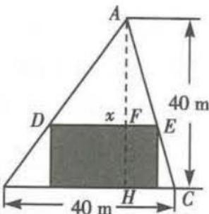

##### 6. $1 - \left(\frac{1}{2}\right)^{\frac{1}{10}}$ 由于每年治理面积占上一年年底沙漠面积的百分比均为 $x$ ，则 $a(1 - x)^{10} = \frac{1}{2} a$ ，即 $(1 - x)^{10} = \frac{1}{2}$ ，解得 $x = 1 - \left(\frac{1}{2}\right)^{\frac{1}{10}}$ . 设从2020年开始，还需治理 $n$ 年，则 $n$ 年后剩余沙漠面积

为 $\frac{\sqrt{2}}{2} a(1 - x)^n$ ，依题意，得 $\frac{\sqrt{2}}{2} a(1 - x)^n \leqslant \frac{1}{4} a$ ，即 $(1 - x)^n \leqslant \frac{\sqrt{2}}{4}$ ，所以 $(\frac{1}{2})^{\frac{n}{10}} \leqslant (\frac{1}{2})^{\frac{3}{2}}$ ，所以 $\frac{n}{10} \geqslant \frac{3}{2}$ ，解得 $n \geqslant 15$ ，故至少还需治理15年，使剩余沙漠面积至多为原沙漠面积的 $\frac{1}{4}$ .

# 第三章 导数及其应用

# 第一节 导数的概念及运算

# 题型53 导数的运算

##### 1. $1 - \sqrt{2}$ 对 $f(x)$ 求导, 得 $f'(x) = -f'(\frac{\pi}{4}) \cdot \sin x - \cos x.$

把 $x=\frac{\pi}{4}$ 代入 $f'(x)$ ，得 $f'\left(\frac{\pi}{4}\right)=-f'\left(\frac{\pi}{4}\right)\cdot\sin\frac{\pi}{4}-\cos\frac{\pi}{4}$ 解得 $f'(\frac{\pi}{4})=1-\sqrt{2}.$

##### 2. （1） $y' = (2x^3 - 3x^2 + 6)' = 6x^2 - 6x$ .

$\begin{array}{l} = \frac {\left[ \cos (3 x + 2) \right] ^ {'} \cdot 2 x - \cos (3 x + 2) \cdot (2 x) ^ {'}}{4 x ^ {2}} \\ = \frac {- 3 x \sin (3 x + 2) - \cos (3 x + 2)}{2 x ^ {2}}. \\ \end{array}$

（2） $y'=\left[\frac{\cos(3x+2)}{2x}\right]'$

（3） $y' = \left[(3x + 1)^{3} \ln (3x)\right]' = \left[(3x + 1)^{3}\right]' \cdot \ln (3x) + (3x + 1)^{3}$

$1)^{3} \cdot [\ln (3x)]' = (27x^{2} + 18x + 3)\ln (3x) + \frac{(3x + 1)^{3}}{x}$ .

（4） $y' = (4^x e^{-4x})' = (4^x)' \cdot e^{-4x} + 4^x \cdot (e^{-4x})' = 4^x e^{-4x} \ln 4 - 4^{x+1} e^{-4x}.$

##### 3.1 由于 $f'(x) = \frac{\mathrm{e}^x(x + a) - \mathrm{e}^x}{(x + a)^2}$ ，故 $f'（1） = \frac{\mathrm{e}a}{(1 + a)^2} = \frac{\mathrm{e}}{4}$ ，解得 $a = 1$ .

##### 4. e 由题意得 $f'(x) = \mathrm{e}^x \ln x + \mathrm{e}^x \cdot \frac{1}{x}$ ，则 $f'（1） = \mathrm{e}$ .

##### 5. A 由已知, 得 $f'(x) = 2e^{2x} + 2f'（1）x$ , 令 $x = 1$ , 则 $f'（1） = 2e^2 + 2f'（1）$ , 所以 $f'（1） = -2e^2$ . 故选 A.

##### 6. $-\frac{14}{3}$ 对 $f(x)$ 求导, 得 $f'(x)=\frac{1}{x}-2f'（1）x+3$ , 所以 $f'（1）=1-2f'（1）+3$ , 解得 $f'（1）=\frac{4}{3}$ , 所以 $f'(x)=\frac{1}{x}-\frac{8}{3}x+3$ , 将 x=3 代入 $f'(x)$ , 可得 $f'（3）=-\frac{14}{3}$ .

$\begin{array}{l} = \frac {\left[ \cos (3 x + 2) \right] ^ {'} \cdot 2 x - \cos (3 x + 2) \cdot (2 x) ^ {'}}{4 x ^ {2}} \\ = \frac {- 3 x \sin (3 x + 2) - \cos (3 x + 2)}{2 x ^ {2}}. \\ \end{array}$

# 题型54 求切线方程

##### 1. D 由 $f'(x)=9x^{2}-4$ ，得 $f'（1）=5$ ，且 $f(1)=-1$ ，故切线方程为 $y-(-1)=5(x-1)$ ，即5x-y-6=0.  
##### 2. D 解法一 因为函数 $f(x) = x^3 + (a - 1)x^2 + ax$ 为奇函数, 所以 $f(-x) = -f(x)$ , 所以 $(-x)^3 + (a - 1)(-x)^2 + a(-x) = -[x^3 + (a - 1)x^2 + ax]$ , 所以 $2(a - 1)x^2 = 0$ , 因为 $x \in \mathbb{R}$ , 所以 $a = 1$ , 所以 $f(x) = x^3 + x$ , 所以 $f'(x) = 3x^2 + 1$ , 所以 $f'（0） = 1$ , 所以曲线 $y = f(x)$ 在点(0,0)处的切线方程为 $y = x$ . 故选 D.

解法二 因为函数 $f(x)=x^{3}+(a-1)x^{2}+ax$ 为奇函数, 所以 $f(-1)+f(1)=0$ , 所以 $-1+a-1-a+(1+a-1+a)=0$ , 解得 a=1, 所以 $f(x)=x^{3}+x$ , 所以 $f'(x)=3x^{2}+1$ , 所以 $f'（0）=1$ , 所以曲线 $y=f(x)$ 在点 $(0,0)$ 处的切线方程为 y=x. 故选 D.

解法三 易知 $f(x) = x^{3} + (a - 1)x^{2} + ax = x[x^{2} + (a - 1)x + a]$ ，因为 $f(x)$ 为奇函数，所以函数 $g(x) = x^{2} + (a - 1)x + a$ 为偶函数，所以 a-1=0，解得 a=1，所以 $f(x)=x^{3}+x$ ，所以 $f'(x)=3x^{2}+1$ ，所以 $f'（0）=1$ ，所以曲线 $y=f(x)$ 在点 $(0,0)$ 处的切线方程为 y=x。故选 D.

##### 3. $y = 5x + 2$ 由 $y = \frac{2x - 1}{x + 2}$ 得 $y' = \frac{2(x + 2) - (2x - 1)}{(x + 2)^2} = \frac{5}{(x + 2)^2}$ ，则 $y' \bigg|_{x = -1} = \frac{5}{(-1 + 2)^2} = 5$ ，所以切线方程为 $y + 3 = 5(x + 1)$ ，即 $y = 5x + 2$ .  
##### 4. $y=\frac{1}{e}x$ $y=-\frac{1}{e}x$ 先求当 x>0 时，曲线 $y=\ln x$ 过原点的切线方程，设切点为 $(x_{0},y_{0})$ ，则由 $y'=\frac{1}{x}$ ，得切线斜率为 $\frac{1}{x_{0}}$ ，又切线的斜率为 $\frac{y_{0}}{x_{0}}$ ，所以 $\frac{1}{x_{0}}=\frac{y_{0}}{x_{0}}$ ，解得 $y_{0}=1$ ，代入 $y=\ln x$ ，得 $x_{0}=e$ ，所以切线斜率为 $\frac{1}{e}$ ，切线方程为 $y=\frac{1}{e}x$ 。同理可求得当 x<0 时的切线方程为 $y=-\frac{1}{e}x$ 。综上可知，两条切线方程分别为 $y=\frac{1}{e}x, y=-\frac{1}{e}x$ 。  
##### 5. A 由题意可得 $f(1) = 1, f'（1） = 2$ . 由 $g(x) = f(x) - x^2$ 得， $g(-1) = f(-1) - 1 = -f(1) - 1 = -2, g'(x) = f'(x) - 2x$ . 因为 $y = f(x)$ 为奇函数，所以 $f(x) = -f(-x)$ ，两边同时求导得 $f'(x) = [-f(-x)]' = -f'(-x)(-x)' = f'(-x)$ ，则 $f'(-1) = f'（1） = 2$ ，所以 $g'(-1) = f'(-1) - 2 \times (-1) = 4$ ，所以 $g(x)$ 的图象在点 $(-1, g(-1))$ 处的切线方程为 $y - (-2) = 4(x + 1)$ ，即 $y = 4x + 2$ ，故选 A.  
##### 6. B $f'(x)=1+\cos x-x\sin x$ ，设切点为 $A(x_{0},x_{0}+x_{0}\cos x_{0})$ ，则在切点 A 处的切线方程为 $y-(x_{0}+x_{0}\cos x_{0})=(1+\cos x_{0}-x_{0}\sin x_{0})(x-x_{0})$ ，即 $y=(1+\cos x_{0}-x_{0}\sin x_{0})x+x_{0}^{2}\sin x_{0}$ ，将 $(0,0)$ 代入得 $x_{0}^{2}\sin x_{0}=0$ ，即 $x_{0}=k\pi(k\in\mathbf{Z})$ ，当 k 为偶数时， $1+\cos x_{0}-x_{0}\sin x_{0}=2$ ，当 k 为奇数时， $1+\cos x_{0}-x_{0}\sin x_{0}=0$ ，所以切线方程为 y=2x 或 y=0，所以过坐标原点 O 作曲线 $f(x)=x+x\cos x$ 的切线条数为 2，故选 B.

# 易错警示

一般将求切线的条数问题转化为求切点的个数问题,但是遇到三角函数或周期函数时要注意切点不同,切线有可能相同的情况.

##### 7. $2x + y - 4 = 0$ 由题可得, $f'(x) = 3x^{2} + m, f'（0） = m, f(0) = 2 - m$ , $\therefore$ 直线 $l$ 的方程为 $y - (2 - m) = mx$ , $\therefore$ 直线 $l$ 与坐标轴的交点坐标分别为 $(0,2 - m), (\frac{m - 2}{m}, 0), \therefore S = -\frac{1}{2} \cdot \frac{(m - 2)^{2}}{m} = -\frac{1}{2} (m + \frac{4}{m} - 4)$ , 易知当 $m = \frac{4}{m}$ , 即 $m = -2$ 时, $m + \frac{4}{m}$ 取得最大值, $S$ 取得最小值, 此时直线 $l$ 的方程为 $2x + y - 4 = 0$ .

# 题型55 根据导数的几何意义求参数（或切点）

##### 1. $-\frac{1}{4}$ 易得 $y' = 2ae^{2ax}$ ，因为曲线 $y = e^{2ax}$ 在点 $(0,1)$ 处的切线

与直线 $2x - y - 1 = 0$ 垂直，所以 $y'|_{x = 0} = -\frac{1}{2}$ ，即 $2a = -\frac{1}{2}$ ，解得 $a = -\frac{1}{4}.$

##### 2. D 因为 $y' = ae^{x} + \ln x + 1$ ，所以 $y' \mid_{x=1} = ae + 1$ ，所以曲线在点 $(1, ae)$ 处的切线方程为 $y - ae = (ae + 1)(x - 1)$ ，即 $y = (ae + 1)x - 1$ ，
所以 $\left\{\begin{aligned}a e+1&=2,\\ b&=-1,\end{aligned}\right.$ 解得 $\left\{\begin{aligned}a=e^{-1},\\ b&=-1.\end{aligned}\right.$ 故选D.

##### 3. $(- \infty, -4) \cup (0, +\infty)$ 因为 $y = (x + a)e^x$ ，所以 $y' = (x + a + 1)e^x$ 。设切点为 $A(x_0, (x_0 + a)e^{x_0})$ ， $O$ 为坐标原点，依题意得，切线斜率 $k_{OA} = y' \mid^{x=x_0} = (x_0 + a + 1)e^{x_0} = \frac{(x_0 + a)e^{x_0}}{x_0}$ ，化简，得 $x_0^2 + ax_0 - a = 0$ 。因为曲线 $y = (x + a)e^x$ 有两条过坐标原点的切线，所以关于 $x_0$ 的方程 $x_0^2 + ax_0 - a = 0$ 有两个不同的根，所以 $\Delta = a^2 + 4a > 0$ ，解得 $a < -4$ 或 $a > 0$ ，所以 $a$ 的取值范围是 $(- \infty, -4) \cup (0, +\infty)$ 。

##### 4. (e,1) 设 $A(x_0, \ln x_0)$ , 则曲线 $y = \ln x$ 在点 $A$ 处的切线方程为 $y - \ln x_0 = \frac{1}{x_0}(x - x_0)$ , 由切线过点 $(-e, -1)$ , 得 $-1 - \ln x_0 = \frac{1}{x_0} (-e - x_0)$ , 化简得 $\ln x_0 = \frac{e}{x_0}$ , 解得 $x_0 = e$ , 则点 $A$ 的坐标是 $(e,1)$ .

##### 5. C 设直线 y=1 与曲线 $y=f(x)=ae^{x}-x^{2}$ 相切于点 $(x_{0},1)$ ，则必有 $\left\{\begin{aligned}f(x_{0})&=1,\\ f'(x_{0})&=0,\end{aligned}\right.$ 又 $f'(x)=ae^{x}-2x$ ，所以 $\left\{\begin{aligned}ae^{x_{0}}-x_{0}^{2}&=1,\\ ae^{x_{0}}-2x_{0}&=0,\end{aligned}\right.$ 解得 $\left\{\begin{aligned}x_{0}&=1,\\ a&=\frac{2}{e},\end{aligned}\right.$ 故选 C.

##### 6. A 易知点(1,1)在曲线 $y = x + \frac{\ln x}{k}$ 上. 令 $f(x) = x + \frac{\ln x}{k}$ ，则 $f'(x) = 1 + \frac{1}{kx}$ ，所以 $f'（1） = 1 + \frac{1}{k}$ ，即曲线 $y = x + \frac{\ln x}{k}$ 在点(1,1)处的切线的斜率为 $1 + \frac{1}{k}$ ，又该切线与直线 $x + 2y = 0$ 垂直，直线 $x + 2y = 0$ 的斜率为 $-\frac{1}{2}$ ，所以 $1 + \frac{1}{k} = 2$ ，解得 k = 1，故选 A.

##### 7. D 设切点 $P(x_{0}, y_{0})$ ，由 $f'(x) = 3x^{2} - 1$ ，可得切线的斜率 $k = f'(x_{0}) = 3x_{0}^{2} - 1$ ，因为曲线 $f(x) = x^{3} - x + 3$ 在点 P 处的切线平行于直线 y = 2x - 1，所以 $3x_{0}^{2} - 1 = 2$ ，解得 $x_{0} = \pm 1$ ，当 $x_{0} = 1$ 时，可得 $f(1) = 3$ ，此时 $P(1, 3)$ ；当 $x_{0} = -1$ 时，可得 $f(-1) = 3$ ，此时 $P(-1, 3)$ ，综上，点 P 的坐标为 $(-1, 3)$ 或 $(1, 3)$ ，故选 D.

# 题型 56 曲线的公切线问题

##### 1.8 因为 $y = x + \ln x$ ，所以 $y' = 1 + \frac{1}{x}$ ，曲线 $y = x + \ln x$ 在点 (1, 1) 处的切线斜率为 2，所以曲线 $y = x + \ln x$ 在点 (1, 1) 处的切线方程为 $y - 1 = 2(x - 1)$ ，即 y = 2x - 1。因为切线 y = 2x - 1 与曲线 $y = ax^{2} + (a + 2)x + 1$ 相切，所以易得 $a \neq 0$ 。由 $\left\{\begin{aligned}y &= 2x - 1, \\ y &= ax^{2} + (a + 2)x + 1,\end{aligned}\right.$ 消去 y，整理得 $ax^{2} + ax + 2 = 0$ ，由 $\Delta = a^{2} - 8a = 0$ ，且 $a \neq 0$ ，得 a = 8。

##### 2. D 易知直线 l 的斜率存在, 设直线 l 的方程为 $y = kx + b$ , 则 $\frac{|b|}{\sqrt{k^{2} + 1}} = \frac{\sqrt{5}}{5}$ ①, 设直线 l 与曲线 $y = \sqrt{x}$ 的切点坐标为 $(x_{0}, \sqrt{x_{0}})$ $(x_{0} > 0)$ , 则 $y' \mid_{x = x_{0}} = \frac{1}{2} x_{0}^{-\frac{1}{2}} = k$ ②, $\sqrt{x_{0}} = k x_{0} + b$ ③, 由②③可得 $b = \frac{1}{2} \sqrt{x_{0}}$ , 将 $b = \frac{1}{2} \sqrt{x_{0}}$ , $k = \frac{1}{2} x_{0}^{-\frac{1}{2}}$ 代入①得 $x_{0} = 1$ 或 $x_{0} =$

$-\frac{1}{5}$ (舍去), 所以 $k = b = \frac{1}{2}$ , 故直线 $l$ 的方程为 $y = \frac{1}{2} x + \frac{1}{2}$ . 故选 D.

##### 3.（1）当 $x_{1}=-1$ 时, $f(-1)=0$ ,所以切点坐标为 $(-1,0)$ .

由 $f(x)=x^{3}-x$ ，得 $f'(x)=3x^{2}-1$ ，

所以切线斜率 $k=f'(-1)=2$ ,

所以切线方程为 $y=2(x+1)$ ，即 $y=2x+2$ .

将 $y = 2x + 2$ 代入 $y = x^{2} + a$ ，得 $x^{2} - 2x + a - 2 = 0.$ 由切线与曲线 $y = g(x)$ 相切，得 $\Delta = (-2)^{2} - 4(a - 2) = 0,$

解得 a = 3.

（2） 由 $f(x) = x^3 - x$ ，得 $f'(x) = 3x^2 - 1$ ，

所以切线斜率 $k=f'(x_{1})=3x_{1}^{2}-1$

所以切线方程为 $y - (x_{1}^{3} - x_{1}) = (3x_{1}^{2} - 1)(x - x_{1})$ ，即 $y = (3x_{1}^{2} - 1)x - 2x_{1}^{3}$ .

将 $y=(3x_{1}^{2}-1)x-2x_{1}^{3}$ 代入 $y=x^{2}+a$ ，得 $x^{2}-(3x_{1}^{2}-1)x+a+2x_{1}^{3}=0$ .
由切线与曲线 $y=g(x)$ 相切，得 $\Delta=(3x_{1}^{2}-1)^{2}-4(a+2x_{1}^{3})=0$

整理, 得 $4a = 9x_{1}^{4} - 8x_{1}^{3} - 6x_{1}^{2} + 1$ .

令 $h(x)=9x^{4}-8x^{3}-6x^{2}+1$ , 则 $h'(x)=36x^{3}-24x^{2}-12x=12x(3x+1)(x-1)$

由 $h'(x)=0$ , 得 $x=-\frac{1}{3},0,1$

$h(x), h'(x)$ 随 x 的变化如下表所示：

<table><tr><td>x</td><td> $(-\infty,-\frac{1}{3})$ </td><td> $-\frac{1}{3}$ </td><td> $(-\frac{1}{3},0)$ </td><td>0</td><td>(0,1)</td><td>1</td><td> $(1,+\infty)$ </td></tr><tr><td>h&#x27;(x)</td><td>-</td><td>0</td><td>+</td><td>0</td><td>-</td><td>0</td><td>+</td></tr><tr><td>h(x)</td><td>↘</td><td>极小值</td><td>↗</td><td>极大值</td><td>↘</td><td>极小值</td><td>↗</td></tr></table>

由上表知，当 $x = -\frac{1}{3}$ 时， $h(x)$ 取得极小值 $h(-\frac{1}{3}) = \frac{20}{27}$ ，

当 $x = 1$ 时， $h(x)$ 取得极小值 $h(1) = -4$

易知当 $x \to -\infty$ 时， $h(x) \to +\infty$ ，当 $x \to +\infty$ 时， $h(x) \to +\infty$ ，所以函数 $h(x)$ 的值域为 $[-4, +\infty)$ ，

所以由 $4a \in [-4, +\infty)$ ，得 $a \in [-1, +\infty)$ ，

故实数 a 的取值范围为 $\left[-1, +\infty\right)$ .

##### 4. $x^{2}+1$ (答案不唯一) 因为 $f'(x)=3x^{2}$ ，所以 $f'（0）=0$ ，曲线 $f(x)=x^{3}+1$ 在点 $(0,1)$ 处的切线方程为 y=1，所有图象在点 $(0,1)$ 处的切线方程为 y=1 的函数都是正确答案.

##### 5. -2 易知曲线 $y = \mathrm{e}^{x}$ 在点 $(x_{1},\mathrm{e}^{x_{1}})$ 处的切线方程为 $y - \mathrm{e}^{x_1} = \mathrm{e}^{x_1}(x - x_1)$ ，即 $y = \mathrm{e}^{x_1}x - \mathrm{e}^{x_1}x_1 + \mathrm{e}^{x_1}$ ，曲线 $y = \ln x$ 在点 $(x_{2},\ln x_{2})$ 处的切线方程为 $y - \ln x_{2} = \frac{1}{x_{2}} (x - x_{2})$ ，即 $y = \frac{1}{x_{2}} x - 1 + \ln x_{2}$ ，于

是 $\left\{ \begin{array}{l} \mathrm{e}^{x_1} = \frac{1}{x_2}, \\ \mathrm{e}^{x_1} - \mathrm{e}^{x_1} x_1 = -1 + \ln x_2, \end{array} \right.$ 得 $x_{2} = \frac{1}{\mathrm{e}^{x_{1}}}, \mathrm{e}^{x_{1}} - \mathrm{e}^{x_{1}} x_{1} = -1 + \ln x_{2} =$

$-1+\ln\frac{1}{e^{x_{1}}}=-1-x_{1}$ ，则 $e^{x_{1}}=\frac{x_{1}+1}{x_{1}-1}$ ，所以 $x_{2}=\frac{x_{1}-1}{x_{1}+1}$ ，所以 $x_{2}-1=\frac{x_{1}-1}{x_{1}+1}-1=\frac{-2}{x_{1}+1}$ ，得 $(x_{1}+1)(x_{2}-1)=-2$ .

# 第二节 导数在研究函数中的应用

# 题型57 讨论函数的单调性或求单调区间

##### 1. （1） $f'(x)=3x^{2}+2x-8$ ，当 $f'(x)>0$ ，即 $x>\frac{4}{3}$ 或x<-2时，
函数 $f(x)$ 单调递增；当 $f'(x)<0$ ，即 $-2<x<\frac{4}{3}$ 时，函数 $f(x)$ 单调

递减. 故函数 $f(x)=x^{3}+x^{2}-8x$ 的单调递增区间是 $\left(\frac{4}{3},+\infty\right)$ 和 $(-∞,-2)$ ，单调递减区间是 $(-2,\frac{4}{3})$ .

（2） 函数 $f(x)$ 的定义域为 $(-∞, 2) ∪ (2, +∞)$ . $f'(x) = \frac{\mathrm{e}^{x}(x-2) - \mathrm{e}^{x}}{(x-2)^{2}} = \frac{\mathrm{e}^{x}(x-3)}{(x-2)^{2}}$ .

因为 $x \in (-\infty, 2) \cup (2, +\infty)$ , 所以 $\mathrm{e}^x > 0, (x - 2)^2 > 0$ .

令 $f'(x)=0$ 可得x=3，则 $f'(x)$ 在各区间的正负，以及 $f(x)$ 的单调性如下表所示.

<table><tr><td>x</td><td> $(-\infty,2)$ </td><td> $(2,3)$ </td><td>3</td><td> $(3,+\infty)$ </td></tr><tr><td>f&#x27;(x)</td><td>-</td><td>-</td><td>0</td><td>+</td></tr><tr><td>f(x)</td><td>单调递减</td><td>单调递减</td><td> $f(3)=e^{3}$ </td><td>单调递增</td></tr></table>

所以函数 $f(x)$ 的单调递增区间为 $(3, +\infty)$ ，单调递减区间为 $(-\infty, 2)$ 和 $(2, 3)$ .

##### 2. 当 a=1 时, $f(x)=xe^{x}-e^{x}, f'(x)=xe^{x}$ ,

当 x > 0 时， $f'(x) = xe^{x} > 0$ ，函数 $f(x)$ 在 $(0, +\infty)$ 上单调递增；当 x < 0 时， $f'(x) = xe^{x} < 0$ ，函数 $f(x)$ 在 $(-∞, 0)$ 上单调递减。

##### 3.（1）由题意知 $f(x)$ 的定义域为R, $f'(x)=3x^{2}-2x+a$ ，对于 $f'(x)=0,\Delta=(-2)^{2}-4\times3a=4(1-3a)$ .

①当 $a \geqslant \frac{1}{3}$ 时， $f'(x) \geqslant 0, f(x)$ 在 $\mathbf{R}$ 上单调递增；

②当 $a < \frac{1}{3}$ 时，令 $f'(x) = 0$ ，即 $3x^{2} - 2x + a = 0$ ，解得 $x_{1} = \frac{1 - \sqrt{1 - 3a}}{3}, x_{2} = \frac{1 + \sqrt{1 - 3a}}{3}$ ，

令 $f'(x)>0$ ，则 $x<x_{1}$ 或 $x>x_{2}$ ；令 $f'(x)<0$ ，则 $x_{1}<x<x_{2}$ .

所以 $f(x)$ 在 $(-\infty, x_1)$ 上单调递增，在 $(x_1, x_2)$ 上单调递减，在 $(x_2, +\infty)$ 上单调递增.

综上, 当 $a \geqslant \frac{1}{3}$ 时, $f(x)$ 在 R 上单调递增; 当 $a < \frac{1}{3}$ 时, $f(x)$ 在 $(-∞, \frac{1 - \sqrt{1 - 3a}}{3})$ , $(\frac{1 + \sqrt{1 - 3a}}{3}, +∞)$ 上单调递增, 在 $(\frac{1 - \sqrt{1 - 3a}}{3}, \frac{1 + \sqrt{1 - 3a}}{3})$ 上单调递减.

（2） 记曲线 $y = f(x)$ 过坐标原点的切线为 l，切点为 $P(x_{0}, x_{0}^{3} - x_{0}^{2} + ax_{0} + 1)$ ，

因为 $f'(x_0) = 3x_0^2 - 2x_0 + a$ ，所以切线 $l$ 的方程为 $y - (x_0^3 - x_0^2 + ax_0 + 1) = (3x_0^2 - 2x_0 + a)(x - x_0)$ .

由 l 过坐标原点, 得 $2x_{0}^{3}-x_{0}^{2}-1=0$ , 即 $(2x_{0}^{3}-2x_{0}^{2})+(x_{0}^{2}-1)=(x_{0}-1)(2x_{0}^{2}+x_{0}+1)=0$ , 解得 $x_{0}=1$ , 所以切线 l 的方程为 $y=(1+a)x$ . 令 $x^{3}-x^{2}+ax+1=(1+a)x$ , 则 $x^{3}-x^{2}-x+1=0$ , 解得 $x=\pm1$ , 所以曲线 $y=f(x)$ 过坐标原点的切线与曲线 $y=f(x)$ 的公共点的坐标为 $(1,1+a)$ 和 $(-1,-1-a)$ .

##### 4. （1） 当 $a = 2$ 时, $f(x) = x^2 + 2x - \ln x$ , 所以 $f(1) = 3, f'(x) = 2x + 2 - \frac{1}{x}$ , 所以 $f'（1） = 3$ .

所以函数 $f(x)$ 的图象在点 $(1, f(1))$ 处的切线方程为 $y - 3 = 3(x - 1)$ ，即 $y = 3x$ .

（2） 函数 $f(x)$ 的定义域为 $(0, +\infty)$ ,

$f ^ {'} (x) = a x + 2 - \frac {1}{x} = \frac {a x ^ {2} + 2 x - 1}{x}.$

当 a=0 时，由 $f'(x)<0$ ，得 $0<x<\frac{1}{2}$ ，所以函数 $f(x)$ 在区间 $(0,$

$\frac{1}{2}$ )上单调递减;由 $f'(x)>0$ ,得 $x>\frac{1}{2}$ ,所以函数 $f(x)$ 在区间 $(\frac{1}{2},+\infty)$ 上单调递增.

当 a > 0 时，由 $f'(x) < 0$ ，得 $0 < x < \frac{\sqrt{a+1} - 1}{a}$ ，所以函数 $f(x)$ 在区间 $(0, \frac{\sqrt{a+1} - 1}{a})$ 上单调递减；由 $f'(x) > 0$ ，得 $x > \frac{\sqrt{a+1} - 1}{a}$ ，所以函数 $f(x)$ 在区间 $(\frac{\sqrt{a+1} - 1}{a}, +\infty)$ 上单调递增.

当 $-1 < a < 0$ 时，由 $f'(x) < 0$ ，得 $0 < x < \frac{\sqrt{a + 1} - 1}{a}$ 或 $x > -\frac{\sqrt{a + 1} + 1}{a}$ ，所以函数 $f(x)$ 在区间 $(0, \frac{\sqrt{a + 1} - 1}{a})$ 和 $(- \frac{\sqrt{a + 1} + 1}{a}, +\infty)$ 上单调递减；由 $f'(x) > 0$ ，得 $\frac{\sqrt{a + 1} - 1}{a} < x < -\frac{\sqrt{a + 1} + 1}{a}$ ，所以函数 $f(x)$ 在区间 $(\frac{\sqrt{a + 1} - 1}{a}, -\frac{\sqrt{a + 1} + 1}{a})$ 上单调递增.

当 $a \leqslant -1$ 时, $f'(x) \leqslant 0$ 恒成立, 所以函数 $f(x)$ 在区间 $(0, +\infty)$ 上单调递减.

综上所述, 当 $a \leqslant -1$ 时, 函数 $f(x)$ 在区间 $(0, +\infty)$ 上单调递减; 当 $-1 < a < 0$ 时, 函数 $f(x)$ 在区间 $(0, \frac{\sqrt{a+1}-1}{a})$ 和 $(- \frac{\sqrt{a+1}+1}{a}, +\infty)$ 上单调递减, (当一个函数在多个区间上单调性相同时, 要注意不能用 “U”, 只能用 “和” 或者 “,” 连接)

在区间 $\left(\frac{\sqrt{a+1}-1}{a},-\frac{\sqrt{a+1}+1}{a}\right)$ 上单调递增；

当 a=0 时, 函数 $f(x)$ 在区间 $(0,\frac{1}{2})$ 上单调递减, 在区间 $(\frac{1}{2},+\infty)$ 上单调递增;

当 $a > 0$ 时，函数 $f(x)$ 在区间 $(0, \frac{\sqrt{a + 1} - 1}{a})$ 上单调递减，在区间 $\left(\frac{\sqrt{a + 1} - 1}{a}, +\infty\right)$ 上单调递增.

# 题型 58 已知函数的单调性求参数

##### 1. $[-4, +\infty)$ 由题意知 $f'(x) = \frac{2x^2 + 2x + a}{x + 1} \geqslant 0$ 在 $[1, +\infty)$ 上恒成立，即 $a \geqslant -2x^2 - 2x$ 在区间 $[1, +\infty)$ 上恒成立.

因为 $y = -2x^{2} - 2x$ 在区间 $[1, +\infty)$ 上的最大值为 -4，所以 $a \geqslant -4$ .

经检验, 当 a = -4 时, $f'(x) = \frac{2x^{2} + 2x - 4}{x + 1} = \frac{2(x + 2)(x - 1)}{(x + 1)} \geqslant 0$ , $x \in [1, +\infty)$ .

故实数 a 的取值范围是 $[-4, +\infty)$ .

##### 2. C 依题意得 $f'(x) = 1 - \frac{2}{3} \cos 2x + a \cos x \geqslant 0$ 在 $(- \infty, + \infty)$ 上恒成立，即 $-\frac{4}{3} \cos^2 x + a \cos x + \frac{5}{3} \geqslant 0$ 在 $(- \infty, + \infty)$ 上恒成立。（这里“=”一定不能省略）

设 $t = \cos x(-1 \leqslant t \leqslant 1), g(t) = -\frac{4}{3} t^2 + at + \frac{5}{3}$ , 则 $g(t) \geqslant 0$ 在 $[-1, 1]$ 上恒成立等价于 $\left\{ \begin{array}{l} g(-1) \geqslant 0, \\ g(1) \geqslant 0, \end{array} \right.$ 解得 $-\frac{1}{3} \leqslant a \leqslant \frac{1}{3}$ , 所以 $a$

的取值范围是 $\left[-\frac{1}{3},\frac{1}{3}\right]$ .

##### 3. B 解法一 $f'(x) = x^{2} - ax + a - 1$ ，由 $f'(x) = 0$ 得 x = 1 或 x = a - 1.

当 $a-1 \leqslant 1$ ，即 $a \leqslant 2$ 时，对于任意的 $x \in [1, +\infty)$ ， $f'(x) \geqslant 0$ ，即函数 $f(x)$ 在 $[1, +\infty)$ 上单调递增，不符合题意；

当 a-1>1，即 a>2 时，函数 $f(x)$ 在 $(-∞,1]$ 和 $[a-1,+∞)$ 上单调递增，在 $[1,a-1]$ 上单调递减，

依题意 $[1,4] \subseteq [1,a - 1]$ 且 $[6, +\infty) \subseteq [a - 1, +\infty)$ ，从而 $4 \leqslant a - 1 \leqslant 6$ ，故 $5 \leqslant a \leqslant 7$ 。

综上,实数 a 的取值范围为 $[5,7]$ .

解法二 $f'(x)=x^{2}-ax+a-1$

依题意, 得 $f'(x) \leqslant 0$ 在 $[1,4]$ 上恒成立, 且 $f'(x) \geqslant 0$ 在 $[6, +\infty)$

上恒成立,由 $f'(x)=0$ 得x=1或x=a-1,故 $4\leqslant a-1\leqslant6$ ,即 $5\leqslant a\leqslant7$ .

故所求实数 a 的取值范围为 [5,7].

##### 4. （1） $(- \infty, -3]$ 解法一 因为 $g(x)$ 在 $(-2, -1)$ 上单调递减，所以 $g'(x) = x^2 - ax + 2 \leqslant 0$ 在 $(-2, -1)$ 内恒成立. 所以 $\left\{ \begin{array}{l} g'(-2) \leqslant 0, \\ g'(-1) \leqslant 0, \end{array} \right.$ 即 $\left\{ \begin{array}{l} 4 + 2a + 2 \leqslant 0, \\ 1 + a + 2 \leqslant 0, \end{array} \right.$ 解得 $a \leqslant -3$ .

故实数 a 的取值范围为 $(-∞, -3]$ .

解法二 由题意知 $g'(x) = x^2 - ax + 2 \leqslant 0$ 在 $(-2, -1)$ 上恒成立，所以 $a \leqslant x + \frac{2}{x}$ 在 $(-2, -1)$ 上恒成立。记 $h(x) = x + \frac{2}{x}$ ，则 $x \in (-2, -1)$ 时， $-3 < h(x) \leqslant -2\sqrt{2}$ ，所以 $a \leqslant -3$ 。

故实数 a 的取值范围为 $(-∞, -3]$ .

（2） $(-∞,-2\sqrt{2})$ 因为函数 $g(x)$ 在 $(-2,-1)$ 上存在单调递减区间，所以 $g'(x)=x^{2}-ax+2<0$ 在 $(-2,-1)$ 上有解，所以 $a<(x+\frac{2}{x})_{\max}$ . （等价转化思想的应用）

又 $x + \frac{2}{x} \leqslant -2\sqrt{2}$ , 当且仅当 $x = \frac{2}{x}$ 即 $x = -\sqrt{2}$ 时等号成立,

所以满足要求的 a 的取值范围是 $(-∞, -2\sqrt{2})$ .

（3） $(-3,-2\sqrt{2})$ 由（1）知 $g(x)$ 在 $(-2,-1)$ 上单调递减时，a的范围是 $(-∞,-3]$ . 若 $g(x)$ 在 $(-2,-1)$ 上单调递增，则 $a≥x+\frac{2}{x}$ 在 $(-2,-1)$ 上恒成立，又在 $(-2,-1)$ 上 $y=x+\frac{2}{x}$ 的值域为 $(-3,-2\sqrt{2}]$ ，所以a的取值范围是 $[-2\sqrt{2},+\infty)$ ，所以函数 $g(x)$ 在 $(-2,-1)$ 上单调时，a的取值范围是 $(-∞,-3]∪[-2\sqrt{2},+\infty)$ ，故 $g(x)$ 在 $(-2,-1)$ 上不单调时，实数a的取值范围是 $(-3,-2\sqrt{2})$ .（补集思想的应用）

##### 5. $\left\{\frac{1}{2}\right\}\cup\left[1,2\right]\cup\left[\frac{5}{2},+\infty\right)$ $f'(x)=\frac{2}{x}+2x-5=\frac{(2x-1)(x-2)}{x},x>0.$

当 $x \in (0, \frac{1}{2}) \cup (2, +\infty)$ 时， $f'(x) > 0$ ，所以 $f(x)$ 在 $(0, \frac{1}{2})$ ， $(2, +\infty)$ 上单调递增.

当 $x\in(\frac{1}{2},2)$ 时, $f'(x)<0$ ,所以 $f(x)$ 在 $(\frac{1}{2},2)$ 上单调递减.

要使函数 $f(x)$ 在 $(k - \frac{1}{2}, k)$ 上单调，则 $(k - \frac{1}{2}, k) \subseteq (0, \frac{1}{2})$ 或 $(k - \frac{1}{2}, k) \subseteq (2, +\infty)$ 或 $(k - \frac{1}{2}, k) \subseteq (\frac{1}{2}, 2)$ ，

所以当 $\left\{\begin{aligned}k-\frac{1}{2}\geqslant0,\\ k\leqslant\frac{1}{2},\end{aligned}\right.$ 即 $k=\frac{1}{2}$ 时， $f(x)$ 在 $(k-\frac{1}{2},k)$ 上单调递增；

当 $k-\frac{1}{2}\geqslant2$ ，即 $k\geqslant\frac{5}{2}$ 时， $f(x)$ 在 $(k-\frac{1}{2},k)$ 上单调递增；

当 $\left\{\begin{aligned}k-\frac{1}{2}\geqslant\frac{1}{2},\\ k\leqslant2,\end{aligned}\right.$ 即 $1\leqslant k\leqslant2$ 时, $f(x)$ 在 $(k-\frac{1}{2},k)$ 上单调递减.

(不要忘记端点值)

综上可知,实数 k 的取值范围是 $\left\{\frac{1}{2}\right\}\cup\left[1,2\right]\cup\left[\frac{5}{2},+\infty\right)$ .

# 题型 59 构造函数求解比较大小或解不等式问题

##### 1. ACD 设 $f(x) = x \mathrm{e}^{x}, x > 1$ ，则 $f'(x) = (x + 1) \mathrm{e}^{x} > 0$ 在 $(1, +\infty)$ 上恒成立，故函数 $f(x)$ 单调递增，故 $f(a) > f(b)$ ，即 $ae^{a} > be^{b}$ ，故 A 正确.

设 $g(x)=\frac{\ln x}{x},x>1$ , 则 $g'(x)=\frac{1-\ln x}{x^{2}}$ , 易知函数 $g(x)$ 在 $(1,e)$ 上单调递增，在 $(e,+\infty)$ 上单调递减，故当 1<b<a<e 时， $g(a)>g(b)$ ，即 $\frac{\ln a}{a}>\frac{\ln b}{b}$ ，故 $a\ln b<b\ln a$ ，故 B 错误.

设 $h(x)=x\ln x, x>1$ ，则 $h'(x)=\ln x+1>0$ 在 $(1,+\infty)$ 上恒成立，故函数 $h(x)$ 单调递增，故 $h(a)>h(b)$ ，即 $a\ln a>b\ln b$ ，故 C 正确.

设 $k(x)=\frac{\mathrm{e}^{x}}{x}, x>1$ ，则 $k'(x)=\frac{\mathrm{e}^{x}(x-1)}{x^{2}}>0$ 在 $(1,+\infty)$ 上恒成立，故函数 $k(x)$ 单调递增，故 $k(a)>k(b)$ ，即 $\frac{e^{a}}{a}>\frac{e^{b}}{b}$ ，故 $be^{a}>ae^{b}$ ，故 D 正确.

##### 2. C 设 $u(x) = x\mathrm{e}^{x}(0 < x \leqslant 0.1), v(x) = \frac{x}{1 - x}(0 < x \leqslant 0.1)$ , $w(x) = -\ln (1 - x)(0 < x \leqslant 0.1)$ , 则当 $0 < x \leqslant 0.1$ 时, $u(x) > 0$ , $v(x) > 0, w(x) > 0$ . ①设 $f(x) = \ln [u(x)] - \ln [v(x)] = \ln x + x - [\ln x - \ln (1 - x)] = x + \ln (1 - x)(0 < x \leqslant 0.1)$ , 则 $f'(x) = 1 - \frac{1}{1 - x} = \frac{x}{x - 1} < 0$ 在 $(0,0.1]$ 上恒成立, 所以 $f(x)$ 在 $(0,0.1]$ 上单调递减, 所以 $f(0.1) < 0 + \ln (1 - 0) = 0$ , 即 $\ln [u(0.1)] - \ln [v(0.1)] < 0$ , 所以 $\ln [u(0.1)] < \ln [v(0.1)]$ , 又函数 $y = \ln x$ 在 $(0, +\infty)$ 上单调递增, 所以 $u(0.1) < v(0.1)$ , 即 $0.1\mathrm{e}^{0.1} < \frac{1}{9}$ , 所以 $a < b$ . ②设 $g(x) = u(x) - w(x) = x\mathrm{e}^{x} + \ln (1 - x)(0 < x \leqslant 0.1)$ , 则 $g'(x) = (x + 1)\mathrm{e}^{x} - \frac{1}{1 - x} = \frac{(1 - x^2)\mathrm{e}^x - 1}{1 - x}(0 < x \leqslant 0.1)$ , 设 $h(x) = (1 - x^2)\mathrm{e}^x - 1(0 < x \leqslant 0.1)$ , 则 $h'(x) = (1 - 2x - x^2)\mathrm{e}^x > 0$ 在 $(0,0.1]$ 上恒成立, 所以 $h(x)$ 在 $(0,0.1]$ 上单调递增, 所以 $h(x) > (1 - 0^2) \times \mathrm{e}^0 - 1 = 0$ , 即 $g'(x) > 0$ 在 $(0,0.1]$ 上恒成立, 所以 $g(x)$ 在 $(0,0.1]$ 上单调递增, 所以 $g(0.1) > 0 \times \mathrm{e}^0 + \ln (1 - 0) = 0$ , 即 $g(0.1) = u(0.1) - w(0.1) > 0$ , 所以 $0.1\mathrm{e}^{0.1} > -\ln 0.9$ , 即 $a > c$ . 综上, $c < a < b$ , 故选 C.

##### 3. $[-1, \frac{1}{2}]$ 由 $f(x) = x^3 - 2x + e^x - \frac{1}{e^x}$ , 得 $f(-x) = -x^3 + 2x + \frac{1}{e^x} - e^x = -f(x)$ , 所以 $f(x)$ 是 $\mathbf{R}$ 上的奇函数, 又 $f'(x) = 3x^2 - 2 + e^x + \frac{1}{e^x} \geqslant 3x^2 - 2 + 2\sqrt{e^x \cdot \frac{1}{e^x}} = 3x^2 \geqslant 0$ , 当且仅当 $x = 0$ 时取等号, 所以 $f(x)$ 在其定义域内单调递增, 所以不等式 $f(a - 1) + f(2a^2) \leqslant 0 \Leftrightarrow f(a - 1) \leqslant -f(2a^2) = f(-2a^2) \Leftrightarrow a - 1 \leqslant -2a^2$ , 解得$-1 \leqslant a \leqslant \frac{1}{2}$ ，故实数 a 的取值范围是 $\left[-1, \frac{1}{2}\right]$ .

##### 4. C 令 $g(x) = f(x) - x$ ，(由条件 $f'(x) < 1$ 构造函数 $g(x)$ )

则 $g'(x)=f'(x)-1$ ，因为当 $x\in(-\infty,0]$ 时， $f'(x)<1$ ，所以当 $x\in(-\infty,0]$ 时， $g'(x)<0$ ， $g(x)$ 在 $(-∞,0]$ 上单调递减，又函数 $f(x)$ 为奇函数，所以 $g(-x)=f(-x)-(-x)=-f(x)+x=-g(x)$ ，即 $g(x)$ 也为奇函数，所以函数 $g(x)$ 在 R 上单调递减。（判断 $g(x)$ 的单调性）

由 $f(2x - 1011) - f(x + 1010) \geqslant x - 2021$

得 $f(2x-1011)-(2x-1011)\geqslant f(x+1010)-(x+1010)$ ，即 $g(2x-1011)\geqslant g(x+1010)$ .（将所求不等式两边变为 $g(x)$ 的同型）

由 $g(x)$ 的单调性可得 $2x - 1011 \leqslant x + 1010$ ，解得 $x \leqslant 2021$ ，（根据 $g(x)$ 的单调性解不等式）

即原不等式的解集为 $(-∞,2021]$ .

##### 5. C 不妨设 $x_{2} > x_{1}$ , 由 $\frac{f(x_{2}) - f(x_{1})}{x_{2} - x_{1}} > 2$ 得 $\frac{\left[f(x_{2}) - 2x_{2}\right] - \left[f(x_{1}) - 2x_{1}\right]}{x_{2} - x_{1}} > 0$ , 所以 $\left[f(x_{2}) - 2x_{2}\right] - \left[f(x_{1}) - 2x_{1}\right] > 0$ , 即 $f(x_{2}) - 2x_{2} > f(x_{1}) - 2x_{1}$ . 设 $g(x) = f(x) - 2x (x \geqslant 0)$ , 由单调性的定义知函数 $g(x)$ 在 $[0, +\infty)$ 上单调递增. 因为 $f(x - 2021) > 2(x - 1012)$ , 所以 $f(x - 2021) - 2(x - 2021) > 2018$ , 又 $f(1) = 2020$ , 所以 $g(1) = f(1) - 2 = 2018$ , 所以 $g(x - 2021) > g(1)$ , 所以 $\left\{ \begin{array}{l} x - 2021 > 1, \\ x - 2021 \geqslant 0, \end{array} \right.$ (易错: 根据函数单调性解不等式时, 易忽视定义域)

解得 x > 2022，即满足不等式 $f(x - 2021) > 2(x - 1012)$ 的 x 的取值范围是 $(2022, +\infty)$ ，故选 C.

##### 6. A 不妨令 $x_{2} > x_{1} > 0$ ，设 $g(x) = \frac{f(x)}{x}, x > 0$ ，则 $\frac{g(x_1) - g(x_2)}{x_1 - x_2} = \frac{f(x_1)}{x_1} - \frac{f(x_2)}{x_2} = \frac{x_2 f(x_1) - x_1 f(x_2)}{(x_1 - x_2) x_1 x_2} < 0$ ，所以 $g(x_1) > g(x_2)$ ，所以 $g(x) = \frac{f(x)}{x}$ 在 $(0, +\infty)$ 上单调递减。设 $h(x) = \frac{\ln x}{x}, x > 0$ ，则 $h'(x) = \frac{1 - \ln x}{x^2}$ ，当 $0 < x < e$ 时， $h'(x) > 0$ ，当 $x > e$ 时， $h'(x) < 0$ ，所以函数 $h(x)$ 在 $(0, e)$ 上单调递增，在 $(e, +\infty)$ 上单调递减。因为 $3.2 > 3.1 > e$ ，所以 $h(3.1) > h(3.2)$ ，即 $\frac{\ln 3.1}{3.1} > \frac{\ln 3.2}{3.2}$ ，即 $3.1^{3.2} > 3.2^{3.1} > 1$ 。又 $0 < \log_{3.2} 3.1 < 1$ ，所以 $0 < \log_{3.2} 3.1 < 3.2^{3.1} < 3.1^{3.2}$ 。因为 $a = \frac{f(3.1^{3.2})}{3.1^{3.2}} = g(3.1^{3.2}), b = \frac{f(3.2^{3.1})}{3.2^{3.1}} = g(3.2^{3.1})$ ， $c = \frac{f(\log_{3.2} 3.1)}{\log_{3.2} 3.1} = g(\log_{3.2} 3.1), g(x)$ 在 $(0, +\infty)$ 上单调递减，所以 $a < b < c$ 。故选 A。

# 题型 60 求极值

##### 1.1 $f'(x)=\frac{-x^{2}+x}{e^{x}}$ . 令 $f'(x)=0$ , 解得 x=0 或 x=1. 当 x<0 或 x>1 时, $f'(x)<0$ , $f(x)$ 单调递减; 当 0<x<1 时, $f'(x)>0$ , $f(x)$ 单调递增. 所以 $f(x)$ 的极小值为 $f(0)=1$ .

##### 2. A 因为 $f(x) = (x^2 + ax - 1)e^{x - 1}$ ，所以 $f'(x) = (2x + a)e^{x - 1} + (x^2 + ax - 1)e^{x - 1} = [x^2 + (a + 2)x + a - 1]e^{x - 1}$ . 因为 $x = -2$ 是函数 $f(x) = (x^2 + ax - 1)e^{x - 1}$ 的极值点，所以-2是 $x^2 + (a + 2)x + a - 1 = 0$ 的根，所以 $a = -1, f'(x) = (x^2 + x - 2)e^{x - 1} = (x +$

2) $(x-1)\mathrm{e}^{x-1}$ . 令 $f'(x)>0$ , 解得 x<-2 或 x>1, 令 $f'(x)<0$ , 解得 -2<x<1, 所以 $f(x)$ 在 $(-∞,-2)$ 上单调递增, 在 $(-2,1)$ 上单调递减, 在 $(1,+∞)$ 上单调递增, 所以当 x=1 时, $f(x)$ 取得极小值, 且 $f(x)_{\text{极小值}}=f(1)=-1$ , 故选 A.

##### 3. AC 依题意, $f'(x)=ae^{x}+a(x+1)e^{x}=(ax+2a)e^{x},f'(-1)=ae^{-1}=\frac{1}{e}$ ，解得a=1，所以 $f(x)=(x+1)e^{x},f'(x)=(x+2)e^{x}$ .

又 $f(-1)=0$ ，所以 $\frac{1}{e}\times(-1)+b=0$ ，所以 $b=\frac{1}{e}$ ，故A正确。令 $f'(x)=0$ ，解得x=-2，当 $x\in(-\infty,-2)$ 时， $f'(x)<0$ ，函数 $f(x)$ 在 $(-∞,-2)$ 上单调递减；当 $x∈(-2,+∞)$ 时， $f'(x)>0$ ，函数 $f(x)$ 在 $(-2,+∞)$ 上单调递增。

所以当 x = -2 时, 函数 $f(x)$ 取极小值, 为 $f(-2) = -\frac{1}{\mathrm{e}^{2}}, f(x)$ 的极大值不存在, 故 B, D 错误, C 正确. 故选 AC.

# 题型 61 已知函数极值情况求参数

##### 1. -2 依题意, $f'(x)=\frac{a}{2\sqrt{x}}+\frac{1}{x},f'（1）=\frac{a}{2}+1=0$ , 解得 a=-2. 另一方面, 若 a=-2, 则 $f'(x)=-\frac{1}{\sqrt{x}}+\frac{1}{x}=\frac{1-\sqrt{x}}{x}$ , 当 0<x<1 时, $f'(x)>0,f(x)$ 单调递增, 当 x>1 时, $f'(x)<0,f(x)$ 单调递减, 所以当 x=1 时, $f(x)$ 取得极大值. 综上, a=-2 满足题意.

##### 2. （1） 因为 $f(x) = [ax^{2} - (4a + 1)x + 4a + 3]e^{x}$ ，所以 $f'(x) = [ax^{2} - (2a + 1)x + 2]e^{x}$ . $f'（1） = (1 - a)e$ .

由题设知 $f'（1）=0$ ，即 $(1-a)e=0$ ，解得a=1。

此时 $f(1)=3e\neq0$ . 所以 a 的值为 1.

（2）由（1）得 $f'(x)=(ax-1)(x-2)e^{x}$ .

若 $a > \frac{1}{2}$ , 则当 $x \in (\frac{1}{a}, 2)$ 时, $f'(x) < 0$ ;

当 $x \in (2, +\infty)$ 时， $f'(x) > 0$

所以 $f(x)$ 在 x=2 处取得极小值.

若 $a \leqslant \frac{1}{2}$ ，则当 $x \in (0,2)$ 时，x - 2 < 0, $ax - 1 \leqslant \frac{1}{2}x - 1 < 0, f'(x) > 0.$

所以 2 不是 $f(x)$ 的极小值点.

综上可知，a 的取值范围是 $\left(\frac{1}{2},+\infty\right)$ .

##### 3. D $f'(x) = 3ax^{2} + 2bx + c (0 < a < b)$ .

因为函数 $f(x)$ 没有极值点,所以函数 $f(x)$ 在R上单调递增,所以 $f'(x)\geqslant0$ 在R上恒成立,(把三次函数没有极值点问题转化为函数的单调性问题.再把函数的单调性问题转化为恒成立问题)

则有 $\left\{\begin{aligned}0<a<b,\\ \Delta=4b^{2}-12ac\leqslant0\end{aligned}\right.$ ( $\Delta$ 为关于x的方程 $3ax^{2}+2bx+c=0$ 的根的判别式)，即 $\left\{\begin{aligned}0<a<b,\\ b^{2}\leqslant3ac,\end{aligned}\right.$ 所以 $\frac{b-a}{a+b+c}\leqslant\frac{\frac{b}{a}-1}{1+\frac{b}{a}+\frac{1}{3}\left(\frac{b}{a}\right)^{2}}.$

令 $t=\frac{b}{a}$ ，因为 0<a<b，所以 t>1，（设出新元后，新元的取值范围一定不要遗漏）

则 $\frac{b-a}{a+b+c}\leqslant\frac{t-1}{1+t+\frac{1}{3}t^{2}}=\frac{3(t-1)}{(t-1)^{2}+5(t-1)+7}=\frac{3}{(t-1)+\frac{7}{t-1}+5}\leqslant$ $\frac{3}{2\sqrt{7}+5}=2\sqrt{7}-5$ , 当且仅当 $t=1+\sqrt{7}$ 时取等号, 故选 D.

##### 4.3 $f'(x)=3ax^{2}-1$ , 当 $a\leqslant0$ 时, $f'(x)<0$ , $f(x)$ 单调递减, 无极大值. 当 a>0 时, 令 $f'(x)=0$ , 得 $x=\pm\sqrt{\frac{1}{3a}}$ , 令 $f'(x)>0$ , 得 $x<-\sqrt{\frac{1}{3a}}$ 或 $x>\sqrt{\frac{1}{3a}}$ , 令 $f'(x)<0$ , 得 $-\sqrt{\frac{1}{3a}}<x<\sqrt{\frac{1}{3a}}$ , 所以 $f(x)$ 在 $(-∞,-\sqrt{\frac{1}{3a}})$ 上单调递增, 在 $(-√\frac{1}{3a},\sqrt{\frac{1}{3a}})$ 上单调递减, 在 $(\sqrt{\frac{1}{3a}},+\infty)$ 上单调递增, 所以 $f(x)$ 在 $x=-\sqrt{\frac{1}{3a}}$ 处取得极大值, 所以 $f(-\sqrt{\frac{1}{3a}})=\frac{2}{9}$ , 解得 a=3.

# 题型62 求函数的最值

##### 1. （1） 在区间 $[-1,1]$ 上，当 $x = -\frac{1}{12}$ 时， $f(x) = 6x^{2} + x + 1$ 有极小值，且极小值为 $f(-\frac{1}{12}) = \frac{23}{24}$ .

由于 $f(-1)=6,f(1)=8$ ，所以函数 $f(x)=6x^{2}+x+1,x\in[-1,1]$ 的最大值为8，最小值为 $\frac{23}{24}$ .

（2） 在区间 $[- \frac{1}{3}, 1]$ 上, 函数 $f(x) = 1 - 12x + x^3$ 无极值.

由于 $f(-\frac{1}{3}) = \frac{134}{27}$ , $f(1) = -10$ , 所以函数 $f(x) = 1 - 12x + x^3$ , $x \in [-\frac{1}{3}, 1]$ 的最大值为 $\frac{134}{27}$ , 最小值为 -10.

##### 2. D $f(x) = \cos x + (x + 1) \sin x + 1, x \in [0, 2\pi]$ ，则 $f'(x) = -\sin x + \sin x + (x + 1) \cos x = (x + 1) \cos x.$ 令 $f'(x) = 0$ ，解得 x = -1（舍去）， $x = \frac{\pi}{2}$ 或 $x = \frac{3\pi}{2}$ . 因为 $f(\frac{\pi}{2}) = \cos \frac{\pi}{2} + (\frac{\pi}{2} + 1)$ .

$\sin \frac {\pi}{2} + 1 = 2 + \frac {\pi}{2}, f (\frac {3 \pi}{2}) = \cos \frac {3 \pi}{2} + (\frac {3 \pi}{2} + 1) \sin \frac {3 \pi}{2} + 1 = - \frac {3 \pi}{2},$

又 $f(0)=\cos0+(0+1)\sin0+1=2,f(2\pi)=\cos2\pi+(2\pi+$

1) $\sin 2\pi + 1 = 2$ ，所以 $f(x)_{\max} = f\left(\frac{\pi}{2}\right) = 2 + \frac{\pi}{2}, f(x)_{\min} = f\left(\frac{3\pi}{2}\right) = -\frac{3\pi}{2}$ . 故选 D.

##### 3.1 函数 $f(x) = |2x - 1| - 2\ln x$ 的定义域为 $(0, +\infty)$ .

①当 $x>\frac{1}{2}$ 时，（对x进行分类讨论）

$f(x)=2x-1-2\ln x$ , 所以 $f'(x)=2-\frac{2}{x}=\frac{2(x-1)}{x}$ , 当 $\frac{1}{2}<x<1$ 时, $f'(x)<0$ ,当x>1时, $f'(x)>0$ ,所以 $f(x)_{\min}=f(1)=2-1-2\ln1=1$ ;

②当 $0 < x \leqslant \frac{1}{2}$ 时， $f(x) = 1 - 2x - 2\ln x$ 在 $(0, \frac{1}{2}]$ 上单调递减，所以 $f(x)_{\min} = f(\frac{1}{2}) = -2\ln \frac{1}{2} = 2\ln 2 = \ln 4 > \ln e = 1.$

综上, $f(x)_{\min}=1$ .

##### 4. （1） 因为 $f(x) = e^{x} \cos x - x$ ,

所以 $f'(x) = \mathrm{e}^{x} (\cos x - \sin x) - 1, f'（0） = 0.$

又 $f(0)=1$ ，所以曲线 $y=f(x)$ 在点 $(0,f(0))$ 处的切线方程为y=1.

（2） 设 $h(x) = \mathrm{e}^{x} (\cos x - \sin x) - 1$ ，则 $h'(x) = \mathrm{e}^{x} (\cos x - \sin x - \sin x - \cos x) = -2 \mathrm{e}^{x} \sin x.$

当 $x \in (0, \frac{\pi}{2})$ 时， $h'(x) < 0$ ，所以 $h(x)$ 在区间 $[0, \frac{\pi}{2}]$ 上单调递减.

所以对任意 $x \in (0, \frac{\pi}{2}]$ 有 $h(x) < h(0) = 0$ ，即 $f'(x) < 0$ .

所以函数 $f(x)$ 在区间 $\left[0,\frac{\pi}{2}\right]$ 上单调递减.

因此 $f(x)$ 在区间 $\left[0, \frac{\pi}{2}\right]$ 上的最大值为 $f(0) = 1$ ，最小值为 $f\left(\frac{\pi}{2}\right) = -\frac{\pi}{2}$ .

##### 5. B 函数 $f(x)$ 的定义域是 $(0, +\infty)$ , $f'(x) = \frac{1}{x} + \frac{1}{x^2}$ , 设切点坐标为 $(x_0, y_0)$ , 则 $y_0 = \ln x_0 - \frac{1}{x_0}$ , $a = \frac{1}{x_0} + \frac{1}{x_0^2}$ , 所以切线方程为 $y - (\ln x_0 - \frac{1}{x_0}) = (\frac{1}{x_0} + \frac{1}{x_0^2})(x - x_0)$ , 即 $y = (\frac{1}{x_0} + \frac{1}{x_0^2})x - 1 + \ln x_0 - \frac{2}{x_0}$ , 与已知对照, 得 $b = -1 + \ln x_0 - \frac{2}{x_0}$ , 所以 $2a + b = \ln x_0 + \frac{2}{x_0^2} - 1$ . 构造函数 $g(t) = \ln t + \frac{2}{t^2} - 1 (t > 0)$ , 则 $g'(t) = \frac{1}{t} - \frac{4}{t^3} = \frac{(t + 2)(t - 2)}{t^3}$ , 所以函数 $g(t)$ 在 $(0, 2)$ 上单调递减, 在 $(2, +\infty)$ 上单调递增, 所以当 $t = 2$ 时, $g(t)$ 取得最小值, 为 $\ln 2 - \frac{1}{2}$ , 所以 $(2a + b)_{\min} = \ln 2 - \frac{1}{2}$ . 故选 B.

##### 6. $4 - 2\ln 2$ 依题意得 $f(x) = \left\{ \begin{array}{l} \mathrm{e}^{x} - 2x + 2, x < 1, \\ \mathrm{e}^{x} + 2x - 2, x \geqslant 1. \end{array} \right.$

当 $x \geqslant 1$ 时, $f(x) = \mathrm{e}^{x} + 2x - 2$ , $f'(x) = \mathrm{e}^{x} + 2 > 0$ 恒成立, 所以 $f(x)$ 在 $[1, +\infty)$ 上单调递增, 在 $[1, +\infty)$ 上, $f(x)_{\min} = f(1) = \mathrm{e}$ .

当 x<1 时， $f(x)=\mathrm{e}^{x}-2x+2,f'(x)=\mathrm{e}^{x}-2$ ，令 $f'(x)=0$ ，解得 $x=\ln2$ .

当 $x \in (-\infty, \ln 2)$ 时， $f'(x) < 0$ ，函数 $f(x)$ 单调递减；当 $x \in (\ln 2, 1)$ 时， $f'(x) > 0$ ，函数 $f(x)$ 单调递增.

所以在 $(-∞,1)$ 上， $f(x)_{\min}=f(\ln2)=4-2\ln2.$

又 $4 - 2 \ln 2 < e$ ，所以 $f(x)$ 的最小值是 $4 - 2 \ln 2$ .

##### 7. （1） 由题意得, $f'(x)=\frac{-ax^{2}+(2a-1)x+2}{e^{x}}=\frac{-(ax+1)(x-2)}{e^{x}}$ .

①若 a=0，则 $f'(x)=\frac{-(x-2)}{\mathrm{e}^{x}}$ ，当 $x\in(-\infty,2)$ 时， $f'(x)>0$ ；
当 $x \in (2, +\infty)$ 时， $f'(x) < 0$ 。故 $f(x)$ 在 $(-∞, 2)$ 上单调递增，在 $(2, +∞)$ 上单调递减。

②若 a > 0，令 $f'(x) = 0$ ，得 $x = -\frac{1}{a}$ 或 x = 2，则当 $x \in (-\infty, -\frac{1}{a}) \cup (2, +\infty)$ 时， $f'(x) < 0$ ；当 $x \in (-\frac{1}{a}, 2)$ 时， $f'(x) > 0$ .

故 $f(x)$ 在 $(-∞,-\frac{1}{a})$ 上单调递减，在 $(-∞,2)$ 上单调递增，在 $(2,+∞)$ 上单调递减.

（2）由（1）知当a>0时, $f(x)$ 的极小值为 $f(-\frac{1}{a})=-\mathrm{e}^{\frac{1}{a}},f(x)$ 的极大值为 $f(2)=\frac{4a+1}{\mathrm{e}^{2}}>0.$

因为当 x > 1 时有 $f(x) > 0$ 恒成立，

所以 $f(x)$ 的最小值为 $f(-\frac{1}{a}) = -\mathrm{e}^{\frac{1}{a}}$ .

因为 $a \in (0, +\infty)$ ，所以 $e^{\frac{1}{a}} \in (1, +\infty)$ ，则 $-e^{\frac{1}{a}} \in (-\infty, -1)$ ，即当 a > 0 时， $f(x)$ 的最小值小于 -1。

# 题型 63 已知函数最值情况求参数

##### 1. B 由题意知, $f(1)=a\ln1+b=b=-2$ . 因为 $f'(x)=\frac{a}{x}-2$ $\frac{b}{x^{2}}(x>0)$ ，所以 $f'（1）=a-b=0$ ，所以a=-2，所以 $f'（2）=\frac{a}{2}-\frac{b}{4}=-\frac{1}{2}$ 。故选B.

##### 2. （1） $f'(x)=6x^{2}-2ax=2x(3x-a)$ .

令 $f'(x)=0$ , 得 x=0 或 $x=\frac{a}{3}$ .

若 a > 0，则当 $x \in (-\infty, 0) \cup (\frac{a}{3}, +\infty)$ 时， $f'(x) > 0$ ; 当 $x \in (0, \frac{a}{3})$ 时， $f'(x) < 0$ . 故 $f(x)$ 在 $(-\infty, 0)$ 和 $(\frac{a}{3}, +\infty)$ 上单调递增，在 $(0, \frac{a}{3})$ 上单调递减.

若 a=0，则 $f(x)$ 在 $(-∞,+∞)$ 上单调递增.

若 a<0，则当 $x\in(-\infty,\frac{a}{3})\cup(0,+\infty)$ 时， $f'(x)>0$ ；当 $x\in(\frac{a}{3},0)$ 时， $f'(x)<0$ 。故 $f(x)$ 在 $(-∞,\frac{a}{3})$ 和 $(0,+∞)$ 上单调递增，在 $(\frac{a}{3},0)$ 上单调递减。

（2） 满足题设条件的 a, b 存在.

(i) 当 a<0 时, 由（1）知, $f(x)$ 在 [0,1] 上单调递增, 所以 $f(x)$ 在区间 [0,1] 上的最小值为 $f(0)=b$ , 最大值为 $f(1)=2-a+b$ , 所以 b=-1, $2-a+b=1$ , 则 a=0, b=-1, 与 a<0 矛盾, 所以 a<0 不成立.

(ii) 当 a = 0 时, 由 （1） 知, $f(x)$ 在 [0, 1] 上单调递增, 所以由 $f(0) = -1$ , $f(1) = 1$ 得 a = 0, b = -1.

(iii) 当 0 < a < 3 时, 由 （1） 知, $f(x)$ 在 $(0, \frac{a}{3})$ 上单调递减, 在 $(\frac{a}{3}, 1)$ 上单调递增, 所以 $f(x)$ 在 [0, 1] 上的最小值为 $f(\frac{a}{3}) = -\frac{a^{3}}{27} + b$ , 最大值为 $f(0) = b$ 或 $f(1) = 2 - a + b$ .

若 $-\frac{a^3}{27} + b = -1, b = 1$ ，则 $a = 3\sqrt[3]{2}$ ，与 $0 < a < 3$ 矛盾.

若 $-\frac{a^{3}}{27}+b=-1,2-a+b=1$ , 则 $a=3\sqrt{3}$ 或 $a=-3\sqrt{3}$ 或 a=0 , 与 0<a<3 矛盾.

(iv) 当 $a \geqslant 3$ 时, 由（1）知, $f(x)$ 在 [0,1] 上单调递减, 所以 $f(x)$ 在区间 [0,1] 上的最大值为 $f(0) = b$ , 最小值为 $f(1) = 2 - a + b$ , 所以 $2 - a + b = -1$ , b = 1, 则 a = 4, b = 1.

综上,满足题设的 a,b 存在. 当 a=0,b=-1 或 a=4,b=1 时, $f(x)$ 在区间 $[0,1]$ 上的最小值为 -1 且最大值为 1.

##### 3. $[-2,1)$ 由于 $f'(x) = -x^2 + 1$ . 易知 $f(x)$ 在 $(- \infty, -1)$ 和 $(1, +\infty)$ 上单调递减，在 $[-1, 1]$ 上单调递增. 故若函数 $f(x)$ 在 $(a, 10 - a^2)$ 上存在最大值，则 $\left\{ \begin{array}{l} a < 1, \\ 10 - a^2 > 1, \\ f(1) \geqslant f(a), \end{array} \right.$ 即 $-2 \leqslant a < 1$ .

##### 4. （1） 由已知得 $f(x)$ 的定义域为 $(0, +\infty)$ , $f'(x) = \frac{1}{x} - a = \frac{1 - ax}{x} (x > 0)$ ,

当 $a \leqslant 0$ 时， $f'(x) > 0$ 恒成立， $f(x)$ 在 $(0, +\infty)$ 上单调递增；

当 a > 0 时, $x \in (0, \frac{1}{a})$ 时, $f'(x) > 0$ , $f(x)$ 在 $(0, \frac{1}{a})$ 上单调递增, $x \in (\frac{1}{a}, +\infty)$ 时, $f'(x) < 0$ , $f(x)$ 在 $(\frac{1}{a}, +\infty)$ 上单调递减.

综上，当 $a \leqslant 0$ 时， $f(x)$ 在 $(0, +\infty)$ 上单调递增；

当 a > 0 时, $f(x)$ 在 $(0, \frac{1}{a})$ 上单调递增, 在 $(\frac{1}{a}, +\infty)$ 上单调递减.

（2）由（1）知 $a\leqslant0$ 时， $f(x)$ 在 $(0,+\infty)$ 上单调递增，无最大值，
当 a>0 时， $f(x)_{\max}=f(\frac{1}{a})=-\ln a-1$

即 $M = -\ln a - 1$ ，由 $M \leqslant -a$ 得 $-\ln a - 1 \leqslant -a$ ，即 $a - \ln a - 1 \leqslant 0$ .

令 $g(a)=a-\ln a-1(a>0)$ ，则 $g'(a)=1-\frac{1}{a}=\frac{a-1}{a}$ ,

当 $a \in (0,1)$ 时， $g'(a) < 0, g(a)$ 在 $(0,1)$ 上单调递减；当 $a \in (1, +\infty)$ 时， $g'(a) > 0, g(a)$ 在 $(1, +\infty)$ 上单调递增.

$\therefore g(a)_{\min}=g(1)=0$ , 即 $g(a)=a-\ln a-1\geqslant0$ , $\therefore a-\ln a-1=0$ , 故 a=1.

# 题型 64 导函数图象的应用

##### 1. D 由图象可知, 在 $[-2, -1]$ 上 $f'(x) \leqslant 0$ , 在 $[-1, 2]$ 上 $f'(x) \geqslant 0$ , 在 $[2, 4]$ 上 $f'(x) \leqslant 0$ , 根据导函数值的正负与函数单调性关系知 A, B, C 错误, D 正确.

##### 2. D 由导函数的图象可知, $f(x)$ 先单调递减,然后单调递增,再单调递减,最后单调递增,排除 A,C. 又函数 $f(x)$ 的极大值点在 y 轴的右侧,因此排除 B,选 D.

##### 3. B $f'(x)=3ax^{2}+2bx+c(a\neq0)$ ，二次函数的变号零点都应该是原函数的极值点，A图中不全是，C图中不全是，D图中不全是，排除A、C、D.

对于选项 B, 二次函数的两个变号零点是原函数的极值点, 单调性也符合. 故选 B.

##### 4. BD 对于 A, 由题图知, 在区间 $[x_{2}, x_{3}]$ 上, $f'(x) \geqslant 0$ , 在区间 $[x_{3}, x_{4}]$ 上, $f'(x) \leqslant 0$ , 故函数 $y = f(x)$ 在区间 $[x_{2}, x_{4}]$ 上先增后减, 故 A 错误;

对于 B, 由题图知, 在区间 $[x_4, x_5]$ 上, $y = f'(x)$ 的图象是下凸的, 在该段图象上任意取两点 $A(m, f'(m)), B(n, f'(n))$ , 连接 $AB$ , 则 $AB$ 的中点为 $M(\frac{m+n}{2}, \frac{f'(m) + f'(n)}{2})$ , 易知线段 $AB$ 在 $y = f'(x)$ 的该段图象的上方, 故 $\frac{f'(m) + f'(n)}{2} > f'(\frac{m+n}{2})$ , 故 B 正确;

对于 C, 由题图知, 在区间 $[a, x_{3}]$ 上, $f'(x) \geqslant 0$ , 在区间 $[x_{3}, x_{5}]$ 上, $f'(x) \leqslant 0$ , 在区间 $[x_{5}, b]$ 上, $f'(x) \geqslant 0$ , 所以 $y = f(x)$ 有一个极大值点 $x_{3}$ 和一个极小值点 $x_{5}$ , 故 C 错误;

对于 D, 由题图知, 在区间 $[x_2, x_3]$ 上, $f'(x) \geqslant 0$ , 且 $f'(x)$ 单调递减, 故 $y = f(x)$ 单调递增, 故 $f'(p) > f'(q)$ , $f(p) < f(q)$ , 故 $[f(p) - f(q)] \cdot [f'(p) - f'(q)] < 0$ , 即 D 正确. 故选 BD.

# 第三节 定积分与微积分基本

# 定理(新高考不要求)

# 题型 65 求定积分

##### 1.0 $\int_{0}^{2}(x - 1)\mathrm{d}x = \left(\frac{1}{2} x^{2} - x\right)\Big|_{0}^{2} = \frac{1}{2}\times 4 - 2 = 0.$

##### 2. B 因为 $S_{1}=\int_{0}^{1}\sqrt{x}\mathrm{d}x=\frac{2}{3}x^{\frac{3}{2}}\bigg|_{0}^{1}=\frac{2}{3}$ ， $S_{2}=\int_{0}^{1}x^{2}\mathrm{d}x=\frac{1}{3}x^{3}\bigg|_{0}^{1}=\frac{1}{3}$ ， $S_{3}=\int_{0}^{1}\left(\mathrm{e}^{x}-1\right)\mathrm{d}x=\left(\mathrm{e}^{x}-x\right)\bigg|_{0}^{1}=e-2$ ，所以 $S_{2}<S_{1}<S_{3}$ ，故选 B.

##### 3. （1） $2 \ln 2$ 因为 $(\ln x)' = \frac{1}{x}$ ，所以 $\int_{1}^{2} \frac{2}{x} dx = 2 \int_{1}^{2} \frac{1}{x} dx =$

$2\ln x \bigg|_{1}^{2} = 2(\ln 2 - \ln 1) = 2\ln 2.$

（2）0 因为 $(\sin x)' = \cos x$ , 所以 $\int_{0}^{\pi} \cos x \, dx = \sin x \bigg|_{0}^{\pi} = \sin \pi - \sin 0 = 0.$   
（3） $2\pi \int_{-2}^{2}\left(\sqrt{4-x^{2}}-\sin x+x^{3}\right)\mathrm{d}x=\int_{-2}^{2}\sqrt{4-x^{2}}\mathrm{d}x+$ $\int_{-2}^{2}\left(-\sin x+x^{3}\right)\mathrm{d}x$ ，因为 $\int_{-2}^{2}\sqrt{4-x^{2}}\mathrm{d}x$ 表示以(0,0)为圆心，2为半径的半圆的面积，所以 $\int_{-2}^{2}\sqrt{4-x^{2}}\mathrm{d}x=\frac{1}{2}\times4\pi=2\pi.$ 又 $y=-\sin x+x^{3}$ 为奇函数，所以 $\int_{-2}^{2}\left(-\sin x+x^{3}\right)\mathrm{d}x=0$ ，所以 $\int_{-2}^{2}\left(\sqrt{4-x^{2}}-\sin x+x^{3}\right)\mathrm{d}x=2\pi.$   
##### 4. $\frac{1}{4} \int_{0}^{1} f(x) \mathrm{d}x$ 是一个常数, 设为 $c$ , 则有 $f(x) = x - c$ , 所以 $x - c + \int_{0}^{1} (x - c) \mathrm{d}x = x$ , 解得 $c = \frac{1}{4}$ . 故 $\int_{0}^{1} f(x) \mathrm{d}x = \frac{1}{4}$ .

### 题型66 定积分的应用

##### 1. $\frac{1}{6}$ 由题意可得封闭图形的面积为 $\int_0^1 (x - x^2)\mathrm{d}x = (\frac{1}{2} x^2 -$ $\frac{1}{3} x^3)\bigg|_{0}^{1} = \frac{1}{2} -\frac{1}{3} = \frac{1}{6}.$

##### 2.1.2 建立如图所示的平面直角坐标系, 可设抛物线的方程为 $x^{2}=2py(p>0)$ , 由图易知 (5,2) 在抛物线上, 可得 $p=\frac{25}{4}$ , 抛物线方

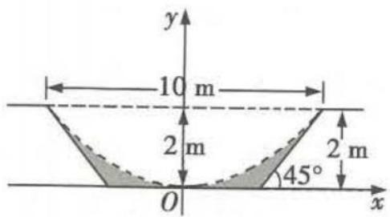

程为 $x^{2}=\frac{25}{2}y$ ，所以当前最大流量对应的截面面积为 $2\int_{0}^{5}(2-\frac{2}{25}x^{2})dx=\frac{40}{3}$ ，原始的最大流量对应的截面面积为 $\frac{2\times(6+10)}{2}=16$ ，所以原始的最大流量与当前最大流量的比值为 $\frac{16}{\frac{40}{3}}=1.2$ .

##### 3. A 如图, 作出函数 $y = 2\cos x, x \in [0, 2\pi]$ 的图象与直线 $y = 2$ , 所求面积为图中阴影部分的面积, 则所求面积 $S = \int_{0}^{2\pi} (2 - 2\cos x) \mathrm{d}x = (2x - 2\sin x) \bigg|_{0}^{2\pi} = 4\pi$ . 故选 A.

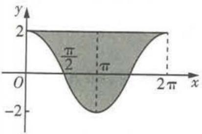

##### 4. C 由题意可得, 在 t=1 到 t=4 这段时间内物体 A 运动的路程 $S=\int_{1}^{4}(t^{2}-t+6)\mathrm{d}t=\left(\frac{1}{3}t^{3}-\frac{1}{2}t^{2}+6t\right)\bigg|_{1}^{4}=\left(\frac{64}{3}-8+24\right)-\left(\frac{1}{3}-\frac{1}{2}+6\right)=31.5.$

# 第四章 三角函数、解三角形

# 第一节 三角函数的基本概念、同角三角函数的基本关系与诱导公式

### 题型 67 三角函数值在各象限的符号

##### 1. C $\because \theta$ 为第二象限角, $\therefore \frac{\pi}{2} + 2k\pi < \theta < \pi + 2k\pi, k \in Z$ , 则 $\frac{\pi}{4} + k\pi < \frac{\theta}{2} < \frac{\pi}{2} + k\pi, k \in Z$ ,

∴ $\frac{\theta}{2}$ 为第一或第三象限角, 则 $\tan \frac{\theta}{2} > 0$ .

##### 2. D 若 $\theta$ 是第二象限角, 则 $\cos \theta < 0$ , $\tan \theta < 0$ , 则 $\cos \theta \cdot \tan \theta > 0$ , 故 A 错误; 若 $\theta$ 是第三象限角, 则 $\cos \theta < 0$ , $\tan \theta > 0$ , 则 $\cos \theta \cdot \tan \theta < 0$ , 故 B 错误; 若 $\theta$ 是第四象限角, 则 $\sin \theta < 0$ , $\tan \theta < 0$ , 则 $\sin \theta \cdot \tan \theta > 0$ , 故 C 错误; 若 $\theta$ 是第三象限角, 则 $\sin \theta < 0$ , $\cos \theta < 0$ , 则 $\sin \theta \cdot \cos \theta > 0$ , 故 D 正确.

##### 3. D 由 $\alpha$ 为第四象限角, 可得 $-\frac{\pi}{2} + 2k\pi < \alpha < 2k\pi (k \in \mathbf{Z})$ , 可得 $-\pi + 4k\pi < 2\alpha < 4k\pi (k \in \mathbf{Z})$ , 所以 $2\alpha$ 的终边在第三、四象限或 $y$ 轴的非负半轴上, 因此 $\sin 2\alpha < 0, \cos 2\alpha$ 的正负无法确定.

##### 4. C 因为 $\tan \alpha > 0$ ，所以 $\alpha$ 为第一或第三象限角，即 $2k\pi < \alpha < 2k\pi + \frac{\pi}{2}$ 或 $2k\pi + \pi < \alpha < 2k\pi + \frac{3\pi}{2}, k \in Z$ ，则 $4k\pi < 2\alpha < 4k\pi + \pi$ 或 $4k\pi + 2\pi < 2\alpha < 4k\pi + 3\pi, k \in Z$ .

所以 $2\alpha$ 为第一或第二象限角或终边在 y 轴的非负半轴上的角，从而 $\sin 2\alpha > 0$ .

##### 5. BD 因为 $\frac{3\pi}{4}<3<\pi$ ，所以 $\alpha$ 是第二象限角， $\sin\alpha>0>\cos\alpha$ ，故 A 错误，B，D 正确；因为 $y=\tan x$ 在 $(\frac{\pi}{2},\pi)$ 上单调递增，所以 $\tan\alpha>\tan\frac{3\pi}{4}=-1$ ，故 C 错误.

##### 6. BC $\because P(1,m)(m<0),\therefore \alpha$ 为第四象限角,则 $\sin \alpha < 0,$

$\cos \alpha > 0, \tan \alpha < 0. \therefore \sin \alpha + \cos \alpha$ 不确定正负， $\sin \alpha - \cos \alpha < 0, \sin \alpha \cos \alpha < 0, \frac{\sin \alpha}{\tan \alpha} > 0$ ，故选BC.

### 题型 68 扇形弧长公式与面积公式

##### 1. C 钟表的秒针 25 s 走过的角度 $\alpha=\frac{25}{60}\times2\pi=\frac{5}{6}\pi$ ，因为秒针长 12 cm，所以秒针的端点所走的路线长为 $l=\frac{5}{6}\pi\times12=10\pi(\text{cm})$ .

##### 2. $\frac{40\pi}{3}$ 由弧长公式 $l=\alpha R$ 可得,弧长为 $\frac{4\pi}{3}\times\frac{20}{2}=\frac{40\pi}{3}$ (cm).

##### 3. $\frac{5}{2}\pi + 4$ 如图, 连接 $OA$ , 由 $A$ 是切点知 $OA \perp AG$ . 由 $B$ 是切点及 $BH \parallel DG$ 知 $BC \perp BH$ 且 $BC \perp DG$ . 由 $A$ 到直线 $DE$ 和 $EF$ 的距离均为 $7 \mathrm{~cm}$ , 可过 $A$ 分别作 $AQ$ 垂直直线

DE 于点 Q, AM 垂直直线 EF 于点 M, 交 DG 于点 N, 则 AQ = 7, AM = 7. 又 DE = 2, 于是 AN = 5. NG = MF = 12 - 7 = 5. 于是 $\triangle ANG$ 是等腰直角三角形, 于是 $\angle GAN = \angle OAN = \frac{\pi}{4}$ , $\angle AOR = \frac{\pi}{4}$ . 可过点 O 作 $OP \perp DG$ 于 P, 不妨设 OP = 3x, 则 DP = 5x, 于是 OR = PN = 7 - 5x, AR = AN - RN = 5 - OP = 5 - 3x, 而 $\triangle OAR$ 为等腰直角三角形, 因此 7 - 5x = 5 - 3x, 于是 x = 1, 即 OR = 2, 于是 $OA = 2\sqrt{2}$ , 由于 $\angle AOR = \frac{\pi}{4}$ , 因此 $\angle AOB = \frac{3}{4}\pi$ . 于是 $S_{阴影} = \frac{1}{2} \times \frac{3}{4}\pi \times (2\sqrt{2})^2 + \frac{1}{2} \times (2\sqrt{2})^2 - \frac{1}{2}\pi = (\frac{5}{2}\pi + 4)(cm^2)$ .

##### 4. D 由弧长公式, 得 $l=\frac{\pi}{2}(400+1\ 738)\approx3\ 356.66$ (千米).

##### 5. B 解法一 设扇形半径为 r，弧长为 l，则周长为 $2r + l = 100$ ，面积为 $S = \frac{1}{2}lr$ ，因为 $S = \frac{1}{2}lr = \frac{1}{2}(100 - 2r)r = -r^{2} + 50r =$ $-(r-25)^{2}+625$ , 所以当 r=25 时, $S_{max}=625$ .

解法二 $S = \frac{1}{2} lr = \frac{1}{2}(100 - 2r)r = (50 - r)r\leqslant (\frac{50 - r + r}{2})^2 =$ 625，当且仅当 $50 - r = r$ ，即 $r = 25$ 时等号成立.

##### 6. A 设原扇形半径为 $r_1$ ，剪下的小扇形纸面的半径为 $r_2$ ，原扇形的面积为 $S$ ，圆心角为 $\alpha$ ，则 $S = S_1 + S_2 = S_1 + \sqrt{2} S_1 = (1 + \sqrt{2})S_1$ ，所以 $\frac{S}{S_1} = \sqrt{2} + 1$ ，又 $\frac{S}{S_1} = \frac{\frac{1}{2}\alpha r_1^2}{\frac{1}{2}\alpha r_2^2} = \frac{r_1^2}{r_2^2} = \sqrt{2} + 1$ ，所以 $\frac{r_1}{r_2} = \sqrt{\sqrt{2} + 1}$ .

# 题型69 三角函数定义的应用

##### 1. 因为角 $\alpha$ 的终边过点 $(a,2a)(a\neq0)$ ,

所以 $r = \sqrt{5} |a|, x = a, y = 2a.$

当 $a > 0$ 时， $\sin \alpha = \frac{y}{r} = \frac{2a}{\sqrt{5}|a|} = \frac{2a}{\sqrt{5}a} = \frac{2\sqrt{5}}{5},$

$\cos \alpha = \frac{x}{r} = \frac{a}{\sqrt{5} a} = \frac{\sqrt{5}}{5}, \tan \alpha = \frac{y}{x} = \frac{2a}{a} = 2;$

当 $a < 0$ 时， $\sin \alpha = \frac{y}{r} = \frac{2a}{\sqrt{5} |a|} = \frac{2a}{-\sqrt{5} a} = -\frac{2\sqrt{5}}{5}, \cos \alpha = \frac{x}{r} = \frac{a}{-\sqrt{5} a} = -\frac{\sqrt{5}}{5}, \tan \alpha = \frac{y}{x} = \frac{2a}{a} = 2.$

##### 2. C 设点 P 的坐标为 $(x, y)$ ，已知 $\tan \alpha < \cos \alpha < \sin \alpha$ ，则利用三角函数的定义可得 $\frac{y}{x} < x < y$ 。结合题图可知，当点 P 在圆弧 $\widehat{AB}$ 上时，y < x，不符合题意；当点 P 在圆弧 $\widehat{CD}$ 上时， $0 < x < y \leqslant 1, \frac{y}{x} > 1$ ，则 $x < y < \frac{y}{x}$ ，不符合题意；当点 P 在圆弧 $\widehat{EF}$ 上时，-1 < x < 0 < y，且 $|y| > |x|$ ，则 $\frac{y}{x} < -1$ ，所以 $\frac{y}{x} < x < y$ ，符合题意；当点 P 在圆弧 $\widehat{GH}$ 上时，x < y < 0, $\frac{y}{x} > 0$ ，则 $x < y < \frac{y}{x}$ ，不符合题意。故选 C.

##### 3. B 角 $\alpha$ 的终边经过点 $P(3, t), \therefore r = \sqrt{3^2 + t^2}, \therefore \sin \alpha = \frac{t}{\sqrt{3^2 + t^2}}$ . 又 $\sin (2k\pi + \alpha) = -\frac{3}{5} = \sin \alpha (k \in \mathbf{Z}), \therefore \frac{t}{\sqrt{3^2 + t^2}} = -\frac{3}{5}, \therefore t = -\frac{9}{4}$ (正值已舍去), 故选 B.

##### 4. C ∵ 函数 $y = \log_{a} x (a > 0 \text{ 且 } a \neq 1)$ 的图象先向右平移 3 个单位长度，再向上平移 2 个单位长度后，得到 $y = \log_{a} (x - 3) + 2 (a > 0 \text{ 且 } a \neq 1)$ 的图象，∴ $P(4, 2)$ . 又角 $\alpha$ 的终边过点 P，∴ $\sin \alpha = \frac{2}{\sqrt{16 + 4}} = \frac{\sqrt{5}}{5}$ , $\cos \alpha = \frac{4}{\sqrt{16 + 4}} = \frac{2\sqrt{5}}{5}$ , 则 $\sin \alpha + 2\cos \alpha = \frac{\sqrt{5}}{5} + 2 \times \frac{2\sqrt{5}}{5} = \sqrt{5}$ .

##### 5. A 因为角 $\alpha - \frac{\pi}{12}$ 的终边在直线 $y = \sqrt{3}x$ 上，

所以 $\tan(\alpha-\frac{\pi}{12})=\sqrt{3}.$

若终边在第一象限内,则 $\sin(\alpha-\frac{\pi}{12})=\frac{\sqrt{3}}{2},\cos(\alpha-\frac{\pi}{12})=\frac{1}{2}$ ，所以 $\cos(\alpha+\frac{\pi}{12})=\cos\left[(\alpha-\frac{\pi}{12})+\frac{\pi}{6}\right]=\cos\left(\alpha-\frac{\pi}{12}\right)\cos\frac{\pi}{6}-\sin\left(\alpha-\frac{\pi}{12}\right)\cdot\sin\frac{\pi}{6}=\frac{1}{2}\times\frac{\sqrt{3}}{2}-\frac{\sqrt{3}}{2}\times\frac{1}{2}=0.$

若终边在第三象限内,则 $\sin(\alpha-\frac{\pi}{12})=-\frac{\sqrt{3}}{2},\cos(\alpha-\frac{\pi}{12})=-\frac{1}{2}$

所以 $\cos\left(\alpha+\frac{\pi}{12}\right)=\cos\left[\left(\alpha-\frac{\pi}{12}\right)+\frac{\pi}{6}\right]=\cos\left(\alpha-\frac{\pi}{12}\right)\cos\frac{\pi}{6}-$ $\sin\left(\alpha-\frac{\pi}{12}\right)\sin\frac{\pi}{6}=\left(-\frac{1}{2}\right)\times\frac{\sqrt{3}}{2}+\frac{\sqrt{3}}{2}\times\frac{1}{2}=0.$

综上可知, $\cos(\alpha+\frac{\pi}{12})=0.$

### 题型70 “ $\sin^2\alpha + \cos^2\alpha = 1$ ”的应用

##### 1. A 因为 $\alpha$ 是第二象限角, 所以 $\cos \alpha < 0$ , 又 $\sin^{2}\alpha + \cos^{2}\alpha = 1$ , 所以 $\cos \alpha = -\sqrt{1 - \sin^{2}\alpha} = -\frac{12}{13}$ .

##### 2. A $\because 3\cos 2\alpha - 8\cos \alpha = 5, \therefore 3(2\cos^{2}\alpha - 1) - 8\cos \alpha = 5,$ $\therefore 6\cos^{2}\alpha - 8\cos \alpha - 8 = 0, \therefore 3\cos^{2}\alpha - 4\cos \alpha - 4 = 0$ , 解得 $\cos \alpha = 2$ (舍去) 或 $\cos \alpha = -\frac{2}{3}.$ $\because \alpha \in (0, \pi), \therefore \sin \alpha = \sqrt{1 - \cos^{2}\alpha} = \frac{\sqrt{5}}{3}.$ 故选 A.

##### 3.6 或 $-\frac{3}{4}$ 因为 $\sin A = \frac{4}{5} > 0$ ，所以 A 是第一或第二象限角。
当 A 是第一象限角时， $\cos A = \sqrt{1 - \sin^{2}A} = \frac{3}{5}$ ,

所以 $\frac{5\sin A + 8}{15\cos A - 7} = \frac{5\times\frac{4}{5} + 8}{15\times\frac{3}{5} - 7} = 6;$

当 $A$ 是第二象限角时， $\cos A = -\sqrt{1 - \sin^2 A} = -\frac{3}{5}$ ，所以 $\frac{5 \sin A + 8}{15 \cos A - 7} = \frac{5 \times \frac{4}{5} + 8}{15 \times (-\frac{3}{5}) - 7} = -\frac{3}{4}$ .

##### 4.1 $\sqrt{1-2\sin4\cos4}=\sqrt{\sin^{2}4+\cos^{2}4-2\sin4\cos4}=\sqrt{(\sin4-\cos4)^{2}}$ $\because \frac{5\pi}{4}<4<\frac{3\pi}{2},\therefore \sin 4<\cos 4<0.$

$\begin{array}{l} \therefore \frac {\sqrt {1 - 2 \sin 4 \cos 4}}{\cos 4 + \sqrt {1 - \cos^ {2} 4}} = \frac {\sqrt {(\sin 4 - \cos 4) ^ {2}}}{\cos 4 + \sqrt {\sin^ {2} 4}} = \frac {| \sin 4 - \cos 4 |}{\cos 4 + | \sin 4 |} = \\ \frac {\cos 4 - \sin 4}{\cos 4 - \sin 4} = 1. \end{array}$

### 题型 71 利用“ $\tan\alpha=\frac{\sin\alpha}{\cos\alpha}$ ”及“1”的代换“化弦为切”求值

##### 1. （1） - 1 注意到分式的分子和分母均是关于 $\sin \alpha, \cos \alpha$ 的一次齐次式, 由题意得 $\cos \alpha \neq 0$ , 所以可将分子分母同时除以 $\cos \alpha$ , 然后整体代入 $\tan \alpha = 2$ 的值.

$\frac {2 \sin \alpha - 3 \cos \alpha}{4 \sin \alpha - 9 \cos \alpha} = \frac {2 \tan \alpha - 3}{4 \tan \alpha - 9} = \frac {2 \times 2 - 3}{4 \times 2 - 9} = - 1.$

（2） $\frac{5}{7}$ 注意到分式的分子和分母均是关于 $\sin\alpha,\cos\alpha$ 的二次齐次式,因为 $\cos^{2}\alpha\neq0$ ,所以分子分母可同时除以 $\cos^{2}\alpha$ ,则 $\frac{2\sin^{2}\alpha-3\cos^{2}\alpha}{4\sin^{2}\alpha-9\cos^{2}\alpha}=\frac{2\tan^{2}\alpha-3}{4\tan^{2}\alpha-9}=\frac{2\times4-3}{4\times4-9}=\frac{5}{7}.$

（3）1 似乎跟前两题没什么联系,但若能注意到 $\sin^{2}\alpha+\cos^{2}\alpha=$ 1, 则有 $4\sin^{2}\alpha-3\sin\alpha\cos\alpha-5\cos^{2}\alpha=\frac{4\sin^{2}\alpha-3\sin\alpha\cos\alpha-5\cos^{2}\alpha}{1}=\frac{4\sin^{2}\alpha-3\sin\alpha\cos\alpha-5\cos^{2}\alpha}{\sin^{2}\alpha+\cos^{2}\alpha}$ , 这样便使得分子分母均为二次齐次式.

同（2）有 $\frac{4\sin^2\alpha - 3\sin\alpha\cos\alpha - 5\cos^2\alpha}{\sin^2\alpha + \cos^2\alpha} = \frac{4\tan^2\alpha - 3\tan\alpha - 5}{\tan^2\alpha + 1} =$ $\frac{4\times 4 - 3\times 2 - 5}{4 + 1} = 1.$

##### 2. C 解法一 因为 $\tan\theta=-2$ ，所以 $\frac{\sin\theta(1+\sin2\theta)}{\sin\theta+\cos\theta}=$ $\frac{\sin\theta(\sin\theta+\cos\theta)^{2}}{\sin\theta+\cos\theta}=\sin\theta(\sin\theta+\cos\theta)=\frac{\sin^{2}\theta+\sin\theta\cos\theta}{\sin^{2}\theta+\cos^{2}\theta}=$ $\frac{\tan^{2}\theta+\tan\theta}{1+\tan^{2}\theta}=\frac{4-2}{1+4}=\frac{2}{5}.$ 故选 C.

解法二 因为 $\tan \theta = -2$ ，所以 $\sin \theta = -2\cos \theta$ 。则 $\frac{\sin \theta(1 + \sin 2\theta)}{\sin \theta + \cos \theta} = \frac{\sin \theta(\sin \theta + \cos \theta)^2}{\sin \theta + \cos \theta} = \sin \theta (\sin \theta + \cos \theta) = \frac{\sin^2\theta + \sin\theta\cos\theta}{\sin^2\theta + \cos^2\theta} = \frac{4\cos^2\theta - 2\cos^2\theta}{4\cos^2\theta + \cos^2\theta} = \frac{4 - 2}{1 + 4} = \frac{2}{5}$ . 故选 C.

##### 3. A 解法一 由 $\tan \alpha = \frac{\sin \alpha}{\cos \alpha} = \frac{3}{4}, \cos^2 \alpha + \sin^2 \alpha = 1$ ，得 $\left\{ \begin{array}{l} \sin \alpha = \frac{3}{5}, \\ \cos \alpha = \frac{4}{5} \end{array} \right.$ 或 $\left\{ \begin{array}{l} \sin \alpha = -\frac{3}{5}, \\ \cos \alpha = -\frac{4}{5}, \end{array} \right.$ 则 $\sin 2\alpha = 2\sin \alpha\cos \alpha = \frac{24}{25}$ ，则 $\cos^2 \alpha + 2\sin 2\alpha = \frac{16}{25} + \frac{48}{25} = \frac{64}{25}$ . 故选 A.

解法二 $\cos^{2}\alpha + 2\sin 2\alpha = \frac{\cos^{2}\alpha + 4\sin\alpha\cos\alpha}{\cos^{2}\alpha + \sin^{2}\alpha} = \frac{1 + 4\tan\alpha}{1 + \tan^{2}\alpha} = \frac{1 + 3}{1 + \frac{9}{16}} = \frac{64}{25}.$ 故选 A.

##### 4. -1 解法一 由 $\sin \alpha - \cos \alpha = \sqrt{2}$ , 得 $\sin \alpha = \sqrt{2} + \cos \alpha$ , 代入 $\cos^2 \alpha + \sin^2 \alpha = 1$ , 整理得 $2 \cos^2 \alpha + 2 \sqrt{2} \cos \alpha + 1 = 0$ , 即 $(\sqrt{2} \cos \alpha + 1)^2 = 0$ , 从而 $\cos \alpha = -\frac{\sqrt{2}}{2}$ , 则 $\sin \alpha = \frac{\sqrt{2}}{2}$ , 所以 $\tan \alpha = -1$ .

解法二 令 $\tan \alpha = \frac{\sin \alpha}{\cos \alpha} = t$ ，则 $\sin \alpha = t \cos \alpha$ ，代入 $\sin \alpha - \cos \alpha = \sqrt{2}$ ，得到 $\sin \alpha = \frac{\sqrt{2}t}{t - 1}, \cos \alpha = \frac{\sqrt{2}}{t - 1}$ ，所以 $(\frac{\sqrt{2}t}{t - 1})^2 + (\frac{\sqrt{2}}{t - 1})^2 = 1$ ，整理可得 $t^2 + 2t + 1 = 0$ ，即 $t = -1$ 。

解法三 由 $(\sin \alpha - \cos \alpha)^2 = 2$ ，得 $\frac{\sin^2\alpha - 2\sin\alpha\cos\alpha + \cos^2\alpha}{\sin^2\alpha + \cos^2\alpha} = 2$ ，若 $\cos \alpha = 0$ ，则 $\sin \alpha = 1$ ，与已知条件矛盾，故 $\cos \alpha \neq 0$ ，于是 $\frac{\tan^2\alpha - 2\tan\alpha + 1}{\tan^2\alpha + 1} = 2$ ，即 $\tan^2\alpha + 2\tan\alpha + 1 = 0$ ，解得 $\tan \alpha = -1$ 。

解法四 由 $\sin \alpha - \cos \alpha = \sqrt{2}$ , 得 $\sqrt{2} \sin \left( \alpha - \frac{\pi}{4} \right) = \sqrt{2}$ , 即 $\sin \left( \alpha - \frac{\pi}{4} \right) = 1$ , 又 $\alpha \in (0, \pi)$ , 所以 $-\frac{\pi}{4} < \alpha - \frac{\pi}{4} < \frac{3\pi}{4}$ , 所以 $\alpha - \frac{\pi}{4} = \frac{\pi}{2}$ , 即 $\alpha = \frac{3\pi}{4}$ , 所以 $\tan \alpha = -1$ .

##### 5. B 解法一 易知 $\cos\theta\neq0$ ，则 $1+\sin\theta\cos\theta=\frac{1+\sin\theta\cos\theta}{1}=$ $\frac{\sin^{2}\theta+\cos^{2}\theta+\sin\theta\cos\theta}{\sin^{2}\theta+\cos^{2}\theta}=\frac{\tan^{2}\theta+\tan\theta+1}{\tan^{2}\theta+1}=\frac{2^{2}+2+1}{2^{2}+1}=\frac{7}{5}.$

解法二 $\tan\theta=2$ , 即 $\sin\theta=2\cos\theta$

又 $\sin^{2}\theta + \cos^{2}\theta = 1$ ，所以 $(2\cos\theta)^{2} + \cos^{2}\theta = 1$ ，所以 $\cos^{2}\theta = \frac{1}{5}$ .
又 $\tan \theta = 2 > 0$ , 所以 $\theta$ 为第一或第三象限角.

当 $\theta$ 为第一象限角时， $\cos \theta = \frac{\sqrt{5}}{5}, \sin \theta = \sqrt{1 - \cos^2 \theta} = \frac{2\sqrt{5}}{5}$ ，则 $1 + \sin \theta \cos \theta = 1 + \frac{2\sqrt{5}}{5} \times \frac{\sqrt{5}}{5} = \frac{7}{5}$ ；

当 $\theta$ 为第三象限角时, $\cos \theta = -\frac{\sqrt{5}}{5}, \sin \theta = -\sqrt{1 - \cos^2 \theta} = -\frac{2\sqrt{5}}{5}$ ,

则 $1 + \sin \theta \cos \theta = 1 + (-\frac{2\sqrt{5}}{5}) \times (-\frac{\sqrt{5}}{5}) = \frac{7}{5}$ .

##### 6. C $\because \log_{4}(2\sin\alpha+\cos\alpha)+\log_{4}(\sin\alpha+2\cos\alpha)=1,$ $\therefore \log_{4}\left[(2\sin\alpha+\cos\alpha)(\sin\alpha+2\cos\alpha)\right]=1$ ，即 $(2\sin\alpha+\cos\alpha)\cdot(\sin\alpha+2\cos\alpha)=4$ ，化简得 $2\sin^{2}\alpha+5\sin\alpha\cos\alpha+2\cos^{2}\alpha=4,$ $\therefore \frac{2\sin^{2}\alpha+5\sin\alpha\cos\alpha+2\cos^{2}\alpha}{\sin^{2}\alpha+\cos^{2}\alpha}=4,\because\cos^{2}\alpha\neq0,\therefore\frac{2\tan^{2}\alpha+5\tan\alpha+2}{\tan^{2}\alpha+1}=4,$ 即 $2\tan^{2}\alpha-5\tan\alpha+2=0,$ 解得 $\tan\alpha=\frac{1}{2}$ 或 $\tan\alpha=2.$

##### 7. $-\sqrt{3}$ 解法一 将 $\sin\theta + \cos\theta = \frac{\sqrt{3} - 1}{2}$ 两边平方, 得 $1 + 2\sin\theta\cos\theta = 1 - \frac{\sqrt{3}}{2}$ ,

即 $\sin \theta \cos \theta = -\frac{\sqrt{3}}{4}$ , 易知 $\theta \neq \frac{\pi}{2}$ .

故 $\sin \theta \cos \theta = \frac{\sin \theta \cos \theta}{\sin^2\theta + \cos^2\theta} = \frac{\tan \theta}{\tan^2\theta + 1} = -\frac{\sqrt{3}}{4}$ ,

解得 $\tan \theta = -\sqrt{3}$ 或 $\tan \theta = -\frac{\sqrt{3}}{3}$ .

$\because \theta \in (0, \pi), \sin \theta \cos \theta = - \frac {\sqrt {3}}{4} <   0,$

∴ $\cos\theta<0$ ，则 $\theta\in(\frac{\pi}{2},\pi)$ ，由 $\sin\theta+\cos\theta=\frac{\sqrt{3}-1}{2}>0$ 可知 $\sin\theta>-\cos\theta$ ，则 $\tan\theta<-1$ ，（注意找到隐含的 $\tan\theta$ 的取值范围）
∴ $\tan\theta = -\sqrt{3}$ .

解法二 由 $\sin \theta + \cos \theta = \frac{\sqrt{3} - 1}{2}$ ①, 得 $\sin \theta \cos \theta = -\frac{\sqrt{3}}{4} < 0$ , 又 $\theta \in (0, \pi)$ , $\therefore \sin \theta > 0, \cos \theta < 0, \therefore \sin \theta - \cos \theta > 0$ .

又 $(\sin \theta - \cos \theta)^2 = 1 - 2\sin \theta \cos \theta = 1 + \frac{\sqrt{3}}{2} = \frac{(\sqrt{3} + 1)^2}{4},$

$\therefore \sin \theta - \cos \theta = \frac {\sqrt {3} + 1}{2} \quad ②.$

①②联立解得 $\sin\theta=\frac{\sqrt{3}}{2},\cos\theta=-\frac{1}{2}$ ,

$\therefore \tan \theta = - \sqrt {3}.$

# 题型 72 利用诱导公式化简求值

##### 1. B $\because \sin\left(\frac{5\pi}{2}+\alpha\right)=\sin\left(2\pi+\frac{\pi}{2}+\alpha\right)=\sin\left(\frac{\pi}{2}+\alpha\right)=\cos\alpha=\frac{1}{5},$ $\therefore \cos(\pi + \alpha) = -\cos \alpha = -\frac{1}{5}.$

##### 2.2 原式 $= -\sin (3 \times 360^{\circ} + 120^{\circ}) \cos (3 \times 360^{\circ} + 210^{\circ}) - \cos (3 \times 360^{\circ} - 60^{\circ}) \sin (3 \times 360^{\circ} - 30^{\circ}) + \tan (2 \times 360^{\circ} + 225^{\circ}) = -\sin (180^{\circ} - 60^{\circ}) \cos (180^{\circ} + 30^{\circ}) - \cos (-60^{\circ}) \sin (-30^{\circ}) + \tan (180^{\circ} + 45^{\circ}) = \sin 60^{\circ} \cos 30^{\circ} + \cos 60^{\circ} \sin 30^{\circ} + \tan 45^{\circ} = \frac{\sqrt{3}}{2} \times \frac{\sqrt{3}}{2} + \frac{1}{2} \times \frac{1}{2} + 1 = 2.$

##### 3. A 因为 $\cos\left(x-\frac{\pi}{6}\right)=\cos\left[\left(x+\frac{\pi}{3}\right)-\frac{\pi}{2}\right]=\sin\left(x+\frac{\pi}{3}\right)$ ，所以 $f(x)=\frac{6}{5}\sin\left(x+\frac{\pi}{3}\right)$ ，于是 $f(x)$ 的最大值为 $\frac{6}{5}$ ，故选 A.

##### 4. C 若存在 $k \in \mathbf{Z}$ 使得 $\alpha = k\pi + (-1)^k\beta$ ，则当 $k = 2n, n \in \mathbf{Z}$ 时， $\alpha = 2n\pi + \beta$ ，则 $\sin \alpha = \sin (2n\pi + \beta) = \sin \beta$ ；当 $k = 2n + 1, n \in \mathbf{Z}$ 时， $\alpha = (2n + 1)\pi - \beta$ ，则 $\sin \alpha = \sin (2n\pi + \pi - \beta) = \sin (\pi - \beta) = \sin \beta$ 。若 $\sin \alpha = \sin \beta$ ，则 $\alpha = 2n\pi + \beta$ 或 $\alpha = 2n\pi + \pi - \beta, n \in \mathbf{Z}$ ，即 $\alpha = k\pi + (-1)^k\beta, k \in \mathbf{Z}$ ，故“存在 $k \in \mathbf{Z}$ 使得 $\alpha = k\pi + (-1)^k\beta$ ”是

“ $\sin\alpha=\sin\beta$ ”的充分必要条件.

##### 5. $\frac{3\sqrt{10}}{10}$ $\frac{4}{5}$ 因为 $\alpha + \beta = \frac{\pi}{2}$ , 所以 $\beta = \frac{\pi}{2} - \alpha$ , 所以 $3\sin \alpha - \sin \beta = 3\sin \alpha - \sin \left(\frac{\pi}{2} - \alpha\right) = 3\sin \alpha - \cos \alpha = \sqrt{10}\sin (\alpha - \varphi) = \sqrt{10}$ , 其中 $\sin \varphi = \frac{\sqrt{10}}{10}, \cos \varphi = \frac{3\sqrt{10}}{10}$ . 所以 $\alpha - \varphi = \frac{\pi}{2} + 2k\pi, k \in \mathbf{Z}$ , 所以 $\alpha = \frac{\pi}{2} + \varphi + 2k\pi, k \in \mathbf{Z}$ , 所以 $\sin \alpha = \sin \left(\frac{\pi}{2} + \varphi + 2k\pi\right) = \cos \varphi = \frac{3\sqrt{10}}{10}, k \in \mathbf{Z}$ . 因为 $\sin \beta = 3\sin \alpha - \sqrt{10} = -\frac{\sqrt{10}}{10}$ , 所以 $\cos 2\beta = 1 - 2\sin^2\beta = 1 - \frac{1}{5} = \frac{4}{5}$ .

##### 6. C 因为 $\sin\left(\frac{\pi}{6}-\alpha\right)=\frac{4}{5}$ ，所以 $\cos\left(\frac{\pi}{3}+\alpha\right)=\sin\left(\frac{\pi}{2}-\frac{\pi}{3}-\alpha\right)=\sin\left(\frac{\pi}{6}-\alpha\right)=\frac{4}{5}$ .

所以 $\cos\left(\frac{2\pi}{3}+2\alpha\right)=2\cos^{2}\left(\frac{\pi}{3}+\alpha\right)-1=\frac{7}{25}.$

##### 7. $-\frac{9}{16}$ 原式 $= \frac{-\sin(\pi + \frac{\pi}{2} + \alpha)\cos(\pi + \frac{\pi}{2} - \alpha)}{\sin\alpha\cos\alpha} \cdot \tan^2\alpha = \frac{-\sin(\frac{\pi}{2} + \alpha)\cos(\frac{\pi}{2} - \alpha)}{\sin\alpha\cos\alpha} \cdot \tan^2\alpha = \frac{-\cos\alpha\sin\alpha}{\sin\alpha\cos\alpha} \cdot \tan^2\alpha = -\tan^2\alpha.$

解方程 $5x^{2} - 7x - 6 = 0$ ，得 $x_{1} = -\frac{3}{5}, x_{2} = 2.$ 又 $\alpha$ 是第三象限角，

$\therefore \sin \alpha = - \frac {3}{5}, \therefore \cos \alpha = - \frac {4}{5}, \therefore \tan \alpha = \frac {3}{4}.$

故原式 $= -\tan^2\alpha = -\frac{9}{16}.$

### 题型 73 同角三角函数基本关系与诱导公式的综合应用

##### 1. $\frac{2\sqrt{2}}{3}$ $\sin (\alpha - 105^{\circ}) = \sin (\alpha + 75^{\circ} - 180^{\circ}) = -\sin (\alpha + 75^{\circ}).$ $\because \cos (75^{\circ} + \alpha) = \frac{1}{3}$ , 且 $\alpha$ 为第三象限角, $\therefore \alpha + 75^{\circ}$ 为第四象限角, $\therefore \sin (\alpha + 75^{\circ}) = -\sqrt{1 - \cos^{2} (\alpha + 75^{\circ})} = -\frac{2\sqrt{2}}{3}, \therefore \sin (\alpha - 105^{\circ}) = \frac{2\sqrt{2}}{3}.$

##### 2. $-\frac{4}{3}$ $\because \theta$ 是第四象限角，且 $\sin (\theta + \frac{\pi}{4}) = \frac{3}{5} > 0, \therefore \theta + \frac{\pi}{4}$ 为第一象限角， $\therefore \cos (\theta + \frac{\pi}{4}) = \sqrt{1 - \sin^2 (\theta + \frac{\pi}{4})} = \frac{4}{5}$ .

$\because (\theta + \frac {\pi}{4}) - (\theta - \frac {\pi}{4}) = \frac {\pi}{2},$

$\therefore \sin (\theta -\frac{\pi}{4}) = \sin [(\theta +\frac{\pi}{4}) - \frac{\pi}{2}] = -\cos (\theta +\frac{\pi}{4}) = -\frac{4}{5},$ $\cos (\theta -\frac{\pi}{4}) = \cos [(\theta +\frac{\pi}{4}) - \frac{\pi}{2}] = \sin (\theta +\frac{\pi}{4}) = \frac{3}{5},\therefore \tan (\theta -$ $\frac{\pi}{4}) = \frac{-\frac{4}{5}}{\frac{3}{5}} = -\frac{4}{3}.$

##### 3. D 由诱导公式可得, $\cos \left(\frac{5\pi}{2} + 2\alpha\right) = \cos \left[2\pi + \left(\frac{\pi}{2} + 2\alpha\right)\right] = \cos \left(\frac{\pi}{2} + 2\alpha\right) = -\sin 2\alpha = \frac{-2\sin \alpha \cos \alpha}{\sin^2 \alpha + \cos^2 \alpha} = \frac{-2\tan \alpha}{\tan^2 \alpha + 1} = \frac{-2 \times 2}{2^2 + 1} = -\frac{4}{5}$ . 故选 D.

##### 4. A $\sin\theta-\cos\theta=\frac{4}{3}$ 两边平方可得 $1-2\sin\theta\cos\theta=\frac{16}{9}$ ，则可得 $2\sin\theta\cos\theta=-\frac{7}{9},\because\theta\in(\frac{3\pi}{4},\pi),\therefore\sin\theta\in(0,\frac{\sqrt{2}}{2}),\cos\theta\in(-1,-\frac{\sqrt{2}}{2}),\therefore\sin\theta+\cos\theta<0,\therefore\sin(\pi-\theta)-\cos(\pi-\theta)=$ $\sin\theta+\cos\theta=-\sqrt{\left(\sin\theta+\cos\theta\right)^{2}}=-\sqrt{1+2\sin\theta\cos\theta}=$ $- \sqrt{1 + (- \frac{7}{9})} = - \frac{\sqrt{2}}{3}.$ 故选 A.

##### 5. A 解法一 因为 $\tan (\alpha - \frac{\pi}{4}) = \frac{1}{3}$ , 且 $\tan (\alpha - \frac{\pi}{4}) = \frac{\tan \alpha - \tan \frac{\pi}{4}}{1 + \tan \alpha \tan \frac{\pi}{4}} = \frac{\tan \alpha - 1}{1 + \tan \alpha}$ , 所以 $\frac{\tan \alpha - 1}{1 + \tan \alpha} = \frac{1}{3}$ , 得 $\tan \alpha = 2$ ,

又 $\alpha \in (-\frac{\pi}{2}, \frac{\pi}{2})$ ，所以 $\alpha \in (0, \frac{\pi}{2})$ 。因为 $\tan \alpha = \frac{\sin \alpha}{\cos \alpha}$ ，所以 $\frac{\sin \alpha}{\cos \alpha} = 2$ ，又 $\sin^2 \alpha + \cos^2 \alpha = 1$ ，所以 $\sin \alpha = \frac{2\sqrt{5}}{5}$ ，所以 $\sin (\pi - \alpha) = \sin \alpha = \frac{2\sqrt{5}}{5}$ ，故选 A.

解法二 $\tan\alpha=\tan\left[\left(\alpha-\frac{\pi}{4}\right)+\frac{\pi}{4}\right]=\frac{\tan\left(\alpha-\frac{\pi}{4}\right)+\tan\frac{\pi}{4}}{1-\tan\left(\alpha-\frac{\pi}{4}\right)\tan\frac{\pi}{4}}=$ $\frac{\frac{1}{3}+1}{1-\frac{1}{3}}=2$ ,以下同解法一.

# 第二节 三角恒等变换

### 题型 74 两角和与差的正弦、余弦、正切公式的应用

##### 1. $\frac{7\sqrt{2}}{34}$ ∵ sin α = $\frac{15}{17}$ , α ∈ ( $\frac{\pi}{2}$ , π), ∴ cos α = -√1 - sin²α = -√(1 - (15/17)²) = -8/17, ∴ cos(π/4 - α) = cos π/4 cos α + sin π/4 sin α = $\frac{\sqrt{2}}{2} \times (-\frac{8}{17}) + \frac{\sqrt{2}}{2} \times \frac{15}{17} = \frac{7\sqrt{2}}{34}$ .

##### 2. （1） $\frac{1}{2}$ 原式 $= \sin (70^{\circ} - 40^{\circ}) = \sin 30^{\circ} = \frac{1}{2}$ .

（2）1 原式 $= \frac{\tan 60^{\circ} - \tan 15^{\circ}}{1 + \tan 60^{\circ}\tan 15^{\circ}} = \tan (60^{\circ} - 15^{\circ}) = \tan 45^{\circ} = 1.$

##### 3. D 由已知得 $2\tan\theta - \frac{\tan\theta + 1}{1 - \tan\theta} = 7$ ，得 $\tan\theta = 2$ .

##### 4. C $\sin(\alpha+\beta)+\cos(\alpha+\beta)=\sqrt{2}\sin(\alpha+\beta+\frac{\pi}{4})=2\sqrt{2}\sin\beta\cdot\cos(\alpha+\frac{\pi}{4})$ ，所以 $\sin(\alpha+\frac{\pi}{4})\cos\beta+\sin\beta\cos(\alpha+\frac{\pi}{4})=2\sin\beta\cos(\alpha+\frac{\pi}{4})$ ，整理得 $\sin(\alpha+\frac{\pi}{4})\cos\beta-\sin\beta\cos(\alpha+\frac{\pi}{4})=0$ ，即 $\sin(\alpha+\frac{\pi}{4}-\beta)=0$ ，所以 $\alpha-\beta+\frac{\pi}{4}=k\pi$ ，所以 $\tan(\alpha-\beta)=\tan(k\pi-\frac{\pi}{4})=-1$ .

##### 5. $-\frac{1}{2}$ $\because \sin \alpha + \cos \beta = 1, \cos \alpha + \sin \beta = 0, \therefore \sin^2 \alpha + \cos^2 \beta + 2 \sin \alpha \cos \beta = 1$ ①, $\cos^2 \alpha + \sin^2 \beta + 2 \cos \alpha \sin \beta = 0$ ②, ①②两式相加可得 $\sin^2 \alpha + \cos^2 \alpha + \sin^2 \beta + \cos^2 \beta + 2 (\sin \alpha \cos \beta + \cos \alpha \sin \beta) = 1, \therefore \sin (\alpha + \beta) = -\frac{1}{2}$ .

##### 6. A $\sin(\beta-\alpha)\cos\beta-\cos(\alpha-\beta)\sin\beta=\sin(\beta-\alpha)\cos\beta-\cos(\beta-\alpha)\sin\beta=\sin(\beta-\alpha-\beta)=\sin(-\alpha)=-\sin\alpha=\frac{3}{5},\sin\alpha=-\frac{3}{5}$ ，因为 $\alpha$ 为第三象限角，所以 $\cos\alpha=-\frac{4}{5}$ ，所以 $\cos(\alpha+\frac{\pi}{4})=\cos\alpha\cos\frac{\pi}{4}-\sin\alpha\sin\frac{\pi}{4}=(-\frac{4}{5})\times\frac{\sqrt{2}}{2}-(-\frac{3}{5})\times\frac{\sqrt{2}}{2}=-\frac{\sqrt{2}}{10}$ .  
##### 7.2 由题意知， $(1 + \tan 20^{\circ})(1 + \tan 25^{\circ}) = 1 + \tan 20^{\circ} + \tan 25^{\circ} + \tan 20^{\circ}\tan 25^{\circ}$ . 因为 $\tan 45^{\circ} = \tan (20^{\circ} + 25^{\circ}) = \frac{\tan 20^{\circ} + \tan 25^{\circ}}{1 - \tan 20^{\circ}\tan 25^{\circ}} = 1$ ，所以 $\tan 20^{\circ} + \tan 25^{\circ} = 1 - \tan 20^{\circ}\tan 25^{\circ}$ . 所以 $(1 + \tan 20^{\circ})(1 + \tan 25^{\circ}) = 1 + 1 - \tan 20^{\circ}\tan 25^{\circ} + \tan 20^{\circ}\tan 25^{\circ} = 2.$

# 题型75 二倍角公式的应用

##### 1. B 依题意, $\cos \left(\frac{3\pi}{2} + \alpha\right) = \sin \alpha = -\frac{\sqrt{3}}{5}$ , 故 $\cos 2\alpha = 1 - 2\sin^2\alpha = 1 - \frac{6}{25} = \frac{19}{25}$ . 故选 B.

##### 2. （1） $\sin \frac{\pi}{8} \cos \frac{\pi}{8} = \frac{1}{2} \times 2 \sin \frac{\pi}{8} \cos \frac{\pi}{8} = \frac{1}{2} \times \sin \frac{\pi}{4} = \frac{1}{2} \times \frac{\sqrt{2}}{2} = \frac{\sqrt{2}}{4}$ .   
（2） $\cos^2\frac{\pi}{6} - \sin^2\frac{\pi}{6} = \cos (2\times \frac{\pi}{6}) = \cos \frac{\pi}{3} = \frac{1}{2}.$   
（3） $\frac{\tan 15^{\circ}}{1 - \tan^{2}15^{\circ}} = \frac{1}{2}\tan 30^{\circ} = \frac{\sqrt{3}}{6}.$   
（4） $2\cos^{2}\frac{\pi}{12}-1=\cos(2\times\frac{\pi}{12})=\cos\frac{\pi}{6}=\frac{\sqrt{3}}{2}.$

##### 3. D 因为 $\cos\frac{5\pi}{12}=\sin\left(\frac{\pi}{2}-\frac{5\pi}{12}\right)=\sin\frac{\pi}{12}$ ，所以 $\cos^{2}\frac{\pi}{12}-\cos^{2}\frac{5\pi}{12}=\cos^{2}\frac{\pi}{12}-\sin^{2}\frac{\pi}{12}=\cos\left(2\times\frac{\pi}{12}\right)=\cos\frac{\pi}{6}=\frac{\sqrt{3}}{2}$ . 故选 D.  
##### 4. D 解法一 因为 $\cos\left(\frac{\pi}{4}-\alpha\right)=\cos\frac{\pi}{4}\cos\alpha+\sin\frac{\pi}{4}\sin\alpha=\frac{\sqrt{2}}{2}(\sin\alpha+\cos\alpha)=\frac{3}{5}$ ，所以 $\sin\alpha+\cos\alpha=\frac{3\sqrt{2}}{5}$ ，所以 $1+\sin2\alpha=\frac{18}{25}$ ，所以 $\sin2\alpha=-\frac{7}{25}$ .

解法二 因为 $2\left(\frac{\pi}{4} - \alpha\right) = \frac{\pi}{2} - 2\alpha$ ，所以 $\sin 2\alpha = \cos \left(\frac{\pi}{2} - 2\alpha\right) = 2\cos^2\left(\frac{\pi}{4} - \alpha\right) - 1 = -\frac{7}{25}$ .

##### 5. A 因为 $\alpha \in (0, \frac{\pi}{2})$ ，所以 $\tan 2\alpha = \frac{2\sin \alpha \cos \alpha}{2\cos^2 \alpha - 1} = \frac{\cos \alpha}{2 - \sin \alpha}$ ，即 $\frac{2\sin \alpha}{2\cos^2 \alpha - 1} = \frac{1}{2 - \sin \alpha}$ ，即 $2\cos^2 \alpha - 1 = 4\sin \alpha - 2\sin^2 \alpha$ ，即 $2\sin^2 \alpha + 2\cos^2 \alpha - 1 = 4\sin \alpha$ ，解得 $\sin \alpha = \frac{1}{4}$ ，所以 $\tan \alpha = \frac{\sqrt{15}}{15}$ .  
##### 6. C $\because \sin \theta = \sqrt{5} \cos(2\pi - \theta) = \sqrt{5} \cos \theta, \therefore \tan \theta = \sqrt{5}, \therefore \tan 2\theta = \frac{2\tan \theta}{1 - \tan^{2}\theta} = \frac{2\sqrt{5}}{1 - 5} = -\frac{\sqrt{5}}{2}.$ 故选 C.

##### 7. A 解法一 $\cos^{2}\left(\alpha+\frac{\pi}{4}\right)=\frac{1}{2}\left[1+\cos\left(2\alpha+\frac{\pi}{2}\right)\right]=\frac{1}{2}(1-\sin2\alpha)=\frac{1}{6}.$

解法二 $\cos (\alpha +\frac{\pi}{4}) = \frac{\sqrt{2}}{2}\cos \alpha -\frac{\sqrt{2}}{2}\sin \alpha$ ，所以 $\cos^2 (\alpha +\frac{\pi}{4}) =$

$\frac{1}{2} (\cos \alpha -\sin \alpha)^{2} = \frac{1}{2} (1 - 2\sin \alpha \cos \alpha) = \frac{1}{2} (1 - \sin 2\alpha) = \frac{1}{6}.$

##### 8. $2\sin \frac{\alpha}{16}$ $\because 3\pi < \alpha < 4\pi, \therefore \frac{3\pi}{2} < \frac{\alpha}{2} < 2\pi, \frac{3\pi}{4} < \frac{\alpha}{4} < \pi, \frac{3\pi}{8} < \frac{\alpha}{8} < \frac{\pi}{2}, \frac{3\pi}{16} < \frac{\alpha}{16} < \frac{\pi}{4}, \therefore$ 原式 $= \sqrt{2 - \sqrt{2 - \sqrt{2 + 2\cos\frac{\alpha}{2}}}} = \sqrt{2 - \sqrt{2 + 2\cos\frac{\alpha}{4}}} = \sqrt{2 - 2\cos\frac{\alpha}{8}} = 2\sin \frac{\alpha}{16}$ .

# 题型 76 辅助角公式的应用

##### 1. （1） $\sin x - \sqrt{3} \cos x$

$= \sqrt {1 + (\sqrt {3}) ^ {2}} (\sin x \cdot \frac {1}{2} - \cos x \cdot \frac {\sqrt {3}}{2})$

$= 2 (\sin x \cos \frac {\pi}{3} - \cos x \sin \frac {\pi}{3})$

$= 2 \sin \left(x - \frac {\pi}{3}\right).$

（2） $\frac{\sqrt{2}}{4}\sin\left(\frac{\pi}{4}-x\right)+\frac{\sqrt{6}}{4}\cos\left(\frac{\pi}{4}-x\right)$

$\begin{array}{l} = \frac {\sqrt {2}}{4} \left[ \sin \left(\frac {\pi}{4} - x\right) + \sqrt {3} \cos \left(\frac {\pi}{4} - x\right) \right] \\ = \frac {\sqrt {2}}{4} \times 2 \left[ \sin \left(\frac {\pi}{4} - x\right) \cdot \frac {1}{2} + \cos \left(\frac {\pi}{4} - x\right) \cdot \frac {\sqrt {3}}{2} \right] \\ = \frac {\sqrt {2}}{2} \left[ \sin \left(\frac {\pi}{4} - x\right) \cos \frac {\pi}{3} + \cos \left(\frac {\pi}{4} - x\right) \sin \frac {\pi}{3} \right] \\ = \frac {\sqrt {2}}{2} \sin \left(\frac {\pi}{4} - x + \frac {\pi}{3}\right) \\ = \frac {\sqrt {2}}{2} \sin \left(\frac {7 \pi}{1 2} - x\right). \\ \end{array}$

##### 2. B $\because \sin \theta + \sin \left( \theta + \frac{\pi}{3} \right) = \frac{3}{2} \sin \theta + \frac{\sqrt{3}}{2} \cos \theta = \sqrt{3} \sin \left( \theta + \frac{\pi}{6} \right) = 1,$ $\therefore \sin\left(\theta+\frac{\pi}{6}\right)=\frac{\sqrt{3}}{3}$ ，故选B.  
##### 3.1 $-\sqrt{2}$ 依题意得 $f(\frac{\pi}{3}) = A \times \frac{\sqrt{3}}{2} - \sqrt{3} \times \frac{1}{2} = 0$ ，解得 A = 1，
所以 $f(x)=\sin x-\sqrt{3}\cos x=2\sin(x-\frac{\pi}{3})$ ，所以 $f(\frac{\pi}{12})=2\sin(\frac{\pi}{12}-\frac{\pi}{3})=-\sqrt{2}.$   
##### 4. $\sqrt{5} f(x) = 2\cos x + \sin x = \sqrt{5}\sin (x + \theta)$ （其中 $\sin \theta = \frac{2\sqrt{5}}{5},$ $\cos \theta = \frac{\sqrt{5}}{5})$ 因此函数 $f(x)$ 的最大值是 $\sqrt{5}$   
##### 5. B $f(x)=2\sin\left(x-\frac{\pi}{6}\right)$ ，因为 $f(x)\geqslant1$ ，所以 $2\sin\left(x-\frac{\pi}{6}\right)\geqslant1$ ，即 $\sin\left(x-\frac{\pi}{6}\right)\geqslant\frac{1}{2}$ ，由图象可知需满足 $\frac{\pi}{6}+2k\pi\leqslant x-\frac{\pi}{6}\leqslant\frac{5\pi}{6}+2k\pi(k\in\mathbf{Z})$ ，解得 $\frac{\pi}{3}+2k\pi\leqslant x\leqslant\pi+2k\pi(k\in\mathbf{Z})$ .

# 题型77 给角求值

##### 1. （1） 原式 $= \frac{\sin(15^{\circ} - 8^{\circ}) + \cos 15^{\circ}\sin 8^{\circ}}{\cos(15^{\circ} - 8^{\circ}) - \sin 15^{\circ}\sin 8^{\circ}} = \frac{\sin 15^{\circ}\cos 8^{\circ}}{\cos 15^{\circ}\cos 8^{\circ}} =$ $\tan 15^{\circ} = \tan (45^{\circ} - 30^{\circ}) = \frac{\tan 45^{\circ} - \tan 30^{\circ}}{1 + \tan 45^{\circ}\tan 30^{\circ}} = \frac{1 - \frac{\sqrt{3}}{3}}{1 + \frac{\sqrt{3}}{3}} = 2 - \sqrt{3}.$

（2） 注意到 $\tan 60^{\circ} = \sqrt{3}$ , 于是原式 $= (\tan 10^{\circ} - \tan 60^{\circ}) \cdot \frac{\cos 10^{\circ}}{\sin 50^{\circ}} =$

$\left(\frac {\sin 1 0 ^ {\circ}}{\cos 1 0 ^ {\circ}} - \frac {\sin 6 0 ^ {\circ}}{\cos 6 0 ^ {\circ}}\right) \cdot \frac {\cos 1 0 ^ {\circ}}{\sin 5 0 ^ {\circ}} = \frac {\sin 1 0 ^ {\circ} \cos 6 0 ^ {\circ} - \sin 6 0 ^ {\circ} \cos 1 0 ^ {\circ}}{\cos 1 0 ^ {\circ} \cos 6 0 ^ {\circ}}.$

$\frac {\cos 1 0 ^ {\circ}}{\sin 5 0 ^ {\circ}} = - \frac {\sin (6 0 ^ {\circ} - 1 0 ^ {\circ})}{\cos 1 0 ^ {\circ} \cos 6 0 ^ {\circ}} \cdot \frac {\cos 1 0 ^ {\circ}}{\sin 5 0 ^ {\circ}} = - \frac {1}{\cos 6 0 ^ {\circ}} = - 2.$

$\begin{array}{r l} {2. \quad \frac {1}{2}} & {\text {   原式   } = \frac {\sin (3 0 ^ {\circ} + 1 7 ^ {\circ}) - \sin 1 7 ^ {\circ} \cos 3 0 ^ {\circ}}{\cos 1 7 ^ {\circ}} =} \\ & {\frac {\sin 3 0 ^ {\circ} \cos 1 7 ^ {\circ} + \cos 3 0 ^ {\circ} \sin 1 7 ^ {\circ} - \sin 1 7 ^ {\circ} \cos 3 0 ^ {\circ}}{\cos 1 7 ^ {\circ}} = \frac {\sin 3 0 ^ {\circ} \cos 1 7 ^ {\circ}}{\cos 1 7 ^ {\circ}} = \frac {1}{2}.} \end{array}$

$3. \mathrm{C} \quad \because m = \frac {\sqrt {5} - 1}{2} = 2 \sin 1 8 ^ {\circ},$

$\begin{array}{r l} & {\therefore \frac {m \sqrt {4 - m ^ {2}}}{2 \cos^ {2} 2 7 ^ {\circ} - 1} = \frac {2 \sin 1 8 ^ {\circ} \sqrt {4 - 4 \sin^ {2} 1 8 ^ {\circ}}}{\cos 5 4 ^ {\circ}} = \frac {2 \sin 1 8 ^ {\circ} \times 2 \cos 1 8 ^ {\circ}}{\cos 5 4 ^ {\circ}} =} \\ & {\frac {2 \sin 3 6 ^ {\circ}}{\cos 5 4 ^ {\circ}} = 2, \text {故选C.}} \end{array}$

$\begin{array}{r l} {4. \quad \sqrt {3}} & {\text {   原式   } = \frac {2 \cos (3 0 ^ {\circ} - 2 0 ^ {\circ}) - \sin 2 0 ^ {\circ}}{\cos 2 0 ^ {\circ}} =} \\ & {\frac {\sqrt {3} \cos 2 0 ^ {\circ} + \sin 2 0 ^ {\circ} - \sin 2 0 ^ {\circ}}{\cos 2 0 ^ {\circ}} = \sqrt {3}.} \end{array}$

# 题型78 给值求值

##### 1. $\frac{16}{65}$ $\because \cos B = \frac{5}{13} < \frac{\sqrt{2}}{2}, \therefore B \in (\frac{\pi}{4}, \frac{\pi}{2})$ 且 $\sin B = \frac{12}{13}.$

$\because \sin A = \frac {3}{5} <   \frac {\sqrt {2}}{2}, \therefore A \in (0, \frac {\pi}{4}) \cup (\frac {3 \pi}{4}, \pi).$

若 $A \in (\frac{3\pi}{4}, \pi), \because B \in (\frac{\pi}{4}, \frac{\pi}{2})$ ，则 $A + B \in (\pi, \frac{3\pi}{2})$ ，与 $A + B + C = \pi$ 矛盾， $\therefore A \notin (\frac{3\pi}{4}, \pi)$ ，故 $A \in (0, \frac{\pi}{4})$ ，则 $\cos A = \frac{4}{5}$ ，

$\begin{array}{l} \therefore \cos C = \cos [ \pi - (A + B) ] = - \cos (A + B) = - \cos A \cos B + \\ \sin A \sin B = - \frac {4}{5} \times \frac {5}{1 3} + \frac {3}{5} \times \frac {1 2}{1 3} = \frac {1 6}{6 5}. \end{array}$

##### 2. $\because \cos(\alpha-\beta)=\frac{12}{13}>0,\frac{\pi}{2}<\beta<\alpha<\frac{3\pi}{4},$

$\therefore 0 <   \alpha - \beta <   \frac {\pi}{4}, \therefore \sin (\alpha - \beta) = \frac {5}{1 3}.$

又 $\sin (\alpha +\beta) = -\frac{3}{5},\pi <  \alpha +\beta < \frac{3\pi}{2},\therefore \cos (\alpha +\beta) = -\frac{4}{5}.$

$\begin{array}{l} \therefore \sin 2 \alpha = \sin [ (\alpha + \beta) + (\alpha - \beta) ] = \sin (\alpha + \beta) \cos (\alpha - \beta) + \\ \cos (\alpha + \beta) \sin (\alpha - \beta) = - \frac {3}{5} \times \frac {1 2}{1 3} - \frac {4}{5} \times \frac {5}{1 3} = - \frac {5 6}{6 5}. \end{array}$

##### 3. C 不难发现 $\alpha + \frac{\beta}{2} = (\frac{\pi}{4} + \alpha) - (\frac{\pi}{4} - \frac{\beta}{2})$ .

注意到 $0 < \alpha < \frac{\pi}{2}$ , 则 $\frac{\pi}{4} < \alpha + \frac{\pi}{4} < \frac{3\pi}{4}$ ,

所以 $\sin \left(\frac{\pi}{4} +\alpha\right) = \sqrt{1 - \left(\frac{1}{3}\right)^2} = \frac{2\sqrt{2}}{3}.$

又 $-\frac{\pi}{2} < \beta < 0$ ，则 $0 < -\frac{\beta}{2} < \frac{\pi}{4}$ ，即 $\frac{\pi}{4} < \frac{\pi}{4} - \frac{\beta}{2} < \frac{\pi}{2}$ ，所以 $\sin \left(\frac{\pi}{4} - \frac{\beta}{2}\right) = \sqrt{1 - \left(\frac{\sqrt{3}}{3}\right)^2} = \frac{\sqrt{6}}{3}$ ，

从而 $\cos (\alpha +\frac{\beta}{2}) = \cos [(\frac{\pi}{4} +\alpha) - (\frac{\pi}{4} -\frac{\beta}{2})] = \cos (\frac{\pi}{4} +$

$\begin{array}{l} \alpha) \cos (\frac {\pi}{4} - \frac {\beta}{2}) + \sin (\frac {\pi}{4} + \alpha) \sin (\frac {\pi}{4} - \frac {\beta}{2}) = \frac {1}{3} \times \frac {\sqrt {3}}{3} + \frac {2 \sqrt {2}}{3} \times \\ \frac {\sqrt {6}}{3} = \frac {5 \sqrt {3}}{9}. \end{array}$

##### 4.（1）由角 $\alpha$ 的终边过点 $P(-\frac{3}{5}, -\frac{4}{5})$ 得 $\sin \alpha = -\frac{4}{5}$ ，所以 $\sin(\alpha + \pi) = -\sin \alpha = \frac{4}{5}$ .

（2）由角 $\alpha$ 的终边过点 $P(-\frac{3}{5}, -\frac{4}{5})$ 得 $\cos \alpha = -\frac{3}{5}$ ,

由 $\sin (\alpha +\beta) = \frac{5}{13}$ 得 $\cos (\alpha +\beta) = \pm \frac{12}{13}.$

由 $\beta = (\alpha +\beta) - \alpha$ 得

$\cos \beta = \cos (\alpha + \beta) \cos \alpha + \sin (\alpha + \beta) \sin \alpha ,$

所以 $\cos\beta=-\frac{56}{65}$ 或 $\cos\beta=\frac{16}{65}$ .

##### 5. （1） 因为 $\tan \alpha = \frac{4}{3}, \tan \alpha = \frac{\sin \alpha}{\cos \alpha}$ , 所以 $\sin \alpha = \frac{4}{3} \cos \alpha$ .

因为 $\sin^{2}\alpha + \cos^{2}\alpha = 1$ ，所以 $\cos^{2}\alpha = \frac{9}{25}$ ，

故 $\cos 2\alpha = 2\cos^{2}\alpha - 1 = -\frac{7}{25}.$

（2） 因为 $\alpha, \beta$ 为锐角, 所以 $\alpha + \beta \in (0, \pi)$ .

又因为 $\cos(\alpha+\beta)=-\frac{\sqrt{5}}{5}$ ,

所以 $\sin(\alpha+\beta)=\sqrt{1-\cos^{2}(\alpha+\beta)}=\frac{2\sqrt{5}}{5}$ ,

所以 $\tan(\alpha+\beta)=-2.$

因为 $\tan\alpha=\frac{4}{3}$ ，所以 $\tan2\alpha=\frac{2\tan\alpha}{1-\tan^{2}\alpha}=-\frac{24}{7}$

所以 $\tan(\alpha-\beta)=\tan[2\alpha-(\alpha+\beta)]=\frac{\tan2\alpha-\tan(\alpha+\beta)}{1+\tan2\alpha\tan(\alpha+\beta)}=-\frac{2}{11}$

##### 6. C $\because \alpha, \beta$ 为锐角, $\therefore \alpha + \beta \in (0, \pi), \beta + \frac{\pi}{3} \in (\frac{\pi}{3}, \frac{5\pi}{6})$ ,

$\begin{array}{l} \therefore \sin (\alpha + \beta) > 0, \cos (\beta + \frac {\pi}{3}) \in (- \frac {\sqrt {3}}{2}, \frac {1}{2}), \because \cos (\alpha + \beta) = \\ - \frac {5}{1 3}, \therefore \sin (\alpha + \beta) = \frac {1 2}{1 3}. \text {又} \sin (\beta + \frac {\pi}{3}) = \frac {4}{5}, \therefore \cos (\beta + \frac {\pi}{3}) = \\ - \frac {3}{5}, \therefore \cos (\alpha - \frac {\pi}{3}) = \cos [ (\alpha + \beta) - (\beta + \frac {\pi}{3}) ] = \cos (\alpha + \beta) \\ \cos (\beta + \frac {\pi}{3}) + \sin (\alpha + \beta) \sin (\beta + \frac {\pi}{3}) = - \frac {5}{1 3} \times (- \frac {3}{5}) + \frac {1 2}{1 3} \times \\ \frac {4}{5} = \frac {6 3}{6 5}. \\ \end{array}$

##### 7. B 由 $2 + 5\cos 2\alpha = \cos \alpha$ 结合二倍角公式可得, $10\cos^2\alpha - \cos \alpha - 3 = 0$ , 解得 $\cos \alpha = \frac{3}{5}$ 或 $\cos \alpha = -\frac{1}{2}$ , 因为 $\alpha \in (0, \frac{\pi}{2})$ , 所以 $\cos \alpha = \frac{3}{5}, \sin \alpha = \frac{4}{5}$ , 所以 $\cos 2\alpha = \frac{\cos \alpha - 2}{5} = -\frac{7}{25}, \sin 2\alpha = 2\sin \alpha\cos \alpha = \frac{24}{25}$ , 所以 $\frac{\pi}{2} < 2\alpha < \pi$ . 因为 $\beta \in (\frac{3\pi}{2}, 2\pi)$ , 所以 $2\alpha + \beta \in (2\pi, 3\pi)$ , 又 $\cos(2\alpha + \beta) = \frac{4}{5}$ , 所以 $2\alpha + \beta \in (2\pi, \frac{5\pi}{2})$ , 所以 $\sin(2\alpha + \beta) = \frac{3}{5}$ , 所以 $\cos \beta = \cos[(2\alpha + \beta) - 2\alpha] = \cos(2\alpha + \beta)\cos 2\alpha + \sin(2\alpha + \beta)\sin 2\alpha = \frac{44}{125}$ . 故选 B.

# 题型 79 给值求角

##### 1. D $\because \alpha$ 和 $\beta$ 均为钝角，

$\therefore \cos \alpha = - \sqrt {1 - \sin^ {2} \alpha} = - \frac {2 \sqrt {5}}{5}, \cos \beta = - \sqrt {1 - \sin^ {2} \beta} = - \frac {3 \sqrt {1 0}}{1 0}.$

$\therefore \cos (\alpha + \beta) = \cos \alpha \cos \beta - \sin \alpha \sin \beta = - \frac {2 \sqrt {5}}{5} \times (- \frac {3 \sqrt {1 0}}{1 0}) -$

$\frac{\sqrt{5}}{5} \times \frac{\sqrt{10}}{10} = \frac{\sqrt{2}}{2}$ . 由 $\alpha$ 和 $\beta$ 均为钝角, 得 $\pi < \alpha + \beta < 2\pi, \therefore \alpha + \beta = \frac{7\pi}{4}$ .

##### 2. $\frac{3\pi}{4}$ $\because \cos \alpha = -\frac{12}{13}, \cos (\alpha + \beta) = \frac{17\sqrt{2}}{26}$ , 且 $\pi < \alpha < \alpha + \beta < 2\pi$ ,

$\therefore \sin \alpha = - \frac {5}{1 3}, \sin (\alpha + \beta) = - \frac {7 \sqrt {2}}{2 6}, \therefore \cos \beta = \cos [ (\alpha + \beta) - \alpha ] =$

$\cos (\alpha + \beta) \cos \alpha + \sin (\alpha + \beta) \sin \alpha = - \frac {\sqrt {2}}{2}.$

$\because \pi <   \alpha <   \alpha + \beta <   2 \pi , \therefore 0 <   \beta <   \pi , \therefore \beta = \frac {3 \pi}{4}.$

##### 3. C $\because \tan \alpha = \frac{1}{3} > 0$ , 且 $\alpha \in (0, \pi)$ , $\therefore \alpha \in (0, \frac{\pi}{2})$ , $2\alpha \in (0, \pi)$ ,

$\therefore \tan 2 \alpha = \frac {2 \tan \alpha}{1 - \tan^ {2} \alpha} = \frac {2 \times \frac {1}{3}}{1 - (\frac {1}{3}) ^ {2}} = \frac {3}{4} > 0, \therefore 2 \alpha \in (0, \frac {\pi}{2}).$

$\because \tan \beta = - \frac {1}{7} <   0, \text {且} \beta \in (0, \pi), \therefore \beta \in (\frac {\pi}{2}, \pi),$

$\therefore 2 \alpha - \beta \in (- \pi , 0)  ,   \text {又}    \tan (2 \alpha - \beta) = \frac {\tan 2 \alpha - \tan \beta}{1 + \tan 2 \alpha \tan \beta} =$

$\frac {\frac {3}{4} - (- \frac {1}{7})}{1 + \frac {3}{4} \times (- \frac {1}{7})} = 1, \therefore 2 \alpha - \beta = - \frac {3 \pi}{4}.$

##### 4. $\frac{\pi}{8}$ $\because \alpha, \beta \in (0, \frac{\pi}{2}), \therefore 0 < \alpha + \beta < \pi, -\frac{\pi}{2} < \alpha - \beta < \frac{\pi}{2}$ .

$\therefore \sin (\alpha + \beta) = \frac {2 \sqrt {5}}{5}, \cos (\alpha - \beta) = \frac {3 \sqrt {1 0}}{1 0}.$

$\therefore \cos 2 \beta = \cos [ (\alpha + \beta) - (\alpha - \beta) ] = \cos (\alpha + \beta) \cos (\alpha - \beta) +$

$\sin (\alpha + \beta) \sin (\alpha - \beta) = \frac {\sqrt {5}}{5} \times \frac {3 \sqrt {1 0}}{1 0} + \frac {2 \sqrt {5}}{5} \times \frac {\sqrt {1 0}}{1 0} = \frac {\sqrt {2}}{2}. \text {又} 0 <   2 \beta <$

$\pi , \therefore 2 \beta = \frac {\pi}{4}, \text {   故   } \beta = \frac {\pi}{8}.$

##### 5. $\frac{\pi}{4}$ 由 $1 - \cos 2\alpha = \sin \alpha \cos \alpha$ ，得 $1 - (1 - 2\sin^2\alpha) = \sin \alpha \cos \alpha$ 即 $2\sin^2\alpha = \sin \alpha \cos \alpha$ 。∵ $\alpha$ 为锐角，∴ $\sin \alpha \neq 0$ ，∴ $2\sin \alpha = \cos \alpha$ 即 $\tan \alpha = \frac{1}{2}$ 。

解法一 由 $\tan (\beta -\alpha) = \frac{\tan\beta - \tan\alpha}{1 + \tan\beta\tan\alpha} = \frac{\tan\beta - \frac{1}{2}}{1 + \frac{1}{2}\tan\beta} = \frac{1}{3}$ 得 $\tan \beta = 1.\because \beta$ 为锐角， $\therefore \beta = \frac{\pi}{4}.$

解法二 $\tan\beta=\tan(\beta-\alpha+\alpha)=\frac{\tan(\beta-\alpha)+\tan\alpha}{1-\tan(\beta-\alpha)\tan\alpha}=$

$\frac {\frac {1}{3} + \frac {1}{2}}{1 - \frac {1}{3} \times \frac {1}{2}} = 1.$

∵ $\beta$ 为锐角, ∴ $\beta = \frac{\pi}{4}$ .

# 第三节 三角函数的图象与性质

# 题型80 三角函数的图象变换

##### 1. D 易知 $y = \sin\left(2x + \frac{\pi}{3}\right) = \sin 2\left(x + \frac{\pi}{6}\right)$ ，则先将函数 $y = \sin x$ 的图象上所有点的横坐标缩短到原来的 $\frac{1}{2}$ ，纵坐标保持不变，得到 $y = \sin 2x$ 的图象，再将此图象向左平移 $\frac{\pi}{6}$ 个单位长度，得到 $y = \sin\left(2x + \frac{\pi}{3}\right)$ 的图象.

##### 2. B 依题意, 将 $y = \sin\left(x - \frac{\pi}{4}\right)$ 的图象向左平移 $\frac{\pi}{3}$ 个单位长度, 再将所得曲线上所有点的横坐标伸长到原来的 2 倍, 得到 $f(x)$ 的

图象, 所以 $y = \sin\left(x - \frac{\pi}{4}\right)$ 的图象 $\xrightarrow{向左平移\frac{\pi}{3}个单位长度} y = \sin\left(x + \frac{\pi}{12}\right)$ 的图象 $\xrightarrow{所有点的横坐标伸长到原来的2倍} f(x) = \sin\left(\frac{x}{2} + \frac{\pi}{12}\right)$ 的图象.

##### 3. D 易知 $C_{1}: y = \cos x = \sin\left(x + \frac{\pi}{2}\right)$ ，把曲线 $C_{1}$ 上的各点的横坐标缩短到原来的 $\frac{1}{2}$ ，纵坐标不变，得到函数 $y = \sin\left(2x + \frac{\pi}{2}\right)$ 的图象，再把所得函数的图象向左平移 $\frac{\pi}{12}$ 个单位长度，可得函数 $y = \sin\left[2\left(x + \frac{\pi}{12}\right) + \frac{\pi}{2}\right] = \sin\left(2x + \frac{2\pi}{3}\right)$ 的图象，即曲线 $C_{2}$ ，故选 D.

##### 4. $\frac{\sqrt{2}}{2}$ 把函数 $y = \sin x$ 的图象向左平移 $\frac{\pi}{6}$ 个单位长度得到 $y = \sin (x + \frac{\pi}{6})$ 的图象，再把函数 $y = \sin (x + \frac{\pi}{6})$ 图象上每一点的横坐标伸长为原来的2倍，纵坐标不变，得到函数 $f(x) = \sin (\frac{1}{2} x + \frac{\pi}{6})$ 的图象，所以 $f(\frac{\pi}{6}) = \sin (\frac{1}{2} \times \frac{\pi}{6} + \frac{\pi}{6}) = \sin \frac{\pi}{4} = \frac{\sqrt{2}}{2}$ .

##### 5. A 因为函数 $f(x)$ 的最小正周期为 $\pi$ ，则 $\omega = \frac{2\pi}{\pi} = 2$ ，所以 $f(x) = \sin (2x + \frac{\pi}{4}) = \cos \left[\frac{\pi}{2} - (2x + \frac{\pi}{4})\right] = \cos (\frac{\pi}{4} - 2x) = \cos (2x - \frac{\pi}{4}) = \cos 2(x - \frac{\pi}{8})$ . 要想得到函数 $g(x) = \cos 2x$ 的图象，只要把函数 $f(x)$ 解析式中的 $x$ 换成 $x + \frac{\pi}{8}$ 即可，因此只需把函数 $f(x)$ 的图象向左平移 $\frac{\pi}{8}$ 个单位长度. 故选 A.

##### 6. $\frac{2\pi}{3}$ 函数 $y = \sin x - \sqrt{3} \cos x = 2\sin \left(x - \frac{\pi}{3}\right)$ 的图象可由函数 $y = \sin x + \sqrt{3} \cos x = 2\sin \left(x + \frac{\pi}{3}\right)$ 的图象至少向右平移 $\frac{2\pi}{3}$ 个单位长度得到.

##### 7. $\frac{5\pi}{6}$ 将 $y = \cos (2x + \varphi)$ 的图象向右平移 $\frac{\pi}{2}$ 个单位长度后, 得到 $y = \cos [2(x - \frac{\pi}{2}) + \varphi] = -\cos (2x + \varphi) = \sin (2x + \varphi - \frac{\pi}{2})$ 的图象. 由题意可知 $\varphi - \frac{\pi}{2} = \frac{\pi}{3} + 2k\pi (k \in \mathbf{Z})$ , 所以 $\varphi = \frac{5\pi}{6} + 2k\pi (k \in \mathbf{Z})$ , 结合 $-\pi \leqslant \varphi < \pi$ 知 $\varphi = \frac{5\pi}{6}$ .

# 题型81 已知三角函数图象求解析式

##### 1. D 由图象可得, 函数的最大值为 $2\sqrt{3}$ , 最小值为 $-2\sqrt{3}$ , 故 $A = 2\sqrt{3}$ . 由函数图象可得, $f(x)$ 图象两个相邻的对称中心分别为 $(-2,0)$ , $(6,0)$ , 所以函数的最小正周期 $T = 2 \times [6 - (-2)] = 16$ , 所以 $\omega = \frac{2\pi}{T} = \frac{2\pi}{16} = \frac{\pi}{8}$ . 所以 $f(x) = 2\sqrt{3}\sin \left(\frac{\pi}{8} x + \varphi\right)$ .

解法一（由对称中心定 $\varphi$ ）由点（-2,0）在函数图象上可得 $f(-2) = 2\sqrt{3}\sin \left[\frac{\pi}{8}\times (-2) + \varphi \right] = 2\sqrt{3}\sin (\varphi -\frac{\pi}{4}) = 0,$ 又（-2，0)在函数图象的下降段上，所以 $\varphi -\frac{\pi}{4} = \pi +2k\pi (k\in \mathbf{Z})$ ，解得 $\varphi = 2k\pi +\frac{5\pi}{4} (k\in \mathbf{Z}).$

因为 $|\varphi|<\pi$ ，所以 $k=-1,\varphi=-\frac{3\pi}{4}$ 。所以函数的解析式为 $f(x)=2\sqrt{3}\sin(\frac{\pi}{8}x-\frac{3\pi}{4})$ 。

解法二(由最值点定 $\varphi$ ) 由函数图象可知,相邻两个对称中心分别为(-2,0),(6,0),所以这两个对称中心之间的函数图象的最低点的坐标为 $(2,-2\sqrt{3})$ .

代入函数解析式可得 $f(2) = 2\sqrt{3}\sin \left(\frac{\pi}{8}\times 2 + \varphi\right) = -2\sqrt{3}$ ，即 $\sin \left(\frac{\pi}{4} +\varphi\right) = -1,$

所以 $\frac{\pi}{4} +\varphi = 2k\pi -\frac{\pi}{2} (k\in \mathbf{Z})$ ，解得 $\varphi = 2k\pi -\frac{3\pi}{4} (k\in \mathbf{Z}).$

因为 $|\varphi|<\pi$ ，所以 $k=0,\varphi=-\frac{3\pi}{4}$ .

故函数的解析式为 $f(x)=2\sqrt{3}\sin\left(\frac{\pi}{8}x-\frac{3\pi}{4}\right)$ .

##### 2. A 由图易知 $A = 2$ ，因为最小正周期 $T$ 满足 $\frac{T}{2} = \frac{\pi}{3} - (-\frac{\pi}{6})$ ，所以 $T = \pi$ ，所以 $\omega = \frac{2\pi}{T} = 2$ 。由 $x = \frac{\pi}{3}$ 时， $y = 2$ 可知 $2 \times \frac{\pi}{3} + \varphi = \frac{\pi}{2} + 2k\pi (k \in \mathbf{Z})$ ，所以 $\varphi = -\frac{\pi}{6} + 2k\pi (k \in \mathbf{Z})$ 。结合各选项可知函数的解析式为 $y = 2\sin(2x - \frac{\pi}{6})$ 。

##### 3. BC 由题图可知, 函数的最小正周期 $T = 2\left(\frac{2\pi}{3} - \frac{\pi}{6}\right) = \pi$ , $\therefore \frac{2\pi}{|\omega|} = \pi, \omega = \pm 2$ . 当 $\omega = 2$ 时, $y = \sin(2x + \varphi)$ , 将 $(\frac{\pi}{6}, 0)$ 代入得, $\sin(2 \times \frac{\pi}{6} + \varphi) = 0$ , 结合图象得 $2 \times \frac{\pi}{6} + \varphi = 2k\pi + \pi, k \in \mathbf{Z}$ , 即 $\varphi = 2k\pi + \frac{2\pi}{3}, k \in \mathbf{Z}$ , 令 $k = 0$ , 则 $\varphi = \frac{2\pi}{3}, y = \sin(2x + \frac{2\pi}{3})$ . 由于 $y = \sin(2x + \frac{2\pi}{3}) = \sin[\pi - (2x + \frac{2\pi}{3})] = \sin(\frac{\pi}{3} - 2x)$ , 故选项 B 正确; $y = \sin(\frac{\pi}{3} - 2x) = \cos[\frac{\pi}{2} - (\frac{\pi}{3} - 2x)] = \cos(2x + \frac{\pi}{6})$ , 选项 C 正确; 对于选项 A, 当 $x = \frac{\pi}{6}$ 时, $\sin(\frac{\pi}{6} + \frac{\pi}{3}) = 1 \neq 0$ , 错误; 对于选项 D, 当 $x = \frac{\frac{\pi}{6} + \frac{2\pi}{3}}{2} = \frac{5\pi}{12}$ 时, $\cos(\frac{5\pi}{6} - 2 \times \frac{5\pi}{12}) = 1 \neq -1$ , 错误. 当 $\omega = -2$ 时, $y = \sin(-2x + \varphi)$ , 将 $(\frac{\pi}{6}, 0)$ 代入, 得 $\sin(-2 \times \frac{\pi}{6} + \varphi) = 0$ , 结合函数图象, 知 $-2 \times \frac{\pi}{6} + \varphi = \pi + 2k\pi, k \in \mathbf{Z}$ , 得 $\varphi = \frac{4\pi}{3} + 2k\pi, k \in \mathbf{Z}$ , 令 $k = 0$ , 则 $\varphi = \frac{4\pi}{3}, y = \sin(-2x + \frac{4\pi}{3})$ , 但当 $x = 0$ 时, $y = \sin(-2x + \frac{4\pi}{3}) = -\frac{\sqrt{3}}{2} < 0$ , 与图象不符合, 舍去. 综上, 选 BC.

##### 4.2 由题图可知, $\frac{3}{4}T=\frac{13\pi}{12}-\frac{\pi}{3}=\frac{3\pi}{4}(T$ 为 $f(x)$ 的最小正周期),解得 $T=\pi$ ,所以 $\omega=\pm2$ .当 $\omega=-2$ 时, $f(x)=2\cos(-2x+\varphi)$ ,把 $(\frac{\pi}{3},0)$ 代入得 $2\cos(-2\times\frac{\pi}{3}+\varphi)=0$ ,结合图象可知 $-2\times\frac{\pi}{3}+\varphi=\frac{\pi}{2}+2k\pi,k\in\mathbf{Z}$ ,得 $\varphi=\frac{7\pi}{6}+2k\pi,k\in\mathbf{Z}$ ,令k=0,则 $\varphi=\frac{7\pi}{6},f(x)=2\cos(-2x+\frac{7\pi}{6})$ ,但当x=0时, $f(0)=2\cos\frac{7\pi}{6}=$

$-2\sqrt{3} < 0$ ，与图象不符合，舍去。当 $\omega = 2$ 时， $f(x) = 2\cos(2x + \varphi)$ 。点 $(\frac{\pi}{3}, 0)$ 可看作“五点作图法”中的第二个点，则 $2 \times \frac{\pi}{3} + \varphi = \frac{\pi}{2}$ ，得 $\varphi = -\frac{\pi}{6}$ ，所以 $f(x) = 2\cos(2x - \frac{\pi}{6})$ ，所以 $f(-\frac{7\pi}{4}) = 2\cos[2 \times (-\frac{7\pi}{4}) - \frac{\pi}{6}] = 2\cos(-\frac{11\pi}{3}) = 2\cos\frac{\pi}{3} = 1, f(\frac{4\pi}{3}) = 2\cos(2 \times \frac{4\pi}{3} - \frac{\pi}{6}) = 2\cos\frac{5\pi}{2} = 0$ ，所以 $(f(x) - f(-\frac{7\pi}{4})) \cdot (f(x) - f(\frac{4\pi}{3})) > 0$ ，即 $(f(x) - 1)f(x) > 0$ ，可得 $f(x) > 1$ 或 $f(x) < 0$ ，所以 $\cos(2x - \frac{\pi}{6}) > \frac{1}{2}$ 或 $\cos(2x - \frac{\pi}{6}) < 0$ 。当 $\cos(2x - \frac{\pi}{6}) < 0$ 时， $\frac{\pi}{2} + 2k\pi < 2x - \frac{\pi}{6} < \frac{3\pi}{2} + 2k\pi, k \in \mathbf{Z}$ ，解得 $\frac{\pi}{3} + k\pi < x < \frac{5\pi}{6} + k\pi, k \in \mathbf{Z}$ ，此时最小正整数 $x$ 为 2。当 $\cos(2x - \frac{\pi}{6}) > \frac{1}{2}$ 时， $-\frac{\pi}{3} + 2k\pi < 2x - \frac{\pi}{6} < \frac{\pi}{3} + 2k\pi, k \in \mathbf{Z}$ ，解得 $-\frac{\pi}{12} + k\pi < x < \frac{\pi}{4} + k\pi, k \in \mathbf{Z}$ ，此时最小正整数 $x$ 为 3，综上，最小正整数 $x$ 为 2。

##### 5. D 由题图知, $\frac{T}{4} = \frac{7\pi}{12} - \frac{\pi}{3} = \frac{\pi}{4}$ ( $T$ 为 $f(x)$ 的最小正周期), 所以 $T = \pi$ , 所以 $\frac{2\pi}{\omega} = \pi$ , 所以 $\omega = 2$ . 则 $2 \times \frac{\pi}{3} + \varphi = \frac{\pi}{2} + 2k\pi (k \in \mathbf{Z})$ , 又 $|\varphi| < \frac{\pi}{2}$ , 所以 $\varphi = -\frac{\pi}{6}$ , 所以 $f(x) = \cos (2x - \frac{\pi}{6})$ , 又 $2f(x) > 1$ , 即 $f(x) > \frac{1}{2}$ , 所以 $-\frac{\pi}{3} + 2k\pi < 2x - \frac{\pi}{6} < 2k\pi + \frac{\pi}{3}$ , $k \in \mathbf{Z}$ , 所以 $-\frac{\pi}{12} + k\pi < x < k\pi + \frac{\pi}{4}, k \in \mathbf{Z}$ . 因为 $x \in (0, \pi)$ , 所以 $0 < x < \frac{\pi}{4}$ 或 $\frac{11\pi}{12} < x < \pi$ , 故选 D.

##### 6. B 设 $f(x)$ 的最小正周期为 $T, \because \frac{3}{4}T = \frac{7\pi}{18} - (-\frac{\pi}{9}) = \frac{\pi}{2}, \therefore T = \frac{2\pi}{3}$ , 又 $T = \frac{2\pi}{|\omega|}, \therefore \omega = \pm 3. \because f(-\frac{\pi}{9}) = 2\sin(-\frac{\pi}{9}\omega + \varphi) = 2, \therefore -\frac{\pi}{9}\omega + \varphi = \frac{\pi}{2} + 2k\pi, k \in \mathbb{Z}.$ 若 $\omega = 3$ , 则 $\varphi = \frac{5\pi}{6} + 2k\pi, k \in \mathbb{Z},$ 不存在满足 $|\varphi| < \frac{\pi}{2}$ 的 $\varphi$ , 不合题意; 若 $\omega = -3$ , 则 $\varphi = \frac{\pi}{6} + 2k\pi, k \in \mathbb{Z}$ , 结合 $|\varphi| < \frac{\pi}{2}$ , 得 $\varphi = \frac{\pi}{6}, \therefore f(x) = 2\sin(-3x + \frac{\pi}{6}).$ $\because -\frac{\pi}{9} < x_0 < \frac{7\pi}{18}, \therefore -3x_0 + \frac{\pi}{6} \in (-\pi, \frac{\pi}{2})$ , 又 $\sin(-3x_0 + \frac{\pi}{6}) = \frac{3}{5} > 0, \therefore \cos(-3x_0 + \frac{\pi}{6}) = \frac{4}{5}, \therefore \cos 3x_0 = \cos[\frac{\pi}{6} - (-3x_0 + \frac{\pi}{6})] = \frac{3 + 4\sqrt{3}}{10}.$

##### 7. BD 由图象知 \( f(x) \) 的最小正周期 \( T = 2\left(\frac{7\pi}{12} - \frac{\pi}{12}\right) = \pi \)，则 \( \omega = \frac{2\pi}{\pi} = 2 \). 因为 \( \frac{1}{2} \times \left(\frac{7\pi}{12} + \frac{\pi}{12}\right) = \frac{\pi}{3} \)，所以点 \( \left(\frac{\pi}{3}, A\right) \) 在 \( f(x) \) 的图象上，则 \( \sin\left(\frac{2\pi}{3} + \varphi\right) = 1 \)，即 \( \frac{2\pi}{3} + \varphi = \frac{\pi}{2} + 2k\pi, \varphi = -\frac{\pi}{6} + 2k\pi, k \in \mathbf{Z} \)，由 \( 0 < |\varphi| < \frac{\pi}{2} \) 得 \( \varphi = -\frac{\pi}{6} \). 又点 \( (0, -1) \) 在 \( f(x) \) 的图象上，所以 \( A\sin\left(-\frac{\pi}{6}\right) = -1 \)，即 \( A = 2 \)，故 \( f(x) = 2\sin\left(2x - \frac{\pi}{6}\right) \). 对于 \( A, y = 2\sin 2x \) 的图象向右平移 \( \frac{\pi}{6} \) 个单位长度得到 \( y = 2\sin[2(x -$\left.\frac{\pi}{6}\right)=2\sin\left(2x-\frac{\pi}{3}\right)$ 的图象, 故 A 错误; 对于 B, $y=2\sin2x$ 的图象向右平移 $\frac{\pi}{12}$ 个单位长度得到 $y=2\sin\left[2\left(x-\frac{\pi}{12}\right)\right]=2\sin\left(2x-\frac{\pi}{6}\right)$ 的图象, 故 B 正确; 对于 C, $y=2\sin\left(x-\frac{\pi}{6}\right)$ 的图象上所有点的纵坐标不变, 横坐标变为原来的 2 倍得到 $y=2\sin\left(\frac{1}{2}x-\frac{\pi}{6}\right)$ 的图象, 故 C 错误; 对于 D, $y=2\sin\left(x-\frac{\pi}{6}\right)$ 的图象上所有点的纵坐标不变, 横坐标变为原来的 $\frac{1}{2}$ 得到 $y=2\sin\left(2x-\frac{\pi}{6}\right)$ 的图象, 故 D 正确. 故选 BD.

### 题型 82 求三角函数的单调区间

##### 1. D 解法一 令 $-\frac{\pi}{2} + 2k\pi \leqslant x - \frac{\pi}{3} \leqslant \frac{\pi}{2} + 2k\pi, k \in \mathbf{Z}$ , 则 $-\frac{\pi}{6} + 2k\pi \leqslant x \leqslant \frac{5\pi}{6} + 2k\pi, k \in \mathbf{Z}$ .

由于 $x \in [-\pi, 0]$ , 所以所求单调递增区间为 $[- \frac{\pi}{6}, 0]$ .

解法二 当 $x = \frac{5\pi}{6}$ 时，函数 $y = 2\sin \left(x - \frac{\pi}{3}\right), x \in \mathbb{R}$ 取得最大值，且易知函数 $y = 2\sin \left(x - \frac{\pi}{3}\right), x \in \mathbb{R}$ 的最小正周期为 $2\pi$ ，则函数 $y = 2\sin \left(x - \frac{\pi}{3}\right)$ 的一个单调递增区间为 $\left[\frac{5\pi}{6} - \pi, \frac{5\pi}{6}\right]$ ，即 $\left[-\frac{\pi}{6}, \frac{5\pi}{6}\right]$ . 所以当 $x \in [-\pi, 0]$ 时，所求单调递增区间为 $\left[-\frac{\pi}{6}, 0\right]$ .

##### 2. $(- \frac{\pi}{12} + \frac{k\pi}{3}, \frac{\pi}{4} + \frac{k\pi}{3}) (k \in \mathbf{Z})$ $y = \tan (-3x + \frac{\pi}{4}) = -\tan (3x - \frac{\pi}{4}).$

由 $-\frac{\pi}{2} + k\pi < 3x - \frac{\pi}{4} < \frac{\pi}{2} + k\pi (k \in \mathbf{Z})$

得 $-\frac{\pi}{12}+\frac{k\pi}{3}<x<\frac{\pi}{4}+\frac{k\pi}{3}(k\in\mathbf{Z})$ .

故函数 $y = \tan\left(-3x + \frac{\pi}{4}\right)$ 的单调递减区间为 $\left(-\frac{\pi}{12} + \frac{k\pi}{3}, \frac{\pi}{4} + \frac{k\pi}{3}\right) (k \in \mathbf{Z})$ .

##### 3. A 令 $-\frac{\pi}{2} + 2k\pi \leqslant x - \frac{\pi}{6} \leqslant \frac{\pi}{2} + 2k\pi, k \in \mathbf{Z}$ , 解得 $-\frac{\pi}{3} + 2k\pi \leqslant x \leqslant \frac{2\pi}{3} + 2k\pi, k \in \mathbf{Z}$ . 取 $k = 0$ , 则 $-\frac{\pi}{3} \leqslant x \leqslant \frac{2\pi}{3}$ . 因为 $(0, \frac{\pi}{2}) \subset [-\frac{\pi}{3}, \frac{2\pi}{3}]$ , 所以区间 $(0, \frac{\pi}{2})$ 是函数 $f(x)$ 的单调递增区间. 故选 A.

##### 4. A 中, 函数 $f(x) = |\cos 2x|$ 的最小正周期为 $\frac{\pi}{2}$ , 当 $x \in (\frac{\pi}{4}, \frac{\pi}{2})$ 时, $2x \in (\frac{\pi}{2}, \pi)$ , 函数 $f(x)$ 单调递增, 故 A 正确; B 中, 函数 $f(x) = |\sin 2x|$ 的最小正周期为 $\frac{\pi}{2}$ , 当 $x \in (\frac{\pi}{4}, \frac{\pi}{2})$ 时, $2x \in (\frac{\pi}{2}, \pi)$ , 函数 $f(x)$ 单调递减, 故 B 不正确; C 中, 函数 $f(x) = \cos |x| = \cos x$ 的最小正周期为 $2\pi$ , 故 C 不正确; D 中, $f(x) = \sin |x| = \begin{cases} \sin x, & x \geqslant 0, \\ -\sin x, & x < 0, \end{cases}$ 由正弦函数图象知, 在 $x \geqslant 0$ 和 $x < 0$ 时, $f(x)$ 均以 $2\pi$ 为周期, 但在整个定义域上 $f(x)$ 不是周期函数, 故 D 不正确. 故选 A.

##### 5. D 解法一(通性通法) 由图象知, 函数 $f(x)$ 的最小正周期

$T = \left( \frac{5}{4} - \frac{1}{4} \right) \times 2 = 2$ , 所以 $\omega = \pm \pi$ . 当 $\omega = \pi$ 时, 因为 $\left( \frac{1}{4}, 0 \right)$ 可以看作是“五点法”中的第二点, 所以 $\frac{\pi}{4} + \varphi = \frac{\pi}{2}$ , 解得 $\varphi = \frac{\pi}{4}$ , 所以 $f(x) = \cos\left(\pi x + \frac{\pi}{4}\right)$ . 由 $2k\pi < \pi x + \frac{\pi}{4} < 2k\pi + \pi, k \in \mathbf{Z}$ , 解得 $2k - \frac{1}{4} < x < 2k + \frac{3}{4}, k \in \mathbf{Z}$ , 所以函数 $f(x)$ 的单调递减区间为 $(2k - \frac{1}{4}, 2k + \frac{3}{4}), k \in \mathbf{Z}$ . 当 $\omega = -\pi$ 时, 易得不符合题意, 舍去. 故选 D.

解法二(快速解法) 注意到函数的最小正周期为 2, 且当 $x = \frac{3}{4}$ 时, $f(x)$ 取得最小值, 则函数的一个单调递减区间为 $\left(\frac{3}{4} - 1, \frac{3}{4}\right)$ , 即 $\left(-\frac{1}{4}, \frac{3}{4}\right)$ , 于是函数 $f(x)$ 的单调递减区间为 $\left(2k - \frac{1}{4}, 2k + \frac{3}{4}\right), k \in \mathbf{Z}$ .

##### 6. A 把函数 $y = \sin (2x + \frac{\pi}{5})$ 的图象向右平移 $\frac{\pi}{10}$ 个单位长度得函数 $g(x) = \sin [2(x - \frac{\pi}{10}) + \frac{\pi}{5}] = \sin 2x$ 的图象，由 $-\frac{\pi}{2} + 2k\pi \leqslant 2x \leqslant \frac{\pi}{2} + 2k\pi (k \in \mathbf{Z})$ 得 $-\frac{\pi}{4} + k\pi \leqslant x \leqslant \frac{\pi}{4} + k\pi (k \in \mathbf{Z})$ ，令 $k = 1$ ，得 $\frac{3\pi}{4} \leqslant x \leqslant \frac{5\pi}{4}$ ，即函数 $g(x) = \sin 2x$ 的一个单调递增区间为 $[\frac{3\pi}{4}, \frac{5\pi}{4}]$ . 令 $\frac{\pi}{2} + 2k\pi \leqslant 2x \leqslant \frac{3\pi}{2} + 2k\pi (k \in \mathbf{Z})$ ，解得 $\frac{\pi}{4} + k\pi \leqslant x \leqslant \frac{3\pi}{4} + k\pi (k \in \mathbf{Z})$ ，令 $k = 1$ ，得 $\frac{5\pi}{4} \leqslant x \leqslant \frac{7\pi}{4}$ ，即函数 $g(x) = \sin 2x$ 的一个单调递减区间为 $[\frac{5\pi}{4}, \frac{7\pi}{4}]$ . 故选 A.

##### 7. A 由题意知把函数 $g(x) = \sin (2x + \frac{\pi}{6})$ 的图象向左平移 $\frac{\pi}{4}$ 个单位长度得到 $f(x) = \sin (2x + \theta)(0 < \theta < \pi)$ 的图象，故 $f(x) = \sin (2x + \frac{\pi}{2} + \frac{\pi}{6}) = \sin (2x + \frac{2}{3}\pi)$ . 令 $\frac{\pi}{2} + 2k\pi \leqslant 2x + \frac{2}{3}\pi \leqslant \frac{3}{2}\pi + 2k\pi (k \in \mathbf{Z})$ ，解得 $-\frac{\pi}{12} + k\pi \leqslant x \leqslant \frac{5}{12}\pi + k\pi (k \in \mathbf{Z})$ ，当 $k = 0$ 时，可得函数 $f(x)$ 的一个单调递减区间为 $[- \frac{\pi}{12}, \frac{5\pi}{12}]$ ，故选 A.

##### 8. D 因为函数 $f(x) = -2\tan(2x + \varphi)$ 图象的一个对称中心是点 $(\frac{\pi}{12}, 0)$ ，所以 $2 \times \frac{\pi}{12} + \varphi = \frac{k\pi}{2}, k \in \mathbf{Z}$ ，解得 $\varphi = \frac{k\pi}{2} - \frac{\pi}{6}, k \in \mathbf{Z}$ . 又 $0 < \varphi < \frac{\pi}{2}$ ，所以 $\varphi = \frac{\pi}{3}$ ，所以 $f(x) = -2\tan(2x + \frac{\pi}{3})$ . 令 $-\frac{\pi}{2} + k\pi < 2x + \frac{\pi}{3} < \frac{\pi}{2} + k\pi, k \in \mathbf{Z}$ ，解得 $-\frac{5\pi}{12} + \frac{k\pi}{2} < x < \frac{\pi}{12} + \frac{k\pi}{2}, k \in \mathbf{Z}$ ，所以函数 $f(x)$ 的单调递减区间为 $(-\frac{5\pi}{12} + \frac{k\pi}{2}, \frac{\pi}{12} + \frac{k\pi}{2}), k \in \mathbf{Z}$ . 当 $k = 0$ 时，得 $f(x)$ 的一个单调递减区间为 $(-\frac{5\pi}{12}, \frac{\pi}{12})$ .

# 题型83 已知三角函数的单调性求参数

##### 1. A 由题意知 $\frac{2\pi}{\omega} \geqslant 2(\pi - \frac{\pi}{2})$ ，即 $\omega(\pi - \frac{\pi}{2}) \leqslant \pi$ ，解得 $0 < \omega \leqslant 2$ ，当 $x \in (\frac{\pi}{2}, \pi)$ 时， $\omega x + \frac{\pi}{4} \in [\frac{\pi}{2}\omega + \frac{\pi}{4}, \pi\omega + \frac{\pi}{4}]$ ，则 $[\frac{\pi}{2}\omega + \frac{\pi}{4}, \pi\omega + \frac{\pi}{4}] \subseteq [\frac{\pi}{2} + 2k\pi, \frac{3\pi}{2} + 2k\pi] (k \in \mathbf{Z})$ ，则可得$\left\{ \begin{array}{l} \frac{\pi}{2}\omega + \frac{\pi}{4} \geqslant \frac{\pi}{2} + 2k\pi, k \in \mathbf{Z}, \\ \pi \omega + \frac{\pi}{4} \leqslant \frac{3\pi}{2} + 2k\pi, k \in \mathbf{Z}, \end{array} \right.$ 解得 $\frac{1}{2} \leqslant \omega \leqslant \frac{5}{4}$ .

##### 2. A $f(x) = \cos x - \sin x = \sqrt{2} \cos\left(x + \frac{\pi}{4}\right)$ ,

因为函数 $y=\cos x$ 在区间 $[0,\pi]$ 上单调递减，则由 $0\leqslant x+\frac{\pi}{4}\leqslant\pi$ ，得 $-\frac{\pi}{4}\leqslant x\leqslant\frac{3\pi}{4}$ ，所以 $f(x)$ 的单调递减区间为 $\left[-\frac{\pi}{4}+2k\pi,\frac{3\pi}{4}+2k\pi\right](k\in\mathbf{Z})$ 。因为 $f(x)$ 在 $[-a,a]$ 上是减函数， $\left|-\frac{\pi}{4}\right|<\frac{3\pi}{4}$ ，所以 $-a\geqslant-\frac{\pi}{4}+2k\pi(k\in\mathbf{Z})$ ，解得 $a\leqslant\frac{\pi}{4}-2k\pi(k\in\mathbf{Z})$ 。

又 $a - (-a) \leqslant \frac{2\pi}{2}$ , 所以 $a \leqslant \frac{\pi}{2}$ , 所以 $0 < a \leqslant \frac{\pi}{4}$ , 所以 $a$ 的最大值是 $\frac{\pi}{4}$ .

##### 3. $(-∞,2]$ 由 $f(x)=\cos 2x+a\sin x=-2\sin^{2}x+a\sin x+1$ ，令 $t=\sin x$ ，则原函数可化为 $y=-2t^{2}+at+1$ .

∵ 当 $x \in (\frac{\pi}{6}, \frac{\pi}{2})$ 时, $f(x)$ 为减函数, $t = \sin x$ 为增函数,

$\therefore y = -2t^{2} + at + 1$ 在 $\left(\frac{1}{2}, 1\right)$ 上为减函数.

$\because y = -2t^{2} + at + 1$ 的图象开口向下，且对称轴方程为 $t = \frac{a}{4}$ $\therefore \frac{a}{4} \leqslant \frac{1}{2}$ ，解得 $a \leqslant 2$ .

∴ a 的取值范围是 $(-∞,2]$ .

##### 4. B 当 $x \in (0, \pi)$ 时，易得函数 $f(x) = \sin\left(2x - \frac{\pi}{3}\right)$ 在 $(0, \frac{5\pi}{12})$ 上单调递增，在 $\left(\frac{5\pi}{12}, \frac{11\pi}{12}\right)$ 上单调递减，在 $\left(\frac{11\pi}{12}, \pi\right)$ 上单调递增，函数 $g(x) = \cos\left(x + \frac{\pi}{4}\right)$ 在区间 $(0, \frac{3\pi}{4})$ 上单调递减，在 $\left(\frac{3\pi}{4}, \pi\right)$ 上单调递增，所以这两个函数都在区间 $\left(\frac{5\pi}{12}, \frac{3\pi}{4}\right)$ 上单调递减，故 $(b - a)_{\max} = \frac{3\pi}{4} - \frac{5\pi}{12} = \frac{\pi}{3}$ ，故选 B.

##### 5. C 令 $X = \omega x + \frac{\pi}{3}, -\frac{2\pi}{3} \leqslant x \leqslant \frac{5\pi}{6}$ ,

则 $-\frac{2\pi\omega}{3} + \frac{\pi}{3} \leqslant X \leqslant \frac{5\pi\omega}{6} + \frac{\pi}{3}$ .

由题意知, 函数 $y = \sin X$ 在区间 $\left[-\frac{2\pi\omega}{3} + \frac{\pi}{3}, \frac{5\pi\omega}{6} + \frac{\pi}{3}\right]$ 上单调递增,

$\therefore \left[ - \frac {2 \pi \omega}{3} + \frac {\pi}{3}, \frac {5 \pi \omega}{6} + \frac {\pi}{3} \right] \subseteq \left[ - \frac {\pi}{2}, \frac {\pi}{2} \right],$

∴ $\left\{\begin{aligned}-\frac{2\pi\omega}{3}+\frac{\pi}{3}&\geqslant-\frac{\pi}{2},\\ \frac{5\pi\omega}{6}+\frac{\pi}{3}&\leqslant\frac{\pi}{2},\end{aligned}\right.$ 解得 $\omega\leqslant\frac{1}{5}.$

当 $0 \leqslant x \leqslant \pi$ 时, $\frac{\pi}{3} \leqslant X \leqslant \pi \omega + \frac{\pi}{3}$ ,

∴ 函数 $y = \sin X$ 在区间 $\left[\frac{\pi}{3}, \pi\omega + \frac{\pi}{3}\right]$ 上恰好取得一次最大值 1，

$\therefore \frac {\pi}{2} \leqslant \pi \omega + \frac {\pi}{3} <   \frac {5 \pi}{2}, \therefore \frac {1}{6} \leqslant \omega <   \frac {1 3}{6}.$

综上可知, $\frac{1}{6}\leqslant\omega\leqslant\frac{1}{5}$ ,故选C.

# 题型84 求三角函数的最值（值域）

##### 1. $\because x \in \left[-\frac{\pi}{6}, \frac{\pi}{2}\right], \therefore 2x + \frac{\pi}{3} \in \left[0, \frac{4\pi}{3}\right]$ . 令 $u = 2x + \frac{\pi}{3}$ , 易知 $y = \sin u$ 在 $[0, \frac{\pi}{2}]$ 上单调递增, 在 $(\frac{\pi}{2}, \frac{4\pi}{3}]$ 上单调递减,

则易知当 $u = 2x + \frac{\pi}{3} = \frac{\pi}{2}$ 即 $x = \frac{\pi}{12}$ 时，函数 $y = 2\sin \left(2x + \frac{\pi}{3}\right)$ ， $x \in \left[-\frac{\pi}{6}, \frac{\pi}{2}\right]$ 取得最大值2；当 $u = 2x + \frac{\pi}{3} = \frac{4\pi}{3}$ ，即 $x = \frac{\pi}{2}$ 时，函数 $y = 2\sin \left(2x + \frac{\pi}{3}\right), x \in \left[-\frac{\pi}{6}, \frac{\pi}{2}\right]$ 取得最小值 $-\sqrt{3}$ .

##### 2. -4 $f(x) = \sin\left(2x + \frac{3\pi}{2}\right) - 3\cos x = -\cos 2x - 3\cos x = 1 - 2\cos^{2}x - 3\cos x = -2\left(\cos x + \frac{3}{4}\right)^{2} + \frac{17}{8}$ ，因为 $\cos x \in [-1, 1]$ ，所以当 $\cos x = 1$ 时， $f(x)$ 取得最小值， $f(x)_{\min} = -4$ .

##### 3. $-\frac{3\sqrt{3}}{2}$ 因为 $f(x) = 2\sin x + \sin 2x$ ，所以 $f'(x) = 2\cos x + 2\cos 2x = 4\cos^2 x + 2\cos x - 2 = 4(\cos x - \frac{1}{2})(\cos x + 1)$ . 由 $f'(x) > 0$ 得 $\frac{1}{2} < \cos x < 1$ ，即 $2k\pi - \frac{\pi}{3} < x < 2k\pi + \frac{\pi}{3}, k \in \mathbf{Z}$ ，由 $f'(x) < 0$ 得 $-1 < \cos x < \frac{1}{2}$ ，即 $2k\pi - \frac{5\pi}{3} < x < 2k\pi - \frac{\pi}{3}, k \in \mathbf{Z}$ ，所以当 $x = 2k\pi - \frac{\pi}{3}, k \in \mathbf{Z}$ 时， $f(x)$ 取得最小值，且 $f(x)_{\min} = f(2k\pi - \frac{\pi}{3}) = 2\sin (2k\pi - \frac{\pi}{3}) + \sin 2(2k\pi - \frac{\pi}{3}) = -\frac{3\sqrt{3}}{2}$ .

##### 4. （1） 因为 $f(x)=\sin x+\cos x$ ,

所以 $f(x + \frac{\pi}{2}) = \sin (x + \frac{\pi}{2}) + \cos (x + \frac{\pi}{2}) = \cos x - \sin x$ ，所以 $y = [f(x + \frac{\pi}{2})]^2 = (\cos x - \sin x)^2 = 1 - \sin 2x.$

所以函数 $y=\left[f\left(x+\frac{\pi}{2}\right)\right]^{2}$ 的最小正周期 $T=\frac{2\pi}{2}=\pi$ .

（2） $f(x-\frac{\pi}{4})=\sin(x-\frac{\pi}{4})+\cos(x-\frac{\pi}{4})=\sqrt{2}\sin x,$

所以 $y = f(x)f(x - \frac{\pi}{4}) = \sqrt{2}\sin x(\sin x + \cos x) = \sqrt{2} (\sin x\cos x +$ $\sin^2 x) = \sqrt{2} (\frac{1}{2}\sin 2x - \frac{1}{2}\cos 2x + \frac{1}{2}) = \sin (2x - \frac{\pi}{4}) + \frac{\sqrt{2}}{2}.$

当 $x \in [0, \frac{\pi}{2}]$ 时， $2x - \frac{\pi}{4} \in [-\frac{\pi}{4}, \frac{3\pi}{4}]$ ，

所以当 $2x - \frac{\pi}{4} = \frac{\pi}{2}$ 即 $x = \frac{3\pi}{8}$ 时，

函数 $y=f(x)f(x-\frac{\pi}{4})$ 在 $[0,\frac{\pi}{2}]$ 上取得最大值，且 $y_{\max}=1+\frac{\sqrt{2}}{2}$ .

##### 5. A 由已知, 得 $f(x) = \cos^2 x + \sin x - \frac{1}{4} = 1 - \sin^2 x + \sin x - \frac{1}{4} = -\sin^2 x + \sin x + \frac{3}{4}$ , 令 $t = \sin x$ , 则 $t \in [-1, 1]$ , 函数 $f(x)$ 可转换为 $y = -t^2 + t + \frac{3}{4} = -(t - \frac{1}{2})^2 + 1$ , 因为 $y \in [\frac{3}{4}, 1]$ , 所以根据二次函数的图象与性质可得 $t \in [0, 1]$ , 所以 $\sin x \in [0, 1]$ , 又 $x \in [0, m]$ , 所以根据三角函数的图象与性质可得 $m \in [\frac{\pi}{2}, \pi]$ , 所以实数 $m$ 的最大值为 $\pi$ , 故选 A.

##### 6. B $f(x) = a \sin \omega x + \cos \left( \omega x - \frac{\pi}{6} \right) = a \sin \omega x + \cos \omega x \cos \frac{\pi}{6} +$

$\sin \omega x \sin \frac{\pi}{6} = \left(\frac{1}{2} + a\right) \sin \omega x + \frac{\sqrt{3}}{2} \cos \omega x = \sqrt{\left(\frac{1}{2} + a\right)^2 + \left(\frac{\sqrt{3}}{2}\right)^2}$ .

$\sin (\omega x + \varphi)$ ，其中 $\tan \varphi = \frac{\frac{\sqrt{3}}{2}}{\frac{1}{2} + a}$ 对于任意的 $x_{1}, x_{2} \in \mathbb{R}$ ，都有 $f(x_{1}) + f(x_{2}) - 2\sqrt{3} \leqslant 0$ ，即 $f(x_{1}) + f(x_{2}) \leqslant 2\sqrt{3}$ ，当且仅当 $f(x_{1}) = f(x_{2}) = f(x)_{\max}$ 时取等号，故 $2\sqrt{\left(\frac{1}{2} + a\right)^2 + \left(\frac{\sqrt{3}}{2}\right)^2} = 2\sqrt{3}$ ，解得 $a = 1$ 或 $a = -2$ （舍去），故 $f(x) = \frac{3}{2}\sin \omega x + \frac{\sqrt{3}}{2}\cos \omega x = \sqrt{3}\sin (\omega x + \frac{\pi}{6})$ 。因为 $0 \leqslant x \leqslant \pi$ ，所以 $\frac{\pi}{6} \leqslant \omega x + \frac{\pi}{6} \leqslant \omega \pi + \frac{\pi}{6}$ 。又 $f(x)$ 在 $[0, \pi]$ 上的值域为 $[\frac{\sqrt{3}}{2}, \sqrt{3}]$ ，所以 $\frac{\pi}{2} \leqslant \omega \pi + \frac{\pi}{6} \leqslant \frac{5\pi}{6}$ ，解得 $\frac{1}{3} \leqslant \omega \leqslant \frac{2}{3}$ ，选B.

##### 7. （1） $f(x) = \frac{1}{2} - \frac{1}{2}\cos 2x + \frac{\sqrt{3}}{2}\sin 2x = \sin \left(2x - \frac{\pi}{6}\right) + \frac{1}{2}$ ,

所以 $f(x)$ 的最小正周期 $T = \frac{2\pi}{2} = \pi$

（2）由（1）知 $f(x)=\sin(2x-\frac{\pi}{6})+\frac{1}{2}$ .

由题意知 $-\frac{\pi}{3} \leqslant x \leqslant m$ ,

所以 $-\frac{5\pi}{6} \leqslant 2x - \frac{\pi}{6} \leqslant 2m - \frac{\pi}{6}$ .

要使得 $f(x)$ 在 $[- \frac{\pi}{3}, m]$ 上的最大值为 $\frac{3}{2}$ , 即 $\sin (2x - \frac{\pi}{6})$ 在 $[- \frac{\pi}{3}, m]$ 上的最大值为 1,

则 $2m - \frac{\pi}{6} \geqslant \frac{\pi}{2}$ , 即 $m \geqslant \frac{\pi}{3}$ ,

所以 m 的最小值为 $\frac{\pi}{3}$ .

# 题型85 判断三角函数的周期性

##### 1. A 函数 $f(x) = \tan\left(-4x + \frac{\pi}{6}\right)$ 的最小正周期 $T = \frac{\pi}{|\omega|} = \frac{\pi}{|-4|} = \frac{\pi}{4}$ .

##### 2. $\pi$ $\because f(x) = \frac{1}{2}\cos (2x + \frac{\pi}{3}),\therefore \omega = 2.$

∴ 函数 $f(x)=\frac{1}{2}\cos(2x+\frac{\pi}{3})$ 的最小正周期 $T=\frac{2\pi}{|\omega|}=\frac{2\pi}{2}=\pi.$

##### 3. A 对于①, $y = \cos |2x| = \cos 2x$ , 它的最小正周期为 $\frac{2\pi}{2} = \pi$ ; 对于②, $y = |\cos x|$ 的最小正周期为 $\pi$ ;

对于③, $y=\cos(2x+\frac{\pi}{6})$ 的最小正周期为 $\frac{2\pi}{2}=\pi.$

对于④, $y=\tan(2x-\frac{\pi}{4})$ 的最小正周期为 $\frac{\pi}{2}$ .

所以最小正周期为 $\pi$ 的所有函数为①②③.

##### 4. C 解法一 由题图知, $f(-\frac{4\pi}{9})=0,\therefore-\frac{4\pi}{9}\omega+\frac{\pi}{6}=\frac{\pi}{2}+k\pi$ $(k\in\mathbf{Z})$ , 解得 $\omega=-\frac{3+9k}{4}(k\in\mathbf{Z})$ . 设 $f(x)$ 的最小正周期为 T, 易知 $T<2\pi<2T,\therefore\frac{2\pi}{|\omega|}<2\pi<\frac{4\pi}{|\omega|},\therefore1<|\omega|<2$ , 当且仅当 k=-1 时, 符合题意, 此时 $\omega=\frac{3}{2},\therefore T=\frac{2\pi}{\omega}=\frac{4\pi}{3}$ . 故选 C.

解法二 由题图知, $f(-\frac{4\pi}{9})=0$ 且 $f(-\pi)<0,f(0)>0$ , $\therefore -\frac{4\pi}{9}\omega + \frac{\pi}{6} = -\frac{\pi}{2} (\omega > 0)$ , 解得 $\omega = \frac{3}{2}$ , $\therefore f(x)$ 的最小正周期 $T=\frac{2\pi}{\omega}=\frac{4\pi}{3}$ . 故选 C.

##### 5. $\frac{\pi}{2}$ $\because f(x) = \sin^2 2x = \frac{1 - \cos 4x}{2}, \therefore f(x)$ 的最小正周期 $T = \frac{2\pi}{4} = \frac{\pi}{2}$ .

##### 6. C $\because f(x)=2\cos^{2}\omega x-\sin^{2}\omega x+2=\frac{3}{2}\cos2\omega x+\frac{5}{2}(\omega>0)$ , $\therefore f(x)$ 的最小正周期 $T=\frac{2\pi}{2\omega}=\pi,\therefore\omega=1.$

##### 7. C $f(x)=\frac{\tan x}{1+\tan^{2}x}=\frac{\frac{\sin x}{\cos x}}{1+\frac{\sin^{2}x}{\cos^{2}x}}=\frac{\sin x\cos x}{\cos^{2}x+\sin^{2}x}=\sin x\cos x=$ $\frac{1}{2}\sin 2x$ ,所以 $f(x)$ 的最小正周期 $T=\frac{2\pi}{2}=\pi$ .故选C.

##### 8. \([99\pi, 101\pi)\) 设函数的最小正周期为 \(T\), 由题意知
\(\left\{\begin{aligned}(49+\frac{1}{2})T&\leqslant 1,\\(50+\frac{1}{2})T&>1,\end{aligned}\right.\) 又 \(T=\frac{2\pi}{\omega}\), 则 \(\left\{\begin{aligned}\frac{99\pi}{\omega}&\leqslant 1,\\ \frac{101\pi}{\omega}&>1,\end{aligned}\right.\) 解得 \(99\pi \leqslant \omega < 101\pi.\)

# 题型86 已知三角函数的奇偶性求参数

##### 1. C 因为函数 $f(x) = \sin \frac{x + \varphi}{3} (\varphi \in [0, 2\pi])$ 是偶函数, 所以 $\frac{\varphi}{3} = k\pi + \frac{\pi}{2}, k \in \mathbb{Z}$ , 所以 $k = 0$ 时, $\varphi = \frac{3\pi}{2} \in [0, 2\pi]$ .

##### 2. B 令 $y = f(x) = \sin (2x + \varphi)$ ,

则 $f(x + \frac{\pi}{8}) = \sin\left[2\left(x + \frac{\pi}{8}\right) + \varphi\right] = \sin\left(2x + \frac{\pi}{4} + \varphi\right), \because f(x + \frac{\pi}{8})$ 为偶函数，∴ $\frac{\pi}{4} + \varphi = k\pi + \frac{\pi}{2}, k \in Z, \therefore \varphi = k\pi + \frac{\pi}{4}, k \in Z,$ 当 $k = 0$ 时， $\varphi = \frac{\pi}{4}.$

故 $\varphi$ 的一个可能的值为 $\frac{\pi}{4}$ .

##### 3. C 函数 $f(x) = \sin 2x + \cos 2x = \sqrt{2}\sin \left(2x + \frac{\pi}{4}\right)$ 的图象向右平移 $\varphi$ 个单位长度, 所得图象对应的函数是 $y = \sqrt{2}\sin \left(2x + \frac{\pi}{4} - 2\varphi\right)$ , 因为所得图象关于 $y$ 轴对称, 所以 $\frac{\pi}{4} - 2\varphi = k\pi + \frac{\pi}{2}, k \in \mathbf{Z}$ , 即 $\varphi = -\frac{k\pi}{2} - \frac{\pi}{8}, k \in \mathbf{Z}$ . 令 $k = -1$ , 可得 $\varphi$ 的最小正值是 $\frac{3\pi}{8}$ . 故选 C.

##### 4. B 由题图可知, 当 $x = -\frac{\pi}{6}$ 和 $x = \frac{\pi}{2}$ 时 $y = A\sin(\omega x + \varphi)$ 的函数值互为相反数, 且 $-\frac{\pi}{6}$ 和 $\frac{\pi}{2}$ 在该函数的一个单调区间内, 所以函数 $y = A\sin(\omega x + \varphi)$ 的图象关于点 $(\frac{\pi}{6}, 0)$ 对称, 所以将函数 $y = A\sin(\omega x + \varphi)$ 的图象向左平移 $\frac{\pi}{6}$ 个单位长度, 得到的函数图象关于原点对称, 并且从图中可知 $(\frac{\pi}{6}, 0)$ 是离原点最近的一个对称中心, 所以 $t$ 的最小值是 $\frac{\pi}{6}$ . 故选 B.

##### 5.（1）因为 $f(x+\theta)=\sin(x+\theta)$ 是偶函数,所以对任意实数x都有 $\sin(x+\theta)=\sin(-x+\theta)$ ,

即 $\sin x\cos\theta + \cos x\sin\theta = -\sin x\cos\theta + \cos x\sin\theta,$ 所以 $2\sin x \cdot \cos\theta = 0,$ 所以 $\cos\theta = 0.$

又 $\theta \in [0,2\pi)$ , 因此 $\theta = \frac{\pi}{2}$ 或 $\frac{3\pi}{2}$ .

（2） $y = \left[f(x + \frac{\pi}{12})\right]^2 + \left[f(x + \frac{\pi}{4})\right]^2$

$\begin{array}{l} = \sin^ {2} (x + \frac {\pi}{1 2}) + \sin^ {2} (x + \frac {\pi}{4}) \\ = \frac {1 - \cos (2 x + \frac {\pi}{6})}{2} + \frac {1 - \cos (2 x + \frac {\pi}{2})}{2} \\ = 1 - \frac {1}{2} \left(\frac {\sqrt {3}}{2} \cos 2 x - \frac {3}{2} \sin 2 x\right) \\ = 1 - \frac {\sqrt {3}}{2} \cos \left(2 x + \frac {\pi}{3}\right). \\ \end{array}$

因此,所求函数的值域是 $\left[1-\frac{\sqrt{3}}{2},1+\frac{\sqrt{3}}{2}\right]$ .

# 题型 87 三角函数的对称性问题

##### 1. C 函数 $y = \sin x$ 的图象的对称轴方程为 $x = k\pi + \frac{\pi}{2}(k \in \mathbf{Z})$ ，令 $x - \frac{\pi}{4} = k\pi + \frac{\pi}{2}(k \in \mathbf{Z})$ ，得 $x = k\pi + \frac{3\pi}{4}(k \in \mathbf{Z})$ ，故函数 $f(x) = \sin(x - \frac{\pi}{4})$ 的图象的对称轴方程为 $x = k\pi + \frac{3\pi}{4}(k \in \mathbf{Z})$ 。令 k = -1，得 $x = -\frac{\pi}{4}$ 。故选 C.

##### 2. C 记曲线 $C$ 的函数解析式为 $g(x)$ , 则 $g(x) = \sin[\omega(x + \frac{\pi}{2}) + \frac{\pi}{3}] = \sin[\omega x + (\frac{\pi}{2}\omega + \frac{\pi}{3})]$ . 因为函数 $g(x)$ 的图象关于 $y$ 轴对称, 所以 $\frac{\pi}{2}\omega + \frac{\pi}{3} = k\pi + \frac{\pi}{2}(k \in \mathbf{Z})$ , 得 $\omega = 2k + \frac{1}{3}(k \in \mathbf{Z})$ . 因为 $\omega > 0$ , 所以 $\omega_{\min} = \frac{1}{3}$ . 故选 C.

##### 3. A 因为 $\frac{2\pi}{3} < T < \pi$ , 所以 $\frac{2\pi}{3} < \frac{2\pi}{\omega} < \pi$ , 解得 $2 < \omega < 3$ . 因为 $y = f(x)$ 的图象关于点 $(\frac{3\pi}{2}, 2)$ 中心对称, 所以 $b = 2$ , 且 $\sin (\frac{3\pi}{2}\omega + \frac{\pi}{4}) + b = 2$ , 即 $\sin (\frac{3\pi}{2}\omega + \frac{\pi}{4}) = 0$ , 所以 $\frac{3\pi}{2}\omega + \frac{\pi}{4} = k\pi (k \in \mathbb{Z})$ , 又 $2 < \omega < 3$ , 所以 $\frac{13\pi}{4} < \frac{3\pi}{2}\omega + \frac{\pi}{4} < \frac{19\pi}{4}$ , 所以 $\frac{3\pi}{2}\omega + \frac{\pi}{4} = 4\pi$ , 解得 $\omega = \frac{5}{2}$ , 所以 $f(x) = \sin (\frac{5}{2}x + \frac{\pi}{4}) + 2$ , 所以 $f(\frac{\pi}{2}) = \sin (\frac{5}{2} \times \frac{\pi}{2} + \frac{\pi}{4}) + 2 = \sin \frac{3\pi}{2} + 2 = 1$ . 故选 A.

##### 4. ②③ 由 $f(x)$ 的解析式, 可令 $t = \varphi(x) = \sin x$ , 则 $t = \varphi(x)$ 是奇函数, 且其图象关于直线 $x = \frac{\pi}{2}$ 对称, $-1 \leqslant t \leqslant 1$ . 令 $g(t) = t + \frac{1}{t}$ , 易知 $g(t)$ 为奇函数. 由 $t = \varphi(x)$ 及 $g(t)$ 均为奇函数可知, $f(x) = g(\varphi(x))$ 也为奇函数, 所以①为假命题, ②为真命题. 由 $t = \varphi(x)$ 的图象关于直线 $x = \frac{\pi}{2}$ 对称可知, $f(x) = g(\varphi(x))$ 的图象也关于直线 $x = \frac{\pi}{2}$ 对称, 所以③为真命题. 当 $-1 \leqslant t < 0$ 时, $f(x) = g(\varphi(x)) \in (-\infty, -2]$ , 所以④为假命题.

##### 5. A 由题设知直线 $x = \frac{\pi}{12}$ 与点 $(\frac{\pi}{3}, 0)$ 分别为函数 $f(x)$ 图象的

对称轴与对称中心，故 $\frac{\pi\omega}{12} +\varphi = k_1\pi (k_1\in \mathbf{Z}),\frac{\pi\omega}{3} +\varphi = k_2\pi +\frac{\pi}{2}$ $(k_{2}\in \mathbf{Z})$ ，于是 $\frac{\omega\pi}{4} = (k_2 - k_1)\pi +\frac{\pi}{2} (k_1,k_2\in \mathbf{Z})$ ，即 $\omega = 4(k_{2}-$ $k_{1}) + 2(k_{1},k_{2}\in \mathbf{Z})$ ，且 $\omega >0$ ，故 $\omega$ 的最小值是2.

##### 6. BD ∵ $f(x)=2\cos(\omega x+\varphi)(\omega>0,0<\varphi\leqslant\pi)$ 为奇函数，∴ $\varphi=\frac{\pi}{2}$ ，则 $f(x)=2\cos(\omega x+\frac{\pi}{2})=-2\sin\omega x$ . ∵ $f(\frac{\pi}{4}+x)=f(\frac{\pi}{4}-x)$ ，∴ 直线 $x=\frac{\pi}{4}$ 是函数 $f(x)$ 图象的一条对称轴，则 $\frac{\pi}{4}\omega=k\pi+\frac{\pi}{2}, k\in Z$ ，即 $\omega=4k+2, k\in Z$ . 当 k=0 时， $\omega=2$ ，当 k=1 时， $\omega=6$ ，当 k=2 时， $\omega=10$ ，当 k=3 时， $\omega=14$ ，故选 BD.

##### 7. B 因为函数 $y = f(x)$ 图象的相邻两条对称轴之间的距离为 $\frac{\pi}{4}$ ，所以函数的最小正周期 $T = \frac{\pi}{2}$ ，所以 $\omega = \frac{2\pi}{T} = 4$ ，所以 $f(x) = \sin(4x + \varphi)$ .

将函数 $y=f(x)$ 的图象向左平移 $\frac{3\pi}{16}$ 个单位长度后, 得到函数 $y=\sin\left[4\left(x+\frac{3\pi}{16}\right)+\varphi\right]$ 的图象,

因为所得图象关于 y 轴对称，

所以 $4 \times \frac{3\pi}{16} + \varphi = k\pi + \frac{\pi}{2}, k \in Z$ ，即 $\varphi = k\pi - \frac{\pi}{4}, k \in Z.$ 又 $|\varphi| < \frac{\pi}{2}$ ，所以 $\varphi = -\frac{\pi}{4}$ ，

所以 $f(x)=\sin(4x-\frac{\pi}{4})$ .

令 $4x - \frac{\pi}{4} = k\pi, k \in Z$ ，解得 $x = \frac{k\pi}{4} + \frac{\pi}{16}, k \in Z$ ，令 k = 0，得 $f(x)$ 的图象关于点 $(\frac{\pi}{16}, 0)$ 对称，故 B 正确，易得 A 不正确.

令 $4x - \frac{\pi}{4} = \frac{\pi}{2} + k\pi, k \in Z$ ，解得 $x = \frac{3\pi}{16} + \frac{k\pi}{4}, k \in Z$ ，所以函数 $f(x)$ 的图象的对称轴方程为 $x = \frac{3\pi}{16} + \frac{k\pi}{4}, k \in Z$ ，易得 C, D 均不正确.

# 题型 88 三角函数的图象与性质的综合应用

##### 1. （1） 函数 $f(x)=2\sin\left(\frac{1}{2}x-\frac{\pi}{3}\right)$ ,

故 $f(\frac{7\pi}{3})=2\sin(\frac{7\pi}{6}-\frac{2\pi}{6})=1.$

（2） 令 $-\frac{\pi}{2} + 2k\pi \leqslant \frac{1}{2}x - \frac{\pi}{3} \leqslant 2k\pi + \frac{\pi}{2}(k \in \mathbb{Z})$ ,

解得 $-\frac{\pi}{3} + 4k\pi \leqslant x \leqslant 4k\pi + \frac{5\pi}{3} (k \in \mathbf{Z})$ .

故函数的单调递增区间为 $\left[-\frac{\pi}{3}+4k\pi,4k\pi+\frac{5\pi}{3}\right](k\in\mathbf{Z})$ .

（3）由于 $x\in\left[\frac{\pi}{3},2\pi\right]$ ，故 $\frac{1}{2}x-\frac{\pi}{3}\in\left[-\frac{\pi}{6},\frac{2\pi}{3}\right]$

故当 $x=\frac{\pi}{3}$ 时, 函数取得最小值, 为 -1,

当 $x=\frac{5\pi}{3}$ 时, 函数取得最大值, 为 2.

##### 2. C 由 $x \in (0, \pi)$ , 得 $\omega x + \frac{\pi}{3} \in (\frac{\pi}{3}, \pi \omega + \frac{\pi}{3})$ . 根据函数 $f(x)$ 在区间 $(0, \pi)$ 恰有三个极值点, 知 $\frac{5\pi}{2} < \pi \omega + \frac{\pi}{3} \leqslant \frac{7\pi}{2}$ , 得 $\frac{13}{6} < \omega \leqslant \frac{19}{6}$ . 根据函数 $f(x)$ 在区间 $(0, \pi)$ 恰有两个零点, 知 $2\pi < \pi \omega +$

$\frac{\pi}{3}\leqslant3\pi,$ 得 $\frac{5}{3}<\omega\leqslant\frac{8}{3}.$ 综上, $\omega$ 的取值范围为 $\frac{13}{6}<\omega\leqslant\frac{8}{3}.$

##### 3. C $f(-x) = \sin |-x| + |\sin (-x)| = \sin |x| + |\sin x| = f(x)$ ,
∴ $f(x)$ 为偶函数，故①正确；当 $\frac{\pi}{2} < x < \pi$ 时， $f(x) = \sin x + \sin x = 2\sin x, \therefore f(x)$ 在 $(\frac{\pi}{2}, \pi)$ 上单调递减，故②不正确； $f(x)$ 在

$[- \pi, \pi]$ 上的图象如图所示，由图可知函数 $f(x)$ 在 $[- \pi, \pi]$ 上只有3个零点，故③不正确； $\because y = \sin |x|$ 与 $y = |\sin x|$ 的最大值都为1且可以同时取到， $\therefore f(x)$ 可以取到最大值2，故④正确.综上，正确结论的编号是①④.

##### 4.3 因为 $T = \frac{2\pi}{\omega}, f(\frac{2\pi}{\omega}) = \frac{\sqrt{3}}{2}$ , 所以 $\cos (2\pi + \varphi) = \frac{\sqrt{3}}{2}$ , 即 $\cos \varphi = \frac{\sqrt{3}}{2}$ . 又 $0 < \varphi < \pi$ , 所以 $\varphi = \frac{\pi}{6}$ . 因为 $x = \frac{\pi}{9}$ 为 $f(x)$ 的零点, 所以 $\frac{\pi}{9}\omega + \frac{\pi}{6} = \frac{\pi}{2} + k\pi (k \in \mathbf{Z})$ , 解得 $\omega = 9k + 3 (k \in \mathbf{Z})$ . 又 $\omega > 0$ , 所以当 $k = 0$ 时, $\omega$ 取得最小值, 且最小值为 3.

##### 5. BD 将函数 $y = \sin 2x$ 的图象向右平移 $\frac{\pi}{6}$ 个单位长度, 得 $f(x)=\sin2(x-\frac{\pi}{6})=\sin(2x-\frac{\pi}{3})$ 的图象.

解法一 对于 A, 因为 $\sin\left(2x-\frac{\pi}{3}\right)=\cos\left[\frac{\pi}{2}-(2x-\frac{\pi}{3})\right]=\cos\left(\frac{5\pi}{6}-2x\right)=-\cos\left[\pi-\left(\frac{5\pi}{6}-2x\right)\right]=-\cos\left(2x+\frac{\pi}{6}\right)$ ，故 A 不正确.

对于 B, 由 $2x - \frac{\pi}{3} = k\pi (k \in \mathbf{Z})$ , 得 $x = \frac{k\pi}{2} + \frac{\pi}{6} (k \in \mathbf{Z})$ , 当 k = 0
时， $x=\frac{\pi}{6}$ ，所以 $(\frac{\pi}{6},0)$ 是 $f(x)$ 图象的一个对称中心，故B正确.

对于 C, 由 $2x - \frac{\pi}{3} = 2k\pi + \frac{\pi}{2}(k \in \mathbf{Z})$ , 得 $x = k\pi + \frac{5\pi}{12}(k \in \mathbf{Z})$ , 而方程 $k\pi + \frac{5\pi}{12} = -\frac{\pi}{12}(k \in \mathbf{Z})$ 无解, 所以当 $x = -\frac{\pi}{12}$ 时, $f(x)$ 不能取得最大值, 故 C 不正确.

对于 D, 由 $2k\pi - \frac{\pi}{2} \leqslant 2x - \frac{\pi}{3} \leqslant 2k\pi + \frac{\pi}{2} (k \in \mathbf{Z})$ , 得 $k\pi - \frac{\pi}{12} \leqslant x \leqslant k\pi + \frac{5\pi}{12} (k \in \mathbf{Z})$ , 当 $k = 1$ 时, $\frac{11\pi}{12} \leqslant x \leqslant \frac{17\pi}{12}$ , 而 $[\pi, \frac{5\pi}{4}] \subseteq [\frac{11\pi}{12}, \frac{17\pi}{12}]$ , 所以函数 $f(x)$ 在区间 $[\pi, \frac{5\pi}{4}]$ 上单调递增, 故 D 正确.

综上所述,选 BD.

解法二 对于 A, 同解法一.

对于 B, $f(\frac{\pi}{6}) = \sin(2 \times \frac{\pi}{6} - \frac{\pi}{3}) = 0$ , 则 $(\frac{\pi}{6}, 0)$ 是 $f(x)$ 图象的一个对称中心, 故 B 正确.

对于 C, $f(-\frac{\pi}{12}) = \sin(-2 \times \frac{\pi}{12} - \frac{\pi}{3}) = -1$ , 所以当 $x = -\frac{\pi}{12}$ 时, $f(x)$ 取得最小值, 故 C 不正确.

对于 D, 当 $x \in [\pi, \frac{5\pi}{4}]$ 时, $2x - \frac{\pi}{3} \in [\frac{5\pi}{3}, \frac{13\pi}{6}] \subseteq [\frac{3\pi}{2}, \frac{5\pi}{2}]$ , 所以函数 $f(x) = \sin(2x - \frac{\pi}{3})$ 在区间 $[\pi, \frac{5\pi}{4}]$ 上单调递增, 故 D 正确. 综上所述, 选 BD.

##### 6. AC 当 $\varphi = \frac{\pi}{4}$ 时, $f(x) = \sin\left[2\left(x - \frac{\pi}{4}\right)\right] = \sin\left(2x - \frac{\pi}{2}\right) = -\cos 2x$ , 所以函数 $f(x)$ 是偶函数, 所以选项 A 正确; 当 $x \in [0, \frac{\pi}{2}]$ 时, $2x \in [0, \pi]$ , 所以函数 $y = \cos 2x$ 在区间 $[0, \frac{\pi}{2}]$ 上单调递减, 所以函数 $f(x) = -\cos 2x$ 在区间 $[0, \frac{\pi}{2}]$ 上单调递增, 所以选项 B 错误.

当 $\varphi = \frac{\pi}{2}$ 时， $f(x) = \sin \left[2\left(x - \frac{\pi}{2}\right)\right] = \sin (2x - \pi) = -\sin 2x,$

因为 $f(\frac{\pi}{2})=-\sin\pi=0$ ，所以函数 $f(x)$ 的图象关于点 $(\frac{\pi}{2},0)$ 对称，所以选项C正确；

当 $x \in [0, \frac{\pi}{2}]$ 时， $2x \in [0, \pi]$ ，所以函数 $y = \sin 2x$ 在区间 $[0, \frac{\pi}{2}]$ 上不单调，所以函数 $f(x) = -\sin 2x$ 在区间 $[0, \frac{\pi}{2}]$ 上也不单调，所以选项D错误。综上，选AC。

##### 7. 若选①, 则 $\frac{T}{2} = \frac{\pi}{3}$ ( $T$ 为 $f(x)$ 的最小正周期), 所以 $T = \frac{2\pi}{3}$ , 所以 $\frac{2\pi}{\omega} = \frac{2\pi}{3}$ , 则 $\omega = 3$ , 从而 $f(x) = \sqrt{3}\sin \left(3x - \frac{\pi}{3}\right)$ .

因为 $0 \leqslant x \leqslant \frac{\pi}{2}$ , 所以 $-\frac{\pi}{3} \leqslant 3x - \frac{\pi}{3} \leqslant \frac{7\pi}{6}$ ,

当 $3x - \frac{\pi}{3} = \frac{\pi}{2}$ , 即 $x = \frac{5\pi}{18}$ 时, $f(x)$ 取得最大值, 且最大值为 $\sqrt{3}$ . 若选②, 则 $-\frac{2\pi\omega}{3} - \frac{\pi}{3} = k\pi, k \in \mathbf{Z}$ ,

所以 $\omega = -\frac{3k}{2} - \frac{1}{2}, k \in Z.$

因为 $0 < \omega < 2$ ，所以 $\omega = 1$ ，

所以 $f(x)=\sqrt{3}\sin\left(x-\frac{\pi}{3}\right)$ .

因为 $0 \leqslant x \leqslant \frac{\pi}{2}$ , 所以 $-\frac{\pi}{3} \leqslant x - \frac{\pi}{3} \leqslant \frac{\pi}{6}$ ,

当 $x - \frac{\pi}{3} = \frac{\pi}{6}$ ，即 $x = \frac{\pi}{2}$ 时， $f(x)$ 取得最大值，且最大值为 $\frac{\sqrt{3}}{2}$ .

若选③,则由 $f(\frac{\pi}{6})=0$ ,得 $\frac{\omega\pi}{6}-\frac{\pi}{3}=k\pi,k\in\mathbf{Z}$ ,

则 $\omega = 6k + 2, k \in \mathbf{Z}$ , 又 $0 < \omega < 3$ , 则 $\omega = 2$ , 所以 $f(x) = \sqrt{3} \sin \left(2x - \frac{\pi}{3}\right)$ .

因为 $0 \leqslant x \leqslant \frac{\pi}{2}$ , 所以 $-\frac{\pi}{3} \leqslant 2x - \frac{\pi}{3} \leqslant \frac{2\pi}{3}$ ,

当 $2x - \frac{\pi}{3} = \frac{\pi}{2}$ ，即 $x = \frac{5\pi}{12}$ 时， $f(x)$ 取得最大值，且最大值为 $\sqrt{3}$ .

# 题型 89 三角函数性质与三角恒等变换的综合

##### 1. C $y = 2\sin\left(\frac{\pi}{3} - 2x\right) - \cos\left(\frac{\pi}{6} + 2x\right) = \sqrt{3}\cos 2x - \sin 2x - \left(\frac{\sqrt{3}}{2}\cos 2x - \frac{1}{2}\sin 2x\right) = \frac{\sqrt{3}}{2}\cos 2x - \frac{1}{2}\sin 2x = \cos\left(2x + \frac{\pi}{6}\right) (x \in \mathbb{R})$ ，将函数的图象向右平移 $\frac{\pi}{4}$ 个单位长度，所得的图象对应的函数为 $y = \cos\left[2\left(x - \frac{\pi}{4}\right) + \frac{\pi}{6}\right] = \cos\left(2x - \frac{\pi}{3}\right)$ 。当 $x \in (-\frac{\pi}{2}, 0)$ 时， $2x - \frac{\pi}{3} \in (-\frac{4\pi}{3}, -\frac{\pi}{3})$ ，函数 $y = \cos(2x - \frac{\pi}{3})$ 不单调，故排除 A, B；当 $x \in (0, \frac{\pi}{6})$ 时， $2x - \frac{\pi}{3} \in (-\frac{\pi}{3}, 0)$ ，函数 $y = \cos(2x - \frac{\pi}{3})$ 单调递增，故选 C.

##### 2. $3\sqrt{3} - 2\sqrt{2}$ $f(x) = 5\sqrt{3}\cos^2 x + \sqrt{3}\sin^2 x - 4\sin x\cos x = 3\sqrt{3}\cos^2 x + 2\sqrt{3}\cos^2 x + 3\sqrt{3}\sin^2 x - 2\sqrt{3}\sin^2 x - 4\sin x\cos x = 3\sqrt{3} - 2\sin 2x + 2\sqrt{3}\cos 2x = 3\sqrt{3} - 4\sin (2x - \frac{\pi}{3}).$

因为 $\frac{\pi}{4} \leqslant x \leqslant \frac{7\pi}{24}$ , 所以 $\frac{\pi}{6} \leqslant 2x - \frac{\pi}{3} \leqslant \frac{\pi}{4}$ , 所以 $\sin (2x - \frac{\pi}{3}) \in [\frac{1}{2}, \frac{\sqrt{2}}{2}]$ , 当 $2x - \frac{\pi}{3} = \frac{\pi}{4}$ , 即 $x = \frac{7\pi}{24}$ 时, $f(x)$ 取得最小值, 最小值为 $3\sqrt{3} - 2\sqrt{2}$ .

##### 3. C 依题意可知 $f(x) = \cos^2 x - \sin^2 x = \cos 2x$ ，对于 A 选项，因为 $x \in (-\frac{\pi}{2}, -\frac{\pi}{6})$ ，所以 $2x \in (-\pi, -\frac{\pi}{3})$ ，函数 $f(x) = \cos 2x$ 在 $(-\frac{\pi}{2}, -\frac{\pi}{6})$ 上单调递增，所以 A 选项不正确；对于 B 选项，因为 $x \in (-\frac{\pi}{4}, \frac{\pi}{12})$ ，所以 $2x \in (-\frac{\pi}{2}, \frac{\pi}{6})$ ，函数 $f(x) = \cos 2x$ 在 $(-\frac{\pi}{4}, \frac{\pi}{12})$ 上不单调，所以 B 选项不正确；对于 C 选项，因为 $x \in (0, \frac{\pi}{3})$ ，所以 $2x \in (0, \frac{2\pi}{3})$ ，函数 $f(x) = \cos 2x$ 在 $(0, \frac{\pi}{3})$ 上单调递减，所以 C 选项正确；对于 D 选项，因为 $x \in (\frac{\pi}{4}, \frac{7\pi}{12})$ ，所以 $2x \in (\frac{\pi}{2}, \frac{7\pi}{6})$ ，函数 $f(x) = \cos 2x$ 在 $(\frac{\pi}{4}, \frac{7\pi}{12})$ 上不单调，所以 D 选项不正确。故选 C.

##### 4. B 易知 $f(x)=2\cos^{2}x-\sin^{2}x+2=3\cos^{2}x+1=\frac{3}{2}(2\cos^{2}x-1)+\frac{3}{2}+1=\frac{3}{2}\cos2x+\frac{5}{2}$ ，则 $f(x)$ 的最小正周期为 $\pi$ ，当 $x=k\pi(k\in\mathbf{Z})$ 时， $f(x)$ 取得最大值，最大值为 4.

##### 5. （1） $f(x) = \frac{\sqrt{3}}{2}\cos 2x + \frac{3}{2}\sin 2x - \sin 2x = \frac{1}{2}\sin 2x + \frac{\sqrt{3}}{2}\cos 2x = \sin (2x + \frac{\pi}{3})$ .

所以 $f(x)$ 的最小正周期 $T=\frac{2\pi}{2}=\pi.$

（2） 因为 $-\frac{\pi}{4} \leqslant x \leqslant \frac{\pi}{4}$ ，所以 $-\frac{\pi}{6} \leqslant 2x + \frac{\pi}{3} \leqslant \frac{5\pi}{6}$ ，

所以 $\sin\left(2x+\frac{\pi}{3}\right)\geqslant\sin\left(-\frac{\pi}{6}\right)=-\frac{1}{2}.$

所以当 $x \in [-\frac{\pi}{4}, \frac{\pi}{4}]$ 时, $f(x) \geqslant -\frac{1}{2}$ .

##### 6.（1） 因为 $\sin\frac{2\pi}{3}=\frac{\sqrt{3}}{2},\cos\frac{2\pi}{3}=-\frac{1}{2}$ ,

所以 $f\left(\frac{2\pi}{3}\right) = \left(\frac{\sqrt{3}}{2}\right)^2 -\left(-\frac{1}{2}\right)^2 -2\sqrt{3}\times \frac{\sqrt{3}}{2}\times \left(-\frac{1}{2}\right) = 2.$

（2） 由 $\cos 2x = \cos^2 x - \sin^2 x$ 与 $\sin 2x = 2\sin x\cos x$ 得 $f(x) = -\cos 2x - \sqrt{3}\sin 2x = -2\sin (2x + \frac{\pi}{6})$

所以 $f(x)$ 的最小正周期是 $\pi$ .

令 $\frac{\pi}{2}+2k\pi\leqslant2x+\frac{\pi}{6}\leqslant\frac{3\pi}{2}+2k\pi,k\in\mathbf{Z},$

解得 $\frac{\pi}{6}+k\pi\leqslant x\leqslant\frac{2\pi}{3}+k\pi,k\in\mathbf{Z},$

所以 $f(x)$ 的单调递增区间是 $\left[\frac{\pi}{6}+k\pi,\frac{2\pi}{3}+k\pi\right](k\in\mathbf{Z})$ .

##### 7. B $f(x) = \sin x - \sqrt{3} \cos x = 2 \left( \frac{1}{2} \sin x - \frac{\sqrt{3}}{2} \cos x \right) = 2 \sin (x -$

$\frac{\pi}{3}$ ，则 $g(x)=2\sin2x.$

对于 A, 易知函数 $g(x)$ 是奇函数, 且最大值为 2, 所以选项 A 正确;

对于 B, 当 $x \in \left(-\frac{\pi}{6}, \frac{\pi}{3}\right)$ 时, $2x \in \left(-\frac{\pi}{3}, \frac{2\pi}{3}\right)$ , 所以函数 $g(x)$ 在 $\left(-\frac{\pi}{6}, \frac{\pi}{3}\right)$ 上不单调, 所以选项 B 错误;

对于 C, $g(k\pi + \frac{\pi}{4}) = 2\sin(2k\pi + \frac{\pi}{2}) = 2$ , 所以函数 $g(x) = 2\sin 2x$ 的图象关于直线 $x = k\pi + \frac{\pi}{4} (k \in \mathbf{Z})$ 对称, 所以选项 C 正确;

对于 D, 函数 $g(x)$ 的最小正周期 $T=\frac{2\pi}{2}=\pi$ , 所以选项 D 正确. 综上, 选 B.

##### 8. （1） $f(x) = 4 \left( \frac{\sqrt{3}}{2} \cos \omega x + \frac{1}{2} \sin \omega x \right) \sin \omega x + \cos 2\omega x = 2\sqrt{3} \sin \omega x \cos \omega x + 2\sin^{2} \omega x + \cos^{2} \omega x - \sin^{2} \omega x = \sqrt{3} \sin 2\omega x + 1 (\omega > 0).$

因为 $-1 \leqslant \sin 2\omega x \leqslant 1$ ，所以函数 $y = f(x)$ 的值域为 $[1 - \sqrt{3}, 1 + \sqrt{3}]$ .

（2） 因为 $y = \sin x$ 在每个闭区间 $\left[2k\pi - \frac{\pi}{2}, 2k\pi + \frac{\pi}{2}\right] (k \in \mathbf{Z})$ 上为增函数，所以 $f(x) = \sqrt{3} \sin 2\omega x + 1 (\omega > 0)$ 在每个闭区间 $\left[\frac{k\pi}{\omega} - \frac{\pi}{4\omega}, \frac{k\pi}{\omega} + \frac{\pi}{4\omega}\right] (k \in \mathbf{Z})$ 上为增函数.

依题意知 $[- \frac{3\pi}{2}, \frac{\pi}{2}] \subseteq [\frac{k\pi}{\omega} - \frac{\pi}{4\omega}, \frac{k\pi}{\omega} + \frac{\pi}{4\omega}]$ 对某个 $k \in \mathbf{Z}$ 成立，此时必有 $k = 0$ ，则 $\left\{ \begin{array}{l} -\frac{3\pi}{2} \geqslant -\frac{\pi}{4\omega}, \\ \frac{\pi}{2} \leqslant \frac{\pi}{4\omega}, \end{array} \right.$ 解得 $\omega \leqslant \frac{1}{6}$ ，故 $\omega$ 的最大值为 $\frac{1}{6}$ .

# 第四节 正、余弦定理及解三角形

# 题型 90 利用正弦定理解三角形

##### 1. 由三角形内角和定理得 $30^{\circ} + 75^{\circ} + C = 180^{\circ}$ , 解得 $C = 75^{\circ}$ . 由 $B = C$ 得 $b = c = \sqrt{3} + 1$ . 由正弦定理, 有 $\frac{a}{\sin A} = \frac{c}{\sin C}$ , 代入数据得 $\frac{a}{\sin 30^{\circ}} = \frac{\sqrt{3} + 1}{\sin 75^{\circ}}, \sin 75^{\circ} = \sin (30^{\circ} + 45^{\circ}) = \sin 30^{\circ} \cos 45^{\circ} + \cos 30^{\circ} \sin 45^{\circ} = \frac{\sqrt{2} + \sqrt{6}}{4}$ , 所以 $a = \sqrt{2}$ .

##### 2. $75^{\circ}$ 由正弦定理, 得 $\sin B = \frac{b \sin C}{c} = \frac{\sqrt{6} \sin 60^{\circ}}{3} = \frac{\sqrt{2}}{2}$ , 所以 B = $45^{\circ}$ 或 $135^{\circ}$ , 因为 b < c, 所以 B < C, 故 $B = 45^{\circ}$ , 所以 $A = 75^{\circ}$ .

##### 3.1 由 $\sin B = \frac{1}{2}$ , 得 $B = \frac{\pi}{6}$ 或 $B = \frac{5\pi}{6}$ . 因为 $C = \frac{\pi}{6}$ , 所以 $B = \frac{\pi}{6}$ , 于是 $A = \frac{2\pi}{3}$ . 由正弦定理 $\frac{a}{\sin A} = \frac{b}{\sin B}$ , 得 $\frac{\sqrt{3}}{\sin \frac{2\pi}{3}} = \frac{b}{\frac{1}{2}}$ , 所以 $b = 1$ .

##### 4.1 因为 $a=\sqrt{3}c$ ，所以由正弦定理可得， $\sin A=\sqrt{3}\sin C$ .

因为 $A=\frac{2\pi}{3}$ ，所以 $\sqrt{3}\sin C=\frac{\sqrt{3}}{2}$ ，即 $\sin C=\frac{1}{2}$ 。又 C 必为锐角，所以 $C=\frac{\pi}{6}$ 。

所以 $B = \pi - A - C = \frac{\pi}{6}$ ，所以 B = C，所以 b = c，即 $\frac{b}{c} = 1$ 。故填 1。

##### 5. A $2a\sin B = \sqrt{3}b$ 等价于 $\frac{a}{\frac{\sqrt{3}}{2}} = \frac{b}{\sin B}$ ，结合正弦定理 $\frac{a}{\sin A} = \frac{b}{\sin B}$ ，得 $\sin A = \frac{\sqrt{3}}{2}$ . 又 $\triangle ABC$ 为锐角三角形，所以 $A = \frac{\pi}{3}$ .

##### 6. ACD 对于 A, 由正弦定理 $\frac{a}{\sin A} = \frac{b}{\sin B} = \frac{c}{\sin C} = 2R$ , 得 a:b: c = 2Rsin A: 2Rsin B: 2Rsin C = sin A: sin B: sin C, 故 A 正确;

对于 B, 由 $\sin 2A = \sin 2B$ , 可得 A = B 或 $2A + 2B = \pi$ , 即 A = B 或 $A + B = \frac{\pi}{2}$ , $\therefore a = b$ 或 $a^{2} + b^{2} = c^{2}$ , 故 B 错误;

对于 C, 在 $\triangle ABC$ 中, 由正弦定理可得 $\sin A > \sin B \Leftrightarrow a > b \Leftrightarrow A > B$ , 因此 A > B 是 $\sin A > \sin B$ 的充要条件, 故 C 正确;

对于 D, 由正弦定理 $\frac{a}{\sin A} = \frac{b}{\sin B} = \frac{c}{\sin C} = 2R$ , 可得右边 $= \frac{b + c}{\sin B + \sin C} = \frac{2R \sin B + 2R \sin C}{\sin B + \sin C} = 2R =$ 左边, 故 D 正确. 故选 ACD.

# 题型 91 利用余弦定理解三角形

##### 1.2 $\frac{\sqrt{15}}{8}$ 根据余弦定理得 $c^2 = a^2 + b^2 - 2ab\cos C = 1^2 + 2^2 - 2 \times 1 \times 2 \times \frac{1}{4} = 4$ ，解得 $c = 2$ 。由 $a = 1, b = 2, c = 2$ ，得 $\cos A = \frac{2^2 + 2^2 - 1^2}{2 \times 2 \times 2} = \frac{7}{8}$ ，所以 $\sin A = \sqrt{1 - (\frac{7}{8})^2} = \frac{\sqrt{15}}{8}$ 。（也可以先求出 $\sin C$ ，再利用正弦定理求出 $\sin A$ ）  
##### 2. D 由余弦定理 $AC^2 = AB^2 + BC^2 - 2AB \cdot BC\cos B$ ，得 $BC^2 + 2BC - 15 = 0$ ，解得 $BC = 3$ 或 $BC = -5$ （舍去）。故选 D.  
##### 3. A 因为 $\cos C = 2\cos^{2}\frac{C}{2} - 1 = 2 \times \frac{1}{5} - 1 = -\frac{3}{5}$ ，所以由余弦定理，得 $AB^{2} = AC^{2} + BC^{2} - 2AC \cdot BC \cdot \cos C = 25 + 1 - 2 \times 5 \times 1 \times (-\frac{3}{5}) = 32$ ，所以 $AB = 4\sqrt{2}$ .  
##### 4. $2\sqrt{13}$ $\frac{2\sqrt{39}}{13}$ 由 $\angle B=60^{\circ}, AB=2, AM=2\sqrt{3}$ ，及余弦定理可得 BM=4，( $\triangle ABM$ 为以 A 为直角顶点的直角三角形)

因为 M 为 BC 的中点, 所以 BC = 8.

解法一 在 $\triangle ABC$ 中, 由余弦定理可得 $AC^2 = AB^2 + BC^2 - 2AB \cdot BC \cdot \cos \angle B = 4 + 64 - 2 \times 2 \times 8 \times \frac{1}{2} = 52$ , 所以 $AC = 2\sqrt{13}$ . 在 $\triangle AMC$ 中, 由余弦定理得 $\cos \angle MAC = \frac{AC^2 + AM^2 - MC^2}{2AC \cdot AM} = \frac{52 + 12 - 16}{2 \times 2\sqrt{13} \times 2\sqrt{3}} = \frac{2\sqrt{39}}{13}$ .

解法二 过点 C 作 $CD \perp BA$ 交 BA 的延长线于点 D，则 BD = 4， $AD = 2, CD = 4\sqrt{3}$ .

所以在 Rt△ADC 中, $AC^{2}=CD^{2}+AD^{2}=48+4=52$ ,得 $AC=2\sqrt{13}$ .
以下同解法一.

##### 5. C 由 $(a+c)(a-c)=b(b+c)$ 可得 $a^{2}-c^{2}=b^{2}+bc$ ，即 $a^{2}=c^{2}+b^{2}+bc$ .  
根据余弦定理的推论得 $\cos A = \frac{b^{2} + c^{2} - a^{2}}{2bc} = \frac{-bc}{2bc} = -\frac{1}{2}$ ，∵ A 为 $\triangle ABC$ 的内角，∴ $A = 120^{\circ}$ .  
##### 6. A 由已知条件得 $\frac{a^{2}+b^{2}-c^{2}}{2ab}=\frac{1}{2\tan C}$ ，即 $\cos C=\frac{\cos C}{2\sin C}$

$\because C \neq \frac {\pi}{2}, \therefore \cos C \neq 0, \therefore \sin C = \frac {1}{2}.$

∵ C 为 $\triangle ABC$ 的内角, ∴ $C = \frac{\pi}{6}$ 或 $C = \frac{5\pi}{6}$ .

##### 7. B 解法一 因为 D 为 BC 中点, 所以 $\overrightarrow{AD} = \frac{1}{2} (\overrightarrow{AB} + \overrightarrow{AC})$ .

两边同时平方得 $\overrightarrow{AD^{2}}=\frac{1}{4}(\overrightarrow{AB}+\overrightarrow{AC})^{2}=\frac{1}{4}(\overrightarrow{AB^{2}}+\overrightarrow{AC^{2}}+2\overrightarrow{AB}\cdot\overrightarrow{AC})$ 所以 $7 = \frac{1}{4}(4 + 16 + 16\cos \angle BAC)$ ,

所以 $\cos \angle BAC = \frac{1}{2},\angle BAC = 60^{\circ}.$

解法二 如图所示,延长 AD 至点 E,使得 AD = DE,连接 BE,CE,可得四边形 ABEC 为平行四边形,则 $AE = 2\sqrt{7}$ ,又 AB = 2,$BE = AC = 4$ ，在 $\triangle ABE$ 中，由余弦定理的推论可得 $\cos \angle ABE = \frac{AB^2 + BE^2 - AE^2}{2AB\cdot BE} = \frac{2^2 + 4^2 - (2\sqrt{7})^2}{2\times 2\times 4} = -\frac{1}{2}$ ，则 $\angle ABE = 120^{\circ}$ ，则 $\angle BAC = 180^{\circ} - \angle ABE = 60^{\circ}.$

# 题型 92 正、余弦定理的综合应用

##### 1. A 由 $a \sin B \cos C + c \sin B \cos A = \frac{1}{2} b$ 得 $\sin A \sin B \cos C + \sin C \sin B \cos A = \frac{1}{2} \sin B$ , 因为 $\sin B$ 不等于 0, 所以 $\sin A \cos C + \sin C \cos A = \frac{1}{2}$ , 即 $\sin (A + C) = \sin B = \frac{1}{2}$ , 注意到 $a > b$ , 则 $B = \frac{\pi}{6}$ .

##### 2. A 由已知及正弦定理可得 $a^2 - b^2 = 4c^2$ ，由余弦定理的推论可得 $\cos A = \frac{b^2 + c^2 - a^2}{2bc} = -\frac{1}{4}$ ，所以 $\frac{c^2 - 4c^2}{2bc} = -\frac{1}{4}$ ，整理得 $\frac{b}{c} = 6$ .  
##### 3. B 依题意得 $\sin (A + C) + \sin A (\sin C - \cos C) = 0$ ，展开整理得 $\sin C (\sin A + \cos A) = \sqrt{2} \sin C \sin (A + \frac{\pi}{4}) = 0$ ，所以 $A = \frac{3\pi}{4}$ ，由正弦定理 $\frac{a}{\sin A} = \frac{c}{\sin C}$ ，得 $\sin C = \frac{1}{2}$ ，故 $C = \frac{\pi}{6}$ .  
##### 4. 由 $C = \frac{\pi}{6}$ 和余弦定理的推论得

$\cos C = \frac {a ^ {2} + b ^ {2} - c ^ {2}}{2 a b} = \frac {\sqrt {3}}{2}.$

由 $\sin A = \sqrt{3}\sin B$ 及正弦定理得 $a = \sqrt{3} b$

于是 $\frac{3b^2 + b^2 - c^2}{2\sqrt{3}b^2} = \frac{\sqrt{3}}{2}$ 由此可得 $b = c$

方案一:选条件①.

由 $ac = \sqrt{3}$ ，解得 $a = \sqrt{3}, b = c = 1.$

因此,选条件①时问题中的三角形存在,此时c=1.

方案二:选条件②.

易得 $B = C = \frac{\pi}{6}, A = \frac{2\pi}{3}.$

由 $c \sin A = 3$ ，得 $c = b = 2\sqrt{3}$ ，a = 6。

因此,选条件②时问题中的三角形存在,此时 $c=2\sqrt{3}$ .

方案三:选条件③.

显然 $c=\sqrt{3}b$ 与 b=c 矛盾.

因此,选条件③时问题中的三角形不存在.

##### 5. $\frac{\pi}{3}$ 依题意得 $2\sin B\cos B = \sin A\cos C + \sin C\cos A = \sin (A +$

$C) = \sin B > 0$ ，因此 $\cos B = \frac{1}{2}$ 又 $0 < B < \pi$ ，所以 $B = \frac{\pi}{3}$

##### 6.4 由 $3\sin A = 2\sin B$ 及正弦定理, 得 3a = 2b, 所以 $b = \frac{3}{2}a = 3$ .
由余弦定理的推论 $\cos C=\frac{a^{2}+b^{2}-c^{2}}{2ab}$ ，得 $-\frac{1}{4}=\frac{2^{2}+3^{2}-c^{2}}{2\times2\times3}$ ，解得 c=4.

##### 7. （1） 由 $\sin A + \sqrt{3} \cos A = 0$ 得 $\tan A = -\sqrt{3}$ .

由 $A \in (0, \pi)$ , 得 $A = \frac{2\pi}{3}$ .

由余弦定理 $a^{2}=b^{2}+c^{2}-2bc\cos A$ ，得 $(c+1)^{2}=25$ ，故 c=4。

（2） 在 $\triangle ABC$ 中, 已知 AC = 2, $BC = 2\sqrt{7}$ , AB = 4, 则由余弦定理的推论得 $\cos C = \frac{a^{2} + b^{2} - c^{2}}{2ab} = \frac{2\sqrt{7}}{7}$ .

因为 $AC \perp AD$ ,

所以 $AC = CD \cdot \cos C$ ，得 $CD = \sqrt{7}$ .

# 题型 93 判断三角形的形状

##### 1. B 由正弦定理可得 $\sin B\cos C + \sin C\cos B = \sin A\sin A$ ，即 $\sin(B + C) = \sin A = \sin A\sin A$ ，于是 $\sin A = 1$ ，即 $A = 90^{\circ}$ ，所以 $\triangle ABC$ 的形状为直角三角形.

##### 2. （1） 由 $2 \sin C = 3 \sin A$ 及正弦定理, 得 $2c = 3a$ . 又 $c = a + 2$ , 所以 $a = 4, c = 6$ , 所以 $b = a + 1 = 5$ .

由余弦定理, 得 $\cos A = \frac{b^{2} + c^{2} - a^{2}}{2bc} = \frac{25 + 36 - 16}{2 \times 5 \times 6} = \frac{3}{4}$ ,

又 $A \in (0, \pi)$ , 所以 $\sin A = \frac{\sqrt{7}}{4}$ ,

所以 $S_{\triangle ABC} = \frac{1}{2}bc \sin A = \frac{1}{2} \times 5 \times 6 \times \frac{\sqrt{7}}{4} = \frac{15\sqrt{7}}{4}.$

（2） 存在. 由题意知 $c > b > a$ , 要使 $\triangle ABC$ 为钝角三角形, 需 $\cos C = \frac{a^2 + b^2 - c^2}{2ab} = \frac{a^2 + (a + 1)^2 - (a + 2)^2}{2 \times a \times (a + 1)} = \frac{a - 3}{2a} < 0$ ,

得 0 < a < 3.
因为 a 为正整数, 所以 a = 1 或 a = 2.

当 a=1 时, b=2, c=3, 此时不能构成三角形;
当 a=2 时, b=3, c=4, 满足题意.

综上，存在正整数 a=2，使得 $\triangle ABC$ 为钝角三角形.

##### 3. （1） 因为 $\cos^{2}\left(\frac{\pi}{2}+A\right)+\cos A=\frac{5}{4}$ ，所以 $\sin^{2}A+\cos A=\frac{5}{4}$

即 $1 - \cos^{2} A + \cos A = \frac{5}{4}$ ，解得 $\cos A = \frac{1}{2}$ ，

又 $0 < A < \pi$ , 所以 $A = \frac{\pi}{3}$ .

（2） 因为 $A = \frac{\pi}{3}$ ，所 $\cos A = \frac{b^{2} + c^{2} - a^{2}}{2bc} = \frac{1}{2}$ ，即 $b^{2} + c^{2} - a^{2} = bc$ ①，又 $b - c = \frac{\sqrt{3}}{3}a$ ②，所以联立①②可得 $b^{2} + c^{2} - 3(b - c)^{2} = bc$ ，即 $2b^{2} + 2c^{2} - 5bc = 0$ ，结合 b > c，解得 b = 2c，所以 $a = \sqrt{3}c$ ，所以 $b^{2} = a^{2} + c^{2}$ 。故 $\triangle ABC$ 是直角三角形。

##### 4. BCD 对于 A, 因为 $A = 30^{\circ}, b = 4, a = 5$ , 由正弦定理得 $\sin B = \frac{b \sin A}{a} = \frac{2}{5}, b < a$ , 所以角 B 只有一个值, 故 A 错误.

对于 B, 由 $0 < \tan A \cdot \tan B < 1$ , 即 $0 < \frac{\sin A \cdot \sin B}{\cos A \cdot \cos B} < 1$ , 所以 $\cos A \cos B - \sin A \sin B > 0$ , 即 $\cos(A + B) > 0$ , 所以 $A + B < \frac{\pi}{2}$ , 所以 $C = \pi - (A + B) > \frac{\pi}{2}$ . 故 $\triangle ABC$ 一定是钝角三角形, 故 B 正确.

对于 C. 因为 $\cos(A-B)\cdot\cos(B-C)\cdot\cos(C-A)=1$ , 所以$\cos(A-B)=\cos(B-C)=\cos(C-A)=1$ , 所以 $A=B=C=60^{\circ}$ , 故 C 正确.

对于 D, 因为 $a - b = c \cos B - c \cos A$ , 所以 $\sin A - \sin B = \sin C \cos B - \sin C \cos A$ . 所以 $\sin A - \sin C \cos B = \sin B - \sin C \cos A$ .

又 $\sin A = \sin (B + C) = \sin B\cos C + \cos B\sin C, \sin B = \sin (A + C) = \sin A\cos C + \cos A\sin C,$ 所以 $\sin B\cos C = \sin A\cos C,$ 所以 $\cos C = 0$ 或 $\sin A = \sin B,$ 所以 $C = \frac{\pi}{2}$ 或 $A = B,$ 所以 $\triangle ABC$ 的形状是等腰三角形或直角三角形，D正确.故选BCD.

##### 5. 若选①，

在 $\triangle ABC$ 中,由余弦定理得 $c^{2}=7^{2}+8^{2}-2\times7\times8\times\frac{13}{14}=9$ ,所以c=3.因为c<a<b,所以B是 $\triangle ABC$ 的最大角.

在 $\triangle ABC$ 中,由余弦定理得 $\cos B=\frac{a^{2}+c^{2}-b^{2}}{2ac}=\frac{7^{2}+3^{2}-8^{2}}{2\times7\times3}=$ $-\frac{1}{7}<0$ ,所以B是钝角,所以 $\triangle ABC$ 是钝角三角形.

若选②，

解法一 在 $\triangle ABC$ 中,由余弦定理 $b^{2}=a^{2}+c^{2}-2ac\cos B$ ,得 $8^{2}=7^{2}+c^{2}-2\times7c\times\frac{1}{7}$ ,

化简, 得 $(c-5)(c+3)=0$ , 解得 c=5 或 c=-3 (舍去), 所以 c<a<b, 所以 B 是 $\triangle ABC$ 的最大角. 因为 $\cos B=\frac{1}{7}>0$ , 所以 B 是锐角.

所以△ABC不是钝角三角形.

解法二 在 $\triangle ABC$ 中, 因为 $\cos B = \frac{1}{7} \in (0, \frac{1}{2})$ , 所以 $B \in (\frac{\pi}{3}, \frac{\pi}{2})$ , $\sin B = \sqrt{1 - \cos^2 B} = \frac{4\sqrt{3}}{7}$ .

在 $\triangle ABC$ 中,由正弦定理 $\frac{a}{\sin A}=\frac{b}{\sin B}$ ,

得 $\sin A = \frac{a\sin B}{b} = \frac{7 \times \frac{4\sqrt{3}}{7}}{8} = \frac{\sqrt{3}}{2}.$

又 a < b，所以 A < B，所以 $A = \frac{\pi}{3}$ ，所以 $A + B > \frac{2\pi}{3}$ ，所以 0 < C < $\frac{\pi}{3}$ ，所以 C 是锐角。

综上，△ABC不是钝角三角形.

##### 6. 选①,

$\because \cos 2 B = 1 - 2 \sin^ {2} B,$

$\therefore 2 \sin^ {2} B + \sqrt {3} \sin B - 3 = 0,$

即 $(2\sin B-\sqrt{3})(\sin B+\sqrt{3})=0$ ，解得 $\sin B=-\sqrt{3}$ （舍去）或 $\sin B=\frac{\sqrt{3}}{2}$ .

$\because 0 <   B <   \pi , \therefore B = \frac {\pi}{3} \text {或} \frac {2 \pi}{3},$

又 a, b, c 成等差数列，∴ $2b = a + c$ ,

∴ b 不是三角形 ABC 中最大的边, ∴ $B = \frac{\pi}{3}$ .

由 $b^{2}=a^{2}+c^{2}-2ac\cos B$ , 得 $b^{2}=a^{2}+c^{2}-ac$ ∴ $a^{2} + c^{2} - 2ac = 0$ ，即 a = c。

故 $\triangle ABC$ 是等边三角形.

选②.

由正弦定理可得 $2\sin B\cos C = 2\sin A - \sin C$ ,
故 $2\sin B\cos C=2\sin(B+C)-\sin C,$

整理得 $2\cos B\sin C - \sin C = 0.$

$\because 0 <   C <   \pi , \therefore \sin C > 0, \therefore \cos B = \frac {1}{2}.$

$\because 0 <   B <   \pi , \therefore B = \frac {\pi}{3}.$

又 a, b, c 成等差数列, $\therefore 2b = a + c$ ,

由余弦定理 $b^{2} = a^{2} + c^{2} - 2ac\cos B$ ，可得 $b^{2} = a^{2} + c^{2} - ac$

$\therefore a ^ {2} + c ^ {2} - 2 a c = 0 \text {, 即} a = c,$

故 $\triangle ABC$ 是等边三角形.

选③，

由正弦定理得 $\frac{\sin B}{\sin A}=\frac{\cos B+1}{\sqrt{3}\sin A}$ ,

$\because \sin A \neq 0, \therefore \sqrt {3} \sin B - \cos B = 1,$

即 $\sin(B-\frac{\pi}{6})=\frac{1}{2}$ ,

$\because 0 <   B <   \pi , \therefore - \frac {\pi}{6} <   B - \frac {\pi}{6} <   \frac {5 \pi}{6},$

∴ $B - \frac{\pi}{6} = \frac{\pi}{6}$ ，可得 $B = \frac{\pi}{3}$ .

又 a, b, c 成等差数列, $\therefore 2b = a + c$ ,

由余弦定理 $b^{2} = a^{2} + c^{2} - 2ac\cos B$ ，可得 $b^{2} = a^{2} + c^{2} - ac,\therefore a^{2}+$ $c^2 -2ac = 0$ ，即 $a = c$

故 $\triangle ABC$ 是等边三角形.

# 题型 94 求三角形的面积

##### 1. B 解法一 令 $p = \frac{1}{2} (a + b + c) = \frac{1}{2} \times (5 + 7 + 8) = 10$ ,

则 $S = \sqrt{p(p-a)(p-b)(p-c)} = 10\sqrt{3}.$

解法二 设边 $a, b, c$ 所对的角分别为 $A, B, C$ , 则依据余弦定理的推论可得 $\cos C = \frac{a^2 + b^2 - c^2}{2ab} = \frac{25 + 49 - 64}{2 \times 5 \times 7} = \frac{1}{7}$ , 从而 $\sin C = \sqrt{1 - \cos^2 C} = \frac{4\sqrt{3}}{7}$ , 所以三角形的面积 $S = \frac{1}{2} ab \sin C = 10\sqrt{3}$ .

##### 2. $\frac{2\sqrt{3}}{3}$ 由正弦定理及 $b\sin C + c\sin B = 4a\sin B \cdot \sin C$ ，得 $\sin B\sin C + \sin C\sin B = 4\sin A\sin B \cdot \sin C$ ，因为 $\sin B\sin C \neq 0$ ，所以 $\sin A = \frac{1}{2}$ .

由余弦定理的推论得 $\cos A = \frac{b^2 + c^2 - a^2}{2bc} = \frac{\sqrt{3}}{2}$ , 因为 $b^2 + c^2 - a^2 = 8$ , 所以 $bc = \frac{8\sqrt{3}}{3}$ , 所以 $S_{\triangle ABC} = \frac{1}{2} bc\sin A = \frac{1}{2} \times \frac{8\sqrt{3}}{3} \times \frac{1}{2} = \frac{2\sqrt{3}}{3}$ .

##### 3. （1） 由 $S_{1} - S_{2} + S_{3} = \frac{\sqrt{3}}{2}$ , 得 $\frac{\sqrt{3}}{4}(a^{2} - b^{2} + c^{2}) = \frac{\sqrt{3}}{2}$ , 即 $a^{2} - b^{2} + c^{2} = 2$ , 又 $a^{2} - b^{2} + c^{2} = 2ac\cos B$ , 所以 $ac\cos B = 1$ .

由 $\sin B = \frac{1}{3}$ , 得 $\cos B = \frac{2\sqrt{2}}{3}$ 或 $\cos B = -\frac{2\sqrt{2}}{3}$ (舍去), 所以 $ac = \frac{3}{2\sqrt{2}} = \frac{3\sqrt{2}}{4}$ , 则 $\triangle ABC$ 的面积 $S = \frac{1}{2} ac\sin B = \frac{1}{2} \times \frac{3\sqrt{2}}{4} \times \frac{1}{3} = \frac{\sqrt{2}}{8}$ .

（2） 由 $\sin A\sin C = \frac{\sqrt{2}}{3}, ac = \frac{3\sqrt{2}}{4}$ 及正弦定理知 $\frac{b^2}{\sin^2 B} = \frac{ac}{\sin A\sin C} = \frac{\frac{3\sqrt{2}}{4}}{\frac{\sqrt{2}}{3}} = \frac{9}{4}$ , 即 $b^2 = \frac{9}{4} \times \frac{1}{9} = \frac{1}{4}$ , 得 $b = \frac{1}{2}$ .

##### 4. （1） 由题设及余弦定理得 $28 = 3c^{2} + c^{2} - 2 \times \sqrt{3}c^{2} \times \cos 150^{\circ}$ , 解得 $c = -2$ (舍去) 或 $c = 2$ , 从而 $a = 2\sqrt{3}$ .

故 $\triangle ABC$ 的面积为 $\frac{1}{2} \times 2\sqrt{3} \times 2 \times \sin 150^{\circ} = \sqrt{3}$ .

（2） 在 $\triangle ABC$ 中, $A = 180^{\circ} - B - C = 30^{\circ} - C$ ,

所以 $\sin A + \sqrt{3}\sin C = \sin (30^{\circ} - C) + \sqrt{3}\sin C = \sin (30^{\circ} + C)$ ，故 $\sin (30^{\circ} + C) = \frac{\sqrt{2}}{2}.$

而 $0^{\circ} < C < 30^{\circ}$ , 所以 $30^{\circ} + C = 45^{\circ}$ , 故 $C = 15^{\circ}$ .

# 5. 方案一:选①.

（1）由余弦定理 $a^2 = b^2 + c^2 - 2bc\cos A$ 及已知条件, 得 $a^2 = (11 - a)^2 + 49 - 2(11 - a) \times 7 \times (-\frac{1}{7}), \therefore a = 8$ .

（2） $\because \cos A = -\frac{1}{7}, A \in (0, \pi), \therefore \sin A = \frac{4\sqrt{3}}{7}$ .

$\because a + b = 1 1, \therefore b = 3,$

$\therefore S _ {\triangle A B C} = \frac {1}{2} b c \sin A = \frac {1}{2} \times 3 \times 7 \times \frac {4 \sqrt {3}}{7} = 6 \sqrt {3}.$

# 方案二:选②.

（1） $\because \cos A = \frac{1}{8}, \therefore A \in (0, \frac{\pi}{2}), \sin A = \frac{3\sqrt{7}}{8}$ .   
$\because \cos B = \frac{9}{16}, \therefore B \in (0, \frac{\pi}{2}), \sin B = \frac{5\sqrt{7}}{16}$ . 由正弦定理 $\frac{a}{\sin A} = \frac{b}{\sin B}$ , 得 $\frac{a}{\frac{3\sqrt{7}}{8}} = \frac{11 - a}{\frac{5\sqrt{7}}{16}}, \therefore a = 6$ .  
（2） $\sin C = \sin (A + B) = \sin A\cos B + \cos A\sin B = \frac{\sqrt{7}}{4}.$

$\because a + b = 1 1, a = 6, \therefore b = 5.$

$\therefore S _ {\triangle A B C} = \frac {1}{2} a b \sin C = \frac {1}{2} \times 6 \times 5 \times \frac {\sqrt {7}}{4} = \frac {1 5 \sqrt {7}}{4}.$

##### 6. C 解法一 在 $\triangle ABC$ 中,由正弦定理及 $a\cos B+(b-2c)\cos A=0$ ,得 $\sin A\cos B+\cos A\sin B-2\sin C\cos A=0$ ,即 $\sin(A+B)-2\sin C\cos A=0$ ,因为 $A+B=\pi-C$ ,所以 $\sin(A+B)=\sin C$ ,则 $\sin C-2\sin C\cos A=0$ ,因为 $C\in(0,\pi)$ ,所以 $\sin C\neq0$ ,则 $\cos A=\frac{1}{2}$ .由余弦定理得 $\frac{b^{2}+c^{2}-a^{2}}{2bc}=\frac{1}{2}$ ,解得 $bc=4$ ,由 $\triangle ABC$ 的面积公式得 $S=\frac{1}{2}\sqrt{(bc)^{2}-(\frac{b^{2}+c^{2}-a^{2}}{2})^{2}}=\frac{1}{2}\sqrt{16-4}=\sqrt{3}$ ,故选C.

解法二 因为 $a\cos B + (b - 2c)\cos A = 0$ ，所以由余弦定理可得 $a\times \frac{a^2 + c^2 - b^2}{2ac} +(b - 2c)\times \frac{b^2 + c^2 - a^2}{2bc} = 0$ ，即 $b^{2} + c^{2} - a^{2} = bc,$

又 $b^{2} + c^{2} - a^{2} = 4$ ，所以 $bc = 4$ ，由 $\triangle ABC$ 的面积公式得 $S = \frac{1}{2}\sqrt{(bc)^2 - (\frac{b^2 + c^2 - a^2}{2})^2} = \frac{1}{2}\sqrt{16 - 4} = \sqrt{3}$ ，故选C.

##### 7. （1） 由已知可得 $\tan A = -\sqrt{3}$ , 所以 $A = \frac{2\pi}{3}$ .

在 $\triangle ABC$ 中,由余弦定理得 $28=4+c^{2}-4c\cos\frac{2\pi}{3}$ ,即 $c^{2}+2c-24=0$ ,解得c=4.

（2） 解法一 由题设可得 $\angle CAD = \frac{\pi}{2}$ , 所以 $\angle BAD = \angle BAC - \angle CAD = \frac{\pi}{6}$ .

故 $\triangle ABD$ 面积与 $\triangle ACD$ 面积的比值为 $\frac{\frac{1}{2}AB\cdot AD\cdot\sin\frac{\pi}{6}}{\frac{1}{2}AC\cdot AD}=1.$

又 $\triangle ABC$ 的面积为 $\frac{1}{2} \times 4 \times 2\sin \angle BAC = 2\sqrt{3}$ , 所以 $\triangle ABD$ 的面积

为 $\sqrt{3}$ .

解法二 由（1）知 c=4，

由余弦定理的推论得 $\cos C = \frac{a^2 + b^2 - c^2}{2ab} = \frac{28 + 4 - 16}{2\times 2\sqrt{7}\times 2} = \frac{2\sqrt{7}}{7},$

所以 $\sin C=\frac{\sqrt{21}}{7}$ ，所以 $\tan C=\frac{\sqrt{3}}{2}$ .

在 Rt△CAD 中, $\tan C = \frac{AD}{AC}$ , 所以 $\frac{\sqrt{3}}{2} = \frac{AD}{2}$ , 即 $AD = \sqrt{3}$ .

所以 $S_{\triangle ABD} = \frac{1}{2} AB \times AD \times \sin \angle BAD = \frac{1}{2} \times 4 \times \sqrt{3} \times \sin \left( \frac{2\pi}{3} - \frac{\pi}{2} \right) = \sqrt{3}.$

解法三 如图所示,作 $BE \perp AD$ 交 AD 的延长线于 E.

在 Rt $\triangle ABE$ 中，因为 AB = 4， $\angle BAD =$

$\angle BAC - \angle CAD = \frac{\pi}{6}$ ，所以BE = 2 = AC, $AE = 2\sqrt{3}$ .

因为 $\angle BDE = \angle ADC$ ,

所以 Rt△BDE≌Rt△CDA, 因此 AD = DE = $\sqrt{3}$ .

所以 $S_{\triangle ABD} = \frac{1}{2} AB\times AD\times \sin \angle BAD = \frac{1}{2}\times 4\times \sqrt{3}\times \sin \frac{\pi}{6} = \sqrt{3}.$

##### 8. （1） 由 $b \sin C = \sin C + \sqrt{3} \cos C$ 及正弦定理, 得 $c \sin B = 2 \sin \left( C + \frac{\pi}{3} \right)$ , 又 $A = \frac{\pi}{3}, A + B + C = \pi$ ,

所以 $c\sin B=2\sin(\pi-B)=2\sin B$ ，而 $0<B<\frac{2\pi}{3}$ ，故 $\sin B\neq0$ ，故 c=2.
（2）选①,

解法一 设 $BC$ 边上的中线为 $AD$ , 则 $\overrightarrow{AD} = \frac{1}{2} (\overrightarrow{AB} + \overrightarrow{AC})$ , 两边平方得 $\overrightarrow{AD^2} = \frac{1}{4} (\overrightarrow{AB^2} + 2\overrightarrow{AB}\cdot \overrightarrow{AC} + \overrightarrow{AC^2})$ , 即 $\frac{1}{2} = \frac{1}{4}\times (4 + 2\times 2b\times \frac{1}{2} +b^2)$ , 即 $b^{2} + 2b + 2 = 0$ , 易知该方程无实数解, 故符合条件的三角形不存在.

解法二 如图,以 A 为坐标原点,AB 所在直线为 x 轴,建立平面直角坐标系.

故 C 点坐标为 $(b\cos \frac{\pi}{3}, b\sin \frac{\pi}{3})$ ，即 $(\frac{1}{2}b, \frac{\sqrt{3}}{2}b)$ ，B 点坐标为 $(2,0)$ ，所以 BC 边的中点坐

标为 $(1+\frac{1}{4}b,\frac{\sqrt{3}}{4}b)$ ，由BC边上的中线长为 $\frac{\sqrt{2}}{2}$ 得 $(1+\frac{1}{4}b)^{2}+(\frac{\sqrt{3}}{4}b)^{2}=(\frac{\sqrt{2}}{2})^{2}$ ，整理得 $b^{2}+2b+2=0$ ，该方程无实数解，故符合条件的三角形不存在.

选②，

设 AB 边上的中线为 CF，则 $CF = \sqrt{7}$ .

在 $\triangle ACF$ 中,由余弦定理 $CF^{2}=AF^{2}+AC^{2}-2AC\cdot AF\cos A$ ,

得 $7 = 1 + AC^{2} - 2 \times 1 \times AC \cos \frac{\pi}{3}$ ，整理得 $AC^{2} - AC - 6 = 0$ ，解得 AC = 3 或 AC = -2（舍去）.

故符合条件的三角形存在.

故 $\triangle ABC$ 的面积 $S=\frac{1}{2}AC\cdot AB\sin A=\frac{1}{2}\times3\times2\times\frac{\sqrt{3}}{2}=\frac{3\sqrt{3}}{2}.$ 选③，

依题意得 $AB + BC + CA = 6$ ，由（1）知 AB = 2，所以 $BC + CA = 4$ 。在$\triangle ABC$ 中，由余弦定理得 $CB^{2} = 2^{2} + CA^{2} - 2 \times 2 \times \frac{1}{2} CA$ ，即 $CB^{2} = 4 + CA^{2} - 2CA$ ，所以 $(4 - CA)^{2} = 4 + CA^{2} - 2CA$ ，解得 $CA = 2$ 故 $BC = 4 - CA = 2$

故符合条件的三角形存在.

所以 $\triangle ABC$ 的面积 $S = \frac{1}{2} AC\cdot AB\sin A = \frac{1}{2}\times 2\times 2\times \frac{\sqrt{3}}{2} = \sqrt{3}.$

# 题型 95 已知三角形面积求其他量

##### 1. （1） 由已知及正弦定理得, $\sin B + \sin C = 2\sin A\cos B$ ,

故 $2\sin A\cos B = \sin B + \sin (A + B) = \sin B + \sin A\cos B + \cos A\sin B,$ 于是 $\sin B = \sin (A - B)$

又 $A, B \in (0, \pi)$ , 故 $0 < A - B < \pi$ ,

所以 $B=\pi-(A-B)$ 或 B=A-B,

所以 $A = \pi$ (舍去) 或 A = 2B, 所以 A = 2B.

（2） 由 $S = \frac{a^2}{4}$ 得 $\frac{1}{2} ab\sin C = \frac{a^2}{4}$ , 结合 （1） 得 $\sin B\sin C = \frac{1}{2}\sin 2B = \sin B\cos B$ , 因为 $\sin B \neq 0$ , 所以 $\sin C = \cos B$ .

又 $B, C \in (0, \pi)$ , 所以 $C = \frac{\pi}{2} \pm B$ . 当 $B + C = \frac{\pi}{2}$ 时, $A = \frac{\pi}{2}$ ; 当 $C - B = \frac{\pi}{2}$ 时, $A = \frac{\pi}{4}$ .

综上, $A=\frac{\pi}{2}$ 或 $A=\frac{\pi}{4}$ .

##### 2. $2\sqrt{2}$ 由题意得 $S_{\triangle ABC} = \frac{1}{2}ac\sin B = \frac{\sqrt{3}}{4}ac = \sqrt{3}$ ，则 ac = 4，所以 $a^{2} + c^{2} = 3ac = 3 \times 4 = 12$ ，所以 $b^{2} = a^{2} + c^{2} - 2ac\cos B = 12 - 2 \times 4 \times \frac{1}{2} = 8$ ，则 $b = 2\sqrt{2}$ .

##### 3. （1） 由题设及 $A + B + C = \pi$ 得 $\sin B = 8\sin^2\frac{B}{2}$ , 故 $\sin B = 4(1 - \cos B)$ .

上式两边平方,整理得 $17\cos^{2}B - 32\cos B + 15 = 0$ ,

解得 $\cos B = 1$ (舍去) 或 $\cos B = \frac{15}{17}$ .

（2） 由 $\cos B = \frac{15}{17}$ 得 $\sin B = \frac{8}{17}$ , 故 $S_{\triangle ABC} = \frac{1}{2} ac \sin B = \frac{4}{17} ac$ . 又 $S_{\triangle ABC} = 2$ , 故 $ac = \frac{17}{2}$ .

由余弦定理及 $a + c = 6$ 得 $b^{2} = a^{2} + c^{2} - 2ac\cos B = (a + c)^{2} - 2ac(1 + \cos B) = 36 - 2\times \frac{17}{2}\times (1 + \frac{15}{17}) = 4.$ 所以 $b = 2$

##### 4.（1）由题设得 $\frac{1}{2}ac\sin B=\frac{a^{2}}{3\sin A}$ ,

即 $\frac{1}{2}c\sin B=\frac{a}{3\sin A}.$

由正弦定理得 $\frac{1}{2}\sin C\sin B=\frac{\sin A}{3\sin A}.$

故 $\sin B\sin C=\frac{2}{3}.$

（2）由题设及（1）得 $\cos B\cos C - \sin B\sin C = -\frac{1}{2}$ ，即 $\cos(B + C) = -\frac{1}{2}$ ，所以 $B + C = \frac{2\pi}{3}$ ，故 $A = \frac{\pi}{3}$ .

解法一 由题设得 $\frac{1}{2}bc\sin A=\frac{a^{2}}{3\sin A}$ ，所以 bc=8。

由余弦定理得 $b^{2} + c^{2} - bc = 9$ ，即 $(b + c)^{2} - 3bc = 9$ ，得 $b + c = \sqrt{33}$ .

故 $\triangle ABC$ 的周长为 $a+b+c=3+\sqrt{33}$ .

解法二 因为 a=3，所以 $2R=\frac{a}{\sin A}=2\sqrt{3}$ （R 为 $\triangle ABC$ 外接圆的半径），所以 $\sin B\sin C=\frac{b}{2R}\cdot\frac{c}{2R}=\frac{bc}{(2\sqrt{3})^{2}}=\frac{bc}{12}=\frac{2}{3}$ ，所以 bc=8。以下同解法一。

##### 5. B 因为 $2\cos^2 \frac{A - C}{2} + \cos B = \frac{5}{2}$ , 所以 $\cos(A - C) - \cos(A + C) = \frac{3}{2}$ , 即 $\cos A \cos C + \sin A \sin C - \cos A \cos C + \sin A \sin C = 2 \sin A \sin C = \frac{3}{2}$ , 于是 $\sin A \sin C = \frac{3}{4}$ ①.

因为 $\triangle ABC$ 的面积为 $\frac{\sqrt{3}}{4}b^{2}$ ,

所以 $\frac{1}{2}bc\sin A=\frac{1}{2}ab\sin C=\frac{\sqrt{3}}{4}b^{2}$ ,

所以 $\sin A=\frac{\sqrt{3}b}{2c},\sin C=\frac{\sqrt{3}b}{2a},$

所以 $\sin A\sin C=\frac{3b^{2}}{4ac}$ .

结合①知 $b^{2}=ac.$ 又 $\frac{1}{2}ac\sin B=\frac{\sqrt{3}}{4}b^{2}$ ,

所以 $\sin B=\frac{\sqrt{3}}{2}$ ，所以 $B=\frac{\pi}{3}$ 或 $B=\frac{2\pi}{3}$ .

当 $B=\frac{2\pi}{3}$ 时，由 $\cos(A-C)-\cos\frac{\pi}{3}=\frac{3}{2}$ 可得 $\cos(A-C)=\frac{1}{2}+\frac{3}{2}=2>1$ ，不合题意，故舍去，所以 $B=\frac{\pi}{3}$ .

##### 6.（1）由题意得, $\sin A\cdot2\sin A\cos A=(1-\cos A)\cdot2\sin^{2}A.$

$\because \sin A \neq 0, \therefore \cos A = 1 - \cos A,$

有 $\cos A=\frac{1}{2},\because0<A<\pi,\therefore A=\frac{\pi}{3}.$

（2）由余弦定理 $a^{2}=b^{2}+c^{2}-2bc\cos A$ 及（1），得 $a^{2}=b^{2}+c^{2}-bc$ .

又 $S=\frac{\sqrt{3}}{12}(8b^{2}-9a^{2})=\frac{1}{2}bc\sin A,$

$\therefore \frac {\sqrt {3}}{1 2} [ 8 b ^ {2} - 9 (b ^ {2} + c ^ {2} - b c) ] = \frac {\sqrt {3}}{4} b c,$

整理得 $b^{2}-6bc+9c^{2}=0$ ，即 $(b-3c)^{2}=0,\therefore b=3c.$

此时 $a = \sqrt{b^{2} + c^{2} - bc} = \sqrt{7}c.$

$\therefore \cos B = \frac {a ^ {2} + c ^ {2} - b ^ {2}}{2 a c} = \frac {7 + 1 - 9}{2 \sqrt {7}} = - \frac {\sqrt {7}}{1 4}.$

##### 7.（1）因为 $\triangle ABC$ 的面积为 $\frac{1}{2}ab\sin C$ ,

所以根据题意得 $\frac{1}{2}ab\sin C=\left(\frac{1}{2}a^{2}-b^{2}\right)\sin C,$

因为 $\sin C \neq 0$ ，所以 $\frac{1}{2}ab = \frac{1}{2}a^{2} - b^{2}$ ，即 $a^{2} - ab - 2b^{2} = 0$ ，得 $(a - 2b)(a + b) = 0$ 。

由于 $a + b \neq 0$ ，所以 a = 2b。

由正弦定理 $\frac{a}{\sin A}=\frac{b}{\sin B}$ ，得 $\sin A=2\sin B$ .

（2） 解法一 由（1）知 a=2b.

根据余弦定理, 结合 $a \cos C = \frac{3}{2} b$ , 得 $a \times \frac{a^{2} + b^{2} - c^{2}}{2ab} = \frac{3}{2} b$ , 得 $4b^{2} + b^{2} - c^{2} = 3b^{2}$ , 解得 $c = \sqrt{2} b$ .

所以 $\cos A=\frac{b^{2}+c^{2}-a^{2}}{2bc}=\frac{b^{2}+2b^{2}-4b^{2}}{2\sqrt{2}b^{2}}=-\frac{\sqrt{2}}{4}.$

解法二 由（1）知 a=2b.

作 $BH \perp AC$ 交直线 CA 于点 H,

由 $a\cos C=\frac{3}{2}b$ ，得 $CH=\frac{3}{2}b>b$ ，所以 H 在 CA 的延长线上，如图，则 $AH=\frac{3}{2}b-b=\frac{1}{2}b$ .

在 Rt△BHC 中, $BH = \sqrt{BC^{2} - CH^{2}} = \sqrt{(2b)^{2} - (\frac{3}{2}b)^{2}} = \frac{\sqrt{7}}{2}b.$

在 Rt△AHB 中, $AB = \sqrt{BH^{2} + AH^{2}} = \sqrt{\left(\frac{\sqrt{7}}{2}b\right)^{2} + \left(\frac{1}{2}b\right)^{2}} = \sqrt{2}b$ ,
所以 $\cos\angle BAH=\frac{AH}{AB}=\frac{\sqrt{2}}{4}.$

所以 $\cos\angle BAC = -\cos\angle BAH = -\frac{\sqrt{2}}{4}.$

# 题型 96 求三角形的周长或已知周长求其他量

##### 1. (I) 因为 $\sin 2C = \sqrt{3}\sin C$ , 所以 $2\sin C \cos C = \sqrt{3}\sin C$ .

因为 $C \in (0, \pi)$ ，所以 $\sin C \neq 0$ ，所以 $\cos C = \frac{\sqrt{3}}{2}$ ， $C = \frac{\pi}{6}$ .

(Ⅱ) 因为 $\triangle ABC$ 的面积 $S = \frac{1}{2} a b \sin C = \frac{1}{2} \times a \times 6 \times \frac{1}{2} = 6\sqrt{3}$ ，所以 $a = 4\sqrt{3}$ .

由余弦定理可得 $c^{2}=a^{2}+b^{2}-2ab\cos C=48+36-72=12$ ，所以 $c=2\sqrt{3}$ ，所以 $\triangle ABC$ 的周长为 $a+b+c=4\sqrt{3}+6+2\sqrt{3}=6(\sqrt{3}+1)$ .

##### 2.（1）解法一 由 $\sin C\sin (A - B) = \sin B\sin (C - A)$ 可得, $\sin C \cdot \sin A\cos B - \sin C\cos A\sin B = \sin B\sin C\cos A - \sin B\cos C\sin A,$ 结合正弦定理 $\frac{a}{\sin A} = \frac{b}{\sin B} = \frac{c}{\sin C}$ 可得 $accos B - bc\cos A = bccos A - ab\cos C$ ，即 $accos B + ab\cos C = 2bc\cos A.$

由余弦定理得 $\frac{a^{2}+c^{2}-b^{2}}{2}+\frac{a^{2}+b^{2}-c^{2}}{2}=b^{2}+c^{2}-a^{2}$ ，整理得 $2a^{2}=b^{2}+c^{2}$ .

解法二 因为 $A + B + C = \pi$ .

所以 $\sin C\sin(A-B)=\sin(A+B)\sin(A-B)=\sin^{2}A\cos^{2}B-\cos^{2}A\sin^{2}B=\sin^{2}A(1-\sin^{2}B)-(1-\sin^{2}A)\sin^{2}B=\sin^{2}A-\sin^{2}B.$

同理有 $\sin B\sin(C-A)=\sin(C+A)\sin(C-A)=\sin^{2}C-\sin^{2}A,$ 所以 $\sin^{2}A - \sin^{2}B = \sin^{2}C - \sin^{2}A.$

由正弦定理可得 $2a^{2}=b^{2}+c^{2}$

（2）由（1）及 $a^{2}=b^{2}+c^{2}-2bc\cos A$ 得, $a^{2}=2bc\cos A$ ,所以2bc=31.因为 $b^{2}+c^{2}=2a^{2}=50$ ,所以 $(b+c)^{2}=b^{2}+c^{2}+2bc=81$ ,得 $b+c=9$ .

所以 $\triangle ABC$ 的周长 $l = a + b + c = 14$ .

##### 3.（1） 因为 $c = 2b \cos B$ ，所以由正弦定理，得 $\sin C = 2 \sin B \cos B$ ，又 $C = \frac{2\pi}{3}$ ，所以 $\sin 2B = \frac{\sqrt{3}}{2}$ .

因为 $B \in (0, \frac{\pi}{3})$ ，所以 $2B \in (0, \frac{2\pi}{3})$ ，所以 $2B = \frac{\pi}{3}$ ，即 $B = \frac{\pi}{6}$ .

（2）由题设及（1）知, $C=\frac{2\pi}{3},B=\frac{\pi}{6}$ ，所以 $A=\pi-B-C=\frac{\pi}{6}$ ，即 $\triangle ABC$ 是等腰三角形，且a=b，所以 $c^{2}=a^{2}+b^{2}-2ab\cos C=3b^{2}$ ，即 $c=\sqrt{3}b$ .

条件① $c=\sqrt{2}b$ 与 $c=\sqrt{3}b$ 矛盾, 故条件①不成立, 所以不能选择条件①.

若选择条件②周长为 $4+2\sqrt{3}$ ，则 $a+b+c=2b+\sqrt{3}b=4+2\sqrt{3}$ ，解得b=2，此时△ABC存在且唯一确定，所以条件②满足题意.

如图1,设D为BC的中点,连接AD,在 $\triangle ACD$ 中,AC=2,CD=1.

$C = \frac {2 \pi}{3}.$

由余弦定理, 得 $AD^{2}=AC^{2}+CD^{2}-2AC\cdot CD\cdot\cos C=4+1-2\times2\times1\times(-\frac{1}{2})=7$ ,

即 $AD=\sqrt{7}$ ，所以 BC 边上的中线的长度为 $\sqrt{7}$ .

图1

图 2

若选择条件③面积 $S_{\triangle ABC} = \frac{3\sqrt{3}}{4}$ ，则 $\frac{1}{2} ab \sin C = \frac{\sqrt{3}}{4} b^{2} = \frac{3\sqrt{3}}{4}$ ，解得 $b = \sqrt{3}$ ，此时 $\triangle ABC$ 存在且唯一确定，所以条件③满足题意.

如图2, 设 D 为 BC 的中点, 连接 AD, 在 $\triangle ACD$ 中, $AC = \sqrt{3}$ , CD = $\frac{\sqrt{3}}{2}$ , $C = \frac{2\pi}{3}$ .

由余弦定理, 得 $AD^{2}=AC^{2}+CD^{2}-2AC\cdot CD\cdot\cos C=3+\frac{3}{4}-2\times$ $\sqrt{3}\times\frac{\sqrt{3}}{2}\times(-\frac{1}{2})=\frac{21}{4}$ ,

即 $AD = \frac{\sqrt{21}}{2}$ ，所以 BC 边上的中线的长度为 $\frac{\sqrt{21}}{2}$ .

##### 4. （1） $\because (a + b - c)(a - b + c) = bc$

$\therefore a^{2} - (b - c)^{2} = bc$ ，化简可得 $a^2 - b^2 - c^2 = -bc$

由余弦定理可得 $\cos A = \frac{b^{2} + c^{2} - a^{2}}{2bc} = \frac{1}{2}$ ,

又 $A \in (0, \pi)$ , 故 $A = \frac{\pi}{3}$ .

（2） $\because \cos B = \frac{4}{5}, B \in (0, \pi), \therefore \sin B = \frac{3}{5}$ ,

由正弦定理可得 $\frac{a}{\sin A}=\frac{b}{\sin B}$ ，即 $\frac{\sqrt{3}}{\frac{\sqrt{3}}{2}}=\frac{b}{\frac{3}{5}}$ ，求得 $b=\frac{6}{5}$ ，

由余弦定理得 $\cos A = \frac{b^{2} + c^{2} - a^{2}}{2bc}$ ,

即 $\frac{\frac{36}{25}+c^{2}-3}{\frac{12}{5}c}=\frac{1}{2}$ ，解得 $c=\frac{3\pm4\sqrt{3}}{5}$ .

$\because c > 0, \therefore c = \frac {3 + 4 \sqrt {3}}{5},$

故 $\triangle ABC$ 的周长为 $\sqrt{3} + \frac{6}{5} + \frac{3 + 4\sqrt{3}}{5} = \frac{9 + 9\sqrt{3}}{5}$ .

##### 5. （1） 由已知条件及正弦定理得 $\sin C \cos B + \sin B \cos C = \frac{\sin A}{2 \cos A}$ , 从而有 $\sin (B + C) = \sin A = \frac{\sin A}{2 \cos A}$ ,

$\because \sin A \neq 0, \therefore \cos A = \frac {1}{2}.$

$\because 0 <   A <   \pi , \therefore A = \frac {\pi}{3}.$

（2）由已知得, $\sin B=\sqrt{1-\cos^{2}B}=\frac{\sqrt{6}}{3}$ ,

$\therefore \sin 2 B = 2 \sin B \cos B = \frac {2 \sqrt {2}}{3}, \cos 2 B = 2 \cos^ {2} B - 1 = - \frac {1}{3},$

$\therefore \sin (2 B + A) = \sin (2 B + \frac {\pi}{3}) = \sin 2 B \cos \frac {\pi}{3} +$

$\cos 2B \sin \frac{\pi}{3} = \frac{2\sqrt{2} - \sqrt{3}}{6}$ .

（3） $\because S = \frac{1}{2} bc\sin A = \frac{1}{2} bc \cdot \frac{\sqrt{3}}{2} = \frac{4\sqrt{3}}{3}, \therefore bc = \frac{16}{3}$ ,

由余弦定理得 $a^{2}=b^{2}+c^{2}-2bc\cos A=(b+c)^{2}-2bc-2bc\cos A$ 即 $9 = (b + c)^{2} - 3 \times \frac{16}{3}$ ,

解得 $b + c = 5$ ，

∴ $\triangle ABC$ 的周长为 $a + b + c = 8$ .

# 题型 97 测量距离问题

##### 1. 解法一 $\angle ADC = \angle ADB + \angle CDB = 60^{\circ}$ .

$\because \angle ACD=60^{\circ},\therefore \triangle ADC$ 为等边三角形, $\therefore CD=AC=\frac{\sqrt{3}}{2}a,$

在 $\triangle BCD$ 中， $\angle DBC = 180^{\circ} - 30^{\circ} - 105^{\circ} = 45^{\circ}$ ， $\therefore \frac{BC}{\sin 30^{\circ}} = \frac{CD}{\sin 45^{\circ}}, \therefore BC = \frac{\sqrt{6}}{4} a.$

在 $\triangle ABC$ 中，由余弦定理得 $AB^{2} = AC^{2} + BC^{2} - 2AC\cdot BC\cdot$ $\cos 45^{\circ} = \frac{3}{4} a^{2} + \frac{3}{8} a^{2} - 2\times \frac{\sqrt{3}}{2} a\times \frac{\sqrt{6}}{4} a\times \frac{\sqrt{2}}{2} = \frac{3}{8} a^{2},\therefore AB = \frac{\sqrt{6}}{4} a,$

故蓝方这两支精锐部队间的距离为 $\frac{\sqrt{6}}{4}a\ km.$

解法二 由题图可知, $\triangle ADC$ 是等边三角形,且BD垂直平分AC,易知AB=BC.由 $\angle ACB=45^{\circ}$ ,可知 $\triangle ABC$ 是等腰直角三角形,易得 $AB=AC\sin\angle ACB=\frac{\sqrt{6}}{4}a.$

故蓝方这两支精锐部队间的距离为 $\frac{\sqrt{6}}{4}a\ km.$

##### 2. A 如图所示,由题意可得 AC = 46, $\angle ACB = 16$ . $28^{\circ}$ , $\angle BAC = 132.57^{\circ}$ , $\angle ABC = 31.15^{\circ}$ .

由正弦定理可得 $\frac{BC}{\sin A}=\frac{AC}{\sin B}$ ,

即 $\frac{BC}{\sin 132.57^\circ} = \frac{46}{\sin 31.15^\circ}$

则 $BC=\frac{46}{\sin31.15^{\circ}}\sin132.57^{\circ}\approx\frac{46}{0.52}\times0.74\approx65.46.$

##### 3. B 如图所示, 过 B 点作 $AA'$ 的垂线, 垂足为

$H$ ，则

$A H = \frac {A A ^ {'} - B B ^ {'}}{2} = \frac {2 8 0 - 1 2 8}{2} = 7 6 (\mathrm{m}).$

因为 $\angle OBB' = 120^{\circ}$

所以 $\angle ABH = 30^{\circ}$

所以 AB = 2AH = 152 (m).

所以 OA = OB = OC = $\frac{AB}{2}$ = 76 (m).

因为 $\angle POB = 105^{\circ},\angle COB = 75^{\circ}$

所以 $\angle POC = \angle POB - \angle COB = 30^{\circ}.$

因为 $\angle BOO' = 180^{\circ} - \angle OBB' = 60^{\circ}$

所以 $\angle OCP = \angle COO' = \angle COB - \angle BOO' = 15^{\circ}$ ,

所以 $\angle OPC = 180^{\circ} - \angle POC - \angle OCP = 135^{\circ}$

在 $\triangle OPC$ 中,由正弦定理可得

$\frac {O P}{\sin \angle O C P} = \frac {O C}{\sin \angle O P C},$

即 $OP = \frac{OC \cdot \sin \angle OCP}{\sin \angle OPC} = \frac{76 \cdot \sin 15^{\circ}}{\sin 135^{\circ}}$ ,

又 $\sin 15^{\circ} = \sin (45^{\circ} - 30^{\circ}) = \sin 45^{\circ}\cos 30^{\circ} - \cos 45^{\circ}\sin 30^{\circ} =$

$\frac{\sqrt{6}-\sqrt{2}}{4}$ ，所以 $OP=\frac{76\cdot\frac{\sqrt{6}-\sqrt{2}}{4}}{\frac{\sqrt{2}}{2}}=38(\sqrt{3}-1)\approx28(m)$ .

##### 4. $45\sqrt{5}$ 如图所示，在 $\triangle BCD$ 中， $CD =$

$4 5 \mathrm{m}, \angle B D C = 1 5 ^ {\circ}, \angle B C D = \angle A C B +$

$\angle D C A = 1 2 0 ^ {\circ} + 1 5 ^ {\circ} = 1 3 5 ^ {\circ}, \therefore \angle C B D =$

$30^{\circ}$ , 在 $\triangle BCD$ 中, 由正弦定理, 得 $\frac{BD}{\sin 135^{\circ}} =$

$\frac{45}{\sin30^{\circ}}$ , 解得 $BD = 45\sqrt{2}$ m.

在 $\triangle ACD$ 中， $CD=45\ m,\angle DCA=15^{\circ}$ ，

$\angle A D C = \angle A D B + \angle B D C = 1 3 5 ^ {\circ} + 1 5 ^ {\circ} = 1 5 0 ^ {\circ},$

$\therefore \angle C A D = 1 5 ^ {\circ}, \therefore A D = C D = 4 5 \mathrm{m}.$

在 $\triangle ABD$ 中，由余弦定理得 $AB^{2} = AD^{2} + BD^{2} - 2AD\cdot BD$

$\cos \angle A D B = 4 5 ^ {2} + (4 5 \sqrt {2}) ^ {2} - 2 \times 4 5 \times 4 5 \sqrt {2} \times \cos 1 3 5 ^ {\circ} = 4 5 ^ {2} \times 5 (\mathrm{m} ^ {2}),$

∴ $AB = 45\sqrt{5}$ m, 即 A, B 两点间的距离为 $45\sqrt{5}$ m.

# 题型 98 测量高度问题

##### 1. A 解法一 在 $\triangle ABP$ 中,由正弦定理可得 $\frac{60}{\sin(45^{\circ}-30^{\circ})}=\frac{PB}{\sin30^{\circ}}$ ,

则 $PB=\frac{60\times\frac{1}{2}}{\sin15^{\circ}}=30(\sqrt{6}+\sqrt{2})$ .

设树的高度为 h m，则 $h = PB \sin 45^{\circ} = 30 + 30\sqrt{3}$ .

解法二 设树的高度为 $h \mathrm{~m}$ , 则 $AB = \frac{h}{\tan 30^{\circ}} - \frac{h}{\tan 45^{\circ}} = 60$ , 解得 $h = 30 + 30\sqrt{3}$ .

##### 2. B 如图所示,根据题意过 C 作 $CE \parallel C'B'$ , 交 $BB'$ 于 E, 过 B 作 $BD \parallel A'B'$ , 交 $AA'$ 于 D, 则 BE = 100, $C'B' = CE = \frac{100}{\tan 15^\circ}$ .

在 $\triangle A'C'B'$ 中， $\angle C'A'B'=75^{\circ}$ ，则BD= $A'B'=\frac{C'B'\times\sin45^{\circ}}{\sin75^{\circ}}$ 。又在B点处测得A 点的仰角为 $45^{\circ}$ ，所以 $AD = BD = \frac{C'B' \times \sin 45^{\circ}}{\sin 75^{\circ}}$ ，所以高度差

$A A ^ {'} - C C ^ {'} = A D + B E = \frac {C ^ {'} B ^ {'} \times \sin 4 5 ^ {\circ}}{\sin 7 5 ^ {\circ}} + 1 0 0 = \frac {\frac {1 0 0}{\tan 1 5 ^ {\circ}} \times \sin 4 5 ^ {\circ}}{\sin 7 5 ^ {\circ}} +$

$1 0 0 = \frac {1 0 0 \sin 4 5 ^ {\circ}}{\sin 1 5 ^ {\circ}} + 1 0 0 = \frac {1 0 0 \times \frac {\sqrt {2}}{2}}{\frac {\sqrt {6} - \sqrt {2}}{4}} + 1 0 0 = 1 0 0 (\sqrt {3} + 1) + 1 0 0 \approx 3 7 3.$

##### 3. $100\sqrt{6}$ 设此山高 h，则 $BC = \sqrt{3}h$ ，

在 $\triangle ABC$ 中， $\angle BAC=30^{\circ}$ ， $\angle CBA=105^{\circ}$ ， $\angle BCA=45^{\circ}$ ，AB=600.

根据正弦定理得 $\frac{\sqrt{3}h}{\sin30^{\circ}}=\frac{600}{\sin45^{\circ}}$ ，解得 $h=100\sqrt{6}$ ，所以山的高度CD为 $100\sqrt{6}$ m.

##### 4. 150 $\triangle ABC$ 中, $\because \angle BAC = 45^{\circ}, \angle ABC = 90^{\circ}, BC = 100, \therefore AC = \frac{100}{\sin 45^{\circ}} = 100\sqrt{2}$ .

$\triangle AMC$ 中， $\because \angle MAC = 75^{\circ}, \angle MCA = 60^{\circ}$

∴ $\angle AMC = 45^{\circ}$ ，由正弦定理可得 $\frac{AM}{\sin 60^{\circ}} = \frac{100\sqrt{2}}{\sin 45^{\circ}}$ ，解得 $AM = 100\sqrt{3}$ .

在 Rt△AMN 中， $MN = AM \cdot \sin \angle MAN = 100\sqrt{3} \times \sin 60^{\circ} = 150.$

∴ 山高 MN 为 150 m.

##### 5. $140\sqrt{6}$ 由题意, 设 AC = x m, 则 $BC = x - \frac{2}{17} \times 340 = (x - 40)$ (m). 在 $\triangle ABC$ 中, 由余弦定理得 $BC^{2} = BA^{2} + CA^{2} - 2BA \cdot CA \cdot \cos \angle BAC$ ,

即 $(x-40)^{2}=10\ 000+x^{2}-100x$ , 解得 x=420.

在 $\triangle ACH$ 中, $AC=420\ m,\angle CAH=30^{\circ}+15^{\circ}=45^{\circ},\angle AHC=90^{\circ}-30^{\circ}=60^{\circ}.$

由正弦定理得 $\frac{CH}{\sin\angle CAH}=\frac{AC}{\sin\angle AHC}$ ,

所以 $CH = AC \cdot \frac{\sin\angle CAH}{\sin\angle AHC} = 140\sqrt{6} (\mathrm{~m})$

##### 6. $15\sqrt{15}$ 设 $OP = \sqrt{3}h$ ，由题意知 $\angle PAO = 30^{\circ}, \angle PBO = 60^{\circ}$ ， $\angle PCO = 45^{\circ}$ ，所以 $OA = \frac{PO}{\tan 30^{\circ}} = 3h, OB = \frac{PO}{\tan 60^{\circ}} = h, OC = \frac{PO}{\tan 45^{\circ}} = \sqrt{3}h.$

在 $\triangle OBC$ 中,由余弦定理得, $OC^{2}=OB^{2}+BC^{2}-2OB\cdot BC\cdot\cos\angle OBC$ ,所以 $3h^{2}=h^{2}+75^{2}-2\times75h\cos\angle OBC$ ①.在 $\triangle OAB$ 中,由余弦定理得, $OA^{2}=OB^{2}+AB^{2}-2OB\cdot AB\cdot\cos\angle OBA$ ,所以 $9h^{2}=h^{2}+75^{2}-2\times75h\cos\angle OBA$ ②.因为 $\cos\angle OBC+\cos\angle OBA=0$ ,所以①+②,得 $12h^{2}=2h^{2}+2\times75^{2}$ ,解得 $h=15\sqrt{5}$ ,所以 $OP=\sqrt{3}h=15\sqrt{15}$ .所以腾王阁的高度为 $15\sqrt{15}$ 米.

# 题型99 测量角度问题

##### 1. 如图所示, 设经过 t 小时, 台风中心移动到点 Q 时, 台风边沿恰经过 O 城, 由题意可得, OP = 300, PQ = 20t, $OQ = 60 + 10t$ .

因为 $\sin \alpha = \frac{\sqrt{2}}{10},\theta +\alpha = 90^{\circ}$ ，所以 $\cos \theta =$ $\frac{\sqrt{2}}{10},\angle OPQ = \theta -45^{\circ}$ ，所以 $\sin \theta =$

$\sqrt {1 - \cos^ {2} \theta} = \frac {7 \sqrt {2}}{1 0},$

$\begin{array}{l} \cos \angle O P Q = \cos (\theta - 4 5 ^ {\circ}) = \cos \theta \cos 4 5 ^ {\circ} + \sin \theta \sin 4 5 ^ {\circ} = \frac {\sqrt {2}}{1 0} \times \frac {\sqrt {2}}{2} + \\ \frac {7 \sqrt {2}}{1 0} \times \frac {\sqrt {2}}{2} = \frac {4}{5}. \end{array}$

在 $\triangle POQ$ 中，由余弦定理有 $OQ^{2} = OP^{2} + PQ^{2} - 2\cdot OP\cdot$ $PQ\cos \angle OPQ$ ，即 $(60 + 10t)^{2} = 300^{2} + (20t)^{2} - 2\times 300\times 20t\times \frac{4}{5},$ 化简得 $t^2 -36t + 288 = 0$ ，解得 $t_1 = 12,t_2 = 24.t_2 - t_1 = 12.$

所以 12 小时后该城市开始受到台风的侵袭, 受到台风侵袭的时间有 12 小时.

##### 2. C 如图, $B = 180^{\circ} - 75^{\circ} - 60^{\circ} = 45^{\circ}$ , 在 $\triangle ABD$ 中, 由正弦定理得 $\frac{AD}{\sin B} = \frac{AB}{\sin \angle ADB}$ , 所

以 $AD=\frac{AB\sin B}{\sin\angle ADB}=\frac{12\sqrt{6}\times\frac{\sqrt{2}}{2}}{\frac{\sqrt{3}}{2}}=24.$

在 $\triangle ACD$ 中， $AD = 24, AC = 12\sqrt{3}, \angle CAD = 30^{\circ}$ ，由余弦定理可得 $CD^{2} = AD^{2} + AC^{2} - 2 \cdot AD \cdot AC\cos 30^{\circ} = 24^{2} + (12\sqrt{3})^{2} - 2 \times 24 \times 12\sqrt{3} \times \frac{\sqrt{3}}{2} = 144,$

所以 CD=12，因为 $CD:AC:DA=1:\sqrt{3}:2$ ，所以 $\angle CDA=60^{\circ}$

所以此时灯塔 C 位于游轮的南偏西 $60^{\circ}$ 方向.

##### 3. C 作出如图所示的示意图, 在 $\triangle ABC$ 中, $\angle ABC = 70^{\circ} + 35^{\circ} = 105^{\circ}$ , $AB = 40$ , $BC = 40 \sqrt{2}$ . $\cos \angle ABC = \cos 105^{\circ} = \cos (45^{\circ} + 60^{\circ}) = \frac{\sqrt{2}}{2} \times \frac{1}{2} - \frac{\sqrt{2}}{2} \times \frac{\sqrt{3}}{2} = \frac{\sqrt{2} - \sqrt{6}}{4}$ .

由余弦定理可得 $AC^2 = AB^2 + BC^2 - 2AB \times BC\cos \angle ABC = 1600 + 3200 - 2 \times 40 \times 40\sqrt{2} \times \frac{\sqrt{2} - \sqrt{6}}{4} = 800(4 + 2\sqrt{3}) = [20\sqrt{2}(\sqrt{3} + 1)]^2,$

所以 $AC = 20\sqrt{2}(\sqrt{3} + 1) = 20(\sqrt{6} + \sqrt{2})$ .

$\sin \angle ABC = \sin 105^{\circ} = \sin (45^{\circ} + 60^{\circ}) = \frac{\sqrt{2}}{2} \times \frac{1}{2} + \frac{\sqrt{2}}{2} \times \frac{\sqrt{3}}{2} = \frac{\sqrt{2} + \sqrt{6}}{4},$

由正弦定理可得 $\frac{BC}{\sin\angle BAC}=\frac{AC}{\sin\angle ABC}$ ,

所以 $\sin \angle BAC = \frac{BC\sin\angle ABC}{AC} = \frac{40\sqrt{2}\times\frac{\sqrt{6} + \sqrt{2}}{4}}{20(\sqrt{6} + \sqrt{2})} = \frac{\sqrt{2}}{2}.$

由题意可知在 $\triangle ABC$ 中， $\angle BAC$ 为锐角，所以 $\angle BAC = 45^{\circ}$ .

从而 $180^{\circ}-70^{\circ}-45^{\circ}=65^{\circ}$ ，所以如果下次轮船直接从 A 出发到 C，此轮船行驶的方向为北偏东 $65^{\circ}$ ，路程为 $20(\sqrt{6}+\sqrt{2})$ 海里。故选 C.

##### 4. $\frac{\sqrt{21}}{14}$ 在 $\triangle ABC$ 中, AB = 40, AC = 20, $\angle BAC = 120^{\circ}$ .

由余弦定理, 得 $BC^{2}=AB^{2}+AC^{2}-2AB\cdot AC\cdot\cos120^{\circ}=2800$ , 所以 $BC=20\sqrt{7}$ .

由正弦定理, 得 $\sin\angle ACB=\frac{AB}{BC}\cdot\sin\angle BAC=\frac{\sqrt{21}}{7}$ .

由 $\angle BAC = 120^{\circ}$ ，知 $\angle ACB$ 为锐角，故 $\cos \angle ACB = \frac{2\sqrt{7}}{7}$ ，从而 $\cos \theta =$ $\cos (\angle ACB + 30^{\circ}) = \cos \angle ACB\cos 30^{\circ} - \sin \angle ACB\sin 30^{\circ} = \frac{2\sqrt{7}}{7}\times$ $\frac{\sqrt{3}}{2} -\frac{\sqrt{21}}{7}\times \frac{1}{2} = \frac{\sqrt{21}}{14}.$

# 第五章 平面向量

# 第一节 平面向量的概念及线性运算、平面向量基本定理及坐标运算

# 题型 100 平面向量的有关概念

##### 1. （1） 由于点 $A$ 在点 $O$ 北偏东 $45^{\circ}$ 方向上, 且 $|\overrightarrow{OA}| = 4\sqrt{2}$ , 小方格的边长为 1 , 所以点 $A$ 距点 $O$ 的横向小方格数与纵向小方格数都为 4 , 于是点 $A$ 的位置可以确定, 画出向量 $\overrightarrow{OA}$ , 如图所示.

（2）由于点 B 在点 A 正东方向上,且 $\left|\overrightarrow{AB}\right|=4$ ,所以在坐标纸上点 B 距点 A 的横向小方格数为 4,纵向北小方格数为 0,于是点 B 的位置可以确定,画出向量 $\overrightarrow{AB}$ ,如图所示.

（3）由于点 C 在点 B 北偏东 $30^{\circ}$ 方向上, 且 $\left|\overrightarrow{BC}\right|=6$ , 依据勾股定理可得, 在坐标纸上点 C 距点 B 的横向小方格数为 3, 纵向小方格数为 $3\sqrt{3}\approx5.2$ ,

于是点 C 的位置可以确定, 画出向量 $\overrightarrow{BC}$ , 如图所示.

##### 2. D 因为正方形的中心到四个顶点的距离相等,都等于正方形的对角线的一半,故 $\overrightarrow{AO},\overrightarrow{OB},\overrightarrow{CO},\overrightarrow{OD}$ 是模相等的向量,故选D.

##### 3. ACD A, C 显然都正确; 单位向量的方向可能不同, 所以单位向量不一定相等, B 错误; 任一向量的方向都与它自身的方向相同, 所以任一向量都与它自身是平行向量, D 正确. 故选 ACD.

##### 4. $\left(\frac{2\sqrt{5}}{5},-\frac{\sqrt{5}}{5}\right)$ 由 $a=(2,-1)$ ，得 $\left|a\right|=\sqrt{2^{2}+(-1)^{2}}=\sqrt{5}$ ，
则与 a 方向相同的单位向量的坐标为 $\left(\frac{2}{\sqrt{5}},-\frac{1}{\sqrt{5}}\right)$ ，即与 a 方向相同的单位向量的坐标为 $\left(\frac{2\sqrt{5}}{5},-\frac{\sqrt{5}}{5}\right)$ .

# 题型 101 平面向量的线性运算及其几何意义

##### 1. C 由题意可得, $\overrightarrow{AD} = \overrightarrow{AB} + \overrightarrow{BD} = \overrightarrow{AB} + \frac{2}{3}\overrightarrow{BC} = \overrightarrow{AB} + \frac{2}{3} (\overrightarrow{AC} - \overrightarrow{AB}) = \frac{1}{3}\overrightarrow{AB} + \frac{2}{3}\overrightarrow{AC} = \frac{1}{3}\boldsymbol{a} + \frac{2}{3}\boldsymbol{b}$ .

##### 2. （1） 原式 = 6a - 4b + 3a + 15b - 20b + 5a = 14a - 9b.

（2） 原式 $=\frac{1}{6}(4a+16b-16a+8b)=\frac{1}{6}(-12a+24b)=-2a+4b.$

##### 3. D 根据正六边形的性质,我们易得 $\overrightarrow{BA}+\overrightarrow{CD}+\overrightarrow{EF}=\overrightarrow{BA}+\overrightarrow{AF}+\overrightarrow{EF}=\overrightarrow{BF}+\overrightarrow{CB}=\overrightarrow{CF}$ . 故选 D.

##### 4. B 因为 BD = 2DA，所以 $\overrightarrow{AB} = 3\overrightarrow{AD}$ ，所以 $\overrightarrow{CB} = \overrightarrow{CA} + \overrightarrow{AB} = \overrightarrow{CA} + 3\overrightarrow{AD} = \overrightarrow{CA} + 3(\overrightarrow{CD} - \overrightarrow{CA}) = -2\overrightarrow{CA} + 3\overrightarrow{CD} = -2m + 3n$ 。故选 B.

##### 5. A 由题意, 知 $\overrightarrow{BP} - \overrightarrow{TS} = \overrightarrow{TE} - \overrightarrow{TS} = \overrightarrow{SE}, \frac{RS}{SE} = \frac{PT}{AT} = \frac{\sqrt{5} - 1}{2}$ , 所以 $\overrightarrow{SE} = \frac{\sqrt{5} + 1}{2}\overrightarrow{RS}$ , 故 A 正确; $\overrightarrow{CQ} + \overrightarrow{TP} = \overrightarrow{PA} - \overrightarrow{PT} = \overrightarrow{TA} = \frac{\sqrt{5} + 1}{2}\overrightarrow{ST}$ , 故 B 错误; $\overrightarrow{ES} - \overrightarrow{AP} = \overrightarrow{RC} - \overrightarrow{QC} = \overrightarrow{RQ} = \frac{\sqrt{5} - 1}{2}\overrightarrow{QB}$ , 故 C 错误; $\overrightarrow{AT} + \overrightarrow{BQ} = \overrightarrow{SD} + \overrightarrow{RD}, \frac{\sqrt{5} - 1}{2}\overrightarrow{CR} = \overrightarrow{RS} = \overrightarrow{RD} - \overrightarrow{SD}$ , 若 $\overrightarrow{AT} + \overrightarrow{BQ} = \frac{\sqrt{5} - 1}{2}\overrightarrow{CR}$ 成立, 则 $\overrightarrow{SD} = 0$ , 不合题意, 故 D 错误. (也可以利用 $\overrightarrow{AT} + \overrightarrow{BQ} = \overrightarrow{SD} + \overrightarrow{RD}$ 得出和向量方向与 $\overrightarrow{CR}$ 方向不同来排除 D)

选A.

##### 6. CD 如图, 因为点 D, E, F 分别是边 BC, CA, AB 的中点, 所以 $\overrightarrow{EF} = \frac{1}{2}\overrightarrow{CB} = -\frac{1}{2}\overrightarrow{BC}$ , 故 A 不正确; $\overrightarrow{BE} = \frac{1}{2} (\overrightarrow{BA} + \overrightarrow{BC})$ , 故 B 不正

确； $\overrightarrow{AD}+\overrightarrow{BE}=\frac{1}{2}(\overrightarrow{AB}+\overrightarrow{AC})+\frac{1}{2}(\overrightarrow{BA}+\overrightarrow{BC})=\frac{1}{2}(\overrightarrow{AC}+\overrightarrow{BC})=-\frac{1}{2}(\overrightarrow{CA}+\overrightarrow{CB})=\overrightarrow{FC}$ ，故C正确；由题意知，点G为△ABC的重心，所以 $\overrightarrow{AG}+\overrightarrow{BG}+\overrightarrow{CG}=\frac{2}{3}\overrightarrow{AD}+\frac{2}{3}\overrightarrow{BE}+\frac{2}{3}\overrightarrow{CF}=\frac{2}{3}(\overrightarrow{AD}+\overrightarrow{BE})+\frac{2}{3}\overrightarrow{CF}=\frac{2}{3}\overrightarrow{FC}+\frac{2}{3}\overrightarrow{CF}=0$ ，即 $\overrightarrow{GA}+\overrightarrow{GB}+\overrightarrow{GC}=0$ ，故D正确。故选CD。

# 题型 102 共线向量定理的应用

##### 1. （1） $\because b = -2a, \therefore a$ 与 $b$ 共线.

（2） $\because a=\frac{1}{6}b,\therefore a$ 与b共线.

（3） 设 $a = \lambda b$ ，则 $e_{1} + e_{2} = \lambda (3e_{1} - 3e_{2})$ ，∴ $(1 - 3\lambda)e_{1} = -(1 + 3\lambda)e_{2}$ . ∵ $e_{1}$ 与 $e_{2}$ 是两个不共线向量，∴ $\left\{\begin{aligned}1 - 3\lambda &= 0, \\ 1 + 3\lambda &= 0.\end{aligned}\right.$

这样的 $\lambda$ 不存在, 因此 a 与 b 不共线.

##### 2. $\because \overrightarrow{CB} = e_{1} + 3e_{2},\overrightarrow{CD} = 2e_{1} - e_{2},$

$\therefore \overrightarrow {B D} = \overrightarrow {C D} - \overrightarrow {C B} = e _ {1} - 4 e _ {2}.$

又 $\overrightarrow{AB}=2e_{1}-8e_{2}=2(e_{1}-4e_{2}),\therefore\overrightarrow{AB}=2\overrightarrow{BD},$ ∴ $\overrightarrow{AB} \parallel \overrightarrow{BD}.$

∵ AB 与 BD 有公共点 B, ∴ A, B, D 三点共线.

##### 3. $\frac{1}{2}$ 由于 $\lambda a + b$ 与 $a + 2b$ 平行，

所以存在 $\mu \in R$ ，使得 $\lambda a + b = \mu(a + 2b)$ ，
即 $(\lambda-\mu)a+(1-2\mu)b=0.$

因为向量 a, b 不平行, 所以 $\lambda - \mu = 0, 1 - 2\mu = 0$ , 解得 $\lambda = \mu = \frac{1}{2}$ .

##### 4. B 如图, ∵ D 为 AB 的中点, ∴ $\overrightarrow{AG} = \frac{1}{3}\overrightarrow{AB} + \lambda \overrightarrow{AC} = \frac{2}{3}\overrightarrow{AD} + \lambda \overrightarrow{AC}$ , 且 G 为线段 CD 上一点, ∴ $\frac{2}{3} + \lambda = 1$ , 解得 $\lambda = \frac{1}{3}$ .

##### 5. B $\because \overrightarrow{OP}-\overrightarrow{OA}=\overrightarrow{AP},\therefore \overrightarrow{AP}=\lambda\left(\frac{\overrightarrow{AB}}{|\overrightarrow{AB}|}\frac{\overrightarrow{AC}}{|\overrightarrow{AC}|}\right).$

令 $\frac{\overrightarrow{AB}}{|\overrightarrow{AB}|}+\frac{\overrightarrow{AC}}{|\overrightarrow{AC}|}=\overrightarrow{AM}$ ，则 $\overrightarrow{AM}$ 是以A为起点，向量 $\frac{\overrightarrow{AB}}{|\overrightarrow{AB}|}$ 与 $\frac{\overrightarrow{AC}}{|\overrightarrow{AC}|}$ 对应线段为邻边的菱形的对角线对应的向量，即 $\overrightarrow{AM}$ 在 $\angle BAC$ 的平分线上.
∵ $\overrightarrow{AP} = \lambda \overrightarrow{AM}, \therefore A, P, M$ 共线.

故点 P 的轨迹一定通过 $\triangle ABC$ 的内心.

##### 6. AC $\overrightarrow{OP} = \overrightarrow{OA} + \overrightarrow{AP} = \overrightarrow{OA} + \overrightarrow{\lambda AB} = \overrightarrow{OA} + \lambda (\overrightarrow{OB} - \overrightarrow{OA}) = (1 - \lambda) \overrightarrow{OA} + \overrightarrow{\lambda OB}$ ，因为 $\overrightarrow{OP}$ 与 $\overrightarrow{OC}$ 共线，所以 $\frac{1 - \lambda}{\mu} = \frac{\lambda}{3\mu}$ ，解得 $\lambda = \frac{3}{4}$ ，故 C 正确，D 错误；若 P 为 OC 的中点，则 $\overrightarrow{OP} = \frac{1}{2} \overrightarrow{OC}$ ，则 $1 - \lambda = \frac{1}{2}\mu, \lambda = \frac{1}{2} \times 3\mu$ ，解得 $\mu = \frac{1}{2}$ ，故 A 正确，B 错误。故选 AC.

# 题型 103 平面向量基本定理的应用

##### 1. 解法一 在□ABCD中, 设AC,BD交于点O, 则有 $\overrightarrow{AO}=\overrightarrow{OC}=\frac{1}{2}\overrightarrow{AC}=\frac{1}{2}\boldsymbol{a},\overrightarrow{BO}=\overrightarrow{OD}=\frac{1}{2}\overrightarrow{BD}=\frac{1}{2}\boldsymbol{b}$ , 所以 $\overrightarrow{AB}=\overrightarrow{AO}+\overrightarrow{OB}=\overrightarrow{AO}-\overrightarrow{BO}=\frac{1}{2}\boldsymbol{a}-\frac{1}{2}\boldsymbol{b},\overrightarrow{BC}=\overrightarrow{BO}+\overrightarrow{OC}=\frac{1}{2}\boldsymbol{a}+\frac{1}{2}\boldsymbol{b}.$

解法二 设 $\overrightarrow{AB}=x,\overrightarrow{BC}=y$ ，则 $\overrightarrow{AD}=\overrightarrow{BC}=y$ ，又 $\left\{\begin{aligned}\overrightarrow{AB}+\overrightarrow{BC}&=\overrightarrow{AC},\\\overrightarrow{AD}-\overrightarrow{AB}&=\overrightarrow{BD},\end{aligned}\right.$

所以 $\left\{\begin{aligned}x+y&=a,\\ y-x&=b,\end{aligned}\right.$ 解得 $\left\{\begin{aligned}x&=\frac{1}{2}a-\frac{1}{2}b,\\ y&=\frac{1}{2}a+\frac{1}{2}b,\end{aligned}\right.$

即 $\overrightarrow{AB} = \frac{1}{2}\pmb{a} - \frac{1}{2}\pmb{b},\overrightarrow{BC} = \frac{1}{2}\pmb{a} + \frac{1}{2}\pmb{b}.$

##### 2. $\frac{1}{2} -\frac{1}{6}$ 由题意得 $\overrightarrow{MN} = \overrightarrow{MC} +\overrightarrow{CN} = \frac{1}{3}\overrightarrow{AC} +\frac{1}{2}\overrightarrow{CB} = \frac{1}{3}\overrightarrow{AC}+$ $\frac{1}{2} (\overrightarrow{AB} -\overrightarrow{AC}) = \frac{1}{2}\overrightarrow{AB} -\frac{1}{6}\overrightarrow{AC} = x\overrightarrow{AB} +y\overrightarrow{AC},$ 所以 $x = \frac{1}{2},y =$ $-\frac{1}{6}.$

##### 3. A $\because \overrightarrow{AN} = \frac{1}{3} \overrightarrow{NC}, \overrightarrow{AP} = m \overrightarrow{AB} + \frac{2}{9} \overrightarrow{AC}, \therefore \overrightarrow{AP} = m \overrightarrow{AB} + \frac{8}{9} \overrightarrow{AN}.$ $\because B, P, N$ 三点共线， $\therefore m + \frac{8}{9} = 1, \therefore m = \frac{1}{9}.$

##### 4. $\frac{54}{25}$ 解法一 因为 $G$ 为 $\triangle ABC$ 的重心, 所以 $\overrightarrow{AG} = \frac{1}{3}\overrightarrow{AB} + \frac{1}{3}\overrightarrow{AC}$ , 又 $\overrightarrow{AM} = 5\overrightarrow{MB}$ , 所以 $\overrightarrow{AB} = \overrightarrow{AM} + \overrightarrow{MB} = \frac{6}{5}\overrightarrow{AM}$ . 设 $\overrightarrow{AC} = \mu \overrightarrow{AN}$ , 则 $\overrightarrow{AG} = \frac{1}{3} (\frac{6}{5}\overrightarrow{AM}) + \frac{1}{3} (\mu \overrightarrow{AN})$ , 又 $G, M, N$ 三点共线, 所以 $\frac{1}{3} \times \frac{6}{5} + \frac{\mu}{3} = 1, \mu = \frac{9}{5}$ , 所以 $\overrightarrow{AC} = \frac{9}{5}\overrightarrow{AN}$ , 所以 $\frac{S_{\triangle ABC}}{S_{\triangle AMN}} = \frac{\frac{1}{2} \cdot AB \cdot AC \cdot \sin \angle BAC}{\frac{1}{2} \cdot AM \cdot AN \cdot \sin \angle BAC} = \frac{AB \cdot AC}{AM \cdot AN} = \frac{\frac{6}{5}AM \cdot \frac{9}{5}AN}{AM \cdot AN} = \frac{54}{25}$ .

解法二 可假设三角形 ABC 是边长为 $2\sqrt{3}$ 的等边三角形, 建立平面直角坐标系, 如图所示, 则 $A(0,3)$ , $B(-\sqrt{3},0)$ , $C(0,\sqrt{3})$ , $G(0,1)$ , 因为 $\overrightarrow{AM}=5\overrightarrow{MB}$ , 故可得出 $M(-\frac{5\sqrt{3}}{6},\frac{1}{2})$ , 直线 MN 方程为 $y=\frac{\sqrt{3}}{5}x+1$ , 所以 $N(\frac{5}{3\sqrt{3}},\frac{3}{4})$ , 所以

$AN=\frac{10\sqrt{3}}{9},AM=\frac{5\sqrt{3}}{3}.$ 则 $\frac{S_{\triangle ABC}}{S_{\triangle AMN}}=\frac{\frac{1}{2}AB\cdot AC\cdot\sin60^{\circ}}{\frac{1}{2}AM\cdot AN\cdot\sin60^{\circ}}=\frac{54}{25}.$

# 题型 104 平面向量的坐标运算

##### 1. （1） $2a + 3b = 2(-1, 2) + 3(2, 1) = (4, 7)$ .

（2） $a-3b=(-1,2)-3(2,1)=(-7,-1).$

（3） $\frac{1}{2} a - \frac{1}{3} b = \frac{1}{2} (-1, 2) - \frac{1}{3}(2, 1) = (-\frac{7}{6}, \frac{2}{3})$ .

##### 2. A 因为 $\overrightarrow{AB} = (3, 2) - (0, 1) = (3, 1)$ ，所以 $\overrightarrow{BC} = \overrightarrow{AC} - \overrightarrow{AB} = (-4, -3) - (3, 1) = (-7, -4)$ .

##### 3. D 设 $C(x,y)$ , ∵ 点 C 在第二象限, 且 $\angle AOC = \frac{5\pi}{6}$ , OC = 2, ∴ x = $OC \cdot \cos \frac{5\pi}{6} = -\sqrt{3}$ , $y = OC \cdot \sin \frac{5\pi}{6} = 1$ ,

$\therefore C (- \sqrt {3}, 1), \therefore \overrightarrow {O C} = (- \sqrt {3}, 1).$

又 $\overrightarrow{OC}=\lambda\overrightarrow{OA}+\mu\overrightarrow{OB},\therefore(-\sqrt{3},1)=\lambda(1,0)+\mu(0,1)$

即 $(- \sqrt{3}, 1) = (\lambda, \mu), \therefore \lambda = -\sqrt{3}, \mu = 1.$

##### 4. $(-1,-\frac{3}{2})$ 解法一 设点 P 的坐标为 $(x,y)$ ，由 $\overrightarrow{AP}=\frac{1}{2}\overrightarrow{AB}$ ，得 $(x-3,y+2)=\frac{1}{2}(-8,1)$ .

所以 $\left\{\begin{aligned}x-3&=-4,\\ y+2&=\frac{1}{2},\end{aligned}\right.$ 解得 $\left\{\begin{aligned}x&=-1,\\ y&=-\frac{3}{2}.\end{aligned}\right.$

所以点 P 的坐标为 $(-1, -\frac{3}{2})$ .

解法二 取 O 为坐标原点, 由 $\overrightarrow{AP} = \frac{1}{2}\overrightarrow{AB}$ , 得 P 为 AB 中点,
则 $\overrightarrow{OP}=\frac{1}{2}(\overrightarrow{OA}+\overrightarrow{OB})=(-1,-\frac{3}{2})$

即点 P 的坐标为 $(-1, -\frac{3}{2})$ .

##### 5. 由四边形 ABCD 为平行四边形, 得 $\overrightarrow{AB} = \overrightarrow{DC}$ , 可解得 D(2,2).

由四边形 ABDC 为平行四边形, 得 $\overrightarrow{AB} = \overrightarrow{CD}$ , 可解得 D(4,6).
由四边形 ADBC 为平行四边形, 得 $\overrightarrow{AD} = \overrightarrow{CB}$ , 可解得 D(-6,0).

因此，使 A, B, C, D 四点构成平行四边形的点 D 的坐标是 $(2, 2)$ 或 $(4, 6)$ 或 $(-6, 0)$ .

# 第二节 平面向量的数量积及应用

# 题型 105 求平面向量的数量积

##### 1. （1） $a \cdot b = |a||b|\cos 120^\circ = 2 \times 3 \times (-\frac{1}{2}) = -3.$

（2） $(2a-b)\cdot(a+3b)=2a^{2}+5a\cdot b-3b^{2}=2|a|^{2}+5\times(-3)-3|b|^{2}=8-15-27=-34.$

##### 2. C 由 $|a - 2b| = 3$ ，可得 $|a - 2b|^2 = a^2 - 4a \cdot b + 4b^2 = 9$ . 又 $|a| = 1, |b| = \sqrt{3}$ ，所以 $a \cdot b = 1$ ，故选 C.

##### 3. C 因为 $\overrightarrow{BC} = \overrightarrow{AC} - \overrightarrow{AB} = (1, t - 3)$ ,

所以 $|\overrightarrow{BC}| = \sqrt{1 + (t - 3)^2} = 1$ ，解得 $t = 3$ ，所以 $\overrightarrow{BC} = (1,0)$ ，所以 $\overrightarrow{AB}\cdot \overrightarrow{BC} = 2\times 1 + 3\times 0 = 2$ ，故选C.

##### 4.11 $(2a + b) \cdot b = 2a \cdot b + b^{2} = 2 |a| \cdot |b| \cdot \cos \langle a, b \rangle + |b|^{2} = 2 \times 1 \times 3 \times \frac{1}{3} + 3^{2} = 11.$

##### 5. $-\frac{9}{2}$ $(a+b+c)^{2}=a^{2}+b^{2}+c^{2}+2(a\cdot b+a\cdot c+b\cdot c)=0,$ 因为 $|a|=1,|b|=|c|=2$ ，所以 $a\cdot b+a\cdot c+b\cdot c=-\frac{9}{2}.$

##### 6. $\sqrt{5} - 1$ 解法一 如图, 由题意及向量加法的平行四边形法则可知, 点 $P$ 为 $BC$ 的中点, 在三角形 $PCD$ 中, $|\overrightarrow{PD}| = \sqrt{5}$ . $\cos \angle DPB = -\cos \angle DPC = -\frac{1}{\sqrt{5}}$ , $\therefore \overrightarrow{PB} \cdot \overrightarrow{PD} = |\overrightarrow{PB}|$

$| \overrightarrow {P D} | \cos \angle D P B = 1 \times \sqrt {5} \times (- \frac {1}{\sqrt {5}}) = - 1.$

解法二 以 A 为坐标原点, AB, AD 所在直线分别为 x 轴, y 轴, 建立如图所示的平面直角坐标系, 则 $A(0,0)$ , $B(2,0)$ , $C(2,2)$ , $D(0,2)$ , $\therefore \overrightarrow{AP} = \frac{1}{2} (\overrightarrow{AB} + \overrightarrow{AC}) = (2,1)$ , $P(2,$

1), $\therefore \overrightarrow{PD} = (-2, 1), \overrightarrow{PB} = (0, -1), \frac{|}{A}$ $\therefore |\overrightarrow{PD}| = \sqrt{5}, \overrightarrow{PB} \cdot \overrightarrow{PD} = (0, -1) \cdot (-2, 1) = -1.$

##### 7. -5 根据 a, b 在正方形网格中的位置关系, 建立平面直角坐标系, 如图, 则 $a = (-1, 2)$ , $b = (-1, -3)$ , 所以 $a \cdot b = 1 - 6 = -5$ .

##### 8. $\frac{13}{12}$ $\because \overrightarrow{AD} = 2\overrightarrow{DB},\therefore \overrightarrow{AP} = m\overrightarrow{AC} +$ $\frac{1}{2}\overrightarrow{AB} = m\overrightarrow{AC} +\frac{3}{4}\overrightarrow{AD},\because P,C,D$ 三点共

解法一（基底法） $\overrightarrow{AP} \cdot \overrightarrow{CD} = \overrightarrow{AP} \cdot (\overrightarrow{AD} - \overrightarrow{AC}) = (\frac{1}{4}\overrightarrow{AC} + \frac{1}{2}\overrightarrow{AB}) \cdot (\frac{2}{3}\overrightarrow{AB} - \overrightarrow{AC}) = \frac{1}{3}\overrightarrow{AB^2} - \frac{1}{4}\overrightarrow{AC^2} - \frac{1}{3}\overrightarrow{AB} \cdot \overrightarrow{AC} = \frac{16}{3} - \frac{9}{4} - \frac{1}{3} \times 4 \times 3 \times \cos \frac{\pi}{3} = \frac{13}{12}$ .

解法二(坐标法) 如图,以 AB 所在的直线为 x 轴,过点 C 且垂直于 AB 的直线为 y 轴,建立平面直角坐标系.

$\because | A C | = 3, | A B | = 4, \angle C A B = \frac {\pi}{3},$

$\therefore | O A | = \frac {3}{2}, | O C | = \frac {3 \sqrt {3}}{2}, \therefore O (0, 0), A (- \frac {3}{2}, 0),$

$C (0, \frac {3 \sqrt {3}}{2}), B (\frac {5}{2}, 0).$

$\because \overrightarrow {A D} = 2 \overrightarrow {D B}, \therefore \overrightarrow {A D} = \frac {2}{3} \overrightarrow {A B} = (\frac {8}{3}, 0),$

$\therefore \overrightarrow {O D} = \overrightarrow {O A} + \overrightarrow {A D} = (\frac {7}{6}, 0), \therefore \overrightarrow {C D} = \overrightarrow {O D} - \overrightarrow {O C} = (\frac {7}{6}, - \frac {3 \sqrt {3}}{2}).$

$\because \overrightarrow {A P} = \frac {1}{4} \overrightarrow {A C} + \frac {1}{2} \overrightarrow {A B} = (\frac {1 9}{8}, \frac {3 \sqrt {3}}{8}),$

$\therefore \overrightarrow {A P} \cdot \overrightarrow {C D} = \frac {1 9}{8} \times \frac {7}{6} - \frac {3 \sqrt {3}}{8} \times \frac {3 \sqrt {3}}{2} = \frac {1 3}{1 2}.$

# 题型 106 平面向量的投影问题

##### 1. B 因为 $(a+2b)\cdot a=a^{2}+2a\cdot b=4+2a\cdot b=6$ ，所以 $a\cdot b=1$ ，所以 $|b|\cos\langle a,b\rangle=\frac{a\cdot b}{|a|}=\frac{1}{2}$ ，故选B.

##### 2. C 因为 $\triangle ABC$ 外接圆的半径等于 1, 其圆心 O 满足 $\overrightarrow{AO} =$

$\frac{1}{2}(\overrightarrow{AB}+\overrightarrow{AC})$ ，所以点 O 为 BC 的中点，如图，所以 BC 是 $\triangle ABC$ 外接圆的直径，故 $\angle BAC=90^{\circ}$ .

因为 $|\overrightarrow{CO}|=|\overrightarrow{AO}|=|\overrightarrow{AC}|$ ，所以 $\triangle OAC$ 是等边三角形，所以 $\angle ACB=60^{\circ}$ ，所以 $\angle ABC=30^{\circ}$ .

在 Rt△ABC 中， $|\overrightarrow{AB}| = |\overrightarrow{BC}| \sin 60^{\circ} = \sqrt{3}$

所以 $\overrightarrow{BA}$ 在 $\overrightarrow{BC}$ 方向上的投影向量的模为 $\left|\overrightarrow{BA}\right| \cdot \cos\angle ABC = \left|\overrightarrow{BA}\right| \cos30^{\circ} = \sqrt{3} \times \frac{\sqrt{3}}{2} = \frac{3}{2}.$

##### 3. A 解法一 $\overrightarrow{AP} \cdot \overrightarrow{AB} = |\overrightarrow{AP}| \cdot |\overrightarrow{AB}| \cdot \cos \angle PAB = 2 |\overrightarrow{AP}| \cdot \cos \angle PAB$ ，又 $|\overrightarrow{AP}| \cos \angle PAB$ 表示 $\overrightarrow{AP}$ 在 $\overrightarrow{AB}$ 方向上的投影向量的模，所以结合图形可知，当 P 与 C 重合时投影向量的模最大，当 P 与 F 重合时投影向量的模最小.

又 $\overrightarrow{AC}\cdot\overrightarrow{AB}=2\sqrt{3}\times2\times\cos30^{\circ}=6,\overrightarrow{AF}\cdot\overrightarrow{AB}=2\times2\times\cos120^{\circ}=-2$ ，故当点P在正六边形ABCDEF内部运动时， $\overrightarrow{AP}\cdot\overrightarrow{AB}\in(-2,6)$ ，故选A.

解法二 以 A 为原点建立平面直角坐标系, 如图所示, 设点 $P(x, y)$ , 则 $\overrightarrow{AP} = (x, y)$ , $\overrightarrow{AB} = (2, 0)$ ,

$\overrightarrow{AP} \cdot \overrightarrow{AB} = (x, y) \cdot (2, 0) = 2x$ ，易知 $x \in (-1, 3)$ ，所以 $\overrightarrow{AP} \cdot \overrightarrow{AB} \in (-2, 6)$ .

##### 4. C 如图, $\overrightarrow{AO} \cdot \overrightarrow{AB} = |\overrightarrow{AO}| \cdot |\overrightarrow{AB}| \cdot \cos \angle BAO$ , $\overrightarrow{AO} \cdot \overrightarrow{AC} = |\overrightarrow{AO}| \cdot |\overrightarrow{AC}| \cdot \cos \angle CAO$ , 由 O 为 $\triangle ABC$ 的外心, 得向量 $\overrightarrow{AO}$ 在向量 $\overrightarrow{AB}$ 方向上的投影向量的模为 $\frac{1}{2} |\overrightarrow{AB}|$ , 向量 $\overrightarrow{AO}$ 在向量 $\overrightarrow{AC}$ 方向上的投影向

量的模为 $\frac{1}{2}|\overrightarrow{AC}|$ ，即 $|\overrightarrow{AO}|\cos\angle BAO=\frac{1}{2}|\overrightarrow{AB}|$ ， $|\overrightarrow{AO}|\cos\angle CAO=\frac{1}{2}|\overrightarrow{AC}|$ ，从而 $\frac{1}{2}|\overrightarrow{AB}|^{2}=2\times\frac{1}{2}|\overrightarrow{AC}|^{2}$ ，即 $|\overrightarrow{AB}|=\sqrt{2}|\overrightarrow{AC}|$ ，因而 $\frac{|\overrightarrow{AB}|}{|\overrightarrow{AC}|}=\sqrt{2}$ ，故选C.

##### 5. $\left(\frac{3}{2},\frac{3}{2}\right)$ 依题意,得 $\overrightarrow{CD}=(5,5)$ ,则与 $\overrightarrow{CD}$ 同向的单位向量e= $\frac{\overrightarrow{CD}}{|\overrightarrow{CD}|}=\left(\frac{\sqrt{2}}{2},\frac{\sqrt{2}}{2}\right),\overrightarrow{AB}=(2,1)$ ,则 $\overrightarrow{AB}$ 在 $\overrightarrow{CD}$ 方向上的投影向量为 $\frac{\overrightarrow{AB}\cdot\overrightarrow{CD}}{|\overrightarrow{CD}|}\cdot e=\frac{10+5}{5\sqrt{2}}\left(\frac{\sqrt{2}}{2},\frac{\sqrt{2}}{2}\right)=\frac{3\sqrt{2}}{2}\left(\frac{\sqrt{2}}{2},\frac{\sqrt{2}}{2}\right)=\left(\frac{3}{2},\frac{3}{2}\right).$

##### 6. $\frac{45}{2}$ 由题意, 建立如图所示的平面直角坐标系, 则由正六边形的边长为 1 可得 $A(-\sqrt{3},0), B(\sqrt{3},3)$ , 由 $\overrightarrow{AP} \cdot \overrightarrow{AB} = |\overrightarrow{AP}| \cdot |\overrightarrow{AB}| \cdot \cos \angle PAB = \sqrt{21} \cdot |\overrightarrow{AP}| \cos \angle PAB$ , 可知当向量 $\overrightarrow{AP}$ 在 $\overrightarrow{AB}$ 方向上的投影向量的模

$|\overrightarrow{AP}|\cos\angle PAB$ 取得最大值时， $\overrightarrow{AP}\cdot\overrightarrow{AB}$ 取得最大值，易知当点 P 在图中点 C 处时，向量 $\overrightarrow{AP}$ 在 $\overrightarrow{AB}$ 方向上的投影向量的模 $|\overrightarrow{AP}|\cos\angle PAB$ 取得最大值。易得 $C(\frac{\sqrt{3}}{2},\frac{9}{2})$ ，连接 AC，则 $\overrightarrow{AB}=(2\sqrt{3},3),\overrightarrow{AC}=(\frac{3\sqrt{3}}{2},\frac{9}{2})$ ，所以 $(\overrightarrow{AP}\cdot\overrightarrow{AB})_{\max}=\overrightarrow{AC}\cdot\overrightarrow{AB}=2\sqrt{3}\times\frac{3\sqrt{3}}{2}+3\times\frac{9}{2}=\frac{45}{2}$ 。

# 题型 107 平面向量的模长问题

##### 1. D $\because |a+b|^{2}+|a-b|^{2}=2(|a|^{2}+|b|^{2}),\therefore |a+b|^{2}+2^{2}=2\times(1^{2}+2^{2})$ , 解得 $|a+b|=\sqrt{6}$ .  
##### 2. D 由题意知 $a - b = (2,1) - (-2,4) = (4, -3)$ , 所以 $|a - b| = \sqrt{4^2 + (-3)^2} = 5$ , 故选 D.  
##### 3. $3\sqrt{2}$ 由 $|a-b|=5$ 得 $(a-b)^{2}=25$ ，即 $a^{2}-2a\cdot b+b^{2}=25$ ，结合 $|a|=3, a\cdot b=1$ ，得 $3^{2}-2\times1+|b|^{2}=25$ ，所以 $|b|=3\sqrt{2}$ .  
##### 4. -2 解法一 $a + b = (m + 1,3)$ ，所以 $|a + b|^2 = |a|^2 + |b|^2$ 等价于 $(m + 1)^2 + 3^2 = m^2 + 6$ ，解得 $m = -2$ .

解法二 由 $|a+b|^{2}=|a|^{2}+|b|^{2}$ ，得 $a\perp b$ ，则 $a\cdot b=0$ ，即 $m+2=0$ ，所以m=-2。

##### 5. $\sqrt{3}$ 解法一 $\because a, b$ 为单位向量，且 $|a + b| = 1, \therefore (a + b)^2 = 1, \therefore 1 + 1 + 2a \cdot b = 1, \therefore a \cdot b = -\frac{1}{2}, \therefore |a - b|^2 = a^2 + b^2 - 2a \cdot$

$\boldsymbol {b} = 1 + 1 - 2 \times (- \frac {1}{2}) = 3, \therefore | \boldsymbol {a} - \boldsymbol {b} | = \sqrt {3}.$

解法二 如图, 设 $\overrightarrow{OA} = a, \overrightarrow{OB} = b$ , 利用平行四边形法则得 $\overrightarrow{OC} = a + b, \because |a| = |b| = |a + b| = 1, \therefore \triangle OAC$ 为正三角形, $\therefore |\overrightarrow{BA}|=|\boldsymbol{a}-\boldsymbol{b}|=2\times\frac{\sqrt{3}}{2}\times|\boldsymbol{a}|=\sqrt{3}.$

##### 6. D 因为 $(2a-b)\perp a$ ，所以 $(2a-b)\cdot a=0$ ，化简得 $2a^{2}=a\cdot b$ ，因为 $(a+b)\perp(3a-b)$ ，所以 $(a+b)\cdot(3a-b)=0$ ，化简得 $b^{2}=3a^{2}+2a\cdot b=7a^{2}$ ，又 $|a|=1$ ，所以 $|b|^{2}=7|a|^{2}=7$ ，所以 $|b|=\sqrt{7}$ 。故选D.  
##### 7. B 因为 $\left|\overrightarrow{AB}-3\overrightarrow{BC}\right|=6$ ，所以 $\left|\overrightarrow{AB}-3\overrightarrow{BC}\right|^{2}=36$ ，则 $\left|\overrightarrow{AB}\right|^{2}-6\overrightarrow{AB}\cdot\overrightarrow{BC}+9\left|\overrightarrow{BC}\right|^{2}=36$ ，又 $\left|\overrightarrow{AB}\right|=3,\left|\overrightarrow{BC}\right|=2$ ，所以 $9-6\overrightarrow{AB}\cdot\overrightarrow{BC}+36=36$ ，即 $\overrightarrow{AB}\cdot\overrightarrow{BC}=\frac{3}{2}$ ，所以 $\left|\overrightarrow{AB}+\overrightarrow{CB}\right|^{2}=\left|\overrightarrow{AB}-\overrightarrow{BC}\right|^{2}=\overrightarrow{AB}^{2}-2\overrightarrow{AB}\cdot\overrightarrow{BC}+\overrightarrow{BC}^{2}=9-2\times\frac{3}{2}+4=10$ ，所以 $\left|\overrightarrow{AB}+\overrightarrow{CB}\right|=\sqrt{10}$ ，故选 B.

##### 8. D 依题意 $\overrightarrow{BE} = 2\overrightarrow{AB} + \lambda \overrightarrow{AC}$ , 所以 $\overrightarrow{AE} = \overrightarrow{AB} + \overrightarrow{BE} = 3\overrightarrow{AB} + \lambda \overrightarrow{AC}$ , 由于 $B, C, E$ 三点共线, 所以 $3 + \lambda = 1$ , 解得 $\lambda = -2$ , 即 $\overrightarrow{AE} = 3\overrightarrow{AB} - 2\overrightarrow{AC}$ , 所以 $|\overrightarrow{AE}| = \sqrt{\overrightarrow{AE}^2} = \sqrt{(3\overrightarrow{AB} - 2\overrightarrow{AC})^2} = \sqrt{9\overrightarrow{AB}^2 - 12\overrightarrow{AB} \cdot \overrightarrow{AC} + 4\overrightarrow{AC}^2} = \sqrt{9 - 12 \times 1 \times 3 \times \frac{1}{4} + 36} = 6$ . 故选 D.

# 题型 108 平面向量的夹角问题

##### 1. C 设向量 a, b 的夹角为 $\theta$ ，则 $\theta \in [0, \pi]$ ，因为 $|a| = 2$ ， $|b| = 1$ ， $a \cdot b = \sqrt{2}$ ，所以 $\cos \theta = \frac{a \cdot b}{|a| \times |b|} = \frac{\sqrt{2}}{2 \times 1} = \frac{\sqrt{2}}{2}$ ，所以向量 a, b 的夹角 $\theta = \frac{\pi}{4}$ .  
##### 2. C 由题意, 得 $c = a + t b = (3 + t, 4)$ , 所以 $a \cdot c = 3 \times (3 + t) + 4 \times 4 = 25 + 3t$ , $b \cdot c = 1 \times (3 + t) + 0 \times 4 = 3 + t$ . 因为 $\langle a, c \rangle = \langle b, c \rangle$ , 所以 $\cos \langle a, c \rangle = \cos \langle b, c \rangle$ , 即 $\frac{a \cdot c}{|a||c|} = \frac{b \cdot c}{|b||c|}$ , 即 $\frac{25 + 3t}{5} = 3 + t$ , 解得 $t = 5$ . 故选 C.  
##### 3. D 由题意, 得 $a \cdot (a + b) = a^{2} + a \cdot b = 25 - 6 = 19$ , $|a + b| = \sqrt{a^{2} + 2a \cdot b + b^{2}} = \sqrt{25 - 12 + 36} = 7$ , 所以 $\cos\langle a, a + b\rangle = \frac{a \cdot (a + b)}{|a||a + b|} = \frac{19}{5 \times 7} = \frac{19}{35}$ , 故选 D.  
##### 4. B 解法一 由 $(a-b)\cdot b=0$ ，得 $a\cdot b=|b|^{2}$ ，∴ $|a||b|\cdot\cos\langle a,b\rangle=|b|^{2}$ ，∵ $|a|=2|b|$ ，∴ $2|b|^{2}\cos\langle a,b\rangle=|b|^{2}$ ，即 $\cos\langle a,b\rangle=\frac{1}{2}$ ，又 $\langle a,b\rangle\in[0,\pi]$ ，∴ $\langle a,b\rangle=\frac{\pi}{3}$ .

解法二 如图, 设 $\overrightarrow{OA} = a, \overrightarrow{OB} = b$ , 则 $a - b = \overrightarrow{BA}$ .

$\because (\boldsymbol {a} - \boldsymbol {b}) \perp \boldsymbol {b}, \therefore B = \frac {\pi}{2},$

又 $|\overrightarrow{OA}|=2|\overrightarrow{OB}|$ , $\therefore \angle AOB=\frac{\pi}{3}$ , 即 $\langle a,b\rangle=\frac{\pi}{3}$ .

##### 5. $\frac{2}{3}$ 设 $a = (1,0), b = (0,1)$ ，则 $c = (2, -\sqrt{5})$ ，所以 $\cos \langle a, c \rangle = \frac{2}{1 \times \sqrt{4 + 5}} = \frac{2}{3}$ .  
##### 6. D 由题意, 知 $a \parallel b$ , 所以 $1 \cdot (1 - x) = x \cdot (-2)$ , 解得 $x = -1$ , 所以 $a = (1, -1), b = (-2, 2)$ , 所以 $a = -\frac{1}{2} b$ , 故 $a$ 与 $b$ 的夹角为 $180^\circ$ , $\cos \langle a, b \rangle = -1$ , 故选 D.

##### 7. $-\frac{\sqrt{10}}{10}$ 解法一（定义法）因为 $2\overrightarrow{BE} = \overrightarrow{BC}$ ，所以 $E$ 为 $BC$ 的中点。设正方形 $ABCD$ 的边长为 2，则 $|\overrightarrow{AE}| = \sqrt{5}, |\overrightarrow{BD}| = 2\sqrt{2}, \overrightarrow{AE} \cdot \overrightarrow{BD} = (\overrightarrow{AB} + \frac{1}{2}\overrightarrow{AD}) \cdot (\overrightarrow{AD} - \overrightarrow{AB}) = \frac{1}{2} |\overrightarrow{AD}|^2 - |\overrightarrow{AB}|^2 + \frac{1}{2}\overrightarrow{AD} \cdot \overrightarrow{AB} = \frac{1}{2} \times 2^2 - 2^2 = -2$ ，所以 $\cos \theta = \frac{\overrightarrow{AE} \cdot \overrightarrow{BD}}{|\overrightarrow{AE}| |\overrightarrow{BD}|} = \frac{-2}{\sqrt{5} \times 2\sqrt{2}} = -\frac{\sqrt{10}}{10}$ 。

解法二(坐标法) 因为 $2\overrightarrow{BE}=\overrightarrow{BC}$ ,
所以 E 为 BC 的中点.

设正方形 ABCD 的边长为 2, 建立如图所示的平面直角坐标系 xAy, 则点 A(0,0), B(2,0), D(0,2), E(2,1).

所以 $\overrightarrow{AE}=(2,1),\overrightarrow{BD}=(-2,2)$ ，所

以 $\overrightarrow{AE}\cdot\overrightarrow{BD}=2\times(-2)+1\times2=-2$ ，故 $\cos\theta=\frac{\overrightarrow{AE}\cdot\overrightarrow{BD}}{|\overrightarrow{AE}||\overrightarrow{BD}|}=$

$\frac {- 2}{\sqrt {5} \times 2 \sqrt {2}} = - \frac {\sqrt {1 0}}{1 0}.$

##### 8. $(- \frac{3}{2}, \frac{8}{3}) \cup (\frac{8}{3}, +\infty)$ 因为 a 与 b 的夹角为锐角, 所以 $a \cdot b > 0$ , 且 a 与 b 不共线, 所以 $6 + 4\lambda > 0$ , 且 $3\lambda - 8 \neq 0$ , 所以 $\lambda > -\frac{3}{2}$ 且 $\lambda \neq \frac{8}{3}$ , 所以 $\lambda$ 的范围是 $(- \frac{3}{2}, \frac{8}{3}) \cup (\frac{8}{3}, +\infty)$ .

### 题型109 平面向量的平行、垂直问题

##### 1. $\frac{3}{5} a - \lambda b = (1 - 3\lambda, 3 - 4\lambda), \because (a - \lambda b) \perp b, \therefore (a - \lambda b) \cdot b = 0$ ，即 $(1 - 3\lambda, 3 - 4\lambda) \cdot (3, 4) = 0, \therefore 3 - 9\lambda + 12 - 16\lambda = 0$ ，解得 $\lambda = \frac{3}{5}$ .

##### 2. D 解法一 由题意, 得 $a \cdot b = |a| \cdot |b| \cdot \cos 60^{\circ} = \frac{1}{2}$ . 对于 A, $(a + 2b) \cdot b = a \cdot b + 2b^{2} = \frac{1}{2} + 2 = \frac{5}{2} \neq 0$ , 故 A 不符合题意; 对于 B, $(2a + b) \cdot b = 2a \cdot b + b^{2} = 1 + 1 = 2 \neq 0$ , 故 B 不符合题意; 对于 C, $(a - 2b) \cdot b = a \cdot b - 2b^{2} = \frac{1}{2} - 2 = -\frac{3}{2} \neq 0$ , 故 C 不符合题意; 对于 D, $(2a - b) \cdot b = 2a \cdot b - b^{2} = 1 - 1 = 0$ , 所以 $(2a - b) \perp b$ . 故选 D.

解法二 不妨设 $a = \left(\frac{1}{2},\frac{\sqrt{3}}{2}\right),b = (1,0)$ ，则 $a + 2b = \left(\frac{5}{2},\frac{\sqrt{3}}{2}\right)$ $2a + b = (2,\sqrt{3}),a - 2b = (-\frac{3}{2},\frac{\sqrt{3}}{2}),2a - b = (\dot{0},\sqrt{3})$ ，易知，只有 $(2a - b)\cdot b = 0$ ，即 $(2a - b)\bot b$ ，故选D.

解法三 根据条件,分别作出向量 b 与 A,B,C,D 四个选项对应的向量的位置关系,如图所示,

由图易知,只有选项 D 满足题意,故选 D.

##### 3. $\frac{8}{5}$ 因为 $a // b$ ，所以 $2 \times 4 - 5\lambda = 0$ ，解得 $\lambda = \frac{8}{5}$ .  
##### 4. $\frac{\sqrt{2}}{2}$ 由题意, 得 $a \cdot b = |a| \cdot |b| \cos 45^\circ = \frac{\sqrt{2}}{2}$ . 因为向量 $ka - b$ 与 $a$ 垂直, 所以 $(ka - b) \cdot a = ka^2 - a \cdot b = k - \frac{\sqrt{2}}{2} = 0$ , 解得 $k = \frac{\sqrt{2}}{2}$ .  
##### 5. D 由已知得 $\overrightarrow{AB} = \overrightarrow{OB} - \overrightarrow{OA} = (1,2) - (-1,k) = (2,2 - k)$ , $\overrightarrow{BC} = \overrightarrow{OC} - \overrightarrow{OB} = (k + 2,0) - (1,2) = (k + 1, - 2)$ , 因为 $A,B,C$ 三点共线, 所以 $\overrightarrow{AB} // \overrightarrow{BC}$ , 所以 $(k + 1)(2 - k) = -4$ , 解得 $k = 3$ 或 $k = -2$ (舍去), 故选 D.  
##### 6. $\frac{5\sqrt{5}}{2}$ 由 $a // b$ ，得 $x \times (-2) - 1 \times 1 = 0$ ，解得 $x = -\frac{1}{2}$ 所以 $a = (- \frac{1}{2}, 1), a - 2b = (- \frac{5}{2}, 5)$ 所以 $|a - 2b| = \sqrt{(-\frac{5}{2})^2 + 5^2} = \frac{5\sqrt{5}}{2}$ .  
##### 7. $2\sqrt{5}$ 解法一 设 $\pmb {c} = (x,y)$ ，则 $\pmb {b} + \pmb {c} = (x + 4,y - 7)$

由 $a \parallel c, a \perp (b + c)$ , 得 $\left\{ \begin{array}{l} 2x - y = 0, \\ (x + 4) + 2(y - 7) = 0, \end{array} \right.$

解得 $\left\{\begin{aligned}x&=2,\\ y&=4,\end{aligned}\right.$ 所以 $|c|=\sqrt{x^{2}+y^{2}}=2\sqrt{5}.$

解法二 因为 $a \parallel c$ ，所以设 $c = \lambda a = (\lambda, 2\lambda)$ ，

所以 $b+c=(\lambda+4,2\lambda-7)$ ，所以由 $a\perp(b+c)$ ，得 $(\lambda+4)+$

$2(2\lambda-7)=0$ , 解得 $\lambda=2$ , 所以 $c=(2,4)$ , $|c|=\sqrt{2^{2}+4^{2}}=2\sqrt{5}$ .
### 题型 110 坐标法在求解向量问题中的应用

##### 1. D 以 C 为坐标原点, CA, CB 所在直线分别为 x 轴, y 轴建立平面直角坐标系, 则 A(3,0), B(0,4), 设 P(x,y), 则 $x^{2} + y^{2} = 1$ , $\overrightarrow{PA} = (3 - x, -y)$ , $\overrightarrow{PB} = (-x, 4 - y)$ , 所以 $\overrightarrow{PA} \cdot \overrightarrow{PB} = x^{2} - 3x + y^{2} - 4y = (x - \frac{3}{2})^{2} + (y - 2)^{2} - \frac{25}{4}$ , 又 $(x - \frac{3}{2})^{2} + (y - 2)^{2}$ 表示圆 $x^{2} + y^{2} = 1$ 上一点到点 $(\frac{3}{2}, 2)$ 距离的平方, 圆心 $(0,0)$ 到点 $(\frac{3}{2}, 2)$ 的距离为 $\frac{5}{2}$ , 所以 $\overrightarrow{PA} \cdot \overrightarrow{PB} \in [(\frac{5}{2} - 1)^{2} - \frac{25}{4}, (\frac{5}{2} + 1)^{2} - \frac{25}{4}]$ , 即 $\overrightarrow{PA} \cdot \overrightarrow{PB} \in [-4, 6]$ , 故选 D.

##### 2. B 如图, 以 D 为坐标原点, DC 所在直线为 x 轴建立平面直角坐标系.

不妨设 $A(2x,2y)(y\neq0)$ , $B(-1,0)$ , $C(1,0)$ , 则 $D(0,0)$ , $E(x,y)$ .

① $\overrightarrow{AB}=(-1-2x,-2y)$ , $\overrightarrow{CE}=(x-1,y)$ , 若 $\overrightarrow{AB}\cdot\overrightarrow{CE}=0$ , 则$(-1-2x)(x-1)-2y^{2}=0,\therefore-(2x+1)(x-1)=2y^{2}$ ，满足条件的x,y明显存在，∴①成立；

②记 $AB$ 的中点为 $F$ , 则 $\overrightarrow{CB} + \overrightarrow{CA} = 2\overrightarrow{CF}$ , 记 $CF$ 与 $AD$ 的交点为 $G$ , 则 $G$ 为 $\triangle ABC$ 的重心, $\therefore G$ 为 $AD$ 的三等分点, 又 $E$ 为 $AD$ 的中点, $\therefore \overrightarrow{CE}$ 与 $\overrightarrow{CG}$ 不平行, 故②不成立. 故选 B.

##### 3. $\frac{18}{5}$ 或 0 设 $\overrightarrow{PA} = \mu \overrightarrow{PD}$ , 因为 $\overrightarrow{PA} = m \overrightarrow{PB} + (\frac{3}{2} - m) \overrightarrow{PC}$ , 所以 $\overrightarrow{PD} = \frac{m}{\mu} \overrightarrow{PB} + \frac{(\frac{3}{2} - m)}{\mu} \overrightarrow{PC}$ . 又因为 $C, D, B$ 共线, 所以 $\frac{m}{\mu} + \frac{(\frac{3}{2} - m)}{\mu} = 1$ , 所以 $\mu = \frac{3}{2}$ , 所以 $|\overrightarrow{PD}| = 6, |\overrightarrow{AD}| = 3$ .

解法一 因为 C, D, B 三点共线, 所以设 $\overrightarrow{AD} = \lambda \overrightarrow{AC} + (1 - \lambda) \overrightarrow{AB}$ , $\lambda \in [0, 1]$ , 所以 $\overrightarrow{AD^{2}} = [\lambda \overrightarrow{AC} + (1 - \lambda) \overrightarrow{AB}]^{2}$ , 所以 $9 = 9\lambda^{2} + 16(1 - \lambda)^{2}$ , 所以 $\lambda = 1$ 或 $\lambda = \frac{7}{25}$ .

当 $\lambda=1$ 时, D, C 重合, 此时 CD=0.

当 $\lambda=\frac{7}{25}$ 时， $\overrightarrow{CD}=\overrightarrow{CA}+\overrightarrow{AD}=\frac{18}{25}\overrightarrow{CB}$

所以 $CD=\frac{18}{25}CB=\frac{18}{25}\times\sqrt{3^{2}+4^{2}}=\frac{18}{5}.$

所以 $CD=\frac{18}{5}$ 或 0.

解法二 当 D, C 重合时, CD = 0. 当 D, C 不重合时, 过 A 作 $AE \perp BC$ 于 E, 所以 $\cos \angle ACB = \frac{AC}{BC} = \frac{CE}{AC}$ . 易知 CB = 5, 所以 $CE = \frac{9}{5}$ . 因为 $AC = AD, AE \perp CD$ , 所以 $CD = 2CE = \frac{18}{5}$ . 所以 $CD = \frac{18}{5}$ 或 0.

##### 4. [0,2] 建立如图所示的平面直角坐标系, 则 $B(1,0)$ , $E(-2,1)$ ,

$\therefore \overrightarrow{AP} = \lambda \overrightarrow{AB} + \mu \overrightarrow{AE} = \lambda (1,0) + \mu (-2,$ $1) = (\lambda -2\mu ,\mu)$

当点 P 在 AB 上时， $\left\{\begin{aligned}0&\leqslant\lambda-2\mu\leqslant1,\\ \mu&=0,\end{aligned}\right.$ 则 $\lambda-\mu\in[0,1]$ ;

当点 P 在 BC 上时， $\left\{\begin{aligned}\lambda-2\mu=1,\\ 0\leqslant\mu\leqslant1,\end{aligned}\right.$ 则 $\lambda-\mu\in[1,2]$ ;

当点 P 在 CD 上时， $\left\{\begin{aligned}0&\leqslant\lambda-2\mu\leqslant1,\\ \mu&=1,\end{aligned}\right.$ 则 $\lambda-\mu\in[1,2]$ ;

当点 P 在 DA 上时， $\left\{\begin{aligned}\lambda-2\mu=0,\\ 0\leqslant\mu\leqslant1,\end{aligned}\right.$ 则 $\lambda-\mu\in[0,1]$ .

综上可得, $\lambda-\mu$ 的取值范围为[0,2].

##### 5.2 解法一 由 $\overrightarrow{OC} = m\overrightarrow{OA} + n\overrightarrow{OB}$

得 $\left\{\begin{aligned}\overrightarrow{OC}\cdot\overrightarrow{OA}&=m\overrightarrow{OA}^{2}+n\overrightarrow{OB}\cdot\overrightarrow{OA},\\\overrightarrow{OC}\cdot\overrightarrow{OB}&=m\overrightarrow{OA}\cdot\overrightarrow{OB}+n\overrightarrow{OB}^{2},\end{aligned}\right.$

即 $\left\{\begin{aligned}&2\sqrt{3}\times\frac{\sqrt{3}}{2}=m+(-\frac{1}{2})n,\\ &0=-\frac{1}{2}m+n,\end{aligned}\right.$ 解得 $\left\{\begin{aligned}m=4,\\ n=2,\end{aligned}\right.$

所以 m-n=2.

解法二 以 O 为原点, $\overrightarrow{OC}$ 所在直线为

x 轴, $\overrightarrow{OB}$ 所在直线为 y 轴, 建立如图所

示的平面直角坐标系, 则 $A(\frac{\sqrt{3}}{2})$ ,

$-\frac{1}{2}$ , $B(0,1)$ , $C(2\sqrt{3},0)$ .

由 $\overrightarrow{OC} = m\overrightarrow{OA} +n\overrightarrow{OB}$ ，得 $(2\sqrt{3},0) = m(\frac{\sqrt{3}}{2}, - \frac{1}{2}) + n(0,1)$ ，所以

$\left\{ \begin{array}{l} 2\sqrt{3} = \frac{\sqrt{3}}{2} m, \\ 0 = -\frac{m}{2} + n, \end{array} \right.$ 解得 $\left\{ \begin{array}{l} m = 4, \\ n = 2, \end{array} \right.$ 所以 $m - n = 2$ .

解法三 如图,作出平行四边形OMCN, 在 Rt△OCM 中, 由∠COM=30°, $\left|\overrightarrow{OC}\right|=2\sqrt{3}$ 可知, $\left|\overrightarrow{OM}\right|=4$ , $\left|\overrightarrow{MC}\right|=2$ , 又 $\left|\overrightarrow{OA}\right|=\left|\overrightarrow{OB}\right|=1$ , 所以 m=4, n=3, 所以 m-n=2.

##### 6. -1 建立如图所示的平面直角坐标系，

则 $A(0,0)$ , $B(2,0)$ , $C(2,2)$ , $D(0,2)$ ,

设 $P(x,y)$ ，则 $\overrightarrow{PC} = (2 - x,2 - y),$ $\overrightarrow{PB} +\overrightarrow{PD} = (2 - x, - y) + (-x,2-$ $y) = (2 - 2x,2 - 2y),$

$\therefore \overrightarrow{PC} \cdot (\overrightarrow{PB} + \overrightarrow{PD}) = (2 - x)(2 - 2x) + (2 - y)(2 - 2y) = 2(x - \frac{3}{2})^2 - \frac{1}{2} + 2(y - \frac{3}{2})^2 - \frac{1}{2} = 2(x - \frac{3}{2})^2 + 2(y - \frac{3}{2})^2 - 1.$

∴ 当 $x = y = \frac{3}{2}$ 时， $\overrightarrow{PC} \cdot (\overrightarrow{PB} + \overrightarrow{PD})$ 取得最小值 -1.

# 题型 111 平面向量的应用

##### 1. $\frac{4}{5}$ 建立如图所示的平面直角坐标系,设 $A(0,a)$ , $C(c,0)$ , 则 $B(-c,0)$ , $\overrightarrow{BA} = (c, a)$ , $\overrightarrow{BC}=(2c,0),\overrightarrow{CA}=(-c,a).$

∵ BD 和 CE 分别为 AC, AB 上的中线，

$\therefore \overrightarrow{BD} = \frac{1}{2} (\overrightarrow{BC} +\overrightarrow{BA}) = (\frac{3c}{2},\frac{a}{2}),$

$\overrightarrow{CE} = \frac{1}{2} (\overrightarrow{CA} +\overrightarrow{CB}) = (-\frac{3c}{2},\frac{a}{2}),$

又 $\overrightarrow{BD}\perp\overrightarrow{CE},\therefore\overrightarrow{BD}\cdot\overrightarrow{CE}=0,$

即 $-\frac{9}{4}c^{2}+\frac{a^{2}}{4}=0,\therefore a^{2}=9c^{2}.$

$\therefore \cos \angle BAC = \frac{\overrightarrow{AB} \cdot \overrightarrow{AC}}{|\overrightarrow{AB}| |\overrightarrow{AC}|} = \frac{a^2 - c^2}{a^2 + c^2} = \frac{9c^2 - c^2}{9c^2 + c^2} = \frac{4}{5}$ . 即顶角 $A$ 的余弦值为 $\frac{4}{5}$ .

##### 2. 设木块的位移为 s，则力 F 做功为 $F \cdot s =$

$|F||s|\cos30^{\circ}=50\times20\times\frac{\sqrt{3}}{2}=500\sqrt{3}(J).$

如图, 将力 F 分解, 它在竖直方向上的分力为

$F_{1}, |F_{1}| = |F|\sin 30^{\circ} = 50 \times \frac{1}{2} = 25(\mathrm{~N})$ .

设木块的重力为 G，则摩擦力 f 的大小为 $\left|f\right| = \left|\mu(G + F_{1})\right| = 0.02 \times (8 \times 10 - 25) = 1.1(N)$ ,

因此,摩擦力f做功为 $f\cdot s=|f||s|\cos180^{\circ}=1.1\times20\times(-1)=-22(J)$ .

##### 3. $\frac{\sqrt{21}}{2}$ 如图, 以 A 为坐标原点, AD, AB 所在直线分别为 x 轴、y 轴建立平面直角坐标系, 则 $A(0,0)$ , $B(0,\sqrt{3})$ , $C(3,\sqrt{3})$ , $D(3,0)$ , $\overrightarrow{AC} = (3,\sqrt{3})$ .

设 $\overrightarrow{AE}=\lambda\overrightarrow{AC}$ ，则点E的坐标为 $(3\lambda,\sqrt{3}\lambda)$ ，故 $\overrightarrow{BE}=(3\lambda,\sqrt{3}\lambda-\sqrt{3})$ .

因为 $BE \perp AC$ ，所以 $\overrightarrow{BE} \cdot \overrightarrow{AC} = 0$ ，即 $9\lambda + 3\lambda - 3 = 0$ ，解得 $\lambda = \frac{1}{4}$ ，所以 $E(\frac{3}{4}, \frac{\sqrt{3}}{4})$ .

故 $\overrightarrow{ED}=\left(\frac{9}{4},-\frac{\sqrt{3}}{4}\right)$ ，则 $\left|\overrightarrow{ED}\right|=\sqrt{\left(\frac{9}{4}\right)^{2}+\left(-\frac{\sqrt{3}}{4}\right)^{2}}=\frac{\sqrt{21}}{2}$ ，即 $ED=\frac{\sqrt{21}}{2}$ .

##### 4. B 设两只胳膊的拉力分别为 $f_{1}, f_{2}$ ，则 $\left|f_{1}\right| = \left|f_{2}\right| = 360 \, \text{N}, \left\langle f_{1}, f_{2} \right\rangle = 60^{\circ}$ ,

$\begin{array}{l} \therefore | f _ {1} + f _ {2} | = \sqrt {(f _ {1} + f _ {2}) ^ {2}} = \sqrt {f _ {1} ^ {2} + f _ {2} ^ {2} + 2 f _ {1} \cdot f _ {2}} = \\ \sqrt {3 6 0 ^ {2} + 3 6 0 ^ {2} + 3 6 0 ^ {2}} = 3 6 0 \sqrt {3} \approx 6 2 4 (\mathrm{N}), \end{array}$

∴ $mg \approx 624$ , ∴ $m \approx 62$ . 故选 B.

##### 5. 设 $v_{0} = \overrightarrow{OA}, v_{1} = \overrightarrow{OB}, v_{2} = \overrightarrow{OC}$ ，则由题意知 $v_{2} = v_{0} + v_{1}, |\overrightarrow{OA}| = 1$ ，根据向量加法的平行四边形法则得四边形 OACB 为平行四边形.

（1）由此人朝正南方向游去得四边形 OACB 为矩形,且 $\left|\overrightarrow{OB}\right|=AC=\sqrt{3}$ ,如图1所示,

则在直角三角形 OAC 中， $|v_{2}| = OC = \sqrt{OA^{2} + AC^{2}} = 2 \, (\text{m/s})$ .

图1

因为 $\tan\angle AOC=\frac{\sqrt{3}}{1}=\sqrt{3}$ ，且 $\alpha=\angle AOC\in(0,\frac{\pi}{2})$ ，
所以 $\alpha=\frac{\pi}{3}.$

故他实际前进方向与水流方向的夹角 $\alpha$ 为 $\frac{\pi}{3}$ , $v_{2}$ 的大小为 2 m/s.

（2） 由题意知 $\alpha = \angle OCB = \frac{\pi}{2}$ , 且 $|\nu_2| = OC = \sqrt{3}, BC = 1$ , 如图 2 所示,

则在直角三角形 OBC 中， $|v_{1}| = OB = \sqrt{OC^{2} + BC^{2}} = 2 \, (\text{m/s})$ .

因为 $\tan\angle BOC=\frac{1}{\sqrt{3}}=\frac{\sqrt{3}}{3},\angle BOC\in(0,\frac{\pi}{2})$ ,

图2

所以 $\angle BOC = \frac{\pi}{6}$ 则 $\beta = \angle BOA = \frac{\pi}{2} +\frac{\pi}{6} = \frac{2\pi}{3}.$

故他游泳的方向与水流方向的夹角 $\beta$ 为 $\frac{2\pi}{3}$ , $v_{1}$ 的大小为 2 m/s.

# 第六章 数列

# 第一节 数列的概念与简单表示

# 题型 112 通过观察、归纳得出数列的通项公式

##### 1. $a_{n}=(-1)^{n+1}(2n-1)$ （答案不唯一）数列各项的绝对值为1,3,5,7,9,…，是连续的正奇数，记为数列 $\{b_{n}\}$ ，则数列 $\{b_{n}\}$ 的通项公式为 $b_{n}=2n-1$ ，考虑到 $(-1)^{n+1}$ 具有转换正负号的作用，所以原数列 $\{a_{n}\}$ 的一个通项公式为 $a_{n}=(-1)^{n+1}(2n-1)$ .

##### 2.15 56 设三角形数从小到大构成数列 $\{a_{n}\}$ ，由 $a_{1}=1, a_{2}=1+2=3, a_{3}=3+3=6, a_{4}=6+4=10$ ，可得第 5 个三角形数 $a_{5}=10+5=15$ ，

第6个三角形数 $a_6 = 15 + 6 = 21$

所以前6个三角形数的和是 $1+3+6+10+15+21=56$ .

##### 3.9 因为 $a_{n} + a_{n+1} = n$ ，所以 $a_{1} + a_{2} = 1, a_{2} + a_{3} = 2, \cdots, a_{19} + a_{20} = 19$ 。因为 $a_{1} = 1$ ，所以可得 $a_{1} = 1, a_{3} = 2, a_{5} = 3, a_{7} = 4, \cdots$ ，和 $a_{2} = 0, a_{4} = 1, a_{6} = 2, a_{8} = 3, \cdots$ ，奇数项、偶数项分别构成等差数列，所以 $a_{2k} = k - 1 (k \in \mathbf{N}^{*})$ ，所以 $a_{20} = 10 - 1 = 9$ 。

# 题型 113 利用 $a_{n}$ 与 $S_{n}$ 的关系求数列的通项公式

##### 1. 当 n=1 时, $a_{1}=S_{1}=\frac{13}{2}$ .

当 $n \geqslant 2$ 时, $a_{n} = S_{n} - S_{n-1} = (n^{2} + \frac{1}{2} n + 5) - [(n-1)^{2} + \frac{1}{2}(n-1) + 5] = 2n - \frac{1}{2}$ .

又 $2 \times 1 - \frac{1}{2} = \frac{3}{2} \neq a_{1}$ ,

所以数列 $\{a_{n}\}$ 的通项公式为 $a_{n}=\left\{\begin{aligned}&\frac{13}{2},n=1,\\ &2n-\frac{1}{2},n\geqslant2.\end{aligned}\right.$

##### 2. -63 因为 $S_{n} = 2a_{n} + 1$ ，所以当 $n = 1$ 时， $a_{1} = S_{1} = 2a_{1} + 1$ ，解得 $a_{1} = -1$ 。当 $n \geqslant 2$ 时， $a_{n} = S_{n} - S_{n-1} = 2a_{n} + 1 - (2a_{n-1} + 1)$ ，所以 $a_{n} = 2a_{n-1}$ ，所以数列 $\{a_{n}\}$ 是以 -1 为首项，2 为公比的等比数列，所以 $S_{6} = \frac{-1 \times (1 - 2^{6})}{1 - 2} = -63$ .

##### 3. $-\frac{1}{n}$ 当 $n = 1$ 时, $S_{1} = a_{1} = -1$ , 所以 $\frac{1}{S_{1}} = -1$ . 因为 $a_{n+1} = S_{n+1} - S_{n} = S_{n}S_{n+1}$ , 所以 $\frac{1}{S_n} - \frac{1}{S_{n+1}} = 1$ , 即 $\frac{1}{S_{n+1}} - \frac{1}{S_n} = -1$ , 所以 $\{\frac{1}{S_n}\}$ 是以-1为首项, -1为公差的等差数列, 所以 $\frac{1}{S_n} = (-1) + (n-1) \cdot (-1) = -n$ , 所以 $S_{n} = -\frac{1}{n}$ .

##### 4.2 解法一 因为 $S_{n}=na_{n}$ ，所以当 $n\geqslant2$ 时， $a_{n}=S_{n}-S_{n-1}=na_{n}-(n-1)a_{n-1}$ ，得 $(n-1)a_{n}=(n-1)a_{n-1}$ ，即 $a_{n}=a_{n-1}$ ，所以数列 $\{a_{n}\}$ 是常数列，所以 $a_{n}=a_{1}, S_{n}=na_{1}$ ，所以 $S_{2}+S_{4}+S_{6}+\cdots+S_{60}=(2+4+6+\cdots+60)a_{1}=\frac{(2+60)\times30}{2}a_{1}=930a_{1}=1860$ ，解得 $a_{1}=2$ 。(数列 $\{a_{n}\}$ 为常数列 $\Leftrightarrow$ 其前 n 项和 $S_{n}=na_{1}=na_{n}$ )

解法二 因为 $S_{n}=na_{n}$ ，所以当 $n\geqslant2$ 时， $S_{n}=n(S_{n}-S_{n-1})$ ，得 $(n-1)S_{n}=nS_{n-1}$ ，则有 $\frac{S_{n}}{n}=\frac{S_{n-1}}{n-1}$ ，所以数列 $\left\{\frac{S_{n}}{n}\right\}$ 是常数列，则 $\frac{S_{n}}{n}=\frac{S_{1}}{1}=a_{1}$ ，所以 $S_{n}=na_{1}$ ，则 $S_{2}+S_{4}+S_{6}+\cdots+S_{60}=(2+4+6+\cdots+60)a_{1}=\frac{(2+60)\times30}{2}a_{1}=930a_{1}=1860$ ，解得 $a_{1}=2$ 。

##### 5. 由已知有 $a_{1} = S_{1} = 2$ .

当 $n \geqslant 2$ 时, $a_{n} = S_{n} - S_{n-1} = n(n-1)t + 2n - [(n-1)(n-2)t + 2(n-1)] = 2tn - 2t + 2$ , 当 $n = 1$ 时上式也适合,

所以 $a_{n}=2tn-2t+2.$

因为 $a_{1}-1, a_{3}-1, a_{13}-1$ 成等比数列，

所以 $(a_{3}-1)^{2}=(a_{1}-1)(a_{13}-1)$ ,

即 $(4t+1)^{2}=1\times(24t+1)$ ，因为 $t\neq0$ ，所以t=1，

所以数列 $\{a_{n}\}$ 的通项公式为 $a_{n}=2n$ .

##### 6. 对于 $1 + a_{1} + 2a_{2} + 3a_{3} + \cdots + na_{n} = (n - 1) \cdot 2^{n+1} + 2 (n \in N^{*})$ ,

当 $n \geqslant 2$ 时, 可得 $1 + a_{1} + 2a_{2} + 3a_{3} + \cdots + (n - 1)a_{n-1} = (n - 2) \cdot 2^{n} + 2$ ,

两式相减得 $na_{n} = (n - 1)\cdot 2^{n + 1} - (n - 2)\cdot 2^{n} = n\cdot 2^{n}$ ，即 $a_{n} = 2^{n}$ $(n\geqslant 2)$

当 n=1 时, 可得 $1+a_{1}=2$ , $a_{1}=1$ , 不满足上式,

所以数列 $\{a_{n}\}$ 的通项公式为 $a_{n}=\left\{\begin{aligned}&1,n=1,\\ &2^{n},n\geqslant2.\end{aligned}\right.$

# 方法技巧

若 $S_{n}$ 为数列 $\{g(n)a_{n}\}$ 的前 n 项和，则 $a_{n}=\frac{S_{n}-S_{n-1}}{g(n)}(n\geqslant2)$ （注意检验 $a_{1}$ ）。常见的类型有 $a_{1}+2a_{2}+3a_{3}+\cdots+na_{n}=f(n),2^{1}a_{1}+2^{2}a_{2}+2^{3}a_{3}+\cdots+2^{n}a_{n}=f(n)$ 等。

# 题型 114 已知相邻两项的递推关系求数列的通项公式

##### 1. C 由 $a_{n+1} = \frac{a_n}{a_n + 2}$ , 两边同时取倒数得 $\frac{1}{a_{n+1}} = \frac{a_n + 2}{a_n} = \frac{2}{a_n} + 1$ , 则 $\frac{1}{a_{n+1}} + 1 = 2\left(\frac{1}{a_n} + 1\right)$ , 所以数列 $\left\{\frac{1}{a_n} + 1\right\}$ 是以 2 为公比的等比数列, 则 $\frac{1}{a_n} + 1 = \left(\frac{1}{a_1} + 1\right) \cdot 2^{n-1} = 2^n$ ,

所以 $a_{n}=\frac{1}{2^{n}-1}$ ，故 $a_{10}=\frac{1}{2^{10}-1}=\frac{1}{1023}$ 。故选 C.

##### 2. $-\ln(n+1)$ 当 $n \geqslant 2$ 时，由题设得， $a_{n} - a_{n-1} = \ln \frac{n}{n+1}$ ，所以

$a _ {n} = a _ {1} + \left(a _ {2} - a _ {1}\right) + \left(a _ {3} - a _ {2}\right) + \dots + \left(a _ {n} - a _ {n - 1}\right) = - \ln 2 + \ln \frac {2}{3} +$

$\ln\frac{3}{4}+\cdots+\ln\frac{n}{n+1}=\ln\left(\frac{1}{2}\times\frac{2}{3}\times\frac{3}{4}\times\cdots\times\frac{n}{n+1}\right)=\ln\frac{1}{n+1}=$ $-\ln(n+1)$ . 当 n=1 时, $a_{1}=-\ln2$ 也满足上式.

故 $a_{n} = -\ln (n + 1)$

##### 3. （1） $a_{2}=5,a_{3}=7.$

猜想 $a_{n} = 2n + 1$ ，由已知可得

$a _ {n + 1} - (2 n + 3) = 3 \left[ a _ {n} - (2 n + 1) \right],$

$a _ {n} - (2 n + 1) = 3 \left[ a _ {n - 1} - (2 n - 1) \right],$

...

$a _ {2} - 5 = 3 \left(a _ {1} - 3\right).$

因为 $a_{1}=3$ ，所以 $a_{n}=2n+1$ 。

（2）由（1）得 $2^{n}a_{n}=(2n+1)2^{n}$ ，所以

$S _ {n} = 3 \times 2 + 5 \times 2 ^ {2} + 7 \times 2 ^ {3} + \dots + (2 n + 1) \times 2 ^ {n} \quad ①.$

从而 $2S_{n}=3\times2^{2}+5\times2^{3}+7\times2^{4}+\cdots+(2n+1)\times2^{n+1}$ ②.

①-②得 $-S_{n}=3\times2+2\times2^{2}+2\times2^{3}+\cdots+2\times2^{n}-(2n+1)\times2^{n+1}=3\times2+2\cdot\frac{2^{2}(1-2^{n-1})}{1-2}-(2n+1)\times2^{n+1}.$

所以 $S_{n}=(2n-1)2^{n+1}+2.$

##### 4. $2^{n} - 1$ 由 $a_{n + 1} = 2a_{n} + 1$ ，可得 $a_{n + 1} + 1 = 2(a_n + 1)$

因为 $a_{1}=1$ ，所以 $a_{1}+1=2$ ，所以数列 $\{a_{n}+1\}$ 是以 2 为首项，2 为公比的等比数列，所以 $a_{n}+1=2^{n}, a_{n}=2^{n}-1$ 。

##### 5. 由题意得 $\frac{2}{a_{n+1}} = \frac{b_n}{a_n} + \frac{a_n}{b_n} = \frac{a_n^2 + b_n^2}{a_nb_n} = \frac{b_{n+1}}{a_nb_n}$ ,

即 $a_{n + 1}b_{n + 1} = 2a_nb_n$

所以 $\{a_{n}b_{n}\}$ 是以 $a_1b_1 = 4$ 为首项，2为公比的等比数列，所以 $a_{n}b_{n} = 2^{n + 1}$

# 题型 115 已知相邻三项的递推关系求数列的通项公式

##### 1. $a_{n} = 2 \times 3^{n - 1} - 2^{n - 1}$ 解法一 当 $n \geqslant 2$ 时，令 $a_{n + 1} - xa_{n} = y(a_{n} - xa_{n - 1})$

即 $a_{n + 1} = (x + y)a_n - xy a_{n - 1}$

于是得 $\left\{\begin{aligned}x+y&=5,\\ -xy&=-6,\end{aligned}\right.$ 解得 $\left\{\begin{aligned}x&=2,\\ y&=3\end{aligned}\right.$ 或 $\left\{\begin{aligned}x&=3,\\ y&=2.\end{aligned}\right.$

当 $x = 2, y = 3$ 时， $a_{n+1} - 2a_n = 3(a_n - 2a_{n-1}) (n \geqslant 2)$ .

由于 $a_2 - 2a_1 = 2 \neq 0$ ，所以数列 $\{a_{n+1} - 2a_n\}$ 是以 2 为首项，3 为公比的等比数列，即 $a_{n+1} - 2a_n = 2 \times 3^{n-1}$ ①.

当 $x = 3, y = 2$ 时， $a_{n+1} - 3a_n = 2(a_n - 3a_{n-1}) (n \geqslant 2)$ .

由于 $a_2 - 3a_1 = 1 \neq 0$ ，所以数列 $\{a_{n+1} - 3a_n\}$ 是以 1 为首项，2 为公比的等比数列，即 $a_{n+1} - 3a_n = 2^{n-1}$ ②.

由①-②得, $a_{n}=2\times3^{n-1}-2^{n-1}$ .

解法二 当 $n \geqslant 2$ 时，由 $a_{n+1} = 5a_n - 6a_{n-1}$ 得 $a_{n+1} - 2a_n = 3a_n - 6a_{n-1}$ ，即 $a_{n+1} - 2a_n = 3(a_n - 2a_{n-1})$ ，因为 $a_2 - 2a_1 = 2 \neq 0$ ，所以数列 $\{a_{n+1} - 2a_n\}$ 是以 2 为首项，3 为公比的等比数列，所以 $a_{n+1} - 2a_n = 2 \times 3^{n-1}$ ，两边同除以 $2^{n+1}$ ，得 $\frac{a_{n+1}}{2^{n+1}} - \frac{a_n}{2^n} = \frac{1}{2} \times (\frac{3}{2})^{n-1}$ .

所以 $\frac{a_n}{2^n} = \left(\frac{a_n}{2^n} -\frac{a_{n - 1}}{2^{n - 1}}\right) + \left(\frac{a_{n - 1}}{2^{n - 1}} -\frac{a_{n - 2}}{2^{n - 2}}\right) + \dots +\left(\frac{a_2}{2^2} -\frac{a_1}{2^1}\right) + \frac{a_1}{2^1} =$

$\frac {1}{2} \times (\frac {3}{2}) ^ {n - 2} + \frac {1}{2} \times (\frac {3}{2}) ^ {n - 3} + \dots + \frac {1}{2} \times (\frac {3}{2}) ^ {0} + \frac {1}{2} = \frac {1}{2} \times$

$\frac {1 - \left(\frac {3}{2}\right) ^ {n - 1}}{1 - \frac {3}{2}} + \frac {1}{2} = \left(\frac {3}{2}\right) ^ {n - 1} - \frac {1}{2}.$

故 $a_{n} = 2 \times 3^{n - 1} - 2^{n - 1}$ .

##### 2. 由 $a_{n+2} = 3a_{n+1} - 2a_n$ ，得 $a_{n+2} - a_{n+1} = 2(a_{n+1} - a_n)$ ，

易知 $a_{n + 1} - a_n \neq 0$ ，所以 $\frac{a_{n + 2} - a_{n + 1}}{a_{n + 1} - a_n} = 2$ .

又 $a_2 - a_1 = 1$ ，所以数列 $\{a_{n + 1} - a_n\}$ 是以1为首项，2为公比的等比数列.

所以 $a_{n + 1} - a_n = 2^{n - 1}$

$\text {所以} a _ {n} = (a _ {n} - a _ {n - 1}) + (a _ {n - 1} - a _ {n - 2}) + \dots + (a _ {3} - a _ {2}) + (a _ {2} -$

$\left. a _ {1}\right) + a _ {1} = 2 ^ {n - 2} + 2 ^ {n - 3} + \dots + 2 ^ {1} + 2 ^ {0} + a _ {1} = 2 ^ {0} + 2 ^ {1} + \dots + 2 ^ {n - 3} +$

$2 ^ {n - 2} + 1 = 2 ^ {0} \times \frac {2 ^ {n - 1} - 1}{2 - 1} + 1 = 2 ^ {n - 1} (n \geqslant 2),$

又 n=1 时, $a_{1}=1$ 满足上式,

所以 $\{a_{n}\}$ 的通项公式为 $a_{n} = 2^{n - 1}$

# 题型 116 已知分段的递推关系求数列的通项公式

##### 1. A 由题意知,13 到 1 的步骤为 13→40→20→10→5→16→8→4→2→1,故选 A.

##### 2. （1） 因为 $b_{n} = a_{2n}$ ，且 $a_{1} = 1, a_{n+1} = \begin{cases} a_{n} + 1, & n \text{ 为奇数,} \\ a_{n} + 2, & n \text{ 为偶数,} \end{cases}$ 所以 $b_{1} = a_{2} = a_{1} + 1 = 2$ ，

$b _ {2} = a _ {4} = a _ {3} + 1 = a _ {2} + 2 + 1 = 5.$

因为 $b_{n + 1} = a_{2n + 2} = a_{2n + 1 + 1} = a_{2n + 1} + 1 = a_{2n} + 2 + 1 = a_{2n} + 3,$

所以 $b_{n+1}-b_{n}=a_{2n}+3-a_{2n}=3$

所以数列 $\{b_n\}$ 是以2为首项，3为公差的等差数列， $b_n = 2 + 3(n - 1) = 3n - 1, n \in \mathbf{N}^*$ .

（2） 因为 $a_{n+1}=\left\{\begin{aligned}a_{n}+1,n & \text{为奇数,}\\ a_{n}+2,n & \text{为偶数,}\end{aligned}\right.$ 所以 $k\in N^{*}$ 时, $a_{2k}=a_{2k-1}+1$ ①, $a_{2k+1}=a_{2k}+2$ ②, $a_{2k+2}=a_{2k+1}+1$ ③,

所以① + ② 得 $a_{2k+1} = a_{2k-1} + 3$ ,

即 $a_{2k + 1} - a_{2k - 1} = 3$

所以数列 $\{a_{n}\}$ 的奇数项是以1为首项,3为公差的等差数列;

② + ③ 得 $a_{2k+2} = a_{2k} + 3$ ，即 $a_{2k+2} - a_{2k} = 3$

又 $a_{2}=2$ ，所以数列 $\{a_{n}\}$ 的偶数项是以 2 为首项，3 为公差的等差数列.

所以数列 $\{a_{n}\}$ 的前 20 项和 $S_{20}=(a_{1}+a_{3}+a_{5}+\cdots+a_{19})+(a_{2}+a_{4}+a_{6}+\cdots+a_{20})=10+\frac{10\times9}{2}\times3+20+\frac{10\times9}{2}\times3=300.$

##### 3.（1）由已知得, $\{a_{n}\}$ 为等比数列,公比为q=2,

则 $A_{3}=a_{1}+a_{2}+a_{3}=a_{1}+2a_{1}+2^{2}a_{1}=14$

$\therefore a _ {1} = 2, \therefore a _ {n} = 2 ^ {n}.$

选择①, 当 n=1 时, $b_{1}=B_{1}=20$ ,

当 $n \geqslant 2$ 时, $b_{n} = B_{n} - B_{n-1} = 22 - 2n$ ,

又当 n=1 时, 上式也成立, $\therefore b_{n}=22-2n.$

选择②, $B_{n+1}-B_{n}=b_{n}-2$ ,即 $b_{n+1}=b_{n}-2$ ,

又 $b_{1} = 20, \therefore \{b_{n}\}$ 是首项为20，公差为-2的等差数列， $\therefore b_{n} = 22 - 2n.$

选择③, $b_{n}=22-2\log_{2}2^{n}=22-2n.$

（2）由（1）知, $c_{n}=a_{n}*b_{n}=\left\{\begin{aligned}&2^{n},1\leqslant n\leqslant3,\\ &22-2n,n\geqslant4\end{aligned}\right.$ ( $n\in N^{*}$ ),

$\therefore T _ {1 0 0} = a _ {1} + a _ {2} + a _ {3} + b _ {4} + b _ {5} + b _ {6} + \dots + b _ {1 0 0}$

$= \frac {a _ {1} (1 - q ^ {3})}{1 - q} + \frac {9 7 (b _ {4} + b _ {1 0 0})}{2}$

$= \frac {2 \times (1 - 2 ^ {3})}{1 - 2} + \frac {9 7 \times (1 4 - 1 7 8)}{2}$

$= 2 ^ {4} - 2 - 7 9 5 4$

= -7 940. (数列 $\{c_{n}\}$ 的前100项中，前3项来自数列 $\{a_{n}\}$

后97项来自数列 $\{b_{n}\}$ ，求 $T_{100}$ 时采用分组求和法）

# 题型 117 已知两交叉数列的递推关系式，求数列的通项公式

##### 1. （1） 由题设得 $4(a_{n+1} + b_{n+1}) = 2(a_n + b_n)$ , 即 $a_{n+1} + b_{n+1} = \frac{1}{2}(a_n + b_n)$ .

因为 $a_{1}+b_{1}=1$ ，所以 $\{a_{n}+b_{n}\}$ 是首项为 1，公比为 $\frac{1}{2}$ 的等比数列。
由题设得 $4(a_{n+1}-b_{n+1})=4(a_{n}-b_{n})+8$ ，即 $a_{n+1}-b_{n+1}=a_{n}-b_{n}+2$ .
又因为 $a_{1}-b_{1}=1$ ，所以 $\{a_{n}-b_{n}\}$ 是首项为 1，公差为 2 的等差数列.

（2）由（1）知, $a_{n}+b_{n}=\frac{1}{2^{n-1}},a_{n}-b_{n}=2n-1$ ,

所以 $a_{n} = \frac{1}{2}\left[(a_{n} + b_{n}) + (a_{n} - b_{n})\right] = \frac{1}{2^{n}} + n - \frac{1}{2},$

$b _ {n} = \frac {1}{2} \left[ \left(a _ {n} + b _ {n}\right) - \left(a _ {n} - b _ {n}\right) \right] = \frac {1}{2 ^ {n}} - n + \frac {1}{2}.$

##### 2. $-3 \times 2^{2021}$ 易知 $b_{2} = -8$ ，由 $b_{n+1} = 2a_{n} - 3b_{n} \Rightarrow b_{n+2} = 2a_{n+1} - 3b_{n+1}$ ，将 $a_{n+1}$ 消去得 $b_{n+2} = -2b_{n} - 3b_{n+1}$ ，所以 $b_{n+2} + b_{n+1} =$ $-2(b_{n+1} + b_n)$ , 故可得 $b_{n+1} + b_n = (-2)^{n-1}(b_2 + b_1) = (-8 + 2) \times (-2)^{n-1} = 3 \times (-2)^n$ , 所以 $b_{2022} + b_{2021} = -3 \times 2^{2021}$ .

##### 3. （1） 由 $a_{n+1} = a_1 + 2T_n$ ，得 $a_2 = a_1 + 2b_1$

又 $a_{1}=2, b_{1}=1$ ，所以 $a_{2}=4$ 。

因为数列 $\{a_{n}\}$ 为等差数列,所以该数列的公差为 $a_{2}-a_{1}=2$ ,

所以 $S_{n}=2n+\frac{n(n-1)}{2}\cdot2=n^{2}+n.$

（2） 当 $n \geqslant 2$ 时, $a_{n} = a_{1} + 2T_{n-1}$ ,

因为 $T_{n}-T_{n-1}=b_{n}$ ,

所以 $a_{n+1}-a_{n}=2b_{n}$ ，即 $a_{n+1}=a_{n}+2b_{n}$ ，

同理可得: $b_{n+1}=b_{n}+2a_{n}$

则 $a_{n + 1} + b_{n + 1} = 3(a_n + b_n)(n\geqslant 2)$

又 $a_{2} = a_{1} + 2b_{1} = 4, b_{2} = b_{1} + 2a_{1} = 5$

所以 $\frac{a_{2}+b_{2}}{a_{1}+b_{1}}=\frac{4+5}{2+1}=3$ ，

所以 $\frac{a_{n+1}+b_{n+1}}{a_{n}+b_{n}}=3(n\in\mathbf{N}^{*})$ ,

所以数列 $\{a_{n}+b_{n}\}$ 是以 3 为首项, 3 为公比的等比数列.

因为 $a_{n + 1} - b_{n + 1} = -(a_n - b_n)(n\geqslant 2),\frac{a_2 - b_2}{a_1 - b_1} = \frac{4 - 5}{2 - 1} = -1$ ，所以 $\frac{a_{n + 1} - b_{n + 1}}{a_n - b_n} = -1(n\in \mathbf{N}^*)$

所以数列 $\{a_{n}-b_{n}\}$ 是以1为首项，-1为公比的等比数列.

# 题型 118 数列的性质及其应用

##### 1. $\frac{4}{5}$ 由题意可得, $a_{1} = -\frac{1}{4}$ , $a_{2} = 5$ , $a_{3} = \frac{4}{5}$ , $a_{4} = -\frac{1}{4}$ , $a_{5} = 5$ , $\cdots$ , 所以可观察出数列 $\{a_{n}\}$ 为以 3 为周期的数列. 又 $2022 \div 3 = 674$ , 所以 $a_{2022} = a_{3} = \frac{4}{5}$ .

##### 2. ①③④ 因为 $a_{n} \cdot S_{n}=9$ , 所以 $a_{1} \cdot S_{1}=9$ , 又 $a_{n}>0$ , 所以 $a_{1}=3, a_{2} \cdot S_{2}=a_{2}(a_{1}+a_{2})=9$ , 即 $a_{2}^{2}+3a_{2}-9=0$ , 得 $a_{2}=\frac{-3+3\sqrt{5}}{2}=\frac{3(\sqrt{5}-1)}{2}<3$ , 所以①正确; 当 $n \geqslant 2$ 时, 由 $S_{n}=\frac{9}{a_{n}}$ , 得 $S_{n-1}=\frac{9}{a_{n-1}}$ , 两式作差可得 $a_{n}=\frac{9}{a_{n}}-\frac{9}{a_{n-1}}(n \geqslant 2)$ , 即 $a_{n}=\frac{9(a_{n-1}-a_{n})}{a_{n}a_{n-1}}(n \geqslant 2)$ , 整理得 $\frac{a_{n}}{a_{n-1}}=\frac{9-a_{n}^{2}}{9}(n \geqslant 2)$ , 若数列 $\{a_{n}\}$ 为等比数列, 则当 $n \geqslant 2$ 时, $\frac{9-a_{n}^{2}}{9}$ 为常数, 即数列 $\{a_{n}\}$ 从第 2 项起各项均为同一个常数, 易检验 $a_{2} \neq a_{3}$ , 所以②不正确; 因为 $a_{n} \cdot S_{n}=a_{n+1} \cdot S_{n+1}=9$ , 所以 $\frac{a_{n}}{a_{n+1}}=\frac{S_{n+1}}{S_{n}}$ , 由数列 $\{a_{n}\}$ 的各项均为正数, 得 $\frac{S_{n+1}}{S_{n}}>1$ , 所以 $a_{n}>a_{n+1}>0$ , 所以③正确; 对于④, 若数列 $\{a_{n}\}$ 的所有项均大于等于 $\frac{1}{100}$ , 取 $n>90000$ , 由 $a_{n} \geqslant \frac{1}{100}$ 且 $a_{n}>a_{n+1}>0$ , 得 $S_{n}>na_{n}>900$ , 所以 $a_{n} \cdot S_{n}>9$ , 与已知矛盾, 所以④正确. 综上, 所有正确结论的序号是①③④.

##### 3.3 设 $a_{n}$ 是数列 $\{a_{n}\}$ 的最大项, 则 $\left\{ \begin{array}{l} a_{n+1} \leqslant a_{n}, \\ a_{n-1} \leqslant a_{n}, \end{array} \right.$ 所以 $\left\{ \begin{array}{l} \frac{(n+1)^3}{3^{n+1}} \leqslant \frac{n^3}{3^n}, \\ \frac{(n-1)^3}{3^{n-1}} \leqslant \frac{n^3}{3^n}, \end{array} \right.$ 解得 $\frac{1}{\sqrt[3]{3}-1} \leqslant n \leqslant \frac{\sqrt[3]{3}}{\sqrt[3]{3}-1}$ . 因为 $\sqrt[3]{3} \approx 1.44$ , 所以 $n$ 的

值为3.(也可以通过列举得出 $\{a_{n}\}$ 的最大项)

##### 4. B 因为数列 $\{a_{n}\}$ 是递增数列，

所以 $a_{n}<a_{n+1}$ 对任意 $n\in N^{*}$ 都成立，（因为 $n\in N^{*}$ ，故此处不可直接利用二次函数对称轴判断单调性）

即 $n^2 -kn < (n + 1)^2 -k(n + 1)$ ，即 $k < 2n + 1$ 对任意 $n\in \mathbf{N}^{*}$ 恒成立，因此 $k < 3$

故选 B.

# 第二节 等差数列及其前 $n$ 项和

# 题型 119 等差数列的基本运算

##### 1.0 由题意可得, 公差 $d=\frac{20-30}{30-20}=-1$ , 所以 $a_{50}=a_{20}+30d=30-30=0$ . （等差数列 $\left|a_{n}\right|$ 中，若 $a_{n}=m,\quad a_{m}=n$ ，且 $m\neq n$ ，则 $a_{m+n}=0$ ）

##### 2.10 设使用 n 年后, 该设备的使用价值为 $a_{n}$ 万元, 则易知 $\{a_{n}\}$ 是以 (220 - 20) 为首项, -20 为公差的等差数列, 所以 $a_{n} = (220 - 20) + (n - 1) \times (-20) = 220 - 20n$ .

令 $220 - 20n \geqslant 220 \times 5\%$ , 得 $n \leqslant 10.45$ , 所以该设备最多使用 10 年.

##### 3. C 因为 $\{a_{n}\}$ 和 $\{b_{n}\}$ 是两个等差数列, 所以 $2a_{3}=a_{1}+a_{5}=288+96=384$ , 所以 $a_{3}=192$ , 又当 $1\leqslant k\leqslant5$ 时, $\frac{a_{k}}{b_{k}}$ 是常值, 所以 $\frac{a_{3}}{b_{3}}=\frac{a_{1}}{b_{1}}=\frac{288}{192}=\frac{192}{b_{3}}$ , 从而 $b_{3}=128$ . 故选 C.

##### 4.2 因为 $2S_{3}=3S_{2}+6$ ，所以 $2(a_{1}+a_{2}+a_{3})=3(a_{1}+a_{2})+6$ ，化简得 3d=6，得 d=2。

##### 5. B 由 $S_{9} = 27 = 9a_{5}$ ，（等差数列 $\{a_{n}\}$ 的前 $n$ 项和为 $S_{n}$ ，则 $S_{2n-1} = (2n - 1) \cdot a_{n}$ ）

得 $a_{5}=3$ ，设数列 $\{a_{n}\}$ 的公差为 d，则 $a_{2}a_{5}+a_{8}=(a_{5}-3d)a_{5}+(a_{5}+3d)=0$ ，解得 d=2，故选 B.

##### 6. $2n + 1$ （答案不唯一） 设 $\{a_{n}\}$ 的公差为 d，由题意得， $a_{2} < a_{1}d < a_{3}$ ，所以 $a_{1} + d < a_{1}d < a_{1} + 2d$ .

又 $a_{1}, d$ 为正整数, 且易得 $d \neq 1$ ,

所以 $\frac{d}{d-1}<a_{1}<\frac{2d}{d-1}$ ,

即 $1 + \frac{1}{d-1} < a_{1} < 2 + \frac{2}{d-1}$ .

当 d=2 时, 易得 $a_{1}=3, a_{n}=2n+1$ .

当 $d > 2$ 时，易得 $a_1 = 2, a_n = 2 + (n - 1)d.$

所以满足上述两种通项公式的结果均可.

##### 7.（1）设等差数列 $\{a_{n}\}$ 的公差为d.

因为 $a_{2}$ 是 $a_{1}, a_{5}$ 的等比中项, 所以 $a_{2}^{2} = a_{1}a_{5}$ ,

所以 $(a_{1}+d)^{2}=a_{1}(a_{1}+4d)$ .

又 $a_{1}=1$ ，所以 $(1+d)^{2}=1+4d$ ，解得 d=2 或 d=0。

又 $a_2 < a_3$ ，所以 $d \neq 0$ ，所以 $d = 2$

所以 $a_{n}=a_{1}+(n-1)d=1+2(n-1)=2n-1.$

（2）由（1）知, $a_{n}=2n-1$ .

因为 $b_{n}=\frac{1}{a_{n}a_{n+1}}$ ,

所以 $b_{n}=\frac{1}{(2n-1)(2n+1)}=\frac{1}{2}\left(\frac{1}{2n-1}-\frac{1}{2n+1}\right)$ ,

所以 $S_{n}=\frac{1}{2}\left[(1-\frac{1}{3})+\left(\frac{1}{3}-\frac{1}{5}\right)+\cdots+\left(\frac{1}{2n-1}-\frac{1}{2n+1}\right)\right]=$ $\frac{1}{2}(1-\frac{1}{2n+1})=\frac{n}{2n+1}.$

# 题型 120 等差数列的性质及应用

##### 1.19 设等差数列 $\{a_{n}\}$ 的前 n 项和为 $S_{n}$ ，项数为 2k-1，则 $\frac{S_{奇}}{S_{偶}}=$ $\frac{k}{k-1}=\frac{290}{261}$ ，解得 k=10，则项数为 $2\times10-1=19$ .

##### 2. C 由题意知,由天心石开始向外的每环的扇面形石板块数构成一个等差数列,记为 $\{a_{n}\}$ ,设数列 $\{a_{n}\}$ 的公差为d,前n项和为 $S_{n}$ ,易知其首项 $a_{1}=9,d=9$ ,所以 $a_{n}=a_{1}+(n-1)d=9n$ .由等差数列的性质知 $S_{n},S_{2n}-S_{n},S_{3n}-S_{2n}$ 也成等差数列,所以 $(S_{3n}-S_{2n})-(S_{2n}-S_{n})=S_{2n}-2S_{n}$ ,即 $729=\frac{2n(9+18n)}{2}-2\times\frac{n(9+9n)}{2}$ ,得n=9,所以三层共有扇面形石板的块数为 $S_{3n}=S_{27}=\frac{27\times(9+27\times9)}{2}=3402$ .

##### 3. $3n^{2} - 2n$ $\{2n - 1\}$ 与 $|3n - 2|$ 的第一个公共项为1，则易知 $\{a_{n}\}$ 是以1为首项， $2 \times 3 = 6$ 为公差的等差数列，则 $S_{n} = n + \frac{n(n - 1)}{2} \times 6 = 3n^{2} - 2n.$

##### 4. B 因为数列 $\{a_{n}\}$ ， $\{b_{n}\}$ 都是等差数列， $\frac{a_{n}}{b_{n}} = \frac{S_{2n-1}}{T_{2n-1}}$ ，所以 $\frac{a_{5}}{b_{5}} = \frac{S_{9}}{T_{9}} = \frac{28}{23}$ .

# 题型 121 等差数列的判定与证明

##### 1. 数列 $\left\{\frac{S_{n}}{n}\right\}$ 为等差数列, 证明如下.

设等差数列 $\{a_{n}\}$ 的公差为 $d$

由等差数列的前 $n$ 项和公式知， $S_{n} = na_{1} + \frac{n(n - 1)}{2} d$ ，所以 $\frac{S_n}{n} = a_1 + \frac{(n - 1)d}{2}$ .

故 $\left\{\frac{S_{n}}{n}\right\}$ 是一个以 $a_{1}$ 为首项， $\frac{d}{2}$ 为公差的等差数列，所以 $\frac{40}{8}=$ $\frac{12}{4}+4\cdot\frac{d}{2}$ , 解得 d=1,

所以 $\left\{\frac{S_{n}}{n}\right\}$ 是以 $\frac{3}{2}$ 为首项, $\frac{1}{2}$ 为公差的等差数列,

所以数列 $\left\{\frac{S_n}{n}\right\}$ 的前 $n$ 项和为 $\frac{3}{2} n + \frac{n(n - 1)}{2} \cdot \frac{1}{2} = \frac{n^2 + 5n}{4}$ .

##### 2. ①③⇒②.

已知 $\{a_{n}\}$ 是等差数列, $a_{2}=3a_{1}$ .

设数列 $\{a_{n}\}$ 的公差为 $d$ ，则 $a_2 = 3a_1 = a_1 + d$ ，得 $d = 2a_{1}$ ，所以 $S_{n} = na_{1} + \frac{n(n - 1)}{2} d = n^{2}a_{1}$

因为数列 $\{a_{n}\}$ 的各项均为正数,所以 $\sqrt{S_{n}}=n\sqrt{a_{1}}$ ,

所以 $\sqrt{S_{n + 1}} -\sqrt{S_n} = (n + 1)\sqrt{a_1} -n\sqrt{a_1} = \sqrt{a_1}$ （常数），所以数列 $\{\sqrt{S_n}\}$ 是等差数列.

①②⇒③.

已知 $\{a_{n}\}$ 是等差数列， $\{\sqrt{S_{n}}\}$ 是等差数列.

设数列 $\{a_{n}\}$ 的公差为d,

则 $S_{n} = na_{1} + \frac{n(n - 1)}{2} d = \frac{1}{2} dn^{2} + (a_{1} - \frac{d}{2})n.$

因为数列 $\{\sqrt{S_n}\}$ 是等差数列，所以数列 $\{\sqrt{S_n}\}$ 的通项公式是关于 $n$ 的一次函数，则 $a_1 - \frac{d}{2} = 0$ ，即 $d = 2a_{1}$ ，所以 $a_2 = a_1 + d = 3a_1$

②③⇒①.

已知数列 $\{\sqrt{S_n}\}$ 是等差数列， $a_2 = 3a_1$

所以 $S_{1}=a_{1}, S_{2}=a_{1}+a_{2}=4a_{1}.$

设数列 $\{\sqrt{S_n}\}$ 的公差为 $d, d > 0$ ，则 $\sqrt{S_2} - \sqrt{S_1} = \sqrt{4a_1} - \sqrt{a_1} = d$ ，得 $a_1 = d^2$ ，所以 $\sqrt{S_n} = \sqrt{S_1} + (n - 1)d = nd$ ，

所以 $S_{n}=n^{2}d^{2}$ ,

所以 $a_{n} = S_{n} - S_{n - 1} = n^{2}d^{2} - (n - 1)^{2}d^{2} = 2d^{2}n - d^{2}(n\geqslant 2),a_{1} = d^{2}$ 也满足上式，所以 $a_{n} = 2d^{2}n - d^{2}$

因为 $a_{n} - a_{n - 1} = 2d^{2}n - d^{2} - [2d^{2}(n - 1) - d^{2}] = 2d^{2}$ （常数），所以数列 $\{a_n\}$ 是等差数列.

##### 3. （1） 因为 $b_{n}$ 是数列 $\{S_{n}\}$ 的前 $n$ 项积, 所以 $n \geqslant 2$ 时, $S_{n} = \frac{b_{n}}{b_{n-1}}$ , 代入 $\frac{2}{S_{n}} + \frac{1}{b_{n}} = 2$ 可得, $\frac{2b_{n-1}}{b_{n}} + \frac{1}{b_{n}} = 2$ ,

整理可得 $2b_{n - 1} + 1 = 2b_n$ ，即 $b_{n} - b_{n - 1} = \frac{1}{2} (n\geqslant 2).$

又 $\frac{2}{S_{1}}+\frac{1}{b_{1}}=\frac{3}{b_{1}}=2$ ，所以 $b_{1}=\frac{3}{2}$

故 $\{b_{n}\}$ 是以 $\frac{3}{2}$ 为首项, $\frac{1}{2}$ 为公差的等差数列.

（2）由（1）可知, $b_{n}=\frac{n+2}{2}$ ，则 $\frac{2}{S_{n}}+\frac{2}{n+2}=2$ ，所以 $S_{n}=\frac{n+2}{n+1}$

当 n=1 时, $a_{1}=S_{1}=\frac{3}{2}$ ,

当 $n \geqslant 2$ 时, $a_{n} = S_{n} - S_{n-1} = \frac{n + 2}{n + 1} - \frac{n + 1}{n} = -\frac{1}{n(n + 1)}$ .

当 n=1 时， $a_{1}=\frac{3}{2}\neq-\frac{1}{1\times2}=-\frac{1}{2}$

故 $a_{n} = \left\{ \begin{array}{l} \frac{3}{2}, n = 1, \\ -\frac{1}{n(n + 1)}, n \geqslant 2. \end{array} \right.$

##### 4. （1） 设 $\{a_{n}\}$ 的公比为 q.

由题设可得 $\left\{\begin{aligned}a_{1}(1+q)&=2,\\ a_{1}(1+q+q^{2})&=-6,\end{aligned}\right.$

解得 $q = -2, a_{1} = -2$ .

故 $\{a_{n}\}$ 的通项公式为 $a_{n}=(-2)^{n}$ .

（2）由（1）可得 $S_{n}=\frac{a_{1}(1-q^{n})}{1-q}=-\frac{2}{3}+(-1)^{n}\frac{2^{n+1}}{3}.$

由于 $S_{n + 2} + S_{n + 1} = -\frac{4}{3} + (-1)^n \frac{2^{n + 3} - 2^{n + 2}}{3} = 2[-\frac{2}{3} + (-1)^n \cdot \frac{2^{n + 1}}{3}] = 2S_n,$

故 $S_{n + 1}, S_n, S_{n + 2}$ 成等差数列.

##### 5. C 解法一 若 a=0，则数列 $\{a_{n}\}$ 的前 n 项和 $S_{n}=3n^{2}+2n$ .

当 $n \geqslant 2$ 时, $a_{n} = S_{n} - S_{n-1} = 3n^{2} + 2n - 3(n - 1)^{2} - 2(n - 1) = 6n - 1$ ; 当 $n = 1$ 时, $a_{1} = S_{1} = 5$ , 符合上式. 所以 $a_{n} = 6n - 1$ . 则 $a_{n+1} - a_{n} = 6(n + 1) - 1 - (6n - 1) = 6$ (常数), 所以数列 $\{a_{n}\}$ 是等差数列.

若数列 $\{a_{n}\}$ 是等差数列，因为 $S_{n}=3n^{2}+2n+a$ ，所以 $a_{1}=S_{1}=5+a$ ， $a_{2}=S_{2}-S_{1}=16+a-(5+a)=11$ ， $a_{3}=S_{3}-S_{2}=(33+a)-(16+a)=17$ ，由 $2a_{2}=a_{1}+a_{3}$ ，即 $22=5+a+17$ ，得a=0。

综上,若数列 $\{a_{n}\}$ 的前n项和为 $S_{n}=3n^{2}+2n+a$ ,则“a=0”是“数列 $\{a_{n}\}$ 为等差数列”的充要条件,故选C.

解法二 因为“数列 $\{b_{n}\}$ 的前n项和为 $T_{n}=An^{2}+Bn$ 的形式”是“数列 $\{b_{n}\}$ 为等差数列”的充要条件，所以若数列 $\{a_{n}\}$ 的前n项和为 $S_{n}=3n^{2}+2n+a$ ，则“a=0”是“数列 $\{a_{n}\}$ 为等差数列”的充要条件，故选C.

##### 6. 因为 $\{b_{n}\}$ 是公差为 3 的等差数列，

所以 $b_{n + 1} - b_n = 3.$

又 $a_{n} = 2n + 4$ ，所以 $a_{b_{n + 1}} - a_{b_n} = (2b_{n + 1} + 4) - (2b_n + 4) =$

$2(b_{n + 1} - b_n) = 6$ ，所以 $\{a_{b_n}\}$ 是等差数列.

##### 7. 设数列 $\{a_{n}\}$ 的公比为 q，因为 $S_{3}, S_{9}, S_{6}$ 成等差数列，所以 $q \neq 1$ ，且 $2S_{9} = S_{3} + S_{6}$ ，即 $2 \times \frac{a_{1}(1 - q^{9})}{1 - q} = \frac{a_{1}(1 - q^{3})}{1 - q} + \frac{a_{1}(1 - q^{6})}{1 - q}$ ，化简得 $2q^{6} = 1 + q^{3}$ .

上式两边同乘 $a_1q$ ，得 $2a_{1}q^{7} = a_{1}q + a_{1}q^{4}$ ，即 $2a_{8} = a_{2} + a_{5}$ ，所以 $a_2$ ， $a_8, a_5$ 成等差数列.

# 题型 122 等差数列的前 n 项和及其最值

##### 1. 80 880 易得数列 $\{a_{n} + b_{n}\}$ 为等差数列, 首项为 $a_{1} + b_{1} = -20$ , $\therefore \{a_{n} + b_{n}\}$ 的前 2022 项和为 $2022 \times \frac{-20 + 100}{2} = 80880$ .

##### 2. （1） 由 $\frac{2S_n}{n} + n = 2a_n + 1$ ，得 $2S_n + n^2 = 2a_n n + n$ ①，

所以 $2S_{n+1}+(n+1)^{2}=2a_{n+1}(n+1)+(n+1)$ ②,

②-①, 得 $2a_{n+1} + 2n + 1 = 2a_{n+1}(n + 1) - 2a_{n}n + 1$ ,

化简得 $a_{n+1}-a_{n}=1$ ，所以数列 $\{a_{n}\}$ 是公差为 1 的等差数列.

（2）由（1）知数列 $\{a_{n}\}$ 的公差为1.

由 $a_7^2 = a_4a_9$ ，得 $(a_{1} + 6)^{2} = (a_{1} + 3)(a_{1} + 8)$

解得 $a_{1} = -12$ . 所以 $S_{n} = -12n + \frac{n(n-1)}{2} = \frac{n^{2}-25n}{2} = \frac{1}{2}(n - \frac{25}{2})^{2} - \frac{625}{8}$ , 所以当 n = 12 或 13 时, $S_{n}$ 取得最小值, 最小值为 -78.

##### 3. （1） 设等差数列 $\{a_{n}\}$ 的公差为 $d(d \neq 0)$ ,

则由题意,得 $\left\{\begin{aligned}a_{1}+2d&=5a_{1}+10d,\\ (a_{1}+d)(a_{1}+3d)&=4a_{1}+6d,\end{aligned}\right.$

得 $\left\{\begin{aligned}a_{1}&=-4,\\ d&=2,\end{aligned}\right.$

所以 $a_{n}=a_{1}+(n-1)d=2n-6.$

（2） $S_{n}=\frac{n(a_{1}+a_{n})}{2}=\frac{n(2n-10)}{2}=n^{2}-5n,$

则由 $n^{2}-5n>2n-6$ ，整理得 $n^{2}-7n+6>0$ ，解得 n<1 或 n>6。因为 $n\in N^{*}$ ，

所以使 $S_{n} > a_{n}$ 成立的 n 的最小值为 7.

##### 4. B 因为数列 $\{a_{n}\}$ 是公差为 2 的等差数列，且 $a_{2}, a_{3}, a_{5}$ 成等比数列，所以 $a_{3}^{2} = a_{2}a_{5}$ ，即 $(a_{1} + 4)^{2} = (a_{1} + 2)(a_{1} + 8)$ ，解得 $a_{1} = 0$ ，所以 $a_{n} = 2n - 2$ 。则数列 $\{a_{n}\}$ 的前 n 项和 $S_{n} = \frac{(a_{1} + a_{n})n}{2} = \frac{(2n - 2)n}{2} = n(n - 1)$ ，故选 B.

##### 5.（1）设等比数列 $\{a_{n}\}$ 的公比为 $q(q>0)$ ,

解法一 由 $\left\{\begin{aligned}a_{5}&=a_{1}q^{4}=\frac{1}{2},\\ a_{6}&+a_{7}=a_{1}q^{5}+a_{1}q^{6}=3,\end{aligned}\right.$ 得 $a_{1}=\frac{1}{32},q=2.$

所以 $a_{n}=2^{n-6}$ .

解法二 由已知, 得 $2 \times \frac{3}{2} = a_{6} + a_{7} = a_{5}(q + q^{2})$ .

又 $a_5 = \frac{1}{2}$ , 所以 $q^2 + q - 6 = 0$ , 解得 $q = 2$ ,

所以 $a_{n}=a_{5}q^{n-5}=2^{n-6}$ .

（2） $b_{n}=\log_{2}a_{n}=n-6$ ,所以数列 $\{b_{n}\}$ 是首项为-5,公差为1的等差数列.

解法一 因为数列 $\{b_{n}\}$ 的公差 $1 > 0$ ，所以数列 $\{b_{n}\}$ 是首项为负数的递增等差数列.

由 $b_{n}\leqslant 0$ ，得 $n\leqslant 6$

所以 $(S_{n})_{\min}=S_{5}=S_{6}=\frac{(-5+6-6)\times6}{2}=-15.$

解法二 $S_{n} = -5n + \frac{n(n - 1)}{2} = \frac{n^{2} - 11n}{2},$

根据二次函数性质得 $(S_{n})_{\min}=S_{5}=S_{6}=-15.$

# 第三节 等比数列及其前 n 项和

# 题型 123 等比数列的基本运算

##### 1. $\frac{121}{3}$ 设等比数列 $\{a_{n}\}$ 的公比为 $q$ ，因为 $a_4^2 = a_6$ ，所以 $(a_1q^3)^2 = a_1q^5$ ，所以 $a_1q = 1$ ，又 $a_1 = \frac{1}{3}$ ，所以 $q = 3$ ，所以 $S_5 = \frac{a_1(1 - q^5)}{1 - q} = \frac{\frac{1}{3} \times (1 - 3^5)}{1 - 3} = \frac{121}{3}$ .

##### 2. D 解法一 设等比数列 $\{a_{n}\}$ 的公比为 q，所以 $\frac{a_{2} + a_{3} + a_{4}}{a_{1} + a_{2} + a_{3}} = \frac{(a_{1} + a_{2} + a_{3})q}{a_{1} + a_{2} + a_{3}} = q = 2$ ，所以 $a_{5} + a_{7} + a_{8} = (a_{1} + a_{2} + a_{3}) \cdot q^{5} = 2^{5} = 32$ ，故选 D.

解法二 令 $b_{n} = a_{n} + a_{n+1} + a_{n+2}$ ，则 $b_{n+1} = a_{n+1} + a_{n+2} + a_{n+3}$ 。设数列 $\{a_{n}\}$ 的公比为 $q$ ，则 $\frac{b_{n+1}}{b_n} = \frac{a_{n+1} + a_{n+2} + a_{n+3}}{a_n + a_{n+1} + a_{n+2}} = \frac{(a_n + a_{n+1} + a_{n+2})q}{a_n + a_{n+1} + a_{n+2}} = q$ ，所以数列 $\{b_n\}$ 为等比数列。由题意知 $b_1 = 1, b_2 = 2$ ，所以等比数列 $\{b_n\}$ 的公比为 2，所以 $b_n = 2^{n-1}$ ，所以 $b_6 = a_6 + a_7 + a_8 = 2^5 = 32$ ，故选 D.

##### 3. D 解法一 设等比数列 $\{a_{n}\}$ 的公比为 q，由题意可得 $\left\{\begin{aligned}a_{1}+a_{2}+a_{3}&=168,\\ a_{2}-a_{5}&=42,\end{aligned}\right.$ 即 $\left\{\begin{aligned}a_{1}(1+q+q^{2})&=168,\\ a_{1}q(1-q^{3})&=a_{1}q(1-q)(1+q+q^{2})=42,\end{aligned}\right.$ 解
得 $\left\{\begin{aligned}a_{1}&=96,\\ q&=\frac{1}{2},\end{aligned}\right.$ 所以 $a_{6}=a_{1}q^{5}=3$ ，故选 D.

解法二 设等比数列 $\{a_{n}\}$ 的公比为 q，易知 $q \neq 1$ ，由题意可得 $\left\{\begin{aligned}&\frac{a_{1}(1-q^{3})}{1-q}=168,\\ &a_{1}q(1-q^{3})=42,\end{aligned}\right.$ 解得 $\left\{\begin{aligned}&a_{1}=96,\\ &q=\frac{1}{2},\end{aligned}\right.$ 所以 $a_{6}=a_{1}q^{5}=3$ ，故选 D.

##### 4. C 设等比数列 $\{a_{n}\}$ 的公比为 $q(q>0)$ ,

则由 $a_{1}=2, a_{1}+a_{2}+a_{3}=14$ ，得 $2+2q+2q^{2}=14$ ，解得 q=2 或 q=-3（舍去）.

故选 C.

##### 5. A 解法一 设等比数列 $\{a_{n}\}$ 的公比为 q，易知 $q \neq 1$ ，所以由题设得 $\left\{\begin{aligned} S_{2} &= \frac{a_{1}(1-q^{2})}{1-q} = 2, \\ S_{3} &= \frac{a_{1}(1-q^{3})}{1-q} = -6, \end{aligned}\right.$ 解得 $\left\{\begin{aligned} a_{1} &= -2, \\ q &= -2, \end{aligned}\right.$ 故 $a_{n} = a_{1}q^{n-1} = (-2) \times (-2)^{n-1} = (-2)^{n}$ . 故选 A.

解法二 由题设得 $a_3 = S_3 - S_2 = -6 - 2 = -8$ . 设等比数列 $\{a_n\}$ 的公比为 $q$ ，由 $S_2 = a_1 + a_2 = 2$ 可得 $\frac{-8}{q^2} + \frac{-8}{q} = 2$ ，解得 $q = -2$ ，所以 $a_1 = \frac{-8}{q^2} = -2$ ，故 $a_n = a_1 q^{n-1} = (-2) \times (-2)^{n-1} = (-2)^n$ . 故选 A.

##### 6.8 或 -10 设公比为 q.

当 q=1 时, $S_{3}=3a_{1}$ 成立,所以 $S_{4}=4a_{1}=8$ .

当 $q \neq 1$ 时, $S_{3} = a_{1} + a_{2} + a_{3} = 2 + 2q + 2q^{2} = 6$ , 解得 $q = -2$ , 所以

$S _ {4} = 6 + 2 q ^ {3} = - 1 0.$

所以 $S_{4}=8$ 或 -10.

# 题型 124 等比数列的性质的应用

##### 1. BC 令 $b_{n} = \frac{1}{a_{n}}$ ，则 $\frac{b_{n+1}}{b_{n}} = \frac{a_{n}}{a_{n+1}} = \frac{1}{q} (n \in \mathbf{N}^{*})$ ，所以 $\left\{\frac{1}{a_{n}}\right\}$ 是等比数列，选项 A 正确；

若 $a_{n}<0$ ，则 $\log_{2}a_{n}$ 无意义，所以选项 B 错误；

当 q = -1 时, $a_{n} + a_{n+1} = 0$ , 此时 $\{a_{n} + a_{n+1}\}$ 不是等比数列, 所以选项 C 错误;

当 $q \neq 1$ 时, $S_{n} = A - A \cdot q^{n}(A = \frac{a_{1}}{1 - q})$ , 由 $S_{n} = 3^{n - 1} + r = 3^{n} \times \frac{1}{3} + r$ 可得 $r = -\frac{1}{3}$ , 所以选项 D 正确. 故选 BC.

##### 2. A 易知公比 $q \neq -1$ ，则 $S_{2}, S_{4} - S_{2}, S_{6} - S_{4}$ 构成等比数列，由等比中项的性质得 $S_{2}(S_{6} - S_{4}) = (S_{4} - S_{2})^{2}$ ，即 $4(S_{6} - 6) = 2^{2}$ ，所以 $S_{6} = 7$ 。故选 A.

##### 3. BC 设等比数列 $\{a_{n}\}$ 的公比为 q，因为 $2a_{6} + a_{5} - a_{4} = 0$ ，所以 $2a_{4}q^{2} + a_{4}q - a_{4} = 0$ ，所以 $2q^{2} + q - 1 = 0$ ，解得 $q = \frac{1}{2}$ 或 q = -1。因为数列 $\{a_{n}\}$ 的各项均为正数，所以 q > 0，则 $q = \frac{1}{2}$ ，所以数列 $\{a_{n}\}$ 单调递减，选项 A 错误，选项 B 正确。

因为数列 $\{a_{n}\}$ 单调递减，且各项均为正数，所以数列 $\{a_{n}\}$ 的前 $n$ 项积 $T_{n}$ 有最大值，所以选项D错误.因为 $a_5 = 20\cdot (\frac{1}{2})^4 = \frac{20}{16} >$ $1,a_{6} = a_{5}q = \frac{20}{32} < 1$ ，所以 $T_{n}$ 的最大值为 $T_{5}$ ，所以选项C正确.综上，选BC.

##### 4.364 设等比数列 $\{a_{n}\}$ 的公比为 $q$ .

由 $a_1a_5 = 81$ ，得 $a_2a_4 = 81$ ，由 $\left\{ \begin{array}{l}a_{2}a_{4} = 81,\\ a_{2} + a_{4} = 30, \end{array} \right.$ 解得 $\left\{ \begin{array}{l}a_{2} = 3,\\ a_{4} = 27 \end{array} \right.$ 或 $\left\{ \begin{array}{l}a_{2} = 27,\\ a_{4} = 3, \end{array} \right.$

又数列 $\{a_{n}\}$ 为递增数列，所以 $\left\{ \begin{array}{l} a_{2} = 3, \\ a_{4} = 27, \\ q > 1, \end{array} \right.$ 即 $\left\{ \begin{array}{l} a_{1}q = 3, \\ a_{1}q^{3} = 27, \\ q > 1, \end{array} \right.$ 解得 $q = 3$ 所以 $a_{1} = 1, S_{6} = \frac{a_{1}(1 - q^{6})}{1 - q} = \frac{1 - 3^{6}}{1 - 3} = 364.$

# 方法技巧

等比数列 $\{a_{n}\}$ 的通项公式为 $a_{n} = a_{1}q^{n - 1} = \frac{a_{1}}{q} q^{n}$ ，当 $\left\{ \begin{array}{l}a_1 > 0,\\ q > 1 \end{array} \right.$ 或 $\left\{ \begin{array}{ll}a_{1} <   0,\\ 0 <   q <   1 \end{array} \right.$ 时，数列 $\{a_{n}\}$ 是递增数列；当 $\left\{ \begin{array}{ll}a_1 <   0,\\ q > 1 \end{array} \right.$ 或 $\left\{ \begin{array}{ll}a_1 > 0,\\ 0 <   q <   1 \end{array} \right.$ 时，数列 $\{a_{n}\}$ 是递减数列.

# 题型 125 等比数列的判定与证明

$\because a _ {n + 1} + a _ {n} = 3 \times 2 ^ {n}, \therefore a _ {n + 1} = - a _ {n} + 3 \times 2 ^ {n},$

$\therefore a _ {n + 1} - 2 ^ {n + 1} = - \left(a _ {n} - 2 ^ {n}\right).$

当 n=1 时, $a_{1}-2^{1}=-1$ .

∴ $\{a_{n}-2^{n}\}$ 是首项为 -1，公比为 -1 的等比数列.

$\therefore a _ {n} - 2 ^ {n} = (- 1) ^ {n}, \therefore a _ {n} = 2 ^ {n} + (- 1) ^ {n}.$

##### 2. C 令 m=1，则由 $a_{m+n}=a_{m}a_{n}$ ，得 $a_{n+1}=a_{1}a_{n}$ ，即 $\frac{a_{n+1}}{a_{n}}=a_{1}=2$ ，
所以数列 $\left\{a_{n}\right\}$ 是首项为2、公比为2的等比数列，所以 $a_{n}=2^{n}$ ，所以

$a_{k + 1} + a_{k + 2} + \dots +a_{k + 10} = a_k(a_1 + a_2 + \dots +a_{10}) = 2^k\times \frac{2\times(1 - 2^{10})}{1 - 2} =$ $2^{k + 1}\times (2^{10} - 1) = 2^{15} - 2^5 = 2^5\times (2^{10} - 1)$ ，解得 $k = 4$ ，故选C.

##### 3.（1）由条件可得 $a_{n+1}=\frac{2(n+1)}{n}a_{n}$ .

将 n=1 代入得, $a_{2}=4a_{1}$ ,而 $a_{1}=1$ ,所以, $a_{2}=4$ .

将 n=2 代入得, $a_{3}=3a_{2}$ ,所以, $a_{3}=12$ .

从而 $b_{1}=1, b_{2}=2, b_{3}=4.$

（2） $\{b_{n}\}$ 是首项为1,公比为2的等比数列.

由条件可得 $\frac{a_{n+1}}{n+1}=\frac{2a_{n}}{n}$ ，即 $b_{n+1}=2b_{n}$ ，又 $b_{1}=1$ ，所以 $\{b_{n}\}$ 是首项为1，公比为2的等比数列.

（3）由（2）可得 $\frac{a_{n}}{n}=2^{n-1}$ ，所以 $a_{n}=n\cdot2^{n-1}$ .

##### 4. D 解法一 由 $4a_{n}a_{n + 1} = 16^{n}$ 可知，当 $n = 1$ 时， $a_{2} = 4$ ，当 $n \geqslant 2$ 时， $4a_{n - 1}a_{n} = 16^{n - 1}$ ，则 $\frac{4a_{n}a_{n + 1}}{4a_{n - 1}a_{n}} = 16$ ，所以 $\frac{a_{n + 1}}{a_{n - 1}} = 16 = 4^{2}$ ，因为 $\frac{a_2}{a_1} = 4$ ，所以数列 $\{a_n\}$ 是首项为 1，公比 $q = 4$ 的等比数列， $a_{n} = 4^{n - 1}$ . 不难判定选项 A, B, C 均正确. 对于选项 D, $S_{n} = \frac{a_{1} - a_{n}q}{1 - q} = \frac{1 - 4a_{n}}{-3}$ ，整理得 $4a_{n} = 3S_{n} + 1$ ，故选项 D 不正确，选 D.

解法二 由已知, 得 $a_{2}=4$ , 对于选项 D, 当 n=2 时, $4a_{2}=16\neq3(a_{1}+a_{2})+4=19$ , 所以选项 D 不正确, 故选 D.

##### 5. 由 $\frac{a_{n+1} - 1}{a_n} = 2$ ，得 $a_{n+1} = 2a_n + 1$ ，所以 $a_{n+1} + 1 = 2a_n + 2$ ，即 $a_{n+1} + 1 = 2(a_n + 1)$ ，

因为 $a_1 + 1 = 2 \neq 0$ ，所以数列 $\{a_n + 1\}$ 是首项为 2，公比为 2 的等比数列.

所以 $a_{n} + 1 = 2 \times 2^{n - 1} = 2^{n}$ , 所以数列 $\{a_{n}\}$ 的通项公式为 $a_{n} = 2^{n} - 1$ ( $n \in \mathbf{N}^{*}$ ).

# 题型126 等差、等比数列的综合问题

##### 1. 设后三个数分别为 $a - d, a, a + d$ ，则第一个数为 $\frac{(a - d)^2}{a}$ ，因此这四个数为 $\frac{(a - d)^2}{a}, a - d, a, a + d$ .

由题意得 $\left\{\begin{aligned}\frac{(a-d)^{2}}{a}+(a+d)=21,\\ a-d+a=18,\end{aligned}\right.$ 解得 $\left\{\begin{aligned}a=12,\\ d=6\end{aligned}\right.$ 或 $\left\{\begin{aligned}a=\frac{27}{4},\\ d=-\frac{9}{2}.\end{aligned}\right.$

故这四个数为3,6,12,18或 $\frac{75}{4},\frac{45}{4},\frac{27}{4},\frac{9}{4}$

# 方法技巧

若三个数成等差数列, 可将三个数设为 $a - d, a, a + d$ ; 若四个数成等差数列, 可将四个数设为 $a - 3d, a - d, a + d, a + 3d$ . 若三个数成等比数列, 可将三个设为数 $\frac{a}{q}, a, aq$ ; 若四个符号相同的数成等比数列, 可将四个数设为 $\frac{a}{q^3}, \frac{a}{q}, aq, aq^3$ .

##### 2.（1）设等差数列 $\{a_{n}\}$ 的公差为d,

由 $a_2 - b_2 = a_3 - b_3$ 得 $a_1 + d - 2b_1 = a_1 + 2d - 4b_1$ ，即 $d = 2b_{1}$

由 $a_2 - b_2 = b_4 - a_4$ 得 $a_1 + d - 2b_1 = 8b_1 - (a_1 + 3d)$ ，即 $a_1 = 5b_1 - 2d$ ，将 $d = 2b_1$ 代入，得 $a_1 = 5b_1 - 2 \times 2b_1 = b_1$ ，即 $a_1 = b_1$ .

（2） 由 （1） 知 $a_{n} = a_{1} + (n - 1)d = a_{1} + (n - 1)\times 2b_{1} = (2n - 1)a_{1}$ , $b_{n} = b_{1}\cdot 2^{n - 1}$ ,

由 $b_{k} = a_{m} + a_{1}$ 得 $b_{1}\cdot 2^{k - 1} = (2m - 1)a_{1} + a_{1},$

由 $a_1 = b_1 \neq 0$ 得 $2^{k-1} = 2m$ ,

由题知 $1 \leqslant m \leqslant 500$ ，所以 $2 \leqslant 2m \leqslant 1\ 000$ ，所以 $k = 2, 3, 4, \cdots, 10$ ，共 9 个数，即集合 $\{k \mid b_{k} = a_{m} + a_{1}, 1 \leqslant m \leqslant 500\} = \{2, 3, 4, \cdots, 10\}$ 中元素的个数为 9.

##### 3. （1） 因为在等差数列 $\{a_{n}\}$ 中, $a_{1} = -1$ , $S_{4} - 2a_{2}a_{3} + 6 = 0$ ,

所以 $-4 + 6d - 2(-1 + d)(-1 + 2d) + 6 = 0$ ,

整理得 $d^{2}-3d=0$ ，解得 $d=0$ （舍去）或 d=3，

所以 $S_{n}=n\times(-1)+\frac{n(n-1)}{2}\times3=\frac{3}{2}n^{2}-\frac{5}{2}n,$

即 $S_{n} = \frac{3}{2} n^{2} - \frac{5}{2} n.$

（2） 易知 $a_{n} = -1 + (n - 1) \times d = dn - d - 1$ ,

所以 $a_{n + 1} = dn - 1, a_{n + 2} = dn + d - 1.$

因为 $a_{n} + c_{n}, a_{n + 1} + 4c_{n}, a_{n + 2} + 15c_{n}$ 成等比数列，

所以 $(a_{n + 1} + 4c_n)^2 = (a_n + c_n)(a_{n + 2} + 15c_n)$

整理得 $c_{n}^{2}+(8a_{n+1}-a_{n+2}-15a_{n})c_{n}+a_{n+1}^{2}-a_{n}a_{n+2}=0.$

由题意知关于 $c_{n}$ 的二次方程有解，

所以 $(8a_{n+1}-a_{n+2}-15a_{n})^{2}-4(a_{n+1}^{2}-a_{n}a_{n+2})\geqslant0$ 在 $n\in N^{*}$ 上恒成立，

将 $a_{n}, a_{n+1}, a_{n+2}$ 代入上式，并整理得 $[(2n-3)d-2][(n-2)d-1] \geqslant 0$ ①. 因为 $d > 1$

所以当 n=1 时, 不等式①等价于 $(d+1)(d+2) \geqslant 0$ , 恒成立;

当 n=2 时, 不等式①等价于 $(d-2)(-1) \geqslant 0$ , 则当 $1 < d \leqslant 2$ 时, 不等式恒成立;

当 $n \geqslant 3$ 时， $(2n - 3)d - 2 \geqslant 3d - 2 > 0, (n - 2)d - 1 \geqslant d - 1 > 0$ ，不等式①恒成立.

综上可知，d 的取值范围是 $1 < d \leqslant 2$ .

##### 4. $\because \{\log_k a_n\}$ 是首项为 4, 公差为 2 的等差数列,

$\therefore \log_ {k} a _ {n} = 4 + (n - 1) \times 2 = 2 n + 2,$

$\therefore a _ {n} = k ^ {2 n + 2}, \therefore a _ {n + 1} = k ^ {2 n + 4}, \therefore \frac {a _ {n + 1}}{a _ {n}} = k ^ {2}.$

又 $a_1 = k^{2 + 2} = k^4$

∴ 数列 $\{a_{n}\}$ 是以 $k^{4}$ 为首项, $k^{2}$ 为公比的等比数列.

##### 5. （1） 由题意, 当 n=1 时, $S_{2}=2S_{1}+2$ ,

得 $a_{1} + a_{2} = 2a_{1} + 2$ ，解得 $a_{2} = 3$ .

当 $n \geqslant 2$ 时, $S_{n+1} = 2S_n + n + 1$ ①,

$S _ {n} = 2 S _ {n - 1} + n \quad ②,$

①-②得 $a_{n + 1} = 2a_n + 1(n\geqslant 2)$

因为 $a_2 = 3 = 2a_1 + 1$ ，所以 $a_{n + 1} = 2a_n + 1(n\in \mathbf{N}^*)$

则 $a_{n+1} + 1 = 2a_{n} + 2 = 2(a_{n} + 1)$ ,

所以 $\{a_{n}+1\}$ 是以 $a_{1}+1=2$ 为首项,2 为公比的等比数列.

（2）由（1）知 $a_{n}+1=2^{n},a_{n}=2^{n}-1.$

设插入的所有数依次构成数列 $\{c_{n}\}$ ，则 $c_{n}=2n$ .

由于 $7 + (1 + 2 + 3 + 4 + 5 + 6) = 28, 28 + 2 = 30$ ,

所以数列 $\{b_{n}\}$ 的前30项中包含了数列 $\{a_{n}\}$ 的前7项及数列 $\{c_{n}\}$ 的前23项，

$\begin{array}{l} {\text {所以} T _ {3 0} = a _ {1} + a _ {2} + \dots + a _ {7} + c _ {1} + c _ {2} + \dots + c _ {2 3} = 2 ^ {1} - 1 + 2 ^ {2} - 1 + \dots +} \\ {2 ^ {7} - 1 + \frac {2 3 \times (2 + 4 6)}{2} = \frac {2 \times (1 - 2 ^ {7})}{1 - 2} - 7 + 5 5 2 = 7 9 9.} \end{array}$

##### 6. （1） 因为 $\left\{a_{n+1}-2a_{n}\right\}$ 是以 4 为首项, 2 为公比的等比数列, 所以 $a_{n+1}-2a_{n}=4\times2^{n-1}=2^{n+1}$ ,

故 $\frac{a_{n+1}}{2^{n+1}}-\frac{a_{n}}{2^{n}}=1$ ，所以数列 $\left\{\frac{a_{n}}{2^{n}}\right\}$ 是以 $\frac{4}{2}=2$ 为首项，1为公差的等

差数列,所以 $\frac{a_{n}}{2^{n}}=2+n-1=n+1$ ,所以 $a_{n}=(n+1)\cdot2^{n}$ .

（2） 若选条件① $b_{n}=a_{n+1}-a_{n}$ ，则 $b_{n}=(n+3)\cdot2^{n}$

所以 $T_{n}=4\times2+5\times2^{2}+6\times2^{3}+\cdots+(n+3)\cdot2^{n}$

$2 T _ {n} = 4 \times 2 ^ {2} + 5 \times 2 ^ {3} + 6 \times 2 ^ {4} + \dots + (n + 3) \cdot 2 ^ {n + 1},$

两式相减, 得 $-T_{n}=4\times2+2^{2}+2^{3}+\cdots+2^{n}-(n+3)\cdot2^{n+1}$ ,

所以 $-T_{n}=8+\frac{2^{2}(1-2^{n-1})}{1-2}-(n+3)\cdot2^{n+1}=4-(n+2)\cdot2^{n+1}$

所以 $T_{n}=(n+2)\cdot2^{n+1}-4.$

若选条件② $b_{n}=\log_{2}\frac{a_{2n-1}}{2n}$ ，则 $b_{n}=\log_{2}\frac{(2n-1+1)\cdot2^{2n-1}}{2n}=2n-1$

所以 $b_{n+1}-b_{n}=2(n+1)-1-(2n-1)=2, b_{1}=1$ ,

所以 $\{b_n\}$ 是以1为首项，2为公差的等差数列，

所以 $T_{n}=\frac{n(1+2n-1)}{2}=n^{2}$ .

若选条件 ③ $b_{n}=\frac{4^{n}}{a_{n}a_{n+1}}$ ，则 $b_{n}=\frac{2^{n}\cdot2^{n}}{(n+1)(n+2)\cdot2^{n}\cdot2^{n}\cdot2}=\frac{1}{2}\left(\frac{1}{n+1}-\frac{1}{n+2}\right)$ ,

故 $T_{n}=\frac{1}{2}\left(\frac{1}{2}-\frac{1}{3}+\frac{1}{3}-\frac{1}{4}+\cdots+\frac{1}{n+1}-\frac{1}{n+2}\right)=\frac{1}{2}\left(\frac{1}{2}-\frac{1}{n+2}\right)=\frac{n}{4(n+2)}.$

# 第四节 数列求和

# 题型 127 用公式法求和

##### 1.400 设等差数列 $\{a_{n}\}$ 的公差为 d.

由 $\left\{\begin{aligned}a_{1}+a_{3}+a_{5}&=105,\\ a_{2}+a_{4}+a_{6}&=99,\end{aligned}\right.$ 得 $\left\{\begin{aligned}3a_{3}&=105,\\ 3a_{4}&=99,\end{aligned}\right.$ 即 $\left\{\begin{aligned}a_{3}&=35,\\ a_{4}&=33,\end{aligned}\right.$ 所以d=-2， $a_{1}=39$ ，

所以 $S_{20}=20\times39+\frac{20(20-1)}{2}\cdot(-2)=400.$

##### 2.16 设等差数列 $\{a_{n}\}$ 的公差为 d. $S_{9}=\frac{9(a_{1}+a_{9})}{2}=9a_{5}=27$ , $a_{5}=3$ , 又 $a_{2}a_{5}+a_{8}=0$ , 则 $3(3-3d)+3+3d=0$ , 得 d=2, 则 $S_{8}=\frac{8(a_{1}+a_{8})}{2}=4(a_{4}+a_{5})=4(1+3)=16$ .

##### 3. （1） 因为数列 $\{a_{n}\}$ 为等差数列, 所以 $a_{4} + a_{6} = 2a_{5} = 20$ , 所以 $a_{5} = 10$ .

因为 $S_{3}=3a_{2}=12$ ，所以 $a_{2}=4$ 。

设 $\{a_{n}\}$ 的公差为 $d$ ，则 $d = \frac{a_5 - a_2}{5 - 2} = \frac{6}{3} = 2$ ，所以 $a_1 = 2$

所以 $a_{n}=2+2(n-1)=2n.$

（2）由题意可知, $b_{1},b_{2},b_{3}\in\{2,4,6,8,12\}$ ,

因为等比数列 $\{b_{n}\}$ 为递增数列,所以 $b_{1}=2,b_{2}=4,b_{3}=8$ ,

所以 $\{b_{n}\}$ 是以2为首项,2为公比的等比数列,

所以 $T_{n}=\frac{2(1-2^{n})}{1-2}=2^{n+1}-2.$

# 题型 128 用裂项相消法求和

##### 1. 易得 $a_{n}=\frac{1}{n(n+2)}=\frac{1}{2}\left(\frac{1}{n}-\frac{1}{n+2}\right)$ ，所以

$S _ {n} = \frac {1}{2} \left[ (1 - \frac {1}{3}) + (\frac {1}{2} - \frac {1}{4}) + (\frac {1}{3} - \frac {1}{5}) + \dots + (\frac {1}{n - 1} - \right.$

$\left. \frac {1}{n + 1}\right) + \left(\frac {1}{n} - \frac {1}{n + 2}\right) ]$

$= \frac {1}{2} \left(\frac {3}{2} - \frac {1}{n + 1} - \frac {1}{n + 2}\right)$

$\begin{array}{l} = \frac {3}{4} - \frac {1}{2} \left(\frac {1}{n + 1} + \frac {1}{n + 2}\right) \\ = \frac {3}{4} - \frac {2 n + 3}{2 (n + 1) (n + 2)}. \\ \end{array}$

##### 2. （1） 因为 $a_{1}=1$ ，所以 $\frac{S_{1}}{a_{1}}=1$ ，

又 $\{\frac{S_n}{a_n}\}$ 是公差为 $\frac{1}{3}$ 的等差数列，

所以 $\frac{S_n}{a_n} = 1 + (n - 1) \times \frac{1}{3} = \frac{n + 2}{3}$ .

所以 $S_{n} = \frac{n + 2}{3} a_{n}$

因为当 $n \geqslant 2$ 时， $a_{n} = S_{n} - S_{n-1} = \frac{n+2}{3} a_{n} - \frac{n+1}{3} a_{n-1}$ ，

所以 $\frac{n + 1}{3} a_{n - 1} = \frac{n - 1}{3} a_n(n\geqslant 2)$ ，所以 $\frac{a_n}{a_{n - 1}} = \frac{n + 1}{n - 1} (n\geqslant 2)$

所以 $\frac{a_{2}}{a_{1}}\times\frac{a_{3}}{a_{2}}\times\cdots\times\frac{a_{n-1}}{a_{n-2}}\times\frac{a_{n}}{a_{n-1}}=\frac{3}{1}\times\frac{4}{2}\times\frac{5}{3}\times\cdots\times\frac{n}{n-2}\times\frac{n+1}{n-1}=\frac{n(n+1)}{2}(n\geqslant2)$ ,

所以 $a_{n} = \frac{n(n + 1)}{2} (n\geqslant 2)$ ，又 $a_1 = 1$ 也满足上式，

所以 $a_{n} = \frac{n(n + 1)}{2} (n\in \mathbf{N}^{*})$

（2） 因为 $a_{n} = \frac{n(n + 1)}{2}$ , 所以 $\frac{1}{a_n} = \frac{2}{n(n + 1)} = 2\left(\frac{1}{n} - \frac{1}{n + 1}\right)$ ,

所以 $\frac{1}{a_1} +\frac{1}{a_2} +\dots +\frac{1}{a_n} = 2[(1 - \frac{1}{2}) + (\frac{1}{2} -\frac{1}{3}) + \dots +( \frac{1}{n - 1} -$

$\left. \frac {1}{n}\right) + \left(\frac {1}{n} - \frac {1}{n + 1}\right) ] = 2 \left(1 - \frac {1}{n + 1}\right) <   2.$

##### 3.（1）设等差数列 $\{a_{n}\}$ 的公差为 $d(d>0)$ .

由题意得 \( \left\{\begin{aligned}(a\_{1}+d)(a\_{1}+2d)&=15,\\(a\_{1}+3d)^{2}&=a\_{1}(a\_{1}+24d)\end{aligned}\right. \)

解得 $a_{1}=1, d=2$ ,

$\therefore a _ {n} = 1 + 2 (n - 1) = 2 n - 1.$

∴ 数列 $\{a_{n}\}$ 的通项公式是 $a_{n}=2n-1$ .

（2） 由 （1） 知, $b_{n} = \frac{1}{a_{n} \cdot a_{n+1}} = \frac{1}{(2n-1)(2n+1)} = \frac{1}{2} (\frac{1}{2n-1} - \frac{1}{2n+1})$ ,

$\begin{array}{l} \therefore S _ {n} = \frac {1}{2} \left[ (1 - \frac {1}{3}) + (\frac {1}{3} - \frac {1}{5}) + \dots + (\frac {1}{2 n - 1} - \frac {1}{2 n + 1}) \right] = \\ \frac {1}{2} \left(1 - \frac {1}{2 n + 1}\right) = \frac {n}{2 n + 1}. \\ \end{array}$

$\because S_{m}=\frac{20}{41},\therefore S_{m}=\frac{m}{2m+1}=\frac{20}{41}$ ，解得 m=20.

∴ m 的值为 20.

##### 4.（1）设等比数列 $\{a_{n}\}$ 的公比为q,依题意得 $\frac{a_{5}}{q}+a_{5}q=40$ ,即 $\frac{16}{q}+16q=40$ ,解得q=2或 $q=\frac{1}{2}$ ,

所以 $\left\{\begin{aligned}q&=2,\\ a_{1}&=1,\end{aligned}\right.$ 或 $\left\{\begin{aligned}q&=\frac{1}{2},\\ a_{1}&=256.\end{aligned}\right.$

因为数列 $\{a_{n}\}$ 是递增数列,所以q=2, $a_{1}=1$ .

故 $a_{n} = a_{1}q^{n - 1} = 2^{n - 1}$

（2） $S_{n}=\frac{a_{1}(1-q^{n})}{1-q}=\frac{1-2^{n}}{1-2}=2^{n}-1.$

又 $b_{n}=\frac{a_{n+1}}{S_{n}S_{n+1}}=\frac{S_{n+1}-S_{n}}{S_{n}S_{n+1}}=\frac{1}{S_{n}}-\frac{1}{S_{n+1}}$

所以 $T_{n}=b_{1}+b_{2}+\cdots+b_{n}=\frac{1}{S_{1}}-\frac{1}{S_{2}}+\frac{1}{S_{2}}-\frac{1}{S_{3}}+\cdots+\frac{1}{S_{n}}-\frac{1}{S_{n+1}}=$

$\frac{1}{S_1} - \frac{1}{S_{n+1}} = 1 - \frac{1}{2^{n+1} - 1}$ .

又 $T_{n} = 1 - \frac{1}{2^{n + 1} - 1} < 1$

所以 $1 \leqslant m - 2021$ ，即 $m \geqslant 2022$

所以正整数 m 的最小值为 2022.

### 题型 129 用错位相减法求和

##### 1. $S_{n}=1\cdot2^{0}+3\cdot2^{1}+5\cdot2^{2}+\cdots+(2n-1)\cdot2^{n-1}$ ①,

$2S_{n} = 1 \cdot 2^{1} + 3 \cdot 2^{2} + 5 \cdot 2^{3} + \cdots + (2n - 1) \cdot 2^{n}$ ②，

由①-②, 得 $-S_{n}=1+2(2^{1}+2^{2}+\cdots+2^{n-1})-(2n-1)\cdot2^{n}=1+2\cdot\frac{2(1-2^{n-1})}{1-2}-(2n-1)\cdot2^{n}$ ，化简可得 $S_{n}=3+(2n-3)\cdot2^{n}$ .

##### 2. （1） 设 $\{a_{n}\}$ 的公比为 $q(q \neq 1)$ ，由题设得 $2a_{1} = a_{2} + a_{3}$ ，即 $2a_{1} = a_{1}q + a_{1}q^{2}$ .

所以 $q^{2} + q - 2 = 0$ ，解得 q = -2。

故 $\{a_{n}\}$ 的公比为-2.

（2） 记 $S_{n}$ 为 $\{na_{n}\}$ 的前 $n$ 项和.

由（1）及题设可得, $a_{n}=(-2)^{n-1}$ .

所以 $S_{n}=1+2\times(-2)+\cdots+n\times(-2)^{n-1}$ ,

$- 2 S _ {n} = - 2 + 2 \times (- 2) ^ {2} + \dots + (n - 1) \times (- 2) ^ {n - 1} + n \times (- 2) ^ {n}.$

两式相减可得 $3S_{n}=1+(-2)+(-2)^{2}+\cdots+(-2)^{n-1}-n\times(-2)^{n}=\frac{1-(-2)^{n}}{3}-n\times(-2)^{n}$ . 所以 $S_{n}=\frac{1}{9}-\frac{(3n+1)(-2)^{n}}{9}$ .

##### 3. （1） 设 $\{a_{n}\}$ 的公比为 q，则 $a_{n}=q^{n-1}$ .

因为 $a_{1}, 3a_{2}, 9a_{3}$ 成等差数列, 所以 $1 + 9q^{2} = 2 \times 3q$ , 解得 $q = \frac{1}{3}$ , 故 $a_{n}=\frac{1}{3^{n-1}},b_{n}=\frac{n}{3^{n}}.$

（2）由（1）知 $S_{n}=\frac{1-\frac{1}{3^{n}}}{1-\frac{1}{3}}=\frac{3}{2}(1-\frac{1}{3^{n}})$ ,

$T _ {n} = \frac {1}{3} + \frac {2}{3 ^ {2}} + \frac {3}{3 ^ {3}} + \dots + \frac {n}{3 ^ {n}} \quad ①,$

$\frac {1}{3} T _ {n} = \frac {1}{3 ^ {2}} + \frac {2}{3 ^ {3}} + \frac {3}{3 ^ {4}} + \dots + \frac {n - 1}{3 ^ {n}} + \frac {n}{3 ^ {n + 1}} \quad ②,$

① - ② 得 $\frac{2}{3} T_n = \frac{1}{3} + \frac{1}{3^2} + \frac{1}{3^3} + \cdots + \frac{1}{3^n} - \frac{n}{3^{n+1}}$ , 即 $\frac{2}{3} T_n = \frac{\frac{1}{3}(1 - \frac{1}{3^n})}{1 - \frac{1}{3}} - \frac{n}{3^{n+1}} = \frac{1}{2}(1 - \frac{1}{3^n}) - \frac{n}{3^{n+1}}$ ,

整理得 $T_{n}=\frac{3}{4}-\frac{2n+3}{4\times3^{n}}$ ,

则 $2T_{n} - S_{n} = 2\left(\frac{3}{4} -\frac{2n + 3}{4\times 3^{n}}\right) - \frac{3}{2}\left(1 - \frac{1}{3^{n}}\right) = -\frac{n}{3^{n}} < 0$ ，故 $T_{n} <   \frac{S_{n}}{2}$

##### 4. $2 + (n - 1)2^{n + 1}$ 设等比数列 $\{a_{n}\}$ 的公比为 $q$ ，易知 $q\neq 1$ .由题意得 $S_{n} - 2S_{n - 1} = 2(n\geqslant 2)$ ，当 $n = 2$ 时，得 $a_2 - a_1 = a_1(q - 1) = 2$ ①，当 $n = 3$ 时，得 $a_1(q^2 -q - 1) = 2$ ②，由①②得 $a_1 = q = 2$ ，所以数列 $\{a_n\}$ 的通项公式为 $a_{n} = 2^{n}$

再求数列 $\{na_{n}\}$ 的前 $n$ 项和.

解法一(错位相减法) $na_{n}=n\times2^{n}$ ，则

$T _ {n} = 2 + 2 \times 2 ^ {2} + 3 \times 2 ^ {3} + \dots + (n - 1) \times 2 ^ {n - 1} + n \times 2 ^ {n},$

$2T_{n}=2^{2}+2\times2^{3}+3\times2^{4}+\cdots+(n-1)\times2^{n}+n\times2^{n+1}$ ，两式相减
可得 $-T_{n}=2+2^{2}+2^{3}+\cdots+2^{n}-n\times2^{n+1}$ ，所以 $-T_{n}=\frac{2(1-2^{n})}{1-2}-n\times2^{n+1}$ ，所以 $T_{n}=2+(n-1)2^{n+1}$ .

解法二(裂项相消法) 令 $na_{n} = 2n \times 2^{n-1} = D_{n} - D_{n-1} = (An + B) \times 2^{n} - [A(n-1) + B] \times 2^{n-1}$ , 则 $2(An + B) - [A(n-1) + B] = 2n$ , 可得 $A = 2, B = -2$ . 所以 $D_{n} = (n-1) \times 2^{n+1}$ , 故数列 $\{na_{n}\}$ 的前 $n$ 项和 $T_{n} = (D_{n} - D_{n-1}) + (D_{n-1} - D_{n-2}) + \cdots + (D_{1} - D_{0}) = D_{n} - D_{0} = 2 + (n-1)2^{n+1}$ .

##### 5. （1） $\because 9a_{1}, 3a_{2}, a_{3}$ 成等差数列，

$\therefore 6 a _ {2} = 9 a _ {1} + a _ {3}.$

∵ $\{a_{n}\}$ 是首项为 1 的等比数列，

∴ 可设 $\{a_{n}\}$ 的公比为 q，

则 $6q = 9 + q^{2}, \therefore q = 3,$

$\therefore a _ {n} = a _ {1} q ^ {n - 1} = 3 ^ {n - 1} (n \in \mathbf {N} ^ {*}),$

$\therefore b _ {n} = \frac {n \cdot a _ {n}}{3} = n \cdot 3 ^ {n - 2} (n \in \mathbf {N} ^ {*}).$

（2）由（1）知 $b_{n}=n\cdot3^{n-2}(n\in\mathbf{N}^{*})$ ,

$\therefore T_{n}=1\times3^{-1}+2\times3^{0}+3\times3^{1}+4\times3^{2}+\cdots+(n-1)\times3^{n-3}+n\times3^{n-2}$ ①,

$3T_{n}=1\times3^{0}+2\times3^{1}+3\times3^{2}+4\times3^{3}+\cdots+(n-1)\times3^{n-2}+n\times3^{n-1}$ ②

① - ②得， $-2T_{n}=1\times3^{-1}+1\times3^{0}+1\times3^{1}+1\times3^{2}+\cdots+1\times3^{n-2}-n\times3^{n-1}$

$\therefore - 2 T _ {n} = \frac {3 ^ {- 1} \times (1 - 3 ^ {n})}{1 - 3} - n \times 3 ^ {n - 1},$

$\therefore - 2 T _ {n} = - \frac {1}{6} + (\frac {1}{2} - n) \cdot 3 ^ {n - 1},$

$\therefore T _ {n} = \frac {1}{1 2} + \left(\frac {n}{2} - \frac {1}{4}\right) \cdot 3 ^ {n - 1} (n \in \mathbf {N} ^ {*}).$

##### 6. （1） 由 $a_{n+1} = 2a_n + \frac{1}{2}$ , 可得 $a_{n+1} + \frac{1}{2} = 2(a_n + \frac{1}{2})$ ,

又 $a_1 + \frac{1}{2} = \frac{1}{2} + \frac{1}{2} = 1, \therefore \{a_n + \frac{1}{2}\}$ 是首项为 1，公比为 2 的等比数列，

$\therefore a _ {n} + \frac {1}{2} = 2 ^ {n - 1}, \therefore a _ {n} = 2 ^ {n - 1} - \frac {1}{2}.$

$\because S_{n}=n^{2}+n,\therefore$ 当 n=1 时, $b_{1}=S_{1}=2$ ,

当 $n \geqslant 2$ 时, $b_{n} = S_{n} - S_{n-1} = 2n$ ,

又 n=1 也满足上式, $\therefore b_{n}=2n.$

（2）由（1）知 $c_{n}=a_{n}\cdot b_{n}=n\cdot2^{n}-n,$

设 $C_{n}=1\times2^{1}+2\times2^{2}+3\times2^{3}+\cdots+n\times2^{n}$ ①, 则 $2C_{n}=1\times2^{2}+2\times2^{3}+3\times2^{4}+\cdots+n\times2^{n+1}$ ②,

①-②, 得 $-C_{n}=2+2^{2}+2^{3}+\cdots+2^{n}-n\cdot2^{n+1}=\frac{2(1-2^{n})}{1-2}-n\cdot2^{n+1}$ ,

$\therefore C _ {n} = 2 + (n - 1) 2 ^ {n + 1},$

$\therefore T _ {n} = 2 + (n - 1) 2 ^ {n + 1} - \frac {n (n + 1)}{2}.$

# 题型 130 用分组转化法求和

##### 1. n 由题意可得, $a_{2n-1} + a_{2n} = -(2n-1) + 2n = 1$ , $\therefore a_1 + a_2 + \cdots + a_{2n} = (a_1 + a_2) + (a_3 + a_4) + \cdots + (a_{2n-1} + a_{2n}) = 1 +$

$1 + \dots + 1 = n.$

##### 2. （1） 因为等差数列 $\{a_{n}\}$ 的公差为 2,

所以 $a_2 = a_1 + 2, a_4 = a_1 + 6.$

因为 $a_{1}, a_{2}, a_{4}$ 成等比数列，

所以 $(a_{1}+2)^{2}=a_{1}(a_{1}+6)$ ，解得 $a_{1}=2$ .

所以 $\{a_{n}\}$ 的通项公式为 $a_{n}=2+(n-1)\times2=2n.$

（2） 因为 $b_{n}=\left\{\begin{aligned}a_{n},&n\leqslant10,\\ b_{n-5},&n>10,\end{aligned}\right.$ 所以 $b_{16}+\cdots+b_{20}=b_{11}+\cdots+b_{15}=b_{6}+\cdots+b_{10},$

所以 $\{b_n\}$ 的前20项和

$\begin{array}{l} T _ {2 0} = \left(b _ {1} + b _ {2} + \dots + b _ {5}\right) + \left(b _ {6} + \dots + b _ {1 0}\right) + \left(b _ {1 1} + \dots + b _ {1 5}\right) + \\ \left(b _ {1 6} + \dots + b _ {2 0}\right) \\ = \left(b _ {1} + b _ {2} + \dots + b _ {5}\right) + 3 \left(b _ {6} + \dots + b _ {1 0}\right) \\ = \left(a _ {1} + a _ {2} + \dots + a _ {5}\right) + 3 \left(a _ {6} + \dots + a _ {1 0}\right) \\ = \frac {5 \left(a _ {1} + a _ {5}\right)}{2} + 3 \times \frac {5 \left(a _ {6} + a _ {1 0}\right)}{2} \\ = \frac {5 \times (2 + 1 0)}{2} + 3 \times \frac {5 \times (1 2 + 2 0)}{2} \\ = 2 7 0. \\ \end{array}$

##### 3. （1） 当 n=1 时, $a_{1}=S_{1}=2$ ,

当 $n \geqslant 2$ 时, $a_{n} = S_{n} - S_{n-1} = (2^{n+1} - 2) - (2^{n} - 2) = 2^{n}$ , $a_{1} = 2$ 也满足上式, 所以 $\{a_{n}\}$ 的通项公式为 $a_{n} = 2^{n}$ .

（2）由（1）可知, $b_{n}=|a_{n}-100|=\left\{\begin{aligned}&100-2^{n},1\leqslant n\leqslant6,\\ &2^{n}-100,n\geqslant7,\end{aligned}\right.$

故 $T_{10} = (100 - 2) + (100 - 2^{2}) + \cdots + (100 - 2^{6}) + (2^{7} - 100) + \cdots + (2^{10} - 100) = 200 - (2 + 2^{2} + \cdots + 2^{6}) + (2^{7} + \cdots + 2^{10}) = 200 - \frac{2(1 - 2^{6})}{1 - 2} + \frac{2^{7}(1 - 2^{4})}{1 - 2} = 1994.$

##### 4. （1） 当 $n = 1$ 时, $a_{1} = 2a_{1} - 2$ , $\therefore a_{1} = 2$ .

当 $n \geqslant 2$ 时, $S_{n} = 2a_{n} + n - 3$ , $S_{n-1} = 2a_{n-1} + n - 4$ , 两式相减得 $a_{n} = 2a_{n} - 2a_{n-1} + 1$ ,

即 $a_{n}=2a_{n-1}-1,\therefore a_{n}-1=2(a_{n-1}-1)$ .

又 $a_1 - 1 = 1 \neq 0, \therefore \{a_n - 1\}$ 是首项为 1，公比为 2 的等比数列.

（2）由（1）得 $a_{n}-1=2^{n-1}$ ，故 $a_{n}=2^{n-1}+1$ ，

$\therefore \frac {a _ {n}}{a _ {n + 1} - 1} = \frac {2 ^ {n - 1} + 1}{2 ^ {n}} = \frac {1}{2} + \frac {1}{2 ^ {n}},$

$\therefore T _ {n} = \left(\frac {1}{2} + \frac {1}{2}\right) + \left(\frac {1}{2} + \frac {1}{2 ^ {2}}\right) + \dots + \left(\frac {1}{2} + \frac {1}{2 ^ {n}}\right) = \frac {1}{2} \times n + \left(\frac {1}{2} + \frac {1}{2 ^ {n}}\right)$

$\left. \frac {1}{2 ^ {2}} + \dots + \frac {1}{2 ^ {n}}\right) = \frac {n}{2} + \frac {1}{2} \cdot \frac {1 - \frac {1}{2 ^ {n}}}{1 - \frac {1}{2}} = \frac {n + 2}{2} - \frac {1}{2 ^ {n}}.$

##### 5. （1） 选①, 令 n=1, 则 $6S_{1}=a_{1}^{2}+3a_{1}-4$ ,

所以 $a_{1}=4$ (负值舍去).

令 n=2，则 $6S_{2}=a_{2}^{2}+3a_{2}-4$ ，则 $a_{2}=7$ （负值舍去）.

所以公差 d=3，所以 $a_{n}=3n+1$ 。

又 $a_{2}=2b_{2}-1, a_{3}=b_{3}+2$ ，所以 $b_{2}=4, b_{3}=8$ ，

所以 $b_{n}=4\times\left(\frac{8}{4}\right)^{n-2}=2^{n}$ .

选②, 令 n=2, 则 $a_{2}=2a_{1}-1$ . 设数列 $\{a_{n}\}$ 公差为 d, 则 $a_{1}=d+1$ , 令 n=3, 则 $a_{3}=2a_{2}-4$ .

则 $a_{1}=4, d=3$ ，所以 $a_{n}=3n+1$ 。

又 $a_{2}=2b_{2}-1, a_{3}=b_{3}+2$ ，所以 $b_{2}=4, b_{3}=8$ ，

所以 $b_{n}=4\times\left(\frac{8}{4}\right)^{n-2}=2^{n}$ .

（2） 当 $\{c_{n}\}$ 的前 70 项中含有 $\{b_{n}\}$ 的前 6 项时, 令 $3n + 1 < 2^{7} = 128$ , 得 $n < \frac{127}{3}$ ,

此时至多有 $42 + 6 = 48$ (项) (不符合).

当 $\{c_{n}\}$ 的前70项中含有 $\{b_{n}\}$ 的前7项时,令 $3n+1<2^{8}=256$ ,得n<85,

且 $2^{2}, 2^{4}, 2^{6}$ 是 $\{a_{n}\}$ 和 $\{b_{n}\}$ 的公共项，则 $\{c_{n}\}$ 的前70项中含有 $\{b_{n}\}$ 的前7项且含有 $\{a_{n}\}$ 的前66项，再减去公共的3项.

所以数列 $\{c_n\}$ 的前70项和 $T_{70} = (66\times 4 + \frac{66\times 65}{2}\times 3) + 2 + 2^3 +$ $2^{5} + 2^{7} = 6869.$

# 题型 131 用倒序相加法求和

##### 1.64 设该等差数列为 $\{a_{n}\}$ , 由题意可得, $a_{1} + a_{2} + a_{3} = 2$ ①, $a_{n} + a_{n-1} + a_{n-2} = 4$ ②, ① + ② 得 $3(a_{1} + a_{n}) = 6$ , 所以 $64 = \frac{(a_{1} + a_{n})n}{2}$ , 解得 $n = 64$ , 所以该数列有 64 项.

##### 2. C 因为 $a_{n} = \frac{2n - 100}{2n - 101}$ , 所以 $a_{n} + a_{101 - n} = \frac{2n - 100}{2n - 101} +$

$\frac{2(101-n)-100}{2(101-n)-101}=\frac{2n-100}{2n-101}+\frac{102-2n}{101-2n}=\frac{4n-202}{2n-101}=2$ ，所以 $a_{1}+a_{100}=a_{2}+a_{99}=\cdots=a_{n}+a_{101-n}=2$ ，所以 $a_{1}+a_{2}+\cdots+a_{100}=50\times2=100.$

##### 3. -8 082 令 $y = f\left(\frac{1}{2021}\right) + f\left(\frac{2}{2021}\right) + \cdots + f\left(\frac{4040}{2021}\right) + f\left(\frac{4041}{2021}\right)$ ①,

$y = f \left(\frac {4 0 4 1}{2 0 2 1}\right) + f \left(\frac {4 0 4 0}{2 0 2 1}\right) + \dots + f \left(\frac {2}{2 0 2 1}\right) + f \left(\frac {1}{2 0 2 1}\right) \quad ②,$

① + ②, 得 $2y = \left[f\left(\frac{1}{2021}\right) + f\left(\frac{4041}{2021}\right)\right] + \left[f\left(\frac{2}{2021}\right) + f\left(\frac{4040}{2021}\right)\right] + \cdots + \left[f\left(\frac{4040}{2021}\right) + f\left(\frac{2}{2021}\right)\right] + \left[f\left(\frac{4041}{2021}\right) + f\left(\frac{1}{2021}\right)\right]$ .

因为 $f(x)+f(2-x)=x+\sin\pi x-3+(2-x)+\sin\pi(2-x)-3=-4,$

所以 $2y = -4 \times 4041$ ,

故 y = -8 082.

# 第七章 不等式

# 第一节 不等关系与一元二次不等式

# 题型 132 比较两个数（式）的大小

##### 1. > $\because c<d<0,\therefore -c>-d>0,$ 又 a>b>0, $\therefore a-c>b-d>$

0，（不等式的同向可加性）

$\therefore \frac {1}{b - d} > \frac {1}{a - c} > 0, \text {   又   } e <   0, \therefore \frac {e}{a - c} > \frac {e}{b - d}.$

##### 2. ① $\frac{m+n}{2}$ 元 $\frac{2mn}{m+n}$ 元 设甲每次购买 x 件, 则甲两次购买该商品的平均价格为 $\frac{mx+nx}{x+x}=\frac{m+n}{2}$ (元); 设乙每次购买的总花费为 y 元, 则乙两次购买该商品的平均价格为 $\frac{y+y}{\frac{y}{m}+\frac{y}{n}}=\frac{2}{\frac{1}{m}+\frac{1}{n}}=\frac{2mn}{m+n}$ (元).

②乙 因为 $m \neq n$ ，所以 $\frac{m+n}{2}-\frac{2mn}{m+n}=\frac{(m+n)^{2}-4mn}{2(m+n)}=\frac{(m-n)^{2}}{2(m+n)}>0$ ，所以乙的购物方案更划算.

##### 3. B 解法一 采用特值法进行求解验证即可, 若 $x = 1, y = 2, z = 3, a = 1, b = 2, c = 3$ , 则 $ax + by + cz = 14, az + by + cx = 10, ay + bz + cx = 11, ay + bx + cz = 13$ . 由此可知最低的总费用是 $az + by + cx$ .

解法二 由 $x < y < z, a < b < c$ ，所以 $ax + by + cz - (az + by + cx) = a(x - z) + c(z - x) = (x - z)(a - c) > 0$ ，故 $ax + by + cz > az + by + cx$ ；同理， $ay + bz + cx - (ay + bx + cz) = b(z - x) + c(x - z) = (x - z)(c - b) < 0$ ，故 $ay + bz + cx < ay + bx + cz.$ 因为 $az + by + cx - (ay + bz + cx) = a(z - y) + b(y - z) = (a - b)(z - y) < 0$ ，故 $az + by + cx < ay + bz + cx.$ 故最低费用为 $az + by + cx.$ 故选B.

##### 4. D 因为 $a = \log_{0.1} 2 < 0, b = \log_{5} \sqrt{2} > 0$ ，所以 ab < 0，又因为 $a + b = \log_{0.1} 2 + \log_{5} \sqrt{2} = \frac{\lg 2}{\lg 0.1} + \frac{\lg \sqrt{2}}{\lg 5} = -\lg 2 + \frac{\lg 2}{2 \lg 5} = \frac{\lg 2 (1 - \lg 25)}{\lg 25} < 0$ ，所以 $a + b < 0$ .

又因为 $\frac{a + b}{ab} = \frac{1}{a} +\frac{1}{b} = \log_20.1 + \log_{\sqrt{2}}5 = \log_20.1 + \log_225 = \log_22.$

5>1, 所以 $\frac{a+b}{ab}>1$ 且 ab<0, 所以 $a+b<ab$ , 所以 $a+b<ab<0$ . 故选 D.

# 题型 133 不等式性质的应用

##### 1. (5,8) $\because 2 < a < 3, \therefore 4 < 2a < 6$ ①.

$\because - 2 <   b <   - 1, \therefore 1 <   - b <   2 \quad ②.$

① + ② 得, 5 < 2a - b < 8.

##### 2. B 选项 A, 如取 a=4, b=3, c=2, d=-4, 此时 $a+d<b+c$ , 故 A 错误;

选项 B, $a + c > b + c > b + d$ , 故 B 正确;

选项 C, D, 如取 a = 4, b = -1, c = -2, d = -3, 此时 ad < bc, ac < bd, 故 C, D 错误. 故选 B.

##### 3. BC 对于 A, 因为 $a > b > c > 0$ , 所以 $\frac{1}{a} < \frac{1}{b}, \frac{1}{c - a} < 0$ , 所以 $\frac{1}{a(c - a)} > \frac{1}{b(c - a)}$ , 所以 A 不正确; 对于 B, 因为 $a > b > c > 0$ , 所以 $ac > bc$ , 则 $ac + ab > bc + ab$ , 即 $a(b + c) > b(a + c)$ , 因为 $a + c > 0$ , 所以 $\frac{b}{a} < \frac{b + c}{a + c}$ , 所以 B 正确; 对于 C, 因为 $a > b > c > 0$ , 所以 $b - c > 0, a - c > 0$ , 则 $(ab + c^2) - (ac + bc) = (ab - ac) + (c^2 - bc) = a(b - c) + c(c - b) = (b - c)(a - c) > 0$ , 所以 $ab + c^2 > ac + bc$ , 所以 C 正确; 对于 D, 因为 $a > b > 0$ , 所以 $a, b$ 是不相等的正实数, 所以 $(a + b)(\frac{1}{a} + \frac{1}{b}) = 2 + \frac{b}{a} + \frac{a}{b} > 2 + 2\sqrt{\frac{b}{a} \cdot \frac{a}{b}} = 4$ , 所以 D 不正确. 综上可知, 选 BC.

##### 4. BD 对于 A, 当 a=1, b=-1, c=-2 时, 满足 a>b>c, 此时不满足 $a^{2}>bc$ , 故 A 不正确; 对于 B, 因为 a>b, 且 $c\neq0$ , 所以 $ac^{2}>bc^{2}$ , 故 B 正确; 对于 C, 当 a=3, b=2, c=1 时, 满足 a>b>c, 此时 $(a-b)^{c}=1$ , $(a-c)^{c}=2$ , 不满足 $(a-b)^{c}>(a-c)^{c}$ , 故 C 不正确; 对于 D, 因为 a>b>c, 所以 -b<-c, a-c>0, a-b>0, 所以 a-b<a-c, $0<\frac{a-b}{a-c}<1$ , 所以 $\ln\frac{a-b}{a-c}<0$ , 故 D 正确. 故选 BD.

# 题型 134 一元二次不等式的解法

##### 1. $\left[-\frac{15}{22}, \frac{3}{2}\right] - 44x^{2} + 36x + 45 \geqslant 0 \Rightarrow 44x^{2} - 36x - 45 \leqslant 0 \Rightarrow$

$(2x-3)(22x+15)\leqslant0\Rightarrow-\frac{15}{22}\leqslant x\leqslant\frac{3}{2}$ ，所以x的取值范围是 $[- \frac{15}{22}, \frac{3}{2}]$ .

##### 2. $(-1,\frac{2}{3})$ $3x^{2}+x-2<0$ 即 $(3x-2)(x+1)<0$ ,所以 $-1<x<\frac{2}{3}.$

##### 3. B 不等式 $x^{2}-5x<0$ 的解集 $A=\{x\mid0<x<5\}$ ，由 $|x-1|<1$ 得 -1<x-1<1，其解集 $B=\{x\mid0<x<2\}$ ，则集合 B 是 A 的真子集，所以“ $x^{2}-5x<0$ ”是“ $|x-1|<1$ ”的必要不充分条件，故选 B.

### 题型135 一元二次不等式的恒成立问题

##### 1. $(-3,0]$ 当 k=0 时， $-\frac{3}{8}<0$ 恒成立；当 $k\neq0$ 时，要使不等式恒成立，则 $\left\{\begin{aligned}&2k<0,\\&\Delta=k^{2}+4\times2k\times\frac{3}{8}<0,\end{aligned}\right.$ 即 $\left\{\begin{aligned}&k<0,\\&k^{2}+3k<0,\end{aligned}\right.$ 解得 -3<k<0。综上，k 的取值范围是 $(-3,0]$ 。

##### 2. $(- \frac{\sqrt{2}}{2}, 0)$ 由题可得 $f(x) < 0$ 对于 $x \in [m, m+1]$ 恒成立，即 $\left\{\begin{aligned}f(m)&=2m^{2}-1<0,\\ f(m+1)&=2m^{2}+3m<0,\end{aligned}\right.$ 解得 $-\frac{\sqrt{2}}{2}<m<0.$

##### 3. B $2x^{2}-mx+1>0$ 在 $x\in(1,+\infty)$ 上恒成立，即 $m<2x+\frac{1}{x}$ 在 $x\in(1,+\infty)$ 上恒成立。由对勾函数的性质可知， $y=2x+\frac{1}{x}$ 在 $(1,+\infty)$ 上单调递增，所以 $2x+\frac{1}{x}\in(3,+\infty)$ ，故 $m\leqslant3$ ，“m<4”是“ $m\leqslant3$ ”的必要不充分条件。故选 B.

# 题型 136 实际生活中的不等关系

##### 1.13.7 15.0 设热带风暴中心的坐标为 $(a,b)$ ，则 $a=300\sqrt{2}$ ，所以 $(300\sqrt{2})^{2}+b^{2}<450^{2}$ ，解得-150<b<150，即 $b\in(-150,150)$ 时，码头受热带风暴影响.

而 $\frac{300\sqrt{2} - 150}{20} = \frac{15}{2}(2\sqrt{2} - 1) \approx 13.7(\mathrm{h}), \frac{300}{20} = 15.0(\mathrm{h})$

所以从现在起约13.7 h后,码头将受到热带风暴的影响,影响时间为15.0 h.

##### 2. ①130 顾客一次购买草莓和西瓜各1盒, 总价为 $60 + 80 = 140$ (元), 又 140 > 120, 所以优惠 10 元, 顾客实际需要付款 130 元.

②15 设顾客一次购买的水果总价为 m 元. 由题意易知, 当 0 < m < 120 时, x = 0, 当 $m \geqslant 120$ 时, $(m - x) \times 80\% \geqslant m \times 70\%$ , 得 $x \leqslant \frac{m}{8}$ 对任意的 $m \geqslant 120$ 恒成立, 又 $\frac{m}{8} \geqslant 15$ , 所以 x 的最大值为 15.

##### 3. （1） 若 b=0，则 $f(x)=\frac{1}{4}x^{2}+\frac{1}{2}$ ，函数 $f(x)$ 在 [4,8] 上单调递增，令 $g(x)=f(x)-\frac{1}{2}x=\frac{1}{4}x^{2}-\frac{1}{2}x+\frac{1}{2}=\frac{1}{4}(x-1)^{2}+\frac{1}{4}$ ，显然 $g(x)$ 在 [4,8] 上恒大于 0，满足题意.

若 b=1，则 $f(x)=\frac{1}{4}x^{2}-x+\frac{3}{2}=\frac{1}{4}(x-2)^{2}+\frac{1}{2}$ ，函数 $f(x)$ 在 [4,8] 上单调递增，令 $h(x)=f(x)-\frac{1}{2}x=\frac{1}{4}x^{2}-\frac{3}{2}x+\frac{3}{2}=\frac{1}{4}(x-3)^{2}-\frac{3}{4}$ ，易知 $h(x)_{\min}=h(4)=\frac{1}{4}\times1^{2}-\frac{3}{4}=-\frac{1}{2}<0$ ，不满足题意。

所以 b=0 时, $f(x)$ 符合发放方案规定, b=1 时, $f(x)$ 不符合发放方案规定.

（2）①由题意, $f(x)=\frac{1}{4}x^{2}-bx+b+\frac{1}{2}=\frac{1}{4}(x-2b)^{2}-b^{2}+b+$

$\frac{1}{2}$ 在 $[4,8]$ 上单调递增，则 $2b\leqslant4,b\leqslant2$ .

②由题意可得,若函数 $f(x)$ 符合发放方案规定,则 $f(x)-\frac{1}{2}x\geqslant0$ 在[4,8]上恒成立,即 $\frac{1}{4}x^{2}-bx+b+\frac{1}{2}\geqslant\frac{1}{2}x$ 在[4,8]上恒成立,
即 $\frac{1}{4}(x-1+\frac{1}{x-1})\geqslant b$ 在[4,8]上恒成立.（分离参数）

令 $\varphi(x)=\frac{1}{4}(x-1+\frac{1}{x-1})$ ，则由对勾函数性质知，函数 $\varphi(x)$ 在 [4,8] 上单调递增，

所以 $\varphi(x)_{\min}=\varphi(4)=\frac{5}{6}$ ，所以 $b\leqslant\frac{5}{6}$ .

综合①②可得, $b\in(-\infty,\frac{5}{6}]$ .

# 第二节 二元一次不等式（组）与简单的线性规划问题(新高考不要求)

# 题型 137 求不等式组表示的平面区域的面积

##### 1. B 如图所示, 易知直线 $x - y + 2m = 0$ 与 x 轴交于点 $D(-2m, 0)$ .

要使不等式组表示的平面区域的形状为三角形, 则 -2m < 2, 即 m >

-1. 由 $\left\{\begin{aligned}x+y-2&=0,\\ x-y+2m&=0,\end{aligned}\right.$ 解得

$\left\{ \begin{array}{l} x = 1 - m, \\ y = 1 + m, \end{array} \right.$ 即 $A(1 - m, 1 + m)$ . 由

$\left\{ \begin{array}{l} x + 2y - 2 = 0, \\ x - y + 2m = 0, \end{array} \right.$ 解得 $\left\{ \begin{array}{l} x = \frac{2}{3} - \frac{4}{3} m, \\ y = \frac{2}{3} + \frac{2}{3} m, \end{array} \right.$ 即 $B\left(\frac{2}{3} - \frac{4}{3} m, \frac{2}{3} + \frac{2}{3} m\right)$ . 因

为 $S_{\triangle ABC}=S_{\triangle ADC}-S_{\triangle BDC}=\frac{1}{2}(2+2m)\left[1+m-\left(\frac{2}{3}+\frac{2}{3}m\right)\right]=\frac{1}{3}(m+1)^{2}=\frac{4}{3}$ ，所以m=1.

##### 2. D 依题意点 $(x,y)$ 所在的平面区域如图中阴影部分所示. 易知 A(2,0). 由

$\left\{ \begin{array}{l}x - y = 0,\\ 2x - y - 4 = 0, \end{array} \right.$ 得 $B(4,4)$ .由

$\left\{ \begin{array}{l}x - y = 0,\\ x - 2y - 2 = 0, \end{array} \right.$ 得 $C(-2, - 2)$ .则点

$(x,y)$ 所在平面区域的面积为 $S_{\triangle ABC} = \frac{1}{2} \times 2 \times [4 - (-2)] = 6.$ 故选 D.

# 题型 138 求线性目标函数的最值（范围）

##### 1. C 作出不等式组表示的可行域如图中阴影部分,作出直线 y=2x, 平移该直线,当直线经过点(4,0)时,z 最大,此时 $z=2\times4-0=8$ , 故选 C.

##### 2. -1 解法一 作出不等式组表示的平面区域,如图中阴影部分所示,

作出直线3x-4y=0并平移，由图易知当直线平移到经过点A(1,1)时，目标函数z=3x-4y取得最小值，且 $z_{\min}=$

$3 \times 1 - 4 \times 1 = - 1.$

解法二 由 $\left\{\begin{aligned}x-y=0,\\ y=0,\end{aligned}\right.$ 得 $\left\{\begin{aligned}x=0,\\ y=0,\end{aligned}\right.$ 满足 $x+y-2\leqslant0$ ，（若不满足，需舍去该种情况）

此时 $z = 0$ ；由 $\left\{ \begin{array}{l} x + y - 2 = 0, \\ y = 0, \end{array} \right.$ 得 $\left\{ \begin{array}{l} x = 2, \\ y = 0, \end{array} \right.$ 满足 $x - y \geqslant 0$ ，此时 $z = 6$ ；由 $\left\{ \begin{array}{l} x - y = 0, \\ x + y - 2 = 0, \end{array} \right.$ 得 $\left\{ \begin{array}{l} x = 1, \\ y = 1, \end{array} \right.$ 满足 $y \geqslant 0$ ，此时 $z = -1$ 。综上所述， $z = 3x - 4y$ 的最小值为 $-1$ 。

##### 3. B 由约束条件作出可行域如图中阴影部分所示, 易得 A(-1,0），由 $\left\{\begin{aligned}x-y+1&=0,\\ x+y-2&=0,\end{aligned}\right.$ 得 $B(\frac{1}{2},$ $\frac{3}{2}$ ),作出直线y=-2x,由图可知,平移直线 y = -2x 至 A 时,$z=2x+y$ 有最小值 -2，平移直线 y=-2x 至 B 时， $z=2x+y$ 有最大值 $\frac{5}{2}$ . $\therefore z=2x+y$ 的最大值与最小值之和为 $\frac{5}{2}-2=\frac{1}{2}$ .

# 题型 139 求非线性目标函数的最值（范围）

##### 1. $\left[\frac{4}{5}, 13\right]$ 不等式组所表示的平面区域是以点 $(0,2), (1,0)$ , $(2,3)$ 为顶点的三角形及其内部, 如图所示. 因为原点到直线 $2x + y - 2 = 0$ 的距离为 $\frac{2}{\sqrt{5}}$ , 所以 $(x^2 + y^2)_{\min} = \frac{4}{5}$ , 又当 $(x, y)$ 取点 $(2,3)$ 时, $x^{2}+y^{2}$ 取得最大值13,故 $x^{2}+y^{2}$ 的取值范围是 $\left[\frac{4}{5},13\right]$ .

##### 2.3 作出可行域如图中阴影部分所示, 设 $z = \frac{y}{x}$ , 则 z 表示可行域内的点与原点连线所在直线的斜率, 易知 z 在点 A(1,3) 处取得最大值, 最大值为 3.

##### 3. C 作出可行域如图中阴影部分所示, 其中点 B 的坐标为 $(3,1)$ . $\frac{y+2}{x+3}$ 表示的是可行域内的点与点 A(-3, -2) 连线的斜率,由图可得 $\frac{y + 2}{x + 3}$ 的最大值为直线AB 的斜率 $k_{AB} = \frac{-2 - 1}{-3 - 3} = \frac{1}{2}$ . 故选 C.

##### 4. C 作出可行域如图中阴影部分所示. 令 $z = |x - y|$ , 则 $z$ 表示可行域内的点 $(x, y)$ 到直线 $x - y = 0$ 距离的 $\sqrt{2}$ 倍. 数形结合可知, 可行域内的点 $C$ 到直线 $x - y = 0$ 的距离最大. 由 $\left\{ \begin{array}{l} 3x + y - 1 = 0, \\ 2x + 3y + 4 = 0 \end{array} \right.$ 得点 $C$ 坐标为 $(1,-2)$ ，所以点C到直线x-y=0距离的最大值为 $\frac{3}{\sqrt{2}}$ ，所以 $|x-y|$ 的最大值为3.

##### 5. C 画出不等式组 $\left\{ \begin{array}{l} y \geqslant |x - 3|, \\ y \leqslant m \end{array} \right.$ 表示的平面区域, 如图中阴影部分所示, 易得曲线 $y = 2^{x}$ 与直线 $x + y - 3 = 0$ 的交点为 $A(1,2)$ , 所以当 $m \geqslant 2$ 时, 曲线 $y = 2^{x}$ 上存在点 $(x, y)$ 满足约束条件. 故 $m$ 的最小值为 2. 故选 C.

# 题型 140 含参线性规划问题

##### 1. C 作出不等式组表示的可行域, 如图中阴影部分所示, 要使不等式组表示的平面区域内存在点 $P(x_0, y_0)$ 满足 $x_0 - 2y_0 = 2$ , 则该平面区域和直线 $x - 2y = 2$ 有交点, 而直线 $x = -m$ 和直线 $y = m$ 的交点 $(-m, m)$ 在直线 $y = -x$ 上移动, 由 $\left\{ \begin{array}{l} y = -x, \\ x - 2y = 2, \end{array} \right.$ 得交点坐标为 $(\frac{2}{3},$

$-\frac{2}{3}$ ), 当 $-m > \frac{2}{3}$ , 即 $m < -\frac{2}{3}$ 时, 该平面区域和直线 x - 2y = 2 才会有交点. 故 m 的取值范围是 $(-∞, -\frac{2}{3})$ .

##### 2. D 不等式组 $\left\{\begin{aligned}x&\leqslant2,\\ y&\leqslant2,\\ x+y&\geqslant0\end{aligned}\right.$ 表示的平面区域为 $\triangle ABC$ 及其内部，如

图中阴影部分所示（包括边界），目标函数 $z = 4x + ay$ 可转化为 $y = -\frac{4}{a} x + \frac{z}{a}$ ，因为 $a > 0$ ，所以 $-\frac{4}{a} < 0$ ，当直线 $y = -\frac{4}{a} x + \frac{z}{a}$ 过点 $C(2,2)$ 时，目

标函数 z 取得最大值, 为 $8 + 2a$ , 又 $z = 4x + ay$ 的最大值为 24, 所以 $8 + 2a = 24$ , 解得 a = 8, 故选 D.

# 题型 141 线性规划的实际应用

##### 1.216 000 由题意,设生产 x 件产品 A, 生产 y 件产品 B, 利润 z = 2 100x + 900y,

作出不等式组$1.5x + 0.5y \leqslant 150,$ $x + 0.3y \leqslant 90$ $5x + 3y \leqslant 600$ ，表示的平面区 $x \geqslant 0$ $y \geqslant 0$

域,如图中阴影部分所示,由 $x\in N$ ,$y \in N$ , 可知取得最大值时的最优解为 $(60, 100)$ ，所以 $z_{\max} = 2100 \times 60 + 900 \times 100 = 216000$ （元）.

##### 2.3600 设装修大房间 $x$ 间, 小房间 $y$ 间, 一天能获得的住宿费为 $z$ 万元, 则目标函数 $z = 0.04x + 0.03y$ , 作出不等式组 $\left\{ \begin{array}{l} 36x + 30y \leqslant 348, \\ 3x + 2y \leqslant 25, \\ x > 0, \\ y > 0 \end{array} \right.$ 表示的平面区域, 如图中阴影部分所示, 由 $x \in$

N, $y \in N$ 可知目标函数过点 A(3,8) 时, z 有最大值, $z_{\max} = 0.04 \times 3 + 0.03 \times 8 = 0.36$ .

故应分割出大房间3间和小房间8间,才能使该人一天能获得的住宿费最大,为3600元.

第三节 基本不等式

# 题型 142 直接应用基本不等式求最值

##### 1. C 选项 A: 因为 $y = x^{2} + 2x + 4 = (x + 1)^{2} + 3$ ，所以当 x = -1 时，y 取得最小值，且 $y_{\min} = 3$ ，所以选项 A 不符合题意.

选项 B: 因为 $y = |\sin x| + \frac{4}{|\sin x|} \geqslant 2\sqrt{|\sin x| \cdot \frac{4}{|\sin x|}} = 4$ ，所以 $y \geqslant 4$ ，当且仅当 $|\sin x| = \frac{4}{|\sin x|}$ ，即 $|\sin x| = 2$ 时不等式取等号，但是根据正弦函数的有界性可知 $|\sin x| = 2$ 不可能成立，因此可知 y > 4，所以选项 B 不符合题意.

选项 C: 因为 $y = 2^{x} + 2^{2-x} \geqslant 2\sqrt{2^{x} \cdot 2^{2-x}} = 4$ ，当且仅当 $2^{x} = 2^{2-x}$ ，即 x = 2 - x，即 x = 1 时不等式取等号，所以 $y_{\min} = 4$ ，所以选项 C 符合题意.

选项 D: 当 0 < x < 1 时, $\ln x < 0$ , $y = \ln x + \frac{4}{\ln x} < 0$ , 所以选项 D 不符合题意. 故选 C.

##### 2. BC 由题意得, $x^{2}+y^{2}=xy+1$ . 因为 $x^{2}+y^{2}\geqslant2xy$ , 所以 $xy+1\geqslant2xy$ , 所以 $xy\leqslant1$ , 所以 $x^{2}+y^{2}\leqslant2$ , 当且仅当 x=y 时等号成立, 故 C 正确. 因为 $(x+y)^{2}=x^{2}+y^{2}+2xy=3xy+1\leqslant4$ , 所以 $|x+y|\leqslant2$ , 所以 $-2\leqslant x+y\leqslant2$ , 故 B 正确. 故选 BC.

##### 3.8 $\because x - 3y = 4, \therefore 2^{x} + \frac{1}{8^{y}} \geqslant 2\sqrt{2^{x} \cdot \frac{1}{8^{y}}} = 2\sqrt{2^{x} \cdot \frac{1}{2^{3y}}} = 2\sqrt{2^{x - 3y}} = 8$ ，当且仅当 $x = -3y = 2$ ，即 $x = 2, y = -\frac{2}{3}$ 时等号成立， $\therefore 2^{x} + \frac{1}{8^{y}}$ 的最小值为8.

##### 4. $2\sqrt{2}$ 因为 a>0, b>0，所以 $\frac{1}{a}+\frac{a}{b^{2}}+b\geqslant2\sqrt{\frac{1}{a}\cdot\frac{a}{b^{2}}}+b=\frac{2}{b}+b\geqslant2\sqrt{2}$ ，当且仅当 $\frac{1}{a}=\frac{a}{b^{2}}$ 且 $b=\frac{2}{b}$ ，即 $a=b=\sqrt{2}$ 时两个等号

同时成立,所以 $\frac{1}{a}+\frac{a}{b^{2}}+b$ 的最小值为 $2\sqrt{2}$ .

##### 5.6 因为 $x < 0$ ，所以 $-x > 0, -x + (-\frac{4}{x}) \geqslant 2\sqrt{(-x) \cdot (-\frac{4}{x})} = 4$ ，当且仅当 $-x = -\frac{4}{x}$ ，即 $x = -2$ 时等号成立，所以 $2 - x - \frac{4}{x} \geqslant 2 + 4 = 6$ ，即 $2 - x - \frac{4}{x}$ 的最小值为 6.

# 题型 143 利用 “拼凑法” 求最值

##### 1.4 依题意得 $\frac{1}{2a} + \frac{1}{2b} + \frac{8}{a + b} = \frac{a + b}{2ab} + \frac{8}{a + b} = \frac{a + b}{2} + \frac{8}{a + b} \geqslant 2\sqrt{\frac{a + b}{2} \times \frac{8}{a + b}} = 4$ ，当且仅当 $\left\{ \begin{array}{l} a > 0, \\ b > 0, \\ ab = 1, \\ \frac{a + b}{2} = \frac{8}{a + b}, \end{array} \right.$ 即 $\left\{ \begin{array}{l} ab = 1, \\ a + b = 4 \end{array} \right.$ 时取等号. 因此 $\frac{1}{2a} + \frac{1}{2b} + \frac{8}{a + b}$ 的最小值为 4.

##### 2. D 因为 $a=\frac{1}{2}\left[(a+b)+(a-b)\right]$ ，且 a>b>0，

所以 $a + \frac{4}{a + b} +\frac{1}{a - b} = \frac{1}{2} (a + b) + \frac{4}{a + b} +\frac{1}{2} (a - b) + \frac{1}{a - b}\geqslant$ $2\sqrt{\frac{1}{2}(a + b)\cdot\frac{4}{a + b}} +2\sqrt{\frac{1}{2}(a - b)\cdot\frac{1}{a - b}} = 3\sqrt{2}.$

当且仅当 $\frac{1}{2} (a + b) = \frac{4}{a + b}$ , 且 $\frac{1}{2} (a - b) = \frac{1}{a - b}$ , 即 $a = \frac{3\sqrt{2}}{2}, b = \frac{\sqrt{2}}{2}$ 时, 等号成立.

故 $a + \frac{4}{a + b} + \frac{1}{a - b}$ 的最小值为 $3\sqrt{2}$ .

# 题型 144 利用 “常数代换法” 求最值

##### 1.8 ∵ 直线 $\frac{x}{a} + \frac{y}{b} = 1 (a > 0, b > 0)$ 过点 $(1, 2)$ , ∴ $\frac{1}{a} + \frac{2}{b} = 1$ .

∵ a > 0, b > 0, ∴ $2a + b = (2a + b)\left(\frac{1}{a} + \frac{2}{b}\right) = 4 + \frac{b}{a} + \frac{4a}{b} \geqslant 4 + 2\sqrt{\frac{b}{a} \cdot \frac{4a}{b}} = 8$ , 当且仅当 $\frac{b}{a} = \frac{4a}{b}$ 且 $\frac{1}{a} + \frac{2}{b} = 1$ , 即 a = 2, b = 4 时等号成立, ∴ $2a + b$ 的最小值为 8.

##### 2. C $\because x>0,y>0,x+2y=1,\therefore\frac{(x+1)(y+1)}{xy}=\frac{xy+x+y+1}{xy}=1+\frac{x+y+x+2y}{xy}=1+\frac{2}{y}+\frac{3}{x}=1+(\frac{2}{y}+\frac{3}{x})(x+2y)=8+\frac{2x}{y}+\frac{6y}{x}\geqslant8+2\sqrt{\frac{2x}{y}\cdot\frac{6y}{x}}=8+4\sqrt{3}$ ，当且仅当 $\frac{2x}{y}=\frac{6y}{x}$ ，即x= $2\sqrt{3}-3,y=2-\sqrt{3}$ 时等号成立，故选C.

##### 3. $3 + 2\sqrt{2}$ 因为 $x > 0, y > 0$ ，所以 $\frac{x + y}{xy} = \frac{1}{x} + \frac{1}{y} = (\frac{1}{x} + \frac{1}{y}) \cdot (2x + y) = 3 + \frac{y}{x} + \frac{2x}{y} \geqslant 3 + 2\sqrt{\frac{y}{x} \cdot \frac{2x}{y}} = 3 + 2\sqrt{2}$ ，

当且仅当 $\frac{y}{x}=\frac{2x}{y}$ ，即 $x=1-\frac{\sqrt{2}}{2},y=\sqrt{2}-1$ 时等号成立，所以 $\frac{x+y}{xy}$ 的最小值为 $3+2\sqrt{2}$ .

# 题型 145 利用 “消元法” 求最值

##### 1. $\frac{4}{5}$ 由 $5x^{2}y^{2} + y^{4} = 1$ 得 $x^{2} = \frac{1}{5y^{2}} -\frac{y^{2}}{5}$ ，则 $x^{2} + y^{2} = \frac{1}{5y^{2}} +\frac{4y^{2}}{5}\geqslant$ $2\sqrt{\frac{1}{5y^2}\cdot\frac{4y^2}{5}} = \frac{4}{5}$ ，当且仅当 $\frac{1}{5y^2} = \frac{4y^2}{5}$ 即 $y^{2} = \frac{1}{2}$ 时取等号，则 $x^{2}+$

$y^{2}$ 的最小值是 $\frac{4}{5}$ .

##### 2.9 由 $ab - b + 1 = 0$ 可得 $a = \frac{b - 1}{b}$ , 由 $a > 0$ 且 $b > 0$ 得 $b > 1$ , 所以 $\frac{1}{a} + 4b = \frac{b}{b - 1} + 4b = \frac{1}{b - 1} + 4(b - 1) + 5 \geqslant 2\sqrt{\frac{1}{b - 1} \times 4(b - 1)} + 5 = 9$ , 当且仅当 $\frac{1}{b - 1} = 4(b - 1)$ , 即 $b = \frac{3}{2}, a = \frac{1}{3}$ 时等号成立, 故 $\frac{1}{a} + 4b$ 的最小值是9.

# 题型 146 基本不等式的综合应用

##### 1. C 因为 $\alpha, \beta, \gamma$ 是互不相同的锐角, 所以 $\sin \alpha, \cos \beta, \sin \beta, \cos \gamma$ , $\sin \gamma, \cos \alpha$ 均为正数. 由基本不等式可知 $\sin \alpha \cos \beta \leqslant \frac{\sin^2 \alpha + \cos^2 \beta}{2}$ , $\sin \beta \cos \gamma \leqslant \frac{\sin^2 \beta + \cos^2 \gamma}{2}, \sin \gamma \cdot \cos \alpha \leqslant \frac{\sin^2 \gamma + \cos^2 \alpha}{2}$ , 三式相加可得 $\sin \alpha \cos \beta + \sin \beta \cos \gamma + \sin \gamma \cos \alpha \leqslant \frac{3}{2}$ , 当且仅当 $\sin \alpha = \cos \beta$ , $\sin \beta = \cos \gamma, \sin \gamma = \cos \alpha$ , 即 $\alpha = \beta = \gamma = \frac{\pi}{4}$ 时取等号, 因为 $\alpha, \beta, \gamma$ 是互不相同的锐角, 所以 $\sin \alpha \cos \beta + \sin \beta \cos \gamma + \sin \gamma \cdot \cos \alpha < \frac{3}{2}$ , 所以 $\sin \alpha \cos \beta, \sin \beta \cos \gamma, \sin \gamma \cos \alpha$ 不会都大于 $\frac{1}{2}$ . 若取 $\alpha = \frac{\pi}{6}$ , $\beta = \frac{\pi}{3}, \gamma = \frac{\pi}{4}$ , 则 $\sin \frac{\pi}{6} \cos \frac{\pi}{3} = \frac{1}{2} \times \frac{1}{2} = \frac{1}{4} < \frac{1}{2}, \sin \frac{\pi}{3} \cos \frac{\pi}{4} = \frac{\sqrt{3}}{2} \times \frac{\sqrt{2}}{2} = \frac{\sqrt{6}}{4} > \frac{2}{4} = \frac{1}{2}, \sin \frac{\pi}{4} \cos \frac{\pi}{6} = \frac{\sqrt{2}}{2} \times \frac{\sqrt{3}}{2} = \frac{\sqrt{6}}{4} > \frac{1}{2}$ , 所以三个值中大于 $\frac{1}{2}$ 的个数的最大值为 2. 故选 C.

##### 2. D 因为 $\alpha + \beta = \frac{\pi}{4}, \alpha > 0, \beta > 0$ ，所以 $0 < \alpha < \frac{\pi}{4}, 0 < \beta < \frac{\pi}{4}$ ，所以 $0 < \tan \alpha < 1, 0 < \tan \beta < 1$ ，所以 $\tan \alpha + \tan \beta = \tan \alpha + \tan \left(\frac{\pi}{4} - \alpha\right) = \frac{\tan^2 \alpha + 1}{\tan \alpha + 1} = \frac{(\tan \alpha + 1)^2 - 2 (\tan \alpha + 1) + 2}{\tan \alpha + 1} = (\tan \alpha + 1) +$

$\frac{2}{\tan\alpha+1}-2\geqslant2\sqrt{2}-2$ , 当且仅当 $\tan\alpha+1=\frac{2}{\tan\alpha+1}$ ，即 $\tan\alpha=\sqrt{2}-1$ 时等号成立，故选 D.

##### 3.8 圆 C 的标准方程为 $(x-2)^{2}+(y+4)^{2}=9$ ，可知该圆的圆心为 $(2,-4)$ ，半径为 3。因为直线 mx-ny-2=0 被圆 C 所截得的弦长为 6，即所截得的弦为直径，所以直线 mx-ny-2=0 过圆心 $(2,-4)$ ，所以 $2m+4n-2=0$ ，即 $m+2n=1$ 。

因为 m>0, n>0, 所以 $\frac{2}{m}+\frac{1}{n}=(m+2n)\left(\frac{2}{m}+\frac{1}{n}\right)=4+\frac{4n}{m}+\frac{m}{n}\geqslant4+2\sqrt{\frac{4n}{m}\cdot\frac{m}{n}}=8$ , 当且仅当 $\frac{4n}{m}=\frac{m}{n}$ , 即 $m=\frac{1}{2}, n=\frac{1}{4}$ 时取等号, 所以 $\frac{2}{m}+\frac{1}{n}$ 的最小值为 8.

# 题型 147 利用基本不等式解决实际问题

##### 1.30 一年购买 $\frac{600}{x}$ 次, 则总运费与总存储费用之和为 $\frac{600}{x} \times 6 + 4x = 4\left(\frac{900}{x} + x\right) \geqslant 8\sqrt{\frac{900}{x} \times x} = 240$ , 当且仅当 $x = 30$ 时取等号, 故总运费与总存储费用之和最小时 $x$ 的值是 30.  
##### 2. 如图所示, ∵ 直角梯形的高为 x cm, 宣传栏的面积之和为 $1440 \, cm^{2}$ ,

$\therefore E F = \frac {1 4 4 0}{2 x} = \frac {7 2 0}{x}.$

∵ 海报上所有留空宽度均为 2 cm,

∴ 海报宽 $AD = x + 4$ ，海报长 $DC = \frac{1440}{x} + 8$ ，

故 $S_{\text{矩形}ABCD} = AD \cdot DC = (x + 4)\left(\frac{1440}{x} + 8\right) = 8x + \frac{5760}{x} + 1472 \geqslant 2\sqrt{8x \cdot \frac{5760}{x}} + 1472 = 192\sqrt{5} + 1472$ ，当且仅当 $8x = \frac{5760}{x}$ ，即 $x = 12\sqrt{5}$ 时等号成立.

故当海报纸宽为 $(12\sqrt{5}+4)$ cm, 长为 $(24\sqrt{5}+8)$ cm时, 可使用纸量最少.

# 第八章 立体几何

# 第一节 空间几何体的结构、三视图和直观图

# 题型 148 对空间几何体结构的理解

##### 1. C 由几何体的结构特征,前后两个面是全等的五边形,各个侧棱互相平行,所以剩下的几何体为五棱柱.

##### 2. C “其余各面都是平行四边形”并不能保证“相邻两个四边形的公共边都互相平行”，故①错误；三棱锥的四个面最多有四个直角三角形，故②错误；易得两个过相对棱的截面的交线平行于侧棱，又垂直于底面，所以该四棱柱为直四棱柱，故③正确；以直角三角形的直角边所在的直线为轴旋转一周所得到的旋转体才是圆锥，故④错误。

##### 3. C 设正四棱锥的高为 h，底面正方形的边长为 2a，斜高为 m，
依题意得 $h^{2}=\frac{1}{2}\times2a\times m$ ，即 $h^{2}=am$ ①，易知 $h^{2}+a^{2}=m^{2}$ ②，

由①②得 $m=\frac{1+\sqrt{5}}{2}a$ （负值已舍去），所以 $\frac{m}{2a}=\frac{\frac{1+\sqrt{5}}{2}a}{2a}=\frac{1+\sqrt{5}}{4}$ . 故选 C.

##### 4. C 由题意知该几何体为圆台, 如图所示, 其中 AB, CD 分别为上、下底面圆的直径. 设圆台的上底面圆的半径为 $r_{1}$ , 圆心为 $O_{1}$ , 下底面圆的半径为 $r_{2}$ , 圆心为 $O_{2}$ ,

则 $\left\{\begin{aligned}2\pi r_{1}&=12\times\frac{2\pi}{3}=8\pi,\\ 2\pi r_{2}&=27\times\frac{2\pi}{3}=18\pi,\end{aligned}\right.$ 解得 $\left\{\begin{aligned}r_{1}&=4,\\ r_{2}&=9.\end{aligned}\right.$ 过

点 A 作 $AM \perp CD$ ，交 CD 于点 M，连接 $O_{1}O_{2}$ ，则四边形 $AO_{1}O_{2}M$ 为矩形，所以 $\triangle ADM$ 为直角三角形， $AO_{1} = MO_{2}, AM = O_{1}O_{2}$ 。圆台的母线长 l = AD = 27 - 12 = 15，所以圆台的高 $h = AM = \sqrt{AD^{2} - DM^{2}} = \sqrt{15^{2} - (r_{2} - r_{1})^{2}} = 10\sqrt{2}$ ，故选 C.

##### 5. $5\sqrt{3}$ cm 画出示意图, 如图所示, 设圆锥的底面半径为 r, 母线长为 l.

根据题意知 $l=10\ cm$ ，且 $2\pi r=\pi l$ ，故 $r=5\ cm$ 。

所以圆锥的轴截面为等边三角形，且边长为10cm.

故被吹倒后该无底圆锥的最高点到底面的距离即边长为10cm

的等边三角形的高,此高为 $5\sqrt{3}$ cm.

### 题型 149 立体几何中的“展开”问题

##### 1. C 因为甲、乙两个圆锥的母线长相等, 所以结合 $\frac{S_{\text{甲}}}{S_{\text{乙}}} = 2$ 可知, 甲、乙两个圆锥侧面展开图的圆心角之比是 2:1. 不妨设两个圆锥的母线长为 $l = 3$ , 甲、乙两个圆锥的底面半径分别为 $r_1, r_2$ , 高分别为 $h_1, h_2$ , 则由题意知, 两个圆锥的侧面展开图刚好可以拼成一个周长为 $6\pi$ 的圆, 所以 $2\pi r_1 = 4\pi, 2\pi r_2 = 2\pi$ , 得 $r_1 = 2, r_2 = 1$ . 由勾股定理得, $h_1 = \sqrt{l^2 - r_1^2} = \sqrt{5}, h_2 = \sqrt{l^2 - r_2^2} = 2\sqrt{2}$ , 所以 $\frac{V_{\text{甲}}}{V_{\text{乙}}} = \frac{\frac{1}{3}\pi r_1^2 h_1}{\frac{1}{3}\pi r_2^2 h_2} = \frac{4\sqrt{5}}{2\sqrt{2}} = \sqrt{10}$ . 故选 C.

##### 2. B 作出长方体如图1,将其侧面展开,如图2所示,当点E为 $BD_{1}$ 与 $AA_{1}$ 的交点,点F为 $BD_{1}'$ 与 $CC_{1}$ 的交点时,截面四边形 $BED_{1}F$ 的周长最小,

  
图1

图2

最小值为 $2BD_{1} = 2\sqrt{2^{2} + (1 + 2)^{2}} = 2\sqrt{13}$ . 故选 B.

##### 3.2 $\sqrt{3}$ 设截得圆台的圆锥的顶点为 O，将圆锥沿 AB 所在母线展开如图所示，设点 A 在展开图中的点为 $A'$ ，依题意得，蚂蚁经过的最短路径为 $A'B$ .

因为圆台上底面半径为 $\frac{1}{3}$ , 下底面半径为

$\frac{2}{3}$ ，所以 OB = AB = 2，设展开图的圆心角为 $\theta$ ，则 $\theta = \frac{2\pi \times \frac{2}{3}}{4} = \frac{\pi}{3}$ ，所以 $\triangle OAA'$ 为等边三角形，又 B 为 OA 的中点，所以 $A'B = 4 \times \sin \frac{\pi}{3} = 2\sqrt{3}$ .

##### 4. $\sqrt{6} + \sqrt{2}$ 将正三棱柱 $ABC - A_{1}B_{1}C_{1}$ (如图1)中的 $\triangle A_{1}B_{1}C_{1}$ 沿 $A_{1}B_{1}$ 翻折至平面 $ABB_{1}A_{1}$ 上, 如图2所示. 在图2中, 连接 $AC_{1}$ , 则 $AF + FC_{1} \geqslant AC_{1}$ . 因为 $AA_{1} = A_{1}C_{1} = 2$ , 且 $\angle AA_{1}C_{1} = 90^{\circ} + 60^{\circ} = 150^{\circ}$ , 所以 $AC_{1} = \sqrt{2^{2} + 2^{2} - 2 \times 2 \times 2 \cos 150^{\circ}} = \sqrt{8 + 4\sqrt{3}} = \sqrt{6} + \sqrt{2}$ , 所以当 $A, F, C_{1}$ 共线时, $AF + FC_{1}$ 取得最小值, 为 $\sqrt{6} + \sqrt{2}$ .

图1

图2

### 题型 150 三视图的识别(新高考不要求)

##### 1. A 由题意知,在咬合时带卯眼的木构件中,从俯视方向看,榫

头看不见,所以是虚线,结合榫头的位置知选 A.

##### 2. D 根据题目条件以及正视图可以得到该几何体的直观图, 如图, 结合选项可知该几何体的侧视图为选项 D 所示的图形.

##### 3. ③④(或②⑤) 根据“长对正、高平齐、宽相

等”及题图中数据, 可知侧视图只能为题图②或③, 俯视图只能为题图④或⑤. 当俯视图为题图④时, 右侧棱在左侧看不到, 所以为虚线, 此时题图③为侧视图; 当俯视图为题图⑤时, 左侧棱在左侧可以看到, 所以为实线, 此时题图②为侧视图. 故填③④或②⑤.

##### 4. A 连接 $AD_{1}, AE, EF, D_{1}F$ ，如图，由题意可得所作的截面为 $AEFD_{1}$ ，由图可知下部分几何体的正视图应为 A 选项中所示的图形，故选 A.

第4题图

第5题图

##### 5. B 由“牟合方盖”的主视图和左视图都是圆, 可画出其直观图, 如图所示, 结合直观图可得俯视图为选项 B 所示的图形.

### 题型 151 由三视图还原直观图(新高考不要求)

##### 1. A 由三视图知,该几何体是由两个长方体组合而成的,其直观图如图所示,由图知该端点在侧视图中对应的点为 E,故选 A.

##### 2. C 将三视图还原为直观图, 几何体是底面为直角梯形, 且一条侧棱和底面垂直的四棱锥, 如图所示.

易知， $BC \parallel AD, BC = 1, AD = AB = PA = 2, AB \perp AD, PA \perp$ 平面ABCD，故 $\triangle PAD, \triangle PAB$ 为直角三角形. $\because PA \perp$ 平面ABCD, $BC \subset$ 平面ABCD, $\therefore PA \perp BC$ , 又 $BC \perp AB$ , 且 $PA \cap AB =$

A, ∴ BC ⊥ 平面 PAB, 又 PB ⊂ 平面 PAB, ∴ BC ⊥ PB, ∴ △PBC 为直角三角形. 容易求得 PC = 3, CD = $\sqrt{5}$ , PD = $2\sqrt{2}$ , 故 △PCD 不是直角三角形, 故选 
$\quad$C.

##### 3. B 由题意可知,该几何体为四棱台,其上底面面积 $S_{1}=4$ , 下底面面积 $S_{2}=16$ , 高 $h=\frac{4-2}{2}\tan\frac{\pi}{3}=\sqrt{3}$ . 四棱台的体积 V= $\frac{1}{3}(S_{1}+\sqrt{S_{1}S_{2}}+S_{2})h=\frac{28\sqrt{3}}{3}$ . 故选 B.

##### 4. D 由三视图可知,该多面体是棱长为 $2\sqrt{2}$ 的正八面体,其每个面的面积均为 $\frac{\sqrt{3}}{4} \times (2\sqrt{2})^{2} = 2\sqrt{3}$ , 所以该多面体的表面积为 $16\sqrt{3}$ , 故选 D.

# 第二节 空间几何体的表面积和体积

### 题型 152 求几何体的表面积（侧面积）

##### 1. A 由题意可知, 四棱台的侧面均为等腰梯形, 则其斜高为 $\sqrt{4^{2} + \left[\frac{1}{2}(6 - 2)\right]^{2}} = 2\sqrt{5}$ (dm),

所以“斗”的所有侧面的面积之和为 $S_{1} = 4 \times \frac{1}{2}(6 + 2) \times 2\sqrt{5} =$

$32\sqrt{5}\left(\mathrm{dm}^{2}\right)$ ，下底面的面积为 $S_{2}=4\ dm^{2}$ ，所以 $\frac{S_{1}}{S_{2}}=8\sqrt{5}$ .

##### 2. $4800 + 1600\sqrt{3}$ 由题意,该石凳可以看作是由正方体截去八个一样的正三棱锥得到的,且该正三棱锥的底面是边长为 $20\sqrt{2} \mathrm{~cm}$ 的正三角形,所以该石凳所对应几何体的表面积为 $6 \times (20\sqrt{2})^2 + 8 \times \frac{\sqrt{3}}{4} \times (20\sqrt{2})^2 = (4800 + 1600\sqrt{3})(\mathrm{cm}^2)$ .  
##### 3.1 设该圆锥的母线长为 l，因为圆锥的侧面展开图是一个半圆，其面积为 $2\pi$ ，所以 $\frac{1}{2}\pi l^{2}=2\pi$ ，解得 l=2，所以该半圆的弧长为 $2\pi$ 。设该圆锥的底面半径为 R，则 $2\pi R=2\pi$ ，解得 R=1。  
##### 4. C 设圆柱体的底面半径为 R，则圆柱体的高为 2R，球体的半径为 R，则圆柱体的表面积 $S_{圆柱} = 2\pi R^{2} + 2\pi R \cdot 2R = 6\pi R^{2}$ ，球体的表面积 $S_{球} = 4\pi R^{2}$ ，所以 $\frac{S_{圆柱}}{S_{球}} = \frac{6\pi R^{2}}{4\pi R^{2}} = \frac{3}{2}$ ，故选 C.  
##### 5. D 由题意可知, 将等腰直角三角形 ABC 绕斜边 AC 所在直线旋转一周, 所得旋转体是两个底面重合的圆锥的组合体, 且圆锥的底面半径 $R = \sqrt{2}$ , 圆锥的母线长 l = 2, 所以旋转体的表面积为两个圆锥的侧面积之和, 即 $S = \pi R l + \pi R l = 2 \pi R l = 4 \sqrt{2} \pi$ . 故选 D.  
##### 6. C 设圆锥的母线长为 $l(l > 0)$ , 底面圆半径为 $r(r > 2)$ , 高为 $h(h > 0)$ , 则 $l \cdot 2 = hr$ , 解得 $h = \frac{2l}{r}$ , 又 $l^2 = r^2 + h^2$ , 所以 $l^2 = r^2 + (\frac{2l}{r})^2$ , 即 $l^2 = \frac{r^4}{r^2 - 4} = \frac{1}{\frac{1}{r^2} - \frac{4}{r^4}}$ . 令 $\frac{1}{r^2} = t$ , 则 $0 < t < \frac{1}{4}$ . 令 $f(t) = t - 4t^2 = -4(t - \frac{1}{8})^2 + \frac{1}{16}$ . 则当 $t = \frac{1}{8}$ 时, $f(t)$ 取得最大值 $\frac{1}{16}$ , 即 $l^2$ 取得最小值 16, 所以 $l$ 的最小值为 4, 此时 $r = h = 2\sqrt{2}$ , 圆锥的侧面积 $S = \pi rl = 8\sqrt{2}\pi$ . 故选 C.

### 题型 153 用 “直接法” 求几何体的体积

##### 1. B 绕长为 1 的直角边所在直线旋转一周得到的圆锥的体积为 $V_{1}=\frac{1}{3}\pi\times2^{2}\times1=\frac{4}{3}\pi,$

绕长为2的直角边所在直线旋转一周得到的圆锥的体积为 $V_{2}=$ $\frac{1}{3}\pi\times1^{2}\times2=\frac{2}{3}\pi$ , 体积的比值为 $\frac{\frac{4}{3}\pi}{\frac{2}{3}\pi}=2.$

##### 2. C 由已知得该棱台的高为 $157.5 - 148.5 = 9(\mathrm{~m})$ ，所以该棱台的体积 $V = \frac{1}{3} \times 9 \times (140 + \sqrt{140 \times 180} + 180) \times 10^{6} = 60 \times (16 + 3\sqrt{7}) \times 10^{6} \approx 60 \times (16 + 3 \times 2.65) \times 10^{6} = 1.437 \times 10^{9} \approx 1.4 \times 10^{9} (\mathrm{~m}^{3})$ . 故选C.

##### 3.10 因为长方体 $ABCD - A_{1}B_{1}C_{1}D_{1}$ 的体积是 120, 所以 $CC_{1} \cdot S_{\text{四边形}ABCD} = 120$ , 又 $E$ 是 $CC_{1}$ 的中点, 所以三棱锥 $E - BCD$ 的体积 $V_{E - BCD} = \frac{1}{3} EC \cdot S_{\triangle BCD} = \frac{1}{3} \times \frac{1}{2} CC_{1} \times \frac{1}{2} S_{\text{四边形}ABCD} = \frac{1}{12} \times 120 = 10$ .

##### 4. $\frac{\pi}{4}$ 由题可得, 四棱锥底面对角线的长为 2 , 则圆柱底面的半径为 $\frac{1}{2}$ , 易知四棱锥的高为 $\sqrt{5 - 1} = 2$ , 故圆柱的高为 1 , 所以圆柱的体积为 $\pi \times \left(\frac{1}{2}\right)^2 \times 1 = \frac{\pi}{4}$ .

##### 5. A 该圆锥的轴截面如图所示,其中等腰梯形DECB为截得的圆台的轴截面, $DE \parallel BC$ .由圆台上底面和下底面的半径之比为1:2,可得 $\frac{DE}{BC}=\frac{1}{2}$ .过A作 $AF \perp BC$ ,垂足为F,且AF交DE于H,易知 $\triangle ADE \sim \triangle ABC$ ,所以 $\frac{AH}{AF}=\frac{DE}{BC}=\frac{1}{2}$ ,则

$\frac{V_{圆台}}{V_{圆锥}}=1-\frac{\frac{1}{3}\pi\cdot(\frac{DE}{2})^{2}\cdot AH}{\frac{1}{3}\pi\cdot(\frac{BC}{2})^{2}\cdot AF}=\frac{7}{8}$ ，即截得的圆台的体积是该圆锥体积的 $\frac{7}{8}$ ，又该圆锥的体积是1，所以该圆台的体积是 $\frac{7}{8}$ 。故选A.

##### 6. D 将 $A_{1}B_{1}C_{1}D_{1}$ 放在平面直角坐标系中如图所示, 由题意知弧 $A_{1}D_{1}$ 长度为弧 $B_{1}C_{1}$ 长度的 3 倍, 所以 $OD_{1} \cdot \frac{\pi}{2} = 3OC_{1} \cdot \frac{\pi}{2}$ , 又 $C_{1}D_{1} = 2$ , 所以 $OD_{1} = 3, OC_{1} = 1$ , 所以底面扇环的面积 $S = \frac{\pi}{4}(OD_{1}^{2} - OC_{1}^{2}) = 2\pi$ . 所以该曲池的体积 $V = Sh = 2\pi \times 3 = 6\pi$ . 故选 D.

### 题型 154 用 “割补法” 求几何体的体积

##### 1. $18\pi \mathrm{dm}^3$ 设球的半径为 $R$ ，由题意可得该浮标的体积为 $\frac{4}{3}\pi R^3 +\pi R^2\times 6 = \frac{4}{3}\pi \times (\frac{3}{2})^3 +\pi \times (\frac{3}{2})^2\times 6 = 18\pi (\mathrm{dm}^3).$   
##### 2. $12\sqrt{3} - \frac{\pi}{2}$ 正六棱柱的体积为 $6 \times \frac{\sqrt{3}}{4} \times 2^{2} \times 2 = 12\sqrt{3} (\mathrm{cm}^{3})$ ，圆柱的体积为 $\pi \times 0.5^{2} \times 2 = \frac{\pi}{2} (\mathrm{cm}^{3})$ ，则该六角螺帽毛坯的体积为 $(12\sqrt{3} - \frac{\pi}{2})\mathrm{cm}^{3}$ .  
##### 3. $\frac{1}{3}$ 解法一（分割法）连接 $BD_{1}$ ，则四棱锥 $A_{1} - BB_{1}D_{1}D$ 分成两个三棱锥 $B - A_{1}DD_{1}$ 与 $B - A_{1}B_{1}D_{1}$ ，所以 $V_{A_1 - BB_1D_1D} = V_{B - A_1DD_1} + V_{B - A_1B_1D_1} = \frac{1}{3} \times \frac{1}{2} \times 1 \times 1 \times 1 + \frac{1}{3} \times \frac{1}{2} \times 1 \times 1 \times 1 = \frac{1}{3}$ .

解法二 连接 $A_{1}C_{1}$ 交 $B_{1}D_{1}$ 于点 $E$ ，则 $A_{1}E \perp B_{1}D_{1}, A_{1}E \perp BB_{1}$ ，又 $B_{1}D_{1} \cap BB_{1} = B_{1}$ ，所以 $A_{1}E \perp$ 平面 $BB_{1}D_{1}D$ ，所以 $A_{1}E$ 为四棱锥 $A_{1} - BB_{1}D_{1}D$ 的高，又 $A_{1}E = \frac{\sqrt{2}}{2}$ 矩形 $BB_{1}D_{1}D$ 的长和宽分别为 $\sqrt{2}$ ，1，故 $V_{A_1 - BB_1D_1D} = \frac{1}{3} \times 1 \times \sqrt{2} \times \frac{\sqrt{2}}{2} = \frac{1}{3}$ .

##### 4. D 由题意可知,该多面体可看成正四面体截去四个棱长为原正四面体棱长一半的小正四面体所得的正八面体,则 $V_{多面体} = V_{正四面体} - 4 \times \left( \frac{1}{2} \right)^{3} V_{正四面体} = \frac{1}{2} V_{正四面体}$ . 故选 D.

##### 5. A 由题意知, 圆筒的体积为 $\pi \times \left[\left(\frac{3}{2}\right)^2 - 1^2\right] \times 4 = 5\pi (\mathrm{cm}^3)$ , 中部 (正方体的一部分) 的体积为 $3 \times 3 \times 3 - \pi \times \left(\frac{3}{2}\right)^2 \times 3 = 27 - \frac{27}{4}\pi (\mathrm{cm}^3)$ , 所以组合体的体积 $V = 5\pi + 27 - \frac{27}{4}\pi = (27 - \frac{7\pi}{4})(\mathrm{cm}^3)$ . 拆分组合体 置面可看作 1 个高为 4 前

空心圆柱，中部可看作1个正方体挖去一个圆柱)故选A.

### 题型 155 用 “等体积法” 求几何体的体积

##### 1.4 当底面 ABC 水平放置时, 水的形状为三棱柱形, 设 $\triangle ABC$ 的面积为 S, 则有 $V_{水} = 3S$ .

如图所示, 当侧面 $AA_{1}B_{1}B$ 水平放置时, 水的形状为四棱柱形, 底面 ABFE 是等腰梯形,则 $S_{\triangle CEF}=\frac{1}{4}S$ , $S_{梯形ABFE}=S_{\triangle ABC}-S_{\triangle CEF}=\frac{3}{4}S$ ,

所以 $V_{水}=\frac{3}{4}S\cdot AA_{1}=3S$ ，则 $AA_{1}=4$ .

##### 2.1 如图，易知 $V_{\text{三棱锥}A_1 - D_1MN} = V_{\text{三棱锥}D_1 - A_1MN}$ ，由正方体的结构特征，知 $D_1A_1 \perp$ 平面 $A_1MN$ ，所以 $D_1A_1$ 为三棱锥 $D_1 - A_1MN$ 的高。因为 $M, N$ 分别为棱 $BB_1, AB$ 的中点，所以 $S_{\triangle A_1MN} = 2 \times 2 - \frac{1}{2} \times 1 \times 1 - \frac{1}{2} \times 1 \times 2 - \frac{1}{2} \times 1 \times 2 = \frac{3}{2}$ ，

所以 $V_{三棱锥A_{1}-D_{1}MN}=V_{三棱锥D_{1}-A_{1}MN}=\frac{1}{3}\times S_{\triangle A_{1}MN}\times D_{1}A_{1}=\frac{1}{3}\times\frac{3}{2}\times2=1.$

##### 3. B 设玻璃球的半径为 r cm，则 $\pi r^{2} \cdot 10 + \frac{4}{3}\pi r^{3} = \pi r^{2} \cdot 2r$ ，解得 r = 15。故选 B.

##### 4. （1） 因为底面 ABCD 是边长为 2 的菱形, $\angle ABC = 60^{\circ}$ , 所以 $\triangle ABC$ 为等边三角形,

因为 M 是 BC 的中点, 所以 $AM \perp BC$ ,

又 $AD \parallel BC$ , 所以 $AM \perp AD$ .

因为 $FA \perp$ 底面 ABCD, $AM \subset$ 平面 ABCD, 故 $FA \perp AM$ ,

因为 $FA \subset$ 平面 $ADEF, AD \subset$ 平面 $ADEF, AM \not\subset$ 平面 $ADEF, FA \cap AD = A$ ,

所以 $AM \perp$ 平面 ADEF, 因为 $EF \subset$ 平面 ADEF, 故 $AM \perp EF$ .

（2）由（1）知, $AM \perp$ 平面 ADEF,又 $AD \parallel BC$ ,

则点 C 到平面 ADEF 的距离即 AM 的长，

又 $\triangle ABC$ 是边长为2的等边三角形,所以 $AM=\sqrt{3}$ .

因为 $FA \perp$ 底面 ABCD, DE // AF,

所以 ADEF 为直角梯形，

所以 $S_{\triangle AEF}=\frac{1}{2}AF\times DA=\frac{1}{2}\times3\times2=3$

所以 $V_{E-ACF}=V_{C-AEF}=\frac{1}{3}\times S_{\triangle AEF}\times AM=\sqrt{3}.$

即三棱锥 E-ACF 的体积为 $\sqrt{3}$ .

# 题型 156 外接球问题

##### 1. C 设外接球的半径为 R，易知 $2R = \sqrt{3} \times 2\sqrt{3} = 6$ ，所以 R = 3，于是外接球的表面积 $S = 4\pi R^{2} = 36\pi$ ，故选 C.

##### 2. B 设圆柱的底面半径为 r，则 $r^{2}=1^{2}-\left(\frac{1}{2}\right)^{2}=\frac{3}{4}$ ，所以圆柱的体积 $V=\frac{3}{4}\pi\times1=\frac{3\pi}{4}$ ，故选 B.

##### 3. A 由题意, 得正三棱台上、下底面的外接圆的半径分别为 $\frac{2}{3} \times \frac{\sqrt{3}}{2} \times 3\sqrt{3} = 3, \frac{2}{3} \times \frac{\sqrt{3}}{2} \times 4\sqrt{3} = 4$ . 设该棱台上、下底面的外接圆的圆心分别为 $O_{1}, O_{2}$ , 连接 $O_{1}O_{2}$ , 则 $O_{1}O_{2} = 1$ , 其外接球的球心 $O$ 在直线 $O_{1}O_{2}$ 上. 设球 $O$ 的半径为 $R$ , 当球心 $O$ 在线段 $O_{1}O_{2}$ 上

时, $R^{2}=3^{2}+OO_{1}^{2}=4^{2}+(1-OO_{1})^{2}$ ，解得 $OO_{1}=4$ （舍去）；当球心O不在线段 $O_{1}O_{2}$ 上时， $R^{2}=4^{2}+OO_{2}^{2}=3^{2}+(1+OO_{2})^{2}$ ，解得 $OO_{2}=3$ ，所以 $R^{2}=25$ ，所以该球的表面积为 $4\pi R^{2}=100\pi$ 。故选A。

##### 4. B 设球 O 的半径为 R，则 $4\pi R^{2} = \frac{64\pi}{9}$ ，得 $R = \frac{4}{3}$ 。设等边三角形 ABC 的外接圆半径为 r，外心为 $O'$ ，则由正弦定理得 $2r = \frac{2}{\sin \frac{\pi}{3}}$ ，所以 $r = \frac{2}{\sqrt{3}}$ ，连接 $OO'$ ，则 $|OO'| = \sqrt{R^{2} - r^{2}} = \frac{2}{3}$ ，所以三棱锥 P - ABC 的高的最大值为 $|OO'| + R = \frac{2}{3} + \frac{4}{3} = 2$ ，所以三棱锥 P - ABC 的体积的最大值为 $\frac{1}{3} \times \frac{\sqrt{3}}{4} \times 2^{2} \times 2 = \frac{2\sqrt{3}}{3}$ 。故选 B.

##### 5. A 设圆锥外接球的球心为 O，半径为 R，圆锥的底面圆的半径为 r。由题意得 $\frac{4\pi}{3}R^{3}=36\pi,\therefore R=3,\therefore$ 球心 O 到圆锥底面的距离 d=4-3=1，∴ $r^{2}=R^{2}-d^{2}=8,\therefore$ 该圆锥的体积为 $\frac{1}{3}\pi\times8\times4=\frac{32\pi}{3}$ ，故选 A。

##### 6. B 设球 O 的半径为 R, ∵ 球 O 的体积为 $\frac{160\sqrt{5}}{3}\pi$ , ∴ $\frac{4\pi R^{3}}{3} = \frac{160\sqrt{5}}{3}\pi$ , 解得 $R = 2\sqrt{5}$ .

$\because AB = AC = 2, \angle BAC = \frac{2\pi}{3}, \therefore BC = 2\sqrt{3}, S_{\triangle ABC} = \frac{1}{2} \times 2^2 \times \sin \frac{2\pi}{3} = \sqrt{3}$ . 记 $\triangle ABC$ 外接圆的半径为 $r$ , 则 $2r = \frac{2\sqrt{3}}{\sin \frac{2\pi}{3}} = 4$ , (在正弦定理 $\frac{a}{\sin A} = \frac{b}{\sin B} = \frac{c}{\sin C} = 2r$ 中, $r$ 为 $\triangle ABC$ 外接圆的半径)

可得 r=2. 设球心到底面的距离为 h，则 $h=\sqrt{R^{2}-r^{2}}=4$ ，∴ 这个直三棱柱的体积 $V=2h\cdot S_{\triangle ABC}=2\times4\times\sqrt{3}=8\sqrt{3}$ ，故选 B.

# 题型 157 内切球问题

##### 1. C 设正方体内切球的半径为 R, ∵ 正方体的内切球的体积是 $\frac{32}{3}\pi, \therefore \frac{4}{3}\pi R^{3} = \frac{32}{3}\pi$ , 解得 R = 2, 则正方体的棱长为 2R = 4, 那么正方体的表面积 $S = 6 \times 4 \times 4 = 96$ .

##### 2. $\frac{3}{2}$ 设球 $O$ 的半径为 $r$ , 则圆柱的底面半径为 $r$ 、高为 $2r$ , 所以 $\frac{V_1}{V_2} = \frac{\pi r^2 \cdot 2r}{\frac{4}{3} \pi r^3} = \frac{3}{2}$ .

##### 3. $\frac{\sqrt{2}}{3}\pi$ 易知半径最大的球即为该圆锥的内切球. 圆锥 PE 及其内切球 O 如图所示, 设内切球的半径为 R, 则 $\sin\angle BPE=\frac{R}{OP}=\frac{BE}{PB}=\frac{1}{3}$ , 所以 OP=3R, 所以 $PE=4R=\sqrt{PB^{2}-BE^{2}}=\sqrt{3^{2}-1^{2}}=2\sqrt{2}$ , 所以 $R=\frac{\sqrt{2}}{2}$ , 所以内切球的体

积 $V=\frac{4}{3}\pi R^{3}=\frac{\sqrt{2}}{3}\pi$ ，即该圆锥内半径最大的球的体积为 $\frac{\sqrt{2}}{3}\pi$ .

##### 4. D 如图所示, 设正三棱锥的内切球球心为 O, BC 的中点为 D, 连接 AD, 过 P 作 $PO_{1} \perp$ 底面 ACB, 垂足为点 $O_{1}$ , 由题意可得, $O \in PO_{1}, O_{1} \in AD$ . 设内切球切平面

PCB 于点 M，连接 OM, PD，可得 $M \in PD, \triangle PMO \sim \triangle PO_{1}D$ ，则 $\frac{OM}{PO} = \frac{O_{1}D}{PD}$ ，由题意可得 $O_{1}D = \frac{1}{3} \times 2\sqrt{3} \times \sin 60^{\circ} = 1, PD = \sqrt{1^{2} + 1^{2}} = \sqrt{2}$ ，所以 $\frac{OM}{PO} = \frac{OM}{1 - OM} = \frac{1}{\sqrt{2}}$ ，则 $OM = \sqrt{2} - 1$ ，故选 D.

##### 5. D 设球的半径为 r，由题意得 $\frac{4}{3}\pi r^{3} = \frac{32}{3}\pi$ ，

∴ r=2，故正三棱柱的高 h=4.

设正三棱柱的底面边长为 a，则 $\frac{\sqrt{3}}{2}a \times \frac{1}{3} = 2$ ，(也可用等面积法)

∴ $a = 4\sqrt{3}$ ，故所求体积 $V = S_{底} \times h = \frac{1}{2} \times a \times \frac{\sqrt{3}}{2} a \times h = \frac{\sqrt{3}}{4} \times (4\sqrt{3})^{2} \times 4 = 48\sqrt{3}$ .

##### 6. C 因为 $VA \perp$ 底面 $ABC, AB, AC \subset$ 底面 $ABC$ , 所以 $VA \perp AB$ , $VA \perp AC$ , 又 $AB \perp AC, AB = AC = AV = 2$ , 所以可将三棱锥 $V - ABC$ 补形成棱长为 2 的正方体, 所以该三棱锥外接球的半径 $R = \frac{\sqrt{2^2 + 2^2 + 2^2}}{2} = \sqrt{3}$ . 设该三棱锥的内切球的半径为 $r$ , 因为 $VB = VC = BC = \sqrt{AB^2 + AC^2} = \sqrt{2^2 + 2^2} = 2\sqrt{2}$ , 所以三棱锥 $V - ABC$ 的体积为 $3 \times \frac{1}{3} \times \frac{1}{2} \times 2 \times 2 \times r + \frac{1}{3} \times \frac{1}{2} \times 2\sqrt{2} \times 2\sqrt{2} \times \frac{\sqrt{3}}{2} \times r = \frac{1}{3} \times \frac{1}{2} \times 2 \times 2 \times 2$ , (利用等体积法求三棱锥的内切球的半径)

解得 $r=\frac{3-\sqrt{3}}{3}$ ，所以 $r:R=(\frac{3-\sqrt{3}}{3}):\sqrt{3}=(\sqrt{3}-1):3$ ，故选 C.

# 第三节 空间点、直线、平面之间的位置关系

### 题型158 平面的基本性质及应用

##### 1.

<table><tr><td>题号</td><td>正误</td><td>原因</td></tr><tr><td>（1）</td><td>×</td><td>如果这个点在这条直线上,这时有无数个平面,只有当这个点不在这条直线上时,这条直线和这个点可唯一确定一个平面.</td></tr><tr><td>（2）</td><td>√</td><td>如果两个平面有一个公共点,那么它们还有其他的公共点,所有这些公共点的集合是这两个平面的交线,故平面α与平面β有无数个公共点.</td></tr><tr><td>（3）</td><td>√</td><td>因为两条平行直线确定一个平面,所以梯形可以确定一个平面,即梯形一定是平面图形.</td></tr><tr><td>（4）</td><td>√</td><td>经过一组相交直线或一组平行直线,有且仅有一个平面.</td></tr><tr><td>（5）</td><td>√</td><td>可用反证法证明,假设任意三点必共线,则四个点必共面,与不共面的四点矛盾.</td></tr></table>

##### 2. D 对于 A, 若 $m \parallel \alpha, n \parallel \alpha$ , 则 m 与 n 可能异面, 也可能相交, 还可能平行, 故 A 不正确;

对于 B, 若 $\alpha \perp \gamma, \beta \perp \gamma$ , 则 $\alpha$ 与 $\beta$ 可能平行, 也可能相交, 故 B 不正确;

对于 C, 若 $\alpha \parallel \beta, m \subset \alpha, n \parallel \beta$ , 则 $m \parallel \beta, m$ 与 n 可能平行, 也可能相交, 还可能异面, 故 C 不正确;

对于 D, 若 $\alpha \parallel \beta, \beta \parallel \gamma$ , 则 $\alpha \parallel \beta \parallel \gamma$ , 又 $m \perp \alpha$ , 所以 $m \perp \gamma$ , 故 D 正确. 故选 D.

##### 3. $p_{1}$ 对于 $p_{1}$ , 由题意设直线 $l_{1} \cap l_{2} = A, l_{2} \cap l_{3} = B, l_{1} \cap l_{3} = C$ , 则 $A, B, C$ 三点不共线, 所以此三点确定一个平面 $\alpha$ , 则 $A \in \alpha, B \in \alpha, C \in \alpha$ , 所以 $AB \subset \alpha, BC \subset \alpha, CA \subset \alpha$ , 即 $l_{2} \subset \alpha, l_{3} \subset \alpha, l_{1} \subset \alpha$ , 所以 $p_{1}$ 是真命题. 对于 $p_{2}$ , 当 $A, B, C$ 三点不共线时, 过 $A, B, C$ 三点有且仅有一个平面; 当 $A, B, C$ 三点共线时, 过 $A, B, C$ 的平面有无数个, 所以 $p_{2}$ 是假命题. 对于 $p_{3}$ , 若空间两条直线不相交, 则这两条直线可能平行, 也可能异面, 所以 $p_{3}$ 是假命题.

##### 4. ABC 如图, 在正方体 $ABCD - A_{1}B_{1}C_{1}D_{1}$ 中, $A, D, E$ 三个点在一条直线上, 平面 $ABCD$ 与平面 $ADD_{1}A_{1}$ 相交, 不重合, 故 A 不正确; 从点 A 出发的三条棱 $AA_{1}, AB, AD$ 不在同一平面内, 故 B 不正确; 若 $a \parallel b$ , 则 $a, b$ 确定一个平面, 且 $a, b$ 分别与直线 $c, d$ 的交点都在此平面

内, 则 $c, d$ 共面, 与 $c, d$ 是异面直线矛盾, 所以直线 $a, b$ 可能是异面直线, 也可能是相交直线 ( $c, d$ 中的一条直线过 $a, b$ 的交点), 故 C 不正确; 如图, 平面 $AA_1C \cap$ 平面 $AB_1D_1 = AO$ , 因为直线 $A_1C$ 交平面 $AB_1D_1$ 于点 $M$ , 所以 $M \in AO$ , 即 $A, M, O$ 三点共线, 因为直线和直线外一点可以确定一个平面, 所以 $A, O, C, M$ 四点共面, 故 D 正确. 综上所述, 选 ABC.

##### 5. ABD 直线 l 与平面 $\alpha$ 相交于点 P, 故 $\alpha$ 内不存在直线与 l 平行, A 对.

若 $l \perp \alpha$ ，则 $\alpha$ 内的所有直线都与 $l$ 垂直；若 $l$ 与 $\alpha$ 不垂直，设与 $l$ 在平面 $\alpha$ 内的射影垂直的直线为 $n$ ，则平面 $\alpha$ 内与 $n$ 平行的直线都与 $l$ 垂直，有无数条，B对.

平面 $\alpha$ 内过点 P 的直线与 l 相交, C 错.

若 $l \perp \alpha$ ，则过 $l$ 的任一平面都与 $\alpha$ 垂直；若 $l$ 与 $\alpha$ 不垂直，取 $l$ 上异于点 $P$ 的一点 $Q$ ，过 $Q$ 作 $QM \perp$ 平面 $\alpha$ 于点 $M$ ，则平面 $PQM \perp \alpha, D$ 对.

综上所述,选 ABD.（判断空间中的位置关系,既要考虑一般情况,也要考虑特殊情况,在讨论时要做到不重不漏）

# 题型 159 判断空间两直线的位置关系

##### 1. D 根据异面直线的概念可知直线 $AA_{1}, A_{1}B_{1}, A_{1}D_{1}$ 都和直线 EF 是异面直线. 因为直线 $B_{1}C_{1}$ 和 EF 在同一平面内, 且这两条直线不平行, 所以直线 $B_{1}C_{1}$ 和直线 EF 相交.

##### 2. D 如图, 在正方体 $ABCD - A_{1}B_{1}C_{1}D_{1}$ 中,

取 AD 为 $l_{1}, AA_{1}$ 为 $l_{2}, A_{1}B_{1}$ 为 $l_{3}$ ，当取 $B_{1}C_{1}$ 为 $l_{4}$ 时， $l_{1} // l_{4}$ ;

当取 $BB_{1}$ 为 $l_{4}$ 时, $l_{1}$ 与 $l_{4}$ 异面且 $l_{1} \perp l_{4}$ ; 当取 $A_{1}D$ 为 $l_{4}$ 时, $l_{1}$ 与 $l_{4}$ 相交.

故 $l_{1}$ 与 $l_{4}$ 的位置关系不确定.

##### 3. B 设 $CD$ 的中点为 $O$ , 连接 $ON, EO$ , 因为 $\triangle ECD$ 为正三角形, 所以 $EO \perp CD$ , 又平面 $ECD \perp$ 平面 $ABCD$ , 平面 $ECD \cap$ 平面 $ABCD = CD$ , 所以 $EO \perp$ 平面 $ABCD$ . 设正方形 $ABCD$ 的边长为 2, 则 $EO = \sqrt{3}, ON = 1$ , 所以 $EN^2 = EO^2 + ON^2 = 4$ , 得 $EN = 2$ . 过 $M$ 作 $CD$ 的垂线, 垂足为 $P$ , 连接 $BP$ , 则 $MP = \frac{\sqrt{3}}{2}, CP = \frac{3}{2}$ , 所以 $BM^2 = MP^2 + BP^2 = (\frac{\sqrt{3}}{2})^2 + (\frac{3}{2})^2 + 2^2 = 7$ , 得 $BM = \sqrt{7}$ , 所以 $BM \neq EN$ . 连接 $BD, BE$ , 因为四边形 $ABCD$ 为正方形, 所以 $N$ 为 $BD$ 的中点, 即 $EN, MB$ 均在平面 $BDE$ 内, 所以直线 $BM, EN$ 是相交直线.

##### 4. D 如图,根据题意,将两个相邻侧面上的时钟置于一个正方体的两个相邻侧面上,当时间在0点时,图中两面钟的时针分别位于线段OA,O'G上,由正方体的性质知它们是相互平行的;当时间在3点时,图中两面钟的时针分别位于线段OD,O'F上,

它们是相互垂直的；当时间在6点时，图中两面钟的时针分别位于线段 $OC, O'E$ 上，它们是相互平行的；当时间在9点时，图中两面钟的时针分别位于线段 $OB, O'D$ 上，它们是相互垂直的；当时间为其他时间时，易知两面钟的时针所在直线异面，但不垂直。综上，每天0点到12点（包含0点，不含12点）相邻两面钟上的时针能够相互垂直2次，故选D.

##### 5. CD 把正方体的平面展开图还原, 如图, 由正方体的结构特征可知, AF 与 CN 异面, 故 A 错误;

BM 与 AN 平行, 故 B 错误;

$BM \subset$ 平面 $BCMF, F \in$ 平面 $BCMF, A \notin$ 平面 $BCMF, F \notin BM$ , 故 $AF$ 与 $BM$ 是异面直线, 故 C 正确;

$DE \subset$ 平面 $ADNE, N \in$ 平面 $ADNE, B \notin$ 平面 $ADNE, N \notin DE$ , 故 $BN$ 与 $DE$ 是异面直线, 故 D 正确.

# 题型 160 求异面直线所成角

##### 1. $90^{\circ}$ $60^{\circ}$ 因为 $A_{1}B_{1} \parallel AB$ ，所以 $\angle D_{1}A_{1}B_{1}$ 就是异面直线 AB 与 $A_{1}D_{1}$ 所成的角.

因为 $\angle D_{1}A_{1}B_{1}=90^{\circ}$ ,

所以直线 AB 与 $A_{1}D_{1}$ 所成的角为 $90^{\circ}$ .

如图, 连接 $AB_{1}, B_{1}D_{1}$ .

因为 $AB_{1} \parallel DC_{1}$ ，所以直线 $AB_{1}$ 与 $AD_{1}$ 所成的角即直线 $DC_{1}$ 与 $AD_{1}$ 所成的角.

又 $AD_{1} = AB_{1} = B_{1}D_{1}$

所以 $\triangle AB_{1}D_{1}$ 为正三角形，

所以直线 $AD_{1}$ 与 $AB_{1}$ 所成的角为 $60^{\circ}$ ，即直线 $AD_{1}$ 与 $DC_{1}$ 所成的角为 $60^{\circ}$ .

##### 2. D 解法一(几何法) 如图, 连接 $C_{1}P$ , 因为 $ABCD - A_{1}B_{1}C_{1}D_{1}$ 是正方体, 且 P 为 $B_{1}D_{1}$ 的中点, 所以 $C_{1}P \perp B_{1}D_{1}$ , 又 $C_{1}P \perp BB_{1}, BB_{1} \cap B_{1}D_{1} = B_{1}$ , 所以 $C_{1}P \perp$ 平面 $B_{1}BP$ . 又 $BP \subset$ 平面 $B_{1}BP$ , 所以 $C_{1}P \perp BP$ . 连接 $BC_{1}$ , 则 $AD_{1} // BC_{1}$ , 所以 $\angle PBC_{1}$ 为直线 PB 与$AD_{1}$ 所成的角. 设正方体 $ABCD - A_{1}B_{1}C_{1}D_{1}$ 的棱长为 2, 则在直角三角形 $C_{1}PB$ 中, $C_{1}P = \frac{1}{2}B_{1}D_{1} = \sqrt{2}$ , $BC_{1} = 2\sqrt{2}$ , $\sin\angle PBC_{1} = \frac{PC_{1}}{BC_{1}} = \frac{1}{2}$ , 所以 $\angle PBC_{1} = \frac{\pi}{6}$ , 故选 D.

解法二(向量法) 以 $B_{1}$ 为坐标原点, $B_{1}C_{1}, B_{1}A_{1}, B_{1}B$ 所在的直线分别为 $x$ 轴, $y$ 轴, $z$ 轴, $\overrightarrow{B_1C_1}, \overrightarrow{B_1A_1}, \overrightarrow{B_1B}$ 的方向分别为 $x$ 轴, $y$ 轴, $z$ 轴的正方向建立空间直角坐标系, 设正方体 $ABCD - A_{1}B_{1}C_{1}D_{1}$ 的棱长为 2 , 则 $B(0,0,2), P(1,1,0), D_{1}(2,2,0), A(0,2,2), \overrightarrow{PB} = (-1,-1,2), \overrightarrow{AD_1} = (2,0,-2)$ . 设直线 $PB$ 与 $AD_{1}$ 所成的角为 $\theta$ , 则 $\cos \theta = |\frac{\overrightarrow{PB} \cdot \overrightarrow{AD_1}}{|\overrightarrow{PB}| |\overrightarrow{AD_1}|}| = \frac{| -6|}{\sqrt{6} \times \sqrt{8}} = \frac{\sqrt{3}}{2}$ . 因为 $\theta \in (0, \frac{\pi}{2}]$ , 所以 $\theta = \frac{\pi}{6}$ , 故选 D.

解法三 如图所示, 连接 $BC_{1}, A_{1}B, A_{1}C_{1}$ , 则易知 $AD_{1} \parallel BC_{1}$ , 所以直线 PB 与 $AD_{1}$ 所成角等于直线 PB 与 $BC_{1}$ 所成角. 根据 P 为正方形 $A_{1}B_{1}C_{1}D_{1}$ 的对角线 $B_{1}D_{1}$ 的中点, 易知 $A_{1}, P, C_{1}$ 三点共线, 且 P 为 $A_{1}C_{1}$ 的中点. 易知 $A_{1}B = BC_{1} = A_{1}C_{1}$ , 所以 $\triangle A_{1}BC_{1}$ 为等边三角形,所以 $\angle A_{1}BC_{1}=\frac{\pi}{3}$ ,又P为 $A_{1}C_{1}$ 的中点,所以可得 $\angle PBC_{1}=\frac{1}{2}\angle A_{1}BC_{1}=\frac{\pi}{6}$ .故选D.

##### 3. C 解法一 如图, 补上一相同的长方体 $CDEF - C_{1}D_{1}E_{1}F_{1}$ , 连接 $DE_{1}$ , $B_{1}E_{1}$ . 易知 $AD_{1} \parallel DE_{1}$ , 则 $\angle B_{1}DE_{1}$ 为异面直线 $AD_{1}$ 与 $DB_{1}$ 所成角. 因为在长方体 ABCD - $A_{1}B_{1}C_{1}D_{1}$ 中, AB = BC = 1, $AA_{1} = \sqrt{3}$ , 所以 $DE_{1} = \sqrt{DE^{2} + EE_{1}^{2}} =$

$\begin{array}{l} \sqrt {1 ^ {2} + (\sqrt {3}) ^ {2}} \quad = 2, D B _ {1} \quad = \\ \sqrt {1 ^ {2} + 1 ^ {2} + (\sqrt {3}) ^ {2}} = \sqrt {5}, B _ {1} E _ {1} = \\ \end{array}$

$\sqrt{A_1B_1^2 + A_1E_1^2} = \sqrt{1^2 + 2^2} = \sqrt{5}$ , 在 $\triangle B_1DE_1$ 中, 由余弦定理, 得 $\cos \angle B_1DE_1 = \frac{2^2 + (\sqrt{5})^2 - (\sqrt{5})^2}{2 \times 2 \times \sqrt{5}} = \frac{\sqrt{5}}{5}$ , 即异面直线 $AD_1$ 与 $DB_1$ 所成角的余弦值为 $\frac{\sqrt{5}}{5}$ , 故选 C.

解法二 如图, 连接 $BD_{1}$ , 交 $DB_{1}$ 于点 O, 取 AB 的中点 M, 连接 DM, OM, 易知 O 为 $BD_{1}$ 的中点, 所以 $AD_{1} \parallel OM$ , 则 $\angle MOD$ 为异面直线 $AD_{1}$ 与 $DB_{1}$ 所成角. 因为在长方体 ABCD - $A_{1}B_{1}C_{1}D_{1}$ 中, AB = BC = 1, $AA_{1} = \sqrt{3}$ , $AD_{1} = \sqrt{AD^{2} + DD_{1}^{2}} = 2$ ,

$\begin{array}{l} D M = \sqrt {A D ^ {2} + \left(\frac {1}{2} A B\right) ^ {2}} = \frac {\sqrt {5}}{2}, D B _ {1} = \\ \begin{array}{r l} & {\sqrt {A B ^ {2} + A D ^ {2} + D D _ {1} ^ {2}} = \sqrt {5}, \text {所以} O M =} \\ & {\frac {1}{2} A D _ {1} = 1, O D = \frac {1}{2} D B _ {1} = \frac {\sqrt {5}}{2}, \text {于是在}} \end{array} \\ \end{array}$

$\triangle DMO$ 中, 由余弦定理, 得 $\cos \angle MOD = \frac{1^2 + (\frac{\sqrt{5}}{2})^2 - (\frac{\sqrt{5}}{2})^2}{2 \times 1 \times \frac{\sqrt{5}}{2}} =$ $\frac{\sqrt{5}}{5}$ ，即异面直线 $AD_{1}$ 与 $DB_{1}$ 所成角的余弦值为 $\frac{\sqrt{5}}{5}$ ，故选 C.

解法三 以 D 为坐标原点, DA, DC, $DD_{1}$ 所在直线分别为 x 轴, y 轴, z 轴建立空间直角坐标系, 如图所示. 由条件可知 $D(0,0,0)$ , $A(1,0,0)$ , $D_{1}(0,0,\sqrt{3})$ , $B_{1}(1,1,\sqrt{3})$ , 所以 $\overrightarrow{AD_{1}} = (-1,0,\sqrt{3})$ , $\overrightarrow{DB_{1}} = (1,1,\sqrt{3})$ , 则由向量夹角公式, 得 $\cos\langle\overrightarrow{AD_{1}},\overrightarrow{DB_{1}}\rangle = \frac{\overrightarrow{AD_{1}}\cdot\overrightarrow{DB_{1}}}{|\overrightarrow{AD_{1}}|\cdot|\overrightarrow{DB_{1}}|} = \frac{2}{2\sqrt{5}} = \frac{\sqrt{5}}{5}$ , 即异

面直线 $AD_{1}$ 与 $DB_{1}$ 所成角的余弦值为 $\frac{\sqrt{5}}{5}$ ，故选 C.

##### 4. ABD 在正方体 $ABCD - A_{1}B_{1}C_{1}D_{1}$ 中， $CD \perp$ 平面 $BCC_{1}B_{1}$ ，又 $BC_{1} \subset$ 平面 $BCC_{1}B_{1}$ ，所以 $CD \perp BC_{1}$ ，连接 $B_{1}C$ ，则 $B_{1}C \perp BC_{1}$ ，因为 $CD \cap B_{1}C = C, CD, B_{1}C \subset$ 平面 $DCB_{1}A_{1}$ ，所以 $BC_{1} \perp$ 平面 $DCB_{1}A_{1}$ ，又 $CA_{1}, DA_{1} \subset$ 平面 $DCB_{1}A_{1}$ ，所以 $BC_{1} \perp CA_{1}, BC_{1} \perp DA_{1}$ ，所以 A, B 正确；连接 $A_{1}C_{1}$ ，交 $B_{1}D_{1}$ 于点 O，则易得 $OC_{1} \perp$ 平面 $BB_{1}D_{1}D$ ，连接 OB，因为 OB $\subset$ 平面 $BB_{1}D_{1}D$ ，所以 $OC_{1} \perp OB, \angle OBC_{1}$ 为直线 $BC_{1}$ 与平面 $BB_{1}D_{1}D$ 所成的角。设正方体的棱长为 a，则易得 $BC_{1} = \sqrt{2}a, OC_{1} = \frac{\sqrt{2}a}{2}$ ，所以在 Rt $\triangle BOC_{1}$ 中， $OC_{1} = \frac{1}{2}BC_{1}$ ，所以 $\angle OBC_{1} = 30^{\circ}$ 。故 C 错误；因为 $C_{1}C \perp$ 平面 ABCD，所以 $\angle CBC_{1}$ 为直线 $BC_{1}$ 与平面 ABCD 所成的角，易得 $\angle CBC_{1} = 45^{\circ}$ ，故 D 正确。故选 ABD。

##### 5. C 解法一 如图, 设 $AB$ 的中点为 $O$ , 连接 $OF, OE$ , 因为 $F$ 是 $BC$ 的中点, 所以 $OF \parallel AC$ , 则 $\angle OFE$ 为异面直线 $EF$ 与 $AC$ 所成的角. 因为矩形 $ABCD$ 是圆柱的轴截面, 所以 $O$ 为下底面圆的圆心, 又点 $E$ 为 $\widehat{AB}$ 的中点, 所以 $OE \perp AB$ , 又 $OE \perp BC, AB \cap BC = B$ , 所以 $OE \perp$ 平面 $ABCD$ , 则 $OE \perp OF$ . 设底面圆的半径为 $r$ , 因为圆柱的母线长为 4, 侧面积为 $8\pi$ , 所以 $2\pi r \times 4 = 8\pi$ , 所以 $r = 1$ . 在直角三角形 $OEF$ 中, $OE = 1, OF = \sqrt{2^2 + 1^2} =$

$\sqrt{5}, EF = \sqrt{(\sqrt{5})^2 + 1^2} = \sqrt{6}$ , 所以 $\cos \angle OFE = \frac{\sqrt{5}}{\sqrt{6}} = \frac{\sqrt{30}}{6}$ , 故选 C.

解法二 如图, 分别取 AB, CD 的中点 O, M, 连接 OE, OM, 因为矩形 ABCD 是圆柱的轴截面, E 为 $\widehat{AB}$ 的中点, 所以 $OE \perp$ 平面 ABCD, 易知 $OM \perp AB$ , 以 O 为坐标原点, OE 所在直线为 x 轴, OB 所在直线为 y 轴, OM 所在直线为 z 轴, 建立如图所示的空间直角坐标系 O - xyz. 设底面圆的半径为 r, 则 $2\pi r \times 4 = 8\pi$ , 所以 r = 1, 则 $E(1,0,0), F(0,1,2), A(0,-1,0), C(0,1,4)$ , 可得 $\overrightarrow{EF} = (-1,1,2), \overrightarrow{AC} = (0,2,4)$ , 设异面直线 EF与 $AC$ 所成的角为 $\theta$ ，则 $\cos \theta = |\cos \langle \overrightarrow{EF}, \overrightarrow{AC} \rangle| = |\frac{\overrightarrow{EF} \cdot \overrightarrow{AC}}{|\overrightarrow{EF}| |\overrightarrow{AC}|}| = |\frac{10}{\sqrt{6} \times 2\sqrt{5}}| = \frac{\sqrt{30}}{6}$ ，故选C.

##### 6. D 解法一 如图, 在 $AA_{1}$ 上取点 $D$ , 使得 $A_{1}D = 3AD$ , 连接 $CD, MD$ , 易知 $A_{1}D = CN = 3$ , $A_{1}D \parallel CN$ , 所以四边形 $A_{1}DCN$ 是平行四边形, 所以 $A_{1}N \parallel DC$ , 则 $\angle DCM$ 为异面直线 $A_{1}N$ 与 $CM$ 所成的角或其补角. (易忽略 $\angle DCM$ 也可能是异面直线 $A_{1}N$ 与 $CM$ 所成角的补角)易得 $CD = MD = \sqrt{2}, MC = \sqrt{2 + 4} = \sqrt{6}$ , 可判断出 $B$ $\angle DCM$ 是锐角, 就是异面直线 $A_{1}N$ 与 $CM$ 所成的角. 设 $MC$ 的中点为 $E$ , 连接 $DE$ , 则 $DE - MC, DE = \frac{\sqrt{2}}{2}$ , 所以 $\sin \angle DCM = \frac{1}{2}$ , $\angle DCM = \frac{\pi}{6}$ , 所以 $\tan \angle DCM = \tan \frac{\pi}{6} = \frac{\sqrt{3}}{3}$ , 故选 D.

解法二 以 A 为坐标原点, AB, AC, $AA_{1}$ 所在直线分别为 x 轴, y 轴, z 轴, 建立如图所示的空间直角坐标系, 则 $M(1,0,2)$ , $N(0,$

1,3), $A_{1}(0,0,4)$ ,C(0,1,0),则 $\overrightarrow{A_{1}N}=(0,1,-1)$ , $\overrightarrow{CM}=(1,-1,2)$ ,所以 $\cos\langle\overrightarrow{A_{1}N},\overrightarrow{CM}\rangle=\frac{\overrightarrow{A_{1}N}\cdot\overrightarrow{CM}}{|\overrightarrow{A_{1}N}||\overrightarrow{CM}|}=\frac{-3}{\sqrt{2}\times\sqrt{6}}=-\frac{\sqrt{3}}{2}$ ,设异面直线 $A_{1}N$ 与CM所成的角为 $\theta$ ,则 $\cos\theta=|\cos\langle\overrightarrow{A_{1}N},\overrightarrow{CM}\rangle|=|-\frac{\sqrt{3}}{2}|=\frac{\sqrt{3}}{2}$ ,(易忽略异面直线所成角的范围)

则 $\theta=\frac{\pi}{6},\tan\theta=\frac{\sqrt{3}}{3}$ ，所以异面直线 $A_{1}N$ 与 CM 所成角的正切值为 $\frac{\sqrt{3}}{3}$ ，故选 D.

##### 7. $\frac{3\sqrt{70}}{70}$ 以点 D 为坐标原点, 建立如图所示的空间直角坐标系, 则 B(1,3,0), $D_{1}(0,0,2)$ , $B_{1}(1,3,2)$ , C(0,3,0), 则 $\overrightarrow{BD_{1}}=(-1,-3,2)$ , $\overrightarrow{B_{1}C}=(-1,0,-2)$ ,

从而 $\cos\langle\overrightarrow{BD_{1}},\overrightarrow{B_{1}C}\rangle=\frac{\overrightarrow{BD_{1}}\cdot\overrightarrow{B_{1}C}}{|\overrightarrow{BD_{1}}||\overrightarrow{B_{1}C}|}=\frac{-3}{\sqrt{14}\times\sqrt{5}}=-\frac{3\sqrt{70}}{70}.$

又异面直线 $BD_{1}$ 和 $B_{1}C$ 所成的角不可能为钝角,所以异面直线 $BD_{1}$ 和 $B_{1}C$ 所成角的余弦值为 $\frac{3\sqrt{70}}{70}$ .

# 易错警示

注意异面直线所成角的余弦值不可能为负值.

# 第四节 直线、平面平行的判定及性质

# 题型 161 线面平行的判定定理的应用

##### 1. B 如图所示, 连接 BD, 设 $AC \cap BD = O$ , 则 O 是 BD 的中点, 连接 OE, ∵ 在正方体 $ABCD - A_{1}B_{1}C_{1}D_{1}$ 中, E 为 $DD_{1}$ 的中点, ∴ $OE \parallel BD_{1}$ ,

又 $OE \subset$ 平面 ACE, $BD_{1} \not\subset$ 平面 ACE, $\therefore BD_{1} \parallel$ 平面 ACE.

易得直线 $BA_{1}, BC_{1}, BB_{1}$ 均与平面 ACE 不平行.

##### 2. A 解法一 对于选项 B, 如图所示, 连接 CD, 因为 $AB \parallel CD, M, Q$ 分别是所在棱的中点, 所以 $MQ \parallel CD$ , 所以 $AB \parallel MQ$ , 又 $AB \not\subset$ 平面 MNQ, $MQ \subset$ 平面 MNQ, 所以 $AB \parallel$ 平面 MNQ. 同理可证选项 C, D 中均有 $AB \parallel$ 平面 MNQ. 故选 A.

解法二 对于选项 A, 设正方体的底面对角线的交点为 O (如图所示), 连接 OQ, 则 $OQ \parallel AB$ , 因为 OQ 与平面 MNQ 有交点, 所以 AB 与平面 MNQ 有交点, 即 AB 与平面 MNQ 不平行, 故选 A.

##### 3. 如图, 连接 $B_{1}D_{1}$ 交 $A_{1}C_{1}$ 于点 O, 连接 OE, EF, BD.

因为 E, F 分别是 BC, CD 的中点, 所以 $EF \parallel BD$ , $EF = \frac{1}{2}BD$ , 又 $OD_{1} \parallel BD$ , $OD_{1}=\frac{1}{2}BD$ ,所以 $OD_{1}=EF,OD_{1}\parallel EF$ ,
所以四边形 $EFD_{1}O$ 为平行四边形, 所

以 $D_{1}F \parallel OE$ .

又 $D_{1}F\not\subset$ 平面 $A_{1}EC_{1},OE\subset$ 平面 $A_{1}EC_{1}$

所以 $D_{1}F \parallel$ 平面 $A_{1}EC_{1}$ .

##### 4.（1）如图,连接 $B_{1}C$ ,设 $B_{1}C$ 与 $BC_{1}$ 的交点为O,连接OM.

因为四边形 $BCC_{1}B_{1}$ 是平行四边形, 所以 O 为 $B_{1}C$ 的中点, 则 OM 是 $\triangle AB_{1}C$ 的中位线, (利用中位线证明线线平行)

所以 $AB_{1} \parallel OM.$

又 $OM \subset$ 平面 $MBC_{1}, AB_{1} \not\subset$ 平面 $MBC_{1}$ ，(证明线面平行时，要注意一条直线在平面外，另一条直线在平面内)

所以 $AB_{1} \parallel$ 平面 $MBC_{1}$ .

（2）如图,连接 $MB_{1}$ ,由（1）知 $AB_{1}$ //平面 $MBC_{1}$ ,

因为点 P 在 $AB_{1}$ 上, 所以 $V_{P-MBC_{1}} = V_{B_{1}-MBC_{1}}$ , (直线与平面平行时, 直线上的任意一点到平面的距离都相等. 据此进行等体积转换)

又 O 为 $B_{1}C$ 的中点, 所以点 $B_{1}, C$ 到平面 $MBC_{1}$ 的距离相等,

所以 $V_{C-MBC_{1}} = V_{B_{1}-MBC_{1}}$ ，（线段的两个端点到经过线段中点的平面的距离相等，据此进行等体积转换）

所以三棱锥 $P - MBC_{1}$ 与三棱锥 $C - MBC_{1}$ 的体积比为 1:1.

##### 5.（1）解法一(利用线面平行的判定定理证明) 在 PD 上取点 M 使得 PM = $\frac{1}{3}PD$ , 连接 FM, MA, 如图所示.

因为 $PF = \frac{1}{3}PC, PM = \frac{1}{3}PD$ ，所以 $MF \parallel CD$ ，且 $MF = \frac{1}{3}CD$ ，

又 $AE=\frac{1}{3}CD$ ，且 $AE \parallel CD$ ，

所以 $MF \parallel AE$ ,

所以四边形 AEFM 是平行四边形，

所以 $EF \parallel AM$

又 $EF \not\subset$ 平面 PAD, AM ⊂ 平面 PAD,

所以 $EF / /$ 平面PAD.

解法二(利用面面平行的性质证明) 如图所示, 在 CD 上取点 T, 使得 DT = $\frac{1}{3}DC$ , 连接 FT, TE.

因为四边形 ABCD 是菱形, 且 $AE = \frac{1}{3} AB$ ,
所以 $TE \parallel AD$ ,

又 $AD \subset$ 平面 PAD, TE ∉ 平面 PAD,
所以 TE // 平面 PAD.

在 $\triangle PDC$ 中, $PF=\frac{1}{3}PC,DT=\frac{1}{3}DC,$

所以 $FT \parallel PD$

又 $PD \subset$ 平面 $PAD, FT \not\subset$ 平面 $PAD$ ,

所以 $FT / /$ 平面PAD.

又 $FT \cap ET = T$ ，所以平面 $FTE \parallel$ 平面 $PDA$ .

又 $EF \subset$ 平面 $FTE$ , 所以 $EF \parallel$ 平面 $PAD$ .

（2） 如图, 取 CD 中点 O, 连接 PO, 因为 $\triangle PCD$ 为等边三角形, 且 PD = 4, 所以 $PO \perp CD, PO = 2\sqrt{3}$ .

因为侧面 $PCD \perp$ 底面 ABCD,

平面 $PCD \cap$ 平面 ABCD = CD,

所以 $PO \perp$ 平面 ABCD.

因为 $PF = \frac{1}{3}PC$ ,

所以 F 到平面 ABCD 的距离 $h=\frac{2}{3}PO=\frac{4\sqrt{3}}{3}$ ,

$S _ {\triangle B C E} = \frac {1}{2} \times \frac {2}{3} \times 4 \times 4 \times \sin 6 0 ^ {\circ} = \frac {8 \sqrt {3}}{3},$

所以 $V_{B-EFC}=V_{F-BCE}=\frac{1}{3}S_{\triangle BCE}h=\frac{1}{3}\times\frac{8\sqrt{3}}{3}\times\frac{4\sqrt{3}}{3}=\frac{32}{9}.$

# 题型 162 线面平行的性质定理的应用

##### 1. B 因为 $MN \parallel$ 平面 PAD, $MN \subset$ 平面 PAC, 平面 $PAC \cap$ 平面 PAD = PA,

所以由直线与平面平行的性质定理可得, $MN//PA$ .

##### 2. BC 过直线 a 可作无数个平面与 $\alpha$ 相交, 由线面平行的性质定理可知, 这些交线都与 a 平行, 所以在平面 $\alpha$ 内与直线 a 平行的直线有无数条, 故 A 不正确, B 正确. 平面 $\alpha$ 内存在与 a 不平行的直线, 且有无数条, 故 C 正确, D 不正确.

##### 3. 在正方形 AMDE 中, 因为 B 是 AM 的中点, 所以 $AB \parallel DE$ .

又 $AB \not\subset$ 平面 PDE, DE ⊂ 平面 PDE,

所以 AB // 平面 PDE.

因为 $AB \subset$ 平面 ABF，且平面 $ABF \cap$ 平面 PDE = FG，

所以 $AB \parallel FG$ .

##### 4. （1） 因为在梯形 ABCD 中, BC // AD, 且 BC ∉ 平面 PAD, AD ⊂ 平面 PAD,

所以 BC // 平面 PAD.

又 $BC \subset$ 平面 BCMN, 平面 BCMN $\cap$ 平面 PAD = MN,

所以 $MN \parallel BC.$ (线面平行的性质定理)

（2） 过 M 作 MK//PA 交 AD 于点 K, 连接 BK.

因为 $PA \perp$ 底面 ABCD, 所以 $MK \perp$ 底面 ABCD,

所以 $MK \perp AC.$

又 $BM \perp AC, BM \cap MK = M, BM, MK \subset$ 平面 BMK,

所以 $AC \perp$ 平面 BMK, 所以 $AC \perp BK$ .

在梯形 ABCD 中, 可得 $AC \perp CD$ , 所以 $BK \parallel CD$ ,

又 $BC \parallel DK$ , 所以四边形 $BCDK$ 是平行四边形.

所以 BC = DK = AK,

所以 K 是 AD 的中点, 所以 M 是 PD 的中点, 所以 N 是 PA 的中点.

设 $AB = BC = \frac{1}{2} AD = x$ ，连接 $CN$ ，则 $\frac{V_{P - BCMN}}{V_{P - ABCD}} = \frac{2V_{P - BCN}}{V_{P - ABCD}} = \frac{2V_{C - BPN}}{V_{P - ABCD}} =$ $\frac{V_{C - ABP}}{V_{P - ABCD}} = \frac{V_{P - ABC}}{V_{P - ABCD}} = \frac{S_{\triangle ABC}}{S_{\text{梯形} ABCD}} = \frac{x^2}{3x\cdot x} = \frac{1}{3}.$

# 题型 163 面面平行的判定定理的应用

##### 1. $\because E, E'$ 分别是 $AB, A'B'$ 的中点，

$\therefore A ^ {'} E ^ {'} \underline {{\parallel}} B E,$

∴ 四边形 $A'EBE'$ 为平行四边形，∴ $A'E \parallel BE'$ .

∵ $A'E \not\subset$ 平面 $BCF'E'$ , $BE' \subset$ 平面 $BCF'E'$ ,

$\therefore A'E \parallel$ 平面 $BCF'E'$ .

同理, $A'D'\parallel$ 平面 $BCF'E'$ .

又 $A'E \cap A'D' = A'$ ,

∴ 平面 $A'EFD'$ // 平面 $BCF'E'$ .

##### 2. B 对于 A, $\alpha$ 内有无数条直线与 $\beta$ 平行, 当这无数条直线互相平行时, $\alpha$ 与 $\beta$ 可能相交, 所以 A 不正确; 对于 B, 根据两平面平行的判定定理与性质知, B 正确; 对于 C, 平行于同一条直线的两个平面可能相交, 也可能平行, 所以 C 不正确; 对于 D, 垂直于同一平面的两个平面可能相交, 也可能平行, 如长方体的相邻两个侧面都垂直于底面, 但它们是相交的, 所以 D 不正确. 综上可知选 B.

##### 3.（1）点F,G,H的位置如图所示.

（2） 平面 BEG// 平面 ACH, 证明如下.

因为 ABCD - EFGH 为正方体, 所以 BC // FG,
BC = FG,

又 $FG \parallel EH, FG = EH$ ，所以 $BC \parallel EH, BC = EH$ ，

于是四边形 BCHE 为平行四边形，

所以 BE // CH.

又 $CH \subset$ 平面 ACH, BE $\not\subset$ 平面 ACH,

所以 BE // 平面 ACH.

同理 BG// 平面 ACH.

又 $BE \cap BG = B$ ,

所以平面 BEG// 平面 ACH.

##### 4. AD 如图. 对于 A, 易知 $A_{1}B \parallel D_{1}C$ , 又 $A_{1}B \not\subset$ 平面 $ACD_{1}, D_{1}C \subset$ 平面 $ACD_{1}$ , 所以 $A_{1}B \parallel$ 平面 $ACD_{1}$ . 对于 B, 由于 $BB_{1} \parallel DD_{1}$ , 且 $DD_{1} \cap$ 平面 $ACD_{1} = D_{1}$ , 所以直线 $BB_{1}$ 与平面 $ACD_{1}$ 不平行. 对于 C, 因为 $A_{1}D$ 与 $AD_{1}$ 相交, $A_{1}D \subset$ 平面 $A_{1}DC_{1}, AD_{1} \subset$ 平面 $ACD_{1}$ ,所以平面 $A_{1}DC_{1}$ 与平面 $ACD_{1}$ 不平行. 对于 D, 因为 $A_{1}C_{1} \parallel AC$ , $A_{1}C_{1} \not\subset$ 平面 $ACD_{1}, AC \subset$ 平面 $ACD_{1}$ , 所以 $A_{1}C_{1} \parallel$ 平面 $ACD_{1}$ , 又 $A_{1}B \parallel$ 平面 $ACD_{1}, A_{1}B \cap A_{1}C_{1} = A_{1}$ , 所以平面 $A_{1}BC_{1} \parallel$ 平面 $ACD_{1}$ . 故选 AD.

##### 5.（1）如图,连接 BG,由题意可得 BG 与 GD 共线,且 BG=2GD.

∵ E 是 BC 的中点, BF = 3FC, ∴ F 是 CE 的中点.

$\therefore \frac {B G}{G D} = \frac {B E}{E F} = 2,$

∴ GE // DF, ∵ GE ⊂ 平面 PGE, DF ∉ 平面 PGE,

∴ DF // 平面 PGE. （线面平行的判定定理）

∵ H 是 PC 的中点, F 为 CE 的中点,

∴ FH∥PE, 又 PE⊂平面 PGE, FH∉平面 PGE,

∴ FH//平面 PGE. （线面平行的判定定理）

∵ $DF \cap FH = F, DF \subset$ 平面 DFH, $FH \subset$ 平面 DFH,

∴ 平面 DFH // 平面 PGE. （面面平行的判定定理）

（2） $\because AB=AC=2,BC=2\sqrt{2}$ ,

$\therefore A B ^ {2} + A C ^ {2} = 8 = B C ^ {2},$

$\therefore A B \perp A C.$

又 $PB \perp AC, AB \cap PB = B, \therefore AC \perp$ 平面 PAB.

∵ $\triangle PAB$ 是正三角形，

$\therefore S _ {\triangle P A B} = \frac {\sqrt {3}}{4} A B ^ {2} = \sqrt {3},$

连接AE,则 $V_{P-DEG}=V_{E-PDG}=\frac{1}{3}V_{E-PBD}=\frac{1}{6}V_{E-PAB}=\frac{1}{12}V_{C-PAB}=\frac{1}{12}\times$

$\frac {1}{3} S _ {\triangle P A B} \times A C = \frac {1}{1 2} \times \frac {1}{3} \times \sqrt {3} \times 2 = \frac {\sqrt {3}}{1 8},$

即三棱锥 P-DEG 的体积为 $\frac{\sqrt{3}}{18}$ .

# 题型 164 面面平行的性质定理的应用

##### 1. $c \parallel a, c \parallel \alpha$ $\because \alpha \parallel \beta, \alpha \cap \gamma = a, \beta \cap \gamma = b, \therefore a \parallel b.$ 又 $c \parallel b$ , $\therefore c \parallel a.$ $\because c \notin \alpha, a \subset \alpha, \therefore c \parallel \alpha.$

##### 2. 因为 $BQ \parallel AA_{1}, BC \parallel AD, BQ, BC \not\subset$ 平面 $A_{1}AD, AA_{1}, AD \subset$ 平面 $A_{1}AD$ ，所以 $BQ \parallel$ 平面 $A_{1}AD, BC \parallel$ 平面 $A_{1}AD$ ，又 $BC \cap BQ = B$ ，所以平面 $QBC \parallel$ 平面 $A_{1}AD$ .

从而平面 $\alpha$ 与这两个平面的交线互相平行, 即 $QC \parallel A_{1}D$ .

故 $\triangle QBC$ 与 $\triangle A_{1}AD$ 的对应边互相平行,于是 $\triangle QBC\sim\triangle A_{1}AD.$

所以 $\frac{BQ}{BB_{1}}=\frac{BQ}{AA_{1}}=\frac{BC}{AD}=\frac{1}{2}$ ，即Q为 $BB_{1}$ 的中点.

##### 3.（1）∵平面AEFG∩平面 $ABB_{1}A_{1}=AE$ ,

平面 $AEFG \cap$ 平面 $DCC_{1}D_{1} = GF$ , 且平面 $ABB_{1}A_{1} //$ 平面 $DCC_{1}D_{1}$ , $\therefore GF // AE$ .

同理可证 $EF \parallel AG$ .

故四边形 AEFG 为平行四边形.

（2） 由题可知 $V_{C_{1}-AEFG} = V_{A-GFC_{1}} + V_{A-EFC_{1}}$

∵ 正方体 $ABCD-A_{1}B_{1}C_{1}D_{1}$ 的棱长为 2，

$\therefore V _ {A - G F C _ {1}} = \frac {1}{3} S _ {\triangle G F C _ {1}} \times A D = \frac {1}{3} \times \frac {1}{2} \times D C \times F C _ {1} \times A D = \frac {1}{3} \times \frac {1}{2} \times$

$2 \times 1 \times 2 = \frac {2}{3}, V _ {A - E F C _ {1}} = \frac {1}{3} S _ {\triangle E F C _ {1}} \times A B = \frac {1}{3} \times \frac {1}{2} \times B C \times F C _ {1} \times A B =$

$\frac {1}{3} \times \frac {1}{2} \times 2 \times 1 \times 2 = \frac {2}{3},$

故 $V_{C_1 - AEFG} = V_{A - GFC_1} + V_{A - EFC_1} = \frac{2}{3} +\frac{2}{3} = \frac{4}{3}.$

即四棱锥 $C_{1}-AEFG$ 的体积为 $\frac{4}{3}$ .

# 题型 165 平行关系的综合问题

##### 1. 由正方形的性质可知 $A_{1}B_{1} \parallel AB \parallel DC$ , 且 $A_{1}B_{1} = AB = DC$ , 所以四边形 $A_{1}B_{1}CD$ 为平行四边形, 从而 $B_{1}C \parallel A_{1}D$ .

又 $A_{1}D\subset$ 平面 $A_{1}DFE,B_{1}C\not\subset$ 平面 $A_{1}DFE$ ，于是 $B_{1}C / /$ 平面 $A_{1}DFE.$ 又 $B_{1}C\subset$ 平面 $B_{1}CD_{1}$ ，平面 $A_{1}DFE\cap$ 平面 $B_{1}CD_{1} = EF,$ 所以 $EF / / B_1C.$

##### 2. 如图, 连接 CF, 设 CF 的中点为 I, 连接 GI, HI, 在 $\triangle CEF$ 中, 因为 G, I 分别是 CE, CF 的中点, 所以 $GI \parallel EF$ .

连接 OB, 易知 $EF \parallel OB$ ,
所以 $GI \parallel OB$ .

在 $\triangle BCF$ 中, 因为H,I分别是BF,CF的中点,所以HI//BC.

又 $HI \cap GI = I, OB \cap BC = B$

所以平面 GHI // 平面 ABC.

因为 $GH \subset$ 平面 GHI,

所以 GH// 平面 ABC.

##### 3.（1）如图所示,连接 AC, $CD_{1}$ , 则 AC 必过点 Q, 且 AQ = QC.

∵ P, Q 分别是 $AD_{1}$ , AC 的中点，

$\therefore PQ \parallel CD_{1}$ .

又 $PQ \not\subset$ 平面 $DCC_{1}D_{1}, CD_{1} \subset$ 平面 $DCC_{1}D_{1}$ ,
∴ $PQ \parallel$ 平面 $DCC_{1}D_{1}$ .

（2）由（1）易知 $PQ=\frac{1}{2}D_{1}C=\frac{\sqrt{2}}{2}a.$

（3）如图,取 $B_{1}C_{1}$ 的中点 $E_{1}$ ,连接 $EE_{1},FE_{1}$ ,则 $FE_{1}//B_{1}D_{1},EE_{1}//BB_{1}$ .

$\text { 又 } F E _ {1} \cap E E _ {1} = E _ {1}, B _ {1} D _ {1} \cap B B _ {1} = B _ {1},$

∴ 平面 $EE_{1}F \parallel$ 平面 $BB_{1}D_{1}D$ .

又 $EF \subset$ 平面 $EE_{1}F$ ，故 $EF \parallel$ 平面 $BB_{1}D_{1}D$ .

# 第五节 直线、平面垂直的判定及性质

# 题型 166 线面垂直的判定定理的应用

##### 1. 因为 $PA \perp$ 平面 ABCD, 所以 $PA \perp BD$ .

又底面 ABCD 为菱形，

所以 $BD \perp AC.$ 又 $PA \cap AC = A,$

所以 $BD \perp$ 平面 PAC.

##### 2. 设 DO = a，由题设可得 $PO = \frac{\sqrt{6}}{6}a, AO = \frac{\sqrt{3}}{3}a, AB = a, PA = PB = PC = \frac{\sqrt{2}}{2}a.$

因此 $PA^{2} + PB^{2} = AB^{2}$ ，从而 $PA \perp PB$ .

又 $PA^{2} + PC^{2} = AC^{2}$ ，故 $PA \perp PC$ .

又 $PB \cap PC = P, PB, PC \subset$ 平面 PBC,

所以 $PA \perp$ 平面 $PBC$ .

##### 3. （1） 由已知得 $B_{1}C_{1} \perp$ 平面 $ABB_{1}A_{1}, BE \subset$ 平面 $ABB_{1}A_{1}$ , 故 $B_{1}C_{1} \perp BE$ . (线面垂直的性质的应用)

又 $BE \perp EC_{1}, B_{1}C_{1} \cap EC_{1} = C_{1}, B_{1}C_{1} \subset$ 平面 $EB_{1}C_{1}, EC_{1} \subset$ 平面 $EB_{1}C_{1}$ ，所以 $BE \perp$ 平面 $EB_{1}C_{1}$ .（线面垂直的判定定理的应用）

（2）由（1）知 $\angle BEB_{1}=90^{\circ}$ .

由题设知 Rt△ABE≌Rt△A₁B₁E，所以 ∠AEB = ∠A₁EB₁ = 45°，故 AE = AB = 3, AA₁ = 2AE = 6.

作 $EF \perp BB_{1}$ ，垂足为 F，则 $EF \perp$ 平面 $BB_{1}C_{1}C$ ，且 EF = AB = 3.

所以四棱锥 $E - BB_{1}C_{1}C$ 的体积 $V = \frac{1}{3} \times 3 \times 6 \times 3 = 18$ .

##### 4. （1） $\because ED = AD = 1, M$ 为 $AE$ 的中点， $\therefore DM \perp AE.$

∵ 四边形 CDEF 为矩形, ∴ CD⊥ED.

$\because CD \perp AD, ED \cap AD = D, ED, AD \subset$ 平面 EAD,

$\therefore CD \perp$ 平面 EAD.

又 $AE \subset$ 平面 EAD.

$\therefore AE \perp CD.$

又 $CD \cap DM = D, CD, DM \subset$ 平面 MDC,

$\therefore AE \perp$ 平面 MDC.

（2）由于 $AB \parallel CD, AB \subset$ 平面ABFE, CD∉平面ABFE,

故有 CD// 平面 ABFE, 故点 P 到平面 ABFE 的距离即点 D 到平面 ABFE 的距离.

如图, 连接 DB, EB,

因为平面 CDEF ⊥ 平面 ABCD, 平面 CDEF ∩ 平面 ABCD = CD, ED ⊥ CD, ED ⊂ 平面 CDEF.

所以 $ED \perp$ 平面ABCD. 故点 $E$ 到平面ABCD的距离为2，

故 $V_{E-ABD}=\frac{1}{3}S_{\triangle ABD}\cdot ED=\frac{1}{3}.$

在 Rt△AED 中 $AE = \sqrt{AD^{2} + DE^{2}} = \sqrt{5}$ .

易得 $AB \perp AE.$

设点 D 到平面 ABE 的距离为 h，

则 $V_{D-ABE}=\frac{1}{3}S_{\triangle ABE}\times h=\frac{1}{3}\times\frac{1}{2}\times1\times\sqrt{5}\times h=\frac{\sqrt{5}}{6}h,$

又 $V_{D-ABE}=V_{E-ABD}$ ，所以 $h=\frac{2\sqrt{5}}{5}$ ，

即点 P 到平面 ABFE 的距离为 $\frac{2\sqrt{5}}{5}$ .

# 题型 167 线面垂直的性质定理的应用

##### 1. A 对于 A, 由线面垂直的性质定理知选项 A 正确; 对于 B, 若 $m \perp n, n \parallel \alpha$ , 则 $m \subset \alpha$ 或 $m \parallel \alpha$ 或 m 与 $\alpha$ 相交, 故选项 B 错误; 对于 C, 若 $m \perp \beta, \beta \perp \alpha$ , 则 $m \subset \alpha$ 或 $m \parallel \alpha$ , 故选项 C 错误; 对于 D, 若 $m \parallel n, m \parallel \beta$ , 则 $n \parallel \beta$ 或 $n \subset \beta$ , 故选项 D 错误. 故选 A.

##### 2. 如图所示, 连接 $A_{1}C_{1}, C_{1}D, B_{1}D_{1}, BD$ .

$\because A C \parallel A _ {1} C _ {1}, E F \perp A C,$

$\therefore E F \perp A _ {1} C _ {1}.$

又 $EF \perp A_{1}D, A_{1}D \cap A_{1}C_{1} = A_{1}$ ,

∴ $EF \perp$ 平面 $A_{1}C_{1}D$ ①.

∵ $BB_{1} \perp$ 平面 $A_{1}B_{1}C_{1}D_{1}, A_{1}C_{1} \subset$ 平面 $A_{1}B_{1}C_{1}D_{1}, \therefore BB_{1} \perp A_{1}C_{1}.$ ∵ 四边形 $A_{1}B_{1}C_{1}D_{1}$ 为正方形，

$\therefore A _ {1} C _ {1} \perp B _ {1} D _ {1},$

又 $B_{1}D_{1}\cap BB_{1} = B_{1},\therefore A_{1}C_{1}\bot$ 平面 $BB_{1}D_{1}D$

而 $BD_{1} \subset$ 平面 $BB_{1}D_{1}D_{2}\therefore A_{1}C_{1} \perp BD_{1}$

同理 $DC_{1} \perp BD_{1}$ .

又 $DC_{1}\cap A_{1}C_{1}=C_{1},\therefore BD_{1}\perp$ 平面 $A_{1}C_{1}D$ ②.

由①②可知 $EF \parallel BD_{1}$ .

##### 3. AD 对于 A, 可以得到平面 $\alpha, \beta$ 互相垂直, 其中一种示意图如图 1 所示, 故 A 为真命题; 对于 B, 平面 $\alpha, \beta$ 可能垂直, 如图 2 所示, 故 B 为假命题; 对于 C, 平面 $\alpha, \beta$ 可能垂直, 如图 3 所示, 故 C 为假命题; 对于 D, 由 $m \perp \alpha, \alpha \parallel \beta$ 可得 $m \perp \beta$ , 因为 $n \parallel \beta$ , 所以过 n 作平面 $\gamma$ , 且 $\gamma \cap \beta = g$ , 如图 4 所示, 则 n 与交线 g 平行, 因为 $m \perp g$ , 所以 $m \perp n$ , 故 D 为真命题.

  
图1

  
图2

  
图 3

  
图 4

##### 4. （1） 在矩形 $BCC_{1}B_{1}$ 中, ∵ BC = 2, $BB_{1} = 3$ , BF = 2, D 为 BC 的中点,

$\therefore C _ {1} F = D F = \sqrt {5}, C _ {1} D = \sqrt {1 0}.$

$\because C _ {1} F ^ {2} + D F ^ {2} = C _ {1} D ^ {2}, \therefore C _ {1} F \perp D F.$

∵ AB = AC, D 为 BC 的中点, ∴ AD ⊥ BC.

由题意有 $BB_{1} \perp$ 平面 ABC，又 $AD \subset$ 平面 ABC，

$\therefore BB_{1}\perp AD$ ，又 $BB_{1}\cap BC = B,\therefore AD\perp$ 平面 $BCC_{1}B_{1}$

$\because C_{1}F\subset$ 平面 $BCC_{1}B_{1},\therefore C_{1}F\perp AD.$

又 $AD \cap DF = D, AD, DF \subset$ 平面 $DEF$ ,

$\therefore C_{1}F\perp$ 平面 DEF.

又 $EF \subset$ 平面 DEF, ∴ $C_{1}F \perp EF$ .

（2）由（1）知 $AD \perp$ 平面 $BCC_{1}B_{1}$ ,

$\therefore V _ {C _ {1} - D E F} = V _ {E - C _ {1} D F} = \frac {1}{3} S _ {\triangle C _ {1} D F} \cdot D E = \frac {5}{3},$

$\therefore \frac{1}{3} \times \frac{1}{2} \times \sqrt{5} \times \sqrt{5} \times DE = \frac{5}{3}$ , 解得 DE = 2.

又 $DE \perp DF \therefore EF = \sqrt{DE^2 + DF^2} = \sqrt{4 + 5} = 3.$

$\therefore \sin \angle E F D = \frac {D E}{E F} = \frac {2}{3}.$

# 题型 168 面面垂直的判定定理的应用

##### 1. 在 $\triangle QDC$ 中,因为 $QD^{2}+CD^{2}=QC^{2}$ ,

所以 $CD \perp QD.$

又 $CD \perp AD, QD \cap AD = D, QD, AD \subset$ 平面 QAD,

所以 $CD \perp$ 平面 QAD.

因为 $CD \subset$ 平面 ABCD.

所以平面 $QAD \perp$ 平面 ABCD.

##### 2. （1） 因为 $AD = CD, \angle ADB = \angle BDC, DB = DB,$

所以 $\triangle ADB\cong \triangle CDB$ ，所以 $BA = BC.$

又 E 为 AC 的中点, 所以 $AC \perp BE, AC \perp DE,$

因为 $BE \cap DE = E$ ，且 $BE, DE \subset$ 平面 BED，所以 $AC \perp$ 平面 BED，

又 $AC \subset$ 平面 ACD, 所以平面 $BED \perp$ 平面 ACD.

（2）由（1）可知, $AC\perp$ 平面BED.连接EF,因为 $EF\subset$ 平面BED,所以 $AC\perp EF$ ,当 $\triangle AFC$ 的面积最小时,点F到直线AC的距离最小,即EF的长度最小.

因为 $AB = BC = 2, \angle ACB = 60^{\circ}$ , 所以 $\triangle ABC$ 为正三角形, 则 $AC = 2, BE = \sqrt{3}, AE = 1$ .

因为 $AD = CD, AD \perp CD$ ，所以 $\triangle ADC$ 为等腰直角三角形，所以 $DE = 1$ .

所以 $DE^{2} + BE^{2} = BD^{2}$ ，则 $DE\bot BE$

在 Rt△BED 中, 当 EF 的长度最小时, $EF \perp BD$ , $EF = \frac{DE \cdot BE}{BD} = \frac{\sqrt{3}}{2}$ .

由射影定理知 $EF^{2}=DF\cdot FB$ ，又 $DF+FB=BD=2$ ，易知 DA<EF，
所以 $DF = \frac{1}{2}, FB = \frac{3}{2}.$

解法一 因为 $DE \perp AC, DE \perp BE, AC \cap BE = E, AC, BE \subset$ 平面 $ABC$ , 所以 $DE \perp$ 平面 $ABC$ ,

则 F 到平面 ABC 的距离 $d=\frac{BF}{BD}\times DE=\frac{3}{4}$ .

故 $V_{F - ABC} = \frac{1}{3} S_{\triangle ABC}\times d = \frac{1}{3}\times \frac{\sqrt{3}}{4}\times 4\times \frac{3}{4} = \frac{\sqrt{3}}{4}.$

解法二 由（1）知 $BD \perp AC$ ，又 $BD \perp EF, EF \cap AC = E, AC, EF \subset$ 平面 $ACF$ ，所以 $BD \perp$ 平面 $ACF$ 。

所以 BF 即 B 到平面 ACF 的距离，

故 $V_{F - ABC} = V_{B - AFC} = \frac{1}{3} S_{\triangle AFC}\times BF = \frac{1}{3}\times \frac{1}{2}\times AC\times EF\times BF = \frac{\sqrt{3}}{4}.$

##### 3.（1）因为M,N分别为BC,B\_{1}C\_{1}的中点,所以MN//CC\_{1}.

又由已知得 $AA_{1} // CC_{1}$ ，故 $AA_{1} // MN$ .

因为 $\triangle A_{1}B_{1}C_{1}$ 是正三角形，所以 $B_{1}C_{1}\perp A_{1}N.$ 又 $B_{1}C_{1}\perp MN$ 且 $A_{1}N\cap MN = N$ ，故 $B_{1}C_{1}\perp$ 平面 $A_{1}AMN.$ 因为 $B_{1}C_{1}\subset$ 平面 $EB_{1}C_{1}F,$ 所以平面 $A_{1}AMN\perp$ 平面 $EB_{1}C_{1}F.$

（2） 因为 $AO \parallel$ 平面 $EB_{1}C_{1}F, AO \subset$ 平面 $A_{1}AMN$ , 平面 $A_{1}AMN \cap$ 平面 $EB_{1}C_{1}F = PN$ , 故 $AO \parallel PN$ . 又易知 $AP \parallel ON$ , 故四边形 $APNO$ 是平行四边形, 所以 $PN = AO = 6, AP = ON = \frac{1}{3} AM = \sqrt{3}, PM = \frac{2}{3} AM = 2\sqrt{3}, EF = \frac{1}{3} BC = 2$ .

易得 $BC \parallel$ 平面 $EB_{1}C_{1}F$ , 所以四棱锥 $B - EB_{1}C_{1}F$ 的顶点 $B$ 到底面 $EB_{1}C_{1}F$ 的距离等于点 $M$ 到底面 $EB_{1}C_{1}F$ 的距离.

如图，作 $MT \perp PN$ ，垂足为 $T$ ，则由（1）

知， $MT\bot$ 平面 $EB_{1}C_{1}F$ ，故点 $M$ 到底面 $EB_{1}C_{1}F$ 的距离即为 $MT$ 的长，在Rt△MPT中， $MT = PM\sin \angle MPN = 3.$

梯形 $EB_{1}C_{1}F$ 的面积为 $\frac{1}{2}\times (B_1C_1 + EF)\times PN = \frac{1}{2}\times (6 + 2)\times 6 = 24.$

所以四棱锥 $B - EB_{1}C_{1}F$ 的体积为 $\frac{1}{3} \times 24 \times 3 = 24$ .

##### 4.（1）由题意可知， $\angle AED = 90^{\circ} - \angle DAE = 60^{\circ} = \angle ABC$

所以 $DE \parallel BC$ ,

又 $AD \perp DE$ ，所以 $AD \perp BC$ .

由 $PA \perp$ 平面 ABCD, 得 $PA \perp BC$ .

因为 $PA \cap AD = A$ ，所以 $BC \perp$ 平面 PAD。（证明线面垂直时，注意是一条直线和一个平面内的两条相交直线都垂直）

而 $BC \subset$ 平面 $PBC$ , 故平面 $PAD \perp$ 平面 $PBC$ .

（2）由（1）可知， $\angle AED=60^{\circ}$ ，且 $DE\parallel BC$ .

又 $BE \parallel DC$ ，所以四边形BCDE为平行四边形，

在 Rt△ADE 中, $DE=AD\cdot\tan\angle BAD=1$ ,所以DE=CD,所以平行四边形BCDE为菱形,

则 $S_{\text{菱形}BCDE} = DE \cdot BE \cdot \sin \angle BED = \frac{\sqrt{3}}{2}$ .

故四棱锥 $P - BCDE$ 的体积 $V = \frac{1}{3} S_{\text{菱形}BCDE} \cdot PA = \frac{\sqrt{3}}{3}$ .

# 题型 169 面面垂直的性质定理的应用

##### 1. 如图所示, 在平面 PAB 内作 $AD \perp PB$ 于点 D.
∵ 平面 $PAB \perp$ 平面 PBC, 且平面 $PAB \cap$ 平面
PBC = PB,

$\therefore AD \perp$ 平面 $PBC$ .

又 $BC \subset$ 平面 $PBC, \therefore AD \perp BC$ .

∵ PA⊥平面 ABC, BC⊂平面 ABC, ∴ PA⊥BC.

∵ PA ∩ AD = A, ∴ BC ⊥ 平面 PAB.

又 $AB \subset$ 平面 $PAB, \therefore BC \perp AB$ .

##### 2. 由平面 $ABC \perp$ 平面 $ABD$ , 平面 $ABC \cap$ 平面 $ABD = AB, AD \perp AB, AD \subset$ 平面 $ABD$ , 可得 $AD \perp$ 平面 $ABC$ . 因为 $BC \subset$ 平面 $ABC$ , 故 $AD \perp BC$ .

##### 3. （1） 如图, 分别取 $AB, BC$ 的中点 $M, N$ , 连接 $EM, FN, MN$ ,

∵ $\triangle EAB$ 与 $\triangle FBC$ 均为正三角形, 且边长均为 8,

∴ $EM \perp AB, FN \perp BC$ , 且 EM = FN.

又平面 EAB 与平面 FBC 均垂直于平面 ABCD，

平面 $EAB \cap$ 平面 ABCD = AB，平面 $FBC \cap$ 平面 ABCD = BC, EM ⊂ 平面 $EAB, FN \subset$ 平面 FBC，

∴ EM⊥平面 ABCD, FN⊥平面 ABCD,

∴ EM//FN, ∴ 四边形 EMNF 为平行四边形, ∴ EF//MN.

又 $MN \subset$ 平面 $ABCD, EF \not\subset$ 平面 $ABCD, \therefore EF \parallel$ 平面 $ABCD$ .

（2）如图,分别取AD,DC的中点P,Q,连接PM,PH,PQ,QN,QG,AC,BD.

由（1）知 $EM \perp$ 平面ABCD,

$FN \perp$ 平面 $ABCD$ , 同理可证得, $GQ \perp$ 平面 $ABCD$ , $HP \perp$ 平面 $ABCD$ ,

易得 $EM = FN = GQ = HP = 4\sqrt{3}, EM \parallel FN \parallel GQ \parallel HP.$

易得 $AC \perp BD, MN \parallel AC, PM \parallel BD$ , 所以 $PM \perp MN$ .

又 $PM = QN = MN = PQ = \frac{1}{2} BD = 4\sqrt{2}$ ，所以四边形PMNQ是正方形，所以四棱柱PMNQ-HEFG为正四棱柱，

所以 $V_{\text{四棱柱}PMNO-HEFG} = (4\sqrt{2})^2 \times 4\sqrt{3} = 128\sqrt{3}$ .

因为 $AC \perp BD, BD \parallel PM$ , 所以 $AC \perp PM$ .

因为 $EM \perp$ 平面 $ABCD, AC \subset$ 平面 $ABCD$ , 所以 $EM \perp AC$ .

又 $EM, PM \subset$ 平面 $PMEH$ , 且 $EM \cap PM = M$ , 所以 $AC \perp$ 平面 $PMEH$ ,

则点 A 到平面 PMEH 的距离 $d=\frac{1}{4}AC=2\sqrt{2}$ ,

所以 $V_{四棱锥A-PMEH}=\frac{1}{3}S_{四边形PMEH}\times d=\frac{1}{3}\times4\sqrt{2}\times4\sqrt{3}\times2\sqrt{2}=\frac{64\sqrt{3}}{3}$ ,
所以该包装盒的容积 $V = V_{四棱柱PMNQ - HEFG} + 4V_{四棱锥A - PMEH} = 128\sqrt{3} + 4 \times \frac{64\sqrt{3}}{3} = \frac{640\sqrt{3}}{3} (\mathrm{~cm}^{3})$ .

##### 4. D 对于①, 因为 $CD \parallel BE$ , $\angle BCD = 90^{\circ}$ , 所以 $BC \perp BE$ , 又平面 $ABE \perp$ 平面 $BCDE$ , 平面 $ABE \cap$ 平面 $BCDE = BE$ , 所以 $BC \perp$ 平面 $ABE$ , 所以 $BC \perp EA$ , 故①正确.

对于②, 如图, 取 BE 的中点为 O, 连接 AO, DO, 因为 $AB = AE = \sqrt{5}$ ,

所以 $AO \perp BE$ ，因为 $CD \parallel BE, \angle BCD = 90^{\circ}, CD = \frac{1}{2}BE = BO = 1$ ，所以四边形 BODC 为矩形，所以 $OD \perp BE$ ，

又 $AO \cap OD = O, AO, OD \subset$ 平面 AOD，所以 $BE \perp$ 平面 AOD，所以 $BE \perp AD$ ，故②正确.

对于③,如图,取AD的中点为N,连接MN,NE,因为M为AC的中点,所以 $MN\parallel CD\parallel BE$ ,结合 $BE\perp AD$ 可得 $MN\perp AD$ ,因为 $DE=\sqrt{OE^{2}+OD^{2}}=\sqrt{5}=AE$ ,所以 $NE\perp AD$ ,因为 $MN\cap NE=N,MN,NE\subset$ 平面MNE,所以 $AD\perp$ 平面MNE,所以 $EM\perp AD$ ,故③正确.故选D.

##### 5.（1）∵三棱柱 $ABC-A_{1}B_{1}C_{1}$ 为直三棱柱，

$\therefore BB_{1} \perp$ 平面 ABC,

又 $BC \subset$ 平面 $ABC, \therefore BB_{1} \perp BC.$ （利用线面垂直的性质证明线线垂直）

又平面 $BCC_{1}B_{1} \perp$ 平面 $A_{1}ABB_{1}$ ，平面 $BCC_{1}B_{1} \cap$ 平面 $A_{1}ABB_{1} = BB_{1}$ ， $BC \subset$ 平面 $BCC_{1}B_{1}$ ,

∴ $BC \perp$ 平面 $A_{1}ABB_{1}$ ，（面面垂直的性质定理的应用）

又 $B_{1}D \subset$ 平面 $A_{1}ABB_{1}, \therefore B_{1}D \perp BC.$

∵ 在矩形 $A_{1}ABB_{1}$ 中, D 为 $AA_{1}$ 的中点, $BB_{1}=2AB=2$ , ∴ $B_{1}D=BD=\sqrt{AB^{2}+AD^{2}}=\sqrt{2}$ ,

$\therefore BB_{1}^{2}=BD^{2}+B_{1}D^{2},\therefore B_{1}D\perp BD.$ （利用勾股定理的逆定理证明线线垂直）

又 $BD \cap BC = B, BD, BC \subset$ 平面 $BDC, \therefore B_{1}D \perp$ 平面 BDC. （线面垂直的判定定理的应用，注意条件要书写规范）

（2）由（1）可知 $BC \perp$ 平面 $A_{1}ABB_{1}$ ,

∴ $\angle CDB$ 为直线 CD 与平面 $A_{1}ABB_{1}$ 所成的角，

∴ $\tan\angle CDB=\frac{BC}{BD}=\frac{\sqrt{2}}{2}$ ，由 $BD=\sqrt{2}$ ，得 BC=1。

$\therefore V _ {\mathrm{三棱柱} A B C - A _ {1} B _ {1} C _ {1}} = \frac {1}{2} \times 1 \times 1 \times 2 = 1,$

$V _ {\mathrm{四棱锥} C - A B B _ {1} D} = \frac {1}{3} \times \frac {1 + 2}{2} \times 1 \times 1 = \frac {1}{2},$

$\therefore V _ {\text {四棱锥} B _ {1} - A _ {1} C _ {1} C D} = V _ {\text {三棱柱} A B C - A _ {1} B _ {1} C _ {1}} - V _ {\text {四棱锥} C - A B B _ {1} D} = \frac {1}{2},$

故所求的两部分体积的比为 1:1.

# 题型 170 垂直关系的综合问题

##### 1. C 由 $m \perp \alpha, m \parallel n$ ，得 $n \perp \alpha$ ，又 $n \subset \beta$ ，所以 $\alpha \perp \beta, A$ 正确；由 $\alpha \parallel \beta, m \perp \alpha$ ，得 $m \perp \beta$ ，又 $n \perp \beta$ ，所以 $m \parallel n, B$ 正确；若 $\alpha \parallel \beta, m \subset \alpha, n \subset \beta$ ，则 m, n 可能平行或异面，C 错误；由面面垂直的性质定理知 D 正确。故选 C.

##### 2. C 连接 $B_{1}C, A_{1}D$ . 由正方体的性质得 $A_{1}B_{1} \perp BC_{1}, B_{1}C \perp BC_{1}$ ，又 $A_{1}B_{1} \cap B_{1}C = B_{1}$ ，所以 $BC_{1} \perp$ 平面 $A_{1}B_{1}CD$ ，又 $A_{1}E \subset$ 平面 $A_{1}B_{1}CD$ ，所以 $A_{1}E \perp BC_{1}$ ，故选 C.

##### 3. （1） 如图, 取 BC 的中点 M, 连接 EM,

由已知可得 $EM \parallel AB, EM = \frac{1}{2} AB = 1, CF = 1, AB \parallel A_{1} B_{1}$ ,

由 $BF \perp A_{1}B_{1}$ 得 $EM \perp BF$ ,

又 $EM \perp CF, BF \cap CF = F,$

所以 $EM \perp$ 平面 BCF，

故 $V_{三棱锥F-EBC} = V_{三棱锥E-FBC} = \frac{1}{3} \times \frac{1}{2} BC \times CF \times EM = \frac{1}{3} \times \frac{1}{2} \times 2 \times 1 \times 1 = \frac{1}{3}.$

（2）如图,连接 $A_{1}E,B_{1}M$ ,由（1）知 $EM\parallel A_{1}B_{1}$ ,所以ED在平面 $EMB_{1}A_{1}$ 内.

在正方形 $CC_{1}B_{1}B$ 中,由于 F,M 分别是 $CC_{1},BC$ 的中点,所以由平面几何知识可得 $BF \perp B_{1}M$ ,

又 $BF \perp A_{1}B_{1}, B_{1}M \cap A_{1}B_{1} = B_{1}$ ,

所以 $BF \perp$ 平面 $EMB_{1}A_{1}$ ,

又 $DE \subset$ 平面 $EMB_{1}A_{1}$ ，所以 $BF \perp DE$ .

##### 4. （1） 因为 PA = PD, E 为 AD 的中点,

所以 $PE \perp AD.$

因为底面 ABCD 为矩形, 所以 BC // AD.

所以 $PE \perp BC.$

（2） 因为底面 ABCD 为矩形, 所以 $AB \perp AD$ .

又平面 $PAD \perp$ 平面 ABCD, 平面 $PAD \cap$ 平面 ABCD = AD, 所以 $AB \perp$ 平面 PAD, 所以 $AB \perp PD$ .

又 $PA \perp PD, PA \cap AB = A$ ，所以 $PD \perp$ 平面 PAB.

所以平面 $PAB \perp$ 平面 $PCD$ .

（3） 如图, 取 PC 的中点 G, 连接 FG, DG.

因为 F, G 分别为 PB, PC 的中点,

所以 $FG \parallel BC, FG = \frac{1}{2} BC.$

因为 ABCD 为矩形,且 E 为 AD 的中点,

所以 $DE \parallel BC, DE = \frac{1}{2} BC.$

所以 $DE \parallel FG, DE = FG.$

所以四边形 DEFG 为平行四边形.

所以 $EF \parallel DG.$

又 $EF \not\subset$ 平面 PCD, DG ⊂ 平面 PCD,

所以 $EF \parallel$ 平面 PCD.

##### 5. （1） 如图 1, 取 AC, CD 的中点分别为 F, H, 连接 BF, FH, EH, (由 BA = BC, 想到取 AC 的中点, 进而想到取 CD 的中点)

则 $FH \parallel AD$ ，且 AD = 2FH.

因为 $AD \parallel BE, AD = 2BE,$

所以 $FH \parallel BE$ ，且 FH = BE。

所以四边形 BFHE 是平行四边形.

所以 $EH \parallel BF.$

因为 AB = BC,

所以 $BF \perp AC.$

因为 $AD \perp$ 平面 ABC, $BF \subset$ 平面 ABC,

所以 $AD \perp BF.$

因为 $AD \cap AC = A, AD \subset$ 平面 ACD, $AC \subset$ 平面 ACD, 所以 $BF \perp$ 平面 ACD.

所以 $EH \perp$ 平面 ACD.

因为 $EH \subset$ 平面 CDE,

所以平面 $CDE \perp$ 平面 ACD.

（2） 解法一 如图 1, 作 $CK \perp AB$ , 垂足为 $K$ , 由题意知 $CK \perp AD, AB \cap AD = A, AB, AD \subset$ 平面 $ABED$ ,

则 $CK \perp$ 平面ABED.

连接 $EK$ ，则 $\angle CEK$ 是直线 $CE$ 与平面ABED所成的角.

因为 $AB = BC = \sqrt{3}, AC = 2, F$ 是 $AC$ 的中点，

所以在 Rt $\triangle AFB$ 中， $BF = \sqrt{AB^{2} - AF^{2}} = \sqrt{2}$

$\sin \angle BAF = \frac{BF}{AB} = \frac{\sqrt{6}}{3}$ , 在 Rt $\triangle ACK$ 中, $CK =$

$AC\cdot \sin \angle BAF = \frac{2\sqrt{6}}{3}.$

图1

设 AD = 2BE = 2t，则四边形 ABED 的面积 $S = \frac{1}{2} \times (AD + BE) \times AB = \frac{3\sqrt{3}}{2}t.$

因为五面体 ABCDE 的体积为 $\sqrt{2}$ ,

所以 $V_{C-ABED}=\frac{1}{3}S\cdot CK=\sqrt{2}$ ,

则 $\frac{1}{3} \times \frac{3\sqrt{3}}{2} t \times \frac{2\sqrt{6}}{3} = \sqrt{2}$ , 解得 $t = 1$ , 即 $AD = 2, BE = 1$ .

在 Rt△EBC 中, $CE = \sqrt{BC^{2} + BE^{2}} = 2$ ,

在 Rt△EKC 中, $\sin\angle CEK=\frac{CK}{CE}=\frac{\sqrt{6}}{3}.$

所以直线 CE 与平面 ABED 所成角的正弦值为 $\frac{\sqrt{6}}{3}$ .

解法二 如图 2, 作 $CK \perp AB$ , 垂足为 K, 由题意知 $CK \perp AD, AB \cap AD = A, AB, AD \subset$ 平面 ABED,

则 $CK \perp$ 平面 ABED, 所以 $\overrightarrow{CK}$ 为平面 ABED 的一个法向量.

因为 $AB = BC = \sqrt{3}$ , AC = 2, F 为 AC 的中点,
所以在 Rt $\triangle AFB$ 中， $BF = \sqrt{AB^{2} - AF^{2}} =$ $\sqrt{2}, \sin \angle BAF = \frac{BF}{AB} = \frac{\sqrt{6}}{3}$ , 在 Rt $\triangle ACK$ 中,

$C K = A C \cdot \sin \angle B A F = \frac {2 \sqrt {6}}{3}, A K = \sqrt {A C ^ {2} - C K ^ {2}} = \frac {2 \sqrt {3}}{3}.$

设 $AD = 2BE = 2t$ ，则四边形ABED的面积 $S = \frac{1}{2}\times (AD + BE)\times$ $AB = \frac{3\sqrt{3}}{2} t.$

因为五面体 ABCDE 的体积为 $\sqrt{2}$ ,

所以 $V_{C-ABED}=\frac{1}{3}S\cdot CK=\sqrt{2}$ ,

则 $\frac{1}{3}\times\frac{3\sqrt{3}}{2}t\times\frac{2\sqrt{6}}{3}=\sqrt{2}$ ，解得t=1，

即 AD = 2, BE = 1.

以 F 为坐标原点, FB, FC, FH 所在直线分别为 x, y, z 轴建立如图 2 所示的空间直角坐标系 F - xyz, 则  \( E(\sqrt{2}, 0, 1) \) ,  \( C(0, 1, 0) \) ,  \( A(0,

图2

$-1,0),B(\sqrt{2},0,0),K(\frac{2\sqrt{2}}{3},-\frac{1}{3},0)$

$\overrightarrow {C K} = \left(\frac {2 \sqrt {2}}{3}, - \frac {4}{3}, 0\right), \overrightarrow {C E} = (\sqrt {2}, - 1, 1).$

设直线 CE 与平面 ABED 所成的角为 $\theta$ ,

则 $\sin\theta=|\cos\langle\overrightarrow{CE},\overrightarrow{CK}\rangle|=|\frac{\overrightarrow{CE}\cdot\overrightarrow{CK}}{|\overrightarrow{CE}||\overrightarrow{CK}|}]=\frac{\sqrt{6}}{3}$ . (线面角的正弦值等于直线的方向向量和平面法向量夹角余弦值的绝对值)

所以直线 CE 与平面 ABED 所成角的正弦值为 $\frac{\sqrt{6}}{3}$ .

# 第六节 空间向量的应用

# 题型 171 证明平行与垂直问题

##### 1. $5a - b + 3 = 0$ 6 由题意可知, 若 $l \parallel \alpha$ , 则 $\pmb{u} \cdot \pmb{n} = 0$ , 即 $3 + 2(a + b) + 3(a - b) = 0$ , 整理得 $5a - b + 3 = 0$ .

若 $l \perp \alpha$ ，则存在实数 $\lambda$ ，使得 $\pmb{u} = \lambda \pmb{n}$ ，即 $(3, a + b, a - b) = \lambda(1, 2,$

3), 则 $\left\{\begin{aligned}3&= \lambda,\\ a+b&=2\lambda,\end{aligned}\right.$ 解得 $\left\{\begin{aligned}\lambda&=3,\\ a&=\frac{15}{2},\\ b&=-\frac{3}{2},\end{aligned}\right.$ 则 $a+b=6.$

##### 2. A 如图, 对于选项 A, 在正方体 ABCD - $A_{1}B_{1}C_{1}D_{1}$ 中, 因为 E, F 分别为 AB, BC 的中点, 所以 $EF \parallel AC$ , 又 $AC \perp BD$ , 所以 $EF \perp BD$ , 又易知 $DD_{1} \perp EF, BD \cap DD_{1} = D$ , 从而 $EF \perp$ 平面 $BDD_{1}$ , 又 $EF \subset$ 平面 $B_{1}EF$ , 所以平面 $B_{1}EF \perp$ 平面$BDD_{1}$ ，故选项 A 正确；对于选项 B，因为平面 $A_{1}BD \cap$ 平面 $BDD_{1} = BD$ ，所以由选项 A 知，平面 $B_{1}EF \perp$ 平面 $A_{1}BD$ 不成立，故选项 B 错误；对于选项 C，由题意知直线 $AA_{1}$ 与直线 $B_{1}E$ 必相交，故平面 $B_{1}EF$ 与平面 $A_{1}AC$ 不平行，故选项 C 错误；对于选项 D，连接 $AB_{1}$ ， $B_{1}C$ ，易知平面 $AB_{1}C \parallel$ 平面 $A_{1}C_{1}D$ ，又平面 $AB_{1}C$ 与平面 $B_{1}EF$ 有公共点 $B_{1}$ ，所以平面 $A_{1}C_{1}D$ 与平面 $B_{1}EF$ 不平行，故选项 D 错误。故选 A.

##### 3. A 解法一 以点 D 为坐标原点, DA, DC, $DD_{1}$ 所在直线分别为 x 轴, y 轴, z 轴, $\overrightarrow{DA}, \overrightarrow{DC}, \overrightarrow{DD_{1}}$ 的方向分别为 x 轴, y 轴, z 轴正方向建立空间直角坐标系. 设 AB = 2, 则 $A_{1}(2,0,2)$ , $D(0,0,0)$ , $D_{1}(0,0,2)$ , $B(2,2,0)$ , 所以 $M(1,0,1)$ , $N(1,1,1)$ , 所以 $\overrightarrow{A_{1}D} = (-2,0,-2)$ , $\overrightarrow{D_{1}B} = (2,2,-2)$ , $\overrightarrow{MN} = (0,1,0)$ , 所以 $\overrightarrow{A_{1}D} \cdot \overrightarrow{D_{1}B} = -4 + 0 + 4 = 0$ , 所以 $A_{1}D \perp D_{1}B$ . 又由图易知直线 $A_{1}D$ 与 $BD_{1}$ 是异面直线, 所以 $A_{1}D$ 与 $BD_{1}$ 异面且垂直, 故 B, C 不正确. 因为平面 ABCD 的一个法向量为 $n = (0,0,1)$ , 所以 $\overrightarrow{MN} \cdot n = 0$ , 所以 MN // 平面 ABCD, 故 A 正确. 设直线 MN 与平面 $BB_{1}D_{1}D$ 所成的角为 $\theta$ , 因为平面 $BDD_{1}B_{1}$ 的一个法向量为 $a = (-1,1,0)$ , 所以 $\sin \theta = |\cos\langle\overrightarrow{MN}, a\rangle| = \frac{|\overrightarrow{MN} \cdot a|}{|\overrightarrow{MN}| \cdot |a|} = \frac{1}{\sqrt{2}} = \frac{\sqrt{2}}{2}$ , 所以直线 MN 与平面 $BB_{1}D_{1}D$ 不垂直, 故 D 不正确. 故选 A.

解法二 连接 $AD_{1}$ , 则易得点 $M$ 在 $AD_{1}$ 上, 且 $AD_{1} \perp A_{1}D$ . 因为 $AB \perp$ 平面 $AA_{1}D_{1}D$ , 所以 $AB \perp A_{1}D$ , 又 $AB \cap AD_{1} = A$ , 所以 $A_{1}D \perp$ 平面 $ABD_{1}$ , 所以 $A_{1}D$ 与 $BD_{1}$ 异面且垂直, 故 B, C 不正确. 在 $\triangle ABD_{1}$ 中, 由中位线定理可得 $MN \parallel AB$ , 又 $MN \not\subset$ 平面 $ABCD$ , $AB \subset$ 平面 $ABCD$ , 所以 $MN \parallel$ 平面 $ABCD$ , 故 A 正确. 易知直线 $AB$ 与平面 $BB_{1}D_{1}D$ 成 $45^{\circ}$ 角, 所以 $MN$ 与平面 $BB_{1}D_{1}D$ 不垂直, 故 D 不正确. 故选 A.

##### 4. BC 对选项 A, B, C, D 中的正方体建立如图所示的空间直角坐标系, 设各正方体的棱长均为 2.

对于 A, 有 $M(2,0,2)$ , $N(0,2,2)$ , $O(1,1,0)$ , $P(0,2,1)$ , 则 $\overrightarrow{MN}=(-2,2,0)$ , $\overrightarrow{OP}=(-1,1,1)$ , $\overrightarrow{MN}\cdot\overrightarrow{OP}=4\neq0$ , 所以 MN 与 OP 不垂直, 所以选项 A 错误; 对于 B, 有$M(0,0,2),N(2,0,0),O(1,1,0),P(2,0,1)$ ，则 $\overrightarrow{MN}=(2,0,-2)$ ， $\overrightarrow{OP}=(1,-1,1),\overrightarrow{MN}\cdot\overrightarrow{OP}=0$ ，所以 $MN\perp OP$ ，所以选项B正确；对于C，有 $M(2,2,2),N(0,2,0),O(1,1,0),P(0,0,1)$ ，则 $\overrightarrow{MN}=(-2,0,-2),\overrightarrow{OP}=(-1,-1,1),\overrightarrow{MN}\cdot\overrightarrow{OP}=0$ ，所以 $MN\perp OP$ ，所以选项C正确；对于D，有 $M(0,2,2),N(0,0,0),O(1,1,0),P(2,1,2)$ ，则 $\overrightarrow{MN}=(0,-2,-2),\overrightarrow{OP}=(1,0,2),\overrightarrow{MN}\cdot\overrightarrow{OP}=-4\neq0$ ，所以MN与OP不垂直，所以选项D错误。故选BC。

##### 5. 依题意, 以 C 为原点, 分别以 $\overrightarrow{CA}$ , $\overrightarrow{CB}, \overrightarrow{CC_{1}}$ 的方向为 x 轴, y 轴, z 轴的正方向建立空间直角坐标系(如图), 可得 $C(0,0,0)$ , $C_{1}(0,0,3)$ , $A_{1}(2,0,3)$ , $B_{1}(0,2,3)$ , $D(2,0,1)$ , $M(1,1,3)$ . 依题意, $\overrightarrow{C_{1}M} = (1,1,0)$ , $\overrightarrow{B_{1}D} = (2,-2,-2)$ , 从而 $\overrightarrow{C_{1}M} \cdot \overrightarrow{B_{1}D} = 2 - 2 + 0 = 0$ , 所以 $C_{1}M \perp B_{1}D$ .

##### 6. （1） 由已知得 $AB, BC, BB_{1}$ 两两垂直, 以 $BC, BA, BB_{1}$ 所在直线分别为 $x$ 轴, $y$ 轴, $z$ 轴建立如图所示的空间直角坐标系 $B - xyz$ ,

设 AB = a，由 $AB = \frac{\sqrt{2}}{2} BC$ ，得 $BC = \sqrt{2} a$ ，则 $B(0,0,0)$ ， $C(\sqrt{2} a,0,0)$ ， $C_{1}(\sqrt{2}a,0,a), A_{1}(0,a,a), E(\frac{\sqrt{2}a}{2},\frac{a}{2},\frac{a}{2}), \overrightarrow{BE} = (\frac{\sqrt{2}a}{2}, \frac{a}{2}, \frac{a}{2}), \overrightarrow{A_{1}C} = (\sqrt{2}a, -a, -a)$ . (建立适当的空间直角坐标系，确定相关点的坐标时，若题中没有给出数值，则需设出相关线段的长度)

$\because \overrightarrow{A_{1}C} \cdot \overrightarrow{BE} = \sqrt{2}a \times \frac{\sqrt{2}a}{2} + (-a) \times \frac{a}{2} + (-a) \times \frac{a}{2} = 0, \therefore \overrightarrow{A_{1}C} \perp \overrightarrow{BE},$ 即 $A_{1}C \perp BE.$ （向量数量积为0，是证明线线垂直的重要方法）又 $A_{1}C \perp ED, BE \subset$ 平面EBD, DE ⊂ 平面EBD, BE ∩ DE = E, $\therefore A_{1}C \perp$ 平面EBD.（证明线面垂直时，要证平面外的直线垂直于平面内的两条相交直线）

（2）由（1）知, $\overrightarrow{A_{1}C}=(\sqrt{2}a,-a,-a)$ 是平面EBD的一个法向量, $\overrightarrow{BA_{1}}=(0,a,a),\overrightarrow{BC_{1}}=(\sqrt{2}a,0,a)$ . 设平面 $A_{1}BC_{1}$ 的法向量为n= $(x,y,z)$ ，则 $\left\{\begin{aligned}\boldsymbol{n}\cdot\overrightarrow{BA_{1}}&=ay+az=0,\\ \boldsymbol{n}\cdot\overrightarrow{BC_{1}}&=\sqrt{2}ax+az=0.\end{aligned}\right.$ 取z=1,得 $x=-\frac{\sqrt{2}}{2},y=-1$ .

$\therefore \pmb{n} = (-\frac{\sqrt{2}}{2}, -1, 1)$ 是平面 $A_{1}BC_{1}$ 的一个法向量.

设平面 $A_{1}BC_{1}$ 与平面 EBD 所成二面角的平面角大小为 $\theta$ ，则 $0 < \theta < \pi$ ，且 $\left|\cos\theta\right| = \frac{\left|\overrightarrow{A_{1}C} \cdot n\right|}{\left|\overrightarrow{A_{1}C}\right|\left|n\right|} = \frac{a}{\sqrt{\frac{10}{4}} \times 2a} = \frac{\sqrt{10}}{10}, \therefore \sin\theta = \frac{3\sqrt{10}}{10}.$

∴ 平面 $A_{1}BC_{1}$ 与平面 EBD 所成二面角的正弦值为 $\frac{3\sqrt{10}}{10}$ .

# 题型 172 求线面角

##### 1. B 如图所示, 设正方体 $ABCD - A_{1}B_{1}C_{1}D_{1}$ 的棱长为 1, 易知平面 $A_{1}C_{1}D$ 与 $D_{1}A_{1}, D_{1}C_{1}, D_{1}D$ 所成的角都相等,

又 $B_{1}C_{1}, BC, AD$ 均与 $D_{1}A_{1}$ 平行, $A_{1}B_{1}, AB$ , DC 均与 $D_{1}C_{1}$ 平行, $A_{1}A, B_{1}B, C_{1}C$ 均与 $D_{1}DA$ 平行,所以平面 $A_{1}C_{1}D$ 与正方体的 12 条棱所成的角都相等. 连接 $BD_{1}$ , 与平面 $A_{1}C_{1}D$ 交于点 O, 连接 $A_{1}O$ , 则 $BD_{1} \perp$ 平面 $A_{1}C_{1}D$ , 则 $\alpha = \angle D_{1}A_{1}O$ , 且 $D_{1}O = \frac{1}{3}BD_{1} = \frac{\sqrt{3}}{3}$ , 所以 $\sin \alpha = \frac{D_{1}O}{D_{1}A_{1}} = \frac{\frac{\sqrt{3}}{3}}{1} = \frac{\sqrt{3}}{3}$ , 故选 B.

##### 2. B 过球心 O、点 A 以及晷针的轴截面如图所示, 其中 CD 为晷面, GF 为晷针所在直线, EF 为点 A 处的水平面, $GF \perp CD$ , $CD \parallel OB$ , $\angle AOB = 40^{\circ}$ , $\angle OAE = \angle OAF = 90^{\circ}$ , 所以 $\angle GFA = \angle CAO = \angle AOB = 40^{\circ}$ . 故选 B.

##### 3. D 如图, 连接 BD, 易知 $\angle BDB_{1}$ 是直线 $B_{1}D$ 与平面 ABCD 所成的角, 所以在 Rt $\triangle BDB_{1}$ 中, $\angle BDB_{1} = 30^{\circ}$ , 设 $BB_{1} = 1$ , 则 $B_{1}D = 2$ , $BD = \sqrt{3}$ . 易知 $\angle AB_{1}D$ 是直线 $B_{1}D$ 与平面 $AA_{1}B_{1}B$ 所成的角, 所以在

$\mathrm{Rt}\triangle ADB_{1}$ 中， $\angle AB_{1}D = 30^{\circ}$ ，因为 $B_{1}D = 2$ ，所以 $AD = 1,AB_{1} = \sqrt{3}$ 所以在 $\mathrm{Rt}\triangle ABB_{1}$ 中， $AB = \sqrt{2}$ ，所以A项错误.易知 $\angle BAB_{1}$ 是直线 $AB$ 与平面 $AB_{1}C_{1}D$ 所成的角，所以在 $\mathrm{Rt}\triangle ABB_{1}$ 中， $\sin \angle BAB_{1} =$ $\frac{BB_1}{AB_1} = \frac{\sqrt{3}}{3}\neq \frac{1}{2}$ ，所以 $\angle BAB_{1}\neq 30^{\circ}$ ，所以B项错误.在 $\mathrm{Rt}\triangle CBB_{1}$ 中， $CB_{1} = \sqrt{2}$ ，而 $AC = \sqrt{3}$ ，所以C项错误.易知 $\angle DB_{1}C$ 是直线 $B_{1}D$ 与平面 $BB_{1}C_{1}C$ 所成的角，因为在 $\mathrm{Rt}\triangle DB_1C$ 中， $CB_{1} = CD = \sqrt{2}$ ，所以 $\angle DB_1C = 45^\circ$ ，所以D项正确.故选D.

##### 4. （1） 如图所示, 取 AB 中点 O, 连接 DO, CO, 则 OB = DC = 1.

又 $DC \parallel OB$ , 所以四边形 $DCBO$ 为平行四边形.

又 BC = OB = 1，

所以四边形 DCBO 为菱形，

所以 $BD \perp CO$ .

同理可得,四边形 DCOA 为菱形,所以 AD//CO,

所以 $BD \perp AD$ .

因为 $PD \perp$ 底面 ABCD, $BD \subset$ 底面 ABCD, 所以 $PD \perp BD$ ,

又 $AD \cap PD = D, AD, PD \subset$ 平面 ADP, 所以 $BD \perp$ 平面 ADP.

因为 $PA \subset$ 平面 ADP,

所以 $BD \perp PA.$

（2）由（1）知 $BD \perp AD$ ，又 AB = 2AD，所以 $\angle DAO = 60^{\circ}$ ，

所以三角形 ADO 为正三角形.

过点 D 作垂直于 DC 的直线为 x 轴, DC 所在直线为 y 轴, DP 所在直线为 z 轴, 建立如图所示的空间直角坐标系, 则 $A(\frac{\sqrt{3}}{2}, -\frac{1}{2})$ ,

0), $B(\frac{\sqrt{3}}{2}, \frac{3}{2}, 0)$ , $P(0, 0, \sqrt{3})$ , $D(0, 0, 0)$ .

则 $\overrightarrow{AB} = (0,2,0),\overrightarrow{AP} = (-\frac{\sqrt{3}}{2},\frac{1}{2},\sqrt{3}),\overrightarrow{DP} = (0,0,\sqrt{3}).$

设平面 PAB 的法向量 $\boldsymbol{n}=(x,y,z)$ ,

则 $\left\{ \begin{array}{l} \overrightarrow{AB} \cdot \boldsymbol{n} = 0, \\ \overrightarrow{AP} \cdot \boldsymbol{n} = 0 \end{array} \right. \Rightarrow \left\{ \begin{array}{l} 2y = 0, \\ -\frac{\sqrt{3}}{2} x + \frac{1}{2} y + \sqrt{3} z = 0. \end{array} \right.$

令 x=2，则 y=0, z=1，所以 $\boldsymbol{n}=(2,0,1)$ .

设直线 $PD$ 与平面 $PAB$ 所成的角为 $\alpha$ , 则 $\sin \alpha = |\cos \langle n, \overrightarrow{DP} \rangle| = \frac{|n \cdot \overrightarrow{DP}|}{|n| \cdot |\overrightarrow{DP}|} = \frac{\sqrt{3}}{\sqrt{5} \times \sqrt{3}} = \frac{\sqrt{5}}{5}$ , 所以直线 $PD$ 与平面 $PAB$ 所成的角的正弦值为 $\frac{\sqrt{5}}{5}$ .

##### 5.（1） 因为 $PD \perp$ 底面 ABCD, 所以 $PD \perp AD$ .

又底面 ABCD 为正方形, 所以 $AD \perp DC$ .

又 $PD \cap DC = D$ ，因此 $AD \perp$ 平面 PDC.

因为 $AD \parallel BC, AD \not\subset$ 平面 PBC,

所以 $AD \parallel$ 平面 $PBC$ .

由已知得 $l \parallel AD$ .

因此 $l \perp$ 平面 PDC.

（2）以 D 为坐标原点, $\overrightarrow{DA}$ 的方向为 x 轴正方向,建立如图所示的空间直角坐标系 D-xyz,则 D(0,0,0),C(0,1,0),B(1,1,0),P(0,0,1), $\overrightarrow{DC}=(0,1,0),\overrightarrow{PB}=(1,1,-1)$ .

由（1）可设 $Q(a,0,1)$ ，则 $\overrightarrow{DQ}=(a,0,1)$ .

设 $\boldsymbol{n}=(x,y,z)$ 是平面 QCD 的法向量，则 $\left\{\begin{aligned}\boldsymbol{n}\cdot\overrightarrow{DQ}&=0,\\ \boldsymbol{n}\cdot\overrightarrow{DC}&=0,\end{aligned}\right.$ 即 $\left\{\begin{aligned}ax+z&=0,\\ y&=0.\end{aligned}\right.$

可取 $n=(-1,0,a)$ 为平面 QCD 的一个法向量.

所以 $\cos\langle n,\overrightarrow{PB}\rangle=\frac{n\cdot\overrightarrow{PB}}{|n|\cdot|\overrightarrow{PB}|}=\frac{-1-a}{\sqrt{3}\cdot\sqrt{1+a^{2}}}$

设 PB 与平面 QCD 所成角为 $\theta$ ,

则 $\sin \theta = \frac{\sqrt{3}}{3} \times \frac{|a + 1|}{\sqrt{1 + a^2}} = \frac{\sqrt{3}}{3}\sqrt{1 + \frac{2a}{a^2 + 1}}.$

因为 $\frac{\sqrt{3}}{3}\sqrt{1 + \frac{2a}{a^2 + 1}}\leqslant \frac{\sqrt{6}}{3}$ ，当且仅当 $a = 1$ 时等号成立，

所以 PB 与平面 QCD 所成角的正弦值的最大值为 $\frac{\sqrt{6}}{3}$ .

##### 6.（1）如图,连接AC,设AC与BD的交点为O,连接OM,

因为四边形 ABCD 是平行四边形，

所以 O 为 AC 的中点, 则 OM 是 $\triangle APC$ 的中位线, (利用中位线证明线线平行)

所以 $PC \parallel OM$ .

又 $OM \subset$ 平面 $BDM, PC \notin$ 平面 $BDM$ , (证明线面平行时, 要注意一条直线在平面外, 另一条直线在平面内)

所以 PC // 平面 BDM.

（2）由 $PD \perp$ 平面 ABCD, $AD \perp BD$ , 可得 DA, DB, DP 两两垂直,

以 D 为坐标原点, DA, DB, DP 所在直线分别为 x 轴, y 轴, z 轴建立空间直角坐标系 D - xyz, 不妨设 PD = AD = BD = 2,

则 $D(0,0,0)$ , $A(2,0,0)$ , $B(0,2,0)$ , $P(0,0,2)$ , $M(1,0,1)$ ,

所以 $\overrightarrow{DM}=(1,0,1)$ , $\overrightarrow{DB}=(0,2,0)$ , $\overrightarrow{AB}=(-2,2,0)$ .

设平面 BDM 的法向量为 $\boldsymbol{n}=(x,y,z)$ ,

则 $\left\{\begin{aligned}\boldsymbol{n}\cdot\overrightarrow{DM}&=0,\\ \boldsymbol{n}\cdot\overrightarrow{DB}&=0,\end{aligned}\right.$ 即 $\left\{\begin{aligned}x+z&=0,\\ 2y&=0,\end{aligned}\right.$ 取x=-1,得z=1,所以 $\boldsymbol{n}=(-1,0,$

1) 为平面 BDM 的一个法向量. (由于取值的任意性, 求出的法向量可能不同)

因为 $\cos\langle\overrightarrow{AB},n\rangle=\frac{\overrightarrow{AB}\cdot n}{|\overrightarrow{AB}|\cdot|n|}=\frac{2}{2\sqrt{2}\times\sqrt{2}}=\frac{1}{2}$

所以直线 AB 与平面 BDM 所成角的大小为 $\frac{\pi}{6}$ .

# 题型 173 求二面角

##### 1. （1） 因为 $PD \perp$ 平面 ABCD,

所以 $PD \perp AD, PD \perp DC.$

在矩形 ABCD 中, $AD \perp DC$ , 故可以点 D 为坐标原点建立如图所示的空间直角坐标系,

设 BC = t，则 $A(t,0,0)$ ， $B(t,1,0)$ ，

$M(\frac{t}{2},1,0),P(0,0,1)$

所以 $\overrightarrow{PB}=(t,1,-1),\overrightarrow{AM}=(-\frac{t}{2},1,0)$ .

因为 $PB \perp AM$ ,

所以 $\overrightarrow{PB} \cdot \overrightarrow{AM} = -\frac{t^2}{2} + 1 = 0$ ，解得 $t = \sqrt{2}$ ，

所以 $BC = \sqrt{2}$ .

（2） 易知 $C(0,1,0)$ ，由（1）可得 $\overrightarrow{AP}=(-\sqrt{2},0,1)$ ， $\overrightarrow{AM}=(-\frac{\sqrt{2}}{2},1,0)$ ， $\overrightarrow{CB}=(\sqrt{2},0,0)$ ， $\overrightarrow{PB}=(\sqrt{2},1,-1)$ .

设平面 APM 的法向量为 $\boldsymbol{n}_{1}=(x_{1},y_{1},z_{1})$ ，则

$\left\{ \begin{array}{l} n_{1} \cdot \overrightarrow{AP} = 0, \\ n_{1} \cdot \overrightarrow{AM} = 0, \end{array} \right.$ 即 $\left\{ \begin{array}{l} -\sqrt{2} x_{1} + z_{1} = 0, \\ -\frac{\sqrt{2}}{2} x_{1} + y_{1} = 0, \end{array} \right.$

令 $x_{1} = \sqrt{2}$ ，则 $z_{1} = 2, y_{1} = 1$ ，所以平面APM的一个法向量为 $\pmb{n}_{1} = (\sqrt{2}, 1, 2)$ .

设平面 PMB 的法向量为 $\boldsymbol{n}_{2}=(x_{2},y_{2},z_{2})$ ，则

$\left\{ \begin{array}{l} n_{2} \cdot \overrightarrow{CB} = 0, \\ n_{2} \cdot \overrightarrow{PB} = 0, \end{array} \right.$ 即 $\left\{ \begin{array}{l} \sqrt{2} x_{2} = 0, \\ \sqrt{2} x_{2} + y_{2} - z_{2} = 0, \end{array} \right.$

得 $x_{2}=0$ ，令 $y_{2}=1$ ，则 $z_{2}=1$ ，所以平面 PMB 的一个法向量为 $\boldsymbol{n}_{2}=(0,1,1)$ .

则 $\cos \langle n_1, n_2 \rangle = \frac{n_1 \cdot n_2}{|n_1| |n_2|} = \frac{3}{\sqrt{7} \times \sqrt{2}} = \frac{3\sqrt{14}}{14}$ ,

所以二面角 A - PM - B 的正弦值为 $\frac{\sqrt{70}}{14}$ .

##### 2.（1）因为 $ABCD-A_{1}B_{1}C_{1}D_{1}$ 是正方体,所以 $CD \parallel C_{1}D_{1}$ ,

又 $CD \not\subset$ 平面 $A_{1}B_{1}C_{1}D_{1}, C_{1}D_{1} \subset$ 平面 $A_{1}B_{1}C_{1}D_{1}$ ,

所以 $CD \parallel$ 平面 $A_{1}B_{1}C_{1}D_{1}$ ,

又 $CD \subset$ 平面 CDE, 平面 $CDE \cap$ 平面 $A_{1}B_{1}C_{1}D_{1} = EF$ ,

所以 $CD \parallel EF$ ，所以 $EF \parallel C_{1}D_{1}$ ，

又点 E 为 $A_{1}D_{1}$ 的中点，

所以点 F 为 $B_{1}C_{1}$ 的中点.

（2）以点 D 为坐标原点, 以 DA, DC, $DD_{1}$ 所在直线分别为 x 轴, y 轴, z 轴建立如图所示空间直角坐标系.

设正方体的棱长为2，则 $C(0,2,0)$ ， $E(1,0,2)$ ， $F(1,2,2)$ .

设 $A_{1}M = t$ ，则 $t\in [0,2]$ ，则 $M(2,t,2)$

设平面 $CEF$ 的法向量为 $\pmb {n} = (x_1,y_1,z_1)$ ，则 $\left\{ \begin{array}{l}\pmb {n}\cdot \overrightarrow{CF} = 0,\\ \pmb {n}\cdot \overrightarrow{EF} = 0, \end{array} \right.$

因为 $\overrightarrow{CF} = (1,0,2),\overrightarrow{EF} = (0,2,0)$ ，所以 $\left\{ \begin{array}{l}x_{1} + 2z_{1} = 0,\\ 2y_{1} = 0, \end{array} \right.$ 可得 $y_{1} = 0$ 令 $z_{1} = 1$ ，则 $x_{1} = -2$ ，所以 $\pmb {n} = (-2,0,1)$ 为平面CEF的一个法向量.

设平面 MCF 的法向量为 $\boldsymbol{m} = (x_{2}, y_{2}, z_{2})$ ，则 $\left\{\begin{aligned}\boldsymbol{m} & \cdot \overrightarrow{CF} = 0, \\ \boldsymbol{m} & \cdot \overrightarrow{MF} = 0,\end{aligned}\right.$

又 $\overrightarrow{MF} = (-1, 2 - t, 0)$ , $\overrightarrow{CF} = (1, 0, 2)$ , 所以 $\left\{ \begin{array}{l} x_{2} + 2z_{2} = 0, \\ -x_{2} + (2 - t)y_{2} = 0, \end{array} \right.$ 令 $y_{2} = 1$ , 则 $x_{2} = 2 - t, z_{2} = \frac{t - 2}{2}$ , 则 $m = (2 - t, 1, \frac{t - 2}{2})$ 为平面 $MCF$ 的一个法向量.

因为二面角 $M - CF - E$ 的余弦值为 $\frac{\sqrt{5}}{3}$ , 所以 $|\cos \langle n, m \rangle| = |\frac{n \cdot m}{|n||m|}| = \frac{\frac{5}{2}(2 - t)}{\sqrt{5} \times \sqrt{(2 - t)^2 + 1 + (\frac{t - 2}{2})^2}} = \frac{\sqrt{5}}{3}$ . 因为 $t \in [0, 2]$ ,

所以 t=1，即 $A_{1}M=1$ ，所以 $\frac{A_{1}M}{A_{1}B_{1}}=\frac{1}{2}$ .

##### 3.（1）由题设知,平面CMD⊥平面ABCD,且两平面的交线为CD.

因为 $BC \perp CD, BC \subset$ 平面 ABCD,

所以 $BC \perp$ 平面 CMD, 故 $BC \perp DM$ .

因为 M 为 $\widehat{CD}$ 上异于 C, D 的点, 且 DC 为直径, 所以 $DM \perp CM$ .

又 $BC \cap CM = C$ ，所以 $DM \perp$ 平面 BMC.

而 $DM \subset$ 平面 AMD, 故平面 $AMD \perp$ 平面 BMC.

（2） 解法一 如图, 将几何体补成长方体 $ABCD - A_{1}B_{1}C_{1}D_{1}$ , 当三棱锥 M - ABC 体积最大时, M 为 $\widehat{CD}$ 的中点, 即 M 为 $C_{1}D_{1}$ 的中点.

取 AB 的中点 N, CD 的中点 H, 连接 MN, MH, NH,

则 $MN \perp C_{1}D_{1}, MH \perp C_{1}D_{1}$ ，所以 $\angle NMH$ 为面 MAB 与面 MCD 所成二面角的平面角（或其补角）.

易知 $MH \perp HN, MN = \sqrt{5}, NH = 2;$

则 $\sin\angle NMH=\frac{NH}{MN}=\frac{2}{\sqrt{5}}=\frac{2\sqrt{5}}{5}.$

所以面 MAB 与面 MCD 所成二面角的正弦值是 $\frac{2\sqrt{5}}{5}$ .

解法二 以 D 为坐标原点, $\overrightarrow{DA}$ 的方向为 x 轴正方向, 建立如图所示的空间直角坐标系 D - xyz.

当三棱锥 M-ABC 体积最大时, M 为 $\widehat{CD}$ 的中点.

由题设得 $D(0,0,0)$ , $A(2,0,0)$ , $B(2,2,0)$ , $C(0,2,0)$ , $M(0,1,1)$ , $\overrightarrow{AM} = (-2,1,1), \overrightarrow{AB} = (0,2,0), \overrightarrow{DA} = (2,0,0).$

设 $n = (x, y, z)$ 是平面 MAB 的法向量，则 $\left\{\begin{aligned}&n\cdot\overrightarrow{AM}=0,\\ &n\cdot\overrightarrow{AB}=0,\end{aligned}\right.$ 即 $\left\{\begin{aligned}-2x+y+z=0,\\ 2y=0.\end{aligned}\right.$

可取 $\boldsymbol{n}=(1,0,2)$ 为平面 MAB 的一个法向量.

易知 $\overrightarrow{DA}$ 是平面MCD的一个法向量,因此 $\cos\langle n,\overrightarrow{DA}\rangle=\frac{n\cdot\overrightarrow{DA}}{|n||\overrightarrow{DA}|}=$ $\frac{\sqrt{5}}{5},\sin\langle n,\overrightarrow{DA}\rangle=\frac{2\sqrt{5}}{5}.$

所以面 MAB 与面 MCD 所成二面角的正弦值是 $\frac{2\sqrt{5}}{5}$ .

##### 4. （1） 如图, 连接 DE,

因为 AB = BC，且 D 为 AC 的中点，所以 $AC \perp BD$ .

因为 AE = EC，且 D 为 AC 的中点，所以 $AC \perp DE$ .

因为 $BD \subset$ 平面 BDE, $DE \subset$ 平面 BDE, 且 $BD \cap DE = D$ , 所以 $AC \perp$ 平面 BDE.

因为 $EF \parallel BD$ ，所以 $B, D, E, F$ 四点共面，所以 $BF \subset$ 平面 $BDE$ ，所以 $AC \perp BF$ .

（2）由（1）可知 $DE \perp AC.$

因为平面 $ABC \perp$ 平面 ACE, 平面 $ABC \cap$ 平面 $ACE = AC, DE \subset$ 平面 ACE, 所以 $DE \perp$ 平面 ABC,

所以 DC, DB, DE 两两垂直.

以 D 为坐标原点, 分别以 $\overrightarrow{DC}, \overrightarrow{DB}, \overrightarrow{DE}$ 的方向为 x 轴, y 轴, z 轴的正方向, 建立如图所示的空间直角坐标系 D - xyz.

设 AB=2，则 $B(0,\sqrt{3},0)$ ， $C(1,0,0)$ ， $E(0,0,\sqrt{3})$ ，从而 $\overrightarrow{BC}=(1,-\sqrt{3},0)$ ， $\overrightarrow{CE}=(-1,0,\sqrt{3})$ .

设平面 BCE 的法向量为 $\boldsymbol{n}=(x,y,z)$ ,

则 $\left\{\begin{aligned}\boldsymbol{n}\cdot\overrightarrow{BC}&=x-\sqrt{3}y=0,\\ \boldsymbol{n}\cdot\overrightarrow{CE}&=-x+\sqrt{3}z=0,\end{aligned}\right.$ 令 $x=\sqrt{3}$ ，得y=1,z=1，所以 $\boldsymbol{n}=(\sqrt{3},$

1,1)为平面 BCE 的一个法向量.

易知平面 ABC 的一个法向量为 $\boldsymbol{m} = (0, 0, 1)$ .

设二面角 A - BC - E 的大小为 $\theta$ ，由图可知 $\theta$ 为锐角，

则 $\cos\theta=|\cos\langle n,m\rangle|=\frac{|n\cdot m|}{|n||m|}=\frac{1}{\sqrt{5}}=\frac{\sqrt{5}}{5}.$

##### 5. （1） 易知四边形 ABCD 是直角梯形，

$\because AD = CD = 2, BC = 4, \therefore AC = 2\sqrt{2}, AB = \sqrt{(BC - AD)^2 + CD^2} = 2\sqrt{2}, \therefore AC^2 + AB^2 = BC^2,$

∴ $\triangle ABC$ 是等腰直角三角形, 且 $AB \perp AC$ .

∵ PA ⊥ 平面 ABCD, AB ⊂ 平面 ABCD, ∴ PA ⊥ AB,

又 $PA \cap AC = A, \therefore AB \perp$ 平面 PAC,

又 $PC \subset$ 平面 PAC, ∴ AB ⊥ PC.

（2） 解法一 过点 M 作 $MN \perp AD$ 于 N，则 $MN \parallel PA, \therefore MN \perp$ 平面 ABCD, $\therefore MN \perp AC.$

过点 M 作 $MG \perp AC$ 于 G, 连接 NG, 则 $AC \perp NG$ ,

∴ $\angle MGN$ 是二面角 M-AC-D 的平面角. (根据几何法构造二面角的平面角)

则 $\cos\angle MGN=\frac{\sqrt{3}}{3}$ ，即 $\frac{GN}{MG}=\frac{\sqrt{3}}{3}$ ，则可得 $\sqrt{2}NG=MN$ ，

$A N = \sqrt {2} N G = M N,$

设 MN = x，则 AN = x, ND = 2 - x，

∵ $\triangle MND$ 是等腰直角三角形，

$\therefore x = 2 - x$ ，解得 $x = 1, \therefore MN = 1.$

在三棱锥 M-ACB 中， $V_{M-ACB}=\frac{1}{3}S_{\triangle ABC}\times MN=\frac{1}{3}\times\frac{1}{2}\times4\times2\times$ $1=\frac{4}{3}.$

解法二 过点 A 作 $AE \perp BC$ 于 E，以点 A 为坐标原点，AE, AD, AP 所在直线分别为 x 轴，y 轴，z 轴， $\overrightarrow{AE}, \overrightarrow{AD}, \overrightarrow{AP}$ 的方向分别为 x 轴，y 轴，z 轴的正方向建立空间直角坐标系，(建系时，使更多的点落在坐标轴上或坐标平面内)

易知 $\overrightarrow{AP}=(0,0,2)$ 是平面DAC的一个法向量.

设 $M(0,a,2-a)(0 \leqslant a \leqslant 2)$ ,

则 $\overrightarrow{AM}=(0,a,2-a)$ , $\overrightarrow{AC}=(2,2,0)$ ,

设平面 CAM 的法向量为 $\boldsymbol{n}=(x,y,z)$ ,

由 $\overrightarrow{AC} \cdot \boldsymbol{n} = 0, \overrightarrow{AM} \cdot \boldsymbol{n} = 0$ 得 $\left\{ \begin{array}{l} 2x + 2y = 0, \\ ay + (2 - a)z = 0, \end{array} \right.$ 可取 $\boldsymbol{n} = (a - 2, 2 - a, -a)$ 为平面 $CAM$ 的一个法向量，

$\therefore |\cos\langle\overrightarrow{AP},n\rangle|=\frac{\sqrt{3}}{3}$ ，得a=1.

故 $V_{M - ACB} = \frac{1}{3} S_{\triangle ABC}\cdot (2 - a) = \frac{1}{3}\times \frac{1}{2}\times 4\times 2\times 1 = \frac{4}{3}.$

##### 6.（1）分别取AB,AD的中点M,N,连接CM,CN,如图,

∵ ABCD 是菱形, $\angle ABC = 60^{\circ}$ , ∴ $CM \perp AB$ , $CN \perp AD$ .

∵ 平面 $ADD_{1}A_{1} \perp$ 平面 ABCD，且平面 $ABCD \cap ADD_{1}A_{1} = AD, CN \subset$ 平面 ABCD.

∴ $CN \perp$ 平面 $ADD_{1}A_{1}, \because AA_{1} \subset$ 平面 $ADD_{1}A_{1}.$

$\therefore C N \perp A A _ {1}.$

同理可得 $CM \perp AA_{1}$ ，又 $CM \subset$ 平面 ABCD， $CN \subset$ 平面 ABCD，且 $CM \cap CN = C$ ，

$\therefore AA_{1} \perp$ 平面 ABCD.

（2） 取 CD 的中点 E, 连接 AE, 以 AB, AE, $AA_{1}$ 所在直线分别为 x 轴、y 轴、z 轴建立如图所示的空间直角坐标系,

则 $A(0,0,0), B(2,0,0), C(1,\sqrt{3},0)$

$D (- 1, \sqrt {3}, 0), D _ {1} (- \frac {1}{2}, \frac {\sqrt {3}}{2}, 2),$

$N \left(- \frac {1}{2}, \frac {\sqrt {3}}{2}, 0\right),$

$\therefore \overrightarrow {C D} = (- 2, 0, 0), \overrightarrow {D _ {1} D} = (- \frac {1}{2}, \frac {\sqrt {3}}{2}, - 2).$

易得平面 $ADD_{1}A_{1}$ 的一个法向量为 $\overrightarrow{CN}=(-\frac{3}{2},-\frac{\sqrt{3}}{2},0)$ .

设平面 $CDD_{1}C_{1}$ 的法向量为 $\pmb{n} = (x, y, z)$ ，则 $\left\{ \begin{array}{l} \pmb{n} \cdot \overrightarrow{CD} = 0, \\ \pmb{n} \cdot \overrightarrow{D_{1}D} = 0, \end{array} \right. \therefore \left\{ \begin{array}{l} -2x = 0, \\ -\frac{1}{2} x + \frac{\sqrt{3}}{2} y - 2z = 0. \end{array} \right.$

可取 $\boldsymbol{n}=(0,4,\sqrt{3})$ 为平面 $CDD_{1}C_{1}$ 的一个法向量，记锐二面角 $A-D_{1}D-C$ 的大小为 $\theta$ .

则 $\cos \theta = \frac{|\overrightarrow{CN} \cdot \boldsymbol{n}|}{|\overrightarrow{CN}| \cdot |\boldsymbol{n}|} = \frac{2\sqrt{3}}{\sqrt{3} \times \sqrt{19}}, \therefore \tan \theta = \frac{\sqrt{15}}{2}$ .

∴ 锐二面角 $A - DD_{1} - C$ 的正切值为 $\frac{\sqrt{15}}{2}$ .

##### 7. $-\frac{\sqrt{10}}{5}$ 根据已知建立如图所示的空间直角坐标系，则 $B(a,0,0), C(a,2a,0), P(0,0,a), D(0,2a,0)$ ，所以 $\overrightarrow{BC} = (0,2a,0), \overrightarrow{BP} = (-a,0,a), \overrightarrow{CD} = (-a,0,0), \overrightarrow{PD} = (0,2a,-a)$ .

设平面 BPC、平面 DPC 的法向量分别为 $\boldsymbol{n}_{1}=(x_{1},y_{1},z_{1}),\boldsymbol{n}_{2}=(x_{2},y_{2},z_{2})$ ，则有 $\left\{\begin{aligned}&2ay_{1}=0,\\ &-ax_{1}+az_{1}=0\end{aligned}\right.$ 和 $\left\{\begin{aligned}-ax_{2}=0,\\&2ay_{2}-az_{2}=0.\end{aligned}\right.$ 取 $x_{1}=1,y_{2}=1$ ，可得 $\boldsymbol{n}_{1}=(1,0,1)$ 为平面 BPC 的一个法向量， $\boldsymbol{n}_{2}=(0,1,2)$ 为平面 DPC 的一个法向量，则 $\cos\langle\boldsymbol{n}_{1},\boldsymbol{n}_{2}\rangle=\frac{\boldsymbol{n}_{1}\cdot\boldsymbol{n}_{2}}{|\boldsymbol{n}_{1}|\cdot|\boldsymbol{n}_{2}|}=\frac{\sqrt{10}}{5}$ ，又二面角 B-PC-D 的平面角为钝角，所以二面角 B-PC-D 的余弦值为 $-\frac{\sqrt{10}}{5}$ .

# 易错警示

两平面法向量的夹角的余弦值与二面角的平面角的余弦值不一定相等,要注意二面角的平面角是锐角还是钝角.

# 题型 174 求空间距离

##### 1. $\sqrt{2}$ 如图, 过点 $P$ 分别作 $PE \perp BC$ 交 $BC$ 于点 $E$ , 作 $PF \perp AC$ 交 $AC$ 于点 $F$ . 由题意知 $PE = PF = \sqrt{3}$ . 过点 $P$ 作 $PH \perp$ 平面 $ABC$ 于点 $H$ , 连接 $HE, HF, HC$ , 易知 $HE = HF$ , 则点 $H$ 在 $\angle ACB$ 的平分线上, 又 $\angle ACB = 90^{\circ}$ , 故 $\triangle CEH$ 为

等腰直角三角形. 在 Rt△PCE 中, PC = 2, PE = $\sqrt{3}$ , 则 CE = 1, 故 CH = $\sqrt{2}$ , 在 Rt△PCH 中, 可得 $PH = \sqrt{PC^{2} - CH^{2}} = \sqrt{2}$ , 即点 P 到平面 ABC 的距离为 $\sqrt{2}$ .

##### 2. （1） 设点 $A$ 到平面 $A_{1}BC$ 的距离为 $h$ ,

因为直三棱柱 $ABC-A_{1}B_{1}C_{1}$ 的体积为 4，

所以 $V_{A_{1}-ABC}=\frac{1}{3}S_{\triangle ABC}\times AA_{1}=\frac{1}{3}V_{ABC-A_{1}B_{1}C_{1}}=\frac{4}{3}$

又 $\triangle A_{1}BC$ 的面积为 $2\sqrt{2}, V_{A - A_{1}BC} = \frac{1}{3} S_{\triangle A_{1}BC}h = \frac{1}{3} \times 2\sqrt{2} h = \frac{4}{3}$ ,

所以 $h=\sqrt{2}$ ，即点 A 到平面 $A_{1}BC$ 的距离为 $\sqrt{2}$ .

（2）如图,取 $A_{1}B$ 的中点E,连接AE,则 $AE\perp A_{1}B$ ,

因为平面 $A_{1}BC \perp$ 平面 $ABB_{1}A_{1}$ ，平面 $A_{1}BC \cap$ 平面 $ABB_{1}A_{1} = A_{1}B$ ，

所以 $AE \perp$ 平面 $A_{1}BC$ ，所以 $AE \perp BC$ ，又 $AA_{1} \perp$ 平面 ABC，

所以 $AA_{1} \perp BC$ ，因为 $AA_{1} \cap AE = A$ ，所以 $BC \perp$ 平面 $ABB_{1}A_{1}$ ，所以 $BC \perp AB$ 。

以 B 为坐标原点, 分别以 $\overrightarrow{BC}, \overrightarrow{BA}, \overrightarrow{BB_{1}}$ 的方向为 x, y, z 轴的正方向, 建立如图所示的空间直角坐标系 B - xyz,

由（1）知, $AE=\sqrt{2}$ ,所以 $AA_{1}=AB=2,A_{1}B=2\sqrt{2}$ ,

因为 $\triangle A_{1}BC$ 的面积为 $2\sqrt{2}$ ，所以 $2\sqrt{2}=\frac{1}{2}\times A_{1}B\times BC$ ，所以BC=2，

所以 $A(0,2,0)$ , $B(0,0,0)$ , $C(2,0,0)$ , $A_{1}(0,2,2)$ , $D(1,1,1)$ , $E(0,1,1)$ ，则 $\overrightarrow{BD}=(1,1,1),\overrightarrow{BA}=(0,2,0)$

设平面 ABD 的法向量为 $\boldsymbol{n}=(x,y,z)$ ，则 $\left\{\begin{aligned}\boldsymbol{n}\cdot\overrightarrow{BD}&=0,\\ \boldsymbol{n}\cdot\overrightarrow{BA}&=0,\end{aligned}\right.$ 即 $\left\{\begin{aligned}x+y+z&=0,\\ 2y&=0,\end{aligned}\right.$ 令 x=1，得 $\boldsymbol{n}=(1,0,-1)$ ，

又平面 BDC 的一个法向量为 $\overrightarrow{AE} = (0, -1, 1)$ ,

所以 $\cos\langle\overrightarrow{AE},n\rangle=\frac{\overrightarrow{AE}\cdot n}{|\overrightarrow{AE}|\cdot|n|}=\frac{-1}{\sqrt{2}\times\sqrt{2}}=-\frac{1}{2}$ ，设二面角 A-BD-C 的平面角为 $\theta$ ，

则 $\sin \theta = \sqrt{1 - \cos^2\langle\overrightarrow{AE},\pmb{n}\rangle} = \frac{\sqrt{3}}{2},$

所以二面角 A - BD - C 的正弦值为 $\frac{\sqrt{3}}{2}$ .

##### 3. （1） 因为 $AP = CP = AC = 4, O$ 为 $AC$ 的中点，

所以 $OP \perp AC$ ，且 $OP = 2\sqrt{3}$ .

如图, 连接 OB. 因为 $AB = BC = \frac{\sqrt{2}}{2} AC$ , 所以 $\triangle ABC$ 为等腰直角三角形, 所以 $OB = \frac{1}{2} AC = 2$ .

由 $OP^{2} + OB^{2} = PB^{2}$ 知, $OP \perp OB$ .

由 $OP \perp OB, OP \perp AC, OB \cap AC = O$ ，知 $PO \perp$ 平面 ABC.

（2）如图,作 $CH \perp OM$ ,垂足为 H.

由（1）可得 $OP \perp CH$ ，又 $OP \cap OM = O$ ，所以 $CH \perp$ 平面 POM.

故 CH 的长为点 C 到平面 POM 的距离.

由题设可知 $OC = \frac{1}{2} AC = 2, CM = \frac{2}{3} BC = \frac{4\sqrt{2}}{3}, \angle ACB = 45^{\circ}.$

所以 $OM = \sqrt{OC^{2} + CM^{2} - 2 \times OC \times CM \times \cos \angle ACB} = \frac{2\sqrt{5}}{3}, CH = \frac{OC \cdot MC \cdot \sin \angle ACB}{OM} = \frac{4\sqrt{5}}{5}.$

所以点 C 到平面 POM 的距离为 $\frac{4\sqrt{5}}{5}$ .

##### 4.（1）∵△ABC为直角三角形, $\angle A=\frac{\pi}{2}$ ,M,N分别为AB,BC的中点,∴ $MN\perp AB$ ,∴ $PM\perp MN$ .

连接 MC, 则在 Rt $\triangle AMC$ 中, $MC = \sqrt{AC^{2} + AM^{2}} = \sqrt{5}$ , 又 PM = 2, PC = 3,

$\therefore PM^{2} + MC^{2} = PC^{2}$ ，即 $PM \perp MC$ .

$\because MC\cap MN=M,MN,MC\subset$ 平面ACNM, $\therefore PM\perp$ 平面ACNM.

∵ $PM \subset$ 平面 PMN, ∴ 平面 $PMN \perp$ 平面 ACNM.

（2） 解法一 $\because \angle A = \frac{\pi}{2}, AC = 1, AM = 2,$

∴ $\triangle ACM$ 的面积 $S_{\triangle ACM}=1$ ,

则 $V_{P-ACM}=\frac{1}{3}S_{\triangle ACM}\times PM=\frac{2}{3}.$

由（1）可得 $PM \perp AM, PM \perp AC$ ，又 $AC \perp AM, AM \cap PM = M, AM, PM \subset$ 平面 PAM，

∴ AC ⊥ 平面 PAM, 又 AP ⊂ 平面 PAM, ∴ AC ⊥ AP.

而 $PA = \sqrt{AM^{2} + PM^{2}} = 2\sqrt{2}$ ,

∴ $\triangle ACP$ 的面积 $S_{\triangle ACP} = \sqrt{2}$ .

$\because V _ {P - A C M} = V _ {M - P A C},$

∴ 点 M 到平面 PAC 的距离为 $\frac{3V_{P-ACM}}{S_{\triangle PAC}} = \sqrt{2}$ .

解法二 过点 M 作 $MO \perp PA$ 交 PA 于点 O.

由（1）可得, $PM \perp AM, PM \perp AC$ , 又 $AC \perp AM, AM \cap PM = M, AM, PM \subset$ 平面 PAM, $\therefore AC \perp$ 平面 PAM, 又 $MO \subset$ 平面 PAM, $\therefore AC \perp MO$ ,

又 $AC \cap PA = A, AC, PA \subset$ 平面 PAC, ∴ $MO \perp$ 平面 PAC, 即点 M 到平面 PAC 的距离 d = OM.

在 Rt $\triangle PAM$ 中， $PM \times AM = PA \times OM, \therefore OM = \frac{PM \times AM}{PA} = \frac{2 \times 2}{\sqrt{2^{2} + 2^{2}}} = \sqrt{2}.$

##### 5.（1）当F是PC的中点时BE⊥AF,证明如下.

取 PC 的中点 F, 连接 EF, AE, AF, 如图所示,

易知 $PD \parallel EF$ ，因为 $PD \perp$ 平面 ABCD，

所以 $EF \perp$ 平面 ABCD，

又 $BE \subset$ 平面 ABCD, 所以 $EF \perp BE$ .

因为四边形 ABCD 为矩形, AD = 1,
AB = 2,

故 $BE = AE = \sqrt{2}$ .

因为在 $\triangle ABE$ 中, $AE^{2}+BE^{2}=AB^{2}$ ,
所以 $AE \perp BE$ ,

又 $AE \cap EF = E, AE, EF \subset$ 平面 AEF，
所以 $BE \perp$ 平面 AEF.

因为 $AF \subset$ 平面 AEF, 所以 $BE \perp AF$ .

（2） 解法一（等体积法）如图, 连接 DF, 易知 $EF = \frac{1}{2}$ , $V_{E-ADF} = V_{F-ADE} = \frac{1}{3} EF \times S_{\triangle ADE} = \frac{1}{3} \times \frac{1}{2} \times \frac{1}{2} \times 1 \times 1 = \frac{1}{12}$ , （利用等体积法选取合适的顶点和底面）

$S _ {\triangle A D F} = \frac {1}{2} \times 1 \times \sqrt {1 + (\frac {1}{2}) ^ {2}} = \frac {\sqrt {5}}{4},$

设点 E 到平面 ADF 的距离为 h，则 $\frac{1}{3}hS_{\triangle ADF} = \frac{1}{12}$ ，解得 $h = \frac{\sqrt{5}}{5}$ ，
所以点 E 到平面 ADF 的距离为 $\frac{\sqrt{5}}{5}$ .

解法二(空间向量法) 以 D 为坐标原点, 分别以 $\overrightarrow{DA}, \overrightarrow{DC}, \overrightarrow{DP}$ 的方向为 x 轴, y 轴, z 轴正方向建立空间直角坐标系, 设平面 ADF 的法向量为 $\boldsymbol{n} = (x, y, z)$ .

易知 $\overrightarrow{DA} = (1, 0, 0)$ ， $\overrightarrow{DF} = (0, 1, \frac{1}{2})$ ，所以 $\left\{\begin{aligned}&n\cdot\overrightarrow{DA}=0,\\ &n\cdot\overrightarrow{DF}=0,\end{aligned}\right.$ 即 $\left\{\begin{aligned}x=0,\\ y+\frac{1}{2}z=0,\end{aligned}\right.$

令 y=1，则 z=-2，所以 $\boldsymbol{n}=(0,1,-2)$ 为平面 ADF 的一个法向量，
又 $\overrightarrow{DE}=(0,1,0)$ ，所以点E到平面ADF的距离 $d=\frac{|\overrightarrow{DE}\cdot\boldsymbol{n}|}{|n|}=\frac{\sqrt{5}}{5}$ .

# 第九章 直线和圆的方程

# 第一节 直线方程与两直线的位置关系

### 题型 175 求直线的方程

##### 1. 26x - 11y = 0 解法一 由 $\left\{\begin{aligned}&2x+7y-4=0,\\ &7x-y-1=0,\end{aligned}\right.$ 得交点坐标为 $\left(\frac{11}{51},\right.$ $\frac{26}{57}$ ). 易知所求直线斜率存在, 所以设其方程为 y=kx, 将交点坐标代入得 $k=\frac{26}{11}$ , 所以所求直线方程为 26x - 11y = 0.

解法二 设所求直线方程为 $2x + 7y - 4 + \lambda(7x - y - 1) = 0$ ，（此直线系不包括直线 7x - y - 1 = 0，解题时，要注意检验该方程是否满足题意）

由直线过原点可得 $-4 - \lambda = 0$ ，解得 $\lambda = -4$ ，所以所求的直线方程为 $2x + 7y - 4 - 4(7x - y - 1) = 0$ ，即 $26x - 11y = 0$ 。

##### 2. C 依题意得 $k_{AB} = \frac{5 - 1}{2 - 4} = -2, \therefore$ 线段 $l_{AB}: y - 1 = -2(x - 4)$ , $x \in [2,4]$ , 即 $y = -2x + 9, x \in [2,4]$ , 故 $2x - y = 2x - (-2x + 9) = 4x - 9, x \in [2,4]$ . 设 $h(x) = 4x - 9$ , 易知 $h(x) = 4x - 9$ 在 $[2,4]$ 上单调递增, 故当 $x = 4$ 时, $h(x)_{\max} = 4 \times 4 - 9 = 7$ .

##### 3. C 如图所示，∵ 过点 C 的直线 l 与线段 AB 有公共点，∴ 直线 l 的斜率 $k \geqslant k_{BC}$ 或 $k \leqslant k_{AC}$ ，又 $k_{BC} = \frac{2 - (-1)}{1 - 0} = 3$ ， $k_{AC} = \frac{1 - (-1)}{-1 - 0} = -2$ 。∴ $k \geqslant 3$ 或 $k \leqslant -2$ ，∴ 直线 l 的斜率 k 的取值范围是 $(-∞, -2] ∪ [3, +∞)$ ，故选 C.

##### 4. $2x + 3y - 12 = 0$ 依题意知，直线 $l$ 的斜率 $k$ 存在且 $k < 0$ ，则设直线 $l$ 的方程为 $y - 2 = k(x - 3)$ ，则 $A(3 - \frac{2}{k},0),B(0,2 - 3k)$

$S _ {\triangle A B O} = \frac {1}{2} (2 - 3 k) (3 - \frac {2}{k}) = \frac {1}{2} [ 1 2 + (- 9 k) + \frac {4}{- k} ] \geqslant \frac {1}{2} [ 1 2 +$

$2 \sqrt {(- 9 k) \cdot \frac {4}{- k}} ] = \frac {1}{2} \times (1 2 + 1 2) = 1 2,$

当且仅当 $-9k=\frac{4}{-k}$ ，即 $k=-\frac{2}{3}$ 时，等号成立.

所以所求直线 l 的方程为 $2x + 3y - 12 = 0$ .

##### 5. $4x - 3y = 0$ 或 $x + y - 7 = 0$ 设直线在 $x$ 轴， $y$ 轴上的截距均为 $a$ .

①若 a=0，即直线过点 $(0,0)$ 及 $(3,4)$ ，（讨论截距是否为0）

则直线的方程为 $y=\frac{4}{3}x$ ，即 4x-3y=0。

②若 $a \neq 0$ ，设所求直线的方程为 $\frac{x}{a} + \frac{y}{a} = 1$ ，

又点(3,4)在直线上,所以 $\frac{3}{a}+\frac{4}{a}=1$ ,

所以a=7.

所以直线的方程为 $x + y - 7 = 0$ .

综上可知所求直线的方程为 4x - 3y = 0 或 $x + y - 7 = 0$ .

### 题型 176 两直线的位置关系的判断及应用

##### 1. A 由题意可得,若三条直线不能围成三角形,则其中有两条直线平行或三条直线经过同一点.

若其中有两条直线平行, 当 $l_{1} \parallel l_{3}$ 时, 可得 $a = \frac{1}{3}$ ,

当 $l_{2} \parallel l_{3}$ 时, 可得 a = -2;

若三条直线经过同一点,由 $\left\{\begin{aligned}3x-y=1,\\ x+2y=5\end{aligned}\right.$ 可得直线 $l_{1}$ 与 $l_{2}$ 的交点为(1,2),则(1,2)在 $l_{3}$ 上,故可得1-2a-3=0,解得a=-1.
综上,实数a的值可能为 $\frac{1}{3}$ , -2,-1. 故选A.

##### 2. $3x + 4y - 9 = 0$ 解法一 直线 l 的方程可化为 $y = -\frac{3}{4}x + 3$ ,
因为 $l_{1}$ 与 l 平行, 所以直线 $l_{1}$ 的斜率为 $-\frac{3}{4}$ .

又 $l_{1}$ 过点 $(-1,3)$ ，所以由点斜式得直线 $l_{1}$ 的方程为 y-3=- $\frac{3}{4}(x+1)$ ，即 $3x+4y-9=0$ 。

解法二 由 $l_{1}$ 与 $l$ 平行, 可设 $l_{1}$ 的方程为 $3x + 4y + m = 0 (m \neq -12)$ , 将 $(-1,3)$ 代入, 得 $m = -9$ , 于是所求直线的方程为 $3x + 4y - 9 = 0$ .

##### 3. D 依题意, 得直线 l 过点 $(0,3)$ , 斜率为 1, 所以直线 l 的方程为 y-3=x-0, 即 $x-y+3=0$ . 故选 D.

##### 4.4 由题意可得, 直线 $x + my = 2$ 与直线 $mx + 16y = 8$ , 即 $\frac{mx}{4} + 4y = 2$ 重合, 所以 m = 4.

##### 5. A 若 $l_{1} \perp l_{2}$ ，则 $a(a+1)+(a+1) \times (-2)=0$ ，解得 a = -1 或 a = 2，所以“a = 2”是“ $l_{1} \perp l_{2}$ ”的充分不必要条件，故选 A.

### 题型 177 直线的交点与距离问题

##### 1. D 由题可知, z 的最小值的几何意义为点 $M(x, y)$ 到点 $A(1, 0)$ , $B(-1, 0)$ , $C(0, 2)$ 的距离之和的最小值, 此时 M 是 $\triangle ABC$ 的“费马点”, 所以 $\angle AMB = 120^{\circ}$ , 且点 $M(x, y)$ 在 y 轴上, 如图. 故 $|OM| = \frac{|AO|}{\sqrt{3}} =$

$\frac{\sqrt{3}}{3},|AM|=|BM|=2|OM|=\frac{2\sqrt{3}}{3},|CM|=2-\frac{\sqrt{3}}{3}.$ 故 z 的最小值为 $\frac{2\sqrt{3}}{3}\times2+2-\frac{\sqrt{3}}{3}=2+\sqrt{3}.$ 故选 D.

##### 2.5 设 AB 边上的高为 h，则 h 就是点 C 到 AB 所在直线的距离. $|AB|=\sqrt{(3-2)^{2}+(4-1)^{2}}=\sqrt{10}.$

由两点式可得 AB 边所在直线的方程为 $\frac{y-1}{4-1}=\frac{x-2}{3-2}$ ，即 3x-y-5=0.

点 $C(-2, -1)$ 到直线 $3x - y - 5 = 0$ 的距离 $h = \frac{|3 \times (-2) - (-1) - 5|}{\sqrt{3^2 + (-1)^2}} = \sqrt{10}$ ,

所以 $S_{\triangle ABC}=\frac{1}{2}\times|AB|\times h=\frac{1}{2}\times\sqrt{10}\times\sqrt{10}=5.$

##### 3. B 解法一 由点到直线的距离公式知点(0, -1)到直线 $y = k(x + 1)$ 的距离 $d = \frac{|k + 1|}{\sqrt{k^2 + 1}} = \sqrt{\frac{k^2 + 2k + 1}{k^2 + 1}} = \sqrt{1 + \frac{2k}{k^2 + 1}}$ . 当 $k =$

0 时, d = 1; 当 $k \neq 0$ 时, $d = \sqrt{1 + \frac{2k}{k^{2} + 1}} = \sqrt{1 + \frac{2}{k + \frac{1}{k}}}$ , 要使 d 最

大,需 k>0 且 $k+\frac{1}{k}$ 最小,∵ $k+\frac{1}{k}\geqslant2\sqrt{k\cdot\frac{1}{k}}=2$ , 当且仅当 k=

1 时等号成立,∴ 当 k=1 时, $d_{max}=\sqrt{2}$ ,故选 B.

解法二 记点 $A(0, -1)$ , 直线 $y = k(x + 1)$ 恒过点 $B(-1, 0)$ , 当 $AB$ 垂直于直线 $y = k(x + 1)$ 时, 点 $A(0, -1)$ 到直线 $y = k(x + 1)$ 的距离最大, 且最大值为 $|AB| = \sqrt{2}$ , 故选 B.

##### 4. $\sqrt{5}$ 由双曲线的性质知 c=3，双曲线右焦点的坐标为 $(3,0)$ ，所以双曲线的右焦点到直线 $x+2y-8=0$ 的距离 $d=\frac{|3-8|}{\sqrt{1^{2}+2^{2}}}=\sqrt{5}$ .

##### 5. B 直线 $l_{1}: x - my + 1 = 0$ 过定点 A，令 y = 0，得 x = -1，所以 A(-1,0)；直线 $l_{2}: mx + y - m + 3 = 0$ 过定点 B，直线 $l_{2}$ 的方程可化为 $m(x - 1) + y + 3 = 0$ ，令 x = 1，得 y = -3，所以 B(1,-3). 因为 $1 \cdot m - m \cdot 1 = 0$ ，所以 $l_{1} \perp l_{2}$ . 因为 $l_{1}$ 与 $l_{2}$ 相交于点 P，所以 $\triangle PAB$ 是以 AB 为斜边的直角三角形，由勾股定理可得 $|PA|^{2} + |PB|^{2} = |AB|^{2} = (-1 - 1)^{2} + (0 + 3)^{2} = 13$ ，故选 B.

##### 6. B 直线 $x + 2y + 1 = 0$ 与 $x + 2y + 3 = 0$ 间的距离 $d_{1} = \frac{|3 - 1|}{\sqrt{1^{2} + 2^{2}}} = \frac{2\sqrt{5}}{5}$ , 直线 $3x - 4y + c_{1} = 0$ 与 $3x - 4y + c_{2} = 0$ 间的距离 $d_{2} = \frac{|c_{1} - c_{2}|}{\sqrt{3^{2} + (-4)^{2}}} = \frac{|c_{1} - c_{2}|}{5}$ . 由菱形的性质, 知 $d_{1} = d_{2}$ ,

所以 $\frac{|c_{1}-c_{2}|}{5}=\frac{2\sqrt{5}}{5}$ ，所以 $|c_{1}-c_{2}|=2\sqrt{5}$ ，故选B.

# 题型 178 对称问题

##### 1. D 根据题意,画出图象,如图所示,结合图象可知,点 P 关于直线 $l: x - y + 1 = 0$ 的对称点为 $(0, -1)$ , 所以反射光线所在直线的斜率为 $\frac{2 - (-1)}{1 - 0} = 3$ .

##### 2. （1） 如图, 设点 B 关于 l 的对称点 $B'$ 的坐标为 $(a, b)$ , 连接 $BB'$ , 易知 $\left|\left|PB\right| - \left|PA\right|\right| = \left|\left|PB'\right| - \left|PA\right|\right| \leqslant \left|AB'\right|$ , 当 $P, B', A$ 三点共线时 $\left|\left|PB'\right| - \left|PA\right|\right|$ 最大.

易得 $\left\{\begin{aligned}\frac{b-4}{a}\cdot1&=-1,\\ \frac{a}{2}-\frac{b+4}{2}-1&=0,\end{aligned}\right.$ 解得

$\left\{ \begin{array}{l}a = 5,\\ b = -1, \end{array} \right.$ ∴点 $B'$ 的坐标为(5，-1).

于是 $AB'$ 所在直线的方程为 $\frac{y-1}{-1-1}=\frac{x-4}{5-4}$ ，即 $2x+y-9=0$ .

联立直线 l 与 $AB'$ 的方程, 解得 $\left\{\begin{aligned} x &= \frac{10}{3}, \\ y &= \frac{7}{3}, \end{aligned}\right.$

即点 P 的坐标为 $\left(\frac{10}{3}, \frac{7}{3}\right)$ .

（2）如图,设点 C 关于 l 的对称点 $C'$ 的坐标为 $(m,n)$ , 易得$\left\{ \begin{array}{l} \frac{n}{m - 3} \times 1 = -1, \\ \frac{m + 3}{2} - \frac{n}{2} - 1 = 0, \end{array} \right.$ 解得 $\left\{ \begin{array}{l} m = 1, \\ n = 2, \end{array} \right., \therefore$ 点 $C'$ 的坐标为(1,2)，

∴ $AC'$ 所在直线的方程为 $\frac{y-1}{2-1} = \frac{x-4}{1-4}$ ，即 $x + 3y - 7 = 0$ .

易知 $|QA| + |QC| = |QA| + |QC'| \geqslant |AC'|$ ，当 Q, A, $C'$ 三点共线时， $|QA| + |QC'|$ 最小.

联立直线 $AC'$ 与 l 的方程, 解得 $\left\{\begin{aligned}x&=\frac{5}{2},\\ y&=\frac{3}{2},\end{aligned}\right.$ 即点 Q 的坐标为 $\left(\frac{5}{2}, \frac{3}{2}\right)$ .

##### 3. $x^{2}+(y+1)^{2}=1$ 由题意知，圆 $(x-1)^{2}+y^{2}=1$ 的圆心为 $C_{1}(1,0)$ ，半径 $r_{1}=1$ 。设圆心 $C_{1}(1,0)$ 关于直线 y=-x 对称的点

为 $(a,b)$ ，则 $\left\{\begin{aligned}\frac{b}{a-1}\cdot(-1)&=-1,\\-\frac{a+1}{2}&=\frac{b}{2},\end{aligned}\right.$ 解得 $\left\{\begin{aligned}a=0,\\b&=-1.\end{aligned}\right.$

故所求圆 C 的标准方程为 $x^{2}+(y+1)^{2}=1$ .

# 第二节 圆的方程及直线、圆的位置关系

# 题型 179 求圆的方程

##### 1. $(-4,-\sqrt{3})\cup(\sqrt{3},+\infty)$ 由题可知 $1^{2}+a^{2}-4\times1>0$ ，解得 $a>\sqrt{3}$ 或 $a<-\sqrt{3}$ . 又点(1,1)在圆外，所以 $1^{2}+1^{2}+1+a+1>0$ ，解得a>-4. 故实数a的取值范围为 $(-4,-\sqrt{3})\cup(\sqrt{3},+\infty)$ .

##### 2. A 依题意可知圆心坐标为 $(a,0)$ ，又直线 $2x+y-1=0$ 是圆的一条对称轴，所以 $2a+0-1=0$ ，所以 $a=\frac{1}{2}$ ，故选A.

##### 3. $(x - 1)^2 + (y + 1)^2 = 5$ 解法一 设 $\odot M$ 的方程为 $(x - a)^2 + (y - b)^2 = r^2$ ，则 $\left\{ \begin{array}{l} 2a + b - 1 = 0, \\ (3 - a)^2 + b^2 = r^2, \\ a^2 + (1 - b)^2 = r^2, \end{array} \right.$ 解得 $\left\{ \begin{array}{l} a = 1, \\ b = -1, \\ r^2 = 5. \end{array} \right.$ $\odot M$ 的方程为 $(x - 1)^2 + (y + 1)^2 = 5.$

解法二 设 $A(3,0), B(0,1), \odot M$ 的半径为 $r$ , 则 $k_{AB} = \frac{1 - 0}{0 - 3} = -\frac{1}{3}, AB$ 的中点坐标为 $(\frac{3}{2}, \frac{1}{2}), \therefore AB$ 的垂直平分线方程为 $y - \frac{1}{2} = 3(x - \frac{3}{2})$ , 即 $3x - y - 4 = 0$ . 联立得 $\left\{ \begin{array}{l} 3x - y - 4 = 0, \\ 2x + y - 1 = 0, \end{array} \right.$ 解得 $M(1, -1), \therefore r^2 = |MA|^2 = (3 - 1)^2 + [0 - (-1)]^2 = 5, \therefore \odot M$ 的方程为 $(x - 1)^2 + (y + 1)^2 = 5$ .

##### 4. $x^{2} + y^{2} - 4x - 6y = 0$ (答案不唯一) 设 $A(0,0)$ , $B(4,0)$ , $C(-1,1)$ , $D(4,2)$ , 圆的一般方程为 $x^{2} + y^{2} + Dx + Ey + F = 0$ . 若圆过 A, B, C 三点, 则分别将三点的坐标代入, 可得 $\left\{\begin{aligned}&F=0,\\ &16+4D+F=0,\\ &2-D+E+F=0,\end{aligned}\right.$ $\left\{\begin{aligned}&D=-4,\\ &E=-6,\\ &F=0,\end{aligned}\right.$ 易得 $D^{2} + E^{2} - 4F > 0$ ，所以过 A, B, C 三点的圆的方程为 $x^{2} + y^{2} - 4x - 6y = 0$ .

同理,得过A,B,D三点的圆的方程为 $x^{2}+y^{2}-4x-2y=0$ ;过 A, C, D 三点的圆的方程为 $x^{2} + y^{2} - \frac{8}{3}x - \frac{14}{3}y = 0$ ;

过 B, C, D 三点的圆的方程为 $x^{2} + y^{2} - \frac{16}{5}x - 2y - \frac{16}{5} = 0$ .

##### 5. BCD 解法一 设点 $C(x,y)$ ，则 $\overrightarrow{AC} = (x + 1, y)$ ， $\overrightarrow{BC} = (x - 1, y)$ ，

对于 A, 由 $\left|\overrightarrow{AC}\right|=\left|\overrightarrow{BC}\right|$ , 得 $\sqrt{(x+1)^{2}+y^{2}}=\sqrt{(x-1)^{2}+y^{2}}$ , 整理, 得 x=0, 则点 C 的轨迹为一条直线, 所以 A 不符合题意; 对于 B, 由 $\left|\overrightarrow{AC}\right|=2\left|\overrightarrow{BC}\right|$ , 知 $\left|\overrightarrow{AC}\right|^{2}=4\left|\overrightarrow{BC}\right|^{2}$ , 则 $(x+1)^{2}+y^{2}=4\left[(x-1)^{2}+y^{2}\right]$ , 整理, 得 $(x-\frac{5}{3})^{2}+y^{2}=\frac{16}{9}$ , 则点 C 的轨迹为一个圆, 所以 B 符合题意; 对于 C, 由 $\overrightarrow{AC}\cdot\overrightarrow{BC}=0$ , 知 $(x+1)(x-1)+y^{2}=0$ , 整理, 得 $x^{2}+y^{2}=1$ , 则点 C 的轨迹为一个圆, 所以 C 符合题意; 对于 D, 由 $\overrightarrow{AC}\cdot\overrightarrow{BC}=2$ , 知 $(x+1)(x-1)+y^{2}=2$ , 整理, 得 $x^{2}+y^{2}=3$ , 则点 C 的轨迹为一个圆, 所以 D 符合题意. 综上可知, 选 BCD.

解法二 对于 A, 由 $\left|\overrightarrow{AC}\right| = \left|\overrightarrow{BC}\right|$ , 知 $\left|CA\right| = \left|CB\right|$ , 即点 C 到线段 AB 两个端点的距离相等, 所以点 C 的轨迹为线段 AB 的垂直平分线, 所以 A 不符合题意; 对于 B, 因为 $\left|\overrightarrow{AC}\right| = 2\left|\overrightarrow{BC}\right|$ , 所以 $\frac{\left|\overrightarrow{AC}\right|}{\left|\overrightarrow{BC}\right|} =$

2, 根据阿波罗尼斯圆的特征知, 点 $C$ 的轨迹为一个圆, 所以 B 符合题意; 对于 C, 由 $\overrightarrow{AC} \cdot \overrightarrow{BC} = 0$ , 知 $\overrightarrow{AC} \perp \overrightarrow{BC}$ , 即 $AC \perp BC$ , 所以点 $C$ 的轨迹是以 $AB$ 为直径的圆, 所以 C 符合题意; 下同解法一.

# 题型 180 与圆有关的最值问题

##### 1. 由题意可知,机器人行进的轨迹是以 $C(5,-3)$ 为圆心,9 为半径的圆,直线 AB 的方程为 $\frac{x}{-12} + \frac{y}{12} = 1$ , 即 $x - y + 12 = 0$ .

点 $C$ 到直线 $AB$ 的距离 $d = \frac{|5 + 3 + 12|}{\sqrt{1^2 + 1^2}} = 10\sqrt{2} > 9$ ，即直线 $AB$ 与圆 $C$ 相离.

所以机器人到直线 AB 的最近距离为 $10\sqrt{2}-9$ ，最远距离为 $9+10\sqrt{2}$ .

##### 2. A 设该圆的圆心为 $(a, b)$ , 则圆的方程为 $(x - a)^{2} + (y - b)^{2} = 1$ , $\because$ 该圆过点 $(3, 4)$ , $\therefore (3 - a)^{2} + (4 - b)^{2} = 1$ , 此式子表示点 $(a, b)$ 在以 $(3, 4)$ 为圆心, $1$ 为半径的圆上, 则点 $(a, b)$ 到原点的距离的最小值为 $\sqrt{3^{2} + 4^{2}} - 1 = 4$ , 故选 A.  
##### 3. C 易知点 $P(\cos \theta, \sin \theta)$ 在圆 $x^{2} + y^{2} = 1$ 上，直线 l: x - my - 2 = 0 过定点 $Q(2, 0)$ ，易知当 $OQ \perp l$ 时，圆心 O 到直线 l 的距离最大，最大值为 $|OQ| = 2$ ，故点 P 到直线 l 距离的最大值 $d = 2 + 1 = 3$ .  
##### 4. D 由题意得圆 C 的圆心为 $C(1,2)$ ，半径 r=3。直线 $l:(m+2)x-(m+1)y+m-1=0$ ，即 $(x-y+1)m+2x-y-1=0$ ，由 $\left\{\begin{aligned}x-y+1&=0,\\ 2x-y-1&=0,\end{aligned}\right.$ 得 $\left\{\begin{aligned}x&=2,\\ y&=3,\end{aligned}\right.$ 所以直线 l 恒过定点 $P(2,3)$ 。

易知点 $P$ 在圆 $C$ 内，连接 $PC$ ，当直线 $l$ 与 $PC$ 垂直时， $|AB|$ 的值最小，此时 $|PC| = \sqrt{(2 - 1)^2 + (3 - 2)^2} = \sqrt{2}, |AB| = 2\sqrt{r^2 - |PC|^2} = 2\sqrt{3^2 - (\sqrt{2})^2} = 2\sqrt{7}$ ，所以 $|AB|$ 的最小值为 $2\sqrt{7}$ . 故选 D.

##### 5. $\sqrt{3}$ 依题意可知, 圆 $E$ 的圆心为 (1,0), 恰好为椭圆 $C$ 的右焦点, 又圆 $E$ 的半径 $r = 1$ , 所以 $|MN| = \sqrt{|ME|^2 - r^2} = \sqrt{|ME|^2 - 1}$ , 因此确定 $|MN|$ 的最小值, 只需确定 $|ME|$ 的最小值即可,

当且仅当点 M 运动到椭圆的右顶点时， $|ME|$ 取得最小值 2，所以 $|MN|$ 的最小值为 $\sqrt{3}$ .

# 题型 181 直线与圆的位置关系的判断及应用

##### 1. A 解法一(几何法) 由题意知, 圆心(0,1)到直线 l 的距离 $d = \frac{|m|}{\sqrt{m^{2} + 1}} < 1 < \sqrt{5}$ , 故直线 l 与圆相交.

解法二（代数法）由 $\left\{ \begin{array}{l}mx - y + 1 - m = 0,\\ x^2 +(y - 1)^2 = 5, \end{array} \right.$ 消去 $y$ ，整理得 $(1+$ $m^2)x^2 -2m^2x + m^2 -5 = 0,$

因为 $\Delta = 16m^{2} + 20 > 0$ ，所以直线 l 与圆相交。

解法三(点与圆的位置关系法) 直线 $l: mx - y + 1 - m = 0$ 过定点 (1,1)，因为点 (1,1) 在圆 $x^{2} + (y - 1)^{2} = 5$ 的内部，所以直线 l 与圆相交.

##### 2. ABD 对于 A, 若点 $A(a, b)$ 在圆 C 上, 则 $a^{2} + b^{2} = r^{2}$ , 所以圆心 $C(0, 0)$ 到直线 l 的距离 $d = \frac{r^{2}}{\sqrt{a^{2} + b^{2}}} = r$ , 所以直线 l 与圆 C 相切, 故 A 正确; 对于 B, 若点 $A(a, b)$ 在圆 C 内, 则 $a^{2} + b^{2} < r^{2}$ , 所以圆心 $C(0, 0)$ 到直线 l 的距离 $d = \frac{r^{2}}{\sqrt{a^{2} + b^{2}}} > r$ , 所以直线 l 与圆 C 相离, 故 B 正确; 对于 C, 若点 $A(a, b)$ 在圆 C 外, 则 $a^{2} + b^{2} > r^{2}$ , 所以圆心 $C(0, 0)$ 到直线 l 的距离 $d = \frac{r^{2}}{\sqrt{a^{2} + b^{2}}} < r$ , 所以直线 l 与圆 C 相交, 故 C 不正确; 对于 D, 因为点 A 在直线 l 上, 所以 $a^{2} + b^{2} = r^{2}$ , 圆心到直线 l 的距离 $d = \frac{r^{2}}{\sqrt{a^{2} + b^{2}}} = r$ , 所以直线 l 与圆 C 相切, D 正确. 故选 ABD.

##### 3. $\left[\frac{1}{3}, \frac{3}{2}\right]$ 由题意知点 $A(-2,3)$ 关于直线 $y = a$ 的对称点为 $A'(-2,2a - 3)$ , 所以 $k_{A'B} = \frac{3 - a}{2}$ , 所以直线 $A'B$ 的方程为 $y = \frac{3 - a}{2} x + a$ , 即 $(3 - a)x - 2y + 2a = 0$ . 由题意知直线 $A'B$ 与圆 $(x + 3)^2 + (y + 2)^2 = 1$ 有公共点, 易知圆心为 $(-3, -2)$ , 半径为 1, 所以 $\frac{|-3(3 - a) + (-2) \times (-2) + 2a|}{\sqrt{(3 - a)^2 + (-2)^2}} \leqslant 1$ , 整理得 $6a^2 - 11a + 3 \leqslant 0$ , 解得 $\frac{1}{3} \leqslant a \leqslant \frac{3}{2}$ , 所以实数 $a$ 的取值范围是 $[\frac{1}{3}, \frac{3}{2}]$ .

##### 4. BD 圆 C 的圆心为 $C(1, -1)$ ，半径 r = 2，则圆心 $C(1, -1)$ 到直线 $l: x + y - \sqrt{2} = 0$ 的距离 $d = \frac{|1 - 1 - \sqrt{2}|}{\sqrt{2}} = 1 < 2$ ，所以直线 l 和圆 C 相交，即选项 A 错误，选项 B 正确.

到直线 l 的距离为 1 的点的轨迹是与直线 l 平行且与直线 l 的距离为 1 的两条平行直线。(将圆上到直线 l 的距离为 1 的点的个数转

化为这两条平行直线与圆的交点的个数）设这两条平行线分别为 $l_{1}, l_{2}$ ，如图所示，因为圆心 $C$ 到直线 $l$ 的距离为 1，所以圆心 $C$ 到 $l_{1}, l_{2}$ 的距离分别为 $1 + 1 = 2 = r$ ， $1 - 1 = 0 < r$ ，所以 $l_{1}$ 与圆 $C$ 相切， $l_{2}$ 与圆 $C$ 相交，所以圆 $C$ 上有三个点到直线 $l$ 的距离为 1.

##### 5. AC 对 A, 直线 l 的方程可化为 $y - 1 = k(x - 1)$ ，即直线 l 恒过定点 $P(1, 1)$ ，因为 $(1 - 2)^{2} + (1 + 2)^{2} = 10 < 16$ ，所以点 $P(1, 1)$ 在圆 T 的内部，所以直线 l 与圆 T 一定相交，所以选项 A 正确.

对 B, 当 k=0 时, 直线 l: y=1, 则圆 T 的圆心 $T(2,-2)$ 到直线 l 的距离 d=3, 因为圆 T 的半径 r=4, 所以 $\left|MN\right|=2\sqrt{r^{2}-d^{2}}=2\sqrt{7}$ , 又点 E 是圆 T 上的动点, 所以点 E 到直线 l 的距离的最大值为 $d+r=3+4=7$ , 所以 $\triangle MNE$ 面积的最大值为 $\frac{1}{2}\times2\sqrt{7}\times7=7\sqrt{7}$ , 所以选项 B 错误.

对 C, 连接 PT, 易知当直线 $l \perp PT$ 时, $|MN|$ 最小, 因为 $|PT| = \sqrt{(2 - 1)^{2} + (-2 - 1)^{2}} = \sqrt{10}$ , 所以 $|MN|_{\min} = 2\sqrt{r^{2} - |PT|^{2}} = 2\sqrt{6}$ , 所以选项 C 正确.

对 D, 不妨设圆 T 与 x 轴相交于 A, C 两点 (A 在 C 的左方), 与 y 轴相交于 B, D 两点 (B 在 D 的上方), 则 $AC \perp BD$ , $|AC| = 2\sqrt{r^{2} - 2^{2}} = 4\sqrt{3}$ , $|BD| = 2\sqrt{r^{2} - 2^{2}} = 4\sqrt{3}$ . 所以 $S_{四边形ABCD} = \frac{1}{2}|AC| \cdot |BD| = 24$ , 所以选项 D 错误. (对角线互相垂直的四边形的面积等于两对角线长度乘积的一半)

综上,选 AC.

# 题型 182 直线与圆相切的切线问题

##### 1. $x - y + 5 = 0$ 或 x - y - 3 = 0 解法一(几何法) 设所求直线的方程为 $y = x + m$ ，即 $x - y + m = 0$ .

圆 $(x-2)^{2}+(y-3)^{2}=8$ 的圆心坐标为 $(2,3)$ ，半径为 $2\sqrt{2}$ ，

由 $\frac{|2-3+m|}{\sqrt{2}}=2\sqrt{2}$ ，解得m=5或m=-3。

故所求直线的方程为 $x-y+5=0$ 或x-y-3=0.

解法二(代数法) 设所求直线的方程为 $y = x + m$ ，与圆的方程联立，得 $\left\{\begin{aligned}y &= x + m,\\ (x - 2)^{2} + (y - 3)^{2} &= 8,\end{aligned}\right.$

消去 y, 得 $2x^{2} + (2m - 10)x + m^{2} - 6m + 5 = 0$ ,

则 $\Delta=(2m-10)^{2}-8(m^{2}-6m+5)=0,$

即 $m^{2}-2m-15=0$ , 解得 m=5 或 m=-3 ,

故所求直线的方程为 $x - y + 5 = 0$ 或 x - y - 3 = 0.

##### 2. $\sqrt{3}$ 解法一 设直线 $AB$ 的方程为 $y = \sqrt{3} x + b$ , 则点 $A(0, b)$ , 由于直线 $AB$ 与圆 $x^{2} + (y - 1)^{2} = 1$ 相切, 且圆心为 $C(0, 1)$ , 半径为 1 , 则 $\frac{|b - 1|}{2} = 1$ , 解得 $b = -1$ 或 $b = 3$ , 所以 $|AC| = 2$ , 因为 $|BC| =$

1, 故 $\left|AB\right| = \sqrt{\left|AC\right|^{2} - \left|BC\right|^{2}} = \sqrt{3}.$

解法二 设圆心为 C，则圆心 C 坐标为 $(0,1)$ ，半径为 1。依据题意作出大致图象，如图，则易知 $\triangle ABC$ 为直角三角形，且 $\angle CAB = 30^{\circ}$ ，所以可得 $|AB| = \sqrt{3}|BC| = \sqrt{3}$ 。

##### 3. -2 依题意, 直线 AB 为圆 C 的切线, P 为切点, 所以 $k_{OP} \cdot k_{AB} = -1$ , 其中 O 为坐标原点, 解得 $k_{AB} = -1$ . 又直线 AB 过

$P(1,1)$ ，所以切线方程为 $y-1=-(x-1)$ ，（也可直接利用圆 $x^{2}+y^{2}=r^{2}$ 在 $(x_{0},y_{0})$ 处的切线方程为 $x_{0}x+y_{0}y=r^{2}$ 得出 AB 的方程）

切线与坐标轴的交点分别为(2,0)，(0,2)，不妨设 $A(2,0)$ ， $B(0,2)$ ，可得 $\overrightarrow{PA}\cdot\overrightarrow{PB}=-2$ .

# 题型 183 直线与圆相交的弦长问题

##### 1. 1 或 $\frac{13}{3}$ 过点 $C$ 作 $CD \perp AB$ 于 $D$ . 易得 $|AB| = 2\sqrt{|AC|^2 - |CD|^2} = 2\sqrt{3}$ , 即 $\sqrt{4 - |CD|^2} = \sqrt{3}$ , 故 $|CD| = 1$ , 即 $\frac{|3a - 8|}{\sqrt{3^2 + 4^2}} = 1$ , 解得 $a = 1$ 或 $a = \frac{13}{3}$ .

##### 2. C 圆心(0,0)到直线 $y = kx + m$ 的距离 $d = \frac{|m|}{\sqrt{k^{2} + 1}}$ . 当 k 变化时, 要使直线被圆截得的弦长最小, 则 d 最大, 为 $\sqrt{2^{2} - 1} = \sqrt{3}$ . 又因为 k = 0 时, $d_{\max} = |m| = \sqrt{3}$ , 所以 $m = \pm \sqrt{3}$ .

##### 3. $2\sqrt{2}$ 由题意知圆的方程为 $x^{2} + (y + 1)^{2} = 4$ ，所以圆心坐标为 $(0, -1)$ ，半径为 2，则圆心到直线 $y = x + 1$ 的距离 $d = \frac{|1 + 1|}{\sqrt{2}} = \sqrt{2}$ ，所以 $|AB| = 2\sqrt{2^{2} - (\sqrt{2})^{2}} = 2\sqrt{2}$ .

##### 4.2 由题意得, 直线 $l_{1}$ 截圆所得的劣弧长为 $\frac{\pi}{2}$ , 则圆心到直线 $l_{1}$ 的距离为 $\frac{\sqrt{2}}{2}$ , 即 $\frac{|a|}{\sqrt{2}} = \frac{\sqrt{2}}{2}$ , 得 $a^{2} = 1$ , 同理可得 $b^{2} = 1$ , 则 $a^{2} + b^{2} = 2$ .

##### 5. C 由题意知圆 C 的圆心坐标为 $C(-1,1)$ ，半径为 2。因为圆心 C 到直线 $x + y + m = 0$ 的距离 $d = \frac{|-1 + 1 + m|}{\sqrt{1^{2} + 1^{2}}} = \frac{|m|}{\sqrt{2}}$ ，所以 $|AB| = 2\sqrt{2^{2} - d^{2}} = 2$ ，所以 $2 = 2\sqrt{4 - \frac{m^{2}}{2}}$ ，解得 $m = \pm\sqrt{6}$ ，故选 C。

# 题型 184 圆与圆的位置关系的判断

##### 1. B 根据题意, 可知圆 $C_{1}$ 的半径 $r_{1}=1$ , 圆 $C_{2}$ 的半径 $r_{2}=1$ , 且两圆圆心之间的距离为 $d=\sqrt{2^{2}+(-2)^{2}}=2\sqrt{2}>1+1$ , 即 $d>r_{1}+r_{2}$ , 故两圆外离.

##### 2. B 由题知圆 $M: x^{2} + (y - a)^{2} = a^{2}$ ，圆心 $(0, a)$ 到直线 $x + y = 0$ 的距离 $d = \frac{a}{\sqrt{2}}$ ，所以 $2\sqrt{a^{2} - \frac{a^{2}}{2}} = 2\sqrt{2}$ ，解得 a = 2。圆 M，圆 N 的圆心距 $|MN| = \sqrt{2}$ ，两圆半径之差为 1，故两圆相交。

##### 3. C 由题意知, 点 P 的轨迹 $C_{1}$ 是以 AB 为直径的圆 (不包含 A, B), 故其轨迹方程为 $x^{2} + y^{2} = m^{2} (x \neq 0)$ , 又点 P 在圆 $C: (x - 1)^{2} + (y + 2\sqrt{2})^{2} = 16$ 上, 故两圆相交, 又 $\left|CC_{1}\right| = \sqrt{1^{2} + (2\sqrt{2})^{2}} = 3$ , 所以 $\left|4 - |m|\right| \leqslant 3 \leqslant 4 + |m|$ , 解得 $|m| \in [1,7]$ , 则 m 的最大值为 7. 故选 C.

# 题型 185 两圆的公切线问题

##### 1. $x = -1$ （答案不唯一） 解法一如图，因为圆 $x^{2} + y^{2} = 1$ 的圆心为 $O(0,0)$ ，半径 $r_1 = 1$ ，圆 $(x - 3)^2 + (y - 4)^2 = 16$ 的圆心为 $A(3,4)$ ，半径 $r_2 = 4$ ，所以 $|OA| = 5, r_1 + r_2 = 5$ ，所以 $|OA| = r_1 + r_2$ ，所以两圆外切，公切线有三种情况：①易知公切线 $l_1$ 的方程为 $x =$

-1;②另一条公切线 $l_{2}$ 与公切线 $l_{1}$ 关于过两圆圆心的直线 $l$ 对称,易知过两圆圆心的直线 $l$ 的方程为 $y = \frac{4}{3} x$ , 由 $\left\{ \begin{array}{l}x = -1,\\ y = \frac{4}{3} x, \end{array} \right.$ 得 $\left\{ \begin{array}{l}x = -1,\\ y = -\frac{4}{3}, \end{array} \right.$ 由对称性可知公切线 $l_{2}$ 过点 $(-1, -\frac{4}{3})$ , 设公切线 $l_{2}$ 的方程为 $y + \frac{4}{3} = k(x + 1)$ , 则点 $O(0,0)$ 到 $l_{2}$ 的距离为 1 , 所以 $1 = \frac{|k - \frac{4}{3}|}{\sqrt{k^2 + 1}}$ , 解得 $k = \frac{7}{24}$ , 所以公切线 $l_{2}$ 的方程为 $y + \frac{4}{3} =$ $\frac{7}{24}(x + 1)$ , 即 $7x - 24y - 25 = 0$ ; ③还有一条公切线 $l_{3}$ 与直线 $l:y = \frac{4}{3} x$ 垂直, 设公切线 $l_{3}$ 的方程为 $y = -\frac{3}{4} x + t$ , 易知 $t > 0$ , 则点 $O(0,0)$ 到 $l_{3}$ 的距离为 1 , 所以 $1 = \frac{|t|}{\sqrt{\left(-\frac{3}{4}\right)^2 + (-1)^2}}$ , 解得 $t = \frac{5}{4}$ 或 $t =$

$-\frac{5}{4}$ (舍去), 所以公切线 $l_{3}$ 的方程为 $y = -\frac{3}{4}x + \frac{5}{4}$ , 即 $3x + 4y - 5 = 0$ . 综上, 所求直线方程为 x = -1 或 7x - 24y - 25 = 0 或 $3x + 4y - 5 = 0$ .

解法二 根据题意,精确作出两圆(需用到尺规),由图形可直观快速看出直线 x = -1 是两圆的一条公切线,经验证符合题意,故可填 x = -1.

##### 2. D 圆 $x^{2} + (y - 2)^{2} = 4$ 的圆心为 $C_{1}(0,2)$ , 半径 $r_{1} = 2$ . 圆 $x^{2} + 2mx + y^{2} + m^{2} - 1 = 0$ 化成标准方程为 $(x + m)^{2} + y^{2} = 1$ , 所以圆 $x^{2} + 2mx + y^{2} + m^{2} - 1 = 0$ 的圆心为 $C_{2}(-m,0)$ , 半径 $r_{2} = 1$ . 因为圆 $C_{1}$ 与圆 $C_{2}$ 至少有三条公切线, 所以圆 $C_{1}$ 与圆 $C_{2}$ 相离或外切, 所以 $|C_{1}C_{2}| \geqslant r_{1} + r_{2}$ , 即 $\sqrt{m^2 + 4} \geqslant 3$ , 解得 $m \leqslant -\sqrt{5}$ 或 $m \geqslant \sqrt{5}$ , 故选 D.

# 题型186 两圆相交的公共弦问题

##### 1. $x - 2y + 4 = 0$ $2\sqrt{5}$ 联立两圆的方程, 得 $x - 2y + 4 = 0$ , 此即两圆公共弦所在直线的方程.

解法一 由 $x^{2} + y^{2} - 2x + 10y - 24 = 0$ ，得 $(x - 1)^{2} + (y + 5)^{2} = 50$ 圆 $C_1$ 的圆心坐标为(1，-5)，半径 $r = 5\sqrt{2}$

圆心到直线 $x - 2y + 4 = 0$ 的距离 $d = \frac{|1 - 2 \times (-5) + 4|}{\sqrt{1 + (-2)^2}} = 3\sqrt{5}$ .

设公共弦长为 $2l$ ，由勾股定理得 $r^2 = d^2 + l^2$ ，即 $50 = (3\sqrt{5})^2 + l^2$ 解得 $l = \sqrt{5}$ ，故公共弦长为 $2\sqrt{5}$

解法二 设两圆相交于 A, B 两点, 则 A, B 两点的坐标满足方程
组 $\left\{\begin{aligned}x-2y+4&=0,\\ x^{2}+y^{2}&+2x+2y-8&=0,\end{aligned}\right.$

解得 $\left\{\begin{aligned}x&=-4,\\ y&=0\end{aligned}\right.$ 或 $\left\{\begin{aligned}x&=0,\\ y&=2.\end{aligned}\right.$

所以 $|AB|=\sqrt{(-4-0)^{2}+(0-2)^{2}}=2\sqrt{5}$ ,

即公共弦长为 $2\sqrt{5}$

##### 2.（1）由题意,抛物线E的焦点为 $F(0,\frac{p}{2})$ ,

直线 $l_{1}$ 的方程为 $y = k_{1}x + \frac{p}{2}$ .

由 $\left\{\begin{aligned}y&=k_{1}x+\frac{p}{2},\\ x^{2}&=2py\end{aligned}\right.$ 得 $x^{2}-2pk_{1}x-p^{2}=0.$

设 A, B 两点的坐标分别为 $(x_{1}, y_{1})$ , $(x_{2}, y_{2})$ ，则 $x_{1}, x_{2}$ 是上述方程的两个实数根。从而 $x_{1} + x_{2} = 2pk_{1}, y_{1} + y_{2} = k_{1}(x_{1} + x_{2}) + p = 2pk_{1}^{2} + p$ 。

所以点 $M$ 的坐标为 $(pk_{1}, pk_{1}^{2} + \frac{p}{2}), \overrightarrow{FM} = (pk_{1}, pk_{1}^{2})$ .

同理可得点 $N$ 的坐标为 $(pk_{2}, pk_{2}^{2} + \frac{p}{2})$ , $\overrightarrow{FN} = (pk_{2}, pk_{2}^{2})$ .

于是 $\overrightarrow{FM} \cdot \overrightarrow{FN} = p^2 (k_1k_2 + k_1^2 k_2^2)$ .

由题设, $k_{1}+k_{2}=2,k_{1}>0,k_{2}>0,k_{1}\neq k_{2}$ ，所以 $0<k_{1}k_{2}<(\frac{k_{1}+k_{2}}{2})^{2}=1.$ 故 $\overrightarrow{FM}\cdot\overrightarrow{FN}<p^{2}(1+1^{2})=2p^{2}.$

（2）由抛物线的定义得 $|FA|=y_{1}+\frac{p}{2},|FB|=y_{2}+\frac{p}{2}$ ,

所以 $|AB|=y_{1}+y_{2}+p=2pk_{1}^{2}+2p$ ，从而圆M的半径 $r_{1}=pk_{1}^{2}+p$ .

故圆 $M$ 的方程为 $(x - pk_{1})^{2} + (y - pk_{1}^{2} - \frac{p}{2})^{2} = (pk_{1}^{2} + p)^{2}$

化简得 $x^{2} + y^{2} - 2pk_{1}x - p(2k_{1}^{2} + 1)y - \frac{3}{4} p^{2} = 0.$

同理可得圆 $N$ 的方程为 $x^{2} + y^{2} - 2pk_{2}x - p(2k_{2}^{2} + 1)y - \frac{3}{4} p^{2} = 0.$

于是圆 M, 圆 N 的公共弦所在直线 l 的方程为 $(k_{2}-k_{1})x+(k_{2}^{2}-k_{1}^{2})y=0$ .

又 $k_{2} - k_{1}\neq 0,k_{1} + k_{2} = 2$ ，则 $l$ 的方程为 $x + 2y = 0$

因为 p > 0, 所以点 M 到直线 l 的距离

$d = \frac {\left| 2 p k _ {1} ^ {2} + p k _ {1} + p \right|}{\sqrt {5}} = \frac {p \left| 2 k _ {1} ^ {2} + k _ {1} + 1 \right|}{\sqrt {5}} = \frac {p \left[ 2 \left(k _ {1} + \frac {1}{4}\right) ^ {2} + \frac {7}{8} \right]}{\sqrt {5}}.$

故当 $k_{1} = -\frac{1}{4}$ 时， $d$ 取最小值 $\frac{7p}{8\sqrt{5}}.$

由题设, $\frac{7p}{8\sqrt{5}}=\frac{7\sqrt{5}}{5}$ ,解得p=8.

故所求的抛物线 $E$ 的方程为 $x^{2} = 16y$ .

##### 3. BC 两圆方程相减可得直线 AB 的方程为 $a^{2} + b^{2} - 2ax - 2by = 0$ ，即 $2ax + 2by - a^{2} - b^{2} = 0$ ，因为圆 $C_{1}$ 的圆心为 $C_{1}(0,0)$ ，半径为 1，且公共弦 AB 的长为 1，则 $C_{1}(0,0)$ 到直线 $2ax + 2by - a^{2} - b^{2} = 0$ 的距离为 $\sqrt{1^{2} - (\frac{1}{2})^{2}} = \frac{\sqrt{3}}{2}$ ，所以 $\frac{a^{2} + b^{2}}{\sqrt{4(a^{2} + b^{2})}} = \frac{\sqrt{3}}{2}$ ，解得 $a^{2} + b^{2} = 3$ ，所以直线 AB 的方程为 $2ax + 2by - 3 = 0$ ，故 A 错误，B 正确；由圆的性质可知直线 $C_{1}C_{2}$ 垂直平分线段 AB，所以 $C_{1}(0,0)$ 到直线 $2ax + 2by - a^{2} - b^{2} = 0$ 的距离即为 AB 中点与点 $C_{1}$ 的距离，设 AB 中点的坐标为 $(x, y)$ ，因此 $\sqrt{(x - 0)^{2} + (y - 0)^{2}} = \frac{\sqrt{3}}{2}$ ，即 $x^{2} + y^{2} = \frac{3}{4}$ ，故 C 正确；因为 $|AB| = |C_{1}A| = |C_{1}B| = 1$ ，所以 $\angle BC_{1}A = \frac{\pi}{3}$ ，即圆 $C_{1}$ 中弧 AB 所对的圆心角为 $\frac{\pi}{3}$ ，所以弧 AB 所在扇形的面积为 $\frac{\frac{\pi}{3}}{2\pi} \times \pi \times 1^{2} = \frac{\pi}{6}$ ，三角形 $C_{1}AB$ 的面积为 $\frac{\sqrt{3}}{4}$ ，所以圆 $C_{1}$ 与圆 $C_{2}$ 公共部分的面积为 $2 \times (\frac{\pi}{6} - \frac{\sqrt{3}}{4}) = \frac{\pi}{3} - \frac{\sqrt{3}}{2}$ ，故 D 错误。故选 BC。

##### 4. $\left(\frac{1}{4},-\frac{1}{4}\right)$ 解法一 由题意可得, $\angle OMP=\angle ONP=90^{\circ}$ ,所以可得O,M,P,N在以OP为直径的圆上.设点P坐标为 $(x_{0},y_{0})$ ,则OP中点C坐标为 $\left(\frac{x_{0}}{2},\frac{y_{0}}{2}\right)$ ,所以圆C的方程为 $(x-\frac{x_{0}}{2})^{2}+(y-\frac{y_{0}}{2})^{2}=(\frac{x_{0}}{2})^{2}+(\frac{y_{0}}{2})^{2}$ ,化简得 $x^{2}+y^{2}-x_{0}x-y_{0}y=0$ .易知MN为圆O与圆C的公共弦,所以两圆方程相减可得直线MN的方程为 $x_{0}x+y_{0}y=\frac{1}{4}$ ①.因为点P在直线y=x-1上,所以 $y_{0}=x_{0}-1$ ②.由①②得 $(x+y)x_{0}-(y+\frac{1}{4})=0$ .由 $\left\{\begin{aligned}x+y&=0,\\ y+\frac{1}{4}&=0,\end{aligned}\right.$ 得 $\left\{\begin{aligned}x&=\frac{1}{4},\\ y&=-\frac{1}{4},\end{aligned}\right.$ 故直线MN恒过定点 $(\frac{1}{4},-\frac{1}{4})$ .

解法二 显然直线 l 与圆 O 相离. 设点 P 的坐标是 $(x_{0}, y_{0})$ ，则直线 MN 的方程是 $x_{0}x + y_{0}y = \frac{1}{4}$ . （过圆 $x^{2} + y^{2} = r^{2}$ 外一点 $(x_{0}, y_{0})$ 向圆引切线，切点分别为 A, B，则直线 AB 的方程为 $x_{0}x + y_{0}y = r^{2}$ ）以下同解法一.

# 第十章 圆锥曲线与方程

# 第一节 椭圆

# 题型187 椭圆定义的应用

##### 1. C 根据椭圆的定义, 可知点 P 到椭圆的两个焦点的距离之和为 $2\sqrt{5}$ . 故选 C.  
##### 2. C 因为点 M 在椭圆 $C: \frac{x^{2}}{9} + \frac{y^{2}}{4} = 1$ 上, 所以 $\left|MF_{1}\right| + \left|MF_{2}\right| = 6$ , 则 $\left|MF_{1}\right| \cdot \left|MF_{2}\right| \leqslant \left(\frac{\left|MF_{1}\right| + \left|MF_{2}\right|}{2}\right)^{2} = 3^{2} = 9$ , 当且仅当 $\left|MF_{1}\right| = \left|MF_{2}\right| = 3$ 时等号成立.  
##### 3. A 设椭圆的右焦点为 $F_{2}(1,0)$ ，则 $\left|AF_{2}\right|=1,\left|PA\right|+\left|PF\right|=\left|PA\right|+4-\left|PF_{2}\right|=4+\left|PA\right|-\left|PF_{2}\right|$ 。又 $\left|\left|PA\right|-\left|PF_{2}\right|\right|\leqslant\left|AF_{2}\right|=1$ ，所以 $-1\leqslant\left|PA\right|-\left|PF_{2}\right|\leqslant1$ ，所以 $\left|PA\right|+\left|PF\right|$ 的最小值为 3（此时点 P 是射线 $F_{2}A$ 与椭圆的交点）。  
##### 4. C 选项 A, $|F_{1}F_{2}| = 8$ , 故平面内到 $F_{1}, F_{2}$ 两点的距离之和等于 8 的点的轨迹是线段 $F_{1}F_{2}$ , A 错误; 选项 B, 动点到 $F_{1}, F_{2}$ 两点的距离之和等于 6, 小于 $|F_{1}F_{2}|$ , 故这样的轨迹不存在, B 错误; 选项 C, 点 (5,3) 到点 $F_{1}, F_{2}$ 的距离之和为 $\sqrt{(5+4)^{2}+3^{2}} + \sqrt{(5-4)^{2}+3^{2}} = 4\sqrt{10} > |F_{1}F_{2}| = 8$ , 故选项 C 中的动点的轨迹是椭圆, C 正确; 选项 D, 动点的轨迹是线段 $F_{1}F_{2}$ 的垂直平分线, D 错误. 故选 C.

# 易错警示

利用椭圆的定义求轨迹方程时易忽略“常数(2a)大于 $|F_{1}F_{2}|$ ”这一条件而致误. 当 $2a > |F_{1}F_{2}|$ 时, 动点的轨迹是椭圆; 当 $2a = |F_{1}F_{2}|$ 时, 动点的轨迹是线段 $F_{1}F_{2}$ ; 当 $2a < |F_{1}F_{2}|$ 时, 动点的轨迹不存在.

# 题型 188 利用定义解决椭圆的焦点三角形问题

##### 1. $(\frac{5\sqrt{15}}{4}, 1)$ 或 $(- \frac{5\sqrt{15}}{4}, 1)$ 或 $(\frac{5\sqrt{15}}{4}, -1)$ 或 $(- \frac{5\sqrt{15}}{4}, -1)$

设 $P(x_0,y_0)$ ，由已知得， $a^2 = 25,b^2 = 16$ ，所以 $c = \sqrt{a^2 - b^2} = 3$ ，所以 $|F_{1}F_{2}| = 6,$

所以 $S_{\triangle PF_{1}F_{2}}=\frac{1}{2}\times|F_{1}F_{2}|\times|y_{0}|=3$ , 解得 $y_{0}=\pm1$ , 代入椭圆方程, 得 $\frac{x_{0}^{2}}{25}+\frac{1}{16}=1$ , 解得 $x_{0}=\pm\frac{5\sqrt{15}}{4}$ .

所以点 P 的坐标是 $\left(\frac{5\sqrt{15}}{4},1\right)$ 或 $\left(-\frac{5\sqrt{15}}{4},1\right)$ 或 $\left(\frac{5\sqrt{15}}{4},-1\right)$ 或 $\left(-\frac{5\sqrt{15}}{4},-1\right)$ .

##### 2. A 由 $\triangle AF_{1}B$ 的周长为 $(|AF_{1}| + |AF_{2}|) + (|BF_{2}| + |BF_{1}|) = 2a + 2a = 4\sqrt{3}$ , 解得 $a = \sqrt{3}$ , 又 $\frac{c}{a} = \frac{\sqrt{3}}{3}$ , 故 $c = 1, b = \sqrt{a^2 - c^2} = \sqrt{2}$ , 故所求的椭圆方程为 $\frac{x^2}{3} + \frac{y^2}{2} = 1$ , 故选 A.

##### 3.8 因为 P, Q 为 C 上关于坐标原点对称的两点, 且 $\left|PQ\right| = \left|F_{1}F_{2}\right|$ , 所以四边形 $PF_{1}QF_{2}$ 为矩形.

解法一 设 $|PF_{1}|=m,|PF_{2}|=n$ ，则 $m+n=8,m^{2}+n^{2}=|F_{1}F_{2}|^{2}=48$ ，所以 $(m+n)^{2}=m^{2}+2mn+n^{2}=48+2mn=64$ ，可得mn=8，（整体思想）

即四边形 $PF_{1}QF_{2}$ 的面积等于 8.

解法二 令 $\angle F_{1}PF_{2} = \theta$ ，则 $\triangle PF_{1}F_{2}$ 的面积为 $b^{2}\tan \frac{\theta}{2} = 4\tan \frac{90^{\circ}}{2} = 4$ ，（椭圆焦点三角形面积公式的应用，注意与双曲线的区别）

所以四边形 $PF_{1}QF_{2}$ 的面积等于 8.

##### 4. A 设 $\angle AF_{1}F_{2} = \alpha$ ，由 $k = \tan \alpha = \frac{\sqrt{15}}{7}$ ，得 $\cos \alpha = \frac{7}{8}$ ，易知 $\left|AF_{1}\right| = \left|F_{1}F_{2}\right| = 2c$ ，则在 $\triangle AF_{1}F_{2}$ 中，由余弦定理得 $\left|AF_{2}\right|^{2} = 4c^{2} + 4c^{2} - 2 \cdot 2c \cdot 2c \cdot \frac{7}{8} = c^{2}$ ，即 $\left|AF_{2}\right| = c$ 。又 $\left|AF_{2}\right| = 2a - \left|AF_{1}\right| = 2a - 2c$ ，故 c = 2a - 2c，即 $e = \frac{c}{a} = \frac{2}{3}$ ，故选 A.

##### 5.2 - $\sqrt{2}$ 因为点 $P$ 在椭圆上, 所以根据椭圆的定义可知 $|PF_{1}| + |PF_{2}| = 4$ , 又 $PF_{1} \perp PF_{2}$ , 所以 $|PF_{1}|^{2} + |PF_{2}|^{2} = |F_{1}F_{2}|^{2} = 4c^{2} = 12$ , 联立上式可得 $|PF_{2}|^{2} - 4|PF_{2}| + 2 = 0$ , 因为 $|PF_{1}| > |PF_{2}|$ , 所以 $|PF_{2}| = 2 - \sqrt{2}$ .

# 题型 189 求椭圆的标准方程

##### 1. $\frac{x^2}{4} + y^2 = 1$ 解法一 当椭圆的焦点在 $x$ 轴上时, 设所求椭圆的方程为 $\frac{x^2}{a^2} + \frac{y^2}{b^2} = 1 (a > b > 0)$ . $\because$ 椭圆经过 $(1, \frac{\sqrt{3}}{2}), (\sqrt{2}, \frac{\sqrt{2}}{2})$ 两点,

$\therefore \left\{ \begin{array}{l} \frac{1}{a^2} + \frac{\frac{3}{4}}{b^2} = 1, \\ \frac{1}{a^2} + \frac{1}{b^2} = 1, \end{array} \right.$ 解得 $\left\{ \begin{array}{l} a = 2, \\ b = 1. \end{array} \right.$

∴ 所求椭圆的标准方程为 $\frac{x^{2}}{4} + y^{2} = 1$ ;

当椭圆的焦点在 y 轴上时, 设所求椭圆的方程为 $\frac{y^{2}}{a^{2}} + \frac{x^{2}}{b^{2}} = 1 (a > b > 0)$ .

∵椭圆经过 $(1,\frac{\sqrt{3}}{2}),(\sqrt{2},\frac{\sqrt{2}}{2})$ 两点，

$\therefore \left\{ \begin{array}{l} \frac{3}{4} + \frac{1}{b^2} = 1, \\ \frac{1}{a^2} + \frac{2}{b^2} = 1, \end{array} \right.$ 解得 $\left\{ \begin{array}{l} a = 1, \\ b = 2, \end{array} \right.$ 与 $a > b$ 矛盾，故舍去.

综上可知,所求椭圆的标准方程为 $\frac{x^{2}}{4}+y^{2}=1$ .

解法二 设椭圆方程为 $mx^{2} + ny^{2} = 1$ (m > 0, n > 0, $m \neq n$ ).

∵椭圆过 $(1,\frac{\sqrt{3}}{2})$ 和 $(\sqrt{2},\frac{\sqrt{2}}{2})$ 两点，

∴ $\left\{\begin{aligned}m+\frac{3n}{4}&=1,\\ 2m+\frac{n}{2}&=1,\end{aligned}\right.$ 解得 $\left\{\begin{aligned}m&=\frac{1}{4},\\ n&=1.\end{aligned}\right.$

∴ 所求椭圆的标准方程为 $\frac{x^{2}}{4} + y^{2} = 1$ .

##### 2. B 依题意得 $A_{1}(-a,0), A_{2}(a,0), B(0,b)$ , 所以 $\overrightarrow{BA_{1}} = (-a, -b), \overrightarrow{BA_{2}} = (a, -b), \overrightarrow{BA_{1}} \cdot \overrightarrow{BA_{2}} = -a^{2} + b^{2} = -c^{2} = -1$ , 故 $c = 1$ ,又 C 的离心率 $e=\frac{c}{a}=\frac{1}{3}$ ，所以 a=3, $a^{2}=9$ , $b^{2}=a^{2}-c^{2}=8$ ，即 C 的方程为 $\frac{x^{2}}{9}+\frac{y^{2}}{8}=1$ ，故选 B.

##### 3. B 设椭圆 C 的标准方程为 $\frac{x^{2}}{a^{2}} + \frac{y^{2}}{b^{2}} = 1 (a > b > 0)$ ，因为 $\left|AF_{2}\right| = 2\left|F_{2}B\right|$ ， $\left|AB\right| = \left|BF_{1}\right|$ ，所以 $\left|BF_{1}\right| = 3\left|F_{2}B\right|$ 。又 $\left|BF_{1}\right| + \left|F_{2}B\right| = 2a$ ，所以 $\left|F_{2}B\right| = \frac{a}{2}$ ，则 $\left|AF_{2}\right| = a = \left|AF_{1}\right|$ ， $\left|AB\right| = \left|BF_{1}\right| = \frac{3}{2}a$ 。

解法一 由 $|AF_{2}| = a$ 可得, $\triangle AOF_{2}$ 为直角三角形(O为坐标原点), 在 $\triangle BF_{1}F_{2}$ 与 $\triangle AOF_{2}$ 中, 由余弦定理得 $\cos\angle BF_{2}F_{1} = \frac{|F_{1}F_{2}|^{2} + |BF_{2}|^{2} - |BF_{1}|^{2}}{2\cdot|F_{1}F_{2}|\cdot|BF_{2}|} = -\cos\angle OF_{2}A = -\frac{1}{a}$ , 即 $\frac{4 + \frac{a^{2}}{4} - \frac{9a^{2}}{4}}{2\times 2\times\frac{a}{2}} = -\frac{1}{a}$ , 解得 $a^{2} = 3$ , 所以 $b^{2} = a^{2} - c^{2} = 2$ . 于是椭圆 C 的标准方程为 $\frac{x^{2}}{3} + \frac{y^{2}}{2} = 1$ . 故选 B.

解法二 因为 $|AF_{1}|=|AF_{2}|=a$ ，所以点A为椭圆的上顶点或下顶点。不妨设 $A(0,-b)$ ，因为 $\overrightarrow{AF_{2}}=2\overrightarrow{F_{2}B}$ ，所以 $B(\frac{3}{2},\frac{b}{2})$ ，代入椭圆方程得 $\frac{\frac{9}{4}}{a^{2}}+\frac{\frac{b^{2}}{4}}{b^{2}}=1$ ，解得 $a^{2}=3$ 。又c=1，所以 $b^{2}=a^{2}-c^{2}=2$ 。于是椭圆C的标准方程为 $\frac{x^{2}}{3}+\frac{y^{2}}{2}=1$ 。故选B。

##### 4.（1）由已知可设 $C_{2}$ 的方程为 $y^{2}=4cx$ ，其中 $c=\sqrt{a^{2}-b^{2}}$ 。不妨设A,C在第一象限，由题设得A,B的纵坐标分别为 $\frac{b^{2}}{a},\frac{-b^{2}}{a}$ ;C,D的纵坐标分别为2c,-2c，故 $|AB|=\frac{2b^{2}}{a},|CD|=4c$ 。

由 $|CD|=\frac{4}{3}|AB|$ 得 $4c=\frac{8b^{2}}{3a}$ ，即 $3\times\frac{c}{a}=2-2(\frac{c}{a})^{2}$ .

解得 $\frac{c}{a}=-2$ （舍去）或 $\frac{c}{a}=\frac{1}{2}$ ，所以 $C_{1}$ 的离心率为 $\frac{1}{2}$ .

（2）由（1）知 $a=2c, b=\sqrt{3}c$ ，故 $C_{1}:\frac{x^{2}}{4c^{2}}+\frac{y^{2}}{3c^{2}}=1.$

设 $M(x_{0},y_{0})$ ，则 $\frac{x_{0}^{2}}{4c^{2}}+\frac{y_{0}^{2}}{3c^{2}}=1,y_{0}^{2}=4cx_{0}$ ，故 $\frac{x_{0}^{2}}{4c^{2}}+\frac{4x_{0}}{3c}=1$ ①.

由于 $C_{2}$ 的准线为 x = -c，所以 $\left|MF\right| = x_{0} + c$ ，而 $\left|MF\right| = 5$ ，故 $x_{0} = 5 - c$ ，代入①得 $\frac{(5 - c)^{2}}{4c^{2}} + \frac{4(5 - c)}{3c} = 1$ ，即 $c^{2} - 2c - 3 = 0$ ，解得 c = -1（舍去）或 c = 3。

所以 $C_{1}$ 的标准方程为 $\frac{x^{2}}{36} + \frac{y^{2}}{27} = 1$ , $C_{2}$ 的标准方程为 $y^{2} = 12x$ .

##### 5. A 由椭圆的定义及椭圆的对称性可得 $|PF| + |QF| = 2a = 6$ 所以 $a = 3$ . 由椭圆 $C$ 的离心率为 $\frac{1}{3}$ , 得 $\frac{\sqrt{a^2 - b^2}}{a} = \frac{1}{3}$ , 所以 $b^2 = 8$ , 故椭圆 $C$ 的方程为 $\frac{x^2}{9} + \frac{y^2}{8} = 1$ , 故选 A.

##### 6. A 由题意可知, $|PF_{1}|+|PF_{2}|=2a$ , $|PF_{1}|=6|PF_{2}|$ ,所以 $|PF_{2}|=\frac{2a}{7}$ .又 $|PF_{2}|=\frac{2a}{7}\geqslant a-c$ ,(椭圆上一点到焦点距离的最小值为a-c)

所以 $7c \geqslant 5a$ ，又因为 $c^{2} = a^{2} - b^{2}$ ，所以整理可得 $49b^{2} \leqslant 24a^{2}$ ，又 b =

2, 所以 $a^{2} \geqslant \frac{49}{6}$ . 故选 A.

##### 7. （1） 由离心率 $e = \frac{c}{a} = \frac{\sqrt{2}}{2}$ ，得 $e^2 = 1 - \frac{b^2}{a^2} = \frac{1}{2}$ ，所以 $a^2 = 2b^2$ ，椭圆方程可写为 $\frac{x^2}{2b^2} + \frac{y^2}{b^2} = 1$ . 将点 $P(1, \frac{\sqrt{2}}{2})$ 代入，得 $b = 1$ ，

所以椭圆 C 的标准方程为 $\frac{x^{2}}{2} + y^{2} = 1$ .

（2） 设点 $A(x_{1}, y_{1})$ , $B(x_{2}, y_{2})$ ，易得直线 l 斜率不为零，故设直线 l 的方程为 $x = m\gamma + 1$ .

将直线 l 的方程与椭圆方程联立, 消去 x 整理得 $(m^{2} + 2)y^{2} + 2my - 1 = 0$ , 显然 $\Delta > 0$ 成立, 故 $y_{1} + y_{2} = -\frac{2m}{m^{2} + 2}, y_{1}y_{2} = -\frac{1}{m^{2} + 2}$ .

由椭圆的定义得 $\triangle ABF_{1}$ 的周长为 $4a=4\sqrt{2}$ .

则 $\triangle ABF_{1}$ 的面积 $S = \frac{1}{2} \times \frac{\sqrt{3}}{4} \times 4\sqrt{2} = \frac{\sqrt{6}}{2}$ , (若 $\triangle ABC$ 的周长为 $l$ , 内切圆半径为 $r$ , 则 $S_{\triangle ABC} = \frac{1}{2} lr$ )

又 $S = \frac{1}{2}\cdot |F_1F_2|\cdot |y_1 - y_2| = |y_1 - y_2|$ ，所以 $|y_{1} - y_{2}| = \frac{\sqrt{6}}{2},$

从而得 $(y_{1}+y_{2})^{2}-4y_{1}y_{2}=\frac{3}{2}$ ，即 $(- \frac{2m}{m^{2}+2})^{2}+\frac{4}{m^{2}+2}=\frac{3}{2}$ ，整理得 $3m^{4}-4m^{2}-4=0$ ，解得 $m^{2}=2$ ，故 $m=\pm\sqrt{2}$ ，

故直线 l 的方程为 $x + \sqrt{2}\gamma - 1 = 0$ 或 $x - \sqrt{2}\gamma - 1 = 0$ .

# 题型 190 求椭圆的离心率或其范围

##### 1. $\frac{\sqrt{2}}{2}$ 因为 $PF_{1} \perp x$ 轴, 所以易得点 P 的坐标是 $(-c, \frac{b^{2}}{a})$ , (椭圆的通径长为 $\frac{2b^{2}}{a}$ )

所以 $k_{OP} = -\frac{b^{2}}{ac}$ ，又 $k_{AB} = -\frac{b}{a}$ ，且 $AB \parallel OP$ ，

所以 $\frac{b^{2}}{ac}=\frac{b}{a}$ ，所以b=c，故 $a=\sqrt{2}c$ .

所以所求离心率为 $e=\frac{c}{a}=\frac{\sqrt{2}}{2}$ .

##### 2. A 解法一 设 $P(m,n)$ ( $n \neq 0$ ), 则 $Q(-m,n)$ , 易知 $A(-a,0)$ , 所以 $k_{AP} \cdot k_{AQ} = \frac{n}{m + a} \cdot \frac{n}{-m + a} = \frac{n^{2}}{a^{2} - m^{2}} = \frac{1}{4}$ ①. 因为点 P 在椭圆 C 上, 所以 $\frac{m^{2}}{a^{2}} + \frac{n^{2}}{b^{2}} = 1$ , 得 $n^{2} = \frac{b^{2}}{a^{2}} (a^{2} - m^{2})$ , 代入①式, 得 $\frac{b^{2}}{a^{2}} = \frac{1}{4}$ , 所以 $e = \sqrt{1 - \frac{b^{2}}{a^{2}}} = \frac{\sqrt{3}}{2}$ . 故选 A.

解法二 设椭圆 C 的右顶点为 B，则直线 BP 与直线 AQ 关于 y 轴对称，所以 $k_{AQ} = -k_{BP}$ ，所以 $k_{AP} \cdot k_{BP} = -k_{AP} \cdot k_{AQ} = -\frac{1}{4} = e^{2} - 1$ ，（若点 P 为椭圆 $\frac{x^{2}}{a^{2}} + \frac{y^{2}}{b^{2}} = 1 (a > b > 0)$ 上异于长轴端点 A，B 的一点，则 $k_{AP} \cdot k_{BP} = e^{2} - 1$ ）

所以 $e=\frac{\sqrt{3}}{2}$ . 故选 A.

##### 3. D 由题意可得, $|PF_{2}|:|PF_{1}|:|F_{1}F_{2}|=1:\sqrt{3}:2$ . 因为 $|F_{1}F_{2}|=2c$ ,于是可得 $|PF_{2}|=c,|PF_{1}|=\sqrt{3}c$ ,由椭圆的定义得 $|PF_{1}|+|PF_{2}|=2a$ ,故椭圆C的离心率 $e=\frac{c}{a}=\frac{|F_{1}F_{2}|}{|PF_{1}|+|PF_{2}|}=\frac{2}{\sqrt{3}+1}=\sqrt{3}-1$ . 故选D.

##### 4. C 依题意, $B(0,b)$ , 设椭圆上一点 $P(x_0,y_0)$ , 则 $|y_0| \leqslant b, \frac{x_0^2}{a^2} + \frac{y_0^2}{b^2} = 1$ , 可得 $x_0^2 = a^2 - \frac{a^2}{b^2} y_0^2$ , 则 $|PB|^2 = x_0^2 + (y_0 - b)^2 = x_0^2 + y_0^2 - 2by_0 + b^2 = -\frac{c^2}{b^2} y_0^2 - 2by_0 + a^2 + b^2 \leqslant 4b^2$ . 因为当 $y_0 = -b$ 时, $|PB|^2 = 4b^2$ , 所以 $-\frac{b^3}{c^2} \leqslant -b$ , 得 $2c^2 \leqslant a^2$ , 所以离心率 $e = \frac{c}{a} \leqslant \frac{\sqrt{2}}{2}$ , 故选 C.

##### 5. B 由题意知 $|AB| > |BF|$ , $|AF| > |BF|$ , 故 $|AB| = |AF|$ , 即 $\sqrt{a^2 + b^2} = a + c$ , 所以 $2a^2 - c^2 = a^2 + 2ac + c^2$ , 即 $2c^2 + 2ac - a^2 = 0$ , 即 $2e^2 + 2e - 1 = 0$ , 解得 $e = \frac{\sqrt{3} - 1}{2}$ (负值舍去), 故选 B.

##### 6. A 设直线 $MF_{1}, MF_{2}$ 的倾斜角分别为 $\alpha, \beta$ ，由椭圆的对称性不妨设 M 为第一象限内的点，即 $M\left(\frac{a^{2}}{c}, t\right), t > 0$ 。则 $\tan \alpha = \frac{t}{\frac{a^{2}}{c} + c}$ ， $\tan \beta = \frac{t}{\frac{a^{2}}{c} - c}$ ，因为 $\angle F_{1}MF_{2} = \beta - \alpha$ ，所以 $\tan \angle F_{1}MF_{2} = \tan (\beta -$

$\alpha) = \frac {\tan \beta - \tan \alpha}{1 + \tan \beta \tan \alpha} = \frac {\frac {t}{\frac {a ^ {2}}{c} - c} - \frac {t}{\frac {a ^ {2}}{c} + c}}{1 + \frac {t}{\frac {a ^ {2}}{c} - c} \cdot \frac {t}{\frac {a ^ {2}}{c} + c}} = \frac {2 c t}{\frac {b ^ {2} (a ^ {2} + c ^ {2})}{c ^ {2}} + t ^ {2}} =$

$\frac {2 c}{\frac {b ^ {2} \left(a ^ {2} + c ^ {2}\right)}{c ^ {2} t} + t} \leqslant \frac {2 c}{2 \sqrt {\frac {b ^ {2} \left(a ^ {2} + c ^ {2}\right)}{c ^ {2} t} \cdot t}} = \frac {c ^ {2}}{b \sqrt {a ^ {2} + c ^ {2}}} =$

$\frac{c^2}{\sqrt{a^2 - c^2} \cdot \sqrt{a^2 + c^2}} = \frac{c^2}{\sqrt{a^4 - c^4}} = \tan 60^\circ = \sqrt{3}$ , 所以 $c^4 = 3(a^4 - c^4)$ , 则 $\frac{c^4}{a^4} = \frac{3}{4}$ , 解得 $e = \frac{c}{a} = \frac{\sqrt[4]{12}}{2}$ , 故选 A.

##### 7. $\frac{\sqrt{14}}{4}$ 如图所示, 不妨设 $\triangle APF_{1}$ 的内切圆在边 $AF_{1}, AP$ 上的切

点分别为 M, N, 圆心为 C, 连接 CM, CN, 则易得 $\left|CM\right| = \left|CN\right|$ , 又因为 $\triangle AF_{1}F_{2}$ 为等腰三角形, 故点 C 在 y 轴上, 则由题意可知 $\left|F_{1}Q\right| = \left|F_{1}M\right| = \left|F_{2}N\right| = \left|PN\right| + \left|PF_{2}\right| = \left|PQ\right| + \left|PF_{2}\right| = 4$ ,

由椭圆的定义知 $\left|PF_{1}\right|+\left|PF_{2}\right|=2a$ ，即 $\left|PQ\right|+\left|QF_{1}\right|+\left|PF_{2}\right|=2a=8$ ，解得a=

4, 所以 $c = \sqrt{a^2 - b^2} = \sqrt{16 - 2} = \sqrt{14}$ , 所以椭圆的离心率 $e = \frac{c}{a} = \frac{\sqrt{14}}{4}$ .

# 题型191 椭圆的几何性质及其应用

##### 1. 将椭圆的方程化为标准形式得 $\frac{x^2}{25} + \frac{y^2}{9} = 1$ ，则 $a = 5, b = 3, c = \sqrt{25 - 9} = 4$ .

因此,长轴长2a=10,短轴长2b=6,离心率 $e=\frac{c}{a}=\frac{4}{5}$ .

焦点为 $(-4,0)$ 和 $(4,0)$ ，顶点为 $(-5,0),(5,0),(0,-3),(0,3)$ .

##### 2. A 依题意得 $\left\{ \begin{array}{l} \frac{\sqrt{3}}{\sqrt{m}} \geqslant \tan \frac{\angle AMB}{2}, \\ 0 < m < 3 \end{array} \right.$ 或 $\left\{ \begin{array}{l} \frac{\sqrt{m}}{\sqrt{3}} \geqslant \tan \frac{\angle AMB}{2}, \\ m > 3, \end{array} \right.$ （当点 $M$

位于短轴端点时，∠AMB最大）

所以 $\left\{\begin{aligned}\frac{\sqrt{3}}{\sqrt{m}}&\geqslant\tan60^{\circ},\\ 0<m<3\end{aligned}\right.$ 或 $\left\{\begin{aligned}\frac{\sqrt{m}}{\sqrt{3}}&\geqslant\tan60^{\circ},\\ m>3,\end{aligned}\right.$ 解得 $0<m\leqslant1$ 或 $m\geqslant9$ .

##### 3.5 设 $A(x_{1},y_{1}),B(x_{2},y_{2})$ ，由 $\overrightarrow{AP} = 2\overrightarrow{PB}$ ，得 $\left\{ \begin{array}{l} - x_1 = 2x_2,\\ 1 - y_1 = 2(y_2 - 1), \end{array} \right.$ 即 $x_{1} = -2x_{2},y_{1} = 3 - 2y_{2}.$ 因为点 $A,B$ 在椭圆上，所以 $\left\{ \begin{array}{l}\frac{4x_2^2}{4} +(3 - 2y_2)^2 = m,\\ \frac{x_2^2}{4} +y_2^2 = m, \end{array} \right.$ 得 $y_{2} = \frac{1}{4} m + \frac{3}{4}$ 所以 $x_{2}^{2} = m-$ $(3 - 2y_{2})^{2} = -\frac{1}{4} m^{2} + \frac{5}{2} m - \frac{9}{4} = -\frac{1}{4} (m - 5)^{2} + 4\leqslant 4,$ 所以当 $m = 5$ 时，点 $B$ 横坐标的绝对值最大.

##### 4. $x + \sqrt{2}y - 2\sqrt{2} = 0$ 设直线 l 的方程为 $\frac{x}{m} + \frac{y}{n} = 1 (m > 0, n > 0)$ ，分别令 y = 0, x = 0，得点 $M(m, 0), N(0, n)$ 。由题意知线段 AB 与线段 MN 有相同的中点，设为 Q，则 $Q(\frac{m}{2}, \frac{n}{2})$ ，则 $k_{AB} = \frac{0 - n}{m - 0} = -\frac{n}{m}, k_{OQ} = \frac{\frac{n}{2}}{\frac{m}{2}} = \frac{n}{m}$ 。由椭圆中点弦的性质知， $k_{AB} \cdot k_{OQ} = -\frac{b^{2}}{a^{2}} = -\frac{1}{2}$ ，即 $(- \frac{n}{m}) \cdot \frac{n}{m} = -\frac{1}{2}$ ，整理得 $m^{2} = 2n^{2}$ ①。又 $|MN| = 2\sqrt{3}$ ，所以由勾股定理，得 $m^{2} + n^{2} = 12$ ②，由①②并结合 m > 0，n > 0，得 $\left\{\begin{aligned}&m=2\sqrt{2},\\ &n=2,\end{aligned}\right.$ ，所以直线 l 的方程为 $\frac{x}{2\sqrt{2}} + \frac{y}{2} = 1$ ，即 $x + \sqrt{2}y - 2\sqrt{2} = 0$ 。

##### 5. (I) 依题意可知 $\left\{ \begin{array}{l} b = 1, \\ 2c = 2\sqrt{3}, \\ a^2 = b^2 + c^2, \end{array} \right.$ 得 $\left\{ \begin{array}{l} a = 2, \\ b = 1, \\ c = \sqrt{3}, \end{array} \right.$ 故椭圆 $E$ 的方程为 $\frac{x^2}{4} + y^2 = 1$ .

(Ⅱ)由题可知直线 BC 的方程为 $y-1=k(x+2)$ ，设 $B(x_{1},y_{1})$ ， $C(x_{2},y_{2})$ ，

联立直线 BC 和椭圆 E 的方程, 得 $\left\{\begin{aligned}y-1 &= k(x+2),\\ \frac{x^{2}}{4} &= y^{2}=1,\end{aligned}\right.$

整理得 $(4k^{2}+1)x^{2}+(16k^{2}+8k)x+16k^{2}+16k=0$

$\therefore x _ {1} + x _ {2} = - \frac {1 6 k ^ {2} + 8 k}{4 k ^ {2} + 1}, x _ {1} x _ {2} = \frac {1 6 k ^ {2} + 1 6 k}{4 k ^ {2} + 1}$

由 $\Delta >0$ 得 k < 0,

易知直线 AB 的斜率 $k_{AB}=\frac{y_{1}-1}{x_{1}}$ ,

直线 AB 的方程为 $y=\frac{y_{1}-1}{x_{1}}x+1$ ,

令 $y = 0$ ，可得点 $M$ 的横坐标 $x_{M} = \frac{x_{1}}{1 - y_{1}}$ ，同理可得点 $N$ 的横坐标 $x_{N} = \frac{x_{2}}{1 - y_{2}}.$

$\begin{array}{l} \therefore | M N | = \left| \frac {x _ {1}}{1 - y _ {1}} - \frac {x _ {2}}{1 - y _ {2}} \right| = \left| \frac {x _ {1}}{- k (x _ {1} + 2)} - \frac {x _ {2}}{- k (x _ {2} + 2)} \right| = \\ \left| \frac {1}{k} \left(\frac {x _ {2}}{x _ {2} + 2} - \frac {x _ {1}}{x _ {1} + 2}\right) \right| = \left| \frac {1}{k} \cdot \frac {x _ {2} (x _ {1} + 2) - x _ {1} (x _ {2} + 2)}{x _ {1} x _ {2} + 2 (x _ {1} + x _ {2}) + 4} \right| = \left| \frac {1}{k} \cdot \right. \\ \end{array}$

$\frac {2 \sqrt {\left(x _ {1} + x _ {2}\right) ^ {2} - 4 x _ {1} x _ {2}}}{x _ {1} x _ {2} + 2 \left(x _ {1} + x _ {2}\right) + 4} | = | \frac {1}{k} \cdot \frac {2 \sqrt {\left(- \frac {1 6 k ^ {2} + 8 k}{1 + 4 k ^ {2}}\right) ^ {2} - 4 \times \frac {1 6 k ^ {2} + 1 6 k}{1 + 4 k ^ {2}}}}{\frac {1 6 k ^ {2} + 1 6 k}{1 + 4 k ^ {2}} + 2 \left(\frac {- 1 6 k ^ {2} - 8 k}{1 + 4 k ^ {2}}\right) + 4} | =$

$\left| \frac {1}{k} \cdot \frac {2 \sqrt {\frac {6 4 (2 k ^ {2} + k) ^ {2} - 4 \times 1 6 (k ^ {2} + k) (1 + 4 k ^ {2})}{(1 + 4 k ^ {2}) ^ {2}}}}{\frac {1 6 k ^ {2} + 1 6 k}{1 + 4 k ^ {2}} + \frac {- 3 2 k ^ {2} - 1 6 k}{1 + 4 k ^ {2}} + \frac {4 + 1 6 k ^ {2}}{1 + 4 k ^ {2}}} \right| = \left| \frac {4 \sqrt {- k}}{k} \right| = 2,$

得 $k = -4$

##### 6. B 由点(2,1)在椭圆上, 可得 $\frac{4}{a^2} + \frac{1}{b^2} = 1 \geqslant 2\sqrt{\frac{4}{a^2} \cdot \frac{1}{b^2}} = \frac{4}{ab}$ , 即 $ab \geqslant 4$ , 当且仅当 $a = 2b$ 时等号成立, 所以连接椭圆 $C$ 的四个顶点构成的四边形的面积 $S = \frac{1}{2} \cdot 2a \cdot 2b = 2ab \geqslant 8$ , 即面积有最小值 8, 故选 B.

##### 7. C 由椭圆的对称性可知 $|CF_{2}| = |BF_{1}|$ ，所以 $|AF_{1}| + |CF_{2}| = |AF_{1}| + |BF_{1}| = |AB|$ .

因为弦 AB, CD 分别过椭圆 E 的左、右焦点, 且 $AB \parallel CD$ , 所以 $|AB| \in \left[\frac{2b^{2}}{a}, 2a\right)$ , (过椭圆焦点的弦中, 长轴最长, 通径最短,

又因为 $AB \parallel CD$ ，所以 $|AB| \neq 2a$

又 $a = \sqrt{5}, b^2 = 4$ ，所以 $|AB| \in [\frac{8\sqrt{5}}{5}, 2\sqrt{5})$ ，故选C.

##### 8. ACD 圆柱的底面半径是 $\sqrt{2}$ , 直径是 $2\sqrt{2}$ , 所以椭圆的长轴长 $2a = \frac{2\sqrt{2}}{\cos 45^\circ} = 4, a = 2$ , 短轴长 $2b = 2\sqrt{2}, b = \sqrt{2}$ , 则 $c = \sqrt{a^2 - b^2} = \sqrt{2}$ , 离心率 $e = \frac{c}{a} = \frac{\sqrt{2}}{2}$ . 以椭圆中心为原点, 长轴与短轴所在直线分别为 $x$ 轴, $y$ 轴建立平面直角坐标系, 可得椭圆的方程为 $\frac{x^2}{4} + \frac{y^2}{2} = 1$ . 椭圆上的点到焦点的距离的最小值是 $a - c = 2 - \sqrt{2}$ . 故选 ACD.

# 题型 192 直线与椭圆相交的弦长问题

##### 1. $\frac{5\sqrt{5}}{3}$ ∵ 直线 $AB$ 过椭圆 $\frac{x^2}{5} + \frac{y^2}{4} = 1$ 的右焦点 $F_2(1,0)$ , 且斜率为 $2$ , ∴ 直线 $AB$ 的方程为 $y = 2(x - 1)$ , 即 $2x - y - 2 = 0$ . 设点 $A(x_1, y_1), B(x_2, y_2)$ ,

由 $\left\{\begin{aligned}2x-y-2=0,\\ \frac{x^{2}}{5}+\frac{y^{2}}{4}=1,\end{aligned}\right.$ 消去 y，得 $3x^{2}-5x=0$ ，解得 $x_{1}=0,x_{2}=\frac{5}{3}$ .

解法一 由以上可得 $|AB| = \sqrt{1 + 2^2} |x_1 - x_2| = \sqrt{5} \times \frac{5}{3} = \frac{5\sqrt{5}}{3}$ .

解法二 易得交点 $A(0, -2), B(\frac{5}{3}, \frac{4}{3})$ （或 $A(\frac{5}{3}, \frac{4}{3}), B(0, -2)$ ）.

$\therefore | A B | = \sqrt {\left(0 - \frac {5}{3}\right) ^ {2} + \left(- 2 - \frac {4}{3}\right) ^ {2}} = \sqrt {\frac {1 2 5}{9}} = \frac {5 \sqrt {5}}{3}.$

解法三 $|AB| = 2a - e(x_1 + x_2) = 2\sqrt{5} - \frac{1}{\sqrt{5}} \times \frac{5}{3} = \frac{5\sqrt{5}}{3}$ .

##### 2.13 如图, 连接 $AF_{1}, DF_{2}, EF_{2}$ , 因为 C 的离心率为 $\frac{1}{2}$ , 所以 $\frac{c}{a} = \frac{1}{2}$ , 所以 a = 2c, 所以 $b^{2} = a^{2} - c^{2} = 3c^{2}$ . 因为 $\left|AF_{1}\right| = \left|AF_{2}\right| = a = 2c = \left|F_{1}F_{2}\right|$ , 所以 $\triangle AF_{1}F_{2}$ 为等边三角形, 又 $DE \perp AF_{2}$ , 所以直线 DE 为线

段 $AF_{2}$ 的垂直平分线, 所以 $|AD| = |DF_{2}|$ , $|AE| = |EF_{2}|$ , 且 $\angle EF_{1}F_{2} = 30^{\circ}$ , 所以直线 DE 的方程为 $y = \frac{\sqrt{3}}{3}(x + c)$ , 代入椭圆 C 的方程 $\frac{x^{2}}{4c^{2}} + \frac{y^{2}}{3c^{2}} = 1$ , 得 $13x^{2} + 8cx - 32c^{2} = 0$ . 设 $D(x_{1}, y_{1}), E(x_{2}, y_{2})$ , 则 $x_{1} + x_{2} = -\frac{8c}{13}, x_{1}x_{2} = -\frac{32c^{2}}{13}$ , 所以 $|DE| = \sqrt{(1 + \frac{1}{3})[(x_{1} + x_{2})^{2} - 4x_{1}x_{2}]} = \sqrt{\frac{4}{3}[-\frac{8c}{13})^{2} - 4 \times (-\frac{32c^{2}}{13})] = \frac{48c}{13} = 6}$ , 解得 $c = \frac{13}{8}$ , 所以 $a = 2c = \frac{13}{4}$ , 所以 $\triangle ADE$ 的周长为 $|AD| + |AE| + |DE| = |DF_{2}| + |EF_{2}| + |DE| = 4a = 13$ .

##### 3. （1） 由题设可得 $\frac{\sqrt{25 - m^2}}{5} = \frac{\sqrt{15}}{4}$ , 得 $m^2 = \frac{25}{16}$ , 所以 $C$ 的方程为 $\frac{x^2}{25} + \frac{y^2}{\frac{25}{16}} = 1$ .

（2） 设 $P(x_{P}, y_{P})$ , $Q(6, y_{Q})$ , 根据对称性可设 $y_{Q} > 0$ , 由题意知 $y_{P} > 0$ . 由已知可得 $B(5, 0)$ , 直线 BP 的方程为 $y = -\frac{1}{y_{Q}}(x - 5)$ ,

所以 $|BP| = y_{P}\sqrt{1 + y_{Q}^{2}}$ , $|BQ| = \sqrt{1 + y_{Q}^{2}}$ .

因为 $|BP|=|BQ|$ ，所以 $y_{P}=1$ ，将 $y_{P}=1$ 代入C的方程，解得 $x_{P}=3$ 或-3.

由直线 BP 的方程得 $y_{Q}=2$ 或 8.

所以点 P, Q 的坐标分别为 $P_{1}(3,1)$ , $Q_{1}(6,2)$ ; $P_{2}(-3,1)$ , $Q_{2}(6,8)$ .

$|P_{1}Q_{1}|=\sqrt{10}$ ，直线 $P_{1}Q_{1}$ 的方程为 $y=\frac{1}{3}x$ ，点A(-5,0)到直线 $P_{1}Q_{1}$ 的距离为 $\frac{\sqrt{10}}{2}$ ，故 $\triangle AP_{1}Q_{1}$ 的面积为 $\frac{1}{2}\times\frac{\sqrt{10}}{2}\times\sqrt{10}=\frac{5}{2}$ . $|P_{2}Q_{2}|=\sqrt{130}$ ，直线 $P_{2}Q_{2}$ 的方程为 $y=\frac{7}{9}x+\frac{10}{3}$ ，点A到直线 $P_{2}Q_{2}$ 的距离为 $\frac{\sqrt{130}}{26}$ ，故 $\triangle AP_{2}Q_{2}$ 的面积为 $\frac{1}{2}\times\frac{\sqrt{130}}{26}\times\sqrt{130}=\frac{5}{2}$ .

综上, $\triangle APQ$ 的面积为 $\frac{5}{2}$ .

##### 4. C 解法一 在平面直角坐标系中, 设 $A(x_{1}, y_{1}), B(x_{2}, y_{2})$ , 则易知 $x_{1} = -x_{2}, y_{1} = -y_{2}$ . 由 $\left\{ \begin{array}{l} y = kx, \\ \frac{x^{2}}{6} + \frac{y^{2}}{2} = 1, \end{array} \right.$ 可得 $(1 + 3k^{2})x^{2} - 6 = 0$ , 可得 $x_{1}x_{2} = -\frac{6}{1 + 3k^{2}}$ , 所以 $x_{1}^{2} = \frac{6}{1 + 3k^{2}}$ .

将 x 轴下方半平面沿着 x 轴翻折, 使之与 x 轴上方半平面所成的角为直角, 如图所示, 作 $BC \perp x$ 轴, $AD \perp x$ 轴, 垂足分别为 C, D, 则 $|AB|^{2} = |BC|^{2} + |CD|^{2} +$ $|AD|^{2}$ . 由对称性可得 $|BC|^{2} = |AD|^{2} = y_{1}^{2} = k^{2}x_{1}^{2}, |CD|^{2} = (x_{1} - x_{2})^{2} = 4x_{1}^{2}$ ，所以 $|AB|^{2} = 2k^{2}x_{1}^{2} + 4x_{1}^{2} = \frac{12k^{2} + 24}{1 + 3k^{2}} = \frac{4 \cdot (3k^{2} + 1 + 5)}{1 + 3k^{2}} = 4 \cdot (1 + \frac{5}{1 + 3k^{2}})$ . 因为 $k^{2} \geqslant 0$ ，所以 $3k^{2} + 1 \geqslant 1$ ，所以 $0 < \frac{5}{3k^{2} + 1} \leqslant 5$ ，所以 $4 < |AB|^{2} \leqslant 24$ ，所以 $2 < |AB| \leqslant 2\sqrt{6}$ ，所以 $|AB|$ 的取值范围是 $(2, 2\sqrt{6}]$ ，故选 C.

解法二 在平面直角坐标系中, 由 $\frac{x^{2}}{6} + \frac{y^{2}}{2} = 1$ 可知, 椭圆的短轴

长 $2b=2\sqrt{2}$ ，长轴长 $2a=2\sqrt{6}$ ，因为直线 $y=kx(k\in\mathbf{R})$ 与椭圆相交于A,B两点，所以翻折前 $|AB|$ 的最大值为 $2\sqrt{6}$ .

翻折后 $|AB|$ 的最大值仍然是长轴长 $2\sqrt{6}$ ，而短轴两个端点间的距离为 $\sqrt{b^{2}+b^{2}}=2$ ，因为A，B不可能在短轴端点处，所以 $2<|AB|\leqslant2\sqrt{6}$ ，故选C.

##### 5.（1）由题意知圆E的圆心为坐标原点O.

因为 $A_{2}, B_{1}$ 分别为椭圆 C 的右顶点和上顶点，

所以 $A_{2}(\sqrt{3},0)$ , $B_{1}(0,1)$ ，可得直线 $A_{2}B_{1}$ 的方程为 $\frac{x}{\sqrt{3}} + y = 1$ ，则原点 O 到直线 $A_{2}B_{1}$ 的距离 $d = \frac{1}{\sqrt{\frac{1}{3} + 1}} = \frac{\sqrt{3}}{2}$ ，则圆 E 的半径 r = d = $\frac{\sqrt{3}}{2}$ ，

所以圆 E 的方程为 $x^{2} + y^{2} = \frac{3}{4}$ .

（2）由题意, $m\geqslant\frac{\sqrt{3}}{2}$ ,直线l的斜率不为0,

设直线 l 的方程为 $x = ty + m$ ，则原点 O 到直线 l 的距离为 $\frac{|m|}{\sqrt{1 + t^{2}}} = \frac{\sqrt{3}}{2}$ ，得 $4m^{2} = 3 + 3t^{2}, m^{2} = \frac{3t^{2} + 3}{4}$ .

设 $A(x_{1},y_{1}),B(x_{2},y_{2})$ ,

由 $\left\{\begin{aligned}x&=ty+m,\\ \frac{x^{2}}{3}&+y^{2}=1,\end{aligned}\right.$ 消去x,得 $(t^{2}+3)y^{2}+2tmy+m^{2}-3=0$ ,易知 $\Delta>0$ ,

所以 $y_{1} + y_{2} = \frac{-2tm}{t^{2} + 3}, y_{1}y_{2} = \frac{m^{2} - 3}{t^{2} + 3}$ ,

所以 $|AB| = \sqrt{1 + t^2} |y_1 - y_2| = \sqrt{1 + t^2} \cdot \sqrt{(y_1 + y_2)^2 - 4y_1y_2} = \sqrt{1 + t^2} \cdot \frac{\sqrt{3(t^2 + 9)}}{t^2 + 3} = \sqrt{3} \cdot \sqrt{1 + \frac{4t^2}{t^4 + 6t^2 + 9}}.$

当 t=0 时， $|AB|=\sqrt{3}$ .

当 $t \neq 0$ 时， $|AB| = \sqrt{3} \cdot \sqrt{1 + \frac{4}{t^2 + \frac{9}{t^2} + 6}} \leqslant 2$

当且仅当 $t^{2}=3$ ，即 $t=\pm\sqrt{3}$ 时， $|AB|$ 取得最大值 2.

综上， $|AB|$ 的最大值为2.

# 第二节 双曲线

# 题型 193 双曲线定义的应用

##### 1. D 两定圆 $O_{1}, O_{2}$ 无公共点, 则它们的位置关系是外离或内含. 设两定圆 $O_{1}, O_{2}$ 的半径分别为 $r_{1}, r_{2} (r_{1} > r_{2})$ , 圆 $O$ 的半径为 $R$ . 又圆 $O$ 与圆 $O_{1}, O_{2}$ 都内切, 则当两圆 $O_{1}, O_{2}$ 外离时, $\left|OO_{1}\right| = R - r_{1}, \left|OO_{2}\right| = R - r_{2}, \therefore \left|OO_{2}\right| - \left|OO_{1}\right| = r_{1} - r_{2} < \left|O_{1}O_{2}\right|$ , 此时圆心 $O$ 的轨迹是双曲线的一支; 当两圆 $O_{1}, O_{2}$ 内含时, $\left|OO_{1}\right| = r_{1} - R, \left|OO_{2}\right| = R - r_{2}, \therefore \left|OO_{2}\right| + \left|OO_{1}\right| = r_{1} - r_{2} > \left|O_{1}O_{2}\right|$ , 此时圆心 $O$ 的轨迹是椭圆. 故选 D.

##### 2.11 由双曲线的方程 $\frac{x^{2}}{9}-\frac{y^{2}}{b^{2}}=1(b>0)$ ，可得a=3，根据双曲线的定义可知 $|PF_{1}|-|PF_{2}|=\pm2a=\pm6$ ，又 $|PF_{1}|=5$ ，则 $|PF_{2}|=11$ 。

##### 3. D 由 $|PA| - |PB| = 2 < |AB| = 4$ ，知点 $P$ 的轨迹是双曲线的右支，点 $P$ 的轨迹方程为 $x^{2} - \frac{y^{2}}{3} = 1 (x \geqslant 1)$ ，又 $y = 3\sqrt{4 - x^{2}}$ ，所以 $x^{2} = \frac{13}{4}, y^{2} = \frac{27}{4}$ ，所以 $|OP| = \sqrt{x^{2} + y^{2}} = \sqrt{\frac{13}{4} + \frac{27}{4}} = \sqrt{10}$ ，故选 D.

##### 4. D 因为双曲线 C 的一条渐近线方程为 $\sqrt{2}x - y = 0$ ，所以 $\frac{2\sqrt{2}}{a} = \sqrt{2}$ ，所以 a = 2，所以 $c = \sqrt{a^{2} + b^{2}} = 2\sqrt{3}$ 。因为 $|PF_{1}| = 5 < 2 + 2\sqrt{3} = a + c$ ，所以点 P 在双曲线 C 的左支上，所以由双曲线的定义可得 $|PF_{2}| - |PF_{1}| = 4$ ，所以 $|PF_{2}| = 4 + |PF_{1}| = 9$ ，故选 D。

##### 5. A 因为点 P 满足 $\left|PM\right| - \left|PN\right| = 6 < \left|MN\right| = 10$ ，所以点 P 的轨迹是以 M, N 为焦点的双曲线的右支，由焦点为 $M(-5,0)$ ， $N(5,0)$ ，得 c = 5，

又 2a=6，则 a=3，所以 $b^{2}=c^{2}-a^{2}=16$ ，则点 P 的轨迹方程为 $\frac{x^{2}}{9}-\frac{y^{2}}{16}=1(x\geqslant3)$ 。（易误认为 P 的轨迹为完整的双曲线，此处不要忘记写 $x\geqslant3$ ）

由题意知“B型直线”与点P的轨迹有公共点.

因为点 P 的轨迹的渐近线方程为 $y = \pm \frac{4}{3}x$ ，所以直线 $y = -\frac{4}{3}x - 1$ 与点 P 的轨迹没有公共点，故③错误.

因为直线 y=2x 经过点 $(0,0)$ 且斜率为 $2,2>\frac{4}{3}$ ，所以直线 y=2x 与点 P 的轨迹没有公共点，故④错误.

直线 $y = x + 1$ 与 y = 2 和点 P 的轨迹均有公共点, 所以直线 $y = x + 1$ 与 y = 2 是“B 型直线”, 故①②正确. 故选 A.

# 题型 194 利用定义解决双曲线中的焦点三角形问题

##### 1. A 解法一 设 $|PF_{1}| = m, |PF_{2}| = n, P$ 为双曲线右支上一点，则由双曲线的定义得 $m - n = 2a$ . 由题意得 $S_{\triangle PF_{1}F_{2}} = \frac{1}{2}mn = 4$ ，且 $m^{2} + n^{2} = 4c^{2} = (m - n)^{2} + 2mn$ ，又 $e = \frac{c}{a} = \sqrt{5}$ ，所以 $a = 1$ ，故选A.

解法二 由题意及双曲线焦点三角形的结论, 得 $S_{\triangle PF_{1}F_{2}} = \frac{b^{2}}{\tan 45^{\circ}} = 4$ , 得 $b^{2} = 4$ , 又 $\frac{c^{2}}{a^{2}} = 5$ , $c^{2} = b^{2} + a^{2}$ , 所以 a = 1.

##### 2.44 由题意得,点 A 为双曲线 C 的右焦点,则 $\left|FP\right| - \left|PA\right| = 6$ , $\left|FQ\right| - \left|QA\right| = 6$ , 两式相加,利用双曲线的定义得 $\left|FP\right| + \left|FQ\right| = 28$ , 所以 $\triangle PQF$ 的周长为 $\left|FP\right| + \left|FQ\right| + \left|PQ\right| = 44$ .

##### 3. A 因为 $e^{2}=1+\frac{b^{2}}{a^{2}}=1+\frac{3}{a^{2}}=4$ ，所以 $a^{2}=1$ ，则 c=2，所以 $\left|F_{1}F_{2}\right|=4$ ，又 $\triangle AF_{1}F_{2}$ 的周长为 10，所以 $\left|AF_{1}\right|+\left|AF_{2}\right|=6$ 。不妨设点 A 在双曲线的右支上，由双曲线的定义得 $\left|AF_{1}\right|-\left|AF_{2}\right|=2a=2$ ，所以 $\left|AF_{1}\right|=4,\left|AF_{2}\right|=2$ ，所以 $\triangle AF_{1}F_{2}$ 是等腰三角形，取 $AF_{2}$ 的中点为 B，连接 $BF_{1}$ ，则 $BF_{1}\perp AF_{2},\left|BF_{1}\right|=\sqrt{\left|F_{1}F_{2}\right|^{2}-\left|F_{2}B\right|^{2}}=\sqrt{15}$ ，所以 $S_{\triangle AF_{1}F_{2}}=\frac{1}{2}\left|AF_{2}\right|\cdot\left|F_{1}B\right|=\sqrt{15}$ ，故选 A。

##### 4. D 由 $\overrightarrow{AF_1} \cdot \overrightarrow{AF_2} = 0$ 可知 $\overrightarrow{AF_1} \perp \overrightarrow{AF_2}$ , 所以 $\triangle AF_1F_2$ 为直角三角形, 则有 $|AF_1|^2 + |AF_2|^2 = |F_1F_2|^2$ ①, 不妨设点 $A$ 在双曲线的右支上, 则有 $|AF_1| - |AF_2| = 2a$ ②, 设 $\triangle AF_1F_2$ 内切圆的半径为 $r$ , 则 $r = \frac{|AF_1| + |AF_2| - |F_1F_2|}{2}$ , 可得 $|AF_1| + |AF_2| = 2r + 2c$ ③, 由 ① ② ③ 可得 $(|AF_1| - |AF_2|)^2 + (|AF_1| + |AF_2|)^2 = (2a)^2 + (2r + 2c)^2 = 2 \times 4c^2$ ,

将 $r=(\sqrt{3}-\sqrt{2})b$ 代入上式, 结合 $c^{2}=a^{2}+b^{2}$ 可得 $c=\sqrt{2}b, c=\sqrt{2}a$ , 所以双曲线的离心率为 $\sqrt{2}$ , 故选 D.

##### 5. C 对于 A, 当 a=3, b=2 时, 双曲线 C 的渐近线的斜率为 k=

$\pm\frac{b}{a}=\pm\frac{2}{3}$ ，则其两条渐近线方程为 $y=\pm\frac{2}{3}x$ ，A错误.

对于 B, 因为 $P(2,4\sqrt{2})$ 在 C 上, 所以 $\frac{4}{a^{2}} - \frac{32}{b^{2}} = 1$ , 则 $\frac{b^{2}}{a^{2}} = \frac{b^{2}}{4} + 8 > 8$ , 所以 $e = \sqrt{1 + \frac{b^{2}}{a^{2}}} > 3$ , B 错误.

对于 C, 由于 $\left|PF_{1}\right| - \left|PF_{2}\right| = 2a, PF_{1} \perp PF_{2}$ ，所以 $\left|PF_{1}\right|^{2} + \left|PF_{2}\right|^{2} = \left|F_{1}F_{2}\right|^{2} = 4c^{2}$ ,

即 $\left(\left|PF_{1}\right|-\left|PF_{2}\right|\right)^{2}+2\left|PF_{1}\right|\left|PF_{2}\right|=4c^{2}$ ，得 $\left|PF_{1}\right|\left|PF_{2}\right|=2\left(c^{2}-a^{2}\right)=2b^{2}$ ，所以 $S_{\triangle PF_{1}F_{2}}=\frac{1}{2}\left|PF_{1}\right|\left|PF_{2}\right|=b^{2}$ ，C正确。（也可以直接利用 $S_{\triangle PF_{1}F_{2}}=\frac{b^{2}}{\tan45^{\circ}}=b^{2}$ 得出C正确）

对于 D, 由 C 为等轴双曲线, 得 a = b, 从而 $\left|F_{1}F_{2}\right| = 2c = 2\sqrt{2}a$ , 由双曲线的定义及 $\left|PF_{1}\right| = 2\left|PF_{2}\right|$ , 得 $\left|PF_{2}\right| = 2a$ , $\left|PF_{1}\right| = 4a$ , 在 $\triangle F_{1}PF_{2}$ 中, 由余弦定理, 得 $\cos \angle F_{1}PF_{2} = \frac{\left|PF_{1}\right|^{2} + \left|PF_{2}\right|^{2} - \left|F_{1}F_{2}\right|^{2}}{2\left|PF_{1}\right| \times \left|PF_{2}\right|} = \frac{16a^{2} + 4a^{2} - 8a^{2}}{2 \times 4a \times 2a} = \frac{3}{4}$ , D 错误. 故选 C.

# 题型 195 求双曲线的标准方程

##### 1. A 因为方程 $\frac{x^2}{2 + m} - \frac{y^2}{1 - m} = 1$ 表示双曲线, 所以 $(2 + m)(1 - m) > 0$ , 即 $(m + 2)(m - 1) < 0$ , 解得 $-2 < m < 1$ . 故选 A.

##### 2. $\frac{x^2}{12} - \frac{y^2}{8} = 1$ 解法一 设所求双曲线的左、右焦点分别为 $F_1$ , $F_2$ , 则 $F_1(-2\sqrt{5}, 0)$ , $F_2(2\sqrt{5}, 0)$ , 则 $|PF_1| - |PF_2| = \sqrt{(3\sqrt{2} + 2\sqrt{5})^2 + 4} - \sqrt{(3\sqrt{2} - 2\sqrt{5})^2 + 4} = 2\sqrt{12} = 2a, \therefore a = \sqrt{12}, \therefore b^2 = c^2 - a^2 = 8,$

故双曲线的标准方程为 $\frac{x^{2}}{12}-\frac{y^{2}}{8}=1.$

解法二 设所求双曲线的方程为 $\frac{x^{2}}{16-\lambda}-\frac{y^{2}}{4+\lambda}=1(-4<\lambda<16)$ .

∵ 双曲线过点 $P(3\sqrt{2},2)$ ,

$\therefore \frac{18}{16-\lambda}-\frac{4}{4+\lambda}=1,$ 解得 $\lambda=4.$

故双曲线的标准方程为 $\frac{x^{2}}{12}-\frac{y^{2}}{8}=1.$

##### 3. B 由题意可知 $\left\{\begin{aligned}\frac{2}{a^{2}}-\frac{3}{b^{2}}=1,\\ e=\frac{c}{a}=2,\\ c^{2}=a^{2}+b^{2},\end{aligned}\right.$ 解得 $\left\{\begin{aligned}a^{2}&=1,\\ b^{2}&=3,\end{aligned}\right.$ 则双曲线的标准方

程为 $x^{2}-\frac{y^{2}}{3}=1$ . 故选 B.

##### 4. B 解法一 根据双曲线 C 的一条渐近线方程为 $y = \frac{\sqrt{5}}{2}x$ ，可知 $\frac{b}{a} = \frac{\sqrt{5}}{2}$ ①.

因为椭圆 $\frac{x^{2}}{12}+\frac{y^{2}}{3}=1$ 的焦点坐标为(3,0)和(-3,0)，所以 $a^{2}+b^{2}=9$ ②，根据①②可知 $a^{2}=4,b^{2}=5$ .

所以双曲线 C 的方程为 $\frac{x^{2}}{4}-\frac{y^{2}}{5}=1$ .

解法二 因为双曲线的渐近线方程为 $y=\frac{\sqrt{5}}{2}x$ ，所以可设双曲线方程为 $\frac{x^{2}}{4}-\frac{y^{2}}{5}=\lambda(\lambda>0)$ ，即 $\frac{x^{2}}{4\lambda}-\frac{y^{2}}{5\lambda}=1(\lambda>0)$ 。又因为双曲线 C

与椭圆有公共焦点 $(3,0)$ ， $(-3,0)$ ，所以可得 $4\lambda+5\lambda=9$ ，则 $\lambda=1$ ，所以双曲线C的方程为 $\frac{x^{2}}{4}-\frac{y^{2}}{5}=1$ 。

##### 5. D 由题知 $y^{2}=4x$ 的焦点坐标为 $(1,0)$ ，则过焦点和点 $(0,b)$ 的直线 l 的方程为 $x+\frac{y}{b}=1$ ，由题意得双曲线 C 的两条渐近线互相垂直，故有 a=b，且两条渐近线斜率分别为 1,-1，由题意可知直线 l 斜率为 -1，所以 b=1=a，故选 D.

##### 6. D 直线 l 经过双曲线 M 的一个焦点, 在 $x - 2y - \sqrt{15} = 0$ 中, 令 y = 0, 得 $x = \sqrt{15}$ , 所以 $c = \sqrt{15}$ ①. 又直线 l 与双曲线 M 有且仅有一个公共点, 所以直线 l 与 $y = \frac{b}{a}x$ 平行, 所以 $\frac{b}{a} = \frac{1}{2}$ , 即 a = 2b ②. 又 $c^{2} = a^{2} + b^{2}$ ③, 所以由①②③可得 $a^{2} = 12, b^{2} = 3$ , 所以双曲线 M 的方程为 $\frac{x^{2}}{12} - \frac{y^{2}}{3} = 1$ , 故选 D.

##### 7. $x^{2} - \frac{y^{2}}{3} = 1$ 由题意知，MN为双曲线的通径，

所以 $|MN|=\frac{2b^{2}}{a}$ ，故 $S_{\triangle AMN}=\frac{1}{2}\cdot\frac{2b^{2}}{a}\cdot(a+c)=9$ ①，由离心率 $e=\frac{c}{a}=2$ ，得c=2a ②，把②式代入①式得 $b^{2}=3$ ，再结合 $a^{2}+b^{2}=c^{2}$ ，得 $a^{2}=1$ ，故双曲线E的标准方程为 $x^{2}-\frac{y^{2}}{3}=1$ 。

##### 8. 解法一 因为双曲线 C 的渐近线方程为 $y = \pm \frac{\sqrt{3}}{3}x$ ，故可设 C 的方程为 $\frac{x^{2}}{3} - y^{2} = \lambda (\lambda \neq 0)$ ，

又 C 过点 $P(3, \sqrt{2})$ ，所以 $\frac{3^{2}}{3} - (\sqrt{2})^{2} = \lambda$ ，解得 $\lambda = 1$ ，所以 C 的方程为 $\frac{x^{2}}{3} - y^{2} = 1$ .

解法二 若焦点在 x 轴上, 设双曲线方程为 $\frac{x^{2}}{a^{2}} - \frac{y^{2}}{b^{2}} = 1 (a > 0, b > 0)$ ,

则 $\left\{\begin{aligned}\frac{3^{2}}{a^{2}}-\frac{(\sqrt{2})^{2}}{b^{2}}&=1,\\ \frac{b}{a}&=\frac{\sqrt{3}}{3},\end{aligned}\right.$ 解得 $\left\{\begin{aligned}a^{2}&=3,\\ b^{2}&=1,\end{aligned}\right.$

所以 C 的方程为 $\frac{x^{2}}{3}-y^{2}=1$ .

若焦点在 $y$ 轴上，设双曲线方程为 $\frac{y^2}{a^2} -\frac{x^2}{b^2} = 1(a > 0,b > 0)$

则 $\left\{\begin{aligned}\frac{(\sqrt{2})^{2}}{a^{2}}-\frac{3^{2}}{b^{2}}=1,\\ \frac{a}{b}=\frac{\sqrt{3}}{3},\end{aligned}\right.$ 解得 $\left\{\begin{aligned}a^{2}&=-1,\\ b^{2}&=-3\end{aligned}\right.$ （舍去）.

综上， $C$ 的方程为 $\frac{x^2}{3} -y^2 = 1.$

# 题型 196 求双曲线的渐近线方程

##### 1. C 由双曲线的方程 $\frac{x^{2}}{4}-\frac{y^{2}}{12}=1$ 可得双曲线的渐近线方程为 $y=\pm\frac{b}{a}x=\pm\sqrt{3}x$ ，即 $\sqrt{3}x\pm y=0$ .

因为 A 为双曲线的右顶点, 所以 $A(2,0)$ , 所以点 $A(2,0)$ 到双曲线的渐近线 $\sqrt{3}x \pm y = 0$ 的距离 $d = \frac{|2\sqrt{3}|}{\sqrt{3+1}} = \sqrt{3}$ , 故选 C.

##### 2. $y = \pm \sqrt{2} x$ 因为双曲线 C 的焦距为 $4\sqrt{3}$ ，实轴长为 $4\sqrt{2}$ ，所以$a = 2\sqrt{2}, c = 2\sqrt{3}$ , 则 $b = \sqrt{c^2 - a^2} = 2$ , 因为此双曲线的焦点在 $y$ 轴上, 所以双曲线 $C$ 的渐近线方程为 $y = \pm \frac{a}{b} x = \pm \sqrt{2} x$ .

##### 3. -3 依题意得 $m < 0$ ，令 $y^{2} - \frac{x^{2}}{-m} = 0$ ，得 $y = \pm \frac{1}{\sqrt{-m}} x = \pm \frac{\sqrt{3}}{3} x$ ，解得 $m = -3$ .

##### 4. $y = \pm\sqrt{3}x$ $e = \frac{c}{a} = \sqrt{1 + \left(\frac{b}{a}\right)^2} = 2$ , 得 $\frac{b}{a} = \sqrt{3}$ , 所以双曲线 C 的渐近线方程为 $y = \pm\frac{b}{a}x = \pm\sqrt{3}x$ .

##### 5. (3,0) $\sqrt{3}$ 双曲线 $C: \frac{x^2}{6} - \frac{y^2}{3} = 1$ 中, $c^2 = 6 + 3 = 9$ , $\therefore c = 3$ , 则 $C$ 的右焦点的坐标为 (3,0), $C$ 的渐近线方程为 $y = \pm \frac{\sqrt{3}}{\sqrt{6}} x$ , 即 $x \pm \sqrt{2} y = 0$ , 则 $C$ 的焦点到其渐近线的距离 $d = \frac{3}{\sqrt{3}} = \sqrt{3}$ .

##### 6. A 解法一 不妨设 $A(a,0), F(c,0)$ , 一条渐近线方程为 $y = \frac{b}{a} x$ , 则 $|AA'| = \frac{|ab|}{\sqrt{a^2 + b^2}} = \frac{ab}{c}, |FF'| = \frac{|bc|}{\sqrt{a^2 + b^2}} = \frac{bc}{c} = b$ , (此处也可利用二级结论: 在双曲线 $\frac{x^2}{a^2} - \frac{y^2}{b^2} = 1 (a > 0, b > 0)$ 中, 焦点到渐近线的距离为定值 $b$ )

又 $\frac{|AA'|}{|FF'|}=\frac{1}{2}$ ，所以 $\frac{\frac{ab}{c}}{b}=\frac{a}{c}=\frac{1}{2}$ ，即c=2a，

则 $c^2 = 4a^2$ ，又 $c^2 = a^2 +b^2$ ，所以 $b = \sqrt{3} a$ ，所以 $C$ 的渐近线方程为 $y = \pm \sqrt{3} x$ ，故选A.

解法二 由题易得, $\triangle OAA' \sim \triangle OFF'$ ( $O$ 为坐标原点), 所以 $\frac{|AA'|}{|FF'|} = \frac{|OA|}{|OF|} = \frac{a}{c} = \frac{1}{2}$ , 又因为 $a^2 + b^2 = c^2$ , 所以 $b = \sqrt{3} a$ , 所以 $C$ 的渐近线方程为 $y = \pm \sqrt{3} x$ .

##### 7. B 根据双曲线的定义及已知可得 $\left|PF_{1}\right|=4a,\left|PF_{2}\right|=2a$ ，又 $\angle F_{1}PF_{2}=90^{\circ}$ ，所以 $(4a)^{2}+(2a)^{2}=(2c)^{2}=4a^{2}+4b^{2}$ ，整理得 $b^{2}=4a^{2}$ ，所以 $\frac{b}{a}=2$ ，故双曲线 C 的渐近线方程是 $y=\pm2x$ ，即 $2x\pm y=0$ 。故选 B.

# 题型 197 求双曲线的离心率或其范围

##### 1. C 双曲线 $\frac{x^2}{a^2} - \frac{y^2}{b^2} = 1 (a > 0, b > 0)$ 的渐近线方程为 $y = \pm \frac{b}{a} x$ ，直线 $2x - y + 3 = 0$ 的斜率为 2，所以 $\frac{b}{a} = 2$ ，所以 $\frac{c^2}{a^2} = 1 + \frac{b^2}{a^2} = 5$ ，所以该双曲线的离心率 $e = \sqrt{5}$ ，故选 C.

##### 2. D 解法一 由双曲线方程可知 $b^{2} = 1$ ，所以 $c = \sqrt{a^2 + b^2} = \sqrt{a^2 + 1}$ ，所以 $e = \frac{c}{a} = \frac{\sqrt{a^2 + 1}}{a} = \sqrt{5}$ ，解得 $a = \frac{1}{2}$ ，故选 D.

解法二 由 $e = \sqrt{5}, e^2 = 1 + \frac{b^2}{a^2}, b^2 = 1$ ，得 $5 = 1 + \frac{1}{a^2}$ ，得 $a = \frac{1}{2}$ ，故选D.

##### 3. D 解法一 依题意知， $-\frac{b}{a}=\tan130^{\circ}=-\tan50^{\circ}$ ，两边平方得 $\frac{c^{2}-a^{2}}{a^{2}}=\tan^{2}50^{\circ}=e^{2}-1,e^{2}=1+\tan^{2}50^{\circ}=\frac{1}{\cos^{2}50^{\circ}}$ ，又e>1，
∴ $e = \frac{1}{\cos 50^{\circ}}$ ，选 D.

解法二 借助直观想象,由对称性可得渐近线 $y=\frac{b}{a}x$ 的倾斜角为 $50^{\circ}$ ,从而可得 $\frac{b}{a}=\tan 50^{\circ}$ .

为此以 $OA, AP$ 为两条直角边，构造一个直角三角形 $OPA$ ，如图所示， $\angle POA = 50^{\circ}, |OA| = a, |AP| = b$ ，则 $|OP| = c$ ，故 $e = \frac{|OP|}{|OA|} = \frac{1}{\cos 50^{\circ}}$ ，选D.

##### 4. A 设 $|PF_2| = m, |PF_1| = 3m, m > 0$ ，则 $|F_1F_2| = \sqrt{m^2 + 9m^2 - 2 \times 3m \times m \times \cos 60^\circ} = \sqrt{7}m$ ，所以 $C$ 的离心率 $e = \frac{c}{a} = \frac{|F_1F_2|}{|PF_1| - |PF_2|} = \frac{\sqrt{7}m}{2m} = \frac{\sqrt{7}}{2}$ .

##### 5.2 因为 B 为双曲线 $C: \frac{x^{2}}{a^{2}} - \frac{y^{2}}{b^{2}} = 1$ 上的点，且 BF 垂直于 x 轴，所以 $\left|y_{B}\right| = \frac{b^{2}}{a}$ . 因为 AB 的斜率为 3，所以 $y_{B} = \frac{b^{2}}{a}, \frac{\frac{b^{2}}{a}}{c - a} = 3$ ，所以 $b^{2} = 3ac - 3a^{2}$ ，所以 $c^{2} - 3ac + 2a^{2} = 0$ ，所以 $e^{2} - 3e + 2 = 0$ ，解得 e = 2 或 e = 1（舍去）.

##### 6. A 解法一 由 $\left\{ \begin{array}{l} \frac{x^2}{a^2} - \frac{y^2}{b^2} = 1, \\ y = \sqrt{3}x, \end{array} \right.$ 得 $(b^2 - 3a^2) \cdot x^2 - a^2b^2 = 0$ ①，若直线 $y = \sqrt{3}x$ 与双曲线 $\frac{x^2}{a^2} - \frac{y^2}{b^2} = 1$ 有交点，则方程①有实根，所以 $b^2 - 3a^2 > 0$ ，即 $\frac{b^2}{a^2} > 3$ ，所以 $e^2 = 1 + \frac{b^2}{a^2} > 4$ ，所以 $e > 2$ ，故选A.

解法二 双曲线 $\frac{x^2}{a^2} -\frac{y^2}{b^2} = 1$ 的渐近线方程为 $y = \pm \frac{b}{a} x$ ，因为直线 $y = \sqrt{3} x$ 与双曲线 $\frac{x^2}{a^2} -\frac{y^2}{b^2} = 1$ 有交点，所以直线 $y = \sqrt{3} x$ 的斜率比渐近线 $y = \frac{b}{a} x$ 的斜率小，即 $\sqrt{3} <  \frac{b}{a}$ ，即 $\frac{b^2}{a^2} >3$ ，所以 $e^2 = 1 + \frac{b^2}{a^2} >$ 4,所以 $e > 2$ ，故选A.

##### 7. B 因为 $BF \perp AF$ ，可得 $\left|BF\right| = \frac{b^{2}}{a}$ ，又 $\left|AF\right| > 2\left|BF\right|$ ， $\left|AF\right| = a + c$ ，所以 $a + c > 2 \cdot \frac{b^{2}}{a}$ ，即 $a + c > 2 \cdot \frac{c^{2} - a^{2}}{a}$ ，即 $a^{2} + ac > 2(c^{2} - a^{2})$ ，两边同时除以 $a^{2}$ ，整理可得 $2e^{2} - e - 3 < 0$ ，又 e > 1，则 $1 < e < \frac{3}{2}$ 。所以双曲线离心率 e 的取值范围是 $1 < e < \frac{3}{2}$ 。

##### 8. B 由题意可知 b=1，设右焦点 $F_{2}(c,0)$ 到渐近线 x-ay=0 的距离为 d，则 d=1，则 $|OP|=\sqrt{c^{2}-d^{2}}=\sqrt{c^{2}-1}=a$ （O 为坐标原点），所以 $S_{\triangle PF_{1}F_{2}}=2S_{\triangle POF_{2}}=2\times\frac{1}{2}\times a\times1=2\sqrt{2}$ ，所以 $a=2\sqrt{2}$ ，离心率 $e=\frac{c}{a}=\sqrt{1+\frac{b^{2}}{a^{2}}}=\frac{3\sqrt{2}}{4}$ 。故选 B.

##### 9. $\sqrt{5}$ 或 $\frac{\sqrt{5}}{2}$ 当双曲线焦点在 $x$ 轴上时, 双曲线渐近线方程为 $y = \pm \frac{b}{a} x = \pm 2x$ , 所以 $\frac{b}{a} = 2, e = \sqrt{1 + \frac{b^2}{a^2}} = \sqrt{5}$ . 当双曲线焦点在 $y$ 轴上时, 双曲线渐近线方程为 $y = \pm \frac{a}{b} x = \pm 2x$ , 所以 $\frac{b}{a} = \frac{1}{2}, e = \sqrt{1 + \frac{b^2}{a^2}} = \frac{\sqrt{5}}{2}$ . 所以双曲线的离心率为 $\sqrt{5}$ 或 $\frac{\sqrt{5}}{2}$ .

# 易错警示

双曲线 $\frac{x^2}{a^2} -\frac{y^2}{b^2} = 1(a > 0,b > 0)$ 的渐近线方程为 $y = \pm \frac{b}{a} x$ ；双曲线 $\frac{y^2}{a^2} -\frac{x^2}{b^2} = 1(a > 0,b > 0)$ 的渐近线方程为 $y = \pm \frac{a}{b} x.$

# 题型198 双曲线的几何性质及其应用

##### 1. B 双曲线 $C_{1}: x^{2} - y^{2} = 2$ 与双曲线 $C_{2}: y^{2} - x^{2} = 2$ 的焦距均为 4，离心率均为 $\sqrt{2}$ ，渐近线均为 $y = \pm x$ ，双曲线 $C_{1}$ 的顶点为 $(\pm\sqrt{2}, 0)$ ，双曲线 $C_{2}$ 的顶点为 $(0, \pm\sqrt{2})$ ，故两双曲线的顶点不同，故选 B.（等轴双曲线 $\Leftrightarrow$ 离心率 $e = \sqrt{2} \Leftrightarrow$ 渐近线互相垂直）

##### 2. B 双曲线的渐近线方程为 $y = \pm \frac{b}{a} x$ . 因为 D, E 分别为直线 x = a 与双曲线 C 的两条渐近线的交点, 所以不妨设 $D(a, b)$ , $E(a, -b)$ , 所以 $S_{\triangle ODE} = \frac{1}{2} \times a \times |DE| = \frac{1}{2} \times a \times 2b = ab = 8$ , 所以 $c^{2} = a^{2} + b^{2} \geqslant 2ab = 16$ , 当且仅当 $a = b = 2\sqrt{2}$ 时等号成立, 所以 $c \geqslant 4$ , 所以 $2c \geqslant 8$ , 所以 C 的焦距的最小值为 8, 故选 B.

##### 3. A 设点 $P$ 在第一象限, 根据题意可知 $c^2 = 6$ , 所以 $|OF| = \sqrt{6}$ . 又 $\tan \angle POF = \frac{b}{a} = \frac{\sqrt{2}}{2}$ , 所以等腰三角形 $POF$ 的高 $h = \frac{\sqrt{6}}{2} \times \frac{\sqrt{2}}{2} = \frac{\sqrt{3}}{2}$ , 所以 $S_{\triangle PFO} = \frac{1}{2} \times \sqrt{6} \times \frac{\sqrt{3}}{2} = \frac{3\sqrt{2}}{4}$ .

##### 4.4 双曲线 $\frac{x^2}{m} - y^2 = 1 (m > 0)$ 的渐近线为 $y = \pm \frac{1}{\sqrt{m}} x$ ，即 $x \pm \sqrt{my} y = 0$ ，又双曲线的一条渐近线为 $\sqrt{3} x + my = 0$ ，即 $x + \frac{m}{\sqrt{3}} y = 0$ ，所以 $m = 3$ ，所以 $a^2 = m = 3, b^2 = 1$ ，所以双曲线的焦距 $2c = 2\sqrt{a^2 + b^2} = 4$ .

##### 5. BC 对于 A, 易知双曲线 C 的离心率 $e_{1}=\frac{3}{2}$ ; 双曲线 $\frac{x^{2}}{4+m}-\frac{y^{2}}{5+m}=1(m>0)$ 的离心率 $e_{2}=\sqrt{\frac{9+2m}{4+m}}$ . 因为 m>0, 所以 $e_{1}\neq e_{2}$ , 故 A 不正确.

对于 B, 不妨设 P 为双曲线 C 右支上一点, 则由双曲线的定义, 得 $\left|PF_{1}\right| - \left|PF_{2}\right| = 4$ ①, 又 $\angle F_{1}PF_{2} = 90^{\circ}$ , 所以 $\left|PF_{1}\right|^{2} + \left|PF_{2}\right|^{2} = \left|F_{1}F_{2}\right|^{2} = 36$ ②, 由①②, 可得 $\left|PF_{1}\right| + \left|PF_{2}\right| = 2\sqrt{14}$ , 所以 $\triangle F_{1}PF_{2}$ 的周长为 $\left|PF_{1}\right| + \left|PF_{2}\right| + \left|F_{1}F_{2}\right| = 2\sqrt{14} + 6$ , 故 B 正确.

对于 C, 由 $\left\{\begin{aligned}\frac{x^{2}}{4}-\frac{y^{2}}{5}&=1,\\ y&=tx-1\end{aligned}\right.$ 消去 y, 得 $(5-4t^{2})x^{2}+8tx-24=0$ . 因为直线 y=tx-1 与双曲线 C 没有交点, 所以方程 $(5-4t^{2})x^{2}+8tx-24=0$ 无解.

当 $5-4t^{2}=0$ 时，方程 $(5-4t^{2})x^{2}+8tx-24=0$ 有解；

当 $5-4t^{2}\neq0$ 时,则有 $\Delta=(8t)^{2}+96(5-4t^{2})<0$ ,

解得 $t < -\frac{\sqrt{6}}{2}$ 或 $t > \frac{\sqrt{6}}{2}$ ，故 C 正确.

对于 D, 当直线 MN 斜率不为 0 时, 设直线 MN 的方程为 x = ny - 3 ( $n \neq 0$ ), $M(x_{1}, y_{1})$ , $N(x_{2}, y_{2})$ , 由 $4 \overrightarrow{F_{1}M} = \overrightarrow{F_{1}N}$ , 可得 $y_{2} = 4y_{1}$ .

由 $\left\{\begin{aligned}\frac{x^{2}}{4}-\frac{y^{2}}{5}&=1,\\ x&=ny-3\end{aligned}\right.$ 消去x，得 $(5n^{2}-4)y^{2}-30ny+25=0$ ，显然 $5n^{2}-$

$4 \neq 0, \Delta > 0$ , 所以 $y_{1} + y_{2} = 5y_{1} = \frac{30n}{5n^{2} - 4}$ ③, $y_{1}y_{2} = 4y_{1}^{2} = \frac{25}{5n^{2} - 4}$ ④,
由③④可得 $19n^{2} + 100 = 0$ ，此方程无解；当过双曲线 C 的左焦点 $F_{1}$ 的直线 MN 为 x 轴时，直线 MN 的方程为 y = 0，

则 $M(-2,0)$ , $N(2,0)$ , $\overrightarrow{F_{1}M} = (1,0)$ , $\overrightarrow{F_{1}N} = (5,0)$ , 即 $5\overrightarrow{F_{1}M} = \overrightarrow{F_{1}N}$ . 故 D 不正确.

综上所述,选 BC.

##### 6.2 设双曲线的左焦点为 $F_{1}$ ，右焦点 F 关于渐近线 $y = \frac{b}{a}x$ 的对称点为 $F'$ ，则由题意可知 $F'$ 在渐近线 $y = -\frac{b}{a}x$ 上，记直线 $FF'$ 与直线 $y = \frac{b}{a}x$ 的交点为 A，则 $\angle FOA = \angle F'OA$ （其中 O 为坐标原点），又 $\angle FOA = F_{1}OF'$ ，（由两条渐近线关于 y 轴对称可得）

所以 $\angle FOA = \angle F'OA = \angle F_{1}OF' = 60^{\circ}$ ，所以 $\frac{b}{a} = \tan 60^{\circ} = \sqrt{3}$ ，所以 $e^{2} = 1 + \frac{b^{2}}{a^{2}} = 4$ ，所以离心率 e = 2。

##### 7. C 由双曲线 $C: x^{2} - \frac{y^{2}}{24} = 1$ 可得 $a^{2} = 1, b^{2} = 24$ ，所以 $c^{2} = a^{2} + b^{2} = 25$ ，所以 a = 1, c = 5.

由双曲线的定义可得 $\left|AF_{1}\right|-\left|AF_{2}\right|=2a=2$

所以 $\left|AF_{1}\right|=\left|AF_{2}\right|+2,$

所以 $\left|AF_{1}\right|+\frac{4}{\left|AF_{2}\right|}=\left|AF_{2}\right|+\frac{4}{\left|AF_{2}\right|}+2.$

由双曲线的性质可知 $\left|AF_{2}\right|\geqslant c-a=4$ ，(双曲线上的点到焦点的距离都不小于c-a)

令 $|AF_{2}|=t$ ，则 $t\geqslant4$ ，所以 $|AF_{1}|+\frac{4}{|AF_{2}|}=t+\frac{4}{t}+2.$

令 $f(t)=t+\frac{4}{t}+2(t\geqslant4)$ ，则 $f(t)$ 在 $[4,+\infty)$ 上单调递增，（忽视 $|AF_{2}|$ 的范围，错误地使用基本不等式求最值）

所以当 t=4 时, $f(t)$ 取得最小值 $4+\frac{4}{4}+2=7$ ,此时点 A 为双曲线的右顶点(1,0),即 $|AF_{1}|+\frac{4}{|AF_{2}|}$ 的最小值为 7.故选 C.

# 第三节 抛物线

# 题型 199 抛物线定义的应用

##### 1. B 因为点 $M(2,2\sqrt{2})$ 为抛物线上一点, 所以将点 M 的坐标代入抛物线的方程 $y^{2}=2px(p>0)$ , 可得 p=2, 所以抛物线的方程为 $y^{2}=4x$ , 可得其准线方程为 x=-1. 根据抛物线的定义, 得 $|MF|=2-(-1)=3$ . 故选 B.

##### 2. $y^{2}=x$ 由题意知, 动圆 P 的圆心到点 $\left(\frac{1}{4},0\right)$ 的距离与到直线 $x=-\frac{1}{4}$ 的距离相等, 则圆心 P 的轨迹是以 $\left(\frac{1}{4},0\right)$ 为焦点, 直线 $x=-\frac{1}{4}$ 为准线的抛物线, 故 $p=\frac{1}{2}$ , 所以动圆 P 的圆心轨迹 M 的方程为 $y^{2}=x$ .

##### 3. B 连接 PF, 由题意及抛物线的定义可知 $\left|PQ\right| = \left|FP\right|$ , 故线段 FQ 的垂直平分线经过点 P. 故选 B.

##### 4. C 根据抛物线的定义及题意得, 点 A 到 C 的准线 $x = -\frac{p}{2}$ 的距离为 12, 因为点 A 到 y 轴的距离为 9, 所以 $\frac{p}{2} = 12 - 9$ , 解得 p = 6. 故选 C.

##### 5. B 解法一 如图,由题意可知 $F(1,0)$ , 设 $A\left(\frac{y_{0}^{2}}{4}, y_{0}\right)$ , 则由抛物线的定义可知 $\left|AF\right| = \frac{y_{0}^{2}}{4} + 1$ . 因为 $\left|BF\right| = 3 - 1 = 2$ , 所以由 $\left|AF\right| = \left|BF\right|$ , 可得 $\frac{y_{0}^{2}}{4} + 1 = 2$ , 解得 $y_{0} = \pm 2$ , 所以

$A(1,2)$ 或 $A(1, - 2)$ .不妨取 $A(1,2)$ ，则 $\mid AB\mid =$ $\sqrt{(1 - 3)^2 + (2 - 0)^2} = \sqrt{8} = 2\sqrt{2}$ ，故选B.

解法二 由题意可知 $F(1,0), |BF| = 2$ ，所以 $|AF| = 2$ . 因为抛物线的通径长为 $2p = 4$ ，所以 $AF$ 的长为通径长的一半，所以 $AF \perp x$ 轴，所以 $|AB| = \sqrt{2^2 + 2^2} = \sqrt{8} = 2\sqrt{2}$ ，故选 B.

##### 6.5 抛物线 $C: y^{2} = 4x$ 的焦点 $F(1,0)$ ，准线方程为 x = -1，设点 M 的横坐标为 $x_{0}$ ，则有 $x_{0} + 1 = 6$ ，所以 $x_{0} = 5$ 。

##### 7. B 解法一 由题意, 得 $F(1,0)$ . 设 $P(x_{P},y_{P}), M(0,y_{M})$ , 则 $\overrightarrow{PF} = (1 - x_{P}, -y_{P}), \overrightarrow{FM} = (-1, y_{M})$ .

因为 $\overrightarrow{PF}=2\overrightarrow{FM}$ ，所以 $1-x_{P}=2\times(-1)$ ，所以 $x_{P}=3$ ，则点P到准线l的距离为 $x_{P}+\frac{2}{2}=3+1=4$ ，故选B.

解法二 由题意得, 抛物线 C 的焦点 $F(1,0)$ , 准线方程为 x = -1. 如图, 过点 P 作准线 l 的垂线, 交 y 轴于点 N, 则 $\triangle MOF \sim \triangle MNP$ .

又 $\overrightarrow{PF}=2\overrightarrow{FM}$ ，所以 $\frac{|OF|}{|NP|}=\frac{|MF|}{|MP|}=\frac{1}{3}$ ，所以 $|NP|=3|OF|=3$ ，所以点P到准线l的距离为 $|NP|+1=3+1=4$ ，故选B.

##### 8. D 易知抛物线 $C_{1}$ 的焦点为 $(1,0)$ ，所

以其方程为 $y^{2}=4x$ . 由 $\left\{\begin{aligned}y^{2}&=4x,\\ (x-1)^{2}+y^{2}&=4,\end{aligned}\right.$ 得 A(1,2). 因为抛物线 $C_{2}$ 的焦点为 $F(0,2)$ ，准线方程为 y=-2，如图，连接 BF，则由抛物线的定义知 $|BM|=|BF|$ .

连接 AF, 可得 $\left|BM\right| - \left|AB\right| = \left|BF\right| - \left|AB\right| \leqslant \left|AF\right|$ , 当且仅当 A, B, F 三点共线, 且点 B 在第一象限时, 等号成立. 故所求最大值为 $\left|AF\right| = 1$ . 故选 D.

##### 9. B 由题意可得抛物线 E 的焦点为 $(0,1)$ ，圆 M 的圆心为 $(0,1)$ ，半径为 4，所以圆心 $M(0,1)$ 为抛物线的焦点。设直线 NP 与抛物线的准线 y = -1 交于点 H，由抛物线定义可得， $|MN| = |NH|$ ，故 $\triangle PMN$ 的周长 $l = |PM| + |PN| + |NH| = |PH| + 4$ 。由 $\left\{\begin{aligned}x^{2}&=4y,\\ x^{2}&+(y-1)^{2}=16,\end{aligned}\right.$ 得 y=3，又点 P 为劣弧 AB 上不同于 A,B 的一个动点，所以 $|PH|$ 的取值范围是 $(4,6)$ ，所以 $\triangle PMN$ 的周长的取值范围是 $(8,10)$ ，故选 B。

# 题型 200 求抛物线的标准方程

##### 1. $y^{2}=6.76x$ 如图所示, 在接收天线的轴截面所在平面上建立直角坐标系, 使接收天线的顶点(即抛物线的顶点)与原点 O 重合, 焦点在 x 轴上. 设抛物线的标准方程为 $y^{2}=2px$ (p>0), 由已知条件可得, 点 A(1,2.6) 在抛物线上, 所以 $2p=2.6^{2}$ , 解得 p=3.38, 所以所求抛物线的标准方程为 $y^{2}=6.76x$ .

##### 2. D 由题意, 知抛物线的焦点坐标为 $\left(\frac{p}{2}, 0\right)$ , 椭圆的焦点坐标为 $\left(\pm\sqrt{2p}, 0\right)$ , 所以 $\frac{p}{2}=$

$\sqrt{2p}$ , 解得 p=8, 故选 D.

##### 3. B 抛物线 $y^{2}=2px(p>0)$ 的焦点坐标为 $\left(\frac{p}{2},0\right)$ ，直线 $y=x+1$ 的一般方程为 $x-y+1=0$ ，则由点到直线的距离公式得 $\sqrt{2}=\frac{\left|\frac{p}{2}+1\right|}{\sqrt{2}}$ ，解得 p=2，故选 B.

##### 4. B 抛物线 $y^{2}=2px(p>0)$ 的焦点 $F(\frac{p}{2},0)$ ，因为点 $M(3,y)$ 在抛物线上，所以点 M 到焦点 F 的距离等于点 M 到准线的距离， $|MF|=3+\frac{p}{2}=4$ ，所以 p=2，抛物线方程为 $y^{2}=4x$ ，故选 B.

##### 5. $y^{2}=3x$ 如图, 分别过点 A, B 作准线的垂线, 分别交准线于点 E, D, 设 $|BF|=a$ , 准线与 x 轴交于点 G, 则由已知得, $|BC|=2a$ , 由抛物线的定义得, $|BD|=a$ , 故 $\angle BCD=30^{\circ}$ , 在 Rt $\triangle ACE$ 中, $\because |AC|=|AF|+|BF|+|BC|=3+3a, 2|AE|=|AC|, \therefore 3+3a=6$ , 从而得 a=1. $\because BD\parallel FG, \therefore \frac{|BD|}{|GF|}=\frac{|BC|}{|CF|}$ , 即

$\frac{1}{p}=\frac{2}{3}$ ，解得 $p=\frac{3}{2}$ ，因此抛物线的方程为 $y^{2}=3x$ .

##### 6. （1） 当抛物线 C 的焦点在 x 轴上时, 设抛物线 $C: y^{2} = 2px (p > 0)$ . 将点 $(1, 2)$ 代入得 p = 2, 此时抛物线 C 的方程为 $y^{2} = 4x$ .

当抛物线 C 的焦点在 y 轴上时, 设抛物线 $C: x^{2} = 2p_{1}y (p_{1} > 0)$ ,

将点 $(1,2)$ 代入得 $p_{1}=\frac{1}{4}$ ，此时抛物线C的方程为 $x^{2}=\frac{1}{2}y$ .

∴ 抛物线 C 的方程为 $y^{2}=4x$ 或 $x^{2}=\frac{1}{2}y$ .

（2）∵抛物线 C 关于 x 轴对称，

∴ 其方程为 $y^{2}=4x, \therefore F(1,0)$ .

当直线 AB 的斜率不存在时， $|AB|=4,|PQ|=2$ ，不符合题意，

∴ 直线 AB 的斜率存在, 且不为 0, 设直线 AB 的方程为 $y = k(x - 1)(k \neq 0)$ , $A(x_{1}, y_{1})$ , $B(x_{2}, y_{2})$ .

由 $\left\{\begin{aligned}y&=k(x-1),\\ y^{2}&=4x\end{aligned}\right.$ 消去y得, $k^{2}x^{2}-(2k^{2}+4)x+k^{2}=0.$

易知 $\Delta > 0, \therefore x_{1} + x_{2} = \frac{2k^{2} + 4}{k^{2}}$ ,

$\therefore | A B | = x _ {1} + x _ {2} + 2 = 4 + \frac {4}{k ^ {2}}, \frac {x _ {1} + x _ {2}}{2} = 1 + \frac {2}{k ^ {2}}, y _ {1} + y _ {2} = k (x _ {1} +$

$x_{2}$ $-2k=\frac{4}{k},\therefore$ 线段 AB 的中点 P 的坐标为 $(1+\frac{2}{k^{2}},\frac{2}{k})$ ,

∴ 直线 PQ 的方程为 $y - \frac{2}{k} = -\frac{1}{k}(x - 1 - \frac{2}{k^{2}})$ .

令 x = -1 ，得 $y = \frac{4}{k} + \frac{2}{k^{3}}$ ，∴ $Q(-1, \frac{4}{k} + \frac{2}{k^{3}})$ ，

$\therefore | P Q | = \sqrt {\left(1 + \frac {2}{k ^ {2}} + 1\right) ^ {2} + \left(\frac {2}{k} - \frac {4}{k} - \frac {2}{k ^ {3}}\right) ^ {2}} = 2 \left(1 + \frac {1}{k ^ {2}}\right) \sqrt {1 + \frac {1}{k ^ {2}}}.$

由 $|PQ| = |AB|$ 得, $2\left(1 + \frac{1}{k^2}\right)\sqrt{1 + \frac{1}{k^2}} = 4 + \frac{4}{k^2}$ , 解得 $k = \pm \frac{\sqrt{3}}{3}$ ,

∴ 直线 AB 的方程为 $y=\frac{\sqrt{3}}{3}x-\frac{\sqrt{3}}{3}$ 或 $y=-\frac{\sqrt{3}}{3}x+\frac{\sqrt{3}}{3}$ .

# 题型 201 抛物线的基本量的求解

##### 1.4 抛物线方程为 $y^{2}=ax$ ，所以其准线方程为 $x=-\frac{a}{4}$ ，所以

$-\frac{a}{4}=-1$ ,所以a=4.

##### 2. B 解法一 将直线方程与抛物线方程联立, 可得 $y = \pm 2\sqrt{p}$ , 不妨设 $D(2, 2\sqrt{p})$ , $E(2, -2\sqrt{p})$ , 由 $OD \perp OE$ , 可得 $\overrightarrow{OD} \cdot \overrightarrow{OE} = 4 - 4p = 0$ , 解得 p = 1, 所以抛物线 C 的焦点坐标为 $(\frac{1}{2}, 0)$ .

解法二 由题可知点 D, E 关于 x 轴对称, 设 DE 与 x 轴交于 P, 且 D 在第一象限, 因为 $OD \perp OE$ , 所以 $\angle DOP = 45^{\circ}$ , 故 $x_{D} = y_{D} = 2$ , 代入 $y^{2} = 2px$ 可得 p = 1, 焦点坐标为 $(\frac{1}{2}, 0)$ .

##### 3. $x = -\frac{3}{2}$ 解法一 由题易得 $|OF| = \frac{p}{2}, |PF| = p, \angle OPF = \angle PQF$ ，所以 $\tan \angle OPF = \tan \angle PQF$ ，所以 $\frac{|OF|}{|PF|} = \frac{|PF|}{|FQ|}$ ，即 $\frac{\frac{p}{2}}{p} = \frac{p}{6}$ ，解得 p = 3，所以 C 的准线方程为 $x = -\frac{3}{2}$ .

解法二 由题易得 $|OF| = \frac{p}{2}, |PF| = p, |PF|^2 = |OF| \cdot |FQ|$ ，（应用射影定理）

即 $p^{2}=\frac{p}{2}\times6$ , 解得 p=3 ，所以 C 的准线方程为 $x=-\frac{3}{2}$

##### 4. B 设 $P(x_{P}, y_{P})$ ，把 $x_{P} = 8$ 代入 $y^{2} = 2px (p > 0)$ ，解得 $y_{P} = \pm 4\sqrt{p}$ ，又抛物线的焦点为 $F(\frac{p}{2}, 0)$ ，所以 $S_{\triangle OFP} = \frac{1}{2} \times |OF| \times |y_{P}| = \frac{1}{2} \times \frac{p}{2} \times 4\sqrt{p} = p\sqrt{p} = 2\sqrt{2}$ ，解得 p = 2，所以抛物线的准线方程为 $x = -\frac{p}{2} = -1$ ，故选 B.

##### 5. A 化抛物线的方程为标准形式, 得 $x^{2} = \frac{1}{4}y$ , 所以 $p = \frac{1}{8}$ , (本题在解答过程中若不先将抛物线方程化为标准形式, 易错误得到 p = 2, 从而错选 D)

抛物线的焦点坐标为 $(0, \frac{1}{16})$ , 故选 A.

# 题型202 抛物线的几何性质及其应用

##### 1. C 因为点 A 在抛物线的准线上, 所以 $-\frac{p}{2} = -2$ , 所以该抛物线的焦点为 $F(2,0)$ , 所以 $k_{AF} = \frac{3 - 0}{-2 - 2} = -\frac{3}{4}$ .

##### 2.6 由题意可知,抛物线 $C: y^{2} = 8x$ 的焦点 F 的坐标为 $(2,0)$ , 则由题易得, $x_{M} = 1$ , 故 $|FN| = 2|FM| = 2(x_{M} + 2) = 6$ .

##### 3.2 解法一 由题意知抛物线的焦点为(1,0)，则过C的焦点且斜率为k的直线方程为 $y = k(x - 1)$ ( $k \neq 0$ )，由 $\left\{ \begin{array}{l} y = k(x - 1), \\ y^2 = 4x, \end{array} \right.$ 消去y得 $k^2 (x - 1)^2 = 4x$ ，即 $k^2 x^2 - (2k^2 + 4)x + k^2 = 0, \Delta > 0$ . 设 $A(x_1, y_1), B(x_2, y_2)$ ，则 $x_1 + x_2 = \frac{2k^2 + 4}{k^2}, x_1 x_2 = 1$ ，
所以 $y_1 + y_2 = k(x_1 + x_2) - 2k = \frac{4}{k}, y_1 y_2 = -4\sqrt{x_1 x_2} = -4$ ，由 $\angle AMB = 90^\circ$ ，得 $\overrightarrow{MA} \cdot \overrightarrow{MB} = (x_1 + 1, y_1 - 1) \cdot (x_2 + 1, y_2 - 1) = x_1 x_2 + x_1 + x_2 + 1 + y_1 y_2 - (y_1 + y_2) + 1 = 0$ ，将 $x_1 + x_2 = \frac{2k^2 + 4}{k^2}, x_1 x_2 = 1$ 与 $y_1 + y_2 = \frac{4}{k}, y_1 y_2 = -4$ 代入，得k=2.

解法二 抛物线 C 的焦点为 $F(1,0)$ ，准线方程为 x = -1。由题意易知以 AB 为直径的圆与准线相切于点 M(-1,1)，故线段 AB 中点的纵坐标为 $y_{0} = 1$ 。

易知直线 AB 斜率不为 0, 所以设直线 $AB: x = my + 1, A(x_{1}, y_{1}), B(x_{2}, y_{2})$ .

联立直线 AB 与抛物线 C 的方程得 $\left\{\begin{aligned}x&=my+1,\\ y^{2}&=4x,\end{aligned}\right.$ 消去 x 并整理得 $y^{2}-4my-4=0,\Delta>0,$

则 $y_{1} + y_{2} = 4m = 2y_{0} = 2$ ，解得 $m = \frac{1}{2}$ .

故直线 $AB$ 的斜率 $k = \frac{1}{m} = 2$ .

##### 4. （1） 当直线 l 与 x 轴垂直时, 直线 l 的方程为 x = 2, 可得 M 的坐标为 $(2, 2)$ 或 $(2, -2)$ , 所以直线 BM 的方程为 $y = \frac{1}{2}x + 1$ 或 $y = -\frac{1}{2}x - 1$ .

（2） 解法一 当 l 与 x 轴垂直时, AB 为 MN 的垂直平分线, 所以 $\angle ABM = \angle ABN$ .

当 l 与 x 轴不垂直时, 设 l 的方程为 $y = k(x - 2) (k \neq 0)$ , $M(x_{1}, y_{1})$ , $N(x_{2}, y_{2})$ , 则 $x_{1} > 0, x_{2} > 0$ .

由 $\left\{\begin{aligned}y&=k(x-2),\\ y^{2}&=2x\end{aligned}\right.$ 得 $ky^{2}-2y-4k=0,\Delta>0$ ，可知 $y_{1}+y_{2}=\frac{2}{k},$ $y_{1}y_{2}=-4.$

直线 BM, BN 的斜率之和为 $k_{BM} + k_{BN} = \frac{y_{1}}{x_{1} + 2} + \frac{y_{2}}{x_{2} + 2} = \frac{x_{2}y_{1} + x_{1}y_{2} + 2(y_{1} + y_{2})}{(x_{1} + 2)(x_{2} + 2)}$ ①.

将 $x_{1} = \frac{y_{1}}{k} +2,x_{2} = \frac{y_{2}}{k} +2$ 及 $y_{1} + y_{2},y_{1}y_{2}$ 的表达式代入①式分子，可得 $x_{2}y_{1} + x_{1}y_{2} + 2(y_{1} + y_{2}) = \frac{2y_{1}y_{2} + 4k(y_{1} + y_{2})}{k} = \frac{-8 + 8}{k} = 0.$

所以 $k_{BM} + k_{BN} = 0$ ，可知直线 BM, BN 的倾斜角互补，所以 $\angle ABM = \angle ABN$ .

综上， $\angle ABM = \angle ABN.$

解法二(几何法) 设 M 的坐标为 $(x_{1}, y_{1})$ , N 的坐标为 $(x_{2}, y_{2})$ , 不妨设 $y_{1} > 0, y_{2} < 0$ , 如图, 分别过 M, N 作 x 轴的垂线, 分别交 x 轴于点 E, F (当 l 与 x 轴垂直时, 认为 E, F 两点重合).

易知直线 MN 斜率不为 0, 故设直线 MN 的方程为 $x = my + 2$ .

欲证 $\angle ABM = \angle ABN$ ，可证 $\triangle BFN\sim \triangle BEM$

即证 $\frac{|BF|}{|BE|}=\frac{|NF|}{|ME|}$ ，即证 $\frac{2+x_{2}}{2+x_{1}}=\frac{-y_{2}}{y_{1}}$ ，即证 $\frac{my_{2}+4}{my_{1}+4}=\frac{-y_{2}}{y_{1}}$ ，即证 $2my_{1}y_{2}+4(y_{1}+y_{2})=0.$

由 $\left\{\begin{aligned}x&=my+2,\\ y^{2}&=2x,\end{aligned}\right.$ 得 $y^{2}-2my-4=0$ ，所以 $y_{1}+y_{2}=2m,y_{1}y_{2}=-4$ ，所以 $2my_{1}y_{2}+4(y_{1}+y_{2})=-8m+8m=0.$

所以 $\angle ABM = \angle ABN.$

##### 5. D 由题意可知, 抛物线 C 的标准方程为 $x^{2}=4y, F(0,1)$ , 易知直线 AB 斜率一定存在, 故设直线 AB 的方程为 $y=kx+1, A(x_{1},y_{1}), B(x_{2},y_{2})$ , 联立得 $\left\{\begin{aligned} y &= kx + 1, \\ x^{2} &= 4y, \end{aligned}\right.$ 消去 y, 得 $x^{2}-4kx-4=0, \Delta=16k^{2}+16>0$ , 则 $x_{1}+x_{2}=4k, x_{1}x_{2}=-4$ .

解法一 由抛物线的性质可知 $|AB|=y_{1}+y_{2}+p=\frac{1}{4}(x_{1}^{2}+x_{2}^{2})+$

$2=\frac{1}{4}\left[(x_{1}+x_{2})^{2}-2x_{1}x_{2}\right]+2=\frac{1}{4}\left[(4k)^{2}-2\times(-4)\right]+2=$ $4(k^{2}+1)$ ，坐标原点 O 到直线 AB 的距离 $d=\frac{1}{\sqrt{k^{2}+1}}$ ，所以 $S_{\triangle AOB}=$ $\frac{1}{2}\cdot|AB|\cdot d=\frac{1}{2}\times4(k^{2}+1)\times\frac{1}{\sqrt{k^{2}+1}}=2\sqrt{k^{2}+1}$ ，所以当k=0
时， $\triangle AOB$ 的面积取得最小值，最小值为2，故选D.

解法二 $S_{\triangle AOB} = \frac{1}{2} |OF| \cdot |x_{1} - x_{2}| = \frac{1}{2} \times 1 \times \sqrt{(x_{1} + x_{2})^{2} - 4x_{1}x_{2}} = \frac{1}{2} \times 1 \times 4\sqrt{k^{2} + 1} = 2\sqrt{k^{2} + 1}$ ，所以当 k = 0 时， $\triangle AOB$ 的面积取得最小值，最小值为 2，故选 D.

##### 6. BCD 因为点 $M(2, -2)$ 在抛物线 $x^{2} = 2py (p > 0)$ 的准线上，所以 $-\frac{p}{2} = -2, p = 4$ ，所以抛物线的方程为 $x^{2} = 8y$ ，A 错误；

设 $A(x_{1},y_{1}),B(x_{2},y_{2})$ ，则抛物线在 $A,B$ 两点处的切线方程分别为 $x_{1}x = 4(y_{1} + y),x_{2}x = 4(y_{2} + y)$ ，因为两切线均过点 $M(2,$ -2），所以 $x_{1} = 2(y_{1} - 2),x_{2} = 2(y_{2} - 2)$ ，则点 $A(x_{1},y_{1}),B(x_{2},$ $y_{2})$ 均在直线 $x = 2(y - 2)$ 上，所以直线 $AB$ 的方程为 $x = 2(y - 2)$ 即 $x - 2y + 4 = 0,B$ 正确；

联立直线 AB 与抛物线方程得 $\left\{\begin{aligned}x-2y+4&=0,\\ x^{2}&=8y,\end{aligned}\right.$ 所以 $x^{2}-4x-16=0$ ，所以 $x_{1}x_{2}=-16$ ，所以 $k_{AM}\cdot k_{BM}=\frac{x_{1}}{4}\cdot\frac{x_{2}}{4}=-1$ ，所以 $AM\perp BM$ ，即 $\overrightarrow{AM}\cdot\overrightarrow{BM}=0$ ，C 正确；

易知 $k_{MF} = \frac{-2 - 2}{2 - 0} = -2, k_{AB} = \frac{1}{2}$ , 所以 $k_{MF} \cdot k_{AB} = -2 \times \frac{1}{2} = -1$ , 所以 $ME \perp AB$ , 所以 $|ME|^2 = |AE| \cdot |BE|$ , D 正确.

##### 7. $\frac{\sqrt{3}}{3}$ 过 $P$ 作准线的垂线, 垂足为 $B$ , 则 $\angle BPA = \angle PAF = 30^{\circ}$ , $|PB| = |PF|$ . 在 Rt $\triangle BPA$ 中, $\frac{|PB|}{|PA|} = \cos 30^{\circ}$ , 所以在 $\triangle PAF$ 中, $\frac{|PF|}{|PA|} = \cos 30^{\circ}$ , 所以由正弦定理 $\frac{|PA|}{\sin \angle PFA} = \frac{|PF|}{\sin \angle PAF}$ , 可得 $\sin \angle PFA = \frac{|PA|}{|PF|}\sin \angle PAF = \frac{\sin 30^{\circ}}{\cos 30^{\circ}} = \frac{\sqrt{3}}{3}$ .

# 题型 203 抛物线的焦点弦问题

##### 1. B 由抛物线的方程可得 p=6，因为 $x_{1}+x_{2}=6$ ，所以 $|AB|=x_{1}+x_{2}+p=12$ .

##### 2. C 由题意知, 直线 PQ 过抛物线 C 的焦点, 因为过抛物线焦点的弦长的最小值等于抛物线的通径长, 所以 $\left|PQ\right|_{\min}=2\times2=4$ . 故选 C.

##### 3. A 解法一 焦点 $F(1,0)$ , 设 $A(x_1,y_1), B(x_2,y_2), D(x_3,y_3), E(x_4,y_4)$ , 易知直线 $l_1, l_2$ 的斜率均存在且不为 0, 分别设为 $k_1$ , $k_2$ , 则直线 $l_1$ 的方程为 $y = k_1(x - 1)$ , 由 $\left\{ \begin{array}{l} y^2 = 4x, \\ y = k_1(x - 1) \end{array} \right.$ 消去 $y$ 并整理得 $k_1^2 x^2 - (2k_1^2 + 4)x + k_1^2 = 0, \Delta > 0$ , 所以 $x_1 + x_2 = \frac{2k_1^2 + 4}{k_1^2}$ . 因为 $l_1 \perp l_2$ , 所以 $k_2 = -\frac{1}{k_1}$ . 同理有 $x_3 + x_4 = \frac{2(-\frac{1}{k_1})^2 + 4}{(-\frac{1}{k_1})^2} = 2 + 4k_1^2$ , 则

$\begin{array}{r l} & {| A B | + | D E | = x _ {1} + x _ {2} + 2 + x _ {3} + x _ {4} + 2 = \frac {2 k _ {1} ^ {2} + 4}{k _ {1} ^ {2}} + 2 + 4 k _ {1} ^ {2} + 4 =} \\ & {\frac {4}{k _ {1} ^ {2}} + 4 k _ {1} ^ {2} + 8 \geqslant 2 \sqrt {\frac {4}{k _ {1} ^ {2}} \cdot 4 k _ {1} ^ {2}} + 8 = 1 6, \text {当且仅当} \frac {4}{k _ {1} ^ {2}} = 4 k _ {1} ^ {2}, \text {即} k _ {1} = \pm 1} \end{array}$

时， $|AB| + |DE|$ 取最小值 16. 故选 A.

解法二 设 $l_{1}$ 的倾斜角为 $\theta$ ，则 $l_{2}$ 的倾斜角为 $\theta \pm \frac{\pi}{2}$ ，易知 $\theta \neq 0$ 且 $\theta \neq \frac{\pi}{2}$ ，由抛物线焦点弦长公式得 $|AB| = \frac{2p}{\sin^{2}\theta} = \frac{4}{\sin^{2}\theta}$ ，

则 $|DE|=\frac{2p}{\sin^{2}\left(\theta\pm\frac{\pi}{2}\right)}=\frac{4}{\cos^{2}\theta},$

则 $|AB|+|DE|=\frac{4}{\sin^{2}\theta}+\frac{4}{\cos^{2}\theta}=4(\frac{\sin^{2}\theta+\cos^{2}\theta}{\sin^{2}\theta\cos^{2}\theta})=\frac{16}{\sin^{2}2\theta}$ ，当 $\sin2\theta=1$ 时， $|AB|+|DE|$ 取最小值16.故选A.

##### 4. ACD 对于 A, 由题意, 得 $F(\frac{p}{2},0)$ . 因为 $|AF| = |AM|$ , 且 $M(p,0)$ , 所以 $x_{A} = \frac{x_{F} + x_{M}}{2} = \frac{3}{4}p$ , 将其代入抛物线方程 $y^{2} = 2px$ , 得 $y_{A} = \frac{\sqrt{6}}{2}p$ , 所以 $A(\frac{3}{4}p, \frac{\sqrt{6}}{2}p)$ , 所以直线 AB 的斜率 $k_{AB} = k_{AF} = \frac{\frac{\sqrt{6}}{2}p - 0}{\frac{3}{4}p - \frac{p}{2}} = 2\sqrt{6}$ , 故 A 正确;

对于 B, 由选项 A 的分析, 知直线 AB 的方程为 $y = 2\sqrt{6}(x - \frac{p}{2})$ , 代入 $y^{2} = 2px$ , 得 $12x^{2} - 13px + 3p^{2} = 0$ , 解得 $x = \frac{3}{4}p$ 或 $x = \frac{1}{3}p$ , 所以 $x_{B} = \frac{1}{3}p$ , 所以 $y_{B} = -\frac{\sqrt{6}}{3}p$ , 所以 $|OB| = \sqrt{x_{B}^{2} + y_{B}^{2}} = \frac{\sqrt{7}}{3}p \neq |OF|$ , 故 B 不正确;

对于 C, 由抛物线的定义及选项 A, B 的分析, 得 $\left|AB\right|=x_{A}+x_{B}+p=\frac{13}{12}p+p=\frac{25}{12}p>2p$ , 即 $\left|AB\right|>4\left|OF\right|$ , 故 C 正确;

对于 D, 易知 $\left|OA\right|=\frac{\sqrt{33}}{4}p,\left|AM\right|=\frac{5}{4}p,\left|OB\right|=\frac{\sqrt{7}}{3}p,\left|BM\right|=$ $\frac{\sqrt{10}}{3}p$ , 则 $\cos\angle OAM=\frac{\left|OA\right|^{2}+\left|AM\right|^{2}-\left|OM\right|^{2}}{2\left|OA\right|\cdot\left|AM\right|}=\frac{\frac{33}{16}p^{2}+\frac{25}{16}p^{2}-p^{2}}{2\times\frac{\sqrt{33}}{4}p\times\frac{5}{4}p}>$

$0, \cos \angle OBM = \frac{|OB|^2 + |BM|^2 - |OM|^2}{2|OB|\cdot|BM|} = \frac{\frac{7}{9}p^2 + \frac{10}{9}p^2 - p^2}{2 \times \frac{\sqrt{7}}{3}p \times \frac{\sqrt{10}}{3}p} > 0$ ，所以 $\angle OAM < 90^\circ, \angle OBM < 90^\circ$ ，所以 $\angle OAM + \angle OBM < 180^\circ$ ，故 D 正确.

综上所述,选 ACD.

##### 5. $\frac{16}{3}$ 解法一 由题意得直线方程为 $y = \sqrt{3}(x - 1)$ , 由 $\left\{ \begin{array}{l} y = \sqrt{3}(x - 1), \\ y^2 = 4x, \end{array} \right.$ 得 $3x^{2} - 10x + 3 = 0, \therefore x_{A} + x_{B} = \frac{10}{3}$ , 故 $|AB| = 1 + x_{A} + 1 + x_{B} = 2 + \frac{10}{3} = \frac{16}{3}$ .

解法二 因为直线 AB 倾斜角为 $60^{\circ}$ ，则 $\left|AB\right|=\frac{4}{\sin^{2}60^{\circ}}=\frac{16}{3}$ .

##### 6. C 设 $A(x_{1}, y_{1})$ , $B(x_{2}, y_{2})$ ，因为线段 AB 中点的横坐标为 2，所以 $x_{1} + x_{2} = 2 \times 2 = 4$ 。在抛物线 $y^{2} = 4x$ 中 p = 2，所以点 $F(1, 0)$ 为抛物线 $y^{2} = 4x$ 的焦点，则由抛物线的定义，得 $|AB| = x_{1} + x_{2} + p = 4 + 2 = 6$ ，故选 C.

##### 7. D 解法一 由已知得焦点坐标为 $F(\frac{3}{4},0)$ ，因此直线 AB 的

方程为 $y=\frac{\sqrt{3}}{3}(x-\frac{3}{4})$ ,

与抛物线方程联立，消去 $x$ ，化简得 $4y^{2} - 12\sqrt{3} y - 9 = 0$ ，故 $\mid y_{A} - y_{B}\mid = \sqrt{(y_{A} + y_{B})^{2} - 4y_{A}y_{B}} = 6.$

因此 $S_{\triangle OAB} = \frac{1}{2} |OF||y_A - y_B| = \frac{1}{2}\times \frac{3}{4}\times 6 = \frac{9}{4}.$

解法二 由抛物线焦点弦的结论可得 $S_{\triangle AOB} = \frac{\left(\frac{3}{2}\right)^{2}}{2\sin 30^{\circ}} = \frac{9}{4}$ .

##### 8. A 解法一 如图, 分别过点 $A, B$ 作准线 $l$ 的垂线 $AA_{1}, BB_{1}$ , 垂足分别为 $A_{1}, B_{1}$ , 设直线 $AB$ 与 $l$ 交于点 $D$ , 则 $|AA_{1}| = |AF|$ , $|BB_{1}| = |BF|$ , 设 $|AA_{1}| = |AF| = m$ , $|BB_{1}| = |BF| = n$ . 因为 $\angle AFx = \angle B_{1}BD = 60^{\circ}$ , 所以 $|BD| = 2|BB_{1}| = 2n$ , $|AD| = m + n + 2n = 2|AA_{1}| = 2m$ , 所以 $m = 3n$ , 即 $\frac{|AF|}{|FB|} = \frac{m}{n} = 3$ . 故选 A.

解法二 由题意得 $|AF| = \frac{p}{1 - \cos 60^\circ}, |FB| = \frac{p}{1 + \cos 60^\circ}$ ，所以 $\frac{|AF|}{|FB|} = \frac{1 + \cos 60^\circ}{1 - \cos 60^\circ} = \frac{1 + \frac{1}{2}}{1 - \frac{1}{2}} = 3$ ，故选 A.

# 题型 204 直线与抛物线相交的弦长（非焦点弦）问题

##### 1. 设直线 $l: y = \frac{3}{2}x + t, A(x_{1}, y_{1}), B(x_{2}, y_{2})$ .

（1）由题设得 $F(\frac{3}{4},0)$ ，根据抛物线的焦半径公式可知 $\left|AF\right| + \left|BF\right| = x_{1} + x_{2} + \frac{3}{2} = 4$ ，所以 $x_{1} + x_{2} = \frac{5}{2}$ .

由 $\left\{\begin{aligned}y&=\frac{3}{2}x+t,\\ y^{2}&=3x\end{aligned}\right.$ 可得 $9x^{2}+12(t-1)x+4t^{2}=0$ ，则 $\Delta=(12t-$

12) $^{2}-144t^{2}>0$ ,所以 $t<\frac{1}{2}$ ,所以 $x_{1}+x_{2}=-\frac{12(t-1)}{9}$ .

从而 $-\frac{12(t-1)}{9}=\frac{5}{2}$ ，得 $t=-\frac{7}{8}$ .

所以 l 的方程为 $y=\frac{3}{2}x-\frac{7}{8}$ .

（2） 由 $\left\{\begin{aligned} y &= \frac{3}{2}x + t, \\ y^{2} &= 3x \end{aligned}\right.$ 可得 $y^{2} - 2y + 2t = 0$ ，则 $\Delta = (-2)^{2} - 4 \times 2t > 0$ ，所以 $t < \frac{1}{2}$ ，所以 $y_{1} + y_{2} = 2$ 。

由 $\overrightarrow{AP}=3\overrightarrow{PB}$ 可得 $y_{1}=-3y_{2}$ .

从而 $-3y_{2} + y_{2} = 2$ ，故 $y_{2} = -1, y_{1} = 3$ .

代入 C 的方程得 $x_{1}=3, x_{2}=\frac{1}{3}$ .

故 $|AB|=\sqrt{(3-\frac{1}{3})^{2}+(3+1)^{2}}=\frac{4\sqrt{13}}{3}.$

##### 2. C 由题意可知,抛物线 E 的焦点为 $F(2,0)$ , 准线方程为 x = -2. 设 $A(x_{1}, y_{1})$ , $B(x_{2}, y_{2})$ , $C(-2, y_{3})$ , 则有 $x_{1}x_{2} = 16$ . (过点 $(a, 0)$ 的直线交抛物线 $y^{2} = 2px (p > 0)$ 于 $A(x_{1}, y_{1})$ , $B(x_{2}, y_{2})$ 两点, 则 $x_{1}x_{2} = a^{2}$ , $y_{1}y_{2} = -2pa$ )

因为 $|BF|=x_{2}+\frac{p}{2}=x_{2}+2=3$ ，所以 $x_{2}=1$ ，所以 $x_{1}=16$ 。设点F到直线AB的距离为d，则 $\frac{S_{\triangle BCF}}{S_{\triangle ACF}}=\frac{\frac{1}{2}|BC|d}{\frac{1}{2}|AC|d}=\frac{|BC|}{|AC|}=$ $\frac{\sqrt{1+k^{2}}\left|x_{2}-(-2)\right|}{\sqrt{1+k^{2}}\left|x_{1}-(-2)\right|}=\frac{3}{18}=\frac{1}{6}$ ，（另解：分别过A，B作准线的垂线，垂足分别为 $A_{1},B_{1}$ ，则 $\frac{S_{\triangle BCF}}{S_{\triangle ACF}}=\frac{|BF|}{|AC|}=\frac{|BB_{1}|}{|AA_{1}|}=\frac{x_{2}+2}{x_{1}+2}=\frac{1}{6}$ ）

故选 C.

##### 3. （1） 设 $A(x_{1}, y_{1}), B(x_{2}, y_{2}), M(x_{0}, y_{0})$ ，则 $k_{AB} = \frac{y_{1} - y_{2}}{x_{1} - x_{2}} = \frac{\frac{x_{1}^{2}}{4} - \frac{x_{2}^{2}}{4}}{x_{1} - x_{2}} = \frac{x_{1} + x_{2}}{4} = \frac{x_{0}}{2}$ .

由直线 AB 的斜率为 1, 得 $\frac{x_{0}}{2}=1, \therefore x_{0}=2$ , 即点 M 的横坐标为 2.

（2） 设直线 l 的方程为 $y = kx + b$ ，由 $\left\{\begin{aligned} x^{2} &= 4y, \\ y &= kx + b, \end{aligned}\right.$ 得 $x^{2} - 4kx - 4b = 0$ ，
由 $\Delta=(-4k)^{2}-4\times(-4b)>0$ , 得 $k^{2}+b>0$ ①,

则 $x_{1} + x_{2} = 4k, x_{1}x_{2} = -4b$ ，由 $|AB| = 8$ ，得

$\begin{array}{l} \vert A B \vert = \sqrt {\left(1 + k ^ {2}\right) \left[ \left(x _ {1} + x _ {2}\right) ^ {2} - 4 x _ {1} x _ {2} \right]} \\ = \sqrt {(1 + k ^ {2}) [ (4 k) ^ {2} - 4 (- 4 b) ]} \\ = 4 \sqrt {(1 + k) ^ {2} (k ^ {2} + b)} = 8, \\ \end{array}$

$\therefore (1 + k ^ {2}) (k ^ {2} + b) = 4 \quad ②.$

由 $x_{1} + x_{2} = 4k$ ，得 $y_{1} + y_{2} = k(x_{1} + x_{2}) + 2b = 4k^{2} + 2b,$

故点 M 的坐标为 $(2k, 2k^{2} + b)$ ,

由①②得 $2k^{2} + b = (k^{2} + 1) + (k^{2} + b) - 1 \geqslant 2\sqrt{(k^{2} + 1)(k^{2} + b)} - 1 = 3$ ，当且仅当 $1 + k^{2} = k^{2} + b$ ，即 b = 1 时取等号，
故点 M 纵坐标的最小值为 3.

# 第十一章

# 第一节 两个计数原理、排列与组合

# 题型 205 分类加法计数原理与分步乘法计数原理的应用

##### 1. C 将 4 个门分别编号为 1,2,3,4,从 1 号门进入后,有 3 种出门的方式,同理,从 2,3,4 号门进入,也各有 3 种出门的方式,故共有不同的进出公园的方式 $3 \times 4 = 12$ (种).

##### 2.9 分三类: 第一类, 从第 1 层取一本书, 有 4 种取法;

第二类,从第2层取一本书,有3种取法;

第三类,从第3层取一本书,有2种取法.

共有取法 $4 + 3 + 2 = 9$ (种).

##### 3. B 由题意知,从 F 到 G 的最短路径,就是走三“步”:1 纵 “步”,2 横“步”,一旦纵向路径确定,横向路径即可确定,故从 F

到 G 的最短路径的条数为 $C_{3}^{1}=3$ . 同理, 从 E 到 F 的最短路径, 就是走四“步”: 2 纵“步”, 2 横“步”, 故从 E 到 F 的最短路径的条数为 $C_{4}^{2}=6$ . 由分步乘法计数原理, 得小明到老年公寓的最短路径条数为 $6 \times 3 = 18$ .

##### 4. C 从9张卡片中不放回地随机抽取2次,每次抽取1张,情况种数为 $9 \times 8 = 72$ .

根据依次抽到的 2 张卡片上的数的奇偶性可分为两类情形：

第1类,第1张卡片上的数为奇数,情况种数为 $5 \times 4 = 20$ ;

第2类,第1张卡片上的数为偶数,情况种数为 $4 \times 5 = 20$ .

所以抽到的2张卡片上的数奇偶性不同的情况种数为 $20 + 20 = 40$ ，故所求的概率 $P = \frac{40}{72} = \frac{5}{9}$ .

##### 5. B 由课程表可知,物理课在 A 层班级可以上任意一节,生物课在 B 层班级只能上第二、三节,政治课只能上第一、三、四节,而自习课可以上任意一节.

以在 B 层班级上生物课为标准可分为两类情形：

第1类,生物课上第二节,则第一、三、四节可以任意排,共有 $A_{3}^{3}=6$ (种)不同的上课方法;

第2类,生物课上第三节,则政治课只能上第一、四节,有2种排法,其他课可以任意排,共有 $2 \times A_{2}^{2} = 4$ (种)不同的上课方法.
由分类加法计数原理可得共有 $6 + 4 = 10$ (种) 不同的上课方法.

##### 6.63 电路不通可能是由一个或多个焊接点脱落造成的,问题比较复杂.但电路通的情况只有一种,即各个焊接点均未脱落.因为每个焊接点只有脱落与未脱落两种情况,而只要有一个焊接点脱落,电路就会不通,故焊接点脱落的可能情况的种数为 $2^{6}-1=63$ .

# 题型 206 排列问题

##### 1. B 4 本不同的课外读物选 3 本分给 3 位同学, 每人一本, 则不同的分配方法种数为 $A_{4}^{3}=24$ .

##### 2. D 由题可知,甲和乙都不是冠军,所以冠军有4种可能性,乙不是最后一名,所以最后一名有4种可能性,所以6人的名次排列情况可能有 $4 \times 4 \times A_{4}^{4} = 384$ (种).

##### 3. D 由题意, 可知个位数可以从 1, 3, 5 中任选一个, 有 3 种方法, 其他数位上的数可以从剩下的 4 个数字中任选, 有 $A_{4}^{4}$ 种方法, 所以奇数的个数为 $3 \times A_{4}^{4} = 72$ .

##### 4. D 根据题意,分两步进行分析:①“射”和“乐”要相邻,可将两者看成一个整体,与“御”“书”全排列,不同的排法有 $A_{2}^{2}A_{3}^{3}=12$ (种).②排好后形成4个空位,在其中任选2个,安排“礼”和“数”即可,不同的排法有 $A_{4}^{2}=12$ (种),则符合题意的排法有 $12\times12=144$ (种),故选D.

##### 5. $\frac{3}{20}$ 解法一 $\frac{\mathrm{A}_9^5 + \mathrm{A}_9^4}{\mathrm{A}_{10}^6 - \mathrm{A}_{10}^5} =$

$\frac {9 \times 8 \times 7 \times 6 \times 5 + 9 \times 8 \times 7 \times 6}{1 0 \times 9 \times 8 \times 7 \times 6 \times 5 - 1 0 \times 9 \times 8 \times 7 \times 6} =$

$\frac {(5 + 1) \times 9 \times 8 \times 7 \times 6}{(5 - 1) \times 1 0 \times 9 \times 8 \times 7 \times 6} = \frac {6}{4 0} = \frac {3}{2 0}.$

解法二 $\frac{A_{9}^{5}+A_{9}^{4}}{A_{10}^{6}-A_{10}^{5}}=\frac{\frac{9!}{4!}+\frac{9!}{5!}}{\frac{10!}{4!}-\frac{10!}{5!}}=\frac{5\times9!+9!}{5\times10!-10!}=\frac{6\times9!}{4\times10!}=\frac{3}{20}.$

##### 6.7200 解法一 由题可知,上海市3个区可能的受帮扶对象有5个,不同的安排方法种数为 $A_{5}^{3}=60$ ,然后安排其他城市的帮扶方案,不同的安排方法种数为 $A_{5}^{5}=120$ ,所以帮扶方案中上海市3个区没有被安排帮扶蚌埠市、阜阳市、滁州市的方法种数为 $120\times60=7200$ .

解法二 先考虑安排蚌埠市、阜阳市、滁州市,不同的安排方法种数为 $A_{5}^{3}=60$ , 然后安排其他城市的帮扶方案, 不同的安排方法种数为 $A_{5}^{5}=120$ , 所以帮扶方案中上海市 3 个区没有被安排帮扶蚌埠市、阜阳市、滁州市的方法种数为 $120 \times 60 = 7200$ .

##### 7.90 因为每串两个灯取下的顺序确定,所以问题可转化为求六个元素的排列中甲在乙前,丙在丁前,戊在己前的排列数.先将六个元素全排列,有 $A_{6}^{6}$ 种排法,因为甲、乙顺序确定,丙、丁顺序确定,戊、己顺序确定,所以满足条件的排法数有 $\frac{A_{6}^{6}}{A_{2}^{2}A_{2}^{2}A_{2}^{2}}=\frac{720}{2\times2\times2}=90$ (种),即取下六盏不同的花灯,每次取一盏,共有90种不同的取法.

# 题型 207 组合问题

##### 1.14 数字2,3至少都出现一次,包括以下三种情况:

“2”出现1次，“3”出现3次，共可组成 $C_{4}^{1}$ 个四位数；

“2”出现2次，“3”出现2次，共可组成 $C_{4}^{2}$ 个四位数；

“2”出现3次，“3”出现1次，共可组成 $C_{4}^{3}$ 个四位数.

综上,可组成满足题意的四位数的个数为 $C_{4}^{1} + C_{4}^{2} + C_{4}^{3} = 14$ .

##### 2.23 若使运动总时长大于等于60分钟,则至少要选择两项运动,并且选择两项运动的情况中,AB,DB,EB的组合方式是不符合题意的,选择三项、四项、五项运动均满足总时长大于等于60分钟,因此组合方式共有 $C_{5}^{5}+C_{5}^{4}+C_{5}^{3}+C_{5}^{2}-3=23$ (种).

##### 3.16 解法一 可分两种情况:第一种情况,只有1位女生入选,不同的选法有 $C_{2}^{1}C_{4}^{2}=12$ (种);第二种情况,有2位女生入选,不同的选法有 $C_{2}^{2}C_{4}^{1}=4$ (种).

根据分类加法计数原理知,至少有1位女生入选的不同的选法有16种.

解法二 从6人中任选3人,不同的选法有 $C_{6}^{3}=20$ (种).从6人中任选3人都是男生,不同的选法有 $C_{4}^{3}=4$ (种),所以至少有1位女生入选的不同的选法有20-4=16(种).

##### 4. A 可分三步: 第一步, 在 7 个大项中选取 2 个, 共有 $C_{7}^{2} = 21$ (种) 不同的方法; 第二步, 甲在剩下的 5 个大项中选取 1 个, 共有 $C_{5}^{1} = 5$ (种) 不同的方法; 第三步, 乙在剩下的 4 个大项中选取 1 个, 共有 $C_{4}^{1} = 4$ (种) 不同的方法. 根据分步乘法计数原理可知, 2 人恰好选中相同的 2 个大项的不同报名情况有 $21 \times 5 \times 4 = 420$ (种), 故选 A.

##### 5. （1）6 $\because C_{n+1}^{3}=C_{n}^{3}+C_{n}^{4}=C_{n+1}^{4}$ ,

$\therefore n+1=3+4$ , 解得 n=6.

（2）329 原式 $= \mathrm{C}_4^4 +\mathrm{C}_4^3 +\mathrm{C}_5^3 +\mathrm{C}_6^3 +\dots +\mathrm{C}_{10}^{3} - \mathrm{C}_{4}^{4} = \mathrm{C}_{5}^{4} + \mathrm{C}_{5}^{3}+$ $\mathrm{C_6^3 + \cdots + C_{10}^3 - C_4^4 = C_{11}^4 - 1 = 329.}$

##### 6.185 由题意可知,从12个景区选3个景区,共有 $C_{12}^{3}$ 种情况;从7个非传统红色旅游景区中选3个景区,共有 $C_{7}^{3}$ 种情况.则至少含有1个传统红色旅游景区的选法共有 $C_{12}^{3}-C_{7}^{3}=220-35=185$ (种).

##### 7.34 按出现紫色小方格块数分类.

（1） 不出现紫色小方块: 有 1 种信息.

（2） 出现 1 个紫色小方块: 有 $C_{9}^{1}=9$ (种) 信息.

（3） 出现 2 个紫色小方块: 有 $C_{3}^{2} \cdot C_{3}^{1} \cdot C_{2}^{1} = 18$ (种) 信息.

（4） 出现 3 个紫色小方块: 有 $C_{3}^{1} \cdot C_{2}^{1} \cdot C_{1}^{1} = 6$ (种) 信息.

所以此时一共可以传递 $1 + 9 + 18 + 6 = 34$ (种) 信息.

# 题型 208 分组分配问题

##### 1.6 一共有5个保送名额,分到3个班级,每个班级至少1个名额,即将名额分成3份,每份至少1个.(定份数)

将 5 个名额排成一列, 中间有 4 个空, (定空位)

即只需在中间 4 个空中插入 2 个隔板, 不同的方法共有 $C_{4}^{2}=6$ (种). (插隔板)

##### 2. C 根据题设中的要求,每名志愿者只分配到1个项目,每个项目至少分配1名志愿者,可分两步进行安排:第一步,将5名志愿者分成4组,其中1组2人,其余每组1人,共有 $C_{5}^{2}$ 种分法;第二步,将分好的4组安排到4个项目中,有 $A_{4}^{4}$ 种安排方法.故满足题意的分配方案共有 $C_{5}^{2}A_{4}^{4}=240$ (种).

##### 3. C 第1步,抽1名志愿者安排到甲场馆,有 $C_{6}^{1}$ 种安排方法;第2步,从剩下的5名志愿者中抽取2名安排到乙场馆,有 $C_{5}^{2}$ 种安排方法;

第 3 步, 将剩下的 3 名志愿者安排到丙场馆.

由分步乘法计数原理得,不同的安排方法共有 $C_{6}^{1}C_{5}^{2}=60$ (种).

##### 4. C 根据题意,每个地方至少有一位同学去,则需要先将5人分为4组,即在5人中有2人需要分到同一组,分3种情况讨论:

①A,B,C三人中有2人分到同一组,有 $C_{3}^{2}A_{3}^{2}A_{2}^{2}=36$ (种)安排方法;
②A,B,C三人中一人与D,E中一人分到同一组,有 $C_{3}^{1}C_{2}^{1}A_{3}^{3}=36$ (种)安排方法;  
③D,E两人分到同一组,有 $A_{3}^{3}=6$ (种)安排方法.

故有 $36 + 36 + 6 = 78$ (种) 安排方法.

##### 5. D 先将 6 名教师分为 3 组, 因为每种题型至多指派 3 名教师, 故有 1,2,3 和 2,2,2 两种不同的分组方法. 若按 1,2,3 分组, 则有 $C_{6}^{1}C_{5}^{2}C_{3}^{3}=60$ (种) 方法, 若按 2,2,2 分组, 则有 $\frac{C_{6}^{2}C_{4}^{2}C_{2}^{2}}{A_{3}^{3}}=15$ (种) 方法, 再将分好组的教师对应三种不同的题型, 有 $A_{3}^{3}=6$ (种) 情况, 所以不同的分派方法种数为 $(60+15)\times6=450$ , 故选 D.

# 题型209 排列与组合的综合应用

##### 1. A 按甲的编排顺序进行分类: ①当甲排在第一位时, 丙、丁相邻的情况有 4 种, 则有编排方案 $C_{4}^{1} A_{2}^{2} A_{3}^{3} = 48$ (种); (丙、丁相邻, 将丙、丁 “捆绑” 成一个元素, 有 $C_{4}^{1}$ 种排法; 丙、丁排列有 $A_{2}^{2}$ 种排法; 余下 3 个节目全排列有 $A_{3}^{3}$ 种排法)

②当甲排在第二位时，丙、丁相邻的情况有3种，共有编排方案 $C_{3}^{1}A_{2}^{2}A_{3}^{3}=36$ （种）；  
③当甲排在第三位时，丙、丁相邻的情况有3种，共有编排方案 $C_{3}^{1}A_{2}^{2}A_{3}^{3}=36$ （种）.

所以编排方案共有 $48 + 36 + 36 = 120$ (种). 故选 A.

##### 2.360 先从除去该男生和该女生的6人中选出3人,有 $C_{6}^{3}$ 种选法,该男生的安排方法有 $C_{3}^{1}$ 种,其余3人全排列,安排方法有 $A_{3}^{3}$ 种,因此满足题意的选法共有 $C_{6}^{3}C_{3}^{1}A_{3}^{3}=360$ (种).  
##### 3. B 先将丙和丁捆在一起有 $A_{2}^{2}$ 种排列方式, 然后将其与乙、戊排列, 有 $A_{3}^{3}$ 种排列方式, 最后将甲插入中间两空, 有 $C_{2}^{1}$ 种排列方式, 所以不同的排列方式共有 $A_{2}^{2}A_{3}^{3}C_{2}^{1}=24$ 种, 故选 B.

##### 4.1260 分两类情形,第一类,若取的4个数字不包括0,则可以组成的四位数的个数为 $C_{5}^{2}C_{3}^{2}A_{4}^{4}=720$ ;

第二类,若取的4个数字包括0,则可以组成的四位数的个数为 $C_{5}^{2}C_{3}^{1}C_{3}^{1}A_{3}^{3}=540$ .(注意0不能放在千位)

综上,一共可以组成没有重复数字的四位数的个数为 $720 + 540 = 1260$ .

##### 5. B 由题意知从6名男乒乓球爱好者和5名女乒乓球爱好者中各选2名, 共有 $C_{5}^{2}C_{6}^{2}$ 种选择方法. 因为需进行一场混合双打比赛, 所以共有 $C_{5}^{2}C_{6}^{2}A_{2}^{2}=300$ (种) 不同的选择方法, 故选 B.  
##### 6. D 第一步,选一对孪生兄弟使之相邻,捆绑在一起看作一个复合元素 A,有 $C_{3}^{1}A_{2}^{2}=6$ (种) 排法. (捆绑法)

第二步,再选一对孪生兄弟,从剩下的那对孪生兄弟中选择一个插入到刚选的孪生兄弟中,把这三个人捆绑在一起看作另一个复合元素 B,有 $C_{2}^{1}A_{2}^{2}C_{2}^{1}=8$ (种) 排法.

第三步,将复合元素 A, B 和剩下的那对孪生兄弟中剩下的那一个进行全排列,有 $A_{3}^{3}=6$ (种) 排法,由分步乘法计数原理可得,共有 $6 \times 8 \times 6 = 288$ (种) 排法. 故选 D.

# 第二节 二项式定理

### 题型 210 求形如 $(a+b)^{n}(n\in\mathbf{N}^{*})$ 的展开式中的特定项或特定项的系数

##### 1. $924x^{4}$ 二项展开式的第 $k + 1$ 项是 $T_{k + 1} = \mathrm{C}_{12}^{k}x^{12 - k}(-\frac{1}{\sqrt[3]{x}})^{k} =$

$(-1)^{k}C_{12}^{k}x^{12-\frac{4}{3}k}.$ 把 k=6 代入, 得第 7 项为 $(-1)^{6}C_{12}^{6}x^{12-\frac{4}{3}\times6}=924x^{4}.$

##### 2. B 依题意, 令 x=1, 可得 $1=a_{4}+a_{3}+a_{2}+a_{1}+a_{0}$ , 令 x=-1, 可得 $81=a_{4}-a_{3}+a_{2}-a_{1}+a_{0}$ , 以上两式相加可得 $82=2(a_{4}+a_{2}+a_{0})$ , 所以 $a_{0}+a_{2}+a_{4}=41$ , 故选 B.  
##### 3. 160 $(2x^{3} + \frac{1}{x})^{6}$ 的展开式的通项 $T_{r+1} = C_{6}^{r} \cdot (2x^{3})^{6-r} \left(\frac{1}{x}\right)^{r} = C_{6}^{r} 2^{6-r} x^{18-4r}$ , 令 $18 - 4r = 6$ , 得 $r = 3$ , 所以 $x^{6}$ 的系数为 $C_{6}^{3} \times 2^{3} = 160$ .  
##### 4. -4 $(x^{3} - \frac{1}{x})^{4}$ 的展开式的通项 $T_{r + 1} = \mathrm{C}_4^r (x^3)^{4 - r}(-\frac{1}{x})^r =$ $(-1)^{r}\mathrm{C}_{4}^{r}x^{12 - 4r}$ . 令 $12 - 4r = 0$ ，得 $r = 3$ ，所以常数项为 $-\mathrm{C}_4^3 = -4.$   
##### 5. D 因为 $(1+x)^{n}$ 的展开式的通项 $T_{r+1}=C_{n}^{r}x^{r}$ ，所以 $(1+x)^{2}+(1+x)^{3}+\cdots+(1+x)^{9}$ 的展开式中 $x^{2}$ 的系数是 $C_{2}^{2}+C_{3}^{2}+C_{4}^{2}+\cdots+C_{9}^{2}=C_{3}^{3}+C_{3}^{2}+C_{4}^{2}+\cdots+C_{9}^{2}=C_{4}^{3}+C_{4}^{2}+\cdots+C_{9}^{2}=C_{5}^{3}+C_{5}^{2}+\cdots+C_{9}^{2}=\cdots=C_{9}^{3}+C_{9}^{2}=C_{10}^{3}=\frac{10\times9\times8}{3\times2\times1}=120$ ，(组合数性质 $C_{n+1}^{m}=C_{n}^{m}+C_{n}^{m-1}, n, m\in N^{*}$ ，且 $m\leqslant n$ 的应用)

故选 D.

##### 6.2 展开式的第 $r+1$ 项为 $T_{r+1} = C_{3}^{r} x^{3-r}(ay)^{r}$ ，因为展开式中含 $x^{2}y$ 项的系数为 6，所以 $\left\{\begin{aligned}&3-r=2,\\ &r=1,\end{aligned}\right.$ 所以 $C_{3}^{1}a=6$ ，解得 a=2。  
##### 7. $15360x^{-\frac{25}{2}}$ 由题意可知 $\frac{n}{2} + 1 = 6$ ，解得 n = 10，故展开式的通项为 $T_{r+1} = C_{10}^{r} 2^{r} x^{\frac{10 - 5r}{2}}$ .

设第 $r + 1$ 项的系数最大，

则 $\left\{ \begin{array}{l} \mathrm{C}_{10}^{r}2^{r}\geqslant \mathrm{C}_{10}^{r - 1}2^{r - 1},\\ \mathrm{C}_{10}^{r}2^{r}\geqslant \mathrm{C}_{10}^{r + 1}2^{r + 1}, \end{array} \right.$ 即 $\left\{ \begin{array}{l} \frac{2}{r}\geqslant \frac{1}{11 - r},\\ \frac{1}{10 - r}\geqslant \frac{2}{r + 1}, \end{array} \right.$

解得 $\frac{19}{3}\leqslant r\leqslant\frac{22}{3}.$

$\because r \in \mathbf {N}, \therefore r = 7,$

∴ 展开式中的系数最大的项为 $T_{8} = C_{10}^{7}2^{7}x^{-\frac{25}{2}} = 15360x^{-\frac{25}{2}}$ .

### 题型 211 求形如 $(a+b)^{m}(c+d)^{n}(m,n\in\mathbf{N}^{*})$ 的展开式中的特定项或特定项的系数

##### 1. -25 $(x - \frac{1}{x})^6$ 的展开式的通项为 $T_{r + 1} = \mathrm{C}_6^r\cdot x^{6 - r}\cdot (-\frac{1}{x})^r =$ $(-1)^r\cdot \mathrm{C}_6^r\cdot x^{6 - 2r}$ .令 $6 - 2r = 0$ ，解得 $r = 3,\therefore T_{3 + 1} = (-1)^{3}\cdot$ $\mathrm{C}_{6}^{3} = -20$ ，令 $6 - 2r = -2$ ，解得 $r = 4,\therefore T_{4 + 1} = (-1)^{4}\cdot \mathrm{C}_{6}^{4}\cdot \frac{1}{x^{2}} =$ $15\cdot \frac{1}{x^2}.\therefore (x^2 +2)(x - \frac{1}{x})^6$ 的展开式中的常数项为 $2\times$ $(-20) + 15 = -25.$

##### 2. A $(1+x)^{4}$ 的展开式的通项为 $T_{k+1}=C_{4}^{k}x^{k}$ ，故 $(1+2x^{2})(1+x)^{4}$ 的展开式中 $x^{3}$ 的系数为 $C_{4}^{3}+2C_{4}^{1}=12$ .  
##### 3. -28 $(x+y)^{8}$ 展开式的通项 $T_{r+1}=C_{8}^{r}x^{8-r}y^{r}, r=0,1,\cdots,7,8.$ 令 r=6，得 $T_{6+1}=C_{8}^{6}x^{2}y^{6}$ ，令 r=5，得 $T_{5+1}=C_{8}^{5}x^{3}y^{5}$ ，所以 $(1-\frac{y}{x})(x+y)^{8}$ 的展开式中 $x^{2}y^{6}$ 的系数为 $C_{8}^{6}-C_{8}^{5}=-28$ .  
##### 4.8 -2 由多项式展开式可知, $a_{2}=2C_{4}^{2}(-1)^{2}+C_{4}^{3}(-1)^{3}=$ 12-4=8.令x=0可得 $a_{0}=2$ ,令x=1可得 $a_{0}+a_{1}+a_{2}+a_{3}+$ $a_{4}+a_{5}=0$ ,所以 $a_{1}+a_{2}+a_{3}+a_{4}+a_{5}=-2$ .  
##### 5. D 展开式中 $x^{2}$ 的系数为 $C_{5}^{2} + aC_{5}^{1} = 5$ ，解得 a = -1.

##### 6. B 令 t = x - 1，则 $x = t + 1$ ，所以 $\left[(t + 1)^{2} + 1\right](2t + 1)^{7} = a_{0} + a_{1}t + a_{2}t^{2} + \cdots + a_{9}t^{9}$ ， $(2t + 1)^{7}$ 的展开式的通项为 $T_{r+1} = C_{7}^{r}2^{7-r}t^{7-r}$ ，所以 $a_{1} = 2 + 2C_{7}^{6} \times 2 = 30$ 。故选 B.

##### 7. A $(x+\frac{2}{x})^{6}$ 的展开式的通项为 $T_{k+1}=C_{6}^{k}x^{6-k}\cdot(\frac{2}{x})^{k}=C_{6}^{k}\cdot2^{k}\cdot x^{6-2k}$ . 令 6-2k=2, 得 k=2; 令 6-2k=1, 得 $k=\frac{5}{2}$ , 舍去. （注意：k 取整数）

故 $(2x-a)(x+\frac{2}{x})^{6}$ 的展开式中 $x^{2}$ 的系数为 $-aC_{6}^{2}\cdot2^{2}=-240$ ，得a=4。令6-2k=-1，得 $k=\frac{7}{2}$ ，不符合题意，舍去；令6-2k=0，得k=3。故 $(2x-4)(x+\frac{2}{x})^{6}$ 的展开式中的常数项为 $-4\times C_{6}^{3}\times2^{3}=-640$ 。

# 题型 212 求形如 $(a + b + c)^{n}$ ( $n \in N^{*}$ ) 的展开式中的特定项或特定项的系数

##### 1.92 $(1+2x-3x^{2})^{5}=(1-x)^{5}(1+3x)^{5}$ ，所以展开式中 $x^{5}$ 的系数为 $C_{5}^{0}C_{5}^{5}3^{5}+C_{5}^{1}(-1)C_{5}^{4}3^{4}+C_{5}^{2}(-1)^{2}C_{5}^{3}3^{3}+C_{5}^{3}(-1)^{3}C_{5}^{2}3^{2}+C_{5}^{4}(-1)^{4}C_{5}^{1}3^{1}+C_{5}^{5}(-1)^{5}C_{5}^{0}3^{0}=92.$

##### 2. C $(x^{2}+x+y)^{5}$ 表示5个因式 $(x^{2}+x+y)$ 的连乘积,要得到含 $x^{5}y^{2}$ 的项,只需先从5个因式中选2个因式中的y,再在其余3个因式中选1个x即可,故 $x^{5}y^{2}$ 的系数为 $C_{5}^{2}C_{3}^{1}=30$ .

##### 3. D $(x-y+2)^{5}=[x-(y-2)]^{5}$ ，其通项 $T_{r+1}=C_{5}^{r}x^{5-r}(-1)^{r}\cdot(y-2)^{r}$ ，则展开式中含 $x^{3}$ 的项为 $C_{5}^{2}x^{3}(y-2)^{2}$ ，又 $(y-2)^{2}$ 的展开式中含y的项为 $C_{2}^{1}y(-2)$ ，所以 $(x-y+2)^{5}$ 的展开式中， $x^{3}y$ 的系数为 $C_{5}^{2}\cdot C_{2}^{1}\cdot(-2)=-40$ ，故选D.

##### 4. B $(x+y+z)^{6}=[(x+y)+z]^{6}$ ，其展开式通项为 $T_{r+1}=C_{6}^{r}(x+y)^{6-r}z^{r}$ . 由题意得 r=4，又 $(x+y)^{2}=x^{2}+2xy+y^{2}$ ，所以 $xyz^{4}$ 的系数为 $C_{6}^{4}\times2=30$ . 故选 B.

##### 5.90 解法一 $(1 + x + x^{2})^{6} = [1 + (x^{2} + x)]^{6}, [1 + (x^{2} + x)]^{6}$ 的展开式的通项 $T_{r+1} = C_{6}^{r} 1^{6-r} \cdot (x^{2} + x)^{r}, r$ 取 $0, 1, 2, 3, 4, 5, 6$ . 易知当 $r = 0, 1, 5, 6$ 时， $T_{r+1}$ 的展开式中没有含 $x^{4}$ 的项；当 $r = 2$ 时， $(x^{2} + x)^{2}$ 的展开式的通项 $S_{k_{1}+1} = C_{2}^{k_{1}}(x^{2})^{2-k_{1}} \cdot x^{k_{1}}, k_{1}$ 取 $0, 1, 2,$ 令 $2(2-k_{1}) + k_{1} = 4$ ，解得 $k_{1} = 0$ ，所以此时 $x^{4}$ 的系数为 $C_{6}^{2} \cdot C_{2}^{0} = 15$ ；当 $r = 3$ 时， $(x^{2} + x)^{3}$ 的展开式的通项 $H_{k_{2}+1} = C_{3}^{k_{2}}(x^{2})^{3-k_{2}} \cdot x^{k_{2}}, k_{2}$ 取 $0, 1, 2, 3$ ，令 $2(3-k_{2}) + k_{2} = 4$ ，解得 $k_{2} = 2$ ，所以此时 $x^{4}$ 的系数为 $C_{6}^{3} \cdot C_{3}^{2} = 60$ ；当 $r = 4$ 时， $(x^{2} + x)^{4}$ 的展开式的通项 $M_{k_{3}+1} = C_{4}^{k_{3}}(x^{2})^{4-k_{3}} \cdot x^{k_{3}}, k_{3}$ 取 $0, 1, 2, 3, 4$ ，令 $2(4-k_{3}) + k_{3} = 4$ ，解得 $k_{3} = 4$ ，所以此时 $x^{4}$ 的系数为 $C_{6}^{4} \cdot C_{4}^{4} = 15$ 。综上所述， $(1 + x + x^{2})^{6}$ 的展开式中 $x^{4}$ 的系数为 $15 + 60 + 15 = 90$ 。

解法二 $(1+x+x^{2})^{6}$ 表示6个因式 $(1+x+x^{2})$ 的连乘积,要想得到含 $x^{4}$ 的项,有以下三种情况:①在这6个因式中,有2个因式选 $x^{2}$ ,其余因式均选1;②在这6个因式中,有1个因式选 $x^{2}$ ,有2个因式选x,其余因式均选1;③在这6个因式中,有4个因式选x,其余因式均选1.故 $x^{4}$ 的系数为 $C_{6}^{2}C_{4}^{4}+C_{6}^{1}C_{5}^{2}C_{3}^{3}+C_{6}^{4}C_{2}^{2}=90$ .

# 题型 213 二项展开式的系数和问题

##### 1. A 令 x = 1, y = 1，则展开式中所有的项的系数之和为 $(-2)^{5} = -32$ . 故选 A.

##### 2.5 10 $(x - 1)^{3}$ 的展开式的通项 $T_{r + 1} = \mathrm{C}_{3}^{r}x^{3 - r}\cdot (-1)^{r},(x+$ $1)^{4}$ 的展开式的通项 $T_{k + 1} = \mathrm{C}_4^k x^{4 - k}$ ，则 $a_1 = \mathrm{C}_3^0 +\mathrm{C}_4^1 = 1 + 4 = 5.$ 令 $x = 1$ ，则 $2^{4} = 1 + 5 + a_{2} + a_{3} + a_{4}$ ，所以 $a_2 + a_3 + a_4 = 10.$

##### 3. C 令 x=1 ，得展开式中各项系数的和为 $(1+a)(2-1)^{5}=2$ ，解得 a=1 ，则 $\left(1+\frac{a}{x}\right)\left(2x-\frac{1}{x}\right)^{5}=\left(1+\frac{1}{x}\right)\left(2x-\frac{1}{x}\right)^{5}=(2x-$

$\frac{1}{x})^{5}+\frac{1}{x}(2x-\frac{1}{x})^{5}$ ，所以所求展开式中常数项为 $(2x-\frac{1}{x})^{5}$ 的展开式中常数项与x项的系数之和. $(2x-\frac{1}{x})^{5}$ 的展开式的通项 $T_{r+1}=C_{5}^{r}(2x)^{5-r}\cdot(-\frac{1}{x})^{r}=(-1)^{r}2^{5-r}C_{5}^{r}x^{5-2r}$ ，令5-2r=0，无整数解，令5-2r=1，得r=2，所以展开式中常数项为 $8C_{5}^{2}=80$ ，故选C.

##### 4. ABD 易得二项式系数和为 $2^{n}=2^{2022}$ ，故 A 正确；

令 x = -1，可得 $a_{0} - a_{1} + a_{2} - a_{3} + \cdots + a_{2022} = 3^{2022}$ ①，

令 x=1，可得 $a_{0}+a_{1}+a_{2}+a_{3}+\cdots+a_{2022}=1$ ②. ②-①，并除以 2，
可得 $a_{1}+a_{3}+a_{5}+a_{7}+\cdots+a_{2021}=\frac{1-3^{2022}}{2}$ ，故 B 正确；

① + ②, 并除以 2, 可得 $a_{0} + a_{2} + a_{4} + a_{6} + \cdots + a_{2022} = \frac{3^{2022} + 1}{2}$ , 故 C 错误;

令 $x=\frac{1}{2}$ ，可得 $a_{0}+\frac{a_{1}}{2}+\frac{a_{2}}{2^{2}}+\frac{a_{3}}{2^{3}}+\cdots+\frac{a_{2022}}{2^{2022}}=0$ ，而令 x=0 可得 $a_{0}=1$ ，所以 $\frac{a_{1}}{2}+\frac{a_{2}}{2^{2}}+\frac{a_{3}}{2^{3}}+\cdots+\frac{a_{2022}}{2^{2022}}=-1$ ，故D正确。故选ABD。

##### 5. A 因为 $(1+2x)^{n}$ 的展开式中第4项与第6项的二项式系数相等,所以 $C_{n}^{3}=C_{n}^{5}$ ,由组合数性质得n=8.令x=1得, $(1+2x)^{8}$ 的展开式的各项系数之和为 $3^{8}$ ,故选A.

# 题型 214 与二项展开式中的系数有关的最值问题

##### 1. C 展开式共有 11 项, 奇数项系数为正, 偶数项系数为负, 且第 6 项的二项式系数最大, 则展开式中系数最小的项是第 6 项.

##### 2. B 根据二项式系数的性质, 知 $(x + y)^{2m}$ 展开式中二项式系数的最大值为 $C_{2m}^{m}$ , 而 $(x + y)^{2m+1}$ 展开式中二项式系数的最大值为 $C_{2m+1}^{m}$ , 则 $C_{2m}^{m} = a, C_{2m+1}^{m} = b$ . 又 13a = 7b, 所以 $13C_{2m}^{m} = 7C_{2m+1}^{m}$ , 即 $13 \times \frac{(2m)!}{m! \times m!} = 7 \times \frac{(2m+1)!}{(m+1)! \times m!}$ , 解得 m = 6.

##### 3.64 由唯有 $x^{3}$ 的系数最大知, $\frac{n}{2} = 3, n = 6$ . 令 $x = 1$ , 得 $(1 + x)^{6}$ 的系数和为 $2^{6} = 64$ .

##### 4. A 令 $x = 1$ 可得 $(- \frac{1}{2})^n = \frac{1}{64}$ , 所以 $n = 6$ , 所以二项式 $(\frac{1}{2} - x)^6$ 展开式中二项式系数最大的项为第 4 项. 又 $(\frac{1}{2} - x)^6$ 的展开式的通项公式为 $T_{r+1} = C_6^r (\frac{1}{2})^{6-r} (-x)^r$ , 则 $T_4 = (-1)^3 C_6^3 \cdot (\frac{1}{2})^3 x^3 = -\frac{5}{2} x^3$ , 故选 A.

##### 5. $7x^{\frac{5}{2}}$ 和 $7x^{\frac{7}{4}}$ 展开式中前三项的系数分别是 $1, \frac{n}{2}, \frac{1}{8} n(n - 1)$ , 由题意知, $2 \times \frac{n}{2} = 1 + \frac{1}{8} n(n - 1)$ , 解得 $n = 8$ 或 $n = 1$ (舍去). 于是展开式的通项 $T_{k+1} = C_8^k \cdot (\sqrt{x})^{8-k} \cdot (\frac{1}{2\sqrt[4]{x}})^k = C_8^k \cdot 2^{-k} \cdot x^{4 - \frac{3}{4} k}$ , 所以第 $k + 1$ 项的系数是 $C_8^k \cdot 2^{-k}$ , 第 $k$ 项的系数是 $C_8^{k-1} \cdot 2^{-k+1}$ , 第 $k + 2$ 项的系数是 $C_8^{k+1} \cdot 2^{-k-1}$ .

若第 $k+1$ 项的系数最大, 则 $C_{8}^{k} \cdot 2^{-k} \geqslant C_{8}^{k-1} \cdot 2^{-k+1}$ 且 $C_{8}^{k} \cdot 2^{-k} \geqslant C_{8}^{k+1} \cdot 2^{-k-1}$ ,

解得 $2 \leqslant k \leqslant 3$ . 又 $k \in Z$ , 因此 k = 2, 3.

故系数最大的项是 $T_{3}=C_{8}^{2}\cdot2^{-2}\cdot x^{4-\frac{3}{4}\times2}=7x^{\frac{5}{2}}$ 和 $T_{4}=C_{8}^{3}\cdot2^{-3}\cdot x^{4-\frac{3}{4}\times3}=7x^{\frac{7}{4}}$ .

# 第十二章 概率

# 第一节 随机事件的概率

# 题型 215 随机事件的频率与概率

##### 1. 列表如下：

<table><tr><td>A\和\B</td><td>3</td><td>4</td><td>5</td><td>6</td></tr><tr><td>1</td><td>4</td><td>5</td><td>6</td><td>7</td></tr><tr><td>2</td><td>5</td><td>6</td><td>7</td><td>8</td></tr><tr><td>3</td><td>6</td><td>7</td><td>8</td><td>9</td></tr></table>

由表可知,等可能的结果共有12种,和为6的结果只有3种,

设“和为6”为事件A，则 $P(A)=\frac{3}{12}=\frac{1}{4}$

乙获胜的概率为 $P(\overline{A}) = 1 - \frac{1}{4} = \frac{3}{4}$ ,

显然甲、乙获胜的概率不相等,所以这种游戏规则不公平.

如果将规则改为“和为6或7,则甲获胜,否则乙获胜”,那么游戏的规则就是公平的.

##### 2.（1）这种酸奶一天的需求量不超过300瓶,当且仅当最高气温低于25,由表格数据知,最高气温低于25的频率为 $\frac{2+16+36}{90}=0.6$ ,所以这种酸奶一天的需求量不超过300瓶的概率的估计值为0.6.

（2） 当这种酸奶一天的进货量为 450 瓶时，

若最高气温不低于25,则 $Y=6 \times 450 - 4 \times 450 = 900$ ;

若最高气温位于区间[20,25)，则 $Y=6\times300+2\times(450-300)-4\times450=300$ ;

若最高气温低于 20, 则 $Y = 6 \times 200 + 2 \times (450 - 200) - 4 \times 450 = -100$ .

所以 Y 的所有可能值为 900,300,-100.

Y大于零当且仅当最高气温不低于20,由表格数据知,最高气温不低于20的频率为 $\frac{36+25+7+4}{90}=0.8$ ,因此Y大于零的概率的估计值为0.8.

##### 3. C 出现正面朝上的频率为 0.4, 概率为 0.5.

##### 4. B 设取到芯片编号为奇数的次数总和为 $N_{1}$ ，则 $N_{1}=1\ 000-(141+110+150+109)=490$ ，所以取到号码为奇数的频率为 $\frac{490}{1\ 000}=0.49$ ，故选 B.

##### 5.（1）0.2 从统计表可以看出,在这1000位顾客中有200位顾客同时购买了乙和丙,所以顾客同时购买乙和丙的概率可以估计为 $\frac{200}{1000}=0.2$ .

（2）丙 与（1）同理可得,顾客同时购买甲和乙的概率可以估计为 $\frac{200}{1\ 000}=0.2$ ,顾客同时购买甲和丙的概率可以估计为 $\frac{100+200+300}{1\ 000}=0.6$ ,

顾客同时购买甲和丁的概率可以估计为 $\frac{100}{1\ 000}=0.1$ .

因此,如果顾客购买了甲,则该顾客同时购买丙的可能性最大.

# 题型 216 求互斥事件、对立事件的概率

##### 1.0.8 记“击中6环”为事件A，“击中7环”为事件B，“击中环数大于7”为事件C，事件A,B,C彼此互斥，且易知 $P(A)=0.1$ ，

$P(B)=0.1, P(C)=0.6.$ 记“击中环数大于5”为事件D，则 $P(D)=P(A\cup B\cup C)=0.1+0.1+0.6=0.8.$

##### 2. B 设“只用现金支付”为事件 A，“既用现金支付也用非现金支付”为事件 B，“不用现金支付”为事件 C，则 $P(C) = 1 - P(A) - P(B) = 1 - 0.45 - 0.15 = 0.4$ .

##### 3.（1）从中任取1个球,记得到黑球、黄球、绿球分别为事件A,B,C,由于A,B,C为互斥事件,

则 $\left\{\begin{aligned}P(A)+P(B)+P(C)&=1,\\ P(A)+P(B)&=\frac{1}{2},\\ P(B)+P(C)&=\frac{2}{3},\end{aligned}\right.$ 解得 $\left\{\begin{aligned}P(A)&=\frac{1}{3},\\ P(B)&=\frac{1}{6},\\ P(C)&=\frac{1}{2},\end{aligned}\right.$

∴ 从中任取 1 个球, 得到黑球、黄球、绿球的概率分别是 $\frac{1}{3}$ , $\frac{1}{6}$ , $\frac{1}{2}$ .

（2）由（1）知黑球、黄球、绿球的个数分别为2,1,3,得到的两个球同色的可能有:①两个黑球,只有1种情况;②两个绿球,共有 $C_{3}^{2}=3$ (种)情况.

而从6个球中取出2个球的情况共有 $C_{6}^{2}=15$ （种），∴两个球同色的概率为 $\frac{1+3}{15}=\frac{4}{15}$ ，则得到的2个球颜色不相同的概率是 $1-\frac{4}{15}=\frac{11}{15}$ .

# 第二节 古典概型与几何概型

# 题型217 求古典概型的概率

##### 1. B 解法一 袋中的 1 个红球、2 个白球和 3 个黑球分别记为 $a, b_{1}, b_{2}, c_{1}, c_{2}, c_{3}$ . 从袋中任取两球有 $(a, b_{1}), (a, b_{2}), (a, c_{1}), (a, c_{2}), (a, c_{3}), (b_{1}, b_{2}), (b_{1}, c_{1}), (b_{1}, c_{2}), (b_{1}, c_{3}), (b_{2}, c_{1}), (b_{2}, c_{2}), (b_{2}, c_{3}), (c_{1}, c_{2}), (c_{1}, c_{3}), (c_{2}, c_{3})$ , 共 15 个样本点.

其中满足两球颜色为一白一黑的有 $(b_{1},c_{1}),(b_{1},c_{2}),(b_{1},c_{3})$ ， $(b_{2},c_{1}),(b_{2},c_{2}),(b_{2},c_{3})$ ，共6个样本点，故所求概率为 $\frac{6}{15}=\frac{2}{5}$ .

解法二 所求概率为 $\frac{C_{2}^{1}C_{3}^{1}}{C_{6}^{2}}=\frac{2}{5}.$

##### 2. ABC 对于 A, 甲同学仅随机选择一个选项, 有四种方式, 即 A, B, C, D, 能得 2 分的选项为 C, D, 概率为 $\frac{1}{2}$ ;

对于 B, 乙同学可能选择的情况有 AB, AC, AD, BC, BD, CD, 仅在选 CD 时才能得 5 分, 概率为 $\frac{1}{6}$ ;

对于 C, 丙同学可能选择的情况有 A, B, C, D, AB, AC, AD, BC, BD, CD, ABC, ABD, ACD, BCD, ABCD, 共 15 种, 能得分的情况有 C, D, CD, 共 3 种, 故丙同学能得分的概率为 $\frac{3}{15} = \frac{1}{5}$ ;

对于 D, 丁同学可能选择的情况为 AB, AC, AD, BC, BD, CD, ABC, ABD, ACD, BCD, ABCD, 共11种, 能得分的情况只有 CD1 种, 故丁同学能得分的概率为 $\frac{1}{11}$ . 故选 ABC.

##### 3. D 从7个整数中随机取2个不同的数, 共有 $C_{7}^{2}=21$ (种) 取法, 取得的2个数互质的情况有 $\{2,3\},\{2,5\},\{2,7\},\{3,4\},\{3,5\},\{3,7\},\{3,8\},\{4,5\},\{4,7\},\{5,6\},\{5,7\},\{5,8\},\{6,7\},\{7,8\}$ , 共14种, 根据古典概型的概率公式, 得这2个数互质的概

率为 $\frac{14}{21}=\frac{2}{3}$ . 故选 D.

##### 4. C 解法一 把3个1和2个0排成一行,共有10种排法,分别是00111,10011,11001,11100,01011,01101,01110,10101,10110,11010,其中2个0不相邻的排法有6种,分别是01011,01101,01110,10101,10110,11010,所以所求概率为 $\frac{6}{10}=0.6$ .

解法二 将3个1和2个0视为完全不同的元素,3个1分别设为1A,1B,1C,2个0分别设为0A,0B,将3个1和2个0随机排成一行,有 $A_{5}^{5}$ 种排法,将1A,1B,1C排成一行有 $A_{3}^{3}$ 种排法,再将0A,0B插空,有 $A_{4}^{2}$ 种排法,所以2个0不相邻的概率为 $\frac{A_{3}^{3}A_{4}^{2}}{A_{5}^{5}}=\frac{3}{5}=0.6.$

##### 5. $\frac{3}{10}$ 从甲、乙等5名同学中随机选3名,有 $C_5^3$ 种情况,其中甲、乙都入选有 $C_3^1$ 种情况,所以甲、乙都入选的概率 $P = \frac{C_3^1}{C_5^3} = \frac{3}{10}$ .  
##### 6. $\frac{6}{35}$ 从正方体的8个顶点中任选4个,取法有 $C_8^4 = 70$ (种).其中4个点共面有以下两种情况:

（1）所取的4个点为正方体同一个面上的4个顶点,如图1,有6种取法;

（2）所取的4个点为正方体同一个对角面上的4个顶点,如图2,也有6种取法.

  
图1

  
图2

所以所取的4个点在同一个平面的概率 $P = \frac{12}{70} = \frac{6}{35}$ .

##### 7. B 拨下来的珠子表示的是数, 上珠只拨一颗, 要么是个位的, 要么是十位的,

而下珠拨三颗可以有两种方式：

第一种是一个拨 3 颗,一个拨 0 颗. 这个方式有两种情况,即要么是个位拨 3 颗十位拨 0 颗,要么是个位拨 0 颗十位拨 3 颗,得到的数为 8,35,53,80.

第二种方式是“1+2”的方式,也是有两种情况,

即要么是个位拨1颗十位拨2颗,要么是个位拨2颗十位拨1颗,得到的数为26,17,71,62.

所以依题意得到的数有 8,17,26,35,53,62,71,80,共 8 个,其中是质数的有 17,53,71,共 3 个,

故所求事件的概率为 $\frac{3}{8}$ .

##### 8. D 若他们的座位左右相邻, 则有 $13 \times A_{2}^{2} \times 3 = 78$ (种) 可能;

若他们的座位前后相邻,则有 $14 \times A_{2}^{2} \times 2 = 56$ (种) 可能.

故他们观影时座位不相邻的概率 $P = 1 - \frac{78 + 56}{A_{42}^{2}} = 1 - \frac{67}{861} = \frac{794}{861} \approx 0.92.$

##### 9. （1） 样本容量为 100, 其中有考学术型硕士规划的有 6 人, 用频率估计概率, 则该同学有考学术型硕士规划的概率为 $\frac{6}{100} = \frac{3}{50}$ .

（2） 解法一 设男生为 A, B, 女生为 a, b, c, d,

从6人中选取3人的所有情况有20种,分别为:ABa,ABb,ABc,ABd,Aab,Aac,Aad,Abc,Abd,Acd,Bab,Bac,Bad,Bbc,Bbd,Bcd,abc,abd,acd,bcd.

其中男生至少有一人包含的基本事件个数有16个,分别为:ABa,ABb,ABc,ABd,Aab,Aac,Aad,Abc,Abd,Acd,Bab,Bac,Bad,Bbc,Bbd,Bcd.所以其中男生至少有一人的概率为 $\frac{16}{20}=\frac{4}{5}$ .

解法二 从6人中选取3人的所有情况有 $C_{6}^{3}=20$ （种），其中男生至少有一人包含的基本事件个数有 $20-C_{4}^{3}=16$ （种），所以其中男生至少有一人的概率为 $\frac{16}{20}=\frac{4}{5}$ .

### 题型 218 求几何概型的概率(新高考不要求)

##### 1. B 因为区间 $(0, \frac{1}{2})$ 的长度为 $\frac{1}{2}$ , 区间 $(0, \frac{1}{3})$ 的长度为 $\frac{1}{3}$ , 所以在区间 $(0, \frac{1}{2})$ 随机取 1 个数, 则取到的数小于 $\frac{1}{3}$ 的概率 $P = \frac{1}{3} \div \frac{1}{2} = \frac{2}{3}$ . 故选 B.

##### 2. B 在区间(0,1)中随机取一个数，记为 $x$ ，在区间(1,2)中随机取一个数，记为 $y$ ，两数之和大于 $\frac{7}{4}$ 即 $x + y > \frac{7}{4}$ 则 $\left\{ \begin{array}{l} 0 < x < 1, \\ 1 < y < 2, \\ x + y > \frac{7}{4}. \end{array} \right.$ 在如图所示的平面直角

坐标系中, 点 $(x,y)$ 构成的区域是边长为1的正方形区域(不含边界), 记事件A为“两数之和大于 $\frac{7}{4}$ ”即 $x+y>\frac{7}{4}$ 中, 点 $(x,y)$ 构成的区域为图中阴影部分(不含边界), 由几何概型的概率计算公式得 $P(A)=\frac{1-\left(\frac{3}{4}\right)^{2}\times\frac{1}{2}}{1\times1}=\frac{23}{32}$ , 故选B.

##### 3. B 设水深为 x 尺, 则 $(x+1)^{2}=x^{2}+5^{2}$ , 解得 x=12, 即水深 12 尺, 可得葭长 13 尺, 因此所求概率为 $\frac{1}{13}$ . 故选 B.

##### 4. C 设球的直径为 $\sqrt{3}a$ ，则球的内接正方体的棱长为a，正方体的内切球的半径 $r=\frac{a}{2}$ ，所以正方体的内切球的体积 $V_{1}=\frac{4}{3}\pi\times\left(\frac{a}{2}\right)^{3}=\frac{\pi}{6}a^{3}$ .

设此正方体的“牟合方盖”的体积为 $V_{2}$ ，则由已知可得 $\frac{V_{1}}{V_{2}} = \frac{\pi}{4}$ ，所以 $V_{2} = \frac{4}{\pi} \times \frac{\pi}{6} a^{3} = \frac{2}{3} a^{3}$ ，所以此点取自球的内接正方体的“牟合方盖”的概率 $P = \frac{\frac{2}{3} a^{3}}{\frac{4}{3} \pi \left( \frac{\sqrt{3}}{2} a \right)^{3}} = \frac{4\sqrt{3}}{9\pi}$ 。故选 C.

# 题型 219 随机模拟方法的应用

##### 1.0.4 根据数据得该运动员射击4次至少击中3次对应的数组为7527,9857,8636,6947,4698,8045,9597,7424,共8个,所以该运动员射击4次至少击中目标3次的概率为 $\frac{8}{20}=0.4$ .

##### 2. B 根据数据得今后的 3 天中恰有 2 天发布高温橙色预警信号对应的数组有 10 个, 分别为 116,812,730,217,109,361,284,147,

318,027,则今后的3天中恰有2天发布高温橙色预警信号的概率估计是 $\frac{10}{20}=\frac{1}{2}$ . 故选B.

# 第三节 离散型随机变量及其分布列、

# 期望与方差

# 题型 220 求离散型随机变量的分布列

##### 1. C 由分布列的性质知, $\frac{1}{12}+\frac{1}{6}+\frac{1}{3}+\frac{1}{6}+p=1,\therefore p=1-\frac{3}{4}=\frac{1}{4}.$

##### 2. 由题意知 $\eta$ 的可能取值为 200, 250, 300,

$P (\eta = 2 0 0) = P (\xi = 1) = 0. 4,$

$P (\eta = 2 5 0) = P (\xi = 2) + P (\xi = 3) = 0. 2 + 0. 2 = 0. 4,$

$P (\eta = 3 0 0) = P (\xi = 4) + P (\xi = 5) = 0. 1 + 0. 1 = 0. 2.$

∴ $\eta$ 的分布列为

<table><tr><td>η</td><td>200</td><td>250</td><td>300</td></tr><tr><td>P</td><td>0.4</td><td>0.4</td><td>0.2</td></tr></table>

##### 3.（1）个位数字是5的“三位递增数”有125,135,145,235,245,345.

（2）由题意知,全部“三位递增数”的个数为 $C_{9}^{3}=84$ , 随机变量 X 可能的取值为 0, -1, 1.

$P (X = 0) = \frac {\mathrm{C} _ {8} ^ {3}}{\mathrm{C} _ {9} ^ {3}} = \frac {2}{3}, P (X = - 1) = \frac {\mathrm{C} _ {4} ^ {2}}{\mathrm{C} _ {9} ^ {3}} = \frac {1}{1 4},$

$P (X = 1) = 1 - \frac {1}{1 4} - \frac {2}{3} = \frac {1 1}{4 2}.$

所以 $X$ 的分布列为

<table><tr><td>X</td><td>0</td><td>-1</td><td>1</td></tr><tr><td>P</td><td> $\frac{2}{3}$ </td><td> $\frac{1}{14}$ </td><td> $\frac{11}{42}$ </td></tr></table>

##### 4. 由题意知 X 的所有可能取值为 27 000, 36 000, 48 000, 设 A 表示事件“农作物亩产量为 900 kg”, 则 $P(A) = 0.5$ ,

B 表示事件“农作物市场价格为30元/kg”，则 $P(B)=0.4$ ，则 $P(X=27\ 000)=0.5\times0.4=0.2$ ，

$P (X = 3 6 0 0 0) = 0. 5 \times 0. 4 + 0. 5 \times 0. 6 = 0. 5,$

$P (X = 4 8 0 0 0) = 0. 5 \times 0. 6 = 0. 3,$

∴ X 的分布列为

<table><tr><td>X</td><td>27 000</td><td>36 000</td><td>48 000</td></tr><tr><td>P</td><td>0.2</td><td>0.5</td><td>0.3</td></tr></table>

##### 5. 由题意得 $\xi=2,3,4,5,6$ .

故 $P(\xi = 2) = \frac{6\times 6}{12\times 12} = \frac{1}{4},$

$P (\xi = 3) = \frac {2 \times 6 \times 4}{1 2 \times 1 2} = \frac {1}{3},$

$P (\xi = 4) = \frac {2 \times 6 \times 2 + 4 \times 4}{1 2 \times 1 2} = \frac {5}{1 8},$

$P (\xi = 5) = \frac {2 \times 4 \times 2}{1 2 \times 1 2} = \frac {1}{9},$

$P (\xi = 6) = \frac {2 \times 2}{1 2 \times 1 2} = \frac {1}{3 6}.$

所以 $\xi$ 的分布列为

<table><tr><td>ξ</td><td>2</td><td>3</td><td>4</td><td>5</td><td>6</td></tr><tr><td>P</td><td> $\frac{1}{4}$ </td><td> $\frac{1}{3}$ </td><td> $\frac{5}{18}$ </td><td> $\frac{1}{9}$ </td><td> $\frac{1}{36}$ </td></tr></table>

##### 6. （1） 因为当 X=2 时, 有 $C_{n}^{2}$ 种方法,

所以 $C_{n}^{2}=6$ ，即 $\frac{n(n-1)}{2}=6$ ，也即 $n^{2}-n-12=0$ ，

解得 n=4 或 n=-3（舍去），所以 n=4。

（2）由题意可知 $X$ 的可能取值是0,2,3,4, $P(X = 0) = \frac{1}{\mathrm{A}_4^4} = \frac{1}{24}$ , $P(X = 2) = \frac{\mathrm{C}_4^2}{\mathrm{A}_4^4} = \frac{1}{4}, P(X = 3) = \frac{\mathrm{C}_4^3 \times 2}{\mathrm{A}_4^4} = \frac{1}{3}, P(X = 4) = 1 - \frac{1}{24} - \frac{1}{4} - \frac{1}{3} = \frac{3}{8}$ ,

所以 $X$ 的分布列为

<table><tr><td>X</td><td>0</td><td>2</td><td>3</td><td>4</td></tr><tr><td>P</td><td> $\frac{1}{24}$ </td><td> $\frac{1}{4}$ </td><td> $\frac{1}{3}$ </td><td> $\frac{3}{8}$ </td></tr></table>

# 题型221 求离散型随机变量的期望与方差

##### 1. D 根据所给分布列, 可得 $\frac{1}{3} + a + b = 1$ , 由 $E(X) = 1$ , 可得 $a + 2b = 1$ , $\therefore a = b = \frac{1}{3}$ ,

∴ 随机变量 X 的分布列为

<table><tr><td>X</td><td>0</td><td>1</td><td>2</td></tr><tr><td>P</td><td> $\frac{1}{3}$ </td><td> $\frac{1}{3}$ </td><td> $\frac{1}{3}$ </td></tr></table>

$\therefore D (X) = \frac {1}{3} \times (0 - 1) ^ {2} + \frac {1}{3} \times (1 - 1) ^ {2} + \frac {1}{3} \times (2 - 1) ^ {2} = \frac {2}{3}.$

##### 2.0 由已知得 $\frac{1}{2} + \frac{1}{6} + a = 1$ ，解得 $a = \frac{1}{3}$ ，则 $E(X) = (-1) \times \frac{1}{2} + 0 \times \frac{1}{6} + 1 \times \frac{1}{3} = -\frac{1}{6}$ .

则 $E(Y)=6E(X)+1=6\times(-\frac{1}{6})+1=0.$

##### 3. D 由分布列得 $E(X) = \frac{1 + a}{3}, D(X) = (\frac{1 + a}{3} - 0)^2 \times \frac{1}{3} + (\frac{1 + a}{3} - a)^2 \times \frac{1}{3} + (\frac{1 + a}{3} - 1)^2 \times \frac{1}{3} = \frac{2}{9}(a - \frac{1}{2})^2 + \frac{1}{6}$ , 所以当 $a$ 在 $(0,1)$ 内增大时, $D(X)$ 先减小后增大. 故选 D.

##### 4. $\frac{16}{35}$ $\frac{12}{7}$ 由题意知 $P(\xi = 2) = \frac{\mathrm{C}_2^1\mathrm{C}_4^2 + \mathrm{C}_2^2\mathrm{C}_4^1}{\mathrm{C}_7^3} = \frac{16}{35}.$

$\xi$ 的可能取值为 1,2,3,4,

$P (\xi = 1) = \frac {\mathrm{C} _ {6} ^ {2}}{\mathrm{C} _ {7} ^ {3}} = \frac {1 5}{3 5} = \frac {3}{7}, P (\xi = 3) = \frac {\mathrm{C} _ {3} ^ {2}}{\mathrm{C} _ {7} ^ {3}} = \frac {3}{3 5}, P (\xi = 4) = \frac {1}{\mathrm{C} _ {7} ^ {3}} = \frac {1}{3 5},$

所以 $\xi$ 的分布列为

<table><tr><td>ξ</td><td>1</td><td>2</td><td>3</td><td>4</td></tr><tr><td>P</td><td> $\frac{3}{7}$ </td><td> $\frac{16}{35}$ </td><td> $\frac{3}{35}$ </td><td> $\frac{1}{35}$ </td></tr></table>

$E (\xi) = 1 \times \frac {3}{7} + 2 \times \frac {1 6}{3 5} + 3 \times \frac {3}{3 5} + 4 \times \frac {1}{3 5} = \frac {1 2}{7}.$

##### 5.（1）由题意得,X的所有可能取值为0,20,100,

$P (X = 0) = 1 - 0. 8 = 0. 2,$

$P (X = 2 0) = 0. 8 \times (1 - 0. 6) = 0. 3 2,$

$P (X = 1 0 0) = 0. 8 \times 0. 6 = 0. 4 8,$

所以 $X$ 的分布列为

<table><tr><td>X</td><td>0</td><td>20</td><td>100</td></tr><tr><td>P</td><td>0.2</td><td>0.32</td><td>0.48</td></tr></table>

（2） 当小明先回答 A 类问题时, 由 （1） 可得 $E(X)=0 \times 0.2 + 20 \times 0.32 + 100 \times 0.48 = 54.4$ .

当小明先回答 B 类问题时, 记 Y 为小明的累计得分, 则 Y 的所有可能取值为 0,80,100,

$P (Y = 0) = 1 - 0. 6 = 0. 4,$

$P (Y = 8 0) = 0. 6 \times (1 - 0. 8) = 0. 1 2,$

$P (Y = 1 0 0) = 0. 6 \times 0. 8 = 0. 4 8,$

所以 Y 的分布列为

<table><tr><td>Y</td><td>0</td><td>80</td><td>100</td></tr><tr><td>P</td><td>0.4</td><td>0.12</td><td>0.48</td></tr></table>

$E (Y) = 0 \times 0. 4 + 8 0 \times 0. 1 2 + 1 0 0 \times 0. 4 8 = 5 7. 6.$

因为 57.6 > 54.4，即 $E(Y) > E(X)$ ，所以为使累计得分的期望最大，小明应选择先回答 B 类问题。

##### 6. 由题意得, X 的取值为 0, 1, 2,

$P (X = 1) = \frac {2 \times 6 + 6 \times 5}{\mathrm{C} _ {9} ^ {3}} = \frac {1}{2},$

$P (X = 2) = \frac {7}{\mathrm{C} _ {9} ^ {3}} = \frac {1}{1 2},$

$P (X = 0) = 1 - P (X = 1) - P (X = 2) = \frac {5}{1 2}.$

∴ X 的分布列为

<table><tr><td>X</td><td>0</td><td>1</td><td>2</td></tr><tr><td>P</td><td>5/12</td><td>1/2</td><td>1/12</td></tr></table>

数学期望 $E(X)=0\times\frac{5}{12}+1\times\frac{1}{2}+2\times\frac{1}{12}=\frac{2}{3}.$

##### 7.（1）设事件A为“从中一次抽调2名大学生志愿者到国家速滑馆培训,所抽调的2人来自不同场馆”,则 $P(A)=1-\frac{C_{3}^{2}+C_{4}^{2}}{C_{8}^{2}}=\frac{19}{28}.$

（2）由题意知 $\xi$ 的所有可能取值为 1,2,3.

当 $\xi=1$ 时, 水立方、国家体育馆、五棵松体育中心各抽 1 人, 共 $1 \times C_{3}^{1} \times C_{4}^{1} = 12$ (种) 抽法.

当 $\xi=2$ 时, 水立方、国家体育馆共 1 人, 五棵松体育中心 2 人, 共 $C_{4}^{1} \times C_{4}^{2} = 24$ (种) 抽法.

当 $\xi=3$ 时,3 人都来自五棵松体育中心,共4种抽法.

一共有40种抽法，从而 $P(\xi = 1) = \frac{12}{40} = \frac{3}{10}, P(\xi = 2) = \frac{24}{40} = \frac{3}{5},$ $P(\xi = 3) = \frac{4}{40} = \frac{1}{10},$

所以 $\xi$ 的分布列为

<table><tr><td>ξ</td><td>1</td><td>2</td><td>3</td></tr><tr><td>P</td><td> $\frac{3}{10}$ </td><td> $\frac{3}{5}$ </td><td> $\frac{1}{10}$ </td></tr></table>

$E (\xi) = 1 \times \frac {3}{1 0} + 2 \times \frac {3}{5} + 3 \times \frac {1}{1 0} = \frac {9}{5}.$

##### 8.（1）由统计图可知,25名教师中,参与课后服务2次的有4人,参与课后服务3次的有5人,参与课后服务4次的有10人,参与课后服务5次的有6人,

所以这 25 名教师在该星期参与课后服务的平均次数为 $\frac{2\times4+3\times5+4\times10+5\times6}{25}=3.72.$

（2）由题可知,X的所有可能取值为0,1,2,3,

且 $P(X = 0) = \frac{\mathrm{C}_4^2 + \mathrm{C}_5^2 + \mathrm{C}_{10}^2 + \mathrm{C}_6^2}{\mathrm{C}_{25}^2} = \frac{19}{75},$

$P (X = 1) = \frac {\mathrm{C} _ {4} ^ {1} \mathrm{C} _ {5} ^ {1} + \mathrm{C} _ {5} ^ {1} \mathrm{C} _ {1 0} ^ {1} + \mathrm{C} _ {1 0} ^ {1} \mathrm{C} _ {6} ^ {1}}{\mathrm{C} _ {2 5} ^ {2}} = \frac {1 3}{3 0},$

$P (X = 2) = \frac {\mathrm{C} _ {4} ^ {1} \mathrm{C} _ {1 0} ^ {1} + \mathrm{C} _ {5} ^ {1} \mathrm{C} _ {6} ^ {1}}{\mathrm{C} _ {2 5} ^ {2}} = \frac {7}{3 0},$

$P (X = 3) = \frac {\mathrm{C} _ {4} ^ {1} \mathrm{C} _ {6} ^ {1}}{\mathrm{C} _ {2 5} ^ {2}} = \frac {2}{2 5},$

所以 $X$ 的分布列为

<table><tr><td>X</td><td>0</td><td>1</td><td>2</td><td>3</td></tr><tr><td>P</td><td> $\frac{19}{75}$ </td><td> $\frac{13}{30}$ </td><td> $\frac{7}{30}$ </td><td> $\frac{2}{25}$ </td></tr></table>

所以 X 的数学期望 $E(X)=0\times\frac{19}{75}+1\times\frac{13}{30}+2\times\frac{7}{30}+3\times\frac{2}{25}=\frac{57}{50}$ .

# 题型 222 利用期望与方差进行决策

##### 1. 由期望和方差的计算公式, 得

$E (X) = - 2 \times 0. 7 + 8 \times 0. 3 = 1,$

$E (Y) = - 3 \times 0. 7 + 1 2 \times 0. 3 = 1. 5,$

$D (X) = (- 2 - 1) ^ {2} \times 0. 7 + (8 - 1) ^ {2} \times 0. 3 = 2 1,$

$D (Y) = (- 3 - 1. 5) ^ {2} \times 0. 7 + (1 2 - 1. 5) ^ {2} \times 0. 3 = 4 7. 2 5.$

由于同期银行利率为 1.75%, 所以若将 10 万元存入银行, 可得利息 (无风险收益) $10 \times 1.75\% = 0.175$ (万元).

从期望收益的角度来看,两种投资方案都可以带来额外的收益,但都需要冒一定的风险.方案一的期望收益小于方案二,但方案一的风险小于方案二.所以,如果想稳赚而不冒任何风险,就选择存入银行;如果想多赚点又不想风险太大就选择方案一;如果想多赚又不怕风险就选择方案二.

##### 2.（1）由题图并以频率代替概率可得,1台机器在三年内需更换的易损零件数可能为8,9,10,11,相应的概率分别为0.2,0.4,0.2,0.2,X的所有可能取值为16,17,18,19,20,21,22.

$P (X = 1 6) = 0. 2 \times 0. 2 = 0. 0 4;$

$P (X = 1 7) = 2 \times 0. 2 \times 0. 4 = 0. 1 6;$

$P (X = 1 8) = 2 \times 0. 2 \times 0. 2 + 0. 4 \times 0. 4 = 0. 2 4;$

$P (X = 1 9) = 2 \times 0. 2 \times 0. 2 + 2 \times 0. 4 \times 0. 2 = 0. 2 4;$

$P (X = 2 0) = 2 \times 0. 2 \times 0. 4 + 0. 2 \times 0. 2 = 0. 2;$

$P (X = 2 1) = 2 \times 0. 2 \times 0. 2 = 0. 0 8;$

$P (X = 2 2) = 0. 2 \times 0. 2 = 0. 0 4.$

所以 X 的分布列为

<table><tr><td>X</td><td>16</td><td>17</td><td>18</td><td>19</td><td>20</td><td>21</td><td>22</td></tr><tr><td>P</td><td>0.04</td><td>0.16</td><td>0.24</td><td>0.24</td><td>0.2</td><td>0.08</td><td>0.04</td></tr></table>

（2）由（1）知 $P(X \leqslant 18) = 0.44, P(X \leqslant 19) = 0.68$ ，故 $n$ 的最小值为19.  
（3） 记 Y 表示 2 台机器在购买易损零件上所需的费用(单位: 元). 当 n = 19 时,

$\begin{array}{l} E (Y) = 1 9 \times 2 0 0 \times 0. 6 8 + (1 9 \times 2 0 0 + 5 0 0) \times 0. 2 + (1 9 \times 2 0 0 + 2 \times \\ 5 0 0) \times 0. 0 8 + (1 9 \times 2 0 0 + 3 \times 5 0 0) \times 0. 0 4 = 4 0 4 0. \end{array}$

当 n=20 时，

$\begin{array}{l} E (Y) = 2 0 \times 2 0 0 \times 0. 8 8 + (2 0 \times 2 0 0 + 5 0 0) \times 0. 0 8 + (2 0 \times 2 0 0 + \\ 2 \times 5 0 0) \times 0. 0 4 = 4 0 8 0. \end{array}$

可知当 n=19 时所需费用的期望值小于当 n=20 时所需费用的期望值, 故应选 n=19.

##### 3.（1）甲方案:派送员日薪 $y_{甲}$ (单位:元)与送货单数n的函数关系式为 $y_{甲}=100+n,n\in N$ .

乙方案:派送员日薪 $y_{乙}$ (单位:元)与送货单数n的函数关系式为

$y _ {\mathrm{乙}} = \left\{ \begin{array}{l l} 1 4 0, n \leqslant 5 5, n \in \mathbf {N}, \\ 1 2 n - 5 2 0, n > 5 5, n \in \mathbf {N}. \end{array} \right.$

（2）①由已知,在这100天中该公司派送员日平均派送单数满足下表:

<table><tr><td>单数</td><td>52</td><td>54</td><td>56</td><td>58</td><td>60</td></tr><tr><td>频率</td><td>0.2</td><td>0.3</td><td>0.2</td><td>0.2</td><td>0.1</td></tr></table>

所以 $X_{\text{甲}}$ 的分布列为

<table><tr><td> $X_{甲}$ </td><td>152</td><td>154</td><td>156</td><td>158</td><td>160</td></tr><tr><td>P</td><td>0.2</td><td>0.3</td><td>0.2</td><td>0.2</td><td>0.1</td></tr></table>

所以 $E(X_{\text{甲}}) = 152 \times 0.2 + 154 \times 0.3 + 156 \times 0.2 + 158 \times 0.2 + 160 \times 0.1 = 155.4,$

$\begin{array}{r l} {D (X _ {\text {甲}})} & {= (1 5 2 - 1 5 5. 4) ^ {2} \times 0. 2 + (1 5 4 - 1 5 5. 4) ^ {2} \times 0. 3 +} \\ & {(1 5 6 - 1 5 5. 4) ^ {2} \times 0. 2 + (1 5 8 - 1 5 5. 4) ^ {2} \times 0. 2 + (1 6 0 - 1 5 5. 4) ^ {2} \times 0. 1 =} \\ & {6. 4 4,} \end{array}$

易知 $X_{\text{乙}}$ 的分布列为

<table><tr><td> $X_{乙}$ </td><td>140</td><td>152</td><td>176</td><td>200</td></tr><tr><td>P</td><td>0.5</td><td>0.2</td><td>0.2</td><td>0.1</td></tr></table>

所以 $E(X_{乙}) = 140 \times 0.5 + 152 \times 0.2 + 176 \times 0.2 + 200 \times 0.1 = 155.6,$

$\begin{array}{r l} {D (X _ {\text {乙}})} & {= (1 4 0 - 1 5 5. 6) ^ {2} \times 0. 5 + (1 5 2 - 1 5 5. 6) ^ {2} \times 0. 2 +} \\ {(1 7 6 - 1 5 5. 6) ^ {2} \times 0. 2 + (2 0 0 - 1 5 5. 6) ^ {2} \times 0. 1 = 4 0 4. 6 4.} \end{array}$

②答案一：

由以上的计算结果可知， $E(X_{\text{甲}})$ 与 $E(X_{\text{乙}})$ 相差不大，但 $D(X_{\text{甲}})$ 远小于 $D(X_{\text{乙}})$ ，

即甲方案日薪波动相对较小,所以小明应选择甲方案.

答案二：

由以上的计算结果可以看出, $E(X_{\text{甲}})<E(X_{\text{乙}})$ ，甲方案日薪期望小于乙方案日薪期望，所以小明应选择乙方案.

##### 4.（1）设A,B,C三类工种的职工的每份保单,保险公司的收益分别为随机变量X,Y,Z(单位:元),则X,Y,Z的分布列分别为

<table><tr><td>X</td><td>a</td><td> $a - 100 \times 10^{4}$ </td></tr><tr><td>P</td><td> $1 - \frac{1}{10^{5}}$ </td><td> $\frac{1}{10^{5}}$ </td></tr><tr><td colspan="3"></td></tr><tr><td>Y</td><td>a</td><td> $a - 100 \times 10^{4}$ </td></tr><tr><td>P</td><td> $1 - \frac{2}{10^{5}}$ </td><td> $\frac{2}{10^{5}}$ </td></tr><tr><td colspan="3"></td></tr><tr><td>Z</td><td>b</td><td> $b - 50 \times 10^{4}$ </td></tr><tr><td>P</td><td> $1 - \frac{1}{10^{4}}$ </td><td> $\frac{1}{10^{4}}$ </td></tr></table>

<table><tr><td>Z</td><td>b</td><td> $b - 50 \times 10^{4}$ </td></tr><tr><td>P</td><td> $1 - \frac{1}{10^{4}}$ </td><td> $\frac{1}{10^{4}}$ </td></tr></table>

$E (X) = a \times \left(1 - \frac {1}{1 0 ^ {5}}\right) + \left(a - 1 0 0 \times 1 0 ^ {4}\right) \times \frac {1}{1 0 ^ {5}} = a - 1 0,$

$E (Y) = a \times \left(1 - \frac {2}{1 0 ^ {5}}\right) + \left(a - 1 0 0 \times 1 0 ^ {4}\right) \times \frac {2}{1 0 ^ {5}} = a - 2 0,$

$E (Z) = b \times \left(1 - \frac {1}{1 0 ^ {4}}\right) + (b - 5 0 \times 1 0 ^ {4}) \times \frac {1}{1 0 ^ {4}} = b - 5 0.$

所以 $(a - 10) \times 50000 \times 0.6 + (a - 20) \times 50000 \times 0.3 + (b - 50) \times 50000 \times 0.1 - 20 \times 10^{4} \geqslant (a \times 50000 \times 0.6 + a \times 50000 \times 0.3 + b \times 50000 \times 0.1) \times 0.15$ ，整理得 $153a + 17b \geqslant 4200$ .

（2）方案一:单位不与保险公司合作,则单位每年赔偿金支出的期望与固定开支共为 $50\ 000 \times 0.6 \times 100 \times 10^{4} \times \frac{1}{10^{5}} + 50\ 000 \times 0.3 \times$

$\begin{array}{l} 1 0 0 \times 1 0 ^ {4} \times \frac {2}{1 0 ^ {5}} + 5 0 0 0 0 \times 0. 1 \times 5 0 \times 1 0 ^ {4} \times \frac {1}{1 0 ^ {4}} + 3 5 \times 1 0 ^ {4} = 1. 2 \times \\ 1 0 ^ {6} (\text {元}). \end{array}$

方案二:单位与保险公司合作,则单位支出金额为 $(50\ 000 \times 0.6 \times 25 + 50\ 000 \times 0.3 \times 25 + 50\ 000 \times 0.1 \times 60) \times 0.8 = 1.14 \times 10^{6}$ （元）.

因为 $1.2 \times 10^{6} > 1.14 \times 10^{6}$ ，所以建议单位选择方案二。

# 第四节 二项分布、超几何分布与正态分布

# 题型223 条件概率的计算

##### 1. $\frac{1}{5}$ 记事件 $A$ 为“选取的两件产品中发现有一件是不合格品”，事件 $B$ 为“另一件是不合格品”，则 $AB$ 为“两件都是不合格品”.

解法一(基本事件法) 记 $n(A)$ , $n(AB)$ 分别为事件 A, AB 所包含的基本事件个数, 则 $n(A) = C_{4}^{1} C_{6}^{1} + C_{4}^{2} = 30$ , $n(AB) = C_{4}^{2} = 6$ ,

故 $P(B|A) = \frac{n(AB)}{n(A)} = \frac{6}{30} = \frac{1}{5}.$

解法二(定义法) $P(A)=1-\frac{C_{6}^{2}}{C_{10}^{2}}=\frac{2}{3},P(AB)=\frac{C_{4}^{2}}{C_{10}^{2}}=\frac{2}{15}$ ，所以

$P (B \mid A) = \frac {P (A B)}{P (A)} = \frac {\frac {2}{1 5}}{\frac {2}{3}} = \frac {1}{5}.$

##### 2. A 设“某天的空气质量为优良”为事件 $A$ , “随后一天为优良”为事件 $B$ , 则已知某天的空气质量为优良, 随后一天的空气质量为优良的概率为 $P(B \mid A)$ . 由条件概率可知, $P(B \mid A) = \frac{P(AB)}{P(A)} = \frac{0.6}{0.75} = 0.8$ .

##### 3. $\frac{1}{8}$ （1）根据题意可得,男生有40名,男生中三好学生有5名.设“从该班任选一名同学,没有选上女生”为事件A,“从该班任选一名同学,选上的是三好学生”为事件B,则“没有选上女生且选上的是三好学生”为事件AB, $n(A)=40$ , $n(AB)=5$ .

解法一 易知 $P(A)=\frac{40}{60}=\frac{2}{3}, P(AB)=\frac{5}{60}=\frac{1}{12}$ ,

所以在已知没有选上女生的条件下,选上的是三好学生的概率为

$P (B \mid A) = \frac {P (A B)}{P (A)} = \frac {\frac {1}{1 2}}{\frac {2}{3}} = \frac {1}{8}.$

解法二 $P(B|A) = \frac{n(AB)}{n(A)} = \frac{5}{40} = \frac{1}{8}.$

##### 4. $\frac{7}{9}$ 解法一 记“电工师傅第1次抽到的是螺口灯泡”为事件 $A$ ，“电工师傅第2次抽到的是卡口灯泡”为事件 $B$ ，则 $P(A) = \frac{3}{10}$ ， $P(AB) = \frac{C_3^1 C_7^1}{C_{10}^1 C_9^1} = \frac{21}{90} = \frac{7}{30}$ ，所以 $P(B|A) = \frac{P(AB)}{P(A)} = \frac{7}{9}$ .

解法二 第1次抽到螺口灯泡后,还有2只螺口灯泡和7只卡口灯泡,则从中抽到卡口灯泡的概率为 $\frac{7}{9}$ .

##### 5. $\frac{2718}{9545}$ 由题意可知 $\mu = 110, \sigma = 10$ ，事件 $AB$ 为 $90 \leqslant \xi < 100$ . $\because 90 = \mu - 2\sigma, 100 = \mu - \sigma, \therefore P(AB) = P(90 \leqslant \xi < 100) = P(\mu - 2\sigma \leqslant \xi < \mu - \sigma)$ $= \frac{P(\mu - 2\sigma \leqslant \xi \leqslant \mu + 2\sigma) - P(\mu - \sigma \leqslant \xi \leqslant \mu + \sigma)}{2} \approx \frac{0.9545 - 0.6827}{2} = \frac{1359}{10000}, P(A) = P(90 \leqslant \xi < 110) = P(\mu - 2\sigma) = P(90 \leqslant \xi < 100)$ .

$2\sigma \leqslant \xi < \mu) = \frac{P(\mu - 2\sigma \leqslant \xi \leqslant \mu + 2\sigma)}{2} \approx \frac{1909}{4000}$ , 由条件概率公式得

$P (B \mid A) = \frac {P (A B)}{P (A)} \approx \frac {1 3 5 9}{1 0 0 0 0} \times \frac {4 0 0 0}{1 9 0 9} = \frac {2 7 1 8}{9 5 4 5}.$

# 题型 224 全概率的计算

##### 1. 设事件 $B_{i}$ 表示所取到的产品是由第 $i(i=1,2,3)$ 家元件制造厂提供的，事件 A 表示取到的是一件次品，其中 $B_{1}, B_{2}, B_{3}$ 两两互斥，且 $\Omega = B_{1} \cup B_{2} \cup B_{2}$ ，则由全概率公式得

$\begin{array}{l} P (A) = = P (B _ {1}) P (A \mid B _ {1}) + P (B _ {2}) P (A \mid B _ {2}) + P (B _ {3}) P (A \mid B _ {3}) = \\ 0. 1 5 \times 0. 0 2 + 0. 8 0 \times 0. 0 1 + 0. 0 5 \times 0. 0 3 = 0. 0 1 2 5. \end{array}$

因此,在仓库中随机取一只元件,它是次品的概率为0.0125.

##### 2.0.7 设 A 表示枪已校正, B 表示射击中靶,

则 $P(A) = \frac{3}{5}, P(\overline{A}) = \frac{2}{5}, P(B|A) = 0.9, P(B|\overline{A}) = 0.4.$

由全概率公式可得 $P(B)=P(A)P(B|A)+P(\overline{A})P(B|\overline{A})=\frac{3}{5}\times0.9+\frac{2}{5}\times0.4=0.7.$

##### 3.0.915 设事件 $A, B, C$ 分别表示小明和第一代、第二代、第三代传播者接触，事件 $D$ 表示小明被感染，则由题意得 $P(A) = 0.5$ ， $P(B) = 0.3$ ， $P(C) = 0.2$ ， $P(D \mid A) = 0.95$ ， $P(D \mid B) = 0.9$ ， $P(D \mid C) = 0.85$ ，则由全概率公式得 $P(D) = P(D \mid A)P(A) + P(D \mid B)P(B) + P(D \mid C)P(C) = 0.95 \times 0.5 + 0.9 \times 0.3 + 0.85 \times 0.2 = 0.915$ .

# 题型 225 相互独立事件的判断及概率的计算

##### 1. D 设棋手在第二盘与甲比赛连胜两盘的概率为 $P_{甲}$ ，在第二盘与乙比赛连胜两盘的概率为 $P_{乙}$ ，在第二盘与丙比赛连胜两盘的概率为 $P_{丙}$ ，由题意可知， $P_{甲} = 2p_{1}[p_{2}(1 - p_{3}) + p_{3}(1 - p_{2})] = 2p_{1}p_{2} + 2p_{1}p_{3} - 4p_{1}p_{2}p_{3}, P_{乙} = 2p_{2}[p_{1}(1 - p_{3}) + p_{3}(1 - p_{1})] = 2p_{1}p_{2} + 2p_{2}p_{3} - 4p_{1}p_{2}p_{3}, P_{丙} = 2p_{3}[p_{1}(1 - p_{2}) + p_{2}(1 - p_{1})] = 2p_{1}p_{3} + 2p_{2}p_{3} - 4p_{1}p_{2}p_{3}.$ 所以 $P_{丙} - P_{甲} = 2p_{2}(p_{3} - p_{1}) > 0, P_{丙} - P_{乙} = 2p_{1}(p_{3} - p_{2}) > 0$ ，所以 $P_{丙}$ 最大，故选 D.

##### 2. B 事件甲发生的概率 $P(\text{甲}) = \frac{1}{6}$ ，事件乙发生的概率 $P(\text{乙}) = \frac{1}{6}$ ，事件丙发生的概率 $P(\text{丙}) = \frac{5}{6 \times 6} = \frac{5}{36}$ ，事件丁发生的概率 $P(\text{丁}) = \frac{6}{6 \times 6} = \frac{1}{6}$ .

事件甲与事件丙同时发生的概率为0，

$P(\text{甲丙}) \neq P(\text{甲})P(\text{丙})$ ，故 A 错误；（对任意两个事件 A 和 B，且 $P(A) > 0, P(B) > 0$ ，则 $P(AB) = P(A)P(B) \Leftrightarrow$ 事件 A 和 B 相互独立）

事件甲与事件丁同时发生的概率为 $\frac{1}{6\times6}=\frac{1}{36},P(\text{甲丁})=P(\text{甲})P(\text{丁}),\text{故B正确};$

事件乙与事件丙同时发生的概率为 $\frac{1}{6\times6}=\frac{1}{36},P(\text{乙丙})\neq P(\text{乙})P(\text{丙}),\text{故C错误};$

事件丙与事件丁是互斥事件,不是相互独立事件,故 D 错误.
选 B.

##### 3. （1） 设甲学校获得冠军的事件为 A, 则甲学校必须获胜 2 场或者 3 场.

$\begin{array}{l} P (A) = 0. 5 \times 0. 4 \times 0. 8 + (1 - 0. 5) \times 0. 4 \times 0. 8 + 0. 5 \times (1 - \\ 0. 4) \times 0. 8 + 0. 5 \times 0. 4 \times (1 - 0. 8) = 0. 6. \end{array}$

故甲学校获得冠军的概率为 0.6.

（2） X 的取值可以为 0, 10, 20, 30.

$P (X = 0) = 0. 5 \times 0. 4 \times 0. 8 = 0. 1 6,$

$\begin{array}{l} P (X = 1 0) = (1 - 0. 5) \times 0. 4 \times 0. 8 + 0. 5 \times (1 - 0. 4) \times 0. 8 + \\ 0. 5 \times 0. 4 \times (1 - 0. 8) = 0. 4 4, \end{array}$

$\begin{array}{l} P (X = 2 0) = (1 - 0. 5) \times (1 - 0. 4) \times 0. 8 + 0. 5 \times (1 - 0. 4) \times (1 - \\ 0. 8) + (1 - 0. 5) \times 0. 4 \times (1 - 0. 8) = 0. 3 4 \end{array}$

$P (X = 3 0) = (1 - 0. 5) \times (1 - 0. 4) \times (1 - 0. 8) = 0. 0 6.$

所以 $X$ 的分布列为

<table><tr><td>X</td><td>0</td><td>10</td><td>20</td><td>30</td></tr><tr><td>P</td><td>0.16</td><td>0.44</td><td>0.34</td><td>0.06</td></tr></table>

所以 $E(X)=0\times0.16+10\times0.44+20\times0.34+30\times0.06=13.$

##### 4. (I) 设甲在校运动会铅球比赛中获得优秀奖为事件 A.

因为比赛成绩达到 9.50 m 以上(含 9.50 m)的同学将获得优秀奖,甲以往的比赛成绩中达到 9.50 m 以上(含 9.50 m)的有 9.80 m,9.70 m,9.55 m,9.54 m,共4个,

所以甲在校运动会铅球比赛中获得优秀奖的概率 $P(A)=0.4$ .

(Ⅱ)X的所有可能取值为0,1,2,3.

由（1）知,甲在校运动会铅球比赛中获得优秀奖的概率 $P(A)=0.4$ .设乙、丙在校运动会铅球比赛中获得优秀奖分别为事件B,C,则 $P(B)=0.5,P(C)=0.5$ .

$P (X = 0) = (1 - 0. 4) \times (1 - 0. 5) \times (1 - 0. 5) = 0. 1 5,$

$\begin{array}{l} P (X = 1) = 0. 4 \times (1 - 0. 5) \times (1 - 0. 5) + (1 - 0. 4) \times 0. 5 \times (1 - \\ 0. 5) + (1 - 0. 4) \times (1 - 0. 5) \times 0. 5 = 0. 4, \end{array}$

$\begin{array}{l} P (X = 2) = 0. 4 \times 0. 5 \times (1 - 0. 5) + 0. 4 \times (1 - 0. 5) \times 0. 5 + (1 - \\ 0. 4) \times 0. 5 \times 0. 5 = 0. 3 5, \end{array}$

$P (X = 3) = 0. 4 \times 0. 5 \times 0. 5 = 0. 1,$

所以 $EX = 0 \times 0.15 + 1 \times 0.4 + 2 \times 0.35 + 3 \times 0.1 = 1.4.$

(Ⅲ)在校运动会铅球比赛中,按以往比赛成绩的平均数来看,甲获得冠军的概率估计值最大;按以往比赛的最好成绩来看,丙获得冠军的概率估计值最大.

##### 5.6 0.819 所有的比赛方案有6种，即 $\{A_{1}B_{1}, A_{2}B_{2}, A_{3}B_{3}\}$ ， $\{A_{1}B_{1}, A_{2}B_{3}, A_{3}B_{2}\}$ ， $\{A_{1}B_{2}, A_{2}B_{1}, A_{3}B_{3}\}$ ， $\{A_{1}B_{2}, A_{2}B_{3}, A_{3}B_{1}\}$ ， $\{A_{1}B_{3}, A_{2}B_{2}, A_{3}B_{1}\}$ ， $\{A_{1}B_{3}, A_{2}B_{1}, A_{3}B_{2}\}$ ，（要列出全部方案，可视作 $A_{1}, A_{2}, A_{3}$ 顺序已定，然后对 $B_{1}, B_{2}, B_{3}$ 全排列后与之对应，共有 $A_{3}^{3} = 6$ （种）方案）

易知采用方案 $\{A_{1}B_{3},A_{2}B_{1},A_{3}B_{2}\}$ 时，田忌获胜的概率最大.

记田忌三局全胜和恰好胜两局的概率分别为 $P_{1}, P_{2}$ ，则 $P_{1} = (1 - 0.95) \times (1 - 0.1) \times (1 - 0.1) = 0.0405$ ，(相互独立事件的概率结合补集思想)

$\begin{array}{l} P _ {2} = (1 - 0. 9 5) \times (1 - 0. 1) \times 0. 1 \times 2 + 0. 9 5 \times (1 - 0. 1) \times (1 - \\ 0. 1) = 0. 7 7 8 5, (\text {   恰胜两局可根据输的那局分三类   }) \end{array}$

所以所求概率的值为 $P_{1} + P_{2} = 0.819$ .

##### 6. （1） 设事件 $A_{1}$ 为小明正确回答第一个问题, 事件 $A_{2}$ 为小明正确回答第二个问题, 所以小明回答第一、第二个问题, 至少有一个正确的概率为 $1 - [1 - P(A_{1})][1 - P(A_{2})] = 1 - (1 - \frac{4}{5}) \times (1 - \frac{1}{2}) = \frac{9}{10}$ . (当一个事件包含的基本事件的个数比较多时, 可以考虑它的对立事件)

（2）设事件 $A_{3}$ 为小明正确回答第三个问题,由题意知小明在闯关赛中,回答问题正确的个数X的取值为0,1,2,3,

$\begin{array}{l} P (X = 0) = [ 1 - P (A _ {1}) ] [ 1 - P (A _ {2}) ] [ 1 - P (A _ {3}) ] = \frac {1}{5} \times \frac {1}{2} \times \\ \frac {2}{3} = \frac {1}{1 5}, \end{array}$

$P (X = 1) = P \left(A _ {1}\right) \left[ 1 - P \left(A _ {2}\right) \right] \left[ 1 - P \left(A _ {3}\right) \right] + [ 1 -$

$P (A _ {1}) ] \cdot P (A _ {2}) [ 1 - P (A _ {3}) ] + [ 1 - P (A _ {1}) ] \cdot [ 1 - P (A _ {2}) ] P (A _ {3}) =$

$\frac {4}{5} \times \frac {1}{2} \times \frac {2}{3} + \frac {1}{5} \times \frac {1}{2} \times \frac {2}{3} + \frac {1}{5} \times \frac {1}{2} \times \frac {1}{3} = \frac {1 1}{3 0},$

$P (X = 2) = P \left(A _ {1}\right) P \left(A _ {2}\right) \left[ 1 - P \left(A _ {3}\right) \right] + P \left(A _ {1}\right) \left[ 1 - P \left(A _ {2}\right) \right] P \left(A _ {3}\right) +$

$[ 1 - P (A _ {1}) ] P (A _ {2}) P (A _ {3}) = \frac {4}{5} \times \frac {1}{2} \times \frac {2}{3} + \frac {4}{5} \times \frac {1}{2} \times \frac {1}{3} + \frac {1}{5} \times$

$\frac {1}{2} \times \frac {1}{3} = \frac {1 3}{3 0},$

$P (X = 3) = P (A _ {1}) P (A _ {2}) P (A _ {3}) = \frac {4}{5} \times \frac {1}{2} \times \frac {1}{3} = \frac {2}{1 5}.$

故 $X$ 的分布列为

<table><tr><td>X</td><td>0</td><td>1</td><td>2</td><td>3</td></tr><tr><td>P</td><td> $\frac{1}{15}$ </td><td> $\frac{11}{30}$ </td><td> $\frac{13}{30}$ </td><td> $\frac{2}{15}$ </td></tr></table>

(注意分布列中概率之和为1)

所以小明闯关成功的概率为 $P(X \geqslant 2) = \frac{13}{30} + \frac{2}{15} = \frac{17}{30}$ .

# 题型 226 二项分布

##### 1. 记“小球落入 A 袋中”为事件 A, “小球落入 B 袋中”为事件 B. (小球落入 A 袭当且仅当小球一直向左下落或一直向右下落时发生)

（1） 易知 $P(A)=\left(\frac{1}{2}\right)^{3}+\left(\frac{1}{2}\right)^{3}=\frac{1}{4}.$

（2）由（1）知 $P(A)=\frac{1}{4}$ ，则 $P(B)=1-P(A)=1-\frac{1}{4}=\frac{3}{4}$ ，
（“小球落入B袭中”和“小球落入A袭中”是对立事件）

由题意知 $X \sim B(4, \frac{3}{4})$ , $P(X = k) = C_{4}^{k}(\frac{3}{4})^{k} \cdot (\frac{1}{4})^{4-k}$ , k = 0, 1, 2, 3, 4,

则 $X$ 的分布列为

<table><tr><td>X</td><td>0</td><td>1</td><td>2</td><td>3</td><td>4</td></tr><tr><td>P</td><td> $\frac{1}{256}$ </td><td> $\frac{3}{64}$ </td><td> $\frac{27}{128}$ </td><td> $\frac{27}{64}$ </td><td> $\frac{81}{256}$ </td></tr></table>

$E (X) = 4 \times \frac {3}{4} = 3, D (X) = 4 \times \frac {3}{4} \times \frac {1}{4} = \frac {3}{4}.$

##### 2. $\frac{1}{3} \frac{7}{27}$ 记一次活动中, 甲获胜为事件 $A$ , 则 $P(A) = \frac{5}{6} \times (1 - \frac{3}{5}) = \frac{1}{3}$ . 记 3 次活动中, 甲至少获胜 2 次为事件 $B$ ,

解法一（直接法） 则 $P(B) = \mathrm{C}_3^2\times (\frac{1}{3})^2\times \frac{2}{3} +\mathrm{C}_3^3\times (\frac{1}{3})^3\times$ $(\frac{2}{3})^0 = \frac{7}{27}.$

解法二(间接法) 则 $P(B)=1-\left(\frac{2}{3}\right)^{3}-C_{3}^{1}\times\frac{1}{3}\times\left(\frac{2}{3}\right)^{2}=\frac{7}{27}.$

##### 3.（1）因为甲同学上学期间的三天中每天到校情况相互独立,且每天7:30之前到校的概率均为 $\frac{2}{3}$ ,故 $X\sim B(3,\frac{2}{3})$ ,

从而 $P(X=k)=C_{3}^{k}\left(\frac{2}{3}\right)^{k}\left(\frac{1}{3}\right)^{3-k},k=0,1,2,3.$

所以随机变量 X 的分布列为

<table><tr><td>X</td><td>0</td><td>1</td><td>2</td><td>3</td></tr><tr><td>P</td><td> $\frac{1}{27}$ </td><td> $\frac{2}{9}$ </td><td> $\frac{4}{9}$ </td><td> $\frac{8}{27}$ </td></tr></table>

随机变量 X 的数学期望 $E(X)=3\times\frac{2}{3}=2$ .

（2） 设乙同学上学期间的三天中每天 7:30 之前到校的天数为 Y，则 $Y \sim B(3, \frac{2}{3})$ ，且 $M = \{X = 3, Y = 1\} \cup \{X = 2, Y = 0\}$ 。由题意知事件 $\{X = 3, Y = 1\}$ 与 $\{X = 2, Y = 0\}$ 互斥，且事件 $\{X = 3\}$ 与 $\{Y = 1\}$ ，事件 $\{X = 2\}$ 与 $\{Y = 0\}$ 均相互独立，从而由 （1） 知 $P(M) = P(\{X = 3, Y = 1\} \cup \{X = 2, Y = 0\}) = P(\{X = 3, Y = 1\}) + P(\{X = 2, Y = 0\}) = P(\{X = 3\})P(\{Y = 1\}) + P(\{X = 2\})P(\{Y = 0\}) = \frac{8}{27} \times \frac{2}{9} + \frac{4}{9} \times \frac{1}{27} = \frac{20}{243}$ .

##### 4. $\frac{4}{5}$ 由已知可得 $X \sim B(6, p)$ , 则 $D(X) = 6p(1 - p) = 0.96$ , 即 $25p^{2} - 25p + 4 = 0$ , 解得 $p = \frac{1}{5}$ 或 $\frac{4}{5}$ , 若 $p = \frac{1}{5}$ , 则 $E(X) = 6 \times \frac{1}{5} < 2$ , 不符合题意; 若 $p = \frac{4}{5}$ , 则 $E(X) = 6 \times \frac{4}{5} = \frac{24}{5} > 2$ , 符合题意. 故 $p = \frac{4}{5}$ .

##### 5.6 或 7 由题意知, X 服从二项分布, 所以 $P(X=k)=\mathrm{C}_{20}^{k}\left(\frac{1}{3}\right)^{k}\cdot(1-\frac{1}{3})^{20-k}=\mathrm{C}_{20}^{k}\left(\frac{1}{3}\right)^{k}\left(\frac{2}{3}\right)^{20-k}, 0 \leqslant k \leqslant 20$ 且 $k \in N$ . 由不等式 $\frac{P(X=k+1)}{P(X=k)} \leqslant 1 (0 \leqslant k \leqslant 19 \text{ 且 } k \in \mathbb{N})$ , 得 $\frac{20-k}{k+1} \times \frac{1}{2} \leqslant 1$ , 解得 $k \geqslant 6$ . 所以当 $k \geqslant 6$ 时, $P(X=k) \geqslant P(X=k+1)$ ; 当 k < 6 时, $P(X=k+1) > P(X=k)$ . 因为当且仅当 k = 6 时, $P(X=k+1) = P(X=k)$ , 所以当 k = 6 或 k = 7 时, $P(X=k)$ 取得最大值.

##### 6.（1）∵在这8个试题中甲能答对6个,

∴ 甲通过自主招生初试的概率 $P_{1}=\frac{C_{6}^{3}C_{2}^{1}}{C_{8}^{4}}+\frac{C_{6}^{4}}{C_{8}^{4}}=\frac{11}{14}$ ,

又乙能答对每个试题的概率均为 $\frac{4}{5}$ ,

∴ 乙通过自主招生初试的概率 $P_{2} = C_{4}^{3} \times \left(\frac{4}{5}\right)^{3} \times \frac{1}{5} + \left(\frac{4}{5}\right)^{4} = \frac{512}{625}$ .

$\because P_{2}>P_{1},\therefore$ 乙通过自主招生初试的可能性更大.

（2）由题意可知,乙答对试题的个数 X 的可能取值为 0,1,2,3,4,且 $X \sim B(4, \frac{4}{5})$ ,

$P (X = k) = \mathrm{C} _ {4} ^ {k} (\frac {4}{5}) ^ {k} (\frac {1}{5}) ^ {4 - k} (k = 0, 1, 2, 3, 4), \text {且} Y = 5 X,$

故 $Y$ 的分布列为

<table><tr><td>Y</td><td>0</td><td>5</td><td>10</td><td>15</td><td>20</td></tr><tr><td>P</td><td> $\frac{1}{625}$ </td><td> $\frac{16}{625}$ </td><td> $\frac{96}{625}$ </td><td> $\frac{256}{625}$ </td><td> $\frac{256}{625}$ </td></tr></table>

$\therefore E (Y) = E (5 X) = 5 E (X) = 5 \times 4 \times \frac {4}{5} = 1 6,$

$D (Y) = D (5 X) = 5 ^ {2} D (X) = 2 5 \times 4 \times \frac {4}{5} \times (1 - \frac {4}{5}) = 1 6.$

# 题型 227 超几何分布

##### 1. $\frac{243}{245}$ 用 $X$ 表示“5箱中不合格产品的箱数”，则 $X$ 服从超几何分布，且 $N = 50, M = 2, n = 5$ .

因为这批产品被接收的条件是5箱全部合格或只有1箱不合格，所以该批产品被接收的概率是 $P(X \leqslant 1) = \frac{C_{2}^{0} C_{48}^{5}}{C_{50}^{5}} + \frac{C_{2}^{1} C_{48}^{4}}{C_{50}^{5}} = \frac{243}{245}$ .

##### 2. （1）由已知,甲、乙、丙三个部门的员工人数之比为3:2:2,由于采用分层抽样的方法从中抽取7人,因此应从甲、乙、丙三个部门的员工中分别抽取3人,2人,2人.

（2）(i)随机变量 X 的所有可能取值为 0,1,2,3.

$P (X = k) = \frac {\mathrm{C} _ {4} ^ {k} \mathrm{C} _ {3} ^ {3 - k}}{\mathrm{C} _ {7} ^ {3}} (k = 0, 1, 2, 3).$

所以随机变量 X 的分布列为

<table><tr><td>X</td><td>0</td><td>1</td><td>2</td><td>3</td></tr><tr><td>P</td><td> $\frac{1}{35}$ </td><td> $\frac{12}{35}$ </td><td> $\frac{18}{35}$ </td><td> $\frac{4}{35}$ </td></tr></table>

解法一 随机变量 X 的数学期望 $E(X)=0\times\frac{1}{35}+1\times\frac{12}{35}+2\times\frac{18}{35}+3\times\frac{4}{35}=\frac{12}{7}.$

解法二 因为随机变量 X 服从超几何分布 $H(7,4,3)$ ，所以 $E(X)=\frac{3\times4}{7}=\frac{12}{7}$ .

(ii)设事件 B 为“抽取的 3 人中,睡眠充足的员工有 1 人,睡眠不足的员工有 2 人”;事件 C 为“抽取的 3 人中,睡眠充足的员工有 2 人,睡眠不足的员工有 1 人”,则 $A = B \cup C$ ,且 B 与 C 互斥.

由(i)知， $P(B) = P(X = 2), P(C) = P(X = 1)$ ，故 $P(A) = P(B \cup C) = P(X = 2) + P(X = 1) = \frac{6}{7}$ .

所以事件 A 发生的概率为 $\frac{6}{7}$ .

##### 3. （1） 设事件“接受甲种心理暗示的志愿者中包含 $A_{1}$ 但不包含 $B_{1}$ ”为 $C$ , 则 $P(C) = \frac{C_{8}^{4}}{C_{10}^{5}} = \frac{5}{18}$ .

（2）由题意知,X服从参数为N=10,M=4,n=5的超几何分布,X可能的取值为0,1,2,3,4.

$P (X = 0) = \frac {\mathrm{C} _ {4} ^ {0} \mathrm{C} _ {6} ^ {5}}{\mathrm{C} _ {1 0} ^ {5}} = \frac {1}{4 2}, P (X = 1) = \frac {\mathrm{C} _ {4} ^ {1} \mathrm{C} _ {6} ^ {4}}{\mathrm{C} _ {1 0} ^ {5}} = \frac {5}{2 1},$

$P (X = 2) = \frac {\mathrm{C} _ {4} ^ {2} \mathrm{C} _ {6} ^ {3}}{\mathrm{C} _ {1 0} ^ {5}} = \frac {1 0}{2 1}, P (X = 3) = \frac {\mathrm{C} _ {4} ^ {3} \mathrm{C} _ {6} ^ {2}}{\mathrm{C} _ {1 0} ^ {5}} = \frac {5}{2 1},$

$P (X = 4) = \frac {\mathrm{C} _ {4} ^ {4} \mathrm{C} _ {6} ^ {1}}{\mathrm{C} _ {1 0} ^ {5}} = \frac {1}{4 2}.$

因此 $X$ 的分布列为

<table><tr><td>X</td><td>0</td><td>1</td><td>2</td><td>3</td><td>4</td></tr><tr><td>P</td><td> $\frac{1}{42}$ </td><td> $\frac{5}{21}$ </td><td> $\frac{10}{21}$ </td><td> $\frac{5}{21}$ </td><td> $\frac{1}{42}$ </td></tr></table>

数学期望 $E(X)=0\times\frac{1}{42}+1\times\frac{5}{21}+2\times\frac{10}{21}+3\times\frac{5}{21}+4\times\frac{1}{42}=2.$

##### 4. $\frac{1}{2} \frac{3}{4}$ 由饼图可以知道, 100 名教职工中, 日行步数在 10 千步 \~ 12 千步的有 10 人, 日行步数在 12 千步 \~ 14 千步的有 6 人, 从这 16 人中随机选取 2 人, 则这 2 人的日行步数恰好一人在 10 千步 \~ 12 千步, 另一人在 12 千步 \~ 14 千步的概率 $P = \frac{\mathrm{C}_{10}^{1} \mathrm{C}_{6}^{1}}{\mathrm{C}_{16}^{2}} = \frac{10 \times 6}{16 \times 15} = \frac{1}{2}$ . 由题意知 $X$ 的所有可能取值为 0, 1, 2, 且 $P(X = \frac{10 \times 6}{16 \times 15}) = \frac{1}{2}$ . 由题意知 $X$ 的所有可能取值为 0, 1, 2, 且 $P(X = \frac{10 \times 6}{16 \times 15}) = \frac{1}{2}$ , $P(X = 1) = \frac{\mathrm{C}_{10}^{1} \mathrm{C}_{6}^{1}}{\mathrm{C}_{16}^{2}} = \frac{1}{2}, P(X = 2) = \frac{\mathrm{C}_{10}^{0} \mathrm{C}_{6}^{2}}{\mathrm{C}_{16}^{2}} = \frac{1}{8}$ , 所以 $E(X) = 0 \times \frac{3}{8} + 1 \times \frac{1}{2} + 2 \times \frac{1}{8} = \frac{3}{4}$ .

##### 5. （1） 由 $(0.004 + 0.022 + 0.030 + 0.028 + m + 0.004) \times 10 = 1$ ，得 $m = 0.012$ ，

前两组的频率之和为 $0.04 + 0.22 = 0.26 < 0.50$ ,

前三组的频率之和为 $0.04 + 0.22 + 0.30 = 0.56 > 0.50$ ,

设中位数为 $x_{0}$ ，则 $x_{0} \in [60, 70)$ ，所以 $0.26 + (x_{0} - 60) \times 0.030 = 0.50$ ，解得 $x_{0} = 68$ ，

所以估计这 50 名学生成绩的中位数为 68.

（2） 因为 50 名学生中成绩在 $[70,80)$ 的人数为 $0.28 \times 50 = 14$ ，成绩在 $[80,90)$ 的人数为 $0.12 \times 50 = 6$ ，成绩在 $[90,100]$ 的人数为 $0.04 \times 50 = 2$ ，所以抽取的 11 人中，成绩在 $[70,80)$ 的有 7 人，在 $[80,90)$ 的有 3 人，在 $[90,100]$ 的有 1 人。

易知 $\xi$ 的所有可能取值为 0,1,2,3,

$P (\xi = 0) = \frac {\mathrm{C} _ {8} ^ {3} \mathrm{C} _ {3} ^ {0}}{\mathrm{C} _ {1 1} ^ {3}} = \frac {5 6}{1 6 5},$

$P (\xi = 1) = \frac {\mathrm{C} _ {8} ^ {2} \mathrm{C} _ {3} ^ {1}}{\mathrm{C} _ {1 1} ^ {3}} = \frac {8 4}{1 6 5} = \frac {2 8}{5 5},$

$P (\xi = 2) = \frac {\mathrm{C} _ {8} ^ {1} \mathrm{C} _ {3} ^ {2}}{\mathrm{C} _ {1 1} ^ {3}} = \frac {2 4}{1 6 5} = \frac {8}{5 5},$

$P (\xi = 3) = \frac {\mathrm{C} _ {8} ^ {0} \mathrm{C} _ {3} ^ {3}}{\mathrm{C} _ {1 1} ^ {3}} = \frac {1}{1 6 5}.$

所以 $\xi$ 的分布列为

<table><tr><td>ξ</td><td>0</td><td>1</td><td>2</td><td>3</td></tr><tr><td>P</td><td>56/165</td><td>28/55</td><td>8/55</td><td>1/165</td></tr></table>

解法一 数学期望 $E(\xi)=0\times\frac{56}{165}+1\times\frac{28}{55}+2\times\frac{8}{55}+3\times\frac{1}{165}=$ $\frac{135}{165}=\frac{9}{11}.$

解法二 因为 $\xi \sim H(11,3,3)$ ,

所以 $E(\xi)=n\cdot\frac{M}{N}=3\times\frac{3}{11}=\frac{9}{11}$ . ( $\xi$ 服从超几何分布，可直接根据公式求期望)

# 题型 228 正态分布

##### 1. B $\because X \sim N(100, 0.01), \therefore \mu = 100, \sigma = 0.1$ , 则 $P(99.8 \leqslant X \leqslant 99.9) = P(\mu - 2\sigma \leqslant X \leqslant \mu - \sigma) = \frac{1}{2} [P(\mu - 2\sigma \leqslant X \leqslant \mu + 2\sigma) - P(\mu - \sigma \leqslant X \leqslant \mu + \sigma)] \approx \frac{1}{2} \times (0.9545 - 0.6827) = 0.1359$ . 故随机抽取的 10 000 个零件中尺寸在 [99.8, 99.9] 内的个数约为 $10000 \times 0.1359 = 1359$ .

##### 2. D 设该物理量一次测量结果为 X. 对于 A, $\sigma$ 越小, 说明数据越集中在 10 附近, 所以 X 落在 (9.9, 10.1) 内的概率越大, 所以选项 A 正确; 对于 B, 根据正态曲线的对称性可得, $P(X > 10) = 0.5$ , 所以选项 B 正确; 对于 C, 根据正态曲线的对称性可得, $P(X > 10.01) = P(X < 9.99)$ , 所以选项 C 正确; 对于 D, 根据正态曲线的对称性可得, $P(9.9 < X < 10.2) - P(10 < X < 10.3) = P(9.9 < X < 10) - P(10.2 < X < 10.3)$ , 又 $P(9.9 < X < 10) > P(10.2 < X < 10.3)$ , 所以 $P(9.9 < X < 10.2) > P(10 < X < 10.3)$ , 所以选项 D 错误. 故选 D.

##### 3.0.14 因为 $X \sim N(2, \sigma^{2})$ ，所以 $P(X > 2) = 0.5$ ，所以 $P(X > 2.5) = P(X > 2) - P(2 < X \leqslant 2.5) = 0.5 - 0.36 = 0.14$ .

##### 4. B 由题意可知 $\mu = 60, \sigma = 10$ , 所以 $P(X > 80) = P(X > \mu + 2\sigma) = \frac{1 - P(\mu - 2\sigma \leqslant X \leqslant \mu + 2\sigma)}{2} \approx \frac{1 - 0.9545}{2} = 0.02275$ , 所以估计进入

面试环节的人数为0.022 75×1 000=22.75≈23,故选B.

##### 5. C 因为函数 $f(x)$ 是偶函数, 所以 $f(x) = f(-x)$ , 可得 $P(x \leqslant \xi \leqslant x + 1) = P(-x \leqslant \xi \leqslant -x + 1)$ , 所以 $[x, x + 1]$ 与 $[-x, -x + 1]$ 对称, 所以该正态曲线关于直线 $x = \frac{1}{2}$ 对称, 又 $\xi$ 服从正态分布 $N(\mu, \sigma^2)$ , 所以该正态曲线关于直线 $x = \mu$ 对称, 所以 $\mu = \frac{1}{2}$ . 故选 C.

##### 6. ABC 根据正态分布的性质可知, 正态密度曲线关于直线 x=1

对称,所以题图中阴影部分的面积为 $\frac{1}{2}-P(X\leqslant0)$ ,所以A选项正确;

根据对称性,可得 $P(X \leqslant 0) = P(X \geqslant 2)$ , 所以 B 选项正确;

阴影部分的面积也可以表示为 $\frac{P(X\leqslant2)-P(X\leqslant0)}{2}$ ，所以C选项正确；

阴影部分的面积也可以表示为 $P(0 \leqslant X \leqslant 1)$ ，而 $P(0 \leqslant X \leqslant 1) = P(1 \leqslant X \leqslant 2)$ ，所以 D 选项不正确。故选 ABC.

# 第十三章 统计与统计案例

# 第一节 随机抽样与用样本估计总体

# 题型229 简单随机抽样

##### 1. B 选项 A, D 中总体量较大, 不适合采用抽签法; 选项 B 中总体量和样本量都不大, 适合采用抽签法; 选项 C 中甲、乙两厂生产的产品有明显区别, 不适合采用抽签法.  
##### 2. D 简单随机抽样中,每个个体被抽中的可能性都一样,所以每个学生被抽到的概率都是 $\frac{样本量}{总体量}=\frac{20}{10\times50}=\frac{1}{25}$ .  
##### 3. C 从第1行的第5列数字开始由左向右依次选取两个数字,凡不在01\~33内的跳过,与之前选取重复的跳过,得到17,23,20,24,06,04,则第6个红色球的编号为04.  
##### 4. CD 简单随机抽样是在有限多个个体中进行抽取,故 A 不是简单随机抽样;简单随机抽样是逐个抽取,不是一次性抽取,故 B 不是简单随机抽样;根据简单随机抽样的特征,C,D 是简单随机抽样.

# 题型 230 系统抽样(新高考不要求)

##### 1. C 由题意知,抽样间隔为 $\frac{1\ 000}{100}=10$ . 因为46号学生被抽到,所以被抽到的学生的编号为6,16, $\cdots$ ,6+10(n-1), $n\in N^{*}$ . 代入四个选项知,只有抽到616号学生时,n=62,为整数,故选C.

##### 2. C ∵ 样本中相邻的两个编号分别为 031,056,∴ 样本数据组距为 56 - 31 = 25,

则样本容量为 $\frac{500}{25}=20$ ，

则对应的号码数 $x = 31 - 25 + 25(n - 1), n \in \mathbf{N}^*$ ，且 $n \leqslant 20$ ，当 $n = 20$ 时， $x$ 取得最大值，为 $x = 6 + 25 \times 19 = 481$ ，故选 C.

##### 3. D 因为系统抽样间隔为 $600 \div 50 = 12$ ，在第一段中随机抽得的号码为 009，所以样本中的号码编号为 $9 + 12(n - 1) = 12n - 3$ ，其中 $n \in N^{*}$ ，且 $n \leqslant 50$ .

令 $1 \leqslant 12n - 3 \leqslant 130$ ，解得 $\frac{1}{3} \leqslant n \leqslant \frac{133}{12}$ ，所以 $n$ 的值有 11 个；

令 $131 \leqslant 12n - 3 \leqslant 385$ ，解得 $\frac{67}{6} \leqslant n \leqslant \frac{97}{3}$ ，所以 $n$ 的值有21个；

所以在 386 号到 600 号内, n 的值有 50 - 11 - 21 = 18 (个).

所以样本中属于 A, B, C 三个区的人数分别为 11, 21, 18. 故选 D.

# 题型231 分层随机抽样

##### 1. A 设高一有 x 人, 则高三有 2x 人, 高二有 $(x + 300)$ 人.

∵高一、高二、高三共有学生3500人，

$\therefore x + 2 x + x + 3 0 0 = 3 5 0 0, \therefore x = 8 0 0.$

∵ 按 $\frac{1}{100}$ 的抽样比用分层随机抽样的方法抽取样本, ∴ 抽取高一学生的人数为 $\frac{1}{100} \times 800 = 8$ .

##### 2.18 应从丙种型号的产品中抽取 $60 \times \frac{300}{200 + 400 + 300 + 100} =$

18(件).

##### 3. C 因为 a, b, c 成等差数列, 所以 $a + c = 2b$ , 则第二车间生产的口罩个数为 $3600 \times \frac{b}{a + b + c} = 3600 \times \frac{b}{3b} = 1200$ , 故选 C.  
##### 4. C 由题意可得抽取样本容量为 $60 + 40 = 100$ ，由样本的平均数估计总体的平均数，可知本校全体学生的平均收看时长约为 $120 \times \frac{60}{100} + 90 \times \frac{40}{100} = 108$ （分），故选 C.

# 题型232 频率分布直方图的绘制和数字特征

##### 1.0.030 3 因为频率分布直方图中的各个小矩形的面积之和为1,所以有 $10 \times (0.005 + 0.035 + a + 0.020 + 0.010) = 1$ ,解得a=0.030.(求频率之和时，切勿忘记乘以组距)

由频率分布直方图可知,身高在 $[120,130)$ , $[130,140)$ , $[140,150]$ 三组内的学生总数为 $100 \times 10 \times (0.030 + 0.020 + 0.010) = 60$ , 其中身高在 $[140,150]$ 内的学生人数为 $100 \times 10 \times 0.010 = 10$ .

所以从身高在[140,150]内的学生中选取的人数应为 $\frac{10}{60}\times18=3$ .

$(\mathrm{抽样比} = \frac {\mathrm{身高在} [ 1 4 0 , 1 5 0 ] \mathrm{内的人数}}{\mathrm{抽取的三组总人数}})$

##### 2. C 对于 A, 根据频率分布直方图可知, 家庭年收入低于 4.5 万元的农户比率约为 $(0.02 + 0.04) \times 1 \times 100\% = 6\%$ , 故 A 正确; 对于 B, 根据频率分布直方图可知, 家庭年收入不低于 10.5 万元的农户比率约为 $(0.04 + 0.02 + 0.02 + 0.02) \times 1 \times 100\% = 10\%$ , 故 B 正确;

对于 C, 根据频率分布直方图可知, 该地农户家庭年收入的平均值约为 $3 \times 0.02 + 4 \times 0.04 + 5 \times 0.10 + 6 \times 0.14 + 7 \times 0.20 + 8 \times 0.20 + 9 \times 0.10 + 10 \times 0.10 + 11 \times 0.04 + 12 \times 0.02 + 13 \times 0.02 + 14 \times 0.02 = 7.68$ (万元), 故 C 错误; (由于 C 较难计算, 可以在判断选项 A, B, D 后, 利用排除法得到答案为 C)

对于 D, 根据频率分布直方图可知, 家庭年收入介于 4.5 万元至 8.5 万元之间的农户比率约为 $(0.10 + 0.14 + 0.20 + 0.20) \times 1 \times 100\% = 64\% > 50\%$ , 故 D 正确. 故选 C.

##### 3. （1） 频率分布直方图如图所示.

（2）根据（1）中的频率分布直方图,知该家庭使用节水龙头50天日用水量小于 $0.35\ m^{3}$ 的频率为 $0.2\times0.1+1\times0.1+2.6\times0.1+2\times0.05=0.48$ ,

因此该家庭使用节水龙头后, 日用水量小于 $0.35 \, m^{3}$ 的概率的估计值为 0.48.

（3）该家庭未使用节水龙头50天日用水量的平均数为 $\overline{x}_1 = \frac{1}{50} \times (0.05 \times 1 + 0.15 \times 3 + 0.25 \times 2 + 0.35 \times 4 + 0.45 \times 9 + 0.55 \times 26 + 0.65 \times 5) = 0.48$ .

该家庭使用了节水龙头后50天日用水量的平均数为 $\overline{x}_2 = \frac{1}{50} \times (0.05 \times 1 + 0.15 \times 5 + 0.25 \times 13 + 0.35 \times 10 + 0.45 \times 16 + 0.55 \times 5) = 0.35$ .

估计该家庭使用节水龙头后,一年能节省水 $(0.48-0.35)\times365=47.45(\mathrm{~m}^{3})$ .

##### 4. B 对于 A, 每周的自习时间不小于 25 h 的频率为 $(0.08 + 0.04) \times 2.5 = 0.3$ , 所以估计这 1000 名学生每周的自习时间不小于 25 h 的人数是 $0.3 \times 1000 = 300$ , 故 A 正确. 对于 B, 估计这 1000 名学生每周的自习时间的众数是 $(22.5 + 25) \div 2 = 23.75$ , 故 B 错误. 对于 C, 在频率分布直方图中, 中位数把频率分布直方图分成两个面积相等的部分, 设中位数为 x, 则有 $0.02 \times 2.5 + 0.1 \times 2.5 + (x - 22.5) \times 0.16 = 0.5$ , 解得 x = 23.75, 所以估计这 1000 名学生每周的自习时间的中位数是 23.75, 故 C 正确. 对于 D, 这 1000 名学生每周的自习时间的平均数是 $0.02 \times 2.5 \times 18.75 + 0.1 \times 2.5 \times 21.25 + 0.16 \times 2.5 \times 23.75 + 0.08 \times 2.5 \times 26.25 + 0.04 \times 2.5 \times 28.75 = 23.875$ , 故 D 正确. 故选 B.

##### 5. CD 由频率分布直方图, 得 $(0.001 + 0.002 + 0.0026 + 0.0026 + x + 0.0004) \times 100 = 1$ , 解得 x = 0.0014.

年收入在[500,600)(单位:万元)的中小企业约有 $0.0014 \times 100 \times 100 = 14$ (家),故A不正确;

因为 $(0.001+0.002)\times100=0.3<0.5,(0.001+0.002+0.0026)\times100=0.56>0.5$ ，所以样本的中位数小于400万元，故B不正确；

由题图知,全国中小企业年收入的平均数为 $\left[0.001\times150+0.002\times250+0.0026\times(350+450)+0.0014\times550+0.0004\times650\right]\times100=376$ （万元），所以估计当地中小企业年收入的平均数为376万元，故C正确；

样本在区间 $[500,700]$ 内的频数为 $(0.0014 + 0.0004) \times 100 \times 100 = 18$ ，故D正确.

综上所述,选 CD.

# 题型 233 饼图、折线图、条形图、雷达图

##### 1. D 易知样本量为 $(3\ 500 + 4\ 500 + 2\ 000) \times 2\% = 200$ . 抽取的高中生人数为 $2\ 000 \times 2\% = 40$ , 由于其近视率为 $50\%$ , 所以近视的人数为 $40 \times 50\% = 20$ .

##### 2. A 解法一 设建设前经济收入为 a，则建设后经济收入为 2a，则由饼图可得建设前种植收入为 0.6a，其他收入为 0.04a，养殖收入为 0.3a。建设后种植收入为 0.74a，其他收入为 0.1a，养殖收入为 0.6a，养殖收入与第三产业收入的总和为 1.16a，所以只有 A 是错误的。

解法二 设新农村建设前经济收入的总量为 x，则新农村建设后经济收入的总量为 2x.

因为 $0.6x < 0.37 \times 2x$ ，所以新农村建设后，种植收入增加，而不是减少,所以 A 是错误的.故选 A.(注意题干中“经济收入增加了一倍”这一条件)

##### 3. D 由题图可知 $0^{\circ} \mathrm{C}$ 均在虚线框内, 所以各月的平均最低气温都在 $0^{\circ} \mathrm{C}$ 以上, A 正确; 由题图可知在七月的平均温差大于 $5^{\circ} \mathrm{C}$ , 而一月的平均温差小于 $5^{\circ} \mathrm{C}$ , 所以七月的平均温差比一月的平均温差大, B 正确; 由题图可知三月和十一月的平均最高气温都大约在 $10^{\circ} \mathrm{C}$ , 基本相同, 故 C 正确; 由题图可知平均最高气温高于 $20^{\circ} \mathrm{C}$ 的月份只有 3 个, 所以 D 不正确.

##### 4. CD 由题图可知,复产指数第7天到第9天逐日减少,复工指数第1天到第2天、第7天到第8天、第10天到第11天逐日减少,故A错误.由题图可知,第1天复产指数与复工指数的差大于第11天复产指数与复工指数的差,所以这11天期间,复产指数的增量小于复工指数的增量,故B错误.由题图可知,第3天至第11天复工复产指数均在80%以上,故C正确.由题图可知,第9天至第11天复产指数的增量大于复工指数的增量,故D正确.故选CD.

##### 5. D 对于选项 A, 观察题图可知他们健身前与健身后, 体重在区间 [90,100) 内的人数均占 40%, 故 A 正确.

对于选项 B, 体重在区间 [100, 110) 内的人数减少了 (50% - 30%) × 20 = 4 (人), 故 B 正确.

对于选项 C, 因为健身后体重在区间 $[80,90)$ 内的人数占 30%, 在 $[90,100)$ 内的人数占 40%, 故中位数位于 $[90,100)$ 内. 故 C 正确.

对于选项 D, 若健身前体重在 [110, 120) 内的肥胖者体重为 110 kg, 健身后体重为 109 kg, 依然满足两个饼图的情形, 故 D 错误. 故选 D.

##### 6. D 由条形图可知, 测试成绩按从高到低的顺序排, 各个成绩对应的人数分别为 6, 9, 10, 2, 1, 1, 1. (条形图的高度表示该组的人数)

中间的两个测试成绩为90分,80分,故中位数 $m=\frac{80+90}{2}=85$ ,众数n=80,(根据中位数的定义,中间两个数据的平均数为中位数,条形图中最高条形对应的数据即为众数)

平均数 $\bar{x}=\frac{1}{30}\times(40\times1+50\times1+60\times1+70\times2+80\times10+90\times9+100\times6)=\frac{250}{3}.$

则 $n < \overline{x} < m$ . 故选 D.

# 题型 234 茎叶图(新高考不要求)

##### 1. A 甲组据的中位数为65,由甲,乙两组数据的中位数相等,得y=5.又甲、乙两组数据的平均数相等, $\therefore\frac{1}{5}\times(56+65+62+74+70+x)=\frac{1}{5}\times(59+61+67+65+78)$ , $\therefore x=3$ .故选A.

##### 2. D 甲所得分数的极差为 $33 - 11 = 22$ , A 正确; 乙所得分数的中位数为 18, B 正确; 甲所得分数的众数为 22, 乙所得分数的众数为 22, C 正确; 易得甲所得分数的平均数为 $\frac{196}{9}$ , 乙所得分数的平均数为 $\frac{160}{9}, \frac{196}{9} > \frac{160}{9}$ , D 错. 故选 D.

##### 3. C 对于 A, 这 5 名男生成绩的平均数为 $\bar{x}_{1} = \frac{1}{5} \times (86 + 88 +$

$9 0 + 9 2 + 9 4) = 9 0,$

5 名女生成绩的平均数为 $\bar{x}_{2}=\frac{1}{5}\times(88+88+93+93+93)=91$ , $\bar{x}_{1}<\bar{x}_{2}$ ，所以选项 A 错误；

对于 B, 这 5 位男生成绩的中位数是 90, 5 位女生成绩的中位数是 93, 所以选项 B 错误;

对于 C, 这 5 名男生成绩的方差为 $s_1^2 = \frac{1}{5} \times [(86 - 90)^2 + (88 - 90)^2 + (90 - 90)^2 + (92 - 90)^2 + (94 - 90)^2] = 8, s_1 = 2\sqrt{2}, 5$ 名女生成绩的方差为 $s_2^2 = \frac{1}{5} \times [(88 - 91)^2 + (88 - 91)^2 + (93 - 91)^2 + (93 - 91)^2 + (93 - 91)^2] = 6, s_2 = \sqrt{6}$ , 所以 $s_1 > s_2$ , 所以选项 C 正确;

对于 D, 若抽样方法是分层抽样, 因为男女生人数不相等, 所以抽取的男女生人数也应不相等, 与题干不符合, 所以不是分层抽样, 所以选项 D 错误. 故选 C.

# 题型 235 百分位数的计算

##### 1. 将 12 个数据按从小到大排序: 2710, 2755, 2850, 2880, 2880, 2890, 2920, 2940, 2950, 3050, 3130, 3325. $12 \times 90\% = 10.8$ ,

所以所给数据的第90百分位数是3130.

##### 2. D 因为 $8 \times 70\% = 5.6$ ，且该组数据从小到大排列后第 6 个数据为 115，所以这组数据的 70% 分位数是 115。故选 D.

##### 3. 由题意, $40 \times (0.0005 + 0.002 \times 2 + 2a + 0.006 + 0.0065) = 1$ , 解得 $a = 0.004$ . 由频率分布直方图知, 观看时长在 200 分钟以下的样本所占比例为 $40 \times (0.0005 + 0.002 + 0.004 + 0.006 + 0.0065) = 0.76$ .

观看时长在 240 分钟以下的样本所占比例为 $0.76 + 40 \times 0.004 = 0.92$ .

所以 85% 分位数位于 [200,240) 内.

估计样本数据的 85% 分位数为 $200 + 40 \times \frac{0.85 - 0.76}{0.92 - 0.76} = 222.5$ .

# 题型 236 样本的数字特征

##### 1. C 判断是不是能进入决赛, 只要判断成绩是不是排在前 8 位, 所以只要知道其他 15 位同学的成绩中是不是有 8 位高于他, 也就是把其他 15 位同学的成绩排列后看第 8 位的成绩即可, 小刘的成绩高于这个成绩就能进入决赛, 低于这个成绩就不能进入决赛, 第 8 位的成绩就是这 15 位同学成绩的中位数.

##### 2. AC 平均数、众数和中位数均刻画了样本数据的集中趋势,一般地,对数值型数据集中趋势的描述,可以用平均数和中位数,对分类型数据集中趋势的描述,可以用众数.方差、标准差和极差均是度量样本数据离散程度的数字特征.故选 AC.

##### 3. CD 设样本数据 $x_{1}, x_{2}, \cdots, x_{n}$ 的平均数、中位数、标准差、极差分别为 $\bar{x}, m, \sigma, t$ ，依题意得，新样本数据 $y_{1}, y_{2}, \cdots, y_{n}$ 的平均数、中位数、标准差、极差分别为 $\bar{x} + c, m + c, \sigma, t$ ，因为 $c \neq 0$ ，所以 C, D 正确，故选 CD.

##### 4. 由题中数据可得 $\bar{x}=\frac{1}{10}\times(9.8+10.3+10.0+10.2+9.9+9.8+10.0+10.1+10.2+9.7)=10.0$ .

$\bar {y} = \frac {1}{1 0} \times (1 0. 1 + 1 0. 4 + 1 0. 1 + 1 0. 0 + 1 0. 1 + 1 0. 3 + 1 0. 6 + 1 0. 5 +$

$10.4 + 10.5) = 10.3,$ $s_1^2 = \frac{1}{10}\times [(9.8 - 10.0)^2 +(10.3 - 10.0)^2 +(10.0 - 10.0)^2 +$ $(10.2 - 10.0)^2 +(9.9 - 10.0)^2 +(9.8 - 10.0)^2 +(10.0-$ $10.0)^{2} + (10.1 - 10.0)^{2} + (10.2 - 10.0)^{2} + (9.7 - 10.0)^{2}] =$ 0.036, $s_2^2 = \frac{1}{10}\times [(10.1 - 10.3)^2 +(10.4 - 10.3)^2 +(10.1 - 10.3)^2 +$ $(10.0 - 10.3)^2 +(10.1 - 10.3)^2 +(10.3 - 10.3)^2 +(10.6-$ $10.3)^{2} + (10.5 - 10.3)^{2} +(10.4 - 10.3)^{2} +(10.5 - 10.3)^{2}] =$ 0.04.

##### 5. B 题表中奖牌数从小到大依次为 3,3,8,8,9,9,11,11,15, 所以 1992 年以来我国获得奖牌数的中位数为 9, 故选 B.

##### 6. C 对于 A, 若甲地连续 8 天的数据为 0, 0, 0, 5, 5, 5, 6, 11, 则平均数为 4, 中位数为 5, 但不符合“该地区酒驾治理达标”的要求, 所以 A 不符合题意; 对于 B, 若乙地连续 8 天的数据为 0, 0, 1, 1, 3, 3, 3, 22, 则众数为 3, 中位数为 2, 但不符合“该地区酒驾治理达标”的要求, 所以 B 不符合题意; 对于 C, 若丙地连续 8 天检查所得数据的平均数为 7, 假设丙地区某一天的数据为 11, 则 $s^2 > \frac{(11 - 7)^2}{8} = 2$ , (反证法的应用)

其方差不可能为2,则不可能有一天的数据超过10,符合“该地区酒驾治理达标”的要求,所以C符合题意;对于D,若丁地连续8天的数据为8,8,8,8,8,8,8,11,则极差为3,75%分位数为8,但不符合“该地区酒驾治理达标”的要求,所以D不符合题意.综上,选C.

##### 7. AC 甲和乙成绩的极差分别是6和4,A项正确;甲和乙成绩的众数均是7,B项错误;甲成绩的平均数为 $(7+8+7+9+5+4+9+10+7+4)\div10=7$ ,乙成绩的平均数为 $(9+5+7+8+7+6+8+6+7+7)\div10=7$ ,所以甲成绩的方差 $s_{\text{甲}}^{2}=\left[(7-7)^{2}+(8-7)^{2}+(7-7)^{2}+(9-7)^{2}+(5-7)^{2}+(4-7)^{2}+(9-7)^{2}+(10-7)^{2}+(7-7)^{2}+(4-7)^{2}\right]\div10=4$ ,乙成绩的方差 $s_{\text{乙}}^{2}=\left[(9-7)^{2}+(5-7)^{2}+(7-7)^{2}+(8-7)^{2}+(7-7)^{2}+(6-7)^{2}+(8-7)^{2}+(6-7)^{2}+(7-7)^{2}+(7-7)^{2}\right]\div10=1.2,s_{\text{甲}}^{2}>s_{\text{乙}}^{2},\text{C项正确};\text{甲和乙成绩的中位数都是7,D项错误.故选AC.}$

# 题型 237 总体数字特征的估计

##### 1. B 对于 A, 讲座前问卷答题的正确率的中位数是 $\frac{70\% + 75\%}{2} = 72.5\%$ , 所以 A 错误; 对于 B, 讲座后问卷答题的正确率分别是 80%, 85%, 85%, 85%, 90%, 90%, 95%, 100%, 100%, 其平均数显然大于 85%, 所以 B 正确; 对于 C, 由题图可知, 讲座前问卷答题的正确率波动较大, 讲座后问卷答题的正确率波动较小, 所以讲座前问卷答题的正确率的标准差大于讲座后问卷答题的正确率的标准差, 所以 C 错误; 对于 D, 讲座前问卷答题的正确率的极差是 95% - 60% = 35%, 讲座后问卷答题的正确率的极差是 100% - 80% = 20%, 所以讲座前问卷答题的正确率的极差大于讲座后问卷答题的正确率的极差, 所以 D 错误. 故选 B.

##### 2.0.98 经停该站高铁列车所有车次的平均正点率的估计值为 $\frac{10 \times 0.97 + 20 \times 0.98 + 10 \times 0.99}{10 + 20 + 10} = 0.98.$

##### 3.（1）由题意可知,随机调查的100个企业中增长率不低于40%的企业有 $14+7=21$ (个),产值负增长的企业有2个,所以这类企业中产值增长率不低于40%的企业比例约为 $\frac{21}{100}$ ,产值负增长的企业比例约为 $\frac{2}{100}=\frac{1}{50}$ .

（2）由题意可知,这类企业产值增长率的平均数约为 $\bar{y}=\frac{1}{100}[2\times(-0.1)+24\times0.1+53\times0.3+14\times0.5+7\times0.7]=0.3$ ,

方差约为 $s^{2}=\frac{1}{100}\times\left[2\times(-0.1-0.3)^{2}+24\times(0.1-0.3)^{2}+53\times(0.3-0.3)^{2}+14\times(0.5-0.3)^{2}+7\times(0.7-0.3)^{2}\right]=0.0296,$

所以标准差 $s = \sqrt{0.0296} = \sqrt{0.0004 \times 74} \approx 0.02 \times 8.602 \approx 0.17.$

##### 4. （1） 由折线图得体育成绩大于或等于 70 分的学生有 $14 + 3 + 13 = 30$ (人), $\therefore$ 估计该校高一年级学生“体育良生”的人数为 $1000 \times \frac{30}{40} = 750$ .

（2）用样本估计总体的思想,估计该校高一年级学生达标测试的平均分为 $\frac{1}{40}\times(45\times2+55\times6+65\times2+75\times14+85\times3+95\times13)=77.25.$

（3）∵甲、乙、丙三人的体育成绩分别为a,b,c,且 $a\in[70,80)$ , $b\in[80,90)$ , $c\in[90,100]$ , 其中 $a,b,c\in N$ , ∴当三人的体育成绩方差 $s^{2}$ 最小时,a,b,c的所有可能取值为79,84,90或79,85,90.

##### 5.（1）由频率分布直方图得,所抽取的一刀宣纸中有正牌 $100 \times 0.1 \times 4 = 40$ (张),有副牌 $100 \times 0.05 \times 4 \times 2 = 40$ (张),有废品 $100 \times 0.025 \times 4 \times 2 = 20$ (张).

∴ 该公司一刀宣纸的利润的估计值为 $40 \times 15 + 40 \times 8 - 20 \times 20 = 520$ （元），

∴ 该公司的年利润约为 520 万元.

（2）由频率分布直方图得, $\bar{x}=42\times0.025\times4+46\times0.05\times4+50\times0.1\times4+54\times0.05\times4+58\times0.025\times4=50.$

由题干中这种机器生产的宣纸的质量指标 x 可知,一刀宣纸中有正牌的张数估计为 $100 \times 0.6827 = 68.27$ ,

废品的张数估计为 $100 \times (1 - 0.9545) = 4.55$ ,

副牌的张数估计为 $100 \times (0.9545 - 0.6827) = 27.18$ ,

∴一刀宣纸的利润的估计值为 $68.27 \times 12 + 27.18 \times 5 - 4.55 \times 20 = 864.14$ （元），

∴ 改进后该公司的年利润的估计值为 864.14 - 100 = 764.14（万元），∵ 764.14 > 520，

∴ 建议该公司购买这种机器.

# 第二节 变量间的相关关系与统计案例

# 题型 238 相关关系的判断

##### 1. 画出散点图, 如图所示, 由图可知交易额 y 与年份代码 x 线性相

关. 易得 $\bar{x} = \frac{1}{5} \times (1 + 2 + 3 + 4 + 5) = 3$ ,

$\overline {{y}} = \frac {1}{5} \times (9 + 1 2 + 1 7 + 2 1 +$

26) = 17,

则 $\sum_{i=1}^{5}(x_i - \overline{x})(y_i - \overline{y}) = (-2) \times (-8) + (-1) \times (-5) + 0 + 1 \times 4 + 2 \times 9 = 43$ ,

$\sqrt {\sum_ {i = 1} ^ {5} \left(x _ {i} - \bar {x}\right) ^ {2}} \sqrt {\sum_ {i = 1} ^ {5} \left(y _ {i} - \bar {y}\right) ^ {2}} = \sqrt {1 0} \times \sqrt {1 8 6} = 2 \sqrt {4 6 5},$

所以 $r=\frac{\sum_{i=1}^{5}(x_{i}-\bar{x})(y_{i}-\bar{y})}{\sqrt{\sum_{i=1}^{5}(x_{i}-\bar{x})^{2}}\sqrt{\sum_{i=1}^{5}(y_{i}-\bar{y})^{2}}}=\frac{43}{2\sqrt{465}}\approx\frac{43}{43.128}\approx0.997$

所以变量 y 与 x 的线性相关程度很强.

##### 2. C 因为 -0.1 < 0, 所以 x 与 y 负相关. 因为 y 与 z 正相关, 所以可设 $z = \hat{b}y + \hat{a}, \hat{b} > 0$ , 则 $z = \hat{b}y + \hat{a} = -0.1\hat{b}x + \hat{b} + \hat{a}$ , 故 x 与 z 负相关. 故选 C.

##### 3. D 根据相关变量 x, y 的散点图知, 变量 x, y 成正相关, 则 $b_{1} > 0$ , $b_{2} > 0$ , $r_{1} > 0$ , $r_{2} > 0$ , 剔除点 A 对应的数据后, 剩下的数据的线性相关性更强, 故 $r_{2}$ 更接近于 1, 所以 $0 < r_{1} < r_{2} < 1$ . 故选 D.

# 题型 239 回归分析

##### 1. （1） 由数据可得 $\overline{x} = 11, \overline{y} = 24, \sum_{i=1}^{4} (x_i - \overline{x})(y_i - \overline{y}) = 36, \sum_{i=1}^{4} (x_i - \overline{x})^2 = 14$ .

由公式可得 $\hat{b} = \frac{18}{7}$ 则 $\hat{a} = \overline{y} -\hat{b}\overline{x} = -\frac{30}{7},$

所以 y 关于 x 的线性回归方程为 $\hat{y} = \frac{18}{7}x - \frac{30}{7}$ .

（2） 当 $x = 10$ 时, $\hat{y} = \frac{150}{7}, |\frac{150}{7} - 22| = \frac{4}{7} < 2$ ,

当 $x = 6$ 时， $\hat{y} = \frac{78}{7},|\frac{78}{7} -12| = \frac{6}{7} < 2,$

所以该小组得到的线性回归方程是理想的.

##### 2.（1）估计该林区这种树木平均一棵的根部横截面积 $\overline{x}=\frac{\sum\limits_{i=1}^{10}x_{i}}{10}=$ $\frac{0.6}{10}=0.06,$

估计该林区这种树木平均一棵的材积量 $\bar{y}=\frac{\sum_{i=1}^{10}y_{i}}{10}=\frac{3.9}{10}=0.39.$

（2） $\sum_{i=1}^{10}(x_i - \overline{x})(y_i - \overline{y}) = \sum_{i=1}^{10}x_iy_i - 10\overline{x}\overline{y} = 0.0134,$

$\sum_ {i = 1} ^ {1 0} \left(x _ {i} - \overline {{{x}}}\right) ^ {2} = \sum_ {i = 1} ^ {1 0} x _ {i} ^ {2} - 1 0 (\overline {{{x}}}) ^ {2} = 0. 0 0 2,$

$\sum_ {i = 1} ^ {1 0} \left(y _ {i} - \bar {y}\right) ^ {2} = \sum_ {i = 1} ^ {1 0} y _ {i} ^ {2} - 1 0 (\bar {y}) ^ {2} = 0. 0 9 4 8,$

所以 $\sqrt{\sum_{i=1}^{10}(x_{i}-\bar{x})^{2}\sum_{i=1}^{10}(y_{i}-\bar{y})^{2}}=\sqrt{0.002\times0.0948}=$ $\sqrt{0.0001\times1.896}\approx0.01\times1.377=0.01377,$

所以样本相关系数 $r = \frac{\sum_{i=1}^{10}(x_i - \overline{x})(y_i - \overline{y})}{\sqrt{\sum_{i=1}^{10}(x_i - \overline{x})^2\sum_{i=1}^{10}(y_i - \overline{y})^2}} \approx \frac{0.0134}{0.01377} \approx 0.97.$

（3）设该林区这种树木的总材积量的估计值为 $Y \, m^{3}$ ，由题意可知，该种树木的材积量与其根部横截面积近似成正比，所以 $\frac{3.9}{0.6} = \frac{Y}{186}$ ,

所以 $Y=\frac{186\times3.9}{0.6}=1\ 209$ ，即该林区这种树木的总材积量的估计值为 $1\ 209\ m^{3}$ .

##### 3. （1） 由散点图可以判断, $y = c + d\sqrt{x}$ 适宜作为年销售量 $y$ 关于年宣传费 $x$ 的回归方程类型.

（2） 令 $w = \sqrt{x}$ ，先建立 y 关于 w 的线性回归方程.

由于 $\hat{d} = \frac{\sum_{i=1}^{8}(w_i - \overline{w})(y_i - \overline{y})}{\sum_{i=1}^{8}(w_i - \overline{w})^2} = \frac{108.8}{1.6} = 68,$

$\hat {c} = \bar {y} - \hat {d w} = 5 6 3 - 6 8 \times 6. 8 = 1 0 0. 6,$

所以 y 关于 w 的线性回归方程为 $\hat{y}=100.6+68w$ ，因此 y 关于 x 的回归方程为 $\hat{y}=100.6+68\sqrt{x}$ .

（3）(i)由（2）知,当x=49时,年销售量y的预报值 $\hat{y}=100.6+68\times\sqrt{49}=576.6$ ,

年利润 z 的预报值 $\hat{z}=576.6\times0.2-49=66.32$ .

(ii) 根据（2）的结果知, 年利润 z 的预报值 $\hat{z}=0.2(100.6+68\sqrt{x})-x=-x+13.6\sqrt{x}+20.12.$

所以当 $\sqrt{x}=\frac{13.6}{2}=6.8$ ，即x=46.24时， $\hat{z}$ 取得最大值.

故年宣传费为 46.24 千元时, 年利润的预报值最大.

##### 4. D 由表可知， $\bar{x} = \frac{2 + 3 + 4 + 5 + 6}{5} = 4, \bar{y} = \frac{4 + 5 + 7 + 10.6 + 13.4}{5} = 8$ ，将（4,8）代入回归直线方程 $\hat{y} = 2.44x + \hat{a}$ ，得 $8 = 2.44 \times 4 + \hat{a}$ ，解得 $\hat{a} = -1.76$ ，选项 A 正确；（回归直线经过样本点的中心）

相应于点(5,10.6)的残差 $\hat{e}_{4}=10.6-(2.44\times5-1.76)=0.16$ 选项 B 正确；

当广告支出费用为7万元时,销售量约为 $\hat{y}=2.44\times7-1.76=$ 15.32(万件),选项C正确;

因为 $2.44 \times 6 - 1.76 = 12.88 \neq 13.4$ ，所以回归直线 $\hat{y} = 2.44x - 1.76$ 不经过点 (6, 13.4)，选项 D 错误。故选 D。

##### 5. 依题意得 $\overline{x} = \frac{1 + 2 + 3 + 4 + 5}{5} = 3, \overline{y} = \frac{2 + 4 + 4 + 7 + 8}{5} = 5,$

$\sum_ {i = 1} ^ {5} \left(x _ {i} - \bar {x}\right) ^ {2} = (- 2) ^ {2} + (- 1) ^ {2} + 0 ^ {2} + 1 ^ {2} + 2 ^ {2} = 1 0,$

$\sum_ {i = 1} ^ {5} \left(x _ {i} - \bar {x}\right) \left(y _ {i} - \bar {y}\right) = (- 2) \times (- 3) + (- 1) \times (- 1) + 0 \times (- 1) + 1 \times 2 + 2 \times 3 = 1 5,$

所以 $\hat{b} = \frac{\sum_{i=1}^{5}(x_i - \bar{x})(y_i - \bar{y})}{\sum_{i=1}^{5}(x_i - \bar{x})^2} = \frac{15}{10} = \frac{3}{2}, \hat{a} = \bar{y} - \hat{b}\bar{x} = 5 - \frac{3}{2} \times 3 = \frac{1}{2}.$

所以所求线性回归方程为 $\hat{y}=\frac{3}{2}x+\frac{1}{2}$ .

当 x=7 时, $\hat{y}=\frac{3}{2}\times7+\frac{1}{2}=11$ . 所以预测该校 2023 年的毕业生中, 去从事大学生村官工作的人数为 11.

##### 6.（1）根据已知数据和公式得模型①的相关系数 $r_1 = \frac{\sum_{i=1}^{6}(x_i - \bar{x})(y_i - \bar{y})}{\sqrt{\sum_{i=1}^{6}(x_i - \bar{x})^2\sum_{i=1}^{6}(y_i - \bar{y})^2}} = \frac{557}{\sqrt{84\times 3930}} \approx \frac{557}{575} \approx 0.9687.$

因为 0.9687 > 0.9572, 所以模型①的拟合效果更好.

（2）由题意知 $\hat{b}=\frac{\sum_{i=1}^{6}(x_{i}-\bar{x})(y_{i}-\bar{y})}{\sum_{i=1}^{6}(x_{i}-\bar{x})^{2}}=\frac{557}{84}\approx6.6,$

$\bar {x} = \frac {2 1 + 2 3 + 2 4 + 2 7 + 2 9 + 3 2}{6} = 2 6,$

$\bar {y} = \frac {6 + 1 1 + 2 0 + 2 7 + 5 7 + 7 7}{6} = 3 3,$

所以 $\hat{a}=33-6.6\times26=-138.6,$

故 y 关于 x 的线性回归方程为 $\hat{y}=6.6x-138.6$ .

将 x=35 代入, 得 $\hat{y}=92.4\approx92$ .

故预测该食品添加剂的剂量是35 g时葡萄酒的口感指标值为92.

# 题型 240 独立性检验

##### 1. 根据题目所给数据得到如下 $2 \times 2$ 列联表：

<table><tr><td rowspan="2">车型</td><td colspan="2">使用寿命</td><td rowspan="2">合计</td></tr><tr><td>不高于6年</td><td>不低于7年</td></tr><tr><td>A型</td><td>30</td><td>70</td><td>100</td></tr><tr><td>B型</td><td>50</td><td>50</td><td>100</td></tr><tr><td>合计</td><td>80</td><td>120</td><td>200</td></tr></table>

所以 $K^{2}$ 的观测值 $k=\frac{200\times(30\times50-50\times70)^{2}}{100\times100\times80\times120}\approx8.333.$

因为 8.333 > 6.635, 所以有 99% 的把握认为出租车的使用寿命与汽车车型有关.

##### 2. （1）由题表可得 A 公司甲、乙两城之间的长途客车准点的概率为 $\frac{240}{240 + 20} = \frac{12}{13}$ ,

B 公司甲、乙两城之间的长途客车准点的概率为 $\frac{210}{210+30} = \frac{7}{8}$ .

（2） $K^{2}=\frac{500\times(240\times30-20\times210)^{2}}{(240+20)\times(210+30)\times(240+210)\times(20+30)}\approx3.205>$

##### 2.706,所以有90%的把握认为甲、乙两城之间的长途客车是否准点与客车所属公司有关.

##### 3. B 由题知 $k_{2} \approx 9.091$

所以有 $1 - 0.005 = 99.5\%$ 的把握认为毕业生的选择意愿与专业相关联, 所以 A 不正确;

由 $k_{2} > k_{1}$ ，易知 B 正确；

根据题中的数据表可知,理工科专业的毕业生更倾向于选择甲公司,女性毕业生更倾向于选择乙公司,所以 C,D 均不正确.故选 B.

##### 4. （1） 由 $(0.05 + a + 0.35 + 0.25 + a + 0.05) \times 1 = 1$ ，解得 $a = 0.15$ .

设 $\bar{x}$ 为汽车 5 年内所行驶里程数的平均值，

则 $\bar{x}=3.5\times0.05+4.5\times0.15+5.5\times0.35+6.5\times0.25+7.5\times0.15+8.5\times0.05=5.95$ (万千米).

（2）由（1）可知,一辆汽车1年内所行驶里程数的平均值为 $\frac{5.95}{5}=$ 1.19(万千米).

因为一辆汽车每年行驶1万千米的排碳量需要近200棵树用1年时间来吸收，

所以估计每辆汽车每年平均需要 $1.19 \times 200 = 238$ （棵）树才能够达到“碳中和”.

（3） 补全 $2 \times 2$ 列联表如下：

<table><tr><td></td><td>考虑大气污染因素</td><td>未考虑大气污染因素</td><td>合计</td></tr><tr><td>新能源汽车车主</td><td>10</td><td>40</td><td>50</td></tr><tr><td>非新能源汽车车主</td><td>25</td><td>225</td><td>250</td></tr><tr><td>合计</td><td>35</td><td>265</td><td>300</td></tr></table>

$K^2$ 的观测值 $k = \frac{300\times(10\times 225 - 25\times 40)^2}{35\times 265\times 250\times 50}\approx 4.04.$

因为 4.04 < 6.635, 所以没有 99% 的把握认为购买新能源汽车与考虑大气污染因素有关.

# 第十四章 复数

# 题型241 求复数的实部、虚部

##### 1. C $z = -\frac{1}{5} + \frac{2}{5}i$ 的虚部为 $\frac{2}{5}$ ，故选 C.  
##### 2. D $\frac{1}{1-3i}=\frac{1+3i}{(1+3i)(1-3i)}=\frac{1+3i}{10}=\frac{1}{10}+\frac{3}{10}i$ , 所以虚部为 $\frac{3}{10}$ .  
##### 3. C 因为 $a-1+(a-2)i$ 是实数, 所以 a-2=0, 所以 a=2. 故选 C.  
##### 4.3 复数 $z=(1+i)(2-i)=3+i$ , 实部是 3.  
##### 5. B $z=\frac{i+a}{1+i}=\frac{(a+i)(1-i)}{(1+i)(1-i)}=\frac{a+1+(1-a)i}{2}=\frac{a+1}{2}+\frac{1-a}{2}i$ ，因为 z 为纯虚数，所以 $\left\{\begin{aligned}\frac{a+1}{2}&=0,\\ \frac{1-a}{2}&\neq0,\end{aligned}\right.$ 解得 a=-1，故选 B.  
##### 6. D 由题意, 得 $z = \frac{2(3 + i)}{1 - i} = \frac{2(3 + i)(1 + i)}{(1 - i)(1 + i)} = 2 + 4i$ , 所以 z 的虚部为 4, 故选 D.

# 题型242 求共轭复数

##### 1. C 因为复数 z=2i，则 z 的共轭复数 $\bar{z}=-2i$ ，故选 C.  
##### 2. D 因为 $i(1-z)=1$ ，所以 $z=1-\frac{1}{i}=1+i$ ，所以 $\bar{z}=1-i$ ，所以 $z+\bar{z}=(1+i)+(1-i)=2$ 。故选 D.  
##### 3. D 依题意得 $z = i^{2} + 2i = -1 + 2i, \bar{z} = -1 - 2i$ ，选 D.  
##### 4. D $\because z=2+i,\therefore\bar{z}=2-i,z\cdot\bar{z}=(2+i)(2-i)=5.$ 故选 D.   
##### 5. C 由题意知, $A(0,2)$ , $B(4,0)$ , $\because \overrightarrow{AC}=\overrightarrow{CB}$ , $\therefore$ 点C为线段AB的中点, $\therefore C(2,1)$ ,点C对应的复数 $z=2+i$ , $\therefore z$ 的共轭复数 $\bar{z}=2-i$ ,故选C.

# 题型 243 求复数的模

##### 1. D 由 $z=8+6i$ ，得 $\bar{z}=8-6i$ ，∴ $|\bar{z}|=\sqrt{8^{2}+(-6)^{2}}=10$ .  
##### 2. B 依题意可得 $z = \frac{3 - 4i}{i} = \frac{(3 - 4i)i}{i^{2}} = -4 - 3i$ ，所以 $|z| = \sqrt{(-4)^{2} + (-3)^{2}} = 5$ ，故选 B.  
##### 3. D 因为 $z=1+i$ ，所以 $\mathrm{i}z+3\bar{z}=\mathrm{i}(1+\mathrm{i})+3(1-\mathrm{i})=-1+\mathrm{i}+3-3\mathrm{i}=2-2\mathrm{i}$ ，所以 $\left|\mathrm{i}z+3\bar{z}\right|=\left|2-2\mathrm{i}\right|=\sqrt{2^{2}+(-2)^{2}}=2\sqrt{2}$ 。故选 D.  
##### 4. D 解法一 $\because z=1+i,\therefore |z^{2}-2z|=|(1+i)^{2}-2(1+i)|=|2i-2i-2|=|-2|=2.$ 故选 D.

解法二 $\because z=1+i,\therefore\left|z^{2}-2z\right|=\left|z\right|\left|z-2\right|=\sqrt{2}\times\left|-1+i\right|=\sqrt{2}\times\sqrt{2}=2.$ 故选 D.

##### 5. $2\sqrt{3}$ 解法一 设 $z_{1} = x_{1} + y_{1}\mathrm{i}(x_{1},y_{1}\in \mathbf{R}),z_{2} = x_{2} + y_{2}\mathrm{i}(x_{2},$ $y_{2}\in \mathbf{R})$ ，则由 $|z_1| = |z_2| = 2$ ，得 $x_{1}^{2} + y_{1}^{2} = x_{2}^{2} + y_{2}^{2} = 4.$ 因为 $z_{1} + z_{2} =$ $x_{1} + x_{2} + (y_{1} + y_{2})\mathrm{i} = \sqrt{3} +\mathrm{i},$ 所以 $|z_1 + z_2|^2 = (x_1 + x_2)^2 +(y_1+$ $y_{2})^{2} = x_{1}^{2} + y_{1}^{2} + x_{2}^{2} + y_{2}^{2} + 2x_{1}x_{2} + 2y_{1}y_{2} = 8 + 2x_{1}x_{2} + 2y_{1}y_{2} = (\sqrt{3})^{2}+$ $1^2 = 4,$ 所以 $2x_{1}x_{2} + 2y_{1}y_{2} = -4,$ 所以 $|z_1 - z_2| = |x_1 - x_2 + (y_1-$ $y_{2})\mathrm{i}| = \sqrt{(x_{1} - x_{2})^{2} + (y_{1} - y_{2})^{2}} = \sqrt{x_{1}^{2} + y_{1}^{2} + x_{2}^{2} + y_{2}^{2} - 2x_{1}x_{2} - 2y_{1}y_{2}} =$ $\sqrt{8 + 4} = 2\sqrt{3}.$

解法二 设 $z_{1} = a + b\mathrm{i}(a,b\in \mathbf{R})$ ，则 $z_{2} = \sqrt{3} -a + (1 - b)\mathrm{i},$ 则 $\left\{ \begin{array}{l}|z_1|^2 = a^2 +b^2 = 4,$ 即 $\left\{ \begin{array}{ll}a^{2} + b^{2} = 4,\\ \sqrt{3} a + b = 2, \end{array} \right.$ 所以 $|z_{1} -$

$z_{2}|^{2}=(2a-\sqrt{3})^{2}+(2b-1)^{2}=4(a^{2}+b^{2})-4(\sqrt{3}a+b)+4=4\times4-4\times2+4=12$ ，所以 $|z_{1}-z_{2}|=2\sqrt{3}$ .

解法三 题设可等价转化为向量 a, b 满足 $\left|a\right| = \left|b\right| = 2, a + b = (\sqrt{3}, 1)$ ，求 $\left|a - b\right|$ 。因为 $(a + b)^{2} + (a - b)^{2} = 2\left|a\right|^{2} + 2\left|b\right|^{2}$ ，所以 $4 + (a - b)^{2} = 16$ ，所以 $\left|a - b\right| = 2\sqrt{3}$ ，即 $\left|z_{1} - z_{2}\right| = 2\sqrt{3}$ 。

##### 6. B 解法一 $iz=\frac{(3-i)i}{1+i}=\frac{1+3i}{1+i}=\frac{(1+3i)(1-i)}{(1+i)(1-i)}=\frac{4+2i}{2}=$ $2+i$ ,所以 $|iz|=\sqrt{2^{2}+1^{2}}=\sqrt{5}$ ,故选B.

解法二 $|\mathrm{i}z| = |\mathrm{i}||z| = 1 \times |\frac{3 - \mathrm{i}}{1 + \mathrm{i}}| = \frac{|3 - \mathrm{i}|}{|1 + \mathrm{i}|} = \frac{\sqrt{3^2 + (-1)^2}}{\sqrt{1^2 + 1^2}} = \frac{\sqrt{10}}{\sqrt{2}} = \sqrt{5}$ , 故选 B.

##### 7. $\sqrt{5}$ 解法一 由题意 $z = \frac{1 + 3\mathrm{i}}{1 - \mathrm{i}} = \frac{(1 + 3\mathrm{i})(1 + \mathrm{i})}{(1 - \mathrm{i})(1 + \mathrm{i})} = \frac{-2 + 4\mathrm{i}}{2} = -1 + 2\mathrm{i}$ , 所以 $|z| = \sqrt{(-1)^2 + 2^2} = \sqrt{5}$ .

解法二 由题意 $z = \frac{1 + 3\mathrm{i}}{1 - \mathrm{i}}$ ，则 $|z| = |\frac{1 + 3\mathrm{i}}{1 - \mathrm{i}}| = \frac{|1 + 3\mathrm{i}|}{|1 - \mathrm{i}|} = \frac{\sqrt{1^2 + 3^2}}{\sqrt{1^2 + (-1)^2}} = \sqrt{5}$ .

# 题型 244 复数中的含参问题

##### 1. B ∵ 复数 $z=\frac{m^{2}+m-6}{m}+(m^{2}-2m)$ i 为纯虚数，

$\therefore \left\{\begin{aligned}m\neq0,\\ \frac{m^{2}+m-6}{m}=0,\\ m^{2}-2m\neq0,\end{aligned}\right.$ 解得 m=-3. 故选 B.

##### 2. B $(b+i)i=-1+bi$ ，则由 $a+3i=-1+bi$ ，得 a=-1, b=3，故选 B.

##### 3. A 由题意知 $\bar{z}=1+2i$ ，所以 $z+a\bar{z}+b=1-2i+a(1+2i)+b=a+b+1+(2a-2)i=0$ ，所以 $\left\{\begin{aligned}a+b+1&=0,\\ 2a-2&=0,\end{aligned}\right.$ 解得 $\left\{\begin{aligned}a&=1,\\ b&=-2,\end{aligned}\right.$ 故选 A.

##### 4.5 2 $\because (a + bi)^{2} = a^{2} - b^{2} + 2ab\mathrm{i} = 3 + 4\mathrm{i},\therefore \left\{ \begin{array}{l}a^{2} - b^{2} = 3,\\ 2ab = 4, \end{array} \right.$ $\therefore \left\{ \begin{array}{ll}a = 2,\\ b = 1 \end{array} \right.$ 或 $\left\{ \begin{array}{ll}a = -2,\\ b = -1, \end{array} \right.$ $\therefore a^2 +b^2 = 5,ab = 2.$

##### 5. A 由 $\frac{a+i}{1-i}=-2-i$ 可得 $a+i=(-2-i)(1-i)=-3+i$ ，所以a=-3。故选A。

##### 6. C 解法一 由 $(1 + i^{3})z = 2 + i, i^{3} = -i$ 可得, $z = \frac{2 + i}{(1 + i^{3})} = \frac{(2 + i)(1 + i)}{(1 - i)(1 + i)} = \frac{1 + 3i}{2} = a + bi$ , 所以 $a = \frac{1}{2}, b = \frac{3}{2}$ , 从而 $(a - b)^{a+b} = (-1)^{2} = 1$ , 故选 C.

解法二 由题意可知， $(1+\mathrm{i}^{3})z=(1-\mathrm{i})(a+bi)=(a+b)+(b-a)\mathrm{i}=2+\mathrm{i}$ ，所以 $\left\{\begin{aligned}a+b=2,\\ b-a=1,\end{aligned}\right.$ 从而 $(a-b)^{a+b}=(-1)^{2}=1$ ，故选C.

# 题型 245 复数的四则运算

##### 1. A $z_{1}-z_{2}=(7-6\mathrm{i})-(4-7\mathrm{i})=(7-4)+[-6-(-7)]\mathrm{i}=3+\mathrm{i}$ . 故选 A.

##### 2.4-i $\frac{9 + 2\mathrm{i}}{2 + \mathrm{i}} = \frac{(9 + 2\mathrm{i})(2 - \mathrm{i})}{(2 + \mathrm{i})(2 - \mathrm{i})} = \frac{20 - 5\mathrm{i}}{4 - \mathrm{i}^2} = \frac{20 - 5\mathrm{i}}{5} = 4 - \mathrm{i}.$

##### 3. D $(2+2i)(1-2i)=2-4i+2i+4=6-2i$ , 故选 D.

##### 4. C $\frac{z}{z\bar{z}-1}=\frac{-1+\sqrt{3}i}{(-1+\sqrt{3}i)(-1-\sqrt{3}i)-1}=\frac{-1+\sqrt{3}i}{3}=-\frac{1}{3}+\frac{\sqrt{3}}{3}i$ , 故选 C.

##### 5. B $z=\frac{3+2i}{(1-i)^{2}}=\frac{3+2i}{-2i}=\frac{3i-2}{2}=-1+\frac{3}{2}i.$

##### 6. C 设 $z = a + bi (a, b \in \mathbb{R})$ ，则 $\bar{z} = a - bi$ ，代入 $2(z + \bar{z}) + 3(z - \bar{z}) = 4 + 6i$ ，可得 $4a + 6bi = 4 + 6i$ ，所以 a = 1, b = 1，故 $z = 1 + i$ 。故选 C.

##### 7. C 因为 $z = 3 - 4\mathrm{i}$ , 所以 $|z| + z\mathrm{i} = 5 + (3 - 4\mathrm{i})\mathrm{i} = 9 + 3\mathrm{i}$ , 故选 C.

##### 8. B 因为 $f(\alpha) = \cos \alpha + i \cdot \sin \alpha$ ，所以 $[f(\alpha)]^2 = (\cos \alpha + i \cdot \sin \alpha)^2 = \cos^2 \alpha + 2i \cdot \sin \alpha \cos \alpha + i^2 \cdot \sin^2 \alpha = \cos 2\alpha + i \cdot \sin 2\alpha = f(2\alpha)$ ，故选 B.

##### 9. B 解法一 因为 $a_{1}=2i, a_{n+1}=ia_{n}+i+1$ ，所以 $a_{2}=2i\cdot i+i+1=-1+i, a_{3}=(-1+i)i+i+1=0, a_{4}=0\cdot i+i+1=1+i, a_{5}=(1+i)i+i+1=2i,\cdots$ ，所以数列 $\{a_{n}\}$ 是以 4 为周期的周期数列，所以 $a_{10}=a_{4\times2+2}=a_{2}=-1+i$ ，故选 B.

解法二 因为 $a_{n + 1} = \mathrm{i}a_n + \mathrm{i} + 1$ ，所以 $a_{n + 1} - \mathrm{i} = \mathrm{i}(a_n - \mathrm{i})$ ，又 $a_1 - \mathrm{i} = \mathrm{i}\neq 0$ ，所以数列 $\{a_n - \mathrm{i}\}$ 是以i为首项，i为公比的等比数列，所以 $a_{n} - \mathrm{i} = \mathrm{i}^{n}$ ，则 $a_{n} = \mathrm{i} + \mathrm{i}^{n}$ ，所以 $a_{10} = \mathrm{i} + \mathrm{i}^{10} = \mathrm{i} + \mathrm{i}^2 = -1 + \mathrm{i}$ ，故选B.

# 题型246 复数的几何意义

##### 1. D 由题意知 $\bar{z} = \frac{1}{25} - \frac{11}{50}i, \bar{z}$ 在复平面内对应的点为 $(\frac{1}{25}, -\frac{11}{50})$ ，该点位于第四象限.

##### 2. D $\because |z| \leqslant 1, \therefore a^{2} + b^{2} \leqslant 1, \therefore$ 点 Z 的集合是以原点为圆心, 1 为半径的圆及其内部. 故选 D.

##### 3. B 由题意知, $z=1+2i$ ,所以 $i\cdot z=i\cdot(1+2i)=-2+i$ ,故选B.

##### 4. C 解法一 $\because z$ 在复平面内对应的点为 $(x,y)$ , $\therefore z = x + yi(x, y \in \mathbf{R})$ . $\because |z - i| = 1$ , $\therefore |x + (y - 1)i| = 1$ , $\therefore x^{2} + (y - 1)^{2} = 1$ . 故

选C.

解法二 $\because |z-i|=1$ 表示复数 z 在复平面内对应的点 $(x,y)$ 到点 $(0,1)$ 的距离为 $1,\therefore x^{2}+(y-1)^{2}=1$ . 故选 C.

##### 5. B 因为 $z=(1-\mathrm{i})(a+\mathrm{i})=a+1+(1-a)\mathrm{i}$ ，所以它在复平面内对应的点为 $(a+1,1-a)$ ，又此点在第二象限，所以 $\left\{\begin{aligned}a+1&<0,\\ 1-a&>0,\end{aligned}\right.$ 解得 a<-1，故选 B.

##### 6. A 解法一 复数 $z = \frac{3 + m\mathrm{i}}{6 - \mathrm{i}} = \frac{(3 + m\mathrm{i})(6 + \mathrm{i})}{(6 - \mathrm{i})(6 + \mathrm{i})} = \frac{18 - m + (3 + 6m)\mathrm{i}}{37}$ , 其在复平面内对应的点的坐标为 $(\frac{18 - m}{37}, \frac{3 + 6m}{37})$ , 因为复数 $z$ 对应的点落在直线 $y = x$ 上, 所以 $\frac{3 + 6m}{37} = \frac{18 - m}{37}$ , 解得 $m = \frac{15}{7}$ , 故选 A.

解法二 设复数 $z = x + yi (x, y \in \mathbb{R})$ ，由 $z = \frac{3 + mi}{6 - i}$ 知 $x + yi = \frac{3 + mi}{6 - i}$ ，即 $(6 - i)(x + yi) = 3 + mi$ ，即 $6x + y + (6y - x)i = 3 + mi$ ，由复数相等的充要条件知 $\left\{\begin{aligned}&6x + y = 3,\\ &6y - x = m,\end{aligned}\right.$ 结合复数 z 对应的点落在直线 y = x 上，知 x = y，所以 $x = y = \frac{3}{7}, m = \frac{15}{7}$ ，故选 A.

##### 7. C 由 $|z_{1}|=\sqrt{5}$ ， $|z_{2}|=\sqrt{5}$ ， $|z_{3}|=\sqrt{7}$ ， $|z_{4}|=\sqrt{5}$ ，可知在复平面内， $Z_{1},Z_{2},Z_{4}$ 均在以原点为圆心，半径为 $\sqrt{5}$ 的圆上， $Z_{3}$ 不在该圆上，故选C.

##### 8. B 设 $z = a + bi (a, b \in \mathbb{R})$ ，则 $z + 2 = (a + 2) + bi, \bar{z} + 2i = a + (2 - b)i$ ，因为复数 $z + 2$ 与 $\bar{z} + 2i$ 对应的点关于 y 轴对称，所以 $a + 2 + a = 0$ 且 b = 2 - b，解得 a = -1, b = 1，则 $z = -1 + i, \frac{1}{z} = \frac{1}{-1 + i} = \frac{-1 - i}{(-1 + i)(-1 - i)} = \frac{-1 - i}{2} = -\frac{1}{2} - \frac{i}{2}$ ，故选 B.

##### 9. B 由题意可知 $z = i^{2021} + i^{2022} = -1 + i$ ，所以复数 z 在复平面内对应的点为 $(-1, 1)$ ，位于第二象限。故选 B.

# 第十五章 算法初步(新高考不要求)

# 题型247 判断程序框图的输入、输出值

##### 1. B 执行循环体, $b=1+2\times1=3$ ,a=3-1=2,n=1+1=2, $\left|\frac{b^{2}}{a^{2}}-2\right|=\left|\left(\frac{3}{2}\right)^{2}-2\right|=\frac{1}{4}>0.01$ ; $b=3+2\times2=7$ ,a=7-2=5,

$n = 2 + 1 = 3, \left| \frac {b ^ {2}}{a ^ {2}} - 2 \right| = \left| \left(\frac {7}{5}\right) ^ {2} - 2 \right| = \frac {1}{2 5} > 0. 0 1; b = 7 + 2 \times 5 =$

$1 7, a = 1 7 - 5 = 1 2, n = 3 + 1 = 4, \left| \frac {b ^ {2}}{a ^ {2}} - 2 \right| = \left| \left(\frac {1 7}{1 2}\right) ^ {2} - 2 \right| = \frac {1}{1 4 4} <$

##### 0.01. 故输出的 n=4, 故选 B.

##### 2. C 由程序框图知 S 等于正奇数数列 1,3,5,…的前 k 项和，其中 $k=\frac{n+1}{2}, k\in N^{*}$ ，当前 k 项和大于 100 时退出循环。易知 S=1+3+5+ $\cdots+(2k-1)=\frac{[1+(2k-1)]k}{2}=k^{2}$ 。当 k=10 时，S=100；当 k=11 时，S=121，退出循环。则输出的 n 的值为 $2\times11-1=21$ ，故选 C。

##### 3. C 执行程序框图知, $S=2\times3+1^{2}=7<70,n=2$ ; $S=2\times7+2^{2}=18<70,n=3$ ; $S=2\times18+3^{2}=45<70,n=4$ ; $S=2\times45+4^{2}=106>70$ , 满足条件, 退出循环. 输出的 S=106. 故选 C.

##### 4. D 由程序框图得, 输出的 x 的值是 a, b, c, d 中的最大者.

由于 $0 < b = 0.2^{0.4} < a = 0.2^{0.3} < 0.2^0 = 1, c = \log_3 0.2 < \log_3 1 = 0, d = \log_{0.2} 0.1 > \log_{0.2} 0.2 = 1,$

所以 a, b, c, d 中 d 最大, 故选 D.

##### 5. C 依题意得 $y = \begin{cases} x^3, & x < 3, \\ 2x - 3, & 3 \leqslant x < 5, \\ \frac{1}{x}, & x \geqslant 5, \end{cases}$ 则易知若输出的 $y = 8$ ，则输入的 $x = 2$ ，故选 C.

# 题型248 补全程序框图

##### 1. A 解法一 依次检验四个选项. 对于 $A, A = \frac{1}{2}, k = 1, 1 \leqslant 2$ 成立, $A = \frac{1}{2 + \frac{1}{2}}, k = 2; 2 \leqslant 2$ 成立, $A = \frac{1}{2 + \frac{1}{2 + \frac{1}{2}}}, k = 3; 3 \leqslant 2$ 不成立,

结束循环, 输出 A, 满足题意. 同理可得 B, C, D 均不满足题意. 故空白框中应填入 $A = \frac{1}{2 + A}$ . 故选 A.

解法二 分析知,与 $\frac{1}{2+\frac{1}{2+\frac{1}{2}}}$ 和 $\frac{1}{2+\frac{1}{2}}$ 一致的结构为 $\frac{1}{2+A}$ ,故可

设 $A=\frac{1}{2+A}$ ，检验知符合题意，故选 A.

##### 2. D 因为程序框图是为了求出满足 $A = 3^{n} - 2^{n} > 1000$ 的最小偶数 n，且程序框图是在“否”时输出，所以 $\bigcirc$ 中应填入 $A \leqslant 1000$ ，排除选项 A, B。又 n 的初始值为 0，所以 $\square$ 中应填入 $n = n + 2$ 。故选 D。

##### 3. C 执行程序框图, 可得 $S = 1 + 10 = 11$ , k = 9; $S = 11 + 9 = 20$ , k = 8; $S = 20 + 8 = 28$ , k = 7. 由题意可知, 此时结束循环, 结合选项

可知判断框中应填入的条件是“ $k \geqslant 8$ ”. 故选 C.

##### 4. A 执行程序框图, S=1, i=1, 进入循环体, $S=1+\frac{1}{2^{1}}$ , i=1+1=2; $S=1+\frac{1}{2^{1}}+\frac{1}{2^{2}}$ , $i=2+1=3$ ; $\cdots$ ; $S=1+\frac{1}{2^{1}}+\frac{1}{2^{2}}+\cdots+\frac{1}{2^{99}}=\frac{1-\left(\frac{1}{2}\right)^{100}}{1-\frac{1}{2}}=2-\frac{1}{2^{99}}$ , $i=99+1=100$ , 结束循环. (执行程序框

图，判断出输出的 S 的值是以 1 为首项， $\frac{1}{2}$ 为公比的数列的前 n 项和，并准确找到终止循环时 i 的值）

结合选项可知判断框内应填入 i > 99, 故选 A.

# 第十六章 推理与证明(新高考不要求)

# 题型249 合情推理与演绎推理

##### 1. A 解法一 若甲预测正确,则乙、丙预测错误,则甲比乙成绩高,丙比乙成绩低,故3人成绩由高到低依次为甲,乙,丙;

若乙预测正确,则丙预测也正确,不符合题意;

若丙预测正确,则甲必预测错误,丙比乙的成绩高,乙比甲成绩高,即丙比甲、乙成绩都高,即乙预测正确,不符合题意.故选A.

解法二 看选项,判断几个人预测正确.

对于选项 A, 三人按成绩由高到低的次序为甲、乙、丙, 则甲对乙错丙错, 符合题意;

对于选项 B, 三人按成绩由高到低的次序为乙、甲、丙, 则甲错乙错丙错, 不符合题意;

对于选项 C, 三人按成绩由高到低的次序为丙、乙、甲, 则甲错乙对丙对, 不符合题意;

对于选项 D, 三人按成绩由高到低的次序为甲、丙、乙, 则甲对乙错丙对, 不符合题意. 故选 A.

##### 2.5 $240(3-\frac{n+3}{2^{n}})$ 依题意得, $S_{1}=120\times2=240\ dm^{2}$ ; $S_{2}=60\times3=180\ dm^{2}$ ;

当 n=3 时, 共可以得到 $5 \, dm \times 6 \, dm, \frac{5}{2} \, dm \times 12 \, dm, 10 \, dm \times 3 \, dm, 20 \, dm \times \frac{3}{2} \, dm$ 四种规格的图形, 且 $5 \times 6 = 30, \frac{5}{2} \times 12 = 30, 10 \times 3 = 30, 20 \times \frac{3}{2} = 30$ , 所以 $S_{3} = 30 \times 4 = 120 \, dm^{2}$ ;

当 n=4 时, 共可以得到 $5 \, dm \times 3 \, dm$ , $\frac{5}{2} \, dm \times 6 \, dm$ , $\frac{5}{4} \, dm \times 12 \, dm$ , $10 \, dm \times \frac{3}{2} \, dm$ , $20 \, dm \times \frac{3}{4} \, dm$ 五种规格的图形, 所以对折 4 次共可以得到不同规格图形的种数为 5, 且 $5 \times 3 = 15$ , $\frac{5}{2} \times 6 = 15$ , $\frac{5}{4} \times 12 = 15$ , $10 \times \frac{3}{2} = 15$ , $20 \times \frac{3}{4} = 15$ , 所以 $S_{4} = 15 \times 5 = 75 \, dm^{2}$ ;

......

所以可归纳 $S_{k} = \frac{240}{2^{k}}\times (k + 1) = \frac{240(k + 1)}{2^{k}}\mathrm{dm}^{2}.$

所以 $\sum_{k=1}^{n} S_k = 240 \left(1 + \frac{3}{2^2} + \frac{4}{2^3} + \cdots + \frac{n}{2^{n-1}} + \frac{n+1}{2^n}\right) \mathrm{dm}^2$ ①,

所以 $\frac{1}{2}\times\sum_{k=1}^{n}S_{k}=240\left(\frac{2}{2^{2}}+\frac{3}{2^{3}}+\frac{4}{2^{4}}+\cdots+\frac{n}{2^{n}}+\frac{n+1}{2^{n+1}}\right)dm^{2}$ ②,

①-②得， $\frac{1}{2}\times\sum_{k=1}^{n}S_{k}=240\left(1+\frac{1}{2^{2}}+\frac{1}{2^{3}}+\frac{1}{2^{4}}+\cdots+\frac{1}{2^{n}}-\frac{n+1}{2^{n+1}}\right)=$

$240(1 + \frac{\frac{1}{2^2} - \frac{1}{2^n}\times\frac{1}{2}}{1 - \frac{1}{2}} - \frac{n + 1}{2^{n + 1}}) = 240(\frac{3}{2} -\frac{n + 3}{2^{n + 1}})\mathrm{dm}^2,$

所以 $\sum_{k=1}^{n} S_k = 240 \left(3 - \frac{n+3}{2^n}\right) \mathrm{dm}^2$ .

##### 3. B 若“甲为第一名”正确,则“乙不是第一名”也正确,不符合题意;若“乙不是第一名”正确,则“甲为第一名”错误,所以丙为第一名,此时,“丙不是第三名”也是正确的,不符合题意;若“丙不是第三名”正确,则“甲为第一名”错误,“乙不是第一名”错误,没有出现矛盾,所以乙为第一名,丙为第二名,甲为第三名,符合题意.故选B.

##### 4. $3x - ty + 3 = 0$ 由题意可知, 直线 AB 的方程为 $\frac{-4x}{4} + \frac{ty}{3} = 1$ ,
即 $3x - ty + 3 = 0$ .

##### 5. $3 \times \left(\frac{4}{3}\right)^{n-1} \frac{2\sqrt{3}}{5} - \frac{3\sqrt{3}}{20} \times \left(\frac{4}{9}\right)^{n-1}$ 由题意可得图 $(n)$ 中每条边变为图 $(n+1)$ 中的4条边，图 $(n+1)$ 中每条边的长度变为图 $(n)$ 中的 $\frac{1}{3}$ ，故图 $(n)$ 共有 $(3 \times 4^{n-1})$ 条边，图 $(n)$ 中每条边的长度为 $\left(\frac{1}{3}\right)^{n-1}$ ，因此，图 $(n)$ 的周长为 $3 \times \left(\frac{4}{3}\right)^{n-1}$ . 设图 $(n)$ 的面积为 $S_{n}$ ，则 $S_{1} = \frac{\sqrt{3}}{4}$ .

图(n)变为图 $(n+1)$ 时,每条边上多了一个面积为 $\frac{\sqrt{3}}{4}\times\left[(\frac{1}{3})^{n}\right]^{2}$ 的正三角形,故 $S_{n+1}=S_{n}+3\times4^{n-1}\times\frac{\sqrt{3}}{4}\times\left[(\frac{1}{3})^{n}\right]^{2}=S_{n}+\frac{3\sqrt{3}}{16}\times(\frac{4}{9})^{n}$ ,因此 $S_{n}=\frac{\sqrt{3}}{4}+\sum_{k=1}^{n-1}\left[\frac{3\sqrt{3}}{16}\times(\frac{4}{9})^{k}\right]=\frac{\sqrt{3}}{4}+\frac{3\sqrt{3}}{16}\times\frac{\frac{4}{9}\left[1-\left(\frac{4}{9}\right)^{n-1}\right]}{1-\frac{4}{9}}=\frac{\sqrt{3}}{4}+\frac{3\sqrt{3}}{20}\left[1-\left(\frac{4}{9}\right)^{n-1}\right]=\frac{2\sqrt{3}}{5}-\frac{3\sqrt{3}}{20}\times(\frac{4}{9})^{n-1}.$

# 题型 250 直接证明与间接证明

##### 1. （1） 由于 $\left[(x - 1) + (y + 1) + (z + 1)\right]^2 = (x - 1)^2 + (y + 1)^2 + (z + 1)^2 + 2\left[(x - 1)(y + 1) + (y + 1)(z + 1) + (z + 1)(x - 1)\right] \leqslant 3\left[(x - 1)^2 + (y + 1)^2 + (z + 1)^2\right]$ ,

故由已知得 $(x-1)^{2}+(y+1)^{2}+(z+1)^{2}\geqslant\frac{4}{3}$ ，当且仅当 $x=\frac{5}{3}$ ， $y=-\frac{1}{3},z=-\frac{1}{3}$ 时等号成立.

所以 $(x-1)^{2}+(y+1)^{2}+(z+1)^{2}$ 的最小值为 $\frac{4}{3}$ .

（2） 由于 $\left[(x - 2) + (y - 1) + (z - a)\right]^2 = (x - 2)^2 + (y - 1)^2 + (z - a)^2 + 2\left[(x - 2)(y - 1) + (y - 1)(z - a) + (z - a)(x - 2)\right] \leqslant 3\left[(x - 2)^2 + (y - 1)^2 + (z - a)^2\right]$ ,

故由已知得 $(x-2)^{2}+(y-1)^{2}+(z-a)^{2}\geqslant\frac{(2+a)^{2}}{3}$ ，当且仅当 $x=\frac{4-a}{3},y=\frac{1-a}{3},z=\frac{2a-2}{3}$ 时等号成立.

因此 $(x-2)^{2}+(y-1)^{2}+(z-a)^{2}$ 的最小值为 $\frac{(2+a)^{2}}{3}$ .

由题设知 $\frac{(2+a)^{2}}{3}\geqslant\frac{1}{3}$ ，解得 $a\leqslant-3$ 或 $a\geqslant-1$ .

##### 2. （1） 因为 a > 0, b > 0, c > 0,

所以 $a + b \geqslant 2\sqrt{ab}$ , $b + c \geqslant 2\sqrt{bc}$ , $c + a \geqslant 2\sqrt{ac}$ ,

所以 $a + b + c = \frac{a + b}{2} +\frac{b + c}{2} +\frac{c + a}{2}\geqslant \sqrt{ab} +\sqrt{bc} +\sqrt{ac}.$

（2） 因为 $a + b + c = 3$ ，所以由柯西不等式得

$\begin{array}{l} \frac {1}{a + b} + \frac {1}{b + c} + \frac {1}{c + a} = \frac {1}{6} [ (a + b) + (b + c) + (c + a) ] (\frac {1}{a + b} + \\ \frac {1}{b + c} + \frac {1}{c + a}) \geqslant \frac {1}{6} (\sqrt {a + b} \cdot \frac {1}{\sqrt {a + b}} + \sqrt {b + c} \cdot \frac {1}{\sqrt {b + c}} + \sqrt {c + a} \cdot \\ \left. \frac {1}{\sqrt {c + a}}\right) ^ {2} = \frac {3}{2}, \\ \end{array}$

即 $\frac{1}{a+b}+\frac{1}{b+c}+\frac{1}{c+a}\geqslant\frac{3}{2}.$

##### 3. （1） 由于函数 $f(x) = a^{x} + \sin b - \frac{3}{x + 1} (a, b \in \mathbb{R}$ ，且 $a > 1$ ) 的图象过点 $(0, -1)$ ，所以 $f(0) = -1$ ，即 $a^0 + \sin b - \frac{3}{0 + 1} = -1$ ，解得 $\sin b = 1$ ，所以 $f(x) = a^{x} + 1 - \frac{3}{x + 1} (a > 1)$ ，

所以 $f'(x)=a^{x}\ln a+\frac{3}{(x+1)^{2}}(x\neq-1,a>1)$ ，所以当 $x\in(-1,+\infty)$ 时， $f'(x)>0$ ，

故函数 $f(x)$ 在 $(-1, +\infty)$ 上为增函数.

（2） 解法一 假设函数 $f(x)$ 有负零点 $x_{0}$ ,

则 $f(x_{0})=0$ ，故 $a^{x_{0}}+1=\frac{3}{x_{0}+1}$ ①.

由于函数 $y = a^{x} + 1 (a > 1)$ 在 R 上是增函数，且 $a^{0} + 1 = 2$ ，所以 $a^{x_{0}} + 1 < 2$ .

由于函数 $y=\frac{3}{x+1}$ 在 $(-1,+\infty)$ 上是减函数，

当 $x_0 \in (-1, 0)$ 时， $\frac{3}{x_0 + 1} > 3$

所以当 $x_{0} \in (-1,0)$ 时, 等式①不可能成立.

由于函数 $y=\frac{3}{x+1}$ 在 $(-∞,-1)$ 上是减函数，

当 $x_0 \in (-\infty, -1)$ 时， $\frac{3}{x_0 + 1} < 0$

而当 $x_0 \in (-\infty, -1)$ 时， $a^{x_0} + 1 > 1$

所以等式①不可能成立.

综上可得,等式①不可能成立,即假设错误,故函数 $f(x)$ 没有负零点.

解法二 假设函数 $f(x)$ 有负零点 $x_0$ ，则 $f(x_0) = 0$ ，故 $a^{x_0} + 1 = \frac{3}{x_0 + 1}$ .

由于函数 $y = a^{x} + 1 (a > 1)$ 在 R 上是增函数，且 $a^{0} + 1 = 2$ ，所以 $a^{x_{0}} + 1 < 2$ ，

所以 $1 < a^{x_{0}} + 1 < 2$ ,

所以 $1 < \frac{3}{x_{0} + 1} < 2$ ，解得 $\frac{1}{2} < x_{0} < 2$ ，与 $x_{0} < 0$ 相矛盾.

故假设不成立,即函数 $f(x)$ 没有负零点.

# 第十七章 坐标系与参数方程(新高考不要求)

# 题型 251 极坐标（方程）与直角坐标（方程）的互化

##### 1. （1） 由题意知 $\odot C$ 的标准方程为 $(x - 2)^{2} + (y - 1)^{2} = 1$ , 则 $\odot C$ 的一个参数方程为 $\left\{ \begin{array}{l} x = 2 + \cos \alpha, \\ y = 1 + \sin \alpha \end{array} \right.$ ( $\alpha$ 为参数).

（2）由题意可知,切线的斜率存在,设切线方程为 $y-1=k(x-4)$ , 即 $kx-y+1-4k=0$ ,

所以 $\frac{|2k-1+1-4k|}{\sqrt{k^{2}+1}}=1$ ，解得 $k=\pm\frac{\sqrt{3}}{3}$ ，则这两条切线的方程分别为 $y=\frac{\sqrt{3}}{3}x-\frac{4\sqrt{3}}{3}+1,y=-\frac{\sqrt{3}}{3}x+\frac{4\sqrt{3}}{3}+1.$

因为 $x = \rho \cos \theta, y = \rho \sin \theta$ ，所以这两条切线的极坐标方程分别为 $\rho\sin\theta=\frac{\sqrt{3}}{3}\rho\cos\theta-\frac{4\sqrt{3}}{3}+1,\rho\sin\theta=-\frac{\sqrt{3}}{3}\rho\cos\theta+\frac{4\sqrt{3}}{3}+1,$

即 $2\rho\sin\left(\theta-\frac{\pi}{6}\right)=\sqrt{3}-4,2\rho\sin\left(\theta+\frac{\pi}{6}\right)=\sqrt{3}+4.$

##### 2. （1） 由 $x = \rho \cos \theta, y = \rho \sin \theta$ 得 $C_2$ 的直角坐标方程为 $(x + 1)^2 + y^2 = 4$ .

（2）由（1）知 $C_{2}$ 是圆心为 A(-1,0)，半径为 2 的圆.

由题设知, $C_{1}$ 是过点 $B(0,2)$ 且关于y轴对称的两条射线.记y轴右边的射线为 $l_{1},y$ 轴左边的射线为 $l_{2}$ .由于点B在圆 $C_{2}$ 外,故 $C_{1}$ 与 $C_{2}$ 有且仅有三个公共点等价于 $l_{1}$ 与 $C_{2}$ 只有一个公共点且 $l_{2}$ 与 $C_{2}$ 有两个公共点,或 $l_{2}$ 与 $C_{2}$ 只有一个公共点且 $l_{1}$ 与 $C_{2}$ 有两

个公共点. 当 $l_{1}$ 与 $C_{2}$ 只有一个公共点时, $A$ 到 $l_{1}$ 所在直线的距离为 2 , 所以 $\frac{| - k + 2|}{\sqrt{k^2 + 1}} = 2$ , 故 $k = -\frac{4}{3}$ 或 $k = 0$ . 经检验, 当 $k = 0$ 时, $l_{1}$ 与 $C_{2}$ 没有公共点; 当 $k = -\frac{4}{3}$ 时, $l_{1}$ 与 $C_{2}$ 只有一个公共点, $l_{2}$ 与 $C_{2}$ 有两个公共点.

当 $l_{2}$ 与 $C_{2}$ 只有一个公共点时, A 到 $l_{2}$ 所在直线的距离为 2, 所以 $\frac{|k+2|}{\sqrt{k^{2}+1}}=2$ , 故 k=0 或 $k=\frac{4}{3}$ . 经检验, 当 k=0 时, $l_{1}$ 与 $C_{2}$ 没有公共点; 当 $k=\frac{4}{3}$ 时, $l_{2}$ 与 $C_{2}$ 没有公共点.

综上, $C_{1}$ 的方程为 $y=-\frac{4}{3}|x|+2.$

##### 3. （1） 当 $\alpha = \frac{\pi}{2}$ 时, 直线 $l$ 的直角坐标方程为 $x = 0$ ; (由于存在直线斜率不存在的情况, 因此需分类求解)

当 $\alpha\in\left[0,\frac{\pi}{2}\right)\cup\left(\frac{\pi}{2},\pi\right)$ 时，直线 l 的直角坐标方程为 $y=\frac{\sin\alpha}{\cos\alpha}x=(\tan\alpha)\cdot x.$

曲线 C 的直角坐标方程为 $(x-1)^{2}+(y-\sqrt{3})^{2}=1$ ，即 $x^{2}+y^{2}-2x-2\sqrt{3}y+3=0$ ，

由极坐标与直角坐标的互化公式 $x^{2} + y^{2} = \rho^{2}, x = \rho \cos \theta, y = \rho \sin \theta,$

得曲线 C 的极坐标方程为 $\rho^{2}-2\rho\cos\theta-2\sqrt{3}\rho\sin\theta+3=0$ ，即 $\rho^{2}-4\rho\sin\left(\theta+\frac{\pi}{6}\right)+3=0$ .

（2）∵直线l与曲线C相交于A,B两点，

$\therefore \alpha \neq \frac {\pi}{2} \text {且} \frac {| \tan \alpha - \sqrt {3} |}{\sqrt {1 + \tan^ {2} \alpha}} <   1, \therefore \tan \alpha > \frac {\sqrt {3}}{3},$

又 $\alpha \in [0, \pi)$ , $\therefore \alpha \in (\frac{\pi}{6}, \frac{\pi}{2})$ . （根据直线与圆的位置关系求出 $\alpha$ 的范围是求解的关键）

将直线 l 的极坐标方程代入曲线 C 的极坐标方程, 得 $\rho^{2} - 4\rho\sin\left(\alpha + \frac{\pi}{6}\right) + 3 = 0$ ,

设该方程的两根分别为 $\rho_{1}$ 和 $\rho_{2}$ ，

则 $\rho_{1} + \rho_{2} = 4\sin\left(\alpha + \frac{\pi}{6}\right)$ , $\rho_{1}\rho_{2} = 3$ .

由题意得 $\frac{1}{|OA|}+\frac{1}{|OB|}=\frac{1}{\rho_{1}}+\frac{1}{\rho_{2}}=\frac{\rho_{1}+\rho_{2}}{\rho_{1}\rho_{2}}=\frac{4}{3}\sin(\alpha+\frac{\pi}{6})$ .

$\because \alpha \in (\frac {\pi}{6}, \frac {\pi}{2}), \therefore \alpha + \frac {\pi}{6} \in (\frac {\pi}{3}, \frac {2 \pi}{3}),$

$\therefore \sin (\alpha + \frac{\pi}{6}) \in (\frac{\sqrt{3}}{2}, 1]. \therefore \frac{1}{|OA|} + \frac{1}{|OB|}$ 的取值范围为 $(\frac{2\sqrt{3}}{3}, \frac{4}{3}]$ .

# 题型 252 极坐标（方程）的求解

##### 1. （1） 因为 $M(\rho_0, \theta_0)$ 在 $C$ 上，当 $\theta_0 = \frac{\pi}{3}$ 时， $\rho_0 = 4\sin \frac{\pi}{3} = 2\sqrt{3}$ .

由已知得 $|OP|=|OA|\cos\frac{\pi}{3}=2.$

设 $Q(\rho,\theta)$ 为 l 上除 P 的任意一点. 连接 OQ, 在 Rt△OPQ 中, $\rho\cos\left(\theta-\frac{\pi}{3}\right)=|OP|=2.$

经检验, 点 $P(2, \frac{\pi}{3})$ 在曲线 $\rho\cos(\theta - \frac{\pi}{3}) = 2$ 上. 所以 l 的极坐标方程为 $\rho\cos(\theta - \frac{\pi}{3}) = 2$ .

（2） 设 $P(\rho, \theta)$ ，在 Rt $\triangle OAP$ 中， $|OP| = |OA| \cos \theta = 4 \cos \theta$ ，即 $\rho = 4 \cos \theta$ .

因为 P 在线段 OM 上, 且 $AP \perp OM$ , 所以 $\theta$ 的取值范围是 $\left[\frac{\pi}{4}, \frac{\pi}{2}\right]$ .

所以 P 点轨迹的极坐标方程为 $\rho = 4\cos \theta, \theta \in \left[\frac{\pi}{4}, \frac{\pi}{2}\right]$ .

##### 2. （1） 由 $\left\{ \begin{array}{l} x = \cos \alpha, \\ y = 1 + \sin \alpha \end{array} \right.$ ( $\alpha$ 为参数), 得 $\left\{ \begin{array}{l} x = \cos \alpha, \\ y - 1 = \sin \alpha \end{array} \right.$ ( $\alpha$ 为参数), 两式平方后相加得 $x^{2} + y^{2} - 2y = 0$ ,

将 $x = \rho \cos \theta, y = \rho \sin \theta$ 代入，得曲线 C 的极坐标方程为 $\rho = 2 \sin \theta$ .
将 $\theta=\frac{\pi}{3}$ 和 $\theta=\frac{5\pi}{6}$ 分别代入曲线 C 的极坐标方程，得 $\rho_{1}=\sqrt{3},\rho_{2}=1$ ，所以 A, B 两点的极坐标分别为 $A(\sqrt{3},\frac{\pi}{3}),B(1,\frac{5\pi}{6})$ .

（2） 由 $x = \rho \cos \theta, y = \rho \sin \theta$ , 得 $A(\frac{\sqrt{3}}{2}, \frac{3}{2}), B(-\frac{\sqrt{3}}{2}, \frac{1}{2})$ , 所以直线 $AB$ 的直角坐标方程为 $y = \frac{\sqrt{3}}{3} x + 1$ , 将 $x = \rho \cos \theta, y = \rho \sin \theta$ 代入, 得直线 $AB$ 的极坐标方程为 $\rho \sin (\theta - \frac{\pi}{6}) = \frac{\sqrt{3}}{2}$ .

由（1）易知曲线 C 是以 $(0,1)$ 为圆心, 1 为半径的圆, 且直线 AB 恰好经过圆心, (要注意对隐含条件的挖掘)

所以 $\triangle ABO$ 为直角三角形,且 $|OA|=\sqrt{3}$ , $|OB|=1$ ,

所以 $S_{\triangle ABO} = \frac{1}{2} |OA| \cdot |OB| = \frac{1}{2} \times \sqrt{3} \times 1 = \frac{\sqrt{3}}{2}.$

##### 3. （1） 由 $(x - 1)^2 + (y - 1)^2 = 9$ ，得 $x^2 + y^2 - 2x - 2y - 7 = 0$

因为 $x = \rho \cos \theta, y = \rho \sin \theta, x^{2} + y^{2} = \rho^{2}$ ，所以圆 C 的极坐标方程为 $\rho^{2} - 2\rho \cos \theta - 2\rho \sin \theta - 7 = 0.$

（2） 直线 l 的极坐标方程为 $\theta = \alpha (\rho \in \mathbb{R})$ . (直线经过原点，所以极角与倾斜角相等)

设 $A(\rho_{1},\alpha),B(\rho_{2},\alpha)$ ,

由 $\left\{ \begin{array}{l} \theta = \alpha, \\ \rho^2 - 2\rho \cos \theta - 2\rho \sin \theta - 7 = 0, \end{array} \right.$ 得 $\rho^2 - (2\cos \alpha + 2\sin \alpha) \rho - 7 = 0,$

所以 $\Delta = (2\cos \alpha + 2\sin \alpha)^{2} + 28 > 0, \rho_{1} + \rho_{2} = 2\cos \alpha + 2\sin \alpha,$ $\rho_{1}\rho_{2} = -7 < 0$ ，（注意 $\rho_{1}$ 与 $\rho_{2}$ 异号）

则 $|OA| + |OB| = |\rho_1| + |\rho_2| = |\rho_1 - \rho_2| = \sqrt{(\rho_1 + \rho_2)^2 - 4\rho_1\rho_2} = \sqrt{(2\cos\alpha + 2\sin\alpha)^2 + 28} = 2\sqrt{7}$ ,

所以 $2\cos\alpha+2\sin\alpha=0,\tan\alpha=-1.$

又 $0 \leqslant \alpha < \pi$ ，所以 $\alpha = \frac{3\pi}{4}$ ，（注意倾斜角的范围限制）

所以直线 l 的极坐标方程为 $\theta=\frac{3\pi}{4}(\rho\in\mathbf{R})$ .

# 题型 253 参数方程与普通方程的互化

##### 1. （1） $C_{1}$ 的普通方程为 $x + y = 4(0 \leqslant x \leqslant 4)$ .

由 $C_{2}$ 的参数方程得 $x^{2}=t^{2}+\frac{1}{t^{2}}+2, y^{2}=t^{2}+\frac{1}{t^{2}}-2$ ，所以 $x^{2}-y^{2}=4$ .
故 $C_{2}$ 的普通方程为 $x^{2}-y^{2}=4$ .

（2）由 $\left\{\begin{aligned}0&\leqslant x\leqslant4,\\ x+y&=4,\end{aligned}\right.$ 得 $\left\{\begin{aligned}x&=\frac{5}{2},\\ y&=\frac{3}{2},\end{aligned}\right.$ 所以P的直角坐标为 $\left(\frac{5}{2},\frac{3}{2}\right).$

设所求圆的圆心的直角坐标为 $(x_{0},0)$ ，由题意得 $x_{0}^{2}=(x_{0}-\frac{5}{2})^{2}+\frac{9}{4}$ ，解得 $x_{0}=\frac{17}{10}$ .

因此,所求圆的极坐标方程为 $\rho=\frac{17}{5}\cos\theta.$

##### 2.（1）消去参数 $\varphi$ , 得曲线 C 的普通方程为 $\frac{x^{2}}{2} + y^{2} = 1$ . 消去参数 t, 得直线 $l_{1}$ 的普通方程为 $y = x \tan \alpha - \tan \alpha (0 < \alpha < \frac{\pi}{2})$ , 直线 $l_{2}$ 的普通方程为 $y = -\frac{1}{\tan \alpha} x + \frac{1}{\tan \alpha} (0 < \alpha < \frac{\pi}{2})$ , 则直线 $l_{1}$ 与 $l_{2}$ 的夹角为 $\frac{\pi}{2}$ .

（2） 因为 $l_{1}, l_{2}$ 经过椭圆 C 内点 $P(1,0)$ ，所以 $l_{1}, l_{2}$ 与椭圆 C 分别相交于两点.

将 $\left\{\begin{aligned}x&=1+t\cos\alpha,\\ y&=t\sin\alpha\end{aligned}\right.$ （t为参数， $0<\alpha<\frac{\pi}{2}$ ）代入 $\frac{x^{2}}{2}+y^{2}=1$ ，可得 $t^{2}(1+\sin^{2}\alpha)+2t\cos\alpha-1=0.$

设 $t_1, t_2$ 是方程 $t^2(1 + \sin^2\alpha) + 2t\cos \alpha - 1 = 0$ 的两个根，则 $t_1 + t_2 = \frac{-2\cos \alpha}{1 + \sin^2\alpha}$ .

因为 M 为 $l_{1}$ 与椭圆 C 相交弦的中点，

所以 $|PM| = \left|\frac{t_1 + t_2}{2}\right| = \frac{\cos\alpha}{1 + \sin^2\alpha}.$

将 $\left\{\begin{aligned}x&=1-t\sin\alpha,\\ y&=t\cos\alpha\end{aligned}\right.$ （t为参数， $0<\alpha<\frac{\pi}{2}$ ）代入 $\frac{x^{2}}{2}+y^{2}=1$ ，可得 $t^{2}(1+\cos^{2}\alpha)-2t\sin\alpha-1=0.$

设 $t_3, t_4$ 是方程 $t^2 (1 + \cos^2\alpha) - 2t\sin \alpha - 1 = 0$ 的两个根，则 $t_3 +$

$t _ {4} = \frac {2 \sin \alpha}{1 + \cos^ {2} \alpha}.$

因为 N 为 $l_{2}$ 与椭圆 C 相交弦的中点，

所以 $|PN| = \left|\frac{t_3 + t_4}{2}\right| = \frac{\sin\alpha}{1 + \cos^2\alpha}$ ,

所以 $S_{\triangle PMN} = \frac{1}{2}|PM| \cdot |PN| = \frac{1}{2} \cdot \frac{\cos \alpha}{1 + \sin^2 \alpha} \cdot \frac{\sin \alpha}{1 + \cos^2 \alpha} = \frac{1}{2}$

$\frac{\sin \alpha \cos \alpha}{1 + \sin^2 \alpha + \cos^2 \alpha + \sin^2 \alpha \cos^2 \alpha} = \frac{1}{4} \cdot \frac{\sin 2\alpha}{2 + \frac{1}{4} \sin^2 2\alpha} = \frac{2}{33}$ ，解得

$\sin 2\alpha = \frac{1}{2}$ , 又 $0 < \alpha < \frac{\pi}{2}$ , 所以 $2\alpha = \frac{\pi}{6}$ 或 $\frac{5\pi}{6}, \alpha = \frac{\pi}{12}$ 或 $\frac{5\pi}{12}$ .

# 题型254 应用参数 $t$ 的几何意义解题

##### 1. （1） 对于曲线 $C$ , 由 $\cos^2 \theta + \sin^2 \theta = 1$ 得 $(\frac{x}{2})^2 + (\frac{y}{4})^2 = 1$ , 即 $\frac{x^2}{4} + \frac{y^2}{16} = 1$ ,

所以曲线 C 的普通方程为 $\frac{x^{2}}{4} + \frac{y^{2}}{16} = 1$ .

对于直线 l，当 $\cos \alpha \neq 0$ 时，由 $x = 1 + t \cos \alpha$ 得 $t \cos \alpha = x - 1$ ①，由 $y = 2 + t \sin \alpha$ 得 $t \sin \alpha = y - 2$ ②，

由 $\frac{②}{①}$ 得 $\tan\alpha=\frac{y-2}{x-1}$ ，化简得 l 的普通方程为 $y=\tan\alpha\cdot x+2-\tan\alpha;$

当 $\cos\alpha=0$ 时, l 的普通方程为 x=1.

（2） 将 l 的参数方程代入 C 的普通方程, 整理得关于 t 的方程 $(1 + 3\cos^{2}\alpha)t^{2} + 4(2\cos\alpha + \sin\alpha)t - 8 = 0$ ③.

因为曲线 C 截直线 l 所得线段的中点 $(1,2)$ 在 C 内，所以③有两个解，设为 $t_{1}, t_{2}$ ，则 $t_{1} + t_{2} = 0$ .

又由③得 $t_1 + t_2 = -\frac{4(2\cos\alpha + \sin\alpha)}{1 + 3\cos^2\alpha}$ , 故 $2\cos \alpha + \sin \alpha = 0$ , 所以直线 $l$ 的斜率 $k = \tan \alpha = -2$ .

##### 2. （1） $\odot O$ 的普通方程为 $x^{2} + y^{2} = 1$ .

当 $\alpha=\frac{\pi}{2}$ 时, l 与 $\odot O$ 交于两点.

当 $\alpha \neq \frac{\pi}{2}$ 时，记 $\tan \alpha = k$ ，则 $l$ 的方程为 $y = kx - \sqrt{2}$

因为 l 与 $\odot O$ 交于两点, 所以 $\left|\frac{\sqrt{2}}{\sqrt{1+k^{2}}}\right|<1$ , 解得 k<-1 或 k>1,
即 $\alpha\in\left(\frac{\pi}{4},\frac{\pi}{2}\right)$ 或 $\alpha\in\left(\frac{\pi}{2},\frac{3\pi}{4}\right)$ .

综上, $\alpha$ 的取值范围是 $\left(\frac{\pi}{4},\frac{3\pi}{4}\right)$ .

（2） $l$ 的参数方程为 $\left\{ \begin{array}{l} x = t\cos \alpha, \\ y = -\sqrt{2} + t\sin \alpha \end{array} \right.$ （ $t$ 为参数， $\frac{\pi}{4} < \alpha < \frac{3\pi}{4}$ ）.

设 A, B, P 对应的参数分别为 $t_{A}, t_{B}, t_{P}$ ，则 $t_{P} = \frac{t_{A} + t_{B}}{2}$ ，且 $t_{A}, t_{B}$ 满足 $t^{2} - 2\sqrt{2}t \sin \alpha + 1 = 0$ 。（将直线的参数方程代入 $\odot O$ 的普通方程即得）

于是 $t_A + t_B = 2\sqrt{2}\sin \alpha, t_P = \sqrt{2}\sin \alpha.$

又点 P 的坐标 $(x, y)$ 满足 $\left\{\begin{aligned} x &= t_{P} \cos \alpha, \\ y &= -\sqrt{2} + t_{P} \sin \alpha, \end{aligned}\right.$

所以点 P 的轨迹的参数方程是 $\left\{\begin{aligned}x&=\frac{\sqrt{2}}{2}\sin2\alpha,\\ y&=-\frac{\sqrt{2}}{2}-\frac{\sqrt{2}}{2}\cos2\alpha\end{aligned}\right.$ ( $\alpha$ 为参数，

$\frac {\pi}{4} <   \alpha <   \frac {3 \pi}{4}).$

##### 3. （1） 当 $\alpha = \frac{\pi}{6}$ 时, 直线 $l$ 的参数方程为 $\left\{ \begin{array}{l} x = \frac{\sqrt{3}}{2} t, \\ y = 1 + \frac{1}{2} t \end{array} \right.$ (t 为参数), 所以直线 $l$ 的普通方程为 $x - \sqrt{3} y + \sqrt{3} = 0$ .

因为 $\rho = \frac{2\tan\theta}{\cos\theta}$ 所以 $\rho = \frac{2\sin\theta}{\cos^2\theta}$ 所以 $\rho^2\cos^2\theta = 2\rho \sin \theta$

又 $x = \rho \cos \theta, y = \rho \sin \theta,$ 所以曲线 C 的直角坐标方程为 $x^{2} = 2y (x \neq 0)$ . (不写 $x \neq 0$ , 扣 1 分)

（2） 显然点 P 在直线 l 上.

将 $\left\{\begin{aligned}x=t\cos\alpha,\\ y=1+t\sin\alpha\end{aligned}\right.$ 代入 $x^{2}=2y(x\neq0)$ 中，

得 $t^{2}\cos^{2}\alpha-2t\sin\alpha-2=0.$

设 A, B 两点对应的参数分别为 $t_{1}, t_{2}$ ，则 $t_{1}t_{2} = \frac{-2}{\cos^{2}\alpha}$ .

因为 $|PA|\cdot|PB|=4$ ，

所以 $\left|t_{1}t_{2}\right|=\left|\frac{-2}{\cos^{2}\alpha}\right|=4$ ，所以 $\cos\alpha=\pm\frac{\sqrt{2}}{2}$ .

又 $\alpha \in [0, \pi)$ , 所以 $\alpha = \frac{\pi}{4}$ 或 $\alpha = \frac{3\pi}{4}$ ,

所以直线 l 的倾斜角为 $\frac{\pi}{4}$ 或 $\frac{3\pi}{4}$ .

##### 4.（1）曲线 C 的参数方程为 $\left\{\begin{aligned}x&=2\cos\alpha,\\ y&=\sin\alpha\end{aligned}\right.$ ( $\alpha$ 为参数), 消去参数 $\alpha$ , 可得 $\frac{x^{2}}{4}+y^{2}=\cos^{2}\alpha+\sin^{2}\alpha=1$ , 即曲线 C 的普通方程为 $\frac{x^{2}}{4}+y^{2}=1$ .

直线 l 的极坐标方程为 $\rho\cos\theta-\rho\sin\theta+\sqrt{3}=0$ ,

由 $\left\{\begin{aligned}x&=\rho\cos\theta,\\ y&=\rho\sin\theta\end{aligned}\right.$ 可得 $x-y+\sqrt{3}=0$ ,

即直线 l 的直角坐标方程为 $x - y + \sqrt{3} = 0$ .

（2） 易得点 $M(-\sqrt{3},0)$ 在直线 l 上, 直线 l 的参数方程为

$\left\{ \begin{array}{l l} x = - \sqrt {3} + \frac {\sqrt {2}}{2} t, \\ y = \frac {\sqrt {2}}{2} t \end{array} \right. (t \text {为参数}),$

代入曲线 C 的方程 $\frac{x^{2}}{4} + y^{2} = 1$ 中, 可得 $5t^{2} - 2\sqrt{6}t - 2 = 0$ .

设 A, B 两点对应的参数分别为 $t_{1}, t_{2}$ ,

可得 $t_1 + t_2 = \frac{2\sqrt{6}}{5}, t_1t_2 = -\frac{2}{5}$ , 且 $t_1, t_2$ 一正一负,

所以 $\frac{1}{|MA|} +\frac{1}{|MB|} = \frac{1}{|t_1|} +\frac{1}{|t_2|} = \frac{|t_1| + |t_2|}{|t_1t_2|} = \frac{|t_1 - t_2|}{|t_1t_2|} =$

$\frac {\sqrt {(t _ {1} + t _ {2}) ^ {2} - 4 t _ {1} t _ {2}}}{| t _ {1} t _ {2} |} = \frac {\sqrt {(\frac {2 \sqrt {6}}{5}) ^ {2} + 4 \times \frac {2}{5}}}{\frac {2}{5}} = 4.$

# 题型 255 求曲线上的点到直线（点）的距离的最值

##### 1. （1） 将 $x = \rho \cos \theta, y = \rho \sin \theta$ 代入直线 $l$ 的极坐标方程 $2\rho \cos \theta + \sqrt{3}\rho \sin \theta + 11 = 0$ ,

得 l 的直角坐标方程为 $2x + \sqrt{3}y + 11 = 0$ .

下面用三种解法求曲线 C 的直角坐标方程.

解法一 因为 $-1 < \frac{1 - t^{2}}{1 + t^{2}} = -1 + \frac{2}{1 + t^{2}} \leqslant 1$ ，且 $x^{2} + (\frac{y}{2})^{2} = (\frac{1 - t^{2}}{1 + t^{2}})^{2} + \frac{4t^{2}}{(1 + t^{2})^{2}} = 1$ ，所以 C 的直角坐标方程为 $x^{2} + \frac{y^{2}}{4} = 1 (x \neq -1)$ .

解法二 由题意得 $x = \frac{1 - t^2}{1 + t^2} = -1 + \frac{2}{1 + t^2}$ , 即 $x + 1 = \frac{2}{1 + t^2} (x \in (-1, 1])$ , 则易得 $t = \frac{y}{2(x + 1)}$ , 代入 $x + 1 = \frac{2}{1 + t^2}$ , 得 $C$ 的直角坐标方程为 $x^2 + \frac{y^2}{4} = 1 (x \neq -1)$ .

解法三 令 $t = \tan \alpha (\alpha \neq k\pi +\frac{\pi}{2},k\in \mathbf{Z})$

则由 $\left\{\begin{aligned}x&=\frac{1-t^{2}}{1+t^{2}},\\ y&=\frac{4t}{1+t^{2}}\end{aligned}\right.$ （t为参数），可得 $\left\{\begin{aligned}x&=\cos2\alpha,\\ y&=2\sin2\alpha\end{aligned}\right.$ （ $\alpha$ 为参数），

注意到 $x = \frac{1 - t^2}{1 + t^2} = -1 + \frac{2}{1 + t^2} \neq -1$ ，故 $C$ 的直角坐标方程为 $x^2 + \frac{y^2}{4} = 1 (x \neq -1)$ .

（2）由（1）可设 C 的参数方程为 $\left\{\begin{aligned}x&=\cos\alpha,\\ y&=2\sin\alpha\end{aligned}\right.$ ( $\alpha$ 为参数, $-\pi<\alpha<\pi$ ). C 上的点到 l 的距离为 $\frac{|2\cos\alpha+2\sqrt{3}\sin\alpha+11|}{\sqrt{7}}=$ $4\cos(\alpha-\frac{\pi}{3})+11/\sqrt{7}.$

当 $\alpha = -\frac{2\pi}{3}$ 时, $4\cos\left(\alpha - \frac{\pi}{3}\right) + 11$ 取得最小值 7, 故 C 上的点到 l 距离的最小值为 $\sqrt{7}$ .

##### 2. （1） 曲线 C 的普通方程为 $\frac{x^{2}}{9} + y^{2} = 1$ .

当 a = -1 时, 直线 l 的普通方程为 $x + 4y - 3 = 0$ .

由 $\left\{\begin{aligned}x+4y-3=0,\\ \frac{x^{2}}{9}+y^{2}=1,\end{aligned}\right.$ 解得 $\left\{\begin{aligned}x=3,\\ y=0\end{aligned}\right.$ 或 $\left\{\begin{aligned}x&=-\frac{21}{25},\\ y&=\frac{24}{25}.\end{aligned}\right.$

从而 C 与 l 的交点坐标为 $(3,0)$ , $(- \frac{21}{25}, \frac{24}{25})$ .

（2） 直线 l 的普通方程为 $x + 4y - a - 4 = 0$ ，故 C 上的点 $(3\cos \theta, \sin \theta)$ 到 l 的距离为 $d = \frac{|3\cos \theta + 4\sin \theta - a - 4|}{\sqrt{17}} = \frac{|5\sin (\varphi + \theta) - a - 4|}{\sqrt{17}}$ （其中 $\varphi$ 满足 $\sin \varphi = \frac{3}{5}, \cos \varphi = \frac{4}{5}$ ).

当 $-a-4 \leqslant 0$ ，即 $a \geqslant -4$ 时，d 的最大值为 $\frac{a+9}{\sqrt{17}}$ 。（借助辅助角公式并讨论 -a-4 的符号，从而得出 d 的最大值，这是求解的关键）

由题设得 $\frac{a+9}{\sqrt{17}}=\sqrt{17}$ ，所以a=8。

当 $-a - 4 > 0$ ，即 $a < -4$ 时， $d$ 的最大值为 $\frac{-a + 1}{\sqrt{17}}$ .

由题设得 $\frac{-a+1}{\sqrt{17}}=\sqrt{17}$ ，所以a=-16.

综上, a = 8 或 a = -16.

##### 3. （1） 曲线 $C_{1}$ 的参数方程为 $\left\{ \begin{array}{l} x = 3 \cos t, \\ y = \sin t \end{array} \right.$ (t 为参数),

由 $\cos^{2}t + \sin^{2}t = 1$ , 得 $\left(\frac{x}{3}\right)^{2} + y^{2} = 1$

∴ 曲线 $C_{1}$ 的普通方程为 $\frac{x^{2}}{9} + y^{2} = 1$ .

∵ 曲线 $C_{2}$ 的极坐标方程为 $\rho^{2}-8\rho\sin\theta+12=0,\rho^{2}=x^{2}+y^{2},$ $\rho\sin\theta=y,$ ∴ 曲线 $C_{2}$ 的直角坐标方程为 $x^{2} + y^{2} - 8y + 12 = 0$ ，即 $x^{2} + (y - 4)^{2} = 4.$

（2） 设 $P(3\cos t, \sin t)$ , $t \in R$ ,

易知圆 $C_{2}$ 的圆心 $C_{2}(0,4)$ ,

则 $\left|PC_{2}\right|^{2}=\left(3\cos t-0\right)^{2}+\left(\sin t-4\right)^{2}=9\cos^{2}t+\sin^{2}t-8\sin t+16=-8\sin^{2}t-8\sin t+25=-8\left(\sin t+\frac{1}{2}\right)^{2}+27,$

∴ 当 $\sin t = -\frac{1}{2}$ 时， $|PC_{2}|^{2}$ 取得最大值 27.

$\because |PQ| = \sqrt{|PC_2|^2 - 4}$

∴ $\left|PQ\right|$ 的最大值为 $\sqrt{23}$ .

##### 4. （1） 由 $\rho = 4\sin \theta$ 得 $\rho^2 = 4\rho \sin \theta$ . 因为 $\rho^2 = x^2 + y^2, y = \rho \sin \theta$ , 所以 $x^2 + y^2 = 4y$ , 即 $x^2 + (y - 2)^2 = 4$ , 所以曲线 $C$ 是圆心为 $(0, 2)$ , 半径为 2 的圆.

解法一 可设 $M(2\cos\theta,2+2\sin\theta)$ ，则 $2x+y=4\cos\theta+2+2\sin\theta=2\sqrt{5}\left(\frac{\sqrt{5}}{5}\sin\theta+\frac{2\sqrt{5}}{5}\cos\theta\right)+2=2\sqrt{5}\sin(\theta+\varphi)+2$ （其中 $\sin\varphi=\frac{2\sqrt{5}}{5},\cos\varphi=\frac{\sqrt{5}}{5}$ ）.

因为 $-1 \leqslant \sin(\theta + \varphi) \leqslant 1$ ，所以 $-2\sqrt{5} + 2 \leqslant 2\sqrt{5} \sin(\theta + \varphi) + 2 \leqslant 2\sqrt{5} + 2$ ，
所以 $2x+y$ 的取值范围为 $[-2\sqrt{5}+2,2\sqrt{5}+2]$ .

解法二 令 $z = 2x + y$ ，则圆心(0,2)到直线 $2x + y - z = 0$ 的距离为 $\frac{|2 - z|}{\sqrt{5}}$

因为点 M 是曲线 C 上的一个动点, 所以 $\frac{|2-z|}{\sqrt{5}} \leqslant 2$ , 得 $-2\sqrt{5} + 2 \leqslant z \leqslant 2\sqrt{5} + 2$ , 即 $2x + y$ 的取值范围为 $[-2\sqrt{5} + 2, 2\sqrt{5} + 2]$ .

（2）由变换公式 $\left\{\begin{aligned}x'&=\frac{1}{2}x,\\ y'&=y-2\end{aligned}\right.$ 得 $\left\{\begin{aligned}x&=2x',\\ y&=y'+2,\end{aligned}\right.$

代入曲线 C 的直角坐标方程得 $(2x')^{2} + (y' + 2 - 2)^{2} = 4$ ，整理得 $(x')^{2} + \frac{(y')^{2}}{4} = 1$ ，即曲线 $C_{1}$ 的方程为 $x^{2} + \frac{y^{2}}{4} = 1$ 。

所以曲线 $C_{1}$ 的参数方程为 $\left\{\begin{aligned}x&=\cos\alpha\\ y&=2\sin\alpha\end{aligned}\right.$ ( $\alpha$ 为参数).

由 $\left\{\begin{aligned}x&=2+\frac{\sqrt{2}}{2}t,\\ y&=-2+\frac{\sqrt{2}}{2}t\end{aligned}\right.$ （t为参数），消去参数t得x-y-4=0.

解法一 设 $P(\cos \alpha, 2\sin \alpha)$ , 则点 $P$ 到直线 $l$ 的距离 $d =$

$\frac{|\cos \alpha - 2\sin \alpha - 4|}{\sqrt{2}} = \frac{|\sqrt{5} (\frac{\sqrt{5}}{5}\cos \alpha - \frac{2\sqrt{5}}{5}\sin \alpha) - 4|}{\sqrt{2}} =$

$\frac{|\sqrt{5}\sin(\beta-\alpha)-4|}{\sqrt{2}}$ （其中 $\sin\beta=\frac{\sqrt{5}}{5},\cos\beta=\frac{2\sqrt{5}}{5}$ ）.

故当 $\sin (\beta -\alpha) = 1$ 时， $d$ 取得最小值且 $d_{\mathrm{min}} = \frac{4\sqrt{2} - \sqrt{10}}{2}$

解法二 设与曲线 $C_1$ 相切且与直线 $l$ 平行的直线的方程为 $x - y + m = 0$ ，联立得 $\left\{ \begin{array}{l} x - y + m = 0, \\ x^2 + \frac{y^2}{4} = 1, \end{array} \right.$ 得 $5x^2 + 2mx + m^2 - 4 = 0$ .

由 $\Delta=(2m)^{2}-4\times5\times(m^{2}-4)=0$ , 得 $m=\pm\sqrt{5}$ , 所以点 P 到直线 l 的距离的最小值为 $\frac{|-4+\sqrt{5}|}{\sqrt{1^{2}+(-1)^{2}}}=\frac{4\sqrt{2}-\sqrt{10}}{2}$ .

# 题型256 极坐标方程与参数方程的综合应用

##### 1. （1） 根据 $C_1$ 的参数方程, 消去参数 $t$ 可得 $x = \frac{2 + y^2}{6} \Rightarrow y^2 = 6x - 2$ ( $y \geqslant 0$ ),

所以曲线 $C_{1}$ 的普通方程为 $y^{2}=6x-2(y\geqslant0)$ .

（2） 曲线 $C_{3}$ 的极坐标方程可化为 $2\rho\cos\theta - \rho\sin\theta = 0$ ,

所以普通方程为 $y = 2x$ 。根据 $C_2$ 的参数方程，消去参数 $s$ 可得 $x = -\frac{2 + y^2}{6} \Rightarrow y^2 = -6x - 2 (y \leqslant 0)$ 。

根据 $\left\{\begin{aligned}y^{2}&=-6x-2(y\leqslant0),\\ y&=2x,\end{aligned}\right.$ 得 $\left\{\begin{aligned}x&=-\frac{1}{2},\\ y&=-1\end{aligned}\right.$ 或 $\left\{\begin{aligned}x&=-1,\\ y&=-2,\end{aligned}\right.$

所以 $C_{3}$ 与 $C_{2}$ 交点的直角坐标为 $(- \frac{1}{2}, -1)$ ， $(-1, -2)$ 。根据 $\left\{\begin{aligned}y^{2}&=6x-2(y\geqslant0),\\ y&=2x,\end{aligned}\right.$ 得 $\left\{\begin{aligned}x&=\frac{1}{2},\\ y&=1\end{aligned}\right.$ 或 $\left\{\begin{aligned}x&=1,\\ y&=2,\end{aligned}\right.$

所以 $C_{3}$ 与 $C_{1}$ 交点的直角坐标为 $(\frac{1}{2},1),(1,2)$ .

# 易错警示

参数方程消去参数时一定要注意 x, y 是关于参数的函数, 参数的范围决定了 x, y 的范围, 要注意变形的等价性.

##### 2. （1） 直线 $l$ 的极坐标方程为 $\rho \sin \left( \theta + \frac{\pi}{3} \right) + m = 0$ , 即 $\rho \sin \theta + \sqrt{3} \rho \cos \theta + 2m = 0$ , 根据 $\left\{ \begin{array}{l} x = \rho \cos \theta, \\ y = \rho \sin \theta, \end{array} \right.$ 得 $l$ 的直角坐标方程为 $\sqrt{3} x + y + 2m = 0$ .

（2） 曲线 C 的参数方程为 $\left\{\begin{aligned} x &= \sqrt{3} \cos 2t, \\ y &= 2 \sin t \end{aligned}\right.$ (t 为参数), 将 $\sin t = \frac{y}{2}$ 代入 $x=\sqrt{3}\cos 2t=\sqrt{3}(1-2\sin^{2}t)$ ，得曲线 C 的普通方程为 $y^{2}=-\frac{2\sqrt{3}}{3}x+2(-2\leqslant y\leqslant2)$ .

联立直线 l 与曲线 C 的方程, 得 $\left\{\begin{aligned}\sqrt{3}x+y+2m=0,\\ y^{2}&=-\frac{2\sqrt{3}}{3}x+2\end{aligned}\right.$ $(-2\leqslant y\leqslant2)$ ,
消去 x 并整理得 $3y^{2}-2y-6-4m=0(-2\leqslant y\leqslant2)$ .

解法一 若直线 l 与曲线 C 有公共点, 则 $\Delta = (-2)^{2} - 4 \times 3 \times (-6 - 4m) \geqslant 0$ , 且 $3 \times (-2)^{2} - 2 \times (-2) - 6 - 4m \geqslant 0$ , 所以 $-\frac{19}{12} \leqslant m \leqslant \frac{5}{2}$ .

解法二 $4m = 3y^{2} - 2y - 6(-2 \leqslant y \leqslant 2)$ , 因为 $3y^{2} - 2y - 6 = 3(y - \frac{1}{3})^{2} - \frac{19}{3}$ , 所以当 $-2 \leqslant y \leqslant 2$ 时, $-\frac{19}{3} \leqslant 3y^{2} - 2y - 6 \leqslant 10$ , 即 $-\frac{19}{3} \leqslant 4m \leqslant 10$ , 则 $-\frac{19}{12} \leqslant m \leqslant \frac{5}{2}$ .

##### 3. （1） 根据 $\rho = 2\sqrt{2}\cos \theta$ ，得 $\rho^2 = 2\sqrt{2}\rho \cos \theta$

因为 $x^{2} + y^{2} = \rho^{2}, x = \rho \cos \theta,$

所以 $x^{2} + y^{2} = 2\sqrt{2}x$ ，所以 C 的直角坐标方程为 $(x - \sqrt{2})^{2} + y^{2} = 2$ .

（2） 设 $P(x, y)$ , $M(x', y')$ , 则 $\overrightarrow{AP} = (x - 1, y)$ , $\overrightarrow{AM} = (x' - 1, y')$ .

因为 $\overrightarrow{AP}=\sqrt{2}\overrightarrow{AM}$ ,

所以 $\left\{\begin{aligned}x-1&=\sqrt{2}(x'-1),\\ y&=\sqrt{2}y',\end{aligned}\right.$ 即 $\left\{\begin{aligned}x' &=\frac{x-1}{\sqrt{2}}+1,\\ y' &=\frac{y}{\sqrt{2}}.\end{aligned}\right.$

因为 M 为 C 上的动点，

所以 $\left(\frac{x-1}{\sqrt{2}}+1-\sqrt{2}\right)^{2}+\left(\frac{y}{\sqrt{2}}\right)^{2}=2$ ，即 $(x-3+\sqrt{2})^{2}+y^{2}=4$ .

所以 P 的轨迹 $C_{1}$ 的参数方程为 $\left\{\begin{aligned} x &= 3 - \sqrt{2} + 2\cos \alpha, \\ y &= 2\sin \alpha \end{aligned}\right.$ (其中 $\alpha$ 为参数).

所以 $|CC_{1}|=3-2\sqrt{2}$ ，又 $\odot C_{1}$ 的半径 $r_{1}=2,\odot C$ 的半径 $r=\sqrt{2}$ ，所以 $|CC_{1}|<r_{1}-r,$

所以 C 与 $C_{1}$ 没有公共点.

##### 4. （1） 由 $\rho^2(3 + \sin^2\theta) = 12$ ，得 $3\rho^2 + (\rho \sin \theta)^2 = 12$

因为 $\rho^{2}=x^{2}+y^{2},\rho\sin\theta=y,$

所以曲线 $C_{1}$ 的直角坐标方程为 $3x^{2} + 4y^{2} = 12$ ，即 $\frac{x^{2}}{4} + \frac{y^{2}}{3} = 1$ ，该曲线为椭圆.

（2） 将 $\left\{\begin{aligned} x &= 1 + t \cos \alpha, \\ y &= t \sin \alpha \end{aligned}\right.$ 代入 $\frac{x^{2}}{4} + \frac{y^{2}}{3} = 1$ ，得 $t^{2}(4 - \cos^{2} \alpha) + 6t \cos \alpha - 9 = 0.$

点 $P(1,0)$ 在 $C_2$ 上，由直线的参数方程中参数的几何意义，设点 $A,B$ 对应的参数分别为 $t_1,t_2$ ，则 $\vert PA\vert = \vert t_1\vert ,\vert PB\vert = \vert t_2\vert ,t_1 + t_2 =$ $\frac{-6\cos\alpha}{4 - \cos^2\alpha},t_1t_2 = \frac{-9}{4 - \cos^2\alpha} < 0,$ 所以 $t_1,t_2$ 异号，所以 $\vert PA\vert +\vert PB\vert =$ $|t_1| + |t_2| = |t_1 - t_2| = \sqrt{(t_1 + t_2)^2 - 4t_1t_2} = \frac{12}{4 - \cos^2\alpha} = \frac{7}{2}$ 得 $\cos^2\alpha = \frac{4}{7}$

又 $\alpha \in (0, \frac{\pi}{2})$ ，所以 $\cos \alpha = \frac{2\sqrt{7}}{7}$ .

##### 5.（1）消去曲线 $C_{2}$ 参数方程中的参数 $\varphi$ ，可得 $(x+2)^{2} + y^{2} = 4$ ，又 $x = \rho \cos \theta, y = \rho \sin \theta$ ,

所以曲线 $C_{2}$ 的极坐标方程为 $\rho = -4\cos\theta$ .

由于曲线 $C_{2}$ 与 x 轴的其中一个交点 A（异于点 O）的极坐标为 $(4, \pi)$ ，所以 $4 = a(1 - \sin \pi)$ ，即 a = 4。

（2） 消去曲线 $C_{3}$ 参数方程中的参数 t, 可得 $y = \frac{3}{4}x$ .

设直线 $y=\frac{3}{4}x$ 的倾斜角为 $\alpha$ ，则有 $\tan\alpha=\frac{3}{4}$ 且 $\alpha\in(0,\frac{\pi}{2})$ ，

所以曲线 $C_{3}$ 的极坐标方程为 $\theta = \alpha (\rho \in \mathbf{R})$ .

记点 E, F 对应的极径分别为 $\rho_{E}, \rho_{F}$ .

由 $\left\{ \begin{array}{l} \theta = \alpha (\rho \in \mathbf{R}), \\ \rho = 4(1 - \sin \theta) \end{array} \right.$ 得 $|EF| = |OE| + |OF| = |\rho_E| + |\rho_F| = 4(1 - \sin \alpha) + 4(1 + \sin \alpha) = 8.$

# 第十八章 不等式选讲(新高考不要求)

# 题型257 绝对值不等式的解法

##### 1. （1） 当 $a = 1$ 时, $f(x) = |x - 1| + |x + 3|$ ,

故 $f(x)\geqslant6$ 即 $|x-1|+|x+3|\geqslant6.$

当 $x \leqslant -3$ 时, 1 - x - x - 3 $\geqslant 6$ , 解得 $x \leqslant -4$ ,

又 $x \leqslant -3$ ，所以 $x \leqslant -4$ ;

当 $-3 < x \leqslant 1$ 时, $1 - x + x + 3 \geqslant 6$ , 即 $4 \geqslant 6$ , 不成立;

当 x > 1 时， $x - 1 + x + 3 \geqslant 6$ ，解得 $x \geqslant 2$ ，又 x > 1，所以 $x \geqslant 2$ 。

综上,原不等式的解集为 $\{x\mid x\leqslant-4$ 或 $x\geqslant2\}$ .

（2） $f(x)=|x-a|+|x+3|\geqslant|(x-a)-(x+3)|=|3+a|$ ，当x的值在a与-3之间（包括两个端点）时取等号.

若 $f(x)>-a$ ，则只需 $|3+a|>-a$ ，

即 $3 + a > -a$ 或 $3 + a < a$ ，得 $a > -\frac{3}{2}$ .

故 a 的取值范围为 $\{a \mid a > -\frac{3}{2}\}$ .

##### 2. （1） 当 $a = 1$ 时, 原不等式可化为 $|x - 1|x + |x - 2|(x - 1) < 0$ .

当 x<1 时, 原不等式可化为 $(1-x)x+(2-x)(x-1)<0$ , 即 $(x-1)^{2}>0$ , 显然成立, 此时解集为 $(-∞,1)$ ;

当 $1 \leqslant x < 2$ 时, 原不等式可化为 $(x - 1)x + (2 - x)(x - 1) < 0$ , 解得 $x < 1$ , 此时解集为 $\varnothing$ ;

当 $x \geqslant 2$ 时, 原不等式可化为 $(x - 1)x + (x - 2)(x - 1) < 0$ , 即 $(x - 1)^{2} < 0$ , 显然不成立, 此时解集为 $\varnothing$ .

综上,原不等式的解集为 $(-∞,1)$ .

（2） 当 $a \geqslant 1$ 时, 因为 $x \in (-\infty, 1)$ , 所以 $f(x) < 0$ 可化为 $(a - x)x + (2 - x)(x - a) < 0$ , 即 $(x - a)(x - 1) > 0$ , 显然恒成立, 所以 $a \geqslant 1$ 满足题意.

当 $a < 1$ 时， $f(x) = \begin{cases} 2(x - a), & a \leqslant x < 1, \\ 2(x - a)(1 - x), & x < a, \end{cases}$

因为当 $a \leqslant x < 1$ 时， $f(x) < 0$ 显然不成立，所以 a < 1 不满足题意。综上，a 的取值范围是 $[1, +\infty)$ .

##### 3. （1） $f(x) - g(x) = |x + 1| - |2x - 1| = \begin{cases} x - 2, & x \leqslant -1, \\ 3x, & -1 < x < \frac{1}{2}, \\ 2 - x, & x \geqslant \frac{1}{2}. \end{cases}$ , $f(x) - g(x) = |x + 1| - |2x - 1| = \left\{ \begin{array}{l} x - 2, \\ 3x, \\ 2 - x, \end{array} \right.$

$g(x) > 1$ ，即 $\left\{ \begin{array}{l}x - 2 > 1,\\ x\leqslant -1 \end{array} \right.$ 或 $\left\{ \begin{array}{ll}3x > 1,\\ -1 <   x <   \frac{1}{2} \end{array} \right.$ 或 $\left\{ \begin{array}{ll}2 - x > 1,\\ x\geqslant \frac{1}{2} \end{array} \right.$ 得 $\frac{1}{3} <  x <   1,$

所以不等式 $f(x)-g(x)>1$ 的解集为 $\left\{x\mid\frac{1}{3}<x<1\right\}$ .

（2） $2f(x)+g(x)=2|x+1|+|2x-1|=\left\{\begin{aligned}&-4x-1,x\leqslant-1,\\ &3,-1<x<\frac{1}{2},\\ &4x+1,x\geqslant\frac{1}{2},\end{aligned}\right.$

作出 $y=2f(x)+g(x)$ 与 $y=ax+2$ 的图象如图所示，（注意结合函数图象求解）

由图可知, 当 -1 < a < 2 时, $2f(x) + g(x) > ax + 2$ 恒成立, 所以 a 的取值范围为 $(-1, 2)$ .

### 题型 258 画出绝对值函数的图象

##### 1. （1） 由题设知 $f(x) = \begin{cases} -x - 3, & x \leqslant -\frac{1}{3}, \\ 5x - 1, & -\frac{1}{3} < x \leqslant 1, \\ x + 3, & x > 1. \end{cases}$

$y=f(x)$ 的图象如图所示.

（2） 函数 $y = f(x)$ 的图象向左平移 1 个单位长度后得到函数 $y = f(x + 1)$ 的图象, 如图所示.

由 $-x - 3 = 5(x + 1) - 1$ ，解得 $x = -\frac{7}{6}$ 故函数 $y = f(x)$ 的图象与函数 $y = f(x + 1)$ 的图象的交点坐标为 $(- \frac{7}{6}, - \frac{11}{6})$

由图可知,当且仅当 $x < -\frac{7}{6}$ 时,函数 $y = f(x)$ 的图象在函数 $y = f(x + 1)$ 的图象上方.

故不等式 $f(x)>f(x+1)$ 的解集为 $(-∞,-\frac{7}{6})$ .

##### 2. （1） 由已知得 $g(x) = \begin{cases} -4, & x < -\frac{3}{2}, \\ 4x + 2, & -\frac{3}{2} \leqslant x \leqslant \frac{1}{2}, \\ 4, & x > \frac{1}{2}, \end{cases}$

所以 $y=f(x)$ 与 $y=g(x)$ 的图象如图所示.

（2） $y=f(x+a)$ 的图象是由函数 $y=f(x)$ 的图象向左平移 $a(a>0)$ 个单位长度或向右平移 $|a|(a<0)$ 个单位长度得到的,根据图象可知向右平移不符合题意,向左平移到 $y=f(x+a)$ 的图象的右支过 $y=g(x)$ 的图象上的点 $(\frac{1}{2},4)$ 时为临界状态,如图所示,此时 $y=f(x+a)$ 的图象的右支对应的函数解析式为 $y=x+a-2(x\geqslant2-a)$ ,

则 $4 = \frac{1}{2} + a - 2$ ，解得 $a = \frac{11}{2}$ .

因为 $f(x+a)\geqslant g(x)$ ，所以 $a\geqslant\frac{11}{2}$

故 a 的取值范围为 $\left[\frac{11}{2}, +\infty\right)$ .

##### 3. （1） 当 $m = 1$ 时, $f(x) = |2x - 2| - |x + 1| = \begin{cases} -x + 3, & x < -1, \\ -3x + 1, & -1 \leqslant x \leqslant 1, \\ x - 3, & x > 1. \end{cases}$

在平面直角坐标系中画出函数 $f(x)$ 的图象,如图所示,由图象可得函数 $f(x)$ 的值域为 $[-2, +\infty)$ .

（2）由（1）中的图象,得 $S=\frac{1}{2}\times(3-\frac{1}{3})\times2=\frac{8}{3}$ ，代入 $f(x)+3|x+m|\geqslant\frac{6S-1}{21}$ ，得 $|2x-2|+2|x+m|\geqslant\frac{5}{7}$ ，即 $|x-1|+|x+m|\geqslant\frac{5}{14}$ .

根据绝对值三角不等式可得 $|x-1|+|x+m|\geqslant|m+1|$ ，于是得 $|m+1|\geqslant\frac{5}{14}$ ,

解得 $m \geqslant -\frac{9}{14}$ 或 $m \leqslant -\frac{19}{14}$ .

所以实数 $m$ 的取值范围为 $(- \infty, -\frac{19}{14}] \cup [-\frac{9}{14}, +\infty)$ .

# 题型259 绝对值三角不等式的应用

##### 1. （1） 当 $a = 2$ 时, $f(x) = \begin{cases} 7 - 2x, & x \leqslant 3, \\ 1, & 3 < x \leqslant 4, \\ 2x - 7, & x > 4. \end{cases}$ , 因此, 不等式 $f(x) \geqslant 4$ 的解集为 $\{x \mid x \leqslant \frac{3}{2} \text{或 } x \geqslant \frac{11}{2}\}$ .

（2） 因为 $f(x)=|x-a^{2}|+|x-2a+1|\geqslant|a^{2}-2a+1|=(a-1)^{2}$ ，故当 $(a-1)^{2}\geqslant4$ ，即 $|a-1|\geqslant2$ 时， $f(x)\geqslant4$ ，所以当 $a\geqslant3$ 或 $a\leqslant-1$ 时， $f(x)\geqslant4$ .

当 $-1 < a < 3$ 时， $f(a^2) = |a^2 - 2a + 1| = (a - 1)^2 < 4.$

所以 a 的取值范围是 $(-∞, -1] ∪ [3, +∞)$ .

##### 2. （1） 当 $a = 1$ 时, $f(x) = \begin{cases} 2x + 4, & x \leqslant -1, \\ 2, & -1 < x \leqslant 2, \\ -2x + 6, & x > 2. \end{cases}$

可得 $f(x) \geqslant 0$ 的解集为 $\{x \mid -2 \leqslant x \leqslant 3\}$ .

（2） $f(x)\leqslant1$ 等价于 $|x+a|+|x-2|\geqslant4.$

而 $|x+a|+|x-2|\geqslant|a+2|$ ，且当x=2时等号成立。故 $f(x)\leqslant1$ 等价于 $|a+2|\geqslant4$ 。

由 $|a+2|\geqslant4$ 可得 $a\leqslant-6$ 或 $a\geqslant2$ .所以a的取值范围是 $(-∞,-6]\cup[2,+∞)$ .

##### 3. （1） 当 a=1, b=2 时, $f(x)=|x+1|+|x-2|$ .

由 $f(x)=|x+1|+|x-2|\geqslant|(x+1)-(x-2)|=3$ ，得 $f(x)$ 的最小值为3.

（2） $\because a,b$ 均为正实数,且 $f(x)$ 的最小值为5,

$\therefore f(x) = |x + a| + |x - b| \geqslant |(x + a) - (x - b)| = |a + b| = a + b = 5$ ，（利用绝对值三角不等式求解）

$\therefore \frac{1}{a} +\frac{1}{b} = \frac{1}{5}\left(\frac{1}{a} +\frac{1}{b}\right)(a + b) = \frac{1}{5}\left(2 + \frac{b}{a} +\frac{a}{b}\right)\geqslant \frac{1}{5}(2 +$

$2\sqrt{\frac{b}{a}\cdot\frac{a}{b}})=\frac{4}{5}$ ，（已知 $ax+by=m(a>0,b>0,m>0)$ ，求 $\frac{c}{x}+\frac{d}{y}(c>0,d>0)$ 的最小值时，通常转化为 $\frac{c}{x}+\frac{d}{y}=\frac{1}{m}\left(\frac{c}{x}+\frac{d}{y}\right)(ax+by)$ ，展开后利用基本不等式求解）

当且仅当 $\frac{b}{a}=\frac{a}{b}$ 且 $a+b=5$ ，即 $a=b=\frac{5}{2}$ 时取“=”。（利用基本不等式求解最值问题时，通常要指出取得最值时的条件，即“=”成立的条件）

##### 4. （1） $\because f(x) = |x + 1| + |x - 2| \geqslant |(x + 1) - (x - 2)| = 3$ ，且 $f(2) = 3, \therefore f(x)$ 的最小值为 3.

$\because g(x) = |x + 2| - |x - 1| \leqslant |(x + 2) - (x - 1)| = 3$ ，且 $g(2) = 3$ ， $\therefore g(x)$ 的最大值为3. $\therefore \forall x \in (-\infty, +\infty), f(x) \geqslant g(x)$ ，即 $f(x) - g(x) \geqslant 0$ .

（2）由（1）知, $\forall x\in(-\infty,+\infty)$ , $f(x)$ 的最小值为3, $g(x)$ 的最大值为3.根据已知设 $x_{0}$ 是 $f(x)\leqslant a\leqslant g(x)$ 的一个解,则 $3\leqslant f(x_{0})\leqslant a\leqslant g(x_{0})\leqslant3.$

$\therefore a = 3,2m + n = 3.$ （夹逼法：若 $m \leqslant f(x) \leqslant m$ ，则 $f(x) = m$ ，这是将不等式转化为等式的重要手段）

$\because m > 0, n \geqslant 0, \therefore \frac{1}{m} + \frac{1}{m + n} = \frac{1}{3} \times (2m + n) \cdot (\frac{1}{m} + \frac{1}{m + n}) =$

$\frac{1}{3}[m+(m+n)]\left(\frac{1}{m}+\frac{1}{m+n}\right)=\frac{1}{3}(2+\frac{m+n}{m}+\frac{m}{m+n})\geqslant\frac{4}{3}$ ，当且仅当 $m=\frac{3}{2},n=0$ 时，等号成立。（变形成能用基本不等式求最值的结构是关键，1的代换是常用技巧）

∴ $\frac{1}{m} + \frac{1}{m + n}$ 的最小值为 $\frac{4}{3}$ .

# 题型 260 不等式的证明

##### 1.（1）因为 $a, b, c$ 都是正数， $1 = a^{\frac{3}{2}} + b^{\frac{3}{2}} + c^{\frac{3}{2}} \geqslant 3\sqrt[3]{a^{\frac{3}{2}} \cdot b^{\frac{3}{2}} \cdot c^{\frac{3}{2}}} = 3\sqrt{abc}$ ，所以 $abc \leqslant \frac{1}{9}$ ，

当且仅当 $a = b = c = \left(\frac{1}{3}\right)^{\frac{2}{3}}$ 时等号成立.

（2）由基本不等式得 $b+c\geqslant2\sqrt{bc}$ ，所以 $\frac{a}{b+c}\leqslant\frac{a}{2\sqrt{bc}}$

同理得 $\frac{b}{a + c} \leqslant \frac{b}{2\sqrt{ac}}, \frac{c}{a + b} \leqslant \frac{c}{2\sqrt{ab}}$ . 利用不等式的性质得

$\begin{array}{l} \frac {a}{b + c} + \frac {b}{a + c} + \frac {c}{a + b} \\ \leqslant \frac {a}{2 \sqrt {b c}} + \frac {b}{2 \sqrt {a c}} + \frac {c}{2 \sqrt {a b}} \\ = \frac {a ^ {\frac {3}{2}}}{2 \sqrt {a b c}} + \frac {b ^ {\frac {3}{2}}}{2 \sqrt {a b c}} + \frac {c ^ {\frac {3}{2}}}{2 \sqrt {a b c}} \\ = \frac {a ^ {\frac {3}{2}} + b ^ {\frac {3}{2}} + c ^ {\frac {3}{2}}}{2 \sqrt {a b c}} \\ \end{array}$

$= \frac{1}{2\sqrt{abc}}$ ，当且仅当 $a = b = c = (\frac{1}{3})^{\frac{2}{3}}$ 时等号成立.

##### 2.（1）解法一 因为 $a^{2} + b^{2} + 4c^{2} = 3$ ，所以 $(a + b + 2c)^{2} = a^{2} + b^{2} +$

$4c^{2}+2(ab+2bc+2ac)\leqslant3+(a^{2}+b^{2})+[b^{2}+(2c)^{2}]+[a^{2}+(2c)^{2}]$ 当且仅当 a=b=2c=1 时取等号，

所以 $(a + b + 2c)^2 \leqslant 3 + 2[a^2 + b^2 + (2c)^2] = 9.$

又 a, b, c 均为正数, 所以 $a + b + 2c \leqslant 3$ .

解法二 因为 $a^{2}+b^{2}+4c^{2}=3$ ，所以根据柯西不等式有 $3 \times 3 = (a^{2} + b^{2} + 4c^{2})(1^{2} + 1^{2} + 1^{2}) \geqslant (a + b + 2c)^{2}$ ，当且仅当 a = b = 2c = 1 时取等号.

又 a, b, c 均为正数, 所以 $a + b + 2c \leqslant 3$ .

（2） 因为 b=2c，所以根据（1）有 $a+4c \leqslant 3$ .

所以 $3\left(\frac{1}{a}+\frac{1}{c}\right)\geqslant\left(\frac{1}{a}+\frac{1}{c}\right)(a+4c)\geqslant\left(\sqrt{\frac{1}{a}\times a}+\sqrt{\frac{1}{c}\times4c}\right)^{2}=$ 9, 当且仅当 a=b=2c=1 时取得等号, 所以 $\frac{1}{a} + \frac{1}{c} \geqslant 3$ .

##### 3. （1） 由题设可知, a, b, c 均不为零, 所以 $ab + bc + ca = \frac{1}{2} \left[ (a + b + c)^{2} - (a^{2} + b^{2} + c^{2}) \right] = -\frac{1}{2} (a^{2} + b^{2} + c^{2}) < 0.$

（2）不妨设 $\max\{a,b,c\}=a$ ，因为 $abc=1, a=-(b+c)$ ，所以 a>0, b<0, c<0.

由 $bc \leqslant \frac{(b+c)^{2}}{4}$ ，可得 $abc \leqslant \frac{a^{3}}{4}$ ，故 $a \geqslant \sqrt[3]{4}$ ，
所以 $\max\{a,b,c\}\geqslant\sqrt[3]{4}.$

##### 4. （1） $f(x)=\left\{\begin{aligned}-3x,x&\leqslant-1,\\ -x+2,-1&<x\leqslant\frac{1}{2},\\ 3x,x&>\frac{1}{2},\end{aligned}\right.$

当 $x \leqslant -1$ 时, $f(x) \geqslant f(-1) = 3$ ;

当 $-1 < x \leqslant \frac{1}{2}$ 时, $3 > f(x) \geqslant f(\frac{1}{2}) = \frac{3}{2}$ ;

当 $x>\frac{1}{2}$ 时, $f(x)>f(\frac{1}{2})=\frac{3}{2}$ ,

所以 $m=f(x)_{\min}=f(\frac{1}{2})=\frac{3}{2}.$

（2）由 $abc=\frac{2}{3}m=1$ ，可得 $ab+bc+ca=\frac{1}{c}+\frac{1}{a}+\frac{1}{b}$ . (abc=1，则 $ab + bc + ca = \frac{ab + bc + ca}{abc} = \frac{1}{c} + \frac{1}{a} + \frac{1}{b}$ )

因为 a > 0, b > 0, c > 0.

所以要证明不等式 $(ab+bc+ca)(a+b+c)\geqslant9.$

只需证明 $\left(\frac{1}{c}+\frac{1}{a}+\frac{1}{b}\right)(a+b+c)\geqslant9$

因为 $\left(\frac{1}{c}+\frac{1}{a}+\frac{1}{b}\right)(a+b+c)\geqslant3\sqrt[3]{\frac{1}{abc}}\times3\sqrt[3]{abc}=9,$

当且仅当 a=b=c=1 时, 等号成立, (多次使用基本不等式时, 必须保证每次取等号的条件相同)

所以原不等式得证.

### 题型 261 与绝对值不等式有关的恒成立（有解）问题

##### 1. （1） 当 $a = 1$ 时, $f(x) = |x + 1| - |x - 1|$ , 即 $f(x) = \begin{cases} -2, & x \leqslant -1, \\ 2x, & -1 < x < 1, \\ 2, & x \geqslant 1. \end{cases}$

故不等式 $f(x)>1$ 的解集为 $\{x|x>\frac{1}{2}\}$ .

（2） 当 $x \in (0,1)$ 时， $|x+1| - |ax-1| > x$ 成立等价于当 $x \in (0,1)$ 时 $|ax-1| < 1$ 成立.

若 $a \leqslant 0$ ，则当 $x \in (0,1)$ 时 $|ax - 1| \geqslant 1$

若 a > 0, $\left|ax - 1\right| < 1$ 的解集为 $0 < x < \frac{2}{a}$ ，所以 $\frac{2}{a} \geqslant 1$ ，故 $0 < a \leqslant 2$ 。综上，a 的取值范围为 $(0, 2]$ .

##### 2. （1） $f(x)=\left\{\begin{aligned}-3,x<-1,\\ 2x-1,-1\leqslant x\leqslant2,\\ 3.x>2.\end{aligned}\right.$

当 x < -1 时， $f(x) \geqslant 1$ 无解；

当 $-1 \leqslant x \leqslant 2$ 时，由 $f(x) \geqslant 1$ 得 $2x - 1 \geqslant 1$ ，解得 $x \geqslant 1$ ，所以 $1 \leqslant x \leqslant 2$ ；
当 x > 2 时, $3 \geqslant 1$ 恒成立, 所以 x > 2.

所以 $f(x) \geqslant 1$ 的解集为 $\{x \mid x \geqslant 1\}$ .

（2） 由 $f(x) \geqslant x^2 - x + m$ 得 $m \leqslant |x + 1| - |x - 2| - x^2 + x$ .

而 $|x+1|-|x-2|-x^{2}+x\leqslant|x|+1+|x|-2-x^{2}+|x|=$ $-(|x|-\frac{3}{2})^{2}+\frac{5}{4}\leqslant\frac{5}{4},$

当且仅当 $x=\frac{3}{2}$ 时， $|x+1|-|x-2|-x^{2}+x=\frac{5}{4}$ . 故 m 的取值范围为 $(-∞, \frac{5}{4}]$ .

##### 3. （1） 当 a=2 时, $f(x)=|2x-2|+|2x+2|$ , $f(x)\leqslant6$ 等价于 $|x-1|+|x+1|\leqslant3$ .

①当 $x\geqslant1$ 时,原不等式等价于 $2x\leqslant3$ ,解得 $x\leqslant\frac{3}{2}$ ,所以 $1\leqslant x\leqslant\frac{3}{2}$ ;  
②当 $x \leqslant -1$ 时, 原不等式等价于 $-2x \leqslant 3$ , 解得 $x \geqslant -\frac{3}{2}$ , 所以 $-\frac{3}{2} \leqslant x \leqslant -1$ ;  
③当 -1 < x < 1 时, 原不等式等价于 $2 \leqslant 3$ , 该式恒成立, 所以 -1 < x < 1.

综上,原不等式的解集为 $\{x\mid-\frac{3}{2}\leqslant x\leqslant\frac{3}{2}\}$ .

（2） 因为 $a \geqslant 2$ .

所以 $f(x) = \left\{ \begin{array}{l}(a + 2)x + a - 2,x\geqslant \frac{2}{a},\\ (2 - a)x + a + 2, - \frac{a}{2} < x <   \frac{2}{a},\\ -(a + 2)x + 2 - a,x\leqslant -\frac{a}{2}. \end{array} \right.$

当 $a \geqslant 2$ 时, $f(x)_{\min} = f(\frac{2}{a}) = \frac{4}{a} + a$ , 由题意可知, 问题转化为 $f(x)_{\min} \leqslant \frac{1}{2} a + 3$ , 即 $\frac{4}{a} + a \leqslant \frac{1}{2} a + 3$ , 解得 $2 \leqslant a \leqslant 4$ .

所以 a 的取值范围是 $[2,4]$ .

##### 4. （1） $f(x) \geqslant |2x - 1|$ , 即 $|x + a| \geqslant |2x - 1|$ .

两边同时平方,整理得 $3x^{2}-(2a+4)x+1-a^{2}\leqslant0$ . (等式或不等式两边同时平方是去绝对值符号的有效方法之一)

易知 0,2 是方程 $3x^{2}-(2a+4)x+1-a^{2}=0$ 的两个根, 所以 $\left\{\begin{aligned}\frac{2a+4}{3}&=2,\\ 1-a^{2}&=0.\end{aligned}\right.$ 解得 a=1.

（2） $f(x)+|x-2a|\geqslant|(x+a)-(x-2a)|=|3a|$ ，当 $(x+a)(x-2a)\leqslant0$ 时等号成立.

因为对任意的 $x \in \mathbf{R}, f(x) + |x - 2a| \geqslant a^{2} - 4a$ 恒成立，

所以 $|3a|\geqslant a^{2}-4a$ .(解绝对值不等式时,对绝对值内表达式的正负进行讨论,去掉绝对值符号)

当 $a \geqslant 0$ 时， $3a \geqslant a^{2} - 4a$ ，解得 $0 \leqslant a \leqslant 7$ ；

当 a<0 时， $-3a\geqslant a^{2}-4a$ ，此时满足条件的 a 不存在。

综上可得.实数a的取值范围是[0.7].

# 高分进阶题型

# 专题一 函数与导数

# 题型1 与函数有关的新定义问题

##### 1. AC 对任意的 $a, b \in \mathbb{R}, (a \otimes b) \otimes c = c \otimes (ab) + (a \otimes c) + (b \otimes c)$ , 令 $c = 0$ , 得 $(a \otimes b) \otimes 0 = 0 \otimes (ab) + (a \otimes 0) + (b \otimes 0)$ , 得 $(a \otimes b) \otimes 0 = ab + a + b$ , 所以 $f(x) = e^{x - 1} \otimes e^{1 - x} = e^{x - 1} + e^{1 - x} + 1$ . $f(1 - x) = e^{-x} + e^x + 1$ , $f(1 + x) = e^{-x} + e^x + 1$ , 所以 $f(1 - x) = f(1 + x)$ , 所以 $f(x)$ 的图象关于直线 $x = 1$ 对称, A 项正确; $f'(x) = e^{x - 1} - e^{1 - x} = e^{x - 1} - \frac{1}{e^{x - 1}}$ , 当 $x > 1$ 时, $f'(x) > 0$ , 当 $x < 1$ 时, $f'(x) < 0$ , 所以 $f(x)$ 在 $(- \infty, 1)$ 上单调递减, 在 $(1, +\infty)$ 上单调递增, B 项不正确; $f(x) = e^{x - 1} + e^{1 - x} + 1 \geqslant 2\sqrt{e^{x - 1} \cdot e^{1 - x}} + 1 = 3$ , 当且仅当 $x = 1$ 时, 等号成立, C 项正确; 根据 $f(x)$ 的图象关于直线 $x = 1$ 对称, 得 $f(\log_3 \frac{1}{9}) = f(\log_381)$ , 又 $f(x)$ 在 $(1, +\infty)$ 上单调递增, $\log_381 = 4, 1 < 2^{\frac{2}{3}} < 2^{\frac{3}{2}} < 4$ , 所以 $f(2^{\frac{2}{3}}) < f(2^{\frac{3}{2}}) < f(\log_381)$ , 所以 $f(2^{\frac{2}{3}}) < f(2^{\frac{3}{2}}) < f(\log_3\frac{1}{9})$ , 故 D 项错误.

##### 2. $[-5,4)$ $(1 + \sqrt{5}, 1 + 2\sqrt{2}) \cup (6,7)$ 当 $x \in [0,4)$ 时, $x - 4 \in [-4,0)$ , 因为函数 $f(x)$ 是关于 $\{4\}$ 关联的, 且 $x - (x - 4) = 4 \in \{4\}$ , 所以 $f(x) - f(x - 4) \in \{4\}$ , 即 $f(x) - f(x - 4) = 4$ , 所以 $f(x) = f(x - 4) + 4$ , 因为当 $x \in [-4,0)$ 时, $f(x) = x^2 + 6x$ , 所以当 $x \in [0,4)$ 时, $f(x) = f(x - 4) + 4 = (x - 4)^2 + 6(x - 4) + 4 = x^2 - 2x - 4$ . 易知二次函数 $y = x^2 - 2x - 4$ 的图象开口向上, 图象的对称轴为直线 $x = 1$ , 所以当 $x = 1$ 时, 函数 $f(x)$ 取得最小值, $f(x)_{\min} = f(1) = -5$ , 又 $4^2 - 2 \times 4 - 4 = 4$ , 所以当 $x \in [0,4)$ 时, 函数 $f(x)$ 的值域为 $[-5,4)$ .

同理可得, 当 $x \in [4,8)$ 时, $f(x) = x^{2} - 10x + 24$ , 值域为 $[-1,8)$ ; 当 $x \in [8,12)$ 时, $f(x) = x^{2} - 18x + 84$ , 值域为 $[3,12)$ . 所以不等式 $0 < f(x) < 3$ 的解集一定在 $[0,8)$ 内. 下面只需讨论 $x \in [0,8)$ 的情况即可. 当 $x \in [0,4)$ 时, 由 $0 < f(x) = x^{2} - 2x - 4 < 3$ , 得 $1 + \sqrt{5} < x < 1 + 2\sqrt{2}$ ; 当 $x \in [4,8)$ 时, 由 $0 < f(x) = x^{2} - 10x + 24 < 3$ , 得 6 < x < 7. 综上, 不等式 $0 < f(x) < 3$ 的解集为 $(1 + \sqrt{5}, 1 + 2\sqrt{2}) \cup (6,7)$ .

##### 3. ①④ ①因为 $f(x) = 2^{-x}$ 的定义域为 R，且 $e^x f(x) = e^x \cdot 2^{-x} = \left(\frac{e}{2}\right)^x$ 在 R 上单调递增，故 $f(x) = 2^{-x}$ 具有 M 性质.

②因为 $f(x)=3^{-x}$ 的定义域为R, $e^{x}f(x)=e^{x}\cdot3^{-x}=(\frac{e}{3})^{x}$ 在R上单调递减,故 $f(x)=3^{-x}$ 不具有M性质.

③ $f(x)=x^{3}$ 的定义域为R, $e^{xf}(x)=e^{x}\cdot x^{3}$ ，构造函数 $g(x)=e^{x}\cdot x^{3}$ ，则 $g'(x)=e^{x}\cdot x^{3}+e^{x}\cdot3x^{2}=x^{2}e^{x}(x+3)$ ，当x>-3时， $g'(x)>0$ ，当x<-3时， $g'(x)<0$ ，所以 $e^{xf}(x)=e^{x}\cdot x^{3}$ 在 $(-∞,-3)$ 上单调递减，在 $(-3,+∞)$ 上单调递增，故 $f(x)=x^{3}$ 不具有M性质.

④因为 $f(x)=x^{2}+2$ 的定义域为R，又 $e^{x}f(x)=e^{x}(x^{2}+2)$ ，构造函数 $h(x)=e^{x}(x^{2}+2)$ ，则 $h'(x)=e^{x}(x^{2}+2)+e^{x}\cdot2x=e^{x}\left[(x+1)^{2}+1\right]>0$ ，所以 $e^{x}f(x)=e^{x}(x^{2}+2)$ 在R上单调递增，故 $f(x)=x^{2}+2$ 具有M性质.

##### 4. BD 四个选项中的函数的图象显然都是连续不断的. 对于 A,

令 $x+1=x$ ，该方程无解，故 A 不是“不动点函数”.

对于 B, 令 $\frac{1}{x} - x = x, x > 0$ , 解得 $x = \frac{\sqrt{2}}{2}$ , 故 B 是“不动点函数”. 对于 C, 令 $x^{2} - x + 3 = x$ , 即 $(x - 1)^{2} + 2 = 0$ , 该方程无实数根, 故 C 不是“不动点函数”.

对于 D, 画出 $y = \log_{\frac{1}{2}} x$ 与 y = x 的图象, 如图所示, 显然两图象有交点,
即存在一个点 $x_{0}$ ，使得 $f(x_{0}) = x_{0}$ ，故 D 是“不动点函数”。综上，选 BD.

##### 5. $\left(\frac{3}{4},\frac{3}{2}\right)$ 由题意,知 $f'(x)=x^{2}-x$ 在 $[0,m]$ 上存在 $x_{1},x_{2}(0<x_{1}<x_{2}<m)$ ，满足 $f'(x_{1})=f'(x_{2})=\frac{f(m)-f(0)}{m}=\frac{1}{3}m^{2}-\frac{1}{2}m$ ，所以方程 $x^{2}-x=\frac{1}{3}m^{2}-\frac{1}{2}m$ 在 $(0,m)$ 上有两个不相等的解。令 $g(x)=x^{2}-x-\frac{1}{3}m^{2}+\frac{1}{2}m(0<x<m)$ ，则 $\left\{\begin{aligned}&\Delta=1+\frac{4}{3}m^{2}-2m>0,\\&g(0)&=-\frac{1}{3}m^{2}+\frac{1}{2}m>0,\\&g(m)&=\frac{2}{3}m^{2}-\frac{1}{2}m>0,\end{aligned}\right.$

##### 6. C 因为 $f(x) = \frac{2^x + 3}{1 + 2^{x + 1}} = \frac{\frac{1}{2}(1 + 2^{x + 1}) + \frac{5}{2}}{1 + 2^{x + 1}} = \frac{1}{2} + \frac{5}{2(1 + 2^{x + 1})}$ , $2^{x + 1} > 0$ , 所以 $0 < \frac{1}{1 + 2^{x + 1}} < 1$ , 所以 $\frac{1}{2} < \frac{1}{2} + \frac{5}{2(1 + 2^{x + 1})} < 3$ , 即 $\frac{1}{2} < f(x) < 3$ , 所以 $y = [f(x)]$ 的值域为 $\{0, 1, 2\}$ , 故选 C.

# 题型 2 函数性质的综合应用

##### 1. A 由 $f(x+6)=f(x)$ 知函数 $f(x)$ 是周期为6的函数. 因为 $y=f(x+3)$ 为偶函数, 所以 $f(x+3)=f(-x+3)$ , 所以 $f(\frac{19}{2})=f(\frac{7}{2})=f(\frac{1}{2}+3)=f(-\frac{1}{2}+3)=f(\frac{5}{2})$ . 因为 $1<\mathrm{e}^{\frac{1}{2}}<2,0<\ln 2<1$ , 所以 $0<\ln 2<\mathrm{e}^{\frac{1}{2}}<\frac{5}{2}<3$ . 因为 $f(x)$ 在(0,3)上单调递减, 所以 $f(\frac{5}{2})<f(\mathrm{e}^{\frac{1}{2}})<f(\ln 2)$ , 即 $f(\frac{19}{2})<f(\mathrm{e}^{\frac{1}{2}})<f(\ln 2)$ , 故选A.

##### 2. BC 解法一(转化法) 因为 $f(\frac{3}{2}-2x)$ 为偶函数,所以 $f(\frac{3}{2}-2x)=f(\frac{3}{2}+2x)$ ,所以函数 $f(x)$ 的图象关于直线 $x=\frac{3}{2}$ 对称, $f(\frac{3}{2}-2\times\frac{5}{4})=f(\frac{3}{2}+2\times\frac{5}{4})$ ,即 $f(-1)=f(4)$ ,所以C正确;

因为 $g(2+x)$ 为偶函数, 所以 $g(2+x)=g(2-x)$ , 函数 $g(x)$ 的图象关于直线 x=2 对称, 因为 $g(x)=f'(x)$ , 所以函数 $g(x)$ 的图象关于点 $(\frac{3}{2},0)$ 对称, (二级结论: 若函数 $h(x)$ 为偶函数, 则其图象上在关于y轴对称的点处的切线的斜率互为相反数，即其导函数的图象关于原点对称。本题函数 $f(x)$ 的图象关于直线 $x=\frac{3}{2}$ 对称，则其导函数 $g(x)$ 的图象关于点 $(\frac{3}{2},0)$ 对称）

所以 $g(x)$ 的周期 $T=4\times(2-\frac{3}{2})=2$ ，因为 $f(-1)=f(4)$ ，所以 $f'(-1)=-f'（4）$ ，即 $g(-1)=-g(4)=-g(2)$ ，所以 D 不正确；因为 $f(\frac{3}{2}-2)=f(\frac{3}{2}+2)$ ，即 $f(-\frac{1}{2})=f(\frac{7}{2})$ ，所以 $f'(-\frac{1}{2})=-f'(\frac{7}{2})$ ，所以 $g(-\frac{1}{2})=-g(\frac{7}{2})=-g(2\times2-\frac{1}{2})=-g(-\frac{1}{2})$ ，所以 $g(-\frac{1}{2})=0$ ，所以 B 正确；

不妨取 $f(x)=1(x\in\mathbf{R})$ ，经验证满足题意，但 $f(0)=1$ ，所以选项A不正确。综上，选BC。

解法二(特例法) 因为 $f(\frac{3}{2}-2x)$ , $g(2+x)$ 均为偶函数, 所以函数 $f(x)$ 的图象关于直线 $x=\frac{3}{2}$ 对称, 函数 $g(x)$ 的图象关于直线 x=2 对称. 取符合题意的一个函数 $f(x)=1(x\in\mathbf{R})$ , 则 $f(0)=1$ , 排除 A; 取符合题意的一个函数 $f(x)=\sin\pi x$ , 则 $f'(x)=\pi\cos\pi x$ , 即 $g(x)=\pi\cos\pi x$ , 所以 $g(-1)=\pi\cos(-\pi)=-\pi$ , $g(2)=\pi\cos2\pi=\pi$ , 所以 $g(-1)\neq g(2)$ , 排除 D. 故选 BC.

##### 3. ABD 依题意有 $\left\{ \begin{array}{l} f(-x - 1) = -f(x - 1), \\ f(-x + 1) = f(x + 1), \end{array} \right.$ 所以 $f(\frac{7}{2}) = f(-\frac{3}{2}) = -f(-\frac{1}{2}) = -\frac{3}{4}$ , 选项 A 正确.

进一步有 $\left\{\begin{aligned}f(-x)&=-f(x-2),\\ f(-x)&=f(x+2)\end{aligned}\right.$ 所以 $f(x+2)=-f(x-2)$ ，即 $f(x+4)=-f(x)$ ，所以 $f(x+8)=f(x)$ ，所以 $f(x)$ 是周期为8的周期函数，因为 $f(x-1)$ 为奇函数，所以 $f(x+7)$ 也为奇函数，选项B正确.

由周期性知, $f(x)$ 在(6,8)上的单调性与在(-2,0)上的单调性具有一致性,由 $f(x-1)$ 为奇函数知 $f(x)$ 的图象关于点(-1,0)中心对称,由 $x\in(-1,1]$ 时 $f(x)$ 的表达式知, $f(x)$ 在(-1,0)上单调递增,所以 $f(x)$ 在(-2,0)上单调递增,所以选项C错误.

依题意知 $f(x)$ 的图象关于直线 $x = 1$ 对称，作出 $f(x)$ 的图象与 $y = -\lg x$ 的图象，如图所示，数形结合易得 $f(x)$ 的图象与 $y = -\lg x$ 的图象仅有6个公共点，所以选项D正确.综上，选ABD.

##### 4. D 因为函数 $f(x-2)$ 的图象关于点(2,0)对称,所以函数 $f(x)$ 的图象关于点(0,0)对称,所以函数 $f(x)$ 为奇函数,所以函数 $g(x)=xf(x)$ 为偶函数.因为 $\forall x_{1},x_{2}\in[0,+\infty)$ ,总有 $(x_{2}-x_{1})[x_{1}f(x_{1})-x_{2}f(x_{2})]<0$ ,所以函数 $g(x)$ 在 $[0,+\infty)$ 上单调递增.因为 $(2m-5)f(2m-5)\leqslant(m+3)f(m+3)$ ,所以 $g(2m-5)\leqslant g(m+3)$ ,所以 $|2m-5|\leqslant|m+3|$ ,解得 $\frac{2}{3}\leqslant m\leqslant8$ ,所以实数m的取值范围为 $[\frac{2}{3},8]$ ,故选D.

##### 5. $x^{2}$ （答案不唯一） 因为 $h(x)$ 是奇函数, $f(x)$ 是奇函数, 所以 $g(x)$ 是偶函数. 因为 $h(x)$ 的单调性是先增后减再增, 所以可得$h(x)$ 有一个极大值点,一个极小值点, $h'(x)=0$ 有两个解.因为 $h'（0）=0$ ,所以可以尝试让 $h'(x)$ 中的每一项都有x.综合这些条件,可以先验证 $g(x)=x^{2}$ ,发现符合条件,故可以取 $g(x)=x^{2}$ ,答案不唯一.

# 题型3 二次函数的零点分布类型及解题方法

##### 1. （1） 由 $f(x) = x^2 + 2mx + 3m + 4$ 有且仅有一个零点, 可知方程 $f(x) = 0$ 有两个相等实根, 故 $\Delta = 0$ , 即 $4m^2 - 4(3m + 4) = 0$ , 即 $m^2 - 3m - 4 = 0$ , $\therefore m = 4$ 或 $m = -1$ .

（2） 解法一 设 $f(x)$ 的两个零点分别为 $x_{1}, x_{2}$ ，则 $x_{1} + x_{2} = -2m$ ， $x_{1}x_{2} = 3m + 4$ .

由题意，知 $\left\{ \begin{array}{l} \Delta = 4m^2 - 4(3m + 4) > 0, \\ (x_1 + 1)(x_2 + 1) > 0, \\ (x_1 + 1) + (x_2 + 1) > 0, \end{array} \right.$ 即 $\left\{ \begin{array}{l} m^2 - 3m - 4 > 0, \\ 3m + 4 - 2m + 1 > 0, \\ -2m + 2 > 0, \end{array} \right.$ 解

得 $\left\{\begin{aligned}m>4\text{或}m<-1,\\ m>-5,\\ m<1,\end{aligned}\right.$

$\therefore -5 < m < -1.$ 故 $m$ 的取值范围为 $(-5, -1)$ .

解法二 由题意,知 $\left\{\begin{aligned}\Delta&>0,\\ -m&>-1,\end{aligned}\right.$ 即 $\left\{\begin{aligned}m^{2}&-3m-4>0,\\ m&<1,\\ 1&-2m+3m+4>0,\end{aligned}\right.$ ∴ -5 < m < -1.

故 m 的取值范围为 $(-5, -1)$ .

##### 2. （1） 因为函数 $f(x) = x^{2} - 2ax + 2$ 在区间[0,4]内至少有一个零点，且 $f(0) = 2 > 0$ ，则结合函数 $f(x)$ 的图象（图略），

可得 $\left\{\begin{aligned}0&<\frac{2a}{2}\leqslant4,\\ 4a^{2}&-8\geqslant0\end{aligned}\right.$ 或 $\left\{\begin{aligned}\frac{2a}{2}&>4,\\ f(4)&\leqslant0,\end{aligned}\right.$ 解得 $\sqrt{2}\leqslant a\leqslant4$ 或a>4，即 $a\geqslant\sqrt{2}$ .

故实数 a 的取值范围为 $\left[\sqrt{2}, +\infty\right)$ .

（2） $f(0)=2>0$ , 当函数在区间 $[0,4]$ 内有两个零点时, 结合函数 $f(x)$

的图象(图略), 可得 $\left\{\begin{aligned}0<a<4,\\ f(4)\geqslant0,\\ 4a^{2}-8>0,\end{aligned}\right.$ 解得 $\sqrt{2}<a\leqslant\frac{9}{4}.$

故实数 a 的取值范围为 $(-∞, √2] ∪ (\frac{9}{4}, +∞)$ .

##### 3. 由函数 $f(x)$ 有两个零点可知 $\Delta = (2k + 1)^{2} + 12k > 0$ , 解得 $k > -2 + \frac{\sqrt{15}}{2}$ 或 $k < -2 - \frac{\sqrt{15}}{2}$ .

（1） 函数 $f(x)$ 的图象是连续曲线, 则由题意可知 $f(-1)f(1) < 0$ 且 $f(1)f(3)<0$ , 即 $\left\{\begin{aligned}(3k-2)(-k-4)&<0,\\ (-k-4)(3k-6)&<0,\end{aligned}\right.$ 解得 k<-4 或 k>2.

故实数 k 的取值范围是 $\{k \mid k < -4 \text{ 或 } k > 2\}$ .

（2） 当 k > 0 时, $f(x)$ 的图象开口向上, 若两个零点满足 $x_{1} < 1 < x_{2}$ , 则只需 $f(1) < 0$ 即可, 即 -k -4 < 0, 解得 k > -4. 又 k > 0, 所以 k > 0.

同理可得,当 k<0 时,有 $f(1)=-k-4>0$ , 即 k<-4.

故所求实数 k 的取值范围为 $\{k \mid k < -4 \text{ 或 } k > 0\}$ .

##### 4.（1）∵函数 $f(x)$ 的图象与x轴有两个交点，

$\therefore \left\{ \begin{array}{l} \Delta = 1 6 m ^ {2} - 8 (m + 1) (2 m - 1) > 0, \\ 2 (m + 1) \neq 0, \end{array} \right.$

解得 m<1 且 $m\neq-1$ . ∴ 当 m<1 且 $m\neq-1$ 时, 函数 $f(x)$ 的图象与 x 轴有两个交点.

（2） 当 $m = -1$ 时, 由 $f(x) = -4x - 3 = 0$ 得 $x = -\frac{3}{4} < 0$ , 此时函数的零点不在原点的右侧, 故 $m \neq -1$ .

当 $m \neq -1$ 时,有 4 种情况:

①函数 $f(x)$ 有一个零点,则 $\Delta=0$ ,解得m=1,此时 $x=-\frac{1}{2}$ ,不符合题意.

②函数 $f(x)$ 有两个零点且原点的两侧各有一个,则

$\left\{ \begin{array}{l} \Delta = 1 6 m ^ {2} - 8 (m + 1) (2 m - 1) > 0, \\ x _ {1} x _ {2} = \frac {2 m - 1}{2 (m + 1)} <   0, \end{array} \right.$

解得 $-1 < m < \frac{1}{2}$ .

③函数 $f(x)$ 有两个零点且都在原点的右侧,则

$\left\{ \begin{array}{l l} {\Delta = 1 6 m ^ {2} - 8 (m + 1) (2 m - 1) > 0,} \\ {x _ {1} + x _ {2} = - \frac {4 m}{2 (m + 1)} > 0,} \\ {x _ {1} x _ {2} = \frac {2 m - 1}{2 (m + 1)} > 0,} \end{array} \right. \quad \text {解得} m \in \emptyset .$

④函数 $f(x)$ 有两个零点且一个零点在原点右侧,另一个零点就是原点,此时必有2m-1=0,即 $m=\frac{1}{2}$ ,此时方程的另一个零点为 $-\frac{2}{3}$ ,不合题意.

综上可得,实数 m 的取值范围为 $(-1,\frac{1}{2})$ .

# 题型 4 利用函数性质比较数与式的大小

##### 1. A 设 $\log_{3}m = \log_{5}n = \lg p = a (a < 0)$ ，则 $m = 3^{a}, n = 5^{a}, p = 10^{a}$ ，所以 $m^{\frac{1}{3}} = 3^{\frac{1}{3}a} = (\sqrt[3]{3})^{a} = (\sqrt[30]{3^{10}})^{a}, n^{\frac{1}{5}} = 5^{\frac{1}{5}a} = (\sqrt[5]{5})^{a} = (\sqrt[30]{5^{6}})^{a}, p^{\frac{1}{10}} = 10^{\frac{1}{10}a} = (\sqrt[10]{10})^{a} = (\sqrt[30]{10^{3}})^{a}$ ，因为函数 $y = x^{a} (a < 0)$ 在 $(0, +\infty)$ 上单调递减，且 $\sqrt[30]{3^{10}} > \sqrt[30]{5^{6}} > \sqrt[30]{10^{3}}$ ，所以 $m^{\frac{1}{3}} < n^{\frac{1}{5}} < p^{\frac{1}{10}}$ ，故选 A.

##### 2. D 因为 $2^{a} = \frac{1}{3}$ , 所以 $a = \log_{2} \frac{1}{3} = -\log_{2} 3 < 0$ , 所以 $\frac{1}{a} = -\frac{1}{\log_{2} 3} = -\log_{3} 2 = \log_{3} \frac{1}{2} < 0$ , 同理, 由 $40^{b} = 3$ 可得 $\frac{1}{b} = \log_{3} 40 > 0$ , 故 $ab < 0$ . 所以 $\frac{1}{a} + \frac{1}{b} = \log_{3} \frac{1}{2} + \log_{3} 40 = \log_{3} 20 \in (\frac{5}{2}, 3)$ , 所以 $\frac{1}{a} + \frac{1}{b} = \frac{a + b}{ab} \in (\frac{5}{2}, 3)$ , 即 $\frac{5}{2} < \frac{a + b}{ab} < 3$ , 又 $ab < 0$ , 所以 $6ab < 2(a + b) < 5ab$ . 故选 D.

##### 3. D 解法一(作差法) 令 $2^{x} = 3^{y} = 5^{z} = k$ ，由 $x, y, z$ 为正数，知 $k > 1$ ，则 $x = \frac{\lg k}{\lg 2}, y = \frac{\lg k}{\lg 3}, z = \frac{\lg k}{\lg 5}$ .

因为 $k > 1$ ，所以 $\lg k > 0$ ，所以 $2x - 3y = \frac{2\lg k}{\lg 2} -\frac{3\lg k}{\lg 3} =$ $\frac{\lg k\times(2\lg 3 - 3\lg 2)}{\lg 2\times\lg 3} = \frac{\lg k\times\lg\frac{9}{8}}{\lg 2\times\lg 3} >0$ ，故 $2x > 3y$

$\begin{array}{l} {2 x - 5 z = \frac {2 \lg k}{\lg 2} - \frac {5 \lg k}{\lg 5} = \frac {\lg k \times (2 \lg 5 - 5 \lg 2)}{\lg 2 \times \lg 5} = \frac {\lg k \times \lg \frac {2 5}{3 2}}{\lg 2 \times \lg 5} <   0, \text {故}} \\ {2 x <   5 z.} \end{array}$

所以 3y < 2x < 5z. 故选 D.

解法二(作商法) 令 $2^{x} = 3^{y} = 5^{z} = k$ ，由 $x, y, z$ 为正数，知 $k > 1$ . 则 $x = \frac{\lg k}{\lg 2}, y = \frac{\lg k}{\lg 3}, z = \frac{\lg k}{\lg 5}$ .

所以 $\frac{2x}{3y}=\frac{2}{3}\times\frac{\lg3}{\lg2}=\frac{\lg9}{\lg8}>1$ ，即2x>3y，

$\frac {5 z}{2 x} = \frac {5}{2} \times \frac {\lg 2}{\lg 5} = \frac {\lg 2 ^ {5}}{\lg 5 ^ {2}} > 1, \text { 即 } 5 z > 2 x.$

所以 $5z > 2x > 3y$ . 故选 D.

解法三（函数法）令 $2^{x} = 3^{y} = 5^{z} = k$ ，由 $x, y, z$ 为正数，知 $k > 1$ ，则 $x = \frac{\ln k}{\ln 2}, y = \frac{\ln k}{\ln 3}, z = \frac{\ln k}{\ln 5}$ .

设函数 $f(t)=\frac{t\ln k}{\ln t}(t>0,t\neq1)$ ,

则 $f(2)=\frac{2\ln k}{\ln 2}=2x$ , $f(3)=\frac{3\ln k}{\ln 3}=3y$ , $f(5)=\frac{5\ln k}{\ln 5}=5z$ .

$f ^ {'} (t) = \frac {\ln k \cdot \ln t - \frac {1}{t} \cdot t \ln k}{(\ln t) ^ {2}} = \frac {(\ln t - 1) \ln k}{(\ln t) ^ {2}},$

易得当 $t \in (e, +\infty)$ 时， $f'(t) > 0$ ，函数 $f(t)$ 单调递增.

因为 e<3<4<5, 所以 $f(3)<f(4)<f(5)$ .

又 $f(2)=\frac{2\ln k}{\ln 2}=\frac{2\times2\ln k}{2\ln 2}=\frac{4\ln k}{\ln 4}=f(4)$ ,

所以 $f(3) < f(2) < f(5)$ ，即 3y < 2x < 5z。故选 D.

##### 4. A 由题意可知, $a=\ln3^{2\pi},b=\ln2^{3\pi},c=\ln\pi^{6}$ ,故只需比较数值 $3^{2\pi},2^{3\pi},\pi^{6}$ 的大小.构造函数 $f(x)=\frac{\ln x}{x}$ ,则 $f'(x)=\frac{1-\ln x}{x^{2}}$ ,当 $x\in(0,e)$ 时, $f'(x)>0,f(x)$ 在 $(0,e)$ 上单调递增,当 $x\in(e,+\infty)$ 时, $f'(x)<0,f(x)$ 在 $(e,+\infty)$ 上单调递减.因为 $\pi>3>e$ ,所以 $\frac{\ln3}{3}>\frac{\ln\pi}{\pi}$ ,所以 $\pi\ln3>3\ln\pi$ ,即 $3^{\pi}>\pi^{3}$ ,所以 $(3^{\pi})^{2}>(\pi^{3})^{2}$ ,所以a>c.因为 $4>\pi>e$ ,所以 $\frac{\ln\pi}{\pi}>\frac{\ln4}{4}$ ,所以 $4\ln\pi>\pi\ln4$ ,即 $\pi^{4}>4^{\pi}$ ,所以 $(\pi^{4})^{\frac{3}{2}}>(4^{\pi})^{\frac{3}{2}}$ ,即 $\pi^{6}>2^{3\pi}$ ,所以c>b,所以b<c<a,故选A.

##### 5. BD 对于 A, B, 在同一平面直角坐标系中作出函数 $y = 2^{x}, y = 3^{x}, y = -x$ 的图象, 如图所示,

由图可知 a < b < 0，又当 x = -1 时，-x = 1, $2^{x} = \frac{1}{2} < 1$ ，所以 -1 < a < b < 0，所以 A 不正确，B 正确；

对于 C, 若不等式 $b \cdot 3^{a} < a \cdot 3^{b}$ 成立, 因为 -1 < a < b < 0, 所以 $\frac{b \cdot 3^{a}}{ab} < \frac{a \cdot 3^{b}}{ab}$ , 即 $\frac{3^{a}}{a} < \frac{3^{b}}{b}$ , 又 $a = -2^{a}, b = -3^{b}$ , 所以 $\frac{3^{a}}{-2^{a}} < \frac{3^{b}}{-3^{b}}$ , 即 $\frac{3^{a}}{2^{a}} > \frac{3^{b}}{3^{b}}$ , 因为 $(\frac{3}{2})^{a} < 1, \frac{3^{b}}{3^{b}} = 1$ , 所以 $\frac{3^{a}}{2^{a}} > \frac{3^{b}}{3^{b}}$ 不成立, 所以 C 不正确;

对于 D, 若不等式 $a \cdot 2^{b} < b \cdot 2^{a}$ 成立, 因为 -1 < a < b < 0, 所以 $\frac{a \cdot 2^{b}}{ab} < \frac{b \cdot 2^{a}}{ab}$ , 即 $\frac{2^{b}}{b} < \frac{2^{a}}{a}$ , 又 $a = -2^{a}, b = -3^{b}$ , 所以 $\frac{2^{b}}{-3^{b}} < \frac{2^{a}}{-2^{a}}$ , 即 $\frac{2^{b}}{3^{b}} > \frac{2^{a}}{2^{a}}$ , 因为 $(\frac{2}{3})^{b} > 1, \frac{2^{a}}{2^{a}} = 1$ , 所以 $\frac{2^{b}}{3^{b}} > \frac{2^{a}}{2^{a}}$ 成立, 所以 D 正确. 故选 BD.

# 题型 5 指数函数与对数函数的综合问题

##### 1. C 解法一 令 $\log_2 x = \log_3 y = 4^z = k$ ，则 $x, y, z$ 可分别看作函数 $h = \log_2 t, h = \log_3 t, h = 4^t$ 的图象与直线 $h = k (k > 0)$ 的交点的横坐标，在同一平面直角坐标系中作出图象，如图所示，可知 $z < x < y$ .

解法二 $\log_{2}x=\log_{3}y=4^{z}$ ，不妨令 z=0，解得 x=2, y=3，所以 z<x<y，故选 C.

##### 2. A 因为函数 $f(x)$ 为偶函数, 且满足 $f(x)=f(2-x)$ , 所以$f(x)=f(-x)=f(x+2)$ ，所以函数 $f(x)$ 是周期为2的周期函数。当 $x\in(-1,0)$ 时， $-x\in(0,1)$ ， $f(x)=f(-x)=3^{-x}+1$ 。因为 $\log_{\frac{1}{3}}84=-\log_{3}84\in(-5,-4)$ ，所以 $f(\log_{\frac{1}{3}}84)=f(2\times2-\log_{3}84)=f(\log_{3}\frac{27}{28})=3^{-\log_{3}\frac{27}{28}}+1=3^{\log_{3}\frac{28}{27}}+1=\frac{28}{27}+1=\frac{55}{27}$ ，故选A.

##### 3. B $f(\frac{1}{8}) = 2 + \log_{\frac{1}{2}} \frac{1}{8} = 5, f(2) = 2^{2} = 4, f(1) = 2$ , 作出函数 $f(x)$ 的大致图象, 如图 1 所示.

设 $k = f(a) = f(b)$ ，则 $k\in (2,4]$

由 $2 + \log_{\frac{1}{2}}a = k, 2^b = k$ ，得 $a = \left(\frac{1}{2}\right)^{k - 2}, b = \log_2 k.$ 当 $k = 4$ 时， $a = \frac{1}{4}, b = 2, ab = \frac{1}{2}$ . 则当 $k \in (2, 4]$ 时， $ab - \frac{1}{2} = \left(\frac{1}{2}\right)^{k - 2} \times \log_2 k - \frac{1}{2} = \left(\frac{1}{2}\right)^{k - 2} (\log_2 k - 2^{k - 3})$ .

图 1

图2

在同一平面直角坐标系中作出函数 $y = \log_{2} x$ 与 $y = 2^{x-3}$ 的图象, 如图 2 所示.

则由图2可知,当 $x\in(2,4]$ 时, $\log_{2}x-2^{x-3}\geqslant0$ ,所以 $ab-\frac{1}{2}\geqslant0$ ,
即 $ab \geqslant \frac{1}{2}$ ，故 ab 的最小值为 $\frac{1}{2}$ ，故选 B.

##### 4. A 因为 $\forall x_{1}, x_{2} \in (-\infty, 0]$ , 且 $x_{1} \neq x_{2}$ , 都有 $[f(x_{1}) - f(x_{2})] \cdot (x_{1} - x_{2}) < 0$ , 所以 $f(x)$ 在 $(- \infty, 0]$ 上单调递减. 因为函数 $f(x)$ 是 $\mathbf{R}$ 上的偶函数, 所以 $f(x)$ 在 $(0, +\infty)$ 上单调递增. $a = f(\log_{3} \frac{1}{2}) = f(-\log_{3} 2) = f(\log_{3} 2), c = f(-2^{0.3}) = f(2^{0.3}), 2^{0.3} > 2^{0} = 1$ . 因为 $\log_{3} 1 < \log_{3} 2 < \log_{3} 3$ , 所以 $0 < \log_{3} 2 < 1$ . 因为 $\ln 1 < \ln \sqrt{2} < \ln e$ , 所以 $0 < \ln \sqrt{2} < 1$ . 下面比较 $\log_{3} 2$ 与 $\ln \sqrt{2}$ 的大小关系:

解法一 $\ln\sqrt{2}=\frac{1}{2}\ln2=\log_{e^{2}}2$ ，因为 $e^{2}>3$ ，所以 $\log_{e^{2}}2<\log_{3}2$ ，即 $\ln\sqrt{2}<\log_{3}2$ ，所以 $2^{0.3}>\log_{3}2>\ln\sqrt{2}$ 。因为 $f(x)$ 在 $(0,+\infty)$ 上单调递增，所以 $f(2^{0.3})>f(\log_{3}2)>f(\ln\sqrt{2})$ ，即 b<a<c。故选 A.

解法二 $\frac{\log_32}{\ln\sqrt{2}} = \frac{\log_32}{\frac{\log_32}{2\log_3e}} = 2\log_3e = \log_3e^2 >\log_33 = 1$ ，所以 $\log_32 > \ln \sqrt{2}$

以下同解法一.

### 题型 6 求函数零点（方程根）的和或取值范围

##### 1. D $f(x)=\frac{1}{|x-1|}+2\cos[(x+2021)\pi]=\frac{1}{|x-1|}-2\cos\pi x$ ，令 $f(x)=0$ ，得 $\frac{1}{|x-1|}=2\cos\pi x$ ，则函数 $f(x)$ 的零点即函数 $y=\frac{1}{|x-1|}$ 与 $y=2\cos\pi x$ 的图象的交点的横坐标。在同一平面直角坐标系内作出函数 $y=\frac{1}{|x-1|}$ 与 $y=2\cos\pi x$ 的图象，如图所示，由于这两个函数的图象都关于直线 x=1 对称，因此它们的交点也关于直线 x=1 对称，由图象知它们在 [1,5] 上有四个交点，在 [-3,1] 上也有四个交点，且两个对称点的横坐标之和为 2，所以 $f(x)$ 在 [-3,5] 上的所有零点之和为 $2\times4=8$ ，故选 D.

##### 2. D 因为 $f(x)$ 为 R 上的奇函数, 所以当 x < 0 时, $f(x) = -f(-x) = \begin{cases} -\log_{\frac{1}{2}}(-x + 1), & x \in (-1, 0), \\ -1 + |-x - 3|, & x \in (-\infty, -1], \end{cases}$ 画出函数 $y = f(x)$ 的图象和直线 $y = a (0 < a < 1)$ , 如图.

由图可知, 函数 $y = f(x)$ 与直线 $y = a (0 < a < 1)$ 共有 5 个交点, 设其横坐标从左到右分别为 $x_{1}, x_{2}, x_{3}, x_{4}, x_{5}$ , 则 $\frac{x_{1} + x_{2}}{2} = -3, \frac{x_{4} + x_{5}}{2} = 3$ , 而 $-\log_{\frac{1}{2}}(-x_{3} + 1) = a$ , 即 $\log_{2}(1 - x_{3}) = a$ , 可得 $x_{3} = 1 - 2^{a}$ , 所以 $x_{1} + x_{2} + x_{3} + x_{4} + x_{5} = 1 - 2^{a}$ . 选 D.

##### 3. AB 因为 $f(x)=\left\{\begin{aligned}&|\log_{2}(x+a)|,0<x\leqslant2,\\ &f(x-2),2<x\leqslant4\end{aligned}\right.$ 的图象过点 $(1,0)$ ，
所以 $f(1)=|\log_{2}(1+a)|=0$ ，解得 a=0，所以 $f(x)=\left\{\begin{aligned}&|\log_{2}x|,0<x\leqslant2,\\ &f(x-2),2<x\leqslant4.\end{aligned}\right.$ 因为函数 $g(x)=m-f(x)$ 从小到大的四个不同的零点依次为 $x_{1},x_{2},x_{3},x_{4}$ ，所以关于 x 的方程 $f(x)=m$ 的从小到大的四个不同的实根依次为 $x_{1},x_{2},x_{3},x_{4}$ ，即函数 $f(x)$ 的图象与

直线 y = m 有四个交点，四个交点的横坐标从小到大依次为 $x_{1}, x_{2}, x_{3}, x_{4}$ . 作出函数 $f(x)$ 的图象，如图中实线所示，由图易知 $0 < m \leqslant 1$ . 易知 $-\log_{2}x_{1} = \log_{2}x_{2}$ ，所以 $\log_{2}x_{1} + \log_{2}x_{2} = 0$ ，所以 $\log_{2}(x_{1}x_{2}) = 0$ ，所以 $x_{1}x_{2} = 1$ ，故 A 正确. 易知 $x_{4} = x_{2} + 2$ ，即 $x_{4} - x_{2} = 2$ ，故 B 正确. 因为 $x_{4} = x_{2} + 2 = \frac{1}{x_{1}} + 2$ ，所以 $x_{4} - x_{1} = \frac{1}{x_{1}} - x_{1} + 2\left(\frac{1}{2} \leqslant x_{1} < 1\right)$ ，设 $\varphi(x) = \frac{1}{x} - x + 2\left(\frac{1}{2} \leqslant x < 1\right)$ ，则函数 $\varphi(x)$ 在 $\left[\frac{1}{2}, 1\right)$ 上单调递减，所以 $1 - 1 + 2 < \varphi(x) \leqslant 2 - \frac{1}{2} + 2$ ，所以 $2 < \varphi(x) \leqslant \frac{7}{2}$ ，故 C 不正确. $x_{3} + x_{4} = 2 + x_{1} + (2 + x_{2}) = 4 + x_{1} + \frac{1}{x_{1}}\left(\frac{1}{2} \leqslant x_{1} < 1\right)$ ，设 $h(x) = 4 + x + \frac{1}{x}\left(\frac{1}{2} \leqslant x < 1\right)$ ，则函数 $h(x)$ 在 $\left[\frac{1}{2}, 1\right)$ 上单调递减，所以 $4 + 1 + 1 < h(x) \leqslant 4 + 2 + \frac{1}{2}$ ，所以 $6 < h(x) \leqslant \frac{13}{2}$ ，故 D 不正确. 故选 AB.

# 方法技巧

破解此类题时需注意:一是草图不草,即会利用函数的性质将图象中的关键点与图象的趋势较准确地勾勒出来,从而在判断相关交点个数时不易出错;二是会转化,即会把函数的零点转化为方程的根,进而转化为两个函数的图象的交点的横坐标.

##### 4. $[- \frac{2\sqrt{3}}{9}, 0]$ 当 $x > 0$ 时, $f(x) \geqslant 0$ , 当 $x \leqslant 0$ 时, $f(x) \leqslant 1$ . 当 $a < 0$ 时, 方程 $f(x) = a$ 只有一个实数根. 当 $a = 0$ 或 $a > 1$ 时, 方程 $f(x) = a$ 有两个实数根. 当 $0 < a \leqslant 1$ 时, 方程 $f(x) = a$ 有三个不同的实数根, 分别为 $x_{1}, x_{2}, x_{3}$ , 又 $x_{1} < x_{2} < x_{3}$ , 可知 $a = f(x_{1}) = -x_{1}^{2} + 1$ , 且 $-1 < x_{1} \leqslant 0$ , $-\ln x_{2} = \ln x_{3}$ , $\therefore x_{2}x_{3} = 1$ , $\therefore ax_{1}x_{2}x_{3} = ax_{1} = (-x_{1}^{2} + 1)x_{1}$ , 且 $-1 < x_{1} \leqslant 0$ . 记 $h(x) = (-x^{2} + 1)x$ , $-1 < x \leqslant 0$ , 则 $h'(x) = -3x^{2} + 1$ . 当 $h'(x) = -3x^{2} + 1 = 0$ 时, $x = -\frac{\sqrt{3}}{3}$ , 当 $-1 < x < -\frac{\sqrt{3}}{3}$ 时, $h'(x) < 0$ , 当 $-\frac{\sqrt{3}}{3} < x \leqslant 0$ 时, $h'(x) > 0$ , $\therefore h(x)$ 的极小值也是最小值, 为 $h(-\frac{\sqrt{3}}{3}) = -\frac{2\sqrt{3}}{9}$ , 又当 $x \to -1$ 时, $h(x) \to 0$ , $h(0) = 0$ , $\therefore ax_{1}x_{2}x_{3}$ 的取值范围是 $[- \frac{2\sqrt{3}}{9}, 0]$ .

##### 5. B 当 $x \geqslant 0$ 时, 由题意, 得 $f'(x) = \frac{1 - x}{\mathrm{e}^x}$ , 当 0 < x < 1 时, $f'(x) > 0$ , 函数 $f(x)$ 单调递增, 当 x > 1 时, $f'(x) < 0$ , 函数 $f(x)$ 单调递减, 所以 $f(x)_{\max} = f(1) = \frac{1}{\mathrm{e}}$ . 因为函数 $f(x)$ 为奇函数, 所以其图象关于原点 $O(0,0)$ 对称. 又函数 $f(x-1)$ 的图象可由函数 $f(x)$ 的图象向右平移 1 个单位长度得到, 所以函数 $f(x-1)$ 的图象关于点 (1,0) 对称. 由 $\pi x = k\pi (k \in \mathbf{Z})$ , 得 $x = k (k \in \mathbf{Z})$ , 所以函数 $y = 2\sin \pi x$ 的图象也关于点 (1,0) 对称. 在同一平面直角坐标系下作出函数 $f(x-1)$ 与 $y = 2\sin \pi x$ 的图象, 如图所示, 由图知, 两函数的图象在 (1,6] 内有 4 个交点, 由对称性, 知两函数的图象在 [-4,1) 内也有 4 个交点, 且这 4 对交点关于点 (1,0) 对称, 点 (1,0) 也是交点, 所以两函数的图象所有交点的横坐标之和为 $2 \times 4 + 1 = 9$ , 故选 B.

# 题型7 复合函数的零点问题

##### 1. B 函数 $g(x)=2f(f(x)-1)-1$ 的零点个数, 等价于 $2f(f(x)-1)-1=0$ 的根的个数, 令 $f(x)-1=t$ , 则 $f(t)=\frac{1}{2}$ , 作出函数 $f(x)$ 的大致图象, 如图所示, 则 $f(t)=\frac{1}{2}$ 有四个实数根 $t_{1}, t_{2}, t_{3}, t_{4}$ , 其中 $t_{1}\in(-3,-2), t_{2}\in(-2,-1), t_{3}\in(-1,0), t_{4}\in(1,2)$ . 若 $t\in(-3,-2)$ , 则 $f(x)-1=t$ 有 1 个实数根, 若 $t\in(-2,-1)$ , 则 $f(x)-1=t$ 有 1 个实数根, 若 $t\in(-1,0)$ , 则 $f(x)-1=t$ 有 4 个实数根, 若 $t\in(1,2)$ , 则 $f(x)-1=t$ 有 2 个实数根, 所以 $f(x)-1=t$ 共有 8 个实数根, 即 $g(x)$ 有 8 个零点, 故选 B.

##### 2. B 由 $2[f(x)]^{2}-3f(x)-2=0$ ，解得 $f(x)=-\frac{1}{2}$ 或 $f(x)=2$ .

注意到当 x<0 时, $f(x)=\mathrm{e}^{x}$ 的值域是(0,1)，因此关于 x 的方程 $f(x) = -\frac{1}{2}$ 与 $f(x) = 2$ 均没有负实数解.

当 $x \geqslant 0$ 时, $f(x) = 6x^{3} - 9x^{2} + 1$ , 则 $f'(x) = 18x^{2} - 18x = 18x(x - 1)$ .

当 $x \in (0,1)$ 时， $f'(x) < 0$ ；当 $x \in (1, +\infty)$

时, $f'(x)>0$ .因此函数 $f(x)=6x^{3}-9x^{2}+1$ 在区间(0,1)上单调递减,在区间(1,+∞)上单调递增,且 $f(0)=1,f(1)=-2$ ,当 $x\to+\infty$ 时, $f(x)\to+\infty$ ,作出函数

$f(x)$ 在 $[0, +\infty)$ 上的图象, 如图中的实线所示. 结合图象可知, 直线 $y = -\frac{1}{2}$ 与曲线 $y = 6x^{3} - 9x^{2} + 1 (x \geqslant 0)$ 有两个不同的交点, 即关于 x 的方程 $f(x) = -\frac{1}{2}$ 有两个不相等的正根 $x_{1}, x_{2}$ , 直线 y = 2 与曲线 $y = 6x^{3} - 9x^{2} + 1 (x \geqslant 0)$ 有唯一交点, 即关于 x 的方程 $f(x) = 2$ 有唯一的正根 $x_{3}, x_{1}, x_{2}, x_{3}$ 两两不等.

综上, $g(x)$ 的零点个数为3,故选B.

##### 3. ACD 由图象可得 $-2 \leqslant g(x) \leqslant 2, -2 \leqslant f(x) \leqslant 2.$

对于 A, 观察 $f(x)$ 的图象, 可知满足方程 $f(g(x)) = 0$ 的 $g(x)$ 有三个不同的值, 一个值在 -2 与 -1 之间, 一个值为 0, 一个值在 1 与 2 之间. 再观察 $g(x)$ 的图象, 由图象知, $g(x)$ 的值在 -2 与 -1 之间时对应了 2 个 x 值, $g(x) = 0$ 时对应了 2 个 x 值, $g(x)$ 的值在 1 与 2 之间时对应了 2 个 x 值, 故方程 $f(g(x)) = 0$ 有且仅有 6 个根, 故 A 正确.

对于 B, 观察 $g(x)$ 的图象, 可知满足 $g(f(x)) = 0$ 的 $f(x)$ 有两个不同的值, 一个值处于 -2 与 -1 之间, 另一个值处于 0 与 1 之间. 观察 $f(x)$ 的图象, 知 $f(x)$ 的值在 -2 与 -1 之间时对应了 1 个 x 值, $f(x)$ 的值在 0 与 1 之间时对应了 3 个 x 值, 所以方程 $g(f(x)) = 0$ 有且仅有 4 个根, 故 B 不正确.

对于 C, 观察 $f(x)$ 的图象, 可知满足方程 $f(f(x)) = 0$ 的 $f(x)$ 有 3 个不同的值, 一个值在 -2 与 -1 之间, 一个值为 0, 一个值在 1 与 2 之间. 再观察 $f(x)$ 的图象, 由图象知 $f(x)$ 的值在 -2 与 -1 之间时对应了 1 个 x 值, $f(x) = 0$ 时对应了 3 个 x 值, $f(x)$ 的值在 1 与 2 之间时对应了 1 个 x 值, 故方程 $f(f(x)) = 0$ 有且仅有 5 个根, 故 C 正确.

对于 D, 观察 $g(x)$ 的图象, 可知满足方程 $g(g(x)) = 0$ 的 $g(x)$ 有 2 个不同的值, 一个值在 -2 与 -1 之间, 一个值在 0 与 1 之间. 再观察 $g(x)$ 的图象, 由图象可知 $g(x)$ 的值在 -2 与 -1 之间时对应了 2 个 x 值, $g(x)$ 的值在 0 与 1 之间时对应了 2 个 x 值, 故方程 $g(g(x)) = 0$ 有且仅有 4 个根, 故 D 正确. 故选 ACD.

##### 4. ①②③ 易知当 $x \in [0,1)$ 时, $f(x) < 0$ , $f(f(x)) = f(x^2 - 1) = -2(x^2 - 1)$ ; 当 $x \in (-\infty, 0)$ 时, $f(x) > 0$ , $f(f(x)) = f(-2x) = (-2x)^2 - 1$ ; 当 $x \in [1, +\infty)$ 时, $f(x) \geqslant 0$ , $f(f(x)) = f(x^2 - 1) =$

$(x^{2}-1)^{2}-1$ ，即 $f(f(x))=4x^{2}-1,x<0$ $-2x^{2}+2,0\leqslant x<1$ , 画出函数 $y=f(f(x))$ 的图 $x^{4}-2x^{2},x\geqslant1,$

象,如图所示.(可通过求导判断 $x\geqslant1$ 时 $f(f(x))$ 的单调性,进而画出图象)

由 $f(f(x)) + k = 0$ ，得 $f(f(x)) = -k$ ，

数形结合可知, 当 -k = -1 , 即 k = 1 时, 方程恰有 1 个实根; 当 -k > 2 或 -1 < -k ≤ 0 , 即 k < -2 或 0 ≤ k < 1 时, 方程恰有 2 个不相等的实根; 当 0 < -k ≤ 2 , 即 -2 ≤ k < 0 时, 方程恰有 3 个不相等的实根. 故填①②③.

##### 5. B 画出函数 $f(x)$ 的图象,如图所示.

令 $t = f(x), [f(x)]^2 + mf(x) + m + 2 = 0$ 可化为 $t^2 + mt + m + 2 = 0$ ，要使关于 $x$ 的方程 $[f(x)]^2 + mf(x) + m + 2 = 0$ 有6个不同的实数根，则 $t^2 + mt + m + 2 = 0$ 在 $(0,2)$ 上有2个不同的实数根，令

$g(t)=t^{2}+mt+m+2$ ，则 $\left\{\begin{aligned}m^{2}-4(m+2)>0,\\ 0&<-\frac{m}{2}<2,\\ g(0)&=m+2>0,\\ g(2)&=4+2m+m+2>0,\end{aligned}\right.$ 解得-2<m<

$2-2\sqrt{3}$ ，故 m 的取值范围为 $(-2,2-2\sqrt{3})$ ，选 B.

# 方法技巧

求解形如函数 $y = g[f(x)]$ 的零点问题时, 通常要作出 $f(x)$ , $g(x)$ 的图象, 若已知零点个数求参数的取值范围, 可令 $t = f(x)$ , 先估计关于 t 的方程 $g(t) = 0$ 的解的个数, 再根据 $f(x)$ 图象的特点, 观察直线 y = t 与 $y = f(x)$ 的图象的交点个数, 进而求解参数的取值范围.

# 题型8 用构造法求解 $f(x)$ 与 $f'(x)$ 共存的不等式问题

##### 1. D 令 $g(x) = \frac{f(x)}{\mathrm{e}^x}$ ，则 $g'(x) = \frac{f'(x) - f(x)}{\mathrm{e}^x} > 0, \therefore g(x)$ 为增函数.

(根据条件 $f'(x)>f(x)$ 构造函数 $g(x)$ ，判断 $g(x)$ 的单调性)

令 $h(a) = \ln a - a + 1$ ，（由选项可知，需比较 $\ln a, a - 1$ 的大小构造函数 $h(a)$ 求解）

则 $h'(a)=\frac{1-a}{a}$ ,

当0<a<1时, $h'(a)>0$ , $h(a)$ 单调递增,

当 a > 1 时, $h'(a) < 0$ , $h(a)$ 单调递减,

$\therefore h (a) \leqslant h （1） = 0, \therefore \ln a \leqslant a - 1.$

∴ $g(\ln a) \leqslant g(a-1)$ ，（由 $g(x)$ 的单调性可得）

即 $\frac{f(\ln a)}{a}\leqslant\frac{f(a-1)}{\mathrm{e}^{a-1}}$ ，即 $\mathrm{e}^{a-1}f(\ln a)\leqslant af(a-1)$ .

##### 2. A 令 $F(x) = \frac{f(x)}{x}$ ，（根据条件 $xf'(x) - f(x) < 0$ 构造函数 $F(x)$ ）

因为 $f(x)$ 为奇函数,所以 $F(x)$ 为偶函数,

由于 $F'(x)=\frac{xf'(x)-f(x)}{x^{2}}$ ，当 x>0 时， $xf'(x)-f(x)<0$ ，

所以 $F(x)=\frac{f(x)}{x}$ 在 $(0,+\infty)$ 上单调递减，

根据图象的对称性, 得 $F(x)=\frac{f(x)}{x}$ 在 $(-∞,0)$ 上单调递增.

由 $f(-1)=0$ , $f(1)=0$ , 知 $F(-1)=0$ , $F(1)=0$ .

由 $f(x) > 0$ ，得 $\left\{ \begin{array}{l}x <   0,\\ F(x) <   0, \end{array} \right.$ 或 $\left\{ \begin{array}{l}x > 0,\\ F(x) > 0, \end{array} \right.$ 解得 $x <   - 1$ 或 $0 <   x <   1$ 即使得 $f(x) > 0$ 成立的 $x$ 的取值范围是 $(-\infty , - 1)\cup (0,1)$

##### 3. D 设 $g(x) = \frac{1}{2} [f^{2}(x) - x^{2}]$ ，则 $g'(x) = \frac{1}{2}[2f(x)f'(x) - 2x] = f(x)f'(x) - x > 0$ 恒成立，所以 $g(x)$ 在定义域内单调递增，所以 $g(1) > g(-1)$ ，即 $\frac{1}{2}[f^{2}（1） - 1] >$

$\frac{1}{2}[f^{2}(-1)-1]$ ，解得 $f^{2}（1）>f^{2}(-1)$ ，即 $|f(1)|>|f(-1)|$ ，故选D.

##### 4. B 由题意,构造函数 $F(x)=f(x)\cdot\mathrm{e}^{2x}$ , 则 $F'(x)=f'(x)\cdot\mathrm{e}^{2x}+2f(x)\mathrm{e}^{2x}=\mathrm{e}^{2x}\left[f'(x)+2f(x)\right]>0$ , $\therefore F(x)$ 在 R 上单调递增.

$f (x) > \frac {1}{\mathrm{e} ^ {2 x}} \Leftrightarrow \mathrm{e} ^ {2 x} f (x) > 1 \Leftrightarrow F (x) > 1, \because F (\frac {1}{2}) = f (\frac {1}{2}) \cdot \mathrm{e} = 1,$

∴ $F(x) > 1 \Leftrightarrow F(x) > F(\frac{1}{2}) \Leftrightarrow x > \frac{1}{2}$ ，即 $f(x) > \frac{1}{\mathrm{e}^{2x}}$ 的解集为 $(\frac{1}{2}, +\infty)$ ，故选 B.

##### 5. B 构造函数 $g(x)=\frac{f(x)}{x}(x>0)$ ，得 $g'(x)=\frac{xf'(x)-f(x)}{x^{2}}=\frac{1}{x}(f'(x)-\frac{f(x)}{x})$ ，由题知 x>0 时， $f'(x)-\frac{f(x)}{x}>0$ ，所以 $g'(x)>$

0, 故 $g(x)$ 在 $(0, +\infty)$ 上单调递增, 所以 $\frac{f(2)}{2} > \frac{f(1)}{1} > \frac{f(\frac{1}{2})}{\frac{1}{2}}$ , 即 $f(2)>2f(1)>4f(\frac{1}{2})$ ，即b>a>c.

##### 6. D 设 $g(x)=\frac{f(x)}{\sin x}$ ，（根据条件 $f'(x)\sin x-f(x)\cos x<0$ ，构造函数 $g(x)$ ）

所以 $g'(x)=\frac{f'(x)\sin x-f(x)\cos x}{\sin^{2}x}$ ,

因为当 $x \in (0, \frac{\pi}{2})$ 时， $f'(x) \sin x - f(x) \cos x < 0$ ，所以 $g'(x) < 0$ ，所以 $g(x)$ 在 $(0, \frac{\pi}{2})$ 上单调递减。（判断 $g(x)$ 的单调性）

因为 $f(x)$ 是定义在 $(- \frac{\pi}{2}, 0) \cup (0, \frac{\pi}{2})$ 上的奇函数，故 $g(-x) = \frac{f(-x)}{\sin(-x)} = \frac{f(x)}{\sin x} = g(x)$ ，

所以 $g(x)$ 是定义在 $(- \frac{\pi}{2}, 0) \cup (0, \frac{\pi}{2})$ 上的偶函数，所以 $g(x)$ 在 $(- \frac{\pi}{2}, 0)$ 上单调递增。（偶函数在关于原点对称的区间上单调性相反）

当 $x \in (0, \frac{\pi}{2})$ 时， $\sin x > 0$ ，则不等式 $f(x) < 2f(\frac{\pi}{6})\sin x$ 可转化为 $\frac{f(x)}{\sin x}<\frac{f(\frac{\pi}{6})}{\sin\frac{\pi}{6}}$ ，（依据函数 $g(x)$ 的形式进行转化）

即 $g(x) < g(\frac{\pi}{6})$ ，则 $x \in (\frac{\pi}{6}, \frac{\pi}{2})$ .

当 $x \in (-\frac{\pi}{2}, 0)$ 时, $\sin x < 0$ , (根据 $\sin x$ 的符号进行分类讨论)

则不等式 $f(x)<2f(\frac{\pi}{6})\sin x$ 可转化为 $\frac{f(x)}{\sin x}>\frac{f(\frac{\pi}{6})}{\sin\frac{\pi}{6}}$

即 $g(x) > g(\frac{\pi}{6}) = g(-\frac{\pi}{6})$ ，则 $x \in (-\frac{\pi}{6}, 0)$ .

综上所述,不等式 $f(x) < 2f(\frac{\pi}{6}) \sin x$ 的解集为 $(- \frac{\pi}{6}, 0) \cup (\frac{\pi}{6}, \frac{\pi}{2})$ .

# 题型 9 同构法在处理指对混合问题中的应用

##### 1. B 由 $\frac{\mathrm{e}^a}{a} = \frac{\mathrm{e}^{b + 1} + 1}{b + 1} = \frac{\mathrm{e}^{b + 1}}{b + 1} +\frac{1}{b + 1}$ 可得 $\frac{\mathrm{e}^a}{a} -\frac{\mathrm{e}^{b + 1}}{b + 1} = \frac{1}{b + 1} >0.$ 令

$f(x)=\frac{\mathrm{e}^{x}}{x}(x>0)$ ，则 $f'(x)=\frac{(x-1)\mathrm{e}^{x}}{x^{2}}$ ，当x>1时， $f'(x)>0$ ，函数 $f(x)$ 单调递增。（构造函数，研究函数单调性）

则由 $f(a)>f(b+1)$ 可得 $a>b+1$ ，即a-b>1，所以 $\ln(a-b)>0$ ，因此B正确； $\ln(a+b)>\ln(2b+1)>\ln3$ ，则 $\ln(a+b)>2$ 不一定成立，因此A不正确； $2^{a+1}>2^{b+2}>2^{b}$ ，因此C不正确； $2^{a}+2^{b}>2^{b+1}+2^{b}=3\times2^{b}$ ，则 $2^{a}+2^{b}<2^{3}$ 不一定成立，因此D不正确。故选B.

##### 2. B 由 $f(x) \leqslant g(x)$ 可得 $x^{a} - a\ln x \leqslant e^{x} - x$ ，即 $x^{a} - \ln x^{a} \leqslant e^{x} - x = e^{x} - \ln e^{x}$ ，

构造函数 $m(t)=t-\ln t, t\in(1,+\infty)$ ，则 $m'(t)=1-\frac{1}{t}=\frac{t-1}{t}>0$ ，所以 $m(t)=t-\ln t$ 在 $(1,+\infty)$ 上单调递增，故由 $m(x^{a})\leqslant m(e^{x})$ 可得， $x^{a}\leqslant e^{x}$ ，又 $x\in(1,e^{2})$ ，所以 $a\leqslant\frac{x}{\ln x}$ 。令 $h(x)=\frac{x}{\ln x}, x\in(1,e^{2})$ ，则 $h'(x)=\frac{\ln x-1}{(\ln x)^{2}}$ ，令 $h'(x)>0$ ，得 $e<x<e^{2}$ ，令 $h'(x)<0$ ，得 1<x<e，所以函数 $h(x)=\frac{x}{\ln x}$ 在 $(1,e)$ 上单调递减，在 $(e,e^{2})$ 上单调递增，所以 $h(x)_{\min}=h(e)=e$ ，即 $a\leqslant e$ ，所以 a 的最大值是 e。

##### 3. （1） 函数的定义域为 $\{x \mid x > -1\}$ ,

$f'(x) = \frac{1}{x + 1} -1 = \frac{-x}{x + 1}$ ，由 $f'(x) > 0$ ，得 $-1 <   x <   0$ ；由 $f'(x) <   0$ 得 $x > 0$

故函数 $f(x)$ 的单调递增区间为 $(-1,0)$ ，单调递减区间为 $(0,+\infty)$ .

（2） 函数 $F(x)=f(x)-g(x)$ 有两个零点，即 $f(x)=g(x)$ 有两个实根，即 $\ln(x+1)-x+1=ae^{x}-x+\ln a$ 有两个实根.

即 $e^{x+\ln a} + x + \ln a = \ln(x+1) + x+1.$

整理为 $e^{x+\ln a} + x + \ln a = e^{\ln(x+1)} + \ln(x+1)$ .

设函数 $h(x) = \mathrm{e}^{x} + x$ ，则上式为 $h(x + \ln a) = h[\ln (x + 1)]$

因为 $h'(x) = \mathrm{e}^{x} + 1 > 0$ 恒成立, 所以 $h(x) = \mathrm{e}^{x} + x$ 单调递增, 所以 $x + \ln a = \ln(x + 1)$ .

所以只需使 $\ln a = \ln(x + 1) - x$ 有两个根, 设 $M(x) = \ln(x + 1) - x$ .

由（1）可知,函数 $M(x)$ 的单调递增区间为 $(-1,0)$ , 单调递减区间为 $(0,+\infty)$ ,

故函数 $M(x)$ 在 x=0 处取得极大值, 也是最大值, $M(x)_{\max}=M(0)=0$ .

易知当 $x \to -1$ 时, $M(x) \to -\infty$ ; 当 $x \to +\infty$ 时, $M(x) \to -\infty$ ,

故要想 $\ln a = \ln(x + 1) - x$ 有两个根, 只需 $\ln a < 0$ , 解得 0 < a < 1.
故实数 a 的取值范围是 $(0,1)$ .

# 题型 10 利用导数求解极值和最值问题

##### 1. D 函数 $f(x)$ 的定义域是 $(0, +\infty)$ , $f'(x) = 2x - 4 + \frac{a}{x} = \frac{2x^2 - 4x + a}{x}$ . 因为函数 $f(x)$ 有两个极值点, 所以方程 $f'(x) = 0$ 有两个正根, 所以方程 $2x^2 - 4x + a = 0$ 有两个正根 $x_1, x_2$ , 所以 $\Delta = 16 - 8a > 0$ , 得 $a < 2$ , 易得 $x_1 + x_2 = 2, x_1x_2 = \frac{a}{2}$ . 因为 $x_1 < x_2$ , 所以 $0 < x_1 < 1$ 且 $x_1 = \frac{2 - \sqrt{4 - 2a}}{2}$ , 得 $a = -2x_1^2 + 4x_1$ , (难点突破: 利用根与系数的关系求出 $x_1$ 的范围, 利用求根公式把 $a$ 用 $x_1$ 表示出来)

所以 $f(x_{1}) = x_{1}^{2} - 4x_{1} + a\ln x_{1} = x_{1}^{2} - 4x_{1} + (-2x_{1}^{2} + 4x_{1})\ln x_{1}$ . 令 $g(t) = t^2 - 4t + (-2t^2 + 4t)\ln t$ ，则 $g'(t) = 2t - 4 + (-4t + 4)\ln t + (-2t + 4) = 4(1 - t) \cdot \ln t$ ，当 $0 < t < 1$ 时， $g'(t) < 0$ ，所以函数 $g(t)$ 在区间 $(0,1)$ 上单调递减，所以当 $0 < t < 1$ 时， $g(t) > g(1) = -3$ 所以 $f(x_{1}) > -3$ . 故选 D.

##### 2. B 由三次项的系数大于0知, 当 $x \to +\infty$ 时, $f(x) \to +\infty$ ; 当 $x \to -\infty$ 时, $f(x) \to -\infty$ . $f(x)$ 的零点可能有1个或2个或3个. 若 $f(x)$ 仅有1个零点 $x_0$ , 则 $f(x) > 0$ 的解集为 $(x_0, +\infty)$ ; 若 $f(x)$ 有2个零点 $x_1, x_2 (x_1 < x_2)$ , 则 $f(x)$ 的图象有图1, 图2两种可能, $f(x)$ 的图象与 $x$ 轴相切, 必有1个零点为极值点, 若 $x_1$ 为极大值点, 如图1, 则 $f(x) > 0$ 的解集为 $(x_2, +\infty)$ , 若 $x_2$ 为极小值点, 如图2, 则 $f(x) > 0$ 的解集为 $(x_1, x_2) \cup (x_2, +\infty)$ ; 若 $f(x)$ 有3个零点 $x_1, x_2, x_3 (x_1 < x_2 < x_3)$ , 则 $f(x) > 0$ 的解集为 $(x_1, x_2) \cup (x_3, +\infty)$ . 根据解集的形式可以判断 $f(x)$ 的图象如图2所示, 其与 $x$ 轴相切, $f(x)$ 的极小值为0.

图1

图 2

$f (x) = x ^ {3} + a x ^ {2} + b x + c = [ x - (n - 1) ] (x - n) ^ {2},$

求导得 $f'(x)=(x-n)^{2}+[x-(n-1)]\cdot2(x-n)=(x-n)(3x-3n+2)$ ,

令 $f'(x)=0$ 得 x=n 或 $x=n-\frac{2}{3}$ ，x=n 是 $f(x)$ 的极小值点， $x=n-\frac{2}{3}$ 是 $f(x)$ 的极大值点，所以函数 $f(x)$ 的极大值为 $f(n-\frac{2}{3})=\left[n-\frac{2}{3}-(n-1)\right]\cdot\left(n-\frac{2}{3}-n\right)^{2}=\frac{4}{27}$ . 故选 B.

##### 3. $(\frac{1}{e}, 1)$ 解法一 由 $f(x) = 2a^x - \mathrm{ex}^2$ ，得 $f'(x) = 2a^x \ln a - 2ex$ . 令 $f'(x) = 0$ ，得 $a^x \ln a = \mathrm{ex}$ ，因为 $a > 0$ 且 $a \neq 1$ ，所以显然 $x \neq 0$ ，所以 $\mathrm{e} = \frac{a^x \ln a}{x}$ . 令 $g(x) = \frac{a^x \ln a}{x}$ ，则 $g'(x) = \frac{a^x (\ln a)^2 x - a^x \ln a}{x^2} = \frac{a^x \ln a[(\ln a)x - 1]}{x^2}$ . 令 $g'(x) = 0$ ，得 $x = \frac{1}{\ln a}$ . 故当 $x > \frac{1}{\ln a}$ 时， $g'(x) > 0, g(x)$ 单调递增；当 $x < \frac{1}{\ln a}$ 时， $g'(x) < 0, g(x)$ 单调递减. 所以 $g(x)_{\text{极小值}} = g\left(\frac{1}{\ln a}\right) = \frac{a^{\frac{1}{\ln a}} \ln a}{\frac{1}{\ln a}} = a^{\frac{1}{\ln a}} (\ln a)^2$ ，也是最小

值. 因为 $f(x)$ 有极小值点 $x = x_{1}$ 和极大值点 $x = x_{2}$ ，故 $f'(x) = 0$ 有两个不同的根 $x = x_{1}, x = x_{2}$ ，故 $g(x)$ 的图象与直线 $y = e$ 有两个交点，所以 $g\left(\frac{1}{\ln a}\right) < e$ ，即 $a^{\frac{1}{\ln a}} (\ln a)^{2} < e$ ，又 $a^{\frac{1}{\ln a}} = a^{\frac{\log_a e}{\log_a a}} = a^{\log_a e} = e$ ，所以 $(\ln a)^{2} < 1$ ，又 $x_{1} < x_{2}$ ，所以易知当 $x \in (-\infty, x_{1})$ ， $(x_{2}, +\infty)$ 时， $f'(x) < 0$ ；当 $x \in (x_{1}, x_{2})$ 时， $f'(x) > 0$ . 若 $a > 1$ ，则当 $x \to +\infty$ 时， $f'(x) \to +\infty$ ，不符合题意，所以 $0 < a < 1$ ，则 $-1 < \ln a < 0$ ，所以 $a \in (\frac{1}{e}, 1)$ .

解法二 由题意, $f'(x)=2a^{x}\ln a-2ex$ ,根据 $f(x)$ 有极小值点 $x=x_{1}$ 和极大值点 $x=x_{2}$ 可知, $x=x_{1},x=x_{2}$ 为 $f'(x)=0$ 的两个不同的根,又 $x_{1}<x_{2}$ ,所以易知当 $x\in(-\infty,x_{1}),(x_{2},+\infty)$ 时, $f'(x)<0$ ;当 $x\in(x_{1},x_{2})$ 时, $f'(x)>0$ .由 $f'(x)=0$ 可得 $a^{x}\cdot\ln a=\mathrm{e}x$ .①若a>1,则当 $x\to+\infty$ 时, $f'(x)\to+\infty$ ,不符合题意,舍去.②若0<a<1,令 $g(x)=a^{x}\ln a,h(x)=\mathrm{e}x$ ,在同一平面直角

坐标系中作出函数 $g(x)$ 和 $h(x)$ 的图象, 如图所示. 因为 $f'(x)=0$ 有两个不同的根, 所以 $g(x)$ 与 $h(x)$ 的图象需要有两个交点, 则过原点且与 $g(x)$ 的图象相切的直线 l 的斜率 k<e. 不妨设直线 l 与 $g(x)$ 的图象的切点坐标为 $(x_{0}, a^{x_{0}}\ln a)$ , 因为 $g'(x)=a^{x}(\ln a)^{2}$ , 所以 $k=a^{x_{0}}(\ln a)^{2}=\frac{a^{x_{0}}\ln a}{x_{0}}$ , 可得 $x_{0}=\frac{1}{\ln a}$ , 从而

$k=a^{\frac{1}{\ln a}}(\ln a)^{2}<e$ , 即 $e\cdot(\ln a)^{2}<e$ , 则 $(\ln a)^{2}<1$ , 又 0<a<1,
所以 $-1 < \ln a < 0$ ，所以 $a \in \left( \frac{1}{\mathrm{e}}, 1 \right)$ .

##### 4. （1） $f'(x) = \mathrm{e}^{x} - a, g'(x) = a - \frac{1}{x}.$

①若 $a \leqslant 0, f'(x) > 0$ 在 R 上恒成立, $f(x)$ 在 R 上单调递增, 即 $f(x)$ 无最小值;  
②若 $a > 0$ ，当 $x \in (-\infty, \ln a)$ 时， $f'(x) < 0, f(x)$ 单调递减，当 $x \in (\ln a, +\infty)$ 时， $f'(x) > 0, f(x)$ 单调递增.

∴ $f(x)$ 在 $x = \ln a$ 处取得最小值 $f(\ln a) = a - a \ln a$ .

当 $x \in (0, \frac{1}{a})$ 时， $g'(x) < 0, g(x)$ 单调递减，当 $x \in (\frac{1}{a}, +\infty)$ 时， $g'(x) > 0, g(x)$ 单调递增.

∴ $g(x)$ 在 $x=\frac{1}{a}$ 处取得最小值 $g(\frac{1}{a})=1+\ln a$ .

又 $f(x)$ 与 $g(x)$ 有相同的最小值，

$\therefore a - a \ln a = 1 + \ln a, a > 0.$

设 $h(a)=a\ln a+\ln a-a+1,a>0,$

则 $h'(a)=\frac{1}{a}+\ln a,$

令 $\varphi(a) = h'(a)$ , 则 $\varphi'(a) = -\frac{1}{a^2} + \frac{1}{a} = \frac{a - 1}{a^2}, a > 0$ ,

当 $a \in (0,1)$ 时， $\varphi'(a) < 0, h'(a)$ 单调递减，

当 $a \in (1, +\infty)$ 时， $\varphi'(a) > 0, h'(a)$ 单调递增.

∴ $h'(a)$ 在 a=1 处取得最小值 $h'（1）=1>0$ ，则当 a>0 时， $h'(a)>0$ 恒成立， $h(a)$ 单调递增.

又 $h(1)=0,\therefore a=1.$

（2）由（1）得 $f(x)=\mathrm{e}^{x}-x$ , $g(x)=x-\ln x$ ,

且 $f(x)$ 在 $(-\infty, 0)$ 上单调递减，在 $(0, +\infty)$ 上单调递增， $g(x)$ 在 $(0, 1)$ 上单调递减，在 $(1, +\infty)$ 上单调递增， $f(x)_{\min} = g(x)_{\min} = 1$ 。

当直线 y=b 与曲线 $y=f(x)$ 和 $y=g(x)$ 共有三个不同交点时，设三个交点的横坐标分别为 $x_{1}, x_{2}, x_{3}$ ，且 $x_{1}<x_{2}<x_{3}$ ，

则 $f(x_{1})=f(x_{2})=g(x_{2})=g(x_{3})=b.$

$\because f (x) = \mathrm{e} ^ {x} - x, g (x) = x - \ln x = \mathrm{e} ^ {\ln x} - \ln x = f (\ln x),$

$\therefore f \left(x _ {1}\right) = f \left(x _ {2}\right) = f (\ln x _ {2}) = f (\ln x _ {3}).$

由于 $x_{2} \neq x_{1}, x_{2} \neq \ln x_{2}$ , 所以 $x_{2} = \ln x_{3}, x_{1} = \ln x_{2}$ ,

则 $f(\ln x_2) = \mathrm{e}^{\ln x_2} - \ln x_2 = x_2 - \ln x_2 = x_2 - x_1 = b$

$f(\ln x_3) = \mathrm{e}^{\ln x_3} - \ln x_3 = x_3 - \ln x_3 = x_3 - x_2 = b$ ，上述两式相减得 $x_{1} + x_{3} = 2x_{2}$ ，即从左到右的三个交点的横坐标成等差数列.

##### 5. （1） 当 $a = 1$ 时, $f(x) = \frac{x}{\mathrm{e}^x} + \ln x - x (x > 0), f'(x) = \frac{1 - x}{\mathrm{e}^x} + \frac{1}{x} -$

$1 = (1 - x) \left(\frac {1}{\mathrm{e} ^ {x}} + \frac {1}{x}\right),$

$\therefore f ^ {'} （1） = 0, \text {又} f （1） = \frac {1}{\mathrm{e}} - 1,$

∴ 曲线 $y=f(x)$ 在点 $(1,f(1))$ 处的切线方程为 $y=\frac{1}{e}-1$ .

（2）由已知,得 $f'(x)=\frac{1-x}{e^{x}}+a(\frac{1}{x}-1)=\frac{1-x}{x}\cdot(\frac{x}{e^{x}}+a)(x>0).$

记 $g(x)=\frac{x}{\mathrm{e}^{x}}+a(x>0)$ ，则 $g'(x)=\frac{1-x}{\mathrm{e}^{x}}$ ，令 $g'(x)>0$ ，得 0<x<1；令 $g'(x)<0$ ，得 x>1。

∴ $g(x)$ 在 $(0,1)$ 上单调递增，在 $(1,+\infty)$ 上单调递减，

$\therefore g (x) _ {\max} = g （1） = \frac {1}{\mathrm{e}} + a,$

$\therefore a <   g (x) \leqslant \frac {1}{\mathrm{e}} + a.$

①当 $a \geqslant 0$ 时, $g(x) > 0$ 恒成立.

令 $f'(x)>0$ ,得0<x<1;令 $f'(x)<0$ ,得x>1.

∴ $f(x)$ 在 $(0,1)$ 上单调递增，在 $(1,+\infty)$ 上单调递减.
此时 $f(x)$ 有且只有 1 个极值点.

②当 $a \leqslant -\frac{1}{e}$ 时, $g(x) \leqslant 0$ 恒成立.

令 $f'(x)>0$ , 得 x>1; 令 $f'(x)<0$ , 得0<x<1.

∴ $f(x)$ 在 $(0,1)$ 上单调递减，在 $(1,+\infty)$ 上单调递增.

此时 $f(x)$ 有且只有1个极值点.

③当 $-\frac{1}{e}<a<0$ 时，当 $x\to0$ 时， $g(x)\to a$ ，当 $x\to+\infty$ 时， $g(x)\to a,\therefore$ 方程 $g(x)=0$ 有两个不等实根 $x_{1},x_{2}$ ，不妨设 $0<x_{1}<1<x_{2}$ ，则当 $0<x<x_{1}$ 时， $f'(x)<0$ ；当 $x_{1}<x<1$ 时， $f'(x)>0$ ；当 $1<x<x_{2}$ 时， $f'(x)<0$ ；当 $x>x_{2}$ 时， $f'(x)>0.\therefore f(x)$ 在 $(0,x_{1})$ 上单调递减，在 $(x_{1},1)$ 上单调递增，在 $(1,x_{2})$ 上单调递减，在 $(x_{2},+\infty)$ 上单调递增.

此时 $f(x)$ 有3个极值点.

综上, 当 $a \geqslant 0$ 或 $a \leqslant -\frac{1}{e}$ 时, $f(x)$ 有 1 个极值点; 当 $-\frac{1}{e} < a < 0$ 时, $f(x)$ 有 3 个极值点.

##### 6. （1） 由 $f(x) = \frac{1}{2} ax^2 - x\ln x + b$ ，知 $g(x) = f'(x) = ax - \ln x - 1 (x > 0)$ ，

因为函数 $y = g(x)$ 在 $x = \frac{1}{2}$ 处有极值, 所以 $g'(\frac{1}{2}) = 0$ ,

因为 $g'(x)=a-\frac{1}{x}=\frac{ax-1}{x}(x>0)$ ，所以 $g'(\frac{1}{2})=a-\frac{1}{\frac{1}{2}}=0$ ，所以 a=2.

所以该极值为 $g\left(\frac{1}{2}\right)=\frac{1}{2}a-\ln\frac{1}{2}-1=\ln2.$

当 a=2 时, 令 $g'(x)=\frac{2x-1}{x}=0$ , 得 $x=\frac{1}{2}$ ,

若 $x \in (0, \frac{1}{2})$ ，则 $g'(x) < 0$ ，所以 $g(x)$ 在 $(0, \frac{1}{2})$ 上单调递减；若 $x \in (\frac{1}{2}, +\infty)$ ，则 $g'(x) > 0$ ，所以 $g(x)$ 在 $(\frac{1}{2}, +\infty)$ 上单调递增.

所以 $\ln 2$ 是极小值.

（2） 由（1）知 $g'(x)=a-\frac{1}{x}=\frac{ax-1}{x}(x>0)$ .

当 $a \leqslant 0$ 时, $g'(x) < 0$ , 即 $g(x)$ 在 $(0, +\infty)$ 上单调递减;

当 a > 0 时, 若 $x \in (0, \frac{1}{a})$ , 则 $g'(x) < 0$ , 所以 $g(x)$ 在 $(0, \frac{1}{a})$ 上单调递减,

若 $x \in \left( \frac{1}{a}, +\infty \right)$ ，则 $g'(x) > 0$ ，所以 $g(x)$ 在 $\left( \frac{1}{a}, +\infty \right)$ 上单调递增.

所以当 $a \leqslant 0$ 时， $g(x)$ 在 $(0, \mathrm{e}]$ 上单调递减，则 $g(x)_{\min} = g(\mathrm{e}) = \mathrm{e}a - \ln \mathrm{e} - 1 \leqslant -2$ .

故此时 $g(x)$ 不存在最小值 2.

当 $0 < a \leqslant \frac{1}{\mathrm{e}}$ ，即 $\frac{1}{a} \geqslant \mathrm{e}$ 时， $g(x)$ 在 $(0, \mathrm{e}]$ 上单调递减，则 $g(x)_{\min} = g(\mathrm{e}) = \mathrm{e}a - \ln \mathrm{e} - 1 = 2$ ，所以 $a = \frac{4}{\mathrm{e}}$ ，不满足 $0 < a \leqslant \frac{1}{\mathrm{e}}$ ，舍去。

当 $a > \frac{1}{\mathrm{e}}$ ，即 $0 < \frac{1}{a} < \mathrm{e}$ 时， $g(x)$ 在 $(0, \frac{1}{a})$ 上单调递减，在 $[\frac{1}{a}, \mathrm{e}]$ 上单调递增，

则 $g(x)_{\min} = g(\frac{1}{a}) = 1 - \ln \frac{1}{a} - 1 = 2$ ，所以 $\ln a = 2$ ，解得 $a = e^2$ .

综上,存在实数 $a=e^{2}$ ,使函数 $g(x)$ 的最小值为 2.

# 题型 11 单变量不等式的证明

##### 1. （1） 由题意得 $y = xf(x) = x\ln (a - x)$ ,

则 $y' = \ln(a - x) + x[\ln(a - x)]'$ .

因为 x=0 是函数 $y=xf(x)$ 的极值点，

所以 $y'\big|_{x=0}=\ln a=0$ ，所以 a=1。

（2）由（1）可知, $f(x)=\ln(1-x)$ ，其定义域为 $\{x|x<1\}$ ，

当 $0 < x < 1$ 时， $\ln (1 - x) < 0$ ，此时 $xf(x) < 0$

当 $x < 0$ 时， $\ln (1 - x) > 0$ ，此时 $xf(x) < 0$ .

易知 $g(x)$ 的定义域为 $\{x \mid x < 1 \text{ 且 } x \neq 0\}$ ,

故要证 $g(x)=\frac{x+f(x)}{xf(x)}<1$ ，只需证 $x+f(x)>xf(x)$ ，即证 $x+\ln(1-x)-x\ln(1-x)>0$ .

令 $1 - x = t$ ，则 $t > 0$ 且 $t \neq 1$ ，则只需证 $1 - t + \ln t - (1 - t)\ln t > 0$ 即证 $1 - t + t\ln t > 0.$

令 $h(t)=1-t+t\ln t$ ，则 $h'(t)=-1+\ln t+1=\ln t$ ，

当 $t \in (0,1)$ 时， $h'(t) < 0$ ，当 $t \in (1, +\infty)$ 时， $h'(t) > 0$ ，所以 $h(t)$ 在 $(0,1)$ 上单调递减，在 $(1, +\infty)$ 上单调递增，所以 $h(t) > h(1) = 0$ ，即 $g(x) < 1$ 成立.

##### 2. 当 $a = \frac{1}{2}$ 时, $f(x) = \ln x - \frac{x}{2} + \frac{1}{2x} (x > 0)$ , 所以 $f'(x) = \frac{1}{x} - \frac{1}{2} - \frac{1}{2x^2} = -\frac{(x - 1)^2}{2x^2} \leqslant 0$ , 所以 $f(x)$ 在 $(0, +\infty)$ 上单调递减.

又 $f(1)=0$ ，所以当 $x\in(1,+\infty)$ 时， $f(x)<0$ ，即 $\ln x<\frac{x}{2}-\frac{1}{2x}$ .

令 $x = 1 + \frac{1}{n^2}$ ( $n \in \mathbf{N}^*$ , $n \geqslant 2$ ), 则 $\ln \left(1 + \frac{1}{n^2}\right) < \frac{1}{2}\left(1 + \frac{1}{n^2}\right) - \frac{1}{2\left(1 + \frac{1}{n^2}\right)} = \frac{1 + 2n^2}{2n^2(n^2 + 1)} = \frac{1}{2}\left(\frac{1}{n^2} + \frac{1}{n^2 + 1}\right) < \frac{1}{n^2 - 1} = \frac{1}{2}\left(\frac{1}{n - 1} - \frac{1}{n + 1}\right)$ .

从而 $\ln(1+\frac{1}{2^{2}})+\ln(1+\frac{1}{3^{2}})+\ln(1+\frac{1}{4^{2}})+\cdots+\ln[1+\frac{1}{(n-1)^{2}}]+\ln(1+\frac{1}{n^{2}})<\frac{1}{2}(1-\frac{1}{3}+\frac{1}{2}-\frac{1}{4}+\frac{1}{3}-\frac{1}{5}+\cdots+\frac{1}{n-2}-\frac{1}{n}+\frac{1}{n-1}-\frac{1}{n+1})=\frac{1}{2}(1+\frac{1}{2}-\frac{1}{n}-\frac{1}{n+1})<\frac{1}{2}\times(1+\frac{1}{2})=\frac{3}{4},$

所以 $\left(1+\frac{1}{2^{2}}\right)\times\left(1+\frac{1}{3^{2}}\right)\times\left(1+\frac{1}{4^{2}}\right)\times\cdots\times\left(1+\frac{1}{n^{2}}\right)<\mathrm{e}^{\frac{3}{4}}\quad(n\in N^{*},n\geqslant2)$ .

##### 3. （1） $f'(x) = 2\sin x \cos x \sin 2x + 2\sin^{2} x \cos 2x = 2\sin x (\cos x \sin 2x + \sin x \cos 2x) = 2\sin x \sin 3x.$

当 $x \in (0, \frac{\pi}{3}) \cup (\frac{2\pi}{3}, \pi)$ 时， $f'(x) > 0$ ；

当 $x \in (\frac{\pi}{3}, \frac{2\pi}{3})$ 时, $f'(x) < 0$ .

所以 $f(x)$ 在区间 $(0, \frac{\pi}{3})$ , $(\frac{2\pi}{3}, \pi)$ 上单调递增, 在区间 $(\frac{\pi}{3}, \frac{2\pi}{3})$ 上单调递减.

（2）由题意知 $f(0)=f(\pi)=0$ ，由（1）知， $f(x)$ 在区间 $[0,\pi]$ 上的最大值为 $f(\frac{\pi}{3})=\frac{3\sqrt{3}}{8}$ ，最小值为 $f(\frac{2\pi}{3})=-\frac{3\sqrt{3}}{8}$ .

因为 $f(x+\pi)=\sin^{2}(x+\pi)\sin(2x+2\pi)=\sin^{2}x\sin 2x=f(x)$ ，所以 $f(x)$ 是周期为 $\pi$ 的周期函数，故 $|f(x)|\leqslant\frac{3\sqrt{3}}{8}$ .

（3） 由 （2） 得 $|\sin^2 x \sin 2x| \leqslant \frac{3\sqrt{3}}{8}, |\sin^2 2x \sin 4x| \leqslant \frac{3\sqrt{3}}{8}, \cdots, |\sin^2 2^{n-1} x \sin 2^n x| \leqslant \frac{3\sqrt{3}}{8}$ , 所以 $|\sin^2 x \sin^3 2x \sin^3 4x \cdots \sin^3 2^{n-1} x \cdot \sin 2^n x| \leqslant (\frac{3\sqrt{3}}{8})^n$ , (累乘)

所以 $|\sin^3 x\sin^3 2x\cdots \sin^3 2^n x| \leqslant (\frac{3\sqrt{3}}{8})^n \cdot |\sin x\sin^2 2^n x| \leqslant (\frac{3\sqrt{3}}{8})^n$ ，即 $|\sin^3 x\sin^3 2x\cdots \sin^3 2^n x| \leqslant (\frac{\sqrt{3}}{2})^{3n}$ ，

所以 $\sin^{2}x\sin^{2}2x\cdots\sin^{2}2^{n}x\leqslant\left[\left(\frac{\sqrt{3}}{2}\right)^{3n}\right]^{\frac{2}{3}}=\frac{3^{n}}{4^{n}}.$

##### 4. （1） 由题意得函数 $f(x)$ 的定义域为 $\{x \mid x < a\}$ , $f'(x) = \frac{1}{x - a} - 1 = \frac{1 - x + a}{x - a}$ ,

$\because x <   a, \therefore f ^ {'} (x) <   0.$

故函数 $f(x)$ 的单调递减区间为 $(-∞,a)$ ，无单调递增区间.

（2） 解法一 当 $a = \mathrm{e}$ 时, 要证 $f(\mathrm{e} - x) < \mathrm{e}^{x} + \frac{x}{2\mathrm{e}}$ , 即证 $\ln x + x < \mathrm{e}^{x} + \frac{x}{2\mathrm{e}}$ , 即证 $\frac{\ln x}{x} + 1 < \frac{\mathrm{e}^{x}}{x} + \frac{1}{2\mathrm{e}}$ .

设 $g(x)=\frac{\ln x}{x}+1(x>0)$ ，则 $g'(x)=\frac{1-\ln x}{x^{2}}$ ，令 $g'(x)>0$ ，得 0<x<e，令 $g'(x)<0$ ，得 x>e，

$\therefore g(x)$ 在 $(0, e)$ 上单调递增，在 $(e, +\infty)$ 上单调递减， $\therefore g(x) \leqslant g(e) = \frac{1}{e} + 1.$

设 $h(x) = \frac{\mathrm{e}^x}{x} +\frac{1}{2\mathrm{e}} (x > 0)$ ，则 $h'(x) = \frac{\mathrm{e}^{x}(x - 1)}{x^{2}},$

令 $h'(x) > 0$ ，得 $x > 1$ ，令 $h'(x) < 0$ ，得 $0 < x < 1$ ， $\therefore h(x)$ 在 $(0,1)$ 上单调递减，在 $(1, + \infty)$ 上单调递增， $\therefore h(x) \geqslant h(1) = e + \frac{1}{2e}$ ，

$\because \left(\frac {1}{e} + 1\right) - \left(e + \frac {1}{2 e}\right) = \frac {1}{2 e} + 1 - e <   0,$

$\therefore \frac{1}{\mathrm{e}} + 1 < \mathrm{e} + \frac{1}{2\mathrm{e}}, \therefore$ 当 $a = \mathrm{e}$ 时, $f(\mathrm{e} - x) < \mathrm{e}^x + \frac{x}{2\mathrm{e}}$ .

解法二 当 $a = \mathrm{e}$ 时, 要证 $f(\mathrm{e} - x) < \mathrm{e}^x + \frac{x}{2\mathrm{e}}$ , 即证 $\ln x + x < \mathrm{e}^x + \frac{x}{2\mathrm{e}}$ ,

构造函数 $h(x)=\mathrm{e}^{x}+\frac{x}{2\mathrm{e}}-\ln x-x$ ，则 $h'(x)=\mathrm{e}^{x}+\frac{1}{2\mathrm{e}}-\frac{1}{x}-1$ ，显然 $h'(x)$ 在 $(0,+\infty)$ 上单调递增，又 $h'(\frac{1}{3})=\mathrm{e}^{\frac{1}{3}}+\frac{1}{2\mathrm{e}}-3-1<0,h'（1）=\mathrm{e}+\frac{1}{2\mathrm{e}}-1-1>0,\therefore$ 存在 $x_{0}\in(\frac{1}{3},1)$ 使得 $h'(x_{0})=0$ ，即 $e^{x_{0}}=-\frac{1}{2\mathrm{e}}+\frac{1}{x_{0}}+1$ .

当 $x \in (0, x_{0})$ 时， $h'(x) < 0$ ，函数 $h(x)$ 单调递减；

当 $x \in (x_0, +\infty)$ 时， $h'(x) > 0$ ，函数 $h(x)$ 单调递增.

∴ $h(x)$ 的最小值为 $h(x_{0}) = e^{x_{0}} + \frac{x_{0}}{2e} - \ln x_{0} - x_{0} = -\frac{1}{2e} + \frac{1}{x_{0}} + 1 +$

$\frac {x _ {0}}{2 \mathrm{e}} - \ln x _ {0} - x _ {0} = \frac {x _ {0} - 1}{2 \mathrm{e}} + 1 - x _ {0} + \frac {1}{x _ {0}} - \ln x _ {0}.$

下证 $h(x_{0})>0$ ,

令 $H(t) = \frac{t - 1}{2\mathrm{e}} + 1 - t + \frac{1}{t} - \ln t, t \in (\frac{1}{3}, 1)$ ，则 $H'(t) = \frac{1}{2\mathrm{e}} - 1 - \frac{1}{t^2} - \frac{1}{t}$ ，显然 $H'(t)$ 在 $(\frac{1}{3}, 1)$ 上单调递增， $\therefore H'(t) < \frac{1}{2\mathrm{e}} - 1 - 1 - 1 < 0$

∴ $H(t)$ 在 $(\frac{1}{3},1)$ 上单调递减，∴ $H(t) > \frac{1-1}{2e} + 1 - 1 + 1 - \ln 1 = 1 > 0$ ，即 $h(x_{0}) > 0$ ，

$\therefore f (\mathrm{e} - x) <   \mathrm{e} ^ {x} + \frac {x}{2 \mathrm{e}}.$

解法三 当 $a = \mathrm{e}$ 时，要证 $f(\mathrm{e} - x) < \mathrm{e}^x + \frac{x}{2\mathrm{e}}$ ，即证 $\ln x + x < \mathrm{e}^x + \frac{x}{2\mathrm{e}}$ ，即证 $\ln x - \frac{x}{2\mathrm{e}} < \mathrm{e}^x - x.$

设 $g(x) = \ln x - \frac{x}{2\mathrm{e}}$ ，则 $g'(x) = \frac{2\mathrm{e} - x}{2\mathrm{e}x}$ ，当 $x\in (0,2\mathrm{e})$ 时， $g'(x) > 0$ 当 $x\in (2\mathrm{e}, + \infty)$ 时， $g'(x) <   0,\therefore g(x)$ 在 $(0,2\mathrm{e})$ 上单调递增，在 $(2\mathrm{e}, + \infty)$ 上单调递减， $\therefore g(x)\leqslant g(2\mathrm{e}) = \ln (2\mathrm{e}) - 1 = \ln 2 <   1.$

设 $h(x) = \mathrm{e}^{x} - x, x > 0$ ，则 $h'(x) = \mathrm{e}^{x} - 1 > 0$ 在 $(0, +\infty)$ 上恒成立.

$\therefore h(x)$ 在 $(0, +\infty)$ 上单调递增， $\therefore h(x) > \mathrm{e}^0 - 0 = 1, \therefore g(x) < h(x)$ ，即 $f(\mathrm{e} - x) < \mathrm{e}^x + \frac{x}{2\mathrm{e}}.$

# 题型 12 双变量不等式的证明

##### 1. （1） $f(x)$ 的定义域为 $(0, +\infty)$ , $f'(x) = -\frac{1}{x^2} - 1 + \frac{a}{x} = -\frac{x^2 - ax + 1}{x^2}$ .

①若 $a \leqslant 2$ ，则 $f'(x) \leqslant 0$ ，当且仅当 a = 2, x = 1 时 $f'(x) = 0$ ，所以 $f(x)$ 在 $(0, +\infty)$ 上单调递减.

②若 a > 2，令 $f'(x) = 0$ ，得 $x = \frac{a - \sqrt{a^{2} - 4}}{2}$ 或 $x = \frac{a + \sqrt{a^{2} - 4}}{2}$ .

当 $x \in (0, \frac{a - \sqrt{a^2 - 4}}{2}) \cup (\frac{a + \sqrt{a^2 - 4}}{2}, +\infty)$ 时， $f'(x) < 0$ ；

当 $x \in (\frac{a - \sqrt{a^2 - 4}}{2}, \frac{a + \sqrt{a^2 - 4}}{2})$ 时， $f'(x) > 0$ .

所以 $f(x)$ 在 $(0, \frac{a - \sqrt{a^2 - 4}}{2})$ 和 $(\frac{a + \sqrt{a^2 - 4}}{2}, +\infty)$ 上单调递减，
在 $\left(\frac{a-\sqrt{a^{2}-4}}{2},\frac{a+\sqrt{a^{2}-4}}{2}\right)$ 上单调递增.

（2）由（1）知,若 $f(x)$ 存在两个极值点,则a>2.

因为 $f(x)$ 的两个极值点 $x_{1},x_{2}$ 满足 $x^{2}-ax+1=0$ ,

所以 $x_{1}x_{2}=1$ ，不妨设 $x_{1}<x_{2}$ ，则 $x_{2}>1$ 。

因为 $\frac{f(x_1) - f(x_2)}{x_1 - x_2} = -\frac{1}{x_1x_2} - 1 + a\frac{\ln x_1 - \ln x_2}{x_1 - x_2} = -2 + a\frac{\ln x_1 - \ln x_2}{x_1 - x_2} = -2 + a\frac{-2\ln x_2}{\frac{1}{x_2} - x_2},$ （双变量转化为单变量）

所以 $\frac{f(x_{1})-f(x_{2})}{x_{1}-x_{2}}<a-2$ 等价于 $\frac{1}{x_{2}}-x_{2}+2\ln x_{2}<0.$

设函数 $g(x)=\frac{1}{x}-x+2\ln x$ ，由（1）知， $g(x)$ 在 $(0,+\infty)$ 上单调

递减, 又 $g(1)=0$ , 所以当 $x\in(1,+\infty)$ 时, $g(x)<0$ .

所以 $\frac{1}{x_{2}}-x_{2}+2\ln x_{2}<0$ ，即 $\frac{f(x_{1})-f(x_{2})}{x_{1}-x_{2}}<a-2.$

##### 2. （1） 当 $b = -a - 2$ 时, $f(x) = \frac{1}{2} x^2 - (a + 2)x + 2a\ln x, f'(x) = x - (a + 2) + \frac{2a}{x} (x > 0)$ ,

令 $f'(x) = x - (a + 2) + \frac{2a}{x} = 0$ ,

即 $x^{2}-(a+2)x+2a=0$ , 得 x=2 或 x=a.

①当 a > 2 时, 由 $f'(x) > 0$ 得 0 < x < 2 或 x > a, 由 $f'(x) < 0$ 得 2 < x < a,

所以 $f(x)$ 在 $(0,2)$ 和 $(a,+\infty)$ 上单调递增，在 $(2,a)$ 上单调递减.

②当 a=2 时, $f'(x)\geqslant0$ 恒成立,所以 $f(x)$ 在 $(0,+\infty)$ 上单调递增.

③当0<a<2时，由 $f'(x)>0$ 得0<x<a或x>2，由 $f'(x)<0$ 得a<x<2，

所以 $f(x)$ 在 $(0,a)$ 和 $(2,+\infty)$ 上单调递增，在 $(a,2)$ 上单调递减。综上，当a>2时， $f(x)$ 在 $(0,2)$ 和 $(a,+\infty)$ 上单调递增，在 $(2,a)$ 上单调递减；当a=2时， $f(x)$ 在 $(0,+\infty)$ 上单调递增；当0<a<2时， $f(x)$ 在 $(0,a)$ 和 $(2,+\infty)$ 上单调递增，在 $(a,2)$ 上单调递减。

（2） 当 b = -2 时, $f(x) = \frac{1}{2}x^{2} - 2x + 2a\ln x$ ,

$f ^ {'} (x) = x - 2 + \frac {2 a}{x} = \frac {x ^ {2} - 2 x + 2 a}{x},$

因为 $x_{1}, x_{2}$ 是 $f(x)$ 的两个极值点，

所以 $x_{1}$ 和 $x_{2}$ 是方程 $x^{2}-2x+2a=0$ 的两个正根，且 $x_{1}+x_{2}=2$ ， $x_{1}x_{2}=2a>0$ 。（根据一元二次方程根与系数的关系得到 $x_{1}+x_{2}$ ， $x_{1}x_{2}$ ，整体代入化简 $f(x_{1})+f(x_{2})$ ）

由 $\Delta = 4 - 8a > 0$ , 可得 2a < 1, 所以 $2a \in (0,1)$ .

$\begin{array}{l} f (x _ {1}) + f (x _ {2}) = \frac {1}{2} x _ {1} ^ {2} - 2 x _ {1} + 2 a \ln x _ {1} + \frac {1}{2} x _ {2} ^ {2} - 2 x _ {2} + 2 a \ln x _ {2} = \frac {1}{2} (x _ {1} ^ {2} + \\ x _ {2} ^ {2}) - 2 (x _ {1} + x _ {2}) + 2 a \ln (x _ {1} x _ {2}) = \frac {1}{2} (4 - 4 a) - 2 \times 2 + 2 a \ln (2 a) = \\ 2 a \ln (2 a) - 2 a - 2. \end{array}$

令 $2a = t \in (0,1)$ , $g(t) = t \ln t - t - 2$ , $t \in (0,1)$ ,

则 $g'(t)=\ln t<0$ , 所以 $g(t)$ 在 $(0,1)$ 上单调递减, 所以 $g(t)>1\times\ln1-1-2=-3$ .

即 $f(x_{1})+f(x_{2})>-3$ 得证.

##### 3. （1） ∵ 函数 $f(x) = x \ln x - ax^{2}, a \in \mathbb{R}$ ,

$\therefore f ^ {'} (x) = \ln x + 1 - 2 a x,$

∵ 函数 $f(x)$ 存在单调递增区间，

$\therefore f'(x)=1+\ln x-2ax>0$ 有解,即 $\frac{1+\ln x}{x}>2a$ 有解.(分离参数)

令 $g(x)=\frac{1+\ln x}{x}$ ，则 $g'(x)=\frac{-\ln x}{x^{2}}$ ,

当 $x \in (0,1)$ 时， $g'(x) > 0, g(x)$ 单调递增；当 $x \in (1, +\infty)$ 时， $g'(x) < 0, g(x)$ 单调递减.

∴ 当 x=1 时, $g(x)$ 取得最大值, 最大值为 $g(1)=1$ .

故 $2a < g(1) = 1$ , 解得 $a < \frac{1}{2}$ .

故 a 的取值范围是 $(-∞, \frac{1}{2})$ .

（2） $\because f'(x)=\ln x+1-2ax,\therefore x_{1},x_{2}$ 是方程 $\ln x=2ax-1$ 的两个不同的根，

即 $\ln x_{1}=2ax_{1}-1$ ①, $\ln x_{2}=2ax_{2}-1$ ②,

要证 $3\ln x_{1} + \ln x_{2} > -1$ ，即证 $2a(3x_{1} + x_{2}) > 3$ .

①-②, 得 $2a=\frac{\ln x_{1}-\ln x_{2}}{x_{1}-x_{2}}$ ,

即证 $\frac{\ln x_{1}-\ln x_{2}}{x_{1}-x_{2}}(3x_{1}+x_{2})>3$ ，（消参）

显然 $x_{1}, x_{2} > 0$ ，不妨设 $x_{1} > x_{2} > 0, t = \frac{x_{1}}{x_{2}}$ ，则 t > 1，（换元时，注意新元范围）

即证 $\frac{\ln t}{t-1}(3t+1)>3$ ，即证 $\ln t-\frac{3(t-1)}{3t+1}>0.$

设 $h(t)=\ln t-\frac{3(t-1)}{3t+1}$ ,

则 $h'(t)=\frac{1}{t}-\frac{12}{(3t+1)^{2}}=\frac{(3t-1)^{2}}{t(3t+1)^{2}}$ , 当 $t\in(1,+\infty)$ 时， $h'(t)>0,\therefore h(t)$ 在 $(1,+\infty)$ 上单调递增，∴ 当 t>1 时， $h(t)>h(1)=0$ 故 $3\ln x_{1}+\ln x_{2}>-1$ 得证.

# 题型 13 导数中不等式的恒成立问题

##### 1.1 解法一 由题意可知, $f(x) \geqslant g(x)$ 恒成立,(将原问题转化为不等式恒成立问题求解)

即 $x\mathrm{e}^{x} - \ln x\geqslant ax + 1$ 恒成立，整理得 $a\leqslant \frac{x\mathrm{e}^x - \ln x - 1}{x}$ 恒成立，令 $H(x) = \frac{x\mathrm{e}^x - \ln x - 1}{x}$ ，所以 $H'(x) = \frac{x^{2}\mathrm{e}^{x} + \ln x}{x^{2}}$ ，令 $K(x) = x^{2}\mathrm{e}^{x}+$ $\ln x$ ，则 $K'(x) = \mathrm{e}^{x}(x^{2} + 2x) + \frac{1}{x} >0(x > 0)$ ，所以函数 $K(x)$ 在(0， $+\infty)$ 上单调递增，因为 $K(\frac{1}{2}) = \frac{\sqrt{\mathrm{e}}}{4} -\ln 2 <   \frac{\sqrt{\mathrm{e}}}{4} -\ln \sqrt{\mathrm{e}} <  0,$ $K(1) = \mathrm{e} > 0$ ，所以存在 $x_0\in (\frac{1}{2},1)$ 使得 $K(x_0) = 0$ ，当 $0 <   x <   x_0$ 时， $K(x) <   0$ ，即 $H'(x) <   0,H(x)$ 单调递减，当 $x > x_0$ 时， $K(x) > 0$ 即 $H'(x) > 0,H(x)$ 单调递增，故 $H(x)_{\min} = H(x_0) = \mathrm{e}^{x_0}-$ $\frac{1 + \ln x_0}{x_0}$ .由 $K(x_0) = x_0^2\mathrm{e}^{x_0} + \ln x_0 = 0$ ，（注意隐零点满足的等式，为下面求解做准备）

得 $x_{0}e^{x_{0}}+\frac{\ln x_{0}}{x_{0}}=0$ ，所以 $x_{0}e^{x_{0}}=-\frac{\ln x_{0}}{x_{0}}=(-\ln x_{0})\cdot e^{-\ln x_{0}}$ ，(注意将式子进行等价变形)

令 $t(x) = x\mathrm{e}^{x}(x > 0)$ ，则 $t'(x) = (x + 1)\mathrm{e}^{x} > 0$ ，函数 $t(x) = x\mathrm{e}^{x}$ 在 $(0, + \infty)$ 上单调递增，所以 $x_0 = -\ln x_0$ ，即 $\mathrm{e}^{x_0} = \frac{1}{x_0}$ 故函数 $H(x)_{\min} = H(x_0) = \mathrm{e}^{x_0} - \frac{1 + \ln x_0}{x_0} = \frac{1}{x_0} -\frac{1 - x_0}{x_0} = 1.$

故 $a$ 的最大值为1.

解法二 由题意可知, $f(x) \geqslant g(x)$ 恒成立, 即 $x\mathrm{e}^{x} - \ln x \geqslant ax + 1$ 恒成立, 整理得 $a \leqslant \frac{x\mathrm{e}^{x} - \ln x - 1}{x}$ 恒成立, 因为 $\frac{x\mathrm{e}^{x} - \ln x - 1}{x} = \frac{\mathrm{e}^{x + \ln x} - (x + \ln x) - 1 + x}{x} = \frac{\mathrm{e}^{x + \ln x} - (x + \ln x) - 1}{x} + 1 \geqslant 1$ , （点拨: 先将 $x\mathrm{e}^{x}$ 变形为 $\mathrm{e}^{x + \ln x}$ , 再由 $\mathrm{e}^{x} \geqslant x + 1$ 可知 $\mathrm{e}^{x + \ln x} - (x + \ln x) - 1 \geqslant 0$ ）所以 $a$ 的最大值为 1.

##### 2. （1） 由题意, $f'(x) = \cos x - 2a$ .

∵ $2a \geqslant 1, \therefore$ 当 $x \in [0, \pi]$ 时, $f'(x) \leqslant 0$ 恒成立, (由 $-1 \leqslant \cos x \leqslant 1, 2a \geqslant 1$ , 可知 $\cos x - 2a \leqslant 0$ )

∴ $f(x)$ 在 $[0, \pi]$ 上单调递减.

∴ 当 $x \in [0, \pi]$ 时， $f(x)$ 的最大值为 $f(0) = 0, f(x)$ 的最小值为 $f(\pi) = -2a\pi.$

（2） 不等式 $f(x) \leqslant \cos x - 1$ 在区间 $(\frac{\pi}{2}, \pi)$ 上恒成立，

即 $2a \geqslant \frac{\sin x - \cos x + 1}{x}$ 在区间 $(\frac{\pi}{2}, \pi)$ 上恒成立.

设 $g(x) = \frac{\sin x - \cos x + 1}{x}$ ,

则 $g'(x)=\frac{x\cos x+x\sin x-\sin x+\cos x-1}{x^{2}}.$

设 $h(x)=x\cos x+x\sin x-\sin x+\cos x-1$ ，则 $h'(x)=-x\sin x+x\cos x=x(\cos x-\sin x)$ .

∵ 当 $x \in (\frac{\pi}{2}, \pi)$ 时, $\sin x > 0, \cos x < 0$ ,

∴ 当 $x \in (\frac{\pi}{2}, \pi)$ 时, $h'(x) < 0$ ,

∴ 函数 $h(x)$ 在 $(\frac{\pi}{2}, \pi)$ 上单调递减.

$\because h(\frac{\pi}{2})=\frac{\pi}{2}-2<0,\therefore$ 当 $x\in(\frac{\pi}{2},\pi)$ 时, $h(x)<0$ , 即 $g'(x)<0,\therefore$ 函数 $g(x)$ 在 $(\frac{\pi}{2},\pi)$ 上单调递减.

$\because g(\frac{\pi}{2}) = \frac{4}{\pi}, \therefore$ 当 $x \in (\frac{\pi}{2}, \pi)$ 时，有 $g(x) < \frac{4}{\pi}, \therefore a \geqslant \frac{2}{\pi}$ . $\therefore a$ 的取值范围是 $[\frac{2}{\pi}, +\infty)$ .

##### 3. （1） $f(x)$ 的定义域为 $(0, +\infty)$ ,

$f'(x)=1-\frac{2a}{x^{2}}-\frac{a-2}{x}=\frac{x^{2}+(2-a)x-2a}{x^{2}}=\frac{(x+2)(x-a)}{x^{2}}$ ，（当导函数 $f'(x)$ 中含有参数时，需根据 $f'(x)=0$ 的根的情况分类讨论）

若 $a \leqslant 0$ ，则 $f'(x) > 0$ ，此时 $f(x)$ 在 $(0, +\infty)$ 上单调递增.

若 a > 0，则当 0 < x < a 时， $f'(x) < 0$ ， $f(x)$ 在 $(0, a)$ 上单调递减；
当 x > a 时， $f'(x) > 0$ ， $f(x)$ 在 $(a, +\infty)$ 上单调递增.

综上, 当 $a \leqslant 0$ 时, $f(x)$ 在 $(0, +\infty)$ 上单调递增; 当 a > 0 时, $f(x)$ 在 $(0, a)$ 上单调递减, 在 $(a, +\infty)$ 上单调递增. (讨论结束后, 注意归纳总结)

（2） 当 $a = 1$ 时, $f(x) + g(x) = bx + \ln x - xe^x$ , $f(x) + g(x) \leqslant -1$ 恒成立, 即 $b \leqslant e^x - \frac{\ln x}{x} - \frac{1}{x}$ 在 $(0, +\infty)$ 上恒成立. (分离变量, 构造函数, 把问题转化为函数的最值问题)

令 $h(x) = \mathrm{e}^{x} - \frac{\ln x}{x} -\frac{1}{x}$ 则 $h'(x) = \mathrm{e}^{x} - \frac{1 - \ln x}{x^{2}} +\frac{1}{x^{2}} = \frac{x^{2}\mathrm{e}^{x} + \ln x}{x^{2}},$

令 $u(x)=x^{2}\mathrm{e}^{x}+\ln x$ ，则 $u'(x)=(x^{2}+2x)\mathrm{e}^{x}+\frac{1}{x}>0(x>0)$ ，所以 $u(x)$ 在 $(0,+\infty)$ 上单调递增，

又 $u(1) = \mathrm{e} > 0, u(\frac{1}{2}) = \frac{\sqrt{\mathrm{e}}}{4} - \ln 2 < 0$ ，所以 $u(x)$ 在 $(\frac{1}{2}, 1)$ 上有唯一的零点 $x_0$ 。（当函数具有零点，但是求解困难甚至无法求解时，可以将这个零点只设出来而不必求解具体数值，然后利用这个零点过渡，对问题进行转化）

当 $x \in (0, x_{0})$ 时， $u(x) < 0$ ，则 $h'(x) < 0$ ，所以 $h(x)$ 在 $(0, x_{0})$ 上单调递减；

当 $x \in (x_0, +\infty)$ 时， $u(x) > 0$ ，则 $h'(x) > 0$ ，所以 $h(x)$ 在 $(x_0, +\infty)$ 上单调递增.

所以 $h(x)_{\min}=h(x_{0})=e^{x_{0}}-\frac{\ln x_{0}}{x_{0}}-\frac{1}{x_{0}}.$

由 $u(x_{0})=0$ , 得 $x_{0}e^{x_{0}}=-\frac{\ln x_{0}}{x_{0}}$ .

令 $k(x) = x\mathrm{e}^{x}, x \in (\frac{1}{2}, 1)$ ，由 $x_0\mathrm{e}^{x_0} = -\frac{\ln x_0}{x_0}$ ，得 $k(x_0) = k(-\ln x_0)$ ，

又易知 $k(x)$ 单调递增, 所以 $x_{0} = -\ln x_{0}$ , 即 $e^{x_{0}} = \frac{1}{x_{0}}$ , 所以 $h(x)_{\min} =$

$h(x_{0})=\mathrm{e}^{x_{0}}-\frac{\ln x_{0}}{x_{0}}-\frac{1}{x_{0}}=\frac{1}{x_{0}}-\frac{-x_{0}}{x_{0}}-\frac{1}{x_{0}}=1$ ，所以 $b\leqslant1$ ，即实数b的取值范围是 $(-∞,1]$ .

##### 4. （1） $f(x)$ 的定义域为 $(0, +\infty)$ ,

当 a = -1 时, $f(x) = x + \ln x$ , 则 $f'(x) = 1 + \frac{1}{x}$ .

∵ 切点坐标为(1,1)，∴ 切线的斜率为2，

∴所求切线方程为 $y-1=2(x-1)$ ，即 $2x-y-1=0$ .

（2） $f'(x)=1-\frac{a}{x}$ ,

∵ 不等式 $af'(x) + xf(x) \leqslant x^{2}$ 恒成立, ∴ 不等式 $a(1 - \frac{a}{x} - x \ln x) \leqslant 0$ 恒成立.

①当 a=0 时, $a(1-\frac{a}{x}-x\ln x)=0$ 恒成立,满足条件.

②当 a > 0 时, 得 $\forall x \in (0, +\infty)$ , $1 - \frac{a}{x} - x \ln x \leqslant 0$ 恒成立,

∴ $\forall x\in(0,+\infty),a\geqslant x-x^{2}\ln x$ 恒成立.

设 $g(x)=x-x^{2}\ln x$ ，则 $g'(x)=1-2x\ln x-x=(1-x)+2x\ln\frac{1}{x}$ .

∴ 当 $x \in (0,1)$ 时， $g'(x) > 0$ ; 当 $x \in (1, +\infty)$ 时， $g'(x) < 0$ .

∴ $g(x)$ 在 $(0,1)$ 上单调递增，在 $(1,+\infty)$ 上单调递减，

$\therefore g (x) _ {\max} = g （1） = 1,$

∴ 当 $a \geqslant 1$ 时, 满足条件.

③当 a<0 时, 得 $\forall x\in(0,+\infty)$ , $1-\frac{a}{x}-x\ln x\geqslant0$ 恒成立,

$\therefore \forall x\in (0, + \infty),1 - x\ln x\geqslant \frac{a}{x}$ 恒成立.

设 $h(x)=1-x\ln x$ ，则 $h'(x)=-1-\ln x$ ，由 $h'(x)>0$ 得 0<x< $\frac{1}{e}$ ，此时 $h(x)$ 为增函数，

由 $h'(x) < 0$ 得 $x > \frac{1}{e}$ ，此时 $h(x)$ 为减函数，

∴ 当 $x=\frac{1}{e}$ 时, $h(x)$ 取得极大值 $h(\frac{1}{e})=1+\frac{1}{e}$ ,

且当 $x \to 0$ 时, $h(x) \to 1$ , 当 $x \to +\infty$ 时, $h(x) \to -\infty$ ,

$\because a<0,\therefore\frac{a}{x}<0,\therefore1-x\ln x\geqslant\frac{a}{x}$ 不可能恒成立，

即 a<0 不满足条件.

综上,实数 a 的取值范围为 $\{0\}\cup[1,+\infty)$ .

# 题型 14 导数中不等式的存在性问题

##### 1. A 函数 $f(x)$ 的定义域为 $\{x \mid x > 0\}$ ，不等式 $f(x) > 0$ ，即 $\ln x > a(x^2 - x)$ ，两边同除以 $x$ ，得 $\frac{\ln x}{x} > a(x - 1)$ ，

注意到 $y = a(x - 1) (x > 0)$ 的图象恒过定点 $(1, 0)$ ，函数 $y = \frac{\ln x}{x}$ 的图象过定点 $(1, 0)$ .

对 $y=\frac{\ln x}{x}$ 求导, 得 $y'=\frac{1-\ln x}{x^{2}}$ , 可知 $y=\frac{\ln x}{x}$ 在 $(0,\mathrm{e})$ 上单调递增,
在 $(e,+\infty)$ 上单调递减,且当x=1时,y=0,当x>1时,y>0,x→0

时, $y\rightarrow-\infty$ ,作出 $y=a(x-1)$

$(x>0)$ 的图象和 $y=\frac{\ln x}{x}$ 的图象,如图,不等式 $f(x)>0$ 恰有两个整数解,即函数 $y=\frac{\ln x}{x}$ 的图象上恰有2个横坐标为整数的点落在 $y=a(x-$

1) $(x>0)$ 图象的上方,由图象可知,这两个点为 $(2,\frac{\ln 2}{2})$ , $(3,\frac{\ln 3}{3})$ ,

可得 $f(3)>0,f(4)\leqslant0$ ，即 $\left\{\begin{aligned}\ln3-6a>0,\\ \ln4-12a\leqslant0,\end{aligned}\right.$ 解得 $\frac{\ln2}{6}\leqslant a<\frac{\ln3}{6}$ ，故选A.

##### 2. $\left[\frac{1}{\mathrm{e}},\mathrm{e}^2\right]$ 依题意, 不等式可化为 $\operatorname{eln}a - \ln a \geqslant \mathrm{e}^{\ln a + 1 - x} + \mathrm{e}x - \mathrm{e} - x$ ，即 $\operatorname{eln}a - \mathrm{e}x + \mathrm{e} \geqslant \mathrm{e}^{\ln a + 1 - x} + (\ln a + 1 - x) - 1$ ，即 $\mathrm{e}(\ln a - x + 1) \geqslant \mathrm{e}^{\ln a + 1 - x} + (\ln a + 1 - x) - 1$

令 $t = \ln a - x + 1$ ，则问题等价于 $\exists t \in [-1 + \ln a, \ln a + 1]$ ，使得 $et - e^{t} - t + 1 \geqslant 0$ 成立。令 $g(x) = ex - e^{x} - x + 1$ ，则 $g'(x) = e - e^{x} - 1$ ，令 $h(x) = g'(x)$ ，则 $h'(x) = -e^{x} < 0$ ，（解题关键：通过构造函数，借助导数研究函数的单调性）

所以 $g'(x)$ 单调递减，又当 $x = \ln(e-1)$ 时， $g'(x) = 0$ ，所以当 $x \in (-\infty, \ln(e-1)]$ 时， $g'(x) \geqslant 0$ ，函数 $g(x)$ 单调递增；当 $x \in (\ln(e-1), +\infty)$ 时， $g'(x) < 0$ ，函数 $g(x)$ 单调递减。又 $g(0) = g(1) = 0$ ，因此 $\exists t \in [-1 + \ln a, \ln a + 1]$ ，使得 $et - e^{t} - t + 1 \geqslant 0$ 成立时，（解题关键：注意能成立问题与恒成立问题的区别）

只需 $\ln a + 1 \geqslant 0$ 或 $\ln a - 1 \leqslant 1$ 即可, 解得 $a \in \left[\frac{1}{e}, e^{2}\right]$ .

##### 3. （1） 若 $a = 1$ , 则 $f(x) = x^2 - x \ln x, f'(x) = 2x - (\ln x + 1) = 2x - \ln x - 1$ ,

所以切点的坐标为 $(1,1)$ , $f'（1）=1$ ,

所以切线方程为 $y-1=1\times(x-1)$ ，即 y=x.

（2） $f(x)$ 的定义域为 $(0, +\infty)$ ，由 $f(x_0) < -\mathrm{e}(a + \mathrm{e})$ ，整理得 $x_0^2 - ax_0 \ln x_0 + \mathrm{e}(a + \mathrm{e}) < 0$ ，

即 $x_{0}-a\ln x_{0}+\frac{e^{2}+ae}{x_{0}}<0.$ (适当变形后构造新函数)

设 $g(x) = x - a\ln x + \frac{\mathrm{e}^2 + ae}{x},$

则 $g'(x) = 1 - \frac{a}{x} -\frac{\mathrm{e}^{2} + ae}{x^{2}} = \frac{x^{2} - ax - (\mathrm{e}^{2} + ae)}{x^{2}} = \frac{(x - e - a)(x + e)}{x^{2}},$

因为 $x \in (0, +\infty)$ ，所以 $x + e > 0$ ，令 x - e - a = 0，得 $x = e + a$ 。（求得的根含有参数，需分类讨论，本题分类的标准是方程的根是否落在所给区间）

当 $e + a \leqslant 1$ ，即 $a \leqslant 1 - e$ 时， $g'(x) \geqslant 0$ 在 $[1, e]$ 上恒成立，所以 $g(x)$ 在 $[1, e]$ 上单调递增，

只需 $g(1)=1+e^{2}+ae<0$ , 解得 $a<\frac{-1-e^{2}}{e}=-e-\frac{1}{e}$ .

当 $e + a \geqslant e$ ，即 $a \geqslant 0$ 时， $g'(x) \leqslant 0$ 在 $[1, e]$ 上恒成立，所以 $g(x)$ 在 $[1, e]$ 上单调递减，

只需 $g(\mathrm{e})=\mathrm{e}-a+\mathrm{e}+a<0$ , 不成立.

当 $1 < \mathrm{e} + a < \mathrm{e}$ , 即 $1 - \mathrm{e} < a < 0$ 时,

当 $x \in [1, e + a)$ 时， $g'(x) < 0, g(x)$ 单调递减，当 $x \in (e + a, e]$ 时， $g'(x) > 0, g(x)$ 单调递增，所以 $g(x)$ 在 $[1, e]$ 上的极小值为 $g(a + e) = a + e - a\ln(a + e) + e$

只需 $a + e - a \ln(a + e) + e < 0$ ,

即 $\frac{a+2e}{a}>\ln(a+e)$ ,

而当 $1 - \mathrm{e} < a < 0$ 时， $\frac{a + 2\mathrm{e}}{a} < 0, 0 < \ln (a + \mathrm{e}) < 1$ ，则 $\frac{a + 2\mathrm{e}}{a} > \ln (a + \mathrm{e})$ 不成立.

综上, a 的取值范围为 $(-∞, -e - \frac{1}{e})$ .

# 题型 15 导数中双变量 “存在性或任意性” 问题

##### 1.1 存在实数 m, n, 使得 $f(m) - g(n) \geqslant -2$ , 即存在实数 m, n,使得 $\ln m - m + 1 \geqslant \mathrm{e}^n - n - 1$ ①. 令 $h(x) = \ln x - x + 1$ , 则 $h'(x) = \frac{1}{x} - 1$ , 所以 $h(x)$ 在 $(0,1)$ 上单调递增, 在 $(1, +\infty)$ 上单调递减, 所以 $h(x)_{\max} = h(1) = 0$ . 令 $p(x) = \mathrm{e}^x - x - 1$ , 则 $p'(x) = \mathrm{e}^x - 1$ , 所以 $p(x)$ 在 $(- \infty, 0)$ 上单调递减, 在 $(0, +\infty)$ 上单调递增, 所以 $p(x)_{\min} = p(0) = 0$ . 若①式成立, 只能 $m = 1, n = 0$ . 故 $m - n = 1$ .

##### 2. （1） $f'(x) = \frac{a}{x} - 1 = \frac{a - x}{x} (x > 0)$ ,

①当 $a \leqslant 0$ 时, $f'(x) < 0$ 恒成立, 所以 $f(x)$ 的单调递减区间为 $(0, +\infty)$ .

②当 a > 0 时, 令 $f'(x) = 0$ , 则 x = a, 令 $f'(x) > 0$ , 则 0 < x < a, 令 $f'(x) < 0$ , 则 x > a,

所以 $f(x)$ 的单调递增区间是 $(0,a)$ ，单调递减区间是 $[a,+\infty)$ .

综上可知, 当 $a \leqslant 0$ 时, $f(x)$ 的单调递减区间为 $(0, +\infty)$ , 无增区间;

当a>0时, $f(x)$ 的单调递增区间是 $(0,a)$ ，单调递减区间是 $[a,+\infty)$ .

（2）由（1）得 $f(x)_{\max}=f(a)=a\ln a-a$ . (注意利用（1）中分类讨论所得的结论, 当a>0时, $f(x)$ 在x=a处取得最大值)

$g(x)=x-\ln x-1$ , 令 $g'(x)=1-\frac{1}{x}=\frac{x-1}{x}=0$ , 解得 x=1, 令 $g'(x)>0$ , 得 x>1, 令 $g'(x)<0$ , 得 0<x<1, 所以 $g(x)$ 在 $(0,1)$ 上单调递减, 在 $(1,+\infty)$ 上单调递增.

所以 $g(x)_{\min}=g(1)=1-\ln1-1=0.$

因为对任意的 $x_{1}, x_{2} \in (0, +\infty)$ , 均有 $f(x_{1}) < g(x_{2})$ , 所以 $f(x)_{\max} < g(x)_{\min}$ , 即 $a \ln a - a < 0$ , 由 $a > 0$ , 解得 $\ln a < 1$ , 即 $0 < a < e$ .

所以 a 的取值范围为 $(0, e)$ .

##### 3. （1） 由 $f(x) = ax - \mathrm{e}^{x} + 2$ ，得 $f'(x) = a - \mathrm{e}^{x}$ .

当 a<0 时，对任意的 $x\in\mathbf{R},f'(x)<0$ ，所以 $f(x)$ 单调递减.

当 a > 0 时, 令 $f'(x) = 0$ . 得 $x = \ln a$ .

当 $x \in (-\infty, \ln a)$ 时， $f'(x) > 0$ .

当 $x \in (\ln a, +\infty)$ 时， $f'(x) < 0$ .

所以 $f(x)$ 在 $(-∞, ln a)$ 上单调递增，在 $(ln a, +∞)$ 上单调递减.

综上所述, 当 a < 0 时, $f(x)$ 在 R 上单调递减, 无增区间; 当 a > 0 时, $f(x)$ 在 $(-∞, ln a)$ 上单调递增, 在 $(\ln a, +∞)$ 上单调递减.

（2） 存在满足条件的实数 a，且实数 a 的值为 $e + 1$ .

理由如下：

①当 a<0，或 a>0 且 $\ln a\leqslant0$ ，即 $a\leqslant1$ 且 $a\neq0$ 时，由（1）知， $f(x)$ 在 [0,1] 上单调递减。

则 $x \in [0,1]$ 时， $f(x)_{\max} = f(0) = 1$ .

则 $f(x_{1}) + f(x_{2}) \leqslant 2f(0) = 2 < 4.$

所以此时不满足题意：

②当 a>0 且 $0<\ln a<1$ ，即 1<a<e 时，由（1）知，在 $[0,\ln a]$ 上， $f(x)$ 单调递增，在 $(\ln a,1]$ 上， $f(x)$ 单调递减。

则当 $x \in [0,1]$ 时， $f(x)_{\max} = f(\ln a) = a \ln a - a + 2.$

则 $f(x_{1})+f(x_{2})\leqslant2f(\ln a)=2[a(\ln a-1)+2]=2a(\ln a-1)+4<4.$

所以此时不满足题意：

③当 a > 0 且 $\ln a \geqslant 1$ ，即 $a \geqslant e$ 时，令 $g(x) = 4 - f(x) (x \in [0,1])$ 。

由（1）知, $f(x)$ 在[0,1]上单调递增,从而知 $g(x)$ 在[0,1]上单调递减.

所以 $g(x)_{\max}=g(0)=4-f(0)$ , $g(x)_{\min}=g(1)=4-f(1)$ .

若对任意的 $x_{1} \in [0,1]$ ，总存在 $x_{2} \in [0,1]$ ，使得 $f(x_{1}) + f(x_{2}) = 4$ 。

则 $f(x)$ 在 $[0,1]$ 上的值域为 $g(x)$ 在 $[0,1]$ 上的值域的子集，即 $\left\{\begin{aligned}f(0)\geqslant&g(1),\\ f(1)\leqslant&g(0)\end{aligned}\right.$ ，即 $\left\{\begin{aligned}f(0)+f(1)\geqslant4,\\ f(1)+f(0)\leqslant4,\end{aligned}\right.$

所以 $f(0)+f(1)=a-e+3=4$ . 解得 $a=e+1$ .

综上,存在满足题意的实数a,且实数a的值为 $e+1$ .

### 题型 16 讨论函数的零点（方程根）的个数

##### 1. （1） 设 $g(x)=f'(x)$ ，则 $g(x)=\cos x-\frac{1}{1+x}$ ,

$g ^ {'} (x) = - \sin x + \frac {1}{(1 + x) ^ {2}}.$

当 $x \in (-1, \frac{\pi}{2})$ 时， $g'(x)$ 单调递减，而 $g'（0） > 0, g'(\frac{\pi}{2}) < 0$ ，可得 $g'(x)$ 在 $(-1, \frac{\pi}{2})$ 上有唯一零点，设为 $\alpha$ .

则当 $x \in (-1, \alpha)$ 时， $g'(x) > 0$ ;

当 $x \in (\alpha, \frac{\pi}{2})$ 时， $g'(x) < 0$ .

所以 $g(x)$ 在 $(-1, \alpha)$ 上单调递增，在 $(\alpha, \frac{\pi}{2})$ 上单调递减，故 $g(x)$ 在 $(-1, \frac{\pi}{2})$ 上存在唯一极大值点，即 $f'(x)$ 在 $(-1, \frac{\pi}{2})$ 上存在唯一极大值点.

（2） $f(x)$ 的定义域为 $(-1, +\infty)$ .

(i) 当 $x \in (-1,0]$ 时，由（1）知， $f'(x)$ 在 $(-1,0)$ 上单调递增，而 $f'（0）=0$ ，所以当 $x \in (-1,0)$ 时， $f'(x)<0$ ，故 $f(x)$ 在 $(-1,0)$ 上单调递减.

又 $f(0)=0$ ，从而x=0是 $f(x)$ 在 $(-1,0]$ 上的唯一零点.

(ii) 当 $x \in (0, \frac{\pi}{2}]$ 时，由（1）知， $f'(x)$ 在 $(0, \alpha)$ 上单调递增，在 $(\alpha, \frac{\pi}{2})$ 上单调递减，而 $f'（0） = 0, f'(\frac{\pi}{2}) < 0$ ，所以存在 $\beta \in (\alpha, \frac{\pi}{2})$ ，使得 $f'(\beta) = 0$ ，且当 $x \in (0, \beta)$ 时， $f'(x) > 0$ ；当 $x \in (\beta, \frac{\pi}{2})$ 时， $f'(x) < 0$ 。

故 $f(x)$ 在 $(0,\beta)$ 上单调递增，在 $(\beta,\frac{\pi}{2})$ 上单调递减.

又 $f(0)=0,f(\frac{\pi}{2})=1-\ln(1+\frac{\pi}{2})>0,$

所以当 $x \in (0, \frac{\pi}{2}]$ 时， $f(x) > 0$ 。从而 $f(x)$ 在 $(0, \frac{\pi}{2}]$ 上没有零点。

(iii) 当 $x \in (\frac{\pi}{2}, \pi]$ 时, $f'(x) < 0$ , 所以 $f(x)$ 在 $(\frac{\pi}{2}, \pi)$ 上单调递减. 而 $f(\frac{\pi}{2}) > 0, f(\pi) < 0$ , 所以 $f(x)$ 在 $(\frac{\pi}{2}, \pi]$ 上有唯一零点.

(iv) 当 $x \in (\pi, +\infty)$ 时, $\ln(x + 1) > 1$ , 所以 $f(x) < 0$ , 从而 $f(x)$ 在 $(\pi, +\infty)$ 上没有零点.

综上, $f(x)$ 有且仅有2个零点.

##### 2.（1）解法一 当 $a=\frac{1}{e}$ 时, 要证 $f(x)+\ln x-x+1\leqslant0$ , 即证 $-e^{x-1}+\ln x+1\leqslant0$ , 即证 $e^{x-1}-\ln x-1\geqslant0$ .

设 $g(x)=\mathrm{e}^{x-1}-\ln x-1$ , 则 $g'(x)=\mathrm{e}^{x-1}-\frac{1}{x}, x>0.$

令 $p(x) = \mathrm{e}^{x - 1} - \frac{1}{x}, x > 0$ ，则 $p'(x) = \mathrm{e}^{x - 1} + \frac{1}{x^2} > 0, \therefore g'(x)$ 在 $(0, +\infty)$ 上单调递增.

又 $g'（1）=0,\therefore$ 当 0<x<1 时, $g'(x)<0,g(x)$ 单调递减, 当 x>1 时, $g'(x)>0,g(x)$ 单调递增.

$\therefore g (x) _ {\min} = g （1） = 0, \therefore g (x) = \mathrm{e} ^ {x - 1} - \ln x - 1 \geqslant 0.$

∴ 当 $a=\frac{1}{e}$ 时, $f(x)+\ln x-x+1\leqslant0$ 在 $(0,+\infty)$ 上恒成立.

解法二 当 $a = \frac{1}{\mathrm{e}}$ 时, $f(x) = x - \mathrm{e}^{x - 1}$ , 则 $f'(x) = 1 - \mathrm{e}^{x - 1}$ .

由 $f'(x)>0$ 得x<1,此时 $f(x)$ 单调递增,

由 $f'(x) < 0$ 得 x > 1，此时 $f(x)$ 单调递减.

$\therefore f (x) _ {\max} = f （1） = 0,$

即 $f(x)=x-e^{x-1}\leqslant0$ ①, 变形得 $x\leqslant e^{x-1}$ ,

当 x > 0 时, 对 $x \leqslant e^{x-1}$ 两边同时取自然对数, 得 $\ln x \leqslant x - 1$ , 当且仅当 x = 1 时取等号.

$\therefore \ln x - x + 1 \leqslant 0 \quad ②.$

① + ②, 得 $f(x) + \ln x - x + 1 \leqslant 0.$

∴ 当 $a=\frac{1}{e}$ 时, $f(x)+\ln x-x+1\leqslant0$ 在 $(0,+\infty)$ 上恒成立.

（2） $f(x)=0$ 等价于 $x-ae^{x}=0$ ，即 $\frac{x}{e^{x}}=a.$

设 $h(x)=\frac{x}{e^{x}}$ ，则 $h'(x)=\frac{1-x}{e^{x}}$

当 x<1 时, $h'(x)>0$ , $h(x)$ 单调递增,

当 x > 1 时， $h'(x) < 0$ ， $h(x)$ 单调递减，

$\therefore h (x) _ {\max} = h （1） = \frac {1}{e}.$

又当 x<0 时, $h(x)<0$ , 当 x>0 时, $h(x)>0$ , 且 $x\to+\infty$ 时, $h(x)\to0$ ,

∴ 可画出 $h(x)$ 大致图象, 如图所示.

∴ 当 $a \leqslant 0$ 或 $a = \frac{1}{e}$ 时, $f(x)$ 在 R 上有

唯一零点; 当 $a > \frac{1}{e}$ 时, $f(x)$ 在 R 上无零点; 当 $0 < a < \frac{1}{e}$ 时, $f(x)$ 在 R 上有两个零点.

##### 3. （1） $f'(x)=\frac{1}{x}-\frac{2}{x^{2}}=\frac{x-2}{x^{2}}$ ,

令 $f'(x)=0$ ，则x=2，令 $f'(x)>0$ ，则x>2，令 $f'(x)<0$ ，则0<x<2。所以 $f(x)$ 在 $(0,2)$ 上单调递减，在 $(2,+\infty)$ 上单调递增。

因为 $f(1)=0,f(2)=\ln2-1<0,f(e^{2})=2+\frac{2}{e^{2}}-2>0,$

所以结合单调性,知 $f(x)$ 在 $(1,+\infty)$ 内有且仅有一个零点.(证明函数有且仅有一个零点,一般先证明函数是单调的,再根据零点存在定理证明)

（2） 令 $g(x) = 0$ , 即 $x \ln x - ax^2 - x + 1 = 0$ , 从而有 $ax = \ln x - 1 + \frac{1}{x}$ .

令 $\varphi(x)=\ln x-1+\frac{1}{x}$ ，从而 $g(x)$ 的零点个数等价于直线 y=ax 与 $\varphi(x)$ 图象的交点个数.

$\varphi'(x)=\frac{1}{x}-\frac{1}{x^{2}}=\frac{x-1}{x^{2}}$ ，令 $\varphi'(x)=0$ ，得x=1，令 $\varphi'(x)>0$ ，得x>1。令 $\varphi'(x)<0$ ，得0<x<1。

所以 $\varphi(x)$ 在 $(0,1)$ 上单调递减，在 $(1,+\infty)$ 上单调递增，且 $\varphi(x)_{\min}=\varphi(1)=0.$

当 a=0 时，直线 $\gamma=ax$ 与 $\varphi(x)$ 图象有一个交点.

当 $a < 0$ 时，直线 $\gamma = ax$ 经过二、四象限，与 $\varphi(x)$ 图象无交点.

当 a > 0 时, 直线 y = ax 经过一、三象限, 与 $\varphi(x)$ 图象至少有一个交点, 当直线 y = ax 与 $\varphi(x)$ 图象相切时, 设切点的横坐标为 $x_{0}$ , 则

有 $\left\{\begin{aligned}a&=\varphi'(x_{0})=\frac{1}{x_{0}}-\frac{1}{x_{0}^{2}},\\ ax_{0}&=\ln x_{0}-1+\frac{1}{x_{0}},\end{aligned}\right.$ 即有 $\ln x_{0}+\frac{2}{x_{0}}-2=0$ ，从而 $x_{0}=\lambda$ ，(注意

λ 是一个已知的常数)

此时 $a=\frac{1}{\lambda}-\frac{1}{\lambda^{2}}=\frac{\lambda-1}{\lambda^{2}}>0.$

所以当 $a=\frac{\lambda-1}{\lambda^{2}}$ 时, 直线 y=ax 与 $\varphi(x)$ 图象有两个交点;

当 $0 < a < \frac{\lambda - 1}{\lambda^{2}}$ 时, 直线 y = ax 与 $\varphi(x)$ 图象有三个交点;

当 $a > \frac{\lambda - 1}{\lambda^{2}}$ 时, 直线 y = ax 与 $\varphi(x)$ 图象有一个交点.

综上所述, 当 a<0 时, $g(x)$ 没有零点; 当 $0<a<\frac{\lambda-1}{\lambda^{2}}$ 时, $g(x)$ 有三个零点; 当 $a=\frac{\lambda-1}{\lambda^{2}}$ 时, $g(x)$ 有两个零点; 当 $a>\frac{\lambda-1}{\lambda^{2}}$ 或 a=0 时, $g(x)$ 有一个零点.

# 题型 17 已知函数零点个数求参数的取值范围

##### 1. C 因为 $f(x)=2\ln(ax)-x=2\ln a+2\ln x-x$ ，所以 $f[f(x)]=2\ln a+2\ln[f(x)]-(2\ln a+2\ln x-x)=2\ln[f(x)]-2\ln x+x$ ，令函数 $F(x)=f[f(x)]-x=0$ 得 $f[f(x)]=x$ ，即 $2\ln[f(x)]-2\ln x+x=x$ ，从而有 $f(x)=x$ ，整理可得 $\ln a=x-\ln x$ 。令 $g(x)=x-\ln x$ ，则 $g'(x)=1-\frac{1}{x}=\frac{x-1}{x}$ ，当 $x\in(0,1)$ 时， $g'(x)<0$ ，当 $x\in(1,+\infty)$ 时， $g'(x)>0$ ，所以 $g(x)$ 在 $(0,1)$ 上单调递减，在 $(1,+\infty)$ 上单调递增，所以 $g(x)_{\min}=g(1)=1$ ，因为函数 $F(x)$ 恰有两个零点，且当 $x\to0$ 时， $g(x)\to+\infty$ ，当 $x\to+\infty$ 时， $g(x)\to+\infty$ ，所以 $\ln a>1$ ，得 a>e，故选 C.

##### 2. （1） 当 a=1 时, $f(x)=\mathrm{e}^{x}-x-2$ , $f'(x)=\mathrm{e}^{x}-1$ .

令 $f'(x)<0$ ，解得x<0，令 $f'(x)>0$ ，解得x>0。

所以 $f(x)$ 在 $(-∞,0)$ 上单调递减，在 $(0,+∞)$ 上单调递增.

（2） 解法一(分离参数法) $f(x)$ 有两个零点, 等价于 $e^{x} - a(x + 2) = 0$ 有两个不同的实数解.

由方程可知，x = -2 不成立，

所以 $a=\frac{e^{x}}{x+2}$ 有两个不同的实数解.

令 $h(x)=\frac{\mathrm{e}^{x}}{x+2}(x\neq-2)$ ，则有 $h'(x)=\frac{\mathrm{e}^{x}(x+2)-\mathrm{e}^{x}}{(x+2)^{2}}=\frac{\mathrm{e}^{x}(x+1)}{(x+2)^{2}}$ .

令 $h'(x) > 0$ , 解得 x > -1,

令 $h'(x) < 0$ ，解得 x < -2 或 -2 < x < -1。

所以函数 $h(x)$ 在 $(-∞, -2)$ 和 $(-2, -1)$ 上单调递减，在 $(-1, +∞)$ 上单调递增，且当 x < -2 时， $h(x) < 0$ ，

当 $x \to -\infty$ 时, $h(x) \to 0$ 且 $h(x) < 0$ , 当 $x \to -2$ 且 $x < -2$ 时, $h(x) \to -\infty$ , 当 $x \to -2$ 且 $x > -2$ 时, $h(x) \to +\infty$ , 当 $x \to +\infty$ 时,

$h (x) \rightarrow + \infty .$

$h(x)$ 的大致图象如图1所示.

由图易知, 当 $a=\frac{e^{x}}{x+2}$ 有两个解时,$a > h(-1) = \frac{1}{e}$ ,所以满足条件的

a 的取值范围是 $\left(\frac{1}{e},+\infty\right)$ .

图 1

解法二(分类讨论法) $f'(x) = e^{x} - a$ , 当 $a \leqslant 0$ 时, $f'(x) > 0$ , $f(x)$ 在 $(-∞, +∞)$ 上单调递增, 不可能有两个零点, 舍去.

当a>0时,令 $f'(x)>0$ ,解得 $x>\ln a$ ,令 $f'(x)<0$ ,解得 $x<\ln a$ .

所以 $f(x)$ 在 $(-∞, ln a)$ 上单调递减，在 $(ln a, +∞)$ 上单调递增. 当 $x→-∞$ 时， $e^x→0, -a(x+2)→+\infty$ ，所以 $f(x)→+\infty$ ，

当 $x \to +\infty$ 时， $y = e^{x}$ 的增长速度远大于 $y = a(x + 2)$ 的增长速度，所以 $f(x) \to +\infty$ .

要使 $f(x)$ 有两个零点,则需 $f(x)_{\min}=f(\ln a)=a-a(\ln a+2)=a(-1-\ln a)<0$ ,则 $a>\frac{1}{e}$ .

所以满足条件的 a 的取值范围是 $\left(\frac{1}{a}, +\infty\right)$ .

解法三(数形结合法) $f(x)$ 有两个零点可转化为曲线 $y = e^{x}$ 和直

线 $y=a(x+2)$ 有两个交点.

易知直线 $l: y = a(x + 2)$ 过定点 A(-2, 0)，作出 $y = e^{x}$ 的图象，如图 2 所示，设直线 l 与 $y = e^{x}$ 的图象相切时，切点为 $P(x_{0}, e^{x_{0}})$ ，

对 $y=e^{x}$ 求导,得 $y'=(e^{x})'=e^{x}$ ,

则过点 P 的切线方程为 $y - e^{x_{0}} = e^{x_{0}}(x - x_{0})$ ，即 $y = e^{x_{0}}x + e^{x_{0}}(1 - x_{0})$ ，

则 $\left\{\begin{aligned}a&=\mathrm{e}^{x_{0}},\\ 2a&=\mathrm{e}^{x_{0}}(1-x_{0}),\end{aligned}\right.$ 解得 $\left\{\begin{aligned}x_{0}&=-1,\\ a&=\frac{1}{\mathrm{e}},\end{aligned}\right.$

由图易知 a 的取值范围是 $\left(\frac{1}{\mathrm{e}}, +\infty\right)$ .

图2

##### 3. （1） 当 a=1 时, $f(x)=\ln(1+x)+x\cdot e^{-x}$ ,

$\therefore f ^ {'} (x) = \frac {1}{x + 1} + \mathrm{e} ^ {- x} + x \cdot \mathrm{e} ^ {- x} \cdot (- 1),$

$\therefore f ^ {'} （0） = 1 + 1 = 2.$

$\because f(0)=0,\therefore$ 所求切线方程为 $y-0=2\cdot(x-0)$ ，即 y=2x.

（2） $\because f(x) = \ln (1 + x) + ax \cdot e^{-x} = \ln (x + 1) + \frac{ax}{e^x},$

∴ 当 $a \geqslant 0$ 时, 若 x > 0, 则 $\ln(x + 1) > 0, \frac{ax}{e^{x}} \geqslant 0, \therefore f(x) > 0,$

∴ $f(x)$ 在 $(0, +\infty)$ 上无零点，不符合题意.

当 $a < 0$ 时， $f'(x) = \frac{\mathrm{e}^x + a(1 - x^2)}{(x + 1)\mathrm{e}^x}$ .

令 $g(x)=\mathrm{e}^{x}+a(1-x^{2})$ ，则 $g'(x)=\mathrm{e}^{x}-2ax, g'(x)$ 在 $(-1,+\infty)$ 上单调递增, $g'(-1)=\mathrm{e}^{-1}+2a,g'（0）=1.$

(a) 若 $g'(-1) \geqslant 0$ ，则 $-\frac{1}{2e} \leqslant a < 0, \therefore -\frac{1}{2e} \leqslant a < 0$ 时， $g'(x) > 0$ 在 $(-1,+\infty)$ 上恒成立，

∴ $g(x)$ 在 $(-1, +\infty)$ 上单调递增，

$\because g(-1)=e^{-1}>0,\therefore g(x)>0$ 在 $(-1,+\infty)$ 上恒成立，

∴ $f'(x) > 0$ 在 $(-1, +\infty)$ 上恒成立，

∴ $f(x)$ 在 $(-1, +\infty)$ 上单调递增，∵ $f(0) = 0$ ，

∴ $f(x)$ 在 $(-1,0)$ ， $(0,+\infty)$ 上均无零点，不符合题意.

(b) 若 $g'(-1) < 0$ ，则 $a < -\frac{1}{2e}$ ，∴ $a < -\frac{1}{2e}$ 时，存在 $x_{0} \in (-1, 0)$ ，使得 $g'(x_{0}) = 0$ 。(利用隐零点思想，设而不求)

∴ $g(x)$ 在 $(-1, x_{0})$ 上单调递减，在 $(x_{0}, +\infty)$ 上单调递增.

$g (- 1) = \mathrm{e} ^ {- 1} > 0, g （0） = 1 + a, g （1） = \mathrm{e} > 0.$

(i) 当 $g(0) \geqslant 0$ ，即 $-1 \leqslant a < -\frac{1}{2e}$ 时， $g(x) > 0$ 在 $(0, +\infty)$ 上恒成立， $\therefore f'(x) > 0$ 在 $(0, +\infty)$ 上恒成立，

∴ $f(x)$ 在 $(0, +\infty)$ 上单调递增.

$\because f(0)=0,\therefore$ 当 $x\in(0,+\infty)$ 时, $f(x)>0,\therefore f(x)$ 在 $(0,+\infty)$ 上无零点,不符合题意.

(ii) 当 $g(0) < 0$ ，即 a < -1 时，

存在 $x_{1} \in (-1, x_{0})$ , $x_{2} \in (0, 1)$ ，使得 $g(x_{1}) = g(x_{2}) = 0$ ,

$\therefore f(x)$ 在 $(-1, x_1), (x_2, +\infty)$ 上单调递增，在 $(x_1, x_2)$ 上单调递减.

$\because f(0)=0,\therefore f(x_{1})>f(0)=0,$ 当 $x\to-1$ 时, $f(x)<0,$

∴ $f(x)$ 在 $(-1, x_{1})$ 上存在一个零点，

即 $f(x)$ 在 $(-1,0)$ 上存在一个零点，

$\because f(0)=0$ , 当 $x\to+\infty$ 时, $f(x)>0$ ,

∴ $f(x)$ 在 $(x_{2}, +\infty)$ 上存在一个零点，即 $f(x)$ 在 $(0, +\infty)$ 上存在一个零点.

综上，a 的取值范围是 $(-∞, -1)$ .

##### 4. （1） $\because f(x) = (2a + 1)x^{2} - 2x^{2}\ln x - 4$

∴ $f(x)$ 的定义域为 $(0, +\infty)$ , $f'(x) = 4x (a - \ln x)$ .

∵ 当 $0 < x < e^{a}$ 时, $f'(x) > 0$ ,

∴ $f(x)$ 在 $(0, e^{a})$ 上是增函数.

∵ 当 $x > e^{a}$ 时, $f'(x) < 0$ ,

∴ $f(x)$ 在 $(e^{a}, +\infty)$ 上是减函数.

∴ $f(x)$ 的单调递增区间为 $(0, e^{a})$ ; 单调递减区间为 $(e^{a}, +\infty)$ .

（2） 先证充分性.

由（1）知, 当 $x = e^{a}$ 时, $f(x)$ 取得最大值,

即 $f(x)$ 的最大值为 $f(\mathrm{e}^{a})=\mathrm{e}^{2a}-4$ .

由 $f(x)$ 有两个零点,得 $e^{2a}-4>0$ ,解得 $a>\ln2$ .

$\therefore a > \ln 2.$

再证必要性.

$\because a > \ln 2, \therefore \mathrm{e} ^ {2 a} > 4, \therefore f (\mathrm{e} ^ {a}) = \mathrm{e} ^ {2 a} - 4 > 0.$

$\because a > \ln 2 > 0, \forall x > 0, e ^ {x} > x + 1,$

$\therefore \mathrm{e} ^ {2 a} > 2 a + 1 > 2 a.$

$\therefore f \left(\mathrm{e} ^ {- a}\right) = \mathrm{e} ^ {- 2 a} (4 a + 1) - 4 = \frac {4 a + 1}{\mathrm{e} ^ {2 a}} - 4 <   \frac {4 a + 1}{2 a} - 4 = \frac {1}{2 a} - 2 <$

$\frac {1}{2 \ln 2} - 2 = \frac {1}{\ln 4} - 2 <   0.$

$\therefore \exists x _ {1} \in \left(\mathrm{e} ^ {- a}, \mathrm{e} ^ {a}\right), f \left(x _ {1}\right) = 0.$

$\because f(e^{a+1}) = -e^{2a+2} - 4 < 0, \therefore \exists x_{2} \in (e^{a}, e^{a+1}), f(x_{2}) = 0.$ （零点存在定理）

$\because f(x)$ 在 $(0, e^{a})$ 上单调递增，在 $(e^{a}, +\infty)$ 上单调递减，

$\therefore \forall x \in (0, +\infty), x \neq x_1$ 且 $x \neq x_2$ , 易得 $f(x) \neq 0$ .

∴ 当 $a > \ln 2$ 时, $f(x)$ 有两个零点.

# 题型 18 隐零点问题

##### 1. （1） $f(x)$ 的定义域为 $(0, +\infty)$ .

$f ^ {'} (x) = \ln x + \frac {x - 1}{x} - 1 = \ln x - \frac {1}{x}.$

因为 $y = \ln x$ 单调递增, $y = \frac{1}{x}$ 单调递减, 所以 $f'(x)$ 单调递增.
(增 - 减 = 增)

又 $f'（1）=-1<0,f'（2）=\ln 2-\frac{1}{2}=\frac{\ln 4-1}{2}>0$ ，故存在唯一 $x_{0}\in(1,2)$ ，使得 $f'(x_{0})=0$ 。（利用零点存在定理确定隐零点取值范围）

又当 $0 < x < x_{0}$ 时, $f'(x) < 0$ , $f(x)$ 单调递减; 当 $x > x_{0}$ 时, $f'(x) > 0$ , $f(x)$ 单调递增. (以隐零点为分界点, 讨论 $f(x)$ 的单调性) 因此, $f(x)$ 存在唯一的极值点.

（2）由（1）知 $f(x_{0})<f(1)=-2$ ，又 $f(e^{2})=e^{2}-3>0$ ，所以 $f(x)=0$ 在 $(x_{0},+\infty)$ 内存在唯一根 $x=\alpha$ 。（利用零点存在定理确定隐零点取值范围）

由 $\alpha > x_{0} > 1$ 得 $\frac{1}{\alpha} < 1 < x_{0}$ .

又 $f(\frac{1}{\alpha})=(\frac{1}{\alpha}-1)\ln\frac{1}{\alpha}-\frac{1}{\alpha}-1=\frac{f(\alpha)}{\alpha}=0,$

故 $\frac{1}{\alpha}$ 是 $f(x)=0$ 在 $(0,x_{0})$ 的唯一根.

综上, $f(x)=0$ 有且仅有两个实根,且两个实根互为倒数.

##### 2. （1） 设 $g(x) = f'(x)$ ( $x \in (0, \pi)$ ), 则 $g(x) = \cos x + x \sin x - 1$ , $g'(x) = x \cos x$ .

令 $g'(x)=0$ , 得 $x=\frac{\pi}{2}$ . 当 $x\in(0,\frac{\pi}{2})$ 时, $g'(x)>0$ ; 当 $x\in(\frac{\pi}{2},\pi)$ 时, $g'(x)<0$ , 所以 $g(x)$ 在 $(0,\frac{\pi}{2})$ 上单调递增, 在 $(\frac{\pi}{2},\pi)$ 上单调递减.

又 $g(0) = 0, g(\frac{\pi}{2}) > 0, g(\pi) = -2$ ，故 $g(x)$ 在 $(0, \pi)$ 内存在唯一零点.

所以 $f'(x)$ 在 $(0,\pi)$ 内存在唯一零点.

（2）由题设知 $f(\pi)\geqslant a\pi,f(\pi)=0$ ,可得 $a\leqslant0$ .

由（1）知, $f'(x)$ 在 $(0,\pi)$ 内只有一个零点,设此零点为 $x_{0}$ ,且当 $x\in(0,x_{0})$ 时, $f'(x)>0$ ;当 $x\in(x_{0},\pi)$ 时, $f'(x)<0$ ,

所以 $f(x)$ 在 $(0,x_{0})$ 上单调递增，在 $(x_{0},\pi)$ 上单调递减.

又 $f(0)=0,f(\pi)=0$ ，所以当 $x\in[0,\pi]$ 时， $f(x)\geqslant0$ .

又当 $a \leqslant 0, x \in [0, \pi]$ 时， $ax \leqslant 0$ ，故 $f(x) \geqslant ax$ .

因此，a 的取值范围是 $(-∞,0]$ .

##### 3. （1） $\because f(x) = a(1 - x)\mathrm{e}^{x},\therefore f'(x) = -ax\mathrm{e}^{x}$ ,

当 a > 0 时, 令 $f'(x) > 0$ , 解得 x < 0,

令 $f'(x)<0$ ，解得x>0，故 $f(x)$ 在 $(-∞,0)$ 上单调递增，在 $(0,+∞)$ 上单调递减，

当 a<0 时, 令 $f'(x)>0$ , 解得 x>0,

令 $f'(x)<0$ ，解得x<0，故 $f(x)$ 在 $(-∞,0)$ 上单调递减，在 $(0,+∞)$ 上单调递增.

综上, 当 a > 0 时, $f(x)$ 在 $(-∞, 0)$ 上单调递增, 在 $(0, +∞)$ 上单调递减, 当 a < 0 时, $f(x)$ 在 $(-∞, 0)$ 上单调递减, 在 $(0, +∞)$ 上单调递增.

（2） 当 a=1 时, $F(x)=x^{2}-\frac{1}{3}x^{3}+(1-x)e^{x}$ ,

$\therefore F ^ {'} (x) = x \left(2 - x - \mathrm{e} ^ {x}\right),$

令 $h(x)=2-x-e^{x}$ ，则 $h'(x)=-1-e^{x}<0$ ，

∴ $h(x)$ 单调递减, 而 $h(0)=1>0, h(1)=1-e<0,$

故存在 $t \in (0,1)$ , 使得 $h(t) = 0$ , 则 $\mathrm{e}^t = 2 - t$ ,

故当 $x \in (-\infty, 0)$ 时， $F'(x) < 0, F(x)$ 单调递减，

当 $x \in (0, t)$ 时， $F'(x) > 0, F(x)$ 单调递增，

当 $x \in (t, +\infty)$ 时， $F'(x) < 0, F(x)$ 单调调减，

∴ t 是 $F(x)$ 的极大值点, 即 $x_{0}=t$ ,

$\therefore F \left(x _ {0}\right) = x _ {0} ^ {2} - \frac {1}{3} x _ {0} ^ {3} + \left(1 - x _ {0}\right) \mathrm{e} ^ {x _ {0}} = - \frac {1}{3} x _ {0} ^ {3} + 2 x _ {0} ^ {2} - 3 x _ {0} + 2, x _ {0} \in (0, 1).$

令 $G(x) = -\frac{1}{3}x^{3} + 2x^{2} - 3x + 2, x \in (0,1)$ ,

则 $G'(x) = -(x - 1)(x - 3) < 0$ ,

故 $G(x)$ 在 $(0,1)$ 上单调递减，而 $G(0)=2, G(1)=\frac{2}{3}$ ，故 $F(x_{0})\in(\frac{2}{3},2)$ .

##### 4. （1） 由题意得 $f(x)$ 的定义域为 $(0, +\infty)$ , $f'(x) = \ln x - a + x \cdot \frac{1}{x} = \ln x - a + 1$ ,

令 $f'(x)<0$ , 得 $x<e^{a-1}$ ; 令 $f'(x)>0$ , 得 $x>e^{a-1}$ .

所以 $f(x)$ 在 $(0, e^{a-1})$ 上单调递减，在 $(e^{a-1}, +\infty)$ 上单调递增，故 $f(x)$ 在 $x = e^{a-1}$ 处取得极小值 $f(e^{a-1}) = e^{a-1} (\ln e^{a-1} - a) = e^{a-1}(a-1 - a) = -e^{a-1}$ ，无极大值.

（2） 当 $a = -1$ 时, $h(x) = \frac{f(x)}{x - 1} = \frac{x + x\ln x}{x - 1}$ ,

则 $h'(x) = \frac{(\ln x + 2)(x - 1) - (x + x\ln x)}{(x - 1)^{2}} = \frac{x - \ln x - 2}{(x - 1)^{2}},$

令 $H(x) = x - \ln x - 2(x > 1)$ ，则 $H'(x) = 1 - \frac{1}{x} = \frac{x - 1}{x} > 0$ ，所以 $H(x)$ 在 $(1, +\infty)$ 上单调递增，

又 $H(3)=1-\ln3<0,H(4)=2-\ln4>0,$

所以存在 $x_0 \in (3,4)$ ，使 $H(x_0) = 0$ ，即 $x_0 - \ln x_0 - 2 = 0$ ，故 $\ln x_0 = x_0 - 2$ .

当 $x \in (1, x_0)$ 时， $H(x) < 0, h'(x) < 0$ ；当 $x \in (x_0, +\infty)$ 时， $H(x) > 0, h'(x) > 0$ .

即 $h(x)$ 在 $(1, x_{0})$ 上单调递减，在 $(x_{0}, +\infty)$ 上单调递增，

所以 $h(x)$ 在 $(1, +\infty)$ 上的最小值 $h(x)_{\min} = h(x_0) = \frac{x_0 + x_0 \ln x_0}{x_0 - 1} = \frac{x_0 + x_0(x_0 - 2)}{x_0 - 1} = x_0 \in (3, 4)$ ,

即 $h(x)_{\min} \in (3,4)$ ，得证.

# 题型 19 极值点偏移问题

##### 1. （1） 由题意知函数 $f(x)$ 的定义域为 $(0, +\infty)$ .

由 $f'(x)=\frac{\mathrm{e}^{x}(x-1)}{x^{2}}-\frac{1}{x}+1=\frac{\mathrm{e}^{x}(x-1)-x+x^{2}}{x^{2}}=\frac{(\mathrm{e}^{x}+x)(x-1)}{x^{2}}$

可得函数 $f(x)$ 在 $(0,1)$ 上单调递减，在 $(1,+\infty)$ 上单调递增.

所以 $f(x)_{\min}=f(1)=e+1-a.$

又 $f(x)\geqslant0$ ,所以 $e+1-a\geqslant0$ ,解得 $a\leqslant e+1$ ,

所以 a 的取值范围为 $(-∞, e+1]$ .

（2） 解法一 不妨设 $x_{1}<x_{2}$ ，则由（1）知 $0<x_{1}<1<x_{2},\frac{1}{x_{1}}>1$ .

令 $F(x) = f(x) - f\left(\frac{1}{x}\right)$ ，则 $F'(x) = \frac{\left(\mathrm{e}^{x} + x\right)(x - 1)}{x^{2}} +$

$\frac {\left(\mathrm{e} ^ {\frac {1}{x}} + \frac {1}{x}\right) \left(\frac {1}{x} - 1\right)}{\frac {1}{x ^ {2}}} \times \frac {1}{x ^ {2}} = \frac {(x - 1)}{x ^ {2}} \left(\mathrm{e} ^ {x} + x - x \mathrm{e} ^ {\frac {1}{x}} - 1\right).$

令 $g(x)=\mathrm{e}^{x}+x-x\mathrm{e}^{\frac{1}{x}}-1$ ,

则 $g'(x) = \mathrm{e}^{x} + 1 - \mathrm{e}^{\frac{1}{x}} + x\mathrm{e}^{\frac{1}{x}} \times \frac{1}{x^{2}} = \mathrm{e}^{x} + 1 + \mathrm{e}^{\frac{1}{x}} \left( \frac{1}{x} - 1 \right)$ ,

所以当 $x \in (0,1)$ 时， $g'(x) > 0$ ，

所以当 $x \in (0,1)$ 时， $g(x) < g(1) = 0$

所以当 $x \in (0,1)$ 时， $F'(x) > 0$ ，

所以 $F(x)$ 在 $(0,1)$ 上单调递增, 所以 $F(x) < F(1)$ ,

即在 $(0,1)$ 上 $f(x)-f(\frac{1}{x})<F(1)=0.$

又 $f(x_{1})=f(x_{2})=0$ ，所以 $f(x_{2})-f(\frac{1}{x_{1}})<0$ ，即 $f(x_{2})<f(\frac{1}{x_{1}})$ .

由（1）可知,函数 $f(x)$ 在 $(1,+\infty)$ 上单调递增,

所以 $x_{2}<\frac{1}{x_{1}}$ ，即 $x_{1}x_{2}<1$ .

解法二 不妨设 $x_{1}<x_{2}$ ，则由（1）知 $0<x_{1}<1<x_{2},0<\frac{1}{x_{2}}<1$ .

由 $f(x_{1}) = f(x_{2}) = 0$ ，得 $\frac{\mathrm{e}^{x_1}}{x_1} -\ln x_1 + x_1 = \frac{\mathrm{e}^{x_2}}{x_2} -\ln x_2 + x_2,$

即 $\mathrm{e}^{x_1 - \ln x_1} + x_1 - \ln x_1 = \mathrm{e}^{x_2 - \ln x_2} + x_2 - \ln x_2.$

因为函数 $y = e^{x} + x$ 在 R 上单调递增, 所以 $x_{1} - \ln x_{1} = x_{2} - \ln x_{2}$ .

构造函数 $h(x)=x-\ln x, g(x)=h(x)-h\left(\frac{1}{x}\right)=x-\frac{1}{x}-2\ln x$ ,

则 $g'(x)=1+\frac{1}{x^{2}}-\frac{2}{x}=\frac{(x-1)^{2}}{x^{2}}\geqslant0,$

所以函数 $g(x)$ 在 $(0, +\infty)$ 上单调递增，

所以当 $x > 1$ 时， $g(x) > g(1) = 0$ ，即当 $x > 1$ 时， $h(x) > h(\frac{1}{x})$

所以 $h(x_{1})=h(x_{2})>h(\frac{1}{x_{2}})$ ,

又 $h'(x) = 1 - \frac{1}{x} = \frac{x - 1}{x}$ 所以 $h(x)$ 在 $(0,1)$ 上单调递减，

所以 $0 < x_{1} < \frac{1}{x_{2}} < 1$ ，即 $x_{1}x_{2} < 1$ .

##### 2. （1） $f'(x) = (x - 1)e^x + 2a(x - 1) = (x - 1) \cdot (e^x + 2a)$ .

(i) 若 $a = 0$ ，则 $f(x) = (x - 2)\mathrm{e}^x, f(x)$ 只有一个零点.

(ii) 若 $a > 0$ , 则当 $x \in (-\infty, 1)$ 时, $f'(x) < 0$ , 当 $x \in (1, +\infty)$ 时, $f'(x) > 0$ , 所以 $f(x)$ 在 $(- \infty, 1)$ 上单调递减, 在 $(1, +\infty)$ 上单调递增.

又 $f(1)=-e,f(2)=a$ ，取b满足b<0且 $b<\ln\frac{a}{2}$ ，则 $f(b)>$ $\frac{a}{2}(b-2)+a(b-1)^{2}=a(b^{2}-\frac{3}{2}b)>0,$ （也可通过极限思想判断函数值正负，如 $x\to-\infty$ 时， $f(x)\to+\infty$ ）

故 $f(x)$ 存在两个零点.

(iii) 若 $a < 0$ , 由 $f'(x) = 0$ 得 $x = 1$ 或 $x = \ln(-2a)$ .

若 $a \geqslant -\frac{\mathrm{e}}{2}$ , 则 $\ln (-2a) \leqslant 1$ , 故当 $x \in (1, +\infty)$ 时, $f'(x) > 0$ , 因此 $f(x)$ 在 $(1, +\infty)$ 上单调递增. 又当 $x \leqslant 1$ 时 $f(x) < 0$ , 所以 $f(x)$ 不存在两个零点.

若 $a < -\frac{\mathrm{e}}{2}$ , 则 $\ln (-2a) > 1$ , 故当 $x \in (1, \ln (-2a))$ 时, $f'(x) < 0$ ;

当 $x \in (\ln (-2a), +\infty)$ 时, $f'(x) > 0$ .

因此 $f(x)$ 在 $(1,\ln(-2a))$ 上单调递减，在 $(\ln(-2a),+\infty)$ 上单调递增.又当 $x\leqslant1$ 时 $f(x)<0$ ，所以 $f(x)$ 不存在两个零点.

综上，a 的取值范围为 $(0, +\infty)$ .

（2）不妨设 $x_{1} < x_{2}$ . 由 （1） 知, $x_{1} \in (-\infty, 1), x_{2} \in (1, +\infty), 2 - x_{2} \in (-\infty, 1)$ ,

又 $f(x)$ 在 $(-∞,1)$ 上单调递减，所以 $x_{1}+x_{2}<2$ 等价于 $f(x_{1})>f(2-x_{2})$ ，即 $f(2-x_{2})<0$ .

由于 $f(2-x_{2})=-x_{2}\mathrm{e}^{2-x_{2}}+a(x_{2}-1)^{2}$ ，而 $f(x_{2})=(x_{2}-2)\mathrm{e}^{x_{2}}+a(x_{2}-1)^{2}=0$ ，所以 $f(2-x_{2})=-x_{2}\mathrm{e}^{2-x_{2}}-(x_{2}-2)\mathrm{e}^{x_{2}}$ .

设 $g(x) = -xe^{2-x} - (x-2)e^{x}$ ，则 $g'(x) = (x-1) \cdot (e^{2-x} - e^{x})$ 。所以当 x > 1 时， $g'(x) < 0$ ，而 $g(1) = 0$ ，故当 x > 1 时， $g(x) < 0$ 。

从而 $g(x_{2})=f(2-x_{2})<0$ , 故 $x_{1}+x_{2}<2$

##### 3. （1） 因为 $f(x) = x(1 - \ln x)$ ，所以 $f(x)$ 的定义域为 $(0, +\infty)$ ， $f'(x)=1-\ln x+x(-\frac{1}{x})=-\ln x.$

当 $x \in (0,1)$ 时, $f'(x) > 0$ ;

当 $x \in (1, +\infty)$ 时, $f'(x) < 0$ .

所以函数 $f(x)$ 在 $(0,1)$ 上单调递增，在 $(1,+\infty)$ 上单调递减.

（2）由题意, $a,b$ 是两个不相等的正数,且 $b\ln a - a\ln b = a - b$ ,两边同时除以 $ab$ ,得 $\frac{\ln a}{a} - \frac{\ln b}{b} = \frac{1}{b} - \frac{1}{a}$ ,即 $\frac{\ln a + 1}{a} = \frac{\ln b + 1}{b}$ ,即 $f(\frac{1}{a}) = f(\frac{1}{b})$ .

由（1）知 $f(x)$ 在(0,1)上单调递增，在 $(1,+\infty)$ 上单调递减，且当0<x<e时， $f(x)>0$ ，当x>e时， $f(x)<0$ .

令 $x_{1}=\frac{1}{a},x_{2}=\frac{1}{b}$ ，不妨设 $x_{1}<x_{2}$ ，

则 $0 < x_{1} < 1 < x_{2} < \mathrm{e}$

要证 $2 < \frac{1}{a} + \frac{1}{b} < \mathrm{e}$ , 即证 $2 < x_{1} + x_{2} < \mathrm{e}$ .

先证 $x_{1} + x_{2} > 2$

要证 $x_{1} + x_{2} > 2$ ，即证 $x_{2} > 2 - x_{1}$

因为 $0 < x_{1} < 1 < x_{2} < e$ ，所以 $x_{2} > 2 - x_{1} > 1$ ，

又 $f(x)$ 在 $(1, +\infty)$ 上单调递减，所以即证 $f(x_{2}) < f(2 - x_{1})$

又 $f(x_{1})=f(x_{2})$ ，所以即证 $f(x_{1})<f(2-x_{1})$ ，

即证当 $x \in (0,1)$ 时， $f(x) - f(2 - x) < 0$ .

构造函数 $F(x) = f(x) - f(2 - x)$

则 $F'(x) = f'(x) + f'(2 - x) = -\ln x - \ln (2 - x) = -\ln [x(2 - x)]$

当 $0 < x < 1$ 时， $0 < x(2 - x) < 1$ ，则 $-\ln [x(2 - x)] > 0$

即当 0 < x < 1 时, $F'(x) > 0$ , 所以 $F(x)$ 在 $(0,1)$ 上单调递增,
所以当 0 < x < 1 时, $F(x) < F(1) = 0$ ,

所以当0<x<1时, $f(x)-f(2-x)<0$ 成立,所以 $x_{1}+x_{2}>2$ 成立.
再证 $x_{1} + x_{2} < e$ .

由（1）知, $f(x)$ 的极大值点为x=1, $f(x)$ 的极大值为 $f(1)=1$ ,过点 $(0,0),(1,1)$ 的直线方程为y=x,

设 $f(x_{1})=f(x_{2})=m$ ，当 $x\in(0,1)$ 时， $f(x)=x(1-\ln x)>x$ ，直线y=x与直线y=m的交点坐标为 $(m,m)$ ，则 $x_{1}<m$ .

欲证 $x_{1} + x_{2} < \mathrm{e}$ ，即证 $x_{1} + x_{2} < m + x_{2} = f(x_{2}) + x_{2} < \mathrm{e}$ 即证当 $1 < x < \mathrm{e}$ 时， $f(x) + x < \mathrm{e}$ .

构造函数 $h(x)=f(x)+x$ ，则 $h'(x)=1-\ln x$ ，

当 $1 < x < \mathrm{e}$ 时， $h'(x) > 0$ ，所以函数 $h(x)$ 在 $(1, \mathrm{e})$ 上单调递增，所以当 $1 < x < \mathrm{e}$ 时， $h(x) < h(\mathrm{e}) = f(\mathrm{e}) + \mathrm{e} = \mathrm{e}$ ，即 $f(x) + x < \mathrm{e}$ 成立，

所以 $x_{1} + x_{2} <   \mathrm{e}$ 成立.

综上可知, $2<\frac{1}{a}+\frac{1}{b}<e$ 成立.

# 一题多解

第（2）问也可用如下思路求解.

思路一: 同解析先判断出 $x_{1}<m$ , 再求出 $f(x)$ 在 $(e,0)$ 处的切线方程 $y=-x+e$ , 及 $y=-x+e$ 与 y=m 的交点 $(e-m,m)$ , 易知 $x_{2}<e-m$ , 进而可得 $x_{1}+x_{2}<e$ .

思路二: 同证明 $x_{1} + x_{2} > 2$ 的方法, 要证 $x_{1} + x_{2} < e$ , 即证 $1 < x_{2} < e - x_{1}$ , 即证 $f(x_{2}) > f(e - x_{1})$ , 即证 $f(x_{1}) > f(e - x_{1})$ , 构造函数 $\varphi(x) = f(x) - f(e - x) (x \in (0,1))$ , 研究函数 $\varphi(x)$ 的性质进行证明.

##### 4. （1） 由 $f(x) = \frac{\ln x + 1}{ax}$ 得 $f'(x) = \frac{-\ln x}{ax^2}$ ,

令 $f'(x)=0$ , 得 x=1.

当 a > 0 时, 若 $x \in (0,1)$ , 则 $f'(x) > 0$ ;

若 $x \in (1, +\infty)$ , 则 $f'(x) < 0$ .

所以 $f(x)$ 在 $(0,1)$ 上单调递增，在 $(1,+\infty)$ 上单调递减.

当 a<0 时, 若 $x\in(0,1)$ , 则 $f'(x)<0$ ;

若 $x \in (1, +\infty)$ , 则 $f'(x) > 0$ .

所以 $f(x)$ 在 $(0,1)$ 上单调递减，在 $(1,+\infty)$ 上单调递增.

综上, 当 a > 0 时, $f(x)$ 在 $(0,1)$ 上单调递增, 在 $(1, +\infty)$ 上单调递减; 当 a < 0 时, $f(x)$ 在 $(0,1)$ 上单调递减, 在 $(1, +\infty)$ 上单调递增.

（2） 由 $(\mathrm{ex}_1)^{x_2} = (\mathrm{ex}_2)^{x_1}$ , 两边取对数, 得 $x_2 \ln (\mathrm{ex}_1) = x_1 \ln (\mathrm{ex}_2)$ , 即 $x_2 (\ln x_1 + 1) = x_1 (\ln x_2 + 1)$ , 所以 $\frac{\ln x_1 + 1}{x_1} = \frac{\ln x_2 + 1}{x_2}$ ,

即当 $a = 1$ 时，存在 $x_{1} > 0, x_{2} > 0, x_{1} \neq x_{2}$ ，满足 $f(x_{1}) = f(x_{2})$

解法一 由（1）可知,当a=1时, $f(x)$ 在(0,1)上单调递增,在 $(1,+\infty)$ 上单调递减,

不妨令 $x_{1} < x_{2}$ , 所以 $x_{1} \in (0,1), x_{2} \in (1, +\infty)$ .

记 $g(x) = f(x) - f(2 - x) = \frac{\ln x}{x} +\frac{1}{x} -\frac{\ln(2 - x)}{2 - x} -\frac{1}{2 - x},0 <   x <   1,$

所以 $g'(x) = -\frac{\ln x}{x^{2}} - \frac{\ln(2-x)}{(2-x)^{2}} > -\frac{\ln x}{x^{2}} - \frac{\ln(2-x)}{x^{2}} = -\frac{\ln[-(x-1)^{2}+1]}{x^{2}} > 0$ ，（放缩）

所以 $g(x)$ 在 $(0,1)$ 上单调递增，所以 $g(x) < g(1) = 0$ ，即 $f(x) < f(2 - x)$ ，

所以 $f(2 - x_{1}) > f(x_{1}) = f(x_{2})$ .

因为 $x_{1} \in (0,1)$ ，所以 $2 - x_{1} > 1$ ，又 $x_{2} > 1, f(x)$ 在 $(1, +\infty)$ 上单调递减，

所以 $2 - x_{1} <   x_{2}$ ，即 $x_{1} + x_{2} > 2$

又 $x_{1}^{2} + x_{2}^{2} > \frac{(x_{1} + x_{2})^{2}}{2} > 2$ ，则 $x_{1}^{2} + x_{2}^{2} > 2.$

解法二(换元法) 由（1）可知, 当 a=1 时, $f(x)$ 在 $(0,1)$ 上单调递增, 在 $(1,+\infty)$ 上单调递减,

所以 $f(x) \leqslant f(1) = 1$ .

当 $x \in (1, +\infty)$ 时， $f(x) = \frac{\ln x + 1}{x} > 0$

由于 $f(\frac{1}{\mathrm{e}})=0$ ，故 $f(x)$ 在 $(\frac{1}{\mathrm{e}},1)$ 上恒有 $f(x)>0$ .

不妨令 $x_{1} < x_{2}$ , 记 $f(x_{1}) = f(x_{2}) = m$ , 则 $m \in (0,1)$ , 且 $\ln x_{1} + 1 = mx_{1}$ ①, $\ln x_{2} + 1 = mx_{2}$ ②,

① + ② 得 $\ln (x_1 x_2) = m(x_1 + x_2) - 2$ ③,

①-②得 $\ln \frac{x_1}{x_2} = m(x_1 - x_2)$ ，则 $m = \frac{1}{x_1 - x_2}\ln \frac{x_1}{x_2}$ ，代入③得 $\ln (x_1x_2) = \frac{(x_1 + x_2)}{x_1 - x_2}\ln \frac{x_1}{x_2} - 2.$

记 $t = \frac{x_1}{x_2}, 0 < t < 1$ ，则 $\ln (x_1 x_2) = \frac{t + 1}{t - 1} \ln t - 2 = \frac{(t + 1) \ln t - 2(t - 1)}{t - 1}$ .

设 $g(t)=(t+1)\ln t-2(t-1)(0<t<1)$ ，则 $g'(t)=\ln t+\frac{1}{t}-1$ .

设 $h(t) = \ln t + \frac{1}{t} - 1 (0 < t < 1)$ ，则 $h'(t) = \frac{1}{t} - \frac{1}{t^2} = \frac{t - 1}{t^2} < 0$ ，所以 $h(t)$ 在 $(0,1)$ 上单调递减。又因为 $h(1) = 0$ ，所以当 $t \in (0,1)$ 时， $h(t) = g'(t) > 0$ ，即 $g(t)$ 在 $(0,1)$ 上单调递增，

又 $g(1)=0$ , 所以当 $t\in(0,1)$ 时, $g(t)<0$

所以当 $t \in (0,1)$ 时， $\ln(x_1 x_2) = \frac{(t+1) \ln t - 2(t-1)}{t-1} > 0$

所以 $x_{1}x_{2}>1$ , 所以 $x_{1}^{2}+x_{2}^{2}>2x_{1}x_{2}>2$

# 专题二 三角函数、解三角形、平面向量

# 题型20 三角恒等变换

##### 1. C 因为角 $\alpha$ 为第一象限角, $\sin \alpha = \frac{\sqrt{2}}{3}$ , 所以 $\cos \alpha = \sqrt{1 - \sin^2 \alpha} = \frac{\sqrt{7}}{3}$ , 所以 $\cos 2\alpha = 2\cos^2\alpha - 1 = \frac{5}{9}$ , $\sin 2\alpha = 2\sin \alpha\cos \alpha = \frac{2\sqrt{14}}{9}$ . 又角 $\beta$ 的终边与角 $\alpha$ 的终边关于 $x$ 轴对称, 所以角 $\beta$ 为第四象限角, $\sin \beta = -\frac{\sqrt{2}}{3}, \cos \beta = \frac{\sqrt{7}}{3}$ , 由两角差的余弦公式可得 $\cos (\beta - 2\alpha) = \cos \beta \cdot \cos 2\alpha + \sin \beta\sin 2\alpha = \frac{\sqrt{7}}{3} \times \frac{5}{9} + (-\frac{\sqrt{2}}{3}) \times \frac{2\sqrt{14}}{9} = \frac{\sqrt{7}}{27}$ . 故选 C.

##### 2. $\sqrt{3}$ 由 $\sin \alpha = \cos (\alpha +\frac{\pi}{6}) = \cos \alpha \cos \frac{\pi}{6} -\sin \alpha \sin \frac{\pi}{6} = \frac{\sqrt{3}}{2}\cos \alpha -$ $\frac{1}{2}\sin \alpha ,$ 得 $3\sin \alpha = \sqrt{3}\cos \alpha ,$

所以 $\tan \alpha = \frac{\sqrt{3}}{3}$ , 所以 $\tan 2\alpha = \frac{2\tan \alpha}{1 - \tan^2\alpha} = \frac{2\times\frac{\sqrt{3}}{3}}{1 - (\frac{\sqrt{3}}{3})^2} = \sqrt{3}$ .

##### 3. $\frac{\sqrt{2}}{3}$ 因为 $\sin \left(\frac{\pi}{4} -\theta\right) = \frac{1}{3}$ , 所以 $\sin \frac{\pi}{4} \cos \theta - \cos \frac{\pi}{4} \sin \theta = \frac{1}{3}$ , 即 $\cos \theta - \sin \theta = \frac{\sqrt{2}}{3}$ , 又 $\frac{\cos 2\theta}{\sin \theta + \cos \theta} = \frac{\cos^2\theta - \sin^2\theta}{\sin \theta + \cos \theta} = \frac{(\cos \theta + \sin \theta)(\cos \theta - \sin \theta)}{\sin \theta + \cos \theta} = \cos \theta - \sin \theta,$

所以 $\frac{\cos 2\theta}{\sin\theta + \cos\theta} = \frac{\sqrt{2}}{3}$ .

##### 4. C 由 $\cos 2\alpha = \sqrt{2}\sin (\alpha -\frac{\pi}{4})$ ，得 $\cos^2\alpha-$ $\sin^2\alpha = \sin \alpha -\cos \alpha$ ，即（ $\cos \alpha +\sin \alpha +$ $1)(\sin \alpha -\cos \alpha) = 0.$ 由于点 $B$ 在第一象限，因而 $\cos \alpha +\sin \alpha +1\neq 0$ ，故 $\sin \alpha -\cos \alpha = 0,$ 即 $\tan \alpha = 1.$ 如图，设∠AOx=β，则tanβ=3，所以 $\frac{b}{a} = \tan (\beta -\alpha) =$ $\frac{\tan\beta - \tan\alpha}{1 + \tan\beta\tan\alpha} = \frac{3 - 1}{1 + 3} = \frac{1}{2}$ 故选C.

# 易错警示

本题的易错点是考生忽略已知条件“点 B 在第一象限”，从而不能确定 $\cos \alpha + \sin \alpha + 1 \neq 0$ .

##### 5. $\frac{\pi}{8}$ (答案不唯一) 由 $\frac{\sin\alpha}{\sin(\alpha + \frac{\pi}{6})} + \frac{\cos\alpha}{\cos(\alpha + \frac{\pi}{6})} = 2$ 得

$\frac{\sin \alpha \cos (\alpha + \frac{\pi}{6}) + \cos \alpha \sin (\alpha + \frac{\pi}{6})}{\sin (\alpha + \frac{\pi}{6}) \cos (\alpha + \frac{\pi}{6})} = 2$ ，所以 $\sin (2\alpha + \frac{\pi}{6}) = \sin (2\alpha + \frac{\pi}{3})$ ，所以 $(2\alpha + \frac{\pi}{6}) + (2\alpha + \frac{\pi}{3}) = \pi + 2k\pi, k \in \mathbf{Z}$ ，即 $\alpha = \frac{\pi}{8} + \frac{k\pi}{2}, k \in \mathbf{Z}$ 时，等式可成立。故可填 $\frac{\pi}{8}$ 。

##### 6. A 由题意知六指为 12 厘米, 眼睛到牵星板的距离大约为 72 厘米, 则 $\tan \alpha = \frac{12}{72} = \frac{1}{6}, \cos 2\alpha = \frac{\cos^2\alpha - \sin^2\alpha}{\cos^2\alpha + \sin^2\alpha} = \frac{1 - \tan^2\alpha}{1 + \tan^2\alpha} = \frac{1 - (\frac{1}{6})^2}{1 + (\frac{1}{6})^2} = \frac{35}{37}$ , 故选 A.

# 题型 21 三角函数的图象与性质的综合应用

##### 1. AD 因为函数 $f(x)$ 的图象关于点 $\left(\frac{2\pi}{3},0\right)$ 中心对称, 所以 $\sin\left(2\times\frac{2\pi}{3}+\varphi\right)=0$ , 所以 $\frac{4\pi}{3}+\varphi=k\pi(k\in\mathbf{Z})$ , 结合 $0<\varphi<\pi$ , 得 $\varphi=\frac{2\pi}{3}$ , 所以 $f(x)=\sin\left(2x+\frac{2\pi}{3}\right)$ .

对于 A, 当 $x \in (0, \frac{5\pi}{12})$ 时, $2x + \frac{2\pi}{3} \in (\frac{2\pi}{3}, \frac{3\pi}{2})$ , 所以函数 $f(x)$ 在区间 $(0, \frac{5\pi}{12})$ 单调递减, 故 A 正确;

对于 B, 当 $x \in \left(-\frac{\pi}{12}, \frac{11\pi}{12}\right)$ 时, $2x + \frac{2\pi}{3} \in \left(\frac{\pi}{2}, \frac{5\pi}{2}\right)$ , 所以函数 $f(x)$ 在区间 $(- \frac{\pi}{12}, \frac{11\pi}{12})$ 只有一个极值点，故B不正确；

对于 C, 因为 $f(\frac{7\pi}{6}) = \sin(2 \times \frac{7\pi}{6} + \frac{2\pi}{3}) = \sin 3\pi = 0$ , 所以 $x = \frac{7\pi}{6}$ 不是曲线 $y = f(x)$ 的对称轴, 故 C 不正确;

对于 D, 因为 $f'(x) = 2\cos\left(2x + \frac{2\pi}{3}\right)$ ，若直线 $y = \frac{\sqrt{3}}{2} - x$ 为曲线 $y = f(x)$ 的切线，则由 $2\cos\left(2x + \frac{2\pi}{3}\right) = -1$ ，得 $2x + \frac{2\pi}{3} = 2k\pi + \frac{2\pi}{3}$ 或 $2x + \frac{2\pi}{3} = 2k\pi + \frac{4\pi}{3} (k \in \mathbf{Z})$ ，所以 $x = k\pi$ 或 $x = k\pi + \frac{\pi}{3} (k \in \mathbf{Z})$ 。当

$x = k\pi (k \in \mathbf{Z})$ 时, $f(x) = \frac{\sqrt{3}}{2}$ , 则由 $\frac{\sqrt{3}}{2} = \frac{\sqrt{3}}{2} - k\pi (k \in \mathbf{Z})$ , 解得 $k = 0$ ; 当 $x = k\pi + \frac{\pi}{3} (k \in \mathbf{Z})$ 时, $f(x) = -\frac{\sqrt{3}}{2}$ , 方程 $-\frac{\sqrt{3}}{2} = \frac{\sqrt{3}}{2} - k\pi - \frac{\pi}{3} (k \in \mathbf{Z})$ 无解. 综上所述, 直线 $y = \frac{\sqrt{3}}{2} - x$ 为曲线 $y = f(x)$ 的切线, 故 D 正确. 综上所述, 选 AD.

##### 2. ACD 对于 A, 设 $f(x)$ 的最小正周期为 T, 因为点 $(\frac{\pi}{6}, 0)$ 是函数 $f(x)$ 图象的一个对称中心, 且 $f(x)$ 的图象关于直线 $x = \frac{\pi}{3}$ 对称, $f(x)$ 在 $[0, \frac{\pi}{3}]$ 上单调递减, $[\frac{\pi}{6}, \frac{\pi}{3}] \subseteq [0, \frac{\pi}{3}]$ , 所以 $\frac{T}{4} = \frac{\pi}{3} - \frac{\pi}{6}$ , $T = \frac{2\pi}{3}$ , 故函数 $f(x)$ 的最小正周期为 $\frac{2\pi}{3}$ , 故 A 正确. 对于 B, $\omega = \frac{2\pi}{T} = \frac{2\pi}{\frac{2\pi}{3}} = 3$ , 因为 $f(\frac{\pi}{6}) = 0$ , 所以 $3 \times \frac{\pi}{6} + \varphi = k\pi (k \in \mathbf{Z})$ , 因为 $|\varphi| < \pi$ , 所以 $\varphi = \pm \frac{\pi}{2}$ . 又 $f(x)$ 在 $[0, \frac{\pi}{3}]$ 上单调递减, 所以 $f(0) > f(\frac{\pi}{6})$ , 即 $\sin \varphi > 0$ , 所以 $\varphi = \frac{\pi}{2}$ , $f(x) = \sin(3x + \frac{\pi}{2}) = \cos 3x$ , $f(x)$ 为偶函数, 故 B 错误.

对于 C, 作出 $f(x) = \cos 3x$ 的图象, 如图,

结合图象可得方程 $f(x)=\frac{1}{3}(x\in[0,2\pi])$ 有6个根，由三角函数的性质可知， $x_{1}+x_{2}=2\times\frac{\pi}{3}=\frac{2\pi}{3}$ ，同理 $x_{3}+x_{4}=2\pi,x_{5}+x_{6}=\frac{10\pi}{3}$ ，所以 $\sum_{i=1}^{n}x_{i}=\sum_{i=1}^{6}x_{i}=6\pi$ ，所以C正确.

对于 D, 由 $f(2x) > f(x)$ 得 $\cos 6x - \cos 3x = 2\cos^{2}3x - 1 - \cos 3x > 0$ , 因此 $(\cos 3x - 1)(2\cos 3x + 1) > 0$ , 所以 $\cos 3x < -\frac{1}{2}$ , 故 $2k\pi + \frac{2\pi}{3} < 3x < 2k\pi + \frac{4\pi}{3}(k \in \mathbf{Z})$ , 即 $x \in (\frac{2k\pi}{3} + \frac{2\pi}{9}, \frac{2k\pi}{3} + \frac{4\pi}{9})(k \in \mathbf{Z})$ , 所以 b - a 的最大值为 $\frac{4\pi}{9} - \frac{2\pi}{9} = \frac{2\pi}{9}$ , 故 D 正确.

##### 3. （1） 当 $\varphi = \frac{\pi}{3}$ 时, $f(x) = \sqrt{3} \sin \left(2x + \frac{\pi}{3}\right) - \cos \left(2x + \frac{\pi}{3}\right) = 2\sin \left(2x + \frac{\pi}{6}\right)$ , 列表如下:

<table><tr><td>x</td><td>0</td><td> $\frac{\pi}{6}$ </td><td> $\frac{5\pi}{12}$ </td><td> $\frac{2\pi}{3}$ </td><td> $\frac{11\pi}{12}$ </td><td> $\pi$ </td></tr><tr><td> $2x + \frac{\pi}{6}$ </td><td> $\frac{\pi}{6}$ </td><td> $\frac{\pi}{2}$ </td><td> $\pi$ </td><td> $\frac{3\pi}{2}$ </td><td> $2\pi$ </td><td> $\frac{13\pi}{6}$ </td></tr><tr><td>f(x)</td><td>1</td><td>2</td><td>0</td><td>-2</td><td>0</td><td>1</td></tr></table>

作出函数 $y=f(x)$ 在区间 $[0,\pi]$ 上的图象, 如图所示.

（2） $f(x)=\sqrt{3}\sin(2x+\varphi)-\cos(2x+\varphi)=2\sin(2x+\varphi-\frac{\pi}{6})$ ，因为 $f(x)$ 为偶函数，所以y轴是 $f(x)$ 图象的一条对称轴，

故有 $|\sin (\varphi - \frac{\pi}{6})| = 1$ ，则 $\varphi - \frac{\pi}{6} =$

$k\pi + \frac{\pi}{2}, k \in Z$ , 解得 $\varphi = k\pi + \frac{2\pi}{3} (k \in Z)$ , 又 $0 < \varphi < \pi$ , 所以 $\varphi = \frac{2\pi}{3}$ .

（3）由（2）知, $f(x)=2\sin(2x+\frac{\pi}{2})=2\cos2x$ ,根据题意得 $g(x)=2\cos(\frac{1}{2}x-\frac{\pi}{3})$ ,

令 $2k\pi \leqslant \frac{x}{2} - \frac{\pi}{3} \leqslant 2k\pi + \pi, k \in \mathbf{Z}$ , 解得 $4k\pi + \frac{2\pi}{3} \leqslant x \leqslant 4k\pi + \frac{8\pi}{3} (k \in \mathbf{Z})$ ,

所以函数 $g(x)$ 在 $[0, \pi]$ 上的单调递减区间为 $[\frac{2\pi}{3}, \pi]$ .

##### 4. BC 由 $f(x) = g(x) + \cos(x + \frac{\pi}{3})$ ①, 得 $f(-x) = g(-x) + \cos(-x + \frac{\pi}{3})$ . 因为函数 $f(x)$ 是奇函数, 所以 $-f(x) = f(-x) = g(-x) + \cos(-x + \frac{\pi}{3})$ . 函数 $g(x)$ 是偶函数, 函数 $y = \cos x$ 是偶函数, 所以 $-f(x) = g(x) + \cos(x - \frac{\pi}{3})$ ②. 由①-②整理得 $f(x) = \frac{1}{2} [\cos(x + \frac{\pi}{3}) - \cos(x - \frac{\pi}{3})] = -\frac{\sqrt{3}}{2}\sin x$ , 由①+②整理得 $g(x) = -\frac{1}{2} [\cos(x + \frac{\pi}{3}) + \cos(x - \frac{\pi}{3})] = -\frac{1}{2}\cos x$ . 当 $x = \frac{\pi}{2}$ 时, $f(x)$ 取得最小值, 故 A 错误; $y = \sin x$ 在 $(0, \frac{\pi}{2})$ 上单调递增, 所以 $f(x)$ 在 $(0, \frac{\pi}{2})$ 上单调递减, 故 C 正确; $g(x)$ 图象的对称轴为直线 $x = k\pi, k \in \mathbb{Z}$ , 故 B 正确; $g(x)$ 的图象向右平移 $\frac{\pi}{2}$ 个单位长度, 得到 $y = -\frac{1}{2}\cos(x - \frac{\pi}{2}) = -\frac{1}{2}\sin x$ 的图象, 故 D 错误. 综上, 故选 BC.

##### 5. BCD 由题意知点 M, N 关于点 C 对称, 得点 C 的横坐标 $x_{C} = \frac{0 + \frac{2\pi}{3}}{2} = \frac{\pi}{3}$ , 所以 $C(\frac{\pi}{3}, 0)$ . 对于 B, 设 $f(x)$ 的最小正周期为 T, 则 $\frac{T}{2} = \frac{\pi}{3} + \frac{\pi}{6} = \frac{\pi}{2}$ , 即 $T = \pi$ . 故 B 正确. 对于 A, 因为 $T = \frac{2\pi}{\omega}$ , 所以 $\omega = 2$ . 由 $f(-\frac{\pi}{6}) = 0$ , 可得 $2 \times (-\frac{\pi}{6}) + \varphi = 0$ , 得 $\varphi = \frac{\pi}{3}$ . 所以 $f(x) = A \sin(2x + \frac{\pi}{3})$ , 令 $\frac{\pi}{2} + 2k\pi < 2x + \frac{\pi}{3} < \frac{3\pi}{2} + 2k\pi, k \in Z$ , 则 $\frac{\pi}{12} + k\pi < x < \frac{7\pi}{12} + k\pi, k \in Z$ . 当 k = -1 时, $-\frac{11\pi}{12} < x < -\frac{5\pi}{12}$ , 所以 $f(x)$ 在 $(- \frac{7\pi}{12}, -\frac{5\pi}{12})$ 上单调递减, 在 $(- \frac{5}{12}\pi, -\frac{\pi}{3})$ 上单调递增, 故 A 错误. 对于 C, 设函数 $f(x)$ 的图象向左平移 $\frac{\pi}{12}$ 个单位长度后得到的图象对应的函数解析式为 $y = g(x)$ , 则 $g(x) = A \sin[2(x + \frac{\pi}{12}) + \frac{\pi}{3}] = A \sin(2x + \frac{\pi}{2}) = A \cos 2x$ . 令 $2x = \pi$ , 得 $x = \frac{\pi}{2}$ , 所以 $g(x)$ 的图象关于直线 $x = \frac{\pi}{2}$ 对称, 故 C 正确. 对于 D, 若圆 C 的半径为 $\frac{5\pi}{12}$ , 连接 CM, 设 M 的纵坐标为 $y_{M}$ , 则 $(\frac{\pi}{3})^{2} + y_{M}^{2} = (\frac{5\pi}{12})^{2}$ , 解得 $y_{M} = \frac{\pi}{4}$ , 所以 $M(0, \frac{\pi}{4})$ . 所以 $f(0) = A \sin \frac{\pi}{3} = \frac{\pi}{4}$ , 解得 A = $\frac{\sqrt{3}\pi}{6}$ . 所以 $f(x) = \frac{\sqrt{3}\pi}{6} \sin(2x + \frac{\pi}{3})$ , 故 D 正确. 故选 BCD.

# 题型22 三角恒等变换与三角函数综合

##### 1. （1） 因为 $f(x) = \sqrt{3} \sin 2x - 2\cos \left( x + \frac{\pi}{4} - \frac{\pi}{2} \right) \cdot \cos \left( x + \frac{\pi}{4} \right) = \sqrt{3} \sin 2x - 2\sin \left( x + \frac{\pi}{4} \right) \cos \left( x + \frac{\pi}{4} \right) = \sqrt{3} \sin 2x - \sin \left( 2x + \frac{\pi}{2} \right) = \sqrt{3} \sin 2x - \cos 2x = 2\left( \frac{\sqrt{3}}{2} \sin 2x - \frac{1}{2} \cos 2x \right) = 2\sin \left( 2x - \frac{\pi}{6} \right)$ ,

所以 $T=\frac{2\pi}{|\omega|}=\frac{2\pi}{2}=\pi$ ，即 $f(x)$ 的最小正周期为 $\pi$ .

由 $-\frac{\pi}{2} + 2k\pi \leqslant 2x - \frac{\pi}{6} \leqslant \frac{\pi}{2} + 2k\pi, k \in \mathbf{Z}$ , 得 $-\frac{\pi}{6} + k\pi \leqslant x \leqslant \frac{\pi}{3} + k\pi, k \in \mathbf{Z}$ .

故 $f(x)$ 的单调递增区间为 $\left[-\frac{\pi}{6}+k\pi,\frac{\pi}{3}+k\pi\right],k\in\mathbf{Z}.$

（2） 令 $2\sin \left(2x - \frac{\pi}{6}\right) = 1$ ，有 $\sin \left(2x - \frac{\pi}{6}\right) = \frac{1}{2}$ ，即 $2x - \frac{\pi}{6} = \frac{\pi}{6} + 2k\pi, k \in \mathbf{Z}$ 或 $2x - \frac{\pi}{6} = \frac{5\pi}{6} + 2k\pi, k \in \mathbf{Z}$ ，

可得 $x=\frac{\pi}{6}+k\pi, k\in Z$ 或 $x=\frac{\pi}{2}+k\pi, k\in Z.$

因为 $x \in [0, \pi]$ , 所以 $x = \frac{\pi}{6}$ 或 $x = \frac{\pi}{2}$ .

令 $2\sin (2x - \frac{\pi}{6}) = -1$ ，得 $\sin (2x - \frac{\pi}{6}) = -\frac{1}{2}$ 即 $2x - \frac{\pi}{6} =$ $-\frac{\pi}{6} + 2k\pi, k \in \mathbf{Z}$ 或 $2x - \frac{\pi}{6} = -\frac{5\pi}{6} + 2k\pi, k \in \mathbf{Z},$

可得 $x = k\pi, k \in \mathbf{Z}$ 或 $x = -\frac{\pi}{3} + k\pi, k \in \mathbf{Z}$ .

因为 $x \in [0, \pi]$ ，所以 x = 0 或 $x = \pi$ 或 $x = \frac{2\pi}{3}$ .

又 $f(x)$ 在 $[0,\pi]$ 上的单调递增区间为 $[0,\frac{\pi}{3}]$ 和 $[\frac{5\pi}{6},\pi]$ ，单调递减区间为 $(\frac{\pi}{3},\frac{5\pi}{6})$ ，

所以当 $f(x)\in(-1,1]$ 时,x的取值范围为 $(0,\frac{\pi}{6}]\cup[\frac{\pi}{2},\frac{2\pi}{3})$ .

##### 2. （1） $f(x) = \cos^{2}(2\omega x + \frac{\pi}{3}) + \frac{\sqrt{3}}{2}\cos(4\omega x + \frac{\pi}{6})$

$\begin{array}{l} = \frac {1 + \cos (4 \omega x + \frac {2 \pi}{3})}{2} + \frac {\sqrt {3}}{2} \cos (4 \omega x + \frac {\pi}{6}) \\ = \frac {1 - \sin (4 \omega x + \frac {\pi}{6})}{2} + \frac {\sqrt {3}}{2} \cos (4 \omega x + \frac {\pi}{6}) \\ = - \frac {1}{2} \sin (4 \omega x + \frac {\pi}{6}) + \frac {\sqrt {3}}{2} \cos (4 \omega x + \frac {\pi}{6}) + \frac {1}{2} \\ = - \sin (4 \omega x + \frac {\pi}{6} - \frac {\pi}{3}) + \frac {1}{2} \\ = - \sin (4 \omega x - \frac {\pi}{6}) + \frac {1}{2}. \\ \end{array}$

因为函数 $f(x)$ 的最小正周期为 $\pi$ ，所以 $\frac{2\pi}{4\omega} = \pi$ ，得 $\omega = \frac{1}{2}$ .

（2）由（1）知, $f(x)=-\sin(2x-\frac{\pi}{6})+\frac{1}{2}.$

若选择甲变换,先将 $f(x)$ 的图象向右平移 $\frac{\pi}{4}$ 个单位长度,得 $y=-\sin(2x-\frac{2\pi}{3})+\frac{1}{2}$ 的图象,再将所得图象上所有点的横坐标缩小为原来的 $\frac{1}{2}$ (纵坐标不变),所得图象对应的函数 $g(x)=-\sin(4x-\frac{2\pi}{3})+\frac{1}{2}$ .

令 $\frac{\pi}{2} + 2k\pi \leqslant 4x - \frac{2\pi}{3} \leqslant \frac{3\pi}{2} + 2k\pi (k \in \mathbf{Z})$

解得 $\frac{7\pi}{24}+\frac{k\pi}{2}\leqslant x\leqslant\frac{13\pi}{24}+\frac{k\pi}{2}(k\in\mathbf{Z})$ ,

故函数 $g(x)$ 的单调递增区间是 $\left[\frac{7\pi}{24}+\frac{k\pi}{2},\frac{13\pi}{24}+\frac{k\pi}{2}\right](k\in\mathbf{Z})$ .

若选择乙变换,先将 $f(x)$ 的图象上所有点的横坐标缩小为原来的 $\frac{1}{2}$ (纵坐标不变),得 $y=-\sin(4x-\frac{\pi}{6})+\frac{1}{2}$ 的图象,再将所得图象向左平移 $\frac{3\pi}{8}$ 个单位长度,所得图象对应的函数 $g(x)=-\sin(4x+\frac{4\pi}{3})+\frac{1}{2}=-\sin(4x-\frac{2\pi}{3})+\frac{1}{2}$ .

令 $\frac{\pi}{2}+2k\pi\leqslant4x-\frac{2\pi}{3}\leqslant\frac{3\pi}{2}+2k\pi(k\in\mathbf{Z})$ ，解得 $\frac{7\pi}{24}+\frac{k\pi}{2}\leqslant x\leqslant\frac{13\pi}{24}+\frac{k\pi}{2}(k\in\mathbf{Z})$

故函数 $g(x)$ 的单调递增区间是 $\left[\frac{7\pi}{24}+\frac{k\pi}{2},\frac{13\pi}{24}+\frac{k\pi}{2}\right](k\in\mathbf{Z})$ .

##### 3. （1） 由题意知 $f(x) = m \sin 2x + n \cos 2x$ .

因为 $y=f(x)$ 的图象过点 $\left(\frac{\pi}{12},\sqrt{3}\right)$ 和 $\left(\frac{2\pi}{3},-2\right)$ ,

所以 $\left\{ \begin{array}{l} \sqrt{3} = m\sin \frac{\pi}{6} + n\cos \frac{\pi}{6}, \\ -2 = m\sin \frac{4\pi}{3} + n\cos \frac{4\pi}{3}, \end{array} \right.$

即 $\left\{\begin{aligned}\sqrt{3}&=\frac{1}{2}m+\frac{\sqrt{3}}{2}n,\\ -2&=-\frac{\sqrt{3}}{2}m-\frac{1}{2}n,\end{aligned}\right.$ 解得 $\left\{\begin{aligned}m&=\sqrt{3},\\ n&=1.\end{aligned}\right.$

（2） 由 （1） 知 $f(x) = \sqrt{3} \sin 2x + \cos 2x = 2\sin \left(2x + \frac{\pi}{6}\right)$ .

由题意知 $g(x)=f(x+\varphi)=2\sin(2x+2\varphi+\frac{\pi}{6})$ . 设 $y=g(x)$ 的图象上符合题意的最高点为 $(x_{0},2)$ ，由题意知 $x_{0}^{2}+1=1$ ，所以 $x_{0}=0$ ，即 $y=g(x)$ 的图象上到点 $(0,3)$ 的距离为 1 的最高点为 $(0,2)$ .

将(0,2)代入 $y=g(x)$ 得 $\sin(2\varphi+\frac{\pi}{6})=1$ . 结合 $0<\varphi<\pi$ , 得 $\varphi=\frac{\pi}{6}$ .
因此 $g(x)=2\sin(2x+\frac{\pi}{2})=2\cos2x.$

由 $2k\pi - \pi \leqslant 2x \leqslant 2k\pi, k \in \mathbf{Z}$ 得 $k\pi - \frac{\pi}{2} \leqslant x \leqslant k\pi, k \in \mathbf{Z}$ . 所以函数 $y = g(x)$ 的单调递增区间为 $[k\pi - \frac{\pi}{2}, k\pi], k \in \mathbf{Z}$ .

##### 4.2 因为 $f(x)=4\cos^{2}\frac{x}{2}\cdot\cos(\frac{\pi}{2}-x)-2\sin x-|\ln(x+1)|=2(1+\cos x)\sin x-2\sin x-|\ln(x+1)|=\sin 2x-|\ln(x+1)|$ ，其中x>-1，所以函数 $f(x)$ 的零点个数为函数y=

$\sin 2x(x>-1)$ 与 $y=\left|\ln(x+1)\right|(x>-1)$ 图象的交点的个数. 画出函数 $y=\sin 2x(x>-1)$ 与 $y=\left|\ln(x+1)\right|(x>-1)$ 的图象如图所示, 由图知, 两函数图象有 2 个交点, 所以函数 $f(x)$ 有 2 个零点.

# 题型 23 正、余弦定理的综合应用

##### 1. （1） 由正弦定理知 $\sin A + \frac{1}{2} \sin B = \sin C \cos B$ ,

在 $\triangle ABC$ 中, $A = \pi - (B + C)$ , 所以 $\sin A = \sin (B + C)$ , 所以 $\sin B\cos C + \cos B\sin C + \frac{1}{2}\sin B = \sin C\cos B$ , 即 $\sin B\cos C + \frac{1}{2}\sin B = 0$ ,

又 $B\in(0,\pi)$ ，所以 $\sin B\neq0$ ，

所以 $\cos C = -\frac{1}{2}$ ，所以 $C = \frac{2\pi}{3}$ .

（2）由余弦定理知 $c^2 = a^2 + b^2 - 2ab\cos C = 4 + 9 - 2 \times 2 \times 3 \times (-\frac{1}{2}) = 19$ ，所以 $c = \sqrt{19}$ ，

由（1）知, $C=\frac{2\pi}{3}$ ,所以 $\sin C=\frac{\sqrt{3}}{2}$ ,

设 $\triangle ABC$ 外接圆的半径为 $R$ , 由正弦定理得 $2R = \frac{c}{\sin C} = \frac{\sqrt{19}}{\frac{\sqrt{3}}{2}} = \frac{2\sqrt{57}}{3}$ , 解得 $R = \frac{\sqrt{57}}{3}$ ,

所以 $\triangle ABC$ 外接圆的半径为 $\frac{\sqrt{57}}{3}$ .

##### 2. 设 AB = x，在 $\triangle ABD$ 中，由余弦定理可得， $49 = x^{2} + 25 - 2 \cdot x \cdot 5 \cdot \cos \frac{\pi}{3} = x^{2} + 25 - 5x$ ，即 $x^{2} - 5x - 24 = 0$ ，解得 x = 8 或 x = -3（舍去）.

若选条件①.

由 $\cos C=\frac{\sqrt{21}}{7}$ 且 $0<C<\pi$ , 得 $\sin C=\frac{2\sqrt{7}}{7}$ , ∵ 在 $\triangle ABC$ 中, $\angle BAC + B + C = \pi$ ,

$\begin{array}{l} \therefore \sin \angle B A C = \sin (B + C) = \sin B \cos C + \cos B \sin C = \frac {\sqrt {3}}{2} \times \frac {\sqrt {2 1}}{7} + \frac {1}{2} \times \\ \frac {2 \sqrt {7}}{7} = \frac {5 \sqrt {7}}{1 4}, \end{array}$

在 $\triangle ABC$ 中,由正弦定理可得, $\frac{BC}{\frac{5\sqrt{7}}{14}}=\frac{8}{\frac{2\sqrt{7}}{7}}$ ,解得 BC=10, $\therefore CD=BD=5.$

若选条件②.

由题意及正弦定理可得， $\sin\angle BAC\sin C=\sin C\cos(\angle BAC-\frac{\pi}{6})=\sin C\cdot(\frac{\sqrt{3}}{2}\cos\angle BAC+\frac{1}{2}\sin\angle BAC)$ ，

∵ $\angle BAC, C$ 为三角形 ABC 的内角, ∴ $\sin C \neq 0, \therefore \sin \angle BAC = \frac{\sqrt{3}}{2} \cos \angle BAC + \frac{1}{2} \sin \angle BAC,$

$\therefore \tan \angle B A C = \sqrt {3}, \angle B A C = \frac {\pi}{3} \text {, 又} B = \frac {\pi}{3},$

∴ $\triangle ABC$ 为等边三角形, ∴ BC = AB = 8,

$\therefore C D = B C - B D = 3, \therefore C D <   B D.$

##### 3. D 由 $c\sin(B+\frac{\pi}{3})=\frac{\sqrt{3}}{2}a$ 及正弦定理得 $2\sin C(\frac{1}{2}\sin B+\frac{\sqrt{3}}{2}\cos B)=\sqrt{3}\sin A$ ，整理得 $\sin B\sin C+\sqrt{3}\cos B\sin C=\sqrt{3}\sin A$ .

因为 $\sin A = \sin(B + C) = \sin B\cos C + \cos B\sin C,$ 所以 $\sin B\sin C = \sqrt{3}\sin B\cos C,$

又 $\sin B \neq 0$ ，所以 $\sin C = \sqrt{3} \cos C$ ，所以 $\tan C = \sqrt{3}, C = \frac{\pi}{3} \cdot \overrightarrow{CA} \cdot \overrightarrow{CB} = ab \cos C = 20$ ，所以 $ab = 40$ 。由余弦定理得 $c^2 = a^2 + b^2 - 2ab \cos C$ ，即 $c^2 = a^2 + b^2 - ab = (a + b)^2 - 3ab = 49$ ，所以 $a + b = 13$ ，所以 $a + b + c = 20$ 。

因为 $S_{\triangle ABC} = \frac{1}{2}(a + b + c)r = \frac{1}{2}ab\sin C$ ，所以 $r = \sqrt{3}$ ，选 D.

# 题型 24 平面图形中的计算问题

##### 1. （1） 因为 $BD \sin \angle ABC = a \sin C$ ，所以由正弦定理得 $BD \cdot b = ac$ ，又 $b^{2} = ac$ ，所以 $BD \cdot b = b^{2}$ ，
又 b > 0，所以 BD = b。

（2）如图所示,过点D作 $DE \parallel BC$ 交AB于E,

因为 AD = 2DC，所以 $\frac{AE}{EB} = \frac{AD}{DC} = 2$ ， $\frac{DE}{BC}=\frac{2}{3}$ ，所以 $BE=\frac{c}{3}, DE=\frac{2}{3}a.$

在 $\triangle BDE$ 中， $\cos \angle BED = \frac{BE^2 + DE^2 - BD^2}{2BE \cdot DE} = \frac{\frac{c^2}{9} + \frac{4a^2}{9} - b^2}{2 \times \frac{c}{3} \times \frac{2a}{3}} = \frac{c^2 + 4a^2 - 9b^2}{4ac} = \frac{c^2 + 4a^2 - 9ac}{4ac}$ ，在 $\triangle ABC$ 中， $\cos \angle ABC = \frac{AB^2 + BC^2 - AC^2}{2AB \cdot BC} = \frac{c^2 + a^2 - b^2}{2ac} = \frac{c^2 + a^2 - ac}{2ac}$ .

因为 $\angle BED = \pi -\angle ABC$ ，所以 $\cos \angle BED = -\cos \angle ABC$ ，所以 $\frac{c^2 + 4a^2 - 9ac}{4ac} = -\frac{c^2 + a^2 - ac}{2ac}$ ，化简得 $3c^{2} + 6a^{2} - 11ac = 0$ ，方程两边同时除以 $a^2$ ，得 $3(\frac{c}{a})^2 -11(\frac{c}{a}) + 6 = 0$ ，解得 $\frac{c}{a} = \frac{2}{3}$ 或 $\frac{c}{a} = 3.$

当 $\frac{c}{a} = \frac{2}{3}$ ，即 $c = \frac{2}{3} a$ 时， $\cos \angle ABC = \frac{c^{2} + a^{2} - ac}{2ac} = \frac{\frac{4}{9}a^{2} + a^{2} - \frac{2}{3}a^{2}}{\frac{4}{3}a^{2}} = \frac{7}{12}$ ;

当 $\frac{c}{a}=3$ ，即c=3a时， $\cos\angle ABC=\frac{c^{2}+a^{2}-ac}{2ac}=\frac{9a^{2}+a^{2}-3a^{2}}{6a^{2}}=\frac{7}{6}$ (舍去). 综上, $\cos\angle ABC = \frac{7}{12}$ .

##### 2. （1） 在 $\triangle ABC$ 中, $\cos B = \frac{AB^2 + BC^2 - AC^2}{2AB \cdot BC} = \frac{-AB \cdot BC}{2AB \cdot BC} = -\frac{1}{2}$ , 因为 $0^\circ < B < 180^\circ$ , 所以 $B = 120^\circ$ .

$S _ {\triangle A B C} = \frac {1}{2} A B \cdot B C \sin 1 2 0 ^ {\circ} = \frac {1}{2} \times 3 \times 1 \times \frac {\sqrt {3}}{2} = \frac {3 \sqrt {3}}{4}.$

（2） 设 $\angle ACB = \theta$ ，则 $\angle ACD = 120^{\circ} - \theta, \angle ADC = 30^{\circ} + \theta, \angle BAC = 60^{\circ} - \theta.$

在 $\triangle ACD$ 中,由 $\frac{AC}{\sin(30^{\circ}+\theta)}=\frac{CD}{\sin 30^{\circ}}$ ,得 $AC=\frac{\sin(30^{\circ}+\theta)}{\sin 30^{\circ}}CD$ ①.在 $\triangle ABC$ 中,由 $\frac{AC}{\sin 120^{\circ}}=\frac{BC}{\sin(60^{\circ}-\theta)}$ ,得 $AC=\frac{\sin 120^{\circ}}{\sin(60^{\circ}-\theta)}BC$ ②.

由①②,并结合 $CD=\sqrt{3}BC$ 得 $\sqrt{3}\frac{\sin(30^{\circ}+\theta)}{\sin30^{\circ}}=\frac{\sin120^{\circ}}{\sin(60^{\circ}-\theta)}$ , 整理得 $\sin(30^{\circ}+\theta)\sin(60^{\circ}-\theta)=\frac{1}{4}$ , 所以 $\sin(60^{\circ}+2\theta)=\frac{1}{2}$ ,

因为 $0^{\circ}<\theta<60^{\circ}$ ，所以 $60^{\circ}<60^{\circ}+2\theta<180^{\circ}$

所以 $60^{\circ} + 2\theta = 150^{\circ}$ ，解得 $\theta = 45^{\circ}$ ，即 $\angle ACB$ 的值为 $45^{\circ}$ .

##### 3. （1） 设 $\angle ABD = \angle ACB = \alpha$ , 则在 Rt $\triangle BCD$ 中, $CD = \frac{BC}{\cos \alpha}$ .

在 $\triangle ABC$ 中，由正弦定理 $\frac{AC}{\sin\angle ABC} = \frac{BC}{\sin\angle BAC}$ 得 $\frac{AC}{\sin(\frac{\pi}{2} + \alpha)} = \frac{BC}{\sin(\frac{\pi}{2} - 2\alpha)}$ 所以 $AC = \frac{BC \cdot \cos\alpha}{\cos 2\alpha}$ ，又 $AC = 4AD$ ，即 $AC = \frac{4}{3} CD$

所以 $\frac{BC\cdot\cos\alpha}{\cos2\alpha}=\frac{4BC}{3\cos\alpha}$ ，所以 $3\cos^{2}\alpha=4\cos2\alpha=4\cos^{2}\alpha-4\sin^{2}\alpha$ 所以 $\tan^{2}\alpha=\frac{1}{4}$ ,

又 $\alpha$ 为锐角，所以 $\tan \alpha = \frac{1}{2}$ ，即 $\tan \angle ACB = \frac{1}{2}$ ，得证.

（2）由（1）得 $\sin\alpha=\frac{\sqrt{5}}{5},\cos\alpha=\frac{2\sqrt{5}}{5}$ ，且BC=2BD.

因为 AC = 4AD，所以 $S_{\triangle BCD} = \frac{3}{4}S_{\triangle ABC} = \frac{45}{4}$ ，所以 $\frac{1}{2}BC \cdot BD = \frac{45}{4}$ ，则 $BC = 3\sqrt{5}$ .

在 $\triangle ABC$ 中，由正弦定理 $\frac{AB}{\sin\angle ACB} = \frac{BC}{\sin\angle BAC}$ 得 $\frac{AB}{\sin\alpha} = \frac{BC}{\sin(\frac{\pi}{2} - 2\alpha)} = \frac{BC}{\cos 2\alpha},$

又 $\cos 2\alpha = \cos^2\alpha -\sin^2\alpha = \frac{3}{5}$ 所以 $AB = \frac{BC\cdot\sin\alpha}{\cos 2\alpha} = 5.$

##### 4. （1） 因为 $AF = 2FB = 4$ , 所以 $BF = 2$ .

因为 $\angle AFE = 60^{\circ}$ ，所以 $\angle BFE = 180^{\circ} - \angle AFE = 120^{\circ}$ ，由题意得 $\angle ABD = 45^{\circ}$ ，所以 $\angle BEF = \angle AFE - \angle ABD = 15^{\circ}.$

在 $\triangle BEF$ 中，由正弦定理得 $\frac{BE}{\sin\angle BFE} = \frac{BF}{\sin\angle BEF}$ 即 $\frac{BE}{\sin 120^\circ} = \frac{2}{\sin 15^\circ}$ 所以 $BE = \frac{\sqrt{3}}{\sin 15^\circ} = \frac{\sqrt{3}}{\sin(45^\circ - 30^\circ)} = \frac{\sqrt{3}}{\frac{\sqrt{2}}{2} \times \frac{\sqrt{3}}{2} - \frac{\sqrt{2}}{2} \times \frac{1}{2}} = 3\sqrt{2} + \sqrt{6}$ .

（2） 解法一 由题意得 $BC = 6, \angle CBD = 45^{\circ}$ , 所以在 $\triangle BCE$ 中, 由余弦定理得 $CE^{2} = BE^{2} + CB^{2} - 2BE \cdot CB \cdot \cos \angle CBD$ , 得 $CE = \sqrt{(3\sqrt{2} + \sqrt{6})^{2} + 6^{2} - 2(3\sqrt{2} + \sqrt{6}) \times 6\cos 45^{\circ}} = 2\sqrt{6}$ .

在 $\triangle BCE$ 中,由余弦定理,得 $\cos\angle CEB=\frac{CE^{2}+BE^{2}-CB^{2}}{2CE\cdot BE}=\frac{1}{2}$ .
因为 $0^{\circ}<\angle CEB<180^{\circ}$ ，所以 $\angle CEB=60^{\circ}$ ，
所以 $\angle CEF = \angle CEB + \angle BEF = 75^{\circ}$ .

在 $\triangle BEF$ 中，由正弦定理得 $\frac{BE}{\sin\angle BFE} = \frac{EF}{\sin\angle ABD}$ 得 $EF = \frac{BE\sin\angle ABD}{\sin\angle BFE} = \frac{(3\sqrt{2} + \sqrt{6})\sin 45^\circ}{\sin 120^\circ} = 2\sqrt{3} + 2,$

所以 $S_{\triangle CEF} = \frac{1}{2} EF \times CE\sin \angle CEF = \frac{1}{2} \times (2\sqrt{3} + 2) \times 2\sqrt{6}\sin 75^{\circ} = 6 + 4\sqrt{3}$ .

解法二 在 $\triangle BEF$ 中, 由正弦定理得 $\frac{EF}{\sin 45^\circ} = \frac{BE}{\sin 120^\circ}$ , 得 $EF = 2\sqrt{3} + 2$ .

由 BF=2, BC=6, 得 $CF=2\sqrt{10}$ ,

所以 $\cos\angle CFB=\frac{1}{\sqrt{10}},\sin\angle CFB=\frac{3}{\sqrt{10}}$ ,

所以 $\sin \angle EFC = \sin (\angle EFA + \angle CFB) = \sin \angle EFA\cos \angle CFB +$ $\cos \angle EFA\sin \angle CFB = \frac{\sqrt{3}}{2}\times \frac{1}{\sqrt{10}} +\frac{1}{2}\times \frac{3}{\sqrt{10}} = \frac{\sqrt{30} + 3\sqrt{10}}{20},$

所以 $S_{\triangle CEF}=\frac{1}{2}EF\times FC\times\sin\angle EFC=\frac{1}{2}\times(2\sqrt{3}+2)\times2\sqrt{10}\times$ $\frac{\sqrt{30}+3\sqrt{10}}{20}=6+4\sqrt{3}.$

# 题型 25 解三角形中的最值（取值范围）问题

##### 1. $\sqrt{3}-1$ 设 $BD=k(k>0)$ ，则 CD=2k.

根据题意作出大致图形,如图.在 $\triangle ABD$ 中,
由余弦定理得 $AB^{2}=AD^{2}+BD^{2}-2AD\cdot$

$B D \cos \angle A D B = 2 ^ {2} + k ^ {2} - 2 \times 2 k \times (- \frac {1}{2}) =$

$k^{2}+2k+4$ . 在 $\triangle ACD$ 中, 由余弦定理得 $AC^{2}=AD^{2}+CD^{2}-2AD\cdot$ $CD\cos \angle ADC = 2^{2} + (2k)^{2} - 2 \times 2 \times 2k \times \frac{1}{2} = 4k^{2} - 4k + 4$ ，则 $\frac{AC^2}{AB^2} = \frac{4k^2 - 4k + 4}{k^2 + 2k + 4} = \frac{4(k^2 + 2k + 4) - 12k - 12}{k^2 + 2k + 4} = 4 - \frac{12(k + 1)}{k^2 + 2k + 4} = 4 - \frac{12(k + 1)}{(k + 1)^2 + 3} = 4 - \frac{12}{k + 1 + \frac{3}{k + 1}}, \because k + 1 + \frac{3}{k + 1} \geqslant 2\sqrt{3}$ （当且仅当 $k + 1 = \frac{3}{k + 1}$ ，即 $k = \sqrt{3} - 1$ 时等号成立）， $\therefore \frac{AC^2}{AB^2} \geqslant 4 - \frac{12}{2\sqrt{3}} = 4 - 2\sqrt{3} = (\sqrt{3} - 1)^2, \therefore$ 当 $\frac{AC}{AB}$ 取得最小值 $\sqrt{3} - 1$ 时， $BD = k = \sqrt{3} - 1$ .

##### 2. （1） 由题中条件可得 $1 + \cos 2B \neq 0$ , 则 $B \neq \frac{\pi}{2}$ , 则 $\cos B \neq 0$ .

因为 $\frac{\cos A}{1 + \sin A} = \frac{\sin 2B}{1 + \cos 2B}$ , 所以 $\frac{\cos A}{1 + \sin A} = \frac{2\sin B\cos B}{2\cos^2 B}$ ,

所以 $\frac{\cos A}{1 + \sin A} = \frac{\sin B}{\cos B}$ , 所以 $\cos A \cos B = \sin B + \sin A \sin B$ ,

所以 $\cos (A + B) = \sin B$ ，所以 $\sin B = -\cos C = -\cos \frac{2\pi}{3} = \frac{1}{2}$

因为 $B \in (0, \frac{\pi}{3})$ ，所以 $B = \frac{\pi}{6}$ .

（2）由（1）得 $\cos(A+B)=\sin B$ ,

所以 $\sin \left[\frac{\pi}{2} - (A + B)\right] = \sin B$ ，且 $0 < A + B < \frac{\pi}{2}$ ，

所以 $0 < B < \frac{\pi}{2}, 0 < \frac{\pi}{2} - (A + B) < \frac{\pi}{2}$ ,

所以 $\frac{\pi}{2}-(A+B)=B$ , 解得 $A=\frac{\pi}{2}-2B$ ,

由正弦定理得 $\frac{a^2 + b^2}{c^2} = \frac{\sin^2A + \sin^2B}{\sin^2C} = \frac{\sin^2(\frac{\pi}{2} - 2B) + \sin^2B}{1 - \sin^2B} =$ $\frac{\cos^22B + \sin^2B}{\cos^2B} = \frac{(2\cos^2B - 1)^2 + 1 - \cos^2B}{\cos^2B} = \frac{4\cos^4B - 5\cos^2B + 2}{\cos^2B} =$ $4\cos^2 B + \frac{2}{\cos^2B} -5\geqslant 2\sqrt{4\cos^2B\times\frac{2}{\cos^2B}} -5 = 4\sqrt{2} -5$ ，当且仅当 $\cos^2 B = \frac{\sqrt{2}}{2}$ 时取等号，

所以 $\frac{a^{2}+b^{2}}{c^{2}}$ 的最小值为 $4\sqrt{2}-5$ .

##### 3. （1） 因为 $\sqrt{3}a\cos C - a\sin C = \sqrt{3}b$ ,

所以 $\sqrt{3}\sin A\cos C - \sin A\sin C = \sqrt{3}\sin B.$

因为 $A + B + C = \pi$ ，所以 $\sqrt{3} \sin A \cos C - \sin A \sin C = \sqrt{3} \sin (A + C) = \sqrt{3} (\sin A \cos C + \cos A \sin C)$ ，所以 $-\sin A \sin C = \sqrt{3} \cos A \sin C$ ，
因为 $\sin C > 0$ ，所以 $\tan A = -\sqrt{3}$ . 因为 $A \in (0, \pi)$ ，所以 $A = \frac{2\pi}{3}$ .

（2） 解法一 在 $\triangle ABC$ 中, 由余弦定理得 $a^2 = b^2 + c^2 - 2bc\cos \frac{2\pi}{3}$ , 所以 $4 = b^2 + c^2 + bc$ ①,

因为 AD 为 BC 边上的中线，

所以 $\overrightarrow{AD}=\frac{1}{2}\left(\overrightarrow{AB}+\overrightarrow{AC}\right)$ ,

所以 $|\overrightarrow{AD}|^2 = \overrightarrow{AD}^2 = \frac{1}{4} (\overrightarrow{AB} +\overrightarrow{AC})^2 = \frac{1}{4} (c^2 +b^2 -bc)$ ②，

由①得 $b^{2} + c^{2} = 4 - bc$ ③，

代入②得 $|\overrightarrow{AD}|^{2}=1-\frac{1}{2}bc$ ④，

由③得 $4 - bc = b^{2} + c^{2} \geqslant 2bc$ ，所以 $bc \leqslant \frac{4}{3}$ ，当且仅当$\left\{ \begin{array}{l} b^{2} + c^{2} + bc = 4, \\ b = c, \end{array} \right.$ 即 $b = c = \frac{2\sqrt{3}}{3}$ 时取等号，代入④得 $|\overrightarrow{AD}|^2 = 1 - \frac{1}{2} bc \geqslant \frac{1}{3}$ ，所以 $AD \geqslant \frac{\sqrt{3}}{3}, AD$ 长度的最小值为 $\frac{\sqrt{3}}{3}$ .

解法二 在 $\triangle ABD$ 中, 有余弦定理 $\cos \angle ADB = \frac{BD^2 + AD^2 - AB^2}{2BD \cdot AD}$ ①,

在 $\triangle ADC$ 中,有余弦定理 $\cos\angle ADC=\frac{CD^{2}+AD^{2}-AC^{2}}{2CD\cdot AD}$ ②,

因为 BD = CD， $\angle ADC + \angle ADB = \pi$ ，

所以 $\cos\angle ADC + \cos\angle ADB = 0.$ ① + ② 可得

$\frac {B D ^ {2} + A D ^ {2} - A B ^ {2} + C D ^ {2} + A D ^ {2} - A C ^ {2}}{2 B D \cdot A D} = 0,$

整理得 $2AD^{2} + 2 = AB^{2} + AC^{2}$ ③.

在 $\triangle ABC$ 中, $\cos\angle BAC=\frac{AC^{2}+AB^{2}-BC^{2}}{2AB\cdot AC}=-\frac{1}{2}$ ,整理得 $AC^{2}+AB^{2}-BC^{2}=-AB\cdot AC$ ,即 $AC^{2}+AB^{2}+AB\cdot AC=BC^{2}$ .又 $BC=a=2$ ,所以 $4=AC^{2}+AB^{2}+AB\cdot AC\leqslant\frac{3}{2}(AC^{2}+AB^{2})$ ,即 $AC^{2}+AB^{2}\geqslant\frac{8}{3}$ ,④当且仅当 $AB=AC$ 时,等号成立.由③④可得 $2AD^{2}+2=AB^{2}+AC^{2}\geqslant\frac{8}{3}$ ,所以 $AD^{2}\geqslant\frac{1}{3},AD$ 长度的最小值为 $\frac{\sqrt{3}}{3}$ .

##### 4. （1） 根据题意 $a \sin \frac{A + C}{2} = b \sin A$ , 由正弦定理得 $\sin A \cdot \sin \frac{A + C}{2} = \sin B \sin A$ . 因为 $0 < A < \pi$ , 所以 $\sin A > 0$ , 消去 $\sin A$ 得 $\sin \frac{A + C}{2} = \sin B$ , 即 $\sin \frac{\pi - B}{2} = \sin B$ , 即 $\cos \frac{B}{2} = 2 \sin \frac{B}{2} \cos \frac{B}{2}$ .

因为 $0 < B < \pi$ ，所以 $0 < \frac{B}{2} < \frac{\pi}{2}$ 所以 $\cos \frac{B}{2} \neq 0$ ，故 $\sin \frac{B}{2} = \frac{1}{2}$ 所以 $\frac{B}{2} = \frac{\pi}{6}$ 即 $B = \frac{\pi}{3}$ .

（2） 解法一 由题知 c=1，由（1）知 $B=\frac{\pi}{3}$ ，故由余弦定理得 b= $\sqrt{a^{2}+1-2a\cos\frac{\pi}{3}}=\sqrt{a^{2}-a+1}$ ,

又 $\triangle ABC$ 为锐角三角形, 所以 $a^2 + a^2 - a + 1 > 1$ 且 $1 + a^2 - a + 1 > a^2$ , 解得 $\frac{1}{2} < a < 2$ , 故 $\triangle ABC$ 面积 $S = \frac{1}{2} ac\sin \frac{\pi}{3} = \frac{\sqrt{3}}{4} a \in (\frac{\sqrt{3}}{8}, \frac{\sqrt{3}}{2})$ , 即 $\triangle ABC$ 面积的取值范围为 $(\frac{\sqrt{3}}{8}, \frac{\sqrt{3}}{2})$ .

解法二 因为 $\triangle ABC$ 是锐角三角形, $B = \frac{\pi}{3}$ , 所以 $A + C = \frac{2\pi}{3}$ , 故 $\frac{\pi}{6} < C < \frac{\pi}{2}$ .

由正弦定理 $\frac{a}{\sin A} = \frac{c}{\sin C}$ , 得 $a = \frac{c \sin A}{\sin C} = \frac{\sin (\frac{2\pi}{3} - C)}{\sin C} = \frac{\sin (\frac{\pi}{3} + C)}{\sin C}$ ,

所以 $S_{\triangle ABC} = \frac{1}{2} ac\sin B = \frac{1}{2}\times \frac{\sin(\frac{\pi}{3} + C)}{\sin C}\times 1\times \frac{\sqrt{3}}{2} = \frac{3}{8\tan C} +\frac{\sqrt{3}}{8}.$

又 $\frac{\pi}{6}<C<\frac{\pi}{2}$ ，故 $\tan C>\frac{\sqrt{3}}{3},0<\frac{3}{8\tan C}<\frac{3\sqrt{3}}{8},\frac{\sqrt{3}}{8}<\frac{3}{8\tan C}+\frac{\sqrt{3}}{8}<\frac{\sqrt{3}}{2}$ ，所以 $\triangle ABC$ 面积的取值范围为 $(\frac{\sqrt{3}}{8},\frac{\sqrt{3}}{2})$ .

##### 5. （1） 因为 $A + B + C = \pi$ , 所以 $\frac{A + C}{2} = \frac{\pi}{2} - \frac{B}{2}$ .

又 $a\sin \frac{A + C}{2} = b\sin A$ ，所以 $a\cos \frac{B}{2} = b\sin A,$

由正弦定理可得 $\sin A \times \cos \frac{B}{2} = \sin B \times \sin A$ ,

因为 $A \in (0, \pi)$ , 所以 $\sin A > 0$ ,

所以 $\cos\frac{B}{2}=2\sin\frac{B}{2}\cos\frac{B}{2}$ ,

因为 $B \in (0, \pi)$ , 所以 $\frac{B}{2} \in (0, \frac{\pi}{2})$ , 所以 $\cos \frac{B}{2} > 0$ , 所以 $\sin \frac{B}{2} = \frac{1}{2}$ , 所以 $\frac{B}{2} = \frac{\pi}{6}$ , 所以 $B = \frac{\pi}{3}$ .

（2） 因为 AC = BC, $B = \frac{\pi}{3}$ , 所以 $\triangle ABC$ 为等边三角形, 且 AB = AC = BC = 1.

设 $AD = m(0 < m \leqslant 1)$ ，则 $BD = 1 - m$ ，由题意得 $DP = AD = m$ .

在 $\triangle DBP$ 中，由余弦定理 $DP^{2} = DB^{2} + BP^{2} - 2DB\cdot BP\cos B$ ，得 $m^2 = (1 - m)^2 +BP^2 -2(1 - m)\cdot BP\cdot \frac{1}{2},$

所以 $m^{2}=1-2m+m^{2}+BP^{2}-BP+m\cdot BP.$

设 $BP = x(0\leqslant x\leqslant 1)$ ，则 $m = \frac{x^2 - x + 1}{2 - x} (0\leqslant x\leqslant 1)$

设 $t = 2 - x(1 \leqslant t \leqslant 2)$

所以 $m = t + \frac{3}{t} - 3 \geqslant 2\sqrt{3} - 3$ ，当且仅当 $t = \frac{3}{t}$ ，即 $t = \sqrt{3}$ 时取等号，
所以 AD 的最小值为 $2\sqrt{3}-3$ .

##### 6. （1） 在 $\triangle ABD$ 中, $\angle BAD = \frac{\pi}{6}, AB = 2\sqrt{3}, AD = 4$ ,

$\therefore B D ^ {2} = A D ^ {2} + A B ^ {2} - 2 A D \cdot A B \cdot \cos \angle B A D = 4, \therefore B D = 2.$

（2）由（1）知 $AB^{2}+BD^{2}=AD^{2},\therefore\angle ABD=\frac{\pi}{2}$ ，令 $\angle CBD=\theta$ ，由于 $\angle BCD=\frac{\pi}{2}$ ，

$\therefore \theta \in (0, \frac{\pi}{2})$ ，则 $BC = 2\cos \theta, CD = 2\sin \theta.$

若选①，

$S _ {\mathrm{四边形} A B C D} = S _ {\triangle A B D} + S _ {\triangle B C D} = \frac {1}{2} \times 2 \sqrt {3} \times 2 + \frac {1}{2} \times 2 \sin \theta \cdot 2 \cos \theta =$

$2 \sqrt {3} + \sin 2 \theta , \theta \in (0, \frac {\pi}{2}),$

由 $0 < \sin 2\theta \leqslant 1$ ，可知四边形ABCD的面积的取值范围是 $(2\sqrt{3}, 1 + 2\sqrt{3}]$

若选②，

$\begin{array}{r l} & {l _ {\text {四边形} A B C D} = A B + B C + C D + D A = 2 \sqrt {3} + 2 \cos \theta + 2 \sin \theta + 4 =} \\ & {2 \sqrt {2} \sin (\theta + \frac {\pi}{4}) + 2 \sqrt {3} + 4,} \end{array}$

$\because \theta \in (0, \frac {\pi}{2}), \therefore \frac {\sqrt {2}}{2} <   \sin (\theta + \frac {\pi}{4}) \leqslant 1,$

$\therefore 6 + 2 \sqrt {3} <   l _ {\text {四边形} A B C D} \leqslant 2 \sqrt {2} + 2 \sqrt {3} + 4,$

∴ 四边形 ABCD 的周长的取值范围是 $(6 + 2\sqrt{3}, 2\sqrt{2} + 2\sqrt{3} + 4]$ .
若选③，

连接 $AC$ ，则 $AC^2 = AB^2 +BC^2 -2AB\cdot BC\cdot \cos \angle ABC = 12 + 4\cos^2\theta -2\times$ $2\sqrt{3}\cdot 2\cos \theta \cdot \cos (\frac{\pi}{2} +\theta) = 8\sqrt{3}\sin \theta \cdot \cos \theta +4\cos^2\theta +12 =$

$4 \sqrt {3} \sin 2 \theta + 2 \cos 2 \theta + 1 4 = 2 \sqrt {1 3} \left(\frac {2 \sqrt {3}}{\sqrt {1 3}} \sin 2 \theta + \frac {1}{\sqrt {1 3}} \cos 2 \theta\right) + 1 4,$

令 $\sin \varphi = \frac{1}{\sqrt{13}}, \cos \varphi = \frac{2\sqrt{3}}{\sqrt{13}}, \varphi \in (0, \frac{\pi}{2})$ ，则 $AC^2 = 2\sqrt{13} \sin (2\theta + \varphi) + 14$ ，

又 $\theta \in (0, \frac{\pi}{2}), \therefore \varphi < 2\theta + \varphi < \pi + \varphi,$

$\therefore - \frac {\sqrt {1 3}}{1 3} <   \sin (2 \theta + \varphi) \leqslant 1,$

$\therefore 1 2 <   A C ^ {2} \leqslant 2 \sqrt {1 3} + 1 4, \therefore 2 \sqrt {3} <   A C \leqslant \sqrt {1 3} + 1,$

∴ 四边形 ABCD 的对角线 AC 的长的取值范围是 $(2\sqrt{3}, \sqrt{13} + 1]$ .
### 题型 26 平面向量中的最值（取值范围）问题

##### 1. B 依题意, $1=a^{2}+b^{2}-2a\cdot b=1+1-2a\cdot b$ ,故 $a\cdot b=\frac{1}{2}$ ,
所以 $(a-b)\cdot(b-c)=a\cdot b-b^{2}-(a-b)\cdot c=(b-a)\cdot c-\frac{1}{2}=$ $|b-a||c|\cdot\cos\langle b-a,c\rangle-\frac{1}{2}\leqslant1-\frac{1}{2}=\frac{1}{2}$ ，当且仅当b-a与c
同向时取等号.所以 $(a-b)\cdot(b-c)$ 的最大值为 $\frac{1}{2}$ .故选B.

##### 2. A 以 $A$ 为坐标原点, $AB, AD$ 所在直线分别为 $x$ 轴, $y$ 轴建立如图所示的平面直角坐标系, 则 $A(0,0), B(1,0), C(1,2), D(0,2)$ , 可得直线 $BD$ 的方程为 $2x + y - 2 = 0$ , 点 $C$ 到直线 $BD$ 的距离为 $\frac{2}{\sqrt{1^2 + 2^2}} = \frac{2}{\sqrt{5}}$ , 圆 $C: (x - 1)^2 + (y - 2)^2 = \frac{4}{5}$ , 因为 $P$ 在圆 $C$ 上,

所以 $P(1+\frac{2\sqrt{5}}{5}\cos\theta,2+\frac{2\sqrt{5}}{5}\sin\theta)$ ， $\overrightarrow{AB}=(1,0)$ ， $\overrightarrow{AD}=(0,2)$ ， $\overrightarrow{AP}=\lambda\overrightarrow{AB}+\mu\overrightarrow{AD}=(\lambda,2\mu)$ ，所以 $\left\{\begin{aligned}&1+\frac{2\sqrt{5}}{5}\cos\theta=\lambda,\\ &2+\frac{2\sqrt{5}}{5}\sin\theta=2\mu,\end{aligned}\right.$ $\lambda + \mu = 2 + \frac{2\sqrt{5}}{5}\cos\theta=\lambda,$ $\lambda + \mu = 2 + \frac{2\sqrt{5}}{5}\sin\theta=2\mu,$ $\frac{2\sqrt{5}}{5}\cos\theta+\frac{\sqrt{5}}{5}\sin\theta=2+\sin(\theta+\varphi)\leqslant3,\tan\varphi=2,$ 故选 A.

##### 3. C 解法一 因为AB=4, AC=4 $\sqrt{3}$ , BC=8, 所以 $AB^{2}+AC^{2}=BC^{2}$ , $\triangle ABC$ 是直角三角形, 且 $\angle A=90^{\circ}, \angle C=30^{\circ}, \angle B=60^{\circ}$ . 如图, 分别以 AC, AB 所在直线为 x 轴, y 轴建立平面直角坐标系, 设

$|\overrightarrow{CP}|=t$ ，则 $|\overrightarrow{BQ}|=2t$ ，且 $0\leqslant2t\leqslant8$ ，即 $0\leqslant t\leqslant4$ ，

则 $A(0,0)$ , $Q(\sqrt{3}t,4-t)$ , $P(4\sqrt{3}-\frac{\sqrt{3}}{2}t,\frac{1}{2}t)$ , $\overrightarrow{AQ}=(\sqrt{3}t,4-t)$ , $\overrightarrow{AP}=(4\sqrt{3}-\frac{\sqrt{3}}{2}t,\frac{1}{2}t)$ ，所以 $\overrightarrow{AP}\cdot\overrightarrow{AQ}=\sqrt{3}t(4\sqrt{3}-\frac{\sqrt{3}}{2}t)+\frac{1}{2}t(4-t)=-2t^{2}+14t(0\leqslant t\leqslant4)$ ，当 $t=\frac{7}{2}$ 时， $\overrightarrow{AP}\cdot\overrightarrow{AQ}$ 取得最大值，最大值为 $\frac{49}{2}$ ，故选C.

解法二 因为 $AB = 4, AC = 4\sqrt{3}, BC = 8$ ，所以 $AB^2 + AC^2 = BC^2$ ， $\triangle ABC$ 是直角三角形，且 $\angle A = 90^\circ, \angle C = 30^\circ, \angle B = 60^\circ$ .

设 CP = t，则 BQ = 2t，且 $0 \leqslant 2t \leqslant 8$ ，即 $0 \leqslant t \leqslant 4$ ， $\overrightarrow{BQ}$ 与 $\overrightarrow{AC}$ 的夹角为 $30^{\circ}$ ， $\overrightarrow{CP}$ 与 $\overrightarrow{AB}$ 的夹角为 $60^{\circ}$ ，所以 $\overrightarrow{AP} \cdot \overrightarrow{AQ} = (\overrightarrow{AC} + \overrightarrow{CP}) \cdot (\overrightarrow{AB} + \overrightarrow{BQ}) = \overrightarrow{AC} \cdot \overrightarrow{AB} + \overrightarrow{AC} \cdot \overrightarrow{BQ} + \overrightarrow{CP} \cdot \overrightarrow{AB} + \overrightarrow{CP} \cdot \overrightarrow{BQ} = 4\sqrt{3} \times 2t \times \cos 30^{\circ} + 4 \times t \times \cos 60^{\circ} - 2t^{2} = -2t^{2} + 14t (0 \leqslant t \leqslant 4)$ ，当 $t = \frac{7}{2}$ 时， $\overrightarrow{AP} \cdot \overrightarrow{AQ}$ 取得最大值，最大值为 $\frac{49}{2}$ ，故选 C.

##### 4. A 设△ABC 的内角∠BAC, B, C 的对边分别为 a, b, c, 由题意

知, $S_{\triangle ABC}=\frac{1}{2}bc\cdot\sin\frac{\pi}{6}=\sqrt{3},\therefore bc=4\sqrt{3},\overrightarrow{AB}\cdot\overrightarrow{AC}=bc\cdot\cos\frac{\pi}{6}=$ 6,∵M为BC的中点,N为BM的中点,故 $\overrightarrow{AM}=\frac{1}{2}\overrightarrow{AB}+\frac{1}{2}\overrightarrow{AC},\overrightarrow{AN}=$ $\frac{3}{4}\overrightarrow{AB}+\frac{1}{4}\overrightarrow{AC},\overrightarrow{AM}\cdot\overrightarrow{AN}=(\frac{1}{2}\overrightarrow{AB}+\frac{1}{2}\overrightarrow{AC})\cdot(\frac{3}{4}\overrightarrow{AB}+\frac{1}{4}\overrightarrow{AC})=\frac{1}{8}b^{2}+$ $\frac{3}{8}c^{2}+3\geqslant2\sqrt{\frac{1}{8}\times\frac{3}{8}}\cdot bc+3=6$ , 当且仅当 $b=\sqrt{3}c$ , 即 $b=2\sqrt{3}, c=2$ 时等号成立， $\overrightarrow{AM}\cdot\overrightarrow{AN}$ 取到最小值，此时 a = $\sqrt{b^{2} + c^{2} - 2bc \cdot \cos \frac{\pi}{6}} = 2$ ，即 BC = 2，故选 A.

##### 5. C 由已知得圆心坐标 $(x, y)$ 满足 $\left\{ \begin{array}{l} x = t, \\ y = t - 2, \end{array} \right.$ 即 $y = x - 2$ ，可知圆心 $C$ 在直线 $y = x - 2$ 上，则 $|\overrightarrow{PC}| \geqslant \frac{|-1-1-2|}{\sqrt{1^2 + (-1)^2}} = 2\sqrt{2}$ . 设 $\angle CPA = \theta$ ，则 $\overrightarrow{PA} \cdot \overrightarrow{PB} = |\overrightarrow{PA}| \cdot |\overrightarrow{PB}| \cos 2\theta = |\overrightarrow{PA}|^2 (2\cos^2\theta - 1) = (|\overrightarrow{PC}|^2 - 1)(2 \times \frac{|\overrightarrow{PA}|^2}{|\overrightarrow{PC}|^2} - 1) = (|\overrightarrow{PC}|^2 - 1)(1 - \frac{2}{|\overrightarrow{PC}|^2}) = |\overrightarrow{PC}|^2 + \frac{2}{|\overrightarrow{PC}|^2} - 3$ ，由对勾函数的性质可知函数 $y = x + \frac{2}{x} - 3$ 在 $[8, +\infty)$ 上为增函数，所以 $\overrightarrow{PA} \cdot \overrightarrow{PB} \geqslant 8 + \frac{2}{8} - 3 = \frac{21}{4}$ . 故选 C.

# 题型 27 向量极化恒等式的应用

##### 1. B 解法一 如图, 取 BC 的中点 D, 则 $\overrightarrow{PB} + \overrightarrow{PC} = 2\overrightarrow{PD}$ , 则 $\overrightarrow{PA} \cdot (\overrightarrow{PB} + \overrightarrow{PC}) = 2\overrightarrow{PA} \cdot \overrightarrow{PD}$ ,
在 $\triangle PAD$ 中,取AD的中点O,则 $2\overrightarrow{PA}\cdot\overrightarrow{PD}=$ $2|\overrightarrow{PO}|^{2}-\frac{1}{2}|\overrightarrow{AD}|^{2}=2|\overrightarrow{PO}|^{2}-\frac{3}{2},$

由于点 P 在平面内是任意的, 因此当且仅当点 P, O 重合时, $\left|\overrightarrow{PO}\right|$ 取得最小值, 即 $2\overrightarrow{PA} \cdot \overrightarrow{PD}$ 取得最小值 $-\frac{3}{2}$ .

解法二 如图,以等边三角形 ABC 的底边 BC 的中点 O 为坐标原点,BC 所在直线为 x 轴,BC 的垂直平分线为 y 轴建立平面直角坐标系,则 $A(0,\sqrt{3})$ , $B(-1,0)$ , $C(1,0)$ .

设 $P(x,y)$ ，则 $\overrightarrow{PA}=(-x,\sqrt{3}-y)$ ， $\overrightarrow{PB}=(-1-x,-y)$ ， $\overrightarrow{PC}=(1-x,-y)$ ，所以 $\overrightarrow{PA}\cdot(\overrightarrow{PB}+\overrightarrow{PC})=(-x,\sqrt{3}-y)\cdot(-2x,-2y)=2x^{2}+2(y-\frac{\sqrt{3}}{2})^{2}-\frac{3}{2}$ ，易知当 $x=0,y=\frac{\sqrt{3}}{2}$ 时， $\overrightarrow{PA}\cdot(\overrightarrow{PB}+\overrightarrow{PC})$ 取得最小值，最小值为 $-\frac{3}{2}$ .

##### 2. $\frac{1}{6} \cdot \frac{13}{2}$ 依题意得 $AD \parallel BC$ , $\angle BAD = 120^\circ$ , 由 $\overrightarrow{AD} \cdot \overrightarrow{AB} = |\overrightarrow{AD}| \cdot |\overrightarrow{AB}| \cdot \cos \angle BAD = -\frac{3}{2} |\overrightarrow{AD}| = -\frac{3}{2}$ , 得 $|\overrightarrow{AD}| = 1$ , 因此 $\lambda = \frac{|\overrightarrow{AD}|}{|\overrightarrow{BC}|} = \frac{1}{6}$ . 取 $MN$ 的中点 $E$ , 连接 $DE$ , 则 $\overrightarrow{DM} + \overrightarrow{DN} = 2\overrightarrow{DE}, \overrightarrow{DM} \cdot \overrightarrow{DN} = \frac{1}{4}[(\overrightarrow{DM} + \overrightarrow{DN})^2 - (\overrightarrow{DM} - \overrightarrow{DN})^2] = \overrightarrow{DE}^2 - \frac{1}{4}\overrightarrow{NM}^2 = \overrightarrow{DE}^2 - \frac{1}{4}$ . 注意到线段 $MN$ 在线段 $BC$ 上运动时, $DE$ 的最小值等于点 $D$ 到直线 $BC$ 的距离, 即 $AB \cdot \sin \angle B = \frac{3\sqrt{3}}{2}$ , 因此 $\overrightarrow{DE}^2 - \frac{1}{4}$ 的最小值为 $(\frac{3\sqrt{3}}{2})^2 - \frac{1}{4} = \frac{13}{2}$ , 即 $\overrightarrow{DM} \cdot \overrightarrow{DN}$ 的最小值为 $\frac{13}{2}$ .

##### 3.1 $\frac{11}{20}$ 如图, 过 $F$ 作 $FG \perp AB$ , 交 $AB$ 于点 $G$ , 易证得 $\triangle BED \cong \triangle AGF$ , 四边形 $EDFG$ 是矩形, 所以 $\overrightarrow{BE} = \overrightarrow{GA}$ , $\overrightarrow{DF} = \overrightarrow{EG}$ , 则 $2\overrightarrow{BE} + \overrightarrow{DF} = \overrightarrow{BE} + \overrightarrow{GA} + \overrightarrow{EG} = \overrightarrow{BA}$ , 所以 $|2\overrightarrow{BE} + \overrightarrow{DF}| = |\overrightarrow{BA}| = 1$ .

连接 DG, 由题意知, $\overrightarrow{DE} + \overrightarrow{DF} = \overrightarrow{DG}$ , 则

$(\overrightarrow{DE} + \overrightarrow{DF}) \cdot \overrightarrow{DA} = \overrightarrow{DG} \cdot \overrightarrow{DA}$ . 设 $|\overrightarrow{BD}| = 2t (0 < t < \frac{1}{2})$ ，则 $|\overrightarrow{BE}| = |\overrightarrow{GA}| = t, |\overrightarrow{EG}| = 1 - 2t$

取 $AG$ 的中点 $M$ , 连接 $DM$ , 则 $\overrightarrow{DG} \cdot \overrightarrow{DA} = \frac{1}{4} \left[ (\overrightarrow{DG} + \overrightarrow{DA})^2 - (\overrightarrow{DG} - \overrightarrow{DA})^2 \right] = |\overrightarrow{DM}|^2 - \frac{1}{4} |\overrightarrow{AG}|^2 = |\overrightarrow{DE}|^2 + |\overrightarrow{EM}|^2 - \frac{1}{4} t^2 = 3t^2 + (1 - \frac{3}{2} t)^2 - \frac{1}{4} t^2 = 5t^2 - 3t + 1 = 5(t - \frac{3}{10})^2 + \frac{11}{20}$ , 所以当 $t = \frac{3}{10}$ 时, $\overrightarrow{DG} \cdot \overrightarrow{DA}$ 取得最小值 $\frac{11}{20}$ , 即 $(\overrightarrow{DE} + \overrightarrow{DF}) \cdot \overrightarrow{DA}$ 的最小值为 $\frac{11}{20}$ .

##### 4. -3 解法一 作 BO 的延长线, 交圆 O 于点 $B_{1}$ , 则 $\overrightarrow{OP} = \lambda \overrightarrow{OA} + \mu \overrightarrow{OB} (\lambda, \mu \in \mathbb{R})$ 可化为 $\overrightarrow{OP} = \lambda \overrightarrow{OA} + (-\mu) (-\overrightarrow{OB})(\lambda, \mu \in \mathbb{R})$ , 即 $\overrightarrow{OP} = \lambda \overrightarrow{OA} + (-\mu) \overrightarrow{OB_{1}} (\lambda, \mu \in \mathbb{R})$ ,

又 $\lambda - \mu = 1$ ，所以 P, A, $B_{1}$ 三点共线.

因为 $CD$ 是圆 $O$ 的一条直径，

所以 $\overrightarrow{PC} \cdot \overrightarrow{PD} = |\overrightarrow{PO}|^2 - \frac{1}{4} |\overrightarrow{CD}|^2 = |\overrightarrow{PO}|^2 - \frac{1}{4} \times 4^2 = |\overrightarrow{PO}|^2 - 4.$

要求 $\overrightarrow{PC}\cdot\overrightarrow{PD}$ 的最小值,只需求 $|\overrightarrow{PO}|$ 的最小值.

连接 $AB_{1}$ ，易知当 $PO\perp AB_{1}$ 时， $|\overrightarrow{PO}|$ 最小，

又在 $\triangle AOB_{1}$ 中， $\angle AOB_{1}=120^{\circ}$ ，故 $|\overrightarrow{PO}|_{\min}=1$ ，

所以 $\overrightarrow{PC}\cdot\overrightarrow{PD}$ 的最小值为-3.

解法二 $\overrightarrow{OA} \cdot \overrightarrow{OB} = |\overrightarrow{OA}| \cdot |\overrightarrow{OB}| \cdot \cos 60^{\circ} = 2.$

因为 CD 是圆 O 的一条直径, 所以 $\overrightarrow{OC} + \overrightarrow{OD} = 0, \overrightarrow{OC} \cdot \overrightarrow{OD} = |\overrightarrow{OC}| \cdot |\overrightarrow{OD}| \cos \pi = -4,$

所以 $\overrightarrow{PC} \cdot \overrightarrow{PD} = (\overrightarrow{PO} + \overrightarrow{OC}) \cdot (\overrightarrow{PO} + \overrightarrow{OD}) = \overrightarrow{PO}^2 + \overrightarrow{PO} \cdot (\overrightarrow{OC} + \overrightarrow{OD}) + \overrightarrow{OC} \cdot \overrightarrow{OD} = |\overrightarrow{PO}|^2 - 4 = |\lambda \overrightarrow{OA} + \mu \overrightarrow{OB}|^2 - 4 = |(\mu + 1)\overrightarrow{OA} + \mu \overrightarrow{OB}|^2 - 4 = (\mu + 1)^2 |\overrightarrow{OA}|^2 + \mu^2 |\overrightarrow{OB}|^2 + 2(\mu + 1)\mu \overrightarrow{OA} \cdot \overrightarrow{OB} - 4 = 4(\mu + 1)^2 + 4\mu^2 + 4(\mu + 1)\mu - 4 = 12(\mu^2 + \mu),$

所以当 $\mu = -\frac{1}{2}$ 时， $\overrightarrow{PC} \cdot \overrightarrow{PD}$ 取得最小值，为-3.

# 题型28 平面向量与三角函数的综合

##### 1. AC 由题可知， $|\overrightarrow{OP_1}| = \sqrt{\cos^2\alpha + \sin^2\alpha} = 1, |\overrightarrow{OP_2}| = \sqrt{\cos^2\beta + (-\sin\beta)^2} = 1$ ，所以 $|\overrightarrow{OP_1}| = |\overrightarrow{OP_2}|$ ，故A正确；取 $\alpha = \frac{\pi}{4}$ ，则 $P_{1}(\frac{\sqrt{2}}{2}, \frac{\sqrt{2}}{2})$ ，取 $\beta = \frac{5\pi}{4}$ ，则 $P_{2}(-\frac{\sqrt{2}}{2}, \frac{\sqrt{2}}{2})$ ，则 $|\overrightarrow{AP_1}| \neq |\overrightarrow{AP_2}|$ ，故B错误；因为 $\overrightarrow{OA} \cdot \overrightarrow{OP_3} = \cos (\alpha + \beta), \overrightarrow{OP_1} \cdot \overrightarrow{OP_2} = \cos \alpha \cos \beta - \sin \alpha \sin \beta = \cos (\alpha + \beta)$ ，所以 $\overrightarrow{OA} \cdot \overrightarrow{OP_3} = \overrightarrow{OP_1} \cdot \overrightarrow{OP_2}$ ，故C正确；因为 $\overrightarrow{OA} \cdot \overrightarrow{OP_1} = \cos \alpha, \overrightarrow{OP_2} \cdot \overrightarrow{OP_3} = \cos \beta \cos (\alpha + \beta) - \sin \beta \sin (\alpha + \beta) = \cos (\alpha + 2\beta)$ ，取 $\alpha = \frac{\pi}{4}, \beta = \frac{\pi}{4}$ ，

则 $\overrightarrow{OA} \cdot \overrightarrow{OP_1} = \frac{\sqrt{2}}{2}, \overrightarrow{OP_2} \cdot \overrightarrow{OP_3} = \cos \frac{3\pi}{4} = -\frac{\sqrt{2}}{2}$ , 所以 $\overrightarrow{OA} \cdot \overrightarrow{OP_1} \neq \overrightarrow{OP_2} \cdot \overrightarrow{OP_3}$ , 故 D 错误. 故选 AC.

##### 2. （1） 因为 $a = (\cos x, \sin x), b = (3, -\sqrt{3}), a \parallel b$ ，所以 $-\sqrt{3} \cos x = 3 \sin x$ .

若 $\cos x = 0$ ，则 $\sin x = 0$ ，与 $\sin^2 x + \cos^2 x = 1$ 矛盾，故 $\cos x \neq 0.$ 于

是 $\tan x = -\frac{\sqrt{3}}{3}$ .

又 $x \in [0, \pi]$ , 所以 $x = \frac{5\pi}{6}$ .

（2） $f(x)=a\cdot b=(\cos x,\sin x)\cdot(3,-\sqrt{3})=3\cos x-\sqrt{3}\sin x=$ $2\sqrt{3}\cos(x+\frac{\pi}{6})$ . 因为 $x \in [0, \pi]$ ，所以 $x + \frac{\pi}{6} \in [\frac{\pi}{6}, \frac{7\pi}{6}]$ ，从而 $-1 \leqslant \cos(x + \frac{\pi}{6}) \leqslant \frac{\sqrt{3}}{2}.$

于是，当 $x + \frac{\pi}{6} = \frac{\pi}{6}$ 即 $x = 0$ 时， $f(x)$ 取到最大值3；当 $x + \frac{\pi}{6} = \pi$ 即 $x = \frac{5\pi}{6}$ 时， $f(x)$ 取到最小值 $-2\sqrt{3}$ .

##### 3. （1） 由题意知, $(2 - 2\sin A)(1 + \sin A) = (\sin A + \cos A)(\sin A - \cos A)$ , 得 $2(1 - \sin^2 A) = \sin^2 A - \cos^2 A = 2\sin^2 A - 1$ , 即 $\sin^2 A = \frac{3}{4}$ . 又 $A$ 为 $\triangle ABC$ 的内角, 所以 $\sin A = \frac{\sqrt{3}}{2}$ .

由 $\overrightarrow{AB} \cdot \overrightarrow{AC} > 0$ ，知 $A$ 为锐角，所以 $A = \frac{\pi}{3}$ .

（2） 因为 $A = \frac{\pi}{3}$ ，所以 $B + C = \frac{2\pi}{3}$ ，

所以 $y=1-\cos B+\cos\left(\frac{\pi}{3}-B\right)=1+\frac{\sqrt{3}}{2}\sin B-\frac{1}{2}\cos B=1+$ $\sin(B-\frac{\pi}{6})$ .

又 $0 < B < \frac{2\pi}{3}$ , 所以 $-\frac{\pi}{6} < B - \frac{\pi}{6} < \frac{\pi}{2}$ , 所以 $-\frac{1}{2} < \sin(B - \frac{\pi}{6}) < 1$ , 所以 $y \in (\frac{1}{2}, 2)$ .

故函数 $y=2\sin^{2}\frac{B}{2}+\cos\frac{C-B}{2}$ 的值域为 $(\frac{1}{2},2)$ .

##### 4. （1） $\because \overrightarrow{OC} = \frac{1}{3}\overrightarrow{OA} + \frac{2}{3}\overrightarrow{OB}, \therefore \overrightarrow{OC} - \overrightarrow{OB} = \frac{1}{3} (\overrightarrow{OA} - \overrightarrow{OB}), \therefore \overrightarrow{BC} = \frac{1}{3}\overrightarrow{BA}$ , 又 $\overrightarrow{BC}, \overrightarrow{BA}$ 有公共点 $B$ ,

∴ A, B, C 三点共线， $\frac{|\overrightarrow{BC}|}{|\overrightarrow{BA}|} = \frac{1}{3}$ .

（2） $\because A(1,\sin x),B(1+\sin x,\sin x),$

$\therefore \overrightarrow{OC} = \frac{1}{3}\overrightarrow{OA} +\frac{2}{3}\overrightarrow{OB} = (1 + \frac{2}{3}\sin x,\sin x),$

$\therefore \overrightarrow{OA} \cdot \overrightarrow{OC} = 1 + \frac{2}{3}\sin x + \sin^2 x.$

又 $\overrightarrow{AB}=(\sin x,0),\therefore|\overrightarrow{AB}|=\sin x,$

$\therefore f(x) = \overrightarrow{OA} \cdot \overrightarrow{OC} + (2m - \frac{2}{3}) |\overrightarrow{AB}| = \sin^2 x + 2m \sin x + 1, x \in (0, \pi)$ .

设 $\sin x = t, \because x \in (0, \pi), \therefore t \in (0, 1]$ ,

$\therefore y = t^2 + 2mt + 1 = (t + m)^2 + 1 - m^2.$

①当 $-m \leqslant 0$ ，即 $m \geqslant 0$ 时， $y = t^{2} + 2mt + 1$ 无最小值，不合题意；
②当 $0 < -m \leqslant 1$ ，即 $-1 \leqslant m < 0$ 时，当 t = -m 时， $y_{\min} = 1 - m^{2} = \frac{1}{2}, \therefore m = -\frac{\sqrt{2}}{2};$ ③当 -m > 1，即 m < -1 时，当 t = 1 时， $y_{\min} = 2 + 2m = \frac{1}{2}$ ， $m = -\frac{3}{4} > -1$ ，不合题意.

综上可知, $m=-\frac{\sqrt{2}}{2}$ .

##### 5. （1） 非零向量 $\boldsymbol{a} = (x_{1}, y_{1}), \boldsymbol{b} = (x_{2}, y_{2})$ ，若 $a \perp b$ ，则 $x_{1}x_{2} + y_{1}y_{2} = 0$ .

拓展到空间,类比上述定理,非零向量 $\boldsymbol{a}=(x_{1},y_{1},z_{1}),\boldsymbol{b}=(x_{2},y_{2},z_{2})$ , 若 $a\perp b$ , 则 $x_{1}x_{2}+y_{1}y_{2}+z_{1}z_{2}=0$ .

故可填 $x_{1}x_{2} + y_{1}y_{2} + z_{1}z_{2} = 0.$

（2） $\because a \perp c, \therefore \cos \alpha + k \cos \beta + (2 - k) \cos \gamma = 0, \therefore k \cos \beta + (2 - k) \cos \gamma = -\cos \alpha$ ①.

$\because \boldsymbol {b} \perp \boldsymbol {c}, \therefore \sin \alpha + k \sin \beta + (2 - k) \sin \gamma = 0,$

$\therefore k \sin \beta + (2 - k) \cdot \sin \gamma = - \sin \alpha \tag {②}$

由① $^{2}$ +② $^{2}$ ，得 $k^{2}+(2-k)^{2}+2k(2-k)(\cos\beta\cos\gamma+\sin\beta\sin\gamma)=1$ ∴ $2k^{2}-4k+4+2k(2-k)\cos(\beta-\gamma)=1.$

若 k=0 或 k=2，此方程无解，

∴ $2k(2-k) \neq 0$ ，即 $k \neq 2$ 且 $k \neq 0$ ，

$\therefore \cos (\beta -\gamma) = \frac{2k^2 - 4k + 3}{2k^2 - 4k} = 1 + \frac{3}{2k^2 - 4k} = 1 + \frac{3}{2[(k - 1)^2 - 1]},$

$\because \cos(\beta - \gamma) \in [-1, 1], \therefore -1 \leqslant 1 + \frac{3}{2[(k-1)^{2}-1]} \leqslant 1, \text{即 } -2 \leqslant$

$\frac{3}{2[(k - 1)^2 - 1]} \leqslant 0,$

又 $\frac{3}{2[(k-1)^{2}-1]}\neq0,\therefore-2\leqslant\frac{3}{2[(k-1)^{2}-1]}<0,$ 解得 $\frac{1}{2}\leqslant k\leqslant\frac{3}{2},$ 当 k=1 时， $(k-1)^{2}-1$ 最小，此时 $\cos(\beta-\gamma)$ 最大， $\cos(\beta-\gamma)=-\frac{1}{2}.$

任意角的余弦值最小为 -1，当 $\cos(\beta-\gamma)=-1$ ，即 $1+\frac{3}{2k^{2}-4k}=-1$ 时, $k=\frac{1}{2}$ 或 $k=\frac{3}{2}$ .

综上, 当 k=1 时, $\cos(\beta-\gamma)$ 有最大值 $-\frac{1}{2}$ ; 当 $k=\frac{1}{2}$ 或 $k=\frac{3}{2}$ 时, $\cos(\beta-\gamma)$ 有最小值 -1.

# 专题三 数列

# 题型 29 已知递推关系求数列的通项公式

##### 1. A 因为 $a_{2n} = a_{2n - 1} + 2^n, a_{2n + 1} = a_{2n} + (-1)^n,$

所以 $a_{2n} - a_{2n - 1} = 2^n, a_{2n + 1} - a_{2n} = (-1)^n,$

所以有 $a_{2}-a_{1}=2, a_{3}-a_{2}=-1$ ,

$a _ {4} - a _ {3} = 2 ^ {2}, a _ {5} - a _ {4} = (- 1) ^ {2},$

$a _ {6} - a _ {5} = 2 ^ {3}, a _ {7} - a _ {6} = (- 1) ^ {3},$

...

$a _ {2 0 2 0} - a _ {2 0 1 9} = 2 ^ {1 0 1 0}, a _ {2 0 2 1} - a _ {2 0 2 0} = (- 1) ^ {1 0 1 0},$

$a _ {2 0 2 2} - a _ {2 0 2 1} = 2 ^ {1 0 1 1},$

以上各式相加得 $a_{2022}-a_{1}=2^{1}+2^{2}+2^{3}+\cdots+2^{1011}=2^{1012}-2.$

因为 $a_{2}=2, a_{2}=a_{1}+2$ ，所以 $a_{1}=0$ ，所以得 $a_{2022}=2^{1012}-2$ 。

##### 2.5 若 $a_{n}=0$ ，则 $n(n+1)a_{n+1}=0$ ，得 $a_{n+1}=0$ ，即数列 $\{a_{n}\}$ 各项均为 0，与 $a_{1}=-\frac{1}{9}$ 矛盾，故数列 $\{a_{n}\}$ 各项均不为 0.

由 $n(n + 1)(a_{n + 1} - a_n) + 11a_na_{n + 1} = 0$ ，得 $n(n + 1)\left(\frac{1}{a_n} -\frac{1}{a_{n + 1}}\right) +$ $11 = 0$ ，得 $\frac{1}{a_n} -\frac{1}{a_{n + 1}} = \frac{-11}{n(n + 1)},\therefore \frac{1}{a_{n + 1}} -\frac{1}{a_n} = \frac{11}{n(n + 1)} = \frac{11}{n} -\frac{11}{n + 1},$ 即 $\frac{1}{a_{n + 1}} +\frac{11}{n + 1} = \frac{1}{a_n} +\frac{11}{n},$

∴ 数列 $\left\{\frac{1}{a_{n}}+\frac{11}{n}\right\}$ 为常数列.

$\because a _ {1} = - \frac {1}{9}, \therefore \frac {1}{a _ {1}} + 1 1 = 2,$

$\therefore \frac {1}{a _ {n}} + \frac {1 1}{n} = 2 \Longrightarrow a _ {n} = \frac {1}{2 - \frac {1 1}{n}} = \frac {n}{2 n - 1 1}.$

当 $0 < n \leqslant 5$ 时, $a_{n} < 0$ , 当 $n \geqslant 6$ 时, $a_{n} > 0$ .

∴ 在 n=5 时, $S_{n}$ 最小, 故答案为 5.

##### 3.2022 解法一 当 $n \geqslant 2$ 时, 因为 $a_{n} a_{n-1} = 2 a_{n-1} - 1$ , 且易得 $a_{n-1} \neq 0$ ,

所以有 $a_{n}=2-\frac{1}{a_{n-1}}$ ，所以 $a_{n}-1=1-\frac{1}{a_{n-1}}=\frac{a_{n-1}-1}{a_{n-1}}$ .

又因为 $a_1 = 2$ ，所以有 $a_{n - 1} - 1\neq 0$

则 $\frac{1}{a_n - 1} = \frac{a_{n - 1}}{a_{n - 1} - 1} = 1 + \frac{1}{a_{n - 1} - 1},$

所以数列 $\{\frac{1}{a_n - 1}\}$ 是首项为1，公差为1的等差数列，

所以 $\frac{1}{a_n - 1} = n$ ，所以 $a_{n} = \frac{n + 1}{n}$

则 $T_{n}=\frac{2}{1}\times\frac{3}{2}\times\frac{4}{3}\times\cdots\times\frac{n+1}{n}=n+1$

当 $T_{n}=2\ 023$ 时, n=2 022.

解法二 因为 $a_{n} \cdot a_{n-1} = 2a_{n-1} - 1$ ，且 $a_{1} = 2$ ，所以 $a_{2} = \frac{3}{2}$ ， $a_{3} = \frac{4}{3}$ ， $a_{4} = \frac{5}{4}$ ，…，所以 $a_{n} = \frac{n+1}{n}$ ，所以 $T_{n} = 2 \times \frac{3}{2} \times \frac{4}{3} \times \frac{5}{4} \times \cdots \times \frac{n+1}{n} = n + 1 = 2023$ ，所以 n = 2022。

##### 4. $a_{n} = \frac{4\cdot 6^{n - 1} - 5^{n - 1}}{2\cdot 6^{n - 1} - 5^{n - 1}}$ 由方程 $x = \frac{7x - 2}{x + 4}$ ，得数列 $\{a_n\}$ 的不动点为1和2，

则 $\frac{a_{n+1}-1}{a_{n+1}-2}=\frac{\frac{7a_{n}-2}{a_{n}+4}-1}{\frac{7a_{n}-2}{a_{n}+4}-2}=\frac{7a_{n}-2-(a_{n}+4)}{7a_{n}-2-2(a_{n}+4)}=\frac{6}{5}\cdot\frac{a_{n}-1}{a_{n}-2}$ ，（代入化简）

所以 $\{\frac{a_n - 1}{a_n - 2}\}$ 是首项为 $\frac{a_1 - 1}{a_1 - 2} = 2$ ，公比为 $\frac{6}{5}$ 的等比数列，所以 $\frac{a_n - 1}{a_n - 2} = 2 \cdot (\frac{6}{5})^{n - 1}$ ，

解得 $a_{n} = \frac{1}{2\cdot(\frac{6}{5})^{n - 1} - 1} +2 = \frac{4\cdot 6^{n - 1} - 5^{n - 1}}{2\cdot 6^{n - 1} - 5^{n - 1}}.$

# 方法技巧

对于一个函数 $f(x)$ ，我们把满足 $f(m)=m$ 的值 m 称为函数 $f(x)$ 的“不动点”.

设 $f(x) = \frac{ax + b}{cx + d} (c \neq 0, ad - bc \neq 0)$ ，数列 $\{a_n\}$ 满足 $a_{n+1} = f(a_n), a_1 \neq f(a_1)$ .

若 $f(x)$ 有两个相异的不动点 $p, q$ ，则 $\frac{a_{n+1} - p}{a_{n+1} - q} = k \cdot \frac{a_n - p}{a_n - q}$ （此处 $k = \frac{a - pc}{a - qc}$ ）.

# 题型 30 数列求和

##### 1. （1） 由条件可得 $\frac{a_{n+1} - (n+1)}{n+1} = \frac{2(a_n - n)}{n}$ , 即 $\frac{a_{n+1}}{n+1} - 1 = 2\left(\frac{a_n}{n} - 1\right)$ .

又 $\frac{a_1}{1} - 1 = 1$ ，所以 $\left\{\frac{a_n}{n} - 1\right\}$ 是首项为 1，公比为 2 的等比数列，所以 $\frac{a_n}{n} - 1 = 2^{n-1}$ .

所以 $a_{n} = n \times 2^{n - 1} + n.$

（2） $S_{n}=1+2\times2+3\times2^{2}+\cdots+n\times2^{n-1}+(1+2+3+\cdots+n)$ ,

设 $T_{n}=1+2\times2+3\times2^{2}+\cdots+n\times2^{n-1}$

则 $2T_{n}=1\times2+2\times2^{2}+3\times2^{3}+\cdots+n\times2^{n}$

两式相减,整理得 $T_{n}=(n-1)\times2^{n}+1$ ,

所以 $S_{n}=(n-1)\times2^{n}+\frac{n^{2}+n+2}{2}.$

##### 2. （1） 由 $a_{n+1} = 2a_n + 1$ 可得 $a_{n+1} + 1 = 2(a_n + 1)$ , 又 $a_1 = 1$ , 所以 $a_1 + 1 = 2$ ,

所以数列 $\{a_{n}+1\}$ 是首项为2,公比为2的等比数列.

（2） 根据（1）可得 $a_{n} + 1 = (a_{1} + 1) \times 2^{n-1} = 2^{n}$ ，所以 $a_{n} = 2^{n} - 1$ ，

所以 $S_{n} = \frac{2(1 - 2^{n})}{1 - 2} - n = 2^{n + 1} - (n + 2)$

故 $\frac{2^{n+1}-1}{S_{n}S_{n+1}}=\frac{2^{n+1}-1}{\left[2^{n+1}-(n+2)\right]\left[2^{n+2}-(n+3)\right]}=\frac{1}{2^{n+1}-(n+2)}-\frac{1}{2^{n+2}-(n+3)},$

所以 $T_{n}=1-\frac{1}{4}+\frac{1}{4}-\frac{1}{11}+\cdots+\frac{1}{2^{n+1}-(n+2)}-\frac{1}{2^{n+2}-(n+3)}=$ $1-\frac{1}{2^{n+2}-(n+3)}=\frac{2^{n+2}-n-4}{2^{n+2}-n-3}.$

##### 3. （1） 设 $\{a_{n}\}$ 的公差为 $d$ , 则 $a_{2} + a_{4} = 2a_{1} + 4d = 14$ , 得 $d = 3$ , 则 $a_{6} = a_{1} + 5d = 16$ .

设 $\{b_{n}\}$ 的公比为q，且q>0，

则 $b_{2}b_{4}=b_{1}^{2}q^{4}=q^{4}=16$ , 得 q=2 ,

则 $b_{n} = b_{1}q^{n - 1} = 2^{n - 1}$

（2）由（1）得 $b_{n}=2^{n-1}$ ，且条件① $b_{n}<1\ 000$ ，则 $n\leqslant10$ .

$a _ {n} = a _ {1} + (n - 1) d = 3 n - 2.$

若满足条件② $\exists m \in N^{*}, a_{m} = b_{n}$ ,

则必有 $b_{n}=2^{n-1}=a_{m}=3m-2.$

$b_{1}=a_{1}=1$ ,符合,

且 $b_{n+1}=2b_{n}=2a_{m}=6m-4=3(2m-1)-1$ , 不符合，

$b_{n+2}=4b_{n}=4a_{m}=12m-8=3(4m-2)-2$ , 符合, 故 $\{b_{n}\}$ 所有的奇数项均符合条件②,

所以 $S = b_{1} + b_{3} + b_{5} + b_{7} + b_{9} = 1 + 4 + 16 + 64 + 256 = 341.$

##### 4. B 设 $r_{n}$ 为圆 $D_{n}$ 的半径, 则 $r_{1} = \frac{a}{2} \tan 30^{\circ} = \frac{\sqrt{3}}{6} a$ . 设圆 $D_{n}$ 与 AC 切于点 F, 连接 $D_{n} D_{n+1}, D_{n} F$ , 过 $D_{n+1}$ 作 $D_{n+1} E \perp D_{n} F$ 于点 E, 则 $D_{n} D_{n+1} = r_{n} + r_{n+1}, D_{n} E = r_{n} - r_{n+1}$ , 所以 $\frac{D_{n} E}{D_{n} D_{n+1}} = \frac{r_{n} - r_{n+1}}{r_{n+1} + r_{n}} = \sin 30^{\circ} = \frac{1}{2}$ , 整理, 得 $r_{n+1} = \frac{1}{3} r_{n}$ .

设 $S_{n}$ 为圆 $D_{n}$ 的面积，则 $S_{1}=\pi r_{1}^{2}=\frac{\pi}{12}a^{2},\frac{S_{n+1}}{S_{n}}=\frac{\pi r_{n+1}^{2}}{\pi r_{n}^{2}}=(\frac{r_{n+1}}{r_{n}})^{2}=\frac{1}{9}(n\in\mathbf{N}^{*})$ ，所以数列 $\{S_{n}\}$ 是首项为 $\frac{\pi}{12}a^{2}$ ，公比为 $\frac{1}{9}$ 的等比数列，所以 $X_{n}=\frac{\frac{\pi}{12}a^{2}\left[1-\left(\frac{1}{9}\right)^{n}\right]}{1-\frac{1}{9}}=\frac{3}{32}\pi a^{2}\left[1-\left(\frac{1}{9}\right)^{n}\right]$ ，故选 B.

##### 5.39 由题意可知 $|a_{k}| = k, |b_{k}| = 2^{k-1}$ ，记 $T = \sum_{i=1}^{10} |a_{i}| |b_{i}| = 1 \times$

$2^{0}+2\times2^{1}+\cdots+10\times2^{9}$ ，则 $2T=1\times2^{1}+2\times2^{2}+\cdots+10\times2^{10}$ ，两式相减得 $T=-\left(2^{0}+2^{1}+\cdots+2^{9}\right)+10\times2^{10}=-\frac{1-2^{10}}{1-2}+10\times2^{10}=$ $1+9\times2^{10}=9217$ ，所以 $\sum_{i=1}^{10}|a_{i}||b_{i}|=\sum_{i=1}^{10}a_{i}b_{i}$ ，该式表明对于10道题中的每1道题，甲和乙同时答对或者同时答错。由题意可知，乙的成绩为 $\sum_{i=1}^{10}b_{i}=767$ ，若乙10道题全部答对，则其获得的总成绩应为 $2^{0}+2^{1}+2^{2}+\cdots+2^{9}=\frac{1-2^{10}}{1-2}=1023$ ，令 $\frac{1023-767}{2}=2^{m-1}$ ，得m=8，所以乙除第8题答错外，其余题均答对，所以甲除第8题答错外，其余题均答对，所以 $\sum_{i=1}^{10}a_{i}=1+2+3+4+5+6+7-8+9+10=39$ 。

# 题型 31 数列中含有 $(-1)^{n}a_{n}$ 类型问题的求解

##### 1.7 因为数列 $\{a_{n}\}$ 满足 $a_{n + 2} + (-1)^{n}a_{n} = 3n - 1$ ，所以当 $n = 2k$ （ $k\in \mathbf{N}^{*}$ ）时， $a_{2k + 2} + a_{2k} = 6k - 1 (k\in \mathbf{N}^{*})$ ，所以 $(a_{2} + a_{4}) + (a_{6} + a_{8}) + (a_{10} + a_{12}) + (a_{14} + a_{16}) = 5 + 17 + 29 + 41 = 92.$

当 $n=2k-1(k\in\mathbf{N}^{*})$ 时， $a_{2k+1}-a_{2k-1}=6k-4(k\in\mathbf{N}^{*})$ ，所以当 $k\geqslant2$ 时， $a_{2k-1}=a_{1}+(a_{3}-a_{1})+(a_{5}-a_{3})+\cdots+(a_{2k-1}-a_{2k-3})=a_{1}+2+8+14+\cdots+[6(k-1)-4]=a_{1}+\frac{(2+6k-10)(k-1)}{2}=a_{1}+(3k-4)(k-1)$ ，当 k=1 时上式也成立，所以 $a_{2k-1}=a_{1}+(3k-4)(k-1)(k\in\mathbf{N}^{*})$ ，即 $a_{2k-1}=a_{1}+3k^{2}-7k+4(k\in\mathbf{N}^{*})$ 。

解法一 $a_{1} + a_{3} + a_{5} + \cdots + a_{15} = 8a_{1} + 3 \times (1^{2} + 2^{2} + 3^{2} + \cdots + 8^{2}) - 7 \times (1 + 2 + 3 + \cdots + 8) + 4 \times 8 = 8a_{1} + 3 \times \frac{8 \times (8 + 1) \times (2 \times 8 + 1)}{6} - 7 \times \frac{(1 + 8) \times 8}{2} + 32 = 8a_{1} + 612 - 252 + 32 = 8a_{1} + 392.$ $(1^{2} + 2^{2} + 3^{2} + \cdots + n^{2} = \frac{n(n + 1)(2n + 1)}{6})$

又前 16 项和为 540, 所以 $92 + 8a_{1} + 392 = 540$ , 解得 $a_{1} = 7$ .

解法二 $a_{2k - 1} = a_1 + (3k^2 +3k + 1) - 10k + 3 = a_1 + [(k + 1)^3 - k^3 ] - 10k + 3,$

所以 $a_{1} + a_{3} + a_{5} + a_{7} + \cdots + a_{15} = 8a_{1} + (2^{3} - 1^{3}) + (3^{3} - 2^{3}) + \cdots + (9^{3} - 8^{3}) - 10 \times \frac{(1 + 8) \times 8}{2} + 3 \times 8 = 8a_{1} + 9^{3} - 1^{3} - 360 + 24 = 8a_{1} + 392.$

又前 16 项和为 540, 所以 $92 + 8a_{1} + 392 = 540$ , 解得 $a_{1} = 7$ .

##### 2.（1）设数列 $\{a_{n}\}$ 的公比为q.

由已知,有 $\frac{1}{a_{1}}-\frac{1}{a_{1}q}=\frac{2}{a_{1}q^{2}}$ ,解得q=2或q=-1.

由 $S_{6}=a_{1}\cdot\frac{1-q^{6}}{1-q}=63$ , 知 $q\neq-1$

所以 $a_{1} \cdot \frac{1 - 2^{6}}{1 - 2} = 63$ ，解得 $a_{1} = 1$ ，所以 $a_{n} = 2^{n-1}$ .

（2）由题意,得 $b_{n}=\frac{1}{2}\left(\log_{2}a_{n}+\log_{2}a_{n+1}\right)=\frac{1}{2}\left(\log_{2}2^{n-1}+\log_{2}2^{n}\right)=n-\frac{1}{2}$ ，即 $\{b_{n}\}$ 是首项为 $\frac{1}{2}$ ，公差为 1 的等差数列，所以 $b_{n}=n-\frac{1}{2}$ .

设数列 $\left\{(-1)^{n}b_{n}^{2}\right\}$ 的前n项和为 $T_{n}$ ，则

$T_{2n} = (-b_1^2 + b_2^2) + (-b_3^2 + b_4^2) + \dots + (-b_{2n - 1}^2 + b_{2n}^2) = b_1 + b_2 +$ $b_{3} + b_{4} + \dots +b_{2n - 1} + b_{2n} = \frac{2n(b_{1} + b_{2n})}{2} = 2n^{2}.$

##### 3. （1） $a_{n+2} + (-1)^{n}a_{n} = 3$ ,

令 n 取 2n-1，则 $a_{2n+1}-a_{2n-1}=3$ ，

即 $b_{n+1}-b_{n}=3, b_{1}=a_{1}=1$ ,

所以数列 $\{b_n\}$ 是以1为首项，3为公差的等差数列，所以 $b_{n} = 3n - 2$

（2） 令 n 取 2n，则 $a_{2n+2} + a_{2n} = 3$ ，所以 $S_{30} = (a_{1} + a_{3} + \cdots + a_{29}) + (a_{2} + a_{4} + \cdots + a_{30})$ ，

由（1）可知, $a_{1}+a_{3}+\cdots+a_{29}=b_{1}+b_{2}+\cdots+b_{15}=330$ , $a_{2}+a_{4}+\cdots+a_{30}=a_{2}+(a_{4}+a_{6})+\cdots+(a_{28}+a_{30})=2+21=23.$

所以 $S_{30}=330+23=353.$

##### 4.820 860 当 $a_{n+1} + (-1)^{n+1} a_n = 2n + 1$ 时, 令 $n = 2k - 1, k \in \mathbf{N}^*$ , 则 $a_{2k} + a_{2k-1} = 4k - 1$ , 则 $a_2 + a_1 = 4 \times 1 - 1, a_4 + a_3 = 4 \times 2 - 1, \cdots, a_{40} + a_{39} = 4 \times 20 - 1$ , 所以 $S_{40} = a_1 + a_2 + \cdots + a_{40} = 4 (1 + 2 + \cdots + 20) - 20 = 820$ .

当 $a_{n + 1} + (-1)^n a_n = 2n + 1$ 时，令 $n = 2k, k \in \mathbf{N}^*$ ，则 $a_{2k + 1} + a_{2k} = 4k + 1$ ①，

令 $n = 2k - 1, k \in \mathbf{N}^*$ , 则 $a_{2k} - a_{2k-1} = 4k - 1$ ②,

令 $n = 2k + 1, k \in \mathbf{N}^*$ ，则 $a_{2k + 2} - a_{2k + 1} = 4k + 3$ ③，

①-②, 得 $a_{2k+1} + a_{2k-1} = 2$ ,

① + ③, 得 $a_{2k} + a_{2k+2} = 8k + 4$ .

所以 $S_{40}=(a_{1}+a_{3})+(a_{5}+a_{7})+\cdots+(a_{37}+a_{39})+(a_{2}+a_{4})+(a_{6}+a_{8})+\cdots+(a_{38}+a_{40})=2\times10+8(1+3+\cdots+19)+4\times10=860.$

# 题型 32 数列中含绝对值的求和问题

##### 1. （1） 由题意得, $5a_{3}a_{1} = (2a_{2} + 2)^{2}$ , 结合 $a_{1} = 10$ 化简得 $d^{2} - 3d - 4 = 0$ , 所以 $d = -1$ 或 $d = 4$ .

所以 $a_{n} = -n + 11$ 或 $a_{n} = 4n + 6$ .

（2） 设数列 $\{a_{n}\}$ 的前 n 项和为 $S_{n}$ .

因为 $d < 0$ ，所以由（1）得 $d = -1, a_{n} = -n + 11.$

则当 $n \leqslant 11$ 时， $\left|a_{1}\right| + \left|a_{2}\right| + \left|a_{3}\right| + \cdots + \left|a_{n}\right| = S_{n} = -\frac{1}{2}n^{2} + \frac{21}{2}n;$

当 $n \geqslant 12$ 时， $\left|a_{1}\right| + \left|a_{2}\right| + \left|a_{3}\right| + \cdots + \left|a_{n}\right| = -S_{n} + 2S_{11} = \frac{1}{2}n^{2} - \frac{21}{2}n + 110.$

综上所述， $\left|a_{1}\right|+\left|a_{2}\right|+\left|a_{3}\right|+\cdots+\left|a_{n}\right|=$

$\left\{ \begin{array}{l} - \frac {1}{2} n ^ {2} + \frac {2 1}{2} n, n \leqslant 1 1, \\ \frac {1}{2} n ^ {2} - \frac {2 1}{2} n + 1 1 0, n \geqslant 1 2. \end{array} \right.$

(分类讨论后不要忘记综述，注意解题

# 的规范性）

##### 2.（1）设等比数列 $\{a_{n}\}$ 的公比为q.

由题意得 $a_{1} + a_{1}q + a_{1}q^{2} = 13$ ，即 $1 + q + q^{2} = 13$ ，解得 q = 3 或 q = -4.

故通项 $a_{n} = 3^{n - 1}$ 或 $a_{n} = (-4)^{n - 1}$

（2）由（1）知, $a_{n}=3^{n-1}$ .令 $b_{n}=|a_{n}-n-2|=|3^{n-1}-n-2|$ .

由 $3^{n - 1} - n - 2\geqslant 0$ 得 $3^{n - 1}\geqslant n + 2$ ，所以 $n\geqslant 3.$ 由 $3^{n - 1} - n - 2 <   0$ ，得 $n\leqslant 2$ ，即 $n = 1,2.$

设数列 $\left\{\left|a_{n}-n-2\right|\right\}$ 的前 n 项和为 $T_{n}$ ，则 $T_{n}=b_{1}+b_{2}+b_{3}+\cdots+b_{n}$ .
当 n=1 时, $T_{1}=b_{1}=2$ ; 当 n=2 时, $T_{2}=b_{1}+b_{2}=3$ ;

当 $n \geqslant 3$ 时, $T_{n} = 3 + \frac{9(1 - 3^{n - 2})}{1 - 3} - \frac{(n - 2)(n + 7)}{2} = \frac{3^{n} - n^{2} - 5n + 11}{2}$ .

# (注意项数及首项)

$T_{1}$ 不满足上式, $T_{2}$ 满足上式.

综上, $T_{n}=\left\{\begin{aligned}&2,n=1,\\&\frac{3^{n}-n^{2}-5n+11}{2},&n\geqslant2.\end{aligned}\right.$

##### 3.（1）设等比数列 $\{a_{n}\}$ 的公比为q,由 $S_{6}=-7S_{3}$ ,得 $q\neq1$ ,所以

$\frac{a_1(1 - q^6)}{1 - q} = \frac{a_1(1 - q^3)(1 + q^3)}{1 - q} = (1 + q^3)S_3 = -7S_3,$

因为 $S_{3} \neq 0$ ，所以 $1 + q^{3} = -7, q = -2$ ，

由 $a_2, 1, a_3$ 成等差数列，可得 $a_2 + a_3 = 2$ ，即 $-2a_1 + 4a_1 = 2$ ，所以 $a_1 = 1$ ，

所以 $a_{n} = a_{1}q^{n - 1} = (-2)^{n - 1}$

（2） 当 n 为偶数时, $a_{n}-1=-2^{n-1}-1<0$ , 当 n 为奇数时, $a_{n}-1=2^{n-1}-1\geqslant0$ ,

所以 $T_{2n}=(a_{1}-1)-(a_{2}-1)+(a_{3}-1)-(a_{4}-1)+\cdots+(a_{2n-1}-1)-(a_{2n}-1)=a_{1}-a_{2}+a_{3}-a_{4}+\cdots+a_{2n-1}-a_{2n}=1+2+2^{2}+2^{3}+\cdots+2^{2n-1}=\frac{1-2^{2n}}{1-2}=2^{2n}-1.$

# 题型 33 数列与函数的综合

##### 1. C 由题意 $a_{1}a_{2}\cdots a_{n}=1-\frac{2}{7}n$ ①. 当 $n=1$ 时, $a_{1}=1-\frac{2}{7}=\frac{5}{7}$ . 当 $n\geqslant2$ 时, $a_{1}a_{2}\cdots a_{n-1}=1-\frac{2}{7}(n-1)=\frac{9}{7}-\frac{2}{7}n$ ②. 由

①÷②,得 $a_{n}=\frac{1-\frac{2}{7}n}{\frac{9}{7}-\frac{2}{7}n}=\frac{7-2n}{9-2n}=1+\frac{2}{2n-9}(n\geqslant2)$ .

又 $a_1 = \frac{5}{7}$ 也满足上式，所以 $a_n = 1 + \frac{2}{2n - 9} (n\in \mathbf{N}^*)$

作出函数 $f(x)=1+\frac{2}{2x-9}$ 的图象，如图所示, 易知当 $x \in N^{*}$ 时, $f(x)_{\max}=f(5),f(x)_{\min}=f(4)$ ,所以$a_{n}$ 的最小值为 $a_{4} = -1$ ，最大值为 $a_{5} = 3$ ，所以 $a_{n}$ 的最大值与最小值之和为 $-1 + 3 = 2$ ，故选 C.

##### 2. $\frac{1103}{2}$ 当 $x \in [0,1)$ 时, $f(x) = \sin \pi x$ , 此时 $a_1 = \frac{1}{2}, b_1 = 1$ .

由于 $f(x+1)=2f(x)$ ，则 $f(x)=2f(x-1)$ .

当 $x \in [1,2)$ 时， $x - 1 \in [0,1)$ ，则 $f(x - 1) = \sin (x - 1)\pi$

所以 $f(x)=2\sin(x-1)\pi$ ，此时 $a_{2}=\frac{3}{2}, b_{2}=2.$

......

当 $x \in [n - 1, n)$ 时， $x - (n - 1) \in [0, 1)$ ，所以 $f(x) = 2^{n - 1} \sin [x - (n - 1)]\pi$

此时 $a_{n} = \frac{2n - 1}{2}, b_{n} = 2^{n - 1}$ .

令 $c_{n}=a_{n}+b_{n}$ ，则 $c_{1}+c_{2}+c_{3}+\cdots+c_{9}=\left(\frac{1}{2}+\frac{3}{2}+\frac{5}{2}+\cdots+\frac{17}{2}\right)+$

$(1+2+2^{2}+\cdots+2^{8})=\frac{81}{2}+2^{9}-1=\frac{1\ 103}{2}.$

##### 3. 因为 $y = x^{n+1}$ ，所以 $y' = (n + 1)x^{n}$ ，当 x = 1 时， $y' = n + 1$ ，

所以曲线 $y = x^{n+1}$ 在点 $(1,1)$ 处的切线方程为 $y - 1 = (n + 1)(x - 1)$ ,

令 $y = 0$ ，则 $x = \frac{n}{n + 1}$ 即 $x_{n} = \frac{n}{n + 1},$

（1） $a_{n}=\lg x_{n}=\lg n-\lg(n+1)$ ，则 $S_{n}=a_{1}+a_{2}+\cdots+a_{n}=\lg 1-\lg 2+\lg 2-\lg 3+\cdots+\lg n-\lg(n+1)=-\lg(n+1)$ .

（2） $b_{n}=(n+3)x_{n+2}=n+2$ . 要证 $b_{n+1}\cdot\ln b_{n}>b_{n}\cdot\ln b_{n+1}$ ，即证 $(n+3)\cdot\ln(n+2)>(n+2)\cdot\ln(n+3)$ ，即证 $\frac{\ln(n+2)}{n+2}>\frac{\ln(n+3)}{n+3}$ .

令 $f(x)=\frac{\ln x}{x},x\geqslant3$ ，(构造函数 $f(x)=\frac{\ln x}{x}$ ，利用函数的单调性求解)

则 $f'(x)=\frac{1-\ln x}{x^{2}}.$

当 $x \geqslant 3$ 时, $1 - \ln x < 0$ , 所以 $f'(x) < 0$ , $f(x) = \frac{\ln x}{x}$ 在 $[3, +\infty)$ 上单调递减.

又 $3 \leqslant n + 2 < n + 3$ ，所以 $\frac{\ln(n + 2)}{n + 2} > \frac{\ln(n + 3)}{n + 3}$ ，

即 $b_{n+1} \cdot \ln b_{n} > b_{n} \cdot \ln b_{n+1}$ 成立.

##### 4.4959 由 $a_{n} = n(a_{n + 1} - a_{n})$ ，得 $(n + 1)a_{n} = na_{n + 1}$ ，即 $\frac{a_{n + 1}}{n + 1} = \frac{a_n}{n},$

利用累乘法(或 $\frac{a_{n+1}}{n+1}=\frac{a_{n}}{n}=\frac{a_{3}}{3}=1$ )，可得 $a_{n}=n$ 。记 $\{b_{n}\}$ 的前n项和为 $T_{n}$ ，当 $1\leqslant n\leqslant9$ 时， $0\leqslant\lg a_{n}<1,b_{n}=[\lg a_{n}]=0$ ；当 $10\leqslant n\leqslant99$ 时， $1\leqslant\lg a_{n}<2,b_{n}=1$ ；当 $100\leqslant n\leqslant999$ 时， $2\leqslant\lg a_{n}<3,b_{n}=2$ ；当 $1000\leqslant n\leqslant2022$ 时， $3\leqslant\lg a_{n}<4,b_{n}=3$ 。所以 $T_{2022}=b_{1}+b_{2}+\cdots+b_{2022}=[\lg a_{1}]+[\lg a_{2}]+\cdots+[ \lg a_{2022}]=9\times0+90\times1+900\times2+1023\times3=4959$ 。

# 题型 34 数列与不等式的综合

##### 1. 若选择①.

（1） 当 n=1 时, 由 $a_{1}^{2}+a_{1}=2S_{1}$ 得 $a_{1}=1$ .

当 $n \geqslant 2$ 时， $a_{n-1}^2 + a_{n-1} = 2S_{n-1}, a_n^2 + a_n = 2S_n,$

两式相减得 $a_{n}^{2}-a_{n-1}^{2}=a_{n}+a_{n-1}$ ,

因为 $a_{n} > 0$ ，所以 $a_{n} - a_{n - 1} = 1$ ，数列 $\{a_n\}$ 为等差数列，

所以 $a_{n}=1+(n-1)\times1=n,S_{n}=\frac{n(n+1)}{2}.$

（2） 设 $b_{n}=b_{1}+(n-1)d$ ，因为 $b_{2}=12, b_{5}=30$ ，

所以 $b_{1}+d=12, b_{1}+4d=30$ ,

解得 $b_{1}=6, d=6$ , 所以 $b_{n}=6n$ .

由 $kS_{n}\geqslant b_{n},S_{n} > 0$ ，得 $k\geqslant \frac{12n}{n(n + 1)} = \frac{12}{n + 1}.$

设 $c_{n} = \frac{12}{n + 1}$ ，易得 $\{c_n\}$ 是递减数列，

所以当 n=1 时, $c_{n}$ 最大,为6,所以k的取值范围是 $[6,+\infty)$ .
若选择②.

（1） 当 $n \geqslant 2$ 时，由 $a_{n+1} = a_{n} + 2$ 得 $a_{n+1} - a_{n} = 2$ ，所以 $\{a_{n}\}$ 是以 2 的公差的等差数列，

所以 $a_{n}=a_{2}+(n-2)\times2$ ，即 $a_{n}=2n-2$ 。当 n=1 时，不满足上式，

# 专题四 立体几何

# 题型 35 求空间几何体的表面积（侧面积）

##### 1. C 设圆柱的母线长为 2a，则圆柱的底面圆的半径为 a，连接 $O_{1}C, O_{1}D, O_{1}O_{2}$ ，如图，由题意可知， $V_{A - BCD} = 2V_{A - O_1CD} = 2\times \frac{1}{3}\times AO_1\times S_{\triangle O_1CD} = 2\times$

$\frac{1}{3} \times AO_{1} \times \frac{1}{2} \times O_{1}O_{2} \times CD = 2 \times \frac{1}{3} \times a \times \frac{1}{2} \times 2a \times$

$2a=\frac{4}{3}a^{3}=4\sqrt{3}$ ，解得 $a=\sqrt{3}$ ，所以该圆柱的侧面积 $S=2\pi\times a\times2a=2\pi\times\sqrt{3}\times2\sqrt{3}=12\pi$ 。故选C.

##### 2. A 如图所示, 设球 O 的半径为 R, $\odot O_{1}$ 的半径为 r, 因为 $\odot O_{1}$ 的面积为 $4\pi$ , 所以 $4\pi = \pi r^{2}$ , 解得 r = 2, 又 AB = BC = AC = $OO_{1}$ , 所以 $\frac{AB}{\sin 60^{\circ}} = 2r$ , 解得 $AB = 2\sqrt{3}$ , 故 $OO_{1} = 2\sqrt{3}$ , 所以 $R^{2} = OO_{1}^{2} + r^{2} = (2\sqrt{3})^{2} + 2^{2} = 16$ , 所以球 O

所以 $a_{n}=\begin{cases}9,n=1,\\2n-2,n\geqslant2.\end{cases}$

当 $n \geqslant 2$ 时, $S_{n} = a_{1} + a_{2} + \cdots + a_{n} = 9 + \frac{(n-1)(2+2n-2)}{2} = n^{2} - n + 9$ , 当 n = 1 时, $S_{1} = 9$ 满足上式, 所以 $S_{n} = n^{2} - n + 9$ .

（2） 设 $b_{n}=b_{1}+(n-1)d$ ，将 $b_{2}=12, b_{5}=30$ 代入，求得 $b_{n}=6n$ .

由 $kS_{n} \geqslant b_{n}, S_{n} > 0$ , 得 $k \geqslant \frac{6n}{n^{2} - n + 9}$ .

令 $c_{n} = \frac{6n}{n^{2} - n + 9}$ 则 $c_{n} = \frac{6}{n + \frac{9}{n} - 1}\leqslant \frac{6}{2\sqrt{n\cdot\frac{9}{n}} - 1} = \frac{6}{6 - 1} = \frac{6}{5}$ ，当

且仅当 n=3 时, 上式取得等号, 所以 $k \geqslant \frac{6}{5}$ ,

综上所述，k 的取值范围是 $\left[\frac{6}{5},+\infty\right)$ .

##### 2. （1） 由 $S_{n+2} = S_{n+1} + 4a_n$ 得 $a_{n+2} = 4a_n$ .

因为 $\frac{a_{2}}{a_{1}}=2=\sqrt{4}$ ，所以 $\left\{a_{n}\right\}$ 是首项为1，公比为2的等比数列，所以 $a_{n}=2^{n-1}(n\in\mathbf{N}^{*})$ .

（2）由（1）知 $\frac{1}{a_{n}+1}=\frac{1}{2^{n-1}+1}<\left(\frac{1}{2}\right)^{n-1}$ ,

所以 $\frac{1}{a_{1}+1}+\frac{1}{a_{2}+1}+\cdots+\frac{1}{a_{n}+1}<\left(\frac{1}{2}\right)^{0}+\left(\frac{1}{2}\right)^{1}+\left(\frac{1}{2}\right)^{2}+\cdots+$

$\left(\frac{1}{2}\right)^{n - 1} = \frac{1 - \left(\frac{1}{2}\right)^n}{1 - \frac{1}{2}} = 2 - \left(\frac{1}{2}\right)^{n - 1} < 2.$

##### 3. D 因为 $\frac{1}{(2n-1)(2n+3)} = \frac{1}{4} \left( \frac{1}{2n-1} - \frac{1}{2n+3} \right)$ ，所以 $T_{n} = \frac{1}{4} \left( 1 - \frac{1}{5} + \frac{1}{3} - \frac{1}{7} + \frac{1}{5} - \frac{1}{9} + \cdots + \frac{1}{2n-5} - \frac{1}{2n-1} + \frac{1}{2n-3} - \frac{1}{2n+1} + \frac{1}{2n-1} - \frac{1}{2n+3} \right) = \frac{1}{4} \left( 1 + \frac{1}{3} - \frac{1}{2n+1} - \frac{1}{2n+3} \right) < \frac{1}{4} \times \frac{4}{3} = \frac{1}{3}$ ，所以 $6T_{n} < 2$ 。若 $\forall n \in N^{*}$ ，不等式 $6T_{n} < a^{2} - a$ 恒成立，则 $a^{2} - a \geqslant 2$ ，解得 $a \geqslant 2$ 或 $a \leqslant -1$ ，结合选项可得，使“ $\forall n \in N^{*}$ ，不等式 $6T_{n} < a^{2} - a$ 恒成立”为真命题的一个充分不必要条件是 $a \leqslant -2$ ，故选 D.

# 立体几何

的表面积 $S = 4\pi R^{2} = 64\pi$ . 故选 A.

##### 3. D 因为正方体的一个面在半球的底面圆内, 所以过正方体体对角线的轴截面如图所示, 又正方体的棱长为 2, 所以 FG = 2, $EF = 2\sqrt{2}$ ,则 $OF=\sqrt{2}$ (O 为半球的球心), $OG=\sqrt{OF^{2}+FG^{2}}=\sqrt{6}$ , 即半球的半径为 $\sqrt{6}$ , 所以半球的表面积为 $\frac{1}{2}\times4\pi\times(\sqrt{6})^{2}+\pi\times(\sqrt{6})^{2}=18\pi$ , 故选 D.

##### 4. C 如图所示, 圆 O 的半径为 6400 km, 点 P 是卫星所在位置, 由题意可知 OP = 36000 + 6400 = 42400 (km), PA 与圆 O 相切, 切点为 A, 则 $\angle POA =$

$\alpha$ ，所以 $\cos \alpha = \frac{OA}{OP} = \frac{6400}{42400} = \frac{8}{53}$ 所以卫星信号覆盖的地球表面

面积 $S=2\pi r^{2}\left(1-\frac{8}{53}\right)=\frac{90}{53}\pi r^{2}$ ，则S占地球表面积的百分比为 $\frac{\frac{90}{53}\pi r^{2}}{4\pi r^{2}}\times100\%\approx42\%$ ,故选C.

# 题型36 求空间几何体的体积

##### 1. B 作出截面图如图所示,设圆锥形容器中水面的半径为 r mm, 则 $\frac{r}{100} = \frac{150}{300}$ , 所以 r = 50, 所以 24 小时所接雨水的体积 $V = \left[\frac{1}{3}\pi \times （50）^{2} \times 150\right]$ (mm $^{3}$ ). 设底面半径为 100 mm 的圆柱的高为 h mm, 由题意可知, $\frac{1}{3}\pi \times （50）^{2} \times 150 = \pi \times （10）$ . 即这一天的积水厚度为 12.5 mm, 属于中雨.

##### 2. A 如图所示, 因为 $AC \perp BC$ , 所以 AB 为截面圆 $O_{1}$ 的直径, 且 $AB = \sqrt{2}$ . 连接 $OO_{1}$ , 则 $OO_{1} \perp$ 面 ABC, $OO_{1} = \sqrt{1 - (\frac{AB}{2})^{2}} = \sqrt{1 - (\frac{\sqrt{2}}{2})^{2}} = \frac{\sqrt{2}}{2}$ , 所以三棱锥 O-ABC 的体积 $V = \frac{1}{3} \times S_{\triangle ABC} \times OO_{1} = \frac{1}{3} \times \frac{1}{2} \times 1 \times 1 \times \frac{\sqrt{2}}{2} = \frac{\sqrt{2}}{12}$ .

##### 3. CD 如图, 连接 BD 交 AC 于 O, 连接 OE, OF. 设 AB = ED = 2FB = 2, 则 AB = BC = CD = AD = 2, FB = 1. 因为 $ED \perp$ 平面 ABCD, $FB \parallel ED$ , 所以 $FB \perp$ 平面 ABCD, 所以 $V_{1} = V_{E-ACD} = \frac{1}{3} S_{\triangle ACD} \times ED = \frac{1}{3} \times \frac{1}{2} \times 2 \times 2 \times 2 = \frac{4}{3}$ , $V_{2} = V_{F-ABC} =$

$\frac{1}{2} V_{E - ACD} = \frac{2}{3}$ . 因为 $ED \perp$ 平面 $ABCD, AC \subset$ 平面 $ABCD$ , 所以 $ED \perp AC$ , 又 $AC \perp BD$ , 且 $ED \cap BD = D, ED, BD \subset$ 平面 $BDEF$ , 所以 $AC \perp$ 平面 $BDEF$ . 因为 $OE, OF \subset$ 平面 $BDEF$ , 所以 $AC \perp OE, AC \perp OF$ . 易知 $AC = BD = \sqrt{2} AB = 2\sqrt{2}, OB = OD = \frac{1}{2} BD = \sqrt{2}, OF = \sqrt{OB^2 + FB^2} = \sqrt{3}, OE = \sqrt{OD^2 + ED^2} = \sqrt{6}, EF = \sqrt{BD^2 + (ED - FB)^2} = \sqrt{(2\sqrt{2})^2 + (2 - 1)^2} = 3$ , 所以 $EF^2 = OE^2 + OF^2$ , 所以 $OF \perp OE$ , 又 $OE \cap AC = O, OE, AC \subset$ 平面 $ACE$ , 所以 $OF \perp$ 平面 $ACE$ , 所以 $V_3 = V_{F - ACE} = \frac{1}{3} S_{\triangle ACE} \cdot OF = \frac{1}{3} \times \frac{1}{2} AC \times OE \times OF = \frac{1}{3} \times \frac{1}{2} \times 2\sqrt{2} \times \sqrt{6} \times \sqrt{3} = 2$ , 所以 $V_3 \neq 2V_2, V_1 \neq V_3, V_3 = V_1 + V_2, 2V_3 = 3V_1$ , 所以选项 A, B 不正确, 选项 C, D 正确, 故选 CD.

##### 4. C 解法一 如图所示, 在五面体 ABCDEF 中, $AB \parallel CD \parallel EF$ , AB = 4, CD = 8, EF = 3, 延长 FE 到 G, 使得 EG = 1, 过点 B 作 $BH \parallel AD$ , 交 CD 于 H, 连接 AG, DG, HF, 则多面体 ADGFBH 为三棱柱,

则 $V_{三棱柱ADG-BHF}=\frac{1}{2}S_{四边形DHFG}\cdot d$ ，其中 d 为点 A 到平面 CDEF 的距

离, 即 d=6. 因为 CD 与 EF 的距离为 8, 所以 $S_{四边形DHFG}=4\times8=32$ , 所以 $V_{三棱柱ADG-BHF}=\frac{1}{2}S_{四边形DHFG}\cdot d=\frac{1}{2}\times32\times6=96$ , $V_{三棱锥B-HCF}=\frac{1}{3}S_{\triangle HFC}\cdot d=\frac{1}{3}\times\frac{1}{2}\times4\times8\times6=32,V_{三棱锥A-DEG}=$ $\frac{1}{3}S_{\triangle DEG}\cdot d=\frac{1}{3}\times\frac{1}{2}\times1\times8\times6=8$ ，所以 $V_{五面体ABCDEF}=V_{三棱柱ADG-BHF}+V_{三棱锥B-HCF}-V_{三棱锥A-GDE}=96+32-8=120$ ，故选C.

解法二(特殊位置法) 不妨设 $AB \perp$ 平面 BCF, 把五面体 ABCDEF 放到直三棱柱 BCF-NDM 中, (题中的条件并没有说明 AB 与平面 BCF 是何种关系, 且每个选项都是定值, 可见 AB 与平面 BCF 是何种关系并不影响结果, 又本题是选择题, 所以可以用特殊位置法求解)

如图所示, 则 CF = 8. 连接 AC, AF, 则 $V_{五面体ABCDEF} = V_{四棱锥A - CDEF} + V_{三棱锥A - BCF} = \frac{1}{3} S_{四边形CDEF} \cdot d + \frac{1}{3} S_{\triangle BCF} \cdot AB$ , 其中 d 为点 A 到平面 CDEF 的距离, 即 $d = 6, S_{四边形CDEF} = \frac{1}{2} \times (3 + 8) \times 8 = 44$ , $S_{\triangle BCF} = \frac{1}{2} CF \cdot d = \frac{1}{2} \times 8 \times 6 = 24$ , 所以 $V_{五面体ABCDEF} = V_{四棱锥A - CDEF} + V_{三棱锥A - BCF} = \frac{1}{3} \times 44 \times 6 + \frac{1}{3} \times 24 \times 4 = 120$ , 故选 C.

##### 5. B 如图, 连接 OE, OA.

在正八面体中, 易知四边形 ABCD 是正方形且 $OE \perp$ 平面 ABCD, 所以 AO = $\frac{1}{2} \times \sqrt{2} AB = \sqrt{2} a$ ,

则 $OE = \sqrt{AE^{2} - AO^{2}} = \sqrt{2}a$ ,

故正八面体的体积为 $\frac{1}{3}\times(2a)^{2}\times\sqrt{2}a\times2=\frac{8\sqrt{2}a^{3}}{3}$ . 故选 B.

##### 6. C 由题意,设球心为 O, 模型内层圆柱底面的圆心为 $O_{1}$ , 模型

外层圆柱底面的圆心为 $O_{2}$ ，点 A, B 分别在圆 $O_{1}$ ， $O_{2}$ 上，如图，连接 AO, BO, $AO_{1}$ , $BO_{2}$ , $OO_{1}$ ，则 $O_{2}$ 在 $OO_{1}$ 上，AO = BO = 10 cm, $AO_{1} = 6 \, cm$ , $BO_{2} = 8 \, cm$ ，在 Rt $\triangle BO_{2}O$ 和 Rt $\triangle AO_{1}O$ 中，利用勾股定理，可得 $O_{1}O = 8 \, cm$ , $O_{2}O = 6 \, cm$ ，所以内层圆柱的高为$2O_{1}O=16\ cm$ , 外层圆柱的高为 $2O_{2}O=12\ cm$ , 所以此模型的体积 $V=\pi\times6^{2}\times16+\pi(8^{2}-6^{2})\times12=912\pi(\mathrm{cm}^{3})$ , (一定要去掉重复计算部分的体积)

故选 C.

# 题型 37 求空间几何体体积的最值

##### 1. A 因为圆锥形容器的底面半径和高都是 1, 水面高度为 x, 所以容器中水的体积 $V = f(x) = \frac{1}{3} \pi x^{3}$ .

因为 $a + b = 1$ ，所以 $b = 1 - a (0 < a < 1)$ ，

$f (a) + f (b) = \frac {1}{3} \pi a ^ {3} + \frac {1}{3} \pi (1 - a) ^ {3} = \frac {1}{3} \pi a ^ {3} + \frac {1}{3} \pi (1 - 3 a +$

$3a^{2}-a^{3}$ )= $\pi a^{2}-\pi a+\frac{1}{3}\pi$ ,(将双变量问题转化为单变量问题,注意限制条件)

易知函数 $y = \pi a^{2} - \pi a + \frac{1}{3}\pi (0 < a < 1)$ 的图象开口向上，且对称轴方程为 $a = \frac{1}{2}$ ，所以当 $a = \frac{1}{2}$ 时， $f(a) + f(b)$ 取得最小值，最小值为 $\frac{1}{4}\pi - \frac{1}{2}\pi + \frac{1}{3}\pi = \frac{\pi}{12}$ . 故选 A.

##### 2. C 该四棱锥的体积最大即该四棱锥底面所在圆面和顶点 O 组成的圆锥体积最大. 设圆锥的高为 $h(0 < h < 1)$ ，底面半径为 r，则圆锥的体积 $V = \frac{1}{3} \pi r^{2} h = \frac{1}{3} \pi (1 - h^{2}) h$ ，则 $V' = \frac{1}{3} \pi (1 - 3h^{2})$ ，令 $V' = 0$ ，得 $h = \frac{\sqrt{3}}{3}$ ，所以 $V = \frac{1}{3} \pi (1 - h^{2}) h$ 在 $(0, \frac{\sqrt{3}}{3})$ 上单调递增，在 $(\frac{\sqrt{3}}{3}, 1)$ 上单调递减，所以当 $h = \frac{\sqrt{3}}{3}$ 时，四棱锥的体积最大，故选 C.

##### 3. B 如图所示, 因为 $\triangle ABC$ 是正三角形, 所以该三角形的外接圆的圆心就是三角形的中心 M. 连接球心 O 与点 M, 则 $OM \perp$ 平面 ABC. 所以点 D 到平面 ABC 的距离最大时, D 为射线 MO 与球面的交点, 此时 $DM \perp$ 平面 ABC. 由题意知 OD = OB = 4, $S_{\triangle ABC} = \frac{\sqrt{3}}{4} AB^{2} = 9\sqrt{3}$ , 所以 AB = 6.

连接 BM 并延长交 AC 于点 E，因为点 M 为 $\triangle ABC$ 的重心，所以 $BM = \frac{2}{3} BE = 2\sqrt{3}$ ，则在 Rt $\triangle OBM$ 中， $OM = \sqrt{OB^{2} - BM^{2}} = 2$ ，所以 $DM_{max} = OD + OM = 4 + 2 = 6$ ，所以三棱锥 D - ABC 体积的最大值为 $\frac{1}{3} \times 9\sqrt{3} \times 6 = 18\sqrt{3}$ 。故选 B.

##### 4. A 由题意可知, 半球形石材的体积 $V_{1} = \frac{4}{3}\pi(\sqrt{3})^{3} \times \frac{1}{2} = 2\sqrt{3}\pi$ . 由题意可知, 切割成的正四棱柱为以下两种情形时, 正四棱柱的体积可能取得最大值.

情形一(正四棱柱一个底面的四个顶点在球面上): 如图 1, 设正四棱柱的底面正方形的边长为 a, 正四棱柱的高为 h, 则底面正方形的外接圆半径 $r = \frac{\sqrt{2}}{2} a$ , 所以 $h^{2} + r^{2} =$ $h^{2}+\frac{1}{2}a^{2}=(\sqrt{3})^{2}$ ，即 $a^{2}=6-2h^{2}$ ，所以正四棱柱的体积 $V_{2}=a^{2}h=(6-2h^{2})h=-2h^{3}+6h.$

图1

设 $f(x)=-2x^{3}+6x,0<x<\sqrt{3}$ ，则 $f'(x)=-6x^{2}+6=-6(x+1)(x-1)$ ，所以当0<x<1时， $f'(x)>0$ ，当 $1<x<\sqrt{3}$ 时， $f'(x)<0$ ，所以 $f(x)$ 在 $(0,1)$ 上单调递增，在 $(1,\sqrt{3})$ 上单调递减，所以当h=1时， $V_{2}$ 取得最大值， $(V_{2})_{\max}=-2\times1^{3}+6\times1=4$ .

情形二(正四棱柱一个侧面的四个顶点在球面上): 如图 2, 设正四棱柱的底面正方形的边长为 $a'$ , 高为 $h'$ , 则侧面长方形的外接圆半径 $r' = \frac{\sqrt{h'^{2} + a'^{2}}}{2}$ , 所以 $a'^{2} + r'^{2} = a'^{2} +$

图 2

$\left(\frac{\sqrt{h'^{2}+a'^{2}}}{2}\right)^{2}=(\sqrt{3})^{2}$ ，即 $a^{'2}=\frac{12-h^{'2}}{5}$ ，所以正四棱柱的体积 $V_{2}=a^{'2}h'=\frac{12-h^{'2}}{5}\cdot h'=\frac{1}{5}(12h'-h^{'3}).$

设 $g(x)=\frac{1}{5}(12x-x^{3})$ , $0<x<2\sqrt{3}$ ，则 $g'(x)=\frac{12-3x^{2}}{5}=-\frac{3}{5}(x+2)\cdot(x-2)$ ，所以当0<x<2时， $g'(x)>0$ ，当 $2<x<2\sqrt{3}$ 时， $g'(x)<0$ ，所以 $g'(x)$ 在 $(0,2)$ 上单调递增，在 $(2,2\sqrt{3})$ 上单调递减，所以当 $h'=2$ 时， $(V_{2})_{\max}=\frac{1}{5}\times(12\times2-2^{3})=\frac{16}{5}$ 。因为 $\frac{16}{5}<4$ ，所以情形一的正四棱柱体积最大，所以当正四棱柱的体积最大时，切割掉的废弃石材的体积为 $2\sqrt{3}\pi-4$ ，故选A。

##### 5. $\frac{972}{529}\pi$ 作出截面图如图所示,设球体的半径为

r, 圆锥的高为 h, 由题意可知, $\frac{1}{3} \times 3\pi \times h = 3\pi$ ,
所以 h = 3, AB = AC = BC = $2\sqrt{3}$ , 从而可得 $\triangle ABC$ ,

$\triangle AFG$ 均为等边三角形, 当圆 $O$ 为 $\triangle ABC$ 的内切圆时, $r$ 取得最大值 1 , 所以 $0 < r < 1$ . 易知 $FH = DE = \sqrt{3} r$ , 所以 $BE = \sqrt{3} - \sqrt{3} r$ , $EF = 3 - 3r$ , 则圆柱体和球体的体积之和 $V(r) = 9\pi r^2 (1 - r) + \frac{4}{3}\pi r^3 = -\frac{23}{3}\pi r^3 + 9\pi r^2 (0 < r < 1)$ , 则 $V'(r) = -23\pi r^2 + 18\pi r$ , 令 $V'(r) = 0$ 可得, $r = \frac{18}{23}$ . 当 $0 < r < \frac{18}{23}$ 时, $V'(r) > 0$ , $V(r)$ 单调递增, 当 $\frac{18}{23} < r < 1$ 时, $V'(r) < 0$ , $V(r)$ 单调递减, 所以当 $r = \frac{18}{23}$ 时, $V(r)$ 有最大值, 最大值为 $V(\frac{18}{23}) = \frac{972}{529}\pi$ .

# 题型38 球的切、接问题

##### 1. B 设球的半径为 R，则有 $\frac{4}{3}\pi R^{3} = \frac{32\pi}{3}$ ，解得 R = 2.

设两个圆锥的高分别为 h, 3h，由题意可知 $h + 3h = 2R = 4$ ，解得 h = 1，即两个圆锥的高分别为 1, 3，则球心到圆锥的底面的距离 d = R - h = 1。

设这两个圆锥的底面半径为 r，根据球的截面性质得 $R^{2}=d^{2}+r^{2}$ ，即 $4=1+r^{2}$ ，解得 $r=\sqrt{3}$ ，故两个圆锥的体积之和为 $\frac{1}{3}\pi r^{2}(h+3h)=\frac{1}{3}\pi\times3\times4=4\pi$ ，故选 B.

##### 2. C 设该球的球心为 O，半径为 R，正四棱锥的底边长为 a，高为 h，依题意，得 $36\pi = \frac{4}{3}\pi R^{3}$ ，解得 R = 3。由题意可得 $\left\{\begin{aligned}l^{2}&=h^{2}+\left(\frac{\sqrt{2}}{2}a\right)^{2},\\ R^{2}&=(h-R)^{2}+\left(\frac{\sqrt{2}}{2}a\right)^{2},\end{aligned}\right.$ 解得 $\left\{\begin{aligned}h&=\frac{l^{2}}{2R}=\frac{l^{2}}{6},\\ a^{2}&=2l^{2}-\frac{l^{4}}{18},\end{aligned}\right.$ 所以正四棱锥的体

积 $V=\frac{1}{3}a^{2}h=\frac{1}{3}(2l^{2}-\frac{l^{4}}{18})\times\frac{l^{2}}{6}=\frac{l^{4}}{18}(2-\frac{l^{2}}{18})(3\leqslant l\leqslant3\sqrt{3})$ ，所以 $V'=\frac{4}{9}l^{3}-\frac{l^{5}}{54}=\frac{1}{9}l^{3}(4-\frac{l^{2}}{6})(3\leqslant l\leqslant3\sqrt{3})$ ，令 $V'=0$ ，得 $l=2\sqrt{6}$ ，所以当 $3\leqslant l<2\sqrt{6}$ 时， $V'>0$ ；当 $2\sqrt{6}<l\leqslant3\sqrt{3}$ 时， $V'<0$ ，所以函数 $V=\frac{l^{4}}{18}(2-\frac{l^{2}}{18})(3\leqslant l\leqslant3\sqrt{3})$ 在 $[3,2\sqrt{6})$ 上单调递增，在 $(2\sqrt{6},3\sqrt{3}]$ 上单调递减，又当 l=3 时， $V=\frac{27}{4}$ ；当 $l=2\sqrt{6}$ 时， $V=\frac{64}{3}$ ；当 $l=3\sqrt{3}$ 时， $V=\frac{81}{4}$ ；所以该正四棱锥的体积的取值范围是 $\left[\frac{27}{4},\frac{64}{3}\right]$ 。故选 C.

##### 3. D （补形法）因为点 E, F 分别为 PA, AB 的中点, 所以 $EF \parallel PB$ , 因为 $\angle CEF = 90^{\circ}$ , 所以 $EF \perp CE$ , 所以 $PB \perp CE$ .

取 AC 的中点 D, 连接 BD, PD, 易证 $AC \perp$ 平面 BDP, 所以 $PB \perp AC$ , 又 $AC \cap CE = C, AC, CE \subset$ 平面 PAC, 所以 $PB \perp$ 平面 PAC, 所以 $PB \perp PA, PB \perp PC$ ,

因为 PA = PB = PC, $\triangle ABC$ 为正三角形,
所以 $PA \perp PC$ , 即 PA, PB, PC 两两垂直.
将三棱锥 P-ABC 放在正方体中, 如图所示.

因为 AB=2，所以该正方体的棱长为 $\sqrt{2}$ ，
所以该正方体的体对角线长为 $\sqrt{6}$ ，所以三棱锥 $P - ABC$ 的外接球的半径 $R = \frac{\sqrt{6}}{2}$ , 所以球 $O$ 的体积 $V = \frac{4}{3}\pi R^3 = \frac{4}{3}\pi \times \left(\frac{\sqrt{6}}{2}\right)^3 = \sqrt{6}\pi$ .

##### 4. $\frac{\sqrt{65}}{4}$ 如图1, 作出该正四棱台与其内切球的轴截面, 由题意, 设 $HM = a$ , 则 $KF = 2a$ , 而 $HG = KG = QG = r$ , 易得 $MQ = HM = a$ , $FQ = FK = 2a$ , 则 $MF = 3a$ , 在 Rt $\triangle GQM$ 中, $MG^2 = a^2 + r^2$ , 在 Rt $\triangle GKF$ 中, $FG^2 = 4a^2 + r^2$ , 易得 $\angle MGF = 90^\circ$ , 所以 $MG^2 + FG^2 = MF^2$ , 即 $a^2 + r^2 + 4a^2 + r^2 = 9a^2$ , 解得 $r = \sqrt{2}a$ , 则 $HK = 2\sqrt{2}a$ ,

  
图1

图2

如图2, 连接 $A_{1}C_{1}, B_{1}D_{1}$ 交于点 $O_{1}$ , 连接 $AC, BD$ 交于点 $O_{2}$ , 连接 $O_{1}O_{2}$ , 可知 $A_{1}O_{1} = \sqrt{2}a, O_{1}O_{2} = HK = 2\sqrt{2}a, AO_{2} = 2\sqrt{2}a$ , 设 $O$ 为该正四棱台的中心, 即其外接球的球心, 连接 $A_{1}O, AO$ , 则 $\sqrt{R^{2} - A_{1}O_{1}^{2}} + \sqrt{R^{2} - AO_{2}^{2}} = O_{1}O_{2}$ , 即 $\sqrt{R^{2} - 2a^{2}} + \sqrt{R^{2} - 8a^{2}} = 2\sqrt{2}a$ , 解得 $R = \frac{\sqrt{130}a}{4}$ , 所以 $\frac{R}{r} = \frac{\frac{\sqrt{130}a}{4}}{\sqrt{2}a} = \frac{\sqrt{65}}{4}$ .

##### 5. B 因为 $\angle APB = \angle BPC = \angle CPA = \frac{\pi}{3}$ , 且 $\triangle PAB, \triangle PAC$ , $\triangle PBC$ 的面积分别为 $\sqrt{3}, \frac{3\sqrt{3}}{2}, \frac{3\sqrt{3}}{2}$ , 所以由三角形的面积公式可得 $PA \cdot PB = 4, PB \cdot PC = 6, PA \cdot PC = 6$ , 解得 $PA = 2, PB = 2, PC = 3$ . 在 $\triangle PAC$ 中, 由余弦定理 $AC^2 = PA^2 + PC^2 - 2PA \cdot PC\cos \angle APC$ , 可得 $AC^2 = 4 + 9 - 2 \times 2 \times 3 \times \frac{1}{2} = 7$ , 所以 $AC = \sqrt{7}$ , 同理可得 $BC = \sqrt{7}$ .

在 $\triangle PAB$ 中, $PA = PB = 2$ , $\angle APB = \frac{\pi}{3}$ , 所以 $\triangle PAB$ 为等边三角形, 所以 $AB = 2$ . 如图, 取 $AB$ 的中点 $M$ , 连接 $PM, CM$ , 易得 $PM = \sqrt{3}, CM = \sqrt{6}$ , $\triangle ABC$ 的面积为 $\frac{1}{2} AB \cdot CM = \sqrt{6}$ . 由 $\triangle PAB$ 为等边三角形, 知 $AB \perp PM$ , 由 $PM = \sqrt{3}$ , $CM = \sqrt{6}$ , $PC = 3$ , 得 $PM^2 + CM^2 = PC^2$ , 所以 $PM \perp CM$ , 又 $AB \cap CM = M$ , 所以由线面垂直的判定定理知, $PM \perp$ 平面 $ABC$ . 设三棱锥 $P - ABC$ 的内切球的半径为 $r$ , 由等体积法知 $\frac{1}{3} \times (\sqrt{3} + \frac{3\sqrt{3}}{2} + \frac{3\sqrt{3}}{2} + \sqrt{6})r = \frac{1}{3} \times \sqrt{6} \times \sqrt{3}$ , (等

体积法是求内切球半径的一般方法，本题需先证明 $PM \perp$ 平面 ABC，从而得到 PM 为三棱锥 P-ABC 的高，进而求得三棱锥的体积）

解得 $r=\frac{2\sqrt{6}-\sqrt{3}}{7}$ ，故选 B.

##### 6.2 正四面体在圆柱内可以任意转动,则正四面体的外接球在圆柱内可以任意转动,当且仅当正四面体的外接球内切于圆柱

时,棱长 a 最大. 将正四面体 ABCD 放置在棱长为 b 的正方体中, 如图所示, 可知 $\sqrt{2}b = a$ , 正四面体的外接球半径 R 即正方体的体对角线的一半, 故 $R = \frac{\sqrt{3}}{2}b = \frac{\sqrt{3}}{2} \times \frac{\sqrt{2}}{2}a = \frac{\sqrt{6}}{4}a$ , 此时圆柱的母线长即

正四面体的外接球的直径,则有 $\sqrt{6}=2R=\frac{\sqrt{6}}{2}a$ ,得a=2,所以a的最大值为2.

##### 7. $72\pi$ 设圆锥体包装盒的底面半径为 $r$ ，高为 $h$ 。如图，作出巧克力与包装盒截面示意图，其中， $O$ 为球心， $SD \perp AB, OC \perp SB$ 。由 Rt $\triangle SOC \sim$ Rt $\triangle SBD$ 可得， $\frac{OC}{BD} = \frac{OS}{SB}$ ，即 $\frac{3}{r} = \frac{h - 3}{\sqrt{h^2 + r^2}}$ ，所以 $r^2 = \frac{9h}{h - 6}, h > 6$ 。所以包装盒

的体积 $V=\frac{1}{3}\pi r^{2}h=\frac{1}{3}\pi\cdot\frac{9h}{h-6}\cdot h=3\pi\cdot\left[(h-6)+12+\frac{36}{h-6}\right]\geqslant$ $3\pi\cdot\left[12+2\sqrt{(h-6)\cdot\frac{36}{h-6}}\right]=72\pi,$ 当且仅当 $h-6=\frac{36}{h-6}$ ，即 h=12 时取等号。（基本不等式的应用，注意等号成立的条件）

# 题型 39 立体几何中的截面、交线问题

##### 1. D 如图, 连接 PQ, PR, 分别取 $CC_{1}$ , BC, BA 的中点为 E, F, M, 连接 FM, QE, EF, MR, 则由正方体的性质可得 $FM \parallel QP, EF \parallel PR, QE \parallel RM$ , 所以点 P, Q, E, F, M, R 共面, 所以六边形 PQEFMR 即过 P, Q, R 三点的正方体的截面图形, (根据两平行直线确定一个平面作出截面图形)

故选D.

##### 2. $\frac{4\sqrt{3}}{3}$ 记 $\triangle ABD$ 的中心为 $O$ , 由题意知, 点 $C$ 在平面 $ABD$ 上的射影为 $O$ , 且点 $O$ 是 $AE$ 上靠近点 $E$ 的一个三等分点. 连接 $CE$ , 在 Rt $\triangle BCE$ 中, $CE = \sqrt{CB^2 - BE^2} = 2\sqrt{3}$ , 所以 $AE = CE = 2\sqrt{3}$ , $OE = \frac{2\sqrt{3}}{3}$ , 则以点 $C$ 为球心, $2\sqrt{3}$ 为半径的球过点 $E$ . 设该球与 $AE$ 交于另一点 $F$ . 因为 $OC \perp$ 平面 $ABD$ , 所以 $OC \perp AE$ , 所以 $OF = OE = \frac{2\sqrt{3}}{3}$ , (垂径定理)

所以 $EF=\frac{4\sqrt{3}}{3}$ ，所以该球与直线 AE 的相交弦的长为 $\frac{4\sqrt{3}}{3}$ .

##### 3. $\frac{\sqrt{2}\pi}{2}$ 如图, 连接 $B_{1}D_{1}$ , 易知 $\triangle B_{1}C_{1}D_{1}$ 为正三角形, 所以 $B_{1}D_{1} = C_{1}D_{1} = 2$ . 分别取 $B_{1}C_{1}, BB_{1}, CC_{1}$ 的中点 $M, G, H$ , 连接 $D_{1}M, D_{1}G, D_{1}H$ , 则易得 $D_{1}G = D_{1}H = \sqrt{2^{2} + 1^{2}} = \sqrt{5}, D_{1}M \perp$ 平面 $BCC_{1}B_{1}$ ，且 $D_{1}M=\sqrt{3}$ 。由题意知G,H分别是 $BB_{1},CC_{1}$ 与球面的交点。在侧面 $BCC_{1}B_{1}$ 内任取一点P，使 $MP=\sqrt{2}$ ，连接 $D_{1}P$ ，则 $D_{1}P=\sqrt{D_{1}M^{2}+MP^{2}}=\sqrt{(\sqrt{3})^{2}+(\sqrt{2})^{2}}=\sqrt{5}$ ，连接MG,MH，易得 $MG=MH=\sqrt{2}$ ，故可知以M为圆心， $\sqrt{2}$ 为半径的圆弧GH为球面与侧面 $BCC_{1}B_{1}$ 的交线。由 $\angle B_{1}MG=\angle C_{1}MH=45^{\circ}$ 知 $\angle GMH=90^{\circ}$ ，所以 $\widehat{GH}$ 的长为 $\frac{1}{4}\times2\pi\times\sqrt{2}=\frac{\sqrt{2}\pi}{2}$ 。

##### 4. A 因为 $AC \parallel$ 平面 MNPQ, $AC \subset$ 平面 ABC, 平面 $ABC \cap$ 平面 MNPQ = MN, 所以 $AC \parallel MN$ ,

同理 $AC \parallel PQ$ ，所以 $MN \parallel PQ$ . 由 $BD \parallel$ 平面MNPQ，同理可得 $MQ \parallel NP$ . 所以四边形 MNPQ 是平行四边形，所以命题①是真命题.

由①可知, 当 $AC \perp BD$ 时, 有 $MN \perp MQ$ , 所以四边形 MNPQ 是矩形. 因为 $\frac{AM}{MB} = n$ , 所以 $\frac{MQ}{BD} = \frac{n}{n+1}$ , $\frac{MN}{AC} = \frac{1}{n+1}$ , 所以 $MQ = \frac{n}{n+1} \cdot BD$ , $MN = \frac{1}{n+1} \cdot AC$ , 若四边形 MNPQ 是正方形, 则 MN = MQ, 即 $\frac{1}{n+1} \cdot AC = \frac{n}{n+1} \cdot BD$ , 所以 $\frac{AC}{BD} = n$ , 又 $\frac{AC}{BD} = m$ , 所以当 $AC \perp BD$ 时, 对任意的 m, 当 n = m 时, 四边形 MNPQ 是正方形, 所以命题②是真命题.

当 m=1 时, AC=BD, 所以四边形 MNPQ 的周长为 $2(MN+MQ)=2\left(\frac{1}{n+1}\cdot AC+\frac{n}{n+1}\cdot BD\right)=2\left(\frac{1}{n+1}\cdot AC+\frac{n}{n+1}\cdot AC\right)=2AC$ , 所以四边形 MNPQ 的周长与 n 无关, 所以命题③是真命题.

当 $AC \perp BD$ ，且 $AC = BD = 2$ 时，四边形MNPQ是矩形，且 $MQ = \frac{n}{n + 1} \cdot BD = \frac{2n}{n + 1}, MN = \frac{1}{n + 1} \cdot AC = \frac{2}{n + 1}$ 所以四边形MNPQ的面积 $S = MQ \cdot MN = \frac{2n}{n + 1} \cdot \frac{2}{n + 1} = \frac{4n}{(n + 1)^2} = \frac{4n}{n^2 + 2n + 1} = \frac{4}{n + \frac{1}{n} + 2} \leqslant$

$\frac{4}{2\sqrt{n\cdot\frac{1}{n}}+2}=1$ , 当且仅当 n=1 时等号成立, 所以四边形 MNPQ

的面积的最大值为1,所以命题④是真命题.

故选 A.

# 题型 40 立体几何中的动态问题

##### 1. B 设 O 为 $\triangle ABC$ 的中心, 连接 PO, AO, 在正三角形 ABC 中, $AO = \frac{2}{3} \times \frac{\sqrt{3}}{2} \times 6 = 2\sqrt{3}$ , 在 Rt $\triangle POA$ 中, $PO = \sqrt{PA^{2} - AO^{2}} = \sqrt{36 - 12} = 2\sqrt{6}$ , 当 PQ = 5 时, 连接 OQ, 根据勾股定理可得 $OQ = \sqrt{PQ^{2} - PO^{2}} = 1$ , 易知点 Q 的轨迹是以 O 为圆心, 半径为 1 的圆, 由于集合 $T = \{Q \in S | PQ \leqslant 5\}$ , 故集合 T 表示的区域的面积为 $\pi$ , 故选 B.

##### 2. B 如图1, 取 $AD$ 的中点 $N, A_{1}D_{1}$ 的中点 $M$ , 连接 $MN, NE, ME$ , 则 $NE \parallel BD, MN \parallel DD_{1}$ , 易得平面 $MNE \parallel$ 平面 $BB_{1}D_{1}D$ , 所以当点 $F$ 在线段 $MN$ 上时, $EF$ 始终与平面 $BB_{1}D_{1}D$ 平行, 所以动点 $F$ 的轨迹是线段. 侧面 $ABB_{1}A_{1}$ 中的动点 $P$ 到直线 $BC$ 的距离等于线段 $PB$ 的长, 故问题可转化为侧面 $ABB_{1}A_{1}$ 内到定直线 $A_{1}B_{1}$ 与到定点 $B$ 的距离相等的点 $P$ 的轨迹, 分析易知动点 $P$ 的轨迹为抛物线的一部分 (如图2中虚线所示). 故选B.

图1

图 2

##### 3. ②③ 对于①, 正方体 $ABCD - A_{1}B_{1}C_{1}D_{1}$ 的外接球的半径 R = $\frac{\sqrt{2^{2} + 2^{2} + 2^{2}}}{2} = \sqrt{3}$ , 所以该球的表面积 $S = 4\pi R^{2} = 12\pi$ , 故①不正确;

对于②, 因为 $AD_{1} \parallel BC_{1}$ , 所以异面直线 $A_{1}M$ 与 $AD_{1}$ 所成的角即 $A_{1}M$ 与 $BC_{1}$ 所成的角,

连接 $A_{1}B, A_{1}C_{1}$ ，如图所示，由正方体的性质易知 $\triangle A_{1}BC_{1}$ 是正三角形，所以点 M 在线段 $BC_{1}$ （不包含端点）上运动时， $A_{1}M$ 与 $BC_{1}$ 所成角的取值范围为 $\left(\frac{\pi}{3}, \frac{\pi}{2}\right]$ ，故②正确；

对于③,在正方体 $ABCD-A_{1}B_{1}C_{1}D_{1}$ 中,因为 $AD_{1}\parallel BC_{1},BC_{1}\not\subset$ 平面 $ACD_{1},AD_{1}\subset$ 平面 $ACD_{1}$ ,所以 $BC_{1}\parallel$ 平面 $ACD_{1}$ ,同理可得 $A_{1}B\parallel$ 平面 $ACD_{1}$ ,又 $A_{1}B\cap BC_{1}=B,A_{1}B,BC_{1}\subset$ 平面 $A_{1}BC_{1}$ ,(证平面与平面平行时,注意是一个平面内有两条相交直线都平行于另一个平面)所以平面 $A_{1}BC_{1}\parallel$ 平面 $ACD_{1}$ ,又 $A_{1}M\subset$ 平面 $A_{1}BC_{1}$ ,所以 $A_{1}M\parallel$ 平面 $ACD_{1}$ ,故③正确;

对于④, 连接 $BD_{1}$ , 由③知 $BC_{1} \parallel$ 平面 $ACD_{1}$ , 所以 $V_{D_{1}-AMC} = V_{M-ACD_{1}} = V_{B-ACD_{1}}$ , 易知 $V_{B-ACD_{1}}$ 为定值, 所以三棱锥 $D_{1}-AMC$ 的体积为定值, 故④不正确.

综上所述,正确的结论为②③.

##### 4. ABC 对于 A, 如图 1, 连接 $PB_{1}$ , 由正方体的性质知 $A_{1}B_{1} \perp$ 平面 $BB_{1}C_{1}C$ , 所以 $A_{1}B_{1} \perp PB_{1}$ . 因为直线 $A_{1}P$ 与 $A_{1}B_{1}$ 的夹角为 $45^{\circ}$ , 所以 $\angle PA_{1}B_{1} = 45^{\circ}$ , 则 $PB_{1} = A_{1}B_{1} = 1$ , 点 P 的轨迹为在平面 $BB_{1}C_{1}C$ 上圆心为 $B_{1}$ , 半径为 1 的圆的一部分,

因此 $A_{1}P = \sqrt{A_{1}B_{1}^{2} + B_{1}P^{2}} = \sqrt{2}$ ，所以 A 正确.

图1

图2

对于 B, 如图 2, 连接 $A_{1}D$ , 过 $Q$ 作 $QR \perp A_{1}D$ , 垂足为 $R$ , 则 $QR // CD$ , 则 $\angle A_{1}QR = \angle A_{1}CD$ , 所以 $\cos \angle A_{1}QR = \cos \angle A_{1}CD = \frac{CD}{A_{1}C} = \frac{\sqrt{3}}{3}$ , 所以在 Rt $\triangle A_{1}QR$ 中, $QR = A_{1}Q\cos \angle A_{1}QR = \frac{\sqrt{3}}{3}A_{1}Q$ ,

所以 $\frac{\sqrt{3}}{3}A_{1}Q+PQ=QR+PQ$ ，则当P,Q,R三点共线时， $\frac{\sqrt{3}}{3}A_{1}Q+PQ$ 取得最小值，且最小值为正方体两相对侧面间的距离1，所以B正确.

对于 C, 以 D 为坐标原点, DA, DC, $DD_{1}$ 所在直线分别为 x 轴, y轴，z 轴建立空间直角坐标系，如图 3 所示，则 $D_{1}(0,0,1)$ ， $A_{1}(1,0,1)$ ， $C(0,1,0)$ ，连接 $B_{1}P$ ， $B_{1}C$ ，设 $\angle PB_{1}B = \theta (0^{\circ} < \theta < 90^{\circ})$ ，则 $P(1 - \sin \theta, 1, 1 - \cos \theta)$ ，

则 $\overrightarrow{A_{1}C}=(-1,1,-1)$ ， $\overrightarrow{CP}=(1-\sin\theta,0,1-\cos\theta)$ ， $\overrightarrow{D_{1}A_{1}}=(1,0,0)$ 。因为点Q在线段 $A_{1}C$ 上，所以设 $\overrightarrow{A_{1}Q}=\lambda\overrightarrow{A_{1}C}=(-\lambda,\lambda,-$ 理为向量共线，引入参数，求得相关点的坐标

图3

所以 $\overrightarrow{D_1Q} = \overrightarrow{D_1A_1} +\overrightarrow{A_1Q} = (1 - \lambda ,\lambda , - \lambda)$ .假设 $\overrightarrow{D_1Q}\bot \overrightarrow{CP}$ ，则 $\overrightarrow{D_1Q}\cdot$ $\overrightarrow{CP} = 0$ ，所以 $(1 - \lambda)(1 - \sin \theta) - \lambda (1 - \cos \theta) = 0,$

整理, 得 $(2 - \sin \theta - \cos \theta) \lambda = 1 - \sin \theta.$ 因为 $2 - \sin \theta - \cos \theta = 2 - \sqrt{2} \sin (\theta + 45^\circ) > 0,$ (易忽视判断 $2 - \sin \theta - \cos \theta$ 不能为 0)

所以 $\lambda=\frac{1-\sin\theta}{2-\sin\theta-\cos\theta}$ ，所以对任意点 P，即对任意 $0^{\circ}<\theta<90^{\circ}$ ，均存在 $\lambda$ 的值，即总存在点 Q，使得 $\overrightarrow{D_{1}Q}\perp\overrightarrow{CP}$ ，即 $D_{1}Q\perp CP$ ，所以 C 正确.

对于D,解法一 由选项C的解答知 $\overrightarrow{A_{1}P}=(-\sin\theta,1,-\cos\theta)$ . $DC\perp$ 平面 $ADD_{1}A_{1},\overrightarrow{DC}=(0,1,0)$ ，设直线 $A_{1}P$ 与平面 $ADD_{1}A_{1}$ 所成的角为 $\alpha$ ，则 $\sin\alpha=|\cos\langle\overrightarrow{A_{1}P},\overrightarrow{DC}\rangle|=\frac{|\overrightarrow{A_{1}P}\cdot\overrightarrow{DC}|}{|\overrightarrow{A_{1}P}|\cdot|\overrightarrow{DC}|}=\frac{1}{\sqrt{2}\times1}=\frac{\sqrt{2}}{2}$ ，所以 $\alpha=45^{\circ}$ ，所以D不正确.

解法二 如图4,由正方体的性质知点 $P$ 的轨迹在平面 $ADD_{1}A_{1}$ 上的射影为以 $A_{1}$ 为圆心，1为半径的圆的一部分，过 $P$ 作 $PS \parallel DC$ ，交平面 $ADD_{1}A_{1}$ 于点 $S$ ，连接 $A_{1}S$ ，则 $\angle PA_{1}S$ 为直线 $A_{1}P$ 与平面 $ADD_{1}A_{1}$ 所成的角，且 $A_{1}S = 1$ 所以 $\cos\angle PA_{1}S=\frac{A_{1}S}{A_{1}P}=\frac{1}{\sqrt{2}}=\frac{\sqrt{2}}{2}$ ，所以 $\angle PA_{1}S=45^{\circ}$ ，所以 D 不正确.

图4

解法三 因为平面 $ADD_{1}A_{1} //$ 平面 $BCC_{1}B_{1}$ , 所以直线 $A_{1}P$ 与平面 $ADD_{1}A_{1}$ 所成的角和直线 $A_{1}P$ 与平面 $BCC_{1}B_{1}$ 所成的角相等. 因为 $A_{1}B_{1} \perp$ 平面 $BCC_{1}B_{1}$ , 所以 $\angle A_{1}PB_{1}$ 为直线 $A_{1}P$ 与平面 $BCC_{1}B_{1}$ 所成的角. 在 Rt $\triangle A_{1}PB_{1}$ 中, $\angle PA_{1}B_{1}=45^{\circ}$ , 所以 $\angle A_{1}PB_{1}=90^{\circ}-\angle PA_{1}B_{1}=45^{\circ}$ , 所以 D 不正确.

##### 5. $\frac{6\sqrt{5}}{5}$ 如图, 作 $MO \perp$ 平面 $ABC$ , 垂足是 $O$ , 作 $MD \parallel PA$ , 交 $AB$ 于点 $D$ . 连接 $OD$ , 则 $\angle MDO$ 是二面角 $P - AB - C$ 的平面角,

所以 $\angle MDO = 30^{\circ}$ ,

$MD = 2MO = 2d$ ( $d$ 是动点 $M$ 到 $PA$ 的距离).

在平面 PAB 内以 A 为原点, $\overrightarrow{AB}, \overrightarrow{AP}$ 的方向分别为 x 轴, y 轴正方向建立平面直角坐标系 xAy, 则动点 M 的轨迹是线段 AE (E 是直线 y = 2x 与直线 PB 的交点). (注意动点 M 在 $\triangle PAB$ 及其内部)

易知 $PB$ 所在直线方程为 $\frac{x}{3} +\frac{y}{4} = 1$ ，由 $\left\{ \begin{array}{l}y = 2x,\\ \frac{x}{3} +\frac{y}{4} = 1, \end{array} \right.$ 解得 $\left\{ \begin{array}{ll}x = \frac{6}{5},\\ y = \frac{12}{5}, \end{array} \right.$ 所以 $E(\frac{6}{5},\frac{12}{5})$

所以点 $M$ 的轨迹的长度为 $AE = \sqrt{\left(\frac{6}{5}\right)^2 + \left(\frac{12}{5}\right)^2} = \frac{6\sqrt{5}}{5}$ .

# 题型 41 利用空间向量求空间角

##### 1. ACD 对于 A, 连接 $AD_{1}$ , 因为 $C_{1}D_{1} \parallel CD$ , 所以 $\angle AC_{1}D_{1}$ 即异面直线 $AC_{1}$ 与 CD 所成的角或其补角. 在长方体 $ABCD - A_{1}B_{1}C_{1}D_{1}$ 中, 易知 $C_{1}D_{1} \perp AD_{1}$ , 所以在 Rt $\triangle AC_{1}D_{1}$ 中, $\angle AC_{1}D_{1} = \varphi$ , 由已知可得 $C_{1}D_{1} = 2, AD_{1} = \sqrt{3^{2} + 4^{2}} = 5, \angle AD_{1}C_{1} = 90^{\circ}$ , 所以 $\tan \varphi = \frac{AD_{1}}{C_{1}D_{1}} = \frac{5}{2}$ , 所以选项 A 正确.

对于 B, 如图, 在长方体 $ABCD - A_{1}B_{1}C_{1}D_{1}$ 中, 取 AD, BC 的中点分别为 P, N, 在棱 $BB_{1}, AA_{1}$ 上分别取点 E, F, 且使 BE = AF = 2, 过点 F, P 分别作与 $BC, BB_{1}$ 平行的直线, 记两直线的交点为 Q, 过点 E, N 分别作与 $BC, BB_{1}$ 平行的直线, 则两直线的交点即 M 点. 下面证明过点 A, M 的直线 l 与长方体所有棱

所成的角都相等. 连接 $MQ, PN, EF$ , 易知几何体 $ABNP - FEMQ$ 是棱长为 2 的正方体.

连接 AM, 则 AM 即正方体 ABNP - FEMQ 的体对角线, 由正方体的性质易知, AM 与 AB, AP, AF 所成的角都相等, 则 AM 与长方体所有棱所成的角都相等. 在正方体 ABNP - FEMQ 中, $AM = \sqrt{2^{2} + 2^{2} + 2^{2}} = 2\sqrt{3}$ , 所以选项 B 错误.

对于 C, 在正方体 ABNP - FEMQ 中, 由正方体的性质易知, 直线 AM 与平面 ABEF、平面 ABNP、平面 APQF 所成的角都相等, 则直线 AM 与长方体所有面所成的角都相等, 即直线 AM 为经过点 A 的直线 m. 连接 AN, 则 $\angle MAN$ 即直线 m 与平面 ABCD 所成的角, 即 $\angle MAN = \theta$ , 在 Rt $\triangle MAN$ 中, $MN = 2, AM = 2\sqrt{3}, \angle MNA = 90^{\circ}$ , 所以 $\sin \theta = \frac{MN}{AM} = \frac{2}{2\sqrt{3}} = \frac{\sqrt{3}}{3}$ , 所以选项 C 正确. (正方体的体对角线与正方体所有棱所成的角都相等, 与正方体所有面所成的角也都相等, 因此要想到构造正方体)

对于D,在正方体ABNP-FEMQ中,连接AE,EQ,AQ,则AE=EQ=AQ=2√2,即△AEQ为正三角形.在三棱锥F-AEQ中,FA=FE=FQ=2,设顶点F在底面AEQ的射影为O,连接FO,OA,OE,OQ,则△FOA≌△FOQ≌△FOE,则OA=OQ=OE,所以点O为△AEQ的外心,所以三棱锥F-AEQ为正三棱锥,所以平面AEQ与平面FAE、平面FEQ、平面FAQ所成的角都相等,则平面AEQ与长方体所有面所成的角都相等,即平面AEQ为平面β.以A为坐标原点,分别以AB,AD,AA₁所在直线为x,y,z轴建立空间直角坐标系,则E(2,0,2),Q(0,2,2),则 $\overrightarrow{AE}=(2,0,2),\overrightarrow{AQ}=(0,2,2)$ ,设平面AEQ的法向量为 $n_{1}=(x,y,z)$ ,则 $\begin{cases}n_{1}\cdot\overrightarrow{AE}=0,\\n_{1}\cdot\overrightarrow{AQ}=0,\end{cases}$ ,即 $\begin{cases}2x+2z=0,\\2y+2z=0,\end{cases}$ 令x=1,则z=-1,y=1,所以 $n_{1}=(1,1,-1)$ .易知平面AFQ的一个法向量为 $n_{2}=(1,0,0)$ ,因为平面AEQ与平面AFQ的夹角为μ,所以 $\cos\mu=\frac{|n_{1}\cdot n_{2}|}{|n_{1}|\cdot|n_{2}|}=\frac{1}{\sqrt{3}}=\frac{\sqrt{3}}{3}$ ,则 $\sin\mu=\sqrt{1-\cos^{2}\mu}=\frac{\sqrt{6}}{3}$ ,所以选项D正确.综上,选ACD.

##### 2. $\frac{\sqrt{10}}{5}$ 设球 $O$ 的半径为 $R$ , 则 $\frac{4}{3} \pi R^3 = 36\pi$ , 解得 $R = 3$ .

解法一 因为 $AB \perp BC$ , 所以 $AC = \sqrt{AB^2 + BC^2} = 4\sqrt{2}$ , 由 $PC$ 为球的直径可知, $PA \perp AC$ , $PB \perp BC$ , 所以 $PA = \sqrt{PC^2 - AC^2} = 2$ , $PB =$ $\sqrt{PC^{2}-BC^{2}}=2\sqrt{5}$ ，从而 $AB^{2}+PA^{2}=PB^{2}$ ，所以 $PA\perp AB$ ，又 $AB\cap$

AC = A, 所以 $PA \perp$ 平面 AB
$\quad$C. 故三棱锥 P - ABC 可以补形为长方体, 如图所示, 以 A 为坐标原点建立空间直角坐标系, 则 $A(0,0,0), P(0,0,2), B(0,4,0), C(4,4,0)$ , 所以

$\overrightarrow{PB} = (0,4, - 2),\overrightarrow{AC} = (4,4,0)$ ，所以 $\cos \langle \overrightarrow{PB},\overrightarrow{AC}\rangle = \frac{\overrightarrow{PB}\cdot\overrightarrow{AC}}{|\overrightarrow{PB}||\overrightarrow{AC}|} =$ $\frac{\sqrt{10}}{5}$ ，则异面直线 $PB$ 与 $AC$ 所成角的余弦值为 $\frac{\sqrt{10}}{5}$

解法二 如图所示,分别取 PA, AB, BC 的中点 M, N, E, 连接 MN, NE, ME, AE. 因为 $AB \perp BC$ , 所以 $AC = \sqrt{AB^{2} + BC^{2}} = 4\sqrt{2}$ . 由 PC 为球的直径可知, $PA \perp AC$ , $PB \perp BC$ , 所以 PA = $\sqrt{PC^{2} - AC^{2}} = 2$ , PB = $\sqrt{PC^{2} - BC^{2}} = 2\sqrt{5}$ , 从而 $AB^{2} + PA^{2} = PB^{2}$ ,

所以 $PA \perp AB$ ，又 $AB \cap AC = A$ ，所以 $PA \perp$ 平面 $ABC$ ，所以 $PA \perp AE$ 。易得 $AE = \sqrt{AB^2 + BE^2} = 2\sqrt{5}$ ， $ME = \sqrt{AM^2 + AE^2} = \sqrt{21}$ ，因为 $M, N$ 分别为 $PA, AB$ 的中点，所以 $MN \parallel PB$ ，且 $MN = \frac{1}{2}PB = \sqrt{5}$ ，同理可得 $NE \parallel AC$ ，且 $NE = \frac{1}{2}AC = 2\sqrt{2}$ ，所以异面直线 $PB$ 与 $AC$ 所成的角为 $\angle MNE$ 或其补角。在 $\triangle MNE$ 中， $MN = \sqrt{5}$ ， $NE = 2\sqrt{2}$ ， $ME = \sqrt{21}$ ，由余弦定理得 $\cos \angle MNE = \frac{MN^2 + NE^2 - ME^2}{2MN \cdot NE} = \frac{(\sqrt{5})^2 + (2\sqrt{2})^2 - (\sqrt{21})^2}{2 \times \sqrt{5} \times 2\sqrt{2}} = -\frac{\sqrt{10}}{5}$ 。因此异面直线 $PB$ 与 $AC$ 所成角的余弦值为 $\frac{\sqrt{10}}{5}$ 。

##### 3.（1）如图,取AB的中点D,连接DP,DO,DE.

因为 AP = PB，所以 $PD \perp AB$ .

因为 PO 为三棱锥 P-ABC 的高, 所以 $PO \perp$ 平面 ABC,

因为 $AB \subset$ 平面 ABC, 所以 $PO \perp AB$ .

又 $PO, PD \subset$ 平面 $POD$ , 且 $PO \cap PD = P$ , 所以 $AB \perp$ 平面 $POD$ .

因为 $OD \subset$ 平面 POD, 所以 $AB \perp OD$ ,

又 $AB \perp AC, AC, OD, AB \subset$ 平面 ABC，所以 $OD \parallel AC$ ，

因为 $OD \not\subset$ 平面 PAC, AC ⊂ 平面 PAC, 所以 $OD \parallel$ 平面 PAC.

因为 D, E 分别为 BA, BP 的中点, 所以 DE // PA,

因为 $DE \not\subset$ 平面 $PAC, PA \subset$ 平面 $PAC$ , 所以 $DE \parallel$ 平面 $PAC$ . 又 $OD$ , $DE \subset$ 平面 $ODE, OD \cap DE = D$ , 所以平面 $ODE \parallel$ 平面 $PAC$ .

又 $OE \subset$ 平面 ODE, 所以 $OE \parallel$ 平面 PAC.

（2） 连接 OA,

因为 $PO \perp$ 平面 ABC, OA, OB ⊂ 平面 ABC, 所以 $PO \perp OA, PO \perp OB$ ,
所以 $OA = OB = \sqrt{PA^{2} - PO^{2}} = \sqrt{5^{2} - 3^{2}} = 4.$

易得在 $\triangle AOB$ 中， $\angle OAB = \angle ABO = 30^{\circ}$ ，所以 $OD = OA\sin 30^{\circ} = 4 \times \frac{1}{2} = 2, AB = 2AD = 2OA\cos 30^{\circ} = 2 \times 4 \times \frac{\sqrt{3}}{2} = 4\sqrt{3}$ .

又 $\angle ABC = \angle ABO + \angle CBO = 60^{\circ}$

所以在 Rt $\triangle ABC$ 中，

$AC = AB\tan 60^{\circ} =$

$4\sqrt{3} \times \sqrt{3} = 12.$

以 A 为坐标原点, AB, AC 所在直线分别为 x 轴, y 轴, 以过 A 且垂

直于平面 ABC 的直线为 z 轴建立空间直角坐标系, 如图所示, 则 $A(0,0,0)$ , $B(4\sqrt{3},0,0)$ , $C(0,12,0)$ , $P(2\sqrt{3},2,3)$ , $E(3\sqrt{3},1,\frac{3}{2})$ ,

所以 $\overrightarrow{AE} = (3\sqrt{3}, 1, \frac{3}{2}), \overrightarrow{AB} = (4\sqrt{3}, 0, 0), \overrightarrow{AC} = (0, 12, 0)$ .

设平面 AEC 的法向量为 $\boldsymbol{n}=(x,y,z)$ ,

则 $\left\{\begin{aligned}\boldsymbol{n}\cdot\overrightarrow{AE}&=0,\\ \boldsymbol{n}\cdot\overrightarrow{AC}&=0,\end{aligned}\right.$ 即 $\left\{\begin{aligned}3\sqrt{3}x+y+\frac{3}{2}z&=0,\\ 12y&=0,\end{aligned}\right.$ 令 $z=2\sqrt{3}$ ，则 $\boldsymbol{n}=(-1,0,2\sqrt{3})$ .

设平面 AEB 的法向量为 $\boldsymbol{m}=(x_{1},y_{1},z_{1})$ ,

则 $\left\{ \begin{array}{l} m \cdot \overrightarrow{AE} = 0, \\ m \cdot \overrightarrow{AB} = 0, \end{array} \right.$ 即 $\left\{ \begin{array}{l} 3\sqrt{3}x_1 + y_1 + \frac{3}{2}z_1 = 0, \\ 4\sqrt{3}x_1 = 0, \end{array} \right.$ 令 $z_1 = 2$ ，则 $m = (0, -3,2)$ .

所以 $|\cos \langle n, m\rangle| = |\frac{n \cdot m}{|n| \cdot |m|}| = \frac{4\sqrt{3}}{13}$ . 设二面角 $C - AE - B$ 的大小为 $\theta$ ,

则 $\sin \theta = \sqrt{1 - (\frac{4\sqrt{3}}{13})^2} = \frac{11}{13}$ .

##### 4. （1） $\because$ 四边形 $BCC_{1}B_{1}$ 是矩形, $\therefore BC \perp BB_{1}$ , 又平面 $ABB_{1}A_{1} \perp$ 平面 $BCC_{1}B_{1}$ ,

平面 $ABB_{1}A_{1} \cap$ 平面 $BCC_{1}B_{1} = BB_{1}, BC \subset$ 平面 $BCC_{1}B_{1}, \therefore BC \perp$ 平面 $ABB_{1}A_{1}$ ,

又 $AB \subset$ 平面 $ABB_{1}A_{1}, \therefore AB \perp BC$ .

如图1, 过 C 作 $CO \perp BC_{1}$ 于 O,

∵ 平面 $BCC_{1}B_{1} \perp$ 平面 $ABC_{1}$ ,

平面 $BCC_{1}B_{1} \cap$ 平面 $ABC_{1} = BC_{1}, CO \subset$ 平面 $BCC_{1}B_{1}$ ,

∴ $CO \perp$ 平面 $ABC_{1}$ ，又 $AB \subset$ 平面 $ABC_{1}$ ，

$\therefore AB \perp CO,$ 又 $AB \perp BC, CO \cap BC = C,$

∴ $AB \perp$ 平面 $BCC_{1}B_{1}$ ，又 $BB_{1} \subset$ 平面 $BCC_{1}B_{1}$ ，

$\therefore AB \perp BB_{1}$ .

（2）由题意知 $AB \parallel A_{1}B_{1}$ ，又 $AB \perp$ 平面 $BCC_{1}B_{1}$ ，

$\therefore A_{1}B_{1}\perp$ 平面 $BCC_{1}B_{1}$ .以 $B_{1}$ 为原点， $B_{1}A_{1},B_{1}B,B_{1}C_{1}$ 所在直线分别为 $x$ 轴， $y$ 轴， $z$ 轴建立空间直角坐标系，如图2，

不妨设 $B_{1}A_{1} = a, B_{1}B = b, B_{1}C_{1} = c$

则 $B_{1}(0,0,0),A_{1}(a,0,0),B(0,b,0),C_{1}(0,0,c),A(a,b,0)$

$\overrightarrow{BA} = \overrightarrow{B_1A_1} = (a,0,0),\overrightarrow{BC} = \overrightarrow{B_1C_1} = (0,0,c),\overrightarrow{BC_1} = (0,-b,c).$

设 $n_1 = (x_1, y_1, z_1)$ 为平面 $ABC_1$ 的法向量，

则 $\left\{\begin{aligned}n_{1}\cdot\overrightarrow{BA}&=ax_{1}=0,\\ n_{1}\cdot\overrightarrow{BC_{1}}&=-by_{1}+cz_{1}=0,\end{aligned}\right.$ $\therefore x_{1}=0,$

令 $y_{1}=c$ ，则 $z_{1}=b,\therefore n_{1}=(0,c,b)$ .

取平面 $A_{1}B_{1}C_{1}$ 的一个法向量 $\pmb {n} = (0,1,0)$ ，由图知， $\alpha$ 为锐角，则

$\cos \alpha = |\cos \langle n_1, n\rangle| = \frac{c}{\sqrt{b^2 + c^2}}.$

取平面 $BCC_{1}B_{1}$ 的一个法向量 $\pmb{n}_{2} = (1,0,0)$

由 $\overrightarrow{C_1A} = (a,b, - c)$ ，得 $\sin \beta = |\cos \langle \overrightarrow{C_1A},\pmb {n}_2\rangle | = \frac{a}{\sqrt{a^2 + b^2 + c^2}}.$

又 $\beta \in [0, \frac{\pi}{2}]$ , $\therefore \cos \beta = \frac{\sqrt{b^2 + c^2}}{\sqrt{a^2 + b^2 + c^2}}$ , 则 $\cos \alpha \cdot \cos \beta = \frac{c}{\sqrt{a^2 + b^2 + c^2}}$ .

图1

图2

$\left| \cos \langle \overrightarrow {C _ {1} A}, \overrightarrow {B C} \rangle \right| = \cos \varphi = \frac {\mid (a , b , - c) \cdot (0 , 0 , c) \mid}{c \sqrt {a ^ {2} + b ^ {2} + (- c) ^ {2}}} = \frac {c}{\sqrt {a ^ {2} + b ^ {2} + c ^ {2}}},$

$\therefore \cos \varphi = \cos \alpha \cos \beta .$

$\because \cos \alpha \cos \beta = m \text {且} m \in (0, 1), \varphi \in (0, \frac {\pi}{2} ],$

$\therefore \sin \varphi = \sqrt {1 - \cos^ {2} \varphi} = \sqrt {1 - m ^ {2}}.$

##### 5. （1） $\triangle AEF$ 是直角三角形.

理由如下：

∵ PA ⊥ 底面 ABCD, BC ⊂ 底面 ABCD,

$\therefore PA \perp BC.$ ∵ 底面 ABCD 是矩形, $\therefore AB \perp BC.$

又 $PA \cap AB = A, PA, AB \subset$ 平面 PAB，(证线面平行与垂直时注意判定定理的条件要列全面)

∴ BC ⊥ 平面 PAB. 又 AF ⊂ 平面 PAB, ∴ BC ⊥ AF.

又 $AF \perp PB$ ，且 $PB \cap BC = B, PB, BC \subset$ 平面 PBC，∴ $AF \perp$ 平面 PBC.

又 $EF \subset$ 平面 PBC, ∴ $AF \perp EF$ , 即 $\angle AFE = 90^{\circ}$ ,

∴ 当点 E 在线段 BC 上移动时, $\triangle AEF$ 是直角三角形.

（2）∵ PA⊥底面ABCD,且底面ABCD是矩形,

∴ 可以以 A 为坐标原点, AD, AB, AP 所在直线分别为 x 轴, y 轴, z 轴建立如图所示的空间直角坐标系 A - xyz.

∵ PA = AB = 2, AF ⊥ PB, ∴ 点 F 为 PB 的中点，

又 $EF \parallel PC, \therefore$ 点 E 是 BC 的中点.

设 $BE = a (a > 0)$ ，则 BC = 2a，∴ $A(0, 0)$

0), $B(0,2,0)$ , $P(0,0,2)$ , $E(a,2,0)$ ,

$D(2a,0,0)$ , $C(2a,2,0)$ , $F(0,1,1)$ , 则

$\overrightarrow{PB} = (0,2, - 2),\overrightarrow{PE} = (a,2, - 2),\overrightarrow{AP} = (0,0,2).$

设平面 PAE 的法向量为 $\boldsymbol{m} = (x_{0}, y_{0}, z_{0})$ ，则 $\left\{\begin{aligned}\boldsymbol{m} \cdot \overrightarrow{AP} &= 0, \\ \boldsymbol{m} \cdot \overrightarrow{PE} &= 0,\end{aligned}\right.$ 即 $\left\{\begin{aligned}&2z_{0}=0,\\ &ax_{0}+2y_{0}-2z_{0}=0,\end{aligned}\right.\therefore z_{0}=0,$

令 $x_{0}=1$ ，则 $y_{0}=\frac{-a}{2},\therefore m=(1,\frac{-a}{2},0)$ .

∵ PB 与平面 PAE 所成的角为 $30^{\circ}$ ,

$\therefore \sin 3 0 ^ {\circ} = \frac {1}{2} = \left| \frac {\boldsymbol {m} \cdot \overrightarrow {P B}}{| \boldsymbol {m} | | \overrightarrow {P B} |} \right|,$

即 $\left|\frac{-a}{\sqrt{1+\frac{a^{2}}{4}}\times2\sqrt{2}}\right|=\frac{1}{2}$ ，解得a=2.

$\therefore E(2,2,0), D(4,0,0), C(4,2,0)$ , 则 $\overrightarrow{PC} = (4,2,-2), \overrightarrow{PE} = (2,2,-2), \overrightarrow{PD} = (4,0,-2)$ ,

设平面 PDE 的法向量为 $\boldsymbol{n} = (x_{1}, y_{1}, z_{1})$ ，则 $\left\{\begin{aligned}\boldsymbol{n} \cdot \overrightarrow{PD} &= 0, \\ \boldsymbol{n} \cdot \overrightarrow{PE} &= 0,\end{aligned}\right.$ 即 $\left\{\begin{aligned}&4x_{1}-2z_{1}=0,\\ &2x_{1}+2y_{1}-2z_{1}=0,\end{aligned}\right.$ 令 $x_{1}=1$ ，则 $y_{1}=1, z_{1}=2, \therefore n=(1,1,2)$ .

由（1）知 $AF \perp$ 平面 $PCE, \therefore \overrightarrow{AF} = (0,1,1)$ 是平面 PCE 的一个法向量，(如果一条直线与一平面垂直，那么该直线的方向向量是该平面的一个法向量)

则 $\cos \langle n, \overrightarrow{AF} \rangle = \frac{n \cdot \overrightarrow{AF}}{|n| |\overrightarrow{AF}|} = \frac{3}{\sqrt{6} \times \sqrt{2}} = \frac{\sqrt{3}}{2}$ ,

由图易知二面角 C-PE-D 为锐二面角，

∴ 二面角 C-PE-D 的大小为 $30^{\circ}$ .

##### 6.（1）∵PO⊥平面ABCD,AC⊂平面ABCD,

$\therefore P O \perp A C,$

又 $AC \perp BD, PO \cap BD = O, PO \subset$ 平面 PBD, $BD \subset$ 平面 PBD, $\therefore AC \perp$ 平面 PBD.

又 $PD \subset$ 平面 PBD, ∴ $PD \perp AC$ .

（2） 解法一 如图, 以 O 为坐标原点, 分别以 $\overrightarrow{OB}, \overrightarrow{OC}, \overrightarrow{OP}$ 的方向为 x 轴, y 轴, z 轴正方向, 建立空间直角坐标系 O - xyz, 则 $B(4,0,0)$ , C

$(0,8,0)$ , $D(-4,0,0)$ , $P(0,0,2)$ ,

$\therefore \overrightarrow{PB} = (4,0, - 2),\overrightarrow{PC} = (0,8, - 2),\overrightarrow{PD} = (-4,0, - 2),$

设 $\boldsymbol{m}=(x,y,z)$ 为平面 PBC 的法向量，

则 $\left\{\begin{aligned}m\cdot\overrightarrow{PB}&=0,\\ m\cdot\overrightarrow{PC}&=0,\end{aligned}\right.$ 即 $\left\{\begin{aligned}4x-2z&=0,\\ 8y-2z&=0,\end{aligned}\right.$

令 z=4，则 $m=(2,1,4)$ .

设直线 PD 与平面 PBC 所成角为 $\theta$ ,

则 $\sin\theta=\frac{|\overrightarrow{PD}\cdot\boldsymbol{m}|}{|\overrightarrow{PD}||\boldsymbol{m}|}=\frac{|-4\times2+0\times1-2\times4|}{\sqrt{16+4}\times\sqrt{4+1+16}}=\frac{8\sqrt{105}}{105}.$

解法二 在 Rt△POB 中, 由 $PB^{2}=PO^{2}+OB^{2}$ 得 $PB=2\sqrt{5}$ .

在 Rt△POC 中, 由 $PC^{2}=PO^{2}+OC^{2}$ 得 $PC=2\sqrt{17}$ .

在 Rt△POD 中, 由 $PD^{2}=PO^{2}+OD^{2}$ 得 $PD=2\sqrt{5}$ .

在 Rt△BOC 中, 由 $BC^{2}=BO^{2}+OC^{2}$ 得 $BC=4\sqrt{5}$ .

在 $\triangle PBC$ 中，由 $\cos \angle PBC = \frac{PB^2 + BC^2 - PC^2}{2PB\times BC} =$ $\frac{(2\sqrt{5})^2 + (4\sqrt{5})^2 - (2\sqrt{17})^2}{2\times 2\sqrt{5}\times 4\sqrt{5}} = \frac{2}{5},$

得 $\sin \angle PBC = \sqrt{1 - \cos^2\angle PBC} = \frac{\sqrt{21}}{5}.$

$S_{\triangle PBC} = \frac{1}{2}\cdot PB\cdot BC\cdot \sin \angle PBC = \frac{1}{2}\times 2\sqrt{5}\times 4\sqrt{5}\times \frac{\sqrt{21}}{5} = 4\sqrt{21},$

设点 D 到平面 PBC 的距离为 h，

则 $V_{三棱锥P-BCD}=V_{三棱锥D-PBC}$ ,

即 $\frac{1}{3}\times\frac{1}{2}\times BD\times OC\times OP=\frac{1}{3}\times S_{\triangle PBC}\times h,$

$h = \frac {B D \times O C \times O P}{2 S _ {\triangle P B C}} = \frac {8 \times 8 \times 2}{2 \times 4 \sqrt {2 1}} = \frac {1 6 \sqrt {2 1}}{2 1}.$

设直线 PD 与平面 PBC 所成的角为 $\theta$ ,

则 $\sin \theta = \frac{h}{PD} = \frac{\frac{16\sqrt{21}}{21}}{2\sqrt{5}} = \frac{8\sqrt{105}}{105}$ .

##### 7.（1）方案二更省彩绳.

理由如下.

由题图 1 知, 方案一中彩绳总长度 $l=2 \times (4+3) + 4 \times 1 = 18$ .

由题图 2 知, $EF = IJ = \sqrt{5}$ , $EL = FG = GH = HI = KJ = KL = \sqrt{2}$ , 则方案二中彩绳总长度 $m = 2 \times \sqrt{5} + 6 \times \sqrt{2} < 2 \times 2.5 + 6 \times 1.5 = 14$ .

所以 l > m, 所以方案二更省彩绳.

（2） 以点 D 为坐标原点, 以 DA, DC, $DD_{1}$ 所在直线分别为 x 轴, y 轴, z 轴建立空间直角坐标系, 如图, 则 $E(3,1,1)$ , $F(3,3,0)$ ,

$K(1,0,0), G(2,4,0), I(0,3,1), J(0,1,0), \overrightarrow{KE} = (2,1,1), \overrightarrow{KF} = (2,3,0), \overrightarrow{JG} = (2,3,0), \overrightarrow{JI} = (0,2,1).$

设平面 EFK 的法向量为 $\boldsymbol{n}_{1} = (x_{1}, y_{1}, z_{1})$ ，平面 GIJ 的法向量为 $\boldsymbol{n}_{2} = (x_{2}, y_{2}, z_{2})$ ，

则 $\left\{\begin{aligned}\boldsymbol{n}_{1}\cdot\overrightarrow{KE}&=0,\\ \boldsymbol{n}_{1}\cdot\overrightarrow{KF}&=0,\end{aligned}\right.$ 即 $\left\{\begin{aligned}2x_{1}+y_{1}+z_{1}&=0,\\ 2x_{1}+3y_{1}&=0,\end{aligned}\right.$ 令 $y_{1}=1$ ，则 $x_{1}=-\frac{3}{2},z_{1}=2$ ，得 $n_{1}=(-\frac{3}{2},1,2)$ ，

同理得 $n_{2}=(-\frac{3}{2},1,-2)$ .

所以 $\cos\langle n_{1},n_{2}\rangle=\frac{n_{1}\cdot n_{2}}{|n_{1}|\cdot|n_{2}|}=\frac{\frac{9}{4}+1-4}{\sqrt{\frac{9}{4}+1+4}\times\sqrt{\frac{9}{4}+1+4}}=-\frac{3}{29}$

由图知平面 EFK 与平面 GIJ 所成的二面角为钝角，

所以平面 EFK 与平面 GIJ 所成的二面角的余弦值为 $-\frac{3}{29}$ .

# 题型 42 立体几何中的翻折问题

##### 1. ABD 对于 A, 因为 $DC \parallel BE$ , 所以异面直线 $A_{1}E$ 与 DC 所成的角即 $\angle A_{1}EB$ 或其补角, 在翻折过程中, 异面直线 $A_{1}E$ 与 DC 所成的角是先增大后减小的, 故 A 错误. (翻折前后 DC 与 BE 的位置关系没有变化, 但是折痕 DE 两侧的 $A_{1}E$ 与 DC 成了异面直线) 对于 B, 易知二面角 $A_{1}-DC-E$ 的平面角不是定值, 在翻折过程中大小会发生变化, 故 B 错误.

对于 C, 因为 F 为 $A_{1}C$ 的中点, 所以点 F 到平面 $A_{1}EB$ 的距离是点 C 到平面 $A_{1}EB$ 的距离的 $\frac{1}{2}$ . 因为 $DC \parallel BE, DC \not\subset$ 平面 $A_{1}EB, BE \subset$ 平面 $A_{1}EB$ , 所以 $DC \parallel$ 平面 $A_{1}EB$ , 所以点 C 到平面 $A_{1}EB$ 的距离与点 D 到平面 $A_{1}EB$ 的距离相等. (直线平行于平面, 直线上所有的点到平面的距离都相等)

又 $DE \perp EB, DE \perp EA_{1}, EA_{1} \cap EB = E$ , 故 $DE \perp$ 平面 $A_{1}EB$ . （避开本易错点的关键是注意翻折前后的不变量及位置关系，如本题中 $DE \perp EB, EB \parallel CD$ 在翻折前后始终保持不变）

易知 $DE=\sqrt{3}$ ，所以点 F 到平面 $A_{1}EB$ 的距离为 $\frac{\sqrt{3}}{2}$ ，故 C 正确.

对于 D, 在平面 $A_{1}EB$ 中作 $A_{1}H \perp EB$ , 垂足为 H, 则 $A_{1}H \perp$ 平面 EBCD, 连接 CH, 则直线 $A_{1}C$ 与平面 EBCD 所成的角为 $\angle A_{1}CH$ , 设 BH = x, 在 $\triangle A_{1}EH$ 中, 可得 $A_{1}H^{2} = 2x - x^{2}$ .

在 $\triangle CEH$ 中,可得 $CH^{2}=x^{2}+2x+4$ .

在 $\triangle A_{1}CH$ 中， $\tan^2\angle A_1CH = \frac{A_1H^2}{CH^2} = \frac{2x - x^2}{x^2 + 2x + 4} = \frac{4(x + 1)}{x^2 + 2x + 4} - 1 = \frac{4}{(x + 1) + \frac{3}{x + 1}} - 1$ ，显然当 $x + 1 = \sqrt{3}$ ，即 $BH = \sqrt{3} - 1$ 时， $\tan \angle A_1CH$

最大,此时直线 $A_{1}C$ 与平面 EBCD 所成的角最大,所以选项 D 错误.故选 ABD.

##### 2.4 $\sqrt{15}$ 解法一 由题意可知, 折起后所得三棱锥为正三棱锥, 当 $\triangle ABC$ 的边长变化时, 设 $\triangle ABC$ 的边长为 $a (a > 0)\mathrm{cm}$ , 则 $\triangle ABC$ 的面积为 $\frac{\sqrt{3}}{4} a^2$ , $\triangle DBC$ 的高为 $5 - \frac{\sqrt{3}}{6} a$ , 则正三棱锥的高为 $\sqrt{(5 - \frac{\sqrt{3}}{6} a)^2 - (\frac{\sqrt{3}}{6} a)^2} = \sqrt{25 - \frac{5\sqrt{3}}{3} a}$ , 所以 $25 - \frac{5\sqrt{3}}{3} a > 0$ , 所以 $0 < a < 5\sqrt{3}$ , 所以所得三棱锥的体积 $V = \frac{1}{3} \times \frac{\sqrt{3}}{4} a^2 \times \sqrt{25 - \frac{5\sqrt{3}}{3} a} = \frac{\sqrt{3}}{12} \times \sqrt{25a^4 - \frac{5\sqrt{3}}{3} a^5}$ . 令 $t(a) = 25a^4 - \frac{5\sqrt{3}}{3} a^5$ , 则 $t'(a) = 100a^3 -$

$\frac{25\sqrt{3}}{3}a^{4}$ ，由 $t'(a)=0$ ，得 $a=4\sqrt{3}$ ，此时所得三棱锥的体积最大，为 $4\sqrt{15}\ cm^{3}$ .

解法二 如图, 连接 OD 交 BC 于点 G, 由题意

知, $OD \perp BC$ . 易得 $OG = \frac{\sqrt{3}}{6} BC$ , 所以 OG 的长度与 BC 的长度成正比. 设 OG = x, 则 $BC = 2\sqrt{3} x$ , DG =

$5 - x, S_{\triangle ABC} = 2\sqrt{3}x \times 3x \times \frac{1}{2} = 3\sqrt{3}x^{2}$ , 则所得三棱锥的体积 $V = \frac{1}{3} \times 3\sqrt{3}x^{2} \times \sqrt{(5 - x)^{2} - x^{2}} = \sqrt{3}x^{2} \times \sqrt{25 - 10x} = \sqrt{3} \times \sqrt{25x^{4} - 10x^{5}} (0 < x < \frac{5}{2})$ . 令 $f(x) = 25x^{4} - 10x^{5}, x \in (0, \frac{5}{2})$ , 则 $f'(x) = 100x^{3} - 50x^{4}, x \in (0, \frac{5}{2})$ . 令 $f'(x) > 0$ , 即 $x^{4} - 2x^{3} < 0$ , 得 $0 < x < 2$ ; 令 $f'(x) < 0$ , 即 $x^{4} - 2x^{3} > 0$ , 得 $2 < x < \frac{5}{2}$ . 则当 $x \in (0, \frac{5}{2})$ 时, $f(x) \leqslant f(2) = 80$ , 所以 $V \leqslant \sqrt{3} \times \sqrt{80} = 4\sqrt{15}$ . 所以所求三棱锥的体积的最大值为 $4\sqrt{15}\mathrm{cm}^{3}$ .

##### 3.（1）由已知得 $AD \parallel BE, CG \parallel BE$ ，(位于“折痕”同侧的点、线、面之间的位置关系不变)

所以 $AD \parallel CG$ ，故 AD, CG 确定一个平面，从而 A, C, G, D 四点共面.

由已知得 $AB \perp BE, AB \perp BC$ ，（与“折痕”垂直的线段，翻折前后垂直关系不变）

又 $BC \cap BE = B, BC, BE \subset$ 平面 BCGE, 故 $AB \perp$ 平面 BCGE.

又 $AB \subset$ 平面 ABC, 所以平面 $ABC \perp$ 平面 BCGE.

（2）如图,作 $EH \perp BC$ ,垂足为 H. 因为 $EH \subset$ 平面 BCGE,平面 BCGE ⊥ 平面 ABC,平面 $ABC \cap$ 平面 BCGE = BC,所以 $EH \perp$ 平面 ABC.

由题设知,菱形 BCGE 的边长为 2, $\angle EBC = 60^{\circ}$ , 可求得 BH = 1, $EH = \sqrt{3}$ . 以 H 为坐标原

点, $\overrightarrow{HC}$ 的方向为x轴的正方向,建立如图所示的空间直角坐标系,则 $A(-1,1,0)$ , $C(1,0,0)$ , $G(2,0,\sqrt{3})$ , $\overrightarrow{CG}=(1,0,\sqrt{3})$ , $\overrightarrow{AC}=(2,-1,0)$ .

设平面 ACGD 的法向量为 $\boldsymbol{n}=(x,y,z)$ ，则

$\left\{ \begin{array}{l} {\overrightarrow {C G} \cdot \pmb {n} = 0,} \\ {\overrightarrow {A C} \cdot \pmb {n} = 0,} \end{array} \right. \text {即} \left\{ \begin{array}{l} x + \sqrt {3} z = 0, \\ 2 x - y = 0. \end{array} \right.$

所以可得平面 ACGD 的一个法向量为 $\boldsymbol{n}=(3,6,-\sqrt{3})$ .

易知 $\boldsymbol{m}=(0,1,0)$ 为平面 BCGE 的一个法向量，则 $\cos\langle\boldsymbol{n},\boldsymbol{m}\rangle=\frac{\boldsymbol{n}\cdot\boldsymbol{m}}{|\boldsymbol{n}||\boldsymbol{m}|}=\frac{\sqrt{3}}{2}.$

由图可知二面角 B-CG-A 为锐角, 因此二面角 B-CG-A 的大小为 $30^{\circ}$ .

##### 4.（1）∵D,E分别为AB,AC的中点,∴DE∥BC.(当题中出现中点时,常利用中位线定理得到线线平行)

$\because A D \perp B C, \therefore A D \perp D E. \therefore A ^ {'} D \perp D E.$

∵ $A'D \perp BD, DE \subset$ 平面 BDEC, DB ⊂ 平面 BDEC, $DE \cap DB = D$ ,
∴ $A'D \perp$ 平面 BDEC.

又 $A'D \subset$ 平面 $A'DB, \therefore$ 平面 $A'DB \perp$ 平面 BDEC.

（2）选①.

$\because B M = B E, \angle B D M = \angle B D E = 9 0 ^ {\circ},$

∴ Rt△BDM≌Rt△BDE. ∴ DE = DM = 2.

∴ M 为 $A'D$ 的中点.

选②.

∵ BC // DE, ∴ 直线 EM 与 BC 所成角为 ∠MED.

又直线 EM 与 BC 所成角的大小为 $45^{\circ}$ ,

$\therefore \angle M E D = 4 5 ^ {\circ}, \because A ^ {'} D \perp D E, \therefore D E = D M = 2.$

$\therefore M$ 为 $A'D$ 的中点.

选③.

$\begin{array}{l} V _ {E - A ^ {'} B C} = V _ {A ^ {'} - E B C} = \frac {1}{3} S _ {\triangle E B C} \cdot A ^ {'} D, V _ {M - B D E} = \frac {1}{3} S _ {\triangle B D E} \cdot M D, V _ {M - B D E} = \\ \frac {1}{4} V _ {E - A ^ {'} B C}, \end{array}$

$\because D E = \frac {1}{2} B C, \therefore S _ {\triangle B D E} = \frac {1}{2} S _ {\triangle E B C}, \therefore A ^ {'} D = 2 M D.$

∴ M 为 $A'D$ 的中点.

∵ 过 B, C, M 三点的平面与线段 A'E 相交于点 N, DE // BC, BC ∉ 平面 A'DE, ∴ BC // 平面 A'DE.

又平面 $BMNC \cap$ 平面 $A'DE = MN$ ,

$\therefore BC \parallel MN. \therefore N$ 为 $A'E$ 的中点.

$\because V_{A'-BCN}=V_{N-A'BC},MN//平面A'BC,$

$\therefore V_{N-A'BC}=V_{M-A'BC}=V_{C-A'BM}$ ，(直线与平面平行时，直线上任意一点到平面的距离都相等（直线与平面的距离即直线上的点到平面的距离))

易知 $BC \perp$ 平面 $A'BD, \therefore V_{C - A'BM} = \frac{1}{3} S_{\triangle A'BM} \cdot BC = \frac{1}{6} S_{\triangle A'BD} \cdot BC = \frac{1}{6} \times 8 \times 4 = \frac{16}{3}$ .

∴ 三棱锥 $A' - BCN$ 的体积为 $\frac{16}{3}$ .

# 题型 43 立体几何中的探索性问题

##### 1. （1） 如图所示, 连接 $AE$ , 记 $AE$ 与 $BD$ 的交点为点 $O$ , 依题意, 易得 $\triangle ABE \cong \triangle BCD$ , 所以 $\angle BAE = \angle CBD$ ,

因为 $\angle ABD+\angle CBD=90^{\circ}$ ,所以 $\angle ABD+\angle BAE=90^{\circ}$ ,

所以 $\angle AOB = 90^{\circ}$ ，即 $BD \perp AE$ ，

又 $BD \perp PE$ ，且 $PE \cap AE = E$ ，所以 $BD \perp$ 平面 PAE，

因为 $PA \subset$ 平面 PAE, 所以 $BD \perp PA$ ,

在 $\triangle PAB$ 中, $PA^{2}+AB^{2}=PB^{2}$ ,所以 $PA\perp AB$ ,

又 $BD \cap AB = B$ ，且 $AB, BD \subset$ 平面 ABCD，

所以 $PA \perp$ 平面 ABCD.

（2） 存在, 点 M 为线段 PB 靠近 B 的三等分点, 理由如下:

如图所示,假设点 M 存在,过点 M 作 AB 的垂线交 AB 于点 F,

则 $MF \parallel PA$ ，所以 $MF \perp$ 平面 ABCD，

连接 DE, AM, 因为 $AE = \sqrt{AB^{2} + BE^{2}} =$

$2\sqrt{5}, AD = 2\sqrt{5}, DE = 2\sqrt{2}$ , 所以等腰 $\triangle ADE$ 在 $DE$ 上的高为 $3\sqrt{2}$ , 可得 $S_{\triangle ADE} = \frac{1}{2} \times 2\sqrt{2} \times 3\sqrt{2} = 6$ , 则 $V_{A-DEM} = V_{M-ADE} = \frac{1}{3} \times 6 \times MF = \frac{4}{3}$ , 解得 $MF = \frac{2}{3}$ , 又 $PA = 2$ , 所以 $M$ 为靠近 $B$ 的三等分点.

##### 2.（1）因为 $PA \perp$ 平面 ABCD, CD ⊂ 平面 ABCD, 所以 $PA \perp CD$ .

又 $AD \perp CD, AD \cap PA = A, AD, PA \subset$ 平面 PAD,

所以 $CD \perp$ 平面 PAD.

（2） 过 A 作 AD 的垂线交 BC 于点 M.

因为 $PA \perp$ 平面 ABCD, 所以 $PA \perp AM, PA \perp AD.$

以 A 为坐标原点, 分别以 AM, AD, AP 所在直线为 x 轴, y 轴, z 轴, 建立如图所示的空间直角坐标系, 则 $A(0,0,0)$ , $B(2,-1,0)$ , $C(2,2,0)$ , $D(0,2,0)$ , $P(0,0,2)$ .

因为 E 为 PD 的中点, 所以 $E(0, 1, 1)$ .

所以 $\overrightarrow{AE}=(0,1,1)$ , $\overrightarrow{PC}=(2,2,-2)$ , $\overrightarrow{AP}=(0,0,2)$ .

所以 $\overrightarrow{PF} = \frac{1}{3}\overrightarrow{PC} = (\frac{2}{3},\frac{2}{3}, - \frac{2}{3}),\overrightarrow{AF} = \overrightarrow{AP} +\overrightarrow{PF} = (\frac{2}{3},\frac{2}{3},\frac{4}{3}).$

设平面 AEF 的法向量为 $\boldsymbol{n}=(x,y,z)$ ,

则 $\left\{ \begin{array}{l} n \cdot \overrightarrow{AE} = 0, \\ n \cdot \overrightarrow{AF} = 0, \end{array} \right.$ 即 $\left\{ \begin{array}{l} y + z = 0, \\ \frac{2}{3} x + \frac{2}{3} y + \frac{4}{3} z = 0, \end{array} \right.$ 令 $z = 1$ ，则 $y = -1, x = -1$ .

于是 $n=(-1,-1,1)$ 为平面 AEF 的一个法向量.

易得平面 PAD 的一个法向量为 $p = (1, 0, 0)$ ,

则 $\cos\langle n,p\rangle=\frac{n\cdot p}{|n||p|}=-\frac{\sqrt{3}}{3}.$

由题知,二面角 F-AE-P 为锐二面角,所以其余弦值为 $\frac{\sqrt{3}}{3}$ .

（3） 直线 AG 在平面 AEF 内. 理由如下.

因为点 G 在 PB 上, 且 $\frac{PG}{PB} = \frac{2}{3}, \overrightarrow{PB} = (2, -1, -2)$ ,

所以 $\overrightarrow{PG}=\frac{2}{3}\overrightarrow{PB}=(\frac{4}{3},-\frac{2}{3},-\frac{4}{3}),\overrightarrow{AG}=\overrightarrow{AP}+\overrightarrow{PG}=(\frac{4}{3},-\frac{2}{3},\frac{2}{3}).$

由（2）知,平面AEF的一个法向量 $n=(-1,-1,1)$ .

所以 $\overrightarrow{AG}\cdot n=-\frac{4}{3}+\frac{2}{3}+\frac{2}{3}=0.$

所以直线AG在平面 AEF 内.

##### 3.（1）存在点 P 满足题意,且 $PA=\frac{3}{4}$ . 证明如下:

如图, 在 $AA_{1}$ 上取点 P, 使 $PA = \frac{3}{4}$ , 连接 PB, PD, 取 $A_{1}C_{1}$ 的中点 F, 连接 EF, AF, DF,

则 $EF \parallel A_{1}B_{1} \parallel AB$ ，所以 A, B, E, F 四点共面.

因为 AB = BC, D 是 AC 的中点, 所以 $BD \perp AC$ .

在直三棱柱 $ABC - A_{1}B_{1}C_{1}$ 中，平面 $ABC \perp$ 平面 $ACC_{1}A_{1}$ ，平面 $ABC \cap$ 平面 $ACC_{1}A_{1} = AC, BD \subset$ 平面 ABC，所以 $BD \perp$ 平面 $ACC_{1}A_{1}$ ，所以 $BD \perp AF$ .

因为 $\tan\angle ADP=\frac{AP}{AD}=\frac{\sqrt{3}}{2},\tan\angle AFD=\frac{AD}{DF}=\frac{\sqrt{3}}{2},\angle ADP$ 与 $\angle AFD$ 都是锐角,所以 $\angle ADP=\angle AFD$ , 因为 $\angle AFD+\angle FAD=90^{\circ}$ , 所以 $\angle ADP+\angle FAD=90^{\circ}$ , 则 $AF\perp PD.$ 又 $PD\cap BD=D$ , 所以 $AF\perp$ 平面 PBD.

因为 $AF \subset$ 平面 ABE, 所以平面 $PBD \perp$ 平面 ABE.

（2）由题意,以 D 为坐标原点, DB, DC, DF 所在直线分别为 x 轴,y 轴,z 轴建立空间直角坐标系,如图,则 $D(0,0,0)$ , $B(\frac{1}{2},0,$

0), $A(0, -\frac{\sqrt{3}}{2}, 0)$ , $E(\frac{1}{4}, \frac{\sqrt{3}}{4}, 1)$ ,

所以 $\overrightarrow{BE} = (-\frac{1}{4}, \frac{\sqrt{3}}{4}, 1)$ , $\overrightarrow{AB} =$

$(\frac {1}{2}, \frac {\sqrt {3}}{2}, 0), \overrightarrow {D B} = (\frac {1}{2}, 0, 0).$

设平面 $ABE$ 的法向量为 $\pmb{m} = (x, y, z)$ ，则有

$\left\{ \begin{array}{l l} {\pmb {m} \cdot \overrightarrow {B E} = - \frac {1}{4} x + \frac {\sqrt {3}}{4} y + z = 0,} \\ {\qquad \qquad \qquad \text {取} y = 2, \text {得} \pmb {m} = (- 2 \sqrt {3}, 2, - \sqrt {3}).} \\ {\pmb {m} \cdot \overrightarrow {A B} = \frac {1}{2} x + \frac {\sqrt {3}}{2} y = 0,} \end{array} \right.$

同理可求得平面 BDE 的一个法向量为 $\boldsymbol{n}=(0,4,-\sqrt{3})$ ，则

$\cos \langle \boldsymbol {m}, \boldsymbol {n} \rangle = \frac {\boldsymbol {m} \cdot \boldsymbol {n}}{| \boldsymbol {m} | | \boldsymbol {n} |} = \frac {8 + 3}{\sqrt {1 2 + 4 + 3} \times \sqrt {1 6 + 3}} = \frac {1 1}{1 9},$

由图可知二面角 A - BE - D 为锐角，

所以二面角 A - BE - D 的余弦值为 $\frac{11}{19}$ .

##### 4. ACD 如图所示, 在正方体 $ABCD - A'B'C'D'$ 中, 以 D 为坐标原点, 直线 DA 为 x 轴, 直线 DC 为 y 轴, 直线 $DD'$ 为 z 轴建立空间直角坐标系.

则 $Q(2,0,1), C(0,2,0)$ ，设 $M(0, m,2), N(0,n,0), m, n \in [0,2]$ ，作$MM'\perp A'B'$ 于点 $M',NN'\perp AB$ 于点 $N'$ ，连接 $QM',QN'$ 则 $\angle MQM' = \alpha, \angle NQN' = \beta, M'(2, m, 2), N'(2, n, 0), MM' = NN' = 2,$

$Q M ^ {'} = \sqrt {m ^ {2} + 1}, Q N ^ {'} = \sqrt {n ^ {2} + 1}.$

所以 $\tan\alpha=\frac{MM'}{QM'}=\frac{2}{\sqrt{m^{2}+1}},\tan\beta=\frac{NN'}{QN'}=\frac{2}{\sqrt{n^{2}+1}}.$

由 $\tan^2\alpha +\tan^2\beta = 4$ 知， $\frac{4}{m^2 + 1} +\frac{4}{n^2 + 1} = 4,m,n\in [0,2]$ ，则 $\frac{1}{m^2 + 1} =$ $1 - \frac{1}{n^2 + 1} = \frac{n^2}{n^2 + 1},$

所以 $mn \neq 0, mn = 1, m, n \in (0,2]$ .

<table><tr><td>选项</td><td>分析</td><td>正误</td></tr><tr><td>A</td><td> $MN // AA' \rightarrow m = n \rightarrow m = n = 1$ </td><td>√</td></tr><tr><td>B</td><td> $\overrightarrow{DM} \cdot \overrightarrow{DN} = mn = 1$ ,为定值</td><td>×</td></tr><tr><td>C</td><td> $MN = \frac{5}{2} \rightarrow \sqrt{(m - n)^2 + 4} = \frac{5}{2} \rightarrow m = 2, n = \frac{1}{2}$ 或 $m = \frac{1}{2}, n = 2$ </td><td>√</td></tr><tr><td>D</td><td> $\overrightarrow{CQ} = (2, -2, 1), \overrightarrow{MN} = (0, n - m, -2) \xrightarrow{MN \perp CQ}$  $\overrightarrow{CQ} \cdot \overrightarrow{MN} = 0 \rightarrow -2(n - m) - 2 = 0 \rightarrow n = \frac{\sqrt{5} - 1}{2},$  $m = \frac{\sqrt{5} + 1}{2}$ </td><td>√</td></tr></table>

故选 ACD.

##### 5.（1）由圆锥的性质可知, $PO\perp$ 底面,

因为 AC 在底面上, 所以 $AC \perp PO$ .

因为 C 在圆 O 上, AB 为圆 O 的直径, 所以 $AC \perp BC$ .

因为 O, D 分别为 AB, AC 的中点, 所以 $OD \parallel BC$ , 所以 $OD \perp AC$ .

因为 $OD \cap PO = O, OD, PO \subset$ 平面 POD，所以 $AC \perp$ 平面 POD，又 $AC \subset$ 平面 PAC，所以平面 $POD \perp$ 平面 PAC.

（2） 存在, E 为母线 PA 的中点.

由题意知 $PO \perp$ 平面 ABC, $CA \perp CB$ , 故以 C 为坐标原点, CB, CA 所在的直线分别为 x 轴, y 轴, 过点 C 且平行于 OP 的直线为 z 轴建立空间直角坐标系 C - xyz (如图所示).

因为 $AC = 2\sqrt{3}$ , BC = 2, 所以 AB = $\sqrt{AC^{2} + BC^{2}} = 4$ .

因为 $\triangle PAB$ 为直角三角形，所以 $PO = \frac{1}{2} AB = 2$

所以 $A(0,2\sqrt{3},0)$ , $D(0,\sqrt{3},0)$ , $O(1,\sqrt{3},0)$ , $P(1,\sqrt{3},2)$ , 则 $\overrightarrow{DO} = (1,0,0)$ , $\overrightarrow{PA} = (-1,\sqrt{3},-2)$ .

设 E 点坐标为 $(x, y, z)$ ，则 $\overrightarrow{PE} = (x - 1, y - \sqrt{3}, z - 2)$ .

因为点 E 在母线 PA 上, 所以可设 $\overrightarrow{PE} = \lambda \overrightarrow{PA} (0 \leqslant \lambda \leqslant 1)$ , 则 $(x - 1, y - \sqrt{3}, z - 2) = \lambda (-1, \sqrt{3}, -2)$ ,

所以 E 点坐标为 $(1-\lambda,\sqrt{3}+\sqrt{3}\lambda,2-2\lambda)$ ，所以 $\overrightarrow{DE}=(1-\lambda,\sqrt{3}\lambda,2-2\lambda)$ .

设平面 ODE 的法向量为 $\boldsymbol{m}=(x_{1},y_{1},z_{1})$ ，则 $\left\{\begin{aligned}\boldsymbol{m}\cdot\overrightarrow{DO}&=0,\\\boldsymbol{m}\cdot\overrightarrow{DE}&=0,\end{aligned}\right.$

即 $\left\{\begin{aligned}x_{1}&=0,\\ (1-\lambda)x_{1}&+\sqrt{3}\lambda y_{1}+(2-2\lambda)z_{1}=0,\end{aligned}\right.$

所以可取 $y_{1}=1$ ，则 $z_{1}=\frac{\sqrt{3}\lambda}{2\lambda-2}$ ，即 $\boldsymbol{m}=(0,1,\frac{\sqrt{3}\lambda}{2\lambda-2})$ .

设平面 POD 的法向量为 $\boldsymbol{n}=(x_{2},y_{2},z_{2})$ ，因为 $AC \perp$ 平面 POD，所以可取 $\boldsymbol{n}=(0,1,0)$ .

所以 $\cos \langle m, n \rangle = \frac{m \cdot n}{|m| \cdot |n|} = \frac{1}{\sqrt{1^2 + (\frac{\sqrt{3}\lambda}{2\lambda - 2})^2}} = \frac{2\sqrt{7}}{7}$ ,

解得 $\lambda = \frac{1}{2}$ 即 $\overrightarrow{PE} = \frac{1}{2}\overrightarrow{PA}$

所以母线 PA 上存在一点 E，使二面角 P-OD-E 的余弦值为 $\frac{2\sqrt{7}}{7}$ ，此时点 E 为母线 PA 的中点.

# 专题五 平面解析几何

# 题型44 直线与圆的位置关系的应用

##### 1. A 如图, 由圆 $M: (x - 2)^{2} + (y - 3)^{2} = 1$ , 知圆心 $M(2,3)$ , 半径为 1, 所以 $|MA| = |MB| = 1$ , 所以四边形 $PAMB$ 的面积为 $S = \frac{1}{2}|PA| \cdot |MA| + \frac{1}{2}|PB||MB| = |PA| =$

$\sqrt{7}$ ，(由圆外一点作圆的两条切线，则两切线长相等)

所以 $|PM|=\sqrt{|MA|^{2}+|PA|^{2}}=\sqrt{1^{2}+(\sqrt{7})^{2}}=2\sqrt{2}$

要使四边形 PAMB 的面积为 $\sqrt{7}$ 的点 P 有两个, 则点 M 到直线 x - y -

$m = 0$ 的距离 $d = \frac{|2 - 3 - m|}{\sqrt{1^2 + (-1)^2}} < 2\sqrt{2}$ , 解得

-5<m<3,故选A.

##### 2. D 由 $\odot M: x^2 + y^2 - 2x - 2y - 2 = 0$ ①,

得 $\odot M: (x - 1)^2 + (y - 1)^2 = 4$ ，所以圆心 $M(1,1)$ .

如图, 连接 AM, BM, 易知四边形 PAMB 的面积为 $\frac{1}{2}|PM| \cdot |AB|$ , 欲使 $|PM| \cdot |AB|$ 最小, 只需四边形 PAMB 的面积最小, 即只需 $\triangle PAM$ 的面积最小. 因为 $|AM| = 2$ , 所以只需 $|PA|$ 最小.

解法一 $|PA| = \sqrt{|PM|^2 - |AM|^2} = \sqrt{|PM|^2 - 4}$ , 所以只需直线 $2x + y + 2 = 0$ 上的动点 $P$ 到 $M$ 的距离最小, 其最小值为 $\frac{|2 + 1 + 2|}{\sqrt{5}} = \sqrt{5}$ , 此时 $PM \perp l$ , 易求出直线 $PM$ 的方程为 $x - 2y + 1 = 0$ . 由 $\left\{ \begin{array}{l} 2x + y + 2 = 0, \\ x - 2y + 1 = 0, \end{array} \right.$ 得 $\left\{ \begin{array}{l} x = -1, \\ y = 0, \end{array} \right.$ 所以 $P(-1,0)$ . 易知 $P, A, M, B$ 四点共圆, 所以以 $PM$ 为直径的圆的方程为 $x^2 + (y - \frac{1}{2})^2 = (\frac{\sqrt{5}}{2})^2$ , 即 $x^2 + y^2 - y - 1 = 0$ ②, 由①②得, 直线 $AB$ 的方程为 $2x + y + 1 = 0$ , 故选 D.

解法二 $|PA| = \sqrt{|PM|^2 - |AM|^2} = \sqrt{|PM|^2 - 4}$ , 所以只需 $|PM|$ 最小, 此时 $PM \perp l$ . 因为 $PM \perp AB$ , 所以 $l \parallel AB$ , 所以 $k_{AB} = -2$ , 排除 A, C.

易求出直线 PM 的方程为 $x - 2y + 1 = 0$ ，由 $\left\{\begin{aligned}2x + y + 2 &= 0, \\ x - 2y + 1 &= 0,\end{aligned}\right.$ 得 $\left\{\begin{aligned}x&=-1,\\ y&=0,\end{aligned}\right.$ 所以 $P(-1,0)$ . 因为点 M 到直线 x = -1 的距离为 2，
所以直线 x = -1 过点 P 且与 $\odot M$ 相切，所以 A(-1,1). 因为点 A(-1,1) 在直线 AB 上，故排除 B. 故选 D.

##### 3. （1） 由题意, 直线 $x = 1$ 与 $C$ 交于 $P, Q$ 两点, 且 $OP \perp OQ$ , 设 $C$ 的焦点为 $F, P$ 在第一象限,

则根据抛物线的对称性,知 $\angle POF = \angle QOF = 45^{\circ}$ ,

所以 $P(1,1)$ , $Q(1,-1)$ .

设 C 的方程为 $y^{2}=2px(p>0)$ ，则 1=2p，得 $p=\frac{1}{2}$ ，所以 C 的方程为 $y^{2}=x$ .

因为圆心 $M(2,0)$ 到 l 的距离即 $\odot M$ 的半径, 且距离为 1, 所以 $\odot M$ 的方程为 $(x-2)^{2}+y^{2}=1$ .

（2） 设 $A_{1}(x_{1}, y_{1})$ , $A_{2}(x_{2}, y_{2})$ , $A_{3}(x_{3}, y_{3})$ ,

当 $A_{1},A_{2},A_{3}$ 中有一个为坐标原点,另外两个点的横坐标均为3时,满足条件,此时直线 $A_{2}A_{3}$ 与 $\odot M$ 相切.

当 $x_{1} \neq x_{2} \neq x_{3}$ 时， $k_{A_1A_2} = \frac{y_2 - y_1}{x_2 - x_1} = \frac{y_2 - y_1}{y_2^2 - y_1^2} = \frac{1}{y_2 + y_1}$ ，所以直线 $A_1A_2: x - (y_1 + y_2)y + y_1y_2 = 0$

则 $\frac{|2 + y_1y_2|}{\sqrt{(y_1 + y_2)^2 + 1}} = 1$ ，即 $(y_{1}^{2} - 1)y_{2}^{2} + 2y_{1}y_{2} + 3 - y_{1}^{2} = 0,$

同理可得 $(y_{1}^{2}-1)y_{3}^{2}+2y_{1}y_{3}+3-y_{1}^{2}=0$

所以 $y_{2}, y_{3}$ 是方程 $(y_{1}^{2}-1)y^{2}+2y_{1}y+3-y_{1}^{2}=0$ 的两个根，则 $y_{2}+y_{3}=\frac{-2y_{1}}{y_{1}^{2}-1}, y_{2}y_{3}=\frac{3-y_{1}^{2}}{y_{1}^{2}-1}.$

直线 $A_{2}A_{3}$ 的方程为 $x-(y_{2}+y_{3})y+y_{2}y_{3}=0$ ,

设点 M 到直线 $A_{2}A_{3}$ 的距离为 $d(d>0)$ ，则 $d^{2}=\frac{(2+y_{2}y_{3})^{2}}{1+(y_{2}+y_{3})^{2}}=$ $\frac{(2+\frac{3-y_{1}^{2}}{y_{1}^{2}-1})^{2}}{1+(\frac{-2y_{1}}{y_{1}^{2}-1})^{2}}=1$ ，即d=1，所以直线 $A_{2}A_{3}$ 与 $\odot M$ 相切.

综上可得, 直线 $A_{2}A_{3}$ 与 $\odot M$ 相切.

##### 4. BC 对于 B, 由 $(x-k)^{2}+(y-k)^{2}=\frac{k^{2}}{2}$ ，可得圆 K 的圆心为 $(k,k)$ ，半径为 $\frac{\sqrt{2}|k|}{2}$ ，则圆 K 的圆心在定直线 y=x 上，故 B 正确。对于 C，若圆 K 与定直线相切，由对称性，设直线的方程为 $ax+$ by=0, 则可得 $\frac{|ak+bk|}{\sqrt{a^{2}+b^{2}}}=\frac{\sqrt{2}|k|}{2}$ ，所以 $a^{2}+b^{2}+4ab=0$ ，所以 $-\frac{a}{b}=2\pm\sqrt{3}$ ，所以圆 K 与定直线 $y=(2\pm\sqrt{3})x$ 相切，故 C 正确.

解法一 对于 A, 若圆 K 过定点 $(m, n)$ , 则 $(m - k)^{2} + (n - k)^{2} = \frac{k^{2}}{2}$ , 即 $\frac{3k^{2}}{2} - 2(m + n)k + m^{2} + n^{2} = 0$ 与 k 无关, 则需 $k^{2}, k$ 的系数均为 0, 这与 $k^{2}$ 的系数为 $\frac{3}{2}$ 矛盾, 故 A 错误.

对于D,若圆K与定圆 $(x-p)^{2}+(y-q)^{2}=r^{2}(r\neq0)$ 相切,则 $|r|+\frac{\sqrt{2}|k|}{2}=\sqrt{(p-k)^{2}+(q-k)^{2}}$ ,即 $\frac{3}{2}k^{2}-2(p+q)k-\sqrt{2}|k||r|+p^{2}+q^{2}-r^{2}=0$ 与k无关,因为 $k^{2}$ 的系数为 $\frac{3}{2}$ ,不为0,所以定圆不

存在,故 D 错误. 故选 BC.

解法二 圆 K 的圆心在定直线 y = x 上, 圆 K 与直线 $y = (2 \pm \sqrt{3})x$ 相切, 如图, 可得圆 K 不过定点, 且圆 K 也不会和定圆相切, 故 A, D 错误. 综上, 选 BC.

##### 5.0 设 $M(x,y)$ ，由 $\overrightarrow{OM}=2\overrightarrow{NM}$ 知，N 是线段 OM 的中点，因此点 N 的坐标是 $\left(\frac{x}{2},\frac{y}{2}\right)$ ，又 N 在圆 C

上,所以 $\left(\frac{x}{2}\right)^{2}+\left(\frac{y}{2}\right)^{2}-2\cdot\frac{y}{2}=0$ ,即点M的轨迹方程为 $x^{2}+y^{2}-4y=0$ .由题意知直线 $l:y=k(x-2)$ （k为斜率）与曲线 $x^{2}+y^{2}-4y=0$ 有公共点M,所以 $\frac{|-2-2k|}{\sqrt{1+k^{2}}}\leqslant2$ ,解得 $k\leqslant0$ .故直线l的斜率的最大值是0.

# 题型 45 “阿波罗尼斯圆”的应用

##### 1. AC 设 $C(x, y)$ ，由 $\left|CA\right| = 2 \left|CB\right|$ 得 $\sqrt{(x+3)^{2} + y^{2}} = 2\sqrt{(x-3)^{2} + y^{2}}$ ，整理得 $\Gamma$ 的方程为 $(x-5)^{2} + y^{2} = 16$ ，记 $D(5,0)$ ，则 $\Gamma$ 表示以 $D(5,0)$ 为圆心，以 r = 4 为半径的圆，如图。易得 $\left|PA\right| = 2\left|PB\right|, \left|MA\right| = 2\left|MB\right|$ ，所以 $\frac{\left|PA\right|}{\left|PB\right|} = \frac{\left|MA\right|}{\left|MB\right|}$ ，又由正弦定理可得 $\frac{\left|PA\right|}{\left|PB\right|} = \frac{\sin\angle ABP}{\sin\angle PAB}, \frac{\left|MA\right|}{\left|MB\right|} = \frac{\sin\angle ABM}{\sin\angle MAB}$ ，且 $\sin\angle ABP = \sin\angle ABM$ ，所以 $\sin\angle PAB = \sin\angle MAB$ ，所以 $\angle PAB = \angle MAB$ ，又轨迹 $\Gamma$ 的图象关于 x 轴对称，所以 Q, M 关于 x 轴对称，选项 A 正确。因为 $|AB| = 6$ ，所以当点 P 到直线 AB 的距离最大时， $\triangle PAB$ 的面积最大，即 $(S_{\triangle PAB})_{\max} = \frac{1}{2} |\AB| \cdot r = \frac{1}{2} \times 6 \times 4 = 12$ ，选项 B 错误。连接 PD，QD，当 $\angle PMQ = 45^{\circ}$ 时， $\angle PDQ = 90^{\circ}$ ，则 $\triangle DPQ$ 为等腰直角三角形， $|PQ| = \sqrt{2}r = 4\sqrt{2}$ ，选项 C 正确。连接 CD，当直线 AC 与圆 D 相切时， $CD \perp AC$ ，此时 $|AD| = 8 = 2r = 2|CD|$ ，所以切线 AC 的倾斜角为 $30^{\circ}$ 或 $150^{\circ}$ ，结合图象，可得直线 AC 的斜率的取值范围为 $[-\frac{\sqrt{3}}{3}, \frac{\sqrt{3}}{3}]$ ，选项 D 错误。故选 AC。

##### 2. $2\sqrt{2}$ 以 $AB$ 的中点为原点, $AB$ 所在直线为 $x$ 轴, $AB$ 的中垂线为 $y$ 轴建立平面直角坐标系, 则 $A(-1,0), B(1,0)$ , 设 $C(x,y), y \neq 0$ , 由 $|AC| = \sqrt{2} |BC|$ 可得 $\sqrt{(x + 1)^2 + y^2} = \sqrt{2}\sqrt{(x - 1)^2 + y^2}$ , 化简可得 $(x - 3)^2 + y^2 = 8 (y \neq 0)$ , 即点 $C$ 在以 $(3,0)$ 为圆心, $2\sqrt{2}$ 为半径的圆上, 则 $|y_C|$ 的最大值为 $2\sqrt{2}, S_{\triangle ABC} = \frac{1}{2} \cdot |AB| \cdot |y_C| = |y_C|$ , 所以 $S_{\triangle ABC}$ 的最大值为 $2\sqrt{2}$ .

##### 3. D 设点 P 到底面 ABCD 的距离为 $h_{P}$ ,

由题意得 $V_{P-BCD}=\frac{1}{3}\times S_{\triangle BCD}\times h_{P}=6h_{P}$ ，则求三棱锥 P-BCD 的体积最大值就是求 $h_{P}$ 的最大值.

易知 $\triangle PDA$ 与 $\triangle PCM$ 均为直角三角形，

由 $\angle APD = \angle MPC$ ，可得 $\tan \angle APD = \tan \angle MPC$ ，

即 $\frac{AD}{PD}=\frac{MC}{PC}$ ，因为MC=3,AD=6，所以 $\frac{PD}{PC}=2$ .

以 D 为原点, DC 所在直线为 x 轴, $DD_{1}$ 所在直线为 y 轴建立平面直角坐标系, 则 $D(0,0)$ , $C(6,0)$ , 设 $P(x,y)$ , 则 $\frac{\sqrt{x^{2}+y^{2}}}{\sqrt{(x-6)^{2}+y^{2}}} =$

2, 化简可得 $(x-8)^{2}+y^{2}=16$ , 因为点 P 是正方形 $DCC_{1}D_{1}$ 内（包括边界）的动点，

所以点 $P$ 的轨迹方程为 $(x - 8) + y^{2} = 16(4\leqslant x\leqslant 6)$ ，可得 $(h_P)_{\max} =$ $\sqrt{16 - (8 - 6)^2} = 2\sqrt{3}.$

所以 $(V_{P - BCD})_{\max} = 6\times 2\sqrt{3} = 12\sqrt{3}.$

### 题型 46 “蒙日圆”的应用

##### 1. A 因为 $e = \frac{c}{a} = \sqrt{\frac{c^{2}}{a^{2}}} = \sqrt{\frac{a^{2} - b^{2}}{a^{2}}} = \frac{\sqrt{2}}{2}$ ，所以 $a = \sqrt{2}b$ ，所以蒙日圆的方程为 $x^{2} + y^{2} = 3b^{2}$ .

由已知条件可得 $MP \perp MQ$ ，则 $PQ$ 为圆 $x^{2} + y^{2} = 3b^{2}$ 的一条直径，则 $|MP|^{2} + |MQ|^{2} = |PQ|^{2} = 12b^{2}$ ，

所以 $S_{\triangle MPQ} = \frac{1}{2} |MP| \cdot |MQ| \leqslant \frac{|MP|^{2} + |MQ|^{2}}{4} = 3b^{2}$ ，当且仅当 $|MP| = |MQ| = \sqrt{6}b$ 时，等号成立.

故选A.

##### 2. B 解法一 当题设中的两条互相垂直的切线中有一条切线的斜率不存在或者为0时, 可得 $P(\sqrt{3},1)$ 或 $P(\sqrt{3},-1)$ 或 $P(-\sqrt{3},1)$ 或 $P(-\sqrt{3},-1)$ . 当题设中的两条互相垂直的切线的斜率都存在且不为0时, 设 $P(x_0,y_0)(x_0\neq\pm\sqrt{3},y_0\neq\pm1)$ , 过点P的切线的方程为 $y-y_0=k(x-x_0)$ , 代入椭圆方程 $\frac{x^2}{3}+y^2=1$ 得, $(3k^2+1)x^2-6k(kx_0-y_0)x+3(kx_0-y_0)^2-3=0$ , 由题意可知 $\Delta=0$ , 即 $(x_0^2-3)k^2-2x_0y_0k+y_0^2-1=0(x_0^2-3\neq0)$ ①. 设两条相互垂直的切线的切点分别为A,B, 直线PA,PB的斜率分别为 $k_{PA},k_{PB}$ , 则 $k_{PA},k_{PB}$ 是关于k的方程①的两个根, 所以有 $k_{PA}\cdot k_{PB}=\frac{y_0^2-1}{x_0^2-3}=-1$ , 从而有 $x_0^2+y_0^2=4$ . 所以点P在圆 $x^2+y^2=4$ 上. 由题意可得 $x^2+y^2=4$ 与圆 $(x-3)^2+(y-4)^2=r^2(r>0)$ 有公共点, 则 $\sqrt{3^2+4^2}-2\leqslant r\leqslant\sqrt{3^2+4^2}+2$ , 得 $3\leqslant r\leqslant7$ , 故选B.

解法二 由“蒙日圆”定理可得, 点 P 的轨迹方程为 $C_{1}: x^{2} + y^{2} = 4$ , 所以要使圆 $C_{2}: (x - 3)^{2} + (y - 4)^{2} = r^{2} (r > 0)$ 上总存在点 P 满足题意, 则圆 $C_{1}$ 与 $C_{2}$ 有交点, 所以 $|2 - r| \leqslant |C_{1}C_{2}| \leqslant 2 + r$ , 又 $|C_{1}C_{2}| = 5$ , 所以 $3 \leqslant r \leqslant 7$ , 故选 B.

##### 3. BC 当椭圆 C 的两条切线分别与两坐标轴垂直时, 则两条切线的方程分别为 $x = a, y = b$ 或 $x = a, y = -b$ , 或 $x = -a, y = b$ 或 $x = -a, y = -b$ , 所以点 $(\pm a, \pm b)$ 在蒙日圆上, 故蒙日圆的方程为 $x^{2} + y^{2} = a^{2} + b^{2}$ , 所以 A 错误. 因为 $e = \frac{c}{a} = \sqrt{1 - \frac{b^{2}}{a^{2}}} = \frac{\sqrt{2}}{2}$ , 可得 $a^{2} = 2b^{2}$ . 椭圆 $C$ 的蒙日圆圆心到直线 $l$ 的距离为 $\frac{a^2 + b^2}{\sqrt{a^2 + b^2}} = \sqrt{a^2 + b^2}$ , 所以直线 $l$ 与蒙日圆相切, 故 B 正确. 由椭圆的定义可得 $|AF_1 + |AF_2| = 2a = 2\sqrt{2}b$ , 则 $|AF_2| = 2\sqrt{2}b - |AF_1|$ , 所以 $d - |AF_2| = d + |AF_1| - 2\sqrt{2}b$ . 因为 $c = \frac{\sqrt{2}}{2}a = b$ , 则直线 $l$ 的方程为 $x + \sqrt{2}y - 3b = 0$ , 点 $F_1(-b, 0)$ 到直线 $l$ 的距离为 $d_1 = \frac{4b}{\sqrt{3}} = \frac{4\sqrt{3}}{3}b$ , 所以 $d - |AF_2| = d + |AF_1| - 2\sqrt{2}b \geqslant d_1 - 2\sqrt{2}b = \frac{(4\sqrt{3} - 6\sqrt{2})b}{3}$ , 当且仅当 $AF_1 \perp l$ 时, 等号成立, C 正确. 若矩形 MNGH 的四条边均与 C 相切, 则 $|MN|^2 + |MH|^2 = (2\sqrt{3}b)^2 = 12b^2$ , 所以矩形 MNGH 的面积 $S = |MN| \cdot |MH| \leqslant \frac{|MN|^2 + |MH|^2}{2} = 6b^2$ , 当且仅当 $|MH| = |MN| = \sqrt{6}b$ 时, 等号成立, D 错误. 故选 BC.

### 题型 47 求圆锥曲线的离心率或其范围

##### 1. D 如图, 不妨设点 P 在第一象限, 连接 PO, 由 $GH \parallel F_{1}F_{2}$ , 圆 H 的直径等于 $\frac{1}{2}|F_{1}F_{2}|$ , 知圆 H 的半径 $r = y_{G} = y_{H} = \frac{c}{2}$ . 因为 G 为 $\triangle PF_{1}F_{2}$ 的重心, 所以点 G

在 $PO$ 上，且 $|PG| = 2|GO|$ ，所以 $y_{P} = \frac{3c}{2}$ 。由 $S_{\triangle PF_1F_2} = \frac{1}{2} \times (|PF_1| + |PF_2| + |F_1F_2|) \times r = \frac{1}{2}|F_1F_2| \times y_P$ ，得 $\frac{1}{2} \times (2a + 2c) \times \frac{c}{2} = \frac{1}{2} \times 2c \times \frac{3c}{2}$ ，即 $a = 2c$ ，所以椭圆 $E$ 的离心率 $e = \frac{c}{a} = \frac{1}{2}$ ，故选 D.

##### 2. A 如图,由题意,知以 OF 为直径的

圆的方程为 $(x-\frac{c}{2})^{2}+y^{2}=\frac{c^{2}}{4}$ ①,将 $x^{2}+y^{2}=a^{2}$ 记为②式,①-②得 $x=\frac{a^{2}}{c}$ ,则以OF为直径的圆与圆 $x^{2}+y^{2}=a^{2}$ 的相交弦所在直线的方程为 $x = \frac{a^{2}}{c}$ ，所以 $|PQ| =$

$2\sqrt{a^{2}-(\frac{a^{2}}{c})^{2}}$ . 由 $\left|PQ\right|=\left|OF\right|$ , 得 $2\sqrt{a^{2}-(\frac{a^{2}}{c})^{2}}=c$ , 整理得 $c^{4}-4a^{2}c^{2}+4a^{4}=0$ , 即 $e^{4}-4e^{2}+4=0$ , 解得 $e=\sqrt{2}$ , 故选 A.

##### 3.2 解法一 因为 $\overrightarrow{F_{1}B}\cdot\overrightarrow{F_{2}B}=0$ ,所以 $F_{1}B\perp F_{2}B$ ,如图.

所以 $\left|OF_{1}\right|=\left|OB\right|$ ，所以 $\angle BF_{1}O=\angle F_{1}BO$ ，所以 $\angle BOF_{2}=2\angle BF_{1}O.$ 因为 $\overrightarrow{F_{1}A}=\overrightarrow{AB}$ ，所以点 A 为 $F_{1}B$ 的中点，又

点 O 为 $F_{1}F_{2}$ 的中点, 所以 $OA \parallel BF_{2}$ , 所以 $F_{1}B \perp OA$ , 因为直线 OA, OB 为双曲线 C 的两条渐近线, 所以 $\tan \angle BF_{1}O = \frac{a}{b}$ ,$\tan \angle BOF_{2} = \frac{b}{a}$ . 因为 $\tan \angle BOF_{2} = \tan (2\angle BF_{1}O)$ , 所以 $\frac{b}{a} = \frac{2\times\frac{a}{b}}{1 - (\frac{a}{b})^{2}}$ , 所以 $b^{2} = 3a^{2}$ , 所以 $c^{2} - a^{2} = 3a^{2}$ , 即 $2a = c$ , 所以双曲线的离心率 $e = \frac{c}{a} = 2$ .

解法二 因为 $\overrightarrow{F_1B} \cdot \overrightarrow{F_2B} = 0$ ，所以 $F_1B \perp F_2B$ ，在 Rt $\triangle F_1BF_2$ 中， $|OB| = |OF_2|$ ，所以 $\angle OBF_2 = \angle OF_2B$ ，又 $\overrightarrow{F_1A} = \overrightarrow{AB}$ ，所以 $A$ 为 $F_1B$ 的中点，所以 $OA \parallel F_2B$ ，所以 $\angle F_1OA = \angle OF_2B$ 。又 $\angle F_1OA = \angle BOF_2$ ，所以 $\triangle OBF_2$ 为等边三角形。由 $F_2(c,0)$ 可得 $B(\frac{c}{2},\frac{\sqrt{3}c}{2})$ ，因为点 $B$ 在直线 $y = \frac{b}{a}x$ 上，所以 $\frac{\sqrt{3}}{2}c = \frac{b}{a} \cdot \frac{c}{2}$ ，所以 $\frac{b}{a} = \sqrt{3}$ ，所以 $e = \sqrt{1 + \frac{b^2}{a^2}} = 2$ 。

##### 4. D 因为平面 $PF_{1}F_{2} \perp$ 平面 $BF_{1}F_{2}, PF_{1} \perp F_{1}F_{2}, PF_{1} \subset$ 平面 $PF_{1}F_{2}$ , 平面 $PF_{1}F_{2} \cap$ 平面 $BF_{1}F_{2} = F_{1}F_{2}$ , 所以 $PF_{1} \perp$ 平面 $BF_{1}F_{2}$ , 而 $BF_{1} \subset$ 平面 $BF_{1}F_{2}$ , 所以 $PF_{1} \perp BF_{1}$ ,

将 $x = -c$ 代入双曲线 $C$ 的方程，得 $y = \pm \frac{b^2}{a}$ ，所以 $|PF_1| = |BF_1| = \frac{b^2}{a}, |PB| = \sqrt{|PF_1|^2 + |BF_1|^2} = \frac{\sqrt{2}b^2}{a}, |PF_2| = |BF_2| = \sqrt{|PF_1|^2 + |F_1F_2|^2} = \sqrt{\frac{b^4}{a^2} + 4c^2}$ .

解法一 在 $\triangle PBF_{2}$ 中，由余弦定理，得 $\cos \angle PF_{2}B = \frac{5}{9} = \frac{|BF_{2}|^{2} + |PF_{2}|^{2} - |PB|^{2}}{2|BF_{2}|\cdot|PF_{2}|} = \frac{2\left(\frac{b^{4}}{a^{2}} + 4c^{2}\right) - \frac{2b^{4}}{a^{2}}}{2\left(\frac{b^{4}}{a^{2}} + 4c^{2}\right)} = \frac{4c^{2}}{\frac{b^{4}}{a^{2}} + 4c^{2}}$ 整理，得 $5b^{4} = 16a^{2}c^{2}$ ，所以 $\sqrt{5} b^{2} = 4ac, \sqrt{5}(c^{2} - a^{2}) = 4ac$ ，即 $\sqrt{5} c^{2} - 4ac - \sqrt{5} a^{2} = 0$ ，两边同时除以 $a^{2}$ ，得 $\sqrt{5} e^{2} - 4e - \sqrt{5} = 0$ ，解得 $e = \sqrt{5}$ 或 $e = -\frac{\sqrt{5}}{5}$ （舍去），故选D.

解法二 因为 $\cos \angle PF_2B = \frac{5}{9}$ ，所以 $\sin \frac{\angle PF_2B}{2} = \sqrt{\frac{1 - \cos\angle PF_2B}{2}} = \frac{\sqrt{2}}{3}$ . 在 $\triangle PBF_2$ 中，底边 $PB$ 的垂直平分线将 $\triangle PBF_2$ 分为两个直角三角形，则 $\sin \frac{\angle PF_2B}{2} = \frac{\frac{1}{2}|PB|}{|PF_2|} = \frac{\frac{\sqrt{2}b^2}{2a}}{\sqrt{\frac{b^4}{a^2} + 4c^2}} = \frac{\sqrt{2}b^2}{2\sqrt{b^4 + 4a^2c^2}} = \frac{\sqrt{2}}{3}$ ，整理，得 $\sqrt{5} b^2 = 4ac$ ，下同解法一.

##### 5. ( $\sqrt{2}$ , 2) 设点 B 在第一象限, 直线 $y = \frac{\sqrt{3}}{3}(x + c)$ 与 x 轴交于点 F. 因为 $\triangle AOB$ 是锐角三角形, 所以三个内角均为锐角, $\angle ABO = \angle BOx - 30^{\circ} < 90^{\circ}$ , 故只需 $\angle AOB = 2 \angle AOy < 90^{\circ}$ , 且 $\angle BAO = 30^{\circ} + \angle AOF < 90^{\circ}$ , 即 $\angle AOy < 45^{\circ}$ , 且 $\angle AOF < 60^{\circ}$ , 又因为 $\angle AOy = 90^{\circ} - \angle AOF$ , 所以 $45^{\circ} < \angle AOF < 60^{\circ}$ , 即 $45^{\circ} < \angle BOx < 60^{\circ}$ , 所以 $1 < \tan \angle BOx = \frac{b}{a} < \sqrt{3}$ , 所以 $e = \sqrt{1 + (\frac{b}{a})^{2}} \in (\sqrt{2}, 2)$ .

### 题型 48 圆锥曲线中的弦长问题

##### 1. C 因为直线 $l_{1} \perp l_{2}$ ，且与抛物线 $y^{2} = 4x$ 都有 2 个交点，所以直线 $l_{1}, l_{2}$ 的斜率均存在且不为零，因为 $y^{2} = 4x$ 的焦点 $F(1,0)$ ，所以可设直线 $l_{1}$ 的方程为 $x = my + 1 (m \neq 0)$ ，则直线 $l_{2}$ 的方程为 $x = -\frac{1}{m} y + 1$ ，设 $A(x_{1}, y_{1}), B(x_{2}, y_{2})$ ，联立直线 $l_{1}$ 和抛物线 $C$ 的方程，消去 $x$ 并整理得 $y^{2} - 4my - 4 = 0, \Delta = 16m^{2} + 16 > 0$ 恒成立，则 $y_{1} + y_{2} = 4m, y_{1}y_{2} = -4$ ，由弦长公式得 $|AB| = \sqrt{1 + m^{2}}\sqrt{16m^{2} + 16} = 4(m^{2} + 1)$ ，同理可得 $|DE| = 4(\frac{1}{m^{2}} + 1)$ .（不需要把直线 $l_{2}$ 的方程与抛物线的方程联立，只需要根据直线 $l_{1}$ 与 $l_{2}$ 方程的共同点，把 $|AB|$ 表达式中的 $m$ 用 $-\frac{1}{m}$ 替换，即可得到 $|DE|$ ）

所以 $|AB| + 9|DE| = 4(m^2 + 1) + 36(\frac{1}{m^2} + 1) = 4(m^2 + \frac{9}{m^2}) + 40 \geqslant 64$ ，当且仅当 $m^2 = \frac{9}{m^2}$ ，即 $m = \pm \sqrt{3}$ 时等号成立，

所以 $\left|AB\right|+9\left|DE\right|$ 的最小值为 64, 故选 C.

##### 2. （1） 因为 $|MF_1| - |MF_2| = 2 < |F_1F_2| = 2\sqrt{17}$ ，所以点 $M$ 的轨迹 $C$ 是以 $F_1, F_2$ 分别为左、右焦点的双曲线的右支.

设双曲线的方程为 $\frac{x^{2}}{a^{2}}-\frac{y^{2}}{b^{2}}=1(a>0,b>0)$ ，半焦距为c，则2a=2, $c=\sqrt{17}$ ，得 $a=1,b^{2}=c^{2}-a^{2}=16$ ，

所以点 M 的轨迹 C 的方程为 $x^{2}-\frac{y^{2}}{16}=1(x \geqslant 1)$ . （注意点 M 的轨迹是双曲线的一支，其轨迹方程要标上 x 的范围）

（2） 设 $T(\frac{1}{2}, t)$ ，由题意可知直线 AB, PQ 的斜率均存在且不为 0，
设直线 AB 的方程为 $y - t = k_{1}(x - \frac{1}{2})(k_{1} \neq 0)$ ，直线 PQ 的方程为 $y - t = k_{2}(x - \frac{1}{2})(k_{2} \neq 0)$ ，

由 $\left\{\begin{aligned}y-t&=k_{1}\left(x-\frac{1}{2}\right),\\ x^{2}-\frac{y^{2}}{16}&=1,\end{aligned}\right.$ 得 $(16-k_{1}^{2})x^{2}-2k_{1}\left(t-\frac{k_{1}}{2}\right)x-\left(t-\frac{k_{1}}{2}\right)^{2}-16=0.$

设 $A(x_{A},y_{A}),B(x_{B},y_{B})$ ，易知 $16 - k_1^2\neq 0,\Delta >0$ ，则 $x_{A}x_{B} =$ $\frac{-(t - \frac{k_1}{2})^2 - 16}{16 - k_1^2},x_A + x_B = \frac{2k_1(t - \frac{k_1}{2})}{16 - k_1^2},$

所以 $|TA| = \sqrt{1 + k_1^2} |x_A - \frac{1}{2}| = \sqrt{1 + k_1^2} (x_A - \frac{1}{2})$ ,

$|TB| = \sqrt{1 + k_1^2} |x_B - \frac{1}{2}| = \sqrt{1 + k_1^2} (x_B - \frac{1}{2})$

则 $|TA|\cdot|TB|=(1+k_{1}^{2})(x_{A}-\frac{1}{2})(x_{B}-\frac{1}{2})=(1+k_{1}^{2})[x_{A}x_{B}-\frac{1}{2}(x_{A}+x_{B})+\frac{1}{4}]=(1+k_{1}^{2})\cdot[\frac{-(t-\frac{k_{1}}{2})^{2}-16}{16-k_{1}^{2}}-\frac{1}{2}\cdot\frac{2k_{1}(t-\frac{k_{1}}{2})}{16-k_{1}^{2}}+\frac{1}{4}]=\frac{(1+k_{1}^{2})(t^{2}+12)}{k_{1}^{2}-16}.$

同理得 $|TP|\cdot|TQ|=\frac{(1+k_{2}^{2})(t^{2}+12)}{k_{2}^{2}-16}.$

因为 $|TA|\cdot|TB|=|TP|\cdot|TQ|$ ，所以 $\frac{(1+k_{1}^{2})(t^{2}+12)}{k_{1}^{2}-16}=$ $\frac{(1+k_{2}^{2})(t^{2}+12)}{k_{2}^{2}-16}$ ，所以 $k_{2}^{2}-16+k_{1}^{2}k_{2}^{2}-16k_{1}^{2}=k_{1}^{2}-16+k_{1}^{2}k_{2}^{2}-$

$16k_{2}^{2}$ ，即 $k_{1}^{2} = k_{2}^{2}$

由题意可知, $k_{1}\neq k_{2}$ ,所以 $k_{1}=-k_{2}$ ,即 $k_{1}+k_{2}=0$ .

故直线 $AB$ 的斜率与直线 $PQ$ 的斜率之和为0.

##### 3.（1）由题意,直线 PQ 的方程为 $y=k(x-2)$ , 其中 $k\neq0$ .

设 $B(m,0),P(\frac{y_1^2}{2p},y_1),Q(\frac{y_2^2}{2p},y_2)$

由 $\left\{\begin{aligned}y&=k(x-2),\\ y^{2}&=2px,\end{aligned}\right.$ 消去x,整理得 $y^{2}-\frac{2p}{k}y-4p=0,$

$\therefore \Delta = \frac {4 p ^ {2}}{k ^ {2}} + 1 6 p > 0, y _ {1} + y _ {2} = \frac {2 p}{k}, y _ {1} y _ {2} = - 4 p.$

$\because k _ {1} + k _ {2} = 0, \therefore \frac {y _ {1}}{\frac {y _ {1} ^ {2}}{2 p} - m} + \frac {y _ {2}}{\frac {y _ {2} ^ {2}}{2 p} - m} = 0,$

即 $\frac{y_{1}y_{2}(y_{1}+y_{2})}{2p}-m(y_{1}+y_{2})=0,$

$\therefore\left(\frac{-4p}{2p}-m\right)\cdot\frac{2p}{k}=0,$ 即 $(m+2)\cdot\frac{2p}{k}=0.$ $\because p>0,\therefore m=-2.$

∴ 点 B 的坐标为 $(-2,0)$ .

（2） 由题意, $F(\frac{p}{2},0)$ , ∴ 直线 MN 的方程为 $y = k(x - \frac{p}{2})$ , $k \neq 0$ .

设 $M(x_M, y_M)$ , $N(x_N, y_N)$ .

由 $\left\{\begin{aligned}y&=k(x-\frac{p}{2}),\\ y^{2}&=2px,\end{aligned}\right.$ 消去 y，整理得 $k^{2}x^{2}-(k^{2}p+2p)x+\frac{k^{2}p}{4}=0$

$\therefore \Delta_ {1} = \frac {4 p ^ {2}}{k ^ {2}} + 4 p ^ {2} > 0, x _ {M} + x _ {N} = p + \frac {2 p}{k ^ {2}},$

$\therefore | M N | = x _ {M} + x _ {N} + p = \left(1 + \frac {1}{k ^ {2}}\right) \cdot 2 p.$

又 $|AP| = \sqrt{1 + \frac{1}{k^2}} |y_1|, |AQ| = \sqrt{1 + \frac{1}{k^2}} |y_2|,$

$\therefore | A P | \cdot | A Q | = (1 + \frac {1}{k ^ {2}}) \cdot | y _ {1} y _ {2} | = (1 + \frac {1}{k ^ {2}}) \cdot 4 p.$

$\therefore \frac {| M N |}{| A P | \cdot | A Q |} = \frac {(1 + \frac {1}{k ^ {2}}) \cdot 2 p}{(1 + \frac {1}{k ^ {2}}) \cdot 4 p} = \frac {1}{2}.$

##### 4.（1）由题得 $2a = 2\sqrt{2}, 2b = 2$ ，所以 $a = \sqrt{2}, b = 1$

所以椭圆的标准方程为 $\frac{x^{2}}{2}+y^{2}=1$ .

（2）①由题意得 k 存在且 $k \neq 0$ ，可设直线 $l: y = k(x - 2)$ ， $A(x_{1}, y_{1})$ ， $B(x_{2}, y_{2})$ .

由 $\left\{\begin{aligned}y&=k(x-2),\\ \frac{x^{2}}{2}&+y^{2}=1\end{aligned}\right.$ 可知 $(1+2k^{2})x^{2}-8k^{2}x+8k^{2}-2=0,$

所以 $\left\{ \begin{array}{l} \Delta = (-8k^2)^2 - 4(1 + 2k^2)(8k^2 - 2) > 0, \\ x_1 + x_2 = \frac{8k^2}{1 + 2k^2}, \\ x_1 \cdot x_2 = \frac{8k^2 - 2}{1 + 2k^2}, \end{array} \right.$

可得 $k^2 < \frac{1}{2}, |AB| = 2\sqrt{2} \cdot \sqrt{1 + k^2} \cdot \frac{\sqrt{1 - 2k^2}}{1 + 2k^2}$ .

当 $k = \frac{1}{2}$ 时， $|AB| = \frac{2\sqrt{5}}{3}$ .

②坐标原点 O 到直线 l 的距离为 $d=\frac{|-2k|}{\sqrt{1+k^{2}}}$ .

所以 $S_{\triangle AOB} = \frac{1}{2}|AB| \times d = 2\sqrt{2}\frac{|k|\sqrt{1 - 2k^2}}{1 + 2k^2}.$

令 $\frac{1}{k} = m$ ，易知 $|m| > \sqrt{2}$ ，所以 $S_{\triangle AOB} = 2\sqrt{2}\frac{\sqrt{m^2 - 2}}{m^2 + 2}$

令 $\sqrt{m^2 - 2} = t, t > 0$ ，可知 $S_{\triangle AOB} = 2\sqrt{2} \times \frac{t}{t^2 + 4} = 2\sqrt{2} \times \frac{1}{t + \frac{4}{t}} \leqslant \frac{\sqrt{2}}{2}$ 当且仅当 $t = 2$ ，即 $m = \pm \sqrt{6}$ ，即 $k = \pm \frac{\sqrt{6}}{6}$ 时等号成立.

所以 $\triangle AOB$ 面积的最大值为 $\frac{\sqrt{2}}{2}$ .

# 题型 49 圆锥曲线中的弦中点问题

##### 1. A 设 $A(x_{1}, y_{1})$ , $P(x_{2}, y_{2})$ , AP 的中点为 M, 连接 OM, 则

$M(\frac{x_1 + x_2}{2}, \frac{y_1 + y_2}{2})$ . 由 $\left\{ \begin{array}{l} \frac{x_1^2}{a^2} - \frac{y_1^2}{b^2} = 1, \\ \frac{x_2^2}{a^2} - \frac{y_2^2}{b^2} = 1, \end{array} \right.$ 两式作差得 $\frac{(x_1 - x_2)(x_1 + x_2)}{a^2} =$

$\frac{(y_{1}-y_{2})(y_{1}+y_{2})}{b^{2}}$ ，整理得 $\frac{x_{1}+x_{2}}{y_{1}+y_{2}}=\frac{a^{2}}{b^{2}}\cdot\frac{y_{1}-y_{2}}{x_{1}-x_{2}}$ ，所以 $\frac{1}{k_{OM}}=\frac{a^{2}}{b^{2}}\cdot k_{PA}$ ，即 $k_{OM}\cdot k_{PA}=\frac{b^{2}}{a^{2}}=e^{2}-1$ .

因为 $\angle ADO = \angle AOD$ ，所以 $k_{PA} + k_{AB} = 0$ ，又 $\overrightarrow{BA} \cdot \overrightarrow{BP} = 0$ ，所以 $BA \perp BP$ ，所以 $k_{AB} \cdot k_{BP} = -k_{PA} \cdot k_{BP} = -1.$ 因为 $O, M$ 分别为 $AB, AP$ 的中点，所以 $OM \parallel BP$ ，所以 $k_{OM} = k_{BP}$ ，所以 $k_{OM} \cdot k_{PA} = 1$ ，即 $e^2 - 1 = 1$ ，得 $e = \sqrt{2}$ ，故选A.

##### 2. $\frac{7}{3}$ 解法一 设 $A(x_{1},y_{1}),B(x_{2},y_{2}),M(x_{0},y_{0})$ ，则 $\frac{x_1^2}{9} +\frac{y_1^2}{7} =$ $1,\frac{x_2^2}{9} +\frac{y_2^2}{7} = 1$ ，两式相减，得 $\frac{(x_1 - x_2)(x_1 + x_2)}{9} +\frac{(y_1 - y_2)(y_1 + y_2)}{7} =$ 0,即 $\frac{7(x_1 + x_2)}{9(y_1 + y_2)} = -\frac{y_1 - y_2}{x_1 - x_2}.$

因为直线 $AB$ 的斜率为 $-\frac{1}{3}$ , 所以 $\frac{y_1 - y_2}{x_1 - x_2} = -\frac{1}{3}$ , 所以 $\frac{7(x_1 + x_2)}{9(y_1 + y_2)} = \frac{1}{3}$ , 即 $\frac{y_1 + y_2}{x_1 + x_2} = \frac{7}{3}$ , 又 $x_1 + x_2 = 2x_0, y_1 + y_2 = 2y_0$ , 所以 $\frac{y_0}{x_0} = \frac{7}{3}$ , 所以直线 $OM$ 的斜率为 $\frac{7}{3}$ .

解法二 记直线 $AB, OM$ 的斜率分别为 $k_{AB}, k_{OM}$ . 由题意, 知 $a^2 = 9$ , $b^2 = 7$ , $k_{AB} = -\frac{1}{3}$ , 则 $k_{AB} \cdot k_{OM} = -\frac{b^2}{a^2} = -\frac{7}{9}$ , 得 $k_{OM} = \frac{7}{3}$ .

##### 3. $x + 2y - 3 = 0$ 由题意知点 $M(-1,2)$ 在抛物线内，且 $M(-1,2)$ 是线段 $AB$ 的中点，设 $A(x_{1},y_{1}),B(x_{2},y_{2})$ ，则 $x_{1} + x_{2} = -2$ ，联立，得 $\left\{ \begin{array}{l}x_1^2 = 4y_1,\\ x_2^2 = 4y_2, \end{array} \right.$ 两式相减得 $(x_{1} - x_{2})(x_{1} + x_{2}) = 4(y_{1} - y_{2})$

即 $k_{AB} = \frac{y_1 - y_2}{x_1 - x_2} = \frac{x_1 + x_2}{4} = -\frac{1}{2},$ （也可用 $x_{M}\cdot k_{AB} = p$ 求解 $k_{AB})$

则直线 $AB$ 的方程为 $y - 2 = -\frac{1}{2} (x + 1)$ ，即 $x + 2y - 3 = 0$ 。由 $\left\{ \begin{array}{l} x + 2y - 3 = 0, \\ x^2 = 4y, \end{array} \right.$ 消去 $y$ ，得 $x^2 + 2x - 6 = 0, \Delta = 2^2 - 4 \times (-6) > 0$ ，故斜率为 $-\frac{1}{2}$ 符合题意。因此直线 $AB$ 的方程为 $x + 2y - 3 = 0$ 。

##### 4. $\frac{8}{3}$ 由 $\overrightarrow{PA} +\overrightarrow{PB} = 2\overrightarrow{PO}$ ，得 $\overrightarrow{PA} -\overrightarrow{PO} = \overrightarrow{PO} -\overrightarrow{PB}$ 即 $\overrightarrow{OA} = \overrightarrow{BO}$ ，所以 $A,B$ 关于原点对称.设 $P(x_{1},y_{1}),A(x_{2},y_{2}),B(-x_{2}, - y_{2})$ ，则 $x_1^2 -\frac{y_1^2}{4} = 1,x_2^2 -\frac{y_2^2}{4} = 1$ ，两式相减并化简得 $\frac{y_1 - y_2}{x_1 - x_2}\cdot \frac{y_1 + y_2}{x_1 + x_2} = 4$ ，即

$m n = 4,$

所以 $m^{2}+\frac{n^{2}}{9}\geqslant2\sqrt{m^{2}\cdot\frac{n^{2}}{9}}=\frac{8}{3}$ ，当且仅当 $m^{2}=\frac{n^{2}}{9}$ ，即 $\left\{\begin{aligned}m&=\frac{2\sqrt{3}}{3},\\ n&=2\sqrt{3}\end{aligned}\right.$ 或 $\left\{\begin{aligned}m&=-\frac{2\sqrt{3}}{3},\\ n&=-2\sqrt{3}\end{aligned}\right.$ 时等号成立.

##### 5. （1） 由题意得 $M(2\sqrt{3},6)$ 或 $M(-2\sqrt{3},6)$ ,

将点 M 的坐标代入 $x^{2}=2py$ ，得 p=1，∴ 抛物线的标准方程是 $x^{2}=2y$ .

（2） 解法一 设 $P(t, \frac{t^{2}}{2})$ ，显然 $t \neq 0$ .

$\because y=\frac{x^{2}}{2},\therefore y'=x,\therefore$ 直线AB的斜率 $k_{AB}=t.$

设 $A(x_{1},y_{1}),B(x_{2},y_{2})$ ，则 $\left\{\begin{aligned}\frac{x_{1}^{2}}{2}+\frac{y_{1}^{2}}{4}&=1\\ \frac{x_{2}^{2}}{2}+\frac{y_{2}^{2}}{4}&=1\end{aligned}\right.$ ①，

①-②可得 $\frac{y_{1}+y_{2}}{x_{1}+x_{2}}=-2\cdot\frac{x_{1}-x_{2}}{y_{1}-y_{2}}=-\frac{2}{t}.$

设 $AB$ 的中点为 $G$ , 连接 $OG$ , 则直线 $OG$ 的斜率 $k_{OG} = -\frac{2}{t}$ .

连接 PZ, ∵ 以 PQ 为直径的圆与直线 y = -2 交于 Q, Z 两点,

$\therefore PZ \perp ZQ$ ，则 $Z(t, -2)$ ， $\therefore$ 直线 $OZ$ 的斜率 $k_{OZ} = \frac{-2}{t}$ ，

$\therefore k _ {O G} = k _ {O Z}.$

故直线 OZ 经过线段 AB 的中点.

解法二 设 $P(t, \frac{t^{2}}{2})$ ，显然 $t \neq 0$ .

$\because y=\frac{x^{2}}{2},\therefore y'=x,\therefore$ 直线 AB 的斜率 $k_{AB}=t,$

则直线 AB 的方程为 $y - \frac{t^{2}}{2} = t(x - t)$ ，即 $y = tx - \frac{t^{2}}{2}$ ，代入椭圆 D 的方程可得， $(t^{2} + 2)x^{2} - t^{3}x + \frac{t^{4}}{4} - 4 = 0$ ，

$\Delta = \left(- t ^ {3}\right) ^ {2} - 4 \left(t ^ {2} + 2\right) \left(\frac {t ^ {4}}{4} - 4\right) > 0.$

设 $A(x_{1},y_{1}),B(x_{2},y_{2})$ ，则有 $x_{1} + x_{2} = \frac{t^{3}}{t^{2} + 2},x_{1}x_{2} = \frac{\frac{t^{4}}{4} - 4}{t^{2} + 2},$

$\therefore y _ {1} + y _ {2} = t \left(x _ {1} + x _ {2}\right) - \frac {t ^ {2}}{2} - \frac {t ^ {2}}{2} = \frac {- 2 t ^ {2}}{t ^ {2} + 2}.$

设 AB 的中点为 G，则 G 点坐标为 $\left(\frac{t^{3}}{2t^{2}+4},\frac{-t^{2}}{t^{2}+2}\right)$ .

连接 PZ, ∵ 以 PQ 为直径的圆与直线 y = -2 交于 Q, Z 两点,

∴ $PZ \perp ZQ$ ，则 $Z(t, -2)$ ，∴ 直线 OZ 的斜率 $k_{OZ} = \frac{-2}{t}$ .

∴ 直线 OZ 的方程为 $y = \frac{-2}{t}x$ ,

显然点 G 在直线 OZ 上, 即直线 OZ 经过线段 AB 的中点.

### 题型 50 “阿基米德三角形”的应用

##### 1. BCD 由题意可作图如图所示.

设 $A(x_{1},y_{1})$ , $B(x_{2},y_{2})$ , 直线 AB: x = my + $\frac{p}{2}$ .

由 $\left\{\begin{aligned}x&=my+\frac{p}{2},\\ y^{2}&=2px,\end{aligned}\right.$ 得 $y^{2}-2pmy-p^{2}=0,$

则 $y_{1} + y_{2} = 2pm, y_{1}y_{2} = -p^{2}.$

设过点 A 的切线为 $(y - y_{1}) = k(x - x_{1})$ ,

由 $\left\{\begin{aligned}y-y_{1}&=k(x-x_{1}),\\ y^{2}&=2px,\end{aligned}\right.$ 整理可得 $y^{2}-\frac{2p}{k}y+\frac{2py_{1}}{k}-y_{1}^{2}=0$ ，由 $\Delta=(-\frac{2p}{k})^{2}-4(\frac{2py_{1}}{k}-y_{1}^{2})=0$ ，可得 $k=\frac{p}{y_{1}}$ .

同理可得过点 B 的切线斜率为 $\frac{p}{y_{2}}$ .

对于 A, $\because k_{QA} \cdot k_{QB} = \frac{p}{y_{1}} \cdot \frac{p}{y_{2}} = \frac{p^{2}}{y_{1} y_{2}} = -1$ ,

$\therefore \overrightarrow{QA} \cdot \overrightarrow{QB} = 0$ , 故 A 错误.

对于 B, 可得 A, B 处的切线方程分别为 $y_{1}y = p(x + x_{1})$ , $y_{2}y = p(x + x_{2})$ ，(利用导数的几何意义求切线方程)

且 $Q(-\frac{p}{2}, \frac{y_1 + y_2}{2}), \therefore k_{QF} = -\frac{y_1 + y_2}{2p} = -m,$

当 m=0 时, $k_{QF}=-\frac{y_{1}+y_{2}}{2p}=0$ , 直线 AB 斜率不存在, 两直线垂直,
即 $AB \perp QF, \therefore |AQ|^{2} = |AF| \cdot |AB|$ ,

$\therefore \overrightarrow{AQ} \cdot \overrightarrow{AB} = |AQ|^2 = |AF| \cdot |AB|$ .

当 $m \neq 0$ 时, 又直线 AB 的斜率为 $\frac{1}{m}$ ,

$\therefore AB \perp QF, \therefore |AQ|^2 = |AF| \cdot |AB|$ ,

$\therefore \overrightarrow{AQ} \cdot \overrightarrow{AB} = |AQ|^{2} = |AF| \cdot |AB|$ . 故 B 正确.

对于 C, 设 AB 的中点为 H, 则 $y_{H} = \frac{y_{1} + y_{2}}{2}$ ,

∴ $QH \parallel x$ 轴，

$\because \overrightarrow{QA} + \overrightarrow{QB} = 2\overrightarrow{QH}, \therefore$ 向量 $\overrightarrow{QA} + \overrightarrow{QB}$ 与向量 $a = (-1,0)$ 共线，故 C 正确.

对于 D, 如图, 设准线 l 与 x 轴的交点为 M,

∵ $AB \perp QF, \therefore \triangle ABQ$ 的面积 $S = \frac{1}{2} |AB| \cdot |QF|$ ，则当 AB 最短时（最短为 2p），QF 也最短，最短为 $|MF| = p$ ，故 $\triangle ABQ$ 面积的最小值为 $p^{2}$ ，故 D 正确.

故选 BCD.

##### 2. （1） 设 $D(t, -\frac{1}{2})$ , $A(x_{1}, y_{1})$ , 则 $x_{1}^{2} = 2y_{1}$ . 由 $y' = x$ , 得切线 DA 的斜率为 $x_{1}$ , 故 $\frac{y_{1} + \frac{1}{2}}{x_{1} - t} = x_{1}$ , 整理得 $2tx_{1} - 2y_{1} + 1 = 0$ .

设 $B(x_{2},y_{2})$ ，同理可得 $2tx_{2} - 2y_{2} + 1 = 0.$

故直线 AB 的方程为 $2tx - 2y + 1 = 0$ .

所以直线 AB 过定点 $(0, \frac{1}{2})$ .

（2）由（1）得直线 AB 的方程为 $y = tx + \frac{1}{2}$ . 由 $\left\{\begin{aligned}y &= tx + \frac{1}{2}, \\ y &= \frac{x^{2}}{2}\end{aligned}\right.$ 可得 $x^{2}-2tx-1=0.$

于是 $x_{1} + x_{2} = 2t, x_{1}x_{2} = -1, y_{1} + y_{2} = t(x_{1} + x_{2}) + 1 = 2t^{2} + 1,$

$|AB| = \sqrt{1 + t^2} |x_1 - x_2| = \sqrt{1 + t^2} \times \sqrt{(x_1 + x_2)^2 - 4x_1x_2} = 2(t^2 + 1)$ .

设 $d_{1}, d_{2}$ 分别为点 D, E 到直线 AB 的距离，则 $d_{1} = \sqrt{t^{2} + 1}$ , $d_{2} = \frac{2}{\sqrt{t^{2} + 1}}$ .

因此,四边形 ADBE 的面积 $S=\frac{1}{2}|AB|(d_{1}+d_{2})=(t^{2}+3)\sqrt{t^{2}+1}$ .

设 M 为线段 AB 的中点, 则 $M(t, t^{2} + \frac{1}{2})$ .

由于 $\overrightarrow{EM}\perp\overrightarrow{AB}$ ，而 $\overrightarrow{EM}=(t,t^{2}-2)$ ， $\overrightarrow{AB}$ 与向量(1,t)平行，所以 $t+(t^{2}-2)t=0$ 。解得t=0或 $t=\pm1$ 。

当 t=0 时, S=3; 当 $t=\pm1$ 时, $S=4\sqrt{2}$ .

因此,四边形 ADBE 的面积为 3 或 $4\sqrt{2}$ .

##### 3. （1） 由题意知 $M(0, -4), F(0, \frac{p}{2})$ , 圆 $M$ 的半径 $r = 1$ , 所以 $|MF| - r = 4$ , 即 $\frac{p}{2} + 4 - 1 = 4$ , 解得 $p = 2$ . (F 与圆 $M$ 上点的距离的最小值为 $|MF| - r$ , 最大值为 $|MF| + r$ )

（2） 解法一 由（1）知, 抛物线方程为 $x^{2}=4y$ ,

由题意可知直线 AB 的斜率存在, 设 $A(x_{1}, \frac{x_{1}^{2}}{4})$ , $B(x_{2}, \frac{x_{2}^{2}}{4})$ , 直线 AB 的方程为 $y = kx + b$ ,

由 $\left\{\begin{aligned}y&=kx+b,\\ x^{2}&=4y,\end{aligned}\right.$ 消去 y 得 $x^{2}-4kx-4b=0$ ,

则 $\Delta = 16k^2 + 16b > 0$ ①, $x_1 + x_2 = 4k$ , $x_1x_2 = -4b$ ,

所以 $|AB| = \sqrt{1 + k^2} |x_1 - x_2| = \sqrt{1 + k^2} \cdot \sqrt{(x_1 + x_2)^2 - 4x_1x_2} = 4\sqrt{1 + k^2} \cdot \sqrt{k^2 + b}$ .

因为 $x^{2}=4y$ ，即 $y=\frac{x^{2}}{4}$ ，所以 $y'=\frac{x}{2}$ ，则抛物线在点 A 处的切线斜率为 $\frac{x_{1}}{2}$ ，在点 A 处的切线方程为 $y-\frac{x_{1}^{2}}{4}=\frac{x_{1}}{2}(x-x_{1})$ ，即 $y=\frac{x_{1}}{2}x-\frac{x_{1}^{2}}{4}$ ，

同理得抛物线在点 B 处的切线方程为 $y=\frac{x_{2}}{2}x-\frac{x_{2}^{2}}{4}$ ,

由 $\left\{\begin{aligned}y&=\frac{x_{1}}{2}x-\frac{x_{1}^{2}}{4},\\ y&=\frac{x_{2}}{2}x-\frac{x_{2}^{2}}{4},\end{aligned}\right.$ 则 $\left\{\begin{aligned}x&=\frac{x_{1}+x_{2}}{2}=2k,\\ y&=\frac{x_{1}x_{2}}{4}=-b,\end{aligned}\right.$

即 $P(2k,-b)$ ,

设点 P 到直线 AB 的距离为 d，则 $d=\frac{|2k^{2}+2b|}{\sqrt{1+k^{2}}}$ ,

所以 $S_{\triangle PAB} = \frac{1}{2}|AB| \cdot d = 4\sqrt{(k^2 + b)^3}$ . 因为点 $P$ 在圆 $M$ 上, 所以 $4k^2 + (4 - b)^2 = 1$ ,

且 $-\frac{1}{2} \leqslant k \leqslant \frac{1}{2}, 3 \leqslant b \leqslant 5$ ，满足①.

则 $k^2 = \frac{1 - (4 - b)^2}{4} = \frac{-b^2 + 8b - 15}{4}$ , 令 $t = k^2 + b$ , 则 $t = \frac{-b^2 + 12b - 15}{4}$ , 且 $3 \leqslant b \leqslant 5$ .

因为 $t = \frac{-b^2 + 12b - 15}{4}$ 在[3,5]上单调递增，所以当 $b = 5$ 时， $t$ 取得最大值， $t_{\max} = 5$ ，此时 $k = 0$ ，所以 $\triangle PAB$ 面积的最大值为 $20\sqrt{5}$ .

解法二 设 $P(x_0, y_0), A(x_1, y_1), B(x_2, y_2)$ ，则切线 $PA$ 的方程为 $y - y_1 = \frac{x_1}{2} (x - x_1)$ ，切线 $PB$ 的方程为 $y - y_2 = \frac{x_2}{2} (x - x_2)$ ，将点 $P(x_0, y_0)$ 分别代入切线 $PA$ ，切线 $PB$ 的方程，可得 $\left\{ \begin{array}{l} x_0 x_1 - 2(y_0 + y_1) = 0, \\ x_0 x_2 - 2(y_0 + y_2) = 0, \end{array} \right.$ 则可得 $AB$ 的方程为 $x_0 x - 2(y + y_0) = 0$ . 由

$\left\{ \begin{array}{l}x_0x - 2(y + y_0) = 0,\\ x^2 = 4y, \end{array} \right.$ 可得 $x^{2} - 2x_{0}x + 4y_{0} = 0,\Delta = 4(x_{0}^{2} - 4y_{0}) > 0,$

则 $x_{1} + x_{2} = 2x_{0}, x_{1}x_{2} = 4y_{0}$ ，则 $|AB| = \sqrt{1 + k_{AB}^{2}} \cdot \sqrt{(x_{1} + x_{2})^{2} - 4x_{1}x_{2}} = \sqrt{(4 + x_{0}^{2})(x_{0}^{2} - 4y_{0})}$ ，设点 $P$ 到直线 $AB$ 的距离为 $d$ ，则 $d = \frac{|x_0^2 - 4y_0|}{\sqrt{x_0^2 + 4}}$ ，故 $S_{\triangle PAB} = \frac{1}{2} \cdot |AB| \cdot d = \frac{(x_0^2 - 4y_0)^{\frac{3}{2}}}{2}$ 。由于点 $P$ 在 $M$ 上，故 $x_0^2 = -y_0^2 - 8y_0 - 15$ ，代入上式得 $S_{\triangle PAB} = \frac{(-y_0^2 - 12y_0 - 15)^{\frac{3}{2}}}{2}, y_0 \in [-5, -3]$ ，故当 $y_0 = -5$ 时， $(S_{\triangle PAB})_{\max} = 20\sqrt{5}$ 。

##### 4. D 易知 l 的斜率存在, 设 $l: y = kx + 1$ , $P(x_{1}, y_{1})$ , $Q(x_{2}, y_{2})$ , 将 l 的方程与抛物线方程 $x^{2} = 4y$ 联立, 可得 $x^{2} - 4kx - 4 = 0$ , 且 $\Delta = 16(k^{2} + 1) > 0$ , 则 $x_{1} + x_{2} = 4k$ , $x_{1}x_{2} = -4$ , $y_{1}y_{2} = k^{2}x_{1}x_{2} + k(x_{1} + x_{2}) + 1 = 1$ .

易知 $\overrightarrow{OP} = (x_1, y_1), \overrightarrow{OQ} = (x_2, y_2)$ ，则 $\overrightarrow{OP} \cdot \overrightarrow{OQ} = x_1x_2 + y_1y_2 = -3$ 故不存在直线 $l$ ，使得 $OP \perp OQ$ ，A 错误.

若 $\overrightarrow{FP}=2\overrightarrow{QF}$ ，则 $|x_{1}|=2|x_{2}|$ ，结合 $x_{1}x_{2}=-4$ ，可得 $x_{1}=-2\sqrt{2}$ ， $x_{2}=\sqrt{2}$ 或 $x_{1}=2\sqrt{2}, x_{2}=-\sqrt{2}$ ，所以 $y_{1}=2, y_{2}=\frac{1}{2}$

故 $k_{l} = \frac{y_{1} - y_{2}}{x_{1} - x_{2}} = \pm \frac{\sqrt{2}}{4},\mathrm{B}$ 错误.

连接 FM, 若 $\left|PF\right|=3$ , 由抛物线定义知 $\left|PF\right|=\left|PM\right|=3$ ,

不妨令 P 在第二象限，则 $P(-2\sqrt{2},2)$ ，则 $M(-2\sqrt{2},-1)$ ，又 $F(0,1)$ ，可得 $|MF|=2\sqrt{3}$ ，

在 $\triangle PFM$ 中， $\cos \angle FPM = \frac{|PF|^2 + |PM|^2 - |MF|^2}{2|PF||PM|} = \frac{3^2 + 3^2 - (2\sqrt{3})^2}{2 \times 3 \times 3} = \frac{1}{3}$ ，C 错误.

由阿基米德三角形的几何性质,即两条切线的交点必在抛物线的准线上,可得交点纵坐标为定值-1,D正确.故选D.

# 题型51 求轨迹方程

##### 1. B 设点 $P(x,y)(x \neq \pm3)$ ，则 $\frac{y}{x-3} \cdot \frac{y}{x+3} = m$ ，所以点 P 的轨迹方程为 $mx^{2} - y^{2} = 9m (x \neq \pm3)$ .

当 m < -1 时， $y^{2} - mx^{2} = -9m$ ，即 $\frac{y^{2}}{-9m} + \frac{x^{2}}{9} = 1 (x \neq \pm3)$ ，点 P 的轨迹为焦点在 y 轴上的椭圆（去除左、右顶点），（易忽略 m 的范围，误认为此时点 P 的轨迹是焦点在 x 轴上的双曲线）

故 A 错误.

当 m = -1 时, $x^{2} + y^{2} = 9 (x \neq \pm 3)$ , 点 P 的轨迹为圆心在原点的圆(去除与 x 轴的交点), 故 B 正确.

当 -1 < m < 0 时， $\frac{x^{2}}{9} + \frac{y^{2}}{-9m} = 1 (x \neq \pm 3)$ ，点 P 的轨迹为焦点在 x 轴上的椭圆（去除左、右顶点），故 C 错误.

当 m>0 时， $\frac{x^{2}}{9}-\frac{y^{2}}{9m}=1(x\neq\pm3)$ ，点 P 的轨迹为焦点在 x 轴上的双曲线（去除左、右顶点），故 D 错误。故选 B.

##### 2. （1） ① 若直线 $AB$ 的斜率不存在, 设 $M(\pm t,0)(0 < t < \sqrt{3})$ , 将 $x = t$ 代入 $x^{2} + 2y^{2} = 3$ , 得 $y = \pm \sqrt{\frac{3 - t^{2}}{2}}$ ,

由已知易得 $t=\sqrt{\frac{3-t^{2}}{2}}$ ，则 t=1，即点 M 的坐标为 $(\pm1,0)$ .

②若直线 AB 的斜率存在, 设直线 AB 的方程为 $y = kx + m$ ,

由 $\left\{\begin{aligned}y&=kx+m,\\ x^{2}&+2y^{2}=3,\end{aligned}\right.$ 得 $(1+2k^{2})x^{2}+4kmx+2m^{2}-3=0,\Delta=(4km)^{2}-$

$4 (1 + 2 k ^ {2}) (2 m ^ {2} - 3) = 4 (6 k ^ {2} - 2 m ^ {2} + 3) > 0,$

设 $A(x_{1},y_{1}),B(x_{2},y_{2})$ ，则 $x_{1} + x_{2} = \frac{-4km}{1 + 2k^{2}},x_{1}x_{2} = \frac{2m^{2} - 3}{1 + 2k^{2}}.$

因为以线段 AB 为直径的圆过坐标原点 O，所以 $OA \perp OB$ ，即 $\overrightarrow{OA} \cdot \overrightarrow{OB} = 0$ .

易得 $\overrightarrow{OA}=(x_{1},y_{1}),\overrightarrow{OB}=(x_{2},y_{2})$ ,

所以 $\overrightarrow{OA} \cdot \overrightarrow{OB} = x_{1}x_{2} + y_{1}y_{2} = x_{1}x_{2} + (kx_{1} + m)(kx_{2} + m) = (1 + k^{2})x_{1}x_{2} + mk(x_{1} + x_{2}) + m^{2} = \frac{3m^{2} - 3k^{2} - 3}{1 + 2k^{2}} = 0$ ，所以 $m^{2} = k^{2} + 1$ .

又 $OM \perp AB$ ，所以坐标原点 $O$ 到直线 $AB$ 的距离 $|OM| = \frac{|m|}{\sqrt{k^2 + 1}} = 1.$

综合①②知,点 M 的运动轨迹是以坐标原点 O 为圆心,1 为半径的圆,其轨迹方程为 $x^{2} + y^{2} = 1$ .

（2） 因为 $\overrightarrow{AM} = \lambda \overrightarrow{MB}$ ，点 M 在椭圆内部，所以 $\lambda = \frac{|AM|}{|BM|} = \frac{\sqrt{OA^{2} - 1}}{\sqrt{OB^{2} - 1}} = \frac{\sqrt{x_{1}^{2} + y_{1}^{2} - 1}}{\sqrt{x_{2}^{2} + y_{2}^{2} - 1}} = \frac{\sqrt{x_{1}^{2} + 1}}{\sqrt{x_{2}^{2} + 1}}$ ,

由（1）知, $x_{1}x_{2}+y_{1}y_{2}=0$ ,所以 $x_{1}^{2}x_{2}^{2}=y_{1}^{2}y_{2}^{2}=\frac{(3-x_{1}^{2})(3-x_{2}^{2})}{4}$ ,得 $x_{2}^{2}=\frac{3-x_{1}^{2}}{x_{1}^{2}+1}$ ,所以 $\lambda=\frac{x_{1}^{2}+1}{2}$ ,

又 $0 \leqslant x_{1}^{2} \leqslant 3$ ，所以 $\frac{1}{2} \leqslant \lambda \leqslant 2$ .

##### 3. ABD 对于 A, 连接 TM, 由题意得 $\left|TM'\right| = \left|TM\right|$ , 当 -2 - r < m < -2 + r 时, 点 M 在圆 C 内, 此时有 $\left|TM\right| + \left|TC\right| = \left|TM'\right| + \left|TC\right| = \left|CM'\right| = r > \left|CM\right|$ , 故点 T 的轨迹是以 C, M 为焦点的椭圆, 故 A 正确; 对于 B, 当 $m = 2, 1 \leqslant r \leqslant 2$ 时, 点 M 在圆 C 外, 此时有 $\left|\left|TM\right| - \left|TC\right|\right| = \left|CM'\right| = r < \left|CM\right|$ , 故点 T 的轨迹是以 C, M 为焦点的双曲线, 该双曲线的实半轴长 $a = \frac{r}{2}$ , 半焦矩 c = 2, 所以该双曲线的离心率 $e = \frac{c}{a} = \frac{2}{\frac{r}{2}} = \frac{4}{r}$ , 又 $1 \leqslant r \leqslant 2$ , 所以 $2 \leqslant e \leqslant 4$ , 故 B

正确;对于 C,由对 B 的分析知当 r=1,m=2 时,点 T 的轨迹方程为 $\frac{x^{2}}{\frac{1}{4}}-\frac{y^{2}}{\frac{15}{4}}=1$ , 即 $4x^{2}-\frac{4y^{2}}{15}=1$ , 故 C 不正确;对于 D,当 $r=2\sqrt{2}$ ,

m=2 时, 易知点 T 的轨迹是以 C, M 为焦点的双曲线, 其中双曲线的实半轴长为 $\sqrt{2}$ , 半焦距为 2, 则点 T 的轨迹方程为 $x^{2}-y^{2}=2$ , 设 $S(p,q)$ , 则 $p^{2}-q^{2}=2$ , 直线 SN 的方程为 $y-q=-(x-p)$ , 由 $\left\{\begin{aligned}y&=x,\\ y&-q=-(x-p),\end{aligned}\right.$ 得点 N 的坐标为 $\left(\frac{p+q}{2},\frac{p+q}{2}\right)$ , 所以 $|ON|=\frac{\sqrt{2}}{2}|p+q|$ , $|SN|=\frac{|p-q|}{\sqrt{2}}$ , 所以 $\triangle SON$ 的面积为 $\frac{1}{2}\times|ON|\times|SN|=\frac{|p^{2}-q^{2}|}{4}=\frac{1}{2}$ , 为定值, 故 D 正确.

综上所述,选 ABD.

##### 4. （1） $\because F_{1}(-6,0), F_{2}(6,0), \therefore |F_{1}F_{2}| = 12.$

又动点 C 与 $F_{1}, F_{2}$ 两点的距离之和为 18, $\left|F_{1}F_{2}\right|=12<18$ ,
∴ 动点 C 的轨迹是以 $F_{1}, F_{2}$ 为焦点，长轴长为 18 的椭圆.

设 $C(x_{0},y_{0})$ ，则 $\frac{x_{0}^{2}}{81}+\frac{y_{0}^{2}}{45}=1$ .

设 $D(x,y)$ ，由 $\overrightarrow{DC} +\overrightarrow{DF_1} +\overrightarrow{DF_2} = 0$ ，得 $\left\{ \begin{array}{l}x_0 = 3x,\\ y_0 = 3y. \end{array} \right.$ （在 $\triangle CF_1F_2$ 中，若 $\overrightarrow{DC} +\overrightarrow{DF_1} +\overrightarrow{DF_2} = 0$ ，则点 $D$ 是 $\triangle CF_1F_2$ 的重心）

$\therefore \frac{9x^{2}}{81}+\frac{9y^{2}}{45}=1$ , 即 $\frac{x^{2}}{9}+\frac{y^{2}}{5}=1$ .

∴ 动点 D 的轨迹方程为 $\frac{x^{2}}{9} + \frac{y^{2}}{5} = 1$ .

（2） 存在 k，使 P 的纵坐标为 0，且 k 的取值范围为 $(-∞, 0) ∪ (0, +∞)$ .

如图,由已知得 $A(-3,0)$ , $B(3,0)$ , $k\neq0$ ,
直线 AM 的方程为 $y = k(x + 3)$ .

由 $\left\{\begin{aligned}y&=k(x+3),\\ \frac{x^{2}}{9}&+\frac{y^{2}}{5}=1,\end{aligned}\right.$ 得 $(5+9k^{2})x^{2}+$

$5 4 k ^ {2} x + 8 1 k ^ {2} - 4 5 = 0.$

$\therefore \Delta = (5 4 k ^ {2}) ^ {2} - 4 (5 + 9 k ^ {2}) (8 1 k ^ {2} - 4 5) = 9 0 0 > 0.$

设 $M(x_{M},y_{M})$ ，由已知得 $-3x_{M} = \frac{81k^{2} - 45}{5 + 9k^{2}}$ ，解得 $x_{M} = \frac{15 - 27k^{2}}{5 + 9k^{2}}.$

(利用 A 点横坐标是 -3 和根与系数的关系得点 M 的横坐标)

$\therefore y _ {M} = k \left(\frac {1 5 - 2 7 k ^ {2}}{5 + 9 k ^ {2}} + 3\right) = \frac {3 0 k}{5 + 9 k ^ {2}}.$

$\therefore M(\frac{15 - 27k^2}{5 + 9k^2}, \frac{30k}{5 + 9k^2})$ 。由 $\left\{ \begin{array}{l} y = k(x + 3), \\ x = 3, \end{array} \right.$ 得 $\left\{ \begin{array}{l} x = 3, \\ y = 6k. \end{array} \right.$ $\therefore E(3,6k)$ .

由 BE 的中点为 T, 得 $T(3,3k)$ .

$\therefore \overrightarrow{FB} = (1,0),\overrightarrow{FT} = (1,3k),\overrightarrow{FM} = (\frac{5 - 45k^2}{5 + 9k^2},\frac{30k}{5 + 9k^2}) = \frac{5}{5 + 9k^2}(1 - 9k^2,6k)$

$\because \cos \langle \overrightarrow {F B}, \overrightarrow {F T} \rangle = \frac {\overrightarrow {F B} \cdot \overrightarrow {F T}}{| \overrightarrow {F B} | | \overrightarrow {F T} |} = \frac {1}{\sqrt {1 + 9 k ^ {2}}},$

$\cos \langle \overrightarrow{FM},\overrightarrow{FT}\rangle = \frac{\overrightarrow{FM}\cdot\overrightarrow{FT}}{|\overrightarrow{FM}||\overrightarrow{FT}|} = \frac{1 - 9k^2 + 18k^2}{\sqrt{1 + 9k^2}\times\sqrt{(1 - 9k^2)^2 + 36k^2}} =$ $\frac{1}{\sqrt{1 + 9k^2}},$

$\therefore \cos \langle \overrightarrow {F B}, \overrightarrow {F T} \rangle = \cos \langle \overrightarrow {F M}, \overrightarrow {F T} \rangle .$

又 $0 \leqslant \langle \overrightarrow{FB}, \overrightarrow{FT} \rangle \leqslant \pi, 0 \leqslant \langle \overrightarrow{FM}, \overrightarrow{FT} \rangle \leqslant \pi,$

∴ $\angle MFT = \angle BFT$ , 即 FT 平分 $\angle MFB$ .

∴ 直线 FM 与直线 FB 关于直线 FT 对称.

∴ 点 P 在直线 FB 上, 即点 P 在 x 轴上.

$\therefore \forall k \neq 0, P$ 的纵坐标为0.

# 题型52 圆锥曲线中的最值问题

##### 1. （1） 当 $MD \perp x$ 轴时, 有 $\left|MF\right| = \frac{p}{2} + p = 3$ , 得 p = 2,

所以抛物线 C 的方程为 $y^{2}=4x$ .

（2） 如图, 根据 （1） 知 $F(1,0)$ , $D(2,0)$ .

当 $MN \perp x$ 轴时, 易得 $\alpha = \beta = \frac{\pi}{2}$ , 此时 $\alpha - \beta = 0$ .

当MN的斜率存在时，设 $M(x_{1},y_{1})$ ， $N(x_{2},y_{2}), A(x_{3},y_{3}), B(x_{4},y_{4})$ ,

则直线 $MN$ 的方程为 $y - y_{1} = \frac{y_{1} - y_{2}}{x_{1} - x_{2}} (x - x_{1})$

即 $y - y_{1} = \frac{y_{1} - y_{2}}{\frac{y_{1}^{2}}{4} - \frac{y_{2}^{2}}{4}} (x - x_{1}) = \frac{4}{y_{1} + y_{2}} (x - x_{1})$

即 $y(y_{1} + y_{2}) - y_{1}(y_{1} + y_{2}) = 4(x - x_{1})$

所以直线 MN 的方程为 $y(y_{1} + y_{2}) - y_{1}y_{2} = 4x$ .

同理可得, 直线 AM 的方程为 $y(y_{3} + y_{1}) - y_{3}y_{1} = 4x$ , 直线 BN 的方程为 $y(y_{4} + y_{2}) - y_{4}y_{2} = 4x$ , 直线 AB 的方程为 $y(y_{4} + y_{3}) - y_{4}y_{3} = 4x$ .

因为 $F(1,0)$ 在 MN 上, 所以 $y_{1}y_{2} = -4$ .

因为 $D(2,0)$ 在 AM, BN 上, 所以 $y_{3}y_{1} = -8, y_{4}y_{2} = -8$ ,

所以 $y_{3} = -\frac{8}{y_{1}}, y_{4} = -\frac{8}{y_{2}}.$

所以 $y_{3} + y_{4} = -\frac{8}{y_{1}} - \frac{8}{y_{2}} = -\frac{8(y_{1} + y_{2})}{y_{1}y_{2}} = -\frac{8(y_{1} + y_{2})}{-4} = 2(y_{1} + y_{2})$ , $y_{3}y_{4} = \frac{64}{y_{1}y_{2}} = \frac{64}{-4} = -16$ ,

所以直线 AB 的方程 $y(y_{4} + y_{3}) - y_{4}y_{3} = 4x$ 可化为 $(y_{1} + y_{2})y + 8 = 2x$ ,

所以 $\tan \alpha = \frac{4}{y_2 + y_1},\tan \beta = \frac{2}{y_2 + y_1},$

所以 $\tan(\alpha - \beta) = \frac{\frac{2}{y_{2} + y_{1}}}{1 + \frac{8}{(y_{2} + y_{1})^{2}}} = \frac{2(y_{2} + y_{1})}{(y_{2} + y_{1})^{2} + 8} = 2 \times \frac{1}{(y_{2} + y_{1}) + \frac{8}{y_{2} + y_{1}}}$ .

当 $y_{2} + y_{1} < 0$ 时, $\tan(\alpha - \beta) < 0$ , 所以不符合题意.

当 $y_{2} + y_{1} > 0$ 时， $(y_{2} + y_{1}) + \frac{8}{y_{2} + y_{1}}\geqslant 4\sqrt{2},$

$\tan (\alpha - \beta) \leqslant 2 \times \frac{1}{4\sqrt{2}} = \frac{\sqrt{2}}{4}$ , 当且仅当 $y_{2} + y_{1} = \frac{8}{y_{2} + y_{1}}$ , 即 $y_{2} + y_{1} = 2\sqrt{2}$ 时取等号,

此时 $\alpha - \beta$ 取得最大值, 直线 AB 的方程为 $x - \sqrt{2}y - 4 = 0$ .

##### 2. （1） 由题设得 $\frac{y}{x + 2} \cdot \frac{y}{x - 2} = -\frac{1}{2}$ , 化简得 $\frac{x^2}{4} + \frac{y^2}{2} = 1 (|x| \neq 2)$ , 所以 $C$ 为中心在坐标原点, 焦点在 $x$ 轴上且不含左、右顶点的椭圆.

（2）(i) 设直线 PQ 的斜率为 k，则其方程为 $y = kx (k > 0)$ . 由 $\left\{\begin{aligned}y=kx,\\ \frac{x^{2}}{4}+\frac{y^{2}}{2}=1\end{aligned}\right.$ 得 $x=\pm\frac{2}{\sqrt{1+2k^{2}}}$ .

记 $u = \frac{2}{\sqrt{1 + 2k^2}}$ ，则 $P(u,uk),Q(-u, - uk),E(u,0)$ .于是直线 $QG$ 的斜率为 $\frac{k}{2}$ ，方程为 $y = \frac{k}{2} (x - u)$

由 $\left\{\begin{aligned}y&=\frac{k}{2}(x-u),\\ \frac{x^{2}}{4}&+\frac{y^{2}}{2}=1\end{aligned}\right.$ 得 $(2+k^{2})x^{2}-2uk^{2}x+k^{2}u^{2}-8=0$ ①.

设 $G(x_{G},y_{G})$ ，则 $x = -u$ 和 $x = x_{G}$ 是方程①的解，故 $x_{G} = \frac{u(3k^{2} + 2)}{2 + k^{2}}$ ，由此得 $y_{G} = \frac{uk^{3}}{2 + k^{2}}$ 从而直线 $PG$ 的斜率为 $\frac{\frac{uk^3}{2 + k^2} - uk}{\frac{u(3k^2 + 2)}{2 + k^2} - u} = -\frac{1}{k}.$

所以 $PQ \perp PG$ ，即 $\triangle PQG$ 是直角三角形.

(ii) 由(i)得 $|PQ| = 2u\sqrt{1 + k^2}$ , $|PG| = \frac{2uk\sqrt{k^2 + 1}}{2 + k^2}$ ,

所以 $\triangle PQG$ 的面积 $S = \frac{1}{2} |PQ| |PG| = \frac{8k(1 + k^2)}{(1 + 2k^2)(2 + k^2)} = \frac{8(\frac{1}{k} + k)}{1 + 2(\frac{1}{k} + k)^2}$ .

设 $t = k + \frac{1}{k}$ ，则由 k > 0 得 $t \geqslant 2$ ，当且仅当 k = 1 时取等号。（应用基本不等式）

因为 $S=\frac{8t}{1+2t^{2}}$ 在 $[2,+\infty)$ 上单调递减，所以当 t=2，即 k=1 时，S 取得最大值，最大值为 $\frac{16}{9}$ . （应用函数单调性）

因此, $\triangle PQG$ 面积的最大值为 $\frac{16}{9}$ .

##### 3. （1） 设 $P(x_0, y_0)$ , 由已知得 $\sqrt{(x_0 - 1)^2 + y_0^2} = |x_0| + 1$ , 当 $x_0 \geqslant 0$ 时, $(x_0 - 1)^2 + y_0^2 = (x_0 + 1)^2$ , 得 $y_0^2 = 4x_0$ ;

当 $x_0 < 0$ 时， $(x_0 - 1)^2 + y_0^2 = (-x_0 + 1)^2$ ，得 $y_0 = 0$ .

所以点 P 的轨迹方程为 $y^{2}=4x(x\geqslant0)$ 或 $y=0(x<0)$ .

（2） 因为点 P 在第一象限, 所以结合（1）可得 $x_{0} > 0, y_{0} > 0$ , 且 $y_{0}^{2} = 4x_{0}$ . 设 $Q(-1, t)$ ,

因为 $FP \perp FQ$ ，所以 $\overrightarrow{FP} \cdot \overrightarrow{FQ} = -2(x_{0} - 1) + ty_{0} = 0$ ，即 $ty_{0} = 2(x_{0} - 1)$ .

因为 $k_{1}=\frac{y_{0}}{x_{0}}, k_{2}=-t, k_{3}=\frac{y_{0}-t}{x_{0}+1},$

所以 $k_{1}k_{2}k_{3}=\frac{-ty_{0}(y_{0}-t)}{x_{0}(x_{0}+1)}=\frac{-t(y_{0}^{2}-ty_{0})}{x_{0}(x_{0}+1)}=\frac{-t[4x_{0}-2(x_{0}-1)]}{x_{0}(x_{0}+1)}=$ $\frac{-2t}{x_{0}}=\frac{-4(x_{0}-1)}{x_{0}y_{0}}=\frac{-4(y_{0}^{2}-4)}{y_{0}^{3}}=-4\left(\frac{1}{y_{0}}-\frac{4}{y_{0}^{3}}\right)=4\left(\frac{4}{y_{0}^{3}}-\frac{1}{y_{0}}\right)$

构造 $f(m)=4m^{3}-m(m>0)$ ，则 $f'(m)=12m^{2}-1$ ，令 $f'(m)>0$ ，得 $m>\frac{\sqrt{3}}{6}$ ，令 $f'(m)<0$ ，得 $0<m<\frac{\sqrt{3}}{6}$ ，

所以 $f(m)$ 在 $(0, \frac{\sqrt{3}}{6})$ 上单调递减，在 $(\frac{\sqrt{3}}{6}, +\infty)$ 上单调递增，所以 $f(m)_{\min} = f(\frac{\sqrt{3}}{6}) = -\frac{\sqrt{3}}{9}$ ，即 $\frac{4}{y_0^3} - \frac{1}{y_0}$ 的最小值为 $-\frac{\sqrt{3}}{9}$ ，

所以 $k_{1}k_{2}k_{3}$ 的最小值为 $-\frac{4\sqrt{3}}{9}$ .

# 题型 53 圆锥曲线中的取值范围问题

##### 1. （1） 由题意可知, 离心率 $e = \frac{c}{a} = \sqrt{1 - \left(\frac{b}{a}\right)^2} = \frac{1}{2}$ , 可得 $\frac{b}{a} = \frac{\sqrt{3}}{2}$ . 左焦点 $F_1(-c,0)$ , 当 $MN \perp x$ 轴时, 将 $x = -c$ 代入椭圆 $C$ 的方程得 $y^2 = \frac{b^4}{a^2}, y = \pm \frac{b^2}{a}$ ,

$\therefore | M N | = \frac {2 b ^ {2}}{a} = 3.$

由 $\left\{\begin{aligned}\frac{b}{a}&=\frac{\sqrt{3}}{2},\\ \frac{2b^{2}}{a}&=3,\end{aligned}\right.$ 解得 $\left\{\begin{aligned}a&=2,\\ b&=\sqrt{3},\end{aligned}\right.$

∴椭圆 C 的方程为 $\frac{x^{2}}{4} + \frac{y^{2}}{3} = 1$ .

（2） 解法一 由题意可知, 直线 l 的斜率必存在且不为 0, 设直线 l 的方程为 $y = kx - 1 (k \neq 0)$ , $P(x_{1}, y_{1})$ , $Q(x_{2}, y_{2})$ .

由 $\left\{\begin{aligned}y&=kx-1,\\ \frac{x^{2}}{4}&+\frac{y^{2}}{3}=1,\end{aligned}\right.$ 得 $(4k^{2}+3)x^{2}-8kx-8=0.$

$\begin{array}{l} \Delta = (- 8 k) ^ {2} - 4 \times (- 8) \times (4 k ^ {2} + 3) = 1 9 2 k ^ {2} + 9 6 > 0, x _ {1} + x _ {2} = \\ \frac {8 k}{4 k ^ {2} + 3}, x _ {1} x _ {2} = \frac {- 8}{4 k ^ {2} + 3}. \end{array}$

∵ P 关于 y 轴的对称点为 $F, \therefore F(-x_{1}, y_{1})$ ,

∴ 直线 FQ 的方程为 $y - y_{1} = \frac{y_{2} - y_{1}}{x_{2} + x_{1}} (x + x_{1})$ ,

令 x=0 ，得 $y=\frac{x_{1}y_{2}+x_{2}y_{1}}{x_{1}+x_{2}}=\frac{x_{1}(kx_{2}-1)+x_{2}(kx_{1}-1)}{x_{1}+x_{2}}=\frac{2kx_{1}x_{2}}{x_{1}+x_{2}}-1=-3,$

$\therefore G (0, - 3),$

$\therefore \triangle PQG$ 的面积 $S = \frac{1}{2} |HG| |x_1 - x_2| = |x_1 - x_2| = \sqrt{(x_1 + x_2)^2 - 4x_1x_2} = \frac{\sqrt{192k^2 + 96}}{4k^2 + 3} = \frac{4\sqrt{3}\sqrt{4k^2 + 2}}{4k^2 + 3}$ , 令 $t = \sqrt{4k^2 + 2}$ , 则 $t \in (\sqrt{2}, +\infty)$ , $S = \frac{4\sqrt{3}t}{t^2 + 1} = \frac{4\sqrt{3}}{t + \frac{1}{t}}$ ,

$\because t + \frac {1}{t} \in (\frac {3 \sqrt {2}}{2}, + \infty), \therefore S \in (0, \frac {4 \sqrt {6}}{3}),$

即 $\triangle PQG$ 面积的取值范围为 $(0,\frac{4\sqrt{6}}{3})$ .

解法二 设 $P(x_{1},y_{1}),Q(x_{2},y_{2}),G(0,y_{G})$ ，易得 $F(-x_1,y_1)$

∵ P, H, Q 三点共线, ∴ 可设 $\overrightarrow{PH} = \lambda \overrightarrow{HQ} (\lambda > 0 \text{ 且 } \lambda \neq 1)$ ,

则 $(-\mathbf{x}_1, - 1 - y_1) = \lambda (x_2,y_2 + 1)$ ，由此可得 $\left\{ \begin{array}{l}x_{1} = -\lambda x_{2},\\ y_{1} = -\lambda y_{2} - (1 + \lambda). \end{array} \right.$

∵ 点 P, Q 在椭圆 C 上, ∴ $\frac{x_{1}^{2}}{4} + \frac{y_{1}^{2}}{3} = 1$ , $\frac{x_{2}^{2}}{4} + \frac{y_{2}^{2}}{3} = 1$ ,

$\therefore 12\lambda^{2} + 4(1 + \lambda)^{2} + 8\lambda (1 + \lambda)y_{2} = 12$ ，得 $3(1 - \lambda) = 2\lambda y_{2} + (\lambda +1)$

直线 FQ 的方程为 $y - y_{1} = \frac{y_{2} - y_{1}}{x_{2} + x_{1}} (x + x_{1})$ ,

令 $x = 0$ ，得 $y_{G} = \frac{x_{1}y_{2} + x_{2}y_{1}}{x_{1} + x_{2}} = \frac{-2\lambda y_{2} - (\lambda + 1)}{1 - \lambda} = -3,$

∴ $\triangle PQG$ 的面积 $S = \frac{1}{2} |HG| |x_{1} - x_{2}| = |x_{1} - x_{2}|$ ,

当直线 PQ 的斜率不存在时, $x_{1}=x_{2}=0$ ,此时 S=0;

当直线 PQ 的斜率为 0 时， $\left|x_{1}-x_{2}\right|$ 最大，此时 $S=\frac{4\sqrt{6}}{3}$ .

由题意可知,直线 l 的斜率存在且不为 0,

∴ $\triangle PQG$ 面积的取值范围为 $(0, \frac{4\sqrt{6}}{3})$ .

##### 2. （1） 由题意可知, $b = 2, 2ab = 4\sqrt{5}$ , 所以 $a = \sqrt{5}$ ,

所以椭圆 E 的标准方程为 $\frac{x^{2}}{5} + \frac{y^{2}}{4} = 1$ .

（2）由题意可得直线 l 的方程为 y = kx - 3，由 $\left\{\begin{aligned}y &= kx - 3,\\ \frac{x^{2}}{5} + \frac{y^{2}}{4} &= 1,\end{aligned}\right.$ 消去 y 得 $(4 + 5k^{2})x^{2} - 30kx + 25 = 0$ ，

$\Delta = (-30k)^2 - 4 \times 25 \times (4 + 5k^2) = 400(k^2 - 1) > 0$ ，所以 $k > 1$ 或 $k < -1$ ，

设 $B(x_{1},y_{1}),C(x_{2},y_{2})$ ，则 $x_{1} + x_{2} = \frac{30k}{5k^{2} + 4},x_{1}x_{2} = \frac{25}{5k^{2} + 4}$ ①.

直线 $AB$ 的方程为 $y + 2 = \frac{y_1 + 2}{x_1} x$ ，令 $y = -3$ ，则 $x = -\frac{x_1}{y_1 + 2}$ ，

所以 $M(-\frac{x_{1}}{y_{1}+2},-3)$ , $|PM|=|- \frac{x_{1}}{y_{1}+2}|=\left|\frac{x_{1}}{y_{1}+2}\right|$ ,

同理得 $|PN| = \left|\frac{x_{2}}{y_{2} + 2}\right|$ .

因为 $x_{1}x_{2} > 0$ ，即 $x_{1}, x_{2}$ 正负相同，且 $y_{1} + 2 > 0, y_{2} + 2 > 0$ ，所以

$| P M | + | P N | = \left| \frac {x _ {1}}{y _ {1} + 2} \right| + \left| \frac {x _ {2}}{y _ {2} + 2} \right| \leqslant 1 5,$

即 $\left|\frac{x_{1}(y_{2}+2)+x_{2}(y_{1}+2)}{(y_{1}+2)(y_{2}+2)}\right|\leqslant15,$

从而 $\left|\frac{x_{1}(kx_{2}-1)+x_{2}(kx_{1}-1)}{(kx_{1}-1)(kx_{2}-1)}\right|\leqslant15$ ②.

由①②可得， $|k|\leqslant3$ . 综上可得 $-3\leqslant k<-1$ 或 $1<k\leqslant3$ .

所以 k 的取值范围为 $[-3, -1) \cup (1, 3]$ .

##### 3. （1） 设 C 的标准方程为 $\frac{x^{2}}{a^{2}} + \frac{y^{2}}{b^{2}} = 1 (a > b > 0)$ ，半焦距为 $c (c > 0)$ ，

由题意得 $\left\{\begin{aligned}a^{2}&=b^{2}+c^{2},\\ e&=\frac{c}{a}=\frac{\sqrt{3}}{2},\\ \frac{3}{a^{2}}+\frac{1}{4b^{2}}&=1,\end{aligned}\right.$ 解得 $\left\{\begin{aligned}a&=2,\\ b&=1,\\ c&=\sqrt{3},\end{aligned}\right.$

所以 C 的标准方程为 $\frac{x^{2}}{4} + y^{2} = 1$ .

（2） 存在, 理由如下:

由 $\left\{\begin{aligned}y&=kx+m,\\ \frac{x^{2}}{4}&+y^{2}=1,\end{aligned}\right.$ 得 $(1+4k^{2})x^{2}+8kmx+4(m^{2}-1)=0(m\neq0)$ ,

设 $P(x_{1},y_{1}),Q(x_{2},y_{2})$ ，则 $x_{1} + x_{2} = -\frac{8km}{4k^{2} + 1},x_{1}x_{2} = \frac{4(m^{2} - 1)}{4k^{2} + 1}$ 所以 $y_{1}y_{2} = (kx_{1} + m)(kx_{2} + m) = k^{2}x_{1}x_{2} + mk(x_{1} + x_{2}) + m^{2}.$

因为直线 OP, PQ, OQ 的斜率成等比数列, 所以 $k_{OP} \cdot k_{OQ} = k_{PQ}^{2}$ , 即 $\frac{y_{1}}{x_{1}} \cdot \frac{y_{2}}{x_{2}} = k^{2}$ , 所以 $y_{1}y_{2} = k^{2}x_{1}x_{2}$ , 所以 $k(x_{1} + x_{2}) + m = 0$ , 即 $\frac{-8k^{2}m}{4k^{2} + 1} + m = 0$ , 得 $k = \pm \frac{1}{2}$ .

根据题意可知, $\Delta=(8km)^{2}-4(4k^{2}+1)\times4(m^{2}-1)=16(4k^{2}-m^{2}+1)>0$ ,即 $4k^{2}-m^{2}+1=2-m^{2}>0$ ,得 $-\sqrt{2}<m<\sqrt{2}$ ,

易知 $x_{1}x_{2}\neq 0$ ，所以 $m^2 -1\neq 0$ ，得 $m\neq \pm 1$

综上, $k=\pm\frac{1}{2}$ ,m的取值范围为 $(- \sqrt{2},-1)\cup(-1,0)\cup(0,1)\cup(1,\sqrt{2})$ .

# 题型 54 圆锥曲线中的“非对称”根与系数关系的应用

##### 1. （1） 因为 a=2b，所以椭圆的方程为 $\frac{x^{2}}{4b^{2}}+\frac{y^{2}}{b^{2}}=1$ ，又因为椭圆过点 A(-2,-1)，所以有 $\frac{4}{4b^{2}}+\frac{1}{b^{2}}=1$ ，解得 $b^{2}=2$ ，所以椭圆 C 的方程为 $\frac{x^{2}}{8}+\frac{y^{2}}{2}=1$ 。

（2）由题意知直线 MN 的斜率存在.

当直线 MN 的斜率为 0 时, 不妨设 $M(-2\sqrt{2},0)$ , $N(2\sqrt{2},0)$ ,

则直线 $MA:y = \frac{-1}{-2 + 2\sqrt{2}} (x + 2\sqrt{2})$ ，直线 $NA:y = \frac{-1}{-2 - 2\sqrt{2}} (x-$ $2\sqrt{2})$ ，则 $y_{P} = \sqrt{2},y_{Q} = -\sqrt{2},\frac{|PB|}{|BQ|} = 1.$

当直线 MN 的斜率不为 0 时, 设直线 $MN: x = my - 4 (m \neq 0)$ , 与椭圆方程 $\frac{x^{2}}{8} + \frac{y^{2}}{2} = 1$ 联立, 化简得 $(m^{2} + 4)y^{2} - 8my + 8 = 0, \Delta = 64m^{2} - 32(m^{2} + 4) = 32(m^{2} - 4) > 0$ , 解得 $m^{2} > 4$ .

设 $M(x_{1},y_{1}),N(x_{2},y_{2})$ ，则 $y_{1}y_{2} = \frac{8}{m^{2} + 4},y_{1} + y_{2} = \frac{8m}{m^{2} + 4}.$

直线 $MA$ 的方程为 $y + 1 = \frac{y_1 + 1}{x_1 + 2} (x + 2)$

则 $P(-4, \frac{-2(y_{1}+1)}{x_{1}+2}-1)$ ，即 $P(-4, \frac{-(m+2)y_{1}}{my_{1}-2})$ .

直线 NA 的方程为 $y+1=\frac{y_{2}+1}{x_{2}+2}(x+2)$ ,

则 $Q(-4, \frac{-2(y_2 + 1)}{x_2 + 2} - 1)$ , 即 $Q(-4, \frac{-(m + 2)y_2}{my_2 - 2})$ .

解法一(和积转换) $\frac{|PB|}{|BQ|} = \left|\frac{y_{P}}{y_{Q}}\right| = \left|\frac{(m+2)y_{1}}{my_{1}-2}\right| \cdot \left|\frac{my_{2}-2}{(m+2)y_{2}}\right| =$

$\frac {\left| m y _ {1} y _ {2} - 2 y _ {1} \right|}{\left| m y _ {1} y _ {2} - 2 y _ {2} \right|} = \left| \frac {\frac {8 m}{m ^ {2} + 4} - 2 y _ {1}}{\frac {8 m}{m ^ {2} + 4} - 2 y _ {2}} \right| = \left| \frac {y _ {1} + y _ {2} - 2 y _ {1}}{y _ {1} + y _ {2} - 2 y _ {2}} \right| = 1.$

解法二（配凑半代换） $\frac{|PB|}{|BQ|} = |\frac{y_p}{y_Q}| = |\frac{(m + 2)y_1}{my_1 - 2}| \cdot |\frac{my_2 - 2}{(m + 2)y_2}| =$

$\begin{array}{l} \frac {\left| m y _ {1} y _ {2} - 2 y _ {1} \right|}{\left| m y _ {1} y _ {2} - 2 y _ {2} \right|} = \left| \frac {m y _ {1} y _ {2} - 2 y _ {1}}{m y _ {1} y _ {2} - 2 \left(y _ {1} + y _ {2}\right) + 2 y _ {1}} \right| = \left| \frac {\frac {8 m}{m ^ {2} + 4} - 2 y _ {1}}{\frac {8 m}{m ^ {2} + 4} - \frac {1 6 m}{m ^ {2} + 4} + 2 y _ {1}} \right| = \\ \left| \frac {\frac {8 m}{m ^ {2} + 4} - 2 y _ {1}}{- \frac {8 m}{m ^ {2} + 4} + 2 y _ {1}} \right| = 1. \\ \end{array}$

解法三(先猜后证) 由以上知,当直线 MN 的斜率为 0 时,可得 $\frac{|PB|}{|BQ|}=1$ ,所以猜想 $\frac{|PB|}{|BQ|}=1$ ,然后证明其他情况下 $\frac{|PB|}{|BQ|}=1$ .

$\begin{array}{l} y _ {P} + y _ {Q} = - \frac {(m + 2) y _ {1}}{m y _ {1} - 2} - \frac {(m + 2) y _ {2}}{m y _ {2} - 2} = - \frac {2 (m + 2) [ (m y _ {1} y _ {2} - (y _ {1} + y _ {2}) ]}{(m y _ {1} - 2) (m y _ {2} - 2)} = \\ \frac {2 (m + 2) (\frac {8 m}{m ^ {2} + 4} - \frac {8 m}{m ^ {2} + 4})}{(m y _ {1} - 2) (m y _ {2} - 2)} = 0, \\ \end{array}$

故 $y_{P} + y_{Q} = 0, y_{Q} = -y_{P}$ ，所以 $\frac{|PB|}{|BQ|} = \frac{|y_{P}|}{|y_{Q}|} = |\frac{y_{P}}{-y_{P}}| = 1$ . 综上，

$\frac {| P B |}{| B Q |} = 1.$

##### 2.（1）由题设得A(-a,0),B(a,0),G(0,1).

则 $\overrightarrow{AG}=(a,1),\overrightarrow{GB}=(a,-1)$ . 由 $\overrightarrow{AG}\cdot\overrightarrow{GB}=8$ 得 $a^{2}-1=8$ , 因为a>1, 所以a=3.

所以 E 的方程为 $\frac{x^{2}}{9} + y^{2} = 1$ .

（2） 设 $C(x_{1}, y_{1})$ , $D(x_{2}, y_{2})$ , $P(6, t)$ .

若 $t \neq 0$ ，设直线 CD 的方程为 $x = my + n$ ，由题意可知 -3 < n < 3。

由于直线 $PA$ 的方程为 $y = \frac{t}{9} (x + 3)$ ，所以 $y_{1} = \frac{t}{9} (x_{1} + 3)$ 。直线 $PB$ 的方程为 $y = \frac{t}{3} (x - 3)$ ，所以 $y_{2} = \frac{t}{3} (x_{2} - 3)$ 。消去 $t$ 可得 $3y_{1}(x_{2} - 3) = y_{2}(x_{1} + 3)$ ①。

由于 $\frac{x_{2}^{2}}{9}+y_{2}^{2}=1$ ，故 $y_{2}^{2}=-\frac{(x_{2}+3)(x_{2}-3)}{9}$ ，则 $x_{2}-3=\frac{-9y_{2}^{2}}{x_{2}+3}$ ，代入
①式,可得 $27y_{1}y_{2}=-(x_{1}+3)(x_{2}+3)$ ,

又因为 $x_{1} = my_{1} + n, x_{2} = my_{2} + n$ ，所以 $x_{1} + x_{2} = m(y_{1} + y_{2}) + 2n$ ， $x_{1} \cdot x_{2} = m^{2}y_{1}y_{2} + mn(y_{1} + y_{2}) + n^{2}$ ，所以 $(27 + m^{2})y_{1}y_{2} + m(n + 3)(y_{1} + y_{2}) + (n + 3)^{2} = 0$ ②.

将 $x=my+n$ 代入 $\frac{x^{2}}{9}+y^{2}=1$ 得 $(m^{2}+9)y^{2}+2mny+n^{2}-9=0.$

所以 $y_{1} + y_{2} = -\frac{2mn}{m^{2} + 9}, y_{1}y_{2} = \frac{n^{2} - 9}{m^{2} + 9}.$ 代入②式得 $(27 + m^{2})(n^{2} -$

9) $-2m(n + 3)mn + (n + 3)^{2}(m^{2} + 9) = 0$ ，解得 $n = -3$ （舍去）或 $n = \frac{3}{2}$

故直线 CD 的方程为 $x = my + \frac{3}{2}$ ，所以直线 CD 过定点 $\left(\frac{3}{2}, 0\right)$ .

若 t=0，则直线 CD 的方程为 y=0，过点 $\left(\frac{3}{2},0\right)$ .

综上, 直线 CD 过定点( $\frac{3}{2}$ , 0).

##### 3.（1）依题意, $x_{F}=\sqrt{3+6}=3$ ,即 $F(3,0)$ ,

设 $T(1,2t)(t\neq0)$ ，则直线 PQ 的方程为 $x=ty+3$ .

由 $\left\{\begin{aligned}x&=ty+3,\\ 2x^{2}-y^{2}&=6,\end{aligned}\right.$ 得 $(2t^{2}-1)y^{2}+12ty+12=0$ ，则

$\left\{ \begin{array}{l} 2t^{2} - 1 \neq 0, \\ \Delta = 144t^{2} - 48(2t^{2} - 1) > 0, \end{array} \right.$ 得 $t^{2} \neq \frac{1}{2}$ .

设 $P(x_{1},y_{1}),Q(x_{2},y_{2})$ ，则 $y_{1} + y_{2} = -\frac{12t}{2t^{2} - 1},y_{1}y_{2} = \frac{12}{2t^{2} - 1},$

所以 $x_{1} + x_{2} = t(y_{1} + y_{2}) + 6 = -\frac{6}{2t^{2} - 1}.$

因为 P, Q 两点分别在 C 的左、右支上，

所以 $x_{1}x_{2}=(ty_{1}+3)(ty_{2}+3)=t^{2}y_{1}y_{2}+3t(y_{1}+y_{2})+9=-\frac{9+6t^{2}}{2t^{2}-1}<$

0, 得 $t^{2} > \frac{1}{2}$ .

所以 PQ 的中点为 $N(-\frac{3}{2t^{2}-1}, -\frac{6t}{2t^{2}-1})$ ,

连接 ON, 则 $k_{ON} = 2t$ ,

又 $k_{OT}=2t$ ，所以 O,T,N 三点共线，所以直线 OT 平分线段 PQ.

（2） 由 $\left|PA\right|=3\left|QF\right|$ ，得 $1-x_{1}=3\left(3-x_{2}\right)$ ，即 $-x_{1}+3x_{2}=8$ ，所以 $\left(x_{1}+x_{2}\right)+8=4x_{2}$ ①，

$3(x_{1} + x_{2}) - 8 = 4x_{1}$ ②，

①×②得 $3(x_{1}+x_{2})^{2}+16(x_{1}+x_{2})-64=16x_{1}x_{2}$

所以 $3 \times \frac{36}{(2t^{2}-1)^{2}} - 16 \times \frac{6}{2t^{2}-1} - 64 = -16 \times \frac{9 + 6t^{2}}{2t^{2}-1}$ ,

解得 $t^{2}=\frac{8+3\sqrt{7}}{4}$ ，或 $t^{2}=\frac{8-3\sqrt{7}}{4}$ （舍去）.

所以 $|TF|^{2}=4+4t^{2}=12+3\sqrt{7}$ .

# 题型 55 圆锥曲线中的定点问题

##### 1.（1）∵椭圆E的中心为坐标原点,对称轴为x轴、y轴,且过A(0,-2),

∴ 可设椭圆 E 的方程为 $\frac{x^{2}}{a^{2}} + \frac{y^{2}}{4} = 1$ ,

又椭圆 E 过 $B(\frac{3}{2}, -1)$ , $\therefore \frac{9}{4a^{2}} + \frac{1}{4} = 1$ , 得 $a^{2} = 3$ ,

∴ E 的方程为 $\frac{x^{2}}{3} + \frac{y^{2}}{4} = 1$ .

（2） 当直线 MN 的斜率不存在时, $l_{MN}: x = 1$ ,

由 $\left\{\begin{aligned}x&=1\\ \frac{x^{2}}{3}&+\frac{y^{2}}{4}=1\end{aligned}\right.$ ，得 $y^{2}=\frac{8}{3},\therefore y=\pm\frac{2\sqrt{2}}{\sqrt{3}}.$

结合题意可知 $M(1, -\frac{2\sqrt{2}}{\sqrt{3}})$ , $N(1, \frac{2\sqrt{2}}{\sqrt{3}})$ ,

∴ 过 M 且平行于 x 轴的直线的方程为 $y = -\frac{2\sqrt{2}}{\sqrt{3}}$ .

易知点 T 的横坐标 $x_{T} \in [0, \frac{3}{2}]$ ，直线 AB 的方程为 $y - (-2) =$ $\frac{-1-(-2)}{\frac{3}{2}-0}\times(x-0)$ ，即 $y=\frac{2}{3}x-2$ ，

由 $\left\{\begin{aligned}y&=-\frac{2\sqrt{2}}{\sqrt{3}},\\ y&=\frac{2}{3}x-2,\end{aligned}\right.$ 得 $x_{T}=3-\sqrt{6},\therefore T(3-\sqrt{6},-\frac{2\sqrt{2}}{\sqrt{3}}).$

$\because \overrightarrow{MT} = \overrightarrow{TH},\therefore H(5 - 2\sqrt{6}, - \frac{2\sqrt{2}}{\sqrt{3}}),$

$l_{HN}:y-\frac{2\sqrt{2}}{\sqrt{3}}=\frac{\frac{4\sqrt{2}}{\sqrt{3}}}{2\sqrt{6}-4}(x-1)$ ，即 $y=\frac{2(3+\sqrt{6})}{3}x-2.$

当直线 MN 的斜率存在时, 如图, 设 $M(x_{1}, y_{1}), N(x_{2}, y_{2}), l_{MN}: y = kx + m (k + m = -2)$ .

由 $\left\{\begin{aligned}y&=kx+m,\\ \frac{x^{2}}{3}&+\frac{y^{2}}{4}=1,\end{aligned}\right.$ 得 $(3k^{2}+4)x^{2}+$

$6 k m x + 3 m ^ {2} - 1 2 = 0, \Delta > 0,$

$\therefore x _ {1} + x _ {2} = - \frac {6 k m}{3 k ^ {2} + 4},$

$x _ {1} x _ {2} = \frac {3 m ^ {2} - 1 2}{3 k ^ {2} + 4}.$

过 M 且平行于 x 轴的直线的方程为 $y = y_{1}$ ,

与直线 $AB$ 的方程联立，得 $\left\{ \begin{array}{l} y = y_{1}, \\ y = \frac{2}{3} x - 2, \end{array} \right.$ 得 $x_{T} = \frac{3(y_{1} + 2)}{2}$ ，

$\therefore T \left(\frac {3 \left(y _ {1} + 2\right)}{2}, y _ {1}\right).$

$\because \overrightarrow {M T} = \overrightarrow {T H}, \therefore H (3 y _ {1} + 6 - x _ {1}, y _ {1}),$

$l _ {H N}: y - y _ {2} = \frac {y _ {1} - y _ {2}}{3 y _ {1} + 6 - x _ {1} - x _ {2}} (x - x _ {2}),$

即 $y = \frac{y_1 - y_2}{3y_1 + 6 - x_1 - x_2} x + y_2 - \frac{y_1 - y_2}{3y_1 + 6 - x_1 - x_2} \cdot x_2.$

令 $x = 0$ ，得 $y = y_{2} - \frac{(y_{1} - y_{2})x_{2}}{3y_{1} + 6 - x_{1} - x_{2}} = \frac{-(x_{1}y_{2} + x_{2}y_{1}) + 3y_{1}y_{2} + 6y_{2}}{-(x_{1} + x_{2}) + 6 + 3y_{1}} =$

$\frac {- \left(x _ {1} y _ {2} + x _ {2} y _ {1}\right) + 3 y _ {1} y _ {2} + 6 y _ {2}}{- \left(x _ {1} + x _ {2}\right) + 6 + 3 \left(y _ {1} + y _ {2}\right) - 3 y _ {2}}.$

$\because y _ {1} y _ {2} = (k x _ {1} + m) (k x _ {2} + m) = k ^ {2} x _ {1} x _ {2} + m k (x _ {1} + x _ {2}) + m ^ {2} =$

$\frac {- 1 2 k ^ {2} + 4 m ^ {2}}{3 k ^ {2} + 4}, y _ {1} + y _ {2} = (k x _ {1} + m) + (k x _ {2} + m) = k (x _ {1} + x _ {2}) + 2 m =$

$\frac {8 m}{3 k ^ {2} + 4}, x _ {1} y _ {2} + x _ {2} y _ {1} = x _ {1} (k x _ {2} + m) + x _ {2} (k x _ {1} + m) = 2 k x _ {1} x _ {2} + m (x _ {1} +$

$\left. x _ {2}\right) = \frac {- 2 4 k}{3 k ^ {2} + 4},$

$\therefore - \left(x _ {1} y _ {2} + x _ {2} y _ {1}\right) + 3 y _ {1} y _ {2} = \frac {2 4 k}{3 k ^ {2} + 4} + \frac {- 3 6 k ^ {2} + 1 2 m ^ {2}}{3 k ^ {2} + 4} =$

$\frac {- 3 6 k ^ {2} + 1 2 m ^ {2} + 2 4 k}{3 k ^ {2} + 4} = \frac {- 2 4 (k ^ {2} - 3 k - 2)}{3 k ^ {2} + 4},$

$- \left(x _ {1} + x _ {2}\right) + 6 + 3 \left(y _ {1} + y _ {2}\right) = \frac {6 k m}{3 k ^ {2} + 4} + 6 + \frac {2 4 m}{3 k ^ {2} + 4} =$

$\frac {6 k m + 1 8 k ^ {2} + 2 4 + 2 4 m}{3 k ^ {2} + 4} = \frac {1 2 (k ^ {2} - 3 k - 2)}{3 k ^ {2} + 4},$

$\therefore y = \frac {\frac {- 2 4 (k ^ {2} - 3 k - 2)}{3 k ^ {2} + 4} + 6 y _ {2}}{\frac {1 2 (k ^ {2} - 3 k - 2)}{3 k ^ {2} + 4} - 3 y _ {2}} = - 2,$

∴ 直线 HN 过定点 $(0, -2)$ . 综上, 直线 HN 过定点 $(0, -2)$ .

##### 2. （1） 因为点 $M_{3}(-2, -\frac{\sqrt{3}}{3}), M_{4}(2, \frac{\sqrt{3}}{3})$ 关于原点对称, 所以 $M_{3}, M_{4}$ 均在双曲线 $C$ 上. (双曲线是中心对称图形, 观察得知 $M_{3}, M_{4}$ 均在双曲线上)

又 $\frac{16}{a^{2}}-\frac{2}{9b^{2}}>\frac{4}{a^{2}}-\frac{1}{3b^{2}}=1$

所以点 $M_{1}$ 不在双曲线 C 上，

所以 $M_{2}, M_{3}, M_{4}$ 在双曲线 C 上，

所以 $\left\{\begin{aligned}\frac{9}{a^{2}}-\frac{2}{b^{2}}=1,\\ \frac{4}{a^{2}}-\frac{1}{3b^{2}}=1,\end{aligned}\right.$ 解得 $\left\{\begin{aligned}a^{2}=3,\\ b^{2}=1,\end{aligned}\right.$

所以双曲线 C 的方程为 $\frac{x^{2}}{3}-y^{2}=1$ .

（2）①当直线 l 与 x 轴不重合时, 设 $l: x = ty + 3$ .

由 $\left\{\begin{aligned}x&=ty+3,\\ \frac{x^{2}}{3}-y^{2}&=1,\end{aligned}\right.$ 消去x并整理,得 $(t^{2}-3)y^{2}+6ty+6=0,$

所以 $\left\{\begin{aligned}t^{2}-3\neq0,\\ \Delta=(6t)^{2}-24(t^{2}-3)>0,\end{aligned}\right.$ 即 $t^{2}\neq3$ .

设 $P(x_{1},y_{1}),Q(x_{2},y_{2})$ ，则点 $A(1,y_{1})$ ，

$y _ {1} + y _ {2} = - \frac {6 t}{t ^ {2} - 3}, y _ {1} y _ {2} = \frac {6}{t ^ {2} - 3},$

直线 $AQ$ 的方程为 $y - y_{1} = \frac{y_{2} - y_{1}}{x_{2} - 1} (x - 1)$

即 $y=\frac{y_{2}-y_{1}}{ty_{2}+2}\left[(x-1)+\frac{y_{1}(ty_{2}+2)}{y_{2}-y_{1}}\right]$ .

因为 $\frac{y_{1}(ty_{2}+2)}{y_{2}-y_{1}}=\frac{ty_{1}y_{2}+2y_{1}}{y_{2}-y_{1}}=\frac{t\cdot\frac{6}{t^{2}-3}+2y_{1}}{-\frac{6t}{t^{2}-3}-2y_{1}}=-1,$

所以直线 AQ 的方程为 $y=\frac{y_{2}-y_{1}}{ty_{2}+2}(x-2)$ ,

所以直线 AQ 过定点 $(2,0)$ .

②当直线 l 与 x 轴重合时, 直线 AQ 过定点 $(2,0)$ .
综上, 直线 AQ 过定点 $(2,0)$ .

##### 3. （1） 依题意得 $\left\{ \begin{array}{l} 2b = 2\sqrt{3}, \\ \frac{1}{2} \cdot 2c \cdot b = \sqrt{3}, \\ a^2 = b^2 + c^2, \end{array} \right.$ 解得 $\left\{ \begin{array}{l} a = 2, \\ b = \sqrt{3}, \\ c = 1. \end{array} \right.$

所以椭圆方程为 $\frac{x^{2}}{4}+\frac{y^{2}}{3}=1.$

（2）作出图象,如图所示.

依题意可知, $A_{1}(-2,0)$ , $F_{2}(1,0)$ ,直线l与x轴不平行,设直线l的方程为 $x=my+1$ ,

由 $\left\{\begin{aligned}x&=my+1,\\ \frac{x^{2}}{4}&+\frac{y^{2}}{3}=1\end{aligned}\right.$ 消去x并化简得

$(3m^{2}+4)y^{2}+6my-9=0$ , 易得 $\Delta>0$ 恒成立.

设 $A(x_{1},y_{1}),B(x_{2},y_{2})$ ,

则 $y_{1} + y_{2} = -\frac{6m}{3m^{2} + 4}, y_{1}y_{2} = -\frac{9}{3m^{2} + 4}$ .

直线 $A_{1}A$ 的方程为 $y=\frac{y_{1}}{x_{1}+2}(x+2)$ ，则 $P(4,\frac{6y_{1}}{x_{1}+2})$ ，

直线 $A_{1}B$ 的方程为 $y=\frac{y_{2}}{x_{2}+2}(x+2)$ ，则 $Q(4,\frac{6y_{2}}{x_{2}+2})$ ，

所以 $|PQ| = \left|\frac{6y_1}{x_1 + 2} - \frac{6y_2}{x_2 + 2}\right|$ , $\frac{|PQ|}{2} = \left|\frac{3y_1}{x_1 + 2} - \frac{3y_2}{x_2 + 2}\right|$ , $PQ$ 的中点为 $(4, \frac{3y_1}{x_1 + 2} + \frac{3y_2}{x_2 + 2})$ ,

所以以 $PQ$ 为直径的圆的方程为 $(x - 4)^2 + (y - \frac{3y_1}{x_1 + 2} - \frac{3y_2}{x_2 + 2})^2 = (\frac{3y_1}{x_1 + 2} - \frac{3y_2}{x_2 + 2})^2,$

其中 $\frac{3y_1}{x_1 + 2} +\frac{3y_2}{x_2 + 2} = 3\times \frac{y_1(x_2 + 2) + y_2(x_1 + 2)}{(x_1 + 2)(x_2 + 2)} = 3\times$

$\frac {y _ {1} (m y _ {2} + 3) + y _ {2} (m y _ {1} + 3)}{(m y _ {1} + 3) (m y _ {2} + 3)} = 3 \times \frac {2 m y _ {1} y _ {2} + 3 (y _ {1} + y _ {2})}{m ^ {2} y _ {1} y _ {2} + 3 m (y _ {1} + y _ {2}) + 9} = 3 \times$

$\frac {2 m \left(- \frac {9}{3 m ^ {2} + 4}\right) + 3 \left(- \frac {6 m}{3 m ^ {2} + 4}\right)}{m ^ {2} \left(- \frac {9}{3 m ^ {2} + 4}\right) + 3 m \left(- \frac {6 m}{3 m ^ {2} + 4}\right) + 9} = - 3 m,$

$\frac {3 y _ {1}}{x _ {1} + 2} - \frac {3 y _ {2}}{x _ {2} + 2} = 3 \times \frac {y _ {1} (x _ {2} + 2) - y _ {2} (x _ {1} + 2)}{(x _ {1} + 2) (x _ {2} + 2)} = 3 \times$

$\frac {y _ {1} (m y _ {2} + 3) - y _ {2} (m y _ {1} + 3)}{(m y _ {1} + 3) (m y _ {2} + 3)} = 9 \times \frac {y _ {1} - y _ {2}}{m ^ {2} y _ {1} y _ {2} + 3 m (y _ {1} + y _ {2}) + 9},$

则 $\left(\frac{3y_1}{x_1 + 2} -\frac{3y_2}{x_2 + 2}\right)^2 = 81\times \frac{(y_1 + y_2)^2 - 4y_1y_2}{[m^2y_1y_2 + 3m(y_1 + y_2) + 9]^2} = 81\times$

$\frac {\left(- \frac {6 m}{3 m ^ {2} + 4}\right) ^ {2} - \left(- \frac {3 6}{3 m ^ {2} + 4}\right)}{\left[ m ^ {2} \left(- \frac {9}{3 m ^ {2} + 4}\right) + 3 m \left(- \frac {6 m}{3 m ^ {2} + 4}\right) + 9 \right] ^ {2}} = 9 m ^ {2} + 9,$

所以圆的方程为 $(x-4)^{2}+(y+3m)^{2}=9m^{2}+9$ ，即 $(x-4)^{2}+y^{2}+6my-9=0$ .

若圆过定点,则定点坐标与 m 的取值无关,令 y=0,求得 x=1 或 x=7,(与哪个参数无关,就令哪个参数所在的项为 0)

所以以 PQ 为直径的圆过定点 $(1,0)$ 和 $(7,0)$ .

##### 4. （1） 由题意知直线 OA 的斜率存在且不为 0, 设其方程为 $y = kx$ ( $k \neq 0$ ), (用点斜式设方程前一定要思考斜率不存在（即直线与 x 轴垂直）的情形是否符合题意, 若符合, 则需要分类讨论; 若不符合, 只需如本例说明一下即可)

由 $\left\{\begin{aligned}y^{2}&=2px,\\ y&=kx,\end{aligned}\right.$ 得 $\left\{\begin{aligned}x&=0,\\ y&=0\end{aligned}\right.$ 或 $\left\{\begin{aligned}x&=\frac{2p}{k^{2}},\\ y&=\frac{2p}{k},\end{aligned}\right.$ 可得 $A(\frac{2p}{k^{2}},\frac{2p}{k})$ ,

所以线段 OA 的中点为 $M(\frac{p}{k^{2}}, \frac{p}{k})$ .

因为 $PM \perp OA, k_{PM} = \frac{\frac{p}{k}}{\frac{p}{k^2} - 3p} = \frac{k}{1 - 3k^2}$ , 所以 $\frac{k}{1 - 3k^2} \cdot k = -1$ , 解得

$k = \pm \frac {\sqrt {2}}{2},$

所以直线 OA 的方程为 $x \pm \sqrt{2}y = 0, A(4p, \pm 2\sqrt{2}p)$ .

若选①,不妨令 $A(4p,2\sqrt{2}p)$ ,

由 $|OA|=4\sqrt{6}$ ，得 $\sqrt{(4p)^{2}+(2\sqrt{2}p)^{2}}=4\sqrt{6}$ ，解得p=2，所以C的方程为 $y^{2}=4x$ .

若选②, 因为 $PM \perp OA, |PM| = 2\sqrt{3}$ ,

所以点 $P$ 到直线 $OA$ 的距离为 $2\sqrt{3}$ , 即 $\frac{|3p|}{\sqrt{1^2 + (\pm\sqrt{2})^2}} = 2\sqrt{3}$ , 解

得 p=2 ，所以 C 的方程为 $y^{2}=4x$ .

若选③, $S_{\triangle POM}=\frac{1}{2}|y_{M}|\cdot x_{P}=\frac{\sqrt{2}}{2}p\cdot3p=6\sqrt{2}$ ，解得p=2，所以C的方程为 $y^{2}=4x$ .

（2）由题意可知切线 $BQ$ 的斜率存在且不为 0 , 设 $B(0,b)(b \neq 0)$ , (注意题眼 “切点为 $Q$ (不与原点 $O$ 重合)”, 故需说明参数的范围)

设切线 $BQ$ 的方程为 $y = k_{1}x + b$ ，由 $\left\{ \begin{array}{l} y = k_{1}x + b, \\ y^{2} = 4x, \end{array} \right.$ 得 $k_{1}y^{2} - 4y + 4b = 0$ （\*），

所以 $\Delta=(-4)^{2}-4\times k_{1}\times4b=0$ , 解得 $k_{1}=\frac{1}{b}$ , 所以方程 (\*) 的根为 y=2b,

代入 $y^{2}=4x$ 得 $x=b^{2}$ ，所以切点 $Q(b^{2},2b)$ ，

于是 $k_{OQ} = \frac{2b}{b^2} = \frac{2}{b}$ 则 $k_{l} = -\frac{b}{2}$

所以直线 l 的方程为 $y = -\frac{b}{2}x + b$ ，即 $y = -\frac{b}{2}(x - 2)$ ，所以直线 l 恒过定点 $(2,0)$ .

# 题型 56 圆锥曲线中的定值问题

##### 1. （1） 因为抛物线 $y^{2}=2px$ 过点 $(1,2)$ ，所以 2p=4，即 p=2。

故抛物线 C 的方程为 $y^{2}=4x$ .

由题意知,直线 l 的斜率存在且不为 0.

设直线 l 的方程为 $y = kx + 1 (k \neq 0)$ .

由 $\left\{\begin{aligned}y^{2}&=4x,\\ y&=kx+1\end{aligned}\right.$ 得 $k^{2}x^{2}+(2k-4)x+1=0.$

依题意 $\Delta=(2k-4)^{2}-4\times k^{2}\times1>0$ , 解得 k<0 或 0<k<1.

又 PA, PB 与 y 轴相交, 故直线 l 不过点 $(1, -2)$ .

从而 $k \neq -3$ .

所以直线 l 斜率的取值范围是 $(-∞, -3) ∪ (-3, 0) ∪ (0, 1)$ .

（2） 设 $A(x_{1}, y_{1})$ , $B(x_{2}, y_{2})$ .

由（1）知 $x_{1} + x_{2} = -\frac{2k - 4}{k^{2}}, x_{1}x_{2} = \frac{1}{k^{2}}.$

直线 PA 的方程为 $y - 2 = \frac{y_{1} - 2}{x_{1} - 1}(x - 1)$ .

令 x=0 ，得点 M 的纵坐标为 $y_{M}=\frac{-y_{1}+2}{x_{1}-1}+2=\frac{-kx_{1}+1}{x_{1}-1}+2$ 。同理得点 N 的纵坐标为 $y_{N}=\frac{-kx_{2}+1}{x_{2}-1}+2$ 。

由 $\overrightarrow{QM} = \lambda \overrightarrow{QO},\overrightarrow{QN} = \mu \overrightarrow{QO}$ 得 $\lambda = 1 - y_{M},\mu = 1 - y_{N}$

所以 $\frac{1}{\lambda} +\frac{1}{\mu} = \frac{1}{1 - y_M} +\frac{1}{1 - y_N} = \frac{x_1 - 1}{(k - 1)x_1} +\frac{x_2 - 1}{(k - 1)x_2} = \frac{1}{k - 1}$

$\frac {2 x _ {1} x _ {2} - (x _ {1} + x _ {2})}{x _ {1} x _ {2}} = \frac {1}{k - 1} \cdot \frac {\frac {2}{k ^ {2}} + \frac {2 k - 4}{k ^ {2}}}{\frac {1}{k ^ {2}}} = 2.$

所以 $\frac{1}{\lambda}+\frac{1}{\mu}$ 为定值.

##### 2.（1）由题意可知b=2,

因为 C 的一条渐近线方程为 y=2x，所以 $\frac{b}{a}=2$ ，解得 a=1，

所以双曲线的标准方程为 $x^{2}-\frac{y^{2}}{4}=1$ .

（2）由题意可得 $A(-1,0)$ , $B(1,0)$ , 易知直线 l 斜率不为 0, 设直线 $l: x = ny + 2$ ，(此处用 y 表示 x，这样设直线方程，可以避免分类讨论)

$M \left(x _ {1}, y _ {1}\right), N \left(x _ {2}, y _ {2}\right),$

把直线 l 的方程代入双曲线方程, 整理可得 $(4n^{2}-1)y^{2}+16ny+12=0,\Delta=64n^{2}+48>0$ ,

由根与系数的关系得 $y_{1} + y_{2} = -\frac{16n}{4n^{2} - 1}, y_{1}y_{2} = \frac{12}{4n^{2} - 1}$ ，所以 $ny_{1}y_{2} = -\frac{3}{4}(y_{1} + y_{2})$ ，

易知直线 $MA:y = \frac{y_1}{x_1 + 1} (x + 1)$ ，所以 $P(0,\frac{y_1}{x_1 + 1})$ ，易知直线 $NB:y =$ $\frac{y_2}{x_2 - 1} (x - 1)$ ，所以 $Q(0,\frac{y_2}{1 - x_2})$ ，又 $|AT| = 3,|BT| = 1,$

所以 $\frac{S_1}{S_2} = \frac{3|\frac{y_1}{x_1 + 1}|}{|\frac{y_2}{x_2 - 1}|} = 3|\frac{y_1(ny_2 + 1)}{y_2(ny_1 + 3)}| = 3|\frac{ny_1y_2 + y_1}{ny_1y_2 + 3y_2}| =$

$3 \left| \frac {- \frac {3}{4} \left(y _ {1} + y _ {2}\right) + y _ {1}}{- \frac {3}{4} \left(y _ {1} + y _ {2}\right) + 3 y _ {2}} \right| = 3 \left| \frac {y _ {1} - 3 y _ {2}}{- 3 y _ {1} + 9 y _ {2}} \right| = 1.$

##### 3. （1） 由题设得 $\frac{4}{a^2} + \frac{1}{b^2} = 1, \frac{a^2 - b^2}{a^2} = \frac{1}{2}$ , 解得 $a^2 = 6, b^2 = 3$ .

所以 C 的方程为 $\frac{x^{2}}{6} + \frac{y^{2}}{3} = 1$ .

（2） 设 $M(x_{1}, y_{1}), N(x_{2}, y_{2})$ .

若直线 MN 与 x 轴不垂直, 设直线 MN 的方程为 $y = kx + m$ , 代入 $\frac{x^{2}}{6} + \frac{y^{2}}{3} = 1$ 得 $(1 + 2k^{2})x^{2} + 4kmx + 2m^{2} - 6 = 0$ .

于是 $x_{1} + x_{2} = -\frac{4km}{1 + 2k^{2}}, x_{1}x_{2} = \frac{2m^{2} - 6}{1 + 2k^{2}}$ ①.

由 $AM \perp AN$ 知 $\overrightarrow{AM} \cdot \overrightarrow{AN} = 0$ ，故 $(x_{1} - 2)(x_{2} - 2) + (y_{1} - 1)(y_{2} - 1) = 0$ ，
可得 $(k^{2}+1)x_{1}x_{2}+(km-k-2)(x_{1}+x_{2})+(m-1)^{2}+4=0$ ②.

将①代入②可得 $(k^{2}+1)\frac{2m^{2}-6}{1+2k^{2}}-(km-k-2)\frac{4km}{1+2k^{2}}+(m-1)^{2}+4=0,$

整理得 $(2k+3m+1)(2k+m-1)=0.$

因为 $A(2,1)$ 不在直线 MN 上，

所以 $2k + m - 1 \neq 0$ ，故 $2k + 3m + 1 = 0, k \neq 1$ .

于是 MN 的方程为 $y = k(x - \frac{2}{3}) - \frac{1}{3} (k \neq 1)$ .

所以直线 MN 过点 $P(\frac{2}{3}, -\frac{1}{3})$ .

若直线 MN 与 x 轴垂直, 可得 $N(x_{1}, -y_{1})$ . 由 $\overrightarrow{AM} \cdot \overrightarrow{AN} = 0$ 得 $(x_{1} - 2)(x_{1} - 2) + (y_{1} - 1) \cdot (-y_{1} - 1) = 0$ .

又 $\frac{x_{1}^{2}}{6}+\frac{y_{1}^{2}}{3}=1$ , 可得 $3x_{1}^{2}-8x_{1}+4=0$ . 解得 $x_{1}=2$ (舍去) 或 $x_{1}=\frac{2}{3}$ .

此时直线 MN 过点 $P(\frac{2}{3}, -\frac{1}{3})$ .

令 Q 为 AP 的中点, 即 $Q(\frac{4}{3}, \frac{1}{3})$ .

若 D 与 P 不重合, 则由题设知 AP 是 Rt△ADP 的斜边, 故 $\left|DQ\right|=\frac{1}{2}\left|AP\right|=\frac{2\sqrt{2}}{3}$ . (直角三角形中斜边的中线等于斜边的一半)

若 D 与 P 重合, 则 $\left|DQ\right|=\frac{1}{2}\left|AP\right|$ .

综上,存在点 $Q(\frac{4}{3},\frac{1}{3})$ , 使得 $|DQ|$ 为定值.

##### 4. （1） $\because \frac{1}{|OF|} + \frac{1}{|OA|} = \frac{e}{|FA|}, \therefore \frac{1}{c} + \frac{1}{a} = \frac{e}{a - c}$ .

$\because S _ {\triangle O A B} = \frac {1}{2} a b = \sqrt {2}, e = \frac {c}{a}, a ^ {2} = b ^ {2} + c ^ {2},$

$\therefore a = 2, b = \sqrt {2}.$

∴ 椭圆 E 的方程为 $\frac{x^{2}}{4} + \frac{y^{2}}{2} = 1$ .

（2） 设点 $M(x_{0}, y_{0})$ , $P(x_{1}, y_{1})$ , $Q(x_{2}, y_{2})$ ，则点 $N(-x_{0}, -y_{0})$ .
由题意得 $A(2,0)$ . ∵ 点 M, N 在椭圆 E 上,

$\therefore \frac {x _ {0} ^ {2}}{4} + \frac {y _ {0} ^ {2}}{2} = 1, \therefore \frac {y _ {0}}{x _ {0} - 2} \cdot \frac {- y _ {0}}{- x _ {0} - 2} = - \frac {1}{2},$

即 $k_{AM} \cdot k_{AN} = -\frac{1}{2}.$

设直线 AM 的方程为 $x = my + 2$ ,

则直线 AN 的方程为 $x = -\frac{2}{m}y + 2$ .

联立, 得 $\left\{\begin{aligned}x&=my+2,\\ \frac{x^{2}}{4}&+\frac{y^{2}}{2}=1,\end{aligned}\right.$ 消去 x 整理, 得 $(m^{2}+2)y^{2}+4my=0.$

∵ 点 A, M 均在 E 上, ∴ $y_{0} = -\frac{4m}{m^{2} + 2}$ .

$\therefore x _ {0} = m y _ {0} + 2 = \frac {4 - 2 m ^ {2}}{m ^ {2} + 2}, \therefore k _ {1} = \frac {y _ {0}}{x _ {0}} = \frac {2 m}{m ^ {2} - 2}.$

联立, 得 $\left\{\begin{aligned} x &= my + 2, \\ x^{2} + y^{2} &= 4, \end{aligned}\right.$ 消去 x 整理, 得 $(m^{2} + 1)y^{2} + 4my = 0$ .

∵ 点 A, P 均在 C 上, ∴ $y_{1} = -\frac{4m}{m^{2} + 1}$ ,

$\therefore x _ {1} = m y _ {1} + 2 = \frac {2 - 2 m ^ {2}}{m ^ {2} + 1}.$

同理 $y_{2}=\frac{8m}{m^{2}+4},x_{2}=\frac{2m^{2}-8}{m^{2}+4}.$

$\therefore k _ {2} = \frac {y _ {2} - y _ {1}}{x _ {2} - x _ {1}} = \frac {m (3 m ^ {2} + 6)}{m ^ {4} - 4} = \frac {3 m}{m ^ {2} - 2}.$

$\therefore \frac{k_1}{k_2} = \frac{2m}{m^2 - 2} \cdot \frac{m^2 - 2}{3m} = \frac{2}{3}$ , 即 $\frac{k_1}{k_2}$ 为定值.

# 题型 57 圆锥曲线中的点在定线上的问题

##### 1. （1） 由已知可得 $F(1,0)$ , 设点 $M$ 关于 $x$ 轴对称的点为 $M_{1}$ , 连接 $M_{1}F$ , 则 $|MF| = |M_{1}F|$ .

当 $m = 2$ 时，折线方程为 $\vert x - 1\vert = 2y.$ 不妨设 $N$ 点在 $F$ 点右侧，则易知直线 $x = 2y + 1$ 与椭圆 $C$ 交于 $M_{1}, N$ 两点.

设 $M_{1}(x_{1},y_{1}),N(x_{2},y_{2})$ .

由 $\left\{\begin{aligned}x&=2y+1,\\ \frac{x^{2}}{4}&+\frac{y^{2}}{3}=1,\end{aligned}\right.$ 得 $3(2y+1)^{2}+4y^{2}-12=0$ ，即 $16y^{2}+12y-9=0$ ，

所以 $y_{1} + y_{2} = -\frac{3}{4}, y_{1}y_{2} = -\frac{9}{16}.$

又直线 $x=2y+1$ 过点 F，所以 $M_{1}, F, N$ 三点共线，

故 $|MF| + |NF| = |M_1F| + |NF| = |M_1N| = \sqrt{1 + 4}$

$\sqrt {(y _ {1} + y _ {2}) ^ {2} - 4 y _ {1} y _ {2}} = \sqrt {5} \times \sqrt {\frac {9}{1 6} + \frac {3 6}{1 6}} = \frac {1 5}{4}.$

（2）由已知及（1）可知 $A(-2,0), B(2,0), M_1(x_1,y_1), M(x_1,-y_1), N(x_2,y_2)$ , 折线 $|x-1|=my(m\neq0)$ 过点 $F(1,0)$ .

不妨设直线 $x = my + 1$ 与椭圆 C 相交于点 $M_{1}, N$ ,

由 $\left\{\begin{aligned}x&=my+1,\\ \frac{x^{2}}{4}&+\frac{y^{2}}{3}=1,\end{aligned}\right.$ 得 $(3m^{2}+4)y^{2}+6my-9=0,$

所以 $y_{1} + y_{2} = -\frac{6m}{3m^{2} + 4}, y_{1}y_{2} = -\frac{9}{3m^{2} + 4}$ ，可得 $my_{1}y_{2} = \frac{3}{2}(y_{1} + y_{2})$ .（根据两根之和与两根之积的特点建立两者的联系）

直线 AM 的方程为 $y = -\frac{y_{1}}{x_{1} + 2}(x + 2)$ ,

直线 BN 的方程为 $y=\frac{y_{2}}{x_{2}-2}(x-2)$ .

联立直线 AM 与直线 BN 的方程, 消去 y 并整理得 $\frac{x+2}{x-2} = -\frac{y_{2}(x_{1}+2)}{y_{1}(x_{2}-2)} = -\frac{y_{2}(my_{1}+3)}{y_{1}(my_{2}-1)}$ ,

即 $\frac{x+2}{x-2}=-\frac{my_{1}y_{2}+3y_{2}}{my_{2}y_{1}-y_{1}}=-\frac{\frac{3}{2}(y_{1}+y_{2})+3y_{2}}{\frac{3}{2}(y_{1}+y_{2})-y_{1}}=-3,$

所以 $x+2=-3(x-2)$ ，即 x=1。

所以点 P 在定直线 x=1 上.

##### 2. （1） 因为 $\left|B_{1}B_{2}\right|=2$ ，所以 2b=2，( $\left|B_{1}B_{2}\right|$ 指的是短轴长，其长度为 2b 而不是 b)

即b=1. 因为离心率为 $\frac{\sqrt{3}}{2}$ ，所以 $\frac{c}{a}=\frac{\sqrt{3}}{2}$ .

又 $c^2 = a^2 - b^2$ ，所以 $a = 2, c = \sqrt{3}$ ，

所以椭圆的标准方程为 $\frac{x^{2}}{4}+y^{2}=1$ .

（2） 设 $M(x_{1}, y_{1})$ , $N(x_{2}, y_{2})$ .

当 k=1 时,由直线的点斜式方程可得,直线 l 的方程为 $y=x+2$ ,

由 $\left\{\begin{aligned}y&=x+2,\\ \frac{x^{2}}{4}+y^{2}&=1,\end{aligned}\right.$ 消去 y，整理得 $5x^{2}+16x+12=0$ ，则 $x_{1}+x_{2}=$ $-\frac{16}{5}, x_{1}x_{2}=\frac{12}{5}$ ，所以 $|MN|=\sqrt{1+k^{2}}\times\sqrt{(x_{1}+x_{2})^{2}-4x_{1}x_{2}}=$ $\sqrt{1+1^{2}}\times\sqrt{(-\frac{16}{5})^{2}-4\times\frac{12}{5}}=\frac{4\sqrt{2}}{5}.$

原点 O 到直线 l 的距离 $d=\frac{2}{\sqrt{1+1^{2}}}=\sqrt{2}$ ,

所以 $\triangle OMN$ 的面积 $S = \frac{1}{2} |MN| \cdot d = \frac{1}{2} \times \frac{4\sqrt{2}}{5} \times \sqrt{2} = \frac{4}{5}$ .

（3）由题意得,直线 l 的方程为 $y=kx+2$ , 由 $\left\{\begin{aligned}y&=kx+2,\\ \frac{x^{2}}{4}&+y^{2}=1,\end{aligned}\right.$ 消去 y,

整理得 $(4k^{2}+1)x^{2}+16kx+12=0,\Delta_{1}=(16k)^{2}-4\times12(1+4k^{2})>0,$ (判别式大于0是直线与椭圆有两个交点的前提条件)

得 $k^{2} > \frac{3}{4}$ .

则 $\left\{\begin{aligned}x_{1}+x_{2}&=-\frac{16k}{4k^{2}+1},\\ x_{1}x_{2}&=\frac{12}{4k^{2}+1},\end{aligned}\right.$

设 $T(m,n)$ ，显然 $m \neq 0$ .

因为 $B_{1}, T, M$ 在同一条直线上， $B_{1}(0, -1)$ ，所以 $\frac{n+1}{m} = \frac{y_{1} + 1}{x_{1}} = \frac{kx_{1} + 3}{x_{1}} = k + \frac{3}{x_{1}}$ ，（若三点共线，则任意两点连线的斜率相等）

同理得 $\frac{n-1}{m}=k+\frac{1}{x_{2}}$ ,

所以 $\frac{n + 1}{m} +3\cdot \frac{n - 1}{m} = 4k + \frac{3}{x_1} +\frac{3}{x_2} = 4k + \frac{3(x_1 + x_2)}{x_1x_2} = 4k +$

$3 \times \left( -\frac{16k}{4k^{2} + 1} \right)$ $\frac{12}{4k^{2} + 1} = 0$ , 所以 $n = \frac{1}{2}$ ,

所以直线 $B_{1}M$ 与直线 $B_{2}N$ 的交点 T 恒在直线 $y=\frac{1}{2}$ 上.

##### 3.（1）由题意可知, $A(-2,0)$ 为椭圆C的左顶点,所以a=2,又 $F(1,0)$ 为C的右焦点,所以 $a^{2}-b^{2}=1$ ,所以 $b^{2}=3$ ,

故椭圆 C 的方程为 $\frac{x^{2}}{4} + \frac{y^{2}}{3} = 1$ .

（2） 设 $P(x_{0}, y_{0}) (x_{0} \neq \pm 2)$ ，则 $M\left(\frac{x_{0}-2}{2}, \frac{y_{0}}{2}\right)$ ，所以 $\overrightarrow{OM} = \left(\frac{x_{0}-2}{2}, \frac{y_{0}}{2}\right)$ ，直线 AP 的斜率 $k = \frac{y_{0}}{x_{0} + 2}$ .

因为 $OQ \parallel AP$ ，所以直线 OQ 的方程为 $y = \frac{y_{0}}{x_{0} + 2}x$ ，令 x = 4，得 $Q(4, \frac{4y_{0}}{x_{0} + 2})$ ，所以 $\overrightarrow{FQ} = (3, \frac{4y_{0}}{x_{0} + 2})$ .

所以 $\overrightarrow{OM}\cdot\overrightarrow{FQ}=\frac{3(x_{0}-2)}{2}+\frac{2y_{0}^{2}}{x_{0}+2}=\frac{3(x_{0}^{2}-4)+4y_{0}^{2}}{2(x_{0}+2)}$ ①.

因为点 P 在椭圆 C 上, 所以 $\frac{x_{0}^{2}}{4} + \frac{y_{0}^{2}}{3} = 1, 4y_{0}^{2} = 12 - 3x_{0}^{2}$ , 代入①, 得 $\overrightarrow{OM} \cdot \overrightarrow{FQ} = 0$ , 所以 $OM \perp FQ$ ,

所以直线 OM 与 FQ 的交点在以 OF 为直径的圆上,该圆的方程为 $\left(x-\frac{1}{2}\right)^{2}+y^{2}=\frac{1}{4}$ ,

即直线 OM 与直线 FQ 的交点在定曲线 $\left(x-\frac{1}{2}\right)^{2}+y^{2}=\frac{1}{4}$ 上.

# 题型 58 圆锥曲线中的探索性问题

##### 1. （1） $\overrightarrow{PF_1} \cdot \overrightarrow{PF_2} = \overrightarrow{PF_2^2}, \overrightarrow{PF_2} \cdot (\overrightarrow{PF_1} - \overrightarrow{PF_2}) = 0, \overrightarrow{PF_2} \cdot \overrightarrow{F_1F_2} = 0, \overrightarrow{PF_2} \perp \overrightarrow{F_1F_2}$ .

又点 $P(2,\sqrt{2})$ 在椭圆 C 上，
所以 $F_{1}(-2,0)$ , $F_{2}(2,0)$ .

由椭圆的定义, 得 $2a = |PF_{1}| + |PF_{2}| = \sqrt{(-2-2)^{2} + (0-\sqrt{2})^{2}} + \sqrt{(2-2)^{2} + (0-\sqrt{2})^{2}} = 4\sqrt{2}$ .

所以 $a=2\sqrt{2}, b^{2}=a^{2}-4=4$ ,

则椭圆 C 的标准方程为 $\frac{x^{2}}{8} + \frac{y^{2}}{4} = 1$ .

（2） 假设存在定点 M 满足要求, 因为直线 l 的斜率不为零,
所以设直线 $l: x = my + 2 (m \in \mathbb{R})$ , $M(x_{0}, 0)$ , $A(x_{1}, y_{1})$ , $B(x_{2}, y_{2})$ .

把直线 l 的方程 $x = my + 2$ 代入椭圆方程 $\frac{x^{2}}{8} + \frac{y^{2}}{4} = 1$ ，整理得 $(m^{2} + 2)y^{2} + 4my - 4 = 0$ ，

所以 $y_{1} + y_{2} = -\frac{4m}{m^{2} + 2}, y_{1}y_{2} = -\frac{4}{m^{2} + 2}.$

因为 MO 平分 $\angle AMB$ ,

所以 $k_{MA} + k_{MB} = 0$ ，即 $\frac{y_{1}}{x_{1} - x_{0}} + \frac{y_{2}}{x_{2} - x_{0}} = 0$ ，

所以 $\frac{y_{1}}{my_{1}+2-x_{0}}+\frac{y_{2}}{my_{2}+2-x_{0}}=0,$

整理得, $2my_{1}y_{2}+(2-x_{0})(y_{1}+y_{2})=0$ ,

所以 $2m\left(-\frac{4}{m^{2}+2}\right)+\left(2-x_{0}\right)\left(-\frac{4m}{m^{2}+2}\right)=0,$

所以 $m(4 - x_{0}) = 0$ ，由于 $m \in R$ ，所以 $x_{0} = 4$ 。
所以存在 $M(4,0)$ 满足要求.

##### 2.（1）由题意,设 $P(x,y),x\neq\pm2$ ,

则当 $e = \frac{\sqrt{3}}{2}$ 时， $k_{AP} \cdot k_{BP} = \frac{y - 0}{x - (-2)} \cdot \frac{y - 0}{x - 2} = (\frac{\sqrt{3}}{2})^2 - 1$ ，整理得 $\frac{x^2}{4} + y^2 = 1$

故 $C_{1}$ 的方程为 $\frac{x^{2}}{4} + y^{2} = 1 (x \neq \pm 2)$ .

当 $e = \frac{\sqrt{5}}{2}$ 时， $k_{AP} \cdot k_{BP} = \frac{y - 0}{x - (-2)} \cdot \frac{y - 0}{x - 2} = (\frac{\sqrt{5}}{2})^2 - 1$ ，整理得 $\frac{x^2}{4} - y^2 = 1$

故 $C_{2}$ 的方程为 $\frac{x^{2}}{4}-y^{2}=1(x\neq\pm2)$ .

（2） 存在.

由（1）可得 $C_{1}$ 的右焦点为 $(\sqrt{3},0)$ ，设 $C(x_{1},y_{1})$ ， $D(x_{2},y_{2})$ 。当直线 l 的斜率不存在时，直线 l 与 $C_{2}$ 无交点，不满足题意，故直线 l 的斜率存在。（直线与圆锥曲线位置关系的研究中，不要忽略对直线斜率为 0 或不存在等特殊情况的讨论）

设直线 l 的方程为 $y = k(x - \sqrt{3})$ ,

由 $\left\{\begin{aligned}y&=k(x-\sqrt{3}),\\ \frac{x^{2}}{4}&+y^{2}=1,\end{aligned}\right.$ 消去 y，整理得 $(4k^{2}+1)x^{2}-8\sqrt{3}k^{2}x+4(3k^{2}-$

1) = 0, $\Delta_{1} = 16(k^{2} + 1) > 0$ 恒成立,

由根与系数的关系, 得 $x_{1} + x_{2} = \frac{8\sqrt{3}k^{2}}{4k^{2} + 1}, x_{1}x_{2} = \frac{4(3k^{2} - 1)}{4k^{2} + 1}$ ①.

所以 $|CD|=\sqrt{1+k^{2}}\cdot|x_{1}-x_{2}|=\sqrt{(1+k^{2})\left[(x_{1}+x_{2})^{2}-4x_{1}x_{2}\right]}$

将①代入上式整理得 $|CD|=\frac{4(k^{2}+1)}{4k^{2}+1}$ .

同理得 $|MN|=\frac{4\sqrt{(k^{2}+1)(1-k^{2})}}{|4k^{2}-1|}$ ，其中 $\Delta_{2}=16(1-k^{2})>0$ ，故 $k^{2}<1$ .

因为 $|MN|=\sqrt{3}|CD|$ ,

所以 $\frac{4\sqrt{(k^2 + 1)(1 - k^2)}}{|4k^2 - 1|} = \frac{4\sqrt{3}(k^2 + 1)}{4k^2 + 1}$ .

设 $t = k^{2} (0 < t < 1)$ ，(换元时一定要注意新元的取值范围，以保证等价转化)

则 $\frac{\sqrt{(t+1)(1-t)}}{|4t-1|}=\frac{\sqrt{3}(t+1)}{4t+1}$ ,

即 $\frac{\sqrt{1-t}}{|4t-1|}=\frac{\sqrt{3}\cdot\sqrt{t+1}}{4t+1}$ ,

两边同时平方并整理得 $32t^{3} + 8t^{2} - 14t + 1 = 0$ ,

因式分解得 $(2t-1)(16t^{2}+12t-1)=0$ ,

解得 $t_{1}=\frac{1}{2},t_{2}=\frac{-3+\sqrt{13}}{8},t_{3}=\frac{-3-\sqrt{13}}{8}$ (舍去).

所以满足条件的 $k$ 的取值有 $\pm \frac{\sqrt{2}}{2},\pm \sqrt{\frac{-3 + \sqrt{13}}{8}}.$

所以所有满足条件的直线 $l$ 的斜率之积为 $\frac{\sqrt{2}}{2} \times (-\frac{\sqrt{2}}{2}) \times \sqrt{\frac{-3 + \sqrt{13}}{8}} \times (-\sqrt{\frac{-3 + \sqrt{13}}{8}}) = (-\frac{1}{2}) \times (-\frac{-3 + \sqrt{13}}{8}) = \frac{\sqrt{13} - 3}{16}$ .

##### 3. （1） 当 $l \perp x$ 轴时, 易知 $A\left(\frac{p}{2}, p\right), B\left(\frac{p}{2}, -p\right)$ 或 $A\left(\frac{p}{2}, -p\right)$ , $B\left(\frac{p}{2}, p\right)$ , 所以 $|AB| = 2p$ ,

由题意可知 2p=2，所以 p=1，

所以抛物线 C 的方程为 $y^{2}=2x$ ，焦点 $F(\frac{1}{2},0)$ .

（2）(i)由题意知,直线 l 的斜率必存在.

设直线 l 的方程为 $x = my + \frac{1}{2} (m \neq 0)$ ，代入抛物线 C 的方程 $y^{2} = 2x$ ，并整理得 $y^{2} - 2my - 1 = 0$ .

设 $A(x_{1},y_{1}),B(x_{2},y_{2})$ ，由根与系数的关系，得 $y_{1}+y_{2}=2m,y_{1}y_{2}=-1$ .

将 x=0 代入 $x=my+\frac{1}{2}$ ，解得 $y=-\frac{1}{2m}$ ，故 $D(0,-\frac{1}{2m})$ .

将 $y = -\frac{1}{2m}$ 代入 $y^{2} = 2x$ ，得 $x = \frac{1}{8m^{2}}$ ，故 $P(\frac{1}{8m^{2}}, -\frac{1}{2m})$ .

设直线 PF 的方程为 $x = ty + \frac{1}{2}$ ，代入抛物线 C 的方程 $y^{2} = 2x$ ，并整理得 $y^{2} - 2ty - 1 = 0$ .

设 $Q(x_{Q},y_{Q})$ ，则 $y_{Q}^{2}=2x_{Q}$ .

由题意知， $-\frac{1}{2m}$ 和 $y_{Q}$ 是方程 $y^{2}-2ty-1=0$ 的两根，于是 $-\frac{1}{2m}\cdot y_{Q}=-1$ ，故 $y_{Q}=2m$ ，所以 $Q(2m^{2},2m)$ .

设线段 AB 的中点为 N, 因为 $\frac{x_{1} + x_{2}}{2} = \frac{my_{1} + my_{2} + 1}{2} = \frac{2m^{2} + 1}{2}$ , $\frac{y_{1}+y_{2}}{2}=m$ ,所以 $N(\frac{2m^{2}+1}{2},m)$ .

若四边形 AQBM 为平行四边形, 则 N 也为线段 QM 的中点.

设 $M(x_{M}, y_{M})$ ，则 $x_{M} = \frac{2m^{2} + 1}{2} \times 2 - 2m^{2} = 1, y_{M} = 2m - 2m = 0$ ，故 $M(1, 0)$ .

所以存在定点 $M(1,0)$ ，使得四边形 AQBM 为平行四边形.

(ii) 点 $Q(2m^{2}, 2m)$ 到直线 $l: x = my + \frac{1}{2} (m \neq 0)$ 的距离 d = $\frac{|2m^{2} - m \cdot 2m - \frac{1}{2}|}{\sqrt{m^{2} + 1}} = \frac{1}{2\sqrt{m^{2} + 1}}.$

由 $A(x_{1},y_{1}), F(\frac{1}{2},0)$ 均在直线 l 上，得 $\left|AF\right| = \sqrt{m^{2} + 1} \cdot \left|y_{1} - 0\right| = \sqrt{m^{2} + 1} \cdot \left|y_{1}\right|$ ,

所以 $S_{\triangle QAF} = \frac{1}{2} |AF| \cdot d = \frac{1}{4} |y_{1}|$ ,

同理可得 $S_{\triangle QBF} = \frac{1}{4} |y_{2}|$ ,

所以 $S_{\triangle QAF} \cdot S_{\triangle QBF} = \frac{1}{16} |y_{1}y_{2}| = \frac{1}{16}$ (为定值).

##### 4.（1）因为椭圆 C 上任意一点 P 到焦点距离的最大值是最小值的 3 倍,

所以 $a + c = 3(a - c)$ ，即 a = 2c ①.

因为过焦点且垂直于长轴的弦长为3,所以 $\frac{2b^{2}}{a}=3$ ②.

又 $a^{2}-b^{2}=c^{2}$ ③,

所以由①②③, 可得 $a=2, b=\sqrt{3}, c=1$ .

故椭圆 C 的标准方程为 $\frac{x^{2}}{4} + \frac{y^{2}}{3} = 1$ .

（2） 存在, 且最大值为 $\frac{9\pi}{16}$ .

设 $\triangle ABF_{1}$ 的内切圆半径为 $r$ ，则 $S_{\triangle ABF_1} = \frac{1}{2} (|AF_1| + |AB| + |BF_1|)\cdot r.$

又 $|AB| = |AF_{2}| + |BF_{2}|$ ，所以 $|AF_{1}| + |AB| + |BF_{1}| = 4a =$

8, 所以 $S_{\triangle ABF_{1}} = 4r.$

要使 $\triangle ABF_{1}$ 的内切圆面积最大，只需 $r$ 最大，则只需 $S_{\triangle ABF_1}$ 最大.由题意，得直线 $l$ 的斜率必不为 $0, F_{2}(1,0)$ ，故可设 $A(x_{1},y_{1})$ ， $B(x_{2},y_{2})$ ，直线 $l: x = my + 1$ .

由 $\left\{\begin{aligned}\frac{x^{2}}{4}+\frac{y^{2}}{3}&=1,\\ x&=my+1,\end{aligned}\right.$ 得 $(3m^{2}+4)y^{2}+6my-9=0,\Delta=(6m)^{2}+36(3m^{2}+4)>0,$

$y_{1} + y_{2} = -\frac{6m}{3m^{2} + 4}, y_{1}y_{2} = -\frac{9}{3m^{2} + 4}$ . 又 $|F_{1}F_{2}| = 2c = 2$ ，所以 $S_{\triangle ABF_1} = \frac{1}{2} |F_1F_2| \cdot |y_1 - y_2| = \sqrt{(y_1 + y_2)^2 - 4y_1y_2} = \sqrt{\frac{36m^2}{(3m^2 + 4)^2} + \frac{36}{3m^2 + 4}} = \frac{12\sqrt{m^2 + 1}}{3(m^2 + 1) + 1},$

设 $t = \sqrt{m^2 + 1} \geqslant 1$ ，则 $S_{\triangle ABF_1} = \frac{12t}{3t^2 + 1} = \frac{12}{3t + \frac{1}{t}}.$

设 $f(t)=3t+\frac{1}{t},t\geqslant1$ ，则 $f'(t)=3-\frac{1}{t^{2}}>0$ ，故 $f(t)$ 在 $[1,+\infty)$ 上单调递增，

所以当 t=1，即 m=0 时， $S_{\triangle ABF_{1}}$ 取得最大值，且最大值为 3，此时 r 取得最大值 $\frac{3}{4}$ ，

所以 $\triangle ABF_{1}$ 的内切圆面积存在最大值,且最大值为 $\pi r_{\max}^{2}=\frac{9\pi}{16}$ .

# 题型 59 圆锥曲线中的证明问题

##### 1.（1）由已知得 $F(1,0)$ , l 的方程为 x=1.

由已知可得, 点 A 的坐标为 $(1, \frac{\sqrt{2}}{2})$ 或 $(1, -\frac{\sqrt{2}}{2})$ . 所以 AM 的方程为 $y = -\frac{\sqrt{2}}{2}x + \sqrt{2}$ 或 $y = \frac{\sqrt{2}}{2}x - \sqrt{2}$ .

（2） 当 l 与 x 轴重合时, $\angle OMA = \angle OMB = 0^{\circ}$ .

当 l 与 x 轴垂直时, OM 为 AB 的垂直平分线,

所以 $\angle OMA = \angle OMB.$

当 l 与 x 轴不重合也不垂直时，设 l 的方程为 $y = k(x - 1) (k \neq 0)$ ， $A(x_{1}, y_{1})$ ， $B(x_{2}, y_{2})$ ，则 $x_{1} < \sqrt{2}$ ， $x_{2} < \sqrt{2}$ ，直线 MA, MB 的斜率之和为 $k_{MA} + k_{MB} = \frac{y_{1}}{x_{1} - 2} + \frac{y_{2}}{x_{2} - 2}$ .

由 $y_{1} = kx_{1} - k,y_{2} = kx_{2} - k$ 得 $k_{MA} + k_{MB} = \frac{2kx_1x_2 - 3k(x_1 + x_2) + 4k}{(x_1 - 2)(x_2 - 2)}.$

将 $y = k(x - 1)$ 代入 $\frac{x^{2}}{2} + y^{2} = 1$ 得 $(2k^{2} + 1)x^{2} - 4k^{2}x + 2k^{2} - 2 = 0.$

所以 $x_{1} + x_{2} = \frac{4k^{2}}{2k^{2} + 1}, x_{1}x_{2} = \frac{2k^{2} - 2}{2k^{2} + 1}.$

则 $2kx_{1}x_{2} - 3k(x_{1} + x_{2}) + 4k = \frac{4k^{3} - 4k - 12k^{3} + 8k^{3} + 4k}{2k^{2} + 1} = 0.$

从而 $k_{MA} + k_{MB} = 0$ ，故 MA, MB 的倾斜角互补.

所以 $\angle OMA = \angle OMB.$

综上， $\angle OMA = \angle OMB.$

##### 2. （1） 由题意得 $F(1,0)$ , 直线 $AB$ 的斜率存在且不为 0, 设直线 $AB$ 的方程为 $x = ty + 1 (t \neq 0), A(x_1, y_1), B(x_2, y_2)$ , 则 $M(4, y_1), N(4, y_2), R(4, \frac{y_1 + y_2}{2})$ ,

所以直线 AR 的斜率 $k_{AR}=\frac{y_{1}-\frac{y_{1}+y_{2}}{2}}{x_{1}-4}=\frac{y_{1}-y_{2}}{2(x_{1}-4)}=\frac{y_{1}-y_{2}}{2(ty_{1}-3)}$ ，直线

FN 的斜率 $k_{FN}=\frac{y_{2}}{3}$ .

要证 $AR \parallel FN$ ，只需证 $\frac{y_1 - y_2}{2(ty_1 - 3)} = \frac{y_2}{3}$ ，

只需证 $3(y_{1} - y_{2}) = 2ty_{1}y_{2} - 6y_{2}$ ，只需证 $3(y_{1} + y_{2}) = 2ty_{1}y_{2}$

由 $\left\{\begin{aligned}x&=ty+1,\\ \frac{x^{2}}{4}&+\frac{y^{2}}{3}=1,\end{aligned}\right.$ 消去x得 $(3t^{2}+4)y^{2}+6ty-9=0.$

由根与系数的关系得 $y_{1} + y_{2} = \frac{-6t}{3t^{2} + 4}, y_{1}y_{2} = \frac{-9}{3t^{2} + 4}$ ,

可得 $3(y_{1}+y_{2})=2ty_{1}y_{2}$ 成立, 故 $AR \parallel FN$ 得证.

（2）如图,延长MD交FN于点Q,

由（1）得 $\angle ADM = \angle FQD, \angle ADF = \angle DFQ.$ 因为 $l_{1} \parallel x$ 轴，所以 $\angle MAD = \angle ADF,$ 所以 $\angle MAD = \angle DFQ.$

因为 R 是 MN 的中点, 所以 D 为 MQ 的中点,

所以 MD = DQ. 所以 $\triangle ADM \cong \triangle FQD$ ，因此 AM = FD，从而 $\frac{S_{\triangle ADM}}{S_{\triangle FDN}} = \left|\frac{y_{1}}{y_{2}}\right|$ .

由（1）可得 $\frac{y_{1}^{2}+2y_{1}y_{2}+y_{2}^{2}}{y_{1}y_{2}}=\frac{-4t^{2}}{3t^{2}+4},$

所以 $\frac{y_{1}}{y_{2}}+\frac{y_{2}}{y_{1}}=\frac{-4}{3+\frac{4}{t^{2}}}-2.$

因为 $3 + \frac{4}{t^{2}} \in (3, +\infty)$ ，所以 $\frac{y_{1}}{y_{2}} + \frac{y_{2}}{y_{1}} \in (-\frac{10}{3}, -2)$ .

又 $y_{1}\neq-y_{2}$ ，(点D异于点R)

所以 $\frac{y_{1}}{y_{2}}\in(-3,-1)\cup(-1,-\frac{1}{3})$ .

故 $\frac{S_{\triangle ADM}}{S_{\triangle FDN}}\in(\frac{1}{3},1)\cup(1,3).$

# 题多解

本题第（1）问也可设直线 AB 的方程为 $y = k(x - 1)$ , $k \neq 0$ , $A(x_{1}, y_{1})$ , $B(x_{2}, y_{2})$ , 则 $M(4, y_{1})$ , $N(4, y_{2})$ , $R(4, \frac{y_{1} + y_{2}}{2})$ , 表示出 $\overrightarrow{AR}, \overrightarrow{FN}$ , 联立直线 AB 与椭圆 C 的方程, 利用根与系数的关系证明 $AR \parallel FN$ .

##### 3. （1） 由题意, 得 $c = \sqrt{2}$ , 又 $e = \frac{c}{a} = \frac{\sqrt{6}}{3}$ , 所以 $a = \sqrt{3}$ ,

所以 $b = \sqrt{a^{2} - c^{2}} = 1$ ，所以 C 的方程为 $\frac{x^{2}}{3} + y^{2} = 1$ .

（2）由（1）知 $x^{2}+y^{2}=1(x>0)$ .

证必要性: 若 M, N, F 三点共线, 则 $\left|MN\right| = \sqrt{3}$ .

由题意知直线 MN 的斜率存在且不为 0.

由对称性不妨设直线 MN 的方程为 $y = k(x - \sqrt{2})(k < 0)$ ，则 $\frac{|\sqrt{2}k|}{\sqrt{k^{2} + 1}} = 1$ ，得 k = -1。

所以直线 MN 的方程为 $x + \gamma - \sqrt{2} = 0$ .

由 $\left\{\begin{aligned}x+y-\sqrt{2}&=0,\\ \frac{x^{2}}{3}+y^{2}&=1,\end{aligned}\right.$ 消去y,得 $4x^{2}-6\sqrt{2}x+3=0,\Delta>0.$

设 $M(x_{1},y_{1}),N(x_{2},y_{2})$ ，则 $x_{1} + x_{2} = \frac{3\sqrt{2}}{2},x_{1}x_{2} = \frac{3}{4}$

所以 $|MN| = \sqrt{1 + (-1)^2} \cdot |x_1 - x_2| = \sqrt{2} \cdot \sqrt{(x_1 + x_2)^2 - 4x_1x_2} = \sqrt{2} \times \sqrt{\frac{9}{2} - 4 \times \frac{3}{4}} = \sqrt{3}.$

由对称性可知当 k > 0 时， $|MN| = \sqrt{3}$ .

故必要性得证.

证充分性: 若 $\left|MN\right|=\sqrt{3}$ ，则 M, N, F 三点共线.

由题意可知直线 MN 的斜率存在且不为 0，

由对称性不妨设直线 MN 的方程为 $y = kx + m (k < 0, m > 0)$ ，则 $\frac{|m|}{\sqrt{k^{2} + 1}} = 1$ ，得 $m = \sqrt{1 + k^{2}}$ .

由 $\left\{\begin{aligned}y&=kx+m,\\ \frac{x^{2}}{3}&+y^{2}=1\end{aligned}\right.$ 消去y，得 $(3k^{2}+1)x^{2}+6kmx+3m^{2}-3=0,$

得 $(3k^{2}+1)x^{2}+6k\sqrt{1+k^{2}}x+3k^{2}=0,\Delta>0.$

设 $M(x_{1},y_{1}),N(x_{2},y_{2})$ ，则 $x_{1} + x_{2} = \frac{-6k\sqrt{1 + k^{2}}}{3k^{2} + 1},x_{1}x_{2} = \frac{3k^{2}}{3k^{2} + 1},$

所以 $|MN| = \sqrt{1 + k^2}$ · $|x_1 - x_2| = \sqrt{1 + k^2}$ · $\sqrt{(x_1 + x_2)^2 - 4x_1x_2} = \sqrt{1 + k^2}$

$\sqrt{\left(\frac{-6k\sqrt{1+k^{2}}}{3k^{2}+1}\right)^{2}-4\cdot\frac{3k^{2}}{3k^{2}+1}}=\sqrt{1+k^{2}}\cdot\frac{-2\sqrt{6}k}{3k^{2}+1}=\sqrt{3}$ ，整理得 $k^{4}-2k^{2}+1=0$ ，得k=-1，

所以 $m=\sqrt{2}$ ，所以直线 MN 的方程为 $y=-x+\sqrt{2}$ .

令 $y = 0$ ，得 $x = \sqrt{2}$ ，即直线 $MN$ 过点 $F$ ，所以 $M,N,F$ 三点共线.由对称性知当 $k > 0$ 时， $M,N,F$ 三点共线，充分性得证

综上， $M,N,F$ 三点共线的充要条件为 $\vert MN\vert = \sqrt{3}$

##### 4. （1） 由题意知, $\frac{c}{a} = \frac{1}{2}, 2b = 2\sqrt{3}$ , 结合 $a^2 = b^2 + c^2$ , 得 $a^2 = 4, b^2 = 3$ , 所以椭圆 $E$ 的标准方程为 $\frac{x^2}{4} + \frac{y^2}{3} = 1$ .

（2）由（1）可得双曲线的方程为 $\frac{x^{2}}{4}-\frac{y^{2}}{3}=1.$

解法一 如图, 设 $P(x_{0}, y_{0}) (x_{0} \neq \pm 2)$ , $M(x_{1}, y_{1})$ , $N(x_{2}, y_{2})$ , 则 $3x_{0}^{2} - 4y_{0}^{2} = 12$ .

不妨令点 A 为双曲线实轴的左顶点，则 $A(-2,0)$ ，且点 A 为椭圆 E 的左顶点，所以直线 PA 的方程为 $y=\frac{y_{0}}{x_{0}+2}\cdot(x+2)$ ，

联立直线 $PA$ 与椭圆 $E$ 的方程，消去 $y$ 并整理得 $[3(x_0 + 2)^2 + 4y_0^2]x^2 + 16y_0^2x + 16y_0^2 - 12(x_0 + 2)^2 = 0$ ，则 $-2x_{1} = \frac{16y_{0}^{2} - 12(x_{0} + 2)^{2}}{3(x_{0} + 2)^{2} + 4y_{0}^{2}}.$

将 $3x_0^2 - 4y_0^2 = 12$ 代入上式，化简得 $x_1 = \frac{4}{x_0}$ .

同理可得 $x_{2}=\frac{4}{x_{0}}$ .

所以 $x_{1}=x_{2}$ ，即直线 MN 垂直于 x 轴，

所以直线 MN 的倾斜角为定值, 且该定值为 $90^{\circ}$ .

解法二 设 $P(x_0, y_0) (x_0 \neq \pm 2), M(x_M, y_M), N(x_N, y_N)$ ，则 $3x_0^2 - 4y_0^2 = 12$ .

不妨令点 A, B 分别为双曲线实轴的左、右顶点，则 $A(-2,0)$ ， $B(2,0)$ ，且点 A, B 分别为椭圆 E 的左、右顶点，

所以 $k_{PA} \cdot k_{PB} = \frac{y_{0}}{x_{0} + 2} \cdot \frac{y_{0}}{x_{0} - 2} = \frac{y_{0}^{2}}{x_{0}^{2} - 4} = \frac{3}{4}.$

设直线 PA 的方程为 $y = k(x + 2)$ ，与椭圆 E 的方程 $3x^{2} + 4y^{2} = 12$ 联立，消去 y，整理得 $(3 + 4k^{2})x^{2} + 16k^{2}x + 16k^{2} - 12 = 0$ ，又点 A, M 在椭圆 E 上，

所以 $-2 \times x_{M} = \frac{16k^{2} - 12}{3 + 4k^{2}}$ ，则 $x_{M} = \frac{6 - 8k^{2}}{3 + 4k^{2}}$ .

同理, 结合 $k_{PB}=\frac{3}{4k_{PA}}$ , 可得 $x_{N}=\frac{6-8k^{2}}{3+4k^{2}}$ .

所以 $x_{M}=x_{N}$ ，即直线 MN 垂直于 x 轴，

所以直线 MN 的倾斜角为定值,且该定值为 $90^{\circ}$ .

# 题型 60 圆锥曲线与圆、平面向量、数列等知识的综合问题

##### 1. （1） 设过点 $P(0,2)$ 的直线方程为 $y = kx + 2 (k \neq 0)$ , 与 $x^{2} = 4y$ 联立, 得 $\left\{ \begin{array}{l} y = kx + 2, \\ x^{2} = 4y, \end{array} \right.$ 消去 $y$ , 得 $x^{2} - 4kx - 8 = 0$ , 则 $\Delta = 16(k^{2} + 2) > 0$ . 设 $A(x_{1}, y_{1}), B(x_{2}, y_{2})$ , 则 $x_{1} + x_{2} = 4k, x_{1}x_{2} = -8$ .

又直线 BO 的方程为 $y=\frac{y_{2}}{x_{2}}x$ ，即 $y=\frac{x_{2}}{4}x$ ，由 $\left\{\begin{aligned}y&=\frac{x_{2}}{4}x,\\ y&=-m,\end{aligned}\right.$ 得 $N(-\frac{4m}{x_{2}},-m)$ .

由 AN 平行于 y 轴, 知 $x_{1} = -\frac{4m}{x_{2}}, \therefore x_{1}x_{2} = -4m$ ,

结合 $x_{1}x_{2} = -8$ ，得 $-4m = -8,\therefore m = 2.$

（2）由（1）知 $M(-\frac{2}{k},0), \therefore \overrightarrow{MA} = (x_1 + \frac{2}{k},y_1), \overrightarrow{AP} = (-x_1,2 - y_1), \overrightarrow{MB} = (x_2 + \frac{2}{k},y_2), \overrightarrow{BP} = (-x_2,2 - y_2)$ ,

由 $\overrightarrow{MA} = \lambda \overrightarrow{AP},\overrightarrow{MB} = \mu \overrightarrow{BP}$ ，得 $x_{1} + \frac{2}{k} = \lambda (-x_{1}),x_{2} + \frac{2}{k} =$ $\mu (-x_2),$

$\therefore \lambda = - \frac {x _ {1} + \frac {2}{k}}{x _ {1}} = - 1 - \frac {2}{k x _ {1}}, \mu = - \frac {x _ {2} + \frac {2}{k}}{x _ {2}} = - 1 - \frac {2}{k x _ {2}}.$

故 $\lambda +\mu = (-1 - \frac{2}{kx_1}) + (-1 - \frac{2}{kx_2}) = -2 - \frac{2(x_1 + x_2)}{kx_1x_2} = -2-$ $\frac{2\times 4k}{-8k} = -1.$

# 知识拓展

已知抛物线 $C: x^{2} = 2py (p > 0)$ ，过点 $P(0, n) (n > 0)$ 的直线与 x 轴交于点 M，与 C 交于 A, B 两点，设 $\overrightarrow{MA} = \lambda \overrightarrow{AP}, \overrightarrow{MB} = \mu \overrightarrow{BP}$ ，则恒有 $\lambda + \mu = -1$ .

##### 2. （1） 解法一 设 $A(x_{1}, y_{1}), B(x_{2}, y_{2})$

则 $\frac{x_{1}^{2}}{4}+\frac{y_{1}^{2}}{3}=1,\frac{x_{2}^{2}}{4}+\frac{y_{2}^{2}}{3}=1.$ 两式相减，(点差法的应用)

并由 $\frac{y_{1}-y_{2}}{x_{1}-x_{2}}=k$ 得 $\frac{x_{1}+x_{2}}{4}+\frac{y_{1}+y_{2}}{3}\cdot k=0.$

由题设知 $\frac{x_{1}+x_{2}}{2}=1,\frac{y_{1}+y_{2}}{2}=m,$

于是 $k = -\frac{3}{4m}$ ①.

由题设得 $0 < m < \frac{3}{2}$ ，故 $k < -\frac{1}{2}$ .

解法二 设直线 l 的方程为 $y = k(x - 1) + m$ ,

由 $\left\{\begin{aligned}y&=k(x-1)+m,\\ \frac{x^{2}}{4}&+\frac{y^{2}}{3}=1\end{aligned}\right.$ 得 $(3+4k^{2})x^{2}+8k(m-k)x+4(m-k)^{2}-12=0,$

$\begin{array}{l} \Delta = 6 4 k ^ {2} (m - k) ^ {2} - 4 (3 + 4 k ^ {2}) \cdot [ 4 (m - k) ^ {2} - 1 2 ] = 4 8 (3 k ^ {2} + \\ 2 m k - m ^ {2} + 3). \end{array}$

设 $A(x_{1},y_{1}),B(x_{2},y_{2})$ ，则 $x_{1}+x_{2}=\frac{8k(k-m)}{3+4k^{2}}$ .

因为线段 AB 的中点为 $M(1, m)$ (m > 0)，

所以 $\frac{x_{1}+x_{2}}{2}=1$ ，即 $\frac{4k(k-m)}{3+4k^{2}}=1$ ，化简得 $m=-\frac{3}{4k}$ .

由 m>0 得， $-\frac{3}{4k}>0$ ，所以 k<0。

又点 $M(1,m)$ 在椭圆内部，

所以 $\frac{1}{4}+\frac{m^{2}}{3}<1$ ，即 $\frac{1}{4}+\frac{3}{16k^{2}}<1$ ，解得 $k<-\frac{1}{2}$ .

经检验, 当 $m = -\frac{3}{4k}, k < -\frac{1}{2}$ 时, 满足 $\Delta > 0$ .

故 $k < -\frac{1}{2}$ .

（2）由题意得 $F(1,0)$ .

设 $P(x_{3},y_{3})$ ，则由 $\overrightarrow{FP} +\overrightarrow{FA} +\overrightarrow{FB} = 0$ ，得 $(x_{3} - 1,y_{3}) + (x_{1} - 1,$ $y_{1}) + (x_{2} - 1,y_{2}) = (0,0).$

由（1）及题设得 $x_{3}=3-(x_{1}+x_{2})=1, y_{3}=-(y_{1}+y_{2})=-2m<0.$ 又点 P 在 C 上，

所以 $m=\frac{3}{4}$ ，从而 $P(1,-\frac{3}{2})$ ， $|\overrightarrow{FP}|=\frac{3}{2}$ .

于是 $|\overrightarrow{FA}| = \sqrt{(x_1 - 1)^2 + y_1^2} = \sqrt{(x_1 - 1)^2 + 3(1 - \frac{x_1^2}{4})} = 2 - \frac{x_1}{2}$ . 同理 $|\overrightarrow{FB}| = 2 - \frac{x_2}{2}$ .

所以 $|\overrightarrow{FA}| + |\overrightarrow{FB}| = 4 - \frac{1}{2}(x_1 + x_2) = 3.$

故 $2|\overrightarrow{FP}| = |\overrightarrow{FA}| + |\overrightarrow{FB}|$ ，即 $|\overrightarrow{FA}|, |\overrightarrow{FP}|, |\overrightarrow{FB}|$ 成等差数列.

设该数列的公差为 $d$ ，则 $2|d| = ||\overrightarrow{FB} | - |\overrightarrow{FA} || = \frac{1}{2}|x_1 - x_2| = \frac{1}{2}\sqrt{(x_1 + x_2)^2 - 4x_1x_2}$ ②.

将 $m=\frac{3}{4}$ 代入（1）中的①得 k=-1.

所以 l 的方程为 $y = -x + \frac{7}{4}$ ，代入 C 的方程，并整理得 $7x^{2} - 14x + \frac{1}{4} = 0$ .

故 $x_{1} + x_{2} = 2, x_{1}x_{2} = \frac{1}{28}$ , 代入②解得 $|d| = \frac{3\sqrt{21}}{28}$ .

所以该数列的公差为 $\frac{3\sqrt{21}}{28}$ 或 $-\frac{3\sqrt{21}}{28}$ .

##### 3.（1）将点 A 的坐标代入双曲线方程得 $\frac{4}{a^{2}} - \frac{1}{a^{2} - 1} = 1$ ,

化简得 $a^{4}-4a^{2}+4=0$ , 得 $a^{2}=2$

故双曲线 C 的方程为 $\frac{x^{2}}{2}-y^{2}=1$ . 由题易知直线 l 的斜率存在, 设直线 l 的方程为 $y=kx+b, P(x_{1},y_{1}), Q(x_{2},y_{2})$ ,

联立直线 l 与双曲线 C 的方程并整理得 $(2k^{2}-1)x^{2}+4kbx+2b^{2}+2=0$ ,

故 $x_{1} + x_{2} = -\frac{4kb}{2k^{2} - 1}, x_{1}x_{2} = \frac{2b^{2} + 2}{2k^{2} - 1}$ .

$k_{AP} + k_{AQ} = \frac{y_1 - 1}{x_1 - 2} + \frac{y_2 - 1}{x_2 - 2} = \frac{kx_1 + b - 1}{x_1 - 2} + \frac{kx_2 + b - 1}{x_2 - 2} = 0,$ 化简得 $2kx_{1}x_{2}+(b-1-2k)(x_{1}+x_{2})-4(b-1)=0,$

故 $\frac{2k(2b^{2}+2)}{2k^{2}-1}+(b-1-2k)\left(-\frac{4kb}{2k^{2}-1}\right)-4(b-1)=0,$

整理得 $(k+1)(b+2k-1)=0$ ,

又直线 l 不过点 A，即 $b + 2k - 1 \neq 0$ ，故 k = -1。

（2）不妨设直线 PA 的倾斜角为 $\theta(0<\theta<\frac{\pi}{2})$ ，由题意知 $\angle PAQ=\pi-2\theta$ ，

所以 $\tan\angle PAQ = -\tan2\theta = \frac{2\tan\theta}{\tan^{2}\theta - 1} = 2\sqrt{2}$ ,

解得 $\tan \theta = \sqrt{2}$ 或 $\tan \theta = -\frac{\sqrt{2}}{2}$ （舍去），

由 $\left\{\begin{aligned}\frac{y_{1}-1}{x_{1}-2}&=\sqrt{2},\\ \frac{x_{1}^{2}}{2}-y_{1}^{2}&=1,\end{aligned}\right.$ 得 $x_{1}=\frac{10-4\sqrt{2}}{3},$

所以 $|AP|=\sqrt{3}|x_{1}-2|=\frac{4\sqrt{3}(\sqrt{2}-1)}{3}$ ,

同理得 $x_{2} = \frac{10 + 4\sqrt{2}}{3}$ 所以 $|AQ| = \sqrt{3}|x_{2} - 2| = \frac{4\sqrt{3}(\sqrt{2} + 1)}{3}$ .

因为 $\tan \angle PAQ = 2\sqrt{2}$ ，所以 $\sin \angle PAQ = \frac{2\sqrt{2}}{3}$

故 $S_{\triangle PAQ} = \frac{1}{2} |AP| |AQ|\sin \angle PAQ = \frac{1}{2}\times \frac{4\sqrt{3}(\sqrt{2} - 1)}{3}\times$ $\frac{4\sqrt{3}(\sqrt{2} + 1)}{3}\times \frac{2\sqrt{2}}{3} = \frac{16\sqrt{2}}{9}.$

##### 4.（1）由题意,设椭圆 E 的半焦距为 c, 则 $\frac{c}{a} = \frac{1}{2}$ , 可得 $1 - \frac{b^{2}}{a^{2}} = \frac{1}{4}$ , 得 $b = \frac{\sqrt{3}}{2} a$ .

设 $B(x_{1},y_{1})$ ，则 $\triangle OAB$ 的面积 $S_{\triangle OAB}=\frac{1}{2}a|y_{1}|$ .

由 $|y_1| \leqslant b$ ，得 $S_{\triangle OAB}$ 的最大值为 $\frac{1}{2} ab$ ，所以 $\frac{1}{2} ab = \sqrt{3}$ ，

将 $b = \frac{\sqrt{3}}{2} a$ 代入，有 $\frac{\sqrt{3}}{4} a^2 = \sqrt{3}$ ，得 $a = 2$ ，所以 $b = \sqrt{3}$

所以椭圆 E 的标准方程为 $\frac{x^{2}}{4} + \frac{y^{2}}{3} = 1$ .

（2） 设 $C(x_{2}, y_{2})$ ，直线 BC 的方程为 $x = my + t (m \neq 0)$ ，与椭圆 E 的方程联立得 $\left\{\begin{aligned} x &= my + t, \\ \frac{x^{2}}{4} + \frac{y^{2}}{3} &= 1, \end{aligned}\right.$ 所以 $(3m^{2} + 4)y^{2} + 6mty + 3t^{2} - 12 = 0.$

有 $\Delta=48(3m^{2}+4-t^{2})>0,\left\{\begin{aligned}y_{1}+y_{2}&=\frac{-6mt}{3m^{2}+4},\\ y_{1}y_{2}&=\frac{3t^{2}-12}{3m^{2}+4}.\end{aligned}\right.$

直线 $BA$ 的方程为 $y = \frac{y_1}{x_1 - 2} (x - 2)$ ，令 $x = t$ 得点 $M$ 的纵坐标 $y_M = \frac{y_1(t - 2)}{x_1 - 2}$ .

同理可得,点 N 的纵坐标 $y_{N}=\frac{y_{2}(t-2)}{x_{2}-2}$ .

若 $O, A, M, N$ 四点共圆，则 $\angle MOP = \angle ANP, \angle OMP = \angle NAP$ ，所以 Rt $\triangle OMP \sim$ Rt $\triangle NAP$ ，所以 |PA|·|PO| = |PM|·|PN|，即 $t(t - 2) = |y_M y_N|$ .

$\begin{array}{l} y _ {M} y _ {N} = \frac {y _ {1} y _ {2} (t - 2) ^ {2}}{(x _ {1} - 2) (x _ {2} - 2)} \\ = \frac {y _ {1} y _ {2} (t - 2) ^ {2}}{(m y _ {1} + t - 2) (m y _ {2} + t - 2)} \\ = \frac {y _ {1} y _ {2} (t - 2) ^ {2}}{m ^ {2} y _ {1} y _ {2} + m (t - 2) (y _ {1} + y _ {2}) + (t - 2) ^ {2}} \\ = \frac {3 (t ^ {2} - 4) (t - 2) ^ {2}}{3 m ^ {2} (t ^ {2} - 4) - 6 m ^ {2} t (t - 2) + (3 m ^ {2} + 4) (t - 2) ^ {2}} \\ = \frac {3 (t + 2) (t - 2) ^ {2}}{3 m ^ {2} (t + 2) - 6 m ^ {2} t + (3 m ^ {2} + 4) (t - 2)} \\ = \frac {3 (t + 2) (t - 2) ^ {2}}{4 (t - 2)} \\ = \frac {3}{4} (t + 2) (t - 2). \\ \end{array}$

又 t > 2，故 $t(t - 2) = \frac{3}{4}(t + 2)(t - 2)$ ，解得 t = 6.

##### 5. （1） 因为点 $(\frac{p}{2}, 0)$ 是抛物线 $E$ 的焦点, 所以点 $M$ 到点 $(\frac{p}{2}, 0)$ 的距离为 $x_0 + \frac{p}{2}$ .

由已知得 $x_0 + \frac{p}{2} + x_0 = 2(x_0 + \frac{5}{4})$ ，解得 $p = 5$

所以抛物线 E 的方程为 $y^{2}=10x$ .

（2） 假设存在 t 满足题意, (先假设存在, 再进行推导)

由题意可知,直线 l 的斜率存在且不为 0,

设其斜率为 k，则直线 l 的方程为 $y = k(x - t)$ ，

以线段 AO 为直径的圆的方程为 $x^{2}-tx+y^{2}=0$ .

由 $\left\{\begin{aligned}x^{2}-tx+y^{2}&=0,\\ y=k(x-t),\end{aligned}\right.$ 得 $(1+k^{2})x^{2}-(t+2k^{2}t)x+k^{2}t^{2}=0$ ，则 $x_{A}+x_{B}=\frac{t^{2}+2k^{2}t}{1+k^{2}}$ ，则可得 $x_{B}=\frac{k^{2}t}{k^{2}+1}$ ，则 $B(\frac{k^{2}t}{k^{2}+1},\frac{-kt}{k^{2}+1})$ ，

由 $\overrightarrow{AC} = 2\overrightarrow{AB}$ ，得 $C(\frac{(k^2 - 1)t}{1 + k^2},\frac{-2kt}{1 + k^2})$

由 $\overrightarrow{AD}=3\overrightarrow{AB}$ ，得 $D(\frac{(k^{2}-2)t}{1+k^{2}},\frac{-3kt}{1+k^{2}})$ .（根据三等分点的性质求出点的坐标是求解问题的关键）

将点 C, D 的坐标分别代入抛物线 E 的方程, 整理得 $\left\{\begin{aligned}\frac{t}{10}&=\frac{k^{4}-1}{4k^{2}},\\ \frac{t}{10}&=\frac{(k^{2}-2)(k^{2}+1)}{9k^{2}}\end{aligned}\right.$ 解得 $k=\pm\frac{\sqrt{5}}{5}, t=-12.$

所以当 t = -12 且直线 l 的斜率为 $\pm\frac{\sqrt{5}}{5}$ 时，点 B, C 恰为线段 AD 的两个三等分点.

# 专题六 概率与统计

# 题型 61 情境载体下的数据与图表信息分析

##### 1. AB 设 2018 年参加“选择考”的总人数为 a，则 2020 年参加“选择考”的总人数为 2a.

由统计图可得,2018年获得A等级的人数为0.28a,2020年获得A等级的人数为0.48a,故A正确;2018年获得B等级的人数为0.32a,2020年获得B等级的人数为0.8a,获得B等级的人数增加了 $\frac{0.8a-0.32a}{0.32a}=1.5$ 倍,故B正确;2018年获得D等级的人数为0.08a,2020年获得D等级的人数为0.12a,获得D等级的人数增加了一半,故C错误;2018年获得E等级的人数为0.02a,2020年获得E等级的人数为0.04a,获得E等级的人数为原来的2倍,故D错误.故选AB.

##### 2. ACD 对于 A, 由题易得参展企业数的中位数为 3600, 所以 A 选项正确;

对于 B, 第二届意向成交金额比第一届增长 $\frac{711.3 - 578.3}{578.3} \approx 23\%$ , 第三届意向成交金额比第二届增长 $\frac{726.2 - 711.3}{711.3} \approx 2.1\%$ , 第四届意向成交金额比第三届降低 $\frac{726.2 - 707.2}{726.2} \approx 2.6\%$ , 所以 B 选项不正确;

对于 C, 第二届参展企业的意向成交金额的平均值为 $\frac{711.3}{3800} \approx 0.187$ 亿美元, 第三届参展企业的意向成交金额的平均值为 $\frac{726.2}{3600} \approx 0.202$ 亿美元, 第四届参展企业的意向成交金额的平均值为 $\frac{707.2}{2900} \approx 0.244$ 亿美元, 所以 C 选项正确;

对于 D, 每届意向成交金额的最大值为 726.2, 最小值为 578.3, 极差为 147.9, 所以 D 选项正确.

故选 ACD.

##### 3. C 由题图易得近三次全国人口普查总人口性别比呈递减趋势，

故选项 A 正确;由题图易得我国历次全国人口普查总人口数呈逐次递增,故选项 B 正确;由题图易得 2000 年,即第五次全国人口普查时,男女总数均突破 6 亿,即总人口数已经突破 12 亿,故选项 C 错误;由题图易得 2020 年,即第七次人口普查时,我国总人口性别比最低,故选项 D 正确.故选 C.

# 题型 62 概率与统计的综合应用问题

##### 1. （1） 估计该地区这种疾病患者的平均年龄 $\bar{x} = 10 \times (5 \times 0.001 + 15 \times 0.002 + 25 \times 0.012 + 35 \times 0.017 + 45 \times 0.023 + 55 \times 0.020 + 65 \times 0.017 + 75 \times 0.006 + 85 \times 0.002) = 47.9$ .

（2）该地区一位这种疾病患者的年龄位于区间[20,70)的概率 $P=(0.012+0.017\times2+0.023+0.020)\times10=0.89.$

（3） 设从该地区任选一人, 年龄位于区间 [40, 50) 为事件 A, 患这种疾病为事件 B, 则 $P(A) = 16\%$ ,

由频率分布直方图知这种疾病患者年龄位于区间[40,50)的概率为 $0.023 \times 10 = 0.23$ ,

结合该地区这种疾病的患病率为 0.1%, 可得 $P(AB)=0.1\%\times0.23=0.00023$ ,

所以从该地区任选一人,若年龄位于区间[40,50),则此人患这种疾病的概率为 $P(B|A)=\frac{P(AB)}{P(A)}=\frac{0.00023}{16\%}\approx0.0014$ .

##### 2. （1） $K^{2}=\frac{200\times(40\times90-60\times10)^{2}}{50\times150\times100\times100}=24>6.635$ , 所以有99%的把握认为患该疾病群体与未患该疾病群体的卫生习惯有差异.

（2） (i) $R = \frac{\frac{P(B|A)}{P(\overline{B}|A)}}{\frac{P(B|\overline{A})}{P(\overline{B}|\overline{A})}} = \frac{P(B|A) \cdot P(\overline{B}|\overline{A})}{P(\overline{B}|A) \cdot P(B|\overline{A})},$

由题意知,证明 $\frac{P(B|A)\cdot P(\overline{B}|\overline{A})}{P(\overline{B}|A)\cdot P(B|\overline{A})}=\frac{P(A|B)\cdot P(\overline{A}|\overline{B})}{P(\overline{A}|B)\cdot P(A|\overline{B})}$ 即可,

左边 $= \frac{\frac{P(AB)}{P(A)}\cdot\frac{P(\overline{AB})}{P(\overline{A})}}{\frac{P(A\overline{B})}{P(A)}\cdot\frac{P(\overline{A}B)}{P(\overline{A})}} = \frac{P(AB)\cdot P(\overline{AB})}{P(A\overline{B})\cdot P(\overline{A}B)},$

右边 $= \frac{\frac{P(AB)}{P(B)}\cdot\frac{P(\overline{AB})}{P(\overline{B})}}{\frac{P(\overline{A}B)}{P(B)}\cdot\frac{P(A\overline{B})}{P(\overline{B})}} = \frac{P(AB)\cdot P(\overline{AB})}{P(\overline{A}B)\cdot P(A\overline{B})}.$

左边 = 右边, 故 $R = \frac{P(A \mid B)}{P(\overline{A} \mid B)} \cdot \frac{P(\overline{A} \mid \overline{B})}{P(A \mid \overline{B})}$ .

(ii) 由调查数据可知 $P(A|B) = \frac{40}{100} = \frac{2}{5}, P(A|\overline{B}) = \frac{10}{100} = \frac{1}{10}$ ,

且 $P(\overline{A} |B) = 1 - P(A|B) = \frac{3}{5}, P(\overline{A} |\overline{B}) = 1 - P(A|\overline{B}) = \frac{9}{10}$ , 所以

$R = \frac {\frac {2}{5}}{\frac {3}{5}} \times \frac {\frac {9}{1 0}}{\frac {1}{1 0}} = 6.$

##### 3. （1） 由女志愿者考核成绩的频率分布表可知被抽取的女志愿者的人数为 $2 \div 0.050 = 40$ .

因为 $0.050 + 0.325 + m + 0.100 + 0.075 = 1$ ，所以 $m = 0.45, a = 40 \times 0.100 = 4, b = 40 \times 0.075 = 3$ .

因为被抽取的志愿者人数是80,所以被抽取的男志愿者人数是80-40=40.

由男志愿者考核成绩频率分布直方图可知男志愿者这次培训考核等级为优秀的频率为 $(0.010+0.015)\times5=0.125$ ，则这次培训考核等级为优秀的男志愿者人数为 $40\times0.125=5$ 。

（2）由题表可知,这次培训考核等级为优秀的女志愿者人数为 $4+3=7$ ,故样本中考核等级为优秀的志愿者人数为 $5+7=12$ ,则X的可能取值为0,1,2,3.

$P (X = 0) = \frac {\mathrm{C} _ {7} ^ {3}}{\mathrm{C} _ {1 2} ^ {3}} = \frac {3 5}{2 2 0} = \frac {7}{4 4},$

$P (X = 1) = \frac {\mathrm{C} _ {5} ^ {1} \mathrm{C} _ {7} ^ {2}}{\mathrm{C} _ {1 2} ^ {3}} = \frac {1 0 5}{2 2 0} = \frac {2 1}{4 4},$

$P (X = 2) = \frac {\mathrm{C} _ {5} ^ {2} \mathrm{C} _ {7} ^ {1}}{\mathrm{C} _ {1 2} ^ {3}} = \frac {7 0}{2 2 0} = \frac {7}{2 2},$

$P (X = 3) = \frac {\mathrm{C} _ {5} ^ {3}}{\mathrm{C} _ {1 2} ^ {3}} = \frac {1 0}{2 2 0} = \frac {1}{2 2},$

所以 $X$ 的分布列为

<table><tr><td>X</td><td>0</td><td>1</td><td>2</td><td>3</td></tr><tr><td>P</td><td> $\frac{7}{44}$ </td><td> $\frac{21}{44}$ </td><td> $\frac{7}{22}$ </td><td> $\frac{1}{22}$ </td></tr></table>

故 $E(X) = 0 \times \frac{7}{44} + 1 \times \frac{21}{44} + 2 \times \frac{7}{22} + 3 \times \frac{1}{22} = \frac{5}{4}$ .

##### 4. （1） 设剔除异常数据后 $y$ 关于 $x$ 的回归直线方程为 $\hat{y} = \hat{b} x + \hat{a}$ .

因为剔除异常数据后的数学平均成绩 $\bar{x}=\frac{1}{10}\sum_{i=1}^{10}x_{i}=\frac{\sum_{i=1}^{11}x_{i}-120}{10}=$ $\frac{1\ 120-120}{10}=100$ （分），

剔除异常数据后的物理平均成绩 $\bar{y}=\frac{1}{10}\sum_{i=1}^{10}y_{i}=\frac{\sum_{i=1}^{11}y_{i}-0}{10}=\frac{660-0}{10}=$ 66(分),

$\sum_ {i = 1} ^ {1 0} x _ {i} ^ {2} = \sum_ {i = 1} ^ {1 1} x _ {i} ^ {2} - 1 2 0 ^ {2} = 1 2 2 7 2 6 - 1 4 4 0 0 = 1 0 8 3 2 6,$

$\sum_ {i = 1} ^ {1 0} x _ {i} y _ {i} = \sum_ {i = 1} ^ {1 1} x _ {i} y _ {i} - 1 2 0 \times 0 = 6 8 5 8 6,$

所以 $\hat{b}=\frac{68\ 586-10\times100\times66}{108\ 326-10\times100^{2}}=\frac{2\ 586}{8\ 326}=0.31$

所以 $\hat{a}=66-0.31\times100=35$

所以所求回归直线方程为 $\hat{y}=0.31x+35$ .

因为物理缺考学生的数学成绩为 120 分，

所以其如果参加物理考试可能取得的成绩为 $\hat{y}=0.31\times120+35=72.2$ (分).

（2）由题意可知,男生有6人,女生有4人,采用分层抽样的方法抽取5人,则男生应抽取3人,记这3名男生分别为 $a_{1},a_{2},a_{3}$ ,女生应抽取2人,记这2名女生分别为 $b_{1},b_{2}$ .

从这5人中随机抽取3人共有10种情况，分别为 $(a_{1},a_{2},a_{3})$ ， $(a_{1},a_{2},b_{1}),(a_{1},a_{2},b_{2}),(a_{1},a_{3},b_{1}),(a_{1},a_{3},b_{2}),(a_{2},a_{3},b_{1}),(a_{2},a_{3},b_{2}),(a_{1},b_{1},b_{2}),(a_{2},b_{1},b_{2}),(a_{3},b_{1},b_{2})$ .

其中抽取的学生中恰好有一名女生包括6种情况，

所以所求事件的概率为 $\frac{6}{10}=0.6.$

##### 5.（1）答案不唯一,示例如下:

“双减”政策后学生的运动时间的众数是65，“双减”政策前学生的运动时间的众数是55，说明“双减”政策后，大多数学生的运动时间都变长了。（还可以从平均数、中位数的角度分析）

（2） 若采用方案甲, 记设备正常运行时间为 X 个月, 则 X 的所有可能取值有 7, 8.

$P (X = 8) = \frac {1}{2} \times \frac {1}{2} = \frac {1}{4}, P (X = 7) = 1 - P (X = 8) = \frac {3}{4},$

则 $X$ 的分布列为

<table><tr><td>X</td><td>7</td><td>8</td></tr><tr><td>P</td><td>3/4</td><td>1/4</td></tr></table>

所以 $E(X)=7\times\frac{3}{4}+8\times\frac{1}{4}=\frac{29}{4}.$

所以性价比为 $\frac{E(X)}{2\times500}=\frac{29}{4\ 000}.$

若采用方案乙,设两个 B 品牌滤芯的使用寿命之和为 Y 个月,则 Y 的所有可能取值有 6,7,8.

$\begin{array}{l} P (Y = 6) = \frac {1}{2} \times \frac {1}{2} = \frac {1}{4}, P (Y = 7) = 2 \times \frac {1}{2} \times \frac {1}{2} = \frac {1}{2}, P (Y = 8) = \\ \frac {1}{2} \times \frac {1}{2} = \frac {1}{4}, \end{array}$

设 A 品牌滤芯的使用寿命为 M 个月, 此时设备正常运行时间为 Z 个月, 则 Z 的所有可能取值为 6, 7, 8.

$P (Z = 6) = P (Y = 6) = \frac {1}{4}, P (Z = 7) = P (M = 7, Y \geqslant 7) + P (M =$

$8, Y = 7) = \frac {1}{2} \times \frac {3}{4} + \frac {1}{2} \times \frac {1}{2} = \frac {5}{8}, P (Z = 8) = P (M = Y = 8) =$

$\frac {1}{2} \times \frac {1}{4} = \frac {1}{8}.$

则 $Z$ 的分布列为

<table><tr><td>Z</td><td>6</td><td>7</td><td>8</td></tr><tr><td>P</td><td> $\frac{1}{4}$ </td><td> $\frac{5}{8}$ </td><td> $\frac{1}{8}$ </td></tr></table>

$E(Z)=6\times\frac{1}{4}+7\times\frac{5}{8}+8\times\frac{1}{8}=\frac{55}{8}$ ，所以性价比为

$\frac {E (Z)}{5 0 0 + 2 \times 2 0 0} = \frac {5 5}{7 2 0 0}.$

因为 $\frac{55}{7\ 200}>\frac{29}{4\ 000}$ ，所以方案乙的性价比更高.

# 题型63 概率统计与函数的综合问题

##### 1. （1） 由题意, $P(X = 0) = 0.4$ , $P(X = 1) = 0.3$ , $P(X = 2) = 0.2$ , $P(X = 3) = 0.1$ ,

∴ X 的分布列为

<table><tr><td>X</td><td>0</td><td>1</td><td>2</td><td>3</td></tr><tr><td>P</td><td>0.4</td><td>0.3</td><td>0.2</td><td>0.1</td></tr></table>

$E (X) = 0 \times 0. 4 + 1 \times 0. 3 + 2 \times 0. 2 + 3 \times 0. 1 = 1.$

（2） 记 $f(x)=p_{3}x^{3}+p_{2}x^{2}+(p_{1}-1)x+p_{0}$ ,

由题知， $p$ 为 $f(x) = 0$ 的实根，

由 $p_{0}=1-p_{1}-p_{2}-p_{3}$

$\text {   得   } f (x) = p _ {3} (x ^ {3} - 1) + p _ {2} (x ^ {2} - 1) + p _ {1} (x - 1) - (x - 1) = (x - 1)$

$1) \left[ p _ {3} x ^ {2} + \left(p _ {3} + p _ {2}\right) x + p _ {3} + p _ {2} + p _ {1} - 1 \right].$

$\text { 记 } g (x) = p _ {3} x ^ {2} + (p _ {3} + p _ {2}) x + p _ {3} + p _ {2} + p _ {1} - 1,$

则 $g(1)=3p_{3}+2p_{2}+p_{1}-1=E(X)-1$

$g （0） = p _ {3} + p _ {2} + p _ {1} - 1 = - p _ {0} <   0.$

当 $E(X) \leqslant 1$ 时, $g(1) \leqslant 0$ ,

易知 $g(x)$ 在 $(0,1)$ 上单调递增，

∴ 当 $x \in (0,1)$ 时, $g(x) = 0$ 无实根.

∴ $f(x)=0$ 在 $(0,1]$ 上有且仅有一个实根，即 p=1，

∴ 当 $E(X) \leqslant 1$ 时, p = 1.

当 $E(X)>1$ 时, $g(1)>0$ , 又 $g(0)<0$ , $g(x)$ 的图象开口向上,

$\therefore g(x)=0$ 在 $(0,1)$ 上有唯一实根 $p'$ ,

$\therefore f(x)=0$ 的最小正实根 $p=p'\in(0,1)$ ,

∴ 当 $E(X) > 1$ 时, p < 1.

（3） $E(X)\leqslant1$ ,表示1个微生物个体繁殖下一代的个数不超过自身个数,种群数量无法维持稳定或正向增长,多代繁殖后将面临灭绝,所以p=1.

$E(X)>1$ , 表示 1 个微生物个体可以繁殖下一代的个数超过自身个数, 种群数量可以正向增长, 所以面临灭绝的可能性小于 1.

##### 2. （1） 20 件产品中恰有 2 件不合格品的概率 $f(p) = \mathrm{C}_{20}^{2} p^{2}(1 - p)^{18}$ ，因此 $f'(p) = \mathrm{C}_{20}^{2}[2p(1 - p)^{18} - 18p^{2}(1 - p)^{17}] = 2\mathrm{C}_{20}^{2} p(1 - p)^{17}(1 - 10p)$ . 令 $f'(p) = 0$ ，得 $p = 0.1$ . 当 $p \in (0, 0.1)$ 时， $f'(p) > 0$ ; 当 $p \in (0.1, 1)$ 时， $f'(p) < 0$ .

所以 $f(p)$ 的最大值点 $p_{0}=0.1$ .

（2）由（1）知, $p_{0}=0.1$ ,所以p=0.1.

(i) 令 Y 表示余下的 180 件产品中的不合格品的件数, 依题意知 $Y \sim B(180, 0.1)$ , $X = 20 \times 2 + 25Y$ , 即 $X = 40 + 25Y$ .

所以 $E(X)=E(40+25Y)=40+25E(Y)=40+25\times180\times0.1=490.$

(ii) 如果对这箱余下的产品做检验,那么这一箱产品所需要的检验费为 400 元.

由于 $E(X) > 400$ ，故应该对这箱余下的所有产品做检验。

##### 3. （1） (i) 当 $n \geqslant 20$ 时, 日利润 $y = (20 - 15) \times 20 = 100$ ,

当 n<20 时, 日利润 $y=5n-5(20-n)=10n-100, n \in \mathbf{N}$ .

所以 y 关于 n 的函数解析式为 $y = \begin{cases} 10n - 100, & n < 20, \\ 100, & n \geqslant 20, \end{cases}$ $n \in N.$

(ii)依题意,只有当 $n\geqslant20$ 时,日利润y=100满足题意,

所以日利润不少于100元的概率为 $\frac{4+5+4+2+1}{20}=\frac{4}{5}$ .

（2）物业可以把这20天的平均利润作为决策依据,分别计算每天购进的小包装果蔬份数为17,18,…,24时对应的平均利润,把平均利润最高时对应的小包装果蔬份数作为每天购进的小包装果蔬份数.(其他合理答案均可得分)

# 题型 64 概率统计与数列的综合问题

##### 1. （1） X 的所有可能取值为 -1, 0, 1.

$P (X = - 1) = (1 - \alpha) \beta ,$

$P (X = 0) = \alpha \beta + (1 - \alpha) (1 - \beta),$

$P (X = 1) = \alpha (1 - \beta).$

所以 $X$ 的分布列为

<table><tr><td>X</td><td>-1</td><td>0</td><td>1</td></tr><tr><td>P</td><td>(1-α)β</td><td>αβ+(1-α)(1-β)</td><td>α(1-β)</td></tr></table>

（2）(i)由（1）得 a=0.4, b=0.5, c=0.1.

因此 $p_{i}=0.4p_{i-1}+0.5p_{i}+0.1p_{i+1}(i=1,2,\cdots,7)$ ，故 $0.1(p_{i+1}-p_{i})=0.4(p_{i}-p_{i-1})$ ，即 $p_{i+1}-p_{i}=4(p_{i}-p_{i-1})$ .

又 $p_{1}-p_{0}=p_{1}\neq0$ ，所以 $\left\{p_{i+1}-p_{i}\right\}(i=0,1,2,\cdots,7)$ 是公比为4，首项为 $p_{1}$ 的等比数列.

(ii) 由(i)可得 $p_8 = p_8 - p_7 + p_7 - p_6 + \cdots + p_1 - p_0 = (p_8 - p_7) + (p_7 - p_6) + \cdots + (p_1 - p_0) = \frac{4^8 - 1}{3} p_1$ .

由于 $p_{8}=1$ ，故 $p_{1}=\frac{3}{4^{8}-1}$ ，

所以 $p_4 = (p_4 - p_3) + (p_3 - p_2) + (p_2 - p_1) + (p_1 - p_0) = \frac{4^4 - 1}{3} p_1 = \frac{1}{257}$ .

$p_{4}$ 表示甲药的累计得分为 4 分时, 最终认为甲药比乙药更有效的概率. 由计算结果可以看出, 当甲药的治愈率为 0.5, 乙药的治愈率为 0.8 时, 认为甲药更有效的概率 $p_{4} = \frac{1}{257} \approx 0.0039$ , 此时得出错误结论的概率非常小, 说明这种试验方案合理.

##### 2. （1） i=1, 即累计得分为 1 分, 代表第 1 次掷骰子, 向上点数不超过 2 点, 所以 $p_{1}=\frac{C_{2}^{1}}{C_{6}^{1}}=\frac{1}{3}, p_{1}-p_{0}=\frac{1}{3}-1=-\frac{2}{3}.$

累计得分为 $i(i=3,\cdots,19)$ 分的情况有两种：

①前一次累计得分为 $(i-2)$ 分,再掷一次骰子,点数超过2点,其概率为 $\frac{2}{3}p_{i-2}$ ;

②前一次掷骰子累计得分为 $(i-1)$ 分,再掷一次骰子,点数没超过2点,得1分,其概率为 $\frac{1}{3}p_{i-1}$ .

所以 $p_{i}=\frac{2}{3}p_{i-2}+\frac{1}{3}p_{i-1}(i=3,\cdots,19)$ ,

所以 $p_{i}-p_{i-1}=-\frac{2}{3}(p_{i-1}-p_{i-2})(i=3,\cdots,19)$ . （用凑项法构造等比数列 $\{p_{i}-p_{i-1}\}$ ）

易知 $p_{2}=\frac{2}{3}p_{0}+\frac{1}{3}p_{1}$ ，即 $p_{2}-p_{1}=-\frac{2}{3}(p_{1}-p_{0})$ .

所以数列 $\left\{p_{i}-p_{i-1}\right\}(i=1,2,3,\cdots,19)$ 是首项为 $-\frac{2}{3}$ ，公比为 $-\frac{2}{3}$ 的等比数列.

（2） 因为数列 $\left\{p_{i}-p_{i-1}\right\}(i=1,2,3,\cdots,19)$ 是首项为 $-\frac{2}{3}$ ，公比为 $-\frac{2}{3}$ 的等比数列，

所以 $p_{i}-p_{i-1}=(-\frac{2}{3})^{i}$ ,

所以 $p_{1}-p_{0}=-\frac{2}{3},p_{2}-p_{1}=(-\frac{2}{3})^{2},\cdots,p_{i}-p_{i-1}=(-\frac{2}{3})^{i}$

各式相加, 得 $p_{i}-p_{0}=-\frac{2}{5}\times\left[1-(-\frac{2}{3})^{i}\right]$ ，(用累加法求数列的通项公式，注意首项和公比都是 $-\frac{2}{3}$ )

所以 $p_{i}=\frac{3}{5}+\frac{2}{5}\times\left(-\frac{2}{3}\right)^{i}=\frac{3}{5}\times\left[1-\left(-\frac{2}{3}\right)^{i+1}\right](i=1,2,3,\cdots,19)$ .

所以活动参与者得到纪念品的概率为 $p_{20} = \frac{2}{3} p_{18} = \frac{2}{5} \times [1 - (-\frac{2}{3})^{19}] = \frac{2}{5} \times [1 + (\frac{2}{3})^{19}]$ .

# 专题七 创新情境载体下的数学建模应用

# 题型65 函数模型及其应用

##### 1. C 由题意可知, 当 $I(t^{*}) = 0.95K$ 时, $\frac{K}{1 + \mathrm{e}^{-0.23(t^{*} - 53)}} = 0.95K$ , 即 $\frac{1}{0.95} = 1 + \mathrm{e}^{-0.23(t^{*} - 53)}, \mathrm{e}^{-0.23(t^{*} - 53)} = \frac{1}{19}, \mathrm{e}^{0.23(t^{*} - 53)} = 19, \therefore 0.23(t^{*} - 53) = \ln 19 \approx 3, \therefore t^{*} \approx 66$ . 故选 C.

##### 2. C 经过 t 小时后, 体内的酒精含量为 $1 \times (1 - 0.1)^{t}$ mg/mL, 则 $1 \times (1 - 0.1)^{t} < 0.2$ , 即 $0.9^{t} < 0.2$ , 所以 $\log_{0.9} 0.9^{t} > \log_{0.9} 0.2$ ,

可得 $t > \log_{\frac{9}{10}}\frac{1}{5} = \frac{\lg\frac{1}{5}}{\lg\frac{9}{10}} = \frac{\lg 2 - \lg 10}{2\lg 3 - \lg 10} = \frac{\lg 2 - 1}{2\lg 3 - 1}\approx \frac{0.301 - 1}{2\times 0.477 - 1}\approx$

##### 15.196，（换底公式： $\log_a b = \frac{\log_c b}{\log_c a} (a, b, c > 0$ ，且 $a, c \neq 1)$ ）

又 t 为整数, 所以 t = 16.

所以他至少经过 16 小时才能驾驶机动车, 故选 C.

##### 3. （1） 当 $0 \leqslant x \leqslant 20$ 时, 由 $\frac{x}{2} < \frac{10x}{30 - x}$ , 解得 $10 < x \leqslant 20$ ; 当 $x > 20$ 时, 由 $\frac{x}{2} < 20$ , 解得 $20 < x < 40$ .

综上,投入 A 项目的资金 x(单位:万元) 的取值范围为 $(10,40)$ .

（2） 设对 A 项目投入资金 x 万元, 则对 B 项目投入资金 $(30 - x)$ 万元. 设创造的总利润为 $W(x)$ ,

则 $W(x)=\frac{x}{2}+f(30-x)=\left\{\begin{aligned}&\frac{x}{2}+\frac{10(30-x)}{x},10\leqslant x\leqslant30,\\&\frac{x}{2}+20,0\leqslant x<10,\end{aligned}\right.$

当 $10 \leqslant x \leqslant 30$ 时, $W(x) = \frac{x}{2} + \frac{10(30 - x)}{x} = \frac{x}{2} + \frac{300}{x} - 10$ , 由对勾函数的图象和性质可得, 当 $x = 10\sqrt{6}$ 时, $W(x)$ 取最小值, 又 $W(10) = 25 > W(30) = 15$ , 故 $W(x)$ 的最大值为 25. (W(x) 在 [10, 30] 上与对勾函数相似, 其最小值在 $x = 10\sqrt{6}$ 处取得, 且 $10\sqrt{6}$ 在 [10, 30] 内, 故只需求出两端的值, 就能找到最大值)

当 $0 \leqslant x < 10$ 时， $W(x) \in [20, 25)$ .

综上,当投入 A 项目 10 万元,投入 B 项目 20 万元时创造的总利润最大.

##### 4. $y=\frac{1}{2}x^{2}+\frac{1}{2}x$ 若以 $y=f(x)=px^{2}+qx+r$ 为模拟函数，则依

题意得 $\left\{\begin{aligned}p+q+r=1,\\ 4p+2q+r=3,\\ 9p+3q+r=6,\end{aligned}\right.$

所以 $p=\frac{1}{2}, q=\frac{1}{2}, r=0$ ，所以 $f(x)=\frac{1}{2}x^{2}+\frac{1}{2}x.$

若以 $y = g(x) = a \cdot b^{x} + c$ 为模拟函数，则 $\left\{\begin{aligned}ab + c &= 1, \\ ab^{2} + c &= 3, \\ ab^{3} + c &= 6,\end{aligned}\right.$ 所以 a = $\frac{8}{3}, b=\frac{3}{2}, c=-3,$

所以 $g(x)=\frac{8}{3}\cdot(\frac{3}{2})^{x}-3.$

利用所求 $f(x)$ ， $g(x)$ 的解析式分别估算2014年的 $CO_{2}$ 浓度，

其数值分别为 $f(5)=15$ , $g(5)=\frac{69}{4}$ ,

因为 $|f(5)-16|<|g(5)-16|$ ,

故选 $y=\frac{1}{2}x^{2}+\frac{1}{2}x$ 作为模拟函数较好.

##### 5.3 10 依题意 $t > 0$ ，所以 $t + 1 > 1$ ，所以 $C(t) = \frac{100(t + 1)}{t^2 + 4t + 19} = \frac{100(t + 1)}{(t + 1)^2 + 2(t + 1) + 16} = \frac{100}{(t + 1) + \frac{16}{t + 1} + 2} \leqslant \frac{100}{2\sqrt{(t + 1) \cdot \frac{16}{t + 1}} + 2} =$

$\frac{100}{10}=10$ , 当且仅当 $t+1=\frac{16}{t+1}$ , 即 t=3 时, 等号成立, 即此时质量浓度达到最大, 最大值为 $10\ mg/m^{3}$ .

# 题型 66 利用导数解决生活中的最优化问题

##### 1. （1） 设 $AA_{1}, BB_{1}$ 都与 $MN$ 垂直, $A_{1}, B_{1}$ 是相应垂足. 由条件知, 当 $b = O'B = 40$ 时,

$h_{2}=BB_{1}=-\frac{1}{800}\times40^{3}+6\times40=160$ ,则 $AA_{1}=160$ .

由 $\frac{1}{40}O'A^{2}=160$ ,得 $O'A=80$ .

所以 $AB = O'A + O'B = 80 + 40 = 120.$

故桥 AB 的长度为 120 米.

（2） 以 O 为原点, $OO'$ 为 y 轴建立平面直角坐标系 xOy (如图所示).

设 $F(x,y_{2}),x\in(0,40)$ ,

则 $y_{2} = -\frac{1}{800}x^{3} + 6x$ ,

$E F = 1 6 0 - y _ {2} = 1 6 0 + \frac {1}{8 0 0} x ^ {3} - 6 x.$

因为 CE = 80，所以 $O'C = 80 - x$ .

设 $D(x - 80, y_{1})$ ，则 $y_{1} = \frac{1}{40}(80 - x)^{2}$ ,

所以 $CD = 160 - y_{1} = 160 - \frac{1}{40}(80 - x)^{2} = -\frac{1}{40} x^{2} + 4x.$

记桥墩 CD 和 EF 的总造价为 $f(x)$ (万元),

则 $f(x) = k(160 + \frac{1}{800} x^3 - 6x) + \frac{3}{2} k(-\frac{1}{40} x^2 + 4x) = k(\frac{1}{800} x^3 - \frac{3}{80} x^2 + 160)(0 < x < 40)$ .

$f ^ {'} (x) = k \left(\frac {3}{8 0 0} x ^ {2} - \frac {3}{4 0} x\right) = \frac {3 k}{8 0 0} x (x - 2 0),$

令 $f'(x)=0$ , 得 x=20.

当 $x$ 变化时， $f'(x), f(x)$ 的变化情况如下表：

<table><tr><td>x</td><td>(0,20)</td><td>20</td><td>(20,40)</td></tr><tr><td>f&#x27;(x)</td><td>-</td><td>0</td><td>+</td></tr><tr><td>f(x)</td><td>↓</td><td>极小值</td><td>↑</td></tr></table>

所以当 $x = 20$ 时， $f(x)$ 取得最小值.

故当 $O'E$ 为20米时，桥墩 $CD$ 和 $EF$ 的总造价最低

##### 2. $\frac{27}{\sin\theta}+\frac{8}{\cos\theta}$ $13\sqrt{13}$ 过点 O 分

别作 $OA \perp AE, OB \perp BF$ ，垂足分别为 A, B，如图所示.

则 $\angle OEA = \angle BOF = \theta$ ，在 Rt $\triangle OAE$

中，OA=27，则 $OE=\frac{OA}{\sin\theta}=\frac{27}{\sin\theta}$

同理可得在 Rt△BOF 中， $OF=\frac{8}{\cos\theta}$ ，所以 $EF=OE+OF=\frac{27}{\sin\theta}+\frac{8}{\cos\theta}$ .

令 $f(\theta)=\frac{27}{\sin\theta}+\frac{8}{\cos\theta}(0<\theta<\frac{\pi}{2})$ ，(构造新函数时，自变量的取值范围不要遗漏)

则 $f'(\theta) = -\frac{27\cos\theta}{\sin^{2}\theta} +\frac{8\sin\theta}{\cos^{2}\theta} = \frac{8\sin^{3}\theta - 27\cos^{3}\theta}{\sin^{2}\theta\cos^{2}\theta} = \frac{8\cos^{3}\theta(\tan^{3}\theta - \frac{27}{8})}{\sin^{2}\theta\cos^{2}\theta},$

令 $f'(\theta_0) = 0, 0 < \theta_0 < \frac{\pi}{2}$ , 得 $\tan^3\theta_0 = \frac{27}{8}$ , 即 $\tan \theta_0 = \frac{3}{2}$ ,

由 $\left\{ \begin{array}{l} \tan \theta_0 = \frac{3}{2}, \\ \sin^2\theta_0 + \cos^2\theta_0 = 1, \\ \sin \theta_0 > 0, \end{array} \right.$ 解得 $\left\{ \begin{array}{l} \sin \theta_0 = \frac{3\sqrt{13}}{13}, \\ \cos \theta_0 = \frac{2\sqrt{13}}{13}, \end{array} \right.$

当 $0 < \theta < \theta_0$ 时 $f'(\theta) < 0, f(\theta)$ 单调递减；当 $\theta_0 < \theta < \frac{\pi}{2}$ 时 $f'(\theta) > 0, f(\theta)$ 单调递增.

所以当 $\theta = \theta_{0}$ 时 $f(\theta)$ 取得极小值，也是 $f(\theta)$ 在 $(0, \frac{\pi}{2})$ 上的最小值，为 $f(\theta_{0}) = \frac{27}{\frac{3\sqrt{13}}{13}} + \frac{8}{\frac{2\sqrt{13}}{13}} = 13\sqrt{13}$ ，故输气管的长度不能低于 $13\sqrt{13}$ m.

# 题型67 三角函数模型的应用

##### 1. （1） 因为 $f(t) = 10 - 2\left(\frac{\sqrt{3}}{2}\cos \frac{\pi}{12} t + \frac{1}{2}\sin \frac{\pi}{12} t\right) = 10 - 2\sin \left(\frac{\pi}{12} t + \frac{\pi}{3}\right)$ , 又 $0 \leqslant t < 24$ , 所以 $\frac{\pi}{3} \leqslant \frac{\pi}{12} t + \frac{\pi}{3} < \frac{7\pi}{3}$ , 所以 $-1 \leqslant \sin \left(\frac{\pi}{12} t + \frac{\pi}{3}\right) \leqslant 1$ .

当 t=2 时, $\sin\left(\frac{\pi}{12}t+\frac{\pi}{3}\right)=1$ ;

当 t=14 时, $\sin\left(\frac{\pi}{12}t+\frac{\pi}{3}\right)=-1.$

于是 $f(t)$ 在[0,24)上取得最大值12,取得最小值8.

故实验室这一天最高温度为 $12^{\circ}$ C, 最低温度为 $8^{\circ}$ C, 最大温差为 $4^{\circ}$ C.

（2）依题意,当 $f(t)>11$ 时实验室需要降温.

由（1）得 $f(t)=10-2\sin(\frac{\pi}{12}t+\frac{\pi}{3})$ ,

故有 $10 - 2\sin\left(\frac{\pi}{12}t + \frac{\pi}{3}\right) > 11$ ,

即 $\sin\left(\frac{\pi}{12}t+\frac{\pi}{3}\right)<-\frac{1}{2}$ . 又 $0\leqslant t<24$ , 因此 $\frac{7\pi}{6}<\frac{\pi}{12}t+\frac{\pi}{3}<\frac{11\pi}{6}$ ,
所以 10 < t < 18.

故在 10 时至 18 时实验室需要降温.

##### 2. D 由题意可得, $A=\frac{3}{2},k=\frac{3}{4},T=4\div3\times60=80(T$ 为 $h(t)$ 最小正周期), $\omega=\frac{\pi}{40}$ ,由 $h(0)=0$ 及 $|\varphi|<\frac{\pi}{2}$ 可得, $\varphi=-\frac{\pi}{6}$ ,所以 $h(t)=\frac{3}{2}\sin(\frac{\pi}{40}t-\frac{\pi}{6})+\frac{3}{4}$ . 因为 T=80,所以 A 错误;令 $2k\pi+\frac{\pi}{2}\leqslant\frac{\pi}{40}t-\frac{\pi}{6}\leqslant2k\pi+\frac{3\pi}{2}(k\in\mathbf{Z})$ , 解得 $80k+\frac{80}{3}\leqslant t\leqslant80k+\frac{200}{3}(k\in\mathbf{Z})$ , 取 k=0, 得 $\left[\frac{80}{3},\frac{200}{3}\right]$ 为其中一个减区间, 因为 [30,70] 不是 $\left[\frac{80}{3},\frac{200}{3}\right]$ 的子区间, 所以 B 错误; 函数 $y=|h(t)|=\left|\frac{3}{2}\sin(\frac{\pi}{40}t-\frac{\pi}{6})+\frac{3}{4}\right|$ 的图象是把 $y=h(t)$ 的图象在 t 轴下方的

部分翻折到 t 轴的上方, 最小正周期仍为 80, 所以 C 错误; 令 $\frac{\pi}{40}t - \frac{\pi}{6} = k\pi + \frac{\pi}{2}(k \in \mathbf{Z})$ , 得 $t = 40k + \frac{80}{3}(k \in \mathbf{Z})$ , 取 k = -1 得 $t = -\frac{40}{3}$ , 即函数图象的一条对称轴方程为 $t = -\frac{40}{3}$ , 所以 D 正确. 故选 D.

# 题型 68 解三角形的建模应用

##### 1. ABD 由题意知 AB = s 米, $\angle CAB = \alpha$ , $\angle CBD = \beta$ .

在 $\triangle ABC$ 中，由正弦定理得 $\frac{BC}{\sin\alpha} = \frac{s}{\sin(\beta - \alpha)}$ ，所以 $BC = \frac{s\sin\alpha}{\sin(\beta - \alpha)}$ 米，

在 Rt△BCD 中, $h = BC \sin \beta = \frac{\sin \alpha \sin \beta}{\sin (\beta - \alpha)} s = \frac{\tan \alpha \tan \beta}{\tan \beta - \tan \alpha} s$ , 所以 A, B 正确.

在 Rt△BCD 中, BD = $\frac{h}{\tan \beta} = \frac{\tan \alpha}{\tan \beta - \tan \alpha} s$ 米,

所以 $AD = \left(1 + \frac{\tan \alpha}{\tan \beta - \tan \alpha}\right)s$ 米，

所以 C 错误, D 正确. 故选 ABD.

##### 2.7 设 BC = x dm,

由题意得, $CD = 2x \mathrm{dm}, AC = AD - CD = (17 - 2x) (\mathrm{dm})$ . (根据“乙队2号机器人开始带球从点D出发并以1号机器人速度的2倍向点A做匀速直线运动”知, 1号机器人在C处恰好截住足球时, 满足 $CD = 2BC$ )

在 $\triangle ABC$ 中，由余弦定理得 $BC^2 = AB^2 + AC^2 - 2AB \cdot AC \cdot \cos \angle BAC$

即 $x^{2} = (4\sqrt{2})^{2} + (17 - 2x)^{2} - 2 \times 4\sqrt{2} \times (17 - 2x) \times \cos 45^{\circ}$ ,

解得 x=5 或 $\frac{37}{3}$ ，所以 AC=17-2x=7(dm) 或 $-\frac{23}{3}$ (dm)（不合题意，舍去）.

故 1 号机器人最快可在线段 AD 上距点 A7 dm 的点 C 处恰好截住足球.

##### 3. 解法一 （1） 由余弦定理得 $b^{2} = a^{2} + c^{2} - 2ac\cos B = 9 + 2 - 2 \times 3 \times \sqrt{2} \times \frac{\sqrt{2}}{2} = 5$ ，所以 $b = \sqrt{5}$ .

由正弦定理得 $\frac{c}{\sin C} = \frac{b}{\sin B}$ , 所以 $\sin C = \frac{c \sin B}{b} = \frac{\sqrt{5}}{5}$ .

（2） 由于 $\cos \angle ADC = -\frac{4}{5}$ , 所以 $\angle ADC \in (\frac{\pi}{2}, \pi), C \in (0, \frac{\pi}{2})$ , $\angle DAC \in (0, \frac{\pi}{2})$ , 所以 $\sin \angle ADC = \sqrt{1 - \cos^2 \angle ADC} = \frac{3}{5}, \cos C = \sqrt{1 - \sin^2 C} = \frac{2\sqrt{5}}{5}$ .

所以 $\sin \angle DAC = \sin [\pi - (\angle ADC + C)] = \sin (\angle ADC + C) = \sin \angle ADC \cdot \cos C + \cos \angle ADC \cdot \sin C = \frac{3}{5} \times \frac{2\sqrt{5}}{5} + (-\frac{4}{5}) \times \frac{\sqrt{5}}{5} = \frac{2\sqrt{5}}{25},$

则 $\cos\angle DAC=\sqrt{1-\sin^{2}\angle DAC}=\frac{11\sqrt{5}}{25}.$

所以 $\tan\angle DAC=\frac{\sin\angle DAC}{\cos\angle DAC}=\frac{2}{11}.$

解法二 （1）如图所示，过点 A 作 $AE \perp BC$ ，垂足为 E.

在 Rt△ABE 中, 由 $c=\sqrt{2}$ , $B=45^{\circ}$ , 可得 AE=

BE=1, 又 a=3, 所以 EC=2.

在 Rt△ACE 中, $AC = \sqrt{AE^{2} + EC^{2}} = \sqrt{5}$ ,

因此 $\sin C=\frac{1}{\sqrt{5}}=\frac{\sqrt{5}}{5}.$

（2）由（1）得 AE=1, CE=2, AC= $\sqrt{5}$ .

在 Rt $\triangle ADE$ 中， $AD = \frac{AE}{\sin\angle ADE} = \frac{AE}{\sin\angle ADC} = \frac{5}{3}$ ，ED = $AD\cos\angle ADE=-AD\cos\angle ADC=\frac{4}{3}$ ,

所以 CD = CE - DE = $\frac{2}{3}$ .

在 $\triangle ACD$ 中,由正弦定理可得 $\sin\angle DAC=\frac{CD}{AD}\cdot\sin C=\frac{2\sqrt{5}}{25}$ ,
由此可得 $\tan\angle DAC=\frac{2}{11}.$

##### 4. B 由 $M = m + 5 - 5\lg \frac{d}{3.26}$ , 得 $d = 3.26 \times 10^{\frac{m + 5 - M}{5}}$ ,

由题意知: $M_{\text{牛}}=2.19,m_{\text{牛}}=0.77,M_{\text{织}}=0.5,m_{\text{织}}=0.03.$

设地球与牛郎星的距离为 $d_{1}$ ，地球与织女星的距离为 $d_{2}$ ，织女星与牛郎星的距离为 d。

则 $d_{1}=3.26\times10^{\frac{0.77+5-2.19}{5}}=3.26\times10^{0.716}$

$d _ {2} = 3. 2 6 \times 1 0 ^ {\frac {0 . 0 3 + 5 - 0 . 5}{5}} = 3. 2 6 \times 1 0 ^ {0. 9 0 6}.$

作出图形,如图所示.

由余弦定理得 $d^{2}=d_{1}^{2}+d_{2}^{2}-2d_{1}d_{2}\cos34^{\circ}\approx265$ ，（将织女星与牛郎星距离问题转化为解三角形的边长）

所以 $d = \sqrt{265} \approx 16$ ，即牛郎星与织女星之间的距离约为 16 光年。故选 B.

##### 5. B 解法一 由题意知 $PA \perp BD, BD \perp AD, PA \cap AD = A$ , 故 $BD \perp$ 平面 $PAD$ . 所以 $BD \perp PD$ .

设 PD = x km, 记 $\angle PBD = \alpha, \angle PCD = \beta, \angle BPC = \theta,$

则 $\tan \alpha = \frac{x}{2},\tan \beta = x,\tan \theta = \tan (\beta -\alpha) = \frac{x - \frac{x}{2}}{1 + x\cdot\frac{x}{2}} = \frac{x}{x^2 + 2} =$ $\frac{1}{3}$ ，解得 $x = 1$ 或 $x = 2$

在 Rt△PAD 中, 可得 x > 1, 所以 x = 2, 即 PD = 2 km. 故选 B.

解法二 由题意知 $PA \perp BD, BD \perp AD, PA \cap AD = A$ , 故 $BD \perp$ 平面 $PAD$ . 所以 $BD \perp PD$ .

在 Rt△BDA 中， $BA=\sqrt{5}$ km，连接 AC，在 Rt△CDA 中， $CA=\sqrt{2}$ km.

设 PA = x km，则 $PB^{2} = x^{2} + 5, PC^{2} = x^{2} + 2.$ 由 $\tan\angle BPC = \frac{1}{3}$ 可得 $\cos\angle BPC=\frac{3\sqrt{10}}{10}.$

在 $\triangle PBC$ 中,由余弦定理得 $x^{2}+5+x^{2}+2-1=2\sqrt{x^{2}+5}\cdot\sqrt{x^{2}+2}\cdot\frac{3\sqrt{10}}{10}$ ,

解得 $x^{2}=3$ ，进而得 $PD=\sqrt{x^{2}+1}=2(\text{km})$ 。故选 B.

### 题型 69 数列的建模应用

##### 1. C 由题意可知,需要20×24=480(h)才能完成拦洪坝的加高加固工程,设至少需要 n 辆这种型号的翻斗车才能在 24 h 内完成该工程,这 n 辆翻斗车的工作时间(单位:h)按从大到小排列依次记为 $a_{1}, a_{2}, \cdots, a_{n}$ , 则数列 $\{a_{n}\}$ 是公差为 $-\frac{1}{3}$ 的等差数列, 所以 $a_{1}=24$ , (第一辆翻斗车恰好工作 24 h 时, 所需抽调的翻斗车最少) 记 $\{a_{n}\}$ 的前 n 项和为 $S_{n}$ , 则 $S_{n}=na_{1}+\frac{n(n-1)}{2}\times(-\frac{1}{3})$ , 可得 $S_{n}=24n-\frac{1}{6}n(n-1)$ , 当 n=23 时, $S_{n}\approx467.7<480$ , 当 n=24 时, $S_{n}=484>480$ , 故 n 的值为 24, 至少需要 24 辆翻斗车, 所以至少还需要抽调 23 辆翻斗车, 故选 C.

##### 2. （1） 设从 2021 年起每年新建保障性租赁住房的面积构成数列 $\{a_{n}\}$ ,

由题意可知， $\{a_{n}\}$ 是等差数列，其中首项 $a_{1}=25$ ，公差d=5，
则 $S_{n}=25n+\frac{n(n-1)}{2}\times5=\frac{1}{2}(5n^{2}+45n)$ ,

令 $\frac{1}{2}(5n^{2}+45n)\geqslant475$ ，即 $n^{2}+9n-190\geqslant0$ ，而n为正整数，解得 $n\geqslant10$ 。

故到 2030 年底,该市历年所建保障性租赁住房的累计面积(以 2021 年为累计的第一年)将首次不少于 475 万平方米.

（2） 设从 2021 年起每年新建住房面积构成数列 $\{b_{n}\}$ ，由题意可知， $\{b_{n}\}$ 是等比数列。

其中首项 $b_{1}=40$ ，公比 q=1.08，则 $b_{n}=40\times1.08^{n-1}$ ，由题意知， $a_{n}>0.85b_{n}$ ，

则 $25 + (n - 1) \times 5 > 0.85 \times 40 \times 1.08^{n-1}$

满足此不等式的最小正整数 n=6.

故到 2026 年底,当年新建的保障性租赁住房的面积占该年新建住房面积的比例首次大于 85%.

##### 3. $\frac{3\sqrt{3}}{4}\quad\frac{4\sqrt{3}}{3}\times\left[1-\left(\frac{7}{16}\right)^{n}\right]$ 设正三角形ABC的边长为 $a_{1}$ ，后续各正三角形的边长依次为 $a_{2},a_{3},\cdots,a_{n}$

由题意得 $a_{1} = 4$

$a_{n} = \sqrt{\left(\frac{1}{4} a_{n - 1}\right)^{2} + \left(\frac{3}{4} a_{n - 1}\right)^{2} - 2\times\frac{3}{4} a_{n - 1}\times\frac{1}{4} a_{n - 1}\times\cos60^{\circ}} =$ $\frac{\sqrt{7}}{4} a_{n - 1}(n\geqslant 2)$ ，即 $\frac{a_n}{a_{n - 1}} = \frac{\sqrt{7}}{4} (n\geqslant 2).$

(此处是求解本题的难点之一, 方法在于从复杂的题图中抽象出一个简单的模型, 如图所示, 先确定 $DF$ 和 $AC$ 的关系, 将目标锁定在 $\triangle ADF$ 中, 根据题眼 “分别取正三角形 $ABC$ 各边的四等分点 $D, E, F$ , 作第 2 个正三角形 $DEF$ ” 知 $AF = \frac{3}{4} AC$ , $AD = \frac{1}{4} AC$ , 加上隐含条件

$\angle A=60^{\circ}$ ，即可利用余弦定理得到 DF 和 AC 的关系，即得到 $a_{n}$ 与 $a_{n-1}$ 的关系）

由 $S_{n}=\frac{1}{2}\times\frac{3}{4}a_{n}\times\frac{1}{4}a_{n}\times\sin60^{\circ}$ 得 $S_{n-1}=\frac{1}{2}\times\frac{3}{4}a_{n-1}\times\frac{1}{4}a_{n-1}\times\sin60^{\circ}(n\geqslant2)$ ，（当由 $S_{n}$ 递推 $S_{n-1}$ 时， $n\geqslant2$ 的限制条件不要漏写）

所以 $\frac{S_n}{S_{n-1}} = \left(\frac{a_n}{a_{n-1}}\right)^2 = \frac{7}{16} (n \geqslant 2)$ .

又 $S_{1}=\frac{1}{2}\times\frac{3}{4}\times4\times\frac{1}{4}\times4\times\sin60^{\circ}=\frac{3\sqrt{3}}{4},S_{1}$ 不为 0,

所以数列 $\{S_{n}\}$ 是以 $\frac{3\sqrt{3}}{4}$ 为首项, $\frac{7}{16}$ 为公比的等比数列,

所以 $T_{n}=\frac{\frac{3\sqrt{3}}{4}\times\left[1-\left(\frac{7}{16}\right)^{n}\right]}{1-\frac{7}{16}}=\frac{4\sqrt{3}}{3}\times\left[1-\left(\frac{7}{16}\right)^{n}\right]$ .

# 题型 70 立体几何的建模应用

##### 1. C 如图所示, 过点 A 作 AO 垂直于地面, 垂足为 O, 连接 OB, 则 $AO \perp OB$ . 连接 OC, 过 O 作 $OE \parallel CD$ 交 BD 的延长线于 E, 则 $BE \parallel OC$ , 所以四边形 OCDE 是矩形.

因为地面与堤坝斜面所成二面角的大小为 $120^{\circ}$ ，所以 $\angle ACO = 60^{\circ}$ .

因为 AC = 5 m, 所以 $OC = \frac{5}{2}$ m, $AO = \frac{5\sqrt{3}}{2}$ m.

所以 $BE = BD + DE = BD + OC = \frac{11}{2} \, (\text{m})$ ,

则 $OB = \sqrt{OE^2 + BE^2} = \sqrt{CD^2 + BE^2} = \sqrt{24^2 + (\frac{11}{2})^2} = \frac{5\sqrt{97}}{2} (\mathrm{m})$

所以 $AB = \sqrt{AO^{2} + OB^{2}} = \sqrt{\left(\frac{5\sqrt{3}}{2}\right)^{2} + \left(\frac{5\sqrt{97}}{2}\right)^{2}} = 25 \, (\text{m})$ . 故选 C.

# 2. A 设正五边形的边长为 a cm, 由题意知 a = 4.5.

如图,正五边形的内角为 $108^{\circ}$ , 在 Rt△ABC 中,

$\angle A C B = 1 0 8 ^ {\circ} - \frac {1 8 0 ^ {\circ} - 1 0 8 ^ {\circ}}{2} = 7 2 ^ {\circ}, A B = B C \cdot$

$\tan 7 2 ^ {\circ} = \frac {a}{2} \tan 7 2 ^ {\circ} (\mathrm{cm}).$

因为正六边形的内角为 $120^{\circ}$ ，边长为 a cm，

所以正六边形一组对边间的距离为 $\sqrt{3}a\ cm$ ,

所以大圆的周长约为 $4 \times \sqrt{3}a + 4 \times \frac{a}{2}\tan 72^{\circ} + 2a \approx (4 \times 1.7 + 2 \times 3.1 + 2) \times 4.5 = 67.5 \, (\text{cm})$ ,

设球的半径为 R，则 $2\pi R \approx 67.5$ ，可得 $R \approx \frac{67.5}{2\pi}$ ，所以该足球的体积 $V = \frac{4}{3}\pi R^{3} \approx \frac{4}{3} \times \pi \times \frac{67.5^{3}}{8\pi^{3}} \approx \frac{22.5^{3}}{2} = \frac{11390.625}{2} \approx 5695.31(\mathrm{~cm}^{3})$ .

故选A.

##### 3.3 如图, 分别取 AD, BC 的中点 G, M, 连接 GM, 过点 F 作 $FO \perp$ 平面 ABCD 于点 O, 过点 E 作 $EL \perp$ 平面 ABCD 于点 L, 过 O 作 $OH \perp$ AB 于点 H, 连接 FG, FH.

因为底面 ABCD 是矩形, 所以 $AB \parallel CD$ ,

又 $CD \subset$ 平面 $CDFE, AB \not\subset$ 平面 $CDFE$ , 所以 $AB \parallel$ 平面 $CDFE$ ,

又 $AB \subset$ 平面 ABEF, 平面 CDFE $\cap$ 平面 ABEF = EF,

所以 $AB \parallel EF$ .

因为平面 ABEF, 平面 CDFE, 平面 ADF, 平面 BEC 与底面 ABCD 所成的角均相等,

所以点 O, L 在线段 GM 上, 且 OL = EF = 1, $OH = \frac{1}{2} BC = 1$ ,

易知 $\angle FGO$ 为平面 $FAD$ 与平面 $ABCD$ 所成的角， $\angle FHO$ 为平面 $ABEF$ 与平面 $ABCD$ 所成的角，所以 $\angle FGO = \angle FHO$

又 OF 为 $\triangle FOG$ 与 $\triangle FOH$ 的公共边， $\angle FOG = \angle FOH = 90^{\circ}$

所以 $\triangle OFG \cong \triangle OFH$ ，所以 OG = OH = 1，

同理得 ML = 1，

所以 $AB = GM = OG + OL + LM = 1 + 1 + 1 = 3.$

##### 4. $54\pi$ 作出棱长为 6 的正方体 $ABCD - A_{1}B_{1}C_{1}D_{1}$ ，如图所示.

则正方体的中心 O 满足到点 E, F, G, H, M, N 的距离均为 3,

所以正八面体形状泥块 GEMHFN 的外接球的球心为 O, 半径为 3. (利用正方体的直观性得到点 O 到正八面体形状

泥块 GEMHFN 的 6 个顶点的距离相等，即 O 为外接球球心）

因为正八面体形状泥块 GEMHFN 可以在“灯罩斗笠”中任意转动且不会露出，

所以当“灯罩斗笠”的表面积最小时，

正八面体形状泥块 GEMHFN 的外接球即“灯罩斗笠”对应圆锥的内切球，（注意题眼“正八面体形状泥块可以在‘灯罩斗笠’中任意转动且不会露出”，故可联想到球的切、接问题）

此时圆锥的底面圆的半径 $r = \frac{3}{\tan 30^{\circ}} = 3\sqrt{3}$ ，母线长 l 为 $6\sqrt{3}$ ，
(“灯罩斗笠”的正视图为正三角形，据此挖掘角度关系)

所以该“灯罩斗笠”的表面积的最小值为 $S = r\pi l = \pi \times 3\sqrt{3} \times 6\sqrt{3} = 54\pi$ . （“灯罩斗笠”是无底圆锥形，故只需计算圆锥的侧面积即可）

##### 5. ABD 作出正四面体 ABCD, 点 A, B, C, D 分别为 4 个白球的球心, 过 A 作 AE ⊥ 平面 BCD, 垂足为 E, 如图所示.

根据对称性,四面体 ABCD 的外接球球心在线段 AE 上,设外接球球心,即黑球球心为 O,连接 BO,BE,

依题意得,正四面体 ABCD 的棱长是 $6\sqrt{2}$ , 则 $BE = 2\sqrt{6}$ , $AE = 4\sqrt{3}$ , 设外接球的半径为 R, 白球半径为 r,

于是在 $\triangle BOE$ 中，根据勾股定理得 $R^2 = 24 + (4\sqrt{3} - R)^2$ ，解得 $R = 3\sqrt{3}$

即黑球球心与白球球心的距离是 $3\sqrt{3}$ ，A选项正确.

摆放高度是指正四面体 ABCD 的高加上两个白球的半径, 即 $AE + 2r = 4\sqrt{3} + 2$ , B 选项正确.

黑球最大只能是恰好和4个白球均相切,其最大半径为AO-r=3 $\sqrt{3}$ -1,C选项错误.

由已知数据可知 $\cos\angle BAE=\frac{4\sqrt{3}}{6\sqrt{2}}=\frac{\sqrt{6}}{3}$ .

作出白球 A 的外接正四面体 $A_{1}B_{1}C_{1}D_{1}$ （图略），过 A 作 $A_{1}B_{1}$ 的垂线，垂足为 F，连接 $AA_{1}$ . 依题意知，外包装盒的最小棱长为 $6\sqrt{2} + 2A_{1}F$ ，由选项 A 中 AO = 3OE，

可知正四面体的外接球半径是内切球半径的三倍，

由题意知白球 A 的半径为 1, 于是 $AA_{1}=3$ , 由相似性知 $A_{1}F=AA_{1}\cos\angle BAE=\sqrt{6}$ ,

于是包装盒的最小棱长为 $6\sqrt{2} + 2\sqrt{6}$ ，D 选项正确。故选 ABD.

# 题型 71 解析几何的建模应用

##### 1. C 根据题意,建立圆拱桥模型,如图所示.

设圆 O 的半径为 R，当桥的水面跨度是 20 米时，拱顶离水面 4 米，设此时水面为 AB，M 为 AB 的中点，连接 OM，OA，则 $\left|AB\right|=20$ ， $\left|OM\right|=R-4$ ，

在 Rt△AOM 中， $|AM|^{2} = \left(\frac{|AB|}{2}\right)^{2} = |OA|^{2} - |OM|^{2}$ ，即 100 = $R^{2} - (R - 4)^{2}$ ，解得 $R = \frac{29}{2}$ ，

当水面上涨 2 米后, 设水面为 CD, N 为 CD 的中点, 连接 ON, 则 $|ON| = R - 2$ ,

所以 $|CD|=2|CN|=2\sqrt{R^{2}-(R-2)^{2}}=6\sqrt{6}$ . 故选 C.

##### 2. B 设内层椭圆方程为 $\frac{x^{2}}{a^{2}} + \frac{y^{2}}{b^{2}} = 1 (a > b > 0)$ ，因为内、外层椭圆离心率相同，所以外层椭圆方程可设成 $\frac{x^{2}}{(ma)^{2}} + \frac{y^{2}}{(mb)^{2}} = 1 (m > 1)$ .

解法一 设切线 $AC$ 的方程为 $y = k_{1}(x + ma)$ ，与 $\frac{x^2}{a^2} + \frac{y^2}{b^2} = 1$ 联立得 $(b^2 + a^2 k_1^2)x^2 + 2ma^3k_1^2x + m^2a^4k_1^2 - a^2b^2 = 0$ ，由 $\Delta = 0$ ，得 $k_1^2 = \frac{b^2}{a^2} \times \frac{1}{m^2 - 1}$ ，同理得 $k_2^2 = \frac{b^2}{a^2} \times (m^2 - 1)$ （其中 $k_2$ 为 $BD$ 所在直线的斜率），所以 $k_1^2k_2^2 = \frac{b^4}{a^4} = (-\frac{9}{16})^2$ ，因此 $e = \frac{\sqrt{7}}{4}$ . 故选 B.

解法二 设点 $D(x_{1},y_{1})(y_{1}\neq 0)$ ，则内层椭圆在点 $D$ 处的切线方程为 $\frac{x_1x}{a^2} +\frac{y_1y}{b^2} = 1$ ①，（点 $P(x_0,y_0)$ 为椭圆 $C:\frac{x^2}{a^2} +\frac{y^2}{b^2} =$ $1(a > b > 0)$ 上一点，则椭圆 $C$ 在点 $P$ 处的切线方程为 $\frac{x_0x}{a^2} +\frac{y_0y}{b^2} = 1)$

则 $k_{BD} = -\frac{b^2}{a^2}\cdot \frac{x_1}{y_1}$ 将 $B(0,mb)$ 代入①可得 $y_{1} = \frac{b}{m}$ 则 $x_{1} =$ $-\frac{a}{m}\sqrt{m^{2} - 1}$

设点 $C(x_{2},y_{2})(y_{2}\neq 0)$ ，同理可得 $x_{2} = -\frac{a}{m},y_{2} = -\frac{b}{m}\sqrt{m^{2} - 1}.$

因为 $k_{BD} \cdot k_{AC} = -\frac{9}{16}$ , 所以 $\frac{b^4}{a^4} \cdot \frac{x_1 x_2}{y_1 y_2} = -\frac{9}{16}$ , 即 $\frac{b^2}{a^2} = \frac{9}{16}$ , 所以 $e = \sqrt{1 - \frac{b^2}{a^2}} = \frac{\sqrt{7}}{4}$ .

##### 3.（1）作出图象,如图所示.

设 $P(x,y)$ 为椭圆上一点, 连接 PE, 由题意可知 $|PE| + |PF| = |PG| + |PF| = |GF| = 4 > |EF| = 2$ ,

所以椭圆 C 以 E, F 分别为左、右焦点，
长轴长2a=4，焦距2c=2，所以c=1， $a=2, b^{2}=a^{2}-c^{2}=3$

故椭圆 C 的标准方程为 $\frac{x^{2}}{4} + \frac{y^{2}}{3} = 1$ .

（2） 当直线 AB 的斜率不存在时, 设 $A(x_{0}, y_{0})$ , $B(x_{0}, -y_{0})$ .

由 $OA \perp OB$ 得 $x_{0}^{2} = y_{0}^{2}$ ,

由 A, B 两点在椭圆 C 上知 $\frac{x_{0}^{2}}{4} + \frac{x_{0}^{2}}{3} = 1$ ，解得 $x_{0}^{2} = \frac{12}{7}$ ，

所以点 O 到直线 AB 的距离 $d=\sqrt{\frac{12}{7}}=\frac{2\sqrt{21}}{7}$ .

当直线 AB 的斜率存在时, 设直线 AB 的方程为 $y = kx + m$ .

设 $A(x_{1},y_{1}),B(x_{2},y_{2})$ ，由 $\left\{ \begin{array}{l}y = kx + m,\\ \frac{x^2}{4} +\frac{y^2}{3} = 1, \end{array} \right.$

消去 y 得 $(3 + 4k^{2})x^{2} + 8kmx + 4m^{2} - 12 = 0$ ,

由已知得 $\Delta = 64k^{2}m^{2} - 4(3 + 4k^{2})(4m^{2} - 12) > 0$ ，即 $m^{2} < 3 + 4k^{2}$

$x_{1} + x_{2} = -\frac{8km}{3 + 4k^{2}}, x_{1}x_{2} = \frac{4m^{2} - 12}{3 + 4k^{2}}.$

由 $OA \perp OB$ ，得 $\overrightarrow{OA} \cdot \overrightarrow{OB} = x_{1}x_{2} + y_{1}y_{2} = 0$ ，

即 $x_{1}x_{2}+(kx_{1}+m)(kx_{2}+m)=0$ ,

整理得 $(k^{2}+1)x_{1}x_{2}+km(x_{1}+x_{2})+m^{2}=0$

所以 $(k^{2}+1)\frac{4m^{2}-12}{3+4k^{2}}-\frac{8k^{2}m^{2}}{3+4k^{2}}+m^{2}=0$

整理得 $7m^{2}=12(k^{2}+1)$ ，满足 $\Delta>0$ 。（对于探究性问题，一定不要忘了把得到的解进行验证）

所以点 O 到直线 AB 的距离 $d=\frac{|m|}{\sqrt{1+k^{2}}}=\sqrt{\frac{12}{7}}=\frac{2\sqrt{21}}{7}$ ，为定值.

综上可知,点 O 到直线 AB 的距离为定值 $\frac{2\sqrt{21}}{7}$ .

##### 4. C 根据题意得,向径为卫星与地球的连线,即椭圆上的点与一个焦点的连线,

根据椭圆的几何性质可知卫星向径的最小值为a-c,最大值为 $a+c$ ,故A,B错误.

由图象可知,卫星在第二象限内运动时扫过的总面积大于在第一象限内运动时扫过的总面积,结合开普勒行星运动定律——卫星的向径在相同的时间内扫过的面积相等,故卫星在第二象限内运动的时间大于在第一象限内运动的时间,C 正确.

设椭圆轨道的离心率为 e，卫星向径的最小值与最大值的比值越小，即 $\frac{a-c}{a+c}=\frac{1-e}{1+e}=-1+\frac{2}{1+e}$ 越小，e 越大，椭圆越扁，所以 D 错误。故选 C.

##### 5. D 由题意可知,对于界线上任意一点 P,从点 A 出发经 C 到 P 处与从点 A 出发经 B 到 P 处所走的路程是一样的,即 $AC + PC = AB + PB$ ,

所以 PC - PB = AB - AC,

又 AB = CB = 2 km, AC = 1 km, 所以 PC - PB = 1 km < CB,

所以曲线 E 为双曲线. 故选 D.

# 题型 72 回归分析模型的构建及应用

##### 1. （1） 因为 $\bar{x} = (1 + 2 + 3 + 4 + 5 + 6 + 7) \div 7 = 4, \bar{y} = (11 + 13 + 16 + 15 + 20 + 21 + 23) \div 7 = 17,$

所以 $\sum_{i=1}^{7}(x_i - \bar{x})(y_i - \bar{y}) = \sum_{i=1}^{7}x_iy_i - 7\bar{x}\bar{y} = 532 - 7\times 4\times 17 = 56,$

所以 $r=\frac{\sum_{i=1}^{7}(x_{i}-\bar{x})(y_{i}-\bar{y})}{\sqrt{\sum_{i=1}^{7}(x_{i}-\bar{x})^{2}\sum_{i=1}^{7}(y_{i}-\bar{y})^{2}}}\approx\frac{56}{57.5}\approx0.97,$

所以样本相关系数 r 的绝对值接近于 1，

所以可以推断 x 和 y 这两个变量线性相关,且相关程度很强.

（2） 因为 $\sum_{i=1}^{7}(x_{i}-\bar{x})^{2}=(1-4)^{2}+(2-4)^{2}+(3-4)^{2}+\cdots+(7-4)^{2}=28$ ,

所以 $\hat{b} = \frac{\sum_{i=1}^{7}(x_i - \overline{x})(y_i - \overline{y})}{\sum_{i=1}^{7}(x_i - \overline{x})^2} = \frac{56}{28} = 2.$

因为 $\hat{a} = \bar{y} - \hat{b}\bar{x} = 17 - 2 \times 4 = 9$ ，所以回归方程为 $\hat{y} = 2x + 9$ .

一天中滑雪人数超过3 000人时,当天滑雪场可实现盈利,即 $2x+9>30$ 时,可实现盈利,解得x>10.5,

所以根据回归方程预测,该滑雪场开业的第11天开始盈利.

##### 2.（1）设 $X=x^{2}$ ，(换元法，非线性方程转化为线性方程)

则 $\overline{X}=\frac{1^{2}+2^{2}+3^{2}+4^{2}+5^{2}}{5}=11$ ，

$\overline {{y}} = \frac {4 . 9 + 5 . 8 + 6 . 8 + 8 . 3 + 1 0 . 2}{5} = 7. 2.$

$\sum_ {i = 1} ^ {5} \left(X _ {i} - \overline {{X}}\right) \left(y _ {i} - \overline {{y}}\right) = 8 1. 1, \sum_ {i = 1} ^ {5} \left(X _ {i} - \overline {{X}}\right) ^ {2} = 3 7 4,$

所以 $\hat{u}=\frac{\sum\limits_{i=1}^{5}\left(X_{i}-\overline{X}\right)\left(y_{i}-\overline{y}\right)}{\sum\limits_{i=1}^{5}\left(X_{i}-\overline{X}\right)^{2}}\approx0.2,$

所以 $\hat{v}=y-\hat{u}X\approx5$

所以 y 关于 x 的回归方程为 $\hat{y}=0.2x^{2}+5$ .

（2）由（1）得 $z=24\sqrt{x}-\frac{5y+2}{\sqrt{x}}=\frac{24x-x^{2}-27}{\sqrt{x}}$ ，(转化成一个变量)

设 $f(x)=\frac{24x-x^{2}-27}{\sqrt{x}}(x>0)$ ,

$\begin{array}{l} \mathrm{则} f ^ {'} (x) = \frac {(2 4 - 2 x) \cdot \sqrt {x} - (2 4 x - x ^ {2} - 2 7) \cdot \frac {1}{2 \sqrt {x}}}{x} \\ = \frac {(2 4 - 2 x) \cdot (2 x) - (2 4 x - x ^ {2} - 2 7)}{2 x \sqrt {x}} \\ = \frac {- 3 (x + 1) (x - 9)}{2 x \sqrt {x}}. \\ \end{array}$

当 0 < x < 9 时, $f'(x) > 0$ , 函数 $f(x)$ 在 $(0, 9)$ 上单调递增;

当 x > 9 时, $f'(x) < 0$ , 函数 $f(x)$ 在 $(9, +\infty)$ 上单调递减.

所以当 x=9 时, 函数 $f(x)$ 取得最大值.

所以该公司9月的月利润预报值最大.

##### 3. （1） 利用模型②得 2022 年全国普通本科招生数的预测值为 $\hat{y} = 152.4 + 16.3 \times 22 = 511$ (万人).

利用模型③得2022年全国普通本科招生数的预测值为 $\hat{y} = 372.8 + 9.8 \times 9 = 461$ （万人）.

（2） 利用模型③得到的预测值更可靠, 理由如下 (以下理由任选一个作答即可).

(i)从计算结果可以看出,模型③的相关指数 $R_{3}^{2}\approx0.98$ 最大,说明其拟合效果最好,(注意相关指数 $R^{2}$ 可以反映模型拟合效果的好坏, $R^{2}$ 越接近于1;模型拟合效果越好)

因此利用模型③得到的预测值更可靠.

(ii) 模型①的相关指数比模型②③小很多,说明其拟合效果最差.对于模型②③,模型③的相关系数 $r_{2} \approx 0.99$ 比模型②的相关系数 $r_{1} \approx 0.97$ 大,说明模型③的两变量的线性相关性比模型②更强.(注意相关系数r可以反映两个变量线性关系的强弱,一般来说, $|r|$ 越趋近于1,相关性越强,r越接近于1,正相关性越强,r越接近于-1,负相关性越强)

因此利用模型③得到的预测值更可靠.

# 专题八 新题型专练

# 题型 73 多选题

##### 1. BCD 由题图知,甲、乙两条生产线的产品尺寸平均值相等,C, D 错误; (在正态分布中, $\mu$ 表示平均值, 两正态分布密度曲线都关于同一条直线对称, 即 $\mu_{1}=\mu_{2}$ )

由题图知,X 的正态分布密度曲线较“瘦高”,所以甲生产线产品的稳定性高于乙生产线产品的稳定性,A 正确,B 错误。(正态分布密度曲线越“瘦高”,则对应方差越小,方差越小,数据的波动性越小,越稳定)

故选 BCD.

##### 2. CD 由题图可知, $A=\sqrt{2}$ , $g(x)$ 的最小正周期 $T=4\times(\frac{7\pi}{12}-\frac{\pi}{3})=\pi$ ,所以 $\omega=\frac{2\pi}{T}=2$ , $g(x)=\sqrt{2}\sin(2x+\varphi)$ .由 $g(\frac{7\pi}{12})=-\sqrt{2}$ 可得 $2\times\frac{7\pi}{12}+\varphi=2k\pi+\frac{3\pi}{2}$ , $k\in Z$ ,得 $\varphi=2k\pi+\frac{\pi}{3}$ , $k\in Z$ .又 $|\varphi|<\frac{\pi}{2}$ ,所以 $\varphi=\frac{\pi}{3}$ ,所以 $g(x)=\sqrt{2}\sin(2x+\frac{\pi}{3})$ ,所以 $f(x)=\sqrt{2}\sin(x+\frac{\pi}{6})$ .

对于 A, $f(x)$ 的最小正周期为 $2\pi$ , 故 A 不正确.

对于 B, 因为 $f(\frac{\pi}{3}) = \sqrt{2} \sin\left(\frac{\pi}{3} + \frac{\pi}{6}\right) = \sqrt{2} \sin \frac{\pi}{2} = \sqrt{2} \neq 0$ , 故 B 不正确.

对于 C, 因为 $f(-\frac{2\pi}{3}) = \sqrt{2} \sin\left(-\frac{2\pi}{3} + \frac{\pi}{6}\right) = \sqrt{2} \sin\left(-\frac{\pi}{2}\right) = -\sqrt{2}$ ，所以 $x = -\frac{2\pi}{3}$ 是函数 $f(x)$ 图象的一条对称轴，故 C 正确.

对于 D, 当 $x \in [0, \frac{\pi}{2}]$ 时, $x + \frac{\pi}{6} \in [\frac{\pi}{6}, \frac{2\pi}{3}]$ , $\sin(x + \frac{\pi}{6}) \in [\frac{1}{2}, 1]$ , 所以 $f(x)$ 在区间 $[0, \frac{\pi}{2}]$ 上的值域为 $[\frac{\sqrt{2}}{2}, \sqrt{2}]$ , 故 D 正确.

故选 CD.

##### 3. ABD 因为 $BC \parallel AD, AD \subset$ 平面 PAD, $BC \not\subset$ 平面 PAD,

所以 $BC \parallel$ 平面 PAD, 又 $BC \subset$ 平面 PBC, 平面 $PBC \cap$ 平面 PAD = l, 因而 $BC \parallel l$ , A 正确.

分别过 A, D 作 BC 的垂线, 垂足分别为 M, N, 则 BM = CN = $\frac{1}{2}$ ,

$AM = DN = \frac{\sqrt{3}}{2}, \angle ABC = 60^{\circ}$ . 连接 AC, 在 $\triangle ABC$ 中, $AC^{2} = 1 + 4 - 2 \times 1 \times 2 \times \frac{1}{2} = 3$ , 所以 $AC \perp AB$ , 又 $PA \perp$ 平面 ABCD, $AB \subset$ 平面 ABCD, 因而 $PA \perp AB$ , 因为 $PA \cap AC = A, PA, AC \subset$ 平面 PAC, 所以 $AB \perp$ 平面 PAC, 又 $PC \subset$ 平面 PAC, 因而 $AB \perp PC, B$ 正确.

取 AD 的中点 F，连接 EF，则 $EF \perp AD$ 。因为 $PA \perp$ 平面 ABCD， $EF \subset$ 平面 ABCD，所以 $PA \perp EF$ ，又 $PA, AD \subset$ 平面 PAD， $PA \cap AD = A$ ，所以 $EF \perp$ 平面 PAD，因为 $EF \not\subset$ 平面 PDE 且 EF 与平面 PDE 不平行，所以平面 PDE 与平面 PAD 不垂直，C 错误。

因为直线 l 必过点 P，且直线 PA 不过球心 O，则 l 与球 O 必有另一个交点 Q，因为 $l \parallel AD$ ，所以 P, A, D, Q 在一个平面上，连接 QP, QD，易知四边形 PADQ 的外接圆是以 PD 为直径的圆，因而 $PQ \perp QD$ ，所以四边形 PADQ 是矩形，PQ = AD = 1, D 正确。故选 ABD.

##### 4. BCD 如图, 因为抛物线 C 过点 A(1,1), 所以 1 = 2p, 解得 $p = \frac{1}{2}$ , 所以 $C: x^{2} = y$ 的准线为 $y = -\frac{1}{4}$ , 所以 A 错误;

因为 $x^{2}=y$ ，所以 $y'=2x$ ，所以 $y'\mid^{x=1}=2$ ，所以 C 在点 A 处的切线方程为 $y-1=2(x-$ 1), 即 $y = 2x - 1$ , 又点 $B(0, -1)$ 在直线 $y = 2x - 1$ 上, 所以直线 $AB$ 与 $C$ 相切, 所以 B 正确; 由题意知, 直线 $PQ$ 的斜率存在且不为 0, 设直线 $PQ$ 的方程为 $y = kx - 1$ , $P(x_1, y_1)$ , $Q(x_2, y_2)$ , 由 $\left\{ \begin{array}{l} y = kx - 1, \\ x^2 = y \end{array} \right.$ 得 $x^2 - kx + 1 = 0$ , 所以 $x_1 + x_2 = k, x_1x_2 = 1$ , 且 $\Delta = k^2 -$ 4 > 0, 得 k > 2 或 k < -2, 所以 $\left|OP\right| \cdot \left|OQ\right| = \sqrt{x_{1}^{2} + y_{1}^{2}} \cdot \sqrt{x_{2}^{2} + y_{2}^{2}} = \sqrt{\left(x_{1}^{2} + x_{1}^{4}\right)\left(x_{2}^{2} + x_{2}^{4}\right)} = \sqrt{\left(1 + x_{1}^{2}\right)\left(1 + x_{2}^{2}\right)} \cdot x_{1}x_{2} = \sqrt{1 + \left(x_{1} + x_{2}\right)^{2} - 2x_{1}x_{2} + x_{1}^{2}x_{2}^{2}} = \sqrt{k^{2}} > 2 = \left|OA\right|^{2}$ ，所以 C 正确；

$\begin{array}{l} \mid B P \mid \cdot \mid B Q \mid = \sqrt {x _ {1} ^ {2} + (y _ {1} + 1) ^ {2}} \cdot \sqrt {x _ {2} ^ {2} + (y _ {2} + 1) ^ {2}} = \\ \sqrt {x _ {1} ^ {2} + \left(x _ {1} ^ {2} + 1\right) ^ {2}} \quad \cdot \quad \sqrt {x _ {2} ^ {2} + \left(x _ {2} ^ {2} + 1\right) ^ {2}} = \\ \sqrt {\left(x _ {1} ^ {4} + 3 x _ {1} ^ {2} + 1\right) \left(x _ {2} ^ {4} + 3 x _ {2} ^ {2} + 1\right)} = \\ \sqrt {x _ {1} ^ {4} x _ {2} ^ {4} + \left(3 x _ {1} ^ {2} x _ {2} ^ {2} + 3\right) \left(x _ {1} ^ {2} + x _ {2} ^ {2}\right) + x _ {1} ^ {4} + x _ {2} ^ {4} + 9 x _ {1} ^ {2} x _ {2} ^ {2} + 1} = \\ \sqrt {6 \left(x _ {1} ^ {2} + x _ {2} ^ {2}\right) + x _ {1} ^ {4} + x _ {2} ^ {4} + 1 1} = \sqrt {6 \left(x _ {1} ^ {2} + x _ {2} ^ {2}\right) + \left(x _ {1} ^ {2} + x _ {2} ^ {2}\right) ^ {2} + 9} = \\ \end{array}$

$\sqrt{6(k^{2}-2)+(k^{2}-2)^{2}+9}=\sqrt{(k^{2}+1)^{2}}=k^{2}+1>5=|BA|^{2}$ ，所以D正确.故选BCD.

##### 5. ACD 令 $f(x) = 0$ 得 $a = \frac{\ln x}{x}$ ，结合题意可知直线 $y = a$ 与函数 $g(x) = \frac{\ln x}{x}$ 的图象有两个交点.

$g'(x) = \frac{1 - \ln x}{x^{2}}$ ，当 $0 < x < \mathrm{e}$ 时， $g'(x) > 0$ ，此时函数 $g(x)$ 单调递增，当 $x > \mathrm{e}$ 时， $g'(x) < 0$ ，此时函数 $g(x)$ 单调递减.

则 $g(x)_{\max}=g(e)=\frac{1}{e}$ ，且当 x>1 时， $g(x)>0$ , 作出函数 $g(x)$ 的大致图象及直线 y=a, 如图所示.

则当 $0 < a < \frac{1}{\mathrm{e}}$ 时，直线 $y = a$ 与函数 $g(x) = \frac{\ln x}{x}$ 的图象有两个交点.

对于 A 选项,由已知可得 $\left\{\begin{aligned}\ln x_{1}&=ax_{1},\\ \ln x_{2}&=ax_{2},\end{aligned}\right.$ 消去 a 可得 $x_{2}\ln x_{1}=x_{1}\ln x_{2}$ ,
故 A 正确.

对于 B 选项, 设 $x_{2} > x_{1}$ , 不妨取 $x_{2} = e^{2}$ , 则 $a = \frac{2}{e^{2}} \in (0, \frac{1}{e})$ , 又 $1 < x_{1} < e$ , 故 $x_{1} + x_{2} > e^{2}$ , 故 B 错误. (也可以利用当 a 趋近于 0 时, $x_{2}$ 趋近于正无穷, 因而 $x_{1} + x_{2} < e^{2}$ 不成立)

对于 C 选项, 设 $x_{2}=tx_{1}(t>1)$ , $\ln x_{1}=ax_{1}$ , 则 $\ln x_{2}=\ln(tx_{1})=\ln t+\ln x_{1}=atx_{1}=t\ln x_{1}$ ,

所以 $\ln x_{1} = \frac{\ln t}{t - 1},\ln x_{2} = \ln t + \ln x_{1} = \frac{t\ln t}{t - 1}$ 则 $x_{1}x_{2} > \mathrm{e}^{2}\Longleftrightarrow \ln x_{1}x_{2} =$ $\ln x_{1} + \ln x_{2} = \frac{(t + 1)\ln t}{t - 1} >2\Leftrightarrow \ln t - \frac{2(t - 1)}{t + 1} >0.$

构造函数 $h(t)=\ln t-\frac{2(t-1)}{t+1}$ ，其中 t>1，则 $h'(t)=\frac{1}{t}-\frac{4}{(t+1)^{2}}=\frac{(t-1)^{2}}{t(t+1)^{2}}>0$ ，

所以函数 $h(t)$ 在 $(1, +\infty)$ 上单调递增，故 $h(t) > 0$ ，故C正确.

对于 D 选项, $\frac{1}{\ln x_{1}}+\frac{1}{\ln x_{2}}=\frac{t-1}{\ln t}+\frac{t-1}{t\ln t}=\frac{t^{2}-1}{t\ln t}>2\Leftrightarrow2\ln t-(t-\frac{1}{t})<0(t>1)$ ,

构造函数 $\varphi(t)=2\ln t-(t-\frac{1}{t})$ ，其中 t>1，则 $\varphi'(t)=\frac{2}{t}-1-\frac{1}{t^{2}}=-\frac{(t-1)^{2}}{t^{2}}<0$ ，

所以函数 $\varphi(t)$ 在 $(1, +\infty)$ 上单调递减，则 $\varphi(t) < 0$ ，故 D 正确。故选 ACD.

##### 6. ABD 由题意易得, $a_{1} = 1, a_{2} = 3$ . 易知将 $n + 1$ 个彩虹圈全部移动到 1 号杆中所需要的最少次数为 $a_{n+1}$ , 若要将 2 号杆中的 $n + 1$ 个彩虹圈全部移动到 1 号杆中, 则第一步: 将除了最大的彩虹圈的 $n$ 个彩虹圈全部移动到 3 号杆中, 所需要移动的最少次数为 $a_{n}$ ; 第二步: 将最大的彩虹圈移动到 1 号杆中, 最少需要移动 1 次; 第三步: 将 3 号杆中的 $n$ 个彩虹圈全部移动到 1 号杆中, 需要移动的最少次数为 $a_{n}$ , 所以 $a_{n+1} = 2a_{n} + 1$ , 所以 $a_{n+1} + 1 = 2(a_{n} + 1)$ . 又 $a_{1} + 1 = 2$ , 所以数列 $\{a_{n} + 1\}$ 是以 2 为首项, 2 为公比的等比数列, 所以 $a_{n} + 1 = 2^{n}, a_{n} = 2^{n} - 1, a_{3} = 7$ , 所以选项 A, B 均正确. 因为 $b_{n} = a_{n+1} - n$ , 所以 $b_{n} = 2^{n+1} - 1 - n$ , 所以选项 C 错误.

因为 $\frac{b_n + n}{b_nb_{n + 1}} = \frac{1}{b_n} -\frac{1}{b_{n + 1}},$

所以 $\sum_{i=1}^{n}\frac{b_i+i}{b_i b_{i+1}} = \frac{1}{b_1} - \frac{1}{b_2} + \frac{1}{b_2} - \frac{1}{b_3} + \frac{1}{b_3} - \frac{1}{b_4} + \cdots + \frac{1}{b_n} - \frac{1}{b_{n+1}} = \frac{1}{b_1}-$

$\frac{1}{b_{n+1}}=\frac{1}{2}-\frac{1}{2^{n+2}-n-2}$ ，所以选项D正确.

综上,选 ABD.

# 题型 74 数学文化题

##### 1. B 由题意知, $\triangle OAB$ 是等边三角形, 所以 $AB = OA = 2$ . 连接 $OC$ , 因为 $C$ 是 $AB$ 的中点, 所以 $OC \perp AB$ , $OC = \sqrt{OA^2 - AC^2} = \sqrt{3}$ , 又 $CD \perp AB$ , 所以 $O, C, D$ 三点共线, 所以 $CD = OD - OC = 2 - \sqrt{3}$ , 所以 $s = AB + \frac{CD^2}{OA} = 2 + \frac{(2 - \sqrt{3})^2}{2} = \frac{11 - 4\sqrt{3}}{2}$ . 故选 B.

##### 2. C 在数集 $\{2,3,4\}$ 中任取两个数, 其中一个作为 p, 另一个作为 a, 基本事件共有 $(2,3)$ , $(2,4)$ , $(3,4)$ , $(3,2)$ , $(4,2)$ , $(4,3)$ 6 个. 所取两个数 $(p,a)$ 符合费马小定理的基本事件共有 $(2,3)$ , $(3,2)$ , $(3,4)$ 3 个. 所以所取两个数符合费马小定理的概率为 $P=\frac{3}{6}=\frac{1}{2}$ . 故选 C.

##### 3.26 $\sqrt{2} - 1$ 依题意知, 题中的半正多面体的上、下、左、右、前、后 6 个面都在同一正方体的表面上, 且该半正多面体的表面由 18 个正方形, 8 个正三角形组成, 因此题中的半正多面体共有 26 个面.

注意到该半正多面体的俯视图的轮廓是一个正八边形,设题中的半正多面体的棱长为 x, 则 $\frac{\sqrt{2}}{2}x + x + \frac{\sqrt{2}}{2}x = 1$ , 解得 $x = \sqrt{2} - 1$ , 故题中的半正多面体的棱长为 $\sqrt{2} - 1$ .

##### 4. C 如图, 设表高 AB = x, BC 是夏至正午时表彰长度, BD 是

冬至正午时表影长度, 则 $\angle D = \alpha$ , $\angle ACB = \beta, CD = l.$ 在 $\triangle ACD$ 中， $\angle CAD = \beta - \alpha$ ，由正弦定理有 $\frac{AC}{\sin\alpha}=$

$\frac{CD}{\sin\angle CAD} = \frac{l}{\sin(\beta - \alpha)}$

所以 $AC=\frac{l\cdot\sin\alpha}{\sin(\beta-\alpha)}$ .

在直角三角形 $ABC$ 中， $\frac{AB}{AC} = \sin \beta ,$

即 $x = AC \cdot \sin \beta = \frac{l \cdot \sin \alpha \sin \beta}{\sin (\beta - \alpha)} = l \cdot \frac{\sin \alpha \sin \beta}{\sin \beta \cos \alpha - \cos \beta \sin \alpha} = \frac{l \tan \beta \tan \alpha}{\tan \beta - \tan \alpha}$ . 故选 C.

##### 5. C 由 $a_{n} = a_{n - 1} + a_{n - 2}(n\geqslant 3)$ （\*），

得 $a_{n + 2} = a_{n + 1} + a_n$ ，即 $a_{n} = a_{n + 2} - a_{n + 1}$ （ $*\*)$

$S_{2022}=a_{1}+a_{2}+a_{3}+\cdots+a_{2022}=(a_{3}-a_{2})+(a_{4}-a_{3})+(a_{5}-a_{4})+\cdots+(a_{2024}-a_{2023})=a_{2024}-a_{2}=t-1$ ，故①正确；

由 $a_{n} = a_{n - 1} + a_{n - 2}$ ，得当 $n\geqslant 2$ 时， $a_{n + 1} = a_n + a_{n - 1}$ ，即 $a_{n} = a_{n + 1} - a_{n - 1}$ （ $* * *$ ），

$a_{1} + a_{3} + a_{5} + \dots + a_{2n - 1} + \dots + a_{2023} = a_{1} + (a_{4} - a_{2}) + (a_{6} - a_{4}) + \dots + (a_{2n} - a_{2n - 2}) + \dots + (a_{2024} - a_{2022}) = a_{1} - a_{2} + a_{2024} = a_{2024}$ , 故②正确；由（\*）（\*\*）（\*\*\*）相加得 $3a_{n} = a_{n - 2} + a_{n + 2}, n \geqslant 3$ ，故③正确；

当 $n = 1$ 时， $a_{1}a_{2} = 1 = a_{2}^{2}$ ，当 $n = 2$ 时， $a_{1}a_{2} + a_{2}a_{3} = 1 + 2 = 3 \neq a_{3}^{2} = 4$ ，故④不正确。故选C.

##### 6. $\frac{100\pi}{3}$ 若 $C_1 - ABC$ 沿直线 $BC_{1}$ 翻折，使点 $C$ 与点 $B_{1}$ 重合，则鳖臑 $C_1 - ABC$ 经翻折后，点 $A$ 翻折到点 $E$ ，点 $A,E$ 关于点 $B$ 对称，所拼成的几何体为三棱锥 $C_1-$ $AEB_{1}$ ，如图1.

由 $BB_{1} = BC = 2\sqrt{3}, AB = 2$ ，可得 $AB_{1} = \sqrt{BB_{1}^{2} + AB^{2}} = 4 = B_{1}E$ ，又 $AE = AB +$

图1

BE=4,所以 $\triangle AEB_{1}$ 为正三角形,则 $\triangle AEB_{1}$ 的外接圆圆心 $O_{1}$ 为其中心,也为其重心.

设三棱锥 $C_1 - AEB_1$ 的外接球球心为 $O$ ，连接 $O_{1}O$ ，则 $O_{1}O\perp$ 平面 $AEB_{1}$ ，因为 $B_{1}C_{1}\perp$ 平面 $AEB_{1}$ ，所以 $O_{1}O / / B_{1}C_{1}$ ，所以 $O,O_1,C_1,B_1$ 共面.连接 $OC_1,OB_1$ ，在 $\triangle OB_1C_1$ 中作 $OM\perp$ $B_{1}C_{1}$ ，垂足为 $M$ ，如图2，则易得 $OM / / BB_{1}$

图2

设球 O 的半径为 R，则 $OC_{1}=OB_{1}=R$ ，

因为 $OM \perp B_{1}C_{1}$ ，所以 M 是 $B_{1}C_{1}$ 的中点，则 $OO_{1} = MB_{1} = \frac{1}{2}B_{1}C_{1} = \frac{1}{2}BC = \sqrt{3}$ .

设三角形 $AEB_{1}$ 的外接圆半径为 $r$ ，则 $r = B_{1}O_{1} = \frac{2}{3} B_{1}B = \frac{2}{3}\times$ $2\sqrt{3} = \frac{4\sqrt{3}}{3}.$

在 Rt△B₁OO₁ 中, 设 OO₁ = d, 则 $R = \sqrt{d^{2} + r^{2}} = \sqrt{3 + \frac{16}{3}} = \frac{5\sqrt{3}}{3}$ ,
所以所求外接球的表面积 $S=4\pi R^{2}=\frac{100\pi}{3}$ .

# 题型 75 信息阅读题

##### 1. B 由诺德尔教授对米勒问题的解答, 设此时的视角为 $\theta$ , 易知塔底距离地面的高度为 $n = 160 \mathrm{~m}$ , 塔顶离地面的高度为 $m = 90 + 160 = 250 (\mathrm{~m})$ , 则人距塔的距离 $l = \sqrt{mn}$ ,

则 $\tan \theta = \frac{\frac{m}{l} - \frac{n}{l}}{1 + \frac{m}{l} \times \frac{n}{l}} = \frac{l(m - n)}{l^2 + mn} = \frac{m - n}{2\sqrt{mn}},$

故 $\sin \theta = \frac{m - n}{m + n} = \frac{90}{250 + 160} = \frac{9}{41}$

(可借助直角三角形求正弦值, 如图所示)

故选B.

##### 2. B 由题意可得小明抽中 k 个隐藏款的概率为 $\mathrm{C}_{6}^{k}\left(\frac{1}{6}\right)^{k}(1-\frac{1}{6})^{6-k}=\frac{\mathrm{C}_{6}^{k}\cdot5^{6-k}}{6^{6}}$ ，其中 $0\leqslant k\leqslant6, k\in N$ ,

因为小明抽中 k 个隐藏款的概率最大，

所以 $\left\{ \begin{array}{l} \mathrm{C}_6^k \cdot 5^{6 - k} \geqslant \mathrm{C}_6^{k - 1} \cdot 5^{7 - k}, \\ \mathrm{C}_6^k \cdot 5^{6 - k} \geqslant \mathrm{C}_6^{k + 1} \cdot 5^{5 - k}, \end{array} \right.$ 即 $\left\{ \begin{array}{l} \frac{7 - k}{k} \geqslant 5, \\ 5 \geqslant \frac{6 - k}{k + 1}, \end{array} \right.$

则 $\frac{1}{6} \leqslant k \leqslant \frac{7}{6}$ , 又 $0 \leqslant k \leqslant 6, k \in \mathbf{N}$ , 所以 $k = 1$ ,

故选 B.

##### 3. AD 分别将原点与图中各点相连.

设线段 $OA_{ij}$ 的斜率为 $k_{ij}$ ，根据题意有， $\eta = \frac{C_{out} - C_{in}}{C_{out}} \times 100\% = 1 - k_{ij}$ ，（建立颗粒物过滤效率 $\eta$ 和题图中的点与坐标原点连线所在直线的斜率的联系）

即 $k_{ij}$ 越小, 颗粒物过滤效率越高.

由题图可知， $k_{11}<k_{12}<k_{13}<k_{14},k_{23}<k_{24}<k_{21}<k_{22}.$ 在第2种口罩的4次测试中, $k_{23}$ 最小,所以第3次测试时的颗粒物过滤效率最高,A正确;

在第1种口罩的4次测试中, $k_{11}$ 最小,所以第1次测试时的颗粒物过滤效率最高,B错误;

由题图知, $k_{13}>k_{23}$ ,所以第3次测试中第2种口罩的颗粒物过滤效率更高,C错误;

因为 $k_{13} > k_{23}, k_{14} > k_{24}$ ，所以第3次和第4次测试中第1种口罩的颗粒物过滤效率都比第2种口罩的颗粒物过滤效率低，D正确。故选AD.

##### 4. ②④⑤ 设 L 为 10:00 时的加满油后已用油量, $\Delta L$ 为 10:00 \~ 11:00 这一小时内的已用油量, S 为 10:00 时的加满油后已行驶的路程, $\Delta S$ 为 10:00 \~ 11:00 这一小时内的已行驶的路程, 可得

$\left\{ \begin{array}{l} \frac{L}{S} = 10, \\ \frac{L + \Delta L}{S + \Delta S} = 9.8, \end{array} \right.$ 故 $L + \Delta L = 9.8S + 9.8\Delta S$ ，即 $10S + \Delta L = 9.8S +$

##### 9. $8\Delta S$ ,

所以 $\Delta L = 9.8\Delta S - 0.2S$ ，即 $\frac{\Delta L}{\Delta S} = 9.8 - \frac{0.2S}{\Delta S} < 9.8$ ，故③错误，④正确.

这1小时内的实际用油量为 $\frac{10\times400-9.8\times300}{100}=10.6$ （升），（注意单位统一）

行驶的路程 $d > \frac{10.6}{9.8} \times 100 \approx 108.2$ (千米), 108.2 > 100, 故①错误, ②正确.

平均车速 $V = \frac{d}{1} > 108.2$ (千米/时), 108.2 > 100, 故⑤正确,
⑥错误.

故填②④⑤.

##### 5. A 由题意知, $f(x)=x+2\cos x,x\in[0,\frac{\pi}{2}]$ ,则 $f'(x)=1-2\sin x.$

令 $f'(x)=0$ , 得 $x=\frac{\pi}{6}$ ,

易知 $f(x)$ 在 $(0,\frac{\pi}{6})$ 上单调递增，在 $(\frac{\pi}{6},\frac{\pi}{2})$ 上单调递减.

又 $f(0)=2,f(\frac{\pi}{2})=\frac{\pi}{2}$ ，即 $f(\frac{\pi}{2})<f(0)$ ，

所以 $f(x)$ 的最小值为 $\frac{\pi}{2}$ .

设 $\frac{\pi}{2}$ 的密位数对应的四位数为m，

由密位制的定义可得 $\frac{m}{6000}=\frac{\frac{\pi}{2}}{2\pi}$ ，解得m=1500.

所以 $f(x)$ 的最小值 $\frac{\pi}{2}$ 用密位制表示为 15 - 00.

故选A.

# 题型 76 新定义题

##### 1. D 由 $mn \geqslant 4$ 可知 $m \nabla n \geqslant 2$ ，否则 mn < 4，与题意不符.

由 $p + q \leqslant 4$ 可知 $p \triangle q \leqslant 2$ ，否则 $p + q > 4$ ，与题意不符.

故选 D.

##### 2. A 因为 $F_{n}=2^{2n}+1(n=0,1,2,\cdots)$ ,

所以当 $n \in \mathbf{N}^*$ 时, $a_n = \log_2(F_n - 1) = \log_2(2^{2^n} + 1 - 1) = 2^n$ , 所以 $S_n = \frac{2 \times (1 - 2^n)}{1 - 2} = 2^{n+1} - 2$ .

而 $\frac{2^{n + 1}}{S_nS_{n + 1}} = \frac{2^{n + 1}}{(2^{n + 1} - 2)(2^{n + 2} - 2)} = \frac{1}{2^{n + 1} - 2} -\frac{1}{2^{n + 2} - 2},$

所以 $\frac{2^2}{S_1S_2} +\frac{2^3}{S_2S_3} +\dots +\frac{2^{n + 1}}{S_nS_{n + 1}} = \frac{1}{2^2 - 2} -\frac{1}{2^3 - 2} +\frac{1}{2^3 - 2} -\frac{1}{2^4 - 2} +\dots +$ $\frac{1}{2^{n + 1} - 2} -\frac{1}{2^{n + 2} - 2} = \frac{1}{2} -\frac{1}{2^{n + 2} - 2}.$

所以 $\frac{1}{2} -\frac{1}{2^{n + 2} - 2} < \frac{63}{127}$ 所以 $\frac{1}{2^{n + 2} - 2} >\frac{1}{254}$ 即 $2^{n + 2} <   256$ ，即 $n <   6$ ，故选A.

##### 3. A 因为 $f(x)=\frac{x^{4}}{12}-\frac{mx^{3}}{6}-3x^{2}$ ，所以 $f'(x)=\frac{x^{3}}{3}-\frac{mx^{2}}{2}-6x$ ，则 $f'(x)$ 的导数 $g(x)=x^{2}-mx-6$ .

令 $h(m) = -xm + x^{2} - 6$ ,

由题意得当 $-1 \leqslant m \leqslant 1$ 时, $h(m) < 0$ 恒成立,

所以 $\left\{ \begin{array}{l}h(-1) = x + x^2 -6 <   0,\\ h(1) = -x + x^2 -6 <   0, \end{array} \right.$ 所以 $\left\{ \begin{array}{l} - 3 <   x <   2,\\ -2 <   x <   3, \end{array} \right.$ 所以 $-2 <   x <   2,$

(因为 m 范围已知, 所以将主元 x 转换为 m, 得到关于 m 的一次函数, 根据区间端点处的函数值均小于 0 列不等式组)

所以函数 $f(x)$ 在区间 $(-2,2)$ 上为“凸函数”，则b-a的最大值为 $2-(-2)=4$ .

故选A.

##### 4.5 $a_{n} = \log_{4}\frac{n + 1}{n} = \log_{4}(n + 1) - \log_{4}n$ ，设 $\{a_{n}\}$ 的前 $n$ 项和为 $S_{n}$

则 $S_{n}=\log_{4}2-\log_{4}1+\log_{4}3-\log_{4}2+\cdots+\log_{4}(n+1)-\log_{4}n=\log_{4}(n+1)$ .

据题意得 $S_{k}$ 为整数，设 $S_{k} = m(m\in \mathbf{N}^{*})$ ，则 $\log_4(k + 1) = m$ ，所以 $k + 1 = 4^m$ ，令 $1\leqslant k\leqslant 2021$ ，则 $1\leqslant 4^{m} - 1\leqslant 2021$ ，故 $m$ 可取1,2,3,4,5，共5个数，

所以所求“幸福数”有5个,故答案为5.

##### 5. BD 由题意得, $\forall (x_{1}, y_{1}) \in M$ , $\exists (x_{2}, y_{2}) \in M$ , 使得 $x_{1} x_{2} + y_{1} y_{2} = 0$ 成立, 即在 $M$ 中, 对于任意一点 $P(x_{1}, y_{1})$ , 总存在另一个点 $P'(x_{2}, y_{2})$ , 使得 $\overrightarrow{OP} \perp \overrightarrow{OP'}(O(0,0))$ . (“互垂点集”是以运算形式定义的, 但解决的方法不一定是运算, 因为定义本身具有明显的几何意义. 对于选择题, 能定性的就不要定量, 特别是要注意一些特殊情况的应用)

对于 $M_{1}$ ，在 $y = x^{2} + 1$ 的图象中，当 P 点坐标为 $(0,1)$ 时，不存在 $P'$ ，使得 $\overrightarrow{OP} \perp \overrightarrow{OP'}$ ，所以 $M_{1}$ 不是“互垂点集”.

对于 $M_{2}$ ，在平面直角坐标系中作出 $y = \sqrt{x + 1}$ 的图象，如图，将坐标轴绕点 O 进行任意旋转，x 轴，y 轴均与函数图象有交点，（通过旋转坐标轴，发现 x 轴，y 轴总能均与函数图象有交点，即对于函数图象上任意一点，总有另外一个点与它满足题目要求的关系。再次说明了数形结合在数学中的重要性）

所以在 $M_{2}$ 中，对任意一点 $P(x_{1}, y_{1})$ ，总存在另一个点 $P'(x_{2}, y_{2})$ ，使得 $\overrightarrow{OP} \perp \overrightarrow{OP'}$ ，所以 $M_{2}$ 是“互垂点集”.

对于 $M_{3}$ ，在 $y=e^{x}$ 的图象中，当 P 点坐标为 $(0,1)$ 时，不存在对应的点 $P'$ ，使得 $\overrightarrow{OP} \perp \overrightarrow{OP'}$ ，所以 $M_{3}$ 不是“互垂点集”.

对于 $M_{4}$ ，在平面直角坐标系中作出 $y = \sin x + 1$ 的图象（图略），将坐标轴绕点 O 进行任意旋转，x 轴，y 轴与函数图象均有交点，所以 $M_{4}$ 是“互垂点集”。故选 BD.

# 题型 77 开放题

##### 1.2(答案不唯一) 双曲线 C 的渐近线方程为 $y = \pm \frac{b}{a}x$ ，若直线

$y = 2x$ 与双曲线 $C$ 无公共点，则 $2 \geqslant \frac{b}{a}, \therefore \frac{b^2}{a^2} \leqslant 4, \therefore e^2 = \frac{c^2}{a^2} = 1 + \frac{b^2}{a^2} \leqslant 5$ , 又 $e > 1, \therefore e \in (1, \sqrt{5}], \therefore$ 填写 $(1, \sqrt{5}]$ 内的任意值均可.

##### 2. 利润的最小值为 10 万元(答案不唯一) 由题图可得,1 月份到 12 月份的利润(单位:万元)分别为 20,20,30,20,20,20,20,10,20,30,20,20,故 8 月份利润最低,为 10 万元,3 月份和 10 月份利润最高,均为 30 万元,全年总利润为 $20 + 20 + 30 + 20 + 20 + 20 + 20 + 10 + 20 + 30 + 20 + 20 = 250$ (万元),月平均利润为 $\frac{250}{12} \approx 20.8$ (万元),利润的众数为 20 万元等.

##### 3. $x^{-2} + 1$ (答案不唯一) 令 $f(x) = x^{-2} + 1$ ,

因为 $f(-x)=(-x)^{-2}+1=x^{-2}+1=f(x)$ ，且 $f(x)$ 定义域关于原点对称，所以 $f(x)$ 是偶函数.

因为 $f'(x) = -2x^{-3}$ 在 $(0, +\infty)$ 上恒小于0，所以 $f(x)$ 在 $(0, +\infty)$ 上单调递减.

因为 $x^{-2}\in(0,+\infty)$ ，所以 $f(x)\in(1,+\infty)$ 。（初步找到满足题意的函数后，根据条件①②③分别检验证明，若都满足，则所找函数即正确答案）

所以 $f(x)=x^{-2}+1$ 满足题设(答案不唯一).

##### 4. $DM \perp PC$ （答案不唯一） 连接 AC. 因为四边形 ABCD 各边都相等，

所以四边形 ABCD 为菱形, 所以 $AC \perp BD$ .

又 $PA \perp$ 底面 ABCD, 所以 $AP \perp BD$ ,

又 $AC \cap PA = A, AC \subset$ 平面 PAC, $AP \subset$ 平面 PAC, 所以 $BD \perp$ 平面 PAC.

又 $PC \subset$ 平面 PAC, 所以 $BD \perp PC$ ,

所以当 $DM \perp PC$ (或 $BM \perp PC$ ) 时, 即有 $PC \perp$ 平面 MBD, 而 $PC \subset$ 平面 PCD,

所以平面 $MBD \perp$ 平面 PCD.

故可填 $DM \perp PC$ 或 $BM \perp PC$ 等.

##### 5. $\frac{16}{17}$ (答案不唯一) 不妨设正方形的四条边所在的直线分别为 $l_{1}, l_{2}, l_{3}, l_{4}$ , 它们分别经过点 $A, B, C, D$ , 直线 $l_{1}$ 的倾斜角为 $\theta(0 <$

$\theta < \frac{\pi}{2}$ , 正方形的边长为 a.

①如图1所示. 若 $l_{1} \parallel l_{2}$ ，则 $l_{3} \parallel l_{4}$ ，且 $l_{3} \perp l_{1}$ ，从而 $l_{3}$ 的倾斜角为 $\theta + \frac{\pi}{2}$ .

因为 $|AB|=1$ ，则 $l_{1}$ 与 $l_{2}$ 之间的距离为 $\sin\theta$ ，所以 $a=\sin\theta$ .

图 1

因为 $|CD|=4$ ，则 $l_{3}$ 与 $l_{4}$ 之间的距离为 $4\sin\left[\pi-\left(\theta+\frac{\pi}{2}\right)\right]=4\cos\theta$ ，所以 $a=4\cos\theta$ .

所以 $\sin\theta=4\cos\theta$ ，则 $\sin^{2}\theta=16\cos^{2}\theta=16(1-\sin^{2}\theta)$ ，得 $\sin^{2}\theta=\frac{16}{17}$ ，则正方形面积 $S=\sin^{2}\theta=\frac{16}{17}$ .

②如图2所示. 若 $l_{1} \parallel l_{3}$ ，则 $l_{2} \parallel l_{4}$ ，且 $l_{2} \perp l_{1}$ ，从而 $l_{2}$ 的倾斜角为 $\theta + \frac{\pi}{2}$ .

图2

因为 $|AC|=3$ ，则 $l_{1}$ 与 $l_{3}$ 之间的距离为 $3\sin\theta$ ，所以 $a=3\sin\theta$ .

因为 $|BD|=6$ ，则 $l_{2}$ 与 $l_{4}$ 之间的距离为 $6\sin\left[\pi-\left(\theta+\frac{\pi}{2}\right)\right]=6\cos\theta$ ，所以 $a=6\cos\theta$ .

所以 $3\sin \theta = 6\cos \theta$ ，则 $\sin^2\theta = 4\cos^2\theta = 4(1 - \sin^2\theta)$ ，得 $\sin^2\theta = \frac{4}{5}$ 则正方形面积 $S = 9 \sin^{2} \theta = \frac{36}{5}$ .

③如图3所示. 若 $l_{1} \parallel l_{4}$ ，则 $l_{2} \parallel l_{3}$ ，且 $l_{2} \perp l_{1}$ ，从而 $l_{2}$ 的倾斜角为 $\theta + \frac{\pi}{2}$ .

图 3

因为 $|AD|=7$ ，则 $l_{1}$ 与 $l_{4}$ 之间的距离为 $7\sin\theta$ ，所以 $a=7\sin\theta$ .

因为 $|BC|=2$ ，则 $l_{2}$ 与 $l_{3}$ 之间的距离为 $2\sin \left[\pi - (\theta + \frac{\pi}{2})\right] = 2\cos \theta$

所以 $a = 2 \cos \theta.$

所以 $7\sin\theta=2\cos\theta$ ，则 $49\sin^{2}\theta=4\cos^{2}\theta=4(1-\sin^{2}\theta)$ ，得 $\sin^{2}\theta=\frac{4}{53}$ ，
则正方形面积 $S = 49 \sin^{2} \theta = \frac{196}{53}$ .

综上,正方形的面积可能为 $\frac{16}{17}$ 或 $\frac{36}{5}$ 或 $\frac{196}{53}$ (填写一个即可).

##### 6. （1） 设 $\{a_{n}\}$ 的公比为 $q$ . 因为 $\frac{a_{5}}{a_{2}} = q^{3} = \frac{1}{8}$ , 所以 $q = \frac{1}{2}$ , 所以 $a_{1} = \frac{a_{2}}{q} = 1$ ,

所以 $S_{n} = \frac{a_{1}(1 - q^{n})}{1 - q} = \frac{1 - (\frac{1}{2})^{n}}{1 - \frac{1}{2}} = 2 - (\frac{1}{2})^{n - 1}$

（2） 结合（1） 可知 $S_{n}<2, a_{n}=a_{1}q^{n-1}=\left(\frac{1}{2}\right)^{n-1}$ ，所以不妨取 $b_{n}=2a_{n}$ ，则 $b_{n}=2\left(\frac{1}{2}\right)^{n-1}=\left(\frac{1}{2}\right)^{n-2}$ ，此时 $T_{n}=2S_{n}=4-\left(\frac{1}{2}\right)^{n-2}<4$ ，（本题中第（1）问得到了等比数列 $\{a_{n}\}$ 的前 n 项和 $S_{n}$ ，显然 $S_{n}<2$ ，与 $T_{n}<4$ 联系起来，想到 $T_{n}=2S_{n}$ 的关系，再进一步验证即可）所以 $b_{n}=\left(\frac{1}{2}\right)^{n-2}$ 符合题意（答案不唯一）.

##### 7. $\frac{y^2}{36} + \frac{x^2}{12} = 1$ (答案不唯一) 设 $C$ 的标准方程为 $\frac{y^2}{a^2} + \frac{x^2}{b^2} = 1 (a > b > 0)$ . $P$ 与 $Q, F_1$ 与 $F_2$ 均关于原点对称, 连接 $PF_1, QF_1$ , 则四边形 $PF_1QF_2$ 是平行四边形, 又 $PF_2 \perp QF_2$ , 所以四边形 $PF_1QF_2$ 是矩形, 所以 $|PQ| = |F_1F_2| = 2c$ . 设 $\angle PQF_2 = \theta$ , 则 $\theta \in [\frac{\pi}{12}, \frac{\pi}{4}]$ , $|PF_1| = |QF_2| = 2c\cos \theta, |PF_2| = 2c\sin \theta$ , 所以 $|PF_1| + |PF_2| = 2c\cos \theta + 2c\sin \theta = 2a$ , 则离心率 $e = \frac{c}{a} = \frac{1}{\cos \theta + \sin \theta} = \frac{1}{\sqrt{2}\sin (\theta + \frac{\pi}{4})}$ . 因为 $\theta \in [\frac{\pi}{12}, \frac{\pi}{4}]$ , 所以 $\theta + \frac{\pi}{4} \in [\frac{\pi}{3}, \frac{\pi}{2}], \frac{\sqrt{3}}{2} \leqslant \sin (\theta + \frac{\pi}{4}) \leqslant 1$ , 所以 $\frac{\sqrt{2}}{2} \leqslant e = \sqrt{1 - \frac{b^2}{a^2}} \leqslant \frac{\sqrt{6}}{3}$ , 所以 $\frac{1}{3} \leqslant \frac{b^2}{a^2} \leqslant \frac{1}{2}$ . 由题意知 $a = 6$ , 所以 $12 \leqslant b^2 \leqslant 18$ , 故 $C$ 的标准方程可以为 $\frac{y^2}{36} + \frac{x^2}{12} = 1$ (答案不唯一, 只要形如 $\frac{y^2}{36} + \frac{x^2}{b^2} = 1$ , 且 $12 \leqslant b^2 \leqslant 18$ 即可).

# 题型78 结构不良题

##### 1.（1）作出示意图，如图所示.

易知 $\angle BDA = \beta = \angle C + \angle DAC = \alpha + 90^{\circ}$ ,

所以 $\cos\beta+\sin\alpha=\cos(90^{\circ}+\alpha)+\sin\alpha=-\sin\alpha+\sin\alpha=0.$

（2） 当选择②③时，

设 $CD = 3x, BD = x$ ，则 $AD^{2} = DC^{2} - AC^{2} = 9x^{2} - 36$

且 $\cos B = \cos C = \frac{AC}{DC} = \frac{6}{3x} = \frac{2}{x}$ . 在 $\triangle ABD$ 中, 根据余弦定理得 $\cos B = \frac{AB^{2} + BD^{2} - AD^{2}}{2AB \cdot BD} = \frac{36 + x^{2} - (9x^{2} - 36)}{12x} = \frac{2}{x}$ , 解得 $x = \sqrt{6}$ , 即 $BD = \sqrt{6}$ , 所以 $\cos B = \frac{2}{\sqrt{6}}$ ,

所以 $\sin B = \sqrt{1 - (\frac{2}{\sqrt{6}})^2} = \sqrt{1 - \frac{4}{6}} = \frac{\sqrt{3}}{3},$

所以 $S_{\triangle ABD} = \frac{1}{2} \times BD \times AB \sin B = \frac{1}{2} \times \sqrt{6} \times 6 \times \frac{\sqrt{3}}{3} = 3\sqrt{2}.$

当选择①③时，

根据余弦定理得 $BC^{2}=6^{2}+6^{2}-2\times6\times6\times(-\frac{1}{3})=96$ ，即 BC= $4\sqrt{6}$ ，

所以 $\cos C = \frac{2\sqrt{6}}{6} = \frac{\sqrt{6}}{3}$ , 所以 $\sin C = \sqrt{1 - \frac{6}{9}} = \frac{\sqrt{3}}{3}$ ,

所以 $DC=\frac{AC}{\cos C}=\frac{6}{\frac{\sqrt{6}}{3}}=3\sqrt{6}$ ，所以 $BD=4\sqrt{6}-3\sqrt{6}=\sqrt{6}$ ，

所以 $S_{\triangle ABD} = \frac{1}{2} \times BD \times AC \sin C = \frac{1}{2} \times \sqrt{6} \times 6 \times \frac{\sqrt{3}}{3} = 3\sqrt{2}.$

当选择①②时,所有边长都未知,三角形没有唯一确定,故不能选择.

##### 2. (I) 解法一 如图, 设点 P 为 AB 的中点, 连接 PN, PM, 因为 N 为 AC 的中点,

所以 $PN$ 为 $\triangle ABC$ 的中位线，

所以 $PN \parallel BC$ .

又 M 为 $A_{1}B_{1}$ 的中点，

所以 $PM \parallel BB_{1}$ .

因为 $BB_{1} \cap BC = B, PM \cap PN = P, BB_{1}, BC \subset$ 平面 $BCC_{1}B_{1}, PM, PN \subset$ 平面 MPN, 所以平面 $BCC_{1}B_{1} \parallel$ 平面 MPN.

又 $MN \subset$ 平面 $MPN$ ,

所以 $MN \parallel$ 平面 $BCC_{1}B_{1}$ .

解法二 如图, 取 BC 的中点 D, 连接 $B_{1}D, DN$ . 在三棱柱 $ABC - A_{1}B_{1}C_{1}$ 中, $AB \parallel A_{1}B_{1}, AB = A_{1}B_{1}$ .

因为 M, N, D 分别为 $A_{1}B_{1}, AC, BC$ 的中点，

所以 $B_{1}M \parallel AB, B_{1}M = \frac{1}{2}AB, DN \parallel AB, DN = \frac{1}{2}AB,$

则 $B_{1}M \parallel DN$ 且 $B_{1}M = DN$ ,

所以四边形 $B_{1}MND$ 为平行四边形，因此 $B_{1}D \parallel MN$ . 又 $MN \not\subset$ 平面 $BCC_{1}B_{1}, B_{1}D \subset$ 平面 $BCC_{1}B_{1}$ ，所以 $MN \parallel$ 平面 $BCC_{1}B_{1}$ .

(Ⅱ) 因为侧面 $BCC_{1}B_{1}$ 为正方形, 所以 $CB \perp BB_{1}$ ,

又因为平面 $BCC_{1}B_{1}\perp$ 平面 $ABB_{1}A_{1}$ ，且平面 $BCC_{1}B_{1}\cap$ 平面 $ABB_{1}A_{1} = BB_{1}$

所以 $CB \perp$ 平面 $ABB_{1}A_{1}$ , 而 $AB \subset$ 平面 $ABB_{1}A_{1}$ , 所以 $CB \perp AB$ .

选条件①:由(Ⅰ)得 $B_{1}D \parallel MN$ ，因为 $AB \perp MN$ ，所以 $AB \perp B_{1}D$ ，又 $B_{1}D \cap CB = D$ ，所以 $AB \perp$ 平面 $BCC_{1}B_{1}$ ，

在三棱柱 $ABC - A_{1}B_{1}C_{1}$ 中, BA, BC, $BB_{1}$ 两两垂直,

故以 B 为坐标原点, 分别以 BC, BA, $BB_{1}$ 所在直线为 x, y, z 轴, 建立如图所示的空间直角坐标系 B - xyz,

因为 $AB = BC = BB_{1} = 2$ ，所以 $B(0,0,0)$ ， $N(1,1,0), M(0,1,2), A(0,2,0)$ ,

所以 $\overrightarrow{BN} = (1,1,0),\overrightarrow{BM} = (0,1,2),\overrightarrow{AB} =$ $(0, - 2,0)$

设平面 BMN 的法向量为 $\boldsymbol{n}=(x,y,z)$ ,

由 $\left\{\begin{aligned}\overrightarrow{BN}\cdot n&=0,\\ \overrightarrow{BM}\cdot n&=0,\end{aligned}\right.$ 得 $\left\{\begin{aligned}x+y&=0,\\ y+2z&=0,\end{aligned}\right.$ 令x=2,得 $\boldsymbol{n}=(2,-2,1)$ .

设直线 AB 与平面 BMN 所成角为 $\theta$ ,

则 $\sin\theta=|\cos\langle n,\overrightarrow{AB}\rangle|=\frac{|n\cdot\overrightarrow{AB}|}{|n|\cdot|\overrightarrow{AB}|}=\frac{4}{3\times2}=\frac{2}{3}$

所以直线 AB 与平面 BMN 所成角的正弦值为 $\frac{2}{3}$ .

选条件 ②: 由 (I) 知 $B_{1} B \parallel MP, CB \parallel NP$ , 而 $CB \perp BB_{1}$ , 故 $NP \perp MP$ .

又因为 AB = BC = 2，所以 NP = BP = 1。

在 $\triangle MPB$ 和 $\triangle MPN$ 中， $BM = MN, NP = BP, MP = MP$ ，则 $\triangle MPB \cong \triangle MPN$ ，

因此 $\angle MPN = \angle MPB = 90^{\circ}$ ，即 $MP\bot AB$ ，故 $B_{1}B\bot AB.$

在三棱柱 $ABC-A_{1}B_{1}C_{1}$ 中，BA, BC, $BB_{1}$ 两两垂直，

故以 B 为坐标原点, 分别以 BC, BA, $BB_{1}$ 所在直线为 x, y, z 轴, 建立如图所示的空间直角坐标系 B - xyz,

则 $B(0,0,0),N(1,1,0),M(0,1,2),A(0,2,0)$

所以 $\overrightarrow{BN}=(1,1,0)$ , $\overrightarrow{BM}=(0,1,2)$ , $\overrightarrow{AB}=(0,-2,0)$ .

设平面 BMN 的法向量为 $\boldsymbol{n}=(x,y,z)$ ,

由 $\left\{\begin{aligned}\overrightarrow{BN}\cdot n&=0,\\ \overrightarrow{BM}\cdot n&=0,\end{aligned}\right.$ 得 $\left\{\begin{aligned}x+y&=0,\\ y+2z&=0,\end{aligned}\right.$ 令x=2,得 $n=(2,-2,1)$ .设直线AB与平面BMN所成角为 $\theta$ ,

则 $\sin\theta=|\cos\langle n,\overrightarrow{AB}\rangle|=\frac{|n\cdot\overrightarrow{AB}|}{|n|\cdot|\overrightarrow{AB}|}=\frac{4}{3\times2}=\frac{2}{3}$

所以直线 AB 与平面 BMN 所成角的正弦值为 $\frac{2}{3}$ .

##### 3.（1）由题意得 c=2 ①.

因为双曲线的渐近线方程为 $y = \pm \frac{b}{a} x = \pm \sqrt{3} x$ ，所以 $\frac{b}{a} = \sqrt{3}$ ②.

又 $c^{2}=a^{2}+b^{2}$ ③, 所以联立①②③得 $a=1, b=\sqrt{3}$ , 所以双曲线 C 的方程为 $x^{2}-\frac{y^{2}}{3}=1$ .

（2）由题意知直线 PQ 的斜率存在且不为 0, 设直线 PQ 的方程为 $y = kx + t (k \neq 0)$ , 将直线 PQ 的方程代入 C 的方程, 整理得 $(3 - k^{2})x^{2} - 2ktx - t^{2} - 3 = 0$ ,

则 $x_{1} + x_{2} = \frac{2kt}{3 - k^{2}}, x_{1}x_{2} = -\frac{t^{2} + 3}{3 - k^{2}} >0$ ，所以 $3 - k^2 < 0$

所以 $x_{1} - x_{2} = \sqrt{(x_{1} + x_{2})^{2} - 4x_{1}x_{2}} = \frac{2\sqrt{3(t^{2} + 3 - k^{2})}}{k^{2} - 3}$ .

设点 M 的坐标为 $(x_{M}, y_{M})$ ，则 $\left\{\begin{aligned} y_{M} - y_{1} &= -\sqrt{3}(x_{M} - x_{1}), \\ y_{M} - y_{2} &= \sqrt{3}(x_{M} - x_{2}), \end{aligned}\right.$

两式相减，得 $y_{1} - y_{2} = 2\sqrt{3} x_{M} - \sqrt{3}(x_{1} + x_{2})$

又 $y_{1}-y_{2}=(kx_{1}+t)-(kx_{2}+t)=k(x_{1}-x_{2})$

所以 $2\sqrt{3} x_{M} = k(x_{1} - x_{2}) + \sqrt{3}(x_{1} + x_{2})$ ，解得 $x_{M} = \frac{k\sqrt{t^{2} + 3 - k^{2}} - kt}{k^{2} - 3};$

两式相加，得 $2y_{M} - (y_{1} + y_{2}) = \sqrt{3}(x_{1} - x_{2})$

又 $y_{1} + y_{2} = (kx_{1} + t) + (kx_{2} + t) = k(x_{1} + x_{2}) + 2t,$

所以 $2y_{M}=k(x_{1}+x_{2})+\sqrt{3}(x_{1}-x_{2})+2t$

解得 $y_{M}=\frac{3\sqrt{t^{2}+3-k^{2}}-3t}{k^{2}-3}=\frac{3}{k}x_{M}$ . 因此, 点 M 的轨迹为直线 $y=\frac{3}{k}x$ , 其中 k 为直线 PQ 的斜率.

若选择①②: 因为 $PQ \parallel AB$ ，所以直线 AB 的方程为 $y = k(x - 2)$ ，设 $A(x_{A}, y_{A})$ ， $B(x_{B}, y_{B})$ ，

不妨令点 A 在直线 $y=\sqrt{3}x$ 上，

则由 $\left\{\begin{aligned}y_{A}&=k(x_{A}-2),\\ y_{A}&=\sqrt{3}x_{A},\end{aligned}\right.$ 解得 $x_{A}=\frac{2k}{k-\sqrt{3}},y_{A}=\frac{2\sqrt{3}k}{k-\sqrt{3}}$

同理可得 $x_{B}=\frac{2k}{k+\sqrt{3}},y_{B}=-\frac{2\sqrt{3}k}{k+\sqrt{3}}$ ,

所以 $x_{A} + x_{B} = \frac{4k^{2}}{k^{2} - 3}, y_{A} + y_{B} = \frac{12k}{k^{2} - 3}$

点 M 的坐标满足 $\left\{\begin{aligned}y_{M}&=k(x_{M}-2),\\ y_{M}&=\frac{3}{k}x_{M},\end{aligned}\right.$

得 $x_{M} = \frac{2k^{2}}{k^{2} - 3} = \frac{x_{A} + x_{B}}{2},y_{M} = \frac{6k}{k^{2} - 3} = \frac{y_{A} + y_{B}}{2},$

故 M 为 AB 的中点, 即 $\left|MA\right| = \left|MB\right|$ .

若选择①③: 当直线 AB 的斜率不存在时, 点 M 即为点 $F(2,0)$ , 此时 M 不在直线 $y = \frac{3}{k}x$ 上, 矛盾.

当直线 AB 的斜率存在时, 易知直线 AB 的斜率不为 0, 设直线 AB 的方程为 $y = m(x - 2) (m \neq 0)$ , $A(x_{A}, y_{A})$ , $B(x_{B}, y_{B})$ ,

不妨令点 A 在直线 $y=\sqrt{3}x$ 上，

则由 $\left\{ \begin{array}{l} y_A = m(x_A - 2), \\ y_A = \sqrt{3} x_A, \end{array} \right.$ 解得 $x_A = \frac{2m}{m - \sqrt{3}}, y_A = \frac{2\sqrt{3}m}{m - \sqrt{3}}$

同理可得 $x_{B}=\frac{2m}{m+\sqrt{3}},y_{B}=-\frac{2\sqrt{3}m}{m+\sqrt{3}}$ ,

因为 M 在 AB 上, 且 $\left|MA\right| = \left|MB\right|$ , 所以 $x_{M} = \frac{x_{A} + x_{B}}{2} = \frac{2m^{2}}{m^{2} - 3}, y_{M} =$

$\frac {y _ {A} + y _ {B}}{2} = \frac {6 m}{m ^ {2} - 3},$

又点 M 在直线 $y=\frac{3}{k}x$ 上, 所以 $\frac{6m}{m^{2}-3}=\frac{3}{k}\cdot\frac{2m^{2}}{m^{2}-3}$ ,

解得 k = m，因此 $PQ \parallel AB$ .

若选择②③: 因为 $PQ \parallel AB$ ，所以直线 AB 的方程为 $y = k(x - 2)$ ，设 $A(x_{A}, y_{A})$ , $B(x_{B}, y_{B})$ ,

不妨令点 A 在直线 $y=\sqrt{3}x$ 上，

则由 $\left\{\begin{aligned}y_{A}&=k(x_{A}-2),\\ y_{A}&=\sqrt{3}x_{A},\end{aligned}\right.$ 解得 $x_{A}=\frac{2k}{k-\sqrt{3}},y_{A}=\frac{2\sqrt{3}k}{k-\sqrt{3}}$

同理可得 $x_{B}=\frac{2k}{k+\sqrt{3}},y_{B}=-\frac{2\sqrt{3}k}{k+\sqrt{3}}.$

设 AB 的中点为 $C(x_{C}, y_{C})$ ，则 $x_{C} = \frac{x_{A} + x_{B}}{2} = \frac{2k^{2}}{k^{2} - 3}$ ,

$y _ {C} = \frac {y _ {A} + y _ {B}}{2} = \frac {6 k}{k ^ {2} - 3}.$

因为 $|MA|=|MB|$ ，所以M在AB的垂直平分线上，即点M在直线 $y-y_{C}=-\frac{1}{k}(x-x_{C})$ ，即 $y-\frac{6k}{k^{2}-3}=-\frac{1}{k}(x-\frac{2k^{2}}{k^{2}-3})$ 上，

与 $y=\frac{3}{k}x$ 联立，得 $x_{M}=\frac{2k^{2}}{k^{2}-3}=x_{C},y_{M}=\frac{6k}{k^{2}-3}=y_{C}$

即点 M 恰为 AB 的中点, 故点 M 在直线 AB 上.

##### 4. （1） 由题意知, $a_{1}, a_{2}, a_{3}$ 的所有可能情况如下表:

<table><tr><td></td><td> $a_{2}$ </td><td> $a_{3}$ </td></tr><tr><td rowspan="2"> $a_{1}$ 在第一行第一列时</td><td>6</td><td>7</td></tr><tr><td>9</td><td>8</td></tr><tr><td rowspan="2"> $a_{1}$ 在第一行第二列时</td><td>4</td><td>7</td></tr><tr><td>9</td><td>12</td></tr><tr><td rowspan="2"> $a_{1}$ 在第一行第三列时</td><td>4</td><td>8</td></tr><tr><td>6</td><td>12</td></tr></table>

由上表可知,若选择条件① $a_{1}=2$ ,或条件③ $a_{1}=3$ ,则满足条件的等差数列 $\{a_{n}\}$ 均不存在.

若选择条件② $a_{1}=1$ ，则将 $a_{1}$ 放在第一行第二列时，满足条件的等差数列 $\{a_{n}\}$ 存在，此时 $a_{1}=1,a_{2}=4,a_{3}=7$ ，则 $d=a_{2}-a_{1}=3$ ，所以 $a_{n}=a_{1}+(n-1)d=3n-2,n\in\mathbf{N}^{*}$ .

（2） 当 n 为偶数时, $T_{n} = b_{1} + b_{2} + b_{3} + \cdots + b_{n} = a_{1}^{2} - a_{2}^{2} + a_{3}^{2} - a_{4}^{2} + \cdots + a_{n-1}^{2} - a_{n}^{2} = (a_{1} + a_{2})(a_{1} - a_{2}) + (a_{3} + a_{4})(a_{3} - a_{4}) + \cdots + (a_{n-1} + a_{n})(a_{n-1} - a_{n}) = -3(a_{1} + a_{2} + a_{3} + \cdots + a_{n}) = -3 \times \frac{n(1 + 3n - 2)}{2} = -\frac{9}{2} n^{2} + \frac{3}{2} n,$

当 $n$ 为奇数时， $T_{n} = T_{n - 1} + b_{n} = -\frac{9}{2}(n - 1)^{2} + \frac{3}{2}(n - 1) + (3n - 2)^{2} = \frac{9}{2} n^{2} - \frac{3}{2} n - 2,$

所以 $T_{n}=\left\{\begin{aligned}-\frac{9}{2}n^{2}+\frac{3}{2}n,n=2k,k\in\mathbf{N}^{*},\\ \frac{9}{2}n^{2}-\frac{3}{2}n-2,n=2k-1,k\in\mathbf{N}^{*}\end{aligned}\right.$

# 题型79 方案设计和决策问题

##### 1. （1） 由题意得 $15 \times (2000 + \frac{k}{\sqrt{24 + 1}}) = 32400$ , 解得 $k = 800$ .

(已知第24天该商品的销量为15套，日销售收入为32400元)

（2）由表格中的数据知,随着x的增加,Q(x)递增且递增的速度越来越慢,故排除模型①②.

对于模型③, 将(3,12), (8,13)代入其解析式得 $\left\{\begin{aligned}&2a+b=12,\\ &3a+b=13,\end{aligned}\right.$ 解得 $\left\{\begin{aligned}a=1,\\ b=10,\end{aligned}\right.$

此时, $Q(x)=\sqrt{x+1}+10$ ,经验证,(15,14),(24,15)均满足该式,故选模型③.

易知 $f(x)=Q(x)\times P(x)=(\sqrt{x+1}+10)\times(2000+\frac{800}{\sqrt{x+1}})=20800+$

$2000\sqrt{x+1}+\frac{8000}{\sqrt{x+1}}\geqslant20800+2\times4000=28800$ , 当且仅当 x=3 时, 等号成立, 故日销售收入在第 3 天达到最低.

##### 2. （1） 甲、乙两个班级一共抽取的 4 人都能正确回答问题的概率为 $P = \frac{\mathrm{C}_3^2}{\mathrm{C}_4^2} \times \left(\frac{3}{4}\right)^2 = \frac{9}{32}$ .

（2）由题意知 X 的所有可能取值为 1,2, $P(X=1)=\frac{C_{3}^{1}C_{1}^{1}}{C_{4}^{2}}=\frac{1}{2}$ , $P(X=2)=\frac{C_{3}^{2}}{C_{4}^{2}}=\frac{1}{2}$ ,

则 $E(X) = 1 \times \frac{1}{2} + 2 \times \frac{1}{2} = \frac{3}{2}, D(X) = (1 - \frac{3}{2})^2 \times \frac{1}{2} + (2 - \frac{3}{2})^2 \times \frac{1}{2} = \frac{1}{4}$ .

由题意知 $Y \sim B(2, \frac{3}{4})$ ，所以 $E(Y) = 2 \times \frac{3}{4} = \frac{3}{2}$ ， $D(Y) = 2 \times \frac{3}{4} \times \frac{1}{4} = \frac{3}{8}$ .

则 $E(X)=E(Y)$ , $D(X)<D(Y)$ , 所以由甲班代表学校参加大赛更好.

##### 3.（1）设“从5站中随机选取1站,该站甲的成绩高于乙的成绩”为事件A.

甲第1站、第2站、第3站、第4站、第5站的成绩分别为86.20，92.80,87.50,89.50,86.00，

乙第1站、第2站、第3站、第4站、第5站的成绩分别为88.40, 88.60, 89.10, 88.20, 87.70,

其中第2站和第4站甲的成绩高于乙的成绩,所以 $P(A)=\frac{2}{5}$ .

（2） $X$ 的所有可能取值为0,1,2，则

$P (X = 0) = \frac {\mathrm{C} _ {2} ^ {0} \mathrm{C} _ {3} ^ {2}}{\mathrm{C} _ {5} ^ {2}} = \frac {3}{1 0}, P (X = 1) = \frac {\mathrm{C} _ {2} ^ {1} \mathrm{C} _ {3} ^ {1}}{\mathrm{C} _ {5} ^ {2}} = \frac {6}{1 0} = \frac {3}{5},$

$P(X=2)=\frac{C_{2}^{2}C_{3}^{0}}{C_{5}^{2}}=\frac{1}{10}.$ 所以 X 的分布列为

<table><tr><td>X</td><td>0</td><td>1</td><td>2</td></tr><tr><td>P</td><td>3/10</td><td>3/5</td><td>1/10</td></tr></table>

$E(X) = 0 \times \frac{3}{10} + 1 \times \frac{3}{5} + 2 \times \frac{1}{10} = \frac{4}{5}$ .

（3） 答案言之有理即可, 示例如下.

答案一 推荐乙.

从 5 站的成绩可以看出,任意 1 站甲的成绩高于乙的成绩的概率为 $\frac{2}{5}$ , 乙的成绩高于甲的成绩的概率为 $\frac{3}{5}$ .

因为 $\frac{3}{5}>\frac{2}{5}$ ，所以乙的成绩好于甲的成绩的可能性大，所以推荐乙参加.

答案二 推荐甲.

所有成绩中两人均有一次0分成绩,是持平的,但除此之外,甲低于80分的有2次,乙有3次,甲发挥不理想的次数要少,所以甲失误的可能性小,推荐甲参加.

答案三 推荐乙.

设甲 5 站的平均成绩、乙 5 站的平均成绩、甲 5 站成绩的方差、乙 5 站成绩的方差分别为 $\overline{x}_{甲}, \overline{x}_{乙}, s_{甲}^{2}, s_{乙}^{2}$ ,

则 $\overline{x}_{\text{甲}} = \frac{1}{5} \times (86.20 + 92.80 + 87.50 + 89.50 + 86.00) = 88.40$

$\overline {{x}} _ {\text {乙}} = \frac {1}{5} \times (8 8. 4 0 + 8 8. 6 0 + 8 9. 1 0 + 8 8. 2 0 + 8 7. 7 0) = 8 8. 4 0,$

$s _ {\text {甲}} ^ {2} = \frac {1}{5} \times [ (8 8. 4 0 - 8 6. 2 0) ^ {2} + (8 8. 4 0 - 9 2. 8 0) ^ {2} + (8 8. 4 0 - 8 7. 5 0) ^ {2} +$

$(8 8. 4 0 - 8 9. 5 0) ^ {2} + (8 8. 4 0 - 8 6. 0 0) ^ {2} ] = 6. 3 9 6,$

$s _ {\text {乙}} ^ {2} = \frac {1}{5} \times [ (8 8. 4 0 - 8 8. 4 0) ^ {2} + (8 8. 4 0 - 8 8. 6 0) ^ {2} + (8 8. 4 0 - 8 9. 1 0) ^ {2} +$

$(8 8. 4 0 - 8 8. 2 0) ^ {2} + (8 8. 4 0 - 8 7. 7 0) ^ {2} ] = 0. 2 1 2,$

$\overline{x}_{甲}=\overline{x}_{乙},s_{甲}^{2}>s_{乙}^{2}$ ，表明乙的发挥比甲的更稳定，

所以预测乙的成绩会更好,推荐乙参加.

答案四 推荐甲.

甲 5 站的平均成绩为 $\overline{x}_{甲}=88.40$ ,

乙 5 站的平均成绩为 $\bar{x}_{乙}=88.40$ ,

虽然甲、乙5站的平均成绩相同,但是甲成绩的极大值为92.80,乙成绩的极大值为89.10,甲成绩的极大值大于乙成绩的极大值,所以预测甲的成绩会比乙的更好,推荐甲参加.

##### 4.（1）若顾客甲第2次抽奖选方案①,记两次抽奖累计积分为ξ,则ξ的所有可能取值为40,35,10,5.

则 $P(\xi = 40) = \frac{1}{3} \times \frac{1}{3} = \frac{1}{9}, P(\xi = 35) = \frac{2}{3} \times \frac{1}{3} = \frac{2}{9}, P(\xi = 10) = \frac{1}{3} \times \frac{2}{3} = \frac{2}{9}, P(\xi = 5) = \frac{2}{3} \times \frac{2}{3} = \frac{4}{9},$

所以 $E(\xi)=\frac{1}{9}\times40+\frac{2}{9}\times35+\frac{2}{9}\times10+\frac{4}{9}\times5=\frac{40}{9}+\frac{70}{9}+\frac{20}{9}+\frac{20}{9}=\frac{150}{9}=\frac{50}{3}.$

若顾客甲第2次抽奖选方案②,记两次抽奖累计积分为 $\eta$ ,则 $\eta$ 的所有可能取值为30,15,10.

则 $P(\eta = 30) = \frac{1}{3} \times \frac{1}{3} = \frac{1}{9}, P(\eta = 15) = \frac{2}{3} \times \frac{1}{3} + \frac{1}{3} \times \frac{2}{3} =$

$\frac {4}{9}, P (\eta = 1 0) = \frac {2}{3} \times \frac {2}{3} = \frac {4}{9},$

所以 $E(\eta)=\frac{1}{9}\times30+\frac{4}{9}\times15+\frac{4}{9}\times10=\frac{30}{9}+\frac{60}{9}+\frac{40}{9}=\frac{130}{9}.$ 因为 $E(\xi)>E(\eta)$ ，所以顾客甲应选择方案①.

（2）依题意得 $E(X_{i + 1}) = \frac{1}{3}\times 2E(X_i) + \frac{2}{3}\times 5 = \frac{2}{3} E(X_i) + \frac{10}{3}.$

由 $E(X_{i + 1}) = \frac{2}{3} E(X_i) + \frac{10}{3}$ 得 $E(X_{i + 1}) - 10 = \frac{2}{3}[E(X_i) - 10]$

$X_{1}$ 的所有可能取值为 10,5, 其分布列为

<table><tr><td> $X_1$ </td><td>10</td><td>5</td></tr><tr><td>P</td><td> $\frac{1}{3}$ </td><td> $\frac{2}{3}$ </td></tr></table>

所以 $E(X_{1}) = \frac{20}{3}$ ，则 $E(X_{1}) - 10 = -\frac{10}{3}$

所以 $\{E(X_i) - 10\}$ 为等比数列，其首项为 $-\frac{10}{3}$ ，公比为 $\frac{2}{3}$ .

所以 $E(X_{8}) - 10 = -\frac{10}{3} \times \left(\frac{2}{3}\right)^{7}$ ,

所以 $E(X_{8}) = -\frac{10}{3} \times (\frac{2}{3})^{7} + 10 \approx 9.8.$

# 题型 80 数学探索问题

##### 1. 由 $b(2 - \cos A) = \sqrt{3} a \sin B$ 得 $2b = \sqrt{3} a \sin B + b \cos A$ .

由正弦定理得 $2\sin B = \sqrt{3}\sin A\sin B + \sin B\cos A$ ，而 $\sin B\neq 0$

故 $\sqrt{3}\sin A + \cos A = 2$ ，即 $\sin (A + \frac{\pi}{6}) = 1.$

因为 $0 < A < \pi$ ，所以 $A + \frac{\pi}{6} = \frac{\pi}{2}$ 解得 $A = \frac{\pi}{3}$

（1） 若 $a:b:c=1:2:2$ , 则由三角形大边对大角知 $B=C>A=\frac{\pi}{3}$ , 必有 $A+B+C>\pi$ , 所以 $\triangle ABC$ 不存在.

（2） 因为 $\triangle ABC$ 的外接圆半径 R = 4，

所以由正弦定理得 $a=2R\sin A=8\sin\frac{\pi}{3}=4\sqrt{3}$ ，（与三角形外接圆半径有关，常用正弦定理；与三角形内切圆半径有关，常利用等面积法）

则 $b - c = \frac{a}{2} = 2\sqrt{3}.$

由余弦定理 $a^2 = b^2 + c^2 - 2bc\cos A$ 得 $a^2 = b^2 + c^2 - bc = (b - c)^2 + bc$ ，即 $48 = 12 + bc$ ，则 $bc = 36$ ，

所以 $\triangle ABC$ 的面积 $S = \frac{1}{2} bc\sin A = \frac{1}{2}\times 36\times \frac{\sqrt{3}}{2} = 9\sqrt{3}.$

##### 2.（1）因为 $DE \perp BE, BE \parallel DC$ , 所以 $DE \perp DC$ .

因为 $A_{1}D \perp DC, A_{1}D \cap DE = D, A_{1}D, DE \subset$ 平面 $A_{1}DE$ , 所以 $DC \perp$ 平面 $A_{1}DE$ ,

又 $A_{1}E\subset$ 平面 $A_{1}DE$ ，所以 $DC\bot A_1E.$

又 $A_{1}E \perp DE, DC \cap DE = D, DC, DE \subset$ 平面 $BCDE$ , 所以 $A_{1}E \perp$ 平面 $BCDE$ .

（2） 在线段 $A_{1}D$ 上存在一点 F，使 $EF \parallel$ 平面 $A_{1}BC$ ，且点 F 是 $A_{1}D$ 的中点，证明如下.

取 $A_{1}C$ 的中点 $M$ , 连接 $FM, BM$ , 所以 $FM \parallel CD$ , 且 $FM = \frac{1}{2} CD$ .

因为 $BE \parallel CD$ ，且 $BE = \frac{1}{2} CD$ ，所以 $FM \parallel BE$ ，且 $FM = BE$ ，所以四边形 $EBMF$ 为平行四边形，所以 $EF \parallel BM$ .

因为 $EF \not\subset$ 平面 $A_{1}BC, BM \subset$ 平面 $A_{1}BC$ , 所以 $EF \parallel$ 平面 $A_{1}BC$ .

所以在线段 $A_{1}D$ 上存在一点 $F$ , 使 $EF \parallel$ 平面 $A_{1}BC$ , 且点 $F$ 是 $A_{1}D$ 的中点.

（3） 在线段 $EB$ 上不存在一点 $P$ , 使平面 $A_{1}DP$ 和平面 $A_{1}BC$ 所成的二面角是直二面角, 理由如下.

假设在线段 $EB$ 上存在一点 $P$ , 使平面 $A_{1}DP \perp$ 平面 $A_{1}BC$ .

由（1）知 $A_{1}E \perp DE, A_{1}E \perp BE, DE \perp BE$ ，如图，以 E 为原点，EB，

ED, $EA_{1}$ 所在直线分别为 x 轴, y 轴, z 轴建立空间直角坐标系 E-xyz, 则 $B(2,0,0)$ , $D(0,2\sqrt{3},0)$ , $C(4,2\sqrt{3},0)$ , $A_{1}(0,0,2)$ .

所以 $\overrightarrow{BA_{1}} = (-2, 0, 2)$ , $\overrightarrow{BC} = (2, 2\sqrt{3}, 0)$ .

设平面 $A_{1}BC$ 的法向量为 $\boldsymbol{n}=(x,y,z)$ ,

则 $\left\{\begin{aligned}\boldsymbol{n}\cdot\overrightarrow{BA_{1}}=0,\\ \boldsymbol{n}\cdot\overrightarrow{BC}=0,\end{aligned}\right.$ 即 $\left\{\begin{aligned}-2x+2z=0,\\ 2x+2\sqrt{3}y=0,\end{aligned}\right.$ 所以 $\left\{\begin{aligned}x=z,\\ x=-\sqrt{3}y.\end{aligned}\right.$

令 $y = -1$ ，则 $x = \sqrt{3}, z = \sqrt{3}$ ，所以 $\pmb{n} = (\sqrt{3}, -1, \sqrt{3})$ 为平面 $A_{1}BC$ 的一个法向量.

设 $P(t,0,0)(0\leqslant t\leqslant 2)$ ，则 $\overrightarrow{A_1P} = (t,0, - 2)$ 又 $\overrightarrow{A_1D} = (0,2\sqrt{3}, - 2)$

设平面 $A_{1}DP$ 的法向量为 $\pmb {p} = (a,b,c)$ ，则 $\left\{ \begin{array}{l}\pmb {p}\cdot \overrightarrow{A_1D} = 0,\\ \pmb {p}\cdot \overrightarrow{A_1P} = 0, \end{array} \right.$ 即 $\left\{ \begin{array}{ll}2\sqrt{3} b - 2c = 0,\\ ta - 2c = 0, \end{array} \right.$ 设 $c = t$ ，则 $a = 2,b = \frac{t}{\sqrt{3}},$

所以 $\boldsymbol{p}=(2,\frac{t}{\sqrt{3}},t)$ 为平面 $A_{1}DP$ 的一个法向量.

因为平面 $A_{1}DP \perp$ 平面 $A_{1}BC$ ，所以 $\pmb{n} \cdot \pmb{p} = 2\sqrt{3} - \frac{t}{\sqrt{3}} + \sqrt{3} t = 0$ ，解得 $t = -3$

又 $0 \leqslant t \leqslant 2$ ，所以在线段 $EB$ 上不存在点 $P$ ，使平面 $A_{1}DP$ 和平面 $A_{1}BC$ 所成的二面角是直二面角.

##### 3.（1）由题可知, $A(a,0)$ , $B(0,b)$ ,因为 $PF_{1}\perp x$ 轴,所以将x=-c代入 $\frac{x^{2}}{a^{2}}+\frac{y^{2}}{b^{2}}=1$ 可得 $P(-c,\frac{b^{2}}{a})$ .

因为 $k_{OP} = \sqrt{3} k_{AB}$ ，则 $\frac{\frac{b^2}{a} - 0}{-c - 0} = \sqrt{3}\cdot \frac{b - 0}{0 - a}$ 解得 $b = \sqrt{3} c$

故 $\left\{\begin{aligned}a+c=3,\\ b=\sqrt{3}c,\end{aligned}\right.$ 解得 $\left\{\begin{aligned}a=2,\\ b=\sqrt{3},\\ c=1.\end{aligned}\right.$

所以 $\Gamma$ 的方程为 $\frac{x^{2}}{4} + \frac{y^{2}}{3} = 1$ .

（2） 解法一 假设存在满足题意的 $l$ , 易知直线 $l$ 的斜率存在, 设直线 $l$ 的方程为 $y = kx + m, M(x_1, y_1), Q(x_2, y_2)$ ,

由 $\left\{\begin{aligned}y&=kx+m,\\ \frac{x^{2}}{4}&+\frac{y^{2}}{3}=1,\end{aligned}\right.$ 得 $(3+4k^{2})x^{2}+8kmx+4m^{2}-12=0,\Delta=-48(m^{2}-$

$4k^{2} - 3) > 0$ ，则 $\left\{ \begin{array}{l}x_{1} + x_{2} = -\frac{8km}{3 + 4k^{2}},\\ x_{1}x_{2} = \frac{4m^{2} - 12}{3 + 4k^{2}}, \end{array} \right.$

因为 $F_{2}$ 为 $\triangle MQB$ 的重心，则 $\left\{\begin{aligned}\frac{x_{1}+x_{2}+0}{3}&=1,\\ \frac{y_{1}+y_{2}+\sqrt{3}}{3}&=0,\end{aligned}\right.$ ( $\triangle ABC$ 的重心

$G(x_{G},y_{G})$ 满足 $\left\{\begin{aligned}x_{G}&=\frac{x_{A}+x_{B}+x_{C}}{3}\\ y_{G}&=\frac{y_{A}+y_{B}+y_{C}}{3}\end{aligned}\right.$

可得 $\left\{\begin{aligned}x_{1}+x_{2}&=3,\\ y_{1}+y_{2}&=-\sqrt{3}\end{aligned}\right.$ 所以 $\left\{\begin{aligned}-\frac{8km}{3+4k^{2}}&=3,\\ kx_{1}+m+kx_{2}+m&=-\sqrt{3},\end{aligned}\right.$

即 $\left\{ \begin{array}{l} \frac{8km}{3 + 4k^2} = -3, \\ \frac{6m}{3 + 4k^2} = -\sqrt{3}, \end{array} \right.$

解得 $\left\{\begin{aligned}k&=\frac{3\sqrt{3}}{4},\\ m&=-\frac{13\sqrt{3}}{8},\end{aligned}\right.$ 经检验,满足 $\Delta>0$ . 所以直线 $l:6\sqrt{3}x-8y-13\sqrt{3}=0$ .

所以存在 l，使点 $F_{2}$ 恰为 $\triangle MQB$ 的重心.

解法二 设 $M(x_{1},y_{1}), Q(x_{2},y_{2})$ ，易知 $x_{1} \neq x_{2}$ .

因为 $F_{2}$ 为 $\triangle MQB$ 的重心，则 $\left\{\begin{aligned}\frac{x_{1}+x_{2}+0}{3}&=1,\\ \frac{y_{1}+y_{2}+\sqrt{3}}{3}&=0,\end{aligned}\right.$ 可得 $\left\{\begin{aligned}x_{1}+x_{2}&=3,\\ y_{1}+y_{2}&=-\sqrt{3}.\\\end{aligned}\right.$

设 $MQ$ 的中点为 $R$ , 则 $R(\frac{3}{2}, -\frac{\sqrt{3}}{2})$ .

连接 $OR$ ，因为 $M,Q$ 在椭圆 $\frac{x^2}{4} +\frac{y^2}{3} = 1$ 上，所以 $\left\{ \begin{array}{l}\frac{x_1^2}{4} +\frac{y_1^2}{3} = 1,\\ \frac{x_2^2}{4} +\frac{y_2^2}{3} = 1, \end{array} \right.$ 两式相减得 $k_{MQ}\cdot k_{OR} = -\frac{3}{4},$

所以 $k_{MQ} = \frac{3\sqrt{3}}{4}$ 所以直线 $l:6\sqrt{3} x - 8y - 13\sqrt{3} = 0.$

所以存在 l，使点 $F_{2}$ 恰为 $\triangle MQB$ 的重心.

##### 4. （1） 当 $a = 3$ 时, 函数 $f(x) = 2 \ln x - 3x$ , 其定义域为 $(0, +\infty)$ ,

则 $f'(x)=\frac{2}{x}-3$ ，令 $f'(x)=0$ ，得 $x=\frac{2}{3}$

由 $f'(x)>0$ ,得 $0<x<\frac{2}{3}$ ,由 $f'(x)<0$ ,得 $x>\frac{2}{3}$ ,

所以 $f(x)$ 的单调递增区间为 $(0,\frac{2}{3})$ ，单调递减区间为 $(\frac{2}{3},+\infty)$ .

（2） 由 $f(x) \leqslant ax^2 + (a - 2)x - 2$ ，得 $ax^2 + 2(a - 1)x - 2\ln x - 2 \geqslant 0$ ，令 $g(x) = ax^2 + 2(a - 1)x - 2\ln x - 2$ ，

则 $g'(x)=2ax+2(a-1)-\frac{2}{x}=\frac{2(ax-1)(x+1)}{x}.$

①当 $a \leqslant 0$ 时, $g'(x) < 0$ , $g(x)$ 在区间 $(0, +\infty)$ 上单调递减, 因为 $g(1) = 3a - 4 < 0$ , 所以 $g(x) \geqslant 0$ 不恒成立, 不满足题意.

②当 a > 0 时，由 $g'(x) > 0$ ，得 $x > \frac{1}{a}$ ，由 $g'(x) < 0$ ，得 $0 < x < \frac{1}{a}$ ，
所以 $g(x)$ 的单调递增区间为 $(\frac{1}{a}, +\infty)$ ，单调递减区间为 $(0, \frac{1}{a})$ ，

所以 $g(x)\geqslant g(\frac{1}{a}) = 2\ln a - \frac{1}{a}\geqslant 0.$

令 $h(a)=2\ln a-\frac{1}{a}$ ,

因为函数 $y=2\ln a$ 和函数 $y=-\frac{1}{a}$ 在区间 $(0,+\infty)$ 内均单调递增，所以函数 $h(a)$ 在区间 $(0,+\infty)$ 上单调递增，（也可以用导数法判断其单调性）

且 $h(1) = -1 < 0, h(2) = 2\ln 2 - \frac{1}{2} > 0,$

综上,使不等式 $f(x)\leqslant ax^{2}+(a-2)x-2$ 恒成立的整数a的最小值为2.

（3） 令 $F(x) = f(x) + \frac{1}{2} x^2 = 2\ln x + \frac{1}{2} x^2 - ax$ ,

假设存在一条直线与函数 $F(x)$ 的图象有两个不同的切点 $T_{1}(x_{1}, y_{1}), T_{2}(x_{2}, y_{2})$ ,

不妨设 $0 < x_{1} < x_{2}$ ，则以 $T_{1}$ 为切点的切线 $l_{1}$ 的方程为 $y = F'(x_{1})(x - x_{1}) + F(x_{1})$ ，以 $T_{2}$ 为切点的切线 $l_{2}$ 的方程为 $y = F'(x_{2})(x - x_{2}) + F(x_{2})$ ，

因为 $l_{1}$ ， $l_{2}$ 为同一直线，所以 $\left\{\begin{aligned}F'(x_{1})&=F'(x_{2}),\\ F(x_{1})-x_{1}F'(x_{1})&=F(x_{2})-x_{2}F'(x_{2}),\end{aligned}\right.$ （斜率相等，并且在 y 轴上的截距相等）

即 $\left\{ \begin{array}{l} \frac{2}{x_1} + x_1 - a = \frac{2}{x_2} + x_2 - a, \\ 2\ln x_1 + \frac{x_1^2}{2} - ax_1 - x_1\left(\frac{2}{x_1} + x_1 - a\right) = 2\ln x_2 + \frac{x_2^2}{2} - ax_2 - x_2\left(\frac{2}{x_2} + x_2 - a\right), \end{array} \right.$

整理得 $\left\{\begin{aligned}x_{1}x_{2}&=2,\\ 2\ln x_{1}-\frac{x_{1}^{2}}{2}&=2\ln x_{2}-\frac{x_{2}^{2}}{2},\end{aligned}\right.$ 消去 $x_{2}$ 得，

$2\ln \frac{x_{1}^{2}}{2} +\frac{2}{x_{1}^{2}} -\frac{x_{1}^{2}}{2} = 0$ ①.

令 $t = \frac{x_1^2}{2}$ ，由 $0 < x_{1} < x_{2}$ 与 $x_{1}x_{2} = 2$ ，得 $t\in (0,1)$

记 $\varphi(t) = 2\ln t + \frac{1}{t} - t, t \in (0,1)$ , 则 $\varphi'(t) = \frac{2}{t} - \frac{1}{t^2} - 1 = -\frac{(t-1)^2}{t^2} < 0$ ,

所以 $\varphi(t)$ 在 $(0,1)$ 上单调递减，所以 $\varphi(t)>2\ln1+1-1=0$ ，从而①式不可能成立，所以假设不成立，

故不存在一条直线与函数 $y=f(x)+\frac{1}{2}x^{2}$ 的图象有两个不同的切点.

##### 5. （1） 设 $f(x) = \frac{\ln x}{x} (x > 0), f'(x) = \frac{1 - \ln x}{x^2}$ .

则当 $0 < x < \mathrm{e}$ 时， $f'(x) > 0$ ；

当 $x > \mathrm{e}$ 时， $f'(x) < 0$ .

所以 $f(x)$ 在 $(0, \mathrm{e})$ 上单调递增，在 $(\mathrm{e}, +\infty)$ 上单调递减.

因此 $f(x)\leqslant f(x)_{\mathrm{max}} = f(\mathrm{e}) = \frac{1}{\mathrm{e}}$ ，当且仅当 $x = \mathrm{e}$ 时取等号

于是得方程 $\frac{\ln x}{x}=\frac{1}{e}$ 有唯一的实根e,即方程 $e^{x}=x^{e}$ 有唯一的实根e,所以函数 $y=e^{x}$ 与函数 $y=x^{e}$ 的图象在第一象限有且只有一个公共点,猜想（1）正确.

（2） 由 $a^b = b^a$ 得 $\frac{\ln a}{a} = \frac{\ln b}{b}$ , (两边同时取对数, 再分离双变量, 将方程化为同构形式)

由（1）得关于 $x$ 的方程 $\frac{\ln x}{x} = m (0 < m < \frac{1}{\mathrm{e}})$ 在 $(1, +\infty)$ 内有两个根，且两根分别在区间 $(1, \mathrm{e})$ 和 $(\mathrm{e}, +\infty)$ 内，示意图如图所示.

不妨设 $a \in (1, e), b \in (e, +\infty)$

设 $g(x) = f(x) - f(\frac{\mathrm{e}^2}{x}) = \frac{\ln x}{x} -\frac{(2 - \ln x)x}{\mathrm{e}^2},$

$g ^ {'} (x) = \frac {1 - \ln x}{x ^ {2}} - \frac {1 - \ln x}{\mathrm{e} ^ {2}} = \frac {(1 - \ln x) (\mathrm{e} ^ {2} - x ^ {2})}{x ^ {2} \mathrm{e} ^ {2}}.$

当 $x \in (1, e)$ 时， $1 - \ln x > 0, e^2 - x^2 > 0$

所以当 $x \in (1, e)$ 时， $g'(x) > 0, g(x)$ 在 $(1, e)$ 上单调递增，

由此得当 $a \in (1, \mathrm{e})$ 时， $g(a) < g(\mathrm{e}) = 0$ ，所以 $f(a) - f\left(\frac{\mathrm{e}^2}{a}\right) < 0$ .

因为 $f(a)=f(b)$ ，所以 $f(b)<f(\frac{\mathrm{e}^{2}}{a})$ ，又 $b,\frac{\mathrm{e}^{2}}{a}\in(\mathrm{e},+\infty)$ ，且 $f(x)$ 在 $(e,+\infty)$ 上单调递减，

所以 $b > \frac{e^{2}}{a}$ ，所以 $ab > e^{2}$ ，所以猜想（2）正确.

# 用了45套， 命题套路全知道

试卷全 大市联考卷、名校模拟卷、名师原创卷、高考真题卷……卷卷有料
### 题型全 基础题、提升题、经典题、压轴题、拉分题、情境题……题题精选
考点全 易错点、超重点、核心考点、高频考点、时新热点…… 点点突破

解析全 知识拓展、难点突破、易错分析、技法点拨、规律总结……招招制胜
版本全 新高考版、全国乙卷版、江苏版、湖南版、河北版、辽宁版……专版专练

# 好解析

# 就是好老师

定价：79.90元  
(共3册，本册不单独销售)

